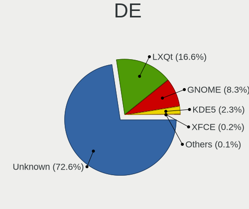
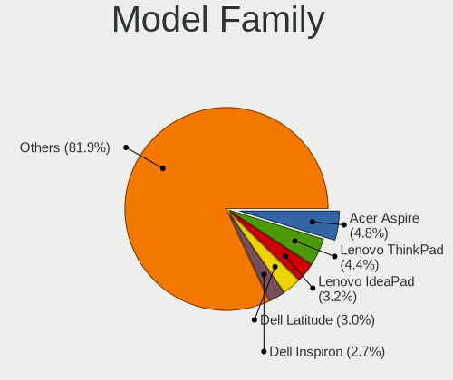
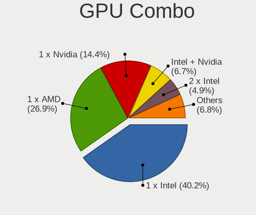
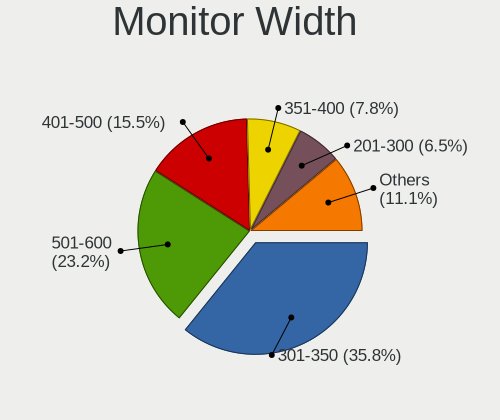
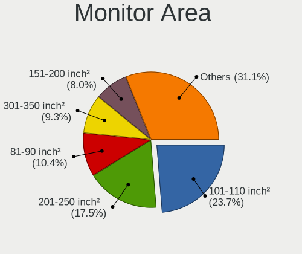
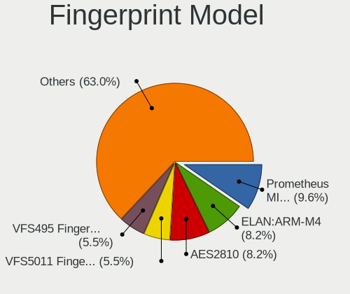

OpenMandriva 24.07 - Tested Hardware & Statistics
-------------------------------------------------

A project to collect tested hardware configurations for OpenMandriva 24.07.

Anyone can contribute to this report by the [hw-probe](https://github.com/linuxhw/hw-probe) tool:

    sudo -E hw-probe -all -upload

Please contribute! Especially if your hardware is rare.

This is a report for all computer types. See also reports for [desktops](/Dist/OpenMandriva_24.07/Desktop/README.md) and [notebooks](/Dist/OpenMandriva_24.07/Notebook/README.md).

Contents
--------

* [ Test Cases ](#test-cases)

* [ System ](#system)
  - [ Kernel                   ](#kernel)
  - [ Kernel Family            ](#kernel-family)
  - [ Kernel Major Ver.        ](#kernel-major-ver)
  - [ Arch                     ](#arch)
  - [ DE                       ](#de)
  - [ Display Server           ](#display-server)
  - [ Display Manager          ](#display-manager)
  - [ OS Lang                  ](#os-lang)
  - [ Boot Mode                ](#boot-mode)
  - [ Filesystem               ](#filesystem)
  - [ Part. scheme             ](#part-scheme)
  - [ Dual Boot with Linux/BSD ](#dual-boot-with-linuxbsd)
  - [ Dual Boot (Win)          ](#dual-boot-win)

* [ Board ](#board)
  - [ Vendor                   ](#vendor)
  - [ Model                    ](#model)
  - [ Model Family             ](#model-family)
  - [ MFG Year                 ](#mfg-year)
  - [ Form Factor              ](#form-factor)
  - [ Secure Boot              ](#secure-boot)
  - [ Coreboot                 ](#coreboot)
  - [ RAM Size                 ](#ram-size)
  - [ RAM Used                 ](#ram-used)
  - [ Total Drives             ](#total-drives)
  - [ Has CD-ROM               ](#has-cd-rom)
  - [ Has Ethernet             ](#has-ethernet)
  - [ Has WiFi                 ](#has-wifi)
  - [ Has Bluetooth            ](#has-bluetooth)

* [ Location ](#location)
  - [ Country                  ](#country)
  - [ City                     ](#city)

* [ Drives ](#drives)
  - [ Drive Vendor             ](#drive-vendor)
  - [ Drive Model              ](#drive-model)
  - [ HDD Vendor               ](#hdd-vendor)
  - [ SSD Vendor               ](#ssd-vendor)
  - [ Drive Kind               ](#drive-kind)
  - [ Drive Connector          ](#drive-connector)
  - [ Drive Size               ](#drive-size)
  - [ Space Total              ](#space-total)
  - [ Space Used               ](#space-used)
  - [ Malfunc. Drives          ](#malfunc-drives)
  - [ Malfunc. Drive Vendor    ](#malfunc-drive-vendor)
  - [ Malfunc. HDD Vendor      ](#malfunc-hdd-vendor)
  - [ Malfunc. Drive Kind      ](#malfunc-drive-kind)
  - [ Failed Drives            ](#failed-drives)
  - [ Failed Drive Vendor      ](#failed-drive-vendor)
  - [ Drive Status             ](#drive-status)

* [ Storage controller ](#storage-controller)
  - [ Storage Vendor           ](#storage-vendor)
  - [ Storage Model            ](#storage-model)
  - [ Storage Kind             ](#storage-kind)

* [ Processor ](#processor)
  - [ CPU Vendor               ](#cpu-vendor)
  - [ CPU Model                ](#cpu-model)
  - [ CPU Model Family         ](#cpu-model-family)
  - [ CPU Cores                ](#cpu-cores)
  - [ CPU Sockets              ](#cpu-sockets)
  - [ CPU Threads              ](#cpu-threads)
  - [ CPU Op-Modes             ](#cpu-op-modes)
  - [ CPU Microcode            ](#cpu-microcode)
  - [ CPU Microarch            ](#cpu-microarch)

* [ Graphics ](#graphics)
  - [ GPU Vendor               ](#gpu-vendor)
  - [ GPU Model                ](#gpu-model)
  - [ GPU Combo                ](#gpu-combo)
  - [ GPU Driver               ](#gpu-driver)
  - [ GPU Memory               ](#gpu-memory)

* [ Monitor ](#monitor)
  - [ Monitor Vendor           ](#monitor-vendor)
  - [ Monitor Model            ](#monitor-model)
  - [ Monitor Resolution       ](#monitor-resolution)
  - [ Monitor Diagonal         ](#monitor-diagonal)
  - [ Monitor Width            ](#monitor-width)
  - [ Aspect Ratio             ](#aspect-ratio)
  - [ Monitor Area             ](#monitor-area)
  - [ Pixel Density            ](#pixel-density)
  - [ Multiple Monitors        ](#multiple-monitors)

* [ Network ](#network)
  - [ Net Controller Vendor    ](#net-controller-vendor)
  - [ Net Controller Model     ](#net-controller-model)
  - [ Wireless Vendor          ](#wireless-vendor)
  - [ Wireless Model           ](#wireless-model)
  - [ Ethernet Vendor          ](#ethernet-vendor)
  - [ Ethernet Model           ](#ethernet-model)
  - [ Net Controller Kind      ](#net-controller-kind)
  - [ Used Controller          ](#used-controller)
  - [ NICs                     ](#nics)
  - [ IPv6                     ](#ipv6)

* [ Bluetooth ](#bluetooth)
  - [ Bluetooth Vendor         ](#bluetooth-vendor)
  - [ Bluetooth Model          ](#bluetooth-model)

* [ Sound ](#sound)
  - [ Sound Vendor             ](#sound-vendor)
  - [ Sound Model              ](#sound-model)

* [ Memory ](#memory)
  - [ Memory Vendor            ](#memory-vendor)
  - [ Memory Model             ](#memory-model)
  - [ Memory Kind              ](#memory-kind)
  - [ Memory Form Factor       ](#memory-form-factor)
  - [ Memory Size              ](#memory-size)
  - [ Memory Speed             ](#memory-speed)

* [ Printers & scanners ](#printers--scanners)
  - [ Printer Vendor           ](#printer-vendor)
  - [ Printer Model            ](#printer-model)
  - [ Scanner Vendor           ](#scanner-vendor)
  - [ Scanner Model            ](#scanner-model)

* [ Camera ](#camera)
  - [ Camera Vendor            ](#camera-vendor)
  - [ Camera Model             ](#camera-model)

* [ Security ](#security)
  - [ Fingerprint Vendor       ](#fingerprint-vendor)
  - [ Fingerprint Model        ](#fingerprint-model)
  - [ Chipcard Vendor          ](#chipcard-vendor)
  - [ Chipcard Model           ](#chipcard-model)

* [ Unsupported ](#unsupported)
  - [ Unsupported Devices      ](#unsupported-devices)
  - [ Unsupported Device Types ](#unsupported-device-types)

Test Cases
----------

Total: 1266

| Vendor        | Model                       | Form-Factor | Probe                                                      | Date         |
|---------------|-----------------------------|-------------|------------------------------------------------------------|--------------|
| HP            | ProBook 455 G8 Notebook ... | Notebook    | [963fcdd477](https://linux-hardware.org/?probe=963fcdd477) | Jan 06, 2025 |
| HP            | ProBook 640 G1              | Notebook    | [f901f7b9aa](https://linux-hardware.org/?probe=f901f7b9aa) | Jan 03, 2025 |
| Dell          | Latitude 5300               | Notebook    | [d3d6e520f5](https://linux-hardware.org/?probe=d3d6e520f5) | Jan 03, 2025 |
| ASUSTek       | CM6330_CM6630_CM6730_CM6... | Desktop     | [e6075adfc0](https://linux-hardware.org/?probe=e6075adfc0) | Jan 02, 2025 |
| Gigabyte      | GA-MA785GT-UD3H             | Desktop     | [bf30d86827](https://linux-hardware.org/?probe=bf30d86827) | Jan 01, 2025 |
| Infinix       | Y3 Plus                     | Notebook    | [a5d0c097a5](https://linux-hardware.org/?probe=a5d0c097a5) | Dec 30, 2024 |
| Lenovo        | IdeaPad 330-17AST 81D7      | Notebook    | [145b300a77](https://linux-hardware.org/?probe=145b300a77) | Dec 26, 2024 |
| Unknown       | Unknown                     | Desktop     | [9dc841041f](https://linux-hardware.org/?probe=9dc841041f) | Dec 25, 2024 |
| Dell          | Inspiron 1525               | Notebook    | [cd4f5695b9](https://linux-hardware.org/?probe=cd4f5695b9) | Dec 22, 2024 |
| Dell          | 0GDG8Y A00                  | Desktop     | [0219cb33b6](https://linux-hardware.org/?probe=0219cb33b6) | Dec 20, 2024 |
| MSI           | B75MA-P45                   | Desktop     | [da146c44f0](https://linux-hardware.org/?probe=da146c44f0) | Dec 19, 2024 |
| ASUSTek       | S451LA                      | Notebook    | [a766d0caae](https://linux-hardware.org/?probe=a766d0caae) | Dec 19, 2024 |
| Sony          | VPCEH39FJ                   | Notebook    | [f0627de40e](https://linux-hardware.org/?probe=f0627de40e) | Dec 16, 2024 |
| Gigabyte      | B450M DS3H V2               | Desktop     | [0d17c2a875](https://linux-hardware.org/?probe=0d17c2a875) | Dec 15, 2024 |
| Positivo      | POS-PIB150DT 11132270       | Desktop     | [c3a85ea71c](https://linux-hardware.org/?probe=c3a85ea71c) | Dec 15, 2024 |
| Dell          | Latitude E6500              | Notebook    | [1c4c62551f](https://linux-hardware.org/?probe=1c4c62551f) | Dec 14, 2024 |
| ASUSTek       | G60JX                       | Notebook    | [b1cc4820a3](https://linux-hardware.org/?probe=b1cc4820a3) | Dec 13, 2024 |
| MSI           | Z97 GAMING 5                | Desktop     | [e41e77f484](https://linux-hardware.org/?probe=e41e77f484) | Dec 12, 2024 |
| HP            | 620                         | Notebook    | [152ec63b24](https://linux-hardware.org/?probe=152ec63b24) | Dec 12, 2024 |
| Sony          | VPCEJ2E1E                   | Notebook    | [11625e4a3c](https://linux-hardware.org/?probe=11625e4a3c) | Dec 12, 2024 |
| Dell          | 09M47G A00                  | Desktop     | [c3b1e4864a](https://linux-hardware.org/?probe=c3b1e4864a) | Dec 12, 2024 |
| Unknown       | Unknown                     | Desktop     | [ed65661387](https://linux-hardware.org/?probe=ed65661387) | Dec 12, 2024 |
| Dell          | Latitude E6440              | Notebook    | [c3aebd55c6](https://linux-hardware.org/?probe=c3aebd55c6) | Dec 11, 2024 |
| Lenovo        | ThinkPad X1 Carbon 7th 2... | Notebook    | [4a452b8790](https://linux-hardware.org/?probe=4a452b8790) | Dec 11, 2024 |
| Lenovo        | MAHOBAY NO DPK              | Desktop     | [c5d5aaca89](https://linux-hardware.org/?probe=c5d5aaca89) | Dec 11, 2024 |
| ASUSTek       | X550JX                      | Notebook    | [825a9b88c3](https://linux-hardware.org/?probe=825a9b88c3) | Dec 11, 2024 |
| HP            | Laptop 17-cp0xxx            | Notebook    | [3730405110](https://linux-hardware.org/?probe=3730405110) | Dec 11, 2024 |
| HP            | ProBook 4530s               | Notebook    | [e8e3959577](https://linux-hardware.org/?probe=e8e3959577) | Dec 11, 2024 |
| Notebook      | 14M2                        | Notebook    | [30b428ea7b](https://linux-hardware.org/?probe=30b428ea7b) | Dec 11, 2024 |
| Lenovo        | IdeaPad Gaming 3 15ARH05... | Notebook    | [986d807d00](https://linux-hardware.org/?probe=986d807d00) | Dec 10, 2024 |
| Dell          | 0F6X5P A00                  | Desktop     | [680aead333](https://linux-hardware.org/?probe=680aead333) | Dec 10, 2024 |
| Dell          | Inspiron 15 3515            | Notebook    | [a073fbc9bc](https://linux-hardware.org/?probe=a073fbc9bc) | Dec 10, 2024 |
| Acer          | Aspire A315-24P             | Notebook    | [a632326872](https://linux-hardware.org/?probe=a632326872) | Dec 09, 2024 |
| HP            | EliteBook 820 G4            | Notebook    | [180e325043](https://linux-hardware.org/?probe=180e325043) | Dec 09, 2024 |
| ASUSTek       | Z450LA                      | Notebook    | [2281fa41ae](https://linux-hardware.org/?probe=2281fa41ae) | Dec 08, 2024 |
| Lenovo        | MAHOBAY Win8 MM DPK IPG     | Desktop     | [e885620f20](https://linux-hardware.org/?probe=e885620f20) | Dec 06, 2024 |
| MSI           | H61M-P23                    | Desktop     | [4e730504db](https://linux-hardware.org/?probe=4e730504db) | Dec 06, 2024 |
| Lenovo        | ThinkPad T410 2537K96       | Notebook    | [ae6d2e915b](https://linux-hardware.org/?probe=ae6d2e915b) | Dec 06, 2024 |
| MSI           | A88XI AC V2                 | Desktop     | [3bd43ba035](https://linux-hardware.org/?probe=3bd43ba035) | Dec 06, 2024 |
| ASUSTek       | PRIME B450-PLUS             | Desktop     | [cdb9d074c0](https://linux-hardware.org/?probe=cdb9d074c0) | Dec 06, 2024 |
| Dell          | 0CWR57 A01                  | Desktop     | [38bea64860](https://linux-hardware.org/?probe=38bea64860) | Dec 06, 2024 |
| HP            | Unknown                     | Notebook    | [c5d5bb8ffc](https://linux-hardware.org/?probe=c5d5bb8ffc) | Dec 06, 2024 |
| ASUSTek       | X550CC                      | Notebook    | [c395078c21](https://linux-hardware.org/?probe=c395078c21) | Dec 05, 2024 |
| MSI           | PRO Z690-A WIFI DDR4        | Desktop     | [dd80673855](https://linux-hardware.org/?probe=dd80673855) | Dec 05, 2024 |
| Lenovo        | ThinkPad T480s 20L8SF100... | Notebook    | [e33bd93e90](https://linux-hardware.org/?probe=e33bd93e90) | Dec 04, 2024 |
| Gigabyte      | G31M-S2L                    | Desktop     | [a8795f3981](https://linux-hardware.org/?probe=a8795f3981) | Dec 04, 2024 |
| HP            | EliteBook 850 G6            | Notebook    | [af2a2b7059](https://linux-hardware.org/?probe=af2a2b7059) | Dec 04, 2024 |
| ASUSTek       | K52JK                       | Notebook    | [1e978f8201](https://linux-hardware.org/?probe=1e978f8201) | Dec 03, 2024 |
| ASUSTek       | Z87-PRO                     | Desktop     | [029f1c1e1b](https://linux-hardware.org/?probe=029f1c1e1b) | Dec 03, 2024 |
| Toshiba       | Satellite S70-A             | Notebook    | [fdbc12af06](https://linux-hardware.org/?probe=fdbc12af06) | Dec 03, 2024 |
| HP            | Pavilion dv6                | Notebook    | [f72bd7ca67](https://linux-hardware.org/?probe=f72bd7ca67) | Dec 03, 2024 |
| Fujitsu       | FMVA42MW2                   | Notebook    | [a5a7a4a6f1](https://linux-hardware.org/?probe=a5a7a4a6f1) | Dec 03, 2024 |
| Acer          | Nitro ANV15-51              | Notebook    | [ac43db5c18](https://linux-hardware.org/?probe=ac43db5c18) | Dec 02, 2024 |
| Unknown       | Unknown                     | Desktop     | [3405878ab6](https://linux-hardware.org/?probe=3405878ab6) | Dec 01, 2024 |
| Lenovo        | ThinkPad X1 Carbon Gen 1... | Notebook    | [83800e0dd2](https://linux-hardware.org/?probe=83800e0dd2) | Dec 01, 2024 |
| Dell          | 088DT1 A01                  | Desktop     | [ba38d6b924](https://linux-hardware.org/?probe=ba38d6b924) | Dec 01, 2024 |
| Dell          | 0VNP2H A00                  | Desktop     | [d1a2135f92](https://linux-hardware.org/?probe=d1a2135f92) | Nov 30, 2024 |
| HP            | EliteBook 850 G5            | Notebook    | [39d29e9e31](https://linux-hardware.org/?probe=39d29e9e31) | Nov 30, 2024 |
| Lenovo        | IdeaPad 1 14ADA05 82GW      | Notebook    | [c7fb17104d](https://linux-hardware.org/?probe=c7fb17104d) | Nov 29, 2024 |
| Gigabyte      | H61M-DS2                    | Desktop     | [ce0e3b2719](https://linux-hardware.org/?probe=ce0e3b2719) | Nov 29, 2024 |
| BESSTAR Te... | UM700                       | Desktop     | [5c18419477](https://linux-hardware.org/?probe=5c18419477) | Nov 29, 2024 |
| Dell          | 042P49 A02                  | Desktop     | [6c4c6577ac](https://linux-hardware.org/?probe=6c4c6577ac) | Nov 29, 2024 |
| MSI           | MPG B550 GAMING PLUS        | Desktop     | [7e2cca4ada](https://linux-hardware.org/?probe=7e2cca4ada) | Nov 28, 2024 |
| Gigabyte      | H81M-D2W                    | Desktop     | [c0db894e36](https://linux-hardware.org/?probe=c0db894e36) | Nov 28, 2024 |
| Acer          | Aspire A315-34              | Notebook    | [16257c3b4b](https://linux-hardware.org/?probe=16257c3b4b) | Nov 27, 2024 |
| Lenovo        | 36C7 SDK0J40697 WIN 3305... | Desktop     | [d113defbe8](https://linux-hardware.org/?probe=d113defbe8) | Nov 27, 2024 |
| HP            | 18E7                        | Desktop     | [6dbb855fd6](https://linux-hardware.org/?probe=6dbb855fd6) | Nov 26, 2024 |
| Acer          | Aspire ES1-512              | Notebook    | [dfc7a551d9](https://linux-hardware.org/?probe=dfc7a551d9) | Nov 26, 2024 |
| Lenovo        | 3106 SDK0J40697 WIN 3305... | Desktop     | [2e121a8a35](https://linux-hardware.org/?probe=2e121a8a35) | Nov 26, 2024 |
| Gigabyte      | AB350M-DS3H V2-CF           | Desktop     | [07ef34a01f](https://linux-hardware.org/?probe=07ef34a01f) | Nov 25, 2024 |
| Lenovo        | ThinkPad P17 Gen 2i 20YU... | Notebook    | [d208c8829e](https://linux-hardware.org/?probe=d208c8829e) | Nov 24, 2024 |
| Microsoft     | Surface Pro                 | Tablet      | [e30f026fac](https://linux-hardware.org/?probe=e30f026fac) | Nov 24, 2024 |
| Intel         | B75                         | Desktop     | [b8e4743721](https://linux-hardware.org/?probe=b8e4743721) | Nov 24, 2024 |
| ASUSTek       | TP203NAH                    | Convertible | [0b2979ca7f](https://linux-hardware.org/?probe=0b2979ca7f) | Nov 24, 2024 |
| Lenovo        | 31900058 STD                | Desktop     | [dfea5f8644](https://linux-hardware.org/?probe=dfea5f8644) | Nov 24, 2024 |
| Google        | Lillipup rev3               | Notebook    | [26051de0da](https://linux-hardware.org/?probe=26051de0da) | Nov 24, 2024 |
| ASUSTek       | PRIME A520M-K               | Desktop     | [db71db68e5](https://linux-hardware.org/?probe=db71db68e5) | Nov 23, 2024 |
| Gigabyte      | H510M H V2                  | Desktop     | [a9d59f6f5f](https://linux-hardware.org/?probe=a9d59f6f5f) | Nov 23, 2024 |
| ASUSTek       | Pro B550M-C                 | Desktop     | [e532c8a2c5](https://linux-hardware.org/?probe=e532c8a2c5) | Nov 23, 2024 |
| ASUSTek       | B75M-A                      | Desktop     | [e7f193654c](https://linux-hardware.org/?probe=e7f193654c) | Nov 23, 2024 |
| Intel         | D945GCCR AAD78647-300       | Desktop     | [1b7eecc546](https://linux-hardware.org/?probe=1b7eecc546) | Nov 22, 2024 |
| ASUSTek       | PRIME A320M-K               | Desktop     | [bdad4ccabe](https://linux-hardware.org/?probe=bdad4ccabe) | Nov 22, 2024 |
| Dell          | Latitude D630               | Notebook    | [135fedf2cd](https://linux-hardware.org/?probe=135fedf2cd) | Nov 22, 2024 |
| HP            | 240 G8 Notebook PC          | Notebook    | [33374fdc29](https://linux-hardware.org/?probe=33374fdc29) | Nov 22, 2024 |
| BANGHO        | Suma 1025                   | Tablet      | [c3a82ec7e7](https://linux-hardware.org/?probe=c3a82ec7e7) | Nov 21, 2024 |
| Itautec       | Infoway                     | Notebook    | [466651a218](https://linux-hardware.org/?probe=466651a218) | Nov 21, 2024 |
| Unknown       | AX16PRO                     | Notebook    | [97a667e749](https://linux-hardware.org/?probe=97a667e749) | Nov 21, 2024 |
| HP            | Laptop 15-dw0xxx            | Notebook    | [00fc7a8d8b](https://linux-hardware.org/?probe=00fc7a8d8b) | Nov 21, 2024 |
| Dell          | 0FR6WH A01                  | Desktop     | [8ea0baf186](https://linux-hardware.org/?probe=8ea0baf186) | Nov 21, 2024 |
| Dell          | Latitude 5490               | Notebook    | [50f3de2c58](https://linux-hardware.org/?probe=50f3de2c58) | Nov 21, 2024 |
| HP            | Pavilion Gaming Laptop 1... | Notebook    | [b3d142c510](https://linux-hardware.org/?probe=b3d142c510) | Nov 21, 2024 |
| Lenovo        | Legion 5 15ARH05 82B5       | Notebook    | [69a4d1cdc5](https://linux-hardware.org/?probe=69a4d1cdc5) | Nov 21, 2024 |
| Acer          | Aspire A515-48M             | Notebook    | [7e76e833e3](https://linux-hardware.org/?probe=7e76e833e3) | Nov 20, 2024 |
| HP            | 8055                        | Desktop     | [25559cfc60](https://linux-hardware.org/?probe=25559cfc60) | Nov 20, 2024 |
| HP            | Laptop 15g-br1xx            | Notebook    | [f51b7c2e9d](https://linux-hardware.org/?probe=f51b7c2e9d) | Nov 20, 2024 |
| Gigabyte      | H97M-DS3P                   | Desktop     | [0d1e9eec2d](https://linux-hardware.org/?probe=0d1e9eec2d) | Nov 20, 2024 |
| HP            | EliteBook 840 G6            | Notebook    | [9dfd49751f](https://linux-hardware.org/?probe=9dfd49751f) | Nov 19, 2024 |
| Lenovo        | ThinkPad X61 7675CTO        | Notebook    | [772ab308c2](https://linux-hardware.org/?probe=772ab308c2) | Nov 19, 2024 |
| HP            | 8954                        | Desktop     | [58001c585c](https://linux-hardware.org/?probe=58001c585c) | Nov 19, 2024 |
| ASUSTek       | K30BF_M32BF_A_F_K31BF_6     | Desktop     | [eb0ca23199](https://linux-hardware.org/?probe=eb0ca23199) | Nov 19, 2024 |
| Teclast       | X80 Pro                     | Tablet      | [27c9721007](https://linux-hardware.org/?probe=27c9721007) | Nov 18, 2024 |
| Toshiba       | Satellite U845t             | Notebook    | [a73248a89d](https://linux-hardware.org/?probe=a73248a89d) | Nov 18, 2024 |
| Shenzhen M... | F7BFC                       | Desktop     | [4a79811e5e](https://linux-hardware.org/?probe=4a79811e5e) | Nov 17, 2024 |
| Dell          | Latitude 3420               | Notebook    | [9db39167d7](https://linux-hardware.org/?probe=9db39167d7) | Nov 17, 2024 |
| Lenovo        | ThinkPad Edge E530c 3366... | Notebook    | [06da77f5c0](https://linux-hardware.org/?probe=06da77f5c0) | Nov 16, 2024 |
| Dell          | 0MN1TX A00                  | Desktop     | [bc63ab4bf3](https://linux-hardware.org/?probe=bc63ab4bf3) | Nov 15, 2024 |
| ASUSTek       | F2A85-M2                    | Desktop     | [b6e3dbb57a](https://linux-hardware.org/?probe=b6e3dbb57a) | Nov 15, 2024 |
| HP            | EliteBook 2730p             | Notebook    | [5ce55a50da](https://linux-hardware.org/?probe=5ce55a50da) | Nov 15, 2024 |
| Foxconn       | 2ADA                        | Desktop     | [f3b302e1d7](https://linux-hardware.org/?probe=f3b302e1d7) | Nov 15, 2024 |
| Dell          | 0200DY A02                  | Desktop     | [7a85e1e310](https://linux-hardware.org/?probe=7a85e1e310) | Nov 15, 2024 |
| Microsoft     | Surface Go 2                | Tablet      | [b5609df256](https://linux-hardware.org/?probe=b5609df256) | Nov 15, 2024 |
| MSI           | B365M PRO-VH                | Desktop     | [b2796a7151](https://linux-hardware.org/?probe=b2796a7151) | Nov 14, 2024 |
| Dell          | Inspiron 3505               | Notebook    | [42bed8b241](https://linux-hardware.org/?probe=42bed8b241) | Nov 14, 2024 |
| ASUSTek       | 1018P                       | Notebook    | [eef1555906](https://linux-hardware.org/?probe=eef1555906) | Nov 13, 2024 |
| Dell          | Precision M6700             | Notebook    | [81ed3cc9db](https://linux-hardware.org/?probe=81ed3cc9db) | Nov 13, 2024 |
| Acer          | Aspire 5742G                | Notebook    | [46d5cbc974](https://linux-hardware.org/?probe=46d5cbc974) | Nov 13, 2024 |
| MSI           | B550M PRO-VDH WIFI          | Desktop     | [280fdbebe9](https://linux-hardware.org/?probe=280fdbebe9) | Nov 13, 2024 |
| Acer          | Aspire 5250                 | Notebook    | [6afaf552dd](https://linux-hardware.org/?probe=6afaf552dd) | Nov 13, 2024 |
| HP            | 18E7                        | Desktop     | [e6421394f6](https://linux-hardware.org/?probe=e6421394f6) | Nov 13, 2024 |
| ASUSTek       | VivoBook_ASUSLaptop M370... | Notebook    | [d655b85ff6](https://linux-hardware.org/?probe=d655b85ff6) | Nov 12, 2024 |
| Intel         | NUC5i7RYB H73774-102        | Mini pc     | [f3b250b116](https://linux-hardware.org/?probe=f3b250b116) | Nov 12, 2024 |
| Apple         | Mac-F226BEC8 PVT            | All in one  | [60400093d0](https://linux-hardware.org/?probe=60400093d0) | Nov 12, 2024 |
| Samsung       | R510/P510                   | Notebook    | [45941aa5d5](https://linux-hardware.org/?probe=45941aa5d5) | Nov 11, 2024 |
| Gigabyte      | B75M-HD3                    | Desktop     | [c594c0e00c](https://linux-hardware.org/?probe=c594c0e00c) | Nov 11, 2024 |
| Dell          | Vostro 1310                 | Notebook    | [add2298606](https://linux-hardware.org/?probe=add2298606) | Nov 11, 2024 |
| Fujitsu       | FMVC07003                   | Notebook    | [9fe5e42140](https://linux-hardware.org/?probe=9fe5e42140) | Nov 10, 2024 |
| Lenovo        | ThinkPad L440 20ASS11T00    | Notebook    | [9e63659c87](https://linux-hardware.org/?probe=9e63659c87) | Nov 09, 2024 |
| Apple         | MacBookPro6,1               | Notebook    | [24c0858a39](https://linux-hardware.org/?probe=24c0858a39) | Nov 09, 2024 |
| HP            | 1497                        | Desktop     | [b4fe73ae99](https://linux-hardware.org/?probe=b4fe73ae99) | Nov 09, 2024 |
| ASUSTek       | PRIME X570-P                | Desktop     | [bd81a29143](https://linux-hardware.org/?probe=bd81a29143) | Nov 09, 2024 |
| Microsoft     | Surface Pro 2               | Tablet      | [c8aeb37a97](https://linux-hardware.org/?probe=c8aeb37a97) | Nov 09, 2024 |
| Dell          | Inspiron 3520               | Notebook    | [e129134b01](https://linux-hardware.org/?probe=e129134b01) | Nov 08, 2024 |
| ASUSTek       | X550CA                      | Notebook    | [9de1e927a9](https://linux-hardware.org/?probe=9de1e927a9) | Nov 07, 2024 |
| ASUSTek       | E202SA                      | Notebook    | [18a63b065d](https://linux-hardware.org/?probe=18a63b065d) | Nov 07, 2024 |
| Acer          | Swift SF314-43              | Notebook    | [c55af0c24c](https://linux-hardware.org/?probe=c55af0c24c) | Nov 07, 2024 |
| ASUSTek       | PRIME B550-PLUS             | Desktop     | [083567b242](https://linux-hardware.org/?probe=083567b242) | Nov 07, 2024 |
| Lenovo        | ThinkPad L420 7829GH2       | Notebook    | [33efc8a835](https://linux-hardware.org/?probe=33efc8a835) | Nov 07, 2024 |
| MSI           | B450M PRO-VDH MAX           | Desktop     | [ce1c922dc4](https://linux-hardware.org/?probe=ce1c922dc4) | Nov 07, 2024 |
| Apple         | Mac-BE088AF8C5EB4FA2 iMa... | All in one  | [f573142825](https://linux-hardware.org/?probe=f573142825) | Nov 07, 2024 |
| Lenovo        | IdeaPad 330-15IGM 81D1      | Notebook    | [b0ca914a02](https://linux-hardware.org/?probe=b0ca914a02) | Nov 06, 2024 |
| Positivo      | C14CU51                     | Notebook    | [910164dc5c](https://linux-hardware.org/?probe=910164dc5c) | Nov 06, 2024 |
| HP            | 1495                        | Desktop     | [b362515be5](https://linux-hardware.org/?probe=b362515be5) | Nov 06, 2024 |
| HP            | Pavilion g4                 | Notebook    | [2f7cb31cab](https://linux-hardware.org/?probe=2f7cb31cab) | Nov 06, 2024 |
| ASUSTek       | TUF Gaming FX505DT_FX505... | Notebook    | [689c7827b7](https://linux-hardware.org/?probe=689c7827b7) | Nov 06, 2024 |
| ASRock        | Z790 Riptide WiFi           | Desktop     | [f7330298cd](https://linux-hardware.org/?probe=f7330298cd) | Nov 05, 2024 |
| Gigabyte      | H61M-S1                     | Desktop     | [4583180173](https://linux-hardware.org/?probe=4583180173) | Nov 04, 2024 |
| Lenovo        | ThinkPad T420 4180CC4       | Notebook    | [f3899bf09d](https://linux-hardware.org/?probe=f3899bf09d) | Nov 04, 2024 |
| Lenovo        | ThinkPad T14 Gen 1 20UD0... | Notebook    | [4cab1133bf](https://linux-hardware.org/?probe=4cab1133bf) | Nov 04, 2024 |
| ASUSTek       | ROG STRIX X470-F GAMING     | Desktop     | [02f10cb27c](https://linux-hardware.org/?probe=02f10cb27c) | Nov 04, 2024 |
| MSI           | MPG B550 GAMING PLUS        | Desktop     | [40b8d362ea](https://linux-hardware.org/?probe=40b8d362ea) | Nov 03, 2024 |
| Dell          | 0JP3NX A01                  | Desktop     | [dc2c04bda9](https://linux-hardware.org/?probe=dc2c04bda9) | Nov 03, 2024 |
| Lenovo        | IdeaPadFlex 5 14ALC05 82... | Convertible | [a800edd9fc](https://linux-hardware.org/?probe=a800edd9fc) | Nov 03, 2024 |
| Lenovo        | ThinkPad X230 23256V1       | Notebook    | [08af8a55a1](https://linux-hardware.org/?probe=08af8a55a1) | Nov 03, 2024 |
| Fujitsu       | LIFEBOOK E743               | Notebook    | [be7c6d7a43](https://linux-hardware.org/?probe=be7c6d7a43) | Nov 03, 2024 |
| Lenovo        | IdeaPadFlex 5 14IAU7 82R... | Convertible | [5f720cc296](https://linux-hardware.org/?probe=5f720cc296) | Nov 02, 2024 |
| Gigabyte      | P75-D3                      | Desktop     | [7ba3b8a5aa](https://linux-hardware.org/?probe=7ba3b8a5aa) | Nov 02, 2024 |
| Toshiba       | TECRA A10                   | Notebook    | [f7cfa0f796](https://linux-hardware.org/?probe=f7cfa0f796) | Nov 02, 2024 |
| Acer          | EG43M                       | Desktop     | [481ae677a2](https://linux-hardware.org/?probe=481ae677a2) | Nov 02, 2024 |
| Foxconn       | 2ABF                        | Desktop     | [bed04a9e0f](https://linux-hardware.org/?probe=bed04a9e0f) | Nov 01, 2024 |
| ASUSTek       | ROG STRIX B550-I GAMING     | Desktop     | [480e9ee913](https://linux-hardware.org/?probe=480e9ee913) | Nov 01, 2024 |
| HP            | Laptop 17-ca1xxx            | Notebook    | [860ef2c633](https://linux-hardware.org/?probe=860ef2c633) | Nov 01, 2024 |
| Apple         | MacBookPro8,1               | Notebook    | [5c2dacf3d8](https://linux-hardware.org/?probe=5c2dacf3d8) | Nov 01, 2024 |
| Acer          | Aspire 7736                 | Notebook    | [9426ed7aff](https://linux-hardware.org/?probe=9426ed7aff) | Nov 01, 2024 |
| ASUSTek       | H81M-A                      | Desktop     | [04eef716a6](https://linux-hardware.org/?probe=04eef716a6) | Nov 01, 2024 |
| Lenovo        | IdeaPad Y400 20192          | Notebook    | [af8c167505](https://linux-hardware.org/?probe=af8c167505) | Oct 31, 2024 |
| Sony          | SVF1521G6EW                 | Notebook    | [5b4ce22a73](https://linux-hardware.org/?probe=5b4ce22a73) | Oct 31, 2024 |
| Lenovo        | IdeaPadFlex 5 14IAU7 82R... | Convertible | [53e1cfff12](https://linux-hardware.org/?probe=53e1cfff12) | Oct 31, 2024 |
| Gigabyte      | P31-ES3G                    | Desktop     | [cecda20fcc](https://linux-hardware.org/?probe=cecda20fcc) | Oct 31, 2024 |
| Intel         | B75                         | Desktop     | [c48a602eae](https://linux-hardware.org/?probe=c48a602eae) | Oct 31, 2024 |
| ASRock        | H81M-HDS                    | Desktop     | [aef95abb88](https://linux-hardware.org/?probe=aef95abb88) | Oct 31, 2024 |
| ASUSTek       | P5Q                         | Desktop     | [da83835b83](https://linux-hardware.org/?probe=da83835b83) | Oct 30, 2024 |
| MSI           | MPG X570S CARBON MAX WIF... | Desktop     | [67af4a9e08](https://linux-hardware.org/?probe=67af4a9e08) | Oct 29, 2024 |
| HP            | EliteBook 660 16 inch G1... | Notebook    | [7de8e9c733](https://linux-hardware.org/?probe=7de8e9c733) | Oct 29, 2024 |
| Acer          | Aspire A315-59              | Notebook    | [ef0b873549](https://linux-hardware.org/?probe=ef0b873549) | Oct 29, 2024 |
| ASUSTek       | VivoBook_ASUSLaptop M360... | Notebook    | [a8f6e54a85](https://linux-hardware.org/?probe=a8f6e54a85) | Oct 29, 2024 |
| ASUSTek       | PRIME A320M-K               | Desktop     | [046f64be70](https://linux-hardware.org/?probe=046f64be70) | Oct 28, 2024 |
| HP            | 0B4Ch D                     | Desktop     | [4488b0b5e6](https://linux-hardware.org/?probe=4488b0b5e6) | Oct 28, 2024 |
| OEM           | X79G                        | Desktop     | [3ae4c25ee7](https://linux-hardware.org/?probe=3ae4c25ee7) | Oct 28, 2024 |
| ASUSTek       | X553MA                      | Notebook    | [ea7d1235b1](https://linux-hardware.org/?probe=ea7d1235b1) | Oct 28, 2024 |
| Samsung       | RV420/RV520/RV720/E3530/... | Notebook    | [862c7cc007](https://linux-hardware.org/?probe=862c7cc007) | Oct 27, 2024 |
| HP            | Unknown                     | Notebook    | [f8c7a5f55f](https://linux-hardware.org/?probe=f8c7a5f55f) | Oct 27, 2024 |
| HP            | Laptop 15-ef2xxx            | Notebook    | [b4a0691988](https://linux-hardware.org/?probe=b4a0691988) | Oct 27, 2024 |
| ASUSTek       | A88X-PRO                    | Desktop     | [5e1dd8eae1](https://linux-hardware.org/?probe=5e1dd8eae1) | Oct 27, 2024 |
| Gigabyte      | B75M-D3H                    | Desktop     | [98e2047b3e](https://linux-hardware.org/?probe=98e2047b3e) | Oct 27, 2024 |
| Apple         | Mac-35C5E08120C7EEAF Mac... | Mini pc     | [30df458d10](https://linux-hardware.org/?probe=30df458d10) | Oct 26, 2024 |
| MSI           | CSM-H81M-P32                | Desktop     | [375a0a6487](https://linux-hardware.org/?probe=375a0a6487) | Oct 26, 2024 |
| Fujitsu       | D3227-A1 S26361-D3227-A1    | Desktop     | [4edc7c0869](https://linux-hardware.org/?probe=4edc7c0869) | Oct 26, 2024 |
| Lenovo        | ThinkPad E16 Gen 2 21M5C... | Notebook    | [5a31a97e2b](https://linux-hardware.org/?probe=5a31a97e2b) | Oct 26, 2024 |
| Acer          | Aspire E5-571G              | Notebook    | [0801976824](https://linux-hardware.org/?probe=0801976824) | Oct 26, 2024 |
| Acer          | TravelMate Spin B118-G2-... | Convertible | [961e873e35](https://linux-hardware.org/?probe=961e873e35) | Oct 26, 2024 |
| Biostar       | A10N-8800E                  | Desktop     | [5710a05f5f](https://linux-hardware.org/?probe=5710a05f5f) | Oct 26, 2024 |
| Gigabyte      | H55M-S2H                    | Desktop     | [08aa1a4721](https://linux-hardware.org/?probe=08aa1a4721) | Oct 25, 2024 |
| HP            | 15                          | Notebook    | [6a2e246381](https://linux-hardware.org/?probe=6a2e246381) | Oct 25, 2024 |
| ASUSTek       | M5A78L-M/USB3               | Desktop     | [61d6f4f9da](https://linux-hardware.org/?probe=61d6f4f9da) | Oct 25, 2024 |
| Intel         | DP45SG AAE27733-402         | Desktop     | [80022aa1fa](https://linux-hardware.org/?probe=80022aa1fa) | Oct 24, 2024 |
| Gigabyte      | F2A75M-D3H                  | Desktop     | [8cf1a27cdd](https://linux-hardware.org/?probe=8cf1a27cdd) | Oct 24, 2024 |
| Lenovo        | ThinkPad P51 20HJS52P00     | Notebook    | [ab7bfcceb7](https://linux-hardware.org/?probe=ab7bfcceb7) | Oct 24, 2024 |
| Acer          | Aspire 7736                 | Notebook    | [213995eb9a](https://linux-hardware.org/?probe=213995eb9a) | Oct 24, 2024 |
| Lenovo        | G50-80 80E5                 | Notebook    | [38f6fb752d](https://linux-hardware.org/?probe=38f6fb752d) | Oct 23, 2024 |
| ASUSTek       | Crosshair IV Formula        | Desktop     | [e459f477ce](https://linux-hardware.org/?probe=e459f477ce) | Oct 23, 2024 |
| MSI           | MAG B650M MORTAR WIFI       | Desktop     | [15b278bc6b](https://linux-hardware.org/?probe=15b278bc6b) | Oct 23, 2024 |
| HP            | Pavilion 17                 | Notebook    | [fe2ac723ed](https://linux-hardware.org/?probe=fe2ac723ed) | Oct 23, 2024 |
| Intel         | DG31PR AAE58249-306         | Desktop     | [29d5c95cb2](https://linux-hardware.org/?probe=29d5c95cb2) | Oct 22, 2024 |
| Toshiba       | Satellite L55-B             | Notebook    | [e3b609b13a](https://linux-hardware.org/?probe=e3b609b13a) | Oct 22, 2024 |
| HP            | Victus by Laptop 16-e0xx... | Notebook    | [053292a4a6](https://linux-hardware.org/?probe=053292a4a6) | Oct 21, 2024 |
| Intel         | JSL MRD                     | Desktop     | [77928ce492](https://linux-hardware.org/?probe=77928ce492) | Oct 21, 2024 |
| MSI           | G41TM-P31                   | Desktop     | [4a0f7d5481](https://linux-hardware.org/?probe=4a0f7d5481) | Oct 21, 2024 |
| Lenovo        | Unknown                     | Notebook    | [0c10558175](https://linux-hardware.org/?probe=0c10558175) | Oct 21, 2024 |
| ASUSTek       | TUF Gaming B550M-PLUS       | Desktop     | [1c9e79aeac](https://linux-hardware.org/?probe=1c9e79aeac) | Oct 20, 2024 |
| Fujitsu       | D3222-B1 S26361-D3222-B1    | Desktop     | [29167809af](https://linux-hardware.org/?probe=29167809af) | Oct 20, 2024 |
| Dell          | 02YRK5 A02                  | Desktop     | [b1ba54be2e](https://linux-hardware.org/?probe=b1ba54be2e) | Oct 20, 2024 |
| HP            | Presario CQ61               | Notebook    | [87aea4a07b](https://linux-hardware.org/?probe=87aea4a07b) | Oct 20, 2024 |
| Lenovo        | B50-10 80QR                 | Notebook    | [6b27d730b2](https://linux-hardware.org/?probe=6b27d730b2) | Oct 20, 2024 |
| ASUSTek       | H61M-K                      | Desktop     | [50de29919f](https://linux-hardware.org/?probe=50de29919f) | Oct 19, 2024 |
| HP            | 212A                        | Desktop     | [5af12ae426](https://linux-hardware.org/?probe=5af12ae426) | Oct 19, 2024 |
| ASUSTek       | ROG STRIX B550-F GAMING ... | Desktop     | [74bfaad70a](https://linux-hardware.org/?probe=74bfaad70a) | Oct 18, 2024 |
| Dell          | Venue 8 Pro 5855            | Notebook    | [305bc7f736](https://linux-hardware.org/?probe=305bc7f736) | Oct 17, 2024 |
| Acer          | Aspire A515-44              | Notebook    | [6a2f0efb2e](https://linux-hardware.org/?probe=6a2f0efb2e) | Oct 17, 2024 |
| Intel         | JSL MRD                     | Desktop     | [3e4834107b](https://linux-hardware.org/?probe=3e4834107b) | Oct 17, 2024 |
| Intel         | H61                         | Desktop     | [a4dc63e432](https://linux-hardware.org/?probe=a4dc63e432) | Oct 16, 2024 |
| MSI           | Z490-A PRO                  | Desktop     | [4a31262892](https://linux-hardware.org/?probe=4a31262892) | Oct 15, 2024 |
| ASUSTek       | VivoBook_ASUSLaptop X160... | Notebook    | [5a3c293945](https://linux-hardware.org/?probe=5a3c293945) | Oct 15, 2024 |
| Gigabyte      | X670 AORUS ELITE AX         | Desktop     | [bf8a04a93c](https://linux-hardware.org/?probe=bf8a04a93c) | Oct 15, 2024 |
| Pegatron      | Benicia                     | Desktop     | [cd156adfd2](https://linux-hardware.org/?probe=cd156adfd2) | Oct 14, 2024 |
| ASUSTek       | UL80VT                      | Notebook    | [c6cc761721](https://linux-hardware.org/?probe=c6cc761721) | Oct 13, 2024 |
| ASUSTek       | PRIME B450-PLUS             | Desktop     | [af7ced3aff](https://linux-hardware.org/?probe=af7ced3aff) | Oct 12, 2024 |
| ZOTAC         | ZBOX-CI327NANO-GS-01        | Mini pc     | [ba0b41d87c](https://linux-hardware.org/?probe=ba0b41d87c) | Oct 12, 2024 |
| ASUSTek       | M5A78L-M LX3                | Desktop     | [1e12bb1b07](https://linux-hardware.org/?probe=1e12bb1b07) | Oct 12, 2024 |
| AMD           | A88                         | Desktop     | [3442c71c38](https://linux-hardware.org/?probe=3442c71c38) | Oct 12, 2024 |
| ASUSTek       | B85M-E/BR                   | Desktop     | [bd4f53dc99](https://linux-hardware.org/?probe=bd4f53dc99) | Oct 12, 2024 |
| Dell          | Latitude 7280               | Notebook    | [82d8484f17](https://linux-hardware.org/?probe=82d8484f17) | Oct 12, 2024 |
| Apple         | Mac-F221BEC8                | Desktop     | [8126af742f](https://linux-hardware.org/?probe=8126af742f) | Oct 11, 2024 |
| Biostar       | G41D3C                      | Desktop     | [3301adecfb](https://linux-hardware.org/?probe=3301adecfb) | Oct 11, 2024 |
| Lenovo        | ThinkPad 20BHS18200         | Notebook    | [c576999dfa](https://linux-hardware.org/?probe=c576999dfa) | Oct 11, 2024 |
| ASUSTek       | K95VJ                       | Notebook    | [a3388fefc3](https://linux-hardware.org/?probe=a3388fefc3) | Oct 11, 2024 |
| Acer          | Aspire E5-772G              | Notebook    | [972163fef5](https://linux-hardware.org/?probe=972163fef5) | Oct 11, 2024 |
| ASUSTek       | TUF Gaming FX505DD_FX505... | Notebook    | [27e0df94ae](https://linux-hardware.org/?probe=27e0df94ae) | Oct 10, 2024 |
| MACHINIST     | X99 PR9-H                   | Desktop     | [a0ead70204](https://linux-hardware.org/?probe=a0ead70204) | Oct 09, 2024 |
| ASUSTek       | Q170M-C                     | Desktop     | [a8eab7ba48](https://linux-hardware.org/?probe=a8eab7ba48) | Oct 08, 2024 |
| Packard Be... | EasyNote LS11HR             | Notebook    | [298822d4c4](https://linux-hardware.org/?probe=298822d4c4) | Oct 08, 2024 |
| ASUSTek       | VivoBook_ASUSLaptop X509... | Notebook    | [243cf71860](https://linux-hardware.org/?probe=243cf71860) | Oct 08, 2024 |
| Fujitsu       | LIFEBOOK N532               | Notebook    | [4b20b9cc8e](https://linux-hardware.org/?probe=4b20b9cc8e) | Oct 08, 2024 |
| HP            | 15 Notebook PC              | Notebook    | [09ec6297c1](https://linux-hardware.org/?probe=09ec6297c1) | Oct 08, 2024 |
| ASUSTek       | X551MA                      | Notebook    | [c405b895c9](https://linux-hardware.org/?probe=c405b895c9) | Oct 08, 2024 |
| Firebat_Co... | T8_Plus                     | Desktop     | [7b0c62125c](https://linux-hardware.org/?probe=7b0c62125c) | Oct 07, 2024 |
| ASUSTek       | P5K                         | Desktop     | [3c9825ba0b](https://linux-hardware.org/?probe=3c9825ba0b) | Oct 07, 2024 |
| Lenovo        | IdeaPad L340-15API 81LW     | Notebook    | [22a99a1444](https://linux-hardware.org/?probe=22a99a1444) | Oct 06, 2024 |
| ASUSTek       | A55BM-K                     | Desktop     | [a10e7e5307](https://linux-hardware.org/?probe=a10e7e5307) | Oct 06, 2024 |
| Acer          | Aspire 4738                 | Notebook    | [d7bd115a64](https://linux-hardware.org/?probe=d7bd115a64) | Oct 05, 2024 |
| Dell          | Latitude 5420               | Notebook    | [e65d154af3](https://linux-hardware.org/?probe=e65d154af3) | Oct 05, 2024 |
| MACHINIST     | X99 PR9-H                   | Desktop     | [79d889bb1d](https://linux-hardware.org/?probe=79d889bb1d) | Oct 04, 2024 |
| Biostar       | A960D+                      | Desktop     | [10e003ed0a](https://linux-hardware.org/?probe=10e003ed0a) | Oct 04, 2024 |
| ASUSTek       | VivoBook_ASUSLaptop E210... | Notebook    | [57602cd2d9](https://linux-hardware.org/?probe=57602cd2d9) | Oct 04, 2024 |
| Unknown       | Unknown                     | Notebook    | [5b967ea1be](https://linux-hardware.org/?probe=5b967ea1be) | Oct 04, 2024 |
| ASUSTek       | K53E                        | Notebook    | [62915aba3a](https://linux-hardware.org/?probe=62915aba3a) | Oct 03, 2024 |
| MSI           | Z790 GAMING PLUS WIFI       | Desktop     | [7258a3f215](https://linux-hardware.org/?probe=7258a3f215) | Oct 03, 2024 |
| ASRock        | X570 Phantom Gaming 4 Wi... | Desktop     | [b057221ffa](https://linux-hardware.org/?probe=b057221ffa) | Oct 03, 2024 |
| MSI           | B550M PRO-VDH WIFI          | Desktop     | [9d076b194d](https://linux-hardware.org/?probe=9d076b194d) | Oct 02, 2024 |
| HP            | 8767 A                      | Desktop     | [8243a00195](https://linux-hardware.org/?probe=8243a00195) | Oct 02, 2024 |
| ASUSTek       | TUF Gaming X570-PLUS        | Desktop     | [dfea07d14a](https://linux-hardware.org/?probe=dfea07d14a) | Oct 02, 2024 |
| ASUSTek       | F2A55-M LK PLUS             | Desktop     | [2fdfd4a0ca](https://linux-hardware.org/?probe=2fdfd4a0ca) | Oct 01, 2024 |
| ASUSTek       | TUF Gaming X570-PLUS        | Desktop     | [d9813a1e38](https://linux-hardware.org/?probe=d9813a1e38) | Oct 01, 2024 |
| Dell          | Inspiron N5040              | Notebook    | [d09e43e3e6](https://linux-hardware.org/?probe=d09e43e3e6) | Oct 01, 2024 |
| Acer          | Aspire ES1-531              | Notebook    | [16c5519c67](https://linux-hardware.org/?probe=16c5519c67) | Sep 30, 2024 |
| Positivo      | R516512AI-15                | Notebook    | [ea6017ef32](https://linux-hardware.org/?probe=ea6017ef32) | Sep 30, 2024 |
| ASUSTek       | VivoBook_ASUSLaptop X515... | Notebook    | [36174c650c](https://linux-hardware.org/?probe=36174c650c) | Sep 30, 2024 |
| HP            | Laptop 17-cp2xxx            | Notebook    | [8d69c2070e](https://linux-hardware.org/?probe=8d69c2070e) | Sep 29, 2024 |
| Medion        | Akoya P7632                 | Notebook    | [4a73c4ece4](https://linux-hardware.org/?probe=4a73c4ece4) | Sep 29, 2024 |
| ASUSTek       | TUF Gaming B550M-PLUS       | Desktop     | [205dba9239](https://linux-hardware.org/?probe=205dba9239) | Sep 29, 2024 |
| Gigabyte      | B450 AORUS ELITE V2         | Desktop     | [d68ba4aa7a](https://linux-hardware.org/?probe=d68ba4aa7a) | Sep 29, 2024 |
| ASUSTek       | VivoBook_ASUSLaptop M370... | Notebook    | [b94dbc9df1](https://linux-hardware.org/?probe=b94dbc9df1) | Sep 28, 2024 |
| Unknown       | AX15                        | Notebook    | [cdbf528af6](https://linux-hardware.org/?probe=cdbf528af6) | Sep 28, 2024 |
| Medion        | P17619                      | Notebook    | [42d84ccf7c](https://linux-hardware.org/?probe=42d84ccf7c) | Sep 27, 2024 |
| Gigabyte      | X58A-UD5                    | Desktop     | [a6c2b82581](https://linux-hardware.org/?probe=a6c2b82581) | Sep 27, 2024 |
| ASUSTek       | M5A88-M                     | Desktop     | [5725f8c2e1](https://linux-hardware.org/?probe=5725f8c2e1) | Sep 26, 2024 |
| HP            | EliteBook 725 G3            | Notebook    | [59140deeed](https://linux-hardware.org/?probe=59140deeed) | Sep 26, 2024 |
| Lenovo        | ThinkPad X13 Gen 4 21EXS... | Notebook    | [9cec35ca8e](https://linux-hardware.org/?probe=9cec35ca8e) | Sep 26, 2024 |
| Lenovo        | IdeaPad Slim 3 15ABR8 82... | Notebook    | [f7c17077ac](https://linux-hardware.org/?probe=f7c17077ac) | Sep 26, 2024 |
| MSI           | MAG B550 TOMAHAWK           | Desktop     | [3ebe7fc112](https://linux-hardware.org/?probe=3ebe7fc112) | Sep 26, 2024 |
| Colorful T... | C.A68HM PRO V14             | Desktop     | [524b75af5e](https://linux-hardware.org/?probe=524b75af5e) | Sep 25, 2024 |
| Acer          | Aspire 2920                 | Notebook    | [bf3d0d6e64](https://linux-hardware.org/?probe=bf3d0d6e64) | Sep 24, 2024 |
| Dell          | System XPS L321X            | Notebook    | [461ff95992](https://linux-hardware.org/?probe=461ff95992) | Sep 24, 2024 |
| HP            | ProBook 4445s               | Notebook    | [64c920edf6](https://linux-hardware.org/?probe=64c920edf6) | Sep 24, 2024 |
| Acer          | FIH57                       | Desktop     | [d281d08f5b](https://linux-hardware.org/?probe=d281d08f5b) | Sep 24, 2024 |
| ASUSTek       | VivoBook_ASUSLaptop E410... | Notebook    | [ecb482f9a9](https://linux-hardware.org/?probe=ecb482f9a9) | Sep 24, 2024 |
| ASUSTek       | TUF Gaming X570-PLUS        | Desktop     | [1738960295](https://linux-hardware.org/?probe=1738960295) | Sep 24, 2024 |
| AZW           | SER V1.0                    | Mini pc     | [9d54da4f94](https://linux-hardware.org/?probe=9d54da4f94) | Sep 23, 2024 |
| HP            | Laptop 15-bw0xx             | Notebook    | [c2b79a6905](https://linux-hardware.org/?probe=c2b79a6905) | Sep 23, 2024 |
| ASUSTek       | T101HA                      | Tablet      | [09ebca352a](https://linux-hardware.org/?probe=09ebca352a) | Sep 23, 2024 |
| ASUSTek       | PRIME X370-PRO              | Desktop     | [262e1993ad](https://linux-hardware.org/?probe=262e1993ad) | Sep 23, 2024 |
| HP            | Compaq 2510p                | Notebook    | [d0b68bbc55](https://linux-hardware.org/?probe=d0b68bbc55) | Sep 23, 2024 |
| ASRock        | A320M-HDV R4.0              | Desktop     | [e9f25fa551](https://linux-hardware.org/?probe=e9f25fa551) | Sep 23, 2024 |
| Foxconn       | 2ABF                        | Desktop     | [ae87bd81f4](https://linux-hardware.org/?probe=ae87bd81f4) | Sep 23, 2024 |
| Gigabyte      | H55M-USB3                   | Desktop     | [ddffc54d59](https://linux-hardware.org/?probe=ddffc54d59) | Sep 22, 2024 |
| ASUSTek       | M50Vn                       | Notebook    | [2e22fd3bd2](https://linux-hardware.org/?probe=2e22fd3bd2) | Sep 22, 2024 |
| ASUSTek       | X555LJ                      | Notebook    | [9dc481d73a](https://linux-hardware.org/?probe=9dc481d73a) | Sep 22, 2024 |
| Dell          | Latitude E5520m             | Notebook    | [a2933b9960](https://linux-hardware.org/?probe=a2933b9960) | Sep 22, 2024 |
| JGINYUE       | H81M VH PLUS V1.1           | Desktop     | [15128e9c08](https://linux-hardware.org/?probe=15128e9c08) | Sep 22, 2024 |
| Toshiba       | Satellite C645              | Notebook    | [1a789a141f](https://linux-hardware.org/?probe=1a789a141f) | Sep 21, 2024 |
| Acer          | Aspire A315-24P             | Notebook    | [8cd51dbb86](https://linux-hardware.org/?probe=8cd51dbb86) | Sep 21, 2024 |
| Apple         | Mac-F226BEC8 PVT            | All in one  | [a8d9d98b2e](https://linux-hardware.org/?probe=a8d9d98b2e) | Sep 20, 2024 |
| Lenovo        | NO DPK                      | Desktop     | [55c567c63a](https://linux-hardware.org/?probe=55c567c63a) | Sep 20, 2024 |
| ATOPNUC       | MA90                        | Mini pc     | [a3dbfe6a67](https://linux-hardware.org/?probe=a3dbfe6a67) | Sep 20, 2024 |
| Dell          | 0D28YY A00                  | Desktop     | [6002c0cb97](https://linux-hardware.org/?probe=6002c0cb97) | Sep 19, 2024 |
| Lenovo        | V15 G2 IJL 82QY             | Notebook    | [8b47709edb](https://linux-hardware.org/?probe=8b47709edb) | Sep 19, 2024 |
| Gigabyte      | H310N                       | Desktop     | [d1452d296c](https://linux-hardware.org/?probe=d1452d296c) | Sep 19, 2024 |
| Lenovo        | SDK0E50510 WIN              | Desktop     | [02501a0d37](https://linux-hardware.org/?probe=02501a0d37) | Sep 18, 2024 |
| Lenovo        | ThinkPad X1 Extreme 2nd ... | Notebook    | [cc853b4c1a](https://linux-hardware.org/?probe=cc853b4c1a) | Sep 17, 2024 |
| Positivo      | EC10IS1                     | Notebook    | [e715b4c073](https://linux-hardware.org/?probe=e715b4c073) | Sep 16, 2024 |
| ASUSTek       | ROG STRIX X570-F GAMING     | Desktop     | [3bbcc1fdfa](https://linux-hardware.org/?probe=3bbcc1fdfa) | Sep 16, 2024 |
| Shenzhen M... | F7BAA                       | Desktop     | [0e7cb8c966](https://linux-hardware.org/?probe=0e7cb8c966) | Sep 16, 2024 |
| Dell          | 088DT1 A01                  | Desktop     | [4121f94162](https://linux-hardware.org/?probe=4121f94162) | Sep 15, 2024 |
| AZW           | SER V1                      | Desktop     | [2a711515ce](https://linux-hardware.org/?probe=2a711515ce) | Sep 15, 2024 |
| ASUSTek       | PRIME B350-PLUS             | Desktop     | [833d4acd21](https://linux-hardware.org/?probe=833d4acd21) | Sep 15, 2024 |
| ZOTAC         | NM10                        | Desktop     | [d75d2e7290](https://linux-hardware.org/?probe=d75d2e7290) | Sep 15, 2024 |
| ASUSTek       | ROG STRIX B450-F GAMING ... | Desktop     | [6819a810d2](https://linux-hardware.org/?probe=6819a810d2) | Sep 14, 2024 |
| Lenovo        | IdeaPad 100-15IBY 80MJ      | Notebook    | [5ea056f887](https://linux-hardware.org/?probe=5ea056f887) | Sep 14, 2024 |
| Gigabyte      | P110-D3-CF                  | Desktop     | [11179fcd4d](https://linux-hardware.org/?probe=11179fcd4d) | Sep 13, 2024 |
| Lenovo        | ThinkPad X13 Gen 2a 20XH... | Notebook    | [661cd77af8](https://linux-hardware.org/?probe=661cd77af8) | Sep 13, 2024 |
| Acer          | Aspire A315-22              | Notebook    | [b2466dce41](https://linux-hardware.org/?probe=b2466dce41) | Sep 13, 2024 |
| Intel         | B75                         | Desktop     | [3fffe506e7](https://linux-hardware.org/?probe=3fffe506e7) | Sep 13, 2024 |
| MACHINIST     | H97M-PRO V1.1               | Desktop     | [e4e066a84a](https://linux-hardware.org/?probe=e4e066a84a) | Sep 12, 2024 |
| ASUSTek       | X55U                        | Notebook    | [ce77419d34](https://linux-hardware.org/?probe=ce77419d34) | Sep 12, 2024 |
| ASUSTek       | P5KPL-AM SE                 | Desktop     | [6759b6dbf3](https://linux-hardware.org/?probe=6759b6dbf3) | Sep 11, 2024 |
| Gigabyte      | B360M DS3H                  | Desktop     | [6318508130](https://linux-hardware.org/?probe=6318508130) | Sep 11, 2024 |
| Lenovo        | Annapurna CRB NOK           | Desktop     | [b4e8188de1](https://linux-hardware.org/?probe=b4e8188de1) | Sep 11, 2024 |
| Dell          | 07N90W A01                  | Desktop     | [11eb8aa4dc](https://linux-hardware.org/?probe=11eb8aa4dc) | Sep 11, 2024 |
| Positivo      | POS-EINM70CS POSITIVO       | Desktop     | [f593400ff4](https://linux-hardware.org/?probe=f593400ff4) | Sep 10, 2024 |
| Lenovo        | IdeaPad Y580                | Notebook    | [885fa56235](https://linux-hardware.org/?probe=885fa56235) | Sep 10, 2024 |
| Positivo      | R78256AI-15                 | Notebook    | [c848ae7984](https://linux-hardware.org/?probe=c848ae7984) | Sep 10, 2024 |
| HP            | 8265                        | Desktop     | [43b7b19d0e](https://linux-hardware.org/?probe=43b7b19d0e) | Sep 09, 2024 |
| Gigabyte X... | 56547AHJ29 1167789          | Desktop     | [01030238e9](https://linux-hardware.org/?probe=01030238e9) | Sep 08, 2024 |
| HP            | EliteBook 6930p             | Notebook    | [7559a6af2d](https://linux-hardware.org/?probe=7559a6af2d) | Sep 08, 2024 |
| Dell          | Inspiron 3585               | Notebook    | [16ca949774](https://linux-hardware.org/?probe=16ca949774) | Sep 07, 2024 |
| Biostar       | B550M-SILVER                | Desktop     | [78c5e356b9](https://linux-hardware.org/?probe=78c5e356b9) | Sep 07, 2024 |
| ASUSTek       | H97-PLUS                    | Desktop     | [1c314094d5](https://linux-hardware.org/?probe=1c314094d5) | Sep 07, 2024 |
| HP            | EliteBook 8470p             | Notebook    | [0fd5cb15da](https://linux-hardware.org/?probe=0fd5cb15da) | Sep 07, 2024 |
| ASUSTek       | TUF Gaming X570-PLUS        | Desktop     | [e91782f4a9](https://linux-hardware.org/?probe=e91782f4a9) | Sep 07, 2024 |
| HP            | ZBook 17 G5                 | Notebook    | [1a6e1fc880](https://linux-hardware.org/?probe=1a6e1fc880) | Sep 06, 2024 |
| ASUSTek       | H61M-K                      | Desktop     | [994c8510c9](https://linux-hardware.org/?probe=994c8510c9) | Sep 06, 2024 |
| Acer          | Aspire M3970                | Desktop     | [5c1577174f](https://linux-hardware.org/?probe=5c1577174f) | Sep 06, 2024 |
| Lenovo        | ThinkPad T430 2347AY1       | Notebook    | [2f46f3ae95](https://linux-hardware.org/?probe=2f46f3ae95) | Sep 06, 2024 |
| Foxconn       | 2ABF                        | Desktop     | [bc89477644](https://linux-hardware.org/?probe=bc89477644) | Sep 06, 2024 |
| ASUSTek       | TUF B450M-PRO GAMING        | Desktop     | [5a7048fbe0](https://linux-hardware.org/?probe=5a7048fbe0) | Sep 06, 2024 |
| Samsung       | R530/R730                   | Notebook    | [ca05ca0a68](https://linux-hardware.org/?probe=ca05ca0a68) | Sep 06, 2024 |
| Acer          | Aspire 7250                 | Notebook    | [fcf41d5a9d](https://linux-hardware.org/?probe=fcf41d5a9d) | Sep 05, 2024 |
| Acer          | Peppy                       | Notebook    | [e797f3ccb1](https://linux-hardware.org/?probe=e797f3ccb1) | Sep 05, 2024 |
| Acer          | Aspire A315-21G             | Notebook    | [1bd863c2c2](https://linux-hardware.org/?probe=1bd863c2c2) | Sep 05, 2024 |
| ASRock        | A520M Pro4                  | Desktop     | [2a716a1e08](https://linux-hardware.org/?probe=2a716a1e08) | Sep 05, 2024 |
| Dell          | Latitude E7450              | Notebook    | [c8f4f19e88](https://linux-hardware.org/?probe=c8f4f19e88) | Sep 05, 2024 |
| HP            | EliteBook 840 G1            | Notebook    | [453cbe339f](https://linux-hardware.org/?probe=453cbe339f) | Sep 05, 2024 |
| Dell          | Latitude 5580               | Notebook    | [dc0f01dc48](https://linux-hardware.org/?probe=dc0f01dc48) | Sep 04, 2024 |
| Philco        | 14H                         | Notebook    | [77e51c14b8](https://linux-hardware.org/?probe=77e51c14b8) | Sep 04, 2024 |
| Quanta        | QL3 TBD                     | Notebook    | [f3a35430d8](https://linux-hardware.org/?probe=f3a35430d8) | Sep 04, 2024 |
| Lenovo        | ThinkPad L15 Gen 2 20X4S... | Notebook    | [7ff9eab924](https://linux-hardware.org/?probe=7ff9eab924) | Sep 03, 2024 |
| Gigabyte      | A520I AC                    | Desktop     | [5351be60b3](https://linux-hardware.org/?probe=5351be60b3) | Sep 03, 2024 |
| ASRock        | H67M                        | Desktop     | [755733f8ee](https://linux-hardware.org/?probe=755733f8ee) | Sep 03, 2024 |
| Dell          | Inspiron N5110              | Notebook    | [118508fdea](https://linux-hardware.org/?probe=118508fdea) | Sep 03, 2024 |
| ASUSTek       | H110M-R                     | Desktop     | [27131910d0](https://linux-hardware.org/?probe=27131910d0) | Sep 03, 2024 |
| Gigabyte      | B450 AORUS ELITE            | Desktop     | [fd045954b3](https://linux-hardware.org/?probe=fd045954b3) | Sep 03, 2024 |
| Dell          | Studio 1749                 | Notebook    | [d74513a21f](https://linux-hardware.org/?probe=d74513a21f) | Sep 03, 2024 |
| HP            | 212B                        | Desktop     | [1d3fb28940](https://linux-hardware.org/?probe=1d3fb28940) | Sep 03, 2024 |
| Intel         | DH67BL AAG10189-213         | Desktop     | [e151ff7acf](https://linux-hardware.org/?probe=e151ff7acf) | Sep 02, 2024 |
| Lenovo        | IdeaPad Slim 5 16IMH9 83... | Notebook    | [ad77d695dc](https://linux-hardware.org/?probe=ad77d695dc) | Sep 02, 2024 |
| ASUSTek       | N53SN                       | Notebook    | [ebce5d0691](https://linux-hardware.org/?probe=ebce5d0691) | Sep 02, 2024 |
| ASUSTek       | K72F                        | Notebook    | [972b65066a](https://linux-hardware.org/?probe=972b65066a) | Sep 02, 2024 |
| Positivo      | S14BW01                     | Notebook    | [436d9031f2](https://linux-hardware.org/?probe=436d9031f2) | Sep 02, 2024 |
| Google        | Auron_Paine                 | Notebook    | [1b6d737594](https://linux-hardware.org/?probe=1b6d737594) | Sep 02, 2024 |
| HP            | Pavilion dv6700             | Notebook    | [d9b6ec66bd](https://linux-hardware.org/?probe=d9b6ec66bd) | Sep 02, 2024 |
| Acer          | Swift SFG16-71              | Notebook    | [99dba8223c](https://linux-hardware.org/?probe=99dba8223c) | Sep 02, 2024 |
| HP            | EliteBook 2170p             | Notebook    | [8b5d0ed681](https://linux-hardware.org/?probe=8b5d0ed681) | Sep 02, 2024 |
| HP            | 255 G7 Notebook PC          | Notebook    | [4519bc4d0b](https://linux-hardware.org/?probe=4519bc4d0b) | Sep 01, 2024 |
| HP            | EliteBook 2170p             | Notebook    | [84a821b49c](https://linux-hardware.org/?probe=84a821b49c) | Sep 01, 2024 |
| ASUSTek       | N3050T                      | Desktop     | [9c852a30a0](https://linux-hardware.org/?probe=9c852a30a0) | Sep 01, 2024 |
| ASUSTek       | K53TA                       | Notebook    | [97e98f408d](https://linux-hardware.org/?probe=97e98f408d) | Sep 01, 2024 |
| ASUSTek       | H87M-E                      | Desktop     | [d96d545feb](https://linux-hardware.org/?probe=d96d545feb) | Aug 31, 2024 |
| Gigabyte      | M61PME-S2P                  | Desktop     | [4439caab2a](https://linux-hardware.org/?probe=4439caab2a) | Aug 31, 2024 |
| Fujitsu       | D3219-A1 S26361-D3219-A1    | Desktop     | [f67aa32eca](https://linux-hardware.org/?probe=f67aa32eca) | Aug 31, 2024 |
| ASUSTek       | TUF Gaming FX505DT_FX505... | Notebook    | [d1faa56159](https://linux-hardware.org/?probe=d1faa56159) | Aug 30, 2024 |
| Acer          | Swift SFE16-44              | Notebook    | [bce51aa43e](https://linux-hardware.org/?probe=bce51aa43e) | Aug 30, 2024 |
| ASRock        | H81M-VG4                    | Desktop     | [5a4c31c811](https://linux-hardware.org/?probe=5a4c31c811) | Aug 30, 2024 |
| JP.ik         | T304                        | Notebook    | [bf5d965733](https://linux-hardware.org/?probe=bf5d965733) | Aug 30, 2024 |
| Compaq        | Presario CQ-21              | Notebook    | [4c41e71d5a](https://linux-hardware.org/?probe=4c41e71d5a) | Aug 30, 2024 |
| Pegatron      | JESSE                       | Desktop     | [1e3f996dc4](https://linux-hardware.org/?probe=1e3f996dc4) | Aug 30, 2024 |
| HP            | Presario CQ58               | Notebook    | [5ab969b08b](https://linux-hardware.org/?probe=5ab969b08b) | Aug 29, 2024 |
| Lenovo        | IdeaPad 110-15ACL 80TJ      | Notebook    | [8962b342ad](https://linux-hardware.org/?probe=8962b342ad) | Aug 29, 2024 |
| HP            | ENVY x360 Convertible 15... | Convertible | [84f2c54d89](https://linux-hardware.org/?probe=84f2c54d89) | Aug 29, 2024 |
| HP            | 8648                        | Desktop     | [cd449a247f](https://linux-hardware.org/?probe=cd449a247f) | Aug 29, 2024 |
| ASUSTek       | Pro H610M-C D4              | Desktop     | [1b20c180f0](https://linux-hardware.org/?probe=1b20c180f0) | Aug 29, 2024 |
| Dell          | 07N90W A02                  | Desktop     | [678eed9a97](https://linux-hardware.org/?probe=678eed9a97) | Aug 28, 2024 |
| Medion        | E6214                       | Notebook    | [255b7c37ae](https://linux-hardware.org/?probe=255b7c37ae) | Aug 28, 2024 |
| Apple         | MacBook5,1                  | Notebook    | [223cfb4921](https://linux-hardware.org/?probe=223cfb4921) | Aug 28, 2024 |
| ASUSTek       | PRIME B250M-A               | Desktop     | [91228a363f](https://linux-hardware.org/?probe=91228a363f) | Aug 28, 2024 |
| Intel         | H61 V1.5                    | Desktop     | [ca29674330](https://linux-hardware.org/?probe=ca29674330) | Aug 28, 2024 |
| Packard Be... | EasyNote LS11HR             | Notebook    | [06c70b0344](https://linux-hardware.org/?probe=06c70b0344) | Aug 28, 2024 |
| Fujitsu Si... | ESPRIMO Mobile V5505        | Notebook    | [fc08bf5897](https://linux-hardware.org/?probe=fc08bf5897) | Aug 28, 2024 |
| MSI           | H61M-P21                    | Desktop     | [b492068c78](https://linux-hardware.org/?probe=b492068c78) | Aug 28, 2024 |
| Lenovo        | ThinkPad X130e 0629A12      | Notebook    | [c751cc848d](https://linux-hardware.org/?probe=c751cc848d) | Aug 28, 2024 |
| Acer          | Aspire R3-131T              | Notebook    | [210b362894](https://linux-hardware.org/?probe=210b362894) | Aug 28, 2024 |
| Dell          | Latitude E7470              | Notebook    | [cd0b24759b](https://linux-hardware.org/?probe=cd0b24759b) | Aug 27, 2024 |
| Dell          | Inspiron 3481               | Notebook    | [eb002a3b83](https://linux-hardware.org/?probe=eb002a3b83) | Aug 27, 2024 |
| ASRock        | A320M Pro4                  | Desktop     | [537d144744](https://linux-hardware.org/?probe=537d144744) | Aug 27, 2024 |
| ASRock        | H61M-S                      | Desktop     | [6f46ff8666](https://linux-hardware.org/?probe=6f46ff8666) | Aug 27, 2024 |
| Huanan        | X99-QD4 V1.0                | Desktop     | [c65444e5a7](https://linux-hardware.org/?probe=c65444e5a7) | Aug 27, 2024 |
| Dell          | 0WMJ54 A01                  | Desktop     | [be116bc4fe](https://linux-hardware.org/?probe=be116bc4fe) | Aug 27, 2024 |
| HP            | EliteBook 840 G5            | Notebook    | [1ef6676af1](https://linux-hardware.org/?probe=1ef6676af1) | Aug 27, 2024 |
| Gigabyte      | X570 AORUS ELITE WIFI       | Desktop     | [bf763401f5](https://linux-hardware.org/?probe=bf763401f5) | Aug 27, 2024 |
| Toshiba       | Satellite A505              | Notebook    | [61aa2bba95](https://linux-hardware.org/?probe=61aa2bba95) | Aug 26, 2024 |
| ASUSTek       | H110M-K                     | Desktop     | [7a42e68f76](https://linux-hardware.org/?probe=7a42e68f76) | Aug 26, 2024 |
| Apple         | MacBookPro11,1              | Notebook    | [9dcdd198a6](https://linux-hardware.org/?probe=9dcdd198a6) | Aug 26, 2024 |
| HP            | 8618                        | Desktop     | [6f804c5758](https://linux-hardware.org/?probe=6f804c5758) | Aug 26, 2024 |
| Lenovo        | IdeaPad 1 14IGL7 82V6       | Notebook    | [ce456c4a98](https://linux-hardware.org/?probe=ce456c4a98) | Aug 26, 2024 |
| Lenovo        | 3168 SDK0J40697 WIN 3305... | Desktop     | [19683c12d7](https://linux-hardware.org/?probe=19683c12d7) | Aug 26, 2024 |
| Dell          | 0M5DCD A00                  | Desktop     | [35eab4446f](https://linux-hardware.org/?probe=35eab4446f) | Aug 26, 2024 |
| Apple         | MacBook5,1                  | Notebook    | [69ab889544](https://linux-hardware.org/?probe=69ab889544) | Aug 26, 2024 |
| ASUSTek       | ROG STRIX X670E-E GAMING... | Desktop     | [2437ded49b](https://linux-hardware.org/?probe=2437ded49b) | Aug 26, 2024 |
| Dell          | Inspiron 3541               | Notebook    | [27ed9be416](https://linux-hardware.org/?probe=27ed9be416) | Aug 26, 2024 |
| Lenovo        | G70-70 80HW                 | Notebook    | [b801955e87](https://linux-hardware.org/?probe=b801955e87) | Aug 26, 2024 |
| Toshiba       | Satellite C845              | Notebook    | [e043e1d64a](https://linux-hardware.org/?probe=e043e1d64a) | Aug 25, 2024 |
| Fujitsu       | LIFEBOOK A555               | Notebook    | [0e7587f9eb](https://linux-hardware.org/?probe=0e7587f9eb) | Aug 25, 2024 |
| ASUSTek       | P5Q SE                      | Desktop     | [1e40e4bbc4](https://linux-hardware.org/?probe=1e40e4bbc4) | Aug 25, 2024 |
| Dynabook      | TECRA A40-G                 | Notebook    | [3ac4ac4f7a](https://linux-hardware.org/?probe=3ac4ac4f7a) | Aug 24, 2024 |
| ASRock        | FM2A75M-HD+                 | Desktop     | [cc00bdf2f2](https://linux-hardware.org/?probe=cc00bdf2f2) | Aug 24, 2024 |
| MSI           | B450 TOMAHAWK MAX           | Desktop     | [18c81a5d40](https://linux-hardware.org/?probe=18c81a5d40) | Aug 24, 2024 |
| Dell          | 0DR845                      | Desktop     | [479d25843a](https://linux-hardware.org/?probe=479d25843a) | Aug 24, 2024 |
| Shenzhen M... | F7BSD                       | Mini pc     | [4c1e770e79](https://linux-hardware.org/?probe=4c1e770e79) | Aug 23, 2024 |
| ASUSTek       | CM1730,CM1830               | Desktop     | [ceb044885e](https://linux-hardware.org/?probe=ceb044885e) | Aug 23, 2024 |
| Red Hat       | RHEL RHEL-9.4.0 PC          | Desktop     | [e5b92fc048](https://linux-hardware.org/?probe=e5b92fc048) | Aug 23, 2024 |
| AMI           | Intel                       | Notebook    | [fb6e4c51ed](https://linux-hardware.org/?probe=fb6e4c51ed) | Aug 23, 2024 |
| HP            | 304Ah                       | Desktop     | [4d2c7bc8b2](https://linux-hardware.org/?probe=4d2c7bc8b2) | Aug 23, 2024 |
| Samsung       | 700Z3A/700Z4A/700Z5A/700... | Notebook    | [ebc8f6a03b](https://linux-hardware.org/?probe=ebc8f6a03b) | Aug 23, 2024 |
| Acer          | Aspire E1-570               | Notebook    | [d5cfa10750](https://linux-hardware.org/?probe=d5cfa10750) | Aug 22, 2024 |
| Dell          | 0VRWRC A00                  | Desktop     | [1cc469a71c](https://linux-hardware.org/?probe=1cc469a71c) | Aug 22, 2024 |
| Gigabyte      | Z77X-UD5H                   | Desktop     | [67ebefbd7c](https://linux-hardware.org/?probe=67ebefbd7c) | Aug 22, 2024 |
| Foxconn       | 17A0                        | Desktop     | [34e71b0b28](https://linux-hardware.org/?probe=34e71b0b28) | Aug 22, 2024 |
| Gigabyte      | AERO 16 XE4                 | Notebook    | [491d0f5415](https://linux-hardware.org/?probe=491d0f5415) | Aug 22, 2024 |
| MSI           | Bravo 15 B5DD               | Notebook    | [7e7ea801a9](https://linux-hardware.org/?probe=7e7ea801a9) | Aug 22, 2024 |
| Lenovo        | IdeaPad 3 15ALC6 82MF       | Notebook    | [0cd831a254](https://linux-hardware.org/?probe=0cd831a254) | Aug 22, 2024 |
| ASUSTek       | P8H67                       | Desktop     | [54e766f338](https://linux-hardware.org/?probe=54e766f338) | Aug 21, 2024 |
| Dell          | Inspiron 15-3565            | Notebook    | [c90ce327f2](https://linux-hardware.org/?probe=c90ce327f2) | Aug 21, 2024 |
| Gigabyte      | H310M DS2 x.x               | Desktop     | [bb51e6272b](https://linux-hardware.org/?probe=bb51e6272b) | Aug 21, 2024 |
| Gigabyte      | A520M S2H                   | Desktop     | [4013b39348](https://linux-hardware.org/?probe=4013b39348) | Aug 21, 2024 |
| ASRock        | Z97 Anniversary             | Desktop     | [9255d13688](https://linux-hardware.org/?probe=9255d13688) | Aug 20, 2024 |
| Dell          | 0TX755 A02                  | Desktop     | [782d19f6d0](https://linux-hardware.org/?probe=782d19f6d0) | Aug 20, 2024 |
| HP            | 1998                        | Desktop     | [7884402051](https://linux-hardware.org/?probe=7884402051) | Aug 20, 2024 |
| ASUSTek       | ROG STRIX B650E-E GAMING... | Desktop     | [24bb07bee7](https://linux-hardware.org/?probe=24bb07bee7) | Aug 19, 2024 |
| Dell          | Inspiron 1525               | Notebook    | [29292480d1](https://linux-hardware.org/?probe=29292480d1) | Aug 19, 2024 |
| Lenovo        | 100e 2nd Gen 81M8           | Notebook    | [080d34db04](https://linux-hardware.org/?probe=080d34db04) | Aug 19, 2024 |
| Dell          | 0773VG A02                  | Desktop     | [56a9b6f7e6](https://linux-hardware.org/?probe=56a9b6f7e6) | Aug 19, 2024 |
| HP            | 1497                        | Desktop     | [34025b9702](https://linux-hardware.org/?probe=34025b9702) | Aug 18, 2024 |
| ZOTAC         | NM10                        | Desktop     | [4244e8bb97](https://linux-hardware.org/?probe=4244e8bb97) | Aug 18, 2024 |
| Acer          | F690GVM                     | Desktop     | [f9f5665863](https://linux-hardware.org/?probe=f9f5665863) | Aug 18, 2024 |
| HP            | 2B34                        | Desktop     | [e440f003bd](https://linux-hardware.org/?probe=e440f003bd) | Aug 18, 2024 |
| Acer          | Aspire E5-571               | Notebook    | [e804efc22d](https://linux-hardware.org/?probe=e804efc22d) | Aug 18, 2024 |
| ASUSTek       | X551MA                      | Notebook    | [b113e06e29](https://linux-hardware.org/?probe=b113e06e29) | Aug 18, 2024 |
| Gigabyte      | AB350M-DS3H V2-CF           | Desktop     | [5a2f8eb128](https://linux-hardware.org/?probe=5a2f8eb128) | Aug 18, 2024 |
| Intel         | H55                         | Desktop     | [31b6348c05](https://linux-hardware.org/?probe=31b6348c05) | Aug 17, 2024 |
| Fujitsu       | D3171-A1 S26361-D3171-A1    | Desktop     | [6bf836b973](https://linux-hardware.org/?probe=6bf836b973) | Aug 17, 2024 |
| ASUSTek       | P9X79 PRO                   | Desktop     | [33cfb16c35](https://linux-hardware.org/?probe=33cfb16c35) | Aug 16, 2024 |
| ASRock        | X300M-STX                   | Desktop     | [39611ab403](https://linux-hardware.org/?probe=39611ab403) | Aug 16, 2024 |
| Unknown       | DeeQ                        | Notebook    | [4edc858d59](https://linux-hardware.org/?probe=4edc858d59) | Aug 15, 2024 |
| ASRock        | AB350M-HDV                  | Desktop     | [ad2f980ddf](https://linux-hardware.org/?probe=ad2f980ddf) | Aug 15, 2024 |
| Acer          | Extensa 5220                | Notebook    | [26093b3071](https://linux-hardware.org/?probe=26093b3071) | Aug 15, 2024 |
| Dell          | Inspiron 15 5510            | Notebook    | [7fd5e88801](https://linux-hardware.org/?probe=7fd5e88801) | Aug 15, 2024 |
| ASUSTek       | VivoBook_ASUSLaptop X515... | Notebook    | [252054bbbb](https://linux-hardware.org/?probe=252054bbbb) | Aug 14, 2024 |
| Acer          | Aspire A114-33              | Notebook    | [2a74f324ac](https://linux-hardware.org/?probe=2a74f324ac) | Aug 14, 2024 |
| ASUSTek       | X55SV                       | Notebook    | [4b41f17fba](https://linux-hardware.org/?probe=4b41f17fba) | Aug 14, 2024 |
| ASRock        | B85M-DGS                    | Desktop     | [70fd24795c](https://linux-hardware.org/?probe=70fd24795c) | Aug 14, 2024 |
| ASUSTek       | X541NA                      | Notebook    | [0d55582f37](https://linux-hardware.org/?probe=0d55582f37) | Aug 14, 2024 |
| Gigabyte      | B365M DS3H                  | Desktop     | [43968b561a](https://linux-hardware.org/?probe=43968b561a) | Aug 14, 2024 |
| Lenovo        | SHARKBAY 0B98401 WIN        | Desktop     | [4b7514c640](https://linux-hardware.org/?probe=4b7514c640) | Aug 14, 2024 |
| HP            | Laptop 17-ca1xxx            | Notebook    | [259992a3f9](https://linux-hardware.org/?probe=259992a3f9) | Aug 14, 2024 |
| Apple         | MacBookAir5,2               | Notebook    | [500702385c](https://linux-hardware.org/?probe=500702385c) | Aug 14, 2024 |
| HP            | EliteBook 830 G5            | Notebook    | [a091b4e48d](https://linux-hardware.org/?probe=a091b4e48d) | Aug 14, 2024 |
| MSI           | Alpha 15 A3DDK              | Notebook    | [5a00bfee31](https://linux-hardware.org/?probe=5a00bfee31) | Aug 14, 2024 |
| MSI           | PRO H610M-B DDR4            | Desktop     | [ba18c5a60e](https://linux-hardware.org/?probe=ba18c5a60e) | Aug 14, 2024 |
| ASUSTek       | PRIME A320M-K               | Desktop     | [3b88a5d126](https://linux-hardware.org/?probe=3b88a5d126) | Aug 14, 2024 |
| Positivo      | N1103                       | Notebook    | [299d981b42](https://linux-hardware.org/?probe=299d981b42) | Aug 14, 2024 |
| Gigabyte      | F2A88XM-HD3                 | Desktop     | [009462564a](https://linux-hardware.org/?probe=009462564a) | Aug 13, 2024 |
| Lenovo        | IdeaPad 330-14IGM 81D0      | Notebook    | [a8e5c14cab](https://linux-hardware.org/?probe=a8e5c14cab) | Aug 13, 2024 |
| ASUSTek       | PRIME B450M-A II            | Desktop     | [140ac24212](https://linux-hardware.org/?probe=140ac24212) | Aug 13, 2024 |
| AZW           | MINI S 10                   | Desktop     | [ad35290a2c](https://linux-hardware.org/?probe=ad35290a2c) | Aug 13, 2024 |
| Gigabyte      | H610M K DDR4                | Desktop     | [513a80a2df](https://linux-hardware.org/?probe=513a80a2df) | Aug 13, 2024 |
| Dell          | Latitude E4200              | Notebook    | [320805a7cd](https://linux-hardware.org/?probe=320805a7cd) | Aug 13, 2024 |
| Samsung       | 300E4A/300E5A/300E7A/343... | Notebook    | [ecf1f5843f](https://linux-hardware.org/?probe=ecf1f5843f) | Aug 13, 2024 |
| MSI           | GS70 2OD                    | Notebook    | [eb85cc42f6](https://linux-hardware.org/?probe=eb85cc42f6) | Aug 13, 2024 |
| Unknown       | Unknown                     | Notebook    | [0468a241e4](https://linux-hardware.org/?probe=0468a241e4) | Aug 13, 2024 |
| ASRock        | FM2A55M-DGS                 | Desktop     | [a5fa87c0d6](https://linux-hardware.org/?probe=a5fa87c0d6) | Aug 13, 2024 |
| HP            | ProBook 650 G1              | Notebook    | [948de2035b](https://linux-hardware.org/?probe=948de2035b) | Aug 13, 2024 |
| Acer          | Extensa 5220                | Notebook    | [69c707d263](https://linux-hardware.org/?probe=69c707d263) | Aug 13, 2024 |
| HP            | 15                          | Notebook    | [a1f14f42dc](https://linux-hardware.org/?probe=a1f14f42dc) | Aug 12, 2024 |
| Dell          | Vostro 1700                 | Notebook    | [f8337e3827](https://linux-hardware.org/?probe=f8337e3827) | Aug 12, 2024 |
| HP            | Pavilion dv6                | Notebook    | [032f5f2535](https://linux-hardware.org/?probe=032f5f2535) | Aug 12, 2024 |
| LG Electro... | 14T90R-K.AA77A1             | Convertible | [1fdd013acc](https://linux-hardware.org/?probe=1fdd013acc) | Aug 12, 2024 |
| Dell          | 0N4YC8 A00                  | Desktop     | [065d3d77f8](https://linux-hardware.org/?probe=065d3d77f8) | Aug 12, 2024 |
| Acidanther... | Mac-7BA5B2D9E42DDD94 iMa... | All in one  | [da2b320cd5](https://linux-hardware.org/?probe=da2b320cd5) | Aug 12, 2024 |
| MSI           | PRO A620M-E                 | Desktop     | [89b83dcdb0](https://linux-hardware.org/?probe=89b83dcdb0) | Aug 12, 2024 |
| ASUSTek       | K53SM                       | Notebook    | [b3f8198314](https://linux-hardware.org/?probe=b3f8198314) | Aug 12, 2024 |
| ASUSTek       | P5G41T-M LX                 | Desktop     | [061482f47f](https://linux-hardware.org/?probe=061482f47f) | Aug 12, 2024 |
| ASUSTek       | TUF Gaming B550-PLUS WIF... | Desktop     | [e867eec20b](https://linux-hardware.org/?probe=e867eec20b) | Aug 12, 2024 |
| VIT           | P2400                       | Notebook    | [b103ea6da4](https://linux-hardware.org/?probe=b103ea6da4) | Aug 12, 2024 |
| ASRock        | A320M-HDV R4.0              | Desktop     | [26690c5356](https://linux-hardware.org/?probe=26690c5356) | Aug 12, 2024 |
| Samsung       | RC530/RC730                 | Notebook    | [04e7201341](https://linux-hardware.org/?probe=04e7201341) | Aug 11, 2024 |
| ASUSTek       | X750LA                      | Notebook    | [798b53356b](https://linux-hardware.org/?probe=798b53356b) | Aug 11, 2024 |
| Gigabyte      | B660M DS3H DDR4             | Desktop     | [d089d7d1d3](https://linux-hardware.org/?probe=d089d7d1d3) | Aug 11, 2024 |
| Sony          | SVE14A25CFP                 | Notebook    | [35a1034271](https://linux-hardware.org/?probe=35a1034271) | Aug 11, 2024 |
| Dell          | Latitude 7390               | Notebook    | [1f851389e7](https://linux-hardware.org/?probe=1f851389e7) | Aug 11, 2024 |
| Chuwi         | LarkBox X                   | Mini pc     | [22da240cea](https://linux-hardware.org/?probe=22da240cea) | Aug 11, 2024 |
| Packard Be... | EasyNote TK11BZ             | Notebook    | [105ff99feb](https://linux-hardware.org/?probe=105ff99feb) | Aug 11, 2024 |
| Gigabyte      | B450 AORUS ELITE            | Desktop     | [4fb9d317dd](https://linux-hardware.org/?probe=4fb9d317dd) | Aug 11, 2024 |
| Acer          | Extensa 215-22              | Notebook    | [a4cb78601b](https://linux-hardware.org/?probe=a4cb78601b) | Aug 11, 2024 |
| ASRock        | H81M-HDS R2.0               | Desktop     | [051e8de774](https://linux-hardware.org/?probe=051e8de774) | Aug 11, 2024 |
| HP            | 198E                        | Desktop     | [21d03f44b1](https://linux-hardware.org/?probe=21d03f44b1) | Aug 11, 2024 |
| Acer          | Aspire V5-471PG             | Notebook    | [cffec3a7cb](https://linux-hardware.org/?probe=cffec3a7cb) | Aug 11, 2024 |
| Intel         | DZ77SL-50K AAG55115-300     | Desktop     | [c65f2e86cd](https://linux-hardware.org/?probe=c65f2e86cd) | Aug 11, 2024 |
| Fujitsu       | LIFEBOOK A512               | Notebook    | [aca5a2c925](https://linux-hardware.org/?probe=aca5a2c925) | Aug 10, 2024 |
| HP            | Unknown                     | Notebook    | [13b4b0bc1c](https://linux-hardware.org/?probe=13b4b0bc1c) | Aug 10, 2024 |
| ASUSTek       | PRIME A320I-K               | Desktop     | [aa056d901f](https://linux-hardware.org/?probe=aa056d901f) | Aug 10, 2024 |
| HP            | Pavilion dv4                | Notebook    | [884ea6b76d](https://linux-hardware.org/?probe=884ea6b76d) | Aug 10, 2024 |
| Dell          | Latitude 7480               | Notebook    | [4b3df98ff0](https://linux-hardware.org/?probe=4b3df98ff0) | Aug 09, 2024 |
| Toshiba       | Satellite C75D-B            | Notebook    | [5be070a7d0](https://linux-hardware.org/?probe=5be070a7d0) | Aug 09, 2024 |
| HP            | EliteBook 650 15.6 inch ... | Notebook    | [a832b68002](https://linux-hardware.org/?probe=a832b68002) | Aug 09, 2024 |
| Intel         | H61                         | Desktop     | [1fe94737e9](https://linux-hardware.org/?probe=1fe94737e9) | Aug 09, 2024 |
| ASUSTek       | TUF Gaming FX505DU_FX505... | Notebook    | [13fcfc23c2](https://linux-hardware.org/?probe=13fcfc23c2) | Aug 08, 2024 |
| MSI           | MAG B460M MORTAR            | Desktop     | [ae8fdae6ed](https://linux-hardware.org/?probe=ae8fdae6ed) | Aug 08, 2024 |
| Lenovo        | Legion Slim 7 16APH8 82Y... | Notebook    | [6b4b54be9c](https://linux-hardware.org/?probe=6b4b54be9c) | Aug 08, 2024 |
| ASUSTek       | VivoBook_ASUSLaptop E410... | Notebook    | [7d0bd59b78](https://linux-hardware.org/?probe=7d0bd59b78) | Aug 08, 2024 |
| HP            | 255 15.6 inch G9 Noteboo... | Notebook    | [ed48c84db2](https://linux-hardware.org/?probe=ed48c84db2) | Aug 08, 2024 |
| Dell          | Inspiron 3521               | Notebook    | [46039bc018](https://linux-hardware.org/?probe=46039bc018) | Aug 08, 2024 |
| ASRock        | B450M Steel Legend          | Desktop     | [8f925bc665](https://linux-hardware.org/?probe=8f925bc665) | Aug 08, 2024 |
| Lenovo        | G570 20079                  | Notebook    | [e9ceb63ac4](https://linux-hardware.org/?probe=e9ceb63ac4) | Aug 08, 2024 |
| ASUSTek       | F2A85-M LE                  | Desktop     | [1e20eab5b3](https://linux-hardware.org/?probe=1e20eab5b3) | Aug 08, 2024 |
| Gigabyte      | B450M H                     | Desktop     | [4608705c1b](https://linux-hardware.org/?probe=4608705c1b) | Aug 08, 2024 |
| ASUSTek       | N56VM                       | Notebook    | [c30ce9231a](https://linux-hardware.org/?probe=c30ce9231a) | Aug 08, 2024 |
| Unknown       | Unknown                     | Desktop     | [ca2d1b6863](https://linux-hardware.org/?probe=ca2d1b6863) | Aug 08, 2024 |
| Fujitsu       | LIFEBOOK SH531/GFX          | Other       | [c8d15f3581](https://linux-hardware.org/?probe=c8d15f3581) | Aug 08, 2024 |
| HP            | Laptop 14-bs0xx             | Notebook    | [6923eb858a](https://linux-hardware.org/?probe=6923eb858a) | Aug 08, 2024 |
| Matsushita... | CF-30FTSAZBG                | Notebook    | [4d1cfe156e](https://linux-hardware.org/?probe=4d1cfe156e) | Aug 07, 2024 |
| Packard Be... | EasyNote LJ71               | Notebook    | [4b758953f5](https://linux-hardware.org/?probe=4b758953f5) | Aug 07, 2024 |
| Lenovo        | ThinkPad T450 20BUA13XPB    | Notebook    | [5df0222220](https://linux-hardware.org/?probe=5df0222220) | Aug 07, 2024 |
| MSI           | MPG B550 GAMING EDGE WIF... | Desktop     | [ddc4fa1063](https://linux-hardware.org/?probe=ddc4fa1063) | Aug 07, 2024 |
| ASUSTek       | VivoBook_ASUSLaptop M150... | Notebook    | [8ef861a7c1](https://linux-hardware.org/?probe=8ef861a7c1) | Aug 07, 2024 |
| HUAWEI        | BC11SPSC0 V100R005          | Server      | [87d330be7f](https://linux-hardware.org/?probe=87d330be7f) | Aug 07, 2024 |
| Lenovo        | ThinkPad X230 2325L19       | Notebook    | [c3a54deca3](https://linux-hardware.org/?probe=c3a54deca3) | Aug 07, 2024 |
| Lenovo        | G50-30 80G0                 | Notebook    | [655bb3c7f9](https://linux-hardware.org/?probe=655bb3c7f9) | Aug 07, 2024 |
| ASUSTek       | ZenBook UX425IA_UM425IA     | Notebook    | [79efba5905](https://linux-hardware.org/?probe=79efba5905) | Aug 07, 2024 |
| Lenovo        | G70-80 80FF                 | Notebook    | [98e7b18535](https://linux-hardware.org/?probe=98e7b18535) | Aug 07, 2024 |
| AVITA         | NS12T5                      | Tablet      | [baac229086](https://linux-hardware.org/?probe=baac229086) | Aug 07, 2024 |
| AZW           | U59                         | Desktop     | [086e42624a](https://linux-hardware.org/?probe=086e42624a) | Aug 07, 2024 |
| HP            | Victus by Laptop 16-e0xx... | Notebook    | [801fc7231c](https://linux-hardware.org/?probe=801fc7231c) | Aug 07, 2024 |
| ASUSTek       | X401U                       | Notebook    | [ea3228e385](https://linux-hardware.org/?probe=ea3228e385) | Aug 07, 2024 |
| Philco        | 10D                         | Desktop     | [133e541e61](https://linux-hardware.org/?probe=133e541e61) | Aug 07, 2024 |
| MACHINIST     | X99 PR9-H                   | Desktop     | [0cdafef2f4](https://linux-hardware.org/?probe=0cdafef2f4) | Aug 07, 2024 |
| HP            | Pavilion dv4                | Notebook    | [9d3424e152](https://linux-hardware.org/?probe=9d3424e152) | Aug 07, 2024 |
| Lenovo        | IdeaPad S145-14IGM 81MW     | Notebook    | [0188b1f00f](https://linux-hardware.org/?probe=0188b1f00f) | Aug 07, 2024 |
| Lenovo        | ThinkPad X301 4057WSQ       | Notebook    | [49d51f4fe2](https://linux-hardware.org/?probe=49d51f4fe2) | Aug 06, 2024 |
| Gigabyte      | X570 AORUS ELITE            | Desktop     | [9ba8f17a6e](https://linux-hardware.org/?probe=9ba8f17a6e) | Aug 06, 2024 |
| ASUSTek       | Z87M-PLUS                   | Desktop     | [1ed225ce94](https://linux-hardware.org/?probe=1ed225ce94) | Aug 06, 2024 |
| Supermicro    | X9DAi                       | Desktop     | [c3897b940a](https://linux-hardware.org/?probe=c3897b940a) | Aug 06, 2024 |
| GEEKOM        | XT12 Pro                    | Server      | [7adae02df5](https://linux-hardware.org/?probe=7adae02df5) | Aug 06, 2024 |
| ASUSTek       | ROG STRIX B550-F GAMING     | Desktop     | [476a7f88c7](https://linux-hardware.org/?probe=476a7f88c7) | Aug 06, 2024 |
| MSI           | 760GM-P23                   | Desktop     | [0933c9d67f](https://linux-hardware.org/?probe=0933c9d67f) | Aug 06, 2024 |
| ASRock        | B650M Pro RS WiFi           | Desktop     | [0d84feef29](https://linux-hardware.org/?probe=0d84feef29) | Aug 06, 2024 |
| Acer          | Aspire V5-573G              | Notebook    | [15e763080f](https://linux-hardware.org/?probe=15e763080f) | Aug 06, 2024 |
| Lenovo        | Flex 2-14 20404             | Notebook    | [e61443fbcd](https://linux-hardware.org/?probe=e61443fbcd) | Aug 06, 2024 |
| ASUSTek       | H87M-E                      | Desktop     | [4b50217825](https://linux-hardware.org/?probe=4b50217825) | Aug 06, 2024 |
| Gigabyte      | B660M DS3H DDR4             | Desktop     | [d9d47580bb](https://linux-hardware.org/?probe=d9d47580bb) | Aug 06, 2024 |
| ASUSTek       | PRIME A320M-K               | Desktop     | [e9a6c51c04](https://linux-hardware.org/?probe=e9a6c51c04) | Aug 06, 2024 |
| HP            | EliteBook Folio 9470m       | Notebook    | [1dad4cc854](https://linux-hardware.org/?probe=1dad4cc854) | Aug 06, 2024 |
| Dell          | Latitude E5520              | Notebook    | [fd2e8fc100](https://linux-hardware.org/?probe=fd2e8fc100) | Aug 06, 2024 |
| Acer          | Aspire E5-573G              | Notebook    | [6a38f3c326](https://linux-hardware.org/?probe=6a38f3c326) | Aug 06, 2024 |
| Acer          | Chapala                     | Notebook    | [06e1fcaa92](https://linux-hardware.org/?probe=06e1fcaa92) | Aug 06, 2024 |
| MSI           | X470 GAMING PLUS            | Desktop     | [25e07e9c51](https://linux-hardware.org/?probe=25e07e9c51) | Aug 05, 2024 |
| Dell          | Latitude E7250              | Notebook    | [7b85835719](https://linux-hardware.org/?probe=7b85835719) | Aug 05, 2024 |
| ASRock        | X570 Taichi                 | Desktop     | [70797c7bcc](https://linux-hardware.org/?probe=70797c7bcc) | Aug 05, 2024 |
| Apple         | Mac-F221BEC8                | Desktop     | [c5d08d410b](https://linux-hardware.org/?probe=c5d08d410b) | Aug 05, 2024 |
| Lenovo        | G710 20252                  | Notebook    | [47543598c1](https://linux-hardware.org/?probe=47543598c1) | Aug 05, 2024 |
| HP            | 3031h                       | Desktop     | [aedf79b471](https://linux-hardware.org/?probe=aedf79b471) | Aug 05, 2024 |
| Lenovo        | IdeaPad 5 Pro 16ACH6 82L... | Notebook    | [dbaab84f85](https://linux-hardware.org/?probe=dbaab84f85) | Aug 05, 2024 |
| Timi          | Redmi G 2022                | Notebook    | [bd14ac1c75](https://linux-hardware.org/?probe=bd14ac1c75) | Aug 05, 2024 |
| Lenovo        | IdeaPad Z580                | Notebook    | [cb672c1d21](https://linux-hardware.org/?probe=cb672c1d21) | Aug 05, 2024 |
| Samsung       | 300E4A/300E5A/300E7A        | Notebook    | [0e789558e1](https://linux-hardware.org/?probe=0e789558e1) | Aug 05, 2024 |
| ASUSTek       | A68HM-PLUS                  | Desktop     | [308a21f570](https://linux-hardware.org/?probe=308a21f570) | Aug 05, 2024 |
| Microsoft     | Surface Pro 3               | Tablet      | [01720c5ec4](https://linux-hardware.org/?probe=01720c5ec4) | Aug 05, 2024 |
| ASUSTek       | PRIME A320M-K               | Desktop     | [ea27aaf797](https://linux-hardware.org/?probe=ea27aaf797) | Aug 05, 2024 |
| HP            | 620                         | Notebook    | [b5047e656c](https://linux-hardware.org/?probe=b5047e656c) | Aug 05, 2024 |
| Gigabyte      | EP43T-UD3L                  | Desktop     | [94df9b5c30](https://linux-hardware.org/?probe=94df9b5c30) | Aug 05, 2024 |
| HP            | 15                          | Notebook    | [a8346ebc6c](https://linux-hardware.org/?probe=a8346ebc6c) | Aug 04, 2024 |
| Gigabyte      | B85M-D3H                    | Desktop     | [db311c05ec](https://linux-hardware.org/?probe=db311c05ec) | Aug 04, 2024 |
| ASRock        | H81M-HDS                    | Desktop     | [eb80d08b53](https://linux-hardware.org/?probe=eb80d08b53) | Aug 04, 2024 |
| HP            | 89B4 A                      | Desktop     | [56591c9375](https://linux-hardware.org/?probe=56591c9375) | Aug 04, 2024 |
| GPU Compan... | GWTN156-11                  | Notebook    | [98f2badc5a](https://linux-hardware.org/?probe=98f2badc5a) | Aug 04, 2024 |
| Sony          | SVE14118FXW                 | Notebook    | [a8a2ecde8e](https://linux-hardware.org/?probe=a8a2ecde8e) | Aug 04, 2024 |
| ASUSTek       | K72F                        | Notebook    | [49b3023981](https://linux-hardware.org/?probe=49b3023981) | Aug 04, 2024 |
| Acer          | Aspire F5-571G              | Notebook    | [c6894a9467](https://linux-hardware.org/?probe=c6894a9467) | Aug 04, 2024 |
| HP            | Sona                        | Notebook    | [e88aa4fb3a](https://linux-hardware.org/?probe=e88aa4fb3a) | Aug 04, 2024 |
| MSI           | B450 TOMAHAWK               | Desktop     | [29f5ed3f5d](https://linux-hardware.org/?probe=29f5ed3f5d) | Aug 04, 2024 |
| HP            | G62                         | Notebook    | [a4d69df472](https://linux-hardware.org/?probe=a4d69df472) | Aug 04, 2024 |
| ASRock        | B550M Pro4                  | Desktop     | [ac57850733](https://linux-hardware.org/?probe=ac57850733) | Aug 04, 2024 |
| Lenovo        | IdeaPad 3 15ITL6 82H8       | Notebook    | [e89575b9ca](https://linux-hardware.org/?probe=e89575b9ca) | Aug 04, 2024 |
| HP            | 82B4                        | Desktop     | [529d7bc55e](https://linux-hardware.org/?probe=529d7bc55e) | Aug 04, 2024 |
| Gigabyte      | B85M-DS3H-A                 | Desktop     | [e4cccb1fad](https://linux-hardware.org/?probe=e4cccb1fad) | Aug 04, 2024 |
| Acer          | Aspire XC-603               | Desktop     | [23210e4d9f](https://linux-hardware.org/?probe=23210e4d9f) | Aug 04, 2024 |
| Acer          | Aspire E5-553G              | Notebook    | [672e3df75a](https://linux-hardware.org/?probe=672e3df75a) | Aug 04, 2024 |
| Lenovo        | ThinkPad T61 7659CA1        | Notebook    | [8c59adcf60](https://linux-hardware.org/?probe=8c59adcf60) | Aug 04, 2024 |
| MSI           | 760GM-P23                   | Desktop     | [f6db289464](https://linux-hardware.org/?probe=f6db289464) | Aug 04, 2024 |
| Packard Be... | EasyNote TS44HR             | Notebook    | [8365b8e869](https://linux-hardware.org/?probe=8365b8e869) | Aug 03, 2024 |
| Intel         | H110 Series                 | Desktop     | [ba2023d022](https://linux-hardware.org/?probe=ba2023d022) | Aug 03, 2024 |
| Lenovo        | B50-45 20388                | Notebook    | [f21309b152](https://linux-hardware.org/?probe=f21309b152) | Aug 03, 2024 |
| ASUSTek       | P5G41C-M LX                 | Desktop     | [d4c3ba8890](https://linux-hardware.org/?probe=d4c3ba8890) | Aug 03, 2024 |
| Lenovo        | ThinkCentre M81 0267A38     | Desktop     | [88a07e7d3e](https://linux-hardware.org/?probe=88a07e7d3e) | Aug 03, 2024 |
| ASRock        | B450 Pro4                   | Desktop     | [20f39c9571](https://linux-hardware.org/?probe=20f39c9571) | Aug 03, 2024 |
| HP            | 8158 A01                    | Mini pc     | [5d4fdf1891](https://linux-hardware.org/?probe=5d4fdf1891) | Aug 03, 2024 |
| Lenovo        | ThinkPad X250 20CLS4PA00    | Notebook    | [56c7ccb272](https://linux-hardware.org/?probe=56c7ccb272) | Aug 03, 2024 |
| ASUSTek       | M11BB                       | Desktop     | [e592af72e7](https://linux-hardware.org/?probe=e592af72e7) | Aug 03, 2024 |
| ASUSTek       | X540LJ                      | Notebook    | [8034e44b49](https://linux-hardware.org/?probe=8034e44b49) | Aug 03, 2024 |
| ASUSTek       | P8Z77-V DELUXE              | Desktop     | [d203ea4b82](https://linux-hardware.org/?probe=d203ea4b82) | Aug 03, 2024 |
| Intel         | Thurley                     | Desktop     | [9b879619e7](https://linux-hardware.org/?probe=9b879619e7) | Aug 03, 2024 |
| Dell          | 0FDY5C A00                  | Desktop     | [f494d1f180](https://linux-hardware.org/?probe=f494d1f180) | Aug 03, 2024 |
| Dell          | 0YXT71 A01                  | Desktop     | [afd697799b](https://linux-hardware.org/?probe=afd697799b) | Aug 03, 2024 |
| ASUSTek       | X200MA                      | Notebook    | [fd40aa906e](https://linux-hardware.org/?probe=fd40aa906e) | Aug 02, 2024 |
| ASUSTek       | CM1735                      | Desktop     | [4422341690](https://linux-hardware.org/?probe=4422341690) | Aug 02, 2024 |
| Lenovo        | ThinkCentre M90 3246B8G     | Desktop     | [876613311e](https://linux-hardware.org/?probe=876613311e) | Aug 02, 2024 |
| Acer          | Aspire E5-532               | Notebook    | [f999845c79](https://linux-hardware.org/?probe=f999845c79) | Aug 02, 2024 |
| MSI           | J1800I                      | Desktop     | [2d0100f3d6](https://linux-hardware.org/?probe=2d0100f3d6) | Aug 02, 2024 |
| Lenovo        | ThinkPad X61s 76693KG       | Notebook    | [26fdf1c09d](https://linux-hardware.org/?probe=26fdf1c09d) | Aug 02, 2024 |
| MSI           | PRO B760-P WIFI             | Desktop     | [779bbdd8d5](https://linux-hardware.org/?probe=779bbdd8d5) | Aug 02, 2024 |
| MSI           | A68HM-P33 V2                | Desktop     | [fb213fe215](https://linux-hardware.org/?probe=fb213fe215) | Aug 02, 2024 |
| HP            | Laptop 15-da0xxx            | Notebook    | [3ee11f2047](https://linux-hardware.org/?probe=3ee11f2047) | Aug 02, 2024 |
| HP            | 859B                        | Desktop     | [172155a762](https://linux-hardware.org/?probe=172155a762) | Aug 01, 2024 |
| ASUSTek       | ROG STRIX B450-F GAMING ... | Desktop     | [8c20c8ffdd](https://linux-hardware.org/?probe=8c20c8ffdd) | Aug 01, 2024 |
| Lenovo        | ThinkPad X200 7459LK9       | Notebook    | [4d3053ad8f](https://linux-hardware.org/?probe=4d3053ad8f) | Aug 01, 2024 |
| Lenovo        | NO DPK                      | Desktop     | [6cdf96758d](https://linux-hardware.org/?probe=6cdf96758d) | Aug 01, 2024 |
| MSI           | 760GMA-P34                  | Desktop     | [59404bc1cb](https://linux-hardware.org/?probe=59404bc1cb) | Aug 01, 2024 |
| Lenovo        | IdeaPad 310-15ABR 80ST      | Notebook    | [6abf02ed98](https://linux-hardware.org/?probe=6abf02ed98) | Aug 01, 2024 |
| Lenovo        | IdeaPad 100-15IBY 80MJ      | Notebook    | [c10e613a60](https://linux-hardware.org/?probe=c10e613a60) | Aug 01, 2024 |
| ASUSTek       | P8H67-M EVO                 | Desktop     | [3340aefac7](https://linux-hardware.org/?probe=3340aefac7) | Aug 01, 2024 |
| Lenovo        | ThinkCentre M58p 6234CL2    | Desktop     | [024bb5ea7e](https://linux-hardware.org/?probe=024bb5ea7e) | Aug 01, 2024 |
| Lenovo        | ThinkCentre A70z 0401B7P    | Desktop     | [7501905c61](https://linux-hardware.org/?probe=7501905c61) | Aug 01, 2024 |
| ASRock        | A320M-DVS R4.0              | Desktop     | [babb217959](https://linux-hardware.org/?probe=babb217959) | Aug 01, 2024 |
| MSI           | MAG B560M BAZOOKA           | Desktop     | [b48e017338](https://linux-hardware.org/?probe=b48e017338) | Aug 01, 2024 |
| AZW           | SER V1.0                    | Mini pc     | [b71c134022](https://linux-hardware.org/?probe=b71c134022) | Aug 01, 2024 |
| HP            | Laptop 14-bs0xx             | Notebook    | [f994ec5854](https://linux-hardware.org/?probe=f994ec5854) | Aug 01, 2024 |
| HP            | 255 G5 Notebook PC          | Notebook    | [2a13961522](https://linux-hardware.org/?probe=2a13961522) | Aug 01, 2024 |
| Unknown       | Unknown                     | Desktop     | [216b38851e](https://linux-hardware.org/?probe=216b38851e) | Aug 01, 2024 |
| HP            | Laptop 15-rb0xx             | Notebook    | [c1316462ab](https://linux-hardware.org/?probe=c1316462ab) | Aug 01, 2024 |
| Lenovo        | ThinkPad T450 20BUS04U00    | Notebook    | [720b525240](https://linux-hardware.org/?probe=720b525240) | Jul 31, 2024 |
| Dell          | Latitude E6510              | Notebook    | [3ee852d371](https://linux-hardware.org/?probe=3ee852d371) | Jul 31, 2024 |
| Acer          | Aspire ES1-132              | Notebook    | [0539a9e223](https://linux-hardware.org/?probe=0539a9e223) | Jul 31, 2024 |
| Acer          | F690GVM                     | Desktop     | [5fd27036dc](https://linux-hardware.org/?probe=5fd27036dc) | Jul 31, 2024 |
| ASUSTek       | P5S800-VM                   | Desktop     | [e6528399e7](https://linux-hardware.org/?probe=e6528399e7) | Jul 31, 2024 |
| HP            | 8906 SMVB                   | Desktop     | [8071be19f2](https://linux-hardware.org/?probe=8071be19f2) | Jul 31, 2024 |
| Dell          | Inspiron 7400               | Notebook    | [8e52b6d214](https://linux-hardware.org/?probe=8e52b6d214) | Jul 31, 2024 |
| HP            | 843B                        | Desktop     | [84ed801133](https://linux-hardware.org/?probe=84ed801133) | Jul 31, 2024 |
| Fujitsu       | D2679-B1 S26361-D2679-Bx... | Desktop     | [8fa3c3f741](https://linux-hardware.org/?probe=8fa3c3f741) | Jul 31, 2024 |
| AZW           | SER V2.0                    | Mini pc     | [8abdd19040](https://linux-hardware.org/?probe=8abdd19040) | Jul 31, 2024 |
| Gigabyte      | AB350M-DS3H V2-CF           | Desktop     | [20184a147c](https://linux-hardware.org/?probe=20184a147c) | Jul 31, 2024 |
| Medion        | TJ4125                      | Desktop     | [1322129a3e](https://linux-hardware.org/?probe=1322129a3e) | Jul 31, 2024 |
| Lenovo        | ThinkPad T400 276552G       | Notebook    | [4311887bdf](https://linux-hardware.org/?probe=4311887bdf) | Jul 31, 2024 |
| Acer          | Aspire A315-41G             | Notebook    | [0f89433c33](https://linux-hardware.org/?probe=0f89433c33) | Jul 31, 2024 |
| Dell          | Precision M4500             | Notebook    | [0204ade296](https://linux-hardware.org/?probe=0204ade296) | Jul 31, 2024 |
| LG Electro... | 17Z90Q-G.AD78B              | Notebook    | [1f16333414](https://linux-hardware.org/?probe=1f16333414) | Jul 31, 2024 |
| Biostar       | H61MLB                      | Desktop     | [10f695fe18](https://linux-hardware.org/?probe=10f695fe18) | Jul 31, 2024 |
| LG Electro... | 16Z90S-H.ADB9U1             | Notebook    | [12d15d7d6f](https://linux-hardware.org/?probe=12d15d7d6f) | Jul 31, 2024 |
| Lenovo        | IdeaPad Y460                | Notebook    | [3addb65842](https://linux-hardware.org/?probe=3addb65842) | Jul 31, 2024 |
| Pegatron      | 2AE4                        | Desktop     | [db698b9ba0](https://linux-hardware.org/?probe=db698b9ba0) | Jul 31, 2024 |
| ASRock        | H97 Anniversary             | Desktop     | [ec56437f32](https://linux-hardware.org/?probe=ec56437f32) | Jul 31, 2024 |
| TUXEDO        | Unknown                     | Notebook    | [d64cec791c](https://linux-hardware.org/?probe=d64cec791c) | Jul 30, 2024 |
| HP            | 2AF7                        | Desktop     | [ff064ef8a1](https://linux-hardware.org/?probe=ff064ef8a1) | Jul 30, 2024 |
| HP            | Compaq CQ58                 | Notebook    | [3c25ad374a](https://linux-hardware.org/?probe=3c25ad374a) | Jul 30, 2024 |
| Acer          | Aspire 5720                 | Notebook    | [8992cd5c88](https://linux-hardware.org/?probe=8992cd5c88) | Jul 30, 2024 |
| BESSTAR Te... | HM80                        | Desktop     | [221169cf71](https://linux-hardware.org/?probe=221169cf71) | Jul 30, 2024 |
| Lenovo        | ThinkPad A275 20KDS01T00    | Notebook    | [2432557e37](https://linux-hardware.org/?probe=2432557e37) | Jul 30, 2024 |
| Sony          | VPCEJ1E1E                   | Notebook    | [d4f667801b](https://linux-hardware.org/?probe=d4f667801b) | Jul 30, 2024 |
| HP            | Pavilion Laptop 15-cw0xx... | Notebook    | [ce44067016](https://linux-hardware.org/?probe=ce44067016) | Jul 30, 2024 |
| Fujitsu       | D2912-A1 S26361-D2912-A1    | Desktop     | [7cae6fbf9a](https://linux-hardware.org/?probe=7cae6fbf9a) | Jul 30, 2024 |
| HP            | Stream Laptop 11-ah0XX      | Notebook    | [d996c69b4e](https://linux-hardware.org/?probe=d996c69b4e) | Jul 30, 2024 |
| HP            | Pavilion Laptop 13-an0xx... | Notebook    | [1b74560bae](https://linux-hardware.org/?probe=1b74560bae) | Jul 30, 2024 |
| Dell          | Inspiron 15-3573            | Notebook    | [4eb1fa267c](https://linux-hardware.org/?probe=4eb1fa267c) | Jul 30, 2024 |
| HP            | 250 G2                      | Notebook    | [056a1d00e3](https://linux-hardware.org/?probe=056a1d00e3) | Jul 30, 2024 |
| Packard Be... | ENLE11BZ                    | Notebook    | [ecf5210a02](https://linux-hardware.org/?probe=ecf5210a02) | Jul 30, 2024 |
| HP            | ProBook 4530s               | Notebook    | [e89d3446a9](https://linux-hardware.org/?probe=e89d3446a9) | Jul 30, 2024 |
| ASUSTek       | H81M-K                      | Desktop     | [6c6387e423](https://linux-hardware.org/?probe=6c6387e423) | Jul 30, 2024 |
| HP            | Pavilion 17                 | Notebook    | [abce85daa2](https://linux-hardware.org/?probe=abce85daa2) | Jul 30, 2024 |
| Acer          | Aspire M5-583P              | Notebook    | [330749cccb](https://linux-hardware.org/?probe=330749cccb) | Jul 30, 2024 |
| ASUSTek       | Z97-PRO GAMER               | Desktop     | [3015220143](https://linux-hardware.org/?probe=3015220143) | Jul 30, 2024 |
| Apple         | Mac-F2238AC8                | All in one  | [8c4b297032](https://linux-hardware.org/?probe=8c4b297032) | Jul 29, 2024 |
| HP            | 15                          | Notebook    | [dabb43e3d4](https://linux-hardware.org/?probe=dabb43e3d4) | Jul 29, 2024 |
| HP            | Laptop 15-db0xxx            | Notebook    | [a8ee53866e](https://linux-hardware.org/?probe=a8ee53866e) | Jul 29, 2024 |
| MSI           | PRO Z790-P WIFI             | Desktop     | [9a1c33177c](https://linux-hardware.org/?probe=9a1c33177c) | Jul 29, 2024 |
| HP            | G70                         | Notebook    | [62cb43930d](https://linux-hardware.org/?probe=62cb43930d) | Jul 29, 2024 |
| ASUSTek       | ROG STRIX B650E-F GAMING... | Desktop     | [7374902608](https://linux-hardware.org/?probe=7374902608) | Jul 29, 2024 |
| ASUSTek       | PRIME H510M-E               | Desktop     | [9c7a6479d0](https://linux-hardware.org/?probe=9c7a6479d0) | Jul 29, 2024 |
| Dell          | XPS 15 9530                 | Notebook    | [33f7d2da39](https://linux-hardware.org/?probe=33f7d2da39) | Jul 29, 2024 |
| ASUSTek       | P8H61-M LX                  | Desktop     | [36182a6143](https://linux-hardware.org/?probe=36182a6143) | Jul 29, 2024 |
| ASUSTek       | P5Q-E                       | Desktop     | [38d1f56d89](https://linux-hardware.org/?probe=38d1f56d89) | Jul 29, 2024 |
| eMachines     | E725                        | Notebook    | [6f99103190](https://linux-hardware.org/?probe=6f99103190) | Jul 29, 2024 |
| HP            | Notebook                    | Notebook    | [5dcd24bbc1](https://linux-hardware.org/?probe=5dcd24bbc1) | Jul 29, 2024 |
| Biostar       | H61MGC                      | Desktop     | [e7b535b056](https://linux-hardware.org/?probe=e7b535b056) | Jul 29, 2024 |
| Gigabyte      | B550 GAMING X V2            | Desktop     | [a9d4f562c5](https://linux-hardware.org/?probe=a9d4f562c5) | Jul 29, 2024 |
| ECS           | H81M-C2H                    | Desktop     | [12a60ad494](https://linux-hardware.org/?probe=12a60ad494) | Jul 29, 2024 |
| ASRock        | X670E Steel Legend          | Desktop     | [0d8fe63707](https://linux-hardware.org/?probe=0d8fe63707) | Jul 29, 2024 |
| HP            | 0AE4h C                     | Desktop     | [56930a37ee](https://linux-hardware.org/?probe=56930a37ee) | Jul 29, 2024 |
| HP            | ProBook 6570b               | Notebook    | [de1d8f4d47](https://linux-hardware.org/?probe=de1d8f4d47) | Jul 29, 2024 |
| Lenovo        | ThinkPad X230 2325KZ5       | Notebook    | [0c86e846cb](https://linux-hardware.org/?probe=0c86e846cb) | Jul 29, 2024 |
| HONOR         | BMH-WDX9                    | Notebook    | [34156676c7](https://linux-hardware.org/?probe=34156676c7) | Jul 28, 2024 |
| ASUSTek       | PRIME A520M-A II            | Desktop     | [06c22e8fac](https://linux-hardware.org/?probe=06c22e8fac) | Jul 28, 2024 |
| Intel         | B75                         | Desktop     | [5bc0fa4295](https://linux-hardware.org/?probe=5bc0fa4295) | Jul 28, 2024 |
| Lenovo        | G510 20238                  | Notebook    | [400a375f95](https://linux-hardware.org/?probe=400a375f95) | Jul 28, 2024 |
| Apple         | Mac-031AEE4D24BFF0B1 Mac... | Mini pc     | [aaa1ceac14](https://linux-hardware.org/?probe=aaa1ceac14) | Jul 28, 2024 |
| ASUSTek       | K30BF_M32BF_A_F_K31BF       | Desktop     | [90b84331bc](https://linux-hardware.org/?probe=90b84331bc) | Jul 28, 2024 |
| ASRock        | AB350M-HDV R3.0             | Desktop     | [eeb99aca23](https://linux-hardware.org/?probe=eeb99aca23) | Jul 28, 2024 |
| HP            | 829D                        | Desktop     | [5f82ac1818](https://linux-hardware.org/?probe=5f82ac1818) | Jul 28, 2024 |
| ASUSTek       | F3L                         | Notebook    | [1a3fd6736d](https://linux-hardware.org/?probe=1a3fd6736d) | Jul 28, 2024 |
| ASUSTek       | ROG CROSSHAIR X670E HERO    | Desktop     | [9b0b51426a](https://linux-hardware.org/?probe=9b0b51426a) | Jul 28, 2024 |
| ASUSTek       | VivoBook_ASUSLaptop X513... | Notebook    | [6f233277df](https://linux-hardware.org/?probe=6f233277df) | Jul 28, 2024 |
| Acer          | Aspire A515-58M             | Notebook    | [eacf7d3932](https://linux-hardware.org/?probe=eacf7d3932) | Jul 28, 2024 |
| Pegatron      | 2AF0                        | Desktop     | [92b0828da2](https://linux-hardware.org/?probe=92b0828da2) | Jul 28, 2024 |
| ASUSTek       | PRIME B550M-A               | Desktop     | [5ccfa4d635](https://linux-hardware.org/?probe=5ccfa4d635) | Jul 28, 2024 |
| HP            | Laptop 14s-fq1xxx           | Notebook    | [aaa0951afb](https://linux-hardware.org/?probe=aaa0951afb) | Jul 28, 2024 |
| ASUSTek       | P5G41T-M LX                 | Desktop     | [0f18c465ca](https://linux-hardware.org/?probe=0f18c465ca) | Jul 28, 2024 |
| Dell          | 0GDG8Y A00                  | Desktop     | [01a7bfd3d6](https://linux-hardware.org/?probe=01a7bfd3d6) | Jul 28, 2024 |
| Lenovo        | 3130 SDK0J40697 WIN 3305... | Mini pc     | [1f2770be0f](https://linux-hardware.org/?probe=1f2770be0f) | Jul 28, 2024 |
| HP            | 18E5                        | Desktop     | [12198bdc99](https://linux-hardware.org/?probe=12198bdc99) | Jul 28, 2024 |
| ASUSTek       | VivoBook_ASUSLaptop X140... | Notebook    | [14e87e23b4](https://linux-hardware.org/?probe=14e87e23b4) | Jul 28, 2024 |
| Acer          | Aspire Z3170                | All in one  | [f24c44b389](https://linux-hardware.org/?probe=f24c44b389) | Jul 28, 2024 |
| HP            | Laptop 15-dy2xxx            | Notebook    | [cea9613aba](https://linux-hardware.org/?probe=cea9613aba) | Jul 28, 2024 |
| ASUSTek       | N3050I-C                    | Desktop     | [2a6d292b88](https://linux-hardware.org/?probe=2a6d292b88) | Jul 28, 2024 |
| HP            | EliteBook 745 G6            | Notebook    | [d4583a12a6](https://linux-hardware.org/?probe=d4583a12a6) | Jul 27, 2024 |
| HP            | 89B4 A                      | Desktop     | [f64a4f1aa1](https://linux-hardware.org/?probe=f64a4f1aa1) | Jul 27, 2024 |
| Gigabyte      | Z97M-D3H                    | Desktop     | [490e339872](https://linux-hardware.org/?probe=490e339872) | Jul 27, 2024 |
| Lenovo        | IdeaPad 1 15AMN7 82VG       | Notebook    | [e5c379682b](https://linux-hardware.org/?probe=e5c379682b) | Jul 27, 2024 |
| ASUSTek       | PRIME B550M-K               | Desktop     | [0d3c21b355](https://linux-hardware.org/?probe=0d3c21b355) | Jul 27, 2024 |
| Samsung       | 305E4A/305E5A/305E7A        | Notebook    | [f407127565](https://linux-hardware.org/?probe=f407127565) | Jul 27, 2024 |
| Dell          | 0T10XW A01                  | Desktop     | [e37e6d3743](https://linux-hardware.org/?probe=e37e6d3743) | Jul 27, 2024 |
| Gigabyte      | B450M GAMING                | Desktop     | [c6b8951769](https://linux-hardware.org/?probe=c6b8951769) | Jul 27, 2024 |
| Gigabyte      | B550 AORUS ELITE V2         | Desktop     | [55c7359f80](https://linux-hardware.org/?probe=55c7359f80) | Jul 27, 2024 |
| ASRock        | X300M-STX                   | Desktop     | [c4a916c82e](https://linux-hardware.org/?probe=c4a916c82e) | Jul 27, 2024 |
| HP            | Compaq CQ58                 | Notebook    | [5a0573bdb0](https://linux-hardware.org/?probe=5a0573bdb0) | Jul 27, 2024 |
| Foxconn       | 2ABF                        | Desktop     | [7cc7a40e85](https://linux-hardware.org/?probe=7cc7a40e85) | Jul 27, 2024 |
| HUAWEI        | BOHK-WAX9X                  | Notebook    | [723eb360ba](https://linux-hardware.org/?probe=723eb360ba) | Jul 27, 2024 |
| Apple         | MacBook6,1                  | Notebook    | [d172ade2ae](https://linux-hardware.org/?probe=d172ade2ae) | Jul 27, 2024 |
| HP            | Laptop 17-ak0xx             | Notebook    | [d039ad143d](https://linux-hardware.org/?probe=d039ad143d) | Jul 27, 2024 |
| ASRock        | B250 Pro4                   | Desktop     | [9c5d7ededd](https://linux-hardware.org/?probe=9c5d7ededd) | Jul 27, 2024 |
| MSI           | PRO Z690-A WIFI             | Desktop     | [e70ef4ad50](https://linux-hardware.org/?probe=e70ef4ad50) | Jul 27, 2024 |
| MSI           | B450 TOMAHAWK               | Desktop     | [e8db251f9e](https://linux-hardware.org/?probe=e8db251f9e) | Jul 27, 2024 |
| ASRock        | B550 Phantom Gaming 4/ac    | Desktop     | [be08e81120](https://linux-hardware.org/?probe=be08e81120) | Jul 27, 2024 |
| HASEE Comp... | K590P                       | Notebook    | [6bae6674d2](https://linux-hardware.org/?probe=6bae6674d2) | Jul 27, 2024 |
| HP            | 81BB                        | All in one  | [529409e450](https://linux-hardware.org/?probe=529409e450) | Jul 27, 2024 |
| Unknown       | M15S                        | Notebook    | [9cdf0f110e](https://linux-hardware.org/?probe=9cdf0f110e) | Jul 27, 2024 |
| MSI           | B85M-E45                    | Desktop     | [b1c5a5abb6](https://linux-hardware.org/?probe=b1c5a5abb6) | Jul 27, 2024 |
| ASRock        | B760M-C                     | Desktop     | [39b34fc090](https://linux-hardware.org/?probe=39b34fc090) | Jul 27, 2024 |
| ASUSTek       | X75A1                       | Notebook    | [d5b8f20d0f](https://linux-hardware.org/?probe=d5b8f20d0f) | Jul 27, 2024 |
| MSI           | Katana 15 B13VEK            | Notebook    | [c8c421d5c3](https://linux-hardware.org/?probe=c8c421d5c3) | Jul 26, 2024 |
| Medion        | Crawler E30                 | Notebook    | [5b75756a90](https://linux-hardware.org/?probe=5b75756a90) | Jul 26, 2024 |
| ASUSTek       | P8Z77-V LE PLUS             | Desktop     | [846aef9e97](https://linux-hardware.org/?probe=846aef9e97) | Jul 26, 2024 |
| AZW           | SER V1.0                    | Mini pc     | [be9b63de88](https://linux-hardware.org/?probe=be9b63de88) | Jul 26, 2024 |
| Dell          | Inspiron 3582               | Notebook    | [3f49954088](https://linux-hardware.org/?probe=3f49954088) | Jul 26, 2024 |
| HP            | 18E4                        | Desktop     | [8e7d36557d](https://linux-hardware.org/?probe=8e7d36557d) | Jul 26, 2024 |
| Pegatron      | 3580                        | Desktop     | [5ddaaa65f5](https://linux-hardware.org/?probe=5ddaaa65f5) | Jul 26, 2024 |
| Medion        | A17                         | Notebook    | [b8cfeb8572](https://linux-hardware.org/?probe=b8cfeb8572) | Jul 26, 2024 |
| ASUSTek       | M5A97 R2.0                  | Desktop     | [eaab2b6733](https://linux-hardware.org/?probe=eaab2b6733) | Jul 26, 2024 |
| ASUSTek       | PRIME H610M-A D4            | Desktop     | [b7ff387235](https://linux-hardware.org/?probe=b7ff387235) | Jul 26, 2024 |
| ASUSTek       | ROG Strix G713QR_G713QR     | Notebook    | [fb831802d5](https://linux-hardware.org/?probe=fb831802d5) | Jul 26, 2024 |
| HP            | Pavilion Laptop 15-eh1xx... | Notebook    | [8333b31ce7](https://linux-hardware.org/?probe=8333b31ce7) | Jul 26, 2024 |
| ASUSTek       | VivoBook_ASUSLaptop M350... | Notebook    | [75ea2b1938](https://linux-hardware.org/?probe=75ea2b1938) | Jul 26, 2024 |
| HP            | 8653 A                      | Desktop     | [b320ae12d2](https://linux-hardware.org/?probe=b320ae12d2) | Jul 26, 2024 |
| Lenovo        | 30C9 SDK0J40697 WIN 3305... | Desktop     | [93a8017aa7](https://linux-hardware.org/?probe=93a8017aa7) | Jul 26, 2024 |
| ASUSTek       | ROG Zephyrus G15 GA503RM... | Notebook    | [9ca37a4776](https://linux-hardware.org/?probe=9ca37a4776) | Jul 26, 2024 |
| ASUSTek       | M5A88-M                     | Desktop     | [5d3d3f7de7](https://linux-hardware.org/?probe=5d3d3f7de7) | Jul 26, 2024 |
| HP            | Notebook                    | Notebook    | [d223891862](https://linux-hardware.org/?probe=d223891862) | Jul 26, 2024 |
| Gigabyte      | B450 AORUS ELITE            | Desktop     | [18bbac33d1](https://linux-hardware.org/?probe=18bbac33d1) | Jul 26, 2024 |
| HP            | OMEN Transcend Gaming La... | Notebook    | [f9b83b0d11](https://linux-hardware.org/?probe=f9b83b0d11) | Jul 26, 2024 |
| Biostar       | A68MD PRO                   | Desktop     | [2d33bbdbd9](https://linux-hardware.org/?probe=2d33bbdbd9) | Jul 25, 2024 |
| Gigabyte      | B85M-D3PH                   | Desktop     | [b4cc76793d](https://linux-hardware.org/?probe=b4cc76793d) | Jul 25, 2024 |
| Lenovo        | SHARKBAY SDK0E50510 WIN     | Desktop     | [2d1bd9d543](https://linux-hardware.org/?probe=2d1bd9d543) | Jul 25, 2024 |
| Lenovo        | Z50-70 20354                | Notebook    | [ba90eed6e2](https://linux-hardware.org/?probe=ba90eed6e2) | Jul 25, 2024 |
| Dell          | Latitude E5550              | Notebook    | [5a773c0eae](https://linux-hardware.org/?probe=5a773c0eae) | Jul 25, 2024 |
| ASUSTek       | K53SD                       | Notebook    | [ae42160a71](https://linux-hardware.org/?probe=ae42160a71) | Jul 25, 2024 |
| Toshiba       | PORTEGE Z930                | Notebook    | [0818704a46](https://linux-hardware.org/?probe=0818704a46) | Jul 25, 2024 |
| ASUSTek       | H81M-K                      | Desktop     | [c7efb5f986](https://linux-hardware.org/?probe=c7efb5f986) | Jul 25, 2024 |
| HP            | 255 G5                      | Notebook    | [738dcbcc7b](https://linux-hardware.org/?probe=738dcbcc7b) | Jul 25, 2024 |
| Maibenben     | MaiBook M                   | Notebook    | [45264e3652](https://linux-hardware.org/?probe=45264e3652) | Jul 25, 2024 |
| HP            | Laptop 17-by0xxx            | Notebook    | [29acbbfa9a](https://linux-hardware.org/?probe=29acbbfa9a) | Jul 25, 2024 |
| ASRock        | Q1900M                      | Desktop     | [a91507fe3f](https://linux-hardware.org/?probe=a91507fe3f) | Jul 25, 2024 |
| Gigabyte      | G41M-Combo                  | Desktop     | [10adb31c02](https://linux-hardware.org/?probe=10adb31c02) | Jul 25, 2024 |
| Dell          | 042P49 A02                  | Desktop     | [46ca46385a](https://linux-hardware.org/?probe=46ca46385a) | Jul 25, 2024 |
| Acer          | Aspire 5750                 | Notebook    | [2c7aa20c2a](https://linux-hardware.org/?probe=2c7aa20c2a) | Jul 25, 2024 |
| ASUSTek       | TUF Gaming A520M-PLUS       | Desktop     | [4e32c4d0df](https://linux-hardware.org/?probe=4e32c4d0df) | Jul 25, 2024 |
| Lenovo        | ThinkPad P53 20QQS74W00     | Notebook    | [11359334f2](https://linux-hardware.org/?probe=11359334f2) | Jul 25, 2024 |
| Lenovo        | ThinkPad E550 20DF0030US    | Notebook    | [ebc0fc9568](https://linux-hardware.org/?probe=ebc0fc9568) | Jul 25, 2024 |
| Dell          | Inspiron 5542               | Notebook    | [058371d745](https://linux-hardware.org/?probe=058371d745) | Jul 25, 2024 |
| ASUSTek       | A88XM-E/USB                 | Desktop     | [9cc6e54448](https://linux-hardware.org/?probe=9cc6e54448) | Jul 25, 2024 |
| HP            | 8767 A                      | Desktop     | [6e6335bf04](https://linux-hardware.org/?probe=6e6335bf04) | Jul 25, 2024 |
| Lenovo        | 36ED SDK0J40700 WIN 3258... | All in one  | [c6b2db5f7b](https://linux-hardware.org/?probe=c6b2db5f7b) | Jul 25, 2024 |
| ASUSTek       | H81M-D PLUS                 | Desktop     | [40787275bb](https://linux-hardware.org/?probe=40787275bb) | Jul 25, 2024 |
| ASUSTek       | PRIME Z690-P D4             | Desktop     | [7623e32d5d](https://linux-hardware.org/?probe=7623e32d5d) | Jul 25, 2024 |
| Lenovo        | ThinkPad X1 Carbon 5th 2... | Notebook    | [c3d85476a7](https://linux-hardware.org/?probe=c3d85476a7) | Jul 25, 2024 |
| Intel         | H61/B75                     | Desktop     | [316cf38c13](https://linux-hardware.org/?probe=316cf38c13) | Jul 25, 2024 |
| ASUSTek       | K53U                        | Notebook    | [811341b025](https://linux-hardware.org/?probe=811341b025) | Jul 25, 2024 |
| Acer          | Aspire Z3730                | All in one  | [6a55579055](https://linux-hardware.org/?probe=6a55579055) | Jul 25, 2024 |
| Intel         | NUC8BEB J72693-307          | Mini pc     | [f63af4c386](https://linux-hardware.org/?probe=f63af4c386) | Jul 25, 2024 |
| Fujitsu       | FMVNFA40J                   | Notebook    | [0dc6a87a7e](https://linux-hardware.org/?probe=0dc6a87a7e) | Jul 25, 2024 |
| Samsung       | RV420/RV520/RV720/E3530/... | Notebook    | [ecdd3b7cd2](https://linux-hardware.org/?probe=ecdd3b7cd2) | Jul 25, 2024 |
| Dell          | 0VHWTR A02                  | Desktop     | [6073fdcc24](https://linux-hardware.org/?probe=6073fdcc24) | Jul 25, 2024 |
| ASRock        | B450 Pro4                   | Desktop     | [48e164aa4e](https://linux-hardware.org/?probe=48e164aa4e) | Jul 25, 2024 |
| Gigabyte      | F2A68HM-H                   | Desktop     | [b3488f2839](https://linux-hardware.org/?probe=b3488f2839) | Jul 25, 2024 |
| ASUSTek       | B85M-G                      | Desktop     | [e34ef3a83c](https://linux-hardware.org/?probe=e34ef3a83c) | Jul 25, 2024 |
| MSI           | B350M GAMING PRO            | Desktop     | [2de872ecab](https://linux-hardware.org/?probe=2de872ecab) | Jul 24, 2024 |
| Dell          | 0YJPT1 A00                  | Desktop     | [e704325fc3](https://linux-hardware.org/?probe=e704325fc3) | Jul 24, 2024 |
| ASUSTek       | VivoBook_ASUSLaptop E410... | Notebook    | [37186edbaa](https://linux-hardware.org/?probe=37186edbaa) | Jul 24, 2024 |
| HP            | 255 G7 Notebook PC          | Notebook    | [19a51f93c3](https://linux-hardware.org/?probe=19a51f93c3) | Jul 24, 2024 |
| Dell          | 0X4H68 A00                  | Desktop     | [b0434de75f](https://linux-hardware.org/?probe=b0434de75f) | Jul 24, 2024 |
| Dell          | Latitude E5410              | Notebook    | [57cc1db63b](https://linux-hardware.org/?probe=57cc1db63b) | Jul 24, 2024 |
| Acer          | Aspire 7535                 | Notebook    | [a5f61a888d](https://linux-hardware.org/?probe=a5f61a888d) | Jul 24, 2024 |
| Gigabyte      | B550 AORUS ELITE V2         | Desktop     | [de715b8bd7](https://linux-hardware.org/?probe=de715b8bd7) | Jul 24, 2024 |
| Shenzhen M... | F7BSC                       | Mini pc     | [f077989509](https://linux-hardware.org/?probe=f077989509) | Jul 24, 2024 |
| Packard Be... | EasyNote TE11HC             | Notebook    | [e8584d4bd8](https://linux-hardware.org/?probe=e8584d4bd8) | Jul 24, 2024 |
| Fujitsu       | LIFEBOOK AH531              | Notebook    | [b2afe39e6f](https://linux-hardware.org/?probe=b2afe39e6f) | Jul 24, 2024 |
| ASUSTek       | 1225B                       | Notebook    | [e7d5e1e2c4](https://linux-hardware.org/?probe=e7d5e1e2c4) | Jul 24, 2024 |
| Apple         | Mac-35C5E08120C7EEAF Mac... | Mini pc     | [12a4c743fc](https://linux-hardware.org/?probe=12a4c743fc) | Jul 24, 2024 |
| Dell          | Inspiron 3542               | Notebook    | [4ac934318c](https://linux-hardware.org/?probe=4ac934318c) | Jul 24, 2024 |
| Gigabyte      | H55M-S2H                    | Desktop     | [bc9baba360](https://linux-hardware.org/?probe=bc9baba360) | Jul 24, 2024 |
| Acer          | Aspire A315-41              | Notebook    | [05c607b799](https://linux-hardware.org/?probe=05c607b799) | Jul 24, 2024 |
| Gigabyte      | Z97M-D3H                    | Desktop     | [d14ff2b99b](https://linux-hardware.org/?probe=d14ff2b99b) | Jul 24, 2024 |
| Lenovo        | G510 20238                  | Notebook    | [38180e0cf9](https://linux-hardware.org/?probe=38180e0cf9) | Jul 24, 2024 |
| HP            | 82FE 11                     | Desktop     | [fe0843fe27](https://linux-hardware.org/?probe=fe0843fe27) | Jul 24, 2024 |
| Lenovo        | 32E9 SDK0T76461 WIN 3422... | Desktop     | [776835c3f3](https://linux-hardware.org/?probe=776835c3f3) | Jul 24, 2024 |
| MSI           | H61M-P21                    | Desktop     | [4e1acb5744](https://linux-hardware.org/?probe=4e1acb5744) | Jul 24, 2024 |
| Apple         | Mac-942B59F58194171B iMa... | All in one  | [91a2df7676](https://linux-hardware.org/?probe=91a2df7676) | Jul 24, 2024 |
| Dell          | Latitude E5520              | Notebook    | [94532288fa](https://linux-hardware.org/?probe=94532288fa) | Jul 24, 2024 |
| ASUSTek       | K50IN                       | Notebook    | [707377026f](https://linux-hardware.org/?probe=707377026f) | Jul 24, 2024 |
| Win Elemen... | S500+                       | Desktop     | [3aa986ddc3](https://linux-hardware.org/?probe=3aa986ddc3) | Jul 24, 2024 |
| HP            | Victus by Gaming Laptop     | Notebook    | [b307a07177](https://linux-hardware.org/?probe=b307a07177) | Jul 24, 2024 |
| ASRock        | B550M Pro4                  | Desktop     | [4e06715a28](https://linux-hardware.org/?probe=4e06715a28) | Jul 24, 2024 |
| Gigabyte      | B450 AORUS PRO-CF           | Desktop     | [a8ee725733](https://linux-hardware.org/?probe=a8ee725733) | Jul 24, 2024 |
| HUAWEI        | NBLK-WAX9X                  | Notebook    | [8266881b34](https://linux-hardware.org/?probe=8266881b34) | Jul 24, 2024 |
| MSI           | B350 PC MATE                | Desktop     | [0b80ce71a7](https://linux-hardware.org/?probe=0b80ce71a7) | Jul 24, 2024 |
| Lenovo        | IdeaPad 3 14ALC6 82KT       | Notebook    | [1382964de9](https://linux-hardware.org/?probe=1382964de9) | Jul 24, 2024 |
| Foxconn       | G41S/G41S-K                 | Desktop     | [23e38e3c70](https://linux-hardware.org/?probe=23e38e3c70) | Jul 24, 2024 |
| ASUSTek       | VivoBook_ASUSLaptop M760... | Notebook    | [bd05285887](https://linux-hardware.org/?probe=bd05285887) | Jul 24, 2024 |
| ASUSTek       | PRIME B450M-A II            | Desktop     | [187ba51872](https://linux-hardware.org/?probe=187ba51872) | Jul 24, 2024 |
| Lenovo        | Larne CRB 31900058 WIN 2... | All in one  | [74820c3666](https://linux-hardware.org/?probe=74820c3666) | Jul 23, 2024 |
| AMI           | Intel                       | Desktop     | [3a2452931b](https://linux-hardware.org/?probe=3a2452931b) | Jul 23, 2024 |
| Fujitsu       | D3220-A1 S26361-D3220-A1    | Desktop     | [a912787dd0](https://linux-hardware.org/?probe=a912787dd0) | Jul 23, 2024 |
| Lenovo        | B50-50 80S2                 | Notebook    | [905eac1e60](https://linux-hardware.org/?probe=905eac1e60) | Jul 23, 2024 |
| Dell          | Inspiron N4010              | Notebook    | [d91c98d5f4](https://linux-hardware.org/?probe=d91c98d5f4) | Jul 23, 2024 |
| ASUSTek       | PRIME H610M-D D4            | Desktop     | [5952505694](https://linux-hardware.org/?probe=5952505694) | Jul 23, 2024 |
| HP            | 2000                        | Notebook    | [d1ecc9c39e](https://linux-hardware.org/?probe=d1ecc9c39e) | Jul 23, 2024 |
| Sony          | VPCEB3F4E                   | Notebook    | [5b1e21f008](https://linux-hardware.org/?probe=5b1e21f008) | Jul 23, 2024 |
| Toshiba       | dynabook R734/M             | Notebook    | [74f02e03a1](https://linux-hardware.org/?probe=74f02e03a1) | Jul 23, 2024 |
| Gateway       | DX4380G                     | Desktop     | [c55a9746c1](https://linux-hardware.org/?probe=c55a9746c1) | Jul 23, 2024 |
| Dell          | System Inspiron N7110       | Notebook    | [9eca86601c](https://linux-hardware.org/?probe=9eca86601c) | Jul 23, 2024 |
| ASUSTek       | C8HM70-I/HDMI               | Desktop     | [559f53d88c](https://linux-hardware.org/?probe=559f53d88c) | Jul 23, 2024 |
| HP            | 89D8 SMVB                   | Desktop     | [1c42d3aa40](https://linux-hardware.org/?probe=1c42d3aa40) | Jul 23, 2024 |
| Medion        | E11201                      | Notebook    | [603f2caffa](https://linux-hardware.org/?probe=603f2caffa) | Jul 23, 2024 |
| Dell          | 0HN7XN A01                  | Desktop     | [2e8b1aeb7b](https://linux-hardware.org/?probe=2e8b1aeb7b) | Jul 23, 2024 |
| Lenovo        | V15 G4 IRU 83A1             | Notebook    | [2a1301a1d4](https://linux-hardware.org/?probe=2a1301a1d4) | Jul 23, 2024 |
| MSI           | A320M PRO-VH PLUS           | Desktop     | [13e48f4585](https://linux-hardware.org/?probe=13e48f4585) | Jul 23, 2024 |
| Lenovo        | ThinkBook 15 G2 ARE 20VG    | Notebook    | [c6b7f59209](https://linux-hardware.org/?probe=c6b7f59209) | Jul 23, 2024 |
| Gigabyte      | X570 AORUS ELITE            | Desktop     | [06ec7cb14f](https://linux-hardware.org/?probe=06ec7cb14f) | Jul 23, 2024 |
| Sony          | VPCYB3V1E                   | Notebook    | [e34ef837a0](https://linux-hardware.org/?probe=e34ef837a0) | Jul 23, 2024 |
| Lenovo        | IdeaPad 1 15ALC7 82R4       | Notebook    | [ab92abc5df](https://linux-hardware.org/?probe=ab92abc5df) | Jul 23, 2024 |
| Acer          | Aspire 7720Z                | Notebook    | [22b713dcde](https://linux-hardware.org/?probe=22b713dcde) | Jul 23, 2024 |
| Lenovo        | SHARKBAY 31900058 STD       | Desktop     | [ef8ec22b50](https://linux-hardware.org/?probe=ef8ec22b50) | Jul 23, 2024 |
| MSI           | 3664h                       | Desktop     | [176f9547b9](https://linux-hardware.org/?probe=176f9547b9) | Jul 23, 2024 |
| Dell          | 0J3C2F A02                  | Desktop     | [f92c77dcff](https://linux-hardware.org/?probe=f92c77dcff) | Jul 23, 2024 |
| Lenovo        | ThinkPad Edge E531 68856... | Notebook    | [37fc2e067d](https://linux-hardware.org/?probe=37fc2e067d) | Jul 23, 2024 |
| ALLDOCUBE     | i1506S                      | Notebook    | [86c70fe18b](https://linux-hardware.org/?probe=86c70fe18b) | Jul 23, 2024 |
| HP            | G72                         | Notebook    | [d1b4f722ff](https://linux-hardware.org/?probe=d1b4f722ff) | Jul 23, 2024 |
| Dell          | 500                         | Notebook    | [81a9db8d87](https://linux-hardware.org/?probe=81a9db8d87) | Jul 23, 2024 |
| Lenovo        | ThinkPad T14 Gen 1 20S00... | Notebook    | [5d2efc60c2](https://linux-hardware.org/?probe=5d2efc60c2) | Jul 23, 2024 |
| ASUSTek       | TUF Z390-PLUS GAMING        | Desktop     | [bde1d0c7b3](https://linux-hardware.org/?probe=bde1d0c7b3) | Jul 23, 2024 |
| HP            | ENVY dv6                    | Notebook    | [90cb34453c](https://linux-hardware.org/?probe=90cb34453c) | Jul 23, 2024 |
| Medion        | P2A4-EM                     | Desktop     | [c57d57693a](https://linux-hardware.org/?probe=c57d57693a) | Jul 23, 2024 |
| Lenovo        | IdeaPad S145-15AST 81N3     | Notebook    | [4e3f61c287](https://linux-hardware.org/?probe=4e3f61c287) | Jul 23, 2024 |
| Infinix       | INBOOK X3 Plus              | Notebook    | [bf04bfec39](https://linux-hardware.org/?probe=bf04bfec39) | Jul 23, 2024 |
| Gigabyte      | B650I AX                    | Desktop     | [37196d5c35](https://linux-hardware.org/?probe=37196d5c35) | Jul 23, 2024 |
| Lenovo        | ThinkPad R500 2718Y21       | Notebook    | [527c6d0299](https://linux-hardware.org/?probe=527c6d0299) | Jul 23, 2024 |
| ASUSTek       | M5A97 R2.0                  | Desktop     | [46748aee2e](https://linux-hardware.org/?probe=46748aee2e) | Jul 23, 2024 |
| Acer          | Aspire A515-43              | Notebook    | [edd3820814](https://linux-hardware.org/?probe=edd3820814) | Jul 23, 2024 |
| ASUSTek       | M5A78L-M LX/BR              | Desktop     | [604aa7f1d9](https://linux-hardware.org/?probe=604aa7f1d9) | Jul 23, 2024 |
| ASRock        | Q1900B-ITX                  | Desktop     | [56c6b1769a](https://linux-hardware.org/?probe=56c6b1769a) | Jul 23, 2024 |
| Acer          | Aspire E5-573G              | Notebook    | [063c27b460](https://linux-hardware.org/?probe=063c27b460) | Jul 23, 2024 |
| MSI           | B550 GAMING GEN3            | Desktop     | [f0ac757384](https://linux-hardware.org/?probe=f0ac757384) | Jul 23, 2024 |
| ASUSTek       | PRIME Z370-P                | Desktop     | [7a88a3f633](https://linux-hardware.org/?probe=7a88a3f633) | Jul 23, 2024 |
| Dell          | 0Y2K8N A00                  | Desktop     | [0a62fbdca2](https://linux-hardware.org/?probe=0a62fbdca2) | Jul 23, 2024 |
| Dell          | 03PYWR A00                  | All in one  | [5a7898e291](https://linux-hardware.org/?probe=5a7898e291) | Jul 23, 2024 |
| HP            | ProBook 470 G5              | Notebook    | [894e4a3a29](https://linux-hardware.org/?probe=894e4a3a29) | Jul 22, 2024 |
| HP            | Pavilion dv6                | Notebook    | [2a996d810e](https://linux-hardware.org/?probe=2a996d810e) | Jul 22, 2024 |
| ASUSTek       | PRIME B450M-A II            | Desktop     | [bccf1b55f8](https://linux-hardware.org/?probe=bccf1b55f8) | Jul 22, 2024 |
| OEM           | B75 Ver:1.41                | Desktop     | [3b478b5479](https://linux-hardware.org/?probe=3b478b5479) | Jul 22, 2024 |
| HP            | Laptop 15-bw0xx             | Notebook    | [e09128a4ab](https://linux-hardware.org/?probe=e09128a4ab) | Jul 22, 2024 |
| HP            | Laptop 15s-fq4xxx           | Notebook    | [c872b62918](https://linux-hardware.org/?probe=c872b62918) | Jul 22, 2024 |
| Dell          | 0773VG A00                  | Desktop     | [73c3f015d8](https://linux-hardware.org/?probe=73c3f015d8) | Jul 22, 2024 |
| Lenovo        | Yoga 3 Pro-1370 80HE        | Notebook    | [349b93eb77](https://linux-hardware.org/?probe=349b93eb77) | Jul 22, 2024 |
| Lenovo        | SHARKBAY SDK0E50510 WIN     | Desktop     | [ad39fa2a96](https://linux-hardware.org/?probe=ad39fa2a96) | Jul 22, 2024 |
| Toshiba       | Satellite C660D             | Notebook    | [d5fb9be35b](https://linux-hardware.org/?probe=d5fb9be35b) | Jul 22, 2024 |
| Acer          | Aspire V5-572P              | Notebook    | [9a1fdd796f](https://linux-hardware.org/?probe=9a1fdd796f) | Jul 22, 2024 |
| ASUSTek       | PRIME B550M-K               | Desktop     | [868bbd9678](https://linux-hardware.org/?probe=868bbd9678) | Jul 22, 2024 |
| HP            | Laptop 15-db0xxx            | Notebook    | [c94be31c69](https://linux-hardware.org/?probe=c94be31c69) | Jul 22, 2024 |
| Lenovo        | 312A NOK                    | Desktop     | [3f3e891da0](https://linux-hardware.org/?probe=3f3e891da0) | Jul 22, 2024 |
| Intel         | D2700MUD AAG32419-600       | Desktop     | [56ed1997d1](https://linux-hardware.org/?probe=56ed1997d1) | Jul 22, 2024 |
| MSI           | B550-A PRO                  | Desktop     | [3e1c632bab](https://linux-hardware.org/?probe=3e1c632bab) | Jul 22, 2024 |
| Lenovo        | ThinkPad X390 20Q1S0Q900    | Notebook    | [1d0f6530a5](https://linux-hardware.org/?probe=1d0f6530a5) | Jul 22, 2024 |
| ASUSTek       | H81M-R 2016-11-08           | Desktop     | [db8577580d](https://linux-hardware.org/?probe=db8577580d) | Jul 22, 2024 |
| Gigabyte      | X570S AORUS MASTER          | Desktop     | [20256fa6c4](https://linux-hardware.org/?probe=20256fa6c4) | Jul 22, 2024 |
| Positivo      | C14CU51                     | Notebook    | [8b409abdcb](https://linux-hardware.org/?probe=8b409abdcb) | Jul 22, 2024 |
| Acer          | Nitro AN515-43              | Notebook    | [acaa1594ba](https://linux-hardware.org/?probe=acaa1594ba) | Jul 22, 2024 |
| Dell          | Inspiron 5515               | Notebook    | [428e862b13](https://linux-hardware.org/?probe=428e862b13) | Jul 22, 2024 |
| MSI           | GE60 2OC\2OE                | Notebook    | [6950b59fb3](https://linux-hardware.org/?probe=6950b59fb3) | Jul 22, 2024 |
| Lenovo        | IdeaPad 5 Pro 14ARH7 82S... | Notebook    | [d1ad339231](https://linux-hardware.org/?probe=d1ad339231) | Jul 22, 2024 |
| Fanless Mi... | Rev JSL1                    | Mini pc     | [c21529e69d](https://linux-hardware.org/?probe=c21529e69d) | Jul 22, 2024 |
| HP            | 0AECh D                     | Desktop     | [f621cd0765](https://linux-hardware.org/?probe=f621cd0765) | Jul 22, 2024 |
| Lenovo        | SHARKBAY 0B98401 WIN        | Desktop     | [bfa171bd46](https://linux-hardware.org/?probe=bfa171bd46) | Jul 22, 2024 |
| Toshiba       | Satellite C50D-B            | Notebook    | [7b005551ad](https://linux-hardware.org/?probe=7b005551ad) | Jul 22, 2024 |
| ASRock        | Z68 Extreme4                | Desktop     | [965282cb72](https://linux-hardware.org/?probe=965282cb72) | Jul 22, 2024 |
| Gigabyte      | B450M DS3H-CF               | Desktop     | [0da31e8c61](https://linux-hardware.org/?probe=0da31e8c61) | Jul 22, 2024 |
| HUAWEI        | HVY-WXX9                    | Notebook    | [8ee353c38c](https://linux-hardware.org/?probe=8ee353c38c) | Jul 22, 2024 |
| Lenovo        | ThinkPad X230 2306A27       | Notebook    | [07e6f1b674](https://linux-hardware.org/?probe=07e6f1b674) | Jul 22, 2024 |
| ASUSTek       | X55A                        | Notebook    | [db363010ca](https://linux-hardware.org/?probe=db363010ca) | Jul 22, 2024 |
| MSI           | MAG B550 TOMAHAWK           | Desktop     | [f713639426](https://linux-hardware.org/?probe=f713639426) | Jul 22, 2024 |
| MSI           | MS-7519                     | Desktop     | [cff49021a4](https://linux-hardware.org/?probe=cff49021a4) | Jul 22, 2024 |
| HP            | Pavilion 13                 | Notebook    | [8b052076e8](https://linux-hardware.org/?probe=8b052076e8) | Jul 22, 2024 |
| Gigabyte      | H61M-DS2                    | Desktop     | [31381d6558](https://linux-hardware.org/?probe=31381d6558) | Jul 22, 2024 |
| ASUSTek       | ASUS BR1100CKA BR1100CKA... | Notebook    | [81172d3a52](https://linux-hardware.org/?probe=81172d3a52) | Jul 22, 2024 |
| ASRock        | H61M-VG3                    | Desktop     | [0a662479ce](https://linux-hardware.org/?probe=0a662479ce) | Jul 22, 2024 |
| Foxconn       | 2ADA                        | Desktop     | [5278510d25](https://linux-hardware.org/?probe=5278510d25) | Jul 22, 2024 |
| GPU Compan... | GWTN156-4                   | Notebook    | [7c1b942068](https://linux-hardware.org/?probe=7c1b942068) | Jul 22, 2024 |
| ASUSTek       | TUF Gaming B550-PRO         | Desktop     | [7fc0f4fbae](https://linux-hardware.org/?probe=7fc0f4fbae) | Jul 22, 2024 |
| Intel         | DG41TX AAE78178-304         | Desktop     | [f08cf67507](https://linux-hardware.org/?probe=f08cf67507) | Jul 22, 2024 |
| AZW           | SER V1.0                    | Mini pc     | [69ae970077](https://linux-hardware.org/?probe=69ae970077) | Jul 22, 2024 |
| Dell          | Inspiron 3531               | Notebook    | [af1b6ea4a0](https://linux-hardware.org/?probe=af1b6ea4a0) | Jul 22, 2024 |
| Lenovo        | IdeaPad 3 15ITL6 82MD       | Notebook    | [bf2a6360f0](https://linux-hardware.org/?probe=bf2a6360f0) | Jul 22, 2024 |
| AZW           | MINI S                      | Desktop     | [df3061eaed](https://linux-hardware.org/?probe=df3061eaed) | Jul 22, 2024 |
| Lenovo        | ThinkPad T440 20B7S1CF00    | Notebook    | [edf0f4d856](https://linux-hardware.org/?probe=edf0f4d856) | Jul 22, 2024 |
| Lenovo        | ThinkCentre M58p 6258CN9    | Desktop     | [2bab096c25](https://linux-hardware.org/?probe=2bab096c25) | Jul 22, 2024 |
| Lenovo        | IdeaPad 1 15AMN7 82VG       | Notebook    | [a3623eb22b](https://linux-hardware.org/?probe=a3623eb22b) | Jul 22, 2024 |
| MSI           | B550-A PRO                  | Desktop     | [0799b17230](https://linux-hardware.org/?probe=0799b17230) | Jul 22, 2024 |
| Dell          | Latitude E4300              | Notebook    | [73f350face](https://linux-hardware.org/?probe=73f350face) | Jul 22, 2024 |
| ASUSTek       | K55A                        | Notebook    | [84dc32375b](https://linux-hardware.org/?probe=84dc32375b) | Jul 22, 2024 |
| MSI           | B350 TOMAHAWK               | Desktop     | [5136767f26](https://linux-hardware.org/?probe=5136767f26) | Jul 22, 2024 |
| HP            | 859B                        | Desktop     | [2126228654](https://linux-hardware.org/?probe=2126228654) | Jul 21, 2024 |
| Intel         | NUC12WSBi5 M46425-303       | Mini pc     | [65066d03e0](https://linux-hardware.org/?probe=65066d03e0) | Jul 21, 2024 |
| ASRock        | H370M-HDV                   | Desktop     | [dc7d8bdae5](https://linux-hardware.org/?probe=dc7d8bdae5) | Jul 21, 2024 |
| Shenzhen M... | RPFXI                       | Desktop     | [13c9fe508b](https://linux-hardware.org/?probe=13c9fe508b) | Jul 21, 2024 |
| Pegatron      | IPXPV_PEGA                  | Desktop     | [bbd13dcad8](https://linux-hardware.org/?probe=bbd13dcad8) | Jul 21, 2024 |
| Dell          | 0WMJ54 A01                  | Desktop     | [7d8b8843e2](https://linux-hardware.org/?probe=7d8b8843e2) | Jul 21, 2024 |
| Acer          | Nitro AN515-54              | Notebook    | [102b214250](https://linux-hardware.org/?probe=102b214250) | Jul 21, 2024 |
| ASRock        | FM2A85X-ITX                 | Desktop     | [a84b46c611](https://linux-hardware.org/?probe=a84b46c611) | Jul 21, 2024 |
| Acer          | TravelMate B118-M           | Notebook    | [35065672a9](https://linux-hardware.org/?probe=35065672a9) | Jul 21, 2024 |
| Dell          | Precision M3800             | Notebook    | [ab9f1041b4](https://linux-hardware.org/?probe=ab9f1041b4) | Jul 21, 2024 |
| Gigabyte      | X570 AORUS PRO              | Desktop     | [d5fe1f0257](https://linux-hardware.org/?probe=d5fe1f0257) | Jul 21, 2024 |
| HP            | Laptop 17-ak0xx             | Notebook    | [447057c17c](https://linux-hardware.org/?probe=447057c17c) | Jul 21, 2024 |
| Dell          | OptiPlex 980                | Desktop     | [9fcf584130](https://linux-hardware.org/?probe=9fcf584130) | Jul 21, 2024 |
| AMI           | Intel                       | Notebook    | [f35476d44f](https://linux-hardware.org/?probe=f35476d44f) | Jul 21, 2024 |
| Dell          | Inspiron 5593               | Notebook    | [208dc6d482](https://linux-hardware.org/?probe=208dc6d482) | Jul 21, 2024 |
| Dell          | 00V62H A00                  | Desktop     | [d2ea46cd2d](https://linux-hardware.org/?probe=d2ea46cd2d) | Jul 21, 2024 |
| ASRock        | Q1900B-ITX                  | Desktop     | [e321c98393](https://linux-hardware.org/?probe=e321c98393) | Jul 21, 2024 |
| Dell          | Inspiron N4010              | Notebook    | [ea6e9fd832](https://linux-hardware.org/?probe=ea6e9fd832) | Jul 21, 2024 |
| ASRock        | B650E PG Riptide WiFi       | Desktop     | [9147c27d4c](https://linux-hardware.org/?probe=9147c27d4c) | Jul 21, 2024 |
| Toshiba       | Satellite L510              | Notebook    | [97e25526be](https://linux-hardware.org/?probe=97e25526be) | Jul 21, 2024 |
| MACHINIST     | E5-RS9 V1.11                | Desktop     | [600603a9e5](https://linux-hardware.org/?probe=600603a9e5) | Jul 21, 2024 |
| Positivo      | I38512BI-15                 | Notebook    | [d10b676d0e](https://linux-hardware.org/?probe=d10b676d0e) | Jul 21, 2024 |
| HP            | Laptop 15-rb0xx             | Notebook    | [1e91f8156a](https://linux-hardware.org/?probe=1e91f8156a) | Jul 21, 2024 |
| Shenzhen M... | F7BSC                       | Mini pc     | [4484ffe7dc](https://linux-hardware.org/?probe=4484ffe7dc) | Jul 21, 2024 |
| HP            | TouchSmart tm2              | Notebook    | [1b2a4ba53f](https://linux-hardware.org/?probe=1b2a4ba53f) | Jul 21, 2024 |
| Intel         | NUC8BEB J72688-305          | Mini pc     | [545db795a0](https://linux-hardware.org/?probe=545db795a0) | Jul 21, 2024 |
| MSI           | B450M PRO-VDH MAX           | Desktop     | [4c48e62929](https://linux-hardware.org/?probe=4c48e62929) | Jul 21, 2024 |
| MSI           | B550-A PRO                  | Desktop     | [9e4cb0afcf](https://linux-hardware.org/?probe=9e4cb0afcf) | Jul 21, 2024 |
| Fujitsu Si... | ESPRIMO Mobile V5505        | Notebook    | [6ba68ff512](https://linux-hardware.org/?probe=6ba68ff512) | Jul 21, 2024 |
| ASUSTek       | TUF Gaming FX505DY_FX505... | Notebook    | [25aea34fde](https://linux-hardware.org/?probe=25aea34fde) | Jul 21, 2024 |
| Dell          | Latitude E7440              | Notebook    | [0a7920c250](https://linux-hardware.org/?probe=0a7920c250) | Jul 21, 2024 |
| Gigabyte      | X470 AORUS ULTRA GAMING-... | Desktop     | [0c9e996233](https://linux-hardware.org/?probe=0c9e996233) | Jul 21, 2024 |
| Packard Be... | EasyNote LJ75               | Notebook    | [ff307c6aa2](https://linux-hardware.org/?probe=ff307c6aa2) | Jul 21, 2024 |
| HP            | EliteBook Folio 9480m       | Notebook    | [ff50b29401](https://linux-hardware.org/?probe=ff50b29401) | Jul 21, 2024 |
| MSI           | Prestige 14Evo B13M         | Notebook    | [ece3a7e7ad](https://linux-hardware.org/?probe=ece3a7e7ad) | Jul 21, 2024 |
| MSI           | B350 TOMAHAWK               | Desktop     | [14fa80ba00](https://linux-hardware.org/?probe=14fa80ba00) | Jul 21, 2024 |
| Lenovo        | ThinkPad T420 4180DR4       | Notebook    | [34d1b42bbb](https://linux-hardware.org/?probe=34d1b42bbb) | Jul 21, 2024 |
| HP            | 339A                        | Desktop     | [6e1df79914](https://linux-hardware.org/?probe=6e1df79914) | Jul 21, 2024 |
| Lenovo        | ThinkBook 16p Gen 4 21J8    | Notebook    | [7a3b21946e](https://linux-hardware.org/?probe=7a3b21946e) | Jul 21, 2024 |
| ASUSTek       | VivoBook_ASUSLaptop X712... | Notebook    | [de8bb50c0d](https://linux-hardware.org/?probe=de8bb50c0d) | Jul 21, 2024 |
| Lenovo        | ThinkPad L15 Gen 2 20X4S... | Notebook    | [580e2b3913](https://linux-hardware.org/?probe=580e2b3913) | Jul 21, 2024 |
| Lenovo        | ThinkPad L450 20DSS1DT00    | Notebook    | [13a4bd8ef8](https://linux-hardware.org/?probe=13a4bd8ef8) | Jul 21, 2024 |
| Gigabyte      | A320M-S2H-CF                | Desktop     | [182e4201e2](https://linux-hardware.org/?probe=182e4201e2) | Jul 21, 2024 |
| HP            | 339A                        | Desktop     | [6fbdecb6eb](https://linux-hardware.org/?probe=6fbdecb6eb) | Jul 21, 2024 |
| HP            | Pavilion Laptop 15-eh3xx... | Notebook    | [de956ddbce](https://linux-hardware.org/?probe=de956ddbce) | Jul 21, 2024 |
| Intel         | NUC7JYB M37316-600          | Mini pc     | [1f99b5572f](https://linux-hardware.org/?probe=1f99b5572f) | Jul 21, 2024 |
| HP            | Laptop 14s-fq0xxx           | Notebook    | [c55d3697bc](https://linux-hardware.org/?probe=c55d3697bc) | Jul 21, 2024 |
| HP            | 3397                        | Desktop     | [6b22b37ed0](https://linux-hardware.org/?probe=6b22b37ed0) | Jul 21, 2024 |
| HP            | Pavilion dv6                | Notebook    | [0e3ba969bb](https://linux-hardware.org/?probe=0e3ba969bb) | Jul 21, 2024 |
| AZW           | SER V1.0                    | Mini pc     | [6c3bd4b983](https://linux-hardware.org/?probe=6c3bd4b983) | Jul 21, 2024 |
| Lenovo        | Yoga 6 13ALC6 82ND          | Convertible | [fce83555ef](https://linux-hardware.org/?probe=fce83555ef) | Jul 21, 2024 |
| MSI           | A320M-A PRO                 | Desktop     | [5716aad561](https://linux-hardware.org/?probe=5716aad561) | Jul 21, 2024 |
| ASUSTek       | X540SC                      | Notebook    | [88d86a9a73](https://linux-hardware.org/?probe=88d86a9a73) | Jul 21, 2024 |
| Panasonic     | CF-AX2LDDEEA                | Notebook    | [92cfd61c6b](https://linux-hardware.org/?probe=92cfd61c6b) | Jul 21, 2024 |
| Dell          | 0XD433 A01                  | Desktop     | [6a6432dd8a](https://linux-hardware.org/?probe=6a6432dd8a) | Jul 21, 2024 |
| Dell          | Latitude E4310              | Notebook    | [134a985afc](https://linux-hardware.org/?probe=134a985afc) | Jul 21, 2024 |
| Lenovo        | ThinkPad Edge E430c 3365... | Notebook    | [ed4ee723bc](https://linux-hardware.org/?probe=ed4ee723bc) | Jul 21, 2024 |
| Dell          | 0F3KHR A00                  | Desktop     | [df6c9a60e4](https://linux-hardware.org/?probe=df6c9a60e4) | Jul 21, 2024 |
| Microsoft     | Surface Pro 3               | Tablet      | [ad852b22eb](https://linux-hardware.org/?probe=ad852b22eb) | Jul 21, 2024 |

...

See full list of test cases in the file [Test_Cases.md](</Dist/OpenMandriva_24.07/All/Test_Cases.md>).

System
------

Kernel
------

Version of the Linux kernel

| Version                       | Computers | Percent |
|-------------------------------|-----------|---------|
| 6.10.0-desktop-1omv2490       | 924       | 73.33%  |
| 6.9.7-desktop-1omv2490        | 277       | 21.98%  |
| 6.10.1-desktop-1omv2490       | 53        | 4.21%   |
| 6.9.9-desktop-1omv2490        | 3         | 0.24%   |
| 6.11.0-desktop-2omv2490       | 1         | 0.08%   |
| 6.10.0-desktop-gcc-1omv2490   | 1         | 0.08%   |
| 6.10.0-desktop-0.rc5.1omv2490 | 1         | 0.08%   |

Kernel Family
-------------

Linux kernel without a distro release

| Version | Computers | Percent |
|---------|-----------|---------|
| 6.10.0  | 926       | 73.49%  |
| 6.9.7   | 277       | 21.98%  |
| 6.10.1  | 53        | 4.21%   |
| 6.9.9   | 3         | 0.24%   |
| 6.11.0  | 1         | 0.08%   |

Kernel Major Ver.
-----------------

Linux kernel major version

| Version | Computers | Percent |
|---------|-----------|---------|
| 6.10    | 979       | 77.7%   |
| 6.9     | 280       | 22.22%  |
| 6.11    | 1         | 0.08%   |

Arch
----

OS architecture (x86_64, i586, etc.)

| Name   | Computers | Percent |
|--------|-----------|---------|
| x86_64 | 1260      | 100%    |

DE
--

Desktop Environment

| Name    | Computers | Percent |
|---------|-----------|---------|
| Unknown | 915       | 72.62%  |
| LXQt    | 209       | 16.59%  |
| GNOME   | 104       | 8.25%   |
| KDE5    | 29        | 2.3%    |
| XFCE    | 2         | 0.16%   |
| Budgie  | 1         | 0.08%   |

Display Server
--------------

X11 or Wayland

| Name    | Computers | Percent |
|---------|-----------|---------|
| X11     | 711       | 56.43%  |
| Wayland | 548       | 43.49%  |
| Unknown | 1         | 0.08%   |

Display Manager
---------------

SDDM, LightDM, etc.

| Name    | Computers | Percent |
|---------|-----------|---------|
| SDDM    | 1154      | 91.59%  |
| GDM     | 103       | 8.17%   |
| LightDM | 2         | 0.16%   |
| Unknown | 1         | 0.08%   |

OS Lang
-------

Language

| Lang  | Computers | Percent |
|-------|-----------|---------|
| en_US | 681       | 54.05%  |
| de_DE | 80        | 6.35%   |
| ru_RU | 69        | 5.48%   |
| pl_PL | 68        | 5.4%    |
| fr_FR | 57        | 4.52%   |
| en_GB | 47        | 3.73%   |
| it_IT | 40        | 3.17%   |
| pt_BR | 38        | 3.02%   |
| es_ES | 26        | 2.06%   |
| es_MX | 22        | 1.75%   |
| es_AR | 18        | 1.43%   |
| cs_CZ | 14        | 1.11%   |
| en_CA | 11        | 0.87%   |
| hu_HU | 10        | 0.79%   |
| en_AU | 6         | 0.48%   |
| nl_NL | 5         | 0.4%    |
| es_PE | 5         | 0.4%    |
| es_CO | 5         | 0.4%    |
| en_IN | 5         | 0.4%    |
| de_AT | 5         | 0.4%    |
| tr_TR | 4         | 0.32%   |
| nl_BE | 4         | 0.32%   |
| es_GT | 4         | 0.32%   |
| fr_CA | 3         | 0.24%   |
| en_NZ | 3         | 0.24%   |
| de_CH | 3         | 0.24%   |
| uk_UA | 2         | 0.16%   |
| pt_PT | 2         | 0.16%   |
| fr_CH | 2         | 0.16%   |
| fr_BE | 2         | 0.16%   |
| es_VE | 2         | 0.16%   |
| es_PA | 2         | 0.16%   |
| es_CL | 2         | 0.16%   |
| en_PH | 2         | 0.16%   |
| ru_UA | 1         | 0.08%   |
| ro_RO | 1         | 0.08%   |
| fr_LU | 1         | 0.08%   |
| fi_FI | 1         | 0.08%   |
| es_DO | 1         | 0.08%   |
| es_BO | 1         | 0.08%   |

Boot Mode
---------

EFI or BIOS

| Mode | Computers | Percent |
|------|-----------|---------|
| EFI  | 768       | 60.95%  |
| BIOS | 492       | 39.05%  |

Filesystem
----------

Type of filesystem

| Type    | Computers | Percent |
|---------|-----------|---------|
| Overlay | 822       | 65.24%  |
| Ext4    | 385       | 30.56%  |
| Btrfs   | 36        | 2.86%   |
| Xfs     | 9         | 0.71%   |
| F2fs    | 7         | 0.56%   |
| Ext3    | 1         | 0.08%   |

Part. scheme
------------

Scheme of partitioning

| Type | Computers | Percent |
|------|-----------|---------|
| GPT  | 1007      | 79.92%  |
| MBR  | 253       | 20.08%  |

Dual Boot with Linux/BSD
------------------------

Hosting more than one Linux/BSD

| Dual boot | Computers | Percent |
|-----------|-----------|---------|
| Yes       | 661       | 52.46%  |
| No        | 599       | 47.54%  |

Dual Boot (Win)
---------------

Hosting Linux and Windows

| Dual boot | Computers | Percent |
|-----------|-----------|---------|
| No        | 731       | 58.02%  |
| Yes       | 529       | 41.98%  |

Board
-----

Vendor
------

Motherboard manufacturer

| Name                                 | Computers | Percent |
|--------------------------------------|-----------|---------|
| ASUSTek Computer                     | 225       | 17.86%  |
| Hewlett-Packard                      | 178       | 14.13%  |
| Lenovo                               | 162       | 12.86%  |
| Dell                                 | 129       | 10.24%  |
| Gigabyte Technology                  | 78        | 6.19%   |
| Acer                                 | 76        | 6.03%   |
| MSI                                  | 67        | 5.32%   |
| ASRock                               | 50        | 3.97%   |
| Intel                                | 30        | 2.38%   |
| Toshiba                              | 21        | 1.67%   |
| Fujitsu                              | 20        | 1.59%   |
| Unknown                              | 20        | 1.59%   |
| Apple                                | 19        | 1.51%   |
| Sony                                 | 13        | 1.03%   |
| Positivo                             | 11        | 0.87%   |
| Medion                               | 11        | 0.87%   |
| AZW                                  | 11        | 0.87%   |
| Shenzhen Meigao Electronic Equipment | 10        | 0.79%   |
| Samsung Electronics                  | 10        | 0.79%   |
| Packard Bell                         | 9         | 0.71%   |
| Foxconn                              | 9         | 0.71%   |
| Biostar                              | 8         | 0.63%   |
| Pegatron                             | 7         | 0.56%   |
| Microsoft                            | 7         | 0.56%   |
| MACHINIST                            | 6         | 0.48%   |
| ZOTAC                                | 5         | 0.4%    |
| HUAWEI                               | 4         | 0.32%   |
| Google                               | 4         | 0.32%   |
| OEM                                  | 3         | 0.24%   |
| LG Electronics                       | 3         | 0.24%   |
| AMI                                  | 3         | 0.24%   |
| Philco                               | 2         | 0.16%   |
| Notebook                             | 2         | 0.16%   |
| Infinix                              | 2         | 0.16%   |
| GPU Company                          | 2         | 0.16%   |
| Gateway                              | 2         | 0.16%   |
| Fujitsu Siemens                      | 2         | 0.16%   |
| Chuwi                                | 2         | 0.16%   |
| BESSTAR Tech                         | 2         | 0.16%   |
| Win Element                          | 1         | 0.08%   |

Model
-----

Motherboard model

| Name                                              | Computers | Percent |
|---------------------------------------------------|-----------|---------|
| Unknown                                           | 25        | 1.98%   |
| ASUS All Series                                   | 17        | 1.35%   |
| AZW SER                                           | 7         | 0.56%   |
| ASUS PRIME A320M-K                                | 6         | 0.48%   |
| MSI MS-7C56                                       | 5         | 0.4%    |
| Intel B75                                         | 4         | 0.32%   |
| HP Pavilion dv6                                   | 4         | 0.32%   |
| HP 15                                             | 4         | 0.32%   |
| Dell OptiPlex 7010                                | 4         | 0.32%   |
| ASUS TUF Gaming X570-PLUS                         | 4         | 0.32%   |
| Shenzhen Meigao Electronic Equipment Venus series | 3         | 0.24%   |
| MSI MS-7C91                                       | 3         | 0.24%   |
| MSI MS-7C02                                       | 3         | 0.24%   |
| MSI MS-7A34                                       | 3         | 0.24%   |
| MSI MS-7680                                       | 3         | 0.24%   |
| MSI MS-7641                                       | 3         | 0.24%   |
| MACHINIST X99 PR9-H                               | 3         | 0.24%   |
| Lenovo IdeaPad 3 15ALC6 82MF                      | 3         | 0.24%   |
| HP Z400 Workstation                               | 3         | 0.24%   |
| HP Notebook                                       | 3         | 0.24%   |
| HP Laptop 17-ca1xxx                               | 3         | 0.24%   |
| Gigabyte X570 AORUS ELITE                         | 3         | 0.24%   |
| Gigabyte B550 AORUS ELITE V2                      | 3         | 0.24%   |
| Gigabyte B450 AORUS ELITE                         | 3         | 0.24%   |
| Gigabyte AB350M-DS3H V2                           | 3         | 0.24%   |
| Dell OptiPlex 3020                                | 3         | 0.24%   |
| Dell OptiPlex 3010                                | 3         | 0.24%   |
| Dell Latitude E7440                               | 3         | 0.24%   |
| AZW MINI S                                        | 3         | 0.24%   |
| ASUS VivoBook_ASUSLaptop E410MAB_E410MA           | 3         | 0.24%   |
| ASUS PRIME B550-PLUS                              | 3         | 0.24%   |
| ASUS PRIME B450M-A II                             | 3         | 0.24%   |
| AMI Intel                                         | 3         | 0.24%   |
| ZOTAC NM10                                        | 2         | 0.16%   |
| Toshiba TECRA A10                                 | 2         | 0.16%   |
| Sony VGN-SZ1XP_C                                  | 2         | 0.16%   |
| Shenzhen Meigao Electronic Equipment UM690        | 2         | 0.16%   |
| Positivo C14CU51                                  | 2         | 0.16%   |
| Packard Bell EasyNote LS11HR                      | 2         | 0.16%   |
| MSI MS-7E06                                       | 2         | 0.16%   |

Model Family
------------

Motherboard model prefix

| Name                  | Computers | Percent |
|-----------------------|-----------|---------|
| Acer Aspire           | 60        | 4.76%   |
| Lenovo ThinkPad       | 56        | 4.44%   |
| Lenovo IdeaPad        | 40        | 3.17%   |
| Dell Latitude         | 38        | 3.02%   |
| Dell Inspiron         | 34        | 2.7%    |
| ASUS PRIME            | 33        | 2.62%   |
| Dell OptiPlex         | 32        | 2.54%   |
| HP Laptop             | 29        | 2.3%    |
| Unknown               | 25        | 1.98%   |
| Lenovo ThinkCentre    | 24        | 1.9%    |
| HP Pavilion           | 24        | 1.9%    |
| HP EliteBook          | 22        | 1.75%   |
| ASUS TUF              | 19        | 1.51%   |
| ASUS ROG              | 19        | 1.51%   |
| ASUS VivoBook         | 18        | 1.43%   |
| ASUS All              | 17        | 1.35%   |
| Toshiba Satellite     | 16        | 1.27%   |
| HP Compaq             | 16        | 1.27%   |
| HP EliteDesk          | 10        | 0.79%   |
| HP ProBook            | 9         | 0.71%   |
| Dell Precision        | 9         | 0.71%   |
| HP ProDesk            | 8         | 0.63%   |
| Fujitsu LIFEBOOK      | 8         | 0.63%   |
| Packard Bell EasyNote | 7         | 0.56%   |
| Microsoft Surface     | 7         | 0.56%   |
| AZW SER               | 7         | 0.56%   |
| HP 255                | 6         | 0.48%   |
| HP 15                 | 6         | 0.48%   |
| Gigabyte B450M        | 6         | 0.48%   |
| Gigabyte B450         | 6         | 0.48%   |
| MSI MS-7C56           | 5         | 0.4%    |
| HP ENVY               | 5         | 0.4%    |
| Gigabyte X570         | 5         | 0.4%    |
| Fujitsu ESPRIMO       | 5         | 0.4%    |
| ASRock X570           | 5         | 0.4%    |
| MACHINIST X99         | 4         | 0.32%   |
| Lenovo IdeaPadFlex    | 4         | 0.32%   |
| Lenovo IdeaCentre     | 4         | 0.32%   |
| Intel H61             | 4         | 0.32%   |
| Intel B75             | 4         | 0.32%   |

MFG Year
--------

Motherboard manufacture year

| Year | Computers | Percent |
|------|-----------|---------|
| 2012 | 114       | 9.05%   |
| 2013 | 106       | 8.41%   |
| 2011 | 99        | 7.86%   |
| 2014 | 91        | 7.22%   |
| 2020 | 82        | 6.51%   |
| 2021 | 81        | 6.43%   |
| 2019 | 79        | 6.27%   |
| 2018 | 75        | 5.95%   |
| 2022 | 74        | 5.87%   |
| 2023 | 73        | 5.79%   |
| 2017 | 73        | 5.79%   |
| 2010 | 60        | 4.76%   |
| 2015 | 55        | 4.37%   |
| 2008 | 49        | 3.89%   |
| 2009 | 47        | 3.73%   |
| 2007 | 36        | 2.86%   |
| 2024 | 31        | 2.46%   |
| 2016 | 31        | 2.46%   |
| 2006 | 3         | 0.24%   |
| 2005 | 1         | 0.08%   |

Form Factor
-----------

Physical design of the computer

| Name        | Computers | Percent |
|-------------|-----------|---------|
| Notebook    | 601       | 47.7%   |
| Desktop     | 589       | 46.75%  |
| Mini pc     | 32        | 2.54%   |
| All in one  | 12        | 0.95%   |
| Tablet      | 11        | 0.87%   |
| Convertible | 11        | 0.87%   |
| Other       | 3         | 0.24%   |
| Server      | 1         | 0.08%   |

Secure Boot
-----------

Enabled or disabled

| State    | Computers | Percent |
|----------|-----------|---------|
| Disabled | 1260      | 100%    |

Coreboot
--------

Have coreboot on board

| Used | Computers | Percent |
|------|-----------|---------|
| No   | 1252      | 99.37%  |
| Yes  | 8         | 0.63%   |

RAM Size
--------

Total RAM memory

| Size in GB      | Computers | Percent |
|-----------------|-----------|---------|
| 4.01-8.0        | 303       | 24.03%  |
| 3.01-4.0        | 271       | 21.49%  |
| 8.01-16.0       | 248       | 19.67%  |
| 16.01-24.0      | 223       | 17.68%  |
| 32.01-64.0      | 109       | 8.64%   |
| 24.01-32.0      | 33        | 2.62%   |
| 1.01-2.0        | 29        | 2.3%    |
| 64.01-256.0     | 28        | 2.22%   |
| 2.01-3.0        | 15        | 1.19%   |
| More than 256.0 | 1         | 0.08%   |
| 0.51-1.0        | 1         | 0.08%   |

RAM Used
--------

Used RAM memory

| Used GB   | Computers | Percent |
|-----------|-----------|---------|
| 1.01-2.0  | 760       | 60.27%  |
| 2.01-3.0  | 253       | 20.06%  |
| 0.51-1.0  | 154       | 12.21%  |
| 3.01-4.0  | 44        | 3.49%   |
| 0.01-0.5  | 27        | 2.14%   |
| 4.01-8.0  | 22        | 1.74%   |
| 8.01-16.0 | 1         | 0.08%   |

Total Drives
------------

Number of drives on board

| Drives | Computers | Percent |
|--------|-----------|---------|
| 1      | 704       | 55.87%  |
| 2      | 316       | 25.08%  |
| 3      | 113       | 8.97%   |
| 4      | 52        | 4.13%   |
| 0      | 23        | 1.83%   |
| 5      | 21        | 1.67%   |
| 6      | 16        | 1.27%   |
| 7      | 11        | 0.87%   |
| 9      | 2         | 0.16%   |
| 8      | 2         | 0.16%   |

Has CD-ROM
----------

Has CD-ROM on board

| Presented | Computers | Percent |
|-----------|-----------|---------|
| No        | 737       | 58.49%  |
| Yes       | 523       | 41.51%  |

Has Ethernet
------------

Has Ethernet on board

| Presented | Computers | Percent |
|-----------|-----------|---------|
| Yes       | 1130      | 89.68%  |
| No        | 130       | 10.32%  |

Has WiFi
--------

Has WiFi module

| Presented | Computers | Percent |
|-----------|-----------|---------|
| Yes       | 888       | 70.48%  |
| No        | 372       | 29.52%  |

Has Bluetooth
-------------

Has Bluetooth module

| Presented | Computers | Percent |
|-----------|-----------|---------|
| Yes       | 714       | 56.67%  |
| No        | 546       | 43.33%  |

Location
--------

Country
-------

Geographic location (country)

| Country      | Computers | Percent |
|--------------|-----------|---------|
| USA          | 184       | 14.6%   |
| Germany      | 115       | 9.13%   |
| Poland       | 95        | 7.54%   |
| Russia       | 88        | 6.98%   |
| Brazil       | 74        | 5.87%   |
| France       | 68        | 5.4%    |
| Italy        | 64        | 5.08%   |
| UK           | 49        | 3.89%   |
| Spain        | 39        | 3.1%    |
| Mexico       | 30        | 2.38%   |
| Canada       | 28        | 2.22%   |
| Australia    | 21        | 1.67%   |
| India        | 20        | 1.59%   |
| Czechia      | 20        | 1.59%   |
| Argentina    | 19        | 1.51%   |
| Netherlands  | 17        | 1.35%   |
| Japan        | 17        | 1.35%   |
| Belgium      | 16        | 1.27%   |
| Hungary      | 15        | 1.19%   |
| Romania      | 14        | 1.11%   |
| Austria      | 12        | 0.95%   |
| Indonesia    | 11        | 0.87%   |
| Greece       | 11        | 0.87%   |
| Sweden       | 10        | 0.79%   |
| Ukraine      | 9         | 0.71%   |
| Turkey       | 9         | 0.71%   |
| Peru         | 8         | 0.63%   |
| Iran         | 8         | 0.63%   |
| Bulgaria     | 8         | 0.63%   |
| Switzerland  | 7         | 0.56%   |
| Norway       | 7         | 0.56%   |
| Kazakhstan   | 7         | 0.56%   |
| Finland      | 7         | 0.56%   |
| China        | 7         | 0.56%   |
| Belarus      | 7         | 0.56%   |
| South Africa | 6         | 0.48%   |
| Slovakia     | 6         | 0.48%   |
| Serbia       | 6         | 0.48%   |
| Philippines  | 6         | 0.48%   |
| Lithuania    | 6         | 0.48%   |

City
----

Geographic location (city)

| City           | Computers | Percent |
|----------------|-----------|---------|
| Moscow         | 15        | 1.19%   |
| Warsaw         | 11        | 0.87%   |
| St Petersburg  | 11        | 0.87%   |
| Berlin         | 10        | 0.79%   |
| Paris          | 9         | 0.71%   |
| Vienna         | 8         | 0.63%   |
| Milan          | 8         | 0.63%   |
| Hamburg        | 8         | 0.63%   |
| Szczecin       | 7         | 0.56%   |
| Melbourne      | 7         | 0.56%   |
| Krakow         | 7         | 0.56%   |
| Turin          | 6         | 0.48%   |
| Prague         | 6         | 0.48%   |
| Madrid         | 6         | 0.48%   |
| Herentals      | 6         | 0.48%   |
| Buenos Aires   | 6         | 0.48%   |
| Bengaluru      | 6         | 0.48%   |
| Tokyo          | 5         | 0.4%    |
| Sydney         | 5         | 0.4%    |
| Stuttgart      | 5         | 0.4%    |
| Rome           | 5         | 0.4%    |
| Poznan         | 5         | 0.4%    |
| Guatemala City | 5         | 0.4%    |
| Budapest       | 5         | 0.4%    |
| Belgrade       | 5         | 0.4%    |
| Thessaloniki   | 4         | 0.32%   |
| Singapore      | 4         | 0.32%   |
| Shiraz         | 4         | 0.32%   |
| Sao Paulo      | 4         | 0.32%   |
| Rio de Janeiro | 4         | 0.32%   |
| Minsk          | 4         | 0.32%   |
| Hyderabad      | 4         | 0.32%   |
| Dsseldorf    | 4         | 0.32%   |
| Athens         | 4         | 0.32%   |
| Zielona Gra  | 3         | 0.24%   |
| Toronto        | 3         | 0.24%   |
| Tijuana        | 3         | 0.24%   |
| The Bronx      | 3         | 0.24%   |
| Sunnyvale      | 3         | 0.24%   |
| Springfield    | 3         | 0.24%   |

Drives
------

Drive Vendor
------------

Hard drive vendors

| Vendor                       | Computers | Drives | Percent |
|------------------------------|-----------|--------|---------|
| Seagate                      | 232       | 265    | 11.96%  |
| WDC                          | 229       | 265    | 11.81%  |
| Samsung Electronics          | 212       | 252    | 10.93%  |
| Sandisk                      | 128       | 137    | 6.6%    |
| Kingston                     | 112       | 127    | 5.78%   |
| Toshiba                      | 108       | 114    | 5.57%   |
| Unknown                      | 66        | 77     | 3.4%    |
| Crucial                      | 65        | 76     | 3.35%   |
| Hitachi                      | 49        | 49     | 2.53%   |
| China                        | 46        | 50     | 2.37%   |
| SK hynix                     | 39        | 43     | 2.01%   |
| Phison Electronics           | 32        | 36     | 1.65%   |
| Intel                        | 27        | 31     | 1.39%   |
| A-DATA Technology            | 27        | 29     | 1.39%   |
| Kingston Technology Company  | 26        | 27     | 1.34%   |
| Micron/Crucial Technology    | 23        | 26     | 1.19%   |
| Micron Technology            | 23        | 23     | 1.19%   |
| HGST                         | 23        | 23     | 1.19%   |
| Patriot                      | 21        | 21     | 1.08%   |
| MAXIO Technology (Hangzhou)  | 21        | 26     | 1.08%   |
| SPCC                         | 19        | 19     | 0.98%   |
| GOODRAM                      | 19        | 21     | 0.98%   |
| ADATA Technology             | 18        | 20     | 0.93%   |
| Intenso                      | 17        | 21     | 0.88%   |
| Unknown                      | 17        | 17     | 0.88%   |
| Silicon Motion               | 14        | 16     | 0.72%   |
| PNY                          | 14        | 17     | 0.72%   |
| Apacer                       | 12        | 12     | 0.62%   |
| Team                         | 11        | 11     | 0.57%   |
| Realtek                      | 11        | 11     | 0.57%   |
| Shenzhen Longsys Electronics | 10        | 10     | 0.52%   |
| Realtek Semiconductor        | 10        | 10     | 0.52%   |
| Maxtor                       | 10        | 10     | 0.52%   |
| KIOXIA                       | 10        | 10     | 0.52%   |
| JMicron Technology           | 10        | 10     | 0.52%   |
| Transcend                    | 9         | 9      | 0.46%   |
| Lexar                        | 8         | 8      | 0.41%   |
| Fanxiang                     | 7         | 7      | 0.36%   |
| ASMT                         | 7         | 8      | 0.36%   |
| Apple                        | 7         | 7      | 0.36%   |

Drive Model
-----------

Hard drive models

| Model                                                 | Computers | Percent |
|-------------------------------------------------------|-----------|---------|
| Samsung NVMe SSD Controller SM981/PM981/PM983 512GB   | 31        | 1.48%   |
| Kingston SA400S37240G 240GB SSD                       | 29        | 1.39%   |
| Kingston SA400S37480G 480GB SSD                       | 23        | 1.1%    |
| Seagate ST500DM002-1BD142 500GB                       | 19        | 0.91%   |
| Unknown                                               | 17        | 0.81%   |
| Unknown MMC Card  64GB                                | 16        | 0.77%   |
| Kingston SA400S37120G 120GB SSD                       | 16        | 0.77%   |
| Micron/Crucial P2 NVMe PCIe SSD 500GB                 | 14        | 0.67%   |
| Toshiba MQ01ABF050 500GB                              | 13        | 0.62%   |
| Silicon Motion SM2263EN/SM2263XT SSD Controller 256GB | 13        | 0.62%   |
| MAXIO (Hangzhou) NVMe SSD Controller MAP1202 512GB    | 12        | 0.57%   |
| Toshiba DT01ACA100 1TB                                | 11        | 0.53%   |
| Sandisk WD Blue SN550 NVMe SSD 256GB                  | 11        | 0.53%   |
| Samsung SSD 850 EVO 250GB                             | 11        | 0.53%   |
| Samsung NVMe SSD Controller PM9A1/PM9A3/980PRO 512GB  | 11        | 0.53%   |
| Crucial CT500MX500SSD1 500GB                          | 11        | 0.53%   |
| Crucial CT1000MX500SSD1 1TB                           | 11        | 0.53%   |
| WDC WD10EZEX-08WN4A0 1TB                              | 10        | 0.48%   |
| Unknown MMC Card  32GB                                | 10        | 0.48%   |
| Seagate ST1000DM010-2EP102 1TB                        | 10        | 0.48%   |
| Phison PS5013 E13 NVMe Controller 512GB               | 10        | 0.48%   |
| Phison E12 NVMe Controller 480GB                      | 10        | 0.48%   |
| Unknown MMC Card  128GB                               | 9         | 0.43%   |
| Seagate ST9500325AS 500GB                             | 9         | 0.43%   |
| Sandisk WD Black SN750 / PC SN730 NVMe SSD 512GB      | 9         | 0.43%   |
| Samsung SSD 850 EVO 500GB                             | 9         | 0.43%   |
| China SSD 256GB                                       | 9         | 0.43%   |
| Unknown SD/MMC/MS PRO 128GB                           | 8         | 0.38%   |
| Seagate ST500LT012-1DG142 500GB                       | 8         | 0.38%   |
| Sandisk WD Blue SN570 1TB                             | 8         | 0.38%   |
| SanDisk SSD PLUS 240GB                                | 8         | 0.38%   |
| Samsung SSD 860 EVO 500GB                             | 8         | 0.38%   |
| Samsung SSD 860 EVO 250GB                             | 8         | 0.38%   |
| Samsung NVMe SSD Controller SM961/PM961/SM963 256GB   | 8         | 0.38%   |
| Kingston Company SNV2S1000G 1TB                       | 8         | 0.38%   |
| GOODRAM SSDPR-CX400-512-G2 512GB                      | 8         | 0.38%   |
| Seagate ST3500418AS 500GB                             | 7         | 0.34%   |
| Seagate Expansion 1TB                                 | 7         | 0.34%   |
| Kingston SV300S37A120G 120GB SSD                      | 7         | 0.34%   |
| JMicron Generic 500GB                                 | 7         | 0.34%   |

HDD Vendor
----------

Hard disk drive vendors

| Vendor              | Computers | Drives | Percent |
|---------------------|-----------|--------|---------|
| Seagate             | 225       | 255    | 32.94%  |
| WDC                 | 204       | 231    | 29.87%  |
| Toshiba             | 92        | 98     | 13.47%  |
| Hitachi             | 49        | 49     | 7.17%   |
| Samsung Electronics | 30        | 34     | 4.39%   |
| HGST                | 23        | 23     | 3.37%   |
| Maxtor              | 10        | 10     | 1.46%   |
| Unknown             | 8         | 8      | 1.17%   |
| JMicron Technology  | 7         | 7      | 1.02%   |
| ASMT                | 7         | 8      | 1.02%   |
| Fujitsu             | 5         | 5      | 0.73%   |
| Apple               | 4         | 4      | 0.59%   |
| USB                 | 3         | 3      | 0.44%   |
| SABRENT             | 3         | 3      | 0.44%   |
| KESU                | 2         | 2      | 0.29%   |
| WD MediaMax         | 1         | 1      | 0.15%   |
| TO Exter            | 1         | 1      | 0.15%   |
| SAGE                | 1         | 1      | 0.15%   |
| PRO-T5              | 1         | 1      | 0.15%   |
| Maxone              | 1         | 1      | 0.15%   |
| Intenso             | 1         | 2      | 0.15%   |
| Inateck             | 1         | 1      | 0.15%   |
| HGST HTS            | 1         | 1      | 0.15%   |
| Fantom              | 1         | 1      | 0.15%   |
| External            | 1         | 1      | 0.15%   |
| CIRAGO              | 1         | 1      | 0.15%   |

SSD Vendor
----------

Solid state drive vendors

| Vendor              | Computers | Drives | Percent |
|---------------------|-----------|--------|---------|
| Samsung Electronics | 124       | 133    | 16.36%  |
| Kingston            | 93        | 105    | 12.27%  |
| Crucial             | 65        | 76     | 8.58%   |
| SanDisk             | 56        | 56     | 7.39%   |
| China               | 46        | 50     | 6.07%   |
| WDC                 | 31        | 34     | 4.09%   |
| A-DATA Technology   | 27        | 28     | 3.56%   |
| Patriot             | 20        | 20     | 2.64%   |
| SPCC                | 19        | 19     | 2.51%   |
| GOODRAM             | 19        | 21     | 2.51%   |
| Intenso             | 16        | 19     | 2.11%   |
| PNY                 | 14        | 17     | 1.85%   |
| Unknown             | 14        | 14     | 1.85%   |
| Apacer              | 12        | 12     | 1.58%   |
| Team                | 11        | 11     | 1.45%   |
| Transcend           | 9         | 9      | 1.19%   |
| SK hynix            | 8         | 8      | 1.06%   |
| Lexar               | 8         | 8      | 1.06%   |
| Toshiba             | 7         | 7      | 0.92%   |
| Intel               | 7         | 7      | 0.92%   |
| Netac               | 6         | 7      | 0.79%   |
| LITEONIT            | 6         | 6      | 0.79%   |
| LITEON              | 6         | 6      | 0.79%   |
| Micron Technology   | 5         | 5      | 0.66%   |
| KingSpec            | 5         | 5      | 0.66%   |
| Corsair             | 5         | 5      | 0.66%   |
| Verbatim            | 4         | 4      | 0.53%   |
| Plextor             | 4         | 4      | 0.53%   |
| Seagate             | 3         | 3      | 0.4%    |
| Mushkin             | 3         | 3      | 0.4%    |
| Leven               | 3         | 3      | 0.4%    |
| Gigabyte Technology | 3         | 3      | 0.4%    |
| Fanxiang            | 3         | 3      | 0.4%    |
| Apple               | 3         | 3      | 0.4%    |
| XrayDisk            | 2         | 2      | 0.26%   |
| walram              | 2         | 2      | 0.26%   |
| USB3.0              | 2         | 2      | 0.26%   |
| T-FORCE             | 2         | 2      | 0.26%   |
| SSSTC               | 2         | 2      | 0.26%   |
| QUANXING            | 2         | 2      | 0.26%   |

Drive Kind
----------

HDD or SSD

| Kind    | Computers | Drives | Percent |
|---------|-----------|--------|---------|
| SSD     | 621       | 809    | 37.68%  |
| HDD     | 566       | 752    | 34.34%  |
| NVMe    | 381       | 491    | 23.12%  |
| MMC     | 52        | 56     | 3.16%   |
| Unknown | 28        | 36     | 1.7%    |

Drive Connector
---------------

SATA, SAS, NVMe, etc.

| Type | Computers | Drives | Percent |
|------|-----------|--------|---------|
| SATA | 972       | 1465   | 63.78%  |
| NVMe | 376       | 475    | 24.67%  |
| SAS  | 124       | 148    | 8.14%   |
| MMC  | 52        | 56     | 3.41%   |

Drive Size
----------

Size of hard drive

| Size in TB | Computers | Drives | Percent |
|------------|-----------|--------|---------|
| 0.01-0.5   | 737       | 979    | 59.44%  |
| 0.51-1.0   | 356       | 403    | 28.71%  |
| 1.01-2.0   | 89        | 105    | 7.18%   |
| 3.01-4.0   | 22        | 28     | 1.77%   |
| 4.01-10.0  | 16        | 24     | 1.29%   |
| 2.01-3.0   | 14        | 16     | 1.13%   |
| 10.01-20.0 | 5         | 5      | 0.4%    |
| 20.01-50.0 | 1         | 1      | 0.08%   |

Space Total
-----------

Amount of disk space available on the file system

| Size in GB     | Computers | Percent |
|----------------|-----------|---------|
| 1-20           | 546       | 43.33%  |
| 101-250        | 218       | 17.3%   |
| 251-500        | 165       | 13.1%   |
| 501-1000       | 81        | 6.43%   |
| Unknown        | 66        | 5.24%   |
| 51-100         | 53        | 4.21%   |
| 21-50          | 45        | 3.57%   |
| 1001-2000      | 38        | 3.02%   |
| More than 3000 | 26        | 2.06%   |
| 2001-3000      | 22        | 1.75%   |

Space Used
----------

Amount of used disk space

| Used GB        | Computers | Percent |
|----------------|-----------|---------|
| 1-20           | 968       | 76.76%  |
| Unknown        | 66        | 5.23%   |
| 0              | 55        | 4.36%   |
| 21-50          | 54        | 4.28%   |
| 101-250        | 37        | 2.93%   |
| 51-100         | 35        | 2.78%   |
| 501-1000       | 18        | 1.43%   |
| 251-500        | 17        | 1.35%   |
| 1001-2000      | 7         | 0.56%   |
| More than 3000 | 4         | 0.32%   |

Malfunc. Drives
---------------

Drive models with a malfunction

| Model                                 | Computers | Drives | Percent |
|---------------------------------------|-----------|--------|---------|
| Seagate ST500DM002-1BD142 500GB       | 9         | 9      | 2.88%   |
| Seagate ST9500325AS 500GB             | 6         | 6      | 1.92%   |
| Toshiba MQ01ABF050 500GB              | 5         | 5      | 1.6%    |
| WDC WD Green 2.5 240GB SSD            | 4         | 4      | 1.28%   |
| Seagate ST3500418AS 500GB             | 4         | 4      | 1.28%   |
| Seagate ST1000LM035-1RK172 1TB        | 4         | 4      | 1.28%   |
| Samsung Electronics HD161HJ 160GB     | 4         | 4      | 1.28%   |
| WDC WD5000AAKX-60U6AA0 500GB          | 3         | 3      | 0.96%   |
| WDC WD5000AAKX-00ERMA0 500GB          | 3         | 3      | 0.96%   |
| WDC WD5000AAKS-00A7B2 500GB           | 3         | 3      | 0.96%   |
| WDC WD10EZEX-08WN4A0 1TB              | 3         | 3      | 0.96%   |
| WDC WD10EARS-00Y5B1 1TB               | 3         | 3      | 0.96%   |
| Seagate ST500LT012-1DG142 500GB       | 3         | 3      | 0.96%   |
| Seagate ST3500413AS 500GB             | 3         | 3      | 0.96%   |
| Seagate ST1000DM010-2EP102 1TB        | 3         | 4      | 0.96%   |
| Seagate ST1000DM003-9YN162 1TB        | 3         | 3      | 0.96%   |
| Samsung Electronics HD103SI 1TB       | 3         | 3      | 0.96%   |
| HGST HTS545050A7E680 500GB            | 3         | 3      | 0.96%   |
| Crucial CT525MX300SSD1 528GB          | 3         | 3      | 0.96%   |
| WDC WD5000AAKX-75U6AA0 500GB          | 2         | 2      | 0.64%   |
| WDC WD5000AAKX-221CA1 500GB           | 2         | 2      | 0.64%   |
| WDC WD5000AAKX-083CA1 500GB           | 2         | 2      | 0.64%   |
| WDC WD10JPVX-60JC3T1 1TB              | 2         | 2      | 0.64%   |
| WDC WD10EZEX-00BN5A0 1TB              | 2         | 2      | 0.64%   |
| Toshiba MK3265GSX 320GB               | 2         | 2      | 0.64%   |
| SK hynix PC711 HFS512GDE9X073N 512GB  | 2         | 2      | 0.64%   |
| SK hynix HFS256G3AMNB-2200A 256GB SSD | 2         | 2      | 0.64%   |
| Seagate ST9160412AS 160GB             | 2         | 2      | 0.64%   |
| Seagate ST500LT012-9WS142 500GB       | 2         | 2      | 0.64%   |
| Seagate ST500LM012 HN-M500MBB 500GB   | 2         | 2      | 0.64%   |
| Seagate ST3750640NS 752GB             | 2         | 2      | 0.64%   |
| Seagate ST320LT012-9WS14C 320GB       | 2         | 2      | 0.64%   |
| Seagate ST320LT007-9ZV142 320GB       | 2         | 2      | 0.64%   |
| Seagate ST320LM001 HN-M320MBB 320GB   | 2         | 2      | 0.64%   |
| Seagate ST1000DM003-1SB102 1TB        | 2         | 2      | 0.64%   |
| SanDisk SSD PLUS 240GB                | 2         | 2      | 0.64%   |
| Maxtor 6Y080L0 82GB                   | 2         | 2      | 0.64%   |
| Hitachi HTS545032B9A300 320GB         | 2         | 2      | 0.64%   |
| Hitachi HTS543232A7A384 320GB         | 2         | 2      | 0.64%   |
| Hitachi HDS721050CLA362 500GB         | 2         | 2      | 0.64%   |

Malfunc. Drive Vendor
---------------------

Vendors of faulty drives

| Vendor                      | Computers | Drives | Percent |
|-----------------------------|-----------|--------|---------|
| Seagate                     | 81        | 86     | 26.47%  |
| WDC                         | 72        | 74     | 23.53%  |
| Toshiba                     | 25        | 25     | 8.17%   |
| Samsung Electronics         | 24        | 25     | 7.84%   |
| Hitachi                     | 20        | 20     | 6.54%   |
| HGST                        | 8         | 8      | 2.61%   |
| SanDisk                     | 7         | 7      | 2.29%   |
| A-DATA Technology           | 7         | 7      | 2.29%   |
| Maxtor                      | 6         | 6      | 1.96%   |
| Kingston                    | 6         | 6      | 1.96%   |
| SK hynix                    | 5         | 5      | 1.63%   |
| Crucial                     | 5         | 5      | 1.63%   |
| China                       | 4         | 4      | 1.31%   |
| Netac                       | 3         | 3      | 0.98%   |
| Fujitsu                     | 3         | 3      | 0.98%   |
| SSSTC                       | 2         | 2      | 0.65%   |
| Realtek Semiconductor       | 2         | 2      | 0.65%   |
| Patriot                     | 2         | 2      | 0.65%   |
| LITEONIT                    | 2         | 2      | 0.65%   |
| Intel                       | 2         | 2      | 0.65%   |
| Corsair                     | 2         | 2      | 0.65%   |
| Apple                       | 2         | 2      | 0.65%   |
| WD MediaMax                 | 1         | 1      | 0.33%   |
| T-FORCE                     | 1         | 1      | 0.33%   |
| SPCC                        | 1         | 1      | 0.33%   |
| sk600                       | 1         | 1      | 0.33%   |
| OCZ                         | 1         | 1      | 0.33%   |
| Micron/Crucial Technology   | 1         | 1      | 0.33%   |
| Micron Technology           | 1         | 1      | 0.33%   |
| MAXIO Technology (Hangzhou) | 1         | 1      | 0.33%   |
| HGST HTS                    | 1         | 1      | 0.33%   |
| GLOWAY                      | 1         | 1      | 0.33%   |
| faspeed                     | 1         | 1      | 0.33%   |
| Drevo                       | 1         | 1      | 0.33%   |
| ASMT                        | 1         | 1      | 0.33%   |
| ADATA Technology            | 1         | 1      | 0.33%   |
| Acer                        | 1         | 1      | 0.33%   |
| Unknown                     | 1         | 1      | 0.33%   |

Malfunc. HDD Vendor
-------------------

Vendors of faulty HDD drives

| Vendor              | Computers | Drives | Percent |
|---------------------|-----------|--------|---------|
| Seagate             | 81        | 86     | 35.22%  |
| WDC                 | 67        | 69     | 29.13%  |
| Toshiba             | 25        | 25     | 10.87%  |
| Hitachi             | 20        | 20     | 8.7%    |
| Samsung Electronics | 16        | 16     | 6.96%   |
| HGST                | 8         | 8      | 3.48%   |
| Maxtor              | 6         | 6      | 2.61%   |
| Fujitsu             | 3         | 3      | 1.3%    |
| WD MediaMax         | 1         | 1      | 0.43%   |
| HGST HTS            | 1         | 1      | 0.43%   |
| ASMT                | 1         | 1      | 0.43%   |
| Apple               | 1         | 1      | 0.43%   |

Malfunc. Drive Kind
-------------------

Kinds of faulty drives

| Kind | Computers | Drives | Percent |
|------|-----------|--------|---------|
| HDD  | 214       | 237    | 74.05%  |
| SSD  | 66        | 68     | 22.84%  |
| NVMe | 9         | 9      | 3.11%   |

Failed Drives
-------------

Failed drive models

| Model                                            | Computers | Drives | Percent |
|--------------------------------------------------|-----------|--------|---------|
| WDC WD1600AAJS-00L7A0 160GB                      | 1         | 1      | 25%     |
| WDC WD10EZEX-08WN4A0 1TB                         | 1         | 1      | 25%     |
| Samsung Electronics MZNTY128HDHP-00000 128GB SSD | 1         | 1      | 25%     |
| HGST HTS541010A9E680 1TB                         | 1         | 1      | 25%     |

Failed Drive Vendor
-------------------

Failed drive vendors

| Vendor              | Computers | Drives | Percent |
|---------------------|-----------|--------|---------|
| WDC                 | 2         | 2      | 50%     |
| Samsung Electronics | 1         | 1      | 25%     |
| HGST                | 1         | 1      | 25%     |

Drive Status
------------

Number of failed and malfunc. drives

| Status   | Computers | Drives | Percent |
|----------|-----------|--------|---------|
| Works    | 1040      | 1654   | 70.65%  |
| Malfunc  | 283       | 314    | 19.23%  |
| Detected | 145       | 172    | 9.85%   |
| Failed   | 4         | 4      | 0.27%   |

Storage controller
------------------

Storage Vendor
--------------

Storage controller vendors

| Vendor                           | Computers | Percent |
|----------------------------------|-----------|---------|
| Intel                            | 795       | 49.78%  |
| AMD                              | 327       | 20.48%  |
| SanDisk                          | 75        | 4.7%    |
| Samsung Electronics              | 74        | 4.63%   |
| Kingston Technology Company      | 48        | 3.01%   |
| Phison Electronics               | 33        | 2.07%   |
| SK hynix                         | 31        | 1.94%   |
| Micron/Crucial Technology        | 23        | 1.44%   |
| MAXIO Technology (Hangzhou)      | 21        | 1.31%   |
| ASMedia Technology               | 20        | 1.25%   |
| ADATA Technology                 | 19        | 1.19%   |
| Micron Technology                | 18        | 1.13%   |
| Marvell Technology Group         | 16        | 1%      |
| Silicon Motion                   | 14        | 0.88%   |
| Shenzhen Longsys Electronics     | 10        | 0.63%   |
| Realtek Semiconductor            | 10        | 0.63%   |
| Nvidia                           | 10        | 0.63%   |
| KIOXIA                           | 10        | 0.63%   |
| Toshiba America Info Systems     | 9         | 0.56%   |
| JMicron Technology               | 9         | 0.56%   |
| Solid State Storage Technology   | 5         | 0.31%   |
| Union Memory (Shenzhen)          | 3         | 0.19%   |
| INNOGRIT                         | 3         | 0.19%   |
| VIA Technologies                 | 2         | 0.13%   |
| Solidigm                         | 2         | 0.13%   |
| Hosin Global Electronics         | 2         | 0.13%   |
| Silicon Integrated Systems [SiS] | 1         | 0.06%   |
| Seagate Technology               | 1         | 0.06%   |
| LSI Logic / Symbios Logic        | 1         | 0.06%   |
| Lenovo                           | 1         | 0.06%   |
| Broadcom / LSI                   | 1         | 0.06%   |
| Biwin Storage Technology         | 1         | 0.06%   |
| Artop Electronic                 | 1         | 0.06%   |
| Unknown                          | 1         | 0.06%   |

Storage Model
-------------

Storage controller models

| Model                                                                                   | Computers | Percent |
|-----------------------------------------------------------------------------------------|-----------|---------|
| AMD FCH SATA Controller [AHCI mode]                                                     | 205       | 11.19%  |
| Intel 8 Series/C220 Series Chipset Family 6-port SATA Controller 1 [AHCI mode]          | 77        | 4.2%    |
| Intel 7 Series Chipset Family 6-port SATA Controller [AHCI mode]                        | 68        | 3.71%   |
| Intel 6 Series/C200 Series Chipset Family 6 port Mobile SATA AHCI Controller            | 42        | 2.29%   |
| AMD 400 Series Chipset SATA Controller                                                  | 42        | 2.29%   |
| AMD 500 Series Chipset SATA Controller                                                  | 40        | 2.18%   |
| Intel 6 Series/C200 Series Chipset Family 6 port Desktop SATA AHCI Controller           | 37        | 2.02%   |
| Intel 8 Series SATA Controller 1 [AHCI mode]                                            | 33        | 1.8%    |
| Samsung NVMe SSD Controller SM981/PM981/PM983                                           | 31        | 1.69%   |
| Intel Celeron/Pentium Silver Processor SATA Controller                                  | 30        | 1.64%   |
| Intel 82801IBM/IEM (ICH9M/ICH9M-E) 4 port SATA Controller [AHCI mode]                   | 29        | 1.58%   |
| Intel NM10/ICH7 Family SATA Controller [IDE mode]                                       | 28        | 1.53%   |
| Intel 7 Series/C210 Series Chipset Family 6-port SATA Controller [AHCI mode]            | 28        | 1.53%   |
| Intel 5 Series/3400 Series Chipset 4 port SATA AHCI Controller                          | 28        | 1.53%   |
| Intel Atom Processor E3800 Series SATA AHCI Controller                                  | 27        | 1.47%   |
| Intel 82801HM/HEM (ICH8M/ICH8M-E) IDE Controller                                        | 25        | 1.36%   |
| AMD SB7x0/SB8x0/SB9x0 SATA Controller [AHCI mode]                                       | 25        | 1.36%   |
| Intel Wildcat Point-LP SATA Controller [AHCI Mode]                                      | 24        | 1.31%   |
| Intel SATA Controller [RAID mode]                                                       | 23        | 1.26%   |
| Intel 82801HM/HEM (ICH8M/ICH8M-E) SATA Controller [AHCI mode]                           | 21        | 1.15%   |
| Samsung NVMe SSD Controller 980 (DRAM-less)                                             | 20        | 1.09%   |
| Intel 82801G (ICH7 Family) IDE Controller                                               | 20        | 1.09%   |
| AMD 600 Series Chipset SATA Controller                                                  | 20        | 1.09%   |
| Intel Alder Lake-S PCH SATA Controller [AHCI Mode]                                      | 19        | 1.04%   |
| ASMedia ASM1061/ASM1062 Serial ATA Controller                                           | 19        | 1.04%   |
| Intel 82801 Mobile SATA Controller [RAID mode]                                          | 18        | 0.98%   |
| AMD SB7x0/SB8x0/SB9x0 IDE Controller                                                    | 17        | 0.93%   |
| Intel 5 Series/3400 Series Chipset 6 port SATA AHCI Controller                          | 16        | 0.87%   |
| AMD A320 Chipset SATA Controller [AHCI mode]                                            | 15        | 0.82%   |
| AMD 300 Series Chipset SATA Controller                                                  | 15        | 0.82%   |
| SanDisk WD Black SN770 / PC SN740 256GB / PC SN560 (DRAM-less) NVMe SSD                 | 14        | 0.76%   |
| Micron/Crucial P2 [Nick P2] / P3 / P3 Plus NVMe PCIe SSD (DRAM-less)                    | 14        | 0.76%   |
| Intel Volume Management Device NVMe RAID Controller                                     | 14        | 0.76%   |
| Intel 6 Series/C200 Series Chipset Family Desktop SATA Controller (IDE mode, ports 4-5) | 14        | 0.76%   |
| Intel 6 Series/C200 Series Chipset Family Desktop SATA Controller (IDE mode, ports 0-3) | 14        | 0.76%   |
| Silicon Motion SM2263EN/SM2263XT (DRAM-less) NVMe SSD Controllers                       | 13        | 0.71%   |
| Intel Q170/Q150/B150/H170/H110/Z170/CM236 Chipset SATA Controller [AHCI Mode]           | 13        | 0.71%   |
| Intel Cannon Lake PCH SATA AHCI Controller                                              | 13        | 0.71%   |
| Intel Atom/Celeron/Pentium Processor x5-E8000/J3xxx/N3xxx Series SATA Controller        | 13        | 0.71%   |
| Intel 200 Series PCH SATA controller [AHCI mode]                                        | 13        | 0.71%   |

Storage Kind
------------

Kind of storage controller (IDE, SATA, NVMe, SAS, ...)

| Kind | Computers | Percent |
|------|-----------|---------|
| SATA | 982       | 61.8%   |
| NVMe | 376       | 23.66%  |
| IDE  | 157       | 9.88%   |
| RAID | 69        | 4.34%   |
| SCSI | 3         | 0.19%   |
| SAS  | 2         | 0.13%   |

Processor
---------

CPU Vendor
----------

Processor vendors

| Vendor | Computers | Percent |
|--------|-----------|---------|
| Intel  | 857       | 68.02%  |
| AMD    | 403       | 31.98%  |

CPU Model
---------

Processor models

| Model                                   | Computers | Percent |
|-----------------------------------------|-----------|---------|
| Intel Core i5-3470 CPU @ 3.20GHz        | 14        | 1.11%   |
| AMD Ryzen 5 5600X 6-Core Processor      | 13        | 1.03%   |
| AMD Ryzen 5 5500U with Radeon Graphics  | 13        | 1.03%   |
| AMD Ryzen 5 5600G with Radeon Graphics  | 12        | 0.95%   |
| Intel Core i3-2120 CPU @ 3.30GHz        | 10        | 0.79%   |
| Intel Celeron CPU N2840 @ 2.16GHz       | 10        | 0.79%   |
| AMD Ryzen 5 3600 6-Core Processor       | 10        | 0.79%   |
| Intel Core i5-3210M CPU @ 2.50GHz       | 9         | 0.71%   |
| AMD Ryzen 7 5700G with Radeon Graphics  | 9         | 0.71%   |
| Intel Core i7-4790 CPU @ 3.60GHz        | 8         | 0.63%   |
| Intel Core i5-5300U CPU @ 2.30GHz       | 8         | 0.63%   |
| Intel Core i5-4570 CPU @ 3.20GHz        | 8         | 0.63%   |
| Intel Core i5-3320M CPU @ 2.60GHz       | 8         | 0.63%   |
| Intel Core i3-5005U CPU @ 2.00GHz       | 8         | 0.63%   |
| Intel Core 2 Duo CPU E8400 @ 3.00GHz    | 8         | 0.63%   |
| Intel Celeron N4020 CPU @ 1.10GHz       | 8         | 0.63%   |
| Intel Celeron N4000 CPU @ 1.10GHz       | 8         | 0.63%   |
| Intel Core i5-4300U CPU @ 1.90GHz       | 7         | 0.56%   |
| Intel Core i5-2450M CPU @ 2.50GHz       | 7         | 0.56%   |
| Intel Celeron CPU N3060 @ 1.60GHz       | 7         | 0.56%   |
| AMD Ryzen 9 5900X 12-Core Processor     | 7         | 0.56%   |
| AMD Ryzen 7 5800H with Radeon Graphics  | 7         | 0.56%   |
| AMD Ryzen 7 2700X Eight-Core Processor  | 7         | 0.56%   |
| Intel N100                              | 6         | 0.48%   |
| Intel Core i5-8250U CPU @ 1.60GHz       | 6         | 0.48%   |
| Intel Core i5-4460 CPU @ 3.20GHz        | 6         | 0.48%   |
| Intel Core i3-3220 CPU @ 3.30GHz        | 6         | 0.48%   |
| Intel Core i3-2350M CPU @ 2.30GHz       | 6         | 0.48%   |
| Intel Core i3-2310M CPU @ 2.10GHz       | 6         | 0.48%   |
| Intel Celeron J4125 CPU @ 2.00GHz       | 6         | 0.48%   |
| Intel 12th Gen Core i5-1235U            | 6         | 0.48%   |
| Intel Core i5-5200U CPU @ 2.20GHz       | 5         | 0.4%    |
| Intel Core i5-3230M CPU @ 2.60GHz       | 5         | 0.4%    |
| Intel Core i5-2400 CPU @ 3.10GHz        | 5         | 0.4%    |
| Intel Core i3-2100 CPU @ 3.10GHz        | 5         | 0.4%    |
| Intel Celeron CPU N3350 @ 1.10GHz       | 5         | 0.4%    |
| Intel Celeron CPU N3050 @ 1.60GHz       | 5         | 0.4%    |
| Intel Celeron CPU N2830 @ 2.16GHz       | 5         | 0.4%    |
| Intel Celeron CPU J1900 @ 1.99GHz       | 5         | 0.4%    |
| Intel 11th Gen Core i5-1135G7 @ 2.40GHz | 5         | 0.4%    |

CPU Model Family
----------------

Processor model prefix

| Model                   | Computers | Percent |
|-------------------------|-----------|---------|
| Intel Core i5           | 229       | 18.17%  |
| AMD Ryzen 5             | 117       | 9.29%   |
| Intel Celeron           | 116       | 9.21%   |
| Intel Core i3           | 114       | 9.05%   |
| Intel Core i7           | 100       | 7.94%   |
| Other                   | 91        | 7.22%   |
| AMD Ryzen 7             | 87        | 6.9%    |
| Intel Core 2 Duo        | 60        | 4.76%   |
| Intel Pentium           | 46        | 3.65%   |
| Intel Xeon              | 27        | 2.14%   |
| AMD Ryzen 3             | 24        | 1.9%    |
| AMD Ryzen 9             | 23        | 1.83%   |
| Intel Pentium Dual-Core | 19        | 1.51%   |
| AMD A10                 | 15        | 1.19%   |
| Intel Core 2 Quad       | 14        | 1.11%   |
| Intel Atom              | 14        | 1.11%   |
| AMD FX                  | 12        | 0.95%   |
| AMD A8                  | 12        | 0.95%   |
| AMD A4                  | 12        | 0.95%   |
| AMD A6                  | 11        | 0.87%   |
| Intel Pentium Dual      | 9         | 0.71%   |
| AMD Athlon              | 9         | 0.71%   |
| AMD E1                  | 8         | 0.63%   |
| AMD E                   | 7         | 0.56%   |
| Intel Pentium Gold      | 6         | 0.48%   |
| AMD Ryzen 5 PRO         | 6         | 0.48%   |
| AMD E2                  | 6         | 0.48%   |
| AMD Athlon II X2        | 6         | 0.48%   |
| Intel Pentium Silver    | 5         | 0.4%    |
| Intel Core              | 5         | 0.4%    |
| AMD Phenom II X4        | 5         | 0.4%    |
| Intel Core 2            | 4         | 0.32%   |
| Intel Genuine           | 3         | 0.24%   |
| Intel Core i9           | 3         | 0.24%   |
| AMD Athlon X4           | 3         | 0.24%   |
| AMD Athlon 64 X2        | 3         | 0.24%   |
| Intel Pentium D         | 2         | 0.16%   |
| AMD Turion 64 X2 Mobile | 2         | 0.16%   |
| AMD Ryzen 7 PRO         | 2         | 0.16%   |
| AMD PRO A10             | 2         | 0.16%   |

CPU Cores
---------

Number of processor cores

| Number | Computers | Percent |
|--------|-----------|---------|
| 2      | 554       | 43.97%  |
| 4      | 378       | 30%     |
| 6      | 135       | 10.71%  |
| 8      | 108       | 8.57%   |
| 12     | 25        | 1.98%   |
| 16     | 16        | 1.27%   |
| 10     | 16        | 1.27%   |
| 1      | 12        | 0.95%   |
| 14     | 7         | 0.56%   |
| 24     | 6         | 0.48%   |
| 3      | 2         | 0.16%   |
| 20     | 1         | 0.08%   |

CPU Sockets
-----------

Number of sockets

| Number | Computers | Percent |
|--------|-----------|---------|
| 1      | 1237      | 98.17%  |
| 2      | 22        | 1.75%   |
| 4      | 1         | 0.08%   |

CPU Threads
-----------

Threads per core (Hyper-Threading)

| Number | Computers | Percent |
|--------|-----------|---------|
| 2      | 709       | 56.27%  |
| 1      | 551       | 43.73%  |

CPU Op-Modes
------------

CPU Operation Modes (32-bit, 64-bit)

| Op mode        | Computers | Percent |
|----------------|-----------|---------|
| 32-bit, 64-bit | 1260      | 100%    |

CPU Microcode
-------------

Microcode number

| Number  | Computers | Percent |
|---------|-----------|---------|
| Unknown | 1260      | 100%    |

CPU Microarch
-------------

Microarchitecture

| Name              | Computers | Percent |
|-------------------|-----------|---------|
| Haswell           | 134       | 10.63%  |
| IvyBridge         | 114       | 9.05%   |
| SandyBridge       | 97        | 7.7%    |
| Zen 3             | 87        | 6.9%    |
| KabyLake          | 78        | 6.19%   |
| Penryn            | 77        | 6.11%   |
| Unknown           | 69        | 5.48%   |
| Zen+              | 53        | 4.21%   |
| Alderlake Hybrid  | 52        | 4.13%   |
| Silvermont        | 51        | 4.05%   |
| Westmere          | 50        | 3.97%   |
| Zen 2             | 43        | 3.41%   |
| Core              | 38        | 3.02%   |
| Goldmont plus     | 32        | 2.54%   |
| Broadwell         | 31        | 2.46%   |
| Excavator         | 28        | 2.22%   |
| Piledriver        | 27        | 2.14%   |
| Zen               | 25        | 1.98%   |
| K10               | 19        | 1.51%   |
| Bobcat            | 17        | 1.35%   |
| TigerLake         | 16        | 1.27%   |
| Puma              | 13        | 1.03%   |
| Skylake           | 12        | 0.95%   |
| Goldmont          | 12        | 0.95%   |
| Gracemont         | 11        | 0.87%   |
| CometLake         | 11        | 0.87%   |
| Tremont           | 10        | 0.79%   |
| Steamroller       | 10        | 0.79%   |
| Bonnell           | 10        | 0.79%   |
| Nehalem           | 6         | 0.48%   |
| K8 Hammer         | 6         | 0.48%   |
| K10 Llano         | 5         | 0.4%    |
| NetBurst          | 4         | 0.32%   |
| Meteorlake Hybrid | 4         | 0.32%   |
| Jaguar            | 4         | 0.32%   |
| Bulldozer         | 2         | 0.16%   |
| K8 & K10 hybrid   | 1         | 0.08%   |
| IceLake           | 1         | 0.08%   |

Graphics
--------

GPU Vendor
----------

Vendors of graphics cards

| Vendor                           | Computers | Percent |
|----------------------------------|-----------|---------|
| Intel                            | 679       | 48.85%  |
| AMD                              | 419       | 30.14%  |
| Nvidia                           | 289       | 20.79%  |
| Silicon Integrated Systems [SiS] | 1         | 0.07%   |
| Red Hat                          | 1         | 0.07%   |
| Huawei Technologies              | 1         | 0.07%   |

GPU Model
---------

Graphics card models

| Model                                                                                    | Computers | Percent |
|------------------------------------------------------------------------------------------|-----------|---------|
| Intel 2nd Generation Core Processor Family Integrated Graphics Controller                | 81        | 5.59%   |
| Intel 3rd Gen Core processor Graphics Controller                                         | 59        | 4.07%   |
| Intel Xeon E3-1200 v3/4th Gen Core Processor Integrated Graphics Controller              | 39        | 2.69%   |
| Intel Haswell-ULT Integrated Graphics Controller                                         | 36        | 2.49%   |
| AMD Picasso/Raven 2 [Radeon Vega Series / Radeon Vega Mobile Series]                     | 35        | 2.42%   |
| AMD Cezanne [Radeon Vega Series / Radeon Vega Mobile Series]                             | 33        | 2.28%   |
| Intel Core Processor Integrated Graphics Controller                                      | 32        | 2.21%   |
| Intel Atom Processor Z36xxx/Z37xxx Series Graphics & Display                             | 29        | 2%      |
| Intel Xeon E3-1200 v2/3rd Gen Core processor Graphics Controller                         | 27        | 1.86%   |
| Intel GeminiLake [UHD Graphics 600]                                                      | 27        | 1.86%   |
| Intel Mobile 4 Series Chipset Integrated Graphics Controller                             | 26        | 1.8%    |
| Intel HD Graphics 5500                                                                   | 24        | 1.66%   |
| Intel Atom/Celeron/Pentium Processor x5-E8000/J3xxx/N3xxx Integrated Graphics Controller | 21        | 1.45%   |
| Intel Mobile GM965/GL960 Integrated Graphics Controller (secondary)                      | 20        | 1.38%   |
| Intel Mobile GM965/GL960 Integrated Graphics Controller (primary)                        | 20        | 1.38%   |
| AMD Renoir [Radeon Vega Series / Radeon Vega Mobile Series]                              | 19        | 1.31%   |
| AMD Lucienne                                                                             | 19        | 1.31%   |
| AMD Ellesmere [Radeon RX 470/480/570/570X/580/580X/590]                                  | 18        | 1.24%   |
| Intel 4th Gen Core Processor Integrated Graphics Controller                              | 17        | 1.17%   |
| Intel 4 Series Chipset Integrated Graphics Controller                                    | 16        | 1.1%    |
| Nvidia GP108 [GeForce GT 1030]                                                           | 14        | 0.97%   |
| AMD Wani [Radeon R5/R6/R7 Graphics]                                                      | 14        | 0.97%   |
| AMD Stoney [Radeon R2/R3/R4/R5 Graphics]                                                 | 14        | 0.97%   |
| AMD Raven Ridge [Radeon Vega Series / Radeon Vega Mobile Series]                         | 14        | 0.97%   |
| Intel UHD Graphics 620                                                                   | 13        | 0.9%    |
| Nvidia GP107 [GeForce GTX 1050 Ti]                                                       | 12        | 0.83%   |
| Intel Alder Lake-N [UHD Graphics]                                                        | 12        | 0.83%   |
| AMD Raphael                                                                              | 12        | 0.83%   |
| Intel TigerLake-LP GT2 [Iris Xe Graphics]                                                | 11        | 0.76%   |
| AMD Phoenix1                                                                             | 11        | 0.76%   |
| Intel JasperLake [UHD Graphics]                                                          | 10        | 0.69%   |
| Intel HD Graphics 630                                                                    | 10        | 0.69%   |
| AMD Rembrandt [Radeon 680M]                                                              | 10        | 0.69%   |
| AMD Navi 23 [Radeon RX 6600/6600 XT/6600M]                                               | 10        | 0.69%   |
| AMD Cedar [Radeon HD 5000/6000/7350/8350 Series]                                         | 10        | 0.69%   |
| AMD Caicos [Radeon HD 6450/7450/8450 / R5 230 OEM]                                       | 10        | 0.69%   |
| Nvidia GM204 [GeForce GTX 970]                                                           | 9         | 0.62%   |
| Intel Raptor Lake-P [Iris Xe Graphics]                                                   | 9         | 0.62%   |
| Intel HD Graphics 500                                                                    | 9         | 0.62%   |
| Intel CoffeeLake-S GT2 [UHD Graphics 630]                                                | 9         | 0.62%   |

GPU Combo
---------

Combinations of graphics cards

| Name                    | Computers | Percent |
|-------------------------|-----------|---------|
| 1 x Intel               | 507       | 40.24%  |
| 1 x AMD                 | 339       | 26.9%   |
| 1 x Nvidia              | 182       | 14.44%  |
| Intel + Nvidia          | 84        | 6.67%   |
| 2 x Intel               | 62        | 4.92%   |
| 2 x AMD                 | 34        | 2.7%    |
| Intel + AMD             | 26        | 2.06%   |
| AMD + Nvidia            | 20        | 1.59%   |
| 2 x Nvidia              | 3         | 0.24%   |
| 1 x SiS                 | 1         | 0.08%   |
| 1 x Red Hat             | 1         | 0.08%   |
| 1 x Huawei Technologies | 1         | 0.08%   |

GPU Driver
----------

Free vs proprietary

| Driver      | Computers | Percent |
|-------------|-----------|---------|
| Free        | 1155      | 91.67%  |
| Unknown     | 94        | 7.46%   |
| Proprietary | 11        | 0.87%   |

GPU Memory
----------

Total video memory

| Size in GB | Computers | Percent |
|------------|-----------|---------|
| Unknown    | 599       | 47.54%  |
| 0.01-0.5   | 184       | 14.6%   |
| 1.01-2.0   | 145       | 11.51%  |
| 0.51-1.0   | 112       | 8.89%   |
| 3.01-4.0   | 88        | 6.98%   |
| 7.01-8.0   | 68        | 5.4%    |
| 8.01-16.0  | 26        | 2.06%   |
| 5.01-6.0   | 18        | 1.43%   |
| 2.01-3.0   | 13        | 1.03%   |
| 16.01-24.0 | 6         | 0.48%   |
| 4.01-5.0   | 1         | 0.08%   |

Monitor
-------

Monitor Vendor
--------------

Monitor vendors

| Vendor                  | Computers | Percent |
|-------------------------|-----------|---------|
| Samsung Electronics     | 188       | 14.89%  |
| AU Optronics            | 144       | 11.4%   |
| LG Display              | 106       | 8.39%   |
| BOE                     | 95        | 7.52%   |
| Chimei Innolux          | 90        | 7.13%   |
| Goldstar                | 62        | 4.91%   |
| Dell                    | 60        | 4.75%   |
| Hewlett-Packard         | 53        | 4.2%    |
| Acer                    | 48        | 3.8%    |
| Philips                 | 38        | 3.01%   |
| AOC                     | 35        | 2.77%   |
| Lenovo                  | 30        | 2.38%   |
| Ancor Communications    | 27        | 2.14%   |
| Iiyama                  | 21        | 1.66%   |
| BenQ                    | 20        | 1.58%   |
| ASUSTek Computer        | 16        | 1.27%   |
| Apple                   | 15        | 1.19%   |
| ViewSonic               | 13        | 1.03%   |
| InfoVision              | 13        | 1.03%   |
| Chi Mei Optoelectronics | 13        | 1.03%   |
| Toshiba                 | 9         | 0.71%   |
| LG Philips              | 9         | 0.71%   |
| Sony                    | 8         | 0.63%   |
| NEC Computers           | 8         | 0.63%   |
| Sharp                   | 7         | 0.55%   |
| PANDA                   | 7         | 0.55%   |
| MSI                     | 7         | 0.55%   |
| Eizo                    | 7         | 0.55%   |
| Hitachi                 | 6         | 0.48%   |
| RTK                     | 5         | 0.4%    |
| InnoLux Display         | 5         | 0.4%    |
| Gigabyte Technology     | 5         | 0.4%    |
| Medion                  | 4         | 0.32%   |
| Fujitsu Siemens         | 4         | 0.32%   |
| CSO                     | 4         | 0.32%   |
| Unknown (XXX)           | 3         | 0.24%   |
| Sceptre Tech            | 3         | 0.24%   |
| OEM                     | 3         | 0.24%   |
| Belinea                 | 3         | 0.24%   |
| VIE                     | 2         | 0.16%   |

Monitor Model
-------------

Monitor models

| Model                                                                    | Computers | Percent |
|--------------------------------------------------------------------------|-----------|---------|
| LG Display LCD Monitor LGD02DC 1366x768 344x194mm 15.5-inch              | 7         | 0.55%   |
| Samsung Electronics LCD Monitor SEC5441 1280x800 286x179mm 13.3-inch     | 6         | 0.47%   |
| AU Optronics LCD Monitor AUO26EC 1366x768 344x193mm 15.5-inch            | 6         | 0.47%   |
| Chimei Innolux LCD Monitor CMN15E7 1920x1080 344x193mm 15.5-inch         | 5         | 0.39%   |
| BOE LCD Monitor BOE06A5 1366x768 344x194mm 15.5-inch                     | 5         | 0.39%   |
| Samsung Electronics LCD Monitor SEC324A 1366x768 344x194mm 15.5-inch     | 4         | 0.31%   |
| LG Display LCD Monitor LGD039F 1366x768 345x194mm 15.6-inch              | 4         | 0.31%   |
| Chimei Innolux LCD Monitor CMN15F5 1920x1080 344x193mm 15.5-inch         | 4         | 0.31%   |
| Chimei Innolux LCD Monitor CMN14D6 1366x768 309x173mm 13.9-inch          | 4         | 0.31%   |
| BOE LCD Monitor BOE08D5 1920x1080 344x194mm 15.5-inch                    | 4         | 0.31%   |
| AU Optronics LCD Monitor AUO303E 1600x900 309x174mm 14.0-inch            | 4         | 0.31%   |
| AU Optronics LCD Monitor AUO235C 1366x768 256x144mm 11.6-inch            | 4         | 0.31%   |
| AU Optronics LCD Monitor AUO22EC 1366x768 344x193mm 15.5-inch            | 4         | 0.31%   |
| AU Optronics LCD Monitor AUO106C 1366x768 277x156mm 12.5-inch            | 4         | 0.31%   |
| AOC 24G2W1G5 AOC2402 1920x1080 527x296mm 23.8-inch                       | 4         | 0.31%   |
| Samsung Electronics SyncMaster SAM036F 1440x900 428x255mm 19.6-inch      | 3         | 0.23%   |
| Samsung Electronics LCD Monitor SDC5441 1366x768 309x174mm 14.0-inch     | 3         | 0.23%   |
| Samsung Electronics C27F390 SAM0D33 1920x1080 598x336mm 27.0-inch        | 3         | 0.23%   |
| Samsung Electronics C24F390 SAM0D2C 1920x1080 521x293mm 23.5-inch        | 3         | 0.23%   |
| Philips PHL 221V8 PHLC211 1920x1080 477x268mm 21.5-inch                  | 3         | 0.23%   |
| OEM 215_LCD_TV OEM3700 1920x1080                                         | 3         | 0.23%   |
| LG Display LCD Monitor LGD0456 1366x768 344x194mm 15.5-inch              | 3         | 0.23%   |
| LG Display LCD Monitor LGD0335 1366x768 310x174mm 14.0-inch              | 3         | 0.23%   |
| LG Display LCD Monitor LGD0250 1366x768 345x194mm 15.6-inch              | 3         | 0.23%   |
| LG Display LCD Monitor LGD01CA 1600x900 382x215mm 17.3-inch              | 3         | 0.23%   |
| InfoVision LCD Monitor IVO03F4 1920x1080 309x173mm 13.9-inch             | 3         | 0.23%   |
| Iiyama PLT2254 IVM5656 1920x1080 480x270mm 21.7-inch                     | 3         | 0.23%   |
| Hitachi HISENSE HEC0030 3840x2160 1872x1053mm 84.6-inch                  | 3         | 0.23%   |
| Goldstar Ultra HD GSM5B09 3840x2160 600x340mm 27.2-inch                  | 3         | 0.23%   |
| Goldstar FULL HD GSM5B55 1920x1080 480x270mm 21.7-inch                   | 3         | 0.23%   |
| Goldstar E1940 GSM4BD6 1360x768 406x229mm 18.4-inch                      | 3         | 0.23%   |
| Gigabyte Technology M27Q GBT270D 2560x1440 596x335mm 26.9-inch           | 3         | 0.23%   |
| Dell U2412M DELA07A 1920x1200 518x324mm 24.1-inch                        | 3         | 0.23%   |
| Chimei Innolux LCD Monitor CMN1745 1600x900 382x214mm 17.2-inch          | 3         | 0.23%   |
| Chimei Innolux LCD Monitor CMN1728 1600x900 382x215mm 17.3-inch          | 3         | 0.23%   |
| Chimei Innolux LCD Monitor CMN1521 1920x1080 344x193mm 15.5-inch         | 3         | 0.23%   |
| Chi Mei Optoelectronics LCD Monitor CMO15A3 1366x768 344x193mm 15.5-inch | 3         | 0.23%   |
| AU Optronics LCD Monitor AUO8074 1280x800 331x207mm 15.4-inch            | 3         | 0.23%   |
| AU Optronics LCD Monitor AUO70EC 1366x768 344x193mm 15.5-inch            | 3         | 0.23%   |
| AU Optronics LCD Monitor AUO403D 1920x1080 309x174mm 14.0-inch           | 3         | 0.23%   |

Monitor Resolution
------------------

Monitor screen resolution

| Resolution         | Computers | Percent |
|--------------------|-----------|---------|
| 1920x1080 (FHD)    | 494       | 39.65%  |
| 1366x768 (WXGA)    | 288       | 23.11%  |
| 1600x900 (HD+)     | 75        | 6.02%   |
| 3840x2160 (4K)     | 67        | 5.38%   |
| 2560x1440 (QHD)    | 58        | 4.65%   |
| 1920x1200 (WUXGA)  | 43        | 3.45%   |
| 1280x1024 (SXGA)   | 38        | 3.05%   |
| 1440x900 (WXGA+)   | 35        | 2.81%   |
| 1280x800 (WXGA)    | 32        | 2.57%   |
| 1680x1050 (WSXGA+) | 31        | 2.49%   |
| 3440x1440          | 14        | 1.12%   |
| 1360x768           | 12        | 0.96%   |
| 2560x1600          | 8         | 0.64%   |
| 2560x1080          | 6         | 0.48%   |
| 2880x1800          | 5         | 0.4%    |
| 1920x540           | 5         | 0.4%    |
| 3200x2000          | 4         | 0.32%   |
| 1600x1200          | 4         | 0.32%   |
| 3840x1080          | 3         | 0.24%   |
| 1024x600           | 3         | 0.24%   |
| 3840x2400          | 2         | 0.16%   |
| 3200x1800 (QHD+)   | 2         | 0.16%   |
| 2288x1287          | 2         | 0.16%   |
| 2160x1440          | 2         | 0.16%   |
| 1920x1280          | 2         | 0.16%   |
| 3840x2560          | 1         | 0.08%   |
| 3840x1200          | 1         | 0.08%   |
| 2880x1920          | 1         | 0.08%   |
| 2880x1620          | 1         | 0.08%   |
| 2736x1824          | 1         | 0.08%   |
| 2048x1152          | 1         | 0.08%   |
| 1920x1440          | 1         | 0.08%   |
| 1680x945           | 1         | 0.08%   |
| 1280x720 (HD)      | 1         | 0.08%   |
| 1152x864           | 1         | 0.08%   |
| 1024x768 (XGA)     | 1         | 0.08%   |

Monitor Diagonal
----------------

Diagonal size in inches

| Inches  | Computers | Percent |
|---------|-----------|---------|
| 15      | 300       | 23.6%   |
| 27      | 114       | 8.97%   |
| 24      | 98        | 7.71%   |
| 14      | 94        | 7.4%    |
| 23      | 92        | 7.24%   |
| 21      | 81        | 6.37%   |
| 17      | 79        | 6.22%   |
| 13      | 63        | 4.96%   |
| 19      | 47        | 3.7%    |
| 18      | 41        | 3.23%   |
| 31      | 33        | 2.6%    |
| 20      | 27        | 2.12%   |
| 11      | 24        | 1.89%   |
| 12      | 23        | 1.81%   |
| 16      | 22        | 1.73%   |
| 22      | 21        | 1.65%   |
| 34      | 16        | 1.26%   |
| 32      | 13        | 1.02%   |
| 84      | 10        | 0.79%   |
| 54      | 9         | 0.71%   |
| 72      | 8         | 0.63%   |
| 52      | 6         | 0.47%   |
| 25      | 6         | 0.47%   |
| 10      | 6         | 0.47%   |
| 40      | 5         | 0.39%   |
| 29      | 4         | 0.31%   |
| 28      | 4         | 0.31%   |
| Unknown | 4         | 0.31%   |
| 65      | 3         | 0.24%   |
| 49      | 2         | 0.16%   |
| 48      | 2         | 0.16%   |
| 46      | 2         | 0.16%   |
| 42      | 2         | 0.16%   |
| 142     | 1         | 0.08%   |
| 77      | 1         | 0.08%   |
| 58      | 1         | 0.08%   |
| 47      | 1         | 0.08%   |
| 43      | 1         | 0.08%   |
| 37      | 1         | 0.08%   |
| 36      | 1         | 0.08%   |

Monitor Width
-------------

Physical width

| Width in mm    | Computers | Percent |
|----------------|-----------|---------|
| 301-350        | 452       | 35.82%  |
| 501-600        | 293       | 23.22%  |
| 401-500        | 196       | 15.53%  |
| 351-400        | 99        | 7.84%   |
| 201-300        | 82        | 6.5%    |
| 601-700        | 49        | 3.88%   |
| 701-800        | 31        | 2.46%   |
| 1001-1500      | 27        | 2.14%   |
| 1501-2000      | 19        | 1.51%   |
| 801-900        | 7         | 0.55%   |
| Unknown        | 4         | 0.32%   |
| 901-1000       | 2         | 0.16%   |
| More than 2000 | 1         | 0.08%   |

Aspect Ratio
------------

Proportional relationship between the width and the height

| Ratio | Computers | Percent |
|-------|-----------|---------|
| 16/9  | 974       | 79.97%  |
| 16/10 | 160       | 13.14%  |
| 5/4   | 36        | 2.96%   |
| 21/9  | 20        | 1.64%   |
| 4/3   | 11        | 0.9%    |
| 3/2   | 10        | 0.82%   |
| 32/9  | 4         | 0.33%   |
| 3.20  | 1         | 0.08%   |
| 2.00  | 1         | 0.08%   |
| 1.00  | 1         | 0.08%   |

Monitor Area
------------

Area in inch

| Area in inch | Computers | Percent |
|----------------|-----------|---------|
| 101-110        | 300       | 23.73%  |
| 201-250        | 221       | 17.48%  |
| 81-90          | 131       | 10.36%  |
| 301-350        | 118       | 9.34%   |
| 151-200        | 101       | 7.99%   |
| 351-500        | 66        | 5.22%   |
| 121-130        | 54        | 4.27%   |
| 141-150        | 53        | 4.19%   |
| 251-300        | 51        | 4.03%   |
| More than 1000 | 38        | 3.01%   |
| 51-60          | 26        | 2.06%   |
| 71-80          | 25        | 1.98%   |
| 61-70          | 22        | 1.74%   |
| 111-120        | 20        | 1.58%   |
| 501-1000       | 17        | 1.34%   |
| 131-140        | 11        | 0.87%   |
| 41-50          | 4         | 0.32%   |
| Unknown        | 4         | 0.32%   |
| 91-100         | 2         | 0.16%   |

Pixel Density
-------------

Pixels per inch

| Density       | Computers | Percent |
|---------------|-----------|---------|
| 51-100        | 505       | 40.73%  |
| 101-120       | 398       | 32.1%   |
| 121-160       | 243       | 19.6%   |
| 161-240       | 48        | 3.87%   |
| 1-50          | 30        | 2.42%   |
| More than 240 | 12        | 0.97%   |
| Unknown       | 4         | 0.32%   |

Multiple Monitors
-----------------

Total monitors connected

| Total | Computers | Percent |
|-------|-----------|---------|
| 1     | 1126      | 89.37%  |
| 2     | 91        | 7.22%   |
| 0     | 39        | 3.1%    |
| 3     | 4         | 0.32%   |

Network
-------

Net Controller Vendor
---------------------

Controller vendors

| Vendor                            | Computers | Percent |
|-----------------------------------|-----------|---------|
| Realtek Semiconductor             | 782       | 43.4%   |
| Intel                             | 486       | 26.97%  |
| Qualcomm Atheros                  | 214       | 11.88%  |
| Broadcom                          | 95        | 5.27%   |
| MediaTek                          | 46        | 2.55%   |
| Marvell Technology Group          | 21        | 1.17%   |
| Ralink Technology                 | 20        | 1.11%   |
| TP-Link                           | 19        | 1.05%   |
| Ralink                            | 17        | 0.94%   |
| Broadcom Limited                  | 14        | 0.78%   |
| ASIX Electronics                  | 13        | 0.72%   |
| Nvidia                            | 6         | 0.33%   |
| Microsoft                         | 6         | 0.33%   |
| Ericsson Business Mobile Networks | 6         | 0.33%   |
| Sierra Wireless                   | 5         | 0.28%   |
| NetGear                           | 4         | 0.22%   |
| Xiaomi                            | 3         | 0.17%   |
| JMicron Technology                | 3         | 0.17%   |
| Edimax Technology                 | 3         | 0.17%   |
| Dell                              | 3         | 0.17%   |
| Belkin Components                 | 3         | 0.17%   |
| Qualcomm Atheros Communications   | 2         | 0.11%   |
| Qualcomm                          | 2         | 0.11%   |
| OPPO Electronics                  | 2         | 0.11%   |
| Mercucys                          | 2         | 0.11%   |
| ICS Advent                        | 2         | 0.11%   |
| Hewlett-Packard                   | 2         | 0.11%   |
| ASUSTek Computer                  | 2         | 0.11%   |
| ZTE WCDMA Technologies MSM        | 1         | 0.06%   |
| VIA Technologies                  | 1         | 0.06%   |
| Tenda                             | 1         | 0.06%   |
| Sundance Technology Inc / IC Plus | 1         | 0.06%   |
| STMicroelectronics                | 1         | 0.06%   |
| Samsung Electronics               | 1         | 0.06%   |
| ROCCAT                            | 1         | 0.06%   |
| OnePlus Technology (Shenzhen)     | 1         | 0.06%   |
| Manta                             | 1         | 0.06%   |
| Innomedia                         | 1         | 0.06%   |
| Huawei Technologies               | 1         | 0.06%   |
| Horned Cat                        | 1         | 0.06%   |

Net Controller Model
--------------------

Controller models

| Model                                                                  | Computers | Percent |
|------------------------------------------------------------------------|-----------|---------|
| Realtek RTL8111/8168/8211/8411 PCI Express Gigabit Ethernet Controller | 525       | 24.53%  |
| Realtek RTL810xE PCI Express Fast Ethernet controller                  | 98        | 4.58%   |
| Realtek RTL8125 2.5GbE Controller                                      | 47        | 2.2%    |
| Intel 82579LM Gigabit Network Connection (Lewisville)                  | 47        | 2.2%    |
| Realtek RTL8821CE 802.11ac PCIe Wireless Network Adapter               | 46        | 2.15%   |
| Qualcomm Atheros AR9485 Wireless Network Adapter                       | 42        | 1.96%   |
| Intel Wi-Fi 6 AX200                                                    | 39        | 1.82%   |
| Qualcomm Atheros AR9285 Wireless Network Adapter (PCI-Express)         | 35        | 1.64%   |
| Intel Wireless 7260                                                    | 29        | 1.36%   |
| Qualcomm Atheros QCA9377 802.11ac Wireless Network Adapter             | 28        | 1.31%   |
| Realtek RTL8822CE 802.11ac PCIe Wireless Network Adapter               | 26        | 1.21%   |
| Qualcomm Atheros QCA9565 / AR9565 Wireless Network Adapter             | 24        | 1.12%   |
| Intel Centrino Advanced-N 6205 [Taylor Peak]                           | 24        | 1.12%   |
| Intel Wireless 8265 / 8275                                             | 23        | 1.07%   |
| Intel Ethernet Controller I225-V                                       | 23        | 1.07%   |
| Realtek RTL8153 Gigabit Ethernet Adapter                               | 22        | 1.03%   |
| Intel I211 Gigabit Network Connection                                  | 22        | 1.03%   |
| Intel Ethernet Connection I217-LM                                      | 22        | 1.03%   |
| Intel Wi-Fi 6E(802.11ax) AX210/AX1675* 2x2 [Typhoon Peak]              | 20        | 0.93%   |
| Intel Wireless 7265                                                    | 19        | 0.89%   |
| Broadcom BCM4313 802.11bgn Wireless Network Adapter                    | 17        | 0.79%   |
| Realtek 802.11ac NIC                                                   | 16        | 0.75%   |
| MediaTek MT7921 802.11ax PCI Express Wireless Network Adapter          | 16        | 0.75%   |
| Realtek RTL8723DE Wireless Network Adapter                             | 15        | 0.7%    |
| Realtek RTL8188EUS 802.11n Wireless Network Adapter                    | 15        | 0.7%    |
| Qualcomm Atheros AR8151 v2.0 Gigabit Ethernet                          | 15        | 0.7%    |
| MediaTek MT7922 802.11ax PCI Express Wireless Network Adapter          | 15        | 0.7%    |
| Intel Wireless 3165                                                    | 15        | 0.7%    |
| Realtek RTL8723BE PCIe Wireless Network Adapter                        | 13        | 0.61%   |
| Realtek RTL8188EE Wireless Network Adapter                             | 13        | 0.61%   |
| Qualcomm Atheros AR8161 Gigabit Ethernet                               | 12        | 0.56%   |
| Qualcomm Atheros AR8152 v2.0 Fast Ethernet                             | 12        | 0.56%   |
| Intel Wireless 3160                                                    | 12        | 0.56%   |
| Intel Wi-Fi 6 AX201                                                    | 12        | 0.56%   |
| Intel Alder Lake-P PCH CNVi WiFi                                       | 12        | 0.56%   |
| ASIX AX88179 Gigabit Ethernet                                          | 12        | 0.56%   |
| Realtek RTL8852BE PCIe 802.11ax Wireless Network Controller            | 11        | 0.51%   |
| Ralink MT7601U Wireless Adapter                                        | 11        | 0.51%   |
| Qualcomm Atheros AR9462 Wireless Network Adapter                       | 11        | 0.51%   |
| Qualcomm Atheros AR8131 Gigabit Ethernet                               | 11        | 0.51%   |

Wireless Vendor
---------------

Wireless vendors

| Vendor                                | Computers | Percent |
|---------------------------------------|-----------|---------|
| Intel                                 | 337       | 36.63%  |
| Realtek Semiconductor                 | 224       | 24.35%  |
| Qualcomm Atheros                      | 169       | 18.37%  |
| Broadcom                              | 50        | 5.43%   |
| MediaTek                              | 41        | 4.46%   |
| Ralink Technology                     | 20        | 2.17%   |
| TP-Link                               | 18        | 1.96%   |
| Ralink                                | 17        | 1.85%   |
| Broadcom Limited                      | 8         | 0.87%   |
| Sierra Wireless                       | 5         | 0.54%   |
| NetGear                               | 4         | 0.43%   |
| Marvell Technology Group              | 4         | 0.43%   |
| Microsoft                             | 3         | 0.33%   |
| Edimax Technology                     | 3         | 0.33%   |
| Dell                                  | 3         | 0.33%   |
| Belkin Components                     | 3         | 0.33%   |
| Qualcomm Atheros Communications       | 2         | 0.22%   |
| Qualcomm                              | 2         | 0.22%   |
| Mercucys                              | 2         | 0.22%   |
| ASUSTek Computer                      | 2         | 0.22%   |
| Tenda                                 | 1         | 0.11%   |
| AVM                                   | 1         | 0.11%   |
| 802.11g Adapter [Linksys WUSB54GC v3] | 1         | 0.11%   |

Wireless Model
--------------

Wireless models

| Model                                                                   | Computers | Percent |
|-------------------------------------------------------------------------|-----------|---------|
| Realtek RTL8821CE 802.11ac PCIe Wireless Network Adapter                | 46        | 4.98%   |
| Qualcomm Atheros AR9485 Wireless Network Adapter                        | 42        | 4.55%   |
| Intel Wi-Fi 6 AX200                                                     | 39        | 4.22%   |
| Qualcomm Atheros AR9285 Wireless Network Adapter (PCI-Express)          | 35        | 3.79%   |
| Intel Wireless 7260                                                     | 29        | 3.14%   |
| Qualcomm Atheros QCA9377 802.11ac Wireless Network Adapter              | 28        | 3.03%   |
| Realtek RTL8822CE 802.11ac PCIe Wireless Network Adapter                | 26        | 2.81%   |
| Qualcomm Atheros QCA9565 / AR9565 Wireless Network Adapter              | 24        | 2.6%    |
| Intel Centrino Advanced-N 6205 [Taylor Peak]                            | 24        | 2.6%    |
| Intel Wireless 8265 / 8275                                              | 23        | 2.49%   |
| Intel Wi-Fi 6E(802.11ax) AX210/AX1675* 2x2 [Typhoon Peak]               | 20        | 2.16%   |
| Intel Wireless 7265                                                     | 19        | 2.06%   |
| Broadcom BCM4313 802.11bgn Wireless Network Adapter                     | 17        | 1.84%   |
| Realtek 802.11ac NIC                                                    | 16        | 1.73%   |
| MediaTek MT7921 802.11ax PCI Express Wireless Network Adapter           | 16        | 1.73%   |
| Realtek RTL8723DE Wireless Network Adapter                              | 15        | 1.62%   |
| Realtek RTL8188EUS 802.11n Wireless Network Adapter                     | 15        | 1.62%   |
| Intel Wireless 3165                                                     | 15        | 1.62%   |
| Realtek RTL8723BE PCIe Wireless Network Adapter                         | 13        | 1.41%   |
| Realtek RTL8188EE Wireless Network Adapter                              | 13        | 1.41%   |
| Intel Wireless 3160                                                     | 12        | 1.3%    |
| Intel Wi-Fi 6 AX201                                                     | 12        | 1.3%    |
| Intel Alder Lake-P PCH CNVi WiFi                                        | 12        | 1.3%    |
| Ralink MT7601U Wireless Adapter                                         | 11        | 1.19%   |
| Qualcomm Atheros AR9462 Wireless Network Adapter                        | 11        | 1.19%   |
| MediaTek MT7922 802.11ax PCI Express Wireless Network Adapter           | 11        | 1.19%   |
| Intel Raptor Lake PCH CNVi WiFi                                         | 11        | 1.19%   |
| MediaTek MT7921K (RZ608) Wi-Fi 6E 80MHz                                 | 10        | 1.08%   |
| Intel Wi-Fi 5(802.11ac) Wireless-AC 9x6x [Thunder Peak]                 | 10        | 1.08%   |
| Realtek RTL8852BE PCIe 802.11ax Wireless Network Controller             | 9         | 0.97%   |
| Realtek RTL8188CE 802.11b/g/n WiFi Adapter                              | 9         | 0.97%   |
| Intel Dual Band Wireless-AC 3168NGW [Stone Peak]                        | 9         | 0.97%   |
| Intel Centrino Advanced-N 6235                                          | 8         | 0.87%   |
| TP-Link TL-WN722N v2/v3 [Realtek RTL8188EUS]                            | 7         | 0.76%   |
| Realtek RTL8852AE 802.11ax PCIe Wireless Network Adapter                | 7         | 0.76%   |
| Realtek RTL8822BE 802.11a/b/g/n/ac WiFi adapter                         | 7         | 0.76%   |
| Realtek RTL8821AE 802.11ac PCIe Wireless Network Adapter                | 7         | 0.76%   |
| Qualcomm Atheros AR928X Wireless Network Adapter (PCI-Express)          | 7         | 0.76%   |
| Qualcomm Atheros AR242x / AR542x Wireless Network Adapter (PCI-Express) | 7         | 0.76%   |
| Intel PRO/Wireless 3945ABG [Golan] Network Connection                   | 7         | 0.76%   |

Ethernet Vendor
---------------

Ethernet vendors

| Vendor                            | Computers | Percent |
|-----------------------------------|-----------|---------|
| Realtek Semiconductor             | 692       | 58.74%  |
| Intel                             | 286       | 24.28%  |
| Qualcomm Atheros                  | 75        | 6.37%   |
| Broadcom                          | 53        | 4.5%    |
| Marvell Technology Group          | 17        | 1.44%   |
| ASIX Electronics                  | 13        | 1.1%    |
| Broadcom Limited                  | 7         | 0.59%   |
| Nvidia                            | 6         | 0.51%   |
| MediaTek                          | 5         | 0.42%   |
| Xiaomi                            | 3         | 0.25%   |
| JMicron Technology                | 3         | 0.25%   |
| OPPO Electronics                  | 2         | 0.17%   |
| Microsoft                         | 2         | 0.17%   |
| ICS Advent                        | 2         | 0.17%   |
| ZTE WCDMA Technologies MSM        | 1         | 0.08%   |
| VIA Technologies                  | 1         | 0.08%   |
| TP-Link                           | 1         | 0.08%   |
| Sundance Technology Inc / IC Plus | 1         | 0.08%   |
| Samsung Electronics               | 1         | 0.08%   |
| OnePlus Technology (Shenzhen)     | 1         | 0.08%   |
| Huawei Technologies               | 1         | 0.08%   |
| Hewlett-Packard                   | 1         | 0.08%   |
| DisplayLink                       | 1         | 0.08%   |
| Apple                             | 1         | 0.08%   |
| ADMtek                            | 1         | 0.08%   |
| Accton Technology                 | 1         | 0.08%   |

Ethernet Model
--------------

Ethernet models

| Model                                                                  | Computers | Percent |
|------------------------------------------------------------------------|-----------|---------|
| Realtek RTL8111/8168/8211/8411 PCI Express Gigabit Ethernet Controller | 525       | 43.68%  |
| Realtek RTL810xE PCI Express Fast Ethernet controller                  | 98        | 8.15%   |
| Realtek RTL8125 2.5GbE Controller                                      | 47        | 3.91%   |
| Intel 82579LM Gigabit Network Connection (Lewisville)                  | 47        | 3.91%   |
| Intel Ethernet Controller I225-V                                       | 23        | 1.91%   |
| Realtek RTL8153 Gigabit Ethernet Adapter                               | 22        | 1.83%   |
| Intel I211 Gigabit Network Connection                                  | 22        | 1.83%   |
| Intel Ethernet Connection I217-LM                                      | 22        | 1.83%   |
| Qualcomm Atheros AR8151 v2.0 Gigabit Ethernet                          | 15        | 1.25%   |
| Qualcomm Atheros AR8161 Gigabit Ethernet                               | 12        | 1%      |
| Qualcomm Atheros AR8152 v2.0 Fast Ethernet                             | 12        | 1%      |
| ASIX AX88179 Gigabit Ethernet                                          | 12        | 1%      |
| Qualcomm Atheros AR8131 Gigabit Ethernet                               | 11        | 0.92%   |
| Intel 82579V Gigabit Network Connection                                | 11        | 0.92%   |
| Intel Ethernet Connection I218-LM                                      | 10        | 0.83%   |
| Intel Ethernet Connection (4) I219-LM                                  | 10        | 0.83%   |
| Intel 82567LM Gigabit Network Connection                               | 10        | 0.83%   |
| Intel Ethernet Connection (3) I218-LM                                  | 8         | 0.67%   |
| Intel Ethernet Connection I217-V                                       | 7         | 0.58%   |
| Intel 82567LM-3 Gigabit Network Connection                             | 7         | 0.58%   |
| Broadcom NetLink BCM5787M Gigabit Ethernet PCI Express                 | 7         | 0.58%   |
| Marvell Group 88E8040 PCI-E Fast Ethernet Controller                   | 6         | 0.5%    |
| Intel Ethernet Connection (7) I219-LM                                  | 6         | 0.5%    |
| Intel Ethernet Connection (5) I219-LM                                  | 6         | 0.5%    |
| Intel 82577LM Gigabit Network Connection                               | 6         | 0.5%    |
| Broadcom NetXtreme BCM5764M Gigabit Ethernet PCIe                      | 6         | 0.5%    |
| Broadcom NetLink BCM57785 Gigabit Ethernet PCIe                        | 6         | 0.5%    |
| Intel Ethernet Controller I226-V                                       | 5         | 0.42%   |
| Intel Ethernet Connection (6) I219-V                                   | 5         | 0.42%   |
| Intel Ethernet Connection (3) I218-V                                   | 5         | 0.42%   |
| Intel Ethernet Connection (2) I219-LM                                  | 5         | 0.42%   |
| Broadcom NetLink BCM57780 Gigabit Ethernet PCIe                        | 5         | 0.42%   |
| Realtek RTL8152 Fast Ethernet Adapter                                  | 4         | 0.33%   |
| Realtek Killer E3000 2.5GbE Controller                                 | 4         | 0.33%   |
| Qualcomm Atheros QCA8172 Fast Ethernet                                 | 4         | 0.33%   |
| Nvidia MCP79 Ethernet                                                  | 4         | 0.33%   |
| MediaTek MT7922 802.11ax PCI Express Wireless Network Adapter          | 4         | 0.33%   |
| Intel Ethernet Connection (4) I219-V                                   | 4         | 0.33%   |
| Intel Ethernet Connection (2) I219-V                                   | 4         | 0.33%   |
| Intel CNVi: Wi-Fi                                                      | 4         | 0.33%   |

Net Controller Kind
-------------------

Ethernet, WiFi or modem

| Kind     | Computers | Percent |
|----------|-----------|---------|
| Ethernet | 1129      | 55.56%  |
| WiFi     | 889       | 43.75%  |
| Modem    | 10        | 0.49%   |
| Unknown  | 4         | 0.2%    |

Used Controller
---------------

Currently used network controller

| Kind     | Computers | Percent |
|----------|-----------|---------|
| Ethernet | 668       | 53.65%  |
| WiFi     | 577       | 46.35%  |

NICs
----

Total network controllers on board

| Total | Computers | Percent |
|-------|-----------|---------|
| 2     | 669       | 53.1%   |
| 1     | 554       | 43.97%  |
| 3     | 22        | 1.75%   |
| 0     | 13        | 1.03%   |
| 5     | 1         | 0.08%   |
| 4     | 1         | 0.08%   |

IPv6
----

IPv6 vs IPv4

| Used | Computers | Percent |
|------|-----------|---------|
| No   | 808       | 64.13%  |
| Yes  | 452       | 35.87%  |

Bluetooth
---------

Bluetooth Vendor
----------------

Controller vendors

| Vendor                          | Computers | Percent |
|---------------------------------|-----------|---------|
| Intel                           | 261       | 36.4%   |
| Realtek Semiconductor           | 121       | 16.88%  |
| Cambridge Silicon Radio         | 49        | 6.83%   |
| Qualcomm Atheros Communications | 48        | 6.69%   |
| Broadcom                        | 38        | 5.3%    |
| IMC Networks                    | 37        | 5.16%   |
| Foxconn / Hon Hai               | 36        | 5.02%   |
| Lite-On Technology              | 24        | 3.35%   |
| Apple                           | 18        | 2.51%   |
| MediaTek                        | 17        | 2.37%   |
| Dell                            | 13        | 1.81%   |
| ASUSTek Computer                | 13        | 1.81%   |
| Toshiba                         | 11        | 1.53%   |
| Hewlett-Packard                 | 7         | 0.98%   |
| Marvell Semiconductor           | 5         | 0.7%    |
| TP-Link                         | 2         | 0.28%   |
| Realtek                         | 2         | 0.28%   |
| Chicony Electronics             | 2         | 0.28%   |
| Alps Electric                   | 2         | 0.28%   |
| USI                             | 1         | 0.14%   |
| Ralink Technology               | 1         | 0.14%   |
| Ralink                          | 1         | 0.14%   |
| Qcom                            | 1         | 0.14%   |
| Integrated System Solution      | 1         | 0.14%   |
| Fujitsu                         | 1         | 0.14%   |
| Foxconn International           | 1         | 0.14%   |
| Edimax Technology               | 1         | 0.14%   |
| Dynex                           | 1         | 0.14%   |
| Conwise Technology              | 1         | 0.14%   |
| Actions                         | 1         | 0.14%   |

Bluetooth Model
---------------

Controller models

| Model                                               | Computers | Percent |
|-----------------------------------------------------|-----------|---------|
| Intel Bluetooth wireless interface                  | 98        | 13.65%  |
| Realtek Bluetooth Radio                             | 73        | 10.17%  |
| Cambridge Silicon Radio Bluetooth Dongle (HCI mode) | 49        | 6.82%   |
| Intel AX200 Bluetooth                               | 36        | 5.01%   |
| Realtek  Bluetooth 4.2 Adapter                      | 28        | 3.9%    |
| Intel AX201 Bluetooth                               | 25        | 3.48%   |
| Intel AX211 Bluetooth                               | 23        | 3.2%    |
| Intel AX210 Bluetooth                               | 21        | 2.92%   |
| Qualcomm Atheros  Bluetooth Device                  | 19        | 2.65%   |
| Intel Bluetooth 9460/9560 Jefferson Peak (JfP)      | 19        | 2.65%   |
| MediaTek Wireless_Device                            | 17        | 2.37%   |
| IMC Networks Bluetooth Radio                        | 15        | 2.09%   |
| Qualcomm Atheros AR3011 Bluetooth                   | 13        | 1.81%   |
| Lite-On Qualcomm Atheros QCA9377 Bluetooth          | 11        | 1.53%   |
| Intel Centrino Bluetooth Wireless Transceiver       | 11        | 1.53%   |
| Foxconn / Hon Hai Bluetooth Device                  | 11        | 1.53%   |
| Intel Wireless-AC 9260 Bluetooth Adapter            | 10        | 1.39%   |
| IMC Networks Wireless_Device                        | 10        | 1.39%   |
| Intel Wireless-AC 3168 Bluetooth                    | 9         | 1.25%   |
| Apple Bluetooth Host Controller                     | 9         | 1.25%   |
| Realtek 802.11ac WLAN Adapter                       | 8         | 1.11%   |
| Qualcomm Atheros AR9462 Bluetooth                   | 7         | 0.97%   |
| Intel Centrino Advanced-N 6230 Bluetooth adapter    | 7         | 0.97%   |
| Foxconn / Hon Hai Wireless_Device                   | 7         | 0.97%   |
| Foxconn / Hon Hai MediaTek Bluetooth Adapter        | 7         | 0.97%   |
| Dell DW375 Bluetooth Module                         | 7         | 0.97%   |
| Broadcom BCM20702 Bluetooth 4.0 [ThinkPad]          | 7         | 0.97%   |
| Realtek RTL8723B Bluetooth                          | 6         | 0.84%   |
| IMC Networks Bluetooth Device                       | 6         | 0.84%   |
| HP Bluetooth 2.0 Interface [Broadcom BCM2045]       | 6         | 0.84%   |
| Realtek RTL8821A Bluetooth                          | 5         | 0.7%    |
| Qualcomm Atheros AR3012 Bluetooth 4.0               | 5         | 0.7%    |
| Broadcom BCM2045B (BDC-2.1)                         | 5         | 0.7%    |
| Apple Built-in Bluetooth 2.0+EDR HCI                | 5         | 0.7%    |
| Toshiba Integrated Bluetooth HCI                    | 4         | 0.56%   |
| IMC Networks Atheros AR3012 Bluetooth 4.0 Adapter   | 4         | 0.56%   |
| Foxconn / Hon Hai BCM20702A0                        | 4         | 0.56%   |
| Broadcom BCM20702A0 Bluetooth 4.0                   | 4         | 0.56%   |
| Broadcom BCM2045B (BDC-2.1) [Bluetooth Controller]  | 4         | 0.56%   |
| ASUS ASUS USB-BT500                                 | 4         | 0.56%   |

Sound
-----

Sound Vendor
------------

Sound card vendors

| Vendor                                       | Computers | Percent |
|----------------------------------------------|-----------|---------|
| Intel                                        | 839       | 49.94%  |
| AMD                                          | 466       | 27.74%  |
| Nvidia                                       | 243       | 14.46%  |
| C-Media Electronics                          | 18        | 1.07%   |
| Creative Labs                                | 14        | 0.83%   |
| Generalplus Technology                       | 9         | 0.54%   |
| Creative Technology                          | 9         | 0.54%   |
| Zoran Co. Personal Media Division (Nogatech) | 7         | 0.42%   |
| Logitech                                     | 7         | 0.42%   |
| ASUSTek Computer                             | 7         | 0.42%   |
| JMTek                                        | 6         | 0.36%   |
| SteelSeries ApS                              | 4         | 0.24%   |
| Thesycon Systemsoftware & Consulting         | 3         | 0.18%   |
| Tenx Technology                              | 3         | 0.18%   |
| PreSonus Audio Electronics                   | 3         | 0.18%   |
| Micro Star International                     | 3         | 0.18%   |
| KTMicro                                      | 3         | 0.18%   |
| VIA Technologies                             | 2         | 0.12%   |
| Texas Instruments                            | 2         | 0.12%   |
| Hewlett-Packard                              | 2         | 0.12%   |
| GYROCOM C&C                                  | 2         | 0.12%   |
| ESI Audiotechnik                             | 2         | 0.12%   |
| Dell                                         | 2         | 0.12%   |
| XMOS                                         | 1         | 0.06%   |
| Walmart                                      | 1         | 0.06%   |
| Valve Software                               | 1         | 0.06%   |
| Universal Audio                              | 1         | 0.06%   |
| Soundprese                                   | 1         | 0.06%   |
| Silicon Integrated Systems [SiS]             | 1         | 0.06%   |
| Philips (or NXP)                             | 1         | 0.06%   |
| Nordic Semiconductor ASA                     | 1         | 0.06%   |
| Microsoft                                    | 1         | 0.06%   |
| M-Audio                                      | 1         | 0.06%   |
| Kingston Technology                          | 1         | 0.06%   |
| Jieli Technology                             | 1         | 0.06%   |
| Harman                                       | 1         | 0.06%   |
| Goldvish                                     | 1         | 0.06%   |
| GN Netcom                                    | 1         | 0.06%   |
| FIFINE Microphones                           | 1         | 0.06%   |
| Elgato Systems                               | 1         | 0.06%   |

Sound Model
-----------

Sound card models

| Model                                                                                             | Computers | Percent |
|---------------------------------------------------------------------------------------------------|-----------|---------|
| AMD Family 17h/19h/1ah HD Audio Controller                                                        | 178       | 8.34%   |
| Intel 7 Series/C216 Chipset Family High Definition Audio Controller                               | 106       | 4.97%   |
| Intel 6 Series/C200 Series Chipset Family High Definition Audio Controller                        | 97        | 4.55%   |
| AMD Renoir Radeon High Definition Audio Controller                                                | 89        | 4.17%   |
| Intel 8 Series/C220 Series Chipset High Definition Audio Controller                               | 85        | 3.98%   |
| Intel Xeon E3-1200 v3/4th Gen Core Processor HD Audio Controller                                  | 58        | 2.72%   |
| AMD FCH Azalia Controller                                                                         | 56        | 2.62%   |
| AMD Starship/Matisse HD Audio Controller                                                          | 53        | 2.48%   |
| Intel 5 Series/3400 Series Chipset High Definition Audio                                          | 50        | 2.34%   |
| AMD Raven/Raven2/Fenghuang HDMI/DP Audio Controller                                               | 44        | 2.06%   |
| AMD SBx00 Azalia (Intel HDA)                                                                      | 42        | 1.97%   |
| AMD Rembrandt Radeon High Definition Audio Controller                                             | 40        | 1.87%   |
| Intel NM10/ICH7 Family High Definition Audio Controller                                           | 38        | 1.78%   |
| Intel Haswell-ULT HD Audio Controller                                                             | 36        | 1.69%   |
| Intel 8 Series HD Audio Controller                                                                | 36        | 1.69%   |
| Intel 82801I (ICH9 Family) HD Audio Controller                                                    | 35        | 1.64%   |
| Intel Celeron/Pentium Silver Processor High Definition Audio                                      | 32        | 1.5%    |
| AMD Kabini HDMI/DP Audio                                                                          | 31        | 1.45%   |
| Intel Atom Processor Z36xxx/Z37xxx Series High Definition Audio Controller                        | 30        | 1.41%   |
| Intel 82801H (ICH8 Family) HD Audio Controller                                                    | 29        | 1.36%   |
| Intel Wildcat Point-LP High Definition Audio Controller                                           | 28        | 1.31%   |
| Intel Broadwell-U Audio Controller                                                                | 28        | 1.31%   |
| AMD Family 17h (Models 00h-0fh) HD Audio Controller                                               | 28        | 1.31%   |
| AMD Family 15h (Models 60h-6fh) Audio Controller                                                  | 28        | 1.31%   |
| AMD Navi 21/23 HDMI/DP Audio Controller                                                           | 26        | 1.22%   |
| Nvidia GK208 HDMI/DP Audio Controller                                                             | 25        | 1.17%   |
| Intel Sunrise Point-LP HD Audio                                                                   | 25        | 1.17%   |
| Nvidia GF108 High Definition Audio Controller                                                     | 21        | 0.98%   |
| Intel Cannon Lake PCH cAVS                                                                        | 19        | 0.89%   |
| AMD Ellesmere HDMI Audio [Radeon RX 470/480 / 570/580/590]                                        | 19        | 0.89%   |
| Nvidia GP107GL High Definition Audio Controller                                                   | 18        | 0.84%   |
| Intel 82801JI (ICH10 Family) HD Audio Controller                                                  | 18        | 0.84%   |
| AMD Baffin HDMI/DP Audio [Radeon RX 550 640SP / RX 560/560X]                                      | 18        | 0.84%   |
| Nvidia High Definition Audio Controller                                                           | 17        | 0.8%    |
| Intel Atom/Celeron/Pentium Processor x5-E8000/J3xxx/N3xxx Series High Definition Audio Controller | 17        | 0.8%    |
| Intel Alder Lake-S HD Audio Controller                                                            | 17        | 0.8%    |
| Intel Tiger Lake-LP Smart Sound Technology Audio Controller                                       | 16        | 0.75%   |
| Intel Alder Lake PCH-P High Definition Audio Controller                                           | 16        | 0.75%   |
| Intel 200 Series PCH HD Audio                                                                     | 16        | 0.75%   |
| AMD Oland/Hainan/Cape Verde/Pitcairn HDMI Audio [Radeon HD 7000 Series]                           | 16        | 0.75%   |

Memory
------

Memory Vendor
-------------

Memory module vendors

| Vendor                       | Computers | Percent |
|------------------------------|-----------|---------|
| Samsung Electronics          | 275       | 18.18%  |
| SK hynix                     | 242       | 15.99%  |
| Kingston                     | 206       | 13.62%  |
| Unknown                      | 155       | 10.24%  |
| Micron Technology            | 127       | 8.39%   |
| Crucial                      | 87        | 5.75%   |
| Corsair                      | 62        | 4.1%    |
| G.Skill                      | 57        | 3.77%   |
| A-DATA Technology            | 35        | 2.31%   |
| Unknown                      | 34        | 2.25%   |
| Ramaxel Technology           | 32        | 2.12%   |
| Nanya Technology             | 25        | 1.65%   |
| Elpida                       | 24        | 1.59%   |
| Team                         | 17        | 1.12%   |
| Unknown (ABCD)               | 11        | 0.73%   |
| Transcend                    | 9         | 0.59%   |
| Smart                        | 9         | 0.59%   |
| Patriot                      | 8         | 0.53%   |
| GOODRAM                      | 8         | 0.53%   |
| AMD                          | 7         | 0.46%   |
| Apacer                       | 6         | 0.4%    |
| Timetec                      | 5         | 0.33%   |
| Qimonda                      | 5         | 0.33%   |
| PNY                          | 4         | 0.26%   |
| Patriot Memory (PDP Systems) | 3         | 0.2%    |
| Patriot Memory               | 3         | 0.2%    |
| Lexar Co Limited             | 3         | 0.2%    |
| Kingmax                      | 3         | 0.2%    |
| Unknown (0x5846)             | 2         | 0.13%   |
| Unknown (0x2C0C)             | 2         | 0.13%   |
| Teikon                       | 2         | 0.13%   |
| Smart Brazil                 | 2         | 0.13%   |
| Lexar                        | 2         | 0.13%   |
| Kllisre                      | 2         | 0.13%   |
| ASint Technology             | 2         | 0.13%   |
| Wodposit                     | 1         | 0.07%   |
| Wilk                         | 1         | 0.07%   |
| Unknown (0x8001)             | 1         | 0.07%   |
| Unknown (0x7F7F7F94FFFFFFFF) | 1         | 0.07%   |
| Unknown (0x260C)             | 1         | 0.07%   |

Memory Model
------------

Memory module models

| Model                                                        | Computers | Percent |
|--------------------------------------------------------------|-----------|---------|
| Unknown                                                      | 34        | 2.07%   |
| Samsung RAM M471B5173EB0-YK0 4GB SODIMM DDR3 1600MT/s        | 19        | 1.16%   |
| Samsung RAM M471B5273DH0-CH9 4GB SODIMM DDR3 1334MT/s        | 15        | 0.91%   |
| Unknown RAM Module 2GB SODIMM DDR2 667MT/s                   | 11        | 0.67%   |
| SK hynix RAM HMT351S6CFR8C-PB 4GB SODIMM DDR3 1600MT/s       | 11        | 0.67%   |
| SK hynix RAM HMT41GS6BFR8A-PB 8GB SODIMM DDR3 1600MT/s       | 10        | 0.61%   |
| Samsung RAM M471B5173QH0-YK0 4GB SODIMM DDR3 1600MT/s        | 10        | 0.61%   |
| Samsung RAM M471A5244CB0-CTD 4GB SODIMM DDR4 3266MT/s        | 9         | 0.55%   |
| Samsung RAM M471A1K43EB1-CWE 8GB SODIMM DDR4 3200MT/s        | 9         | 0.55%   |
| Corsair RAM CMK16GX4M2B3200C16 8GB DIMM DDR4 3600MT/s        | 9         | 0.55%   |
| Unknown RAM Module 2GB DIMM DDR2 800MT/s                     | 8         | 0.49%   |
| Samsung RAM M471B5273CH0-CH9 4GB SODIMM DDR3 1334MT/s        | 8         | 0.49%   |
| Samsung RAM M471B5173DB0-YK0 4GB SODIMM DDR3 1600MT/s        | 8         | 0.49%   |
| Unknown RAM Module 4GB SODIMM DDR3 1600MT/s                  | 7         | 0.43%   |
| Unknown RAM Module 4GB DIMM 1600MT/s                         | 7         | 0.43%   |
| Unknown (ABCD) RAM 123456789012345678 2GB DIMM DDR3 2400MT/s | 7         | 0.43%   |
| Samsung RAM M378B5173QH0-CK0 4GB DIMM DDR3 1600MT/s          | 7         | 0.43%   |
| Kingston RAM KHX1600C10D3/8G 8GB DIMM DDR3 1600MT/s          | 7         | 0.43%   |
| Unknown RAM Module 4GB SODIMM DDR3                           | 6         | 0.37%   |
| Unknown RAM Module 4GB DIMM DDR3 1333MT/s                    | 6         | 0.37%   |
| Unknown RAM Module 2GB DIMM 1333MT/s                         | 6         | 0.37%   |
| Unknown RAM Module 1GB SODIMM DDR2 667MT/s                   | 6         | 0.37%   |
| Team RAM TEAMGROUP-UD4-3200 8GB DIMM DDR4 3800MT/s           | 6         | 0.37%   |
| Samsung RAM M471B5773DH0-CH9 2GB SODIMM DDR3 1600MT/s        | 6         | 0.37%   |
| Samsung RAM M471B5673FH0-CH9 2GB SODIMM DDR3 1334MT/s        | 6         | 0.37%   |
| Samsung RAM M471A5244CB0-CWE 4096MB SODIMM DDR4 3200MT/s     | 6         | 0.37%   |
| Micron RAM 8ATF1G64HZ-3G2R1 8GB SODIMM DDR4 3200MT/s         | 6         | 0.37%   |
| Micron RAM 16KTF51264HZ-1G6M1 4GB SODIMM DDR3 1600MT/s       | 6         | 0.37%   |
| Micron RAM 16KTF1G64HZ-1G6E1 8GB SODIMM DDR3 1600MT/s        | 6         | 0.37%   |
| Unknown RAM Module 8GB DIMM DDR3 1600MT/s                    | 5         | 0.3%    |
| Unknown RAM Module 4GB DIMM DDR3 1600MT/s                    | 5         | 0.3%    |
| Unknown RAM Module 2GB SODIMM DDR2 800MT/s                   | 5         | 0.3%    |
| Unknown RAM Module 2GB DIMM DDR2 667MT/s                     | 5         | 0.3%    |
| SK hynix RAM HMT451S6BFR8A-PB 4GB SODIMM DDR3 1600MT/s       | 5         | 0.3%    |
| SK hynix RAM HMT451S6BFR8A-PB 4096MB SODIMM DDR3 1600MT/s    | 5         | 0.3%    |
| SK hynix RAM HMT451S6AFR8A-PB 4GB SODIMM DDR3 1600MT/s       | 5         | 0.3%    |
| SK hynix RAM HMT351S6EFR8A-PB 4GB SODIMM DDR3 1600MT/s       | 5         | 0.3%    |
| Samsung RAM M471B5273DH0-CK0 4GB SODIMM DDR3 2400MT/s        | 5         | 0.3%    |
| Samsung RAM M471B1G73QH0-YK0 8GB SODIMM DDR3 1600MT/s        | 5         | 0.3%    |
| Samsung RAM M471A1K43CB1-CTD 8GB SODIMM DDR4 2667MT/s        | 5         | 0.3%    |

Memory Kind
-----------

Memory module kinds

| Kind    | Computers | Percent |
|---------|-----------|---------|
| DDR3    | 554       | 43.73%  |
| DDR4    | 440       | 34.73%  |
| DDR2    | 79        | 6.24%   |
| DDR5    | 52        | 4.1%    |
| SDRAM   | 44        | 3.47%   |
| Unknown | 29        | 2.29%   |
| LPDDR4  | 28        | 2.21%   |
| LPDDR5  | 26        | 2.05%   |
| LPDDR3  | 8         | 0.63%   |
| DDR     | 6         | 0.47%   |
| RAM     | 1         | 0.08%   |

Memory Form Factor
------------------

Physical design of the memory module

| Name         | Computers | Percent |
|--------------|-----------|---------|
| SODIMM       | 640       | 51.32%  |
| DIMM         | 542       | 43.46%  |
| Row Of Chips | 56        | 4.49%   |
| Unknown      | 6         | 0.48%   |
| Chip         | 2         | 0.16%   |
| FB-DIMM      | 1         | 0.08%   |

Memory Size
-----------

Memory module size

| Size  | Computers | Percent |
|-------|-----------|---------|
| 8192  | 466       | 33.14%  |
| 4096  | 459       | 32.65%  |
| 2048  | 226       | 16.07%  |
| 16384 | 168       | 11.95%  |
| 1024  | 44        | 3.13%   |
| 32768 | 36        | 2.56%   |
| 512   | 3         | 0.21%   |
| 3072  | 2         | 0.14%   |
| 12288 | 1         | 0.07%   |
| 16    | 1         | 0.07%   |

Memory Speed
------------

Memory module speed

| Speed   | Computers | Percent |
|---------|-----------|---------|
| 1600    | 377       | 26.64%  |
| 3200    | 166       | 11.73%  |
| 1333    | 119       | 8.41%   |
| 2667    | 105       | 7.42%   |
| 2400    | 94        | 6.64%   |
| 1334    | 61        | 4.31%   |
| 667     | 50        | 3.53%   |
| 3600    | 38        | 2.69%   |
| 800     | 36        | 2.54%   |
| 2133    | 33        | 2.33%   |
| 1867    | 26        | 1.84%   |
| 4800    | 22        | 1.55%   |
| 1067    | 21        | 1.48%   |
| 6400    | 20        | 1.41%   |
| Unknown | 20        | 1.41%   |
| 5600    | 17        | 1.2%    |
| 3800    | 13        | 0.92%   |
| 1866    | 12        | 0.85%   |
| 1066    | 12        | 0.85%   |
| 2048    | 11        | 0.78%   |
| 3266    | 10        | 0.71%   |
| 3733    | 9         | 0.64%   |
| 2666    | 9         | 0.64%   |
| 1800    | 9         | 0.64%   |
| 6000    | 8         | 0.57%   |
| 4199    | 8         | 0.57%   |
| 3400    | 8         | 0.57%   |
| 3466    | 7         | 0.49%   |
| 533     | 7         | 0.49%   |
| 4267    | 6         | 0.42%   |
| 4000    | 6         | 0.42%   |
| 975     | 6         | 0.42%   |
| 2933    | 5         | 0.35%   |
| 4266    | 4         | 0.28%   |
| 3666    | 4         | 0.28%   |
| 400     | 4         | 0.28%   |
| 5200    | 3         | 0.21%   |
| 3534    | 3         | 0.21%   |
| 3333    | 3         | 0.21%   |
| 3151    | 3         | 0.21%   |

Printers & scanners
-------------------

Printer Vendor
--------------

Printer device vendors

| Vendor              | Computers | Percent |
|---------------------|-----------|---------|
| Brother Industries  | 11        | 33.33%  |
| Hewlett-Packard     | 9         | 27.27%  |
| Seiko Epson         | 4         | 12.12%  |
| Canon               | 4         | 12.12%  |
| Samsung Electronics | 2         | 6.06%   |
| Prolific Technology | 2         | 6.06%   |
| Dymo-CoStar         | 1         | 3.03%   |

Printer Model
-------------

Printer device models

| Model                                  | Computers | Percent |
|----------------------------------------|-----------|---------|
| Prolific PL2305 Parallel Port          | 2         | 6.06%   |
| Seiko Epson XP-2100 Series             | 1         | 3.03%   |
| Seiko Epson L3150 Series               | 1         | 3.03%   |
| Seiko Epson ET-2840 Series             | 1         | 3.03%   |
| Seiko Epson EPSON L132 Series          | 1         | 3.03%   |
| Samsung ML-1610 Mono Laser Printer     | 1         | 3.03%   |
| Samsung C1810 Series                   | 1         | 3.03%   |
| HP Smart Tank 750 series               | 1         | 3.03%   |
| HP LaserJet 1020                       | 1         | 3.03%   |
| HP LaserJet 1000                       | 1         | 3.03%   |
| HP DeskJet 930c                        | 1         | 3.03%   |
| HP DeskJet 4530 series                 | 1         | 3.03%   |
| HP DeskJet 3630 series                 | 1         | 3.03%   |
| HP DeskJet 2620 All-in-One Printer     | 1         | 3.03%   |
| HP DeskJet 1110 series                 | 1         | 3.03%   |
| HP Deskjet 1000 J110 series            | 1         | 3.03%   |
| Dymo-CoStar DYMO LabelWriter 450 Turbo | 1         | 3.03%   |
| Canon TS5300 series                    | 1         | 3.03%   |
| Canon TS3400 series                    | 1         | 3.03%   |
| Canon PIXMA MX370 Series               | 1         | 3.03%   |
| Canon G3010 series                     | 1         | 3.03%   |
| Brother MFC-L2710DW series             | 1         | 3.03%   |
| Brother MFC-J4340DW                    | 1         | 3.03%   |
| Brother MFC-J1010DW                    | 1         | 3.03%   |
| Brother HL-L2370DW series              | 1         | 3.03%   |
| Brother HL-L2305 series                | 1         | 3.03%   |
| Brother HL-B2080DW series              | 1         | 3.03%   |
| Brother HL-2270DW Laser Printer        | 1         | 3.03%   |
| Brother HL-2140 series                 | 1         | 3.03%   |
| Brother HL-1210W series                | 1         | 3.03%   |
| Brother DCP-L2550DW series             | 1         | 3.03%   |
| Brother DCP-L2530DW series             | 1         | 3.03%   |

Scanner Vendor
--------------

Scanner device vendors

| Vendor      | Computers | Percent |
|-------------|-----------|---------|
| Canon       | 3         | 75%     |
| Seiko Epson | 1         | 25%     |

Scanner Model
-------------

Scanner device models

| Model                                                   | Computers | Percent |
|---------------------------------------------------------|-----------|---------|
| Canon CanoScan LIDE 25                                  | 2         | 50%     |
| Seiko Epson GT-F730 [GT-S630/Perfection V33/V330 Photo] | 1         | 25%     |
| Canon CanoScan LiDE 200                                 | 1         | 25%     |

Camera
------

Camera Vendor
-------------

Camera device vendors

| Vendor                                 | Computers | Percent |
|----------------------------------------|-----------|---------|
| Chicony Electronics                    | 155       | 25%     |
| IMC Networks                           | 53        | 8.55%   |
| Realtek Semiconductor                  | 42        | 6.77%   |
| Sunplus Innovation Technology          | 41        | 6.61%   |
| Microdia                               | 38        | 6.13%   |
| Quanta                                 | 35        | 5.65%   |
| Bison Electronics                      | 30        | 4.84%   |
| Logitech                               | 25        | 4.03%   |
| Suyin                                  | 22        | 3.55%   |
| Luxvisions Innotech Limited            | 20        | 3.23%   |
| Cheng Uei Precision Industry (Foxlink) | 18        | 2.9%    |
| Apple                                  | 15        | 2.42%   |
| Syntek                                 | 11        | 1.77%   |
| Silicon Motion                         | 10        | 1.61%   |
| Acer                                   | 10        | 1.61%   |
| Alcor Micro                            | 9         | 1.45%   |
| Microsoft                              | 7         | 1.13%   |
| Lenovo                                 | 7         | 1.13%   |
| Z-Star Microelectronics                | 6         | 0.97%   |
| Ricoh                                  | 6         | 0.97%   |
| Lite-On Technology                     | 6         | 0.97%   |
| Shinetech                              | 4         | 0.65%   |
| OmniVision Technologies                | 3         | 0.48%   |
| KYE Systems (Mouse Systems)            | 3         | 0.48%   |
| Importek                               | 3         | 0.48%   |
| Unknown                                | 3         | 0.48%   |
| WaveRider Communications               | 2         | 0.32%   |
| SunplusIT                              | 2         | 0.32%   |
| Sonix Technology                       | 2         | 0.32%   |
| Shine-optics                           | 2         | 0.32%   |
| Samsung Electronics                    | 2         | 0.32%   |
| Jieli Technology                       | 2         | 0.32%   |
| Genesys Logic                          | 2         | 0.32%   |
| Generalplus Technology                 | 2         | 0.32%   |
| Aveo Technology                        | 2         | 0.32%   |
| Xiongmai                               | 1         | 0.16%   |
| webcamvendor                           | 1         | 0.16%   |
| Valve Software                         | 1         | 0.16%   |
| Trust                                  | 1         | 0.16%   |
| Tobii Technology AB                    | 1         | 0.16%   |

Camera Model
------------

Camera device models

| Model                                                          | Computers | Percent |
|----------------------------------------------------------------|-----------|---------|
| Chicony Integrated Camera                                      | 24        | 3.85%   |
| IMC Networks USB2.0 HD UVC WebCam                              | 15        | 2.41%   |
| IMC Networks Integrated Camera                                 | 15        | 2.41%   |
| Chicony HD WebCam                                              | 12        | 1.93%   |
| Microdia Integrated_Webcam_HD                                  | 10        | 1.61%   |
| Realtek Integrated_Webcam_HD                                   | 8         | 1.28%   |
| Luxvisions Innotech Limited HP TrueVision HD Camera            | 8         | 1.28%   |
| Chicony USB2.0 VGA UVC WebCam                                  | 8         | 1.28%   |
| Chicony HP TrueVision HD Camera                                | 8         | 1.28%   |
| Bison Integrated Camera                                        | 8         | 1.28%   |
| Apple Built-in iSight                                          | 8         | 1.28%   |
| Syntek Integrated Camera                                       | 7         | 1.12%   |
| Sunplus Integrated_Webcam_HD                                   | 7         | 1.12%   |
| Sunplus HD WebCam                                              | 7         | 1.12%   |
| IMC Networks UVC VGA Webcam                                    | 7         | 1.12%   |
| Chicony TOSHIBA Web Camera - HD                                | 7         | 1.12%   |
| Chicony FJ Camera                                              | 7         | 1.12%   |
| Realtek USB Camera                                             | 6         | 0.96%   |
| Quanta HP TrueVision HD Camera                                 | 6         | 0.96%   |
| Quanta HP Wide Vision HD Camera                                | 5         | 0.8%    |
| Quanta HP Webcam                                               | 5         | 0.8%    |
| Microdia USB 2.0 Camera                                        | 5         | 0.8%    |
| Microdia Integrated Webcam                                     | 5         | 0.8%    |
| Luxvisions Innotech Limited Integrated Camera                  | 5         | 0.8%    |
| Logitech Webcam C270                                           | 5         | 0.8%    |
| Chicony VGA WebCam                                             | 5         | 0.8%    |
| Chicony USB2.0 HD UVC WebCam                                   | 5         | 0.8%    |
| Chicony HP Webcam                                              | 5         | 0.8%    |
| Bison Lenovo EasyCamera                                        | 5         | 0.8%    |
| Sunplus Laptop Integrated Webcam HD                            | 4         | 0.64%   |
| Silicon Motion WebCam SC-0311139N                              | 4         | 0.64%   |
| Quanta HD Webcam                                               | 4         | 0.64%   |
| IMC Networks Integrated Webcam                                 | 4         | 0.64%   |
| Chicony HD User Facing                                         | 4         | 0.64%   |
| Cheng Uei Precision Industry (Foxlink) HP TrueVision HD Camera | 4         | 0.64%   |
| Z-Star Vimicro USB Camera (Altair)                             | 3         | 0.48%   |
| Suyin 1.3M HD WebCam                                           | 3         | 0.48%   |
| Sunplus Asus Webcam                                            | 3         | 0.48%   |
| Silicon Motion 300k Pixel Camera                               | 3         | 0.48%   |
| Shinetech USB2.0 FHD UVC WebCam                                | 3         | 0.48%   |

Security
--------

Fingerprint Vendor
------------------

Fingerprint sensor vendors

| Vendor                             | Computers | Percent |
|------------------------------------|-----------|---------|
| Validity Sensors                   | 26        | 35.62%  |
| AuthenTec                          | 15        | 20.55%  |
| Synaptics                          | 13        | 17.81%  |
| Elan Microelectronics              | 7         | 9.59%   |
| Shenzhen Goodix Technology         | 6         | 8.22%   |
| Upek                               | 3         | 4.11%   |
| STMicroelectronics                 | 1         | 1.37%   |
| Realtek USB2.0 Finger Print Bridge | 1         | 1.37%   |
| Focal-systems.Corp                 | 1         | 1.37%   |

Fingerprint Model
-----------------

Fingerprint sensor models

| Model                                                                      | Computers | Percent |
|----------------------------------------------------------------------------|-----------|---------|
| Synaptics Prometheus MIS Touch Fingerprint Reader                          | 7         | 9.59%   |
| Elan ELAN:ARM-M4                                                           | 6         | 8.22%   |
| AuthenTec AES2810                                                          | 6         | 8.22%   |
| Validity Sensors VFS5011 Fingerprint Reader                                | 4         | 5.48%   |
| Validity Sensors VFS495 Fingerprint Reader                                 | 4         | 5.48%   |
| Validity Sensors VFS491                                                    | 4         | 5.48%   |
| Shenzhen Goodix  Fingerprint Device                                        | 4         | 5.48%   |
| Validity Sensors Synaptics VFS7552 Touch Fingerprint Sensor with PurePrint | 3         | 4.11%   |
| Upek Biometric Touchchip/Touchstrip Fingerprint Sensor                     | 3         | 4.11%   |
| Synaptics Fingerprint reader [HP G6]                                       | 3         | 4.11%   |
| AuthenTec Fingerprint Sensor                                               | 3         | 4.11%   |
| AuthenTec AES2501 Fingerprint Sensor                                       | 3         | 4.11%   |
| Validity Sensors VFS471 Fingerprint Reader                                 | 2         | 2.74%   |
| Validity Sensors VFS301 Fingerprint Reader                                 | 2         | 2.74%   |
| Validity Sensors VFS101 Fingerprint Reader                                 | 2         | 2.74%   |
| Validity Sensors VFS 5011 fingerprint sensor                               | 2         | 2.74%   |
| Validity Sensors Synaptics WBDI                                            | 2         | 2.74%   |
| Shenzhen Goodix Fingerprint Reader                                         | 2         | 2.74%   |
| AuthenTec AES1600                                                          | 2         | 2.74%   |
| Validity Sensors Fingerprint scanner                                       | 1         | 1.37%   |
| Synaptics TouchPad                                                         | 1         | 1.37%   |
| Synaptics Prometheus Fingerprint Reader                                    | 1         | 1.37%   |
| Synaptics Metallica MIS Touch Fingerprint Reader                           | 1         | 1.37%   |
| STMicroelectronics Fingerprint Reader                                      | 1         | 1.37%   |
| Realtek USB2.0 Finger Print Bridge FocalTech Fingerprint Device            | 1         | 1.37%   |
| Focal-systems.Corp FT9201Fingerprint.                                  | 1         | 1.37%   |
| Elan ELAN:Fingerprint                                                      | 1         | 1.37%   |
| AuthenTec AES1660 Fingerprint Sensor                                       | 1         | 1.37%   |

Chipcard Vendor
---------------

Chipcard module vendors

| Vendor                | Computers | Percent |
|-----------------------|-----------|---------|
| Broadcom              | 20        | 45.45%  |
| Alcor Micro           | 10        | 22.73%  |
| Lenovo                | 5         | 11.36%  |
| O2 Micro              | 4         | 9.09%   |
| Upek                  | 3         | 6.82%   |
| Realtek Semiconductor | 1         | 2.27%   |
| Aktiv                 | 1         | 2.27%   |

Chipcard Model
--------------

Chipcard module models

| Model                                                                        | Computers | Percent |
|------------------------------------------------------------------------------|-----------|---------|
| Broadcom BCM5880 Secure Applications Processor                               | 12        | 27.27%  |
| Alcor Micro AU9540 Smartcard Reader                                          | 10        | 22.73%  |
| Lenovo Integrated Smart Card Reader                                          | 5         | 11.36%  |
| Broadcom 5880                                                                | 5         | 11.36%  |
| O2 Micro OZ776 CCID Smartcard Reader                                         | 4         | 9.09%   |
| Upek TouchChip Fingerprint Coprocessor (WBF advanced mode)                   | 3         | 6.82%   |
| Broadcom BCM5880 Secure Applications Processor with fingerprint swipe sensor | 3         | 6.82%   |
| Realtek Semiconductor Smart Card Reader Interface                            | 1         | 2.27%   |
| Aktiv Rutoken lite                                                           | 1         | 2.27%   |

Unsupported
-----------

Unsupported Devices
-------------------

Total unsupported devices on board

| Total | Computers | Percent |
|-------|-----------|---------|
| 0     | 1031      | 81.83%  |
| 1     | 196       | 15.56%  |
| 2     | 30        | 2.38%   |
| 3     | 2         | 0.16%   |
| 5     | 1         | 0.08%   |

Unsupported Device Types
------------------------

Types of unsupported devices

| Type                     | Computers | Percent |
|--------------------------|-----------|---------|
| Graphics card            | 103       | 39.92%  |
| Fingerprint reader       | 73        | 28.29%  |
| Chipcard                 | 42        | 16.28%  |
| Net/wireless             | 17        | 6.59%   |
| Communication controller | 5         | 1.94%   |
| Unassigned class         | 4         | 1.55%   |
| Storage                  | 4         | 1.55%   |
| Camera                   | 4         | 1.55%   |
| Multimedia controller    | 3         | 1.16%   |
| Modem                    | 1         | 0.39%   |
| Card reader              | 1         | 0.39%   |
| Bluetooth                | 1         | 0.39%   |

