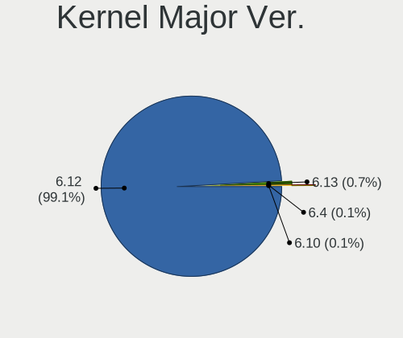
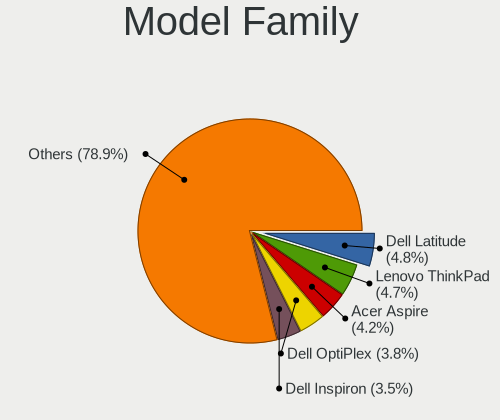
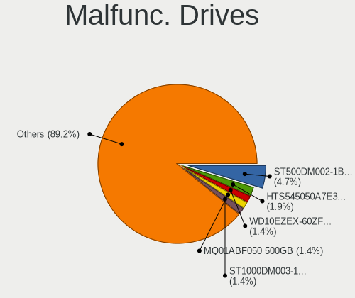
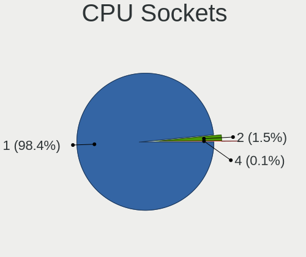
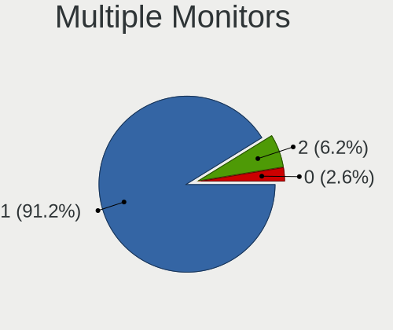

OpenMandriva 24.12 - Tested Hardware & Statistics
-------------------------------------------------

A project to collect tested hardware configurations for OpenMandriva 24.12.

Anyone can contribute to this report by the [hw-probe](https://github.com/linuxhw/hw-probe) tool:

    sudo -E hw-probe -all -upload

Please contribute! Especially if your hardware is rare.

This is a report for all computer types. See also reports for [desktops](/Dist/OpenMandriva_24.12/Desktop/README.md) and [notebooks](/Dist/OpenMandriva_24.12/Notebook/README.md).

Contents
--------

* [ Test Cases ](#test-cases)

* [ System ](#system)
  - [ Kernel                   ](#kernel)
  - [ Kernel Family            ](#kernel-family)
  - [ Kernel Major Ver.        ](#kernel-major-ver)
  - [ Arch                     ](#arch)
  - [ DE                       ](#de)
  - [ Display Server           ](#display-server)
  - [ Display Manager          ](#display-manager)
  - [ OS Lang                  ](#os-lang)
  - [ Boot Mode                ](#boot-mode)
  - [ Filesystem               ](#filesystem)
  - [ Part. scheme             ](#part-scheme)
  - [ Dual Boot with Linux/BSD ](#dual-boot-with-linuxbsd)
  - [ Dual Boot (Win)          ](#dual-boot-win)

* [ Board ](#board)
  - [ Vendor                   ](#vendor)
  - [ Model                    ](#model)
  - [ Model Family             ](#model-family)
  - [ MFG Year                 ](#mfg-year)
  - [ Form Factor              ](#form-factor)
  - [ Secure Boot              ](#secure-boot)
  - [ Coreboot                 ](#coreboot)
  - [ RAM Size                 ](#ram-size)
  - [ RAM Used                 ](#ram-used)
  - [ Total Drives             ](#total-drives)
  - [ Has CD-ROM               ](#has-cd-rom)
  - [ Has Ethernet             ](#has-ethernet)
  - [ Has WiFi                 ](#has-wifi)
  - [ Has Bluetooth            ](#has-bluetooth)

* [ Location ](#location)
  - [ Country                  ](#country)
  - [ City                     ](#city)

* [ Drives ](#drives)
  - [ Drive Vendor             ](#drive-vendor)
  - [ Drive Model              ](#drive-model)
  - [ HDD Vendor               ](#hdd-vendor)
  - [ SSD Vendor               ](#ssd-vendor)
  - [ Drive Kind               ](#drive-kind)
  - [ Drive Connector          ](#drive-connector)
  - [ Drive Size               ](#drive-size)
  - [ Space Total              ](#space-total)
  - [ Space Used               ](#space-used)
  - [ Malfunc. Drives          ](#malfunc-drives)
  - [ Malfunc. Drive Vendor    ](#malfunc-drive-vendor)
  - [ Malfunc. HDD Vendor      ](#malfunc-hdd-vendor)
  - [ Malfunc. Drive Kind      ](#malfunc-drive-kind)
  - [ Failed Drives            ](#failed-drives)
  - [ Failed Drive Vendor      ](#failed-drive-vendor)
  - [ Drive Status             ](#drive-status)

* [ Storage controller ](#storage-controller)
  - [ Storage Vendor           ](#storage-vendor)
  - [ Storage Model            ](#storage-model)
  - [ Storage Kind             ](#storage-kind)

* [ Processor ](#processor)
  - [ CPU Vendor               ](#cpu-vendor)
  - [ CPU Model                ](#cpu-model)
  - [ CPU Model Family         ](#cpu-model-family)
  - [ CPU Cores                ](#cpu-cores)
  - [ CPU Sockets              ](#cpu-sockets)
  - [ CPU Threads              ](#cpu-threads)
  - [ CPU Op-Modes             ](#cpu-op-modes)
  - [ CPU Microcode            ](#cpu-microcode)
  - [ CPU Microarch            ](#cpu-microarch)

* [ Graphics ](#graphics)
  - [ GPU Vendor               ](#gpu-vendor)
  - [ GPU Model                ](#gpu-model)
  - [ GPU Combo                ](#gpu-combo)
  - [ GPU Driver               ](#gpu-driver)
  - [ GPU Memory               ](#gpu-memory)

* [ Monitor ](#monitor)
  - [ Monitor Vendor           ](#monitor-vendor)
  - [ Monitor Model            ](#monitor-model)
  - [ Monitor Resolution       ](#monitor-resolution)
  - [ Monitor Diagonal         ](#monitor-diagonal)
  - [ Monitor Width            ](#monitor-width)
  - [ Aspect Ratio             ](#aspect-ratio)
  - [ Monitor Area             ](#monitor-area)
  - [ Pixel Density            ](#pixel-density)
  - [ Multiple Monitors        ](#multiple-monitors)

* [ Network ](#network)
  - [ Net Controller Vendor    ](#net-controller-vendor)
  - [ Net Controller Model     ](#net-controller-model)
  - [ Wireless Vendor          ](#wireless-vendor)
  - [ Wireless Model           ](#wireless-model)
  - [ Ethernet Vendor          ](#ethernet-vendor)
  - [ Ethernet Model           ](#ethernet-model)
  - [ Net Controller Kind      ](#net-controller-kind)
  - [ Used Controller          ](#used-controller)
  - [ NICs                     ](#nics)
  - [ IPv6                     ](#ipv6)

* [ Bluetooth ](#bluetooth)
  - [ Bluetooth Vendor         ](#bluetooth-vendor)
  - [ Bluetooth Model          ](#bluetooth-model)

* [ Sound ](#sound)
  - [ Sound Vendor             ](#sound-vendor)
  - [ Sound Model              ](#sound-model)

* [ Memory ](#memory)
  - [ Memory Vendor            ](#memory-vendor)
  - [ Memory Model             ](#memory-model)
  - [ Memory Kind              ](#memory-kind)
  - [ Memory Form Factor       ](#memory-form-factor)
  - [ Memory Size              ](#memory-size)
  - [ Memory Speed             ](#memory-speed)

* [ Printers & scanners ](#printers--scanners)
  - [ Printer Vendor           ](#printer-vendor)
  - [ Printer Model            ](#printer-model)
  - [ Scanner Vendor           ](#scanner-vendor)
  - [ Scanner Model            ](#scanner-model)

* [ Camera ](#camera)
  - [ Camera Vendor            ](#camera-vendor)
  - [ Camera Model             ](#camera-model)

* [ Security ](#security)
  - [ Fingerprint Vendor       ](#fingerprint-vendor)
  - [ Fingerprint Model        ](#fingerprint-model)
  - [ Chipcard Vendor          ](#chipcard-vendor)
  - [ Chipcard Model           ](#chipcard-model)

* [ Unsupported ](#unsupported)
  - [ Unsupported Devices      ](#unsupported-devices)
  - [ Unsupported Device Types ](#unsupported-device-types)

Test Cases
----------

Total: 890

| Vendor        | Model                       | Form-Factor | Probe                                                      | Date         |
|---------------|-----------------------------|-------------|------------------------------------------------------------|--------------|
| ASUSTek       | ROG Strix G712LV_G712LV     | Notebook    | [98506e2506](https://linux-hardware.org/?probe=98506e2506) | Jan 06, 2025 |
| Acer          | Aspire A515-52G             | Notebook    | [572616a1d9](https://linux-hardware.org/?probe=572616a1d9) | Jan 06, 2025 |
| Lenovo        | ThinkPad P14s Gen 3 21J5... | Notebook    | [f5e1468f62](https://linux-hardware.org/?probe=f5e1468f62) | Jan 06, 2025 |
| HP            | Laptop 15-bw0xx             | Notebook    | [d4de478530](https://linux-hardware.org/?probe=d4de478530) | Jan 06, 2025 |
| Gigabyte      | GA-MA770T-UD3               | Desktop     | [617c102331](https://linux-hardware.org/?probe=617c102331) | Jan 06, 2025 |
| Acer          | Aspire E5-572G              | Notebook    | [dca3176d13](https://linux-hardware.org/?probe=dca3176d13) | Jan 06, 2025 |
| ASUSTek       | X51RL                       | Notebook    | [526c93f776](https://linux-hardware.org/?probe=526c93f776) | Jan 06, 2025 |
| Dell          | Latitude E7470              | Notebook    | [448c4c5d6e](https://linux-hardware.org/?probe=448c4c5d6e) | Jan 06, 2025 |
| MSI           | B75IA-E33                   | Desktop     | [f12ded84f2](https://linux-hardware.org/?probe=f12ded84f2) | Jan 06, 2025 |
| Lenovo        | IdeaPad MIIX 700-12ISK 8... | Notebook    | [0cf3ed40e6](https://linux-hardware.org/?probe=0cf3ed40e6) | Jan 06, 2025 |
| ASUSTek       | PRIME H510M-K R2.0          | Desktop     | [5fb39d6837](https://linux-hardware.org/?probe=5fb39d6837) | Jan 06, 2025 |
| Apple         | Mac-F4238CC8 PVT            | All in one  | [a532955db4](https://linux-hardware.org/?probe=a532955db4) | Jan 06, 2025 |
| Dell          | OptiPlex 745                | Desktop     | [578cc6d8f1](https://linux-hardware.org/?probe=578cc6d8f1) | Jan 06, 2025 |
| Lenovo        | V15 G4 IAH 83FS             | Notebook    | [54ea7cdde8](https://linux-hardware.org/?probe=54ea7cdde8) | Jan 06, 2025 |
| Dell          | Latitude 7280               | Notebook    | [58eef8f0dd](https://linux-hardware.org/?probe=58eef8f0dd) | Jan 06, 2025 |
| Gigabyte      | GA-78LMT-S2                 | Desktop     | [5321bb65b1](https://linux-hardware.org/?probe=5321bb65b1) | Jan 06, 2025 |
| Acer          | Aspire E1-572               | Notebook    | [e825292593](https://linux-hardware.org/?probe=e825292593) | Jan 06, 2025 |
| Dell          | Inspiron 15-3567            | Notebook    | [c661f75c0f](https://linux-hardware.org/?probe=c661f75c0f) | Jan 05, 2025 |
| HP            | EliteBook 8570w             | Notebook    | [0b6fedb6c2](https://linux-hardware.org/?probe=0b6fedb6c2) | Jan 05, 2025 |
| HP            | 2215                        | Desktop     | [d4d1a7ad27](https://linux-hardware.org/?probe=d4d1a7ad27) | Jan 05, 2025 |
| Lenovo        | 0x36C017AA SDK0J40700 WI... | Desktop     | [75606d7596](https://linux-hardware.org/?probe=75606d7596) | Jan 05, 2025 |
| Unknown       | Unknown                     | Desktop     | [fa69a9bfbc](https://linux-hardware.org/?probe=fa69a9bfbc) | Jan 05, 2025 |
| HP            | 3029h                       | Desktop     | [e46ab5ac4b](https://linux-hardware.org/?probe=e46ab5ac4b) | Jan 05, 2025 |
| Dell          | Latitude D630               | Notebook    | [2c3411042a](https://linux-hardware.org/?probe=2c3411042a) | Jan 05, 2025 |
| Pegatron      | NARRA5                      | Desktop     | [350baa0b67](https://linux-hardware.org/?probe=350baa0b67) | Jan 05, 2025 |
| Dell          | 0XHYJF A00                  | All in one  | [1f361b3518](https://linux-hardware.org/?probe=1f361b3518) | Jan 05, 2025 |
| Dell          | Latitude E4200              | Notebook    | [db5dcaf33b](https://linux-hardware.org/?probe=db5dcaf33b) | Jan 05, 2025 |
| Dell          | 0HD5W2 A00                  | Desktop     | [a6858e47c5](https://linux-hardware.org/?probe=a6858e47c5) | Jan 05, 2025 |
| HP            | EliteBook 8460p             | Notebook    | [0a8d680cf0](https://linux-hardware.org/?probe=0a8d680cf0) | Jan 05, 2025 |
| Dell          | Precision M4400             | Notebook    | [6d8da5ac74](https://linux-hardware.org/?probe=6d8da5ac74) | Jan 05, 2025 |
| Panasonic     | CF-NX2AWLCS                 | Notebook    | [e3ead6c710](https://linux-hardware.org/?probe=e3ead6c710) | Jan 05, 2025 |
| HP            | 3397                        | Desktop     | [95cc9c1997](https://linux-hardware.org/?probe=95cc9c1997) | Jan 05, 2025 |
| Gigabyte      | GA-MA785GMT-UD2H            | Desktop     | [7808d0395e](https://linux-hardware.org/?probe=7808d0395e) | Jan 05, 2025 |
| Dell          | Inspiron 7573               | Convertible | [862a11d024](https://linux-hardware.org/?probe=862a11d024) | Jan 04, 2025 |
| ASUSTek       | PRIME B450M-K II            | Desktop     | [cf7d50fae1](https://linux-hardware.org/?probe=cf7d50fae1) | Jan 04, 2025 |
| HP            | 255 G6 Notebook PC          | Notebook    | [57b6786860](https://linux-hardware.org/?probe=57b6786860) | Jan 04, 2025 |
| ASUSTek       | Maximus VIII RANGER         | Desktop     | [b536336740](https://linux-hardware.org/?probe=b536336740) | Jan 04, 2025 |
| HP            | 655                         | Notebook    | [e8728549f4](https://linux-hardware.org/?probe=e8728549f4) | Jan 04, 2025 |
| Lenovo        | V15 G4 IRU 83A1             | Notebook    | [c4a6747552](https://linux-hardware.org/?probe=c4a6747552) | Jan 04, 2025 |
| MSI           | Z77A-G45 Thunderbolt        | Desktop     | [63dfc9cc1f](https://linux-hardware.org/?probe=63dfc9cc1f) | Jan 04, 2025 |
| HP            | 15                          | Notebook    | [d95bba2430](https://linux-hardware.org/?probe=d95bba2430) | Jan 04, 2025 |
| Lenovo        | IdeaPad U450p 3389          | Notebook    | [c01ce6e337](https://linux-hardware.org/?probe=c01ce6e337) | Jan 04, 2025 |
| Lenovo        | NOK                         | Desktop     | [2b5c2e2c8a](https://linux-hardware.org/?probe=2b5c2e2c8a) | Jan 04, 2025 |
| Dell          | Latitude 5310 2-in-1        | Convertible | [6fd5c30874](https://linux-hardware.org/?probe=6fd5c30874) | Jan 04, 2025 |
| HC Technol... | HCAR5000-MI                 | Desktop     | [bbe1844c1c](https://linux-hardware.org/?probe=bbe1844c1c) | Jan 04, 2025 |
| Dell          | 040DDP A01                  | Desktop     | [63dc37783d](https://linux-hardware.org/?probe=63dc37783d) | Jan 04, 2025 |
| Gigabyte      | G41M-ES2L                   | Desktop     | [60cf453df6](https://linux-hardware.org/?probe=60cf453df6) | Jan 04, 2025 |
| ASUSTek       | VivoBook E14 E402WAS        | Notebook    | [208b3336eb](https://linux-hardware.org/?probe=208b3336eb) | Jan 04, 2025 |
| MSI           | Summit E13FlipEvo A12MT     | Notebook    | [642730a80d](https://linux-hardware.org/?probe=642730a80d) | Jan 04, 2025 |
| Lenovo        | 3141 SDK0J40697 WIN 3305... | Desktop     | [aeee08efea](https://linux-hardware.org/?probe=aeee08efea) | Jan 04, 2025 |
| Dell          | 0WMJ54 A01                  | Desktop     | [966f8de937](https://linux-hardware.org/?probe=966f8de937) | Jan 03, 2025 |
| HP            | EliteBook x360 1030 G4      | Convertible | [94936f9666](https://linux-hardware.org/?probe=94936f9666) | Jan 03, 2025 |
| HP            | Laptop 15-fd0xxx            | Notebook    | [dfd9d16913](https://linux-hardware.org/?probe=dfd9d16913) | Jan 03, 2025 |
| Medion        | E11201                      | Notebook    | [141200df83](https://linux-hardware.org/?probe=141200df83) | Jan 03, 2025 |
| AZW           | SER V2.0                    | Mini pc     | [68a8804c89](https://linux-hardware.org/?probe=68a8804c89) | Jan 03, 2025 |
| ASUSTek       | PRIME Z270M-PLUS            | Desktop     | [32db9391d7](https://linux-hardware.org/?probe=32db9391d7) | Jan 03, 2025 |
| Dell          | 0GY6Y8 A03                  | Desktop     | [734e205226](https://linux-hardware.org/?probe=734e205226) | Jan 03, 2025 |
| ASUSTek       | Q550LF                      | Notebook    | [c587210fdb](https://linux-hardware.org/?probe=c587210fdb) | Jan 03, 2025 |
| Lenovo        | MAHOBAY NOK                 | Desktop     | [ed9753dfcf](https://linux-hardware.org/?probe=ed9753dfcf) | Jan 03, 2025 |
| Acer          | Extensa 5630                | Notebook    | [1bb020a4af](https://linux-hardware.org/?probe=1bb020a4af) | Jan 03, 2025 |
| MSI           | PRO B760M-E DDR4            | Desktop     | [4768eb71cc](https://linux-hardware.org/?probe=4768eb71cc) | Jan 03, 2025 |
| Dell          | 0TWFTR A02                  | All in one  | [9352e7ed07](https://linux-hardware.org/?probe=9352e7ed07) | Jan 03, 2025 |
| Sony          | VPCF236FM                   | Notebook    | [1c0abb00b2](https://linux-hardware.org/?probe=1c0abb00b2) | Jan 03, 2025 |
| Dell          | Latitude D630               | Notebook    | [3b6bae784e](https://linux-hardware.org/?probe=3b6bae784e) | Jan 03, 2025 |
| Lenovo        | IdeaPadFlex 5 14IAU7 82R... | Convertible | [779fdc8ded](https://linux-hardware.org/?probe=779fdc8ded) | Jan 03, 2025 |
| Intel         | DQ67SW AAG12527-310         | Desktop     | [a4c7be2f1a](https://linux-hardware.org/?probe=a4c7be2f1a) | Jan 03, 2025 |
| Gigabyte      | GA-78LMT-S2                 | Desktop     | [cf902d875a](https://linux-hardware.org/?probe=cf902d875a) | Jan 03, 2025 |
| Microsoft     | Surface Pro 9               | Tablet      | [e6f037a5e8](https://linux-hardware.org/?probe=e6f037a5e8) | Jan 03, 2025 |
| Gigabyte      | H81M-S2H                    | Desktop     | [6a06903b4a](https://linux-hardware.org/?probe=6a06903b4a) | Jan 03, 2025 |
| Intel         | H55                         | Desktop     | [aada843724](https://linux-hardware.org/?probe=aada843724) | Jan 03, 2025 |
| Microsoft     | Surface Pro 4               | Tablet      | [01d92157cd](https://linux-hardware.org/?probe=01d92157cd) | Jan 03, 2025 |
| HP            | ENVY x360 m6 Convertible    | Convertible | [d6acb3ff97](https://linux-hardware.org/?probe=d6acb3ff97) | Jan 03, 2025 |
| AZW           | MINI S                      | Desktop     | [2067c73351](https://linux-hardware.org/?probe=2067c73351) | Jan 03, 2025 |
| Gigabyte      | F2A88XM-D3H                 | Desktop     | [0af9e3885f](https://linux-hardware.org/?probe=0af9e3885f) | Jan 02, 2025 |
| ASUSTek       | PRIME B550M-A WIFI II       | Desktop     | [5a6a67b7a4](https://linux-hardware.org/?probe=5a6a67b7a4) | Jan 02, 2025 |
| HP            | 250 G8 Notebook PC          | Notebook    | [d5b66faf28](https://linux-hardware.org/?probe=d5b66faf28) | Jan 02, 2025 |
| Dell          | Latitude E6430              | Notebook    | [860e215daf](https://linux-hardware.org/?probe=860e215daf) | Jan 02, 2025 |
| Microsoft     | Surface Go                  | Tablet      | [9d75fa5900](https://linux-hardware.org/?probe=9d75fa5900) | Jan 02, 2025 |
| AZW           | GK mini                     | Desktop     | [3d87931055](https://linux-hardware.org/?probe=3d87931055) | Jan 02, 2025 |
| Lenovo        | ThinkPad L470 20J4000LMD    | Notebook    | [e2fa70f2b4](https://linux-hardware.org/?probe=e2fa70f2b4) | Jan 02, 2025 |
| Dell          | 0HD5W2 A00                  | Desktop     | [abbdbd898d](https://linux-hardware.org/?probe=abbdbd898d) | Jan 02, 2025 |
| Lenovo        | IdeaPad 700-15ISK 80RU      | Notebook    | [b26f854f97](https://linux-hardware.org/?probe=b26f854f97) | Jan 02, 2025 |
| HP            | 83E9                        | Desktop     | [ee42824c61](https://linux-hardware.org/?probe=ee42824c61) | Jan 02, 2025 |
| MSI           | MEG Z790 ACE                | Desktop     | [7479e71d41](https://linux-hardware.org/?probe=7479e71d41) | Jan 02, 2025 |
| Fujitsu       | LIFEBOOK A3510              | Notebook    | [fd4e4972d2](https://linux-hardware.org/?probe=fd4e4972d2) | Jan 02, 2025 |
| Dell          | Inspiron 1545               | Notebook    | [445120281e](https://linux-hardware.org/?probe=445120281e) | Jan 02, 2025 |
| HP            | 0A9Ch                       | Desktop     | [d05c412a3b](https://linux-hardware.org/?probe=d05c412a3b) | Jan 02, 2025 |
| Lenovo        | IdeaPad 3 15IML05 81WB      | Notebook    | [f5cc6f8958](https://linux-hardware.org/?probe=f5cc6f8958) | Jan 02, 2025 |
| ASUSTek       | Z170-E                      | Desktop     | [42888378d7](https://linux-hardware.org/?probe=42888378d7) | Jan 02, 2025 |
| Lenovo        | ThinkPad W520 428426U       | Notebook    | [a7aa110e08](https://linux-hardware.org/?probe=a7aa110e08) | Jan 02, 2025 |
| MSI           | X370 GAMING PRO CARBON      | Desktop     | [bb70ef7a51](https://linux-hardware.org/?probe=bb70ef7a51) | Jan 02, 2025 |
| Lenovo        | IdeaPad Pro 5 16IMH9 83D... | Notebook    | [bb4860483d](https://linux-hardware.org/?probe=bb4860483d) | Jan 02, 2025 |
| HP            | OMEN by Laptop              | Notebook    | [319fc5e92e](https://linux-hardware.org/?probe=319fc5e92e) | Jan 02, 2025 |
| Dell          | Inspiron 15-3565            | Notebook    | [27354f28ea](https://linux-hardware.org/?probe=27354f28ea) | Jan 02, 2025 |
| HP            | Pavilion 17                 | Notebook    | [fc1f326456](https://linux-hardware.org/?probe=fc1f326456) | Jan 02, 2025 |
| Lenovo        | ThinkPad X1 Carbon Gen 1... | Notebook    | [ae6fbefd79](https://linux-hardware.org/?probe=ae6fbefd79) | Jan 01, 2025 |
| Unknown       | X99-D3                      | Desktop     | [d79cb549a8](https://linux-hardware.org/?probe=d79cb549a8) | Jan 01, 2025 |
| ASUSTek       | UL80VT                      | Notebook    | [51fb360728](https://linux-hardware.org/?probe=51fb360728) | Jan 01, 2025 |
| HP            | EliteBook 840 G1            | Notebook    | [f298c84729](https://linux-hardware.org/?probe=f298c84729) | Jan 01, 2025 |
| HP            | G72                         | Notebook    | [376d1a0575](https://linux-hardware.org/?probe=376d1a0575) | Jan 01, 2025 |
| Acer          | Aspire 5750                 | Notebook    | [879127efc6](https://linux-hardware.org/?probe=879127efc6) | Jan 01, 2025 |
| Acer          | Aspire 8951G                | Notebook    | [238300d1c0](https://linux-hardware.org/?probe=238300d1c0) | Jan 01, 2025 |
| Dell          | Latitude E5550              | Notebook    | [618acec11b](https://linux-hardware.org/?probe=618acec11b) | Jan 01, 2025 |
| HP            | Laptop 14z-em000            | Notebook    | [0c43124a84](https://linux-hardware.org/?probe=0c43124a84) | Jan 01, 2025 |
| Lenovo        | ThinkPad X1 Carbon 34484... | Notebook    | [3fc4858681](https://linux-hardware.org/?probe=3fc4858681) | Jan 01, 2025 |
| HP            | 0A5Ch                       | Desktop     | [46198b0dea](https://linux-hardware.org/?probe=46198b0dea) | Jan 01, 2025 |
| Shenzhen D... | MP100                       | Desktop     | [032508f9fd](https://linux-hardware.org/?probe=032508f9fd) | Jan 01, 2025 |
| Dell          | Vostro 3558                 | Notebook    | [4f78b23a1f](https://linux-hardware.org/?probe=4f78b23a1f) | Jan 01, 2025 |
| Samsung       | 770Z5E/780Z5E               | Notebook    | [1643aef813](https://linux-hardware.org/?probe=1643aef813) | Jan 01, 2025 |
| HP            | Pavilion Gaming Laptop 1... | Notebook    | [38accd1b79](https://linux-hardware.org/?probe=38accd1b79) | Jan 01, 2025 |
| HP            | Pavilion dv6                | Notebook    | [1c73ddb1c0](https://linux-hardware.org/?probe=1c73ddb1c0) | Jan 01, 2025 |
| ASUSTek       | PRIME A520M-A II            | Desktop     | [dc2bdc4245](https://linux-hardware.org/?probe=dc2bdc4245) | Jan 01, 2025 |
| Lenovo        | ThinkPad E570 20H5CTO1WW    | Notebook    | [ae328090f7](https://linux-hardware.org/?probe=ae328090f7) | Jan 01, 2025 |
| Gigabyte      | X570 AORUS PRO              | Desktop     | [9ad161a45a](https://linux-hardware.org/?probe=9ad161a45a) | Jan 01, 2025 |
| HP            | ENVY Notebook               | Notebook    | [b6d4605e3e](https://linux-hardware.org/?probe=b6d4605e3e) | Jan 01, 2025 |
| Dell          | 0NW73C A00                  | Desktop     | [3dfa88f059](https://linux-hardware.org/?probe=3dfa88f059) | Jan 01, 2025 |
| SZMZ          | X99-S3                      | Desktop     | [f20bda8c75](https://linux-hardware.org/?probe=f20bda8c75) | Jan 01, 2025 |
| Lenovo        | ThinkPad T430 2349SVA       | Notebook    | [654dbcabab](https://linux-hardware.org/?probe=654dbcabab) | Jan 01, 2025 |
| Dell          | Inspiron 3542               | Notebook    | [95006e65be](https://linux-hardware.org/?probe=95006e65be) | Jan 01, 2025 |
| HP            | Laptop 14z-em000            | Notebook    | [2b45c6c699](https://linux-hardware.org/?probe=2b45c6c699) | Jan 01, 2025 |
| ASUSTek       | ROG STRIX B350-F GAMING     | Desktop     | [034de44629](https://linux-hardware.org/?probe=034de44629) | Jan 01, 2025 |
| Microsoft     | Surface Pro 2               | Tablet      | [964f81a59e](https://linux-hardware.org/?probe=964f81a59e) | Jan 01, 2025 |
| Gigabyte      | X470 AORUS ULTRA GAMING-... | Desktop     | [31b95986eb](https://linux-hardware.org/?probe=31b95986eb) | Jan 01, 2025 |
| ASUSTek       | P5Q SE PLUS                 | Desktop     | [2e5a12a36b](https://linux-hardware.org/?probe=2e5a12a36b) | Jan 01, 2025 |
| Dell          | Latitude 7390 2-in-1        | Notebook    | [0837722dea](https://linux-hardware.org/?probe=0837722dea) | Jan 01, 2025 |
| ASUSTek       | A68HM-K                     | Desktop     | [800e2716b1](https://linux-hardware.org/?probe=800e2716b1) | Jan 01, 2025 |
| Foxconn       | 2AB1                        | Desktop     | [d937af7e89](https://linux-hardware.org/?probe=d937af7e89) | Jan 01, 2025 |
| Acer          | Aspire 5742                 | Notebook    | [aa9170d15a](https://linux-hardware.org/?probe=aa9170d15a) | Dec 31, 2024 |
| Toshiba       | Satellite P755              | Notebook    | [919f9d689c](https://linux-hardware.org/?probe=919f9d689c) | Dec 31, 2024 |
| Dell          | 0Y5DDC A00                  | Desktop     | [54403714c3](https://linux-hardware.org/?probe=54403714c3) | Dec 31, 2024 |
| HP            | 3032h                       | Desktop     | [fb4af81907](https://linux-hardware.org/?probe=fb4af81907) | Dec 31, 2024 |
| Lenovo        | 371C SDK0J40709 WIN 3259... | All in one  | [e1b1540113](https://linux-hardware.org/?probe=e1b1540113) | Dec 31, 2024 |
| Lenovo        | Yoga 2 13 20344             | Notebook    | [1be4064009](https://linux-hardware.org/?probe=1be4064009) | Dec 31, 2024 |
| Samsung       | 300E4A/300E5A/300E7A/343... | Notebook    | [c66eaf3382](https://linux-hardware.org/?probe=c66eaf3382) | Dec 31, 2024 |
| ASUSTek       | PRIME B450M-K               | Desktop     | [4cb02f7ced](https://linux-hardware.org/?probe=4cb02f7ced) | Dec 31, 2024 |
| Lenovo        | Yoga 720-12IKB 81B5         | Convertible | [9bee2dc1eb](https://linux-hardware.org/?probe=9bee2dc1eb) | Dec 31, 2024 |
| Lenovo        | IdeaPad Slim 1-14AST-05 ... | Notebook    | [0850762b48](https://linux-hardware.org/?probe=0850762b48) | Dec 31, 2024 |
| HP            | ProBook 440 14 inch G9 N... | Notebook    | [2127fd790b](https://linux-hardware.org/?probe=2127fd790b) | Dec 31, 2024 |
| ASUSTek       | X556UR                      | Notebook    | [8550e720af](https://linux-hardware.org/?probe=8550e720af) | Dec 31, 2024 |
| Lenovo        | 36EB SDK0J40700 WIN 3258... | Desktop     | [e0e1513ce6](https://linux-hardware.org/?probe=e0e1513ce6) | Dec 31, 2024 |
| HP            | 802F                        | Desktop     | [5c6293b2ab](https://linux-hardware.org/?probe=5c6293b2ab) | Dec 31, 2024 |
| HP            | 250 15.6 inch G10           | Notebook    | [94fdf69690](https://linux-hardware.org/?probe=94fdf69690) | Dec 31, 2024 |
| Dell          | Latitude E7440              | Notebook    | [2d9f729ec1](https://linux-hardware.org/?probe=2d9f729ec1) | Dec 31, 2024 |
| Toshiba       | Satellite P200              | Notebook    | [a07857c808](https://linux-hardware.org/?probe=a07857c808) | Dec 31, 2024 |
| ASUSTek       | PRIME X570-P                | Desktop     | [3556a38021](https://linux-hardware.org/?probe=3556a38021) | Dec 31, 2024 |
| HP            | Pavilion 13                 | Notebook    | [fece21c1ee](https://linux-hardware.org/?probe=fece21c1ee) | Dec 31, 2024 |
| HP            | EliteBook 840 G3            | Notebook    | [f1bc5970f8](https://linux-hardware.org/?probe=f1bc5970f8) | Dec 31, 2024 |
| Lenovo        | Legion Pro 5 16IRX8 82WK    | Notebook    | [b86a475528](https://linux-hardware.org/?probe=b86a475528) | Dec 31, 2024 |
| Dell          | Latitude E6220              | Notebook    | [b93b3b88d1](https://linux-hardware.org/?probe=b93b3b88d1) | Dec 31, 2024 |
| HP            | Laptop 14-cm0xxx            | Notebook    | [045aa245db](https://linux-hardware.org/?probe=045aa245db) | Dec 31, 2024 |
| HP            | ENVY x360 Convertible 13... | Convertible | [f3519fbd26](https://linux-hardware.org/?probe=f3519fbd26) | Dec 31, 2024 |
| Digiboard     | NM70-TI                     | Desktop     | [1a10dd8daf](https://linux-hardware.org/?probe=1a10dd8daf) | Dec 31, 2024 |
| Acer          | Aspire A315-42              | Notebook    | [734fd13848](https://linux-hardware.org/?probe=734fd13848) | Dec 31, 2024 |
| Google        | Auron_Paine                 | Notebook    | [9603115c16](https://linux-hardware.org/?probe=9603115c16) | Dec 31, 2024 |
| Dell          | Latitude E6420              | Notebook    | [46c2760e4e](https://linux-hardware.org/?probe=46c2760e4e) | Dec 31, 2024 |
| Acer          | Nitro AN517-54              | Notebook    | [8461425ec1](https://linux-hardware.org/?probe=8461425ec1) | Dec 31, 2024 |
| HUAWEI        | BOHK-WAX9X                  | Notebook    | [3b12d86f3d](https://linux-hardware.org/?probe=3b12d86f3d) | Dec 31, 2024 |
| Shenzhen M... | F6BFC                       | Desktop     | [431235e055](https://linux-hardware.org/?probe=431235e055) | Dec 31, 2024 |
| Intel         | H81                         | Desktop     | [00453f1bb7](https://linux-hardware.org/?probe=00453f1bb7) | Dec 31, 2024 |
| ASUSTek       | M4A78LT-M-LE                | Desktop     | [65345c7ef4](https://linux-hardware.org/?probe=65345c7ef4) | Dec 31, 2024 |
| ASUSTek       | X540SA                      | Notebook    | [fffc36417c](https://linux-hardware.org/?probe=fffc36417c) | Dec 31, 2024 |
| ASUSTek       | M5A78L-M LE                 | Desktop     | [35ecdf468a](https://linux-hardware.org/?probe=35ecdf468a) | Dec 31, 2024 |
| Dell          | XPS 13 9350                 | Notebook    | [896eb3972d](https://linux-hardware.org/?probe=896eb3972d) | Dec 31, 2024 |
| Acer          | Aspire ES1-572              | Notebook    | [ab8d0c7c3f](https://linux-hardware.org/?probe=ab8d0c7c3f) | Dec 30, 2024 |
| ASUSTek       | P5G41T-M LX2/GB             | Desktop     | [61c106bd12](https://linux-hardware.org/?probe=61c106bd12) | Dec 30, 2024 |
| Foxconn       | 2ADA                        | Desktop     | [a56fc7e027](https://linux-hardware.org/?probe=a56fc7e027) | Dec 30, 2024 |
| HP            | 8768 A                      | Desktop     | [6a09384c14](https://linux-hardware.org/?probe=6a09384c14) | Dec 30, 2024 |
| HP            | 212B                        | Desktop     | [3cb08b6d4f](https://linux-hardware.org/?probe=3cb08b6d4f) | Dec 30, 2024 |
| Lenovo        | Yoga 300-11IBY 80M0         | Notebook    | [63d6d04a10](https://linux-hardware.org/?probe=63d6d04a10) | Dec 30, 2024 |
| Clevo         | W240BL_W250BZ_W270BZQ       | Notebook    | [7da1abb74d](https://linux-hardware.org/?probe=7da1abb74d) | Dec 30, 2024 |
| HP            | ENVY dv6                    | Notebook    | [592cab3725](https://linux-hardware.org/?probe=592cab3725) | Dec 30, 2024 |
| ASUSTek       | P8H61-M LX3 PLUS R2.0       | Desktop     | [529afc68af](https://linux-hardware.org/?probe=529afc68af) | Dec 30, 2024 |
| ASRock        | Z68 Extreme4 Gen3           | Desktop     | [9d23a9787e](https://linux-hardware.org/?probe=9d23a9787e) | Dec 30, 2024 |
| Dell          | Vostro 3420                 | Notebook    | [d5a414f6d5](https://linux-hardware.org/?probe=d5a414f6d5) | Dec 30, 2024 |
| ASRock        | B450M Pro4                  | Desktop     | [88b9fab21f](https://linux-hardware.org/?probe=88b9fab21f) | Dec 30, 2024 |
| HP            | 18E7                        | Desktop     | [b0312cea7a](https://linux-hardware.org/?probe=b0312cea7a) | Dec 30, 2024 |
| Acer          | Aspire A515-57              | Notebook    | [d2483d4bb8](https://linux-hardware.org/?probe=d2483d4bb8) | Dec 30, 2024 |
| ASRock        | QC5000-ITX/PH               | Desktop     | [338593f255](https://linux-hardware.org/?probe=338593f255) | Dec 30, 2024 |
| MSI           | MAG B650 TOMAHAWK WIFI      | Desktop     | [e4be1dd2f3](https://linux-hardware.org/?probe=e4be1dd2f3) | Dec 30, 2024 |
| Intel         | E5-A99 V1.0                 | Desktop     | [08bc3d7b5d](https://linux-hardware.org/?probe=08bc3d7b5d) | Dec 30, 2024 |
| ASRock        | 960GC-GS FX                 | Desktop     | [9e60ff1990](https://linux-hardware.org/?probe=9e60ff1990) | Dec 30, 2024 |
| HP            | OMEN by Laptop 15-dc0xxx    | Notebook    | [83d420ab00](https://linux-hardware.org/?probe=83d420ab00) | Dec 30, 2024 |
| MSI           | 990FXA-GD80                 | Desktop     | [8b2f125314](https://linux-hardware.org/?probe=8b2f125314) | Dec 30, 2024 |
| Shenzhen M... | F7BSD                       | Mini pc     | [62c313072f](https://linux-hardware.org/?probe=62c313072f) | Dec 30, 2024 |
| Intel         | H110                        | Desktop     | [e5396f2a33](https://linux-hardware.org/?probe=e5396f2a33) | Dec 30, 2024 |
| ASRock        | FM2A68M-HD+                 | Desktop     | [f2bb2bd6da](https://linux-hardware.org/?probe=f2bb2bd6da) | Dec 30, 2024 |
| Dell          | Latitude 5400               | Notebook    | [b83ec20ffe](https://linux-hardware.org/?probe=b83ec20ffe) | Dec 30, 2024 |
| ASUSTek       | VivoBook_ASUSLaptop X409... | Notebook    | [0831cecc24](https://linux-hardware.org/?probe=0831cecc24) | Dec 30, 2024 |
| Lenovo        | ThinkCentre M90 5536W92     | Desktop     | [99cf8555fa](https://linux-hardware.org/?probe=99cf8555fa) | Dec 30, 2024 |
| HP            | 339A                        | Desktop     | [ad1a9035e9](https://linux-hardware.org/?probe=ad1a9035e9) | Dec 30, 2024 |
| ASUSTek       | ASUS TUF Gaming A16 FA61... | Notebook    | [005152678f](https://linux-hardware.org/?probe=005152678f) | Dec 30, 2024 |
| Medion        | Defender P40                | Notebook    | [04ff586114](https://linux-hardware.org/?probe=04ff586114) | Dec 29, 2024 |
| Gigabyte      | A520M DS3H                  | Desktop     | [a8987243ad](https://linux-hardware.org/?probe=a8987243ad) | Dec 29, 2024 |
| Dell          | XPS 13 9360                 | Notebook    | [4e5b03bfd7](https://linux-hardware.org/?probe=4e5b03bfd7) | Dec 29, 2024 |
| Dell          | 0N4YC8 A00                  | Desktop     | [772d84bc08](https://linux-hardware.org/?probe=772d84bc08) | Dec 29, 2024 |
| HP            | EliteBook 8730w             | Notebook    | [26e363efb2](https://linux-hardware.org/?probe=26e363efb2) | Dec 29, 2024 |
| ASUSTek       | H110M-K                     | Desktop     | [39970498c9](https://linux-hardware.org/?probe=39970498c9) | Dec 29, 2024 |
| AZW           | SER V1.0                    | Mini pc     | [72054648d0](https://linux-hardware.org/?probe=72054648d0) | Dec 29, 2024 |
| Toshiba       | Satellite L755              | Notebook    | [f4e18a27e3](https://linux-hardware.org/?probe=f4e18a27e3) | Dec 29, 2024 |
| ASUSTek       | 1015PN                      | Notebook    | [f84154f736](https://linux-hardware.org/?probe=f84154f736) | Dec 29, 2024 |
| ASUSTek       | VivoBook_ASUSLaptop X712... | Notebook    | [7b7d782202](https://linux-hardware.org/?probe=7b7d782202) | Dec 29, 2024 |
| HP            | EliteBook 840 G5            | Notebook    | [85caa6254a](https://linux-hardware.org/?probe=85caa6254a) | Dec 29, 2024 |
| Lenovo        | ThinkPad T450s 20BWS5F40... | Notebook    | [8bb1dde48e](https://linux-hardware.org/?probe=8bb1dde48e) | Dec 29, 2024 |
| MSI           | H97 PC Mate                 | Desktop     | [28a72759b6](https://linux-hardware.org/?probe=28a72759b6) | Dec 29, 2024 |
| ASUSTek       | SABERTOOTH 990FX            | Desktop     | [3beafb5cad](https://linux-hardware.org/?probe=3beafb5cad) | Dec 29, 2024 |
| MSI           | Z270 TOMAHAWK               | Desktop     | [1ac462bc8e](https://linux-hardware.org/?probe=1ac462bc8e) | Dec 29, 2024 |
| HP            | Notebook                    | Notebook    | [2fe95580ce](https://linux-hardware.org/?probe=2fe95580ce) | Dec 29, 2024 |
| ASUSTek       | VivoBook_ASUSLaptop X515... | Notebook    | [e9aa37cfcd](https://linux-hardware.org/?probe=e9aa37cfcd) | Dec 29, 2024 |
| Lenovo        | ThinkPad T460 20FMS3320G    | Notebook    | [631f081493](https://linux-hardware.org/?probe=631f081493) | Dec 29, 2024 |
| HP            | 18E8                        | Desktop     | [43e6ef4f34](https://linux-hardware.org/?probe=43e6ef4f34) | Dec 29, 2024 |
| ASRock        | Z75 Pro3                    | Desktop     | [91580064a4](https://linux-hardware.org/?probe=91580064a4) | Dec 29, 2024 |
| HP            | Notebook                    | Notebook    | [4552d837a0](https://linux-hardware.org/?probe=4552d837a0) | Dec 29, 2024 |
| HP            | Pavilion dv4                | Notebook    | [ad6955799f](https://linux-hardware.org/?probe=ad6955799f) | Dec 29, 2024 |
| Gigabyte      | 970A-DS3P                   | Desktop     | [b72ca39acc](https://linux-hardware.org/?probe=b72ca39acc) | Dec 29, 2024 |
| ASUSTek       | SABERTOOTH 990FX            | Desktop     | [a4f0949a45](https://linux-hardware.org/?probe=a4f0949a45) | Dec 29, 2024 |
| Foxconn       | 2ABF                        | Desktop     | [e4568577bd](https://linux-hardware.org/?probe=e4568577bd) | Dec 29, 2024 |
| Acer          | Aspire 5253                 | Notebook    | [8129d03feb](https://linux-hardware.org/?probe=8129d03feb) | Dec 29, 2024 |
| ASUSTek       | ZenBook UX334FLC_UX334FL    | Notebook    | [648c9b7e5f](https://linux-hardware.org/?probe=648c9b7e5f) | Dec 28, 2024 |
| Samsung       | 950XDB/951XDB/950XDY        | Notebook    | [7d22efb355](https://linux-hardware.org/?probe=7d22efb355) | Dec 28, 2024 |
| ASRock        | X370M-HDV R4.0              | Desktop     | [b11c18364f](https://linux-hardware.org/?probe=b11c18364f) | Dec 28, 2024 |
| GEEKOM        | Mini IT13                   | Desktop     | [bd2773f098](https://linux-hardware.org/?probe=bd2773f098) | Dec 28, 2024 |
| Lenovo        | B590 20206                  | Notebook    | [f46c163012](https://linux-hardware.org/?probe=f46c163012) | Dec 28, 2024 |
| ASUSTek       | SABERTOOTH 990FX R2.0       | Desktop     | [4f6862c902](https://linux-hardware.org/?probe=4f6862c902) | Dec 28, 2024 |
| Acer          | Aspire A315-58              | Notebook    | [895a738e00](https://linux-hardware.org/?probe=895a738e00) | Dec 28, 2024 |
| Toshiba       | TECRA A10                   | Notebook    | [49714d63c9](https://linux-hardware.org/?probe=49714d63c9) | Dec 28, 2024 |
| Dell          | Latitude E5470              | Notebook    | [e7d5673567](https://linux-hardware.org/?probe=e7d5673567) | Dec 28, 2024 |
| Dell          | Latitude E7440              | Notebook    | [53d89b9e96](https://linux-hardware.org/?probe=53d89b9e96) | Dec 28, 2024 |
| Gigabyte      | B250M-D3H-CF                | Desktop     | [ddda94bd1e](https://linux-hardware.org/?probe=ddda94bd1e) | Dec 28, 2024 |
| Foxconn       | H61MXE/-S/-V/-K             | Desktop     | [7297c64739](https://linux-hardware.org/?probe=7297c64739) | Dec 28, 2024 |
| Intel         | DZ75ML-45K AAG75008-102     | Desktop     | [8b81a310de](https://linux-hardware.org/?probe=8b81a310de) | Dec 28, 2024 |
| MSI           | PRO B650-P WIFI             | Desktop     | [04864e7e53](https://linux-hardware.org/?probe=04864e7e53) | Dec 28, 2024 |
| Acer          | Aspire Z3-105               | All in one  | [678d72f8e1](https://linux-hardware.org/?probe=678d72f8e1) | Dec 28, 2024 |
| ASUSTek       | K53U                        | Notebook    | [aa0acbd3a4](https://linux-hardware.org/?probe=aa0acbd3a4) | Dec 28, 2024 |
| MSI           | H61M-P22                    | Desktop     | [ea858ac153](https://linux-hardware.org/?probe=ea858ac153) | Dec 28, 2024 |
| Dell          | 096JG8 A01                  | Desktop     | [4324dc90bf](https://linux-hardware.org/?probe=4324dc90bf) | Dec 28, 2024 |
| Lenovo        | SHARKBAY 0B98401 PRO        | Desktop     | [2c6d3ec5d8](https://linux-hardware.org/?probe=2c6d3ec5d8) | Dec 28, 2024 |
| Dell          | Inspiron 11 - 3147          | Notebook    | [f0df887cfb](https://linux-hardware.org/?probe=f0df887cfb) | Dec 28, 2024 |
| ASUSTek       | ROG Zephyrus G14 GA401IV... | Notebook    | [e2f614b096](https://linux-hardware.org/?probe=e2f614b096) | Dec 28, 2024 |
| HP            | EliteBook 845 14 inch G1... | Notebook    | [60ab24f653](https://linux-hardware.org/?probe=60ab24f653) | Dec 28, 2024 |
| HP            | Laptop 17-by3xxx            | Notebook    | [798564ee8d](https://linux-hardware.org/?probe=798564ee8d) | Dec 28, 2024 |
| ASUSTek       | X550VL                      | Notebook    | [f39f501a7f](https://linux-hardware.org/?probe=f39f501a7f) | Dec 28, 2024 |
| Lenovo        | ThinkPad T470 W10DG 20JM... | Notebook    | [a84d2e6201](https://linux-hardware.org/?probe=a84d2e6201) | Dec 27, 2024 |
| Dell          | System Inspiron N7110       | Notebook    | [2607b61b02](https://linux-hardware.org/?probe=2607b61b02) | Dec 27, 2024 |
| ASRock        | G31M-GS                     | Desktop     | [4eef3a1e4e](https://linux-hardware.org/?probe=4eef3a1e4e) | Dec 27, 2024 |
| ASRock        | AB350M Pro4                 | Desktop     | [bdb7ebff36](https://linux-hardware.org/?probe=bdb7ebff36) | Dec 27, 2024 |
| HP            | 8054                        | Desktop     | [2ad24afc7c](https://linux-hardware.org/?probe=2ad24afc7c) | Dec 27, 2024 |
| Lenovo        | ThinkPad E480 20KNA04RCD    | Notebook    | [d64710669e](https://linux-hardware.org/?probe=d64710669e) | Dec 27, 2024 |
| ASRock        | A320M Pro4 R2.0             | Desktop     | [21ce1b644b](https://linux-hardware.org/?probe=21ce1b644b) | Dec 27, 2024 |
| Dell          | Latitude 7490               | Notebook    | [73b59f6e09](https://linux-hardware.org/?probe=73b59f6e09) | Dec 27, 2024 |
| Lenovo        | ThinkCentre M81 5049D7G     | Desktop     | [2434fa6399](https://linux-hardware.org/?probe=2434fa6399) | Dec 27, 2024 |
| Unknown       | X79                         | Desktop     | [d721436769](https://linux-hardware.org/?probe=d721436769) | Dec 27, 2024 |
| Fujitsu Si... | ESPRIMO Mobile U9210        | Notebook    | [67cd7236db](https://linux-hardware.org/?probe=67cd7236db) | Dec 27, 2024 |
| ASRock        | A320M-HDV R4.0              | Desktop     | [283f8d39eb](https://linux-hardware.org/?probe=283f8d39eb) | Dec 27, 2024 |
| Dell          | Inspiron 5558               | Notebook    | [370f0c48c3](https://linux-hardware.org/?probe=370f0c48c3) | Dec 27, 2024 |
| ASUSTek       | X502CA                      | Notebook    | [6b816ff7ef](https://linux-hardware.org/?probe=6b816ff7ef) | Dec 27, 2024 |
| Lenovo        | ThinkPad X250 20CLA32VLM    | Notebook    | [c62f3b52e2](https://linux-hardware.org/?probe=c62f3b52e2) | Dec 27, 2024 |
| Gigabyte      | A520M K                     | Desktop     | [669dc7155c](https://linux-hardware.org/?probe=669dc7155c) | Dec 27, 2024 |
| ASUSTek       | PRIME B550M-A               | Desktop     | [119767b103](https://linux-hardware.org/?probe=119767b103) | Dec 27, 2024 |
| Dell          | Inspiron 11 - 3147          | Notebook    | [4ecd9dfdf5](https://linux-hardware.org/?probe=4ecd9dfdf5) | Dec 27, 2024 |
| Dell          | Latitude E5570              | Notebook    | [114a071bc2](https://linux-hardware.org/?probe=114a071bc2) | Dec 27, 2024 |
| Lenovo        | IdeaPad 3 15ITL6 82H8       | Notebook    | [0001b3f45a](https://linux-hardware.org/?probe=0001b3f45a) | Dec 26, 2024 |
| ASUSTek       | VivoBook_ASUSLaptop X521... | Notebook    | [b007439528](https://linux-hardware.org/?probe=b007439528) | Dec 26, 2024 |
| HP            | ProBook 650 G1              | Notebook    | [2e0d9756fe](https://linux-hardware.org/?probe=2e0d9756fe) | Dec 26, 2024 |
| Huanan        | X99-4MF V1.0                | Desktop     | [86a5a82a39](https://linux-hardware.org/?probe=86a5a82a39) | Dec 26, 2024 |
| eMachines     | eME732                      | Notebook    | [7f36d968e4](https://linux-hardware.org/?probe=7f36d968e4) | Dec 26, 2024 |
| MSI           | GF63 Thin 10SCSR            | Notebook    | [9d5e0b2b95](https://linux-hardware.org/?probe=9d5e0b2b95) | Dec 26, 2024 |
| Dell          | XPS 13 9370                 | Notebook    | [9d85ecae19](https://linux-hardware.org/?probe=9d85ecae19) | Dec 26, 2024 |
| ASUSTek       | SABERTOOTH X99              | Desktop     | [a4baa76691](https://linux-hardware.org/?probe=a4baa76691) | Dec 26, 2024 |
| HP            | Pavilion Gaming Laptop 1... | Notebook    | [d811ae85fd](https://linux-hardware.org/?probe=d811ae85fd) | Dec 26, 2024 |
| Dell          | Latitude E5430 non-vPro     | Notebook    | [4e9074a386](https://linux-hardware.org/?probe=4e9074a386) | Dec 26, 2024 |
| HP            | Laptop 14-bs0xx             | Notebook    | [90ddb2c764](https://linux-hardware.org/?probe=90ddb2c764) | Dec 26, 2024 |
| ASRock        | G41MH/USB3                  | Desktop     | [bb5fb7c7af](https://linux-hardware.org/?probe=bb5fb7c7af) | Dec 26, 2024 |
| Acer          | Veriton S6630G V:1.0        | Desktop     | [2cbeac15c3](https://linux-hardware.org/?probe=2cbeac15c3) | Dec 26, 2024 |
| Dell          | 0NDYHG A01                  | Desktop     | [110afa5611](https://linux-hardware.org/?probe=110afa5611) | Dec 26, 2024 |
| Dell          | Latitude E5470              | Notebook    | [3af687bbee](https://linux-hardware.org/?probe=3af687bbee) | Dec 26, 2024 |
| Dell          | Inspiron 5490               | Notebook    | [b8810650b5](https://linux-hardware.org/?probe=b8810650b5) | Dec 26, 2024 |
| Lenovo        | ThinkPad P14s Gen 1 20S5... | Notebook    | [e5bf005a5f](https://linux-hardware.org/?probe=e5bf005a5f) | Dec 26, 2024 |
| Notebook      | W65_W67RZ                   | Notebook    | [fc8f4a29f7](https://linux-hardware.org/?probe=fc8f4a29f7) | Dec 26, 2024 |
| HP            | 805A                        | Desktop     | [d55f3bc8c3](https://linux-hardware.org/?probe=d55f3bc8c3) | Dec 26, 2024 |
| HP            | 1998                        | Desktop     | [35ce2043be](https://linux-hardware.org/?probe=35ce2043be) | Dec 26, 2024 |
| HP            | Laptop 15-fd0xxx            | Notebook    | [1ed7f7ef48](https://linux-hardware.org/?probe=1ed7f7ef48) | Dec 26, 2024 |
| MSI           | Katana A17 AI B8VE          | Notebook    | [06e816e082](https://linux-hardware.org/?probe=06e816e082) | Dec 26, 2024 |
| Acer          | Aspire V3-571G              | Notebook    | [1c7d970f58](https://linux-hardware.org/?probe=1c7d970f58) | Dec 26, 2024 |
| ASUSTek       | K72Jr                       | Notebook    | [1d7e1a872d](https://linux-hardware.org/?probe=1d7e1a872d) | Dec 25, 2024 |
| Gigabyte      | EP45-UD3LR                  | Desktop     | [244ba13e5e](https://linux-hardware.org/?probe=244ba13e5e) | Dec 25, 2024 |
| ASUSTek       | PRIME A520M-K               | Desktop     | [61d14e44b2](https://linux-hardware.org/?probe=61d14e44b2) | Dec 25, 2024 |
| ASUSTek       | PRIME H510M-K R2.0          | Desktop     | [0a2195b79e](https://linux-hardware.org/?probe=0a2195b79e) | Dec 25, 2024 |
| ASUSTek       | TUF Gaming B550M-PLUS       | Desktop     | [bcd19d252b](https://linux-hardware.org/?probe=bcd19d252b) | Dec 25, 2024 |
| ASUSTek       | K53E                        | Notebook    | [2f5c8c3fcf](https://linux-hardware.org/?probe=2f5c8c3fcf) | Dec 25, 2024 |
| AZW           | SER                         | Mini pc     | [a7df267b71](https://linux-hardware.org/?probe=a7df267b71) | Dec 25, 2024 |
| HP            | 8B4D 100                    | All in one  | [24eb20636b](https://linux-hardware.org/?probe=24eb20636b) | Dec 25, 2024 |
| HP            | Notebook                    | Notebook    | [7d69f1f608](https://linux-hardware.org/?probe=7d69f1f608) | Dec 25, 2024 |
| Lenovo        | ThinkPad X260 20F5S69F00    | Notebook    | [3dfbada1cc](https://linux-hardware.org/?probe=3dfbada1cc) | Dec 25, 2024 |
| Lenovo        | SKYBAY SDK0J40705 WIN 34... | Desktop     | [94ac9002fa](https://linux-hardware.org/?probe=94ac9002fa) | Dec 25, 2024 |
| HP            | Laptop 15-bs0xx             | Notebook    | [00e8b8cb17](https://linux-hardware.org/?probe=00e8b8cb17) | Dec 25, 2024 |
| ASUSTek       | PRIME A320M-K               | Desktop     | [52d87cf435](https://linux-hardware.org/?probe=52d87cf435) | Dec 25, 2024 |
| Dell          | Vostro V13                  | Notebook    | [6d6b58cad3](https://linux-hardware.org/?probe=6d6b58cad3) | Dec 25, 2024 |
| MSI           | B450M PRO-VDH MAX           | Desktop     | [b095903374](https://linux-hardware.org/?probe=b095903374) | Dec 25, 2024 |
| HP            | 82FF                        | Desktop     | [cfa3f49c26](https://linux-hardware.org/?probe=cfa3f49c26) | Dec 25, 2024 |
| HP            | Pavilion dv5                | Notebook    | [010343cf1d](https://linux-hardware.org/?probe=010343cf1d) | Dec 25, 2024 |
| Toshiba       | Satellite C75D-B            | Notebook    | [95c164fdf5](https://linux-hardware.org/?probe=95c164fdf5) | Dec 25, 2024 |
| ASRock        | Z77 Extreme4                | Desktop     | [0bd8b4588d](https://linux-hardware.org/?probe=0bd8b4588d) | Dec 25, 2024 |
| Intel         | X99-H5 V2.0                 | Desktop     | [2261903b1d](https://linux-hardware.org/?probe=2261903b1d) | Dec 25, 2024 |
| Gigabyte      | Z390 AORUS PRO WIFI-CF      | Desktop     | [9be6e4992c](https://linux-hardware.org/?probe=9be6e4992c) | Dec 25, 2024 |
| Shenzhen M... | HPBSD                       | Mini pc     | [cc8c05aed4](https://linux-hardware.org/?probe=cc8c05aed4) | Dec 25, 2024 |
| MSI           | Z97M-G43                    | Desktop     | [15aec5b879](https://linux-hardware.org/?probe=15aec5b879) | Dec 25, 2024 |
| Acer          | Aspire A315-41              | Notebook    | [fe6c49574a](https://linux-hardware.org/?probe=fe6c49574a) | Dec 24, 2024 |
| Lenovo        | ThinkPad X1 Carbon 34604... | Notebook    | [ee6dc942c0](https://linux-hardware.org/?probe=ee6dc942c0) | Dec 24, 2024 |
| Lenovo        | ThinkPad E14 Gen 2 20T60... | Notebook    | [f6852cbdbb](https://linux-hardware.org/?probe=f6852cbdbb) | Dec 24, 2024 |
| HP            | 1998                        | Desktop     | [cdf0f59ddb](https://linux-hardware.org/?probe=cdf0f59ddb) | Dec 24, 2024 |
| Lenovo        | ThinkPad L460 20FVS2LC00    | Notebook    | [0ad5ec9e46](https://linux-hardware.org/?probe=0ad5ec9e46) | Dec 24, 2024 |
| Gigabyte      | EP45-DS3R                   | Desktop     | [a27723c275](https://linux-hardware.org/?probe=a27723c275) | Dec 24, 2024 |
| MSI           | A68HM-E33                   | Desktop     | [3744f7d334](https://linux-hardware.org/?probe=3744f7d334) | Dec 24, 2024 |
| GEEKOM        | XT12 Pro                    | Desktop     | [b728f081fd](https://linux-hardware.org/?probe=b728f081fd) | Dec 24, 2024 |
| HP            | 3646h                       | Desktop     | [dccac4d763](https://linux-hardware.org/?probe=dccac4d763) | Dec 24, 2024 |
| HP            | 15 TouchSmart               | Notebook    | [7e6d4c4c49](https://linux-hardware.org/?probe=7e6d4c4c49) | Dec 24, 2024 |
| HP            | 2B4B                        | Desktop     | [fdbc072345](https://linux-hardware.org/?probe=fdbc072345) | Dec 24, 2024 |
| Samsung       | R530/R730/P530              | Notebook    | [88983f374b](https://linux-hardware.org/?probe=88983f374b) | Dec 24, 2024 |
| AMD           | Pumori CRB                  | Desktop     | [5f646677b2](https://linux-hardware.org/?probe=5f646677b2) | Dec 24, 2024 |
| Toshiba       | Satellite C55-A             | Notebook    | [019825dc9f](https://linux-hardware.org/?probe=019825dc9f) | Dec 24, 2024 |
| Lenovo        | ThinkPad E460 20ETS00900    | Notebook    | [b4c09901bb](https://linux-hardware.org/?probe=b4c09901bb) | Dec 24, 2024 |
| Fujitsu       | D3432-A1 S26361-D3432-A1    | Desktop     | [47eec380bd](https://linux-hardware.org/?probe=47eec380bd) | Dec 24, 2024 |
| HP            | EliteBook 755 G5            | Notebook    | [307803b17e](https://linux-hardware.org/?probe=307803b17e) | Dec 24, 2024 |
| Sony          | VGN-CR220E                  | Notebook    | [4611a18823](https://linux-hardware.org/?probe=4611a18823) | Dec 24, 2024 |
| Dell          | Inspiron 16 7635 2-in-1     | Convertible | [1763628684](https://linux-hardware.org/?probe=1763628684) | Dec 24, 2024 |
| ASUSTek       | TUF Gaming B550M-PLUS       | Desktop     | [d64a12a02a](https://linux-hardware.org/?probe=d64a12a02a) | Dec 24, 2024 |
| HP            | EliteBook 840 G6            | Notebook    | [b2c0345c76](https://linux-hardware.org/?probe=b2c0345c76) | Dec 24, 2024 |
| Dell          | 02YRK5 A02                  | Desktop     | [aa69d27c0b](https://linux-hardware.org/?probe=aa69d27c0b) | Dec 24, 2024 |
| ASUSTek       | P8Z68-V PRO GEN3            | Desktop     | [cbf66f88d2](https://linux-hardware.org/?probe=cbf66f88d2) | Dec 24, 2024 |
| HP            | 2000                        | Notebook    | [178dbdf355](https://linux-hardware.org/?probe=178dbdf355) | Dec 24, 2024 |
| Dell          | Latitude E5530 non-vPro     | Notebook    | [1a50b8a0aa](https://linux-hardware.org/?probe=1a50b8a0aa) | Dec 24, 2024 |
| ASUSTek       | P5K Deluxe                  | Desktop     | [af438d2cae](https://linux-hardware.org/?probe=af438d2cae) | Dec 23, 2024 |
| ASUSTek       | 1225B                       | Notebook    | [20e4fd20fa](https://linux-hardware.org/?probe=20e4fd20fa) | Dec 23, 2024 |
| Toshiba       | Satellite L355D             | Notebook    | [160f61f926](https://linux-hardware.org/?probe=160f61f926) | Dec 23, 2024 |
| Dell          | 0M6C7G A00                  | Desktop     | [375865cd09](https://linux-hardware.org/?probe=375865cd09) | Dec 23, 2024 |
| ASUSTek       | K55DR                       | Notebook    | [52c3ba1b47](https://linux-hardware.org/?probe=52c3ba1b47) | Dec 23, 2024 |
| Gigabyte      | G31M-ES2L                   | Desktop     | [ba9c0c5153](https://linux-hardware.org/?probe=ba9c0c5153) | Dec 23, 2024 |
| MSI           | B450 TOMAHAWK MAX           | Desktop     | [7386613d29](https://linux-hardware.org/?probe=7386613d29) | Dec 23, 2024 |
| Gigabyte      | B75M-D3H                    | Desktop     | [fd8023f83c](https://linux-hardware.org/?probe=fd8023f83c) | Dec 23, 2024 |
| Acer          | Aspire V5-431P              | Notebook    | [c0f17443e2](https://linux-hardware.org/?probe=c0f17443e2) | Dec 23, 2024 |
| Fujitsu       | D3233-A1 S26361-D3233-A1    | Desktop     | [80598d6a43](https://linux-hardware.org/?probe=80598d6a43) | Dec 23, 2024 |
| ASUSTek       | P6T SE                      | Desktop     | [3269bf4415](https://linux-hardware.org/?probe=3269bf4415) | Dec 23, 2024 |
| Gigabyte      | H110M-S2-CF                 | Desktop     | [1b9078c7d8](https://linux-hardware.org/?probe=1b9078c7d8) | Dec 23, 2024 |
| Dell          | Inspiron 3583               | Notebook    | [a9b3136b10](https://linux-hardware.org/?probe=a9b3136b10) | Dec 23, 2024 |
| Dell          | Inspiron 1720               | Notebook    | [d74511fc9f](https://linux-hardware.org/?probe=d74511fc9f) | Dec 23, 2024 |
| HP            | 81B8 0100                   | All in one  | [2c96529fbd](https://linux-hardware.org/?probe=2c96529fbd) | Dec 23, 2024 |
| Pegatron      | 2AD5                        | Desktop     | [494dd69ae1](https://linux-hardware.org/?probe=494dd69ae1) | Dec 23, 2024 |
| HP            | 1497                        | Desktop     | [9b71f5f802](https://linux-hardware.org/?probe=9b71f5f802) | Dec 23, 2024 |
| ASUSTek       | X55VD                       | Notebook    | [eb1866b0f2](https://linux-hardware.org/?probe=eb1866b0f2) | Dec 23, 2024 |
| Gigabyte      | B450M H                     | Desktop     | [d4e50fb2da](https://linux-hardware.org/?probe=d4e50fb2da) | Dec 23, 2024 |
| Alienware     | M14xR2                      | Notebook    | [537e21183e](https://linux-hardware.org/?probe=537e21183e) | Dec 23, 2024 |
| Dell          | 0KWVT8 A02                  | Desktop     | [8a38805f0b](https://linux-hardware.org/?probe=8a38805f0b) | Dec 23, 2024 |
| ASUSTek       | PRIME H610M-R D4            | Desktop     | [2a762556a1](https://linux-hardware.org/?probe=2a762556a1) | Dec 23, 2024 |
| ECS           | Nettle3                     | Desktop     | [09b313a942](https://linux-hardware.org/?probe=09b313a942) | Dec 23, 2024 |
| Gigabyte      | X670 GAMING X AX            | Desktop     | [1c51df6d46](https://linux-hardware.org/?probe=1c51df6d46) | Dec 22, 2024 |
| Dell          | Precision 7750              | Notebook    | [f7d88f943d](https://linux-hardware.org/?probe=f7d88f943d) | Dec 22, 2024 |
| ASUSTek       | M4A785-M                    | Desktop     | [7ca338168f](https://linux-hardware.org/?probe=7ca338168f) | Dec 22, 2024 |
| Samsung       | 960QGK                      | Convertible | [e2a7e5a12a](https://linux-hardware.org/?probe=e2a7e5a12a) | Dec 22, 2024 |
| Notebook      | W65_W67RB                   | Notebook    | [0475d664f0](https://linux-hardware.org/?probe=0475d664f0) | Dec 22, 2024 |
| Dell          | Latitude E6430              | Notebook    | [2bcde0809c](https://linux-hardware.org/?probe=2bcde0809c) | Dec 22, 2024 |
| Google        | Gnawty                      | Notebook    | [a2b1775af7](https://linux-hardware.org/?probe=a2b1775af7) | Dec 22, 2024 |
| ASUSTek       | P8Z68-M PRO                 | Desktop     | [d7826b9a59](https://linux-hardware.org/?probe=d7826b9a59) | Dec 22, 2024 |
| ASUSTek       | H170M-PLUS                  | Desktop     | [1a3bfda1b2](https://linux-hardware.org/?probe=1a3bfda1b2) | Dec 22, 2024 |
| Samsung       | P480                        | Notebook    | [20507489a2](https://linux-hardware.org/?probe=20507489a2) | Dec 22, 2024 |
| Digibras      | NH4CU53                     | Notebook    | [d9869c203b](https://linux-hardware.org/?probe=d9869c203b) | Dec 22, 2024 |
| Dell          | 0PC5F7 A02                  | Desktop     | [c7272a6535](https://linux-hardware.org/?probe=c7272a6535) | Dec 22, 2024 |
| ASUSTek       | TUF Gaming B650-PLUS        | Desktop     | [e83481000e](https://linux-hardware.org/?probe=e83481000e) | Dec 22, 2024 |
| HP            | EliteBook 830 G6            | Notebook    | [1377412970](https://linux-hardware.org/?probe=1377412970) | Dec 22, 2024 |
| HP            | Laptop 15s-eq0xxx           | Notebook    | [abde21108d](https://linux-hardware.org/?probe=abde21108d) | Dec 22, 2024 |
| Acer          | Aspire A515-51G             | Notebook    | [6d732c3b4d](https://linux-hardware.org/?probe=6d732c3b4d) | Dec 22, 2024 |
| Gigabyte      | B450 I AORUS PRO WIFI-CF    | Desktop     | [9a174f4b8f](https://linux-hardware.org/?probe=9a174f4b8f) | Dec 22, 2024 |
| Toshiba       | Satellite L855              | Notebook    | [7e9c1e43c5](https://linux-hardware.org/?probe=7e9c1e43c5) | Dec 22, 2024 |
| HP            | 843B                        | Desktop     | [6ae8cb479e](https://linux-hardware.org/?probe=6ae8cb479e) | Dec 22, 2024 |
| Lenovo        | IdeaPad 3 15ITL6 82H8       | Notebook    | [60574fca06](https://linux-hardware.org/?probe=60574fca06) | Dec 22, 2024 |
| ASUSTek       | M5A78L-M LE                 | Desktop     | [c510ddb2e2](https://linux-hardware.org/?probe=c510ddb2e2) | Dec 22, 2024 |
| ASUSTek       | P5LD2-VM                    | Desktop     | [03bb592c4a](https://linux-hardware.org/?probe=03bb592c4a) | Dec 22, 2024 |
| Lenovo        | ThinkPad E15 Gen 3 20YG0... | Notebook    | [32f125d899](https://linux-hardware.org/?probe=32f125d899) | Dec 22, 2024 |
| NEC Comput... | PC-VK15EBZCG                | Notebook    | [cda3177d46](https://linux-hardware.org/?probe=cda3177d46) | Dec 22, 2024 |
| ASUSTek       | PRIME Z370-A                | Desktop     | [17aedd4d99](https://linux-hardware.org/?probe=17aedd4d99) | Dec 22, 2024 |
| ASUSTek       | PRIME A320M-K               | Desktop     | [9a1d5cefd0](https://linux-hardware.org/?probe=9a1d5cefd0) | Dec 22, 2024 |
| ASUSTek       | VivoBook_ASUSLaptop X513... | Notebook    | [0ade3a3f94](https://linux-hardware.org/?probe=0ade3a3f94) | Dec 22, 2024 |
| MSI           | Alpha 17 C7VF               | Notebook    | [dc79106cf5](https://linux-hardware.org/?probe=dc79106cf5) | Dec 22, 2024 |
| HP            | G42                         | Notebook    | [3ce0d8feac](https://linux-hardware.org/?probe=3ce0d8feac) | Dec 22, 2024 |
| AZW           | MINI S 10                   | Desktop     | [2309fa6c0a](https://linux-hardware.org/?probe=2309fa6c0a) | Dec 22, 2024 |
| Dell          | Latitude E6500              | Notebook    | [16d283695d](https://linux-hardware.org/?probe=16d283695d) | Dec 22, 2024 |
| ASUSTek       | ASUS EXPERTBOOK P1512CEA... | Notebook    | [50c7d7cd7d](https://linux-hardware.org/?probe=50c7d7cd7d) | Dec 22, 2024 |
| ASUSTek       | Rampage II GENE             | Desktop     | [6358a8fcf5](https://linux-hardware.org/?probe=6358a8fcf5) | Dec 22, 2024 |
| Acer          | Predator PH315-51           | Notebook    | [0cce8338d7](https://linux-hardware.org/?probe=0cce8338d7) | Dec 22, 2024 |
| ASUSTek       | ASUS Zenbook 14 UX3405MA... | Notebook    | [40536b7105](https://linux-hardware.org/?probe=40536b7105) | Dec 22, 2024 |
| Lenovo        | Yoga 720-13IKB 81C3         | Convertible | [6a420d5517](https://linux-hardware.org/?probe=6a420d5517) | Dec 22, 2024 |
| Dell          | Latitude E6430              | Notebook    | [e4c5d9fdb7](https://linux-hardware.org/?probe=e4c5d9fdb7) | Dec 22, 2024 |
| Framework     | Laptop 16 (AMD Ryzen 704... | Notebook    | [191b32e3f0](https://linux-hardware.org/?probe=191b32e3f0) | Dec 22, 2024 |
| Dell          | 0HY9JP A02                  | Desktop     | [ab65db9701](https://linux-hardware.org/?probe=ab65db9701) | Dec 22, 2024 |
| HP            | Notebook                    | Notebook    | [b72d574e31](https://linux-hardware.org/?probe=b72d574e31) | Dec 22, 2024 |
| ASUSTek       | X550CC                      | Notebook    | [e00f7a5c68](https://linux-hardware.org/?probe=e00f7a5c68) | Dec 22, 2024 |
| HP            | Pavilion dv6                | Notebook    | [2ebb2925a2](https://linux-hardware.org/?probe=2ebb2925a2) | Dec 22, 2024 |
| MSI           | H110M PRO-D                 | Desktop     | [b7c9d31dff](https://linux-hardware.org/?probe=b7c9d31dff) | Dec 22, 2024 |
| ASUSTek       | N53SV                       | Notebook    | [98a9a66c57](https://linux-hardware.org/?probe=98a9a66c57) | Dec 21, 2024 |
| Intel         | NUC11ATBPE M49844-303       | Mini pc     | [8c390f15d5](https://linux-hardware.org/?probe=8c390f15d5) | Dec 21, 2024 |
| HP            | Pavilion g6                 | Notebook    | [32463a80cb](https://linux-hardware.org/?probe=32463a80cb) | Dec 21, 2024 |
| AZW           | GTi                         | Notebook    | [01e6c282da](https://linux-hardware.org/?probe=01e6c282da) | Dec 21, 2024 |
| Dell          | System Vostro 3750          | Notebook    | [f765051029](https://linux-hardware.org/?probe=f765051029) | Dec 21, 2024 |
| MSI           | GP73 Leopard 8RE            | Notebook    | [57edeb7f2e](https://linux-hardware.org/?probe=57edeb7f2e) | Dec 21, 2024 |
| HP            | Notebook                    | Notebook    | [9de5ad9f3e](https://linux-hardware.org/?probe=9de5ad9f3e) | Dec 21, 2024 |
| Lenovo        | ThinkPad T480 20L5004HUS    | Notebook    | [1bb60067dd](https://linux-hardware.org/?probe=1bb60067dd) | Dec 21, 2024 |
| Dell          | Precision 7540              | Notebook    | [8ec149c474](https://linux-hardware.org/?probe=8ec149c474) | Dec 21, 2024 |
| Dell          | 09KPNV A00                  | Desktop     | [3f5640444f](https://linux-hardware.org/?probe=3f5640444f) | Dec 21, 2024 |
| HP            | Notebook                    | Notebook    | [0e1d6a3365](https://linux-hardware.org/?probe=0e1d6a3365) | Dec 21, 2024 |
| ASRock        | P5B-DE                      | Desktop     | [88f13bcd5d](https://linux-hardware.org/?probe=88f13bcd5d) | Dec 21, 2024 |
| MSI           | B250M PRO-VDH               | Desktop     | [9728f996d5](https://linux-hardware.org/?probe=9728f996d5) | Dec 21, 2024 |
| Lenovo        | G565 20071                  | Notebook    | [693717f620](https://linux-hardware.org/?probe=693717f620) | Dec 21, 2024 |
| Dell          | Inspiron 11 - 3148          | Notebook    | [d83af261a5](https://linux-hardware.org/?probe=d83af261a5) | Dec 21, 2024 |
| ASUSTek       | ROG STRIX B450-E GAMING     | Desktop     | [5ffe3ed663](https://linux-hardware.org/?probe=5ffe3ed663) | Dec 21, 2024 |
| ASUSTek       | ROG STRIX Z590-E GAMING ... | Desktop     | [a891f1a560](https://linux-hardware.org/?probe=a891f1a560) | Dec 21, 2024 |
| ASUSTek       | PRIME H510M-A               | Desktop     | [2e9c14e21d](https://linux-hardware.org/?probe=2e9c14e21d) | Dec 21, 2024 |
| Lenovo        | G550 20023                  | Notebook    | [ae390615a1](https://linux-hardware.org/?probe=ae390615a1) | Dec 21, 2024 |
| TUXEDO        | Aura 15 Gen1                | Notebook    | [c4af5fafe4](https://linux-hardware.org/?probe=c4af5fafe4) | Dec 21, 2024 |
| Dell          | Latitude E6430              | Notebook    | [7715633f8e](https://linux-hardware.org/?probe=7715633f8e) | Dec 21, 2024 |
| Dell          | 07X0Y8 A00                  | Desktop     | [cdba4e002d](https://linux-hardware.org/?probe=cdba4e002d) | Dec 21, 2024 |
| ASUSTek       | BM6660                      | Desktop     | [6a96fbe6fb](https://linux-hardware.org/?probe=6a96fbe6fb) | Dec 21, 2024 |
| Gigabyte      | H61M-S2P-B3                 | Desktop     | [ca83315819](https://linux-hardware.org/?probe=ca83315819) | Dec 21, 2024 |
| Gateway       | NE572                       | Notebook    | [2d716e759d](https://linux-hardware.org/?probe=2d716e759d) | Dec 21, 2024 |
| Gigabyte      | Z77X-UD3H                   | Desktop     | [1e178d7ba3](https://linux-hardware.org/?probe=1e178d7ba3) | Dec 21, 2024 |
| NEC Comput... | PC-VJ22MAN5HJR9             | Notebook    | [7b6a88a981](https://linux-hardware.org/?probe=7b6a88a981) | Dec 21, 2024 |
| HP            | 2ADE                        | Desktop     | [200830e70d](https://linux-hardware.org/?probe=200830e70d) | Dec 21, 2024 |
| HP            | Pavilion dv5                | Notebook    | [b5631c4228](https://linux-hardware.org/?probe=b5631c4228) | Dec 21, 2024 |
| AZW           | Green G1                    | Desktop     | [86179ca152](https://linux-hardware.org/?probe=86179ca152) | Dec 21, 2024 |
| Biostar       | G41D3                       | Desktop     | [cdc2e02364](https://linux-hardware.org/?probe=cdc2e02364) | Dec 21, 2024 |
| Gigabyte      | M4HM85P-00                  | Desktop     | [1c9c5bd50a](https://linux-hardware.org/?probe=1c9c5bd50a) | Dec 21, 2024 |
| Dell          | Latitude E7270              | Notebook    | [167298428e](https://linux-hardware.org/?probe=167298428e) | Dec 20, 2024 |
| ASRock        | X670E Steel Legend          | Desktop     | [b80495ed1a](https://linux-hardware.org/?probe=b80495ed1a) | Dec 20, 2024 |
| HP            | 650                         | Notebook    | [9e305ba57b](https://linux-hardware.org/?probe=9e305ba57b) | Dec 20, 2024 |
| Dell          | Inspiron 1545               | Notebook    | [f54dbdec4a](https://linux-hardware.org/?probe=f54dbdec4a) | Dec 20, 2024 |
| ASUSTek       | ASUS EXPERTBOOK B1502CVA... | Notebook    | [6107bb3e8d](https://linux-hardware.org/?probe=6107bb3e8d) | Dec 20, 2024 |
| Intel         | NUC10i3FNB K61362-306       | Mini pc     | [69ee875b7e](https://linux-hardware.org/?probe=69ee875b7e) | Dec 20, 2024 |
| Dell          | Latitude 7490               | Notebook    | [728f260a77](https://linux-hardware.org/?probe=728f260a77) | Dec 20, 2024 |
| HP            | ZBook 15 G2                 | Notebook    | [ccdf904498](https://linux-hardware.org/?probe=ccdf904498) | Dec 20, 2024 |
| ASRock        | B450M Pro4 R2.0             | Desktop     | [4f6028e7cc](https://linux-hardware.org/?probe=4f6028e7cc) | Dec 20, 2024 |
| Lenovo        | ThinkPad L430 2466AE4       | Notebook    | [16fb7548fb](https://linux-hardware.org/?probe=16fb7548fb) | Dec 20, 2024 |
| HP            | Stream Laptop 14-cb0XX      | Notebook    | [be162cfbe0](https://linux-hardware.org/?probe=be162cfbe0) | Dec 20, 2024 |
| Lenovo        | V15-IIL 82C5                | Notebook    | [3200caab14](https://linux-hardware.org/?probe=3200caab14) | Dec 20, 2024 |
| HP            | EliteBook 840 G3            | Notebook    | [9922fa7e34](https://linux-hardware.org/?probe=9922fa7e34) | Dec 20, 2024 |
| Intel         | NUC11TNBi7 M11895-402       | Mini pc     | [7bed793675](https://linux-hardware.org/?probe=7bed793675) | Dec 20, 2024 |
| HP            | Spectre x360 2-in-1 Lapt... | Convertible | [9e9a469284](https://linux-hardware.org/?probe=9e9a469284) | Dec 20, 2024 |
| MSI           | Modern 14 C7M               | Notebook    | [b6144f4789](https://linux-hardware.org/?probe=b6144f4789) | Dec 20, 2024 |
| ASUSTek       | H81-PLUS                    | Desktop     | [b1c71133ae](https://linux-hardware.org/?probe=b1c71133ae) | Dec 20, 2024 |
| Dell          | Latitude E5440              | Notebook    | [f75e103bdb](https://linux-hardware.org/?probe=f75e103bdb) | Dec 20, 2024 |
| Dell          | 0M863N A01                  | Desktop     | [6c1814a9f9](https://linux-hardware.org/?probe=6c1814a9f9) | Dec 20, 2024 |
| Dell          | Precision 5570              | Notebook    | [225e1aeb1a](https://linux-hardware.org/?probe=225e1aeb1a) | Dec 20, 2024 |
| HUAWEI        | MateBook D                  | Notebook    | [46903b393f](https://linux-hardware.org/?probe=46903b393f) | Dec 20, 2024 |
| ASUSTek       | N61Vn                       | Notebook    | [47db61a704](https://linux-hardware.org/?probe=47db61a704) | Dec 20, 2024 |
| Lenovo        | 30D0 SDK0J40697 WIN 3305... | Desktop     | [bf94a86edc](https://linux-hardware.org/?probe=bf94a86edc) | Dec 20, 2024 |
| Lenovo        | IdeaPad Z580                | Notebook    | [85ca1549f4](https://linux-hardware.org/?probe=85ca1549f4) | Dec 20, 2024 |
| Acer          | Aspire AG14-31P             | Notebook    | [08d3fd4cb9](https://linux-hardware.org/?probe=08d3fd4cb9) | Dec 20, 2024 |
| Dell          | Inspiron 15 3520            | Notebook    | [8361014504](https://linux-hardware.org/?probe=8361014504) | Dec 20, 2024 |
| HP            | 8055                        | Desktop     | [549a29a030](https://linux-hardware.org/?probe=549a29a030) | Dec 20, 2024 |
| Dell          | Inspiron 5559               | Notebook    | [6946e661db](https://linux-hardware.org/?probe=6946e661db) | Dec 20, 2024 |
| Lenovo        | MAHOBAY                     | Desktop     | [d526f3d692](https://linux-hardware.org/?probe=d526f3d692) | Dec 20, 2024 |
| HP            | Laptop 17-ak0xx             | Notebook    | [e6bf8e1152](https://linux-hardware.org/?probe=e6bf8e1152) | Dec 20, 2024 |
| HP            | 1589                        | Desktop     | [37255e8353](https://linux-hardware.org/?probe=37255e8353) | Dec 20, 2024 |
| ASUSTek       | H61M-E                      | Desktop     | [f975c50855](https://linux-hardware.org/?probe=f975c50855) | Dec 20, 2024 |
| Acer          | Aspire ES1-711              | Notebook    | [00924d508c](https://linux-hardware.org/?probe=00924d508c) | Dec 20, 2024 |
| ASRock        | H670M Pro RS                | Desktop     | [becb70cb39](https://linux-hardware.org/?probe=becb70cb39) | Dec 20, 2024 |
| ASRock        | A320M-HDV R4.0              | Desktop     | [7e87cc6d61](https://linux-hardware.org/?probe=7e87cc6d61) | Dec 20, 2024 |
| HP            | Laptop 14q-cs0xxx           | Notebook    | [f9fc2fe784](https://linux-hardware.org/?probe=f9fc2fe784) | Dec 20, 2024 |
| MSI           | B450 GAMING PRO CARBON M... | Desktop     | [08673a16c4](https://linux-hardware.org/?probe=08673a16c4) | Dec 20, 2024 |
| Lenovo        | ThinkPad T560 20FH001RUS    | Notebook    | [dbc1f4abf5](https://linux-hardware.org/?probe=dbc1f4abf5) | Dec 20, 2024 |
| Acer          | Aspire E5-573               | Notebook    | [60efdab781](https://linux-hardware.org/?probe=60efdab781) | Dec 20, 2024 |
| Acer          | Aspire 5750                 | Notebook    | [e61236d343](https://linux-hardware.org/?probe=e61236d343) | Dec 20, 2024 |
| ASUSTek       | M5A78L LE                   | Desktop     | [99441ad0df](https://linux-hardware.org/?probe=99441ad0df) | Dec 20, 2024 |
| Gigabyte      | H81M-H                      | Desktop     | [c89e4827ed](https://linux-hardware.org/?probe=c89e4827ed) | Dec 20, 2024 |
| Dell          | Inspiron 1520               | Notebook    | [19aa8fdc9f](https://linux-hardware.org/?probe=19aa8fdc9f) | Dec 20, 2024 |
| HP            | ENVY dv7                    | Notebook    | [7995cb57bf](https://linux-hardware.org/?probe=7995cb57bf) | Dec 20, 2024 |
| ASUSTek       | ASUS TUF Gaming F17 FX70... | Notebook    | [7b099519b9](https://linux-hardware.org/?probe=7b099519b9) | Dec 20, 2024 |
| ASUSTek       | PRIME B450M-A               | Desktop     | [6c13efa61f](https://linux-hardware.org/?probe=6c13efa61f) | Dec 20, 2024 |
| ASUSTek       | TP300LAB                    | Notebook    | [4c0a5e121b](https://linux-hardware.org/?probe=4c0a5e121b) | Dec 20, 2024 |
| Dell          | Latitude E7250              | Notebook    | [4250582bf8](https://linux-hardware.org/?probe=4250582bf8) | Dec 20, 2024 |
| ASUSTek       | Q524UQK                     | Convertible | [0c7616b062](https://linux-hardware.org/?probe=0c7616b062) | Dec 20, 2024 |
| Dell          | 0HR330                      | Desktop     | [0896ea906b](https://linux-hardware.org/?probe=0896ea906b) | Dec 20, 2024 |
| Gigabyte      | B550M K                     | Desktop     | [356514da21](https://linux-hardware.org/?probe=356514da21) | Dec 19, 2024 |
| HP            | Laptop 14-bs0xx             | Notebook    | [ba1d6aa1a1](https://linux-hardware.org/?probe=ba1d6aa1a1) | Dec 19, 2024 |
| ASUSTek       | K30BF_M32BF_A_F_K31BF_6     | Desktop     | [afd9e8ca40](https://linux-hardware.org/?probe=afd9e8ca40) | Dec 19, 2024 |
| ASRock        | A88M-G                      | Desktop     | [e1399629da](https://linux-hardware.org/?probe=e1399629da) | Dec 19, 2024 |
| HP            | Notebook                    | Notebook    | [ea14f20a1f](https://linux-hardware.org/?probe=ea14f20a1f) | Dec 19, 2024 |
| HP            | Pavilion x360 Convertibl... | Convertible | [5df18feced](https://linux-hardware.org/?probe=5df18feced) | Dec 19, 2024 |
| HP            | Pavilion g7                 | Notebook    | [ba44d0e580](https://linux-hardware.org/?probe=ba44d0e580) | Dec 19, 2024 |
| ASUSTek       | Z97-K                       | Desktop     | [05b8112082](https://linux-hardware.org/?probe=05b8112082) | Dec 19, 2024 |
| Dell          | System XPS L502X            | Notebook    | [c729b6579d](https://linux-hardware.org/?probe=c729b6579d) | Dec 19, 2024 |
| Toshiba       | Satellite C55Dt-A           | Notebook    | [0b8db124ef](https://linux-hardware.org/?probe=0b8db124ef) | Dec 19, 2024 |
| ASUSTek       | K53E                        | Notebook    | [c79dc7f0ab](https://linux-hardware.org/?probe=c79dc7f0ab) | Dec 19, 2024 |
| HP            | 18E7                        | Desktop     | [5a4b0dfd19](https://linux-hardware.org/?probe=5a4b0dfd19) | Dec 19, 2024 |
| Lenovo        | ThinkPad T450 20BV000AUS    | Notebook    | [89ab59450d](https://linux-hardware.org/?probe=89ab59450d) | Dec 19, 2024 |
| Gigabyte      | B75M-D3H                    | Desktop     | [24a9a318be](https://linux-hardware.org/?probe=24a9a318be) | Dec 19, 2024 |
| ASUSTek       | H110M-D                     | Desktop     | [e553338f2c](https://linux-hardware.org/?probe=e553338f2c) | Dec 19, 2024 |
| ASUSTek       | PRIME B450M-A               | Desktop     | [42a6edcbfb](https://linux-hardware.org/?probe=42a6edcbfb) | Dec 19, 2024 |
| Unknown       | Unknown                     | Desktop     | [36c61263b0](https://linux-hardware.org/?probe=36c61263b0) | Dec 19, 2024 |
| ASRock        | B550M Steel Legend          | Desktop     | [e843ef7f48](https://linux-hardware.org/?probe=e843ef7f48) | Dec 19, 2024 |
| Dell          | Latitude 3380               | Notebook    | [ae503db75c](https://linux-hardware.org/?probe=ae503db75c) | Dec 19, 2024 |
| Dell          | Precision M4300             | Notebook    | [6ca0ff6f70](https://linux-hardware.org/?probe=6ca0ff6f70) | Dec 19, 2024 |
| HP            | Pavilion 17                 | Notebook    | [4afca04089](https://linux-hardware.org/?probe=4afca04089) | Dec 19, 2024 |
| Trigkey       | Green G4 10                 | Desktop     | [abe47751df](https://linux-hardware.org/?probe=abe47751df) | Dec 19, 2024 |
| Acer          | Aspire A515-51G             | Notebook    | [283f579ff7](https://linux-hardware.org/?probe=283f579ff7) | Dec 19, 2024 |
| ASUSTek       | P5G41T-M LX3                | Desktop     | [1edf9902dd](https://linux-hardware.org/?probe=1edf9902dd) | Dec 19, 2024 |
| Gigabyte      | Z590 GAMING X               | Desktop     | [254ce873f6](https://linux-hardware.org/?probe=254ce873f6) | Dec 19, 2024 |
| Gigabyte      | B450 AORUS M                | Desktop     | [7dfcccc6eb](https://linux-hardware.org/?probe=7dfcccc6eb) | Dec 19, 2024 |
| Dell          | Precision 7520              | Notebook    | [36ee219c52](https://linux-hardware.org/?probe=36ee219c52) | Dec 19, 2024 |
| Lenovo        | ThinkBook 13s G3 ACN 20Y... | Notebook    | [06253e3ba7](https://linux-hardware.org/?probe=06253e3ba7) | Dec 19, 2024 |
| Acer          | TravelMate B117-M           | Notebook    | [3c94b53aed](https://linux-hardware.org/?probe=3c94b53aed) | Dec 19, 2024 |
| Dell          | Latitude E5440              | Notebook    | [5adb2abeb6](https://linux-hardware.org/?probe=5adb2abeb6) | Dec 19, 2024 |
| AZW           | SER V1.0                    | Mini pc     | [b591aff2f1](https://linux-hardware.org/?probe=b591aff2f1) | Dec 19, 2024 |
| HP            | EliteBook 840 G3            | Notebook    | [508484c781](https://linux-hardware.org/?probe=508484c781) | Dec 19, 2024 |
| GPD           | G1621-02                    | Notebook    | [97b2f3034e](https://linux-hardware.org/?probe=97b2f3034e) | Dec 19, 2024 |
| HP            | Laptop 15t-dy200            | Notebook    | [56865ed9f2](https://linux-hardware.org/?probe=56865ed9f2) | Dec 19, 2024 |
| ASUSTek       | ASUS TUF Gaming F15 FX50... | Notebook    | [3fcda10f19](https://linux-hardware.org/?probe=3fcda10f19) | Dec 19, 2024 |
| ASUSTek       | PRIME B450M-A               | Desktop     | [52e0c1bf8f](https://linux-hardware.org/?probe=52e0c1bf8f) | Dec 19, 2024 |
| MSI           | P55-GD65                    | Desktop     | [b331e16846](https://linux-hardware.org/?probe=b331e16846) | Dec 19, 2024 |
| ASUSTek       | CM1630                      | Desktop     | [8c63957f8b](https://linux-hardware.org/?probe=8c63957f8b) | Dec 19, 2024 |
| Dell          | Latitude E6540              | Notebook    | [4198198679](https://linux-hardware.org/?probe=4198198679) | Dec 19, 2024 |
| ASUSTek       | ZenBook UX462DA             | Convertible | [39ebcb09cb](https://linux-hardware.org/?probe=39ebcb09cb) | Dec 19, 2024 |
| Lenovo        | 3136 SDK0J40697 WIN 3305... | Mini pc     | [856e7958e3](https://linux-hardware.org/?probe=856e7958e3) | Dec 19, 2024 |
| MSI           | Z390-A PRO                  | Desktop     | [8df543e380](https://linux-hardware.org/?probe=8df543e380) | Dec 19, 2024 |
| Apple         | Mac-F221BEC8                | Desktop     | [649d762772](https://linux-hardware.org/?probe=649d762772) | Dec 19, 2024 |
| Gigabyte      | H370M DS3H-CF               | Desktop     | [8eb604caeb](https://linux-hardware.org/?probe=8eb604caeb) | Dec 19, 2024 |
| ASUSTek       | K55A                        | Notebook    | [5a4a07f120](https://linux-hardware.org/?probe=5a4a07f120) | Dec 19, 2024 |
| Framework     | Laptop 13 (AMD Ryzen 704... | Notebook    | [5235c9dc6c](https://linux-hardware.org/?probe=5235c9dc6c) | Dec 19, 2024 |
| Microsoft     | Surface Go                  | Tablet      | [d5a2fdb400](https://linux-hardware.org/?probe=d5a2fdb400) | Dec 19, 2024 |
| STGAUBRON     | B75M4 V1.1                  | Desktop     | [cdf3159da7](https://linux-hardware.org/?probe=cdf3159da7) | Dec 19, 2024 |
| Dell          | XPS 13 9360                 | Notebook    | [99fbc60562](https://linux-hardware.org/?probe=99fbc60562) | Dec 19, 2024 |
| Google        | Marasov                     | Notebook    | [a52f3bb62d](https://linux-hardware.org/?probe=a52f3bb62d) | Dec 18, 2024 |
| Toshiba       | Satellite C55t-A            | Notebook    | [9d4441fe74](https://linux-hardware.org/?probe=9d4441fe74) | Dec 18, 2024 |
| Toshiba       | Satellite C650              | Notebook    | [ecf24b9aeb](https://linux-hardware.org/?probe=ecf24b9aeb) | Dec 18, 2024 |
| Lenovo        | Y520-15IKBN 80WK            | Notebook    | [e21a2d89c6](https://linux-hardware.org/?probe=e21a2d89c6) | Dec 18, 2024 |
| ASRock        | H81M-HDS R2.0               | Desktop     | [7b753c30c2](https://linux-hardware.org/?probe=7b753c30c2) | Dec 18, 2024 |
| HP            | Pavilion dv6700             | Notebook    | [6c3d7e52e4](https://linux-hardware.org/?probe=6c3d7e52e4) | Dec 18, 2024 |
| Gigabyte      | B75M-D3V                    | Desktop     | [b49a48d194](https://linux-hardware.org/?probe=b49a48d194) | Dec 18, 2024 |
| Lenovo        | ThinkPad T420 4180F64       | Notebook    | [278931ef6a](https://linux-hardware.org/?probe=278931ef6a) | Dec 18, 2024 |
| Lenovo        | ThinkPad X230 2324DL5       | Notebook    | [155f2f1e8f](https://linux-hardware.org/?probe=155f2f1e8f) | Dec 18, 2024 |
| Dell          | XPS 11 9P33                 | Notebook    | [ef92bd82b7](https://linux-hardware.org/?probe=ef92bd82b7) | Dec 18, 2024 |
| Dell          | 0D441T A03                  | Desktop     | [4f2f4f1df7](https://linux-hardware.org/?probe=4f2f4f1df7) | Dec 18, 2024 |
| MSI           | PRO B760M-A WIFI DDR4       | Desktop     | [bf182b776d](https://linux-hardware.org/?probe=bf182b776d) | Dec 18, 2024 |
| Lenovo        | ThinkBook 15 G2 ITL 20VE    | Notebook    | [5577ce8b2a](https://linux-hardware.org/?probe=5577ce8b2a) | Dec 18, 2024 |
| Lenovo        | SHARKBAY NOK                | Desktop     | [9db3e7ed5a](https://linux-hardware.org/?probe=9db3e7ed5a) | Dec 18, 2024 |
| Gigabyte      | 970A-DS3P                   | Desktop     | [0cdac872bc](https://linux-hardware.org/?probe=0cdac872bc) | Dec 18, 2024 |
| Lenovo        | ThinkPad T530 2429MY2       | Notebook    | [a6494642a3](https://linux-hardware.org/?probe=a6494642a3) | Dec 18, 2024 |
| Intel         | IPC-ADN2L                   | Desktop     | [456aa729c1](https://linux-hardware.org/?probe=456aa729c1) | Dec 18, 2024 |
| Lenovo        | SHARKBAY SDK0J40697 WIN ... | Desktop     | [f9b15fdce1](https://linux-hardware.org/?probe=f9b15fdce1) | Dec 18, 2024 |
| MSI           | H81M-P33                    | Desktop     | [7fa7cfc46d](https://linux-hardware.org/?probe=7fa7cfc46d) | Dec 18, 2024 |
| Gigabyte      | B450M DS3H WIFI-CF          | Desktop     | [eb9e143dcc](https://linux-hardware.org/?probe=eb9e143dcc) | Dec 18, 2024 |
| MSI           | B550M PRO-VDH WIFI          | Desktop     | [2616349c03](https://linux-hardware.org/?probe=2616349c03) | Dec 18, 2024 |
| ASUSTek       | PRIME H410M-K               | Desktop     | [6de41c2f20](https://linux-hardware.org/?probe=6de41c2f20) | Dec 18, 2024 |
| Acer          | Aspire E5-772               | Notebook    | [14088b3895](https://linux-hardware.org/?probe=14088b3895) | Dec 18, 2024 |
| HP            | Laptop 14-dq2xxx            | Notebook    | [a95f375557](https://linux-hardware.org/?probe=a95f375557) | Dec 18, 2024 |
| Hampoo        | P02BD6_HI-122LP             | Tablet      | [160f76dd46](https://linux-hardware.org/?probe=160f76dd46) | Dec 18, 2024 |
| ASUSTek       | P8H77-M LE                  | Desktop     | [3389c4a17c](https://linux-hardware.org/?probe=3389c4a17c) | Dec 18, 2024 |
| Pegatron      | 2AC2                        | Desktop     | [98b70ae737](https://linux-hardware.org/?probe=98b70ae737) | Dec 18, 2024 |
| Lenovo        | ThinkPad A485 20RUTOEIIT    | Notebook    | [dc1b85e281](https://linux-hardware.org/?probe=dc1b85e281) | Dec 18, 2024 |
| Lenovo        | ThinkPad X121e 3045CTO      | Notebook    | [ec4cf64022](https://linux-hardware.org/?probe=ec4cf64022) | Dec 18, 2024 |
| AWOW          | Unknown                     | Notebook    | [f73fb0b0a2](https://linux-hardware.org/?probe=f73fb0b0a2) | Dec 18, 2024 |
| ASRock        | 939N68PV-GLAN               | Desktop     | [c70bf790fe](https://linux-hardware.org/?probe=c70bf790fe) | Dec 18, 2024 |
| HP            | 8446                        | All in one  | [c5b5b31a25](https://linux-hardware.org/?probe=c5b5b31a25) | Dec 18, 2024 |
| AZW           | SER V1.0                    | Mini pc     | [9fb9fc088e](https://linux-hardware.org/?probe=9fb9fc088e) | Dec 18, 2024 |
| HP            | ProBook 4330s               | Notebook    | [e113fb9fd9](https://linux-hardware.org/?probe=e113fb9fd9) | Dec 18, 2024 |
| Lenovo        | ThinkPad T420s 417153U      | Notebook    | [3f6beb439c](https://linux-hardware.org/?probe=3f6beb439c) | Dec 18, 2024 |
| Lenovo        | IdeaPad 1 15IAU7 82QD       | Notebook    | [92fba1b3db](https://linux-hardware.org/?probe=92fba1b3db) | Dec 18, 2024 |
| Dell          | 0HY9JP A00                  | Desktop     | [b6371323ef](https://linux-hardware.org/?probe=b6371323ef) | Dec 18, 2024 |
| Dell          | 0JP3NX A00                  | Desktop     | [ea6bad1e0a](https://linux-hardware.org/?probe=ea6bad1e0a) | Dec 18, 2024 |
| HP            | EliteBook 8440p             | Notebook    | [7ddc005656](https://linux-hardware.org/?probe=7ddc005656) | Dec 18, 2024 |
| Lenovo        | IdeaPad 3 15IML05 82BS      | Notebook    | [b55322dd58](https://linux-hardware.org/?probe=b55322dd58) | Dec 18, 2024 |
| HP            | Laptop 17-by4xxx            | Notebook    | [acb7deece7](https://linux-hardware.org/?probe=acb7deece7) | Dec 18, 2024 |
| ASUSTek       | UX305FA                     | Notebook    | [cbe75c3d89](https://linux-hardware.org/?probe=cbe75c3d89) | Dec 18, 2024 |
| AZW           | U59                         | Desktop     | [38458ce296](https://linux-hardware.org/?probe=38458ce296) | Dec 18, 2024 |
| Toshiba       | Satellite L755              | Notebook    | [68d6a54c80](https://linux-hardware.org/?probe=68d6a54c80) | Dec 18, 2024 |
| HP            | Victus by Gaming Laptop ... | Notebook    | [5506c5ed41](https://linux-hardware.org/?probe=5506c5ed41) | Dec 18, 2024 |
| Gigabyte      | GA-880GM-UD2H               | Desktop     | [42af74e9a9](https://linux-hardware.org/?probe=42af74e9a9) | Dec 18, 2024 |
| HP            | Notebook                    | Notebook    | [17804122c5](https://linux-hardware.org/?probe=17804122c5) | Dec 18, 2024 |
| ASUSTek       | LEUCITE                     | Desktop     | [f61e7d37a2](https://linux-hardware.org/?probe=f61e7d37a2) | Dec 18, 2024 |
| HP            | 1632                        | Desktop     | [eaf5cb101f](https://linux-hardware.org/?probe=eaf5cb101f) | Dec 18, 2024 |
| HP            | Presario CQ56               | Notebook    | [aceb2056cb](https://linux-hardware.org/?probe=aceb2056cb) | Dec 18, 2024 |
| Dell          | Latitude 5400               | Notebook    | [3ad4d847a7](https://linux-hardware.org/?probe=3ad4d847a7) | Dec 18, 2024 |
| Fujitsu Si... | D2164-A1 S26361-D2164-A1    | Desktop     | [e0c065a693](https://linux-hardware.org/?probe=e0c065a693) | Dec 18, 2024 |
| Dell          | Latitude 7400               | Notebook    | [ed35bf7fb4](https://linux-hardware.org/?probe=ed35bf7fb4) | Dec 18, 2024 |
| HP            | Laptop 14-cf2xxx            | Notebook    | [43b4119b2c](https://linux-hardware.org/?probe=43b4119b2c) | Dec 17, 2024 |
| AZW           | S5 V2.0                     | Mini pc     | [b81810c307](https://linux-hardware.org/?probe=b81810c307) | Dec 17, 2024 |
| MSI           | MS-7360                     | Desktop     | [d3638359ac](https://linux-hardware.org/?probe=d3638359ac) | Dec 17, 2024 |
| Acer          | Aspire X3960                | Desktop     | [935796fbb9](https://linux-hardware.org/?probe=935796fbb9) | Dec 17, 2024 |
| ASUSTek       | TUF Gaming B550M-PLUS       | Desktop     | [49455691cb](https://linux-hardware.org/?probe=49455691cb) | Dec 17, 2024 |
| ASUSTek       | ROG STRIX B550-F GAMING     | Desktop     | [5adf359ed4](https://linux-hardware.org/?probe=5adf359ed4) | Dec 17, 2024 |
| Acer          | Nitro AN517-54              | Notebook    | [2a5849148d](https://linux-hardware.org/?probe=2a5849148d) | Dec 17, 2024 |
| Apple         | Mac-F221BEC8                | Desktop     | [7bfff86b7f](https://linux-hardware.org/?probe=7bfff86b7f) | Dec 17, 2024 |
| ASUSTek       | PRIME H310M-E R2.0          | Desktop     | [7b274f7500](https://linux-hardware.org/?probe=7b274f7500) | Dec 17, 2024 |
| Dell          | Inspiron 15 5510            | Notebook    | [2ec814c4a6](https://linux-hardware.org/?probe=2ec814c4a6) | Dec 17, 2024 |
| ASUSTek       | PRIME B550M-A               | Desktop     | [fc30a73f46](https://linux-hardware.org/?probe=fc30a73f46) | Dec 17, 2024 |
| MSI           | MPG X870E CARBON WIFI       | Desktop     | [5a55b1482a](https://linux-hardware.org/?probe=5a55b1482a) | Dec 17, 2024 |
| Lenovo        | ThinkPad X250 20CLA2GEIG    | Notebook    | [e29cc227ae](https://linux-hardware.org/?probe=e29cc227ae) | Dec 17, 2024 |
| Lenovo        | IdeaPad S145-15IWL 81S9     | Notebook    | [c3141e65eb](https://linux-hardware.org/?probe=c3141e65eb) | Dec 17, 2024 |
| ASUSTek       | PRIME H510M-A               | Desktop     | [0b3d28fe51](https://linux-hardware.org/?probe=0b3d28fe51) | Dec 17, 2024 |
| Dell          | Inspiron N5050              | Notebook    | [f1b8ad0d87](https://linux-hardware.org/?probe=f1b8ad0d87) | Dec 17, 2024 |
| MAXSUN        | MS-Challenger B450M         | Desktop     | [32a2c0a5bf](https://linux-hardware.org/?probe=32a2c0a5bf) | Dec 17, 2024 |
| Acer          | Aspire A114-31              | Notebook    | [e0c8e5e63e](https://linux-hardware.org/?probe=e0c8e5e63e) | Dec 17, 2024 |
| Dell          | 0GXM1W A00                  | Desktop     | [a2efe505a5](https://linux-hardware.org/?probe=a2efe505a5) | Dec 17, 2024 |
| HP            | 1495                        | Desktop     | [81994e4b0e](https://linux-hardware.org/?probe=81994e4b0e) | Dec 17, 2024 |
| ASRock        | B550 Phantom Gaming 4/ac    | Desktop     | [8d9d562242](https://linux-hardware.org/?probe=8d9d562242) | Dec 17, 2024 |
| Dell          | Inspiron 13-5378            | Notebook    | [47282d0230](https://linux-hardware.org/?probe=47282d0230) | Dec 17, 2024 |
| ASUSTek       | PRIME B550-PLUS AC-HES      | Desktop     | [fb948c26ed](https://linux-hardware.org/?probe=fb948c26ed) | Dec 17, 2024 |
| Toshiba       | Satellite C850              | Notebook    | [38ed2a4b9e](https://linux-hardware.org/?probe=38ed2a4b9e) | Dec 17, 2024 |
| ASUSTek       | ROG STRIX B460-H GAMING     | Desktop     | [5870f74cfc](https://linux-hardware.org/?probe=5870f74cfc) | Dec 17, 2024 |
| Lenovo        | ThinkPad T440p 20AWS2LW0... | Notebook    | [3464a40343](https://linux-hardware.org/?probe=3464a40343) | Dec 16, 2024 |
| Apple         | Mac-942B5BF58194151B        | All in one  | [d213fbd6e1](https://linux-hardware.org/?probe=d213fbd6e1) | Dec 16, 2024 |
| Lenovo        | IdeaPad 320-15ABR 80XS      | Notebook    | [2c9b4ffff9](https://linux-hardware.org/?probe=2c9b4ffff9) | Dec 16, 2024 |
| ASUSTek       | PRIME B660-PLUS D4          | Desktop     | [75dce3a5ff](https://linux-hardware.org/?probe=75dce3a5ff) | Dec 16, 2024 |
| Intel         | X99                         | Desktop     | [1a147ad6e0](https://linux-hardware.org/?probe=1a147ad6e0) | Dec 16, 2024 |
| ASUSTek       | Vivobook Go E1504FA_E150... | Notebook    | [ebc832d177](https://linux-hardware.org/?probe=ebc832d177) | Dec 16, 2024 |
| ASRock        | H510M-HDV/M.2 SE            | Desktop     | [6592ca3f42](https://linux-hardware.org/?probe=6592ca3f42) | Dec 16, 2024 |
| ASUSTek       | PN40                        | Mini pc     | [c42eb16003](https://linux-hardware.org/?probe=c42eb16003) | Dec 16, 2024 |
| HP            | Pavilion dv6                | Notebook    | [c6677142e4](https://linux-hardware.org/?probe=c6677142e4) | Dec 16, 2024 |
| Lenovo        | ThinkPad X1 Carbon 5th 2... | Notebook    | [c62449864b](https://linux-hardware.org/?probe=c62449864b) | Dec 16, 2024 |
| ASRock        | H81 Pro BTC R2.0            | Desktop     | [2bb573bea0](https://linux-hardware.org/?probe=2bb573bea0) | Dec 16, 2024 |
| Dell          | Inspiron 13-5368            | Notebook    | [40b16d21b4](https://linux-hardware.org/?probe=40b16d21b4) | Dec 16, 2024 |
| Lenovo        | IdeaPadFlex 5 14ALC7 82R... | Convertible | [799a4c621d](https://linux-hardware.org/?probe=799a4c621d) | Dec 16, 2024 |
| HP            | Laptop 14-cf0xxx            | Notebook    | [4aadd987b3](https://linux-hardware.org/?probe=4aadd987b3) | Dec 16, 2024 |
| Shenzhen D... | MP80                        | Mini pc     | [1a7e1409b3](https://linux-hardware.org/?probe=1a7e1409b3) | Dec 16, 2024 |
| ASRock        | Z370 Pro4                   | Desktop     | [bd29cc04f6](https://linux-hardware.org/?probe=bd29cc04f6) | Dec 16, 2024 |
| Lenovo        | SHARKBAY 0B98401 WIN        | Desktop     | [c3fec53206](https://linux-hardware.org/?probe=c3fec53206) | Dec 16, 2024 |
| Gigabyte      | Z170X-Ultra Gaming-CF       | Desktop     | [7e6a2bb396](https://linux-hardware.org/?probe=7e6a2bb396) | Dec 16, 2024 |
| HP            | 8054                        | Desktop     | [3196c09967](https://linux-hardware.org/?probe=3196c09967) | Dec 16, 2024 |
| ASUSTek       | 1015CX                      | Notebook    | [4ee48f3c78](https://linux-hardware.org/?probe=4ee48f3c78) | Dec 16, 2024 |
| Lenovo        | IdeaPad 110-15IBR 80T7      | Notebook    | [3c936aa4e5](https://linux-hardware.org/?probe=3c936aa4e5) | Dec 16, 2024 |
| Medion        | H110H4-EM                   | Desktop     | [7e95fae863](https://linux-hardware.org/?probe=7e95fae863) | Dec 16, 2024 |
| Lenovo        | IdeaPad S145-15AST 81N3     | Notebook    | [5a45b1695a](https://linux-hardware.org/?probe=5a45b1695a) | Dec 16, 2024 |
| Lenovo        | ThinkPad T430 2344BZU       | Notebook    | [ac4fded955](https://linux-hardware.org/?probe=ac4fded955) | Dec 16, 2024 |
| ASUSTek       | PRIME X570-P                | Desktop     | [a88e3b9b74](https://linux-hardware.org/?probe=a88e3b9b74) | Dec 16, 2024 |
| Lenovo        | Yoga Slim 7 Carbon 14ACN... | Notebook    | [74d0e3347f](https://linux-hardware.org/?probe=74d0e3347f) | Dec 16, 2024 |
| HP            | 18E5                        | Desktop     | [252acd69a3](https://linux-hardware.org/?probe=252acd69a3) | Dec 16, 2024 |
| HP            | ENVY Laptop 13-ad0xx        | Notebook    | [2364d38dd3](https://linux-hardware.org/?probe=2364d38dd3) | Dec 16, 2024 |
| Dell          | Vostro 15 5510              | Notebook    | [39e539a833](https://linux-hardware.org/?probe=39e539a833) | Dec 16, 2024 |
| ASUSTek       | P5G41T-M LX2/GB             | Desktop     | [3e5a1f7df2](https://linux-hardware.org/?probe=3e5a1f7df2) | Dec 16, 2024 |
| Lenovo        | ThinkPad X270 W10DG 20K5... | Notebook    | [b200a9d4f6](https://linux-hardware.org/?probe=b200a9d4f6) | Dec 16, 2024 |
| Lenovo        | SHARKBAY SDK0E50510 WIN     | Desktop     | [781fc0f1cb](https://linux-hardware.org/?probe=781fc0f1cb) | Dec 16, 2024 |
| Dell          | 0C27VV A01                  | Desktop     | [e4d8fe24df](https://linux-hardware.org/?probe=e4d8fe24df) | Dec 16, 2024 |
| Chuwi         | GemiBook Plus               | Notebook    | [4c1ab45f7f](https://linux-hardware.org/?probe=4c1ab45f7f) | Dec 16, 2024 |
| Razer         | Blade 15 Base Model (Ear... | Notebook    | [b0bd3f61fd](https://linux-hardware.org/?probe=b0bd3f61fd) | Dec 15, 2024 |
| Acer          | Predator G3-572             | Notebook    | [2648bd49c2](https://linux-hardware.org/?probe=2648bd49c2) | Dec 15, 2024 |
| HP            | Pavilion Laptop 14-dv0xx... | Notebook    | [92fad15c25](https://linux-hardware.org/?probe=92fad15c25) | Dec 15, 2024 |
| Fujitsu       | LIFEBOOK N532               | Notebook    | [6cb47f13c6](https://linux-hardware.org/?probe=6cb47f13c6) | Dec 15, 2024 |
| HP            | Notebook                    | Notebook    | [d49a4a25b7](https://linux-hardware.org/?probe=d49a4a25b7) | Dec 15, 2024 |
| Dell          | Latitude 5490               | Notebook    | [bba4b3072d](https://linux-hardware.org/?probe=bba4b3072d) | Dec 15, 2024 |
| AZW           | MINI S                      | Desktop     | [2fe134f22f](https://linux-hardware.org/?probe=2fe134f22f) | Dec 15, 2024 |
| ASRock        | X399 Taichi                 | Desktop     | [d271480a05](https://linux-hardware.org/?probe=d271480a05) | Dec 15, 2024 |
| Compaq        | Presario CQ-23              | Notebook    | [6def2d2a1a](https://linux-hardware.org/?probe=6def2d2a1a) | Dec 15, 2024 |
| Morshow       | rev1.0                      | All in one  | [bd9f5dd3de](https://linux-hardware.org/?probe=bd9f5dd3de) | Dec 15, 2024 |
| MSI           | Z370 GAMING PRO CARBON A... | Desktop     | [8bf8630863](https://linux-hardware.org/?probe=8bf8630863) | Dec 15, 2024 |
| Lenovo        | G50-45 80E3                 | Notebook    | [6a4cd1b9b7](https://linux-hardware.org/?probe=6a4cd1b9b7) | Dec 15, 2024 |
| ASUSTek       | P7P55D                      | Desktop     | [e84de5749d](https://linux-hardware.org/?probe=e84de5749d) | Dec 15, 2024 |
| Gigabyte      | H310M S2P                   | Desktop     | [fb927e57a4](https://linux-hardware.org/?probe=fb927e57a4) | Dec 15, 2024 |
| Lenovo        | Legion 5 Pro 16ACH6H 82J... | Notebook    | [f7062395dc](https://linux-hardware.org/?probe=f7062395dc) | Dec 15, 2024 |
| ASUSTek       | ROG STRIX B660-G GAMING ... | Desktop     | [05b354d61e](https://linux-hardware.org/?probe=05b354d61e) | Dec 15, 2024 |
| PCWare        | IPMH110G-DDR3               | Desktop     | [80df541384](https://linux-hardware.org/?probe=80df541384) | Dec 15, 2024 |
| Unknown       | Unknown                     | Desktop     | [8892a53236](https://linux-hardware.org/?probe=8892a53236) | Dec 15, 2024 |
| Dell          | 07GYG7 A00                  | All in one  | [604a7bb2e8](https://linux-hardware.org/?probe=604a7bb2e8) | Dec 15, 2024 |
| Qilive        | QW20141BPL                  | Notebook    | [87f8d03c80](https://linux-hardware.org/?probe=87f8d03c80) | Dec 15, 2024 |
| HP            | ProBook 470 G1              | Notebook    | [c170cd8911](https://linux-hardware.org/?probe=c170cd8911) | Dec 15, 2024 |
| Dell          | 0NC2VH A01                  | Desktop     | [4810f67ef7](https://linux-hardware.org/?probe=4810f67ef7) | Dec 15, 2024 |
| ASUSTek       | X202E                       | Notebook    | [ff5d34316c](https://linux-hardware.org/?probe=ff5d34316c) | Dec 15, 2024 |
| HP            | 8158 A01                    | Mini pc     | [1773e9afb0](https://linux-hardware.org/?probe=1773e9afb0) | Dec 15, 2024 |
| Apple         | MacBookPro9,2               | Notebook    | [89667736f7](https://linux-hardware.org/?probe=89667736f7) | Dec 15, 2024 |
| Chuwi         | MiniBook X                  | Notebook    | [fd078ebd72](https://linux-hardware.org/?probe=fd078ebd72) | Dec 15, 2024 |
| Acer          | Aspire E1-571G              | Notebook    | [c3c73e6022](https://linux-hardware.org/?probe=c3c73e6022) | Dec 15, 2024 |
| Gigabyte      | H97M-HD3                    | Desktop     | [0e0965bc17](https://linux-hardware.org/?probe=0e0965bc17) | Dec 15, 2024 |
| Unknown       | V00                         | Mini pc     | [50398d822e](https://linux-hardware.org/?probe=50398d822e) | Dec 15, 2024 |
| ASUSTek       | M5A97 LE R2.0               | Desktop     | [a04cae47e6](https://linux-hardware.org/?probe=a04cae47e6) | Dec 15, 2024 |
| Dell          | 0PC5F7 A02                  | Desktop     | [300b0dac16](https://linux-hardware.org/?probe=300b0dac16) | Dec 15, 2024 |
| Acer          | Nitro AN515-54              | Notebook    | [1ba3199eaf](https://linux-hardware.org/?probe=1ba3199eaf) | Dec 15, 2024 |
| Unknown       | Unknown                     | Desktop     | [55868f7894](https://linux-hardware.org/?probe=55868f7894) | Dec 15, 2024 |
| Panasonic     | CFLX5-3L                    | Notebook    | [a63e171786](https://linux-hardware.org/?probe=a63e171786) | Dec 15, 2024 |
| Acer          | Predator PH517-51           | Notebook    | [0035c618aa](https://linux-hardware.org/?probe=0035c618aa) | Dec 15, 2024 |
| Apple         | Mac-F65AE981FFA204ED Mac... | Mini pc     | [878bd03113](https://linux-hardware.org/?probe=878bd03113) | Dec 14, 2024 |
| ASUSTek       | SABERTOOTH Z87              | Desktop     | [8eeff9db9d](https://linux-hardware.org/?probe=8eeff9db9d) | Dec 14, 2024 |
| Google        | Pirika                      | Notebook    | [374b76ee47](https://linux-hardware.org/?probe=374b76ee47) | Dec 14, 2024 |
| Dell          | Latitude E5530 non-vPro     | Notebook    | [9feabc8ce6](https://linux-hardware.org/?probe=9feabc8ce6) | Dec 14, 2024 |
| ASUSTek       | M4A87TD/USB3                | Desktop     | [a14debaa36](https://linux-hardware.org/?probe=a14debaa36) | Dec 14, 2024 |
| ASUSTek       | TUF Gaming B550M-PLUS       | Desktop     | [7fe45e1a05](https://linux-hardware.org/?probe=7fe45e1a05) | Dec 14, 2024 |
| Acer          | Aspire A515-51G             | Notebook    | [c9925e1319](https://linux-hardware.org/?probe=c9925e1319) | Dec 14, 2024 |
| HP            | EliteBook 6930p (ELITE B... | Notebook    | [e2babd2e7e](https://linux-hardware.org/?probe=e2babd2e7e) | Dec 14, 2024 |
| Fujitsu       | LIFEBOOK A557               | Notebook    | [037d784a2b](https://linux-hardware.org/?probe=037d784a2b) | Dec 14, 2024 |
| Fujitsu       | LIFEBOOK S752               | Notebook    | [9a8e594e12](https://linux-hardware.org/?probe=9a8e594e12) | Dec 14, 2024 |
| Lenovo        | IdeaPad 1 15ALC7 82R4       | Notebook    | [b1b4e8d659](https://linux-hardware.org/?probe=b1b4e8d659) | Dec 14, 2024 |
| Dell          | Latitude 5401               | Notebook    | [f763f61857](https://linux-hardware.org/?probe=f763f61857) | Dec 14, 2024 |
| Unknown       | M17PRO                      | Notebook    | [1d61c417ca](https://linux-hardware.org/?probe=1d61c417ca) | Dec 14, 2024 |
| Acer          | Aspire A715-76G             | Notebook    | [4908ac95bd](https://linux-hardware.org/?probe=4908ac95bd) | Dec 14, 2024 |
| Medion        | E2215T MD60170              | Notebook    | [392c5b7ac9](https://linux-hardware.org/?probe=392c5b7ac9) | Dec 14, 2024 |
| Unknown       | Unknown                     | Desktop     | [48bf121bc0](https://linux-hardware.org/?probe=48bf121bc0) | Dec 14, 2024 |
| HP            | 8184 X4                     | Desktop     | [bbb778251a](https://linux-hardware.org/?probe=bbb778251a) | Dec 14, 2024 |
| MSI           | Z170A PC MATE               | Desktop     | [226a30cded](https://linux-hardware.org/?probe=226a30cded) | Dec 14, 2024 |
| MSI           | MS-1672 Ver                 | Notebook    | [0f4fca97b4](https://linux-hardware.org/?probe=0f4fca97b4) | Dec 14, 2024 |
| TUXEDO        | InfinityBook Pro Intel G... | Notebook    | [a950475b3c](https://linux-hardware.org/?probe=a950475b3c) | Dec 14, 2024 |
| Unknown       | Unknown                     | Desktop     | [ded8937413](https://linux-hardware.org/?probe=ded8937413) | Dec 14, 2024 |
| Gigabyte      | B450M DS3H V2               | Desktop     | [bfdca9bd38](https://linux-hardware.org/?probe=bfdca9bd38) | Dec 14, 2024 |
| HP            | EliteBook 840 G5            | Notebook    | [c8ea55ff8e](https://linux-hardware.org/?probe=c8ea55ff8e) | Dec 14, 2024 |
| ASUSTek       | P8Z77-V LX                  | Desktop     | [e1c4faae76](https://linux-hardware.org/?probe=e1c4faae76) | Dec 14, 2024 |
| Lenovo        | 312D SDK0J40697 WIN 3305... | Mini pc     | [36f4ccf453](https://linux-hardware.org/?probe=36f4ccf453) | Dec 14, 2024 |
| ATOPNUC       | MA90                        | Mini pc     | [52815e439b](https://linux-hardware.org/?probe=52815e439b) | Dec 14, 2024 |
| Lenovo        | MAHOBAY NOK                 | Desktop     | [d8587c000b](https://linux-hardware.org/?probe=d8587c000b) | Dec 14, 2024 |
| Lenovo        | G41-35 80M7                 | Notebook    | [771258a66a](https://linux-hardware.org/?probe=771258a66a) | Dec 14, 2024 |
| HP            | 339A                        | Desktop     | [51ac462459](https://linux-hardware.org/?probe=51ac462459) | Dec 14, 2024 |
| Dell          | 0PGMR1 A00                  | All in one  | [274dc30d2c](https://linux-hardware.org/?probe=274dc30d2c) | Dec 14, 2024 |
| Toshiba       | Satellite Pro A50-C         | Notebook    | [a972bd60ee](https://linux-hardware.org/?probe=a972bd60ee) | Dec 14, 2024 |
| Shuttle       | NC03U                       | Notebook    | [2c08bd1c21](https://linux-hardware.org/?probe=2c08bd1c21) | Dec 14, 2024 |
| ASUSTek       | VivoBook_ASUSLaptop M650... | Notebook    | [c8a07ec7a8](https://linux-hardware.org/?probe=c8a07ec7a8) | Dec 14, 2024 |
| ASUSTek       | PRIME B760M-R D4            | Desktop     | [6e6705253e](https://linux-hardware.org/?probe=6e6705253e) | Dec 14, 2024 |
| Pegatron      | VIOLET                      | Desktop     | [94fe59184c](https://linux-hardware.org/?probe=94fe59184c) | Dec 14, 2024 |
| LG Electro... | 15Z90R-G.AP55B              | Notebook    | [cc84dbc880](https://linux-hardware.org/?probe=cc84dbc880) | Dec 14, 2024 |
| Dell          | Latitude E6320              | Notebook    | [80e3099e15](https://linux-hardware.org/?probe=80e3099e15) | Dec 14, 2024 |
| Unknown       | Unknown                     | Desktop     | [62942fa339](https://linux-hardware.org/?probe=62942fa339) | Dec 14, 2024 |
| Fujitsu       | LIFEBOOK UH552              | Notebook    | [990586c3cf](https://linux-hardware.org/?probe=990586c3cf) | Dec 14, 2024 |
| Acer          | Swift SF713-51              | Notebook    | [3b97a2a00e](https://linux-hardware.org/?probe=3b97a2a00e) | Dec 14, 2024 |
| Acer          | Veriton M480                | Desktop     | [33294db2d5](https://linux-hardware.org/?probe=33294db2d5) | Dec 14, 2024 |
| ASRock        | X570 Phantom Gaming-ITX/... | Desktop     | [ff22af564e](https://linux-hardware.org/?probe=ff22af564e) | Dec 14, 2024 |
| AMI           | Intel                       | Notebook    | [0ea5666f92](https://linux-hardware.org/?probe=0ea5666f92) | Dec 14, 2024 |
| Acer          | Aspire A315-56              | Notebook    | [8d47454624](https://linux-hardware.org/?probe=8d47454624) | Dec 14, 2024 |
| Acer          | TravelMate 5760G            | Notebook    | [2cd886d5d0](https://linux-hardware.org/?probe=2cd886d5d0) | Dec 14, 2024 |
| HUAWEI        | NBLK-WAX9X                  | Notebook    | [287c370d01](https://linux-hardware.org/?probe=287c370d01) | Dec 14, 2024 |
| ASRock        | H510M-HVS R2.0              | Desktop     | [2a3e145431](https://linux-hardware.org/?probe=2a3e145431) | Dec 14, 2024 |
| Gigabyte      | B550M AORUS ELITE           | Desktop     | [12b3f9b280](https://linux-hardware.org/?probe=12b3f9b280) | Dec 14, 2024 |
| Lenovo        | 3135 SDK0J40675 WIN 3305... | Mini pc     | [0518e5912f](https://linux-hardware.org/?probe=0518e5912f) | Dec 14, 2024 |
| Dell          | 096JG8 A01                  | Desktop     | [63cf395d23](https://linux-hardware.org/?probe=63cf395d23) | Dec 14, 2024 |
| Lenovo        | SHARKBAY 0C48431 PRO        | Desktop     | [342b875683](https://linux-hardware.org/?probe=342b875683) | Dec 14, 2024 |
| Dell          | Latitude 7480               | Notebook    | [212326b778](https://linux-hardware.org/?probe=212326b778) | Dec 14, 2024 |
| GPU Compan... | GWTC116-2                   | Notebook    | [c77cc41329](https://linux-hardware.org/?probe=c77cc41329) | Dec 14, 2024 |
| Acer          | Aspire A515-51              | Notebook    | [ce7759feac](https://linux-hardware.org/?probe=ce7759feac) | Dec 14, 2024 |
| Dell          | 0YNVJG A01                  | Desktop     | [463e6f71a4](https://linux-hardware.org/?probe=463e6f71a4) | Dec 14, 2024 |
| ASUSTek       | P8Z77-V LX2                 | Desktop     | [cf973ad670](https://linux-hardware.org/?probe=cf973ad670) | Dec 14, 2024 |
| Lenovo        | ThinkPad X395 20NL000HMH    | Notebook    | [2d86c3a6a1](https://linux-hardware.org/?probe=2d86c3a6a1) | Dec 14, 2024 |
| Dell          | Latitude 7390               | Notebook    | [94f7f49765](https://linux-hardware.org/?probe=94f7f49765) | Dec 14, 2024 |
| Toshiba       | Satellite Pro A300          | Notebook    | [a83c734bd8](https://linux-hardware.org/?probe=a83c734bd8) | Dec 14, 2024 |
| Gigabyte      | EP43-DS3L                   | Desktop     | [8e265a79bd](https://linux-hardware.org/?probe=8e265a79bd) | Dec 14, 2024 |
| Lenovo        | IdeaPad 100-15IBY 80MJ      | Notebook    | [628c040ec8](https://linux-hardware.org/?probe=628c040ec8) | Dec 14, 2024 |
| Lenovo        | Legion 5 15ACH6 82JW        | Notebook    | [eb76c0d658](https://linux-hardware.org/?probe=eb76c0d658) | Dec 13, 2024 |
| Acer          | Swift SF514-55T             | Notebook    | [3f6fe24453](https://linux-hardware.org/?probe=3f6fe24453) | Dec 13, 2024 |
| ASRock        | N68-GE3 UCC                 | Desktop     | [f8bf90b3fb](https://linux-hardware.org/?probe=f8bf90b3fb) | Dec 13, 2024 |
| Lenovo        | Yoga Slim 7 Pro 14IHU5 8... | Notebook    | [4457d325cd](https://linux-hardware.org/?probe=4457d325cd) | Dec 13, 2024 |
| ASUSTek       | P8Z77-V LK                  | Desktop     | [d58cfe7ef7](https://linux-hardware.org/?probe=d58cfe7ef7) | Dec 13, 2024 |
| AMI           | Intel                       | Desktop     | [122e2f11d0](https://linux-hardware.org/?probe=122e2f11d0) | Dec 13, 2024 |
| Google        | Gnawty                      | Notebook    | [dd1d3f4cc7](https://linux-hardware.org/?probe=dd1d3f4cc7) | Dec 13, 2024 |
| Acer          | Aspire A315-42              | Notebook    | [d4fd429558](https://linux-hardware.org/?probe=d4fd429558) | Dec 13, 2024 |
| ASUSTek       | GL553VD                     | Notebook    | [02f586555d](https://linux-hardware.org/?probe=02f586555d) | Dec 13, 2024 |
| Dell          | XPS 13 9310                 | Notebook    | [31eb7f33db](https://linux-hardware.org/?probe=31eb7f33db) | Dec 13, 2024 |
| Medion        | P7818                       | Notebook    | [f79549344d](https://linux-hardware.org/?probe=f79549344d) | Dec 13, 2024 |
| Dell          | 0WMJ54 A01                  | Desktop     | [5d62063d9e](https://linux-hardware.org/?probe=5d62063d9e) | Dec 13, 2024 |
| Dell          | Latitude E6540              | Notebook    | [1af7d6ebbe](https://linux-hardware.org/?probe=1af7d6ebbe) | Dec 13, 2024 |
| Medion        | E2228T MD62250              | Convertible | [72309dd11d](https://linux-hardware.org/?probe=72309dd11d) | Dec 13, 2024 |
| ASRock        | 970 Pro3 R2.0               | Desktop     | [a80ba72f56](https://linux-hardware.org/?probe=a80ba72f56) | Dec 13, 2024 |
| MSI           | Z590 PRO WIFI               | Desktop     | [44541e695d](https://linux-hardware.org/?probe=44541e695d) | Dec 13, 2024 |
| Apple         | MacBookPro9,2               | Notebook    | [cfc4d7a317](https://linux-hardware.org/?probe=cfc4d7a317) | Dec 13, 2024 |
| Toshiba       | Satellite C50-A             | Notebook    | [63d5d9e81c](https://linux-hardware.org/?probe=63d5d9e81c) | Dec 13, 2024 |
| Lenovo        | V145-15AST 81MT             | Notebook    | [72b64e8815](https://linux-hardware.org/?probe=72b64e8815) | Dec 13, 2024 |
| Lenovo        | ThinkPad L15 Gen 1 20U70... | Notebook    | [331f53945b](https://linux-hardware.org/?probe=331f53945b) | Dec 13, 2024 |
| Lenovo        | SHARKBAY 31900058 STD       | Desktop     | [e17f61a1f8](https://linux-hardware.org/?probe=e17f61a1f8) | Dec 13, 2024 |
| ASUSTek       | K52Jr                       | Notebook    | [a19ad8fbd8](https://linux-hardware.org/?probe=a19ad8fbd8) | Dec 13, 2024 |
| Fujitsu       | LIFEBOOK S762               | Notebook    | [de007da665](https://linux-hardware.org/?probe=de007da665) | Dec 13, 2024 |
| ASUSTek       | PRIME H510M-E               | Desktop     | [6ade667db2](https://linux-hardware.org/?probe=6ade667db2) | Dec 13, 2024 |
| Biostar       | B550MXC PRO                 | Desktop     | [eac2b7130f](https://linux-hardware.org/?probe=eac2b7130f) | Dec 13, 2024 |
| Gigabyte      | A520M K V2                  | Desktop     | [503327783f](https://linux-hardware.org/?probe=503327783f) | Dec 13, 2024 |
| Lenovo        | G400s VILG1                 | Notebook    | [f5eca00369](https://linux-hardware.org/?probe=f5eca00369) | Dec 13, 2024 |
| HP            | 8158 A01                    | Mini pc     | [6dfa235da4](https://linux-hardware.org/?probe=6dfa235da4) | Dec 13, 2024 |
| Dell          | 0C27VV A02                  | Desktop     | [f66c549cec](https://linux-hardware.org/?probe=f66c549cec) | Dec 13, 2024 |
| Intel         | NUC8BEB J72692-309          | Mini pc     | [12ad7893c3](https://linux-hardware.org/?probe=12ad7893c3) | Dec 13, 2024 |
| Dell          | 042P49 A02                  | Desktop     | [c20e30f7fc](https://linux-hardware.org/?probe=c20e30f7fc) | Dec 13, 2024 |
| Lenovo        | IdeaPad 100-15IBD 80QQ      | Notebook    | [eb28eff5f8](https://linux-hardware.org/?probe=eb28eff5f8) | Dec 13, 2024 |
| Lenovo        | IdeaPad 1 14AMN7 82VF       | Notebook    | [4333cd141f](https://linux-hardware.org/?probe=4333cd141f) | Dec 13, 2024 |
| ASUSTek       | M2N68-AM SE2                | Desktop     | [8b53c864fe](https://linux-hardware.org/?probe=8b53c864fe) | Dec 13, 2024 |
| Dell          | 0N4YC8 A00                  | Desktop     | [292ab9f2e5](https://linux-hardware.org/?probe=292ab9f2e5) | Dec 13, 2024 |
| Acer          | Aspire A715-75G             | Notebook    | [4add35f086](https://linux-hardware.org/?probe=4add35f086) | Dec 13, 2024 |
| Dell          | Inspiron 5379               | Notebook    | [53d1209311](https://linux-hardware.org/?probe=53d1209311) | Dec 13, 2024 |
| HP            | 843B                        | Desktop     | [20c865cfe9](https://linux-hardware.org/?probe=20c865cfe9) | Dec 13, 2024 |
| ASUSTek       | X450CP                      | Notebook    | [920b185ab5](https://linux-hardware.org/?probe=920b185ab5) | Dec 13, 2024 |
| Dell          | Inspiron 15 5510            | Notebook    | [6c7232c77d](https://linux-hardware.org/?probe=6c7232c77d) | Dec 13, 2024 |
| MSI           | MPG X570 GAMING PLUS        | Desktop     | [e2ccc250fb](https://linux-hardware.org/?probe=e2ccc250fb) | Dec 13, 2024 |
| Dell          | Inspiron 3501               | Notebook    | [6d66838249](https://linux-hardware.org/?probe=6d66838249) | Dec 13, 2024 |
| Intel         | DH61ZE AAG43004-200         | Desktop     | [6e9ec5fdc8](https://linux-hardware.org/?probe=6e9ec5fdc8) | Dec 13, 2024 |
| MSI           | B450 TOMAHAWK               | Desktop     | [aa7ebb1b4a](https://linux-hardware.org/?probe=aa7ebb1b4a) | Dec 13, 2024 |
| Dell          | Precision 3550              | Notebook    | [dd9f0d9ae3](https://linux-hardware.org/?probe=dd9f0d9ae3) | Dec 12, 2024 |
| AMD           | A88                         | Desktop     | [f6e719736c](https://linux-hardware.org/?probe=f6e719736c) | Dec 12, 2024 |
| Dell          | Inspiron 15 3511            | Notebook    | [e584837d78](https://linux-hardware.org/?probe=e584837d78) | Dec 12, 2024 |
| Lenovo        | Yoga Slim 7 Pro 14ACH5 8... | Notebook    | [974059596f](https://linux-hardware.org/?probe=974059596f) | Dec 12, 2024 |
| HP            | Pavilion dm1                | Notebook    | [338b8c9095](https://linux-hardware.org/?probe=338b8c9095) | Dec 12, 2024 |
| Lenovo        | IdeaPad 3 14ITL05 81X7      | Notebook    | [8dda7ef237](https://linux-hardware.org/?probe=8dda7ef237) | Dec 12, 2024 |
| HP            | 2B47                        | Desktop     | [856b94c173](https://linux-hardware.org/?probe=856b94c173) | Dec 12, 2024 |
| Gigabyte      | MKLP7AP-00                  | Desktop     | [3468d571f4](https://linux-hardware.org/?probe=3468d571f4) | Dec 12, 2024 |
| Dell          | 0NW6H5 A00                  | Desktop     | [68820ccb82](https://linux-hardware.org/?probe=68820ccb82) | Dec 12, 2024 |
| ASUSTek       | VivoBook_ASUSLaptop E410... | Notebook    | [6416968c6b](https://linux-hardware.org/?probe=6416968c6b) | Dec 12, 2024 |
| Gigabyte      | GA-78LMT-USB3 x.x           | Desktop     | [093ab9d71c](https://linux-hardware.org/?probe=093ab9d71c) | Dec 12, 2024 |
| Dell          | Latitude E6430              | Notebook    | [9c1b2861a3](https://linux-hardware.org/?probe=9c1b2861a3) | Dec 12, 2024 |
| ASUSTek       | X705NA                      | Notebook    | [e32ba5f9f3](https://linux-hardware.org/?probe=e32ba5f9f3) | Dec 12, 2024 |
| Dell          | Inspiron 5567               | Notebook    | [ed32d0cd28](https://linux-hardware.org/?probe=ed32d0cd28) | Dec 12, 2024 |
| Acer          | Aspire M1470                | Desktop     | [92955cff66](https://linux-hardware.org/?probe=92955cff66) | Dec 12, 2024 |
| Acer          | E1-510                      | Notebook    | [00cf06bdf1](https://linux-hardware.org/?probe=00cf06bdf1) | Dec 12, 2024 |
| Dell          | 0GXM1W A00                  | Desktop     | [c5335e493b](https://linux-hardware.org/?probe=c5335e493b) | Dec 12, 2024 |
| ASUSTek       | VivoBook 15_ASUS Laptop ... | Notebook    | [5ddceb0bc0](https://linux-hardware.org/?probe=5ddceb0bc0) | Dec 12, 2024 |
| Intel         | NUC7i5BNB J31144-306        | Mini pc     | [bdc5b320f1](https://linux-hardware.org/?probe=bdc5b320f1) | Dec 12, 2024 |
| Google        | Vortininja                  | Notebook    | [d144b6b4fa](https://linux-hardware.org/?probe=d144b6b4fa) | Dec 12, 2024 |
| ASRock        | G31M-GS                     | Desktop     | [ba92b331f9](https://linux-hardware.org/?probe=ba92b331f9) | Dec 12, 2024 |
| HP            | 805D                        | Desktop     | [de537ec8b7](https://linux-hardware.org/?probe=de537ec8b7) | Dec 12, 2024 |
| Dell          | XPS 15 9570                 | Notebook    | [f038e32b08](https://linux-hardware.org/?probe=f038e32b08) | Dec 12, 2024 |
| Dell          | G3 3590                     | Notebook    | [9559e19b33](https://linux-hardware.org/?probe=9559e19b33) | Dec 12, 2024 |
| ASUSTek       | ROG STRIX B550-F GAMING     | Desktop     | [d1bfd63754](https://linux-hardware.org/?probe=d1bfd63754) | Dec 12, 2024 |
| ASUSTek       | Z170M-PLUS                  | Desktop     | [329295b950](https://linux-hardware.org/?probe=329295b950) | Dec 12, 2024 |
| HP            | 339A                        | Desktop     | [df4384cf2b](https://linux-hardware.org/?probe=df4384cf2b) | Dec 12, 2024 |
| Dell          | 0KC9NP A01                  | Desktop     | [40ceb358f9](https://linux-hardware.org/?probe=40ceb358f9) | Dec 12, 2024 |
| Gigabyte      | H610M H V3 DDR4             | Desktop     | [a7657767a7](https://linux-hardware.org/?probe=a7657767a7) | Dec 12, 2024 |
| MSI           | MPG B550 GAMING PLUS        | Desktop     | [474d59def7](https://linux-hardware.org/?probe=474d59def7) | Dec 12, 2024 |
| Acer          | Aspire A315-24P             | Notebook    | [c2c84cd977](https://linux-hardware.org/?probe=c2c84cd977) | Dec 12, 2024 |
| Acer          | TravelMate B117-M           | Notebook    | [dcf8d8e6d6](https://linux-hardware.org/?probe=dcf8d8e6d6) | Dec 12, 2024 |
| ASUSTek       | K53U                        | Notebook    | [0a501b8d76](https://linux-hardware.org/?probe=0a501b8d76) | Dec 12, 2024 |
| Acer          | Swift SF314-52              | Notebook    | [e6c1182ba1](https://linux-hardware.org/?probe=e6c1182ba1) | Dec 12, 2024 |
| Lenovo        | IdeaPad 3 15ITL05 81X8      | Notebook    | [1f398807de](https://linux-hardware.org/?probe=1f398807de) | Dec 12, 2024 |
| ASUSTek       | PRIME H510M-R               | Desktop     | [afffb5c934](https://linux-hardware.org/?probe=afffb5c934) | Dec 12, 2024 |
| Gigabyte      | X570 AORUS MASTER           | Desktop     | [9e851507fc](https://linux-hardware.org/?probe=9e851507fc) | Dec 12, 2024 |
| Lenovo        | 312D SDK0J40697 WIN 3305... | Mini pc     | [fa9b8f266e](https://linux-hardware.org/?probe=fa9b8f266e) | Dec 12, 2024 |
| Lenovo        | Yoga 530-14ARR 81H9         | Convertible | [22fcb1190c](https://linux-hardware.org/?probe=22fcb1190c) | Dec 12, 2024 |
| Dell          | Latitude E6400              | Notebook    | [ce24f9d393](https://linux-hardware.org/?probe=ce24f9d393) | Dec 12, 2024 |
| Gigabyte      | EP31-DS3L                   | Desktop     | [a2d6582306](https://linux-hardware.org/?probe=a2d6582306) | Dec 12, 2024 |
| Gigabyte      | H470M DS3H                  | Desktop     | [15f8300927](https://linux-hardware.org/?probe=15f8300927) | Dec 12, 2024 |
| Notebook      | W65_67SZ                    | Notebook    | [56e6117d69](https://linux-hardware.org/?probe=56e6117d69) | Dec 12, 2024 |
| Apple         | Mac-F65AE981FFA204ED Mac... | Mini pc     | [212967d2f4](https://linux-hardware.org/?probe=212967d2f4) | Dec 12, 2024 |
| Gigabyte      | 945P-S3                     | Desktop     | [47cce301db](https://linux-hardware.org/?probe=47cce301db) | Dec 12, 2024 |
| HP            | Pavilion 15                 | Notebook    | [6dc4f10c86](https://linux-hardware.org/?probe=6dc4f10c86) | Dec 12, 2024 |
| Apple         | Mac-942B59F58194171B iMa... | All in one  | [c4f94e8617](https://linux-hardware.org/?probe=c4f94e8617) | Dec 12, 2024 |
| Lenovo        | ThinkPad X1 Carbon 5th 2... | Notebook    | [1b4e08a55a](https://linux-hardware.org/?probe=1b4e08a55a) | Dec 12, 2024 |
| Acer          | Aspire 5732Z                | Notebook    | [3328b3d10e](https://linux-hardware.org/?probe=3328b3d10e) | Dec 12, 2024 |
| ASRock        | H310CM-HDV/M.2 SE           | Desktop     | [3fafbb2133](https://linux-hardware.org/?probe=3fafbb2133) | Dec 12, 2024 |
| HP            | ProBook 450 G1              | Notebook    | [1e0f53da75](https://linux-hardware.org/?probe=1e0f53da75) | Dec 12, 2024 |
| Apple         | MacBookPro11,1              | Notebook    | [9c84e8da0d](https://linux-hardware.org/?probe=9c84e8da0d) | Dec 12, 2024 |
| Intel         | H61                         | Desktop     | [2f69f512f3](https://linux-hardware.org/?probe=2f69f512f3) | Dec 12, 2024 |
| Dell          | 00V62H A00                  | Desktop     | [819dcf4075](https://linux-hardware.org/?probe=819dcf4075) | Dec 12, 2024 |
| ASRock        | G31M-S                      | Desktop     | [e909cba66c](https://linux-hardware.org/?probe=e909cba66c) | Dec 12, 2024 |
| Acer          | Aspire XC-217               | Desktop     | [c83b898f91](https://linux-hardware.org/?probe=c83b898f91) | Dec 12, 2024 |
| Lenovo        | ThinkPad X13 Yoga Gen 1 ... | Convertible | [b016a9b767](https://linux-hardware.org/?probe=b016a9b767) | Dec 12, 2024 |
| Lenovo        | ThinkPad X1 Yoga 2nd 20J... | Convertible | [04d4e1d228](https://linux-hardware.org/?probe=04d4e1d228) | Dec 12, 2024 |
| Gigabyte      | B550M AORUS ELITE           | Desktop     | [e88c90c07d](https://linux-hardware.org/?probe=e88c90c07d) | Dec 12, 2024 |
| Gigabyte      | M68MT-S2                    | Desktop     | [4040206002](https://linux-hardware.org/?probe=4040206002) | Dec 12, 2024 |
| Lenovo        | IdeaPadFlex 4-1470 80SA     | Notebook    | [1419d9fdfa](https://linux-hardware.org/?probe=1419d9fdfa) | Dec 12, 2024 |
| ASUSTek       | X550CC                      | Notebook    | [4e9ac84a4f](https://linux-hardware.org/?probe=4e9ac84a4f) | Dec 12, 2024 |
| Lenovo        | ThinkPad T440 20B7S1PU00    | Notebook    | [a5c230eea2](https://linux-hardware.org/?probe=a5c230eea2) | Dec 12, 2024 |
| Google        | Kefka                       | Notebook    | [f7b5366d11](https://linux-hardware.org/?probe=f7b5366d11) | Dec 12, 2024 |
| HP            | EliteBook x360 1040 G6      | Convertible | [8c02df208d](https://linux-hardware.org/?probe=8c02df208d) | Dec 12, 2024 |
| Acer          | Predator PO3-600 V:1.1      | Desktop     | [f1bf00b4ee](https://linux-hardware.org/?probe=f1bf00b4ee) | Dec 12, 2024 |
| Acer          | Aspire XC-1760              | Desktop     | [791de3d9c7](https://linux-hardware.org/?probe=791de3d9c7) | Dec 12, 2024 |
| Gigabyte      | B760 DS3H AX DDR4           | Desktop     | [ff4117e2d4](https://linux-hardware.org/?probe=ff4117e2d4) | Dec 12, 2024 |
| AMI           | Intel                       | Desktop     | [e4d540364c](https://linux-hardware.org/?probe=e4d540364c) | Dec 12, 2024 |
| AZW           | SER V2.0                    | Mini pc     | [3259423d78](https://linux-hardware.org/?probe=3259423d78) | Dec 12, 2024 |
| Dell          | 0C27VV A02                  | Desktop     | [98eb45ffe1](https://linux-hardware.org/?probe=98eb45ffe1) | Dec 11, 2024 |
| AMI           | Intel                       | Desktop     | [9387b0b63c](https://linux-hardware.org/?probe=9387b0b63c) | Dec 11, 2024 |
| HP            | Laptop 15-fc0xxx            | Notebook    | [4e952e7955](https://linux-hardware.org/?probe=4e952e7955) | Dec 11, 2024 |
| Dell          | Inspiron 5570               | Notebook    | [4844cf1747](https://linux-hardware.org/?probe=4844cf1747) | Dec 11, 2024 |
| HP            | ProBook 630 G8 Notebook ... | Notebook    | [8acb70e4b4](https://linux-hardware.org/?probe=8acb70e4b4) | Dec 11, 2024 |
| Gigabyte      | B550 AORUS ELITE AX V2      | Desktop     | [a8e6ed60fc](https://linux-hardware.org/?probe=a8e6ed60fc) | Dec 11, 2024 |
| HP            | ENVY m7 Notebook            | Notebook    | [34b2928ce7](https://linux-hardware.org/?probe=34b2928ce7) | Dec 11, 2024 |
| HP            | Laptop 15-db0xxx            | Notebook    | [e3f4154c48](https://linux-hardware.org/?probe=e3f4154c48) | Dec 11, 2024 |
| HP            | ENVY x360 2-in-1 Laptop ... | Convertible | [a1050272fa](https://linux-hardware.org/?probe=a1050272fa) | Dec 11, 2024 |
| HP            | 8AB6 SMVB                   | Desktop     | [24c38fdec1](https://linux-hardware.org/?probe=24c38fdec1) | Dec 11, 2024 |
| HONOR         | HYM-WXX                     | Notebook    | [5175d23a1b](https://linux-hardware.org/?probe=5175d23a1b) | Dec 11, 2024 |
| BESSTAR Te... | GB7B                        | Mini pc     | [83d310469e](https://linux-hardware.org/?probe=83d310469e) | Dec 11, 2024 |
| MSI           | PRO B760-P WIFI DDR4        | Desktop     | [d31df0a834](https://linux-hardware.org/?probe=d31df0a834) | Dec 11, 2024 |
| Lenovo        | IdeaPad 3 15ITL6 82H8       | Notebook    | [a46ff9c846](https://linux-hardware.org/?probe=a46ff9c846) | Dec 11, 2024 |
| HP            | ProBook 640 G1              | Notebook    | [6bd3571c30](https://linux-hardware.org/?probe=6bd3571c30) | Dec 11, 2024 |
| ASUSTek       | UX305FA                     | Notebook    | [393415239f](https://linux-hardware.org/?probe=393415239f) | Dec 11, 2024 |
| ASUSTek       | K53SD                       | Notebook    | [b5122b5304](https://linux-hardware.org/?probe=b5122b5304) | Dec 11, 2024 |
| HP            | EliteBook 745 G6            | Notebook    | [b46ff16ea8](https://linux-hardware.org/?probe=b46ff16ea8) | Dec 11, 2024 |
| Acer          | Aspire A515-52G             | Notebook    | [d68404edcc](https://linux-hardware.org/?probe=d68404edcc) | Dec 11, 2024 |
| Gigabyte      | A520M S2H                   | Desktop     | [f9989a915e](https://linux-hardware.org/?probe=f9989a915e) | Dec 11, 2024 |
| Acer          | Swift SF314-54              | Notebook    | [0985707ec6](https://linux-hardware.org/?probe=0985707ec6) | Dec 11, 2024 |
| ASUSTek       | X99-S                       | Desktop     | [9dd3ab24cd](https://linux-hardware.org/?probe=9dd3ab24cd) | Dec 11, 2024 |
| HP            | Laptop 15-da0xxx            | Notebook    | [b0802ab285](https://linux-hardware.org/?probe=b0802ab285) | Dec 09, 2024 |
| Lenovo        | ThinkPad X280 20KES2VQ00    | Notebook    | [0ad8b339cd](https://linux-hardware.org/?probe=0ad8b339cd) | Dec 08, 2024 |
| AZW           | MINI S                      | Desktop     | [cfba2893b1](https://linux-hardware.org/?probe=cfba2893b1) | Dec 07, 2024 |
| Apple         | Mac-35C5E08120C7EEAF Mac... | Mini pc     | [fafef6b833](https://linux-hardware.org/?probe=fafef6b833) | Dec 07, 2024 |
| Lenovo        | IdeaPad Y550P 20035         | Notebook    | [3f3310437b](https://linux-hardware.org/?probe=3f3310437b) | Dec 06, 2024 |
| ASUSTek       | GL502VS                     | Notebook    | [f0af5bd510](https://linux-hardware.org/?probe=f0af5bd510) | Dec 06, 2024 |
| MSI           | GL72M 7REX                  | Notebook    | [fbeb721328](https://linux-hardware.org/?probe=fbeb721328) | Dec 05, 2024 |
| MSI           | Modern 15 B7M               | Notebook    | [06b55f5533](https://linux-hardware.org/?probe=06b55f5533) | Dec 05, 2024 |
| Dell          | 0MN1TX A02                  | Desktop     | [bcf2f132b0](https://linux-hardware.org/?probe=bcf2f132b0) | Dec 04, 2024 |
| ASUSTek       | A68HM-K                     | Desktop     | [89d399cdc0](https://linux-hardware.org/?probe=89d399cdc0) | Dec 03, 2024 |
| Dell          | Latitude 7490               | Notebook    | [004d24d28c](https://linux-hardware.org/?probe=004d24d28c) | Dec 02, 2024 |
| HP            | ProBook 440 G8 Notebook ... | Notebook    | [f28ca4079c](https://linux-hardware.org/?probe=f28ca4079c) | Dec 02, 2024 |
| ASUSTek       | VivoBook_ASUSLaptop X509... | Notebook    | [fd60ccd21f](https://linux-hardware.org/?probe=fd60ccd21f) | Dec 01, 2024 |
| Bochs         | Unknown                     | Desktop     | [79ec6f96e4](https://linux-hardware.org/?probe=79ec6f96e4) | Dec 01, 2024 |
| ASUSTek       | PRIME B450M-A               | Desktop     | [2583ce4301](https://linux-hardware.org/?probe=2583ce4301) | Nov 30, 2024 |
| Apple         | MacBookPro8,1               | Notebook    | [82c25b95f2](https://linux-hardware.org/?probe=82c25b95f2) | Nov 30, 2024 |
| Unknown       | Unknown                     | Desktop     | [d6d61e90b7](https://linux-hardware.org/?probe=d6d61e90b7) | Nov 30, 2024 |
| Lenovo        | ThinkPad T560 20FJS1WT00    | Notebook    | [8dd1e6b2c0](https://linux-hardware.org/?probe=8dd1e6b2c0) | Nov 29, 2024 |

...

See full list of test cases in the file [Test_Cases.md](</Dist/OpenMandriva_24.12/All/Test_Cases.md>).

System
------

Kernel
------

Version of the Linux kernel

| Version                       | Computers | Percent |
|-------------------------------|-----------|---------|
| 6.12.1-desktop-1omv2490       | 789       | 88.85%  |
| 6.12.6-desktop-1omv2490       | 91        | 10.25%  |
| 6.13.0-desktop-0.rc1.1omv2490 | 5         | 0.56%   |
| 6.4.8-desktop-2omv2390        | 1         | 0.11%   |
| 6.13.0-desktop-0.rc4.1omv2490 | 1         | 0.11%   |
| 6.10.0-desktop-1omv2490       | 1         | 0.11%   |

Kernel Family
-------------

Linux kernel without a distro release

| Version | Computers | Percent |
|---------|-----------|---------|
| 6.12.1  | 789       | 88.85%  |
| 6.12.6  | 91        | 10.25%  |
| 6.13.0  | 6         | 0.68%   |
| 6.4.8   | 1         | 0.11%   |
| 6.10.0  | 1         | 0.11%   |

Kernel Major Ver.
-----------------

Linux kernel major version

| Version | Computers | Percent |
|---------|-----------|---------|
| 6.12    | 880       | 99.1%   |
| 6.13    | 6         | 0.68%   |
| 6.4     | 1         | 0.11%   |
| 6.10    | 1         | 0.11%   |

Arch
----

OS architecture (x86_64, i586, etc.)

| Name   | Computers | Percent |
|--------|-----------|---------|
| x86_64 | 888       | 100%    |

DE
--

Desktop Environment

| Name    | Computers | Percent |
|---------|-----------|---------|
| Unknown | 741       | 83.45%  |
| LXQt    | 89        | 10.02%  |
| GNOME   | 35        | 3.94%   |
| KDE5    | 18        | 2.03%   |
| MATE    | 2         | 0.23%   |
| LXDE    | 1         | 0.11%   |
| KDE6    | 1         | 0.11%   |
| Budgie  | 1         | 0.11%   |

Display Server
--------------

X11 or Wayland

| Name    | Computers | Percent |
|---------|-----------|---------|
| X11     | 480       | 54.05%  |
| Wayland | 403       | 45.38%  |
| Unknown | 5         | 0.56%   |

Display Manager
---------------

SDDM, LightDM, etc.

| Name    | Computers | Percent |
|---------|-----------|---------|
| SDDM    | 782       | 88.06%  |
| GDM     | 102       | 11.49%  |
| LightDM | 2         | 0.23%   |
| Unknown | 2         | 0.23%   |

OS Lang
-------

Language

| Lang  | Computers | Percent |
|-------|-----------|---------|
| en_US | 509       | 57.32%  |
| de_DE | 57        | 6.42%   |
| fr_FR | 38        | 4.28%   |
| en_GB | 36        | 4.05%   |
| it_IT | 33        | 3.72%   |
| pl_PL | 30        | 3.38%   |
| ru_RU | 29        | 3.27%   |
| es_ES | 24        | 2.7%    |
| pt_BR | 19        | 2.14%   |
| en_AU | 17        | 1.91%   |
| cs_CZ | 17        | 1.91%   |
| en_CA | 10        | 1.13%   |
| es_MX | 7         | 0.79%   |
| es_AR | 6         | 0.68%   |
| en_IN | 6         | 0.68%   |
| de_AT | 6         | 0.68%   |
| tr_TR | 5         | 0.56%   |
| nl_NL | 5         | 0.56%   |
| en_NZ | 5         | 0.56%   |
| nl_BE | 3         | 0.34%   |
| fr_BE | 3         | 0.34%   |
| de_CH | 3         | 0.34%   |
| da_DK | 3         | 0.34%   |
| hu_HU | 2         | 0.23%   |
| en_SG | 2         | 0.23%   |
| sk_SK | 1         | 0.11%   |
| ro_RO | 1         | 0.11%   |
| pt_PT | 1         | 0.11%   |
| fr_CA | 1         | 0.11%   |
| es_VE | 1         | 0.11%   |
| es_UY | 1         | 0.11%   |
| es_PE | 1         | 0.11%   |
| en_ZA | 1         | 0.11%   |
| en_NG | 1         | 0.11%   |
| en_IL | 1         | 0.11%   |
| de_IT | 1         | 0.11%   |
| ca_ES | 1         | 0.11%   |
| ar_DZ | 1         | 0.11%   |

Boot Mode
---------

EFI or BIOS

| Mode | Computers | Percent |
|------|-----------|---------|
| EFI  | 586       | 65.99%  |
| BIOS | 302       | 34.01%  |

Filesystem
----------

Type of filesystem

| Type    | Computers | Percent |
|---------|-----------|---------|
| Overlay | 509       | 57.32%  |
| Ext4    | 329       | 37.05%  |
| Btrfs   | 44        | 4.95%   |
| F2fs    | 4         | 0.45%   |
| Xfs     | 2         | 0.23%   |

Part. scheme
------------

Scheme of partitioning

| Type    | Computers | Percent |
|---------|-----------|---------|
| GPT     | 760       | 85.59%  |
| MBR     | 127       | 14.3%   |
| Unknown | 1         | 0.11%   |

Dual Boot with Linux/BSD
------------------------

Hosting more than one Linux/BSD

| Dual boot | Computers | Percent |
|-----------|-----------|---------|
| Yes       | 462       | 52.03%  |
| No        | 426       | 47.97%  |

Dual Boot (Win)
---------------

Hosting Linux and Windows

| Dual boot | Computers | Percent |
|-----------|-----------|---------|
| No        | 530       | 59.68%  |
| Yes       | 358       | 40.32%  |

Board
-----

Vendor
------

Motherboard manufacturer

| Name                                 | Computers | Percent |
|--------------------------------------|-----------|---------|
| Hewlett-Packard                      | 141       | 15.88%  |
| ASUSTek Computer                     | 141       | 15.88%  |
| Dell                                 | 135       | 15.2%   |
| Lenovo                               | 115       | 12.95%  |
| Acer                                 | 55        | 6.19%   |
| Gigabyte Technology                  | 53        | 5.97%   |
| MSI                                  | 40        | 4.5%    |
| ASRock                               | 34        | 3.83%   |
| Toshiba                              | 16        | 1.8%    |
| Intel                                | 16        | 1.8%    |
| AZW                                  | 15        | 1.69%   |
| Apple                                | 12        | 1.35%   |
| Unknown                              | 12        | 1.35%   |
| Fujitsu                              | 8         | 0.9%    |
| Google                               | 7         | 0.79%   |
| Samsung Electronics                  | 6         | 0.68%   |
| Medion                               | 6         | 0.68%   |
| Microsoft                            | 5         | 0.56%   |
| Pegatron                             | 4         | 0.45%   |
| Foxconn                              | 4         | 0.45%   |
| AMI                                  | 4         | 0.45%   |
| Shenzhen Meigao Electronic Equipment | 3         | 0.34%   |
| Notebook                             | 3         | 0.34%   |
| HUAWEI                               | 3         | 0.34%   |
| TUXEDO                               | 2         | 0.23%   |
| Sony                                 | 2         | 0.23%   |
| Shenzhen DOKE electronic             | 2         | 0.23%   |
| Panasonic                            | 2         | 0.23%   |
| NEC Computers                        | 2         | 0.23%   |
| GEEKOM                               | 2         | 0.23%   |
| Fujitsu Siemens                      | 2         | 0.23%   |
| Framework                            | 2         | 0.23%   |
| Chuwi                                | 2         | 0.23%   |
| Biostar                              | 2         | 0.23%   |
| AMD                                  | 2         | 0.23%   |
| Trigkey                              | 1         | 0.11%   |
| SZMZ                                 | 1         | 0.11%   |
| STGAUBRON                            | 1         | 0.11%   |
| Shuttle                              | 1         | 0.11%   |
| Razer                                | 1         | 0.11%   |

Model
-----

Motherboard model

| Name                         | Computers | Percent |
|------------------------------|-----------|---------|
| Unknown                      | 14        | 1.58%   |
| HP Notebook                  | 9         | 1.01%   |
| Dell OptiPlex 9020           | 6         | 0.68%   |
| AZW SER                      | 6         | 0.68%   |
| Dell Latitude E6430          | 5         | 0.56%   |
| ASUS All Series              | 5         | 0.56%   |
| Dell OptiPlex 7040           | 4         | 0.45%   |
| Dell OptiPlex 7010           | 4         | 0.45%   |
| AZW MINI S                   | 4         | 0.45%   |
| ASUS TUF Gaming B550M-PLUS   | 4         | 0.45%   |
| ASUS PRIME B450M-A           | 4         | 0.45%   |
| AMI Intel                    | 4         | 0.45%   |
| Lenovo IdeaPad 3 15ITL6 82H8 | 3         | 0.34%   |
| HP Pavilion dv6              | 3         | 0.34%   |
| HP EliteBook 840 G3          | 3         | 0.34%   |
| Dell OptiPlex 780            | 3         | 0.34%   |
| Dell OptiPlex 3020           | 3         | 0.34%   |
| Dell Latitude 7490           | 3         | 0.34%   |
| Acer Aspire A515-51G         | 3         | 0.34%   |
| Toshiba Satellite L755       | 2         | 0.23%   |
| MSI MS-7C02                  | 2         | 0.23%   |
| Microsoft Surface Go         | 2         | 0.23%   |
| HP t630 Thin Client          | 2         | 0.23%   |
| HP ProDesk 600 G1 TWR        | 2         | 0.23%   |
| HP Pavilion dv5              | 2         | 0.23%   |
| HP Pavilion 17               | 2         | 0.23%   |
| HP Laptop 15-fd0xxx          | 2         | 0.23%   |
| HP Laptop 14z-em000          | 2         | 0.23%   |
| HP Laptop 14-bs0xx           | 2         | 0.23%   |
| HP EliteDesk 800 G2 SFF      | 2         | 0.23%   |
| HP EliteDesk 800 G1 SFF      | 2         | 0.23%   |
| HP EliteBook 840 G5          | 2         | 0.23%   |
| HP Compaq Pro 6300 MT        | 2         | 0.23%   |
| Google Gnawty                | 2         | 0.23%   |
| Gigabyte GA-78LMT-S2         | 2         | 0.23%   |
| Gigabyte B75M-D3H            | 2         | 0.23%   |
| Gigabyte 970A-DS3P           | 2         | 0.23%   |
| Dell XPS 13 9360             | 2         | 0.23%   |
| Dell OptiPlex 790            | 2         | 0.23%   |
| Dell OptiPlex 745            | 2         | 0.23%   |

Model Family
------------

Motherboard model prefix

| Name               | Computers | Percent |
|--------------------|-----------|---------|
| Dell Latitude      | 43        | 4.84%   |
| Lenovo ThinkPad    | 42        | 4.73%   |
| Acer Aspire        | 37        | 4.17%   |
| Dell OptiPlex      | 34        | 3.83%   |
| Dell Inspiron      | 31        | 3.49%   |
| ASUS PRIME         | 27        | 3.04%   |
| Lenovo IdeaPad     | 23        | 2.59%   |
| HP Pavilion        | 21        | 2.36%   |
| HP Laptop          | 21        | 2.36%   |
| HP EliteBook       | 18        | 2.03%   |
| Lenovo ThinkCentre | 16        | 1.8%    |
| Toshiba Satellite  | 15        | 1.69%   |
| Unknown            | 14        | 1.58%   |
| HP Compaq          | 11        | 1.24%   |
| ASUS VivoBook      | 11        | 1.24%   |
| HP Notebook        | 9         | 1.01%   |
| HP EliteDesk       | 9         | 1.01%   |
| Dell XPS           | 9         | 1.01%   |
| Dell Precision     | 9         | 1.01%   |
| ASUS ROG           | 9         | 1.01%   |
| Lenovo Yoga        | 8         | 0.9%    |
| HP ProBook         | 8         | 0.9%    |
| HP ENVY            | 8         | 0.9%    |
| Fujitsu LIFEBOOK   | 6         | 0.68%   |
| AZW SER            | 6         | 0.68%   |
| ASUS ASUS          | 6         | 0.68%   |
| Microsoft Surface  | 5         | 0.56%   |
| ASUS TUF           | 5         | 0.56%   |
| ASUS All           | 5         | 0.56%   |
| Gigabyte A520M     | 4         | 0.45%   |
| Dell Vostro        | 4         | 0.45%   |
| AZW MINI           | 4         | 0.45%   |
| AMI Intel          | 4         | 0.45%   |
| Acer Swift         | 4         | 0.45%   |
| Acer Predator      | 4         | 0.45%   |
| Notebook W65       | 3         | 0.34%   |
| Lenovo Legion      | 3         | 0.34%   |
| Lenovo IdeaPadFlex | 3         | 0.34%   |
| Lenovo IdeaCentre  | 3         | 0.34%   |
| HP ProDesk         | 3         | 0.34%   |

MFG Year
--------

Motherboard manufacture year

| Year | Computers | Percent |
|------|-----------|---------|
| 2012 | 72        | 8.11%   |
| 2013 | 66        | 7.43%   |
| 2020 | 63        | 7.09%   |
| 2017 | 61        | 6.87%   |
| 2023 | 60        | 6.76%   |
| 2018 | 58        | 6.53%   |
| 2011 | 58        | 6.53%   |
| 2019 | 56        | 6.31%   |
| 2022 | 53        | 5.97%   |
| 2021 | 53        | 5.97%   |
| 2016 | 53        | 5.97%   |
| 2014 | 49        | 5.52%   |
| 2015 | 45        | 5.07%   |
| 2010 | 33        | 3.72%   |
| 2008 | 33        | 3.72%   |
| 2024 | 30        | 3.38%   |
| 2009 | 29        | 3.27%   |
| 2007 | 11        | 1.24%   |
| 2006 | 3         | 0.34%   |
| 2005 | 2         | 0.23%   |

Form Factor
-----------

Physical design of the computer

| Name        | Computers | Percent |
|-------------|-----------|---------|
| Notebook    | 452       | 50.9%   |
| Desktop     | 368       | 41.44%  |
| Mini pc     | 28        | 3.15%   |
| Convertible | 21        | 2.36%   |
| All in one  | 13        | 1.46%   |
| Tablet      | 6         | 0.68%   |

Secure Boot
-----------

Enabled or disabled

| State    | Computers | Percent |
|----------|-----------|---------|
| Disabled | 888       | 100%    |

Coreboot
--------

Have coreboot on board

| Used | Computers | Percent |
|------|-----------|---------|
| No   | 881       | 99.21%  |
| Yes  | 7         | 0.79%   |

RAM Size
--------

Total RAM memory

| Size in GB  | Computers | Percent |
|-------------|-----------|---------|
| 4.01-8.0    | 218       | 24.55%  |
| 16.01-24.0  | 208       | 23.42%  |
| 8.01-16.0   | 158       | 17.79%  |
| 3.01-4.0    | 150       | 16.89%  |
| 32.01-64.0  | 82        | 9.23%   |
| 24.01-32.0  | 31        | 3.49%   |
| 64.01-256.0 | 22        | 2.48%   |
| 1.01-2.0    | 12        | 1.35%   |
| 2.01-3.0    | 6         | 0.68%   |
| 0.51-1.0    | 1         | 0.11%   |

RAM Used
--------

Used RAM memory

| Used GB  | Computers | Percent |
|----------|-----------|---------|
| 1.01-2.0 | 482       | 54.28%  |
| 2.01-3.0 | 260       | 29.28%  |
| 0.51-1.0 | 58        | 6.53%   |
| 3.01-4.0 | 57        | 6.42%   |
| 4.01-8.0 | 26        | 2.93%   |
| 0.01-0.5 | 5         | 0.56%   |

Total Drives
------------

Number of drives on board

| Drives | Computers | Percent |
|--------|-----------|---------|
| 1      | 536       | 60.36%  |
| 2      | 219       | 24.66%  |
| 3      | 58        | 6.53%   |
| 4      | 37        | 4.17%   |
| 0      | 19        | 2.14%   |
| 5      | 8         | 0.9%    |
| 6      | 5         | 0.56%   |
| 8      | 2         | 0.23%   |
| 13     | 1         | 0.11%   |
| 10     | 1         | 0.11%   |
| 9      | 1         | 0.11%   |
| 7      | 1         | 0.11%   |

Has CD-ROM
----------

Has CD-ROM on board

| Presented | Computers | Percent |
|-----------|-----------|---------|
| No        | 544       | 61.26%  |
| Yes       | 344       | 38.74%  |

Has Ethernet
------------

Has Ethernet on board

| Presented | Computers | Percent |
|-----------|-----------|---------|
| Yes       | 758       | 85.36%  |
| No        | 130       | 14.64%  |

Has WiFi
--------

Has WiFi module

| Presented | Computers | Percent |
|-----------|-----------|---------|
| Yes       | 662       | 74.55%  |
| No        | 226       | 25.45%  |

Has Bluetooth
-------------

Has Bluetooth module

| Presented | Computers | Percent |
|-----------|-----------|---------|
| Yes       | 548       | 61.71%  |
| No        | 340       | 38.29%  |

Location
--------

Country
-------

Geographic location (country)

| Country      | Computers | Percent |
|--------------|-----------|---------|
| USA          | 182       | 20.5%   |
| Germany      | 86        | 9.68%   |
| Italy        | 49        | 5.52%   |
| France       | 47        | 5.29%   |
| Russia       | 45        | 5.07%   |
| Poland       | 40        | 4.5%    |
| Spain        | 39        | 4.39%   |
| UK           | 35        | 3.94%   |
| Canada       | 31        | 3.49%   |
| Australia    | 31        | 3.49%   |
| Brazil       | 30        | 3.38%   |
| India        | 19        | 2.14%   |
| Czechia      | 18        | 2.03%   |
| Netherlands  | 17        | 1.91%   |
| Mexico       | 12        | 1.35%   |
| Greece       | 12        | 1.35%   |
| Turkey       | 11        | 1.24%   |
| New Zealand  | 10        | 1.13%   |
| Japan        | 10        | 1.13%   |
| Indonesia    | 10        | 1.13%   |
| Romania      | 8         | 0.9%    |
| Belgium      | 8         | 0.9%    |
| Austria      | 8         | 0.9%    |
| Malaysia     | 7         | 0.79%   |
| Argentina    | 6         | 0.68%   |
| Slovakia     | 5         | 0.56%   |
| Singapore    | 5         | 0.56%   |
| Morocco      | 5         | 0.56%   |
| Hungary      | 5         | 0.56%   |
| Finland      | 5         | 0.56%   |
| Switzerland  | 4         | 0.45%   |
| Sweden       | 4         | 0.45%   |
| Israel       | 4         | 0.45%   |
| South Africa | 3         | 0.34%   |
| Serbia       | 3         | 0.34%   |
| Peru         | 3         | 0.34%   |
| Latvia       | 3         | 0.34%   |
| Ireland      | 3         | 0.34%   |
| Denmark      | 3         | 0.34%   |
| Croatia      | 3         | 0.34%   |

City
----

Geographic location (city)

| City              | Computers | Percent |
|-------------------|-----------|---------|
| Sydney            | 12        | 1.35%   |
| Warsaw            | 11        | 1.24%   |
| Berlin            | 9         | 1.01%   |
| Moscow            | 8         | 0.9%    |
| Rome              | 7         | 0.79%   |
| Milan             | 7         | 0.79%   |
| Melbourne         | 7         | 0.79%   |
| Toronto           | 6         | 0.68%   |
| Istanbul          | 6         | 0.68%   |
| Vienna            | 5         | 0.56%   |
| Thessaloniki      | 5         | 0.56%   |
| Singapore         | 5         | 0.56%   |
| Madrid            | 5         | 0.56%   |
| Athens            | 5         | 0.56%   |
| The Bronx         | 4         | 0.45%   |
| Tacoma            | 4         | 0.45%   |
| Paris             | 4         | 0.45%   |
| Munich            | 4         | 0.45%   |
| Milano            | 4         | 0.45%   |
| Chicago           | 4         | 0.45%   |
| Cergy             | 4         | 0.45%   |
| Brisbane          | 4         | 0.45%   |
| Bengaluru         | 4         | 0.45%   |
| St Petersburg     | 3         | 0.34%   |
| Southampton       | 3         | 0.34%   |
| Seattle           | 3         | 0.34%   |
| Rostov-on-Don     | 3         | 0.34%   |
| Prague            | 3         | 0.34%   |
| Poznan            | 3         | 0.34%   |
| Pflugerville      | 3         | 0.34%   |
| Osnabrck        | 3         | 0.34%   |
| Lower Sackville   | 3         | 0.34%   |
| Lima              | 3         | 0.34%   |
| Lige            | 3         | 0.34%   |
| Houston           | 3         | 0.34%   |
| Hanover           | 3         | 0.34%   |
| Frankfurt am Main | 3         | 0.34%   |
| Flushing          | 3         | 0.34%   |
| Florence          | 3         | 0.34%   |
| Dublin            | 3         | 0.34%   |

Drives
------

Drive Vendor
------------

Hard drive vendors

| Vendor                       | Computers | Drives | Percent |
|------------------------------|-----------|--------|---------|
| Samsung Electronics          | 160       | 177    | 12.73%  |
| WDC                          | 153       | 184    | 12.17%  |
| Seagate                      | 144       | 170    | 11.46%  |
| Sandisk                      | 86        | 95     | 6.84%   |
| Kingston                     | 77        | 88     | 6.13%   |
| Toshiba                      | 61        | 63     | 4.85%   |
| Crucial                      | 60        | 67     | 4.77%   |
| Unknown                      | 44        | 57     | 3.5%    |
| Hitachi                      | 28        | 28     | 2.23%   |
| China                        | 28        | 30     | 2.23%   |
| Intel                        | 27        | 29     | 2.15%   |
| SK hynix                     | 25        | 25     | 1.99%   |
| Micron Technology            | 20        | 20     | 1.59%   |
| Kingston Technology Company  | 17        | 17     | 1.35%   |
| HGST                         | 17        | 18     | 1.35%   |
| PNY                          | 16        | 17     | 1.27%   |
| MAXIO Technology (Hangzhou)  | 16        | 18     | 1.27%   |
| Micron/Crucial Technology    | 15        | 15     | 1.19%   |
| Phison Electronics           | 13        | 15     | 1.03%   |
| A-DATA Technology            | 13        | 13     | 1.03%   |
| Silicon Motion               | 12        | 12     | 0.95%   |
| SPCC                         | 10        | 10     | 0.8%    |
| KIOXIA                       | 10        | 10     | 0.8%    |
| ADATA Technology             | 10        | 10     | 0.8%    |
| Intenso                      | 9         | 9      | 0.72%   |
| GOODRAM                      | 9         | 10     | 0.72%   |
| KingSpec                     | 8         | 9      | 0.64%   |
| Team                         | 7         | 7      | 0.56%   |
| Realtek Semiconductor        | 7         | 7      | 0.56%   |
| Patriot                      | 7         | 7      | 0.56%   |
| Shenzhen Longsys Electronics | 6         | 6      | 0.48%   |
| Plextor                      | 6         | 6      | 0.48%   |
| LITEON                       | 6         | 6      | 0.48%   |
| Fanxiang                     | 6         | 11     | 0.48%   |
| Unknown                      | 6         | 6      | 0.48%   |
| Verbatim                     | 5         | 5      | 0.4%    |
| KIOXIA-EXCERIA               | 5         | 5      | 0.4%    |
| Emtec                        | 5         | 5      | 0.4%    |
| Apple                        | 5         | 5      | 0.4%    |
| Apacer                       | 5         | 5      | 0.4%    |

Drive Model
-----------

Hard drive models

| Model                                                 | Computers | Percent |
|-------------------------------------------------------|-----------|---------|
| Samsung NVMe SSD Controller SM981/PM981/PM983 512GB   | 19        | 1.4%    |
| Seagate ST500DM002-1BD142 500GB                       | 17        | 1.26%   |
| Sandisk WD Blue SN550 NVMe SSD 256GB                  | 14        | 1.03%   |
| Unknown MMC Card  64GB                                | 13        | 0.96%   |
| Kingston SA400S37240G 240GB SSD                       | 13        | 0.96%   |
| Crucial CT500MX500SSD1 500GB                          | 13        | 0.96%   |
| MAXIO (Hangzhou) NVMe SSD Controller MAP1202 512GB    | 12        | 0.89%   |
| Kingston SA400S37480G 480GB SSD                       | 12        | 0.89%   |
| Silicon Motion SM2263EN/SM2263XT SSD Controller 256GB | 11        | 0.81%   |
| Micron/Crucial P2 NVMe PCIe SSD 500GB                 | 11        | 0.81%   |
| Toshiba MQ01ABD100 1TB                                | 10        | 0.74%   |
| WDC WD10EZEX-08WN4A0 1TB                              | 9         | 0.67%   |
| Kingston SNV2S500G 500GB                              | 9         | 0.67%   |
| Seagate ST2000DM008-2FR102 2TB                        | 8         | 0.59%   |
| Seagate ST1000DM010-2EP102 1TB                        | 8         | 0.59%   |
| Samsung NVMe SSD Controller SM961/PM961/SM963 256GB   | 8         | 0.59%   |
| Samsung NVMe SSD Controller PM9A1/PM9A3/980PRO 512GB  | 8         | 0.59%   |
| Crucial CT1000BX500SSD1 1TB                           | 8         | 0.59%   |
| Unknown SD/MMC/MS PRO 128GB                           | 7         | 0.52%   |
| Samsung SSD 860 EVO 500GB                             | 7         | 0.52%   |
| Samsung SSD 850 EVO 250GB                             | 7         | 0.52%   |
| Crucial CT240BX500SSD1 240GB                          | 7         | 0.52%   |
| China SSD 1TB                                         | 7         | 0.52%   |
| WDC WD10SPZX-21Z10T0 1TB                              | 6         | 0.44%   |
| Toshiba MQ01ABF050 500GB                              | 6         | 0.44%   |
| Seagate ST2000DM008-2UB102 2TB                        | 6         | 0.44%   |
| Seagate ST1000LM035-1RK172 1TB                        | 6         | 0.44%   |
| Samsung SSD 860 EVO 250GB                             | 6         | 0.44%   |
| Kingston Company SNV2S1000G 1TB                       | 6         | 0.44%   |
| Intel SSD 660P Series 1024GB                          | 6         | 0.44%   |
| Crucial CT1000MX500SSD1 1TB                           | 6         | 0.44%   |
| Unknown                                               | 6         | 0.44%   |
| Unknown MMC Card  16GB                                | 5         | 0.37%   |
| Seagate ST500LT012-1DG142 500GB                       | 5         | 0.37%   |
| Seagate ST1000LM024 HN-M101MBB 1TB                    | 5         | 0.37%   |
| Sandisk WD Black SN750 / PC SN730 NVMe SSD 512GB      | 5         | 0.37%   |
| Samsung SSD 870 QVO 1TB                               | 5         | 0.37%   |
| Samsung SSD 870 EVO 1TB                               | 5         | 0.37%   |
| Samsung SSD 860 EVO 1TB                               | 5         | 0.37%   |
| Samsung SSD 840 EVO 120GB                             | 5         | 0.37%   |

HDD Vendor
----------

Hard disk drive vendors

| Vendor              | Computers | Drives | Percent |
|---------------------|-----------|--------|---------|
| Seagate             | 139       | 165    | 35.1%   |
| WDC                 | 128       | 155    | 32.32%  |
| Toshiba             | 48        | 49     | 12.12%  |
| Hitachi             | 28        | 28     | 7.07%   |
| HGST                | 17        | 18     | 4.29%   |
| Samsung Electronics | 16        | 16     | 4.04%   |
| Unknown             | 7         | 7      | 1.77%   |
| Maxtor              | 4         | 4      | 1.01%   |
| Fujitsu             | 4         | 4      | 1.01%   |
| Apple               | 4         | 4      | 1.01%   |
| Unknown             | 1         | 1      | 0.25%   |

SSD Vendor
----------

Solid state drive vendors

| Vendor              | Computers | Drives | Percent |
|---------------------|-----------|--------|---------|
| Samsung Electronics | 83        | 94     | 16.09%  |
| Crucial             | 60        | 67     | 11.63%  |
| Kingston            | 55        | 63     | 10.66%  |
| SanDisk             | 33        | 35     | 6.4%    |
| WDC                 | 28        | 29     | 5.43%   |
| China               | 28        | 30     | 5.43%   |
| PNY                 | 16        | 17     | 3.1%    |
| A-DATA Technology   | 12        | 12     | 2.33%   |
| Intel               | 11        | 11     | 2.13%   |
| SPCC                | 10        | 10     | 1.94%   |
| Intenso             | 9         | 9      | 1.74%   |
| GOODRAM             | 9         | 10     | 1.74%   |
| SK hynix            | 8         | 8      | 1.55%   |
| KingSpec            | 8         | 9      | 1.55%   |
| Team                | 7         | 7      | 1.36%   |
| Patriot             | 7         | 7      | 1.36%   |
| Micron Technology   | 7         | 7      | 1.36%   |
| Plextor             | 6         | 6      | 1.16%   |
| LITEON              | 6         | 6      | 1.16%   |
| Fanxiang            | 6         | 11     | 1.16%   |
| Verbatim            | 5         | 5      | 0.97%   |
| Emtec               | 5         | 5      | 0.97%   |
| Apacer              | 5         | 5      | 0.97%   |
| Unknown             | 5         | 5      | 0.97%   |
| Transcend           | 4         | 4      | 0.78%   |
| Toshiba             | 4         | 4      | 0.78%   |
| Netac               | 4         | 4      | 0.78%   |
| Lexar               | 4         | 4      | 0.78%   |
| KIOXIA-EXCERIA      | 4         | 4      | 0.78%   |
| Seagate             | 3         | 3      | 0.58%   |
| OCZ                 | 3         | 3      | 0.58%   |
| NGFF                | 3         | 3      | 0.58%   |
| WALRAM              | 2         | 2      | 0.39%   |
| V-GeN               | 2         | 2      | 0.39%   |
| SD                  | 2         | 2      | 0.39%   |
| Mushkin             | 2         | 2      | 0.39%   |
| HS-SSD-C100         | 2         | 2      | 0.39%   |
| FORESEE             | 2         | 2      | 0.39%   |
| EVM                 | 2         | 2      | 0.39%   |
| Dogfish             | 2         | 2      | 0.39%   |

Drive Kind
----------

HDD or SSD

| Kind    | Computers | Drives | Percent |
|---------|-----------|--------|---------|
| SSD     | 452       | 556    | 40.21%  |
| HDD     | 343       | 451    | 30.52%  |
| NVMe    | 295       | 337    | 26.25%  |
| MMC     | 29        | 32     | 2.58%   |
| Unknown | 5         | 14     | 0.44%   |

Drive Connector
---------------

SATA, SAS, NVMe, etc.

| Type | Computers | Drives | Percent |
|------|-----------|--------|---------|
| SATA | 661       | 996    | 66.03%  |
| NVMe | 295       | 337    | 29.47%  |
| MMC  | 29        | 32     | 2.9%    |
| SAS  | 16        | 25     | 1.6%    |

Drive Size
----------

Size of hard drive

| Size in TB | Computers | Drives | Percent |
|------------|-----------|--------|---------|
| 0.01-0.5   | 491       | 619    | 60.47%  |
| 0.51-1.0   | 235       | 270    | 28.94%  |
| 1.01-2.0   | 58        | 75     | 7.14%   |
| 4.01-10.0  | 9         | 12     | 1.11%   |
| 3.01-4.0   | 8         | 14     | 0.99%   |
| 2.01-3.0   | 8         | 12     | 0.99%   |
| 10.01-20.0 | 3         | 5      | 0.37%   |

Space Total
-----------

Amount of disk space available on the file system

| Size in GB     | Computers | Percent |
|----------------|-----------|---------|
| 1-20           | 360       | 40.54%  |
| 101-250        | 176       | 19.82%  |
| 251-500        | 103       | 11.6%   |
| 501-1000       | 72        | 8.11%   |
| 51-100         | 46        | 5.18%   |
| Unknown        | 35        | 3.94%   |
| 1001-2000      | 32        | 3.6%    |
| 21-50          | 28        | 3.15%   |
| More than 3000 | 24        | 2.7%    |
| 2001-3000      | 12        | 1.35%   |

Space Used
----------

Amount of used disk space

| Used GB        | Computers | Percent |
|----------------|-----------|---------|
| 1-20           | 678       | 76.35%  |
| 21-50          | 49        | 5.52%   |
| Unknown        | 35        | 3.94%   |
| 51-100         | 32        | 3.6%    |
| 0              | 30        | 3.38%   |
| 101-250        | 28        | 3.15%   |
| 501-1000       | 14        | 1.58%   |
| 251-500        | 13        | 1.46%   |
| 1001-2000      | 5         | 0.56%   |
| More than 3000 | 2         | 0.23%   |
| 2001-3000      | 2         | 0.23%   |

Malfunc. Drives
---------------

Drive models with a malfunction

| Model                               | Computers | Drives | Percent |
|-------------------------------------|-----------|--------|---------|
| Seagate ST500DM002-1BD142 500GB     | 10        | 11     | 4.72%   |
| Hitachi HTS545050A7E380 500GB       | 4         | 4      | 1.89%   |
| WDC WD10EZEX-60ZF5A0 1TB            | 3         | 3      | 1.42%   |
| Toshiba MQ01ABF050 500GB            | 3         | 3      | 1.42%   |
| Seagate ST1000DM003-1ER162 1TB      | 3         | 3      | 1.42%   |
| SanDisk SSD PLUS 480GB              | 3         | 3      | 1.42%   |
| HGST HTS545050A7E680 500GB          | 3         | 3      | 1.42%   |
| WDC WD10EARS-00Y5B1 1TB             | 2         | 2      | 0.94%   |
| Toshiba MQ01ABD100 1TB              | 2         | 2      | 0.94%   |
| Seagate ST9500325AS 500GB           | 2         | 2      | 0.94%   |
| Seagate ST500LT012-1DG142 500GB     | 2         | 2      | 0.94%   |
| Seagate ST380815AS 80GB             | 2         | 2      | 0.94%   |
| Seagate ST3250318AS 250GB           | 2         | 2      | 0.94%   |
| Seagate ST320LT020-9YG142 320GB     | 2         | 2      | 0.94%   |
| Seagate ST2000DM001-1CH164 2TB      | 2         | 2      | 0.94%   |
| Seagate ST1000LM049-2GH172 1TB      | 2         | 2      | 0.94%   |
| Seagate ST1000LM035-1RK172 1TB      | 2         | 2      | 0.94%   |
| Seagate ST1000DM003-1CH162 1TB      | 2         | 2      | 0.94%   |
| Samsung Electronics SSD 870 EVO 1TB | 2         | 2      | 0.94%   |
| Samsung Electronics HD161GJ 160GB   | 2         | 2      | 0.94%   |
| Hitachi HDS721050CLA362 500GB       | 2         | 2      | 0.94%   |
| HGST HTS725050A7E630 500GB          | 2         | 2      | 0.94%   |
| HGST HTS721010A9E630 1TB            | 2         | 2      | 0.94%   |
| China 120GB SSD                     | 2         | 2      | 0.94%   |
| A-DATA Technology SU630 240GB SSD   | 2         | 2      | 0.94%   |
| WDC WDS240G2G0A-00JH30 240GB SSD    | 1         | 1      | 0.47%   |
| WDC WDS120G2G0A-00JH30 120GB SSD    | 1         | 1      | 0.47%   |
| WDC WD800JD-08LSA0 80GB             | 1         | 1      | 0.47%   |
| WDC WD7500BPVT-00HXZT3 752GB        | 1         | 1      | 0.47%   |
| WDC WD7500AADS-00M2B0 752GB         | 1         | 1      | 0.47%   |
| WDC WD6400AARS-00Y5B1 640GB         | 1         | 1      | 0.47%   |
| WDC WD5002ABYS-18B1B0 500GB         | 1         | 1      | 0.47%   |
| WDC WD5000LPLX-08ZNTT0 500GB        | 1         | 1      | 0.47%   |
| WDC WD5000BPVX-00JC3T0 500GB        | 1         | 1      | 0.47%   |
| WDC WD5000BPKT-75PK4T0 500GB        | 1         | 1      | 0.47%   |
| WDC WD5000AVDS-73U7B1 500GB         | 1         | 1      | 0.47%   |
| WDC WD5000AAKX-753CA1 500GB         | 1         | 1      | 0.47%   |
| WDC WD5000AAKS-22A7B0 500GB         | 1         | 1      | 0.47%   |
| WDC WD5000AADS-00M2B0 500GB         | 1         | 1      | 0.47%   |
| WDC WD3200BEKT-22A25T1 320GB        | 1         | 1      | 0.47%   |

Malfunc. Drive Vendor
---------------------

Vendors of faulty drives

| Vendor                   | Computers | Drives | Percent |
|--------------------------|-----------|--------|---------|
| Seagate                  | 56        | 61     | 26.79%  |
| WDC                      | 42        | 44     | 20.1%   |
| Hitachi                  | 20        | 20     | 9.57%   |
| Toshiba                  | 13        | 13     | 6.22%   |
| Samsung Electronics      | 13        | 13     | 6.22%   |
| HGST                     | 10        | 10     | 4.78%   |
| Crucial                  | 7         | 7      | 3.35%   |
| A-DATA Technology        | 5         | 5      | 2.39%   |
| SK hynix                 | 4         | 4      | 1.91%   |
| Maxtor                   | 4         | 4      | 1.91%   |
| China                    | 4         | 4      | 1.91%   |
| SanDisk                  | 3         | 3      | 1.44%   |
| Kingston                 | 3         | 3      | 1.44%   |
| Fujitsu                  | 3         | 3      | 1.44%   |
| Micron Technology        | 2         | 2      | 0.96%   |
| Intel                    | 2         | 2      | 0.96%   |
| V-GeN                    | 1         | 1      | 0.48%   |
| Unknown                  | 1         | 1      | 0.48%   |
| Transcend                | 1         | 1      | 0.48%   |
| Team                     | 1         | 1      | 0.48%   |
| Realtek Semiconductor    | 1         | 1      | 0.48%   |
| PNY                      | 1         | 1      | 0.48%   |
| OCZ                      | 1         | 1      | 0.48%   |
| NGFF                     | 1         | 1      | 0.48%   |
| Netac                    | 1         | 1      | 0.48%   |
| Mushkin                  | 1         | 1      | 0.48%   |
| Lexar                    | 1         | 1      | 0.48%   |
| Intenso                  | 1         | 1      | 0.48%   |
| Fordisk                  | 1         | 1      | 0.48%   |
| Emtec                    | 1         | 1      | 0.48%   |
| Dogfish                  | 1         | 1      | 0.48%   |
| Biwin Storage Technology | 1         | 1      | 0.48%   |
| Apple                    | 1         | 1      | 0.48%   |
| Unknown                  | 1         | 1      | 0.48%   |

Malfunc. HDD Vendor
-------------------

Vendors of faulty HDD drives

| Vendor              | Computers | Drives | Percent |
|---------------------|-----------|--------|---------|
| Seagate             | 56        | 61     | 36.84%  |
| WDC                 | 39        | 41     | 25.66%  |
| Hitachi             | 20        | 20     | 13.16%  |
| Toshiba             | 12        | 12     | 7.89%   |
| HGST                | 10        | 10     | 6.58%   |
| Samsung Electronics | 6         | 6      | 3.95%   |
| Maxtor              | 4         | 4      | 2.63%   |
| Fujitsu             | 3         | 3      | 1.97%   |
| Apple               | 1         | 1      | 0.66%   |
| Unknown             | 1         | 1      | 0.66%   |

Malfunc. Drive Kind
-------------------

Kinds of faulty drives

| Kind | Computers | Drives | Percent |
|------|-----------|--------|---------|
| HDD  | 143       | 159    | 71.5%   |
| SSD  | 52        | 52     | 26%     |
| NVMe | 5         | 5      | 2.5%    |

Failed Drives
-------------

Failed drive models

| Model                       | Computers | Drives | Percent |
|-----------------------------|-----------|--------|---------|
| WDC WD20EARS-00S8B1 2TB     | 1         | 1      | 33.33%  |
| WDC WD1600BEVT-75ZCT1 160GB | 1         | 1      | 33.33%  |
| Toshiba DT01ACA050 500GB    | 1         | 1      | 33.33%  |

Failed Drive Vendor
-------------------

Failed drive vendors

| Vendor  | Computers | Drives | Percent |
|---------|-----------|--------|---------|
| WDC     | 2         | 2      | 66.67%  |
| Toshiba | 1         | 1      | 33.33%  |

Drive Status
------------

Number of failed and malfunc. drives

| Status   | Computers | Drives | Percent |
|----------|-----------|--------|---------|
| Works    | 733       | 1109   | 74.72%  |
| Malfunc  | 195       | 216    | 19.88%  |
| Detected | 50        | 62     | 5.1%    |
| Failed   | 3         | 3      | 0.31%   |

Storage controller
------------------

Storage Vendor
--------------

Storage controller vendors

| Vendor                         | Computers | Percent |
|--------------------------------|-----------|---------|
| Intel                          | 603       | 53.5%   |
| AMD                            | 178       | 15.79%  |
| Samsung Electronics            | 64        | 5.68%   |
| SanDisk                        | 53        | 4.7%    |
| Kingston Technology Company    | 41        | 3.64%   |
| SK hynix                       | 17        | 1.51%   |
| MAXIO Technology (Hangzhou)    | 16        | 1.42%   |
| Micron/Crucial Technology      | 15        | 1.33%   |
| ASMedia Technology             | 15        | 1.33%   |
| Phison Electronics             | 14        | 1.24%   |
| Micron Technology              | 13        | 1.15%   |
| Silicon Motion                 | 12        | 1.06%   |
| KIOXIA                         | 11        | 0.98%   |
| ADATA Technology               | 11        | 0.98%   |
| Toshiba America Info Systems   | 10        | 0.89%   |
| JMicron Technology             | 10        | 0.89%   |
| Marvell Technology Group       | 9         | 0.8%    |
| Nvidia                         | 8         | 0.71%   |
| Realtek Semiconductor          | 7         | 0.62%   |
| Shenzhen Longsys Electronics   | 6         | 0.53%   |
| Solid State Storage Technology | 3         | 0.27%   |
| Seagate Technology             | 3         | 0.27%   |
| Solidigm                       | 2         | 0.18%   |
| Biwin Storage Technology       | 2         | 0.18%   |
| VIA Technologies               | 1         | 0.09%   |
| Union Memory (Shenzhen)        | 1         | 0.09%   |
| Lite-On Technology             | 1         | 0.09%   |
| Unknown                        | 1         | 0.09%   |

Storage Model
-------------

Storage controller models

| Model                                                                          | Computers | Percent |
|--------------------------------------------------------------------------------|-----------|---------|
| AMD FCH SATA Controller [AHCI mode]                                            | 101       | 8%      |
| Intel Sunrise Point-LP SATA Controller [AHCI mode]                             | 57        | 4.52%   |
| Intel 7 Series Chipset Family 6-port SATA Controller [AHCI mode]               | 43        | 3.41%   |
| Intel 8 Series/C220 Series Chipset Family 6-port SATA Controller 1 [AHCI mode] | 42        | 3.33%   |
| Intel 82801 Mobile SATA Controller [RAID mode]                                 | 37        | 2.93%   |
| Intel Volume Management Device NVMe RAID Controller                            | 27        | 2.14%   |
| Intel Q170/Q150/B150/H170/H110/Z170/CM236 Chipset SATA Controller [AHCI Mode]  | 26        | 2.06%   |
| Intel 6 Series/C200 Series Chipset Family 6 port Desktop SATA AHCI Controller  | 26        | 2.06%   |
| Intel 7 Series/C210 Series Chipset Family 6-port SATA Controller [AHCI mode]   | 25        | 1.98%   |
| AMD 500 Series Chipset SATA Controller                                         | 24        | 1.9%    |
| Intel 6 Series/C200 Series Chipset Family 6 port Mobile SATA AHCI Controller   | 23        | 1.82%   |
| AMD 400 Series Chipset SATA Controller                                         | 22        | 1.74%   |
| AMD SB7x0/SB8x0/SB9x0 SATA Controller [AHCI mode]                              | 20        | 1.58%   |
| AMD SB7x0/SB8x0/SB9x0 IDE Controller                                           | 20        | 1.58%   |
| Samsung NVMe SSD Controller SM981/PM981/PM983                                  | 19        | 1.51%   |
| Intel 82801IBM/IEM (ICH9M/ICH9M-E) 4 port SATA Controller [AHCI mode]          | 18        | 1.43%   |
| Intel NM10/ICH7 Family SATA Controller [IDE mode]                              | 17        | 1.35%   |
| Intel 8 Series SATA Controller 1 [AHCI mode]                                   | 17        | 1.35%   |
| Intel Cannon Lake PCH SATA AHCI Controller                                     | 16        | 1.27%   |
| Samsung NVMe SSD Controller 980 (DRAM-less)                                    | 15        | 1.19%   |
| SanDisk Ultra 3D / WD PC SN530, IX SN530, Blue SN550 NVMe SSD (DRAM-less)      | 14        | 1.11%   |
| Intel Wildcat Point-LP SATA Controller [AHCI Mode]                             | 14        | 1.11%   |
| Intel Tiger Lake-LP SATA Controller                                            | 14        | 1.11%   |
| Intel 82801G (ICH7 Family) IDE Controller                                      | 13        | 1.03%   |
| MAXIO (Hangzhou) NVMe SSD Controller MAP1202 (DRAM-less)                       | 12        | 0.95%   |
| AMD SB7x0/SB8x0/SB9x0 SATA Controller [IDE mode]                               | 12        | 0.95%   |
| Silicon Motion SM2263EN/SM2263XT (DRAM-less) NVMe SSD Controllers              | 11        | 0.87%   |
| Micron/Crucial P2 [Nick P2] / P3 / P3 Plus NVMe PCIe SSD (DRAM-less)           | 11        | 0.87%   |
| Intel SATA Controller [RAID mode]                                              | 11        | 0.87%   |
| Intel Alder Lake-N SATA AHCI Controller                                        | 11        | 0.87%   |
| Intel 200 Series PCH SATA controller [AHCI mode]                               | 11        | 0.87%   |
| SanDisk WD Black SN770 / PC SN740 256GB / PC SN560 (DRAM-less) NVMe SSD        | 10        | 0.79%   |
| Samsung NVMe SSD Controller PM9B1 (DRAM-less)                                  | 10        | 0.79%   |
| Intel 500 Series Chipset Family SATA AHCI Controller                           | 10        | 0.79%   |
| ASMedia ASM1061/ASM1062 Serial ATA Controller                                  | 10        | 0.79%   |
| Samsung NVMe SSD Controller PM9A1/PM9A3/980PRO                                 | 9         | 0.71%   |
| Intel Comet Lake SATA AHCI Controller                                          | 9         | 0.71%   |
| Intel Celeron/Pentium Silver Processor SATA Controller                         | 9         | 0.71%   |
| Intel Atom Processor E3800 Series SATA AHCI Controller                         | 9         | 0.71%   |
| Intel 5 Series/3400 Series Chipset 4 port SATA AHCI Controller                 | 9         | 0.71%   |

Storage Kind
------------

Kind of storage controller (IDE, SATA, NVMe, SAS, ...)

| Kind | Computers | Percent |
|------|-----------|---------|
| SATA | 668       | 58.85%  |
| NVMe | 295       | 25.99%  |
| IDE  | 90        | 7.93%   |
| RAID | 81        | 7.14%   |
| SAS  | 1         | 0.09%   |

Processor
---------

CPU Vendor
----------

Processor vendors

| Vendor | Computers | Percent |
|--------|-----------|---------|
| Intel  | 667       | 75.11%  |
| AMD    | 221       | 24.89%  |

CPU Model
---------

Processor models

| Model                                   | Computers | Percent |
|-----------------------------------------|-----------|---------|
| Intel Core i5-7200U CPU @ 2.50GHz       | 11        | 1.24%   |
| Intel N100                              | 10        | 1.13%   |
| Intel Core i7-3770 CPU @ 3.40GHz        | 9         | 1.01%   |
| Intel Core i5-6300U CPU @ 2.40GHz       | 9         | 1.01%   |
| Intel 11th Gen Core i5-1135G7 @ 2.40GHz | 9         | 1.01%   |
| Intel Core i3-3110M CPU @ 2.40GHz       | 8         | 0.9%    |
| AMD Ryzen 5 5600G with Radeon Graphics  | 8         | 0.9%    |
| Intel Core i7-7500U CPU @ 2.70GHz       | 7         | 0.79%   |
| Intel Core i5-3320M CPU @ 2.60GHz       | 7         | 0.79%   |
| Intel Celeron CPU N3060 @ 1.60GHz       | 7         | 0.79%   |
| Intel Core i5-8250U CPU @ 1.60GHz       | 6         | 0.68%   |
| Intel Core i5-4570 CPU @ 3.20GHz        | 6         | 0.68%   |
| Intel 11th Gen Core i7-1165G7 @ 2.80GHz | 6         | 0.68%   |
| AMD Ryzen 5 7530U with Radeon Graphics  | 6         | 0.68%   |
| Intel N95                               | 5         | 0.56%   |
| Intel Core i7-8750H CPU @ 2.20GHz       | 5         | 0.56%   |
| Intel Core i7-6600U CPU @ 2.60GHz       | 5         | 0.56%   |
| Intel Core i7-6500U CPU @ 2.50GHz       | 5         | 0.56%   |
| Intel Core i5-8400 CPU @ 2.80GHz        | 5         | 0.56%   |
| Intel Core i5-8365U CPU @ 1.60GHz       | 5         | 0.56%   |
| Intel Core i5-8350U CPU @ 1.70GHz       | 5         | 0.56%   |
| Intel Core i5-6500 CPU @ 3.20GHz        | 5         | 0.56%   |
| Intel Core i5-4590 CPU @ 3.30GHz        | 5         | 0.56%   |
| Intel Core i5-3470 CPU @ 3.20GHz        | 5         | 0.56%   |
| Intel Core i5-3210M CPU @ 2.50GHz       | 5         | 0.56%   |
| Intel Core i5-2450M CPU @ 2.50GHz       | 5         | 0.56%   |
| Intel Core i3-6006U CPU @ 2.00GHz       | 5         | 0.56%   |
| Intel Core i3-3220 CPU @ 3.30GHz        | 5         | 0.56%   |
| Intel Core i3-1005G1 CPU @ 1.20GHz      | 5         | 0.56%   |
| Intel Core 2 Duo CPU E8400 @ 3.00GHz    | 5         | 0.56%   |
| AMD Ryzen 5 5500U with Radeon Graphics  | 5         | 0.56%   |
| AMD Ryzen 5 3600 6-Core Processor       | 5         | 0.56%   |
| Intel Core Ultra 7 155H                 | 4         | 0.45%   |
| Intel Core i7-4790 CPU @ 3.60GHz        | 4         | 0.45%   |
| Intel Core i7-2670QM CPU @ 2.20GHz      | 4         | 0.45%   |
| Intel Core i5-4300U CPU @ 1.90GHz       | 4         | 0.45%   |
| Intel Core i5-4200M CPU @ 2.50GHz       | 4         | 0.45%   |
| Intel Core i5-2400 CPU @ 3.10GHz        | 4         | 0.45%   |
| Intel Core i3-6100U CPU @ 2.30GHz       | 4         | 0.45%   |
| Intel Core i3-3217U CPU @ 1.80GHz       | 4         | 0.45%   |

CPU Model Family
----------------

Processor model prefix

| Model                   | Computers | Percent |
|-------------------------|-----------|---------|
| Intel Core i5           | 195       | 21.96%  |
| Intel Core i7           | 129       | 14.53%  |
| Other                   | 89        | 10.02%  |
| Intel Core i3           | 76        | 8.56%   |
| AMD Ryzen 5             | 63        | 7.09%   |
| Intel Celeron           | 49        | 5.52%   |
| AMD Ryzen 7             | 36        | 4.05%   |
| Intel Core 2 Duo        | 33        | 3.72%   |
| Intel Pentium           | 27        | 3.04%   |
| Intel Xeon              | 19        | 2.14%   |
| Intel Pentium Dual-Core | 13        | 1.46%   |
| AMD Ryzen 9             | 11        | 1.24%   |
| AMD Ryzen 3             | 11        | 1.24%   |
| AMD A6                  | 11        | 1.24%   |
| AMD FX                  | 10        | 1.13%   |
| Intel Core              | 8         | 0.9%    |
| AMD A4                  | 7         | 0.79%   |
| AMD A10                 | 7         | 0.79%   |
| Intel Core 2 Quad       | 6         | 0.68%   |
| AMD E2                  | 6         | 0.68%   |
| AMD Athlon II X2        | 6         | 0.68%   |
| Intel Atom              | 5         | 0.56%   |
| AMD A8                  | 5         | 0.56%   |
| Intel Pentium Gold      | 4         | 0.45%   |
| AMD Ryzen 5 PRO         | 4         | 0.45%   |
| AMD E                   | 4         | 0.45%   |
| AMD Athlon II X4        | 4         | 0.45%   |
| Intel Genuine           | 3         | 0.34%   |
| Intel Core 2            | 3         | 0.34%   |
| AMD Ryzen 7 PRO         | 3         | 0.34%   |
| AMD Phenom II X6        | 3         | 0.34%   |
| AMD Phenom II X4        | 3         | 0.34%   |
| AMD Athlon X2           | 3         | 0.34%   |
| Intel Pentium Silver    | 2         | 0.23%   |
| Intel Pentium Dual      | 2         | 0.23%   |
| Intel Pentium D         | 2         | 0.23%   |
| Intel Core M            | 2         | 0.23%   |
| AMD Ryzen 3 PRO         | 2         | 0.23%   |
| AMD Embedded            | 2         | 0.23%   |
| AMD Athlon 64 X2        | 2         | 0.23%   |

CPU Cores
---------

Number of processor cores

| Number | Computers | Percent |
|--------|-----------|---------|
| 2      | 354       | 39.86%  |
| 4      | 324       | 36.49%  |
| 6      | 103       | 11.6%   |
| 8      | 59        | 6.64%   |
| 10     | 13        | 1.46%   |
| 12     | 11        | 1.24%   |
| 16     | 8         | 0.9%    |
| 14     | 7         | 0.79%   |
| 1      | 3         | 0.34%   |
| 24     | 2         | 0.23%   |
| 3      | 2         | 0.23%   |
| 28     | 1         | 0.11%   |
| 5      | 1         | 0.11%   |

CPU Sockets
-----------

Number of sockets

| Number | Computers | Percent |
|--------|-----------|---------|
| 1      | 874       | 98.42%  |
| 2      | 13        | 1.46%   |
| 4      | 1         | 0.11%   |

CPU Threads
-----------

Threads per core (Hyper-Threading)

| Number | Computers | Percent |
|--------|-----------|---------|
| 2      | 549       | 61.82%  |
| 1      | 339       | 38.18%  |

CPU Op-Modes
------------

CPU Operation Modes (32-bit, 64-bit)

| Op mode        | Computers | Percent |
|----------------|-----------|---------|
| 32-bit, 64-bit | 888       | 100%    |

CPU Microcode
-------------

Microcode number

| Number     | Computers | Percent |
|------------|-----------|---------|
| Unknown    | 887       | 99.89%  |
| 0x0a50000c | 1         | 0.11%   |

CPU Microarch
-------------

Microarchitecture

| Name              | Computers | Percent |
|-------------------|-----------|---------|
| KabyLake          | 117       | 13.18%  |
| IvyBridge         | 81        | 9.12%   |
| Haswell           | 78        | 8.78%   |
| Skylake           | 63        | 7.09%   |
| SandyBridge       | 56        | 6.31%   |
| Penryn            | 49        | 5.52%   |
| Zen 3             | 44        | 4.95%   |
| Alderlake Hybrid  | 34        | 3.83%   |
| Unknown           | 30        | 3.38%   |
| TigerLake         | 28        | 3.15%   |
| Zen 2             | 24        | 2.7%    |
| Silvermont        | 22        | 2.48%   |
| K10               | 22        | 2.48%   |
| Icelake           | 19        | 2.14%   |
| Excavator         | 19        | 2.14%   |
| Broadwell         | 19        | 2.14%   |
| Zen+              | 18        | 2.03%   |
| Zen               | 17        | 1.91%   |
| Core              | 16        | 1.8%    |
| Piledriver        | 14        | 1.58%   |
| Gracemont         | 14        | 1.58%   |
| CometLake         | 14        | 1.58%   |
| Westmere          | 13        | 1.46%   |
| Goldmont plus     | 11        | 1.24%   |
| Puma              | 9         | 1.01%   |
| Nehalem           | 8         | 0.9%    |
| Goldmont          | 7         | 0.79%   |
| Bobcat            | 7         | 0.79%   |
| Meteorlake Hybrid | 6         | 0.68%   |
| Tremont           | 5         | 0.56%   |
| Steamroller       | 5         | 0.56%   |
| Jaguar            | 5         | 0.56%   |
| NetBurst          | 3         | 0.34%   |
| K8 Hammer         | 3         | 0.34%   |
| K10 Llano         | 2         | 0.23%   |
| Bulldozer         | 2         | 0.23%   |
| Bonnell           | 2         | 0.23%   |
| Lunarlake Hybrid  | 1         | 0.11%   |
| K8 & K10 hybrid   | 1         | 0.11%   |

Graphics
--------

GPU Vendor
----------

Vendors of graphics cards

| Vendor  | Computers | Percent |
|---------|-----------|---------|
| Intel   | 534       | 53.13%  |
| AMD     | 238       | 23.68%  |
| Nvidia  | 232       | 23.08%  |
| Red Hat | 1         | 0.1%    |

GPU Model
---------

Graphics card models

| Model                                                                                    | Computers | Percent |
|------------------------------------------------------------------------------------------|-----------|---------|
| Intel 3rd Gen Core processor Graphics Controller                                         | 46        | 4.52%   |
| Intel 2nd Generation Core Processor Family Integrated Graphics Controller                | 46        | 4.52%   |
| Intel Skylake GT2 [HD Graphics 520]                                                      | 31        | 3.05%   |
| Intel Xeon E3-1200 v3/4th Gen Core Processor Integrated Graphics Controller              | 25        | 2.46%   |
| Intel HD Graphics 620                                                                    | 24        | 2.36%   |
| Intel TigerLake-LP GT2 [Iris Xe Graphics]                                                | 21        | 2.06%   |
| AMD Cezanne [Radeon Vega Series / Radeon Vega Mobile Series]                             | 21        | 2.06%   |
| Intel HD Graphics 530                                                                    | 18        | 1.77%   |
| Intel Haswell-ULT Integrated Graphics Controller                                         | 18        | 1.77%   |
| Intel UHD Graphics 620                                                                   | 17        | 1.67%   |
| Intel CoffeeLake-S GT2 [UHD Graphics 630]                                                | 15        | 1.47%   |
| Intel Alder Lake-N [UHD Graphics]                                                        | 15        | 1.47%   |
| Intel Mobile 4 Series Chipset Integrated Graphics Controller                             | 14        | 1.38%   |
| Intel HD Graphics 5500                                                                   | 12        | 1.18%   |
| AMD Stoney [Radeon R2/R3/R4/R5 Graphics]                                                 | 12        | 1.18%   |
| AMD Raven Ridge [Radeon Vega Series / Radeon Vega Mobile Series]                         | 12        | 1.18%   |
| Intel Xeon E3-1200 v2/3rd Gen Core processor Graphics Controller                         | 11        | 1.08%   |
| Intel WhiskeyLake-U GT2 [UHD Graphics 620]                                               | 11        | 1.08%   |
| Intel GeminiLake [UHD Graphics 600]                                                      | 11        | 1.08%   |
| Intel Atom/Celeron/Pentium Processor x5-E8000/J3xxx/N3xxx Integrated Graphics Controller | 11        | 1.08%   |
| Intel Atom Processor Z36xxx/Z37xxx Series Graphics & Display                             | 11        | 1.08%   |
| Intel 4th Gen Core Processor Integrated Graphics Controller                              | 11        | 1.08%   |
| Intel 4 Series Chipset Integrated Graphics Controller                                    | 11        | 1.08%   |
| AMD Picasso/Raven 2 [Radeon Vega Series / Radeon Vega Mobile Series]                     | 11        | 1.08%   |
| AMD Ellesmere [Radeon RX 470/480/570/570X/580/580X/590]                                  | 11        | 1.08%   |
| Intel HD Graphics 630                                                                    | 10        | 0.98%   |
| Intel CometLake-U GT2 [UHD Graphics]                                                     | 9         | 0.88%   |
| Intel CoffeeLake-H GT2 [UHD Graphics 630]                                                | 9         | 0.88%   |
| Nvidia GK208B [GeForce GT 710]                                                           | 8         | 0.79%   |
| Nvidia GP107 [GeForce GTX 1050 Ti]                                                       | 7         | 0.69%   |
| Intel Tiger Lake-LP GT2 [UHD Graphics G4]                                                | 7         | 0.69%   |
| Intel Core Processor Integrated Graphics Controller                                      | 7         | 0.69%   |
| AMD Wani [Radeon R5/R6/R7 Graphics]                                                      | 7         | 0.69%   |
| AMD Renoir [Radeon Vega Series / Radeon Vega Mobile Series]                              | 7         | 0.69%   |
| AMD Lucienne                                                                             | 7         | 0.69%   |
| AMD Barcelo                                                                              | 7         | 0.69%   |
| Nvidia TU117 [GeForce GTX 1650]                                                          | 6         | 0.59%   |
| Nvidia GT218 [GeForce 210]                                                               | 6         | 0.59%   |
| Intel IvyBridge GT2 [HD Graphics 4000]                                                   | 6         | 0.59%   |
| Intel Iris Plus Graphics G1 (Ice Lake)                                                   | 6         | 0.59%   |

GPU Combo
---------

Combinations of graphics cards

| Name           | Computers | Percent |
|----------------|-----------|---------|
| 1 x Intel      | 406       | 45.72%  |
| 1 x AMD        | 196       | 22.07%  |
| 1 x Nvidia     | 134       | 15.09%  |
| Intel + Nvidia | 85        | 9.57%   |
| 2 x Intel      | 24        | 2.7%    |
| Intel + AMD    | 19        | 2.14%   |
| AMD + Nvidia   | 13        | 1.46%   |
| 2 x AMD        | 10        | 1.13%   |
| 1 x Red Hat    | 1         | 0.11%   |

GPU Driver
----------

Free vs proprietary

| Driver      | Computers | Percent |
|-------------|-----------|---------|
| Free        | 796       | 89.64%  |
| Unknown     | 82        | 9.23%   |
| Proprietary | 10        | 1.13%   |

GPU Memory
----------

Total video memory

| Size in GB | Computers | Percent |
|------------|-----------|---------|
| Unknown    | 654       | 73.65%  |
| 0.01-0.5   | 93        | 10.47%  |
| 0.51-1.0   | 46        | 5.18%   |
| 1.01-2.0   | 41        | 4.62%   |
| 7.01-8.0   | 23        | 2.59%   |
| 3.01-4.0   | 13        | 1.46%   |
| 8.01-16.0  | 9         | 1.01%   |
| 2.01-3.0   | 7         | 0.79%   |
| 5.01-6.0   | 1         | 0.11%   |
| 16.01-24.0 | 1         | 0.11%   |

Monitor
-------

Monitor Vendor
--------------

Monitor vendors

| Vendor                  | Computers | Percent |
|-------------------------|-----------|---------|
| Samsung Electronics     | 116       | 13.06%  |
| AU Optronics            | 104       | 11.71%  |
| BOE                     | 87        | 9.8%    |
| LG Display              | 84        | 9.46%   |
| Chimei Innolux          | 78        | 8.78%   |
| Dell                    | 50        | 5.63%   |
| Goldstar                | 44        | 4.95%   |
| Hewlett-Packard         | 40        | 4.5%    |
| Philips                 | 27        | 3.04%   |
| Acer                    | 27        | 3.04%   |
| AOC                     | 23        | 2.59%   |
| BenQ                    | 21        | 2.36%   |
| Ancor Communications    | 16        | 1.8%    |
| Sharp                   | 12        | 1.35%   |
| ASUSTek Computer        | 12        | 1.35%   |
| ViewSonic               | 11        | 1.24%   |
| InfoVision              | 9         | 1.01%   |
| Chi Mei Optoelectronics | 9         | 1.01%   |
| HKC                     | 8         | 0.9%    |
| Lenovo                  | 7         | 0.79%   |
| PANDA                   | 6         | 0.68%   |
| MSI                     | 6         | 0.68%   |
| Apple                   | 6         | 0.68%   |
| Sceptre Tech            | 4         | 0.45%   |
| Iiyama                  | 4         | 0.45%   |
| Toshiba                 | 3         | 0.34%   |
| Sony                    | 3         | 0.34%   |
| Panasonic               | 3         | 0.34%   |
| Mi                      | 3         | 0.34%   |
| HannStar                | 3         | 0.34%   |
| Eizo                    | 3         | 0.34%   |
| ___                     | 2         | 0.23%   |
| Unknown                 | 2         | 0.23%   |
| SNC                     | 2         | 0.23%   |
| S2-Tek                  | 2         | 0.23%   |
| RTK                     | 2         | 0.23%   |
| NEC Computers           | 2         | 0.23%   |
| LG Philips              | 2         | 0.23%   |
| Insignia                | 2         | 0.23%   |
| Hitachi                 | 2         | 0.23%   |

Monitor Model
-------------

Monitor models

| Model                                                                    | Computers | Percent |
|--------------------------------------------------------------------------|-----------|---------|
| Chimei Innolux LCD Monitor CMN15F5 1920x1080 344x193mm 15.5-inch         | 7         | 0.78%   |
| AU Optronics LCD Monitor AUO26EC 1366x768 344x193mm 15.5-inch            | 6         | 0.67%   |
| Samsung Electronics C27F390 SAM0D32 1920x1080 600x340mm 27.2-inch        | 5         | 0.56%   |
| Chimei Innolux LCD Monitor CMN14D4 1920x1080 309x173mm 13.9-inch         | 5         | 0.56%   |
| Samsung Electronics LCD Monitor SEC5441 1280x800 286x179mm 13.3-inch     | 4         | 0.45%   |
| Goldstar HDR 4K GSM7706 3840x2160 600x340mm 27.2-inch                    | 4         | 0.45%   |
| Chimei Innolux LCD Monitor CMN1482 1600x900 309x174mm 14.0-inch          | 4         | 0.45%   |
| BenQ GW2780 BNQ78E6 1920x1080 598x336mm 27.0-inch                        | 4         | 0.45%   |
| AU Optronics LCD Monitor AUO235C 1366x768 256x144mm 11.6-inch            | 4         | 0.45%   |
| Samsung Electronics LCD Monitor SEC544B 1600x900 382x215mm 17.3-inch     | 3         | 0.34%   |
| LG Display LP156WH2-TLAA LGD0230 1366x768 344x194mm 15.5-inch            | 3         | 0.34%   |
| LG Display LCD Monitor LGD04A7 1920x1080 344x194mm 15.5-inch             | 3         | 0.34%   |
| LG Display LCD Monitor LGD033E 1366x768 309x174mm 14.0-inch              | 3         | 0.34%   |
| LG Display LCD Monitor LGD02DC 1366x768 344x194mm 15.5-inch              | 3         | 0.34%   |
| Chimei Innolux LCD Monitor CMN15E7 1920x1080 344x193mm 15.5-inch         | 3         | 0.34%   |
| Chimei Innolux LCD Monitor CMN15DB 1366x768 344x193mm 15.5-inch          | 3         | 0.34%   |
| Chimei Innolux LCD Monitor CMN15CA 1366x768 344x193mm 15.5-inch          | 3         | 0.34%   |
| Chimei Innolux LCD Monitor CMN15C5 1366x768 344x193mm 15.5-inch          | 3         | 0.34%   |
| Chimei Innolux LCD Monitor CMN1132 1366x768 256x144mm 11.6-inch          | 3         | 0.34%   |
| Chi Mei Optoelectronics LCD Monitor CMO15A7 1366x768 344x193mm 15.5-inch | 3         | 0.34%   |
| BOE LCD Monitor BOE0696 1366x768 309x173mm 13.9-inch                     | 3         | 0.34%   |
| BOE LCD Monitor BOE0675 1366x768 344x194mm 15.5-inch                     | 3         | 0.34%   |
| BOE LCD Monitor BOE0615 1366x768 309x173mm 13.9-inch                     | 3         | 0.34%   |
| AU Optronics LCD Monitor AUO70EC 1366x768 344x193mm 15.5-inch            | 3         | 0.34%   |
| AOC Q27G2WG4 AOC2702 2560x1440 597x336mm 27.0-inch                       | 3         | 0.34%   |
| AOC 24B1W1 AOC2401 1920x1080 527x296mm 23.8-inch                         | 3         | 0.34%   |
| ViewSonic VX2458 series VSC0437 1920x1080 521x293mm 23.5-inch            | 2         | 0.22%   |
| Sony SDM-P232W SNY01D0 1920x1200 495x309mm 23.0-inch                     | 2         | 0.22%   |
| Sharp LQ100P1JX51 SHP14A6 1800x1200 211x141mm 10.0-inch                  | 2         | 0.22%   |
| Sceptre Tech F22 SPT08CB 1920x1080 480x270mm 21.7-inch                   | 2         | 0.22%   |
| Samsung Electronics U32J59x SAM0F35 3840x2160 697x392mm 31.5-inch        | 2         | 0.22%   |
| Samsung Electronics S24R35x SAM100E 1920x1080 521x293mm 23.5-inch        | 2         | 0.22%   |
| Samsung Electronics S24D330 SAM0D92 1920x1080 531x299mm 24.0-inch        | 2         | 0.22%   |
| Samsung Electronics LCD Monitor SEC5442 1440x900 331x207mm 15.4-inch     | 2         | 0.22%   |
| Samsung Electronics LCD Monitor SEC3354 1600x900 382x215mm 17.3-inch     | 2         | 0.22%   |
| Samsung Electronics LCD Monitor SEC3150 1366x768 344x193mm 15.5-inch     | 2         | 0.22%   |
| Samsung Electronics LCD Monitor SAM08FC 1366x768                         | 2         | 0.22%   |
| Samsung Electronics C32F391 SAM0D34 1920x1080 698x393mm 31.5-inch        | 2         | 0.22%   |
| Samsung Electronics C24F390 SAM0D2C 1920x1080 521x293mm 23.5-inch        | 2         | 0.22%   |
| S2-Tek TV STK531A 1920x1080 930x530mm 42.1-inch                          | 2         | 0.22%   |

Monitor Resolution
------------------

Monitor screen resolution

| Resolution         | Computers | Percent |
|--------------------|-----------|---------|
| 1920x1080 (FHD)    | 418       | 47.94%  |
| 1366x768 (WXGA)    | 190       | 21.79%  |
| 3840x2160 (4K)     | 46        | 5.28%   |
| 1600x900 (HD+)     | 43        | 4.93%   |
| 2560x1440 (QHD)    | 36        | 4.13%   |
| 1920x1200 (WUXGA)  | 22        | 2.52%   |
| 1440x900 (WXGA+)   | 20        | 2.29%   |
| 1280x1024 (SXGA)   | 19        | 2.18%   |
| 1680x1050 (WSXGA+) | 17        | 1.95%   |
| 1280x800 (WXGA)    | 8         | 0.92%   |
| 2560x1600          | 6         | 0.69%   |
| 2560x1080          | 6         | 0.69%   |
| 2880x1800          | 5         | 0.57%   |
| 1920x540           | 5         | 0.57%   |
| 3440x1440          | 4         | 0.46%   |
| 1360x768           | 3         | 0.34%   |
| 1024x768 (XGA)     | 3         | 0.34%   |
| 3840x2400          | 2         | 0.23%   |
| 2880x1920          | 2         | 0.23%   |
| 2240x1400          | 2         | 0.23%   |
| 1800x1200          | 2         | 0.23%   |
| 1280x720 (HD)      | 2         | 0.23%   |
| 1024x600           | 2         | 0.23%   |
| 3840x1600          | 1         | 0.11%   |
| 3840x1080          | 1         | 0.11%   |
| 2880x1620          | 1         | 0.11%   |
| 2288x1287          | 1         | 0.11%   |
| 2256x1504          | 1         | 0.11%   |
| 2160x1440          | 1         | 0.11%   |
| 2048x1280          | 1         | 0.11%   |
| 2048x1152          | 1         | 0.11%   |
| 1600x1200          | 1         | 0.11%   |

Monitor Diagonal
----------------

Diagonal size in inches

| Inches  | Computers | Percent |
|---------|-----------|---------|
| 15      | 213       | 23.93%  |
| 27      | 86        | 9.66%   |
| 13      | 84        | 9.44%   |
| 14      | 75        | 8.43%   |
| 23      | 63        | 7.08%   |
| 24      | 59        | 6.63%   |
| 21      | 47        | 5.28%   |
| 17      | 47        | 5.28%   |
| 31      | 28        | 3.15%   |
| 19      | 27        | 3.03%   |
| 18      | 17        | 1.91%   |
| 11      | 17        | 1.91%   |
| 20      | 15        | 1.69%   |
| 22      | 14        | 1.57%   |
| 12      | 14        | 1.57%   |
| 34      | 10        | 1.12%   |
| 16      | 10        | 1.12%   |
| 40      | 6         | 0.67%   |
| 32      | 6         | 0.67%   |
| 26      | 6         | 0.67%   |
| 25      | 5         | 0.56%   |
| 84      | 4         | 0.45%   |
| 54      | 4         | 0.45%   |
| 10      | 4         | 0.45%   |
| Unknown | 4         | 0.45%   |
| 72      | 3         | 0.34%   |
| 52      | 3         | 0.34%   |
| 48      | 3         | 0.34%   |
| 46      | 3         | 0.34%   |
| 37      | 3         | 0.34%   |
| 49      | 2         | 0.22%   |
| 42      | 2         | 0.22%   |
| 86      | 1         | 0.11%   |
| 57      | 1         | 0.11%   |
| 39      | 1         | 0.11%   |
| 33      | 1         | 0.11%   |
| 29      | 1         | 0.11%   |
| 28      | 1         | 0.11%   |

Monitor Width
-------------

Physical width

| Width in mm | Computers | Percent |
|-------------|-----------|---------|
| 301-350     | 343       | 38.67%  |
| 501-600     | 209       | 23.56%  |
| 401-500     | 111       | 12.51%  |
| 201-300     | 75        | 8.46%   |
| 351-400     | 57        | 6.43%   |
| 601-700     | 35        | 3.95%   |
| 701-800     | 18        | 2.03%   |
| 1001-1500   | 16        | 1.8%    |
| 801-900     | 10        | 1.13%   |
| 1501-2000   | 7         | 0.79%   |
| Unknown     | 4         | 0.45%   |
| 901-1000    | 2         | 0.23%   |

Aspect Ratio
------------

Proportional relationship between the width and the height

| Ratio | Computers | Percent |
|-------|-----------|---------|
| 16/9  | 710       | 82.85%  |
| 16/10 | 93        | 10.85%  |
| 5/4   | 19        | 2.22%   |
| 21/9  | 13        | 1.52%   |
| 4/3   | 7         | 0.82%   |
| 3/2   | 6         | 0.7%    |
| 32/9  | 3         | 0.35%   |
| 1.96  | 2         | 0.23%   |
| 0.56  | 2         | 0.23%   |
| 6/5   | 1         | 0.12%   |
| 2.00  | 1         | 0.12%   |

Monitor Area
------------

Area in inch

| Area in inch | Computers | Percent |
|----------------|-----------|---------|
| 101-110        | 213       | 23.96%  |
| 201-250        | 152       | 17.1%   |
| 81-90          | 124       | 13.95%  |
| 301-350        | 91        | 10.24%  |
| 151-200        | 59        | 6.64%   |
| 351-500        | 46        | 5.17%   |
| 71-80          | 35        | 3.94%   |
| 121-130        | 33        | 3.71%   |
| 251-300        | 23        | 2.59%   |
| 141-150        | 23        | 2.59%   |
| 501-1000       | 19        | 2.14%   |
| More than 1000 | 17        | 1.91%   |
| 51-60          | 17        | 1.91%   |
| 61-70          | 13        | 1.46%   |
| 111-120        | 10        | 1.12%   |
| 131-140        | 6         | 0.67%   |
| 41-50          | 4         | 0.45%   |
| Unknown        | 4         | 0.45%   |

Pixel Density
-------------

Pixels per inch

| Density       | Computers | Percent |
|---------------|-----------|---------|
| 51-100        | 329       | 37.22%  |
| 101-120       | 248       | 28.05%  |
| 121-160       | 206       | 23.3%   |
| 161-240       | 66        | 7.47%   |
| 1-50          | 22        | 2.49%   |
| More than 240 | 9         | 1.02%   |
| Unknown       | 4         | 0.45%   |

Multiple Monitors
-----------------

Total monitors connected

| Total | Computers | Percent |
|-------|-----------|---------|
| 1     | 810       | 91.22%  |
| 2     | 55        | 6.19%   |
| 0     | 23        | 2.59%   |

Network
-------

Net Controller Vendor
---------------------

Controller vendors

| Vendor                                 | Computers | Percent |
|----------------------------------------|-----------|---------|
| Realtek Semiconductor                  | 507       | 40.66%  |
| Intel                                  | 433       | 34.72%  |
| Qualcomm Atheros                       | 122       | 9.78%   |
| Broadcom                               | 52        | 4.17%   |
| MediaTek                               | 26        | 2.09%   |
| Ralink Technology                      | 16        | 1.28%   |
| Broadcom Limited                       | 14        | 1.12%   |
| TP-Link                                | 10        | 0.8%    |
| Ralink                                 | 8         | 0.64%   |
| Nvidia                                 | 7         | 0.56%   |
| Marvell Technology Group               | 7         | 0.56%   |
| Qualcomm Atheros Communications        | 5         | 0.4%    |
| Qualcomm                               | 4         | 0.32%   |
| D-Link System                          | 4         | 0.32%   |
| Dell                                   | 3         | 0.24%   |
| Sierra Wireless                        | 2         | 0.16%   |
| Motorola PCS                           | 2         | 0.16%   |
| Microsoft                              | 2         | 0.16%   |
| Huawei Technologies                    | 2         | 0.16%   |
| ASIX Electronics                       | 2         | 0.16%   |
| ZyDAS                                  | 1         | 0.08%   |
| Suzhou Motorcomm Electronic Technology | 1         | 0.08%   |
| Signia                                 | 1         | 0.08%   |
| Qualcomm Technologies                  | 1         | 0.08%   |
| Philips Speech Processing              | 1         | 0.08%   |
| Mercucys                               | 1         | 0.08%   |
| Mellanox Technologies                  | 1         | 0.08%   |
| Linksys                                | 1         | 0.08%   |
| Lenovo                                 | 1         | 0.08%   |
| JMicron Technology                     | 1         | 0.08%   |
| Hewlett-Packard                        | 1         | 0.08%   |
| Ericsson Business Mobile Networks      | 1         | 0.08%   |
| Edimax Technology                      | 1         | 0.08%   |
| D-Link                                 | 1         | 0.08%   |
| Belkin Components                      | 1         | 0.08%   |
| AVM                                    | 1         | 0.08%   |
| Attansic Technology                    | 1         | 0.08%   |
| Aquantia                               | 1         | 0.08%   |
| ADMtek                                 | 1         | 0.08%   |

Net Controller Model
--------------------

Controller models

| Model                                                                  | Computers | Percent |
|------------------------------------------------------------------------|-----------|---------|
| Realtek RTL8111/8168/8211/8411 PCI Express Gigabit Ethernet Controller | 342       | 23.03%  |
| Realtek RTL810xE PCI Express Fast Ethernet controller                  | 60        | 4.04%   |
| Realtek RTL8821CE 802.11ac PCIe Wireless Network Adapter               | 38        | 2.56%   |
| Intel 82579LM Gigabit Network Connection (Lewisville)                  | 38        | 2.56%   |
| Realtek RTL8125 2.5GbE Controller                                      | 29        | 1.95%   |
| Intel Wi-Fi 6 AX200                                                    | 29        | 1.95%   |
| Intel Wireless 8265 / 8275                                             | 28        | 1.89%   |
| Intel Wireless 8260                                                    | 25        | 1.68%   |
| Intel Ethernet Connection I217-LM                                      | 24        | 1.62%   |
| Intel Wireless 7265                                                    | 22        | 1.48%   |
| Intel Centrino Advanced-N 6205 [Taylor Peak]                           | 21        | 1.41%   |
| Intel Wireless 3165                                                    | 20        | 1.35%   |
| Qualcomm Atheros AR9485 Wireless Network Adapter                       | 19        | 1.28%   |
| Intel Wireless 7260                                                    | 19        | 1.28%   |
| Qualcomm Atheros QCA9377 802.11ac Wireless Network Adapter             | 18        | 1.21%   |
| Qualcomm Atheros AR9285 Wireless Network Adapter (PCI-Express)         | 17        | 1.14%   |
| Realtek RTL8852BE PCIe 802.11ax Wireless Network Controller            | 16        | 1.08%   |
| Realtek RTL8153 Gigabit Ethernet Adapter                               | 16        | 1.08%   |
| Intel Wi-Fi 6 AX201                                                    | 16        | 1.08%   |
| Qualcomm Atheros QCA9565 / AR9565 Wireless Network Adapter             | 15        | 1.01%   |
| Intel Ethernet Connection I219-LM                                      | 14        | 0.94%   |
| Intel Dual Band Wireless-AC 3168NGW [Stone Peak]                       | 13        | 0.88%   |
| Realtek RTL8188EUS 802.11n Wireless Network Adapter                    | 12        | 0.81%   |
| Intel Wi-Fi 6E(802.11ax) AX210/AX1675* 2x2 [Typhoon Peak]              | 12        | 0.81%   |
| Realtek RTL8822CE 802.11ac PCIe Wireless Network Adapter               | 11        | 0.74%   |
| Ralink MT7601U Wireless Adapter                                        | 11        | 0.74%   |
| Qualcomm Atheros QCA6174 802.11ac Wireless Network Adapter             | 11        | 0.74%   |
| Qualcomm Atheros AR8151 v2.0 Gigabit Ethernet                          | 11        | 0.74%   |
| MediaTek MT7922 802.11ax PCI Express Wireless Network Adapter          | 11        | 0.74%   |
| Intel Ethernet Connection (2) I219-V                                   | 11        | 0.74%   |
| Intel Ethernet Connection (2) I219-LM                                  | 11        | 0.74%   |
| Realtek RTL8188EE Wireless Network Adapter                             | 10        | 0.67%   |
| Intel I211 Gigabit Network Connection                                  | 10        | 0.67%   |
| Intel Ethernet Controller I225-V                                       | 10        | 0.67%   |
| Intel Ethernet Connection (4) I219-LM                                  | 9         | 0.61%   |
| Intel Cannon Lake PCH CNVi WiFi                                        | 9         | 0.61%   |
| Broadcom BCM4313 802.11bgn Wireless Network Adapter                    | 9         | 0.61%   |
| Realtek RTL8723BE PCIe Wireless Network Adapter                        | 8         | 0.54%   |
| MediaTek MT7921 802.11ax PCI Express Wireless Network Adapter          | 8         | 0.54%   |
| Intel Comet Lake PCH-LP CNVi WiFi                                      | 8         | 0.54%   |

Wireless Vendor
---------------

Wireless vendors

| Vendor                          | Computers | Percent |
|---------------------------------|-----------|---------|
| Intel                           | 316       | 46.27%  |
| Realtek Semiconductor           | 142       | 20.79%  |
| Qualcomm Atheros                | 103       | 15.08%  |
| Broadcom                        | 28        | 4.1%    |
| MediaTek                        | 26        | 3.81%   |
| Ralink Technology               | 16        | 2.34%   |
| TP-Link                         | 9         | 1.32%   |
| Ralink                          | 8         | 1.17%   |
| Broadcom Limited                | 8         | 1.17%   |
| Qualcomm Atheros Communications | 5         | 0.73%   |
| D-Link System                   | 4         | 0.59%   |
| Qualcomm                        | 3         | 0.44%   |
| Sierra Wireless                 | 2         | 0.29%   |
| Microsoft                       | 2         | 0.29%   |
| Dell                            | 2         | 0.29%   |
| ZyDAS                           | 1         | 0.15%   |
| Qualcomm Technologies           | 1         | 0.15%   |
| Mercucys                        | 1         | 0.15%   |
| Marvell Technology Group        | 1         | 0.15%   |
| Linksys                         | 1         | 0.15%   |
| Edimax Technology               | 1         | 0.15%   |
| D-Link                          | 1         | 0.15%   |
| Belkin Components               | 1         | 0.15%   |
| AVM                             | 1         | 0.15%   |

Wireless Model
--------------

Wireless models

| Model                                                          | Computers | Percent |
|----------------------------------------------------------------|-----------|---------|
| Realtek RTL8821CE 802.11ac PCIe Wireless Network Adapter       | 38        | 5.53%   |
| Intel Wi-Fi 6 AX200                                            | 29        | 4.22%   |
| Intel Wireless 8265 / 8275                                     | 28        | 4.08%   |
| Intel Wireless 8260                                            | 25        | 3.64%   |
| Intel Wireless 7265                                            | 22        | 3.2%    |
| Intel Centrino Advanced-N 6205 [Taylor Peak]                   | 21        | 3.06%   |
| Intel Wireless 3165                                            | 20        | 2.91%   |
| Qualcomm Atheros AR9485 Wireless Network Adapter               | 19        | 2.77%   |
| Intel Wireless 7260                                            | 19        | 2.77%   |
| Qualcomm Atheros QCA9377 802.11ac Wireless Network Adapter     | 18        | 2.62%   |
| Qualcomm Atheros AR9285 Wireless Network Adapter (PCI-Express) | 17        | 2.47%   |
| Intel Wi-Fi 6 AX201                                            | 16        | 2.33%   |
| Realtek RTL8852BE PCIe 802.11ax Wireless Network Controller    | 15        | 2.18%   |
| Qualcomm Atheros QCA9565 / AR9565 Wireless Network Adapter     | 15        | 2.18%   |
| Intel Dual Band Wireless-AC 3168NGW [Stone Peak]               | 13        | 1.89%   |
| Realtek RTL8188EUS 802.11n Wireless Network Adapter            | 12        | 1.75%   |
| Intel Wi-Fi 6E(802.11ax) AX210/AX1675* 2x2 [Typhoon Peak]      | 12        | 1.75%   |
| Realtek RTL8822CE 802.11ac PCIe Wireless Network Adapter       | 11        | 1.6%    |
| Ralink MT7601U Wireless Adapter                                | 11        | 1.6%    |
| Qualcomm Atheros QCA6174 802.11ac Wireless Network Adapter     | 11        | 1.6%    |
| MediaTek MT7922 802.11ax PCI Express Wireless Network Adapter  | 11        | 1.6%    |
| Realtek RTL8188EE Wireless Network Adapter                     | 10        | 1.46%   |
| Intel Cannon Lake PCH CNVi WiFi                                | 9         | 1.31%   |
| Broadcom BCM4313 802.11bgn Wireless Network Adapter            | 9         | 1.31%   |
| Realtek RTL8723BE PCIe Wireless Network Adapter                | 8         | 1.16%   |
| MediaTek MT7921 802.11ax PCI Express Wireless Network Adapter  | 8         | 1.16%   |
| Intel Comet Lake PCH-LP CNVi WiFi                              | 8         | 1.16%   |
| Realtek RTL8723DE Wireless Network Adapter                     | 7         | 1.02%   |
| Realtek RTL8188CE 802.11b/g/n WiFi Adapter                     | 7         | 1.02%   |
| Intel Raptor Lake PCH CNVi WiFi                                | 7         | 1.02%   |
| Qualcomm Atheros AR9462 Wireless Network Adapter               | 6         | 0.87%   |
| MediaTek MT7921K (RZ608) Wi-Fi 6E 80MHz                        | 6         | 0.87%   |
| Intel Wi-Fi 5(802.11ac) Wireless-AC 9x6x [Thunder Peak]        | 6         | 0.87%   |
| Intel Dual Band Wireless-AC 3165 Plus Bluetooth                | 6         | 0.87%   |
| Intel Centrino Wireless-N 2230                                 | 6         | 0.87%   |
| Intel Cannon Point-LP CNVi [Wireless-AC]                       | 6         | 0.87%   |
| Realtek RTL8192CU 802.11n WLAN Adapter                         | 5         | 0.73%   |
| Realtek 802.11ac NIC                                           | 5         | 0.73%   |
| Qualcomm Atheros AR93xx Wireless Network Adapter               | 5         | 0.73%   |
| Intel Raptor Lake-S PCH CNVi WiFi                              | 5         | 0.73%   |

Ethernet Vendor
---------------

Ethernet vendors

| Vendor                                 | Computers | Percent |
|----------------------------------------|-----------|---------|
| Realtek Semiconductor                  | 455       | 58.26%  |
| Intel                                  | 229       | 29.32%  |
| Broadcom                               | 32        | 4.1%    |
| Qualcomm Atheros                       | 31        | 3.97%   |
| Nvidia                                 | 7         | 0.9%    |
| Marvell Technology Group               | 6         | 0.77%   |
| Broadcom Limited                       | 6         | 0.77%   |
| Motorola PCS                           | 2         | 0.26%   |
| Huawei Technologies                    | 2         | 0.26%   |
| ASIX Electronics                       | 2         | 0.26%   |
| TP-Link                                | 1         | 0.13%   |
| Suzhou Motorcomm Electronic Technology | 1         | 0.13%   |
| Qualcomm                               | 1         | 0.13%   |
| Mellanox Technologies                  | 1         | 0.13%   |
| Lenovo                                 | 1         | 0.13%   |
| JMicron Technology                     | 1         | 0.13%   |
| Attansic Technology                    | 1         | 0.13%   |
| Aquantia                               | 1         | 0.13%   |
| ADMtek                                 | 1         | 0.13%   |

Ethernet Model
--------------

Ethernet models

| Model                                                                  | Computers | Percent |
|------------------------------------------------------------------------|-----------|---------|
| Realtek RTL8111/8168/8211/8411 PCI Express Gigabit Ethernet Controller | 342       | 43.13%  |
| Realtek RTL810xE PCI Express Fast Ethernet controller                  | 60        | 7.57%   |
| Intel 82579LM Gigabit Network Connection (Lewisville)                  | 38        | 4.79%   |
| Realtek RTL8125 2.5GbE Controller                                      | 29        | 3.66%   |
| Intel Ethernet Connection I217-LM                                      | 24        | 3.03%   |
| Realtek RTL8153 Gigabit Ethernet Adapter                               | 16        | 2.02%   |
| Intel Ethernet Connection I219-LM                                      | 14        | 1.77%   |
| Qualcomm Atheros AR8151 v2.0 Gigabit Ethernet                          | 11        | 1.39%   |
| Intel Ethernet Connection (2) I219-V                                   | 11        | 1.39%   |
| Intel Ethernet Connection (2) I219-LM                                  | 11        | 1.39%   |
| Intel I211 Gigabit Network Connection                                  | 10        | 1.26%   |
| Intel Ethernet Controller I225-V                                       | 10        | 1.26%   |
| Intel Ethernet Connection (4) I219-LM                                  | 9         | 1.13%   |
| Intel Ethernet Connection (7) I219-LM                                  | 7         | 0.88%   |
| Intel Ethernet Connection (4) I219-V                                   | 7         | 0.88%   |
| Intel CNVi: Wi-Fi                                                      | 7         | 0.88%   |
| Intel 82567LM Gigabit Network Connection                               | 7         | 0.88%   |
| Intel Ethernet Connection (3) I218-LM                                  | 6         | 0.76%   |
| Intel 82567LM-3 Gigabit Network Connection                             | 6         | 0.76%   |
| Nvidia MCP61 Ethernet                                                  | 5         | 0.63%   |
| Intel Ethernet Connection I219-V                                       | 5         | 0.63%   |
| Intel Ethernet Connection (7) I219-V                                   | 5         | 0.63%   |
| Intel 82579V Gigabit Network Connection                                | 5         | 0.63%   |
| Broadcom NetXtreme BCM57765 Gigabit Ethernet PCIe                      | 5         | 0.63%   |
| Realtek RTL8152 Fast Ethernet Adapter                                  | 4         | 0.5%    |
| Realtek RTL-8100/8101L/8139 PCI Fast Ethernet Adapter                  | 4         | 0.5%    |
| Qualcomm Atheros AR8131 Gigabit Ethernet                               | 4         | 0.5%    |
| Intel Ethernet Connection I218-LM                                      | 4         | 0.5%    |
| Broadcom NetXtreme BCM5761 Gigabit Ethernet PCIe                       | 4         | 0.5%    |
| Broadcom NetLink BCM57785 Gigabit Ethernet PCIe                        | 4         | 0.5%    |
| Realtek Killer E2600 GbE Controller                                    | 3         | 0.38%   |
| Qualcomm Atheros AR8162 Fast Ethernet                                  | 3         | 0.38%   |
| Qualcomm Atheros AR8161 Gigabit Ethernet                               | 3         | 0.38%   |
| Intel Ethernet Connection I217-V                                       | 3         | 0.38%   |
| Intel Ethernet Connection (6) I219-LM                                  | 3         | 0.38%   |
| Intel Ethernet Connection (14) I219-V                                  | 3         | 0.38%   |
| Broadcom NetXtreme BCM57766 Gigabit Ethernet PCIe                      | 3         | 0.38%   |
| Broadcom NetXtreme BCM5755M Gigabit Ethernet PCI Express               | 3         | 0.38%   |
| Realtek USB 10/100/1G/2.5G LAN                                         | 2         | 0.25%   |
| Realtek RTL8852BE PCIe 802.11ax Wireless Network Controller [1T1R]     | 2         | 0.25%   |

Net Controller Kind
-------------------

Ethernet, WiFi or modem

| Kind     | Computers | Percent |
|----------|-----------|---------|
| Ethernet | 758       | 53.19%  |
| WiFi     | 662       | 46.46%  |
| Modem    | 4         | 0.28%   |
| Unknown  | 1         | 0.07%   |

Used Controller
---------------

Currently used network controller

| Kind     | Computers | Percent |
|----------|-----------|---------|
| WiFi     | 474       | 53.74%  |
| Ethernet | 408       | 46.26%  |

NICs
----

Total network controllers on board

| Total | Computers | Percent |
|-------|-----------|---------|
| 2     | 463       | 52.14%  |
| 1     | 394       | 44.37%  |
| 3     | 21        | 2.36%   |
| 0     | 9         | 1.01%   |
| 4     | 1         | 0.11%   |

IPv6
----

IPv6 vs IPv4

| Used | Computers | Percent |
|------|-----------|---------|
| No   | 569       | 64.08%  |
| Yes  | 319       | 35.92%  |

Bluetooth
---------

Bluetooth Vendor
----------------

Controller vendors

| Vendor                          | Computers | Percent |
|---------------------------------|-----------|---------|
| Intel                           | 269       | 48.73%  |
| Realtek Semiconductor           | 77        | 13.95%  |
| Qualcomm Atheros Communications | 34        | 6.16%   |
| Broadcom                        | 28        | 5.07%   |
| IMC Networks                    | 24        | 4.35%   |
| Lite-On Technology              | 20        | 3.62%   |
| Cambridge Silicon Radio         | 20        | 3.62%   |
| Foxconn / Hon Hai               | 14        | 2.54%   |
| MediaTek                        | 12        | 2.17%   |
| Dell                            | 12        | 2.17%   |
| Apple                           | 11        | 1.99%   |
| ASUSTek Computer                | 6         | 1.09%   |
| TP-Link                         | 4         | 0.72%   |
| Toshiba                         | 4         | 0.72%   |
| Hewlett-Packard                 | 4         | 0.72%   |
| Realtek                         | 2         | 0.36%   |
| Ralink                          | 2         | 0.36%   |
| Marvell Semiconductor           | 2         | 0.36%   |
| Unknown                         | 2         | 0.36%   |
| USI                             | 1         | 0.18%   |
| Integrated System Solution      | 1         | 0.18%   |
| Fujitsu                         | 1         | 0.18%   |
| Foxconn International           | 1         | 0.18%   |
| Chicony Electronics             | 1         | 0.18%   |

Bluetooth Model
---------------

Controller models

| Model                                               | Computers | Percent |
|-----------------------------------------------------|-----------|---------|
| Intel Bluetooth wireless interface                  | 119       | 21.52%  |
| Realtek Bluetooth Radio                             | 50        | 9.04%   |
| Intel AX201 Bluetooth                               | 34        | 6.15%   |
| Intel AX200 Bluetooth                               | 28        | 5.06%   |
| Intel Bluetooth 9460/9560 Jefferson Peak (JfP)      | 27        | 4.88%   |
| Intel AX211 Bluetooth                               | 20        | 3.62%   |
| Cambridge Silicon Radio Bluetooth Dongle (HCI mode) | 20        | 3.62%   |
| Qualcomm Atheros  Bluetooth Device                  | 19        | 3.44%   |
| Realtek  Bluetooth 4.2 Adapter                      | 17        | 3.07%   |
| Intel Wireless-AC 3168 Bluetooth                    | 13        | 2.35%   |
| MediaTek Wireless_Device                            | 12        | 2.17%   |
| Intel Centrino Bluetooth Wireless Transceiver       | 11        | 1.99%   |
| IMC Networks Bluetooth Radio                        | 11        | 1.99%   |
| Lite-On Qualcomm Atheros QCA9377 Bluetooth          | 9         | 1.63%   |
| Intel AX210 Bluetooth                               | 9         | 1.63%   |
| Dell BCM20702A0 Bluetooth Module                    | 8         | 1.45%   |
| Qualcomm Atheros AR3011 Bluetooth                   | 7         | 1.27%   |
| IMC Networks Wireless_Device                        | 7         | 1.27%   |
| Broadcom BCM20702 Bluetooth 4.0 [ThinkPad]          | 6         | 1.08%   |
| Intel Wireless-AC 9260 Bluetooth Adapter            | 5         | 0.9%    |
| Foxconn / Hon Hai Bluetooth Device                  | 5         | 0.9%    |
| TP-Link TP-Link Bluetooth USB Adapter               | 4         | 0.72%   |
| Broadcom BCM20702A0 Bluetooth 4.0                   | 4         | 0.72%   |
| Broadcom BCM2070 Bluetooth 2.1 + EDR                | 4         | 0.72%   |
| Broadcom BCM2045B (BDC-2.1)                         | 4         | 0.72%   |
| Apple Built-in Bluetooth 2.0+EDR HCI                | 4         | 0.72%   |
| Apple Bluetooth USB Host Controller                 | 4         | 0.72%   |
| Realtek RTL8723B Bluetooth                          | 3         | 0.54%   |
| Realtek Bluetooth 5.3 Radio                         | 3         | 0.54%   |
| Lite-On Bluetooth Device                            | 3         | 0.54%   |
| Lite-On Atheros AR3012 Bluetooth                    | 3         | 0.54%   |
| IMC Networks Bluetooth Device                       | 3         | 0.54%   |
| Broadcom HP Portable Bumble Bee                     | 3         | 0.54%   |
| Realtek 802.11ac WLAN Adapter                       | 2         | 0.36%   |
| Realtek Bluetooth Radio                             | 2         | 0.36%   |
| Ralink RT3290 Bluetooth                             | 2         | 0.36%   |
| Qualcomm Atheros QCA61x4 Bluetooth 4.0              | 2         | 0.36%   |
| Qualcomm Atheros Bluetooth USB Host Controller      | 2         | 0.36%   |
| Qualcomm Atheros AR9462 Bluetooth                   | 2         | 0.36%   |
| Qualcomm Atheros AR3012 Bluetooth                   | 2         | 0.36%   |

Sound
-----

Sound Vendor
------------

Sound card vendors

| Vendor                                       | Computers | Percent |
|----------------------------------------------|-----------|---------|
| Intel                                        | 662       | 56.2%   |
| AMD                                          | 253       | 21.48%  |
| Nvidia                                       | 180       | 15.28%  |
| C-Media Electronics                          | 22        | 1.87%   |
| Zoran Co. Personal Media Division (Nogatech) | 7         | 0.59%   |
| Logitech                                     | 7         | 0.59%   |
| Micro Star International                     | 3         | 0.25%   |
| KTMicro                                      | 3         | 0.25%   |
| JMTek                                        | 3         | 0.25%   |
| Hewlett-Packard                              | 3         | 0.25%   |
| Generalplus Technology                       | 3         | 0.25%   |
| Focusrite-Novation                           | 3         | 0.25%   |
| Creative Labs                                | 3         | 0.25%   |
| Texas Instruments                            | 2         | 0.17%   |
| Tenx Technology                              | 2         | 0.17%   |
| Lenovo                                       | 2         | 0.17%   |
| Jieli Technology                             | 2         | 0.17%   |
| Walmart                                      | 1         | 0.08%   |
| VirTouch                                     | 1         | 0.08%   |
| VIA Technologies                             | 1         | 0.08%   |
| Thesycon Systemsoftware & Consulting         | 1         | 0.08%   |
| Sony                                         | 1         | 0.08%   |
| RTHQ-01                                      | 1         | 0.08%   |
| Roland                                       | 1         | 0.08%   |
| Razer USA                                    | 1         | 0.08%   |
| Plantronics                                  | 1         | 0.08%   |
| Kingston Technology                          | 1         | 0.08%   |
| Huawei Technologies                          | 1         | 0.08%   |
| GYROCOM C&C                                  | 1         | 0.08%   |
| GN Netcom                                    | 1         | 0.08%   |
| EGO SYStems                                  | 1         | 0.08%   |
| DSEA A/S                                     | 1         | 0.08%   |
| Creative Technology                          | 1         | 0.08%   |
| Corsair                                      | 1         | 0.08%   |
| ASUSTek Computer                             | 1         | 0.08%   |

Sound Model
-----------

Sound card models

| Model                                                                      | Computers | Percent |
|----------------------------------------------------------------------------|-----------|---------|
| AMD Family 17h/19h/1ah HD Audio Controller                                 | 99        | 6.89%   |
| Intel Sunrise Point-LP HD Audio                                            | 81        | 5.64%   |
| Intel 7 Series/C216 Chipset Family High Definition Audio Controller        | 79        | 5.5%    |
| Intel 6 Series/C200 Series Chipset Family High Definition Audio Controller | 56        | 3.9%    |
| Intel 8 Series/C220 Series Chipset High Definition Audio Controller        | 52        | 3.62%   |
| AMD Renoir Radeon High Definition Audio Controller                         | 49        | 3.41%   |
| Intel Xeon E3-1200 v3/4th Gen Core Processor HD Audio Controller           | 38        | 2.64%   |
| AMD SBx00 Azalia (Intel HDA)                                               | 34        | 2.37%   |
| Intel 100 Series/C230 Series Chipset Family HD Audio Controller            | 32        | 2.23%   |
| Intel Tiger Lake-LP Smart Sound Technology Audio Controller                | 28        | 1.95%   |
| AMD FCH Azalia Controller                                                  | 28        | 1.95%   |
| Intel Cannon Lake PCH cAVS                                                 | 27        | 1.88%   |
| Intel 82801I (ICH9 Family) HD Audio Controller                             | 26        | 1.81%   |
| AMD Starship/Matisse HD Audio Controller                                   | 22        | 1.53%   |
| AMD Raven/Raven2/Fenghuang HDMI/DP Audio Controller                        | 22        | 1.53%   |
| AMD Rembrandt Radeon High Definition Audio Controller                      | 21        | 1.46%   |
| Nvidia GF108 High Definition Audio Controller                              | 20        | 1.39%   |
| AMD Kabini HDMI/DP Audio                                                   | 20        | 1.39%   |
| Intel Haswell-ULT HD Audio Controller                                      | 19        | 1.32%   |
| Intel 8 Series HD Audio Controller                                         | 19        | 1.32%   |
| Intel NM10/ICH7 Family High Definition Audio Controller                    | 18        | 1.25%   |
| AMD Family 15h (Models 60h-6fh) Audio Controller                           | 18        | 1.25%   |
| Intel 5 Series/3400 Series Chipset High Definition Audio                   | 17        | 1.18%   |
| Intel Wildcat Point-LP High Definition Audio Controller                    | 15        | 1.04%   |
| Intel Cannon Point-LP High Definition Audio Controller                     | 15        | 1.04%   |
| Intel Broadwell-U Audio Controller                                         | 15        | 1.04%   |
| Intel Alder Lake-N PCH High Definition Audio Controller                    | 15        | 1.04%   |
| Nvidia GP107GL High Definition Audio Controller                            | 14        | 0.97%   |
| Intel 82801H (ICH8 Family) HD Audio Controller                             | 13        | 0.9%    |
| AMD Ellesmere HDMI Audio [Radeon RX 470/480 / 570/580/590]                 | 13        | 0.9%    |
| Nvidia TU107 GeForce GTX 1650 High Definition Audio Controller             | 12        | 0.84%   |
| Nvidia GK208 HDMI/DP Audio Controller                                      | 12        | 0.84%   |
| AMD High Definition Audio Controller                                       | 12        | 0.84%   |
| Nvidia High Definition Audio Controller                                    | 11        | 0.77%   |
| Intel Tiger Lake-H HD Audio Controller                                     | 11        | 0.77%   |
| Intel Celeron/Pentium Silver Processor High Definition Audio               | 11        | 0.77%   |
| Intel Atom Processor Z36xxx/Z37xxx Series High Definition Audio Controller | 11        | 0.77%   |
| Intel Alder Lake PCH-P High Definition Audio Controller                    | 11        | 0.77%   |
| Intel 200 Series PCH HD Audio                                              | 11        | 0.77%   |
| Nvidia TU106 High Definition Audio Controller                              | 10        | 0.7%    |

Memory
------

Memory Vendor
-------------

Memory module vendors

| Vendor                                           | Computers | Percent |
|--------------------------------------------------|-----------|---------|
| Samsung Electronics                              | 203       | 19.13%  |
| SK hynix                                         | 193       | 18.19%  |
| Kingston                                         | 117       | 11.03%  |
| Micron Technology                                | 105       | 9.9%    |
| Unknown                                          | 92        | 8.67%   |
| Crucial                                          | 62        | 5.84%   |
| Corsair                                          | 42        | 3.96%   |
| G.Skill                                          | 40        | 3.77%   |
| Unknown                                          | 28        | 2.64%   |
| Elpida                                           | 21        | 1.98%   |
| A-DATA Technology                                | 20        | 1.89%   |
| Nanya Technology                                 | 18        | 1.7%    |
| Patriot                                          | 14        | 1.32%   |
| Ramaxel Technology                               | 12        | 1.13%   |
| Unknown (ABCD)                                   | 10        | 0.94%   |
| Team                                             | 8         | 0.75%   |
| Transcend                                        | 5         | 0.47%   |
| Smart                                            | 5         | 0.47%   |
| Lexar                                            | 5         | 0.47%   |
| Timetec                                          | 4         | 0.38%   |
| PNY                                              | 4         | 0.38%   |
| GOODRAM                                          | 4         | 0.38%   |
| Unknown (0x0E9D)                                 | 3         | 0.28%   |
| Silicon Power                                    | 3         | 0.28%   |
| Wodposit                                         | 2         | 0.19%   |
| Teikon                                           | 2         | 0.19%   |
| Lexar Co Limited                                 | 2         | 0.19%   |
| Hewlett-Packard                                  | 2         | 0.19%   |
| Golden Empire                                    | 2         | 0.19%   |
| CSX                                              | 2         | 0.19%   |
| Apacer                                           | 2         | 0.19%   |
| V-GeN                                            | 1         | 0.09%   |
| Unknown (8A6B)                                   | 1         | 0.09%   |
| Unknown (268C)                                   | 1         | 0.09%   |
| Unknown (0x5846)                                 | 1         | 0.09%   |
| Unknown (0x48594D503132355336344350382D59352020) | 1         | 0.09%   |
| Unknown (0x48594D503131325336344350362D59352020) | 1         | 0.09%   |
| Unknown (0x0080)                                 | 1         | 0.09%   |
| Unknown (00000000802C)                           | 1         | 0.09%   |
| Unigen                                           | 1         | 0.09%   |

Memory Model
------------

Memory module models

| Model                                                            | Computers | Percent |
|------------------------------------------------------------------|-----------|---------|
| Unknown                                                          | 28        | 2.47%   |
| SK hynix RAM HMA81GS6AFR8N-UH 8GB SODIMM DDR4 2667MT/s           | 12        | 1.06%   |
| Samsung RAM M471B5173DB0-YK0 4GB SODIMM DDR3 1600MT/s            | 12        | 1.06%   |
| SK hynix RAM HMT451S6BFR8A-PB 4096MB SODIMM DDR3 1600MT/s        | 9         | 0.79%   |
| Samsung RAM M471A5244CB0-CWE 4096MB SODIMM DDR4 3200MT/s         | 9         | 0.79%   |
| Unknown RAM Module 2GB DIMM 800MT/s                              | 8         | 0.71%   |
| SK hynix RAM HMT41GS6BFR8A-PB 8GB SODIMM DDR3 1600MT/s           | 7         | 0.62%   |
| SK hynix RAM HMT351S6CFR8C-PB 4GB SODIMM DDR3 1600MT/s           | 7         | 0.62%   |
| Samsung RAM M471B5273DH0-CH9 4GB SODIMM DDR3 1334MT/s            | 7         | 0.62%   |
| Samsung RAM M471B5173EB0-YK0 4GB SODIMM DDR3 1600MT/s            | 7         | 0.62%   |
| Samsung RAM M471A5244CB0-CTD 4GB SODIMM DDR4 3266MT/s            | 7         | 0.62%   |
| Samsung RAM M471A1K43DB1-CWE 8GB SODIMM DDR4 3200MT/s            | 7         | 0.62%   |
| Unknown RAM Module 4GB DIMM 1333MT/s                             | 6         | 0.53%   |
| Unknown RAM Module 2GB DIMM SDRAM                                | 6         | 0.53%   |
| Unknown (ABCD) RAM 123456789012345678 2GB SODIMM LPDDR3 2400MT/s | 6         | 0.53%   |
| Samsung RAM M471B1G73DB0-YK0 8GB SODIMM DDR3 1600MT/s            | 6         | 0.53%   |
| Samsung RAM M471A5244CB0-CRC 4GB SODIMM DDR4 2667MT/s            | 6         | 0.53%   |
| SK hynix RAM HMT351S6EFR8A-PB 4GB SODIMM DDR3 1600MT/s           | 5         | 0.44%   |
| SK hynix RAM HMA81GS6CJR8N-VK 8GB SODIMM DDR4 2667MT/s           | 5         | 0.44%   |
| Samsung RAM M471B1G73QH0-YK0 8GB SODIMM DDR3 1600MT/s            | 5         | 0.44%   |
| Micron RAM 4ATF51264HZ-2G6E1 4GB SODIMM DDR4 2667MT/s            | 5         | 0.44%   |
| Micron RAM 16KTF51264HZ-1G6M1 4GB SODIMM DDR3 1600MT/s           | 5         | 0.44%   |
| Kingston RAM KF3200C16D4/8GX 8GB DIMM DDR4 3600MT/s              | 5         | 0.44%   |
| Corsair RAM CMK16GX4M2B3200C16 8GB DIMM DDR4 3600MT/s            | 5         | 0.44%   |
| Unknown RAM Module 8GB SODIMM DDR3 1333MT/s                      | 4         | 0.35%   |
| Unknown (ABCD) RAM 123456789012345678 2GB DIMM DDR3 2400MT/s     | 4         | 0.35%   |
| SK hynix RAM HMT451S6BFR8A-PB 4GB SODIMM DDR3 1600MT/s           | 4         | 0.35%   |
| SK hynix RAM HMT451S6AFR8A-PB 4GB SODIMM DDR3 1600MT/s           | 4         | 0.35%   |
| SK hynix RAM HMA81GS6JJR8N-VK 8GB SODIMM DDR4 2667MT/s           | 4         | 0.35%   |
| SK hynix RAM HMA41GS6AFR8N-TF 8GB SODIMM DDR4 2667MT/s           | 4         | 0.35%   |
| Samsung RAM M471A1G44AB0-CWE 8GB SODIMM DDR4 3200MT/s            | 4         | 0.35%   |
| Samsung RAM M4 70T5663EH3-CF7 2GB SODIMM DDR2 975MT/s            | 4         | 0.35%   |
| Micron RAM 8JTF51264AZ-1G6E1 4GB DIMM 1600MT/s                   | 4         | 0.35%   |
| Micron RAM 4ATF51264HZ-2G3B1 4GB SODIMM DDR4 3200MT/s            | 4         | 0.35%   |
| Kingston RAM KF3200C16D4/16GX 16GB DIMM DDR4 3200MT/s            | 4         | 0.35%   |
| Crucial RAM CT8G4SFS832A.M8FR 8GB SODIMM DDR4 3200MT/s           | 4         | 0.35%   |
| Corsair RAM CMK32GX4M2E3200C16 16GB DIMM DDR4 3534MT/s           | 4         | 0.35%   |
| Unknown RAM Module 8GB SODIMM DDR3 1600MT/s                      | 3         | 0.26%   |
| Unknown RAM Module 8GB DIMM 1333MT/s                             | 3         | 0.26%   |
| Unknown RAM Module 4GB DIMM SDRAM                                | 3         | 0.26%   |

Memory Kind
-----------

Memory module kinds

| Kind    | Computers | Percent |
|---------|-----------|---------|
| DDR4    | 381       | 42.57%  |
| DDR3    | 319       | 35.64%  |
| SDRAM   | 35        | 3.91%   |
| DDR2    | 34        | 3.8%    |
| Unknown | 31        | 3.46%   |
| LPDDR4  | 25        | 2.79%   |
| DDR5    | 22        | 2.46%   |
| LPDDR5  | 21        | 2.35%   |
| LPDDR3  | 19        | 2.12%   |
| DDR     | 7         | 0.78%   |
| RAM     | 1         | 0.11%   |

Memory Form Factor
------------------

Physical design of the memory module

| Name         | Computers | Percent |
|--------------|-----------|---------|
| SODIMM       | 492       | 55.53%  |
| DIMM         | 325       | 36.68%  |
| Row Of Chips | 58        | 6.55%   |
| Chip         | 5         | 0.56%   |
| Unknown      | 5         | 0.56%   |
| FB-DIMM      | 1         | 0.11%   |

Memory Size
-----------

Memory module size

| Size  | Computers | Percent |
|-------|-----------|---------|
| 8192  | 366       | 37.04%  |
| 4096  | 285       | 28.85%  |
| 16384 | 153       | 15.49%  |
| 2048  | 126       | 12.75%  |
| 32768 | 29        | 2.94%   |
| 1024  | 26        | 2.63%   |
| 3072  | 2         | 0.2%    |
| 512   | 1         | 0.1%    |

Memory Speed
------------

Memory module speed

| Speed   | Computers | Percent |
|---------|-----------|---------|
| 1600    | 222       | 22.63%  |
| 3200    | 150       | 15.29%  |
| 2667    | 125       | 12.74%  |
| 1333    | 80        | 8.15%   |
| 2400    | 53        | 5.4%    |
| 2133    | 37        | 3.77%   |
| 800     | 31        | 3.16%   |
| 1334    | 28        | 2.85%   |
| 3600    | 24        | 2.45%   |
| 1867    | 20        | 2.04%   |
| 667     | 18        | 1.83%   |
| Unknown | 16        | 1.63%   |
| 6400    | 13        | 1.33%   |
| 2048    | 13        | 1.33%   |
| 4267    | 9         | 0.92%   |
| 5600    | 8         | 0.82%   |
| 3733    | 8         | 0.82%   |
| 2666    | 8         | 0.82%   |
| 1067    | 8         | 0.82%   |
| 1066    | 8         | 0.82%   |
| 3266    | 7         | 0.71%   |
| 1866    | 7         | 0.71%   |
| 4800    | 6         | 0.61%   |
| 6000    | 5         | 0.51%   |
| 3800    | 5         | 0.51%   |
| 3000    | 5         | 0.51%   |
| 7500    | 4         | 0.41%   |
| 4000    | 4         | 0.41%   |
| 3534    | 4         | 0.41%   |
| 1800    | 4         | 0.41%   |
| 4199    | 3         | 0.31%   |
| 3400    | 3         | 0.31%   |
| 2933    | 3         | 0.31%   |
| 975     | 3         | 0.31%   |
| 8533    | 2         | 0.2%    |
| 5500    | 2         | 0.2%    |
| 3466    | 2         | 0.2%    |
| 3066    | 2         | 0.2%    |
| 1648    | 2         | 0.2%    |
| 1639    | 2         | 0.2%    |

Printers & scanners
-------------------

Printer Vendor
--------------

Printer device vendors

| Vendor                | Computers | Percent |
|-----------------------|-----------|---------|
| Hewlett-Packard       | 10        | 38.46%  |
| Brother Industries    | 6         | 23.08%  |
| Seiko Epson           | 5         | 19.23%  |
| Canon                 | 3         | 11.54%  |
| Samsung Electronics   | 1         | 3.85%   |
| Lexmark International | 1         | 3.85%   |

Printer Model
-------------

Printer device models

| Model                               | Computers | Percent |
|-------------------------------------|-----------|---------|
| Seiko Epson XP-3200 Series          | 1         | 3.7%    |
| Seiko Epson WF-3520 Series          | 1         | 3.7%    |
| Seiko Epson WF-2870 Series          | 1         | 3.7%    |
| Seiko Epson L6270 Series            | 1         | 3.7%    |
| Seiko Epson L3150 Series            | 1         | 3.7%    |
| Samsung CLP-325 Color Laser Printer | 1         | 3.7%    |
| Lexmark International Z35 Printer   | 1         | 3.7%    |
| HP LaserJet P1006                   | 1         | 3.7%    |
| HP LaserJet P1005                   | 1         | 3.7%    |
| HP HP LaserJet P2035                | 1         | 3.7%    |
| HP ENVY Inspire 7900 series         | 1         | 3.7%    |
| HP ENVY 5000 series                 | 1         | 3.7%    |
| HP ENVY 4500 series                 | 1         | 3.7%    |
| HP DeskJet 3630 series              | 1         | 3.7%    |
| HP DeskJet 2700 series              | 1         | 3.7%    |
| HP DeskJet 2300 series              | 1         | 3.7%    |
| HP DeskJet 2130 series              | 1         | 3.7%    |
| Canon TR4700 series                 | 1         | 3.7%    |
| Canon TR4500 series                 | 1         | 3.7%    |
| Canon LBP6000                       | 1         | 3.7%    |
| Brother MFC-J4335DW                 | 1         | 3.7%    |
| Brother MFC-J430W                   | 1         | 3.7%    |
| Brother MFC-J1010DW                 | 1         | 3.7%    |
| Brother HL-2270DW Laser Printer     | 1         | 3.7%    |
| Brother HL-2030 Laser Printer       | 1         | 3.7%    |
| Brother DCP-J152W                   | 1         | 3.7%    |
| Brother DCP-7030                    | 1         | 3.7%    |

Scanner Vendor
--------------

Scanner device vendors

| Vendor          | Computers | Percent |
|-----------------|-----------|---------|
| Canon           | 2         | 66.67%  |
| Hewlett-Packard | 1         | 33.33%  |

Scanner Model
-------------

Scanner device models

| Model                   | Computers | Percent |
|-------------------------|-----------|---------|
| HP ScanJet 3400cse      | 1         | 33.33%  |
| Canon CanoScan LiDE 110 | 1         | 33.33%  |
| Canon CanoScan 4200F    | 1         | 33.33%  |

Camera
------

Camera Vendor
-------------

Camera device vendors

| Vendor                                 | Computers | Percent |
|----------------------------------------|-----------|---------|
| Chicony Electronics                    | 106       | 22.04%  |
| IMC Networks                           | 43        | 8.94%   |
| Microdia                               | 40        | 8.32%   |
| Realtek Semiconductor                  | 38        | 7.9%    |
| Quanta                                 | 32        | 6.65%   |
| Sunplus Innovation Technology          | 28        | 5.82%   |
| Bison Electronics                      | 24        | 4.99%   |
| Cheng Uei Precision Industry (Foxlink) | 22        | 4.57%   |
| Suyin                                  | 17        | 3.53%   |
| Logitech                               | 14        | 2.91%   |
| Syntek                                 | 12        | 2.49%   |
| Luxvisions Innotech Limited            | 11        | 2.29%   |
| Lite-On Technology                     | 11        | 2.29%   |
| Importek                               | 9         | 1.87%   |
| Apple                                  | 9         | 1.87%   |
| Sonix Technology                       | 7         | 1.46%   |
| Alcor Micro                            | 7         | 1.46%   |
| Silicon Motion                         | 5         | 1.04%   |
| SunplusIT                              | 4         | 0.83%   |
| Microsoft                              | 4         | 0.83%   |
| Generalplus Technology                 | 3         | 0.62%   |
| Unknown                                | 2         | 0.42%   |
| Razer USA                              | 2         | 0.42%   |
| DigiTech                               | 2         | 0.42%   |
| Acer                                   | 2         | 0.42%   |
| Z-Star Microelectronics                | 1         | 0.21%   |
| Trust                                  | 1         | 0.21%   |
| Tobii Technology AB                    | 1         | 0.21%   |
| Sunplus Technology                     | 1         | 0.21%   |
| Sony                                   | 1         | 0.21%   |
| Shinetech                              | 1         | 0.21%   |
| Shenzhen Kingcome Optoelectronic       | 1         | 0.21%   |
| SHENZHEN AONI ELECTRONIC               | 1         | 0.21%   |
| Samsung Electronics                    | 1         | 0.21%   |
| Ricoh                                  | 1         | 0.21%   |
| Primax Electronics                     | 1         | 0.21%   |
| Pixart Imaging                         | 1         | 0.21%   |
| OYT Tech                               | 1         | 0.21%   |
| OmniVision Technologies                | 1         | 0.21%   |
| KYE Systems (Mouse Systems)            | 1         | 0.21%   |

Camera Model
------------

Camera device models

| Model                                                          | Computers | Percent |
|----------------------------------------------------------------|-----------|---------|
| Chicony Integrated Camera                                      | 21        | 4.35%   |
| Realtek Integrated_Webcam_HD                                   | 15        | 3.11%   |
| Microdia Integrated_Webcam_HD                                  | 15        | 3.11%   |
| IMC Networks Integrated Camera                                 | 13        | 2.69%   |
| Chicony HD WebCam                                              | 11        | 2.28%   |
| Syntek Integrated Camera                                       | 9         | 1.86%   |
| Sunplus Integrated_Webcam_HD                                   | 9         | 1.86%   |
| Microdia Integrated Webcam                                     | 8         | 1.66%   |
| Bison Integrated Camera                                        | 7         | 1.45%   |
| Quanta HD User Facing                                          | 6         | 1.24%   |
| IMC Networks USB2.0 VGA UVC WebCam                             | 6         | 1.24%   |
| Chicony HP Truevision HD camera                                | 6         | 1.24%   |
| Chicony HP Truevision HD                                       | 6         | 1.24%   |
| Sonix USB2.0 HD UVC WebCam                                     | 5         | 1.04%   |
| Microdia USB 2.0 Camera                                        | 5         | 1.04%   |
| Importek TOSHIBA Web Camera - HD                               | 5         | 1.04%   |
| IMC Networks USB2.0 HD UVC WebCam                              | 5         | 1.04%   |
| Chicony FJ Camera                                              | 5         | 1.04%   |
| Cheng Uei Precision Industry (Foxlink) HP TrueVision HD        | 5         | 1.04%   |
| Sunplus HD WebCam                                              | 4         | 0.83%   |
| Realtek HP Truevision HD                                       | 4         | 0.83%   |
| Quanta VGA WebCam                                              | 4         | 0.83%   |
| Quanta HP TrueVision HD Camera                                 | 4         | 0.83%   |
| Quanta HD Webcam                                               | 4         | 0.83%   |
| Lite-On Integrated Camera                                      | 4         | 0.83%   |
| IMC Networks UVC VGA Webcam                                    | 4         | 0.83%   |
| IMC Networks USB2.0 UVC HD Webcam                              | 4         | 0.83%   |
| Cheng Uei Precision Industry (Foxlink) HP TrueVision HD Camera | 4         | 0.83%   |
| Suyin HP TrueVision HD                                         | 3         | 0.62%   |
| Suyin Asus Integrated Webcam                                   | 3         | 0.62%   |
| Realtek Lenovo EasyCamera                                      | 3         | 0.62%   |
| Realtek Integrated Webcam                                      | 3         | 0.62%   |
| Quanta HP HD Camera                                            | 3         | 0.62%   |
| Microdia Integrated Webcam HD                                  | 3         | 0.62%   |
| Luxvisions Innotech Limited Integrated Camera                  | 3         | 0.62%   |
| Luxvisions Innotech Limited HP TrueVision HD Camera            | 3         | 0.62%   |
| Logitech Webcam C270                                           | 3         | 0.62%   |
| Lite-On HP HD Camera                                           | 3         | 0.62%   |
| IMC Networks HP TrueVision HD Camera                           | 3         | 0.62%   |
| Generalplus GENERAL WEBCAM                                     | 3         | 0.62%   |

Security
--------

Fingerprint Vendor
------------------

Fingerprint sensor vendors

| Vendor                     | Computers | Percent |
|----------------------------|-----------|---------|
| Validity Sensors           | 31        | 44.93%  |
| Synaptics                  | 15        | 21.74%  |
| Shenzhen Goodix Technology | 9         | 13.04%  |
| LighTuning Technology      | 4         | 5.8%    |
| Elan Microelectronics      | 4         | 5.8%    |
| AuthenTec                  | 4         | 5.8%    |
| Upek                       | 2         | 2.9%    |

Fingerprint Model
-----------------

Fingerprint sensor models

| Model                                                                      | Computers | Percent |
|----------------------------------------------------------------------------|-----------|---------|
| Validity Sensors VFS495 Fingerprint Reader                                 | 8         | 11.59%  |
| Shenzhen Goodix  FingerPrint Device                                        | 5         | 7.25%   |
| Validity Sensors VFS 5011 fingerprint sensor                               | 4         | 5.8%    |
| Validity Sensors Synaptics WBDI                                            | 4         | 5.8%    |
| Validity Sensors Fingerprint scanner                                       | 4         | 5.8%    |
| Validity Sensors VFS5011 Fingerprint Reader                                | 3         | 4.35%   |
| Validity Sensors Synaptics VFS7552 Touch Fingerprint Sensor with PurePrint | 3         | 4.35%   |
| Synaptics  WBDI                                                            | 3         | 4.35%   |
| Synaptics Prometheus MIS Touch Fingerprint Reader                          | 3         | 4.35%   |
| Synaptics Fingerprint reader [HP G6]                                       | 3         | 4.35%   |
| Shenzhen Goodix Fingerprint Reader                                         | 3         | 4.35%   |
| Elan ELAN:ARM-M4                                                           | 3         | 4.35%   |
| Validity Sensors VFS471 Fingerprint Reader                                 | 2         | 2.9%    |
| Upek Biometric Touchchip/Touchstrip Fingerprint Sensor                     | 2         | 2.9%    |
| Synaptics Metallica MIS Touch Fingerprint Reader                           | 2         | 2.9%    |
| Synaptics FS7604 Touch Fingerprint Sensor with PurePrint                   | 2         | 2.9%    |
| LighTuning EgisTec Touch Fingerprint Sensor                                | 2         | 2.9%    |
| AuthenTec AES2810                                                          | 2         | 2.9%    |
| Validity Sensors VFS491                                                    | 1         | 1.45%   |
| Validity Sensors VFS451 Fingerprint Reader                                 | 1         | 1.45%   |
| Validity Sensors Swipe Fingerprint Sensor                                  | 1         | 1.45%   |
| Synaptics WBDI                                                             | 1         | 1.45%   |
| Synaptics UWP WBDI                                                         | 1         | 1.45%   |
| Shenzhen Goodix FingerPrint                                                | 1         | 1.45%   |
| LighTuning Fingerprint Reader                                              | 1         | 1.45%   |
| LighTuning ES603 Swipe Fingerprint Sensor                                  | 1         | 1.45%   |
| Elan ELAN:Fingerprint                                                      | 1         | 1.45%   |
| AuthenTec Fingerprint Sensor                                               | 1         | 1.45%   |
| AuthenTec AES1600                                                          | 1         | 1.45%   |

Chipcard Vendor
---------------

Chipcard module vendors

| Vendor                | Computers | Percent |
|-----------------------|-----------|---------|
| Broadcom              | 25        | 51.02%  |
| O2 Micro              | 9         | 18.37%  |
| Alcor Micro           | 7         | 14.29%  |
| Upek                  | 5         | 10.2%   |
| Lenovo                | 2         | 4.08%   |
| Gemalto (was Gemplus) | 1         | 2.04%   |

Chipcard Model
--------------

Chipcard module models

| Model                                                                        | Computers | Percent |
|------------------------------------------------------------------------------|-----------|---------|
| O2 Micro OZ776 CCID Smartcard Reader                                         | 9         | 18.37%  |
| Broadcom 5880                                                                | 9         | 18.37%  |
| Broadcom BCM5880 Secure Applications Processor                               | 7         | 14.29%  |
| Alcor Micro AU9540 Smartcard Reader                                          | 7         | 14.29%  |
| Upek TouchChip Fingerprint Coprocessor (WBF advanced mode)                   | 5         | 10.2%   |
| Broadcom 58200                                                               | 5         | 10.2%   |
| Broadcom BCM5880 Secure Applications Processor with fingerprint swipe sensor | 4         | 8.16%   |
| Lenovo Integrated Smart Card Reader                                          | 2         | 4.08%   |
| Gemalto (was Gemplus) GemPC433-Swap                                          | 1         | 2.04%   |

Unsupported
-----------

Unsupported Devices
-------------------

Total unsupported devices on board

| Total | Computers | Percent |
|-------|-----------|---------|
| 0     | 720       | 81.08%  |
| 1     | 144       | 16.22%  |
| 2     | 22        | 2.48%   |
| 3     | 2         | 0.23%   |

Unsupported Device Types
------------------------

Types of unsupported devices

| Type                     | Computers | Percent |
|--------------------------|-----------|---------|
| Fingerprint reader       | 69        | 35.75%  |
| Chipcard                 | 49        | 25.39%  |
| Graphics card            | 44        | 22.8%   |
| Communication controller | 7         | 3.63%   |
| Unassigned class         | 6         | 3.11%   |
| Net/wireless             | 5         | 2.59%   |
| Multimedia controller    | 3         | 1.55%   |
| Camera                   | 3         | 1.55%   |
| Storage                  | 2         | 1.04%   |
| Bluetooth                | 2         | 1.04%   |
| Net/ethernet             | 1         | 0.52%   |
| Firewire controller      | 1         | 0.52%   |
| Card reader              | 1         | 0.52%   |

