OpenMandriva 24.12 - Tested Hardware & Statistics (Desktops)
------------------------------------------------------------

A project to collect tested hardware configurations for OpenMandriva 24.12.

Anyone can contribute to this report by the [hw-probe](https://github.com/linuxhw/hw-probe) tool:

    sudo -E hw-probe -all -upload

Please contribute! Especially if your hardware is rare.

Contents
--------

* [ Test Cases ](#test-cases)

* [ System ](#system)
  - [ Kernel                   ](#kernel)
  - [ Kernel Family            ](#kernel-family)
  - [ Kernel Major Ver.        ](#kernel-major-ver)
  - [ Arch                     ](#arch)
  - [ DE                       ](#de)
  - [ Display Server           ](#display-server)
  - [ Display Manager          ](#display-manager)
  - [ OS Lang                  ](#os-lang)
  - [ Boot Mode                ](#boot-mode)
  - [ Filesystem               ](#filesystem)
  - [ Part. scheme             ](#part-scheme)
  - [ Dual Boot with Linux/BSD ](#dual-boot-with-linuxbsd)
  - [ Dual Boot (Win)          ](#dual-boot-win)

* [ Board ](#board)
  - [ Vendor                   ](#vendor)
  - [ Model                    ](#model)
  - [ Model Family             ](#model-family)
  - [ MFG Year                 ](#mfg-year)
  - [ Form Factor              ](#form-factor)
  - [ Secure Boot              ](#secure-boot)
  - [ Coreboot                 ](#coreboot)
  - [ RAM Size                 ](#ram-size)
  - [ RAM Used                 ](#ram-used)
  - [ Total Drives             ](#total-drives)
  - [ Has CD-ROM               ](#has-cd-rom)
  - [ Has Ethernet             ](#has-ethernet)
  - [ Has WiFi                 ](#has-wifi)
  - [ Has Bluetooth            ](#has-bluetooth)

* [ Location ](#location)
  - [ Country                  ](#country)
  - [ City                     ](#city)

* [ Drives ](#drives)
  - [ Drive Vendor             ](#drive-vendor)
  - [ Drive Model              ](#drive-model)
  - [ HDD Vendor               ](#hdd-vendor)
  - [ SSD Vendor               ](#ssd-vendor)
  - [ Drive Kind               ](#drive-kind)
  - [ Drive Connector          ](#drive-connector)
  - [ Drive Size               ](#drive-size)
  - [ Space Total              ](#space-total)
  - [ Space Used               ](#space-used)
  - [ Malfunc. Drives          ](#malfunc-drives)
  - [ Malfunc. Drive Vendor    ](#malfunc-drive-vendor)
  - [ Malfunc. HDD Vendor      ](#malfunc-hdd-vendor)
  - [ Malfunc. Drive Kind      ](#malfunc-drive-kind)
  - [ Failed Drives            ](#failed-drives)
  - [ Failed Drive Vendor      ](#failed-drive-vendor)
  - [ Drive Status             ](#drive-status)

* [ Storage controller ](#storage-controller)
  - [ Storage Vendor           ](#storage-vendor)
  - [ Storage Model            ](#storage-model)
  - [ Storage Kind             ](#storage-kind)

* [ Processor ](#processor)
  - [ CPU Vendor               ](#cpu-vendor)
  - [ CPU Model                ](#cpu-model)
  - [ CPU Model Family         ](#cpu-model-family)
  - [ CPU Cores                ](#cpu-cores)
  - [ CPU Sockets              ](#cpu-sockets)
  - [ CPU Threads              ](#cpu-threads)
  - [ CPU Op-Modes             ](#cpu-op-modes)
  - [ CPU Microcode            ](#cpu-microcode)
  - [ CPU Microarch            ](#cpu-microarch)

* [ Graphics ](#graphics)
  - [ GPU Vendor               ](#gpu-vendor)
  - [ GPU Model                ](#gpu-model)
  - [ GPU Combo                ](#gpu-combo)
  - [ GPU Driver               ](#gpu-driver)
  - [ GPU Memory               ](#gpu-memory)

* [ Monitor ](#monitor)
  - [ Monitor Vendor           ](#monitor-vendor)
  - [ Monitor Model            ](#monitor-model)
  - [ Monitor Resolution       ](#monitor-resolution)
  - [ Monitor Diagonal         ](#monitor-diagonal)
  - [ Monitor Width            ](#monitor-width)
  - [ Aspect Ratio             ](#aspect-ratio)
  - [ Monitor Area             ](#monitor-area)
  - [ Pixel Density            ](#pixel-density)
  - [ Multiple Monitors        ](#multiple-monitors)

* [ Network ](#network)
  - [ Net Controller Vendor    ](#net-controller-vendor)
  - [ Net Controller Model     ](#net-controller-model)
  - [ Wireless Vendor          ](#wireless-vendor)
  - [ Wireless Model           ](#wireless-model)
  - [ Ethernet Vendor          ](#ethernet-vendor)
  - [ Ethernet Model           ](#ethernet-model)
  - [ Net Controller Kind      ](#net-controller-kind)
  - [ Used Controller          ](#used-controller)
  - [ NICs                     ](#nics)
  - [ IPv6                     ](#ipv6)

* [ Bluetooth ](#bluetooth)
  - [ Bluetooth Vendor         ](#bluetooth-vendor)
  - [ Bluetooth Model          ](#bluetooth-model)

* [ Sound ](#sound)
  - [ Sound Vendor             ](#sound-vendor)
  - [ Sound Model              ](#sound-model)

* [ Memory ](#memory)
  - [ Memory Vendor            ](#memory-vendor)
  - [ Memory Model             ](#memory-model)
  - [ Memory Kind              ](#memory-kind)
  - [ Memory Form Factor       ](#memory-form-factor)
  - [ Memory Size              ](#memory-size)
  - [ Memory Speed             ](#memory-speed)

* [ Printers & scanners ](#printers--scanners)
  - [ Printer Vendor           ](#printer-vendor)
  - [ Printer Model            ](#printer-model)
  - [ Scanner Vendor           ](#scanner-vendor)
  - [ Scanner Model            ](#scanner-model)

* [ Camera ](#camera)
  - [ Camera Vendor            ](#camera-vendor)
  - [ Camera Model             ](#camera-model)

* [ Security ](#security)
  - [ Fingerprint Vendor       ](#fingerprint-vendor)
  - [ Fingerprint Model        ](#fingerprint-model)
  - [ Chipcard Vendor          ](#chipcard-vendor)
  - [ Chipcard Model           ](#chipcard-model)

* [ Unsupported ](#unsupported)
  - [ Unsupported Devices      ](#unsupported-devices)
  - [ Unsupported Device Types ](#unsupported-device-types)

Test Cases
----------

Total: 1478

| Vendor        | Model                       | Probe                                                      | Date         |
|---------------|-----------------------------|------------------------------------------------------------|--------------|
| Gigabyte      | B450M DS3H-CF               | [5dfb646141](https://linux-hardware.org/?probe=5dfb646141) | Dec 31, 2025 |
| Biostar       | TB360-BTC PRO               | [5e8cf2d30f](https://linux-hardware.org/?probe=5e8cf2d30f) | Dec 31, 2025 |
| ASUSTek       | Z170M-PLUS                  | [b37890fb7f](https://linux-hardware.org/?probe=b37890fb7f) | Dec 31, 2025 |
| HP            | 1998                        | [50d21fc50c](https://linux-hardware.org/?probe=50d21fc50c) | Dec 26, 2025 |
| HP            | 8643 SMVB                   | [f9571ce94b](https://linux-hardware.org/?probe=f9571ce94b) | Dec 24, 2025 |
| IceWhale T... | ZimaBoard 832 ZMB           | [9473885a41](https://linux-hardware.org/?probe=9473885a41) | Dec 18, 2025 |
| Red Hat       | RHEL RHEL-9.6.0 PC          | [bc0e534974](https://linux-hardware.org/?probe=bc0e534974) | Dec 17, 2025 |
| Red Hat       | RHEL RHEL-9.6.0 PC          | [d1780074a6](https://linux-hardware.org/?probe=d1780074a6) | Dec 17, 2025 |
| ASUSTek       | Maximus VI HERO             | [cb50f8feae](https://linux-hardware.org/?probe=cb50f8feae) | Dec 13, 2025 |
| ECS           | JSLM-MINI                   | [bb14f5d2fc](https://linux-hardware.org/?probe=bb14f5d2fc) | Dec 09, 2025 |
| ASUSTek       | H81M-C                      | [dcdc41b589](https://linux-hardware.org/?probe=dcdc41b589) | Dec 09, 2025 |
| ASRock        | B650M-HDV/M.2               | [4faf4c7271](https://linux-hardware.org/?probe=4faf4c7271) | Dec 07, 2025 |
| ASUSTek       | ROG STRIX B550-A GAMING     | [643dd3254e](https://linux-hardware.org/?probe=643dd3254e) | Dec 06, 2025 |
| Unknown       | Unknown                     | [89ee417986](https://linux-hardware.org/?probe=89ee417986) | Dec 05, 2025 |
| Gigabyte      | H81M-H                      | [c61ffc5306](https://linux-hardware.org/?probe=c61ffc5306) | Dec 04, 2025 |
| Dell          | 0VRWRC A00                  | [3a7bee249a](https://linux-hardware.org/?probe=3a7bee249a) | Dec 04, 2025 |
| Acer          | Aspire TC-115               | [ee71deaff1](https://linux-hardware.org/?probe=ee71deaff1) | Nov 28, 2025 |
| Dell          | 03V3TG A00                  | [ac029d4ef6](https://linux-hardware.org/?probe=ac029d4ef6) | Nov 25, 2025 |
| Intel         | H81                         | [4cf99569b8](https://linux-hardware.org/?probe=4cf99569b8) | Nov 25, 2025 |
| ASUSTek       | TUF Gaming B550M-PLUS WI... | [5724192ec6](https://linux-hardware.org/?probe=5724192ec6) | Nov 25, 2025 |
| Dell          | 0PC5F7 A00                  | [93abcbb7ef](https://linux-hardware.org/?probe=93abcbb7ef) | Nov 24, 2025 |
| Dell          | 040DDP A01                  | [3b8ea134cf](https://linux-hardware.org/?probe=3b8ea134cf) | Nov 23, 2025 |
| Gigabyte      | B550 GAMING X V2            | [f6e9e220e4](https://linux-hardware.org/?probe=f6e9e220e4) | Nov 21, 2025 |
| ASRock        | Z77 Extreme4                | [0ce0e3c917](https://linux-hardware.org/?probe=0ce0e3c917) | Nov 21, 2025 |
| Kontron       | KT690/mITX 61620103         | [d2e369fb55](https://linux-hardware.org/?probe=d2e369fb55) | Nov 21, 2025 |
| HP            | 8643 SMVB                   | [01c0d9b81b](https://linux-hardware.org/?probe=01c0d9b81b) | Nov 21, 2025 |
| MSI           | Z790 GAMING PLUS WIFI       | [8d57017512](https://linux-hardware.org/?probe=8d57017512) | Nov 20, 2025 |
| HP            | 8643 SMVB                   | [4472d5dd9d](https://linux-hardware.org/?probe=4472d5dd9d) | Nov 17, 2025 |
| MSI           | MAG X870E TOMAHAWK WIFI     | [d90056a9f9](https://linux-hardware.org/?probe=d90056a9f9) | Nov 16, 2025 |
| Shenzhen M... | AHBNB OEM                   | [c21acad161](https://linux-hardware.org/?probe=c21acad161) | Nov 16, 2025 |
| Dell          | 0MGK50 A02                  | [dd12f53798](https://linux-hardware.org/?probe=dd12f53798) | Nov 15, 2025 |
| VX            | B75                         | [3666cac626](https://linux-hardware.org/?probe=3666cac626) | Nov 13, 2025 |
| Medion        | Z170H4-EA                   | [70914df926](https://linux-hardware.org/?probe=70914df926) | Nov 11, 2025 |
| Red Hat       | RHEL RHEL-9.6.0 PC          | [99889742ff](https://linux-hardware.org/?probe=99889742ff) | Nov 05, 2025 |
| Biostar       | A960D+V2                    | [7247e28804](https://linux-hardware.org/?probe=7247e28804) | Nov 03, 2025 |
| Intel         | DH77KC AAG39641-400         | [484370d0e7](https://linux-hardware.org/?probe=484370d0e7) | Nov 03, 2025 |
| ASUSTek       | B85M-G R2.0                 | [5d1fc9cb50](https://linux-hardware.org/?probe=5d1fc9cb50) | Nov 03, 2025 |
| Intel         | D33217GKE G76540-203        | [886cba859e](https://linux-hardware.org/?probe=886cba859e) | Nov 02, 2025 |
| MSI           | H310M PRO-VD PLUS           | [70b1f58753](https://linux-hardware.org/?probe=70b1f58753) | Nov 02, 2025 |
| HP            | 2AF7                        | [791f4ff2d3](https://linux-hardware.org/?probe=791f4ff2d3) | Nov 02, 2025 |
| ASRock        | X570 Phantom Gaming 4 Wi... | [460e1f3cc4](https://linux-hardware.org/?probe=460e1f3cc4) | Nov 02, 2025 |
| Gigabyte      | Z77X-UD5H                   | [7ca2e65c44](https://linux-hardware.org/?probe=7ca2e65c44) | Oct 31, 2025 |
| MSI           | MAG B760M MORTAR WIFI II    | [55c90e00f3](https://linux-hardware.org/?probe=55c90e00f3) | Oct 28, 2025 |
| Lenovo        | 1030 NO DPK                 | [9408f059f1](https://linux-hardware.org/?probe=9408f059f1) | Oct 28, 2025 |
| MSI           | B450M PRO-M2 MAX            | [e796448dab](https://linux-hardware.org/?probe=e796448dab) | Oct 27, 2025 |
| Maita         | NUCCF01                     | [fd2d5485d9](https://linux-hardware.org/?probe=fd2d5485d9) | Oct 25, 2025 |
| HP            | 870C                        | [6ec142d561](https://linux-hardware.org/?probe=6ec142d561) | Oct 25, 2025 |
| ASUSTek       | H170 PRO GAMING             | [5e9d7387a4](https://linux-hardware.org/?probe=5e9d7387a4) | Oct 24, 2025 |
| Red Hat       | RHEL RHEL-9.4.0 PC          | [1dbfefe134](https://linux-hardware.org/?probe=1dbfefe134) | Oct 23, 2025 |
| ASUSTek       | PRIME B550-PLUS             | [09366db8a4](https://linux-hardware.org/?probe=09366db8a4) | Oct 23, 2025 |
| ASRock        | X300M-STX                   | [6154439da6](https://linux-hardware.org/?probe=6154439da6) | Oct 22, 2025 |
| ASRock        | N68C-GS FX                  | [9886735913](https://linux-hardware.org/?probe=9886735913) | Oct 17, 2025 |
| Unknown       | Unknown                     | [c547dbb02f](https://linux-hardware.org/?probe=c547dbb02f) | Oct 15, 2025 |
| Dell          | 0X231R A01                  | [bd4819e151](https://linux-hardware.org/?probe=bd4819e151) | Oct 15, 2025 |
| ASUSTek       | H81M-K                      | [80b3888480](https://linux-hardware.org/?probe=80b3888480) | Oct 15, 2025 |
| HP            | 8056                        | [8779b06038](https://linux-hardware.org/?probe=8779b06038) | Oct 10, 2025 |
| ASRock        | B650I Lightning WiFi        | [cd97810249](https://linux-hardware.org/?probe=cd97810249) | Oct 07, 2025 |
| Dell          | 0X8DXD A01                  | [d235d4a259](https://linux-hardware.org/?probe=d235d4a259) | Oct 05, 2025 |
| MSI           | PRO B650-P WIFI             | [646e8dca07](https://linux-hardware.org/?probe=646e8dca07) | Oct 05, 2025 |
| Gigabyte      | F2A78M-DS2                  | [f4aa352d7e](https://linux-hardware.org/?probe=f4aa352d7e) | Oct 04, 2025 |
| ASUSTek       | ROG STRIX B550-F GAMING     | [dd921ff43c](https://linux-hardware.org/?probe=dd921ff43c) | Oct 04, 2025 |
| SLIMBOOK      | ONE-AMD8                    | [103093e5c7](https://linux-hardware.org/?probe=103093e5c7) | Oct 03, 2025 |
| ASUSTek       | M4A87TD/USB3                | [9573836780](https://linux-hardware.org/?probe=9573836780) | Oct 02, 2025 |
| MSI           | B550M PRO-VDH               | [e9f5c60f15](https://linux-hardware.org/?probe=e9f5c60f15) | Sep 30, 2025 |
| ASUSTek       | M5A78L-M LX3 PLUS           | [08ae6003a8](https://linux-hardware.org/?probe=08ae6003a8) | Sep 26, 2025 |
| ASUSTek       | M4A87TD/USB3                | [dd295a2cd5](https://linux-hardware.org/?probe=dd295a2cd5) | Sep 26, 2025 |
| ASUSTek       | ROG STRIX X570-E GAMING     | [c8b4acca19](https://linux-hardware.org/?probe=c8b4acca19) | Sep 25, 2025 |
| ASRock        | B85M-HDS R2.0               | [94194144f8](https://linux-hardware.org/?probe=94194144f8) | Sep 22, 2025 |
| Gigabyte      | H310M D3H                   | [186db14557](https://linux-hardware.org/?probe=186db14557) | Sep 22, 2025 |
| MSI           | PRO Z890-A WIFI             | [e0610f4e13](https://linux-hardware.org/?probe=e0610f4e13) | Sep 20, 2025 |
| ASUSTek       | PRIME Z790-P WIFI           | [33fc2ed4c0](https://linux-hardware.org/?probe=33fc2ed4c0) | Sep 18, 2025 |
| ASUSTek       | M4A87TD EVO                 | [ad2d064a85](https://linux-hardware.org/?probe=ad2d064a85) | Sep 17, 2025 |
| ASRock        | B450M-HDV R4.0              | [1831d750a4](https://linux-hardware.org/?probe=1831d750a4) | Sep 15, 2025 |
| Gigabyte      | Z97X-Gaming 7               | [c75596ab5e](https://linux-hardware.org/?probe=c75596ab5e) | Sep 13, 2025 |
| Acer          | Aspire XC-603               | [07aa79c7e5](https://linux-hardware.org/?probe=07aa79c7e5) | Sep 12, 2025 |
| MSI           | H81M-P33                    | [d516081252](https://linux-hardware.org/?probe=d516081252) | Sep 10, 2025 |
| Dell          | 0W0CHX A00                  | [351b876cdb](https://linux-hardware.org/?probe=351b876cdb) | Sep 07, 2025 |
| Dell          | 0NNNCT A01                  | [f0cd0f13a3](https://linux-hardware.org/?probe=f0cd0f13a3) | Sep 06, 2025 |
| MSI           | B75IA-E33                   | [870f08754d](https://linux-hardware.org/?probe=870f08754d) | Sep 06, 2025 |
| MSI           | Z270-A PRO                  | [d75b332f2d](https://linux-hardware.org/?probe=d75b332f2d) | Sep 04, 2025 |
| Gigabyte      | X670 GAMING X AX            | [1ae210c163](https://linux-hardware.org/?probe=1ae210c163) | Sep 03, 2025 |
| Gigabyte      | X670 GAMING X AX            | [1487e13a51](https://linux-hardware.org/?probe=1487e13a51) | Sep 02, 2025 |
| Lenovo        | MAHOBAY NO DPK              | [81ab6aea2a](https://linux-hardware.org/?probe=81ab6aea2a) | Sep 02, 2025 |
| Dell          | 0KXN37 A00                  | [35fcebad4f](https://linux-hardware.org/?probe=35fcebad4f) | Sep 01, 2025 |
| Foxconn       | ALOE                        | [f37513968a](https://linux-hardware.org/?probe=f37513968a) | Sep 01, 2025 |
| MSI           | MAG X570 TOMAHAWK WIFI      | [2c80ecf808](https://linux-hardware.org/?probe=2c80ecf808) | Aug 31, 2025 |
| ASUSTek       | ROG CROSSHAIR VIII DARK ... | [c7c1eb5bd6](https://linux-hardware.org/?probe=c7c1eb5bd6) | Aug 30, 2025 |
| MSI           | B150M BAZOOKA               | [5ba21b2108](https://linux-hardware.org/?probe=5ba21b2108) | Aug 30, 2025 |
| Dell          | 0GY6Y8 A01                  | [e4b8646b35](https://linux-hardware.org/?probe=e4b8646b35) | Aug 29, 2025 |
| Gigabyte      | B450 GAMING X               | [07390bb4ac](https://linux-hardware.org/?probe=07390bb4ac) | Aug 25, 2025 |
| Dell          | 0HHV7N A00                  | [204b371645](https://linux-hardware.org/?probe=204b371645) | Aug 23, 2025 |
| MSI           | PRO B650M-P                 | [ddde4e388b](https://linux-hardware.org/?probe=ddde4e388b) | Aug 18, 2025 |
| HP            | 83E9                        | [b099101c81](https://linux-hardware.org/?probe=b099101c81) | Aug 15, 2025 |
| MSI           | PRO B650-S WIFI             | [d64f537ec6](https://linux-hardware.org/?probe=d64f537ec6) | Aug 14, 2025 |
| MSI           | 970A-G46                    | [ca2795bdea](https://linux-hardware.org/?probe=ca2795bdea) | Aug 14, 2025 |
| ASRock        | A520M-HVS                   | [c37d16a0d1](https://linux-hardware.org/?probe=c37d16a0d1) | Aug 13, 2025 |
| Gigabyte      | H110M-H DDR3-CF             | [a434d9b744](https://linux-hardware.org/?probe=a434d9b744) | Aug 11, 2025 |
| ASUSTek       | PRIME A520M-A II            | [fabed6a089](https://linux-hardware.org/?probe=fabed6a089) | Aug 09, 2025 |
| Dell          | 088DT1 A01                  | [4166620b79](https://linux-hardware.org/?probe=4166620b79) | Aug 09, 2025 |
| Dell          | 0DPCG7 A00                  | [8d702d48c9](https://linux-hardware.org/?probe=8d702d48c9) | Aug 06, 2025 |
| ASRock        | X570 Taichi                 | [9d61e47fe2](https://linux-hardware.org/?probe=9d61e47fe2) | Aug 04, 2025 |
| ASUSTek       | PRIME B550-PLUS             | [ef445eed2b](https://linux-hardware.org/?probe=ef445eed2b) | Aug 02, 2025 |
| Lenovo        | 0B98401 PRO                 | [093a550de9](https://linux-hardware.org/?probe=093a550de9) | Aug 02, 2025 |
| Medion        | MS-7681                     | [80e606dde2](https://linux-hardware.org/?probe=80e606dde2) | Aug 01, 2025 |
| MSI           | B365M PRO-VH                | [c6961cdd93](https://linux-hardware.org/?probe=c6961cdd93) | Jul 31, 2025 |
| ASRock        | G41C-GS                     | [2796589b2e](https://linux-hardware.org/?probe=2796589b2e) | Jul 30, 2025 |
| ASUSTek       | M2N68-AM Plus               | [87398e5ce5](https://linux-hardware.org/?probe=87398e5ce5) | Jul 29, 2025 |
| ASUSTek       | M2N-VM HDMI                 | [e0f8bf4f4b](https://linux-hardware.org/?probe=e0f8bf4f4b) | Jul 29, 2025 |
| Lenovo        | ThinkCentre M81 5049D7G     | [f68a03b430](https://linux-hardware.org/?probe=f68a03b430) | Jul 21, 2025 |
| ASUSTek       | TUF Gaming B560-PLUS WIF... | [c6261f13d2](https://linux-hardware.org/?probe=c6261f13d2) | Jul 20, 2025 |
| ASRock        | 970 Pro3 R2.0               | [8c401a9e1b](https://linux-hardware.org/?probe=8c401a9e1b) | Jul 20, 2025 |
| MSI           | MPG Z690 EDGE WIFI DDR4     | [ddd4bc160e](https://linux-hardware.org/?probe=ddd4bc160e) | Jul 19, 2025 |
| Gigabyte      | X870 AORUS ELITE WIFI7 I... | [00afc7cf7f](https://linux-hardware.org/?probe=00afc7cf7f) | Jul 15, 2025 |
| Gigabyte      | A520M K V2                  | [049aa0cbaa](https://linux-hardware.org/?probe=049aa0cbaa) | Jul 11, 2025 |
| MSI           | B250M PRO-VDH               | [4687dd0b7c](https://linux-hardware.org/?probe=4687dd0b7c) | Jul 11, 2025 |
| Gigabyte      | H110M-DS2-CF                | [aa9416c050](https://linux-hardware.org/?probe=aa9416c050) | Jul 09, 2025 |
| ASUSTek       | TUF B450-PLUS GAMING        | [04f240476a](https://linux-hardware.org/?probe=04f240476a) | Jul 06, 2025 |
| Dell          | 06X1TJ A00                  | [608b351a6d](https://linux-hardware.org/?probe=608b351a6d) | Jul 06, 2025 |
| ASUSTek       | PRIME B550M-K               | [d892b7bd6d](https://linux-hardware.org/?probe=d892b7bd6d) | Jul 05, 2025 |
| Dell          | 0NW6H5 A00                  | [4a933f1452](https://linux-hardware.org/?probe=4a933f1452) | Jul 04, 2025 |
| HP            | 805B                        | [930f4dc37c](https://linux-hardware.org/?probe=930f4dc37c) | Jul 01, 2025 |
| Gigabyte      | B550M DS3H                  | [de72dfb41f](https://linux-hardware.org/?probe=de72dfb41f) | Jun 30, 2025 |
| Dell          | 0KP561                      | [4f448b7540](https://linux-hardware.org/?probe=4f448b7540) | Jun 30, 2025 |
| ASRock        | Z370 Extreme4               | [05b4e7c1c0](https://linux-hardware.org/?probe=05b4e7c1c0) | Jun 29, 2025 |
| Itautec       | SM 3330 SM-3330 Padrao 0... | [276591c44a](https://linux-hardware.org/?probe=276591c44a) | Jun 29, 2025 |
| MSI           | PRO Z790-A WIFI             | [6ab1d0570b](https://linux-hardware.org/?probe=6ab1d0570b) | Jun 29, 2025 |
| MACHINIST     | H81M-PRO S1 V2.0            | [6058d942dc](https://linux-hardware.org/?probe=6058d942dc) | Jun 28, 2025 |
| Acer          | Predator PO3-600 V:1.1      | [0ac5e47a54](https://linux-hardware.org/?probe=0ac5e47a54) | Jun 28, 2025 |
| MSI           | 760GM-P23                   | [1e0d62c660](https://linux-hardware.org/?probe=1e0d62c660) | Jun 25, 2025 |
| ASUSTek       | PRIME B360M-A               | [46722165e4](https://linux-hardware.org/?probe=46722165e4) | Jun 23, 2025 |
| MACHINIST     | E5-RS9 V1.11                | [9d9a7d6242](https://linux-hardware.org/?probe=9d9a7d6242) | Jun 22, 2025 |
| MSI           | MEG Z490I UNIFY             | [6cf6430b88](https://linux-hardware.org/?probe=6cf6430b88) | Jun 20, 2025 |
| Gigabyte      | H310M S2H                   | [f532304ccf](https://linux-hardware.org/?probe=f532304ccf) | Jun 19, 2025 |
| ASUSTek       | ROG CROSSHAIR VIII HERO     | [2de6d71f6d](https://linux-hardware.org/?probe=2de6d71f6d) | Jun 18, 2025 |
| ASUSTek       | TUF Gaming B550-PLUS        | [063469e692](https://linux-hardware.org/?probe=063469e692) | Jun 14, 2025 |
| Gigabyte      | B560M H                     | [2e437e2c3d](https://linux-hardware.org/?probe=2e437e2c3d) | Jun 14, 2025 |
| Dell          | 0D6H9T A03                  | [aad2b1f70d](https://linux-hardware.org/?probe=aad2b1f70d) | Jun 13, 2025 |
| ASUSTek       | TUF Gaming X570-PLUS        | [a20d6451cf](https://linux-hardware.org/?probe=a20d6451cf) | Jun 13, 2025 |
| MSI           | PRO B650M-P                 | [1d6758662a](https://linux-hardware.org/?probe=1d6758662a) | Jun 13, 2025 |
| Gigabyte      | B450M DS3H-CF               | [9c30596894](https://linux-hardware.org/?probe=9c30596894) | Jun 10, 2025 |
| MSI           | MAG B650M MORTAR WIFI       | [61ff2a9aa0](https://linux-hardware.org/?probe=61ff2a9aa0) | Jun 08, 2025 |
| ASRock        | A520M-HVS                   | [796a4442ce](https://linux-hardware.org/?probe=796a4442ce) | Jun 05, 2025 |
| ASRock        | Z590M Phantom Gaming 4      | [06cd1e5007](https://linux-hardware.org/?probe=06cd1e5007) | Jun 02, 2025 |
| ASRock        | Z170 Gaming-ITX/ac          | [3ba230c8e0](https://linux-hardware.org/?probe=3ba230c8e0) | May 31, 2025 |
| MSI           | B450 TOMAHAWK MAX           | [deb2a409be](https://linux-hardware.org/?probe=deb2a409be) | May 31, 2025 |
| ASRock        | H81M-DGS                    | [e71adbcde0](https://linux-hardware.org/?probe=e71adbcde0) | May 30, 2025 |
| ASUSTek       | SABERTOOTH 990FX R2.0       | [2051ef222f](https://linux-hardware.org/?probe=2051ef222f) | May 27, 2025 |
| Gigabyte      | X58A-UD7                    | [8de6146741](https://linux-hardware.org/?probe=8de6146741) | May 26, 2025 |
| Dell          | 0WMJ54 A01                  | [d4fd2daff0](https://linux-hardware.org/?probe=d4fd2daff0) | May 23, 2025 |
| Gigabyte      | H510M S2H V2                | [057c267048](https://linux-hardware.org/?probe=057c267048) | May 22, 2025 |
| Gigabyte      | B650M K                     | [a6336b93f5](https://linux-hardware.org/?probe=a6336b93f5) | May 21, 2025 |
| ASRock        | H170 Pro4                   | [ab384680c3](https://linux-hardware.org/?probe=ab384680c3) | May 17, 2025 |
| ASRock        | B650E Taichi Lite           | [e8f2702c17](https://linux-hardware.org/?probe=e8f2702c17) | May 17, 2025 |
| ASUSTek       | PRIME B550M-A WIFI II       | [ef016333d5](https://linux-hardware.org/?probe=ef016333d5) | May 15, 2025 |
| AZW           | U59                         | [df7f98e760](https://linux-hardware.org/?probe=df7f98e760) | May 15, 2025 |
| ASRock        | B450M Steel Legend          | [be56456b31](https://linux-hardware.org/?probe=be56456b31) | May 13, 2025 |
| Gigabyte      | A620M GAMING X              | [64aeecaebf](https://linux-hardware.org/?probe=64aeecaebf) | May 12, 2025 |
| ASUSTek       | P8B75-M LX PLUS             | [8da9f8cd29](https://linux-hardware.org/?probe=8da9f8cd29) | May 11, 2025 |
| LinuxConta... | Incus pc-q35-10.1           | [c15a9f20e0](https://linux-hardware.org/?probe=c15a9f20e0) | May 11, 2025 |
| Gigabyte      | H470M DS3H                  | [9a43b7f39e](https://linux-hardware.org/?probe=9a43b7f39e) | May 10, 2025 |
| Gigabyte      | B550 AORUS ELITE AX V2      | [ad1081d3bb](https://linux-hardware.org/?probe=ad1081d3bb) | May 10, 2025 |
| ASUSTek       | P8Z68-M PRO                 | [e6e629d52d](https://linux-hardware.org/?probe=e6e629d52d) | May 09, 2025 |
| Dell          | 0CRH6C A01                  | [11a2630ef9](https://linux-hardware.org/?probe=11a2630ef9) | May 08, 2025 |
| ASUSTek       | PRIME X570-PRO              | [3283d1ca3c](https://linux-hardware.org/?probe=3283d1ca3c) | May 08, 2025 |
| Intel         | DH55TC AAE70932-302         | [dfc41ce946](https://linux-hardware.org/?probe=dfc41ce946) | May 05, 2025 |
| MSI           | H110M ECO                   | [fdc5d6cd7b](https://linux-hardware.org/?probe=fdc5d6cd7b) | May 05, 2025 |
| ASUSTek       | ROG STRIX X470-F GAMING     | [97821d2a1d](https://linux-hardware.org/?probe=97821d2a1d) | May 04, 2025 |
| ASUSTek       | ROG STRIX X570-E GAMING ... | [942591fee1](https://linux-hardware.org/?probe=942591fee1) | May 04, 2025 |
| Intel         | DQ77KB AAG81483-501         | [130fe0c6d8](https://linux-hardware.org/?probe=130fe0c6d8) | May 03, 2025 |
| Biostar       | B550MH                      | [e2f4f76532](https://linux-hardware.org/?probe=e2f4f76532) | May 03, 2025 |
| HP            | 2AA7 H                      | [bd4ba0318b](https://linux-hardware.org/?probe=bd4ba0318b) | Apr 30, 2025 |
| BESSTAR Te... | B550                        | [7014a8f529](https://linux-hardware.org/?probe=7014a8f529) | Apr 29, 2025 |
| HP            | 212B                        | [de9a6f7c12](https://linux-hardware.org/?probe=de9a6f7c12) | Apr 27, 2025 |
| Inventec      | D CLASS A02                 | [a9e62aa2bb](https://linux-hardware.org/?probe=a9e62aa2bb) | Apr 27, 2025 |
| ASUSTek       | PRIME B450M-A II            | [664ace710b](https://linux-hardware.org/?probe=664ace710b) | Apr 27, 2025 |
| ASUSTek       | P8Z68-V LX                  | [00454396d2](https://linux-hardware.org/?probe=00454396d2) | Apr 27, 2025 |
| ASRock        | FM2A68M-DG3+                | [2de41f8a23](https://linux-hardware.org/?probe=2de41f8a23) | Apr 27, 2025 |
| ASUSTek       | ROG STRIX B550-F GAMING     | [6d74cb5529](https://linux-hardware.org/?probe=6d74cb5529) | Apr 26, 2025 |
| Packard Be... | IMEDIA S3840                | [a8f8154f75](https://linux-hardware.org/?probe=a8f8154f75) | Apr 26, 2025 |
| Gigabyte      | B450M DS3H-CF               | [7add064395](https://linux-hardware.org/?probe=7add064395) | Apr 26, 2025 |
| Unknown       | Unknown                     | [91a521eb02](https://linux-hardware.org/?probe=91a521eb02) | Apr 26, 2025 |
| Gigabyte      | B550 AORUS ELITE V2         | [29cfda1a13](https://linux-hardware.org/?probe=29cfda1a13) | Apr 25, 2025 |
| HP            | 8AB6 SMVB                   | [aaa56e645b](https://linux-hardware.org/?probe=aaa56e645b) | Apr 25, 2025 |
| BESSTAR Te... | HM80                        | [f0c1b657ce](https://linux-hardware.org/?probe=f0c1b657ce) | Apr 25, 2025 |
| Acer          | H610H7-M2                   | [fbeecc0017](https://linux-hardware.org/?probe=fbeecc0017) | Apr 25, 2025 |
| Intel         | H61                         | [461759ac51](https://linux-hardware.org/?probe=461759ac51) | Apr 25, 2025 |
| ASUSTek       | P8Z77-V PRO                 | [7ec8ae5e3a](https://linux-hardware.org/?probe=7ec8ae5e3a) | Apr 25, 2025 |
| ASRock        | AB350M                      | [aca43d33b7](https://linux-hardware.org/?probe=aca43d33b7) | Apr 25, 2025 |
| MSI           | 970 GAMING                  | [bc45638972](https://linux-hardware.org/?probe=bc45638972) | Apr 25, 2025 |
| ASRock        | B450 Pro4                   | [a3d0a8e173](https://linux-hardware.org/?probe=a3d0a8e173) | Apr 25, 2025 |
| Gigabyte      | B85M-HD3                    | [5d4ed1d3ac](https://linux-hardware.org/?probe=5d4ed1d3ac) | Apr 24, 2025 |
| Bosgame       | ACB19D                      | [f896ee92dc](https://linux-hardware.org/?probe=f896ee92dc) | Apr 24, 2025 |
| Lenovo        | 30D9 SDK0J40697 WIN 3305... | [b9fe0fc150](https://linux-hardware.org/?probe=b9fe0fc150) | Apr 23, 2025 |
| MSI           | PRO Z790-S WIFI             | [ec13d99704](https://linux-hardware.org/?probe=ec13d99704) | Apr 23, 2025 |
| Intel         | D34010WYK H14771-304        | [4522dd795f](https://linux-hardware.org/?probe=4522dd795f) | Apr 23, 2025 |
| Intel         | SandyBridge Platform        | [03d245dc60](https://linux-hardware.org/?probe=03d245dc60) | Apr 22, 2025 |
| ASUSTek       | PRIME B460M-A               | [e5f65c7819](https://linux-hardware.org/?probe=e5f65c7819) | Apr 22, 2025 |
| MSI           | B550-A PRO                  | [dc20eeec42](https://linux-hardware.org/?probe=dc20eeec42) | Apr 22, 2025 |
| Dell          | 0XHGV1 A00                  | [c890ac3749](https://linux-hardware.org/?probe=c890ac3749) | Apr 22, 2025 |
| Lenovo        | MAHOBAY NO DPK              | [6b658e129e](https://linux-hardware.org/?probe=6b658e129e) | Apr 22, 2025 |
| HP            | 3396                        | [7b7d52032d](https://linux-hardware.org/?probe=7b7d52032d) | Apr 21, 2025 |
| AZW           | U59                         | [a0d321de12](https://linux-hardware.org/?probe=a0d321de12) | Apr 21, 2025 |
| Gigabyte      | H510M K V2                  | [28d9105a8e](https://linux-hardware.org/?probe=28d9105a8e) | Apr 21, 2025 |
| NEC Comput... | 30C4                        | [83cdb39710](https://linux-hardware.org/?probe=83cdb39710) | Apr 20, 2025 |
| HP            | 2B1B                        | [5384700322](https://linux-hardware.org/?probe=5384700322) | Apr 20, 2025 |
| Gigabyte      | A520I AC                    | [e774334c3a](https://linux-hardware.org/?probe=e774334c3a) | Apr 20, 2025 |
| ASRock        | B650M PG Lightning WiFi     | [10e2bb695d](https://linux-hardware.org/?probe=10e2bb695d) | Apr 20, 2025 |
| Shenzhen M... | DRFXL                       | [309f896dac](https://linux-hardware.org/?probe=309f896dac) | Apr 20, 2025 |
| MACHINIST     | X99 PR9                     | [e81f8905c7](https://linux-hardware.org/?probe=e81f8905c7) | Apr 19, 2025 |
| Gigabyte      | B450M S2H                   | [60363b21a1](https://linux-hardware.org/?probe=60363b21a1) | Apr 19, 2025 |
| ASUSTek       | Benicia                     | [a043abbb2b](https://linux-hardware.org/?probe=a043abbb2b) | Apr 18, 2025 |
| Gigabyte      | H81M-HD3                    | [827ddcc404](https://linux-hardware.org/?probe=827ddcc404) | Apr 18, 2025 |
| ASUSTek       | M5A97 R2.0                  | [748ba623b2](https://linux-hardware.org/?probe=748ba623b2) | Apr 18, 2025 |
| Unknown       | RS482-M                     | [afe1291ce2](https://linux-hardware.org/?probe=afe1291ce2) | Apr 17, 2025 |
| Packard Be... | Cuba MS-7301                | [8700cf3d98](https://linux-hardware.org/?probe=8700cf3d98) | Apr 17, 2025 |
| HP            | 3031h                       | [85fc90c5ed](https://linux-hardware.org/?probe=85fc90c5ed) | Apr 17, 2025 |
| HP            | 18E7                        | [95cf2867f4](https://linux-hardware.org/?probe=95cf2867f4) | Apr 15, 2025 |
| SYWZ          | S210HA Series               | [4cf2388547](https://linux-hardware.org/?probe=4cf2388547) | Apr 15, 2025 |
| ASUSTek       | P5Q-E                       | [a80f53d9b1](https://linux-hardware.org/?probe=a80f53d9b1) | Apr 15, 2025 |
| Gigabyte      | F2A55M-S1                   | [8dd842001c](https://linux-hardware.org/?probe=8dd842001c) | Apr 15, 2025 |
| HP            | 83E7                        | [638cefc3bf](https://linux-hardware.org/?probe=638cefc3bf) | Apr 14, 2025 |
| ASUSTek       | ROG STRIX X870-A GAMING ... | [500c2db705](https://linux-hardware.org/?probe=500c2db705) | Apr 14, 2025 |
| ASUSTek       | PRIME A320M-K               | [53c7f327f3](https://linux-hardware.org/?probe=53c7f327f3) | Apr 13, 2025 |
| Gigabyte      | B360M DS3H                  | [58a10b5575](https://linux-hardware.org/?probe=58a10b5575) | Apr 13, 2025 |
| ASUSTek       | PRIME B460M-A               | [aa2be47570](https://linux-hardware.org/?probe=aa2be47570) | Apr 13, 2025 |
| Gigabyte      | H77M-D3H                    | [5e8f4685ff](https://linux-hardware.org/?probe=5e8f4685ff) | Apr 12, 2025 |
| MSI           | 760GM -E51                  | [052455492b](https://linux-hardware.org/?probe=052455492b) | Apr 12, 2025 |
| Dell          | 0XCR8D A01                  | [4159802563](https://linux-hardware.org/?probe=4159802563) | Apr 11, 2025 |
| Gigabyte      | B650 GAMING X AX V2         | [c6bf7df8a9](https://linux-hardware.org/?probe=c6bf7df8a9) | Apr 11, 2025 |
| Apple         | Mac-27AD2F918AE68F61 Mac... | [e6127f7ab3](https://linux-hardware.org/?probe=e6127f7ab3) | Apr 10, 2025 |
| ASUSTek       | PRIME B450M-GAMING/BR       | [875b1ef182](https://linux-hardware.org/?probe=875b1ef182) | Apr 10, 2025 |
| Dell          | 0MGK50 A02                  | [9ce717405b](https://linux-hardware.org/?probe=9ce717405b) | Apr 10, 2025 |
| MSI           | Z270 PC MATE                | [4866b55b8c](https://linux-hardware.org/?probe=4866b55b8c) | Apr 10, 2025 |
| Dell          | 01TKCC A00                  | [e4e5bd5d72](https://linux-hardware.org/?probe=e4e5bd5d72) | Apr 10, 2025 |
| MSI           | H81M-P33                    | [5f0f57a213](https://linux-hardware.org/?probe=5f0f57a213) | Apr 10, 2025 |
| Pegatron      | 2ACD                        | [9dfa9b0f10](https://linux-hardware.org/?probe=9dfa9b0f10) | Apr 09, 2025 |
| ASUSTek       | ROG STRIX Z590-A GAMING ... | [4406de07da](https://linux-hardware.org/?probe=4406de07da) | Apr 09, 2025 |
| Unknown       | N15                         | [11e6c68b89](https://linux-hardware.org/?probe=11e6c68b89) | Apr 09, 2025 |
| Dell          | 0GXM1W A02                  | [8999687bf2](https://linux-hardware.org/?probe=8999687bf2) | Apr 08, 2025 |
| Gigabyte      | A520M H                     | [d8e50c73a3](https://linux-hardware.org/?probe=d8e50c73a3) | Apr 08, 2025 |
| ASUSTek       | PRIME A320M-K               | [b6e51e0110](https://linux-hardware.org/?probe=b6e51e0110) | Apr 08, 2025 |
| HP            | 8055                        | [aaccb6efad](https://linux-hardware.org/?probe=aaccb6efad) | Apr 08, 2025 |
| MSI           | H67MA-E35                   | [e223ac9434](https://linux-hardware.org/?probe=e223ac9434) | Apr 08, 2025 |
| Lenovo        | Bantry CRB 31900058 STD     | [4a6572207f](https://linux-hardware.org/?probe=4a6572207f) | Apr 07, 2025 |
| ASRock        | N68-S                       | [a7d039b976](https://linux-hardware.org/?probe=a7d039b976) | Apr 07, 2025 |
| Packard Be... | IMEDIA S3710                | [7ba61451df](https://linux-hardware.org/?probe=7ba61451df) | Apr 07, 2025 |
| Gigabyte      | B460M DS3H V2               | [8e5c0e8a8c](https://linux-hardware.org/?probe=8e5c0e8a8c) | Apr 07, 2025 |
| Gigabyte      | X570 AORUS ULTRA            | [b594c895b3](https://linux-hardware.org/?probe=b594c895b3) | Apr 06, 2025 |
| Gigabyte      | Z270X-Ultra Gaming-CF       | [5b863ec03a](https://linux-hardware.org/?probe=5b863ec03a) | Apr 06, 2025 |
| MSI           | 760GM-P23                   | [ca4655298c](https://linux-hardware.org/?probe=ca4655298c) | Apr 06, 2025 |
| ASRock        | H81M-HDS R2.0               | [6b4603ecbe](https://linux-hardware.org/?probe=6b4603ecbe) | Apr 05, 2025 |
| ASUSTek       | H97-PLUS                    | [8ca7195f41](https://linux-hardware.org/?probe=8ca7195f41) | Apr 05, 2025 |
| Gigabyte      | Z77X-UD5H                   | [088415991d](https://linux-hardware.org/?probe=088415991d) | Apr 05, 2025 |
| Dell          | 0VNP2H A01                  | [6faffe54db](https://linux-hardware.org/?probe=6faffe54db) | Apr 05, 2025 |
| ASRock        | A88M-G                      | [3f19673840](https://linux-hardware.org/?probe=3f19673840) | Apr 05, 2025 |
| MSI           | H81M-P33                    | [dfc2639c54](https://linux-hardware.org/?probe=dfc2639c54) | Apr 04, 2025 |
| Medion        | H110H4-EM2                  | [c15ec82e89](https://linux-hardware.org/?probe=c15ec82e89) | Apr 03, 2025 |
| Dell          | 0Y5FXV A00                  | [8575e96def](https://linux-hardware.org/?probe=8575e96def) | Apr 03, 2025 |
| ASRock        | N68-S UCC                   | [6052723444](https://linux-hardware.org/?probe=6052723444) | Apr 03, 2025 |
| ASUSTek       | TUF Gaming B450M-PRO S      | [72f087509f](https://linux-hardware.org/?probe=72f087509f) | Apr 03, 2025 |
| ASUSTek       | P8H61-M LE/USB3             | [e438081c50](https://linux-hardware.org/?probe=e438081c50) | Apr 03, 2025 |
| ASUSTek       | PRIME Z390-A                | [2a3025aee5](https://linux-hardware.org/?probe=2a3025aee5) | Apr 02, 2025 |
| HP            | 8713                        | [4ded837789](https://linux-hardware.org/?probe=4ded837789) | Apr 02, 2025 |
| Dell          | 0KRC95 A02                  | [6958d0821b](https://linux-hardware.org/?probe=6958d0821b) | Apr 02, 2025 |
| Gigabyte      | H81M-S2PV                   | [7388a404af](https://linux-hardware.org/?probe=7388a404af) | Apr 01, 2025 |
| Lenovo        | ThinkCentre M58p 6234AE5    | [cb0da72d77](https://linux-hardware.org/?probe=cb0da72d77) | Apr 01, 2025 |
| Acer          | Aspire XC-780               | [e7c3fa4252](https://linux-hardware.org/?probe=e7c3fa4252) | Mar 31, 2025 |
| OEM           | Unknown                     | [d3c4b9bf85](https://linux-hardware.org/?probe=d3c4b9bf85) | Mar 31, 2025 |
| HP            | 21D0                        | [0a7403a4a1](https://linux-hardware.org/?probe=0a7403a4a1) | Mar 31, 2025 |
| Dell          | 0F5C5X A00                  | [a632fa9ff5](https://linux-hardware.org/?probe=a632fa9ff5) | Mar 31, 2025 |
| Gigabyte      | Z97-HD3                     | [15650f0ac6](https://linux-hardware.org/?probe=15650f0ac6) | Mar 31, 2025 |
| Gigabyte      | Z590M GAMING X              | [56d3830847](https://linux-hardware.org/?probe=56d3830847) | Mar 30, 2025 |
| Gigabyte      | B650 UD AX-Y1               | [b7a75840df](https://linux-hardware.org/?probe=b7a75840df) | Mar 30, 2025 |
| ASRock        | X570 Steel Legend WiFi a... | [a62e45825c](https://linux-hardware.org/?probe=a62e45825c) | Mar 30, 2025 |
| MSI           | B650 GAMING PLUS WIFI       | [ade58e3235](https://linux-hardware.org/?probe=ade58e3235) | Mar 30, 2025 |
| Dell          | 0PC5F7 A02                  | [d8a4fcef8f](https://linux-hardware.org/?probe=d8a4fcef8f) | Mar 29, 2025 |
| MSI           | H410M-A PRO                 | [202b42806f](https://linux-hardware.org/?probe=202b42806f) | Mar 29, 2025 |
| MSI           | PRO X670-P WIFI             | [278a1c44cf](https://linux-hardware.org/?probe=278a1c44cf) | Mar 29, 2025 |
| MSI           | 970A-G43                    | [66120cc90b](https://linux-hardware.org/?probe=66120cc90b) | Mar 29, 2025 |
| Gigabyte      | X570 AORUS PRO              | [fd68884cce](https://linux-hardware.org/?probe=fd68884cce) | Mar 29, 2025 |
| Intel         | X99H                        | [069141a32c](https://linux-hardware.org/?probe=069141a32c) | Mar 29, 2025 |
| ASUSTek       | H81M-A/BR                   | [35d2039538](https://linux-hardware.org/?probe=35d2039538) | Mar 29, 2025 |
| MSI           | B360 GAMING PLUS            | [c0ca2e7c4a](https://linux-hardware.org/?probe=c0ca2e7c4a) | Mar 29, 2025 |
| HP            | 83E2                        | [99df62b476](https://linux-hardware.org/?probe=99df62b476) | Mar 28, 2025 |
| ASRock        | A320M-HDV R4.0              | [77e553ca96](https://linux-hardware.org/?probe=77e553ca96) | Mar 28, 2025 |
| MSI           | A520M-A PRO                 | [06129ee676](https://linux-hardware.org/?probe=06129ee676) | Mar 28, 2025 |
| ASRock        | B850 Pro-A                  | [e00a642b77](https://linux-hardware.org/?probe=e00a642b77) | Mar 27, 2025 |
| Dell          | 0X9M3X A04                  | [bc22cf4d7d](https://linux-hardware.org/?probe=bc22cf4d7d) | Mar 27, 2025 |
| Gigabyte      | H61M-S2PT                   | [da40950441](https://linux-hardware.org/?probe=da40950441) | Mar 27, 2025 |
| ASUSTek       | PRIME H510M-K               | [7fa5f41cf9](https://linux-hardware.org/?probe=7fa5f41cf9) | Mar 27, 2025 |
| Gigabyte      | GA-78LMT-USB3 R2            | [9591932d49](https://linux-hardware.org/?probe=9591932d49) | Mar 27, 2025 |
| ASUSTek       | TUF Gaming Z790-BTF WIFI    | [57d19d194d](https://linux-hardware.org/?probe=57d19d194d) | Mar 27, 2025 |
| ASUSTek       | M5A97 R2.0                  | [58d7f2b1c1](https://linux-hardware.org/?probe=58d7f2b1c1) | Mar 26, 2025 |
| Gigabyte      | B450M H                     | [f6e846ba02](https://linux-hardware.org/?probe=f6e846ba02) | Mar 26, 2025 |
| Biostar       | N68S3+                      | [e431255761](https://linux-hardware.org/?probe=e431255761) | Mar 26, 2025 |
| Unknown       | T3 MRD                      | [fd8ac01f5b](https://linux-hardware.org/?probe=fd8ac01f5b) | Mar 25, 2025 |
| Fujitsu       | D3513-A1 S26361-D3513-A1    | [516be4e715](https://linux-hardware.org/?probe=516be4e715) | Mar 25, 2025 |
| ASUSTek       | P8P67                       | [716d0269c0](https://linux-hardware.org/?probe=716d0269c0) | Mar 25, 2025 |
| Lenovo        | 312A SDK0J40697 WIN 3305... | [59ef2bc9c3](https://linux-hardware.org/?probe=59ef2bc9c3) | Mar 25, 2025 |
| Gigabyte      | H61M-S2PV                   | [de54e45015](https://linux-hardware.org/?probe=de54e45015) | Mar 25, 2025 |
| ASUSTek       | B85-PRO GAMER               | [92ea9700b1](https://linux-hardware.org/?probe=92ea9700b1) | Mar 25, 2025 |
| Dell          | 0T1D10 A01                  | [193f5512e3](https://linux-hardware.org/?probe=193f5512e3) | Mar 25, 2025 |
| ASUSTek       | SABERTOOTH 990FX R2.0       | [195cb9a11f](https://linux-hardware.org/?probe=195cb9a11f) | Mar 24, 2025 |
| Inventec      | D CLASS A02                 | [55d0584743](https://linux-hardware.org/?probe=55d0584743) | Mar 24, 2025 |
| MSI           | MPG Z790 CARBON WIFI        | [76a16ecc9e](https://linux-hardware.org/?probe=76a16ecc9e) | Mar 24, 2025 |
| Fujitsu       | JIB75Y3                     | [fcd70f6f63](https://linux-hardware.org/?probe=fcd70f6f63) | Mar 24, 2025 |
| Unknown       | T3 MRD                      | [a159100b78](https://linux-hardware.org/?probe=a159100b78) | Mar 24, 2025 |
| MSI           | B450M MORTAR MAX            | [d3e5417e61](https://linux-hardware.org/?probe=d3e5417e61) | Mar 23, 2025 |
| ASUSTek       | H61M-A/BR                   | [5aa41489b5](https://linux-hardware.org/?probe=5aa41489b5) | Mar 23, 2025 |
| Gigabyte      | H97-D3H-CF                  | [3fad86a318](https://linux-hardware.org/?probe=3fad86a318) | Mar 23, 2025 |
| ASRock        | 760GM-HD                    | [752528ef12](https://linux-hardware.org/?probe=752528ef12) | Mar 23, 2025 |
| MSI           | Z97 GAMING 7                | [e9f43f2797](https://linux-hardware.org/?probe=e9f43f2797) | Mar 22, 2025 |
| MSI           | MAG Z790 TOMAHAWK WIFI      | [8cf245dc50](https://linux-hardware.org/?probe=8cf245dc50) | Mar 22, 2025 |
| ASUSTek       | TUF Gaming B650M-E WIFI     | [e6e9fa85f8](https://linux-hardware.org/?probe=e6e9fa85f8) | Mar 22, 2025 |
| ASUSTek       | ROG STRIX Z790-F GAMING ... | [16ada12f53](https://linux-hardware.org/?probe=16ada12f53) | Mar 22, 2025 |
| ASUSTek       | H110M-A                     | [6429253e02](https://linux-hardware.org/?probe=6429253e02) | Mar 22, 2025 |
| Unknown       | T3 MRD                      | [13d1cfb4ab](https://linux-hardware.org/?probe=13d1cfb4ab) | Mar 22, 2025 |
| Unknown       | Unknown                     | [520db0b277](https://linux-hardware.org/?probe=520db0b277) | Mar 21, 2025 |
| Gigabyte      | 970A-UD3                    | [bd292806fc](https://linux-hardware.org/?probe=bd292806fc) | Mar 21, 2025 |
| HP            | 3398                        | [8966d6780b](https://linux-hardware.org/?probe=8966d6780b) | Mar 21, 2025 |
| Intel         | X99                         | [5bc66c58c1](https://linux-hardware.org/?probe=5bc66c58c1) | Mar 21, 2025 |
| ASUSTek       | Q87M-E                      | [b82d52f118](https://linux-hardware.org/?probe=b82d52f118) | Mar 21, 2025 |
| Dell          | 0YXT71 A01                  | [a065c32787](https://linux-hardware.org/?probe=a065c32787) | Mar 21, 2025 |
| MSI           | PRO B650-P WIFI             | [6f39b3a6ac](https://linux-hardware.org/?probe=6f39b3a6ac) | Mar 21, 2025 |
| HP            | 1589                        | [92cee80b9e](https://linux-hardware.org/?probe=92cee80b9e) | Mar 20, 2025 |
| Dell          | 0JCTF8 A00                  | [bfd6482711](https://linux-hardware.org/?probe=bfd6482711) | Mar 20, 2025 |
| MSI           | PRO B760M-P                 | [c3864b5ed5](https://linux-hardware.org/?probe=c3864b5ed5) | Mar 20, 2025 |
| Lenovo        | SHARKBAY NOK                | [226793fe8f](https://linux-hardware.org/?probe=226793fe8f) | Mar 20, 2025 |
| HP            | 8594                        | [eaa393bd5d](https://linux-hardware.org/?probe=eaa393bd5d) | Mar 20, 2025 |
| ASUSTek       | PRIME B550M-K               | [1bf529b490](https://linux-hardware.org/?probe=1bf529b490) | Mar 19, 2025 |
| ASRock        | B85M-HDS R2.0               | [195d16853d](https://linux-hardware.org/?probe=195d16853d) | Mar 19, 2025 |
| Inventec      | D CLASS A02                 | [b764feeeae](https://linux-hardware.org/?probe=b764feeeae) | Mar 19, 2025 |
| Gigabyte      | Z270P-D3-CF                 | [dba7aca4ad](https://linux-hardware.org/?probe=dba7aca4ad) | Mar 19, 2025 |
| MSI           | B450 TOMAHAWK               | [d90efa88e5](https://linux-hardware.org/?probe=d90efa88e5) | Mar 19, 2025 |
| Gigabyte      | B550 AORUS ELITE V2         | [3f5b78b63f](https://linux-hardware.org/?probe=3f5b78b63f) | Mar 19, 2025 |
| Gigabyte      | B550M DS3H                  | [dd4654be99](https://linux-hardware.org/?probe=dd4654be99) | Mar 19, 2025 |
| Lenovo        | 1030 NO DPK                 | [ec6cedaf58](https://linux-hardware.org/?probe=ec6cedaf58) | Mar 19, 2025 |
| ASRock        | B650M-H/M.2+                | [4f6d94a3a5](https://linux-hardware.org/?probe=4f6d94a3a5) | Mar 18, 2025 |
| Lenovo        | 1036 SDK0Q40104 WIN 3305... | [c9a6b905bd](https://linux-hardware.org/?probe=c9a6b905bd) | Mar 18, 2025 |
| ASRock        | B850M-X                     | [452e2a622d](https://linux-hardware.org/?probe=452e2a622d) | Mar 18, 2025 |
| Intel         | H81                         | [bdaf6da90f](https://linux-hardware.org/?probe=bdaf6da90f) | Mar 18, 2025 |
| Dell          | 0HN7XN A01                  | [eed96c04df](https://linux-hardware.org/?probe=eed96c04df) | Mar 17, 2025 |
| ASUSTek       | A_F_K20CE                   | [e2c0f24abc](https://linux-hardware.org/?probe=e2c0f24abc) | Mar 17, 2025 |
| MSI           | B250M MORTAR                | [874d0d53cc](https://linux-hardware.org/?probe=874d0d53cc) | Mar 17, 2025 |
| Gigabyte      | F2A78M-DS2                  | [aadfc57f77](https://linux-hardware.org/?probe=aadfc57f77) | Mar 17, 2025 |
| ASUSTek       | ROG STRIX X370-F GAMING     | [4485640a24](https://linux-hardware.org/?probe=4485640a24) | Mar 17, 2025 |
| Gigabyte      | Z590 VISION G               | [4cdce7d815](https://linux-hardware.org/?probe=4cdce7d815) | Mar 17, 2025 |
| MSI           | MPG B550I GAMING EDGE WI... | [063e83b2bc](https://linux-hardware.org/?probe=063e83b2bc) | Mar 16, 2025 |
| Fujitsu       | D3164-A1 S26361-D3164-A1    | [c0b7608b02](https://linux-hardware.org/?probe=c0b7608b02) | Mar 16, 2025 |
| ASUSTek       | P5KC                        | [d576625cd4](https://linux-hardware.org/?probe=d576625cd4) | Mar 16, 2025 |
| HP            | 89B4 A                      | [0eafe5d907](https://linux-hardware.org/?probe=0eafe5d907) | Mar 16, 2025 |
| ASRock        | B450M Pro4 R2.0             | [6ee826654b](https://linux-hardware.org/?probe=6ee826654b) | Mar 15, 2025 |
| Inventec      | D CLASS A02                 | [3bd57fdda1](https://linux-hardware.org/?probe=3bd57fdda1) | Mar 15, 2025 |
| Gigabyte      | Z390 UD                     | [2454ec4c18](https://linux-hardware.org/?probe=2454ec4c18) | Mar 15, 2025 |
| ASUSTek       | PRIME B450M-A               | [fb55ced719](https://linux-hardware.org/?probe=fb55ced719) | Mar 15, 2025 |
| Lenovo        | MAHOBAY Win8 Pro DPK TPG    | [cb3edd1bbe](https://linux-hardware.org/?probe=cb3edd1bbe) | Mar 15, 2025 |
| Intel         | H61/B75                     | [0db683b57b](https://linux-hardware.org/?probe=0db683b57b) | Mar 15, 2025 |
| HP            | 8906 SMVB                   | [72fb58d2e2](https://linux-hardware.org/?probe=72fb58d2e2) | Mar 15, 2025 |
| Biostar       | G41D3C                      | [8613287c92](https://linux-hardware.org/?probe=8613287c92) | Mar 15, 2025 |
| HP            | 2215                        | [68ad398121](https://linux-hardware.org/?probe=68ad398121) | Mar 15, 2025 |
| ASRock        | H110M-HDV R3.0              | [a970826785](https://linux-hardware.org/?probe=a970826785) | Mar 15, 2025 |
| ASUSTek       | TUF Gaming B650-PLUS WIF... | [6f0f1aadca](https://linux-hardware.org/?probe=6f0f1aadca) | Mar 15, 2025 |
| Dell          | 0CRH6C A01                  | [50ccafd6d5](https://linux-hardware.org/?probe=50ccafd6d5) | Mar 15, 2025 |
| Dell          | 00F82W A00                  | [009e6f64d2](https://linux-hardware.org/?probe=009e6f64d2) | Mar 15, 2025 |
| HP            | 3398                        | [2821537850](https://linux-hardware.org/?probe=2821537850) | Mar 14, 2025 |
| ASUSTek       | TUF Gaming B550-PLUS        | [ff3ab09b6a](https://linux-hardware.org/?probe=ff3ab09b6a) | Mar 14, 2025 |
| ASUSTek       | TUF Gaming B450M-PLUS II    | [241ee28844](https://linux-hardware.org/?probe=241ee28844) | Mar 14, 2025 |
| MSI           | B450 TOMAHAWK MAX           | [1245fa3bef](https://linux-hardware.org/?probe=1245fa3bef) | Mar 14, 2025 |
| HP            | 8860 A                      | [463e377171](https://linux-hardware.org/?probe=463e377171) | Mar 14, 2025 |
| Dell          | 0HD5W2 A01                  | [e2b314087f](https://linux-hardware.org/?probe=e2b314087f) | Mar 14, 2025 |
| ASUSTek       | PRIME H310M-K R2.0          | [4bc128dfe2](https://linux-hardware.org/?probe=4bc128dfe2) | Mar 14, 2025 |
| ASRock        | H61M-GS                     | [4afb7caf4d](https://linux-hardware.org/?probe=4afb7caf4d) | Mar 14, 2025 |
| Intel         | DH67BL AAG10189-209         | [844214d976](https://linux-hardware.org/?probe=844214d976) | Mar 14, 2025 |
| ASUSTek       | PRIME A320M-K               | [a34bda55ad](https://linux-hardware.org/?probe=a34bda55ad) | Mar 14, 2025 |
| Gigabyte      | B650M K                     | [e81618114e](https://linux-hardware.org/?probe=e81618114e) | Mar 14, 2025 |
| ASUSTek       | Z170 PRO GAMING/AURA        | [ea31d60305](https://linux-hardware.org/?probe=ea31d60305) | Mar 13, 2025 |
| ASUSTek       | H81M-K                      | [b32cd64476](https://linux-hardware.org/?probe=b32cd64476) | Mar 13, 2025 |
| MSI           | B760M GAMING PLUS WIFI      | [018758a587](https://linux-hardware.org/?probe=018758a587) | Mar 13, 2025 |
| Foxconn       | 2ABF                        | [bba91be385](https://linux-hardware.org/?probe=bba91be385) | Mar 13, 2025 |
| GMKtec        | NucBox K8 Plus              | [1127616d06](https://linux-hardware.org/?probe=1127616d06) | Mar 13, 2025 |
| ASUSTek       | PRIME B450M-K II            | [706ff1cd50](https://linux-hardware.org/?probe=706ff1cd50) | Mar 13, 2025 |
| Red Hat       | RHEL RHEL-9.4.0 PC          | [5d640889da](https://linux-hardware.org/?probe=5d640889da) | Mar 13, 2025 |
| Red Hat       | RHEL RHEL-9.4.0 PC          | [d6ad9c1fd9](https://linux-hardware.org/?probe=d6ad9c1fd9) | Mar 13, 2025 |
| HP            | 8055                        | [985859fc1d](https://linux-hardware.org/?probe=985859fc1d) | Mar 13, 2025 |
| MSI           | B450M MORTAR MAX            | [bfefb241c7](https://linux-hardware.org/?probe=bfefb241c7) | Mar 13, 2025 |
| HP            | 1495                        | [8028cc1ca3](https://linux-hardware.org/?probe=8028cc1ca3) | Mar 13, 2025 |
| Gigabyte      | B450M H                     | [7d498b78a2](https://linux-hardware.org/?probe=7d498b78a2) | Mar 13, 2025 |
| ASRock        | B550 Steel Legend           | [d9bbde3d04](https://linux-hardware.org/?probe=d9bbde3d04) | Mar 13, 2025 |
| ASUSTek       | ROG CROSSHAIR VIII HERO     | [0f8b2fede2](https://linux-hardware.org/?probe=0f8b2fede2) | Mar 13, 2025 |
| ASUSTek       | H61M-A/BR                   | [b1a6ca2844](https://linux-hardware.org/?probe=b1a6ca2844) | Mar 12, 2025 |
| Gigabyte      | GA-880GM-D2H                | [1b76ae32eb](https://linux-hardware.org/?probe=1b76ae32eb) | Mar 12, 2025 |
| HC Technol... | HCAR5000-MI                 | [3e4a32100d](https://linux-hardware.org/?probe=3e4a32100d) | Mar 12, 2025 |
| Gigabyte      | P35-DS3L                    | [eed24caf70](https://linux-hardware.org/?probe=eed24caf70) | Mar 12, 2025 |
| Positivo      | POS-PIQ57BQA                | [dceaefbb89](https://linux-hardware.org/?probe=dceaefbb89) | Mar 12, 2025 |
| ASUSTek       | ROG STRIX B550-F GAMING     | [af10b54920](https://linux-hardware.org/?probe=af10b54920) | Mar 12, 2025 |
| MSI           | MPG B550 GAMING PLUS        | [e5bfbe5607](https://linux-hardware.org/?probe=e5bfbe5607) | Mar 12, 2025 |
| ASUSTek       | CG5270                      | [110dff4c65](https://linux-hardware.org/?probe=110dff4c65) | Mar 12, 2025 |
| ASUSTek       | PRIME B560M-A AC            | [ac001494a0](https://linux-hardware.org/?probe=ac001494a0) | Mar 12, 2025 |
| ASUSTek       | H87M-PLUS                   | [6a8496d4f9](https://linux-hardware.org/?probe=6a8496d4f9) | Mar 11, 2025 |
| Gigabyte      | X570S I AORUS PRO AX        | [288a4cc03f](https://linux-hardware.org/?probe=288a4cc03f) | Mar 11, 2025 |
| ASUSTek       | H97M-E                      | [1e3a11c571](https://linux-hardware.org/?probe=1e3a11c571) | Mar 11, 2025 |
| MSI           | B360 GAMING PLUS            | [1bc2542331](https://linux-hardware.org/?probe=1bc2542331) | Mar 11, 2025 |
| Gigabyte      | B560M AORUS ELITE           | [57c31ab9e0](https://linux-hardware.org/?probe=57c31ab9e0) | Mar 11, 2025 |
| MSI           | B85-G41 PC Mate             | [0a50f57d34](https://linux-hardware.org/?probe=0a50f57d34) | Mar 11, 2025 |
| ASUSTek       | PRIME A320M-K               | [53932eccad](https://linux-hardware.org/?probe=53932eccad) | Mar 11, 2025 |
| MSI           | B250 GAMING PRO CARBON      | [ecf80b59cb](https://linux-hardware.org/?probe=ecf80b59cb) | Mar 10, 2025 |
| MSI           | MAG Z790 TOMAHAWK WIFI      | [ea060048e7](https://linux-hardware.org/?probe=ea060048e7) | Mar 10, 2025 |
| ASUSTek       | ROG STRIX B550-F GAMING     | [f0be350891](https://linux-hardware.org/?probe=f0be350891) | Mar 10, 2025 |
| HP            | 82A1                        | [35598f1ad5](https://linux-hardware.org/?probe=35598f1ad5) | Mar 10, 2025 |
| Dell          | 0M5DCD A00                  | [a38078b121](https://linux-hardware.org/?probe=a38078b121) | Mar 09, 2025 |
| ASUSTek       | PRIME B450M-A II            | [e35c877715](https://linux-hardware.org/?probe=e35c877715) | Mar 09, 2025 |
| ASUSTek       | F2A85-M PRO                 | [910466ab50](https://linux-hardware.org/?probe=910466ab50) | Mar 09, 2025 |
| Gigabyte      | H610M S2H DDR4              | [d5e0f3f1b5](https://linux-hardware.org/?probe=d5e0f3f1b5) | Mar 09, 2025 |
| ASRock        | B450 Pro4                   | [853589ef70](https://linux-hardware.org/?probe=853589ef70) | Mar 09, 2025 |
| MSI           | PRO B760M-A WIFI DDR4       | [b79cd584e5](https://linux-hardware.org/?probe=b79cd584e5) | Mar 09, 2025 |
| Gigabyte      | AB350M-DS3H V2-CF           | [2510de8f59](https://linux-hardware.org/?probe=2510de8f59) | Mar 09, 2025 |
| Gigabyte      | G41M-ES2H                   | [3067522f20](https://linux-hardware.org/?probe=3067522f20) | Mar 08, 2025 |
| Lenovo        | 30D0 SDK0J40697 WIN 3305... | [b02cc78785](https://linux-hardware.org/?probe=b02cc78785) | Mar 08, 2025 |
| ASUSTek       | VM40B                       | [f7556a1da5](https://linux-hardware.org/?probe=f7556a1da5) | Mar 08, 2025 |
| Lenovo        | SHARKBAY NOK                | [a3dce06bc7](https://linux-hardware.org/?probe=a3dce06bc7) | Mar 08, 2025 |
| Dell          | 0M5DCD A00                  | [04fd83db6b](https://linux-hardware.org/?probe=04fd83db6b) | Mar 08, 2025 |
| MSI           | Z370 GAMING PLUS            | [489e7ceb8d](https://linux-hardware.org/?probe=489e7ceb8d) | Mar 08, 2025 |
| ASRock        | B450M Steel Legend          | [80d0232b75](https://linux-hardware.org/?probe=80d0232b75) | Mar 08, 2025 |
| ASUSTek       | BM6AD_BM1AD_BP1AD           | [9ee9dc5995](https://linux-hardware.org/?probe=9ee9dc5995) | Mar 08, 2025 |
| MouseCompu... | B360M-ITX                   | [6f300edc59](https://linux-hardware.org/?probe=6f300edc59) | Mar 08, 2025 |
| ASUSTek       | CG5290                      | [304d73b649](https://linux-hardware.org/?probe=304d73b649) | Mar 08, 2025 |
| Dell          | 0YGWFV A03                  | [f9cdfc586d](https://linux-hardware.org/?probe=f9cdfc586d) | Mar 08, 2025 |
| Gigabyte      | B85M-HD3                    | [22203d9e7d](https://linux-hardware.org/?probe=22203d9e7d) | Mar 08, 2025 |
| ASUSTek       | M5A78L-M PLUS/USB3          | [1e38e865d0](https://linux-hardware.org/?probe=1e38e865d0) | Mar 08, 2025 |
| Gigabyte      | Z97-HD3                     | [c28828e6fd](https://linux-hardware.org/?probe=c28828e6fd) | Mar 07, 2025 |
| ASRock        | X300M-STX                   | [734dfe0074](https://linux-hardware.org/?probe=734dfe0074) | Mar 07, 2025 |
| Dell          | 0NC2VH A01                  | [41ecf17940](https://linux-hardware.org/?probe=41ecf17940) | Mar 07, 2025 |
| MSI           | H310M PRO-M2 PLUS           | [04cec38124](https://linux-hardware.org/?probe=04cec38124) | Mar 07, 2025 |
| Fujitsu       | D3500-A1 S26361-D3500-A1    | [35c0f466d1](https://linux-hardware.org/?probe=35c0f466d1) | Mar 07, 2025 |
| ASUSTek       | PRIME B450M-A               | [a1a08f263f](https://linux-hardware.org/?probe=a1a08f263f) | Mar 07, 2025 |
| ASUSTek       | PRIME B450-PLUS             | [bf02976e5c](https://linux-hardware.org/?probe=bf02976e5c) | Mar 07, 2025 |
| HP            | 1825                        | [cb43f3e46d](https://linux-hardware.org/?probe=cb43f3e46d) | Mar 07, 2025 |
| MSI           | Z370I CORSAIR ONE           | [d16b6b32a6](https://linux-hardware.org/?probe=d16b6b32a6) | Mar 07, 2025 |
| Dell          | 0NW6H5 A00                  | [7d69c0feb8](https://linux-hardware.org/?probe=7d69c0feb8) | Mar 06, 2025 |
| ASRock        | FM2A68M-DG3+                | [44a5d38216](https://linux-hardware.org/?probe=44a5d38216) | Mar 06, 2025 |
| Gigabyte      | H310M D3H                   | [04ee9f8e98](https://linux-hardware.org/?probe=04ee9f8e98) | Mar 06, 2025 |
| ASUSTek       | Z87M-PLUS                   | [004be3f072](https://linux-hardware.org/?probe=004be3f072) | Mar 06, 2025 |
| ASUSTek       | PRIME B450M-A II            | [3447c9cf9b](https://linux-hardware.org/?probe=3447c9cf9b) | Mar 06, 2025 |
| MSI           | MAG B550 TOMAHAWK           | [3da0e6e3f1](https://linux-hardware.org/?probe=3da0e6e3f1) | Mar 06, 2025 |
| MSI           | MAG Z790 TOMAHAWK WIFI      | [3a5b28570d](https://linux-hardware.org/?probe=3a5b28570d) | Mar 06, 2025 |
| Wistron       | SJD4 A.0                    | [e42d60e569](https://linux-hardware.org/?probe=e42d60e569) | Mar 05, 2025 |
| Dell          | 0200DY A01                  | [0828431966](https://linux-hardware.org/?probe=0828431966) | Mar 05, 2025 |
| Intel         | DQ67OW AAG12528-308         | [2fd014ba03](https://linux-hardware.org/?probe=2fd014ba03) | Mar 05, 2025 |
| Acer          | Aspire XC-605               | [143ef39958](https://linux-hardware.org/?probe=143ef39958) | Mar 05, 2025 |
| Gigabyte      | B550 AORUS PRO AC           | [79a261d0af](https://linux-hardware.org/?probe=79a261d0af) | Mar 05, 2025 |
| Dell          | 0Y2MRG A00                  | [3ac332cfad](https://linux-hardware.org/?probe=3ac332cfad) | Mar 04, 2025 |
| MSI           | Z97 PC Mate                 | [8326b4bf93](https://linux-hardware.org/?probe=8326b4bf93) | Mar 03, 2025 |
| Dell          | 0YXT71 A03                  | [203cecd088](https://linux-hardware.org/?probe=203cecd088) | Mar 03, 2025 |
| Purism        | Librem Mini v2              | [ebd4b9e802](https://linux-hardware.org/?probe=ebd4b9e802) | Mar 03, 2025 |
| Gigabyte      | Z68X-UD4-B3                 | [0add201966](https://linux-hardware.org/?probe=0add201966) | Mar 03, 2025 |
| Lenovo        | MAHOBAY 0B98401 PRO         | [822e70128d](https://linux-hardware.org/?probe=822e70128d) | Mar 03, 2025 |
| ASUSTek       | M4A785TD-V EVO              | [729deeb8f4](https://linux-hardware.org/?probe=729deeb8f4) | Mar 02, 2025 |
| ASUSTek       | P8Z68-V LX                  | [9961590288](https://linux-hardware.org/?probe=9961590288) | Mar 02, 2025 |
| ASUSTek       | M4N78 PRO                   | [d3de028095](https://linux-hardware.org/?probe=d3de028095) | Mar 02, 2025 |
| Intel         | H81                         | [15e8a2fc61](https://linux-hardware.org/?probe=15e8a2fc61) | Mar 01, 2025 |
| ASRock        | P67 Pro                     | [57c9954fd2](https://linux-hardware.org/?probe=57c9954fd2) | Mar 01, 2025 |
| Acer          | Aspire XC-885 V:1.1         | [5cb1ad1d11](https://linux-hardware.org/?probe=5cb1ad1d11) | Mar 01, 2025 |
| Dell          | 042P49 A02                  | [e42d4f2cfa](https://linux-hardware.org/?probe=e42d4f2cfa) | Mar 01, 2025 |
| Dell          | 0KXN37 A00                  | [68247508ad](https://linux-hardware.org/?probe=68247508ad) | Mar 01, 2025 |
| Dell          | 08NPPY A00                  | [bdd675865b](https://linux-hardware.org/?probe=bdd675865b) | Mar 01, 2025 |
| Dell          | 0XD433 A01                  | [15f0a4a6bc](https://linux-hardware.org/?probe=15f0a4a6bc) | Mar 01, 2025 |
| ASUSTek       | ROG STRIX X570-E GAMING     | [24793bf21c](https://linux-hardware.org/?probe=24793bf21c) | Mar 01, 2025 |
| ASUSTek       | H110-PLUS                   | [3971991188](https://linux-hardware.org/?probe=3971991188) | Feb 28, 2025 |
| ASRock        | N68C-GS4 FX                 | [ea5356386b](https://linux-hardware.org/?probe=ea5356386b) | Feb 28, 2025 |
| HP            | 1825                        | [32b210b682](https://linux-hardware.org/?probe=32b210b682) | Feb 28, 2025 |
| Gigabyte      | AB350-Gaming 3-CF           | [588dd21bea](https://linux-hardware.org/?probe=588dd21bea) | Feb 28, 2025 |
| Gigabyte      | B550 VISION D-P             | [5e2e700b3b](https://linux-hardware.org/?probe=5e2e700b3b) | Feb 28, 2025 |
| Unknown       | Unknown                     | [4fb9eb6cc2](https://linux-hardware.org/?probe=4fb9eb6cc2) | Feb 27, 2025 |
| Biostar       | A320MH                      | [8000a68ed3](https://linux-hardware.org/?probe=8000a68ed3) | Feb 27, 2025 |
| MSI           | Z87-G41 PC Mate             | [a28479d0dd](https://linux-hardware.org/?probe=a28479d0dd) | Feb 27, 2025 |
| Gigabyte      | Z390 AORUS MASTER-CF        | [5f9acc4de7](https://linux-hardware.org/?probe=5f9acc4de7) | Feb 27, 2025 |
| Gigabyte      | B550M AORUS ELITE           | [54113a6367](https://linux-hardware.org/?probe=54113a6367) | Feb 27, 2025 |
| ASUSTek       | CM6870                      | [569e02971b](https://linux-hardware.org/?probe=569e02971b) | Feb 26, 2025 |
| Intel         | D34010WYK H14771-303        | [6fa29d6ddb](https://linux-hardware.org/?probe=6fa29d6ddb) | Feb 26, 2025 |
| Dell          | 0GY6Y8 A02                  | [9f80873123](https://linux-hardware.org/?probe=9f80873123) | Feb 26, 2025 |
| ASUSTek       | PRIME Z690-P WIFI           | [cec8ac10d9](https://linux-hardware.org/?probe=cec8ac10d9) | Feb 26, 2025 |
| ASUSTek       | M5A78L-M/USB3               | [667e4486a6](https://linux-hardware.org/?probe=667e4486a6) | Feb 26, 2025 |
| ASRock        | A320M-HDV R4.0              | [a16603c460](https://linux-hardware.org/?probe=a16603c460) | Feb 26, 2025 |
| HP            | 8184 X4                     | [cffde5ebf9](https://linux-hardware.org/?probe=cffde5ebf9) | Feb 26, 2025 |
| Dell          | 0F6X5P A00                  | [8b2c9cf39b](https://linux-hardware.org/?probe=8b2c9cf39b) | Feb 26, 2025 |
| ASUSTek       | M4A785T-M                   | [df68536161](https://linux-hardware.org/?probe=df68536161) | Feb 26, 2025 |
| Dell          | 0CU409                      | [9cf98bb49c](https://linux-hardware.org/?probe=9cf98bb49c) | Feb 25, 2025 |
| Gigabyte      | B560 DS3H AC-Y1             | [48dcac99eb](https://linux-hardware.org/?probe=48dcac99eb) | Feb 25, 2025 |
| ASUSTek       | H97M-E                      | [a2e02557a2](https://linux-hardware.org/?probe=a2e02557a2) | Feb 25, 2025 |
| ASUSTek       | A88X-PLUS                   | [8acb0e08eb](https://linux-hardware.org/?probe=8acb0e08eb) | Feb 24, 2025 |
| MSI           | H310M PRO-VDH PLUS          | [bee6c93884](https://linux-hardware.org/?probe=bee6c93884) | Feb 24, 2025 |
| Dell          | 06D7TR A01                  | [5a2bd39129](https://linux-hardware.org/?probe=5a2bd39129) | Feb 24, 2025 |
| Lenovo        | 3106 SDK0J40697 WIN 3305... | [60515b9b0b](https://linux-hardware.org/?probe=60515b9b0b) | Feb 24, 2025 |
| Gigabyte      | X299 AORUS Gaming 7 Pro     | [bd150ce138](https://linux-hardware.org/?probe=bd150ce138) | Feb 24, 2025 |
| HP            | 2B35                        | [e03bd14895](https://linux-hardware.org/?probe=e03bd14895) | Feb 24, 2025 |
| Lenovo        | 3102 SDK0J40697 WIN 3305... | [5006bd2526](https://linux-hardware.org/?probe=5006bd2526) | Feb 24, 2025 |
| ASUSTek       | ROG CROSSHAIR VIII HERO     | [04241f31b2](https://linux-hardware.org/?probe=04241f31b2) | Feb 24, 2025 |
| ASUSTek       | ROG STRIX B350-F GAMING     | [c7a02c35d4](https://linux-hardware.org/?probe=c7a02c35d4) | Feb 23, 2025 |
| Gigabyte      | EP43T-UD3L                  | [458859cec2](https://linux-hardware.org/?probe=458859cec2) | Feb 23, 2025 |
| HP            | 3397                        | [faf3d3726e](https://linux-hardware.org/?probe=faf3d3726e) | Feb 23, 2025 |
| HP            | 8062                        | [b438e23cd2](https://linux-hardware.org/?probe=b438e23cd2) | Feb 23, 2025 |
| HP            | 82B4                        | [9c01ccdcca](https://linux-hardware.org/?probe=9c01ccdcca) | Feb 23, 2025 |
| MSI           | 970A-G46                    | [d4abbb4cad](https://linux-hardware.org/?probe=d4abbb4cad) | Feb 23, 2025 |
| Medion        | E131x series                | [4bd6048330](https://linux-hardware.org/?probe=4bd6048330) | Feb 23, 2025 |
| Lenovo        | 30D0 SDK0J40705 WIN 3425... | [1e35538e27](https://linux-hardware.org/?probe=1e35538e27) | Feb 23, 2025 |
| MSI           | X570-A PRO                  | [8f0660555b](https://linux-hardware.org/?probe=8f0660555b) | Feb 23, 2025 |
| ASUSTek       | GRYPHON Z87                 | [4c0f1db971](https://linux-hardware.org/?probe=4c0f1db971) | Feb 23, 2025 |
| Lenovo        | ThinkCentre M58p 9965A6U    | [b2f3a97542](https://linux-hardware.org/?probe=b2f3a97542) | Feb 23, 2025 |
| Gigabyte      | B650M AORUS ELITE AX        | [81b6884997](https://linux-hardware.org/?probe=81b6884997) | Feb 23, 2025 |
| Gigabyte      | NF-CK804                    | [c615aef88b](https://linux-hardware.org/?probe=c615aef88b) | Feb 23, 2025 |
| Dell          | 0WMJ54 A01                  | [3cd2768e7a](https://linux-hardware.org/?probe=3cd2768e7a) | Feb 22, 2025 |
| ASRock        | X670E Steel Legend          | [5722463b8a](https://linux-hardware.org/?probe=5722463b8a) | Feb 22, 2025 |
| Bosgame       | ACB19D                      | [d857702075](https://linux-hardware.org/?probe=d857702075) | Feb 22, 2025 |
| ASUSTek       | PRIME N100I-D D4            | [6263778fd3](https://linux-hardware.org/?probe=6263778fd3) | Feb 22, 2025 |
| ASRock        | Z890 Pro-A                  | [079ef1f666](https://linux-hardware.org/?probe=079ef1f666) | Feb 22, 2025 |
| MSI           | B85M-E45                    | [de4cba88ce](https://linux-hardware.org/?probe=de4cba88ce) | Feb 22, 2025 |
| ECS           | H61H2-M12                   | [5445399aae](https://linux-hardware.org/?probe=5445399aae) | Feb 21, 2025 |
| MSI           | B85-G41 PC Mate             | [4469ef9ca0](https://linux-hardware.org/?probe=4469ef9ca0) | Feb 21, 2025 |
| N3 Computa... | N38X-PRO-D                  | [31140877f4](https://linux-hardware.org/?probe=31140877f4) | Feb 21, 2025 |
| ASRock        | Z270 Taichi                 | [fd76de98ad](https://linux-hardware.org/?probe=fd76de98ad) | Feb 21, 2025 |
| Gigabyte      | G31M-ES2L                   | [c62cd971f0](https://linux-hardware.org/?probe=c62cd971f0) | Feb 21, 2025 |
| Lenovo        | SHARKBAY SDK0E50512 STD     | [e8fb712f10](https://linux-hardware.org/?probe=e8fb712f10) | Feb 20, 2025 |
| Unknown       | Unknown                     | [c58d641ded](https://linux-hardware.org/?probe=c58d641ded) | Feb 20, 2025 |
| Dell          | 0FM586                      | [01ea0ec415](https://linux-hardware.org/?probe=01ea0ec415) | Feb 20, 2025 |
| Intel         | X79 V1.3                    | [5ee84dbe07](https://linux-hardware.org/?probe=5ee84dbe07) | Feb 19, 2025 |
| Dell          | 0HHV7N A00                  | [f26544b4ca](https://linux-hardware.org/?probe=f26544b4ca) | Feb 19, 2025 |
| ASUSTek       | ROG STRIX B650E-I GAMING... | [a6ee097fc2](https://linux-hardware.org/?probe=a6ee097fc2) | Feb 19, 2025 |
| Acer          | Veriton X4650G V:1.0        | [930f58dc07](https://linux-hardware.org/?probe=930f58dc07) | Feb 19, 2025 |
| Dell          | 088DT1 A01                  | [6e412d14a6](https://linux-hardware.org/?probe=6e412d14a6) | Feb 19, 2025 |
| ASUSTek       | H87M-E                      | [158b24b8d0](https://linux-hardware.org/?probe=158b24b8d0) | Feb 19, 2025 |
| Dell          | 0KV3RP A00                  | [4596b13b7d](https://linux-hardware.org/?probe=4596b13b7d) | Feb 19, 2025 |
| Lenovo        | 3106 SDK0J40697 WIN 3305... | [b55563bf1d](https://linux-hardware.org/?probe=b55563bf1d) | Feb 19, 2025 |
| ASUSTek       | P8B WS                      | [eb622035c0](https://linux-hardware.org/?probe=eb622035c0) | Feb 18, 2025 |
| ASUSTek       | B250M-PIXIU                 | [da6fba10b6](https://linux-hardware.org/?probe=da6fba10b6) | Feb 17, 2025 |
| HP            | 8643 SMVB                   | [f0c5a6fb56](https://linux-hardware.org/?probe=f0c5a6fb56) | Feb 17, 2025 |
| Acer          | FMCP7A-ION-LE               | [0e9b853730](https://linux-hardware.org/?probe=0e9b853730) | Feb 17, 2025 |
| Intel         | B75                         | [db0c16b1ea](https://linux-hardware.org/?probe=db0c16b1ea) | Feb 17, 2025 |
| ASUSTek       | ROG STRIX X470-I GAMING     | [d8560a2796](https://linux-hardware.org/?probe=d8560a2796) | Feb 16, 2025 |
| Gigabyte      | B450 AORUS PRO WIFI-CF      | [8a89a0ff45](https://linux-hardware.org/?probe=8a89a0ff45) | Feb 16, 2025 |
| Acer          | Aspire X3950                | [5ccec5dac4](https://linux-hardware.org/?probe=5ccec5dac4) | Feb 15, 2025 |
| HP            | 8653 A                      | [5b2584d1fe](https://linux-hardware.org/?probe=5b2584d1fe) | Feb 15, 2025 |
| MSI           | MEG X570 ACE                | [0185702241](https://linux-hardware.org/?probe=0185702241) | Feb 14, 2025 |
| Positivo      | POS-PIQ77CL                 | [c849f9313b](https://linux-hardware.org/?probe=c849f9313b) | Feb 14, 2025 |
| ASRock        | A520M-HDVP/DASH             | [b5ea808a01](https://linux-hardware.org/?probe=b5ea808a01) | Feb 14, 2025 |
| ASUSTek       | P5KPL-CM                    | [e4f44549a9](https://linux-hardware.org/?probe=e4f44549a9) | Feb 14, 2025 |
| ASRock        | X870 Steel Legend WiFi      | [aff830e765](https://linux-hardware.org/?probe=aff830e765) | Feb 14, 2025 |
| Gigabyte      | AB350-Gaming-CF             | [4c542a6bfb](https://linux-hardware.org/?probe=4c542a6bfb) | Feb 14, 2025 |
| ASUSTek       | PRIME X370-PRO              | [a1172d694b](https://linux-hardware.org/?probe=a1172d694b) | Feb 13, 2025 |
| Gigabyte      | X570 AORUS PRO              | [be7a7edfef](https://linux-hardware.org/?probe=be7a7edfef) | Feb 13, 2025 |
| Intel         | DH67BL AAG10189-207         | [8e53d56480](https://linux-hardware.org/?probe=8e53d56480) | Feb 13, 2025 |
| ASRock        | B450M Pro4                  | [33a527381c](https://linux-hardware.org/?probe=33a527381c) | Feb 13, 2025 |
| Lenovo        | SHARKBAY NOK                | [2574080ac0](https://linux-hardware.org/?probe=2574080ac0) | Feb 13, 2025 |
| ASUSTek       | ROG Maximus X FORMULA       | [6a9e90809e](https://linux-hardware.org/?probe=6a9e90809e) | Feb 13, 2025 |
| MSI           | B550M PRO-VDH               | [52bd29c799](https://linux-hardware.org/?probe=52bd29c799) | Feb 12, 2025 |
| MSI           | MAG B650 TOMAHAWK WIFI      | [28571dd911](https://linux-hardware.org/?probe=28571dd911) | Feb 12, 2025 |
| GMKtec        | NucBox K8 Plus              | [b35a4eacba](https://linux-hardware.org/?probe=b35a4eacba) | Feb 12, 2025 |
| ASUSTek       | B85M-E                      | [128352588d](https://linux-hardware.org/?probe=128352588d) | Feb 12, 2025 |
| Pegatron      | E66                         | [03588f018d](https://linux-hardware.org/?probe=03588f018d) | Feb 11, 2025 |
| Dell          | 09KPNV A00                  | [34c3f20128](https://linux-hardware.org/?probe=34c3f20128) | Feb 11, 2025 |
| Biostar       | B75MU3B                     | [8c0f562af1](https://linux-hardware.org/?probe=8c0f562af1) | Feb 11, 2025 |
| AZW           | MINI S 10                   | [46e725390a](https://linux-hardware.org/?probe=46e725390a) | Feb 10, 2025 |
| Gigabyte      | Z87X-UD4H-CF                | [14d8f82223](https://linux-hardware.org/?probe=14d8f82223) | Feb 10, 2025 |
| ASUSTek       | H81M-A/BR                   | [c7b20f45dd](https://linux-hardware.org/?probe=c7b20f45dd) | Feb 10, 2025 |
| ASRock        | N68C-GS FX                  | [e1f05073ad](https://linux-hardware.org/?probe=e1f05073ad) | Feb 09, 2025 |
| HP            | 8299                        | [0e02c45bc1](https://linux-hardware.org/?probe=0e02c45bc1) | Feb 09, 2025 |
| AZW           | MINI S                      | [6782d506fb](https://linux-hardware.org/?probe=6782d506fb) | Feb 09, 2025 |
| Dell          | 04VHC5 A05                  | [65523a09fe](https://linux-hardware.org/?probe=65523a09fe) | Feb 09, 2025 |
| Dell          | 0KV62T A00                  | [a452ec7314](https://linux-hardware.org/?probe=a452ec7314) | Feb 08, 2025 |
| ASUSTek       | ROG CROSSHAIR VIII DARK ... | [51d6787432](https://linux-hardware.org/?probe=51d6787432) | Feb 08, 2025 |
| Gigabyte      | X570S AORUS ELITE           | [13ef8c8e54](https://linux-hardware.org/?probe=13ef8c8e54) | Feb 08, 2025 |
| ASUSTek       | P5N-E SLI                   | [ef5d81f653](https://linux-hardware.org/?probe=ef5d81f653) | Feb 08, 2025 |
| ASUSTek       | P8H77-M PRO                 | [e5309710dd](https://linux-hardware.org/?probe=e5309710dd) | Feb 07, 2025 |
| ASUSTek       | P8H61-M LX2 R2.0            | [d1c2fff88f](https://linux-hardware.org/?probe=d1c2fff88f) | Feb 07, 2025 |
| Gigabyte      | GA-78LMT-USB3 SEx           | [119c11651e](https://linux-hardware.org/?probe=119c11651e) | Feb 07, 2025 |
| Gigabyte      | B550M DS3H AC               | [461f3db054](https://linux-hardware.org/?probe=461f3db054) | Feb 07, 2025 |
| Gigabyte      | B550 AORUS PRO AC           | [2001480eb8](https://linux-hardware.org/?probe=2001480eb8) | Feb 06, 2025 |
| ASUSTek       | ROG STRIX Z790-H GAMING ... | [410293a759](https://linux-hardware.org/?probe=410293a759) | Feb 06, 2025 |
| ASUSTek       | P9X79                       | [462386cb44](https://linux-hardware.org/?probe=462386cb44) | Feb 06, 2025 |
| MSI           | MPG B550 GAMING PLUS        | [b1226cdf96](https://linux-hardware.org/?probe=b1226cdf96) | Feb 06, 2025 |
| ASUSTek       | H170-PRO                    | [30de8c740f](https://linux-hardware.org/?probe=30de8c740f) | Feb 06, 2025 |
| ASUSTek       | TUF Gaming B450M-PRO II     | [5c45906bbe](https://linux-hardware.org/?probe=5c45906bbe) | Feb 06, 2025 |
| ASUSTek       | TUF Gaming X870-PLUS WIF... | [db01d9825f](https://linux-hardware.org/?probe=db01d9825f) | Feb 06, 2025 |
| Dell          | 02YYK5 A01                  | [ca89f70bee](https://linux-hardware.org/?probe=ca89f70bee) | Feb 06, 2025 |
| Pegatron      | Eureka3                     | [e1ca13e5bb](https://linux-hardware.org/?probe=e1ca13e5bb) | Feb 06, 2025 |
| ASUSTek       | P5G41-M                     | [7feb9e24f9](https://linux-hardware.org/?probe=7feb9e24f9) | Feb 05, 2025 |
| MSI           | MAG B650 TOMAHAWK WIFI      | [60904700c4](https://linux-hardware.org/?probe=60904700c4) | Feb 05, 2025 |
| Lenovo        | SHARKBAY SDK0J40700 WIN ... | [7163e026a6](https://linux-hardware.org/?probe=7163e026a6) | Feb 05, 2025 |
| Dell          | 0X501H A03                  | [5c00004b41](https://linux-hardware.org/?probe=5c00004b41) | Feb 05, 2025 |
| Foxconn       | 2ABF                        | [74592a82cc](https://linux-hardware.org/?probe=74592a82cc) | Feb 05, 2025 |
| Lenovo        | ThinkCentre Edge71 1578E... | [37a05a55af](https://linux-hardware.org/?probe=37a05a55af) | Feb 05, 2025 |
| Gigabyte      | A320M-H-CF                  | [4833dbb5b2](https://linux-hardware.org/?probe=4833dbb5b2) | Feb 05, 2025 |
| Gigabyte      | Z270M-D3P-CF                | [2010b055b7](https://linux-hardware.org/?probe=2010b055b7) | Feb 05, 2025 |
| Dell          | 0WMJ54 A01                  | [bcad0a9731](https://linux-hardware.org/?probe=bcad0a9731) | Feb 05, 2025 |
| ASUSTek       | M5A78L-M LX PLUS            | [a0010424ab](https://linux-hardware.org/?probe=a0010424ab) | Feb 04, 2025 |
| Gigabyte      | A520M S2H                   | [d20cc5dab4](https://linux-hardware.org/?probe=d20cc5dab4) | Feb 04, 2025 |
| Pegatron      | 2AF0                        | [df5213e159](https://linux-hardware.org/?probe=df5213e159) | Feb 04, 2025 |
| Gigabyte      | A620M H                     | [8f87c491ff](https://linux-hardware.org/?probe=8f87c491ff) | Feb 04, 2025 |
| Gigabyte      | A320M-S2H V2-CF             | [84097e75b8](https://linux-hardware.org/?probe=84097e75b8) | Feb 04, 2025 |
| MSI           | B85M-IE35                   | [967bc337ab](https://linux-hardware.org/?probe=967bc337ab) | Feb 04, 2025 |
| Lenovo        | SKYBAY SDK0J40700 WIN 32... | [31b503ff49](https://linux-hardware.org/?probe=31b503ff49) | Feb 04, 2025 |
| Dell          | 09WH54 A00                  | [822bee0191](https://linux-hardware.org/?probe=822bee0191) | Feb 03, 2025 |
| ASUSTek       | CM6330_CM6630_CM6730_CM6... | [2cf21d21b1](https://linux-hardware.org/?probe=2cf21d21b1) | Feb 03, 2025 |
| Intel         | JSL MRD                     | [e65d48d0f0](https://linux-hardware.org/?probe=e65d48d0f0) | Feb 03, 2025 |
| ASUSTek       | M5A97 LE R2.0               | [16b116ede0](https://linux-hardware.org/?probe=16b116ede0) | Feb 03, 2025 |
| Gigabyte      | VM900M                      | [606b66a6c2](https://linux-hardware.org/?probe=606b66a6c2) | Feb 03, 2025 |
| Gigabyte      | X570S UD                    | [c65d846197](https://linux-hardware.org/?probe=c65d846197) | Feb 03, 2025 |
| ASUSTek       | M2R-FVM                     | [064b53c658](https://linux-hardware.org/?probe=064b53c658) | Feb 03, 2025 |
| Gigabyte      | X570 I AORUS PRO WIFI       | [87e8005020](https://linux-hardware.org/?probe=87e8005020) | Feb 03, 2025 |
| Acer          | Veriton N4640G              | [ba24d0a651](https://linux-hardware.org/?probe=ba24d0a651) | Feb 03, 2025 |
| ASUSTek       | P8Z68-V LX                  | [a5a69d812e](https://linux-hardware.org/?probe=a5a69d812e) | Feb 03, 2025 |
| ASRock        | AB350 Gaming K4             | [84c9e479d2](https://linux-hardware.org/?probe=84c9e479d2) | Feb 03, 2025 |
| Lenovo        | 3132 SDK0J40697 WIN 3305... | [98cfa2cfd6](https://linux-hardware.org/?probe=98cfa2cfd6) | Feb 03, 2025 |
| Lenovo        | MAHOBAY Win8 Pro DPK TPG    | [e91f8c5d7a](https://linux-hardware.org/?probe=e91f8c5d7a) | Feb 03, 2025 |
| ASRock        | 970 Extreme3                | [5449743538](https://linux-hardware.org/?probe=5449743538) | Feb 03, 2025 |
| Dell          | 0FM586                      | [3897ad31df](https://linux-hardware.org/?probe=3897ad31df) | Feb 03, 2025 |
| Gigabyte      | B660M DS3H AX DDR4          | [efaee43eb9](https://linux-hardware.org/?probe=efaee43eb9) | Feb 03, 2025 |
| Gigabyte      | B560M H                     | [238566192a](https://linux-hardware.org/?probe=238566192a) | Feb 03, 2025 |
| MSI           | B450M PRO-VDH MAX           | [dbd74128e8](https://linux-hardware.org/?probe=dbd74128e8) | Feb 02, 2025 |
| ASRock        | FM2A68M-DG3+                | [6cb7638c01](https://linux-hardware.org/?probe=6cb7638c01) | Feb 02, 2025 |
| Gigabyte      | B650 GAMING X AX V2         | [a35a326dcf](https://linux-hardware.org/?probe=a35a326dcf) | Feb 02, 2025 |
| HP            | 1998                        | [5c3c0b8991](https://linux-hardware.org/?probe=5c3c0b8991) | Feb 02, 2025 |
| ASUSTek       | ROG STRIX Z370-E GAMING     | [29cfb849e6](https://linux-hardware.org/?probe=29cfb849e6) | Feb 02, 2025 |
| MSI           | X370 SLI PLUS               | [2c85110a98](https://linux-hardware.org/?probe=2c85110a98) | Feb 01, 2025 |
| Dell          | 0D24M8 A01                  | [b5cf2325e4](https://linux-hardware.org/?probe=b5cf2325e4) | Feb 01, 2025 |
| Gigabyte      | B450M DS3H WIFI-CF          | [6229f7d2a4](https://linux-hardware.org/?probe=6229f7d2a4) | Feb 01, 2025 |
| HP            | 8299                        | [298ecfe6fe](https://linux-hardware.org/?probe=298ecfe6fe) | Feb 01, 2025 |
| Dell          | 084J0R A00                  | [862b2dd452](https://linux-hardware.org/?probe=862b2dd452) | Jan 31, 2025 |
| Lenovo        | 30D0 SDK0J40697 WIN 3305... | [799e8d622b](https://linux-hardware.org/?probe=799e8d622b) | Jan 31, 2025 |
| Pegatron      | Acacia                      | [86e90abc52](https://linux-hardware.org/?probe=86e90abc52) | Jan 31, 2025 |
| Lenovo        | 3098 SDK0E50510 WIN 2625... | [df1daeee1f](https://linux-hardware.org/?probe=df1daeee1f) | Jan 31, 2025 |
| Gigabyte      | B450M GAMING                | [e2315f445e](https://linux-hardware.org/?probe=e2315f445e) | Jan 31, 2025 |
| HP            | 81C5 MVB                    | [4c0f05a1bd](https://linux-hardware.org/?probe=4c0f05a1bd) | Jan 31, 2025 |
| Apple         | Mac-F60DEB81FF30ACF6 Mac... | [42cef799c3](https://linux-hardware.org/?probe=42cef799c3) | Jan 30, 2025 |
| Gigabyte      | G1.Sniper Z97               | [c354b57d65](https://linux-hardware.org/?probe=c354b57d65) | Jan 30, 2025 |
| IBASE Tech... | HANSISLAND-4400 02          | [af5768b7c1](https://linux-hardware.org/?probe=af5768b7c1) | Jan 30, 2025 |
| Lenovo        | 3769 SDK0T76461 WIN 3422... | [9a01e5efbc](https://linux-hardware.org/?probe=9a01e5efbc) | Jan 30, 2025 |
| HP            | 8054                        | [adc0554075](https://linux-hardware.org/?probe=adc0554075) | Jan 30, 2025 |
| MSI           | Z370 GAMING PLUS            | [c9b53126e7](https://linux-hardware.org/?probe=c9b53126e7) | Jan 30, 2025 |
| Dell          | 0D24M8 A01                  | [3a7be00f98](https://linux-hardware.org/?probe=3a7be00f98) | Jan 30, 2025 |
| MSI           | PRO Z690-A WIFI DDR4        | [d772d2f06e](https://linux-hardware.org/?probe=d772d2f06e) | Jan 29, 2025 |
| ASUSTek       | F1A75-M LE                  | [777ecf40c8](https://linux-hardware.org/?probe=777ecf40c8) | Jan 28, 2025 |
| ASRock        | N68-VS3 UCC                 | [4b87f6c6a7](https://linux-hardware.org/?probe=4b87f6c6a7) | Jan 28, 2025 |
| Gigabyte      | B550 AORUS ELITE V2         | [c102fa68fa](https://linux-hardware.org/?probe=c102fa68fa) | Jan 28, 2025 |
| ASUSTek       | M4A87TD/USB3                | [a5a97b8241](https://linux-hardware.org/?probe=a5a97b8241) | Jan 28, 2025 |
| Dell          | 05XGC8 A01                  | [fabc1a9a92](https://linux-hardware.org/?probe=fabc1a9a92) | Jan 28, 2025 |
| MSI           | Z790 GAMING PRO WIFI        | [bc88a4a1ec](https://linux-hardware.org/?probe=bc88a4a1ec) | Jan 28, 2025 |
| ASRock        | 990FX Killer                | [acfab2ad39](https://linux-hardware.org/?probe=acfab2ad39) | Jan 27, 2025 |
| Gigabyte      | H97M-D3H                    | [d1c02c66a7](https://linux-hardware.org/?probe=d1c02c66a7) | Jan 27, 2025 |
| MSI           | A55M-E33                    | [417129b525](https://linux-hardware.org/?probe=417129b525) | Jan 27, 2025 |
| ASRock        | G41C-GS R2.0                | [219b5a21b4](https://linux-hardware.org/?probe=219b5a21b4) | Jan 26, 2025 |
| GMKtec        | NucBox K8 Plus              | [3c5f6c814f](https://linux-hardware.org/?probe=3c5f6c814f) | Jan 25, 2025 |
| Dell          | 0KRC95 A02                  | [af8640fbf7](https://linux-hardware.org/?probe=af8640fbf7) | Jan 25, 2025 |
| MSI           | B150M BAZOOKA PLUS          | [59956d52dd](https://linux-hardware.org/?probe=59956d52dd) | Jan 25, 2025 |
| Gigabyte      | Z690 AORUS ULTRA            | [6510b537d4](https://linux-hardware.org/?probe=6510b537d4) | Jan 25, 2025 |
| MSI           | PRO A620M-E                 | [8fe6987920](https://linux-hardware.org/?probe=8fe6987920) | Jan 25, 2025 |
| ASUSTek       | PRIME H610M-K D4            | [5c06ae4183](https://linux-hardware.org/?probe=5c06ae4183) | Jan 25, 2025 |
| Lenovo        | H420                        | [09594b0e4e](https://linux-hardware.org/?probe=09594b0e4e) | Jan 25, 2025 |
| Gigabyte      | 990FXA-UD3                  | [f904d6b4a3](https://linux-hardware.org/?probe=f904d6b4a3) | Jan 25, 2025 |
| Gigabyte      | B550M K                     | [776f8e9b16](https://linux-hardware.org/?probe=776f8e9b16) | Jan 25, 2025 |
| Gigabyte      | B550M DS3H                  | [b091eed957](https://linux-hardware.org/?probe=b091eed957) | Jan 25, 2025 |
| ASUSTek       | M4A88TD-V EVO/USB3          | [ad4e11caf7](https://linux-hardware.org/?probe=ad4e11caf7) | Jan 25, 2025 |
| ASUSTek       | Maximus VI HERO             | [048432dc44](https://linux-hardware.org/?probe=048432dc44) | Jan 25, 2025 |
| Micro Comp... | UM700                       | [e551f8eb27](https://linux-hardware.org/?probe=e551f8eb27) | Jan 25, 2025 |
| Dell          | 096JG8 A01                  | [224ef438f8](https://linux-hardware.org/?probe=224ef438f8) | Jan 25, 2025 |
| Dell          | 0D24M8 A01                  | [cd9a74d45d](https://linux-hardware.org/?probe=cd9a74d45d) | Jan 25, 2025 |
| Gigabyte      | X299 AORUS MASTER           | [256337b108](https://linux-hardware.org/?probe=256337b108) | Jan 25, 2025 |
| ASUSTek       | M4A89GTD-PRO                | [7902c408d8](https://linux-hardware.org/?probe=7902c408d8) | Jan 25, 2025 |
| ASUSTek       | TUF X470-PLUS GAMING        | [e598aa861e](https://linux-hardware.org/?probe=e598aa861e) | Jan 25, 2025 |
| ASUSTek       | Crosshair IV Formula        | [f23bb82b34](https://linux-hardware.org/?probe=f23bb82b34) | Jan 25, 2025 |
| Dell          | 0NNNCT A01                  | [7832107586](https://linux-hardware.org/?probe=7832107586) | Jan 25, 2025 |
| Medion        | MS-7646                     | [2c25738ed6](https://linux-hardware.org/?probe=2c25738ed6) | Jan 24, 2025 |
| MSI           | 2A9C                        | [ad0356c8c1](https://linux-hardware.org/?probe=ad0356c8c1) | Jan 24, 2025 |
| ASRock        | X570 Pro4                   | [2705c48ed5](https://linux-hardware.org/?probe=2705c48ed5) | Jan 24, 2025 |
| MSI           | B85M-E45                    | [2020ecaf2c](https://linux-hardware.org/?probe=2020ecaf2c) | Jan 24, 2025 |
| ASUSTek       | M5A78L-M PLUS/USB3          | [eb43d2c5f5](https://linux-hardware.org/?probe=eb43d2c5f5) | Jan 24, 2025 |
| ASUSTek       | PRIME H410M-E               | [96a2ba45e4](https://linux-hardware.org/?probe=96a2ba45e4) | Jan 24, 2025 |
| Gigabyte      | GA-78LMT-S2 sex             | [5d83369819](https://linux-hardware.org/?probe=5d83369819) | Jan 24, 2025 |
| MSI           | 760GA-P43                   | [cdb4610924](https://linux-hardware.org/?probe=cdb4610924) | Jan 24, 2025 |
| Gigabyte      | B85M-HD3G                   | [93f1cf24a4](https://linux-hardware.org/?probe=93f1cf24a4) | Jan 24, 2025 |
| ASUSTek       | PRIME Z370-P II             | [ce578bc6fc](https://linux-hardware.org/?probe=ce578bc6fc) | Jan 24, 2025 |
| Gigabyte      | X570 AORUS PRO              | [cc3a40f593](https://linux-hardware.org/?probe=cc3a40f593) | Jan 24, 2025 |
| MSI           | PRO B760-P WIFI DDR4        | [da2e250635](https://linux-hardware.org/?probe=da2e250635) | Jan 24, 2025 |
| ASUSTek       | ROG STRIX X870-A GAMING ... | [00ccb75759](https://linux-hardware.org/?probe=00ccb75759) | Jan 24, 2025 |
| AZW           | MINI S 10                   | [157f5962f8](https://linux-hardware.org/?probe=157f5962f8) | Jan 24, 2025 |
| Acer          | FMCP7AM                     | [1b6514859d](https://linux-hardware.org/?probe=1b6514859d) | Jan 24, 2025 |
| ASUSTek       | M4A87TD                     | [b76db9ab17](https://linux-hardware.org/?probe=b76db9ab17) | Jan 24, 2025 |
| HP            | 339A                        | [6b8c3e55f5](https://linux-hardware.org/?probe=6b8c3e55f5) | Jan 24, 2025 |
| Gigabyte      | P35-S3G                     | [e84c0677ae](https://linux-hardware.org/?probe=e84c0677ae) | Jan 24, 2025 |
| ASUSTek       | ROG STRIX Z790-E GAMING ... | [3d89f1c0dc](https://linux-hardware.org/?probe=3d89f1c0dc) | Jan 24, 2025 |
| Gigabyte      | Z170XP-SLI-CF               | [cce64d49aa](https://linux-hardware.org/?probe=cce64d49aa) | Jan 23, 2025 |
| Gigabyte      | B550M AORUS PRO-P           | [e8fdfbd7b0](https://linux-hardware.org/?probe=e8fdfbd7b0) | Jan 23, 2025 |
| ASRock        | H110M-HG4                   | [2fabde427c](https://linux-hardware.org/?probe=2fabde427c) | Jan 23, 2025 |
| Dell          | 0V8WGR A00                  | [f887d84ff0](https://linux-hardware.org/?probe=f887d84ff0) | Jan 23, 2025 |
| ASRock        | X470 Gaming-ITX/ac          | [afe97bed16](https://linux-hardware.org/?probe=afe97bed16) | Jan 23, 2025 |
| ASUSTek       | P8H61-M LX2                 | [b9551da351](https://linux-hardware.org/?probe=b9551da351) | Jan 23, 2025 |
| ASRock        | Z87M Pro4                   | [289e41de96](https://linux-hardware.org/?probe=289e41de96) | Jan 23, 2025 |
| MSI           | B450 TOMAHAWK MAX           | [a1ffb3b82c](https://linux-hardware.org/?probe=a1ffb3b82c) | Jan 23, 2025 |
| ASUSTek       | P5K                         | [0c4d0ab82e](https://linux-hardware.org/?probe=0c4d0ab82e) | Jan 23, 2025 |
| Gigabyte      | B550M K                     | [e7dcccb8aa](https://linux-hardware.org/?probe=e7dcccb8aa) | Jan 23, 2025 |
| Gigabyte      | A520M K V2                  | [f8d949489b](https://linux-hardware.org/?probe=f8d949489b) | Jan 23, 2025 |
| AZW           | Gemini T34                  | [acd0496b49](https://linux-hardware.org/?probe=acd0496b49) | Jan 23, 2025 |
| Gigabyte      | X470 AORUS ULTRA GAMING-... | [1861d2996b](https://linux-hardware.org/?probe=1861d2996b) | Jan 23, 2025 |
| ASUSTek       | PRIME B550M-A               | [2e974ae890](https://linux-hardware.org/?probe=2e974ae890) | Jan 22, 2025 |
| Huanan        | X99-TF NALEX                | [83535a85bf](https://linux-hardware.org/?probe=83535a85bf) | Jan 22, 2025 |
| MSI           | B550-A PRO                  | [dbaceefc85](https://linux-hardware.org/?probe=dbaceefc85) | Jan 22, 2025 |
| ASUSTek       | ROG STRIX Z390-E GAMING     | [ed9d5e0ef3](https://linux-hardware.org/?probe=ed9d5e0ef3) | Jan 22, 2025 |
| Gigabyte      | B650 GAMING X AX V2         | [d90d10b69a](https://linux-hardware.org/?probe=d90d10b69a) | Jan 22, 2025 |
| Dell          | 0Y5DDC A00                  | [7de7ed0ed4](https://linux-hardware.org/?probe=7de7ed0ed4) | Jan 22, 2025 |
| Red Hat       | RHEL RHEL-9.4.0 PC          | [db0ca5a05f](https://linux-hardware.org/?probe=db0ca5a05f) | Jan 22, 2025 |
| HP            | 83E0                        | [be4cad8c4c](https://linux-hardware.org/?probe=be4cad8c4c) | Jan 22, 2025 |
| ASUSTek       | ROG STRIX B550-F GAMING     | [420714dbd4](https://linux-hardware.org/?probe=420714dbd4) | Jan 22, 2025 |
| Dell          | 0T7D40 A00                  | [ca7b0393d3](https://linux-hardware.org/?probe=ca7b0393d3) | Jan 22, 2025 |
| ASRock        | J4125-ITX                   | [59114741cc](https://linux-hardware.org/?probe=59114741cc) | Jan 22, 2025 |
| Lenovo        | 3178 SDK0J40700 WIN 3258... | [518f8004f6](https://linux-hardware.org/?probe=518f8004f6) | Jan 22, 2025 |
| HP            | 2B17                        | [3bb2593897](https://linux-hardware.org/?probe=3bb2593897) | Jan 22, 2025 |
| ASUSTek       | H170I-PLUS D3               | [81a113ac7f](https://linux-hardware.org/?probe=81a113ac7f) | Jan 22, 2025 |
| ASUSTek       | ROG STRIX B450-F GAMING     | [7fe473cb3d](https://linux-hardware.org/?probe=7fe473cb3d) | Jan 22, 2025 |
| Intel         | X99-P4 V8.0                 | [36e6aec221](https://linux-hardware.org/?probe=36e6aec221) | Jan 22, 2025 |
| ASRock        | B450M Pro4-F R2.0           | [eee4f540fa](https://linux-hardware.org/?probe=eee4f540fa) | Jan 22, 2025 |
| Intel         | JSL MRD                     | [d2c1903fa1](https://linux-hardware.org/?probe=d2c1903fa1) | Jan 22, 2025 |
| Gigabyte      | B760M H DDR4                | [996cb0e70c](https://linux-hardware.org/?probe=996cb0e70c) | Jan 22, 2025 |
| ASRock        | B450 Pro4                   | [06915f63e4](https://linux-hardware.org/?probe=06915f63e4) | Jan 21, 2025 |
| ASUSTek       | P8B75-V                     | [be172ab30d](https://linux-hardware.org/?probe=be172ab30d) | Jan 21, 2025 |
| BOSGAME       | DNB10M                      | [6ec54d3261](https://linux-hardware.org/?probe=6ec54d3261) | Jan 21, 2025 |
| Unknown       | Unknown                     | [5ffd9129af](https://linux-hardware.org/?probe=5ffd9129af) | Jan 21, 2025 |
| Shenzhen M... | DRFXL                       | [b6b11fecb4](https://linux-hardware.org/?probe=b6b11fecb4) | Jan 21, 2025 |
| ASUSTek       | TUF Gaming X570-PRO         | [5a2def90d1](https://linux-hardware.org/?probe=5a2def90d1) | Jan 21, 2025 |
| Biostar       | H310MHP                     | [7414f923af](https://linux-hardware.org/?probe=7414f923af) | Jan 21, 2025 |
| HP            | 3397                        | [6d7f1c2e54](https://linux-hardware.org/?probe=6d7f1c2e54) | Jan 21, 2025 |
| Gigabyte      | H610M H DDR4                | [ce794aa695](https://linux-hardware.org/?probe=ce794aa695) | Jan 21, 2025 |
| HP            | 82A2                        | [88b72425b0](https://linux-hardware.org/?probe=88b72425b0) | Jan 21, 2025 |
| Gigabyte      | B650M AORUS ELITE AX        | [93b73171b3](https://linux-hardware.org/?probe=93b73171b3) | Jan 21, 2025 |
| Unknown       | Unknown                     | [e3e3a4335e](https://linux-hardware.org/?probe=e3e3a4335e) | Jan 21, 2025 |
| ASUSTek       | Pro WS X570-ACE             | [5264cbdc4a](https://linux-hardware.org/?probe=5264cbdc4a) | Jan 21, 2025 |
| ASUSTek       | LEONITE                     | [d19810a6ea](https://linux-hardware.org/?probe=d19810a6ea) | Jan 21, 2025 |
| Dell          | 0XC838                      | [f1b8ad4163](https://linux-hardware.org/?probe=f1b8ad4163) | Jan 21, 2025 |
| HP            | 82A2                        | [4c73bbc928](https://linux-hardware.org/?probe=4c73bbc928) | Jan 20, 2025 |
| MSI           | B560M PRO-E                 | [c5e5d8ade3](https://linux-hardware.org/?probe=c5e5d8ade3) | Jan 20, 2025 |
| HP            | 1497                        | [f3e17ed4ab](https://linux-hardware.org/?probe=f3e17ed4ab) | Jan 20, 2025 |
| HP            | 8299                        | [75c393e1d1](https://linux-hardware.org/?probe=75c393e1d1) | Jan 20, 2025 |
| Unknown       | Unknown                     | [d3cf73949f](https://linux-hardware.org/?probe=d3cf73949f) | Jan 20, 2025 |
| Gigabyte      | 965P-DS3                    | [7489046d93](https://linux-hardware.org/?probe=7489046d93) | Jan 20, 2025 |
| ASUSTek       | TUF Gaming B450M-PLUS II    | [872c69ea95](https://linux-hardware.org/?probe=872c69ea95) | Jan 20, 2025 |
| Gigabyte      | GA-970-Gaming SLI-CF        | [09e775f909](https://linux-hardware.org/?probe=09e775f909) | Jan 20, 2025 |
| eMachines     | EL1850                      | [052719a78c](https://linux-hardware.org/?probe=052719a78c) | Jan 20, 2025 |
| MSI           | Z170M MORTAR                | [57fd69718f](https://linux-hardware.org/?probe=57fd69718f) | Jan 20, 2025 |
| ASRock        | B550 Phantom Gaming 4/ac    | [cc0071943d](https://linux-hardware.org/?probe=cc0071943d) | Jan 20, 2025 |
| ASUSTek       | PRIME B550-PLUS AC-HES      | [2b98aceab2](https://linux-hardware.org/?probe=2b98aceab2) | Jan 20, 2025 |
| HP            | 3397                        | [f4d3d0a0ac](https://linux-hardware.org/?probe=f4d3d0a0ac) | Jan 20, 2025 |
| ASUSTek       | ROG STRIX X370-F GAMING     | [386a1cf1b1](https://linux-hardware.org/?probe=386a1cf1b1) | Jan 20, 2025 |
| ASRock        | X399 Professional Gaming    | [040e86f8c0](https://linux-hardware.org/?probe=040e86f8c0) | Jan 19, 2025 |
| Dell          | 03KWTV A02                  | [a6faa22453](https://linux-hardware.org/?probe=a6faa22453) | Jan 19, 2025 |
| ASUSTek       | PRIME Z790M-PLUS D4         | [fa601566cc](https://linux-hardware.org/?probe=fa601566cc) | Jan 19, 2025 |
| Gigabyte      | MFLP7IP-00                  | [744d15cd68](https://linux-hardware.org/?probe=744d15cd68) | Jan 19, 2025 |
| ASUSTek       | Maximus VIII HERO           | [9cc521068c](https://linux-hardware.org/?probe=9cc521068c) | Jan 19, 2025 |
| Gigabyte      | B560M H                     | [87cedec9b3](https://linux-hardware.org/?probe=87cedec9b3) | Jan 19, 2025 |
| ASUSTek       | G15DK                       | [2a4e4a7678](https://linux-hardware.org/?probe=2a4e4a7678) | Jan 19, 2025 |
| Dell          | 00V62H A01                  | [c19ac7db13](https://linux-hardware.org/?probe=c19ac7db13) | Jan 19, 2025 |
| ASUSTek       | ROG STRIX B550-F GAMING     | [b0df262b99](https://linux-hardware.org/?probe=b0df262b99) | Jan 19, 2025 |
| Dell          | 0HY9JP A01                  | [8b421b8c52](https://linux-hardware.org/?probe=8b421b8c52) | Jan 19, 2025 |
| Positivo      | POS-EIH61CE POSITIVO        | [e140d6994a](https://linux-hardware.org/?probe=e140d6994a) | Jan 19, 2025 |
| ASUSTek       | B85M-G                      | [231165877d](https://linux-hardware.org/?probe=231165877d) | Jan 19, 2025 |
| ASUSTek       | P8H61-M PRO                 | [d1bb53bf64](https://linux-hardware.org/?probe=d1bb53bf64) | Jan 19, 2025 |
| Gigabyte      | B550M AORUS ELITE AX        | [be2fdb61a3](https://linux-hardware.org/?probe=be2fdb61a3) | Jan 19, 2025 |
| ASUSTek       | PRIME B650-PLUS             | [f2528447fe](https://linux-hardware.org/?probe=f2528447fe) | Jan 19, 2025 |
| MSI           | MAG B550 TOMAHAWK           | [f4d6e04d2f](https://linux-hardware.org/?probe=f4d6e04d2f) | Jan 19, 2025 |
| Gigabyte      | A320M-S2H-CF                | [e0675b149c](https://linux-hardware.org/?probe=e0675b149c) | Jan 19, 2025 |
| MSI           | PRO B550M-VC WIFI           | [eedfd1136a](https://linux-hardware.org/?probe=eedfd1136a) | Jan 19, 2025 |
| Gigabyte      | B550 AORUS ELITE V2         | [2d0380e128](https://linux-hardware.org/?probe=2d0380e128) | Jan 19, 2025 |
| AMI           | AMD                         | [b49ad0b3ce](https://linux-hardware.org/?probe=b49ad0b3ce) | Jan 19, 2025 |
| Intel         | H81                         | [7346933cc1](https://linux-hardware.org/?probe=7346933cc1) | Jan 18, 2025 |
| MSI           | MPG B550 GAMING PLUS        | [b1e0aa7892](https://linux-hardware.org/?probe=b1e0aa7892) | Jan 18, 2025 |
| MSI           | PRO B660M-A DDR4            | [4c01cc3755](https://linux-hardware.org/?probe=4c01cc3755) | Jan 18, 2025 |
| ASUSTek       | PRIME A320M-K               | [66b363a341](https://linux-hardware.org/?probe=66b363a341) | Jan 18, 2025 |
| Gigabyte      | B650 GAMING X AX            | [6b5e3becdc](https://linux-hardware.org/?probe=6b5e3becdc) | Jan 18, 2025 |
| ASRock        | X570S PG Riptide            | [3c64e98c1d](https://linux-hardware.org/?probe=3c64e98c1d) | Jan 18, 2025 |
| Unknown       | Unknown                     | [4ca7c3d14f](https://linux-hardware.org/?probe=4ca7c3d14f) | Jan 18, 2025 |
| BESSTAR Te... | UM350                       | [4a64dc33c3](https://linux-hardware.org/?probe=4a64dc33c3) | Jan 18, 2025 |
| MSI           | MAG B650M MORTAR WIFI       | [d397cbe034](https://linux-hardware.org/?probe=d397cbe034) | Jan 18, 2025 |
| ASUSTek       | ROG STRIX B550-F GAMING ... | [a2f188a7cd](https://linux-hardware.org/?probe=a2f188a7cd) | Jan 18, 2025 |
| EVGA          | 131-SX-E295                 | [6d2c83a94e](https://linux-hardware.org/?probe=6d2c83a94e) | Jan 18, 2025 |
| Gigabyte      | A520M S2H                   | [6644040570](https://linux-hardware.org/?probe=6644040570) | Jan 18, 2025 |
| Gigabyte      | B450 AORUS M                | [cedfe04c41](https://linux-hardware.org/?probe=cedfe04c41) | Jan 18, 2025 |
| Shenzhen M... | F7BAA                       | [9a090dcaf2](https://linux-hardware.org/?probe=9a090dcaf2) | Jan 18, 2025 |
| Gigabyte      | B550 AORUS PRO V2           | [a263233708](https://linux-hardware.org/?probe=a263233708) | Jan 18, 2025 |
| ASUSTek       | M4A79T Deluxe               | [81aa87394e](https://linux-hardware.org/?probe=81aa87394e) | Jan 18, 2025 |
| Gigabyte      | EG45M-DS2H                  | [d6e00d590c](https://linux-hardware.org/?probe=d6e00d590c) | Jan 18, 2025 |
| MSI           | B760 GAMING PLUS WIFI       | [a7c202497f](https://linux-hardware.org/?probe=a7c202497f) | Jan 18, 2025 |
| Gigabyte      | B550 AORUS ELITE AX V2      | [4555bb2374](https://linux-hardware.org/?probe=4555bb2374) | Jan 18, 2025 |
| Gigabyte      | B450M DS3H V2               | [d848e11641](https://linux-hardware.org/?probe=d848e11641) | Jan 18, 2025 |
| MSI           | H310M PRO-D                 | [a6fb0a0a67](https://linux-hardware.org/?probe=a6fb0a0a67) | Jan 18, 2025 |
| ASUSTek       | P8Z77-V LE PLUS             | [c646dff6ce](https://linux-hardware.org/?probe=c646dff6ce) | Jan 17, 2025 |
| AZW           | GK mini                     | [d20b1b4170](https://linux-hardware.org/?probe=d20b1b4170) | Jan 17, 2025 |
| Gigabyte      | Z790 AORUS MASTER           | [90fd8a8c85](https://linux-hardware.org/?probe=90fd8a8c85) | Jan 17, 2025 |
| ASUSTek       | Q87M-E                      | [8b179be0a8](https://linux-hardware.org/?probe=8b179be0a8) | Jan 17, 2025 |
| ASRock        | X399 Professional Gaming    | [48d3417b91](https://linux-hardware.org/?probe=48d3417b91) | Jan 17, 2025 |
| GMKtec        | NucBox M7 Pro               | [bbf0da95d9](https://linux-hardware.org/?probe=bbf0da95d9) | Jan 17, 2025 |
| Biostar       | B550MX/E PRO                | [85bf8437e6](https://linux-hardware.org/?probe=85bf8437e6) | Jan 17, 2025 |
| MSI           | B760M PROJECT ZERO          | [0d82598e07](https://linux-hardware.org/?probe=0d82598e07) | Jan 17, 2025 |
| Gigabyte      | Z690M AORUS ELITE AX DDR... | [35c06786ed](https://linux-hardware.org/?probe=35c06786ed) | Jan 17, 2025 |
| ASUSTek       | P5KPL-AM/PS                 | [d2f0faf6b5](https://linux-hardware.org/?probe=d2f0faf6b5) | Jan 17, 2025 |
| Dell          | 0NNNCT A01                  | [9bc6f3bfde](https://linux-hardware.org/?probe=9bc6f3bfde) | Jan 17, 2025 |
| Acer          | Predator G3-710             | [0b3f6dbe9f](https://linux-hardware.org/?probe=0b3f6dbe9f) | Jan 17, 2025 |
| Lenovo        | ThinkStation C20X 4269AT... | [50c79d4f45](https://linux-hardware.org/?probe=50c79d4f45) | Jan 17, 2025 |
| Protectli     | VP2420                      | [f6708319a0](https://linux-hardware.org/?probe=f6708319a0) | Jan 17, 2025 |
| ASUSTek       | Pro B760M-CT                | [6c0eea3bb1](https://linux-hardware.org/?probe=6c0eea3bb1) | Jan 17, 2025 |
| ASRock        | H97M-ITX/ac                 | [7862031e44](https://linux-hardware.org/?probe=7862031e44) | Jan 17, 2025 |
| MSI           | MPG Z790I EDGE WIFI         | [59ca5f9f31](https://linux-hardware.org/?probe=59ca5f9f31) | Jan 17, 2025 |
| ASUSTek       | PRIME X370-PRO              | [a9d386f1aa](https://linux-hardware.org/?probe=a9d386f1aa) | Jan 17, 2025 |
| MSI           | PRO Z690-A WIFI DDR4        | [3a1f3d0d96](https://linux-hardware.org/?probe=3a1f3d0d96) | Jan 17, 2025 |
| ASUSTek       | P5GC-MX/1333                | [2b3e447ee9](https://linux-hardware.org/?probe=2b3e447ee9) | Jan 16, 2025 |
| ASRock        | B560M Pro4                  | [5f7291b842](https://linux-hardware.org/?probe=5f7291b842) | Jan 16, 2025 |
| HP            | 8055                        | [3e8962a573](https://linux-hardware.org/?probe=3e8962a573) | Jan 16, 2025 |
| ASUSTek       | TUF Gaming B650M-PLUS WI... | [9aed415b8b](https://linux-hardware.org/?probe=9aed415b8b) | Jan 16, 2025 |
| MSI           | A320M PRO-VD/S              | [d45e346cb6](https://linux-hardware.org/?probe=d45e346cb6) | Jan 16, 2025 |
| MSI           | MPG B550 GAMING PLUS        | [09bd796dfc](https://linux-hardware.org/?probe=09bd796dfc) | Jan 16, 2025 |
| ASRock        | X570 Phantom Gaming 4       | [81ed4b677b](https://linux-hardware.org/?probe=81ed4b677b) | Jan 16, 2025 |
| ASRock        | B550M-ITX/ac                | [b69635a3b2](https://linux-hardware.org/?probe=b69635a3b2) | Jan 16, 2025 |
| HP            | 8906 SMVB                   | [1d3fa32f09](https://linux-hardware.org/?probe=1d3fa32f09) | Jan 16, 2025 |
| ASUSTek       | TUF Gaming B650-PLUS        | [77908dbc06](https://linux-hardware.org/?probe=77908dbc06) | Jan 16, 2025 |
| MSI           | B550-A PRO                  | [3c7678e56b](https://linux-hardware.org/?probe=3c7678e56b) | Jan 16, 2025 |
| Dell          | 0G3HR7 A00                  | [969498db10](https://linux-hardware.org/?probe=969498db10) | Jan 16, 2025 |
| HP            | 843F                        | [01b9c05155](https://linux-hardware.org/?probe=01b9c05155) | Jan 16, 2025 |
| ASUSTek       | PRIME B660M-A AC D4         | [95539f38ad](https://linux-hardware.org/?probe=95539f38ad) | Jan 16, 2025 |
| MSI           | X470 GAMING PLUS MAX        | [ddae0305aa](https://linux-hardware.org/?probe=ddae0305aa) | Jan 16, 2025 |
| ASUSTek       | ROG STRIX X670E-I GAMING... | [7623714334](https://linux-hardware.org/?probe=7623714334) | Jan 16, 2025 |
| ASUSTek       | PRIME A620M-A               | [b4d0189593](https://linux-hardware.org/?probe=b4d0189593) | Jan 15, 2025 |
| ASRock        | AB350 Pro4                  | [a9e79ea4ef](https://linux-hardware.org/?probe=a9e79ea4ef) | Jan 15, 2025 |
| ASUSTek       | PRIME B550M-A WIFI II       | [bc200db5a1](https://linux-hardware.org/?probe=bc200db5a1) | Jan 15, 2025 |
| HP            | 8433 11                     | [e0b2533cda](https://linux-hardware.org/?probe=e0b2533cda) | Jan 15, 2025 |
| eMachines     | EL1350                      | [1bd793e600](https://linux-hardware.org/?probe=1bd793e600) | Jan 15, 2025 |
| ASRock        | Z270 Pro4                   | [2d31bb2b34](https://linux-hardware.org/?probe=2d31bb2b34) | Jan 15, 2025 |
| MSI           | B450-A PRO MAX              | [dabd9a5e55](https://linux-hardware.org/?probe=dabd9a5e55) | Jan 15, 2025 |
| Intel         | H61                         | [8aa57d4be9](https://linux-hardware.org/?probe=8aa57d4be9) | Jan 15, 2025 |
| Lenovo        | 30D2 SDK0J40697 WIN 3305... | [fc3113af7b](https://linux-hardware.org/?probe=fc3113af7b) | Jan 15, 2025 |
| Gigabyte      | Z370 AORUS ULTRAGAMING W... | [0bde04cc6b](https://linux-hardware.org/?probe=0bde04cc6b) | Jan 15, 2025 |
| Gigabyte      | TRX40 AORUS PRO WIFI        | [05305163e2](https://linux-hardware.org/?probe=05305163e2) | Jan 15, 2025 |
| Gigabyte      | Z77-HD3                     | [cfd7bade8f](https://linux-hardware.org/?probe=cfd7bade8f) | Jan 15, 2025 |
| ASUSTek       | Benicia                     | [b34cfe8fd4](https://linux-hardware.org/?probe=b34cfe8fd4) | Jan 15, 2025 |
| HP            | 8648                        | [8d7f0af5fb](https://linux-hardware.org/?probe=8d7f0af5fb) | Jan 15, 2025 |
| Acer          | Nitro N50-640               | [c9759ce155](https://linux-hardware.org/?probe=c9759ce155) | Jan 15, 2025 |
| MSI           | MPG B550 GAMING PLUS        | [ae3f9671e4](https://linux-hardware.org/?probe=ae3f9671e4) | Jan 15, 2025 |
| Gigabyte      | X470 AORUS ULTRA GAMING-... | [02d2c02712](https://linux-hardware.org/?probe=02d2c02712) | Jan 15, 2025 |
| MSI           | B760 GAMING PLUS WIFI       | [6f0df5310a](https://linux-hardware.org/?probe=6f0df5310a) | Jan 14, 2025 |
| ASRock        | A300M-STX                   | [fc8a91035f](https://linux-hardware.org/?probe=fc8a91035f) | Jan 14, 2025 |
| MSI           | MAG B550 TOMAHAWK MAX WI... | [4bca6e332f](https://linux-hardware.org/?probe=4bca6e332f) | Jan 14, 2025 |
| Daten Tecn... | DH110MXV                    | [ee65437553](https://linux-hardware.org/?probe=ee65437553) | Jan 14, 2025 |
| Gigabyte      | Z170N-WIFI-CF               | [b894be9618](https://linux-hardware.org/?probe=b894be9618) | Jan 14, 2025 |
| ASUSTek       | G10DK                       | [aff1fa5724](https://linux-hardware.org/?probe=aff1fa5724) | Jan 14, 2025 |
| NZXT          | N7 B650E                    | [28355c11f5](https://linux-hardware.org/?probe=28355c11f5) | Jan 14, 2025 |
| MSI           | PRO H610M-E DDR4            | [4febe6dd3a](https://linux-hardware.org/?probe=4febe6dd3a) | Jan 14, 2025 |
| MSI           | B650M GAMING WIFI           | [40503a4d71](https://linux-hardware.org/?probe=40503a4d71) | Jan 14, 2025 |
| ASUSTek       | H110M-E/M.2                 | [42a19d3fcd](https://linux-hardware.org/?probe=42a19d3fcd) | Jan 14, 2025 |
| MSI           | B550M PRO-VDH WIFI          | [314b32fef2](https://linux-hardware.org/?probe=314b32fef2) | Jan 14, 2025 |
| MSI           | B450 GAMING PLUS            | [3c013ce46b](https://linux-hardware.org/?probe=3c013ce46b) | Jan 14, 2025 |
| HP            | 83E1                        | [82d0e5e9c4](https://linux-hardware.org/?probe=82d0e5e9c4) | Jan 14, 2025 |
| HP            | 3396                        | [e2fdcbb4aa](https://linux-hardware.org/?probe=e2fdcbb4aa) | Jan 14, 2025 |
| ASUSTek       | Z270-WS                     | [bd4c4ef174](https://linux-hardware.org/?probe=bd4c4ef174) | Jan 14, 2025 |
| Gigabyte      | X570 AORUS ELITE            | [2b0b16d9aa](https://linux-hardware.org/?probe=2b0b16d9aa) | Jan 14, 2025 |
| Gigabyte      | B450 AORUS ELITE            | [7b6af99cbf](https://linux-hardware.org/?probe=7b6af99cbf) | Jan 14, 2025 |
| MSI           | H410M-A PRO                 | [9418b33c70](https://linux-hardware.org/?probe=9418b33c70) | Jan 14, 2025 |
| Gigabyte      | X670 GAMING X AX            | [f749dfff32](https://linux-hardware.org/?probe=f749dfff32) | Jan 14, 2025 |
| HP            | 8599                        | [050557cbf5](https://linux-hardware.org/?probe=050557cbf5) | Jan 14, 2025 |
| ASUSTek       | ProArt Z790-CREATOR WIFI    | [a040c42cff](https://linux-hardware.org/?probe=a040c42cff) | Jan 14, 2025 |
| ASUSTek       | Z170-P D3                   | [9a906e116e](https://linux-hardware.org/?probe=9a906e116e) | Jan 14, 2025 |
| Gigabyte      | Z270-HD3P-CF                | [599fac64a3](https://linux-hardware.org/?probe=599fac64a3) | Jan 14, 2025 |
| Gigabyte      | B450M DS3H V2               | [26e4a42ecc](https://linux-hardware.org/?probe=26e4a42ecc) | Jan 14, 2025 |
| Dell          | 02YRK5 A02                  | [51a2af521d](https://linux-hardware.org/?probe=51a2af521d) | Jan 14, 2025 |
| MSI           | A320M-A PRO MAX             | [b3a3b93720](https://linux-hardware.org/?probe=b3a3b93720) | Jan 14, 2025 |
| Intel         | DH77KC AAG39641-401         | [f2ff2c6072](https://linux-hardware.org/?probe=f2ff2c6072) | Jan 14, 2025 |
| Dell          | 0D28YY A00                  | [e7b6ab6730](https://linux-hardware.org/?probe=e7b6ab6730) | Jan 14, 2025 |
| Dell          | 00V166 A01                  | [0af5e9dc67](https://linux-hardware.org/?probe=0af5e9dc67) | Jan 14, 2025 |
| ASUSTek       | ROG STRIX B550-F GAMING ... | [32caac4b59](https://linux-hardware.org/?probe=32caac4b59) | Jan 14, 2025 |
| Dell          | 02N3WF A03                  | [6366916a5c](https://linux-hardware.org/?probe=6366916a5c) | Jan 14, 2025 |
| MSI           | PRO B650-P WIFI             | [2f2c57f9bf](https://linux-hardware.org/?probe=2f2c57f9bf) | Jan 14, 2025 |
| Gigabyte      | B450 AORUS M                | [3da70f961b](https://linux-hardware.org/?probe=3da70f961b) | Jan 13, 2025 |
| Intel         | DZ77GA-70K AAG39009-401     | [98f6d6bf38](https://linux-hardware.org/?probe=98f6d6bf38) | Jan 13, 2025 |
| Gigabyte      | X670 AORUS ELITE AX         | [4e01841b8b](https://linux-hardware.org/?probe=4e01841b8b) | Jan 13, 2025 |
| ASUSTek       | PRIME B350M-A               | [9e5846a93a](https://linux-hardware.org/?probe=9e5846a93a) | Jan 13, 2025 |
| ASUSTek       | PRIME B450M-K II            | [ff909bbac5](https://linux-hardware.org/?probe=ff909bbac5) | Jan 13, 2025 |
| MSI           | B85M-P33 V2                 | [d8e1d1ae88](https://linux-hardware.org/?probe=d8e1d1ae88) | Jan 13, 2025 |
| ASUSTek       | ROG STRIX X670E-F GAMING... | [210a7e6527](https://linux-hardware.org/?probe=210a7e6527) | Jan 13, 2025 |
| ASUSTek       | PRIME B450M-A               | [cf55c56af0](https://linux-hardware.org/?probe=cf55c56af0) | Jan 13, 2025 |
| MSI           | B450M PRO-M2                | [b219226b17](https://linux-hardware.org/?probe=b219226b17) | Jan 13, 2025 |
| Gigabyte      | P41T-D3P                    | [0b8fb8dc08](https://linux-hardware.org/?probe=0b8fb8dc08) | Jan 13, 2025 |
| ASRock        | B550M-HDV                   | [2ad7ed0446](https://linux-hardware.org/?probe=2ad7ed0446) | Jan 13, 2025 |
| Gigabyte      | B760 GAMING X AX            | [c97b9a3410](https://linux-hardware.org/?probe=c97b9a3410) | Jan 13, 2025 |
| MSI           | MAG B760 TOMAHAWK WIFI      | [c33553c907](https://linux-hardware.org/?probe=c33553c907) | Jan 13, 2025 |
| ASUSTek       | PRIME B650-PLUS             | [cc7108b727](https://linux-hardware.org/?probe=cc7108b727) | Jan 13, 2025 |
| Gigabyte      | X570S AORUS MASTER          | [7b71ca36f2](https://linux-hardware.org/?probe=7b71ca36f2) | Jan 13, 2025 |
| ASRock        | B650E PG Riptide WiFi       | [b0f20e6e3c](https://linux-hardware.org/?probe=b0f20e6e3c) | Jan 13, 2025 |
| ASRock        | G31M-S                      | [8a0a0c1927](https://linux-hardware.org/?probe=8a0a0c1927) | Jan 13, 2025 |
| Gigabyte      | Z97X-Gaming 5               | [5ee37b11cf](https://linux-hardware.org/?probe=5ee37b11cf) | Jan 13, 2025 |
| Gigabyte      | B250M-D3H-CF                | [34d7a918d0](https://linux-hardware.org/?probe=34d7a918d0) | Jan 13, 2025 |
| MSI           | H270 GAMING M3              | [3d4e7c0cdd](https://linux-hardware.org/?probe=3d4e7c0cdd) | Jan 13, 2025 |
| Gigabyte      | H77-D3H                     | [1089c5bfa1](https://linux-hardware.org/?probe=1089c5bfa1) | Jan 13, 2025 |
| MSI           | MAG B650 TOMAHAWK WIFI      | [a61e150940](https://linux-hardware.org/?probe=a61e150940) | Jan 13, 2025 |
| ASUSTek       | PRIME X470-PRO              | [6a1ad9e12f](https://linux-hardware.org/?probe=6a1ad9e12f) | Jan 13, 2025 |
| Supermicro    | X9DR3-F                     | [5f32ca3bdd](https://linux-hardware.org/?probe=5f32ca3bdd) | Jan 13, 2025 |
| ASRock        | B450 Gaming K4              | [f130cf93dd](https://linux-hardware.org/?probe=f130cf93dd) | Jan 12, 2025 |
| ASUSTek       | ROG STRIX X670E-F GAMING... | [1667ed1f54](https://linux-hardware.org/?probe=1667ed1f54) | Jan 12, 2025 |
| Huanan        | X99-BD4 V1.34               | [dd1478bee0](https://linux-hardware.org/?probe=dd1478bee0) | Jan 12, 2025 |
| MSI           | B550-A PRO                  | [fe29ff427b](https://linux-hardware.org/?probe=fe29ff427b) | Jan 12, 2025 |
| MSI           | MAG B550 TOMAHAWK           | [8b6ed085b0](https://linux-hardware.org/?probe=8b6ed085b0) | Jan 12, 2025 |
| Dell          | 04YP6J A02                  | [552d64ff1e](https://linux-hardware.org/?probe=552d64ff1e) | Jan 12, 2025 |
| Gigabyte      | Z590 VISION D               | [186ebcb2b7](https://linux-hardware.org/?probe=186ebcb2b7) | Jan 12, 2025 |
| Alienware     | 0P0JWX A00                  | [3e8252d091](https://linux-hardware.org/?probe=3e8252d091) | Jan 12, 2025 |
| Dell          | 08NPPY A00                  | [67747b985d](https://linux-hardware.org/?probe=67747b985d) | Jan 12, 2025 |
| ASRock        | B450 Pro4                   | [d92e1a5147](https://linux-hardware.org/?probe=d92e1a5147) | Jan 12, 2025 |
| Dell          | 03NJH0 A03                  | [e0acf014fb](https://linux-hardware.org/?probe=e0acf014fb) | Jan 12, 2025 |
| MSI           | MAG B460 TOMAHAWK           | [e56b09da6d](https://linux-hardware.org/?probe=e56b09da6d) | Jan 12, 2025 |
| Gigabyte      | B450 AORUS PRO-CF           | [5bd7bc7466](https://linux-hardware.org/?probe=5bd7bc7466) | Jan 12, 2025 |
| Dell          | 0RD203                      | [eee7656ee9](https://linux-hardware.org/?probe=eee7656ee9) | Jan 12, 2025 |
| Gigabyte      | P67A-D3-B3                  | [19ed0d83e4](https://linux-hardware.org/?probe=19ed0d83e4) | Jan 12, 2025 |
| Lenovo        | 0B98401 WIN                 | [eb9fc757cf](https://linux-hardware.org/?probe=eb9fc757cf) | Jan 12, 2025 |
| MSI           | B550M PRO-VDH WIFI [CEC]    | [9fac7eb640](https://linux-hardware.org/?probe=9fac7eb640) | Jan 12, 2025 |
| ASRock        | A320M-HDV                   | [01c2e4a226](https://linux-hardware.org/?probe=01c2e4a226) | Jan 12, 2025 |
| MSI           | B550M PRO-VDH WIFI          | [0bf2e204dd](https://linux-hardware.org/?probe=0bf2e204dd) | Jan 12, 2025 |
| MSI           | D2415 S26361-D2415-A21      | [e4a7075591](https://linux-hardware.org/?probe=e4a7075591) | Jan 12, 2025 |
| ASRock        | B450M Pro4 R2.0             | [fbb4c0ad53](https://linux-hardware.org/?probe=fbb4c0ad53) | Jan 12, 2025 |
| ASUSTek       | ROG STRIX B550-F GAMING     | [c55d24c432](https://linux-hardware.org/?probe=c55d24c432) | Jan 12, 2025 |
| Gigabyte      | Z370 HD3P-CF                | [2aee6e45ef](https://linux-hardware.org/?probe=2aee6e45ef) | Jan 12, 2025 |
| Gigabyte      | Z690 GAMING X               | [91fc48890c](https://linux-hardware.org/?probe=91fc48890c) | Jan 12, 2025 |
| Dell          | 04YP6J A01                  | [010af1e6bc](https://linux-hardware.org/?probe=010af1e6bc) | Jan 12, 2025 |
| ASUSTek       | ROG STRIX B450-F GAMING     | [9d1cb2d4fb](https://linux-hardware.org/?probe=9d1cb2d4fb) | Jan 12, 2025 |
| Dell          | 0DR845                      | [d48da9a78e](https://linux-hardware.org/?probe=d48da9a78e) | Jan 12, 2025 |
| Lenovo        | 3102 SDK0J40697 WIN 3305... | [e6444420f9](https://linux-hardware.org/?probe=e6444420f9) | Jan 12, 2025 |
| ASRock        | X570 Steel Legend pc-q35... | [a444669ef6](https://linux-hardware.org/?probe=a444669ef6) | Jan 12, 2025 |
| Lenovo        | 0x36A017AA SDK0J40700 WI... | [344b1ebc16](https://linux-hardware.org/?probe=344b1ebc16) | Jan 12, 2025 |
| MSI           | B450M MORTAR TITANIUM       | [8805553ff5](https://linux-hardware.org/?probe=8805553ff5) | Jan 12, 2025 |
| ASRock        | B450M Steel Legend          | [ea102deeba](https://linux-hardware.org/?probe=ea102deeba) | Jan 12, 2025 |
| Unknown       | Unknown                     | [e0ab6fe857](https://linux-hardware.org/?probe=e0ab6fe857) | Jan 12, 2025 |
| Dell          | 06X1TJ A00                  | [272556fd7b](https://linux-hardware.org/?probe=272556fd7b) | Jan 12, 2025 |
| Gigabyte      | B450 AORUS M                | [6cbd8149d9](https://linux-hardware.org/?probe=6cbd8149d9) | Jan 11, 2025 |
| Gigabyte      | Z790 AORUS ELITE AX         | [f7d0233f44](https://linux-hardware.org/?probe=f7d0233f44) | Jan 11, 2025 |
| ASUSTek       | P6T                         | [b01eb08407](https://linux-hardware.org/?probe=b01eb08407) | Jan 11, 2025 |
| MSI           | Z790 GAMING PLUS WIFI       | [f7c018c55a](https://linux-hardware.org/?probe=f7c018c55a) | Jan 11, 2025 |
| MSI           | MAG Z790 TOMAHAWK WIFI      | [60becb75c3](https://linux-hardware.org/?probe=60becb75c3) | Jan 11, 2025 |
| ASUSTek       | TUF Gaming B450M-PLUS II    | [423872ec61](https://linux-hardware.org/?probe=423872ec61) | Jan 11, 2025 |
| Gigabyte      | H110M-S2PH-CF               | [142dee7bea](https://linux-hardware.org/?probe=142dee7bea) | Jan 11, 2025 |
| MSI           | MS-B0A81                    | [96dd4212ef](https://linux-hardware.org/?probe=96dd4212ef) | Jan 11, 2025 |
| Gigabyte      | X570 UD                     | [a4d1571f26](https://linux-hardware.org/?probe=a4d1571f26) | Jan 11, 2025 |
| MSI           | B450 TOMAHAWK MAX II        | [93fd326e80](https://linux-hardware.org/?probe=93fd326e80) | Jan 11, 2025 |
| ASUSTek       | Lancaster8                  | [ae3e80910c](https://linux-hardware.org/?probe=ae3e80910c) | Jan 11, 2025 |
| Gigabyte      | B550 AORUS PRO V2           | [0d54eee701](https://linux-hardware.org/?probe=0d54eee701) | Jan 11, 2025 |
| ASUSTek       | TUF Gaming X670E-PLUS       | [299f7d12e8](https://linux-hardware.org/?probe=299f7d12e8) | Jan 11, 2025 |
| Acer          | TDPS05 R3700                | [1e561f247f](https://linux-hardware.org/?probe=1e561f247f) | Jan 11, 2025 |
| MSI           | A520M-A PRO                 | [f16ee587b8](https://linux-hardware.org/?probe=f16ee587b8) | Jan 11, 2025 |
| Intel         | H61                         | [bb7f4adf75](https://linux-hardware.org/?probe=bb7f4adf75) | Jan 11, 2025 |
| ASUSTek       | Z170-A                      | [f4d31b937e](https://linux-hardware.org/?probe=f4d31b937e) | Jan 11, 2025 |
| ASUSTek       | TUF B450-PLUS GAMING        | [fec257cc26](https://linux-hardware.org/?probe=fec257cc26) | Jan 11, 2025 |
| AZW           | MINI S                      | [5a6e8bdf51](https://linux-hardware.org/?probe=5a6e8bdf51) | Jan 11, 2025 |
| Lenovo        | 30D0 SDK0J40705 WIN 3425... | [5860982449](https://linux-hardware.org/?probe=5860982449) | Jan 11, 2025 |
| ASUSTek       | ROG STRIX B550-F GAMING     | [a51a36c6d4](https://linux-hardware.org/?probe=a51a36c6d4) | Jan 11, 2025 |
| Dell          | 0C2KJT A00                  | [b05c14ebe7](https://linux-hardware.org/?probe=b05c14ebe7) | Jan 11, 2025 |
| ASRock        | X300M-STX                   | [f039618c6f](https://linux-hardware.org/?probe=f039618c6f) | Jan 11, 2025 |
| Dell          | 0D24M8 A01                  | [208a139c94](https://linux-hardware.org/?probe=208a139c94) | Jan 11, 2025 |
| Lenovo        | SKYBAY SDK0J40700 WIN 32... | [ffb4c83ba8](https://linux-hardware.org/?probe=ffb4c83ba8) | Jan 11, 2025 |
| Dell          | 05XGC8 A00                  | [3e9d61d48c](https://linux-hardware.org/?probe=3e9d61d48c) | Jan 11, 2025 |
| Gigabyte      | B760M GAMING X DDR4         | [27759a66b5](https://linux-hardware.org/?probe=27759a66b5) | Jan 11, 2025 |
| MSI           | MPG B550 GAMING PLUS        | [0ec6b38a28](https://linux-hardware.org/?probe=0ec6b38a28) | Jan 11, 2025 |
| ASUSTek       | ROG STRIX Z390-E GAMING     | [b0d24395cf](https://linux-hardware.org/?probe=b0d24395cf) | Jan 11, 2025 |
| ASUSTek       | PRIME A320M-K               | [90cd9b97ea](https://linux-hardware.org/?probe=90cd9b97ea) | Jan 11, 2025 |
| Gigabyte      | 970A-DS3P                   | [b5c59f73f4](https://linux-hardware.org/?probe=b5c59f73f4) | Jan 11, 2025 |
| Gigabyte      | B650 AORUS ELITE AX         | [e892de71c8](https://linux-hardware.org/?probe=e892de71c8) | Jan 11, 2025 |
| Gigabyte      | B75M-D3H                    | [7dba1191d2](https://linux-hardware.org/?probe=7dba1191d2) | Jan 11, 2025 |
| ASRock        | B550M Steel Legend          | [caa9e69925](https://linux-hardware.org/?probe=caa9e69925) | Jan 10, 2025 |
| HP            | 8AB6 SMVB                   | [a0c8f2b9c1](https://linux-hardware.org/?probe=a0c8f2b9c1) | Jan 10, 2025 |
| ASRock        | X399 Professional Gaming    | [a634e99210](https://linux-hardware.org/?probe=a634e99210) | Jan 10, 2025 |
| HP            | 1825                        | [a9bf312da4](https://linux-hardware.org/?probe=a9bf312da4) | Jan 10, 2025 |
| ASUSTek       | ROG STRIX Z690-A GAMING ... | [7aa316a7bb](https://linux-hardware.org/?probe=7aa316a7bb) | Jan 10, 2025 |
| ASUSTek       | PRIME B450M-A II            | [cc0787d435](https://linux-hardware.org/?probe=cc0787d435) | Jan 10, 2025 |
| Dell          | 00V62H A01                  | [1b9ae9aaea](https://linux-hardware.org/?probe=1b9ae9aaea) | Jan 10, 2025 |
| Gigabyte      | A520M DS3H                  | [8c5baef4b0](https://linux-hardware.org/?probe=8c5baef4b0) | Jan 10, 2025 |
| MSI           | B350 TOMAHAWK               | [61cee7f5b4](https://linux-hardware.org/?probe=61cee7f5b4) | Jan 10, 2025 |
| Gigabyte      | 970A-D3P                    | [0267543ba1](https://linux-hardware.org/?probe=0267543ba1) | Jan 10, 2025 |
| MSI           | B450M BAZOOKA               | [e92ad77967](https://linux-hardware.org/?probe=e92ad77967) | Jan 10, 2025 |
| Fujitsu       | D3313-B1 S26361-D3313-B1    | [7093813a06](https://linux-hardware.org/?probe=7093813a06) | Jan 10, 2025 |
| ASRock        | B450M-HDV R4.0              | [8e4750a8be](https://linux-hardware.org/?probe=8e4750a8be) | Jan 10, 2025 |
| Fujitsu       | D3223-A1 S26361-D3223-A1    | [5e32f2b7d9](https://linux-hardware.org/?probe=5e32f2b7d9) | Jan 10, 2025 |
| ASUSTek       | P7H55-USB3                  | [84b3eaac8d](https://linux-hardware.org/?probe=84b3eaac8d) | Jan 10, 2025 |
| T-bao         | MINI PC V1.0                | [ce27bbd33e](https://linux-hardware.org/?probe=ce27bbd33e) | Jan 10, 2025 |
| ASRock        | B650E PG Riptide WiFi       | [37b37c02e7](https://linux-hardware.org/?probe=37b37c02e7) | Jan 10, 2025 |
| ASUSTek       | ROG STRIX B550-F GAMING     | [625a42c67d](https://linux-hardware.org/?probe=625a42c67d) | Jan 10, 2025 |
| ASRock        | Z97M Pro4                   | [93db33c91f](https://linux-hardware.org/?probe=93db33c91f) | Jan 10, 2025 |
| MSI           | B450 TOMAHAWK MAX II        | [c2700be630](https://linux-hardware.org/?probe=c2700be630) | Jan 10, 2025 |
| Dell          | 0Y2K8N A01                  | [9d819a67e4](https://linux-hardware.org/?probe=9d819a67e4) | Jan 10, 2025 |
| Gigabyte      | B550M DS3H AC               | [bddd60f736](https://linux-hardware.org/?probe=bddd60f736) | Jan 10, 2025 |
| Dell          | 0YXT71 A02                  | [cae0e90d77](https://linux-hardware.org/?probe=cae0e90d77) | Jan 10, 2025 |
| ASRock        | Z790 Steel Legend WiFi      | [345a9d723f](https://linux-hardware.org/?probe=345a9d723f) | Jan 10, 2025 |
| MSI           | Z87-G45 GAMING              | [2d4861b37f](https://linux-hardware.org/?probe=2d4861b37f) | Jan 10, 2025 |
| Dell          | 0NW6H5 A00                  | [2b008dec6e](https://linux-hardware.org/?probe=2b008dec6e) | Jan 10, 2025 |
| Dell          | 0MGK50 A02                  | [b5419ea01c](https://linux-hardware.org/?probe=b5419ea01c) | Jan 10, 2025 |
| ASUSTek       | A88X-PRO                    | [a1ef2618a9](https://linux-hardware.org/?probe=a1ef2618a9) | Jan 10, 2025 |
| MSI           | 2AE0                        | [c399969007](https://linux-hardware.org/?probe=c399969007) | Jan 10, 2025 |
| Gigabyte      | 990XA-UD3                   | [33970a07dd](https://linux-hardware.org/?probe=33970a07dd) | Jan 10, 2025 |
| ASRock        | B760M Pro RS WiFi White     | [d00984d69f](https://linux-hardware.org/?probe=d00984d69f) | Jan 10, 2025 |
| ASRock        | X670E Steel Legend          | [40dc7935a4](https://linux-hardware.org/?probe=40dc7935a4) | Jan 10, 2025 |
| HP            | 8055                        | [c81090ea4c](https://linux-hardware.org/?probe=c81090ea4c) | Jan 10, 2025 |
| MSI           | MPG B550I GAMING EDGE MA... | [b7b6f4406a](https://linux-hardware.org/?probe=b7b6f4406a) | Jan 10, 2025 |
| Intel         | H61                         | [6c1fd14614](https://linux-hardware.org/?probe=6c1fd14614) | Jan 10, 2025 |

...

See full list of test cases in the file [Test_Cases.md](</Dist/OpenMandriva_24.12/Desktop/Test_Cases.md>).

System
------

Kernel
------

Version of the Linux kernel

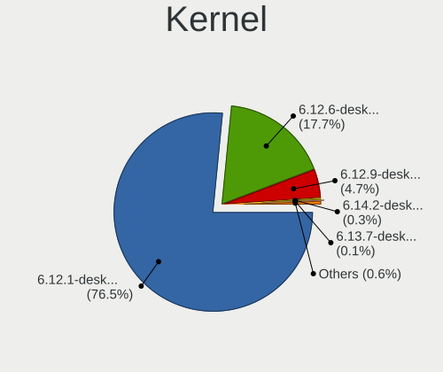

| Version                          | Desktops | Percent |
|----------------------------------|----------|---------|
| 6.12.1-desktop-1omv2490          | 1113     | 76.55%  |
| 6.12.6-desktop-1omv2490          | 257      | 17.68%  |
| 6.12.9-desktop-1omv2490          | 68       | 4.68%   |
| 6.14.2-desktop-3omv2590          | 5        | 0.34%   |
| 6.13.7-desktop-1omv2590          | 2        | 0.14%   |
| 6.12.6-desktop-gcc-1omv2490      | 2        | 0.14%   |
| 6.15.0-desktop-0.rc2.3omv2590    | 1        | 0.07%   |
| 6.14.0-desktop-0.rc4.2omv2590    | 1        | 0.07%   |
| 6.13.4-desktop-2omv2590          | 1        | 0.07%   |
| 6.13.0-server-gcc-0.rc4.1omv2490 | 1        | 0.07%   |
| 6.13.0-desktop-0.rc5.1omv2490    | 1        | 0.07%   |
| 6.13.0-desktop-0.rc1.1omv2490    | 1        | 0.07%   |
| 6.10.0-desktop-1omv2490          | 1        | 0.07%   |

Kernel Family
-------------

Linux kernel without a distro release

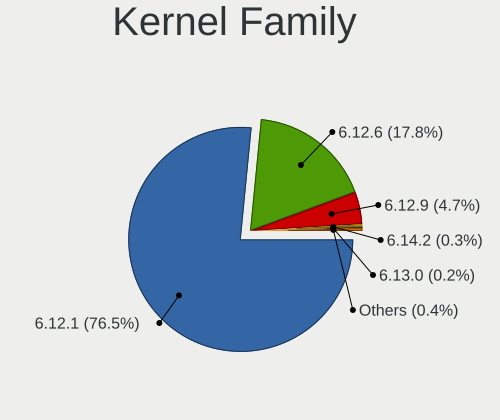

| Version | Desktops | Percent |
|---------|----------|---------|
| 6.12.1  | 1113     | 76.55%  |
| 6.12.6  | 259      | 17.81%  |
| 6.12.9  | 68       | 4.68%   |
| 6.14.2  | 5        | 0.34%   |
| 6.13.0  | 3        | 0.21%   |
| 6.13.7  | 2        | 0.14%   |
| 6.15.0  | 1        | 0.07%   |
| 6.14.0  | 1        | 0.07%   |
| 6.13.4  | 1        | 0.07%   |
| 6.10.0  | 1        | 0.07%   |

Kernel Major Ver.
-----------------

Linux kernel major version

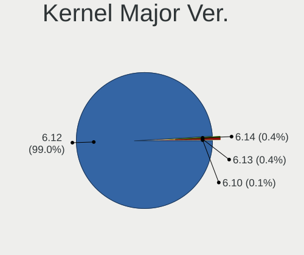

| Version | Desktops | Percent |
|---------|----------|---------|
| 6.12    | 1439     | 99.04%  |
| 6.14    | 6        | 0.41%   |
| 6.13    | 6        | 0.41%   |
| 6.15    | 1        | 0.07%   |
| 6.10    | 1        | 0.07%   |

Arch
----

OS architecture (x86_64, i586, etc.)

| Name   | Desktops | Percent |
|--------|----------|---------|
| x86_64 | 1453     | 100%    |

DE
--

Desktop Environment

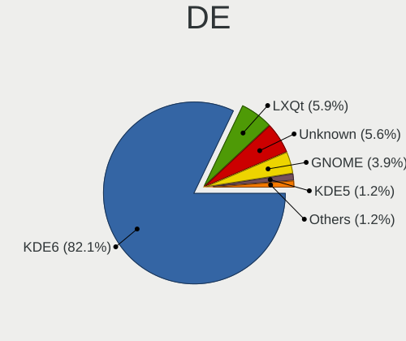

| Name     | Desktops | Percent |
|----------|----------|---------|
| KDE6     | 1194     | 82.12%  |
| LXQt     | 86       | 5.91%   |
| Unknown  | 81       | 5.57%   |
| GNOME    | 57       | 3.92%   |
| KDE5     | 18       | 1.24%   |
| XFCE     | 13       | 0.89%   |
| Budgie   | 2        | 0.14%   |
| MATE     | 1        | 0.07%   |
| LXDE     | 1        | 0.07%   |
| Cinnamon | 1        | 0.07%   |

Display Server
--------------

X11 or Wayland

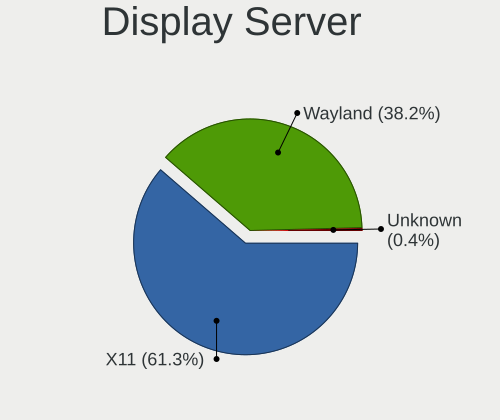

| Name    | Desktops | Percent |
|---------|----------|---------|
| X11     | 892      | 61.35%  |
| Wayland | 556      | 38.24%  |
| Unknown | 6        | 0.41%   |

Display Manager
---------------

SDDM, LightDM, etc.

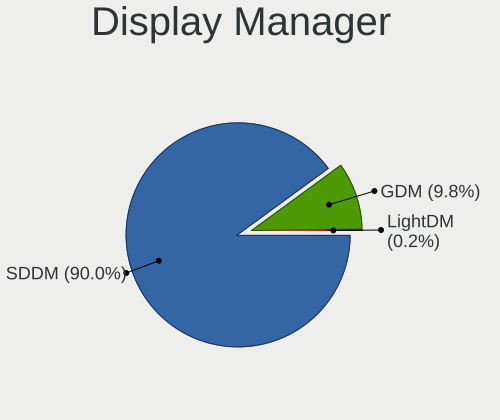

| Name    | Desktops | Percent |
|---------|----------|---------|
| SDDM    | 1307     | 89.95%  |
| GDM     | 143      | 9.84%   |
| LightDM | 3        | 0.21%   |

OS Lang
-------

Language

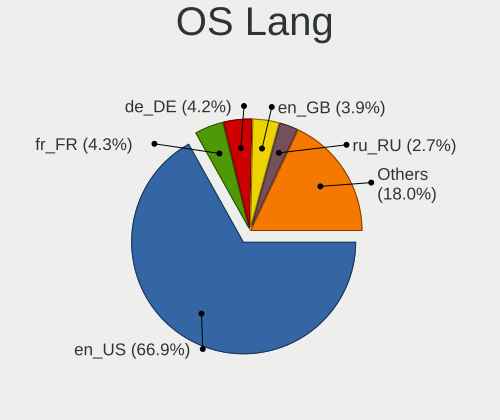

| Lang  | Desktops | Percent |
|-------|----------|---------|
| en_US | 974      | 66.9%   |
| fr_FR | 62       | 4.26%   |
| de_DE | 61       | 4.19%   |
| en_GB | 57       | 3.91%   |
| ru_RU | 40       | 2.75%   |
| it_IT | 36       | 2.47%   |
| pl_PL | 31       | 2.13%   |
| pt_BR | 30       | 2.06%   |
| es_ES | 24       | 1.65%   |
| en_AU | 20       | 1.37%   |
| en_CA | 18       | 1.24%   |
| hu_HU | 10       | 0.69%   |
| en_IN | 8        | 0.55%   |
| cs_CZ | 8        | 0.55%   |
| en_ZA | 7        | 0.48%   |
| tr_TR | 6        | 0.41%   |
| nl_NL | 6        | 0.41%   |
| es_MX | 6        | 0.41%   |
| nl_BE | 5        | 0.34%   |
| es_VE | 5        | 0.34%   |
| es_AR | 5        | 0.34%   |
| da_DK | 5        | 0.34%   |
| en_NZ | 4        | 0.27%   |
| de_CH | 4        | 0.27%   |
| de_AT | 4        | 0.27%   |
| fr_CA | 3        | 0.21%   |
| es_CL | 3        | 0.21%   |
| uk_UA | 2        | 0.14%   |
| pt_PT | 2        | 0.14%   |
| UTF-8 | 1        | 0.07%   |
| nb_NO | 1        | 0.07%   |
| fr_BE | 1        | 0.07%   |
| es_UY | 1        | 0.07%   |
| es_EC | 1        | 0.07%   |
| en_ZW | 1        | 0.07%   |
| en_IL | 1        | 0.07%   |
| en_HK | 1        | 0.07%   |
| en_AG | 1        | 0.07%   |
| ar_DZ | 1        | 0.07%   |

Boot Mode
---------

EFI or BIOS

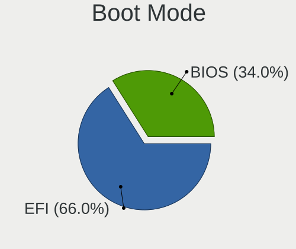

| Mode | Desktops | Percent |
|------|----------|---------|
| EFI  | 961      | 66%     |
| BIOS | 495      | 34%     |

Filesystem
----------

Type of filesystem

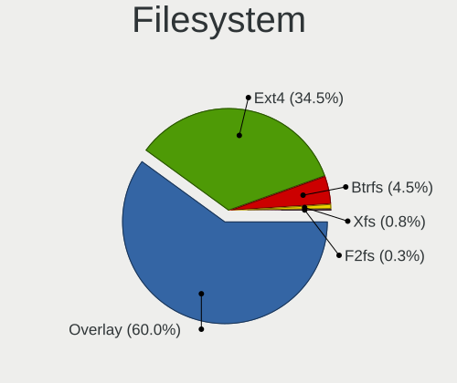

| Type    | Desktops | Percent |
|---------|----------|---------|
| Overlay | 874      | 60.03%  |
| Ext4    | 502      | 34.48%  |
| Btrfs   | 65       | 4.46%   |
| Xfs     | 11       | 0.76%   |
| F2fs    | 4        | 0.27%   |

Part. scheme
------------

Scheme of partitioning

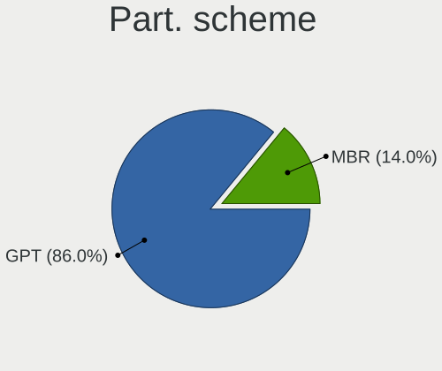

| Type | Desktops | Percent |
|------|----------|---------|
| GPT  | 1249     | 85.96%  |
| MBR  | 204      | 14.04%  |

Dual Boot with Linux/BSD
------------------------

Hosting more than one Linux/BSD

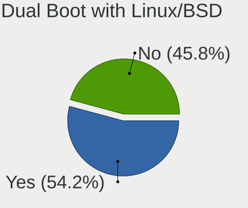

| Dual boot | Desktops | Percent |
|-----------|----------|---------|
| Yes       | 788      | 54.2%   |
| No        | 666      | 45.8%   |

Dual Boot (Win)
---------------

Hosting Linux and Windows

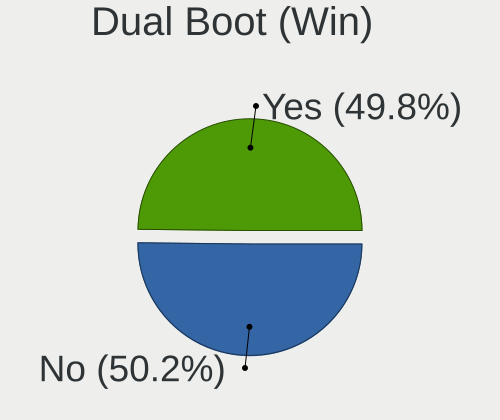

| Dual boot | Desktops | Percent |
|-----------|----------|---------|
| No        | 729      | 50.17%  |
| Yes       | 724      | 49.83%  |

Board
-----

Vendor
------

Motherboard manufacturer

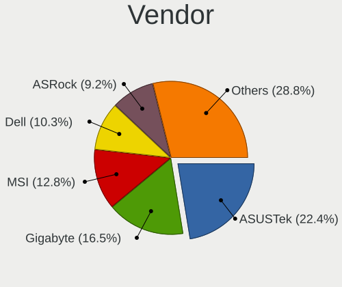

| Name                                 | Desktops | Percent |
|--------------------------------------|----------|---------|
| ASUSTek Computer                     | 326      | 22.44%  |
| Gigabyte Technology                  | 240      | 16.52%  |
| MSI                                  | 186      | 12.8%   |
| Dell                                 | 149      | 10.25%  |
| ASRock                               | 133      | 9.15%   |
| Hewlett-Packard                      | 113      | 7.78%   |
| Lenovo                               | 62       | 4.27%   |
| Intel                                | 40       | 2.75%   |
| Unknown                              | 26       | 1.79%   |
| Acer                                 | 23       | 1.58%   |
| AZW                                  | 16       | 1.1%    |
| Biostar                              | 13       | 0.89%   |
| Pegatron                             | 10       | 0.69%   |
| Fujitsu                              | 9        | 0.62%   |
| Red Hat                              | 7        | 0.48%   |
| Foxconn                              | 7        | 0.48%   |
| Shenzhen Meigao Electronic Equipment | 6        | 0.41%   |
| Medion                               | 6        | 0.41%   |
| GMKtec                               | 5        | 0.34%   |
| Inventec                             | 4        | 0.28%   |
| ECS                                  | 4        | 0.28%   |
| Apple                                | 4        | 0.28%   |
| AMI                                  | 4        | 0.28%   |
| Positivo                             | 3        | 0.21%   |
| Packard Bell                         | 3        | 0.21%   |
| MACHINIST                            | 3        | 0.21%   |
| Huanan                               | 3        | 0.21%   |
| Bosgame                              | 3        | 0.21%   |
| BESSTAR Tech                         | 3        | 0.21%   |
| HC Technology.                       | 2        | 0.14%   |
| GEEKOM                               | 2        | 0.14%   |
| eMachines                            | 2        | 0.14%   |
| AMD                                  | 2        | 0.14%   |
| Wistron                              | 1        | 0.07%   |
| VX                                   | 1        | 0.07%   |
| Trigkey                              | 1        | 0.07%   |
| TianBei                              | 1        | 0.07%   |
| T-bao                                | 1        | 0.07%   |
| SZMZ                                 | 1        | 0.07%   |
| SYWZ                                 | 1        | 0.07%   |

Model
-----

Motherboard model

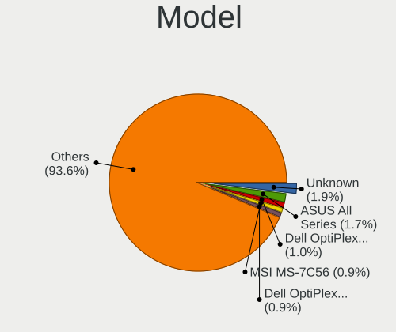

| Name                         | Desktops | Percent |
|------------------------------|----------|---------|
| Unknown                      | 28       | 1.93%   |
| ASUS All Series              | 24       | 1.65%   |
| Dell OptiPlex 9020           | 15       | 1.03%   |
| MSI MS-7C56                  | 13       | 0.89%   |
| Dell OptiPlex 7010           | 13       | 0.89%   |
| ASUS ROG STRIX B550-F GAMING | 13       | 0.89%   |
| MSI MS-7C02                  | 9        | 0.62%   |
| Dell OptiPlex 7050           | 9        | 0.62%   |
| Dell OptiPlex 3020           | 9        | 0.62%   |
| AZW MINI S                   | 9        | 0.62%   |
| MSI MS-7C95                  | 8        | 0.55%   |
| Red Hat KVM                  | 7        | 0.48%   |
| MSI MS-7817                  | 7        | 0.48%   |
| Dell OptiPlex 7040           | 7        | 0.48%   |
| ASUS PRIME B450M-A           | 7        | 0.48%   |
| ASUS PRIME A320M-K           | 7        | 0.48%   |
| Dell OptiPlex 3040           | 6        | 0.41%   |
| ASUS PRIME B550M-A           | 6        | 0.41%   |
| MSI MS-7D91                  | 5        | 0.34%   |
| MSI MS-7850                  | 5        | 0.34%   |
| Intel H81                    | 5        | 0.34%   |
| Intel H61                    | 5        | 0.34%   |
| HP EliteDesk 800 G2 DM 35W   | 5        | 0.34%   |
| HP EliteDesk 800 G1 SFF      | 5        | 0.34%   |
| HP Compaq Elite 8300 SFF     | 5        | 0.34%   |
| Gigabyte B550 AORUS ELITE V2 | 5        | 0.34%   |
| MSI MS-7D98                  | 4        | 0.28%   |
| MSI MS-7D78                  | 4        | 0.28%   |
| MSI MS-7D75                  | 4        | 0.28%   |
| MSI MS-7C91                  | 4        | 0.28%   |
| MSI MS-7693                  | 4        | 0.28%   |
| Inventec D CLASS             | 4        | 0.28%   |
| HP EliteDesk 800 G2 SFF      | 4        | 0.28%   |
| Gigabyte X570 AORUS PRO      | 4        | 0.28%   |
| Gigabyte B450M DS3H V2       | 4        | 0.28%   |
| Gigabyte B450 AORUS M        | 4        | 0.28%   |
| Dell OptiPlex 790            | 4        | 0.28%   |
| Dell OptiPlex 780            | 4        | 0.28%   |
| Dell OptiPlex 390            | 4        | 0.28%   |
| Dell OptiPlex 3050           | 4        | 0.28%   |

Model Family
------------

Motherboard model prefix

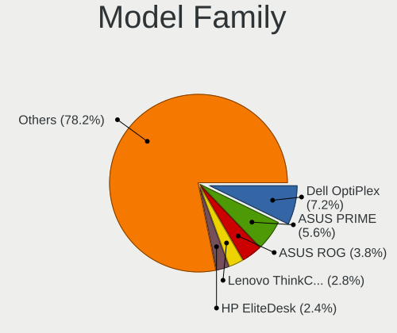

| Name                | Desktops | Percent |
|---------------------|----------|---------|
| Dell OptiPlex       | 105      | 7.23%   |
| ASUS PRIME          | 82       | 5.64%   |
| ASUS ROG            | 55       | 3.79%   |
| Lenovo ThinkCentre  | 40       | 2.75%   |
| HP EliteDesk        | 35       | 2.41%   |
| ASUS TUF            | 31       | 2.13%   |
| Unknown             | 28       | 1.93%   |
| HP Compaq           | 25       | 1.72%   |
| ASUS All            | 24       | 1.65%   |
| Dell Precision      | 16       | 1.1%    |
| Gigabyte B450M      | 14       | 0.96%   |
| MSI MS-7C56         | 13       | 0.89%   |
| Gigabyte B550M      | 13       | 0.89%   |
| Gigabyte B550       | 13       | 0.89%   |
| Acer Aspire         | 13       | 0.89%   |
| HP ProDesk          | 12       | 0.83%   |
| Gigabyte X570       | 11       | 0.76%   |
| ASRock B450M        | 11       | 0.76%   |
| HP Pavilion         | 10       | 0.69%   |
| MSI MS-7C02         | 9        | 0.62%   |
| Gigabyte B450       | 9        | 0.62%   |
| Gigabyte A520M      | 9        | 0.62%   |
| Dell Inspiron       | 9        | 0.62%   |
| AZW MINI            | 9        | 0.62%   |
| MSI MS-7C95         | 8        | 0.55%   |
| ASRock X570         | 8        | 0.55%   |
| Red Hat KVM         | 7        | 0.48%   |
| MSI MS-7817         | 7        | 0.48%   |
| Lenovo ThinkStation | 7        | 0.48%   |
| Fujitsu ESPRIMO     | 7        | 0.48%   |
| ASUS M5A78L-M       | 7        | 0.48%   |
| Lenovo IdeaCentre   | 6        | 0.41%   |
| Intel H61           | 6        | 0.41%   |
| Gigabyte B650       | 6        | 0.41%   |
| Dell Vostro         | 6        | 0.41%   |
| ASUS P8Z77-V        | 6        | 0.41%   |
| ASUS M4A87TD        | 6        | 0.41%   |
| MSI MS-7D91         | 5        | 0.34%   |
| MSI MS-7850         | 5        | 0.34%   |
| Intel H81           | 5        | 0.34%   |

MFG Year
--------

Motherboard manufacture year

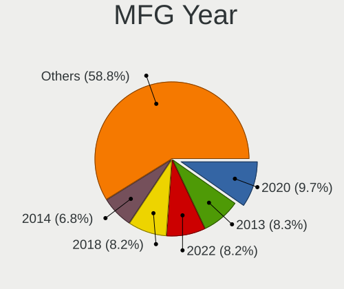

| Year | Desktops | Percent |
|------|----------|---------|
| 2020 | 141      | 9.7%    |
| 2013 | 120      | 8.26%   |
| 2022 | 119      | 8.19%   |
| 2018 | 119      | 8.19%   |
| 2014 | 99       | 6.81%   |
| 2012 | 96       | 6.61%   |
| 2023 | 95       | 6.54%   |
| 2019 | 87       | 5.99%   |
| 2017 | 82       | 5.64%   |
| 2021 | 74       | 5.09%   |
| 2011 | 69       | 4.75%   |
| 2016 | 67       | 4.61%   |
| 2015 | 62       | 4.27%   |
| 2024 | 60       | 4.13%   |
| 2009 | 50       | 3.44%   |
| 2010 | 46       | 3.17%   |
| 2008 | 30       | 2.06%   |
| 2007 | 22       | 1.51%   |
| 2006 | 9        | 0.62%   |
| 2005 | 4        | 0.28%   |
| 2025 | 2        | 0.14%   |

Form Factor
-----------

Physical design of the computer

| Name    | Desktops | Percent |
|---------|----------|---------|
| Desktop | 1453     | 100%    |

Secure Boot
-----------

Enabled or disabled

| State    | Desktops | Percent |
|----------|----------|---------|
| Disabled | 1453     | 100%    |

Coreboot
--------

Have coreboot on board

| Used | Desktops | Percent |
|------|----------|---------|
| No   | 1452     | 99.93%  |
| Yes  | 1        | 0.07%   |

RAM Size
--------

Total RAM memory

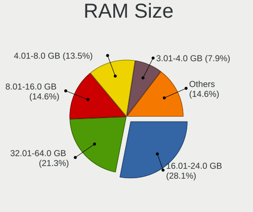

| Size in GB  | Desktops | Percent |
|-------------|----------|---------|
| 16.01-24.0  | 408      | 28.06%  |
| 32.01-64.0  | 309      | 21.25%  |
| 8.01-16.0   | 213      | 14.65%  |
| 4.01-8.0    | 196      | 13.48%  |
| 3.01-4.0    | 115      | 7.91%   |
| 64.01-256.0 | 106      | 7.29%   |
| 24.01-32.0  | 84       | 5.78%   |
| 1.01-2.0    | 16       | 1.1%    |
| 2.01-3.0    | 4        | 0.28%   |
| 0.51-1.0    | 2        | 0.14%   |
| 0.01-0.5    | 1        | 0.07%   |

RAM Used
--------

Used RAM memory

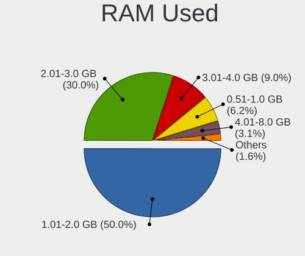

| Used GB    | Desktops | Percent |
|------------|----------|---------|
| 1.01-2.0   | 731      | 50.03%  |
| 2.01-3.0   | 438      | 29.98%  |
| 3.01-4.0   | 132      | 9.03%   |
| 0.51-1.0   | 91       | 6.23%   |
| 4.01-8.0   | 45       | 3.08%   |
| 0.01-0.5   | 17       | 1.16%   |
| 8.01-16.0  | 6        | 0.41%   |
| 32.01-64.0 | 1        | 0.07%   |

Total Drives
------------

Number of drives on board

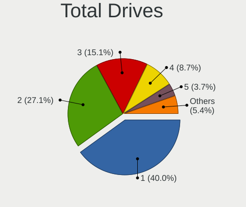

| Drives | Desktops | Percent |
|--------|----------|---------|
| 1      | 583      | 40.04%  |
| 2      | 394      | 27.06%  |
| 3      | 220      | 15.11%  |
| 4      | 127      | 8.72%   |
| 5      | 54       | 3.71%   |
| 0      | 34       | 2.34%   |
| 6      | 28       | 1.92%   |
| 8      | 6        | 0.41%   |
| 7      | 4        | 0.27%   |
| 11     | 2        | 0.14%   |
| 10     | 2        | 0.14%   |
| 13     | 1        | 0.07%   |
| 9      | 1        | 0.07%   |

Has CD-ROM
----------

Has CD-ROM on board

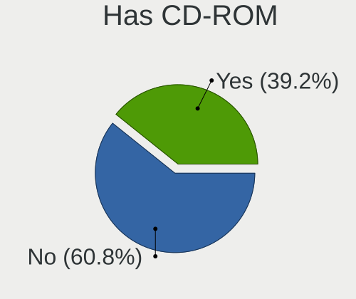

| Presented | Desktops | Percent |
|-----------|----------|---------|
| No        | 884      | 60.76%  |
| Yes       | 571      | 39.24%  |

Has Ethernet
------------

Has Ethernet on board

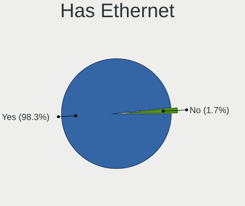

| Presented | Desktops | Percent |
|-----------|----------|---------|
| Yes       | 1429     | 98.35%  |
| No        | 24       | 1.65%   |

Has WiFi
--------

Has WiFi module

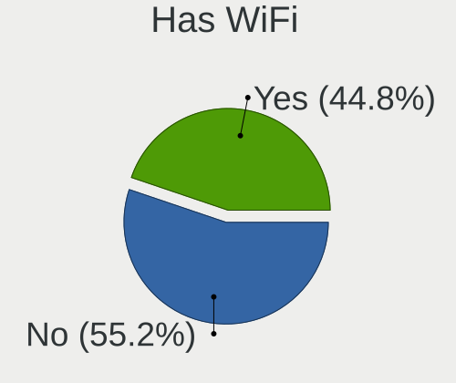

| Presented | Desktops | Percent |
|-----------|----------|---------|
| No        | 802      | 55.2%   |
| Yes       | 651      | 44.8%   |

Has Bluetooth
-------------

Has Bluetooth module

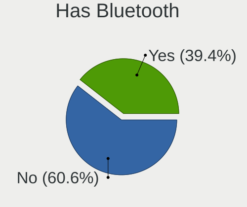

| Presented | Desktops | Percent |
|-----------|----------|---------|
| No        | 880      | 60.56%  |
| Yes       | 573      | 39.44%  |

Location
--------

Country
-------

Geographic location (country)

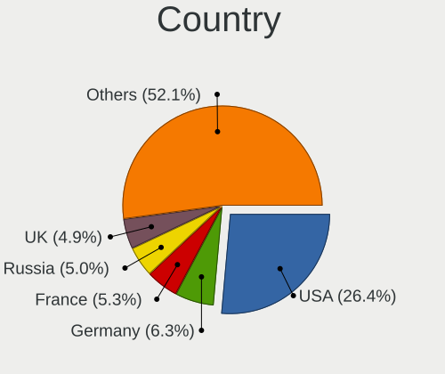

| Country      | Desktops | Percent |
|--------------|----------|---------|
| USA          | 384      | 26.41%  |
| Germany      | 92       | 6.33%   |
| France       | 77       | 5.3%    |
| Russia       | 72       | 4.95%   |
| UK           | 71       | 4.88%   |
| Brazil       | 66       | 4.54%   |
| Canada       | 62       | 4.26%   |
| Poland       | 61       | 4.2%    |
| Italy        | 59       | 4.06%   |
| Australia    | 48       | 3.3%    |
| Spain        | 36       | 2.48%   |
| India        | 30       | 2.06%   |
| Netherlands  | 25       | 1.72%   |
| Hungary      | 21       | 1.44%   |
| Sweden       | 17       | 1.17%   |
| Romania      | 14       | 0.96%   |
| Finland      | 14       | 0.96%   |
| Turkey       | 13       | 0.89%   |
| South Africa | 13       | 0.89%   |
| Mexico       | 13       | 0.89%   |
| Japan        | 13       | 0.89%   |
| Switzerland  | 11       | 0.76%   |
| Greece       | 10       | 0.69%   |
| Belgium      | 10       | 0.69%   |
| Austria      | 10       | 0.69%   |
| Indonesia    | 9        | 0.62%   |
| China        | 9        | 0.62%   |
| Philippines  | 8        | 0.55%   |
| Denmark      | 8        | 0.55%   |
| Czechia      | 8        | 0.55%   |
| Argentina    | 8        | 0.55%   |
| New Zealand  | 7        | 0.48%   |
| Croatia      | 7        | 0.48%   |
| Ukraine      | 6        | 0.41%   |
| Thailand     | 6        | 0.41%   |
| Serbia       | 6        | 0.41%   |
| Portugal     | 6        | 0.41%   |
| Norway       | 6        | 0.41%   |
| Malaysia     | 6        | 0.41%   |
| Colombia     | 6        | 0.41%   |

City
----

Geographic location (city)

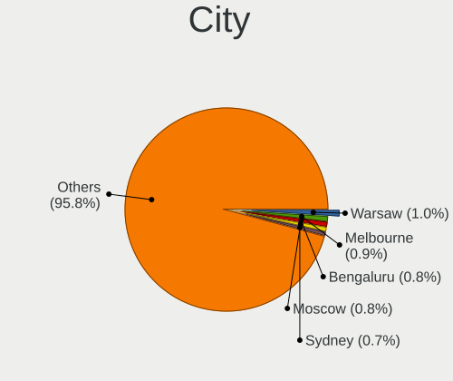

| City           | Desktops | Percent |
|----------------|----------|---------|
| Warsaw         | 15       | 1.03%   |
| Melbourne      | 13       | 0.89%   |
| Bengaluru      | 12       | 0.82%   |
| Moscow         | 11       | 0.75%   |
| Sydney         | 10       | 0.69%   |
| Milan          | 10       | 0.69%   |
| Rome           | 9        | 0.62%   |
| Budapest       | 9        | 0.62%   |
| Munich         | 8        | 0.55%   |
| Brisbane       | 8        | 0.55%   |
| Paris          | 7        | 0.48%   |
| Toronto        | 6        | 0.41%   |
| Sao Paulo      | 6        | 0.41%   |
| Rio de Janeiro | 6        | 0.41%   |
| Istanbul       | 6        | 0.41%   |
| Denver         | 6        | 0.41%   |
| Amsterdam      | 6        | 0.41%   |
| Vienna         | 5        | 0.34%   |
| St Petersburg  | 5        | 0.34%   |
| Singapore      | 5        | 0.34%   |
| Perth          | 5        | 0.34%   |
| Madrid         | 5        | 0.34%   |
| London         | 5        | 0.34%   |
| Lima           | 5        | 0.34%   |
| Helsinki       | 5        | 0.34%   |
| Dallas         | 5        | 0.34%   |
| Chicago        | 5        | 0.34%   |
| Berlin         | 5        | 0.34%   |
| Athens         | 5        | 0.34%   |
| Zagreb         | 4        | 0.27%   |
| Winterthur     | 4        | 0.27%   |
| Thessaloniki   | 4        | 0.27%   |
| Tampere        | 4        | 0.27%   |
| Sofia          | 4        | 0.27%   |
| Johannesburg   | 4        | 0.27%   |
| Gdynia         | 4        | 0.27%   |
| Dublin         | 4        | 0.27%   |
| Charlotte      | 4        | 0.27%   |
| Belgrade       | 4        | 0.27%   |
| Zurich         | 3        | 0.21%   |

Drives
------

Drive Vendor
------------

Hard drive vendors

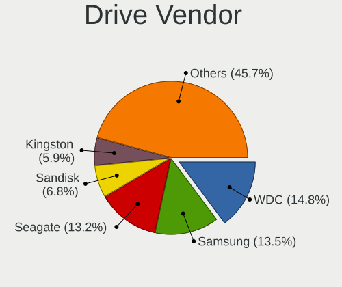

| Vendor                       | Desktops | Drives | Percent |
|------------------------------|----------|--------|---------|
| WDC                          | 384      | 504    | 14.82%  |
| Samsung Electronics          | 351      | 482    | 13.55%  |
| Seagate                      | 342      | 423    | 13.2%   |
| Sandisk                      | 177      | 214    | 6.83%   |
| Kingston                     | 152      | 184    | 5.87%   |
| Crucial                      | 117      | 137    | 4.52%   |
| Toshiba                      | 103      | 113    | 3.98%   |
| Micron/Crucial Technology    | 54       | 63     | 2.08%   |
| China                        | 54       | 57     | 2.08%   |
| Phison Electronics           | 52       | 60     | 2.01%   |
| Hitachi                      | 49       | 51     | 1.89%   |
| MAXIO Technology (Hangzhou)  | 46       | 53     | 1.78%   |
| Kingston Technology Company  | 41       | 42     | 1.58%   |
| A-DATA Technology            | 40       | 42     | 1.54%   |
| Unknown                      | 31       | 46     | 1.2%    |
| Micron Technology            | 30       | 31     | 1.16%   |
| Intel                        | 30       | 31     | 1.16%   |
| PNY                          | 29       | 32     | 1.12%   |
| ADATA Technology             | 26       | 29     | 1%      |
| SK hynix                     | 25       | 26     | 0.96%   |
| Realtek Semiconductor        | 24       | 24     | 0.93%   |
| SPCC                         | 21       | 28     | 0.81%   |
| Silicon Motion               | 21       | 23     | 0.81%   |
| Team                         | 20       | 21     | 0.77%   |
| GOODRAM                      | 17       | 17     | 0.66%   |
| Netac                        | 15       | 15     | 0.58%   |
| Shenzhen Longsys Electronics | 14       | 14     | 0.54%   |
| KingSpec                     | 14       | 18     | 0.54%   |
| Intenso                      | 13       | 14     | 0.5%    |
| HGST                         | 13       | 14     | 0.5%    |
| Plextor                      | 12       | 13     | 0.46%   |
| Patriot                      | 12       | 12     | 0.46%   |
| Lexar                        | 11       | 11     | 0.42%   |
| Apacer                       | 11       | 12     | 0.42%   |
| T-FORCE                      | 9        | 9      | 0.35%   |
| Maxtor                       | 9        | 10     | 0.35%   |
| KIOXIA                       | 9        | 9      | 0.35%   |
| Fanxiang                     | 9        | 14     | 0.35%   |
| OCZ                          | 8        | 8      | 0.31%   |
| Emtec                        | 8        | 9      | 0.31%   |

Drive Model
-----------

Hard drive models

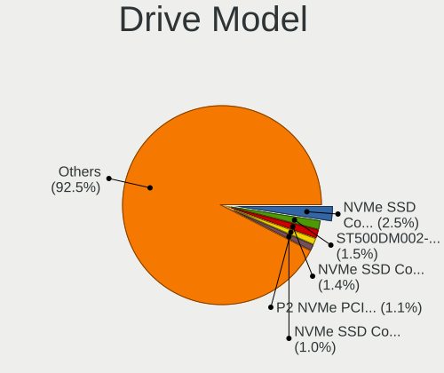

| Model                                                              | Desktops | Percent |
|--------------------------------------------------------------------|----------|---------|
| Samsung NVMe SSD Controller SM981/PM981/PM983 1TB                  | 72       | 2.46%   |
| Seagate ST500DM002-1BD142 500GB                                    | 44       | 1.5%    |
| Samsung NVMe SSD Controller PM9A1/PM9A3/980PRO 1TB                 | 42       | 1.44%   |
| Micron/Crucial P2 NVMe PCIe SSD 2TB                                | 32       | 1.09%   |
| MAXIO (Hangzhou) NVMe SSD Controller MAP1202 2TB                   | 30       | 1.03%   |
| Kingston SA400S37240G 240GB SSD                                    | 30       | 1.03%   |
| Seagate ST1000DM010-2EP102 1TB                                     | 29       | 0.99%   |
| Samsung SSD 860 EVO 1TB                                            | 29       | 0.99%   |
| WDC WD10EZEX-08WN4A0 1TB                                           | 27       | 0.92%   |
| Seagate ST2000DM008-2FR102 2TB                                     | 25       | 0.85%   |
| Samsung SSD 850 EVO 250GB                                          | 25       | 0.85%   |
| Kingston SA400S37480G 480GB SSD                                    | 23       | 0.79%   |
| Samsung SSD 870 EVO 1TB                                            | 22       | 0.75%   |
| Silicon Motion SM2263EN/SM2263XT SSD Controller 512GB              | 19       | 0.65%   |
| Samsung SSD 860 EVO 500GB                                          | 18       | 0.62%   |
| Sandisk WD Blue SN550 NVMe SSD 1024GB                              | 17       | 0.58%   |
| Samsung SSD 860 EVO 250GB                                          | 17       | 0.58%   |
| Kingston Company SNV2S1000G 1TB                                    | 16       | 0.55%   |
| Kingston SA400S37120G 120GB SSD                                    | 16       | 0.55%   |
| Crucial CT500MX500SSD1 500GB                                       | 16       | 0.55%   |
| Crucial CT240BX500SSD1 240GB                                       | 16       | 0.55%   |
| Seagate ST2000DM008-2UB102 2TB                                     | 15       | 0.51%   |
| Phison E12 NVMe Controller 1TB                                     | 15       | 0.51%   |
| Unknown SD/MMC/MS PRO 2GB                                          | 14       | 0.48%   |
| Toshiba DT01ACA100 1TB                                             | 14       | 0.48%   |
| Sandisk WD_BLACK SN850X 1000GB                                     | 13       | 0.44%   |
| Crucial CT1000BX500SSD1 1TB                                        | 13       | 0.44%   |
| Samsung SSD 980 1TB                                                | 12       | 0.41%   |
| Samsung SSD 850 EVO 500GB                                          | 12       | 0.41%   |
| Samsung NVMe SSD Controller SM961/PM961/SM963 1024GB               | 12       | 0.41%   |
| Seagate ST2000DM006-2DM164 2TB                                     | 11       | 0.38%   |
| Seagate ST1000DM003-1ER162 1TB                                     | 11       | 0.38%   |
| Seagate ST1000DM003-1CH162 1TB                                     | 11       | 0.38%   |
| Phison E16 PCIe4 NVMe Controller 1TB                               | 11       | 0.38%   |
| Kingston SA400S37960G 960GB SSD                                    | 11       | 0.38%   |
| Crucial CT2000MX500SSD1 2TB                                        | 11       | 0.38%   |
| Crucial CT1000MX500SSD1 1TB                                        | 11       | 0.38%   |
| ADATA XPG SX8200 Pro PCIe Gen3x4 M.2 2280 Solid State Drive 1024GB | 11       | 0.38%   |
| WDC WDS500G2B0A-00SM50 500GB                                       | 10       | 0.34%   |
| Toshiba HDWD110 1TB                                                | 10       | 0.34%   |

HDD Vendor
----------

Hard disk drive vendors

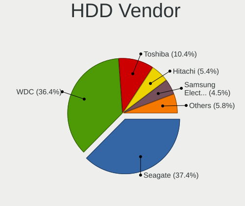

| Vendor              | Desktops | Drives | Percent |
|---------------------|----------|--------|---------|
| Seagate             | 338      | 414    | 37.43%  |
| WDC                 | 329      | 420    | 36.43%  |
| Toshiba             | 94       | 103    | 10.41%  |
| Hitachi             | 49       | 51     | 5.43%   |
| Samsung Electronics | 41       | 44     | 4.54%   |
| Unknown             | 14       | 15     | 1.55%   |
| HGST                | 13       | 14     | 1.44%   |
| Maxtor              | 9        | 10     | 1%      |
| WD MediaMax         | 2        | 2      | 0.22%   |
| Fujitsu             | 2        | 2      | 0.22%   |
| Apple               | 2        | 2      | 0.22%   |
| Unknown             | 2        | 2      | 0.22%   |
| SATAFIRM            | 1        | 1      | 0.11%   |
| QEMU                | 1        | 1      | 0.11%   |
| MARVELL             | 1        | 1      | 0.11%   |
| Magnetic Data       | 1        | 1      | 0.11%   |
| HPE                 | 1        | 1      | 0.11%   |
| Hewlett-Packard     | 1        | 1      | 0.11%   |
| ExcelStor           | 1        | 1      | 0.11%   |
| China               | 1        | 1      | 0.11%   |

SSD Vendor
----------

Solid state drive vendors

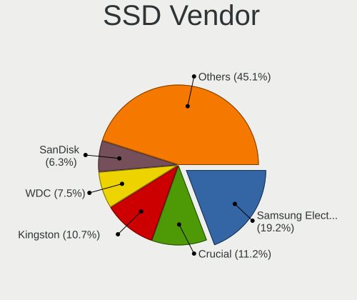

| Vendor              | Desktops | Drives | Percent |
|---------------------|----------|--------|---------|
| Samsung Electronics | 201      | 249    | 19.23%  |
| Crucial             | 117      | 137    | 11.2%   |
| Kingston            | 112      | 133    | 10.72%  |
| WDC                 | 78       | 84     | 7.46%   |
| SanDisk             | 66       | 72     | 6.32%   |
| China               | 52       | 55     | 4.98%   |
| A-DATA Technology   | 40       | 42     | 3.83%   |
| PNY                 | 29       | 32     | 2.78%   |
| SPCC                | 21       | 28     | 2.01%   |
| Team                | 18       | 19     | 1.72%   |
| GOODRAM             | 17       | 17     | 1.63%   |
| Intel               | 15       | 15     | 1.44%   |
| KingSpec            | 14       | 18     | 1.34%   |
| Intenso             | 13       | 14     | 1.24%   |
| Plextor             | 12       | 13     | 1.15%   |
| Patriot             | 12       | 12     | 1.15%   |
| Lexar               | 11       | 11     | 1.05%   |
| Apacer              | 11       | 12     | 1.05%   |
| Netac               | 10       | 10     | 0.96%   |
| Fanxiang            | 9        | 14     | 0.86%   |
| T-FORCE             | 8        | 8      | 0.77%   |
| OCZ                 | 8        | 8      | 0.77%   |
| Emtec               | 8        | 9      | 0.77%   |
| Micron Technology   | 7        | 7      | 0.67%   |
| Corsair             | 7        | 8      | 0.67%   |
| SK hynix            | 6        | 6      | 0.57%   |
| NGFF                | 6        | 6      | 0.57%   |
| Transcend           | 5        | 5      | 0.48%   |
| LITEON              | 5        | 5      | 0.48%   |
| Gigabyte Technology | 5        | 5      | 0.48%   |
| Unknown             | 5        | 5      | 0.48%   |
| Toshiba             | 4        | 4      | 0.38%   |
| Leven               | 4        | 4      | 0.38%   |
| KIOXIA-EXCERIA      | 4        | 4      | 0.38%   |
| Hewlett-Packard     | 4        | 5      | 0.38%   |
| XrayDisk            | 3        | 3      | 0.29%   |
| walram              | 3        | 3      | 0.29%   |
| Verbatim            | 3        | 3      | 0.29%   |
| Seagate             | 3        | 4      | 0.29%   |
| Mushkin             | 3        | 6      | 0.29%   |

Drive Kind
----------

HDD or SSD

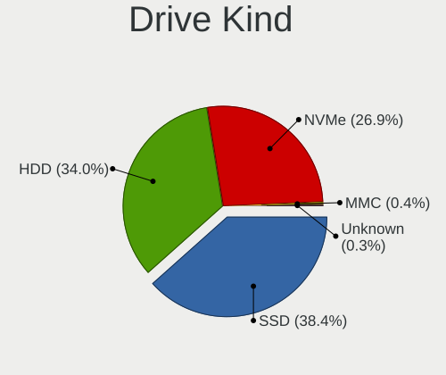

| Kind    | Desktops | Drives | Percent |
|---------|----------|--------|---------|
| SSD     | 834      | 1185   | 38.42%  |
| HDD     | 739      | 1087   | 34.04%  |
| NVMe    | 583      | 815    | 26.85%  |
| MMC     | 8        | 8      | 0.37%   |
| Unknown | 7        | 20     | 0.32%   |

Drive Connector
---------------

SATA, SAS, NVMe, etc.

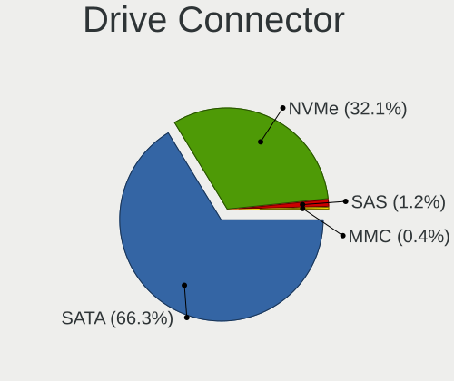

| Type | Desktops | Drives | Percent |
|------|----------|--------|---------|
| SATA | 1206     | 2257   | 66.3%   |
| NVMe | 583      | 815    | 32.05%  |
| SAS  | 22       | 35     | 1.21%   |
| MMC  | 8        | 8      | 0.44%   |

Drive Size
----------

Size of hard drive

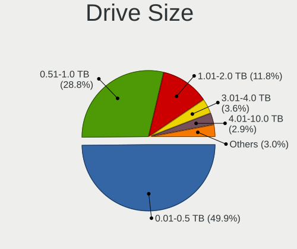

| Size in TB | Desktops | Drives | Percent |
|------------|----------|--------|---------|
| 0.01-0.5   | 851      | 1189   | 49.85%  |
| 0.51-1.0   | 492      | 609    | 28.82%  |
| 1.01-2.0   | 202      | 269    | 11.83%  |
| 3.01-4.0   | 62       | 81     | 3.63%   |
| 4.01-10.0  | 49       | 62     | 2.87%   |
| 2.01-3.0   | 35       | 41     | 2.05%   |
| 10.01-20.0 | 16       | 21     | 0.94%   |

Space Total
-----------

Amount of disk space available on the file system

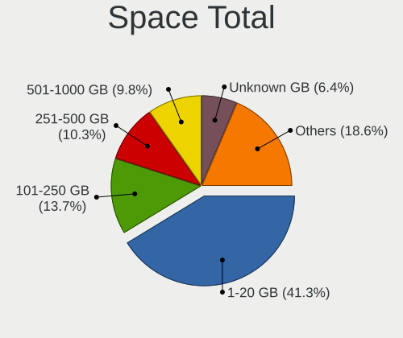

| Size in GB     | Desktops | Percent |
|----------------|----------|---------|
| 1-20           | 601      | 41.28%  |
| 101-250        | 199      | 13.67%  |
| 251-500        | 150      | 10.3%   |
| 501-1000       | 142      | 9.75%   |
| Unknown        | 93       | 6.39%   |
| 1001-2000      | 91       | 6.25%   |
| 51-100         | 62       | 4.26%   |
| More than 3000 | 57       | 3.91%   |
| 2001-3000      | 31       | 2.13%   |
| 21-50          | 30       | 2.06%   |

Space Used
----------

Amount of used disk space

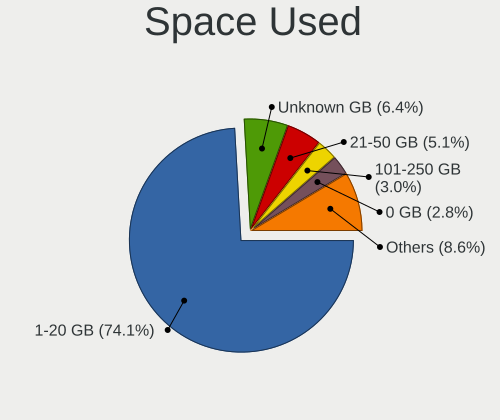

| Used GB        | Desktops | Percent |
|----------------|----------|---------|
| 1-20           | 1079     | 74.11%  |
| Unknown        | 93       | 6.39%   |
| 21-50          | 74       | 5.08%   |
| 101-250        | 44       | 3.02%   |
| 0              | 41       | 2.82%   |
| 501-1000       | 33       | 2.27%   |
| 251-500        | 28       | 1.92%   |
| 51-100         | 28       | 1.92%   |
| 1001-2000      | 18       | 1.24%   |
| 2001-3000      | 11       | 0.76%   |
| More than 3000 | 7        | 0.48%   |

Malfunc. Drives
---------------

Drive models with a malfunction

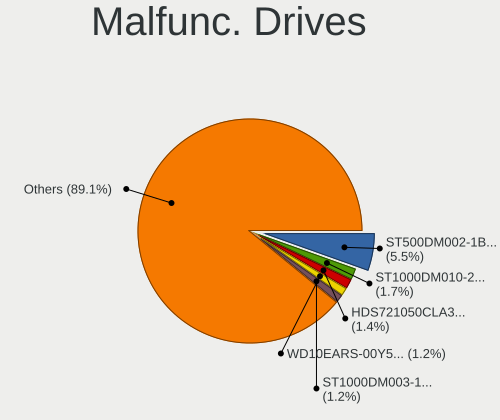

| Model                                                         | Desktops | Drives | Percent |
|---------------------------------------------------------------|----------|--------|---------|
| Seagate ST500DM002-1BD142 500GB                               | 23       | 25     | 5.45%   |
| Seagate ST1000DM010-2EP102 1TB                                | 7        | 7      | 1.66%   |
| Hitachi HDS721050CLA362 500GB                                 | 6        | 6      | 1.42%   |
| WDC WD10EARS-00Y5B1 1TB                                       | 5        | 5      | 1.18%   |
| Seagate ST1000DM003-1CH162 1TB                                | 5        | 5      | 1.18%   |
| Samsung Electronics SSD 870 EVO 1TB                           | 5        | 5      | 1.18%   |
| Samsung Electronics NVMe SSD Controller SM981/PM981/PM983 1TB | 5        | 6      | 1.18%   |
| WDC WD10EZEX-08WN4A0 1TB                                      | 4        | 4      | 0.95%   |
| Seagate ST3500418AS 500GB                                     | 4        | 4      | 0.95%   |
| Seagate ST31000524AS 1TB                                      | 4        | 4      | 0.95%   |
| Seagate ST2000DM006-2DM164 2TB                                | 4        | 4      | 0.95%   |
| Seagate ST1000DM003-1ER162 1TB                                | 4        | 4      | 0.95%   |
| WDC WD20EZRX-00D8PB0 2TB                                      | 3        | 4      | 0.71%   |
| WDC WD10EZEX-60ZF5A0 1TB                                      | 3        | 3      | 0.71%   |
| WDC WD Green 2.5 240GB                                        | 3        | 3      | 0.71%   |
| Seagate ST3500312CS 500GB                                     | 3        | 3      | 0.71%   |
| Seagate ST2000DM008-2FR102 2TB                                | 3        | 5      | 0.71%   |
| Seagate ST2000DM001-1CH164 2TB                                | 3        | 4      | 0.71%   |
| Seagate ST1000DM003-9YN162 1TB                                | 3        | 3      | 0.71%   |
| SanDisk SSD PLUS 480GB                                        | 3        | 3      | 0.71%   |
| Samsung Electronics HD502HJ 500GB                             | 3        | 3      | 0.71%   |
| Realtek Semiconductor RTS5763DL NVMe SSD Controller 512GB     | 3        | 3      | 0.71%   |
| China SSD 1TB                                                 | 3        | 3      | 0.71%   |
| XSTAR SSD 128GB                                               | 2        | 2      | 0.47%   |
| WDC WDS250G2B0A-00SM50 250GB SSD                              | 2        | 2      | 0.47%   |
| WDC WD5000AAKX-75U6AA0 500GB                                  | 2        | 2      | 0.47%   |
| WDC WD5000AAKX-753CA1 500GB                                   | 2        | 2      | 0.47%   |
| WDC WD5000AAKX-22ERMA0 500GB                                  | 2        | 2      | 0.47%   |
| WDC WD5000AAKX-00ERMA0 500GB                                  | 2        | 2      | 0.47%   |
| WDC WD5000AAKX-003CA0 500GB                                   | 2        | 2      | 0.47%   |
| WDC WD5000AADS-00S9B0 500GB                                   | 2        | 2      | 0.47%   |
| WDC WD30EFRX-68EUZN0 3TB                                      | 2        | 3      | 0.47%   |
| WDC WD20EARX-00PASB0 2TB                                      | 2        | 2      | 0.47%   |
| WDC WD10EZEX-22MFCA0 1TB                                      | 2        | 2      | 0.47%   |
| WDC WD10EZEX-00BN5A0 1TB                                      | 2        | 2      | 0.47%   |
| WDC WD10EADS-00L5B1 1TB                                       | 2        | 5      | 0.47%   |
| WDC WD Green 2.5 480GB                                        | 2        | 2      | 0.47%   |
| Toshiba MQ01ABF050 500GB                                      | 2        | 2      | 0.47%   |
| Toshiba HDWD130 3TB                                           | 2        | 2      | 0.47%   |
| Toshiba DT01ACA100 1TB                                        | 2        | 2      | 0.47%   |

Malfunc. Drive Vendor
---------------------

Vendors of faulty drives

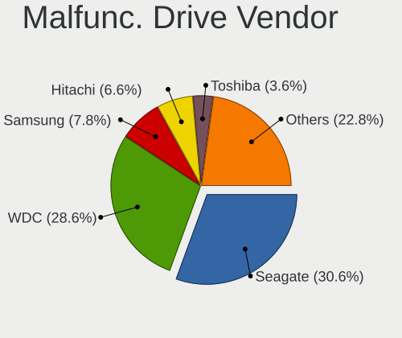

| Vendor                      | Desktops | Drives | Percent |
|-----------------------------|----------|--------|---------|
| Seagate                     | 126      | 135    | 30.58%  |
| WDC                         | 118      | 128    | 28.64%  |
| Samsung Electronics         | 32       | 36     | 7.77%   |
| Hitachi                     | 27       | 27     | 6.55%   |
| Toshiba                     | 15       | 16     | 3.64%   |
| China                       | 10       | 10     | 2.43%   |
| SanDisk                     | 9        | 9      | 2.18%   |
| Intel                       | 8        | 8      | 1.94%   |
| Maxtor                      | 7        | 8      | 1.7%    |
| Crucial                     | 7        | 8      | 1.7%    |
| Realtek Semiconductor       | 5        | 5      | 1.21%   |
| Kingston                    | 5        | 5      | 1.21%   |
| A-DATA Technology           | 5        | 5      | 1.21%   |
| Micron Technology           | 3        | 3      | 0.73%   |
| XSTAR                       | 2        | 2      | 0.49%   |
| PNY                         | 2        | 2      | 0.49%   |
| Netac                       | 2        | 2      | 0.49%   |
| HGST                        | 2        | 2      | 0.49%   |
| Team                        | 1        | 1      | 0.24%   |
| SSSTC                       | 1        | 1      | 0.24%   |
| Smartbuy                    | 1        | 1      | 0.24%   |
| SK hynix                    | 1        | 1      | 0.24%   |
| Reeinno                     | 1        | 1      | 0.24%   |
| Plextor                     | 1        | 1      | 0.24%   |
| Patriot                     | 1        | 1      | 0.24%   |
| OCZ                         | 1        | 1      | 0.24%   |
| NGFF                        | 1        | 1      | 0.24%   |
| Micron/Crucial Technology   | 1        | 1      | 0.24%   |
| MAXIO Technology (Hangzhou) | 1        | 1      | 0.24%   |
| Magnetic Data               | 1        | 1      | 0.24%   |
| Kingston Technology Company | 1        | 1      | 0.24%   |
| Intenso                     | 1        | 1      | 0.24%   |
| Fujitsu                     | 1        | 1      | 0.24%   |
| Fordisk                     | 1        | 1      | 0.24%   |
| Fanxiang                    | 1        | 1      | 0.24%   |
| Emtec                       | 1        | 1      | 0.24%   |
| Corsair                     | 1        | 1      | 0.24%   |
| Biwin Storage Technology    | 1        | 1      | 0.24%   |
| BAITITON                    | 1        | 1      | 0.24%   |
| Apple                       | 1        | 1      | 0.24%   |

Malfunc. HDD Vendor
-------------------

Vendors of faulty HDD drives

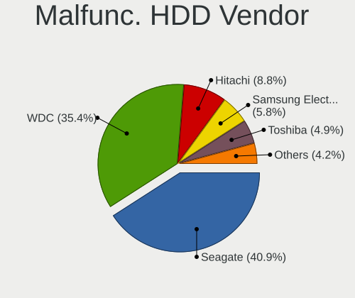

| Vendor              | Desktops | Drives | Percent |
|---------------------|----------|--------|---------|
| Seagate             | 126      | 135    | 40.91%  |
| WDC                 | 109      | 118    | 35.39%  |
| Hitachi             | 27       | 27     | 8.77%   |
| Samsung Electronics | 18       | 19     | 5.84%   |
| Toshiba             | 15       | 16     | 4.87%   |
| Maxtor              | 7        | 8      | 2.27%   |
| HGST                | 2        | 2      | 0.65%   |
| Magnetic Data       | 1        | 1      | 0.32%   |
| Fujitsu             | 1        | 1      | 0.32%   |
| Apple               | 1        | 1      | 0.32%   |
| Unknown             | 1        | 1      | 0.32%   |

Malfunc. Drive Kind
-------------------

Kinds of faulty drives

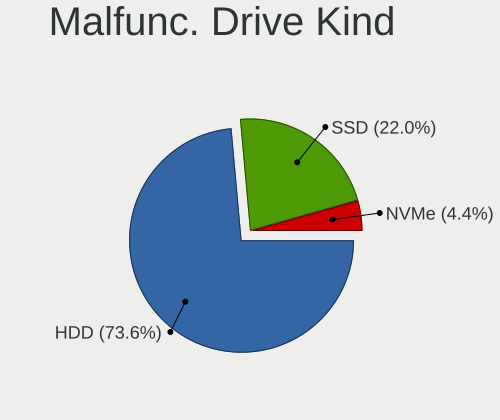

| Kind | Desktops | Drives | Percent |
|------|----------|--------|---------|
| HDD  | 284      | 329    | 73.58%  |
| SSD  | 85       | 89     | 22.02%  |
| NVMe | 17       | 20     | 4.4%    |

Failed Drives
-------------

Failed drive models

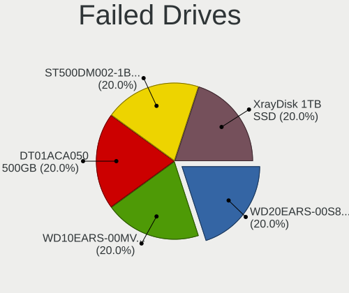

| Model                                  | Desktops | Drives | Percent |
|----------------------------------------|----------|--------|---------|
| WDC WD20EARS-00S8B1 2TB                | 1        | 1      | 20%     |
| WDC WD10EARS-00MVWB0 1TB               | 1        | 1      | 20%     |
| Toshiba DT01ACA050 500GB               | 1        | 1      | 20%     |
| Seagate ST500DM002-1BD142 500GB        | 1        | 1      | 20%     |
| Realtek Semiconductor XrayDisk 1TB SSD | 1        | 1      | 20%     |

Failed Drive Vendor
-------------------

Failed drive vendors

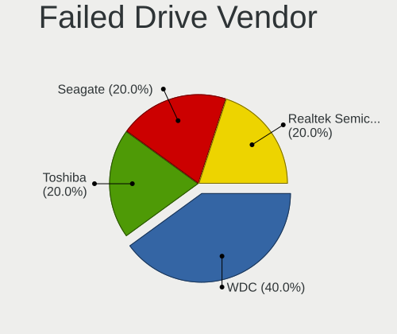

| Vendor                | Desktops | Drives | Percent |
|-----------------------|----------|--------|---------|
| WDC                   | 2        | 2      | 40%     |
| Toshiba               | 1        | 1      | 20%     |
| Seagate               | 1        | 1      | 20%     |
| Realtek Semiconductor | 1        | 1      | 20%     |

Drive Status
------------

Number of failed and malfunc. drives

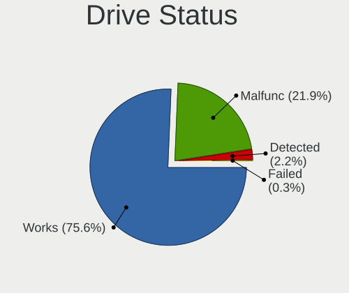

| Status   | Desktops | Drives | Percent |
|----------|----------|--------|---------|
| Works    | 1283     | 2621   | 75.65%  |
| Malfunc  | 371      | 438    | 21.88%  |
| Detected | 37       | 51     | 2.18%   |
| Failed   | 5        | 5      | 0.29%   |

Storage controller
------------------

Storage Vendor
--------------

Storage controller vendors

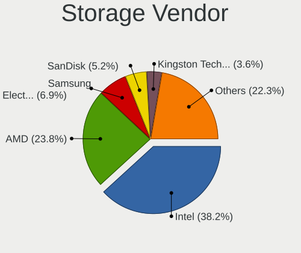

| Vendor                           | Desktops | Percent |
|----------------------------------|----------|---------|
| Intel                            | 864      | 38.21%  |
| AMD                              | 537      | 23.75%  |
| Samsung Electronics              | 157      | 6.94%   |
| SanDisk                          | 117      | 5.17%   |
| Kingston Technology Company      | 82       | 3.63%   |
| ASMedia Technology               | 76       | 3.36%   |
| Phison Electronics               | 54       | 2.39%   |
| Micron/Crucial Technology        | 54       | 2.39%   |
| MAXIO Technology (Hangzhou)      | 46       | 2.03%   |
| JMicron Technology               | 30       | 1.33%   |
| Marvell Technology Group         | 26       | 1.15%   |
| ADATA Technology                 | 26       | 1.15%   |
| Realtek Semiconductor            | 24       | 1.06%   |
| Micron Technology                | 23       | 1.02%   |
| Nvidia                           | 22       | 0.97%   |
| Silicon Motion                   | 21       | 0.93%   |
| SK hynix                         | 19       | 0.84%   |
| Shenzhen Longsys Electronics     | 14       | 0.62%   |
| KIOXIA                           | 11       | 0.49%   |
| INNOGRIT                         | 8        | 0.35%   |
| Solidigm                         | 7        | 0.31%   |
| Biwin Storage Technology         | 7        | 0.31%   |
| Toshiba America Info Systems     | 5        | 0.22%   |
| Netac Technology                 | 5        | 0.22%   |
| VIA Technologies                 | 4        | 0.18%   |
| Seagate Technology               | 4        | 0.18%   |
| Broadcom / LSI                   | 3        | 0.13%   |
| TenaFe                           | 2        | 0.09%   |
| Solid State Storage Technology   | 2        | 0.09%   |
| Adaptec                          | 2        | 0.09%   |
| Silicon Integrated Systems [SiS] | 1        | 0.04%   |
| Silicon Image                    | 1        | 0.04%   |
| Red Hat                          | 1        | 0.04%   |
| Lenovo                           | 1        | 0.04%   |
| Integrated Technology Express    | 1        | 0.04%   |
| Hosin Global Electronics         | 1        | 0.04%   |
| Apple                            | 1        | 0.04%   |
| 3ware                            | 1        | 0.04%   |
| Unknown                          | 1        | 0.04%   |

Storage Model
-------------

Storage controller models

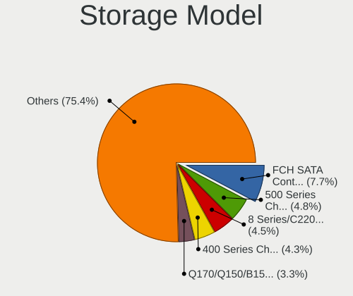

| Model                                                                                   | Desktops | Percent |
|-----------------------------------------------------------------------------------------|----------|---------|
| AMD FCH SATA Controller [AHCI mode]                                                     | 204      | 7.73%   |
| AMD 500 Series Chipset SATA Controller                                                  | 126      | 4.77%   |
| Intel 8 Series/C220 Series Chipset Family 6-port SATA Controller 1 [AHCI mode]          | 118      | 4.47%   |
| AMD 400 Series Chipset SATA Controller                                                  | 114      | 4.32%   |
| Intel Q170/Q150/B150/H170/H110/Z170/CM236 Chipset SATA Controller [AHCI Mode]           | 87       | 3.3%    |
| Samsung NVMe SSD Controller SM981/PM981/PM983                                           | 72       | 2.73%   |
| AMD 600 Series Chipset SATA Controller                                                  | 68       | 2.58%   |
| Intel 7 Series/C210 Series Chipset Family 6-port SATA Controller [AHCI mode]            | 67       | 2.54%   |
| Intel 6 Series/C200 Series Chipset Family 6 port Desktop SATA AHCI Controller           | 64       | 2.43%   |
| Intel 200 Series PCH SATA controller [AHCI mode]                                        | 63       | 2.39%   |
| ASMedia ASM1061/ASM1062 Serial ATA Controller                                           | 59       | 2.24%   |
| AMD SB7x0/SB8x0/SB9x0 IDE Controller                                                    | 53       | 2.01%   |
| Intel SATA Controller [RAID mode]                                                       | 52       | 1.97%   |
| Intel Raptor Lake SATA AHCI Controller                                                  | 44       | 1.67%   |
| Samsung NVMe SSD Controller PM9A1/PM9A3/980PRO                                          | 42       | 1.59%   |
| Intel Cannon Lake PCH SATA AHCI Controller                                              | 40       | 1.52%   |
| AMD SB7x0/SB8x0/SB9x0 SATA Controller [IDE mode]                                        | 39       | 1.48%   |
| AMD SB7x0/SB8x0/SB9x0 SATA Controller [AHCI mode]                                       | 39       | 1.48%   |
| Intel NM10/ICH7 Family SATA Controller [IDE mode]                                       | 34       | 1.29%   |
| Micron/Crucial P2 [Nick P2] / P3 / P3 Plus NVMe PCIe SSD (DRAM-less)                    | 32       | 1.21%   |
| SanDisk WD SN560/SN740/SN770/SN5000 NVMe SSD                                            | 30       | 1.14%   |
| MAXIO (Hangzhou) NVMe SSD Controller MAP1202 (DRAM-less)                                | 30       | 1.14%   |
| Intel Alder Lake-S PCH SATA Controller [AHCI Mode]                                      | 30       | 1.14%   |
| Intel 82801G (ICH7 Family) IDE Controller                                               | 28       | 1.06%   |
| Sandisk WD Black SN850X NVMe SSD                                                        | 27       | 1.02%   |
| Intel 500 Series Chipset Family SATA AHCI Controller                                    | 27       | 1.02%   |
| Kingston Company KC3000/FURY Renegade NVMe SSD [E18]                                    | 22       | 0.83%   |
| Intel Alder Lake-N SATA AHCI Controller                                                 | 22       | 0.83%   |
| AMD A320 Chipset SATA Controller [AHCI mode]                                            | 21       | 0.8%    |
| Samsung NVMe SSD Controller 980 (DRAM-less)                                             | 20       | 0.76%   |
| Kingston Company NV2 NVMe SSD [SM2267XT] (DRAM-less)                                    | 20       | 0.76%   |
| Silicon Motion SM2263EN/SM2263XT (DRAM-less) NVMe SSD Controllers                       | 19       | 0.72%   |
| AMD 300 Series Chipset SATA Controller                                                  | 18       | 0.68%   |
| SanDisk Ultra 3D / WD PC SN530, IX SN530, Blue SN550 NVMe SSD (DRAM-less)               | 17       | 0.64%   |
| MAXIO (Hangzhou) NVMe SSD Controller MAP1602 (DRAM-less)                                | 17       | 0.64%   |
| Intel 82801JI (ICH10 Family) SATA AHCI Controller                                       | 16       | 0.61%   |
| Phison E12 NVMe Controller                                                              | 15       | 0.57%   |
| Intel Volume Management Device NVMe RAID Controller                                     | 15       | 0.57%   |
| Intel 9 Series Chipset Family SATA Controller [AHCI Mode]                               | 15       | 0.57%   |
| Intel 6 Series/C200 Series Chipset Family Desktop SATA Controller (IDE mode, ports 4-5) | 15       | 0.57%   |

Storage Kind
------------

Kind of storage controller (IDE, SATA, NVMe, SAS, ...)

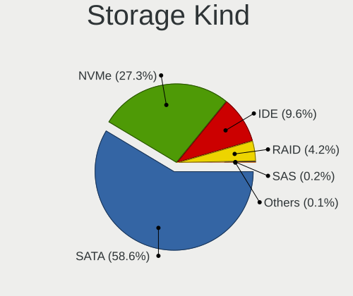

| Kind | Desktops | Percent |
|------|----------|---------|
| SATA | 1253     | 58.61%  |
| NVMe | 583      | 27.27%  |
| IDE  | 206      | 9.64%   |
| RAID | 89       | 4.16%   |
| SAS  | 5        | 0.23%   |
| SCSI | 2        | 0.09%   |

Processor
---------

CPU Vendor
----------

Processor vendors

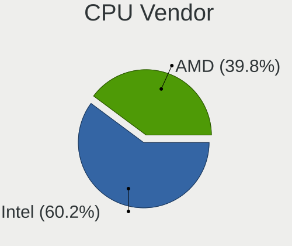

| Vendor | Desktops | Percent |
|--------|----------|---------|
| Intel  | 874      | 60.15%  |
| AMD    | 579      | 39.85%  |

CPU Model
---------

Processor models

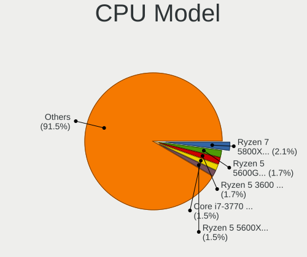

| Model                                       | Desktops | Percent |
|---------------------------------------------|----------|---------|
| AMD Ryzen 7 5800X 8-Core Processor          | 30       | 2.06%   |
| AMD Ryzen 5 5600G with Radeon Graphics      | 25       | 1.72%   |
| AMD Ryzen 5 3600 6-Core Processor           | 24       | 1.65%   |
| Intel Core i7-3770 CPU @ 3.40GHz            | 22       | 1.51%   |
| AMD Ryzen 5 5600X 6-Core Processor          | 22       | 1.51%   |
| Intel Core i5-6500 CPU @ 3.20GHz            | 19       | 1.31%   |
| Intel Core i5-3470 CPU @ 3.20GHz            | 18       | 1.24%   |
| AMD Ryzen 7 5700G with Radeon Graphics      | 17       | 1.17%   |
| Intel N100                                  | 16       | 1.1%    |
| Intel Core i5-4590 CPU @ 3.30GHz            | 16       | 1.1%    |
| Intel Core i5-4570 CPU @ 3.20GHz            | 16       | 1.1%    |
| AMD Ryzen 7 3700X 8-Core Processor          | 15       | 1.03%   |
| Intel Core i7-7700 CPU @ 3.60GHz            | 13       | 0.89%   |
| AMD Ryzen 9 3900X 12-Core Processor         | 13       | 0.89%   |
| AMD Ryzen 5 2600 Six-Core Processor         | 13       | 0.89%   |
| AMD Ryzen 3 3200G with Radeon Vega Graphics | 13       | 0.89%   |
| Intel Core i5-6500T CPU @ 2.50GHz           | 12       | 0.83%   |
| AMD Ryzen 9 5900X 12-Core Processor         | 12       | 0.83%   |
| AMD Ryzen 7 5700X 8-Core Processor          | 12       | 0.83%   |
| Intel Core i7-4790 CPU @ 3.60GHz            | 11       | 0.76%   |
| Intel Core i5-8400 CPU @ 2.80GHz            | 11       | 0.76%   |
| Intel Core i5-2400 CPU @ 3.10GHz            | 11       | 0.76%   |
| Intel Core 2 Duo CPU E8400 @ 3.00GHz        | 11       | 0.76%   |
| AMD Ryzen 9 5950X 16-Core Processor         | 11       | 0.76%   |
| AMD Ryzen 7 2700X Eight-Core Processor      | 11       | 0.76%   |
| Intel Core i7-4790K CPU @ 4.00GHz           | 10       | 0.69%   |
| Intel Core i5-3570 CPU @ 3.40GHz            | 10       | 0.69%   |
| Intel Core i3-3220 CPU @ 3.30GHz            | 10       | 0.69%   |
| Intel Core i3-2120 CPU @ 3.30GHz            | 10       | 0.69%   |
| AMD Ryzen 7 7800X3D 8-Core Processor        | 10       | 0.69%   |
| AMD Ryzen 5 7600 6-Core Processor           | 10       | 0.69%   |
| AMD Ryzen 5 2400G with Radeon Vega Graphics | 10       | 0.69%   |
| AMD FX-8350 Eight-Core Processor            | 10       | 0.69%   |
| Intel Core i7-8700K CPU @ 3.70GHz           | 9        | 0.62%   |
| Intel Core i7-6700 CPU @ 3.40GHz            | 9        | 0.62%   |
| Intel Core i5-7500 CPU @ 3.40GHz            | 9        | 0.62%   |
| Intel Core i5-6400 CPU @ 2.70GHz            | 9        | 0.62%   |
| AMD Ryzen 5 5600 6-Core Processor           | 9        | 0.62%   |
| Intel Core i7-8700 CPU @ 3.20GHz            | 8        | 0.55%   |
| Intel Core i7-2600 CPU @ 3.40GHz            | 8        | 0.55%   |

CPU Model Family
----------------

Processor model prefix

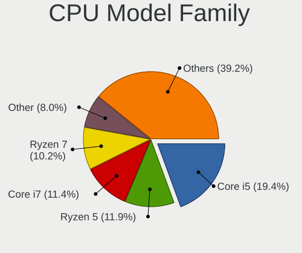

| Model                   | Desktops | Percent |
|-------------------------|----------|---------|
| Intel Core i5           | 282      | 19.41%  |
| AMD Ryzen 5             | 173      | 11.91%  |
| Intel Core i7           | 165      | 11.36%  |
| AMD Ryzen 7             | 148      | 10.19%  |
| Other                   | 116      | 7.98%   |
| Intel Core i3           | 91       | 6.26%   |
| Intel Xeon              | 66       | 4.54%   |
| AMD Ryzen 9             | 62       | 4.27%   |
| Intel Celeron           | 39       | 2.68%   |
| AMD FX                  | 38       | 2.62%   |
| AMD Ryzen 3             | 34       | 2.34%   |
| Intel Core 2 Duo        | 29       | 2%      |
| Intel Core 2 Quad       | 21       | 1.45%   |
| Intel Pentium           | 17       | 1.17%   |
| AMD Phenom II X4        | 17       | 1.17%   |
| Intel Pentium Dual-Core | 14       | 0.96%   |
| AMD A10                 | 11       | 0.76%   |
| AMD A8                  | 10       | 0.69%   |
| Intel Core i9           | 8        | 0.55%   |
| AMD Athlon II X2        | 8        | 0.55%   |
| AMD Athlon 64 X2        | 8        | 0.55%   |
| Intel Core 2            | 7        | 0.48%   |
| AMD Ryzen 5 PRO         | 7        | 0.48%   |
| AMD Phenom II X6        | 7        | 0.48%   |
| AMD Athlon II X4        | 7        | 0.48%   |
| AMD A6                  | 6        | 0.41%   |
| Intel Atom              | 5        | 0.34%   |
| AMD Ryzen Threadripper  | 5        | 0.34%   |
| Intel Pentium Gold      | 4        | 0.28%   |
| AMD G                   | 4        | 0.28%   |
| AMD Athlon              | 4        | 0.28%   |
| AMD A4                  | 4        | 0.28%   |
| Intel Pentium D         | 3        | 0.21%   |
| AMD Sempron             | 3        | 0.21%   |
| AMD Phenom II X2        | 3        | 0.21%   |
| Intel Pentium Silver    | 2        | 0.14%   |
| Intel Pentium 4         | 2        | 0.14%   |
| Intel Genuine           | 2        | 0.14%   |
| Intel Core              | 2        | 0.14%   |
| AMD Phenom              | 2        | 0.14%   |

CPU Cores
---------

Number of processor cores

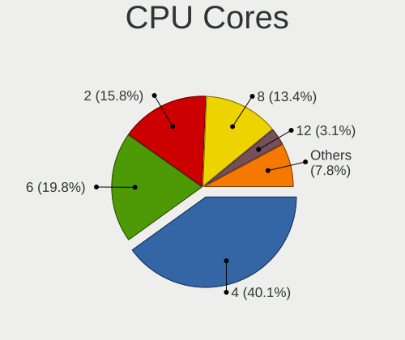

| Number | Desktops | Percent |
|--------|----------|---------|
| 4      | 582      | 40.06%  |
| 6      | 287      | 19.75%  |
| 2      | 230      | 15.83%  |
| 8      | 195      | 13.42%  |
| 12     | 45       | 3.1%    |
| 16     | 44       | 3.03%   |
| 10     | 15       | 1.03%   |
| 24     | 14       | 0.96%   |
| 14     | 13       | 0.89%   |
| 1      | 11       | 0.76%   |
| 20     | 10       | 0.69%   |
| 3      | 3        | 0.21%   |
| 36     | 1        | 0.07%   |
| 28     | 1        | 0.07%   |
| 18     | 1        | 0.07%   |
| 5      | 1        | 0.07%   |

CPU Sockets
-----------

Number of sockets

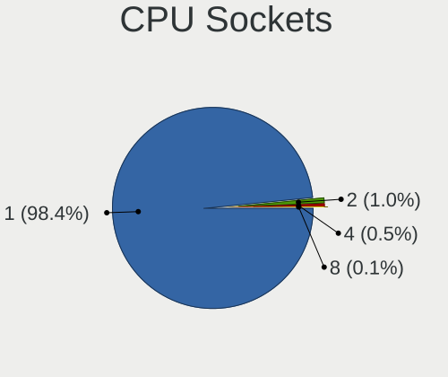

| Number | Desktops | Percent |
|--------|----------|---------|
| 1      | 1430     | 98.42%  |
| 2      | 14       | 0.96%   |
| 4      | 7        | 0.48%   |
| 8      | 2        | 0.14%   |

CPU Threads
-----------

Threads per core (Hyper-Threading)

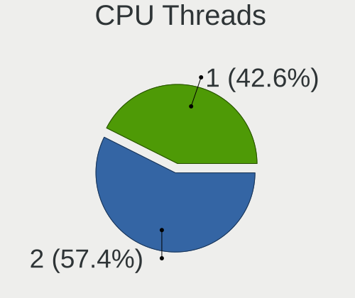

| Number | Desktops | Percent |
|--------|----------|---------|
| 2      | 834      | 57.4%   |
| 1      | 619      | 42.6%   |

CPU Op-Modes
------------

CPU Operation Modes (32-bit, 64-bit)

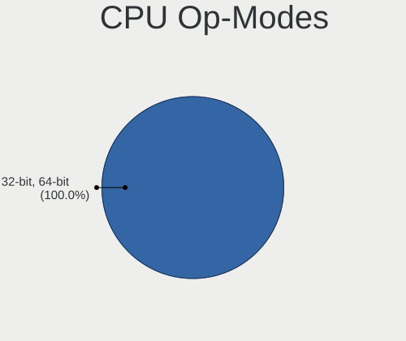

| Op mode        | Desktops | Percent |
|----------------|----------|---------|
| 32-bit, 64-bit | 1453     | 100%    |

CPU Microcode
-------------

Microcode number

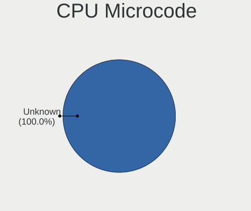

| Number  | Desktops | Percent |
|---------|----------|---------|
| Unknown | 1453     | 100%    |

CPU Microarch
-------------

Microarchitecture

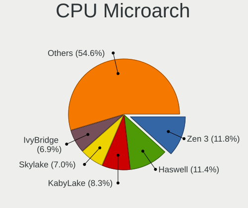

| Name             | Desktops | Percent |
|------------------|----------|---------|
| Zen 3            | 171      | 11.77%  |
| Haswell          | 166      | 11.42%  |
| KabyLake         | 120      | 8.26%   |
| Skylake          | 102      | 7.02%   |
| IvyBridge        | 100      | 6.88%   |
| Alderlake Hybrid | 81       | 5.57%   |
| Unknown          | 81       | 5.57%   |
| Zen 2            | 80       | 5.51%   |
| SandyBridge      | 69       | 4.75%   |
| Zen+             | 59       | 4.06%   |
| Penryn           | 58       | 3.99%   |
| K10              | 49       | 3.37%   |
| Zen              | 44       | 3.03%   |
| Piledriver       | 44       | 3.03%   |
| CometLake        | 30       | 2.06%   |
| Gracemont        | 24       | 1.65%   |
| Icelake          | 22       | 1.51%   |
| Westmere         | 19       | 1.31%   |
| Core             | 17       | 1.17%   |
| Steamroller      | 14       | 0.96%   |
| Nehalem          | 14       | 0.96%   |
| Broadwell        | 13       | 0.89%   |
| K8 Hammer        | 12       | 0.83%   |
| Tremont          | 10       | 0.69%   |
| Goldmont plus    | 9        | 0.62%   |
| Silvermont       | 6        | 0.41%   |
| NetBurst         | 6        | 0.41%   |
| Excavator        | 6        | 0.41%   |
| Bulldozer        | 6        | 0.41%   |
| Bobcat           | 6        | 0.41%   |
| Goldmont         | 4        | 0.28%   |
| K10 Llano        | 3        | 0.21%   |
| Puma             | 2        | 0.14%   |
| Lunarlake Hybrid | 2        | 0.14%   |
| Jaguar           | 2        | 0.14%   |
| Bonnell          | 2        | 0.14%   |

Graphics
--------

GPU Vendor
----------

Vendors of graphics cards

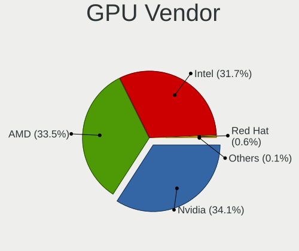

| Vendor                           | Desktops | Percent |
|----------------------------------|----------|---------|
| Nvidia                           | 527      | 34.11%  |
| AMD                              | 518      | 33.53%  |
| Intel                            | 489      | 31.65%  |
| Red Hat                          | 9        | 0.58%   |
| Silicon Integrated Systems [SiS] | 1        | 0.06%   |
| Matrox Electronics Systems       | 1        | 0.06%   |

GPU Model
---------

Graphics card models

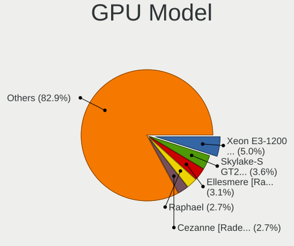

| Model                                                                       | Desktops | Percent |
|-----------------------------------------------------------------------------|----------|---------|
| Intel Xeon E3-1200 v3/4th Gen Core Processor Integrated Graphics Controller | 79       | 4.97%   |
| Intel Skylake-S GT2 [HD Graphics 530]                                       | 57       | 3.58%   |
| AMD Ellesmere [Radeon RX 470/480/570/570X/580/580X/590]                     | 50       | 3.14%   |
| AMD Raphael                                                                 | 43       | 2.7%    |
| AMD Cezanne [Radeon Vega Series / Radeon Vega Mobile Series]                | 43       | 2.7%    |
| AMD Navi 23 [Radeon RX 6600/6600 XT/6600M]                                  | 40       | 2.52%   |
| Intel 2nd Generation Core Processor Family Integrated Graphics Controller   | 39       | 2.45%   |
| Intel Xeon E3-1200 v2/3rd Gen Core processor Graphics Controller            | 35       | 2.2%    |
| Intel Kaby Lake-S GT2 [HD Graphics 630]                                     | 29       | 1.82%   |
| Nvidia GP108 [GeForce GT 1030]                                              | 28       | 1.76%   |
| Intel CoffeeLake-S GT2 [UHD Graphics 630]                                   | 28       | 1.76%   |
| AMD Navi 22 [Radeon RX 6700/6700 XT/6750 XT / 6800M/6850M XT]               | 26       | 1.64%   |
| Intel 4 Series Chipset Integrated Graphics Controller                       | 25       | 1.57%   |
| Intel Alder Lake-N [UHD Graphics]                                           | 24       | 1.51%   |
| AMD Navi 32 [Radeon RX 7700 XT / 7800 XT]                                   | 24       | 1.51%   |
| AMD Raven Ridge [Radeon Vega Series / Radeon Vega Mobile Series]            | 23       | 1.45%   |
| AMD Picasso/Raven 2 [Radeon Vega Series / Radeon Vega Mobile Series]        | 23       | 1.45%   |
| Nvidia GP107 [GeForce GTX 1050 Ti]                                          | 22       | 1.38%   |
| Nvidia GK208B [GeForce GT 710]                                              | 22       | 1.38%   |
| Nvidia GA106 [GeForce RTX 3060 Lite Hash Rate]                              | 19       | 1.19%   |
| AMD Navi 21 [Radeon RX 6800/6800 XT / 6900 XT]                              | 19       | 1.19%   |
| Nvidia GP106 [GeForce GTX 1060 6GB]                                         | 18       | 1.13%   |
| AMD Navi 31 [Radeon RX 7900 XT/7900 XTX/7900 GRE/7900M]                     | 18       | 1.13%   |
| Intel 4th Generation Core Processor Family Integrated Graphics Controller   | 17       | 1.07%   |
| AMD Lexa PRO [Radeon 540/540X/550/550X / RX 540X/550/550X]                  | 16       | 1.01%   |
| Intel IvyBridge GT2 [HD Graphics 4000]                                      | 15       | 0.94%   |
| Nvidia GM107 [GeForce GTX 750 Ti]                                           | 14       | 0.88%   |
| Nvidia GP106 [GeForce GTX 1060 3GB]                                         | 13       | 0.82%   |
| Nvidia GP104 [GeForce GTX 1080]                                             | 13       | 0.82%   |
| Intel Alder Lake-S GT1 [UHD Graphics 770]                                   | 13       | 0.82%   |
| AMD Navi 10 [Radeon RX 5600 OEM/5600 XT / 5700/5700 XT]                     | 13       | 0.82%   |
| Nvidia TU117 [GeForce GTX 1650]                                             | 12       | 0.75%   |
| Nvidia GM204 [GeForce GTX 970]                                              | 12       | 0.75%   |
| Nvidia GK208B [GeForce GT 730]                                              | 12       | 0.75%   |
| Intel Raptor Lake-S GT1 [UHD Graphics 770]                                  | 12       | 0.75%   |
| AMD Kaveri [Radeon R7 Graphics]                                             | 11       | 0.69%   |
| AMD Cedar [Radeon HD 5000/6000/7350/8350 Series]                            | 11       | 0.69%   |
| Nvidia GT218 [GeForce 210]                                                  | 10       | 0.63%   |
| Nvidia GP102 [GeForce GTX 1080 Ti]                                          | 10       | 0.63%   |
| Nvidia AD104 [GeForce RTX 4070]                                             | 10       | 0.63%   |

GPU Combo
---------

Combinations of graphics cards

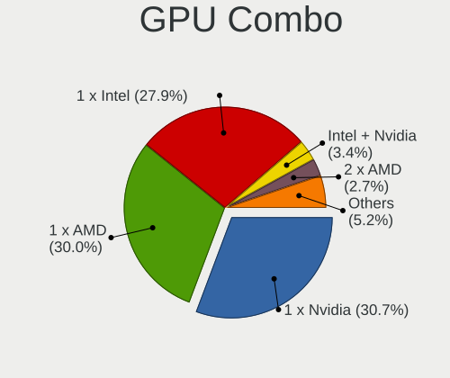

| Name            | Desktops | Percent |
|-----------------|----------|---------|
| 1 x Nvidia      | 447      | 30.72%  |
| 1 x AMD         | 437      | 30.03%  |
| 1 x Intel       | 406      | 27.9%   |
| Intel + Nvidia  | 49       | 3.37%   |
| 2 x AMD         | 40       | 2.75%   |
| AMD + Nvidia    | 27       | 1.86%   |
| 2 x Intel       | 20       | 1.37%   |
| Intel + AMD     | 14       | 0.96%   |
| 1 x Red Hat     | 9        | 0.62%   |
| 2 x Nvidia      | 3        | 0.21%   |
| 3 x AMD         | 1        | 0.07%   |
| 1 x SiS         | 1        | 0.07%   |
| Nvidia + Matrox | 1        | 0.07%   |

GPU Driver
----------

Free vs proprietary

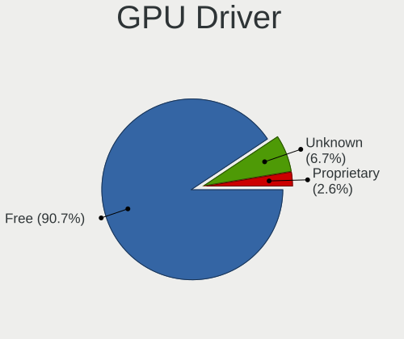

| Driver      | Desktops | Percent |
|-------------|----------|---------|
| Free        | 1319     | 90.65%  |
| Unknown     | 98       | 6.74%   |
| Proprietary | 38       | 2.61%   |

GPU Memory
----------

Total video memory

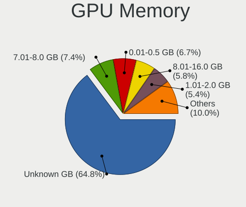

| Size in GB | Desktops | Percent |
|------------|----------|---------|
| Unknown    | 942      | 64.79%  |
| 7.01-8.0   | 107      | 7.36%   |
| 0.01-0.5   | 98       | 6.74%   |
| 8.01-16.0  | 84       | 5.78%   |
| 1.01-2.0   | 78       | 5.36%   |
| 0.51-1.0   | 68       | 4.68%   |
| 3.01-4.0   | 51       | 3.51%   |
| 16.01-24.0 | 15       | 1.03%   |
| 2.01-3.0   | 7        | 0.48%   |
| 5.01-6.0   | 4        | 0.28%   |

Monitor
-------

Monitor Vendor
--------------

Monitor vendors

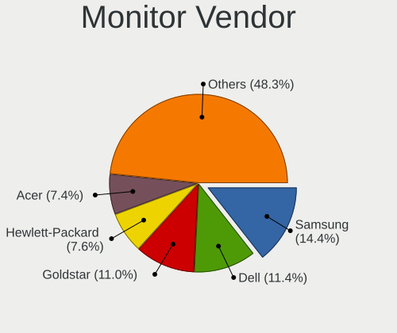

| Vendor               | Desktops | Percent |
|----------------------|----------|---------|
| Samsung Electronics  | 212      | 14.43%  |
| Dell                 | 167      | 11.37%  |
| Goldstar             | 161      | 10.96%  |
| Hewlett-Packard      | 111      | 7.56%   |
| Acer                 | 108      | 7.35%   |
| AOC                  | 95       | 6.47%   |
| Philips              | 73       | 4.97%   |
| Ancor Communications | 61       | 4.15%   |
| ASUSTek Computer     | 57       | 3.88%   |
| BenQ                 | 53       | 3.61%   |
| MSI                  | 42       | 2.86%   |
| Iiyama               | 32       | 2.18%   |
| ViewSonic            | 29       | 1.97%   |
| Sony                 | 16       | 1.09%   |
| Sceptre Tech         | 16       | 1.09%   |
| Lenovo               | 15       | 1.02%   |
| RHT                  | 9        | 0.61%   |
| HKC                  | 9        | 0.61%   |
| Gigabyte Technology  | 9        | 0.61%   |
| Eizo                 | 8        | 0.54%   |
| Unknown (XXX)        | 7        | 0.48%   |
| Toshiba              | 6        | 0.41%   |
| RTK                  | 6        | 0.41%   |
| Insignia             | 6        | 0.41%   |
| SKG                  | 5        | 0.34%   |
| Panasonic            | 5        | 0.34%   |
| NEC Computers        | 5        | 0.34%   |
| Mi                   | 5        | 0.34%   |
| HannStar             | 5        | 0.34%   |
| AOpen                | 5        | 0.34%   |
| VIZTA                | 4        | 0.27%   |
| Skyworth             | 4        | 0.27%   |
| SANSUI               | 4        | 0.27%   |
| ITE                  | 4        | 0.27%   |
| Hitachi              | 4        | 0.27%   |
| Fujitsu Siemens      | 4        | 0.27%   |
| ___                  | 3        | 0.2%    |
| Unknown              | 3        | 0.2%    |
| SAC                  | 3        | 0.2%    |
| Positivo             | 3        | 0.2%    |

Monitor Model
-------------

Monitor models

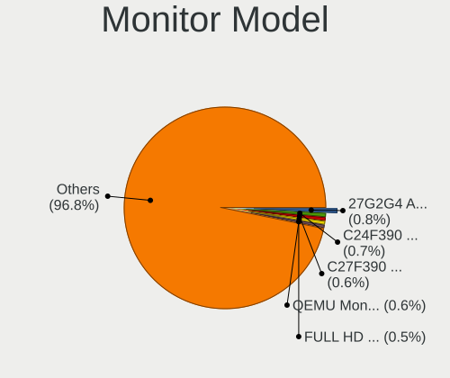

| Model                                                                  | Desktops | Percent |
|------------------------------------------------------------------------|----------|---------|
| AOC 27G2G4 AOC2702 1920x1080 598x336mm 27.0-inch                       | 12       | 0.8%    |
| Samsung Electronics C24F390 SAM0D2C 1920x1080 521x293mm 23.5-inch      | 10       | 0.67%   |
| Samsung Electronics C27F390 SAM0D32 1920x1080 598x336mm 27.0-inch      | 9        | 0.6%    |
| RHT QEMU Monitor RHT1234 2048x1152 325x203mm 15.1-inch                 | 9        | 0.6%    |
| Goldstar FULL HD GSM5B55 1920x1080 480x270mm 21.7-inch                 | 8        | 0.53%   |
| Philips PHL 243V7 PHLC155 1920x1080 527x296mm 23.8-inch                | 7        | 0.47%   |
| Unknown (XXX) Beyond TV XXX2851 3840x2160 1209x680mm 54.6-inch         | 6        | 0.4%    |
| Goldstar LG IPS FULLHD GSM5AB8 1920x1080 480x270mm 21.7-inch           | 6        | 0.4%    |
| AOC 24G2W1G3 AOC2402 1920x1080 527x296mm 23.8-inch                     | 6        | 0.4%    |
| Goldstar HDR 4K GSM7707 3840x2160 600x340mm 27.2-inch                  | 5        | 0.33%   |
| Dell U2412M DELA07B 1920x1200 518x324mm 24.1-inch                      | 5        | 0.33%   |
| AOC 24B1W1 AOC2401 1920x1080 527x296mm 23.8-inch                       | 5        | 0.33%   |
| AOC 1970W AOC1970 1366x768 410x230mm 18.5-inch                         | 5        | 0.33%   |
| Ancor Communications ASUS VS247 ACI249A 1920x1080 521x293mm 23.5-inch  | 5        | 0.33%   |
| Ancor Communications ASUS VP228 ACI22C3 1920x1080 476x268mm 21.5-inch  | 5        | 0.33%   |
| Samsung Electronics C32F391 SAM0D34 1920x1080 698x393mm 31.5-inch      | 4        | 0.27%   |
| Panasonic TV MEIA296 1920x1080 698x392mm 31.5-inch                     | 4        | 0.27%   |
| MSI MP241X MSI3BA9 1920x1080 527x296mm 23.8-inch                       | 4        | 0.27%   |
| Hewlett-Packard 27f HPN354B 1920x1080 598x336mm 27.0-inch              | 4        | 0.27%   |
| Goldstar Ultra HD GSM5B08 3840x2160 600x340mm 27.2-inch                | 4        | 0.27%   |
| Goldstar LG ULTRAWIDE GSM59F1 2560x1080 670x280mm 28.6-inch            | 4        | 0.27%   |
| Goldstar HDR 4K GSM7706 3840x2160 600x340mm 27.2-inch                  | 4        | 0.27%   |
| Goldstar FHD GSM5C6A 1920x1080 600x340mm 27.2-inch                     | 4        | 0.27%   |
| Dell U2412M DELA07A 1920x1200 518x324mm 24.1-inch                      | 4        | 0.27%   |
| AOC 2475WR AOC2475 1920x1200 518x324mm 24.1-inch                       | 4        | 0.27%   |
| AOC 2250W AOC2250 1920x1080 477x268mm 21.5-inch                        | 4        | 0.27%   |
| Ancor Communications VS248 ACI2498 1920x1080 531x299mm 24.0-inch       | 4        | 0.27%   |
| Ancor Communications MX279 ACI27C3 1920x1080 598x336mm 27.0-inch       | 4        | 0.27%   |
| Ancor Communications ASUS VS228 ACI22FD 1920x1080 476x268mm 21.5-inch  | 4        | 0.27%   |
| Sceptre Tech Sceptre F27 SPT0AD7 1920x1080 600x330mm 27.0-inch         | 3        | 0.2%    |
| Samsung Electronics U32J59x SAM0F35 3840x2160 697x392mm 31.5-inch      | 3        | 0.2%    |
| Samsung Electronics Odyssey G40B SAM727D 1920x1080 597x336mm 27.0-inch | 3        | 0.2%    |
| Samsung Electronics C49RG9x SAM0F9C 3360x1440 1193x336mm 48.8-inch     | 3        | 0.2%    |
| Philips PHL 273V5 PHLC0D2 1920x1080 598x336mm 27.0-inch                | 3        | 0.2%    |
| Philips PHL 271V8 PHLC213 1920x1080 598x336mm 27.0-inch                | 3        | 0.2%    |
| Philips PHL 243V5 PHLC0D1 1920x1080 521x293mm 23.5-inch                | 3        | 0.2%    |
| MSI G273Q MSI3CA8 2560x1440 597x336mm 27.0-inch                        | 3        | 0.2%    |
| Mi Monitor XMI23C3 1920x1080 527x293mm 23.7-inch                       | 3        | 0.2%    |
| Goldstar ULTRAGEAR GSM7766 2560x1440 697x392mm 31.5-inch               | 3        | 0.2%    |
| Goldstar QHD GSM772A 2560x1440 697x392mm 31.5-inch                     | 3        | 0.2%    |

Monitor Resolution
------------------

Monitor screen resolution

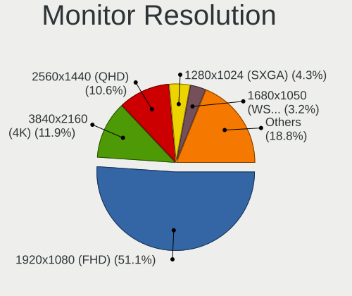

| Resolution         | Desktops | Percent |
|--------------------|----------|---------|
| 1920x1080 (FHD)    | 740      | 51.07%  |
| 3840x2160 (4K)     | 172      | 11.87%  |
| 2560x1440 (QHD)    | 154      | 10.63%  |
| 1280x1024 (SXGA)   | 63       | 4.35%   |
| 1680x1050 (WSXGA+) | 47       | 3.24%   |
| 3440x1440          | 43       | 2.97%   |
| 1600x900 (HD+)     | 42       | 2.9%    |
| 1440x900 (WXGA+)   | 42       | 2.9%    |
| 1366x768 (WXGA)    | 41       | 2.83%   |
| 1920x1200 (WUXGA)  | 33       | 2.28%   |
| 2560x1080          | 16       | 1.1%    |
| 1360x768           | 11       | 0.76%   |
| 3840x1080          | 9        | 0.62%   |
| 2560x1397          | 9        | 0.62%   |
| 1920x540           | 7        | 0.48%   |
| 1600x1200          | 5        | 0.35%   |
| 1024x768 (XGA)     | 4        | 0.28%   |
| 3840x1600          | 3        | 0.21%   |
| 2560x1600          | 3        | 0.21%   |
| 3200x1800 (QHD+)   | 1        | 0.07%   |
| 2288x1287          | 1        | 0.07%   |
| 2048x1536          | 1        | 0.07%   |
| 1280x720 (HD)      | 1        | 0.07%   |
| 1024x600           | 1        | 0.07%   |

Monitor Diagonal
----------------

Diagonal size in inches

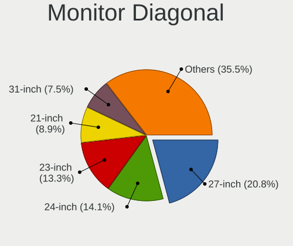

| Inches  | Desktops | Percent |
|---------|----------|---------|
| 27      | 305      | 20.85%  |
| 24      | 206      | 14.08%  |
| 23      | 194      | 13.26%  |
| 21      | 130      | 8.89%   |
| 31      | 109      | 7.45%   |
| 19      | 72       | 4.92%   |
| 20      | 53       | 3.62%   |
| 34      | 49       | 3.35%   |
| 18      | 42       | 2.87%   |
| 22      | 38       | 2.6%    |
| 17      | 29       | 1.98%   |
| 32      | 27       | 1.85%   |
| 84      | 23       | 1.57%   |
| 40      | 19       | 1.3%    |
| 15      | 17       | 1.16%   |
| 63      | 14       | 0.96%   |
| 29      | 12       | 0.82%   |
| 72      | 11       | 0.75%   |
| 25      | 11       | 0.75%   |
| Unknown | 11       | 0.75%   |
| 48      | 9        | 0.62%   |
| 26      | 9        | 0.62%   |
| 54      | 8        | 0.55%   |
| 28      | 8        | 0.55%   |
| 49      | 6        | 0.41%   |
| 35      | 5        | 0.34%   |
| 65      | 4        | 0.27%   |
| 46      | 4        | 0.27%   |
| 37      | 4        | 0.27%   |
| 16      | 4        | 0.27%   |
| 57      | 3        | 0.21%   |
| 52      | 3        | 0.21%   |
| 42      | 3        | 0.21%   |
| 55      | 2        | 0.14%   |
| 43      | 2        | 0.14%   |
| 38      | 2        | 0.14%   |
| 36      | 2        | 0.14%   |
| 33      | 2        | 0.14%   |
| 142     | 1        | 0.07%   |
| 75      | 1        | 0.07%   |

Monitor Width
-------------

Physical width

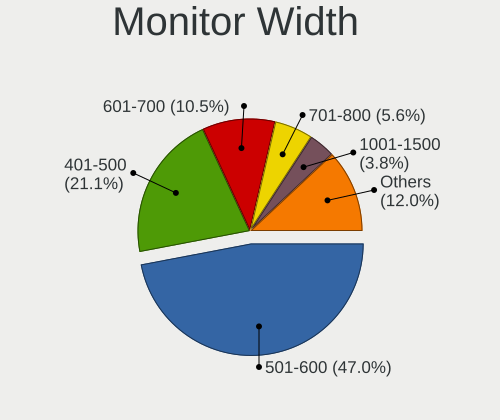

| Width in mm    | Desktops | Percent |
|----------------|----------|---------|
| 501-600        | 675      | 47.01%  |
| 401-500        | 303      | 21.1%   |
| 601-700        | 151      | 10.52%  |
| 701-800        | 80       | 5.57%   |
| 1001-1500      | 55       | 3.83%   |
| 301-350        | 47       | 3.27%   |
| 351-400        | 37       | 2.58%   |
| 1501-2000      | 36       | 2.51%   |
| 801-900        | 30       | 2.09%   |
| Unknown        | 11       | 0.77%   |
| 901-1000       | 7        | 0.49%   |
| 201-300        | 3        | 0.21%   |
| More than 2000 | 1        | 0.07%   |

Aspect Ratio
------------

Proportional relationship between the width and the height

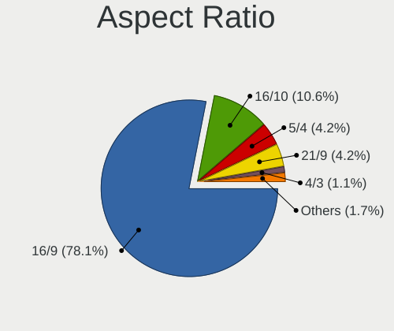

| Ratio | Desktops | Percent |
|-------|----------|---------|
| 16/9  | 1091     | 78.1%   |
| 16/10 | 148      | 10.59%  |
| 5/4   | 59       | 4.22%   |
| 21/9  | 59       | 4.22%   |
| 4/3   | 16       | 1.15%   |
| 32/9  | 13       | 0.93%   |
| 6/5   | 3        | 0.21%   |
| 3/2   | 3        | 0.21%   |
| 2.00  | 2        | 0.14%   |
| 1.96  | 1        | 0.07%   |
| 1.00  | 1        | 0.07%   |
| 0.56  | 1        | 0.07%   |

Monitor Area
------------

Area in inch²

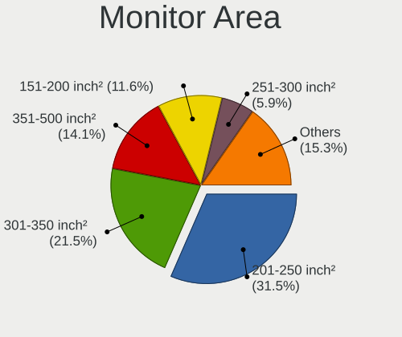

| Area in inch² | Desktops | Percent |
|----------------|----------|---------|
| 201-250        | 459      | 31.52%  |
| 301-350        | 313      | 21.5%   |
| 351-500        | 206      | 14.15%  |
| 151-200        | 169      | 11.61%  |
| 251-300        | 86       | 5.91%   |
| More than 1000 | 76       | 5.22%   |
| 141-150        | 60       | 4.12%   |
| 501-1000       | 52       | 3.57%   |
| 101-110        | 16       | 1.1%    |
| Unknown        | 11       | 0.76%   |
| 131-140        | 2        | 0.14%   |
| 121-130        | 2        | 0.14%   |
| 71-80          | 1        | 0.07%   |
| 41-50          | 1        | 0.07%   |
| 111-120        | 1        | 0.07%   |
| 91-100         | 1        | 0.07%   |

Pixel Density
-------------

Pixels per inch

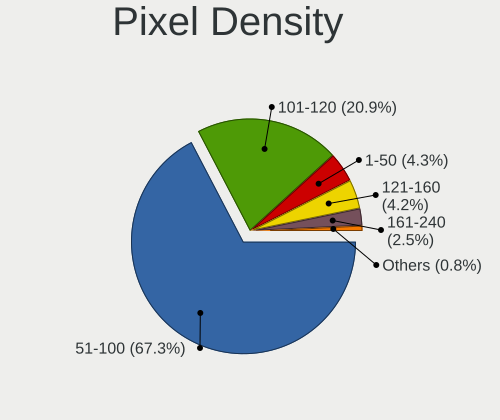

| Density | Desktops | Percent |
|---------|----------|---------|
| 51-100  | 957      | 67.35%  |
| 101-120 | 297      | 20.9%   |
| 1-50    | 61       | 4.29%   |
| 121-160 | 60       | 4.22%   |
| 161-240 | 35       | 2.46%   |
| Unknown | 11       | 0.77%   |

Multiple Monitors
-----------------

Total monitors connected

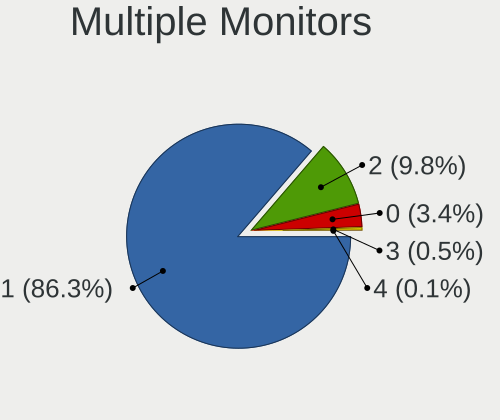

| Total | Desktops | Percent |
|-------|----------|---------|
| 1     | 1255     | 86.31%  |
| 2     | 142      | 9.77%   |
| 0     | 49       | 3.37%   |
| 3     | 7        | 0.48%   |
| 4     | 1        | 0.07%   |

Network
-------

Net Controller Vendor
---------------------

Controller vendors

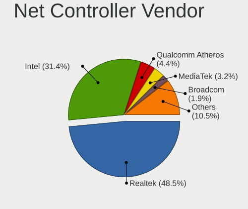

| Vendor                           | Desktops | Percent |
|----------------------------------|----------|---------|
| Realtek Semiconductor            | 956      | 48.48%  |
| Intel                            | 620      | 31.44%  |
| Qualcomm Atheros                 | 86       | 4.36%   |
| MediaTek                         | 64       | 3.25%   |
| Broadcom                         | 38       | 1.93%   |
| TP-Link                          | 31       | 1.57%   |
| Ralink Technology                | 29       | 1.47%   |
| Nvidia                           | 21       | 1.06%   |
| Ralink                           | 10       | 0.51%   |
| Microsoft                        | 10       | 0.51%   |
| D-Link System                    | 9        | 0.46%   |
| ASIX Electronics                 | 9        | 0.46%   |
| Aquantia                         | 9        | 0.46%   |
| Qualcomm Atheros Communications  | 8        | 0.41%   |
| Broadcom Limited                 | 7        | 0.35%   |
| Marvell Technology Group         | 6        | 0.3%    |
| ASUSTek Computer                 | 5        | 0.25%   |
| Samsung Electronics              | 4        | 0.2%    |
| VIA Technologies                 | 3        | 0.15%   |
| NetGear                          | 3        | 0.15%   |
| Mellanox Technologies            | 3        | 0.15%   |
| Linksys                          | 3        | 0.15%   |
| D-Link                           | 3        | 0.15%   |
| Qualcomm Technologies            | 2        | 0.1%    |
| Qualcomm                         | 2        | 0.1%    |
| Motorola PCS                     | 2        | 0.1%    |
| Mercucys                         | 2        | 0.1%    |
| Huawei Technologies              | 2        | 0.1%    |
| Google                           | 2        | 0.1%    |
| Edimax Technology                | 2        | 0.1%    |
| DisplayLink                      | 2        | 0.1%    |
| Belkin Components                | 2        | 0.1%    |
| ADMtek                           | 2        | 0.1%    |
| Xiaomi                           | 1        | 0.05%   |
| Tenda                            | 1        | 0.05%   |
| Silicon Integrated Systems [SiS] | 1        | 0.05%   |
| Signia                           | 1        | 0.05%   |
| Sagem                            | 1        | 0.05%   |
| Philips Speech Processing        | 1        | 0.05%   |
| Metrologic Instruments           | 1        | 0.05%   |

Net Controller Model
--------------------

Controller models

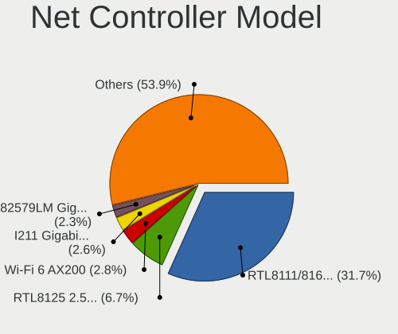

| Model                                                                  | Desktops | Percent |
|------------------------------------------------------------------------|----------|---------|
| Realtek RTL8111/8168/8211/8411 PCI Express Gigabit Ethernet Controller | 719      | 31.72%  |
| Realtek RTL8125 2.5GbE Controller                                      | 152      | 6.7%    |
| Intel Wi-Fi 6 AX200                                                    | 64       | 2.82%   |
| Intel I211 Gigabit Network Connection                                  | 58       | 2.56%   |
| Intel 82579LM Gigabit Network Connection (Lewisville)                  | 53       | 2.34%   |
| Intel Ethernet Controller I225-V                                       | 50       | 2.21%   |
| Intel Ethernet Connection I217-LM                                      | 48       | 2.12%   |
| Intel Ethernet Connection (2) I219-V                                   | 46       | 2.03%   |
| Realtek RTL8821CE 802.11ac PCIe Wireless Network Adapter               | 39       | 1.72%   |
| Intel Wi-Fi 6E(802.11ax) AX210/AX1675* 2x2 [Typhoon Peak]              | 36       | 1.59%   |
| Intel Ethernet Connection (2) I219-LM                                  | 35       | 1.54%   |
| MediaTek MT7922 802.11ax PCI Express Wireless Network Adapter          | 32       | 1.41%   |
| Intel 700 Series Chipset CNVi WiFi                                     | 30       | 1.32%   |
| Intel Ethernet Controller I226-V                                       | 25       | 1.1%    |
| Intel Dual Band Wireless-AC 3168NGW [Stone Peak]                       | 22       | 0.97%   |
| Realtek RTL810xE PCI Express Fast Ethernet controller                  | 21       | 0.93%   |
| Realtek RTL88x2bu [AC1200 Techkey]                                     | 19       | 0.84%   |
| Ralink MT7601U Wireless Adapter                                        | 19       | 0.84%   |
| Intel 82579V Gigabit Network Connection                                | 18       | 0.79%   |
| Realtek 802.11ac NIC                                                   | 17       | 0.75%   |
| MediaTek MT7921K (RZ608) Wi-Fi 6E 80MHz                                | 17       | 0.75%   |
| Intel Wireless 7260                                                    | 17       | 0.75%   |
| Intel Ethernet Connection I217-V                                       | 15       | 0.66%   |
| Intel Alder Lake-S PCH CNVi WiFi                                       | 15       | 0.66%   |
| Realtek RTL8153 Gigabit Ethernet Adapter                               | 14       | 0.62%   |
| Intel Wi-Fi 5(802.11ac) Wireless-AC 9x6x [Thunder Peak]                | 14       | 0.62%   |
| Intel Ethernet Connection (5) I219-LM                                  | 14       | 0.62%   |
| Nvidia MCP61 Ethernet                                                  | 13       | 0.57%   |
| Intel Ethernet Connection (7) I219-V                                   | 13       | 0.57%   |
| Realtek RTL8192EE PCIe Wireless Network Adapter                        | 12       | 0.53%   |
| Realtek RTL8188EUS 802.11n Wireless Network Adapter                    | 12       | 0.53%   |
| Intel Alder Lake-N PCH CNVi WiFi                                       | 12       | 0.53%   |
| TP-Link TL-WN823N v2/v3 [Realtek RTL8192EU]                            | 11       | 0.49%   |
| Realtek RTL8852BE PCIe 802.11ax Wireless Network Controller            | 11       | 0.49%   |
| Intel Wireless 8260                                                    | 11       | 0.49%   |
| Intel Wireless 7265                                                    | 11       | 0.49%   |
| Intel Wireless 3165                                                    | 11       | 0.49%   |
| Intel Ethernet Connection (7) I219-LM                                  | 11       | 0.49%   |
| Intel 82567LM-3 Gigabit Network Connection                             | 11       | 0.49%   |
| Qualcomm Atheros AR93xx Wireless Network Adapter                       | 10       | 0.44%   |

Wireless Vendor
---------------

Wireless vendors

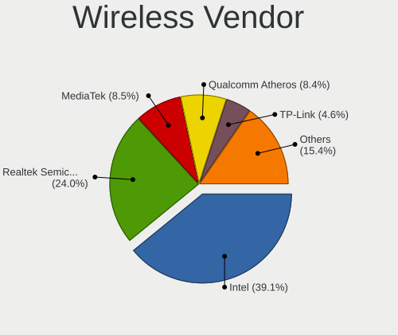

| Vendor                                | Desktops | Percent |
|---------------------------------------|----------|---------|
| Intel                                 | 262      | 39.1%   |
| Realtek Semiconductor                 | 161      | 24.03%  |
| MediaTek                              | 57       | 8.51%   |
| Qualcomm Atheros                      | 56       | 8.36%   |
| TP-Link                               | 31       | 4.63%   |
| Ralink Technology                     | 29       | 4.33%   |
| Broadcom                              | 14       | 2.09%   |
| Ralink                                | 10       | 1.49%   |
| Microsoft                             | 10       | 1.49%   |
| Qualcomm Atheros Communications       | 8        | 1.19%   |
| D-Link System                         | 5        | 0.75%   |
| ASUSTek Computer                      | 4        | 0.6%    |
| NetGear                               | 3        | 0.45%   |
| Linksys                               | 3        | 0.45%   |
| D-Link                                | 3        | 0.45%   |
| Mercucys                              | 2        | 0.3%    |
| Edimax Technology                     | 2        | 0.3%    |
| Tenda                                 | 1        | 0.15%   |
| Sagem                                 | 1        | 0.15%   |
| Marvell Technology Group              | 1        | 0.15%   |
| Gemtek                                | 1        | 0.15%   |
| Elecom                                | 1        | 0.15%   |
| Broadcom Limited                      | 1        | 0.15%   |
| Belkin Components                     | 1        | 0.15%   |
| AVM                                   | 1        | 0.15%   |
| AirTies Wireless Networks             | 1        | 0.15%   |
| 802.11g Adapter [Linksys WUSB54GC v3] | 1        | 0.15%   |

Wireless Model
--------------

Wireless models

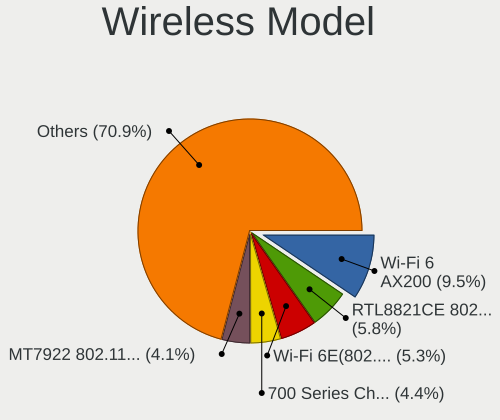

| Model                                                                | Desktops | Percent |
|----------------------------------------------------------------------|----------|---------|
| Intel Wi-Fi 6 AX200                                                  | 64       | 9.45%   |
| Realtek RTL8821CE 802.11ac PCIe Wireless Network Adapter             | 39       | 5.76%   |
| Intel Wi-Fi 6E(802.11ax) AX210/AX1675* 2x2 [Typhoon Peak]            | 36       | 5.32%   |
| Intel 700 Series Chipset CNVi WiFi                                   | 30       | 4.43%   |
| MediaTek MT7922 802.11ax PCI Express Wireless Network Adapter        | 28       | 4.14%   |
| Intel Dual Band Wireless-AC 3168NGW [Stone Peak]                     | 22       | 3.25%   |
| Realtek RTL88x2bu [AC1200 Techkey]                                   | 19       | 2.81%   |
| Ralink MT7601U Wireless Adapter                                      | 19       | 2.81%   |
| Realtek 802.11ac NIC                                                 | 17       | 2.51%   |
| MediaTek MT7921K (RZ608) Wi-Fi 6E 80MHz                              | 17       | 2.51%   |
| Intel Wireless 7260                                                  | 17       | 2.51%   |
| Intel Wi-Fi 5(802.11ac) Wireless-AC 9x6x [Thunder Peak]              | 14       | 2.07%   |
| Realtek RTL8192EE PCIe Wireless Network Adapter                      | 12       | 1.77%   |
| Realtek RTL8188EUS 802.11n Wireless Network Adapter                  | 12       | 1.77%   |
| TP-Link TL-WN823N v2/v3 [Realtek RTL8192EU]                          | 11       | 1.62%   |
| Intel Wireless 8260                                                  | 11       | 1.62%   |
| Intel Wireless 7265                                                  | 11       | 1.62%   |
| Intel Wireless 3165                                                  | 11       | 1.62%   |
| Qualcomm Atheros AR93xx Wireless Network Adapter                     | 10       | 1.48%   |
| Intel Alder Lake-N PCH CNVi WiFi                                     | 10       | 1.48%   |
| Intel Alder Lake-S PCH CNVi WiFi                                     | 9        | 1.33%   |
| Qualcomm Atheros AR9271 802.11n                                      | 8        | 1.18%   |
| MediaTek MT7921 802.11ax PCIe Wireless Network Adapter [Filogic 330] | 8        | 1.18%   |
| Intel Wireless 8265 / 8275                                           | 8        | 1.18%   |
| Realtek RTL8822CE 802.11ac PCIe Wireless Network Adapter             | 7        | 1.03%   |
| Realtek RTL8812AE 802.11ac PCIe Wireless Network Adapter             | 7        | 1.03%   |
| Qualcomm Atheros AR9485 Wireless Network Adapter                     | 7        | 1.03%   |
| Intel Cannon Lake PCH CNVi WiFi                                      | 7        | 1.03%   |
| TP-Link Archer T3U [Realtek RTL8812BU]                               | 6        | 0.89%   |
| Realtek RTL8852CE PCIe 802.11ax Wireless Network Controller          | 6        | 0.89%   |
| Realtek RTL8192EU 802.11b/g/n WLAN Adapter                           | 6        | 0.89%   |
| Qualcomm Atheros QCA9565 / AR9565 Wireless Network Adapter           | 6        | 0.89%   |
| Realtek RTL8821AE 802.11ac PCIe Wireless Network Adapter             | 5        | 0.74%   |
| Realtek RTL8188EE Wireless Network Adapter                           | 5        | 0.74%   |
| Qualcomm Atheros QCA9377 802.11ac Wireless Network Adapter           | 5        | 0.74%   |
| Qualcomm Atheros AR9462 Wireless Network Adapter                     | 5        | 0.74%   |
| Qualcomm Atheros AR9287 Wireless Network Adapter (PCI-Express)       | 5        | 0.74%   |
| Microsoft Wireless XBox Controller Dongle                            | 5        | 0.74%   |
| TP-Link 802.11ac NIC                                                 | 4        | 0.59%   |
| Realtek RTL8852BE PCIe 802.11ax Wireless Network Controller          | 4        | 0.59%   |

Ethernet Vendor
---------------

Ethernet vendors

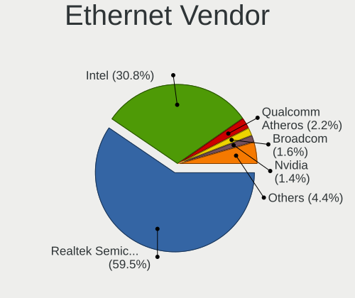

| Vendor                           | Desktops | Percent |
|----------------------------------|----------|---------|
| Realtek Semiconductor            | 910      | 59.52%  |
| Intel                            | 471      | 30.8%   |
| Qualcomm Atheros                 | 34       | 2.22%   |
| Broadcom                         | 25       | 1.64%   |
| Nvidia                           | 21       | 1.37%   |
| ASIX Electronics                 | 9        | 0.59%   |
| Aquantia                         | 9        | 0.59%   |
| MediaTek                         | 7        | 0.46%   |
| Broadcom Limited                 | 6        | 0.39%   |
| Marvell Technology Group         | 5        | 0.33%   |
| Samsung Electronics              | 4        | 0.26%   |
| D-Link System                    | 4        | 0.26%   |
| VIA Technologies                 | 3        | 0.2%    |
| Mellanox Technologies            | 3        | 0.2%    |
| Qualcomm Technologies            | 2        | 0.13%   |
| Qualcomm                         | 2        | 0.13%   |
| Motorola PCS                     | 2        | 0.13%   |
| Huawei Technologies              | 2        | 0.13%   |
| Google                           | 2        | 0.13%   |
| DisplayLink                      | 2        | 0.13%   |
| ADMtek                           | 2        | 0.13%   |
| Xiaomi                           | 1        | 0.07%   |
| Silicon Integrated Systems [SiS] | 1        | 0.07%   |
| Belkin Components                | 1        | 0.07%   |
| ASUSTek Computer                 | 1        | 0.07%   |

Ethernet Model
--------------

Ethernet models

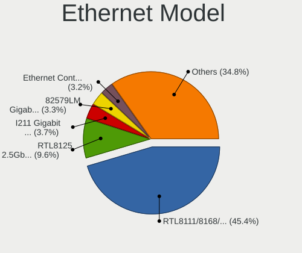

| Model                                                                          | Desktops | Percent |
|--------------------------------------------------------------------------------|----------|---------|
| Realtek RTL8111/8168/8211/8411 PCI Express Gigabit Ethernet Controller         | 719      | 45.42%  |
| Realtek RTL8125 2.5GbE Controller                                              | 152      | 9.6%    |
| Intel I211 Gigabit Network Connection                                          | 58       | 3.66%   |
| Intel 82579LM Gigabit Network Connection (Lewisville)                          | 53       | 3.35%   |
| Intel Ethernet Controller I225-V                                               | 50       | 3.16%   |
| Intel Ethernet Connection I217-LM                                              | 48       | 3.03%   |
| Intel Ethernet Connection (2) I219-V                                           | 46       | 2.91%   |
| Intel Ethernet Connection (2) I219-LM                                          | 35       | 2.21%   |
| Intel Ethernet Controller I226-V                                               | 25       | 1.58%   |
| Realtek RTL810xE PCI Express Fast Ethernet controller                          | 21       | 1.33%   |
| Intel 82579V Gigabit Network Connection                                        | 18       | 1.14%   |
| Intel Ethernet Connection I217-V                                               | 15       | 0.95%   |
| Realtek RTL8153 Gigabit Ethernet Adapter                                       | 14       | 0.88%   |
| Intel Ethernet Connection (5) I219-LM                                          | 14       | 0.88%   |
| Nvidia MCP61 Ethernet                                                          | 13       | 0.82%   |
| Intel Ethernet Connection (7) I219-V                                           | 13       | 0.82%   |
| Intel Ethernet Connection (7) I219-LM                                          | 11       | 0.69%   |
| Intel 82567LM-3 Gigabit Network Connection                                     | 11       | 0.69%   |
| Realtek RTL-8100/8101L/8139 PCI Fast Ethernet Adapter                          | 9        | 0.57%   |
| Qualcomm Atheros Killer E220x Gigabit Ethernet Controller                      | 8        | 0.51%   |
| Intel I210 Gigabit Network Connection                                          | 8        | 0.51%   |
| ASIX AX88179 Gigabit Ethernet                                                  | 8        | 0.51%   |
| Realtek RTL8852BE PCIe 802.11ax Wireless Network Controller                    | 7        | 0.44%   |
| Realtek Killer E3000 2.5GbE Controller                                         | 7        | 0.44%   |
| Qualcomm Atheros AR8151 v2.0 Gigabit Ethernet                                  | 7        | 0.44%   |
| Intel Ethernet Connection (14) I219-V                                          | 7        | 0.44%   |
| Intel Ethernet Connection (2) I218-LM                                          | 6        | 0.38%   |
| Intel Alder Lake-S PCH CNVi WiFi                                               | 6        | 0.38%   |
| Intel 82574L Gigabit Network Connection                                        | 6        | 0.38%   |
| Intel Ethernet Connection (11) I219-V                                          | 5        | 0.32%   |
| Broadcom NetXtreme BCM5761 Gigabit Ethernet PCIe                               | 5        | 0.32%   |
| Realtek RTL8111/8168/8411 PCI Express Gigabit Ethernet Controller              | 4        | 0.25%   |
| MediaTek MT7922 802.11ax PCI Express Wireless Network Adapter                  | 4        | 0.25%   |
| D-Link System DGE-528T Gigabit Ethernet Adapter                                | 4        | 0.25%   |
| Broadcom NetXtreme BCM5762 Gigabit Ethernet PCIe                               | 4        | 0.25%   |
| Broadcom NetLink BCM57780 Gigabit Ethernet PCIe                                | 4        | 0.25%   |
| Aquantia AQtion AQC107 NBase-T/IEEE 802.3an Ethernet Controller [Atlantic 10G] | 4        | 0.25%   |
| Samsung Galaxy series, misc. (tethering mode)                                  | 3        | 0.19%   |
| Realtek RTL8126 5GbE Controller                                                | 3        | 0.19%   |
| Qualcomm Atheros QCA8171 Gigabit Ethernet                                      | 3        | 0.19%   |

Net Controller Kind
-------------------

Ethernet, WiFi or modem

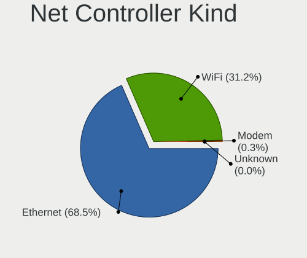

| Kind     | Desktops | Percent |
|----------|----------|---------|
| Ethernet | 1429     | 68.47%  |
| WiFi     | 651      | 31.19%  |
| Modem    | 6        | 0.29%   |
| Unknown  | 1        | 0.05%   |

Used Controller
---------------

Currently used network controller

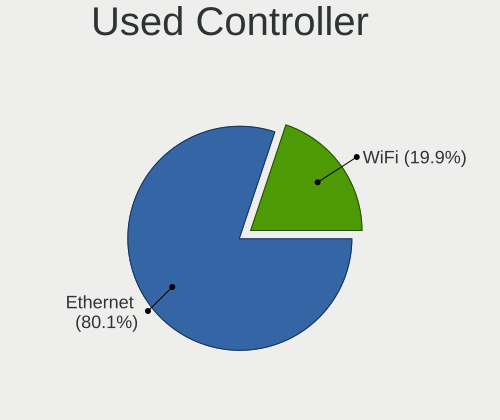

| Kind     | Desktops | Percent |
|----------|----------|---------|
| Ethernet | 1145     | 80.13%  |
| WiFi     | 284      | 19.87%  |

NICs
----

Total network controllers on board

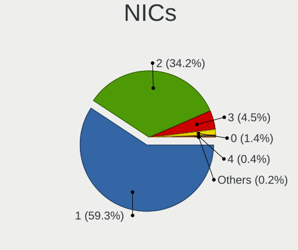

| Total | Desktops | Percent |
|-------|----------|---------|
| 1     | 862      | 59.28%  |
| 2     | 497      | 34.18%  |
| 3     | 66       | 4.54%   |
| 0     | 20       | 1.38%   |
| 4     | 6        | 0.41%   |
| 5     | 3        | 0.21%   |

IPv6
----

IPv6 vs IPv4

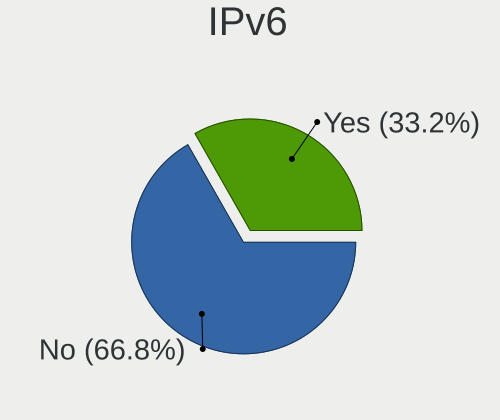

| Used | Desktops | Percent |
|------|----------|---------|
| No   | 970      | 66.76%  |
| Yes  | 483      | 33.24%  |

Bluetooth
---------

Bluetooth Vendor
----------------

Controller vendors

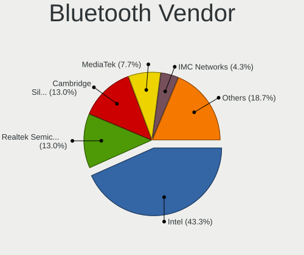

| Vendor                          | Desktops | Percent |
|---------------------------------|----------|---------|
| Intel                           | 253      | 43.32%  |
| Realtek Semiconductor           | 76       | 13.01%  |
| Cambridge Silicon Radio         | 76       | 13.01%  |
| MediaTek                        | 45       | 7.71%   |
| IMC Networks                    | 25       | 4.28%   |
| TP-Link                         | 20       | 3.42%   |
| Broadcom                        | 17       | 2.91%   |
| ASUSTek Computer                | 17       | 2.91%   |
| Qualcomm Atheros Communications | 14       | 2.4%    |
| Foxconn / Hon Hai               | 8        | 1.37%   |
| Edimax Technology               | 5        | 0.86%   |
| Actions                         | 4        | 0.68%   |
| Unknown                         | 4        | 0.68%   |
| Realtek                         | 3        | 0.51%   |
| Integrated System Solution      | 3        | 0.51%   |
| Dynex                           | 3        | 0.51%   |
| Apple                           | 3        | 0.51%   |
| Lite-On Technology              | 2        | 0.34%   |
| HTC (High Tech Computer)        | 2        | 0.34%   |
| Sitecom Europe                  | 1        | 0.17%   |
| SINO WEALTH                     | 1        | 0.17%   |
| Primax Electronics              | 1        | 0.17%   |
| Dell                            | 1        | 0.17%   |

Bluetooth Model
---------------

Controller models

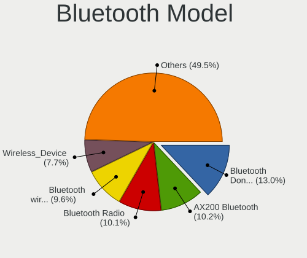

| Model                                                                | Desktops | Percent |
|----------------------------------------------------------------------|----------|---------|
| Cambridge Silicon Radio Bluetooth Dongle (HCI mode)                  | 76       | 12.97%  |
| Intel AX200 Bluetooth                                                | 60       | 10.24%  |
| Realtek Bluetooth Radio                                              | 59       | 10.07%  |
| Intel Bluetooth wireless interface                                   | 56       | 9.56%   |
| MediaTek Wireless_Device                                             | 45       | 7.68%   |
| Intel Bluetooth Device                                               | 37       | 6.31%   |
| Intel AX210 Bluetooth                                                | 32       | 5.46%   |
| Intel Wireless-AC 3168 Bluetooth                                     | 22       | 3.75%   |
| Intel AX201 Bluetooth                                                | 22       | 3.75%   |
| TP-Link TP-T@- UB500 Adapter                                         | 20       | 3.41%   |
| Intel Wireless-AC 9260 Bluetooth Adapter                             | 14       | 2.39%   |
| IMC Networks Bluetooth Radio                                         | 13       | 2.22%   |
| IMC Networks Wireless_Device                                         | 12       | 2.05%   |
| Realtek  Bluetooth 4.2 Adapter                                       | 11       | 1.88%   |
| Intel Bluetooth 9460/9560 Jefferson Peak (JfP)                       | 11       | 1.88%   |
| Broadcom BCM20702A0 Bluetooth 4.0                                    | 10       | 1.71%   |
| ASUS Broadcom BCM20702A0 Bluetooth                                   | 8        | 1.37%   |
| Qualcomm Atheros  Bluetooth Device                                   | 7        | 1.19%   |
| Foxconn / Hon Hai Wireless_Device                                    | 5        | 0.85%   |
| Edimax Bluetooth Device                                              | 5        | 0.85%   |
| Realtek Bluetooth 5.3 Radio                                          | 4        | 0.68%   |
| Qualcomm Atheros AR9462 Bluetooth                                    | 4        | 0.68%   |
| ASUS Bluetooth Radio                                                 | 4        | 0.68%   |
| Actions general adapter                                              | 4        | 0.68%   |
| Unknown                                                              | 4        | 0.68%   |
| Realtek Bluetooth Radio                                              | 3        | 0.51%   |
| Integrated System Solution KY-BT100 Bluetooth Adapter                | 3        | 0.51%   |
| Dynex Bluetooth 4.0 Adapter [Broadcom, 1.12, BCM20702A0]             | 3        | 0.51%   |
| Realtek RTL8821A Bluetooth                                           | 2        | 0.34%   |
| Qualcomm Atheros Bluetooth USB Host Controller                       | 2        | 0.34%   |
| HTC (High Tech Computer) Vive Hub Bluetooth 4.1 (Broadcom BCM920703) | 2        | 0.34%   |
| Foxconn / Hon Hai Bluetooth Device                                   | 2        | 0.34%   |
| Broadcom HP Portable Bumble Bee                                      | 2        | 0.34%   |
| Broadcom BCM2045 Bluetooth                                           | 2        | 0.34%   |
| ASUS Bluetooth Adapter                                               | 2        | 0.34%   |
| ASUS ASUS USB-BT500                                                  | 2        | 0.34%   |
| Apple Built-in Bluetooth 2.0+EDR HCI                                 | 2        | 0.34%   |
| Sitecom Europe Bluetooth 2.0 USB adapter 100m                        | 1        | 0.17%   |
| SINO WEALTH Bluetooth Keyboard                                       | 1        | 0.17%   |
| Qualcomm Atheros QCA61x4 Bluetooth 4.0                               | 1        | 0.17%   |

Sound
-----

Sound Vendor
------------

Sound card vendors

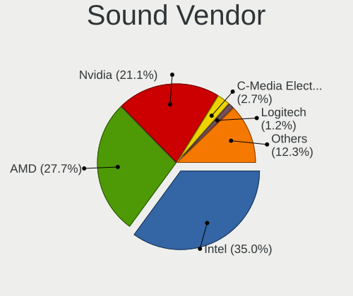

| Vendor                                       | Desktops | Percent |
|----------------------------------------------|----------|---------|
| Intel                                        | 849      | 35.04%  |
| AMD                                          | 670      | 27.65%  |
| Nvidia                                       | 512      | 21.13%  |
| C-Media Electronics                          | 66       | 2.72%   |
| Logitech                                     | 29       | 1.2%    |
| Creative Labs                                | 20       | 0.83%   |
| Micro Star International                     | 19       | 0.78%   |
| JMTek                                        | 17       | 0.7%    |
| ASUSTek Computer                             | 15       | 0.62%   |
| Zoran Co. Personal Media Division (Nogatech) | 14       | 0.58%   |
| SteelSeries ApS                              | 12       | 0.5%    |
| Creative Technology                          | 12       | 0.5%    |
| Texas Instruments                            | 10       | 0.41%   |
| Focusrite-Novation                           | 9        | 0.37%   |
| Generalplus Technology                       | 8        | 0.33%   |
| Razer USA                                    | 7        | 0.29%   |
| Hewlett-Packard                              | 7        | 0.29%   |
| Tenx Technology                              | 6        | 0.25%   |
| KTMicro                                      | 6        | 0.25%   |
| Kingston Technology                          | 6        | 0.25%   |
| GN Netcom                                    | 6        | 0.25%   |
| Realtek Semiconductor                        | 5        | 0.21%   |
| PreSonus Audio Electronics                   | 5        | 0.21%   |
| Jieli Technology                             | 5        | 0.21%   |
| VIA Technologies                             | 4        | 0.17%   |
| Schiit Audio                                 | 4        | 0.17%   |
| Plantronics                                  | 4        | 0.17%   |
| Giga-Byte Technology                         | 4        | 0.17%   |
| Corsair                                      | 4        | 0.17%   |
| Unknown                                      | 4        | 0.17%   |
| Walmart                                      | 3        | 0.12%   |
| Turtle Beach                                 | 3        | 0.12%   |
| Thesycon Systemsoftware & Consulting         | 3        | 0.12%   |
| Sony                                         | 3        | 0.12%   |
| SAVITECH                                     | 3        | 0.12%   |
| GYROCOM C&C                                  | 3        | 0.12%   |
| Elgato Systems                               | 3        | 0.12%   |
| BEHRINGER International                      | 3        | 0.12%   |
| Weltrend Semiconductor                       | 2        | 0.08%   |
| Samson Technologies                          | 2        | 0.08%   |

Sound Model
-----------

Sound card models

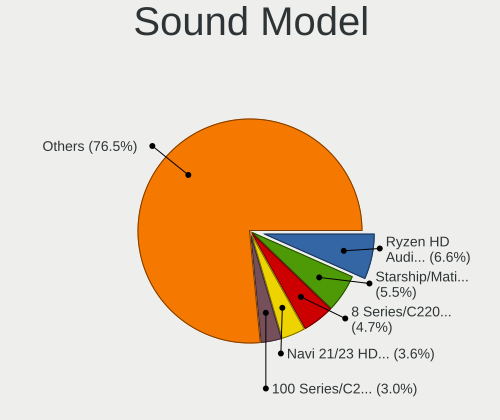

| Model                                                                      | Desktops | Percent |
|----------------------------------------------------------------------------|----------|---------|
| AMD Ryzen HD Audio Controller                                              | 196      | 6.63%   |
| AMD Starship/Matisse HD Audio Controller                                   | 164      | 5.55%   |
| Intel 8 Series/C220 Series Chipset High Definition Audio Controller        | 139      | 4.7%    |
| AMD Navi 21/23 HDMI/DP Audio Controller                                    | 105      | 3.55%   |
| Intel 100 Series/C230 Series Chipset Family HD Audio Controller            | 90       | 3.04%   |
| Intel Xeon E3-1200 v3/4th Gen Core Processor HD Audio Controller           | 89       | 3.01%   |
| AMD SBx00 Azalia (Intel HDA)                                               | 83       | 2.81%   |
| Intel 6 Series/C200 Series Chipset Family High Definition Audio Controller | 79       | 2.67%   |
| Intel 7 Series/C216 Chipset Family High Definition Audio Controller        | 78       | 2.64%   |
| AMD Renoir/Cezanne HDMI/DP Audio Controller                                | 77       | 2.6%    |
| Intel 200 Series PCH HD Audio                                              | 73       | 2.47%   |
| AMD Radeon High Definition Audio Controller                                | 63       | 2.13%   |
| AMD Ellesmere HDMI Audio [Radeon RX 470/480 / 570/580/590]                 | 56       | 1.89%   |
| AMD Navi 31 HDMI/DP Audio                                                  | 51       | 1.73%   |
| AMD Family 17h (Models 00h-0fh) HD Audio Controller                        | 48       | 1.62%   |
| AMD Raven/Raven2/Fenghuang HDMI/DP Audio Controller                        | 46       | 1.56%   |
| Intel Raptor Lake High Definition Audio Controller                         | 43       | 1.45%   |
| Intel Cannon Lake PCH cAVS                                                 | 42       | 1.42%   |
| Nvidia GK208 HDMI/DP Audio Controller                                      | 37       | 1.25%   |
| Nvidia GP107GL High Definition Audio Controller                            | 34       | 1.15%   |
| Intel NM10/ICH7 Family High Definition Audio Controller                    | 34       | 1.15%   |
| AMD FCH Azalia Controller                                                  | 34       | 1.15%   |
| Nvidia GP106 High Definition Audio Controller                              | 33       | 1.12%   |
| AMD Baffin HDMI/DP Audio [Radeon RX 550 640SP / RX 560/560X]               | 31       | 1.05%   |
| Intel Alder Lake-S HD Audio Controller                                     | 30       | 1.01%   |
| Nvidia GP108 High Definition Audio Controller                              | 28       | 0.95%   |
| Nvidia TU116 High Definition Audio Controller                              | 26       | 0.88%   |
| Intel 82801JI (ICH10 Family) HD Audio Controller                           | 26       | 0.88%   |
| Nvidia GP104 High Definition Audio Controller                              | 25       | 0.85%   |
| Intel Alder Lake-N PCH High Definition Audio Controller                    | 24       | 0.81%   |
| Nvidia High Definition Audio Controller                                    | 22       | 0.74%   |
| Nvidia GA106 High Definition Audio Controller                              | 22       | 0.74%   |
| AMD Oland/Hainan/Cape Verde/Pitcairn HDMI Audio [Radeon HD 7000 Series]    | 22       | 0.74%   |
| Nvidia GM107 High Definition Audio Controller [GeForce 940MX]              | 21       | 0.71%   |
| Nvidia TU106 High Definition Audio Controller                              | 19       | 0.64%   |
| Micro Star International USB Audio                                         | 19       | 0.64%   |
| Intel 5 Series/3400 Series Chipset High Definition Audio                   | 19       | 0.64%   |
| Nvidia GM204 High Definition Audio Controller                              | 18       | 0.61%   |
| Intel Tiger Lake-H HD Audio Controller                                     | 18       | 0.61%   |
| Nvidia GA102 High Definition Audio Controller                              | 17       | 0.58%   |

Memory
------

Memory Vendor
-------------

Memory module vendors

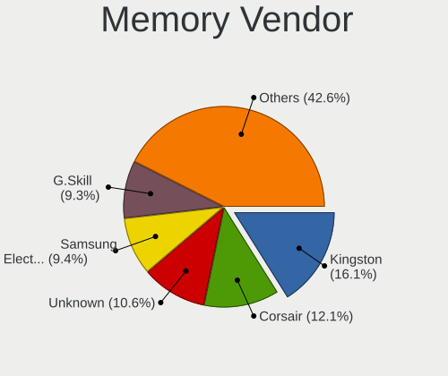

| Vendor                       | Desktops | Percent |
|------------------------------|----------|---------|
| Kingston                     | 269      | 16.08%  |
| Corsair                      | 203      | 12.13%  |
| Unknown                      | 177      | 10.58%  |
| Samsung Electronics          | 157      | 9.38%   |
| G.Skill                      | 155      | 9.26%   |
| SK hynix                     | 148      | 8.85%   |
| Crucial                      | 114      | 6.81%   |
| Micron Technology            | 84       | 5.02%   |
| Unknown                      | 67       | 4%      |
| Team                         | 35       | 2.09%   |
| A-DATA Technology            | 33       | 1.97%   |
| Patriot                      | 27       | 1.61%   |
| Nanya Technology             | 19       | 1.14%   |
| Ramaxel Technology           | 13       | 0.78%   |
| GOODRAM                      | 9        | 0.54%   |
| Transcend                    | 8        | 0.48%   |
| PNY                          | 8        | 0.48%   |
| Elpida                       | 8        | 0.48%   |
| Unknown (ABCD)               | 7        | 0.42%   |
| Unknown (0x0E9D)             | 7        | 0.42%   |
| Red Hat                      | 7        | 0.42%   |
| Timetec                      | 6        | 0.36%   |
| Lexar                        | 6        | 0.36%   |
| Apacer                       | 6        | 0.36%   |
| Kingmax                      | 5        | 0.3%    |
| AMD                          | 5        | 0.3%    |
| Unifosa                      | 4        | 0.24%   |
| Smart                        | 4        | 0.24%   |
| Patriot Memory               | 4        | 0.24%   |
| Golden Empire                | 4        | 0.24%   |
| ASint Technology             | 4        | 0.24%   |
| Patriot Memory (PDP Systems) | 3        | 0.18%   |
| Hewlett-Packard              | 3        | 0.18%   |
| Asgard                       | 3        | 0.18%   |
| Unknown (0x5846)             | 2        | 0.12%   |
| Unigen                       | 2        | 0.12%   |
| Silicon Power                | 2        | 0.12%   |
| Qimonda                      | 2        | 0.12%   |
| QEMU                         | 2        | 0.12%   |
| Multilaser                   | 2        | 0.12%   |

Memory Model
------------

Memory module models

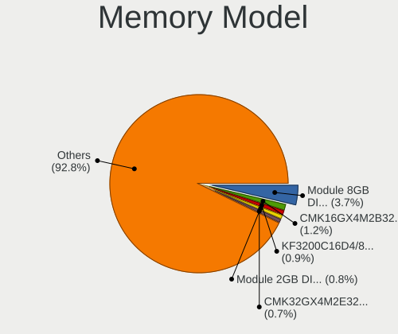

| Model                                                              | Desktops | Percent |
|--------------------------------------------------------------------|----------|---------|
| Unknown                                                            | 67       | 3.69%   |
| Corsair RAM CMK16GX4M2B3200C16 8GB DIMM DDR4 3600MT/s              | 21       | 1.16%   |
| Kingston RAM KF3200C16D4/8GX 8GiB DIMM DDR4 3600MT/s               | 16       | 0.88%   |
| Unknown RAM Module 2GB DIMM 800MT/s                                | 14       | 0.77%   |
| Corsair RAM CMK32GX4M2E3200C16 16GB DIMM DDR4 3600MT/s             | 13       | 0.72%   |
| Unknown RAM Module 4GB DIMM 1333MT/s                               | 12       | 0.66%   |
| G.Skill RAM F4-3200C16-8GVKB 8GB DIMM DDR4 4000MT/s                | 12       | 0.66%   |
| Micron RAM 8JTF51264AZ-1G6E1 4GB DIMM DDR3 1600MT/s                | 11       | 0.61%   |
| Unknown RAM Module 2GB DIMM SDRAM                                  | 10       | 0.55%   |
| Team RAM TEAMGROUP-UD4-3200 8GB DIMM DDR4 3800MT/s                 | 10       | 0.55%   |
| Kingston RAM KF3200C16D4/16GX 16GB DIMM DDR4 3733MT/s              | 9        | 0.5%    |
| G.Skill RAM F4-3200C16-16GVK 16GB DIMM DDR4 3600MT/s               | 9        | 0.5%    |
| Unknown RAM Module 4GB DIMM DDR3 1333MT/s                          | 8        | 0.44%   |
| Unknown RAM Module 2GB DIMM DDR2 800MT/s                           | 8        | 0.44%   |
| SK hynix RAM HMT451U6AFR8C-PB 4GB DIMM DDR3 1600MT/s               | 8        | 0.44%   |
| Kingston RAM KHX1600C9D3/4GX 4GB DIMM DDR3 1867MT/s                | 8        | 0.44%   |
| Corsair RAM CMK16GX4M2B3000C15 8GB DIMM DDR4 3600MT/s              | 8        | 0.44%   |
| Unknown (ABCD) RAM 123456789012345678 2GB DIMM LPDDR4 2133MT/s     | 7        | 0.39%   |
| Unknown (0x0E9D) RAM KINSOTIN16GB2666MHZ 16GB SODIMM DDR4 2667MT/s | 7        | 0.39%   |
| Samsung RAM M378A1K43CB2-CRC 8GB DIMM DDR4 3500MT/s                | 7        | 0.39%   |
| Corsair RAM CMZ8GX3M2A1600C9 4GB DIMM SDRAM 1800MT/s               | 7        | 0.39%   |
| SK hynix RAM HMT451U6BFR8A-PB 4GB DIMM DDR3 1600MT/s               | 6        | 0.33%   |
| SK hynix RAM HMT451S6BFR8A-PB 4GB SODIMM DDR3 1600MT/s             | 6        | 0.33%   |
| SK hynix RAM HMT351U6CFR8C-PB 4GB DIMM DDR3 1800MT/s               | 6        | 0.33%   |
| Samsung RAM M378B5273CH0-CH9 4GB DIMM DDR3 1867MT/s                | 6        | 0.33%   |
| Samsung RAM M378B5173QH0-CK0 4GB DIMM DDR3                         | 6        | 0.33%   |
| Samsung RAM M378B1G73EB0-YK0 8GB DIMM DDR3 1600MT/s                | 6        | 0.33%   |
| G.Skill RAM F5-6000J3636F16G 16GB DIMM DDR5 6400MT/s               | 6        | 0.33%   |
| G.Skill RAM F5-6000J3238F16G 16GB DIMM DDR5 12800MT/s              | 6        | 0.33%   |
| Unknown RAM Module 8GB DIMM DDR3 1600MT/s                          | 5        | 0.28%   |
| Unknown RAM Module 8GB DIMM 1333MT/s                               | 5        | 0.28%   |
| Unknown RAM Module 2GB DIMM DDR3 1333MT/s                          | 5        | 0.28%   |
| Unknown RAM Module 2GB DIMM 1333MT/s                               | 5        | 0.28%   |
| Team RAM TEAMGROUP-UD4-3200 8GB DIMM DDR4 3733MT/s                 | 5        | 0.28%   |
| Samsung RAM M378B5173DB0-CK0 4096MB DIMM DDR3 1600MT/s             | 5        | 0.28%   |
| Patriot RAM 3200 C16 Series 8GB DIMM DDR4 3600MT/s                 | 5        | 0.28%   |
| Kingston RAM KHX3200C16D4/8GX 8GB DIMM DDR4 3733MT/s               | 5        | 0.28%   |
| Kingston RAM KHX3200C16D4/16GX 16GB DIMM DDR4 3600MT/s             | 5        | 0.28%   |
| Kingston RAM KHX1866C10D3/8G 8GB DIMM DDR3 1867MT/s                | 5        | 0.28%   |
| Kingston RAM KHX1600C10D3/8G 8GB DIMM DDR3 2133MT/s                | 5        | 0.28%   |

Memory Kind
-----------

Memory module kinds

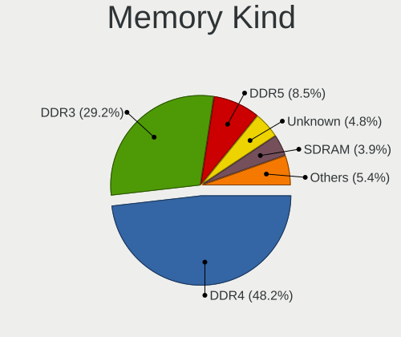

| Kind    | Desktops | Percent |
|---------|----------|---------|
| DDR4    | 704      | 48.19%  |
| DDR3    | 427      | 29.23%  |
| DDR5    | 124      | 8.49%   |
| Unknown | 70       | 4.79%   |
| SDRAM   | 57       | 3.9%    |
| DDR2    | 47       | 3.22%   |
| RAM     | 10       | 0.68%   |
| DDR     | 9        | 0.62%   |
| LPDDR4  | 8        | 0.55%   |
| LPDDR5  | 2        | 0.14%   |
| DRAM    | 2        | 0.14%   |
| LPDDR3  | 1        | 0.07%   |

Memory Form Factor
------------------

Physical design of the memory module

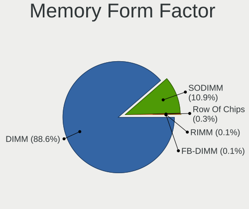

| Name         | Desktops | Percent |
|--------------|----------|---------|
| DIMM         | 1270     | 88.63%  |
| SODIMM       | 156      | 10.89%  |
| Row Of Chips | 4        | 0.28%   |
| RIMM         | 2        | 0.14%   |
| FB-DIMM      | 1        | 0.07%   |

Memory Size
-----------

Memory module size

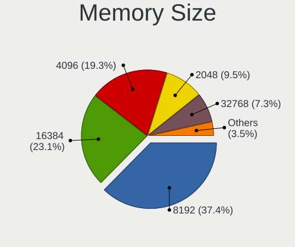

| Size  | Desktops | Percent |
|-------|----------|---------|
| 8192  | 591      | 37.36%  |
| 16384 | 366      | 23.14%  |
| 4096  | 305      | 19.28%  |
| 2048  | 150      | 9.48%   |
| 32768 | 115      | 7.27%   |
| 1024  | 44       | 2.78%   |
| 24576 | 4        | 0.25%   |
| 49152 | 3        | 0.19%   |
| 512   | 2        | 0.13%   |
| 12288 | 1        | 0.06%   |
| 8124  | 1        | 0.06%   |

Memory Speed
------------

Memory module speed

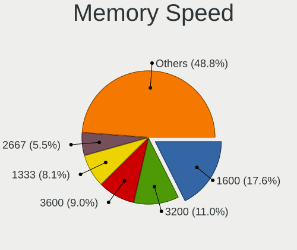

| Speed   | Desktops | Percent |
|---------|----------|---------|
| 1600    | 285      | 17.56%  |
| 3200    | 179      | 11.03%  |
| 3600    | 146      | 9%      |
| 1333    | 131      | 8.07%   |
| 2667    | 90       | 5.55%   |
| 2400    | 82       | 5.05%   |
| 2133    | 73       | 4.5%    |
| 6000    | 50       | 3.08%   |
| 800     | 44       | 2.71%   |
| 3733    | 39       | 2.4%    |
| Unknown | 32       | 1.97%   |
| 2666    | 31       | 1.91%   |
| 667     | 29       | 1.79%   |
| 3800    | 27       | 1.66%   |
| 1866    | 26       | 1.6%    |
| 4000    | 25       | 1.54%   |
| 1867    | 23       | 1.42%   |
| 4800    | 20       | 1.23%   |
| 3000    | 20       | 1.23%   |
| 1800    | 18       | 1.11%   |
| 2933    | 16       | 0.99%   |
| 5600    | 15       | 0.92%   |
| 3400    | 15       | 0.92%   |
| 1067    | 15       | 0.92%   |
| 6400    | 12       | 0.74%   |
| 1066    | 12       | 0.74%   |
| 3066    | 9        | 0.55%   |
| 3466    | 8        | 0.49%   |
| 400     | 8        | 0.49%   |
| 12800   | 7        | 0.43%   |
| 3500    | 7        | 0.43%   |
| 5200    | 6        | 0.37%   |
| 3333    | 6        | 0.37%   |
| 5400    | 5        | 0.31%   |
| 4333    | 5        | 0.31%   |
| 3866    | 5        | 0.31%   |
| 3100    | 5        | 0.31%   |
| 1648    | 5        | 0.31%   |
| 1334    | 5        | 0.31%   |
| 6200    | 4        | 0.25%   |

Printers & scanners
-------------------

Printer Vendor
--------------

Printer device vendors

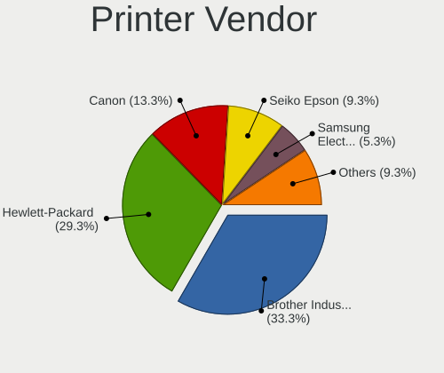

| Vendor                | Desktops | Percent |
|-----------------------|----------|---------|
| Brother Industries    | 25       | 33.33%  |
| Hewlett-Packard       | 22       | 29.33%  |
| Canon                 | 10       | 13.33%  |
| Seiko Epson           | 7        | 9.33%   |
| Samsung Electronics   | 4        | 5.33%   |
| Lexmark International | 3        | 4%      |
| Xerox                 | 2        | 2.67%   |
| Oki Data              | 1        | 1.33%   |
| Dymo-CoStar           | 1        | 1.33%   |

Printer Model
-------------

Printer device models

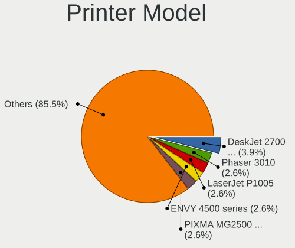

| Model                                  | Desktops | Percent |
|----------------------------------------|----------|---------|
| HP DeskJet 2700 series                 | 3        | 3.95%   |
| Xerox Phaser 3010                      | 2        | 2.63%   |
| HP LaserJet P1005                      | 2        | 2.63%   |
| HP ENVY 4500 series                    | 2        | 2.63%   |
| Canon PIXMA MG2500 Series              | 2        | 2.63%   |
| Brother MFC-J1010DW                    | 2        | 2.63%   |
| Brother HL-L2300D series               | 2        | 2.63%   |
| Brother HL-2270DW Laser Printer        | 2        | 2.63%   |
| Brother DCP-L2510D series              | 2        | 2.63%   |
| Seiko Epson XP-7100 Series             | 1        | 1.32%   |
| Seiko Epson WF-2870 Series             | 1        | 1.32%   |
| Seiko Epson Stylus NX230/SX235W Series | 1        | 1.32%   |
| Seiko Epson L6270 Series               | 1        | 1.32%   |
| Seiko Epson ET-2710 Series             | 1        | 1.32%   |
| Seiko Epson EPSON WF-3520 Series       | 1        | 1.32%   |
| Seiko Epson EPSON L300 Series          | 1        | 1.32%   |
| Samsung ML-216x Series Laser Printer   | 1        | 1.32%   |
| Samsung ML-1660 Series                 | 1        | 1.32%   |
| Samsung ML-1610 Mono Laser Printer     | 1        | 1.32%   |
| Samsung CLP-325 Color Laser Printer    | 1        | 1.32%   |
| Oki Data USB Device                    | 1        | 1.32%   |
| Lexmark International Z35 Printer      | 1        | 1.32%   |
| Lexmark International X74/X75 Printer  | 1        | 1.32%   |
| Lexmark International Lexmark X264dn   | 1        | 1.32%   |
| HP OfficeJet Pro 6970                  | 1        | 1.32%   |
| HP Officejet 4630 series               | 1        | 1.32%   |
| HP OfficeJet 3830 series               | 1        | 1.32%   |
| HP LaserJet P1006                      | 1        | 1.32%   |
| HP LaserJet CP1025nw                   | 1        | 1.32%   |
| HP LaserJet 1020                       | 1        | 1.32%   |
| HP LaserJet 1010                       | 1        | 1.32%   |
| HP HP OfficeJet Pro 8020 series        | 1        | 1.32%   |
| HP HP LaserJet M207-M212               | 1        | 1.32%   |
| HP ENVY 4520 series                    | 1        | 1.32%   |
| HP DeskJet F300 series                 | 1        | 1.32%   |
| HP DeskJet 930c                        | 1        | 1.32%   |
| HP DeskJet 3630 series                 | 1        | 1.32%   |
| HP DeskJet 2300 series                 | 1        | 1.32%   |
| HP DeskJet 2130 series                 | 1        | 1.32%   |
| Dymo-CoStar LabelWriter 450            | 1        | 1.32%   |

Scanner Vendor
--------------

Scanner device vendors

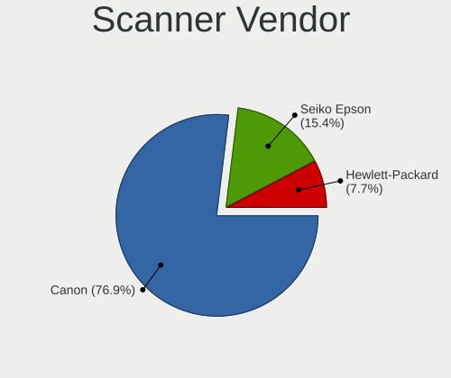

| Vendor          | Desktops | Percent |
|-----------------|----------|---------|
| Canon           | 10       | 76.92%  |
| Seiko Epson     | 2        | 15.38%  |
| Hewlett-Packard | 1        | 7.69%   |

Scanner Model
-------------

Scanner device models

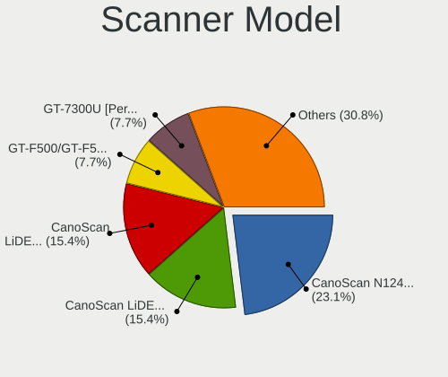

| Model                                                    | Desktops | Percent |
|----------------------------------------------------------|----------|---------|
| Canon CanoScan N1240U/LiDE 30                            | 3        | 23.08%  |
| Canon CanoScan LiDE 210                                  | 2        | 15.38%  |
| Canon CanoScan LiDE 110                                  | 2        | 15.38%  |
| Seiko Epson GT-F500/GT-F550 [Perfection 2480/2580 PHOTO] | 1        | 7.69%   |
| Seiko Epson GT-7300U [Perfection 1260/1260 PHOTO]        | 1        | 7.69%   |
| HP ScanJet 3400cse                                       | 1        | 7.69%   |
| Canon CanoScan LiDE 700F                                 | 1        | 7.69%   |
| Canon CanoScan LIDE 25                                   | 1        | 7.69%   |
| Canon CanoScan 4200F                                     | 1        | 7.69%   |

Camera
------

Camera Vendor
-------------

Camera device vendors

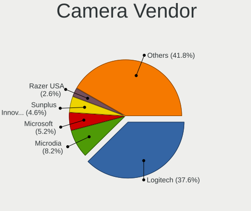

| Vendor                        | Desktops | Percent |
|-------------------------------|----------|---------|
| Logitech                      | 73       | 37.63%  |
| Microdia                      | 16       | 8.25%   |
| Microsoft                     | 10       | 5.15%   |
| Sunplus Innovation Technology | 9        | 4.64%   |
| Razer USA                     | 5        | 2.58%   |
| Chicony Electronics           | 4        | 2.06%   |
| Z-Star Microelectronics       | 3        | 1.55%   |
| Trust                         | 3        | 1.55%   |
| Samsung Electronics           | 3        | 1.55%   |
| Realtek Semiconductor         | 3        | 1.55%   |
| KYE Systems (Mouse Systems)   | 3        | 1.55%   |
| Jieli Technology              | 3        | 1.55%   |
| Hewlett-Packard               | 3        | 1.55%   |
| Generalplus Technology        | 3        | 1.55%   |
| GEMBIRD                       | 3        | 1.55%   |
| Creative Technology           | 3        | 1.55%   |
| Apple                         | 3        | 1.55%   |
| webcam                        | 2        | 1.03%   |
| WaveRider Communications      | 2        | 1.03%   |
| Tobii Technology AB           | 2        | 1.03%   |
| Sunplus IT                    | 2        | 1.03%   |
| SN0002                        | 2        | 1.03%   |
| eMeet                         | 2        | 1.03%   |
| Arkmicro Technologies         | 2        | 1.03%   |
| ARC International             | 2        | 1.03%   |
| Anker PowerConf C200          | 2        | 1.03%   |
| Alcor Micro                   | 2        | 1.03%   |
| YGTek                         | 1        | 0.52%   |
| webcamvendor                  | 1        | 0.52%   |
| ValueHD                       | 1        | 0.52%   |
| USB3.0 HD Audio Capture       | 1        | 0.52%   |
| Unknown                       | 1        | 0.52%   |
| Sony                          | 1        | 0.52%   |
| Silicon Motion                | 1        | 0.52%   |
| SHENZHEN AONI ELECTRONIC      | 1        | 0.52%   |
| Ruision                       | 1        | 0.52%   |
| Pixart Imaging                | 1        | 0.52%   |
| Omnivision                    | 1        | 0.52%   |
| Nexight                       | 1        | 0.52%   |
| MacroSilicon                  | 1        | 0.52%   |

Camera Model
------------

Camera device models

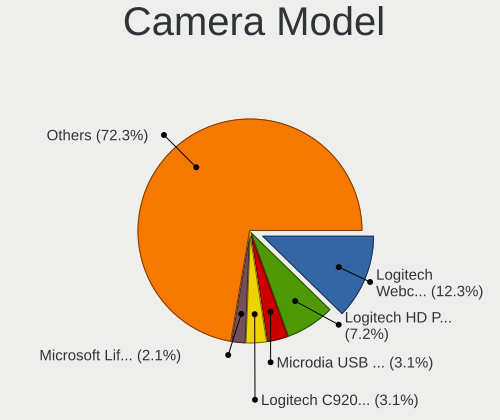

| Model                                             | Desktops | Percent |
|---------------------------------------------------|----------|---------|
| Logitech Webcam C270                              | 24       | 12.31%  |
| Logitech HD Pro Webcam C920                       | 14       | 7.18%   |
| Microdia USB 2.0 Camera                           | 6        | 3.08%   |
| Logitech C920 PRO HD Webcam                       | 6        | 3.08%   |
| Microsoft LifeCam HD-3000                         | 4        | 2.05%   |
| Microdia Camera                                   | 4        | 2.05%   |
| Samsung Galaxy series, misc. (MTP mode)           | 3        | 1.54%   |
| Razer USA Gaming Webcam [Kiyo]                    | 3        | 1.54%   |
| Logitech Webcam Pro 9000                          | 3        | 1.54%   |
| Logitech Webcam C170                              | 3        | 1.54%   |
| Generalplus GENERAL WEBCAM                        | 3        | 1.54%   |
| Apple iPhone 5/5C/5S/6/SE/7/8/X                   | 3        | 1.54%   |
| Z-Star Venus USB2.0 Camera                        | 2        | 1.03%   |
| webcam webcam                                     | 2        | 1.03%   |
| Trust USB Camera                                  | 2        | 1.03%   |
| Tobii AB EyeChip                                  | 2        | 1.03%   |
| Sunplus SPCA2281 Web Camera                       | 2        | 1.03%   |
| Sunplus Full HD webcam                            | 2        | 1.03%   |
| SN0002 1080P Web Camera                           | 2        | 1.03%   |
| Microsoft LifeCam Cinema                          | 2        | 1.03%   |
| Microdia CyberTrack H7                            | 2        | 1.03%   |
| Logitech Webcam C930e                             | 2        | 1.03%   |
| Logitech Webcam C310                              | 2        | 1.03%   |
| Logitech Webcam C300                              | 2        | 1.03%   |
| Logitech BRIO Ultra HD Webcam                     | 2        | 1.03%   |
| Logitech B525 HD Webcam                           | 2        | 1.03%   |
| Jieli USB PHY 2.0                                 | 2        | 1.03%   |
| GEMBIRD Generic UVC 1.00 camera [AppoTech AX2311] | 2        | 1.03%   |
| Chicony HP High Definition 1MP Webcam             | 2        | 1.03%   |
| ARC International Camera                          | 2        | 1.03%   |
| Anker PowerConf C200 Anker PowerConf C200         | 2        | 1.03%   |
| Alcor Micro USB 2.0 PC Camera                     | 2        | 1.03%   |
| Z-Star A4 TECH USB2.0 PC Camera E                 | 1        | 0.51%   |
| YGTek Webcam                                      | 1        | 0.51%   |
| webcamvendor NexiGo N60 FHD Webcam                | 1        | 0.51%   |
| WaveRider USB Live camera                         | 1        | 0.51%   |
| WaveRider USB 2.0 Camera                          | 1        | 0.51%   |
| ValueHD Konftel Cam20                             | 1        | 0.51%   |
| USB3.0 HD Audio Capture USB3.0 HD Video Capture   | 1        | 0.51%   |
| Unknown HD camera                                 | 1        | 0.51%   |

Security
--------

Fingerprint Vendor
------------------

Fingerprint sensor vendors

Zero info for selected period =(

Fingerprint Model
-----------------

Fingerprint sensor models

Zero info for selected period =(

Chipcard Vendor
---------------

Chipcard module vendors

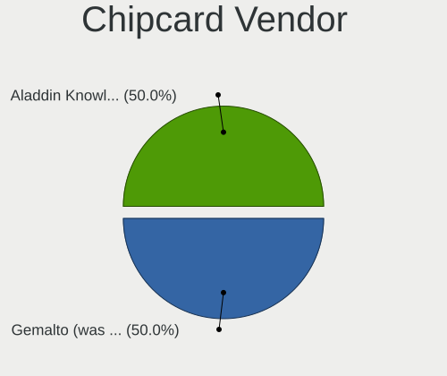

| Vendor                    | Desktops | Percent |
|---------------------------|----------|---------|
| Gemalto (was Gemplus)     | 1        | 50%     |
| Aladdin Knowledge Systems | 1        | 50%     |

Chipcard Model
--------------

Chipcard module models

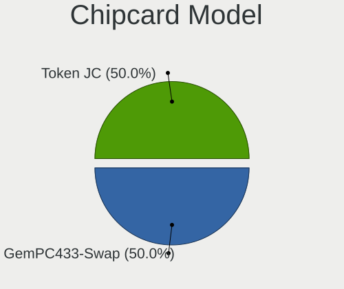

| Model                               | Desktops | Percent |
|-------------------------------------|----------|---------|
| Gemalto (was Gemplus) GemPC433-Swap | 1        | 50%     |
| Aladdin Knowledge Systems Token JC  | 1        | 50%     |

Unsupported
-----------

Unsupported Devices
-------------------

Total unsupported devices on board

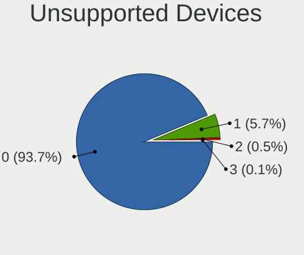

| Total | Desktops | Percent |
|-------|----------|---------|
| 0     | 1363     | 93.68%  |
| 1     | 83       | 5.7%    |
| 2     | 8        | 0.55%   |
| 3     | 1        | 0.07%   |

Unsupported Device Types
------------------------

Types of unsupported devices

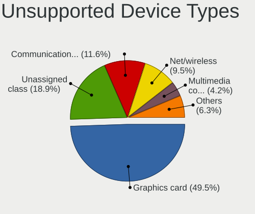

| Type                     | Desktops | Percent |
|--------------------------|----------|---------|
| Graphics card            | 47       | 49.47%  |
| Unassigned class         | 18       | 18.95%  |
| Communication controller | 11       | 11.58%  |
| Net/wireless             | 9        | 9.47%   |
| Multimedia controller    | 4        | 4.21%   |
| Chipcard                 | 2        | 2.11%   |
| Sound                    | 1        | 1.05%   |
| Net/ethernet             | 1        | 1.05%   |
| Card reader              | 1        | 1.05%   |
| Camera                   | 1        | 1.05%   |

