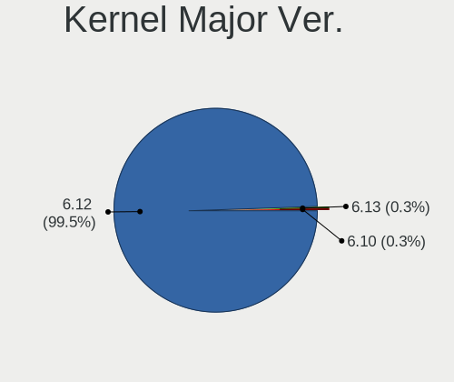
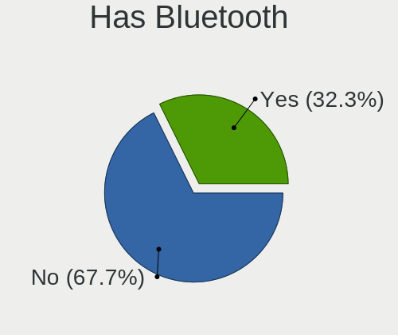
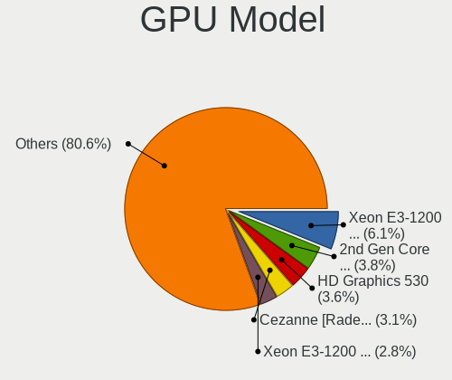

OpenMandriva 24.12 - Tested Hardware & Statistics (Desktops)
------------------------------------------------------------

A project to collect tested hardware configurations for OpenMandriva 24.12.

Anyone can contribute to this report by the [hw-probe](https://github.com/linuxhw/hw-probe) tool:

    sudo -E hw-probe -all -upload

Please contribute! Especially if your hardware is rare.

Contents
--------

* [ Test Cases ](#test-cases)

* [ System ](#system)
  - [ Kernel                   ](#kernel)
  - [ Kernel Family            ](#kernel-family)
  - [ Kernel Major Ver.        ](#kernel-major-ver)
  - [ Arch                     ](#arch)
  - [ DE                       ](#de)
  - [ Display Server           ](#display-server)
  - [ Display Manager          ](#display-manager)
  - [ OS Lang                  ](#os-lang)
  - [ Boot Mode                ](#boot-mode)
  - [ Filesystem               ](#filesystem)
  - [ Part. scheme             ](#part-scheme)
  - [ Dual Boot with Linux/BSD ](#dual-boot-with-linuxbsd)
  - [ Dual Boot (Win)          ](#dual-boot-win)

* [ Board ](#board)
  - [ Vendor                   ](#vendor)
  - [ Model                    ](#model)
  - [ Model Family             ](#model-family)
  - [ MFG Year                 ](#mfg-year)
  - [ Form Factor              ](#form-factor)
  - [ Secure Boot              ](#secure-boot)
  - [ Coreboot                 ](#coreboot)
  - [ RAM Size                 ](#ram-size)
  - [ RAM Used                 ](#ram-used)
  - [ Total Drives             ](#total-drives)
  - [ Has CD-ROM               ](#has-cd-rom)
  - [ Has Ethernet             ](#has-ethernet)
  - [ Has WiFi                 ](#has-wifi)
  - [ Has Bluetooth            ](#has-bluetooth)

* [ Location ](#location)
  - [ Country                  ](#country)
  - [ City                     ](#city)

* [ Drives ](#drives)
  - [ Drive Vendor             ](#drive-vendor)
  - [ Drive Model              ](#drive-model)
  - [ HDD Vendor               ](#hdd-vendor)
  - [ SSD Vendor               ](#ssd-vendor)
  - [ Drive Kind               ](#drive-kind)
  - [ Drive Connector          ](#drive-connector)
  - [ Drive Size               ](#drive-size)
  - [ Space Total              ](#space-total)
  - [ Space Used               ](#space-used)
  - [ Malfunc. Drives          ](#malfunc-drives)
  - [ Malfunc. Drive Vendor    ](#malfunc-drive-vendor)
  - [ Malfunc. HDD Vendor      ](#malfunc-hdd-vendor)
  - [ Malfunc. Drive Kind      ](#malfunc-drive-kind)
  - [ Failed Drives            ](#failed-drives)
  - [ Failed Drive Vendor      ](#failed-drive-vendor)
  - [ Drive Status             ](#drive-status)

* [ Storage controller ](#storage-controller)
  - [ Storage Vendor           ](#storage-vendor)
  - [ Storage Model            ](#storage-model)
  - [ Storage Kind             ](#storage-kind)

* [ Processor ](#processor)
  - [ CPU Vendor               ](#cpu-vendor)
  - [ CPU Model                ](#cpu-model)
  - [ CPU Model Family         ](#cpu-model-family)
  - [ CPU Cores                ](#cpu-cores)
  - [ CPU Sockets              ](#cpu-sockets)
  - [ CPU Threads              ](#cpu-threads)
  - [ CPU Op-Modes             ](#cpu-op-modes)
  - [ CPU Microcode            ](#cpu-microcode)
  - [ CPU Microarch            ](#cpu-microarch)

* [ Graphics ](#graphics)
  - [ GPU Vendor               ](#gpu-vendor)
  - [ GPU Model                ](#gpu-model)
  - [ GPU Combo                ](#gpu-combo)
  - [ GPU Driver               ](#gpu-driver)
  - [ GPU Memory               ](#gpu-memory)

* [ Monitor ](#monitor)
  - [ Monitor Vendor           ](#monitor-vendor)
  - [ Monitor Model            ](#monitor-model)
  - [ Monitor Resolution       ](#monitor-resolution)
  - [ Monitor Diagonal         ](#monitor-diagonal)
  - [ Monitor Width            ](#monitor-width)
  - [ Aspect Ratio             ](#aspect-ratio)
  - [ Monitor Area             ](#monitor-area)
  - [ Pixel Density            ](#pixel-density)
  - [ Multiple Monitors        ](#multiple-monitors)

* [ Network ](#network)
  - [ Net Controller Vendor    ](#net-controller-vendor)
  - [ Net Controller Model     ](#net-controller-model)
  - [ Wireless Vendor          ](#wireless-vendor)
  - [ Wireless Model           ](#wireless-model)
  - [ Ethernet Vendor          ](#ethernet-vendor)
  - [ Ethernet Model           ](#ethernet-model)
  - [ Net Controller Kind      ](#net-controller-kind)
  - [ Used Controller          ](#used-controller)
  - [ NICs                     ](#nics)
  - [ IPv6                     ](#ipv6)

* [ Bluetooth ](#bluetooth)
  - [ Bluetooth Vendor         ](#bluetooth-vendor)
  - [ Bluetooth Model          ](#bluetooth-model)

* [ Sound ](#sound)
  - [ Sound Vendor             ](#sound-vendor)
  - [ Sound Model              ](#sound-model)

* [ Memory ](#memory)
  - [ Memory Vendor            ](#memory-vendor)
  - [ Memory Model             ](#memory-model)
  - [ Memory Kind              ](#memory-kind)
  - [ Memory Form Factor       ](#memory-form-factor)
  - [ Memory Size              ](#memory-size)
  - [ Memory Speed             ](#memory-speed)

* [ Printers & scanners ](#printers--scanners)
  - [ Printer Vendor           ](#printer-vendor)
  - [ Printer Model            ](#printer-model)
  - [ Scanner Vendor           ](#scanner-vendor)
  - [ Scanner Model            ](#scanner-model)

* [ Camera ](#camera)
  - [ Camera Vendor            ](#camera-vendor)
  - [ Camera Model             ](#camera-model)

* [ Security ](#security)
  - [ Fingerprint Vendor       ](#fingerprint-vendor)
  - [ Fingerprint Model        ](#fingerprint-model)
  - [ Chipcard Vendor          ](#chipcard-vendor)
  - [ Chipcard Model           ](#chipcard-model)

* [ Unsupported ](#unsupported)
  - [ Unsupported Devices      ](#unsupported-devices)
  - [ Unsupported Device Types ](#unsupported-device-types)

Test Cases
----------

Total: 370

| Vendor        | Model                       | Probe                                                      | Date         |
|---------------|-----------------------------|------------------------------------------------------------|--------------|
| Gigabyte      | GA-MA770T-UD3               | [617c102331](https://linux-hardware.org/?probe=617c102331) | Jan 06, 2025 |
| MSI           | B75IA-E33                   | [f12ded84f2](https://linux-hardware.org/?probe=f12ded84f2) | Jan 06, 2025 |
| ASUSTek       | PRIME H510M-K R2.0          | [5fb39d6837](https://linux-hardware.org/?probe=5fb39d6837) | Jan 06, 2025 |
| Dell          | OptiPlex 745                | [578cc6d8f1](https://linux-hardware.org/?probe=578cc6d8f1) | Jan 06, 2025 |
| Gigabyte      | GA-78LMT-S2                 | [5321bb65b1](https://linux-hardware.org/?probe=5321bb65b1) | Jan 06, 2025 |
| HP            | 2215                        | [d4d1a7ad27](https://linux-hardware.org/?probe=d4d1a7ad27) | Jan 05, 2025 |
| Lenovo        | 0x36C017AA SDK0J40700 WI... | [75606d7596](https://linux-hardware.org/?probe=75606d7596) | Jan 05, 2025 |
| Unknown       | Unknown                     | [fa69a9bfbc](https://linux-hardware.org/?probe=fa69a9bfbc) | Jan 05, 2025 |
| HP            | 3029h                       | [e46ab5ac4b](https://linux-hardware.org/?probe=e46ab5ac4b) | Jan 05, 2025 |
| Pegatron      | NARRA5                      | [350baa0b67](https://linux-hardware.org/?probe=350baa0b67) | Jan 05, 2025 |
| Dell          | 0HD5W2 A00                  | [a6858e47c5](https://linux-hardware.org/?probe=a6858e47c5) | Jan 05, 2025 |
| HP            | 3397                        | [95cc9c1997](https://linux-hardware.org/?probe=95cc9c1997) | Jan 05, 2025 |
| Gigabyte      | GA-MA785GMT-UD2H            | [7808d0395e](https://linux-hardware.org/?probe=7808d0395e) | Jan 05, 2025 |
| ASUSTek       | PRIME B450M-K II            | [cf7d50fae1](https://linux-hardware.org/?probe=cf7d50fae1) | Jan 04, 2025 |
| ASUSTek       | Maximus VIII RANGER         | [b536336740](https://linux-hardware.org/?probe=b536336740) | Jan 04, 2025 |
| MSI           | Z77A-G45 Thunderbolt        | [63dfc9cc1f](https://linux-hardware.org/?probe=63dfc9cc1f) | Jan 04, 2025 |
| Lenovo        | NOK                         | [2b5c2e2c8a](https://linux-hardware.org/?probe=2b5c2e2c8a) | Jan 04, 2025 |
| HC Technol... | HCAR5000-MI                 | [bbe1844c1c](https://linux-hardware.org/?probe=bbe1844c1c) | Jan 04, 2025 |
| Dell          | 040DDP A01                  | [63dc37783d](https://linux-hardware.org/?probe=63dc37783d) | Jan 04, 2025 |
| Gigabyte      | G41M-ES2L                   | [60cf453df6](https://linux-hardware.org/?probe=60cf453df6) | Jan 04, 2025 |
| Lenovo        | 3141 SDK0J40697 WIN 3305... | [aeee08efea](https://linux-hardware.org/?probe=aeee08efea) | Jan 04, 2025 |
| Dell          | 0WMJ54 A01                  | [966f8de937](https://linux-hardware.org/?probe=966f8de937) | Jan 03, 2025 |
| ASUSTek       | PRIME Z270M-PLUS            | [32db9391d7](https://linux-hardware.org/?probe=32db9391d7) | Jan 03, 2025 |
| Dell          | 0GY6Y8 A03                  | [734e205226](https://linux-hardware.org/?probe=734e205226) | Jan 03, 2025 |
| Lenovo        | MAHOBAY NOK                 | [ed9753dfcf](https://linux-hardware.org/?probe=ed9753dfcf) | Jan 03, 2025 |
| MSI           | PRO B760M-E DDR4            | [4768eb71cc](https://linux-hardware.org/?probe=4768eb71cc) | Jan 03, 2025 |
| Intel         | DQ67SW AAG12527-310         | [a4c7be2f1a](https://linux-hardware.org/?probe=a4c7be2f1a) | Jan 03, 2025 |
| Gigabyte      | GA-78LMT-S2                 | [cf902d875a](https://linux-hardware.org/?probe=cf902d875a) | Jan 03, 2025 |
| Gigabyte      | H81M-S2H                    | [6a06903b4a](https://linux-hardware.org/?probe=6a06903b4a) | Jan 03, 2025 |
| Intel         | H55                         | [aada843724](https://linux-hardware.org/?probe=aada843724) | Jan 03, 2025 |
| AZW           | MINI S                      | [2067c73351](https://linux-hardware.org/?probe=2067c73351) | Jan 03, 2025 |
| Gigabyte      | F2A88XM-D3H                 | [0af9e3885f](https://linux-hardware.org/?probe=0af9e3885f) | Jan 02, 2025 |
| ASUSTek       | PRIME B550M-A WIFI II       | [5a6a67b7a4](https://linux-hardware.org/?probe=5a6a67b7a4) | Jan 02, 2025 |
| AZW           | GK mini                     | [3d87931055](https://linux-hardware.org/?probe=3d87931055) | Jan 02, 2025 |
| Dell          | 0HD5W2 A00                  | [abbdbd898d](https://linux-hardware.org/?probe=abbdbd898d) | Jan 02, 2025 |
| HP            | 83E9                        | [ee42824c61](https://linux-hardware.org/?probe=ee42824c61) | Jan 02, 2025 |
| MSI           | MEG Z790 ACE                | [7479e71d41](https://linux-hardware.org/?probe=7479e71d41) | Jan 02, 2025 |
| HP            | 0A9Ch                       | [d05c412a3b](https://linux-hardware.org/?probe=d05c412a3b) | Jan 02, 2025 |
| ASUSTek       | Z170-E                      | [42888378d7](https://linux-hardware.org/?probe=42888378d7) | Jan 02, 2025 |
| MSI           | X370 GAMING PRO CARBON      | [bb70ef7a51](https://linux-hardware.org/?probe=bb70ef7a51) | Jan 02, 2025 |
| Unknown       | X99-D3                      | [d79cb549a8](https://linux-hardware.org/?probe=d79cb549a8) | Jan 01, 2025 |
| HP            | 0A5Ch                       | [46198b0dea](https://linux-hardware.org/?probe=46198b0dea) | Jan 01, 2025 |
| Shenzhen D... | MP100                       | [032508f9fd](https://linux-hardware.org/?probe=032508f9fd) | Jan 01, 2025 |
| ASUSTek       | PRIME A520M-A II            | [dc2bdc4245](https://linux-hardware.org/?probe=dc2bdc4245) | Jan 01, 2025 |
| Gigabyte      | X570 AORUS PRO              | [9ad161a45a](https://linux-hardware.org/?probe=9ad161a45a) | Jan 01, 2025 |
| Dell          | 0NW73C A00                  | [3dfa88f059](https://linux-hardware.org/?probe=3dfa88f059) | Jan 01, 2025 |
| SZMZ          | X99-S3                      | [f20bda8c75](https://linux-hardware.org/?probe=f20bda8c75) | Jan 01, 2025 |
| ASUSTek       | ROG STRIX B350-F GAMING     | [034de44629](https://linux-hardware.org/?probe=034de44629) | Jan 01, 2025 |
| Gigabyte      | X470 AORUS ULTRA GAMING-... | [31b95986eb](https://linux-hardware.org/?probe=31b95986eb) | Jan 01, 2025 |
| ASUSTek       | P5Q SE PLUS                 | [2e5a12a36b](https://linux-hardware.org/?probe=2e5a12a36b) | Jan 01, 2025 |
| ASUSTek       | A68HM-K                     | [800e2716b1](https://linux-hardware.org/?probe=800e2716b1) | Jan 01, 2025 |
| Foxconn       | 2AB1                        | [d937af7e89](https://linux-hardware.org/?probe=d937af7e89) | Jan 01, 2025 |
| Dell          | 0Y5DDC A00                  | [54403714c3](https://linux-hardware.org/?probe=54403714c3) | Dec 31, 2024 |
| HP            | 3032h                       | [fb4af81907](https://linux-hardware.org/?probe=fb4af81907) | Dec 31, 2024 |
| ASUSTek       | PRIME B450M-K               | [4cb02f7ced](https://linux-hardware.org/?probe=4cb02f7ced) | Dec 31, 2024 |
| Lenovo        | 36EB SDK0J40700 WIN 3258... | [e0e1513ce6](https://linux-hardware.org/?probe=e0e1513ce6) | Dec 31, 2024 |
| HP            | 802F                        | [5c6293b2ab](https://linux-hardware.org/?probe=5c6293b2ab) | Dec 31, 2024 |
| ASUSTek       | PRIME X570-P                | [3556a38021](https://linux-hardware.org/?probe=3556a38021) | Dec 31, 2024 |
| Digiboard     | NM70-TI                     | [1a10dd8daf](https://linux-hardware.org/?probe=1a10dd8daf) | Dec 31, 2024 |
| Shenzhen M... | F6BFC                       | [431235e055](https://linux-hardware.org/?probe=431235e055) | Dec 31, 2024 |
| Intel         | H81                         | [00453f1bb7](https://linux-hardware.org/?probe=00453f1bb7) | Dec 31, 2024 |
| ASUSTek       | M4A78LT-M-LE                | [65345c7ef4](https://linux-hardware.org/?probe=65345c7ef4) | Dec 31, 2024 |
| ASUSTek       | M5A78L-M LE                 | [35ecdf468a](https://linux-hardware.org/?probe=35ecdf468a) | Dec 31, 2024 |
| ASUSTek       | P5G41T-M LX2/GB             | [61c106bd12](https://linux-hardware.org/?probe=61c106bd12) | Dec 30, 2024 |
| Foxconn       | 2ADA                        | [a56fc7e027](https://linux-hardware.org/?probe=a56fc7e027) | Dec 30, 2024 |
| HP            | 8768 A                      | [6a09384c14](https://linux-hardware.org/?probe=6a09384c14) | Dec 30, 2024 |
| HP            | 212B                        | [3cb08b6d4f](https://linux-hardware.org/?probe=3cb08b6d4f) | Dec 30, 2024 |
| ASUSTek       | P8H61-M LX3 PLUS R2.0       | [529afc68af](https://linux-hardware.org/?probe=529afc68af) | Dec 30, 2024 |
| ASRock        | Z68 Extreme4 Gen3           | [9d23a9787e](https://linux-hardware.org/?probe=9d23a9787e) | Dec 30, 2024 |
| ASRock        | B450M Pro4                  | [88b9fab21f](https://linux-hardware.org/?probe=88b9fab21f) | Dec 30, 2024 |
| HP            | 18E7                        | [b0312cea7a](https://linux-hardware.org/?probe=b0312cea7a) | Dec 30, 2024 |
| ASRock        | QC5000-ITX/PH               | [338593f255](https://linux-hardware.org/?probe=338593f255) | Dec 30, 2024 |
| MSI           | MAG B650 TOMAHAWK WIFI      | [e4be1dd2f3](https://linux-hardware.org/?probe=e4be1dd2f3) | Dec 30, 2024 |
| Intel         | E5-A99 V1.0                 | [08bc3d7b5d](https://linux-hardware.org/?probe=08bc3d7b5d) | Dec 30, 2024 |
| ASRock        | 960GC-GS FX                 | [9e60ff1990](https://linux-hardware.org/?probe=9e60ff1990) | Dec 30, 2024 |
| MSI           | 990FXA-GD80                 | [8b2f125314](https://linux-hardware.org/?probe=8b2f125314) | Dec 30, 2024 |
| Intel         | H110                        | [e5396f2a33](https://linux-hardware.org/?probe=e5396f2a33) | Dec 30, 2024 |
| ASRock        | FM2A68M-HD+                 | [f2bb2bd6da](https://linux-hardware.org/?probe=f2bb2bd6da) | Dec 30, 2024 |
| Lenovo        | ThinkCentre M90 5536W92     | [99cf8555fa](https://linux-hardware.org/?probe=99cf8555fa) | Dec 30, 2024 |
| HP            | 339A                        | [ad1a9035e9](https://linux-hardware.org/?probe=ad1a9035e9) | Dec 30, 2024 |
| Gigabyte      | A520M DS3H                  | [a8987243ad](https://linux-hardware.org/?probe=a8987243ad) | Dec 29, 2024 |
| Dell          | 0N4YC8 A00                  | [772d84bc08](https://linux-hardware.org/?probe=772d84bc08) | Dec 29, 2024 |
| ASUSTek       | H110M-K                     | [39970498c9](https://linux-hardware.org/?probe=39970498c9) | Dec 29, 2024 |
| MSI           | H97 PC Mate                 | [28a72759b6](https://linux-hardware.org/?probe=28a72759b6) | Dec 29, 2024 |
| ASUSTek       | SABERTOOTH 990FX            | [3beafb5cad](https://linux-hardware.org/?probe=3beafb5cad) | Dec 29, 2024 |
| MSI           | Z270 TOMAHAWK               | [1ac462bc8e](https://linux-hardware.org/?probe=1ac462bc8e) | Dec 29, 2024 |
| HP            | 18E8                        | [43e6ef4f34](https://linux-hardware.org/?probe=43e6ef4f34) | Dec 29, 2024 |
| ASRock        | Z75 Pro3                    | [91580064a4](https://linux-hardware.org/?probe=91580064a4) | Dec 29, 2024 |
| Gigabyte      | 970A-DS3P                   | [b72ca39acc](https://linux-hardware.org/?probe=b72ca39acc) | Dec 29, 2024 |
| ASUSTek       | SABERTOOTH 990FX            | [a4f0949a45](https://linux-hardware.org/?probe=a4f0949a45) | Dec 29, 2024 |
| Foxconn       | 2ABF                        | [e4568577bd](https://linux-hardware.org/?probe=e4568577bd) | Dec 29, 2024 |
| ASRock        | X370M-HDV R4.0              | [b11c18364f](https://linux-hardware.org/?probe=b11c18364f) | Dec 28, 2024 |
| GEEKOM        | Mini IT13                   | [bd2773f098](https://linux-hardware.org/?probe=bd2773f098) | Dec 28, 2024 |
| ASUSTek       | SABERTOOTH 990FX R2.0       | [4f6862c902](https://linux-hardware.org/?probe=4f6862c902) | Dec 28, 2024 |
| Gigabyte      | B250M-D3H-CF                | [ddda94bd1e](https://linux-hardware.org/?probe=ddda94bd1e) | Dec 28, 2024 |
| Foxconn       | H61MXE/-S/-V/-K             | [7297c64739](https://linux-hardware.org/?probe=7297c64739) | Dec 28, 2024 |
| Intel         | DZ75ML-45K AAG75008-102     | [8b81a310de](https://linux-hardware.org/?probe=8b81a310de) | Dec 28, 2024 |
| MSI           | PRO B650-P WIFI             | [04864e7e53](https://linux-hardware.org/?probe=04864e7e53) | Dec 28, 2024 |
| MSI           | H61M-P22                    | [ea858ac153](https://linux-hardware.org/?probe=ea858ac153) | Dec 28, 2024 |
| Dell          | 096JG8 A01                  | [4324dc90bf](https://linux-hardware.org/?probe=4324dc90bf) | Dec 28, 2024 |
| Lenovo        | SHARKBAY 0B98401 PRO        | [2c6d3ec5d8](https://linux-hardware.org/?probe=2c6d3ec5d8) | Dec 28, 2024 |
| ASRock        | G31M-GS                     | [4eef3a1e4e](https://linux-hardware.org/?probe=4eef3a1e4e) | Dec 27, 2024 |
| ASRock        | AB350M Pro4                 | [bdb7ebff36](https://linux-hardware.org/?probe=bdb7ebff36) | Dec 27, 2024 |
| HP            | 8054                        | [2ad24afc7c](https://linux-hardware.org/?probe=2ad24afc7c) | Dec 27, 2024 |
| ASRock        | A320M Pro4 R2.0             | [21ce1b644b](https://linux-hardware.org/?probe=21ce1b644b) | Dec 27, 2024 |
| Lenovo        | ThinkCentre M81 5049D7G     | [2434fa6399](https://linux-hardware.org/?probe=2434fa6399) | Dec 27, 2024 |
| Unknown       | X79                         | [d721436769](https://linux-hardware.org/?probe=d721436769) | Dec 27, 2024 |
| ASRock        | A320M-HDV R4.0              | [283f8d39eb](https://linux-hardware.org/?probe=283f8d39eb) | Dec 27, 2024 |
| Gigabyte      | A520M K                     | [669dc7155c](https://linux-hardware.org/?probe=669dc7155c) | Dec 27, 2024 |
| ASUSTek       | PRIME B550M-A               | [119767b103](https://linux-hardware.org/?probe=119767b103) | Dec 27, 2024 |
| Huanan        | X99-4MF V1.0                | [86a5a82a39](https://linux-hardware.org/?probe=86a5a82a39) | Dec 26, 2024 |
| ASUSTek       | SABERTOOTH X99              | [a4baa76691](https://linux-hardware.org/?probe=a4baa76691) | Dec 26, 2024 |
| ASRock        | G41MH/USB3                  | [bb5fb7c7af](https://linux-hardware.org/?probe=bb5fb7c7af) | Dec 26, 2024 |
| Acer          | Veriton S6630G V:1.0        | [2cbeac15c3](https://linux-hardware.org/?probe=2cbeac15c3) | Dec 26, 2024 |
| Dell          | 0NDYHG A01                  | [110afa5611](https://linux-hardware.org/?probe=110afa5611) | Dec 26, 2024 |
| HP            | 805A                        | [d55f3bc8c3](https://linux-hardware.org/?probe=d55f3bc8c3) | Dec 26, 2024 |
| HP            | 1998                        | [35ce2043be](https://linux-hardware.org/?probe=35ce2043be) | Dec 26, 2024 |
| Gigabyte      | EP45-UD3LR                  | [244ba13e5e](https://linux-hardware.org/?probe=244ba13e5e) | Dec 25, 2024 |
| ASUSTek       | PRIME A520M-K               | [61d14e44b2](https://linux-hardware.org/?probe=61d14e44b2) | Dec 25, 2024 |
| ASUSTek       | PRIME H510M-K R2.0          | [0a2195b79e](https://linux-hardware.org/?probe=0a2195b79e) | Dec 25, 2024 |
| ASUSTek       | TUF Gaming B550M-PLUS       | [bcd19d252b](https://linux-hardware.org/?probe=bcd19d252b) | Dec 25, 2024 |
| Lenovo        | SKYBAY SDK0J40705 WIN 34... | [94ac9002fa](https://linux-hardware.org/?probe=94ac9002fa) | Dec 25, 2024 |
| ASUSTek       | PRIME A320M-K               | [52d87cf435](https://linux-hardware.org/?probe=52d87cf435) | Dec 25, 2024 |
| MSI           | B450M PRO-VDH MAX           | [b095903374](https://linux-hardware.org/?probe=b095903374) | Dec 25, 2024 |
| HP            | 82FF                        | [cfa3f49c26](https://linux-hardware.org/?probe=cfa3f49c26) | Dec 25, 2024 |
| ASRock        | Z77 Extreme4                | [0bd8b4588d](https://linux-hardware.org/?probe=0bd8b4588d) | Dec 25, 2024 |
| Intel         | X99-H5 V2.0                 | [2261903b1d](https://linux-hardware.org/?probe=2261903b1d) | Dec 25, 2024 |
| Gigabyte      | Z390 AORUS PRO WIFI-CF      | [9be6e4992c](https://linux-hardware.org/?probe=9be6e4992c) | Dec 25, 2024 |
| MSI           | Z97M-G43                    | [15aec5b879](https://linux-hardware.org/?probe=15aec5b879) | Dec 25, 2024 |
| HP            | 1998                        | [cdf0f59ddb](https://linux-hardware.org/?probe=cdf0f59ddb) | Dec 24, 2024 |
| Gigabyte      | EP45-DS3R                   | [a27723c275](https://linux-hardware.org/?probe=a27723c275) | Dec 24, 2024 |
| MSI           | A68HM-E33                   | [3744f7d334](https://linux-hardware.org/?probe=3744f7d334) | Dec 24, 2024 |
| GEEKOM        | XT12 Pro                    | [b728f081fd](https://linux-hardware.org/?probe=b728f081fd) | Dec 24, 2024 |
| HP            | 3646h                       | [dccac4d763](https://linux-hardware.org/?probe=dccac4d763) | Dec 24, 2024 |
| HP            | 2B4B                        | [fdbc072345](https://linux-hardware.org/?probe=fdbc072345) | Dec 24, 2024 |
| AMD           | Pumori CRB                  | [5f646677b2](https://linux-hardware.org/?probe=5f646677b2) | Dec 24, 2024 |
| Fujitsu       | D3432-A1 S26361-D3432-A1    | [47eec380bd](https://linux-hardware.org/?probe=47eec380bd) | Dec 24, 2024 |
| ASUSTek       | TUF Gaming B550M-PLUS       | [d64a12a02a](https://linux-hardware.org/?probe=d64a12a02a) | Dec 24, 2024 |
| Dell          | 02YRK5 A02                  | [aa69d27c0b](https://linux-hardware.org/?probe=aa69d27c0b) | Dec 24, 2024 |
| ASUSTek       | P8Z68-V PRO GEN3            | [cbf66f88d2](https://linux-hardware.org/?probe=cbf66f88d2) | Dec 24, 2024 |
| ASUSTek       | P5K Deluxe                  | [af438d2cae](https://linux-hardware.org/?probe=af438d2cae) | Dec 23, 2024 |
| Dell          | 0M6C7G A00                  | [375865cd09](https://linux-hardware.org/?probe=375865cd09) | Dec 23, 2024 |
| Gigabyte      | G31M-ES2L                   | [ba9c0c5153](https://linux-hardware.org/?probe=ba9c0c5153) | Dec 23, 2024 |
| MSI           | B450 TOMAHAWK MAX           | [7386613d29](https://linux-hardware.org/?probe=7386613d29) | Dec 23, 2024 |
| Gigabyte      | B75M-D3H                    | [fd8023f83c](https://linux-hardware.org/?probe=fd8023f83c) | Dec 23, 2024 |
| Fujitsu       | D3233-A1 S26361-D3233-A1    | [80598d6a43](https://linux-hardware.org/?probe=80598d6a43) | Dec 23, 2024 |
| ASUSTek       | P6T SE                      | [3269bf4415](https://linux-hardware.org/?probe=3269bf4415) | Dec 23, 2024 |
| Gigabyte      | H110M-S2-CF                 | [1b9078c7d8](https://linux-hardware.org/?probe=1b9078c7d8) | Dec 23, 2024 |
| Pegatron      | 2AD5                        | [494dd69ae1](https://linux-hardware.org/?probe=494dd69ae1) | Dec 23, 2024 |
| HP            | 1497                        | [9b71f5f802](https://linux-hardware.org/?probe=9b71f5f802) | Dec 23, 2024 |
| Gigabyte      | B450M H                     | [d4e50fb2da](https://linux-hardware.org/?probe=d4e50fb2da) | Dec 23, 2024 |
| Dell          | 0KWVT8 A02                  | [8a38805f0b](https://linux-hardware.org/?probe=8a38805f0b) | Dec 23, 2024 |
| ASUSTek       | PRIME H610M-R D4            | [2a762556a1](https://linux-hardware.org/?probe=2a762556a1) | Dec 23, 2024 |
| ECS           | Nettle3                     | [09b313a942](https://linux-hardware.org/?probe=09b313a942) | Dec 23, 2024 |
| Gigabyte      | X670 GAMING X AX            | [1c51df6d46](https://linux-hardware.org/?probe=1c51df6d46) | Dec 22, 2024 |
| ASUSTek       | M4A785-M                    | [7ca338168f](https://linux-hardware.org/?probe=7ca338168f) | Dec 22, 2024 |
| ASUSTek       | P8Z68-M PRO                 | [d7826b9a59](https://linux-hardware.org/?probe=d7826b9a59) | Dec 22, 2024 |
| ASUSTek       | H170M-PLUS                  | [1a3bfda1b2](https://linux-hardware.org/?probe=1a3bfda1b2) | Dec 22, 2024 |
| Dell          | 0PC5F7 A02                  | [c7272a6535](https://linux-hardware.org/?probe=c7272a6535) | Dec 22, 2024 |
| ASUSTek       | TUF Gaming B650-PLUS        | [e83481000e](https://linux-hardware.org/?probe=e83481000e) | Dec 22, 2024 |
| Gigabyte      | B450 I AORUS PRO WIFI-CF    | [9a174f4b8f](https://linux-hardware.org/?probe=9a174f4b8f) | Dec 22, 2024 |
| HP            | 843B                        | [6ae8cb479e](https://linux-hardware.org/?probe=6ae8cb479e) | Dec 22, 2024 |
| ASUSTek       | M5A78L-M LE                 | [c510ddb2e2](https://linux-hardware.org/?probe=c510ddb2e2) | Dec 22, 2024 |
| ASUSTek       | P5LD2-VM                    | [03bb592c4a](https://linux-hardware.org/?probe=03bb592c4a) | Dec 22, 2024 |
| ASUSTek       | PRIME Z370-A                | [17aedd4d99](https://linux-hardware.org/?probe=17aedd4d99) | Dec 22, 2024 |
| ASUSTek       | PRIME A320M-K               | [9a1d5cefd0](https://linux-hardware.org/?probe=9a1d5cefd0) | Dec 22, 2024 |
| AZW           | MINI S 10                   | [2309fa6c0a](https://linux-hardware.org/?probe=2309fa6c0a) | Dec 22, 2024 |
| ASUSTek       | Rampage II GENE             | [6358a8fcf5](https://linux-hardware.org/?probe=6358a8fcf5) | Dec 22, 2024 |
| Dell          | 0HY9JP A02                  | [ab65db9701](https://linux-hardware.org/?probe=ab65db9701) | Dec 22, 2024 |
| MSI           | H110M PRO-D                 | [b7c9d31dff](https://linux-hardware.org/?probe=b7c9d31dff) | Dec 22, 2024 |
| Dell          | 09KPNV A00                  | [3f5640444f](https://linux-hardware.org/?probe=3f5640444f) | Dec 21, 2024 |
| ASRock        | P5B-DE                      | [88f13bcd5d](https://linux-hardware.org/?probe=88f13bcd5d) | Dec 21, 2024 |
| MSI           | B250M PRO-VDH               | [9728f996d5](https://linux-hardware.org/?probe=9728f996d5) | Dec 21, 2024 |
| ASUSTek       | ROG STRIX B450-E GAMING     | [5ffe3ed663](https://linux-hardware.org/?probe=5ffe3ed663) | Dec 21, 2024 |
| ASUSTek       | ROG STRIX Z590-E GAMING ... | [a891f1a560](https://linux-hardware.org/?probe=a891f1a560) | Dec 21, 2024 |
| ASUSTek       | PRIME H510M-A               | [2e9c14e21d](https://linux-hardware.org/?probe=2e9c14e21d) | Dec 21, 2024 |
| Dell          | 07X0Y8 A00                  | [cdba4e002d](https://linux-hardware.org/?probe=cdba4e002d) | Dec 21, 2024 |
| ASUSTek       | BM6660                      | [6a96fbe6fb](https://linux-hardware.org/?probe=6a96fbe6fb) | Dec 21, 2024 |
| Gigabyte      | H61M-S2P-B3                 | [ca83315819](https://linux-hardware.org/?probe=ca83315819) | Dec 21, 2024 |
| Gigabyte      | Z77X-UD3H                   | [1e178d7ba3](https://linux-hardware.org/?probe=1e178d7ba3) | Dec 21, 2024 |
| HP            | 2ADE                        | [200830e70d](https://linux-hardware.org/?probe=200830e70d) | Dec 21, 2024 |
| AZW           | Green G1                    | [86179ca152](https://linux-hardware.org/?probe=86179ca152) | Dec 21, 2024 |
| Biostar       | G41D3                       | [cdc2e02364](https://linux-hardware.org/?probe=cdc2e02364) | Dec 21, 2024 |
| Gigabyte      | M4HM85P-00                  | [1c9c5bd50a](https://linux-hardware.org/?probe=1c9c5bd50a) | Dec 21, 2024 |
| ASRock        | X670E Steel Legend          | [b80495ed1a](https://linux-hardware.org/?probe=b80495ed1a) | Dec 20, 2024 |
| ASRock        | B450M Pro4 R2.0             | [4f6028e7cc](https://linux-hardware.org/?probe=4f6028e7cc) | Dec 20, 2024 |
| ASUSTek       | H81-PLUS                    | [b1c71133ae](https://linux-hardware.org/?probe=b1c71133ae) | Dec 20, 2024 |
| Dell          | 0M863N A01                  | [6c1814a9f9](https://linux-hardware.org/?probe=6c1814a9f9) | Dec 20, 2024 |
| Lenovo        | 30D0 SDK0J40697 WIN 3305... | [bf94a86edc](https://linux-hardware.org/?probe=bf94a86edc) | Dec 20, 2024 |
| HP            | 8055                        | [549a29a030](https://linux-hardware.org/?probe=549a29a030) | Dec 20, 2024 |
| Lenovo        | MAHOBAY                     | [d526f3d692](https://linux-hardware.org/?probe=d526f3d692) | Dec 20, 2024 |
| HP            | 1589                        | [37255e8353](https://linux-hardware.org/?probe=37255e8353) | Dec 20, 2024 |
| ASUSTek       | H61M-E                      | [f975c50855](https://linux-hardware.org/?probe=f975c50855) | Dec 20, 2024 |
| ASRock        | H670M Pro RS                | [becb70cb39](https://linux-hardware.org/?probe=becb70cb39) | Dec 20, 2024 |
| ASRock        | A320M-HDV R4.0              | [7e87cc6d61](https://linux-hardware.org/?probe=7e87cc6d61) | Dec 20, 2024 |
| MSI           | B450 GAMING PRO CARBON M... | [08673a16c4](https://linux-hardware.org/?probe=08673a16c4) | Dec 20, 2024 |
| ASUSTek       | M5A78L LE                   | [99441ad0df](https://linux-hardware.org/?probe=99441ad0df) | Dec 20, 2024 |
| Gigabyte      | H81M-H                      | [c89e4827ed](https://linux-hardware.org/?probe=c89e4827ed) | Dec 20, 2024 |
| ASUSTek       | PRIME B450M-A               | [6c13efa61f](https://linux-hardware.org/?probe=6c13efa61f) | Dec 20, 2024 |
| Dell          | 0HR330                      | [0896ea906b](https://linux-hardware.org/?probe=0896ea906b) | Dec 20, 2024 |
| Gigabyte      | B550M K                     | [356514da21](https://linux-hardware.org/?probe=356514da21) | Dec 19, 2024 |
| ASUSTek       | K30BF_M32BF_A_F_K31BF_6     | [afd9e8ca40](https://linux-hardware.org/?probe=afd9e8ca40) | Dec 19, 2024 |
| ASRock        | A88M-G                      | [e1399629da](https://linux-hardware.org/?probe=e1399629da) | Dec 19, 2024 |
| ASUSTek       | Z97-K                       | [05b8112082](https://linux-hardware.org/?probe=05b8112082) | Dec 19, 2024 |
| HP            | 18E7                        | [5a4b0dfd19](https://linux-hardware.org/?probe=5a4b0dfd19) | Dec 19, 2024 |
| Gigabyte      | B75M-D3H                    | [24a9a318be](https://linux-hardware.org/?probe=24a9a318be) | Dec 19, 2024 |
| ASUSTek       | H110M-D                     | [e553338f2c](https://linux-hardware.org/?probe=e553338f2c) | Dec 19, 2024 |
| ASUSTek       | PRIME B450M-A               | [42a6edcbfb](https://linux-hardware.org/?probe=42a6edcbfb) | Dec 19, 2024 |
| Unknown       | Unknown                     | [36c61263b0](https://linux-hardware.org/?probe=36c61263b0) | Dec 19, 2024 |
| ASRock        | B550M Steel Legend          | [e843ef7f48](https://linux-hardware.org/?probe=e843ef7f48) | Dec 19, 2024 |
| Trigkey       | Green G4 10                 | [abe47751df](https://linux-hardware.org/?probe=abe47751df) | Dec 19, 2024 |
| ASUSTek       | P5G41T-M LX3                | [1edf9902dd](https://linux-hardware.org/?probe=1edf9902dd) | Dec 19, 2024 |
| Gigabyte      | Z590 GAMING X               | [254ce873f6](https://linux-hardware.org/?probe=254ce873f6) | Dec 19, 2024 |
| Gigabyte      | B450 AORUS M                | [7dfcccc6eb](https://linux-hardware.org/?probe=7dfcccc6eb) | Dec 19, 2024 |
| ASUSTek       | PRIME B450M-A               | [52e0c1bf8f](https://linux-hardware.org/?probe=52e0c1bf8f) | Dec 19, 2024 |
| MSI           | P55-GD65                    | [b331e16846](https://linux-hardware.org/?probe=b331e16846) | Dec 19, 2024 |
| ASUSTek       | CM1630                      | [8c63957f8b](https://linux-hardware.org/?probe=8c63957f8b) | Dec 19, 2024 |
| MSI           | Z390-A PRO                  | [8df543e380](https://linux-hardware.org/?probe=8df543e380) | Dec 19, 2024 |
| Apple         | Mac-F221BEC8                | [649d762772](https://linux-hardware.org/?probe=649d762772) | Dec 19, 2024 |
| Gigabyte      | H370M DS3H-CF               | [8eb604caeb](https://linux-hardware.org/?probe=8eb604caeb) | Dec 19, 2024 |
| STGAUBRON     | B75M4 V1.1                  | [cdf3159da7](https://linux-hardware.org/?probe=cdf3159da7) | Dec 19, 2024 |
| ASRock        | H81M-HDS R2.0               | [7b753c30c2](https://linux-hardware.org/?probe=7b753c30c2) | Dec 18, 2024 |
| Gigabyte      | B75M-D3V                    | [b49a48d194](https://linux-hardware.org/?probe=b49a48d194) | Dec 18, 2024 |
| Dell          | 0D441T A03                  | [4f2f4f1df7](https://linux-hardware.org/?probe=4f2f4f1df7) | Dec 18, 2024 |
| MSI           | PRO B760M-A WIFI DDR4       | [bf182b776d](https://linux-hardware.org/?probe=bf182b776d) | Dec 18, 2024 |
| Lenovo        | SHARKBAY NOK                | [9db3e7ed5a](https://linux-hardware.org/?probe=9db3e7ed5a) | Dec 18, 2024 |
| Gigabyte      | 970A-DS3P                   | [0cdac872bc](https://linux-hardware.org/?probe=0cdac872bc) | Dec 18, 2024 |
| Intel         | IPC-ADN2L                   | [456aa729c1](https://linux-hardware.org/?probe=456aa729c1) | Dec 18, 2024 |
| Lenovo        | SHARKBAY SDK0J40697 WIN ... | [f9b15fdce1](https://linux-hardware.org/?probe=f9b15fdce1) | Dec 18, 2024 |
| MSI           | H81M-P33                    | [7fa7cfc46d](https://linux-hardware.org/?probe=7fa7cfc46d) | Dec 18, 2024 |
| Gigabyte      | B450M DS3H WIFI-CF          | [eb9e143dcc](https://linux-hardware.org/?probe=eb9e143dcc) | Dec 18, 2024 |
| MSI           | B550M PRO-VDH WIFI          | [2616349c03](https://linux-hardware.org/?probe=2616349c03) | Dec 18, 2024 |
| ASUSTek       | PRIME H410M-K               | [6de41c2f20](https://linux-hardware.org/?probe=6de41c2f20) | Dec 18, 2024 |
| ASUSTek       | P8H77-M LE                  | [3389c4a17c](https://linux-hardware.org/?probe=3389c4a17c) | Dec 18, 2024 |
| Pegatron      | 2AC2                        | [98b70ae737](https://linux-hardware.org/?probe=98b70ae737) | Dec 18, 2024 |
| ASRock        | 939N68PV-GLAN               | [c70bf790fe](https://linux-hardware.org/?probe=c70bf790fe) | Dec 18, 2024 |
| Dell          | 0HY9JP A00                  | [b6371323ef](https://linux-hardware.org/?probe=b6371323ef) | Dec 18, 2024 |
| Dell          | 0JP3NX A00                  | [ea6bad1e0a](https://linux-hardware.org/?probe=ea6bad1e0a) | Dec 18, 2024 |
| AZW           | U59                         | [38458ce296](https://linux-hardware.org/?probe=38458ce296) | Dec 18, 2024 |
| Gigabyte      | GA-880GM-UD2H               | [42af74e9a9](https://linux-hardware.org/?probe=42af74e9a9) | Dec 18, 2024 |
| ASUSTek       | LEUCITE                     | [f61e7d37a2](https://linux-hardware.org/?probe=f61e7d37a2) | Dec 18, 2024 |
| HP            | 1632                        | [eaf5cb101f](https://linux-hardware.org/?probe=eaf5cb101f) | Dec 18, 2024 |
| Fujitsu Si... | D2164-A1 S26361-D2164-A1    | [e0c065a693](https://linux-hardware.org/?probe=e0c065a693) | Dec 18, 2024 |
| MSI           | MS-7360                     | [d3638359ac](https://linux-hardware.org/?probe=d3638359ac) | Dec 17, 2024 |
| Acer          | Aspire X3960                | [935796fbb9](https://linux-hardware.org/?probe=935796fbb9) | Dec 17, 2024 |
| ASUSTek       | TUF Gaming B550M-PLUS       | [49455691cb](https://linux-hardware.org/?probe=49455691cb) | Dec 17, 2024 |
| ASUSTek       | ROG STRIX B550-F GAMING     | [5adf359ed4](https://linux-hardware.org/?probe=5adf359ed4) | Dec 17, 2024 |
| Apple         | Mac-F221BEC8                | [7bfff86b7f](https://linux-hardware.org/?probe=7bfff86b7f) | Dec 17, 2024 |
| ASUSTek       | PRIME H310M-E R2.0          | [7b274f7500](https://linux-hardware.org/?probe=7b274f7500) | Dec 17, 2024 |
| ASUSTek       | PRIME B550M-A               | [fc30a73f46](https://linux-hardware.org/?probe=fc30a73f46) | Dec 17, 2024 |
| MSI           | MPG X870E CARBON WIFI       | [5a55b1482a](https://linux-hardware.org/?probe=5a55b1482a) | Dec 17, 2024 |
| ASUSTek       | PRIME H510M-A               | [0b3d28fe51](https://linux-hardware.org/?probe=0b3d28fe51) | Dec 17, 2024 |
| MAXSUN        | MS-Challenger B450M         | [32a2c0a5bf](https://linux-hardware.org/?probe=32a2c0a5bf) | Dec 17, 2024 |
| Dell          | 0GXM1W A00                  | [a2efe505a5](https://linux-hardware.org/?probe=a2efe505a5) | Dec 17, 2024 |
| HP            | 1495                        | [81994e4b0e](https://linux-hardware.org/?probe=81994e4b0e) | Dec 17, 2024 |
| ASRock        | B550 Phantom Gaming 4/ac    | [8d9d562242](https://linux-hardware.org/?probe=8d9d562242) | Dec 17, 2024 |
| ASUSTek       | PRIME B550-PLUS AC-HES      | [fb948c26ed](https://linux-hardware.org/?probe=fb948c26ed) | Dec 17, 2024 |
| ASUSTek       | ROG STRIX B460-H GAMING     | [5870f74cfc](https://linux-hardware.org/?probe=5870f74cfc) | Dec 17, 2024 |
| ASUSTek       | PRIME B660-PLUS D4          | [75dce3a5ff](https://linux-hardware.org/?probe=75dce3a5ff) | Dec 16, 2024 |
| Intel         | X99                         | [1a147ad6e0](https://linux-hardware.org/?probe=1a147ad6e0) | Dec 16, 2024 |
| ASRock        | H510M-HDV/M.2 SE            | [6592ca3f42](https://linux-hardware.org/?probe=6592ca3f42) | Dec 16, 2024 |
| ASRock        | H81 Pro BTC R2.0            | [2bb573bea0](https://linux-hardware.org/?probe=2bb573bea0) | Dec 16, 2024 |
| ASRock        | Z370 Pro4                   | [bd29cc04f6](https://linux-hardware.org/?probe=bd29cc04f6) | Dec 16, 2024 |
| Lenovo        | SHARKBAY 0B98401 WIN        | [c3fec53206](https://linux-hardware.org/?probe=c3fec53206) | Dec 16, 2024 |
| Gigabyte      | Z170X-Ultra Gaming-CF       | [7e6a2bb396](https://linux-hardware.org/?probe=7e6a2bb396) | Dec 16, 2024 |
| HP            | 8054                        | [3196c09967](https://linux-hardware.org/?probe=3196c09967) | Dec 16, 2024 |
| Medion        | H110H4-EM                   | [7e95fae863](https://linux-hardware.org/?probe=7e95fae863) | Dec 16, 2024 |
| ASUSTek       | PRIME X570-P                | [a88e3b9b74](https://linux-hardware.org/?probe=a88e3b9b74) | Dec 16, 2024 |
| HP            | 18E5                        | [252acd69a3](https://linux-hardware.org/?probe=252acd69a3) | Dec 16, 2024 |
| ASUSTek       | P5G41T-M LX2/GB             | [3e5a1f7df2](https://linux-hardware.org/?probe=3e5a1f7df2) | Dec 16, 2024 |
| Lenovo        | SHARKBAY SDK0E50510 WIN     | [781fc0f1cb](https://linux-hardware.org/?probe=781fc0f1cb) | Dec 16, 2024 |
| Dell          | 0C27VV A01                  | [e4d8fe24df](https://linux-hardware.org/?probe=e4d8fe24df) | Dec 16, 2024 |
| AZW           | MINI S                      | [2fe134f22f](https://linux-hardware.org/?probe=2fe134f22f) | Dec 15, 2024 |
| ASRock        | X399 Taichi                 | [d271480a05](https://linux-hardware.org/?probe=d271480a05) | Dec 15, 2024 |
| MSI           | Z370 GAMING PRO CARBON A... | [8bf8630863](https://linux-hardware.org/?probe=8bf8630863) | Dec 15, 2024 |
| ASUSTek       | P7P55D                      | [e84de5749d](https://linux-hardware.org/?probe=e84de5749d) | Dec 15, 2024 |
| Gigabyte      | H310M S2P                   | [fb927e57a4](https://linux-hardware.org/?probe=fb927e57a4) | Dec 15, 2024 |
| ASUSTek       | ROG STRIX B660-G GAMING ... | [05b354d61e](https://linux-hardware.org/?probe=05b354d61e) | Dec 15, 2024 |
| PCWare        | IPMH110G-DDR3               | [80df541384](https://linux-hardware.org/?probe=80df541384) | Dec 15, 2024 |
| Unknown       | Unknown                     | [8892a53236](https://linux-hardware.org/?probe=8892a53236) | Dec 15, 2024 |
| Dell          | 0NC2VH A01                  | [4810f67ef7](https://linux-hardware.org/?probe=4810f67ef7) | Dec 15, 2024 |
| Gigabyte      | H97M-HD3                    | [0e0965bc17](https://linux-hardware.org/?probe=0e0965bc17) | Dec 15, 2024 |
| ASUSTek       | M5A97 LE R2.0               | [a04cae47e6](https://linux-hardware.org/?probe=a04cae47e6) | Dec 15, 2024 |
| Dell          | 0PC5F7 A02                  | [300b0dac16](https://linux-hardware.org/?probe=300b0dac16) | Dec 15, 2024 |
| Unknown       | Unknown                     | [55868f7894](https://linux-hardware.org/?probe=55868f7894) | Dec 15, 2024 |
| ASUSTek       | SABERTOOTH Z87              | [8eeff9db9d](https://linux-hardware.org/?probe=8eeff9db9d) | Dec 14, 2024 |
| ASUSTek       | M4A87TD/USB3                | [a14debaa36](https://linux-hardware.org/?probe=a14debaa36) | Dec 14, 2024 |
| ASUSTek       | TUF Gaming B550M-PLUS       | [7fe45e1a05](https://linux-hardware.org/?probe=7fe45e1a05) | Dec 14, 2024 |
| Unknown       | Unknown                     | [48bf121bc0](https://linux-hardware.org/?probe=48bf121bc0) | Dec 14, 2024 |
| HP            | 8184 X4                     | [bbb778251a](https://linux-hardware.org/?probe=bbb778251a) | Dec 14, 2024 |
| MSI           | Z170A PC MATE               | [226a30cded](https://linux-hardware.org/?probe=226a30cded) | Dec 14, 2024 |
| Unknown       | Unknown                     | [ded8937413](https://linux-hardware.org/?probe=ded8937413) | Dec 14, 2024 |
| Gigabyte      | B450M DS3H V2               | [bfdca9bd38](https://linux-hardware.org/?probe=bfdca9bd38) | Dec 14, 2024 |
| ASUSTek       | P8Z77-V LX                  | [e1c4faae76](https://linux-hardware.org/?probe=e1c4faae76) | Dec 14, 2024 |
| Lenovo        | MAHOBAY NOK                 | [d8587c000b](https://linux-hardware.org/?probe=d8587c000b) | Dec 14, 2024 |
| HP            | 339A                        | [51ac462459](https://linux-hardware.org/?probe=51ac462459) | Dec 14, 2024 |
| ASUSTek       | PRIME B760M-R D4            | [6e6705253e](https://linux-hardware.org/?probe=6e6705253e) | Dec 14, 2024 |
| Pegatron      | VIOLET                      | [94fe59184c](https://linux-hardware.org/?probe=94fe59184c) | Dec 14, 2024 |
| Unknown       | Unknown                     | [62942fa339](https://linux-hardware.org/?probe=62942fa339) | Dec 14, 2024 |
| Acer          | Veriton M480                | [33294db2d5](https://linux-hardware.org/?probe=33294db2d5) | Dec 14, 2024 |
| ASRock        | X570 Phantom Gaming-ITX/... | [ff22af564e](https://linux-hardware.org/?probe=ff22af564e) | Dec 14, 2024 |
| ASRock        | H510M-HVS R2.0              | [2a3e145431](https://linux-hardware.org/?probe=2a3e145431) | Dec 14, 2024 |
| Gigabyte      | B550M AORUS ELITE           | [12b3f9b280](https://linux-hardware.org/?probe=12b3f9b280) | Dec 14, 2024 |
| Dell          | 096JG8 A01                  | [63cf395d23](https://linux-hardware.org/?probe=63cf395d23) | Dec 14, 2024 |
| Lenovo        | SHARKBAY 0C48431 PRO        | [342b875683](https://linux-hardware.org/?probe=342b875683) | Dec 14, 2024 |
| Dell          | 0YNVJG A01                  | [463e6f71a4](https://linux-hardware.org/?probe=463e6f71a4) | Dec 14, 2024 |
| ASUSTek       | P8Z77-V LX2                 | [cf973ad670](https://linux-hardware.org/?probe=cf973ad670) | Dec 14, 2024 |
| Gigabyte      | EP43-DS3L                   | [8e265a79bd](https://linux-hardware.org/?probe=8e265a79bd) | Dec 14, 2024 |
| ASRock        | N68-GE3 UCC                 | [f8bf90b3fb](https://linux-hardware.org/?probe=f8bf90b3fb) | Dec 13, 2024 |
| ASUSTek       | P8Z77-V LK                  | [d58cfe7ef7](https://linux-hardware.org/?probe=d58cfe7ef7) | Dec 13, 2024 |
| AMI           | Intel                       | [122e2f11d0](https://linux-hardware.org/?probe=122e2f11d0) | Dec 13, 2024 |
| Dell          | 0WMJ54 A01                  | [5d62063d9e](https://linux-hardware.org/?probe=5d62063d9e) | Dec 13, 2024 |
| ASRock        | 970 Pro3 R2.0               | [a80ba72f56](https://linux-hardware.org/?probe=a80ba72f56) | Dec 13, 2024 |
| MSI           | Z590 PRO WIFI               | [44541e695d](https://linux-hardware.org/?probe=44541e695d) | Dec 13, 2024 |
| Lenovo        | SHARKBAY 31900058 STD       | [e17f61a1f8](https://linux-hardware.org/?probe=e17f61a1f8) | Dec 13, 2024 |
| ASUSTek       | PRIME H510M-E               | [6ade667db2](https://linux-hardware.org/?probe=6ade667db2) | Dec 13, 2024 |
| Biostar       | B550MXC PRO                 | [eac2b7130f](https://linux-hardware.org/?probe=eac2b7130f) | Dec 13, 2024 |
| Gigabyte      | A520M K V2                  | [503327783f](https://linux-hardware.org/?probe=503327783f) | Dec 13, 2024 |
| Dell          | 0C27VV A02                  | [f66c549cec](https://linux-hardware.org/?probe=f66c549cec) | Dec 13, 2024 |
| Dell          | 042P49 A02                  | [c20e30f7fc](https://linux-hardware.org/?probe=c20e30f7fc) | Dec 13, 2024 |
| ASUSTek       | M2N68-AM SE2                | [8b53c864fe](https://linux-hardware.org/?probe=8b53c864fe) | Dec 13, 2024 |
| Dell          | 0N4YC8 A00                  | [292ab9f2e5](https://linux-hardware.org/?probe=292ab9f2e5) | Dec 13, 2024 |
| HP            | 843B                        | [20c865cfe9](https://linux-hardware.org/?probe=20c865cfe9) | Dec 13, 2024 |
| MSI           | MPG X570 GAMING PLUS        | [e2ccc250fb](https://linux-hardware.org/?probe=e2ccc250fb) | Dec 13, 2024 |
| Intel         | DH61ZE AAG43004-200         | [6e9ec5fdc8](https://linux-hardware.org/?probe=6e9ec5fdc8) | Dec 13, 2024 |
| MSI           | B450 TOMAHAWK               | [aa7ebb1b4a](https://linux-hardware.org/?probe=aa7ebb1b4a) | Dec 13, 2024 |
| AMD           | A88                         | [f6e719736c](https://linux-hardware.org/?probe=f6e719736c) | Dec 12, 2024 |
| HP            | 2B47                        | [856b94c173](https://linux-hardware.org/?probe=856b94c173) | Dec 12, 2024 |
| Gigabyte      | MKLP7AP-00                  | [3468d571f4](https://linux-hardware.org/?probe=3468d571f4) | Dec 12, 2024 |
| Dell          | 0NW6H5 A00                  | [68820ccb82](https://linux-hardware.org/?probe=68820ccb82) | Dec 12, 2024 |
| Gigabyte      | GA-78LMT-USB3 x.x           | [093ab9d71c](https://linux-hardware.org/?probe=093ab9d71c) | Dec 12, 2024 |
| Acer          | Aspire M1470                | [92955cff66](https://linux-hardware.org/?probe=92955cff66) | Dec 12, 2024 |
| Dell          | 0GXM1W A00                  | [c5335e493b](https://linux-hardware.org/?probe=c5335e493b) | Dec 12, 2024 |
| ASRock        | G31M-GS                     | [ba92b331f9](https://linux-hardware.org/?probe=ba92b331f9) | Dec 12, 2024 |
| HP            | 805D                        | [de537ec8b7](https://linux-hardware.org/?probe=de537ec8b7) | Dec 12, 2024 |
| ASUSTek       | ROG STRIX B550-F GAMING     | [d1bfd63754](https://linux-hardware.org/?probe=d1bfd63754) | Dec 12, 2024 |
| ASUSTek       | Z170M-PLUS                  | [329295b950](https://linux-hardware.org/?probe=329295b950) | Dec 12, 2024 |
| HP            | 339A                        | [df4384cf2b](https://linux-hardware.org/?probe=df4384cf2b) | Dec 12, 2024 |
| Dell          | 0KC9NP A01                  | [40ceb358f9](https://linux-hardware.org/?probe=40ceb358f9) | Dec 12, 2024 |
| Gigabyte      | H610M H V3 DDR4             | [a7657767a7](https://linux-hardware.org/?probe=a7657767a7) | Dec 12, 2024 |
| MSI           | MPG B550 GAMING PLUS        | [474d59def7](https://linux-hardware.org/?probe=474d59def7) | Dec 12, 2024 |
| ASUSTek       | PRIME H510M-R               | [afffb5c934](https://linux-hardware.org/?probe=afffb5c934) | Dec 12, 2024 |
| Gigabyte      | X570 AORUS MASTER           | [9e851507fc](https://linux-hardware.org/?probe=9e851507fc) | Dec 12, 2024 |
| Gigabyte      | EP31-DS3L                   | [a2d6582306](https://linux-hardware.org/?probe=a2d6582306) | Dec 12, 2024 |
| Gigabyte      | H470M DS3H                  | [15f8300927](https://linux-hardware.org/?probe=15f8300927) | Dec 12, 2024 |
| Gigabyte      | 945P-S3                     | [47cce301db](https://linux-hardware.org/?probe=47cce301db) | Dec 12, 2024 |
| ASRock        | H310CM-HDV/M.2 SE           | [3fafbb2133](https://linux-hardware.org/?probe=3fafbb2133) | Dec 12, 2024 |
| Intel         | H61                         | [2f69f512f3](https://linux-hardware.org/?probe=2f69f512f3) | Dec 12, 2024 |
| Dell          | 00V62H A00                  | [819dcf4075](https://linux-hardware.org/?probe=819dcf4075) | Dec 12, 2024 |
| ASRock        | G31M-S                      | [e909cba66c](https://linux-hardware.org/?probe=e909cba66c) | Dec 12, 2024 |
| Acer          | Aspire XC-217               | [c83b898f91](https://linux-hardware.org/?probe=c83b898f91) | Dec 12, 2024 |
| Gigabyte      | B550M AORUS ELITE           | [e88c90c07d](https://linux-hardware.org/?probe=e88c90c07d) | Dec 12, 2024 |
| Gigabyte      | M68MT-S2                    | [4040206002](https://linux-hardware.org/?probe=4040206002) | Dec 12, 2024 |
| Acer          | Predator PO3-600 V:1.1      | [f1bf00b4ee](https://linux-hardware.org/?probe=f1bf00b4ee) | Dec 12, 2024 |
| Acer          | Aspire XC-1760              | [791de3d9c7](https://linux-hardware.org/?probe=791de3d9c7) | Dec 12, 2024 |
| Gigabyte      | B760 DS3H AX DDR4           | [ff4117e2d4](https://linux-hardware.org/?probe=ff4117e2d4) | Dec 12, 2024 |
| AMI           | Intel                       | [e4d540364c](https://linux-hardware.org/?probe=e4d540364c) | Dec 12, 2024 |
| Dell          | 0C27VV A02                  | [98eb45ffe1](https://linux-hardware.org/?probe=98eb45ffe1) | Dec 11, 2024 |
| AMI           | Intel                       | [9387b0b63c](https://linux-hardware.org/?probe=9387b0b63c) | Dec 11, 2024 |
| Gigabyte      | B550 AORUS ELITE AX V2      | [a8e6ed60fc](https://linux-hardware.org/?probe=a8e6ed60fc) | Dec 11, 2024 |
| HP            | 8AB6 SMVB                   | [24c38fdec1](https://linux-hardware.org/?probe=24c38fdec1) | Dec 11, 2024 |
| MSI           | PRO B760-P WIFI DDR4        | [d31df0a834](https://linux-hardware.org/?probe=d31df0a834) | Dec 11, 2024 |
| Gigabyte      | A520M S2H                   | [f9989a915e](https://linux-hardware.org/?probe=f9989a915e) | Dec 11, 2024 |
| ASUSTek       | X99-S                       | [9dd3ab24cd](https://linux-hardware.org/?probe=9dd3ab24cd) | Dec 11, 2024 |
| AZW           | MINI S                      | [cfba2893b1](https://linux-hardware.org/?probe=cfba2893b1) | Dec 07, 2024 |
| Dell          | 0MN1TX A02                  | [bcf2f132b0](https://linux-hardware.org/?probe=bcf2f132b0) | Dec 04, 2024 |
| ASUSTek       | A68HM-K                     | [89d399cdc0](https://linux-hardware.org/?probe=89d399cdc0) | Dec 03, 2024 |
| Bochs         | Unknown                     | [79ec6f96e4](https://linux-hardware.org/?probe=79ec6f96e4) | Dec 01, 2024 |
| ASUSTek       | PRIME B450M-A               | [2583ce4301](https://linux-hardware.org/?probe=2583ce4301) | Nov 30, 2024 |
| Unknown       | Unknown                     | [d6d61e90b7](https://linux-hardware.org/?probe=d6d61e90b7) | Nov 30, 2024 |

System
------

Kernel
------

Version of the Linux kernel

| Version                       | Desktops | Percent |
|-------------------------------|----------|---------|
| 6.12.1-desktop-1omv2490       | 337      | 91.58%  |
| 6.12.6-desktop-1omv2490       | 29       | 7.88%   |
| 6.13.0-desktop-0.rc1.1omv2490 | 1        | 0.27%   |
| 6.10.0-desktop-1omv2490       | 1        | 0.27%   |

Kernel Family
-------------

Linux kernel without a distro release

| Version | Desktops | Percent |
|---------|----------|---------|
| 6.12.1  | 337      | 91.58%  |
| 6.12.6  | 29       | 7.88%   |
| 6.13.0  | 1        | 0.27%   |
| 6.10.0  | 1        | 0.27%   |

Kernel Major Ver.
-----------------

Linux kernel major version

| Version | Desktops | Percent |
|---------|----------|---------|
| 6.12    | 366      | 99.46%  |
| 6.13    | 1        | 0.27%   |
| 6.10    | 1        | 0.27%   |

Arch
----

OS architecture (x86_64, i586, etc.)

| Name   | Desktops | Percent |
|--------|----------|---------|
| x86_64 | 368      | 100%    |

DE
--

Desktop Environment

| Name    | Desktops | Percent |
|---------|----------|---------|
| Unknown | 309      | 83.97%  |
| LXQt    | 36       | 9.78%   |
| GNOME   | 14       | 3.8%    |
| KDE5    | 6        | 1.63%   |
| MATE    | 2        | 0.54%   |
| LXDE    | 1        | 0.27%   |

Display Server
--------------

X11 or Wayland

| Name    | Desktops | Percent |
|---------|----------|---------|
| X11     | 194      | 52.72%  |
| Wayland | 169      | 45.92%  |
| Unknown | 5        | 1.36%   |

Display Manager
---------------

SDDM, LightDM, etc.

| Name    | Desktops | Percent |
|---------|----------|---------|
| SDDM    | 319      | 86.68%  |
| GDM     | 47       | 12.77%  |
| LightDM | 2        | 0.54%   |

OS Lang
-------

Language

| Lang  | Desktops | Percent |
|-------|----------|---------|
| en_US | 199      | 54.08%  |
| de_DE | 24       | 6.52%   |
| ru_RU | 17       | 4.62%   |
| en_GB | 16       | 4.35%   |
| it_IT | 15       | 4.08%   |
| fr_FR | 14       | 3.8%    |
| es_ES | 14       | 3.8%    |
| pl_PL | 12       | 3.26%   |
| pt_BR | 8        | 2.17%   |
| en_AU | 8        | 2.17%   |
| cs_CZ | 7        | 1.9%    |
| es_AR | 4        | 1.09%   |
| es_MX | 3        | 0.82%   |
| en_NZ | 3        | 0.82%   |
| en_IN | 3        | 0.82%   |
| en_CA | 3        | 0.82%   |
| de_AT | 3        | 0.82%   |
| nl_NL | 2        | 0.54%   |
| nl_BE | 2        | 0.54%   |
| da_DK | 2        | 0.54%   |
| tr_TR | 1        | 0.27%   |
| hu_HU | 1        | 0.27%   |
| fr_BE | 1        | 0.27%   |
| es_VE | 1        | 0.27%   |
| es_UY | 1        | 0.27%   |
| en_ZA | 1        | 0.27%   |
| en_IL | 1        | 0.27%   |
| de_CH | 1        | 0.27%   |
| ar_DZ | 1        | 0.27%   |

Boot Mode
---------

EFI or BIOS

| Mode | Desktops | Percent |
|------|----------|---------|
| EFI  | 212      | 57.61%  |
| BIOS | 156      | 42.39%  |

Filesystem
----------

Type of filesystem

| Type    | Desktops | Percent |
|---------|----------|---------|
| Overlay | 215      | 58.42%  |
| Ext4    | 136      | 36.96%  |
| Btrfs   | 14       | 3.8%    |
| Xfs     | 2        | 0.54%   |
| F2fs    | 1        | 0.27%   |

Part. scheme
------------

Scheme of partitioning

| Type | Desktops | Percent |
|------|----------|---------|
| GPT  | 304      | 82.61%  |
| MBR  | 64       | 17.39%  |

Dual Boot with Linux/BSD
------------------------

Hosting more than one Linux/BSD

| Dual boot | Desktops | Percent |
|-----------|----------|---------|
| Yes       | 205      | 55.71%  |
| No        | 163      | 44.29%  |

Dual Boot (Win)
---------------

Hosting Linux and Windows

| Dual boot | Desktops | Percent |
|-----------|----------|---------|
| Yes       | 188      | 51.09%  |
| No        | 180      | 48.91%  |

Board
-----

Vendor
------

Motherboard manufacturer

| Name                                 | Desktops | Percent |
|--------------------------------------|----------|---------|
| ASUSTek Computer                     | 86       | 23.37%  |
| Gigabyte Technology                  | 53       | 14.4%   |
| Dell                                 | 39       | 10.6%   |
| Hewlett-Packard                      | 37       | 10.05%  |
| ASRock                               | 34       | 9.24%   |
| MSI                                  | 31       | 8.42%   |
| Lenovo                               | 18       | 4.89%   |
| Intel                                | 11       | 2.99%   |
| Unknown                              | 10       | 2.72%   |
| AZW                                  | 7        | 1.9%    |
| Acer                                 | 7        | 1.9%    |
| Pegatron                             | 4        | 1.09%   |
| Foxconn                              | 4        | 1.09%   |
| AMI                                  | 3        | 0.82%   |
| GEEKOM                               | 2        | 0.54%   |
| Fujitsu                              | 2        | 0.54%   |
| Biostar                              | 2        | 0.54%   |
| Apple                                | 2        | 0.54%   |
| AMD                                  | 2        | 0.54%   |
| Trigkey                              | 1        | 0.27%   |
| SZMZ                                 | 1        | 0.27%   |
| STGAUBRON                            | 1        | 0.27%   |
| Shenzhen Meigao Electronic Equipment | 1        | 0.27%   |
| Shenzhen DOKE electronic             | 1        | 0.27%   |
| PCWare                               | 1        | 0.27%   |
| Medion                               | 1        | 0.27%   |
| MAXSUN                               | 1        | 0.27%   |
| Huanan                               | 1        | 0.27%   |
| HC Technology.                       | 1        | 0.27%   |
| Fujitsu Siemens                      | 1        | 0.27%   |
| ECS                                  | 1        | 0.27%   |
| Digiboard                            | 1        | 0.27%   |
| Bochs                                | 1        | 0.27%   |

Model
-----

Motherboard model

| Name                                       | Desktops | Percent |
|--------------------------------------------|----------|---------|
| Unknown                                    | 11       | 2.99%   |
| Dell OptiPlex 9020                         | 6        | 1.63%   |
| ASUS All Series                            | 5        | 1.36%   |
| Dell OptiPlex 7040                         | 4        | 1.09%   |
| Dell OptiPlex 7010                         | 4        | 1.09%   |
| AZW MINI S                                 | 4        | 1.09%   |
| ASUS TUF Gaming B550M-PLUS                 | 4        | 1.09%   |
| ASUS PRIME B450M-A                         | 4        | 1.09%   |
| Dell OptiPlex 780                          | 3        | 0.82%   |
| Dell OptiPlex 3020                         | 3        | 0.82%   |
| AMI Intel                                  | 3        | 0.82%   |
| MSI MS-7C02                                | 2        | 0.54%   |
| HP ProDesk 600 G1 TWR                      | 2        | 0.54%   |
| HP EliteDesk 800 G2 SFF                    | 2        | 0.54%   |
| HP EliteDesk 800 G1 SFF                    | 2        | 0.54%   |
| HP Compaq Pro 6300 MT                      | 2        | 0.54%   |
| Gigabyte GA-78LMT-S2                       | 2        | 0.54%   |
| Gigabyte B75M-D3H                          | 2        | 0.54%   |
| Gigabyte 970A-DS3P                         | 2        | 0.54%   |
| Dell OptiPlex 790                          | 2        | 0.54%   |
| Dell OptiPlex 745                          | 2        | 0.54%   |
| ASUS SABERTOOTH 990FX                      | 2        | 0.54%   |
| ASUS ROG STRIX B550-F GAMING               | 2        | 0.54%   |
| ASUS PRIME X570-P                          | 2        | 0.54%   |
| ASUS PRIME H510M-K R2.0                    | 2        | 0.54%   |
| ASUS PRIME H510M-A                         | 2        | 0.54%   |
| ASUS PRIME B550M-A                         | 2        | 0.54%   |
| ASUS M5A78L-M LE                           | 2        | 0.54%   |
| ASUS A68HM-K                               | 2        | 0.54%   |
| ASRock G31M-GS                             | 2        | 0.54%   |
| ASRock A320M-HDV R4.0                      | 2        | 0.54%   |
| Apple MacPro5,1                            | 2        | 0.54%   |
| Trigkey Green G4                           | 1        | 0.27%   |
| SZMZ X99-S3                                | 1        | 0.27%   |
| STGAUBRON B75M4 V1.1                       | 1        | 0.27%   |
| Shenzhen Meigao Electronic Equipment UM590 | 1        | 0.27%   |
| Shenzhen DOKE electronic MP100             | 1        | 0.27%   |
| Pegatron NF574AA-ABZ a6734it               | 1        | 0.27%   |
| Pegatron KY818AA-ABA s5120y                | 1        | 0.27%   |
| Pegatron h8-1360t                          | 1        | 0.27%   |

Model Family
------------

Motherboard model prefix

| Name                 | Desktops | Percent |
|----------------------|----------|---------|
| Dell OptiPlex        | 33       | 8.97%   |
| ASUS PRIME           | 27       | 7.34%   |
| Lenovo ThinkCentre   | 13       | 3.53%   |
| HP Compaq            | 11       | 2.99%   |
| Unknown              | 11       | 2.99%   |
| HP EliteDesk         | 9        | 2.45%   |
| ASUS ROG             | 7        | 1.9%    |
| ASUS TUF             | 5        | 1.36%   |
| ASUS All             | 5        | 1.36%   |
| Gigabyte A520M       | 4        | 1.09%   |
| AZW MINI             | 4        | 1.09%   |
| Acer Aspire          | 4        | 1.09%   |
| HP ProDesk           | 3        | 0.82%   |
| HP Pavilion          | 3        | 0.82%   |
| Gigabyte B450M       | 3        | 0.82%   |
| ASUS SABERTOOTH      | 3        | 0.82%   |
| ASUS P8Z77-V         | 3        | 0.82%   |
| AMI Intel            | 3        | 0.82%   |
| MSI MS-7C02          | 2        | 0.54%   |
| Lenovo IdeaCentre    | 2        | 0.54%   |
| Gigabyte X570        | 2        | 0.54%   |
| Gigabyte GA-78LMT-S2 | 2        | 0.54%   |
| Gigabyte B75M-D3H    | 2        | 0.54%   |
| Gigabyte B550M       | 2        | 0.54%   |
| Gigabyte B450        | 2        | 0.54%   |
| Gigabyte 970A-DS3P   | 2        | 0.54%   |
| Fujitsu ESPRIMO      | 2        | 0.54%   |
| Dell XPS             | 2        | 0.54%   |
| Dell Precision       | 2        | 0.54%   |
| ASUS P5G41T-M        | 2        | 0.54%   |
| ASUS M5A78L-M        | 2        | 0.54%   |
| ASUS A68HM-K         | 2        | 0.54%   |
| ASRock G31M-GS       | 2        | 0.54%   |
| ASRock B450M         | 2        | 0.54%   |
| ASRock A320M-HDV     | 2        | 0.54%   |
| Apple MacPro5        | 2        | 0.54%   |
| Acer Veriton         | 2        | 0.54%   |
| Trigkey Green        | 1        | 0.27%   |
| SZMZ X99-S3          | 1        | 0.27%   |
| STGAUBRON B75M4      | 1        | 0.27%   |

MFG Year
--------

Motherboard manufacture year

| Year | Desktops | Percent |
|------|----------|---------|
| 2012 | 30       | 8.15%   |
| 2014 | 28       | 7.61%   |
| 2013 | 28       | 7.61%   |
| 2020 | 27       | 7.34%   |
| 2018 | 26       | 7.07%   |
| 2023 | 25       | 6.79%   |
| 2022 | 25       | 6.79%   |
| 2011 | 24       | 6.52%   |
| 2016 | 19       | 5.16%   |
| 2015 | 19       | 5.16%   |
| 2009 | 19       | 5.16%   |
| 2019 | 18       | 4.89%   |
| 2017 | 18       | 4.89%   |
| 2021 | 15       | 4.08%   |
| 2010 | 15       | 4.08%   |
| 2008 | 13       | 3.53%   |
| 2024 | 10       | 2.72%   |
| 2007 | 4        | 1.09%   |
| 2006 | 3        | 0.82%   |
| 2005 | 2        | 0.54%   |

Form Factor
-----------

Physical design of the computer

| Name    | Desktops | Percent |
|---------|----------|---------|
| Desktop | 368      | 100%    |

Secure Boot
-----------

Enabled or disabled

| State    | Desktops | Percent |
|----------|----------|---------|
| Disabled | 368      | 100%    |

Coreboot
--------

Have coreboot on board

| Used | Desktops | Percent |
|------|----------|---------|
| No   | 368      | 100%    |

RAM Size
--------

Total RAM memory

| Size in GB  | Desktops | Percent |
|-------------|----------|---------|
| 16.01-24.0  | 120      | 32.61%  |
| 8.01-16.0   | 58       | 15.76%  |
| 32.01-64.0  | 55       | 14.95%  |
| 4.01-8.0    | 54       | 14.67%  |
| 3.01-4.0    | 40       | 10.87%  |
| 64.01-256.0 | 20       | 5.43%   |
| 24.01-32.0  | 16       | 4.35%   |
| 1.01-2.0    | 4        | 1.09%   |
| 0.51-1.0    | 1        | 0.27%   |

RAM Used
--------

Used RAM memory

| Used GB  | Desktops | Percent |
|----------|----------|---------|
| 1.01-2.0 | 195      | 52.99%  |
| 2.01-3.0 | 108      | 29.35%  |
| 3.01-4.0 | 27       | 7.34%   |
| 0.51-1.0 | 26       | 7.07%   |
| 4.01-8.0 | 9        | 2.45%   |
| 0.01-0.5 | 3        | 0.82%   |

Total Drives
------------

Number of drives on board

| Drives | Desktops | Percent |
|--------|----------|---------|
| 1      | 139      | 37.77%  |
| 2      | 111      | 30.16%  |
| 3      | 52       | 14.13%  |
| 4      | 36       | 9.78%   |
| 0      | 11       | 2.99%   |
| 5      | 8        | 2.17%   |
| 6      | 5        | 1.36%   |
| 8      | 2        | 0.54%   |
| 13     | 1        | 0.27%   |
| 10     | 1        | 0.27%   |
| 9      | 1        | 0.27%   |
| 7      | 1        | 0.27%   |

Has CD-ROM
----------

Has CD-ROM on board

| Presented | Desktops | Percent |
|-----------|----------|---------|
| No        | 189      | 51.36%  |
| Yes       | 179      | 48.64%  |

Has Ethernet
------------

Has Ethernet on board

| Presented | Desktops | Percent |
|-----------|----------|---------|
| Yes       | 359      | 97.55%  |
| No        | 9        | 2.45%   |

Has WiFi
--------

Has WiFi module

| Presented | Desktops | Percent |
|-----------|----------|---------|
| No        | 212      | 57.61%  |
| Yes       | 156      | 42.39%  |

Has Bluetooth
-------------

Has Bluetooth module

| Presented | Desktops | Percent |
|-----------|----------|---------|
| No        | 249      | 67.66%  |
| Yes       | 119      | 32.34%  |

Location
--------

Country
-------

Geographic location (country)

| Country      | Desktops | Percent |
|--------------|----------|---------|
| USA          | 57       | 15.49%  |
| Germany      | 36       | 9.78%   |
| Russia       | 27       | 7.34%   |
| Spain        | 21       | 5.71%   |
| Italy        | 20       | 5.43%   |
| France       | 16       | 4.35%   |
| Poland       | 15       | 4.08%   |
| Canada       | 15       | 4.08%   |
| UK           | 14       | 3.8%    |
| Australia    | 14       | 3.8%    |
| Brazil       | 13       | 3.53%   |
| Netherlands  | 9        | 2.45%   |
| India        | 8        | 2.17%   |
| New Zealand  | 6        | 1.63%   |
| Czechia      | 6        | 1.63%   |
| Japan        | 5        | 1.36%   |
| Turkey       | 4        | 1.09%   |
| Singapore    | 4        | 1.09%   |
| Romania      | 4        | 1.09%   |
| Malaysia     | 4        | 1.09%   |
| Hungary      | 4        | 1.09%   |
| Austria      | 4        | 1.09%   |
| Argentina    | 4        | 1.09%   |
| Sweden       | 3        | 0.82%   |
| South Africa | 2        | 0.54%   |
| Slovakia     | 2        | 0.54%   |
| Philippines  | 2        | 0.54%   |
| Peru         | 2        | 0.54%   |
| Morocco      | 2        | 0.54%   |
| Mexico       | 2        | 0.54%   |
| Latvia       | 2        | 0.54%   |
| Israel       | 2        | 0.54%   |
| Ireland      | 2        | 0.54%   |
| Greece       | 2        | 0.54%   |
| Egypt        | 2        | 0.54%   |
| Denmark      | 2        | 0.54%   |
| Belgium      | 2        | 0.54%   |
| Vietnam      | 1        | 0.27%   |
| Venezuela    | 1        | 0.27%   |
| Uruguay      | 1        | 0.27%   |

City
----

Geographic location (city)

| City             | Desktops | Percent |
|------------------|----------|---------|
| Warsaw           | 4        | 1.09%   |
| Singapore        | 4        | 1.09%   |
| Rome             | 4        | 1.09%   |
| Moscow           | 4        | 1.09%   |
| Melbourne        | 4        | 1.09%   |
| Sydney           | 3        | 0.82%   |
| Munich           | 3        | 0.82%   |
| Madrid           | 3        | 0.82%   |
| Berlin           | 3        | 0.82%   |
| Zaandam          | 2        | 0.54%   |
| West Valley City | 2        | 0.54%   |
| Vienna           | 2        | 0.54%   |
| Vicenza          | 2        | 0.54%   |
| St Petersburg    | 2        | 0.54%   |
| St Louis         | 2        | 0.54%   |
| Seremban         | 2        | 0.54%   |
| Rostov-on-Don    | 2        | 0.54%   |
| Reading          | 2        | 0.54%   |
| Piaseczno        | 2        | 0.54%   |
| Pflugerville     | 2        | 0.54%   |
| London           | 2        | 0.54%   |
| Lima             | 2        | 0.54%   |
| Lige           | 2        | 0.54%   |
| Kaluga           | 2        | 0.54%   |
| Istanbul         | 2        | 0.54%   |
| Hradec Krlov | 2        | 0.54%   |
| Hanover          | 2        | 0.54%   |
| Geelong          | 2        | 0.54%   |
| Gdynia           | 2        | 0.54%   |
| Dublin           | 2        | 0.54%   |
| Dallas           | 2        | 0.54%   |
| Chicago          | 2        | 0.54%   |
| Brisbane         | 2        | 0.54%   |
| Bengaluru        | 2        | 0.54%   |
| Auckland         | 2        | 0.54%   |
| Auch             | 2        | 0.54%   |
| Amsterdam        | 2        | 0.54%   |
| Zlatoust         | 1        | 0.27%   |
| Zapopan          | 1        | 0.27%   |
| Zagreb           | 1        | 0.27%   |

Drives
------

Drive Vendor
------------

Hard drive vendors

| Vendor                       | Desktops | Drives | Percent |
|------------------------------|----------|--------|---------|
| WDC                          | 102      | 133    | 15.53%  |
| Seagate                      | 99       | 123    | 15.07%  |
| Samsung Electronics          | 76       | 93     | 11.57%  |
| Kingston                     | 50       | 61     | 7.61%   |
| Sandisk                      | 37       | 43     | 5.63%   |
| Crucial                      | 33       | 40     | 5.02%   |
| Toshiba                      | 25       | 26     | 3.81%   |
| Hitachi                      | 17       | 17     | 2.59%   |
| China                        | 17       | 19     | 2.59%   |
| MAXIO Technology (Hangzhou)  | 11       | 13     | 1.67%   |
| Unknown                      | 10       | 20     | 1.52%   |
| PNY                          | 9        | 10     | 1.37%   |
| Phison Electronics           | 9        | 11     | 1.37%   |
| GOODRAM                      | 7        | 7      | 1.07%   |
| Team                         | 6        | 6      | 0.91%   |
| Kingston Technology Company  | 6        | 6      | 0.91%   |
| Intenso                      | 6        | 6      | 0.91%   |
| A-DATA Technology            | 6        | 6      | 0.91%   |
| Silicon Motion               | 5        | 5      | 0.76%   |
| Shenzhen Longsys Electronics | 5        | 5      | 0.76%   |
| Realtek Semiconductor        | 5        | 5      | 0.76%   |
| Plextor                      | 5        | 5      | 0.76%   |
| Micron/Crucial Technology    | 5        | 5      | 0.76%   |
| KingSpec                     | 5        | 6      | 0.76%   |
| Intel                        | 5        | 5      | 0.76%   |
| HGST                         | 5        | 6      | 0.76%   |
| Apacer                       | 5        | 5      | 0.76%   |
| ADATA Technology             | 5        | 5      | 0.76%   |
| Micron Technology            | 4        | 4      | 0.61%   |
| Maxtor                       | 4        | 4      | 0.61%   |
| KIOXIA-EXCERIA               | 4        | 4      | 0.61%   |
| Fanxiang                     | 4        | 9      | 0.61%   |
| Unknown                      | 4        | 4      | 0.61%   |
| SPCC                         | 3        | 3      | 0.46%   |
| NGFF                         | 3        | 3      | 0.46%   |
| LITEON                       | 3        | 3      | 0.46%   |
| Lexar                        | 3        | 3      | 0.46%   |
| Emtec                        | 3        | 3      | 0.46%   |
| Verbatim                     | 2        | 2      | 0.3%    |
| SK hynix                     | 2        | 2      | 0.3%    |

Drive Model
-----------

Hard drive models

| Model                                                 | Desktops | Percent |
|-------------------------------------------------------|----------|---------|
| Seagate ST500DM002-1BD142 500GB                       | 17       | 2.28%   |
| WDC WD10EZEX-08WN4A0 1TB                              | 9        | 1.21%   |
| Samsung NVMe SSD Controller SM981/PM981/PM983 512GB   | 9        | 1.21%   |
| Seagate ST2000DM008-2FR102 2TB                        | 8        | 1.08%   |
| Seagate ST1000DM010-2EP102 1TB                        | 8        | 1.08%   |
| MAXIO (Hangzhou) NVMe SSD Controller MAP1202 512GB    | 8        | 1.08%   |
| Kingston SA400S37480G 480GB SSD                       | 8        | 1.08%   |
| Sandisk WD Blue SN550 NVMe SSD 256GB                  | 7        | 0.94%   |
| Kingston SA400S37240G 240GB SSD                       | 7        | 0.94%   |
| Crucial CT500MX500SSD1 500GB                          | 7        | 0.94%   |
| Seagate ST2000DM008-2UB102 2TB                        | 6        | 0.81%   |
| Kingston SNV2S500G 500GB                              | 6        | 0.81%   |
| Silicon Motion SM2263EN/SM2263XT SSD Controller 256GB | 5        | 0.67%   |
| Samsung SSD 870 EVO 1TB                               | 5        | 0.67%   |
| Samsung SSD 860 EVO 500GB                             | 5        | 0.67%   |
| Samsung SSD 860 EVO 250GB                             | 5        | 0.67%   |
| Samsung SSD 860 EVO 1TB                               | 5        | 0.67%   |
| Samsung SSD 850 EVO 250GB                             | 5        | 0.67%   |
| Samsung NVMe SSD Controller PM9A1/PM9A3/980PRO 512GB  | 5        | 0.67%   |
| Crucial CT240BX500SSD1 240GB                          | 5        | 0.67%   |
| Unknown SD/MMC/MS PRO 128GB                           | 4        | 0.54%   |
| Unknown SD/MMC 1073GB                                 | 4        | 0.54%   |
| Unknown M.S./M.S.Pro/HG 16GB                          | 4        | 0.54%   |
| Unknown Compact Flash 977MB                           | 4        | 0.54%   |
| Toshiba DT01ACA100 1TB                                | 4        | 0.54%   |
| Seagate ST2000DM001-1ER164 2TB                        | 4        | 0.54%   |
| Seagate ST1000DM003-1ER162 1TB                        | 4        | 0.54%   |
| Phison E12 NVMe Controller 480GB                      | 4        | 0.54%   |
| Kingston SA400S37960G 960GB SSD                       | 4        | 0.54%   |
| Kingston SA400S37120G 120GB SSD                       | 4        | 0.54%   |
| Crucial CT1000MX500SSD1 1TB                           | 4        | 0.54%   |
| Crucial CT1000BX500SSD1 1TB                           | 4        | 0.54%   |
| China SSD 1TB                                         | 4        | 0.54%   |
| Unknown                                               | 4        | 0.54%   |
| WDC WDS100T2B0A-00SM50 1TB SSD                        | 3        | 0.4%    |
| WDC WD10EZEX-60ZF5A0 1TB                              | 3        | 0.4%    |
| WDC WD10EZEX-08M2NA0 1TB                              | 3        | 0.4%    |
| WDC WD10EZEX-00BBHA0 1TB                              | 3        | 0.4%    |
| Toshiba HDWD110 1TB                                   | 3        | 0.4%    |
| Toshiba DT01ACA050 500GB                              | 3        | 0.4%    |

HDD Vendor
----------

Hard disk drive vendors

| Vendor              | Desktops | Drives | Percent |
|---------------------|----------|--------|---------|
| Seagate             | 97       | 121    | 38.34%  |
| WDC                 | 87       | 114    | 34.39%  |
| Toshiba             | 23       | 24     | 9.09%   |
| Hitachi             | 17       | 17     | 6.72%   |
| Samsung Electronics | 14       | 14     | 5.53%   |
| HGST                | 5        | 6      | 1.98%   |
| Unknown             | 4        | 4      | 1.58%   |
| Maxtor              | 4        | 4      | 1.58%   |
| Apple               | 1        | 1      | 0.4%    |
| Unknown             | 1        | 1      | 0.4%    |

SSD Vendor
----------

Solid state drive vendors

| Vendor              | Desktops | Drives | Percent |
|---------------------|----------|--------|---------|
| Samsung Electronics | 45       | 56     | 15.79%  |
| Kingston            | 38       | 46     | 13.33%  |
| Crucial             | 33       | 40     | 11.58%  |
| WDC                 | 18       | 19     | 6.32%   |
| China               | 17       | 19     | 5.96%   |
| SanDisk             | 16       | 18     | 5.61%   |
| PNY                 | 9        | 10     | 3.16%   |
| GOODRAM             | 7        | 7      | 2.46%   |
| Team                | 6        | 6      | 2.11%   |
| Intenso             | 6        | 6      | 2.11%   |
| A-DATA Technology   | 6        | 6      | 2.11%   |
| Plextor             | 5        | 5      | 1.75%   |
| KingSpec            | 5        | 6      | 1.75%   |
| Apacer              | 5        | 5      | 1.75%   |
| Intel               | 4        | 4      | 1.4%    |
| Fanxiang            | 4        | 9      | 1.4%    |
| SPCC                | 3        | 3      | 1.05%   |
| NGFF                | 3        | 3      | 1.05%   |
| LITEON              | 3        | 3      | 1.05%   |
| Lexar               | 3        | 3      | 1.05%   |
| KIOXIA-EXCERIA      | 3        | 3      | 1.05%   |
| Emtec               | 3        | 3      | 1.05%   |
| Unknown             | 3        | 3      | 1.05%   |
| Verbatim            | 2        | 2      | 0.7%    |
| Seagate             | 2        | 2      | 0.7%    |
| Patriot             | 2        | 2      | 0.7%    |
| OCZ                 | 2        | 2      | 0.7%    |
| HS-SSD-C100         | 2        | 2      | 0.7%    |
| Corsair             | 2        | 2      | 0.7%    |
| AGI                 | 2        | 3      | 0.7%    |
| WALRAM              | 1        | 1      | 0.35%   |
| Vaseky              | 1        | 1      | 0.35%   |
| Toshiba             | 1        | 1      | 0.35%   |
| Timetec             | 1        | 1      | 0.35%   |
| SK hynix            | 1        | 1      | 0.35%   |
| SD                  | 1        | 1      | 0.35%   |
| Radeon              | 1        | 1      | 0.35%   |
| OWC                 | 1        | 1      | 0.35%   |
| Netac               | 1        | 1      | 0.35%   |
| Micron Technology   | 1        | 1      | 0.35%   |

Drive Kind
----------

HDD or SSD

| Kind    | Desktops | Drives | Percent |
|---------|----------|--------|---------|
| SSD     | 230      | 324    | 42.2%   |
| HDD     | 202      | 306    | 37.06%  |
| NVMe    | 107      | 133    | 19.63%  |
| Unknown | 5        | 14     | 0.92%   |
| MMC     | 1        | 1      | 0.18%   |

Drive Connector
---------------

SATA, SAS, NVMe, etc.

| Type | Desktops | Drives | Percent |
|------|----------|--------|---------|
| SATA | 327      | 626    | 73.65%  |
| NVMe | 107      | 133    | 24.1%   |
| SAS  | 9        | 18     | 2.03%   |
| MMC  | 1        | 1      | 0.23%   |

Drive Size
----------

Size of hard drive

| Size in TB | Desktops | Drives | Percent |
|------------|----------|--------|---------|
| 0.01-0.5   | 239      | 349    | 52.3%   |
| 0.51-1.0   | 142      | 173    | 31.07%  |
| 1.01-2.0   | 48       | 65     | 10.5%   |
| 4.01-10.0  | 9        | 12     | 1.97%   |
| 3.01-4.0   | 8        | 14     | 1.75%   |
| 2.01-3.0   | 8        | 12     | 1.75%   |
| 10.01-20.0 | 3        | 5      | 0.66%   |

Space Total
-----------

Amount of disk space available on the file system

| Size in GB     | Desktops | Percent |
|----------------|----------|---------|
| 1-20           | 153      | 41.58%  |
| 101-250        | 64       | 17.39%  |
| 251-500        | 38       | 10.33%  |
| 501-1000       | 33       | 8.97%   |
| Unknown        | 18       | 4.89%   |
| 51-100         | 17       | 4.62%   |
| More than 3000 | 14       | 3.8%    |
| 1001-2000      | 14       | 3.8%    |
| 21-50          | 12       | 3.26%   |
| 2001-3000      | 5        | 1.36%   |

Space Used
----------

Amount of used disk space

| Used GB        | Desktops | Percent |
|----------------|----------|---------|
| 1-20           | 278      | 75.54%  |
| 21-50          | 18       | 4.89%   |
| Unknown        | 18       | 4.89%   |
| 101-250        | 15       | 4.08%   |
| 501-1000       | 9        | 2.45%   |
| 51-100         | 9        | 2.45%   |
| 0              | 8        | 2.17%   |
| 1001-2000      | 5        | 1.36%   |
| 251-500        | 4        | 1.09%   |
| More than 3000 | 2        | 0.54%   |
| 2001-3000      | 2        | 0.54%   |

Malfunc. Drives
---------------

Drive models with a malfunction

| Model                               | Desktops | Drives | Percent |
|-------------------------------------|----------|--------|---------|
| Seagate ST500DM002-1BD142 500GB     | 10       | 11     | 7.81%   |
| WDC WD10EZEX-60ZF5A0 1TB            | 3        | 3      | 2.34%   |
| Seagate ST1000DM003-1ER162 1TB      | 3        | 3      | 2.34%   |
| SanDisk SSD PLUS 480GB              | 3        | 3      | 2.34%   |
| WDC WD10EARS-00Y5B1 1TB             | 2        | 2      | 1.56%   |
| Seagate ST380815AS 80GB             | 2        | 2      | 1.56%   |
| Seagate ST3250318AS 250GB           | 2        | 2      | 1.56%   |
| Seagate ST2000DM001-1CH164 2TB      | 2        | 2      | 1.56%   |
| Seagate ST1000LM035-1RK172 1TB      | 2        | 2      | 1.56%   |
| Seagate ST1000DM003-1CH162 1TB      | 2        | 2      | 1.56%   |
| Samsung Electronics SSD 870 EVO 1TB | 2        | 2      | 1.56%   |
| Samsung Electronics HD161GJ 160GB   | 2        | 2      | 1.56%   |
| Hitachi HTS545050A7E380 500GB       | 2        | 2      | 1.56%   |
| Hitachi HDS721050CLA362 500GB       | 2        | 2      | 1.56%   |
| China 120GB SSD                     | 2        | 2      | 1.56%   |
| WDC WD800JD-08LSA0 80GB             | 1        | 1      | 0.78%   |
| WDC WD7500AADS-00M2B0 752GB         | 1        | 1      | 0.78%   |
| WDC WD6400AARS-00Y5B1 640GB         | 1        | 1      | 0.78%   |
| WDC WD5002ABYS-18B1B0 500GB         | 1        | 1      | 0.78%   |
| WDC WD5000BPKT-75PK4T0 500GB        | 1        | 1      | 0.78%   |
| WDC WD5000AVDS-73U7B1 500GB         | 1        | 1      | 0.78%   |
| WDC WD5000AAKX-753CA1 500GB         | 1        | 1      | 0.78%   |
| WDC WD5000AAKS-22A7B0 500GB         | 1        | 1      | 0.78%   |
| WDC WD5000AADS-00M2B0 500GB         | 1        | 1      | 0.78%   |
| WDC WD3200BEKT-22A25T1 320GB        | 1        | 1      | 0.78%   |
| WDC WD3200AAKS-00L9A0 320GB         | 1        | 1      | 0.78%   |
| WDC WD3200AAJS-56M0A0 320GB         | 1        | 1      | 0.78%   |
| WDC WD3200AAJS-22B4A0 320GB         | 1        | 1      | 0.78%   |
| WDC WD3200AAJS-00L7A0 320GB         | 1        | 1      | 0.78%   |
| WDC WD30EFRX-68EUZN0 3TB            | 1        | 2      | 0.78%   |
| WDC WD2500AAKS-00F0A0 250GB         | 1        | 1      | 0.78%   |
| WDC WD2500AAJS-00L7A0 250GB         | 1        | 1      | 0.78%   |
| WDC WD20EZRX-00D8PB0 2TB            | 1        | 1      | 0.78%   |
| WDC WD20EARX-00PASB0 2TB            | 1        | 1      | 0.78%   |
| WDC WD20EARS-00MVWB0 2TB            | 1        | 1      | 0.78%   |
| WDC WD20EARS-00J2GB0 2TB            | 1        | 1      | 0.78%   |
| WDC WD1600JS-00SGB0 160GB           | 1        | 1      | 0.78%   |
| WDC WD1200BEVS-60UST0 120GB         | 1        | 1      | 0.78%   |
| WDC WD10EZRZ-00HTKB0 1TB            | 1        | 1      | 0.78%   |
| WDC WD10EZEX-60WN4A0 1TB            | 1        | 1      | 0.78%   |

Malfunc. Drive Vendor
---------------------

Vendors of faulty drives

| Vendor                   | Desktops | Drives | Percent |
|--------------------------|----------|--------|---------|
| Seagate                  | 42       | 47     | 33.6%   |
| WDC                      | 34       | 36     | 27.2%   |
| Hitachi                  | 12       | 12     | 9.6%    |
| Samsung Electronics      | 8        | 8      | 6.4%    |
| Maxtor                   | 4        | 4      | 3.2%    |
| SanDisk                  | 3        | 3      | 2.4%    |
| Crucial                  | 3        | 3      | 2.4%    |
| China                    | 3        | 3      | 2.4%    |
| Toshiba                  | 2        | 2      | 1.6%    |
| HGST                     | 2        | 2      | 1.6%    |
| A-DATA Technology        | 2        | 2      | 1.6%    |
| Realtek Semiconductor    | 1        | 1      | 0.8%    |
| PNY                      | 1        | 1      | 0.8%    |
| OCZ                      | 1        | 1      | 0.8%    |
| NGFF                     | 1        | 1      | 0.8%    |
| Kingston                 | 1        | 1      | 0.8%    |
| Intenso                  | 1        | 1      | 0.8%    |
| Fordisk                  | 1        | 1      | 0.8%    |
| Emtec                    | 1        | 1      | 0.8%    |
| Biwin Storage Technology | 1        | 1      | 0.8%    |
| Unknown                  | 1        | 1      | 0.8%    |

Malfunc. HDD Vendor
-------------------

Vendors of faulty HDD drives

| Vendor              | Desktops | Drives | Percent |
|---------------------|----------|--------|---------|
| Seagate             | 42       | 47     | 41.58%  |
| WDC                 | 33       | 35     | 32.67%  |
| Hitachi             | 12       | 12     | 11.88%  |
| Samsung Electronics | 5        | 5      | 4.95%   |
| Maxtor              | 4        | 4      | 3.96%   |
| Toshiba             | 2        | 2      | 1.98%   |
| HGST                | 2        | 2      | 1.98%   |
| Unknown             | 1        | 1      | 0.99%   |

Malfunc. Drive Kind
-------------------

Kinds of faulty drives

| Kind | Desktops | Drives | Percent |
|------|----------|--------|---------|
| HDD  | 92       | 108    | 79.31%  |
| SSD  | 22       | 22     | 18.97%  |
| NVMe | 2        | 2      | 1.72%   |

Failed Drives
-------------

Failed drive models

| Model                    | Desktops | Drives | Percent |
|--------------------------|----------|--------|---------|
| WDC WD20EARS-00S8B1 2TB  | 1        | 1      | 50%     |
| Toshiba DT01ACA050 500GB | 1        | 1      | 50%     |

Failed Drive Vendor
-------------------

Failed drive vendors

| Vendor  | Desktops | Drives | Percent |
|---------|----------|--------|---------|
| WDC     | 1        | 1      | 50%     |
| Toshiba | 1        | 1      | 50%     |

Drive Status
------------

Number of failed and malfunc. drives

| Status   | Desktops | Drives | Percent |
|----------|----------|--------|---------|
| Works    | 317      | 623    | 71.56%  |
| Malfunc  | 112      | 132    | 25.28%  |
| Detected | 12       | 21     | 2.71%   |
| Failed   | 2        | 2      | 0.45%   |

Storage controller
------------------

Storage Vendor
--------------

Storage controller vendors

| Vendor                         | Desktops | Percent |
|--------------------------------|----------|---------|
| Intel                          | 247      | 47.78%  |
| AMD                            | 110      | 21.28%  |
| SanDisk                        | 21       | 4.06%   |
| Samsung Electronics            | 20       | 3.87%   |
| Kingston Technology Company    | 20       | 3.87%   |
| ASMedia Technology             | 15       | 2.9%    |
| MAXIO Technology (Hangzhou)    | 11       | 2.13%   |
| JMicron Technology             | 10       | 1.93%   |
| Phison Electronics             | 9        | 1.74%   |
| Marvell Technology Group       | 8        | 1.55%   |
| Nvidia                         | 7        | 1.35%   |
| Silicon Motion                 | 5        | 0.97%   |
| Shenzhen Longsys Electronics   | 5        | 0.97%   |
| Realtek Semiconductor          | 5        | 0.97%   |
| Micron/Crucial Technology      | 5        | 0.97%   |
| ADATA Technology               | 5        | 0.97%   |
| Micron Technology              | 3        | 0.58%   |
| KIOXIA                         | 3        | 0.58%   |
| Biwin Storage Technology       | 2        | 0.39%   |
| VIA Technologies               | 1        | 0.19%   |
| Toshiba America Info Systems   | 1        | 0.19%   |
| Solid State Storage Technology | 1        | 0.19%   |
| SK hynix                       | 1        | 0.19%   |
| Seagate Technology             | 1        | 0.19%   |
| Unknown                        | 1        | 0.19%   |

Storage Model
-------------

Storage controller models

| Model                                                                          | Desktops | Percent |
|--------------------------------------------------------------------------------|----------|---------|
| AMD FCH SATA Controller [AHCI mode]                                            | 43       | 7.03%   |
| Intel 8 Series/C220 Series Chipset Family 6-port SATA Controller 1 [AHCI mode] | 32       | 5.23%   |
| Intel Q170/Q150/B150/H170/H110/Z170/CM236 Chipset SATA Controller [AHCI Mode]  | 25       | 4.08%   |
| Intel 7 Series/C210 Series Chipset Family 6-port SATA Controller [AHCI mode]   | 25       | 4.08%   |
| Intel 6 Series/C200 Series Chipset Family 6 port Desktop SATA AHCI Controller  | 24       | 3.92%   |
| AMD 500 Series Chipset SATA Controller                                         | 24       | 3.92%   |
| AMD 400 Series Chipset SATA Controller                                         | 22       | 3.59%   |
| Intel NM10/ICH7 Family SATA Controller [IDE mode]                              | 17       | 2.78%   |
| AMD SB7x0/SB8x0/SB9x0 IDE Controller                                           | 16       | 2.61%   |
| Intel 82801G (ICH7 Family) IDE Controller                                      | 13       | 2.12%   |
| AMD SB7x0/SB8x0/SB9x0 SATA Controller [IDE mode]                               | 12       | 1.96%   |
| AMD SB7x0/SB8x0/SB9x0 SATA Controller [AHCI mode]                              | 12       | 1.96%   |
| Intel SATA Controller [RAID mode]                                              | 11       | 1.8%    |
| Intel 200 Series PCH SATA controller [AHCI mode]                               | 11       | 1.8%    |
| Intel Cannon Lake PCH SATA AHCI Controller                                     | 10       | 1.63%   |
| Intel 500 Series Chipset Family SATA AHCI Controller                           | 10       | 1.63%   |
| ASMedia ASM1061/ASM1062 Serial ATA Controller                                  | 10       | 1.63%   |
| Samsung NVMe SSD Controller SM981/PM981/PM983                                  | 9        | 1.47%   |
| Intel Alder Lake-N SATA AHCI Controller                                        | 9        | 1.47%   |
| MAXIO (Hangzhou) NVMe SSD Controller MAP1202 (DRAM-less)                       | 8        | 1.31%   |
| SanDisk Ultra 3D / WD PC SN530, IX SN530, Blue SN550 NVMe SSD (DRAM-less)      | 7        | 1.14%   |
| Intel Raptor Lake SATA AHCI Controller                                         | 6        | 0.98%   |
| AMD 600 Series Chipset SATA Controller                                         | 6        | 0.98%   |
| Silicon Motion SM2263EN/SM2263XT (DRAM-less) NVMe SSD Controllers              | 5        | 0.82%   |
| Samsung NVMe SSD Controller PM9A1/PM9A3/980PRO                                 | 5        | 0.82%   |
| Samsung NVMe SSD Controller 980 (DRAM-less)                                    | 5        | 0.82%   |
| Nvidia MCP61 SATA Controller                                                   | 5        | 0.82%   |
| Kingston Company NV2 NVMe SSD [E21T] (DRAM-less)                               | 5        | 0.82%   |
| Kingston Company KC3000/FURY Renegade NVMe SSD [E18]                           | 5        | 0.82%   |
| Intel Comet Lake SATA AHCI Controller                                          | 5        | 0.82%   |
| Intel Alder Lake-S PCH SATA Controller [AHCI Mode]                             | 5        | 0.82%   |
| Intel 82801JI (ICH10 Family) SATA AHCI Controller                              | 5        | 0.82%   |
| AMD A320 Chipset SATA Controller [AHCI mode]                                   | 5        | 0.82%   |
| SanDisk WD Black SN770 / PC SN740 256GB / PC SN560 (DRAM-less) NVMe SSD        | 4        | 0.65%   |
| Phison E12 NVMe Controller                                                     | 4        | 0.65%   |
| MAXIO (Hangzhou) NVMe SSD Controller MAP1602 (DRAM-less)                       | 4        | 0.65%   |
| JMicron JMB368 IDE controller                                                  | 4        | 0.65%   |
| Intel Volume Management Device NVMe RAID Controller                            | 4        | 0.65%   |
| Intel 9 Series Chipset Family SATA Controller [AHCI Mode]                      | 4        | 0.65%   |
| Intel 82801JI (ICH10 Family) 4 port SATA IDE Controller #1                     | 4        | 0.65%   |

Storage Kind
------------

Kind of storage controller (IDE, SATA, NVMe, SAS, ...)

| Kind | Desktops | Percent |
|------|----------|---------|
| SATA | 311      | 61.71%  |
| NVMe | 107      | 21.23%  |
| IDE  | 67       | 13.29%  |
| RAID | 18       | 3.57%   |
| SAS  | 1        | 0.2%    |

Processor
---------

CPU Vendor
----------

Processor vendors

| Vendor | Desktops | Percent |
|--------|----------|---------|
| Intel  | 249      | 67.66%  |
| AMD    | 119      | 32.34%  |

CPU Model
---------

Processor models

| Model                                       | Desktops | Percent |
|---------------------------------------------|----------|---------|
| Intel Core i7-3770 CPU @ 3.40GHz            | 9        | 2.45%   |
| AMD Ryzen 5 5600G with Radeon Graphics      | 8        | 2.17%   |
| Intel Core i5-4570 CPU @ 3.20GHz            | 6        | 1.63%   |
| Intel N100                                  | 5        | 1.36%   |
| Intel Core i5-8400 CPU @ 2.80GHz            | 5        | 1.36%   |
| Intel Core i5-6500 CPU @ 3.20GHz            | 5        | 1.36%   |
| Intel Core i5-4590 CPU @ 3.30GHz            | 5        | 1.36%   |
| Intel Core i5-3470 CPU @ 3.20GHz            | 5        | 1.36%   |
| Intel Core i3-3220 CPU @ 3.30GHz            | 5        | 1.36%   |
| Intel Core 2 Duo CPU E8400 @ 3.00GHz        | 5        | 1.36%   |
| AMD Ryzen 5 3600 6-Core Processor           | 5        | 1.36%   |
| Intel N95                                   | 4        | 1.09%   |
| Intel Core i7-4790 CPU @ 3.60GHz            | 4        | 1.09%   |
| AMD Ryzen 7 3700X 8-Core Processor          | 4        | 1.09%   |
| AMD Ryzen 5 2400G with Radeon Vega Graphics | 4        | 1.09%   |
| AMD FX-8350 Eight-Core Processor            | 4        | 1.09%   |
| Intel Core i7-8700K CPU @ 3.70GHz           | 3        | 0.82%   |
| Intel Core i7-6700K CPU @ 4.00GHz           | 3        | 0.82%   |
| Intel Core i7-2600 CPU @ 3.40GHz            | 3        | 0.82%   |
| Intel Core i5-6600T CPU @ 2.70GHz           | 3        | 0.82%   |
| Intel Core i5-3570 CPU @ 3.40GHz            | 3        | 0.82%   |
| Intel Core i5-2400 CPU @ 3.10GHz            | 3        | 0.82%   |
| Intel 12th Gen Core i5-12400F               | 3        | 0.82%   |
| Intel 11th Gen Core i5-11400 @ 2.60GHz      | 3        | 0.82%   |
| AMD Ryzen 7 5800X 8-Core Processor          | 3        | 0.82%   |
| AMD Ryzen 7 5700X 8-Core Processor          | 3        | 0.82%   |
| AMD Ryzen 7 5700G with Radeon Graphics      | 3        | 0.82%   |
| AMD Ryzen 5 5500                            | 3        | 0.82%   |
| AMD Ryzen 5 2600 Six-Core Processor         | 3        | 0.82%   |
| Intel Xeon CPU E5-2680 v4 @ 2.40GHz         | 2        | 0.54%   |
| Intel Pentium Dual-Core CPU E5700 @ 3.00GHz | 2        | 0.54%   |
| Intel Pentium Dual-Core CPU E5400 @ 2.70GHz | 2        | 0.54%   |
| Intel Pentium Dual-Core CPU E5300 @ 2.60GHz | 2        | 0.54%   |
| Intel Pentium Dual-Core CPU E5200 @ 2.50GHz | 2        | 0.54%   |
| Intel Pentium CPU G3220 @ 3.00GHz           | 2        | 0.54%   |
| Intel Core i7-7700K CPU @ 4.20GHz           | 2        | 0.54%   |
| Intel Core i7-6700 CPU @ 3.40GHz            | 2        | 0.54%   |
| Intel Core i7-4770 CPU @ 3.40GHz            | 2        | 0.54%   |
| Intel Core i7-3770K CPU @ 3.50GHz           | 2        | 0.54%   |
| Intel Core i7-2600K CPU @ 3.40GHz           | 2        | 0.54%   |

CPU Model Family
----------------

Processor model prefix

| Model                   | Desktops | Percent |
|-------------------------|----------|---------|
| Intel Core i5           | 76       | 20.65%  |
| Intel Core i7           | 45       | 12.23%  |
| Other                   | 33       | 8.97%   |
| AMD Ryzen 5             | 33       | 8.97%   |
| Intel Core i3           | 26       | 7.07%   |
| AMD Ryzen 7             | 21       | 5.71%   |
| Intel Xeon              | 19       | 5.16%   |
| Intel Celeron           | 14       | 3.8%    |
| Intel Core 2 Duo        | 10       | 2.72%   |
| AMD FX                  | 10       | 2.72%   |
| Intel Pentium Dual-Core | 9        | 2.45%   |
| AMD Ryzen 3             | 8        | 2.17%   |
| Intel Core 2 Quad       | 6        | 1.63%   |
| AMD Ryzen 9             | 6        | 1.63%   |
| AMD Athlon II X2        | 6        | 1.63%   |
| Intel Pentium           | 4        | 1.09%   |
| AMD Athlon II X4        | 4        | 1.09%   |
| AMD A10                 | 4        | 1.09%   |
| Intel Core 2            | 3        | 0.82%   |
| AMD Ryzen 5 PRO         | 3        | 0.82%   |
| AMD Phenom II X6        | 3        | 0.82%   |
| AMD Phenom II X4        | 3        | 0.82%   |
| Intel Pentium D         | 2        | 0.54%   |
| AMD Athlon X2           | 2        | 0.54%   |
| AMD Athlon 64 X2        | 2        | 0.54%   |
| AMD A8                  | 2        | 0.54%   |
| AMD A6                  | 2        | 0.54%   |
| AMD A4                  | 2        | 0.54%   |
| Intel Pentium Gold      | 1        | 0.27%   |
| Intel Pentium Dual      | 1        | 0.27%   |
| Intel Pentium 4         | 1        | 0.27%   |
| Intel Core i9           | 1        | 0.27%   |
| AMD Ryzen Threadripper  | 1        | 0.27%   |
| AMD PRO A10             | 1        | 0.27%   |
| AMD Phenom              | 1        | 0.27%   |
| AMD Athlon X4           | 1        | 0.27%   |
| AMD Athlon II X3        | 1        | 0.27%   |
| AMD Athlon              | 1        | 0.27%   |

CPU Cores
---------

Number of processor cores

| Number | Desktops | Percent |
|--------|----------|---------|
| 4      | 166      | 45.11%  |
| 2      | 81       | 22.01%  |
| 6      | 62       | 16.85%  |
| 8      | 34       | 9.24%   |
| 12     | 8        | 2.17%   |
| 14     | 5        | 1.36%   |
| 10     | 4        | 1.09%   |
| 3      | 2        | 0.54%   |
| 1      | 2        | 0.54%   |
| 28     | 1        | 0.27%   |
| 24     | 1        | 0.27%   |
| 16     | 1        | 0.27%   |
| 5      | 1        | 0.27%   |

CPU Sockets
-----------

Number of sockets

| Number | Desktops | Percent |
|--------|----------|---------|
| 1      | 363      | 98.64%  |
| 2      | 4        | 1.09%   |
| 4      | 1        | 0.27%   |

CPU Threads
-----------

Threads per core (Hyper-Threading)

| Number | Desktops | Percent |
|--------|----------|---------|
| 2      | 188      | 51.09%  |
| 1      | 180      | 48.91%  |

CPU Op-Modes
------------

CPU Operation Modes (32-bit, 64-bit)

| Op mode        | Desktops | Percent |
|----------------|----------|---------|
| 32-bit, 64-bit | 368      | 100%    |

CPU Microcode
-------------

Microcode number

| Number  | Desktops | Percent |
|---------|----------|---------|
| Unknown | 368      | 100%    |

CPU Microarch
-------------

Microarchitecture

| Name             | Desktops | Percent |
|------------------|----------|---------|
| Haswell          | 46       | 12.5%   |
| IvyBridge        | 33       | 8.97%   |
| Zen 3            | 29       | 7.88%   |
| Penryn           | 27       | 7.34%   |
| Skylake          | 26       | 7.07%   |
| KabyLake         | 26       | 7.07%   |
| SandyBridge      | 21       | 5.71%   |
| K10              | 19       | 5.16%   |
| Zen 2            | 18       | 4.89%   |
| Alderlake Hybrid | 14       | 3.8%    |
| Zen              | 12       | 3.26%   |
| Piledriver       | 12       | 3.26%   |
| CometLake        | 10       | 2.72%   |
| Gracemont        | 9        | 2.45%   |
| Zen+             | 8        | 2.17%   |
| Icelake          | 8        | 2.17%   |
| Nehalem          | 7        | 1.9%    |
| Unknown          | 6        | 1.63%   |
| Steamroller      | 5        | 1.36%   |
| Core             | 5        | 1.36%   |
| Broadwell        | 4        | 1.09%   |
| Westmere         | 3        | 0.82%   |
| Tremont          | 3        | 0.82%   |
| NetBurst         | 3        | 0.82%   |
| Excavator        | 3        | 0.82%   |
| K8 Hammer        | 2        | 0.54%   |
| Goldmont plus    | 2        | 0.54%   |
| Goldmont         | 2        | 0.54%   |
| Bulldozer        | 2        | 0.54%   |
| Puma             | 1        | 0.27%   |
| K10 Llano        | 1        | 0.27%   |
| Jaguar           | 1        | 0.27%   |

Graphics
--------

GPU Vendor
----------

Vendors of graphics cards

| Vendor  | Desktops | Percent |
|---------|----------|---------|
| Intel   | 147      | 38.08%  |
| Nvidia  | 124      | 32.12%  |
| AMD     | 114      | 29.53%  |
| Red Hat | 1        | 0.26%   |

GPU Model
---------

Graphics card models

| Model                                                                       | Desktops | Percent |
|-----------------------------------------------------------------------------|----------|---------|
| Intel Xeon E3-1200 v3/4th Gen Core Processor Integrated Graphics Controller | 24       | 6.14%   |
| Intel 2nd Generation Core Processor Family Integrated Graphics Controller   | 15       | 3.84%   |
| Intel HD Graphics 530                                                       | 14       | 3.58%   |
| AMD Cezanne [Radeon Vega Series / Radeon Vega Mobile Series]                | 12       | 3.07%   |
| Intel Xeon E3-1200 v2/3rd Gen Core processor Graphics Controller            | 11       | 2.81%   |
| Intel 4 Series Chipset Integrated Graphics Controller                       | 11       | 2.81%   |
| AMD Ellesmere [Radeon RX 470/480/570/570X/580/580X/590]                     | 11       | 2.81%   |
| Intel CoffeeLake-S GT2 [UHD Graphics 630]                                   | 9        | 2.3%    |
| Intel Alder Lake-N [UHD Graphics]                                           | 9        | 2.3%    |
| Nvidia GK208B [GeForce GT 710]                                              | 8        | 2.05%   |
| Nvidia GP107 [GeForce GTX 1050 Ti]                                          | 7        | 1.79%   |
| AMD Raven Ridge [Radeon Vega Series / Radeon Vega Mobile Series]            | 7        | 1.79%   |
| Nvidia TU117 [GeForce GTX 1650]                                             | 6        | 1.53%   |
| Nvidia GT218 [GeForce 210]                                                  | 6        | 1.53%   |
| Intel IvyBridge GT2 [HD Graphics 4000]                                      | 6        | 1.53%   |
| Intel HD Graphics 630                                                       | 6        | 1.53%   |
| AMD Navi 23 [Radeon RX 6600/6600 XT/6600M]                                  | 6        | 1.53%   |
| Nvidia GM107 [GeForce GTX 750 Ti]                                           | 5        | 1.28%   |
| AMD Navi 32 [Radeon RX 7700 XT / 7800 XT]                                   | 5        | 1.28%   |
| AMD Navi 10 [Radeon RX 5600 OEM/5600 XT / 5700/5700 XT]                     | 5        | 1.28%   |
| Nvidia GP108 [GeForce GT 1030]                                              | 4        | 1.02%   |
| Nvidia GP106 [GeForce GTX 1060 6GB]                                         | 4        | 1.02%   |
| Nvidia GM204 [GeForce GTX 970]                                              | 4        | 1.02%   |
| Nvidia GF119 [GeForce GT 610]                                               | 4        | 1.02%   |
| Nvidia GA106 [GeForce RTX 3060 Lite Hash Rate]                              | 4        | 1.02%   |
| AMD RS780L [Radeon 3000]                                                    | 4        | 1.02%   |
| AMD Raphael                                                                 | 4        | 1.02%   |
| AMD Kaveri [Radeon R7 Graphics]                                             | 4        | 1.02%   |
| AMD Cape Verde PRO [Radeon HD 7750/8740 / R7 250E]                          | 4        | 1.02%   |
| Nvidia TU106 [GeForce GTX 1650]                                             | 3        | 0.77%   |
| Nvidia GP107 [GeForce GTX 1050]                                             | 3        | 0.77%   |
| Nvidia GF119 [GeForce GT 620 OEM]                                           | 3        | 0.77%   |
| Intel RocketLake-S GT1 [UHD Graphics 730]                                   | 3        | 0.77%   |
| Intel JasperLake [UHD Graphics]                                             | 3        | 0.77%   |
| Intel CometLake-S GT2 [UHD Graphics 630]                                    | 3        | 0.77%   |
| Intel 82Q963/Q965 Integrated Graphics Controller                            | 3        | 0.77%   |
| Intel 4th Generation Core Processor Family Integrated Graphics Controller   | 3        | 0.77%   |
| AMD Turks PRO [Radeon HD 7570]                                              | 3        | 0.77%   |
| AMD Cedar [Radeon HD 5000/6000/7350/8350 Series]                            | 3        | 0.77%   |
| AMD Caicos [Radeon HD 6450/7450/8450 / R5 230 OEM]                          | 3        | 0.77%   |

GPU Combo
---------

Combinations of graphics cards

| Name           | Desktops | Percent |
|----------------|----------|---------|
| 1 x Intel      | 126      | 34.24%  |
| 1 x Nvidia     | 111      | 30.16%  |
| 1 x AMD        | 99       | 26.9%   |
| 2 x Intel      | 8        | 2.17%   |
| Intel + Nvidia | 8        | 2.17%   |
| 2 x AMD        | 5        | 1.36%   |
| Intel + AMD    | 5        | 1.36%   |
| AMD + Nvidia   | 5        | 1.36%   |
| 1 x Red Hat    | 1        | 0.27%   |

GPU Driver
----------

Free vs proprietary

| Driver      | Desktops | Percent |
|-------------|----------|---------|
| Free        | 340      | 92.39%  |
| Unknown     | 24       | 6.52%   |
| Proprietary | 4        | 1.09%   |

GPU Memory
----------

Total video memory

| Size in GB | Desktops | Percent |
|------------|----------|---------|
| Unknown    | 256      | 69.57%  |
| 0.51-1.0   | 25       | 6.79%   |
| 0.01-0.5   | 25       | 6.79%   |
| 7.01-8.0   | 21       | 5.71%   |
| 1.01-2.0   | 19       | 5.16%   |
| 3.01-4.0   | 10       | 2.72%   |
| 8.01-16.0  | 9        | 2.45%   |
| 5.01-6.0   | 1        | 0.27%   |
| 2.01-3.0   | 1        | 0.27%   |
| 16.01-24.0 | 1        | 0.27%   |

Monitor
-------

Monitor Vendor
--------------

Monitor vendors

| Vendor               | Desktops | Percent |
|----------------------|----------|---------|
| Samsung Electronics  | 58       | 16.67%  |
| Dell                 | 40       | 11.49%  |
| Goldstar             | 35       | 10.06%  |
| Hewlett-Packard      | 31       | 8.91%   |
| Acer                 | 23       | 6.61%   |
| Philips              | 21       | 6.03%   |
| AOC                  | 20       | 5.75%   |
| BenQ                 | 17       | 4.89%   |
| Ancor Communications | 15       | 4.31%   |
| ASUSTek Computer     | 12       | 3.45%   |
| ViewSonic            | 5        | 1.44%   |
| MSI                  | 5        | 1.44%   |
| Lenovo               | 5        | 1.44%   |
| Sceptre Tech         | 4        | 1.15%   |
| Iiyama               | 4        | 1.15%   |
| HKC                  | 4        | 1.15%   |
| Sony                 | 3        | 0.86%   |
| RTK                  | 2        | 0.57%   |
| NEC Computers        | 2        | 0.57%   |
| Mi                   | 2        | 0.57%   |
| Hitachi              | 2        | 0.57%   |
| Fujitsu Siemens      | 2        | 0.57%   |
| Eizo                 | 2        | 0.57%   |
| AVX                  | 2        | 0.57%   |
| ___                  | 1        | 0.29%   |
| Xerox                | 1        | 0.29%   |
| Westinghouse         | 1        | 0.29%   |
| Unknown (XXX)        | 1        | 0.29%   |
| Unknown              | 1        | 0.29%   |
| Toshiba              | 1        | 0.29%   |
| STA                  | 1        | 0.29%   |
| SNC                  | 1        | 0.29%   |
| SKY                  | 1        | 0.29%   |
| Sharp                | 1        | 0.29%   |
| SGT                  | 1        | 0.29%   |
| SANYO                | 1        | 0.29%   |
| SANSUI               | 1        | 0.29%   |
| S2-Tek               | 1        | 0.29%   |
| RHT                  | 1        | 0.29%   |
| Panasonic            | 1        | 0.29%   |

Monitor Model
-------------

Monitor models

| Model                                                                 | Desktops | Percent |
|-----------------------------------------------------------------------|----------|---------|
| Samsung Electronics C27F390 SAM0D32 1920x1080 600x340mm 27.2-inch     | 3        | 0.85%   |
| AOC Q27G2WG4 AOC2702 2560x1440 597x336mm 27.0-inch                    | 3        | 0.85%   |
| AOC 24B1W1 AOC2401 1920x1080 527x296mm 23.8-inch                      | 3        | 0.85%   |
| Sony SDM-P232W SNY01D0 1920x1200 495x309mm 23.0-inch                  | 2        | 0.57%   |
| Sceptre Tech F22 SPT08CB 1920x1080 480x270mm 21.7-inch                | 2        | 0.57%   |
| Samsung Electronics U32J59x SAM0F35 3840x2160 697x392mm 31.5-inch     | 2        | 0.57%   |
| Samsung Electronics LCD Monitor SAM08FC 1366x768                      | 2        | 0.57%   |
| Samsung Electronics C32F391 SAM0D34 1920x1080 698x393mm 31.5-inch     | 2        | 0.57%   |
| Samsung Electronics C24F390 SAM0D2C 1920x1080 521x293mm 23.5-inch     | 2        | 0.57%   |
| Philips PHL 243V7 PHLC155 1920x1080 527x296mm 23.8-inch               | 2        | 0.57%   |
| Hewlett-Packard L1950 HWP26E7 1280x1024 380x300mm 19.1-inch           | 2        | 0.57%   |
| Hewlett-Packard L1706 HWP265C 1280x1024 337x270mm 17.0-inch           | 2        | 0.57%   |
| Goldstar Ultra HD GSM5B08 3840x2160 600x340mm 27.2-inch               | 2        | 0.57%   |
| Goldstar HDR WFHD GSM7714 2560x1080 798x334mm 34.1-inch               | 2        | 0.57%   |
| Goldstar FULL HD GSM5B54 1920x1080 480x270mm 21.7-inch                | 2        | 0.57%   |
| Dell P2419H DELD0DA 1920x1080 527x296mm 23.8-inch                     | 2        | 0.57%   |
| BenQ GW2780 BNQ78E6 1920x1080 598x336mm 27.0-inch                     | 2        | 0.57%   |
| BenQ GW2480 BNQ78E7 1920x1080 527x296mm 23.8-inch                     | 2        | 0.57%   |
| BenQ EW3270U BNQ7950 3840x2160 698x393mm 31.5-inch                    | 2        | 0.57%   |
| AVX AVT GC513 AVX0034 1920x1080 698x392mm 31.5-inch                   | 2        | 0.57%   |
| ASUSTek Computer VP247 AUS24CA 1920x1080 521x293mm 23.5-inch          | 2        | 0.57%   |
| ASUSTek Computer VA27EHE AUS27D2 1920x1080 598x336mm 27.0-inch        | 2        | 0.57%   |
| AOC 2250W AOC2250 1920x1080 477x268mm 21.5-inch                       | 2        | 0.57%   |
| Ancor Communications VH226 ACI22F2 1920x1080 477x268mm 21.5-inch      | 2        | 0.57%   |
| Ancor Communications ASUS VP247 ACI24C7 1920x1080 521x293mm 23.5-inch | 2        | 0.57%   |
| Acer K242HL ACR03E3 1920x1080 531x299mm 24.0-inch                     | 2        | 0.57%   |
| ___ LCD TV ___9000 1360x768                                           | 1        | 0.28%   |
| Xerox XM7-22w XER08E8 1680x1050 474x296mm 22.0-inch                   | 1        | 0.28%   |
| Westinghouse WD40FX1170 WET3553 1920x1080 708x398mm 32.0-inch         | 1        | 0.28%   |
| ViewSonic VX2458 Series VSC36AF 1920x1080 521x293mm 23.5-inch         | 1        | 0.28%   |
| ViewSonic VA2215-FHD VSC513C 1920x1080 479x260mm 21.5-inch            | 1        | 0.28%   |
| ViewSonic VA220-FHD VSCE840 1920x1080 476x268mm 21.5-inch             | 1        | 0.28%   |
| ViewSonic VA1938 Series VSC0626 1366x768 410x230mm 18.5-inch          | 1        | 0.28%   |
| ViewSonic VA1903 Series VSC8A31 1366x768 410x230mm 18.5-inch          | 1        | 0.28%   |
| Unknown LCD TV 9000 1360x768 1600x900mm 72.3-inch                     | 1        | 0.28%   |
| Unknown (XXX) Beyond TV XXX2851 3840x2160 1210x680mm 54.6-inch        | 1        | 0.28%   |
| Toshiba TV TSB010B 1920x1080 882x498mm 39.9-inch                      | 1        | 0.28%   |
| STA SEMP LEDTV STA0030 1920x1080 708x398mm 32.0-inch                  | 1        | 0.28%   |
| Sony HDMI TV SNYE701 1920x540                                         | 1        | 0.28%   |
| SNC 24 PIXEL VIEW SNC2413 1920x1080 597x336mm 27.0-inch               | 1        | 0.28%   |

Monitor Resolution
------------------

Monitor screen resolution

| Resolution         | Desktops | Percent |
|--------------------|----------|---------|
| 1920x1080 (FHD)    | 189      | 54.31%  |
| 3840x2160 (4K)     | 34       | 9.77%   |
| 2560x1440 (QHD)    | 26       | 7.47%   |
| 1280x1024 (SXGA)   | 17       | 4.89%   |
| 1366x768 (WXGA)    | 16       | 4.6%    |
| 1680x1050 (WSXGA+) | 15       | 4.31%   |
| 1440x900 (WXGA+)   | 12       | 3.45%   |
| 1600x900 (HD+)     | 11       | 3.16%   |
| 1920x1200 (WUXGA)  | 6        | 1.72%   |
| 2560x1080          | 5        | 1.44%   |
| 1920x540           | 4        | 1.15%   |
| 3440x1440          | 3        | 0.86%   |
| 1360x768           | 3        | 0.86%   |
| 1024x768 (XGA)     | 2        | 0.57%   |
| 3840x1600          | 1        | 0.29%   |
| 3840x1080          | 1        | 0.29%   |
| 2560x1600          | 1        | 0.29%   |
| 2048x1152          | 1        | 0.29%   |
| 1600x1200          | 1        | 0.29%   |

Monitor Diagonal
----------------

Diagonal size in inches

| Inches  | Desktops | Percent |
|---------|----------|---------|
| 27      | 69       | 19.77%  |
| 23      | 49       | 14.04%  |
| 24      | 48       | 13.75%  |
| 21      | 37       | 10.6%   |
| 19      | 22       | 6.3%    |
| 31      | 20       | 5.73%   |
| 18      | 15       | 4.3%    |
| 20      | 14       | 4.01%   |
| 22      | 13       | 3.72%   |
| 34      | 9        | 2.58%   |
| 17      | 8        | 2.29%   |
| 32      | 6        | 1.72%   |
| 54      | 4        | 1.15%   |
| 40      | 4        | 1.15%   |
| 84      | 3        | 0.86%   |
| 72      | 3        | 0.86%   |
| 37      | 3        | 0.86%   |
| 15      | 3        | 0.86%   |
| Unknown | 3        | 0.86%   |
| 52      | 2        | 0.57%   |
| 48      | 2        | 0.57%   |
| 46      | 2        | 0.57%   |
| 26      | 2        | 0.57%   |
| 25      | 2        | 0.57%   |
| 57      | 1        | 0.29%   |
| 49      | 1        | 0.29%   |
| 42      | 1        | 0.29%   |
| 33      | 1        | 0.29%   |
| 29      | 1        | 0.29%   |
| 14      | 1        | 0.29%   |

Monitor Width
-------------

Physical width

| Width in mm | Desktops | Percent |
|-------------|----------|---------|
| 501-600     | 163      | 47.11%  |
| 401-500     | 94       | 27.17%  |
| 601-700     | 23       | 6.65%   |
| 701-800     | 17       | 4.91%   |
| 301-350     | 11       | 3.18%   |
| 1001-1500   | 11       | 3.18%   |
| 351-400     | 9        | 2.6%    |
| 801-900     | 7        | 2.02%   |
| 1501-2000   | 6        | 1.73%   |
| Unknown     | 3        | 0.87%   |
| 201-300     | 1        | 0.29%   |
| 901-1000    | 1        | 0.29%   |

Aspect Ratio
------------

Proportional relationship between the width and the height

| Ratio | Desktops | Percent |
|-------|----------|---------|
| 16/9  | 263      | 76.68%  |
| 16/10 | 41       | 11.95%  |
| 5/4   | 16       | 4.66%   |
| 21/9  | 11       | 3.21%   |
| 4/3   | 5        | 1.46%   |
| 32/9  | 3        | 0.87%   |
| 6/5   | 1        | 0.29%   |
| 2.00  | 1        | 0.29%   |
| 1.96  | 1        | 0.29%   |
| 0.56  | 1        | 0.29%   |

Monitor Area
------------

Area in inch

| Area in inch | Desktops | Percent |
|----------------|----------|---------|
| 201-250        | 121      | 34.77%  |
| 301-350        | 70       | 20.11%  |
| 151-200        | 50       | 14.37%  |
| 351-500        | 36       | 10.34%  |
| 141-150        | 20       | 5.75%   |
| 251-300        | 18       | 5.17%   |
| More than 1000 | 13       | 3.74%   |
| 501-1000       | 13       | 3.74%   |
| 101-110        | 4        | 1.15%   |
| Unknown        | 3        | 0.86%   |

Pixel Density
-------------

Pixels per inch

| Density | Desktops | Percent |
|---------|----------|---------|
| 51-100  | 249      | 71.76%  |
| 101-120 | 62       | 17.87%  |
| 1-50    | 15       | 4.32%   |
| 121-160 | 11       | 3.17%   |
| 161-240 | 7        | 2.02%   |
| Unknown | 3        | 0.86%   |

Multiple Monitors
-----------------

Total monitors connected

| Total | Desktops | Percent |
|-------|----------|---------|
| 1     | 342      | 92.93%  |
| 2     | 13       | 3.53%   |
| 0     | 13       | 3.53%   |

Network
-------

Net Controller Vendor
---------------------

Controller vendors

| Vendor                          | Desktops | Percent |
|---------------------------------|----------|---------|
| Realtek Semiconductor           | 242      | 49.79%  |
| Intel                           | 145      | 29.84%  |
| Qualcomm Atheros                | 18       | 3.7%    |
| Ralink Technology               | 13       | 2.67%   |
| MediaTek                        | 12       | 2.47%   |
| Broadcom                        | 12       | 2.47%   |
| Nvidia                          | 7        | 1.44%   |
| TP-Link                         | 6        | 1.23%   |
| Ralink                          | 4        | 0.82%   |
| Qualcomm Atheros Communications | 3        | 0.62%   |
| D-Link System                   | 3        | 0.62%   |
| Broadcom Limited                | 3        | 0.62%   |
| Motorola PCS                    | 2        | 0.41%   |
| Microsoft                       | 2        | 0.41%   |
| Signia                          | 1        | 0.21%   |
| Qualcomm Technologies           | 1        | 0.21%   |
| Philips Speech Processing       | 1        | 0.21%   |
| Mercucys                        | 1        | 0.21%   |
| Mellanox Technologies           | 1        | 0.21%   |
| Marvell Technology Group        | 1        | 0.21%   |
| Linksys                         | 1        | 0.21%   |
| Huawei Technologies             | 1        | 0.21%   |
| D-Link                          | 1        | 0.21%   |
| Belkin Components               | 1        | 0.21%   |
| AVM                             | 1        | 0.21%   |
| ASIX Electronics                | 1        | 0.21%   |
| Aquantia                        | 1        | 0.21%   |
| ADMtek                          | 1        | 0.21%   |

Net Controller Model
--------------------

Controller models

| Model                                                                  | Desktops | Percent |
|------------------------------------------------------------------------|----------|---------|
| Realtek RTL8111/8168/8211/8411 PCI Express Gigabit Ethernet Controller | 187      | 34.12%  |
| Realtek RTL8125 2.5GbE Controller                                      | 24       | 4.38%   |
| Intel Ethernet Connection I217-LM                                      | 20       | 3.65%   |
| Intel 82579LM Gigabit Network Connection (Lewisville)                  | 18       | 3.28%   |
| Realtek RTL8821CE 802.11ac PCIe Wireless Network Adapter               | 16       | 2.92%   |
| Intel Ethernet Connection (2) I219-V                                   | 11       | 2.01%   |
| Intel Ethernet Connection (2) I219-LM                                  | 11       | 2.01%   |
| Realtek RTL810xE PCI Express Fast Ethernet controller                  | 10       | 1.82%   |
| Ralink MT7601U Wireless Adapter                                        | 10       | 1.82%   |
| Intel Wi-Fi 6 AX200                                                    | 9        | 1.64%   |
| Intel I211 Gigabit Network Connection                                  | 9        | 1.64%   |
| Realtek RTL8188EUS 802.11n Wireless Network Adapter                    | 8        | 1.46%   |
| Intel Ethernet Controller I225-V                                       | 8        | 1.46%   |
| MediaTek MT7922 802.11ax PCI Express Wireless Network Adapter          | 6        | 1.09%   |
| Intel 82567LM-3 Gigabit Network Connection                             | 6        | 1.09%   |
| Realtek 802.11ac NIC                                                   | 5        | 0.91%   |
| Nvidia MCP61 Ethernet                                                  | 5        | 0.91%   |
| Intel Wireless 3165                                                    | 5        | 0.91%   |
| Intel Wi-Fi 6E(802.11ax) AX210/AX1675* 2x2 [Typhoon Peak]              | 5        | 0.91%   |
| Realtek RTL8852BE PCIe 802.11ax Wireless Network Controller            | 4        | 0.73%   |
| Realtek RTL8192EE PCIe Wireless Network Adapter                        | 4        | 0.73%   |
| Realtek RTL8192CU 802.11n WLAN Adapter                                 | 4        | 0.73%   |
| MediaTek MT7921K (RZ608) Wi-Fi 6E 80MHz                                | 4        | 0.73%   |
| Intel Wireless 8260                                                    | 4        | 0.73%   |
| Intel Wi-Fi 5(802.11ac) Wireless-AC 9x6x [Thunder Peak]                | 4        | 0.73%   |
| Intel Ethernet Connection (7) I219-V                                   | 4        | 0.73%   |
| Intel CNVi: Wi-Fi                                                      | 4        | 0.73%   |
| Intel 82579V Gigabit Network Connection                                | 4        | 0.73%   |
| Realtek RTL88x2bu [AC1200 Techkey]                                     | 3        | 0.55%   |
| Realtek RTL8153 Gigabit Ethernet Adapter                               | 3        | 0.55%   |
| Realtek RTL-8100/8101L/8139 PCI Fast Ethernet Adapter                  | 3        | 0.55%   |
| Qualcomm Atheros AR9271 802.11n                                        | 3        | 0.55%   |
| Qualcomm Atheros AR93xx Wireless Network Adapter                       | 3        | 0.55%   |
| Qualcomm Atheros AR8151 v2.0 Gigabit Ethernet                          | 3        | 0.55%   |
| Intel Raptor Lake-S PCH CNVi WiFi                                      | 3        | 0.55%   |
| Intel Ethernet Connection (14) I219-V                                  | 3        | 0.55%   |
| TP-Link 802.11ac NIC                                                   | 2        | 0.36%   |
| Realtek RTL8821AE 802.11ac PCIe Wireless Network Adapter               | 2        | 0.36%   |
| Realtek RTL8188EE Wireless Network Adapter                             | 2        | 0.36%   |
| Realtek RTL8169 PCI Gigabit Ethernet Controller                        | 2        | 0.36%   |

Wireless Vendor
---------------

Wireless vendors

| Vendor                          | Desktops | Percent |
|---------------------------------|----------|---------|
| Realtek Semiconductor           | 50       | 31.45%  |
| Intel                           | 43       | 27.04%  |
| Ralink Technology               | 13       | 8.18%   |
| Qualcomm Atheros                | 13       | 8.18%   |
| MediaTek                        | 12       | 7.55%   |
| TP-Link                         | 6        | 3.77%   |
| Ralink                          | 4        | 2.52%   |
| Broadcom                        | 4        | 2.52%   |
| Qualcomm Atheros Communications | 3        | 1.89%   |
| D-Link System                   | 3        | 1.89%   |
| Microsoft                       | 2        | 1.26%   |
| Qualcomm Technologies           | 1        | 0.63%   |
| Mercucys                        | 1        | 0.63%   |
| Linksys                         | 1        | 0.63%   |
| D-Link                          | 1        | 0.63%   |
| Belkin Components               | 1        | 0.63%   |
| AVM                             | 1        | 0.63%   |

Wireless Model
--------------

Wireless models

| Model                                                                      | Desktops | Percent |
|----------------------------------------------------------------------------|----------|---------|
| Realtek RTL8821CE 802.11ac PCIe Wireless Network Adapter                   | 16       | 9.88%   |
| Ralink MT7601U Wireless Adapter                                            | 10       | 6.17%   |
| Intel Wi-Fi 6 AX200                                                        | 9        | 5.56%   |
| Realtek RTL8188EUS 802.11n Wireless Network Adapter                        | 8        | 4.94%   |
| MediaTek MT7922 802.11ax PCI Express Wireless Network Adapter              | 6        | 3.7%    |
| Realtek 802.11ac NIC                                                       | 5        | 3.09%   |
| Intel Wireless 3165                                                        | 5        | 3.09%   |
| Intel Wi-Fi 6E(802.11ax) AX210/AX1675* 2x2 [Typhoon Peak]                  | 5        | 3.09%   |
| Realtek RTL8852BE PCIe 802.11ax Wireless Network Controller                | 4        | 2.47%   |
| Realtek RTL8192EE PCIe Wireless Network Adapter                            | 4        | 2.47%   |
| Realtek RTL8192CU 802.11n WLAN Adapter                                     | 4        | 2.47%   |
| MediaTek MT7921K (RZ608) Wi-Fi 6E 80MHz                                    | 4        | 2.47%   |
| Intel Wireless 8260                                                        | 4        | 2.47%   |
| Intel Wi-Fi 5(802.11ac) Wireless-AC 9x6x [Thunder Peak]                    | 4        | 2.47%   |
| Realtek RTL88x2bu [AC1200 Techkey]                                         | 3        | 1.85%   |
| Qualcomm Atheros AR9271 802.11n                                            | 3        | 1.85%   |
| Qualcomm Atheros AR93xx Wireless Network Adapter                           | 3        | 1.85%   |
| Intel Raptor Lake-S PCH CNVi WiFi                                          | 3        | 1.85%   |
| TP-Link 802.11ac NIC                                                       | 2        | 1.23%   |
| Realtek RTL8821AE 802.11ac PCIe Wireless Network Adapter                   | 2        | 1.23%   |
| Realtek RTL8188EE Wireless Network Adapter                                 | 2        | 1.23%   |
| Qualcomm Atheros AR9485 Wireless Network Adapter                           | 2        | 1.23%   |
| Qualcomm Atheros AR9462 Wireless Network Adapter                           | 2        | 1.23%   |
| Qualcomm Atheros AR9285 Wireless Network Adapter (PCI-Express)             | 2        | 1.23%   |
| Microsoft Xbox Wireless Adapter for Windows                                | 2        | 1.23%   |
| MediaTek MT7921 802.11ax PCI Express Wireless Network Adapter              | 2        | 1.23%   |
| Intel Wireless 8265 / 8275                                                 | 2        | 1.23%   |
| Intel Wireless 7260                                                        | 2        | 1.23%   |
| Intel Dual Band Wireless-AC 3168NGW [Stone Peak]                           | 2        | 1.23%   |
| Intel Dual Band Wireless-AC 3165 Plus Bluetooth                            | 2        | 1.23%   |
| D-Link System AirPlus G DWL-G122 Wireless Adapter(rev.C1) [Ralink RT2571W] | 2        | 1.23%   |
| Broadcom BCM4322 802.11a/b/g/n Wireless LAN Controller                     | 2        | 1.23%   |
| TP-Link TL-WN823N v2/v3 [Realtek RTL8192EU]                                | 1        | 0.62%   |
| TP-Link TL-WN821N v5/v6 [RTL8192EU]                                        | 1        | 0.62%   |
| TP-Link TL-WN722N v2/v3 [Realtek RTL8188EUS]                               | 1        | 0.62%   |
| TP-Link Archer T3U [Realtek RTL8812BU]                                     | 1        | 0.62%   |
| Realtek RTL8191SU 802.11n WLAN Adapter                                     | 1        | 0.62%   |
| Realtek RTL8188FTV 802.11b/g/n 1T1R 2.4G WLAN Adapter                      | 1        | 0.62%   |
| Realtek RTL8188ETV Wireless LAN 802.11n Network Adapter                    | 1        | 0.62%   |
| Realtek RTL8188CE 802.11b/g/n WiFi Adapter                                 | 1        | 0.62%   |

Ethernet Vendor
---------------

Ethernet vendors

| Vendor                   | Desktops | Percent |
|--------------------------|----------|---------|
| Realtek Semiconductor    | 226      | 59.95%  |
| Intel                    | 120      | 31.83%  |
| Broadcom                 | 8        | 2.12%   |
| Nvidia                   | 7        | 1.86%   |
| Qualcomm Atheros         | 5        | 1.33%   |
| Broadcom Limited         | 3        | 0.8%    |
| Motorola PCS             | 2        | 0.53%   |
| Mellanox Technologies    | 1        | 0.27%   |
| Marvell Technology Group | 1        | 0.27%   |
| Huawei Technologies      | 1        | 0.27%   |
| ASIX Electronics         | 1        | 0.27%   |
| Aquantia                 | 1        | 0.27%   |
| ADMtek                   | 1        | 0.27%   |

Ethernet Model
--------------

Ethernet models

| Model                                                                  | Desktops | Percent |
|------------------------------------------------------------------------|----------|---------|
| Realtek RTL8111/8168/8211/8411 PCI Express Gigabit Ethernet Controller | 187      | 48.7%   |
| Realtek RTL8125 2.5GbE Controller                                      | 24       | 6.25%   |
| Intel Ethernet Connection I217-LM                                      | 20       | 5.21%   |
| Intel 82579LM Gigabit Network Connection (Lewisville)                  | 18       | 4.69%   |
| Intel Ethernet Connection (2) I219-V                                   | 11       | 2.86%   |
| Intel Ethernet Connection (2) I219-LM                                  | 11       | 2.86%   |
| Realtek RTL810xE PCI Express Fast Ethernet controller                  | 10       | 2.6%    |
| Intel I211 Gigabit Network Connection                                  | 9        | 2.34%   |
| Intel Ethernet Controller I225-V                                       | 8        | 2.08%   |
| Intel 82567LM-3 Gigabit Network Connection                             | 6        | 1.56%   |
| Nvidia MCP61 Ethernet                                                  | 5        | 1.3%    |
| Intel Ethernet Connection (7) I219-V                                   | 4        | 1.04%   |
| Intel CNVi: Wi-Fi                                                      | 4        | 1.04%   |
| Intel 82579V Gigabit Network Connection                                | 4        | 1.04%   |
| Realtek RTL8153 Gigabit Ethernet Adapter                               | 3        | 0.78%   |
| Realtek RTL-8100/8101L/8139 PCI Fast Ethernet Adapter                  | 3        | 0.78%   |
| Qualcomm Atheros AR8151 v2.0 Gigabit Ethernet                          | 3        | 0.78%   |
| Intel Ethernet Connection (14) I219-V                                  | 3        | 0.78%   |
| Realtek RTL8169 PCI Gigabit Ethernet Controller                        | 2        | 0.52%   |
| Motorola PCS moto g84 5G                                               | 2        | 0.52%   |
| Intel Ethernet Controller I226-V                                       | 2        | 0.52%   |
| Intel Ethernet Connection (7) I219-LM                                  | 2        | 0.52%   |
| Intel Ethernet Connection (2) I218-V                                   | 2        | 0.52%   |
| Intel Ethernet Connection (14) I219-LM                                 | 2        | 0.52%   |
| Intel 82578DM Gigabit Network Connection                               | 2        | 0.52%   |
| Intel 82574L Gigabit Network Connection                                | 2        | 0.52%   |
| Broadcom NetXtreme BCM5762 Gigabit Ethernet PCIe                       | 2        | 0.52%   |
| Broadcom NetXtreme BCM5754 Gigabit Ethernet PCI Express                | 2        | 0.52%   |
| Broadcom NetLink BCM57781 Gigabit Ethernet PCIe                        | 2        | 0.52%   |
| Realtek USB 10/100/1G/2.5G LAN                                         | 1        | 0.26%   |
| Realtek RTL8111/8168/8411 PCI Express Gigabit Ethernet Controller      | 1        | 0.26%   |
| Realtek RT8126 PCIe Ethernet Controller                                | 1        | 0.26%   |
| Realtek Killer E2600 GbE Controller                                    | 1        | 0.26%   |
| Qualcomm Atheros AR8161 Gigabit Ethernet                               | 1        | 0.26%   |
| Qualcomm Atheros AR8131 Gigabit Ethernet                               | 1        | 0.26%   |
| Nvidia MCP77 Ethernet                                                  | 1        | 0.26%   |
| Nvidia MCP67 Ethernet                                                  | 1        | 0.26%   |
| Mellanox MT27500 Family [ConnectX-3]                                   | 1        | 0.26%   |
| Marvell Group 88E8071 PCI-E Gigabit Ethernet Controller                | 1        | 0.26%   |
| Intel NM10/ICH7 Family LAN Controller                                  | 1        | 0.26%   |

Net Controller Kind
-------------------

Ethernet, WiFi or modem

| Kind     | Desktops | Percent |
|----------|----------|---------|
| Ethernet | 359      | 69.44%  |
| WiFi     | 156      | 30.17%  |
| Modem    | 1        | 0.19%   |
| Unknown  | 1        | 0.19%   |

Used Controller
---------------

Currently used network controller

| Kind     | Desktops | Percent |
|----------|----------|---------|
| Ethernet | 279      | 77.29%  |
| WiFi     | 82       | 22.71%  |

NICs
----

Total network controllers on board

| Total | Desktops | Percent |
|-------|----------|---------|
| 1     | 248      | 67.39%  |
| 2     | 99       | 26.9%   |
| 3     | 15       | 4.08%   |
| 0     | 5        | 1.36%   |
| 4     | 1        | 0.27%   |

IPv6
----

IPv6 vs IPv4

| Used | Desktops | Percent |
|------|----------|---------|
| No   | 245      | 66.58%  |
| Yes  | 123      | 33.42%  |

Bluetooth
---------

Bluetooth Vendor
----------------

Controller vendors

| Vendor                          | Desktops | Percent |
|---------------------------------|----------|---------|
| Intel                           | 44       | 36.07%  |
| Realtek Semiconductor           | 19       | 15.57%  |
| Cambridge Silicon Radio         | 18       | 14.75%  |
| IMC Networks                    | 8        | 6.56%   |
| MediaTek                        | 7        | 5.74%   |
| Broadcom                        | 6        | 4.92%   |
| ASUSTek Computer                | 5        | 4.1%    |
| TP-Link                         | 4        | 3.28%   |
| Qualcomm Atheros Communications | 4        | 3.28%   |
| Apple                           | 2        | 1.64%   |
| Lite-On Technology              | 1        | 0.82%   |
| Integrated System Solution      | 1        | 0.82%   |
| Foxconn / Hon Hai               | 1        | 0.82%   |
| Dell                            | 1        | 0.82%   |
| Unknown                         | 1        | 0.82%   |

Bluetooth Model
---------------

Controller models

| Model                                                 | Desktops | Percent |
|-------------------------------------------------------|----------|---------|
| Cambridge Silicon Radio Bluetooth Dongle (HCI mode)   | 18       | 14.63%  |
| Intel Bluetooth wireless interface                    | 15       | 12.2%   |
| Realtek Bluetooth Radio                               | 13       | 10.57%  |
| Intel AX200 Bluetooth                                 | 8        | 6.5%    |
| MediaTek Wireless_Device                              | 7        | 5.69%   |
| Intel AX201 Bluetooth                                 | 6        | 4.88%   |
| TP-Link TP-Link Bluetooth USB Adapter                 | 4        | 3.25%   |
| Realtek  Bluetooth 4.2 Adapter                        | 4        | 3.25%   |
| Intel Wireless-AC 9260 Bluetooth Adapter              | 4        | 3.25%   |
| Intel AX211 Bluetooth                                 | 4        | 3.25%   |
| Intel AX210 Bluetooth                                 | 4        | 3.25%   |
| IMC Networks Wireless_Device                          | 4        | 3.25%   |
| IMC Networks Bluetooth Radio                          | 4        | 3.25%   |
| Broadcom BCM20702A0 Bluetooth 4.0                     | 4        | 3.25%   |
| Realtek Bluetooth 5.3 Radio                           | 2        | 1.63%   |
| Qualcomm Atheros Bluetooth USB Host Controller        | 2        | 1.63%   |
| Intel Wireless-AC 3168 Bluetooth                      | 2        | 1.63%   |
| ASUS Broadcom BCM20702A0 Bluetooth                    | 2        | 1.63%   |
| Apple Built-in Bluetooth 2.0+EDR HCI                  | 2        | 1.63%   |
| Qualcomm Atheros  Bluetooth Device                    | 1        | 0.81%   |
| Qualcomm Atheros AR9462 Bluetooth                     | 1        | 0.81%   |
| Lite-On Qualcomm Atheros QCA9377 Bluetooth            | 1        | 0.81%   |
| Intel Centrino Bluetooth Wireless Transceiver         | 1        | 0.81%   |
| Intel Bluetooth 9460/9560 Jefferson Peak (JfP)        | 1        | 0.81%   |
| Integrated System Solution KY-BT100 Bluetooth Adapter | 1        | 0.81%   |
| Foxconn / Hon Hai Bluetooth Device                    | 1        | 0.81%   |
| Dell BT Mini-Receiver                                 | 1        | 0.81%   |
| Broadcom HP Portable Bumble Bee                       | 1        | 0.81%   |
| Broadcom BCM2045 Bluetooth                            | 1        | 0.81%   |
| ASUS Bluetooth Radio                                  | 1        | 0.81%   |
| ASUS Bluetooth Adapter                                | 1        | 0.81%   |
| ASUS ASUS USB-BT500                                   | 1        | 0.81%   |
| Unknown                                               | 1        | 0.81%   |

Sound
-----

Sound Vendor
------------

Sound card vendors

| Vendor                                       | Desktops | Percent |
|----------------------------------------------|----------|---------|
| Intel                                        | 248      | 42.69%  |
| AMD                                          | 144      | 24.78%  |
| Nvidia                                       | 120      | 20.65%  |
| C-Media Electronics                          | 19       | 3.27%   |
| Zoran Co. Personal Media Division (Nogatech) | 6        | 1.03%   |
| Logitech                                     | 6        | 1.03%   |
| Micro Star International                     | 3        | 0.52%   |
| KTMicro                                      | 3        | 0.52%   |
| JMTek                                        | 3        | 0.52%   |
| Creative Labs                                | 3        | 0.52%   |
| Jieli Technology                             | 2        | 0.34%   |
| Generalplus Technology                       | 2        | 0.34%   |
| Focusrite-Novation                           | 2        | 0.34%   |
| Walmart                                      | 1        | 0.17%   |
| VIA Technologies                             | 1        | 0.17%   |
| Thesycon Systemsoftware & Consulting         | 1        | 0.17%   |
| Texas Instruments                            | 1        | 0.17%   |
| Tenx Technology                              | 1        | 0.17%   |
| Sony                                         | 1        | 0.17%   |
| RTHQ-01                                      | 1        | 0.17%   |
| Roland                                       | 1        | 0.17%   |
| Razer USA                                    | 1        | 0.17%   |
| Lenovo                                       | 1        | 0.17%   |
| Kingston Technology                          | 1        | 0.17%   |
| Huawei Technologies                          | 1        | 0.17%   |
| Hewlett-Packard                              | 1        | 0.17%   |
| GYROCOM C&C                                  | 1        | 0.17%   |
| GN Netcom                                    | 1        | 0.17%   |
| EGO SYStems                                  | 1        | 0.17%   |
| DSEA A/S                                     | 1        | 0.17%   |
| Creative Technology                          | 1        | 0.17%   |
| Corsair                                      | 1        | 0.17%   |
| ASUSTek Computer                             | 1        | 0.17%   |

Sound Model
-----------

Sound card models

| Model                                                                      | Desktops | Percent |
|----------------------------------------------------------------------------|----------|---------|
| AMD Family 17h/19h/1ah HD Audio Controller                                 | 40       | 5.74%   |
| Intel 8 Series/C220 Series Chipset High Definition Audio Controller        | 39       | 5.6%    |
| Intel 100 Series/C230 Series Chipset Family HD Audio Controller            | 28       | 4.02%   |
| Intel Xeon E3-1200 v3/4th Gen Core Processor HD Audio Controller           | 26       | 3.73%   |
| Intel 7 Series/C216 Chipset Family High Definition Audio Controller        | 26       | 3.73%   |
| Intel 6 Series/C200 Series Chipset Family High Definition Audio Controller | 26       | 3.73%   |
| AMD SBx00 Azalia (Intel HDA)                                               | 24       | 3.44%   |
| AMD Renoir Radeon High Definition Audio Controller                         | 24       | 3.44%   |
| AMD Starship/Matisse HD Audio Controller                                   | 22       | 3.16%   |
| Intel NM10/ICH7 Family High Definition Audio Controller                    | 16       | 2.3%    |
| AMD Ellesmere HDMI Audio [Radeon RX 470/480 / 570/580/590]                 | 13       | 1.87%   |
| Nvidia GP107GL High Definition Audio Controller                            | 11       | 1.58%   |
| Intel 200 Series PCH HD Audio                                              | 11       | 1.58%   |
| AMD FCH Azalia Controller                                                  | 11       | 1.58%   |
| Nvidia GK208 HDMI/DP Audio Controller                                      | 10       | 1.43%   |
| Intel Cannon Lake PCH cAVS                                                 | 10       | 1.43%   |
| AMD Oland/Hainan/Cape Verde/Pitcairn HDMI Audio [Radeon HD 7000 Series]    | 10       | 1.43%   |
| AMD Navi 21/23 HDMI/DP Audio Controller                                    | 10       | 1.43%   |
| Intel Alder Lake-N PCH High Definition Audio Controller                    | 9        | 1.29%   |
| Intel 82801JI (ICH10 Family) HD Audio Controller                           | 9        | 1.29%   |
| Nvidia High Definition Audio Controller                                    | 8        | 1.15%   |
| Nvidia GF119 HDMI Audio Controller                                         | 8        | 1.15%   |
| AMD Raven/Raven2/Fenghuang HDMI/DP Audio Controller                        | 8        | 1.15%   |
| AMD Navi 31 HDMI/DP Audio                                                  | 8        | 1.15%   |
| AMD Family 17h (Models 00h-0fh) HD Audio Controller                        | 8        | 1.15%   |
| Nvidia TU107 GeForce GTX 1650 High Definition Audio Controller             | 7        | 1%      |
| Nvidia GM107 High Definition Audio Controller [GeForce 940MX]              | 7        | 1%      |
| Intel Tiger Lake-H HD Audio Controller                                     | 7        | 1%      |
| AMD Navi 10 HDMI Audio                                                     | 7        | 1%      |
| Zoran Co. Personal Media Division (Nogatech) USB Audio and HID             | 6        | 0.86%   |
| Nvidia TU106 High Definition Audio Controller                              | 6        | 0.86%   |
| Nvidia GP106 High Definition Audio Controller                              | 6        | 0.86%   |
| Nvidia GF108 High Definition Audio Controller                              | 6        | 0.86%   |
| Nvidia GA106 High Definition Audio Controller                              | 6        | 0.86%   |
| Intel Raptor Lake High Definition Audio Controller                         | 6        | 0.86%   |
| Intel C610/X99 series chipset HD Audio Controller                          | 6        | 0.86%   |
| Intel Alder Lake-S HD Audio Controller                                     | 6        | 0.86%   |
| Intel 82801JD/DO (ICH10 Family) HD Audio Controller                        | 6        | 0.86%   |
| Intel 5 Series/3400 Series Chipset High Definition Audio                   | 6        | 0.86%   |
| Nvidia MCP61 High Definition Audio                                         | 5        | 0.72%   |

Memory
------

Memory Vendor
-------------

Memory module vendors

| Vendor                       | Desktops | Percent |
|------------------------------|----------|---------|
| Kingston                     | 78       | 17.77%  |
| Unknown                      | 65       | 14.81%  |
| Samsung Electronics          | 41       | 9.34%   |
| Corsair                      | 40       | 9.11%   |
| SK hynix                     | 33       | 7.52%   |
| G.Skill                      | 32       | 7.29%   |
| Micron Technology            | 29       | 6.61%   |
| Crucial                      | 22       | 5.01%   |
| Unknown                      | 16       | 3.64%   |
| Patriot                      | 10       | 2.28%   |
| Ramaxel Technology           | 9        | 2.05%   |
| Team                         | 7        | 1.59%   |
| Nanya Technology             | 6        | 1.37%   |
| Elpida                       | 5        | 1.14%   |
| Lexar                        | 4        | 0.91%   |
| A-DATA Technology            | 4        | 0.91%   |
| Unknown (0x0E9D)             | 3        | 0.68%   |
| Unknown (ABCD)               | 2        | 0.46%   |
| Silicon Power                | 2        | 0.46%   |
| PNY                          | 2        | 0.46%   |
| Lexar Co Limited             | 2        | 0.46%   |
| Hewlett-Packard              | 2        | 0.46%   |
| GOODRAM                      | 2        | 0.46%   |
| Apacer                       | 2        | 0.46%   |
| Wodposit                     | 1        | 0.23%   |
| Unknown (0x5846)             | 1        | 0.23%   |
| Unknown (0x0080)             | 1        | 0.23%   |
| Unigen                       | 1        | 0.23%   |
| Unifosa                      | 1        | 0.23%   |
| Transcend                    | 1        | 0.23%   |
| Timetec                      | 1        | 0.23%   |
| Smart                        | 1        | 0.23%   |
| Ramos Technology             | 1        | 0.23%   |
| Patriot Memory (PDP Systems) | 1        | 0.23%   |
| Multilaser                   | 1        | 0.23%   |
| KLEVV                        | 1        | 0.23%   |
| KingSpec                     | 1        | 0.23%   |
| Kingmax                      | 1        | 0.23%   |
| Hynix Semicondu              | 1        | 0.23%   |
| Hikvision                    | 1        | 0.23%   |

Memory Model
------------

Memory module models

| Model                                                              | Desktops | Percent |
|--------------------------------------------------------------------|----------|---------|
| Unknown                                                            | 16       | 3.34%   |
| Unknown RAM Module 2GB DIMM 800MT/s                                | 8        | 1.67%   |
| Unknown RAM Module 4GB DIMM 1333MT/s                               | 6        | 1.25%   |
| Unknown RAM Module 2GB DIMM SDRAM                                  | 6        | 1.25%   |
| Kingston RAM KF3200C16D4/8GX 8GB DIMM DDR4 3600MT/s                | 5        | 1.04%   |
| Corsair RAM CMK16GX4M2B3200C16 8GB DIMM DDR4 3600MT/s              | 5        | 1.04%   |
| Micron RAM 8JTF51264AZ-1G6E1 4GB DIMM 1600MT/s                     | 4        | 0.84%   |
| Kingston RAM KF3200C16D4/16GX 16GB DIMM DDR4 3200MT/s              | 4        | 0.84%   |
| Corsair RAM CMK32GX4M2E3200C16 16GB DIMM DDR4 3534MT/s             | 4        | 0.84%   |
| Unknown RAM Module 8GB DIMM 1333MT/s                               | 3        | 0.63%   |
| Unknown RAM Module 4GB DIMM SDRAM                                  | 3        | 0.63%   |
| Unknown RAM Module 4GB DIMM DDR3 1333MT/s                          | 3        | 0.63%   |
| Unknown (0x0E9D) RAM KINSOTIN16GB2666MHZ 16GB SODIMM DDR4 2667MT/s | 3        | 0.63%   |
| SK hynix RAM HMT451U6BFR8A-PB 4GB DIMM DDR3 1600MT/s               | 3        | 0.63%   |
| Samsung RAM M378B5173QH0-CK0 4GB DIMM DDR3 1600MT/s                | 3        | 0.63%   |
| Ramaxel RAM RMR5030MN68F9F1600 4GB DIMM DDR3 1600MT/s              | 3        | 0.63%   |
| Kingston RAM KHX1600C9D3/4GX 4GB DIMM DDR3 1800MT/s                | 3        | 0.63%   |
| Kingston RAM 99U5471-012.A00LF 4GB DIMM DDR3 1333MT/s              | 3        | 0.63%   |
| G.Skill RAM F4-3200C16-8GVKB 8GB DIMM DDR4 4000MT/s                | 3        | 0.63%   |
| Unknown RAM Module 8GB DIMM 1600MT/s                               | 2        | 0.42%   |
| Unknown RAM Module 2GB DIMM DDR3 1333MT/s                          | 2        | 0.42%   |
| Unknown RAM Module 2GB DIMM DDR2 800MT/s                           | 2        | 0.42%   |
| Unknown RAM Module 2GB DIMM 1333MT/s                               | 2        | 0.42%   |
| Unknown RAM Module 1GB DIMM SDRAM                                  | 2        | 0.42%   |
| Unknown RAM Module 1GB DIMM 800MT/s                                | 2        | 0.42%   |
| Unknown RAM DDR4 NB 8G 2400 8192MB SODIMM DDR4 2667MT/s            | 2        | 0.42%   |
| Unknown (ABCD) RAM 123456789012345678 2GB DIMM DDR3 2400MT/s       | 2        | 0.42%   |
| Team RAM TEAMGROUP-UD4-3200 8GB DIMM DDR4 3733MT/s                 | 2        | 0.42%   |
| Team RAM Elite-1600 4GB DIMM DDR3 1600MT/s                         | 2        | 0.42%   |
| SK hynix RAM HYMP112U64CP8-S6 1GB DIMM DDR2 800MT/s                | 2        | 0.42%   |
| SK hynix RAM HMT451U6AFR8C-PB 4GB DIMM DDR3 1600MT/s               | 2        | 0.42%   |
| SK hynix RAM HMT451U6AFR8A-PB 4GB DIMM DDR3 1600MT/s               | 2        | 0.42%   |
| SK hynix RAM HMA41GS6AFR8N-TF 8GB SODIMM DDR4 2667MT/s             | 2        | 0.42%   |
| Samsung RAM Module 8GB DIMM DDR3 1333MT/s                          | 2        | 0.42%   |
| Samsung RAM Module 4GB DIMM DDR4 2133MT/s                          | 2        | 0.42%   |
| Samsung RAM M378B5273CH0-CH9 4GB DIMM DDR3 1867MT/s                | 2        | 0.42%   |
| Samsung RAM M378B5173EB0-YK0 4GB DIMM DDR3 1600MT/s                | 2        | 0.42%   |
| Samsung RAM M378B5173DB0-CK0 4096MB DIMM DDR3 1600MT/s             | 2        | 0.42%   |
| Samsung RAM M3 78T2863QZS-CF7 1GB DIMM DDR2 800MT/s                | 2        | 0.42%   |
| Patriot RAM PSD38G16002 8GB DIMM DDR3 1600MT/s                     | 2        | 0.42%   |

Memory Kind
-----------

Memory module kinds

| Kind    | Desktops | Percent |
|---------|----------|---------|
| DDR4    | 169      | 45.8%   |
| DDR3    | 122      | 33.06%  |
| Unknown | 27       | 7.32%   |
| SDRAM   | 21       | 5.69%   |
| DDR2    | 14       | 3.79%   |
| DDR5    | 8        | 2.17%   |
| DDR     | 4        | 1.08%   |
| LPDDR4  | 2        | 0.54%   |
| RAM     | 1        | 0.27%   |
| LPDDR3  | 1        | 0.27%   |

Memory Form Factor
------------------

Physical design of the memory module

| Name         | Desktops | Percent |
|--------------|----------|---------|
| DIMM         | 321      | 88.67%  |
| SODIMM       | 39       | 10.77%  |
| Row Of Chips | 1        | 0.28%   |
| FB-DIMM      | 1        | 0.28%   |

Memory Size
-----------

Memory module size

| Size  | Desktops | Percent |
|-------|----------|---------|
| 8192  | 152      | 37.16%  |
| 4096  | 91       | 22.25%  |
| 16384 | 80       | 19.56%  |
| 2048  | 53       | 12.96%  |
| 32768 | 18       | 4.4%    |
| 1024  | 14       | 3.42%   |
| 512   | 1        | 0.24%   |

Memory Speed
------------

Memory module speed

| Speed   | Desktops | Percent |
|---------|----------|---------|
| 1600    | 83       | 20.1%   |
| 3200    | 53       | 12.83%  |
| 1333    | 45       | 10.9%   |
| 2667    | 32       | 7.75%   |
| 3600    | 24       | 5.81%   |
| 800     | 21       | 5.08%   |
| 2133    | 20       | 4.84%   |
| 2400    | 17       | 4.12%   |
| Unknown | 13       | 3.15%   |
| 3733    | 8        | 1.94%   |
| 2666    | 8        | 1.94%   |
| 1867    | 7        | 1.69%   |
| 667     | 6        | 1.45%   |
| 6000    | 5        | 1.21%   |
| 3800    | 5        | 1.21%   |
| 3000    | 5        | 1.21%   |
| 1866    | 5        | 1.21%   |
| 4000    | 4        | 0.97%   |
| 3534    | 4        | 0.97%   |
| 1800    | 4        | 0.97%   |
| 1067    | 4        | 0.97%   |
| 3400    | 3        | 0.73%   |
| 3466    | 2        | 0.48%   |
| 3066    | 2        | 0.48%   |
| 2048    | 2        | 0.48%   |
| 1648    | 2        | 0.48%   |
| 1639    | 2        | 0.48%   |
| 1066    | 2        | 0.48%   |
| 400     | 2        | 0.48%   |
| 52217   | 1        | 0.24%   |
| 49926   | 1        | 0.24%   |
| 6800    | 1        | 0.24%   |
| 6200    | 1        | 0.24%   |
| 5808    | 1        | 0.24%   |
| 5200    | 1        | 0.24%   |
| 4333    | 1        | 0.24%   |
| 3666    | 1        | 0.24%   |
| 3333    | 1        | 0.24%   |
| 3100    | 1        | 0.24%   |
| 3020    | 1        | 0.24%   |

Printers & scanners
-------------------

Printer Vendor
--------------

Printer device vendors

| Vendor                | Desktops | Percent |
|-----------------------|----------|---------|
| Hewlett-Packard       | 7        | 31.82%  |
| Brother Industries    | 6        | 27.27%  |
| Seiko Epson           | 4        | 18.18%  |
| Canon                 | 3        | 13.64%  |
| Samsung Electronics   | 1        | 4.55%   |
| Lexmark International | 1        | 4.55%   |

Printer Model
-------------

Printer device models

| Model                               | Desktops | Percent |
|-------------------------------------|----------|---------|
| Seiko Epson WF-3520 Series          | 1        | 4.35%   |
| Seiko Epson WF-2870 Series          | 1        | 4.35%   |
| Seiko Epson L6270 Series            | 1        | 4.35%   |
| Seiko Epson L3150 Series            | 1        | 4.35%   |
| Samsung CLP-325 Color Laser Printer | 1        | 4.35%   |
| Lexmark International Z35 Printer   | 1        | 4.35%   |
| HP LaserJet P1006                   | 1        | 4.35%   |
| HP LaserJet P1005                   | 1        | 4.35%   |
| HP ENVY 4500 series                 | 1        | 4.35%   |
| HP DeskJet 3630 series              | 1        | 4.35%   |
| HP DeskJet 2700 series              | 1        | 4.35%   |
| HP DeskJet 2300 series              | 1        | 4.35%   |
| HP DeskJet 2130 series              | 1        | 4.35%   |
| Canon TR4700 series                 | 1        | 4.35%   |
| Canon TR4500 series                 | 1        | 4.35%   |
| Canon LBP6000                       | 1        | 4.35%   |
| Brother MFC-J4335DW                 | 1        | 4.35%   |
| Brother MFC-J430W                   | 1        | 4.35%   |
| Brother MFC-J1010DW                 | 1        | 4.35%   |
| Brother HL-2270DW Laser Printer     | 1        | 4.35%   |
| Brother HL-2030 Laser Printer       | 1        | 4.35%   |
| Brother DCP-J152W                   | 1        | 4.35%   |
| Brother DCP-7030                    | 1        | 4.35%   |

Scanner Vendor
--------------

Scanner device vendors

| Vendor          | Desktops | Percent |
|-----------------|----------|---------|
| Canon           | 2        | 66.67%  |
| Hewlett-Packard | 1        | 33.33%  |

Scanner Model
-------------

Scanner device models

| Model                   | Desktops | Percent |
|-------------------------|----------|---------|
| HP ScanJet 3400cse      | 1        | 33.33%  |
| Canon CanoScan LiDE 110 | 1        | 33.33%  |
| Canon CanoScan 4200F    | 1        | 33.33%  |

Camera
------

Camera Vendor
-------------

Camera device vendors

| Vendor                                 | Desktops | Percent |
|----------------------------------------|----------|---------|
| Logitech                               | 12       | 27.91%  |
| Microsoft                              | 3        | 6.98%   |
| Microdia                               | 3        | 6.98%   |
| Generalplus Technology                 | 3        | 6.98%   |
| Apple                                  | 3        | 6.98%   |
| Razer USA                              | 2        | 4.65%   |
| Unknown                                | 1        | 2.33%   |
| Trust                                  | 1        | 2.33%   |
| Tobii Technology AB                    | 1        | 2.33%   |
| Sunplus Innovation Technology          | 1        | 2.33%   |
| Sony                                   | 1        | 2.33%   |
| SHENZHEN AONI ELECTRONIC               | 1        | 2.33%   |
| Pixart Imaging                         | 1        | 2.33%   |
| KYE Systems (Mouse Systems)            | 1        | 2.33%   |
| Jieli Technology                       | 1        | 2.33%   |
| Ingenic Semiconductor                  | 1        | 2.33%   |
| Creative Technology                    | 1        | 2.33%   |
| Cheng Uei Precision Industry (Foxlink) | 1        | 2.33%   |
| AVerMedia Technologies                 | 1        | 2.33%   |
| Arkmicro Technologies                  | 1        | 2.33%   |
| ARC International                      | 1        | 2.33%   |
| Alcor Micro                            | 1        | 2.33%   |
| 2M UVC CAMERA                          | 1        | 2.33%   |

Camera Model
------------

Camera device models

| Model                                                                  | Desktops | Percent |
|------------------------------------------------------------------------|----------|---------|
| Generalplus GENERAL WEBCAM                                             | 3        | 6.98%   |
| Apple iPhone 5/5C/5S/6/SE/7/8/X/XR                                     | 3        | 6.98%   |
| Razer USA Gaming Webcam [Kiyo]                                         | 2        | 4.65%   |
| Microdia USB 2.0 Camera                                                | 2        | 4.65%   |
| Logitech Webcam C270                                                   | 2        | 4.65%   |
| Logitech HD Pro Webcam C920                                            | 2        | 4.65%   |
| Logitech B525 HD Webcam                                                | 2        | 4.65%   |
| Unknown HD camera                                                      | 1        | 2.33%   |
| Trust Trust USB Camera                                                 | 1        | 2.33%   |
| Tobii AB EyeChip                                                       | 1        | 2.33%   |
| Sunplus USB 2.0 Camera                                                 | 1        | 2.33%   |
| Sony CEVCECM                                                           | 1        | 2.33%   |
| SHENZHEN AONI ELECTRONIC NexiGo N930E FHD Webcam                       | 1        | 2.33%   |
| Pixart Imaging Digital_Camera                                          | 1        | 2.33%   |
| Microsoft LifeCam VX-500 [1357]                                        | 1        | 2.33%   |
| Microsoft LifeCam HD-3000                                              | 1        | 2.33%   |
| Microsoft LifeCam Cinema                                               | 1        | 2.33%   |
| Microdia Defender G-Lens 2577 HD720p Camera                            | 1        | 2.33%   |
| Logitech Webcam Pro 9000                                               | 1        | 2.33%   |
| Logitech Webcam C310                                                   | 1        | 2.33%   |
| Logitech Webcam C200                                                   | 1        | 2.33%   |
| Logitech Webcam C170                                                   | 1        | 2.33%   |
| Logitech HD Webcam C615                                                | 1        | 2.33%   |
| Logitech HD Webcam C525                                                | 1        | 2.33%   |
| KYE Systems (Mouse Systems) FaceCam 1005                               | 1        | 2.33%   |
| Jieli USB PHY 2.0                                                      | 1        | 2.33%   |
| Ingenic CCX2F3298                                                      | 1        | 2.33%   |
| Creative Live! Cam Chat HD [VF0700/VF0790]                             | 1        | 2.33%   |
| Cheng Uei Precision Industry (Foxlink) HP 2.0MP High Definition Webcam | 1        | 2.33%   |
| AVerMedia Live Streamer CAM 315                                        | 1        | 2.33%   |
| Arkmicro Webcam Carrefour                                              | 1        | 2.33%   |
| ARC International Camera                                               | 1        | 2.33%   |
| Alcor Micro USB 2.0 PC Camera                                          | 1        | 2.33%   |
| 2M UVC CAMERA NexiGo N60 FHD Webcam                                    | 1        | 2.33%   |

Security
--------

Fingerprint Vendor
------------------

Fingerprint sensor vendors

Zero info for selected period =(

Fingerprint Model
-----------------

Fingerprint sensor models

Zero info for selected period =(

Chipcard Vendor
---------------

Chipcard module vendors

| Vendor                | Desktops | Percent |
|-----------------------|----------|---------|
| Gemalto (was Gemplus) | 1        | 100%    |

Chipcard Model
--------------

Chipcard module models

| Model                               | Desktops | Percent |
|-------------------------------------|----------|---------|
| Gemalto (was Gemplus) GemPC433-Swap | 1        | 100%    |

Unsupported
-----------

Unsupported Devices
-------------------

Total unsupported devices on board

| Total | Desktops | Percent |
|-------|----------|---------|
| 0     | 342      | 92.93%  |
| 1     | 23       | 6.25%   |
| 2     | 3        | 0.82%   |

Unsupported Device Types
------------------------

Types of unsupported devices

| Type                     | Desktops | Percent |
|--------------------------|----------|---------|
| Graphics card            | 15       | 51.72%  |
| Unassigned class         | 6        | 20.69%  |
| Communication controller | 5        | 17.24%  |
| Multimedia controller    | 1        | 3.45%   |
| Chipcard                 | 1        | 3.45%   |
| Camera                   | 1        | 3.45%   |

