OpenMandriva 24.12 - Tested Hardware & Statistics (Notebooks)
-------------------------------------------------------------

A project to collect tested hardware configurations for OpenMandriva 24.12.

Anyone can contribute to this report by the [hw-probe](https://github.com/linuxhw/hw-probe) tool:

    sudo -E hw-probe -all -upload

Please contribute! Especially if your hardware is rare.

Contents
--------

* [ Test Cases ](#test-cases)

* [ System ](#system)
  - [ Kernel                   ](#kernel)
  - [ Kernel Family            ](#kernel-family)
  - [ Kernel Major Ver.        ](#kernel-major-ver)
  - [ Arch                     ](#arch)
  - [ DE                       ](#de)
  - [ Display Server           ](#display-server)
  - [ Display Manager          ](#display-manager)
  - [ OS Lang                  ](#os-lang)
  - [ Boot Mode                ](#boot-mode)
  - [ Filesystem               ](#filesystem)
  - [ Part. scheme             ](#part-scheme)
  - [ Dual Boot with Linux/BSD ](#dual-boot-with-linuxbsd)
  - [ Dual Boot (Win)          ](#dual-boot-win)

* [ Board ](#board)
  - [ Vendor                   ](#vendor)
  - [ Model                    ](#model)
  - [ Model Family             ](#model-family)
  - [ MFG Year                 ](#mfg-year)
  - [ Form Factor              ](#form-factor)
  - [ Secure Boot              ](#secure-boot)
  - [ Coreboot                 ](#coreboot)
  - [ RAM Size                 ](#ram-size)
  - [ RAM Used                 ](#ram-used)
  - [ Total Drives             ](#total-drives)
  - [ Has CD-ROM               ](#has-cd-rom)
  - [ Has Ethernet             ](#has-ethernet)
  - [ Has WiFi                 ](#has-wifi)
  - [ Has Bluetooth            ](#has-bluetooth)

* [ Location ](#location)
  - [ Country                  ](#country)
  - [ City                     ](#city)

* [ Drives ](#drives)
  - [ Drive Vendor             ](#drive-vendor)
  - [ Drive Model              ](#drive-model)
  - [ HDD Vendor               ](#hdd-vendor)
  - [ SSD Vendor               ](#ssd-vendor)
  - [ Drive Kind               ](#drive-kind)
  - [ Drive Connector          ](#drive-connector)
  - [ Drive Size               ](#drive-size)
  - [ Space Total              ](#space-total)
  - [ Space Used               ](#space-used)
  - [ Malfunc. Drives          ](#malfunc-drives)
  - [ Malfunc. Drive Vendor    ](#malfunc-drive-vendor)
  - [ Malfunc. HDD Vendor      ](#malfunc-hdd-vendor)
  - [ Malfunc. Drive Kind      ](#malfunc-drive-kind)
  - [ Failed Drives            ](#failed-drives)
  - [ Failed Drive Vendor      ](#failed-drive-vendor)
  - [ Drive Status             ](#drive-status)

* [ Storage controller ](#storage-controller)
  - [ Storage Vendor           ](#storage-vendor)
  - [ Storage Model            ](#storage-model)
  - [ Storage Kind             ](#storage-kind)

* [ Processor ](#processor)
  - [ CPU Vendor               ](#cpu-vendor)
  - [ CPU Model                ](#cpu-model)
  - [ CPU Model Family         ](#cpu-model-family)
  - [ CPU Cores                ](#cpu-cores)
  - [ CPU Sockets              ](#cpu-sockets)
  - [ CPU Threads              ](#cpu-threads)
  - [ CPU Op-Modes             ](#cpu-op-modes)
  - [ CPU Microcode            ](#cpu-microcode)
  - [ CPU Microarch            ](#cpu-microarch)

* [ Graphics ](#graphics)
  - [ GPU Vendor               ](#gpu-vendor)
  - [ GPU Model                ](#gpu-model)
  - [ GPU Combo                ](#gpu-combo)
  - [ GPU Driver               ](#gpu-driver)
  - [ GPU Memory               ](#gpu-memory)

* [ Monitor ](#monitor)
  - [ Monitor Vendor           ](#monitor-vendor)
  - [ Monitor Model            ](#monitor-model)
  - [ Monitor Resolution       ](#monitor-resolution)
  - [ Monitor Diagonal         ](#monitor-diagonal)
  - [ Monitor Width            ](#monitor-width)
  - [ Aspect Ratio             ](#aspect-ratio)
  - [ Monitor Area             ](#monitor-area)
  - [ Pixel Density            ](#pixel-density)
  - [ Multiple Monitors        ](#multiple-monitors)

* [ Network ](#network)
  - [ Net Controller Vendor    ](#net-controller-vendor)
  - [ Net Controller Model     ](#net-controller-model)
  - [ Wireless Vendor          ](#wireless-vendor)
  - [ Wireless Model           ](#wireless-model)
  - [ Ethernet Vendor          ](#ethernet-vendor)
  - [ Ethernet Model           ](#ethernet-model)
  - [ Net Controller Kind      ](#net-controller-kind)
  - [ Used Controller          ](#used-controller)
  - [ NICs                     ](#nics)
  - [ IPv6                     ](#ipv6)

* [ Bluetooth ](#bluetooth)
  - [ Bluetooth Vendor         ](#bluetooth-vendor)
  - [ Bluetooth Model          ](#bluetooth-model)

* [ Sound ](#sound)
  - [ Sound Vendor             ](#sound-vendor)
  - [ Sound Model              ](#sound-model)

* [ Memory ](#memory)
  - [ Memory Vendor            ](#memory-vendor)
  - [ Memory Model             ](#memory-model)
  - [ Memory Kind              ](#memory-kind)
  - [ Memory Form Factor       ](#memory-form-factor)
  - [ Memory Size              ](#memory-size)
  - [ Memory Speed             ](#memory-speed)

* [ Printers & scanners ](#printers--scanners)
  - [ Printer Vendor           ](#printer-vendor)
  - [ Printer Model            ](#printer-model)
  - [ Scanner Vendor           ](#scanner-vendor)
  - [ Scanner Model            ](#scanner-model)

* [ Camera ](#camera)
  - [ Camera Vendor            ](#camera-vendor)
  - [ Camera Model             ](#camera-model)

* [ Security ](#security)
  - [ Fingerprint Vendor       ](#fingerprint-vendor)
  - [ Fingerprint Model        ](#fingerprint-model)
  - [ Chipcard Vendor          ](#chipcard-vendor)
  - [ Chipcard Model           ](#chipcard-model)

* [ Unsupported ](#unsupported)
  - [ Unsupported Devices      ](#unsupported-devices)
  - [ Unsupported Device Types ](#unsupported-device-types)

Test Cases
----------

Total: 1871

| Vendor        | Model                       | Probe                                                      | Date         |
|---------------|-----------------------------|------------------------------------------------------------|--------------|
| HP            | EliteBook 865 16 inch G9... | [4769953143](https://linux-hardware.org/?probe=4769953143) | Dec 30, 2025 |
| HP            | EliteBook 8540p             | [2f4e248b39](https://linux-hardware.org/?probe=2f4e248b39) | Dec 30, 2025 |
| Acer          | Aspire S3-391               | [05a0381593](https://linux-hardware.org/?probe=05a0381593) | Dec 30, 2025 |
| Unknown       | M4 PLUS2                    | [f92a0f798b](https://linux-hardware.org/?probe=f92a0f798b) | Dec 30, 2025 |
| HP            | Pavilion 15                 | [1a558aa514](https://linux-hardware.org/?probe=1a558aa514) | Dec 30, 2025 |
| Dell          | Inspiron 3521               | [00b9b17f56](https://linux-hardware.org/?probe=00b9b17f56) | Dec 29, 2025 |
| Dell          | XPS 13 9360                 | [32f61185fd](https://linux-hardware.org/?probe=32f61185fd) | Dec 25, 2025 |
| Dell          | Latitude E6420              | [caba9d466f](https://linux-hardware.org/?probe=caba9d466f) | Dec 24, 2025 |
| Apple         | MacBookPro6,1               | [1a98b19fe4](https://linux-hardware.org/?probe=1a98b19fe4) | Dec 24, 2025 |
| Unknown       | AX15                        | [1539976c75](https://linux-hardware.org/?probe=1539976c75) | Dec 24, 2025 |
| Acer          | Aspire A515-45              | [e397b73b3b](https://linux-hardware.org/?probe=e397b73b3b) | Dec 23, 2025 |
| Lenovo        | ThinkPad T530 2394A36       | [e7ab3e1586](https://linux-hardware.org/?probe=e7ab3e1586) | Dec 22, 2025 |
| Lenovo        | ThinkPad T14 Gen 4 21K3C... | [4f90185a1b](https://linux-hardware.org/?probe=4f90185a1b) | Dec 20, 2025 |
| Lenovo        | IdeaPad S145-14IWL 81MU     | [9892ac4179](https://linux-hardware.org/?probe=9892ac4179) | Dec 19, 2025 |
| Acer          | Chapala                     | [3d8d891a38](https://linux-hardware.org/?probe=3d8d891a38) | Dec 19, 2025 |
| Acer          | Aspire 7741                 | [5f400fbc8a](https://linux-hardware.org/?probe=5f400fbc8a) | Dec 18, 2025 |
| Dell          | Precision 7530              | [f941ed3407](https://linux-hardware.org/?probe=f941ed3407) | Dec 17, 2025 |
| HP            | Presario CQ57               | [e188bc0c3b](https://linux-hardware.org/?probe=e188bc0c3b) | Dec 16, 2025 |
| HP            | Laptop 14-dk1xxx            | [682f8cec95](https://linux-hardware.org/?probe=682f8cec95) | Dec 15, 2025 |
| MSI           | Katana A15 AI B8VG          | [53c3c4ab7d](https://linux-hardware.org/?probe=53c3c4ab7d) | Dec 14, 2025 |
| HP            | Laptop 15t-dy200            | [5e4f8694bc](https://linux-hardware.org/?probe=5e4f8694bc) | Dec 13, 2025 |
| ASUSTek       | ZenBook UX425UG_Q408UG      | [1588520e31](https://linux-hardware.org/?probe=1588520e31) | Dec 12, 2025 |
| Lenovo        | ThinkPad X1 Nano Gen 2 2... | [bf0f954b20](https://linux-hardware.org/?probe=bf0f954b20) | Dec 12, 2025 |
| HP            | EliteBook 8470p             | [da693e2fc3](https://linux-hardware.org/?probe=da693e2fc3) | Dec 10, 2025 |
| Lenovo        | IdeaPad 1 11IGL05 81VT      | [f6afea25f0](https://linux-hardware.org/?probe=f6afea25f0) | Dec 07, 2025 |
| System76      | Lemur Pro                   | [4bf0208d80](https://linux-hardware.org/?probe=4bf0208d80) | Dec 06, 2025 |
| Apple         | MacBookPro6,2               | [7e8bf19f10](https://linux-hardware.org/?probe=7e8bf19f10) | Dec 04, 2025 |
| Lenovo        | ThinkPad X200 7459ZMU       | [9750fe792b](https://linux-hardware.org/?probe=9750fe792b) | Dec 04, 2025 |
| HP            | ProBook 650 G2              | [2b230b3dcd](https://linux-hardware.org/?probe=2b230b3dcd) | Dec 03, 2025 |
| Acer          | Aspire A315-59              | [0639dde5f6](https://linux-hardware.org/?probe=0639dde5f6) | Dec 02, 2025 |
| HP            | Laptop 17-cn0xxx            | [61d0ac6ea6](https://linux-hardware.org/?probe=61d0ac6ea6) | Nov 30, 2025 |
| HP            | ZBook Fury 16 G10 Mobile... | [cac55ee7ff](https://linux-hardware.org/?probe=cac55ee7ff) | Nov 30, 2025 |
| Lenovo        | ThinkPad T510 4314DZG       | [938339c969](https://linux-hardware.org/?probe=938339c969) | Nov 29, 2025 |
| Dell          | Precision M6500             | [4db424ec2c](https://linux-hardware.org/?probe=4db424ec2c) | Nov 28, 2025 |
| Dell          | Latitude E7440              | [0e2e28e569](https://linux-hardware.org/?probe=0e2e28e569) | Nov 25, 2025 |
| Dell          | Precision M6500             | [2ff6bb3804](https://linux-hardware.org/?probe=2ff6bb3804) | Nov 25, 2025 |
| ASUSTek       | TUF Gaming FA506IU_FA506... | [a0d814ded0](https://linux-hardware.org/?probe=a0d814ded0) | Nov 24, 2025 |
| Dell          | Vostro 3550                 | [22680685f9](https://linux-hardware.org/?probe=22680685f9) | Nov 23, 2025 |
| HP            | EliteBook 840 G6            | [8038b87ccf](https://linux-hardware.org/?probe=8038b87ccf) | Nov 21, 2025 |
| HP            | EliteBook 8460p             | [86100d41b1](https://linux-hardware.org/?probe=86100d41b1) | Nov 19, 2025 |
| Unknown       | Unknown                     | [182d7cd173](https://linux-hardware.org/?probe=182d7cd173) | Nov 19, 2025 |
| Dell          | Latitude E6440              | [a088a0cbb6](https://linux-hardware.org/?probe=a088a0cbb6) | Nov 19, 2025 |
| HP            | ZBook 15                    | [24ef48d080](https://linux-hardware.org/?probe=24ef48d080) | Nov 17, 2025 |
| Lenovo        | ThinkPad E570 20H50078UK    | [883f8b0715](https://linux-hardware.org/?probe=883f8b0715) | Nov 16, 2025 |
| MSI           | Prestige 14 A10SC           | [6595b41219](https://linux-hardware.org/?probe=6595b41219) | Nov 16, 2025 |
| Dell          | Inspiron 14 5435            | [ae42945149](https://linux-hardware.org/?probe=ae42945149) | Nov 15, 2025 |
| Dell          | Inspiron 3793               | [f8a0757973](https://linux-hardware.org/?probe=f8a0757973) | Nov 15, 2025 |
| HP            | 15                          | [e6faae04b0](https://linux-hardware.org/?probe=e6faae04b0) | Nov 14, 2025 |
| Apple         | MacBookAir5,2               | [ce7f7d6d4e](https://linux-hardware.org/?probe=ce7f7d6d4e) | Nov 14, 2025 |
| HP            | OMEN Gaming Laptop 16-ae... | [d76c4e9560](https://linux-hardware.org/?probe=d76c4e9560) | Nov 12, 2025 |
| HP            | Pavilion Gaming Laptop 1... | [294abf1ccb](https://linux-hardware.org/?probe=294abf1ccb) | Nov 12, 2025 |
| Dell          | Latitude E6420              | [8372944277](https://linux-hardware.org/?probe=8372944277) | Nov 11, 2025 |
| LG Electro... | 17ZB90R-K.AA75A9            | [8c330aa337](https://linux-hardware.org/?probe=8c330aa337) | Nov 11, 2025 |
| Lenovo        | ThinkPad A475 20KMS0AD00    | [fd415b5e63](https://linux-hardware.org/?probe=fd415b5e63) | Nov 10, 2025 |
| Dell          | Inspiron 11 - 3147          | [acfb914628](https://linux-hardware.org/?probe=acfb914628) | Nov 05, 2025 |
| Dell          | Latitude E6430              | [413d9f8ae8](https://linux-hardware.org/?probe=413d9f8ae8) | Nov 05, 2025 |
| Apple         | MacBookPro4,1               | [14bb68a74d](https://linux-hardware.org/?probe=14bb68a74d) | Nov 05, 2025 |
| ASUSTek       | X200MA                      | [4374992169](https://linux-hardware.org/?probe=4374992169) | Nov 05, 2025 |
| Dell          | Inspiron 15 3511            | [1fb892caeb](https://linux-hardware.org/?probe=1fb892caeb) | Nov 05, 2025 |
| Intel         | W7435                       | [9d1144dd1b](https://linux-hardware.org/?probe=9d1144dd1b) | Nov 03, 2025 |
| ASUSTek       | K53SD                       | [525f2291f6](https://linux-hardware.org/?probe=525f2291f6) | Nov 02, 2025 |
| Lenovo        | ThinkPad X1 Nano Gen 1 2... | [ebc58bc874](https://linux-hardware.org/?probe=ebc58bc874) | Nov 01, 2025 |
| Fujitsu Si... | ESPRIMO Mobile U9210        | [8736c1621d](https://linux-hardware.org/?probe=8736c1621d) | Nov 01, 2025 |
| Toshiba       | Satellite C55-C             | [93e76b4d27](https://linux-hardware.org/?probe=93e76b4d27) | Oct 27, 2025 |
| MSI           | Cyborg 15 A12VF             | [61759423ac](https://linux-hardware.org/?probe=61759423ac) | Oct 27, 2025 |
| Toshiba       | Satellite L500              | [c6d0a34967](https://linux-hardware.org/?probe=c6d0a34967) | Oct 26, 2025 |
| HP            | Pavilion 15                 | [3aa52fbb53](https://linux-hardware.org/?probe=3aa52fbb53) | Oct 26, 2025 |
| ASUSTek       | K95VM                       | [c67c70524e](https://linux-hardware.org/?probe=c67c70524e) | Oct 24, 2025 |
| HP            | EliteBook 850 G8 Noteboo... | [3c722ed4e5](https://linux-hardware.org/?probe=3c722ed4e5) | Oct 23, 2025 |
| HP            | Stream Laptop 14-cb1xxx     | [a826d00d4a](https://linux-hardware.org/?probe=a826d00d4a) | Oct 20, 2025 |
| HP            | OMEN Laptop 15-ek0xxx       | [e25e800216](https://linux-hardware.org/?probe=e25e800216) | Oct 19, 2025 |
| Dell          | Latitude E5520              | [80967414b0](https://linux-hardware.org/?probe=80967414b0) | Oct 18, 2025 |
| HP            | EliteBook 840 G4            | [1b91027d9e](https://linux-hardware.org/?probe=1b91027d9e) | Oct 18, 2025 |
| HP            | ProBook 430 G2              | [c2b5b1b5df](https://linux-hardware.org/?probe=c2b5b1b5df) | Oct 18, 2025 |
| Lenovo        | ThinkPad T14 Gen 3 21AH0... | [d4e8deab4d](https://linux-hardware.org/?probe=d4e8deab4d) | Oct 16, 2025 |
| Lenovo        | Y520-15IKBN 80WK            | [16addd49b2](https://linux-hardware.org/?probe=16addd49b2) | Oct 14, 2025 |
| Toshiba       | TECRA R840                  | [6f105047ec](https://linux-hardware.org/?probe=6f105047ec) | Oct 14, 2025 |
| Dell          | Latitude E6420              | [07334b7bb5](https://linux-hardware.org/?probe=07334b7bb5) | Oct 13, 2025 |
| Acer          | Aspire R5-471T              | [b0fba6c831](https://linux-hardware.org/?probe=b0fba6c831) | Oct 12, 2025 |
| Acer          | Predator PH315-54           | [d3f595dbd5](https://linux-hardware.org/?probe=d3f595dbd5) | Oct 12, 2025 |
| Lenovo        | G70-80 80FF                 | [4d8402fe2d](https://linux-hardware.org/?probe=4d8402fe2d) | Oct 10, 2025 |
| HP            | Laptop 17-cn0xxx            | [102b21f302](https://linux-hardware.org/?probe=102b21f302) | Oct 08, 2025 |
| Google        | Jinlon                      | [4d30dfcc3c](https://linux-hardware.org/?probe=4d30dfcc3c) | Oct 07, 2025 |
| Notebook      | W35xSTQ_370ST               | [1bd7181933](https://linux-hardware.org/?probe=1bd7181933) | Oct 06, 2025 |
| Lenovo        | ThinkPad X13 Gen 1 20T3S... | [24d90303d8](https://linux-hardware.org/?probe=24d90303d8) | Oct 06, 2025 |
| Lenovo        | Yoga Slim 7 14ARE05 82A2    | [7ac115bb52](https://linux-hardware.org/?probe=7ac115bb52) | Oct 05, 2025 |
| HP            | ProBook 6570b               | [84e08f3c3f](https://linux-hardware.org/?probe=84e08f3c3f) | Oct 04, 2025 |
| Dell          | XPS 13 9360                 | [4201b48240](https://linux-hardware.org/?probe=4201b48240) | Oct 04, 2025 |
| ASUSTek       | Strix GL703GM_GL703GM       | [226fbd3cdd](https://linux-hardware.org/?probe=226fbd3cdd) | Oct 03, 2025 |
| ASUSTek       | N750JK                      | [546d8d0beb](https://linux-hardware.org/?probe=546d8d0beb) | Oct 02, 2025 |
| ASUSTek       | ZenBook UX433FN_UX433FN     | [f89858a87b](https://linux-hardware.org/?probe=f89858a87b) | Sep 28, 2025 |
| Acer          | AO722                       | [c75cbf7605](https://linux-hardware.org/?probe=c75cbf7605) | Sep 27, 2025 |
| HP            | Laptop 14-cf2xxx            | [8db479bb77](https://linux-hardware.org/?probe=8db479bb77) | Sep 26, 2025 |
| Packard Be... | EasyNote ENTF71BM           | [81d70e9c83](https://linux-hardware.org/?probe=81d70e9c83) | Sep 25, 2025 |
| Dell          | Precision 7670              | [1713f44507](https://linux-hardware.org/?probe=1713f44507) | Sep 24, 2025 |
| Micro Elec... | MG-VCP15I-3070              | [510f695766](https://linux-hardware.org/?probe=510f695766) | Sep 23, 2025 |
| Dell          | Latitude E6430              | [cfd72f178e](https://linux-hardware.org/?probe=cfd72f178e) | Sep 23, 2025 |
| Lenovo        | ThinkPad X130e 0627A44      | [dbbc188ff7](https://linux-hardware.org/?probe=dbbc188ff7) | Sep 20, 2025 |
| System76      | Lemur Pro                   | [ed2808c05d](https://linux-hardware.org/?probe=ed2808c05d) | Sep 20, 2025 |
| ASUSTek       | N56VZ                       | [36246eb3fa](https://linux-hardware.org/?probe=36246eb3fa) | Sep 20, 2025 |
| MSI           | Thin GF63 12UCX             | [d8ad5fa46d](https://linux-hardware.org/?probe=d8ad5fa46d) | Sep 16, 2025 |
| Acer          | Aspire F5-571               | [b4691f9e1c](https://linux-hardware.org/?probe=b4691f9e1c) | Sep 15, 2025 |
| Dell          | Venue 11 Pro 7140           | [abfe4fb1e0](https://linux-hardware.org/?probe=abfe4fb1e0) | Sep 15, 2025 |
| Dell          | Latitude E6540              | [4c1e33f584](https://linux-hardware.org/?probe=4c1e33f584) | Sep 14, 2025 |
| Dell          | Inspiron 3558               | [3ec615edc8](https://linux-hardware.org/?probe=3ec615edc8) | Sep 13, 2025 |
| Acer          | Aspire E1-571G              | [667238f95f](https://linux-hardware.org/?probe=667238f95f) | Sep 12, 2025 |
| HP            | ENVY 15                     | [1b20082f2f](https://linux-hardware.org/?probe=1b20082f2f) | Sep 12, 2025 |
| Lenovo        | IdeaPad 3 15ITL6 82H8       | [73cc613e11](https://linux-hardware.org/?probe=73cc613e11) | Sep 12, 2025 |
| Medion        | P17619                      | [9d69ed6ee1](https://linux-hardware.org/?probe=9d69ed6ee1) | Sep 12, 2025 |
| ASUSTek       | TUF Gaming FX705DT_FX705... | [96aa25b377](https://linux-hardware.org/?probe=96aa25b377) | Sep 11, 2025 |
| HP            | Pavilion 17                 | [72a930b2e2](https://linux-hardware.org/?probe=72a930b2e2) | Sep 08, 2025 |
| HP            | 2000                        | [b30286edb9](https://linux-hardware.org/?probe=b30286edb9) | Sep 06, 2025 |
| HP            | Laptop 17-cn0xxx            | [a889e28095](https://linux-hardware.org/?probe=a889e28095) | Sep 06, 2025 |
| Lenovo        | G560 0679                   | [d33f10a585](https://linux-hardware.org/?probe=d33f10a585) | Sep 06, 2025 |
| Lenovo        | ThinkPad X270 20HN002UGE    | [904248d384](https://linux-hardware.org/?probe=904248d384) | Sep 05, 2025 |
| Lenovo        | ThinkPad E15 Gen 2 20T80... | [7ac699b558](https://linux-hardware.org/?probe=7ac699b558) | Sep 04, 2025 |
| HP            | Victus by Gaming Laptop ... | [96cd81e53e](https://linux-hardware.org/?probe=96cd81e53e) | Sep 04, 2025 |
| ASUSTek       | ASUS Vivobook 16 V3607VJ... | [f32f4c56d1](https://linux-hardware.org/?probe=f32f4c56d1) | Sep 04, 2025 |
| Lenovo        | IdeaPad Z500 5931           | [165743d1af](https://linux-hardware.org/?probe=165743d1af) | Sep 02, 2025 |
| ASUSTek       | X555LJ                      | [a488b7207d](https://linux-hardware.org/?probe=a488b7207d) | Sep 02, 2025 |
| Lenovo        | IdeaPad 3 15ALC6 82KU       | [af0574f16e](https://linux-hardware.org/?probe=af0574f16e) | Sep 02, 2025 |
| Dell          | XPS 13 9310                 | [1c5c9e8da8](https://linux-hardware.org/?probe=1c5c9e8da8) | Sep 02, 2025 |
| PC Special... | NH5x_NH7x_HHx_HJx_HKx       | [a429877b16](https://linux-hardware.org/?probe=a429877b16) | Sep 01, 2025 |
| ASUSTek       | VivoBook_ASUSLaptop X512... | [2c587ba171](https://linux-hardware.org/?probe=2c587ba171) | Aug 31, 2025 |
| Lenovo        | Legion 7 16IRX9 83FD        | [45b6dcf239](https://linux-hardware.org/?probe=45b6dcf239) | Aug 29, 2025 |
| Lenovo        | G560 20042                  | [5a64fc8c37](https://linux-hardware.org/?probe=5a64fc8c37) | Aug 29, 2025 |
| HP            | Unknown                     | [0602a9e00f](https://linux-hardware.org/?probe=0602a9e00f) | Aug 28, 2025 |
| Sony          | VGN-FW21E                   | [6cc98c966e](https://linux-hardware.org/?probe=6cc98c966e) | Aug 28, 2025 |
| ASUSTek       | Vivobook Go E1504GA_E150... | [74d1ac9e84](https://linux-hardware.org/?probe=74d1ac9e84) | Aug 28, 2025 |
| Toshiba       | Satellite L750D             | [8c96f07d3f](https://linux-hardware.org/?probe=8c96f07d3f) | Aug 26, 2025 |
| Lenovo        | IdeaPad Pro 5 16APH8 83A... | [1ef427ec77](https://linux-hardware.org/?probe=1ef427ec77) | Aug 26, 2025 |
| Dell          | Precision M4700             | [3035335a92](https://linux-hardware.org/?probe=3035335a92) | Aug 25, 2025 |
| Toshiba       | Satellite L355D             | [69fa7c8ba6](https://linux-hardware.org/?probe=69fa7c8ba6) | Aug 25, 2025 |
| Lenovo        | V15 G4 IRU 83A1             | [c44086b85a](https://linux-hardware.org/?probe=c44086b85a) | Aug 25, 2025 |
| Lenovo        | IdeaPad Slim 3 15AMN8 82... | [a7941fad40](https://linux-hardware.org/?probe=a7941fad40) | Aug 25, 2025 |
| MSI           | GS66 Stealth 11UE           | [3945e62599](https://linux-hardware.org/?probe=3945e62599) | Aug 25, 2025 |
| MSI           | GT80 2QE                    | [208137b669](https://linux-hardware.org/?probe=208137b669) | Aug 25, 2025 |
| Framework     | Laptop (12th Gen Intel C... | [ce2b05da2a](https://linux-hardware.org/?probe=ce2b05da2a) | Aug 24, 2025 |
| Unknown       | Unknown                     | [8e916a6558](https://linux-hardware.org/?probe=8e916a6558) | Aug 24, 2025 |
| HP            | ZBook Power G7 Mobile Wo... | [470db7b953](https://linux-hardware.org/?probe=470db7b953) | Aug 23, 2025 |
| Gateway       | P-6831FX                    | [8fef4d781c](https://linux-hardware.org/?probe=8fef4d781c) | Aug 23, 2025 |
| HP            | Pavilion Laptop 15-cs2xx... | [29767f183b](https://linux-hardware.org/?probe=29767f183b) | Aug 23, 2025 |
| Dell          | Latitude E7240              | [8ad27b94ee](https://linux-hardware.org/?probe=8ad27b94ee) | Aug 22, 2025 |
| HP            | EliteBook 840 G5            | [21d4288276](https://linux-hardware.org/?probe=21d4288276) | Aug 22, 2025 |
| Framework     | Laptop 13 (AMD Ryzen 704... | [0293d1e4ae](https://linux-hardware.org/?probe=0293d1e4ae) | Aug 22, 2025 |
| Lenovo        | ThinkPad L512 2550B28       | [83d90149ae](https://linux-hardware.org/?probe=83d90149ae) | Aug 22, 2025 |
| Lenovo        | ThinkPad L15 Gen 2 20X4S... | [52cf2c68ab](https://linux-hardware.org/?probe=52cf2c68ab) | Aug 20, 2025 |
| Lenovo        | ThinkPad T400 6475D69       | [b639efaf54](https://linux-hardware.org/?probe=b639efaf54) | Aug 20, 2025 |
| Lenovo        | IdeaPad S145-14IIL 81W6     | [65b3442e6c](https://linux-hardware.org/?probe=65b3442e6c) | Aug 18, 2025 |
| Lenovo        | ThinkBook 13s G2 ITL 20V... | [faac9391f8](https://linux-hardware.org/?probe=faac9391f8) | Aug 18, 2025 |
| Samsung       | 300E4A/300E5A/300E7A/343... | [4d4741244f](https://linux-hardware.org/?probe=4d4741244f) | Aug 17, 2025 |
| ASUSTek       | ASUS TUF Gaming A16 FA60... | [78df4b6ed2](https://linux-hardware.org/?probe=78df4b6ed2) | Aug 16, 2025 |
| Toshiba       | Satellite C55Dt-A           | [e66028f67d](https://linux-hardware.org/?probe=e66028f67d) | Aug 16, 2025 |
| Dell          | Latitude E5410              | [10bf259af4](https://linux-hardware.org/?probe=10bf259af4) | Aug 15, 2025 |
| Dell          | Latitude 5490               | [7c8b768c74](https://linux-hardware.org/?probe=7c8b768c74) | Aug 15, 2025 |
| HP            | G61                         | [ecf242b340](https://linux-hardware.org/?probe=ecf242b340) | Aug 14, 2025 |
| ASUSTek       | X550LN                      | [600cbcf7c9](https://linux-hardware.org/?probe=600cbcf7c9) | Aug 14, 2025 |
| Toshiba       | Satellite C50-A535          | [84c3a2fe40](https://linux-hardware.org/?probe=84c3a2fe40) | Aug 13, 2025 |
| Lenovo        | ThinkPad P15v Gen 3 21D9... | [0c4e63739a](https://linux-hardware.org/?probe=0c4e63739a) | Aug 13, 2025 |
| HP            | Laptop 15-bw0xx             | [9b24cff4b6](https://linux-hardware.org/?probe=9b24cff4b6) | Aug 12, 2025 |
| Lenovo        | ThinkBook 14 G7 21MR        | [811cd3eb33](https://linux-hardware.org/?probe=811cd3eb33) | Aug 12, 2025 |
| Lenovo        | ThinkPad T14s Gen 4 21F8... | [6bb3ca2970](https://linux-hardware.org/?probe=6bb3ca2970) | Aug 12, 2025 |
| Dell          | XPS 15 9550                 | [5a6d1755a0](https://linux-hardware.org/?probe=5a6d1755a0) | Aug 11, 2025 |
| Lenovo        | IdeaPad 5 14IIL05 81YH      | [9b8416227e](https://linux-hardware.org/?probe=9b8416227e) | Aug 11, 2025 |
| Lenovo        | IdeaPad 330-15AST 81D6      | [2acac188c0](https://linux-hardware.org/?probe=2acac188c0) | Aug 10, 2025 |
| Toshiba       | Satellite L655              | [c93b06af10](https://linux-hardware.org/?probe=c93b06af10) | Aug 10, 2025 |
| HP            | EliteBook 840 G3            | [33536fd0c2](https://linux-hardware.org/?probe=33536fd0c2) | Aug 10, 2025 |
| HP            | Pavilion 17                 | [b7f1c9aa20](https://linux-hardware.org/?probe=b7f1c9aa20) | Aug 10, 2025 |
| Lenovo        | ThinkPad T570 20HAS2PB00    | [eed53eb62f](https://linux-hardware.org/?probe=eed53eb62f) | Aug 07, 2025 |
| Dell          | Inspiron 5755               | [3659a90c30](https://linux-hardware.org/?probe=3659a90c30) | Aug 06, 2025 |
| HP            | OMEN Laptop 15-en0xxx       | [3db6a93440](https://linux-hardware.org/?probe=3db6a93440) | Aug 04, 2025 |
| Samsung       | RV420/RV520/RV720/E3530/... | [3fd9a6641e](https://linux-hardware.org/?probe=3fd9a6641e) | Aug 03, 2025 |
| Dell          | Inspiron 15 3515            | [99ec203fb5](https://linux-hardware.org/?probe=99ec203fb5) | Aug 03, 2025 |
| ASUSTek       | G751JY                      | [b04e4e05e7](https://linux-hardware.org/?probe=b04e4e05e7) | Aug 02, 2025 |
| Acer          | Aspire A515-52              | [c8a256bf47](https://linux-hardware.org/?probe=c8a256bf47) | Aug 02, 2025 |
| Dell          | Inspiron 7560               | [0c71275c23](https://linux-hardware.org/?probe=0c71275c23) | Aug 02, 2025 |
| HP            | ENVY TS m6 Sleekbook        | [3f5a86053d](https://linux-hardware.org/?probe=3f5a86053d) | Jul 31, 2025 |
| Dell          | Latitude E6440              | [c9e8a67066](https://linux-hardware.org/?probe=c9e8a67066) | Jul 27, 2025 |
| Dell          | Latitude E6510              | [fa928beb49](https://linux-hardware.org/?probe=fa928beb49) | Jul 22, 2025 |
| ASUSTek       | P55VA                       | [53e7097000](https://linux-hardware.org/?probe=53e7097000) | Jul 22, 2025 |
| Fujitsu       | LIFEBOOK E556               | [00ebcdf2dc](https://linux-hardware.org/?probe=00ebcdf2dc) | Jul 20, 2025 |
| Acer          | Nitro ANV15-51              | [8dc7bad310](https://linux-hardware.org/?probe=8dc7bad310) | Jul 20, 2025 |
| Dell          | Latitude E6420              | [7cbf744740](https://linux-hardware.org/?probe=7cbf744740) | Jul 20, 2025 |
| Samsung       | 340XAA/350XAA/550XAA        | [e493146f78](https://linux-hardware.org/?probe=e493146f78) | Jul 19, 2025 |
| Lenovo        | Legion 5 Pro 16ITH6 82JF    | [8c234b1551](https://linux-hardware.org/?probe=8c234b1551) | Jul 18, 2025 |
| Acer          | Aspire 8730                 | [fae5bbd775](https://linux-hardware.org/?probe=fae5bbd775) | Jul 17, 2025 |
| ASUSTek       | VivoBook_ASUS Laptop E41... | [eafbc046c5](https://linux-hardware.org/?probe=eafbc046c5) | Jul 17, 2025 |
| HP            | ZBook 17 G3                 | [c0a66b5f4f](https://linux-hardware.org/?probe=c0a66b5f4f) | Jul 16, 2025 |
| Toshiba       | Satellite W30Dt-A           | [b7b2ab7995](https://linux-hardware.org/?probe=b7b2ab7995) | Jul 14, 2025 |
| Lenovo        | G780 20138                  | [153afbe481](https://linux-hardware.org/?probe=153afbe481) | Jul 14, 2025 |
| Lenovo        | IdeaPad 3 15ALC6 82KU       | [0c1fd9b654](https://linux-hardware.org/?probe=0c1fd9b654) | Jul 13, 2025 |
| Dell          | Latitude E7270              | [90c910dfcb](https://linux-hardware.org/?probe=90c910dfcb) | Jul 13, 2025 |
| HP            | Stream Laptop 14-cb1xxx     | [fa7dcbfde9](https://linux-hardware.org/?probe=fa7dcbfde9) | Jul 13, 2025 |
| Samsung       | R519/R719                   | [e9486aae9d](https://linux-hardware.org/?probe=e9486aae9d) | Jul 12, 2025 |
| Lenovo        | ThinkPad P14s Gen 1 20S5... | [c933207238](https://linux-hardware.org/?probe=c933207238) | Jul 12, 2025 |
| AXIOO         | PICO CJW                    | [b0cb4272e6](https://linux-hardware.org/?probe=b0cb4272e6) | Jul 12, 2025 |
| Dell          | Latitude E6430              | [f8809574a6](https://linux-hardware.org/?probe=f8809574a6) | Jul 12, 2025 |
| Acer          | Extensa 5635ZG              | [a375cc29cc](https://linux-hardware.org/?probe=a375cc29cc) | Jul 11, 2025 |
| Lenovo        | IdeaPad 5 15IIL05 81YK      | [01d5138add](https://linux-hardware.org/?probe=01d5138add) | Jul 09, 2025 |
| HP            | Stream Laptop 14-ds0xxx     | [d7009a606f](https://linux-hardware.org/?probe=d7009a606f) | Jul 09, 2025 |
| HP            | Laptop 15t-dy200            | [284b93dc64](https://linux-hardware.org/?probe=284b93dc64) | Jul 07, 2025 |
| ASUSTek       | ZenBook UX433FN_UX433FN     | [df4236f36d](https://linux-hardware.org/?probe=df4236f36d) | Jul 06, 2025 |
| HP            | Stream Laptop 11-ak1xxx     | [848f2d1c92](https://linux-hardware.org/?probe=848f2d1c92) | Jul 06, 2025 |
| Lenovo        | LOQ 15IRH8 82XV             | [692abe3887](https://linux-hardware.org/?probe=692abe3887) | Jul 06, 2025 |
| Sony          | VPCEB3A4E                   | [2683e36413](https://linux-hardware.org/?probe=2683e36413) | Jul 06, 2025 |
| Apple         | MacBookAir6,2               | [8d00ec8b72](https://linux-hardware.org/?probe=8d00ec8b72) | Jul 05, 2025 |
| DukaPC        | Notebook                    | [c0db8c9468](https://linux-hardware.org/?probe=c0db8c9468) | Jul 05, 2025 |
| HUAWEI        | BOHK-WAX9X                  | [1fa0566005](https://linux-hardware.org/?probe=1fa0566005) | Jul 05, 2025 |
| Toshiba       | Satellite S855D             | [208acb86c8](https://linux-hardware.org/?probe=208acb86c8) | Jul 05, 2025 |
| ASUSTek       | VivoBook_ASUS Laptop X40... | [c64b8388a9](https://linux-hardware.org/?probe=c64b8388a9) | Jul 03, 2025 |
| HP            | EliteBook 865 16 inch G1... | [d0ad3b291b](https://linux-hardware.org/?probe=d0ad3b291b) | Jul 03, 2025 |
| Lenovo        | ThinkPad T580 20L9CTO1WW    | [724d1db648](https://linux-hardware.org/?probe=724d1db648) | Jul 03, 2025 |
| TUXEDO        | Polaris 17 AMD Gen1         | [685f89598b](https://linux-hardware.org/?probe=685f89598b) | Jul 02, 2025 |
| Dell          | Inspiron 15-3567            | [4167c40cd1](https://linux-hardware.org/?probe=4167c40cd1) | Jul 01, 2025 |
| Dell          | Inspiron 3180               | [e48071d295](https://linux-hardware.org/?probe=e48071d295) | Jul 01, 2025 |
| Lenovo        | IdeaPad 3 15IAU7 82RK       | [90ac1e0838](https://linux-hardware.org/?probe=90ac1e0838) | Jun 29, 2025 |
| Positivo B... | VJFE69F11X-B0411H           | [4e51c75dd6](https://linux-hardware.org/?probe=4e51c75dd6) | Jun 29, 2025 |
| Lenovo        | ThinkPad X260 20F5S6BN00    | [f397f4b312](https://linux-hardware.org/?probe=f397f4b312) | Jun 28, 2025 |
| Lenovo        | ThinkPad X1 Carbon 2nd 2... | [da16dd5f56](https://linux-hardware.org/?probe=da16dd5f56) | Jun 27, 2025 |
| HP            | EliteBook 2560p             | [8985f13760](https://linux-hardware.org/?probe=8985f13760) | Jun 27, 2025 |
| Dell          | Latitude 7490               | [9b2d848fd9](https://linux-hardware.org/?probe=9b2d848fd9) | Jun 27, 2025 |
| Lenovo        | V15 G2 IJL 82QY             | [4418b889c9](https://linux-hardware.org/?probe=4418b889c9) | Jun 25, 2025 |
| Lenovo        | ThinkPad E15 Gen 2 20T80... | [ee6373461d](https://linux-hardware.org/?probe=ee6373461d) | Jun 24, 2025 |
| ASUSTek       | ROG Zephyrus G16 GU605MZ... | [e718daeb72](https://linux-hardware.org/?probe=e718daeb72) | Jun 23, 2025 |
| Acer          | V5-171                      | [62a124b6f4](https://linux-hardware.org/?probe=62a124b6f4) | Jun 23, 2025 |
| Lenovo        | IdeaPad 310 Touch-15IKB ... | [36a515e85e](https://linux-hardware.org/?probe=36a515e85e) | Jun 21, 2025 |
| Compaq        | 430                         | [ba795f81ea](https://linux-hardware.org/?probe=ba795f81ea) | Jun 21, 2025 |
| MSI           | GS70 2OD                    | [5091b9313d](https://linux-hardware.org/?probe=5091b9313d) | Jun 21, 2025 |
| HP            | EliteBook 8560p             | [e3dfa1c752](https://linux-hardware.org/?probe=e3dfa1c752) | Jun 19, 2025 |
| Acer          | Nitro AN515-45              | [1f0dac69ec](https://linux-hardware.org/?probe=1f0dac69ec) | Jun 17, 2025 |
| HP            | Pavilion g6                 | [990fa254a6](https://linux-hardware.org/?probe=990fa254a6) | Jun 17, 2025 |
| System76      | Pangolin                    | [3c617cd3c6](https://linux-hardware.org/?probe=3c617cd3c6) | Jun 17, 2025 |
| Lenovo        | ThinkPad L440 20ASS11T00    | [86830e2062](https://linux-hardware.org/?probe=86830e2062) | Jun 16, 2025 |
| Fujitsu       | STYLISTIC Q775              | [1c749fbb5d](https://linux-hardware.org/?probe=1c749fbb5d) | Jun 15, 2025 |
| ASUSTek       | X541UV                      | [5b96592d37](https://linux-hardware.org/?probe=5b96592d37) | Jun 15, 2025 |
| Dell          | Latitude 5580               | [89f53aef24](https://linux-hardware.org/?probe=89f53aef24) | Jun 15, 2025 |
| Lenovo        | ThinkPad T430 2344BMU       | [9055c741d6](https://linux-hardware.org/?probe=9055c741d6) | Jun 15, 2025 |
| Dell          | Latitude 5411               | [7dfc202b64](https://linux-hardware.org/?probe=7dfc202b64) | Jun 12, 2025 |
| Lenovo        | ThinkPad T420 4180MBU       | [0a17c7a471](https://linux-hardware.org/?probe=0a17c7a471) | Jun 07, 2025 |
| Lenovo        | IdeaPad 3 15ALC6 82KU       | [0748848a6d](https://linux-hardware.org/?probe=0748848a6d) | Jun 07, 2025 |
| Acer          | Aspire A317-52              | [f561bb84e4](https://linux-hardware.org/?probe=f561bb84e4) | Jun 06, 2025 |
| HP            | Notebook                    | [15b4521859](https://linux-hardware.org/?probe=15b4521859) | Jun 06, 2025 |
| Gateway       | M-6843                      | [dadd9ead53](https://linux-hardware.org/?probe=dadd9ead53) | Jun 05, 2025 |
| Alienware     | 17 R3                       | [6a88a5f778](https://linux-hardware.org/?probe=6a88a5f778) | Jun 02, 2025 |
| Dell          | Inspiron 7558               | [a5a83f8f57](https://linux-hardware.org/?probe=a5a83f8f57) | Jun 02, 2025 |
| HP            | Split 13 x2 PC              | [8330213924](https://linux-hardware.org/?probe=8330213924) | Jun 02, 2025 |
| Acer          | Predator PT316-51s          | [273d5ec77d](https://linux-hardware.org/?probe=273d5ec77d) | Jun 01, 2025 |
| HP            | Pavilion Laptop 15-eg0xx... | [177ab8fd85](https://linux-hardware.org/?probe=177ab8fd85) | Jun 01, 2025 |
| Lenovo        | 14w 81MQS01K00              | [ac56ce192d](https://linux-hardware.org/?probe=ac56ce192d) | Jun 01, 2025 |
| Lenovo        | IdeaPad 3 15IML05 81WB      | [fc8c249f60](https://linux-hardware.org/?probe=fc8c249f60) | Jun 01, 2025 |
| Lenovo        | ThinkPad T420 4177QKU       | [56248042ba](https://linux-hardware.org/?probe=56248042ba) | Jun 01, 2025 |
| HP            | ProBook 6450b               | [76f07f2c84](https://linux-hardware.org/?probe=76f07f2c84) | May 31, 2025 |
| Lenovo        | ThinkPad X13 Gen 1 20UFS... | [eb54b03966](https://linux-hardware.org/?probe=eb54b03966) | May 31, 2025 |
| Lenovo        | IdeaPad 5 14IIL05 81YH      | [62c0ad5802](https://linux-hardware.org/?probe=62c0ad5802) | May 31, 2025 |
| Lenovo        | IdeaPad 510-15IKB 80SV      | [e8011c461c](https://linux-hardware.org/?probe=e8011c461c) | May 30, 2025 |
| HP            | Pavilion Laptop 15-eg0xx... | [b9e14592ff](https://linux-hardware.org/?probe=b9e14592ff) | May 30, 2025 |
| Timi          | RedmiBook 15                | [9459a5965e](https://linux-hardware.org/?probe=9459a5965e) | May 29, 2025 |
| Unknown       | Cherry Trail CR V1.1        | [b4e9dcfccf](https://linux-hardware.org/?probe=b4e9dcfccf) | May 29, 2025 |
| Dell          | G15 5510                    | [7e000b00e5](https://linux-hardware.org/?probe=7e000b00e5) | May 29, 2025 |
| eMachines     | E725                        | [9d3936c9f5](https://linux-hardware.org/?probe=9d3936c9f5) | May 26, 2025 |
| ASUSTek       | ASUS TUF Gaming F15 FX50... | [d3c8c6ab6f](https://linux-hardware.org/?probe=d3c8c6ab6f) | May 26, 2025 |
| Lenovo        | ThinkPad L570 W10DG 20JR... | [cf94020624](https://linux-hardware.org/?probe=cf94020624) | May 26, 2025 |
| HP            | ENVY Laptop 16-h0xxx        | [ea01944914](https://linux-hardware.org/?probe=ea01944914) | May 25, 2025 |
| Dell          | XPS 13 9310                 | [fa71b7483c](https://linux-hardware.org/?probe=fa71b7483c) | May 23, 2025 |
| Lenovo        | ThinkPad T450s 20BX001PU... | [ab61b3a096](https://linux-hardware.org/?probe=ab61b3a096) | May 23, 2025 |
| Lenovo        | ThinkPad T480 20L6SDE805    | [4147cb391f](https://linux-hardware.org/?probe=4147cb391f) | May 23, 2025 |
| HP            | Notebook                    | [348181233a](https://linux-hardware.org/?probe=348181233a) | May 23, 2025 |
| Acer          | Aspire E5-572G              | [2099d8f9c8](https://linux-hardware.org/?probe=2099d8f9c8) | May 20, 2025 |
| Dell          | Inspiron 15-3567            | [ab9792f994](https://linux-hardware.org/?probe=ab9792f994) | May 20, 2025 |
| Chuwi         | LapBook Pro                 | [0be3d742be](https://linux-hardware.org/?probe=0be3d742be) | May 18, 2025 |
| Lenovo        | ThinkPad T14 Gen 1 20S0S... | [b271f4bee4](https://linux-hardware.org/?probe=b271f4bee4) | May 18, 2025 |
| HP            | Pavilion Laptop 15-cc0xx    | [2c731bd42d](https://linux-hardware.org/?probe=2c731bd42d) | May 18, 2025 |
| Dell          | Vostro 5468                 | [14b783cf62](https://linux-hardware.org/?probe=14b783cf62) | May 17, 2025 |
| Samsung       | R530/R730/P530              | [bc2be9cee3](https://linux-hardware.org/?probe=bc2be9cee3) | May 17, 2025 |
| Acer          | Nitro AN515-55              | [78ea0e4c61](https://linux-hardware.org/?probe=78ea0e4c61) | May 17, 2025 |
| Dell          | Inspiron 5721               | [b556abd69d](https://linux-hardware.org/?probe=b556abd69d) | May 17, 2025 |
| ASUSTek       | VivoBook_ASUSLaptop X150... | [34eb80d0a8](https://linux-hardware.org/?probe=34eb80d0a8) | May 15, 2025 |
| HP            | Laptop 15-db0xxx            | [f442275a3e](https://linux-hardware.org/?probe=f442275a3e) | May 14, 2025 |
| Lenovo        | IdeaPad S145-14AST 81ST     | [b97aeb5625](https://linux-hardware.org/?probe=b97aeb5625) | May 12, 2025 |
| Medion        | P7816                       | [ace6fc049f](https://linux-hardware.org/?probe=ace6fc049f) | May 11, 2025 |
| Toshiba       | Satellite C870D-10D         | [d5858eeed1](https://linux-hardware.org/?probe=d5858eeed1) | May 10, 2025 |
| Lenovo        | Legion Y530-15ICH 81FV      | [7fbfc7a0d2](https://linux-hardware.org/?probe=7fbfc7a0d2) | May 10, 2025 |
| HP            | Laptop 14-ep0xxx            | [c2d9173beb](https://linux-hardware.org/?probe=c2d9173beb) | May 09, 2025 |
| Dell          | G3 3579                     | [6a81dbb566](https://linux-hardware.org/?probe=6a81dbb566) | May 08, 2025 |
| HP            | Elite x2 1012 G1            | [06ac32fd65](https://linux-hardware.org/?probe=06ac32fd65) | May 06, 2025 |
| Maibenben     | MaiBook M                   | [ac6cad03c8](https://linux-hardware.org/?probe=ac6cad03c8) | May 05, 2025 |
| Lenovo        | ThinkPad X1 Carbon 6th 2... | [ad08307dcd](https://linux-hardware.org/?probe=ad08307dcd) | May 04, 2025 |
| HP            | Laptop 15s-eq1xxx           | [47aa308e5b](https://linux-hardware.org/?probe=47aa308e5b) | May 03, 2025 |
| Fujitsu       | LIFEBOOK E546               | [d3d7860ef3](https://linux-hardware.org/?probe=d3d7860ef3) | May 02, 2025 |
| Unknown       | Unknown                     | [2b21a9d3d3](https://linux-hardware.org/?probe=2b21a9d3d3) | May 02, 2025 |
| HP            | Laptop 15s-eq1xxx           | [5e946db1e8](https://linux-hardware.org/?probe=5e946db1e8) | May 01, 2025 |
| Lenovo        | IdeaPad 3 15IML05 81WB      | [37c66031eb](https://linux-hardware.org/?probe=37c66031eb) | May 01, 2025 |
| Lenovo        | IdeaPad 1 15AMN7 82VG       | [62b9265df6](https://linux-hardware.org/?probe=62b9265df6) | Apr 30, 2025 |
| Lenovo        | ThinkPad X395 20NMS13700    | [8a4b2ae098](https://linux-hardware.org/?probe=8a4b2ae098) | Apr 30, 2025 |
| HP            | Laptop 15s-eq1xxx           | [89d29e6f62](https://linux-hardware.org/?probe=89d29e6f62) | Apr 30, 2025 |
| HP            | Notebook                    | [e360f36d49](https://linux-hardware.org/?probe=e360f36d49) | Apr 29, 2025 |
| TUXEDO        | Polaris 17 AMD Gen1         | [d25d09c7cb](https://linux-hardware.org/?probe=d25d09c7cb) | Apr 29, 2025 |
| HP            | EliteBook 8460p             | [b273c17abf](https://linux-hardware.org/?probe=b273c17abf) | Apr 29, 2025 |
| ASUSTek       | ROG Zephyrus S17 GX703HS... | [47455c24b2](https://linux-hardware.org/?probe=47455c24b2) | Apr 29, 2025 |
| Dell          | XPS 13 9343                 | [0b17799e06](https://linux-hardware.org/?probe=0b17799e06) | Apr 29, 2025 |
| Dell          | Inspiron 5567               | [d31b890cdd](https://linux-hardware.org/?probe=d31b890cdd) | Apr 28, 2025 |
| Acer          | Aspire E1-531               | [aff2312673](https://linux-hardware.org/?probe=aff2312673) | Apr 27, 2025 |
| Dell          | Latitude XT3                | [54221e822f](https://linux-hardware.org/?probe=54221e822f) | Apr 27, 2025 |
| Toshiba       | dynabook B25/31BB           | [bdc2a53207](https://linux-hardware.org/?probe=bdc2a53207) | Apr 27, 2025 |
| Dell          | Latitude E6430              | [7b1d511b6d](https://linux-hardware.org/?probe=7b1d511b6d) | Apr 27, 2025 |
| MSI           | GL72 7RD                    | [c689cd7c7f](https://linux-hardware.org/?probe=c689cd7c7f) | Apr 26, 2025 |
| Dell          | Vostro 3525                 | [c1071d1f67](https://linux-hardware.org/?probe=c1071d1f67) | Apr 26, 2025 |
| HP            | Laptop 15-fc0xxx            | [140e33f308](https://linux-hardware.org/?probe=140e33f308) | Apr 26, 2025 |
| HP            | Laptop 15-dw3xxx            | [a6774cd52f](https://linux-hardware.org/?probe=a6774cd52f) | Apr 25, 2025 |
| ASUSTek       | GL753VD                     | [43b7f3d862](https://linux-hardware.org/?probe=43b7f3d862) | Apr 25, 2025 |
| HP            | Laptop 15s-fq2xxx           | [e81705baf9](https://linux-hardware.org/?probe=e81705baf9) | Apr 24, 2025 |
| Dell          | Inspiron 1501               | [9100897c37](https://linux-hardware.org/?probe=9100897c37) | Apr 24, 2025 |
| Dell          | Latitude 5490               | [42cc14bb5c](https://linux-hardware.org/?probe=42cc14bb5c) | Apr 23, 2025 |
| Lenovo        | ThinkPad T420 4236BD5       | [5d097e8a9f](https://linux-hardware.org/?probe=5d097e8a9f) | Apr 23, 2025 |
| Lenovo        | IdeaPad 330-15IGM 81D1      | [082948fa67](https://linux-hardware.org/?probe=082948fa67) | Apr 23, 2025 |
| Lenovo        | ThinkPad X1 Carbon Gen 1... | [e46e8a6df2](https://linux-hardware.org/?probe=e46e8a6df2) | Apr 22, 2025 |
| HP            | ProBook 640 G1              | [05774e771c](https://linux-hardware.org/?probe=05774e771c) | Apr 22, 2025 |
| MSI           | GV72 8RE                    | [3d7afca267](https://linux-hardware.org/?probe=3d7afca267) | Apr 22, 2025 |
| Dell          | Latitude 5590               | [7389032f8b](https://linux-hardware.org/?probe=7389032f8b) | Apr 21, 2025 |
| Philco        | 10D                         | [2a04067aca](https://linux-hardware.org/?probe=2a04067aca) | Apr 21, 2025 |
| Toshiba       | Satellite L675              | [9c2c86b3da](https://linux-hardware.org/?probe=9c2c86b3da) | Apr 20, 2025 |
| Lenovo        | IdeaPad S340-15IWL 81N8     | [0935b41194](https://linux-hardware.org/?probe=0935b41194) | Apr 20, 2025 |
| HP            | EliteBook 840 G3            | [3efba5583f](https://linux-hardware.org/?probe=3efba5583f) | Apr 20, 2025 |
| Lenovo        | IdeaPad 3 14IML05 81WA      | [620a2b8121](https://linux-hardware.org/?probe=620a2b8121) | Apr 20, 2025 |
| Lenovo        | ThinkPad S1 Yoga 12 20DK... | [927452384d](https://linux-hardware.org/?probe=927452384d) | Apr 20, 2025 |
| TUXEDO        | Gemini Gen2                 | [6a5657851d](https://linux-hardware.org/?probe=6a5657851d) | Apr 19, 2025 |
| Lenovo        | IdeaPad 100-14IBY 80MH      | [7b0b4994c6](https://linux-hardware.org/?probe=7b0b4994c6) | Apr 19, 2025 |
| Lenovo        | G50-30 80G0                 | [30adaae7a3](https://linux-hardware.org/?probe=30adaae7a3) | Apr 19, 2025 |
| Dell          | Latitude E7450              | [3973ae7fe7](https://linux-hardware.org/?probe=3973ae7fe7) | Apr 19, 2025 |
| Lenovo        | ThinkPad X220 4291A92       | [7737f6436c](https://linux-hardware.org/?probe=7737f6436c) | Apr 18, 2025 |
| Lenovo        | ThinkPad T500 22439SG       | [208575c1bb](https://linux-hardware.org/?probe=208575c1bb) | Apr 17, 2025 |
| Acer          | Aspire 4755                 | [3387a0091f](https://linux-hardware.org/?probe=3387a0091f) | Apr 17, 2025 |
| Lenovo        | ThinkPad T14 Gen 5 21MC0... | [566d23b04b](https://linux-hardware.org/?probe=566d23b04b) | Apr 17, 2025 |
| HP            | ProBook 430 G2              | [fbce65e424](https://linux-hardware.org/?probe=fbce65e424) | Apr 17, 2025 |
| HP            | G62                         | [2bd3b310b6](https://linux-hardware.org/?probe=2bd3b310b6) | Apr 17, 2025 |
| Alienware     | m15 R6                      | [927076a11d](https://linux-hardware.org/?probe=927076a11d) | Apr 17, 2025 |
| Hometech      | Alfa 470C                   | [bbd183408e](https://linux-hardware.org/?probe=bbd183408e) | Apr 16, 2025 |
| Lenovo        | B50-80 80LT                 | [b394526017](https://linux-hardware.org/?probe=b394526017) | Apr 16, 2025 |
| Dell          | Latitude E6400              | [505de46808](https://linux-hardware.org/?probe=505de46808) | Apr 16, 2025 |
| Lenovo        | B590 20206                  | [38afa381d0](https://linux-hardware.org/?probe=38afa381d0) | Apr 16, 2025 |
| ASUSTek       | X751NA                      | [78cadf0308](https://linux-hardware.org/?probe=78cadf0308) | Apr 15, 2025 |
| Apple         | MacBookPro16,1              | [bdddaf43d6](https://linux-hardware.org/?probe=bdddaf43d6) | Apr 15, 2025 |
| HP            | Victus by Gaming Laptop ... | [f308dae543](https://linux-hardware.org/?probe=f308dae543) | Apr 15, 2025 |
| Acer          | Aspire 5742Z                | [25bcd296f3](https://linux-hardware.org/?probe=25bcd296f3) | Apr 15, 2025 |
| ASUSTek       | VivoBook_ASUSLaptop M370... | [34e753ffd7](https://linux-hardware.org/?probe=34e753ffd7) | Apr 14, 2025 |
| HP            | 255 15.6 inch G9 Noteboo... | [51228d9b3b](https://linux-hardware.org/?probe=51228d9b3b) | Apr 14, 2025 |
| HP            | Laptop 15-fd0xxx            | [441db08efb](https://linux-hardware.org/?probe=441db08efb) | Apr 14, 2025 |
| Lenovo        | ThinkPad X1 Carbon Gen 8... | [4d5e8b77ed](https://linux-hardware.org/?probe=4d5e8b77ed) | Apr 14, 2025 |
| Lenovo        | Legion 5 Pro 16ACH6H 82J... | [a1dd519a50](https://linux-hardware.org/?probe=a1dd519a50) | Apr 14, 2025 |
| ASUSTek       | ZenBook UX325EA_UX325EA     | [be2ef762c6](https://linux-hardware.org/?probe=be2ef762c6) | Apr 14, 2025 |
| Acer          | Aspire A515-57              | [25efdc3528](https://linux-hardware.org/?probe=25efdc3528) | Apr 13, 2025 |
| Lenovo        | V330-14IKB 81B0             | [904c8ca232](https://linux-hardware.org/?probe=904c8ca232) | Apr 13, 2025 |
| ASUSTek       | K52JT                       | [49b2804692](https://linux-hardware.org/?probe=49b2804692) | Apr 13, 2025 |
| Dell          | Inspiron 5720               | [2ff58e327f](https://linux-hardware.org/?probe=2ff58e327f) | Apr 13, 2025 |
| Dell          | Latitude E6430              | [d3287ba5b8](https://linux-hardware.org/?probe=d3287ba5b8) | Apr 13, 2025 |
| Sony          | SVE14A290X                  | [73b9965a0e](https://linux-hardware.org/?probe=73b9965a0e) | Apr 13, 2025 |
| Lenovo        | V15-IGL 82C3                | [c5bb869868](https://linux-hardware.org/?probe=c5bb869868) | Apr 12, 2025 |
| Dell          | Latitude 7490               | [4ff445ed24](https://linux-hardware.org/?probe=4ff445ed24) | Apr 12, 2025 |
| HP            | ProBook 450 G1              | [6006a7354f](https://linux-hardware.org/?probe=6006a7354f) | Apr 12, 2025 |
| HP            | Laptop 14-dq0xxx            | [72aeae3374](https://linux-hardware.org/?probe=72aeae3374) | Apr 11, 2025 |
| HP            | Laptop 15-db0xxx            | [d4fbac8fb8](https://linux-hardware.org/?probe=d4fbac8fb8) | Apr 10, 2025 |
| HP            | Stream Laptop 11-ak0xxx     | [1ae1e7442c](https://linux-hardware.org/?probe=1ae1e7442c) | Apr 10, 2025 |
| HP            | Laptop 15s-eq1xxx           | [ebae3dbb25](https://linux-hardware.org/?probe=ebae3dbb25) | Apr 10, 2025 |
| ROCK Pi       | Unknown                     | [5e4651232e](https://linux-hardware.org/?probe=5e4651232e) | Apr 10, 2025 |
| PC Special... | Elimina Pro IV 16           | [2bd1444ee0](https://linux-hardware.org/?probe=2bd1444ee0) | Apr 10, 2025 |
| HP            | Compaq 6730b (GW687AV)      | [9294371616](https://linux-hardware.org/?probe=9294371616) | Apr 09, 2025 |
| Lenovo        | V15 G3 IAP 1 82TT           | [890a73ca67](https://linux-hardware.org/?probe=890a73ca67) | Apr 09, 2025 |
| Razer         | Blade                       | [3884759d6b](https://linux-hardware.org/?probe=3884759d6b) | Apr 09, 2025 |
| Lenovo        | Slim 7 14IMH9 83D8          | [a4544df90a](https://linux-hardware.org/?probe=a4544df90a) | Apr 09, 2025 |
| ASUSTek       | K50IE                       | [90f70cb5dc](https://linux-hardware.org/?probe=90f70cb5dc) | Apr 08, 2025 |
| Apple         | MacBookPro11,1              | [107b33718a](https://linux-hardware.org/?probe=107b33718a) | Apr 08, 2025 |
| Lenovo        | XiaoXinPro 14 IRH8 83AL     | [d5e8725e74](https://linux-hardware.org/?probe=d5e8725e74) | Apr 07, 2025 |
| Lenovo        | ThinkPad P1 Gen 3 20TJS1... | [6416ce7b87](https://linux-hardware.org/?probe=6416ce7b87) | Apr 07, 2025 |
| Lenovo        | IdeaPad 320-14IKB 80YF      | [381d740e64](https://linux-hardware.org/?probe=381d740e64) | Apr 07, 2025 |
| ASUSTek       | F52Q                        | [1f85e0f86d](https://linux-hardware.org/?probe=1f85e0f86d) | Apr 07, 2025 |
| Philco        | 14H                         | [8f3eacd61b](https://linux-hardware.org/?probe=8f3eacd61b) | Apr 07, 2025 |
| HP            | Laptop 15-ra0xx             | [b594dc1db1](https://linux-hardware.org/?probe=b594dc1db1) | Apr 07, 2025 |
| Dell          | Latitude E6410              | [656d6838c5](https://linux-hardware.org/?probe=656d6838c5) | Apr 07, 2025 |
| Dell          | XPS 15 9550                 | [3fb0561cb8](https://linux-hardware.org/?probe=3fb0561cb8) | Apr 07, 2025 |
| Lenovo        | ThinkPad X220 4291B66       | [42617e9da9](https://linux-hardware.org/?probe=42617e9da9) | Apr 07, 2025 |
| Acer          | Aspire E5-573G              | [4c76a9e289](https://linux-hardware.org/?probe=4c76a9e289) | Apr 06, 2025 |
| ASUSTek       | ZenBook UX425UG_Q408UG      | [042a82db0d](https://linux-hardware.org/?probe=042a82db0d) | Apr 06, 2025 |
| Lenovo        | ThinkPad T430s 23564H3      | [dcc54db662](https://linux-hardware.org/?probe=dcc54db662) | Apr 06, 2025 |
| HP            | ProBook 450 G2              | [105a5244be](https://linux-hardware.org/?probe=105a5244be) | Apr 06, 2025 |
| HP            | EliteBook 840 G6            | [93c33ebbe4](https://linux-hardware.org/?probe=93c33ebbe4) | Apr 05, 2025 |
| Casper        | MB50IA1                     | [fe2ab9abfc](https://linux-hardware.org/?probe=fe2ab9abfc) | Apr 05, 2025 |
| HP            | ProBook 650 G1              | [1f2cdfda17](https://linux-hardware.org/?probe=1f2cdfda17) | Apr 05, 2025 |
| Unknown       | N20 Pro                     | [64a13ee3f9](https://linux-hardware.org/?probe=64a13ee3f9) | Apr 05, 2025 |
| Lenovo        | ThinkPad P51 20HJS15Y00     | [445831d80a](https://linux-hardware.org/?probe=445831d80a) | Apr 05, 2025 |
| ASUSTek       | K55A                        | [ac1259e8ca](https://linux-hardware.org/?probe=ac1259e8ca) | Apr 05, 2025 |
| ASUSTek       | X555QA                      | [3f619925f5](https://linux-hardware.org/?probe=3f619925f5) | Apr 04, 2025 |
| ASUSTek       | VivoBook_ASUSLaptop X415... | [77507c543b](https://linux-hardware.org/?probe=77507c543b) | Apr 04, 2025 |
| Packard Be... | EasyNote TE11HC             | [38b0c16c2c](https://linux-hardware.org/?probe=38b0c16c2c) | Apr 04, 2025 |
| ASUSTek       | GL553VD                     | [20a7188ca1](https://linux-hardware.org/?probe=20a7188ca1) | Apr 04, 2025 |
| Apple         | MacBook7,1                  | [1fd031c7b3](https://linux-hardware.org/?probe=1fd031c7b3) | Apr 03, 2025 |
| HP            | EliteBook 850 G3            | [5510b7699d](https://linux-hardware.org/?probe=5510b7699d) | Apr 03, 2025 |
| Lenovo        | ThinkPad L490 20Q5002DMH    | [cc811370e6](https://linux-hardware.org/?probe=cc811370e6) | Apr 03, 2025 |
| HP            | Pavilion Notebook           | [3f7b666c9c](https://linux-hardware.org/?probe=3f7b666c9c) | Apr 02, 2025 |
| Lenovo        | ThinkPad X13 Gen 1 20UGS... | [2aa2ccfcf0](https://linux-hardware.org/?probe=2aa2ccfcf0) | Apr 02, 2025 |
| HP            | 250 15.6 inch G9 Noteboo... | [3e15a942ad](https://linux-hardware.org/?probe=3e15a942ad) | Apr 02, 2025 |
| Toshiba       | Satellite A665              | [77d2dac3d8](https://linux-hardware.org/?probe=77d2dac3d8) | Apr 02, 2025 |
| Lenovo        | IdeaPad 3 15IML05 81WB      | [0fdf28a08f](https://linux-hardware.org/?probe=0fdf28a08f) | Apr 01, 2025 |
| ASUSTek       | ZenBook 13 UX310UFR         | [5b6ab91c3f](https://linux-hardware.org/?probe=5b6ab91c3f) | Mar 31, 2025 |
| ASUSTek       | ROG Strix G533QS_G533QS     | [912e48280f](https://linux-hardware.org/?probe=912e48280f) | Mar 31, 2025 |
| Acer          | Aspire A315-21              | [104bfeae76](https://linux-hardware.org/?probe=104bfeae76) | Mar 30, 2025 |
| Lenovo        | ThinkPad E595 20NF001HGE    | [1de3e40b44](https://linux-hardware.org/?probe=1de3e40b44) | Mar 30, 2025 |
| Compal        | PBL1011                     | [696ff3a258](https://linux-hardware.org/?probe=696ff3a258) | Mar 30, 2025 |
| HP            | Laptop 15-da3xxx            | [1e2cc54a8a](https://linux-hardware.org/?probe=1e2cc54a8a) | Mar 29, 2025 |
| Acer          | Aspire A315-23              | [014f08b813](https://linux-hardware.org/?probe=014f08b813) | Mar 29, 2025 |
| HP            | InsydeH2O EFI BIOS          | [2bb2919800](https://linux-hardware.org/?probe=2bb2919800) | Mar 29, 2025 |
| Acer          | Aspire E5-575G              | [2759f886b3](https://linux-hardware.org/?probe=2759f886b3) | Mar 29, 2025 |
| Samsung       | 350V5C/351V5C/3540VC/344... | [391947738b](https://linux-hardware.org/?probe=391947738b) | Mar 29, 2025 |
| Sony          | VPCEB33FG                   | [636ffe0ee6](https://linux-hardware.org/?probe=636ffe0ee6) | Mar 29, 2025 |
| Lenovo        | ThinkPad X220 42911Q3       | [3c39482759](https://linux-hardware.org/?probe=3c39482759) | Mar 29, 2025 |
| Acer          | Aspire ES1-571              | [d38aab9e0b](https://linux-hardware.org/?probe=d38aab9e0b) | Mar 29, 2025 |
| Dell          | XPS 13 9310                 | [d2e7e328ed](https://linux-hardware.org/?probe=d2e7e328ed) | Mar 28, 2025 |
| ASUSTek       | ROG Strix G713PV_G713PV     | [a8c42905a7](https://linux-hardware.org/?probe=a8c42905a7) | Mar 28, 2025 |
| Alienware     | m18 R1 AMD                  | [8a4a99447d](https://linux-hardware.org/?probe=8a4a99447d) | Mar 28, 2025 |
| HP            | Pavilion g6                 | [01ed020003](https://linux-hardware.org/?probe=01ed020003) | Mar 28, 2025 |
| DEXP          | Aquilon C14                 | [1efc58e52f](https://linux-hardware.org/?probe=1efc58e52f) | Mar 28, 2025 |
| Lenovo        | LOQ 15APH8 82XT             | [2055f1c857](https://linux-hardware.org/?probe=2055f1c857) | Mar 28, 2025 |
| Acer          | Aspire E1-471               | [254c63c52b](https://linux-hardware.org/?probe=254c63c52b) | Mar 27, 2025 |
| HP            | ProBook 6570b               | [5edd99353d](https://linux-hardware.org/?probe=5edd99353d) | Mar 27, 2025 |
| Dell          | G5 5590                     | [f6a72914da](https://linux-hardware.org/?probe=f6a72914da) | Mar 27, 2025 |
| HP            | Pavilion Laptop 14-ce2xx... | [1dd50f842b](https://linux-hardware.org/?probe=1dd50f842b) | Mar 26, 2025 |
| eMachines     | Rhine V1.45                 | [a87ddd86ff](https://linux-hardware.org/?probe=a87ddd86ff) | Mar 26, 2025 |
| HP            | ProBook 4740s               | [4ea98f44e6](https://linux-hardware.org/?probe=4ea98f44e6) | Mar 26, 2025 |
| HP            | Pavilion dv6000 (GF690EA... | [8f22fb0181](https://linux-hardware.org/?probe=8f22fb0181) | Mar 26, 2025 |
| Acer          | Aspire A515-48M             | [93e1d66f84](https://linux-hardware.org/?probe=93e1d66f84) | Mar 26, 2025 |
| Dynabook      | Satellite Pro C50-H         | [b6248a5439](https://linux-hardware.org/?probe=b6248a5439) | Mar 26, 2025 |
| Lenovo        | IdeaPad 3 15ALC6 82KU       | [48a7f09fad](https://linux-hardware.org/?probe=48a7f09fad) | Mar 25, 2025 |
| Acer          | Extensa 2510                | [4cdd08cd16](https://linux-hardware.org/?probe=4cdd08cd16) | Mar 25, 2025 |
| Dell          | Latitude 5400               | [c295b72bb1](https://linux-hardware.org/?probe=c295b72bb1) | Mar 25, 2025 |
| Toshiba       | Satellite C50-A             | [b78a821508](https://linux-hardware.org/?probe=b78a821508) | Mar 25, 2025 |
| Fujitsu Si... | AMILO Pi 3525               | [e80a270b32](https://linux-hardware.org/?probe=e80a270b32) | Mar 25, 2025 |
| Toshiba       | Satellite L500              | [1992314e32](https://linux-hardware.org/?probe=1992314e32) | Mar 24, 2025 |
| HP            | Laptop 17-cp3xxx            | [17430bdc02](https://linux-hardware.org/?probe=17430bdc02) | Mar 24, 2025 |
| HP            | Pavilion dv7                | [8e812bfdd0](https://linux-hardware.org/?probe=8e812bfdd0) | Mar 24, 2025 |
| Fujitsu       | FMVA555BB                   | [871d97555d](https://linux-hardware.org/?probe=871d97555d) | Mar 24, 2025 |
| Lenovo        | ThinkPad T14 Gen 1 20S1S... | [eacffd7485](https://linux-hardware.org/?probe=eacffd7485) | Mar 24, 2025 |
| Lenovo        | IdeaPad 1 14IGL7 82V6       | [dbd7ae821a](https://linux-hardware.org/?probe=dbd7ae821a) | Mar 23, 2025 |
| UMAX          | VisionBook N14G Plus        | [8807fc5d1c](https://linux-hardware.org/?probe=8807fc5d1c) | Mar 23, 2025 |
| ASUSTek       | FX503VD                     | [ee6ef151ae](https://linux-hardware.org/?probe=ee6ef151ae) | Mar 23, 2025 |
| Dell          | Latitude E7470              | [257d223ec9](https://linux-hardware.org/?probe=257d223ec9) | Mar 23, 2025 |
| HP            | Presario CQ42               | [8df043cdef](https://linux-hardware.org/?probe=8df043cdef) | Mar 23, 2025 |
| System76      | Galago Pro                  | [f1a9138b08](https://linux-hardware.org/?probe=f1a9138b08) | Mar 22, 2025 |
| Lenovo        | ThinkPad X270 W10DG 20K5... | [cb0161b6e2](https://linux-hardware.org/?probe=cb0161b6e2) | Mar 22, 2025 |
| Google        | Vilboz                      | [53698e33be](https://linux-hardware.org/?probe=53698e33be) | Mar 22, 2025 |
| Toshiba       | Satellite P755D             | [f5dc603c0d](https://linux-hardware.org/?probe=f5dc603c0d) | Mar 22, 2025 |
| HP            | ProBook 640 G2              | [da019d515b](https://linux-hardware.org/?probe=da019d515b) | Mar 22, 2025 |
| ASUSTek       | X541NA                      | [7f65928ef4](https://linux-hardware.org/?probe=7f65928ef4) | Mar 22, 2025 |
| Toshiba       | NB510                       | [0189ba35be](https://linux-hardware.org/?probe=0189ba35be) | Mar 22, 2025 |
| Toshiba       | Satellite A665D             | [4ab911f5d0](https://linux-hardware.org/?probe=4ab911f5d0) | Mar 22, 2025 |
| Samsung       | 305U1A                      | [76263ba6ed](https://linux-hardware.org/?probe=76263ba6ed) | Mar 21, 2025 |
| HUAWEI        | CREM-WXX9                   | [b480fbb4b8](https://linux-hardware.org/?probe=b480fbb4b8) | Mar 21, 2025 |
| Apple         | MacBook5,1                  | [45e8d478ea](https://linux-hardware.org/?probe=45e8d478ea) | Mar 21, 2025 |
| Sony          | VGN-NR38M_S                 | [c510696a45](https://linux-hardware.org/?probe=c510696a45) | Mar 20, 2025 |
| Dell          | Inspiron 5577               | [3ed4ce010b](https://linux-hardware.org/?probe=3ed4ce010b) | Mar 20, 2025 |
| MSI           | GE70 2QD                    | [59e466c8a7](https://linux-hardware.org/?probe=59e466c8a7) | Mar 19, 2025 |
| Dell          | Inspiron 15-3552            | [40cd6605d6](https://linux-hardware.org/?probe=40cd6605d6) | Mar 19, 2025 |
| ASUSTek       | ROG Zephyrus G14 GA402RJ... | [0f034827e2](https://linux-hardware.org/?probe=0f034827e2) | Mar 19, 2025 |
| HP            | Pavilion Notebook           | [c7c1d93a34](https://linux-hardware.org/?probe=c7c1d93a34) | Mar 19, 2025 |
| Lenovo        | ThinkPad T410 2537UT6       | [5a9602434b](https://linux-hardware.org/?probe=5a9602434b) | Mar 18, 2025 |
| Apple         | MacBookPro8,1               | [de9d77f6fc](https://linux-hardware.org/?probe=de9d77f6fc) | Mar 18, 2025 |
| Lenovo        | ThinkPad L14 Gen 3 21C60... | [e9f04826c9](https://linux-hardware.org/?probe=e9f04826c9) | Mar 18, 2025 |
| ASUSTek       | K53SV                       | [a77cc0fc53](https://linux-hardware.org/?probe=a77cc0fc53) | Mar 18, 2025 |
| HP            | Notebook                    | [20eb5033d5](https://linux-hardware.org/?probe=20eb5033d5) | Mar 18, 2025 |
| Lenovo        | ThinkPad A485 20MVS0380M    | [17f547b7fb](https://linux-hardware.org/?probe=17f547b7fb) | Mar 18, 2025 |
| Acer          | Swift SF314-52G             | [99eab0e279](https://linux-hardware.org/?probe=99eab0e279) | Mar 18, 2025 |
| Lenovo        | IdeaPad S145-15IIL 82DJ     | [ef122aaa6e](https://linux-hardware.org/?probe=ef122aaa6e) | Mar 17, 2025 |
| HP            | ProBook 440 G5              | [83c5de4828](https://linux-hardware.org/?probe=83c5de4828) | Mar 17, 2025 |
| Panasonic     | CF-N10CWGDS                 | [c6f8204c93](https://linux-hardware.org/?probe=c6f8204c93) | Mar 17, 2025 |
| MSI           | Katana 17 B13VFK            | [cfeff792bf](https://linux-hardware.org/?probe=cfeff792bf) | Mar 17, 2025 |
| Toshiba       | Satellite L505D             | [db56f0436b](https://linux-hardware.org/?probe=db56f0436b) | Mar 17, 2025 |
| Samsung       | 930XDB/931XDB/930XDY        | [41666a969c](https://linux-hardware.org/?probe=41666a969c) | Mar 17, 2025 |
| Toshiba       | Satellite C55-A-1K6         | [4d818ed2ce](https://linux-hardware.org/?probe=4d818ed2ce) | Mar 16, 2025 |
| HP            | OMEN Laptop 15-ek0xxx       | [eb9a050d33](https://linux-hardware.org/?probe=eb9a050d33) | Mar 16, 2025 |
| Acer          | Aspire SW5-012              | [571a4d5d7c](https://linux-hardware.org/?probe=571a4d5d7c) | Mar 15, 2025 |
| Lenovo        | IdeaPad 3 15IGL05 81WQ      | [0ab93331c3](https://linux-hardware.org/?probe=0ab93331c3) | Mar 15, 2025 |
| Lenovo        | ThinkPad T480 20L5005CUS    | [0773cb10c7](https://linux-hardware.org/?probe=0773cb10c7) | Mar 15, 2025 |
| Lenovo        | LOQ 15ARP9 83JC             | [ac133a13c3](https://linux-hardware.org/?probe=ac133a13c3) | Mar 15, 2025 |
| Dell          | Latitude 5590               | [86e98d1a3a](https://linux-hardware.org/?probe=86e98d1a3a) | Mar 14, 2025 |
| ASUSTek       | N751JX                      | [e144c911c7](https://linux-hardware.org/?probe=e144c911c7) | Mar 14, 2025 |
| HP            | Pavilion Gaming Laptop 1... | [ff0de60588](https://linux-hardware.org/?probe=ff0de60588) | Mar 14, 2025 |
| Samsung       | RC410/RC510/RC710           | [0c5e569a5a](https://linux-hardware.org/?probe=0c5e569a5a) | Mar 14, 2025 |
| Acer          | Aspire V5-431P              | [e2ff470521](https://linux-hardware.org/?probe=e2ff470521) | Mar 14, 2025 |
| Dell          | XPS 13 9310                 | [1e6ae2227d](https://linux-hardware.org/?probe=1e6ae2227d) | Mar 14, 2025 |
| ASUSTek       | X71SL                       | [6dc56c05b3](https://linux-hardware.org/?probe=6dc56c05b3) | Mar 14, 2025 |
| ASUSTek       | VivoBook_ASUSLaptop X509... | [e4f6386da5](https://linux-hardware.org/?probe=e4f6386da5) | Mar 14, 2025 |
| Lenovo        | ThinkPad T490 20N3S3DR00    | [b5f8fc43ac](https://linux-hardware.org/?probe=b5f8fc43ac) | Mar 14, 2025 |
| ASUSTek       | Strix GL504GS_GL504GS       | [be65a5bbfb](https://linux-hardware.org/?probe=be65a5bbfb) | Mar 14, 2025 |
| Dell          | Inspiron 3558               | [2469e086fb](https://linux-hardware.org/?probe=2469e086fb) | Mar 14, 2025 |
| Dell          | Precision 7550              | [854d981bd1](https://linux-hardware.org/?probe=854d981bd1) | Mar 14, 2025 |
| HP            | EliteBook 8470p             | [91f0194615](https://linux-hardware.org/?probe=91f0194615) | Mar 14, 2025 |
| Intel         | powered classmate PC        | [2b17e2c3d9](https://linux-hardware.org/?probe=2b17e2c3d9) | Mar 13, 2025 |
| Dell          | Latitude E5430 non-vPro     | [02541796e8](https://linux-hardware.org/?probe=02541796e8) | Mar 13, 2025 |
| Lenovo        | G70-80 80FF                 | [864f9d0cd9](https://linux-hardware.org/?probe=864f9d0cd9) | Mar 13, 2025 |
| HP            | Laptop 14-cf2xxx            | [85ad0339f0](https://linux-hardware.org/?probe=85ad0339f0) | Mar 13, 2025 |
| HP            | EliteBook 840 G1            | [9adcac100d](https://linux-hardware.org/?probe=9adcac100d) | Mar 13, 2025 |
| Lenovo        | IdeaPad 3 15ALC6 82KU       | [7de39dcf6f](https://linux-hardware.org/?probe=7de39dcf6f) | Mar 13, 2025 |
| MSI           | GP62M 7RD                   | [63145b85ec](https://linux-hardware.org/?probe=63145b85ec) | Mar 13, 2025 |
| Lenovo        | ThinkPad T530 24294V1       | [272a3d5d1c](https://linux-hardware.org/?probe=272a3d5d1c) | Mar 13, 2025 |
| ASUSTek       | UX490UAR                    | [680e4088b6](https://linux-hardware.org/?probe=680e4088b6) | Mar 12, 2025 |
| ASUSTek       | ASUS Zenbook 14 UM3406KA... | [6ed981922c](https://linux-hardware.org/?probe=6ed981922c) | Mar 12, 2025 |
| Acer          | Aspire A315-51              | [674bfec29e](https://linux-hardware.org/?probe=674bfec29e) | Mar 12, 2025 |
| HP            | Compaq 6730s                | [42603ea11e](https://linux-hardware.org/?probe=42603ea11e) | Mar 12, 2025 |
| ASUSTek       | VivoBook_ASUSLaptop X509... | [451d98b334](https://linux-hardware.org/?probe=451d98b334) | Mar 12, 2025 |
| HP            | Stream Laptop 11-ak1xxx     | [39a89149a2](https://linux-hardware.org/?probe=39a89149a2) | Mar 11, 2025 |
| Lenovo        | G50-80 80E5                 | [bb3310478c](https://linux-hardware.org/?probe=bb3310478c) | Mar 11, 2025 |
| Lenovo        | Legion Y540-17IRH-PG0 81... | [397f55b6b8](https://linux-hardware.org/?probe=397f55b6b8) | Mar 11, 2025 |
| Medion        | E15415                      | [35369259e1](https://linux-hardware.org/?probe=35369259e1) | Mar 11, 2025 |
| Dell          | Latitude E6510              | [12a47bff0c](https://linux-hardware.org/?probe=12a47bff0c) | Mar 11, 2025 |
| ASUSTek       | M70Vn                       | [31f4197ca3](https://linux-hardware.org/?probe=31f4197ca3) | Mar 11, 2025 |
| Lenovo        | ThinkPad X220 Tablet 429... | [97cdd3674f](https://linux-hardware.org/?probe=97cdd3674f) | Mar 11, 2025 |
| Acer          | Extensa 215-32              | [24cc2f8109](https://linux-hardware.org/?probe=24cc2f8109) | Mar 10, 2025 |
| Notebook      | NP50DE_DB                   | [4890de21c2](https://linux-hardware.org/?probe=4890de21c2) | Mar 10, 2025 |
| ASUSTek       | ASUS EXPERTBOOK B1502CVA... | [bbfe41f157](https://linux-hardware.org/?probe=bbfe41f157) | Mar 10, 2025 |
| HP            | EliteBook 840 G8 Noteboo... | [be3b843788](https://linux-hardware.org/?probe=be3b843788) | Mar 10, 2025 |
| Lenovo        | ThinkPad E570 20H50048US    | [242adb6f28](https://linux-hardware.org/?probe=242adb6f28) | Mar 10, 2025 |
| HP            | Laptop 15-da0xxx            | [052891e403](https://linux-hardware.org/?probe=052891e403) | Mar 09, 2025 |
| NEC Comput... | PC-GN187BEDC                | [4b23aea1ad](https://linux-hardware.org/?probe=4b23aea1ad) | Mar 09, 2025 |
| HP            | Stream Laptop 14-ax0XX      | [8d0c121171](https://linux-hardware.org/?probe=8d0c121171) | Mar 09, 2025 |
| Toshiba       | Satellite C845              | [540518e698](https://linux-hardware.org/?probe=540518e698) | Mar 09, 2025 |
| Lenovo        | ThinkPad W550s 20E2CTO1W... | [003d940da2](https://linux-hardware.org/?probe=003d940da2) | Mar 09, 2025 |
| Lenovo        | ThinkPad T450s 20BWS1D61... | [3acd7d4997](https://linux-hardware.org/?probe=3acd7d4997) | Mar 09, 2025 |
| Samsung       | RV415/RV515                 | [0905fe2eb8](https://linux-hardware.org/?probe=0905fe2eb8) | Mar 08, 2025 |
| HP            | Pavilion 11 x360 PC         | [05e7787799](https://linux-hardware.org/?probe=05e7787799) | Mar 08, 2025 |
| MSI           | GF63 Thin 10SC              | [05b87aab69](https://linux-hardware.org/?probe=05b87aab69) | Mar 08, 2025 |
| Lenovo        | 3000 N200 0769EAG           | [b0d8539ad3](https://linux-hardware.org/?probe=b0d8539ad3) | Mar 08, 2025 |
| Lenovo        | Legion 5 15ARH05 82B5       | [e15bb490cf](https://linux-hardware.org/?probe=e15bb490cf) | Mar 08, 2025 |
| HP            | G72                         | [8597615c45](https://linux-hardware.org/?probe=8597615c45) | Mar 08, 2025 |
| Apple         | MacBookPro15,1              | [e9ce152f68](https://linux-hardware.org/?probe=e9ce152f68) | Mar 08, 2025 |
| HP            | OMEN Laptop 15-en1xxx       | [99388d4228](https://linux-hardware.org/?probe=99388d4228) | Mar 08, 2025 |
| Dell          | MXG071                      | [3433da3096](https://linux-hardware.org/?probe=3433da3096) | Mar 08, 2025 |
| Dell          | Inspiron 17-7779            | [6fd30aecef](https://linux-hardware.org/?probe=6fd30aecef) | Mar 07, 2025 |
| Lenovo        | ThinkPad T470s W10DG 20J... | [11897d1c40](https://linux-hardware.org/?probe=11897d1c40) | Mar 07, 2025 |
| ASUSTek       | TUF Gaming FX705DT_FX705... | [45d7afe8cf](https://linux-hardware.org/?probe=45d7afe8cf) | Mar 07, 2025 |
| Lenovo        | ThinkPad T480s 20L8A09BM... | [722364eee4](https://linux-hardware.org/?probe=722364eee4) | Mar 07, 2025 |
| Lenovo        | IdeaPad 330-14IGM 81D0      | [d8b8f61592](https://linux-hardware.org/?probe=d8b8f61592) | Mar 07, 2025 |
| Lenovo        | ThinkPad X140e 20BLS0040... | [3020c4251d](https://linux-hardware.org/?probe=3020c4251d) | Mar 06, 2025 |
| Lenovo        | ThinkPad T570 20HAS0V000    | [dd4d7bb1f8](https://linux-hardware.org/?probe=dd4d7bb1f8) | Mar 05, 2025 |
| Lenovo        | IdeaPad 1 15AMN7 82VG       | [9641c419cd](https://linux-hardware.org/?probe=9641c419cd) | Mar 05, 2025 |
| Lenovo        | ThinkPad T520 4242A85       | [829e76ed68](https://linux-hardware.org/?probe=829e76ed68) | Mar 05, 2025 |
| Acer          | Aspire A515-48M             | [d96175d603](https://linux-hardware.org/?probe=d96175d603) | Mar 05, 2025 |
| Lenovo        | LOQ 15IRH8 83EU             | [109c0dc3ba](https://linux-hardware.org/?probe=109c0dc3ba) | Mar 04, 2025 |
| Dell          | Latitude E6410              | [5f580d398c](https://linux-hardware.org/?probe=5f580d398c) | Mar 04, 2025 |
| Dell          | Vostro 3550                 | [5c389370de](https://linux-hardware.org/?probe=5c389370de) | Mar 04, 2025 |
| HP            | ProBook 4530s               | [0cff1ba604](https://linux-hardware.org/?probe=0cff1ba604) | Mar 04, 2025 |
| Lenovo        | IdeaPad 320-15IAP 80XR      | [7157515442](https://linux-hardware.org/?probe=7157515442) | Mar 04, 2025 |
| Lenovo        | IdeaPad 330-15ARR 81D2      | [210f07ece2](https://linux-hardware.org/?probe=210f07ece2) | Mar 04, 2025 |
| ASUSTek       | S551LN                      | [f2de95642d](https://linux-hardware.org/?probe=f2de95642d) | Mar 04, 2025 |
| Acer          | Aspire A315-51              | [8ab0a9bafc](https://linux-hardware.org/?probe=8ab0a9bafc) | Mar 04, 2025 |
| Lenovo        | Yoga 2 13 20344             | [446f81ff09](https://linux-hardware.org/?probe=446f81ff09) | Mar 03, 2025 |
| Acer          | Swift SFE16-44              | [50efb97558](https://linux-hardware.org/?probe=50efb97558) | Mar 03, 2025 |
| HP            | ProBook 430 G4              | [fe7016b6f0](https://linux-hardware.org/?probe=fe7016b6f0) | Mar 03, 2025 |
| Lenovo        | ThinkPad T460 20FMS43J0V    | [089417b799](https://linux-hardware.org/?probe=089417b799) | Mar 03, 2025 |
| Alienware     | x17 R1                      | [85ad72e6da](https://linux-hardware.org/?probe=85ad72e6da) | Mar 03, 2025 |
| Dell          | Inspiron 5770               | [6b067fddb6](https://linux-hardware.org/?probe=6b067fddb6) | Mar 03, 2025 |
| HP            | Pavilion Gaming Laptop 1... | [207571f2d0](https://linux-hardware.org/?probe=207571f2d0) | Mar 03, 2025 |
| Samsung       | RV411/RV511/E3511/S3511/... | [69ff9df897](https://linux-hardware.org/?probe=69ff9df897) | Mar 03, 2025 |
| Dell          | XPS 13 9370                 | [6a81a1e409](https://linux-hardware.org/?probe=6a81a1e409) | Mar 02, 2025 |
| Acer          | Aspire A515-56G             | [45e9361a94](https://linux-hardware.org/?probe=45e9361a94) | Mar 02, 2025 |
| Dell          | Precision 5560              | [420704f1a9](https://linux-hardware.org/?probe=420704f1a9) | Mar 02, 2025 |
| Lenovo        | ThinkPad X1 Extreme 20MF... | [1c4cbbe0bc](https://linux-hardware.org/?probe=1c4cbbe0bc) | Mar 02, 2025 |
| HP            | Pavilion Laptop 15-cw1xx... | [2b4557d1fa](https://linux-hardware.org/?probe=2b4557d1fa) | Mar 02, 2025 |
| Acer          | Aspire A515-46              | [f7ad045c51](https://linux-hardware.org/?probe=f7ad045c51) | Mar 02, 2025 |
| Samsung       | R580/R590                   | [69b58056b0](https://linux-hardware.org/?probe=69b58056b0) | Mar 02, 2025 |
| Dell          | Inspiron 3180               | [a2bc63f898](https://linux-hardware.org/?probe=a2bc63f898) | Mar 02, 2025 |
| Lenovo        | IdeaPad 330-15AST 81D6      | [22a33e794d](https://linux-hardware.org/?probe=22a33e794d) | Mar 01, 2025 |
| ASUSTek       | Strix GL704GW_GL704GW       | [9ea70fe16e](https://linux-hardware.org/?probe=9ea70fe16e) | Mar 01, 2025 |
| Dell          | XPS 13 9350                 | [9168a03b75](https://linux-hardware.org/?probe=9168a03b75) | Mar 01, 2025 |
| MECHREVO      | WUJIE15XA                   | [3bac11a1c7](https://linux-hardware.org/?probe=3bac11a1c7) | Mar 01, 2025 |
| Lenovo        | IdeaPad 330-15IGM 81D1      | [50497fb0b2](https://linux-hardware.org/?probe=50497fb0b2) | Mar 01, 2025 |
| MSI           | Crosshair 15 A11UEK         | [ab2cb32af9](https://linux-hardware.org/?probe=ab2cb32af9) | Mar 01, 2025 |
| ASUSTek       | K52JU                       | [9957c76ffc](https://linux-hardware.org/?probe=9957c76ffc) | Mar 01, 2025 |
| ASUSTek       | VivoBook_ASUSLaptop X170... | [3303c17849](https://linux-hardware.org/?probe=3303c17849) | Feb 28, 2025 |
| Lenovo        | ThinkPad P50 20EQS1MA0B     | [184f9a080c](https://linux-hardware.org/?probe=184f9a080c) | Feb 28, 2025 |
| Lenovo        | IdeaPad Y500 20193          | [4e2ee3eb13](https://linux-hardware.org/?probe=4e2ee3eb13) | Feb 28, 2025 |
| ASUSTek       | K56CB                       | [5793292216](https://linux-hardware.org/?probe=5793292216) | Feb 28, 2025 |
| Lenovo        | ThinkPad X1C 5th W10DG 2... | [590fc9152d](https://linux-hardware.org/?probe=590fc9152d) | Feb 28, 2025 |
| Toshiba       | Satellite L830              | [249f7e83f2](https://linux-hardware.org/?probe=249f7e83f2) | Feb 28, 2025 |
| Acer          | Aspire A315-59              | [16692314b2](https://linux-hardware.org/?probe=16692314b2) | Feb 28, 2025 |
| ASUSTek       | ROG Zephyrus M16 GU603HM... | [950ff1e125](https://linux-hardware.org/?probe=950ff1e125) | Feb 28, 2025 |
| Dell          | Latitude E5420              | [03c6ac65d3](https://linux-hardware.org/?probe=03c6ac65d3) | Feb 28, 2025 |
| HP            | EliteBook 840 G5            | [18cee4b5b5](https://linux-hardware.org/?probe=18cee4b5b5) | Feb 28, 2025 |
| Dell          | Latitude 7200 2-in-1        | [dd473fc782](https://linux-hardware.org/?probe=dd473fc782) | Feb 28, 2025 |
| Acer          | Aspire V5-472               | [ed6a3ef4ac](https://linux-hardware.org/?probe=ed6a3ef4ac) | Feb 27, 2025 |
| ASUSTek       | VivoBook_ASUSLaptop X512... | [d46f5f7132](https://linux-hardware.org/?probe=d46f5f7132) | Feb 27, 2025 |
| MSI           | Katana 15 B13VGK            | [c83198f916](https://linux-hardware.org/?probe=c83198f916) | Feb 27, 2025 |
| Acer          | Aspire A315-58              | [855fefd592](https://linux-hardware.org/?probe=855fefd592) | Feb 27, 2025 |
| Google        | Snappy                      | [b98aab5c33](https://linux-hardware.org/?probe=b98aab5c33) | Feb 27, 2025 |
| Lenovo        | ThinkPad T480S 20L8S0MW0... | [3f3e78d86e](https://linux-hardware.org/?probe=3f3e78d86e) | Feb 27, 2025 |
| Lenovo        | Y520-15IKBN 80WK            | [a38246b2dd](https://linux-hardware.org/?probe=a38246b2dd) | Feb 26, 2025 |
| Acer          | Aspire A315-23              | [e07310973f](https://linux-hardware.org/?probe=e07310973f) | Feb 26, 2025 |
| HP            | OMEN by Laptop 15-ce0xx     | [5930d39ae7](https://linux-hardware.org/?probe=5930d39ae7) | Feb 26, 2025 |
| Acer          | Aspire E1-522               | [0aeeccb570](https://linux-hardware.org/?probe=0aeeccb570) | Feb 26, 2025 |
| Clevo         | W55xEU                      | [b15f277403](https://linux-hardware.org/?probe=b15f277403) | Feb 26, 2025 |
| ASUSTek       | VivoBook_ASUSLaptop X150... | [cec1deae6d](https://linux-hardware.org/?probe=cec1deae6d) | Feb 26, 2025 |
| Lenovo        | G780                        | [01ef34d65c](https://linux-hardware.org/?probe=01ef34d65c) | Feb 26, 2025 |
| Lenovo        | ThinkPad SL510 2847Q5G      | [f17cfe60a6](https://linux-hardware.org/?probe=f17cfe60a6) | Feb 26, 2025 |
| Samsung       | 550P5C/550P7C               | [dc291c94cf](https://linux-hardware.org/?probe=dc291c94cf) | Feb 26, 2025 |
| Acer          | Aspire E5-575G              | [eabfd151fa](https://linux-hardware.org/?probe=eabfd151fa) | Feb 26, 2025 |
| Dell          | Latitude E5430 non-vPro     | [a87854df4e](https://linux-hardware.org/?probe=a87854df4e) | Feb 26, 2025 |
| Acer          | TravelMate P214-52          | [cb427ce420](https://linux-hardware.org/?probe=cb427ce420) | Feb 25, 2025 |
| Lenovo        | ThinkPad L14 Gen 2 20X2S... | [c57882b043](https://linux-hardware.org/?probe=c57882b043) | Feb 25, 2025 |
| Sony          | VPCEB4X1E                   | [8b853bc4af](https://linux-hardware.org/?probe=8b853bc4af) | Feb 25, 2025 |
| Fujitsu       | LIFEBOOK U745               | [6ba3a98ef6](https://linux-hardware.org/?probe=6ba3a98ef6) | Feb 25, 2025 |
| HP            | Pavilion g7                 | [e706234417](https://linux-hardware.org/?probe=e706234417) | Feb 24, 2025 |
| Lenovo        | Legion Y540-15IRH 81SX      | [45e2d0700d](https://linux-hardware.org/?probe=45e2d0700d) | Feb 24, 2025 |
| HP            | Pavilion Laptop 15-cw1xx... | [6468ca69ed](https://linux-hardware.org/?probe=6468ca69ed) | Feb 24, 2025 |
| Dell          | Inspiron 15-3567            | [2ec889503c](https://linux-hardware.org/?probe=2ec889503c) | Feb 23, 2025 |
| Lenovo        | IdeaPad 310-15ABR 80ST      | [93138637c1](https://linux-hardware.org/?probe=93138637c1) | Feb 23, 2025 |
| HP            | Laptop 14-bs0xx             | [03370c91c0](https://linux-hardware.org/?probe=03370c91c0) | Feb 23, 2025 |
| Packard Be... | EasyNote TS11HR             | [03217d33ea](https://linux-hardware.org/?probe=03217d33ea) | Feb 23, 2025 |
| Dell          | Latitude 3350               | [ffd5f03243](https://linux-hardware.org/?probe=ffd5f03243) | Feb 23, 2025 |
| Lenovo        | ThinkPad T61 64669YG        | [311862f324](https://linux-hardware.org/?probe=311862f324) | Feb 23, 2025 |
| Lenovo        | ThinkPad E560 20EV002FUS    | [4ce3e4fb18](https://linux-hardware.org/?probe=4ce3e4fb18) | Feb 23, 2025 |
| Unknown       | Unknown                     | [06ee744cb6](https://linux-hardware.org/?probe=06ee744cb6) | Feb 23, 2025 |
| Dell          | Latitude 5401               | [c722ecca33](https://linux-hardware.org/?probe=c722ecca33) | Feb 23, 2025 |
| Dell          | Latitude E5430 non-vPro     | [c21147172f](https://linux-hardware.org/?probe=c21147172f) | Feb 23, 2025 |
| Acer          | Aspire A315-24P             | [a8a04357a7](https://linux-hardware.org/?probe=a8a04357a7) | Feb 22, 2025 |
| HP            | Laptop 15-ef2xxx            | [0b2ca935ee](https://linux-hardware.org/?probe=0b2ca935ee) | Feb 22, 2025 |
| Dell          | Latitude 6430U              | [04c87a4c65](https://linux-hardware.org/?probe=04c87a4c65) | Feb 22, 2025 |
| Acer          | Aspire ES1-711              | [25036c38bf](https://linux-hardware.org/?probe=25036c38bf) | Feb 22, 2025 |
| Framework     | Laptop                      | [6b6bcb6915](https://linux-hardware.org/?probe=6b6bcb6915) | Feb 22, 2025 |
| Fujitsu       | LIFEBOOK U7511              | [9c9f33279a](https://linux-hardware.org/?probe=9c9f33279a) | Feb 21, 2025 |
| Lenovo        | IdeaPad 320-15IAP 80XR      | [08943ca6dc](https://linux-hardware.org/?probe=08943ca6dc) | Feb 21, 2025 |
| ASUSTek       | VivoBook_ASUSLaptop X521... | [ec4722160c](https://linux-hardware.org/?probe=ec4722160c) | Feb 21, 2025 |
| Acer          | Aspire Lite AL15-52         | [bea6fa42f7](https://linux-hardware.org/?probe=bea6fa42f7) | Feb 21, 2025 |
| Lenovo        | IdeaPad 100-15IBY 80MJ      | [49de3e4bf4](https://linux-hardware.org/?probe=49de3e4bf4) | Feb 21, 2025 |
| HP            | ENVY 6                      | [fb821ec3fa](https://linux-hardware.org/?probe=fb821ec3fa) | Feb 21, 2025 |
| Apple         | MacBookPro11,3              | [7903397860](https://linux-hardware.org/?probe=7903397860) | Feb 21, 2025 |
| Dell          | Studio 1537                 | [1f3a7f1338](https://linux-hardware.org/?probe=1f3a7f1338) | Feb 21, 2025 |
| Lenovo        | ThinkPad E15 Gen 2 20TD0... | [152d44fe1f](https://linux-hardware.org/?probe=152d44fe1f) | Feb 21, 2025 |
| HP            | EliteBook 8470p             | [09319cad79](https://linux-hardware.org/?probe=09319cad79) | Feb 20, 2025 |
| Medion        | E11201                      | [7c0fc7ea72](https://linux-hardware.org/?probe=7c0fc7ea72) | Feb 20, 2025 |
| ASUSTek       | K53E                        | [e311e3c4ab](https://linux-hardware.org/?probe=e311e3c4ab) | Feb 20, 2025 |
| Dell          | Inspiron 1545               | [ada1abc283](https://linux-hardware.org/?probe=ada1abc283) | Feb 20, 2025 |
| HP            | EliteBook 840 G5            | [95406cec95](https://linux-hardware.org/?probe=95406cec95) | Feb 20, 2025 |
| Lenovo        | ThinkPad X1 Carbon Gen 9... | [37b9634b26](https://linux-hardware.org/?probe=37b9634b26) | Feb 20, 2025 |
| ASUSTek       | G73Sw                       | [827771487a](https://linux-hardware.org/?probe=827771487a) | Feb 20, 2025 |
| ASUSTek       | VivoBook_ASUSLaptop X160... | [1be3763a41](https://linux-hardware.org/?probe=1be3763a41) | Feb 20, 2025 |
| HP            | Pavilion Gaming Laptop 1... | [a4e847a7fd](https://linux-hardware.org/?probe=a4e847a7fd) | Feb 20, 2025 |
| Toshiba       | Satellite P855              | [a77c1d2f12](https://linux-hardware.org/?probe=a77c1d2f12) | Feb 20, 2025 |
| Lenovo        | ThinkBook 15-IML 20RW       | [aa4cf4eb33](https://linux-hardware.org/?probe=aa4cf4eb33) | Feb 20, 2025 |
| Toshiba       | Satellite C55-C             | [c36f3b3f51](https://linux-hardware.org/?probe=c36f3b3f51) | Feb 20, 2025 |
| HP            | Laptop 15s-fq0xxx           | [37171644e6](https://linux-hardware.org/?probe=37171644e6) | Feb 19, 2025 |
| Acer          | Aspire E5-575G              | [af1ed4451c](https://linux-hardware.org/?probe=af1ed4451c) | Feb 19, 2025 |
| Dell          | Latitude E6320              | [fdc0293fbc](https://linux-hardware.org/?probe=fdc0293fbc) | Feb 19, 2025 |
| Gateway       | NE570                       | [8816a76fbe](https://linux-hardware.org/?probe=8816a76fbe) | Feb 19, 2025 |
| Lenovo        | IdeaPad Slim 3 15IAH8 83... | [35c193314f](https://linux-hardware.org/?probe=35c193314f) | Feb 19, 2025 |
| Dell          | Inspiron 3576               | [929f9a8dbd](https://linux-hardware.org/?probe=929f9a8dbd) | Feb 18, 2025 |
| HP            | Pavilion g6                 | [cb7324d68d](https://linux-hardware.org/?probe=cb7324d68d) | Feb 18, 2025 |
| ASUSTek       | TUF Gaming FX705DT_FX705... | [8a793af5f5](https://linux-hardware.org/?probe=8a793af5f5) | Feb 18, 2025 |
| Toshiba       | PORTEGE R930                | [b5f13d5968](https://linux-hardware.org/?probe=b5f13d5968) | Feb 18, 2025 |
| Dell          | Inspiron 15-3567            | [09d89cc13a](https://linux-hardware.org/?probe=09d89cc13a) | Feb 18, 2025 |
| HP            | EliteBook 8570w             | [214c5dbdee](https://linux-hardware.org/?probe=214c5dbdee) | Feb 18, 2025 |
| Lenovo        | V15 G4 IRU 83A1             | [9521db6bc7](https://linux-hardware.org/?probe=9521db6bc7) | Feb 17, 2025 |
| HP            | EliteBook 840 G2            | [2f0bffc767](https://linux-hardware.org/?probe=2f0bffc767) | Feb 17, 2025 |
| Toshiba       | Satellite L755D             | [4b472899fc](https://linux-hardware.org/?probe=4b472899fc) | Feb 17, 2025 |
| ASUSTek       | ASUS TUF Gaming F15 FX50... | [e56962f917](https://linux-hardware.org/?probe=e56962f917) | Feb 17, 2025 |
| Lenovo        | ThinkPad X1 Carbon 2nd 2... | [9818bb7279](https://linux-hardware.org/?probe=9818bb7279) | Feb 17, 2025 |
| Dell          | Latitude E7440              | [6c479dbc9e](https://linux-hardware.org/?probe=6c479dbc9e) | Feb 17, 2025 |
| HP            | Pavilion Laptop 15-cc5xx    | [3cda0ebbd0](https://linux-hardware.org/?probe=3cda0ebbd0) | Feb 16, 2025 |
| HP            | ProBook 4525s               | [1ebaee2ac9](https://linux-hardware.org/?probe=1ebaee2ac9) | Feb 16, 2025 |
| Dell          | Inspiron N5050              | [8f60d13165](https://linux-hardware.org/?probe=8f60d13165) | Feb 16, 2025 |
| Dell          | Latitude D630               | [0c656306f0](https://linux-hardware.org/?probe=0c656306f0) | Feb 16, 2025 |
| HP            | ENVY Laptop 16-h0xxx        | [4a0b4ecde1](https://linux-hardware.org/?probe=4a0b4ecde1) | Feb 16, 2025 |
| Lenovo        | ThinkPad T470 20HES0K60X    | [1cc14c02a7](https://linux-hardware.org/?probe=1cc14c02a7) | Feb 16, 2025 |
| Dell          | Latitude E6420              | [15438a274c](https://linux-hardware.org/?probe=15438a274c) | Feb 16, 2025 |
| ASUSTek       | ROG Strix G531GT_G531GT     | [27e4f59c86](https://linux-hardware.org/?probe=27e4f59c86) | Feb 16, 2025 |
| Lenovo        | G40-45 80E1                 | [8ed3d96327](https://linux-hardware.org/?probe=8ed3d96327) | Feb 16, 2025 |
| Lenovo        | IdeaPad Y510P 20217         | [1f1d470a10](https://linux-hardware.org/?probe=1f1d470a10) | Feb 15, 2025 |
| Acer          | Aspire R3-131T              | [e7920f542c](https://linux-hardware.org/?probe=e7920f542c) | Feb 15, 2025 |
| ASUSTek       | X555LF                      | [5be487c121](https://linux-hardware.org/?probe=5be487c121) | Feb 15, 2025 |
| Lenovo        | ThinkPad X1 Nano Gen 3 2... | [a88d652513](https://linux-hardware.org/?probe=a88d652513) | Feb 15, 2025 |
| Google        | Swanky                      | [85f663e5fe](https://linux-hardware.org/?probe=85f663e5fe) | Feb 15, 2025 |
| Lenovo        | ThinkPad X220 4291CG4       | [90c149c38b](https://linux-hardware.org/?probe=90c149c38b) | Feb 15, 2025 |
| ASUSTek       | X202E                       | [9115d24bcf](https://linux-hardware.org/?probe=9115d24bcf) | Feb 15, 2025 |
| HP            | EliteBook 8560p (WX787AV... | [96b1dee1fe](https://linux-hardware.org/?probe=96b1dee1fe) | Feb 15, 2025 |
| Dell          | XPS 13 9360                 | [1ac3af8370](https://linux-hardware.org/?probe=1ac3af8370) | Feb 15, 2025 |
| Dell          | Vostro 5481                 | [3e9f62ea07](https://linux-hardware.org/?probe=3e9f62ea07) | Feb 15, 2025 |
| HP            | Pavilion Laptop 15-eh0xx... | [7ba8c7088d](https://linux-hardware.org/?probe=7ba8c7088d) | Feb 15, 2025 |
| Positivo      | H14BT58                     | [15bf69bcd0](https://linux-hardware.org/?probe=15bf69bcd0) | Feb 14, 2025 |
| Lenovo        | Legion 5 17ACH6H 82JY       | [c977b3f4cd](https://linux-hardware.org/?probe=c977b3f4cd) | Feb 14, 2025 |
| Lenovo        | ThinkPad X200 7459M78       | [a9e9c6673c](https://linux-hardware.org/?probe=a9e9c6673c) | Feb 14, 2025 |
| HP            | Pavilion Gaming Notebook    | [b200d5e8e7](https://linux-hardware.org/?probe=b200d5e8e7) | Feb 14, 2025 |
| HP            | ProBook 650 G4              | [65dcc6b889](https://linux-hardware.org/?probe=65dcc6b889) | Feb 14, 2025 |
| HP            | Laptop 17-cp3xxx            | [d8437504db](https://linux-hardware.org/?probe=d8437504db) | Feb 14, 2025 |
| Lenovo        | ThinkPad 20XH002PUS         | [a62ccd84e8](https://linux-hardware.org/?probe=a62ccd84e8) | Feb 14, 2025 |
| Dell          | Inspiron 7577               | [dbac55cfb3](https://linux-hardware.org/?probe=dbac55cfb3) | Feb 14, 2025 |
| Toshiba       | Satellite L755              | [377b37887c](https://linux-hardware.org/?probe=377b37887c) | Feb 14, 2025 |
| Hometech      | Alfa 620C                   | [ad4cd357d1](https://linux-hardware.org/?probe=ad4cd357d1) | Feb 14, 2025 |
| Hometech      | Alfa 620C                   | [38c1364e8f](https://linux-hardware.org/?probe=38c1364e8f) | Feb 14, 2025 |
| ASUSTek       | UL50VT                      | [656ff14688](https://linux-hardware.org/?probe=656ff14688) | Feb 13, 2025 |
| Google        | Careena                     | [fa6b925ee3](https://linux-hardware.org/?probe=fa6b925ee3) | Feb 13, 2025 |
| Lenovo        | ThinkPad T410 2522AT6       | [949248c27e](https://linux-hardware.org/?probe=949248c27e) | Feb 13, 2025 |
| Lenovo        | ThinkPad T570 W10DG 20JX... | [fbea823927](https://linux-hardware.org/?probe=fbea823927) | Feb 13, 2025 |
| Sony          | VPCEA3CFX                   | [3bf8ead698](https://linux-hardware.org/?probe=3bf8ead698) | Feb 13, 2025 |
| Lenovo        | Slim Pro 7 14ARP8 83AX      | [09903237bb](https://linux-hardware.org/?probe=09903237bb) | Feb 13, 2025 |
| Lenovo        | ThinkPad W530 2373HWC       | [9ce74a62e6](https://linux-hardware.org/?probe=9ce74a62e6) | Feb 13, 2025 |
| Dell          | Inspiron 15 3511            | [e516104900](https://linux-hardware.org/?probe=e516104900) | Feb 12, 2025 |
| HP            | 630                         | [f70173f7ab](https://linux-hardware.org/?probe=f70173f7ab) | Feb 12, 2025 |
| Dell          | Inspiron 5748               | [3b0083a15b](https://linux-hardware.org/?probe=3b0083a15b) | Feb 12, 2025 |
| Acer          | Aspire 5733                 | [3103381bc7](https://linux-hardware.org/?probe=3103381bc7) | Feb 12, 2025 |
| ASUSTek       | T100TA                      | [7c7418a25f](https://linux-hardware.org/?probe=7c7418a25f) | Feb 12, 2025 |
| ASUSTek       | K53SJ                       | [03657eea0a](https://linux-hardware.org/?probe=03657eea0a) | Feb 12, 2025 |
| Leader        | SC402                       | [64950c11c0](https://linux-hardware.org/?probe=64950c11c0) | Feb 12, 2025 |
| CyberPower... | Tracer IV GK7MR0R           | [d6c089cd4b](https://linux-hardware.org/?probe=d6c089cd4b) | Feb 12, 2025 |
| Chuwi         | MiniBook X                  | [752a8edf52](https://linux-hardware.org/?probe=752a8edf52) | Feb 12, 2025 |
| Dell          | Inspiron 11 - 3147          | [18616a69cf](https://linux-hardware.org/?probe=18616a69cf) | Feb 12, 2025 |
| HP            | EliteBook 8730w             | [0ed9d1bc82](https://linux-hardware.org/?probe=0ed9d1bc82) | Feb 12, 2025 |
| Lenovo        | ThinkPad T440p 20AWS0YH0... | [dc4786f389](https://linux-hardware.org/?probe=dc4786f389) | Feb 12, 2025 |
| Toshiba       | Satellite C55-A             | [df700c5c42](https://linux-hardware.org/?probe=df700c5c42) | Feb 11, 2025 |
| Lenovo        | ThinkPad T440 20B7S19L00    | [a0862378d3](https://linux-hardware.org/?probe=a0862378d3) | Feb 11, 2025 |
| Acer          | Aspire ES1-531              | [7a1cc21d30](https://linux-hardware.org/?probe=7a1cc21d30) | Feb 11, 2025 |
| Lenovo        | ThinkPad P52 20M9CTO1WW     | [99cf444eba](https://linux-hardware.org/?probe=99cf444eba) | Feb 11, 2025 |
| Acer          | Aspire AV15-51              | [aa7fd4b13d](https://linux-hardware.org/?probe=aa7fd4b13d) | Feb 11, 2025 |
| Lenovo        | IdeaPad 3 15ALC6 82KU       | [4077ac57e3](https://linux-hardware.org/?probe=4077ac57e3) | Feb 11, 2025 |
| Lenovo        | ThinkPad L14 Gen 3 21C6S... | [acb7474a77](https://linux-hardware.org/?probe=acb7474a77) | Feb 11, 2025 |
| Dell          | Inspiron 3542               | [69f996e24f](https://linux-hardware.org/?probe=69f996e24f) | Feb 11, 2025 |
| HP            | Pavilion 15                 | [473b462a8e](https://linux-hardware.org/?probe=473b462a8e) | Feb 10, 2025 |
| HUAWEI        | BOHK-WAX9X                  | [03ab3d58cb](https://linux-hardware.org/?probe=03ab3d58cb) | Feb 10, 2025 |
| HP            | Stream Laptop 14-cb1xxx     | [7ffe5cdd20](https://linux-hardware.org/?probe=7ffe5cdd20) | Feb 10, 2025 |
| Dell          | Latitude E5430 non-vPro     | [a0ed979859](https://linux-hardware.org/?probe=a0ed979859) | Feb 10, 2025 |
| Lenovo        | IdeaPad Y550 20017          | [2b0beedcb0](https://linux-hardware.org/?probe=2b0beedcb0) | Feb 10, 2025 |
| Acer          | Nitro ANV16-41              | [1529b3ea29](https://linux-hardware.org/?probe=1529b3ea29) | Feb 10, 2025 |
| Dell          | Latitude 5580               | [77c904dc74](https://linux-hardware.org/?probe=77c904dc74) | Feb 09, 2025 |
| MSI           | Katana 17 B12VFK            | [4b329b60e4](https://linux-hardware.org/?probe=4b329b60e4) | Feb 09, 2025 |
| Lenovo        | ThinkPad S1 Yoga 20CDCTO... | [44fe31b502](https://linux-hardware.org/?probe=44fe31b502) | Feb 09, 2025 |
| Philco        | 14I                         | [f38734d8f8](https://linux-hardware.org/?probe=f38734d8f8) | Feb 09, 2025 |
| Lenovo        | V14 G4 ABP 83FG             | [0566e2fc75](https://linux-hardware.org/?probe=0566e2fc75) | Feb 09, 2025 |
| Sony          | VGN-CR220E                  | [7ee2627238](https://linux-hardware.org/?probe=7ee2627238) | Feb 09, 2025 |
| Framework     | Laptop 16 (AMD Ryzen 704... | [9ec61cd2e9](https://linux-hardware.org/?probe=9ec61cd2e9) | Feb 09, 2025 |
| Lenovo        | IdeaPad S145-15AST 81N3     | [c1367a3f19](https://linux-hardware.org/?probe=c1367a3f19) | Feb 09, 2025 |
| Acer          | Swift SF314-511             | [4686c715f2](https://linux-hardware.org/?probe=4686c715f2) | Feb 09, 2025 |
| Framework     | Laptop 16 (AMD Ryzen 704... | [b52b2764c6](https://linux-hardware.org/?probe=b52b2764c6) | Feb 09, 2025 |
| Framework     | Laptop (13th Gen Intel C... | [ec20872323](https://linux-hardware.org/?probe=ec20872323) | Feb 09, 2025 |
| ASUSTek       | VivoBook_ASUSLaptop X513... | [87d7b43360](https://linux-hardware.org/?probe=87d7b43360) | Feb 09, 2025 |
| HP            | Laptop 15-db0xxx            | [20b14e8dad](https://linux-hardware.org/?probe=20b14e8dad) | Feb 09, 2025 |
| HP            | EliteBook 840 G5            | [e189d8b616](https://linux-hardware.org/?probe=e189d8b616) | Feb 09, 2025 |
| HP            | Laptop 17-cp0xxx            | [3956b5555c](https://linux-hardware.org/?probe=3956b5555c) | Feb 09, 2025 |
| Dell          | Latitude E6410              | [122da3771a](https://linux-hardware.org/?probe=122da3771a) | Feb 08, 2025 |
| Acer          | Aspire A315-44P             | [1978b4be35](https://linux-hardware.org/?probe=1978b4be35) | Feb 08, 2025 |
| HP            | Pavilion Laptop 15-eh1xx... | [75aadd72ed](https://linux-hardware.org/?probe=75aadd72ed) | Feb 08, 2025 |
| Apple         | MacBookPro9,2               | [a3053dffe3](https://linux-hardware.org/?probe=a3053dffe3) | Feb 08, 2025 |
| ASUSTek       | VivoBook_ASUSLaptop X740... | [c3eb22c6a6](https://linux-hardware.org/?probe=c3eb22c6a6) | Feb 08, 2025 |
| Apple         | MacBookPro14,1              | [f915daa4d5](https://linux-hardware.org/?probe=f915daa4d5) | Feb 08, 2025 |
| HUAWEI        | NbF-XX                      | [38f907fd07](https://linux-hardware.org/?probe=38f907fd07) | Feb 08, 2025 |
| Acer          | Monserrat                   | [bca375063a](https://linux-hardware.org/?probe=bca375063a) | Feb 08, 2025 |
| Toshiba       | Satellite L745              | [c8220d7c87](https://linux-hardware.org/?probe=c8220d7c87) | Feb 08, 2025 |
| ASUSTek       | K53Z                        | [ce98fe84ca](https://linux-hardware.org/?probe=ce98fe84ca) | Feb 08, 2025 |
| HP            | ENVY Notebook               | [b65ff163e2](https://linux-hardware.org/?probe=b65ff163e2) | Feb 07, 2025 |
| System76      | Gazelle                     | [5d66345d3e](https://linux-hardware.org/?probe=5d66345d3e) | Feb 07, 2025 |
| Lenovo        | ThinkPad T430 2349GRP       | [e200fddad7](https://linux-hardware.org/?probe=e200fddad7) | Feb 07, 2025 |
| ASUSTek       | VivoBook_ASUSLaptop X509... | [0c7a85df31](https://linux-hardware.org/?probe=0c7a85df31) | Feb 07, 2025 |
| Dell          | Latitude E4310              | [d2d06cf1f9](https://linux-hardware.org/?probe=d2d06cf1f9) | Feb 07, 2025 |
| Lenovo        | IdeaPad 330-15IGM 81D1      | [ed653233e1](https://linux-hardware.org/?probe=ed653233e1) | Feb 07, 2025 |
| Acer          | Aspire A515-51G             | [0cb65d3a9e](https://linux-hardware.org/?probe=0cb65d3a9e) | Feb 07, 2025 |
| Framework     | Laptop 16 (AMD Ryzen 704... | [e645b03a24](https://linux-hardware.org/?probe=e645b03a24) | Feb 07, 2025 |
| Dell          | Latitude E5450              | [699e438742](https://linux-hardware.org/?probe=699e438742) | Feb 06, 2025 |
| Samsung       | RV411/RV511/E3511/S3511/... | [3f9589ae4e](https://linux-hardware.org/?probe=3f9589ae4e) | Feb 06, 2025 |
| Pegatron      | H24Z                        | [3c81349f95](https://linux-hardware.org/?probe=3c81349f95) | Feb 06, 2025 |
| HP            | 15 Notebook PC              | [98e9663af3](https://linux-hardware.org/?probe=98e9663af3) | Feb 06, 2025 |
| Dell          | Latitude 5300               | [8973f19bc6](https://linux-hardware.org/?probe=8973f19bc6) | Feb 06, 2025 |
| Acer          | Swift SF313-53              | [f14ac6fd78](https://linux-hardware.org/?probe=f14ac6fd78) | Feb 06, 2025 |
| ASUSTek       | X540NA                      | [4e518b5514](https://linux-hardware.org/?probe=4e518b5514) | Feb 06, 2025 |
| CyberPower... | FANG Pro                    | [5850a827f1](https://linux-hardware.org/?probe=5850a827f1) | Feb 06, 2025 |
| Lenovo        | ThinkPad W540 20BHS03100    | [19b4f3c45f](https://linux-hardware.org/?probe=19b4f3c45f) | Feb 06, 2025 |
| Lenovo        | IdeaPad S340-14IWL 81N7     | [763a18b8b8](https://linux-hardware.org/?probe=763a18b8b8) | Feb 06, 2025 |
| Dell          | Latitude E5440              | [4e11cbb60e](https://linux-hardware.org/?probe=4e11cbb60e) | Feb 06, 2025 |
| Dell          | Inspiron 16 5625            | [a83fc26481](https://linux-hardware.org/?probe=a83fc26481) | Feb 05, 2025 |
| HP            | Stream Laptop 14-ax0XX      | [751fd60e14](https://linux-hardware.org/?probe=751fd60e14) | Feb 05, 2025 |
| ASUSTek       | VivoBook_ASUSLaptop X415... | [4e373c0940](https://linux-hardware.org/?probe=4e373c0940) | Feb 05, 2025 |
| HP            | Compaq 2210b                | [6cacb82836](https://linux-hardware.org/?probe=6cacb82836) | Feb 05, 2025 |
| Lenovo        | Yoga Slim 7 ProX 14ARH7 ... | [657043e116](https://linux-hardware.org/?probe=657043e116) | Feb 05, 2025 |
| ASUSTek       | UX410UAK                    | [7033af2005](https://linux-hardware.org/?probe=7033af2005) | Feb 05, 2025 |
| Acer          | Aspire S3-391               | [f89072a235](https://linux-hardware.org/?probe=f89072a235) | Feb 05, 2025 |
| Lenovo        | IdeaPad Z580                | [1bf4621948](https://linux-hardware.org/?probe=1bf4621948) | Feb 05, 2025 |
| ASUSTek       | VivoBook_ASUSLaptop MJ40... | [e80ee679fe](https://linux-hardware.org/?probe=e80ee679fe) | Feb 04, 2025 |
| Lenovo        | ThinkPad R61 8943A28        | [03776ce0af](https://linux-hardware.org/?probe=03776ce0af) | Feb 04, 2025 |
| Dell          | Latitude E5510              | [22c70cd37e](https://linux-hardware.org/?probe=22c70cd37e) | Feb 04, 2025 |
| Google        | Kefka                       | [207b5a6689](https://linux-hardware.org/?probe=207b5a6689) | Feb 04, 2025 |
| ASUSTek       | VivoBook_ASUSLaptop M350... | [0a2a207aa2](https://linux-hardware.org/?probe=0a2a207aa2) | Feb 04, 2025 |
| Lenovo        | ThinkPad T14s Gen 5 21LT... | [5fdc4d0b62](https://linux-hardware.org/?probe=5fdc4d0b62) | Feb 04, 2025 |
| Lenovo        | IdeaPad 3 15ALC6 82KU       | [184a9f52e9](https://linux-hardware.org/?probe=184a9f52e9) | Feb 04, 2025 |
| System76      | Lemur Pro                   | [c942da7d0c](https://linux-hardware.org/?probe=c942da7d0c) | Feb 04, 2025 |
| ASUSTek       | ASUS TUF Gaming F15 FX50... | [0a1e21a0d6](https://linux-hardware.org/?probe=0a1e21a0d6) | Feb 04, 2025 |
| Fujitsu       | LIFEBOOK U748               | [0d5ff2577d](https://linux-hardware.org/?probe=0d5ff2577d) | Feb 04, 2025 |
| Framework     | Laptop (12th Gen Intel C... | [d4f49f8a23](https://linux-hardware.org/?probe=d4f49f8a23) | Feb 04, 2025 |
| Lenovo        | ThinkPad P16 Gen 2 21FBS... | [d52644edd8](https://linux-hardware.org/?probe=d52644edd8) | Feb 03, 2025 |
| Dell          | Inspiron N5010              | [34c3f7099e](https://linux-hardware.org/?probe=34c3f7099e) | Feb 03, 2025 |
| Acer          | Acadia V1.45                | [76996aeab2](https://linux-hardware.org/?probe=76996aeab2) | Feb 03, 2025 |
| Acer          | Predator G9-793             | [62f14e5a17](https://linux-hardware.org/?probe=62f14e5a17) | Feb 03, 2025 |
| Apple         | MacBookAir4,2               | [3100bd7b9b](https://linux-hardware.org/?probe=3100bd7b9b) | Feb 03, 2025 |
| Lenovo        | ThinkPad T61 7661E26        | [e6ee51adc1](https://linux-hardware.org/?probe=e6ee51adc1) | Feb 03, 2025 |
| HP            | ZBook 17 G6                 | [f36da6baad](https://linux-hardware.org/?probe=f36da6baad) | Feb 03, 2025 |
| Lenovo        | ThinkPad X1 Extreme 2nd ... | [95f9ba619f](https://linux-hardware.org/?probe=95f9ba619f) | Feb 03, 2025 |
| Dell          | Inspiron 1545               | [81429b53e2](https://linux-hardware.org/?probe=81429b53e2) | Feb 03, 2025 |
| Dell          | Inspiron 7375               | [6727b6c3a3](https://linux-hardware.org/?probe=6727b6c3a3) | Feb 03, 2025 |
| HP            | ProBook 4730s               | [8952a19150](https://linux-hardware.org/?probe=8952a19150) | Feb 03, 2025 |
| Samsung       | R530/R730/R540              | [8894b77dec](https://linux-hardware.org/?probe=8894b77dec) | Feb 03, 2025 |
| HP            | Laptop 15s-eq1xxx           | [cd43a12f68](https://linux-hardware.org/?probe=cd43a12f68) | Feb 03, 2025 |
| HP            | Pavilion Laptop 15-eh2xx... | [a4dc227244](https://linux-hardware.org/?probe=a4dc227244) | Feb 03, 2025 |
| Dell          | Inspiron 5570               | [0fc7746500](https://linux-hardware.org/?probe=0fc7746500) | Feb 02, 2025 |
| Lenovo        | ThinkPad E495 20NECTO1WW    | [7d0fcf40df](https://linux-hardware.org/?probe=7d0fcf40df) | Feb 02, 2025 |
| Fujitsu       | LIFEBOOK E782               | [caef546e5c](https://linux-hardware.org/?probe=caef546e5c) | Feb 02, 2025 |
| Lenovo        | ThinkPad E16 Gen 2 21M50... | [3a144b039c](https://linux-hardware.org/?probe=3a144b039c) | Feb 02, 2025 |
| Acer          | Swift SF315-41              | [4fe2deae2a](https://linux-hardware.org/?probe=4fe2deae2a) | Feb 02, 2025 |
| ASUSTek       | X580VD                      | [9dcfb3f016](https://linux-hardware.org/?probe=9dcfb3f016) | Feb 02, 2025 |
| HUAWEI        | CREM-WXX9                   | [c06a2164c7](https://linux-hardware.org/?probe=c06a2164c7) | Feb 02, 2025 |
| HP            | EliteBook 840 G3            | [37681c6a46](https://linux-hardware.org/?probe=37681c6a46) | Feb 02, 2025 |
| Dell          | Latitude 5490               | [c3eb7937c5](https://linux-hardware.org/?probe=c3eb7937c5) | Feb 02, 2025 |
| Dell          | Latitude E5450              | [ac370e0c7e](https://linux-hardware.org/?probe=ac370e0c7e) | Feb 02, 2025 |
| Acer          | Makalu                      | [f5da023089](https://linux-hardware.org/?probe=f5da023089) | Feb 02, 2025 |
| Acer          | Aspire 7741                 | [07386fc885](https://linux-hardware.org/?probe=07386fc885) | Feb 01, 2025 |
| Lenovo        | IdeaPad Slim 1-14AST-05 ... | [63eb8ec82c](https://linux-hardware.org/?probe=63eb8ec82c) | Feb 01, 2025 |
| ASUSTek       | X75VB                       | [6925ea18db](https://linux-hardware.org/?probe=6925ea18db) | Feb 01, 2025 |
| Lenovo        | IdeaPad 3 15IML05 81WB      | [008fd63eb8](https://linux-hardware.org/?probe=008fd63eb8) | Feb 01, 2025 |
| HP            | Laptop 14s-fq0xxx           | [549ee0e603](https://linux-hardware.org/?probe=549ee0e603) | Feb 01, 2025 |
| Lenovo        | ThinkPad T430s 23581A4      | [170cd5e7ef](https://linux-hardware.org/?probe=170cd5e7ef) | Feb 01, 2025 |
| HP            | ProBook 6450b               | [fa2e3f93df](https://linux-hardware.org/?probe=fa2e3f93df) | Feb 01, 2025 |
| Toshiba       | Satellite L455D             | [3846443754](https://linux-hardware.org/?probe=3846443754) | Feb 01, 2025 |
| ASUSTek       | ASUS TUF Gaming F15 FX50... | [d60cd8a9a3](https://linux-hardware.org/?probe=d60cd8a9a3) | Feb 01, 2025 |
| Lenovo        | IdeaPad 3 15ARE05 81W4      | [659ff8abe6](https://linux-hardware.org/?probe=659ff8abe6) | Jan 31, 2025 |
| Samsung       | 530U3C/530U4C/532U3C        | [de043d5d20](https://linux-hardware.org/?probe=de043d5d20) | Jan 31, 2025 |
| HP            | ProBook 650 G2              | [55a489685c](https://linux-hardware.org/?probe=55a489685c) | Jan 31, 2025 |
| Lenovo        | ThinkPad E570 20H5006FED    | [04f2e9c624](https://linux-hardware.org/?probe=04f2e9c624) | Jan 31, 2025 |
| Samsung       | RC530/RC730                 | [86a3594eb6](https://linux-hardware.org/?probe=86a3594eb6) | Jan 31, 2025 |
| HUAWEI        | NBLK-WAX9X                  | [a722da12dd](https://linux-hardware.org/?probe=a722da12dd) | Jan 31, 2025 |
| ASUSTek       | GL753VE                     | [478afd7584](https://linux-hardware.org/?probe=478afd7584) | Jan 31, 2025 |
| ASUSTek       | UX305LA                     | [c4a126580b](https://linux-hardware.org/?probe=c4a126580b) | Jan 31, 2025 |
| System76      | Darter Pro                  | [60c59a17de](https://linux-hardware.org/?probe=60c59a17de) | Jan 31, 2025 |
| ASUSTek       | ROG Strix G814JZ_G814JZ     | [a1f42682c7](https://linux-hardware.org/?probe=a1f42682c7) | Jan 30, 2025 |
| HP            | Presario CQ62               | [3fbe3a2859](https://linux-hardware.org/?probe=3fbe3a2859) | Jan 30, 2025 |
| HP            | 250 G6 Notebook PC          | [be79c1604a](https://linux-hardware.org/?probe=be79c1604a) | Jan 30, 2025 |
| Sony          | VGN-NW20EF_S                | [096f500164](https://linux-hardware.org/?probe=096f500164) | Jan 30, 2025 |
| HP            | Compaq 8510w                | [0ad03b2f88](https://linux-hardware.org/?probe=0ad03b2f88) | Jan 30, 2025 |
| Philco        | 14H                         | [4018b6f3db](https://linux-hardware.org/?probe=4018b6f3db) | Jan 30, 2025 |
| HP            | 15 Notebook PC              | [366dd75d27](https://linux-hardware.org/?probe=366dd75d27) | Jan 30, 2025 |
| Lenovo        | Legion Y530-15ICH 81FV      | [e5a6d2e721](https://linux-hardware.org/?probe=e5a6d2e721) | Jan 30, 2025 |
| HP            | EliteBook 8440p             | [6a9efa0203](https://linux-hardware.org/?probe=6a9efa0203) | Jan 30, 2025 |
| Toshiba       | Satellite Pro L650          | [3870f4044b](https://linux-hardware.org/?probe=3870f4044b) | Jan 30, 2025 |
| Lenovo        | IdeaPad Gaming 3 15ARH05... | [2348f1cf39](https://linux-hardware.org/?probe=2348f1cf39) | Jan 30, 2025 |
| Toshiba       | Satellite L300              | [772b515a13](https://linux-hardware.org/?probe=772b515a13) | Jan 29, 2025 |
| Acer          | TravelMate 5744             | [ab3546dea3](https://linux-hardware.org/?probe=ab3546dea3) | Jan 28, 2025 |
| Dell          | Latitude E6320              | [a077a7c7ab](https://linux-hardware.org/?probe=a077a7c7ab) | Jan 28, 2025 |
| Lenovo        | B50-45 20388                | [d662d8f141](https://linux-hardware.org/?probe=d662d8f141) | Jan 28, 2025 |
| Samsung       | R530/R730                   | [3b949490d1](https://linux-hardware.org/?probe=3b949490d1) | Jan 28, 2025 |
| ASUSTek       | ASUS TUF Dash F15 FX517Z... | [c1ee122e46](https://linux-hardware.org/?probe=c1ee122e46) | Jan 28, 2025 |
| TUXEDO        | InfinityBook Pro AMD Gen... | [d2c650b264](https://linux-hardware.org/?probe=d2c650b264) | Jan 28, 2025 |
| System76      | Darter Pro                  | [95a67d2622](https://linux-hardware.org/?probe=95a67d2622) | Jan 28, 2025 |
| Framework     | Laptop 13 (AMD Ryzen 704... | [2d57078165](https://linux-hardware.org/?probe=2d57078165) | Jan 28, 2025 |
| Dell          | XPS 13 9360                 | [8493087d23](https://linux-hardware.org/?probe=8493087d23) | Jan 27, 2025 |
| Acer          | Aspire V5-132               | [e6dd3d6ec0](https://linux-hardware.org/?probe=e6dd3d6ec0) | Jan 27, 2025 |
| Lenovo        | ThinkPad Edge E540 20C60... | [ab66ef68ca](https://linux-hardware.org/?probe=ab66ef68ca) | Jan 27, 2025 |
| Lenovo        | IdeaPad 510-15ISK 80SR      | [629ca72586](https://linux-hardware.org/?probe=629ca72586) | Jan 27, 2025 |
| Dell          | Latitude 3420               | [33662958c6](https://linux-hardware.org/?probe=33662958c6) | Jan 27, 2025 |
| Dell          | Latitude E5470              | [e20f371881](https://linux-hardware.org/?probe=e20f371881) | Jan 26, 2025 |
| LG Electro... | E500-GP58B                  | [9191c94d64](https://linux-hardware.org/?probe=9191c94d64) | Jan 26, 2025 |
| Dell          | Latitude E6420              | [8009d507fa](https://linux-hardware.org/?probe=8009d507fa) | Jan 26, 2025 |
| Acer          | Aspire ES1-571              | [672e7d07c5](https://linux-hardware.org/?probe=672e7d07c5) | Jan 26, 2025 |
| Framework     | Laptop (13th Gen Intel C... | [5310f8e721](https://linux-hardware.org/?probe=5310f8e721) | Jan 26, 2025 |
| HP            | Compaq Presario CQ61        | [4ff3d25aa6](https://linux-hardware.org/?probe=4ff3d25aa6) | Jan 26, 2025 |
| Dell          | Precision M6500             | [0f2758547a](https://linux-hardware.org/?probe=0f2758547a) | Jan 26, 2025 |
| Acer          | Aspire A515-56              | [25c1cbbea5](https://linux-hardware.org/?probe=25c1cbbea5) | Jan 26, 2025 |
| HP            | Laptop 15-dw0xxx            | [a1b26a6eb3](https://linux-hardware.org/?probe=a1b26a6eb3) | Jan 26, 2025 |
| Dell          | G15 5515                    | [715e84b638](https://linux-hardware.org/?probe=715e84b638) | Jan 26, 2025 |
| Sony          | VGN-NW240F                  | [e70769551d](https://linux-hardware.org/?probe=e70769551d) | Jan 25, 2025 |
| Dell          | Inspiron 3542               | [bd439a5fe6](https://linux-hardware.org/?probe=bd439a5fe6) | Jan 25, 2025 |
| Dell          | Inspiron 3585               | [34f1c9bef3](https://linux-hardware.org/?probe=34f1c9bef3) | Jan 25, 2025 |
| Lenovo        | IdeaPad S145-15IIL 81W8     | [ff6cb4a911](https://linux-hardware.org/?probe=ff6cb4a911) | Jan 25, 2025 |
| Dell          | Latitude 5490               | [9c51471d93](https://linux-hardware.org/?probe=9c51471d93) | Jan 25, 2025 |
| ASUSTek       | ASUS TUF Gaming A15 FA50... | [7a81f8b4b0](https://linux-hardware.org/?probe=7a81f8b4b0) | Jan 25, 2025 |
| Lenovo        | ThinkPad T480 20L5000UUS    | [62088cb0ad](https://linux-hardware.org/?probe=62088cb0ad) | Jan 25, 2025 |
| HP            | OMEN Gaming Laptop 16-ae... | [3e1db1cb8f](https://linux-hardware.org/?probe=3e1db1cb8f) | Jan 25, 2025 |
| ASUSTek       | Zenbook UM5302TA_UM5302T... | [9d1dc5ca5f](https://linux-hardware.org/?probe=9d1dc5ca5f) | Jan 25, 2025 |
| Acer          | TravelMate X314-51-M        | [efd0f2b7f6](https://linux-hardware.org/?probe=efd0f2b7f6) | Jan 25, 2025 |
| Lenovo        | IdeaPad Z570 HuronRiver ... | [c1a663a8d4](https://linux-hardware.org/?probe=c1a663a8d4) | Jan 25, 2025 |
| Lenovo        | IdeaPad 3 15IIL05 81WE      | [ee8049788b](https://linux-hardware.org/?probe=ee8049788b) | Jan 25, 2025 |
| ASUSTek       | TUF Gaming FX505DY_FX505... | [044f241946](https://linux-hardware.org/?probe=044f241946) | Jan 25, 2025 |
| Dell          | Inspiron 7577               | [630404c624](https://linux-hardware.org/?probe=630404c624) | Jan 25, 2025 |
| Daten Tecn... | DT02-M4                     | [d419c7da64](https://linux-hardware.org/?probe=d419c7da64) | Jan 25, 2025 |
| Dell          | Latitude 7280               | [36a5d779b6](https://linux-hardware.org/?probe=36a5d779b6) | Jan 25, 2025 |
| HP            | ProBook x360 11 G1 EE       | [250b7f6c79](https://linux-hardware.org/?probe=250b7f6c79) | Jan 25, 2025 |
| Lenovo        | ThinkPad T400 6474BY4       | [a89ddfd18a](https://linux-hardware.org/?probe=a89ddfd18a) | Jan 24, 2025 |
| Lenovo        | ThinkPad T480 20L50018US    | [6e1c5883d5](https://linux-hardware.org/?probe=6e1c5883d5) | Jan 24, 2025 |
| Dell          | XPS 13 9380                 | [86f7d9b0fc](https://linux-hardware.org/?probe=86f7d9b0fc) | Jan 24, 2025 |
| Dell          | Studio 1555                 | [36565eb619](https://linux-hardware.org/?probe=36565eb619) | Jan 24, 2025 |
| Dell          | G3 3779                     | [f3148bbf64](https://linux-hardware.org/?probe=f3148bbf64) | Jan 24, 2025 |
| HP            | ZBook 17                    | [fb0cd98066](https://linux-hardware.org/?probe=fb0cd98066) | Jan 24, 2025 |
| Toshiba       | Satellite C655D             | [6ebf5f4bad](https://linux-hardware.org/?probe=6ebf5f4bad) | Jan 24, 2025 |
| Dell          | Vostro 3520                 | [3411de8564](https://linux-hardware.org/?probe=3411de8564) | Jan 24, 2025 |
| Lenovo        | G560 20042                  | [d4d7204263](https://linux-hardware.org/?probe=d4d7204263) | Jan 24, 2025 |
| HP            | Laptop 14s-fq0xxx           | [f48cf8155b](https://linux-hardware.org/?probe=f48cf8155b) | Jan 24, 2025 |
| Lenovo        | ThinkPad X250 20CLS75800    | [8df37ca058](https://linux-hardware.org/?probe=8df37ca058) | Jan 24, 2025 |
| Dell          | Latitude E5550              | [ed67e2e69c](https://linux-hardware.org/?probe=ed67e2e69c) | Jan 24, 2025 |
| Dell          | Latitude 5290 2-in-1        | [6919c4d6ce](https://linux-hardware.org/?probe=6919c4d6ce) | Jan 24, 2025 |
| Lenovo        | ThinkPad T450 20BVA04FAU    | [895459b2f7](https://linux-hardware.org/?probe=895459b2f7) | Jan 24, 2025 |
| Lenovo        | ThinkPad X1 Carbon Gen 1... | [d3d70054a0](https://linux-hardware.org/?probe=d3d70054a0) | Jan 24, 2025 |
| Lenovo        | IdeaPad 1 15AMN7 82VG       | [026a75871c](https://linux-hardware.org/?probe=026a75871c) | Jan 24, 2025 |
| Dell          | Latitude E5470              | [d6c1c6859c](https://linux-hardware.org/?probe=d6c1c6859c) | Jan 24, 2025 |
| Dell          | Inspiron 3583               | [c21eba287b](https://linux-hardware.org/?probe=c21eba287b) | Jan 24, 2025 |
| Lenovo        | ThinkPad W520 4282A34       | [6260fb926d](https://linux-hardware.org/?probe=6260fb926d) | Jan 24, 2025 |
| Acer          | Peppy                       | [67c0c29768](https://linux-hardware.org/?probe=67c0c29768) | Jan 24, 2025 |
| Lenovo        | ThinkPad T470 W10DG 20JM... | [5eab6a248b](https://linux-hardware.org/?probe=5eab6a248b) | Jan 24, 2025 |
| HP            | Pavilion Laptop 15-eh3xx... | [419909fafb](https://linux-hardware.org/?probe=419909fafb) | Jan 24, 2025 |
| Lenovo        | IdeaPad Y700-15ISK 80NV     | [33fa5f78bf](https://linux-hardware.org/?probe=33fa5f78bf) | Jan 24, 2025 |
| Lenovo        | ThinkPad L15 Gen 1 20U8S... | [e1c3d24ea2](https://linux-hardware.org/?probe=e1c3d24ea2) | Jan 24, 2025 |
| HP            | Laptop 15-da0xxx            | [afa4fd5e2a](https://linux-hardware.org/?probe=afa4fd5e2a) | Jan 24, 2025 |
| Acer          | Aspire A515-44              | [64bb73cdd5](https://linux-hardware.org/?probe=64bb73cdd5) | Jan 23, 2025 |
| Lenovo        | ThinkPad X201 3680JS3       | [31db72987d](https://linux-hardware.org/?probe=31db72987d) | Jan 23, 2025 |
| ASUSTek       | VivoBook_ASUSLaptop X150... | [1af71deea2](https://linux-hardware.org/?probe=1af71deea2) | Jan 23, 2025 |
| HUAWEI        | HVY-WXX9                    | [7d39561cd7](https://linux-hardware.org/?probe=7d39561cd7) | Jan 23, 2025 |
| ASUSTek       | TUF Gaming FX505DY_FX505... | [668fb6d8f9](https://linux-hardware.org/?probe=668fb6d8f9) | Jan 23, 2025 |
| Lenovo        | Legion 5 17IMH05H 81Y8      | [28c454846c](https://linux-hardware.org/?probe=28c454846c) | Jan 23, 2025 |
| Dell          | Latitude 7390               | [69b813ecee](https://linux-hardware.org/?probe=69b813ecee) | Jan 23, 2025 |
| Lenovo        | ThinkPad X230 2320HMU       | [7189ec405c](https://linux-hardware.org/?probe=7189ec405c) | Jan 23, 2025 |
| Acer          | Nitro AN515-51              | [5f33805c81](https://linux-hardware.org/?probe=5f33805c81) | Jan 23, 2025 |
| Acer          | TravelMate 5730             | [ed43c03e00](https://linux-hardware.org/?probe=ed43c03e00) | Jan 23, 2025 |
| Dell          | Latitude E5440              | [1875783a9a](https://linux-hardware.org/?probe=1875783a9a) | Jan 23, 2025 |
| Google        | Barla                       | [2e0e6efe76](https://linux-hardware.org/?probe=2e0e6efe76) | Jan 23, 2025 |
| Dell          | Latitude E7440              | [9c9cc24b72](https://linux-hardware.org/?probe=9c9cc24b72) | Jan 23, 2025 |
| HP            | EliteBook 8470p             | [4f9b2a23c9](https://linux-hardware.org/?probe=4f9b2a23c9) | Jan 23, 2025 |
| ASUSTek       | ZenBook UX425EA_UX425EA     | [e06038a085](https://linux-hardware.org/?probe=e06038a085) | Jan 23, 2025 |
| Dell          | Precision 5530              | [70cf9fc019](https://linux-hardware.org/?probe=70cf9fc019) | Jan 23, 2025 |
| HP            | Laptop 15-db0xxx            | [511d5b24dc](https://linux-hardware.org/?probe=511d5b24dc) | Jan 23, 2025 |
| Dell          | Inspiron 5559               | [01aca052ad](https://linux-hardware.org/?probe=01aca052ad) | Jan 23, 2025 |
| Google        | Bluebird                    | [2ddb3793af](https://linux-hardware.org/?probe=2ddb3793af) | Jan 23, 2025 |
| Razer         | Blade 15 Base Model (Ear... | [7292d0abdf](https://linux-hardware.org/?probe=7292d0abdf) | Jan 23, 2025 |
| Dell          | Latitude E6440              | [8a7b4c5724](https://linux-hardware.org/?probe=8a7b4c5724) | Jan 22, 2025 |
| Dell          | XPS 14 9440                 | [ff11a96e77](https://linux-hardware.org/?probe=ff11a96e77) | Jan 22, 2025 |
| HP            | Laptop 17-by3xxx            | [0505a8af70](https://linux-hardware.org/?probe=0505a8af70) | Jan 22, 2025 |
| HP            | Pavilion 15                 | [f57cbcfb22](https://linux-hardware.org/?probe=f57cbcfb22) | Jan 22, 2025 |
| Lenovo        | Legion 5 15ACH6H 82JU       | [6d916646f8](https://linux-hardware.org/?probe=6d916646f8) | Jan 22, 2025 |
| Dell          | Latitude E6510              | [af2e421f97](https://linux-hardware.org/?probe=af2e421f97) | Jan 22, 2025 |
| ASUSTek       | VivoBook_ASUSLaptop M350... | [67b2cdbe60](https://linux-hardware.org/?probe=67b2cdbe60) | Jan 22, 2025 |
| Lenovo        | IdeaPad Pro 5 16ARP8 83A... | [bd2b8b5dae](https://linux-hardware.org/?probe=bd2b8b5dae) | Jan 22, 2025 |
| Lenovo        | IdeaPad Gaming 3 15IMH05... | [94555b9fc3](https://linux-hardware.org/?probe=94555b9fc3) | Jan 22, 2025 |
| Lenovo        | ThinkPad T14 Gen 4 21K3C... | [7281f8f31a](https://linux-hardware.org/?probe=7281f8f31a) | Jan 22, 2025 |
| Lenovo        | ThinkPad T570 20HAS2PB00    | [37a8d386b0](https://linux-hardware.org/?probe=37a8d386b0) | Jan 22, 2025 |
| Lenovo        | ThinkPad P50 20EQS37300     | [7254b4c16c](https://linux-hardware.org/?probe=7254b4c16c) | Jan 22, 2025 |
| Dell          | Precision M6800             | [5b3a5e3920](https://linux-hardware.org/?probe=5b3a5e3920) | Jan 22, 2025 |
| HP            | Laptop 14-fq1xxx            | [43e9cd6ed5](https://linux-hardware.org/?probe=43e9cd6ed5) | Jan 22, 2025 |
| Acer          | Nitro ANV15-41              | [6cf78fa958](https://linux-hardware.org/?probe=6cf78fa958) | Jan 22, 2025 |
| Acer          | Extensa 4620                | [2f27f7701f](https://linux-hardware.org/?probe=2f27f7701f) | Jan 22, 2025 |
| Acer          | Aspire A114-32              | [44c085acb1](https://linux-hardware.org/?probe=44c085acb1) | Jan 22, 2025 |
| Lenovo        | ThinkPad T460 20FN002SUS    | [00d81f8860](https://linux-hardware.org/?probe=00d81f8860) | Jan 22, 2025 |
| Toshiba       | Satellite L355D             | [7ddc91fe61](https://linux-hardware.org/?probe=7ddc91fe61) | Jan 22, 2025 |
| HP            | Laptop 15-bs1xx             | [20d7d3fde1](https://linux-hardware.org/?probe=20d7d3fde1) | Jan 22, 2025 |
| Toshiba       | Satellite Pro C870          | [695a6a0e0c](https://linux-hardware.org/?probe=695a6a0e0c) | Jan 22, 2025 |
| ASUSTek       | ROG Strix G713PV_G713PV     | [c12c5b2438](https://linux-hardware.org/?probe=c12c5b2438) | Jan 22, 2025 |
| HP            | Pavilion Notebook           | [afa977e9bf](https://linux-hardware.org/?probe=afa977e9bf) | Jan 22, 2025 |
| Toshiba       | Satellite C75D-B            | [b0dcbe4e4e](https://linux-hardware.org/?probe=b0dcbe4e4e) | Jan 22, 2025 |
| ASUSTek       | VivoBook 15_ASUS Laptop ... | [46385fd887](https://linux-hardware.org/?probe=46385fd887) | Jan 22, 2025 |
| Apple         | MacBookPro10,1              | [381751b0cd](https://linux-hardware.org/?probe=381751b0cd) | Jan 22, 2025 |
| Lenovo        | IdeaPad Slim 1-14AST-05 ... | [d598fcd08d](https://linux-hardware.org/?probe=d598fcd08d) | Jan 21, 2025 |
| Dell          | Precision M6500             | [356b36b475](https://linux-hardware.org/?probe=356b36b475) | Jan 21, 2025 |
| HP            | Pavilion dv6                | [6784ceb8b7](https://linux-hardware.org/?probe=6784ceb8b7) | Jan 21, 2025 |
| HUAWEI        | NBD-WXX9                    | [9abdf33ce1](https://linux-hardware.org/?probe=9abdf33ce1) | Jan 21, 2025 |
| Lenovo        | ThinkPad T420 4177R3U       | [db38a2de8c](https://linux-hardware.org/?probe=db38a2de8c) | Jan 21, 2025 |
| Lenovo        | ThinkPad T490 20N3S5XU1M    | [231dcef1c8](https://linux-hardware.org/?probe=231dcef1c8) | Jan 21, 2025 |
| Lenovo        | ThinkPad T470 20HES38300    | [f2543aa64c](https://linux-hardware.org/?probe=f2543aa64c) | Jan 21, 2025 |
| HP            | Unknown                     | [d607eead64](https://linux-hardware.org/?probe=d607eead64) | Jan 21, 2025 |
| Lenovo        | ThinkPad P1 Gen 3 20TJS2... | [c3cb8eaf43](https://linux-hardware.org/?probe=c3cb8eaf43) | Jan 21, 2025 |
| Dell          | Inspiron 15 3510            | [8d8660ce7e](https://linux-hardware.org/?probe=8d8660ce7e) | Jan 21, 2025 |
| TECNO Mobi... | MEGABOOK T15DA              | [96ff6472eb](https://linux-hardware.org/?probe=96ff6472eb) | Jan 21, 2025 |
| Dell          | Latitude E6420              | [74a118f7ad](https://linux-hardware.org/?probe=74a118f7ad) | Jan 21, 2025 |
| MSI           | GL63 9SEK                   | [463afeb747](https://linux-hardware.org/?probe=463afeb747) | Jan 21, 2025 |
| AZW           | GT-R                        | [87910cba16](https://linux-hardware.org/?probe=87910cba16) | Jan 21, 2025 |
| Dell          | Latitude E6430              | [b868e4ebc7](https://linux-hardware.org/?probe=b868e4ebc7) | Jan 21, 2025 |
| Google        | Magma                       | [955ad3d381](https://linux-hardware.org/?probe=955ad3d381) | Jan 21, 2025 |
| Samsung       | 550XDA                      | [ed2af4bb28](https://linux-hardware.org/?probe=ed2af4bb28) | Jan 21, 2025 |
| Dell          | Inspiron 1525               | [67c179b27c](https://linux-hardware.org/?probe=67c179b27c) | Jan 21, 2025 |
| Lenovo        | ThinkPad E495 20NECTO1WW    | [06f2f4dc48](https://linux-hardware.org/?probe=06f2f4dc48) | Jan 20, 2025 |
| Lenovo        | ThinkPad T480s 20L8SC370... | [c71d97a763](https://linux-hardware.org/?probe=c71d97a763) | Jan 20, 2025 |
| ASUSTek       | VivoBook_ASUSLaptop X150... | [650aee9395](https://linux-hardware.org/?probe=650aee9395) | Jan 20, 2025 |
| GPD           | G1619-04                    | [5085339995](https://linux-hardware.org/?probe=5085339995) | Jan 20, 2025 |
| HP            | Laptop 15s-eq1xxx           | [79eff4c183](https://linux-hardware.org/?probe=79eff4c183) | Jan 20, 2025 |
| HP            | 240 G8 Notebook PC          | [bbbc18fd2e](https://linux-hardware.org/?probe=bbbc18fd2e) | Jan 20, 2025 |
| LG Electro... | 15Z95N-G.AAC6U1             | [69e21494bd](https://linux-hardware.org/?probe=69e21494bd) | Jan 20, 2025 |
| Lenovo        | ThinkPad S1 Yoga 20C0S0U... | [c9c83d8b45](https://linux-hardware.org/?probe=c9c83d8b45) | Jan 20, 2025 |
| Lenovo        | Z70-80 80FG                 | [60a28b09ad](https://linux-hardware.org/?probe=60a28b09ad) | Jan 20, 2025 |
| Apple         | MacBookPro8,1               | [d4f8f9bcb3](https://linux-hardware.org/?probe=d4f8f9bcb3) | Jan 20, 2025 |
| Lenovo        | ThinkPad T480s 20L8SAEA1... | [c2c8f177b5](https://linux-hardware.org/?probe=c2c8f177b5) | Jan 20, 2025 |
| HP            | Pavilion g7                 | [09034e0cd3](https://linux-hardware.org/?probe=09034e0cd3) | Jan 20, 2025 |
| Dell          | Precision 7510              | [884a72bc51](https://linux-hardware.org/?probe=884a72bc51) | Jan 20, 2025 |
| ASUSTek       | Strix 17 GL703GE            | [6a96439cda](https://linux-hardware.org/?probe=6a96439cda) | Jan 20, 2025 |
| Lenovo        | G560 0679                   | [4fceb732dc](https://linux-hardware.org/?probe=4fceb732dc) | Jan 20, 2025 |
| Lenovo        | IdeaPad Slim 1-14AST-05 ... | [651a719fb7](https://linux-hardware.org/?probe=651a719fb7) | Jan 20, 2025 |
| GPU Compan... | GWNR71517                   | [9e9dd5d111](https://linux-hardware.org/?probe=9e9dd5d111) | Jan 20, 2025 |
| Lenovo        | ThinkPad T420 4180BE1       | [aded2318aa](https://linux-hardware.org/?probe=aded2318aa) | Jan 20, 2025 |
| Lenovo        | ThinkPad T480 20L6S3RVUS    | [7f87f4d08f](https://linux-hardware.org/?probe=7f87f4d08f) | Jan 20, 2025 |
| System76      | Lemur Pro                   | [9a4d0f4c7c](https://linux-hardware.org/?probe=9a4d0f4c7c) | Jan 20, 2025 |
| ASUSTek       | UX305CA                     | [f0689534bb](https://linux-hardware.org/?probe=f0689534bb) | Jan 19, 2025 |
| ASUSTek       | UL80VT                      | [83e2226fe4](https://linux-hardware.org/?probe=83e2226fe4) | Jan 19, 2025 |
| Samsung       | 340XAA/350XAA/550XAA        | [fa0afc9918](https://linux-hardware.org/?probe=fa0afc9918) | Jan 19, 2025 |
| ASUSTek       | N56VV                       | [d09a146685](https://linux-hardware.org/?probe=d09a146685) | Jan 19, 2025 |
| Lenovo        | ThinkPad T580 20LAS04100    | [5db65c6394](https://linux-hardware.org/?probe=5db65c6394) | Jan 19, 2025 |
| Acer          | Aspire 5520                 | [ba4b85acb4](https://linux-hardware.org/?probe=ba4b85acb4) | Jan 19, 2025 |
| ASUSTek       | GL753VE                     | [ef55b2508a](https://linux-hardware.org/?probe=ef55b2508a) | Jan 19, 2025 |

...

See full list of test cases in the file [Test_Cases.md](</Dist/OpenMandriva_24.12/Notebook/Test_Cases.md>).

System
------

Kernel
------

Version of the Linux kernel

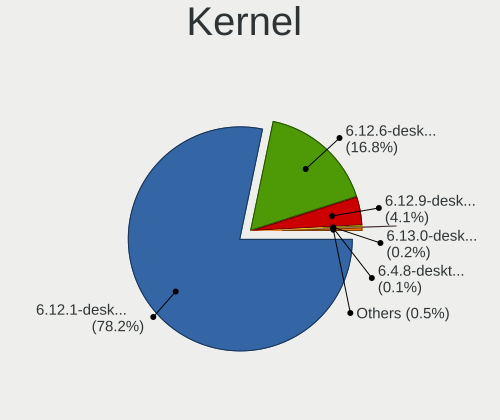

| Version                       | Notebooks | Percent |
|-------------------------------|-----------|---------|
| 6.12.1-desktop-1omv2490       | 1439      | 78.25%  |
| 6.12.6-desktop-1omv2490       | 309       | 16.8%   |
| 6.12.9-desktop-1omv2490       | 76        | 4.13%   |
| 6.13.0-desktop-0.rc1.1omv2490 | 4         | 0.22%   |
| 6.4.8-desktop-2omv2390        | 2         | 0.11%   |
| 6.4.11-desktop-1omv2390       | 2         | 0.11%   |
| 6.14.2-desktop-3omv2590       | 2         | 0.11%   |
| 6.13.0-desktop-0.rc4.1omv2490 | 2         | 0.11%   |
| 6.14.0-desktop-2omv2590       | 1         | 0.05%   |
| 6.13.5-desktop-1omv2590       | 1         | 0.05%   |
| 6.13.4-desktop-2omv2590       | 1         | 0.05%   |

Kernel Family
-------------

Linux kernel without a distro release

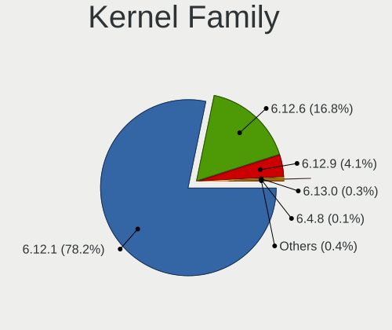

| Version | Notebooks | Percent |
|---------|-----------|---------|
| 6.12.1  | 1439      | 78.25%  |
| 6.12.6  | 309       | 16.8%   |
| 6.12.9  | 76        | 4.13%   |
| 6.13.0  | 6         | 0.33%   |
| 6.4.8   | 2         | 0.11%   |
| 6.4.11  | 2         | 0.11%   |
| 6.14.2  | 2         | 0.11%   |
| 6.14.0  | 1         | 0.05%   |
| 6.13.5  | 1         | 0.05%   |
| 6.13.4  | 1         | 0.05%   |

Kernel Major Ver.
-----------------

Linux kernel major version

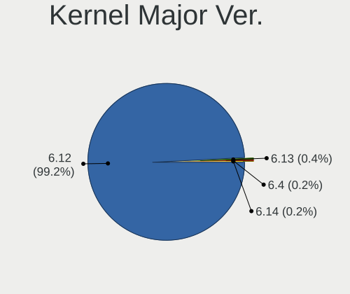

| Version | Notebooks | Percent |
|---------|-----------|---------|
| 6.12    | 1820      | 99.18%  |
| 6.13    | 8         | 0.44%   |
| 6.4     | 4         | 0.22%   |
| 6.14    | 3         | 0.16%   |

Arch
----

OS architecture (x86_64, i586, etc.)

| Name   | Notebooks | Percent |
|--------|-----------|---------|
| x86_64 | 1835      | 100%    |

DE
--

Desktop Environment

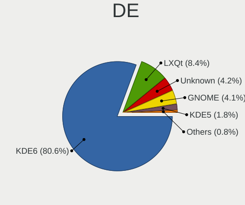

| Name     | Notebooks | Percent |
|----------|-----------|---------|
| KDE6     | 1481      | 80.62%  |
| LXQt     | 155       | 8.44%   |
| Unknown  | 77        | 4.19%   |
| GNOME    | 76        | 4.14%   |
| KDE5     | 33        | 1.8%    |
| XFCE     | 9         | 0.49%   |
| Budgie   | 3         | 0.16%   |
| Cinnamon | 2         | 0.11%   |
| MATE     | 1         | 0.05%   |

Display Server
--------------

X11 or Wayland

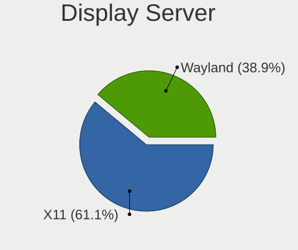

| Name    | Notebooks | Percent |
|---------|-----------|---------|
| X11     | 1123      | 61.07%  |
| Wayland | 716       | 38.93%  |

Display Manager
---------------

SDDM, LightDM, etc.

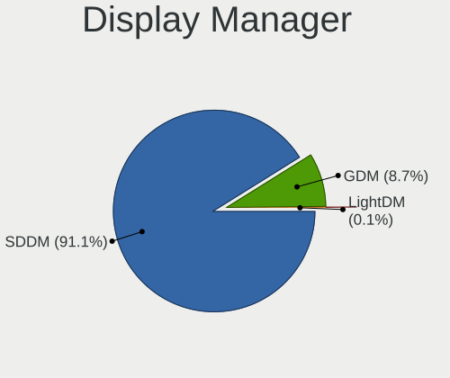

| Name    | Notebooks | Percent |
|---------|-----------|---------|
| SDDM    | 1673      | 91.12%  |
| GDM     | 160       | 8.71%   |
| Unknown | 2         | 0.11%   |
| LightDM | 1         | 0.05%   |

OS Lang
-------

Language

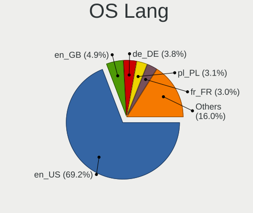

| Lang  | Notebooks | Percent |
|-------|-----------|---------|
| en_US | 1273      | 69.18%  |
| en_GB | 91        | 4.95%   |
| de_DE | 69        | 3.75%   |
| pl_PL | 57        | 3.1%    |
| fr_FR | 55        | 2.99%   |
| it_IT | 36        | 1.96%   |
| ru_RU | 32        | 1.74%   |
| pt_BR | 31        | 1.68%   |
| en_CA | 28        | 1.52%   |
| es_ES | 26        | 1.41%   |
| en_AU | 17        | 0.92%   |
| cs_CZ | 12        | 0.65%   |
| tr_TR | 10        | 0.54%   |
| es_MX | 10        | 0.54%   |
| nl_NL | 7         | 0.38%   |
| es_AR | 7         | 0.38%   |
| en_IN | 6         | 0.33%   |
| de_CH | 6         | 0.33%   |
| de_AT | 6         | 0.33%   |
| hu_HU | 5         | 0.27%   |
| ro_RO | 4         | 0.22%   |
| pt_PT | 4         | 0.22%   |
| fr_BE | 4         | 0.22%   |
| en_SG | 4         | 0.22%   |
| en_NZ | 4         | 0.22%   |
| nl_BE | 3         | 0.16%   |
| fr_CA | 3         | 0.16%   |
| es_VE | 3         | 0.16%   |
| en_DK | 3         | 0.16%   |
| sk_SK | 2         | 0.11%   |
| fr_CH | 2         | 0.11%   |
| es_PE | 2         | 0.11%   |
| es_EC | 2         | 0.11%   |
| es_CL | 2         | 0.11%   |
| da_DK | 2         | 0.11%   |
| uk_UA | 1         | 0.05%   |
| nb_NO | 1         | 0.05%   |
| ja_JP | 1         | 0.05%   |
| es_GT | 1         | 0.05%   |
| es_CR | 1         | 0.05%   |

Boot Mode
---------

EFI or BIOS

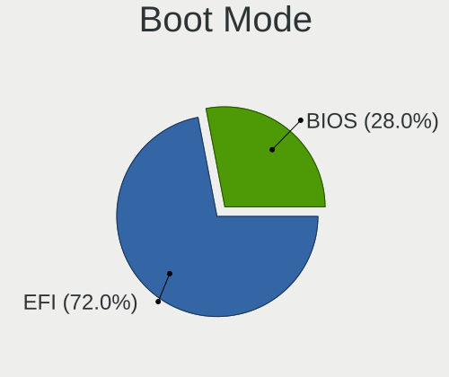

| Mode | Notebooks | Percent |
|------|-----------|---------|
| EFI  | 1321      | 71.99%  |
| BIOS | 514       | 28.01%  |

Filesystem
----------

Type of filesystem

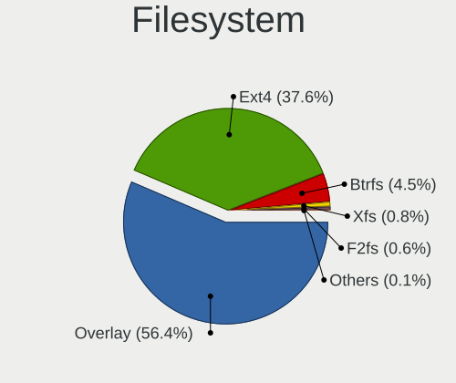

| Type    | Notebooks | Percent |
|---------|-----------|---------|
| Overlay | 1039      | 56.44%  |
| Ext4    | 693       | 37.64%  |
| Btrfs   | 83        | 4.51%   |
| Xfs     | 14        | 0.76%   |
| F2fs    | 11        | 0.6%    |
| Ext3    | 1         | 0.05%   |

Part. scheme
------------

Scheme of partitioning

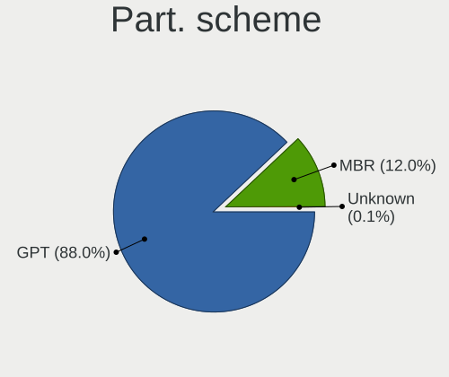

| Type    | Notebooks | Percent |
|---------|-----------|---------|
| GPT     | 1616      | 87.97%  |
| MBR     | 220       | 11.98%  |
| Unknown | 1         | 0.05%   |

Dual Boot with Linux/BSD
------------------------

Hosting more than one Linux/BSD

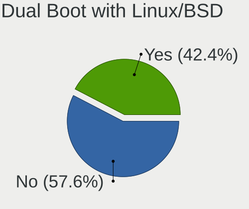

| Dual boot | Notebooks | Percent |
|-----------|-----------|---------|
| No        | 1061      | 57.63%  |
| Yes       | 780       | 42.37%  |

Dual Boot (Win)
---------------

Hosting Linux and Windows

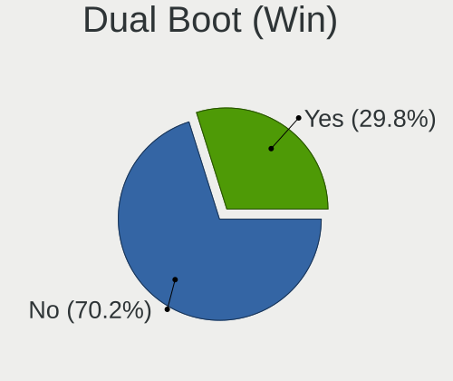

| Dual boot | Notebooks | Percent |
|-----------|-----------|---------|
| No        | 1288      | 70.15%  |
| Yes       | 548       | 29.85%  |

Board
-----

Vendor
------

Motherboard manufacturer

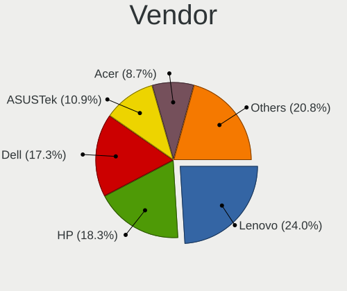

| Name                | Notebooks | Percent |
|---------------------|-----------|---------|
| Lenovo              | 441       | 24.03%  |
| Hewlett-Packard     | 336       | 18.31%  |
| Dell                | 318       | 17.33%  |
| ASUSTek Computer    | 200       | 10.9%   |
| Acer                | 159       | 8.66%   |
| Toshiba             | 65        | 3.54%   |
| MSI                 | 33        | 1.8%    |
| Samsung Electronics | 29        | 1.58%   |
| Apple               | 27        | 1.47%   |
| Framework           | 24        | 1.31%   |
| Google              | 20        | 1.09%   |
| Sony                | 16        | 0.87%   |
| Fujitsu             | 15        | 0.82%   |
| System76            | 11        | 0.6%    |
| HUAWEI              | 11        | 0.6%    |
| Notebook            | 9         | 0.49%   |
| Unknown             | 9         | 0.49%   |
| Medion              | 8         | 0.44%   |
| TUXEDO              | 6         | 0.33%   |
| LG Electronics      | 6         | 0.33%   |
| Panasonic           | 5         | 0.27%   |
| Chuwi               | 5         | 0.27%   |
| Alienware           | 5         | 0.27%   |
| Razer               | 4         | 0.22%   |
| Philco              | 4         | 0.22%   |
| PC Specialist       | 4         | 0.22%   |
| Gateway             | 4         | 0.22%   |
| Packard Bell        | 3         | 0.16%   |
| NEC Computers       | 3         | 0.16%   |
| Hometech            | 3         | 0.16%   |
| GPD                 | 3         | 0.16%   |
| eMachines           | 3         | 0.16%   |
| Valve               | 2         | 0.11%   |
| SLIMBOOK            | 2         | 0.11%   |
| Positivo            | 2         | 0.11%   |
| Intel               | 2         | 0.11%   |
| GPU Company         | 2         | 0.11%   |
| Fujitsu Siemens     | 2         | 0.11%   |
| CyberPowerPC        | 2         | 0.11%   |
| Compaq              | 2         | 0.11%   |

Model
-----

Motherboard model

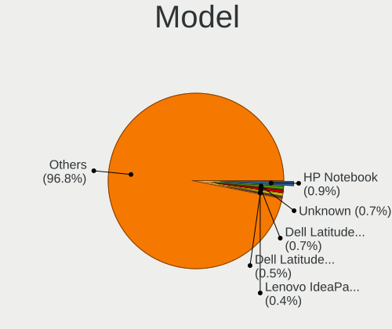

| Name                                        | Notebooks | Percent |
|---------------------------------------------|-----------|---------|
| HP Notebook                                 | 16        | 0.87%   |
| Unknown                                     | 13        | 0.71%   |
| Dell Latitude E6430                         | 12        | 0.65%   |
| Dell Latitude E6420                         | 10        | 0.54%   |
| Lenovo IdeaPad 3 15ALC6 82KU                | 7         | 0.38%   |
| HP Pavilion dv6                             | 7         | 0.38%   |
| Dell XPS 13 9360                            | 7         | 0.38%   |
| Dell Latitude 5490                          | 7         | 0.38%   |
| HP Laptop 15s-eq1xxx                        | 6         | 0.33%   |
| HP EliteBook 840 G5                         | 6         | 0.33%   |
| HP EliteBook 840 G3                         | 6         | 0.33%   |
| Framework Laptop 13 (AMD Ryzen 7040Series)  | 6         | 0.33%   |
| Framework Laptop (12th Gen Intel Core)      | 6         | 0.33%   |
| System76 Lemur Pro                          | 5         | 0.27%   |
| Lenovo IdeaPad 3 15IML05 81WB               | 5         | 0.27%   |
| HP Pavilion g6                              | 5         | 0.27%   |
| HP Laptop 15-db0xxx                         | 5         | 0.27%   |
| HP Laptop 15-da0xxx                         | 5         | 0.27%   |
| HP EliteBook 8470p                          | 5         | 0.27%   |
| Framework Laptop 16 (AMD Ryzen 7040 Series) | 5         | 0.27%   |
| Dell XPS 13 9310                            | 5         | 0.27%   |
| Dell Latitude E7440                         | 5         | 0.27%   |
| Dell Latitude E6410                         | 5         | 0.27%   |
| Dell Latitude E5470                         | 5         | 0.27%   |
| Dell Latitude E5440                         | 5         | 0.27%   |
| Dell Latitude E5430 non-vPro                | 5         | 0.27%   |
| Dell Latitude 7490                          | 5         | 0.27%   |
| Dell Latitude 5400                          | 5         | 0.27%   |
| Dell Inspiron 15-3567                       | 5         | 0.27%   |
| Lenovo IdeaPad Slim 1-14AST-05 81VS         | 4         | 0.22%   |
| Lenovo IdeaPad 3 15ITL6 82H8                | 4         | 0.22%   |
| HP Pavilion 17                              | 4         | 0.22%   |
| HP Pavilion 15                              | 4         | 0.22%   |
| HP Laptop 17-cn0xxx                         | 4         | 0.22%   |
| HP EliteBook 8460p                          | 4         | 0.22%   |
| Dell Precision M6500                        | 4         | 0.22%   |
| Dell Latitude E6540                         | 4         | 0.22%   |
| Dell Latitude E6440                         | 4         | 0.22%   |
| Dell Latitude E6400                         | 4         | 0.22%   |
| Dell Inspiron 1545                          | 4         | 0.22%   |

Model Family
------------

Motherboard model prefix

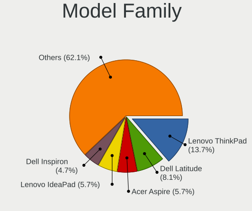

| Name              | Notebooks | Percent |
|-------------------|-----------|---------|
| Lenovo ThinkPad   | 251       | 13.68%  |
| Dell Latitude     | 149       | 8.12%   |
| Acer Aspire       | 105       | 5.72%   |
| Lenovo IdeaPad    | 104       | 5.67%   |
| Dell Inspiron     | 87        | 4.74%   |
| HP Laptop         | 75        | 4.09%   |
| HP Pavilion       | 63        | 3.43%   |
| Toshiba Satellite | 60        | 3.27%   |
| HP EliteBook      | 55        | 3%      |
| ASUS VivoBook     | 50        | 2.72%   |
| HP ProBook        | 36        | 1.96%   |
| Dell XPS          | 28        | 1.53%   |
| Dell Precision    | 25        | 1.36%   |
| ASUS ASUS         | 25        | 1.36%   |
| Framework Laptop  | 24        | 1.31%   |
| Lenovo Legion     | 19        | 1.04%   |
| HP Notebook       | 16        | 0.87%   |
| ASUS ROG          | 15        | 0.82%   |
| Acer Swift        | 14        | 0.76%   |
| HP ENVY           | 13        | 0.71%   |
| Fujitsu LIFEBOOK  | 13        | 0.71%   |
| Acer Nitro        | 13        | 0.71%   |
| Unknown           | 13        | 0.71%   |
| HP OMEN           | 10        | 0.54%   |
| Dell Vostro       | 10        | 0.54%   |
| ASUS ZenBook      | 10        | 0.54%   |
| Acer TravelMate   | 10        | 0.54%   |
| Lenovo Yoga       | 9         | 0.49%   |
| HP ZBook          | 9         | 0.49%   |
| HP Stream         | 9         | 0.49%   |
| ASUS TUF          | 9         | 0.49%   |
| HP Compaq         | 8         | 0.44%   |
| Lenovo ThinkBook  | 7         | 0.38%   |
| Acer Predator     | 7         | 0.38%   |
| MSI Katana        | 6         | 0.33%   |
| Lenovo V15        | 6         | 0.33%   |
| HP 15             | 6         | 0.33%   |
| Acer Extensa      | 6         | 0.33%   |
| System76 Lemur    | 5         | 0.27%   |
| HP Victus         | 5         | 0.27%   |

MFG Year
--------

Motherboard manufacture year

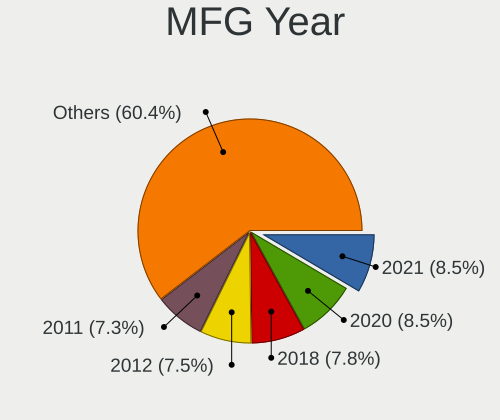

| Year    | Notebooks | Percent |
|---------|-----------|---------|
| 2021    | 156       | 8.5%    |
| 2020    | 156       | 8.5%    |
| 2018    | 143       | 7.79%   |
| 2012    | 137       | 7.47%   |
| 2011    | 134       | 7.3%    |
| 2019    | 132       | 7.19%   |
| 2013    | 116       | 6.32%   |
| 2017    | 111       | 6.05%   |
| 2023    | 109       | 5.94%   |
| 2016    | 103       | 5.61%   |
| 2015    | 88        | 4.8%    |
| 2022    | 86        | 4.69%   |
| 2014    | 82        | 4.47%   |
| 2010    | 80        | 4.36%   |
| 2024    | 64        | 3.49%   |
| 2008    | 59        | 3.22%   |
| 2009    | 48        | 2.62%   |
| 2007    | 25        | 1.36%   |
| 2025    | 3         | 0.16%   |
| 2006    | 2         | 0.11%   |
| Unknown | 1         | 0.05%   |

Form Factor
-----------

Physical design of the computer

| Name     | Notebooks | Percent |
|----------|-----------|---------|
| Notebook | 1835      | 100%    |

Secure Boot
-----------

Enabled or disabled

| State    | Notebooks | Percent |
|----------|-----------|---------|
| Disabled | 1835      | 100%    |

Coreboot
--------

Have coreboot on board

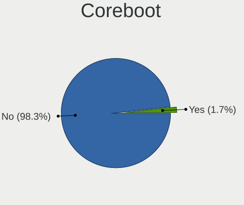

| Used | Notebooks | Percent |
|------|-----------|---------|
| No   | 1803      | 98.26%  |
| Yes  | 32        | 1.74%   |

RAM Size
--------

Total RAM memory

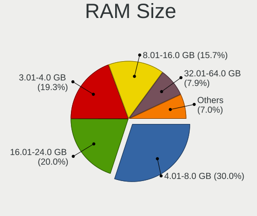

| Size in GB  | Notebooks | Percent |
|-------------|-----------|---------|
| 4.01-8.0    | 552       | 30.05%  |
| 16.01-24.0  | 367       | 19.98%  |
| 3.01-4.0    | 355       | 19.32%  |
| 8.01-16.0   | 289       | 15.73%  |
| 32.01-64.0  | 146       | 7.95%   |
| 24.01-32.0  | 50        | 2.72%   |
| 1.01-2.0    | 32        | 1.74%   |
| 64.01-256.0 | 27        | 1.47%   |
| 2.01-3.0    | 18        | 0.98%   |
| 0.51-1.0    | 1         | 0.05%   |

RAM Used
--------

Used RAM memory

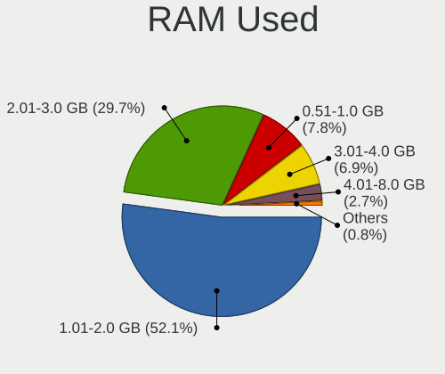

| Used GB   | Notebooks | Percent |
|-----------|-----------|---------|
| 1.01-2.0  | 965       | 52.13%  |
| 2.01-3.0  | 549       | 29.66%  |
| 0.51-1.0  | 145       | 7.83%   |
| 3.01-4.0  | 127       | 6.86%   |
| 4.01-8.0  | 50        | 2.7%    |
| 0.01-0.5  | 13        | 0.7%    |
| 8.01-16.0 | 2         | 0.11%   |

Total Drives
------------

Number of drives on board

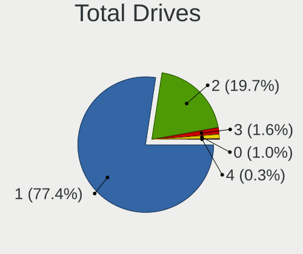

| Drives | Notebooks | Percent |
|--------|-----------|---------|
| 1      | 1422      | 77.41%  |
| 2      | 362       | 19.71%  |
| 3      | 29        | 1.58%   |
| 0      | 19        | 1.03%   |
| 4      | 5         | 0.27%   |

Has CD-ROM
----------

Has CD-ROM on board

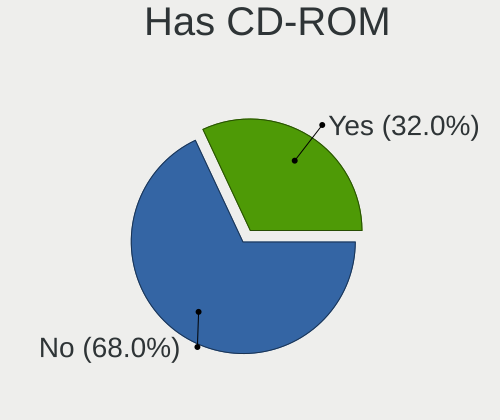

| Presented | Notebooks | Percent |
|-----------|-----------|---------|
| No        | 1249      | 68.03%  |
| Yes       | 587       | 31.97%  |

Has Ethernet
------------

Has Ethernet on board

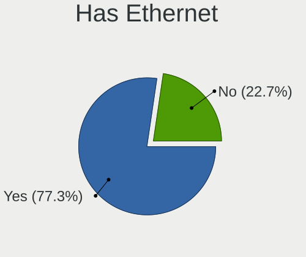

| Presented | Notebooks | Percent |
|-----------|-----------|---------|
| Yes       | 1419      | 77.33%  |
| No        | 416       | 22.67%  |

Has WiFi
--------

Has WiFi module

| Presented | Notebooks | Percent |
|-----------|-----------|---------|
| Yes       | 1792      | 97.66%  |
| No        | 43        | 2.34%   |

Has Bluetooth
-------------

Has Bluetooth module

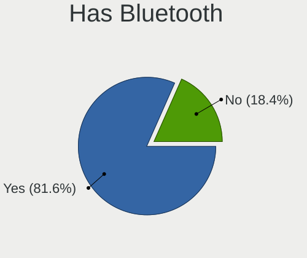

| Presented | Notebooks | Percent |
|-----------|-----------|---------|
| Yes       | 1498      | 81.63%  |
| No        | 337       | 18.37%  |

Location
--------

Country
-------

Geographic location (country)

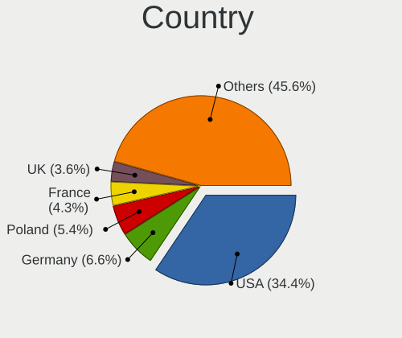

| Country     | Notebooks | Percent |
|-------------|-----------|---------|
| USA         | 632       | 34.42%  |
| Germany     | 121       | 6.59%   |
| Poland      | 100       | 5.45%   |
| France      | 79        | 4.3%    |
| UK          | 66        | 3.59%   |
| Brazil      | 64        | 3.49%   |
| Canada      | 62        | 3.38%   |
| Italy       | 61        | 3.32%   |
| Russia      | 56        | 3.05%   |
| Spain       | 50        | 2.72%   |
| Australia   | 36        | 1.96%   |
| Netherlands | 27        | 1.47%   |
| India       | 24        | 1.31%   |
| Mexico      | 23        | 1.25%   |
| Czechia     | 22        | 1.2%    |
| Indonesia   | 21        | 1.14%   |
| Belgium     | 21        | 1.14%   |
| Romania     | 20        | 1.09%   |
| Greece      | 20        | 1.09%   |
| Turkey      | 18        | 0.98%   |
| Japan       | 17        | 0.93%   |
| Finland     | 17        | 0.93%   |
| Switzerland | 15        | 0.82%   |
| Austria     | 13        | 0.71%   |
| Sweden      | 12        | 0.65%   |
| Norway      | 12        | 0.65%   |
| Serbia      | 11        | 0.6%    |
| Portugal    | 10        | 0.54%   |
| New Zealand | 10        | 0.54%   |
| Hungary     | 10        | 0.54%   |
| Argentina   | 9         | 0.49%   |
| Malaysia    | 8         | 0.44%   |
| Colombia    | 8         | 0.44%   |
| China       | 8         | 0.44%   |
| Croatia     | 7         | 0.38%   |
| Slovakia    | 6         | 0.33%   |
| Philippines | 6         | 0.33%   |
| Ireland     | 6         | 0.33%   |
| Denmark     | 6         | 0.33%   |
| Bulgaria    | 6         | 0.33%   |

City
----

Geographic location (city)

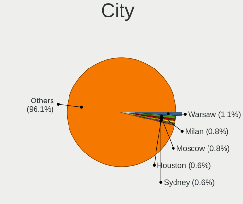

| City         | Notebooks | Percent |
|--------------|-----------|---------|
| Warsaw       | 20        | 1.08%   |
| Milan        | 15        | 0.81%   |
| Moscow       | 14        | 0.76%   |
| Houston      | 12        | 0.65%   |
| Sydney       | 11        | 0.6%    |
| Paris        | 11        | 0.6%    |
| Denver       | 11        | 0.6%    |
| Berlin       | 11        | 0.6%    |
| Vienna       | 10        | 0.54%   |
| Athens       | 10        | 0.54%   |
| Istanbul     | 9         | 0.49%   |
| Atlanta      | 9         | 0.49%   |
| Thessaloniki | 8         | 0.43%   |
| Seattle      | 8         | 0.43%   |
| Munich       | 8         | 0.43%   |
| Melbourne    | 8         | 0.43%   |
| Chicago      | 8         | 0.43%   |
| Prague       | 7         | 0.38%   |
| Helsinki     | 7         | 0.38%   |
| Wroclaw      | 6         | 0.32%   |
| Waxahachie   | 6         | 0.32%   |
| Toronto      | 6         | 0.32%   |
| Sao Paulo    | 6         | 0.32%   |
| Los Angeles  | 6         | 0.32%   |
| Krakow       | 6         | 0.32%   |
| Hamilton     | 6         | 0.32%   |
| Charlotte    | 6         | 0.32%   |
| Calgary      | 6         | 0.32%   |
| Brisbane     | 6         | 0.32%   |
| Zagreb       | 5         | 0.27%   |
| Topeka       | 5         | 0.27%   |
| Tacoma       | 5         | 0.27%   |
| Phoenix      | 5         | 0.27%   |
| Madrid       | 5         | 0.27%   |
| Hounslow     | 5         | 0.27%   |
| Hamburg      | 5         | 0.27%   |
| Bucharest    | 5         | 0.27%   |
| Belgrade     | 5         | 0.27%   |
| Austin       | 5         | 0.27%   |
| Verona       | 4         | 0.22%   |

Drives
------

Drive Vendor
------------

Hard drive vendors

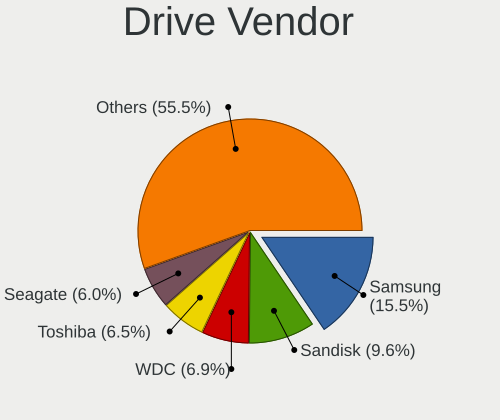

| Vendor                      | Notebooks | Drives | Percent |
|-----------------------------|-----------|--------|---------|
| Samsung Electronics         | 331       | 352    | 15.54%  |
| Sandisk                     | 205       | 214    | 9.62%   |
| WDC                         | 146       | 155    | 6.85%   |
| Toshiba                     | 138       | 139    | 6.48%   |
| Seagate                     | 128       | 136    | 6.01%   |
| Unknown                     | 113       | 123    | 5.31%   |
| Kingston                    | 101       | 104    | 4.74%   |
| SK hynix                    | 98        | 101    | 4.6%    |
| Intel                       | 88        | 98     | 4.13%   |
| Micron Technology           | 86        | 87     | 4.04%   |
| Crucial                     | 62        | 62     | 2.91%   |
| Hitachi                     | 50        | 50     | 2.35%   |
| Kingston Technology Company | 42        | 42     | 1.97%   |
| HGST                        | 40        | 40     | 1.88%   |
| China                       | 30        | 31     | 1.41%   |
| Micron/Crucial Technology   | 28        | 29     | 1.31%   |
| KIOXIA                      | 28        | 28     | 1.31%   |
| A-DATA Technology           | 28        | 28     | 1.31%   |
| PNY                         | 23        | 24     | 1.08%   |
| SPCC                        | 22        | 22     | 1.03%   |
| MAXIO Technology (Hangzhou) | 20        | 20     | 0.94%   |
| Phison Electronics          | 19        | 19     | 0.89%   |
| Patriot                     | 16        | 16     | 0.75%   |
| Silicon Motion              | 15        | 15     | 0.7%    |
| ADATA Technology            | 15        | 15     | 0.7%    |
| Fujitsu                     | 13        | 13     | 0.61%   |
| LITEON                      | 11        | 12     | 0.52%   |
| Team                        | 10        | 11     | 0.47%   |
| KingSpec                    | 9         | 9      | 0.42%   |
| Apple                       | 9         | 9      | 0.42%   |
| Unknown                     | 9         | 9      | 0.42%   |
| Union Memory                | 8         | 8      | 0.38%   |
| Realtek Semiconductor       | 8         | 9      | 0.38%   |
| Intenso                     | 8         | 8      | 0.38%   |
| GOODRAM                     | 8         | 9      | 0.38%   |
| Transcend                   | 7         | 7      | 0.33%   |
| LITEONIT                    | 7         | 7      | 0.33%   |
| Verbatim                    | 5         | 5      | 0.23%   |
| Union Memory (Shenzhen)     | 5         | 5      | 0.23%   |
| Lexar                       | 5         | 5      | 0.23%   |

Drive Model
-----------

Hard drive models

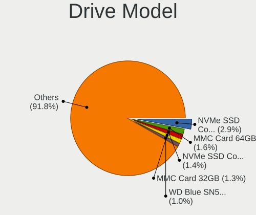

| Model                                                 | Notebooks | Percent |
|-------------------------------------------------------|-----------|---------|
| Samsung NVMe SSD Controller SM981/PM981/PM983 1TB     | 64        | 2.95%   |
| Unknown MMC Card  64GB                                | 35        | 1.61%   |
| Samsung NVMe SSD Controller PM9A1/PM9A3/980PRO 1TB    | 30        | 1.38%   |
| Unknown MMC Card  32GB                                | 28        | 1.29%   |
| Sandisk WD Blue SN550 NVMe SSD 1024GB                 | 22        | 1.01%   |
| Kingston SA400S37240G 240GB SSD                       | 21        | 0.97%   |
| Toshiba MQ01ABF050 500GB                              | 20        | 0.92%   |
| Toshiba MQ01ABD100 1TB                                | 19        | 0.88%   |
| Sandisk WD Black SN750 / PC SN730 NVMe SSD 500GB      | 19        | 0.88%   |
| Unknown MMC Card  128GB                               | 18        | 0.83%   |
| Intel SSD 660P Series 512GB                           | 18        | 0.83%   |
| Seagate ST1000LM035-1RK172 1TB                        | 15        | 0.69%   |
| Micron/Crucial P2 NVMe PCIe SSD 2TB                   | 15        | 0.69%   |
| MAXIO (Hangzhou) NVMe SSD Controller MAP1202 2TB      | 15        | 0.69%   |
| Kingston SA400S37480G 480GB SSD                       | 15        | 0.69%   |
| Toshiba XG6 NVMe SSD Controller 1024GB                | 14        | 0.65%   |
| Samsung NVMe SSD Controller SM961/PM961/SM963 1024GB  | 14        | 0.65%   |
| Silicon Motion SM2263EN/SM2263XT SSD Controller 512GB | 13        | 0.6%    |
| Kingston Company SNV2S1000G 1TB                       | 12        | 0.55%   |
| Crucial CT500MX500SSD1 500GB                          | 12        | 0.55%   |
| Seagate ST9500325AS 500GB                             | 11        | 0.51%   |
| Seagate ST500LT012-1DG142 500GB                       | 11        | 0.51%   |
| Intel SSD Pro 7600p/760p/E 6100p Series 256GB         | 11        | 0.51%   |
| Unknown SD/MMC/MS PRO 2GB                             | 10        | 0.46%   |
| Toshiba MQ04ABF100 1TB                                | 10        | 0.46%   |
| SK hynix BC511 512GB                                  | 10        | 0.46%   |
| Sandisk WD_BLACK SN770 1TB                            | 10        | 0.46%   |
| HGST HTS545050A7E680 500GB                            | 10        | 0.46%   |
| WDC WD10SPZX-21Z10T0 1TB                              | 9         | 0.41%   |
| Kingston Company OM3PDP3 NVMe SSD 256GB               | 9         | 0.41%   |
| Kingston SA400S37120G 120GB SSD                       | 9         | 0.41%   |
| HGST HTS721010A9E630 1TB                              | 9         | 0.41%   |
| Unknown                                               | 9         | 0.41%   |
| WDC WD10JPVX-22JC3T0 1TB                              | 8         | 0.37%   |
| Seagate ST1000LM049-2GH172 1TB                        | 8         | 0.37%   |
| Sandisk WD Black 2018/SN750 / PC SN720 NVMe SSD 512GB | 8         | 0.37%   |
| Samsung SSD 870 QVO 1TB                               | 8         | 0.37%   |
| Samsung SSD 850 EVO 250GB                             | 8         | 0.37%   |
| Kingston Company U-SNS8154P3 NVMe SSD 256GB           | 8         | 0.37%   |
| Crucial CT1000MX500SSD1 1TB                           | 8         | 0.37%   |

HDD Vendor
----------

Hard disk drive vendors

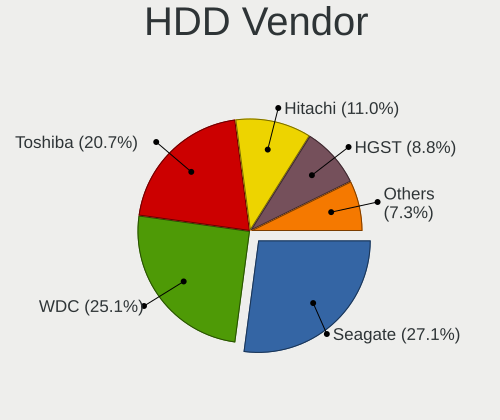

| Vendor              | Notebooks | Drives | Percent |
|---------------------|-----------|--------|---------|
| Seagate             | 123       | 131    | 27.09%  |
| WDC                 | 114       | 120    | 25.11%  |
| Toshiba             | 94        | 94     | 20.7%   |
| Hitachi             | 50        | 50     | 11.01%  |
| HGST                | 40        | 40     | 8.81%   |
| Fujitsu             | 13        | 13     | 2.86%   |
| Unknown             | 10        | 10     | 2.2%    |
| Samsung Electronics | 8         | 8      | 1.76%   |
| WD MediaMax         | 1         | 1      | 0.22%   |
| Unknown             | 1         | 1      | 0.22%   |

SSD Vendor
----------

Solid state drive vendors

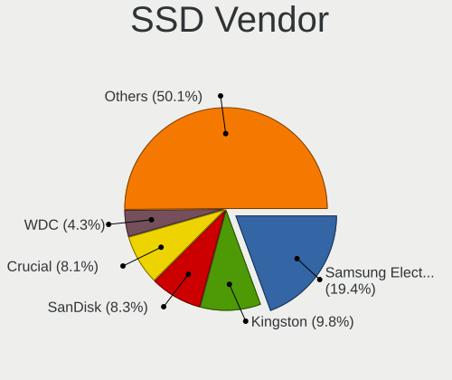

| Vendor              | Notebooks | Drives | Percent |
|---------------------|-----------|--------|---------|
| Samsung Electronics | 149       | 153    | 19.4%   |
| Kingston            | 75        | 78     | 9.77%   |
| SanDisk             | 64        | 66     | 8.33%   |
| Crucial             | 62        | 62     | 8.07%   |
| WDC                 | 33        | 35     | 4.3%    |
| China               | 30        | 31     | 3.91%   |
| Intel               | 29        | 29     | 3.78%   |
| A-DATA Technology   | 25        | 25     | 3.26%   |
| PNY                 | 23        | 24     | 2.99%   |
| SPCC                | 21        | 21     | 2.73%   |
| Micron Technology   | 21        | 21     | 2.73%   |
| SK hynix            | 18        | 18     | 2.34%   |
| Patriot             | 16        | 16     | 2.08%   |
| LITEON              | 11        | 12     | 1.43%   |
| Toshiba             | 10        | 10     | 1.3%    |
| Team                | 9         | 10     | 1.17%   |
| KingSpec            | 9         | 9      | 1.17%   |
| Intenso             | 8         | 8      | 1.04%   |
| GOODRAM             | 8         | 9      | 1.04%   |
| LITEONIT            | 7         | 7      | 0.91%   |
| Apple               | 7         | 7      | 0.91%   |
| Unknown             | 7         | 7      | 0.91%   |
| Transcend           | 6         | 6      | 0.78%   |
| Verbatim            | 5         | 5      | 0.65%   |
| Lexar               | 5         | 5      | 0.65%   |
| Netac               | 4         | 4      | 0.52%   |
| KIOXIA-EXCERIA      | 4         | 4      | 0.52%   |
| Fanxiang            | 4         | 4      | 0.52%   |
| Apacer              | 4         | 4      | 0.52%   |
| Seagate             | 3         | 3      | 0.39%   |
| OCZ                 | 3         | 3      | 0.39%   |
| Mushkin             | 3         | 3      | 0.39%   |
| Leven               | 3         | 4      | 0.39%   |
| KODAK               | 3         | 3      | 0.39%   |
| Emtec               | 3         | 3      | 0.39%   |
| Dogfish             | 3         | 3      | 0.39%   |
| BHT                 | 3         | 3      | 0.39%   |
| Zheino              | 2         | 2      | 0.26%   |
| Vi550               | 2         | 2      | 0.26%   |
| V-GeN               | 2         | 2      | 0.26%   |

Drive Kind
----------

HDD or SSD

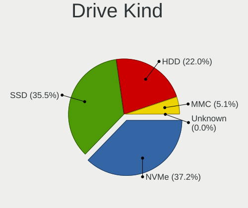

| Kind    | Notebooks | Drives | Percent |
|---------|-----------|--------|---------|
| NVMe    | 753       | 847    | 37.22%  |
| SSD     | 719       | 785    | 35.54%  |
| HDD     | 446       | 468    | 22.05%  |
| MMC     | 104       | 113    | 5.14%   |
| Unknown | 1         | 2      | 0.05%   |

Drive Connector
---------------

SATA, SAS, NVMe, etc.

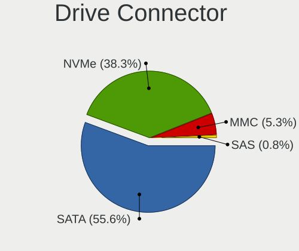

| Type | Notebooks | Drives | Percent |
|------|-----------|--------|---------|
| SATA | 1094      | 1238   | 55.65%  |
| NVMe | 753       | 847    | 38.3%   |
| MMC  | 104       | 113    | 5.29%   |
| SAS  | 15        | 17     | 0.76%   |

Drive Size
----------

Size of hard drive

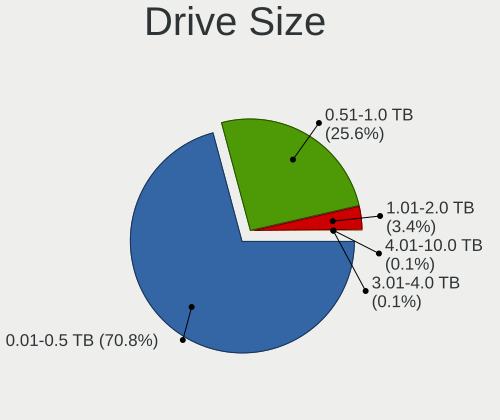

| Size in TB | Notebooks | Drives | Percent |
|------------|-----------|--------|---------|
| 0.01-0.5   | 826       | 893    | 70.84%  |
| 0.51-1.0   | 298       | 318    | 25.56%  |
| 1.01-2.0   | 40        | 40     | 3.43%   |
| 3.01-4.0   | 1         | 1      | 0.09%   |
| 4.01-10.0  | 1         | 1      | 0.09%   |

Space Total
-----------

Amount of disk space available on the file system

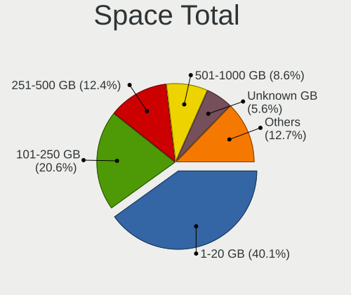

| Size in GB     | Notebooks | Percent |
|----------------|-----------|---------|
| 1-20           | 739       | 40.08%  |
| 101-250        | 380       | 20.61%  |
| 251-500        | 229       | 12.42%  |
| 501-1000       | 158       | 8.57%   |
| Unknown        | 103       | 5.59%   |
| 51-100         | 87        | 4.72%   |
| 1001-2000      | 57        | 3.09%   |
| 21-50          | 45        | 2.44%   |
| More than 3000 | 28        | 1.52%   |
| 2001-3000      | 18        | 0.98%   |

Space Used
----------

Amount of used disk space

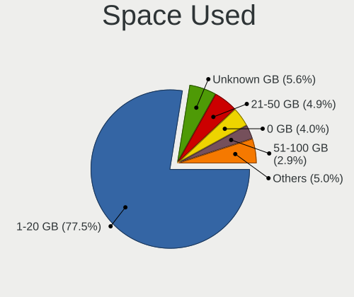

| Used GB   | Notebooks | Percent |
|-----------|-----------|---------|
| 1-20      | 1431      | 77.52%  |
| Unknown   | 103       | 5.58%   |
| 21-50     | 91        | 4.93%   |
| 0         | 74        | 4.01%   |
| 51-100    | 54        | 2.93%   |
| 101-250   | 34        | 1.84%   |
| 251-500   | 32        | 1.73%   |
| 501-1000  | 19        | 1.03%   |
| 2001-3000 | 5         | 0.27%   |
| 1001-2000 | 3         | 0.16%   |

Malfunc. Drives
---------------

Drive models with a malfunction

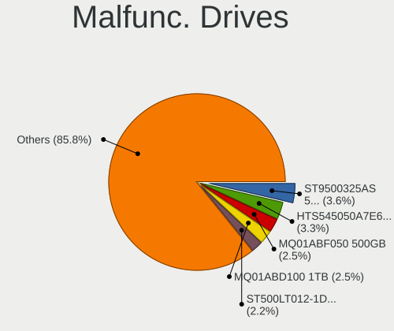

| Model                                       | Notebooks | Drives | Percent |
|---------------------------------------------|-----------|--------|---------|
| Seagate ST9500325AS 500GB                   | 10        | 10     | 3.64%   |
| HGST HTS545050A7E680 500GB                  | 9         | 9      | 3.27%   |
| Toshiba MQ01ABF050 500GB                    | 7         | 7      | 2.55%   |
| Toshiba MQ01ABD100 1TB                      | 7         | 7      | 2.55%   |
| Seagate ST500LT012-1DG142 500GB             | 6         | 6      | 2.18%   |
| Hitachi HTS545050A7E380 500GB               | 5         | 5      | 1.82%   |
| HGST HTS725050A7E630 500GB                  | 5         | 5      | 1.82%   |
| Toshiba MQ01ABD050 500GB                    | 4         | 4      | 1.45%   |
| Seagate ST1000LM049-2GH172 1TB              | 4         | 4      | 1.45%   |
| Hitachi HTS725050A9A364 500GB               | 4         | 4      | 1.45%   |
| Hitachi HTS545032B9A300 320GB               | 4         | 4      | 1.45%   |
| Seagate ST500LT012-9WS142 500GB             | 3         | 3      | 1.09%   |
| Seagate ST500LM021-1KJ152 500GB             | 3         | 3      | 1.09%   |
| Samsung Electronics SSD 980 1TB             | 3         | 3      | 1.09%   |
| Kingston SV300S37A120G 120GB SSD            | 3         | 3      | 1.09%   |
| WDC WDS240G2G0B-00EPW0 240GB SSD            | 2         | 2      | 0.73%   |
| WDC WDS240G2G0A-00JH30 240GB SSD            | 2         | 2      | 0.73%   |
| Toshiba MK8037GSX 80GB                      | 2         | 2      | 0.73%   |
| Toshiba MK1255GSX H 120GB                   | 2         | 2      | 0.73%   |
| SSSTC CVB-8D128-HP 128GB                    | 2         | 2      | 0.73%   |
| SK hynix PC401 NVMe Solid State Drive 256GB | 2         | 2      | 0.73%   |
| SK hynix BC711 HFM512GD3JX013N 512GB        | 2         | 2      | 0.73%   |
| Seagate ST9500423AS 500GB                   | 2         | 2      | 0.73%   |
| Seagate ST9320325AS 320GB                   | 2         | 2      | 0.73%   |
| Seagate ST500LM012 HN-M500MBB 500GB         | 2         | 2      | 0.73%   |
| Seagate ST320LT020-9YG142 320GB             | 2         | 2      | 0.73%   |
| Seagate ST320LT012-1DG14C 320GB             | 2         | 2      | 0.73%   |
| Seagate ST1000LM035-1RK172 1TB              | 2         | 2      | 0.73%   |
| SanDisk SSD PLUS 480GB                      | 2         | 2      | 0.73%   |
| Samsung Electronics HM321HI 320GB           | 2         | 2      | 0.73%   |
| Intel SSDSCKKF256G8H 256GB                  | 2         | 2      | 0.73%   |
| Intel SSDSC2BF240A5L 240GB                  | 2         | 2      | 0.73%   |
| Intel SSDSC2BF180A5L 180GB                  | 2         | 2      | 0.73%   |
| Hitachi HTS723225A7A364 250GB               | 2         | 2      | 0.73%   |
| Hitachi HTS547575A9E384 752GB               | 2         | 2      | 0.73%   |
| Hitachi HCC543232A7A380 320GB               | 2         | 2      | 0.73%   |
| HGST HTS721010A9E630 1TB                    | 2         | 2      | 0.73%   |
| HGST HTS545050A7E380 500GB                  | 2         | 2      | 0.73%   |
| HGST HTS541075A9E680 752GB                  | 2         | 2      | 0.73%   |
| Fujitsu MHZ2320BH G2 320GB                  | 2         | 2      | 0.73%   |

Malfunc. Drive Vendor
---------------------

Vendors of faulty drives

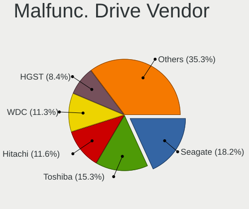

| Vendor              | Notebooks | Drives | Percent |
|---------------------|-----------|--------|---------|
| Seagate             | 50        | 52     | 18.18%  |
| Toshiba             | 42        | 42     | 15.27%  |
| Hitachi             | 32        | 32     | 11.64%  |
| WDC                 | 31        | 31     | 11.27%  |
| HGST                | 23        | 23     | 8.36%   |
| Samsung Electronics | 14        | 14     | 5.09%   |
| Intel               | 12        | 12     | 4.36%   |
| SanDisk             | 10        | 10     | 3.64%   |
| Kingston            | 10        | 11     | 3.64%   |
| Micron Technology   | 7         | 7      | 2.55%   |
| Fujitsu             | 7         | 7      | 2.55%   |
| SK hynix            | 6         | 6      | 2.18%   |
| Crucial             | 6         | 6      | 2.18%   |
| A-DATA Technology   | 5         | 5      | 1.82%   |
| China               | 3         | 3      | 1.09%   |
| SSSTC               | 2         | 2      | 0.73%   |
| Lexar               | 2         | 2      | 0.73%   |
| Dogfish             | 2         | 2      | 0.73%   |
| V-GeN               | 1         | 1      | 0.36%   |
| Unknown             | 1         | 1      | 0.36%   |
| Team                | 1         | 1      | 0.36%   |
| Patriot             | 1         | 1      | 0.36%   |
| OCZ                 | 1         | 1      | 0.36%   |
| LITEON              | 1         | 1      | 0.36%   |
| Leven               | 1         | 1      | 0.36%   |
| GT55914-SSD         | 1         | 1      | 0.36%   |
| Apple               | 1         | 1      | 0.36%   |
| AGI                 | 1         | 1      | 0.36%   |
| Unknown             | 1         | 1      | 0.36%   |

Malfunc. HDD Vendor
-------------------

Vendors of faulty HDD drives

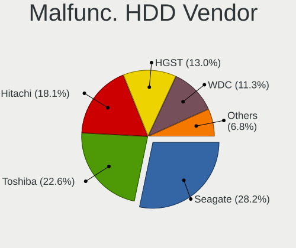

| Vendor              | Notebooks | Drives | Percent |
|---------------------|-----------|--------|---------|
| Seagate             | 50        | 52     | 28.25%  |
| Toshiba             | 40        | 40     | 22.6%   |
| Hitachi             | 32        | 32     | 18.08%  |
| HGST                | 23        | 23     | 12.99%  |
| WDC                 | 20        | 20     | 11.3%   |
| Fujitsu             | 7         | 7      | 3.95%   |
| Samsung Electronics | 5         | 5      | 2.82%   |

Malfunc. Drive Kind
-------------------

Kinds of faulty drives

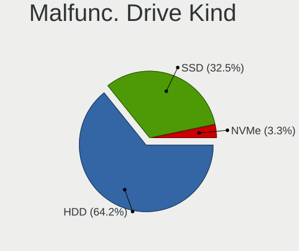

| Kind | Notebooks | Drives | Percent |
|------|-----------|--------|---------|
| HDD  | 176       | 179    | 64.23%  |
| SSD  | 89        | 90     | 32.48%  |
| NVMe | 9         | 9      | 3.28%   |

Failed Drives
-------------

Failed drive models

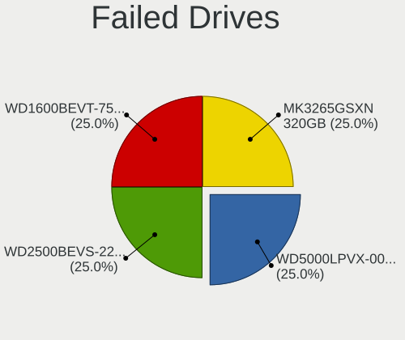

| Model                        | Notebooks | Drives | Percent |
|------------------------------|-----------|--------|---------|
| WDC WD5000LPVX-00V0TT0 500GB | 1         | 1      | 25%     |
| WDC WD2500BEVS-22UST0 250GB  | 1         | 1      | 25%     |
| WDC WD1600BEVT-75ZCT1 160GB  | 1         | 1      | 25%     |
| Toshiba MK3265GSXN 320GB     | 1         | 1      | 25%     |

Failed Drive Vendor
-------------------

Failed drive vendors

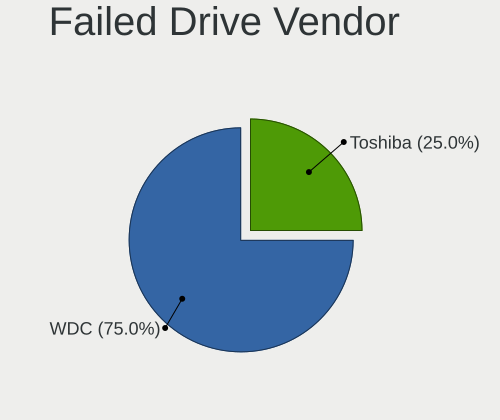

| Vendor  | Notebooks | Drives | Percent |
|---------|-----------|--------|---------|
| WDC     | 3         | 3      | 75%     |
| Toshiba | 1         | 1      | 25%     |

Drive Status
------------

Number of failed and malfunc. drives

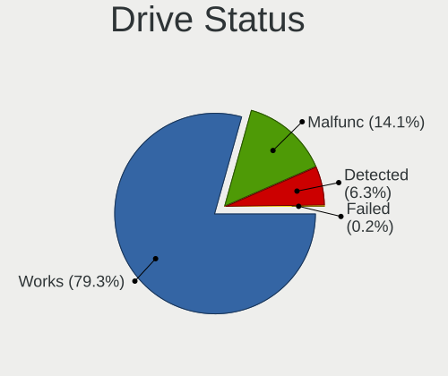

| Status   | Notebooks | Drives | Percent |
|----------|-----------|--------|---------|
| Works    | 1516      | 1800   | 79.33%  |
| Malfunc  | 270       | 278    | 14.13%  |
| Detected | 121       | 133    | 6.33%   |
| Failed   | 4         | 4      | 0.21%   |

Storage controller
------------------

Storage Vendor
--------------

Storage controller vendors

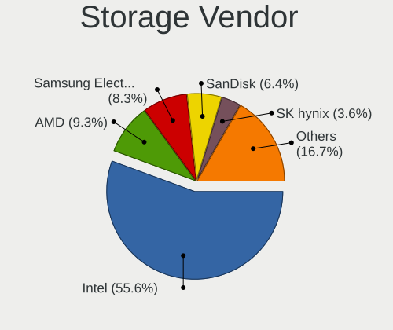

| Vendor                                  | Notebooks | Percent |
|-----------------------------------------|-----------|---------|
| Intel                                   | 1227      | 55.62%  |
| AMD                                     | 206       | 9.34%   |
| Samsung Electronics                     | 183       | 8.3%    |
| SanDisk                                 | 141       | 6.39%   |
| SK hynix                                | 80        | 3.63%   |
| Kingston Technology Company             | 68        | 3.08%   |
| Micron Technology                       | 65        | 2.95%   |
| Toshiba America Info Systems            | 34        | 1.54%   |
| Micron/Crucial Technology               | 29        | 1.31%   |
| KIOXIA                                  | 29        | 1.31%   |
| Phison Electronics                      | 22        | 1%      |
| MAXIO Technology (Hangzhou)             | 20        | 0.91%   |
| ADATA Technology                        | 18        | 0.82%   |
| Silicon Motion                          | 15        | 0.68%   |
| Nvidia                                  | 11        | 0.5%    |
| Union Memory (Shenzhen)                 | 10        | 0.45%   |
| Realtek Semiconductor                   | 8         | 0.36%   |
| Solid State Storage Technology          | 6         | 0.27%   |
| Yangtze Memory Technologies             | 3         | 0.14%   |
| Solidigm                                | 3         | 0.14%   |
| Shenzhen Unionmemory Information System | 3         | 0.14%   |
| Shenzhen Longsys Electronics            | 3         | 0.14%   |
| Lite-On Technology                      | 3         | 0.14%   |
| Hosin Global Electronics                | 3         | 0.14%   |
| Seagate Technology                      | 2         | 0.09%   |
| Marvell Technology Group                | 2         | 0.09%   |
| Lenovo                                  | 2         | 0.09%   |
| Biwin Storage Technology                | 2         | 0.09%   |
| Apple                                   | 2         | 0.09%   |
| Transcend                               | 1         | 0.05%   |
| Silicon Integrated Systems [SiS]        | 1         | 0.05%   |
| Silicon Image                           | 1         | 0.05%   |
| INNOGRIT                                | 1         | 0.05%   |
| ASMedia Technology                      | 1         | 0.05%   |
| Unknown                                 | 1         | 0.05%   |

Storage Model
-------------

Storage controller models

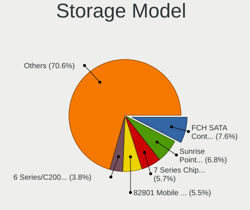

| Model                                                                          | Notebooks | Percent |
|--------------------------------------------------------------------------------|-----------|---------|
| AMD FCH SATA Controller [AHCI mode]                                            | 178       | 7.59%   |
| Intel Sunrise Point-LP SATA Controller [AHCI mode]                             | 160       | 6.83%   |
| Intel 7 Series Chipset Family 6-port SATA Controller [AHCI mode]               | 134       | 5.72%   |
| Intel 82801 Mobile SATA Controller [RAID mode]                                 | 129       | 5.5%    |
| Intel 6 Series/C200 Series Chipset Family 6 port Mobile SATA AHCI Controller   | 88        | 3.75%   |
| Intel Volume Management Device NVMe RAID Controller                            | 79        | 3.37%   |
| Samsung NVMe SSD Controller SM981/PM981/PM983                                  | 64        | 2.73%   |
| Intel Wildcat Point-LP SATA Controller [AHCI Mode]                             | 55        | 2.35%   |
| Intel 82801IBM/IEM (ICH9M/ICH9M-E) 4 port SATA Controller [AHCI mode]          | 55        | 2.35%   |
| Intel 8 Series SATA Controller 1 [AHCI mode]                                   | 55        | 2.35%   |
| Intel 5 Series/3400 Series Chipset 4 port SATA AHCI Controller                 | 47        | 2.01%   |
| Intel 8 Series/C220 Series Chipset Family 6-port SATA Controller 1 [AHCI mode] | 40        | 1.71%   |
| Intel Celeron/Pentium Silver Processor SATA Controller                         | 36        | 1.54%   |
| SanDisk WD SN560/SN740/SN770/SN5000 NVMe SSD                                   | 34        | 1.45%   |
| Intel Cannon Lake Mobile PCH SATA AHCI Controller                              | 34        | 1.45%   |
| Intel Tiger Lake-LP SATA Controller                                            | 33        | 1.41%   |
| Samsung NVMe SSD Controller PM9A1/PM9A3/980PRO                                 | 31        | 1.32%   |
| Samsung NVMe SSD Controller 980 (DRAM-less)                                    | 31        | 1.32%   |
| Intel 82801HM/HEM (ICH8M/ICH8M-E) IDE Controller                               | 29        | 1.24%   |
| Intel HM170/QM170 Chipset SATA Controller [AHCI Mode]                          | 28        | 1.19%   |
| SK hynix Gold P31/BC711/PC711 NVMe Solid State Drive                           | 26        | 1.11%   |
| Intel Atom Processor E3800 Series SATA AHCI Controller                         | 25        | 1.07%   |
| Intel 82801HM/HEM (ICH8M/ICH8M-E) SATA Controller [AHCI mode]                  | 25        | 1.07%   |
| AMD SB7x0/SB8x0/SB9x0 SATA Controller [AHCI mode]                              | 24        | 1.02%   |
| Intel Alder Lake-P SATA AHCI Controller                                        | 23        | 0.98%   |
| SanDisk Ultra 3D / WD PC SN530, IX SN530, Blue SN550 NVMe SSD (DRAM-less)      | 22        | 0.94%   |
| SanDisk Extreme Pro / WD Black SN750 / PC SN730 / Red SN700 NVMe SSD           | 19        | 0.81%   |
| Intel 5 Series/3400 Series Chipset 6 port SATA AHCI Controller                 | 19        | 0.81%   |
| Samsung NVMe SSD Controller PM9B1 (DRAM-less)                                  | 18        | 0.77%   |
| Intel SSD 670p Series [Keystone Harbor]                                        | 18        | 0.77%   |
| Intel SSD 660P Series                                                          | 18        | 0.77%   |
| Intel Comet Lake SATA AHCI Controller                                          | 17        | 0.73%   |
| Intel Cannon Point-LP SATA Controller [AHCI Mode]                              | 17        | 0.73%   |
| Micron/Crucial P2 [Nick P2] / P3 / P3 Plus NVMe PCIe SSD (DRAM-less)           | 16        | 0.68%   |
| SK hynix Platinum P41/PC801 NVMe Solid State Drive                             | 15        | 0.64%   |
| Samsung NVMe SSD Controller PM9C1a (DRAM-less)                                 | 15        | 0.64%   |
| Micron 2400 NVMe SSD (DRAM-less)                                               | 15        | 0.64%   |
| MAXIO (Hangzhou) NVMe SSD Controller MAP1202 (DRAM-less)                       | 15        | 0.64%   |
| Toshiba America Info Systems XG6 NVMe SSD Controller                           | 14        | 0.6%    |
| Samsung NVMe SSD Controller SM961/PM961/SM963                                  | 14        | 0.6%    |

Storage Kind
------------

Kind of storage controller (IDE, SATA, NVMe, SAS, ...)

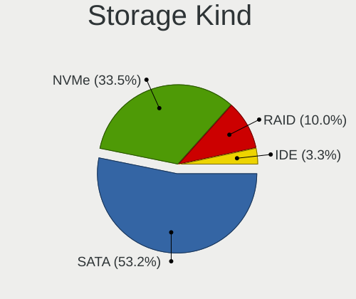

| Kind | Notebooks | Percent |
|------|-----------|---------|
| SATA | 1197      | 53.18%  |
| NVMe | 753       | 33.45%  |
| RAID | 226       | 10.04%  |
| IDE  | 75        | 3.33%   |

Processor
---------

CPU Vendor
----------

Processor vendors

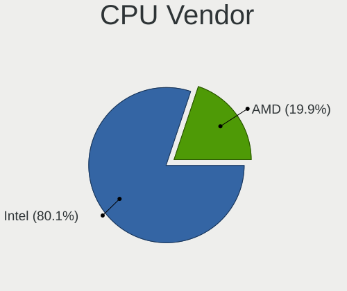

| Vendor | Notebooks | Percent |
|--------|-----------|---------|
| Intel  | 1470      | 80.11%  |
| AMD    | 365       | 19.89%  |

CPU Model
---------

Processor models

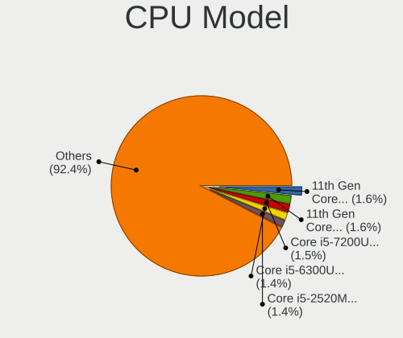

| Model                                         | Notebooks | Percent |
|-----------------------------------------------|-----------|---------|
| Intel 11th Gen Core i7-1165G7 @ 2.80GHz       | 30        | 1.63%   |
| Intel 11th Gen Core i5-1135G7 @ 2.40GHz       | 30        | 1.63%   |
| Intel Core i5-7200U CPU @ 2.50GHz             | 28        | 1.53%   |
| Intel Core i5-6300U CPU @ 2.40GHz             | 26        | 1.42%   |
| Intel Core i5-2520M CPU @ 2.50GHz             | 25        | 1.36%   |
| Intel Core i5-8350U CPU @ 1.70GHz             | 24        | 1.31%   |
| Intel Core i5-3320M CPU @ 2.60GHz             | 23        | 1.25%   |
| Intel Core i5-8250U CPU @ 1.60GHz             | 22        | 1.2%    |
| Intel Core i5-5200U CPU @ 2.20GHz             | 19        | 1.04%   |
| Intel Core i7-8550U CPU @ 1.80GHz             | 17        | 0.93%   |
| Intel Core i7-7500U CPU @ 2.70GHz             | 17        | 0.93%   |
| Intel Core i5-6200U CPU @ 2.30GHz             | 17        | 0.93%   |
| Intel Core i7-7700HQ CPU @ 2.80GHz            | 16        | 0.87%   |
| Intel Core i5-3210M CPU @ 2.50GHz             | 16        | 0.87%   |
| Intel Core i3-3110M CPU @ 2.40GHz             | 16        | 0.87%   |
| Intel Core i7-8750H CPU @ 2.20GHz             | 15        | 0.82%   |
| Intel Core i5-8265U CPU @ 1.60GHz             | 15        | 0.82%   |
| AMD Ryzen 5 3500U with Radeon Vega Mobile Gfx | 15        | 0.82%   |
| Intel Core i5-5300U CPU @ 2.30GHz             | 14        | 0.76%   |
| Intel Celeron N4020 CPU @ 1.10GHz             | 14        | 0.76%   |
| AMD Ryzen 5 5500U with Radeon Graphics        | 14        | 0.76%   |
| Intel Core i3-4030U CPU @ 1.90GHz             | 13        | 0.71%   |
| Intel Core i7-6600U CPU @ 2.60GHz             | 12        | 0.65%   |
| Intel Core i7-6500U CPU @ 2.50GHz             | 12        | 0.65%   |
| Intel Core i5-4200U CPU @ 1.60GHz             | 12        | 0.65%   |
| Intel Core i5-1035G1 CPU @ 1.00GHz            | 12        | 0.65%   |
| Intel Celeron CPU N3060 @ 1.60GHz             | 12        | 0.65%   |
| AMD Ryzen 7 5800H with Radeon Graphics        | 12        | 0.65%   |
| AMD Ryzen 3 3250U with Radeon Graphics        | 12        | 0.65%   |
| Intel Core i7-8650U CPU @ 1.90GHz             | 11        | 0.6%    |
| Intel Core i5-10210U CPU @ 1.60GHz            | 11        | 0.6%    |
| Intel Core i5 CPU M 520 @ 2.40GHz             | 11        | 0.6%    |
| Intel Core i3-1005G1 CPU @ 1.20GHz            | 11        | 0.6%    |
| Intel 11th Gen Core i7-11800H @ 2.30GHz       | 11        | 0.6%    |
| Intel Core i7-10510U CPU @ 1.80GHz            | 10        | 0.54%   |
| Intel Core i5-7300U CPU @ 2.60GHz             | 10        | 0.54%   |
| Intel Core i5-2450M CPU @ 2.50GHz             | 10        | 0.54%   |
| Intel Celeron N4120 CPU @ 1.10GHz             | 10        | 0.54%   |
| Intel 12th Gen Core i7-12700H                 | 10        | 0.54%   |
| Intel Core i7-8565U CPU @ 1.80GHz             | 9         | 0.49%   |

CPU Model Family
----------------

Processor model prefix

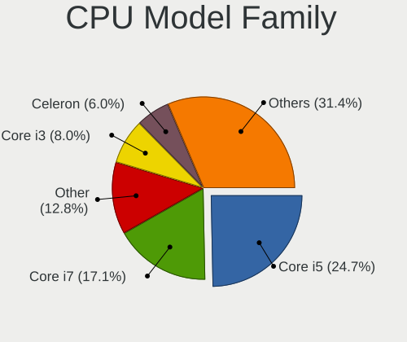

| Model                   | Notebooks | Percent |
|-------------------------|-----------|---------|
| Intel Core i5           | 453       | 24.69%  |
| Intel Core i7           | 314       | 17.11%  |
| Other                   | 235       | 12.81%  |
| Intel Core i3           | 147       | 8.01%   |
| Intel Celeron           | 110       | 5.99%   |
| AMD Ryzen 5             | 97        | 5.29%   |
| Intel Core 2 Duo        | 71        | 3.87%   |
| AMD Ryzen 7             | 71        | 3.87%   |
| Intel Pentium           | 52        | 2.83%   |
| AMD A6                  | 36        | 1.96%   |
| AMD Ryzen 3             | 24        | 1.31%   |
| Intel Pentium Dual-Core | 18        | 0.98%   |
| Intel Core              | 18        | 0.98%   |
| AMD Ryzen 9             | 18        | 0.98%   |
| Intel Atom              | 15        | 0.82%   |
| AMD Ryzen 7 PRO         | 14        | 0.76%   |
| AMD A4                  | 14        | 0.76%   |
| AMD A8                  | 12        | 0.65%   |
| AMD E                   | 11        | 0.6%    |
| AMD A10                 | 10        | 0.54%   |
| Intel Pentium Silver    | 8         | 0.44%   |
| Intel Pentium Dual      | 7         | 0.38%   |
| Intel Genuine           | 7         | 0.38%   |
| AMD E2                  | 7         | 0.38%   |
| AMD Ryzen 5 PRO         | 6         | 0.33%   |
| Intel Core i9           | 5         | 0.27%   |
| Intel Pentium Gold      | 4         | 0.22%   |
| Intel Core M            | 4         | 0.22%   |
| AMD E1                  | 4         | 0.22%   |
| AMD Athlon              | 4         | 0.22%   |
| AMD A12                 | 4         | 0.22%   |
| Intel Core m3           | 3         | 0.16%   |
| AMD Ryzen 3 PRO         | 3         | 0.16%   |
| AMD Athlon II           | 3         | 0.16%   |
| Intel Xeon              | 2         | 0.11%   |
| Intel Core m5           | 2         | 0.11%   |
| Intel Core 2            | 2         | 0.11%   |
| Intel Celeron Dual-Core | 2         | 0.11%   |
| AMD Turion 64 X2 Mobile | 2         | 0.11%   |
| AMD Sempron             | 2         | 0.11%   |

CPU Cores
---------

Number of processor cores

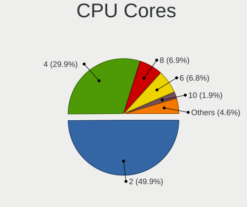

| Number | Notebooks | Percent |
|--------|-----------|---------|
| 2      | 916       | 49.92%  |
| 4      | 549       | 29.92%  |
| 8      | 126       | 6.87%   |
| 6      | 125       | 6.81%   |
| 10     | 35        | 1.91%   |
| 12     | 33        | 1.8%    |
| 14     | 20        | 1.09%   |
| 16     | 17        | 0.93%   |
| 24     | 6         | 0.33%   |
| 1      | 6         | 0.33%   |
| 22     | 1         | 0.05%   |
| 3      | 1         | 0.05%   |

CPU Sockets
-----------

Number of sockets

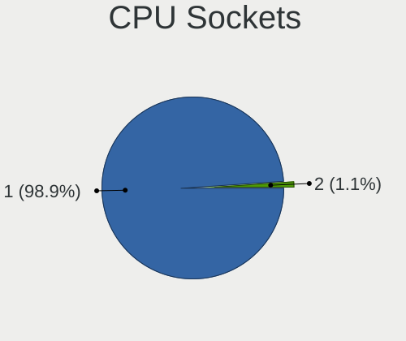

| Number | Notebooks | Percent |
|--------|-----------|---------|
| 1      | 1815      | 98.91%  |
| 2      | 20        | 1.09%   |

CPU Threads
-----------

Threads per core (Hyper-Threading)

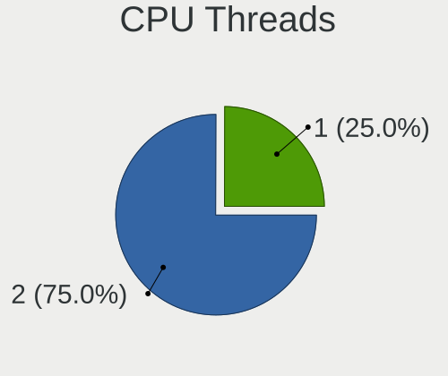

| Number | Notebooks | Percent |
|--------|-----------|---------|
| 2      | 1377      | 75.04%  |
| 1      | 458       | 24.96%  |

CPU Op-Modes
------------

CPU Operation Modes (32-bit, 64-bit)

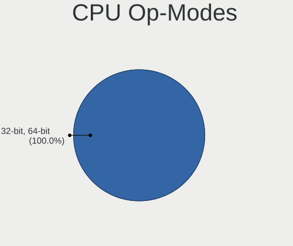

| Op mode        | Notebooks | Percent |
|----------------|-----------|---------|
| 32-bit, 64-bit | 1835      | 100%    |

CPU Microcode
-------------

Microcode number

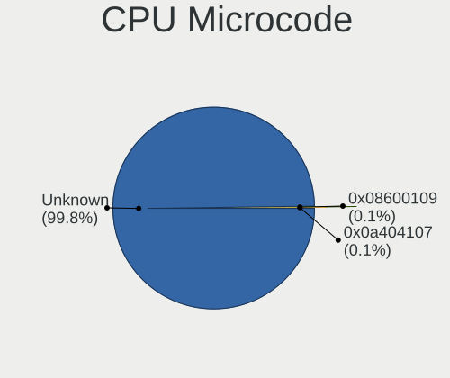

| Number     | Notebooks | Percent |
|------------|-----------|---------|
| Unknown    | 1831      | 99.78%  |
| 0x08600109 | 2         | 0.11%   |
| 0x0a50000c | 1         | 0.05%   |
| 0x0a404107 | 1         | 0.05%   |

CPU Microarch
-------------

Microarchitecture

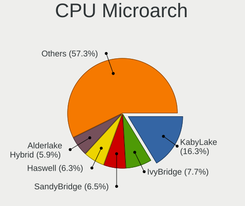

| Name              | Notebooks | Percent |
|-------------------|-----------|---------|
| KabyLake          | 299       | 16.29%  |
| IvyBridge         | 142       | 7.74%   |
| SandyBridge       | 120       | 6.54%   |
| Haswell           | 115       | 6.27%   |
| Alderlake Hybrid  | 108       | 5.89%   |
| Skylake           | 107       | 5.83%   |
| Unknown           | 102       | 5.56%   |
| TigerLake         | 92        | 5.01%   |
| Penryn            | 76        | 4.14%   |
| Westmere          | 75        | 4.09%   |
| Broadwell         | 63        | 3.43%   |
| Silvermont        | 55        | 3%      |
| Zen+              | 49        | 2.67%   |
| Zen 3             | 47        | 2.56%   |
| Goldmont plus     | 47        | 2.56%   |
| IceLake           | 46        | 2.51%   |
| Excavator         | 39        | 2.13%   |
| Core              | 34        | 1.85%   |
| Zen 2             | 33        | 1.8%    |
| CometLake         | 27        | 1.47%   |
| Puma              | 22        | 1.2%    |
| Bobcat            | 17        | 0.93%   |
| Meteorlake Hybrid | 16        | 0.87%   |
| Goldmont          | 16        | 0.87%   |
| Zen               | 15        | 0.82%   |
| Gracemont         | 13        | 0.71%   |
| K10 Llano         | 10        | 0.54%   |
| K10               | 9         | 0.49%   |
| Piledriver        | 8         | 0.44%   |
| Jaguar            | 8         | 0.44%   |
| Bonnell           | 7         | 0.38%   |
| Nehalem           | 6         | 0.33%   |
| K8 Hammer         | 4         | 0.22%   |
| K8 & K10 hybrid   | 4         | 0.22%   |
| Tremont           | 3         | 0.16%   |
| Lunarlake Hybrid  | 1         | 0.05%   |

Graphics
--------

GPU Vendor
----------

Vendors of graphics cards

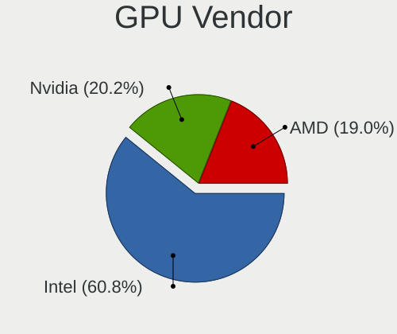

| Vendor | Notebooks | Percent |
|--------|-----------|---------|
| Intel  | 1356      | 60.83%  |
| Nvidia | 450       | 20.19%  |
| AMD    | 423       | 18.98%  |

GPU Model
---------

Graphics card models

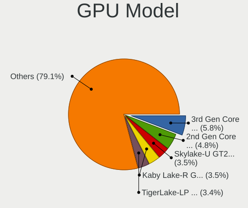

| Model                                                                                    | Notebooks | Percent |
|------------------------------------------------------------------------------------------|-----------|---------|
| Intel 3rd Gen Core processor Graphics Controller                                         | 132       | 5.79%   |
| Intel 2nd Generation Core Processor Family Integrated Graphics Controller                | 109       | 4.78%   |
| Intel Skylake-U GT2 [HD Graphics 520]                                                    | 79        | 3.47%   |
| Intel Kaby Lake-R GT2 [UHD Graphics 620]                                                 | 79        | 3.47%   |
| Intel TigerLake-LP GT2 [Iris Xe Graphics]                                                | 77        | 3.38%   |
| Intel Kaby Lake-U GT2 [HD Graphics 620]                                                  | 74        | 3.25%   |
| Intel Haswell-ULT Integrated Graphics Controller                                         | 64        | 2.81%   |
| Intel Broadwell-U GT2 [HD Graphics 5500]                                                 | 54        | 2.37%   |
| AMD Picasso/Raven 2 [Radeon Vega Series / Radeon Vega Mobile Series]                     | 52        | 2.28%   |
| Intel Mobile 4 Series Chipset Integrated Graphics Controller                             | 50        | 2.19%   |
| Intel Core Processor Integrated Graphics Controller                                      | 49        | 2.15%   |
| Intel 4th Gen Core Processor Integrated Graphics Controller                              | 43        | 1.89%   |
| Intel GeminiLake [UHD Graphics 600]                                                      | 40        | 1.76%   |
| Intel WhiskeyLake-U GT2 [UHD Graphics 620]                                               | 39        | 1.71%   |
| Intel CoffeeLake-H GT2 [UHD Graphics 630]                                                | 36        | 1.58%   |
| AMD Renoir [Radeon Vega Series / Radeon Vega Mobile Series]                              | 32        | 1.4%    |
| Intel Atom Processor Z36xxx/Z37xxx Series Graphics & Display                             | 31        | 1.36%   |
| Intel CometLake-U GT2 [UHD Graphics]                                                     | 29        | 1.27%   |
| AMD Stoney [Radeon R2/R3/R4/R5 Graphics]                                                 | 29        | 1.27%   |
| Intel Alder Lake-P GT2 [Iris Xe Graphics]                                                | 27        | 1.19%   |
| Intel CometLake-H GT2 [UHD Graphics]                                                     | 24        | 1.05%   |
| Intel Atom/Celeron/Pentium Processor x5-E8000/J3xxx/N3xxx Integrated Graphics Controller | 24        | 1.05%   |
| Intel Kaby Lake-H GT2 [HD Graphics 630]                                                  | 23        | 1.01%   |
| Intel Iris Plus Graphics G1 (Ice Lake)                                                   | 23        | 1.01%   |
| AMD Lucienne                                                                             | 23        | 1.01%   |
| AMD Cezanne [Radeon Vega Series / Radeon Vega Mobile Series]                             | 23        | 1.01%   |
| Nvidia TU117M [GeForce GTX 1650 Mobile / Max-Q]                                          | 22        | 0.97%   |
| AMD Phoenix1                                                                             | 22        | 0.97%   |
| Intel Mobile GM965/GL960 Integrated Graphics Controller (secondary)                      | 21        | 0.92%   |
| Intel Mobile GM965/GL960 Integrated Graphics Controller (primary)                        | 21        | 0.92%   |
| AMD Barcelo                                                                              | 21        | 0.92%   |
| Nvidia GP107M [GeForce GTX 1050 Mobile]                                                  | 20        | 0.88%   |
| Intel TigerLake-H GT1 [UHD Graphics]                                                     | 20        | 0.88%   |
| AMD Rembrandt [Radeon 680M]                                                              | 19        | 0.83%   |
| Nvidia GA106M [GeForce RTX 3060 Mobile / Max-Q]                                          | 18        | 0.79%   |
| Nvidia AD107M [GeForce RTX 4060 Max-Q / Mobile]                                          | 17        | 0.75%   |
| Intel Raptor Lake-P [Iris Xe Graphics]                                                   | 17        | 0.75%   |
| AMD Mullins [Radeon R4/R5 Graphics]                                                      | 17        | 0.75%   |
| Intel Skylake-H GT2 [HD Graphics 530]                                                    | 15        | 0.66%   |
| Intel Alder Lake-UP3 GT2 [Iris Xe Graphics]                                              | 15        | 0.66%   |

GPU Combo
---------

Combinations of graphics cards

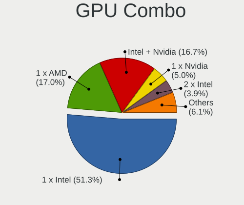

| Name           | Notebooks | Percent |
|----------------|-----------|---------|
| 1 x Intel      | 942       | 51.34%  |
| 1 x AMD        | 312       | 17%     |
| Intel + Nvidia | 307       | 16.73%  |
| 1 x Nvidia     | 91        | 4.96%   |
| 2 x Intel      | 71        | 3.87%   |
| AMD + Nvidia   | 51        | 2.78%   |
| Intel + AMD    | 36        | 1.96%   |
| 2 x AMD        | 24        | 1.31%   |
| 2 x Nvidia     | 1         | 0.05%   |

GPU Driver
----------

Free vs proprietary

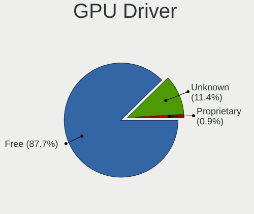

| Driver      | Notebooks | Percent |
|-------------|-----------|---------|
| Free        | 1609      | 87.68%  |
| Unknown     | 209       | 11.39%  |
| Proprietary | 17        | 0.93%   |

GPU Memory
----------

Total video memory

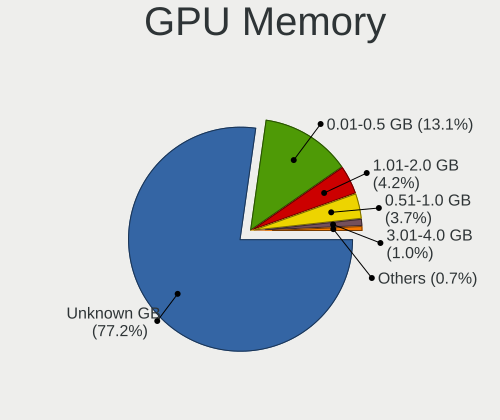

| Size in GB | Notebooks | Percent |
|------------|-----------|---------|
| Unknown    | 1418      | 77.23%  |
| 0.01-0.5   | 241       | 13.13%  |
| 1.01-2.0   | 77        | 4.19%   |
| 0.51-1.0   | 68        | 3.7%    |
| 3.01-4.0   | 19        | 1.03%   |
| 7.01-8.0   | 12        | 0.65%   |
| 5.01-6.0   | 1         | 0.05%   |

Monitor
-------

Monitor Vendor
--------------

Monitor vendors

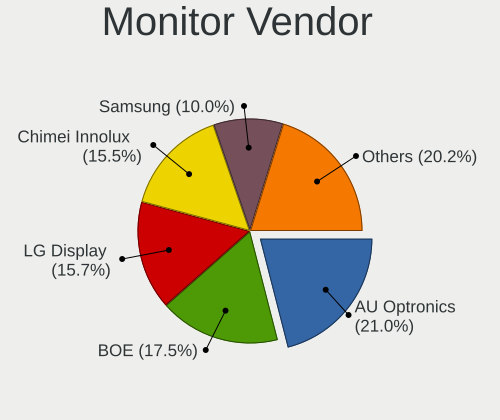

| Vendor                  | Notebooks | Percent |
|-------------------------|-----------|---------|
| AU Optronics            | 404       | 21.01%  |
| BOE                     | 336       | 17.47%  |
| LG Display              | 302       | 15.7%   |
| Chimei Innolux          | 299       | 15.55%  |
| Samsung Electronics     | 193       | 10.04%  |
| Sharp                   | 42        | 2.18%   |
| Lenovo                  | 34        | 1.77%   |
| Chi Mei Optoelectronics | 33        | 1.72%   |
| PANDA                   | 27        | 1.4%    |
| Apple                   | 26        | 1.35%   |
| Dell                    | 25        | 1.3%    |
| InfoVision              | 23        | 1.2%    |
| Goldstar                | 21        | 1.09%   |
| CSOT                    | 16        | 0.83%   |
| LG Philips              | 15        | 0.78%   |
| Hewlett-Packard         | 11        | 0.57%   |
| HKC                     | 8         | 0.42%   |
| AOC                     | 8         | 0.42%   |
| Acer                    | 7         | 0.36%   |
| Sony                    | 6         | 0.31%   |
| ViewSonic               | 5         | 0.26%   |
| Philips                 | 5         | 0.26%   |
| HannStar                | 4         | 0.21%   |
| Toshiba                 | 3         | 0.16%   |
| Panasonic               | 3         | 0.16%   |
| Insignia                | 3         | 0.16%   |
| CPT                     | 3         | 0.16%   |
| BenQ                    | 3         | 0.16%   |
| ASUSTek Computer        | 3         | 0.16%   |
| Ancor Communications    | 3         | 0.16%   |
| ___                     | 2         | 0.1%    |
| Valve                   | 2         | 0.1%    |
| Unknown (XXX)           | 2         | 0.1%    |
| Unknown                 | 2         | 0.1%    |
| TMX                     | 2         | 0.1%    |
| TMA                     | 2         | 0.1%    |
| MSI                     | 2         | 0.1%    |
| JDI                     | 2         | 0.1%    |
| InnoLux Display         | 2         | 0.1%    |
| CTO                     | 2         | 0.1%    |

Monitor Model
-------------

Monitor models

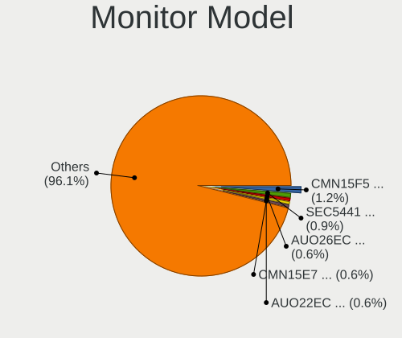

| Model                                                                | Notebooks | Percent |
|----------------------------------------------------------------------|-----------|---------|
| Chimei Innolux LCD Monitor CMN15F5 1920x1080 344x193mm 15.5-inch     | 24        | 1.24%   |
| Samsung Electronics LCD Monitor SEC5441 1280x800 331x207mm 15.4-inch | 17        | 0.88%   |
| AU Optronics LCD Monitor AUO26EC 1366x768 344x193mm 15.5-inch        | 12        | 0.62%   |
| Chimei Innolux LCD Monitor CMN15E7 1920x1080 344x193mm 15.5-inch     | 11        | 0.57%   |
| AU Optronics LCD Monitor AUO22EC 1366x768 344x193mm 15.5-inch        | 11        | 0.57%   |
| Chimei Innolux LCD Monitor CMN14D6 1366x768 309x173mm 13.9-inch      | 10        | 0.52%   |
| Chimei Innolux LCD Monitor CMN14C9 1920x1080 309x173mm 13.9-inch     | 10        | 0.52%   |
| Chimei Innolux LCD Monitor CMN1482 1600x900 309x174mm 14.0-inch      | 10        | 0.52%   |
| AU Optronics LCD Monitor AUO10EC 1366x768 344x193mm 15.5-inch        | 10        | 0.52%   |
| LG Display LCD Monitor LGD02DC 1366x768 344x194mm 15.5-inch          | 9         | 0.47%   |
| LG Display LCD Monitor LGD02D8 1366x768 277x156mm 12.5-inch          | 9         | 0.47%   |
| Chimei Innolux LCD Monitor CMN15DB 1366x768 344x193mm 15.5-inch      | 9         | 0.47%   |
| Chimei Innolux LCD Monitor CMN14D4 1920x1080 309x173mm 13.9-inch     | 9         | 0.47%   |
| Chimei Innolux LCD Monitor CMN1132 1366x768 256x144mm 11.6-inch      | 9         | 0.47%   |
| AU Optronics LCD Monitor AUO313C 1366x768 309x173mm 13.9-inch        | 9         | 0.47%   |
| LG Display LCD Monitor LGD033E 1366x768 309x174mm 14.0-inch          | 8         | 0.41%   |
| LG Display LCD Monitor LGD033A 1366x768 344x194mm 15.5-inch          | 8         | 0.41%   |
| BOE LCD Monitor BOE095F 2256x1504 285x190mm 13.5-inch                | 8         | 0.41%   |
| BOE LCD Monitor BOE0812 1920x1080 344x194mm 15.5-inch                | 8         | 0.41%   |
| AU Optronics LCD Monitor AUOAF90 1920x1080 344x193mm 15.5-inch       | 8         | 0.41%   |
| Samsung Electronics LCD Monitor SEC544B 1600x900 382x214mm 17.2-inch | 7         | 0.36%   |
| LG Display LCD Monitor LGD0521 1920x1080 309x174mm 14.0-inch         | 7         | 0.36%   |
| Chimei Innolux LCD Monitor CMN15E6 1366x768 344x193mm 15.5-inch      | 7         | 0.36%   |
| Chimei Innolux LCD Monitor CMN153B 1920x1080 344x193mm 15.5-inch     | 7         | 0.36%   |
| BOE LCD Monitor BOE0BCA 2256x1504 285x190mm 13.5-inch                | 7         | 0.36%   |
| AU Optronics LCD Monitor AUO71EC 1366x768 344x193mm 15.5-inch        | 7         | 0.36%   |
| AU Optronics LCD Monitor AUO61ED 1920x1080 344x194mm 15.5-inch       | 7         | 0.36%   |
| AU Optronics LCD Monitor AUO403D 1920x1080 309x174mm 14.0-inch       | 7         | 0.36%   |
| AU Optronics LCD Monitor AUO235C 1366x768 256x144mm 11.6-inch        | 7         | 0.36%   |
| LG Display LP156WH2-TLAA LGD0230 1366x768 344x194mm 15.5-inch        | 6         | 0.31%   |
| LG Display LCD Monitor LGD04A7 1920x1080 344x194mm 15.5-inch         | 6         | 0.31%   |
| Chimei Innolux LCD Monitor CMN15D5 1920x1080 344x193mm 15.5-inch     | 6         | 0.31%   |
| Chimei Innolux LCD Monitor CMN15CA 1366x768 344x193mm 15.5-inch      | 6         | 0.31%   |
| Chimei Innolux LCD Monitor CMN15C9 1366x768 344x193mm 15.5-inch      | 6         | 0.31%   |
| Chimei Innolux LCD Monitor CMN15BE 1366x768 344x193mm 15.5-inch      | 6         | 0.31%   |
| Chimei Innolux LCD Monitor CMN1521 1920x1080 344x193mm 15.5-inch     | 6         | 0.31%   |
| Chimei Innolux LCD Monitor CMN14C3 1366x768 309x173mm 13.9-inch      | 6         | 0.31%   |
| BOE LCD Monitor BOE06A4 1366x768 344x194mm 15.5-inch                 | 6         | 0.31%   |
| AU Optronics LCD Monitor AUOE48D 1920x1080 344x194mm 15.5-inch       | 6         | 0.31%   |
| AU Optronics LCD Monitor AUO40EC 1366x768 344x193mm 15.5-inch        | 6         | 0.31%   |

Monitor Resolution
------------------

Monitor screen resolution

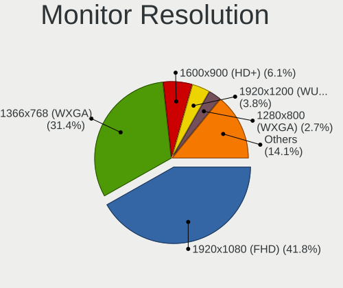

| Resolution         | Notebooks | Percent |
|--------------------|-----------|---------|
| 1920x1080 (FHD)    | 785       | 41.82%  |
| 1366x768 (WXGA)    | 590       | 31.43%  |
| 1600x900 (HD+)     | 115       | 6.13%   |
| 1920x1200 (WUXGA)  | 72        | 3.84%   |
| 1280x800 (WXGA)    | 51        | 2.72%   |
| 3840x2160 (4K)     | 47        | 2.5%    |
| 2560x1600          | 35        | 1.86%   |
| 2560x1440 (QHD)    | 34        | 1.81%   |
| 1440x900 (WXGA+)   | 30        | 1.6%    |
| 2880x1800          | 21        | 1.12%   |
| 2256x1504          | 15        | 0.8%    |
| 1680x1050 (WSXGA+) | 11        | 0.59%   |
| 2880x1920          | 7         | 0.37%   |
| 3840x2400          | 6         | 0.32%   |
| 1920x1280          | 6         | 0.32%   |
| 1280x1024 (SXGA)   | 6         | 0.32%   |
| 3440x1440          | 5         | 0.27%   |
| 3200x1800 (QHD+)   | 4         | 0.21%   |
| 3072x1920          | 3         | 0.16%   |
| 2160x1350          | 3         | 0.16%   |
| 800x1280           | 2         | 0.11%   |
| 3840x1080          | 2         | 0.11%   |
| 3200x2000          | 2         | 0.11%   |
| 2560x1080          | 2         | 0.11%   |
| 2520x1680          | 2         | 0.11%   |
| 2240x1400          | 2         | 0.11%   |
| 2160x1440          | 2         | 0.11%   |
| 1600x2560          | 2         | 0.11%   |
| 1360x768           | 2         | 0.11%   |
| 1024x768 (XGA)     | 2         | 0.11%   |
| 1024x600           | 2         | 0.11%   |
| Unknown            | 2         | 0.11%   |
| 2880x1620          | 1         | 0.05%   |
| 2288x1287          | 1         | 0.05%   |
| 2048x1280          | 1         | 0.05%   |
| 1920x540           | 1         | 0.05%   |
| 1680x945           | 1         | 0.05%   |
| 1280x960           | 1         | 0.05%   |
| 1280x720 (HD)      | 1         | 0.05%   |

Monitor Diagonal
----------------

Diagonal size in inches

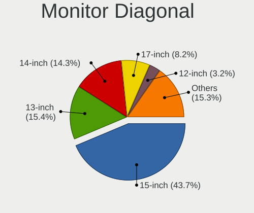

| Inches  | Notebooks | Percent |
|---------|-----------|---------|
| 15      | 841       | 43.67%  |
| 13      | 296       | 15.37%  |
| 14      | 276       | 14.33%  |
| 17      | 158       | 8.2%    |
| 12      | 61        | 3.17%   |
| 16      | 58        | 3.01%   |
| 11      | 47        | 2.44%   |
| 23      | 28        | 1.45%   |
| 27      | 24        | 1.25%   |
| 24      | 20        | 1.04%   |
| 31      | 19        | 0.99%   |
| 21      | 18        | 0.93%   |
| 18      | 13        | 0.67%   |
| 34      | 7         | 0.36%   |
| 19      | 7         | 0.36%   |
| Unknown | 7         | 0.36%   |
| 26      | 5         | 0.26%   |
| 25      | 4         | 0.21%   |
| 22      | 4         | 0.21%   |
| 84      | 3         | 0.16%   |
| 72      | 3         | 0.16%   |
| 40      | 3         | 0.16%   |
| 20      | 3         | 0.16%   |
| 86      | 2         | 0.1%    |
| 74      | 2         | 0.1%    |
| 54      | 2         | 0.1%    |
| 49      | 2         | 0.1%    |
| 48      | 2         | 0.1%    |
| 32      | 2         | 0.1%    |
| 28      | 2         | 0.1%    |
| 10      | 2         | 0.1%    |
| 7       | 2         | 0.1%    |
| 46      | 1         | 0.05%   |
| 43      | 1         | 0.05%   |
| 42      | 1         | 0.05%   |

Monitor Width
-------------

Physical width

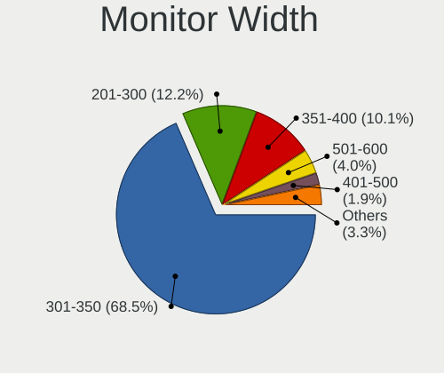

| Width in mm | Notebooks | Percent |
|-------------|-----------|---------|
| 301-350     | 1318      | 68.5%   |
| 201-300     | 234       | 12.16%  |
| 351-400     | 194       | 10.08%  |
| 501-600     | 77        | 4%      |
| 401-500     | 37        | 1.92%   |
| 601-700     | 24        | 1.25%   |
| 701-800     | 9         | 0.47%   |
| 1001-1500   | 9         | 0.47%   |
| 1501-2000   | 8         | 0.42%   |
| Unknown     | 7         | 0.36%   |
| 801-900     | 3         | 0.16%   |
| 901-1000    | 2         | 0.1%    |
| 1-100       | 2         | 0.1%    |

Aspect Ratio
------------

Proportional relationship between the width and the height

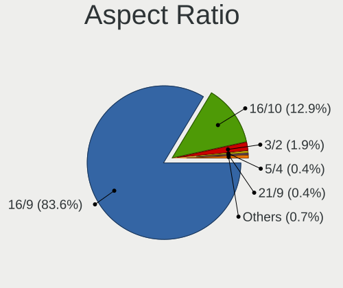

| Ratio   | Notebooks | Percent |
|---------|-----------|---------|
| 16/9    | 1533      | 83.63%  |
| 16/10   | 237       | 12.93%  |
| 3/2     | 34        | 1.85%   |
| 5/4     | 8         | 0.44%   |
| 21/9    | 8         | 0.44%   |
| 4/3     | 4         | 0.22%   |
| 32/9    | 2         | 0.11%   |
| 0.67    | 2         | 0.11%   |
| 0.56    | 2         | 0.11%   |
| Unknown | 2         | 0.11%   |
| 1.96    | 1         | 0.05%   |

Monitor Area
------------

Area in inch²

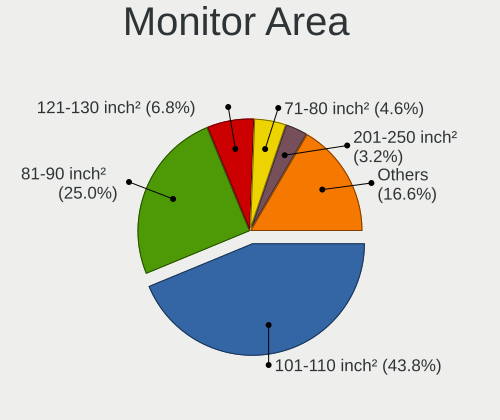

| Area in inch² | Notebooks | Percent |
|----------------|-----------|---------|
| 101-110        | 843       | 43.77%  |
| 81-90          | 482       | 25.03%  |
| 121-130        | 131       | 6.8%    |
| 71-80          | 89        | 4.62%   |
| 201-250        | 62        | 3.22%   |
| 61-70          | 58        | 3.01%   |
| 111-120        | 52        | 2.7%    |
| 51-60          | 47        | 2.44%   |
| 351-500        | 30        | 1.56%   |
| 301-350        | 29        | 1.51%   |
| 131-140        | 24        | 1.25%   |
| 141-150        | 18        | 0.93%   |
| More than 1000 | 13        | 0.67%   |
| 151-200        | 12        | 0.62%   |
| 251-300        | 10        | 0.52%   |
| 501-1000       | 9         | 0.47%   |
| Unknown        | 7         | 0.36%   |
| 91-100         | 6         | 0.31%   |
| 41-50          | 2         | 0.1%    |
| 1-40           | 2         | 0.1%    |

Pixel Density
-------------

Pixels per inch

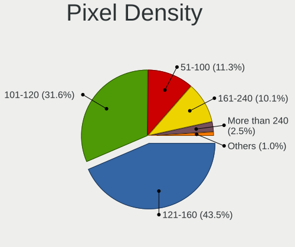

| Density       | Notebooks | Percent |
|---------------|-----------|---------|
| 121-160       | 833       | 43.54%  |
| 101-120       | 604       | 31.57%  |
| 51-100        | 216       | 11.29%  |
| 161-240       | 194       | 10.14%  |
| More than 240 | 47        | 2.46%   |
| 1-50          | 12        | 0.63%   |
| Unknown       | 7         | 0.37%   |

Multiple Monitors
-----------------

Total monitors connected

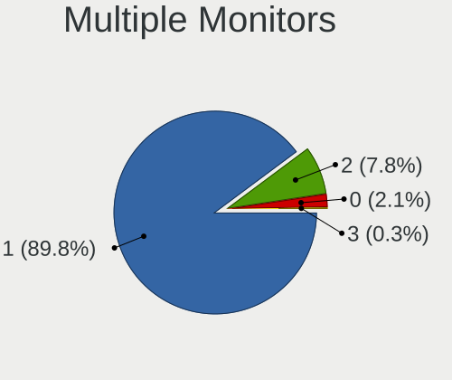

| Total | Notebooks | Percent |
|-------|-----------|---------|
| 1     | 1650      | 89.82%  |
| 2     | 143       | 7.78%   |
| 0     | 39        | 2.12%   |
| 3     | 5         | 0.27%   |

Network
-------

Net Controller Vendor
---------------------

Controller vendors

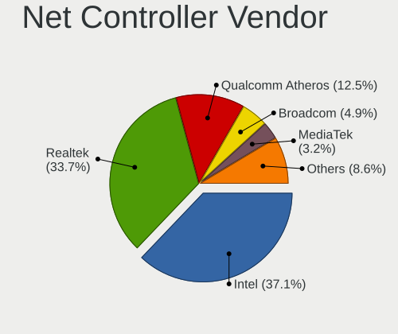

| Vendor                                 | Notebooks | Percent |
|----------------------------------------|-----------|---------|
| Intel                                  | 1012      | 37.12%  |
| Realtek Semiconductor                  | 919       | 33.71%  |
| Qualcomm Atheros                       | 340       | 12.47%  |
| Broadcom                               | 134       | 4.92%   |
| MediaTek                               | 87        | 3.19%   |
| Broadcom Limited                       | 37        | 1.36%   |
| Marvell Technology Group               | 22        | 0.81%   |
| Shenzhen Goodix Technology             | 16        | 0.59%   |
| ASIX Electronics                       | 16        | 0.59%   |
| Dell                                   | 14        | 0.51%   |
| Sierra Wireless                        | 13        | 0.48%   |
| Qualcomm                               | 12        | 0.44%   |
| Ralink                                 | 9         | 0.33%   |
| Nvidia                                 | 8         | 0.29%   |
| JMicron Technology                     | 8         | 0.29%   |
| Ralink Technology                      | 7         | 0.26%   |
| Ericsson Business Mobile Networks      | 7         | 0.26%   |
| TP-Link                                | 6         | 0.22%   |
| Samsung Electronics                    | 6         | 0.22%   |
| Lenovo                                 | 6         | 0.22%   |
| Hewlett-Packard                        | 5         | 0.18%   |
| Motorola PCS                           | 4         | 0.15%   |
| Fibocom                                | 4         | 0.15%   |
| Xiaomi                                 | 3         | 0.11%   |
| Suzhou Motorcomm Electronic Technology | 3         | 0.11%   |
| ZTE WCDMA Technologies MSM             | 2         | 0.07%   |
| Qualcomm Atheros Communications        | 2         | 0.07%   |
| NetGear                                | 2         | 0.07%   |
| Google                                 | 2         | 0.07%   |
| DisplayLink                            | 2         | 0.07%   |
| D-Link                                 | 2         | 0.07%   |
| ZyDAS                                  | 1         | 0.04%   |
| T & A Mobile Phones                    | 1         | 0.04%   |
| Silicon Integrated Systems [SiS]       | 1         | 0.04%   |
| Quectel Wireless Solutions             | 1         | 0.04%   |
| Qualcomm Technologies                  | 1         | 0.04%   |
| OPPO Electronics                       | 1         | 0.04%   |
| Motorcomm Microelectronics.            | 1         | 0.04%   |
| Linksys                                | 1         | 0.04%   |
| LG Electronics                         | 1         | 0.04%   |

Net Controller Model
--------------------

Controller models

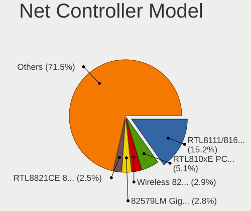

| Model                                                                  | Notebooks | Percent |
|------------------------------------------------------------------------|-----------|---------|
| Realtek RTL8111/8168/8211/8411 PCI Express Gigabit Ethernet Controller | 511       | 15.19%  |
| Realtek RTL810xE PCI Express Fast Ethernet controller                  | 172       | 5.11%   |
| Intel Wireless 8265 / 8275                                             | 99        | 2.94%   |
| Intel 82579LM Gigabit Network Connection (Lewisville)                  | 95        | 2.82%   |
| Realtek RTL8821CE 802.11ac PCIe Wireless Network Adapter               | 83        | 2.47%   |
| Intel Centrino Advanced-N 6205 [Taylor Peak]                           | 73        | 2.17%   |
| Intel Wireless 7265                                                    | 65        | 1.93%   |
| Qualcomm Atheros QCA9377 802.11ac Wireless Network Adapter             | 64        | 1.9%    |
| Intel Wireless 8260                                                    | 62        | 1.84%   |
| Intel Wireless 7260                                                    | 60        | 1.78%   |
| Intel Wi-Fi 6 AX201                                                    | 60        | 1.78%   |
| Qualcomm Atheros AR9285 Wireless Network Adapter (PCI-Express)         | 56        | 1.67%   |
| Intel Wi-Fi 6 AX200                                                    | 54        | 1.61%   |
| Intel Ethernet Connection (4) I219-LM                                  | 53        | 1.58%   |
| Realtek RTL8822CE 802.11ac PCIe Wireless Network Adapter               | 52        | 1.55%   |
| Realtek RTL8153 Gigabit Ethernet Adapter                               | 49        | 1.46%   |
| Qualcomm Atheros QCA9565 / AR9565 Wireless Network Adapter             | 47        | 1.4%    |
| Qualcomm Atheros AR9485 Wireless Network Adapter                       | 47        | 1.4%    |
| MediaTek MT7921 802.11ax PCIe Wireless Network Adapter [Filogic 330]   | 39        | 1.16%   |
| Intel Wi-Fi 6E(802.11ax) AX210/AX1675* 2x2 [Typhoon Peak]              | 38        | 1.13%   |
| Qualcomm Atheros QCA6174 802.11ac Wireless Network Adapter             | 37        | 1.1%    |
| Intel Ethernet Connection I219-LM                                      | 37        | 1.1%    |
| MediaTek MT7922 802.11ax PCI Express Wireless Network Adapter          | 35        | 1.04%   |
| Intel Alder Lake-P PCH CNVi WiFi                                       | 35        | 1.04%   |
| Broadcom BCM4313 802.11bgn Wireless Network Adapter                    | 33        | 0.98%   |
| Intel Wireless 3165                                                    | 29        | 0.86%   |
| Intel Centrino Ultimate-N 6300                                         | 29        | 0.86%   |
| Realtek RTL8852BE PCIe 802.11ax Wireless Network Controller            | 28        | 0.83%   |
| Realtek RTL8188CE 802.11b/g/n WiFi Adapter                             | 28        | 0.83%   |
| Intel Cannon Lake PCH CNVi WiFi                                        | 27        | 0.8%    |
| Intel Comet Lake PCH-LP CNVi WiFi                                      | 26        | 0.77%   |
| Intel Wireless 3160                                                    | 25        | 0.74%   |
| Intel Ethernet Connection (3) I218-LM                                  | 25        | 0.74%   |
| Realtek RTL8188EE Wireless Network Adapter                             | 24        | 0.71%   |
| Intel Cannon Point-LP CNVi [Wireless-AC]                               | 24        | 0.71%   |
| Intel Raptor Lake PCH CNVi WiFi                                        | 23        | 0.68%   |
| Intel 82577LM Gigabit Network Connection                               | 23        | 0.68%   |
| Intel Ethernet Connection (4) I219-V                                   | 22        | 0.65%   |
| Intel Comet Lake PCH CNVi WiFi                                         | 21        | 0.62%   |
| Intel Centrino Advanced-N 6235                                         | 21        | 0.62%   |

Wireless Vendor
---------------

Wireless vendors

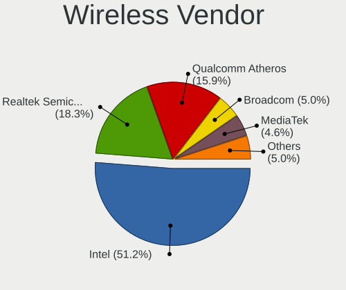

| Vendor                          | Notebooks | Percent |
|---------------------------------|-----------|---------|
| Intel                           | 949       | 51.24%  |
| Realtek Semiconductor           | 339       | 18.3%   |
| Qualcomm Atheros                | 294       | 15.87%  |
| Broadcom                        | 92        | 4.97%   |
| MediaTek                        | 85        | 4.59%   |
| Broadcom Limited                | 22        | 1.19%   |
| Sierra Wireless                 | 13        | 0.7%    |
| Qualcomm                        | 10        | 0.54%   |
| Dell                            | 10        | 0.54%   |
| Ralink                          | 9         | 0.49%   |
| Ralink Technology               | 7         | 0.38%   |
| TP-Link                         | 6         | 0.32%   |
| Fibocom                         | 4         | 0.22%   |
| Qualcomm Atheros Communications | 2         | 0.11%   |
| NetGear                         | 2         | 0.11%   |
| ZyDAS                           | 1         | 0.05%   |
| Quectel Wireless Solutions      | 1         | 0.05%   |
| Qualcomm Technologies           | 1         | 0.05%   |
| Linksys                         | 1         | 0.05%   |
| Edimax Technology               | 1         | 0.05%   |
| D-Link System                   | 1         | 0.05%   |
| D-Link                          | 1         | 0.05%   |
| Belkin Components               | 1         | 0.05%   |

Wireless Model
--------------

Wireless models

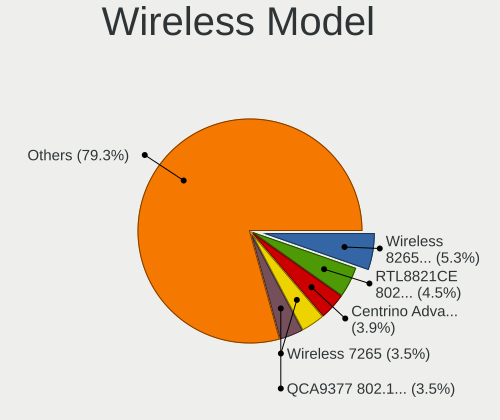

| Model                                                                   | Notebooks | Percent |
|-------------------------------------------------------------------------|-----------|---------|
| Intel Wireless 8265 / 8275                                              | 99        | 5.34%   |
| Realtek RTL8821CE 802.11ac PCIe Wireless Network Adapter                | 83        | 4.47%   |
| Intel Centrino Advanced-N 6205 [Taylor Peak]                            | 73        | 3.94%   |
| Intel Wireless 7265                                                     | 65        | 3.5%    |
| Qualcomm Atheros QCA9377 802.11ac Wireless Network Adapter              | 64        | 3.45%   |
| Intel Wireless 8260                                                     | 62        | 3.34%   |
| Intel Wireless 7260                                                     | 60        | 3.23%   |
| Intel Wi-Fi 6 AX201                                                     | 60        | 3.23%   |
| Qualcomm Atheros AR9285 Wireless Network Adapter (PCI-Express)          | 56        | 3.02%   |
| Intel Wi-Fi 6 AX200                                                     | 54        | 2.91%   |
| Realtek RTL8822CE 802.11ac PCIe Wireless Network Adapter                | 52        | 2.8%    |
| Qualcomm Atheros QCA9565 / AR9565 Wireless Network Adapter              | 47        | 2.53%   |
| Qualcomm Atheros AR9485 Wireless Network Adapter                        | 47        | 2.53%   |
| MediaTek MT7921 802.11ax PCIe Wireless Network Adapter [Filogic 330]    | 39        | 2.1%    |
| Intel Wi-Fi 6E(802.11ax) AX210/AX1675* 2x2 [Typhoon Peak]               | 38        | 2.05%   |
| Qualcomm Atheros QCA6174 802.11ac Wireless Network Adapter              | 37        | 1.99%   |
| MediaTek MT7922 802.11ax PCI Express Wireless Network Adapter           | 34        | 1.83%   |
| Broadcom BCM4313 802.11bgn Wireless Network Adapter                     | 33        | 1.78%   |
| Intel Wireless 3165                                                     | 29        | 1.56%   |
| Intel Centrino Ultimate-N 6300                                          | 29        | 1.56%   |
| Realtek RTL8188CE 802.11b/g/n WiFi Adapter                              | 28        | 1.51%   |
| Realtek RTL8852BE PCIe 802.11ax Wireless Network Controller             | 27        | 1.46%   |
| Intel Cannon Lake PCH CNVi WiFi                                         | 27        | 1.46%   |
| Intel Comet Lake PCH-LP CNVi WiFi                                       | 26        | 1.4%    |
| Intel Wireless 3160                                                     | 25        | 1.35%   |
| Realtek RTL8188EE Wireless Network Adapter                              | 24        | 1.29%   |
| Intel Cannon Point-LP CNVi [Wireless-AC]                                | 24        | 1.29%   |
| Intel Raptor Lake PCH CNVi WiFi                                         | 23        | 1.24%   |
| Intel Comet Lake PCH CNVi WiFi                                          | 21        | 1.13%   |
| Intel Centrino Advanced-N 6235                                          | 21        | 1.13%   |
| Realtek RTL8723BE PCIe Wireless Network Adapter                         | 20        | 1.08%   |
| Intel Dual Band Wireless-AC 3168NGW [Stone Peak]                        | 17        | 0.92%   |
| Realtek RTL8723DE Wireless Network Adapter                              | 16        | 0.86%   |
| Intel Centrino Advanced-N 6200                                          | 15        | 0.81%   |
| Qualcomm Atheros AR9462 Wireless Network Adapter                        | 14        | 0.75%   |
| Qualcomm Atheros AR242x / AR542x Wireless Network Adapter (PCI-Express) | 14        | 0.75%   |
| Realtek RTL8822BE 802.11a/b/g/n/ac WiFi adapter                         | 13        | 0.7%    |
| Intel Tiger Lake PCH CNVi WiFi                                          | 13        | 0.7%    |
| Intel PRO/Wireless 4965 AG or AGN [Kedron] Network Connection           | 12        | 0.65%   |
| Intel Meteor Lake PCH CNVi WiFi                                         | 12        | 0.65%   |

Ethernet Vendor
---------------

Ethernet vendors

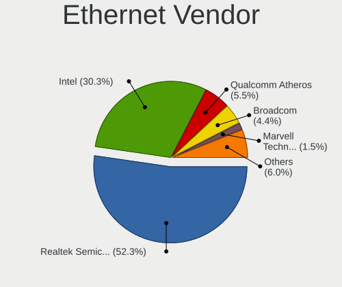

| Vendor                                 | Notebooks | Percent |
|----------------------------------------|-----------|---------|
| Realtek Semiconductor                  | 763       | 52.3%   |
| Intel                                  | 442       | 30.29%  |
| Qualcomm Atheros                       | 80        | 5.48%   |
| Broadcom                               | 64        | 4.39%   |
| Marvell Technology Group               | 22        | 1.51%   |
| ASIX Electronics                       | 16        | 1.1%    |
| Broadcom Limited                       | 15        | 1.03%   |
| Nvidia                                 | 8         | 0.55%   |
| JMicron Technology                     | 8         | 0.55%   |
| Samsung Electronics                    | 6         | 0.41%   |
| Lenovo                                 | 6         | 0.41%   |
| Motorola PCS                           | 4         | 0.27%   |
| Xiaomi                                 | 3         | 0.21%   |
| Suzhou Motorcomm Electronic Technology | 3         | 0.21%   |
| ZTE WCDMA Technologies MSM             | 2         | 0.14%   |
| Qualcomm                               | 2         | 0.14%   |
| MediaTek                               | 2         | 0.14%   |
| Google                                 | 2         | 0.14%   |
| DisplayLink                            | 2         | 0.14%   |
| T & A Mobile Phones                    | 1         | 0.07%   |
| Silicon Integrated Systems [SiS]       | 1         | 0.07%   |
| OPPO Electronics                       | 1         | 0.07%   |
| Motorcomm Microelectronics.            | 1         | 0.07%   |
| LG Electronics                         | 1         | 0.07%   |
| Huawei Technologies                    | 1         | 0.07%   |
| Hewlett-Packard                        | 1         | 0.07%   |
| D-Link                                 | 1         | 0.07%   |
| Attansic Technology                    | 1         | 0.07%   |

Ethernet Model
--------------

Ethernet models

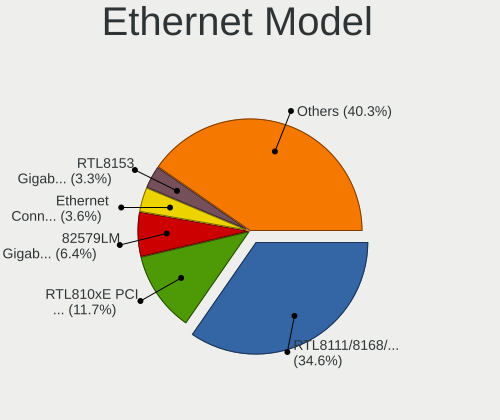

| Model                                                                          | Notebooks | Percent |
|--------------------------------------------------------------------------------|-----------|---------|
| Realtek RTL8111/8168/8211/8411 PCI Express Gigabit Ethernet Controller         | 511       | 34.64%  |
| Realtek RTL810xE PCI Express Fast Ethernet controller                          | 172       | 11.66%  |
| Intel 82579LM Gigabit Network Connection (Lewisville)                          | 95        | 6.44%   |
| Intel Ethernet Connection (4) I219-LM                                          | 53        | 3.59%   |
| Realtek RTL8153 Gigabit Ethernet Adapter                                       | 49        | 3.32%   |
| Intel Ethernet Connection I219-LM                                              | 37        | 2.51%   |
| Intel Ethernet Connection (3) I218-LM                                          | 25        | 1.69%   |
| Intel Alder Lake-P PCH CNVi WiFi                                               | 24        | 1.63%   |
| Intel 82577LM Gigabit Network Connection                                       | 23        | 1.56%   |
| Intel Ethernet Connection (4) I219-V                                           | 22        | 1.49%   |
| Intel Ethernet Connection I217-LM                                              | 20        | 1.36%   |
| Intel Ethernet Connection I218-LM                                              | 19        | 1.29%   |
| Intel Ethernet Connection I219-V                                               | 15        | 1.02%   |
| Intel 82567LM Gigabit Network Connection                                       | 15        | 1.02%   |
| ASIX AX88179 Gigabit Ethernet                                                  | 14        | 0.95%   |
| Qualcomm Atheros AR8151 v2.0 Gigabit Ethernet                                  | 13        | 0.88%   |
| Qualcomm Atheros AR8162 Fast Ethernet                                          | 12        | 0.81%   |
| Realtek Killer E2600 GbE Controller                                            | 11        | 0.75%   |
| Intel Ethernet Connection (6) I219-LM                                          | 11        | 0.75%   |
| Realtek RTL8152 Fast Ethernet Adapter                                          | 10        | 0.68%   |
| Broadcom NetLink BCM57785 Gigabit Ethernet PCIe                                | 10        | 0.68%   |
| Qualcomm Atheros QCA8171 Gigabit Ethernet                                      | 8         | 0.54%   |
| Qualcomm Atheros AR8161 Gigabit Ethernet                                       | 8         | 0.54%   |
| Marvell Group Yukon Optima 88E8059 [PCIe Gigabit Ethernet Controller with AVB] | 8         | 0.54%   |
| Marvell Group 88E8040 PCI-E Fast Ethernet Controller                           | 8         | 0.54%   |
| Broadcom NetXtreme BCM57765 Gigabit Ethernet PCIe                              | 8         | 0.54%   |
| Broadcom NetXtreme BCM5761 Gigabit Ethernet PCIe                               | 8         | 0.54%   |
| Realtek RTL8125 2.5GbE Controller                                              | 7         | 0.47%   |
| Qualcomm Atheros AR8152 v1.1 Fast Ethernet                                     | 7         | 0.47%   |
| Qualcomm Atheros AR8131 Gigabit Ethernet                                       | 7         | 0.47%   |
| Qualcomm Atheros AR8152 v2.0 Fast Ethernet                                     | 6         | 0.41%   |
| JMicron JMC250 PCI Express Gigabit Ethernet Controller                         | 6         | 0.41%   |
| Intel Ethernet Connection (7) I219-LM                                          | 6         | 0.41%   |
| Intel Ethernet Connection (6) I219-V                                           | 6         | 0.41%   |
| Intel Ethernet Connection (10) I219-V                                          | 6         | 0.41%   |
| Intel Ethernet Connection (10) I219-LM                                         | 6         | 0.41%   |
| Broadcom NetXtreme BCM5764M Gigabit Ethernet PCIe                              | 6         | 0.41%   |
| Realtek USB 10/100/1G/2.5 LAN                                                  | 5         | 0.34%   |
| Qualcomm Atheros QCA8172 Fast Ethernet                                         | 5         | 0.34%   |
| Intel Ethernet Connection I217-V                                               | 5         | 0.34%   |

Net Controller Kind
-------------------

Ethernet, WiFi or modem

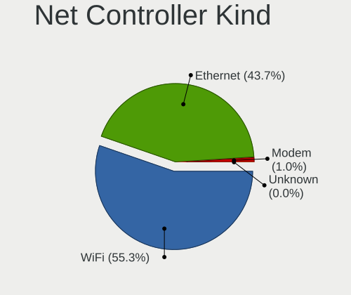

| Kind     | Notebooks | Percent |
|----------|-----------|---------|
| WiFi     | 1792      | 55.29%  |
| Ethernet | 1416      | 43.69%  |
| Modem    | 32        | 0.99%   |
| Unknown  | 1         | 0.03%   |

Used Controller
---------------

Currently used network controller

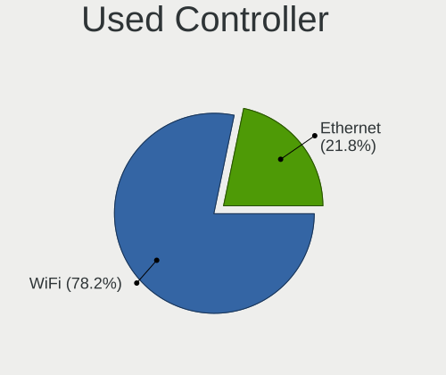

| Kind     | Notebooks | Percent |
|----------|-----------|---------|
| WiFi     | 1410      | 78.25%  |
| Ethernet | 392       | 21.75%  |

NICs
----

Total network controllers on board

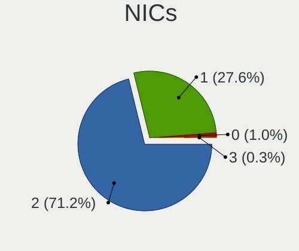

| Total | Notebooks | Percent |
|-------|-----------|---------|
| 2     | 1306      | 71.17%  |
| 1     | 506       | 27.57%  |
| 0     | 18        | 0.98%   |
| 3     | 5         | 0.27%   |

IPv6
----

IPv6 vs IPv4

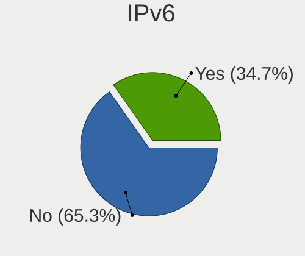

| Used | Notebooks | Percent |
|------|-----------|---------|
| No   | 1200      | 65.25%  |
| Yes  | 639       | 34.75%  |

Bluetooth
---------

Bluetooth Vendor
----------------

Controller vendors

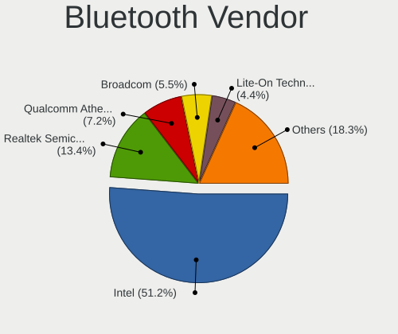

| Vendor                          | Notebooks | Percent |
|---------------------------------|-----------|---------|
| Intel                           | 770       | 51.16%  |
| Realtek Semiconductor           | 202       | 13.42%  |
| Qualcomm Atheros Communications | 109       | 7.24%   |
| Broadcom                        | 83        | 5.51%   |
| Lite-On Technology              | 66        | 4.39%   |
| IMC Networks                    | 64        | 4.25%   |
| Foxconn / Hon Hai               | 61        | 4.05%   |
| Dell                            | 29        | 1.93%   |
| Apple                           | 23        | 1.53%   |
| MediaTek                        | 20        | 1.33%   |
| Hewlett-Packard                 | 18        | 1.2%    |
| Toshiba                         | 16        | 1.06%   |
| USI                             | 10        | 0.66%   |
| Cambridge Silicon Radio         | 8         | 0.53%   |
| Realtek                         | 5         | 0.33%   |
| Ralink                          | 4         | 0.27%   |
| ASUSTek Computer                | 4         | 0.27%   |
| Unknown                         | 3         | 0.2%    |
| TP-Link                         | 2         | 0.13%   |
| Fujitsu                         | 2         | 0.13%   |
| Chicony Electronics             | 2         | 0.13%   |
| Smart Modular Technologies      | 1         | 0.07%   |
| Qcom                            | 1         | 0.07%   |
| Foxconn International           | 1         | 0.07%   |
| Alps Electric                   | 1         | 0.07%   |

Bluetooth Model
---------------

Controller models

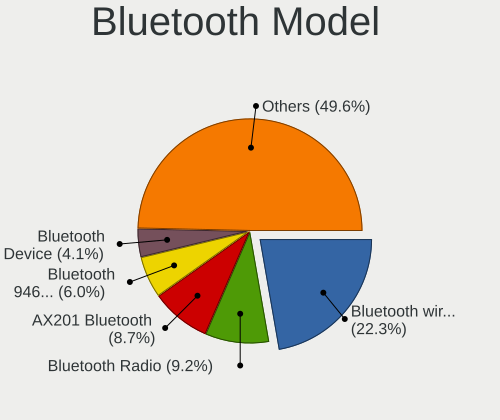

| Model                                               | Notebooks | Percent |
|-----------------------------------------------------|-----------|---------|
| Intel Bluetooth wireless interface                  | 335       | 22.26%  |
| Realtek Bluetooth Radio                             | 139       | 9.24%   |
| Intel AX201 Bluetooth                               | 131       | 8.7%    |
| Intel Bluetooth 9460/9560 Jefferson Peak (JfP)      | 91        | 6.05%   |
| Intel Bluetooth Device                              | 62        | 4.12%   |
| Qualcomm Atheros  Bluetooth Device                  | 61        | 4.05%   |
| Intel AX200 Bluetooth                               | 53        | 3.52%   |
| Realtek  Bluetooth 4.2 Adapter                      | 45        | 2.99%   |
| Intel AX210 Bluetooth                               | 36        | 2.39%   |
| Intel Centrino Bluetooth Wireless Transceiver       | 30        | 1.99%   |
| IMC Networks Bluetooth Radio                        | 28        | 1.86%   |
| Lite-On Qualcomm Atheros QCA9377 Bluetooth          | 23        | 1.53%   |
| IMC Networks Wireless_Device                        | 22        | 1.46%   |
| Broadcom BCM20702 Bluetooth 4.0 [ThinkPad]          | 21        | 1.4%    |
| Qualcomm Atheros AR3011 Bluetooth                   | 20        | 1.33%   |
| MediaTek Wireless_Device                            | 20        | 1.33%   |
| Broadcom BCM2045B (BDC-2.1)                         | 20        | 1.33%   |
| Foxconn / Hon Hai Bluetooth Device                  | 18        | 1.2%    |
| Intel Wireless-AC 3168 Bluetooth                    | 17        | 1.13%   |
| Foxconn / Hon Hai Wireless_Device                   | 17        | 1.13%   |
| Dell DW375 Bluetooth Module                         | 14        | 0.93%   |
| Lite-On Wireless_Device                             | 13        | 0.86%   |
| Apple Bluetooth Host Controller                     | 13        | 0.86%   |
| Lite-On Atheros AR3012 Bluetooth                    | 12        | 0.8%    |
| HP Broadcom 2070 Bluetooth Combo                    | 12        | 0.8%    |
| Dell BCM20702A0 Bluetooth Module                    | 12        | 0.8%    |
| Qualcomm Atheros QCA61x4 Bluetooth 4.0              | 11        | 0.73%   |
| Lite-On Bluetooth Device                            | 10        | 0.66%   |
| Intel Wireless-AC 9260 Bluetooth Adapter            | 9         | 0.6%    |
| Foxconn / Hon Hai MediaTek Bluetooth Adapter        | 9         | 0.6%    |
| USI Bluetooth Device                                | 8         | 0.53%   |
| Cambridge Silicon Radio Bluetooth Dongle (HCI mode) | 8         | 0.53%   |
| Broadcom HP Portable SoftSailing                    | 8         | 0.53%   |
| Realtek RTL8822BE Bluetooth 4.2 Adapter             | 7         | 0.47%   |
| Qualcomm Atheros AR3012 Bluetooth 4.0               | 7         | 0.47%   |
| Toshiba Bluetooth Device                            | 6         | 0.4%    |
| Intel Centrino Advanced-N 6230 Bluetooth adapter    | 6         | 0.4%    |
| IMC Networks Bluetooth Device                       | 6         | 0.4%    |
| IMC Networks Atheros AR3012 Bluetooth 4.0 Adapter   | 6         | 0.4%    |
| HP Bluetooth 2.0 Interface [Broadcom BCM2045]       | 6         | 0.4%    |

Sound
-----

Sound Vendor
------------

Sound card vendors

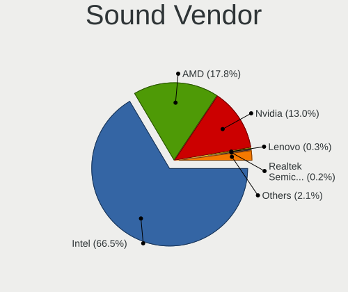

| Vendor                                       | Notebooks | Percent |
|----------------------------------------------|-----------|---------|
| Intel                                        | 1453      | 66.5%   |
| AMD                                          | 390       | 17.85%  |
| Nvidia                                       | 284       | 13%     |
| Lenovo                                       | 7         | 0.32%   |
| Realtek Semiconductor                        | 5         | 0.23%   |
| Hewlett-Packard                              | 5         | 0.23%   |
| Corsair                                      | 3         | 0.14%   |
| C-Media Electronics                          | 3         | 0.14%   |
| BEHRINGER International                      | 3         | 0.14%   |
| ASUSTek Computer                             | 3         | 0.14%   |
| Tenx Technology                              | 2         | 0.09%   |
| SteelSeries ApS                              | 2         | 0.09%   |
| Razer USA                                    | 2         | 0.09%   |
| Logitech                                     | 2         | 0.09%   |
| Jieli Technology                             | 2         | 0.09%   |
| Generalplus Technology                       | 2         | 0.09%   |
| Apple                                        | 2         | 0.09%   |
| Zoran Co. Personal Media Division (Nogatech) | 1         | 0.05%   |
| VirTouch                                     | 1         | 0.05%   |
| Thesycon Systemsoftware & Consulting         | 1         | 0.05%   |
| Texas Instruments                            | 1         | 0.05%   |
| Silicon Integrated Systems [SiS]             | 1         | 0.05%   |
| Plantronics                                  | 1         | 0.05%   |
| Other World Computing                        | 1         | 0.05%   |
| Medeli Electronics                           | 1         | 0.05%   |
| JMTek                                        | 1         | 0.05%   |
| GYROCOM C&C                                  | 1         | 0.05%   |
| GN Netcom                                    | 1         | 0.05%   |
| DSEA A/S                                     | 1         | 0.05%   |
| Creative Technology                          | 1         | 0.05%   |
| Cambridge Audio                              | 1         | 0.05%   |
| 1621_PC_R001_20240330                        | 1         | 0.05%   |

Sound Model
-----------

Sound card models

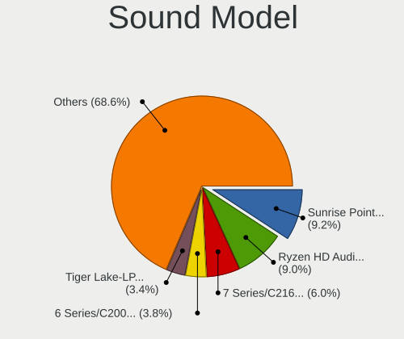

| Model                                                                                             | Notebooks | Percent |
|---------------------------------------------------------------------------------------------------|-----------|---------|
| Intel Sunrise Point-LP HD Audio                                                                   | 247       | 9.23%   |
| AMD Ryzen HD Audio Controller                                                                     | 240       | 8.97%   |
| Intel 7 Series/C216 Chipset Family High Definition Audio Controller                               | 160       | 5.98%   |
| Intel 6 Series/C200 Series Chipset Family High Definition Audio Controller                        | 102       | 3.81%   |
| Intel Tiger Lake-LP Smart Sound Technology Audio Controller                                       | 92        | 3.44%   |
| Intel 5 Series/3400 Series Chipset High Definition Audio                                          | 81        | 3.03%   |
| AMD Renoir/Cezanne HDMI/DP Audio Controller                                                       | 81        | 3.03%   |
| AMD Radeon High Definition Audio Controller                                                       | 69        | 2.58%   |
| Intel Haswell-ULT HD Audio Controller                                                             | 66        | 2.47%   |
| Intel 82801I (ICH9 Family) HD Audio Controller                                                    | 66        | 2.47%   |
| Intel 8 Series HD Audio Controller                                                                | 66        | 2.47%   |
| Intel Alder Lake PCH-P High Definition Audio Controller                                           | 64        | 2.39%   |
| Intel Broadwell-U Audio Controller                                                                | 62        | 2.32%   |
| Intel Wildcat Point-LP High Definition Audio Controller                                           | 60        | 2.24%   |
| AMD Raven/Raven2/Fenghuang HDMI/DP Audio Controller                                               | 59        | 2.2%    |
| AMD FCH Azalia Controller                                                                         | 52        | 1.94%   |
| Intel 8 Series/C220 Series Chipset High Definition Audio Controller                               | 50        | 1.87%   |
| Intel Celeron/Pentium Silver Processor High Definition Audio                                      | 47        | 1.76%   |
| Intel Cannon Lake PCH cAVS                                                                        | 44        | 1.64%   |
| Intel Cannon Point-LP High Definition Audio Controller                                            | 42        | 1.57%   |
| Intel Xeon E3-1200 v3/4th Gen Core Processor HD Audio Controller                                  | 40        | 1.49%   |
| AMD Kabini HDMI/DP Audio                                                                          | 40        | 1.49%   |
| AMD Family 15h (Models 60h-6fh) Audio Controller                                                  | 37        | 1.38%   |
| Nvidia GF108 High Definition Audio Controller                                                     | 35        | 1.31%   |
| Intel 82801H (ICH8 Family) HD Audio Controller                                                    | 33        | 1.23%   |
| Intel Raptor Lake-P/U/H cAVS                                                                      | 32        | 1.2%    |
| Intel Comet Lake PCH-LP cAVS                                                                      | 31        | 1.16%   |
| Intel Atom Processor Z36xxx/Z37xxx Series High Definition Audio Controller                        | 29        | 1.08%   |
| AMD High Definition Audio Controller                                                              | 29        | 1.08%   |
| AMD SBx00 Azalia (Intel HDA)                                                                      | 27        | 1.01%   |
| Nvidia TU107 GeForce GTX 1650 High Definition Audio Controller                                    | 26        | 0.97%   |
| Intel Ice Lake-LP Smart Sound Technology Audio Controller                                         | 26        | 0.97%   |
| Intel Comet Lake PCH cAVS                                                                         | 25        | 0.93%   |
| Intel CM238 HD Audio Controller                                                                   | 24        | 0.9%    |
| Nvidia AD107 High Definition Audio Controller                                                     | 23        | 0.86%   |
| Nvidia GA107 High Definition Audio Controller                                                     | 22        | 0.82%   |
| Nvidia High Definition Audio Controller                                                           | 20        | 0.75%   |
| Intel Tiger Lake-H HD Audio Controller                                                            | 20        | 0.75%   |
| Intel Atom/Celeron/Pentium Processor x5-E8000/J3xxx/N3xxx Series High Definition Audio Controller | 20        | 0.75%   |
| Nvidia TU106 High Definition Audio Controller                                                     | 18        | 0.67%   |

Memory
------

Memory Vendor
-------------

Memory module vendors

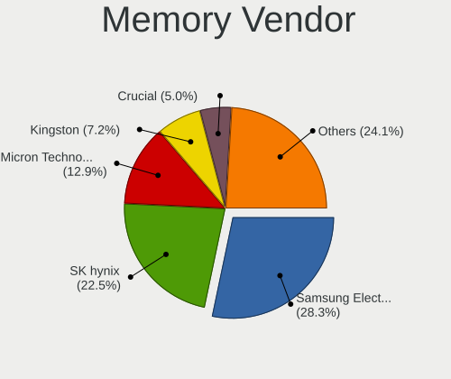

| Vendor              | Notebooks | Percent |
|---------------------|-----------|---------|
| Samsung Electronics | 614       | 28.29%  |
| SK hynix            | 488       | 22.49%  |
| Micron Technology   | 281       | 12.95%  |
| Kingston            | 156       | 7.19%   |
| Crucial             | 109       | 5.02%   |
| Unknown             | 100       | 4.61%   |
| A-DATA Technology   | 51        | 2.35%   |
| Nanya Technology    | 44        | 2.03%   |
| Elpida              | 44        | 2.03%   |
| Ramaxel Technology  | 34        | 1.57%   |
| Corsair             | 31        | 1.43%   |
| Unknown             | 26        | 1.2%    |
| Unknown (ABCD)      | 19        | 0.88%   |
| G.Skill             | 18        | 0.83%   |
| Smart               | 13        | 0.6%    |
| Timetec             | 12        | 0.55%   |
| Team                | 11        | 0.51%   |
| Patriot             | 9         | 0.41%   |
| GOODRAM             | 8         | 0.37%   |
| Transcend           | 7         | 0.32%   |
| Silicon Power       | 6         | 0.28%   |
| PNY                 | 5         | 0.23%   |
| Neo Forza           | 5         | 0.23%   |
| Teikon              | 4         | 0.18%   |
| Toshiba             | 3         | 0.14%   |
| Lexar               | 3         | 0.14%   |
| Innodisk            | 3         | 0.14%   |
| Apacer              | 3         | 0.14%   |
| 4ea5                | 3         | 0.14%   |
| Wilk                | 2         | 0.09%   |
| V-GeN               | 2         | 0.09%   |
| SHARETRONIC         | 2         | 0.09%   |
| PUSKILL             | 2         | 0.09%   |
| Micron/Elpida       | 2         | 0.09%   |
| Lexar Co Limited    | 2         | 0.09%   |
| Hikvision           | 2         | 0.09%   |
| CSX                 | 2         | 0.09%   |
| ASint Technology    | 2         | 0.09%   |
| AMD                 | 2         | 0.09%   |
| Unknown (F785)      | 1         | 0.05%   |

Memory Model
------------

Memory module models

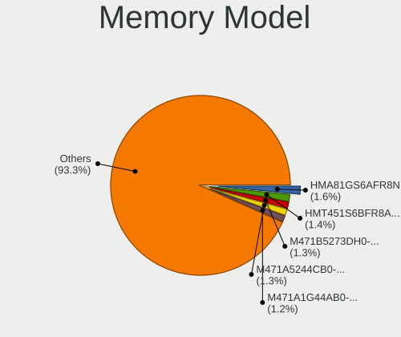

| Model                                                            | Notebooks | Percent |
|------------------------------------------------------------------|-----------|---------|
| SK hynix RAM HMA81GS6AFR8N-UH 8GB SODIMM DDR4 2667MT/s           | 36        | 1.56%   |
| SK hynix RAM HMT451S6BFR8A-PB 4GB SODIMM DDR3 1600MT/s           | 32        | 1.39%   |
| Samsung RAM M471B5273DH0-CH9 4GB SODIMM DDR3 1600MT/s            | 29        | 1.26%   |
| Samsung RAM M471A5244CB0-CWE 4GB SODIMM DDR4 3200MT/s            | 29        | 1.26%   |
| Samsung RAM M471A1G44AB0-CWE 8GiB SODIMM DDR4 3200MT/s           | 28        | 1.21%   |
| Unknown                                                          | 26        | 1.13%   |
| Samsung RAM M471A5244CB0-CTD 4GB SODIMM DDR4 3266MT/s            | 25        | 1.08%   |
| Samsung RAM M471A1K43DB1-CWE 8GB SODIMM DDR4 3200MT/s            | 23        | 1%      |
| Samsung RAM M471B5173EB0-YK0 4GB SODIMM DDR3 1600MT/s            | 22        | 0.95%   |
| Samsung RAM M471B5173DB0-YK0 4GB SODIMM DDR3 1600MT/s            | 22        | 0.95%   |
| Samsung RAM M471B1G73EB0-YK0 8192MB SODIMM DDR3 1600MT/s         | 18        | 0.78%   |
| Unknown (ABCD) RAM 123456789012345678 2GB SODIMM LPDDR4 2400MT/s | 17        | 0.74%   |
| Samsung RAM M471B5773DH0-CH9 2GB SODIMM DDR3 1600MT/s            | 17        | 0.74%   |
| Samsung RAM M471B5273CH0-CH9 4GB SODIMM DDR3 1334MT/s            | 17        | 0.74%   |
| Samsung RAM M471B5173QH0-YK0 4GB SODIMM DDR3 1600MT/s            | 17        | 0.74%   |
| Samsung RAM M471B1G73DB0-YK0 8GB SODIMM DDR3 1600MT/s            | 17        | 0.74%   |
| SK hynix RAM HMT351S6CFR8C-PB 4GB SODIMM DDR3 1600MT/s           | 16        | 0.69%   |
| Samsung RAM M471B1G73QH0-YK0 8GB SODIMM DDR3 1600MT/s            | 16        | 0.69%   |
| Samsung RAM M471A1K43CB1-CRC 8GB SODIMM DDR4 8400MT/s            | 16        | 0.69%   |
| Samsung RAM M471A1K43EB1-CWE 8GB SODIMM DDR4 3200MT/s            | 15        | 0.65%   |
| Unknown RAM Module 2GB SODIMM DDR2 667MT/s                       | 13        | 0.56%   |
| SK hynix RAM HMA851S6AFR6N-UH 4GB SODIMM DDR4 2667MT/s           | 13        | 0.56%   |
| SK hynix RAM HMA82GS6AFR8N-UH 16GB SODIMM DDR4 2667MT/s          | 13        | 0.56%   |
| SK hynix RAM HMT41GS6BFR8A-PB 8GB SODIMM DDR3 2667MT/s           | 12        | 0.52%   |
| SK hynix RAM HMAA1GS6CJR6N-XN 8GB SODIMM DDR4 3200MT/s           | 11        | 0.48%   |
| Samsung RAM M471A2K43CB1-CRC 16GB SODIMM DDR4 2667MT/s           | 11        | 0.48%   |
| Samsung RAM M471A1G44BB0-CWE 8GB SODIMM DDR4 3200MT/s            | 11        | 0.48%   |
| Micron RAM 8ATF1G64HZ-2G6E1 8GB SODIMM DDR4 2667MT/s             | 11        | 0.48%   |
| Micron RAM 4ATF51264HZ-3G2J1 4GB SODIMM DDR4 3200MT/s            | 11        | 0.48%   |
| Micron RAM 4ATF51264HZ-2G6E1 4GB SODIMM DDR4 2667MT/s            | 11        | 0.48%   |
| Crucial RAM CT102464BF160B.M16 8GB SODIMM DDR3 1600MT/s          | 11        | 0.48%   |
| SK hynix RAM HMT351S6EFR8A-PB 4GB SODIMM DDR3 1600MT/s           | 10        | 0.43%   |
| SK hynix RAM HMT351S6BFR8C-H9 4GB SODIMM 1334MT/s                | 10        | 0.43%   |
| SK hynix RAM HMA81GS6DJR8N-XN 8GB SODIMM DDR4 3200MT/s           | 10        | 0.43%   |
| Samsung RAM M471A1K43DB1-CTD 8GB SODIMM DDR4 2667MT/s            | 10        | 0.43%   |
| Samsung RAM M471A1K43BB1-CRC 8GB SODIMM DDR4 2667MT/s            | 10        | 0.43%   |
| Micron RAM 8KTF51264HZ-1G6E1 4GB SODIMM DDR3 1600MT/s            | 10        | 0.43%   |
| SK hynix RAM HMT451S6AFR8A-PB 4GB SODIMM DDR3 1600MT/s           | 9         | 0.39%   |
| SK hynix RAM HMA851S6CJR6N-VK 4GB Row Of Chips DDR4 2667MT/s     | 9         | 0.39%   |
| SK hynix RAM HMA81GS6JJR8N-VK 8GB SODIMM DDR4 2667MT/s           | 9         | 0.39%   |

Memory Kind
-----------

Memory module kinds

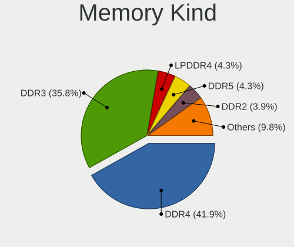

| Kind    | Notebooks | Percent |
|---------|-----------|---------|
| DDR4    | 777       | 41.89%  |
| DDR3    | 665       | 35.85%  |
| LPDDR4  | 79        | 4.26%   |
| DDR5    | 79        | 4.26%   |
| DDR2    | 73        | 3.94%   |
| LPDDR5  | 67        | 3.61%   |
| LPDDR3  | 52        | 2.8%    |
| SDRAM   | 50        | 2.7%    |
| Unknown | 8         | 0.43%   |
| DDR     | 3         | 0.16%   |
| DRAM    | 2         | 0.11%   |

Memory Form Factor
------------------

Physical design of the memory module

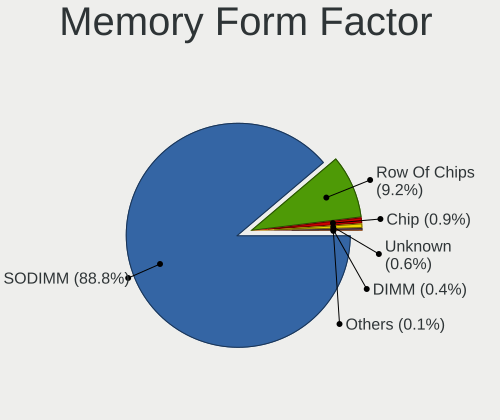

| Name            | Notebooks | Percent |
|-----------------|-----------|---------|
| SODIMM          | 1643      | 88.81%  |
| Row Of Chips    | 171       | 9.24%   |
| Chip            | 16        | 0.86%   |
| Unknown         | 12        | 0.65%   |
| DIMM            | 7         | 0.38%   |
| Proprietary Car | 1         | 0.05%   |

Memory Size
-----------

Memory module size

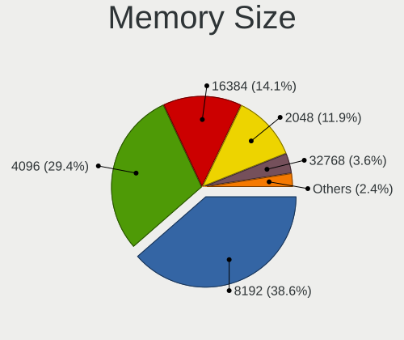

| Size  | Notebooks | Percent |
|-------|-----------|---------|
| 8192  | 794       | 38.58%  |
| 4096  | 606       | 29.45%  |
| 16384 | 290       | 14.09%  |
| 2048  | 244       | 11.86%  |
| 32768 | 74        | 3.6%    |
| 1024  | 40        | 1.94%   |
| 49152 | 3         | 0.15%   |
| 3072  | 3         | 0.15%   |
| 12288 | 1         | 0.05%   |
| 6144  | 1         | 0.05%   |
| 1536  | 1         | 0.05%   |
| 512   | 1         | 0.05%   |

Memory Speed
------------

Memory module speed

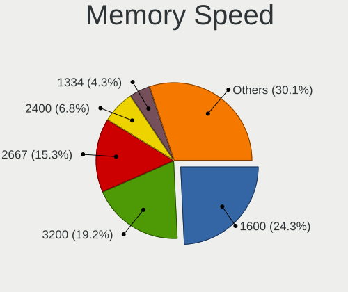

| Speed   | Notebooks | Percent |
|---------|-----------|---------|
| 1600    | 490       | 24.26%  |
| 3200    | 387       | 19.16%  |
| 2667    | 310       | 15.35%  |
| 2400    | 138       | 6.83%   |
| 1334    | 87        | 4.31%   |
| 1333    | 82        | 4.06%   |
| 2133    | 64        | 3.17%   |
| 5600    | 52        | 2.57%   |
| 667     | 36        | 1.78%   |
| 6400    | 33        | 1.63%   |
| 1067    | 32        | 1.58%   |
| 4267    | 29        | 1.44%   |
| 1867    | 28        | 1.39%   |
| 3266    | 25        | 1.24%   |
| 4800    | 24        | 1.19%   |
| 4199    | 24        | 1.19%   |
| 2048    | 24        | 1.19%   |
| 8400    | 22        | 1.09%   |
| 800     | 20        | 0.99%   |
| Unknown | 20        | 0.99%   |
| 7500    | 18        | 0.89%   |
| 1066    | 14        | 0.69%   |
| 4266    | 11        | 0.54%   |
| 975     | 11        | 0.54%   |
| 533     | 7         | 0.35%   |
| 5500    | 5         | 0.25%   |
| 8533    | 4         | 0.2%    |
| 7467    | 4         | 0.2%    |
| 2933    | 4         | 0.2%    |
| 5200    | 3         | 0.15%   |
| 1866    | 3         | 0.15%   |
| 3733    | 2         | 0.1%    |
| 12800   | 1         | 0.05%   |
| 3000    | 1         | 0.05%   |
| 2267    | 1         | 0.05%   |
| 1639    | 1         | 0.05%   |
| 1200    | 1         | 0.05%   |
| 666     | 1         | 0.05%   |
| 333     | 1         | 0.05%   |

Printers & scanners
-------------------

Printer Vendor
--------------

Printer device vendors

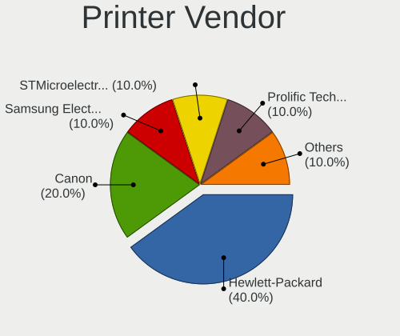

| Vendor              | Notebooks | Percent |
|---------------------|-----------|---------|
| Hewlett-Packard     | 4         | 40%     |
| Canon               | 2         | 20%     |
| STMicroelectronics  | 1         | 10%     |
| Samsung Electronics | 1         | 10%     |
| Prolific Technology | 1         | 10%     |
| Brother Industries  | 1         | 10%     |

Printer Model
-------------

Printer device models

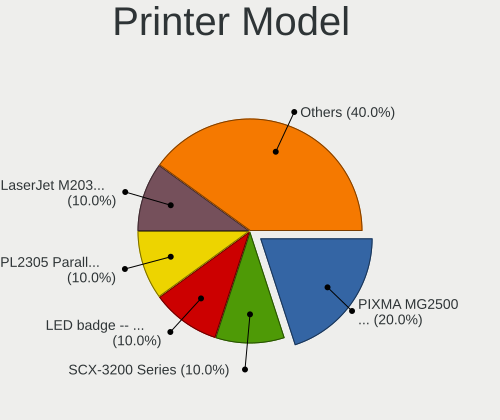

| Model                                                     | Notebooks | Percent |
|-----------------------------------------------------------|-----------|---------|
| Canon PIXMA MG2500 Series                                 | 2         | 20%     |
| STMicroelectronics LED badge -- mini LED display -- 11x44 | 1         | 10%     |
| Samsung SCX-3200 Series                                   | 1         | 10%     |
| Prolific PL2305 Parallel Port                             | 1         | 10%     |
| HP LaserJet M203-M206                                     | 1         | 10%     |
| HP DeskJet F2100 Printer series                           | 1         | 10%     |
| HP DeskJet 3700 series                                    | 1         | 10%     |
| HP DeskJet 2700 series                                    | 1         | 10%     |
| Brother HL-L6200DW series                                 | 1         | 10%     |

Scanner Vendor
--------------

Scanner device vendors

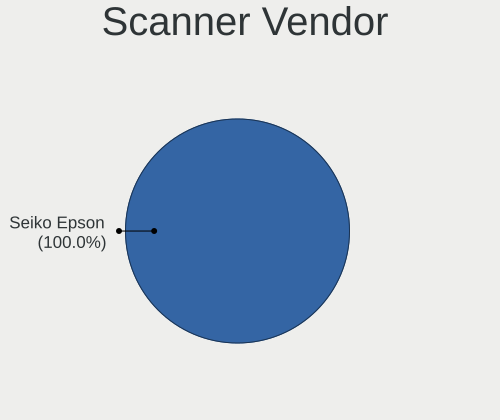

| Vendor      | Notebooks | Percent |
|-------------|-----------|---------|
| Seiko Epson | 1         | 100%    |

Scanner Model
-------------

Scanner device models

| Model                                            | Notebooks | Percent |
|--------------------------------------------------|-----------|---------|
| Seiko Epson GT-X900 [Perfection V700/V750 Photo] | 1         | 100%    |

Camera
------

Camera Vendor
-------------

Camera device vendors

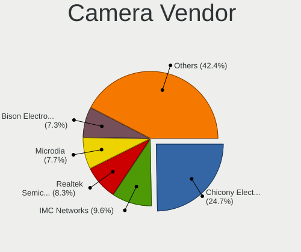

| Vendor                                 | Notebooks | Percent |
|----------------------------------------|-----------|---------|
| Chicony Electronics                    | 397       | 24.7%   |
| IMC Networks                           | 155       | 9.65%   |
| Realtek Semiconductor                  | 133       | 8.28%   |
| Microdia                               | 123       | 7.65%   |
| Bison Electronics                      | 118       | 7.34%   |
| Quanta                                 | 106       | 6.6%    |
| Sunplus Innovation Technology          | 89        | 5.54%   |
| Syntek                                 | 60        | 3.73%   |
| Luxvisions Innotech Limited            | 57        | 3.55%   |
| Cheng Uei Precision Industry (Foxlink) | 55        | 3.42%   |
| Lite-On Technology                     | 46        | 2.86%   |
| Suyin                                  | 44        | 2.74%   |
| Sonix Technology                       | 24        | 1.49%   |
| Apple                                  | 20        | 1.24%   |
| Ricoh                                  | 19        | 1.18%   |
| Silicon Motion                         | 18        | 1.12%   |
| Importek                               | 18        | 1.12%   |
| Alcor Micro                            | 18        | 1.12%   |
| Shinetech                              | 12        | 0.75%   |
| Primax Electronics                     | 8         | 0.5%    |
| Acer                                   | 8         | 0.5%    |
| Logitech                               | 7         | 0.44%   |
| Lenovo                                 | 7         | 0.44%   |
| DigiTech                               | 7         | 0.44%   |
| Z-Star Microelectronics                | 6         | 0.37%   |
| SunplusIT                              | 6         | 0.37%   |
| Samsung Electronics                    | 5         | 0.31%   |
| Shine-optics                           | 4         | 0.25%   |
| Intel                                  | 4         | 0.25%   |
| Framework                              | 4         | 0.25%   |
| Y Media                                | 3         | 0.19%   |
| icSpring                               | 3         | 0.19%   |
| HYGD-220831-A                          | 3         | 0.19%   |
| ALi                                    | 3         | 0.19%   |
| Shenzhen Kingcome Optoelectronic       | 2         | 0.12%   |
| OYT Tech                               | 2         | 0.12%   |
| OmniVision Technologies                | 2         | 0.12%   |
| Unknown                                | 2         | 0.12%   |
| Tripath Technology                     | 1         | 0.06%   |
| Sunplus Technology                     | 1         | 0.06%   |

Camera Model
------------

Camera device models

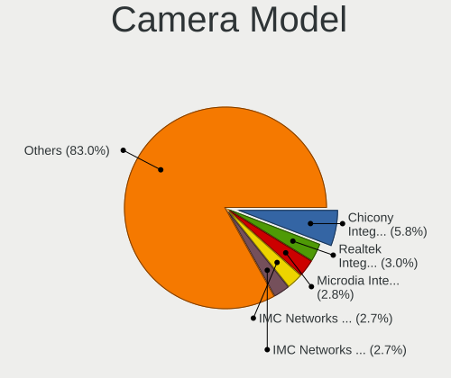

| Model                                               | Notebooks | Percent |
|-----------------------------------------------------|-----------|---------|
| Chicony Integrated Camera                           | 94        | 5.82%   |
| Realtek Integrated_Webcam_HD                        | 48        | 2.97%   |
| Microdia Integrated_Webcam_HD                       | 46        | 2.85%   |
| IMC Networks USB2.0 HD UVC WebCam                   | 43        | 2.66%   |
| IMC Networks Integrated Camera                      | 43        | 2.66%   |
| Syntek Integrated Camera                            | 42        | 2.6%    |
| Bison Integrated Camera                             | 41        | 2.54%   |
| Chicony HD WebCam                                   | 36        | 2.23%   |
| Sunplus Integrated_Webcam_HD                        | 32        | 1.98%   |
| Microdia Integrated Webcam                          | 25        | 1.55%   |
| Luxvisions Innotech Limited HP TrueVision HD Camera | 20        | 1.24%   |
| IMC Networks USB2.0 VGA UVC WebCam                  | 20        | 1.24%   |
| Quanta HD User Facing                               | 19        | 1.18%   |
| Sonix USB2.0 HD UVC WebCam                          | 18        | 1.11%   |
| Lite-On Integrated Camera                           | 16        | 0.99%   |
| Chicony TOSHIBA Web Camera - HD                     | 16        | 0.99%   |
| Chicony Integrated Camera (1280x720@30)             | 16        | 0.99%   |
| Realtek Integrated Webcam HD                        | 14        | 0.87%   |
| Quanta HP TrueVision HD Camera                      | 14        | 0.87%   |
| Chicony HP Truevision HD camera                     | 14        | 0.87%   |
| Sunplus HD WebCam                                   | 13        | 0.8%    |
| Luxvisions Innotech Limited Integrated Camera       | 12        | 0.74%   |
| Bison SunplusIT Integrated Camera                   | 12        | 0.74%   |
| Lite-On HP HD Webcam                                | 11        | 0.68%   |
| Chicony HP Truevision HD                            | 11        | 0.68%   |
| Chicony HD User Facing                              | 11        | 0.68%   |
| Chicony FJ Camera                                   | 11        | 0.68%   |
| Suyin HP Truevision HD                              | 10        | 0.62%   |
| Importek TOSHIBA Web Camera - HD                    | 10        | 0.62%   |
| Chicony HP HD Camera                                | 10        | 0.62%   |
| Bison Lenovo EasyCamera                             | 10        | 0.62%   |
| Realtek Integrated Webcam                           | 9         | 0.56%   |
| Quanta VGA WebCam                                   | 9         | 0.56%   |
| Microdia Integrated Webcam HD                       | 9         | 0.56%   |
| Chicony Lenovo Integrated Camera (0.3MP)            | 9         | 0.56%   |
| Cheng Uei Precision Industry (Foxlink) HP Webcam    | 9         | 0.56%   |
| Syntek Lenovo EasyCamera                            | 8         | 0.5%    |
| Quanta HD WebCam                                    | 8         | 0.5%    |
| Lite-On HP HD Camera                                | 8         | 0.5%    |
| Chicony VGA Webcam                                  | 8         | 0.5%    |

Security
--------

Fingerprint Vendor
------------------

Fingerprint sensor vendors

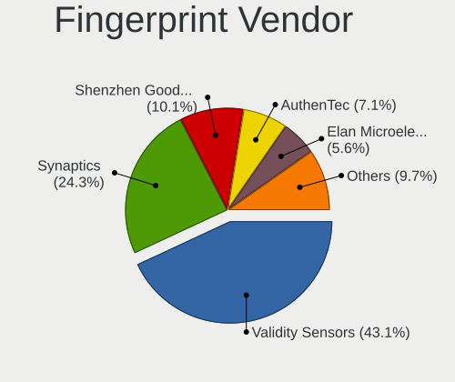

| Vendor                     | Notebooks | Percent |
|----------------------------|-----------|---------|
| Validity Sensors           | 115       | 43.07%  |
| Synaptics                  | 65        | 24.34%  |
| Shenzhen Goodix Technology | 27        | 10.11%  |
| AuthenTec                  | 19        | 7.12%   |
| Elan Microelectronics      | 15        | 5.62%   |
| Upek                       | 11        | 4.12%   |
| LighTuning Technology      | 11        | 4.12%   |
| STMicroelectronics         | 2         | 0.75%   |
| HOLTEK                     | 1         | 0.37%   |
| Focal-systems.Corp         | 1         | 0.37%   |

Fingerprint Model
-----------------

Fingerprint sensor models

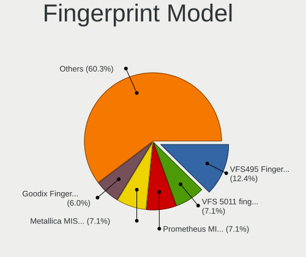

| Model                                                                      | Notebooks | Percent |
|----------------------------------------------------------------------------|-----------|---------|
| Validity Sensors VFS495 Fingerprint Reader                                 | 33        | 12.36%  |
| Validity Sensors VFS 5011 fingerprint sensor                               | 19        | 7.12%   |
| Synaptics Prometheus MIS Touch Fingerprint Reader                          | 19        | 7.12%   |
| Synaptics Metallica MIS Touch Fingerprint Reader                           | 19        | 7.12%   |
| Shenzhen Goodix  FingerPrint Device                                        | 16        | 5.99%   |
| Validity Sensors Synaptics WBDI                                            | 12        | 4.49%   |
| Validity Sensors VFS5011 Fingerprint Reader                                | 11        | 4.12%   |
| Upek Biometric Touchchip/Touchstrip Fingerprint Sensor                     | 11        | 4.12%   |
| Validity Sensors VFS471 Fingerprint Reader                                 | 9         | 3.37%   |
| Synaptics UWP WBDI Device                                                  | 9         | 3.37%   |
| Elan ELAN:ARM-M4                                                           | 8         | 3%      |
| AuthenTec AES2810                                                          | 8         | 3%      |
| Validity Sensors Fingerprint scanner                                       | 7         | 2.62%   |
| Elan ELAN:Fingerprint                                                      | 7         | 2.62%   |
| Validity Sensors Synaptics VFS7552 Touch Fingerprint Sensor with PurePrint | 6         | 2.25%   |
| Shenzhen Goodix FingerPrint                                                | 6         | 2.25%   |
| LighTuning EgisTec Touch Fingerprint Sensor                                | 6         | 2.25%   |
| Validity Sensors VFS7500 Touch Fingerprint Sensor                          | 5         | 1.87%   |
| Validity Sensors VFS491                                                    | 5         | 1.87%   |
| Synaptics FS7604 Touch Fingerprint Sensor with PurePrint                   | 5         | 1.87%   |
| Shenzhen Goodix Fingerprint Reader                                         | 5         | 1.87%   |
| AuthenTec Fingerprint Sensor                                               | 5         | 1.87%   |
| Validity Sensors VFS451 Fingerprint Reader                                 | 4         | 1.5%    |
| Validity Sensors Swipe Fingerprint Sensor                                  | 3         | 1.12%   |
| Synaptics Prometheus Fingerprint Reader                                    | 3         | 1.12%   |
| LighTuning ES603 Swipe Fingerprint Sensor                                  | 3         | 1.12%   |
| AuthenTec AES2501 Fingerprint Sensor                                       | 3         | 1.12%   |
| AuthenTec AES1600                                                          | 3         | 1.12%   |
| Synaptics WBDI Fingerprint Reader USB 086                                  | 2         | 0.75%   |
| Synaptics TouchPad                                                         | 2         | 0.75%   |
| STMicroelectronics Fingerprint Reader                                      | 2         | 0.75%   |
| Validity Sensors VFS7552 Touch Fingerprint Sensor                          | 1         | 0.37%   |
| Synaptics WBDI                                                             | 1         | 0.37%   |
| Synaptics  WBDI                                                            | 1         | 0.37%   |
| Synaptics  FS7604 Touch Fingerprint Sensor with PurePrint                  | 1         | 0.37%   |
| Synaptics Metallica MOH Touch Fingerprint Reader                           | 1         | 0.37%   |
| Synaptics Fingerprint reader [HP G6]                                       | 1         | 0.37%   |
| LighTuning Fingerprint Sensor                                              | 1         | 0.37%   |
| LighTuning Fingerprint Reader                                              | 1         | 0.37%   |
| HOLTEK FocalTech Fingerprint Device                                        | 1         | 0.37%   |

Chipcard Vendor
---------------

Chipcard module vendors

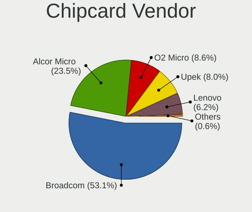

| Vendor           | Notebooks | Percent |
|------------------|-----------|---------|
| Broadcom         | 86        | 53.09%  |
| Alcor Micro      | 38        | 23.46%  |
| O2 Micro         | 14        | 8.64%   |
| Upek             | 13        | 8.02%   |
| Lenovo           | 10        | 6.17%   |
| SCM Microsystems | 1         | 0.62%   |

Chipcard Model
--------------

Chipcard module models

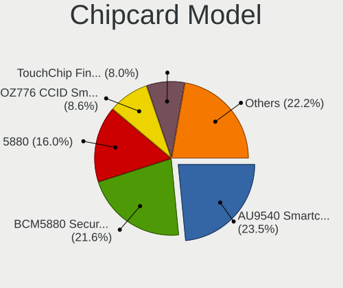

| Model                                                                        | Notebooks | Percent |
|------------------------------------------------------------------------------|-----------|---------|
| Alcor Micro AU9540 Smartcard Reader                                          | 38        | 23.46%  |
| Broadcom BCM5880 Secure Applications Processor                               | 35        | 21.6%   |
| Broadcom 5880                                                                | 26        | 16.05%  |
| O2 Micro OZ776 CCID Smartcard Reader                                         | 14        | 8.64%   |
| Upek TouchChip Fingerprint Coprocessor (WBF advanced mode)                   | 13        | 8.02%   |
| Broadcom BCM5880 Secure Applications Processor with fingerprint swipe sensor | 11        | 6.79%   |
| Lenovo Integrated Smart Card Reader                                          | 10        | 6.17%   |
| Broadcom 58200                                                               | 8         | 4.94%   |
| Broadcom BCM58200 ControlVault 3 (FingerPrint sensor + Contacted SmartCard)  | 6         | 3.7%    |
| SCM Microsystems SCR3340 - ExpressCard54 Smart Card Reader                   | 1         | 0.62%   |

Unsupported
-----------

Unsupported Devices
-------------------

Total unsupported devices on board

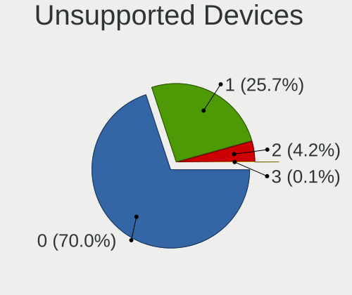

| Total | Notebooks | Percent |
|-------|-----------|---------|
| 0     | 1285      | 69.95%  |
| 1     | 472       | 25.69%  |
| 2     | 78        | 4.25%   |
| 3     | 2         | 0.11%   |

Unsupported Device Types
------------------------

Types of unsupported devices

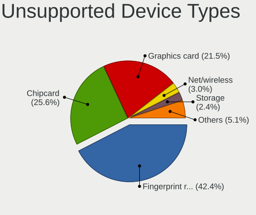

| Type                     | Notebooks | Percent |
|--------------------------|-----------|---------|
| Fingerprint reader       | 267       | 42.45%  |
| Chipcard                 | 161       | 25.6%   |
| Graphics card            | 135       | 21.46%  |
| Net/wireless             | 19        | 3.02%   |
| Storage                  | 15        | 2.38%   |
| Multimedia controller    | 7         | 1.11%   |
| Net/ethernet             | 5         | 0.79%   |
| Card reader              | 5         | 0.79%   |
| Communication controller | 4         | 0.64%   |
| Bluetooth                | 4         | 0.64%   |
| Camera                   | 3         | 0.48%   |
| Sound                    | 2         | 0.32%   |
| Network                  | 1         | 0.16%   |
| Firewire controller      | 1         | 0.16%   |

