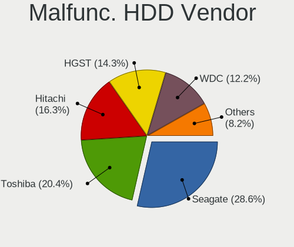
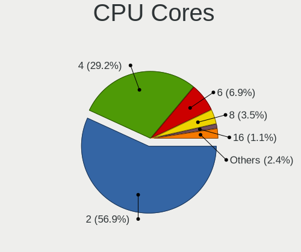

OpenMandriva 24.12 - Tested Hardware & Statistics (Notebooks)
-------------------------------------------------------------

A project to collect tested hardware configurations for OpenMandriva 24.12.

Anyone can contribute to this report by the [hw-probe](https://github.com/linuxhw/hw-probe) tool:

    sudo -E hw-probe -all -upload

Please contribute! Especially if your hardware is rare.

Contents
--------

* [ Test Cases ](#test-cases)

* [ System ](#system)
  - [ Kernel                   ](#kernel)
  - [ Kernel Family            ](#kernel-family)
  - [ Kernel Major Ver.        ](#kernel-major-ver)
  - [ Arch                     ](#arch)
  - [ DE                       ](#de)
  - [ Display Server           ](#display-server)
  - [ Display Manager          ](#display-manager)
  - [ OS Lang                  ](#os-lang)
  - [ Boot Mode                ](#boot-mode)
  - [ Filesystem               ](#filesystem)
  - [ Part. scheme             ](#part-scheme)
  - [ Dual Boot with Linux/BSD ](#dual-boot-with-linuxbsd)
  - [ Dual Boot (Win)          ](#dual-boot-win)

* [ Board ](#board)
  - [ Vendor                   ](#vendor)
  - [ Model                    ](#model)
  - [ Model Family             ](#model-family)
  - [ MFG Year                 ](#mfg-year)
  - [ Form Factor              ](#form-factor)
  - [ Secure Boot              ](#secure-boot)
  - [ Coreboot                 ](#coreboot)
  - [ RAM Size                 ](#ram-size)
  - [ RAM Used                 ](#ram-used)
  - [ Total Drives             ](#total-drives)
  - [ Has CD-ROM               ](#has-cd-rom)
  - [ Has Ethernet             ](#has-ethernet)
  - [ Has WiFi                 ](#has-wifi)
  - [ Has Bluetooth            ](#has-bluetooth)

* [ Location ](#location)
  - [ Country                  ](#country)
  - [ City                     ](#city)

* [ Drives ](#drives)
  - [ Drive Vendor             ](#drive-vendor)
  - [ Drive Model              ](#drive-model)
  - [ HDD Vendor               ](#hdd-vendor)
  - [ SSD Vendor               ](#ssd-vendor)
  - [ Drive Kind               ](#drive-kind)
  - [ Drive Connector          ](#drive-connector)
  - [ Drive Size               ](#drive-size)
  - [ Space Total              ](#space-total)
  - [ Space Used               ](#space-used)
  - [ Malfunc. Drives          ](#malfunc-drives)
  - [ Malfunc. Drive Vendor    ](#malfunc-drive-vendor)
  - [ Malfunc. HDD Vendor      ](#malfunc-hdd-vendor)
  - [ Malfunc. Drive Kind      ](#malfunc-drive-kind)
  - [ Failed Drives            ](#failed-drives)
  - [ Failed Drive Vendor      ](#failed-drive-vendor)
  - [ Drive Status             ](#drive-status)

* [ Storage controller ](#storage-controller)
  - [ Storage Vendor           ](#storage-vendor)
  - [ Storage Model            ](#storage-model)
  - [ Storage Kind             ](#storage-kind)

* [ Processor ](#processor)
  - [ CPU Vendor               ](#cpu-vendor)
  - [ CPU Model                ](#cpu-model)
  - [ CPU Model Family         ](#cpu-model-family)
  - [ CPU Cores                ](#cpu-cores)
  - [ CPU Sockets              ](#cpu-sockets)
  - [ CPU Threads              ](#cpu-threads)
  - [ CPU Op-Modes             ](#cpu-op-modes)
  - [ CPU Microcode            ](#cpu-microcode)
  - [ CPU Microarch            ](#cpu-microarch)

* [ Graphics ](#graphics)
  - [ GPU Vendor               ](#gpu-vendor)
  - [ GPU Model                ](#gpu-model)
  - [ GPU Combo                ](#gpu-combo)
  - [ GPU Driver               ](#gpu-driver)
  - [ GPU Memory               ](#gpu-memory)

* [ Monitor ](#monitor)
  - [ Monitor Vendor           ](#monitor-vendor)
  - [ Monitor Model            ](#monitor-model)
  - [ Monitor Resolution       ](#monitor-resolution)
  - [ Monitor Diagonal         ](#monitor-diagonal)
  - [ Monitor Width            ](#monitor-width)
  - [ Aspect Ratio             ](#aspect-ratio)
  - [ Monitor Area             ](#monitor-area)
  - [ Pixel Density            ](#pixel-density)
  - [ Multiple Monitors        ](#multiple-monitors)

* [ Network ](#network)
  - [ Net Controller Vendor    ](#net-controller-vendor)
  - [ Net Controller Model     ](#net-controller-model)
  - [ Wireless Vendor          ](#wireless-vendor)
  - [ Wireless Model           ](#wireless-model)
  - [ Ethernet Vendor          ](#ethernet-vendor)
  - [ Ethernet Model           ](#ethernet-model)
  - [ Net Controller Kind      ](#net-controller-kind)
  - [ Used Controller          ](#used-controller)
  - [ NICs                     ](#nics)
  - [ IPv6                     ](#ipv6)

* [ Bluetooth ](#bluetooth)
  - [ Bluetooth Vendor         ](#bluetooth-vendor)
  - [ Bluetooth Model          ](#bluetooth-model)

* [ Sound ](#sound)
  - [ Sound Vendor             ](#sound-vendor)
  - [ Sound Model              ](#sound-model)

* [ Memory ](#memory)
  - [ Memory Vendor            ](#memory-vendor)
  - [ Memory Model             ](#memory-model)
  - [ Memory Kind              ](#memory-kind)
  - [ Memory Form Factor       ](#memory-form-factor)
  - [ Memory Size              ](#memory-size)
  - [ Memory Speed             ](#memory-speed)

* [ Printers & scanners ](#printers--scanners)
  - [ Printer Vendor           ](#printer-vendor)
  - [ Printer Model            ](#printer-model)
  - [ Scanner Vendor           ](#scanner-vendor)
  - [ Scanner Model            ](#scanner-model)

* [ Camera ](#camera)
  - [ Camera Vendor            ](#camera-vendor)
  - [ Camera Model             ](#camera-model)

* [ Security ](#security)
  - [ Fingerprint Vendor       ](#fingerprint-vendor)
  - [ Fingerprint Model        ](#fingerprint-model)
  - [ Chipcard Vendor          ](#chipcard-vendor)
  - [ Chipcard Model           ](#chipcard-model)

* [ Unsupported ](#unsupported)
  - [ Unsupported Devices      ](#unsupported-devices)
  - [ Unsupported Device Types ](#unsupported-device-types)

Test Cases
----------

Total: 452

| Vendor        | Model                       | Probe                                                      | Date         |
|---------------|-----------------------------|------------------------------------------------------------|--------------|
| ASUSTek       | ROG Strix G712LV_G712LV     | [98506e2506](https://linux-hardware.org/?probe=98506e2506) | Jan 06, 2025 |
| Acer          | Aspire A515-52G             | [572616a1d9](https://linux-hardware.org/?probe=572616a1d9) | Jan 06, 2025 |
| Lenovo        | ThinkPad P14s Gen 3 21J5... | [f5e1468f62](https://linux-hardware.org/?probe=f5e1468f62) | Jan 06, 2025 |
| HP            | Laptop 15-bw0xx             | [d4de478530](https://linux-hardware.org/?probe=d4de478530) | Jan 06, 2025 |
| Acer          | Aspire E5-572G              | [dca3176d13](https://linux-hardware.org/?probe=dca3176d13) | Jan 06, 2025 |
| ASUSTek       | X51RL                       | [526c93f776](https://linux-hardware.org/?probe=526c93f776) | Jan 06, 2025 |
| Dell          | Latitude E7470              | [448c4c5d6e](https://linux-hardware.org/?probe=448c4c5d6e) | Jan 06, 2025 |
| Lenovo        | IdeaPad MIIX 700-12ISK 8... | [0cf3ed40e6](https://linux-hardware.org/?probe=0cf3ed40e6) | Jan 06, 2025 |
| Lenovo        | V15 G4 IAH 83FS             | [54ea7cdde8](https://linux-hardware.org/?probe=54ea7cdde8) | Jan 06, 2025 |
| Dell          | Latitude 7280               | [58eef8f0dd](https://linux-hardware.org/?probe=58eef8f0dd) | Jan 06, 2025 |
| Acer          | Aspire E1-572               | [e825292593](https://linux-hardware.org/?probe=e825292593) | Jan 06, 2025 |
| Dell          | Inspiron 15-3567            | [c661f75c0f](https://linux-hardware.org/?probe=c661f75c0f) | Jan 05, 2025 |
| HP            | EliteBook 8570w             | [0b6fedb6c2](https://linux-hardware.org/?probe=0b6fedb6c2) | Jan 05, 2025 |
| Dell          | Latitude D630               | [2c3411042a](https://linux-hardware.org/?probe=2c3411042a) | Jan 05, 2025 |
| Dell          | Latitude E4200              | [db5dcaf33b](https://linux-hardware.org/?probe=db5dcaf33b) | Jan 05, 2025 |
| HP            | EliteBook 8460p             | [0a8d680cf0](https://linux-hardware.org/?probe=0a8d680cf0) | Jan 05, 2025 |
| Dell          | Precision M4400             | [6d8da5ac74](https://linux-hardware.org/?probe=6d8da5ac74) | Jan 05, 2025 |
| Panasonic     | CF-NX2AWLCS                 | [e3ead6c710](https://linux-hardware.org/?probe=e3ead6c710) | Jan 05, 2025 |
| HP            | 255 G6 Notebook PC          | [57b6786860](https://linux-hardware.org/?probe=57b6786860) | Jan 04, 2025 |
| HP            | 655                         | [e8728549f4](https://linux-hardware.org/?probe=e8728549f4) | Jan 04, 2025 |
| Lenovo        | V15 G4 IRU 83A1             | [c4a6747552](https://linux-hardware.org/?probe=c4a6747552) | Jan 04, 2025 |
| HP            | 15                          | [d95bba2430](https://linux-hardware.org/?probe=d95bba2430) | Jan 04, 2025 |
| Lenovo        | IdeaPad U450p 3389          | [c01ce6e337](https://linux-hardware.org/?probe=c01ce6e337) | Jan 04, 2025 |
| ASUSTek       | VivoBook E14 E402WAS        | [208b3336eb](https://linux-hardware.org/?probe=208b3336eb) | Jan 04, 2025 |
| MSI           | Summit E13FlipEvo A12MT     | [642730a80d](https://linux-hardware.org/?probe=642730a80d) | Jan 04, 2025 |
| HP            | Laptop 15-fd0xxx            | [dfd9d16913](https://linux-hardware.org/?probe=dfd9d16913) | Jan 03, 2025 |
| Medion        | E11201                      | [141200df83](https://linux-hardware.org/?probe=141200df83) | Jan 03, 2025 |
| ASUSTek       | Q550LF                      | [c587210fdb](https://linux-hardware.org/?probe=c587210fdb) | Jan 03, 2025 |
| Acer          | Extensa 5630                | [1bb020a4af](https://linux-hardware.org/?probe=1bb020a4af) | Jan 03, 2025 |
| Sony          | VPCF236FM                   | [1c0abb00b2](https://linux-hardware.org/?probe=1c0abb00b2) | Jan 03, 2025 |
| Dell          | Latitude D630               | [3b6bae784e](https://linux-hardware.org/?probe=3b6bae784e) | Jan 03, 2025 |
| HP            | 250 G8 Notebook PC          | [d5b66faf28](https://linux-hardware.org/?probe=d5b66faf28) | Jan 02, 2025 |
| Dell          | Latitude E6430              | [860e215daf](https://linux-hardware.org/?probe=860e215daf) | Jan 02, 2025 |
| Lenovo        | ThinkPad L470 20J4000LMD    | [e2fa70f2b4](https://linux-hardware.org/?probe=e2fa70f2b4) | Jan 02, 2025 |
| Lenovo        | IdeaPad 700-15ISK 80RU      | [b26f854f97](https://linux-hardware.org/?probe=b26f854f97) | Jan 02, 2025 |
| Fujitsu       | LIFEBOOK A3510              | [fd4e4972d2](https://linux-hardware.org/?probe=fd4e4972d2) | Jan 02, 2025 |
| Dell          | Inspiron 1545               | [445120281e](https://linux-hardware.org/?probe=445120281e) | Jan 02, 2025 |
| Lenovo        | IdeaPad 3 15IML05 81WB      | [f5cc6f8958](https://linux-hardware.org/?probe=f5cc6f8958) | Jan 02, 2025 |
| Lenovo        | ThinkPad W520 428426U       | [a7aa110e08](https://linux-hardware.org/?probe=a7aa110e08) | Jan 02, 2025 |
| Lenovo        | IdeaPad Pro 5 16IMH9 83D... | [bb4860483d](https://linux-hardware.org/?probe=bb4860483d) | Jan 02, 2025 |
| HP            | OMEN by Laptop              | [319fc5e92e](https://linux-hardware.org/?probe=319fc5e92e) | Jan 02, 2025 |
| Dell          | Inspiron 15-3565            | [27354f28ea](https://linux-hardware.org/?probe=27354f28ea) | Jan 02, 2025 |
| HP            | Pavilion 17                 | [fc1f326456](https://linux-hardware.org/?probe=fc1f326456) | Jan 02, 2025 |
| Lenovo        | ThinkPad X1 Carbon Gen 1... | [ae6fbefd79](https://linux-hardware.org/?probe=ae6fbefd79) | Jan 01, 2025 |
| ASUSTek       | UL80VT                      | [51fb360728](https://linux-hardware.org/?probe=51fb360728) | Jan 01, 2025 |
| HP            | EliteBook 840 G1            | [f298c84729](https://linux-hardware.org/?probe=f298c84729) | Jan 01, 2025 |
| HP            | G72                         | [376d1a0575](https://linux-hardware.org/?probe=376d1a0575) | Jan 01, 2025 |
| Acer          | Aspire 5750                 | [879127efc6](https://linux-hardware.org/?probe=879127efc6) | Jan 01, 2025 |
| Acer          | Aspire 8951G                | [238300d1c0](https://linux-hardware.org/?probe=238300d1c0) | Jan 01, 2025 |
| Dell          | Latitude E5550              | [618acec11b](https://linux-hardware.org/?probe=618acec11b) | Jan 01, 2025 |
| HP            | Laptop 14z-em000            | [0c43124a84](https://linux-hardware.org/?probe=0c43124a84) | Jan 01, 2025 |
| Lenovo        | ThinkPad X1 Carbon 34484... | [3fc4858681](https://linux-hardware.org/?probe=3fc4858681) | Jan 01, 2025 |
| Dell          | Vostro 3558                 | [4f78b23a1f](https://linux-hardware.org/?probe=4f78b23a1f) | Jan 01, 2025 |
| Samsung       | 770Z5E/780Z5E               | [1643aef813](https://linux-hardware.org/?probe=1643aef813) | Jan 01, 2025 |
| HP            | Pavilion Gaming Laptop 1... | [38accd1b79](https://linux-hardware.org/?probe=38accd1b79) | Jan 01, 2025 |
| HP            | Pavilion dv6                | [1c73ddb1c0](https://linux-hardware.org/?probe=1c73ddb1c0) | Jan 01, 2025 |
| Lenovo        | ThinkPad E570 20H5CTO1WW    | [ae328090f7](https://linux-hardware.org/?probe=ae328090f7) | Jan 01, 2025 |
| HP            | ENVY Notebook               | [b6d4605e3e](https://linux-hardware.org/?probe=b6d4605e3e) | Jan 01, 2025 |
| Lenovo        | ThinkPad T430 2349SVA       | [654dbcabab](https://linux-hardware.org/?probe=654dbcabab) | Jan 01, 2025 |
| Dell          | Inspiron 3542               | [95006e65be](https://linux-hardware.org/?probe=95006e65be) | Jan 01, 2025 |
| HP            | Laptop 14z-em000            | [2b45c6c699](https://linux-hardware.org/?probe=2b45c6c699) | Jan 01, 2025 |
| Dell          | Latitude 7390 2-in-1        | [0837722dea](https://linux-hardware.org/?probe=0837722dea) | Jan 01, 2025 |
| Acer          | Aspire 5742                 | [aa9170d15a](https://linux-hardware.org/?probe=aa9170d15a) | Dec 31, 2024 |
| Toshiba       | Satellite P755              | [919f9d689c](https://linux-hardware.org/?probe=919f9d689c) | Dec 31, 2024 |
| Lenovo        | Yoga 2 13 20344             | [1be4064009](https://linux-hardware.org/?probe=1be4064009) | Dec 31, 2024 |
| Samsung       | 300E4A/300E5A/300E7A/343... | [c66eaf3382](https://linux-hardware.org/?probe=c66eaf3382) | Dec 31, 2024 |
| Lenovo        | IdeaPad Slim 1-14AST-05 ... | [0850762b48](https://linux-hardware.org/?probe=0850762b48) | Dec 31, 2024 |
| HP            | ProBook 440 14 inch G9 N... | [2127fd790b](https://linux-hardware.org/?probe=2127fd790b) | Dec 31, 2024 |
| ASUSTek       | X556UR                      | [8550e720af](https://linux-hardware.org/?probe=8550e720af) | Dec 31, 2024 |
| HP            | 250 15.6 inch G10           | [94fdf69690](https://linux-hardware.org/?probe=94fdf69690) | Dec 31, 2024 |
| Dell          | Latitude E7440              | [2d9f729ec1](https://linux-hardware.org/?probe=2d9f729ec1) | Dec 31, 2024 |
| Toshiba       | Satellite P200              | [a07857c808](https://linux-hardware.org/?probe=a07857c808) | Dec 31, 2024 |
| HP            | Pavilion 13                 | [fece21c1ee](https://linux-hardware.org/?probe=fece21c1ee) | Dec 31, 2024 |
| HP            | EliteBook 840 G3            | [f1bc5970f8](https://linux-hardware.org/?probe=f1bc5970f8) | Dec 31, 2024 |
| Lenovo        | Legion Pro 5 16IRX8 82WK    | [b86a475528](https://linux-hardware.org/?probe=b86a475528) | Dec 31, 2024 |
| Dell          | Latitude E6220              | [b93b3b88d1](https://linux-hardware.org/?probe=b93b3b88d1) | Dec 31, 2024 |
| HP            | Laptop 14-cm0xxx            | [045aa245db](https://linux-hardware.org/?probe=045aa245db) | Dec 31, 2024 |
| Acer          | Aspire A315-42              | [734fd13848](https://linux-hardware.org/?probe=734fd13848) | Dec 31, 2024 |
| Google        | Auron_Paine                 | [9603115c16](https://linux-hardware.org/?probe=9603115c16) | Dec 31, 2024 |
| Dell          | Latitude E6420              | [46c2760e4e](https://linux-hardware.org/?probe=46c2760e4e) | Dec 31, 2024 |
| Acer          | Nitro AN517-54              | [8461425ec1](https://linux-hardware.org/?probe=8461425ec1) | Dec 31, 2024 |
| HUAWEI        | BOHK-WAX9X                  | [3b12d86f3d](https://linux-hardware.org/?probe=3b12d86f3d) | Dec 31, 2024 |
| ASUSTek       | X540SA                      | [fffc36417c](https://linux-hardware.org/?probe=fffc36417c) | Dec 31, 2024 |
| Dell          | XPS 13 9350                 | [896eb3972d](https://linux-hardware.org/?probe=896eb3972d) | Dec 31, 2024 |
| Acer          | Aspire ES1-572              | [ab8d0c7c3f](https://linux-hardware.org/?probe=ab8d0c7c3f) | Dec 30, 2024 |
| Lenovo        | Yoga 300-11IBY 80M0         | [63d6d04a10](https://linux-hardware.org/?probe=63d6d04a10) | Dec 30, 2024 |
| Clevo         | W240BL_W250BZ_W270BZQ       | [7da1abb74d](https://linux-hardware.org/?probe=7da1abb74d) | Dec 30, 2024 |
| HP            | ENVY dv6                    | [592cab3725](https://linux-hardware.org/?probe=592cab3725) | Dec 30, 2024 |
| Dell          | Vostro 3420                 | [d5a414f6d5](https://linux-hardware.org/?probe=d5a414f6d5) | Dec 30, 2024 |
| Acer          | Aspire A515-57              | [d2483d4bb8](https://linux-hardware.org/?probe=d2483d4bb8) | Dec 30, 2024 |
| HP            | OMEN by Laptop 15-dc0xxx    | [83d420ab00](https://linux-hardware.org/?probe=83d420ab00) | Dec 30, 2024 |
| Dell          | Latitude 5400               | [b83ec20ffe](https://linux-hardware.org/?probe=b83ec20ffe) | Dec 30, 2024 |
| ASUSTek       | VivoBook_ASUSLaptop X409... | [0831cecc24](https://linux-hardware.org/?probe=0831cecc24) | Dec 30, 2024 |
| ASUSTek       | ASUS TUF Gaming A16 FA61... | [005152678f](https://linux-hardware.org/?probe=005152678f) | Dec 30, 2024 |
| Medion        | Defender P40                | [04ff586114](https://linux-hardware.org/?probe=04ff586114) | Dec 29, 2024 |
| Dell          | XPS 13 9360                 | [4e5b03bfd7](https://linux-hardware.org/?probe=4e5b03bfd7) | Dec 29, 2024 |
| HP            | EliteBook 8730w             | [26e363efb2](https://linux-hardware.org/?probe=26e363efb2) | Dec 29, 2024 |
| Toshiba       | Satellite L755              | [f4e18a27e3](https://linux-hardware.org/?probe=f4e18a27e3) | Dec 29, 2024 |
| ASUSTek       | 1015PN                      | [f84154f736](https://linux-hardware.org/?probe=f84154f736) | Dec 29, 2024 |
| ASUSTek       | VivoBook_ASUSLaptop X712... | [7b7d782202](https://linux-hardware.org/?probe=7b7d782202) | Dec 29, 2024 |
| HP            | EliteBook 840 G5            | [85caa6254a](https://linux-hardware.org/?probe=85caa6254a) | Dec 29, 2024 |
| Lenovo        | ThinkPad T450s 20BWS5F40... | [8bb1dde48e](https://linux-hardware.org/?probe=8bb1dde48e) | Dec 29, 2024 |
| HP            | Notebook                    | [2fe95580ce](https://linux-hardware.org/?probe=2fe95580ce) | Dec 29, 2024 |
| ASUSTek       | VivoBook_ASUSLaptop X515... | [e9aa37cfcd](https://linux-hardware.org/?probe=e9aa37cfcd) | Dec 29, 2024 |
| Lenovo        | ThinkPad T460 20FMS3320G    | [631f081493](https://linux-hardware.org/?probe=631f081493) | Dec 29, 2024 |
| HP            | Notebook                    | [4552d837a0](https://linux-hardware.org/?probe=4552d837a0) | Dec 29, 2024 |
| HP            | Pavilion dv4                | [ad6955799f](https://linux-hardware.org/?probe=ad6955799f) | Dec 29, 2024 |
| Acer          | Aspire 5253                 | [8129d03feb](https://linux-hardware.org/?probe=8129d03feb) | Dec 29, 2024 |
| ASUSTek       | ZenBook UX334FLC_UX334FL    | [648c9b7e5f](https://linux-hardware.org/?probe=648c9b7e5f) | Dec 28, 2024 |
| Samsung       | 950XDB/951XDB/950XDY        | [7d22efb355](https://linux-hardware.org/?probe=7d22efb355) | Dec 28, 2024 |
| Lenovo        | B590 20206                  | [f46c163012](https://linux-hardware.org/?probe=f46c163012) | Dec 28, 2024 |
| Acer          | Aspire A315-58              | [895a738e00](https://linux-hardware.org/?probe=895a738e00) | Dec 28, 2024 |
| Toshiba       | TECRA A10                   | [49714d63c9](https://linux-hardware.org/?probe=49714d63c9) | Dec 28, 2024 |
| Dell          | Latitude E5470              | [e7d5673567](https://linux-hardware.org/?probe=e7d5673567) | Dec 28, 2024 |
| Dell          | Latitude E7440              | [53d89b9e96](https://linux-hardware.org/?probe=53d89b9e96) | Dec 28, 2024 |
| ASUSTek       | K53U                        | [aa0acbd3a4](https://linux-hardware.org/?probe=aa0acbd3a4) | Dec 28, 2024 |
| Dell          | Inspiron 11 - 3147          | [f0df887cfb](https://linux-hardware.org/?probe=f0df887cfb) | Dec 28, 2024 |
| ASUSTek       | ROG Zephyrus G14 GA401IV... | [e2f614b096](https://linux-hardware.org/?probe=e2f614b096) | Dec 28, 2024 |
| HP            | EliteBook 845 14 inch G1... | [60ab24f653](https://linux-hardware.org/?probe=60ab24f653) | Dec 28, 2024 |
| HP            | Laptop 17-by3xxx            | [798564ee8d](https://linux-hardware.org/?probe=798564ee8d) | Dec 28, 2024 |
| ASUSTek       | X550VL                      | [f39f501a7f](https://linux-hardware.org/?probe=f39f501a7f) | Dec 28, 2024 |
| Lenovo        | ThinkPad T470 W10DG 20JM... | [a84d2e6201](https://linux-hardware.org/?probe=a84d2e6201) | Dec 27, 2024 |
| Dell          | System Inspiron N7110       | [2607b61b02](https://linux-hardware.org/?probe=2607b61b02) | Dec 27, 2024 |
| Lenovo        | ThinkPad E480 20KNA04RCD    | [d64710669e](https://linux-hardware.org/?probe=d64710669e) | Dec 27, 2024 |
| Dell          | Latitude 7490               | [73b59f6e09](https://linux-hardware.org/?probe=73b59f6e09) | Dec 27, 2024 |
| Fujitsu Si... | ESPRIMO Mobile U9210        | [67cd7236db](https://linux-hardware.org/?probe=67cd7236db) | Dec 27, 2024 |
| Dell          | Inspiron 5558               | [370f0c48c3](https://linux-hardware.org/?probe=370f0c48c3) | Dec 27, 2024 |
| ASUSTek       | X502CA                      | [6b816ff7ef](https://linux-hardware.org/?probe=6b816ff7ef) | Dec 27, 2024 |
| Lenovo        | ThinkPad X250 20CLA32VLM    | [c62f3b52e2](https://linux-hardware.org/?probe=c62f3b52e2) | Dec 27, 2024 |
| Dell          | Inspiron 11 - 3147          | [4ecd9dfdf5](https://linux-hardware.org/?probe=4ecd9dfdf5) | Dec 27, 2024 |
| Dell          | Latitude E5570              | [114a071bc2](https://linux-hardware.org/?probe=114a071bc2) | Dec 27, 2024 |
| Lenovo        | IdeaPad 3 15ITL6 82H8       | [0001b3f45a](https://linux-hardware.org/?probe=0001b3f45a) | Dec 26, 2024 |
| ASUSTek       | VivoBook_ASUSLaptop X521... | [b007439528](https://linux-hardware.org/?probe=b007439528) | Dec 26, 2024 |
| HP            | ProBook 650 G1              | [2e0d9756fe](https://linux-hardware.org/?probe=2e0d9756fe) | Dec 26, 2024 |
| eMachines     | eME732                      | [7f36d968e4](https://linux-hardware.org/?probe=7f36d968e4) | Dec 26, 2024 |
| MSI           | GF63 Thin 10SCSR            | [9d5e0b2b95](https://linux-hardware.org/?probe=9d5e0b2b95) | Dec 26, 2024 |
| Dell          | XPS 13 9370                 | [9d85ecae19](https://linux-hardware.org/?probe=9d85ecae19) | Dec 26, 2024 |
| HP            | Pavilion Gaming Laptop 1... | [d811ae85fd](https://linux-hardware.org/?probe=d811ae85fd) | Dec 26, 2024 |
| Dell          | Latitude E5430 non-vPro     | [4e9074a386](https://linux-hardware.org/?probe=4e9074a386) | Dec 26, 2024 |
| HP            | Laptop 14-bs0xx             | [90ddb2c764](https://linux-hardware.org/?probe=90ddb2c764) | Dec 26, 2024 |
| Dell          | Latitude E5470              | [3af687bbee](https://linux-hardware.org/?probe=3af687bbee) | Dec 26, 2024 |
| Dell          | Inspiron 5490               | [b8810650b5](https://linux-hardware.org/?probe=b8810650b5) | Dec 26, 2024 |
| Lenovo        | ThinkPad P14s Gen 1 20S5... | [e5bf005a5f](https://linux-hardware.org/?probe=e5bf005a5f) | Dec 26, 2024 |
| Notebook      | W65_W67RZ                   | [fc8f4a29f7](https://linux-hardware.org/?probe=fc8f4a29f7) | Dec 26, 2024 |
| HP            | Laptop 15-fd0xxx            | [1ed7f7ef48](https://linux-hardware.org/?probe=1ed7f7ef48) | Dec 26, 2024 |
| MSI           | Katana A17 AI B8VE          | [06e816e082](https://linux-hardware.org/?probe=06e816e082) | Dec 26, 2024 |
| Acer          | Aspire V3-571G              | [1c7d970f58](https://linux-hardware.org/?probe=1c7d970f58) | Dec 26, 2024 |
| ASUSTek       | K72Jr                       | [1d7e1a872d](https://linux-hardware.org/?probe=1d7e1a872d) | Dec 25, 2024 |
| ASUSTek       | K53E                        | [2f5c8c3fcf](https://linux-hardware.org/?probe=2f5c8c3fcf) | Dec 25, 2024 |
| HP            | Notebook                    | [7d69f1f608](https://linux-hardware.org/?probe=7d69f1f608) | Dec 25, 2024 |
| Lenovo        | ThinkPad X260 20F5S69F00    | [3dfbada1cc](https://linux-hardware.org/?probe=3dfbada1cc) | Dec 25, 2024 |
| HP            | Laptop 15-bs0xx             | [00e8b8cb17](https://linux-hardware.org/?probe=00e8b8cb17) | Dec 25, 2024 |
| Dell          | Vostro V13                  | [6d6b58cad3](https://linux-hardware.org/?probe=6d6b58cad3) | Dec 25, 2024 |
| HP            | Pavilion dv5                | [010343cf1d](https://linux-hardware.org/?probe=010343cf1d) | Dec 25, 2024 |
| Toshiba       | Satellite C75D-B            | [95c164fdf5](https://linux-hardware.org/?probe=95c164fdf5) | Dec 25, 2024 |
| Acer          | Aspire A315-41              | [fe6c49574a](https://linux-hardware.org/?probe=fe6c49574a) | Dec 24, 2024 |
| Lenovo        | ThinkPad X1 Carbon 34604... | [ee6dc942c0](https://linux-hardware.org/?probe=ee6dc942c0) | Dec 24, 2024 |
| Lenovo        | ThinkPad E14 Gen 2 20T60... | [f6852cbdbb](https://linux-hardware.org/?probe=f6852cbdbb) | Dec 24, 2024 |
| Lenovo        | ThinkPad L460 20FVS2LC00    | [0ad5ec9e46](https://linux-hardware.org/?probe=0ad5ec9e46) | Dec 24, 2024 |
| HP            | 15 TouchSmart               | [7e6d4c4c49](https://linux-hardware.org/?probe=7e6d4c4c49) | Dec 24, 2024 |
| Samsung       | R530/R730/P530              | [88983f374b](https://linux-hardware.org/?probe=88983f374b) | Dec 24, 2024 |
| Toshiba       | Satellite C55-A             | [019825dc9f](https://linux-hardware.org/?probe=019825dc9f) | Dec 24, 2024 |
| Lenovo        | ThinkPad E460 20ETS00900    | [b4c09901bb](https://linux-hardware.org/?probe=b4c09901bb) | Dec 24, 2024 |
| HP            | EliteBook 755 G5            | [307803b17e](https://linux-hardware.org/?probe=307803b17e) | Dec 24, 2024 |
| Sony          | VGN-CR220E                  | [4611a18823](https://linux-hardware.org/?probe=4611a18823) | Dec 24, 2024 |
| HP            | EliteBook 840 G6            | [b2c0345c76](https://linux-hardware.org/?probe=b2c0345c76) | Dec 24, 2024 |
| HP            | 2000                        | [178dbdf355](https://linux-hardware.org/?probe=178dbdf355) | Dec 24, 2024 |
| Dell          | Latitude E5530 non-vPro     | [1a50b8a0aa](https://linux-hardware.org/?probe=1a50b8a0aa) | Dec 24, 2024 |
| ASUSTek       | 1225B                       | [20e4fd20fa](https://linux-hardware.org/?probe=20e4fd20fa) | Dec 23, 2024 |
| Toshiba       | Satellite L355D             | [160f61f926](https://linux-hardware.org/?probe=160f61f926) | Dec 23, 2024 |
| ASUSTek       | K55DR                       | [52c3ba1b47](https://linux-hardware.org/?probe=52c3ba1b47) | Dec 23, 2024 |
| Acer          | Aspire V5-431P              | [c0f17443e2](https://linux-hardware.org/?probe=c0f17443e2) | Dec 23, 2024 |
| Dell          | Inspiron 3583               | [a9b3136b10](https://linux-hardware.org/?probe=a9b3136b10) | Dec 23, 2024 |
| Dell          | Inspiron 1720               | [d74511fc9f](https://linux-hardware.org/?probe=d74511fc9f) | Dec 23, 2024 |
| ASUSTek       | X55VD                       | [eb1866b0f2](https://linux-hardware.org/?probe=eb1866b0f2) | Dec 23, 2024 |
| Alienware     | M14xR2                      | [537e21183e](https://linux-hardware.org/?probe=537e21183e) | Dec 23, 2024 |
| Dell          | Precision 7750              | [f7d88f943d](https://linux-hardware.org/?probe=f7d88f943d) | Dec 22, 2024 |
| Notebook      | W65_W67RB                   | [0475d664f0](https://linux-hardware.org/?probe=0475d664f0) | Dec 22, 2024 |
| Dell          | Latitude E6430              | [2bcde0809c](https://linux-hardware.org/?probe=2bcde0809c) | Dec 22, 2024 |
| Google        | Gnawty                      | [a2b1775af7](https://linux-hardware.org/?probe=a2b1775af7) | Dec 22, 2024 |
| Samsung       | P480                        | [20507489a2](https://linux-hardware.org/?probe=20507489a2) | Dec 22, 2024 |
| Digibras      | NH4CU53                     | [d9869c203b](https://linux-hardware.org/?probe=d9869c203b) | Dec 22, 2024 |
| HP            | EliteBook 830 G6            | [1377412970](https://linux-hardware.org/?probe=1377412970) | Dec 22, 2024 |
| HP            | Laptop 15s-eq0xxx           | [abde21108d](https://linux-hardware.org/?probe=abde21108d) | Dec 22, 2024 |
| Acer          | Aspire A515-51G             | [6d732c3b4d](https://linux-hardware.org/?probe=6d732c3b4d) | Dec 22, 2024 |
| Toshiba       | Satellite L855              | [7e9c1e43c5](https://linux-hardware.org/?probe=7e9c1e43c5) | Dec 22, 2024 |
| Lenovo        | IdeaPad 3 15ITL6 82H8       | [60574fca06](https://linux-hardware.org/?probe=60574fca06) | Dec 22, 2024 |
| Lenovo        | ThinkPad E15 Gen 3 20YG0... | [32f125d899](https://linux-hardware.org/?probe=32f125d899) | Dec 22, 2024 |
| NEC Comput... | PC-VK15EBZCG                | [cda3177d46](https://linux-hardware.org/?probe=cda3177d46) | Dec 22, 2024 |
| ASUSTek       | VivoBook_ASUSLaptop X513... | [0ade3a3f94](https://linux-hardware.org/?probe=0ade3a3f94) | Dec 22, 2024 |
| MSI           | Alpha 17 C7VF               | [dc79106cf5](https://linux-hardware.org/?probe=dc79106cf5) | Dec 22, 2024 |
| HP            | G42                         | [3ce0d8feac](https://linux-hardware.org/?probe=3ce0d8feac) | Dec 22, 2024 |
| Dell          | Latitude E6500              | [16d283695d](https://linux-hardware.org/?probe=16d283695d) | Dec 22, 2024 |
| ASUSTek       | ASUS EXPERTBOOK P1512CEA... | [50c7d7cd7d](https://linux-hardware.org/?probe=50c7d7cd7d) | Dec 22, 2024 |
| Acer          | Predator PH315-51           | [0cce8338d7](https://linux-hardware.org/?probe=0cce8338d7) | Dec 22, 2024 |
| ASUSTek       | ASUS Zenbook 14 UX3405MA... | [40536b7105](https://linux-hardware.org/?probe=40536b7105) | Dec 22, 2024 |
| Dell          | Latitude E6430              | [e4c5d9fdb7](https://linux-hardware.org/?probe=e4c5d9fdb7) | Dec 22, 2024 |
| Framework     | Laptop 16 (AMD Ryzen 704... | [191b32e3f0](https://linux-hardware.org/?probe=191b32e3f0) | Dec 22, 2024 |
| HP            | Notebook                    | [b72d574e31](https://linux-hardware.org/?probe=b72d574e31) | Dec 22, 2024 |
| ASUSTek       | X550CC                      | [e00f7a5c68](https://linux-hardware.org/?probe=e00f7a5c68) | Dec 22, 2024 |
| HP            | Pavilion dv6                | [2ebb2925a2](https://linux-hardware.org/?probe=2ebb2925a2) | Dec 22, 2024 |
| ASUSTek       | N53SV                       | [98a9a66c57](https://linux-hardware.org/?probe=98a9a66c57) | Dec 21, 2024 |
| HP            | Pavilion g6                 | [32463a80cb](https://linux-hardware.org/?probe=32463a80cb) | Dec 21, 2024 |
| AZW           | GTi                         | [01e6c282da](https://linux-hardware.org/?probe=01e6c282da) | Dec 21, 2024 |
| Dell          | System Vostro 3750          | [f765051029](https://linux-hardware.org/?probe=f765051029) | Dec 21, 2024 |
| MSI           | GP73 Leopard 8RE            | [57edeb7f2e](https://linux-hardware.org/?probe=57edeb7f2e) | Dec 21, 2024 |
| HP            | Notebook                    | [9de5ad9f3e](https://linux-hardware.org/?probe=9de5ad9f3e) | Dec 21, 2024 |
| Lenovo        | ThinkPad T480 20L5004HUS    | [1bb60067dd](https://linux-hardware.org/?probe=1bb60067dd) | Dec 21, 2024 |
| Dell          | Precision 7540              | [8ec149c474](https://linux-hardware.org/?probe=8ec149c474) | Dec 21, 2024 |
| HP            | Notebook                    | [0e1d6a3365](https://linux-hardware.org/?probe=0e1d6a3365) | Dec 21, 2024 |
| Lenovo        | G565 20071                  | [693717f620](https://linux-hardware.org/?probe=693717f620) | Dec 21, 2024 |
| Dell          | Inspiron 11 - 3148          | [d83af261a5](https://linux-hardware.org/?probe=d83af261a5) | Dec 21, 2024 |
| Lenovo        | G550 20023                  | [ae390615a1](https://linux-hardware.org/?probe=ae390615a1) | Dec 21, 2024 |
| TUXEDO        | Aura 15 Gen1                | [c4af5fafe4](https://linux-hardware.org/?probe=c4af5fafe4) | Dec 21, 2024 |
| Dell          | Latitude E6430              | [7715633f8e](https://linux-hardware.org/?probe=7715633f8e) | Dec 21, 2024 |
| Gateway       | NE572                       | [2d716e759d](https://linux-hardware.org/?probe=2d716e759d) | Dec 21, 2024 |
| NEC Comput... | PC-VJ22MAN5HJR9             | [7b6a88a981](https://linux-hardware.org/?probe=7b6a88a981) | Dec 21, 2024 |
| HP            | Pavilion dv5                | [b5631c4228](https://linux-hardware.org/?probe=b5631c4228) | Dec 21, 2024 |
| Dell          | Latitude E7270              | [167298428e](https://linux-hardware.org/?probe=167298428e) | Dec 20, 2024 |
| HP            | 650                         | [9e305ba57b](https://linux-hardware.org/?probe=9e305ba57b) | Dec 20, 2024 |
| Dell          | Inspiron 1545               | [f54dbdec4a](https://linux-hardware.org/?probe=f54dbdec4a) | Dec 20, 2024 |
| ASUSTek       | ASUS EXPERTBOOK B1502CVA... | [6107bb3e8d](https://linux-hardware.org/?probe=6107bb3e8d) | Dec 20, 2024 |
| Dell          | Latitude 7490               | [728f260a77](https://linux-hardware.org/?probe=728f260a77) | Dec 20, 2024 |
| HP            | ZBook 15 G2                 | [ccdf904498](https://linux-hardware.org/?probe=ccdf904498) | Dec 20, 2024 |
| Lenovo        | ThinkPad L430 2466AE4       | [16fb7548fb](https://linux-hardware.org/?probe=16fb7548fb) | Dec 20, 2024 |
| HP            | Stream Laptop 14-cb0XX      | [be162cfbe0](https://linux-hardware.org/?probe=be162cfbe0) | Dec 20, 2024 |
| Lenovo        | V15-IIL 82C5                | [3200caab14](https://linux-hardware.org/?probe=3200caab14) | Dec 20, 2024 |
| HP            | EliteBook 840 G3            | [9922fa7e34](https://linux-hardware.org/?probe=9922fa7e34) | Dec 20, 2024 |
| MSI           | Modern 14 C7M               | [b6144f4789](https://linux-hardware.org/?probe=b6144f4789) | Dec 20, 2024 |
| Dell          | Latitude E5440              | [f75e103bdb](https://linux-hardware.org/?probe=f75e103bdb) | Dec 20, 2024 |
| Dell          | Precision 5570              | [225e1aeb1a](https://linux-hardware.org/?probe=225e1aeb1a) | Dec 20, 2024 |
| HUAWEI        | MateBook D                  | [46903b393f](https://linux-hardware.org/?probe=46903b393f) | Dec 20, 2024 |
| ASUSTek       | N61Vn                       | [47db61a704](https://linux-hardware.org/?probe=47db61a704) | Dec 20, 2024 |
| Lenovo        | IdeaPad Z580                | [85ca1549f4](https://linux-hardware.org/?probe=85ca1549f4) | Dec 20, 2024 |
| Acer          | Aspire AG14-31P             | [08d3fd4cb9](https://linux-hardware.org/?probe=08d3fd4cb9) | Dec 20, 2024 |
| Dell          | Inspiron 15 3520            | [8361014504](https://linux-hardware.org/?probe=8361014504) | Dec 20, 2024 |
| Dell          | Inspiron 5559               | [6946e661db](https://linux-hardware.org/?probe=6946e661db) | Dec 20, 2024 |
| HP            | Laptop 17-ak0xx             | [e6bf8e1152](https://linux-hardware.org/?probe=e6bf8e1152) | Dec 20, 2024 |
| Acer          | Aspire ES1-711              | [00924d508c](https://linux-hardware.org/?probe=00924d508c) | Dec 20, 2024 |
| HP            | Laptop 14q-cs0xxx           | [f9fc2fe784](https://linux-hardware.org/?probe=f9fc2fe784) | Dec 20, 2024 |
| Lenovo        | ThinkPad T560 20FH001RUS    | [dbc1f4abf5](https://linux-hardware.org/?probe=dbc1f4abf5) | Dec 20, 2024 |
| Acer          | Aspire E5-573               | [60efdab781](https://linux-hardware.org/?probe=60efdab781) | Dec 20, 2024 |
| Acer          | Aspire 5750                 | [e61236d343](https://linux-hardware.org/?probe=e61236d343) | Dec 20, 2024 |
| Dell          | Inspiron 1520               | [19aa8fdc9f](https://linux-hardware.org/?probe=19aa8fdc9f) | Dec 20, 2024 |
| HP            | ENVY dv7                    | [7995cb57bf](https://linux-hardware.org/?probe=7995cb57bf) | Dec 20, 2024 |
| ASUSTek       | ASUS TUF Gaming F17 FX70... | [7b099519b9](https://linux-hardware.org/?probe=7b099519b9) | Dec 20, 2024 |
| ASUSTek       | TP300LAB                    | [4c0a5e121b](https://linux-hardware.org/?probe=4c0a5e121b) | Dec 20, 2024 |
| Dell          | Latitude E7250              | [4250582bf8](https://linux-hardware.org/?probe=4250582bf8) | Dec 20, 2024 |
| HP            | Laptop 14-bs0xx             | [ba1d6aa1a1](https://linux-hardware.org/?probe=ba1d6aa1a1) | Dec 19, 2024 |
| HP            | Notebook                    | [ea14f20a1f](https://linux-hardware.org/?probe=ea14f20a1f) | Dec 19, 2024 |
| HP            | Pavilion g7                 | [ba44d0e580](https://linux-hardware.org/?probe=ba44d0e580) | Dec 19, 2024 |
| Dell          | System XPS L502X            | [c729b6579d](https://linux-hardware.org/?probe=c729b6579d) | Dec 19, 2024 |
| Toshiba       | Satellite C55Dt-A           | [0b8db124ef](https://linux-hardware.org/?probe=0b8db124ef) | Dec 19, 2024 |
| ASUSTek       | K53E                        | [c79dc7f0ab](https://linux-hardware.org/?probe=c79dc7f0ab) | Dec 19, 2024 |
| Lenovo        | ThinkPad T450 20BV000AUS    | [89ab59450d](https://linux-hardware.org/?probe=89ab59450d) | Dec 19, 2024 |
| Dell          | Latitude 3380               | [ae503db75c](https://linux-hardware.org/?probe=ae503db75c) | Dec 19, 2024 |
| Dell          | Precision M4300             | [6ca0ff6f70](https://linux-hardware.org/?probe=6ca0ff6f70) | Dec 19, 2024 |
| HP            | Pavilion 17                 | [4afca04089](https://linux-hardware.org/?probe=4afca04089) | Dec 19, 2024 |
| Acer          | Aspire A515-51G             | [283f579ff7](https://linux-hardware.org/?probe=283f579ff7) | Dec 19, 2024 |
| Dell          | Precision 7520              | [36ee219c52](https://linux-hardware.org/?probe=36ee219c52) | Dec 19, 2024 |
| Lenovo        | ThinkBook 13s G3 ACN 20Y... | [06253e3ba7](https://linux-hardware.org/?probe=06253e3ba7) | Dec 19, 2024 |
| Acer          | TravelMate B117-M           | [3c94b53aed](https://linux-hardware.org/?probe=3c94b53aed) | Dec 19, 2024 |
| Dell          | Latitude E5440              | [5adb2abeb6](https://linux-hardware.org/?probe=5adb2abeb6) | Dec 19, 2024 |
| HP            | EliteBook 840 G3            | [508484c781](https://linux-hardware.org/?probe=508484c781) | Dec 19, 2024 |
| GPD           | G1621-02                    | [97b2f3034e](https://linux-hardware.org/?probe=97b2f3034e) | Dec 19, 2024 |
| HP            | Laptop 15t-dy200            | [56865ed9f2](https://linux-hardware.org/?probe=56865ed9f2) | Dec 19, 2024 |
| ASUSTek       | ASUS TUF Gaming F15 FX50... | [3fcda10f19](https://linux-hardware.org/?probe=3fcda10f19) | Dec 19, 2024 |
| Dell          | Latitude E6540              | [4198198679](https://linux-hardware.org/?probe=4198198679) | Dec 19, 2024 |
| ASUSTek       | K55A                        | [5a4a07f120](https://linux-hardware.org/?probe=5a4a07f120) | Dec 19, 2024 |
| Framework     | Laptop 13 (AMD Ryzen 704... | [5235c9dc6c](https://linux-hardware.org/?probe=5235c9dc6c) | Dec 19, 2024 |
| Dell          | XPS 13 9360                 | [99fbc60562](https://linux-hardware.org/?probe=99fbc60562) | Dec 19, 2024 |
| Google        | Marasov                     | [a52f3bb62d](https://linux-hardware.org/?probe=a52f3bb62d) | Dec 18, 2024 |
| Toshiba       | Satellite C55t-A            | [9d4441fe74](https://linux-hardware.org/?probe=9d4441fe74) | Dec 18, 2024 |
| Toshiba       | Satellite C650              | [ecf24b9aeb](https://linux-hardware.org/?probe=ecf24b9aeb) | Dec 18, 2024 |
| Lenovo        | Y520-15IKBN 80WK            | [e21a2d89c6](https://linux-hardware.org/?probe=e21a2d89c6) | Dec 18, 2024 |
| HP            | Pavilion dv6700             | [6c3d7e52e4](https://linux-hardware.org/?probe=6c3d7e52e4) | Dec 18, 2024 |
| Lenovo        | ThinkPad T420 4180F64       | [278931ef6a](https://linux-hardware.org/?probe=278931ef6a) | Dec 18, 2024 |
| Lenovo        | ThinkPad X230 2324DL5       | [155f2f1e8f](https://linux-hardware.org/?probe=155f2f1e8f) | Dec 18, 2024 |
| Dell          | XPS 11 9P33                 | [ef92bd82b7](https://linux-hardware.org/?probe=ef92bd82b7) | Dec 18, 2024 |
| Lenovo        | ThinkBook 15 G2 ITL 20VE    | [5577ce8b2a](https://linux-hardware.org/?probe=5577ce8b2a) | Dec 18, 2024 |
| Lenovo        | ThinkPad T530 2429MY2       | [a6494642a3](https://linux-hardware.org/?probe=a6494642a3) | Dec 18, 2024 |
| Acer          | Aspire E5-772               | [14088b3895](https://linux-hardware.org/?probe=14088b3895) | Dec 18, 2024 |
| HP            | Laptop 14-dq2xxx            | [a95f375557](https://linux-hardware.org/?probe=a95f375557) | Dec 18, 2024 |
| Lenovo        | ThinkPad A485 20RUTOEIIT    | [dc1b85e281](https://linux-hardware.org/?probe=dc1b85e281) | Dec 18, 2024 |
| Lenovo        | ThinkPad X121e 3045CTO      | [ec4cf64022](https://linux-hardware.org/?probe=ec4cf64022) | Dec 18, 2024 |
| AWOW          | Unknown                     | [f73fb0b0a2](https://linux-hardware.org/?probe=f73fb0b0a2) | Dec 18, 2024 |
| HP            | ProBook 4330s               | [e113fb9fd9](https://linux-hardware.org/?probe=e113fb9fd9) | Dec 18, 2024 |
| Lenovo        | ThinkPad T420s 417153U      | [3f6beb439c](https://linux-hardware.org/?probe=3f6beb439c) | Dec 18, 2024 |
| Lenovo        | IdeaPad 1 15IAU7 82QD       | [92fba1b3db](https://linux-hardware.org/?probe=92fba1b3db) | Dec 18, 2024 |
| HP            | EliteBook 8440p             | [7ddc005656](https://linux-hardware.org/?probe=7ddc005656) | Dec 18, 2024 |
| Lenovo        | IdeaPad 3 15IML05 82BS      | [b55322dd58](https://linux-hardware.org/?probe=b55322dd58) | Dec 18, 2024 |
| HP            | Laptop 17-by4xxx            | [acb7deece7](https://linux-hardware.org/?probe=acb7deece7) | Dec 18, 2024 |
| ASUSTek       | UX305FA                     | [cbe75c3d89](https://linux-hardware.org/?probe=cbe75c3d89) | Dec 18, 2024 |
| Toshiba       | Satellite L755              | [68d6a54c80](https://linux-hardware.org/?probe=68d6a54c80) | Dec 18, 2024 |
| HP            | Victus by Gaming Laptop ... | [5506c5ed41](https://linux-hardware.org/?probe=5506c5ed41) | Dec 18, 2024 |
| HP            | Notebook                    | [17804122c5](https://linux-hardware.org/?probe=17804122c5) | Dec 18, 2024 |
| HP            | Presario CQ56               | [aceb2056cb](https://linux-hardware.org/?probe=aceb2056cb) | Dec 18, 2024 |
| Dell          | Latitude 5400               | [3ad4d847a7](https://linux-hardware.org/?probe=3ad4d847a7) | Dec 18, 2024 |
| Dell          | Latitude 7400               | [ed35bf7fb4](https://linux-hardware.org/?probe=ed35bf7fb4) | Dec 18, 2024 |
| HP            | Laptop 14-cf2xxx            | [43b4119b2c](https://linux-hardware.org/?probe=43b4119b2c) | Dec 17, 2024 |
| Acer          | Nitro AN517-54              | [2a5849148d](https://linux-hardware.org/?probe=2a5849148d) | Dec 17, 2024 |
| Dell          | Inspiron 15 5510            | [2ec814c4a6](https://linux-hardware.org/?probe=2ec814c4a6) | Dec 17, 2024 |
| Lenovo        | ThinkPad X250 20CLA2GEIG    | [e29cc227ae](https://linux-hardware.org/?probe=e29cc227ae) | Dec 17, 2024 |
| Lenovo        | IdeaPad S145-15IWL 81S9     | [c3141e65eb](https://linux-hardware.org/?probe=c3141e65eb) | Dec 17, 2024 |
| Dell          | Inspiron N5050              | [f1b8ad0d87](https://linux-hardware.org/?probe=f1b8ad0d87) | Dec 17, 2024 |
| Acer          | Aspire A114-31              | [e0c8e5e63e](https://linux-hardware.org/?probe=e0c8e5e63e) | Dec 17, 2024 |
| Dell          | Inspiron 13-5378            | [47282d0230](https://linux-hardware.org/?probe=47282d0230) | Dec 17, 2024 |
| Toshiba       | Satellite C850              | [38ed2a4b9e](https://linux-hardware.org/?probe=38ed2a4b9e) | Dec 17, 2024 |
| Lenovo        | ThinkPad T440p 20AWS2LW0... | [3464a40343](https://linux-hardware.org/?probe=3464a40343) | Dec 16, 2024 |
| Lenovo        | IdeaPad 320-15ABR 80XS      | [2c9b4ffff9](https://linux-hardware.org/?probe=2c9b4ffff9) | Dec 16, 2024 |
| ASUSTek       | Vivobook Go E1504FA_E150... | [ebc832d177](https://linux-hardware.org/?probe=ebc832d177) | Dec 16, 2024 |
| HP            | Pavilion dv6                | [c6677142e4](https://linux-hardware.org/?probe=c6677142e4) | Dec 16, 2024 |
| Lenovo        | ThinkPad X1 Carbon 5th 2... | [c62449864b](https://linux-hardware.org/?probe=c62449864b) | Dec 16, 2024 |
| Dell          | Inspiron 13-5368            | [40b16d21b4](https://linux-hardware.org/?probe=40b16d21b4) | Dec 16, 2024 |
| HP            | Laptop 14-cf0xxx            | [4aadd987b3](https://linux-hardware.org/?probe=4aadd987b3) | Dec 16, 2024 |
| ASUSTek       | 1015CX                      | [4ee48f3c78](https://linux-hardware.org/?probe=4ee48f3c78) | Dec 16, 2024 |
| Lenovo        | IdeaPad 110-15IBR 80T7      | [3c936aa4e5](https://linux-hardware.org/?probe=3c936aa4e5) | Dec 16, 2024 |
| Lenovo        | IdeaPad S145-15AST 81N3     | [5a45b1695a](https://linux-hardware.org/?probe=5a45b1695a) | Dec 16, 2024 |
| Lenovo        | ThinkPad T430 2344BZU       | [ac4fded955](https://linux-hardware.org/?probe=ac4fded955) | Dec 16, 2024 |
| Lenovo        | Yoga Slim 7 Carbon 14ACN... | [74d0e3347f](https://linux-hardware.org/?probe=74d0e3347f) | Dec 16, 2024 |
| HP            | ENVY Laptop 13-ad0xx        | [2364d38dd3](https://linux-hardware.org/?probe=2364d38dd3) | Dec 16, 2024 |
| Dell          | Vostro 15 5510              | [39e539a833](https://linux-hardware.org/?probe=39e539a833) | Dec 16, 2024 |
| Lenovo        | ThinkPad X270 W10DG 20K5... | [b200a9d4f6](https://linux-hardware.org/?probe=b200a9d4f6) | Dec 16, 2024 |
| Chuwi         | GemiBook Plus               | [4c1ab45f7f](https://linux-hardware.org/?probe=4c1ab45f7f) | Dec 16, 2024 |
| Razer         | Blade 15 Base Model (Ear... | [b0bd3f61fd](https://linux-hardware.org/?probe=b0bd3f61fd) | Dec 15, 2024 |
| Acer          | Predator G3-572             | [2648bd49c2](https://linux-hardware.org/?probe=2648bd49c2) | Dec 15, 2024 |
| HP            | Pavilion Laptop 14-dv0xx... | [92fad15c25](https://linux-hardware.org/?probe=92fad15c25) | Dec 15, 2024 |
| Fujitsu       | LIFEBOOK N532               | [6cb47f13c6](https://linux-hardware.org/?probe=6cb47f13c6) | Dec 15, 2024 |
| HP            | Notebook                    | [d49a4a25b7](https://linux-hardware.org/?probe=d49a4a25b7) | Dec 15, 2024 |
| Dell          | Latitude 5490               | [bba4b3072d](https://linux-hardware.org/?probe=bba4b3072d) | Dec 15, 2024 |
| Compaq        | Presario CQ-23              | [6def2d2a1a](https://linux-hardware.org/?probe=6def2d2a1a) | Dec 15, 2024 |
| Lenovo        | G50-45 80E3                 | [6a4cd1b9b7](https://linux-hardware.org/?probe=6a4cd1b9b7) | Dec 15, 2024 |
| Lenovo        | Legion 5 Pro 16ACH6H 82J... | [f7062395dc](https://linux-hardware.org/?probe=f7062395dc) | Dec 15, 2024 |
| Qilive        | QW20141BPL                  | [87f8d03c80](https://linux-hardware.org/?probe=87f8d03c80) | Dec 15, 2024 |
| HP            | ProBook 470 G1              | [c170cd8911](https://linux-hardware.org/?probe=c170cd8911) | Dec 15, 2024 |
| ASUSTek       | X202E                       | [ff5d34316c](https://linux-hardware.org/?probe=ff5d34316c) | Dec 15, 2024 |
| Apple         | MacBookPro9,2               | [89667736f7](https://linux-hardware.org/?probe=89667736f7) | Dec 15, 2024 |
| Chuwi         | MiniBook X                  | [fd078ebd72](https://linux-hardware.org/?probe=fd078ebd72) | Dec 15, 2024 |
| Acer          | Aspire E1-571G              | [c3c73e6022](https://linux-hardware.org/?probe=c3c73e6022) | Dec 15, 2024 |
| Acer          | Nitro AN515-54              | [1ba3199eaf](https://linux-hardware.org/?probe=1ba3199eaf) | Dec 15, 2024 |
| Panasonic     | CFLX5-3L                    | [a63e171786](https://linux-hardware.org/?probe=a63e171786) | Dec 15, 2024 |
| Acer          | Predator PH517-51           | [0035c618aa](https://linux-hardware.org/?probe=0035c618aa) | Dec 15, 2024 |
| Google        | Pirika                      | [374b76ee47](https://linux-hardware.org/?probe=374b76ee47) | Dec 14, 2024 |
| Dell          | Latitude E5530 non-vPro     | [9feabc8ce6](https://linux-hardware.org/?probe=9feabc8ce6) | Dec 14, 2024 |
| Acer          | Aspire A515-51G             | [c9925e1319](https://linux-hardware.org/?probe=c9925e1319) | Dec 14, 2024 |
| HP            | EliteBook 6930p (ELITE B... | [e2babd2e7e](https://linux-hardware.org/?probe=e2babd2e7e) | Dec 14, 2024 |
| Fujitsu       | LIFEBOOK A557               | [037d784a2b](https://linux-hardware.org/?probe=037d784a2b) | Dec 14, 2024 |
| Fujitsu       | LIFEBOOK S752               | [9a8e594e12](https://linux-hardware.org/?probe=9a8e594e12) | Dec 14, 2024 |
| Lenovo        | IdeaPad 1 15ALC7 82R4       | [b1b4e8d659](https://linux-hardware.org/?probe=b1b4e8d659) | Dec 14, 2024 |
| Dell          | Latitude 5401               | [f763f61857](https://linux-hardware.org/?probe=f763f61857) | Dec 14, 2024 |
| Unknown       | M17PRO                      | [1d61c417ca](https://linux-hardware.org/?probe=1d61c417ca) | Dec 14, 2024 |
| Acer          | Aspire A715-76G             | [4908ac95bd](https://linux-hardware.org/?probe=4908ac95bd) | Dec 14, 2024 |
| Medion        | E2215T MD60170              | [392c5b7ac9](https://linux-hardware.org/?probe=392c5b7ac9) | Dec 14, 2024 |
| MSI           | MS-1672 Ver                 | [0f4fca97b4](https://linux-hardware.org/?probe=0f4fca97b4) | Dec 14, 2024 |
| TUXEDO        | InfinityBook Pro Intel G... | [a950475b3c](https://linux-hardware.org/?probe=a950475b3c) | Dec 14, 2024 |
| HP            | EliteBook 840 G5            | [c8ea55ff8e](https://linux-hardware.org/?probe=c8ea55ff8e) | Dec 14, 2024 |
| Lenovo        | G41-35 80M7                 | [771258a66a](https://linux-hardware.org/?probe=771258a66a) | Dec 14, 2024 |
| Toshiba       | Satellite Pro A50-C         | [a972bd60ee](https://linux-hardware.org/?probe=a972bd60ee) | Dec 14, 2024 |
| Shuttle       | NC03U                       | [2c08bd1c21](https://linux-hardware.org/?probe=2c08bd1c21) | Dec 14, 2024 |
| ASUSTek       | VivoBook_ASUSLaptop M650... | [c8a07ec7a8](https://linux-hardware.org/?probe=c8a07ec7a8) | Dec 14, 2024 |
| LG Electro... | 15Z90R-G.AP55B              | [cc84dbc880](https://linux-hardware.org/?probe=cc84dbc880) | Dec 14, 2024 |
| Dell          | Latitude E6320              | [80e3099e15](https://linux-hardware.org/?probe=80e3099e15) | Dec 14, 2024 |
| Fujitsu       | LIFEBOOK UH552              | [990586c3cf](https://linux-hardware.org/?probe=990586c3cf) | Dec 14, 2024 |
| Acer          | Swift SF713-51              | [3b97a2a00e](https://linux-hardware.org/?probe=3b97a2a00e) | Dec 14, 2024 |
| AMI           | Intel                       | [0ea5666f92](https://linux-hardware.org/?probe=0ea5666f92) | Dec 14, 2024 |
| Acer          | Aspire A315-56              | [8d47454624](https://linux-hardware.org/?probe=8d47454624) | Dec 14, 2024 |
| Acer          | TravelMate 5760G            | [2cd886d5d0](https://linux-hardware.org/?probe=2cd886d5d0) | Dec 14, 2024 |
| HUAWEI        | NBLK-WAX9X                  | [287c370d01](https://linux-hardware.org/?probe=287c370d01) | Dec 14, 2024 |
| Dell          | Latitude 7480               | [212326b778](https://linux-hardware.org/?probe=212326b778) | Dec 14, 2024 |
| GPU Compan... | GWTC116-2                   | [c77cc41329](https://linux-hardware.org/?probe=c77cc41329) | Dec 14, 2024 |
| Acer          | Aspire A515-51              | [ce7759feac](https://linux-hardware.org/?probe=ce7759feac) | Dec 14, 2024 |
| Lenovo        | ThinkPad X395 20NL000HMH    | [2d86c3a6a1](https://linux-hardware.org/?probe=2d86c3a6a1) | Dec 14, 2024 |
| Dell          | Latitude 7390               | [94f7f49765](https://linux-hardware.org/?probe=94f7f49765) | Dec 14, 2024 |
| Toshiba       | Satellite Pro A300          | [a83c734bd8](https://linux-hardware.org/?probe=a83c734bd8) | Dec 14, 2024 |
| Lenovo        | IdeaPad 100-15IBY 80MJ      | [628c040ec8](https://linux-hardware.org/?probe=628c040ec8) | Dec 14, 2024 |
| Lenovo        | Legion 5 15ACH6 82JW        | [eb76c0d658](https://linux-hardware.org/?probe=eb76c0d658) | Dec 13, 2024 |
| Acer          | Swift SF514-55T             | [3f6fe24453](https://linux-hardware.org/?probe=3f6fe24453) | Dec 13, 2024 |
| Lenovo        | Yoga Slim 7 Pro 14IHU5 8... | [4457d325cd](https://linux-hardware.org/?probe=4457d325cd) | Dec 13, 2024 |
| Google        | Gnawty                      | [dd1d3f4cc7](https://linux-hardware.org/?probe=dd1d3f4cc7) | Dec 13, 2024 |
| Acer          | Aspire A315-42              | [d4fd429558](https://linux-hardware.org/?probe=d4fd429558) | Dec 13, 2024 |
| ASUSTek       | GL553VD                     | [02f586555d](https://linux-hardware.org/?probe=02f586555d) | Dec 13, 2024 |
| Dell          | XPS 13 9310                 | [31eb7f33db](https://linux-hardware.org/?probe=31eb7f33db) | Dec 13, 2024 |
| Medion        | P7818                       | [f79549344d](https://linux-hardware.org/?probe=f79549344d) | Dec 13, 2024 |
| Dell          | Latitude E6540              | [1af7d6ebbe](https://linux-hardware.org/?probe=1af7d6ebbe) | Dec 13, 2024 |
| Apple         | MacBookPro9,2               | [cfc4d7a317](https://linux-hardware.org/?probe=cfc4d7a317) | Dec 13, 2024 |
| Toshiba       | Satellite C50-A             | [63d5d9e81c](https://linux-hardware.org/?probe=63d5d9e81c) | Dec 13, 2024 |
| Lenovo        | V145-15AST 81MT             | [72b64e8815](https://linux-hardware.org/?probe=72b64e8815) | Dec 13, 2024 |
| Lenovo        | ThinkPad L15 Gen 1 20U70... | [331f53945b](https://linux-hardware.org/?probe=331f53945b) | Dec 13, 2024 |
| ASUSTek       | K52Jr                       | [a19ad8fbd8](https://linux-hardware.org/?probe=a19ad8fbd8) | Dec 13, 2024 |
| Fujitsu       | LIFEBOOK S762               | [de007da665](https://linux-hardware.org/?probe=de007da665) | Dec 13, 2024 |
| Lenovo        | G400s VILG1                 | [f5eca00369](https://linux-hardware.org/?probe=f5eca00369) | Dec 13, 2024 |
| Lenovo        | IdeaPad 100-15IBD 80QQ      | [eb28eff5f8](https://linux-hardware.org/?probe=eb28eff5f8) | Dec 13, 2024 |
| Lenovo        | IdeaPad 1 14AMN7 82VF       | [4333cd141f](https://linux-hardware.org/?probe=4333cd141f) | Dec 13, 2024 |
| Acer          | Aspire A715-75G             | [4add35f086](https://linux-hardware.org/?probe=4add35f086) | Dec 13, 2024 |
| Dell          | Inspiron 5379               | [53d1209311](https://linux-hardware.org/?probe=53d1209311) | Dec 13, 2024 |
| ASUSTek       | X450CP                      | [920b185ab5](https://linux-hardware.org/?probe=920b185ab5) | Dec 13, 2024 |
| Dell          | Inspiron 15 5510            | [6c7232c77d](https://linux-hardware.org/?probe=6c7232c77d) | Dec 13, 2024 |
| Dell          | Inspiron 3501               | [6d66838249](https://linux-hardware.org/?probe=6d66838249) | Dec 13, 2024 |
| Dell          | Precision 3550              | [dd9f0d9ae3](https://linux-hardware.org/?probe=dd9f0d9ae3) | Dec 12, 2024 |
| Dell          | Inspiron 15 3511            | [e584837d78](https://linux-hardware.org/?probe=e584837d78) | Dec 12, 2024 |
| Lenovo        | Yoga Slim 7 Pro 14ACH5 8... | [974059596f](https://linux-hardware.org/?probe=974059596f) | Dec 12, 2024 |
| HP            | Pavilion dm1                | [338b8c9095](https://linux-hardware.org/?probe=338b8c9095) | Dec 12, 2024 |
| Lenovo        | IdeaPad 3 14ITL05 81X7      | [8dda7ef237](https://linux-hardware.org/?probe=8dda7ef237) | Dec 12, 2024 |
| ASUSTek       | VivoBook_ASUSLaptop E410... | [6416968c6b](https://linux-hardware.org/?probe=6416968c6b) | Dec 12, 2024 |
| Dell          | Latitude E6430              | [9c1b2861a3](https://linux-hardware.org/?probe=9c1b2861a3) | Dec 12, 2024 |
| ASUSTek       | X705NA                      | [e32ba5f9f3](https://linux-hardware.org/?probe=e32ba5f9f3) | Dec 12, 2024 |
| Dell          | Inspiron 5567               | [ed32d0cd28](https://linux-hardware.org/?probe=ed32d0cd28) | Dec 12, 2024 |
| Acer          | E1-510                      | [00cf06bdf1](https://linux-hardware.org/?probe=00cf06bdf1) | Dec 12, 2024 |
| ASUSTek       | VivoBook 15_ASUS Laptop ... | [5ddceb0bc0](https://linux-hardware.org/?probe=5ddceb0bc0) | Dec 12, 2024 |
| Google        | Vortininja                  | [d144b6b4fa](https://linux-hardware.org/?probe=d144b6b4fa) | Dec 12, 2024 |
| Dell          | XPS 15 9570                 | [f038e32b08](https://linux-hardware.org/?probe=f038e32b08) | Dec 12, 2024 |
| Dell          | G3 3590                     | [9559e19b33](https://linux-hardware.org/?probe=9559e19b33) | Dec 12, 2024 |
| Acer          | Aspire A315-24P             | [c2c84cd977](https://linux-hardware.org/?probe=c2c84cd977) | Dec 12, 2024 |
| Acer          | TravelMate B117-M           | [dcf8d8e6d6](https://linux-hardware.org/?probe=dcf8d8e6d6) | Dec 12, 2024 |
| ASUSTek       | K53U                        | [0a501b8d76](https://linux-hardware.org/?probe=0a501b8d76) | Dec 12, 2024 |
| Acer          | Swift SF314-52              | [e6c1182ba1](https://linux-hardware.org/?probe=e6c1182ba1) | Dec 12, 2024 |
| Lenovo        | IdeaPad 3 15ITL05 81X8      | [1f398807de](https://linux-hardware.org/?probe=1f398807de) | Dec 12, 2024 |
| Dell          | Latitude E6400              | [ce24f9d393](https://linux-hardware.org/?probe=ce24f9d393) | Dec 12, 2024 |
| Notebook      | W65_67SZ                    | [56e6117d69](https://linux-hardware.org/?probe=56e6117d69) | Dec 12, 2024 |
| HP            | Pavilion 15                 | [6dc4f10c86](https://linux-hardware.org/?probe=6dc4f10c86) | Dec 12, 2024 |
| Lenovo        | ThinkPad X1 Carbon 5th 2... | [1b4e08a55a](https://linux-hardware.org/?probe=1b4e08a55a) | Dec 12, 2024 |
| Acer          | Aspire 5732Z                | [3328b3d10e](https://linux-hardware.org/?probe=3328b3d10e) | Dec 12, 2024 |
| HP            | ProBook 450 G1              | [1e0f53da75](https://linux-hardware.org/?probe=1e0f53da75) | Dec 12, 2024 |
| Apple         | MacBookPro11,1              | [9c84e8da0d](https://linux-hardware.org/?probe=9c84e8da0d) | Dec 12, 2024 |
| Lenovo        | IdeaPadFlex 4-1470 80SA     | [1419d9fdfa](https://linux-hardware.org/?probe=1419d9fdfa) | Dec 12, 2024 |
| ASUSTek       | X550CC                      | [4e9ac84a4f](https://linux-hardware.org/?probe=4e9ac84a4f) | Dec 12, 2024 |
| Lenovo        | ThinkPad T440 20B7S1PU00    | [a5c230eea2](https://linux-hardware.org/?probe=a5c230eea2) | Dec 12, 2024 |
| Google        | Kefka                       | [f7b5366d11](https://linux-hardware.org/?probe=f7b5366d11) | Dec 12, 2024 |
| HP            | Laptop 15-fc0xxx            | [4e952e7955](https://linux-hardware.org/?probe=4e952e7955) | Dec 11, 2024 |
| Dell          | Inspiron 5570               | [4844cf1747](https://linux-hardware.org/?probe=4844cf1747) | Dec 11, 2024 |
| HP            | ProBook 630 G8 Notebook ... | [8acb70e4b4](https://linux-hardware.org/?probe=8acb70e4b4) | Dec 11, 2024 |
| HP            | ENVY m7 Notebook            | [34b2928ce7](https://linux-hardware.org/?probe=34b2928ce7) | Dec 11, 2024 |
| HP            | Laptop 15-db0xxx            | [e3f4154c48](https://linux-hardware.org/?probe=e3f4154c48) | Dec 11, 2024 |
| HONOR         | HYM-WXX                     | [5175d23a1b](https://linux-hardware.org/?probe=5175d23a1b) | Dec 11, 2024 |
| Lenovo        | IdeaPad 3 15ITL6 82H8       | [a46ff9c846](https://linux-hardware.org/?probe=a46ff9c846) | Dec 11, 2024 |
| HP            | ProBook 640 G1              | [6bd3571c30](https://linux-hardware.org/?probe=6bd3571c30) | Dec 11, 2024 |
| ASUSTek       | UX305FA                     | [393415239f](https://linux-hardware.org/?probe=393415239f) | Dec 11, 2024 |
| ASUSTek       | K53SD                       | [b5122b5304](https://linux-hardware.org/?probe=b5122b5304) | Dec 11, 2024 |
| HP            | EliteBook 745 G6            | [b46ff16ea8](https://linux-hardware.org/?probe=b46ff16ea8) | Dec 11, 2024 |
| Acer          | Aspire A515-52G             | [d68404edcc](https://linux-hardware.org/?probe=d68404edcc) | Dec 11, 2024 |
| Acer          | Swift SF314-54              | [0985707ec6](https://linux-hardware.org/?probe=0985707ec6) | Dec 11, 2024 |
| HP            | Laptop 15-da0xxx            | [b0802ab285](https://linux-hardware.org/?probe=b0802ab285) | Dec 09, 2024 |
| Lenovo        | ThinkPad X280 20KES2VQ00    | [0ad8b339cd](https://linux-hardware.org/?probe=0ad8b339cd) | Dec 08, 2024 |
| Lenovo        | IdeaPad Y550P 20035         | [3f3310437b](https://linux-hardware.org/?probe=3f3310437b) | Dec 06, 2024 |
| ASUSTek       | GL502VS                     | [f0af5bd510](https://linux-hardware.org/?probe=f0af5bd510) | Dec 06, 2024 |
| MSI           | GL72M 7REX                  | [fbeb721328](https://linux-hardware.org/?probe=fbeb721328) | Dec 05, 2024 |
| MSI           | Modern 15 B7M               | [06b55f5533](https://linux-hardware.org/?probe=06b55f5533) | Dec 05, 2024 |
| Dell          | Latitude 7490               | [004d24d28c](https://linux-hardware.org/?probe=004d24d28c) | Dec 02, 2024 |
| HP            | ProBook 440 G8 Notebook ... | [f28ca4079c](https://linux-hardware.org/?probe=f28ca4079c) | Dec 02, 2024 |
| ASUSTek       | VivoBook_ASUSLaptop X509... | [fd60ccd21f](https://linux-hardware.org/?probe=fd60ccd21f) | Dec 01, 2024 |
| Apple         | MacBookPro8,1               | [82c25b95f2](https://linux-hardware.org/?probe=82c25b95f2) | Nov 30, 2024 |
| Lenovo        | ThinkPad T560 20FJS1WT00    | [8dd1e6b2c0](https://linux-hardware.org/?probe=8dd1e6b2c0) | Nov 29, 2024 |

System
------

Kernel
------

Version of the Linux kernel

| Version                       | Notebooks | Percent |
|-------------------------------|-----------|---------|
| 6.12.1-desktop-1omv2490       | 389       | 86.06%  |
| 6.12.6-desktop-1omv2490       | 58        | 12.83%  |
| 6.13.0-desktop-0.rc1.1omv2490 | 4         | 0.88%   |
| 6.4.8-desktop-2omv2390        | 1         | 0.22%   |

Kernel Family
-------------

Linux kernel without a distro release

| Version | Notebooks | Percent |
|---------|-----------|---------|
| 6.12.1  | 389       | 86.06%  |
| 6.12.6  | 58        | 12.83%  |
| 6.13.0  | 4         | 0.88%   |
| 6.4.8   | 1         | 0.22%   |

Kernel Major Ver.
-----------------

Linux kernel major version

| Version | Notebooks | Percent |
|---------|-----------|---------|
| 6.12    | 447       | 98.89%  |
| 6.13    | 4         | 0.88%   |
| 6.4     | 1         | 0.22%   |

Arch
----

OS architecture (x86_64, i586, etc.)

| Name   | Notebooks | Percent |
|--------|-----------|---------|
| x86_64 | 452       | 100%    |

DE
--

Desktop Environment

| Name    | Notebooks | Percent |
|---------|-----------|---------|
| Unknown | 375       | 82.96%  |
| LXQt    | 48        | 10.62%  |
| GNOME   | 15        | 3.32%   |
| KDE5    | 12        | 2.65%   |
| KDE6    | 1         | 0.22%   |
| Budgie  | 1         | 0.22%   |

Display Server
--------------

X11 or Wayland

| Name    | Notebooks | Percent |
|---------|-----------|---------|
| X11     | 246       | 54.42%  |
| Wayland | 206       | 45.58%  |

Display Manager
---------------

SDDM, LightDM, etc.

| Name    | Notebooks | Percent |
|---------|-----------|---------|
| SDDM    | 404       | 89.38%  |
| GDM     | 46        | 10.18%  |
| Unknown | 2         | 0.44%   |

OS Lang
-------

Language

| Lang  | Notebooks | Percent |
|-------|-----------|---------|
| en_US | 268       | 59.29%  |
| de_DE | 26        | 5.75%   |
| fr_FR | 23        | 5.09%   |
| pl_PL | 17        | 3.76%   |
| it_IT | 17        | 3.76%   |
| en_GB | 15        | 3.32%   |
| pt_BR | 11        | 2.43%   |
| ru_RU | 10        | 2.21%   |
| es_ES | 10        | 2.21%   |
| cs_CZ | 9         | 1.99%   |
| en_AU | 7         | 1.55%   |
| en_CA | 6         | 1.33%   |
| tr_TR | 4         | 0.88%   |
| es_MX | 4         | 0.88%   |
| nl_NL | 3         | 0.66%   |
| es_AR | 2         | 0.44%   |
| en_SG | 2         | 0.44%   |
| en_NZ | 2         | 0.44%   |
| en_IN | 2         | 0.44%   |
| de_AT | 2         | 0.44%   |
| sk_SK | 1         | 0.22%   |
| ro_RO | 1         | 0.22%   |
| pt_PT | 1         | 0.22%   |
| nl_BE | 1         | 0.22%   |
| fr_CA | 1         | 0.22%   |
| fr_BE | 1         | 0.22%   |
| es_PE | 1         | 0.22%   |
| en_NG | 1         | 0.22%   |
| de_IT | 1         | 0.22%   |
| de_CH | 1         | 0.22%   |
| da_DK | 1         | 0.22%   |
| ca_ES | 1         | 0.22%   |

Boot Mode
---------

EFI or BIOS

| Mode | Notebooks | Percent |
|------|-----------|---------|
| EFI  | 311       | 68.81%  |
| BIOS | 141       | 31.19%  |

Filesystem
----------

Type of filesystem

| Type    | Notebooks | Percent |
|---------|-----------|---------|
| Overlay | 249       | 55.09%  |
| Ext4    | 174       | 38.5%   |
| Btrfs   | 26        | 5.75%   |
| F2fs    | 3         | 0.66%   |

Part. scheme
------------

Scheme of partitioning

| Type    | Notebooks | Percent |
|---------|-----------|---------|
| GPT     | 389       | 86.06%  |
| MBR     | 62        | 13.72%  |
| Unknown | 1         | 0.22%   |

Dual Boot with Linux/BSD
------------------------

Hosting more than one Linux/BSD

| Dual boot | Notebooks | Percent |
|-----------|-----------|---------|
| No        | 230       | 50.88%  |
| Yes       | 222       | 49.12%  |

Dual Boot (Win)
---------------

Hosting Linux and Windows

| Dual boot | Notebooks | Percent |
|-----------|-----------|---------|
| No        | 303       | 67.04%  |
| Yes       | 149       | 32.96%  |

Board
-----

Vendor
------

Motherboard manufacturer

| Name                | Notebooks | Percent |
|---------------------|-----------|---------|
| Hewlett-Packard     | 92        | 20.35%  |
| Dell                | 89        | 19.69%  |
| Lenovo              | 85        | 18.81%  |
| ASUSTek Computer    | 52        | 11.5%   |
| Acer                | 47        | 10.4%   |
| Toshiba             | 16        | 3.54%   |
| MSI                 | 9         | 1.99%   |
| Google              | 7         | 1.55%   |
| Fujitsu             | 6         | 1.33%   |
| Samsung Electronics | 5         | 1.11%   |
| Medion              | 4         | 0.88%   |
| Apple               | 4         | 0.88%   |
| Notebook            | 3         | 0.66%   |
| HUAWEI              | 3         | 0.66%   |
| TUXEDO              | 2         | 0.44%   |
| Sony                | 2         | 0.44%   |
| Panasonic           | 2         | 0.44%   |
| NEC Computers       | 2         | 0.44%   |
| Framework           | 2         | 0.44%   |
| Chuwi               | 2         | 0.44%   |
| Shuttle             | 1         | 0.22%   |
| Razer               | 1         | 0.22%   |
| Qilive              | 1         | 0.22%   |
| LG Electronics      | 1         | 0.22%   |
| HONOR               | 1         | 0.22%   |
| GPU Company         | 1         | 0.22%   |
| GPD                 | 1         | 0.22%   |
| Gateway             | 1         | 0.22%   |
| Fujitsu Siemens     | 1         | 0.22%   |
| eMachines           | 1         | 0.22%   |
| Digibras            | 1         | 0.22%   |
| Compaq              | 1         | 0.22%   |
| Clevo               | 1         | 0.22%   |
| AZW                 | 1         | 0.22%   |
| AWOW                | 1         | 0.22%   |
| AMI                 | 1         | 0.22%   |
| Alienware           | 1         | 0.22%   |
| Unknown             | 1         | 0.22%   |

Model
-----

Motherboard model

| Name                               | Notebooks | Percent |
|------------------------------------|-----------|---------|
| HP Notebook                        | 9         | 1.99%   |
| Dell Latitude E6430                | 5         | 1.11%   |
| Lenovo IdeaPad 3 15ITL6 82H8       | 3         | 0.66%   |
| HP Pavilion dv6                    | 3         | 0.66%   |
| HP EliteBook 840 G3                | 3         | 0.66%   |
| Dell Latitude 7490                 | 3         | 0.66%   |
| Acer Aspire A515-51G               | 3         | 0.66%   |
| Toshiba Satellite L755             | 2         | 0.44%   |
| HP Pavilion dv5                    | 2         | 0.44%   |
| HP Pavilion 17                     | 2         | 0.44%   |
| HP Laptop 15-fd0xxx                | 2         | 0.44%   |
| HP Laptop 14z-em000                | 2         | 0.44%   |
| HP Laptop 14-bs0xx                 | 2         | 0.44%   |
| HP EliteBook 840 G5                | 2         | 0.44%   |
| Google Gnawty                      | 2         | 0.44%   |
| Dell XPS 13 9360                   | 2         | 0.44%   |
| Dell Latitude E7440                | 2         | 0.44%   |
| Dell Latitude E6540                | 2         | 0.44%   |
| Dell Latitude E5530 non-vPro       | 2         | 0.44%   |
| Dell Latitude E5470                | 2         | 0.44%   |
| Dell Latitude E5440                | 2         | 0.44%   |
| Dell Latitude D630                 | 2         | 0.44%   |
| Dell Latitude 5400                 | 2         | 0.44%   |
| Dell Inspiron 1545                 | 2         | 0.44%   |
| Dell Inspiron 15 5510              | 2         | 0.44%   |
| Dell Inspiron 11 - 3147            | 2         | 0.44%   |
| ASUS X550CC                        | 2         | 0.44%   |
| ASUS UX305FA                       | 2         | 0.44%   |
| ASUS K53U                          | 2         | 0.44%   |
| ASUS K53E                          | 2         | 0.44%   |
| Apple MacBookPro9,2                | 2         | 0.44%   |
| Acer TravelMate B117-M             | 2         | 0.44%   |
| Acer Nitro AN517-54                | 2         | 0.44%   |
| Acer Aspire A515-52G               | 2         | 0.44%   |
| Acer Aspire A315-42                | 2         | 0.44%   |
| Acer Aspire 5750                   | 2         | 0.44%   |
| Unknown                            | 2         | 0.44%   |
| TUXEDO InfinityBook Pro Intel Gen9 | 1         | 0.22%   |
| TUXEDO Aura 15 Gen1                | 1         | 0.22%   |
| Toshiba TECRA A10                  | 1         | 0.22%   |

Model Family
------------

Motherboard model prefix

| Name              | Notebooks | Percent |
|-------------------|-----------|---------|
| Dell Latitude     | 42        | 9.29%   |
| Lenovo ThinkPad   | 40        | 8.85%   |
| Acer Aspire       | 32        | 7.08%   |
| Dell Inspiron     | 25        | 5.53%   |
| Lenovo IdeaPad    | 23        | 5.09%   |
| HP Laptop         | 21        | 4.65%   |
| HP Pavilion       | 17        | 3.76%   |
| HP EliteBook      | 16        | 3.54%   |
| Toshiba Satellite | 15        | 3.32%   |
| ASUS VivoBook     | 11        | 2.43%   |
| HP Notebook       | 9         | 1.99%   |
| HP ProBook        | 8         | 1.77%   |
| Dell XPS          | 7         | 1.55%   |
| Dell Precision    | 7         | 1.55%   |
| Fujitsu LIFEBOOK  | 6         | 1.33%   |
| ASUS ASUS         | 6         | 1.33%   |
| Lenovo Yoga       | 5         | 1.11%   |
| HP ENVY           | 5         | 1.11%   |
| Dell Vostro       | 4         | 0.88%   |
| Acer Swift        | 4         | 0.88%   |
| Notebook W65      | 3         | 0.66%   |
| Lenovo Legion     | 3         | 0.66%   |
| Dell System       | 3         | 0.66%   |
| Acer TravelMate   | 3         | 0.66%   |
| Acer Predator     | 3         | 0.66%   |
| Acer Nitro        | 3         | 0.66%   |
| MSI Modern        | 2         | 0.44%   |
| Lenovo V15        | 2         | 0.44%   |
| Lenovo ThinkBook  | 2         | 0.44%   |
| HP OMEN           | 2         | 0.44%   |
| HP 250            | 2         | 0.44%   |
| HP 15             | 2         | 0.44%   |
| Google Gnawty     | 2         | 0.44%   |
| Framework Laptop  | 2         | 0.44%   |
| ASUS X550CC       | 2         | 0.44%   |
| ASUS UX305FA      | 2         | 0.44%   |
| ASUS ROG          | 2         | 0.44%   |
| ASUS K53U         | 2         | 0.44%   |
| ASUS K53E         | 2         | 0.44%   |
| Apple MacBookPro9 | 2         | 0.44%   |

MFG Year
--------

Motherboard manufacture year

| Year | Notebooks | Percent |
|------|-----------|---------|
| 2012 | 40        | 8.85%   |
| 2013 | 37        | 8.19%   |
| 2017 | 35        | 7.74%   |
| 2021 | 34        | 7.52%   |
| 2019 | 32        | 7.08%   |
| 2011 | 32        | 7.08%   |
| 2020 | 31        | 6.86%   |
| 2016 | 30        | 6.64%   |
| 2018 | 29        | 6.42%   |
| 2023 | 25        | 5.53%   |
| 2015 | 24        | 5.31%   |
| 2014 | 19        | 4.2%    |
| 2008 | 19        | 4.2%    |
| 2010 | 18        | 3.98%   |
| 2022 | 17        | 3.76%   |
| 2024 | 13        | 2.88%   |
| 2009 | 10        | 2.21%   |
| 2007 | 7         | 1.55%   |

Form Factor
-----------

Physical design of the computer

| Name     | Notebooks | Percent |
|----------|-----------|---------|
| Notebook | 452       | 100%    |

Secure Boot
-----------

Enabled or disabled

| State    | Notebooks | Percent |
|----------|-----------|---------|
| Disabled | 452       | 100%    |

Coreboot
--------

Have coreboot on board

| Used | Notebooks | Percent |
|------|-----------|---------|
| No   | 445       | 98.45%  |
| Yes  | 7         | 1.55%   |

RAM Size
--------

Total RAM memory

| Size in GB  | Notebooks | Percent |
|-------------|-----------|---------|
| 4.01-8.0    | 148       | 32.74%  |
| 3.01-4.0    | 103       | 22.79%  |
| 16.01-24.0  | 76        | 16.81%  |
| 8.01-16.0   | 76        | 16.81%  |
| 32.01-64.0  | 21        | 4.65%   |
| 24.01-32.0  | 12        | 2.65%   |
| 1.01-2.0    | 8         | 1.77%   |
| 2.01-3.0    | 6         | 1.33%   |
| 64.01-256.0 | 2         | 0.44%   |

RAM Used
--------

Used RAM memory

| Used GB  | Notebooks | Percent |
|----------|-----------|---------|
| 1.01-2.0 | 256       | 56.64%  |
| 2.01-3.0 | 126       | 27.88%  |
| 0.51-1.0 | 30        | 6.64%   |
| 3.01-4.0 | 26        | 5.75%   |
| 4.01-8.0 | 12        | 2.65%   |
| 0.01-0.5 | 2         | 0.44%   |

Total Drives
------------

Number of drives on board

| Drives | Notebooks | Percent |
|--------|-----------|---------|
| 1      | 345       | 76.33%  |
| 2      | 94        | 20.8%   |
| 0      | 7         | 1.55%   |
| 3      | 5         | 1.11%   |
| 4      | 1         | 0.22%   |

Has CD-ROM
----------

Has CD-ROM on board

| Presented | Notebooks | Percent |
|-----------|-----------|---------|
| No        | 293       | 64.82%  |
| Yes       | 159       | 35.18%  |

Has Ethernet
------------

Has Ethernet on board

| Presented | Notebooks | Percent |
|-----------|-----------|---------|
| Yes       | 355       | 78.54%  |
| No        | 97        | 21.46%  |

Has WiFi
--------

Has WiFi module

| Presented | Notebooks | Percent |
|-----------|-----------|---------|
| Yes       | 444       | 98.23%  |
| No        | 8         | 1.77%   |

Has Bluetooth
-------------

Has Bluetooth module

| Presented | Notebooks | Percent |
|-----------|-----------|---------|
| Yes       | 366       | 80.97%  |
| No        | 86        | 19.03%  |

Location
--------

Country
-------

Geographic location (country)

| Country             | Notebooks | Percent |
|---------------------|-----------|---------|
| USA                 | 109       | 24.12%  |
| Germany             | 38        | 8.41%   |
| France              | 30        | 6.64%   |
| Italy               | 27        | 5.97%   |
| Poland              | 24        | 5.31%   |
| Russia              | 17        | 3.76%   |
| Brazil              | 17        | 3.76%   |
| UK                  | 16        | 3.54%   |
| Spain               | 16        | 3.54%   |
| Canada              | 12        | 2.65%   |
| Australia           | 12        | 2.65%   |
| Czechia             | 11        | 2.43%   |
| Mexico              | 10        | 2.21%   |
| India               | 10        | 2.21%   |
| Indonesia           | 9         | 1.99%   |
| Greece              | 9         | 1.99%   |
| Turkey              | 7         | 1.55%   |
| Netherlands         | 6         | 1.33%   |
| Japan               | 5         | 1.11%   |
| New Zealand         | 4         | 0.88%   |
| Finland             | 4         | 0.88%   |
| Belgium             | 4         | 0.88%   |
| Slovakia            | 3         | 0.66%   |
| Romania             | 3         | 0.66%   |
| Malaysia            | 3         | 0.66%   |
| Colombia            | 3         | 0.66%   |
| Austria             | 3         | 0.66%   |
| Trkiye            | 2         | 0.44%   |
| Switzerland         | 2         | 0.44%   |
| Serbia              | 2         | 0.44%   |
| Morocco             | 2         | 0.44%   |
| Luxembourg          | 2         | 0.44%   |
| Lithuania           | 2         | 0.44%   |
| Israel              | 2         | 0.44%   |
| Croatia             | 2         | 0.44%   |
| Argentina           | 2         | 0.44%   |
| Zimbabwe            | 1         | 0.22%   |
| Trinidad and Tobago | 1         | 0.22%   |
| Thailand            | 1         | 0.22%   |
| Sweden              | 1         | 0.22%   |

City
----

Geographic location (city)

| City                 | Notebooks | Percent |
|----------------------|-----------|---------|
| Warsaw               | 7         | 1.55%   |
| Sydney               | 6         | 1.33%   |
| Milan                | 6         | 1.33%   |
| Toronto              | 5         | 1.11%   |
| Athens               | 5         | 1.11%   |
| Thessaloniki         | 4         | 0.88%   |
| Tacoma               | 4         | 0.88%   |
| Moscow               | 4         | 0.88%   |
| Istanbul             | 4         | 0.88%   |
| Berlin               | 4         | 0.88%   |
| Vienna               | 3         | 0.66%   |
| The Bronx            | 3         | 0.66%   |
| Seattle              | 3         | 0.66%   |
| Rome                 | 3         | 0.66%   |
| Paris                | 3         | 0.66%   |
| Osnabrck           | 3         | 0.66%   |
| Cergy                | 3         | 0.66%   |
| Belton               | 3         | 0.66%   |
| Aix-les-Bains        | 3         | 0.66%   |
| Volzhsky             | 2         | 0.44%   |
| Tokyo                | 2         | 0.44%   |
| Stuhr                | 2         | 0.44%   |
| Sao Paulo            | 2         | 0.44%   |
| Prague               | 2         | 0.44%   |
| Poznan               | 2         | 0.44%   |
| Prigueux           | 2         | 0.44%   |
| Milano               | 2         | 0.44%   |
| Madrid               | 2         | 0.44%   |
| Livonia              | 2         | 0.44%   |
| Katy                 | 2         | 0.44%   |
| Kansas City          | 2         | 0.44%   |
| Houston              | 2         | 0.44%   |
| Heilbronn            | 2         | 0.44%   |
| Flushing             | 2         | 0.44%   |
| Florence             | 2         | 0.44%   |
| City of Saint Peters | 2         | 0.44%   |
| Chicago              | 2         | 0.44%   |
| Chesapeake           | 2         | 0.44%   |
| Cernosice            | 2         | 0.44%   |
| Campeche             | 2         | 0.44%   |

Drives
------

Drive Vendor
------------

Hard drive vendors

| Vendor                      | Notebooks | Drives | Percent |
|-----------------------------|-----------|--------|---------|
| Samsung Electronics         | 68        | 68     | 13.13%  |
| WDC                         | 48        | 48     | 9.27%   |
| Sandisk                     | 44        | 47     | 8.49%   |
| Seagate                     | 42        | 44     | 8.11%   |
| Toshiba                     | 32        | 32     | 6.18%   |
| Unknown                     | 28        | 31     | 5.41%   |
| Crucial                     | 24        | 24     | 4.63%   |
| Kingston                    | 21        | 21     | 4.05%   |
| SK hynix                    | 20        | 20     | 3.86%   |
| Intel                       | 20        | 22     | 3.86%   |
| Micron Technology           | 16        | 16     | 3.09%   |
| Hitachi                     | 11        | 11     | 2.12%   |
| HGST                        | 10        | 10     | 1.93%   |
| China                       | 10        | 10     | 1.93%   |
| Kingston Technology Company | 9         | 9      | 1.74%   |
| SPCC                        | 7         | 7      | 1.35%   |
| A-DATA Technology           | 7         | 7      | 1.35%   |
| Silicon Motion              | 6         | 6      | 1.16%   |
| PNY                         | 6         | 6      | 1.16%   |
| Micron/Crucial Technology   | 6         | 6      | 1.16%   |
| KIOXIA                      | 6         | 6      | 1.16%   |
| ADATA Technology            | 5         | 5      | 0.97%   |
| Patriot                     | 4         | 4      | 0.77%   |
| MAXIO Technology (Hangzhou) | 4         | 4      | 0.77%   |
| Fujitsu                     | 4         | 4      | 0.77%   |
| Transcend                   | 3         | 3      | 0.58%   |
| LITEON                      | 3         | 3      | 0.58%   |
| KingSpec                    | 3         | 3      | 0.58%   |
| Intenso                     | 3         | 3      | 0.58%   |
| Verbatim                    | 2         | 2      | 0.39%   |
| V-GeN                       | 2         | 2      | 0.39%   |
| Realtek Semiconductor       | 2         | 2      | 0.39%   |
| Phison Electronics          | 2         | 2      | 0.39%   |
| Phison                      | 2         | 2      | 0.39%   |
| Netac                       | 2         | 2      | 0.39%   |
| GOODRAM                     | 2         | 3      | 0.39%   |
| Emtec                       | 2         | 2      | 0.39%   |
| Dogfish                     | 2         | 2      | 0.39%   |
| BHT                         | 2         | 2      | 0.39%   |
| 2.5"                        | 2         | 2      | 0.39%   |

Drive Model
-----------

Hard drive models

| Model                                                 | Notebooks | Percent |
|-------------------------------------------------------|-----------|---------|
| Unknown MMC Card  64GB                                | 10        | 1.9%    |
| Toshiba MQ01ABD100 1TB                                | 8         | 1.52%   |
| Samsung NVMe SSD Controller SM981/PM981/PM983 512GB   | 8         | 1.52%   |
| Sandisk WD Blue SN550 NVMe SSD 256GB                  | 7         | 1.33%   |
| WDC WD10SPZX-21Z10T0 1TB                              | 6         | 1.14%   |
| Kingston SA400S37240G 240GB SSD                       | 6         | 1.14%   |
| Toshiba MQ01ABF050 500GB                              | 5         | 0.95%   |
| Silicon Motion SM2263EN/SM2263XT SSD Controller 256GB | 5         | 0.95%   |
| Micron/Crucial P2 NVMe PCIe SSD 500GB                 | 5         | 0.95%   |
| Crucial CT500MX500SSD1 500GB                          | 5         | 0.95%   |
| Unknown MMC Card  32GB                                | 4         | 0.76%   |
| Unknown MMC Card  16GB                                | 4         | 0.76%   |
| Unknown MMC Card  128GB                               | 4         | 0.76%   |
| Seagate ST9500420AS 500GB                             | 4         | 0.76%   |
| Seagate ST500LT012-1DG142 500GB                       | 4         | 0.76%   |
| Seagate ST1000LM035-1RK172 1TB                        | 4         | 0.76%   |
| Seagate ST1000LM024 HN-M101MBB 1TB                    | 4         | 0.76%   |
| Samsung NVMe SSD Controller SM961/PM961/SM963 256GB   | 4         | 0.76%   |
| Intel SSD 660P Series 1024GB                          | 4         | 0.76%   |
| HGST HTS545050A7E680 500GB                            | 4         | 0.76%   |
| China SSD 256GB                                       | 4         | 0.76%   |
| WDC SDINFDO4-128G SSD                                 | 3         | 0.57%   |
| SPCC Solid State Disk 256GB                           | 3         | 0.57%   |
| SK hynix BC511 512GB                                  | 3         | 0.57%   |
| Seagate ST320LT020-9YG142 320GB                       | 3         | 0.57%   |
| SanDisk SDSSDA240G 240GB                              | 3         | 0.57%   |
| Samsung SSD 870 QVO 1TB                               | 3         | 0.57%   |
| Samsung NVMe SSD Controller PM9A1/PM9A3/980PRO 512GB  | 3         | 0.57%   |
| PNY CS900 120GB SSD                                   | 3         | 0.57%   |
| MAXIO (Hangzhou) NVMe SSD Controller MAP1202 512GB    | 3         | 0.57%   |
| Kingston Company SNV2S1000G 1TB                       | 3         | 0.57%   |
| Kingston SA400S37480G 480GB SSD                       | 3         | 0.57%   |
| China SSD 1TB                                         | 3         | 0.57%   |
| WDC WD5000LPCX-21VHAT0 500GB                          | 2         | 0.38%   |
| WDC WD3200BPVT-22ZEST0 320GB                          | 2         | 0.38%   |
| WDC WD3200BEVT-22ZCT0 320GB                           | 2         | 0.38%   |
| WDC WD10SPZX-60Z10T0 1TB                              | 2         | 0.38%   |
| Unknown SD/MMC/MS PRO 128GB                           | 2         | 0.38%   |
| Unknown MMC Card  8GB                                 | 2         | 0.38%   |
| Toshiba XG6 NVMe SSD Controller 1024GB                | 2         | 0.38%   |

HDD Vendor
----------

Hard disk drive vendors

| Vendor              | Notebooks | Drives | Percent |
|---------------------|-----------|--------|---------|
| WDC                 | 39        | 39     | 29.77%  |
| Seagate             | 39        | 41     | 29.77%  |
| Toshiba             | 24        | 24     | 18.32%  |
| Hitachi             | 11        | 11     | 8.4%    |
| HGST                | 10        | 10     | 7.63%   |
| Fujitsu             | 4         | 4      | 3.05%   |
| Unknown             | 2         | 2      | 1.53%   |
| Samsung Electronics | 2         | 2      | 1.53%   |

SSD Vendor
----------

Solid state drive vendors

| Vendor              | Notebooks | Drives | Percent |
|---------------------|-----------|--------|---------|
| Samsung Electronics | 33        | 33     | 16.26%  |
| Crucial             | 24        | 24     | 11.82%  |
| SanDisk             | 16        | 16     | 7.88%   |
| Kingston            | 15        | 15     | 7.39%   |
| China               | 10        | 10     | 4.93%   |
| WDC                 | 9         | 9      | 4.43%   |
| SPCC                | 7         | 7      | 3.45%   |
| Intel               | 7         | 7      | 3.45%   |
| PNY                 | 6         | 6      | 2.96%   |
| Micron Technology   | 6         | 6      | 2.96%   |
| A-DATA Technology   | 6         | 6      | 2.96%   |
| SK hynix            | 5         | 5      | 2.46%   |
| Patriot             | 4         | 4      | 1.97%   |
| Transcend           | 3         | 3      | 1.48%   |
| Toshiba             | 3         | 3      | 1.48%   |
| LITEON              | 3         | 3      | 1.48%   |
| KingSpec            | 3         | 3      | 1.48%   |
| Intenso             | 3         | 3      | 1.48%   |
| Verbatim            | 2         | 2      | 0.99%   |
| V-GeN               | 2         | 2      | 0.99%   |
| Netac               | 2         | 2      | 0.99%   |
| GOODRAM             | 2         | 3      | 0.99%   |
| Emtec               | 2         | 2      | 0.99%   |
| Dogfish             | 2         | 2      | 0.99%   |
| BHT                 | 2         | 2      | 0.99%   |
| 2.5"                | 2         | 2      | 0.99%   |
| Unknown             | 1         | 1      | 0.49%   |
| Team                | 1         | 1      | 0.49%   |
| StorFly             | 1         | 1      | 0.49%   |
| Seagate             | 1         | 1      | 0.49%   |
| SD                  | 1         | 1      | 0.49%   |
| SCUDA-256GB         | 1         | 1      | 0.49%   |
| RECADATA            | 1         | 1      | 0.49%   |
| Phison              | 1         | 1      | 0.49%   |
| OSCOO               | 1         | 1      | 0.49%   |
| OCZ                 | 1         | 1      | 0.49%   |
| Mushkin             | 1         | 1      | 0.49%   |
| MidasForce          | 1         | 1      | 0.49%   |
| LITEONIT            | 1         | 1      | 0.49%   |
| Lexar               | 1         | 1      | 0.49%   |

Drive Kind
----------

HDD or SSD

| Kind | Notebooks | Drives | Percent |
|------|-----------|--------|---------|
| SSD  | 197       | 204    | 39.4%   |
| NVMe | 148       | 164    | 29.6%   |
| HDD  | 130       | 133    | 26%     |
| MMC  | 25        | 28     | 5%      |

Drive Connector
---------------

SATA, SAS, NVMe, etc.

| Type | Notebooks | Drives | Percent |
|------|-----------|--------|---------|
| SATA | 300       | 331    | 62.63%  |
| NVMe | 148       | 164    | 30.9%   |
| MMC  | 25        | 28     | 5.22%   |
| SAS  | 6         | 6      | 1.25%   |

Drive Size
----------

Size of hard drive

| Size in TB | Notebooks | Drives | Percent |
|------------|-----------|--------|---------|
| 0.01-0.5   | 232       | 249    | 73.19%  |
| 0.51-1.0   | 78        | 81     | 24.61%  |
| 1.01-2.0   | 7         | 7      | 2.21%   |

Space Total
-----------

Amount of disk space available on the file system

| Size in GB     | Notebooks | Percent |
|----------------|-----------|---------|
| 1-20           | 180       | 39.82%  |
| 101-250        | 101       | 22.35%  |
| 251-500        | 55        | 12.17%  |
| 501-1000       | 32        | 7.08%   |
| 51-100         | 27        | 5.97%   |
| 1001-2000      | 17        | 3.76%   |
| 21-50          | 14        | 3.1%    |
| Unknown        | 13        | 2.88%   |
| More than 3000 | 8         | 1.77%   |
| 2001-3000      | 5         | 1.11%   |

Space Used
----------

Amount of used disk space

| Used GB  | Notebooks | Percent |
|----------|-----------|---------|
| 1-20     | 352       | 77.88%  |
| 21-50    | 23        | 5.09%   |
| 51-100   | 22        | 4.87%   |
| 0        | 19        | 4.2%    |
| Unknown  | 13        | 2.88%   |
| 101-250  | 11        | 2.43%   |
| 251-500  | 7         | 1.55%   |
| 501-1000 | 5         | 1.11%   |

Malfunc. Drives
---------------

Drive models with a malfunction

| Model                                          | Notebooks | Drives | Percent |
|------------------------------------------------|-----------|--------|---------|
| HGST HTS545050A7E680 500GB                     | 3         | 3      | 3.95%   |
| Toshiba MQ01ABF050 500GB                       | 2         | 2      | 2.63%   |
| Toshiba MQ01ABD100 1TB                         | 2         | 2      | 2.63%   |
| Seagate ST9500325AS 500GB                      | 2         | 2      | 2.63%   |
| Seagate ST500LT012-1DG142 500GB                | 2         | 2      | 2.63%   |
| Seagate ST320LT020-9YG142 320GB                | 2         | 2      | 2.63%   |
| Seagate ST1000LM049-2GH172 1TB                 | 2         | 2      | 2.63%   |
| Hitachi HTS545050A7E380 500GB                  | 2         | 2      | 2.63%   |
| WDC WDS240G2G0A-00JH30 240GB SSD               | 1         | 1      | 1.32%   |
| WDC WDS120G2G0A-00JH30 120GB SSD               | 1         | 1      | 1.32%   |
| WDC WD7500BPVT-00HXZT3 752GB                   | 1         | 1      | 1.32%   |
| WDC WD5000LPLX-08ZNTT0 500GB                   | 1         | 1      | 1.32%   |
| WDC WD5000BPVX-00JC3T0 500GB                   | 1         | 1      | 1.32%   |
| WDC WD2500BEVT-75A23T0 250GB                   | 1         | 1      | 1.32%   |
| WDC WD10JPVX-75JC3T0 1TB                       | 1         | 1      | 1.32%   |
| WDC WD10JPVX-60JC3T1 1TB                       | 1         | 1      | 1.32%   |
| V-GeN V-GEN12AS19AR120SDK 120GB SSD            | 1         | 1      | 1.32%   |
| Unknown RTHMB256VBM4MWDL 256GB SSD             | 1         | 1      | 1.32%   |
| Toshiba MQ01ABF032 320GB                       | 1         | 1      | 1.32%   |
| Toshiba MQ01ABD050 500GB                       | 1         | 1      | 1.32%   |
| Toshiba MK6459GSXP 640GB                       | 1         | 1      | 1.32%   |
| Toshiba MK3265GSX 320GB                        | 1         | 1      | 1.32%   |
| Toshiba MK1652GSX 160GB                        | 1         | 1      | 1.32%   |
| Toshiba MK1059GSMP 1TB                         | 1         | 1      | 1.32%   |
| Toshiba KSG60ZMV256G M.2 2280 256GB SSD        | 1         | 1      | 1.32%   |
| Team T253512GB SSD                             | 1         | 1      | 1.32%   |
| SK hynix PC401 NVMe Solid State Drive 256GB    | 1         | 1      | 1.32%   |
| Seagate ST9500420AS 500GB                      | 1         | 1      | 1.32%   |
| Seagate ST9320423AS 320GB                      | 1         | 1      | 1.32%   |
| Seagate ST9160411AS 160GB                      | 1         | 1      | 1.32%   |
| Seagate ST9120822AS 120GB                      | 1         | 1      | 1.32%   |
| Seagate ST500LT012-9WS142 500GB                | 1         | 1      | 1.32%   |
| Seagate ST320LT007-9ZV142 320GB                | 1         | 1      | 1.32%   |
| Samsung Electronics SSD Thin uSATA 64GB M      | 1         | 1      | 1.32%   |
| Samsung Electronics SSD PM810 2.5 7mm 256GB    | 1         | 1      | 1.32%   |
| Samsung Electronics SSD 980 1TB                | 1         | 1      | 1.32%   |
| Samsung Electronics SSD 830 Series 128GB       | 1         | 1      | 1.32%   |
| Samsung Electronics HM641JI 640GB              | 1         | 1      | 1.32%   |
| Micron Technology MTFDDAV256TBN 256GB SSD      | 1         | 1      | 1.32%   |
| Micron Technology 1100_MTFDDAK256TBN 256GB SSD | 1         | 1      | 1.32%   |

Malfunc. Drive Vendor
---------------------

Vendors of faulty drives

| Vendor              | Notebooks | Drives | Percent |
|---------------------|-----------|--------|---------|
| Seagate             | 14        | 14     | 18.42%  |
| Toshiba             | 11        | 11     | 14.47%  |
| WDC                 | 8         | 8      | 10.53%  |
| Hitachi             | 8         | 8      | 10.53%  |
| HGST                | 7         | 7      | 9.21%   |
| Samsung Electronics | 5         | 5      | 6.58%   |
| Crucial             | 4         | 4      | 5.26%   |
| Fujitsu             | 3         | 3      | 3.95%   |
| A-DATA Technology   | 3         | 3      | 3.95%   |
| Micron Technology   | 2         | 2      | 2.63%   |
| Kingston            | 2         | 2      | 2.63%   |
| Intel               | 2         | 2      | 2.63%   |
| V-GeN               | 1         | 1      | 1.32%   |
| Unknown             | 1         | 1      | 1.32%   |
| Team                | 1         | 1      | 1.32%   |
| SK hynix            | 1         | 1      | 1.32%   |
| Lexar               | 1         | 1      | 1.32%   |
| Dogfish             | 1         | 1      | 1.32%   |
| China               | 1         | 1      | 1.32%   |

Malfunc. HDD Vendor
-------------------

Vendors of faulty HDD drives

| Vendor              | Notebooks | Drives | Percent |
|---------------------|-----------|--------|---------|
| Seagate             | 14        | 14     | 28.57%  |
| Toshiba             | 10        | 10     | 20.41%  |
| Hitachi             | 8         | 8      | 16.33%  |
| HGST                | 7         | 7      | 14.29%  |
| WDC                 | 6         | 6      | 12.24%  |
| Fujitsu             | 3         | 3      | 6.12%   |
| Samsung Electronics | 1         | 1      | 2.04%   |

Malfunc. Drive Kind
-------------------

Kinds of faulty drives

| Kind | Notebooks | Drives | Percent |
|------|-----------|--------|---------|
| HDD  | 49        | 49     | 64.47%  |
| SSD  | 25        | 25     | 32.89%  |
| NVMe | 2         | 2      | 2.63%   |

Failed Drives
-------------

Failed drive models

| Model                       | Notebooks | Drives | Percent |
|-----------------------------|-----------|--------|---------|
| WDC WD1600BEVT-75ZCT1 160GB | 1         | 1      | 100%    |

Failed Drive Vendor
-------------------

Failed drive vendors

| Vendor | Notebooks | Drives | Percent |
|--------|-----------|--------|---------|
| WDC    | 1         | 1      | 100%    |

Drive Status
------------

Number of failed and malfunc. drives

| Status   | Notebooks | Drives | Percent |
|----------|-----------|--------|---------|
| Works    | 359       | 417    | 76.87%  |
| Malfunc  | 75        | 76     | 16.06%  |
| Detected | 32        | 35     | 6.85%   |
| Failed   | 1         | 1      | 0.21%   |

Storage controller
------------------

Storage Vendor
--------------

Storage controller vendors

| Vendor                         | Notebooks | Percent |
|--------------------------------|-----------|---------|
| Intel                          | 323       | 61.76%  |
| AMD                            | 52        | 9.94%   |
| Samsung Electronics            | 33        | 6.31%   |
| SanDisk                        | 28        | 5.35%   |
| SK hynix                       | 15        | 2.87%   |
| Kingston Technology Company    | 15        | 2.87%   |
| Micron Technology              | 10        | 1.91%   |
| Silicon Motion                 | 6         | 1.15%   |
| Micron/Crucial Technology      | 6         | 1.15%   |
| KIOXIA                         | 6         | 1.15%   |
| ADATA Technology               | 6         | 1.15%   |
| Toshiba America Info Systems   | 5         | 0.96%   |
| MAXIO Technology (Hangzhou)    | 4         | 0.76%   |
| Phison Electronics             | 3         | 0.57%   |
| Solid State Storage Technology | 2         | 0.38%   |
| Seagate Technology             | 2         | 0.38%   |
| Realtek Semiconductor          | 2         | 0.38%   |
| Union Memory (Shenzhen)        | 1         | 0.19%   |
| Shenzhen Longsys Electronics   | 1         | 0.19%   |
| Nvidia                         | 1         | 0.19%   |
| Marvell Technology Group       | 1         | 0.19%   |
| Lite-On Technology             | 1         | 0.19%   |

Storage Model
-------------

Storage controller models

| Model                                                                            | Notebooks | Percent |
|----------------------------------------------------------------------------------|-----------|---------|
| Intel Sunrise Point-LP SATA Controller [AHCI mode]                               | 48        | 8.54%   |
| AMD FCH SATA Controller [AHCI mode]                                              | 42        | 7.47%   |
| Intel 7 Series Chipset Family 6-port SATA Controller [AHCI mode]                 | 40        | 7.12%   |
| Intel 82801 Mobile SATA Controller [RAID mode]                                   | 37        | 6.58%   |
| Intel Volume Management Device NVMe RAID Controller                              | 23        | 4.09%   |
| Intel 6 Series/C200 Series Chipset Family 6 port Mobile SATA AHCI Controller     | 23        | 4.09%   |
| Intel 82801IBM/IEM (ICH9M/ICH9M-E) 4 port SATA Controller [AHCI mode]            | 18        | 3.2%    |
| Intel 8 Series SATA Controller 1 [AHCI mode]                                     | 15        | 2.67%   |
| Intel Wildcat Point-LP SATA Controller [AHCI Mode]                               | 14        | 2.49%   |
| Intel Tiger Lake-LP SATA Controller                                              | 13        | 2.31%   |
| Intel Atom Processor E3800 Series SATA AHCI Controller                           | 9         | 1.6%    |
| Intel 8 Series/C220 Series Chipset Family 6-port SATA Controller 1 [AHCI mode]   | 9         | 1.6%    |
| Intel 5 Series/3400 Series Chipset 4 port SATA AHCI Controller                   | 9         | 1.6%    |
| Samsung NVMe SSD Controller SM981/PM981/PM983                                    | 8         | 1.42%   |
| Samsung NVMe SSD Controller PM9B1 (DRAM-less)                                    | 8         | 1.42%   |
| AMD SB7x0/SB8x0/SB9x0 SATA Controller [AHCI mode]                                | 8         | 1.42%   |
| SanDisk Ultra 3D / WD PC SN530, IX SN530, Blue SN550 NVMe SSD (DRAM-less)        | 7         | 1.25%   |
| Samsung NVMe SSD Controller 980 (DRAM-less)                                      | 7         | 1.25%   |
| Intel HM170/QM170 Chipset SATA Controller [AHCI Mode]                            | 7         | 1.25%   |
| Intel Cannon Lake Mobile PCH SATA AHCI Controller                                | 7         | 1.25%   |
| Intel 82801HM/HEM (ICH8M/ICH8M-E) IDE Controller                                 | 7         | 1.25%   |
| Intel Cannon Point-LP SATA Controller [AHCI Mode]                                | 6         | 1.07%   |
| Silicon Motion SM2263EN/SM2263XT (DRAM-less) NVMe SSD Controllers                | 5         | 0.89%   |
| SanDisk WD Black SN770 / PC SN740 256GB / PC SN560 (DRAM-less) NVMe SSD          | 5         | 0.89%   |
| Micron/Crucial P2 [Nick P2] / P3 / P3 Plus NVMe PCIe SSD (DRAM-less)             | 5         | 0.89%   |
| Intel Celeron N3350/Pentium N4200/Atom E3900 Series SATA AHCI Controller         | 5         | 0.89%   |
| Intel Atom/Celeron/Pentium Processor x5-E8000/J3xxx/N3xxx Series SATA Controller | 5         | 0.89%   |
| Intel Alder Lake-P SATA AHCI Controller                                          | 5         | 0.89%   |
| SK hynix Gold P31/BC711/PC711 NVMe Solid State Drive                             | 4         | 0.71%   |
| Samsung NVMe SSD Controller SM961/PM961/SM963                                    | 4         | 0.71%   |
| Samsung NVMe SSD Controller PM9A1/PM9A3/980PRO                                   | 4         | 0.71%   |
| KIOXIA NVMe SSD Controller BG4 (DRAM-less)                                       | 4         | 0.71%   |
| Intel SSD 660P Series                                                            | 4         | 0.71%   |
| Intel Ice Lake-LP SATA Controller [AHCI mode]                                    | 4         | 0.71%   |
| Intel Celeron/Pentium Silver Processor SATA Controller                           | 4         | 0.71%   |
| Intel 82801HM/HEM (ICH8M/ICH8M-E) SATA Controller [IDE mode]                     | 4         | 0.71%   |
| Intel 82801HM/HEM (ICH8M/ICH8M-E) SATA Controller [AHCI mode]                    | 4         | 0.71%   |
| AMD SB7x0/SB8x0/SB9x0 IDE Controller                                             | 4         | 0.71%   |
| SK hynix BC511 NVMe SSD                                                          | 3         | 0.53%   |
| Phison PS5021-E21 PCIe4 NVMe Controller (DRAM-less)                              | 3         | 0.53%   |

Storage Kind
------------

Kind of storage controller (IDE, SATA, NVMe, SAS, ...)

| Kind | Notebooks | Percent |
|------|-----------|---------|
| SATA | 311       | 57.27%  |
| NVMe | 148       | 27.26%  |
| RAID | 62        | 11.42%  |
| IDE  | 22        | 4.05%   |

Processor
---------

CPU Vendor
----------

Processor vendors

| Vendor | Notebooks | Percent |
|--------|-----------|---------|
| Intel  | 371       | 82.08%  |
| AMD    | 81        | 17.92%  |

CPU Model
---------

Processor models

| Model                                         | Notebooks | Percent |
|-----------------------------------------------|-----------|---------|
| Intel Core i5-7200U CPU @ 2.50GHz             | 9         | 1.99%   |
| Intel 11th Gen Core i5-1135G7 @ 2.40GHz       | 9         | 1.99%   |
| Intel Core i5-6300U CPU @ 2.40GHz             | 8         | 1.77%   |
| Intel Core i3-3110M CPU @ 2.40GHz             | 8         | 1.77%   |
| Intel Core i5-3320M CPU @ 2.60GHz             | 7         | 1.55%   |
| Intel Celeron CPU N3060 @ 1.60GHz             | 7         | 1.55%   |
| Intel N100                                    | 5         | 1.11%   |
| Intel Core i7-8750H CPU @ 2.20GHz             | 5         | 1.11%   |
| Intel Core i7-7500U CPU @ 2.70GHz             | 5         | 1.11%   |
| Intel Core i7-6600U CPU @ 2.60GHz             | 5         | 1.11%   |
| Intel Core i5-8350U CPU @ 1.70GHz             | 5         | 1.11%   |
| Intel Core i5-3210M CPU @ 2.50GHz             | 5         | 1.11%   |
| Intel Core i5-2450M CPU @ 2.50GHz             | 5         | 1.11%   |
| Intel Core i3-6006U CPU @ 2.00GHz             | 5         | 1.11%   |
| Intel Core i3-1005G1 CPU @ 1.20GHz            | 5         | 1.11%   |
| Intel 11th Gen Core i7-1165G7 @ 2.80GHz       | 5         | 1.11%   |
| Intel Core i7-6500U CPU @ 2.50GHz             | 4         | 0.88%   |
| Intel Core i7-2670QM CPU @ 2.20GHz            | 4         | 0.88%   |
| Intel Core i5-8250U CPU @ 1.60GHz             | 4         | 0.88%   |
| Intel Core i5-4200M CPU @ 2.50GHz             | 4         | 0.88%   |
| Intel Core i3-3217U CPU @ 1.80GHz             | 4         | 0.88%   |
| AMD Ryzen 5 7530U with Radeon Graphics        | 4         | 0.88%   |
| AMD Ryzen 5 3500U with Radeon Vega Mobile Gfx | 4         | 0.88%   |
| Intel Pentium Gold 7505 @ 2.00GHz             | 3         | 0.66%   |
| Intel Pentium Dual-Core CPU T4500 @ 2.30GHz   | 3         | 0.66%   |
| Intel Pentium CPU 2020M @ 2.40GHz             | 3         | 0.66%   |
| Intel Core i7-8550U CPU @ 1.80GHz             | 3         | 0.66%   |
| Intel Core i7-7700HQ CPU @ 2.80GHz            | 3         | 0.66%   |
| Intel Core i7-5600U CPU @ 2.60GHz             | 3         | 0.66%   |
| Intel Core i7-2620M CPU @ 2.70GHz             | 3         | 0.66%   |
| Intel Core i7-10750H CPU @ 2.60GHz            | 3         | 0.66%   |
| Intel Core i7-10510U CPU @ 1.80GHz            | 3         | 0.66%   |
| Intel Core i5-8365U CPU @ 1.60GHz             | 3         | 0.66%   |
| Intel Core i5-8265U CPU @ 1.60GHz             | 3         | 0.66%   |
| Intel Core i5-6200U CPU @ 2.30GHz             | 3         | 0.66%   |
| Intel Core i5-5300U CPU @ 2.30GHz             | 3         | 0.66%   |
| Intel Core i5-4300U CPU @ 1.90GHz             | 3         | 0.66%   |
| Intel Core i5-2410M CPU @ 2.30GHz             | 3         | 0.66%   |
| Intel Core i3-7100U CPU @ 2.40GHz             | 3         | 0.66%   |
| Intel Core i3-6100U CPU @ 2.30GHz             | 3         | 0.66%   |

CPU Model Family
----------------

Processor model prefix

| Model                   | Notebooks | Percent |
|-------------------------|-----------|---------|
| Intel Core i5           | 100       | 22.12%  |
| Intel Core i7           | 78        | 17.26%  |
| Other                   | 49        | 10.84%  |
| Intel Core i3           | 48        | 10.62%  |
| Intel Celeron           | 32        | 7.08%   |
| AMD Ryzen 5             | 24        | 5.31%   |
| Intel Core 2 Duo        | 22        | 4.87%   |
| Intel Pentium           | 19        | 4.2%    |
| AMD A6                  | 9         | 1.99%   |
| AMD Ryzen 7             | 6         | 1.33%   |
| AMD E2                  | 6         | 1.33%   |
| Intel Core              | 5         | 1.11%   |
| Intel Pentium Dual-Core | 4         | 0.88%   |
| AMD Ryzen 9             | 4         | 0.88%   |
| AMD E                   | 4         | 0.88%   |
| AMD A4                  | 4         | 0.88%   |
| Intel Pentium Gold      | 3         | 0.66%   |
| Intel Genuine           | 3         | 0.66%   |
| Intel Atom              | 3         | 0.66%   |
| AMD Ryzen 7 PRO         | 3         | 0.66%   |
| AMD Ryzen 3             | 3         | 0.66%   |
| AMD A8                  | 3         | 0.66%   |
| AMD A10                 | 3         | 0.66%   |
| Intel Core M            | 2         | 0.44%   |
| AMD Ryzen 3 PRO         | 2         | 0.44%   |
| Intel Pentium Silver    | 1         | 0.22%   |
| Intel Pentium Dual      | 1         | 0.22%   |
| Intel Core m7           | 1         | 0.22%   |
| Intel Celeron Dual-Core | 1         | 0.22%   |
| AMD Turion II           | 1         | 0.22%   |
| AMD Turion 64 X2 Mobile | 1         | 0.22%   |
| AMD Ryzen 5 PRO         | 1         | 0.22%   |
| AMD E1                  | 1         | 0.22%   |
| AMD C-60                | 1         | 0.22%   |
| AMD Athlon X2           | 1         | 0.22%   |
| AMD Athlon II Dual-Core | 1         | 0.22%   |
| AMD Athlon II           | 1         | 0.22%   |
| AMD A12                 | 1         | 0.22%   |

CPU Cores
---------

Number of processor cores

| Number | Notebooks | Percent |
|--------|-----------|---------|
| 2      | 257       | 56.86%  |
| 4      | 132       | 29.2%   |
| 6      | 31        | 6.86%   |
| 8      | 16        | 3.54%   |
| 16     | 5         | 1.11%   |
| 10     | 4         | 0.88%   |
| 12     | 3         | 0.66%   |
| 14     | 2         | 0.44%   |
| 24     | 1         | 0.22%   |
| 1      | 1         | 0.22%   |

CPU Sockets
-----------

Number of sockets

| Number | Notebooks | Percent |
|--------|-----------|---------|
| 1      | 444       | 98.23%  |
| 2      | 8         | 1.77%   |

CPU Threads
-----------

Threads per core (Hyper-Threading)

| Number | Notebooks | Percent |
|--------|-----------|---------|
| 2      | 316       | 69.91%  |
| 1      | 136       | 30.09%  |

CPU Op-Modes
------------

CPU Operation Modes (32-bit, 64-bit)

| Op mode        | Notebooks | Percent |
|----------------|-----------|---------|
| 32-bit, 64-bit | 452       | 100%    |

CPU Microcode
-------------

Microcode number

| Number     | Notebooks | Percent |
|------------|-----------|---------|
| Unknown    | 451       | 99.78%  |
| 0x0a50000c | 1         | 0.22%   |

CPU Microarch
-------------

Microarchitecture

| Name              | Notebooks | Percent |
|-------------------|-----------|---------|
| KabyLake          | 69        | 15.27%  |
| IvyBridge         | 46        | 10.18%  |
| Skylake           | 35        | 7.74%   |
| SandyBridge       | 33        | 7.3%    |
| Haswell           | 29        | 6.42%   |
| TigerLake         | 27        | 5.97%   |
| Penryn            | 22        | 4.87%   |
| Silvermont        | 20        | 4.42%   |
| Unknown           | 16        | 3.54%   |
| Broadwell         | 15        | 3.32%   |
| Alderlake Hybrid  | 15        | 3.32%   |
| Excavator         | 12        | 2.65%   |
| IceLake           | 11        | 2.43%   |
| Zen 3             | 10        | 2.21%   |
| Westmere          | 10        | 2.21%   |
| Core              | 10        | 2.21%   |
| Zen+              | 9         | 1.99%   |
| Puma              | 8         | 1.77%   |
| Bobcat            | 7         | 1.55%   |
| Goldmont plus     | 6         | 1.33%   |
| Zen 2             | 5         | 1.11%   |
| Goldmont          | 5         | 1.11%   |
| Zen               | 4         | 0.88%   |
| Meteorlake Hybrid | 4         | 0.88%   |
| Gracemont         | 4         | 0.88%   |
| CometLake         | 4         | 0.88%   |
| K10               | 3         | 0.66%   |
| Jaguar            | 3         | 0.66%   |
| Piledriver        | 2         | 0.44%   |
| Bonnell           | 2         | 0.44%   |
| Tremont           | 1         | 0.22%   |
| Nehalem           | 1         | 0.22%   |
| Lunarlake Hybrid  | 1         | 0.22%   |
| K8 Hammer         | 1         | 0.22%   |
| K8 & K10 hybrid   | 1         | 0.22%   |
| K10 Llano         | 1         | 0.22%   |

Graphics
--------

GPU Vendor
----------

Vendors of graphics cards

| Vendor | Notebooks | Percent |
|--------|-----------|---------|
| Intel  | 341       | 62.57%  |
| Nvidia | 104       | 19.08%  |
| AMD    | 100       | 18.35%  |

GPU Model
---------

Graphics card models

| Model                                                                                    | Notebooks | Percent |
|------------------------------------------------------------------------------------------|-----------|---------|
| Intel 3rd Gen Core processor Graphics Controller                                         | 44        | 7.96%   |
| Intel 2nd Generation Core Processor Family Integrated Graphics Controller                | 29        | 5.24%   |
| Intel Skylake GT2 [HD Graphics 520]                                                      | 28        | 5.06%   |
| Intel TigerLake-LP GT2 [Iris Xe Graphics]                                                | 20        | 3.62%   |
| Intel HD Graphics 620                                                                    | 20        | 3.62%   |
| Intel Haswell-ULT Integrated Graphics Controller                                         | 16        | 2.89%   |
| Intel UHD Graphics 620                                                                   | 15        | 2.71%   |
| Intel Mobile 4 Series Chipset Integrated Graphics Controller                             | 14        | 2.53%   |
| Intel HD Graphics 5500                                                                   | 12        | 2.17%   |
| Intel Atom Processor Z36xxx/Z37xxx Series Graphics & Display                             | 11        | 1.99%   |
| Intel 4th Gen Core Processor Integrated Graphics Controller                              | 11        | 1.99%   |
| AMD Stoney [Radeon R2/R3/R4/R5 Graphics]                                                 | 10        | 1.81%   |
| Intel WhiskeyLake-U GT2 [UHD Graphics 620]                                               | 9         | 1.63%   |
| Intel CoffeeLake-H GT2 [UHD Graphics 630]                                                | 9         | 1.63%   |
| Intel Atom/Celeron/Pentium Processor x5-E8000/J3xxx/N3xxx Integrated Graphics Controller | 9         | 1.63%   |
| AMD Picasso/Raven 2 [Radeon Vega Series / Radeon Vega Mobile Series]                     | 9         | 1.63%   |
| Intel Tiger Lake-LP GT2 [UHD Graphics G4]                                                | 7         | 1.27%   |
| Intel Iris Plus Graphics G1 (Ice Lake)                                                   | 6         | 1.08%   |
| Intel GeminiLake [UHD Graphics 600]                                                      | 6         | 1.08%   |
| Intel Core Processor Integrated Graphics Controller                                      | 6         | 1.08%   |
| Intel CometLake-U GT2 [UHD Graphics]                                                     | 6         | 1.08%   |
| Nvidia GF117M [GeForce 610M/710M/810M/820M / GT 620M/625M/630M/720M]                     | 5         | 0.9%    |
| Intel Alder Lake-N [UHD Graphics]                                                        | 5         | 0.9%    |
| AMD Topaz XT [Radeon R7 M260/M265 / M340/M360 / M440/M445 / 530/535 / 620/625 Mobile]    | 5         | 0.9%    |
| AMD Renoir [Radeon Vega Series / Radeon Vega Mobile Series]                              | 5         | 0.9%    |
| AMD Mullins [Radeon R4/R5 Graphics]                                                      | 5         | 0.9%    |
| AMD Cezanne [Radeon Vega Series / Radeon Vega Mobile Series]                             | 5         | 0.9%    |
| Nvidia TU117M [GeForce GTX 1650 Mobile / Max-Q]                                          | 4         | 0.72%   |
| Nvidia GP107M [GeForce GTX 1050 Ti Mobile]                                               | 4         | 0.72%   |
| Nvidia GF108M [GeForce GT 620M/630M/635M/640M LE]                                        | 4         | 0.72%   |
| Nvidia AD107M [GeForce RTX 4060 Max-Q / Mobile]                                          | 4         | 0.72%   |
| Intel TigerLake-H GT1 [UHD Graphics]                                                     | 4         | 0.72%   |
| Intel HD Graphics 630                                                                    | 4         | 0.72%   |
| Intel HD Graphics 530                                                                    | 4         | 0.72%   |
| Intel CometLake-H GT2 [UHD Graphics]                                                     | 4         | 0.72%   |
| AMD Raven Ridge [Radeon Vega Series / Radeon Vega Mobile Series]                         | 4         | 0.72%   |
| AMD Phoenix1                                                                             | 4         | 0.72%   |
| AMD Mendocino                                                                            | 4         | 0.72%   |
| AMD Barcelo                                                                              | 4         | 0.72%   |
| Nvidia GP108M [GeForce MX150]                                                            | 3         | 0.54%   |

GPU Combo
---------

Combinations of graphics cards

| Name           | Notebooks | Percent |
|----------------|-----------|---------|
| 1 x Intel      | 240       | 53.1%   |
| 1 x AMD        | 75        | 16.59%  |
| Intel + Nvidia | 73        | 16.15%  |
| 1 x Nvidia     | 23        | 5.09%   |
| 2 x Intel      | 16        | 3.54%   |
| Intel + AMD    | 12        | 2.65%   |
| AMD + Nvidia   | 8         | 1.77%   |
| 2 x AMD        | 5         | 1.11%   |

GPU Driver
----------

Free vs proprietary

| Driver      | Notebooks | Percent |
|-------------|-----------|---------|
| Free        | 397       | 87.83%  |
| Unknown     | 49        | 10.84%  |
| Proprietary | 6         | 1.33%   |

GPU Memory
----------

Total video memory

| Size in GB | Notebooks | Percent |
|------------|-----------|---------|
| Unknown    | 353       | 78.1%   |
| 0.01-0.5   | 57        | 12.61%  |
| 1.01-2.0   | 19        | 4.2%    |
| 0.51-1.0   | 18        | 3.98%   |
| 3.01-4.0   | 3         | 0.66%   |
| 7.01-8.0   | 2         | 0.44%   |

Monitor
-------

Monitor Vendor
--------------

Monitor vendors

| Vendor                  | Notebooks | Percent |
|-------------------------|-----------|---------|
| AU Optronics            | 99        | 21.15%  |
| BOE                     | 85        | 18.16%  |
| LG Display              | 77        | 16.45%  |
| Chimei Innolux          | 74        | 15.81%  |
| Samsung Electronics     | 49        | 10.47%  |
| Sharp                   | 9         | 1.92%   |
| Chi Mei Optoelectronics | 9         | 1.92%   |
| InfoVision              | 7         | 1.5%    |
| Goldstar                | 6         | 1.28%   |
| PANDA                   | 5         | 1.07%   |
| Dell                    | 4         | 0.85%   |
| Apple                   | 4         | 0.85%   |
| ViewSonic               | 3         | 0.64%   |
| HKC                     | 3         | 0.64%   |
| Hewlett-Packard         | 3         | 0.64%   |
| AOC                     | 3         | 0.64%   |
| Toshiba                 | 2         | 0.43%   |
| Panasonic               | 2         | 0.43%   |
| LG Philips              | 2         | 0.43%   |
| HannStar                | 2         | 0.43%   |
| CSO                     | 2         | 0.43%   |
| Acer                    | 2         | 0.43%   |
| ___                     | 1         | 0.21%   |
| VOR                     | 1         | 0.21%   |
| Unknown                 | 1         | 0.21%   |
| SNC                     | 1         | 0.21%   |
| S2-Tek                  | 1         | 0.21%   |
| Roku                    | 1         | 0.21%   |
| Pixio                   | 1         | 0.21%   |
| Philips                 | 1         | 0.21%   |
| Mitsubishi              | 1         | 0.21%   |
| Lenovo                  | 1         | 0.21%   |
| Insignia                | 1         | 0.21%   |
| eMachines               | 1         | 0.21%   |
| Eizo                    | 1         | 0.21%   |
| CSW                     | 1         | 0.21%   |
| CPT                     | 1         | 0.21%   |
| Ancor Communications    | 1         | 0.21%   |

Monitor Model
-------------

Monitor models

| Model                                                                    | Notebooks | Percent |
|--------------------------------------------------------------------------|-----------|---------|
| Chimei Innolux LCD Monitor CMN15F5 1920x1080 344x193mm 15.5-inch         | 7         | 1.49%   |
| AU Optronics LCD Monitor AUO26EC 1366x768 344x193mm 15.5-inch            | 6         | 1.28%   |
| Samsung Electronics LCD Monitor SEC5441 1280x800 286x179mm 13.3-inch     | 4         | 0.85%   |
| Chimei Innolux LCD Monitor CMN14D4 1920x1080 309x173mm 13.9-inch         | 4         | 0.85%   |
| Chimei Innolux LCD Monitor CMN1482 1600x900 309x174mm 14.0-inch          | 4         | 0.85%   |
| AU Optronics LCD Monitor AUO235C 1366x768 256x144mm 11.6-inch            | 4         | 0.85%   |
| Samsung Electronics LCD Monitor SEC544B 1600x900 382x215mm 17.3-inch     | 3         | 0.64%   |
| LG Display LP156WH2-TLAA LGD0230 1366x768 344x194mm 15.5-inch            | 3         | 0.64%   |
| LG Display LCD Monitor LGD04A7 1920x1080 344x194mm 15.5-inch             | 3         | 0.64%   |
| LG Display LCD Monitor LGD033E 1366x768 309x174mm 14.0-inch              | 3         | 0.64%   |
| LG Display LCD Monitor LGD02DC 1366x768 344x194mm 15.5-inch              | 3         | 0.64%   |
| Chimei Innolux LCD Monitor CMN15E7 1920x1080 344x193mm 15.5-inch         | 3         | 0.64%   |
| Chimei Innolux LCD Monitor CMN15DB 1366x768 344x193mm 15.5-inch          | 3         | 0.64%   |
| Chimei Innolux LCD Monitor CMN15CA 1366x768 344x193mm 15.5-inch          | 3         | 0.64%   |
| Chimei Innolux LCD Monitor CMN15C5 1366x768 344x193mm 15.5-inch          | 3         | 0.64%   |
| Chimei Innolux LCD Monitor CMN1132 1366x768 256x144mm 11.6-inch          | 3         | 0.64%   |
| Chi Mei Optoelectronics LCD Monitor CMO15A7 1366x768 344x193mm 15.5-inch | 3         | 0.64%   |
| BOE LCD Monitor BOE0696 1366x768 309x173mm 13.9-inch                     | 3         | 0.64%   |
| BOE LCD Monitor BOE0675 1366x768 344x194mm 15.5-inch                     | 3         | 0.64%   |
| BOE LCD Monitor BOE0615 1366x768 309x173mm 13.9-inch                     | 3         | 0.64%   |
| AU Optronics LCD Monitor AUO70EC 1366x768 344x193mm 15.5-inch            | 3         | 0.64%   |
| ViewSonic VX2458 series VSC0437 1920x1080 521x293mm 23.5-inch            | 2         | 0.43%   |
| Samsung Electronics LCD Monitor SEC5442 1440x900 331x207mm 15.4-inch     | 2         | 0.43%   |
| Samsung Electronics LCD Monitor SEC3354 1600x900 382x215mm 17.3-inch     | 2         | 0.43%   |
| Samsung Electronics LCD Monitor SEC3150 1366x768 344x193mm 15.5-inch     | 2         | 0.43%   |
| LG Display LCD Monitor LGD048D 1366x768 256x144mm 11.6-inch              | 2         | 0.43%   |
| LG Display LCD Monitor LGD0437 1920x1080 276x156mm 12.5-inch             | 2         | 0.43%   |
| LG Display LCD Monitor LGD039F 1366x768 345x194mm 15.6-inch              | 2         | 0.43%   |
| LG Display LCD Monitor LGD0395 1366x768 344x194mm 15.5-inch              | 2         | 0.43%   |
| LG Display LCD Monitor LGD0382 1600x900 309x174mm 14.0-inch              | 2         | 0.43%   |
| LG Display LCD Monitor LGD033B 1366x768 344x194mm 15.5-inch              | 2         | 0.43%   |
| InfoVision LCD Monitor IVO057D 1920x1080 309x174mm 14.0-inch             | 2         | 0.43%   |
| HKC LCD Monitor HKC1472 1366x768 309x174mm 14.0-inch                     | 2         | 0.43%   |
| Goldstar HDR 4K GSM7706 3840x2160 600x340mm 27.2-inch                    | 2         | 0.43%   |
| Chimei Innolux LCD Monitor CMN175E 1920x1080 381x214mm 17.2-inch         | 2         | 0.43%   |
| Chimei Innolux LCD Monitor CMN15E6 1366x768 344x193mm 15.5-inch          | 2         | 0.43%   |
| Chimei Innolux LCD Monitor CMN15DC 1366x768 344x193mm 15.5-inch          | 2         | 0.43%   |
| Chimei Innolux LCD Monitor CMN15BE 1366x768 344x193mm 15.5-inch          | 2         | 0.43%   |
| Chimei Innolux LCD Monitor CMN1521 1920x1080 344x193mm 15.5-inch         | 2         | 0.43%   |
| Chimei Innolux LCD Monitor CMN151E 1920x1080 344x193mm 15.5-inch         | 2         | 0.43%   |

Monitor Resolution
------------------

Monitor screen resolution

| Resolution         | Notebooks | Percent |
|--------------------|-----------|---------|
| 1920x1080 (FHD)    | 184       | 40.35%  |
| 1366x768 (WXGA)    | 172       | 37.72%  |
| 1600x900 (HD+)     | 32        | 7.02%   |
| 1920x1200 (WUXGA)  | 12        | 2.63%   |
| 3840x2160 (4K)     | 8         | 1.75%   |
| 1440x900 (WXGA+)   | 8         | 1.75%   |
| 1280x800 (WXGA)    | 8         | 1.75%   |
| 2560x1440 (QHD)    | 6         | 1.32%   |
| 2560x1600          | 5         | 1.1%    |
| 2880x1800          | 3         | 0.66%   |
| 3840x2400          | 2         | 0.44%   |
| 2240x1400          | 2         | 0.44%   |
| 1280x1024 (SXGA)   | 2         | 0.44%   |
| 1024x600           | 2         | 0.44%   |
| 2880x1620          | 1         | 0.22%   |
| 2560x1080          | 1         | 0.22%   |
| 2288x1287          | 1         | 0.22%   |
| 2256x1504          | 1         | 0.22%   |
| 2160x1440          | 1         | 0.22%   |
| 2048x1280          | 1         | 0.22%   |
| 1920x540           | 1         | 0.22%   |
| 1680x1050 (WSXGA+) | 1         | 0.22%   |
| 1280x720 (HD)      | 1         | 0.22%   |
| 1024x768 (XGA)     | 1         | 0.22%   |

Monitor Diagonal
----------------

Diagonal size in inches

| Inches  | Notebooks | Percent |
|---------|-----------|---------|
| 15      | 206       | 43.92%  |
| 13      | 75        | 15.99%  |
| 14      | 67        | 14.29%  |
| 17      | 39        | 8.32%   |
| 11      | 16        | 3.41%   |
| 12      | 13        | 2.77%   |
| 16      | 8         | 1.71%   |
| 27      | 7         | 1.49%   |
| 24      | 7         | 1.49%   |
| 23      | 6         | 1.28%   |
| 31      | 4         | 0.85%   |
| 21      | 4         | 0.85%   |
| 19      | 4         | 0.85%   |
| 26      | 2         | 0.43%   |
| 25      | 2         | 0.43%   |
| 18      | 2         | 0.43%   |
| 10      | 2         | 0.43%   |
| 86      | 1         | 0.21%   |
| 48      | 1         | 0.21%   |
| 42      | 1         | 0.21%   |
| 22      | 1         | 0.21%   |
| Unknown | 1         | 0.21%   |

Monitor Width
-------------

Physical width

| Width in mm | Notebooks | Percent |
|-------------|-----------|---------|
| 301-350     | 317       | 67.59%  |
| 201-300     | 63        | 13.43%  |
| 351-400     | 48        | 10.23%  |
| 501-600     | 22        | 4.69%   |
| 401-500     | 9         | 1.92%   |
| 601-700     | 6         | 1.28%   |
| 1001-1500   | 2         | 0.43%   |
| 901-1000    | 1         | 0.21%   |
| Unknown     | 1         | 0.21%   |

Aspect Ratio
------------

Proportional relationship between the width and the height

| Ratio | Notebooks | Percent |
|-------|-----------|---------|
| 16/9  | 393       | 87.92%  |
| 16/10 | 44        | 9.84%   |
| 5/4   | 3         | 0.67%   |
| 4/3   | 2         | 0.45%   |
| 3/2   | 2         | 0.45%   |
| 21/9  | 1         | 0.22%   |
| 1.96  | 1         | 0.22%   |
| 0.56  | 1         | 0.22%   |

Monitor Area
------------

Area in inch

| Area in inch | Notebooks | Percent |
|----------------|-----------|---------|
| 101-110        | 205       | 43.71%  |
| 81-90          | 115       | 24.52%  |
| 121-130        | 33        | 7.04%   |
| 71-80          | 28        | 5.97%   |
| 51-60          | 16        | 3.41%   |
| 201-250        | 16        | 3.41%   |
| 61-70          | 12        | 2.56%   |
| 301-350        | 9         | 1.92%   |
| 111-120        | 8         | 1.71%   |
| 131-140        | 6         | 1.28%   |
| 151-200        | 5         | 1.07%   |
| 351-500        | 4         | 0.85%   |
| 251-300        | 3         | 0.64%   |
| 141-150        | 3         | 0.64%   |
| 41-50          | 2         | 0.43%   |
| 501-1000       | 2         | 0.43%   |
| More than 1000 | 1         | 0.21%   |
| Unknown        | 1         | 0.21%   |

Pixel Density
-------------

Pixels per inch

| Density       | Notebooks | Percent |
|---------------|-----------|---------|
| 121-160       | 186       | 39.83%  |
| 101-120       | 173       | 37.04%  |
| 51-100        | 53        | 11.35%  |
| 161-240       | 45        | 9.64%   |
| More than 240 | 6         | 1.28%   |
| 1-50          | 3         | 0.64%   |
| Unknown       | 1         | 0.21%   |

Multiple Monitors
-----------------

Total monitors connected

| Total | Notebooks | Percent |
|-------|-----------|---------|
| 1     | 409       | 90.49%  |
| 2     | 34        | 7.52%   |
| 0     | 9         | 1.99%   |

Network
-------

Net Controller Vendor
---------------------

Controller vendors

| Vendor                                 | Notebooks | Percent |
|----------------------------------------|-----------|---------|
| Intel                                  | 246       | 36.72%  |
| Realtek Semiconductor                  | 238       | 35.52%  |
| Qualcomm Atheros                       | 96        | 14.33%  |
| Broadcom                               | 34        | 5.07%   |
| MediaTek                               | 12        | 1.79%   |
| Broadcom Limited                       | 11        | 1.64%   |
| Ralink                                 | 4         | 0.6%    |
| Qualcomm                               | 4         | 0.6%    |
| Marvell Technology Group               | 4         | 0.6%    |
| Ralink Technology                      | 3         | 0.45%   |
| Dell                                   | 3         | 0.45%   |
| TP-Link                                | 2         | 0.3%    |
| Sierra Wireless                        | 2         | 0.3%    |
| Qualcomm Atheros Communications        | 2         | 0.3%    |
| ZyDAS                                  | 1         | 0.15%   |
| Suzhou Motorcomm Electronic Technology | 1         | 0.15%   |
| Lenovo                                 | 1         | 0.15%   |
| JMicron Technology                     | 1         | 0.15%   |
| Huawei Technologies                    | 1         | 0.15%   |
| Hewlett-Packard                        | 1         | 0.15%   |
| Ericsson Business Mobile Networks      | 1         | 0.15%   |
| D-Link System                          | 1         | 0.15%   |
| Attansic Technology                    | 1         | 0.15%   |

Net Controller Model
--------------------

Controller models

| Model                                                                  | Notebooks | Percent |
|------------------------------------------------------------------------|-----------|---------|
| Realtek RTL8111/8168/8211/8411 PCI Express Gigabit Ethernet Controller | 136       | 16.43%  |
| Realtek RTL810xE PCI Express Fast Ethernet controller                  | 49        | 5.92%   |
| Intel Centrino Advanced-N 6205 [Taylor Peak]                           | 21        | 2.54%   |
| Intel Wireless 8265 / 8275                                             | 20        | 2.42%   |
| Intel Wireless 8260                                                    | 20        | 2.42%   |
| Intel 82579LM Gigabit Network Connection (Lewisville)                  | 20        | 2.42%   |
| Realtek RTL8821CE 802.11ac PCIe Wireless Network Adapter               | 18        | 2.17%   |
| Intel Wireless 7265                                                    | 18        | 2.17%   |
| Qualcomm Atheros QCA9377 802.11ac Wireless Network Adapter             | 17        | 2.05%   |
| Qualcomm Atheros AR9485 Wireless Network Adapter                       | 17        | 2.05%   |
| Intel Wireless 7260                                                    | 17        | 2.05%   |
| Qualcomm Atheros AR9285 Wireless Network Adapter (PCI-Express)         | 15        | 1.81%   |
| Intel Wi-Fi 6 AX201                                                    | 15        | 1.81%   |
| Intel Ethernet Connection I219-LM                                      | 14        | 1.69%   |
| Qualcomm Atheros QCA9565 / AR9565 Wireless Network Adapter             | 13        | 1.57%   |
| Realtek RTL8153 Gigabit Ethernet Adapter                               | 12        | 1.45%   |
| Intel Wireless 3165                                                    | 12        | 1.45%   |
| Realtek RTL8852BE PCIe 802.11ax Wireless Network Controller            | 11        | 1.33%   |
| Intel Wi-Fi 6 AX200                                                    | 11        | 1.33%   |
| Realtek RTL8822CE 802.11ac PCIe Wireless Network Adapter               | 9         | 1.09%   |
| Intel Ethernet Connection (4) I219-LM                                  | 9         | 1.09%   |
| Intel Dual Band Wireless-AC 3168NGW [Stone Peak]                       | 9         | 1.09%   |
| Broadcom BCM4313 802.11bgn Wireless Network Adapter                    | 9         | 1.09%   |
| Realtek RTL8723BE PCIe Wireless Network Adapter                        | 8         | 0.97%   |
| Realtek RTL8188EE Wireless Network Adapter                             | 8         | 0.97%   |
| Qualcomm Atheros AR8151 v2.0 Gigabit Ethernet                          | 8         | 0.97%   |
| Realtek RTL8723DE Wireless Network Adapter                             | 7         | 0.85%   |
| Qualcomm Atheros QCA6174 802.11ac Wireless Network Adapter             | 7         | 0.85%   |
| Intel Cannon Lake PCH CNVi WiFi                                        | 7         | 0.85%   |
| Intel 82567LM Gigabit Network Connection                               | 7         | 0.85%   |
| Realtek RTL8188CE 802.11b/g/n WiFi Adapter                             | 6         | 0.72%   |
| Intel Ethernet Connection (3) I218-LM                                  | 6         | 0.72%   |
| Intel Comet Lake PCH-LP CNVi WiFi                                      | 6         | 0.72%   |
| MediaTek MT7921 802.11ax PCI Express Wireless Network Adapter          | 5         | 0.6%    |
| Intel Wi-Fi 6E(802.11ax) AX210/AX1675* 2x2 [Typhoon Peak]              | 5         | 0.6%    |
| Intel Ethernet Connection (4) I219-V                                   | 5         | 0.6%    |
| Intel Centrino Wireless-N 2230                                         | 5         | 0.6%    |
| Intel Centrino Ultimate-N 6300                                         | 5         | 0.6%    |
| Intel Centrino Advanced-N 6235                                         | 5         | 0.6%    |
| Intel Cannon Point-LP CNVi [Wireless-AC]                               | 5         | 0.6%    |

Wireless Vendor
---------------

Wireless vendors

| Vendor                          | Notebooks | Percent |
|---------------------------------|-----------|---------|
| Intel                           | 234       | 50.87%  |
| Realtek Semiconductor           | 83        | 18.04%  |
| Qualcomm Atheros                | 82        | 17.83%  |
| Broadcom                        | 21        | 4.57%   |
| MediaTek                        | 12        | 2.61%   |
| Broadcom Limited                | 8         | 1.74%   |
| Ralink                          | 4         | 0.87%   |
| Ralink Technology               | 3         | 0.65%   |
| Qualcomm                        | 3         | 0.65%   |
| TP-Link                         | 2         | 0.43%   |
| Sierra Wireless                 | 2         | 0.43%   |
| Qualcomm Atheros Communications | 2         | 0.43%   |
| Dell                            | 2         | 0.43%   |
| ZyDAS                           | 1         | 0.22%   |
| D-Link System                   | 1         | 0.22%   |

Wireless Model
--------------

Wireless models

| Model                                                                   | Notebooks | Percent |
|-------------------------------------------------------------------------|-----------|---------|
| Intel Centrino Advanced-N 6205 [Taylor Peak]                            | 21        | 4.56%   |
| Intel Wireless 8265 / 8275                                              | 20        | 4.34%   |
| Intel Wireless 8260                                                     | 20        | 4.34%   |
| Realtek RTL8821CE 802.11ac PCIe Wireless Network Adapter                | 18        | 3.9%    |
| Intel Wireless 7265                                                     | 18        | 3.9%    |
| Qualcomm Atheros QCA9377 802.11ac Wireless Network Adapter              | 17        | 3.69%   |
| Qualcomm Atheros AR9485 Wireless Network Adapter                        | 17        | 3.69%   |
| Intel Wireless 7260                                                     | 17        | 3.69%   |
| Qualcomm Atheros AR9285 Wireless Network Adapter (PCI-Express)          | 15        | 3.25%   |
| Intel Wi-Fi 6 AX201                                                     | 15        | 3.25%   |
| Qualcomm Atheros QCA9565 / AR9565 Wireless Network Adapter              | 13        | 2.82%   |
| Intel Wireless 3165                                                     | 12        | 2.6%    |
| Intel Wi-Fi 6 AX200                                                     | 11        | 2.39%   |
| Realtek RTL8852BE PCIe 802.11ax Wireless Network Controller             | 10        | 2.17%   |
| Realtek RTL8822CE 802.11ac PCIe Wireless Network Adapter                | 9         | 1.95%   |
| Intel Dual Band Wireless-AC 3168NGW [Stone Peak]                        | 9         | 1.95%   |
| Broadcom BCM4313 802.11bgn Wireless Network Adapter                     | 9         | 1.95%   |
| Realtek RTL8723BE PCIe Wireless Network Adapter                         | 8         | 1.74%   |
| Realtek RTL8188EE Wireless Network Adapter                              | 8         | 1.74%   |
| Realtek RTL8723DE Wireless Network Adapter                              | 7         | 1.52%   |
| Qualcomm Atheros QCA6174 802.11ac Wireless Network Adapter              | 7         | 1.52%   |
| Intel Cannon Lake PCH CNVi WiFi                                         | 7         | 1.52%   |
| Realtek RTL8188CE 802.11b/g/n WiFi Adapter                              | 6         | 1.3%    |
| Intel Comet Lake PCH-LP CNVi WiFi                                       | 6         | 1.3%    |
| MediaTek MT7921 802.11ax PCI Express Wireless Network Adapter           | 5         | 1.08%   |
| Intel Wi-Fi 6E(802.11ax) AX210/AX1675* 2x2 [Typhoon Peak]               | 5         | 1.08%   |
| Intel Centrino Wireless-N 2230                                          | 5         | 1.08%   |
| Intel Centrino Ultimate-N 6300                                          | 5         | 1.08%   |
| Intel Centrino Advanced-N 6235                                          | 5         | 1.08%   |
| Intel Cannon Point-LP CNVi [Wireless-AC]                                | 5         | 1.08%   |
| Realtek RTL8188EUS 802.11n Wireless Network Adapter                     | 4         | 0.87%   |
| Qualcomm Atheros AR9287 Wireless Network Adapter (PCI-Express)          | 4         | 0.87%   |
| Qualcomm Atheros AR242x / AR542x Wireless Network Adapter (PCI-Express) | 4         | 0.87%   |
| MediaTek MT7922 802.11ax PCI Express Wireless Network Adapter           | 4         | 0.87%   |
| Intel Wireless 3160                                                     | 4         | 0.87%   |
| Intel Raptor Lake PCH CNVi WiFi                                         | 4         | 0.87%   |
| Intel PRO/Wireless 5100 AGN [Shiloh] Network Connection                 | 4         | 0.87%   |
| Intel Meteor Lake PCH CNVi WiFi                                         | 4         | 0.87%   |
| Intel Comet Lake PCH CNVi WiFi                                          | 4         | 0.87%   |
| Broadcom Limited BCM4312 802.11b/g LP-PHY                               | 4         | 0.87%   |

Ethernet Vendor
---------------

Ethernet vendors

| Vendor                                 | Notebooks | Percent |
|----------------------------------------|-----------|---------|
| Realtek Semiconductor                  | 205       | 57.1%   |
| Intel                                  | 96        | 26.74%  |
| Qualcomm Atheros                       | 26        | 7.24%   |
| Broadcom                               | 19        | 5.29%   |
| Marvell Technology Group               | 4         | 1.11%   |
| Broadcom Limited                       | 3         | 0.84%   |
| Suzhou Motorcomm Electronic Technology | 1         | 0.28%   |
| Qualcomm                               | 1         | 0.28%   |
| Lenovo                                 | 1         | 0.28%   |
| JMicron Technology                     | 1         | 0.28%   |
| Huawei Technologies                    | 1         | 0.28%   |
| Attansic Technology                    | 1         | 0.28%   |

Ethernet Model
--------------

Ethernet models

| Model                                                                          | Notebooks | Percent |
|--------------------------------------------------------------------------------|-----------|---------|
| Realtek RTL8111/8168/8211/8411 PCI Express Gigabit Ethernet Controller         | 136       | 37.36%  |
| Realtek RTL810xE PCI Express Fast Ethernet controller                          | 49        | 13.46%  |
| Intel 82579LM Gigabit Network Connection (Lewisville)                          | 20        | 5.49%   |
| Intel Ethernet Connection I219-LM                                              | 14        | 3.85%   |
| Realtek RTL8153 Gigabit Ethernet Adapter                                       | 12        | 3.3%    |
| Intel Ethernet Connection (4) I219-LM                                          | 9         | 2.47%   |
| Qualcomm Atheros AR8151 v2.0 Gigabit Ethernet                                  | 8         | 2.2%    |
| Intel 82567LM Gigabit Network Connection                                       | 7         | 1.92%   |
| Intel Ethernet Connection (3) I218-LM                                          | 6         | 1.65%   |
| Intel Ethernet Connection (4) I219-V                                           | 5         | 1.37%   |
| Realtek RTL8152 Fast Ethernet Adapter                                          | 4         | 1.1%    |
| Intel Ethernet Connection I219-V                                               | 4         | 1.1%    |
| Intel Ethernet Connection I218-LM                                              | 4         | 1.1%    |
| Intel Ethernet Connection I217-LM                                              | 4         | 1.1%    |
| Broadcom NetLink BCM57785 Gigabit Ethernet PCIe                                | 4         | 1.1%    |
| Qualcomm Atheros AR8162 Fast Ethernet                                          | 3         | 0.82%   |
| Qualcomm Atheros AR8131 Gigabit Ethernet                                       | 3         | 0.82%   |
| Intel Ethernet Connection (6) I219-LM                                          | 3         | 0.82%   |
| Intel CNVi: Wi-Fi                                                              | 3         | 0.82%   |
| Broadcom NetXtreme BCM57765 Gigabit Ethernet PCIe                              | 3         | 0.82%   |
| Broadcom NetXtreme BCM5761 Gigabit Ethernet PCIe                               | 3         | 0.82%   |
| Broadcom NetXtreme BCM5755M Gigabit Ethernet PCI Express                       | 3         | 0.82%   |
| Realtek RTL8852BE PCIe 802.11ax Wireless Network Controller [1T1R]             | 2         | 0.55%   |
| Realtek RTL8125 2.5GbE Controller                                              | 2         | 0.55%   |
| Realtek Killer E2600 GbE Controller                                            | 2         | 0.55%   |
| Qualcomm Atheros QCA8172 Fast Ethernet                                         | 2         | 0.55%   |
| Qualcomm Atheros AR8161 Gigabit Ethernet                                       | 2         | 0.55%   |
| Qualcomm Atheros AR8152 v1.1 Fast Ethernet                                     | 2         | 0.55%   |
| Qualcomm Atheros AR8132 Fast Ethernet                                          | 2         | 0.55%   |
| Marvell Group Yukon Optima 88E8059 [PCIe Gigabit Ethernet Controller with AVB] | 2         | 0.55%   |
| Marvell Group 88E8040 PCI-E Fast Ethernet Controller                           | 2         | 0.55%   |
| Intel Ethernet Connection I217-V                                               | 2         | 0.55%   |
| Intel Ethernet Connection (7) I219-LM                                          | 2         | 0.55%   |
| Intel Ethernet Connection (10) I219-LM                                         | 2         | 0.55%   |
| Broadcom NetXtreme BCM57786 Gigabit Ethernet PCIe                              | 2         | 0.55%   |
| Broadcom Limited NetLink BCM57780 Gigabit Ethernet PCIe                        | 2         | 0.55%   |
| Suzhou Motorcomm Electronic YT6801 Gigabit Ethernet Controller                 | 1         | 0.27%   |
| Realtek USB 10/100/1G/2.5G LAN                                                 | 1         | 0.27%   |
| Realtek RTL8852BE PCIe 802.11ax Wireless Network Controller                    | 1         | 0.27%   |
| Realtek RTL-8100/8101L/8139 PCI Fast Ethernet Adapter                          | 1         | 0.27%   |

Net Controller Kind
-------------------

Ethernet, WiFi or modem

| Kind     | Notebooks | Percent |
|----------|-----------|---------|
| WiFi     | 444       | 55.36%  |
| Ethernet | 355       | 44.26%  |
| Modem    | 3         | 0.37%   |

Used Controller
---------------

Currently used network controller

| Kind     | Notebooks | Percent |
|----------|-----------|---------|
| WiFi     | 354       | 78.15%  |
| Ethernet | 99        | 21.85%  |

NICs
----

Total network controllers on board

| Total | Notebooks | Percent |
|-------|-----------|---------|
| 2     | 331       | 73.23%  |
| 1     | 117       | 25.88%  |
| 3     | 2         | 0.44%   |
| 0     | 2         | 0.44%   |

IPv6
----

IPv6 vs IPv4

| Used | Notebooks | Percent |
|------|-----------|---------|
| No   | 287       | 63.5%   |
| Yes  | 165       | 36.5%   |

Bluetooth
---------

Bluetooth Vendor
----------------

Controller vendors

| Vendor                          | Notebooks | Percent |
|---------------------------------|-----------|---------|
| Intel                           | 186       | 50.68%  |
| Realtek Semiconductor           | 50        | 13.62%  |
| Qualcomm Atheros Communications | 25        | 6.81%   |
| Broadcom                        | 22        | 5.99%   |
| Lite-On Technology              | 18        | 4.9%    |
| IMC Networks                    | 15        | 4.09%   |
| Foxconn / Hon Hai               | 11        | 3%      |
| Dell                            | 11        | 3%      |
| MediaTek                        | 5         | 1.36%   |
| Toshiba                         | 4         | 1.09%   |
| Hewlett-Packard                 | 4         | 1.09%   |
| Apple                           | 4         | 1.09%   |
| Realtek                         | 2         | 0.54%   |
| Ralink                          | 2         | 0.54%   |
| Cambridge Silicon Radio         | 2         | 0.54%   |
| USI                             | 1         | 0.27%   |
| Fujitsu                         | 1         | 0.27%   |
| Foxconn International           | 1         | 0.27%   |
| Chicony Electronics             | 1         | 0.27%   |
| ASUSTek Computer                | 1         | 0.27%   |
| Unknown                         | 1         | 0.27%   |

Bluetooth Model
---------------

Controller models

| Model                                               | Notebooks | Percent |
|-----------------------------------------------------|-----------|---------|
| Intel Bluetooth wireless interface                  | 91        | 24.8%   |
| Realtek Bluetooth Radio                             | 32        | 8.72%   |
| Intel AX201 Bluetooth                               | 25        | 6.81%   |
| Intel Bluetooth 9460/9560 Jefferson Peak (JfP)      | 21        | 5.72%   |
| Qualcomm Atheros  Bluetooth Device                  | 14        | 3.81%   |
| Realtek  Bluetooth 4.2 Adapter                      | 12        | 3.27%   |
| Intel AX211 Bluetooth                               | 12        | 3.27%   |
| Intel AX200 Bluetooth                               | 11        | 3%      |
| Intel Centrino Bluetooth Wireless Transceiver       | 10        | 2.72%   |
| Intel Wireless-AC 3168 Bluetooth                    | 9         | 2.45%   |
| Lite-On Qualcomm Atheros QCA9377 Bluetooth          | 8         | 2.18%   |
| Dell BCM20702A0 Bluetooth Module                    | 8         | 2.18%   |
| Qualcomm Atheros AR3011 Bluetooth                   | 7         | 1.91%   |
| IMC Networks Bluetooth Radio                        | 6         | 1.63%   |
| Broadcom BCM20702 Bluetooth 4.0 [ThinkPad]          | 6         | 1.63%   |
| MediaTek Wireless_Device                            | 5         | 1.36%   |
| Foxconn / Hon Hai Bluetooth Device                  | 4         | 1.09%   |
| Broadcom BCM2070 Bluetooth 2.1 + EDR                | 4         | 1.09%   |
| Broadcom BCM2045B (BDC-2.1)                         | 4         | 1.09%   |
| Realtek RTL8723B Bluetooth                          | 3         | 0.82%   |
| Lite-On Atheros AR3012 Bluetooth                    | 3         | 0.82%   |
| Intel AX210 Bluetooth                               | 3         | 0.82%   |
| IMC Networks Wireless_Device                        | 3         | 0.82%   |
| IMC Networks Bluetooth Device                       | 3         | 0.82%   |
| Realtek Bluetooth Radio                             | 2         | 0.54%   |
| Ralink RT3290 Bluetooth                             | 2         | 0.54%   |
| Qualcomm Atheros AR3012 Bluetooth                   | 2         | 0.54%   |
| Lite-On Wireless_Device                             | 2         | 0.54%   |
| Lite-On Bluetooth Radio                             | 2         | 0.54%   |
| Lite-On Bluetooth Device                            | 2         | 0.54%   |
| Intel Centrino Advanced-N 6230 Bluetooth adapter    | 2         | 0.54%   |
| IMC Networks Atheros AR3012 Bluetooth 4.0 Adapter   | 2         | 0.54%   |
| HP Broadcom 2070 Bluetooth Combo                    | 2         | 0.54%   |
| HP Bluetooth 2.0 Interface [Broadcom BCM2045]       | 2         | 0.54%   |
| Foxconn / Hon Hai BCM20702A0                        | 2         | 0.54%   |
| Dell Wireless 360 Bluetooth                         | 2         | 0.54%   |
| Cambridge Silicon Radio Bluetooth Dongle (HCI mode) | 2         | 0.54%   |
| Broadcom HP Portable Bumble Bee                     | 2         | 0.54%   |
| Apple Bluetooth USB Host Controller                 | 2         | 0.54%   |
| Apple Bluetooth Host Controller                     | 2         | 0.54%   |

Sound
-----

Sound Vendor
------------

Sound card vendors

| Vendor              | Notebooks | Percent |
|---------------------|-----------|---------|
| Intel               | 369       | 70.96%  |
| AMD                 | 86        | 16.54%  |
| Nvidia              | 59        | 11.35%  |
| Hewlett-Packard     | 2         | 0.38%   |
| VirTouch            | 1         | 0.19%   |
| Tenx Technology     | 1         | 0.19%   |
| Lenovo              | 1         | 0.19%   |
| C-Media Electronics | 1         | 0.19%   |

Sound Model
-----------

Sound card models

| Model                                                                                             | Notebooks | Percent |
|---------------------------------------------------------------------------------------------------|-----------|---------|
| Intel Sunrise Point-LP HD Audio                                                                   | 67        | 10.47%  |
| Intel 7 Series/C216 Chipset Family High Definition Audio Controller                               | 51        | 7.97%   |
| AMD Family 17h/19h/1ah HD Audio Controller                                                        | 43        | 6.72%   |
| Intel 6 Series/C200 Series Chipset Family High Definition Audio Controller                        | 28        | 4.38%   |
| Intel Tiger Lake-LP Smart Sound Technology Audio Controller                                       | 27        | 4.22%   |
| Intel 82801I (ICH9 Family) HD Audio Controller                                                    | 23        | 3.59%   |
| Intel Haswell-ULT HD Audio Controller                                                             | 17        | 2.66%   |
| Intel 8 Series HD Audio Controller                                                                | 17        | 2.66%   |
| AMD FCH Azalia Controller                                                                         | 16        | 2.5%    |
| Intel Wildcat Point-LP High Definition Audio Controller                                           | 15        | 2.34%   |
| Intel Broadwell-U Audio Controller                                                                | 15        | 2.34%   |
| Nvidia GF108 High Definition Audio Controller                                                     | 14        | 2.19%   |
| AMD Renoir Radeon High Definition Audio Controller                                                | 14        | 2.19%   |
| AMD Rembrandt Radeon High Definition Audio Controller                                             | 13        | 2.03%   |
| AMD Kabini HDMI/DP Audio                                                                          | 13        | 2.03%   |
| Intel 8 Series/C220 Series Chipset High Definition Audio Controller                               | 12        | 1.88%   |
| AMD Raven/Raven2/Fenghuang HDMI/DP Audio Controller                                               | 12        | 1.88%   |
| AMD Family 15h (Models 60h-6fh) Audio Controller                                                  | 12        | 1.88%   |
| Intel Xeon E3-1200 v3/4th Gen Core Processor HD Audio Controller                                  | 11        | 1.72%   |
| Intel Cannon Point-LP High Definition Audio Controller                                            | 11        | 1.72%   |
| Intel Cannon Lake PCH cAVS                                                                        | 11        | 1.72%   |
| Intel Atom Processor Z36xxx/Z37xxx Series High Definition Audio Controller                        | 11        | 1.72%   |
| Intel 5 Series/3400 Series Chipset High Definition Audio                                          | 11        | 1.72%   |
| AMD SBx00 Azalia (Intel HDA)                                                                      | 10        | 1.56%   |
| AMD High Definition Audio Controller                                                              | 10        | 1.56%   |
| Intel Atom/Celeron/Pentium Processor x5-E8000/J3xxx/N3xxx Series High Definition Audio Controller | 8         | 1.25%   |
| Intel Alder Lake PCH-P High Definition Audio Controller                                           | 8         | 1.25%   |
| Intel 82801H (ICH8 Family) HD Audio Controller                                                    | 8         | 1.25%   |
| Intel Ice Lake-LP Smart Sound Technology Audio Controller                                         | 7         | 1.09%   |
| AMD Wrestler HDMI Audio                                                                           | 7         | 1.09%   |
| Intel Comet Lake PCH-LP cAVS                                                                      | 6         | 0.94%   |
| Intel Celeron/Pentium Silver Processor High Definition Audio                                      | 6         | 0.94%   |
| Nvidia TU107 GeForce GTX 1650 High Definition Audio Controller                                    | 5         | 0.78%   |
| Nvidia AD107 High Definition Audio Controller                                                     | 5         | 0.78%   |
| Intel Raptor Lake-P/U/H cAVS                                                                      | 5         | 0.78%   |
| Intel CM238 HD Audio Controller                                                                   | 5         | 0.78%   |
| Intel Celeron N3350/Pentium N4200/Atom E3900 Series Audio Cluster                                 | 5         | 0.78%   |
| Intel Alder Lake-N PCH High Definition Audio Controller                                           | 5         | 0.78%   |
| Nvidia TU106 High Definition Audio Controller                                                     | 4         | 0.63%   |
| Nvidia GA107 High Definition Audio Controller                                                     | 4         | 0.63%   |

Memory
------

Memory Vendor
-------------

Memory module vendors

| Vendor                                           | Notebooks | Percent |
|--------------------------------------------------|-----------|---------|
| SK hynix                                         | 142       | 25.82%  |
| Samsung Electronics                              | 141       | 25.64%  |
| Micron Technology                                | 66        | 12%     |
| Kingston                                         | 36        | 6.55%   |
| Crucial                                          | 31        | 5.64%   |
| Unknown                                          | 26        | 4.73%   |
| Elpida                                           | 15        | 2.73%   |
| A-DATA Technology                                | 14        | 2.55%   |
| Nanya Technology                                 | 12        | 2.18%   |
| Unknown                                          | 11        | 2%      |
| Unknown (ABCD)                                   | 6         | 1.09%   |
| G.Skill                                          | 6         | 1.09%   |
| Transcend                                        | 4         | 0.73%   |
| Smart                                            | 4         | 0.73%   |
| Patriot                                          | 4         | 0.73%   |
| Timetec                                          | 3         | 0.55%   |
| Ramaxel Technology                               | 3         | 0.55%   |
| Teikon                                           | 2         | 0.36%   |
| GOODRAM                                          | 2         | 0.36%   |
| CSX                                              | 2         | 0.36%   |
| Corsair                                          | 2         | 0.36%   |
| V-GeN                                            | 1         | 0.18%   |
| Unknown (8A6B)                                   | 1         | 0.18%   |
| Unknown (268C)                                   | 1         | 0.18%   |
| Unknown (0x48594D503132355336344350382D59352020) | 1         | 0.18%   |
| Unknown (0x48594D503131325336344350362D59352020) | 1         | 0.18%   |
| Unknown (00000000802C)                           | 1         | 0.18%   |
| Team                                             | 1         | 0.18%   |
| Silicon Power                                    | 1         | 0.18%   |
| SHARETRONIC                                      | 1         | 0.18%   |
| PUSKILL                                          | 1         | 0.18%   |
| PNY                                              | 1         | 0.18%   |
| Netac                                            | 1         | 0.18%   |
| Lexar                                            | 1         | 0.18%   |
| Innodisk                                         | 1         | 0.18%   |
| Golden Empire                                    | 1         | 0.18%   |
| ff                                               | 1         | 0.18%   |
| A-DA                                             | 1         | 0.18%   |
| 4ea5                                             | 1         | 0.18%   |

Memory Model
------------

Memory module models

| Model                                                            | Notebooks | Percent |
|------------------------------------------------------------------|-----------|---------|
| SK hynix RAM HMA81GS6AFR8N-UH 8GB SODIMM DDR4 2667MT/s           | 11        | 1.9%    |
| Samsung RAM M471B5173DB0-YK0 4GB SODIMM DDR3 1600MT/s            | 11        | 1.9%    |
| Unknown                                                          | 11        | 1.9%    |
| SK hynix RAM HMT451S6BFR8A-PB 4096MB SODIMM DDR3 1600MT/s        | 9         | 1.55%   |
| Samsung RAM M471A5244CB0-CWE 4096MB SODIMM DDR4 3200MT/s         | 8         | 1.38%   |
| SK hynix RAM HMT351S6CFR8C-PB 4GB SODIMM DDR3 1600MT/s           | 7         | 1.21%   |
| Samsung RAM M471B5273DH0-CH9 4GB SODIMM DDR3 1334MT/s            | 7         | 1.21%   |
| Samsung RAM M471A1K43DB1-CWE 8GB SODIMM DDR4 3200MT/s            | 7         | 1.21%   |
| Unknown (ABCD) RAM 123456789012345678 2GB SODIMM LPDDR3 2400MT/s | 6         | 1.04%   |
| SK hynix RAM HMT41GS6BFR8A-PB 8GB SODIMM DDR3 1600MT/s           | 6         | 1.04%   |
| Samsung RAM M471B5173EB0-YK0 4GB SODIMM DDR3 1600MT/s            | 6         | 1.04%   |
| Samsung RAM M471A5244CB0-CTD 4GB SODIMM DDR4 3266MT/s            | 6         | 1.04%   |
| Samsung RAM M471B1G73DB0-YK0 8GB SODIMM DDR3 1600MT/s            | 5         | 0.86%   |
| Unknown RAM Module 8GB SODIMM DDR3 1333MT/s                      | 4         | 0.69%   |
| SK hynix RAM HMT451S6BFR8A-PB 4GB SODIMM DDR3 1600MT/s           | 4         | 0.69%   |
| SK hynix RAM HMT451S6AFR8A-PB 4GB SODIMM DDR3 1600MT/s           | 4         | 0.69%   |
| SK hynix RAM HMT351S6EFR8A-PB 4GB SODIMM DDR3 1600MT/s           | 4         | 0.69%   |
| Samsung RAM M471B1G73QH0-YK0 8GB SODIMM DDR3 1600MT/s            | 4         | 0.69%   |
| Samsung RAM M471A1G44AB0-CWE 8GB SODIMM DDR4 3200MT/s            | 4         | 0.69%   |
| Samsung RAM M4 70T5663EH3-CF7 2GB SODIMM DDR2 975MT/s            | 4         | 0.69%   |
| Micron RAM 4ATF51264HZ-2G6E1 4GB SODIMM DDR4 2667MT/s            | 4         | 0.69%   |
| Micron RAM 4ATF51264HZ-2G3B1 4GB SODIMM DDR4 3200MT/s            | 4         | 0.69%   |
| Micron RAM 16KTF51264HZ-1G6M1 4GB SODIMM DDR3 1600MT/s           | 4         | 0.69%   |
| Unknown RAM Module 2GB SODIMM DDR2 667MT/s                       | 3         | 0.52%   |
| SK hynix RAM Module 2GB SODIMM DDR3 1600MT/s                     | 3         | 0.52%   |
| SK hynix RAM HMT351S6BFR8C-H9 4GB SODIMM DDR3 1333MT/s           | 3         | 0.52%   |
| SK hynix RAM HMT325S6EFR8A-PB 2GB SODIMM DDR3 1600MT/s           | 3         | 0.52%   |
| SK hynix RAM HMAA1GS6CJR6N-XN 8GB SODIMM DDR4 3200MT/s           | 3         | 0.52%   |
| SK hynix RAM HMA851S6CJR6N-VK 4GB Row Of Chips DDR4 2667MT/s     | 3         | 0.52%   |
| SK hynix RAM HMA851S6AFR6N-UH 4GB SODIMM DDR4 2667MT/s           | 3         | 0.52%   |
| SK hynix RAM HMA82GS6AFR8N-UH 16GB SODIMM DDR4 2667MT/s          | 3         | 0.52%   |
| SK hynix RAM HMA81GS6JJR8N-VK 8GB SODIMM DDR4 2667MT/s           | 3         | 0.52%   |
| SK hynix RAM HMA81GS6CJR8N-VK 8GB SODIMM DDR4 2667MT/s           | 3         | 0.52%   |
| Samsung RAM M471B5773DH0-CH9 2GB SODIMM DDR3 1600MT/s            | 3         | 0.52%   |
| Samsung RAM M471B5273CH0-CH9 4GB SODIMM DDR3 1334MT/s            | 3         | 0.52%   |
| Samsung RAM M471B1G73EB0-YK0 8GB SODIMM DDR3 1600MT/s            | 3         | 0.52%   |
| Samsung RAM M471A5244CB0-CRC 4GB SODIMM DDR4 2667MT/s            | 3         | 0.52%   |
| Samsung RAM M471A1G44AB0-CWE 8GB Row Of Chips DDR4 3200MT/s      | 3         | 0.52%   |
| Samsung RAM M4 70T5663QZ3-CF7 2GB SODIMM DDR2 2048MT/s           | 3         | 0.52%   |
| Nanya RAM NT8GA64D88CX3S-JR 8GB SODIMM DDR4 3200MT/s             | 3         | 0.52%   |

Memory Kind
-----------

Memory module kinds

| Kind    | Notebooks | Percent |
|---------|-----------|---------|
| DDR3    | 187       | 40.83%  |
| DDR4    | 173       | 37.77%  |
| DDR2    | 19        | 4.15%   |
| LPDDR4  | 18        | 3.93%   |
| LPDDR5  | 16        | 3.49%   |
| SDRAM   | 14        | 3.06%   |
| LPDDR3  | 13        | 2.84%   |
| DDR5    | 11        | 2.4%    |
| Unknown | 4         | 0.87%   |
| DDR     | 3         | 0.66%   |

Memory Form Factor
------------------

Physical design of the memory module

| Name         | Notebooks | Percent |
|--------------|-----------|---------|
| SODIMM       | 400       | 87.72%  |
| Row Of Chips | 45        | 9.87%   |
| Chip         | 5         | 1.1%    |
| Unknown      | 5         | 1.1%    |
| DIMM         | 1         | 0.22%   |

Memory Size
-----------

Memory module size

| Size  | Notebooks | Percent |
|-------|-----------|---------|
| 8192  | 177       | 35.05%  |
| 4096  | 176       | 34.85%  |
| 2048  | 70        | 13.86%  |
| 16384 | 59        | 11.68%  |
| 1024  | 12        | 2.38%   |
| 32768 | 10        | 1.98%   |
| 3072  | 1         | 0.2%    |

Memory Speed
------------

Memory module speed

| Speed   | Notebooks | Percent |
|---------|-----------|---------|
| 1600    | 133       | 26.71%  |
| 3200    | 82        | 16.47%  |
| 2667    | 75        | 15.06%  |
| 1333    | 33        | 6.63%   |
| 2400    | 30        | 6.02%   |
| 1334    | 27        | 5.42%   |
| 2133    | 14        | 2.81%   |
| 2048    | 11        | 2.21%   |
| 667     | 11        | 2.21%   |
| 6400    | 10        | 2.01%   |
| 800     | 10        | 2.01%   |
| 1867    | 9         | 1.81%   |
| 4267    | 7         | 1.41%   |
| 5600    | 6         | 1.2%    |
| 3266    | 6         | 1.2%    |
| 4800    | 5         | 1%      |
| 1067    | 4         | 0.8%    |
| 1066    | 4         | 0.8%    |
| 4199    | 3         | 0.6%    |
| 975     | 3         | 0.6%    |
| Unknown | 3         | 0.6%    |
| 8533    | 2         | 0.4%    |
| 7500    | 2         | 0.4%    |
| 5500    | 2         | 0.4%    |
| 2933    | 2         | 0.4%    |
| 8400    | 1         | 0.2%    |
| 1866    | 1         | 0.2%    |
| 533     | 1         | 0.2%    |
| 333     | 1         | 0.2%    |

Printers & scanners
-------------------

Printer Vendor
--------------

Printer device vendors

Zero info for selected period =(

Printer Model
-------------

Printer device models

Zero info for selected period =(

Scanner Vendor
--------------

Scanner device vendors

Zero info for selected period =(

Scanner Model
-------------

Scanner device models

Zero info for selected period =(

Camera
------

Camera Vendor
-------------

Camera device vendors

| Vendor                                 | Notebooks | Percent |
|----------------------------------------|-----------|---------|
| Chicony Electronics                    | 99        | 24.63%  |
| IMC Networks                           | 40        | 9.95%   |
| Microdia                               | 35        | 8.71%   |
| Realtek Semiconductor                  | 34        | 8.46%   |
| Quanta                                 | 30        | 7.46%   |
| Sunplus Innovation Technology          | 25        | 6.22%   |
| Bison Electronics                      | 21        | 5.22%   |
| Cheng Uei Precision Industry (Foxlink) | 19        | 4.73%   |
| Suyin                                  | 17        | 4.23%   |
| Syntek                                 | 11        | 2.74%   |
| Lite-On Technology                     | 11        | 2.74%   |
| Luxvisions Innotech Limited            | 9         | 2.24%   |
| Importek                               | 9         | 2.24%   |
| Sonix Technology                       | 7         | 1.74%   |
| Alcor Micro                            | 6         | 1.49%   |
| Silicon Motion                         | 5         | 1.24%   |
| SunplusIT                              | 4         | 1%      |
| Apple                                  | 3         | 0.75%   |
| DigiTech                               | 2         | 0.5%    |
| Acer                                   | 2         | 0.5%    |
| Z-Star Microelectronics                | 1         | 0.25%   |
| Shinetech                              | 1         | 0.25%   |
| Shenzhen Kingcome Optoelectronic       | 1         | 0.25%   |
| Samsung Electronics                    | 1         | 0.25%   |
| Ricoh                                  | 1         | 0.25%   |
| Primax Electronics                     | 1         | 0.25%   |
| OYT Tech                               | 1         | 0.25%   |
| OmniVision Technologies                | 1         | 0.25%   |
| Intel                                  | 1         | 0.25%   |
| icSpring                               | 1         | 0.25%   |
| HYGD-220831-A                          | 1         | 0.25%   |
| ALi                                    | 1         | 0.25%   |
| Unknown                                | 1         | 0.25%   |

Camera Model
------------

Camera device models

| Model                                                   | Notebooks | Percent |
|---------------------------------------------------------|-----------|---------|
| Chicony Integrated Camera                               | 19        | 4.71%   |
| Microdia Integrated_Webcam_HD                           | 15        | 3.72%   |
| Realtek Integrated_Webcam_HD                            | 12        | 2.98%   |
| IMC Networks Integrated Camera                          | 11        | 2.73%   |
| Chicony HD WebCam                                       | 11        | 2.73%   |
| Syntek Integrated Camera                                | 8         | 1.99%   |
| Sunplus Integrated_Webcam_HD                            | 8         | 1.99%   |
| Microdia Integrated Webcam                              | 8         | 1.99%   |
| Bison Integrated Camera                                 | 7         | 1.74%   |
| Quanta HD User Facing                                   | 6         | 1.49%   |
| IMC Networks USB2.0 VGA UVC WebCam                      | 6         | 1.49%   |
| Chicony HP Truevision HD camera                         | 6         | 1.49%   |
| Chicony HP Truevision HD                                | 6         | 1.49%   |
| Sonix USB2.0 HD UVC WebCam                              | 5         | 1.24%   |
| Importek TOSHIBA Web Camera - HD                        | 5         | 1.24%   |
| IMC Networks USB2.0 HD UVC WebCam                       | 5         | 1.24%   |
| Chicony FJ Camera                                       | 5         | 1.24%   |
| Cheng Uei Precision Industry (Foxlink) HP TrueVision HD | 5         | 1.24%   |
| Sunplus HD WebCam                                       | 4         | 0.99%   |
| Realtek HP Truevision HD                                | 4         | 0.99%   |
| Quanta VGA WebCam                                       | 4         | 0.99%   |
| Quanta HP TrueVision HD Camera                          | 4         | 0.99%   |
| Quanta HD Webcam                                        | 4         | 0.99%   |
| Lite-On Integrated Camera                               | 4         | 0.99%   |
| IMC Networks UVC VGA Webcam                             | 4         | 0.99%   |
| IMC Networks USB2.0 UVC HD Webcam                       | 4         | 0.99%   |
| Suyin HP TrueVision HD                                  | 3         | 0.74%   |
| Suyin Asus Integrated Webcam                            | 3         | 0.74%   |
| Realtek Lenovo EasyCamera                               | 3         | 0.74%   |
| Realtek Integrated Webcam                               | 3         | 0.74%   |
| Quanta HP HD Camera                                     | 3         | 0.74%   |
| Microdia USB 2.0 Camera                                 | 3         | 0.74%   |
| Microdia Integrated Webcam HD                           | 3         | 0.74%   |
| Luxvisions Innotech Limited HP TrueVision HD Camera     | 3         | 0.74%   |
| Lite-On HP HD Camera                                    | 3         | 0.74%   |
| IMC Networks HP TrueVision HD Camera                    | 3         | 0.74%   |
| Chicony Integrated HD WebCam                            | 3         | 0.74%   |
| Chicony Integrated Camera (1280x720@30)                 | 3         | 0.74%   |
| Chicony HP HD Camera                                    | 3         | 0.74%   |
| Cheng Uei Precision Industry (Foxlink) HP Webcam        | 3         | 0.74%   |

Security
--------

Fingerprint Vendor
------------------

Fingerprint sensor vendors

| Vendor                     | Notebooks | Percent |
|----------------------------|-----------|---------|
| Validity Sensors           | 30        | 50.85%  |
| Synaptics                  | 8         | 13.56%  |
| Shenzhen Goodix Technology | 7         | 11.86%  |
| LighTuning Technology      | 4         | 6.78%   |
| Elan Microelectronics      | 4         | 6.78%   |
| AuthenTec                  | 4         | 6.78%   |
| Upek                       | 2         | 3.39%   |

Fingerprint Model
-----------------

Fingerprint sensor models

| Model                                                                      | Notebooks | Percent |
|----------------------------------------------------------------------------|-----------|---------|
| Validity Sensors VFS495 Fingerprint Reader                                 | 8         | 13.56%  |
| Shenzhen Goodix  FingerPrint Device                                        | 5         | 8.47%   |
| Validity Sensors VFS 5011 fingerprint sensor                               | 4         | 6.78%   |
| Validity Sensors Fingerprint scanner                                       | 4         | 6.78%   |
| Validity Sensors VFS5011 Fingerprint Reader                                | 3         | 5.08%   |
| Validity Sensors Synaptics WBDI                                            | 3         | 5.08%   |
| Validity Sensors Synaptics VFS7552 Touch Fingerprint Sensor with PurePrint | 3         | 5.08%   |
| Elan ELAN:ARM-M4                                                           | 3         | 5.08%   |
| Validity Sensors VFS471 Fingerprint Reader                                 | 2         | 3.39%   |
| Upek Biometric Touchchip/Touchstrip Fingerprint Sensor                     | 2         | 3.39%   |
| Synaptics Prometheus MIS Touch Fingerprint Reader                          | 2         | 3.39%   |
| Synaptics Metallica MIS Touch Fingerprint Reader                           | 2         | 3.39%   |
| Synaptics FS7604 Touch Fingerprint Sensor with PurePrint                   | 2         | 3.39%   |
| LighTuning EgisTec Touch Fingerprint Sensor                                | 2         | 3.39%   |
| AuthenTec AES2810                                                          | 2         | 3.39%   |
| Validity Sensors VFS491                                                    | 1         | 1.69%   |
| Validity Sensors VFS451 Fingerprint Reader                                 | 1         | 1.69%   |
| Validity Sensors Swipe Fingerprint Sensor                                  | 1         | 1.69%   |
| Synaptics WBDI                                                             | 1         | 1.69%   |
| Synaptics Fingerprint reader [HP G6]                                       | 1         | 1.69%   |
| Shenzhen Goodix Fingerprint Reader                                         | 1         | 1.69%   |
| Shenzhen Goodix FingerPrint                                                | 1         | 1.69%   |
| LighTuning Fingerprint Reader                                              | 1         | 1.69%   |
| LighTuning ES603 Swipe Fingerprint Sensor                                  | 1         | 1.69%   |
| Elan ELAN:Fingerprint                                                      | 1         | 1.69%   |
| AuthenTec Fingerprint Sensor                                               | 1         | 1.69%   |
| AuthenTec AES1600                                                          | 1         | 1.69%   |

Chipcard Vendor
---------------

Chipcard module vendors

| Vendor      | Notebooks | Percent |
|-------------|-----------|---------|
| Broadcom    | 25        | 52.08%  |
| O2 Micro    | 9         | 18.75%  |
| Alcor Micro | 7         | 14.58%  |
| Upek        | 5         | 10.42%  |
| Lenovo      | 2         | 4.17%   |

Chipcard Model
--------------

Chipcard module models

| Model                                                                        | Notebooks | Percent |
|------------------------------------------------------------------------------|-----------|---------|
| O2 Micro OZ776 CCID Smartcard Reader                                         | 9         | 18.75%  |
| Broadcom 5880                                                                | 9         | 18.75%  |
| Broadcom BCM5880 Secure Applications Processor                               | 7         | 14.58%  |
| Alcor Micro AU9540 Smartcard Reader                                          | 7         | 14.58%  |
| Upek TouchChip Fingerprint Coprocessor (WBF advanced mode)                   | 5         | 10.42%  |
| Broadcom 58200                                                               | 5         | 10.42%  |
| Broadcom BCM5880 Secure Applications Processor with fingerprint swipe sensor | 4         | 8.33%   |
| Lenovo Integrated Smart Card Reader                                          | 2         | 4.17%   |

Unsupported
-----------

Unsupported Devices
-------------------

Total unsupported devices on board

| Total | Notebooks | Percent |
|-------|-----------|---------|
| 0     | 322       | 71.24%  |
| 1     | 109       | 24.12%  |
| 2     | 19        | 4.2%    |
| 3     | 2         | 0.44%   |

Unsupported Device Types
------------------------

Types of unsupported devices

| Type                     | Notebooks | Percent |
|--------------------------|-----------|---------|
| Fingerprint reader       | 59        | 38.82%  |
| Chipcard                 | 48        | 31.58%  |
| Graphics card            | 27        | 17.76%  |
| Net/wireless             | 5         | 3.29%   |
| Storage                  | 2         | 1.32%   |
| Multimedia controller    | 2         | 1.32%   |
| Communication controller | 2         | 1.32%   |
| Camera                   | 2         | 1.32%   |
| Bluetooth                | 2         | 1.32%   |
| Net/ethernet             | 1         | 0.66%   |
| Firewire controller      | 1         | 0.66%   |
| Card reader              | 1         | 0.66%   |

