OpenMandriva 24.12 - Tested Hardware & Statistics
-------------------------------------------------

A project to collect tested hardware configurations for OpenMandriva 24.12.

Anyone can contribute to this report by the [hw-probe](https://github.com/linuxhw/hw-probe) tool:

    sudo -E hw-probe -all -upload

Please contribute! Especially if your hardware is rare.

This is a report for all computer types. See also reports for [desktops](/Dist/OpenMandriva_24.12/Desktop/README.md) and [notebooks](/Dist/OpenMandriva_24.12/Notebook/README.md).

Contents
--------

* [ Test Cases ](#test-cases)

* [ System ](#system)
  - [ Kernel                   ](#kernel)
  - [ Kernel Family            ](#kernel-family)
  - [ Kernel Major Ver.        ](#kernel-major-ver)
  - [ Arch                     ](#arch)
  - [ DE                       ](#de)
  - [ Display Server           ](#display-server)
  - [ Display Manager          ](#display-manager)
  - [ OS Lang                  ](#os-lang)
  - [ Boot Mode                ](#boot-mode)
  - [ Filesystem               ](#filesystem)
  - [ Part. scheme             ](#part-scheme)
  - [ Dual Boot with Linux/BSD ](#dual-boot-with-linuxbsd)
  - [ Dual Boot (Win)          ](#dual-boot-win)

* [ Board ](#board)
  - [ Vendor                   ](#vendor)
  - [ Model                    ](#model)
  - [ Model Family             ](#model-family)
  - [ MFG Year                 ](#mfg-year)
  - [ Form Factor              ](#form-factor)
  - [ Secure Boot              ](#secure-boot)
  - [ Coreboot                 ](#coreboot)
  - [ RAM Size                 ](#ram-size)
  - [ RAM Used                 ](#ram-used)
  - [ Total Drives             ](#total-drives)
  - [ Has CD-ROM               ](#has-cd-rom)
  - [ Has Ethernet             ](#has-ethernet)
  - [ Has WiFi                 ](#has-wifi)
  - [ Has Bluetooth            ](#has-bluetooth)

* [ Location ](#location)
  - [ Country                  ](#country)
  - [ City                     ](#city)

* [ Drives ](#drives)
  - [ Drive Vendor             ](#drive-vendor)
  - [ Drive Model              ](#drive-model)
  - [ HDD Vendor               ](#hdd-vendor)
  - [ SSD Vendor               ](#ssd-vendor)
  - [ Drive Kind               ](#drive-kind)
  - [ Drive Connector          ](#drive-connector)
  - [ Drive Size               ](#drive-size)
  - [ Space Total              ](#space-total)
  - [ Space Used               ](#space-used)
  - [ Malfunc. Drives          ](#malfunc-drives)
  - [ Malfunc. Drive Vendor    ](#malfunc-drive-vendor)
  - [ Malfunc. HDD Vendor      ](#malfunc-hdd-vendor)
  - [ Malfunc. Drive Kind      ](#malfunc-drive-kind)
  - [ Failed Drives            ](#failed-drives)
  - [ Failed Drive Vendor      ](#failed-drive-vendor)
  - [ Drive Status             ](#drive-status)

* [ Storage controller ](#storage-controller)
  - [ Storage Vendor           ](#storage-vendor)
  - [ Storage Model            ](#storage-model)
  - [ Storage Kind             ](#storage-kind)

* [ Processor ](#processor)
  - [ CPU Vendor               ](#cpu-vendor)
  - [ CPU Model                ](#cpu-model)
  - [ CPU Model Family         ](#cpu-model-family)
  - [ CPU Cores                ](#cpu-cores)
  - [ CPU Sockets              ](#cpu-sockets)
  - [ CPU Threads              ](#cpu-threads)
  - [ CPU Op-Modes             ](#cpu-op-modes)
  - [ CPU Microcode            ](#cpu-microcode)
  - [ CPU Microarch            ](#cpu-microarch)

* [ Graphics ](#graphics)
  - [ GPU Vendor               ](#gpu-vendor)
  - [ GPU Model                ](#gpu-model)
  - [ GPU Combo                ](#gpu-combo)
  - [ GPU Driver               ](#gpu-driver)
  - [ GPU Memory               ](#gpu-memory)

* [ Monitor ](#monitor)
  - [ Monitor Vendor           ](#monitor-vendor)
  - [ Monitor Model            ](#monitor-model)
  - [ Monitor Resolution       ](#monitor-resolution)
  - [ Monitor Diagonal         ](#monitor-diagonal)
  - [ Monitor Width            ](#monitor-width)
  - [ Aspect Ratio             ](#aspect-ratio)
  - [ Monitor Area             ](#monitor-area)
  - [ Pixel Density            ](#pixel-density)
  - [ Multiple Monitors        ](#multiple-monitors)

* [ Network ](#network)
  - [ Net Controller Vendor    ](#net-controller-vendor)
  - [ Net Controller Model     ](#net-controller-model)
  - [ Wireless Vendor          ](#wireless-vendor)
  - [ Wireless Model           ](#wireless-model)
  - [ Ethernet Vendor          ](#ethernet-vendor)
  - [ Ethernet Model           ](#ethernet-model)
  - [ Net Controller Kind      ](#net-controller-kind)
  - [ Used Controller          ](#used-controller)
  - [ NICs                     ](#nics)
  - [ IPv6                     ](#ipv6)

* [ Bluetooth ](#bluetooth)
  - [ Bluetooth Vendor         ](#bluetooth-vendor)
  - [ Bluetooth Model          ](#bluetooth-model)

* [ Sound ](#sound)
  - [ Sound Vendor             ](#sound-vendor)
  - [ Sound Model              ](#sound-model)

* [ Memory ](#memory)
  - [ Memory Vendor            ](#memory-vendor)
  - [ Memory Model             ](#memory-model)
  - [ Memory Kind              ](#memory-kind)
  - [ Memory Form Factor       ](#memory-form-factor)
  - [ Memory Size              ](#memory-size)
  - [ Memory Speed             ](#memory-speed)

* [ Printers & scanners ](#printers--scanners)
  - [ Printer Vendor           ](#printer-vendor)
  - [ Printer Model            ](#printer-model)
  - [ Scanner Vendor           ](#scanner-vendor)
  - [ Scanner Model            ](#scanner-model)

* [ Camera ](#camera)
  - [ Camera Vendor            ](#camera-vendor)
  - [ Camera Model             ](#camera-model)

* [ Security ](#security)
  - [ Fingerprint Vendor       ](#fingerprint-vendor)
  - [ Fingerprint Model        ](#fingerprint-model)
  - [ Chipcard Vendor          ](#chipcard-vendor)
  - [ Chipcard Model           ](#chipcard-model)

* [ Unsupported ](#unsupported)
  - [ Unsupported Devices      ](#unsupported-devices)
  - [ Unsupported Device Types ](#unsupported-device-types)

Test Cases
----------

Total: 3658

| Vendor        | Model                       | Form-Factor | Probe                                                      | Date         |
|---------------|-----------------------------|-------------|------------------------------------------------------------|--------------|
| Gigabyte      | B450M DS3H-CF               | Desktop     | [5dfb646141](https://linux-hardware.org/?probe=5dfb646141) | Dec 31, 2025 |
| Biostar       | TB360-BTC PRO               | Desktop     | [5e8cf2d30f](https://linux-hardware.org/?probe=5e8cf2d30f) | Dec 31, 2025 |
| ASUSTek       | Z170M-PLUS                  | Desktop     | [b37890fb7f](https://linux-hardware.org/?probe=b37890fb7f) | Dec 31, 2025 |
| HP            | EliteBook 865 16 inch G9... | Notebook    | [4769953143](https://linux-hardware.org/?probe=4769953143) | Dec 30, 2025 |
| HP            | EliteBook 8540p             | Notebook    | [2f4e248b39](https://linux-hardware.org/?probe=2f4e248b39) | Dec 30, 2025 |
| Acer          | Aspire S3-391               | Notebook    | [05a0381593](https://linux-hardware.org/?probe=05a0381593) | Dec 30, 2025 |
| Unknown       | M4 PLUS2                    | Notebook    | [f92a0f798b](https://linux-hardware.org/?probe=f92a0f798b) | Dec 30, 2025 |
| HP            | Pavilion 15                 | Notebook    | [1a558aa514](https://linux-hardware.org/?probe=1a558aa514) | Dec 30, 2025 |
| Dell          | Inspiron 3521               | Notebook    | [00b9b17f56](https://linux-hardware.org/?probe=00b9b17f56) | Dec 29, 2025 |
| HP            | 1998                        | Desktop     | [50d21fc50c](https://linux-hardware.org/?probe=50d21fc50c) | Dec 26, 2025 |
| Dell          | XPS 13 9360                 | Notebook    | [32f61185fd](https://linux-hardware.org/?probe=32f61185fd) | Dec 25, 2025 |
| Dell          | Latitude E6420              | Notebook    | [caba9d466f](https://linux-hardware.org/?probe=caba9d466f) | Dec 24, 2025 |
| Apple         | MacBookPro6,1               | Notebook    | [1a98b19fe4](https://linux-hardware.org/?probe=1a98b19fe4) | Dec 24, 2025 |
| HP            | 8643 SMVB                   | Desktop     | [f9571ce94b](https://linux-hardware.org/?probe=f9571ce94b) | Dec 24, 2025 |
| Unknown       | AX15                        | Notebook    | [1539976c75](https://linux-hardware.org/?probe=1539976c75) | Dec 24, 2025 |
| Acer          | Aspire A515-45              | Notebook    | [e397b73b3b](https://linux-hardware.org/?probe=e397b73b3b) | Dec 23, 2025 |
| Lenovo        | ThinkPad T530 2394A36       | Notebook    | [e7ab3e1586](https://linux-hardware.org/?probe=e7ab3e1586) | Dec 22, 2025 |
| Lenovo        | ThinkPad T14 Gen 4 21K3C... | Notebook    | [4f90185a1b](https://linux-hardware.org/?probe=4f90185a1b) | Dec 20, 2025 |
| Lenovo        | IdeaPad S145-14IWL 81MU     | Notebook    | [9892ac4179](https://linux-hardware.org/?probe=9892ac4179) | Dec 19, 2025 |
| Acer          | Chapala                     | Notebook    | [3d8d891a38](https://linux-hardware.org/?probe=3d8d891a38) | Dec 19, 2025 |
| IceWhale T... | ZimaBoard 832 ZMB           | Desktop     | [9473885a41](https://linux-hardware.org/?probe=9473885a41) | Dec 18, 2025 |
| Acer          | Aspire 7741                 | Notebook    | [5f400fbc8a](https://linux-hardware.org/?probe=5f400fbc8a) | Dec 18, 2025 |
| Red Hat       | RHEL RHEL-9.6.0 PC          | Desktop     | [bc0e534974](https://linux-hardware.org/?probe=bc0e534974) | Dec 17, 2025 |
| Red Hat       | RHEL RHEL-9.6.0 PC          | Desktop     | [d1780074a6](https://linux-hardware.org/?probe=d1780074a6) | Dec 17, 2025 |
| Dell          | Precision 7530              | Notebook    | [f941ed3407](https://linux-hardware.org/?probe=f941ed3407) | Dec 17, 2025 |
| HP            | Presario CQ57               | Notebook    | [e188bc0c3b](https://linux-hardware.org/?probe=e188bc0c3b) | Dec 16, 2025 |
| HP            | Laptop 14-dk1xxx            | Notebook    | [682f8cec95](https://linux-hardware.org/?probe=682f8cec95) | Dec 15, 2025 |
| MSI           | Katana A15 AI B8VG          | Notebook    | [53c3c4ab7d](https://linux-hardware.org/?probe=53c3c4ab7d) | Dec 14, 2025 |
| ASUSTek       | Maximus VI HERO             | Desktop     | [cb50f8feae](https://linux-hardware.org/?probe=cb50f8feae) | Dec 13, 2025 |
| HP            | Laptop 15t-dy200            | Notebook    | [5e4f8694bc](https://linux-hardware.org/?probe=5e4f8694bc) | Dec 13, 2025 |
| ASUSTek       | ZenBook UX425UG_Q408UG      | Notebook    | [1588520e31](https://linux-hardware.org/?probe=1588520e31) | Dec 12, 2025 |
| Lenovo        | ThinkPad X1 Nano Gen 2 2... | Notebook    | [bf0f954b20](https://linux-hardware.org/?probe=bf0f954b20) | Dec 12, 2025 |
| HP            | EliteBook 8470p             | Notebook    | [da693e2fc3](https://linux-hardware.org/?probe=da693e2fc3) | Dec 10, 2025 |
| ECS           | JSLM-MINI                   | Desktop     | [bb14f5d2fc](https://linux-hardware.org/?probe=bb14f5d2fc) | Dec 09, 2025 |
| ASUSTek       | H81M-C                      | Desktop     | [dcdc41b589](https://linux-hardware.org/?probe=dcdc41b589) | Dec 09, 2025 |
| ASRock        | B650M-HDV/M.2               | Desktop     | [4faf4c7271](https://linux-hardware.org/?probe=4faf4c7271) | Dec 07, 2025 |
| Lenovo        | IdeaPad 1 11IGL05 81VT      | Notebook    | [f6afea25f0](https://linux-hardware.org/?probe=f6afea25f0) | Dec 07, 2025 |
| System76      | Lemur Pro                   | Notebook    | [4bf0208d80](https://linux-hardware.org/?probe=4bf0208d80) | Dec 06, 2025 |
| ASUSTek       | ROG STRIX B550-A GAMING     | Desktop     | [643dd3254e](https://linux-hardware.org/?probe=643dd3254e) | Dec 06, 2025 |
| Unknown       | Unknown                     | Desktop     | [89ee417986](https://linux-hardware.org/?probe=89ee417986) | Dec 05, 2025 |
| Apple         | MacBookPro6,2               | Notebook    | [7e8bf19f10](https://linux-hardware.org/?probe=7e8bf19f10) | Dec 04, 2025 |
| Gigabyte      | H81M-H                      | Desktop     | [c61ffc5306](https://linux-hardware.org/?probe=c61ffc5306) | Dec 04, 2025 |
| Dell          | 0VRWRC A00                  | Desktop     | [3a7bee249a](https://linux-hardware.org/?probe=3a7bee249a) | Dec 04, 2025 |
| Lenovo        | ThinkPad X200 7459ZMU       | Notebook    | [9750fe792b](https://linux-hardware.org/?probe=9750fe792b) | Dec 04, 2025 |
| HP            | ProBook 650 G2              | Notebook    | [2b230b3dcd](https://linux-hardware.org/?probe=2b230b3dcd) | Dec 03, 2025 |
| Acer          | Aspire A315-59              | Notebook    | [0639dde5f6](https://linux-hardware.org/?probe=0639dde5f6) | Dec 02, 2025 |
| HP            | Laptop 17-cn0xxx            | Notebook    | [61d0ac6ea6](https://linux-hardware.org/?probe=61d0ac6ea6) | Nov 30, 2025 |
| HP            | ZBook Fury 16 G10 Mobile... | Notebook    | [cac55ee7ff](https://linux-hardware.org/?probe=cac55ee7ff) | Nov 30, 2025 |
| Lenovo        | ThinkPad T510 4314DZG       | Notebook    | [938339c969](https://linux-hardware.org/?probe=938339c969) | Nov 29, 2025 |
| Dell          | Precision M6500             | Notebook    | [4db424ec2c](https://linux-hardware.org/?probe=4db424ec2c) | Nov 28, 2025 |
| Acer          | Aspire TC-115               | Desktop     | [ee71deaff1](https://linux-hardware.org/?probe=ee71deaff1) | Nov 28, 2025 |
| Dell          | 03V3TG A00                  | Desktop     | [ac029d4ef6](https://linux-hardware.org/?probe=ac029d4ef6) | Nov 25, 2025 |
| Intel         | H81                         | Desktop     | [4cf99569b8](https://linux-hardware.org/?probe=4cf99569b8) | Nov 25, 2025 |
| ASUSTek       | TUF Gaming B550M-PLUS WI... | Desktop     | [5724192ec6](https://linux-hardware.org/?probe=5724192ec6) | Nov 25, 2025 |
| Dell          | Latitude E7440              | Notebook    | [0e2e28e569](https://linux-hardware.org/?probe=0e2e28e569) | Nov 25, 2025 |
| Dell          | Precision M6500             | Notebook    | [2ff6bb3804](https://linux-hardware.org/?probe=2ff6bb3804) | Nov 25, 2025 |
| Dell          | 0PC5F7 A00                  | Desktop     | [93abcbb7ef](https://linux-hardware.org/?probe=93abcbb7ef) | Nov 24, 2025 |
| ASUSTek       | TUF Gaming FA506IU_FA506... | Notebook    | [a0d814ded0](https://linux-hardware.org/?probe=a0d814ded0) | Nov 24, 2025 |
| Dell          | Vostro 3550                 | Notebook    | [22680685f9](https://linux-hardware.org/?probe=22680685f9) | Nov 23, 2025 |
| Dell          | 040DDP A01                  | Desktop     | [3b8ea134cf](https://linux-hardware.org/?probe=3b8ea134cf) | Nov 23, 2025 |
| Gigabyte      | B550 GAMING X V2            | Desktop     | [f6e9e220e4](https://linux-hardware.org/?probe=f6e9e220e4) | Nov 21, 2025 |
| ASRock        | Z77 Extreme4                | Desktop     | [0ce0e3c917](https://linux-hardware.org/?probe=0ce0e3c917) | Nov 21, 2025 |
| Kontron       | KT690/mITX 61620103         | Desktop     | [d2e369fb55](https://linux-hardware.org/?probe=d2e369fb55) | Nov 21, 2025 |
| HP            | EliteBook 840 G6            | Notebook    | [8038b87ccf](https://linux-hardware.org/?probe=8038b87ccf) | Nov 21, 2025 |
| Bosgame       | DB19C V1.0                  | All in one  | [1b9234e22a](https://linux-hardware.org/?probe=1b9234e22a) | Nov 21, 2025 |
| HP            | 8643 SMVB                   | Desktop     | [01c0d9b81b](https://linux-hardware.org/?probe=01c0d9b81b) | Nov 21, 2025 |
| MSI           | Z790 GAMING PLUS WIFI       | Desktop     | [8d57017512](https://linux-hardware.org/?probe=8d57017512) | Nov 20, 2025 |
| HP            | EliteBook 8460p             | Notebook    | [86100d41b1](https://linux-hardware.org/?probe=86100d41b1) | Nov 19, 2025 |
| Unknown       | Unknown                     | Notebook    | [182d7cd173](https://linux-hardware.org/?probe=182d7cd173) | Nov 19, 2025 |
| Dell          | Latitude E6440              | Notebook    | [a088a0cbb6](https://linux-hardware.org/?probe=a088a0cbb6) | Nov 19, 2025 |
| HP            | 8643 SMVB                   | Desktop     | [4472d5dd9d](https://linux-hardware.org/?probe=4472d5dd9d) | Nov 17, 2025 |
| HP            | ZBook 15                    | Notebook    | [24ef48d080](https://linux-hardware.org/?probe=24ef48d080) | Nov 17, 2025 |
| Lenovo        | ThinkPad E570 20H50078UK    | Notebook    | [883f8b0715](https://linux-hardware.org/?probe=883f8b0715) | Nov 16, 2025 |
| MSI           | MAG X870E TOMAHAWK WIFI     | Desktop     | [d90056a9f9](https://linux-hardware.org/?probe=d90056a9f9) | Nov 16, 2025 |
| MSI           | Prestige 14 A10SC           | Notebook    | [6595b41219](https://linux-hardware.org/?probe=6595b41219) | Nov 16, 2025 |
| Shenzhen M... | AHBNB OEM                   | Desktop     | [c21acad161](https://linux-hardware.org/?probe=c21acad161) | Nov 16, 2025 |
| Dell          | Inspiron 14 5435            | Notebook    | [ae42945149](https://linux-hardware.org/?probe=ae42945149) | Nov 15, 2025 |
| ASUSTek       | ROG Ally X RC72LA_RC72LA    | Tablet      | [b15a794a09](https://linux-hardware.org/?probe=b15a794a09) | Nov 15, 2025 |
| Dell          | Inspiron 3793               | Notebook    | [f8a0757973](https://linux-hardware.org/?probe=f8a0757973) | Nov 15, 2025 |
| Dell          | 0MGK50 A02                  | Desktop     | [dd12f53798](https://linux-hardware.org/?probe=dd12f53798) | Nov 15, 2025 |
| HP            | 15                          | Notebook    | [e6faae04b0](https://linux-hardware.org/?probe=e6faae04b0) | Nov 14, 2025 |
| Apple         | MacBookAir5,2               | Notebook    | [ce7f7d6d4e](https://linux-hardware.org/?probe=ce7f7d6d4e) | Nov 14, 2025 |
| VX            | B75                         | Desktop     | [3666cac626](https://linux-hardware.org/?probe=3666cac626) | Nov 13, 2025 |
| HP            | OMEN Gaming Laptop 16-ae... | Notebook    | [d76c4e9560](https://linux-hardware.org/?probe=d76c4e9560) | Nov 12, 2025 |
| Lenovo        | ThinkPad 10 2nd 20E3003N... | Tablet      | [1c55bd6203](https://linux-hardware.org/?probe=1c55bd6203) | Nov 12, 2025 |
| HP            | Pavilion Gaming Laptop 1... | Notebook    | [294abf1ccb](https://linux-hardware.org/?probe=294abf1ccb) | Nov 12, 2025 |
| Medion        | Z170H4-EA                   | Desktop     | [70914df926](https://linux-hardware.org/?probe=70914df926) | Nov 11, 2025 |
| Dell          | Latitude E6420              | Notebook    | [8372944277](https://linux-hardware.org/?probe=8372944277) | Nov 11, 2025 |
| LG Electro... | 17ZB90R-K.AA75A9            | Notebook    | [8c330aa337](https://linux-hardware.org/?probe=8c330aa337) | Nov 11, 2025 |
| Lenovo        | ThinkPad A475 20KMS0AD00    | Notebook    | [fd415b5e63](https://linux-hardware.org/?probe=fd415b5e63) | Nov 10, 2025 |
| Dell          | Inspiron 11 - 3147          | Notebook    | [acfb914628](https://linux-hardware.org/?probe=acfb914628) | Nov 05, 2025 |
| Red Hat       | RHEL RHEL-9.6.0 PC          | Desktop     | [99889742ff](https://linux-hardware.org/?probe=99889742ff) | Nov 05, 2025 |
| Dell          | Latitude E6430              | Notebook    | [413d9f8ae8](https://linux-hardware.org/?probe=413d9f8ae8) | Nov 05, 2025 |
| Apple         | MacBookPro4,1               | Notebook    | [14bb68a74d](https://linux-hardware.org/?probe=14bb68a74d) | Nov 05, 2025 |
| ASUSTek       | X200MA                      | Notebook    | [4374992169](https://linux-hardware.org/?probe=4374992169) | Nov 05, 2025 |
| Dell          | Inspiron 15 3511            | Notebook    | [1fb892caeb](https://linux-hardware.org/?probe=1fb892caeb) | Nov 05, 2025 |
| Biostar       | A960D+V2                    | Desktop     | [7247e28804](https://linux-hardware.org/?probe=7247e28804) | Nov 03, 2025 |
| Intel         | DH77KC AAG39641-400         | Desktop     | [484370d0e7](https://linux-hardware.org/?probe=484370d0e7) | Nov 03, 2025 |
| ASUSTek       | B85M-G R2.0                 | Desktop     | [5d1fc9cb50](https://linux-hardware.org/?probe=5d1fc9cb50) | Nov 03, 2025 |
| Intel         | W7435                       | Notebook    | [9d1144dd1b](https://linux-hardware.org/?probe=9d1144dd1b) | Nov 03, 2025 |
| HP            | ENVY x360 Convertible 15... | Convertible | [71dec16b03](https://linux-hardware.org/?probe=71dec16b03) | Nov 03, 2025 |
| Microsoft     | Surface Pro 6               | Tablet      | [c2969f33b6](https://linux-hardware.org/?probe=c2969f33b6) | Nov 03, 2025 |
| Intel         | D33217GKE G76540-203        | Desktop     | [886cba859e](https://linux-hardware.org/?probe=886cba859e) | Nov 02, 2025 |
| MSI           | H310M PRO-VD PLUS           | Desktop     | [70b1f58753](https://linux-hardware.org/?probe=70b1f58753) | Nov 02, 2025 |
| ASUSTek       | K53SD                       | Notebook    | [525f2291f6](https://linux-hardware.org/?probe=525f2291f6) | Nov 02, 2025 |
| HP            | 2AF7                        | Desktop     | [791f4ff2d3](https://linux-hardware.org/?probe=791f4ff2d3) | Nov 02, 2025 |
| ASRock        | X570 Phantom Gaming 4 Wi... | Desktop     | [460e1f3cc4](https://linux-hardware.org/?probe=460e1f3cc4) | Nov 02, 2025 |
| Lenovo        | ThinkPad X1 Nano Gen 1 2... | Notebook    | [ebc58bc874](https://linux-hardware.org/?probe=ebc58bc874) | Nov 01, 2025 |
| Fujitsu Si... | ESPRIMO Mobile U9210        | Notebook    | [8736c1621d](https://linux-hardware.org/?probe=8736c1621d) | Nov 01, 2025 |
| Gigabyte      | Z77X-UD5H                   | Desktop     | [7ca2e65c44](https://linux-hardware.org/?probe=7ca2e65c44) | Oct 31, 2025 |
| GHIA          | LIBERO                      | Convertible | [fc359bdb94](https://linux-hardware.org/?probe=fc359bdb94) | Oct 29, 2025 |
| MSI           | MAG B760M MORTAR WIFI II    | Desktop     | [55c90e00f3](https://linux-hardware.org/?probe=55c90e00f3) | Oct 28, 2025 |
| Lenovo        | 1030 NO DPK                 | Desktop     | [9408f059f1](https://linux-hardware.org/?probe=9408f059f1) | Oct 28, 2025 |
| Toshiba       | Satellite C55-C             | Notebook    | [93e76b4d27](https://linux-hardware.org/?probe=93e76b4d27) | Oct 27, 2025 |
| MSI           | B450M PRO-M2 MAX            | Desktop     | [e796448dab](https://linux-hardware.org/?probe=e796448dab) | Oct 27, 2025 |
| MSI           | Cyborg 15 A12VF             | Notebook    | [61759423ac](https://linux-hardware.org/?probe=61759423ac) | Oct 27, 2025 |
| Toshiba       | Satellite L500              | Notebook    | [c6d0a34967](https://linux-hardware.org/?probe=c6d0a34967) | Oct 26, 2025 |
| HP            | Pavilion 15                 | Notebook    | [3aa52fbb53](https://linux-hardware.org/?probe=3aa52fbb53) | Oct 26, 2025 |
| Maita         | NUCCF01                     | Desktop     | [fd2d5485d9](https://linux-hardware.org/?probe=fd2d5485d9) | Oct 25, 2025 |
| HP            | 870C                        | Desktop     | [6ec142d561](https://linux-hardware.org/?probe=6ec142d561) | Oct 25, 2025 |
| ASUSTek       | K95VM                       | Notebook    | [c67c70524e](https://linux-hardware.org/?probe=c67c70524e) | Oct 24, 2025 |
| ASUSTek       | H170 PRO GAMING             | Desktop     | [5e9d7387a4](https://linux-hardware.org/?probe=5e9d7387a4) | Oct 24, 2025 |
| Red Hat       | RHEL RHEL-9.4.0 PC          | Desktop     | [1dbfefe134](https://linux-hardware.org/?probe=1dbfefe134) | Oct 23, 2025 |
| ASUSTek       | PRIME B550-PLUS             | Desktop     | [09366db8a4](https://linux-hardware.org/?probe=09366db8a4) | Oct 23, 2025 |
| HP            | EliteBook 850 G8 Noteboo... | Notebook    | [3c722ed4e5](https://linux-hardware.org/?probe=3c722ed4e5) | Oct 23, 2025 |
| ASRock        | X300M-STX                   | Desktop     | [6154439da6](https://linux-hardware.org/?probe=6154439da6) | Oct 22, 2025 |
| Gigabyte      | MD71-HB1-00 00010001        | Server      | [6975a1ded8](https://linux-hardware.org/?probe=6975a1ded8) | Oct 21, 2025 |
| HP            | Stream Laptop 14-cb1xxx     | Notebook    | [a826d00d4a](https://linux-hardware.org/?probe=a826d00d4a) | Oct 20, 2025 |
| HP            | OMEN Laptop 15-ek0xxx       | Notebook    | [e25e800216](https://linux-hardware.org/?probe=e25e800216) | Oct 19, 2025 |
| Dell          | Latitude E5520              | Notebook    | [80967414b0](https://linux-hardware.org/?probe=80967414b0) | Oct 18, 2025 |
| HP            | EliteBook 840 G4            | Notebook    | [1b91027d9e](https://linux-hardware.org/?probe=1b91027d9e) | Oct 18, 2025 |
| HP            | ProBook 430 G2              | Notebook    | [c2b5b1b5df](https://linux-hardware.org/?probe=c2b5b1b5df) | Oct 18, 2025 |
| ASRock        | N68C-GS FX                  | Desktop     | [9886735913](https://linux-hardware.org/?probe=9886735913) | Oct 17, 2025 |
| Lenovo        | ThinkPad T14 Gen 3 21AH0... | Notebook    | [d4e8deab4d](https://linux-hardware.org/?probe=d4e8deab4d) | Oct 16, 2025 |
| Unknown       | Unknown                     | Desktop     | [c547dbb02f](https://linux-hardware.org/?probe=c547dbb02f) | Oct 15, 2025 |
| Dell          | 0X231R A01                  | Desktop     | [bd4819e151](https://linux-hardware.org/?probe=bd4819e151) | Oct 15, 2025 |
| ASUSTek       | H81M-K                      | Desktop     | [80b3888480](https://linux-hardware.org/?probe=80b3888480) | Oct 15, 2025 |
| Lenovo        | Y520-15IKBN 80WK            | Notebook    | [16addd49b2](https://linux-hardware.org/?probe=16addd49b2) | Oct 14, 2025 |
| GMKtec        | NucBox_EVO-X2               | Mini pc     | [366dfadc0a](https://linux-hardware.org/?probe=366dfadc0a) | Oct 14, 2025 |
| Toshiba       | TECRA R840                  | Notebook    | [6f105047ec](https://linux-hardware.org/?probe=6f105047ec) | Oct 14, 2025 |
| Intel         | NUC6CAYB J26842-404         | Mini pc     | [07b40346a5](https://linux-hardware.org/?probe=07b40346a5) | Oct 13, 2025 |
| Dell          | Latitude E6420              | Notebook    | [07334b7bb5](https://linux-hardware.org/?probe=07334b7bb5) | Oct 13, 2025 |
| Acer          | Aspire R5-471T              | Notebook    | [b0fba6c831](https://linux-hardware.org/?probe=b0fba6c831) | Oct 12, 2025 |
| Acer          | Predator PH315-54           | Notebook    | [d3f595dbd5](https://linux-hardware.org/?probe=d3f595dbd5) | Oct 12, 2025 |
| Apple         | Mac-942B5BF58194151B        | All in one  | [83ea6fa79d](https://linux-hardware.org/?probe=83ea6fa79d) | Oct 11, 2025 |
| HP            | 8056                        | Desktop     | [8779b06038](https://linux-hardware.org/?probe=8779b06038) | Oct 10, 2025 |
| Lenovo        | G70-80 80FF                 | Notebook    | [4d8402fe2d](https://linux-hardware.org/?probe=4d8402fe2d) | Oct 10, 2025 |
| HP            | Laptop 17-cn0xxx            | Notebook    | [102b21f302](https://linux-hardware.org/?probe=102b21f302) | Oct 08, 2025 |
| Google        | Eve                         | Convertible | [35b7f21fb9](https://linux-hardware.org/?probe=35b7f21fb9) | Oct 08, 2025 |
| ASRock        | B650I Lightning WiFi        | Desktop     | [cd97810249](https://linux-hardware.org/?probe=cd97810249) | Oct 07, 2025 |
| Google        | Jinlon                      | Notebook    | [4d30dfcc3c](https://linux-hardware.org/?probe=4d30dfcc3c) | Oct 07, 2025 |
| Notebook      | W35xSTQ_370ST               | Notebook    | [1bd7181933](https://linux-hardware.org/?probe=1bd7181933) | Oct 06, 2025 |
| Lenovo        | ThinkPad X13 Gen 1 20T3S... | Notebook    | [24d90303d8](https://linux-hardware.org/?probe=24d90303d8) | Oct 06, 2025 |
| Dell          | 0X8DXD A01                  | Desktop     | [d235d4a259](https://linux-hardware.org/?probe=d235d4a259) | Oct 05, 2025 |
| MSI           | PRO B650-P WIFI             | Desktop     | [646e8dca07](https://linux-hardware.org/?probe=646e8dca07) | Oct 05, 2025 |
| Lenovo        | Yoga Slim 7 14ARE05 82A2    | Notebook    | [7ac115bb52](https://linux-hardware.org/?probe=7ac115bb52) | Oct 05, 2025 |
| HP            | ProBook 6570b               | Notebook    | [84e08f3c3f](https://linux-hardware.org/?probe=84e08f3c3f) | Oct 04, 2025 |
| Dell          | XPS 13 9360                 | Notebook    | [4201b48240](https://linux-hardware.org/?probe=4201b48240) | Oct 04, 2025 |
| Gigabyte      | F2A78M-DS2                  | Desktop     | [f4aa352d7e](https://linux-hardware.org/?probe=f4aa352d7e) | Oct 04, 2025 |
| ASUSTek       | ROG STRIX B550-F GAMING     | Desktop     | [dd921ff43c](https://linux-hardware.org/?probe=dd921ff43c) | Oct 04, 2025 |
| SLIMBOOK      | ONE-AMD8                    | Desktop     | [103093e5c7](https://linux-hardware.org/?probe=103093e5c7) | Oct 03, 2025 |
| ASUSTek       | Strix GL703GM_GL703GM       | Notebook    | [226fbd3cdd](https://linux-hardware.org/?probe=226fbd3cdd) | Oct 03, 2025 |
| ASUSTek       | N750JK                      | Notebook    | [546d8d0beb](https://linux-hardware.org/?probe=546d8d0beb) | Oct 02, 2025 |
| ASUSTek       | M4A87TD/USB3                | Desktop     | [9573836780](https://linux-hardware.org/?probe=9573836780) | Oct 02, 2025 |
| MSI           | B550M PRO-VDH               | Desktop     | [e9f5c60f15](https://linux-hardware.org/?probe=e9f5c60f15) | Sep 30, 2025 |
| ASUSTek       | ZenBook UX433FN_UX433FN     | Notebook    | [f89858a87b](https://linux-hardware.org/?probe=f89858a87b) | Sep 28, 2025 |
| Acer          | AO722                       | Notebook    | [c75cbf7605](https://linux-hardware.org/?probe=c75cbf7605) | Sep 27, 2025 |
| HP            | Laptop 14-cf2xxx            | Notebook    | [8db479bb77](https://linux-hardware.org/?probe=8db479bb77) | Sep 26, 2025 |
| ASUSTek       | M5A78L-M LX3 PLUS           | Desktop     | [08ae6003a8](https://linux-hardware.org/?probe=08ae6003a8) | Sep 26, 2025 |
| ASUSTek       | M4A87TD/USB3                | Desktop     | [dd295a2cd5](https://linux-hardware.org/?probe=dd295a2cd5) | Sep 26, 2025 |
| ASUSTek       | ROG STRIX X570-E GAMING     | Desktop     | [c8b4acca19](https://linux-hardware.org/?probe=c8b4acca19) | Sep 25, 2025 |
| Packard Be... | EasyNote ENTF71BM           | Notebook    | [81d70e9c83](https://linux-hardware.org/?probe=81d70e9c83) | Sep 25, 2025 |
| Lenovo        | 3130 NOK                    | Mini pc     | [dbada07bf2](https://linux-hardware.org/?probe=dbada07bf2) | Sep 25, 2025 |
| Dell          | Precision 7670              | Notebook    | [1713f44507](https://linux-hardware.org/?probe=1713f44507) | Sep 24, 2025 |
| Micro Elec... | MG-VCP15I-3070              | Notebook    | [510f695766](https://linux-hardware.org/?probe=510f695766) | Sep 23, 2025 |
| Dell          | Latitude E6430              | Notebook    | [cfd72f178e](https://linux-hardware.org/?probe=cfd72f178e) | Sep 23, 2025 |
| ASRock        | B85M-HDS R2.0               | Desktop     | [94194144f8](https://linux-hardware.org/?probe=94194144f8) | Sep 22, 2025 |
| Gigabyte      | H310M D3H                   | Desktop     | [186db14557](https://linux-hardware.org/?probe=186db14557) | Sep 22, 2025 |
| Lenovo        | ThinkPad X130e 0627A44      | Notebook    | [dbbc188ff7](https://linux-hardware.org/?probe=dbbc188ff7) | Sep 20, 2025 |
| System76      | Lemur Pro                   | Notebook    | [ed2808c05d](https://linux-hardware.org/?probe=ed2808c05d) | Sep 20, 2025 |
| MSI           | PRO Z890-A WIFI             | Desktop     | [e0610f4e13](https://linux-hardware.org/?probe=e0610f4e13) | Sep 20, 2025 |
| ASUSTek       | N56VZ                       | Notebook    | [36246eb3fa](https://linux-hardware.org/?probe=36246eb3fa) | Sep 20, 2025 |
| Microsoft     | Surface Go 3                | Tablet      | [3b8fe3e268](https://linux-hardware.org/?probe=3b8fe3e268) | Sep 20, 2025 |
| ASUSTek       | PRIME Z790-P WIFI           | Desktop     | [33fc2ed4c0](https://linux-hardware.org/?probe=33fc2ed4c0) | Sep 18, 2025 |
| ASUSTek       | M4A87TD EVO                 | Desktop     | [ad2d064a85](https://linux-hardware.org/?probe=ad2d064a85) | Sep 17, 2025 |
| MSI           | Thin GF63 12UCX             | Notebook    | [d8ad5fa46d](https://linux-hardware.org/?probe=d8ad5fa46d) | Sep 16, 2025 |
| ASRock        | B450M-HDV R4.0              | Desktop     | [1831d750a4](https://linux-hardware.org/?probe=1831d750a4) | Sep 15, 2025 |
| Acer          | Aspire F5-571               | Notebook    | [b4691f9e1c](https://linux-hardware.org/?probe=b4691f9e1c) | Sep 15, 2025 |
| Dell          | Venue 11 Pro 7140           | Notebook    | [abfe4fb1e0](https://linux-hardware.org/?probe=abfe4fb1e0) | Sep 15, 2025 |
| Dell          | Latitude E6540              | Notebook    | [4c1e33f584](https://linux-hardware.org/?probe=4c1e33f584) | Sep 14, 2025 |
| Dell          | Inspiron 3558               | Notebook    | [3ec615edc8](https://linux-hardware.org/?probe=3ec615edc8) | Sep 13, 2025 |
| Gigabyte      | Z97X-Gaming 7               | Desktop     | [c75596ab5e](https://linux-hardware.org/?probe=c75596ab5e) | Sep 13, 2025 |
| Acer          | Aspire E1-571G              | Notebook    | [667238f95f](https://linux-hardware.org/?probe=667238f95f) | Sep 12, 2025 |
| HP            | ENVY 15                     | Notebook    | [1b20082f2f](https://linux-hardware.org/?probe=1b20082f2f) | Sep 12, 2025 |
| Lenovo        | IdeaPad 3 15ITL6 82H8       | Notebook    | [73cc613e11](https://linux-hardware.org/?probe=73cc613e11) | Sep 12, 2025 |
| Medion        | P17619                      | Notebook    | [9d69ed6ee1](https://linux-hardware.org/?probe=9d69ed6ee1) | Sep 12, 2025 |
| Acer          | Aspire XC-603               | Desktop     | [07aa79c7e5](https://linux-hardware.org/?probe=07aa79c7e5) | Sep 12, 2025 |
| ASUSTek       | TUF Gaming FX705DT_FX705... | Notebook    | [96aa25b377](https://linux-hardware.org/?probe=96aa25b377) | Sep 11, 2025 |
| Dell          | 03PYWR A00                  | All in one  | [56e5f1902a](https://linux-hardware.org/?probe=56e5f1902a) | Sep 10, 2025 |
| MSI           | H81M-P33                    | Desktop     | [d516081252](https://linux-hardware.org/?probe=d516081252) | Sep 10, 2025 |
| HP            | Pavilion 17                 | Notebook    | [72a930b2e2](https://linux-hardware.org/?probe=72a930b2e2) | Sep 08, 2025 |
| Dell          | 0W0CHX A00                  | Desktop     | [351b876cdb](https://linux-hardware.org/?probe=351b876cdb) | Sep 07, 2025 |
| HP            | 2000                        | Notebook    | [b30286edb9](https://linux-hardware.org/?probe=b30286edb9) | Sep 06, 2025 |
| Dell          | 0NNNCT A01                  | Desktop     | [f0cd0f13a3](https://linux-hardware.org/?probe=f0cd0f13a3) | Sep 06, 2025 |
| MSI           | B75IA-E33                   | Desktop     | [870f08754d](https://linux-hardware.org/?probe=870f08754d) | Sep 06, 2025 |
| HP            | Laptop 17-cn0xxx            | Notebook    | [a889e28095](https://linux-hardware.org/?probe=a889e28095) | Sep 06, 2025 |
| Lenovo        | G560 0679                   | Notebook    | [d33f10a585](https://linux-hardware.org/?probe=d33f10a585) | Sep 06, 2025 |
| Lenovo        | ThinkPad X270 20HN002UGE    | Notebook    | [904248d384](https://linux-hardware.org/?probe=904248d384) | Sep 05, 2025 |
| Lenovo        | ThinkPad E15 Gen 2 20T80... | Notebook    | [7ac699b558](https://linux-hardware.org/?probe=7ac699b558) | Sep 04, 2025 |
| HP            | Victus by Gaming Laptop ... | Notebook    | [96cd81e53e](https://linux-hardware.org/?probe=96cd81e53e) | Sep 04, 2025 |
| MSI           | Z270-A PRO                  | Desktop     | [d75b332f2d](https://linux-hardware.org/?probe=d75b332f2d) | Sep 04, 2025 |
| ASUSTek       | ASUS Vivobook 16 V3607VJ... | Notebook    | [f32f4c56d1](https://linux-hardware.org/?probe=f32f4c56d1) | Sep 04, 2025 |
| Gigabyte      | X670 GAMING X AX            | Desktop     | [1ae210c163](https://linux-hardware.org/?probe=1ae210c163) | Sep 03, 2025 |
| Gigabyte      | X670 GAMING X AX            | Desktop     | [1487e13a51](https://linux-hardware.org/?probe=1487e13a51) | Sep 02, 2025 |
| Lenovo        | IdeaPad Z500 5931           | Notebook    | [165743d1af](https://linux-hardware.org/?probe=165743d1af) | Sep 02, 2025 |
| ASUSTek       | X555LJ                      | Notebook    | [a488b7207d](https://linux-hardware.org/?probe=a488b7207d) | Sep 02, 2025 |
| Lenovo        | IdeaPad 3 15ALC6 82KU       | Notebook    | [af0574f16e](https://linux-hardware.org/?probe=af0574f16e) | Sep 02, 2025 |
| Lenovo        | MAHOBAY NO DPK              | Desktop     | [81ab6aea2a](https://linux-hardware.org/?probe=81ab6aea2a) | Sep 02, 2025 |
| Dell          | XPS 13 9310                 | Notebook    | [1c5c9e8da8](https://linux-hardware.org/?probe=1c5c9e8da8) | Sep 02, 2025 |
| Dell          | 0KXN37 A00                  | Desktop     | [35fcebad4f](https://linux-hardware.org/?probe=35fcebad4f) | Sep 01, 2025 |
| PC Special... | NH5x_NH7x_HHx_HJx_HKx       | Notebook    | [a429877b16](https://linux-hardware.org/?probe=a429877b16) | Sep 01, 2025 |
| Foxconn       | ALOE                        | Desktop     | [f37513968a](https://linux-hardware.org/?probe=f37513968a) | Sep 01, 2025 |
| Microsoft     | Surface Laptop Go 3         | Tablet      | [165f0b8dd2](https://linux-hardware.org/?probe=165f0b8dd2) | Aug 31, 2025 |
| MSI           | MAG X570 TOMAHAWK WIFI      | Desktop     | [2c80ecf808](https://linux-hardware.org/?probe=2c80ecf808) | Aug 31, 2025 |
| ASUSTek       | VivoBook_ASUSLaptop X512... | Notebook    | [2c587ba171](https://linux-hardware.org/?probe=2c587ba171) | Aug 31, 2025 |
| ASUSTek       | ROG CROSSHAIR VIII DARK ... | Desktop     | [c7c1eb5bd6](https://linux-hardware.org/?probe=c7c1eb5bd6) | Aug 30, 2025 |
| MSI           | B150M BAZOOKA               | Desktop     | [5ba21b2108](https://linux-hardware.org/?probe=5ba21b2108) | Aug 30, 2025 |
| Dell          | 0GY6Y8 A01                  | Desktop     | [e4b8646b35](https://linux-hardware.org/?probe=e4b8646b35) | Aug 29, 2025 |
| Lenovo        | Legion 7 16IRX9 83FD        | Notebook    | [45b6dcf239](https://linux-hardware.org/?probe=45b6dcf239) | Aug 29, 2025 |
| Lenovo        | G560 20042                  | Notebook    | [5a64fc8c37](https://linux-hardware.org/?probe=5a64fc8c37) | Aug 29, 2025 |
| HP            | Unknown                     | Notebook    | [0602a9e00f](https://linux-hardware.org/?probe=0602a9e00f) | Aug 28, 2025 |
| Sony          | VGN-FW21E                   | Notebook    | [6cc98c966e](https://linux-hardware.org/?probe=6cc98c966e) | Aug 28, 2025 |
| ASUSTek       | Vivobook Go E1504GA_E150... | Notebook    | [74d1ac9e84](https://linux-hardware.org/?probe=74d1ac9e84) | Aug 28, 2025 |
| Toshiba       | Satellite L750D             | Notebook    | [8c96f07d3f](https://linux-hardware.org/?probe=8c96f07d3f) | Aug 26, 2025 |
| Lenovo        | IdeaPad Pro 5 16APH8 83A... | Notebook    | [1ef427ec77](https://linux-hardware.org/?probe=1ef427ec77) | Aug 26, 2025 |
| Dell          | Precision M4700             | Notebook    | [3035335a92](https://linux-hardware.org/?probe=3035335a92) | Aug 25, 2025 |
| Toshiba       | Satellite L355D             | Notebook    | [69fa7c8ba6](https://linux-hardware.org/?probe=69fa7c8ba6) | Aug 25, 2025 |
| Lenovo        | V15 G4 IRU 83A1             | Notebook    | [c44086b85a](https://linux-hardware.org/?probe=c44086b85a) | Aug 25, 2025 |
| Lenovo        | IdeaPad Slim 3 15AMN8 82... | Notebook    | [a7941fad40](https://linux-hardware.org/?probe=a7941fad40) | Aug 25, 2025 |
| Gigabyte      | B450 GAMING X               | Desktop     | [07390bb4ac](https://linux-hardware.org/?probe=07390bb4ac) | Aug 25, 2025 |
| MSI           | GS66 Stealth 11UE           | Notebook    | [3945e62599](https://linux-hardware.org/?probe=3945e62599) | Aug 25, 2025 |
| MSI           | GT80 2QE                    | Notebook    | [208137b669](https://linux-hardware.org/?probe=208137b669) | Aug 25, 2025 |
| Framework     | Laptop (12th Gen Intel C... | Notebook    | [ce2b05da2a](https://linux-hardware.org/?probe=ce2b05da2a) | Aug 24, 2025 |
| Unknown       | Unknown                     | Notebook    | [8e916a6558](https://linux-hardware.org/?probe=8e916a6558) | Aug 24, 2025 |
| HP            | ZBook Power G7 Mobile Wo... | Notebook    | [470db7b953](https://linux-hardware.org/?probe=470db7b953) | Aug 23, 2025 |
| Gateway       | P-6831FX                    | Notebook    | [8fef4d781c](https://linux-hardware.org/?probe=8fef4d781c) | Aug 23, 2025 |
| Dell          | 0HHV7N A00                  | Desktop     | [204b371645](https://linux-hardware.org/?probe=204b371645) | Aug 23, 2025 |
| HP            | Pavilion Laptop 15-cs2xx... | Notebook    | [29767f183b](https://linux-hardware.org/?probe=29767f183b) | Aug 23, 2025 |
| Dell          | Latitude E7240              | Notebook    | [8ad27b94ee](https://linux-hardware.org/?probe=8ad27b94ee) | Aug 22, 2025 |
| HP            | EliteBook 840 G5            | Notebook    | [21d4288276](https://linux-hardware.org/?probe=21d4288276) | Aug 22, 2025 |
| Framework     | Laptop 13 (AMD Ryzen 704... | Notebook    | [0293d1e4ae](https://linux-hardware.org/?probe=0293d1e4ae) | Aug 22, 2025 |
| Lenovo        | ThinkPad L512 2550B28       | Notebook    | [83d90149ae](https://linux-hardware.org/?probe=83d90149ae) | Aug 22, 2025 |
| Lenovo        | ThinkPad L15 Gen 2 20X4S... | Notebook    | [52cf2c68ab](https://linux-hardware.org/?probe=52cf2c68ab) | Aug 20, 2025 |
| Lenovo        | ThinkPad T400 6475D69       | Notebook    | [b639efaf54](https://linux-hardware.org/?probe=b639efaf54) | Aug 20, 2025 |
| MSI           | PRO B650M-P                 | Desktop     | [ddde4e388b](https://linux-hardware.org/?probe=ddde4e388b) | Aug 18, 2025 |
| Lenovo        | IdeaPad S145-14IIL 81W6     | Notebook    | [65b3442e6c](https://linux-hardware.org/?probe=65b3442e6c) | Aug 18, 2025 |
| Lenovo        | ThinkBook 13s G2 ITL 20V... | Notebook    | [faac9391f8](https://linux-hardware.org/?probe=faac9391f8) | Aug 18, 2025 |
| Samsung       | 300E4A/300E5A/300E7A/343... | Notebook    | [4d4741244f](https://linux-hardware.org/?probe=4d4741244f) | Aug 17, 2025 |
| ASUSTek       | ASUS TUF Gaming A16 FA60... | Notebook    | [78df4b6ed2](https://linux-hardware.org/?probe=78df4b6ed2) | Aug 16, 2025 |
| Toshiba       | Satellite C55Dt-A           | Notebook    | [e66028f67d](https://linux-hardware.org/?probe=e66028f67d) | Aug 16, 2025 |
| HP            | 83E9                        | Desktop     | [b099101c81](https://linux-hardware.org/?probe=b099101c81) | Aug 15, 2025 |
| Dell          | Latitude E5410              | Notebook    | [10bf259af4](https://linux-hardware.org/?probe=10bf259af4) | Aug 15, 2025 |
| Dell          | Latitude 5490               | Notebook    | [7c8b768c74](https://linux-hardware.org/?probe=7c8b768c74) | Aug 15, 2025 |
| Intel         | NUC5i3RYB H41000-503        | Mini pc     | [505a6b8049](https://linux-hardware.org/?probe=505a6b8049) | Aug 15, 2025 |
| HP            | G61                         | Notebook    | [ecf242b340](https://linux-hardware.org/?probe=ecf242b340) | Aug 14, 2025 |
| ASUSTek       | X550LN                      | Notebook    | [600cbcf7c9](https://linux-hardware.org/?probe=600cbcf7c9) | Aug 14, 2025 |
| MSI           | PRO B650-S WIFI             | Desktop     | [d64f537ec6](https://linux-hardware.org/?probe=d64f537ec6) | Aug 14, 2025 |
| MSI           | 970A-G46                    | Desktop     | [ca2795bdea](https://linux-hardware.org/?probe=ca2795bdea) | Aug 14, 2025 |
| Toshiba       | Satellite C50-A535          | Notebook    | [84c3a2fe40](https://linux-hardware.org/?probe=84c3a2fe40) | Aug 13, 2025 |
| Lenovo        | ThinkPad P15v Gen 3 21D9... | Notebook    | [0c4e63739a](https://linux-hardware.org/?probe=0c4e63739a) | Aug 13, 2025 |
| Acer          | Aspire Z3-710               | All in one  | [843ca97765](https://linux-hardware.org/?probe=843ca97765) | Aug 13, 2025 |
| ASRock        | A520M-HVS                   | Desktop     | [c37d16a0d1](https://linux-hardware.org/?probe=c37d16a0d1) | Aug 13, 2025 |
| HP            | Laptop 15-bw0xx             | Notebook    | [9b24cff4b6](https://linux-hardware.org/?probe=9b24cff4b6) | Aug 12, 2025 |
| Lenovo        | ThinkBook 14 G7 21MR        | Notebook    | [811cd3eb33](https://linux-hardware.org/?probe=811cd3eb33) | Aug 12, 2025 |
| Lenovo        | ThinkPad T14s Gen 4 21F8... | Notebook    | [6bb3ca2970](https://linux-hardware.org/?probe=6bb3ca2970) | Aug 12, 2025 |
| Dell          | XPS 15 9550                 | Notebook    | [5a6d1755a0](https://linux-hardware.org/?probe=5a6d1755a0) | Aug 11, 2025 |
| Lenovo        | IdeaPad 5 14IIL05 81YH      | Notebook    | [9b8416227e](https://linux-hardware.org/?probe=9b8416227e) | Aug 11, 2025 |
| Gigabyte      | H110M-H DDR3-CF             | Desktop     | [a434d9b744](https://linux-hardware.org/?probe=a434d9b744) | Aug 11, 2025 |
| AZW           | SER                         | Mini pc     | [785a099653](https://linux-hardware.org/?probe=785a099653) | Aug 11, 2025 |
| Lenovo        | IdeaPad 330-15AST 81D6      | Notebook    | [2acac188c0](https://linux-hardware.org/?probe=2acac188c0) | Aug 10, 2025 |
| Toshiba       | Satellite L655              | Notebook    | [c93b06af10](https://linux-hardware.org/?probe=c93b06af10) | Aug 10, 2025 |
| Intel         | NUC6CAYB J26842-404         | Mini pc     | [a6552d4b77](https://linux-hardware.org/?probe=a6552d4b77) | Aug 10, 2025 |
| HP            | EliteBook 840 G3            | Notebook    | [33536fd0c2](https://linux-hardware.org/?probe=33536fd0c2) | Aug 10, 2025 |
| HP            | Pavilion 17                 | Notebook    | [b7f1c9aa20](https://linux-hardware.org/?probe=b7f1c9aa20) | Aug 10, 2025 |
| ASUSTek       | PRIME A520M-A II            | Desktop     | [fabed6a089](https://linux-hardware.org/?probe=fabed6a089) | Aug 09, 2025 |
| Dell          | 088DT1 A01                  | Desktop     | [4166620b79](https://linux-hardware.org/?probe=4166620b79) | Aug 09, 2025 |
| Apple         | Mac-F2238BAE iMac11,3       | All in one  | [ffd25b7b10](https://linux-hardware.org/?probe=ffd25b7b10) | Aug 07, 2025 |
| Lenovo        | ThinkPad T570 20HAS2PB00    | Notebook    | [eed53eb62f](https://linux-hardware.org/?probe=eed53eb62f) | Aug 07, 2025 |
| Dell          | 0DPCG7 A00                  | Desktop     | [8d702d48c9](https://linux-hardware.org/?probe=8d702d48c9) | Aug 06, 2025 |
| Dell          | Inspiron 5755               | Notebook    | [3659a90c30](https://linux-hardware.org/?probe=3659a90c30) | Aug 06, 2025 |
| HP            | OMEN Laptop 15-en0xxx       | Notebook    | [3db6a93440](https://linux-hardware.org/?probe=3db6a93440) | Aug 04, 2025 |
| ASRock        | X570 Taichi                 | Desktop     | [9d61e47fe2](https://linux-hardware.org/?probe=9d61e47fe2) | Aug 04, 2025 |
| Samsung       | RV420/RV520/RV720/E3530/... | Notebook    | [3fd9a6641e](https://linux-hardware.org/?probe=3fd9a6641e) | Aug 03, 2025 |
| Dell          | Inspiron 15 3515            | Notebook    | [99ec203fb5](https://linux-hardware.org/?probe=99ec203fb5) | Aug 03, 2025 |
| ASUSTek       | G751JY                      | Notebook    | [b04e4e05e7](https://linux-hardware.org/?probe=b04e4e05e7) | Aug 02, 2025 |
| ASUSTek       | PRIME B550-PLUS             | Desktop     | [ef445eed2b](https://linux-hardware.org/?probe=ef445eed2b) | Aug 02, 2025 |
| Lenovo        | 0B98401 PRO                 | Desktop     | [093a550de9](https://linux-hardware.org/?probe=093a550de9) | Aug 02, 2025 |
| Acer          | Aspire A515-52              | Notebook    | [c8a256bf47](https://linux-hardware.org/?probe=c8a256bf47) | Aug 02, 2025 |
| Dell          | Inspiron 7560               | Notebook    | [0c71275c23](https://linux-hardware.org/?probe=0c71275c23) | Aug 02, 2025 |
| Medion        | MS-7681                     | Desktop     | [80e606dde2](https://linux-hardware.org/?probe=80e606dde2) | Aug 01, 2025 |
| MSI           | B365M PRO-VH                | Desktop     | [c6961cdd93](https://linux-hardware.org/?probe=c6961cdd93) | Jul 31, 2025 |
| HP            | ENVY TS m6 Sleekbook        | Notebook    | [3f5a86053d](https://linux-hardware.org/?probe=3f5a86053d) | Jul 31, 2025 |
| ASRock        | G41C-GS                     | Desktop     | [2796589b2e](https://linux-hardware.org/?probe=2796589b2e) | Jul 30, 2025 |
| ASUSTek       | M2N68-AM Plus               | Desktop     | [87398e5ce5](https://linux-hardware.org/?probe=87398e5ce5) | Jul 29, 2025 |
| ASUSTek       | M2N-VM HDMI                 | Desktop     | [e0f8bf4f4b](https://linux-hardware.org/?probe=e0f8bf4f4b) | Jul 29, 2025 |
| Dell          | Latitude E6440              | Notebook    | [c9e8a67066](https://linux-hardware.org/?probe=c9e8a67066) | Jul 27, 2025 |
| Dell          | Latitude E6510              | Notebook    | [fa928beb49](https://linux-hardware.org/?probe=fa928beb49) | Jul 22, 2025 |
| ASUSTek       | P55VA                       | Notebook    | [53e7097000](https://linux-hardware.org/?probe=53e7097000) | Jul 22, 2025 |
| Lenovo        | ThinkCentre M81 5049D7G     | Desktop     | [f68a03b430](https://linux-hardware.org/?probe=f68a03b430) | Jul 21, 2025 |
| Fujitsu       | LIFEBOOK E556               | Notebook    | [00ebcdf2dc](https://linux-hardware.org/?probe=00ebcdf2dc) | Jul 20, 2025 |
| ASUSTek       | TUF Gaming B560-PLUS WIF... | Desktop     | [c6261f13d2](https://linux-hardware.org/?probe=c6261f13d2) | Jul 20, 2025 |
| ASRock        | 970 Pro3 R2.0               | Desktop     | [8c401a9e1b](https://linux-hardware.org/?probe=8c401a9e1b) | Jul 20, 2025 |
| Acer          | Nitro ANV15-51              | Notebook    | [8dc7bad310](https://linux-hardware.org/?probe=8dc7bad310) | Jul 20, 2025 |
| Dell          | Latitude E6420              | Notebook    | [7cbf744740](https://linux-hardware.org/?probe=7cbf744740) | Jul 20, 2025 |
| Samsung       | 340XAA/350XAA/550XAA        | Notebook    | [e493146f78](https://linux-hardware.org/?probe=e493146f78) | Jul 19, 2025 |
| MSI           | MPG Z690 EDGE WIFI DDR4     | Desktop     | [ddd4bc160e](https://linux-hardware.org/?probe=ddd4bc160e) | Jul 19, 2025 |
| Lenovo        | Legion 5 Pro 16ITH6 82JF    | Notebook    | [8c234b1551](https://linux-hardware.org/?probe=8c234b1551) | Jul 18, 2025 |
| Acer          | Aspire 8730                 | Notebook    | [fae5bbd775](https://linux-hardware.org/?probe=fae5bbd775) | Jul 17, 2025 |
| ASUSTek       | VivoBook_ASUS Laptop E41... | Notebook    | [eafbc046c5](https://linux-hardware.org/?probe=eafbc046c5) | Jul 17, 2025 |
| HP            | ZBook 17 G3                 | Notebook    | [c0a66b5f4f](https://linux-hardware.org/?probe=c0a66b5f4f) | Jul 16, 2025 |
| Gigabyte      | X870 AORUS ELITE WIFI7 I... | Desktop     | [00afc7cf7f](https://linux-hardware.org/?probe=00afc7cf7f) | Jul 15, 2025 |
| Toshiba       | Satellite W30Dt-A           | Notebook    | [b7b2ab7995](https://linux-hardware.org/?probe=b7b2ab7995) | Jul 14, 2025 |
| Lenovo        | G780 20138                  | Notebook    | [153afbe481](https://linux-hardware.org/?probe=153afbe481) | Jul 14, 2025 |
| Lenovo        | IdeaPad 3 15ALC6 82KU       | Notebook    | [0c1fd9b654](https://linux-hardware.org/?probe=0c1fd9b654) | Jul 13, 2025 |
| Dell          | Latitude E7270              | Notebook    | [90c910dfcb](https://linux-hardware.org/?probe=90c910dfcb) | Jul 13, 2025 |
| HP            | Stream Laptop 14-cb1xxx     | Notebook    | [fa7dcbfde9](https://linux-hardware.org/?probe=fa7dcbfde9) | Jul 13, 2025 |
| Samsung       | R519/R719                   | Notebook    | [e9486aae9d](https://linux-hardware.org/?probe=e9486aae9d) | Jul 12, 2025 |
| Lenovo        | ThinkPad P14s Gen 1 20S5... | Notebook    | [c933207238](https://linux-hardware.org/?probe=c933207238) | Jul 12, 2025 |
| AXIOO         | PICO CJW                    | Notebook    | [b0cb4272e6](https://linux-hardware.org/?probe=b0cb4272e6) | Jul 12, 2025 |
| Dell          | Latitude E6430              | Notebook    | [f8809574a6](https://linux-hardware.org/?probe=f8809574a6) | Jul 12, 2025 |
| Acer          | Extensa 5635ZG              | Notebook    | [a375cc29cc](https://linux-hardware.org/?probe=a375cc29cc) | Jul 11, 2025 |
| Gigabyte      | A520M K V2                  | Desktop     | [049aa0cbaa](https://linux-hardware.org/?probe=049aa0cbaa) | Jul 11, 2025 |
| MSI           | B250M PRO-VDH               | Desktop     | [4687dd0b7c](https://linux-hardware.org/?probe=4687dd0b7c) | Jul 11, 2025 |
| Gigabyte      | H110M-DS2-CF                | Desktop     | [aa9416c050](https://linux-hardware.org/?probe=aa9416c050) | Jul 09, 2025 |
| Lenovo        | IdeaPad 5 15IIL05 81YK      | Notebook    | [01d5138add](https://linux-hardware.org/?probe=01d5138add) | Jul 09, 2025 |
| HP            | Stream Laptop 14-ds0xxx     | Notebook    | [d7009a606f](https://linux-hardware.org/?probe=d7009a606f) | Jul 09, 2025 |
| Microsoft     | Surface Go 4                | Tablet      | [9d752693fd](https://linux-hardware.org/?probe=9d752693fd) | Jul 07, 2025 |
| Intel         | NUC8BEB J72693-307          | Mini pc     | [3567dd0b7b](https://linux-hardware.org/?probe=3567dd0b7b) | Jul 07, 2025 |
| HP            | Laptop 15t-dy200            | Notebook    | [284b93dc64](https://linux-hardware.org/?probe=284b93dc64) | Jul 07, 2025 |
| ASUSTek       | ZenBook UX433FN_UX433FN     | Notebook    | [df4236f36d](https://linux-hardware.org/?probe=df4236f36d) | Jul 06, 2025 |
| ASUSTek       | TUF B450-PLUS GAMING        | Desktop     | [04f240476a](https://linux-hardware.org/?probe=04f240476a) | Jul 06, 2025 |
| HP            | Stream Laptop 11-ak1xxx     | Notebook    | [848f2d1c92](https://linux-hardware.org/?probe=848f2d1c92) | Jul 06, 2025 |
| Lenovo        | LOQ 15IRH8 82XV             | Notebook    | [692abe3887](https://linux-hardware.org/?probe=692abe3887) | Jul 06, 2025 |
| Dell          | 06X1TJ A00                  | Desktop     | [608b351a6d](https://linux-hardware.org/?probe=608b351a6d) | Jul 06, 2025 |
| Sony          | VPCEB3A4E                   | Notebook    | [2683e36413](https://linux-hardware.org/?probe=2683e36413) | Jul 06, 2025 |
| Apple         | MacBookAir6,2               | Notebook    | [8d00ec8b72](https://linux-hardware.org/?probe=8d00ec8b72) | Jul 05, 2025 |
| DukaPC        | Notebook                    | Notebook    | [c0db8c9468](https://linux-hardware.org/?probe=c0db8c9468) | Jul 05, 2025 |
| HUAWEI        | BOHK-WAX9X                  | Notebook    | [1fa0566005](https://linux-hardware.org/?probe=1fa0566005) | Jul 05, 2025 |
| Toshiba       | Satellite S855D             | Notebook    | [208acb86c8](https://linux-hardware.org/?probe=208acb86c8) | Jul 05, 2025 |
| ASUSTek       | PRIME B550M-K               | Desktop     | [d892b7bd6d](https://linux-hardware.org/?probe=d892b7bd6d) | Jul 05, 2025 |
| Dell          | 0NW6H5 A00                  | Desktop     | [4a933f1452](https://linux-hardware.org/?probe=4a933f1452) | Jul 04, 2025 |
| ASUSTek       | VivoBook_ASUS Laptop X40... | Notebook    | [c64b8388a9](https://linux-hardware.org/?probe=c64b8388a9) | Jul 03, 2025 |
| HP            | EliteBook 865 16 inch G1... | Notebook    | [d0ad3b291b](https://linux-hardware.org/?probe=d0ad3b291b) | Jul 03, 2025 |
| Wortmann      | 1220580_1470089             | Convertible | [ddbcf0fb78](https://linux-hardware.org/?probe=ddbcf0fb78) | Jul 03, 2025 |
| Lenovo        | ThinkPad T580 20L9CTO1WW    | Notebook    | [724d1db648](https://linux-hardware.org/?probe=724d1db648) | Jul 03, 2025 |
| TUXEDO        | Polaris 17 AMD Gen1         | Notebook    | [685f89598b](https://linux-hardware.org/?probe=685f89598b) | Jul 02, 2025 |
| Dell          | Inspiron 15-3567            | Notebook    | [4167c40cd1](https://linux-hardware.org/?probe=4167c40cd1) | Jul 01, 2025 |
| HP            | 805B                        | Desktop     | [930f4dc37c](https://linux-hardware.org/?probe=930f4dc37c) | Jul 01, 2025 |
| Shenzhen M... | F8BAC                       | Mini pc     | [f6f0ad3d48](https://linux-hardware.org/?probe=f6f0ad3d48) | Jul 01, 2025 |
| Dell          | Inspiron 3180               | Notebook    | [e48071d295](https://linux-hardware.org/?probe=e48071d295) | Jul 01, 2025 |
| Gigabyte      | B550M DS3H                  | Desktop     | [de72dfb41f](https://linux-hardware.org/?probe=de72dfb41f) | Jun 30, 2025 |
| Dell          | 0KP561                      | Desktop     | [4f448b7540](https://linux-hardware.org/?probe=4f448b7540) | Jun 30, 2025 |
| ASRock        | Z370 Extreme4               | Desktop     | [05b4e7c1c0](https://linux-hardware.org/?probe=05b4e7c1c0) | Jun 29, 2025 |
| Lenovo        | IdeaPad 3 15IAU7 82RK       | Notebook    | [90ac1e0838](https://linux-hardware.org/?probe=90ac1e0838) | Jun 29, 2025 |
| Positivo B... | VJFE69F11X-B0411H           | Notebook    | [4e51c75dd6](https://linux-hardware.org/?probe=4e51c75dd6) | Jun 29, 2025 |
| Itautec       | SM 3330 SM-3330 Padrao 0... | Desktop     | [276591c44a](https://linux-hardware.org/?probe=276591c44a) | Jun 29, 2025 |
| MSI           | PRO Z790-A WIFI             | Desktop     | [6ab1d0570b](https://linux-hardware.org/?probe=6ab1d0570b) | Jun 29, 2025 |
| MACHINIST     | H81M-PRO S1 V2.0            | Desktop     | [6058d942dc](https://linux-hardware.org/?probe=6058d942dc) | Jun 28, 2025 |
| Acer          | Predator PO3-600 V:1.1      | Desktop     | [0ac5e47a54](https://linux-hardware.org/?probe=0ac5e47a54) | Jun 28, 2025 |
| Lenovo        | ThinkPad X260 20F5S6BN00    | Notebook    | [f397f4b312](https://linux-hardware.org/?probe=f397f4b312) | Jun 28, 2025 |
| Lenovo        | ThinkPad X1 Carbon 2nd 2... | Notebook    | [da16dd5f56](https://linux-hardware.org/?probe=da16dd5f56) | Jun 27, 2025 |
| HP            | EliteBook 2560p             | Notebook    | [8985f13760](https://linux-hardware.org/?probe=8985f13760) | Jun 27, 2025 |
| Dell          | Latitude 7490               | Notebook    | [9b2d848fd9](https://linux-hardware.org/?probe=9b2d848fd9) | Jun 27, 2025 |
| Lenovo        | V15 G2 IJL 82QY             | Notebook    | [4418b889c9](https://linux-hardware.org/?probe=4418b889c9) | Jun 25, 2025 |
| MSI           | 760GM-P23                   | Desktop     | [1e0d62c660](https://linux-hardware.org/?probe=1e0d62c660) | Jun 25, 2025 |
| Intel         | NUC8BEB J72693-309          | Mini pc     | [37f5673fb4](https://linux-hardware.org/?probe=37f5673fb4) | Jun 24, 2025 |
| Lenovo        | ThinkPad E15 Gen 2 20T80... | Notebook    | [ee6373461d](https://linux-hardware.org/?probe=ee6373461d) | Jun 24, 2025 |
| ASUSTek       | ROG Zephyrus G16 GU605MZ... | Notebook    | [e718daeb72](https://linux-hardware.org/?probe=e718daeb72) | Jun 23, 2025 |
| ASUSTek       | PRIME B360M-A               | Desktop     | [46722165e4](https://linux-hardware.org/?probe=46722165e4) | Jun 23, 2025 |
| Acer          | V5-171                      | Notebook    | [62a124b6f4](https://linux-hardware.org/?probe=62a124b6f4) | Jun 23, 2025 |
| MACHINIST     | E5-RS9 V1.11                | Desktop     | [9d9a7d6242](https://linux-hardware.org/?probe=9d9a7d6242) | Jun 22, 2025 |
| HP            | Elite x2 1012 G2            | Tablet      | [cbcd44b584](https://linux-hardware.org/?probe=cbcd44b584) | Jun 22, 2025 |
| Lenovo        | IdeaPad 310 Touch-15IKB ... | Notebook    | [36a515e85e](https://linux-hardware.org/?probe=36a515e85e) | Jun 21, 2025 |
| Compaq        | 430                         | Notebook    | [ba795f81ea](https://linux-hardware.org/?probe=ba795f81ea) | Jun 21, 2025 |
| MSI           | GS70 2OD                    | Notebook    | [5091b9313d](https://linux-hardware.org/?probe=5091b9313d) | Jun 21, 2025 |
| HP            | 82A5                        | Mini pc     | [bcc3e5b5d3](https://linux-hardware.org/?probe=bcc3e5b5d3) | Jun 20, 2025 |
| MSI           | MEG Z490I UNIFY             | Desktop     | [6cf6430b88](https://linux-hardware.org/?probe=6cf6430b88) | Jun 20, 2025 |
| Gigabyte      | H310M S2H                   | Desktop     | [f532304ccf](https://linux-hardware.org/?probe=f532304ccf) | Jun 19, 2025 |
| HP            | EliteBook 8560p             | Notebook    | [e3dfa1c752](https://linux-hardware.org/?probe=e3dfa1c752) | Jun 19, 2025 |
| Intel         | NUC8i7HNB J68197-601        | Mini pc     | [a4a07a3196](https://linux-hardware.org/?probe=a4a07a3196) | Jun 18, 2025 |
| ASUSTek       | ROG CROSSHAIR VIII HERO     | Desktop     | [2de6d71f6d](https://linux-hardware.org/?probe=2de6d71f6d) | Jun 18, 2025 |
| Acer          | Nitro AN515-45              | Notebook    | [1f0dac69ec](https://linux-hardware.org/?probe=1f0dac69ec) | Jun 17, 2025 |
| HP            | Pavilion g6                 | Notebook    | [990fa254a6](https://linux-hardware.org/?probe=990fa254a6) | Jun 17, 2025 |
| System76      | Pangolin                    | Notebook    | [3c617cd3c6](https://linux-hardware.org/?probe=3c617cd3c6) | Jun 17, 2025 |
| Lenovo        | ThinkPad L440 20ASS11T00    | Notebook    | [86830e2062](https://linux-hardware.org/?probe=86830e2062) | Jun 16, 2025 |
| Fujitsu       | STYLISTIC Q775              | Notebook    | [1c749fbb5d](https://linux-hardware.org/?probe=1c749fbb5d) | Jun 15, 2025 |
| ASUSTek       | X541UV                      | Notebook    | [5b96592d37](https://linux-hardware.org/?probe=5b96592d37) | Jun 15, 2025 |
| Dell          | Latitude 5580               | Notebook    | [89f53aef24](https://linux-hardware.org/?probe=89f53aef24) | Jun 15, 2025 |
| Lenovo        | ThinkPad T430 2344BMU       | Notebook    | [9055c741d6](https://linux-hardware.org/?probe=9055c741d6) | Jun 15, 2025 |
| Microsoft     | Surface Pro                 | Tablet      | [45e90a6924](https://linux-hardware.org/?probe=45e90a6924) | Jun 15, 2025 |
| ASUSTek       | TUF Gaming B550-PLUS        | Desktop     | [063469e692](https://linux-hardware.org/?probe=063469e692) | Jun 14, 2025 |
| Gigabyte      | B560M H                     | Desktop     | [2e437e2c3d](https://linux-hardware.org/?probe=2e437e2c3d) | Jun 14, 2025 |
| ASUSTek       | ROG Ally X RC72LA_RC72LA    | Tablet      | [c0ba7d9dfb](https://linux-hardware.org/?probe=c0ba7d9dfb) | Jun 14, 2025 |
| Dell          | 0D6H9T A03                  | Desktop     | [aad2b1f70d](https://linux-hardware.org/?probe=aad2b1f70d) | Jun 13, 2025 |
| ASUSTek       | TUF Gaming X570-PLUS        | Desktop     | [a20d6451cf](https://linux-hardware.org/?probe=a20d6451cf) | Jun 13, 2025 |
| MSI           | PRO B650M-P                 | Desktop     | [1d6758662a](https://linux-hardware.org/?probe=1d6758662a) | Jun 13, 2025 |
| Dell          | Latitude 5411               | Notebook    | [7dfc202b64](https://linux-hardware.org/?probe=7dfc202b64) | Jun 12, 2025 |
| Gigabyte      | B450M DS3H-CF               | Desktop     | [9c30596894](https://linux-hardware.org/?probe=9c30596894) | Jun 10, 2025 |
| MSI           | MAG B650M MORTAR WIFI       | Desktop     | [61ff2a9aa0](https://linux-hardware.org/?probe=61ff2a9aa0) | Jun 08, 2025 |
| Lenovo        | ThinkPad T420 4180MBU       | Notebook    | [0a17c7a471](https://linux-hardware.org/?probe=0a17c7a471) | Jun 07, 2025 |
| Lenovo        | IdeaPad 3 15ALC6 82KU       | Notebook    | [0748848a6d](https://linux-hardware.org/?probe=0748848a6d) | Jun 07, 2025 |
| Acer          | Aspire A317-52              | Notebook    | [f561bb84e4](https://linux-hardware.org/?probe=f561bb84e4) | Jun 06, 2025 |
| HP            | Notebook                    | Notebook    | [15b4521859](https://linux-hardware.org/?probe=15b4521859) | Jun 06, 2025 |
| ASRock        | A520M-HVS                   | Desktop     | [796a4442ce](https://linux-hardware.org/?probe=796a4442ce) | Jun 05, 2025 |
| Gateway       | M-6843                      | Notebook    | [dadd9ead53](https://linux-hardware.org/?probe=dadd9ead53) | Jun 05, 2025 |
| Microsoft     | Surface Go 3                | Tablet      | [98ad15dc7d](https://linux-hardware.org/?probe=98ad15dc7d) | Jun 03, 2025 |
| Intel         | NUC11TNBi3 M11908-403       | Mini pc     | [1149fbac05](https://linux-hardware.org/?probe=1149fbac05) | Jun 03, 2025 |
| ASRock        | Z590M Phantom Gaming 4      | Desktop     | [06cd1e5007](https://linux-hardware.org/?probe=06cd1e5007) | Jun 02, 2025 |
| Alienware     | 17 R3                       | Notebook    | [6a88a5f778](https://linux-hardware.org/?probe=6a88a5f778) | Jun 02, 2025 |
| Dell          | Inspiron 7558               | Notebook    | [a5a83f8f57](https://linux-hardware.org/?probe=a5a83f8f57) | Jun 02, 2025 |
| HP            | Split 13 x2 PC              | Notebook    | [8330213924](https://linux-hardware.org/?probe=8330213924) | Jun 02, 2025 |
| Acer          | Predator PT316-51s          | Notebook    | [273d5ec77d](https://linux-hardware.org/?probe=273d5ec77d) | Jun 01, 2025 |
| HP            | Pavilion Laptop 15-eg0xx... | Notebook    | [177ab8fd85](https://linux-hardware.org/?probe=177ab8fd85) | Jun 01, 2025 |
| Lenovo        | 14w 81MQS01K00              | Notebook    | [ac56ce192d](https://linux-hardware.org/?probe=ac56ce192d) | Jun 01, 2025 |
| Lenovo        | IdeaPad 3 15IML05 81WB      | Notebook    | [fc8c249f60](https://linux-hardware.org/?probe=fc8c249f60) | Jun 01, 2025 |
| Lenovo        | ThinkPad T420 4177QKU       | Notebook    | [56248042ba](https://linux-hardware.org/?probe=56248042ba) | Jun 01, 2025 |
| ASRock        | Z170 Gaming-ITX/ac          | Desktop     | [3ba230c8e0](https://linux-hardware.org/?probe=3ba230c8e0) | May 31, 2025 |
| HP            | ProBook 6450b               | Notebook    | [76f07f2c84](https://linux-hardware.org/?probe=76f07f2c84) | May 31, 2025 |
| Lenovo        | ThinkPad X13 Gen 1 20UFS... | Notebook    | [eb54b03966](https://linux-hardware.org/?probe=eb54b03966) | May 31, 2025 |
| Lenovo        | IdeaPad 5 14IIL05 81YH      | Notebook    | [62c0ad5802](https://linux-hardware.org/?probe=62c0ad5802) | May 31, 2025 |
| MSI           | B450 TOMAHAWK MAX           | Desktop     | [deb2a409be](https://linux-hardware.org/?probe=deb2a409be) | May 31, 2025 |
| Lenovo        | IdeaPad 510-15IKB 80SV      | Notebook    | [e8011c461c](https://linux-hardware.org/?probe=e8011c461c) | May 30, 2025 |
| HP            | Pavilion Laptop 15-eg0xx... | Notebook    | [b9e14592ff](https://linux-hardware.org/?probe=b9e14592ff) | May 30, 2025 |
| ASRock        | H81M-DGS                    | Desktop     | [e71adbcde0](https://linux-hardware.org/?probe=e71adbcde0) | May 30, 2025 |
| Timi          | RedmiBook 15                | Notebook    | [9459a5965e](https://linux-hardware.org/?probe=9459a5965e) | May 29, 2025 |
| Unknown       | Cherry Trail CR V1.1        | Notebook    | [b4e9dcfccf](https://linux-hardware.org/?probe=b4e9dcfccf) | May 29, 2025 |
| Dell          | G15 5510                    | Notebook    | [7e000b00e5](https://linux-hardware.org/?probe=7e000b00e5) | May 29, 2025 |
| HP            | Pavilion x360 m3 Convert... | Convertible | [e48965e8e7](https://linux-hardware.org/?probe=e48965e8e7) | May 28, 2025 |
| ASUSTek       | SABERTOOTH 990FX R2.0       | Desktop     | [2051ef222f](https://linux-hardware.org/?probe=2051ef222f) | May 27, 2025 |
| Gigabyte      | X58A-UD7                    | Desktop     | [8de6146741](https://linux-hardware.org/?probe=8de6146741) | May 26, 2025 |
| eMachines     | E725                        | Notebook    | [9d3936c9f5](https://linux-hardware.org/?probe=9d3936c9f5) | May 26, 2025 |
| ASUSTek       | ASUS TUF Gaming F15 FX50... | Notebook    | [d3c8c6ab6f](https://linux-hardware.org/?probe=d3c8c6ab6f) | May 26, 2025 |
| Lenovo        | ThinkPad L570 W10DG 20JR... | Notebook    | [cf94020624](https://linux-hardware.org/?probe=cf94020624) | May 26, 2025 |
| HP            | ENVY Laptop 16-h0xxx        | Notebook    | [ea01944914](https://linux-hardware.org/?probe=ea01944914) | May 25, 2025 |
| HP            | 8C42                        | All in one  | [e18eb0eb24](https://linux-hardware.org/?probe=e18eb0eb24) | May 24, 2025 |
| Dell          | XPS 13 9310                 | Notebook    | [fa71b7483c](https://linux-hardware.org/?probe=fa71b7483c) | May 23, 2025 |
| Lenovo        | ThinkPad T450s 20BX001PU... | Notebook    | [ab61b3a096](https://linux-hardware.org/?probe=ab61b3a096) | May 23, 2025 |
| IP3 Techno... | ASB20                       | Mini pc     | [cfca3a964d](https://linux-hardware.org/?probe=cfca3a964d) | May 23, 2025 |
| Lenovo        | ThinkPad T480 20L6SDE805    | Notebook    | [4147cb391f](https://linux-hardware.org/?probe=4147cb391f) | May 23, 2025 |
| HP            | Notebook                    | Notebook    | [348181233a](https://linux-hardware.org/?probe=348181233a) | May 23, 2025 |
| Dell          | 0WMJ54 A01                  | Desktop     | [d4fd2daff0](https://linux-hardware.org/?probe=d4fd2daff0) | May 23, 2025 |
| Gigabyte      | H510M S2H V2                | Desktop     | [057c267048](https://linux-hardware.org/?probe=057c267048) | May 22, 2025 |
| Apple         | Mac-F2238AC8                | All in one  | [e90a301927](https://linux-hardware.org/?probe=e90a301927) | May 22, 2025 |
| Gigabyte      | B650M K                     | Desktop     | [a6336b93f5](https://linux-hardware.org/?probe=a6336b93f5) | May 21, 2025 |
| Acer          | Aspire E5-572G              | Notebook    | [2099d8f9c8](https://linux-hardware.org/?probe=2099d8f9c8) | May 20, 2025 |
| Dell          | Inspiron 15-3567            | Notebook    | [ab9792f994](https://linux-hardware.org/?probe=ab9792f994) | May 20, 2025 |
| Chuwi         | LapBook Pro                 | Notebook    | [0be3d742be](https://linux-hardware.org/?probe=0be3d742be) | May 18, 2025 |
| Lenovo        | ThinkPad T14 Gen 1 20S0S... | Notebook    | [b271f4bee4](https://linux-hardware.org/?probe=b271f4bee4) | May 18, 2025 |
| HP            | Pavilion Laptop 15-cc0xx    | Notebook    | [2c731bd42d](https://linux-hardware.org/?probe=2c731bd42d) | May 18, 2025 |
| ASRock        | H170 Pro4                   | Desktop     | [ab384680c3](https://linux-hardware.org/?probe=ab384680c3) | May 17, 2025 |
| Dell          | Vostro 5468                 | Notebook    | [14b783cf62](https://linux-hardware.org/?probe=14b783cf62) | May 17, 2025 |
| ASRock        | B650E Taichi Lite           | Desktop     | [e8f2702c17](https://linux-hardware.org/?probe=e8f2702c17) | May 17, 2025 |
| Samsung       | R530/R730/P530              | Notebook    | [bc2be9cee3](https://linux-hardware.org/?probe=bc2be9cee3) | May 17, 2025 |
| Acer          | Nitro AN515-55              | Notebook    | [78ea0e4c61](https://linux-hardware.org/?probe=78ea0e4c61) | May 17, 2025 |
| Dell          | Inspiron 5721               | Notebook    | [b556abd69d](https://linux-hardware.org/?probe=b556abd69d) | May 17, 2025 |
| Microsoft     | Surface Pro 3               | Tablet      | [845b4e8b0a](https://linux-hardware.org/?probe=845b4e8b0a) | May 16, 2025 |
| ASUSTek       | PRIME B550M-A WIFI II       | Desktop     | [ef016333d5](https://linux-hardware.org/?probe=ef016333d5) | May 15, 2025 |
| ASUSTek       | VivoBook_ASUSLaptop X150... | Notebook    | [34eb80d0a8](https://linux-hardware.org/?probe=34eb80d0a8) | May 15, 2025 |
| AZW           | U59                         | Desktop     | [df7f98e760](https://linux-hardware.org/?probe=df7f98e760) | May 15, 2025 |
| HP            | Laptop 15-db0xxx            | Notebook    | [f442275a3e](https://linux-hardware.org/?probe=f442275a3e) | May 14, 2025 |
| Shenzhen W... | AERO 2 Pro                  | Mini pc     | [a52c4bd27d](https://linux-hardware.org/?probe=a52c4bd27d) | May 14, 2025 |
| Lenovo        | ThinkPad X1 Yoga 2nd 20J... | Convertible | [8b14650d0b](https://linux-hardware.org/?probe=8b14650d0b) | May 14, 2025 |
| ASRock        | B450M Steel Legend          | Desktop     | [be56456b31](https://linux-hardware.org/?probe=be56456b31) | May 13, 2025 |
| Lenovo        | IdeaPad S145-14AST 81ST     | Notebook    | [b97aeb5625](https://linux-hardware.org/?probe=b97aeb5625) | May 12, 2025 |
| Gigabyte      | A620M GAMING X              | Desktop     | [64aeecaebf](https://linux-hardware.org/?probe=64aeecaebf) | May 12, 2025 |
| ASUSTek       | P8B75-M LX PLUS             | Desktop     | [8da9f8cd29](https://linux-hardware.org/?probe=8da9f8cd29) | May 11, 2025 |
| Medion        | P7816                       | Notebook    | [ace6fc049f](https://linux-hardware.org/?probe=ace6fc049f) | May 11, 2025 |
| LinuxConta... | Incus pc-q35-10.1           | Desktop     | [c15a9f20e0](https://linux-hardware.org/?probe=c15a9f20e0) | May 11, 2025 |
| Toshiba       | Satellite C870D-10D         | Notebook    | [d5858eeed1](https://linux-hardware.org/?probe=d5858eeed1) | May 10, 2025 |
| Gigabyte      | H470M DS3H                  | Desktop     | [9a43b7f39e](https://linux-hardware.org/?probe=9a43b7f39e) | May 10, 2025 |
| Lenovo        | Legion Y530-15ICH 81FV      | Notebook    | [7fbfc7a0d2](https://linux-hardware.org/?probe=7fbfc7a0d2) | May 10, 2025 |
| Gigabyte      | B550 AORUS ELITE AX V2      | Desktop     | [ad1081d3bb](https://linux-hardware.org/?probe=ad1081d3bb) | May 10, 2025 |
| ASUSTek       | P8Z68-M PRO                 | Desktop     | [e6e629d52d](https://linux-hardware.org/?probe=e6e629d52d) | May 09, 2025 |
| HP            | Laptop 14-ep0xxx            | Notebook    | [c2d9173beb](https://linux-hardware.org/?probe=c2d9173beb) | May 09, 2025 |
| Dell          | G3 3579                     | Notebook    | [6a81dbb566](https://linux-hardware.org/?probe=6a81dbb566) | May 08, 2025 |
| Dell          | 0CRH6C A01                  | Desktop     | [11a2630ef9](https://linux-hardware.org/?probe=11a2630ef9) | May 08, 2025 |
| ASUSTek       | PRIME X570-PRO              | Desktop     | [3283d1ca3c](https://linux-hardware.org/?probe=3283d1ca3c) | May 08, 2025 |
| HP            | Elite x2 1012 G1            | Notebook    | [06ac32fd65](https://linux-hardware.org/?probe=06ac32fd65) | May 06, 2025 |
| Dell          | Inspiron 7591 2n1           | Convertible | [21fa19e48d](https://linux-hardware.org/?probe=21fa19e48d) | May 06, 2025 |
| Microsoft     | Surface Pro                 | Tablet      | [823a0da43e](https://linux-hardware.org/?probe=823a0da43e) | May 06, 2025 |
| Intel         | DH55TC AAE70932-302         | Desktop     | [dfc41ce946](https://linux-hardware.org/?probe=dfc41ce946) | May 05, 2025 |
| MSI           | H110M ECO                   | Desktop     | [fdc5d6cd7b](https://linux-hardware.org/?probe=fdc5d6cd7b) | May 05, 2025 |
| Dell          | Inspiron 7591 2n1           | Convertible | [f9eb61fe98](https://linux-hardware.org/?probe=f9eb61fe98) | May 05, 2025 |
| Maibenben     | MaiBook M                   | Notebook    | [ac6cad03c8](https://linux-hardware.org/?probe=ac6cad03c8) | May 05, 2025 |
| Lenovo        | ThinkPad X1 Carbon 6th 2... | Notebook    | [ad08307dcd](https://linux-hardware.org/?probe=ad08307dcd) | May 04, 2025 |
| ASUSTek       | ROG STRIX X470-F GAMING     | Desktop     | [97821d2a1d](https://linux-hardware.org/?probe=97821d2a1d) | May 04, 2025 |
| ASUSTek       | ROG STRIX X570-E GAMING ... | Desktop     | [942591fee1](https://linux-hardware.org/?probe=942591fee1) | May 04, 2025 |
| Intel         | DQ77KB AAG81483-501         | Desktop     | [130fe0c6d8](https://linux-hardware.org/?probe=130fe0c6d8) | May 03, 2025 |
| Biostar       | B550MH                      | Desktop     | [e2f4f76532](https://linux-hardware.org/?probe=e2f4f76532) | May 03, 2025 |
| Dell          | Inspiron 7591 2n1           | Convertible | [e6b6ae9b27](https://linux-hardware.org/?probe=e6b6ae9b27) | May 03, 2025 |
| HP            | Laptop 15s-eq1xxx           | Notebook    | [47aa308e5b](https://linux-hardware.org/?probe=47aa308e5b) | May 03, 2025 |
| Intel         | S5500BC E99353-455          | Server      | [6f8a0466d7](https://linux-hardware.org/?probe=6f8a0466d7) | May 02, 2025 |
| Fujitsu       | LIFEBOOK E546               | Notebook    | [d3d7860ef3](https://linux-hardware.org/?probe=d3d7860ef3) | May 02, 2025 |
| Unknown       | Unknown                     | Notebook    | [2b21a9d3d3](https://linux-hardware.org/?probe=2b21a9d3d3) | May 02, 2025 |
| HP            | Spectre x360 Convertible    | Convertible | [03dc266927](https://linux-hardware.org/?probe=03dc266927) | May 01, 2025 |
| HP            | Laptop 15s-eq1xxx           | Notebook    | [5e946db1e8](https://linux-hardware.org/?probe=5e946db1e8) | May 01, 2025 |
| Lenovo        | IdeaPad 3 15IML05 81WB      | Notebook    | [37c66031eb](https://linux-hardware.org/?probe=37c66031eb) | May 01, 2025 |
| Lenovo        | IdeaPad 1 15AMN7 82VG       | Notebook    | [62b9265df6](https://linux-hardware.org/?probe=62b9265df6) | Apr 30, 2025 |
| Lenovo        | ThinkPad X395 20NMS13700    | Notebook    | [8a4b2ae098](https://linux-hardware.org/?probe=8a4b2ae098) | Apr 30, 2025 |
| HP            | 2AA7 H                      | Desktop     | [bd4ba0318b](https://linux-hardware.org/?probe=bd4ba0318b) | Apr 30, 2025 |
| HP            | Laptop 15s-eq1xxx           | Notebook    | [89d29e6f62](https://linux-hardware.org/?probe=89d29e6f62) | Apr 30, 2025 |
| HP            | Notebook                    | Notebook    | [e360f36d49](https://linux-hardware.org/?probe=e360f36d49) | Apr 29, 2025 |
| BESSTAR Te... | B550                        | Desktop     | [7014a8f529](https://linux-hardware.org/?probe=7014a8f529) | Apr 29, 2025 |
| TUXEDO        | Polaris 17 AMD Gen1         | Notebook    | [d25d09c7cb](https://linux-hardware.org/?probe=d25d09c7cb) | Apr 29, 2025 |
| HP            | EliteBook 8460p             | Notebook    | [b273c17abf](https://linux-hardware.org/?probe=b273c17abf) | Apr 29, 2025 |
| ASUSTek       | ROG Zephyrus S17 GX703HS... | Notebook    | [47455c24b2](https://linux-hardware.org/?probe=47455c24b2) | Apr 29, 2025 |
| Dell          | XPS 13 9343                 | Notebook    | [0b17799e06](https://linux-hardware.org/?probe=0b17799e06) | Apr 29, 2025 |
| Dell          | Inspiron 5567               | Notebook    | [d31b890cdd](https://linux-hardware.org/?probe=d31b890cdd) | Apr 28, 2025 |
| Acer          | Aspire E1-531               | Notebook    | [aff2312673](https://linux-hardware.org/?probe=aff2312673) | Apr 27, 2025 |
| HP            | 212B                        | Desktop     | [de9a6f7c12](https://linux-hardware.org/?probe=de9a6f7c12) | Apr 27, 2025 |
| Dell          | Latitude XT3                | Notebook    | [54221e822f](https://linux-hardware.org/?probe=54221e822f) | Apr 27, 2025 |
| Inventec      | D CLASS A02                 | Desktop     | [a9e62aa2bb](https://linux-hardware.org/?probe=a9e62aa2bb) | Apr 27, 2025 |
| ASUSTek       | PRIME B450M-A II            | Desktop     | [664ace710b](https://linux-hardware.org/?probe=664ace710b) | Apr 27, 2025 |
| ASUSTek       | P8Z68-V LX                  | Desktop     | [00454396d2](https://linux-hardware.org/?probe=00454396d2) | Apr 27, 2025 |
| ASRock        | FM2A68M-DG3+                | Desktop     | [2de41f8a23](https://linux-hardware.org/?probe=2de41f8a23) | Apr 27, 2025 |
| Toshiba       | dynabook B25/31BB           | Notebook    | [bdc2a53207](https://linux-hardware.org/?probe=bdc2a53207) | Apr 27, 2025 |
| Dell          | Latitude E6430              | Notebook    | [7b1d511b6d](https://linux-hardware.org/?probe=7b1d511b6d) | Apr 27, 2025 |
| ASUSTek       | ROG STRIX B550-F GAMING     | Desktop     | [6d74cb5529](https://linux-hardware.org/?probe=6d74cb5529) | Apr 26, 2025 |
| Packard Be... | IMEDIA S3840                | Desktop     | [a8f8154f75](https://linux-hardware.org/?probe=a8f8154f75) | Apr 26, 2025 |
| MSI           | GL72 7RD                    | Notebook    | [c689cd7c7f](https://linux-hardware.org/?probe=c689cd7c7f) | Apr 26, 2025 |
| Dell          | Vostro 3525                 | Notebook    | [c1071d1f67](https://linux-hardware.org/?probe=c1071d1f67) | Apr 26, 2025 |
| Lenovo        | Aptio CRB SDK0F82993 WIN    | Mini pc     | [9e6f56680d](https://linux-hardware.org/?probe=9e6f56680d) | Apr 26, 2025 |
| HP            | Laptop 15-fc0xxx            | Notebook    | [140e33f308](https://linux-hardware.org/?probe=140e33f308) | Apr 26, 2025 |
| Gigabyte      | B450M DS3H-CF               | Desktop     | [7add064395](https://linux-hardware.org/?probe=7add064395) | Apr 26, 2025 |
| Unknown       | Unknown                     | Desktop     | [91a521eb02](https://linux-hardware.org/?probe=91a521eb02) | Apr 26, 2025 |
| Gigabyte      | B550 AORUS ELITE V2         | Desktop     | [29cfda1a13](https://linux-hardware.org/?probe=29cfda1a13) | Apr 25, 2025 |
| Unknown       | V1.0                        | Mini pc     | [9e44e92275](https://linux-hardware.org/?probe=9e44e92275) | Apr 25, 2025 |
| HP            | 8AB6 SMVB                   | Desktop     | [aaa56e645b](https://linux-hardware.org/?probe=aaa56e645b) | Apr 25, 2025 |
| HP            | Laptop 15-dw3xxx            | Notebook    | [a6774cd52f](https://linux-hardware.org/?probe=a6774cd52f) | Apr 25, 2025 |
| Lenovo        | 310B SDK0J40700 WIN 3258... | Mini pc     | [460ac2f235](https://linux-hardware.org/?probe=460ac2f235) | Apr 25, 2025 |
| Intel         | NUC7JYB M37316-600          | Mini pc     | [e2c9859aad](https://linux-hardware.org/?probe=e2c9859aad) | Apr 25, 2025 |
| ASUSTek       | GL753VD                     | Notebook    | [43b7f3d862](https://linux-hardware.org/?probe=43b7f3d862) | Apr 25, 2025 |
| BESSTAR Te... | HM80                        | Desktop     | [f0c1b657ce](https://linux-hardware.org/?probe=f0c1b657ce) | Apr 25, 2025 |
| Acer          | H610H7-M2                   | Desktop     | [fbeecc0017](https://linux-hardware.org/?probe=fbeecc0017) | Apr 25, 2025 |
| Intel         | H61                         | Desktop     | [461759ac51](https://linux-hardware.org/?probe=461759ac51) | Apr 25, 2025 |
| ASUSTek       | P8Z77-V PRO                 | Desktop     | [7ec8ae5e3a](https://linux-hardware.org/?probe=7ec8ae5e3a) | Apr 25, 2025 |
| ASRock        | AB350M                      | Desktop     | [aca43d33b7](https://linux-hardware.org/?probe=aca43d33b7) | Apr 25, 2025 |
| MSI           | 970 GAMING                  | Desktop     | [bc45638972](https://linux-hardware.org/?probe=bc45638972) | Apr 25, 2025 |
| ASRock        | B450 Pro4                   | Desktop     | [a3d0a8e173](https://linux-hardware.org/?probe=a3d0a8e173) | Apr 25, 2025 |
| Gigabyte      | B85M-HD3                    | Desktop     | [5d4ed1d3ac](https://linux-hardware.org/?probe=5d4ed1d3ac) | Apr 24, 2025 |
| HP            | Convertible x360 11-ab0X... | Convertible | [ef90e7e6b5](https://linux-hardware.org/?probe=ef90e7e6b5) | Apr 24, 2025 |
| HP            | Laptop 15s-fq2xxx           | Notebook    | [e81705baf9](https://linux-hardware.org/?probe=e81705baf9) | Apr 24, 2025 |
| Dell          | Inspiron 1501               | Notebook    | [9100897c37](https://linux-hardware.org/?probe=9100897c37) | Apr 24, 2025 |
| Bosgame       | ACB19D                      | Desktop     | [f896ee92dc](https://linux-hardware.org/?probe=f896ee92dc) | Apr 24, 2025 |
| Dell          | Latitude 5490               | Notebook    | [42cc14bb5c](https://linux-hardware.org/?probe=42cc14bb5c) | Apr 23, 2025 |
| Lenovo        | ThinkPad T420 4236BD5       | Notebook    | [5d097e8a9f](https://linux-hardware.org/?probe=5d097e8a9f) | Apr 23, 2025 |
| Lenovo        | 30D9 SDK0J40697 WIN 3305... | Desktop     | [b9fe0fc150](https://linux-hardware.org/?probe=b9fe0fc150) | Apr 23, 2025 |
| MSI           | PRO Z790-S WIFI             | Desktop     | [ec13d99704](https://linux-hardware.org/?probe=ec13d99704) | Apr 23, 2025 |
| Lenovo        | IdeaPad 330-15IGM 81D1      | Notebook    | [082948fa67](https://linux-hardware.org/?probe=082948fa67) | Apr 23, 2025 |
| Intel         | D34010WYK H14771-304        | Desktop     | [4522dd795f](https://linux-hardware.org/?probe=4522dd795f) | Apr 23, 2025 |
| Intel         | SandyBridge Platform        | Desktop     | [03d245dc60](https://linux-hardware.org/?probe=03d245dc60) | Apr 22, 2025 |
| Lenovo        | ThinkPad X1 Carbon Gen 1... | Notebook    | [e46e8a6df2](https://linux-hardware.org/?probe=e46e8a6df2) | Apr 22, 2025 |
| ASUSTek       | PRIME B460M-A               | Desktop     | [e5f65c7819](https://linux-hardware.org/?probe=e5f65c7819) | Apr 22, 2025 |
| MSI           | B550-A PRO                  | Desktop     | [dc20eeec42](https://linux-hardware.org/?probe=dc20eeec42) | Apr 22, 2025 |
| HP            | ProBook 640 G1              | Notebook    | [05774e771c](https://linux-hardware.org/?probe=05774e771c) | Apr 22, 2025 |
| Dell          | 0XHGV1 A00                  | Desktop     | [c890ac3749](https://linux-hardware.org/?probe=c890ac3749) | Apr 22, 2025 |
| MSI           | GV72 8RE                    | Notebook    | [3d7afca267](https://linux-hardware.org/?probe=3d7afca267) | Apr 22, 2025 |
| Lenovo        | MAHOBAY NO DPK              | Desktop     | [6b658e129e](https://linux-hardware.org/?probe=6b658e129e) | Apr 22, 2025 |
| AZW           | SER V2.0                    | Mini pc     | [62f89346ef](https://linux-hardware.org/?probe=62f89346ef) | Apr 22, 2025 |
| Dell          | Latitude 5590               | Notebook    | [7389032f8b](https://linux-hardware.org/?probe=7389032f8b) | Apr 21, 2025 |
| HP            | 3396                        | Desktop     | [7b7d52032d](https://linux-hardware.org/?probe=7b7d52032d) | Apr 21, 2025 |
| AZW           | U59                         | Desktop     | [a0d321de12](https://linux-hardware.org/?probe=a0d321de12) | Apr 21, 2025 |
| Gigabyte      | H510M K V2                  | Desktop     | [28d9105a8e](https://linux-hardware.org/?probe=28d9105a8e) | Apr 21, 2025 |
| Philco        | 10D                         | Notebook    | [2a04067aca](https://linux-hardware.org/?probe=2a04067aca) | Apr 21, 2025 |
| Toshiba       | Satellite L675              | Notebook    | [9c2c86b3da](https://linux-hardware.org/?probe=9c2c86b3da) | Apr 20, 2025 |
| Lenovo        | IdeaPad S340-15IWL 81N8     | Notebook    | [0935b41194](https://linux-hardware.org/?probe=0935b41194) | Apr 20, 2025 |
| NEC Comput... | 30C4                        | Desktop     | [83cdb39710](https://linux-hardware.org/?probe=83cdb39710) | Apr 20, 2025 |
| HP            | EliteBook 840 G3            | Notebook    | [3efba5583f](https://linux-hardware.org/?probe=3efba5583f) | Apr 20, 2025 |
| Lenovo        | IdeaPad 3 14IML05 81WA      | Notebook    | [620a2b8121](https://linux-hardware.org/?probe=620a2b8121) | Apr 20, 2025 |
| HP            | 2B1B                        | Desktop     | [5384700322](https://linux-hardware.org/?probe=5384700322) | Apr 20, 2025 |
| Gigabyte      | A520I AC                    | Desktop     | [e774334c3a](https://linux-hardware.org/?probe=e774334c3a) | Apr 20, 2025 |
| ASRock        | B650M PG Lightning WiFi     | Desktop     | [10e2bb695d](https://linux-hardware.org/?probe=10e2bb695d) | Apr 20, 2025 |
| Shenzhen M... | DRFXL                       | Desktop     | [309f896dac](https://linux-hardware.org/?probe=309f896dac) | Apr 20, 2025 |
| Lenovo        | ThinkPad S1 Yoga 12 20DK... | Notebook    | [927452384d](https://linux-hardware.org/?probe=927452384d) | Apr 20, 2025 |
| Dell          | 0CRWCR A01                  | All in one  | [be80b49656](https://linux-hardware.org/?probe=be80b49656) | Apr 19, 2025 |
| MACHINIST     | X99 PR9                     | Desktop     | [e81f8905c7](https://linux-hardware.org/?probe=e81f8905c7) | Apr 19, 2025 |
| TUXEDO        | Gemini Gen2                 | Notebook    | [6a5657851d](https://linux-hardware.org/?probe=6a5657851d) | Apr 19, 2025 |
| Lenovo        | IdeaPad 100-14IBY 80MH      | Notebook    | [7b0b4994c6](https://linux-hardware.org/?probe=7b0b4994c6) | Apr 19, 2025 |
| Lenovo        | G50-30 80G0                 | Notebook    | [30adaae7a3](https://linux-hardware.org/?probe=30adaae7a3) | Apr 19, 2025 |
| Gigabyte      | B450M S2H                   | Desktop     | [60363b21a1](https://linux-hardware.org/?probe=60363b21a1) | Apr 19, 2025 |
| Dell          | Latitude E7450              | Notebook    | [3973ae7fe7](https://linux-hardware.org/?probe=3973ae7fe7) | Apr 19, 2025 |
| ASUSTek       | Benicia                     | Desktop     | [a043abbb2b](https://linux-hardware.org/?probe=a043abbb2b) | Apr 18, 2025 |
| Gigabyte      | H81M-HD3                    | Desktop     | [827ddcc404](https://linux-hardware.org/?probe=827ddcc404) | Apr 18, 2025 |
| HP            | EliteBook x360 1040 G6      | Convertible | [74e60d0e1c](https://linux-hardware.org/?probe=74e60d0e1c) | Apr 18, 2025 |
| ASUSTek       | M5A97 R2.0                  | Desktop     | [748ba623b2](https://linux-hardware.org/?probe=748ba623b2) | Apr 18, 2025 |
| Lenovo        | ThinkPad X220 4291A92       | Notebook    | [7737f6436c](https://linux-hardware.org/?probe=7737f6436c) | Apr 18, 2025 |
| Lenovo        | ThinkPad T500 22439SG       | Notebook    | [208575c1bb](https://linux-hardware.org/?probe=208575c1bb) | Apr 17, 2025 |
| HP            | 2B1C MVB,A                  | All in one  | [c9d20a5469](https://linux-hardware.org/?probe=c9d20a5469) | Apr 17, 2025 |
| Acer          | Aspire 4755                 | Notebook    | [3387a0091f](https://linux-hardware.org/?probe=3387a0091f) | Apr 17, 2025 |
| Lenovo        | ThinkPad T14 Gen 5 21MC0... | Notebook    | [566d23b04b](https://linux-hardware.org/?probe=566d23b04b) | Apr 17, 2025 |
| HP            | ProBook 430 G2              | Notebook    | [fbce65e424](https://linux-hardware.org/?probe=fbce65e424) | Apr 17, 2025 |
| Unknown       | RS482-M                     | Desktop     | [afe1291ce2](https://linux-hardware.org/?probe=afe1291ce2) | Apr 17, 2025 |
| HP            | G62                         | Notebook    | [2bd3b310b6](https://linux-hardware.org/?probe=2bd3b310b6) | Apr 17, 2025 |
| Packard Be... | Cuba MS-7301                | Desktop     | [8700cf3d98](https://linux-hardware.org/?probe=8700cf3d98) | Apr 17, 2025 |
| HP            | 3031h                       | Desktop     | [85fc90c5ed](https://linux-hardware.org/?probe=85fc90c5ed) | Apr 17, 2025 |
| Alienware     | m15 R6                      | Notebook    | [927076a11d](https://linux-hardware.org/?probe=927076a11d) | Apr 17, 2025 |
| Hometech      | Alfa 470C                   | Notebook    | [bbd183408e](https://linux-hardware.org/?probe=bbd183408e) | Apr 16, 2025 |
| Lenovo        | B50-80 80LT                 | Notebook    | [b394526017](https://linux-hardware.org/?probe=b394526017) | Apr 16, 2025 |
| HP            | 2B3E                        | All in one  | [b1f4d93890](https://linux-hardware.org/?probe=b1f4d93890) | Apr 16, 2025 |
| Dell          | Latitude E6400              | Notebook    | [505de46808](https://linux-hardware.org/?probe=505de46808) | Apr 16, 2025 |
| Lenovo        | B590 20206                  | Notebook    | [38afa381d0](https://linux-hardware.org/?probe=38afa381d0) | Apr 16, 2025 |
| ASUSTek       | X751NA                      | Notebook    | [78cadf0308](https://linux-hardware.org/?probe=78cadf0308) | Apr 15, 2025 |
| HP            | 18E7                        | Desktop     | [95cf2867f4](https://linux-hardware.org/?probe=95cf2867f4) | Apr 15, 2025 |
| Apple         | MacBookPro16,1              | Notebook    | [bdddaf43d6](https://linux-hardware.org/?probe=bdddaf43d6) | Apr 15, 2025 |
| SYWZ          | S210HA Series               | Desktop     | [4cf2388547](https://linux-hardware.org/?probe=4cf2388547) | Apr 15, 2025 |
| HP            | Victus by Gaming Laptop ... | Notebook    | [f308dae543](https://linux-hardware.org/?probe=f308dae543) | Apr 15, 2025 |
| Acer          | Aspire 5742Z                | Notebook    | [25bcd296f3](https://linux-hardware.org/?probe=25bcd296f3) | Apr 15, 2025 |
| ASUSTek       | P5Q-E                       | Desktop     | [a80f53d9b1](https://linux-hardware.org/?probe=a80f53d9b1) | Apr 15, 2025 |
| Gigabyte      | F2A55M-S1                   | Desktop     | [8dd842001c](https://linux-hardware.org/?probe=8dd842001c) | Apr 15, 2025 |
| HP            | 83E7                        | Desktop     | [638cefc3bf](https://linux-hardware.org/?probe=638cefc3bf) | Apr 14, 2025 |
| ASUSTek       | VivoBook_ASUSLaptop M370... | Notebook    | [34e753ffd7](https://linux-hardware.org/?probe=34e753ffd7) | Apr 14, 2025 |
| HP            | 255 15.6 inch G9 Noteboo... | Notebook    | [51228d9b3b](https://linux-hardware.org/?probe=51228d9b3b) | Apr 14, 2025 |
| HP            | Laptop 15-fd0xxx            | Notebook    | [441db08efb](https://linux-hardware.org/?probe=441db08efb) | Apr 14, 2025 |
| Lenovo        | ThinkPad X1 Carbon Gen 8... | Notebook    | [4d5e8b77ed](https://linux-hardware.org/?probe=4d5e8b77ed) | Apr 14, 2025 |
| Lenovo        | Legion 5 Pro 16ACH6H 82J... | Notebook    | [a1dd519a50](https://linux-hardware.org/?probe=a1dd519a50) | Apr 14, 2025 |
| ASUSTek       | ROG STRIX X870-A GAMING ... | Desktop     | [500c2db705](https://linux-hardware.org/?probe=500c2db705) | Apr 14, 2025 |
| ASUSTek       | ZenBook UX325EA_UX325EA     | Notebook    | [be2ef762c6](https://linux-hardware.org/?probe=be2ef762c6) | Apr 14, 2025 |
| Jumper        | EZpad                       | Tablet      | [09dc22fab5](https://linux-hardware.org/?probe=09dc22fab5) | Apr 13, 2025 |
| Acer          | Aspire A515-57              | Notebook    | [25efdc3528](https://linux-hardware.org/?probe=25efdc3528) | Apr 13, 2025 |
| Dell          | 0G1CNH A01                  | Server      | [9cf0434add](https://linux-hardware.org/?probe=9cf0434add) | Apr 13, 2025 |
| Lenovo        | V330-14IKB 81B0             | Notebook    | [904c8ca232](https://linux-hardware.org/?probe=904c8ca232) | Apr 13, 2025 |
| ASUSTek       | PRIME A320M-K               | Desktop     | [53c7f327f3](https://linux-hardware.org/?probe=53c7f327f3) | Apr 13, 2025 |
| Gigabyte      | B360M DS3H                  | Desktop     | [58a10b5575](https://linux-hardware.org/?probe=58a10b5575) | Apr 13, 2025 |
| ASUSTek       | K52JT                       | Notebook    | [49b2804692](https://linux-hardware.org/?probe=49b2804692) | Apr 13, 2025 |
| Dell          | Inspiron 5720               | Notebook    | [2ff58e327f](https://linux-hardware.org/?probe=2ff58e327f) | Apr 13, 2025 |
| Dell          | Latitude E6430              | Notebook    | [d3287ba5b8](https://linux-hardware.org/?probe=d3287ba5b8) | Apr 13, 2025 |
| ASUSTek       | PRIME B460M-A               | Desktop     | [aa2be47570](https://linux-hardware.org/?probe=aa2be47570) | Apr 13, 2025 |
| Sony          | SVE14A290X                  | Notebook    | [73b9965a0e](https://linux-hardware.org/?probe=73b9965a0e) | Apr 13, 2025 |
| Lenovo        | V15-IGL 82C3                | Notebook    | [c5bb869868](https://linux-hardware.org/?probe=c5bb869868) | Apr 12, 2025 |
| Dell          | Latitude 7490               | Notebook    | [4ff445ed24](https://linux-hardware.org/?probe=4ff445ed24) | Apr 12, 2025 |
| Gigabyte      | H77M-D3H                    | Desktop     | [5e8f4685ff](https://linux-hardware.org/?probe=5e8f4685ff) | Apr 12, 2025 |
| HP            | ProBook 450 G1              | Notebook    | [6006a7354f](https://linux-hardware.org/?probe=6006a7354f) | Apr 12, 2025 |
| AZW           | EQ                          | Mini pc     | [797ff137ed](https://linux-hardware.org/?probe=797ff137ed) | Apr 12, 2025 |
| MSI           | 760GM -E51                  | Desktop     | [052455492b](https://linux-hardware.org/?probe=052455492b) | Apr 12, 2025 |
| HP            | Laptop 14-dq0xxx            | Notebook    | [72aeae3374](https://linux-hardware.org/?probe=72aeae3374) | Apr 11, 2025 |
| Dell          | 0XCR8D A01                  | Desktop     | [4159802563](https://linux-hardware.org/?probe=4159802563) | Apr 11, 2025 |
| Gigabyte      | B650 GAMING X AX V2         | Desktop     | [c6bf7df8a9](https://linux-hardware.org/?probe=c6bf7df8a9) | Apr 11, 2025 |
| HP            | Laptop 15-db0xxx            | Notebook    | [d4fbac8fb8](https://linux-hardware.org/?probe=d4fbac8fb8) | Apr 10, 2025 |
| Apple         | Mac-27AD2F918AE68F61 Mac... | Desktop     | [e6127f7ab3](https://linux-hardware.org/?probe=e6127f7ab3) | Apr 10, 2025 |
| ASUSTek       | PRIME B450M-GAMING/BR       | Desktop     | [875b1ef182](https://linux-hardware.org/?probe=875b1ef182) | Apr 10, 2025 |
| Dell          | 0MGK50 A02                  | Desktop     | [9ce717405b](https://linux-hardware.org/?probe=9ce717405b) | Apr 10, 2025 |
| MSI           | Z270 PC MATE                | Desktop     | [4866b55b8c](https://linux-hardware.org/?probe=4866b55b8c) | Apr 10, 2025 |
| HP            | Stream Laptop 11-ak0xxx     | Notebook    | [1ae1e7442c](https://linux-hardware.org/?probe=1ae1e7442c) | Apr 10, 2025 |
| HP            | Laptop 15s-eq1xxx           | Notebook    | [ebae3dbb25](https://linux-hardware.org/?probe=ebae3dbb25) | Apr 10, 2025 |
| Dell          | 01TKCC A00                  | Desktop     | [e4e5bd5d72](https://linux-hardware.org/?probe=e4e5bd5d72) | Apr 10, 2025 |
| Lenovo        | 3729 WIN SDK0T76463 3422... | All in one  | [3f835db588](https://linux-hardware.org/?probe=3f835db588) | Apr 10, 2025 |
| MSI           | H81M-P33                    | Desktop     | [5f0f57a213](https://linux-hardware.org/?probe=5f0f57a213) | Apr 10, 2025 |
| ROCK Pi       | Unknown                     | Notebook    | [5e4651232e](https://linux-hardware.org/?probe=5e4651232e) | Apr 10, 2025 |
| PC Special... | Elimina Pro IV 16           | Notebook    | [2bd1444ee0](https://linux-hardware.org/?probe=2bd1444ee0) | Apr 10, 2025 |
| ASUSTek       | ROG Ally X RC72LA_RC72LA    | Tablet      | [f8422c020f](https://linux-hardware.org/?probe=f8422c020f) | Apr 10, 2025 |
| Pegatron      | 2ACD                        | Desktop     | [9dfa9b0f10](https://linux-hardware.org/?probe=9dfa9b0f10) | Apr 09, 2025 |
| HP            | Compaq 6730b (GW687AV)      | Notebook    | [9294371616](https://linux-hardware.org/?probe=9294371616) | Apr 09, 2025 |
| Lenovo        | V15 G3 IAP 1 82TT           | Notebook    | [890a73ca67](https://linux-hardware.org/?probe=890a73ca67) | Apr 09, 2025 |
| Razer         | Blade                       | Notebook    | [3884759d6b](https://linux-hardware.org/?probe=3884759d6b) | Apr 09, 2025 |
| ASUSTek       | ROG STRIX Z590-A GAMING ... | Desktop     | [4406de07da](https://linux-hardware.org/?probe=4406de07da) | Apr 09, 2025 |
| Unknown       | N15                         | Desktop     | [11e6c68b89](https://linux-hardware.org/?probe=11e6c68b89) | Apr 09, 2025 |
| HP            | 829A                        | Mini pc     | [8fdad7e750](https://linux-hardware.org/?probe=8fdad7e750) | Apr 09, 2025 |
| Lenovo        | Slim 7 14IMH9 83D8          | Notebook    | [a4544df90a](https://linux-hardware.org/?probe=a4544df90a) | Apr 09, 2025 |
| ASUSTek       | K50IE                       | Notebook    | [90f70cb5dc](https://linux-hardware.org/?probe=90f70cb5dc) | Apr 08, 2025 |
| Dell          | 0GXM1W A02                  | Desktop     | [8999687bf2](https://linux-hardware.org/?probe=8999687bf2) | Apr 08, 2025 |
| Gigabyte      | A520M H                     | Desktop     | [d8e50c73a3](https://linux-hardware.org/?probe=d8e50c73a3) | Apr 08, 2025 |
| ASUSTek       | PRIME A320M-K               | Desktop     | [b6e51e0110](https://linux-hardware.org/?probe=b6e51e0110) | Apr 08, 2025 |
| Apple         | MacBookPro11,1              | Notebook    | [107b33718a](https://linux-hardware.org/?probe=107b33718a) | Apr 08, 2025 |
| HP            | 8055                        | Desktop     | [aaccb6efad](https://linux-hardware.org/?probe=aaccb6efad) | Apr 08, 2025 |
| MSI           | H67MA-E35                   | Desktop     | [e223ac9434](https://linux-hardware.org/?probe=e223ac9434) | Apr 08, 2025 |
| Lenovo        | Bantry CRB 31900058 STD     | Desktop     | [4a6572207f](https://linux-hardware.org/?probe=4a6572207f) | Apr 07, 2025 |
| Lenovo        | XiaoXinPro 14 IRH8 83AL     | Notebook    | [d5e8725e74](https://linux-hardware.org/?probe=d5e8725e74) | Apr 07, 2025 |
| ASRock        | N68-S                       | Desktop     | [a7d039b976](https://linux-hardware.org/?probe=a7d039b976) | Apr 07, 2025 |
| Lenovo        | ThinkPad P1 Gen 3 20TJS1... | Notebook    | [6416ce7b87](https://linux-hardware.org/?probe=6416ce7b87) | Apr 07, 2025 |
| Lenovo        | IdeaPad 320-14IKB 80YF      | Notebook    | [381d740e64](https://linux-hardware.org/?probe=381d740e64) | Apr 07, 2025 |
| ASUSTek       | F52Q                        | Notebook    | [1f85e0f86d](https://linux-hardware.org/?probe=1f85e0f86d) | Apr 07, 2025 |
| Apple         | Mac-F42386C8 PVT            | All in one  | [facf4cd850](https://linux-hardware.org/?probe=facf4cd850) | Apr 07, 2025 |
| Philco        | 14H                         | Notebook    | [8f3eacd61b](https://linux-hardware.org/?probe=8f3eacd61b) | Apr 07, 2025 |
| HP            | Laptop 15-ra0xx             | Notebook    | [b594dc1db1](https://linux-hardware.org/?probe=b594dc1db1) | Apr 07, 2025 |
| Packard Be... | IMEDIA S3710                | Desktop     | [7ba61451df](https://linux-hardware.org/?probe=7ba61451df) | Apr 07, 2025 |
| Gigabyte      | B460M DS3H V2               | Desktop     | [8e5c0e8a8c](https://linux-hardware.org/?probe=8e5c0e8a8c) | Apr 07, 2025 |
| MSI           | MS-B090                     | All in one  | [7c3548023f](https://linux-hardware.org/?probe=7c3548023f) | Apr 07, 2025 |
| Dell          | Latitude E6410              | Notebook    | [656d6838c5](https://linux-hardware.org/?probe=656d6838c5) | Apr 07, 2025 |
| Dell          | XPS 15 9550                 | Notebook    | [3fb0561cb8](https://linux-hardware.org/?probe=3fb0561cb8) | Apr 07, 2025 |
| Lenovo        | ThinkPad X220 4291B66       | Notebook    | [42617e9da9](https://linux-hardware.org/?probe=42617e9da9) | Apr 07, 2025 |
| Acer          | Aspire E5-573G              | Notebook    | [4c76a9e289](https://linux-hardware.org/?probe=4c76a9e289) | Apr 06, 2025 |
| Gigabyte      | X570 AORUS ULTRA            | Desktop     | [b594c895b3](https://linux-hardware.org/?probe=b594c895b3) | Apr 06, 2025 |
| Gigabyte      | Z270X-Ultra Gaming-CF       | Desktop     | [5b863ec03a](https://linux-hardware.org/?probe=5b863ec03a) | Apr 06, 2025 |
| ASUSTek       | ZenBook UX425UG_Q408UG      | Notebook    | [042a82db0d](https://linux-hardware.org/?probe=042a82db0d) | Apr 06, 2025 |
| Lenovo        | ThinkPad T430s 23564H3      | Notebook    | [dcc54db662](https://linux-hardware.org/?probe=dcc54db662) | Apr 06, 2025 |
| MSI           | 760GM-P23                   | Desktop     | [ca4655298c](https://linux-hardware.org/?probe=ca4655298c) | Apr 06, 2025 |
| HP            | ProBook 450 G2              | Notebook    | [105a5244be](https://linux-hardware.org/?probe=105a5244be) | Apr 06, 2025 |
| ASRock        | H81M-HDS R2.0               | Desktop     | [6b4603ecbe](https://linux-hardware.org/?probe=6b4603ecbe) | Apr 05, 2025 |
| HP            | 86F7                        | All in one  | [8e4d57c8c8](https://linux-hardware.org/?probe=8e4d57c8c8) | Apr 05, 2025 |
| HP            | EliteBook 840 G6            | Notebook    | [93c33ebbe4](https://linux-hardware.org/?probe=93c33ebbe4) | Apr 05, 2025 |
| Casper        | MB50IA1                     | Notebook    | [fe2ab9abfc](https://linux-hardware.org/?probe=fe2ab9abfc) | Apr 05, 2025 |
| HP            | ProBook 650 G1              | Notebook    | [1f2cdfda17](https://linux-hardware.org/?probe=1f2cdfda17) | Apr 05, 2025 |
| Unknown       | N20 Pro                     | Notebook    | [64a13ee3f9](https://linux-hardware.org/?probe=64a13ee3f9) | Apr 05, 2025 |
| ASUSTek       | H97-PLUS                    | Desktop     | [8ca7195f41](https://linux-hardware.org/?probe=8ca7195f41) | Apr 05, 2025 |
| Gigabyte      | Z77X-UD5H                   | Desktop     | [088415991d](https://linux-hardware.org/?probe=088415991d) | Apr 05, 2025 |
| Dell          | 0VNP2H A01                  | Desktop     | [6faffe54db](https://linux-hardware.org/?probe=6faffe54db) | Apr 05, 2025 |
| Lenovo        | ThinkPad P51 20HJS15Y00     | Notebook    | [445831d80a](https://linux-hardware.org/?probe=445831d80a) | Apr 05, 2025 |
| ASUSTek       | K55A                        | Notebook    | [ac1259e8ca](https://linux-hardware.org/?probe=ac1259e8ca) | Apr 05, 2025 |
| ASRock        | A88M-G                      | Desktop     | [3f19673840](https://linux-hardware.org/?probe=3f19673840) | Apr 05, 2025 |
| ASUSTek       | X555QA                      | Notebook    | [3f619925f5](https://linux-hardware.org/?probe=3f619925f5) | Apr 04, 2025 |
| ASUSTek       | VivoBook_ASUSLaptop X415... | Notebook    | [77507c543b](https://linux-hardware.org/?probe=77507c543b) | Apr 04, 2025 |
| ICL           | H510SB-TM v2.0              | All in one  | [f6ebb5edff](https://linux-hardware.org/?probe=f6ebb5edff) | Apr 04, 2025 |
| MSI           | H81M-P33                    | Desktop     | [dfc2639c54](https://linux-hardware.org/?probe=dfc2639c54) | Apr 04, 2025 |
| Packard Be... | EasyNote TE11HC             | Notebook    | [38b0c16c2c](https://linux-hardware.org/?probe=38b0c16c2c) | Apr 04, 2025 |
| ASUSTek       | GL553VD                     | Notebook    | [20a7188ca1](https://linux-hardware.org/?probe=20a7188ca1) | Apr 04, 2025 |
| Apple         | MacBook7,1                  | Notebook    | [1fd031c7b3](https://linux-hardware.org/?probe=1fd031c7b3) | Apr 03, 2025 |
| Medion        | H110H4-EM2                  | Desktop     | [c15ec82e89](https://linux-hardware.org/?probe=c15ec82e89) | Apr 03, 2025 |
| Dell          | 0Y5FXV A00                  | Desktop     | [8575e96def](https://linux-hardware.org/?probe=8575e96def) | Apr 03, 2025 |
| ASRock        | N68-S UCC                   | Desktop     | [6052723444](https://linux-hardware.org/?probe=6052723444) | Apr 03, 2025 |
| ASUSTek       | TUF Gaming B450M-PRO S      | Desktop     | [72f087509f](https://linux-hardware.org/?probe=72f087509f) | Apr 03, 2025 |
| ASUSTek       | P8H61-M LE/USB3             | Desktop     | [e438081c50](https://linux-hardware.org/?probe=e438081c50) | Apr 03, 2025 |
| Apple         | Mac-FA842E06C61E91C5 iMa... | All in one  | [3bac79e39c](https://linux-hardware.org/?probe=3bac79e39c) | Apr 03, 2025 |
| HP            | EliteBook 850 G3            | Notebook    | [5510b7699d](https://linux-hardware.org/?probe=5510b7699d) | Apr 03, 2025 |
| Apple         | Mac-F2238BAE iMac11,3       | All in one  | [0e30f0359c](https://linux-hardware.org/?probe=0e30f0359c) | Apr 03, 2025 |
| Lenovo        | ThinkPad L490 20Q5002DMH    | Notebook    | [cc811370e6](https://linux-hardware.org/?probe=cc811370e6) | Apr 03, 2025 |
| Microsoft     | Surface Laptop 2            | Tablet      | [f25bb05b0c](https://linux-hardware.org/?probe=f25bb05b0c) | Apr 03, 2025 |
| HP            | Pavilion Notebook           | Notebook    | [3f7b666c9c](https://linux-hardware.org/?probe=3f7b666c9c) | Apr 02, 2025 |
| Lenovo        | ThinkPad X13 Gen 1 20UGS... | Notebook    | [2aa2ccfcf0](https://linux-hardware.org/?probe=2aa2ccfcf0) | Apr 02, 2025 |
| HP            | 250 15.6 inch G9 Noteboo... | Notebook    | [3e15a942ad](https://linux-hardware.org/?probe=3e15a942ad) | Apr 02, 2025 |
| ASUSTek       | PRIME Z390-A                | Desktop     | [2a3025aee5](https://linux-hardware.org/?probe=2a3025aee5) | Apr 02, 2025 |
| HP            | 8713                        | Desktop     | [4ded837789](https://linux-hardware.org/?probe=4ded837789) | Apr 02, 2025 |
| Dell          | 0KRC95 A02                  | Desktop     | [6958d0821b](https://linux-hardware.org/?probe=6958d0821b) | Apr 02, 2025 |
| Toshiba       | Satellite A665              | Notebook    | [77d2dac3d8](https://linux-hardware.org/?probe=77d2dac3d8) | Apr 02, 2025 |
| Lenovo        | 3181 SEK0T35577 IOT 4247... | Mini pc     | [a464ab875e](https://linux-hardware.org/?probe=a464ab875e) | Apr 01, 2025 |
| Lenovo        | IdeaPad 3 15IML05 81WB      | Notebook    | [0fdf28a08f](https://linux-hardware.org/?probe=0fdf28a08f) | Apr 01, 2025 |
| Gigabyte      | H81M-S2PV                   | Desktop     | [7388a404af](https://linux-hardware.org/?probe=7388a404af) | Apr 01, 2025 |
| Lenovo        | ThinkCentre M58p 6234AE5    | Desktop     | [cb0da72d77](https://linux-hardware.org/?probe=cb0da72d77) | Apr 01, 2025 |
| HP            | 8430 1000                   | All in one  | [f6b0ba54f4](https://linux-hardware.org/?probe=f6b0ba54f4) | Mar 31, 2025 |
| ASUSTek       | ZenBook 13 UX310UFR         | Notebook    | [5b6ab91c3f](https://linux-hardware.org/?probe=5b6ab91c3f) | Mar 31, 2025 |
| Acer          | Aspire XC-780               | Desktop     | [e7c3fa4252](https://linux-hardware.org/?probe=e7c3fa4252) | Mar 31, 2025 |
| OEM           | Unknown                     | Desktop     | [d3c4b9bf85](https://linux-hardware.org/?probe=d3c4b9bf85) | Mar 31, 2025 |
| ASUSTek       | A4110                       | All in one  | [ec7418c430](https://linux-hardware.org/?probe=ec7418c430) | Mar 31, 2025 |
| HP            | 21D0                        | Desktop     | [0a7403a4a1](https://linux-hardware.org/?probe=0a7403a4a1) | Mar 31, 2025 |
| ASUSTek       | ROG Strix G533QS_G533QS     | Notebook    | [912e48280f](https://linux-hardware.org/?probe=912e48280f) | Mar 31, 2025 |
| Dell          | 0F5C5X A00                  | Desktop     | [a632fa9ff5](https://linux-hardware.org/?probe=a632fa9ff5) | Mar 31, 2025 |
| Gigabyte      | Z97-HD3                     | Desktop     | [15650f0ac6](https://linux-hardware.org/?probe=15650f0ac6) | Mar 31, 2025 |
| Gigabyte      | Z590M GAMING X              | Desktop     | [56d3830847](https://linux-hardware.org/?probe=56d3830847) | Mar 30, 2025 |
| Gigabyte      | B650 UD AX-Y1               | Desktop     | [b7a75840df](https://linux-hardware.org/?probe=b7a75840df) | Mar 30, 2025 |
| Acer          | Aspire A315-21              | Notebook    | [104bfeae76](https://linux-hardware.org/?probe=104bfeae76) | Mar 30, 2025 |
| Lenovo        | ThinkPad E595 20NF001HGE    | Notebook    | [1de3e40b44](https://linux-hardware.org/?probe=1de3e40b44) | Mar 30, 2025 |
| ASRock        | X570 Steel Legend WiFi a... | Desktop     | [a62e45825c](https://linux-hardware.org/?probe=a62e45825c) | Mar 30, 2025 |
| MSI           | B650 GAMING PLUS WIFI       | Desktop     | [ade58e3235](https://linux-hardware.org/?probe=ade58e3235) | Mar 30, 2025 |
| Compal        | PBL1011                     | Notebook    | [696ff3a258](https://linux-hardware.org/?probe=696ff3a258) | Mar 30, 2025 |
| HP            | Laptop 15-da3xxx            | Notebook    | [1e2cc54a8a](https://linux-hardware.org/?probe=1e2cc54a8a) | Mar 29, 2025 |
| Acer          | Aspire A315-23              | Notebook    | [014f08b813](https://linux-hardware.org/?probe=014f08b813) | Mar 29, 2025 |
| Dell          | 0PC5F7 A02                  | Desktop     | [d8a4fcef8f](https://linux-hardware.org/?probe=d8a4fcef8f) | Mar 29, 2025 |
| HP            | InsydeH2O EFI BIOS          | Notebook    | [2bb2919800](https://linux-hardware.org/?probe=2bb2919800) | Mar 29, 2025 |
| Acer          | Aspire E5-575G              | Notebook    | [2759f886b3](https://linux-hardware.org/?probe=2759f886b3) | Mar 29, 2025 |
| MSI           | H410M-A PRO                 | Desktop     | [202b42806f](https://linux-hardware.org/?probe=202b42806f) | Mar 29, 2025 |
| MSI           | PRO X670-P WIFI             | Desktop     | [278a1c44cf](https://linux-hardware.org/?probe=278a1c44cf) | Mar 29, 2025 |
| Samsung       | 350V5C/351V5C/3540VC/344... | Notebook    | [391947738b](https://linux-hardware.org/?probe=391947738b) | Mar 29, 2025 |
| Sony          | VPCEB33FG                   | Notebook    | [636ffe0ee6](https://linux-hardware.org/?probe=636ffe0ee6) | Mar 29, 2025 |
| MSI           | 970A-G43                    | Desktop     | [66120cc90b](https://linux-hardware.org/?probe=66120cc90b) | Mar 29, 2025 |
| Lenovo        | ThinkPad X220 42911Q3       | Notebook    | [3c39482759](https://linux-hardware.org/?probe=3c39482759) | Mar 29, 2025 |
| Gigabyte      | X570 AORUS PRO              | Desktop     | [fd68884cce](https://linux-hardware.org/?probe=fd68884cce) | Mar 29, 2025 |
| Intel         | X99H                        | Desktop     | [069141a32c](https://linux-hardware.org/?probe=069141a32c) | Mar 29, 2025 |
| Acer          | Aspire ES1-571              | Notebook    | [d38aab9e0b](https://linux-hardware.org/?probe=d38aab9e0b) | Mar 29, 2025 |
| ASUSTek       | H81M-A/BR                   | Desktop     | [35d2039538](https://linux-hardware.org/?probe=35d2039538) | Mar 29, 2025 |
| MSI           | B360 GAMING PLUS            | Desktop     | [c0ca2e7c4a](https://linux-hardware.org/?probe=c0ca2e7c4a) | Mar 29, 2025 |
| Dell          | XPS 13 9310                 | Notebook    | [d2e7e328ed](https://linux-hardware.org/?probe=d2e7e328ed) | Mar 28, 2025 |
| ASUSTek       | ROG Strix G713PV_G713PV     | Notebook    | [a8c42905a7](https://linux-hardware.org/?probe=a8c42905a7) | Mar 28, 2025 |
| Alienware     | m18 R1 AMD                  | Notebook    | [8a4a99447d](https://linux-hardware.org/?probe=8a4a99447d) | Mar 28, 2025 |
| Lenovo        | ThinkPad 10 2nd 20E3002V... | Tablet      | [50c4b23ee2](https://linux-hardware.org/?probe=50c4b23ee2) | Mar 28, 2025 |
| HP            | Pavilion g6                 | Notebook    | [01ed020003](https://linux-hardware.org/?probe=01ed020003) | Mar 28, 2025 |
| DEXP          | Aquilon C14                 | Notebook    | [1efc58e52f](https://linux-hardware.org/?probe=1efc58e52f) | Mar 28, 2025 |
| HP            | 83E2                        | Desktop     | [99df62b476](https://linux-hardware.org/?probe=99df62b476) | Mar 28, 2025 |
| ASRock        | A320M-HDV R4.0              | Desktop     | [77e553ca96](https://linux-hardware.org/?probe=77e553ca96) | Mar 28, 2025 |
| Lenovo        | LOQ 15APH8 82XT             | Notebook    | [2055f1c857](https://linux-hardware.org/?probe=2055f1c857) | Mar 28, 2025 |
| MSI           | A520M-A PRO                 | Desktop     | [06129ee676](https://linux-hardware.org/?probe=06129ee676) | Mar 28, 2025 |
| ASRock        | B850 Pro-A                  | Desktop     | [e00a642b77](https://linux-hardware.org/?probe=e00a642b77) | Mar 27, 2025 |
| Dell          | 0X9M3X A04                  | Desktop     | [bc22cf4d7d](https://linux-hardware.org/?probe=bc22cf4d7d) | Mar 27, 2025 |
| Microsoft     | Surface Pro                 | Tablet      | [64c8e0248a](https://linux-hardware.org/?probe=64c8e0248a) | Mar 27, 2025 |
| Acer          | Aspire E1-471               | Notebook    | [254c63c52b](https://linux-hardware.org/?probe=254c63c52b) | Mar 27, 2025 |
| Gigabyte      | H61M-S2PT                   | Desktop     | [da40950441](https://linux-hardware.org/?probe=da40950441) | Mar 27, 2025 |
| ASUSTek       | PRIME H510M-K               | Desktop     | [7fa5f41cf9](https://linux-hardware.org/?probe=7fa5f41cf9) | Mar 27, 2025 |
| HP            | ProBook 6570b               | Notebook    | [5edd99353d](https://linux-hardware.org/?probe=5edd99353d) | Mar 27, 2025 |
| Gigabyte      | GA-78LMT-USB3 R2            | Desktop     | [9591932d49](https://linux-hardware.org/?probe=9591932d49) | Mar 27, 2025 |
| Dell          | G5 5590                     | Notebook    | [f6a72914da](https://linux-hardware.org/?probe=f6a72914da) | Mar 27, 2025 |
| ASUSTek       | TUF Gaming Z790-BTF WIFI    | Desktop     | [57d19d194d](https://linux-hardware.org/?probe=57d19d194d) | Mar 27, 2025 |
| HP            | 8058                        | All in one  | [394847156c](https://linux-hardware.org/?probe=394847156c) | Mar 26, 2025 |
| ASUSTek       | M5A97 R2.0                  | Desktop     | [58d7f2b1c1](https://linux-hardware.org/?probe=58d7f2b1c1) | Mar 26, 2025 |
| Gigabyte      | B450M H                     | Desktop     | [f6e846ba02](https://linux-hardware.org/?probe=f6e846ba02) | Mar 26, 2025 |
| Biostar       | N68S3+                      | Desktop     | [e431255761](https://linux-hardware.org/?probe=e431255761) | Mar 26, 2025 |
| HP            | Pavilion Laptop 14-ce2xx... | Notebook    | [1dd50f842b](https://linux-hardware.org/?probe=1dd50f842b) | Mar 26, 2025 |
| HP            | 8924 1100                   | All in one  | [9f0d86495a](https://linux-hardware.org/?probe=9f0d86495a) | Mar 26, 2025 |
| eMachines     | Rhine V1.45                 | Notebook    | [a87ddd86ff](https://linux-hardware.org/?probe=a87ddd86ff) | Mar 26, 2025 |
| HP            | ProBook 4740s               | Notebook    | [4ea98f44e6](https://linux-hardware.org/?probe=4ea98f44e6) | Mar 26, 2025 |
| HP            | Pavilion dv6000 (GF690EA... | Notebook    | [8f22fb0181](https://linux-hardware.org/?probe=8f22fb0181) | Mar 26, 2025 |
| Acer          | Aspire A515-48M             | Notebook    | [93e1d66f84](https://linux-hardware.org/?probe=93e1d66f84) | Mar 26, 2025 |
| Dynabook      | Satellite Pro C50-H         | Notebook    | [b6248a5439](https://linux-hardware.org/?probe=b6248a5439) | Mar 26, 2025 |
| Lenovo        | IdeaPad 3 15ALC6 82KU       | Notebook    | [48a7f09fad](https://linux-hardware.org/?probe=48a7f09fad) | Mar 25, 2025 |
| Unknown       | T3 MRD                      | Desktop     | [fd8ac01f5b](https://linux-hardware.org/?probe=fd8ac01f5b) | Mar 25, 2025 |
| Fujitsu       | D3513-A1 S26361-D3513-A1    | Desktop     | [516be4e715](https://linux-hardware.org/?probe=516be4e715) | Mar 25, 2025 |
| ASUSTek       | P8P67                       | Desktop     | [716d0269c0](https://linux-hardware.org/?probe=716d0269c0) | Mar 25, 2025 |
| Lenovo        | 312A SDK0J40697 WIN 3305... | Desktop     | [59ef2bc9c3](https://linux-hardware.org/?probe=59ef2bc9c3) | Mar 25, 2025 |
| Acer          | Extensa 2510                | Notebook    | [4cdd08cd16](https://linux-hardware.org/?probe=4cdd08cd16) | Mar 25, 2025 |
| Dell          | Latitude 5400               | Notebook    | [c295b72bb1](https://linux-hardware.org/?probe=c295b72bb1) | Mar 25, 2025 |
| Gigabyte      | H61M-S2PV                   | Desktop     | [de54e45015](https://linux-hardware.org/?probe=de54e45015) | Mar 25, 2025 |
| ASUSTek       | B85-PRO GAMER               | Desktop     | [92ea9700b1](https://linux-hardware.org/?probe=92ea9700b1) | Mar 25, 2025 |
| Dell          | 0T1D10 A01                  | Desktop     | [193f5512e3](https://linux-hardware.org/?probe=193f5512e3) | Mar 25, 2025 |
| Toshiba       | Satellite C50-A             | Notebook    | [b78a821508](https://linux-hardware.org/?probe=b78a821508) | Mar 25, 2025 |
| Fujitsu Si... | AMILO Pi 3525               | Notebook    | [e80a270b32](https://linux-hardware.org/?probe=e80a270b32) | Mar 25, 2025 |
| ASUSTek       | SABERTOOTH 990FX R2.0       | Desktop     | [195cb9a11f](https://linux-hardware.org/?probe=195cb9a11f) | Mar 24, 2025 |
| Toshiba       | Satellite L500              | Notebook    | [1992314e32](https://linux-hardware.org/?probe=1992314e32) | Mar 24, 2025 |
| Inventec      | D CLASS A02                 | Desktop     | [55d0584743](https://linux-hardware.org/?probe=55d0584743) | Mar 24, 2025 |
| HP            | Laptop 17-cp3xxx            | Notebook    | [17430bdc02](https://linux-hardware.org/?probe=17430bdc02) | Mar 24, 2025 |
| MSI           | MPG Z790 CARBON WIFI        | Desktop     | [76a16ecc9e](https://linux-hardware.org/?probe=76a16ecc9e) | Mar 24, 2025 |
| HP            | Pavilion dv7                | Notebook    | [8e812bfdd0](https://linux-hardware.org/?probe=8e812bfdd0) | Mar 24, 2025 |
| Fujitsu       | FMVA555BB                   | Notebook    | [871d97555d](https://linux-hardware.org/?probe=871d97555d) | Mar 24, 2025 |
| Fujitsu       | JIB75Y3                     | Desktop     | [fcd70f6f63](https://linux-hardware.org/?probe=fcd70f6f63) | Mar 24, 2025 |
| Unknown       | T3 MRD                      | Desktop     | [a159100b78](https://linux-hardware.org/?probe=a159100b78) | Mar 24, 2025 |
| Lenovo        | ThinkPad T14 Gen 1 20S1S... | Notebook    | [eacffd7485](https://linux-hardware.org/?probe=eacffd7485) | Mar 24, 2025 |
| MSI           | B450M MORTAR MAX            | Desktop     | [d3e5417e61](https://linux-hardware.org/?probe=d3e5417e61) | Mar 23, 2025 |
| Lenovo        | IdeaPad 1 14IGL7 82V6       | Notebook    | [dbd7ae821a](https://linux-hardware.org/?probe=dbd7ae821a) | Mar 23, 2025 |
| ASUSTek       | H61M-A/BR                   | Desktop     | [5aa41489b5](https://linux-hardware.org/?probe=5aa41489b5) | Mar 23, 2025 |
| Apple         | Mac-81E3E92DD6088272 iMa... | All in one  | [3e9d1a02e5](https://linux-hardware.org/?probe=3e9d1a02e5) | Mar 23, 2025 |
| Gigabyte      | H97-D3H-CF                  | Desktop     | [3fad86a318](https://linux-hardware.org/?probe=3fad86a318) | Mar 23, 2025 |
| UMAX          | VisionBook N14G Plus        | Notebook    | [8807fc5d1c](https://linux-hardware.org/?probe=8807fc5d1c) | Mar 23, 2025 |
| ASRock        | 760GM-HD                    | Desktop     | [752528ef12](https://linux-hardware.org/?probe=752528ef12) | Mar 23, 2025 |
| ASUSTek       | FX503VD                     | Notebook    | [ee6ef151ae](https://linux-hardware.org/?probe=ee6ef151ae) | Mar 23, 2025 |
| Lenovo        | ThinkPad X13 Yoga Gen 4 ... | Convertible | [9f9db41fb9](https://linux-hardware.org/?probe=9f9db41fb9) | Mar 23, 2025 |
| Dell          | Latitude E7470              | Notebook    | [257d223ec9](https://linux-hardware.org/?probe=257d223ec9) | Mar 23, 2025 |
| HP            | Presario CQ42               | Notebook    | [8df043cdef](https://linux-hardware.org/?probe=8df043cdef) | Mar 23, 2025 |
| System76      | Galago Pro                  | Notebook    | [f1a9138b08](https://linux-hardware.org/?probe=f1a9138b08) | Mar 22, 2025 |
| MSI           | Z97 GAMING 7                | Desktop     | [e9f43f2797](https://linux-hardware.org/?probe=e9f43f2797) | Mar 22, 2025 |
| Lenovo        | ThinkPad X270 W10DG 20K5... | Notebook    | [cb0161b6e2](https://linux-hardware.org/?probe=cb0161b6e2) | Mar 22, 2025 |
| Google        | Vilboz                      | Notebook    | [53698e33be](https://linux-hardware.org/?probe=53698e33be) | Mar 22, 2025 |
| Lenovo        | Yoga 530-14IKB 81EK         | Convertible | [85905d0019](https://linux-hardware.org/?probe=85905d0019) | Mar 22, 2025 |
| MSI           | MAG Z790 TOMAHAWK WIFI      | Desktop     | [8cf245dc50](https://linux-hardware.org/?probe=8cf245dc50) | Mar 22, 2025 |
| Toshiba       | Satellite P755D             | Notebook    | [f5dc603c0d](https://linux-hardware.org/?probe=f5dc603c0d) | Mar 22, 2025 |
| Apple         | Mac-031AEE4D24BFF0B1 Mac... | Mini pc     | [42c8798ef3](https://linux-hardware.org/?probe=42c8798ef3) | Mar 22, 2025 |
| HP            | ProBook 640 G2              | Notebook    | [da019d515b](https://linux-hardware.org/?probe=da019d515b) | Mar 22, 2025 |
| ASUSTek       | TUF Gaming B650M-E WIFI     | Desktop     | [e6e9fa85f8](https://linux-hardware.org/?probe=e6e9fa85f8) | Mar 22, 2025 |
| ASUSTek       | X541NA                      | Notebook    | [7f65928ef4](https://linux-hardware.org/?probe=7f65928ef4) | Mar 22, 2025 |
| ASUSTek       | ROG STRIX Z790-F GAMING ... | Desktop     | [16ada12f53](https://linux-hardware.org/?probe=16ada12f53) | Mar 22, 2025 |
| Toshiba       | NB510                       | Notebook    | [0189ba35be](https://linux-hardware.org/?probe=0189ba35be) | Mar 22, 2025 |
| AZW           | SER V1.0                    | Mini pc     | [e0f1cb4baf](https://linux-hardware.org/?probe=e0f1cb4baf) | Mar 22, 2025 |
| ASUSTek       | H110M-A                     | Desktop     | [6429253e02](https://linux-hardware.org/?probe=6429253e02) | Mar 22, 2025 |
| Unknown       | T3 MRD                      | Desktop     | [13d1cfb4ab](https://linux-hardware.org/?probe=13d1cfb4ab) | Mar 22, 2025 |
| Toshiba       | Satellite A665D             | Notebook    | [4ab911f5d0](https://linux-hardware.org/?probe=4ab911f5d0) | Mar 22, 2025 |
| Samsung       | 305U1A                      | Notebook    | [76263ba6ed](https://linux-hardware.org/?probe=76263ba6ed) | Mar 21, 2025 |
| HUAWEI        | CREM-WXX9                   | Notebook    | [b480fbb4b8](https://linux-hardware.org/?probe=b480fbb4b8) | Mar 21, 2025 |
| Unknown       | Unknown                     | Desktop     | [520db0b277](https://linux-hardware.org/?probe=520db0b277) | Mar 21, 2025 |
| Gigabyte      | 970A-UD3                    | Desktop     | [bd292806fc](https://linux-hardware.org/?probe=bd292806fc) | Mar 21, 2025 |
| HP            | 3398                        | Desktop     | [8966d6780b](https://linux-hardware.org/?probe=8966d6780b) | Mar 21, 2025 |
| Intel         | X99                         | Desktop     | [5bc66c58c1](https://linux-hardware.org/?probe=5bc66c58c1) | Mar 21, 2025 |
| ASUSTek       | Q87M-E                      | Desktop     | [b82d52f118](https://linux-hardware.org/?probe=b82d52f118) | Mar 21, 2025 |
| Dell          | 0YXT71 A01                  | Desktop     | [a065c32787](https://linux-hardware.org/?probe=a065c32787) | Mar 21, 2025 |
| Apple         | MacBook5,1                  | Notebook    | [45e8d478ea](https://linux-hardware.org/?probe=45e8d478ea) | Mar 21, 2025 |
| MSI           | PRO B650-P WIFI             | Desktop     | [6f39b3a6ac](https://linux-hardware.org/?probe=6f39b3a6ac) | Mar 21, 2025 |
| HP            | 1589                        | Desktop     | [92cee80b9e](https://linux-hardware.org/?probe=92cee80b9e) | Mar 20, 2025 |
| Dell          | 0JCTF8 A00                  | Desktop     | [bfd6482711](https://linux-hardware.org/?probe=bfd6482711) | Mar 20, 2025 |
| Sony          | VGN-NR38M_S                 | Notebook    | [c510696a45](https://linux-hardware.org/?probe=c510696a45) | Mar 20, 2025 |
| MSI           | PRO B760M-P                 | Desktop     | [c3864b5ed5](https://linux-hardware.org/?probe=c3864b5ed5) | Mar 20, 2025 |
| Lenovo        | SHARKBAY NOK                | Desktop     | [226793fe8f](https://linux-hardware.org/?probe=226793fe8f) | Mar 20, 2025 |
| Lenovo        | 3135 SDK0J40697 WIN 3305... | Mini pc     | [48603be8c0](https://linux-hardware.org/?probe=48603be8c0) | Mar 20, 2025 |
| HP            | 8594                        | Desktop     | [eaa393bd5d](https://linux-hardware.org/?probe=eaa393bd5d) | Mar 20, 2025 |
| Dell          | Inspiron 7591 2n1           | Convertible | [002d0bef89](https://linux-hardware.org/?probe=002d0bef89) | Mar 20, 2025 |
| Dell          | Inspiron 5577               | Notebook    | [3ed4ce010b](https://linux-hardware.org/?probe=3ed4ce010b) | Mar 20, 2025 |
| ASUSTek       | PRIME B550M-K               | Desktop     | [1bf529b490](https://linux-hardware.org/?probe=1bf529b490) | Mar 19, 2025 |
| MSI           | GE70 2QD                    | Notebook    | [59e466c8a7](https://linux-hardware.org/?probe=59e466c8a7) | Mar 19, 2025 |
| ASRock        | B85M-HDS R2.0               | Desktop     | [195d16853d](https://linux-hardware.org/?probe=195d16853d) | Mar 19, 2025 |
| BESSTAR Te... | GB7                         | Mini pc     | [3e41b678c9](https://linux-hardware.org/?probe=3e41b678c9) | Mar 19, 2025 |
| Dell          | Inspiron 15-3552            | Notebook    | [40cd6605d6](https://linux-hardware.org/?probe=40cd6605d6) | Mar 19, 2025 |
| ASUSTek       | ROG Zephyrus G14 GA402RJ... | Notebook    | [0f034827e2](https://linux-hardware.org/?probe=0f034827e2) | Mar 19, 2025 |
| Inventec      | D CLASS A02                 | Desktop     | [b764feeeae](https://linux-hardware.org/?probe=b764feeeae) | Mar 19, 2025 |
| Gigabyte      | Z270P-D3-CF                 | Desktop     | [dba7aca4ad](https://linux-hardware.org/?probe=dba7aca4ad) | Mar 19, 2025 |
| MSI           | B450 TOMAHAWK               | Desktop     | [d90efa88e5](https://linux-hardware.org/?probe=d90efa88e5) | Mar 19, 2025 |
| Gigabyte      | B550 AORUS ELITE V2         | Desktop     | [3f5b78b63f](https://linux-hardware.org/?probe=3f5b78b63f) | Mar 19, 2025 |
| Gigabyte      | B550M DS3H                  | Desktop     | [dd4654be99](https://linux-hardware.org/?probe=dd4654be99) | Mar 19, 2025 |
| Lenovo        | 1030 NO DPK                 | Desktop     | [ec6cedaf58](https://linux-hardware.org/?probe=ec6cedaf58) | Mar 19, 2025 |
| HP            | Pavilion Notebook           | Notebook    | [c7c1d93a34](https://linux-hardware.org/?probe=c7c1d93a34) | Mar 19, 2025 |
| Lenovo        | ThinkPad T410 2537UT6       | Notebook    | [5a9602434b](https://linux-hardware.org/?probe=5a9602434b) | Mar 18, 2025 |
| ASRock        | B650M-H/M.2+                | Desktop     | [4f6d94a3a5](https://linux-hardware.org/?probe=4f6d94a3a5) | Mar 18, 2025 |
| Apple         | MacBookPro8,1               | Notebook    | [de9d77f6fc](https://linux-hardware.org/?probe=de9d77f6fc) | Mar 18, 2025 |
| Lenovo        | 1036 SDK0Q40104 WIN 3305... | Desktop     | [c9a6b905bd](https://linux-hardware.org/?probe=c9a6b905bd) | Mar 18, 2025 |
| Lenovo        | ThinkPad L14 Gen 3 21C60... | Notebook    | [e9f04826c9](https://linux-hardware.org/?probe=e9f04826c9) | Mar 18, 2025 |
| ASUSTek       | K53SV                       | Notebook    | [a77cc0fc53](https://linux-hardware.org/?probe=a77cc0fc53) | Mar 18, 2025 |
| HP            | Notebook                    | Notebook    | [20eb5033d5](https://linux-hardware.org/?probe=20eb5033d5) | Mar 18, 2025 |
| ASRock        | B850M-X                     | Desktop     | [452e2a622d](https://linux-hardware.org/?probe=452e2a622d) | Mar 18, 2025 |
| Lenovo        | ThinkPad A485 20MVS0380M    | Notebook    | [17f547b7fb](https://linux-hardware.org/?probe=17f547b7fb) | Mar 18, 2025 |
| Intel         | H81                         | Desktop     | [bdaf6da90f](https://linux-hardware.org/?probe=bdaf6da90f) | Mar 18, 2025 |
| Acer          | Swift SF314-52G             | Notebook    | [99eab0e279](https://linux-hardware.org/?probe=99eab0e279) | Mar 18, 2025 |
| Lenovo        | IdeaPad S145-15IIL 82DJ     | Notebook    | [ef122aaa6e](https://linux-hardware.org/?probe=ef122aaa6e) | Mar 17, 2025 |
| Dell          | 0HN7XN A01                  | Desktop     | [eed96c04df](https://linux-hardware.org/?probe=eed96c04df) | Mar 17, 2025 |
| ASUSTek       | A_F_K20CE                   | Desktop     | [e2c0f24abc](https://linux-hardware.org/?probe=e2c0f24abc) | Mar 17, 2025 |
| HP            | ProBook 440 G5              | Notebook    | [83c5de4828](https://linux-hardware.org/?probe=83c5de4828) | Mar 17, 2025 |
| MSI           | B250M MORTAR                | Desktop     | [874d0d53cc](https://linux-hardware.org/?probe=874d0d53cc) | Mar 17, 2025 |
| Gigabyte      | F2A78M-DS2                  | Desktop     | [aadfc57f77](https://linux-hardware.org/?probe=aadfc57f77) | Mar 17, 2025 |
| Panasonic     | CF-N10CWGDS                 | Notebook    | [c6f8204c93](https://linux-hardware.org/?probe=c6f8204c93) | Mar 17, 2025 |
| MSI           | Katana 17 B13VFK            | Notebook    | [cfeff792bf](https://linux-hardware.org/?probe=cfeff792bf) | Mar 17, 2025 |
| ASUSTek       | ROG STRIX X370-F GAMING     | Desktop     | [4485640a24](https://linux-hardware.org/?probe=4485640a24) | Mar 17, 2025 |
| Toshiba       | Satellite L505D             | Notebook    | [db56f0436b](https://linux-hardware.org/?probe=db56f0436b) | Mar 17, 2025 |
| Gigabyte      | Z590 VISION G               | Desktop     | [4cdce7d815](https://linux-hardware.org/?probe=4cdce7d815) | Mar 17, 2025 |
| Samsung       | 930XDB/931XDB/930XDY        | Notebook    | [41666a969c](https://linux-hardware.org/?probe=41666a969c) | Mar 17, 2025 |
| MSI           | MPG B550I GAMING EDGE WI... | Desktop     | [063e83b2bc](https://linux-hardware.org/?probe=063e83b2bc) | Mar 16, 2025 |
| Toshiba       | Satellite C55-A-1K6         | Notebook    | [4d818ed2ce](https://linux-hardware.org/?probe=4d818ed2ce) | Mar 16, 2025 |
| Fujitsu       | D3164-A1 S26361-D3164-A1    | Desktop     | [c0b7608b02](https://linux-hardware.org/?probe=c0b7608b02) | Mar 16, 2025 |
| ASUSTek       | P5KC                        | Desktop     | [d576625cd4](https://linux-hardware.org/?probe=d576625cd4) | Mar 16, 2025 |
| HP            | OMEN Laptop 15-ek0xxx       | Notebook    | [eb9a050d33](https://linux-hardware.org/?probe=eb9a050d33) | Mar 16, 2025 |
| HP            | 89B4 A                      | Desktop     | [0eafe5d907](https://linux-hardware.org/?probe=0eafe5d907) | Mar 16, 2025 |
| ASRock        | B450M Pro4 R2.0             | Desktop     | [6ee826654b](https://linux-hardware.org/?probe=6ee826654b) | Mar 15, 2025 |
| Inventec      | D CLASS A02                 | Desktop     | [3bd57fdda1](https://linux-hardware.org/?probe=3bd57fdda1) | Mar 15, 2025 |
| Gigabyte      | Z390 UD                     | Desktop     | [2454ec4c18](https://linux-hardware.org/?probe=2454ec4c18) | Mar 15, 2025 |
| Acer          | Aspire SW5-012              | Notebook    | [571a4d5d7c](https://linux-hardware.org/?probe=571a4d5d7c) | Mar 15, 2025 |
| Lenovo        | IdeaPad 3 15IGL05 81WQ      | Notebook    | [0ab93331c3](https://linux-hardware.org/?probe=0ab93331c3) | Mar 15, 2025 |
| ASUSTek       | PRIME B450M-A               | Desktop     | [fb55ced719](https://linux-hardware.org/?probe=fb55ced719) | Mar 15, 2025 |
| Lenovo        | MAHOBAY Win8 Pro DPK TPG    | Desktop     | [cb3edd1bbe](https://linux-hardware.org/?probe=cb3edd1bbe) | Mar 15, 2025 |
| Intel         | H61/B75                     | Desktop     | [0db683b57b](https://linux-hardware.org/?probe=0db683b57b) | Mar 15, 2025 |
| HP            | 8906 SMVB                   | Desktop     | [72fb58d2e2](https://linux-hardware.org/?probe=72fb58d2e2) | Mar 15, 2025 |
| Biostar       | G41D3C                      | Desktop     | [8613287c92](https://linux-hardware.org/?probe=8613287c92) | Mar 15, 2025 |
| HP            | 2215                        | Desktop     | [68ad398121](https://linux-hardware.org/?probe=68ad398121) | Mar 15, 2025 |
| Lenovo        | ThinkPad T480 20L5005CUS    | Notebook    | [0773cb10c7](https://linux-hardware.org/?probe=0773cb10c7) | Mar 15, 2025 |
| Lenovo        | LOQ 15ARP9 83JC             | Notebook    | [ac133a13c3](https://linux-hardware.org/?probe=ac133a13c3) | Mar 15, 2025 |
| ASRock        | H110M-HDV R3.0              | Desktop     | [a970826785](https://linux-hardware.org/?probe=a970826785) | Mar 15, 2025 |
| ASUSTek       | TUF Gaming B650-PLUS WIF... | Desktop     | [6f0f1aadca](https://linux-hardware.org/?probe=6f0f1aadca) | Mar 15, 2025 |
| Dell          | 0CRH6C A01                  | Desktop     | [50ccafd6d5](https://linux-hardware.org/?probe=50ccafd6d5) | Mar 15, 2025 |
| Dell          | 00F82W A00                  | Desktop     | [009e6f64d2](https://linux-hardware.org/?probe=009e6f64d2) | Mar 15, 2025 |
| Dell          | 07Y5YR A00                  | Mini pc     | [341fa59890](https://linux-hardware.org/?probe=341fa59890) | Mar 15, 2025 |
| Dell          | Latitude 5590               | Notebook    | [86e98d1a3a](https://linux-hardware.org/?probe=86e98d1a3a) | Mar 14, 2025 |
| ASUSTek       | N751JX                      | Notebook    | [e144c911c7](https://linux-hardware.org/?probe=e144c911c7) | Mar 14, 2025 |
| HP            | 3398                        | Desktop     | [2821537850](https://linux-hardware.org/?probe=2821537850) | Mar 14, 2025 |
| HP            | Pavilion Gaming Laptop 1... | Notebook    | [ff0de60588](https://linux-hardware.org/?probe=ff0de60588) | Mar 14, 2025 |
| ASUSTek       | TUF Gaming B550-PLUS        | Desktop     | [ff3ab09b6a](https://linux-hardware.org/?probe=ff3ab09b6a) | Mar 14, 2025 |
| Samsung       | RC410/RC510/RC710           | Notebook    | [0c5e569a5a](https://linux-hardware.org/?probe=0c5e569a5a) | Mar 14, 2025 |
| Acer          | Aspire V5-431P              | Notebook    | [e2ff470521](https://linux-hardware.org/?probe=e2ff470521) | Mar 14, 2025 |
| Dell          | XPS 13 9310                 | Notebook    | [1e6ae2227d](https://linux-hardware.org/?probe=1e6ae2227d) | Mar 14, 2025 |
| ASUSTek       | TUF Gaming B450M-PLUS II    | Desktop     | [241ee28844](https://linux-hardware.org/?probe=241ee28844) | Mar 14, 2025 |
| MSI           | B450 TOMAHAWK MAX           | Desktop     | [1245fa3bef](https://linux-hardware.org/?probe=1245fa3bef) | Mar 14, 2025 |
| HP            | 8860 A                      | Desktop     | [463e377171](https://linux-hardware.org/?probe=463e377171) | Mar 14, 2025 |
| Dell          | 0HD5W2 A01                  | Desktop     | [e2b314087f](https://linux-hardware.org/?probe=e2b314087f) | Mar 14, 2025 |
| ASUSTek       | X71SL                       | Notebook    | [6dc56c05b3](https://linux-hardware.org/?probe=6dc56c05b3) | Mar 14, 2025 |
| ASUSTek       | VivoBook_ASUSLaptop X509... | Notebook    | [e4f6386da5](https://linux-hardware.org/?probe=e4f6386da5) | Mar 14, 2025 |
| ASUSTek       | PRIME H310M-K R2.0          | Desktop     | [4bc128dfe2](https://linux-hardware.org/?probe=4bc128dfe2) | Mar 14, 2025 |
| Lenovo        | ThinkPad T490 20N3S3DR00    | Notebook    | [b5f8fc43ac](https://linux-hardware.org/?probe=b5f8fc43ac) | Mar 14, 2025 |
| ASRock        | H61M-GS                     | Desktop     | [4afb7caf4d](https://linux-hardware.org/?probe=4afb7caf4d) | Mar 14, 2025 |
| ASUSTek       | Strix GL504GS_GL504GS       | Notebook    | [be65a5bbfb](https://linux-hardware.org/?probe=be65a5bbfb) | Mar 14, 2025 |
| Intel         | DH67BL AAG10189-209         | Desktop     | [844214d976](https://linux-hardware.org/?probe=844214d976) | Mar 14, 2025 |
| Dell          | Inspiron 3558               | Notebook    | [2469e086fb](https://linux-hardware.org/?probe=2469e086fb) | Mar 14, 2025 |
| ASUSTek       | PRIME A320M-K               | Desktop     | [a34bda55ad](https://linux-hardware.org/?probe=a34bda55ad) | Mar 14, 2025 |
| Gigabyte      | B650M K                     | Desktop     | [e81618114e](https://linux-hardware.org/?probe=e81618114e) | Mar 14, 2025 |
| Dell          | Precision 7550              | Notebook    | [854d981bd1](https://linux-hardware.org/?probe=854d981bd1) | Mar 14, 2025 |
| HP            | EliteBook 8470p             | Notebook    | [91f0194615](https://linux-hardware.org/?probe=91f0194615) | Mar 14, 2025 |
| Intel         | powered classmate PC        | Notebook    | [2b17e2c3d9](https://linux-hardware.org/?probe=2b17e2c3d9) | Mar 13, 2025 |
| Dell          | Latitude E5430 non-vPro     | Notebook    | [02541796e8](https://linux-hardware.org/?probe=02541796e8) | Mar 13, 2025 |
| ASUSTek       | Z170 PRO GAMING/AURA        | Desktop     | [ea31d60305](https://linux-hardware.org/?probe=ea31d60305) | Mar 13, 2025 |
| Lenovo        | G70-80 80FF                 | Notebook    | [864f9d0cd9](https://linux-hardware.org/?probe=864f9d0cd9) | Mar 13, 2025 |
| ASUSTek       | H81M-K                      | Desktop     | [b32cd64476](https://linux-hardware.org/?probe=b32cd64476) | Mar 13, 2025 |
| HP            | x2 Detachable 10-p0XX       | Tablet      | [96b6508106](https://linux-hardware.org/?probe=96b6508106) | Mar 13, 2025 |
| MSI           | B760M GAMING PLUS WIFI      | Desktop     | [018758a587](https://linux-hardware.org/?probe=018758a587) | Mar 13, 2025 |
| HP            | Laptop 14-cf2xxx            | Notebook    | [85ad0339f0](https://linux-hardware.org/?probe=85ad0339f0) | Mar 13, 2025 |
| HP            | EliteBook 840 G1            | Notebook    | [9adcac100d](https://linux-hardware.org/?probe=9adcac100d) | Mar 13, 2025 |
| Foxconn       | 2ABF                        | Desktop     | [bba91be385](https://linux-hardware.org/?probe=bba91be385) | Mar 13, 2025 |
| GMKtec        | NucBox K8 Plus              | Desktop     | [1127616d06](https://linux-hardware.org/?probe=1127616d06) | Mar 13, 2025 |
| ASUSTek       | PRIME B450M-K II            | Desktop     | [706ff1cd50](https://linux-hardware.org/?probe=706ff1cd50) | Mar 13, 2025 |
| Lenovo        | IdeaPad 3 15ALC6 82KU       | Notebook    | [7de39dcf6f](https://linux-hardware.org/?probe=7de39dcf6f) | Mar 13, 2025 |
| Red Hat       | RHEL RHEL-9.4.0 PC          | Desktop     | [5d640889da](https://linux-hardware.org/?probe=5d640889da) | Mar 13, 2025 |
| Red Hat       | RHEL RHEL-9.4.0 PC          | Desktop     | [d6ad9c1fd9](https://linux-hardware.org/?probe=d6ad9c1fd9) | Mar 13, 2025 |
| MSI           | GP62M 7RD                   | Notebook    | [63145b85ec](https://linux-hardware.org/?probe=63145b85ec) | Mar 13, 2025 |
| HP            | 8055                        | Desktop     | [985859fc1d](https://linux-hardware.org/?probe=985859fc1d) | Mar 13, 2025 |
| MSI           | B450M MORTAR MAX            | Desktop     | [bfefb241c7](https://linux-hardware.org/?probe=bfefb241c7) | Mar 13, 2025 |
| Lenovo        | ThinkPad T530 24294V1       | Notebook    | [272a3d5d1c](https://linux-hardware.org/?probe=272a3d5d1c) | Mar 13, 2025 |
| HP            | 1495                        | Desktop     | [8028cc1ca3](https://linux-hardware.org/?probe=8028cc1ca3) | Mar 13, 2025 |
| Gigabyte      | B450M H                     | Desktop     | [7d498b78a2](https://linux-hardware.org/?probe=7d498b78a2) | Mar 13, 2025 |
| ASRock        | B550 Steel Legend           | Desktop     | [d9bbde3d04](https://linux-hardware.org/?probe=d9bbde3d04) | Mar 13, 2025 |
| ASUSTek       | ROG CROSSHAIR VIII HERO     | Desktop     | [0f8b2fede2](https://linux-hardware.org/?probe=0f8b2fede2) | Mar 13, 2025 |
| ASUSTek       | UX490UAR                    | Notebook    | [680e4088b6](https://linux-hardware.org/?probe=680e4088b6) | Mar 12, 2025 |
| ASUSTek       | H61M-A/BR                   | Desktop     | [b1a6ca2844](https://linux-hardware.org/?probe=b1a6ca2844) | Mar 12, 2025 |
| Gigabyte      | GA-880GM-D2H                | Desktop     | [1b76ae32eb](https://linux-hardware.org/?probe=1b76ae32eb) | Mar 12, 2025 |
| HC Technol... | HCAR5000-MI                 | Desktop     | [3e4a32100d](https://linux-hardware.org/?probe=3e4a32100d) | Mar 12, 2025 |
| Gigabyte      | P35-DS3L                    | Desktop     | [eed24caf70](https://linux-hardware.org/?probe=eed24caf70) | Mar 12, 2025 |
| Intel         | NUC8v5PNB K59997-403        | Mini pc     | [c22d456f5b](https://linux-hardware.org/?probe=c22d456f5b) | Mar 12, 2025 |
| ASUSTek       | ASUS Zenbook 14 UM3406KA... | Notebook    | [6ed981922c](https://linux-hardware.org/?probe=6ed981922c) | Mar 12, 2025 |
| Positivo      | POS-PIQ57BQA                | Desktop     | [dceaefbb89](https://linux-hardware.org/?probe=dceaefbb89) | Mar 12, 2025 |
| ASUSTek       | ROG STRIX B550-F GAMING     | Desktop     | [af10b54920](https://linux-hardware.org/?probe=af10b54920) | Mar 12, 2025 |
| Apple         | Mac-F4238CC8 PVT            | All in one  | [e606bd86e9](https://linux-hardware.org/?probe=e606bd86e9) | Mar 12, 2025 |
| MSI           | MPG B550 GAMING PLUS        | Desktop     | [e5bfbe5607](https://linux-hardware.org/?probe=e5bfbe5607) | Mar 12, 2025 |
| Acer          | Aspire A315-51              | Notebook    | [674bfec29e](https://linux-hardware.org/?probe=674bfec29e) | Mar 12, 2025 |
| HP            | Compaq 6730s                | Notebook    | [42603ea11e](https://linux-hardware.org/?probe=42603ea11e) | Mar 12, 2025 |
| ASUSTek       | CG5270                      | Desktop     | [110dff4c65](https://linux-hardware.org/?probe=110dff4c65) | Mar 12, 2025 |
| ASUSTek       | VivoBook_ASUSLaptop X509... | Notebook    | [451d98b334](https://linux-hardware.org/?probe=451d98b334) | Mar 12, 2025 |
| ASUSTek       | PRIME B560M-A AC            | Desktop     | [ac001494a0](https://linux-hardware.org/?probe=ac001494a0) | Mar 12, 2025 |
| Lenovo        | Yoga 520-14IKB 80X8         | Convertible | [aab93648ab](https://linux-hardware.org/?probe=aab93648ab) | Mar 11, 2025 |
| Lenovo        | Yoga 520-14IKB 80X8         | Convertible | [ecc82a8002](https://linux-hardware.org/?probe=ecc82a8002) | Mar 11, 2025 |
| HP            | Stream Laptop 11-ak1xxx     | Notebook    | [39a89149a2](https://linux-hardware.org/?probe=39a89149a2) | Mar 11, 2025 |
| Lenovo        | G50-80 80E5                 | Notebook    | [bb3310478c](https://linux-hardware.org/?probe=bb3310478c) | Mar 11, 2025 |
| ASUSTek       | H87M-PLUS                   | Desktop     | [6a8496d4f9](https://linux-hardware.org/?probe=6a8496d4f9) | Mar 11, 2025 |
| Lenovo        | Yoga 520-14IKB 80X8         | Convertible | [6de6cc0661](https://linux-hardware.org/?probe=6de6cc0661) | Mar 11, 2025 |
| Gigabyte      | X570S I AORUS PRO AX        | Desktop     | [288a4cc03f](https://linux-hardware.org/?probe=288a4cc03f) | Mar 11, 2025 |
| ASUSTek       | H97M-E                      | Desktop     | [1e3a11c571](https://linux-hardware.org/?probe=1e3a11c571) | Mar 11, 2025 |
| Lenovo        | Legion Y540-17IRH-PG0 81... | Notebook    | [397f55b6b8](https://linux-hardware.org/?probe=397f55b6b8) | Mar 11, 2025 |

...

See full list of test cases in the file [Test_Cases.md](</Dist/OpenMandriva_24.12/All/Test_Cases.md>).

System
------

Kernel
------

Version of the Linux kernel

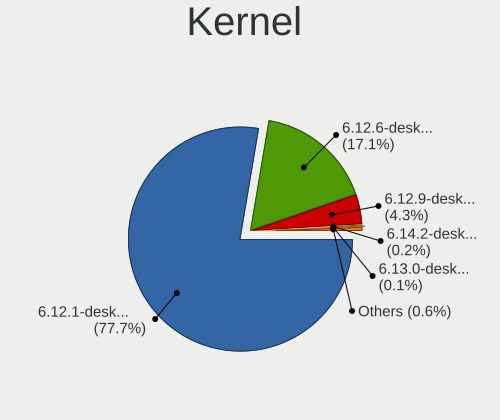

| Version                          | Computers | Percent |
|----------------------------------|-----------|---------|
| 6.12.1-desktop-1omv2490          | 2797      | 77.65%  |
| 6.12.6-desktop-1omv2490          | 615       | 17.07%  |
| 6.12.9-desktop-1omv2490          | 156       | 4.33%   |
| 6.14.2-desktop-3omv2590          | 7         | 0.19%   |
| 6.13.0-desktop-0.rc4.1omv2490    | 5         | 0.14%   |
| 6.13.0-desktop-0.rc1.1omv2490    | 5         | 0.14%   |
| 6.4.8-desktop-2omv2390           | 2         | 0.06%   |
| 6.4.11-desktop-1omv2390          | 2         | 0.06%   |
| 6.13.7-desktop-1omv2590          | 2         | 0.06%   |
| 6.13.4-desktop-2omv2590          | 2         | 0.06%   |
| 6.12.6-desktop-gcc-1omv2490      | 2         | 0.06%   |
| 6.15.0-desktop-0.rc2.3omv2590    | 1         | 0.03%   |
| 6.14.0-desktop-2omv2590          | 1         | 0.03%   |
| 6.14.0-desktop-0.rc4.2omv2590    | 1         | 0.03%   |
| 6.13.5-desktop-1omv2590          | 1         | 0.03%   |
| 6.13.0-server-gcc-0.rc4.1omv2490 | 1         | 0.03%   |
| 6.13.0-desktop-0.rc5.1omv2490    | 1         | 0.03%   |
| 6.10.0-desktop-1omv2490          | 1         | 0.03%   |

Kernel Family
-------------

Linux kernel without a distro release

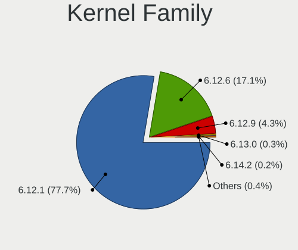

| Version | Computers | Percent |
|---------|-----------|---------|
| 6.12.1  | 2797      | 77.65%  |
| 6.12.6  | 617       | 17.13%  |
| 6.12.9  | 156       | 4.33%   |
| 6.13.0  | 12        | 0.33%   |
| 6.14.2  | 7         | 0.19%   |
| 6.4.8   | 2         | 0.06%   |
| 6.4.11  | 2         | 0.06%   |
| 6.14.0  | 2         | 0.06%   |
| 6.13.7  | 2         | 0.06%   |
| 6.13.4  | 2         | 0.06%   |
| 6.15.0  | 1         | 0.03%   |
| 6.13.5  | 1         | 0.03%   |
| 6.10.0  | 1         | 0.03%   |

Kernel Major Ver.
-----------------

Linux kernel major version

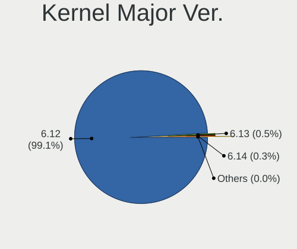

| Version | Computers | Percent |
|---------|-----------|---------|
| 6.12    | 3565      | 99.11%  |
| 6.13    | 17        | 0.47%   |
| 6.14    | 9         | 0.25%   |
| 6.4     | 4         | 0.11%   |
| 6.15    | 1         | 0.03%   |
| 6.10    | 1         | 0.03%   |

Arch
----

OS architecture (x86_64, i586, etc.)

| Name   | Computers | Percent |
|--------|-----------|---------|
| x86_64 | 3597      | 100%    |

DE
--

Desktop Environment

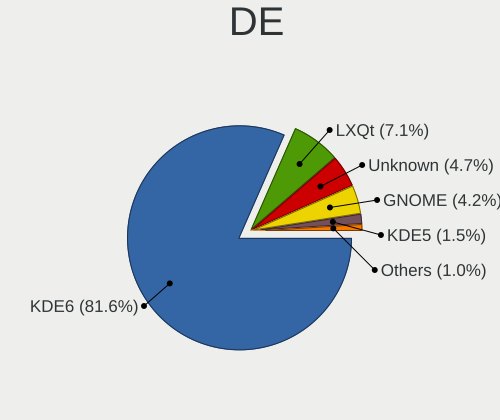

| Name            | Computers | Percent |
|-----------------|-----------|---------|
| KDE6            | 2937      | 81.58%  |
| LXQt            | 256       | 7.11%   |
| Unknown         | 168       | 4.67%   |
| GNOME           | 150       | 4.17%   |
| KDE5            | 53        | 1.47%   |
| XFCE            | 24        | 0.67%   |
| Budgie          | 5         | 0.14%   |
| Cinnamon        | 3         | 0.08%   |
| MATE            | 2         | 0.06%   |
| LXDE            | 1         | 0.03%   |
| GNOME Flashback | 1         | 0.03%   |

Display Server
--------------

X11 or Wayland

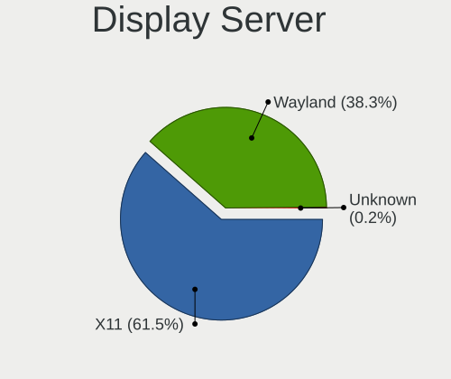

| Name    | Computers | Percent |
|---------|-----------|---------|
| X11     | 2215      | 61.49%  |
| Wayland | 1381      | 38.34%  |
| Unknown | 6         | 0.17%   |

Display Manager
---------------

SDDM, LightDM, etc.

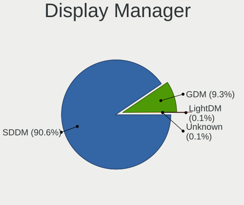

| Name    | Computers | Percent |
|---------|-----------|---------|
| SDDM    | 3258      | 90.55%  |
| GDM     | 333       | 9.26%   |
| LightDM | 4         | 0.11%   |
| Unknown | 3         | 0.08%   |

OS Lang
-------

Language

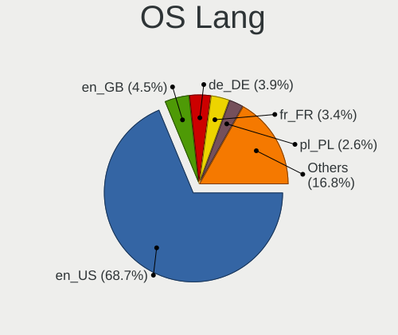

| Lang  | Computers | Percent |
|-------|-----------|---------|
| en_US | 2478      | 68.74%  |
| en_GB | 163       | 4.52%   |
| de_DE | 140       | 3.88%   |
| fr_FR | 123       | 3.41%   |
| pl_PL | 95        | 2.64%   |
| ru_RU | 75        | 2.08%   |
| it_IT | 75        | 2.08%   |
| pt_BR | 63        | 1.75%   |
| es_ES | 53        | 1.47%   |
| en_CA | 51        | 1.41%   |
| en_AU | 43        | 1.19%   |
| cs_CZ | 21        | 0.58%   |
| es_MX | 19        | 0.53%   |
| tr_TR | 16        | 0.44%   |
| hu_HU | 16        | 0.44%   |
| en_IN | 15        | 0.42%   |
| nl_NL | 13        | 0.36%   |
| es_AR | 13        | 0.36%   |
| de_CH | 12        | 0.33%   |
| de_AT | 12        | 0.33%   |
| en_NZ | 11        | 0.31%   |
| nl_BE | 8         | 0.22%   |
| es_VE | 8         | 0.22%   |
| en_ZA | 7         | 0.19%   |
| da_DK | 7         | 0.19%   |
| pt_PT | 6         | 0.17%   |
| fr_CA | 6         | 0.17%   |
| fr_BE | 6         | 0.17%   |
| es_CL | 5         | 0.14%   |
| en_SG | 5         | 0.14%   |
| en_DK | 5         | 0.14%   |
| ro_RO | 4         | 0.11%   |
| uk_UA | 3         | 0.08%   |
| es_EC | 3         | 0.08%   |
| sk_SK | 2         | 0.06%   |
| nb_NO | 2         | 0.06%   |
| fr_CH | 2         | 0.06%   |
| es_PE | 2         | 0.06%   |
| en_IL | 2         | 0.06%   |
| en_HK | 2         | 0.06%   |

Boot Mode
---------

EFI or BIOS

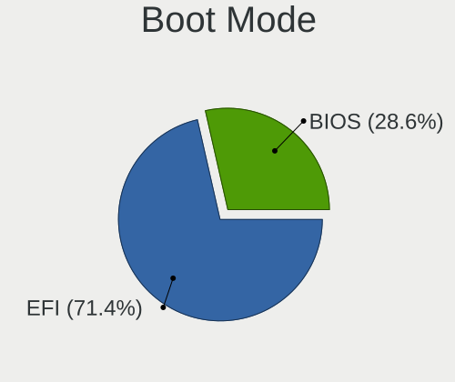

| Mode | Computers | Percent |
|------|-----------|---------|
| EFI  | 2572      | 71.44%  |
| BIOS | 1028      | 28.56%  |

Filesystem
----------

Type of filesystem

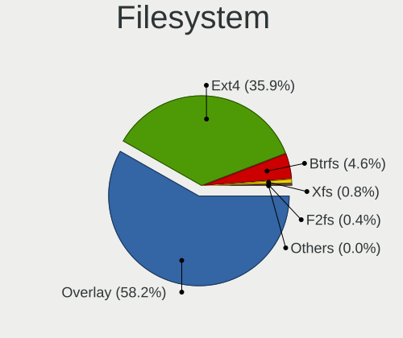

| Type    | Computers | Percent |
|---------|-----------|---------|
| Overlay | 2100      | 58.24%  |
| Ext4    | 1295      | 35.91%  |
| Btrfs   | 166       | 4.6%    |
| Xfs     | 28        | 0.78%   |
| F2fs    | 16        | 0.44%   |
| Ext3    | 1         | 0.03%   |

Part. scheme
------------

Scheme of partitioning

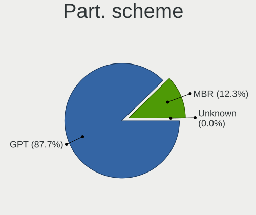

| Type    | Computers | Percent |
|---------|-----------|---------|
| GPT     | 3157      | 87.72%  |
| MBR     | 441       | 12.25%  |
| Unknown | 1         | 0.03%   |

Dual Boot with Linux/BSD
------------------------

Hosting more than one Linux/BSD

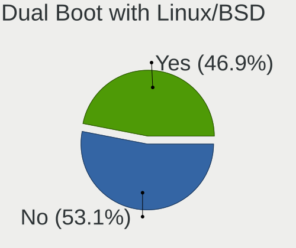

| Dual boot | Computers | Percent |
|-----------|-----------|---------|
| No        | 1912      | 53.05%  |
| Yes       | 1692      | 46.95%  |

Dual Boot (Win)
---------------

Hosting Linux and Windows

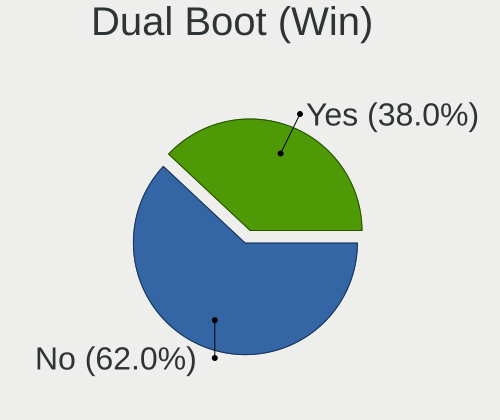

| Dual boot | Computers | Percent |
|-----------|-----------|---------|
| No        | 2230      | 61.98%  |
| Yes       | 1368      | 38.02%  |

Board
-----

Vendor
------

Motherboard manufacturer

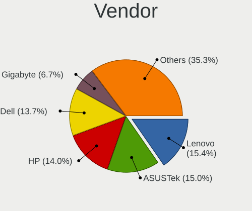

| Name                                 | Computers | Percent |
|--------------------------------------|-----------|---------|
| Lenovo                               | 553       | 15.37%  |
| ASUSTek Computer                     | 539       | 14.98%  |
| Hewlett-Packard                      | 503       | 13.98%  |
| Dell                                 | 493       | 13.71%  |
| Gigabyte Technology                  | 241       | 6.7%    |
| MSI                                  | 220       | 6.12%   |
| Acer                                 | 187       | 5.2%    |
| ASRock                               | 133       | 3.7%    |
| Intel                                | 69        | 1.92%   |
| Toshiba                              | 65        | 1.81%   |
| Apple                                | 53        | 1.47%   |
| AZW                                  | 48        | 1.33%   |
| Unknown                              | 39        | 1.08%   |
| Samsung Electronics                  | 31        | 0.86%   |
| Microsoft                            | 29        | 0.81%   |
| Fujitsu                              | 25        | 0.7%    |
| Framework                            | 24        | 0.67%   |
| Google                               | 21        | 0.58%   |
| Sony                                 | 16        | 0.44%   |
| Medion                               | 15        | 0.42%   |
| Shenzhen Meigao Electronic Equipment | 14        | 0.39%   |
| Biostar                              | 13        | 0.36%   |
| System76                             | 11        | 0.31%   |
| HUAWEI                               | 11        | 0.31%   |
| GMKtec                               | 11        | 0.31%   |
| Pegatron                             | 10        | 0.28%   |
| Notebook                             | 9         | 0.25%   |
| Red Hat                              | 7         | 0.19%   |
| Foxconn                              | 7         | 0.19%   |
| Chuwi                                | 7         | 0.19%   |
| TUXEDO                               | 6         | 0.17%   |
| Positivo                             | 6         | 0.17%   |
| Panasonic                            | 6         | 0.17%   |
| Packard Bell                         | 6         | 0.17%   |
| LG Electronics                       | 6         | 0.17%   |
| BOSGAME                              | 6         | 0.17%   |
| BESSTAR Tech                         | 6         | 0.17%   |
| Alienware                            | 6         | 0.17%   |
| eMachines                            | 5         | 0.14%   |
| AMI                                  | 5         | 0.14%   |

Model
-----

Motherboard model

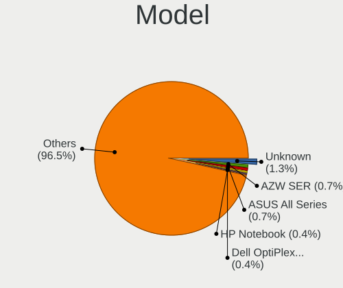

| Name                                              | Computers | Percent |
|---------------------------------------------------|-----------|---------|
| Unknown                                           | 45        | 1.25%   |
| AZW SER                                           | 25        | 0.7%    |
| ASUS All Series                                   | 24        | 0.67%   |
| HP Notebook                                       | 16        | 0.44%   |
| Dell OptiPlex 9020                                | 15        | 0.42%   |
| MSI MS-7C56                                       | 13        | 0.36%   |
| Dell OptiPlex 7010                                | 13        | 0.36%   |
| ASUS ROG STRIX B550-F GAMING                      | 13        | 0.36%   |
| Dell Latitude E6430                               | 12        | 0.33%   |
| Dell Latitude E6420                               | 10        | 0.28%   |
| MSI MS-7C02                                       | 9         | 0.25%   |
| Dell OptiPlex 7050                                | 9         | 0.25%   |
| Dell OptiPlex 3020                                | 9         | 0.25%   |
| AZW MINI S                                        | 9         | 0.25%   |
| MSI MS-7C95                                       | 8         | 0.22%   |
| Red Hat KVM                                       | 7         | 0.19%   |
| MSI MS-7817                                       | 7         | 0.19%   |
| Lenovo IdeaPad 3 15ALC6 82KU                      | 7         | 0.19%   |
| HP Pavilion dv6                                   | 7         | 0.19%   |
| Dell XPS 13 9360                                  | 7         | 0.19%   |
| Dell OptiPlex 7040                                | 7         | 0.19%   |
| Dell Latitude 5490                                | 7         | 0.19%   |
| ASUS PRIME B450M-A                                | 7         | 0.19%   |
| ASUS PRIME A320M-K                                | 7         | 0.19%   |
| Shenzhen Meigao Electronic Equipment Venus series | 6         | 0.17%   |
| HP Laptop 15s-eq1xxx                              | 6         | 0.17%   |
| HP EliteBook 840 G5                               | 6         | 0.17%   |
| HP EliteBook 840 G3                               | 6         | 0.17%   |
| Framework Laptop 13 (AMD Ryzen 7040Series)        | 6         | 0.17%   |
| Framework Laptop (12th Gen Intel Core)            | 6         | 0.17%   |
| Dell OptiPlex 3040                                | 6         | 0.17%   |
| ASUS PRIME B550M-A                                | 6         | 0.17%   |
| System76 Lemur Pro                                | 5         | 0.14%   |
| MSI MS-7D91                                       | 5         | 0.14%   |
| MSI MS-7850                                       | 5         | 0.14%   |
| Microsoft Surface Go                              | 5         | 0.14%   |
| Lenovo IdeaPad 3 15IML05 81WB                     | 5         | 0.14%   |
| Intel H81                                         | 5         | 0.14%   |
| Intel H61                                         | 5         | 0.14%   |
| HP Pavilion g6                                    | 5         | 0.14%   |

Model Family
------------

Motherboard model prefix

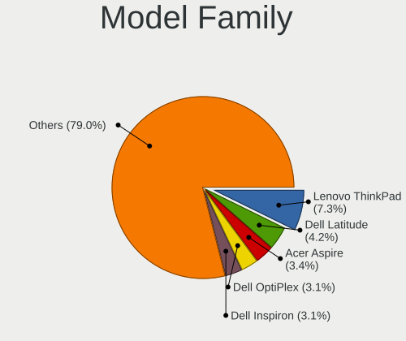

| Name               | Computers | Percent |
|--------------------|-----------|---------|
| Lenovo ThinkPad    | 262       | 7.28%   |
| Dell Latitude      | 151       | 4.2%    |
| Acer Aspire        | 122       | 3.39%   |
| Dell OptiPlex      | 112       | 3.11%   |
| Dell Inspiron      | 110       | 3.06%   |
| Lenovo IdeaPad     | 104       | 2.89%   |
| ASUS PRIME         | 82        | 2.28%   |
| HP Pavilion        | 76        | 2.11%   |
| HP Laptop          | 75        | 2.09%   |
| ASUS ROG           | 73        | 2.03%   |
| Toshiba Satellite  | 60        | 1.67%   |
| HP EliteBook       | 59        | 1.64%   |
| ASUS VivoBook      | 53        | 1.47%   |
| Lenovo ThinkCentre | 50        | 1.39%   |
| Unknown            | 45        | 1.25%   |
| Dell Precision     | 41        | 1.14%   |
| ASUS TUF           | 40        | 1.11%   |
| HP EliteDesk       | 38        | 1.06%   |
| HP ProBook         | 37        | 1.03%   |
| Dell XPS           | 34        | 0.95%   |
| HP Compaq          | 33        | 0.92%   |
| Microsoft Surface  | 29        | 0.81%   |
| HP ENVY            | 27        | 0.75%   |
| Lenovo Yoga        | 26        | 0.72%   |
| AZW SER            | 25        | 0.7%    |
| ASUS ASUS          | 25        | 0.7%    |
| Framework Laptop   | 24        | 0.67%   |
| ASUS All           | 24        | 0.67%   |
| Lenovo Legion      | 20        | 0.56%   |
| HP Notebook        | 16        | 0.44%   |
| Dell Vostro        | 16        | 0.44%   |
| Gigabyte B450M     | 14        | 0.39%   |
| Fujitsu LIFEBOOK   | 14        | 0.39%   |
| Acer Swift         | 14        | 0.39%   |
| Acer Nitro         | 14        | 0.39%   |
| MSI MS-7C56        | 13        | 0.36%   |
| HP ProDesk         | 13        | 0.36%   |
| Gigabyte B550M     | 13        | 0.36%   |
| Gigabyte B550      | 13        | 0.36%   |
| ASUS ZenBook       | 12        | 0.33%   |

MFG Year
--------

Motherboard manufacture year

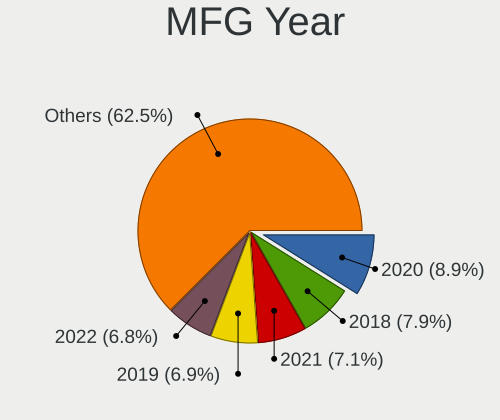

| Year    | Computers | Percent |
|---------|-----------|---------|
| 2020    | 321       | 8.92%   |
| 2018    | 283       | 7.87%   |
| 2021    | 254       | 7.06%   |
| 2019    | 247       | 6.87%   |
| 2022    | 244       | 6.78%   |
| 2012    | 239       | 6.64%   |
| 2023    | 238       | 6.62%   |
| 2013    | 238       | 6.62%   |
| 2017    | 215       | 5.98%   |
| 2011    | 207       | 5.75%   |
| 2014    | 193       | 5.37%   |
| 2016    | 191       | 5.31%   |
| 2015    | 168       | 4.67%   |
| 2024    | 165       | 4.59%   |
| 2010    | 131       | 3.64%   |
| 2009    | 98        | 2.72%   |
| 2008    | 91        | 2.53%   |
| 2007    | 49        | 1.36%   |
| 2006    | 11        | 0.31%   |
| 2025    | 9         | 0.25%   |
| 2005    | 4         | 0.11%   |
| Unknown | 1         | 0.03%   |

Form Factor
-----------

Physical design of the computer

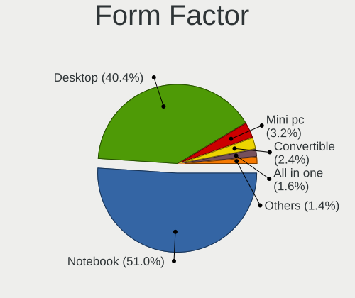

| Name        | Computers | Percent |
|-------------|-----------|---------|
| Notebook    | 1835      | 51.01%  |
| Desktop     | 1453      | 40.39%  |
| Mini pc     | 116       | 3.22%   |
| Convertible | 85        | 2.36%   |
| All in one  | 56        | 1.56%   |
| Tablet      | 45        | 1.25%   |
| Server      | 7         | 0.19%   |

Secure Boot
-----------

Enabled or disabled

| State    | Computers | Percent |
|----------|-----------|---------|
| Disabled | 3597      | 100%    |

Coreboot
--------

Have coreboot on board

| Used | Computers | Percent |
|------|-----------|---------|
| No   | 3562      | 99.03%  |
| Yes  | 35        | 0.97%   |

RAM Size
--------

Total RAM memory

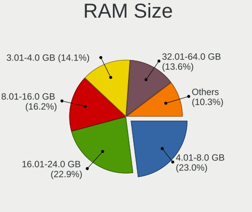

| Size in GB  | Computers | Percent |
|-------------|-----------|---------|
| 4.01-8.0    | 827       | 22.97%  |
| 16.01-24.0  | 823       | 22.86%  |
| 8.01-16.0   | 582       | 16.17%  |
| 3.01-4.0    | 509       | 14.14%  |
| 32.01-64.0  | 488       | 13.56%  |
| 24.01-32.0  | 152       | 4.22%   |
| 64.01-256.0 | 141       | 3.92%   |
| 1.01-2.0    | 52        | 1.44%   |
| 2.01-3.0    | 22        | 0.61%   |
| 0.51-1.0    | 3         | 0.08%   |
| 0.01-0.5    | 1         | 0.03%   |

RAM Used
--------

Used RAM memory

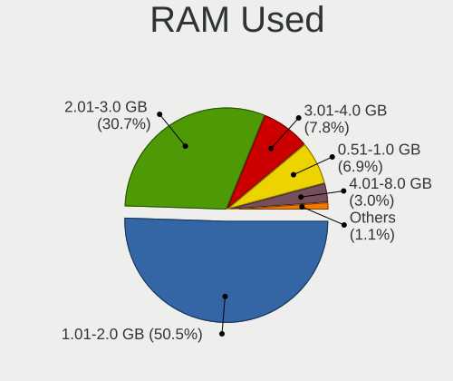

| Used GB    | Computers | Percent |
|------------|-----------|---------|
| 1.01-2.0   | 1829      | 50.51%  |
| 2.01-3.0   | 1110      | 30.65%  |
| 3.01-4.0   | 281       | 7.76%   |
| 0.51-1.0   | 250       | 6.9%    |
| 4.01-8.0   | 110       | 3.04%   |
| 0.01-0.5   | 32        | 0.88%   |
| 8.01-16.0  | 8         | 0.22%   |
| 32.01-64.0 | 1         | 0.03%   |

Total Drives
------------

Number of drives on board

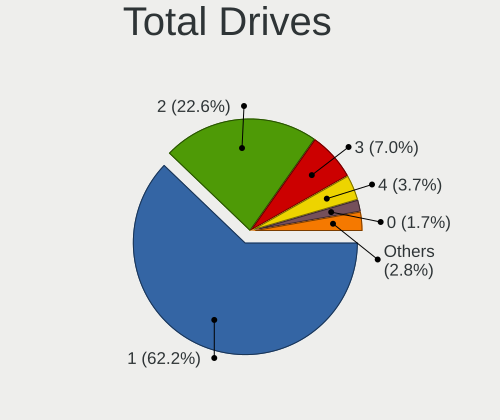

| Drives | Computers | Percent |
|--------|-----------|---------|
| 1      | 2239      | 62.16%  |
| 2      | 815       | 22.63%  |
| 3      | 253       | 7.02%   |
| 4      | 133       | 3.69%   |
| 0      | 62        | 1.72%   |
| 5      | 55        | 1.53%   |
| 6      | 28        | 0.78%   |
| 8      | 6         | 0.17%   |
| 7      | 5         | 0.14%   |
| 11     | 2         | 0.06%   |
| 10     | 2         | 0.06%   |
| 13     | 1         | 0.03%   |
| 9      | 1         | 0.03%   |

Has CD-ROM
----------

Has CD-ROM on board

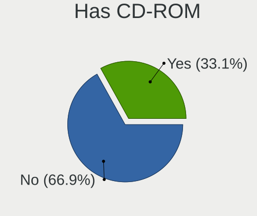

| Presented | Computers | Percent |
|-----------|-----------|---------|
| No        | 2409      | 66.92%  |
| Yes       | 1191      | 33.08%  |

Has Ethernet
------------

Has Ethernet on board

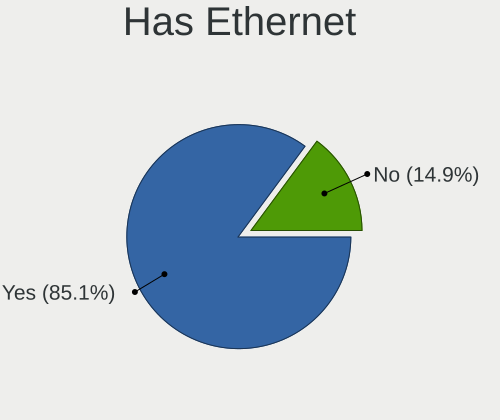

| Presented | Computers | Percent |
|-----------|-----------|---------|
| Yes       | 3062      | 85.13%  |
| No        | 535       | 14.87%  |

Has WiFi
--------

Has WiFi module

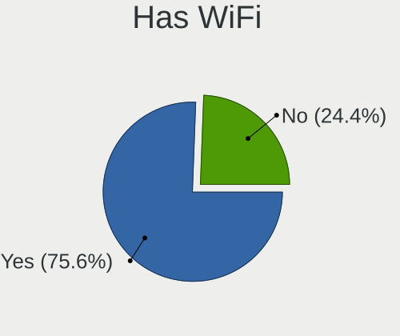

| Presented | Computers | Percent |
|-----------|-----------|---------|
| Yes       | 2719      | 75.59%  |
| No        | 878       | 24.41%  |

Has Bluetooth
-------------

Has Bluetooth module

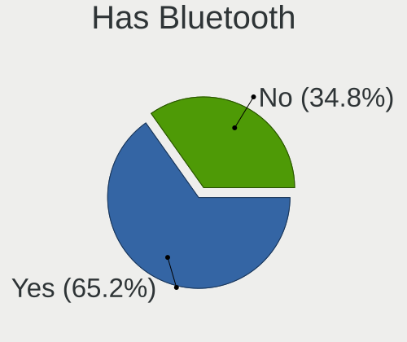

| Presented | Computers | Percent |
|-----------|-----------|---------|
| Yes       | 2345      | 65.19%  |
| No        | 1252      | 34.81%  |

Location
--------

Country
-------

Geographic location (country)

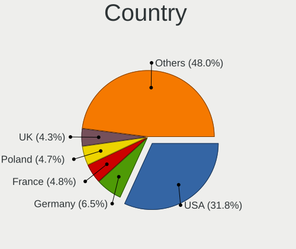

| Country      | Computers | Percent |
|--------------|-----------|---------|
| USA          | 1146      | 31.84%  |
| Germany      | 233       | 6.47%   |
| France       | 171       | 4.75%   |
| Poland       | 169       | 4.7%    |
| UK           | 154       | 4.28%   |
| Canada       | 143       | 3.97%   |
| Russia       | 135       | 3.75%   |
| Brazil       | 133       | 3.7%    |
| Italy        | 124       | 3.45%   |
| Australia    | 97        | 2.7%    |
| Spain        | 94        | 2.61%   |
| Netherlands  | 56        | 1.56%   |
| India        | 55        | 1.53%   |
| Mexico       | 38        | 1.06%   |
| Finland      | 36        | 1%      |
| Romania      | 35        | 0.97%   |
| Sweden       | 34        | 0.94%   |
| Belgium      | 34        | 0.94%   |
| Hungary      | 32        | 0.89%   |
| Greece       | 32        | 0.89%   |
| Turkey       | 31        | 0.86%   |
| Czechia      | 31        | 0.86%   |
| Japan        | 30        | 0.83%   |
| Indonesia    | 30        | 0.83%   |
| Switzerland  | 29        | 0.81%   |
| Austria      | 27        | 0.75%   |
| New Zealand  | 22        | 0.61%   |
| South Africa | 19        | 0.53%   |
| Serbia       | 19        | 0.53%   |
| Norway       | 18        | 0.5%    |
| China        | 18        | 0.5%    |
| Argentina    | 18        | 0.5%    |
| Denmark      | 17        | 0.47%   |
| Portugal     | 16        | 0.44%   |
| Philippines  | 16        | 0.44%   |
| Malaysia     | 14        | 0.39%   |
| Croatia      | 14        | 0.39%   |
| Colombia     | 14        | 0.39%   |
| Thailand     | 11        | 0.31%   |
| Slovakia     | 11        | 0.31%   |

City
----

Geographic location (city)

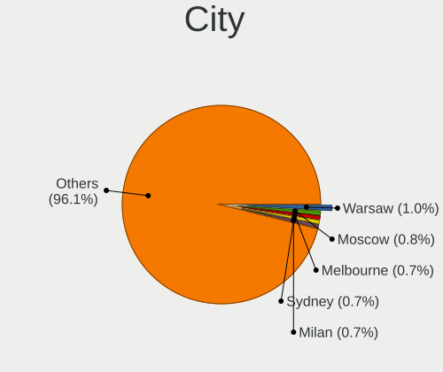

| City           | Computers | Percent |
|----------------|-----------|---------|
| Warsaw         | 35        | 0.97%   |
| Moscow         | 29        | 0.8%    |
| Melbourne      | 26        | 0.72%   |
| Sydney         | 25        | 0.69%   |
| Milan          | 25        | 0.69%   |
| Paris          | 20        | 0.55%   |
| Denver         | 20        | 0.55%   |
| Berlin         | 19        | 0.53%   |
| Vienna         | 17        | 0.47%   |
| Brisbane       | 17        | 0.47%   |
| Munich         | 16        | 0.44%   |
| Chicago        | 16        | 0.44%   |
| Bengaluru      | 16        | 0.44%   |
| Athens         | 16        | 0.44%   |
| Istanbul       | 15        | 0.41%   |
| Helsinki       | 15        | 0.41%   |
| Sao Paulo      | 14        | 0.39%   |
| Houston        | 14        | 0.39%   |
| Toronto        | 13        | 0.36%   |
| Thessaloniki   | 13        | 0.36%   |
| Seattle        | 13        | 0.36%   |
| Atlanta        | 13        | 0.36%   |
| Rome           | 12        | 0.33%   |
| Calgary        | 12        | 0.33%   |
| Madrid         | 11        | 0.3%    |
| Amsterdam      | 11        | 0.3%    |
| St Petersburg  | 10        | 0.28%   |
| Singapore      | 10        | 0.28%   |
| Rio de Janeiro | 10        | 0.28%   |
| Charlotte      | 10        | 0.28%   |
| Belgrade       | 10        | 0.28%   |
| Zagreb         | 9         | 0.25%   |
| Wroclaw        | 9         | 0.25%   |
| Hamilton       | 9         | 0.25%   |
| Budapest       | 9         | 0.25%   |
| Prague         | 8         | 0.22%   |
| Perth          | 8         | 0.22%   |
| Milano         | 8         | 0.22%   |
| London         | 8         | 0.22%   |
| Dublin         | 8         | 0.22%   |

Drives
------

Drive Vendor
------------

Hard drive vendors

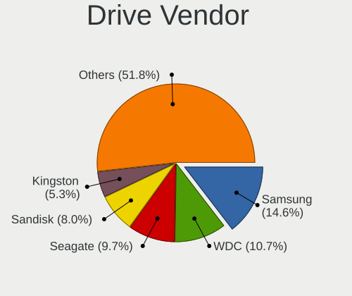

| Vendor                       | Computers | Drives | Percent |
|------------------------------|-----------|--------|---------|
| Samsung Electronics          | 741       | 894    | 14.57%  |
| WDC                          | 544       | 673    | 10.7%   |
| Seagate                      | 492       | 586    | 9.68%   |
| Sandisk                      | 405       | 455    | 7.96%   |
| Kingston                     | 270       | 305    | 5.31%   |
| Toshiba                      | 260       | 273    | 5.11%   |
| Crucial                      | 189       | 209    | 3.72%   |
| Unknown                      | 180       | 206    | 3.54%   |
| SK hynix                     | 142       | 146    | 2.79%   |
| Micron Technology            | 127       | 129    | 2.5%    |
| Intel                        | 127       | 140    | 2.5%    |
| Hitachi                      | 101       | 103    | 1.99%   |
| Micron/Crucial Technology    | 97        | 107    | 1.91%   |
| Kingston Technology Company  | 93        | 94     | 1.83%   |
| China                        | 86        | 90     | 1.69%   |
| Phison Electronics           | 75        | 83     | 1.47%   |
| MAXIO Technology (Hangzhou)  | 71        | 78     | 1.4%    |
| A-DATA Technology            | 69        | 71     | 1.36%   |
| PNY                          | 56        | 60     | 1.1%    |
| HGST                         | 55        | 56     | 1.08%   |
| KIOXIA                       | 50        | 50     | 0.98%   |
| SPCC                         | 43        | 50     | 0.85%   |
| Silicon Motion               | 43        | 45     | 0.85%   |
| ADATA Technology             | 43        | 46     | 0.85%   |
| Realtek Semiconductor        | 37        | 38     | 0.73%   |
| Team                         | 31        | 33     | 0.61%   |
| Patriot                      | 30        | 30     | 0.59%   |
| GOODRAM                      | 26        | 27     | 0.51%   |
| KingSpec                     | 23        | 27     | 0.45%   |
| Apple                        | 22        | 23     | 0.43%   |
| Netac                        | 21        | 21     | 0.41%   |
| Intenso                      | 21        | 22     | 0.41%   |
| LITEON                       | 20        | 21     | 0.39%   |
| Unknown                      | 20        | 20     | 0.39%   |
| Shenzhen Longsys Electronics | 19        | 19     | 0.37%   |
| Lexar                        | 17        | 17     | 0.33%   |
| Fujitsu                      | 15        | 15     | 0.29%   |
| Fanxiang                     | 15        | 20     | 0.29%   |
| Apacer                       | 15        | 16     | 0.29%   |
| Transcend                    | 14        | 14     | 0.28%   |

Drive Model
-----------

Hard drive models

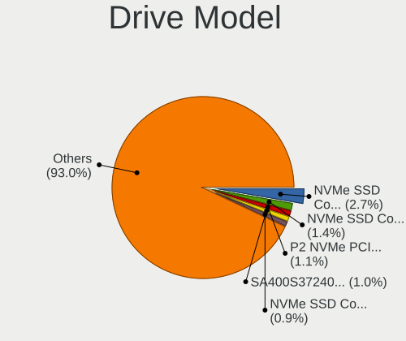

| Model                                                 | Computers | Percent |
|-------------------------------------------------------|-----------|---------|
| Samsung NVMe SSD Controller SM981/PM981/PM983 1TB     | 149       | 2.73%   |
| Samsung NVMe SSD Controller PM9A1/PM9A3/980PRO 1TB    | 74        | 1.35%   |
| Micron/Crucial P2 NVMe PCIe SSD 2TB                   | 58        | 1.06%   |
| Kingston SA400S37240G 240GB SSD                       | 52        | 0.95%   |
| MAXIO (Hangzhou) NVMe SSD Controller MAP1202 2TB      | 50        | 0.91%   |
| Unknown MMC Card  64GB                                | 47        | 0.86%   |
| Seagate ST500DM002-1BD142 500GB                       | 45        | 0.82%   |
| Sandisk WD Blue SN550 NVMe SSD 1024GB                 | 40        | 0.73%   |
| Kingston SA400S37480G 480GB SSD                       | 40        | 0.73%   |
| Silicon Motion SM2263EN/SM2263XT SSD Controller 512GB | 39        | 0.71%   |
| Unknown MMC Card  32GB                                | 38        | 0.7%    |
| Samsung SSD 860 EVO 1TB                               | 37        | 0.68%   |
| Samsung SSD 850 EVO 250GB                             | 34        | 0.62%   |
| Kingston Company SNV2S1000G 1TB                       | 32        | 0.59%   |
| Unknown SD/MMC/MS PRO 2GB                             | 31        | 0.57%   |
| Unknown MMC Card  128GB                               | 30        | 0.55%   |
| Samsung NVMe SSD Controller SM961/PM961/SM963 1024GB  | 30        | 0.55%   |
| Seagate ST1000DM010-2EP102 1TB                        | 29        | 0.53%   |
| Crucial CT500MX500SSD1 500GB                          | 29        | 0.53%   |
| Sandisk WD Black SN750 / PC SN730 NVMe SSD 500GB      | 28        | 0.51%   |
| WDC WD10EZEX-08WN4A0 1TB                              | 27        | 0.49%   |
| Samsung SSD 870 EVO 1TB                               | 27        | 0.49%   |
| Intel SSD 660P Series 512GB                           | 27        | 0.49%   |
| Toshiba MQ01ABF050 500GB                              | 26        | 0.48%   |
| Toshiba MQ01ABD100 1TB                                | 25        | 0.46%   |
| Seagate ST2000DM008-2FR102 2TB                        | 25        | 0.46%   |
| Samsung SSD 860 EVO 500GB                             | 25        | 0.46%   |
| Kingston SA400S37120G 120GB SSD                       | 25        | 0.46%   |
| Seagate ST1000LM035-1RK172 1TB                        | 24        | 0.44%   |
| Samsung SSD 860 EVO 250GB                             | 23        | 0.42%   |
| Sandisk WD_BLACK SN770 1TB                            | 21        | 0.38%   |
| Phison E12 NVMe Controller 1TB                        | 21        | 0.38%   |
| Crucial CT240BX500SSD1 240GB                          | 21        | 0.38%   |
| Crucial CT1000BX500SSD1 1TB                           | 21        | 0.38%   |
| Crucial CT1000MX500SSD1 1TB                           | 20        | 0.37%   |
| Unknown                                               | 20        | 0.37%   |
| Toshiba XG6 NVMe SSD Controller 1024GB                | 18        | 0.33%   |
| Samsung SSD 850 EVO 500GB                             | 18        | 0.33%   |
| Samsung SSD 870 QVO 1TB                               | 17        | 0.31%   |
| Sandisk WD_BLACK SN850X 1000GB                        | 16        | 0.29%   |

HDD Vendor
----------

Hard disk drive vendors

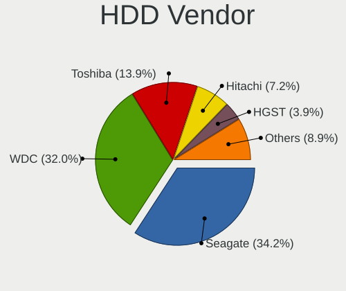

| Vendor              | Computers | Drives | Percent |
|---------------------|-----------|--------|---------|
| Seagate             | 483       | 572    | 34.21%  |
| WDC                 | 452       | 549    | 32.01%  |
| Toshiba             | 196       | 206    | 13.88%  |
| Hitachi             | 101       | 103    | 7.15%   |
| HGST                | 55        | 56     | 3.9%    |
| Samsung Electronics | 49        | 52     | 3.47%   |
| Unknown             | 31        | 32     | 2.2%    |
| Fujitsu             | 15        | 15     | 1.06%   |
| Maxtor              | 9         | 10     | 0.64%   |
| Apple               | 7         | 7      | 0.5%    |
| WD MediaMax         | 3         | 3      | 0.21%   |
| Unknown             | 3         | 3      | 0.21%   |
| SATAFIRM            | 1         | 1      | 0.07%   |
| QEMU                | 1         | 1      | 0.07%   |
| MARVELL             | 1         | 1      | 0.07%   |
| Magnetic Data       | 1         | 1      | 0.07%   |
| HPE                 | 1         | 1      | 0.07%   |
| Hewlett-Packard     | 1         | 1      | 0.07%   |
| ExcelStor           | 1         | 1      | 0.07%   |
| China               | 1         | 1      | 0.07%   |

SSD Vendor
----------

Solid state drive vendors

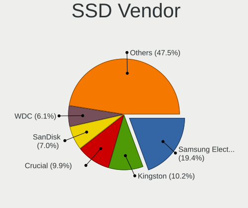

| Vendor              | Computers | Drives | Percent |
|---------------------|-----------|--------|---------|
| Samsung Electronics | 370       | 422    | 19.38%  |
| Kingston            | 194       | 218    | 10.16%  |
| Crucial             | 189       | 209    | 9.9%    |
| SanDisk             | 134       | 142    | 7.02%   |
| WDC                 | 116       | 124    | 6.08%   |
| China               | 84        | 88     | 4.4%    |
| A-DATA Technology   | 66        | 68     | 3.46%   |
| PNY                 | 56        | 60     | 2.93%   |
| Intel               | 44        | 44     | 2.3%    |
| SPCC                | 42        | 49     | 2.2%    |
| Patriot             | 30        | 30     | 1.57%   |
| Micron Technology   | 29        | 29     | 1.52%   |
| Team                | 28        | 30     | 1.47%   |
| SK hynix            | 28        | 28     | 1.47%   |
| GOODRAM             | 26        | 27     | 1.36%   |
| KingSpec            | 23        | 27     | 1.2%    |
| Intenso             | 21        | 22     | 1.1%    |
| LITEON              | 20        | 21     | 1.05%   |
| Lexar               | 17        | 17     | 0.89%   |
| Netac               | 16        | 16     | 0.84%   |
| Apacer              | 15        | 16     | 0.79%   |
| Toshiba             | 14        | 14     | 0.73%   |
| Fanxiang            | 14        | 19     | 0.73%   |
| Transcend           | 13        | 13     | 0.68%   |
| Plextor             | 13        | 14     | 0.68%   |
| Apple               | 13        | 13     | 0.68%   |
| Unknown             | 13        | 13     | 0.68%   |
| T-FORCE             | 11        | 11     | 0.58%   |
| OCZ                 | 11        | 11     | 0.58%   |
| Emtec               | 11        | 12     | 0.58%   |
| Verbatim            | 9         | 9      | 0.47%   |
| KIOXIA-EXCERIA      | 8         | 8      | 0.42%   |
| Corsair             | 8         | 9      | 0.42%   |
| Mushkin             | 7         | 10     | 0.37%   |
| LITEONIT            | 7         | 7      | 0.37%   |
| Leven               | 7         | 8      | 0.37%   |
| Gigabyte Technology | 7         | 7      | 0.37%   |
| walram              | 6         | 6      | 0.31%   |
| Seagate             | 6         | 7      | 0.31%   |
| NGFF                | 6         | 6      | 0.31%   |

Drive Kind
----------

HDD or SSD

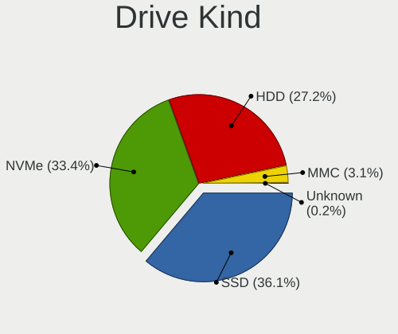

| Kind    | Computers | Drives | Percent |
|---------|-----------|--------|---------|
| SSD     | 1641      | 2066   | 36.15%  |
| NVMe    | 1515      | 1854   | 33.37%  |
| HDD     | 1234      | 1616   | 27.18%  |
| MMC     | 142       | 152    | 3.13%   |
| Unknown | 8         | 22     | 0.18%   |

Drive Connector
---------------

SATA, SAS, NVMe, etc.

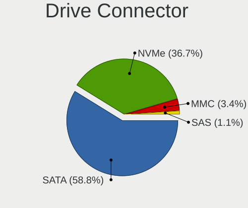

| Type | Computers | Drives | Percent |
|------|-----------|--------|---------|
| SATA | 2430      | 3644   | 58.81%  |
| NVMe | 1515      | 1854   | 36.67%  |
| MMC  | 142       | 152    | 3.44%   |
| SAS  | 45        | 60     | 1.09%   |

Drive Size
----------

Size of hard drive

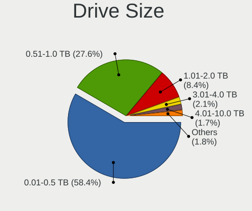

| Size in TB | Computers | Drives | Percent |
|------------|-----------|--------|---------|
| 0.01-0.5   | 1764      | 2172   | 58.41%  |
| 0.51-1.0   | 835       | 977    | 27.65%  |
| 1.01-2.0   | 254       | 323    | 8.41%   |
| 3.01-4.0   | 64        | 83     | 2.12%   |
| 4.01-10.0  | 50        | 63     | 1.66%   |
| 2.01-3.0   | 37        | 43     | 1.23%   |
| 10.01-20.0 | 16        | 21     | 0.53%   |

Space Total
-----------

Amount of disk space available on the file system

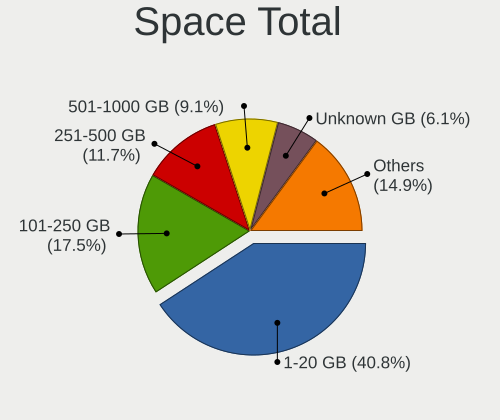

| Size in GB     | Computers | Percent |
|----------------|-----------|---------|
| 1-20           | 1472      | 40.79%  |
| 101-250        | 632       | 17.51%  |
| 251-500        | 421       | 11.67%  |
| 501-1000       | 327       | 9.06%   |
| Unknown        | 220       | 6.1%    |
| 51-100         | 158       | 4.38%   |
| 1001-2000      | 151       | 4.18%   |
| More than 3000 | 94        | 2.6%    |
| 21-50          | 81        | 2.24%   |
| 2001-3000      | 53        | 1.47%   |

Space Used
----------

Amount of used disk space

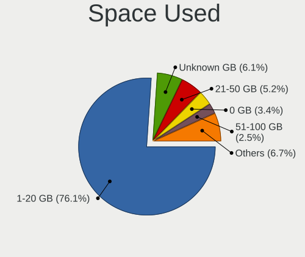

| Used GB        | Computers | Percent |
|----------------|-----------|---------|
| 1-20           | 2747      | 76.07%  |
| Unknown        | 220       | 6.09%   |
| 21-50          | 188       | 5.21%   |
| 0              | 124       | 3.43%   |
| 51-100         | 89        | 2.46%   |
| 101-250        | 82        | 2.27%   |
| 251-500        | 62        | 1.72%   |
| 501-1000       | 53        | 1.47%   |
| 1001-2000      | 22        | 0.61%   |
| 2001-3000      | 16        | 0.44%   |
| More than 3000 | 8         | 0.22%   |

Malfunc. Drives
---------------

Drive models with a malfunction

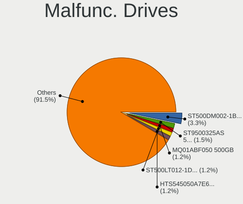

| Model                                                         | Computers | Drives | Percent |
|---------------------------------------------------------------|-----------|--------|---------|
| Seagate ST500DM002-1BD142 500GB                               | 24        | 26     | 3.29%   |
| Seagate ST9500325AS 500GB                                     | 11        | 11     | 1.51%   |
| Toshiba MQ01ABF050 500GB                                      | 9         | 9      | 1.23%   |
| Seagate ST500LT012-1DG142 500GB                               | 9         | 9      | 1.23%   |
| HGST HTS545050A7E680 500GB                                    | 9         | 9      | 1.23%   |
| Toshiba MQ01ABD100 1TB                                        | 7         | 7      | 0.96%   |
| Seagate ST1000DM010-2EP102 1TB                                | 7         | 7      | 0.96%   |
| Hitachi HTS545050A7E380 500GB                                 | 7         | 7      | 0.96%   |
| Seagate ST1000LM035-1RK172 1TB                                | 6         | 6      | 0.82%   |
| Samsung Electronics SSD 870 EVO 1TB                           | 6         | 6      | 0.82%   |
| Samsung Electronics NVMe SSD Controller SM981/PM981/PM983 1TB | 6         | 7      | 0.82%   |
| Hitachi HDS721050CLA362 500GB                                 | 6         | 6      | 0.82%   |
| HGST HTS725050A7E630 500GB                                    | 6         | 6      | 0.82%   |
| WDC WD10EARS-00Y5B1 1TB                                       | 5         | 5      | 0.69%   |
| Toshiba MQ01ABD050 500GB                                      | 5         | 5      | 0.69%   |
| Seagate ST500LT012-9WS142 500GB                               | 5         | 5      | 0.69%   |
| Seagate ST500LM021-1KJ152 500GB                               | 5         | 5      | 0.69%   |
| Seagate ST3500418AS 500GB                                     | 5         | 5      | 0.69%   |
| Seagate ST1000DM003-1CH162 1TB                                | 5         | 5      | 0.69%   |
| SanDisk SSD PLUS 480GB                                        | 5         | 5      | 0.69%   |
| WDC WD10EZEX-08WN4A0 1TB                                      | 4         | 4      | 0.55%   |
| WDC WD Green 2.5 240GB                                        | 4         | 4      | 0.55%   |
| Seagate ST31000524AS 1TB                                      | 4         | 4      | 0.55%   |
| Seagate ST2000DM006-2DM164 2TB                                | 4         | 4      | 0.55%   |
| Seagate ST1000LM049-2GH172 1TB                                | 4         | 4      | 0.55%   |
| Seagate ST1000DM003-1ER162 1TB                                | 4         | 4      | 0.55%   |
| Samsung Electronics SSD 980 1TB                               | 4         | 4      | 0.55%   |
| Hitachi HTS725050A9A364 500GB                                 | 4         | 4      | 0.55%   |
| Hitachi HTS545032B9A300 320GB                                 | 4         | 4      | 0.55%   |
| WDC WDS240G2G0A-00JH30 240GB SSD                              | 3         | 3      | 0.41%   |
| WDC WD20EZRX-00D8PB0 2TB                                      | 3         | 4      | 0.41%   |
| WDC WD10EZEX-60ZF5A0 1TB                                      | 3         | 3      | 0.41%   |
| WDC WD Green 2.5 480GB                                        | 3         | 3      | 0.41%   |
| SSSTC CVB-8D128-HP 128GB                                      | 3         | 3      | 0.41%   |
| Seagate ST9320325AS 320GB                                     | 3         | 3      | 0.41%   |
| Seagate ST3500312CS 500GB                                     | 3         | 3      | 0.41%   |
| Seagate ST2000DM008-2FR102 2TB                                | 3         | 5      | 0.41%   |
| Seagate ST2000DM001-1CH164 2TB                                | 3         | 4      | 0.41%   |
| Seagate ST1000LM024 HN-M101MBB 1TB                            | 3         | 3      | 0.41%   |
| Seagate ST1000DM003-9YN162 1TB                                | 3         | 3      | 0.41%   |

Malfunc. Drive Vendor
---------------------

Vendors of faulty drives

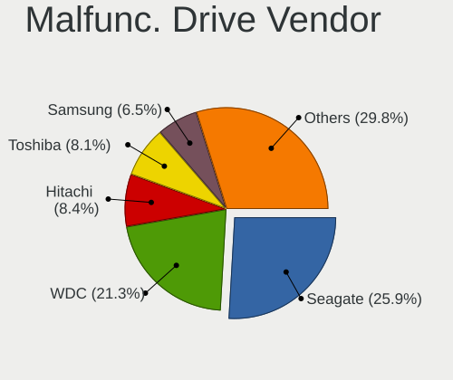

| Vendor                      | Computers | Drives | Percent |
|-----------------------------|-----------|--------|---------|
| Seagate                     | 186       | 197    | 25.91%  |
| WDC                         | 153       | 163    | 21.31%  |
| Hitachi                     | 60        | 60     | 8.36%   |
| Toshiba                     | 58        | 59     | 8.08%   |
| Samsung Electronics         | 47        | 52     | 6.55%   |
| HGST                        | 26        | 26     | 3.62%   |
| Intel                       | 21        | 21     | 2.92%   |
| SanDisk                     | 19        | 19     | 2.65%   |
| Kingston                    | 16        | 17     | 2.23%   |
| Crucial                     | 13        | 14     | 1.81%   |
| China                       | 13        | 13     | 1.81%   |
| SK hynix                    | 12        | 12     | 1.67%   |
| Micron Technology           | 10        | 10     | 1.39%   |
| A-DATA Technology           | 10        | 10     | 1.39%   |
| Fujitsu                     | 8         | 8      | 1.11%   |
| Maxtor                      | 7         | 8      | 0.97%   |
| Realtek Semiconductor       | 5         | 5      | 0.7%    |
| Netac                       | 4         | 4      | 0.56%   |
| SSSTC                       | 3         | 3      | 0.42%   |
| Apple                       | 3         | 3      | 0.42%   |
| XSTAR                       | 2         | 2      | 0.28%   |
| Team                        | 2         | 2      | 0.28%   |
| PNY                         | 2         | 2      | 0.28%   |
| Patriot                     | 2         | 2      | 0.28%   |
| OCZ                         | 2         | 2      | 0.28%   |
| Lexar                       | 2         | 2      | 0.28%   |
| Dogfish                     | 2         | 2      | 0.28%   |
| Unknown                     | 2         | 2      | 0.28%   |
| V-GeN                       | 1         | 1      | 0.14%   |
| Unknown                     | 1         | 1      | 0.14%   |
| Transcend                   | 1         | 1      | 0.14%   |
| Smartbuy                    | 1         | 1      | 0.14%   |
| Reeinno                     | 1         | 1      | 0.14%   |
| Plextor                     | 1         | 1      | 0.14%   |
| NGFF                        | 1         | 1      | 0.14%   |
| Mushkin                     | 1         | 1      | 0.14%   |
| Micron/Crucial Technology   | 1         | 1      | 0.14%   |
| MAXIO Technology (Hangzhou) | 1         | 1      | 0.14%   |
| Magnetic Data               | 1         | 1      | 0.14%   |
| LITEON                      | 1         | 1      | 0.14%   |

Malfunc. HDD Vendor
-------------------

Vendors of faulty HDD drives

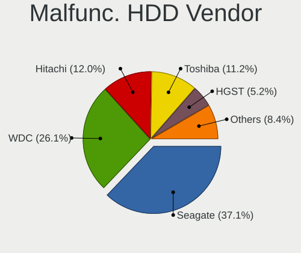

| Vendor              | Computers | Drives | Percent |
|---------------------|-----------|--------|---------|
| Seagate             | 186       | 197    | 37.13%  |
| WDC                 | 131       | 140    | 26.15%  |
| Hitachi             | 60        | 60     | 11.98%  |
| Toshiba             | 56        | 57     | 11.18%  |
| HGST                | 26        | 26     | 5.19%   |
| Samsung Electronics | 23        | 24     | 4.59%   |
| Fujitsu             | 8         | 8      | 1.6%    |
| Maxtor              | 7         | 8      | 1.4%    |
| Apple               | 2         | 2      | 0.4%    |
| Magnetic Data       | 1         | 1      | 0.2%    |
| Unknown             | 1         | 1      | 0.2%    |

Malfunc. Drive Kind
-------------------

Kinds of faulty drives

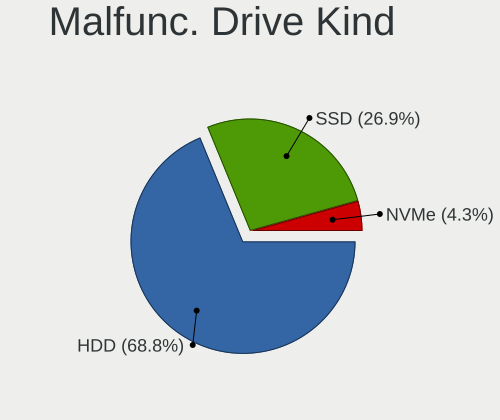

| Kind | Computers | Drives | Percent |
|------|-----------|--------|---------|
| HDD  | 476       | 524    | 68.79%  |
| SSD  | 186       | 191    | 26.88%  |
| NVMe | 30        | 33     | 4.34%   |

Failed Drives
-------------

Failed drive models

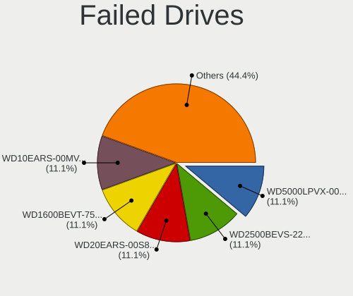

| Model                                  | Computers | Drives | Percent |
|----------------------------------------|-----------|--------|---------|
| WDC WD5000LPVX-00V0TT0 500GB           | 1         | 1      | 11.11%  |
| WDC WD2500BEVS-22UST0 250GB            | 1         | 1      | 11.11%  |
| WDC WD20EARS-00S8B1 2TB                | 1         | 1      | 11.11%  |
| WDC WD1600BEVT-75ZCT1 160GB            | 1         | 1      | 11.11%  |
| WDC WD10EARS-00MVWB0 1TB               | 1         | 1      | 11.11%  |
| Toshiba MK3265GSXN 320GB               | 1         | 1      | 11.11%  |
| Toshiba DT01ACA050 500GB               | 1         | 1      | 11.11%  |
| Seagate ST500DM002-1BD142 500GB        | 1         | 1      | 11.11%  |
| Realtek Semiconductor XrayDisk 1TB SSD | 1         | 1      | 11.11%  |

Failed Drive Vendor
-------------------

Failed drive vendors

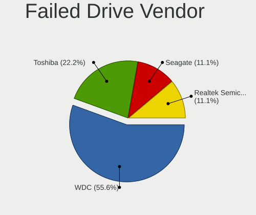

| Vendor                | Computers | Drives | Percent |
|-----------------------|-----------|--------|---------|
| WDC                   | 5         | 5      | 55.56%  |
| Toshiba               | 2         | 2      | 22.22%  |
| Seagate               | 1         | 1      | 11.11%  |
| Realtek Semiconductor | 1         | 1      | 11.11%  |

Drive Status
------------

Number of failed and malfunc. drives

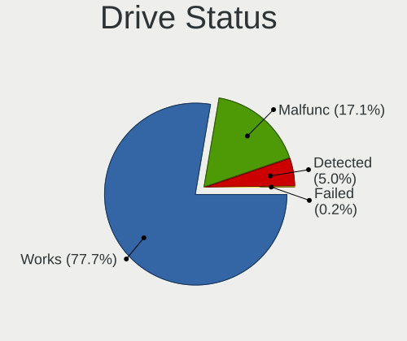

| Status   | Computers | Drives | Percent |
|----------|-----------|--------|---------|
| Works    | 3057      | 4728   | 77.67%  |
| Malfunc  | 672       | 748    | 17.07%  |
| Detected | 198       | 225    | 5.03%   |
| Failed   | 9         | 9      | 0.23%   |

Storage controller
------------------

Storage Vendor
--------------

Storage controller vendors

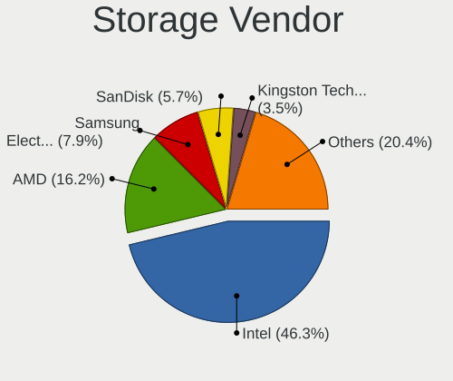

| Vendor                                  | Computers | Percent |
|-----------------------------------------|-----------|---------|
| Intel                                   | 2241      | 46.26%  |
| AMD                                     | 786       | 16.23%  |
| Samsung Electronics                     | 384       | 7.93%   |
| SanDisk                                 | 277       | 5.72%   |
| Kingston Technology Company             | 170       | 3.51%   |
| SK hynix                                | 114       | 2.35%   |
| Micron/Crucial Technology               | 98        | 2.02%   |
| Micron Technology                       | 98        | 2.02%   |
| Phison Electronics                      | 80        | 1.65%   |
| ASMedia Technology                      | 78        | 1.61%   |
| MAXIO Technology (Hangzhou)             | 71        | 1.47%   |
| KIOXIA                                  | 54        | 1.11%   |
| Toshiba America Info Systems            | 51        | 1.05%   |
| ADATA Technology                        | 46        | 0.95%   |
| Silicon Motion                          | 43        | 0.89%   |
| Realtek Semiconductor                   | 37        | 0.76%   |
| Nvidia                                  | 33        | 0.68%   |
| JMicron Technology                      | 31        | 0.64%   |
| Marvell Technology Group                | 28        | 0.58%   |
| Shenzhen Longsys Electronics            | 19        | 0.39%   |
| Solidigm                                | 12        | 0.25%   |
| Union Memory (Shenzhen)                 | 10        | 0.21%   |
| INNOGRIT                                | 10        | 0.21%   |
| Biwin Storage Technology                | 10        | 0.21%   |
| Solid State Storage Technology          | 8         | 0.17%   |
| Seagate Technology                      | 7         | 0.14%   |
| Netac Technology                        | 5         | 0.1%    |
| VIA Technologies                        | 4         | 0.08%   |
| Lenovo                                  | 4         | 0.08%   |
| Hosin Global Electronics                | 4         | 0.08%   |
| Broadcom / LSI                          | 4         | 0.08%   |
| Yangtze Memory Technologies             | 3         | 0.06%   |
| TenaFe                                  | 3         | 0.06%   |
| Shenzhen Unionmemory Information System | 3         | 0.06%   |
| Lite-On Technology                      | 3         | 0.06%   |
| Apple                                   | 3         | 0.06%   |
| Silicon Integrated Systems [SiS]        | 2         | 0.04%   |
| Silicon Image                           | 2         | 0.04%   |
| Adaptec                                 | 2         | 0.04%   |
| Unknown                                 | 2         | 0.04%   |

Storage Model
-------------

Storage controller models

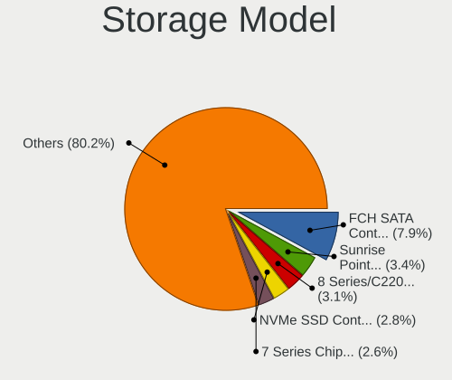

| Model                                                                          | Computers | Percent |
|--------------------------------------------------------------------------------|-----------|---------|
| AMD FCH SATA Controller [AHCI mode]                                            | 425       | 7.91%   |
| Intel Sunrise Point-LP SATA Controller [AHCI mode]                             | 185       | 3.44%   |
| Intel 8 Series/C220 Series Chipset Family 6-port SATA Controller 1 [AHCI mode] | 164       | 3.05%   |
| Samsung NVMe SSD Controller SM981/PM981/PM983                                  | 149       | 2.77%   |
| Intel 7 Series Chipset Family 6-port SATA Controller [AHCI mode]               | 140       | 2.61%   |
| Intel 82801 Mobile SATA Controller [RAID mode]                                 | 133       | 2.48%   |
| AMD 500 Series Chipset SATA Controller                                         | 126       | 2.35%   |
| AMD 400 Series Chipset SATA Controller                                         | 114       | 2.12%   |
| Intel Q170/Q150/B150/H170/H110/Z170/CM236 Chipset SATA Controller [AHCI Mode]  | 97        | 1.81%   |
| Intel Volume Management Device NVMe RAID Controller                            | 96        | 1.79%   |
| Intel 6 Series/C200 Series Chipset Family 6 port Mobile SATA AHCI Controller   | 89        | 1.66%   |
| Samsung NVMe SSD Controller PM9A1/PM9A3/980PRO                                 | 75        | 1.4%    |
| SanDisk WD SN560/SN740/SN770/SN5000 NVMe SSD                                   | 69        | 1.28%   |
| Intel 7 Series/C210 Series Chipset Family 6-port SATA Controller [AHCI mode]   | 68        | 1.27%   |
| Intel 6 Series/C200 Series Chipset Family 6 port Desktop SATA AHCI Controller  | 68        | 1.27%   |
| AMD 600 Series Chipset SATA Controller                                         | 68        | 1.27%   |
| Intel 200 Series PCH SATA controller [AHCI mode]                               | 67        | 1.25%   |
| Intel 8 Series SATA Controller 1 [AHCI mode]                                   | 64        | 1.19%   |
| AMD SB7x0/SB8x0/SB9x0 SATA Controller [AHCI mode]                              | 63        | 1.17%   |
| ASMedia ASM1061/ASM1062 Serial ATA Controller                                  | 60        | 1.12%   |
| Micron/Crucial P2 [Nick P2] / P3 / P3 Plus NVMe PCIe SSD (DRAM-less)           | 59        | 1.1%    |
| AMD SB7x0/SB8x0/SB9x0 IDE Controller                                           | 59        | 1.1%    |
| Intel Wildcat Point-LP SATA Controller [AHCI Mode]                             | 58        | 1.08%   |
| Intel SATA Controller [RAID mode]                                              | 58        | 1.08%   |
| Samsung NVMe SSD Controller 980 (DRAM-less)                                    | 57        | 1.06%   |
| Intel Celeron/Pentium Silver Processor SATA Controller                         | 56        | 1.04%   |
| Intel 82801IBM/IEM (ICH9M/ICH9M-E) 4 port SATA Controller [AHCI mode]          | 55        | 1.02%   |
| MAXIO (Hangzhou) NVMe SSD Controller MAP1202 (DRAM-less)                       | 50        | 0.93%   |
| Intel Cannon Lake PCH SATA AHCI Controller                                     | 49        | 0.91%   |
| Intel 5 Series/3400 Series Chipset 4 port SATA AHCI Controller                 | 48        | 0.89%   |
| Intel Raptor Lake SATA AHCI Controller                                         | 44        | 0.82%   |
| SanDisk Ultra 3D / WD PC SN530, IX SN530, Blue SN550 NVMe SSD (DRAM-less)      | 40        | 0.74%   |
| Silicon Motion SM2263EN/SM2263XT (DRAM-less) NVMe SSD Controllers              | 39        | 0.73%   |
| AMD SB7x0/SB8x0/SB9x0 SATA Controller [IDE mode]                               | 39        | 0.73%   |
| Intel Comet Lake SATA AHCI Controller                                          | 38        | 0.71%   |
| SK hynix Gold P31/BC711/PC711 NVMe Solid State Drive                           | 36        | 0.67%   |
| Intel Tiger Lake-LP SATA Controller                                            | 36        | 0.67%   |
| Sandisk WD Black SN850X NVMe SSD                                               | 35        | 0.65%   |
| Kingston Company NV2 NVMe SSD [SM2267XT] (DRAM-less)                           | 35        | 0.65%   |
| Intel Cannon Lake Mobile PCH SATA AHCI Controller                              | 35        | 0.65%   |

Storage Kind
------------

Kind of storage controller (IDE, SATA, NVMe, SAS, ...)

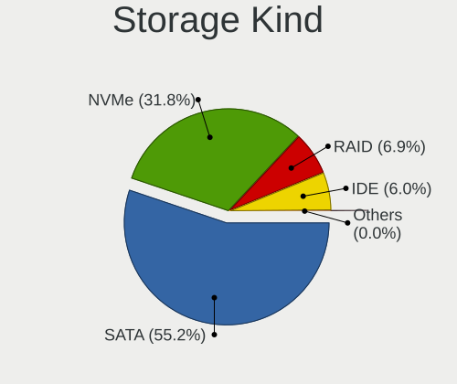

| Kind | Computers | Percent |
|------|-----------|---------|
| SATA | 2628      | 55.18%  |
| NVMe | 1515      | 31.81%  |
| RAID | 327       | 6.87%   |
| IDE  | 286       | 6%      |
| SAS  | 5         | 0.1%    |
| SCSI | 2         | 0.04%   |

Processor
---------

CPU Vendor
----------

Processor vendors

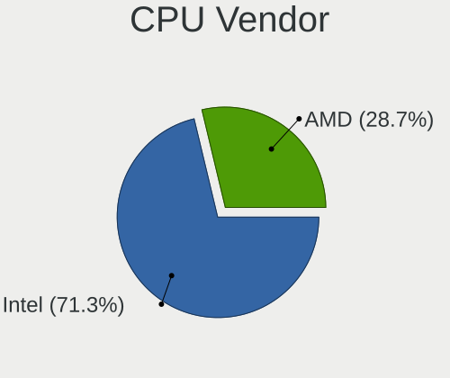

| Vendor | Computers | Percent |
|--------|-----------|---------|
| Intel  | 2563      | 71.25%  |
| AMD    | 1034      | 28.75%  |

CPU Model
---------

Processor models

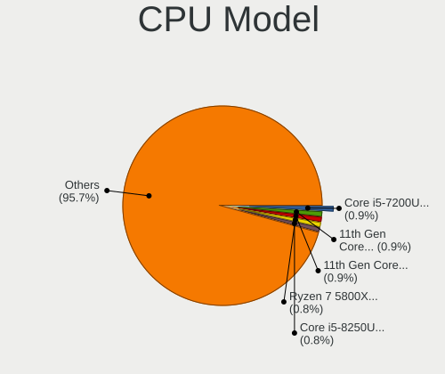

| Model                                         | Computers | Percent |
|-----------------------------------------------|-----------|---------|
| Intel Core i5-7200U CPU @ 2.50GHz             | 32        | 0.89%   |
| Intel 11th Gen Core i7-1165G7 @ 2.80GHz       | 32        | 0.89%   |
| Intel 11th Gen Core i5-1135G7 @ 2.40GHz       | 31        | 0.86%   |
| AMD Ryzen 7 5800X 8-Core Processor            | 30        | 0.83%   |
| Intel Core i5-8250U CPU @ 1.60GHz             | 28        | 0.78%   |
| Intel Core i5-6300U CPU @ 2.40GHz             | 28        | 0.78%   |
| Intel Core i5-8350U CPU @ 1.70GHz             | 27        | 0.75%   |
| Intel N100                                    | 26        | 0.72%   |
| AMD Ryzen 5 5600G with Radeon Graphics        | 26        | 0.72%   |
| Intel Core i5-2520M CPU @ 2.50GHz             | 25        | 0.7%    |
| AMD Ryzen 5 3600 6-Core Processor             | 24        | 0.67%   |
| Intel Core i5-3320M CPU @ 2.60GHz             | 23        | 0.64%   |
| Intel Core i7-3770 CPU @ 3.40GHz              | 22        | 0.61%   |
| AMD Ryzen 5 5600X 6-Core Processor            | 22        | 0.61%   |
| AMD Ryzen 5 5500U with Radeon Graphics        | 22        | 0.61%   |
| Intel Core i7-7500U CPU @ 2.70GHz             | 21        | 0.58%   |
| Intel Core i7-8550U CPU @ 1.80GHz             | 20        | 0.56%   |
| Intel Core i5-6500 CPU @ 3.20GHz              | 20        | 0.56%   |
| Intel Core i5-5200U CPU @ 2.20GHz             | 20        | 0.56%   |
| AMD Ryzen 7 5800H with Radeon Graphics        | 20        | 0.56%   |
| Intel Core i5-6200U CPU @ 2.30GHz             | 19        | 0.53%   |
| Intel Core i5-10210U CPU @ 1.60GHz            | 19        | 0.53%   |
| Intel Core i5-3470 CPU @ 3.20GHz              | 18        | 0.5%    |
| Intel Core i5-3210M CPU @ 2.50GHz             | 17        | 0.47%   |
| AMD Ryzen 7 5700U with Radeon Graphics        | 17        | 0.47%   |
| AMD Ryzen 7 5700G with Radeon Graphics        | 17        | 0.47%   |
| Intel Core i7-7700HQ CPU @ 2.80GHz            | 16        | 0.44%   |
| Intel Core i5-4590 CPU @ 3.30GHz              | 16        | 0.44%   |
| Intel Core i5-4570 CPU @ 3.20GHz              | 16        | 0.44%   |
| Intel Core i3-3110M CPU @ 2.40GHz             | 16        | 0.44%   |
| AMD Ryzen 5 3500U with Radeon Vega Mobile Gfx | 16        | 0.44%   |
| Intel Core i7-8750H CPU @ 2.20GHz             | 15        | 0.42%   |
| Intel Core i7-6500U CPU @ 2.50GHz             | 15        | 0.42%   |
| Intel Core i5-8265U CPU @ 1.60GHz             | 15        | 0.42%   |
| Intel Core i5-6500T CPU @ 2.50GHz             | 15        | 0.42%   |
| AMD Ryzen 7 3700X 8-Core Processor            | 15        | 0.42%   |
| Intel Core i5-7300U CPU @ 2.60GHz             | 14        | 0.39%   |
| Intel Core i5-5300U CPU @ 2.30GHz             | 14        | 0.39%   |
| Intel Celeron N4020 CPU @ 1.10GHz             | 14        | 0.39%   |
| Intel Celeron CPU N3060 @ 1.60GHz             | 14        | 0.39%   |

CPU Model Family
----------------

Processor model prefix

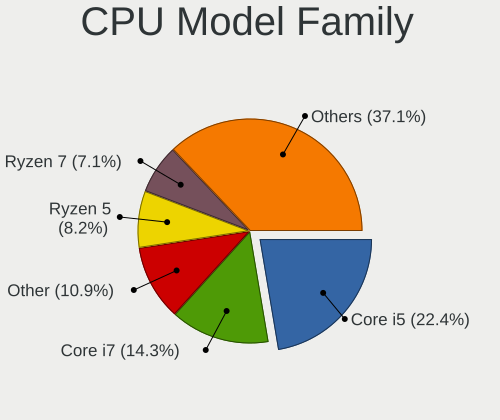

| Model                   | Computers | Percent |
|-------------------------|-----------|---------|
| Intel Core i5           | 804       | 22.35%  |
| Intel Core i7           | 516       | 14.35%  |
| Other                   | 392       | 10.9%   |
| AMD Ryzen 5             | 295       | 8.2%    |
| AMD Ryzen 7             | 257       | 7.14%   |
| Intel Core i3           | 255       | 7.09%   |
| Intel Celeron           | 172       | 4.78%   |
| Intel Core 2 Duo        | 104       | 2.89%   |
| AMD Ryzen 9             | 84        | 2.34%   |
| Intel Pentium           | 81        | 2.25%   |
| Intel Xeon              | 72        | 2%      |
| AMD Ryzen 3             | 60        | 1.67%   |
| AMD A6                  | 43        | 1.2%    |
| AMD FX                  | 38        | 1.06%   |
| Intel Pentium Dual-Core | 32        | 0.89%   |
| Intel Atom              | 27        | 0.75%   |
| Intel Core              | 26        | 0.72%   |
| AMD A8                  | 23        | 0.64%   |
| Intel Core 2 Quad       | 21        | 0.58%   |
| AMD A10                 | 21        | 0.58%   |
| AMD A4                  | 19        | 0.53%   |
| Intel Pentium Silver    | 17        | 0.47%   |
| AMD Phenom II X4        | 17        | 0.47%   |
| AMD Ryzen 7 PRO         | 16        | 0.44%   |
| Intel Core i9           | 14        | 0.39%   |
| AMD Ryzen 5 PRO         | 13        | 0.36%   |
| AMD E                   | 12        | 0.33%   |
| AMD Athlon 64 X2        | 10        | 0.28%   |
| Intel Pentium Gold      | 9         | 0.25%   |
| Intel Genuine           | 9         | 0.25%   |
| Intel Core 2            | 9         | 0.25%   |
| Intel Pentium Dual      | 8         | 0.22%   |
| AMD Athlon II X2        | 8         | 0.22%   |
| AMD Athlon              | 8         | 0.22%   |
| AMD Phenom II X6        | 7         | 0.19%   |
| AMD E2                  | 7         | 0.19%   |
| AMD Athlon II X4        | 7         | 0.19%   |
| AMD Ryzen 3 PRO         | 6         | 0.17%   |
| AMD Sempron             | 5         | 0.14%   |
| AMD Ryzen Threadripper  | 5         | 0.14%   |

CPU Cores
---------

Number of processor cores

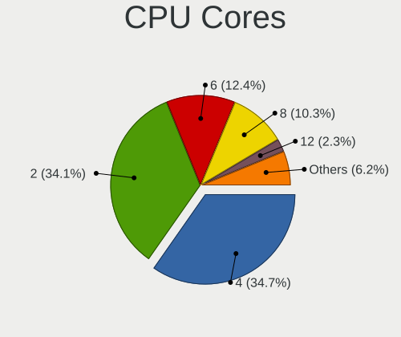

| Number | Computers | Percent |
|--------|-----------|---------|
| 4      | 1249      | 34.72%  |
| 2      | 1228      | 34.14%  |
| 6      | 445       | 12.37%  |
| 8      | 369       | 10.26%  |
| 12     | 84        | 2.34%   |
| 16     | 65        | 1.81%   |
| 10     | 62        | 1.72%   |
| 14     | 36        | 1%      |
| 24     | 23        | 0.64%   |
| 1      | 17        | 0.47%   |
| 20     | 10        | 0.28%   |
| 3      | 4         | 0.11%   |
| 36     | 1         | 0.03%   |
| 28     | 1         | 0.03%   |
| 22     | 1         | 0.03%   |
| 18     | 1         | 0.03%   |
| 5      | 1         | 0.03%   |

CPU Sockets
-----------

Number of sockets

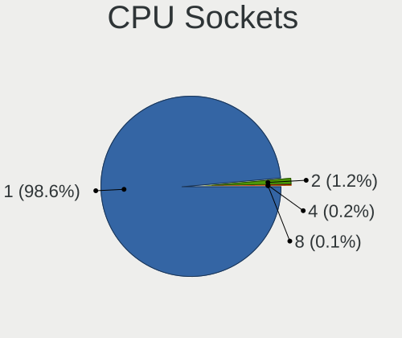

| Number | Computers | Percent |
|--------|-----------|---------|
| 1      | 3546      | 98.58%  |
| 2      | 42        | 1.17%   |
| 4      | 7         | 0.19%   |
| 8      | 2         | 0.06%   |

CPU Threads
-----------

Threads per core (Hyper-Threading)

| Number | Computers | Percent |
|--------|-----------|---------|
| 2      | 2422      | 67.33%  |
| 1      | 1175      | 32.67%  |

CPU Op-Modes
------------

CPU Operation Modes (32-bit, 64-bit)

| Op mode        | Computers | Percent |
|----------------|-----------|---------|
| 32-bit, 64-bit | 3597      | 100%    |

CPU Microcode
-------------

Microcode number

| Number     | Computers | Percent |
|------------|-----------|---------|
| Unknown    | 3593      | 99.89%  |
| 0x08600109 | 2         | 0.06%   |
| 0x0a50000c | 1         | 0.03%   |
| 0x0a404107 | 1         | 0.03%   |

CPU Microarch
-------------

Microarchitecture

| Name              | Computers | Percent |
|-------------------|-----------|---------|
| KabyLake          | 494       | 13.73%  |
| Haswell           | 297       | 8.26%   |
| IvyBridge         | 247       | 6.87%   |
| Zen 3             | 240       | 6.67%   |
| Skylake           | 234       | 6.51%   |
| Unknown           | 222       | 6.17%   |
| Alderlake Hybrid  | 208       | 5.78%   |
| SandyBridge       | 194       | 5.39%   |
| Penryn            | 134       | 3.73%   |
| Zen 2             | 120       | 3.34%   |
| Zen+              | 115       | 3.2%    |
| TigerLake         | 97        | 2.7%    |
| Westmere          | 96        | 2.67%   |
| Broadwell         | 79        | 2.2%    |
| Silvermont        | 74        | 2.06%   |
| IceLake           | 70        | 1.95%   |
| Goldmont plus     | 67        | 1.86%   |
| Zen               | 62        | 1.72%   |
| CometLake         | 60        | 1.67%   |
| K10               | 58        | 1.61%   |
| Core              | 55        | 1.53%   |
| Excavator         | 54        | 1.5%    |
| Piledriver        | 52        | 1.45%   |
| Gracemont         | 45        | 1.25%   |
| Goldmont          | 27        | 0.75%   |
| Puma              | 26        | 0.72%   |
| Nehalem           | 23        | 0.64%   |
| Bobcat            | 23        | 0.64%   |
| Tremont           | 21        | 0.58%   |
| Meteorlake Hybrid | 21        | 0.58%   |
| K8 Hammer         | 16        | 0.44%   |
| Steamroller       | 14        | 0.39%   |
| K10 Llano         | 13        | 0.36%   |
| Jaguar            | 11        | 0.31%   |
| Bonnell           | 9         | 0.25%   |
| NetBurst          | 6         | 0.17%   |
| Bulldozer         | 6         | 0.17%   |
| K8 & K10 hybrid   | 4         | 0.11%   |
| Lunarlake Hybrid  | 3         | 0.08%   |

Graphics
--------

GPU Vendor
----------

Vendors of graphics cards

| Vendor                           | Computers | Percent |
|----------------------------------|-----------|---------|
| Intel                            | 2044      | 49.85%  |
| AMD                              | 1051      | 25.63%  |
| Nvidia                           | 989       | 24.12%  |
| Red Hat                          | 9         | 0.22%   |
| Matrox Electronics Systems       | 4         | 0.1%    |
| ASPEED Technology                | 2         | 0.05%   |
| Silicon Integrated Systems [SiS] | 1         | 0.02%   |

GPU Model
---------

Graphics card models

| Model                                                                                    | Computers | Percent |
|------------------------------------------------------------------------------------------|-----------|---------|
| Intel 2nd Generation Core Processor Family Integrated Graphics Controller                | 153       | 3.65%   |
| Intel 3rd Gen Core processor Graphics Controller                                         | 137       | 3.27%   |
| Intel Kaby Lake-R GT2 [UHD Graphics 620]                                                 | 92        | 2.19%   |
| Intel Skylake-U GT2 [HD Graphics 520]                                                    | 90        | 2.14%   |
| Intel Kaby Lake-U GT2 [HD Graphics 620]                                                  | 90        | 2.14%   |
| AMD Cezanne [Radeon Vega Series / Radeon Vega Mobile Series]                             | 86        | 2.05%   |
| Intel Xeon E3-1200 v3/4th Gen Core Processor Integrated Graphics Controller              | 84        | 2%      |
| AMD Picasso/Raven 2 [Radeon Vega Series / Radeon Vega Mobile Series]                     | 82        | 1.95%   |
| Intel TigerLake-LP GT2 [Iris Xe Graphics]                                                | 81        | 1.93%   |
| Intel Haswell-ULT Integrated Graphics Controller                                         | 73        | 1.74%   |
| Intel Skylake-S GT2 [HD Graphics 530]                                                    | 65        | 1.55%   |
| Intel Broadwell-U GT2 [HD Graphics 5500]                                                 | 58        | 1.38%   |
| Intel GeminiLake [UHD Graphics 600]                                                      | 54        | 1.29%   |
| Intel Core Processor Integrated Graphics Controller                                      | 53        | 1.26%   |
| AMD Ellesmere [Radeon RX 470/480/570/570X/580/580X/590]                                  | 51        | 1.22%   |
| Intel Mobile 4 Series Chipset Integrated Graphics Controller                             | 50        | 1.19%   |
| AMD Raphael                                                                              | 48        | 1.14%   |
| Intel WhiskeyLake-U GT2 [UHD Graphics 620]                                               | 46        | 1.1%    |
| Intel Alder Lake-N [UHD Graphics]                                                        | 44        | 1.05%   |
| Intel 4th Gen Core Processor Integrated Graphics Controller                              | 44        | 1.05%   |
| AMD Renoir [Radeon Vega Series / Radeon Vega Mobile Series]                              | 42        | 1%      |
| AMD Navi 23 [Radeon RX 6600/6600 XT/6600M]                                               | 41        | 0.98%   |
| AMD Lucienne                                                                             | 41        | 0.98%   |
| Intel CometLake-U GT2 [UHD Graphics]                                                     | 39        | 0.93%   |
| Intel Atom/Celeron/Pentium Processor x5-E8000/J3xxx/N3xxx Integrated Graphics Controller | 38        | 0.91%   |
| AMD Raven Ridge [Radeon Vega Series / Radeon Vega Mobile Series]                         | 38        | 0.91%   |
| Intel Xeon E3-1200 v2/3rd Gen Core processor Graphics Controller                         | 36        | 0.86%   |
| Intel CoffeeLake-S GT2 [UHD Graphics 630]                                                | 36        | 0.86%   |
| Intel CoffeeLake-H GT2 [UHD Graphics 630]                                                | 36        | 0.86%   |
| Intel Atom Processor Z36xxx/Z37xxx Series Graphics & Display                             | 35        | 0.83%   |
| AMD Stoney [Radeon R2/R3/R4/R5 Graphics]                                                 | 34        | 0.81%   |
| Intel Alder Lake-P GT2 [Iris Xe Graphics]                                                | 31        | 0.74%   |
| AMD Phoenix1                                                                             | 31        | 0.74%   |
| Intel Kaby Lake-S GT2 [HD Graphics 630]                                                  | 30        | 0.71%   |
| Nvidia GP108 [GeForce GT 1030]                                                           | 28        | 0.67%   |
| AMD Rembrandt [Radeon 680M]                                                              | 28        | 0.67%   |
| AMD Barcelo                                                                              | 27        | 0.64%   |
| AMD Navi 22 [Radeon RX 6700/6700 XT/6750 XT / 6800M/6850M XT]                            | 26        | 0.62%   |
| Intel 4 Series Chipset Integrated Graphics Controller                                    | 25        | 0.6%    |
| AMD HawkPoint1                                                                           | 25        | 0.6%    |

GPU Combo
---------

Combinations of graphics cards

| Name            | Computers | Percent |
|-----------------|-----------|---------|
| 1 x Intel       | 1531      | 42.54%  |
| 1 x AMD         | 850       | 23.62%  |
| 1 x Nvidia      | 541       | 15.03%  |
| Intel + Nvidia  | 363       | 10.09%  |
| 2 x Intel       | 92        | 2.56%   |
| AMD + Nvidia    | 79        | 2.2%    |
| 2 x AMD         | 65        | 1.81%   |
| Intel + AMD     | 57        | 1.58%   |
| 1 x Red Hat     | 9         | 0.25%   |
| 2 x Nvidia      | 4         | 0.11%   |
| 1 x Matrox      | 3         | 0.08%   |
| 3 x AMD         | 1         | 0.03%   |
| 1 x SiS         | 1         | 0.03%   |
| Nvidia + Matrox | 1         | 0.03%   |
| Nvidia + ASPEED | 1         | 0.03%   |
| Intel + ASPEED  | 1         | 0.03%   |

GPU Driver
----------

Free vs proprietary

| Driver      | Computers | Percent |
|-------------|-----------|---------|
| Free        | 3199      | 88.89%  |
| Unknown     | 345       | 9.59%   |
| Proprietary | 55        | 1.53%   |

GPU Memory
----------

Total video memory

| Size in GB | Computers | Percent |
|------------|-----------|---------|
| Unknown    | 2560      | 71.13%  |
| 0.01-0.5   | 386       | 10.73%  |
| 1.01-2.0   | 167       | 4.64%   |
| 0.51-1.0   | 144       | 4%      |
| 7.01-8.0   | 124       | 3.45%   |
| 8.01-16.0  | 86        | 2.39%   |
| 3.01-4.0   | 80        | 2.22%   |
| 2.01-3.0   | 30        | 0.83%   |
| 16.01-24.0 | 16        | 0.44%   |
| 5.01-6.0   | 5         | 0.14%   |
| 32.01-64.0 | 1         | 0.03%   |

Monitor
-------

Monitor Vendor
--------------

Monitor vendors

| Vendor                  | Computers | Percent |
|-------------------------|-----------|---------|
| Samsung Electronics     | 441       | 11.92%  |
| AU Optronics            | 426       | 11.51%  |
| BOE                     | 362       | 9.78%   |
| LG Display              | 320       | 8.65%   |
| Chimei Innolux          | 315       | 8.51%   |
| Dell                    | 217       | 5.86%   |
| Goldstar                | 196       | 5.3%    |
| Hewlett-Packard         | 145       | 3.92%   |
| Acer                    | 124       | 3.35%   |
| AOC                     | 105       | 2.84%   |
| Philips                 | 89        | 2.41%   |
| Ancor Communications    | 65        | 1.76%   |
| ASUSTek Computer        | 64        | 1.73%   |
| BenQ                    | 63        | 1.7%    |
| Lenovo                  | 56        | 1.51%   |
| Sharp                   | 53        | 1.43%   |
| MSI                     | 49        | 1.32%   |
| Apple                   | 43        | 1.16%   |
| ViewSonic               | 40        | 1.08%   |
| Iiyama                  | 36        | 0.97%   |
| InfoVision              | 35        | 0.95%   |
| Chi Mei Optoelectronics | 33        | 0.89%   |
| PANDA                   | 29        | 0.78%   |
| Sony                    | 22        | 0.59%   |
| Sceptre Tech            | 20        | 0.54%   |
| HKC                     | 18        | 0.49%   |
| CSOT                    | 17        | 0.46%   |
| LG Philips              | 15        | 0.41%   |
| Gigabyte Technology     | 12        | 0.32%   |
| Panasonic               | 11        | 0.3%    |
| Eizo                    | 11        | 0.3%    |
| Unknown (XXX)           | 10        | 0.27%   |
| Toshiba                 | 10        | 0.27%   |
| RHT                     | 9         | 0.24%   |
| Insignia                | 9         | 0.24%   |
| HannStar                | 9         | 0.24%   |
| RTK                     | 8         | 0.22%   |
| Mi                      | 7         | 0.19%   |
| Hitachi                 | 6         | 0.16%   |
| ___                     | 5         | 0.14%   |

Monitor Model
-------------

Monitor models

| Model                                                                | Computers | Percent |
|----------------------------------------------------------------------|-----------|---------|
| Chimei Innolux LCD Monitor CMN15F5 1920x1080 344x193mm 15.5-inch     | 24        | 0.64%   |
| Samsung Electronics LCD Monitor SEC5441 1280x800 331x207mm 15.4-inch | 17        | 0.46%   |
| Samsung Electronics C27F390 SAM0D32 1920x1080 598x336mm 27.0-inch    | 14        | 0.37%   |
| Chimei Innolux LCD Monitor CMN14D4 1920x1080 309x173mm 13.9-inch     | 14        | 0.37%   |
| AU Optronics LCD Monitor AUO26EC 1366x768 344x193mm 15.5-inch        | 12        | 0.32%   |
| AOC 27G2G4 AOC2702 1920x1080 598x336mm 27.0-inch                     | 12        | 0.32%   |
| Samsung Electronics C24F390 SAM0D2C 1920x1080 521x293mm 23.5-inch    | 11        | 0.29%   |
| Chimei Innolux LCD Monitor CMN15E7 1920x1080 344x193mm 15.5-inch     | 11        | 0.29%   |
| Chimei Innolux LCD Monitor CMN14D6 1366x768 309x173mm 13.9-inch      | 11        | 0.29%   |
| AU Optronics LCD Monitor AUO22EC 1366x768 344x193mm 15.5-inch        | 11        | 0.29%   |
| Goldstar FULL HD GSM5B55 1920x1080 480x270mm 21.7-inch               | 10        | 0.27%   |
| Chimei Innolux LCD Monitor CMN14C9 1920x1080 309x173mm 13.9-inch     | 10        | 0.27%   |
| Chimei Innolux LCD Monitor CMN1482 1600x900 309x174mm 14.0-inch      | 10        | 0.27%   |
| AU Optronics LCD Monitor AUO10EC 1366x768 344x193mm 15.5-inch        | 10        | 0.27%   |
| RHT QEMU Monitor RHT1234 2048x1152 325x203mm 15.1-inch               | 9         | 0.24%   |
| LG Display LCD Monitor LGD02DC 1366x768 344x194mm 15.5-inch          | 9         | 0.24%   |
| LG Display LCD Monitor LGD02D8 1366x768 277x156mm 12.5-inch          | 9         | 0.24%   |
| Chimei Innolux LCD Monitor CMN15DB 1366x768 344x193mm 15.5-inch      | 9         | 0.24%   |
| Chimei Innolux LCD Monitor CMN1132 1366x768 256x144mm 11.6-inch      | 9         | 0.24%   |
| AU Optronics LCD Monitor AUO313C 1366x768 309x173mm 13.9-inch        | 9         | 0.24%   |
| LG Display LCD Monitor LGD0555 2736x1824 260x173mm 12.3-inch         | 8         | 0.21%   |
| LG Display LCD Monitor LGD033E 1366x768 309x174mm 14.0-inch          | 8         | 0.21%   |
| LG Display LCD Monitor LGD033A 1366x768 344x194mm 15.5-inch          | 8         | 0.21%   |
| Goldstar HDR 4K GSM7706 3840x2160 600x340mm 27.2-inch                | 8         | 0.21%   |
| BOE LCD Monitor BOE095F 2256x1504 285x190mm 13.5-inch                | 8         | 0.21%   |
| BOE LCD Monitor BOE0812 1920x1080 344x194mm 15.5-inch                | 8         | 0.21%   |
| AU Optronics LCD Monitor AUOAF90 1920x1080 344x193mm 15.5-inch       | 8         | 0.21%   |
| AU Optronics LCD Monitor AUO71EC 1366x768 344x193mm 15.5-inch        | 8         | 0.21%   |
| AOC 24G2W1G3 AOC2402 1920x1080 527x296mm 23.8-inch                   | 8         | 0.21%   |
| Samsung Electronics LCD Monitor SEC544B 1600x900 382x214mm 17.2-inch | 7         | 0.19%   |
| Philips PHL 243V7 PHLC155 1920x1080 527x296mm 23.8-inch              | 7         | 0.19%   |
| LG Display LCD Monitor LGD0521 1920x1080 309x174mm 14.0-inch         | 7         | 0.19%   |
| Chimei Innolux LCD Monitor CMN15E6 1366x768 344x193mm 15.5-inch      | 7         | 0.19%   |
| Chimei Innolux LCD Monitor CMN153B 1920x1080 344x193mm 15.5-inch     | 7         | 0.19%   |
| BOE LCD Monitor BOE0BCA 2256x1504 285x190mm 13.5-inch                | 7         | 0.19%   |
| AU Optronics LCD Monitor AUO61ED 1920x1080 344x194mm 15.5-inch       | 7         | 0.19%   |
| AU Optronics LCD Monitor AUO403D 1920x1080 309x174mm 14.0-inch       | 7         | 0.19%   |
| AU Optronics LCD Monitor AUO2E3C 1366x768 309x173mm 13.9-inch        | 7         | 0.19%   |
| AU Optronics LCD Monitor AUO235C 1366x768 256x144mm 11.6-inch        | 7         | 0.19%   |
| Unknown (XXX) Beyond TV XXX2851 3840x2160 1209x680mm 54.6-inch       | 6         | 0.16%   |

Monitor Resolution
------------------

Monitor screen resolution

| Resolution         | Computers | Percent |
|--------------------|-----------|---------|
| 1920x1080 (FHD)    | 1676      | 46.27%  |
| 1366x768 (WXGA)    | 643       | 17.75%  |
| 3840x2160 (4K)     | 253       | 6.99%   |
| 2560x1440 (QHD)    | 211       | 5.83%   |
| 1600x900 (HD+)     | 160       | 4.42%   |
| 1920x1200 (WUXGA)  | 121       | 3.34%   |
| 1440x900 (WXGA+)   | 74        | 2.04%   |
| 1280x1024 (SXGA)   | 73        | 2.02%   |
| 1680x1050 (WSXGA+) | 61        | 1.68%   |
| 3440x1440          | 53        | 1.46%   |
| 1280x800 (WXGA)    | 52        | 1.44%   |
| 2560x1600          | 38        | 1.05%   |
| 2880x1800          | 25        | 0.69%   |
| 2560x1080          | 20        | 0.55%   |
| 2880x1920          | 16        | 0.44%   |
| 2256x1504          | 16        | 0.44%   |
| 1360x768           | 14        | 0.39%   |
| 3840x1080          | 12        | 0.33%   |
| 1920x1280          | 11        | 0.3%    |
| 2560x1397          | 9         | 0.25%   |
| 2160x1440          | 8         | 0.22%   |
| 1920x540           | 8         | 0.22%   |
| 1024x768 (XGA)     | 7         | 0.19%   |
| 3840x2400          | 6         | 0.17%   |
| 3200x1800 (QHD+)   | 5         | 0.14%   |
| 1800x1200          | 5         | 0.14%   |
| 1600x1200          | 5         | 0.14%   |
| 3840x1600          | 3         | 0.08%   |
| 3072x1920          | 3         | 0.08%   |
| 2160x1350          | 3         | 0.08%   |
| 1280x720 (HD)      | 3         | 0.08%   |
| 1024x600           | 3         | 0.08%   |
| 800x1280           | 2         | 0.06%   |
| 3200x2000          | 2         | 0.06%   |
| 3000x2000          | 2         | 0.06%   |
| 2736x1824          | 2         | 0.06%   |
| 2520x1680          | 2         | 0.06%   |
| 2288x1287          | 2         | 0.06%   |
| 2240x1400          | 2         | 0.06%   |
| 1600x2560          | 2         | 0.06%   |

Monitor Diagonal
----------------

Diagonal size in inches

| Inches  | Computers | Percent |
|---------|-----------|---------|
| 15      | 884       | 23.91%  |
| 27      | 368       | 9.95%   |
| 13      | 342       | 9.25%   |
| 14      | 296       | 8.01%   |
| 24      | 252       | 6.82%   |
| 23      | 250       | 6.76%   |
| 17      | 190       | 5.14%   |
| 21      | 166       | 4.49%   |
| 31      | 147       | 3.98%   |
| 19      | 85        | 2.3%    |
| 16      | 68        | 1.84%   |
| 12      | 68        | 1.84%   |
| 34      | 62        | 1.68%   |
| 20      | 60        | 1.62%   |
| 18      | 56        | 1.51%   |
| 11      | 53        | 1.43%   |
| 22      | 43        | 1.16%   |
| 84      | 33        | 0.89%   |
| 32      | 30        | 0.81%   |
| 40      | 25        | 0.68%   |
| 26      | 19        | 0.51%   |
| Unknown | 19        | 0.51%   |
| 63      | 16        | 0.43%   |
| 25      | 16        | 0.43%   |
| 10      | 15        | 0.41%   |
| 72      | 14        | 0.38%   |
| 48      | 13        | 0.35%   |
| 29      | 13        | 0.35%   |
| 28      | 12        | 0.32%   |
| 54      | 11        | 0.3%    |
| 49      | 10        | 0.27%   |
| 46      | 6         | 0.16%   |
| 65      | 5         | 0.14%   |
| 52      | 5         | 0.14%   |
| 35      | 5         | 0.14%   |
| 7       | 5         | 0.14%   |
| 42      | 4         | 0.11%   |
| 37      | 4         | 0.11%   |
| 74      | 3         | 0.08%   |
| 57      | 3         | 0.08%   |

Monitor Width
-------------

Physical width

| Width in mm    | Computers | Percent |
|----------------|-----------|---------|
| 301-350        | 1427      | 38.96%  |
| 501-600        | 843       | 23.01%  |
| 401-500        | 368       | 10.05%  |
| 201-300        | 296       | 8.08%   |
| 351-400        | 236       | 6.44%   |
| 601-700        | 200       | 5.46%   |
| 701-800        | 96        | 2.62%   |
| 1001-1500      | 75        | 2.05%   |
| 1501-2000      | 51        | 1.39%   |
| 801-900        | 37        | 1.01%   |
| Unknown        | 19        | 0.52%   |
| 901-1000       | 9         | 0.25%   |
| 101-200        | 3         | 0.08%   |
| 1-100          | 2         | 0.05%   |
| More than 2000 | 1         | 0.03%   |

Aspect Ratio
------------

Proportional relationship between the width and the height

| Ratio   | Computers | Percent |
|---------|-----------|---------|
| 16/9    | 2843      | 80.61%  |
| 16/10   | 421       | 11.94%  |
| 21/9    | 73        | 2.07%   |
| 5/4     | 71        | 2.01%   |
| 3/2     | 64        | 1.81%   |
| 4/3     | 21        | 0.6%    |
| 32/9    | 17        | 0.48%   |
| 6/5     | 3         | 0.09%   |
| 0.56    | 3         | 0.09%   |
| 2.00    | 2         | 0.06%   |
| 1.96    | 2         | 0.06%   |
| 0.67    | 2         | 0.06%   |
| Unknown | 2         | 0.06%   |
| 2.12    | 1         | 0.03%   |
| 1.00    | 1         | 0.03%   |
| 0.89    | 1         | 0.03%   |

Monitor Area
------------

Area in inch²

| Area in inch² | Computers | Percent |
|----------------|-----------|---------|
| 101-110        | 885       | 23.98%  |
| 201-250        | 573       | 15.53%  |
| 81-90          | 516       | 13.98%  |
| 301-350        | 384       | 10.41%  |
| 351-500        | 264       | 7.15%   |
| 151-200        | 198       | 5.37%   |
| 121-130        | 134       | 3.63%   |
| 71-80          | 122       | 3.31%   |
| 251-300        | 113       | 3.06%   |
| More than 1000 | 104       | 2.82%   |
| 141-150        | 80        | 2.17%   |
| 501-1000       | 69        | 1.87%   |
| 61-70          | 63        | 1.71%   |
| 111-120        | 59        | 1.6%    |
| 51-60          | 58        | 1.57%   |
| 131-140        | 27        | 0.73%   |
| Unknown        | 19        | 0.51%   |
| 41-50          | 10        | 0.27%   |
| 91-100         | 7         | 0.19%   |
| 1-40           | 5         | 0.14%   |

Pixel Density
-------------

Pixels per inch

| Density       | Computers | Percent |
|---------------|-----------|---------|
| 51-100        | 1280      | 35.2%   |
| 121-160       | 953       | 26.21%  |
| 101-120       | 949       | 26.1%   |
| 161-240       | 281       | 7.73%   |
| 1-50          | 84        | 2.31%   |
| More than 240 | 70        | 1.93%   |
| Unknown       | 19        | 0.52%   |

Multiple Monitors
-----------------

Total monitors connected

| Total | Computers | Percent |
|-------|-----------|---------|
| 1     | 3176      | 88.22%  |
| 2     | 308       | 8.56%   |
| 0     | 102       | 2.83%   |
| 3     | 13        | 0.36%   |
| 4     | 1         | 0.03%   |

Network
-------

Net Controller Vendor
---------------------

Controller vendors

| Vendor                                 | Computers | Percent |
|----------------------------------------|-----------|---------|
| Realtek Semiconductor                  | 2012      | 39.1%   |
| Intel                                  | 1814      | 35.25%  |
| Qualcomm Atheros                       | 455       | 8.84%   |
| Broadcom                               | 199       | 3.87%   |
| MediaTek                               | 172       | 3.34%   |
| Marvell Technology Group               | 47        | 0.91%   |
| Broadcom Limited                       | 46        | 0.89%   |
| TP-Link                                | 44        | 0.86%   |
| Ralink Technology                      | 37        | 0.72%   |
| ASIX Electronics                       | 33        | 0.64%   |
| Nvidia                                 | 29        | 0.56%   |
| Ralink                                 | 19        | 0.37%   |
| Shenzhen Goodix Technology             | 16        | 0.31%   |
| Sierra Wireless                        | 14        | 0.27%   |
| Qualcomm                               | 14        | 0.27%   |
| Dell                                   | 14        | 0.27%   |
| Samsung Electronics                    | 10        | 0.19%   |
| Qualcomm Atheros Communications        | 10        | 0.19%   |
| Microsoft                              | 10        | 0.19%   |
| D-Link System                          | 10        | 0.19%   |
| Aquantia                               | 10        | 0.19%   |
| JMicron Technology                     | 8         | 0.16%   |
| D-Link                                 | 8         | 0.16%   |
| NetGear                                | 7         | 0.14%   |
| Motorola PCS                           | 7         | 0.14%   |
| Ericsson Business Mobile Networks      | 7         | 0.14%   |
| Lenovo                                 | 6         | 0.12%   |
| Xiaomi                                 | 5         | 0.1%    |
| Hewlett-Packard                        | 5         | 0.1%    |
| Google                                 | 5         | 0.1%    |
| DisplayLink                            | 5         | 0.1%    |
| ASUSTek Computer                       | 5         | 0.1%    |
| Linksys                                | 4         | 0.08%   |
| Fibocom                                | 4         | 0.08%   |
| Edimax Technology                      | 4         | 0.08%   |
| VIA Technologies                       | 3         | 0.06%   |
| Suzhou Motorcomm Electronic Technology | 3         | 0.06%   |
| Qualcomm Technologies                  | 3         | 0.06%   |
| Mellanox Technologies                  | 3         | 0.06%   |
| Huawei Technologies                    | 3         | 0.06%   |

Net Controller Model
--------------------

Controller models

| Model                                                                  | Computers | Percent |
|------------------------------------------------------------------------|-----------|---------|
| Realtek RTL8111/8168/8211/8411 PCI Express Gigabit Ethernet Controller | 1320      | 21.46%  |
| Realtek RTL810xE PCI Express Fast Ethernet controller                  | 195       | 3.17%   |
| Realtek RTL8125 2.5GbE Controller                                      | 176       | 2.86%   |
| Intel Wi-Fi 6 AX200                                                    | 157       | 2.55%   |
| Intel 82579LM Gigabit Network Connection (Lewisville)                  | 149       | 2.42%   |
| Realtek RTL8821CE 802.11ac PCIe Wireless Network Adapter               | 132       | 2.15%   |
| Intel Wireless 8265 / 8275                                             | 129       | 2.1%    |
| Intel Wireless 7265                                                    | 91        | 1.48%   |
| Intel Wireless 8260                                                    | 80        | 1.3%    |
| Intel Wi-Fi 6E(802.11ax) AX210/AX1675* 2x2 [Typhoon Peak]              | 80        | 1.3%    |
| MediaTek MT7922 802.11ax PCI Express Wireless Network Adapter          | 78        | 1.27%   |
| Intel Wireless 7260                                                    | 77        | 1.25%   |
| Qualcomm Atheros QCA9377 802.11ac Wireless Network Adapter             | 76        | 1.24%   |
| Realtek RTL8153 Gigabit Ethernet Adapter                               | 74        | 1.2%    |
| Intel Centrino Advanced-N 6205 [Taylor Peak]                           | 73        | 1.19%   |
| Intel Ethernet Connection I217-LM                                      | 69        | 1.12%   |
| Realtek RTL8822CE 802.11ac PCIe Wireless Network Adapter               | 66        | 1.07%   |
| Intel Wi-Fi 6 AX201                                                    | 64        | 1.04%   |
| Qualcomm Atheros AR9285 Wireless Network Adapter (PCI-Express)         | 60        | 0.98%   |
| Intel I211 Gigabit Network Connection                                  | 59        | 0.96%   |
| Qualcomm Atheros QCA9565 / AR9565 Wireless Network Adapter             | 56        | 0.91%   |
| Intel Ethernet Controller I225-V                                       | 56        | 0.91%   |
| Intel Ethernet Connection (4) I219-LM                                  | 56        | 0.91%   |
| Qualcomm Atheros AR9485 Wireless Network Adapter                       | 54        | 0.88%   |
| Intel Wireless 3165                                                    | 50        | 0.81%   |
| Qualcomm Atheros QCA6174 802.11ac Wireless Network Adapter             | 49        | 0.8%    |
| MediaTek MT7921 802.11ax PCIe Wireless Network Adapter [Filogic 330]   | 49        | 0.8%    |
| Intel Ethernet Connection (2) I219-V                                   | 46        | 0.75%   |
| Intel Ethernet Connection (2) I219-LM                                  | 45        | 0.73%   |
| Intel Dual Band Wireless-AC 3168NGW [Stone Peak]                       | 45        | 0.73%   |
| Realtek RTL8852BE PCIe 802.11ax Wireless Network Controller            | 43        | 0.7%    |
| Intel 700 Series Chipset CNVi WiFi                                     | 42        | 0.68%   |
| Intel Alder Lake-P PCH CNVi WiFi                                       | 41        | 0.67%   |
| Intel Ethernet Connection I219-LM                                      | 39        | 0.63%   |
| Intel Cannon Lake PCH CNVi WiFi                                        | 37        | 0.6%    |
| Intel Comet Lake PCH-LP CNVi WiFi                                      | 35        | 0.57%   |
| Broadcom BCM4313 802.11bgn Wireless Network Adapter                    | 33        | 0.54%   |
| Realtek RTL8188EE Wireless Network Adapter                             | 31        | 0.5%    |
| Realtek RTL8188CE 802.11b/g/n WiFi Adapter                             | 31        | 0.5%    |
| Intel Raptor Lake PCH CNVi WiFi                                        | 30        | 0.49%   |

Wireless Vendor
---------------

Wireless vendors

| Vendor                                | Computers | Percent |
|---------------------------------------|-----------|---------|
| Intel                                 | 1368      | 48.74%  |
| Realtek Semiconductor                 | 535       | 19.06%  |
| Qualcomm Atheros                      | 379       | 13.5%   |
| MediaTek                              | 162       | 5.77%   |
| Broadcom                              | 122       | 4.35%   |
| TP-Link                               | 42        | 1.5%    |
| Ralink Technology                     | 37        | 1.32%   |
| Broadcom Limited                      | 25        | 0.89%   |
| Ralink                                | 19        | 0.68%   |
| Marvell Technology Group              | 16        | 0.57%   |
| Sierra Wireless                       | 14        | 0.5%    |
| Qualcomm Atheros Communications       | 10        | 0.36%   |
| Qualcomm                              | 10        | 0.36%   |
| Microsoft                             | 10        | 0.36%   |
| Dell                                  | 10        | 0.36%   |
| NetGear                               | 7         | 0.25%   |
| D-Link System                         | 6         | 0.21%   |
| Linksys                               | 4         | 0.14%   |
| Fibocom                               | 4         | 0.14%   |
| Edimax Technology                     | 4         | 0.14%   |
| D-Link                                | 4         | 0.14%   |
| ASUSTek Computer                      | 4         | 0.14%   |
| Mercucys                              | 2         | 0.07%   |
| Belkin Components                     | 2         | 0.07%   |
| ZyDAS                                 | 1         | 0.04%   |
| Tenda                                 | 1         | 0.04%   |
| Sitecom Europe                        | 1         | 0.04%   |
| Sagem                                 | 1         | 0.04%   |
| Quectel Wireless Solutions            | 1         | 0.04%   |
| Qualcomm Technologies                 | 1         | 0.04%   |
| Gemtek                                | 1         | 0.04%   |
| Elecom                                | 1         | 0.04%   |
| AVM                                   | 1         | 0.04%   |
| AirTies Wireless Networks             | 1         | 0.04%   |
| 802.11g Adapter [Linksys WUSB54GC v3] | 1         | 0.04%   |

Wireless Model
--------------

Wireless models

| Model                                                                | Computers | Percent |
|----------------------------------------------------------------------|-----------|---------|
| Intel Wi-Fi 6 AX200                                                  | 157       | 5.57%   |
| Realtek RTL8821CE 802.11ac PCIe Wireless Network Adapter             | 132       | 4.68%   |
| Intel Wireless 8265 / 8275                                           | 129       | 4.58%   |
| Intel Wireless 7265                                                  | 91        | 3.23%   |
| Intel Wireless 8260                                                  | 80        | 2.84%   |
| Intel Wi-Fi 6E(802.11ax) AX210/AX1675* 2x2 [Typhoon Peak]            | 80        | 2.84%   |
| Intel Wireless 7260                                                  | 77        | 2.73%   |
| Qualcomm Atheros QCA9377 802.11ac Wireless Network Adapter           | 76        | 2.7%    |
| MediaTek MT7922 802.11ax PCI Express Wireless Network Adapter        | 73        | 2.59%   |
| Intel Centrino Advanced-N 6205 [Taylor Peak]                         | 73        | 2.59%   |
| Realtek RTL8822CE 802.11ac PCIe Wireless Network Adapter             | 66        | 2.34%   |
| Intel Wi-Fi 6 AX201                                                  | 64        | 2.27%   |
| Qualcomm Atheros AR9285 Wireless Network Adapter (PCI-Express)       | 60        | 2.13%   |
| Qualcomm Atheros QCA9565 / AR9565 Wireless Network Adapter           | 56        | 1.99%   |
| Qualcomm Atheros AR9485 Wireless Network Adapter                     | 54        | 1.92%   |
| Intel Wireless 3165                                                  | 50        | 1.77%   |
| Qualcomm Atheros QCA6174 802.11ac Wireless Network Adapter           | 49        | 1.74%   |
| MediaTek MT7921 802.11ax PCIe Wireless Network Adapter [Filogic 330] | 49        | 1.74%   |
| Intel Dual Band Wireless-AC 3168NGW [Stone Peak]                     | 45        | 1.6%    |
| Intel 700 Series Chipset CNVi WiFi                                   | 42        | 1.49%   |
| Intel Cannon Lake PCH CNVi WiFi                                      | 37        | 1.31%   |
| Intel Comet Lake PCH-LP CNVi WiFi                                    | 35        | 1.24%   |
| Realtek RTL8852BE PCIe 802.11ax Wireless Network Controller          | 33        | 1.17%   |
| Broadcom BCM4313 802.11bgn Wireless Network Adapter                  | 33        | 1.17%   |
| Realtek RTL8188EE Wireless Network Adapter                           | 31        | 1.1%    |
| Realtek RTL8188CE 802.11b/g/n WiFi Adapter                           | 31        | 1.1%    |
| Intel Raptor Lake PCH CNVi WiFi                                      | 30        | 1.06%   |
| Intel Centrino Ultimate-N 6300                                       | 29        | 1.03%   |
| Intel Wireless 3160                                                  | 28        | 0.99%   |
| Intel Cannon Point-LP CNVi [Wireless-AC]                             | 28        | 0.99%   |
| Intel Wi-Fi 5(802.11ac) Wireless-AC 9x6x [Thunder Peak]              | 26        | 0.92%   |
| Realtek RTL8723BE PCIe Wireless Network Adapter                      | 23        | 0.82%   |
| Realtek 802.11ac NIC                                                 | 23        | 0.82%   |
| MediaTek MT7921K (RZ608) Wi-Fi 6E 80MHz                              | 23        | 0.82%   |
| Intel Comet Lake PCH CNVi WiFi                                       | 23        | 0.82%   |
| Realtek RTL88x2bu [AC1200 Techkey]                                   | 22        | 0.78%   |
| Ralink MT7601U Wireless Adapter                                      | 22        | 0.78%   |
| Intel Centrino Advanced-N 6235                                       | 21        | 0.75%   |
| Qualcomm Atheros AR9462 Wireless Network Adapter                     | 20        | 0.71%   |
| Intel Alder Lake-N PCH CNVi WiFi                                     | 19        | 0.67%   |

Ethernet Vendor
---------------

Ethernet vendors

| Vendor                                 | Computers | Percent |
|----------------------------------------|-----------|---------|
| Realtek Semiconductor                  | 1797      | 55.89%  |
| Intel                                  | 974       | 30.3%   |
| Qualcomm Atheros                       | 114       | 3.55%   |
| Broadcom                               | 108       | 3.36%   |
| ASIX Electronics                       | 33        | 1.03%   |
| Marvell Technology Group               | 31        | 0.96%   |
| Nvidia                                 | 29        | 0.9%    |
| Broadcom Limited                       | 21        | 0.65%   |
| Samsung Electronics                    | 10        | 0.31%   |
| MediaTek                               | 10        | 0.31%   |
| Aquantia                               | 10        | 0.31%   |
| JMicron Technology                     | 8         | 0.25%   |
| Motorola PCS                           | 7         | 0.22%   |
| Lenovo                                 | 6         | 0.19%   |
| Xiaomi                                 | 5         | 0.16%   |
| Google                                 | 5         | 0.16%   |
| DisplayLink                            | 5         | 0.16%   |
| Qualcomm                               | 4         | 0.12%   |
| D-Link System                          | 4         | 0.12%   |
| D-Link                                 | 4         | 0.12%   |
| VIA Technologies                       | 3         | 0.09%   |
| Suzhou Motorcomm Electronic Technology | 3         | 0.09%   |
| Mellanox Technologies                  | 3         | 0.09%   |
| Huawei Technologies                    | 3         | 0.09%   |
| ZTE WCDMA Technologies MSM             | 2         | 0.06%   |
| TP-Link                                | 2         | 0.06%   |
| Silicon Integrated Systems [SiS]       | 2         | 0.06%   |
| Qualcomm Technologies                  | 2         | 0.06%   |
| ADMtek                                 | 2         | 0.06%   |
| T & A Mobile Phones                    | 1         | 0.03%   |
| OPPO Electronics                       | 1         | 0.03%   |
| Motorcomm Microelectronics.            | 1         | 0.03%   |
| LG Electronics                         | 1         | 0.03%   |
| Hewlett-Packard                        | 1         | 0.03%   |
| Belkin Components                      | 1         | 0.03%   |
| Attansic Technology                    | 1         | 0.03%   |
| ASUSTek Computer                       | 1         | 0.03%   |

Ethernet Model
--------------

Ethernet models

| Model                                                                  | Computers | Percent |
|------------------------------------------------------------------------|-----------|---------|
| Realtek RTL8111/8168/8211/8411 PCI Express Gigabit Ethernet Controller | 1320      | 40.11%  |
| Realtek RTL810xE PCI Express Fast Ethernet controller                  | 195       | 5.93%   |
| Realtek RTL8125 2.5GbE Controller                                      | 176       | 5.35%   |
| Intel 82579LM Gigabit Network Connection (Lewisville)                  | 149       | 4.53%   |
| Realtek RTL8153 Gigabit Ethernet Adapter                               | 74        | 2.25%   |
| Intel Ethernet Connection I217-LM                                      | 69        | 2.1%    |
| Intel I211 Gigabit Network Connection                                  | 59        | 1.79%   |
| Intel Ethernet Controller I225-V                                       | 56        | 1.7%    |
| Intel Ethernet Connection (4) I219-LM                                  | 56        | 1.7%    |
| Intel Ethernet Connection (2) I219-V                                   | 46        | 1.4%    |
| Intel Ethernet Connection (2) I219-LM                                  | 45        | 1.37%   |
| Intel Ethernet Connection I219-LM                                      | 39        | 1.19%   |
| ASIX AX88179 Gigabit Ethernet                                          | 30        | 0.91%   |
| Intel Ethernet Controller I226-V                                       | 28        | 0.85%   |
| Intel Alder Lake-P PCH CNVi WiFi                                       | 27        | 0.82%   |
| Intel Ethernet Connection (4) I219-V                                   | 26        | 0.79%   |
| Intel Ethernet Connection (3) I218-LM                                  | 25        | 0.76%   |
| Intel Ethernet Connection (7) I219-LM                                  | 24        | 0.73%   |
| Intel 82577LM Gigabit Network Connection                               | 23        | 0.7%    |
| Intel 82579V Gigabit Network Connection                                | 22        | 0.67%   |
| Qualcomm Atheros AR8151 v2.0 Gigabit Ethernet                          | 20        | 0.61%   |
| Intel Ethernet Connection I217-V                                       | 20        | 0.61%   |
| Intel Ethernet Connection I219-V                                       | 19        | 0.58%   |
| Intel Ethernet Connection I218-LM                                      | 19        | 0.58%   |
| Intel Ethernet Connection (5) I219-LM                                  | 18        | 0.55%   |
| Intel Ethernet Connection (7) I219-V                                   | 16        | 0.49%   |
| Intel 82567LM Gigabit Network Connection                               | 15        | 0.46%   |
| Realtek RTL8152 Fast Ethernet Adapter                                  | 14        | 0.43%   |
| Realtek Killer E2600 GbE Controller                                    | 13        | 0.4%    |
| Nvidia MCP61 Ethernet                                                  | 13        | 0.4%    |
| Intel Ethernet Connection (6) I219-LM                                  | 13        | 0.4%    |
| Broadcom NetXtreme BCM57765 Gigabit Ethernet PCIe                      | 13        | 0.4%    |
| Broadcom NetXtreme BCM5761 Gigabit Ethernet PCIe                       | 13        | 0.4%    |
| Qualcomm Atheros AR8162 Fast Ethernet                                  | 12        | 0.36%   |
| Realtek RTL-8100/8101L/8139 PCI Fast Ethernet Adapter                  | 11        | 0.33%   |
| Qualcomm Atheros QCA8171 Gigabit Ethernet                              | 11        | 0.33%   |
| Qualcomm Atheros Killer E220x Gigabit Ethernet Controller              | 11        | 0.33%   |
| Qualcomm Atheros AR8161 Gigabit Ethernet                               | 11        | 0.33%   |
| Intel I210 Gigabit Network Connection                                  | 11        | 0.33%   |
| Intel 82567LM-3 Gigabit Network Connection                             | 11        | 0.33%   |

Net Controller Kind
-------------------

Ethernet, WiFi or modem

| Kind     | Computers | Percent |
|----------|-----------|---------|
| Ethernet | 3059      | 52.56%  |
| WiFi     | 2719      | 46.72%  |
| Modem    | 40        | 0.69%   |
| Unknown  | 2         | 0.03%   |

Used Controller
---------------

Currently used network controller

| Kind     | Computers | Percent |
|----------|-----------|---------|
| WiFi     | 1862      | 52.82%  |
| Ethernet | 1663      | 47.18%  |

NICs
----

Total network controllers on board

| Total | Computers | Percent |
|-------|-----------|---------|
| 2     | 1950      | 54.2%   |
| 1     | 1507      | 41.88%  |
| 3     | 89        | 2.47%   |
| 0     | 41        | 1.14%   |
| 4     | 8         | 0.22%   |
| 5     | 3         | 0.08%   |

IPv6
----

IPv6 vs IPv4

| Used | Computers | Percent |
|------|-----------|---------|
| No   | 2374      | 65.93%  |
| Yes  | 1227      | 34.07%  |

Bluetooth
---------

Bluetooth Vendor
----------------

Controller vendors

| Vendor                          | Computers | Percent |
|---------------------------------|-----------|---------|
| Intel                           | 1182      | 49.94%  |
| Realtek Semiconductor           | 308       | 13.01%  |
| Qualcomm Atheros Communications | 140       | 5.91%   |
| Broadcom                        | 102       | 4.31%   |
| IMC Networks                    | 93        | 3.93%   |
| Cambridge Silicon Radio         | 85        | 3.59%   |
| MediaTek                        | 77        | 3.25%   |
| Foxconn / Hon Hai               | 76        | 3.21%   |
| Lite-On Technology              | 73        | 3.08%   |
| Apple                           | 47        | 1.99%   |
| Dell                            | 30        | 1.27%   |
| TP-Link                         | 23        | 0.97%   |
| ASUSTek Computer                | 21        | 0.89%   |
| Hewlett-Packard                 | 18        | 0.76%   |
| Toshiba                         | 16        | 0.68%   |
| Marvell Semiconductor           | 16        | 0.68%   |
| USI                             | 10        | 0.42%   |
| Realtek                         | 9         | 0.38%   |
| Unknown                         | 7         | 0.3%    |
| Edimax Technology               | 5         | 0.21%   |
| Actions                         | 5         | 0.21%   |
| Ralink                          | 4         | 0.17%   |
| Integrated System Solution      | 3         | 0.13%   |
| Dynex                           | 3         | 0.13%   |
| HTC (High Tech Computer)        | 2         | 0.08%   |
| Fujitsu                         | 2         | 0.08%   |
| Chicony Electronics             | 2         | 0.08%   |
| Smart Modular Technologies      | 1         | 0.04%   |
| Sitecom Europe                  | 1         | 0.04%   |
| SINO WEALTH                     | 1         | 0.04%   |
| Quectel Wireless Solutions      | 1         | 0.04%   |
| Qcom                            | 1         | 0.04%   |
| Primax Electronics              | 1         | 0.04%   |
| Foxconn International           | 1         | 0.04%   |
| Alps Electric                   | 1         | 0.04%   |

Bluetooth Model
---------------

Controller models

| Model                                               | Computers | Percent |
|-----------------------------------------------------|-----------|---------|
| Intel Bluetooth wireless interface                  | 446       | 18.83%  |
| Realtek Bluetooth Radio                             | 220       | 9.29%   |
| Intel AX201 Bluetooth                               | 171       | 7.22%   |
| Intel AX200 Bluetooth                               | 152       | 6.42%   |
| Intel Bluetooth 9460/9560 Jefferson Peak (JfP)      | 122       | 5.15%   |
| Intel Bluetooth Device                              | 114       | 4.81%   |
| Cambridge Silicon Radio Bluetooth Dongle (HCI mode) | 85        | 3.59%   |
| Qualcomm Atheros  Bluetooth Device                  | 82        | 3.46%   |
| MediaTek Wireless_Device                            | 77        | 3.25%   |
| Intel AX210 Bluetooth                               | 74        | 3.12%   |
| Realtek  Bluetooth 4.2 Adapter                      | 62        | 2.62%   |
| Intel Wireless-AC 3168 Bluetooth                    | 44        | 1.86%   |
| IMC Networks Bluetooth Radio                        | 44        | 1.86%   |
| IMC Networks Wireless_Device                        | 35        | 1.48%   |
| Intel Centrino Bluetooth Wireless Transceiver       | 31        | 1.31%   |
| Foxconn / Hon Hai Wireless_Device                   | 28        | 1.18%   |
| Lite-On Qualcomm Atheros QCA9377 Bluetooth          | 26        | 1.1%    |
| Intel Wireless-AC 9260 Bluetooth Adapter            | 24        | 1.01%   |
| TP-Link TP-T@- UB500 Adapter                        | 23        | 0.97%   |
| Broadcom BCM20702 Bluetooth 4.0 [ThinkPad]          | 21        | 0.89%   |
| Qualcomm Atheros AR3011 Bluetooth                   | 20        | 0.84%   |
| Foxconn / Hon Hai Bluetooth Device                  | 20        | 0.84%   |
| Broadcom BCM2045B (BDC-2.1)                         | 20        | 0.84%   |
| Apple Bluetooth Host Controller                     | 18        | 0.76%   |
| Qualcomm Atheros QCA61x4 Bluetooth 4.0              | 15        | 0.63%   |
| Dell DW375 Bluetooth Module                         | 14        | 0.59%   |
| Lite-On Wireless_Device                             | 13        | 0.55%   |
| Lite-On Bluetooth Device                            | 13        | 0.55%   |
| Apple Built-in Bluetooth 2.0+EDR HCI                | 13        | 0.55%   |
| Lite-On Atheros AR3012 Bluetooth                    | 12        | 0.51%   |
| HP Broadcom 2070 Bluetooth Combo                    | 12        | 0.51%   |
| Dell BCM20702A0 Bluetooth Module                    | 12        | 0.51%   |
| Marvell Bluetooth and Wireless LAN Composite        | 11        | 0.46%   |
| Foxconn / Hon Hai MediaTek Bluetooth Adapter        | 11        | 0.46%   |
| Broadcom BCM20702A0 Bluetooth 4.0                   | 11        | 0.46%   |
| Apple Bluetooth USB Host Controller                 | 11        | 0.46%   |
| Realtek Bluetooth Radio                             | 9         | 0.38%   |
| Qualcomm Atheros AR9462 Bluetooth                   | 9         | 0.38%   |
| ASUS Broadcom BCM20702A0 Bluetooth                  | 9         | 0.38%   |
| USI Bluetooth Device                                | 8         | 0.34%   |

Sound
-----

Sound Vendor
------------

Sound card vendors

| Vendor                                       | Computers | Percent |
|----------------------------------------------|-----------|---------|
| Intel                                        | 2510      | 50.63%  |
| AMD                                          | 1164      | 23.48%  |
| Nvidia                                       | 802       | 16.18%  |
| C-Media Electronics                          | 74        | 1.49%   |
| Logitech                                     | 32        | 0.65%   |
| JMTek                                        | 22        | 0.44%   |
| Creative Labs                                | 20        | 0.4%    |
| Micro Star International                     | 19        | 0.38%   |
| ASUSTek Computer                             | 18        | 0.36%   |
| Zoran Co. Personal Media Division (Nogatech) | 17        | 0.34%   |
| SteelSeries ApS                              | 14        | 0.28%   |
| Creative Technology                          | 14        | 0.28%   |
| Texas Instruments                            | 13        | 0.26%   |
| Hewlett-Packard                              | 13        | 0.26%   |
| Generalplus Technology                       | 13        | 0.26%   |
| Realtek Semiconductor                        | 12        | 0.24%   |
| Focusrite-Novation                           | 11        | 0.22%   |
| Razer USA                                    | 10        | 0.2%    |
| Tenx Technology                              | 8         | 0.16%   |
| Lenovo                                       | 8         | 0.16%   |
| Jieli Technology                             | 7         | 0.14%   |
| GN Netcom                                    | 7         | 0.14%   |
| Corsair                                      | 7         | 0.14%   |
| BEHRINGER International                      | 7         | 0.14%   |
| Plantronics                                  | 6         | 0.12%   |
| KTMicro                                      | 6         | 0.12%   |
| Kingston Technology                          | 6         | 0.12%   |
| PreSonus Audio Electronics                   | 5         | 0.1%    |
| VIA Technologies                             | 4         | 0.08%   |
| Thesycon Systemsoftware & Consulting         | 4         | 0.08%   |
| Schiit Audio                                 | 4         | 0.08%   |
| GYROCOM C&C                                  | 4         | 0.08%   |
| Giga-Byte Technology                         | 4         | 0.08%   |
| Unknown                                      | 4         | 0.08%   |
| Walmart                                      | 3         | 0.06%   |
| Turtle Beach                                 | 3         | 0.06%   |
| Sony                                         | 3         | 0.06%   |
| SAVITECH                                     | 3         | 0.06%   |
| Harman International                         | 3         | 0.06%   |
| Elgato Systems                               | 3         | 0.06%   |

Sound Model
-----------

Sound card models

| Model                                                                      | Computers | Percent |
|----------------------------------------------------------------------------|-----------|---------|
| AMD Ryzen HD Audio Controller                                              | 514       | 8.44%   |
| Intel Sunrise Point-LP HD Audio                                            | 307       | 5.04%   |
| Intel 7 Series/C216 Chipset Family High Definition Audio Controller        | 242       | 3.98%   |
| AMD Renoir/Cezanne HDMI/DP Audio Controller                                | 203       | 3.33%   |
| Intel 8 Series/C220 Series Chipset High Definition Audio Controller        | 196       | 3.22%   |
| Intel 6 Series/C200 Series Chipset Family High Definition Audio Controller | 186       | 3.06%   |
| AMD Starship/Matisse HD Audio Controller                                   | 164       | 2.69%   |
| AMD Radeon High Definition Audio Controller                                | 154       | 2.53%   |
| Intel Xeon E3-1200 v3/4th Gen Core Processor HD Audio Controller           | 132       | 2.17%   |
| Intel 100 Series/C230 Series Chipset Family HD Audio Controller            | 115       | 1.89%   |
| AMD Raven/Raven2/Fenghuang HDMI/DP Audio Controller                        | 115       | 1.89%   |
| AMD SBx00 Azalia (Intel HDA)                                               | 110       | 1.81%   |
| AMD Navi 21/23 HDMI/DP Audio Controller                                    | 107       | 1.76%   |
| Intel 5 Series/3400 Series Chipset High Definition Audio                   | 104       | 1.71%   |
| Intel Tiger Lake-LP Smart Sound Technology Audio Controller                | 97        | 1.59%   |
| Intel Cannon Lake PCH cAVS                                                 | 96        | 1.58%   |
| AMD FCH Azalia Controller                                                  | 89        | 1.46%   |
| Intel 82801I (ICH9 Family) HD Audio Controller                             | 80        | 1.31%   |
| Intel 200 Series PCH HD Audio                                              | 78        | 1.28%   |
| Intel Haswell-ULT HD Audio Controller                                      | 75        | 1.23%   |
| Intel Alder Lake PCH-P High Definition Audio Controller                    | 75        | 1.23%   |
| Intel 8 Series HD Audio Controller                                         | 75        | 1.23%   |
| Intel Celeron/Pentium Silver Processor High Definition Audio               | 67        | 1.1%    |
| Intel Broadwell-U Audio Controller                                         | 67        | 1.1%    |
| Intel Wildcat Point-LP High Definition Audio Controller                    | 64        | 1.05%   |
| AMD Navi 31 HDMI/DP Audio                                                  | 60        | 0.99%   |
| AMD Ellesmere HDMI Audio [Radeon RX 470/480 / 570/580/590]                 | 57        | 0.94%   |
| Intel Raptor Lake High Definition Audio Controller                         | 55        | 0.9%    |
| Intel Cannon Point-LP High Definition Audio Controller                     | 54        | 0.89%   |
| AMD Kabini HDMI/DP Audio                                                   | 54        | 0.89%   |
| Nvidia GP107GL High Definition Audio Controller                            | 51        | 0.84%   |
| AMD Family 15h (Models 60h-6fh) Audio Controller                           | 50        | 0.82%   |
| Nvidia GF108 High Definition Audio Controller                              | 48        | 0.79%   |
| AMD Family 17h (Models 00h-0fh) HD Audio Controller                        | 48        | 0.79%   |
| Intel Alder Lake-N PCH High Definition Audio Controller                    | 45        | 0.74%   |
| Nvidia GK208 HDMI/DP Audio Controller                                      | 44        | 0.72%   |
| Nvidia High Definition Audio Controller                                    | 42        | 0.69%   |
| Intel NM10/ICH7 Family High Definition Audio Controller                    | 42        | 0.69%   |
| Intel Comet Lake PCH-LP cAVS                                               | 42        | 0.69%   |
| Intel 82801H (ICH8 Family) HD Audio Controller                             | 42        | 0.69%   |

Memory
------

Memory Vendor
-------------

Memory module vendors

| Vendor                       | Computers | Percent |
|------------------------------|-----------|---------|
| Samsung Electronics          | 851       | 20.4%   |
| SK hynix                     | 705       | 16.9%   |
| Kingston                     | 442       | 10.59%  |
| Micron Technology            | 416       | 9.97%   |
| Unknown                      | 289       | 6.93%   |
| Crucial                      | 257       | 6.16%   |
| Corsair                      | 240       | 5.75%   |
| G.Skill                      | 181       | 4.34%   |
| Unknown                      | 104       | 2.49%   |
| A-DATA Technology            | 86        | 2.06%   |
| Nanya Technology             | 64        | 1.53%   |
| Ramaxel Technology           | 55        | 1.32%   |
| Elpida                       | 55        | 1.32%   |
| Team                         | 49        | 1.17%   |
| Patriot                      | 36        | 0.86%   |
| Unknown (ABCD)               | 33        | 0.79%   |
| Timetec                      | 20        | 0.48%   |
| Smart                        | 19        | 0.46%   |
| GOODRAM                      | 17        | 0.41%   |
| Transcend                    | 16        | 0.38%   |
| PNY                          | 14        | 0.34%   |
| Lexar                        | 11        | 0.26%   |
| Apacer                       | 9         | 0.22%   |
| Unknown (0x0E9D)             | 8         | 0.19%   |
| Silicon Power                | 8         | 0.19%   |
| AMD                          | 8         | 0.19%   |
| Red Hat                      | 7         | 0.17%   |
| Neo Forza                    | 6         | 0.14%   |
| Kingmax                      | 6         | 0.14%   |
| ASint Technology             | 6         | 0.14%   |
| Unifosa                      | 5         | 0.12%   |
| Teikon                       | 5         | 0.12%   |
| Lexar Co Limited             | 5         | 0.12%   |
| Golden Empire                | 5         | 0.12%   |
| Patriot Memory (PDP Systems) | 4         | 0.1%    |
| Patriot Memory               | 4         | 0.1%    |
| Hikvision                    | 4         | 0.1%    |
| CSX                          | 4         | 0.1%    |
| Avant                        | 4         | 0.1%    |
| Wodposit                     | 3         | 0.07%   |

Memory Model
------------

Memory module models

| Model                                                            | Computers | Percent |
|------------------------------------------------------------------|-----------|---------|
| Unknown                                                          | 104       | 2.33%   |
| SK hynix RAM HMT451S6BFR8A-PB 4GB SODIMM DDR3 1600MT/s           | 39        | 0.87%   |
| SK hynix RAM HMA81GS6AFR8N-UH 8GB SODIMM DDR4 2667MT/s           | 39        | 0.87%   |
| Samsung RAM M471A5244CB0-CWE 4GB SODIMM DDR4 3200MT/s            | 31        | 0.69%   |
| Samsung RAM M471B5273DH0-CH9 4GB SODIMM DDR3 1600MT/s            | 29        | 0.65%   |
| Samsung RAM M471A5244CB0-CTD 4GB SODIMM DDR4 3266MT/s            | 28        | 0.63%   |
| Samsung RAM M471A1G44AB0-CWE 8GiB SODIMM DDR4 3200MT/s           | 28        | 0.63%   |
| Samsung RAM M471B5173EB0-YK0 4GB SODIMM DDR3 1600MT/s            | 26        | 0.58%   |
| Samsung RAM M471B5173DB0-YK0 4GB SODIMM DDR3 1600MT/s            | 26        | 0.58%   |
| Samsung RAM M471A1K43DB1-CWE 8GB SODIMM DDR4 3200MT/s            | 23        | 0.52%   |
| Samsung RAM M471B1G73DB0-YK0 8GB SODIMM DDR3 1600MT/s            | 22        | 0.49%   |
| Corsair RAM CMK16GX4M2B3200C16 8GB DIMM DDR4 3600MT/s            | 21        | 0.47%   |
| Unknown (ABCD) RAM 123456789012345678 2GB SODIMM LPDDR4 2400MT/s | 20        | 0.45%   |
| Samsung RAM M471A1K43CB1-CRC 8GB SODIMM DDR4 8400MT/s            | 19        | 0.43%   |
| Samsung RAM M471B5173QH0-YK0 4GB SODIMM DDR3 1600MT/s            | 18        | 0.4%    |
| Samsung RAM M471B1G73QH0-YK0 8GB SODIMM DDR3 1600MT/s            | 18        | 0.4%    |
| Samsung RAM M471B1G73EB0-YK0 8192MB SODIMM DDR3 1600MT/s         | 18        | 0.4%    |
| Samsung RAM M471B5773DH0-CH9 2GB SODIMM DDR3 1600MT/s            | 17        | 0.38%   |
| Samsung RAM M471B5273CH0-CH9 4GB SODIMM DDR3 1334MT/s            | 17        | 0.38%   |
| Samsung RAM M471A1K43EB1-CWE 8GB SODIMM DDR4 3200MT/s            | 17        | 0.38%   |
| Micron RAM 8ATF1G64HZ-2G6E1 8GB SODIMM DDR4 2667MT/s             | 17        | 0.38%   |
| SK hynix RAM HMT351S6CFR8C-PB 4GB SODIMM DDR3 1600MT/s           | 16        | 0.36%   |
| Kingston RAM KF3200C16D4/8GX 8GiB DIMM DDR4 3600MT/s             | 16        | 0.36%   |
| Unknown RAM Module 2GB DIMM 800MT/s                              | 14        | 0.31%   |
| SK hynix RAM HMT41GS6BFR8A-PB 8GB SODIMM DDR3 2667MT/s           | 14        | 0.31%   |
| SK hynix RAM HMA41GS6AFR8N-TF 8GB SODIMM DDR4 2667MT/s           | 14        | 0.31%   |
| Micron RAM 4ATF51264HZ-3G2J1 4GB SODIMM DDR4 3200MT/s            | 14        | 0.31%   |
| Unknown RAM Module 2GB SODIMM DDR2 667MT/s                       | 13        | 0.29%   |
| Unknown (ABCD) RAM 123456789012345678 2GB DIMM LPDDR4 2133MT/s   | 13        | 0.29%   |
| SK hynix RAM HMA851S6AFR6N-UH 4GB SODIMM DDR4 2667MT/s           | 13        | 0.29%   |
| SK hynix RAM HMA82GS6AFR8N-UH 16GB SODIMM DDR4 2667MT/s          | 13        | 0.29%   |
| Samsung RAM M471A1K43BB1-CRC 8GB SODIMM DDR4 2667MT/s            | 13        | 0.29%   |
| Micron RAM 4ATF51264HZ-2G6E1 4GB SODIMM DDR4 2667MT/s            | 13        | 0.29%   |
| Corsair RAM CMK32GX4M2E3200C16 16GB DIMM DDR4 3600MT/s           | 13        | 0.29%   |
| Unknown RAM Module 4GB DIMM 1333MT/s                             | 12        | 0.27%   |
| SK hynix RAM HMT351S6EFR8A-PB 4GB SODIMM DDR3 1600MT/s           | 12        | 0.27%   |
| Samsung RAM M471A2K43CB1-CRC 16GB SODIMM DDR4 2667MT/s           | 12        | 0.27%   |
| Samsung RAM M471A1G44BB0-CWE 8GB SODIMM DDR4 3200MT/s            | 12        | 0.27%   |
| Micron RAM 8KTF51264HZ-1G6E1 4GB SODIMM DDR3 1600MT/s            | 12        | 0.27%   |
| G.Skill RAM F4-3200C16-8GVKB 8GB DIMM DDR4 4000MT/s              | 12        | 0.27%   |

Memory Kind
-----------

Memory module kinds

| Kind    | Computers | Percent |
|---------|-----------|---------|
| DDR4    | 1633      | 45.07%  |
| DDR3    | 1149      | 31.71%  |
| DDR5    | 221       | 6.1%    |
| DDR2    | 124       | 3.42%   |
| SDRAM   | 108       | 2.98%   |
| LPDDR4  | 107       | 2.95%   |
| LPDDR5  | 92        | 2.54%   |
| LPDDR3  | 85        | 2.35%   |
| Unknown | 78        | 2.15%   |
| DDR     | 12        | 0.33%   |
| RAM     | 10        | 0.28%   |
| DRAM    | 4         | 0.11%   |

Memory Form Factor
------------------

Physical design of the memory module

| Name            | Computers | Percent |
|-----------------|-----------|---------|
| SODIMM          | 2022      | 56.32%  |
| DIMM            | 1293      | 36.02%  |
| Row Of Chips    | 238       | 6.63%   |
| Chip            | 19        | 0.53%   |
| Unknown         | 14        | 0.39%   |
| RIMM            | 2         | 0.06%   |
| Proprietary Car | 1         | 0.03%   |
| FB-DIMM         | 1         | 0.03%   |

Memory Size
-----------

Memory module size

| Size  | Computers | Percent |
|-------|-----------|---------|
| 8192  | 1521      | 38.39%  |
| 4096  | 992       | 25.04%  |
| 16384 | 715       | 18.05%  |
| 2048  | 419       | 10.58%  |
| 32768 | 202       | 5.1%    |
| 1024  | 85        | 2.15%   |
| 49152 | 8         | 0.2%    |
| 24576 | 4         | 0.1%    |
| 6144  | 4         | 0.1%    |
| 3072  | 4         | 0.1%    |
| 12288 | 3         | 0.08%   |
| 512   | 3         | 0.08%   |
| 8124  | 1         | 0.03%   |
| 1536  | 1         | 0.03%   |

Memory Speed
------------

Memory module speed

| Speed   | Computers | Percent |
|---------|-----------|---------|
| 1600    | 816       | 20.6%   |
| 3200    | 642       | 16.21%  |
| 2667    | 448       | 11.31%  |
| 2400    | 247       | 6.24%   |
| 1333    | 223       | 5.63%   |
| 2133    | 153       | 3.86%   |
| 3600    | 147       | 3.71%   |
| 1334    | 93        | 2.35%   |
| 5600    | 80        | 2.02%   |
| 1867    | 80        | 2.02%   |
| 667     | 69        | 1.74%   |
| 800     | 64        | 1.62%   |
| 6400    | 54        | 1.36%   |
| Unknown | 52        | 1.31%   |
| 6000    | 50        | 1.26%   |
| 4800    | 50        | 1.26%   |
| 1067    | 48        | 1.21%   |
| 3733    | 42        | 1.06%   |
| 4267    | 38        | 0.96%   |
| 3266    | 32        | 0.81%   |
| 2666    | 32        | 0.81%   |
| 1866    | 29        | 0.73%   |
| 1066    | 29        | 0.73%   |
| 7500    | 28        | 0.71%   |
| 4199    | 28        | 0.71%   |
| 2048    | 28        | 0.71%   |
| 3800    | 27        | 0.68%   |
| 8400    | 25        | 0.63%   |
| 4000    | 25        | 0.63%   |
| 3000    | 21        | 0.53%   |
| 2933    | 20        | 0.5%    |
| 1800    | 18        | 0.45%   |
| 3400    | 15        | 0.38%   |
| 4266    | 14        | 0.35%   |
| 975     | 11        | 0.28%   |
| 533     | 11        | 0.28%   |
| 5200    | 10        | 0.25%   |
| 3066    | 9         | 0.23%   |
| 12800   | 8         | 0.2%    |
| 3466    | 8         | 0.2%    |

Printers & scanners
-------------------

Printer Vendor
--------------

Printer device vendors

| Vendor                | Computers | Percent |
|-----------------------|-----------|---------|
| Hewlett-Packard       | 29        | 32.22%  |
| Brother Industries    | 26        | 28.89%  |
| Canon                 | 12        | 13.33%  |
| Seiko Epson           | 9         | 10%     |
| Samsung Electronics   | 5         | 5.56%   |
| Lexmark International | 3         | 3.33%   |
| Xerox                 | 2         | 2.22%   |
| STMicroelectronics    | 1         | 1.11%   |
| Prolific Technology   | 1         | 1.11%   |
| Oki Data              | 1         | 1.11%   |
| Dymo-CoStar           | 1         | 1.11%   |

Printer Model
-------------

Printer device models

| Model                                                     | Computers | Percent |
|-----------------------------------------------------------|-----------|---------|
| HP DeskJet 2700 series                                    | 4         | 4.4%    |
| Canon PIXMA MG2500 Series                                 | 4         | 4.4%    |
| Xerox Phaser 3010                                         | 2         | 2.2%    |
| HP LaserJet P1005                                         | 2         | 2.2%    |
| HP ENVY 4500 series                                       | 2         | 2.2%    |
| Brother MFC-J1010DW                                       | 2         | 2.2%    |
| Brother HL-L2300D series                                  | 2         | 2.2%    |
| Brother HL-2270DW Laser Printer                           | 2         | 2.2%    |
| Brother DCP-L2510D series                                 | 2         | 2.2%    |
| STMicroelectronics LED badge -- mini LED display -- 11x44 | 1         | 1.1%    |
| Seiko Epson XP-7100 Series                                | 1         | 1.1%    |
| Seiko Epson XP-3200 Series                                | 1         | 1.1%    |
| Seiko Epson WF-2870 Series                                | 1         | 1.1%    |
| Seiko Epson Stylus NX230/SX235W Series                    | 1         | 1.1%    |
| Seiko Epson L6270 Series                                  | 1         | 1.1%    |
| Seiko Epson ET-2710 Series                                | 1         | 1.1%    |
| Seiko Epson ET-2400 Series                                | 1         | 1.1%    |
| Seiko Epson EPSON WF-3520 Series                          | 1         | 1.1%    |
| Seiko Epson EPSON L300 Series                             | 1         | 1.1%    |
| Samsung SCX-3200 Series                                   | 1         | 1.1%    |
| Samsung ML-216x Series Laser Printer                      | 1         | 1.1%    |
| Samsung ML-1660 Series                                    | 1         | 1.1%    |
| Samsung ML-1610 Mono Laser Printer                        | 1         | 1.1%    |
| Samsung CLP-325 Color Laser Printer                       | 1         | 1.1%    |
| Prolific PL2305 Parallel Port                             | 1         | 1.1%    |
| Oki Data USB Device                                       | 1         | 1.1%    |
| Lexmark International Z35 Printer                         | 1         | 1.1%    |
| Lexmark International X74/X75 Printer                     | 1         | 1.1%    |
| Lexmark International Lexmark X264dn                      | 1         | 1.1%    |
| HP OfficeJet Pro 6970                                     | 1         | 1.1%    |
| HP Officejet 4630 series                                  | 1         | 1.1%    |
| HP OfficeJet 3830 series                                  | 1         | 1.1%    |
| HP LaserJet P2035                                         | 1         | 1.1%    |
| HP LaserJet P1006                                         | 1         | 1.1%    |
| HP LaserJet M203-M206                                     | 1         | 1.1%    |
| HP LaserJet CP1025nw                                      | 1         | 1.1%    |
| HP LaserJet 1020                                          | 1         | 1.1%    |
| HP LaserJet 1010                                          | 1         | 1.1%    |
| HP HP OfficeJet Pro 8020 series                           | 1         | 1.1%    |
| HP HP LaserJet M207-M212                                  | 1         | 1.1%    |

Scanner Vendor
--------------

Scanner device vendors

| Vendor          | Computers | Percent |
|-----------------|-----------|---------|
| Canon           | 10        | 71.43%  |
| Seiko Epson     | 3         | 21.43%  |
| Hewlett-Packard | 1         | 7.14%   |

Scanner Model
-------------

Scanner device models

| Model                                                    | Computers | Percent |
|----------------------------------------------------------|-----------|---------|
| Canon CanoScan N1240U/LiDE 30                            | 3         | 21.43%  |
| Canon CanoScan LiDE 210                                  | 2         | 14.29%  |
| Canon CanoScan LiDE 110                                  | 2         | 14.29%  |
| Seiko Epson GT-X900 [Perfection V700/V750 Photo]         | 1         | 7.14%   |
| Seiko Epson GT-F500/GT-F550 [Perfection 2480/2580 PHOTO] | 1         | 7.14%   |
| Seiko Epson GT-7300U [Perfection 1260/1260 PHOTO]        | 1         | 7.14%   |
| HP ScanJet 3400cse                                       | 1         | 7.14%   |
| Canon CanoScan LiDE 700F                                 | 1         | 7.14%   |
| Canon CanoScan LIDE 25                                   | 1         | 7.14%   |
| Canon CanoScan 4200F                                     | 1         | 7.14%   |

Camera
------

Camera Vendor
-------------

Camera device vendors

| Vendor                                 | Computers | Percent |
|----------------------------------------|-----------|---------|
| Chicony Electronics                    | 435       | 22.22%  |
| IMC Networks                           | 170       | 8.68%   |
| Realtek Semiconductor                  | 153       | 7.81%   |
| Microdia                               | 147       | 7.51%   |
| Bison Electronics                      | 126       | 6.44%   |
| Quanta                                 | 113       | 5.77%   |
| Sunplus Innovation Technology          | 108       | 5.52%   |
| Logitech                               | 85        | 4.34%   |
| Syntek                                 | 64        | 3.27%   |
| Luxvisions Innotech Limited            | 64        | 3.27%   |
| Cheng Uei Precision Industry (Foxlink) | 62        | 3.17%   |
| Lite-On Technology                     | 48        | 2.45%   |
| Suyin                                  | 46        | 2.35%   |
| Apple                                  | 41        | 2.09%   |
| Sonix Technology                       | 24        | 1.23%   |
| Silicon Motion                         | 20        | 1.02%   |
| Alcor Micro                            | 20        | 1.02%   |
| Ricoh                                  | 19        | 0.97%   |
| Importek                               | 18        | 0.92%   |
| Microsoft                              | 17        | 0.87%   |
| Shinetech                              | 13        | 0.66%   |
| Z-Star Microelectronics                | 9         | 0.46%   |
| Samsung Electronics                    | 8         | 0.41%   |
| Primax Electronics                     | 8         | 0.41%   |
| Acer                                   | 8         | 0.41%   |
| Lenovo                                 | 7         | 0.36%   |
| DigiTech                               | 7         | 0.36%   |
| SunplusIT                              | 6         | 0.31%   |
| Razer USA                              | 5         | 0.26%   |
| Y Media                                | 4         | 0.2%    |
| Shine-optics                           | 4         | 0.2%    |
| Intel                                  | 4         | 0.2%    |
| Framework                              | 4         | 0.2%    |
| Creative Technology                    | 4         | 0.2%    |
| Trust                                  | 3         | 0.15%   |
| KYE Systems (Mouse Systems)            | 3         | 0.15%   |
| Jieli Technology                       | 3         | 0.15%   |
| icSpring                               | 3         | 0.15%   |
| HYGD-220831-A                          | 3         | 0.15%   |
| Hewlett-Packard                        | 3         | 0.15%   |

Camera Model
------------

Camera device models

| Model                                               | Computers | Percent |
|-----------------------------------------------------|-----------|---------|
| Chicony Integrated Camera                           | 103       | 5.22%   |
| Realtek Integrated_Webcam_HD                        | 55        | 2.79%   |
| IMC Networks Integrated Camera                      | 50        | 2.54%   |
| Microdia Integrated_Webcam_HD                       | 47        | 2.38%   |
| IMC Networks USB2.0 HD UVC WebCam                   | 46        | 2.33%   |
| Syntek Integrated Camera                            | 45        | 2.28%   |
| Bison Integrated Camera                             | 42        | 2.13%   |
| Chicony HD WebCam                                   | 37        | 1.88%   |
| Sunplus Integrated_Webcam_HD                        | 34        | 1.72%   |
| Microdia Integrated Webcam                          | 25        | 1.27%   |
| Logitech Webcam C270                                | 25        | 1.27%   |
| Luxvisions Innotech Limited HP TrueVision HD Camera | 21        | 1.06%   |
| IMC Networks USB2.0 VGA UVC WebCam                  | 20        | 1.01%   |
| Quanta HD User Facing                               | 19        | 0.96%   |
| Sonix USB2.0 HD UVC WebCam                          | 18        | 0.91%   |
| Logitech HD Pro Webcam C920                         | 16        | 0.81%   |
| Lite-On Integrated Camera                           | 16        | 0.81%   |
| Chicony TOSHIBA Web Camera - HD                     | 16        | 0.81%   |
| Chicony Integrated Camera (1280x720@30)             | 16        | 0.81%   |
| Chicony HP Truevision HD camera                     | 16        | 0.81%   |
| Realtek Integrated Webcam HD                        | 15        | 0.76%   |
| Microdia USB 2.0 Camera                             | 15        | 0.76%   |
| Quanta HP TrueVision HD Camera                      | 14        | 0.71%   |
| Apple Built-in iSight                               | 14        | 0.71%   |
| Sunplus HD WebCam                                   | 13        | 0.66%   |
| Luxvisions Innotech Limited Integrated Camera       | 13        | 0.66%   |
| Bison SunplusIT Integrated Camera                   | 13        | 0.66%   |
| Chicony HP Truevision HD                            | 12        | 0.61%   |
| Chicony HD User Facing                              | 12        | 0.61%   |
| Chicony FJ Camera                                   | 12        | 0.61%   |
| Lite-On HP HD Webcam                                | 11        | 0.56%   |
| Chicony HP HD Camera                                | 11        | 0.56%   |
| Apple FaceTime HD Camera (Built-in)                 | 11        | 0.56%   |
| Suyin HP Truevision HD                              | 10        | 0.51%   |
| Importek TOSHIBA Web Camera - HD                    | 10        | 0.51%   |
| Chicony HP Wide Vision HD Camera                    | 10        | 0.51%   |
| Chicony EasyCamera                                  | 10        | 0.51%   |
| Cheng Uei Precision Industry (Foxlink) HP Webcam    | 10        | 0.51%   |
| Bison Lenovo EasyCamera                             | 10        | 0.51%   |
| Realtek Integrated Webcam                           | 9         | 0.46%   |

Security
--------

Fingerprint Vendor
------------------

Fingerprint sensor vendors

| Vendor                     | Computers | Percent |
|----------------------------|-----------|---------|
| Validity Sensors           | 122       | 40.4%   |
| Synaptics                  | 88        | 29.14%  |
| Shenzhen Goodix Technology | 31        | 10.26%  |
| AuthenTec                  | 19        | 6.29%   |
| Elan Microelectronics      | 16        | 5.3%    |
| Upek                       | 11        | 3.64%   |
| LighTuning Technology      | 11        | 3.64%   |
| STMicroelectronics         | 2         | 0.66%   |
| HOLTEK                     | 1         | 0.33%   |
| Focal-systems.Corp         | 1         | 0.33%   |

Fingerprint Model
-----------------

Fingerprint sensor models

| Model                                                                      | Computers | Percent |
|----------------------------------------------------------------------------|-----------|---------|
| Validity Sensors VFS495 Fingerprint Reader                                 | 33        | 10.93%  |
| Validity Sensors VFS 5011 fingerprint sensor                               | 20        | 6.62%   |
| Synaptics Prometheus MIS Touch Fingerprint Reader                          | 20        | 6.62%   |
| Synaptics Metallica MIS Touch Fingerprint Reader                           | 19        | 6.29%   |
| Shenzhen Goodix  FingerPrint Device                                        | 16        | 5.3%    |
| Validity Sensors Synaptics WBDI                                            | 15        | 4.97%   |
| Validity Sensors VFS5011 Fingerprint Reader                                | 12        | 3.97%   |
| Upek Biometric Touchchip/Touchstrip Fingerprint Sensor                     | 11        | 3.64%   |
| Synaptics UWP WBDI Device                                                  | 10        | 3.31%   |
| Synaptics  WBDI                                                            | 10        | 3.31%   |
| Validity Sensors VFS471 Fingerprint Reader                                 | 9         | 2.98%   |
| Shenzhen Goodix Fingerprint Reader                                         | 9         | 2.98%   |
| Elan ELAN:Fingerprint                                                      | 8         | 2.65%   |
| Elan ELAN:ARM-M4                                                           | 8         | 2.65%   |
| AuthenTec AES2810                                                          | 8         | 2.65%   |
| Validity Sensors Synaptics VFS7552 Touch Fingerprint Sensor with PurePrint | 7         | 2.32%   |
| Validity Sensors Fingerprint scanner                                       | 7         | 2.32%   |
| Synaptics WBDI                                                             | 6         | 1.99%   |
| Shenzhen Goodix FingerPrint                                                | 6         | 1.99%   |
| LighTuning EgisTec Touch Fingerprint Sensor                                | 6         | 1.99%   |
| Validity Sensors VFS7500 Touch Fingerprint Sensor                          | 5         | 1.66%   |
| Validity Sensors VFS491                                                    | 5         | 1.66%   |
| Synaptics FS7604 Touch Fingerprint Sensor with PurePrint                   | 5         | 1.66%   |
| Synaptics Fingerprint reader [HP G6]                                       | 5         | 1.66%   |
| AuthenTec Fingerprint Sensor                                               | 5         | 1.66%   |
| Validity Sensors VFS451 Fingerprint Reader                                 | 4         | 1.32%   |
| Validity Sensors Swipe Fingerprint Sensor                                  | 3         | 0.99%   |
| Synaptics UWP WBDI                                                         | 3         | 0.99%   |
| Synaptics Prometheus Fingerprint Reader                                    | 3         | 0.99%   |
| LighTuning ES603 Swipe Fingerprint Sensor                                  | 3         | 0.99%   |
| AuthenTec AES2501 Fingerprint Sensor                                       | 3         | 0.99%   |
| AuthenTec AES1600                                                          | 3         | 0.99%   |
| Synaptics WBDI Fingerprint Reader USB 086                                  | 2         | 0.66%   |
| Synaptics TouchPad                                                         | 2         | 0.66%   |
| STMicroelectronics Fingerprint Reader                                      | 2         | 0.66%   |
| Validity Sensors VFS7552 Touch Fingerprint Sensor                          | 1         | 0.33%   |
| Validity Sensors Synaptics VFS7552 Touch Fingerprint Sensor                | 1         | 0.33%   |
| Synaptics  FS7604 Touch Fingerprint Sensor with PurePrint                  | 1         | 0.33%   |
| Synaptics Metallica MOH Touch Fingerprint Reader                           | 1         | 0.33%   |
| LighTuning Fingerprint Sensor                                              | 1         | 0.33%   |

Chipcard Vendor
---------------

Chipcard module vendors

| Vendor                    | Computers | Percent |
|---------------------------|-----------|---------|
| Broadcom                  | 86        | 51.81%  |
| Alcor Micro               | 38        | 22.89%  |
| O2 Micro                  | 15        | 9.04%   |
| Upek                      | 13        | 7.83%   |
| Lenovo                    | 10        | 6.02%   |
| SCM Microsystems          | 1         | 0.6%    |
| NXP Semiconductors        | 1         | 0.6%    |
| Gemalto (was Gemplus)     | 1         | 0.6%    |
| Aladdin Knowledge Systems | 1         | 0.6%    |

Chipcard Model
--------------

Chipcard module models

| Model                                                                        | Computers | Percent |
|------------------------------------------------------------------------------|-----------|---------|
| Alcor Micro AU9540 Smartcard Reader                                          | 38        | 22.89%  |
| Broadcom BCM5880 Secure Applications Processor                               | 35        | 21.08%  |
| Broadcom 5880                                                                | 26        | 15.66%  |
| O2 Micro OZ776 CCID Smartcard Reader                                         | 15        | 9.04%   |
| Upek TouchChip Fingerprint Coprocessor (WBF advanced mode)                   | 13        | 7.83%   |
| Broadcom BCM5880 Secure Applications Processor with fingerprint swipe sensor | 11        | 6.63%   |
| Lenovo Integrated Smart Card Reader                                          | 10        | 6.02%   |
| Broadcom 58200                                                               | 8         | 4.82%   |
| Broadcom BCM58200 ControlVault 3 (FingerPrint sensor + Contacted SmartCard)  | 6         | 3.61%   |
| SCM Microsystems SCR3340 - ExpressCard54 Smart Card Reader                   | 1         | 0.6%    |
| NXP Semiconductors PR533                                                     | 1         | 0.6%    |
| Gemalto (was Gemplus) GemPC433-Swap                                          | 1         | 0.6%    |
| Aladdin Knowledge Systems Token JC                                           | 1         | 0.6%    |

Unsupported
-----------

Unsupported Devices
-------------------

Total unsupported devices on board

| Total | Computers | Percent |
|-------|-----------|---------|
| 0     | 2910      | 80.81%  |
| 1     | 595       | 16.52%  |
| 2     | 90        | 2.5%    |
| 3     | 5         | 0.14%   |
| 4     | 1         | 0.03%   |

Unsupported Device Types
------------------------

Types of unsupported devices

| Type                     | Computers | Percent |
|--------------------------|-----------|---------|
| Fingerprint reader       | 302       | 38.92%  |
| Graphics card            | 186       | 23.97%  |
| Chipcard                 | 165       | 21.26%  |
| Net/wireless             | 31        | 3.99%   |
| Unassigned class         | 22        | 2.84%   |
| Communication controller | 19        | 2.45%   |
| Storage                  | 15        | 1.93%   |
| Multimedia controller    | 11        | 1.42%   |
| Net/ethernet             | 6         | 0.77%   |
| Card reader              | 6         | 0.77%   |
| Camera                   | 4         | 0.52%   |
| Bluetooth                | 4         | 0.52%   |
| Sound                    | 3         | 0.39%   |
| Network                  | 1         | 0.13%   |
| Firewire controller      | 1         | 0.13%   |

