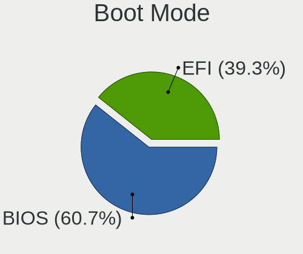
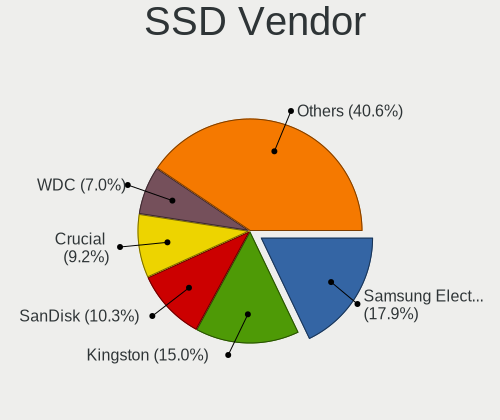
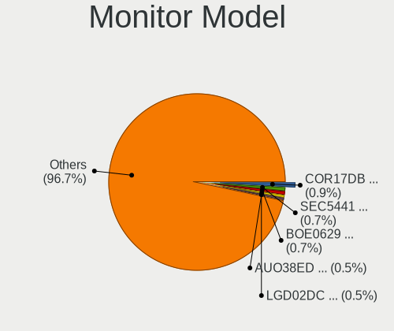
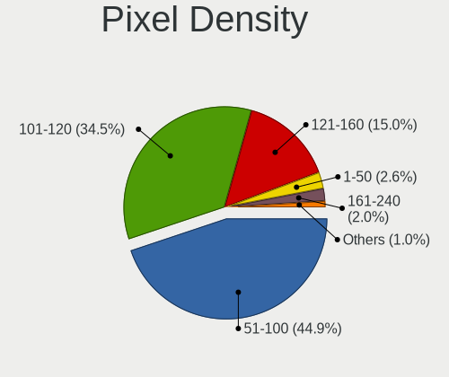
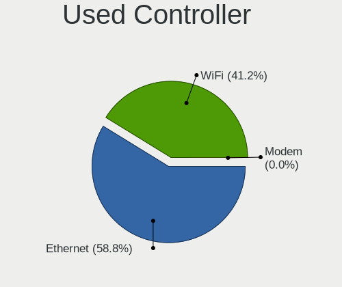
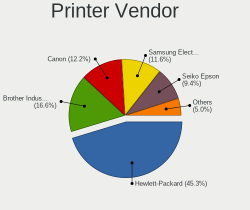

OpenMandriva 4.2 - Tested Hardware & Statistics
-----------------------------------------------

A project to collect tested hardware configurations for OpenMandriva 4.2.

Anyone can contribute to this report by the [hw-probe](https://github.com/linuxhw/hw-probe) tool:

    sudo -E hw-probe -all -upload

Please contribute! Especially if your hardware is rare.

This is a report for all computer types. See also reports for [desktops](/Dist/OpenMandriva_4.2/Desktop/README.md) and [notebooks](/Dist/OpenMandriva_4.2/Notebook/README.md).

Contents
--------

* [ Test Cases ](#test-cases)

* [ System ](#system)
  - [ Kernel                   ](#kernel)
  - [ Kernel Family            ](#kernel-family)
  - [ Kernel Major Ver.        ](#kernel-major-ver)
  - [ Arch                     ](#arch)
  - [ DE                       ](#de)
  - [ Display Server           ](#display-server)
  - [ Display Manager          ](#display-manager)
  - [ OS Lang                  ](#os-lang)
  - [ Boot Mode                ](#boot-mode)
  - [ Filesystem               ](#filesystem)
  - [ Part. scheme             ](#part-scheme)
  - [ Dual Boot with Linux/BSD ](#dual-boot-with-linuxbsd)
  - [ Dual Boot (Win)          ](#dual-boot-win)

* [ Board ](#board)
  - [ Vendor                   ](#vendor)
  - [ Model                    ](#model)
  - [ Model Family             ](#model-family)
  - [ MFG Year                 ](#mfg-year)
  - [ Form Factor              ](#form-factor)
  - [ Secure Boot              ](#secure-boot)
  - [ Coreboot                 ](#coreboot)
  - [ RAM Size                 ](#ram-size)
  - [ RAM Used                 ](#ram-used)
  - [ Total Drives             ](#total-drives)
  - [ Has CD-ROM               ](#has-cd-rom)
  - [ Has Ethernet             ](#has-ethernet)
  - [ Has WiFi                 ](#has-wifi)
  - [ Has Bluetooth            ](#has-bluetooth)

* [ Location ](#location)
  - [ Country                  ](#country)
  - [ City                     ](#city)

* [ Drives ](#drives)
  - [ Drive Vendor             ](#drive-vendor)
  - [ Drive Model              ](#drive-model)
  - [ HDD Vendor               ](#hdd-vendor)
  - [ SSD Vendor               ](#ssd-vendor)
  - [ Drive Kind               ](#drive-kind)
  - [ Drive Connector          ](#drive-connector)
  - [ Drive Size               ](#drive-size)
  - [ Space Total              ](#space-total)
  - [ Space Used               ](#space-used)
  - [ Malfunc. Drives          ](#malfunc-drives)
  - [ Malfunc. Drive Vendor    ](#malfunc-drive-vendor)
  - [ Malfunc. HDD Vendor      ](#malfunc-hdd-vendor)
  - [ Malfunc. Drive Kind      ](#malfunc-drive-kind)
  - [ Failed Drives            ](#failed-drives)
  - [ Failed Drive Vendor      ](#failed-drive-vendor)
  - [ Drive Status             ](#drive-status)

* [ Storage controller ](#storage-controller)
  - [ Storage Vendor           ](#storage-vendor)
  - [ Storage Model            ](#storage-model)
  - [ Storage Kind             ](#storage-kind)

* [ Processor ](#processor)
  - [ CPU Vendor               ](#cpu-vendor)
  - [ CPU Model                ](#cpu-model)
  - [ CPU Model Family         ](#cpu-model-family)
  - [ CPU Cores                ](#cpu-cores)
  - [ CPU Sockets              ](#cpu-sockets)
  - [ CPU Threads              ](#cpu-threads)
  - [ CPU Op-Modes             ](#cpu-op-modes)
  - [ CPU Microcode            ](#cpu-microcode)
  - [ CPU Microarch            ](#cpu-microarch)

* [ Graphics ](#graphics)
  - [ GPU Vendor               ](#gpu-vendor)
  - [ GPU Model                ](#gpu-model)
  - [ GPU Combo                ](#gpu-combo)
  - [ GPU Driver               ](#gpu-driver)
  - [ GPU Memory               ](#gpu-memory)

* [ Monitor ](#monitor)
  - [ Monitor Vendor           ](#monitor-vendor)
  - [ Monitor Model            ](#monitor-model)
  - [ Monitor Resolution       ](#monitor-resolution)
  - [ Monitor Diagonal         ](#monitor-diagonal)
  - [ Monitor Width            ](#monitor-width)
  - [ Aspect Ratio             ](#aspect-ratio)
  - [ Monitor Area             ](#monitor-area)
  - [ Pixel Density            ](#pixel-density)
  - [ Multiple Monitors        ](#multiple-monitors)

* [ Network ](#network)
  - [ Net Controller Vendor    ](#net-controller-vendor)
  - [ Net Controller Model     ](#net-controller-model)
  - [ Wireless Vendor          ](#wireless-vendor)
  - [ Wireless Model           ](#wireless-model)
  - [ Ethernet Vendor          ](#ethernet-vendor)
  - [ Ethernet Model           ](#ethernet-model)
  - [ Net Controller Kind      ](#net-controller-kind)
  - [ Used Controller          ](#used-controller)
  - [ NICs                     ](#nics)
  - [ IPv6                     ](#ipv6)

* [ Bluetooth ](#bluetooth)
  - [ Bluetooth Vendor         ](#bluetooth-vendor)
  - [ Bluetooth Model          ](#bluetooth-model)

* [ Sound ](#sound)
  - [ Sound Vendor             ](#sound-vendor)
  - [ Sound Model              ](#sound-model)

* [ Memory ](#memory)
  - [ Memory Vendor            ](#memory-vendor)
  - [ Memory Model             ](#memory-model)
  - [ Memory Kind              ](#memory-kind)
  - [ Memory Form Factor       ](#memory-form-factor)
  - [ Memory Size              ](#memory-size)
  - [ Memory Speed             ](#memory-speed)

* [ Printers & scanners ](#printers--scanners)
  - [ Printer Vendor           ](#printer-vendor)
  - [ Printer Model            ](#printer-model)
  - [ Scanner Vendor           ](#scanner-vendor)
  - [ Scanner Model            ](#scanner-model)

* [ Camera ](#camera)
  - [ Camera Vendor            ](#camera-vendor)
  - [ Camera Model             ](#camera-model)

* [ Security ](#security)
  - [ Fingerprint Vendor       ](#fingerprint-vendor)
  - [ Fingerprint Model        ](#fingerprint-model)
  - [ Chipcard Vendor          ](#chipcard-vendor)
  - [ Chipcard Model           ](#chipcard-model)

* [ Unsupported ](#unsupported)
  - [ Unsupported Devices      ](#unsupported-devices)
  - [ Unsupported Device Types ](#unsupported-device-types)

Test Cases
----------

Total: 4872

| Vendor        | Model                       | Form-Factor | Probe                                                      | Date         |
|---------------|-----------------------------|-------------|------------------------------------------------------------|--------------|
| Gigabyte      | P31-ES3G                    | Desktop     | [bee14e504c](https://linux-hardware.org/?probe=bee14e504c) | Sep 30, 2023 |
| Toshiba       | Satellite L500              | Notebook    | [9c1b258088](https://linux-hardware.org/?probe=9c1b258088) | Sep 30, 2023 |
| ASUSTek       | PRIME B450M-A               | Desktop     | [6bce0e41d9](https://linux-hardware.org/?probe=6bce0e41d9) | Sep 28, 2023 |
| HP            | Compaq Presario CQ70        | Notebook    | [8913bbd459](https://linux-hardware.org/?probe=8913bbd459) | Sep 28, 2023 |
| ASUSTek       | ROG STRIX B550-A GAMING     | Desktop     | [9c9070da5f](https://linux-hardware.org/?probe=9c9070da5f) | Sep 26, 2023 |
| ASUSTek       | TUF B360-PRO GAMING WIFI    | Desktop     | [16c22d9ead](https://linux-hardware.org/?probe=16c22d9ead) | Sep 25, 2023 |
| Dell          | Latitude E7440              | Notebook    | [53e90ca355](https://linux-hardware.org/?probe=53e90ca355) | Sep 22, 2023 |
| HP            | Compaq 615                  | Notebook    | [f2f7659e5b](https://linux-hardware.org/?probe=f2f7659e5b) | Sep 15, 2023 |
| Fujitsu       | LIFEBOOK S752               | Notebook    | [de16eeb9ef](https://linux-hardware.org/?probe=de16eeb9ef) | Sep 09, 2023 |
| Lenovo        | ThinkPad T470 W10DG 20JM... | Notebook    | [218489cc3f](https://linux-hardware.org/?probe=218489cc3f) | Sep 09, 2023 |
| Lenovo        | Dory CRB                    | Desktop     | [4c136b6049](https://linux-hardware.org/?probe=4c136b6049) | Sep 04, 2023 |
| Dell          | Inspiron 3542               | Notebook    | [6046f9d74b](https://linux-hardware.org/?probe=6046f9d74b) | Sep 04, 2023 |
| Lenovo        | Dory CRB                    | Desktop     | [9bacefd984](https://linux-hardware.org/?probe=9bacefd984) | Sep 04, 2023 |
| ASUSTek       | M4A78LT-M-LE                | Desktop     | [d3d5887ff3](https://linux-hardware.org/?probe=d3d5887ff3) | Sep 01, 2023 |
| ASUSTek       | H110M-D                     | Desktop     | [b0127b4bff](https://linux-hardware.org/?probe=b0127b4bff) | Sep 01, 2023 |
| Dell          | Inspiron N4050              | Notebook    | [d354a59a67](https://linux-hardware.org/?probe=d354a59a67) | Aug 29, 2023 |
| Dell          | 0HR330                      | Desktop     | [700643ac0e](https://linux-hardware.org/?probe=700643ac0e) | Aug 27, 2023 |
| ASUSTek       | P8Q77-M                     | Desktop     | [8445b944a5](https://linux-hardware.org/?probe=8445b944a5) | Aug 25, 2023 |
| Dell          | Latitude E5420              | Notebook    | [102bee1da1](https://linux-hardware.org/?probe=102bee1da1) | Aug 23, 2023 |
| ASUSTek       | VivoBook_ASUSLaptop X515... | Notebook    | [d355f1941a](https://linux-hardware.org/?probe=d355f1941a) | Aug 20, 2023 |
| Dell          | 0200DY A00                  | Desktop     | [9b94c2313c](https://linux-hardware.org/?probe=9b94c2313c) | Aug 18, 2023 |
| Sony          | VGN-NW2SRF_S                | Notebook    | [93a310f950](https://linux-hardware.org/?probe=93a310f950) | Aug 17, 2023 |
| HP            | Pavilion g4                 | Notebook    | [2094186715](https://linux-hardware.org/?probe=2094186715) | Aug 05, 2023 |
| Fujitsu       | D3162-A1 S26361-D3162-A1    | Desktop     | [b298625640](https://linux-hardware.org/?probe=b298625640) | Aug 01, 2023 |
| Acer          | Aspire 5742                 | Notebook    | [37be5a1c80](https://linux-hardware.org/?probe=37be5a1c80) | Jul 30, 2023 |
| Pegatron      | EVANS                       | Desktop     | [323d6a7283](https://linux-hardware.org/?probe=323d6a7283) | Jul 29, 2023 |
| Gigabyte      | Z590 AORUS ULTRA            | Desktop     | [ac8aab1d26](https://linux-hardware.org/?probe=ac8aab1d26) | Jul 29, 2023 |
| Chuwi         | CoreBook Pro                | Notebook    | [21ab3832ea](https://linux-hardware.org/?probe=21ab3832ea) | Jul 24, 2023 |
| Biostar       | A68MDE                      | Desktop     | [8ab5498633](https://linux-hardware.org/?probe=8ab5498633) | Jul 24, 2023 |
| Lenovo        | ThinkPad L460 20FVS01J00    | Notebook    | [96fe0142cd](https://linux-hardware.org/?probe=96fe0142cd) | Jul 23, 2023 |
| Dell          | Inspiron MP061              | Notebook    | [0a26ffe33b](https://linux-hardware.org/?probe=0a26ffe33b) | Jul 15, 2023 |
| Dell          | 048DY8 A00                  | Desktop     | [66c586dfe4](https://linux-hardware.org/?probe=66c586dfe4) | Jul 11, 2023 |
| Gigabyte      | GA-MA770-ES3                | Desktop     | [9af789d1d2](https://linux-hardware.org/?probe=9af789d1d2) | Jul 10, 2023 |
| ASRock        | N68-VS3 FX                  | Desktop     | [9934022e9b](https://linux-hardware.org/?probe=9934022e9b) | Jul 09, 2023 |
| Sony          | VPCCW2S8E                   | Notebook    | [4a3af37e51](https://linux-hardware.org/?probe=4a3af37e51) | Jul 05, 2023 |
| HP            | Laptop 15-db0xxx            | Notebook    | [71de589577](https://linux-hardware.org/?probe=71de589577) | Jul 04, 2023 |
| Fujitsu Si... | LIFEBOOK E8420              | Notebook    | [c997fd76cf](https://linux-hardware.org/?probe=c997fd76cf) | Jul 02, 2023 |
| Gigabyte      | B75-D3V                     | Desktop     | [a05a3f6ca0](https://linux-hardware.org/?probe=a05a3f6ca0) | Jul 01, 2023 |
| Lenovo        | ThinkCentre M90p 5450A26    | Desktop     | [78632c3242](https://linux-hardware.org/?probe=78632c3242) | Jun 26, 2023 |
| ASUSTek       | M51Vr                       | Notebook    | [16404e70f6](https://linux-hardware.org/?probe=16404e70f6) | Jun 25, 2023 |
| ASUSTek       | P5Q-PRO                     | Desktop     | [eb8a9d675b](https://linux-hardware.org/?probe=eb8a9d675b) | Jun 25, 2023 |
| Lenovo        | ThinkCentre M58p 3285A1G    | Desktop     | [d5e4ce2efa](https://linux-hardware.org/?probe=d5e4ce2efa) | Jun 25, 2023 |
| Toshiba       | Satellite Pro L500          | Notebook    | [44e57dc97b](https://linux-hardware.org/?probe=44e57dc97b) | Jun 25, 2023 |
| Intel         | D34010WYK H14771-302        | Desktop     | [acda87fcd6](https://linux-hardware.org/?probe=acda87fcd6) | Jun 21, 2023 |
| HP            | Compaq Presario CQ71        | Notebook    | [d5025e2864](https://linux-hardware.org/?probe=d5025e2864) | Jun 18, 2023 |
| MSI           | Z97 PC Mate                 | Desktop     | [191a3b02ac](https://linux-hardware.org/?probe=191a3b02ac) | Jun 17, 2023 |
| Lenovo        | ThinkPad L430 24655Q7       | Notebook    | [7b45c0777e](https://linux-hardware.org/?probe=7b45c0777e) | Jun 08, 2023 |
| ASRock        | 960GM-GS3 FX                | Desktop     | [72702690e5](https://linux-hardware.org/?probe=72702690e5) | Jun 05, 2023 |
| Intel         | DE3815TYKH H26998-402       | Desktop     | [d2f97c16e9](https://linux-hardware.org/?probe=d2f97c16e9) | Jun 05, 2023 |
| MSI           | MPG X570 GAMING PLUS        | Desktop     | [70e5950511](https://linux-hardware.org/?probe=70e5950511) | Jun 04, 2023 |
| ASUSTek       | P8Z77-V LE PLUS             | Desktop     | [d94ba8fb27](https://linux-hardware.org/?probe=d94ba8fb27) | Jun 01, 2023 |
| Foxconn       | 2ABF                        | Desktop     | [ca4691fd95](https://linux-hardware.org/?probe=ca4691fd95) | May 31, 2023 |
| ASUSTek       | P5KPL-SE                    | Desktop     | [2914e5278a](https://linux-hardware.org/?probe=2914e5278a) | May 18, 2023 |
| ASRock        | N68-GS4/USB3 FX             | Desktop     | [80fa152a82](https://linux-hardware.org/?probe=80fa152a82) | May 17, 2023 |
| Samsung       | R530/R730                   | Notebook    | [d7674fa203](https://linux-hardware.org/?probe=d7674fa203) | May 15, 2023 |
| BESSTAR Te... | UM350                       | Desktop     | [fafdf532fb](https://linux-hardware.org/?probe=fafdf532fb) | May 15, 2023 |
| Acer          | Aspire E5-523G              | Notebook    | [7a77c66c97](https://linux-hardware.org/?probe=7a77c66c97) | May 06, 2023 |
| Intel         | WADE-8076-ST-WMS            | Desktop     | [ae71682181](https://linux-hardware.org/?probe=ae71682181) | May 06, 2023 |
| MSI           | A75A-G55                    | Desktop     | [6ecb91213c](https://linux-hardware.org/?probe=6ecb91213c) | May 05, 2023 |
| ASUSTek       | Maximus V GENE              | Desktop     | [1f49086889](https://linux-hardware.org/?probe=1f49086889) | May 03, 2023 |
| ASUSTek       | Z97-P                       | Desktop     | [8ea78b28f1](https://linux-hardware.org/?probe=8ea78b28f1) | Apr 29, 2023 |
| Lenovo        | ThinkPad X270 W10DG 20K5... | Notebook    | [59fcc52279](https://linux-hardware.org/?probe=59fcc52279) | Apr 29, 2023 |
| Gigabyte      | 945GCM-S2L                  | Desktop     | [405bcbb43c](https://linux-hardware.org/?probe=405bcbb43c) | Apr 25, 2023 |
| ASUSTek       | PRIME H510M-K               | Desktop     | [820acdb913](https://linux-hardware.org/?probe=820acdb913) | Apr 22, 2023 |
| MSI           | B360M BAZOOKA               | Desktop     | [46516c6f3a](https://linux-hardware.org/?probe=46516c6f3a) | Apr 22, 2023 |
| ASUSTek       | PN62S                       | Mini pc     | [8b7d9ca6fd](https://linux-hardware.org/?probe=8b7d9ca6fd) | Apr 21, 2023 |
| ASUSTek       | M5A78L-M/USB3               | Desktop     | [561b87c8b4](https://linux-hardware.org/?probe=561b87c8b4) | Apr 20, 2023 |
| eMachines     | E945GCU                     | Desktop     | [4e6aa4be24](https://linux-hardware.org/?probe=4e6aa4be24) | Apr 16, 2023 |
| Dell          | 0RF705                      | Desktop     | [32dbb3206b](https://linux-hardware.org/?probe=32dbb3206b) | Apr 16, 2023 |
| ASUSTek       | M51Vr                       | Notebook    | [27d265c73d](https://linux-hardware.org/?probe=27d265c73d) | Apr 15, 2023 |
| Acer          | Aspire 5733                 | Notebook    | [981bad2be2](https://linux-hardware.org/?probe=981bad2be2) | Apr 14, 2023 |
| HP            | Compaq Presario C700        | Notebook    | [0519471935](https://linux-hardware.org/?probe=0519471935) | Apr 13, 2023 |
| Acer          | Aspire 5538                 | Notebook    | [3128c45dbc](https://linux-hardware.org/?probe=3128c45dbc) | Apr 09, 2023 |
| Lenovo        | IdeaPad Slim 1-14AST-05 ... | Notebook    | [5244868737](https://linux-hardware.org/?probe=5244868737) | Apr 09, 2023 |
| ASUSTek       | P5K                         | Desktop     | [00a17a60bf](https://linux-hardware.org/?probe=00a17a60bf) | Apr 09, 2023 |
| Fujitsu       | D2990-A2 S26361-D2990-A2    | Desktop     | [c76171c0a7](https://linux-hardware.org/?probe=c76171c0a7) | Apr 07, 2023 |
| ASRock        | A320M-DVS R4.0              | Desktop     | [c6e30ff3cc](https://linux-hardware.org/?probe=c6e30ff3cc) | Apr 06, 2023 |
| MSI           | B450-A PRO MAX              | Desktop     | [31d10a7e98](https://linux-hardware.org/?probe=31d10a7e98) | Apr 04, 2023 |
| Intel         | DZ87KLT75K AAG74721-304     | Desktop     | [4f97ce0a4b](https://linux-hardware.org/?probe=4f97ce0a4b) | Apr 03, 2023 |
| ASUSTek       | K54C                        | Notebook    | [a2a91e2071](https://linux-hardware.org/?probe=a2a91e2071) | Mar 30, 2023 |
| Medion        | B250H4-EM                   | Desktop     | [f569d44749](https://linux-hardware.org/?probe=f569d44749) | Mar 30, 2023 |
| Gigabyte      | B75M-D3V                    | Desktop     | [d3ae118e3b](https://linux-hardware.org/?probe=d3ae118e3b) | Mar 30, 2023 |
| Lenovo        | IdeaPad 100-15IBY 80MJ      | Notebook    | [11c94aa91b](https://linux-hardware.org/?probe=11c94aa91b) | Mar 29, 2023 |
| Toshiba       | Satellite P200              | Notebook    | [c55a4d3166](https://linux-hardware.org/?probe=c55a4d3166) | Mar 29, 2023 |
| Lenovo        | ThinkCentre M58p 6137A2U    | Desktop     | [cc740804d7](https://linux-hardware.org/?probe=cc740804d7) | Mar 25, 2023 |
| Gigabyte      | GA-78LMT-S2P                | Desktop     | [3ce94dae13](https://linux-hardware.org/?probe=3ce94dae13) | Mar 25, 2023 |
| Lenovo        | 0x36BF SDK0J40709 WIN 32... | All in one  | [018bbef1d6](https://linux-hardware.org/?probe=018bbef1d6) | Mar 24, 2023 |
| Dell          | Precision 7720              | Notebook    | [c3ef75d6eb](https://linux-hardware.org/?probe=c3ef75d6eb) | Mar 23, 2023 |
| Dell          | 0C2KJT A00                  | Desktop     | [54bdc4bbd0](https://linux-hardware.org/?probe=54bdc4bbd0) | Mar 21, 2023 |
| Acer          | Aspire 4736Z                | Notebook    | [30e77255e4](https://linux-hardware.org/?probe=30e77255e4) | Mar 20, 2023 |
| ASUSTek       | P8H61-M LX PLUS             | Desktop     | [cdf57a039e](https://linux-hardware.org/?probe=cdf57a039e) | Mar 19, 2023 |
| Acer          | Aspire A315-55G             | Notebook    | [badcc52c19](https://linux-hardware.org/?probe=badcc52c19) | Mar 18, 2023 |
| Unknown       | Unknown                     | Desktop     | [d91eb1923c](https://linux-hardware.org/?probe=d91eb1923c) | Mar 17, 2023 |
| Dell          | 0HN7XN A01                  | Desktop     | [4ce2092fe2](https://linux-hardware.org/?probe=4ce2092fe2) | Mar 17, 2023 |
| Toshiba       | Satellite L50-C             | Notebook    | [2193d33376](https://linux-hardware.org/?probe=2193d33376) | Mar 16, 2023 |
| HP            | Pavilion dv6500             | Notebook    | [03097b6049](https://linux-hardware.org/?probe=03097b6049) | Mar 13, 2023 |
| Gigabyte      | P55-UD3R                    | Desktop     | [e720741a00](https://linux-hardware.org/?probe=e720741a00) | Mar 11, 2023 |
| Fujitsu Si... | LIFEBOOK E8410              | Notebook    | [c2230a6690](https://linux-hardware.org/?probe=c2230a6690) | Mar 10, 2023 |
| Lenovo        | ThinkPad T440p 20AN0070M... | Notebook    | [0d0877faf5](https://linux-hardware.org/?probe=0d0877faf5) | Mar 10, 2023 |
| Lenovo        | MAHOBAY                     | Desktop     | [c756678fad](https://linux-hardware.org/?probe=c756678fad) | Mar 08, 2023 |
| Lenovo        | ThinkPad T61 7661BM5        | Notebook    | [daf29f1a82](https://linux-hardware.org/?probe=daf29f1a82) | Mar 08, 2023 |
| Chuwi         | LapBook Plus                | Notebook    | [55365bb7ab](https://linux-hardware.org/?probe=55365bb7ab) | Mar 07, 2023 |
| ASUSTek       | SABERTOOTH 990FX R2.0       | Desktop     | [98f8bd8557](https://linux-hardware.org/?probe=98f8bd8557) | Mar 06, 2023 |
| MSI           | H110M PRO-VH PLUS           | Desktop     | [e4e66a8215](https://linux-hardware.org/?probe=e4e66a8215) | Mar 06, 2023 |
| ASUSTek       | H110M-A/M.2                 | Desktop     | [3c4bf3c1bd](https://linux-hardware.org/?probe=3c4bf3c1bd) | Mar 05, 2023 |
| PCWare        | APM-A320G                   | Desktop     | [2bc24b8935](https://linux-hardware.org/?probe=2bc24b8935) | Mar 04, 2023 |
| Gigabyte      | H55M-S2H                    | Desktop     | [196ff8d0dc](https://linux-hardware.org/?probe=196ff8d0dc) | Mar 03, 2023 |
| Dell          | 0KC9NP A00                  | Desktop     | [45397750b4](https://linux-hardware.org/?probe=45397750b4) | Mar 02, 2023 |
| Lenovo        | 3178 SDK0J40697 WIN 3305... | Desktop     | [41d9c3d9ed](https://linux-hardware.org/?probe=41d9c3d9ed) | Mar 02, 2023 |
| Lenovo        | ThinkPad X1 Carbon 5th 2... | Notebook    | [3a2e77122d](https://linux-hardware.org/?probe=3a2e77122d) | Mar 01, 2023 |
| Acer          | Aspire X3995                | Desktop     | [eccac5b752](https://linux-hardware.org/?probe=eccac5b752) | Feb 28, 2023 |
| HP            | 3032h                       | Desktop     | [007bbeffa0](https://linux-hardware.org/?probe=007bbeffa0) | Feb 26, 2023 |
| ASRock        | FM2A58M-VG3+ R2.0           | Desktop     | [92ac86c31b](https://linux-hardware.org/?probe=92ac86c31b) | Feb 25, 2023 |
| Samsung       | 300E4C/300E5C/300E7C        | Notebook    | [c19b7cd0f5](https://linux-hardware.org/?probe=c19b7cd0f5) | Feb 24, 2023 |
| ASRock        | N68-VGS3 FX                 | Desktop     | [b9fbaca53d](https://linux-hardware.org/?probe=b9fbaca53d) | Feb 23, 2023 |
| Lenovo        | ThinkPad T520 4242NS9       | Notebook    | [6e2e5c8285](https://linux-hardware.org/?probe=6e2e5c8285) | Feb 22, 2023 |
| Intel         | NUC8BEB J72692-309          | Mini pc     | [d29d970c4a](https://linux-hardware.org/?probe=d29d970c4a) | Feb 22, 2023 |
| Timi          | TM1707                      | Notebook    | [9bc429fbd6](https://linux-hardware.org/?probe=9bc429fbd6) | Feb 22, 2023 |
| IP3 Tech      | rev1.1                      | Mini pc     | [7c4f6801f0](https://linux-hardware.org/?probe=7c4f6801f0) | Feb 20, 2023 |
| HP            | 15                          | Notebook    | [60ecad0be7](https://linux-hardware.org/?probe=60ecad0be7) | Feb 18, 2023 |
| Lenovo        | IdeaPad 100-15IBD 80QQ      | Notebook    | [27958da7cc](https://linux-hardware.org/?probe=27958da7cc) | Feb 18, 2023 |
| ASUSTek       | K53SC                       | Notebook    | [df5351b94d](https://linux-hardware.org/?probe=df5351b94d) | Feb 17, 2023 |
| Lenovo        | ThinkPad T61 7661BM5        | Notebook    | [c829d5ed74](https://linux-hardware.org/?probe=c829d5ed74) | Feb 16, 2023 |
| HP            | Stream Laptop 14-ax0XX      | Notebook    | [42b7f88059](https://linux-hardware.org/?probe=42b7f88059) | Feb 16, 2023 |
| ASUSTek       | M4N68T-M LE                 | Desktop     | [7b5fe965fd](https://linux-hardware.org/?probe=7b5fe965fd) | Feb 16, 2023 |
| Dell          | 03NVJ6 A00                  | Desktop     | [d118fe4ba2](https://linux-hardware.org/?probe=d118fe4ba2) | Feb 16, 2023 |
| Positivo      | S14BW01                     | Notebook    | [c14428167e](https://linux-hardware.org/?probe=c14428167e) | Feb 16, 2023 |
| Medion        | E7220                       | Notebook    | [a1b4318b54](https://linux-hardware.org/?probe=a1b4318b54) | Feb 14, 2023 |
| Lenovo        | SHARKBAY NOK                | Desktop     | [4ccd4c2da2](https://linux-hardware.org/?probe=4ccd4c2da2) | Feb 14, 2023 |
| ASUSTek       | X555DG                      | Notebook    | [3f51c3533f](https://linux-hardware.org/?probe=3f51c3533f) | Feb 13, 2023 |
| MSI           | B450M PRO-M2 MAX            | Desktop     | [2032f6e202](https://linux-hardware.org/?probe=2032f6e202) | Feb 13, 2023 |
| ASUSTek       | P6TD DELUXE                 | Desktop     | [f9cfe6d485](https://linux-hardware.org/?probe=f9cfe6d485) | Feb 13, 2023 |
| Lenovo        | ThinkPad X1 Tablet 20GHS... | Tablet      | [6f25e83af0](https://linux-hardware.org/?probe=6f25e83af0) | Feb 10, 2023 |
| ASUSTek       | Z97-K                       | Desktop     | [afaaed1c36](https://linux-hardware.org/?probe=afaaed1c36) | Feb 09, 2023 |
| HP            | ProBook 4530s               | Notebook    | [c081fdc9be](https://linux-hardware.org/?probe=c081fdc9be) | Feb 07, 2023 |
| ASUSTek       | P8H61-M LE/USB3             | Desktop     | [91a070c2aa](https://linux-hardware.org/?probe=91a070c2aa) | Feb 03, 2023 |
| ASUSTek       | P8P67 PRO                   | Desktop     | [49d8a19239](https://linux-hardware.org/?probe=49d8a19239) | Feb 03, 2023 |
| MSI           | A520M-A PRO                 | Desktop     | [f7a88d0dea](https://linux-hardware.org/?probe=f7a88d0dea) | Feb 01, 2023 |
| ASUSTek       | K43SJ                       | Notebook    | [0cff4ad069](https://linux-hardware.org/?probe=0cff4ad069) | Jan 28, 2023 |
| Samsung       | 300E4C/300E5C/300E7C        | Notebook    | [796df2715d](https://linux-hardware.org/?probe=796df2715d) | Jan 28, 2023 |
| Intel         | DH77EB AAG39073-304         | Desktop     | [8965805130](https://linux-hardware.org/?probe=8965805130) | Jan 27, 2023 |
| Acer          | Peppy                       | Notebook    | [9a16262be8](https://linux-hardware.org/?probe=9a16262be8) | Jan 27, 2023 |
| Lenovo        | MAHOBAY 31900003 STD        | All in one  | [d75e472005](https://linux-hardware.org/?probe=d75e472005) | Jan 26, 2023 |
| ASUSTek       | X51L                        | Notebook    | [b482dc649b](https://linux-hardware.org/?probe=b482dc649b) | Jan 23, 2023 |
| Gigabyte      | A320M-S2H-CF                | Desktop     | [7545ee3eb0](https://linux-hardware.org/?probe=7545ee3eb0) | Jan 22, 2023 |
| Gigabyte      | H61M-D2-B3                  | Desktop     | [e261893ec4](https://linux-hardware.org/?probe=e261893ec4) | Jan 20, 2023 |
| ASUSTek       | TUF Gaming H470-PRO         | Desktop     | [6d67c981b3](https://linux-hardware.org/?probe=6d67c981b3) | Jan 15, 2023 |
| Lenovo        | ThinkPad L510 2873A17       | Notebook    | [13f5fd23e5](https://linux-hardware.org/?probe=13f5fd23e5) | Jan 14, 2023 |
| ASUSTek       | TUF Gaming X570-PLUS        | Desktop     | [190d9b58b8](https://linux-hardware.org/?probe=190d9b58b8) | Jan 12, 2023 |
| Samsung       | 270E5G/270E5U               | Notebook    | [0ddeecd2b8](https://linux-hardware.org/?probe=0ddeecd2b8) | Jan 11, 2023 |
| HP            | 83F2                        | Desktop     | [7482186165](https://linux-hardware.org/?probe=7482186165) | Jan 11, 2023 |
| Apple         | Mac-77F17D7DA9285301 iMa... | All in one  | [c366df1d8d](https://linux-hardware.org/?probe=c366df1d8d) | Jan 09, 2023 |
| ASRock        | M3A770DE                    | Desktop     | [952caf04f8](https://linux-hardware.org/?probe=952caf04f8) | Jan 05, 2023 |
| ASUSTek       | M2N68 Plus                  | Desktop     | [12309f8c91](https://linux-hardware.org/?probe=12309f8c91) | Jan 05, 2023 |
| Gigabyte      | H61M-S1                     | Desktop     | [5ea753453b](https://linux-hardware.org/?probe=5ea753453b) | Jan 03, 2023 |
| HP            | 304Bh                       | Desktop     | [cfe1407faf](https://linux-hardware.org/?probe=cfe1407faf) | Jan 02, 2023 |
| Gigabyte      | Z590 AORUS ULTRA            | Desktop     | [4ab759533b](https://linux-hardware.org/?probe=4ab759533b) | Dec 25, 2022 |
| Dell          | 0M863N A00                  | Desktop     | [ce9fc7a224](https://linux-hardware.org/?probe=ce9fc7a224) | Dec 24, 2022 |
| Acer          | Aspire VX5-591G             | Notebook    | [7defe87998](https://linux-hardware.org/?probe=7defe87998) | Dec 23, 2022 |
| ASUSTek       | M51Vr                       | Notebook    | [ffc48a52ea](https://linux-hardware.org/?probe=ffc48a52ea) | Dec 22, 2022 |
| Gigabyte      | EP43-DS3                    | Desktop     | [d0f0cd82f9](https://linux-hardware.org/?probe=d0f0cd82f9) | Dec 22, 2022 |
| HP            | Presario CQ62               | Notebook    | [fce21eae2c](https://linux-hardware.org/?probe=fce21eae2c) | Dec 15, 2022 |
| HP            | Compaq 6735s                | Notebook    | [72d29aa11f](https://linux-hardware.org/?probe=72d29aa11f) | Dec 14, 2022 |
| Dell          | Inspiron 3451               | Notebook    | [de7f9d5e33](https://linux-hardware.org/?probe=de7f9d5e33) | Dec 14, 2022 |
| ASRock        | M3A770DE                    | Desktop     | [2e6b1f9c2d](https://linux-hardware.org/?probe=2e6b1f9c2d) | Dec 13, 2022 |
| Acer          | Aspire A315-34              | Notebook    | [85794e606c](https://linux-hardware.org/?probe=85794e606c) | Dec 08, 2022 |
| ASUSTek       | H110-PLUS                   | Desktop     | [57e0d3651c](https://linux-hardware.org/?probe=57e0d3651c) | Dec 08, 2022 |
| Gigabyte      | GA-MA770-ES3                | Desktop     | [70c1a43352](https://linux-hardware.org/?probe=70c1a43352) | Dec 06, 2022 |
| Gigabyte      | 970A-DS3P                   | Desktop     | [a4a8d6dcec](https://linux-hardware.org/?probe=a4a8d6dcec) | Dec 03, 2022 |
| HP            | Compaq Presario CQ60        | Notebook    | [1f521f98cb](https://linux-hardware.org/?probe=1f521f98cb) | Nov 27, 2022 |
| ASUSTek       | K70IJ                       | Notebook    | [8df764e624](https://linux-hardware.org/?probe=8df764e624) | Nov 23, 2022 |
| Gigabyte      | Z77-D3H                     | Desktop     | [aecddcf17e](https://linux-hardware.org/?probe=aecddcf17e) | Nov 21, 2022 |
| Dell          | Inspiron 3451               | Notebook    | [105a376344](https://linux-hardware.org/?probe=105a376344) | Nov 17, 2022 |
| Gigabyte      | G41MT-S2                    | Desktop     | [4c91fc2a59](https://linux-hardware.org/?probe=4c91fc2a59) | Nov 07, 2022 |
| Gigabyte      | GA-MA770-DS3                | Desktop     | [f435ef302a](https://linux-hardware.org/?probe=f435ef302a) | Nov 05, 2022 |
| Gigabyte      | A320M-S2H-CF                | Desktop     | [3f2ef35b32](https://linux-hardware.org/?probe=3f2ef35b32) | Nov 04, 2022 |
| MSI           | Z97-G43                     | Desktop     | [85701968ed](https://linux-hardware.org/?probe=85701968ed) | Nov 04, 2022 |
| Gigabyte      | 970A-DS3P                   | Desktop     | [a9f10f8922](https://linux-hardware.org/?probe=a9f10f8922) | Nov 02, 2022 |
| ASRock        | N68-S3 FX                   | Desktop     | [22f68458d4](https://linux-hardware.org/?probe=22f68458d4) | Nov 02, 2022 |
| VS Company    | G31T-M                      | Desktop     | [75eb6866e0](https://linux-hardware.org/?probe=75eb6866e0) | Nov 01, 2022 |
| HP            | G72                         | Notebook    | [08a732911d](https://linux-hardware.org/?probe=08a732911d) | Oct 31, 2022 |
| ASUSTek       | P8H61-M LE R2.0             | Desktop     | [6b01f2f498](https://linux-hardware.org/?probe=6b01f2f498) | Oct 27, 2022 |
| HP            | 21B4 A01                    | Desktop     | [ec46b18fd5](https://linux-hardware.org/?probe=ec46b18fd5) | Oct 25, 2022 |
| Gigabyte      | G41M-ES2L                   | Desktop     | [a995e58f10](https://linux-hardware.org/?probe=a995e58f10) | Oct 24, 2022 |
| Dell          | 0200DY A02                  | Desktop     | [69327d2615](https://linux-hardware.org/?probe=69327d2615) | Oct 24, 2022 |
| Gigabyte      | Z97-D3H-CF                  | Desktop     | [5ff7cf2e42](https://linux-hardware.org/?probe=5ff7cf2e42) | Oct 23, 2022 |
| Sony          | VPCEB1S1R                   | Notebook    | [1e64f5427a](https://linux-hardware.org/?probe=1e64f5427a) | Oct 21, 2022 |
| ASUSTek       | H110M-A                     | Desktop     | [7bd1ee25b3](https://linux-hardware.org/?probe=7bd1ee25b3) | Oct 21, 2022 |
| Fujitsu       | D3062-A1 S26361-D3062-A1    | Desktop     | [60e6bd1280](https://linux-hardware.org/?probe=60e6bd1280) | Oct 14, 2022 |
| ASUSTek       | H81M-K                      | Desktop     | [57e988db9d](https://linux-hardware.org/?probe=57e988db9d) | Oct 14, 2022 |
| HP            | ENVY 15                     | Notebook    | [71c0056a73](https://linux-hardware.org/?probe=71c0056a73) | Oct 13, 2022 |
| Dell          | Inspiron 3451               | Notebook    | [37b9e0d491](https://linux-hardware.org/?probe=37b9e0d491) | Oct 13, 2022 |
| Apple         | MacBookPro13,2              | Notebook    | [8eaf391b08](https://linux-hardware.org/?probe=8eaf391b08) | Oct 12, 2022 |
| HP            | Notebook                    | Notebook    | [2fd3bd5ee0](https://linux-hardware.org/?probe=2fd3bd5ee0) | Oct 10, 2022 |
| Dell          | Inspiron 3451               | Notebook    | [29de9dfa4a](https://linux-hardware.org/?probe=29de9dfa4a) | Oct 07, 2022 |
| Toshiba       | Satellite C650D             | Notebook    | [69db41a0b6](https://linux-hardware.org/?probe=69db41a0b6) | Oct 06, 2022 |
| Dell          | Inspiron 3451               | Notebook    | [9bf3a4a735](https://linux-hardware.org/?probe=9bf3a4a735) | Oct 03, 2022 |
| Dell          | Inspiron 3451               | Notebook    | [aee33639b9](https://linux-hardware.org/?probe=aee33639b9) | Oct 01, 2022 |
| HP            | Laptop 15-bs0xx             | Notebook    | [7ed786bee9](https://linux-hardware.org/?probe=7ed786bee9) | Sep 30, 2022 |
| HP            | 18E7                        | Desktop     | [132a87f746](https://linux-hardware.org/?probe=132a87f746) | Sep 28, 2022 |
| ASUSTek       | P7H55-M LX                  | Desktop     | [8d3b235d4c](https://linux-hardware.org/?probe=8d3b235d4c) | Sep 25, 2022 |
| HP            | 1998                        | Desktop     | [f8399e0d3a](https://linux-hardware.org/?probe=f8399e0d3a) | Sep 22, 2022 |
| ASUSTek       | B85M-E                      | Desktop     | [07477a078f](https://linux-hardware.org/?probe=07477a078f) | Sep 22, 2022 |
| Acer          | Aspire V3-471               | Notebook    | [b04cc2ea05](https://linux-hardware.org/?probe=b04cc2ea05) | Sep 20, 2022 |
| Dell          | Vostro 3500                 | Notebook    | [08bd4157a3](https://linux-hardware.org/?probe=08bd4157a3) | Sep 18, 2022 |
| Lenovo        | B50-45 20388                | Notebook    | [d55d9fad24](https://linux-hardware.org/?probe=d55d9fad24) | Sep 17, 2022 |
| ASUSTek       | P8P67                       | Desktop     | [a790b35cc1](https://linux-hardware.org/?probe=a790b35cc1) | Sep 17, 2022 |
| Intel         | H61                         | Desktop     | [d1b17183d7](https://linux-hardware.org/?probe=d1b17183d7) | Sep 16, 2022 |
| HP            | 82F2 A01                    | Desktop     | [f97faeff54](https://linux-hardware.org/?probe=f97faeff54) | Sep 16, 2022 |
| Dell          | Inspiron 3451               | Notebook    | [fcdfa43a37](https://linux-hardware.org/?probe=fcdfa43a37) | Sep 15, 2022 |
| Lenovo        | ThinkCentre M71e 3157AE2    | Desktop     | [d88e0026dc](https://linux-hardware.org/?probe=d88e0026dc) | Sep 14, 2022 |
| Dell          | Inspiron 3451               | Notebook    | [f06aa45765](https://linux-hardware.org/?probe=f06aa45765) | Sep 13, 2022 |
| HP            | 3396                        | Desktop     | [964f32cccf](https://linux-hardware.org/?probe=964f32cccf) | Sep 10, 2022 |
| ASUSTek       | K53U                        | Notebook    | [d13ff70895](https://linux-hardware.org/?probe=d13ff70895) | Sep 08, 2022 |
| Samsung       | RC420/RC520/RC720           | Notebook    | [a6b07acfe5](https://linux-hardware.org/?probe=a6b07acfe5) | Sep 07, 2022 |
| ASUSTek       | ET2040I                     | Desktop     | [44ab433428](https://linux-hardware.org/?probe=44ab433428) | Sep 06, 2022 |
| Gigabyte      | 970A-DS3P                   | Desktop     | [5ba20eb04b](https://linux-hardware.org/?probe=5ba20eb04b) | Sep 01, 2022 |
| Acer          | Aspire 5715Z                | Notebook    | [82086ce1c6](https://linux-hardware.org/?probe=82086ce1c6) | Sep 01, 2022 |
| Lenovo        | ThinkCentre M58e 7408BA5    | Desktop     | [4384314f98](https://linux-hardware.org/?probe=4384314f98) | Sep 01, 2022 |
| Dell          | 040DDP A00                  | Desktop     | [09ffe165d3](https://linux-hardware.org/?probe=09ffe165d3) | Aug 30, 2022 |
| ASUSTek       | P8H61-M LX2 R2.0            | Desktop     | [5754d37860](https://linux-hardware.org/?probe=5754d37860) | Aug 23, 2022 |
| HP            | 82B4                        | Desktop     | [e3200ae579](https://linux-hardware.org/?probe=e3200ae579) | Aug 22, 2022 |
| Packard Be... | PT890-8237A                 | Desktop     | [36a4120390](https://linux-hardware.org/?probe=36a4120390) | Aug 20, 2022 |
| Dell          | 0XHGV1 A01                  | Desktop     | [b05fac6451](https://linux-hardware.org/?probe=b05fac6451) | Aug 19, 2022 |
| Packard Be... | EasyNote TK37               | Notebook    | [996a14d9f4](https://linux-hardware.org/?probe=996a14d9f4) | Aug 17, 2022 |
| Packard Be... | EasyNote TE11BZ             | Notebook    | [2a8e801b4e](https://linux-hardware.org/?probe=2a8e801b4e) | Aug 16, 2022 |
| Dell          | 0GM819                      | Desktop     | [f7745d3d3a](https://linux-hardware.org/?probe=f7745d3d3a) | Aug 16, 2022 |
| HP            | Notebook                    | Notebook    | [975f3e38e3](https://linux-hardware.org/?probe=975f3e38e3) | Aug 15, 2022 |
| Dell          | 0C27VV A01                  | Desktop     | [04f75d45cb](https://linux-hardware.org/?probe=04f75d45cb) | Aug 15, 2022 |
| ASUSTek       | PRIME B450M-A II            | Desktop     | [32bf5bd8b8](https://linux-hardware.org/?probe=32bf5bd8b8) | Aug 13, 2022 |
| Intel         | NUC7JYB J67967-405          | Mini pc     | [06fdb19375](https://linux-hardware.org/?probe=06fdb19375) | Aug 08, 2022 |
| ASUSTek       | PRIME B550-PLUS             | Desktop     | [b18ee3a2ff](https://linux-hardware.org/?probe=b18ee3a2ff) | Aug 06, 2022 |
| Dell          | Latitude E6540              | Notebook    | [d47b2c5c2b](https://linux-hardware.org/?probe=d47b2c5c2b) | Aug 06, 2022 |
| Dell          | Latitude E5470              | Notebook    | [9e78351999](https://linux-hardware.org/?probe=9e78351999) | Aug 04, 2022 |
| MSI           | GE62VR 7RF                  | Notebook    | [e5f6f7e14c](https://linux-hardware.org/?probe=e5f6f7e14c) | Aug 03, 2022 |
| Intel         | DH61WW AAG23116-204         | Desktop     | [30715e2f04](https://linux-hardware.org/?probe=30715e2f04) | Aug 01, 2022 |
| Gigabyte      | GA-M56S-S3                  | Desktop     | [cb93c45a3a](https://linux-hardware.org/?probe=cb93c45a3a) | Jul 31, 2022 |
| ASUSTek       | K50ID                       | Notebook    | [2c1dddeaea](https://linux-hardware.org/?probe=2c1dddeaea) | Jul 29, 2022 |
| ASUSTek       | PRIME B450M-A II            | Desktop     | [d85cd905fd](https://linux-hardware.org/?probe=d85cd905fd) | Jul 28, 2022 |
| Dell          | 0P301D A00                  | Desktop     | [48d1ed3099](https://linux-hardware.org/?probe=48d1ed3099) | Jul 28, 2022 |
| HP            | 1495                        | Desktop     | [1706c61a6c](https://linux-hardware.org/?probe=1706c61a6c) | Jul 22, 2022 |
| Dell          | 04GJJT A00                  | Desktop     | [ab730a80b3](https://linux-hardware.org/?probe=ab730a80b3) | Jul 21, 2022 |
| Dell          | Inspiron 3451               | Notebook    | [c95dd7e491](https://linux-hardware.org/?probe=c95dd7e491) | Jul 13, 2022 |
| HP            | Pavilion g6                 | Notebook    | [2f0de52d8e](https://linux-hardware.org/?probe=2f0de52d8e) | Jul 08, 2022 |
| Gateway       | NE56R                       | Notebook    | [69f2805432](https://linux-hardware.org/?probe=69f2805432) | Jul 06, 2022 |
| HP            | Stream Laptop 14-ax0XX      | Notebook    | [03bede7266](https://linux-hardware.org/?probe=03bede7266) | Jul 03, 2022 |
| Dell          | Inspiron 3451               | Notebook    | [a57cf9cc46](https://linux-hardware.org/?probe=a57cf9cc46) | Jul 03, 2022 |
| ASUSTek       | P6T WS PRO                  | Desktop     | [4160bc427a](https://linux-hardware.org/?probe=4160bc427a) | Jul 03, 2022 |
| ASUSTek       | X542UA                      | Notebook    | [f5da6492ca](https://linux-hardware.org/?probe=f5da6492ca) | Jul 03, 2022 |
| Dell          | 0WPG9H A01                  | All in one  | [f554b4aa06](https://linux-hardware.org/?probe=f554b4aa06) | Jul 03, 2022 |
| Dell          | Latitude D630               | Notebook    | [df3001a64d](https://linux-hardware.org/?probe=df3001a64d) | Jul 02, 2022 |
| Notebook      | MIM 2200                    | Notebook    | [85748618b6](https://linux-hardware.org/?probe=85748618b6) | Jul 02, 2022 |
| Medion        | E2292                       | Convertible | [155434e3b5](https://linux-hardware.org/?probe=155434e3b5) | Jul 01, 2022 |
| MACHINIST     | X99-RS9 V2.0                | Desktop     | [0924d664a1](https://linux-hardware.org/?probe=0924d664a1) | Jun 30, 2022 |
| Dell          | Inspiron 3451               | Notebook    | [6cf63ca19e](https://linux-hardware.org/?probe=6cf63ca19e) | Jun 30, 2022 |
| Dell          | Latitude E7250              | Notebook    | [790850da0b](https://linux-hardware.org/?probe=790850da0b) | Jun 22, 2022 |
| Samsung       | 355V4C/356V4C/3445VC/354... | Notebook    | [212cd0ac63](https://linux-hardware.org/?probe=212cd0ac63) | Jun 22, 2022 |
| ASUSTek       | H110M-A/M.2                 | Desktop     | [98b2b138f4](https://linux-hardware.org/?probe=98b2b138f4) | Jun 20, 2022 |
| Dell          | Inspiron 3451               | Notebook    | [d9ac6a3f41](https://linux-hardware.org/?probe=d9ac6a3f41) | Jun 19, 2022 |
| Gigabyte      | Z87X-UD3H-CF                | Desktop     | [8113862978](https://linux-hardware.org/?probe=8113862978) | Jun 18, 2022 |
| ASUSTek       | N71Vg                       | Notebook    | [6926193d76](https://linux-hardware.org/?probe=6926193d76) | Jun 18, 2022 |
| HP            | Pavilion dv6                | Notebook    | [1ba5e6c491](https://linux-hardware.org/?probe=1ba5e6c491) | Jun 18, 2022 |
| Sony          | VGN-NW310F                  | Notebook    | [318b17f951](https://linux-hardware.org/?probe=318b17f951) | Jun 17, 2022 |
| HP            | Pavilion g4                 | Notebook    | [193875edcc](https://linux-hardware.org/?probe=193875edcc) | Jun 15, 2022 |
| Acer          | Extensa 5220                | Notebook    | [dd0d362582](https://linux-hardware.org/?probe=dd0d362582) | Jun 15, 2022 |
| Dell          | Inspiron 3451               | Notebook    | [7ca7f789d8](https://linux-hardware.org/?probe=7ca7f789d8) | Jun 14, 2022 |
| Gigabyte      | H61M-HD2                    | Desktop     | [d6e6a17072](https://linux-hardware.org/?probe=d6e6a17072) | Jun 13, 2022 |
| ASUSTek       | PRIME H270M-PLUS            | Desktop     | [2dd49013ff](https://linux-hardware.org/?probe=2dd49013ff) | Jun 10, 2022 |
| HP            | Laptop 17-bs0xx             | Notebook    | [a4587cc1de](https://linux-hardware.org/?probe=a4587cc1de) | Jun 10, 2022 |
| Dell          | Inspiron 3451               | Notebook    | [a6feb9dcd2](https://linux-hardware.org/?probe=a6feb9dcd2) | Jun 07, 2022 |
| Lenovo        | IdeaPad S145-14IIL 81W6     | Notebook    | [058bd1f6b9](https://linux-hardware.org/?probe=058bd1f6b9) | Jun 04, 2022 |
| Dell          | Inspiron 3451               | Notebook    | [ba5e3a5d77](https://linux-hardware.org/?probe=ba5e3a5d77) | Jun 02, 2022 |
| ASUSTek       | ROG STRIX B550-I GAMING     | Desktop     | [17752552c6](https://linux-hardware.org/?probe=17752552c6) | Jun 02, 2022 |
| MSI           | MS-7255                     | Desktop     | [772cf64635](https://linux-hardware.org/?probe=772cf64635) | Jun 02, 2022 |
| ECS           | A58F2P-M4                   | Desktop     | [295c085967](https://linux-hardware.org/?probe=295c085967) | Jun 01, 2022 |
| Medion        | E7220                       | Notebook    | [d4a700af57](https://linux-hardware.org/?probe=d4a700af57) | Jun 01, 2022 |
| Dell          | Inspiron 3451               | Notebook    | [04e9ce0ba0](https://linux-hardware.org/?probe=04e9ce0ba0) | Jun 01, 2022 |
| Medion        | E2292                       | Convertible | [85296d99ac](https://linux-hardware.org/?probe=85296d99ac) | Jun 01, 2022 |
| Gigabyte      | B460 AORUS PRO AC           | Desktop     | [2966cd34b8](https://linux-hardware.org/?probe=2966cd34b8) | May 31, 2022 |
| Lenovo        | 3178 SDK0J40697 WIN 3305... | Desktop     | [63747954e9](https://linux-hardware.org/?probe=63747954e9) | May 29, 2022 |
| Dell          | Inspiron 3451               | Notebook    | [8ad9f9f5d9](https://linux-hardware.org/?probe=8ad9f9f5d9) | May 29, 2022 |
| Dell          | Inspiron 3451               | Notebook    | [798f65546b](https://linux-hardware.org/?probe=798f65546b) | May 27, 2022 |
| Clevo         | W55xEU                      | Notebook    | [c5fd2417f4](https://linux-hardware.org/?probe=c5fd2417f4) | May 25, 2022 |
| Intel         | D2500HN AAG81480-500        | Desktop     | [bc39db0484](https://linux-hardware.org/?probe=bc39db0484) | May 24, 2022 |
| HP            | ProBook 450 G1              | Notebook    | [0097404cab](https://linux-hardware.org/?probe=0097404cab) | May 23, 2022 |
| Lenovo        | ThinkPad T61 7661BM5        | Notebook    | [9a6d69d512](https://linux-hardware.org/?probe=9a6d69d512) | May 22, 2022 |
| MSI           | B150M BAZOOKA               | Desktop     | [b8ec3bee43](https://linux-hardware.org/?probe=b8ec3bee43) | May 22, 2022 |
| Dell          | Inspiron 3451               | Notebook    | [38c450f343](https://linux-hardware.org/?probe=38c450f343) | May 21, 2022 |
| Acer          | Aspire 5332                 | Notebook    | [f48da95c17](https://linux-hardware.org/?probe=f48da95c17) | May 21, 2022 |
| Dell          | Inspiron 3451               | Notebook    | [d14ff2c62e](https://linux-hardware.org/?probe=d14ff2c62e) | May 20, 2022 |
| Gigabyte      | Z68XP-UD3                   | Desktop     | [063aeed1a1](https://linux-hardware.org/?probe=063aeed1a1) | May 19, 2022 |
| Gigabyte      | GA-E6010N                   | Desktop     | [679cd1e540](https://linux-hardware.org/?probe=679cd1e540) | May 18, 2022 |
| Gigabyte      | X38-DQ6                     | Desktop     | [653ffc4014](https://linux-hardware.org/?probe=653ffc4014) | May 16, 2022 |
| Toshiba       | Satellite C670D-126         | Notebook    | [9df3447b21](https://linux-hardware.org/?probe=9df3447b21) | May 14, 2022 |
| Packard Be... | EasyNote MH35               | Notebook    | [f3180b0817](https://linux-hardware.org/?probe=f3180b0817) | May 13, 2022 |
| Dell          | 0HD5W2 A00                  | Desktop     | [9f28ef42a4](https://linux-hardware.org/?probe=9f28ef42a4) | May 11, 2022 |
| ASUSTek       | CROSSHAIR                   | Desktop     | [39f623cf4d](https://linux-hardware.org/?probe=39f623cf4d) | May 08, 2022 |
| Positivo      | POS-PARS760GCD              | Desktop     | [dfc00dfd71](https://linux-hardware.org/?probe=dfc00dfd71) | May 05, 2022 |
| Toshiba       | Satellite C645D             | Notebook    | [53153cb65d](https://linux-hardware.org/?probe=53153cb65d) | May 04, 2022 |
| ASRock        | Z77 Pro3                    | Desktop     | [050aee0a5f](https://linux-hardware.org/?probe=050aee0a5f) | May 03, 2022 |
| Acer          | Aspire F5-573               | Notebook    | [f571b0dc6f](https://linux-hardware.org/?probe=f571b0dc6f) | May 02, 2022 |
| Medion        | E2292                       | Convertible | [6823c98493](https://linux-hardware.org/?probe=6823c98493) | May 01, 2022 |
| ASUSTek       | UX31E                       | Notebook    | [35c8958673](https://linux-hardware.org/?probe=35c8958673) | May 01, 2022 |
| Intel         | DG31PR AAE58249-306         | Desktop     | [53f6946eba](https://linux-hardware.org/?probe=53f6946eba) | May 01, 2022 |
| Lenovo        | IdeaPad 100-15IBY 80MJ      | Notebook    | [ea3bd2e330](https://linux-hardware.org/?probe=ea3bd2e330) | May 01, 2022 |
| Samsung       | RC530/RC730                 | Notebook    | [2e44e9228e](https://linux-hardware.org/?probe=2e44e9228e) | Apr 28, 2022 |
| PC Special... | NJ50_70CU                   | Notebook    | [a9b4399cad](https://linux-hardware.org/?probe=a9b4399cad) | Apr 26, 2022 |
| ASUSTek       | P6T DELUXE V2               | Desktop     | [0e266b4987](https://linux-hardware.org/?probe=0e266b4987) | Apr 25, 2022 |
| Foxconn       | 945 7AD Series              | Desktop     | [04346c58f5](https://linux-hardware.org/?probe=04346c58f5) | Apr 23, 2022 |
| Pegatron      | EVANS                       | Desktop     | [118f512619](https://linux-hardware.org/?probe=118f512619) | Apr 21, 2022 |
| HP            | 304Ah                       | Desktop     | [08fbf0f311](https://linux-hardware.org/?probe=08fbf0f311) | Apr 21, 2022 |
| Dell          | 040DDP A01                  | Desktop     | [1f14473753](https://linux-hardware.org/?probe=1f14473753) | Apr 19, 2022 |
| MSI           | Z170A GAMING M5             | Desktop     | [9cabfec30b](https://linux-hardware.org/?probe=9cabfec30b) | Apr 19, 2022 |
| Lenovo        | IdeaPad S510p 20298         | Notebook    | [80943ca395](https://linux-hardware.org/?probe=80943ca395) | Apr 18, 2022 |
| Dell          | Inspiron 15-5578            | Notebook    | [4e70c05231](https://linux-hardware.org/?probe=4e70c05231) | Apr 17, 2022 |
| Gigabyte      | G41MT-D3                    | Desktop     | [1785652200](https://linux-hardware.org/?probe=1785652200) | Apr 16, 2022 |
| HP            | Pavilion dv6                | Notebook    | [639a7422d8](https://linux-hardware.org/?probe=639a7422d8) | Apr 16, 2022 |
| HP            | Pavilion Laptop 15-eg0xx... | Notebook    | [e9a5e187ad](https://linux-hardware.org/?probe=e9a5e187ad) | Apr 15, 2022 |
| Biostar       | H61MLV2                     | Desktop     | [43a89f5d91](https://linux-hardware.org/?probe=43a89f5d91) | Apr 14, 2022 |
| HP            | 2215                        | Desktop     | [5acea5fa0a](https://linux-hardware.org/?probe=5acea5fa0a) | Apr 13, 2022 |
| Lenovo        | ThinkPad Helix 36986CG      | Notebook    | [f0aa04a603](https://linux-hardware.org/?probe=f0aa04a603) | Apr 12, 2022 |
| HP            | ProBook 470 G3              | Notebook    | [5c65c7eedd](https://linux-hardware.org/?probe=5c65c7eedd) | Apr 10, 2022 |
| MSI           | Z370-A PRO                  | Desktop     | [94fccb48fd](https://linux-hardware.org/?probe=94fccb48fd) | Apr 10, 2022 |
| Intel         | H81                         | Desktop     | [ffcfab5f12](https://linux-hardware.org/?probe=ffcfab5f12) | Apr 08, 2022 |
| ASRock        | Z270 Extreme4               | Desktop     | [526a5a16bd](https://linux-hardware.org/?probe=526a5a16bd) | Apr 07, 2022 |
| Dell          | 040DDP A01                  | Desktop     | [8e31fed1d4](https://linux-hardware.org/?probe=8e31fed1d4) | Apr 07, 2022 |
| Dell          | 040DDP A01                  | Desktop     | [ff072aa20b](https://linux-hardware.org/?probe=ff072aa20b) | Apr 07, 2022 |
| Dell          | 040DDP A01                  | Desktop     | [9cd507e648](https://linux-hardware.org/?probe=9cd507e648) | Apr 07, 2022 |
| Dell          | 040DDP A01                  | Desktop     | [e5b52520a8](https://linux-hardware.org/?probe=e5b52520a8) | Apr 07, 2022 |
| ECS           | Nettle2                     | Desktop     | [65cedbb00d](https://linux-hardware.org/?probe=65cedbb00d) | Apr 07, 2022 |
| HP            | Pavilion dv6                | Notebook    | [209dbfbea6](https://linux-hardware.org/?probe=209dbfbea6) | Apr 06, 2022 |
| Medion        | E2292                       | Convertible | [3302d8f658](https://linux-hardware.org/?probe=3302d8f658) | Apr 06, 2022 |
| ASUSTek       | VivoBook_ASUSLaptop X515... | Notebook    | [c5c24ea4c2](https://linux-hardware.org/?probe=c5c24ea4c2) | Apr 06, 2022 |
| ASUSTek       | P8H61-M LX2 R2.0            | Desktop     | [dff8141976](https://linux-hardware.org/?probe=dff8141976) | Apr 06, 2022 |
| Unknown       | P4M800CE-8237               | Desktop     | [4c6b9a3f5e](https://linux-hardware.org/?probe=4c6b9a3f5e) | Apr 06, 2022 |
| Packard Be... | EasyNote TJ71               | Notebook    | [9afad803e0](https://linux-hardware.org/?probe=9afad803e0) | Apr 05, 2022 |
| Dell          | 0CT017                      | Desktop     | [27bdeec11d](https://linux-hardware.org/?probe=27bdeec11d) | Apr 04, 2022 |
| Sony          | VGN-FZ31M                   | Notebook    | [5e1ef6c19a](https://linux-hardware.org/?probe=5e1ef6c19a) | Apr 03, 2022 |
| MSI           | X58M                        | Desktop     | [7484dce6ce](https://linux-hardware.org/?probe=7484dce6ce) | Apr 03, 2022 |
| Acer          | Aspire F5-571               | Notebook    | [68cb5f9f95](https://linux-hardware.org/?probe=68cb5f9f95) | Apr 03, 2022 |
| ASUSTek       | H81M-PLUS                   | Desktop     | [bd717d57c2](https://linux-hardware.org/?probe=bd717d57c2) | Apr 02, 2022 |
| Lenovo        | 3106 SDK0J40705 WIN 3425... | Desktop     | [b3a74c237d](https://linux-hardware.org/?probe=b3a74c237d) | Apr 02, 2022 |
| HP            | Pavilion 17                 | Notebook    | [e3071e1f70](https://linux-hardware.org/?probe=e3071e1f70) | Apr 02, 2022 |
| Pegatron      | 2A73h                       | Desktop     | [1aff91c424](https://linux-hardware.org/?probe=1aff91c424) | Apr 02, 2022 |
| ASUSTek       | X71Sr                       | Notebook    | [0e6ffbc190](https://linux-hardware.org/?probe=0e6ffbc190) | Apr 01, 2022 |
| HP            | 355 G2                      | Notebook    | [5a5271a7df](https://linux-hardware.org/?probe=5a5271a7df) | Mar 29, 2022 |
| Gigabyte      | F2A78M-HD2                  | Desktop     | [1991a3f990](https://linux-hardware.org/?probe=1991a3f990) | Mar 28, 2022 |
| Lenovo        | SDK0E50510 WIN              | Desktop     | [996a5d269c](https://linux-hardware.org/?probe=996a5d269c) | Mar 28, 2022 |
| ASUSTek       | PRIME B350M-A               | Desktop     | [3839ca9677](https://linux-hardware.org/?probe=3839ca9677) | Mar 27, 2022 |
| Gigabyte      | Z87P-D3                     | Desktop     | [3313178485](https://linux-hardware.org/?probe=3313178485) | Mar 25, 2022 |
| ASRock        | X300M-STX                   | Desktop     | [0d7d21ac36](https://linux-hardware.org/?probe=0d7d21ac36) | Mar 24, 2022 |
| Dell          | 0XHGV1 A01                  | Desktop     | [f9fb419fef](https://linux-hardware.org/?probe=f9fb419fef) | Mar 23, 2022 |
| Acer          | Aspire 4738                 | Notebook    | [c809b67c9e](https://linux-hardware.org/?probe=c809b67c9e) | Mar 23, 2022 |
| ASUSTek       | P8H61-M LX2 R2.0            | Desktop     | [91d5c07184](https://linux-hardware.org/?probe=91d5c07184) | Mar 22, 2022 |
| HUAWEI        | MACH-WX9                    | Notebook    | [44d6d432f9](https://linux-hardware.org/?probe=44d6d432f9) | Mar 21, 2022 |
| Apple         | Mac-BE088AF8C5EB4FA2 iMa... | All in one  | [50fd3adf1a](https://linux-hardware.org/?probe=50fd3adf1a) | Mar 21, 2022 |
| HP            | 81B3                        | Desktop     | [1924290221](https://linux-hardware.org/?probe=1924290221) | Mar 17, 2022 |
| Gigabyte      | GA-A75M-DS2                 | Desktop     | [7e23b31c1b](https://linux-hardware.org/?probe=7e23b31c1b) | Mar 17, 2022 |
| Dell          | 06X1TJ A00                  | Desktop     | [0480518e2e](https://linux-hardware.org/?probe=0480518e2e) | Mar 15, 2022 |
| Gigabyte      | H110M-DS2-CF                | Desktop     | [9cad95edc1](https://linux-hardware.org/?probe=9cad95edc1) | Mar 12, 2022 |
| ASRock        | FM2A55M-VG3                 | Desktop     | [96683b7f45](https://linux-hardware.org/?probe=96683b7f45) | Mar 12, 2022 |
| MSI           | A68HM-E33 V2                | Desktop     | [dfa0722637](https://linux-hardware.org/?probe=dfa0722637) | Mar 12, 2022 |
| HP            | ENVY Notebook               | Notebook    | [591f84e3bb](https://linux-hardware.org/?probe=591f84e3bb) | Mar 11, 2022 |
| Dell          | Inspiron 1525               | Notebook    | [83a319f258](https://linux-hardware.org/?probe=83a319f258) | Mar 11, 2022 |
| Fujitsu Si... | AMILO Li3910                | Notebook    | [8762e9c632](https://linux-hardware.org/?probe=8762e9c632) | Mar 10, 2022 |
| ASUSTek       | K53Z                        | Notebook    | [1a3f77be23](https://linux-hardware.org/?probe=1a3f77be23) | Mar 09, 2022 |
| Foxconn       | 2A8C                        | Desktop     | [9bcfd85a21](https://linux-hardware.org/?probe=9bcfd85a21) | Mar 07, 2022 |
| ASUSTek       | UX31E                       | Notebook    | [889c1ad7d2](https://linux-hardware.org/?probe=889c1ad7d2) | Mar 07, 2022 |
| ASUSTek       | X555DG                      | Notebook    | [74e5474a84](https://linux-hardware.org/?probe=74e5474a84) | Mar 05, 2022 |
| Dell          | Inspiron 1545               | Notebook    | [bb9daa5ab1](https://linux-hardware.org/?probe=bb9daa5ab1) | Mar 05, 2022 |
| Samsung       | 530U3BI/530U4BI/530U4BH     | Notebook    | [18b982d433](https://linux-hardware.org/?probe=18b982d433) | Mar 05, 2022 |
| HP            | Pavilion dv5                | Notebook    | [81371d4535](https://linux-hardware.org/?probe=81371d4535) | Mar 04, 2022 |
| HP            | Pavilion g4                 | Notebook    | [16ba341ccd](https://linux-hardware.org/?probe=16ba341ccd) | Mar 03, 2022 |
| Dell          | Inspiron 1420               | Notebook    | [30424b62be](https://linux-hardware.org/?probe=30424b62be) | Mar 03, 2022 |
| Medion        | E2292                       | Convertible | [e7fb0bbd0d](https://linux-hardware.org/?probe=e7fb0bbd0d) | Mar 01, 2022 |
| ASUSTek       | K50IJ                       | Notebook    | [fde5cc4a6c](https://linux-hardware.org/?probe=fde5cc4a6c) | Mar 01, 2022 |
| Foxconn       | 2A92                        | Desktop     | [d41fb8dda1](https://linux-hardware.org/?probe=d41fb8dda1) | Feb 28, 2022 |
| Toshiba       | Satellite C855              | Notebook    | [a757f64435](https://linux-hardware.org/?probe=a757f64435) | Feb 28, 2022 |
| Acer          | Aspire V3-571G              | Notebook    | [40f6802b71](https://linux-hardware.org/?probe=40f6802b71) | Feb 27, 2022 |
| Acer          | RS880M05                    | Desktop     | [53e88a31a0](https://linux-hardware.org/?probe=53e88a31a0) | Feb 27, 2022 |
| Fujitsu       | D3062-A1 S26361-D3062-A1    | Desktop     | [fe75c17f25](https://linux-hardware.org/?probe=fe75c17f25) | Feb 27, 2022 |
| MSI           | H410M PRO                   | Desktop     | [60cb5eed90](https://linux-hardware.org/?probe=60cb5eed90) | Feb 26, 2022 |
| Clevo         | M740TU(N)/M760TU(N)/W7X0... | Notebook    | [810f5ad6fa](https://linux-hardware.org/?probe=810f5ad6fa) | Feb 25, 2022 |
| MSI           | KA780G                      | Desktop     | [f6bc0eda57](https://linux-hardware.org/?probe=f6bc0eda57) | Feb 25, 2022 |
| ASUSTek       | PRIME A320M-K               | Desktop     | [500a30847d](https://linux-hardware.org/?probe=500a30847d) | Feb 23, 2022 |
| ASRock        | Q1900M                      | Desktop     | [428eb82cd0](https://linux-hardware.org/?probe=428eb82cd0) | Feb 23, 2022 |
| Toshiba       | Satellite C650D             | Notebook    | [99c0e6257f](https://linux-hardware.org/?probe=99c0e6257f) | Feb 20, 2022 |
| Dell          | Studio 1555                 | Notebook    | [0fd5d9a994](https://linux-hardware.org/?probe=0fd5d9a994) | Feb 20, 2022 |
| MSI           | 970 GAMING                  | Desktop     | [ceceebf84f](https://linux-hardware.org/?probe=ceceebf84f) | Feb 19, 2022 |
| ASUSTek       | X75A1                       | Notebook    | [232712babb](https://linux-hardware.org/?probe=232712babb) | Feb 19, 2022 |
| Gigabyte      | Z97-HD3                     | Desktop     | [e9d45ff571](https://linux-hardware.org/?probe=e9d45ff571) | Feb 18, 2022 |
| ASUSTek       | K50IJ                       | Notebook    | [e8a3ceb5a9](https://linux-hardware.org/?probe=e8a3ceb5a9) | Feb 18, 2022 |
| Acer          | One Z1402                   | Notebook    | [8746e0e3e7](https://linux-hardware.org/?probe=8746e0e3e7) | Feb 18, 2022 |
| ASRock        | N68C-S UCC                  | Desktop     | [87de36a11b](https://linux-hardware.org/?probe=87de36a11b) | Feb 17, 2022 |
| MSI           | B450 TOMAHAWK MAX           | Desktop     | [740ff0ffcc](https://linux-hardware.org/?probe=740ff0ffcc) | Feb 17, 2022 |
| ASRock        | N68-GS                      | Desktop     | [06e4bc5238](https://linux-hardware.org/?probe=06e4bc5238) | Feb 16, 2022 |
| HP            | Compaq 6910p (GB951EA#AK... | Notebook    | [b136dd5def](https://linux-hardware.org/?probe=b136dd5def) | Feb 15, 2022 |
| Lenovo        | ThinkCentre M58p 7630A38    | Desktop     | [5317cf122d](https://linux-hardware.org/?probe=5317cf122d) | Feb 15, 2022 |
| Huanan        | X79-ZD3 V2.3                | Desktop     | [c20523ee1f](https://linux-hardware.org/?probe=c20523ee1f) | Feb 15, 2022 |
| Apple         | Mac-F65AE981FFA204ED Mac... | Mini pc     | [34d933c2f3](https://linux-hardware.org/?probe=34d933c2f3) | Feb 15, 2022 |
| Dell          | 0TT708 A01                  | Desktop     | [4f615ac094](https://linux-hardware.org/?probe=4f615ac094) | Feb 15, 2022 |
| Dell          | 073MMW A02                  | Desktop     | [ab6cd0396d](https://linux-hardware.org/?probe=ab6cd0396d) | Feb 14, 2022 |
| Philco        | 10D                         | Desktop     | [2efb7555a1](https://linux-hardware.org/?probe=2efb7555a1) | Feb 14, 2022 |
| Positivo      | POS-PIH81DI                 | Desktop     | [64c37730f6](https://linux-hardware.org/?probe=64c37730f6) | Feb 13, 2022 |
| Gigabyte      | EP35C-DS3R                  | Desktop     | [1bade168b7](https://linux-hardware.org/?probe=1bade168b7) | Feb 13, 2022 |
| Acer          | Extensa 2519                | Notebook    | [4da8d63710](https://linux-hardware.org/?probe=4da8d63710) | Feb 13, 2022 |
| Sony          | SVF1521G6EW                 | Notebook    | [365ef21d2a](https://linux-hardware.org/?probe=365ef21d2a) | Feb 13, 2022 |
| Toshiba       | Satellite L350              | Notebook    | [85b90b81ce](https://linux-hardware.org/?probe=85b90b81ce) | Feb 13, 2022 |
| Acer          | Aspire V5-122               | Notebook    | [d516569472](https://linux-hardware.org/?probe=d516569472) | Feb 13, 2022 |
| Acer          | Aspire E1-530               | Notebook    | [21e2a6f70a](https://linux-hardware.org/?probe=21e2a6f70a) | Feb 13, 2022 |
| HP            | 1998                        | Desktop     | [6b68df0b96](https://linux-hardware.org/?probe=6b68df0b96) | Feb 12, 2022 |
| ASUSTek       | K52F                        | Notebook    | [46e3780be8](https://linux-hardware.org/?probe=46e3780be8) | Feb 12, 2022 |
| Intel         | DG45ID AAE27729-308         | Desktop     | [91f90c2997](https://linux-hardware.org/?probe=91f90c2997) | Feb 12, 2022 |
| ASUSTek       | PRIME X299-DELUXE II        | Desktop     | [b229af38f0](https://linux-hardware.org/?probe=b229af38f0) | Feb 12, 2022 |
| ASRock        | A320M-DVS R4.0              | Desktop     | [5356027467](https://linux-hardware.org/?probe=5356027467) | Feb 12, 2022 |
| MSI           | G31TM-P21                   | Desktop     | [d9dbe1d02f](https://linux-hardware.org/?probe=d9dbe1d02f) | Feb 11, 2022 |
| MouseCompu... | B75H2-M2                    | Desktop     | [f0199da02b](https://linux-hardware.org/?probe=f0199da02b) | Feb 11, 2022 |
| Dell          | 06NWYK A00                  | Desktop     | [a4654ee182](https://linux-hardware.org/?probe=a4654ee182) | Feb 11, 2022 |
| Apple         | Mac-F226BEC8 PVT            | All in one  | [285b0fc2fd](https://linux-hardware.org/?probe=285b0fc2fd) | Feb 11, 2022 |
| Lenovo        | G50-80 80E5                 | Notebook    | [5182b3bbf6](https://linux-hardware.org/?probe=5182b3bbf6) | Feb 10, 2022 |
| ASUSTek       | X555LD                      | Notebook    | [bdda853706](https://linux-hardware.org/?probe=bdda853706) | Feb 09, 2022 |
| Acer          | Aspire 6935                 | Notebook    | [d0dd380298](https://linux-hardware.org/?probe=d0dd380298) | Feb 08, 2022 |
| Lenovo        | IdeaPad Gaming 3 15ARH05... | Notebook    | [bf3e4dae03](https://linux-hardware.org/?probe=bf3e4dae03) | Feb 08, 2022 |
| Positivo B... | VJFE42F11X-XXXXXX           | Notebook    | [9aa6cb1e41](https://linux-hardware.org/?probe=9aa6cb1e41) | Feb 08, 2022 |
| Dell          | Latitude E6410              | Notebook    | [6754affc30](https://linux-hardware.org/?probe=6754affc30) | Feb 08, 2022 |
| ASUSTek       | PRIME B450M-A               | Desktop     | [b23b568543](https://linux-hardware.org/?probe=b23b568543) | Feb 08, 2022 |
| Lenovo        | ThinkPad P50 20EN0005PG     | Notebook    | [0043180375](https://linux-hardware.org/?probe=0043180375) | Feb 07, 2022 |
| Lenovo        | MAHOBAY Win8 STD MM DPK ... | All in one  | [485e063883](https://linux-hardware.org/?probe=485e063883) | Feb 07, 2022 |
| Lenovo        | SKYBAY SDK0J40700 WIN 32... | Desktop     | [54ebd54640](https://linux-hardware.org/?probe=54ebd54640) | Feb 07, 2022 |
| ASUSTek       | P7H55                       | Desktop     | [1ac17e6259](https://linux-hardware.org/?probe=1ac17e6259) | Feb 07, 2022 |
| Intel         | DG41CN AAE82429-102         | Desktop     | [efb562bd96](https://linux-hardware.org/?probe=efb562bd96) | Feb 07, 2022 |
| Toshiba       | Satellite C855-22N          | Notebook    | [e8a4451a9d](https://linux-hardware.org/?probe=e8a4451a9d) | Feb 06, 2022 |
| ASUSTek       | P9X79                       | Desktop     | [2e55ebbf9f](https://linux-hardware.org/?probe=2e55ebbf9f) | Feb 06, 2022 |
| MSI           | 760GA-P43                   | Desktop     | [6212c219c8](https://linux-hardware.org/?probe=6212c219c8) | Feb 06, 2022 |
| MSI           | Z170A XPOWER GAMING TITA... | Desktop     | [f7d707147c](https://linux-hardware.org/?probe=f7d707147c) | Feb 06, 2022 |
| Dell          | 0C27VV A02                  | Desktop     | [f6bb9b0ffd](https://linux-hardware.org/?probe=f6bb9b0ffd) | Feb 06, 2022 |
| HP            | 3397                        | Desktop     | [5e842a74ac](https://linux-hardware.org/?probe=5e842a74ac) | Feb 06, 2022 |
| Dell          | Inspiron 3520               | Notebook    | [3c1c6e0805](https://linux-hardware.org/?probe=3c1c6e0805) | Feb 06, 2022 |
| Apple         | MacBookPro12,1              | Notebook    | [261fb2f356](https://linux-hardware.org/?probe=261fb2f356) | Feb 06, 2022 |
| Dell          | 00V62H A01                  | Desktop     | [a5db2b8436](https://linux-hardware.org/?probe=a5db2b8436) | Feb 06, 2022 |
| Dell          | G3 3779                     | Notebook    | [c9185bcf1f](https://linux-hardware.org/?probe=c9185bcf1f) | Feb 06, 2022 |
| ASUSTek       | X550CA                      | Notebook    | [fb82e73470](https://linux-hardware.org/?probe=fb82e73470) | Feb 06, 2022 |
| Dell          | Inspiron 3451               | Notebook    | [f00c7a8507](https://linux-hardware.org/?probe=f00c7a8507) | Feb 06, 2022 |
| Apple         | MacBookPro5,3               | Notebook    | [7742fa4642](https://linux-hardware.org/?probe=7742fa4642) | Feb 05, 2022 |
| Dell          | Inspiron 3451               | Notebook    | [9c87bc4fca](https://linux-hardware.org/?probe=9c87bc4fca) | Feb 05, 2022 |
| Acer          | Acadia V1.40                | Notebook    | [b18e761c0f](https://linux-hardware.org/?probe=b18e761c0f) | Feb 05, 2022 |
| Medion        | MS-7800                     | Desktop     | [9693a4d35c](https://linux-hardware.org/?probe=9693a4d35c) | Feb 05, 2022 |
| Acer          | Swift SF314-41              | Notebook    | [61007dacfd](https://linux-hardware.org/?probe=61007dacfd) | Feb 05, 2022 |
| ASUSTek       | M4N68T                      | Desktop     | [5052fa9dac](https://linux-hardware.org/?probe=5052fa9dac) | Feb 05, 2022 |
| Acer          | Extensa 5620                | Notebook    | [d5048cae9a](https://linux-hardware.org/?probe=d5048cae9a) | Feb 05, 2022 |
| ASUSTek       | K52Dr                       | Notebook    | [fef25611fb](https://linux-hardware.org/?probe=fef25611fb) | Feb 05, 2022 |
| ASUSTek       | TUF Gaming FX505DT_FX505... | Notebook    | [6160f71e77](https://linux-hardware.org/?probe=6160f71e77) | Feb 05, 2022 |
| ASUSTek       | H110M-K                     | Desktop     | [10c9ca0b26](https://linux-hardware.org/?probe=10c9ca0b26) | Feb 05, 2022 |
| Lenovo        | IdeaPad 330S-14AST 81F8     | Notebook    | [895bbcb050](https://linux-hardware.org/?probe=895bbcb050) | Feb 05, 2022 |
| Fujitsu       | D3128-A1 S26361-D3128-A1    | Desktop     | [80996b75ff](https://linux-hardware.org/?probe=80996b75ff) | Feb 04, 2022 |
| MSI           | MS-7392                     | Desktop     | [e8f489c1fc](https://linux-hardware.org/?probe=e8f489c1fc) | Feb 04, 2022 |
| HP            | Pavilion dm1                | Notebook    | [4b0fcd3df5](https://linux-hardware.org/?probe=4b0fcd3df5) | Feb 04, 2022 |
| Dell          | 09PV3R A00                  | Desktop     | [23a9613450](https://linux-hardware.org/?probe=23a9613450) | Feb 04, 2022 |
| MSI           | Z170A GAMING M5             | Desktop     | [a9613de1e1](https://linux-hardware.org/?probe=a9613de1e1) | Feb 04, 2022 |
| HP            | 355 G2                      | Notebook    | [2a05eb0f1c](https://linux-hardware.org/?probe=2a05eb0f1c) | Feb 04, 2022 |
| Acer          | Aspire 5715Z                | Notebook    | [378fec89b1](https://linux-hardware.org/?probe=378fec89b1) | Feb 04, 2022 |
| Medion        | E2292                       | Convertible | [10a64531f1](https://linux-hardware.org/?probe=10a64531f1) | Feb 04, 2022 |
| Lenovo        | G50-70 20351                | Notebook    | [c31d2c4893](https://linux-hardware.org/?probe=c31d2c4893) | Feb 04, 2022 |
| HP            | ProBook 640 G1              | Notebook    | [5d9fd312b4](https://linux-hardware.org/?probe=5d9fd312b4) | Feb 03, 2022 |
| Clevo         | P150HMx                     | Notebook    | [8f04d16711](https://linux-hardware.org/?probe=8f04d16711) | Feb 03, 2022 |
| Inventec      | Z CLASS A02                 | Desktop     | [32bbd0c80c](https://linux-hardware.org/?probe=32bbd0c80c) | Feb 03, 2022 |
| Dell          | 0773VG A01                  | Desktop     | [b1c8ece218](https://linux-hardware.org/?probe=b1c8ece218) | Feb 03, 2022 |
| Gigabyte      | M61SME-S2                   | Desktop     | [ce0fa6ccd3](https://linux-hardware.org/?probe=ce0fa6ccd3) | Feb 03, 2022 |
| Pegatron      | 2AC2                        | Desktop     | [63c15e2642](https://linux-hardware.org/?probe=63c15e2642) | Feb 03, 2022 |
| Gigabyte      | M61SME-S2L                  | Desktop     | [67e8645c04](https://linux-hardware.org/?probe=67e8645c04) | Feb 03, 2022 |
| Lenovo        | IdeaPad U330p 20267         | Notebook    | [b8645533ae](https://linux-hardware.org/?probe=b8645533ae) | Feb 02, 2022 |
| HP            | 8105                        | Desktop     | [8e49155614](https://linux-hardware.org/?probe=8e49155614) | Feb 02, 2022 |
| MSI           | A320M PRO-VD/S              | Desktop     | [5d9bab6a00](https://linux-hardware.org/?probe=5d9bab6a00) | Feb 02, 2022 |
| ASUSTek       | H61M-E                      | Desktop     | [6075abc821](https://linux-hardware.org/?probe=6075abc821) | Feb 02, 2022 |
| Dell          | Latitude D630               | Notebook    | [f7a31d8e3e](https://linux-hardware.org/?probe=f7a31d8e3e) | Feb 02, 2022 |
| Unknown       | X99H                        | Desktop     | [29bd27d08f](https://linux-hardware.org/?probe=29bd27d08f) | Feb 02, 2022 |
| Gigabyte      | Z87M-D3H                    | Desktop     | [71569beb05](https://linux-hardware.org/?probe=71569beb05) | Feb 02, 2022 |
| Lenovo        | ThinkPad W700 27526LG       | Notebook    | [06b01ba136](https://linux-hardware.org/?probe=06b01ba136) | Feb 02, 2022 |
| HP            | 355 G2                      | Notebook    | [96a86baab9](https://linux-hardware.org/?probe=96a86baab9) | Feb 02, 2022 |
| Gigabyte      | F2A55M-DS2                  | Desktop     | [bdb825e963](https://linux-hardware.org/?probe=bdb825e963) | Feb 02, 2022 |
| MSI           | VR201                       | Notebook    | [5d514ac721](https://linux-hardware.org/?probe=5d514ac721) | Feb 01, 2022 |
| ASUSTek       | P8H67-M LX                  | Desktop     | [5e92f5c961](https://linux-hardware.org/?probe=5e92f5c961) | Feb 01, 2022 |
| Gigabyte      | A320M-HD2-CF                | Desktop     | [6ad345c1a5](https://linux-hardware.org/?probe=6ad345c1a5) | Feb 01, 2022 |
| Lenovo        | ThinkPad T520 4243W4K       | Notebook    | [449f0842a4](https://linux-hardware.org/?probe=449f0842a4) | Feb 01, 2022 |
| Sony          | VGN-FE31H                   | Notebook    | [a7185cc26a](https://linux-hardware.org/?probe=a7185cc26a) | Feb 01, 2022 |
| Toshiba       | Satellite Pro R850          | Notebook    | [8d5f88157a](https://linux-hardware.org/?probe=8d5f88157a) | Feb 01, 2022 |
| HP            | EliteBook 8540p             | Notebook    | [ead4c2c3fb](https://linux-hardware.org/?probe=ead4c2c3fb) | Feb 01, 2022 |
| Dell          | 0C522T A03                  | Desktop     | [b08503a021](https://linux-hardware.org/?probe=b08503a021) | Feb 01, 2022 |
| Lenovo        | V14-ADA 82C6                | Notebook    | [e8c4b3dfce](https://linux-hardware.org/?probe=e8c4b3dfce) | Jan 31, 2022 |
| Acer          | RS880M05                    | Desktop     | [43b14c0f42](https://linux-hardware.org/?probe=43b14c0f42) | Jan 31, 2022 |
| ASUSTek       | ProArt X570-CREATOR WIFI    | Desktop     | [5d06ba826f](https://linux-hardware.org/?probe=5d06ba826f) | Jan 31, 2022 |
| Teclast       | F15S                        | Notebook    | [f3161d72b0](https://linux-hardware.org/?probe=f3161d72b0) | Jan 30, 2022 |
| HP            | ProBook 6470b               | Notebook    | [86ba660bb5](https://linux-hardware.org/?probe=86ba660bb5) | Jan 30, 2022 |
| Toshiba       | Satellite A300              | Notebook    | [a909d3702b](https://linux-hardware.org/?probe=a909d3702b) | Jan 30, 2022 |
| Toshiba       | Satellite A300              | Notebook    | [b02315f2c0](https://linux-hardware.org/?probe=b02315f2c0) | Jan 30, 2022 |
| Gigabyte      | H81N                        | Desktop     | [9f53b79a7f](https://linux-hardware.org/?probe=9f53b79a7f) | Jan 30, 2022 |
| Gigabyte      | Z97X-Gaming 7               | Desktop     | [83fbdbf54b](https://linux-hardware.org/?probe=83fbdbf54b) | Jan 29, 2022 |
| Acer          | Aspire V5-571               | Notebook    | [9c1e6c6a9e](https://linux-hardware.org/?probe=9c1e6c6a9e) | Jan 29, 2022 |
| Toshiba       | Satellite A300              | Notebook    | [ddf886b767](https://linux-hardware.org/?probe=ddf886b767) | Jan 29, 2022 |
| ASRock        | 970 Extreme4                | Desktop     | [f024dd97a0](https://linux-hardware.org/?probe=f024dd97a0) | Jan 29, 2022 |
| ASUSTek       | Z170-K                      | Desktop     | [33d0a3b270](https://linux-hardware.org/?probe=33d0a3b270) | Jan 29, 2022 |
| ASRock        | ION3D-HT                    | Desktop     | [5a4158f549](https://linux-hardware.org/?probe=5a4158f549) | Jan 29, 2022 |
| Toshiba       | Satellite Pro P200          | Notebook    | [2edecbff69](https://linux-hardware.org/?probe=2edecbff69) | Jan 29, 2022 |
| ASUSTek       | P5G41T-M LX PLUS            | Desktop     | [f3a447ef83](https://linux-hardware.org/?probe=f3a447ef83) | Jan 29, 2022 |
| HP            | Laptop 14-cm0xxx            | Notebook    | [36fa473b25](https://linux-hardware.org/?probe=36fa473b25) | Jan 29, 2022 |
| IBM           | PCI-Express Riser Card, ... | Server      | [701b89ac2e](https://linux-hardware.org/?probe=701b89ac2e) | Jan 29, 2022 |
| Acer          | Aspire 8942G                | Notebook    | [97a7a92547](https://linux-hardware.org/?probe=97a7a92547) | Jan 28, 2022 |
| Packard Be... | EasyNote TJ65               | Notebook    | [9770dbdaeb](https://linux-hardware.org/?probe=9770dbdaeb) | Jan 28, 2022 |
| ASUSTek       | P8H67-I PRO                 | Desktop     | [640b7e8450](https://linux-hardware.org/?probe=640b7e8450) | Jan 28, 2022 |
| Dell          | Wolf                        | Notebook    | [8fc168eba7](https://linux-hardware.org/?probe=8fc168eba7) | Jan 27, 2022 |
| Fujitsu Si... | D2824-A1 S26361-D2824-A1    | Desktop     | [044e014d11](https://linux-hardware.org/?probe=044e014d11) | Jan 26, 2022 |
| Gigabyte      | B450 AORUS ELITE            | Desktop     | [e96d993823](https://linux-hardware.org/?probe=e96d993823) | Jan 26, 2022 |
| ASRock        | H510M-HVS                   | Desktop     | [ef779f5d49](https://linux-hardware.org/?probe=ef779f5d49) | Jan 26, 2022 |
| Dell          | 0N4YC8 A00                  | Desktop     | [b32bc24608](https://linux-hardware.org/?probe=b32bc24608) | Jan 26, 2022 |
| Gigabyte      | GA-780T-D3L                 | Desktop     | [55f310b74b](https://linux-hardware.org/?probe=55f310b74b) | Jan 26, 2022 |
| Samsung       | RV420/RV520/RV720/E3530/... | Notebook    | [e3308423e5](https://linux-hardware.org/?probe=e3308423e5) | Jan 26, 2022 |
| HP            | ProBook 6550b               | Notebook    | [02d7f3125e](https://linux-hardware.org/?probe=02d7f3125e) | Jan 26, 2022 |
| Lenovo        | IdeaPad 320-15AST 80XV      | Notebook    | [4df21e66db](https://linux-hardware.org/?probe=4df21e66db) | Jan 25, 2022 |
| Gigabyte      | H410M H                     | Desktop     | [1ca8a84549](https://linux-hardware.org/?probe=1ca8a84549) | Jan 25, 2022 |
| HP            | 655                         | Notebook    | [68e37d8274](https://linux-hardware.org/?probe=68e37d8274) | Jan 25, 2022 |
| Dell          | Latitude E5410              | Notebook    | [074ed63eb9](https://linux-hardware.org/?probe=074ed63eb9) | Jan 25, 2022 |
| Lenovo        | V330-15IKB 81AX             | Notebook    | [3bcb1d5f53](https://linux-hardware.org/?probe=3bcb1d5f53) | Jan 25, 2022 |
| Timi          | TM1801                      | Notebook    | [349fdb5215](https://linux-hardware.org/?probe=349fdb5215) | Jan 25, 2022 |
| HP            | Laptop 15-bs2xx             | Notebook    | [0210b11791](https://linux-hardware.org/?probe=0210b11791) | Jan 25, 2022 |
| Dell          | Inspiron 5567               | Notebook    | [e0eb175311](https://linux-hardware.org/?probe=e0eb175311) | Jan 25, 2022 |
| Positivo      | Mobile                      | Notebook    | [9b53719e46](https://linux-hardware.org/?probe=9b53719e46) | Jan 25, 2022 |
| Gigabyte      | H57M-USB3                   | Desktop     | [6210f4db07](https://linux-hardware.org/?probe=6210f4db07) | Jan 25, 2022 |
| Acer          | V5-131                      | Notebook    | [ac6664dce9](https://linux-hardware.org/?probe=ac6664dce9) | Jan 25, 2022 |
| Inventec      | DQ Class A02                | Desktop     | [71c6779d52](https://linux-hardware.org/?probe=71c6779d52) | Jan 24, 2022 |
| Acer          | Extensa 2540                | Notebook    | [27a41f2533](https://linux-hardware.org/?probe=27a41f2533) | Jan 24, 2022 |
| Dell          | Inspiron 3451               | Notebook    | [a212372095](https://linux-hardware.org/?probe=a212372095) | Jan 24, 2022 |
| ASUSTek       | P50IJ                       | Notebook    | [154348ae3a](https://linux-hardware.org/?probe=154348ae3a) | Jan 24, 2022 |
| Lenovo        | ThinkPad T520 4242NS9       | Notebook    | [100812fcd9](https://linux-hardware.org/?probe=100812fcd9) | Jan 24, 2022 |
| ASRock        | AM1B-ITX                    | Desktop     | [5f089eb5bf](https://linux-hardware.org/?probe=5f089eb5bf) | Jan 24, 2022 |
| MSI           | X58M                        | Desktop     | [cf092b7735](https://linux-hardware.org/?probe=cf092b7735) | Jan 24, 2022 |
| Lenovo        | Yoga 500-15IBD 80N6         | Notebook    | [46a5cef815](https://linux-hardware.org/?probe=46a5cef815) | Jan 23, 2022 |
| Acer          | Aspire 7720                 | Notebook    | [20a42368f1](https://linux-hardware.org/?probe=20a42368f1) | Jan 23, 2022 |
| UMAX          | MediaBook 14                | Notebook    | [87cb50f680](https://linux-hardware.org/?probe=87cb50f680) | Jan 23, 2022 |
| HP            | Laptop 17-bs0xx             | Notebook    | [e018d5506c](https://linux-hardware.org/?probe=e018d5506c) | Jan 23, 2022 |
| Acer          | Extensa 4630Z               | Notebook    | [40d8b3d26c](https://linux-hardware.org/?probe=40d8b3d26c) | Jan 23, 2022 |
| Eii           | WSA116                      | Notebook    | [ecff258a89](https://linux-hardware.org/?probe=ecff258a89) | Jan 23, 2022 |
| Medion        | MS-7713                     | Desktop     | [e3eb63e81f](https://linux-hardware.org/?probe=e3eb63e81f) | Jan 22, 2022 |
| MSI           | H110M PRO-VD PLUS           | Desktop     | [c51916b063](https://linux-hardware.org/?probe=c51916b063) | Jan 22, 2022 |
| Gigabyte      | B450M S2H                   | Desktop     | [5c8ac15198](https://linux-hardware.org/?probe=5c8ac15198) | Jan 22, 2022 |
| MACHINIST     | B75 PRO V1.0                | Desktop     | [93a2a7dea6](https://linux-hardware.org/?probe=93a2a7dea6) | Jan 22, 2022 |
| Foxconn       | ALOE                        | Desktop     | [a1c7a071c6](https://linux-hardware.org/?probe=a1c7a071c6) | Jan 22, 2022 |
| Dell          | Inspiron 3451               | Notebook    | [cf464f5bce](https://linux-hardware.org/?probe=cf464f5bce) | Jan 22, 2022 |
| Lenovo        | IdeaPad 3 15IML05 81WB      | Notebook    | [eebb00a00f](https://linux-hardware.org/?probe=eebb00a00f) | Jan 22, 2022 |
| ASUSTek       | P8Z77-V PRO                 | Desktop     | [d2c416e76d](https://linux-hardware.org/?probe=d2c416e76d) | Jan 22, 2022 |
| Notebook      | PCx0Dx                      | Notebook    | [95b7ce0007](https://linux-hardware.org/?probe=95b7ce0007) | Jan 22, 2022 |
| MSI           | 970 GAMING                  | Desktop     | [963e5b822d](https://linux-hardware.org/?probe=963e5b822d) | Jan 21, 2022 |
| Foxconn       | A76GMV                      | Desktop     | [c25b49803b](https://linux-hardware.org/?probe=c25b49803b) | Jan 21, 2022 |
| ASUSTek       | P8H67-M EVO                 | Desktop     | [515ba182ff](https://linux-hardware.org/?probe=515ba182ff) | Jan 21, 2022 |
| Philco        | 14I                         | Notebook    | [5006ca52e2](https://linux-hardware.org/?probe=5006ca52e2) | Jan 21, 2022 |
| Dell          | Latitude 3540               | Notebook    | [28339307b2](https://linux-hardware.org/?probe=28339307b2) | Jan 21, 2022 |
| ASUSTek       | M2N-E SLI                   | Desktop     | [bac342fc0f](https://linux-hardware.org/?probe=bac342fc0f) | Jan 21, 2022 |
| ASRock        | N68C-GS FX                  | Desktop     | [7023fd83fc](https://linux-hardware.org/?probe=7023fd83fc) | Jan 21, 2022 |
| Sony          | VPCEB18FD                   | Notebook    | [5fbd1a31a6](https://linux-hardware.org/?probe=5fbd1a31a6) | Jan 21, 2022 |
| HP            | Laptop 15-da1xxx            | Notebook    | [d6706833ff](https://linux-hardware.org/?probe=d6706833ff) | Jan 21, 2022 |
| HP            | 339A                        | Desktop     | [9a1c8ec615](https://linux-hardware.org/?probe=9a1c8ec615) | Jan 21, 2022 |
| Dell          | Inspiron 3482               | Notebook    | [f13427c9b0](https://linux-hardware.org/?probe=f13427c9b0) | Jan 21, 2022 |
| ASUSTek       | M4A89GTD-PRO/USB3           | Desktop     | [d70ebfd602](https://linux-hardware.org/?probe=d70ebfd602) | Jan 20, 2022 |
| ASRock        | FM2A58M-DG3+                | Desktop     | [a6f8ac859d](https://linux-hardware.org/?probe=a6f8ac859d) | Jan 20, 2022 |
| Pegatron      | 2AC2                        | Desktop     | [e94ba1d4f2](https://linux-hardware.org/?probe=e94ba1d4f2) | Jan 20, 2022 |
| Acer          | WMCP78M                     | Desktop     | [96428e77d6](https://linux-hardware.org/?probe=96428e77d6) | Jan 20, 2022 |
| ASUSTek       | ROG Maximus XI FORMULA      | Desktop     | [2a013fff75](https://linux-hardware.org/?probe=2a013fff75) | Jan 20, 2022 |
| Apple         | MacBook6,1                  | Notebook    | [6907df60fb](https://linux-hardware.org/?probe=6907df60fb) | Jan 20, 2022 |
| Dell          | Inspiron 3451               | Notebook    | [e47bd66b78](https://linux-hardware.org/?probe=e47bd66b78) | Jan 20, 2022 |
| Acer          | Aspire F5-572G              | Notebook    | [221a91f679](https://linux-hardware.org/?probe=221a91f679) | Jan 19, 2022 |
| Intel         | NUC8i7HVB J68196-504        | Mini pc     | [08e0b12a83](https://linux-hardware.org/?probe=08e0b12a83) | Jan 19, 2022 |
| Acer          | Aspire TC-390               | Desktop     | [a6a7896071](https://linux-hardware.org/?probe=a6a7896071) | Jan 19, 2022 |
| Lenovo        | ThinkPad E560 20EVA02SSP    | Notebook    | [e9bebad8ef](https://linux-hardware.org/?probe=e9bebad8ef) | Jan 19, 2022 |
| Dell          | 0F6X5P A00                  | Desktop     | [3caf7fb5f2](https://linux-hardware.org/?probe=3caf7fb5f2) | Jan 19, 2022 |
| MSI           | GF63 Thin 9RCX              | Notebook    | [c00b17efdc](https://linux-hardware.org/?probe=c00b17efdc) | Jan 19, 2022 |
| HP            | 3029h                       | Desktop     | [21048ac4b2](https://linux-hardware.org/?probe=21048ac4b2) | Jan 19, 2022 |
| Alienware     | 2                           | Desktop     | [e149bdddfa](https://linux-hardware.org/?probe=e149bdddfa) | Jan 18, 2022 |
| Dell          | MXG071                      | Notebook    | [cd914ee2f0](https://linux-hardware.org/?probe=cd914ee2f0) | Jan 18, 2022 |
| ASUSTek       | V-P5G31                     | Desktop     | [ab3ad44c74](https://linux-hardware.org/?probe=ab3ad44c74) | Jan 18, 2022 |
| ASRock        | H61M-HVS                    | Desktop     | [95bbde94a9](https://linux-hardware.org/?probe=95bbde94a9) | Jan 18, 2022 |
| ASUSTek       | S551LN                      | Notebook    | [f6beec1048](https://linux-hardware.org/?probe=f6beec1048) | Jan 18, 2022 |
| Samsung       | R410P                       | Notebook    | [7837bc7c5f](https://linux-hardware.org/?probe=7837bc7c5f) | Jan 17, 2022 |
| HP            | Laptop 17-ca0xxx            | Notebook    | [e88e9c2f3d](https://linux-hardware.org/?probe=e88e9c2f3d) | Jan 17, 2022 |
| ASUSTek       | P5K-VM                      | Desktop     | [8b7c021ac4](https://linux-hardware.org/?probe=8b7c021ac4) | Jan 17, 2022 |
| Acer          | Aspire 5740                 | Notebook    | [005887e692](https://linux-hardware.org/?probe=005887e692) | Jan 17, 2022 |
| Toshiba       | PORTEGE Z30-A               | Notebook    | [6df479c161](https://linux-hardware.org/?probe=6df479c161) | Jan 16, 2022 |
| Lenovo        | V14-IGL 82C2                | Notebook    | [c90b300aea](https://linux-hardware.org/?probe=c90b300aea) | Jan 16, 2022 |
| Lenovo        | B570e HuronRiver Platfor... | Notebook    | [fd321a896a](https://linux-hardware.org/?probe=fd321a896a) | Jan 16, 2022 |
| MSI           | B450-A PRO MAX              | Desktop     | [5baec4640b](https://linux-hardware.org/?probe=5baec4640b) | Jan 16, 2022 |
| ASUSTek       | K53U                        | Notebook    | [7e754deb91](https://linux-hardware.org/?probe=7e754deb91) | Jan 16, 2022 |
| Gigabyte      | 970A-DS3P                   | Desktop     | [d6d4dbbb78](https://linux-hardware.org/?probe=d6d4dbbb78) | Jan 16, 2022 |
| Lenovo        | ThinkPad T420 4236LP7       | Notebook    | [92673f1d6e](https://linux-hardware.org/?probe=92673f1d6e) | Jan 16, 2022 |
| Acer          | Aspire S3-391               | Notebook    | [a83705b242](https://linux-hardware.org/?probe=a83705b242) | Jan 16, 2022 |
| Dell          | 03NVJ6 A02                  | Desktop     | [b59d482466](https://linux-hardware.org/?probe=b59d482466) | Jan 16, 2022 |
| Dell          | 0KC9NP A00                  | Desktop     | [9cc01ad5c0](https://linux-hardware.org/?probe=9cc01ad5c0) | Jan 15, 2022 |
| Dell          | Inspiron 3451               | Notebook    | [6da7af33f8](https://linux-hardware.org/?probe=6da7af33f8) | Jan 15, 2022 |
| Gigabyte      | B450M DS3H-CF               | Desktop     | [671180553c](https://linux-hardware.org/?probe=671180553c) | Jan 14, 2022 |
| MSI           | 2A9C                        | Desktop     | [09004ce71d](https://linux-hardware.org/?probe=09004ce71d) | Jan 14, 2022 |
| Pegatron      | IPM31G                      | Desktop     | [7ca6a7c129](https://linux-hardware.org/?probe=7ca6a7c129) | Jan 14, 2022 |
| Apple         | Mac-F42386C8 PVT            | All in one  | [27f00874af](https://linux-hardware.org/?probe=27f00874af) | Jan 14, 2022 |
| Lenovo        | IdeaPad 100-15IBY 80MJ      | Notebook    | [efe75d8f3f](https://linux-hardware.org/?probe=efe75d8f3f) | Jan 14, 2022 |
| Fujitsu Si... | D2464-B1 S26361-D2464-B1    | Desktop     | [962a3a8bb0](https://linux-hardware.org/?probe=962a3a8bb0) | Jan 14, 2022 |
| Lenovo        | B50-45 20388                | Notebook    | [ccee69eba1](https://linux-hardware.org/?probe=ccee69eba1) | Jan 14, 2022 |
| MSI           | A320M-A PRO                 | Desktop     | [6b023312e7](https://linux-hardware.org/?probe=6b023312e7) | Jan 14, 2022 |
| Toshiba       | Satellite L45-B             | Notebook    | [5e026ae9b0](https://linux-hardware.org/?probe=5e026ae9b0) | Jan 14, 2022 |
| Acer          | Aspire A315-31              | Notebook    | [972630705f](https://linux-hardware.org/?probe=972630705f) | Jan 14, 2022 |
| ASUSTek       | TUF Gaming X570-PLUS        | Desktop     | [5724c20f52](https://linux-hardware.org/?probe=5724c20f52) | Jan 14, 2022 |
| Apple         | MacBookPro12,1              | Notebook    | [f6b8d075cf](https://linux-hardware.org/?probe=f6b8d075cf) | Jan 13, 2022 |
| MSI           | MS-B0961                    | All in one  | [de1e024cad](https://linux-hardware.org/?probe=de1e024cad) | Jan 13, 2022 |
| MSI           | MS-7A66                     | Desktop     | [fcddf8cda4](https://linux-hardware.org/?probe=fcddf8cda4) | Jan 13, 2022 |
| ASUSTek       | PRIME B450M-A               | Desktop     | [ad49cdde74](https://linux-hardware.org/?probe=ad49cdde74) | Jan 13, 2022 |
| ASUSTek       | M2N-MX SE Plus              | Desktop     | [4fae921f3e](https://linux-hardware.org/?probe=4fae921f3e) | Jan 13, 2022 |
| ASUSTek       | A88X-PRO                    | Desktop     | [6dbf0bdf2f](https://linux-hardware.org/?probe=6dbf0bdf2f) | Jan 13, 2022 |
| MSI           | X570-A PRO                  | Desktop     | [cee1b9aefb](https://linux-hardware.org/?probe=cee1b9aefb) | Jan 13, 2022 |
| Toshiba       | Satellite A300              | Notebook    | [59338f2a1a](https://linux-hardware.org/?probe=59338f2a1a) | Jan 12, 2022 |
| Toshiba       | Satellite C55D-B            | Notebook    | [5f8ab9c9ce](https://linux-hardware.org/?probe=5f8ab9c9ce) | Jan 11, 2022 |
| Samsung       | N100SP                      | Notebook    | [47ec2e67d9](https://linux-hardware.org/?probe=47ec2e67d9) | Jan 11, 2022 |
| Sony          | VPCEH1S1E                   | Notebook    | [854163fb58](https://linux-hardware.org/?probe=854163fb58) | Jan 10, 2022 |
| MSI           | A68HM GRENADE               | Desktop     | [0f44471905](https://linux-hardware.org/?probe=0f44471905) | Jan 10, 2022 |
| Gigabyte      | M52S-S3P                    | Desktop     | [5bdd85e9b5](https://linux-hardware.org/?probe=5bdd85e9b5) | Jan 10, 2022 |
| Medion        | E2292                       | Convertible | [b3b81f7289](https://linux-hardware.org/?probe=b3b81f7289) | Jan 10, 2022 |
| ASUSTek       | M5A78L-M/USB3               | Desktop     | [409de37ae4](https://linux-hardware.org/?probe=409de37ae4) | Jan 09, 2022 |
| Dell          | Inspiron 3451               | Notebook    | [053236f8c0](https://linux-hardware.org/?probe=053236f8c0) | Jan 09, 2022 |
| System76      | Galago Pro                  | Notebook    | [1295378270](https://linux-hardware.org/?probe=1295378270) | Jan 09, 2022 |
| ASUSTek       | P5K-E                       | Desktop     | [f3ebd22f2f](https://linux-hardware.org/?probe=f3ebd22f2f) | Jan 08, 2022 |
| Wortmann      | TERRA_PC                    | Desktop     | [16239fb870](https://linux-hardware.org/?probe=16239fb870) | Jan 08, 2022 |
| ASRock        | G31M-S                      | Desktop     | [30212e6fd6](https://linux-hardware.org/?probe=30212e6fd6) | Jan 08, 2022 |
| HP            | G62                         | Notebook    | [aacfc1cff1](https://linux-hardware.org/?probe=aacfc1cff1) | Jan 08, 2022 |
| HP            | Pavilion Gaming Laptop 1... | Notebook    | [0c29e5ae78](https://linux-hardware.org/?probe=0c29e5ae78) | Jan 07, 2022 |
| Lenovo        | IdeaPad 100-15IBD 80QQ      | Notebook    | [ba78c8aef3](https://linux-hardware.org/?probe=ba78c8aef3) | Jan 07, 2022 |
| Acer          | Aspire 1510                 | Notebook    | [26c825b4a7](https://linux-hardware.org/?probe=26c825b4a7) | Jan 07, 2022 |
| MSI           | H61M-P25                    | Desktop     | [f5060a86a8](https://linux-hardware.org/?probe=f5060a86a8) | Jan 07, 2022 |
| ASUSTek       | All Series                  | Notebook    | [951c8c3ffc](https://linux-hardware.org/?probe=951c8c3ffc) | Jan 06, 2022 |
| Lenovo        | IdeaPad 330-15AST 81D6      | Notebook    | [53e9ec174a](https://linux-hardware.org/?probe=53e9ec174a) | Jan 06, 2022 |
| Dell          | 0WR7PY A02                  | Desktop     | [6ef0cffa6b](https://linux-hardware.org/?probe=6ef0cffa6b) | Jan 06, 2022 |
| HP            | 8309                        | Desktop     | [3cee70d4fc](https://linux-hardware.org/?probe=3cee70d4fc) | Jan 06, 2022 |
| ASUSTek       | P5GC-MX                     | Desktop     | [2126180fa9](https://linux-hardware.org/?probe=2126180fa9) | Jan 06, 2022 |
| Intel         | DG41RQ AAE54511-203         | Desktop     | [2cb2bbbfc6](https://linux-hardware.org/?probe=2cb2bbbfc6) | Jan 06, 2022 |
| MSI           | 760GM-P34                   | Desktop     | [42710e0964](https://linux-hardware.org/?probe=42710e0964) | Jan 06, 2022 |
| Dell          | XPS L521X                   | Notebook    | [204c990a51](https://linux-hardware.org/?probe=204c990a51) | Jan 06, 2022 |
| Toshiba       | Satellite A305              | Notebook    | [c4aed880fb](https://linux-hardware.org/?probe=c4aed880fb) | Jan 05, 2022 |
| Chuwi         | Hero Book                   | Notebook    | [b111f44fad](https://linux-hardware.org/?probe=b111f44fad) | Jan 05, 2022 |
| ASUSTek       | M5A78L-M/USB3               | Desktop     | [7a0e13a7c1](https://linux-hardware.org/?probe=7a0e13a7c1) | Jan 05, 2022 |
| Dell          | Latitude 3301               | Notebook    | [e00b2dbfbc](https://linux-hardware.org/?probe=e00b2dbfbc) | Jan 05, 2022 |
| Dell          | Inspiron 3451               | Notebook    | [b34e6337ae](https://linux-hardware.org/?probe=b34e6337ae) | Jan 05, 2022 |
| ASUSTek       | N752VX                      | Notebook    | [073f2c3d43](https://linux-hardware.org/?probe=073f2c3d43) | Jan 05, 2022 |
| HP            | ProBook 4530s               | Notebook    | [c68e298c14](https://linux-hardware.org/?probe=c68e298c14) | Jan 04, 2022 |
| Lenovo        | ThinkPad L530 24791S8       | Notebook    | [030611ecba](https://linux-hardware.org/?probe=030611ecba) | Jan 04, 2022 |
| Lenovo        | IdeaPad Z470                | Notebook    | [b6c0836e89](https://linux-hardware.org/?probe=b6c0836e89) | Jan 04, 2022 |
| HP            | 635                         | Notebook    | [aafd01b4db](https://linux-hardware.org/?probe=aafd01b4db) | Jan 04, 2022 |
| Lenovo        | ThinkPad E14 20RA001DPB     | Notebook    | [cb0f7db023](https://linux-hardware.org/?probe=cb0f7db023) | Jan 04, 2022 |
| Dell          | Latitude E6540              | Notebook    | [665bf5dae7](https://linux-hardware.org/?probe=665bf5dae7) | Jan 04, 2022 |
| HP            | Pavilion m6                 | Notebook    | [be191c0d05](https://linux-hardware.org/?probe=be191c0d05) | Jan 04, 2022 |
| Gateway       | DX4320                      | Desktop     | [64fc897aa2](https://linux-hardware.org/?probe=64fc897aa2) | Jan 04, 2022 |
| MSI           | 880G-E45                    | Desktop     | [b45f683278](https://linux-hardware.org/?probe=b45f683278) | Jan 04, 2022 |
| Lenovo        | V15 G2 ITL 82KB             | Notebook    | [95f33224e9](https://linux-hardware.org/?probe=95f33224e9) | Jan 04, 2022 |
| ASUSTek       | H81T                        | Desktop     | [fb5cc5d8e3](https://linux-hardware.org/?probe=fb5cc5d8e3) | Jan 03, 2022 |
| Sony          | VGN-NW2SRF_S                | Notebook    | [e1e99e3e88](https://linux-hardware.org/?probe=e1e99e3e88) | Jan 03, 2022 |
| ASUSTek       | B75M-PLUS                   | Desktop     | [7b813765f3](https://linux-hardware.org/?probe=7b813765f3) | Jan 03, 2022 |
| Dell          | 0F3KHR A00                  | Desktop     | [a1905b9b4a](https://linux-hardware.org/?probe=a1905b9b4a) | Jan 03, 2022 |
| ASUSTek       | CM1735                      | Desktop     | [92165700b1](https://linux-hardware.org/?probe=92165700b1) | Jan 02, 2022 |
| HP            | Laptop 15-db0xxx            | Notebook    | [b4d1a18243](https://linux-hardware.org/?probe=b4d1a18243) | Jan 02, 2022 |
| Lenovo        | 3181 SDK0J40697 WIN 3305... | Mini pc     | [56f9a83d77](https://linux-hardware.org/?probe=56f9a83d77) | Jan 02, 2022 |
| ASUSTek       | T102HA                      | Tablet      | [bc3cdc4e31](https://linux-hardware.org/?probe=bc3cdc4e31) | Jan 02, 2022 |
| Dell          | XPS M1530                   | Notebook    | [edfbd4eb1c](https://linux-hardware.org/?probe=edfbd4eb1c) | Jan 02, 2022 |
| HP            | Notebook                    | Notebook    | [48f175a513](https://linux-hardware.org/?probe=48f175a513) | Jan 02, 2022 |
| HP            | Laptop 15s-eq1xxx           | Notebook    | [393b7857f2](https://linux-hardware.org/?probe=393b7857f2) | Jan 02, 2022 |
| Lenovo        | ThinkPad X250 20CLA21MJP    | Notebook    | [850c0ae1da](https://linux-hardware.org/?probe=850c0ae1da) | Jan 02, 2022 |
| Gigabyte      | Z370 HD3-CF                 | Desktop     | [b1e6f7cd7c](https://linux-hardware.org/?probe=b1e6f7cd7c) | Jan 01, 2022 |
| Lenovo        | G50-45 80E3                 | Notebook    | [616c133c6e](https://linux-hardware.org/?probe=616c133c6e) | Jan 01, 2022 |
| Dell          | 088DT1 A01                  | Desktop     | [2126000e67](https://linux-hardware.org/?probe=2126000e67) | Jan 01, 2022 |
| ASUSTek       | P5G41T-M LX3                | Desktop     | [2a3dbdc07a](https://linux-hardware.org/?probe=2a3dbdc07a) | Jan 01, 2022 |
| eMachines     | E525                        | Notebook    | [192bbb8b30](https://linux-hardware.org/?probe=192bbb8b30) | Jan 01, 2022 |
| Dell          | Latitude E5430 vPro         | Notebook    | [a073f421c1](https://linux-hardware.org/?probe=a073f421c1) | Jan 01, 2022 |
| ASUSTek       | PRIME B365M-K               | Desktop     | [428a598475](https://linux-hardware.org/?probe=428a598475) | Dec 31, 2021 |
| Acer          | Swift SF314-59              | Notebook    | [820456adab](https://linux-hardware.org/?probe=820456adab) | Dec 31, 2021 |
| HP            | 83E8                        | Desktop     | [c79a0cc45e](https://linux-hardware.org/?probe=c79a0cc45e) | Dec 31, 2021 |
| ASUSTek       | STRIX X99 GAMING            | Desktop     | [f7f99c478d](https://linux-hardware.org/?probe=f7f99c478d) | Dec 31, 2021 |
| ASUSTek       | H110M-A/M.2                 | Desktop     | [667da7e2b7](https://linux-hardware.org/?probe=667da7e2b7) | Dec 31, 2021 |
| Intel         | DP35DP AAD81073-208         | Desktop     | [469127a5f9](https://linux-hardware.org/?probe=469127a5f9) | Dec 31, 2021 |
| Dell          | Latitude E6230              | Notebook    | [45bd8ebfa3](https://linux-hardware.org/?probe=45bd8ebfa3) | Dec 31, 2021 |
| Toshiba       | Satellite C870D-119         | Notebook    | [2731f273f4](https://linux-hardware.org/?probe=2731f273f4) | Dec 30, 2021 |
| Samsung       | R540/SA41/E452              | Notebook    | [5e1fcfa3a5](https://linux-hardware.org/?probe=5e1fcfa3a5) | Dec 30, 2021 |
| Sony          | VGN-FZ31Z                   | Notebook    | [38b3f4d971](https://linux-hardware.org/?probe=38b3f4d971) | Dec 30, 2021 |
| ASRock        | 945GCM-S                    | Desktop     | [b089710f53](https://linux-hardware.org/?probe=b089710f53) | Dec 30, 2021 |
| ASUSTek       | PRIME Z690-P WIFI           | Desktop     | [428d5b007d](https://linux-hardware.org/?probe=428d5b007d) | Dec 30, 2021 |
| Lenovo        | B590 20208                  | Notebook    | [da7dd95049](https://linux-hardware.org/?probe=da7dd95049) | Dec 29, 2021 |
| Sony          | VGN-FZ31Z                   | Notebook    | [d1a2146c05](https://linux-hardware.org/?probe=d1a2146c05) | Dec 29, 2021 |
| ASUSTek       | P8H61-M LX3 R2.0            | Desktop     | [b699cbc873](https://linux-hardware.org/?probe=b699cbc873) | Dec 29, 2021 |
| Lenovo        | IdeaPad P500 20210          | Notebook    | [395d599207](https://linux-hardware.org/?probe=395d599207) | Dec 29, 2021 |
| ASRock        | B85M-HDS                    | Desktop     | [8806a9db07](https://linux-hardware.org/?probe=8806a9db07) | Dec 29, 2021 |
| MSI           | B450M PRO-VDH MAX           | Desktop     | [204ffe4516](https://linux-hardware.org/?probe=204ffe4516) | Dec 29, 2021 |
| RKM           | Cherry Trail CR             | Desktop     | [907cacf8cc](https://linux-hardware.org/?probe=907cacf8cc) | Dec 29, 2021 |
| ASUSTek       | P7H55-M                     | Desktop     | [3550171788](https://linux-hardware.org/?probe=3550171788) | Dec 29, 2021 |
| ASUSTek       | P5QPL-AM                    | Desktop     | [f87be438d3](https://linux-hardware.org/?probe=f87be438d3) | Dec 29, 2021 |
| Acer          | Aspire 5733                 | Notebook    | [50ccc07d3e](https://linux-hardware.org/?probe=50ccc07d3e) | Dec 29, 2021 |
| Biostar       | A960D+V2                    | Desktop     | [447fc7af58](https://linux-hardware.org/?probe=447fc7af58) | Dec 29, 2021 |
| Toshiba       | Satellite L655              | Notebook    | [aad84241ca](https://linux-hardware.org/?probe=aad84241ca) | Dec 29, 2021 |
| Acer          | Aspire ES1-571              | Notebook    | [ae601c56b8](https://linux-hardware.org/?probe=ae601c56b8) | Dec 28, 2021 |
| Apple         | Mac-F226BEC8 PVT            | All in one  | [461677d69d](https://linux-hardware.org/?probe=461677d69d) | Dec 28, 2021 |
| ASRock        | H61MV-ITX                   | Desktop     | [be772b3f4a](https://linux-hardware.org/?probe=be772b3f4a) | Dec 28, 2021 |
| MSI           | B450M PRO-M2 MAX            | Desktop     | [509959fdd1](https://linux-hardware.org/?probe=509959fdd1) | Dec 28, 2021 |
| ASUSTek       | VivoBook_ASUSLaptop TP40... | Convertible | [0f2350ed15](https://linux-hardware.org/?probe=0f2350ed15) | Dec 28, 2021 |
| Lenovo        | ThinkStation E20 4220RF8    | Desktop     | [e525340bef](https://linux-hardware.org/?probe=e525340bef) | Dec 28, 2021 |
| ASRock        | FM2A68M-DG3+                | Desktop     | [8b9308b9a4](https://linux-hardware.org/?probe=8b9308b9a4) | Dec 28, 2021 |
| ASUSTek       | N75SF                       | Notebook    | [6587985fe7](https://linux-hardware.org/?probe=6587985fe7) | Dec 28, 2021 |
| MSI           | A68HM GRENADE               | Desktop     | [18ca0bdd91](https://linux-hardware.org/?probe=18ca0bdd91) | Dec 27, 2021 |
| MSI           | MS-7922                     | Desktop     | [d0837f687b](https://linux-hardware.org/?probe=d0837f687b) | Dec 27, 2021 |
| ASUSTek       | UX31E                       | Notebook    | [cd8cc790a0](https://linux-hardware.org/?probe=cd8cc790a0) | Dec 27, 2021 |
| ASUSTek       | X45U                        | Notebook    | [55d2da3313](https://linux-hardware.org/?probe=55d2da3313) | Dec 27, 2021 |
| Sony          | SVT11125CBS                 | Notebook    | [961f242a60](https://linux-hardware.org/?probe=961f242a60) | Dec 27, 2021 |
| Intel         | MAHOBAY                     | Desktop     | [e3c3ae36a2](https://linux-hardware.org/?probe=e3c3ae36a2) | Dec 27, 2021 |
| HP            | 0AA0h                       | Desktop     | [8786bc36f4](https://linux-hardware.org/?probe=8786bc36f4) | Dec 27, 2021 |
| HP            | EliteBook 8740w             | Notebook    | [6f583dfeaf](https://linux-hardware.org/?probe=6f583dfeaf) | Dec 27, 2021 |
| ZOTAC         | H55                         | Desktop     | [08e8c1aff2](https://linux-hardware.org/?probe=08e8c1aff2) | Dec 27, 2021 |
| HP            | Notebook                    | Notebook    | [d496159ad3](https://linux-hardware.org/?probe=d496159ad3) | Dec 26, 2021 |
| HP            | EliteBook 6930p             | Notebook    | [0346ff374d](https://linux-hardware.org/?probe=0346ff374d) | Dec 26, 2021 |
| ASUSTek       | P5KPL-AM-CKD-VISUM-SI       | Desktop     | [28aad352f5](https://linux-hardware.org/?probe=28aad352f5) | Dec 26, 2021 |
| Dell          | Inspiron 3451               | Notebook    | [d0340265ee](https://linux-hardware.org/?probe=d0340265ee) | Dec 26, 2021 |
| Lenovo        | IdeaPad 5 14ALC05 82LM      | Notebook    | [13f35d1d12](https://linux-hardware.org/?probe=13f35d1d12) | Dec 26, 2021 |
| Acer          | Aspire ES1-571              | Notebook    | [4973bd9cc7](https://linux-hardware.org/?probe=4973bd9cc7) | Dec 25, 2021 |
| Lenovo        | V145-15AST 81MT             | Notebook    | [24ba3bb7a0](https://linux-hardware.org/?probe=24ba3bb7a0) | Dec 25, 2021 |
| Sony          | VPCEB1M1E                   | Notebook    | [1e9385a74f](https://linux-hardware.org/?probe=1e9385a74f) | Dec 25, 2021 |
| Acer          | Aspire 5742                 | Notebook    | [45a5de08c7](https://linux-hardware.org/?probe=45a5de08c7) | Dec 25, 2021 |
| Gigabyte      | G31M-S2L                    | Desktop     | [4c00491c87](https://linux-hardware.org/?probe=4c00491c87) | Dec 25, 2021 |
| Acer          | Aspire 5920G                | Notebook    | [f06229224a](https://linux-hardware.org/?probe=f06229224a) | Dec 25, 2021 |
| LEADER        | NH5BT11                     | Notebook    | [763efa7eb2](https://linux-hardware.org/?probe=763efa7eb2) | Dec 25, 2021 |
| HP            | 650                         | Notebook    | [339ab3e2d2](https://linux-hardware.org/?probe=339ab3e2d2) | Dec 25, 2021 |
| Lenovo        | ThinkPad T500 2087A75       | Notebook    | [6a1f2d337c](https://linux-hardware.org/?probe=6a1f2d337c) | Dec 25, 2021 |
| ASUSTek       | VivoBook_ASUSLaptop X712... | Notebook    | [840f7b0eff](https://linux-hardware.org/?probe=840f7b0eff) | Dec 25, 2021 |
| Gigabyte      | B75M-D3H                    | Desktop     | [1524f751eb](https://linux-hardware.org/?probe=1524f751eb) | Dec 24, 2021 |
| Dell          | Inspiron 3451               | Notebook    | [73576a9684](https://linux-hardware.org/?probe=73576a9684) | Dec 24, 2021 |
| Samsung       | 3570R/370R/470R/450R/510... | Notebook    | [8e6899196e](https://linux-hardware.org/?probe=8e6899196e) | Dec 24, 2021 |
| Dell          | Inspiron N4010              | Notebook    | [bf8476146c](https://linux-hardware.org/?probe=bf8476146c) | Dec 24, 2021 |
| Acer          | Extensa 215-51K             | Notebook    | [eb7ebb463b](https://linux-hardware.org/?probe=eb7ebb463b) | Dec 23, 2021 |
| Toshiba       | Satellite L355              | Notebook    | [63c919a1ed](https://linux-hardware.org/?probe=63c919a1ed) | Dec 23, 2021 |
| HUAWEI        | BOHB-WAX9                   | Notebook    | [2797b5bd37](https://linux-hardware.org/?probe=2797b5bd37) | Dec 23, 2021 |
| MSI           | 0A90                        | Desktop     | [b08d40599d](https://linux-hardware.org/?probe=b08d40599d) | Dec 23, 2021 |
| Gigabyte      | MJPLNCB-00                  | Desktop     | [fe81720eae](https://linux-hardware.org/?probe=fe81720eae) | Dec 23, 2021 |
| Fujitsu       | FMVNA7BEC                   | Notebook    | [5a7719cad2](https://linux-hardware.org/?probe=5a7719cad2) | Dec 23, 2021 |
| MSI           | A68HM-P33 V2                | Desktop     | [4b36ec9c1a](https://linux-hardware.org/?probe=4b36ec9c1a) | Dec 23, 2021 |
| ASRock        | Q1900M                      | Desktop     | [627eef9622](https://linux-hardware.org/?probe=627eef9622) | Dec 22, 2021 |
| ASUSTek       | A68HM-K                     | Desktop     | [a6fc4a2adb](https://linux-hardware.org/?probe=a6fc4a2adb) | Dec 22, 2021 |
| HP            | 198E                        | Desktop     | [bb9b36a65b](https://linux-hardware.org/?probe=bb9b36a65b) | Dec 22, 2021 |
| HP            | 2B47                        | Desktop     | [64a4b36df8](https://linux-hardware.org/?probe=64a4b36df8) | Dec 22, 2021 |
| Lenovo        | MAHOBAY                     | Desktop     | [2c859e7444](https://linux-hardware.org/?probe=2c859e7444) | Dec 22, 2021 |
| Dell          | 0NW6H5 A00                  | Desktop     | [146165d8d1](https://linux-hardware.org/?probe=146165d8d1) | Dec 22, 2021 |
| Lenovo        | M30-70 20446                | Notebook    | [127f503834](https://linux-hardware.org/?probe=127f503834) | Dec 22, 2021 |
| Biostar       | A68N-5600E                  | Desktop     | [9ed7856f41](https://linux-hardware.org/?probe=9ed7856f41) | Dec 22, 2021 |
| Dell          | Latitude E6510              | Notebook    | [e637c26490](https://linux-hardware.org/?probe=e637c26490) | Dec 21, 2021 |
| Acer          | Aspire One 522              | Notebook    | [7f495fc85b](https://linux-hardware.org/?probe=7f495fc85b) | Dec 21, 2021 |
| Gigabyte      | H110M-DS2-CF                | Desktop     | [729cb86592](https://linux-hardware.org/?probe=729cb86592) | Dec 21, 2021 |
| Dell          | Latitude E6430              | Notebook    | [5d9ca1d1db](https://linux-hardware.org/?probe=5d9ca1d1db) | Dec 21, 2021 |
| Lenovo        | ThinkPad T410 25376B8       | Notebook    | [0b0d4dd23f](https://linux-hardware.org/?probe=0b0d4dd23f) | Dec 21, 2021 |
| Acer          | TravelMate P259-MG          | Notebook    | [e589fbcecc](https://linux-hardware.org/?probe=e589fbcecc) | Dec 20, 2021 |
| HP            | 8158 A01                    | Mini pc     | [85ef8f7dba](https://linux-hardware.org/?probe=85ef8f7dba) | Dec 20, 2021 |
| Dell          | G5 5590                     | Notebook    | [d548c52867](https://linux-hardware.org/?probe=d548c52867) | Dec 20, 2021 |
| Itautec       | AL 2022 AL 2022 Padrao 0... | All in one  | [9defc41ed2](https://linux-hardware.org/?probe=9defc41ed2) | Dec 20, 2021 |
| eMachines     | Unknown                     | Notebook    | [6b9767faba](https://linux-hardware.org/?probe=6b9767faba) | Dec 20, 2021 |
| Dell          | Latitude E5400              | Notebook    | [ea58337ba8](https://linux-hardware.org/?probe=ea58337ba8) | Dec 20, 2021 |
| MSI           | Z97-G45 GAMING              | Desktop     | [dd3539200c](https://linux-hardware.org/?probe=dd3539200c) | Dec 20, 2021 |
| HP            | Laptop 15s-eq2xxx           | Notebook    | [899ca3371c](https://linux-hardware.org/?probe=899ca3371c) | Dec 20, 2021 |
| Acer          | TP-W701P-53334G1            | Notebook    | [674f2996b5](https://linux-hardware.org/?probe=674f2996b5) | Dec 19, 2021 |
| MSI           | B450-A PRO MAX              | Desktop     | [61993c502d](https://linux-hardware.org/?probe=61993c502d) | Dec 19, 2021 |
| ASRock        | G31M-VS                     | Desktop     | [af2a2e4db9](https://linux-hardware.org/?probe=af2a2e4db9) | Dec 19, 2021 |
| HP            | Notebook                    | Notebook    | [5aaca3e01e](https://linux-hardware.org/?probe=5aaca3e01e) | Dec 19, 2021 |
| Lenovo        | IdeaPad 100-15IBD 80QQ      | Notebook    | [90575747f7](https://linux-hardware.org/?probe=90575747f7) | Dec 18, 2021 |
| Dell          | 0478VN A00                  | Desktop     | [67955910cb](https://linux-hardware.org/?probe=67955910cb) | Dec 18, 2021 |
| ASUSTek       | P5B-MX/WiFi-AP              | Desktop     | [97a556a1b1](https://linux-hardware.org/?probe=97a556a1b1) | Dec 18, 2021 |
| Dell          | 0J468K A00                  | Desktop     | [8233d2b0d6](https://linux-hardware.org/?probe=8233d2b0d6) | Dec 18, 2021 |
| Unknown       | SKYBAY                      | Desktop     | [19694f0921](https://linux-hardware.org/?probe=19694f0921) | Dec 18, 2021 |
| HP            | 250 G8 Notebook PC          | Notebook    | [fda86b8b4a](https://linux-hardware.org/?probe=fda86b8b4a) | Dec 18, 2021 |
| Toshiba       | Satellite C855D             | Notebook    | [daee1ba27b](https://linux-hardware.org/?probe=daee1ba27b) | Dec 18, 2021 |
| Samsung       | 550XDA                      | Notebook    | [6b3fd04b47](https://linux-hardware.org/?probe=6b3fd04b47) | Dec 18, 2021 |
| Dell          | Inspiron 3451               | Notebook    | [bd37d8fdf8](https://linux-hardware.org/?probe=bd37d8fdf8) | Dec 18, 2021 |
| Acer          | Aspire 5733                 | Notebook    | [3854ed74f2](https://linux-hardware.org/?probe=3854ed74f2) | Dec 17, 2021 |
| Sony          | VPCEF3E1E                   | Notebook    | [f26bff938f](https://linux-hardware.org/?probe=f26bff938f) | Dec 17, 2021 |
| HP            | 0A00h                       | Desktop     | [56585a2839](https://linux-hardware.org/?probe=56585a2839) | Dec 17, 2021 |
| MSI           | G31TM-P35                   | Desktop     | [320ad12871](https://linux-hardware.org/?probe=320ad12871) | Dec 17, 2021 |
| Acer          | Aspire ES1-571              | Notebook    | [972c765b35](https://linux-hardware.org/?probe=972c765b35) | Dec 17, 2021 |
| MSI           | 2AE0                        | Desktop     | [f40b9dbbbe](https://linux-hardware.org/?probe=f40b9dbbbe) | Dec 16, 2021 |
| Dell          | 09KPNV A00                  | Desktop     | [52dca5cabc](https://linux-hardware.org/?probe=52dca5cabc) | Dec 16, 2021 |
| ASUSTek       | K53SJ                       | Notebook    | [1ffcc2cfda](https://linux-hardware.org/?probe=1ffcc2cfda) | Dec 16, 2021 |
| ASUSTek       | X541NA                      | Notebook    | [70801591a7](https://linux-hardware.org/?probe=70801591a7) | Dec 16, 2021 |
| Positivo      | S14BW01                     | Notebook    | [94de31910c](https://linux-hardware.org/?probe=94de31910c) | Dec 16, 2021 |
| MSI           | H310M PRO-VDH PLUS          | Desktop     | [2e00250378](https://linux-hardware.org/?probe=2e00250378) | Dec 16, 2021 |
| ASUSTek       | P5GC-MX/1333                | Desktop     | [64d0453982](https://linux-hardware.org/?probe=64d0453982) | Dec 15, 2021 |
| Dell          | Inspiron N5010              | Notebook    | [061faf00df](https://linux-hardware.org/?probe=061faf00df) | Dec 15, 2021 |
| ASUSTek       | H81-GAMER                   | Desktop     | [74658e6a83](https://linux-hardware.org/?probe=74658e6a83) | Dec 15, 2021 |
| ASUSTek       | A_F_K20CE                   | Desktop     | [926db6c655](https://linux-hardware.org/?probe=926db6c655) | Dec 15, 2021 |
| HP            | ProBook 450 G4              | Notebook    | [0573beab82](https://linux-hardware.org/?probe=0573beab82) | Dec 15, 2021 |
| Intel         | DG41RQ AAE54511-205         | Desktop     | [aea3d82ee8](https://linux-hardware.org/?probe=aea3d82ee8) | Dec 15, 2021 |
| Chuwi         | Hero Book                   | Notebook    | [27e37e5a15](https://linux-hardware.org/?probe=27e37e5a15) | Dec 14, 2021 |
| Intel         | NUC10i3FNB M38070-307       | Mini pc     | [81c28c074e](https://linux-hardware.org/?probe=81c28c074e) | Dec 14, 2021 |
| ASUSTek       | P8B75-M LX                  | Desktop     | [4575aea29e](https://linux-hardware.org/?probe=4575aea29e) | Dec 14, 2021 |
| Acer          | Aspire A315-54K             | Notebook    | [56741904bd](https://linux-hardware.org/?probe=56741904bd) | Dec 13, 2021 |
| ASUSTek       | UL30A                       | Notebook    | [3f3677f6ee](https://linux-hardware.org/?probe=3f3677f6ee) | Dec 13, 2021 |
| Toshiba       | Satellite L750              | Notebook    | [30ad7918cd](https://linux-hardware.org/?probe=30ad7918cd) | Dec 13, 2021 |
| Dell          | 0HN7XN A01                  | Desktop     | [f17f39439e](https://linux-hardware.org/?probe=f17f39439e) | Dec 13, 2021 |
| HP            | 18E9                        | Desktop     | [870f4a67a7](https://linux-hardware.org/?probe=870f4a67a7) | Dec 13, 2021 |
| MSI           | A88XM-E35 V2                | Desktop     | [ecd99b833d](https://linux-hardware.org/?probe=ecd99b833d) | Dec 13, 2021 |
| Dell          | Latitude E6430              | Notebook    | [5d4005ae4c](https://linux-hardware.org/?probe=5d4005ae4c) | Dec 13, 2021 |
| Dell          | 0HJ781                      | Desktop     | [acac78cc8a](https://linux-hardware.org/?probe=acac78cc8a) | Dec 12, 2021 |
| ASRock        | N68-S3 FX                   | Desktop     | [3cbe6d3002](https://linux-hardware.org/?probe=3cbe6d3002) | Dec 12, 2021 |
| Pegatron      | Benicia                     | Desktop     | [500489691f](https://linux-hardware.org/?probe=500489691f) | Dec 11, 2021 |
| Lenovo        | Unknown                     | Convertible | [fac9e252e4](https://linux-hardware.org/?probe=fac9e252e4) | Dec 11, 2021 |
| ASRock        | 4Core1600-GLAN              | Desktop     | [d533c4790e](https://linux-hardware.org/?probe=d533c4790e) | Dec 10, 2021 |
| HP            | Pavilion 15                 | Notebook    | [99645415a4](https://linux-hardware.org/?probe=99645415a4) | Dec 10, 2021 |
| Lenovo        | ThinkPad T410 2537Z7A       | Notebook    | [d6ddba3925](https://linux-hardware.org/?probe=d6ddba3925) | Dec 10, 2021 |
| Sony          | SVE1513B1EW                 | Notebook    | [094d9138e5](https://linux-hardware.org/?probe=094d9138e5) | Dec 10, 2021 |
| Lenovo        | ThinkPad E460 20ETCTO1WW    | Notebook    | [e5a940ffdf](https://linux-hardware.org/?probe=e5a940ffdf) | Dec 10, 2021 |
| HP            | 0A54h                       | Desktop     | [417e076869](https://linux-hardware.org/?probe=417e076869) | Dec 10, 2021 |
| HP            | 250 G6 Notebook PC          | Notebook    | [3b955f362a](https://linux-hardware.org/?probe=3b955f362a) | Dec 10, 2021 |
| Toshiba       | TE5                         | Notebook    | [fb39721f00](https://linux-hardware.org/?probe=fb39721f00) | Dec 10, 2021 |
| ASUSTek       | P8Z77-V PRO                 | Desktop     | [bc8f942a1a](https://linux-hardware.org/?probe=bc8f942a1a) | Dec 10, 2021 |
| LG Electro... | A410-G.BC49P1               | Notebook    | [5f952dc625](https://linux-hardware.org/?probe=5f952dc625) | Dec 09, 2021 |
| Lenovo        | ThinkPad E550 20DF002YUS    | Notebook    | [1533118145](https://linux-hardware.org/?probe=1533118145) | Dec 09, 2021 |
| ASUSTek       | Z170M-PLUS                  | Desktop     | [730046deb9](https://linux-hardware.org/?probe=730046deb9) | Dec 09, 2021 |
| eMachines     | D520 V1.04                  | Notebook    | [932e776d87](https://linux-hardware.org/?probe=932e776d87) | Dec 08, 2021 |
| Gigabyte      | G41M-ES2L                   | Desktop     | [fe423d9f2d](https://linux-hardware.org/?probe=fe423d9f2d) | Dec 08, 2021 |
| Lenovo        | IdeaPad S145-15IIL 81W8     | Notebook    | [9df7c17faf](https://linux-hardware.org/?probe=9df7c17faf) | Dec 08, 2021 |
| Acer          | M945G                       | Desktop     | [5c72066083](https://linux-hardware.org/?probe=5c72066083) | Dec 08, 2021 |
| HP            | 620                         | Notebook    | [7612676b9a](https://linux-hardware.org/?probe=7612676b9a) | Dec 08, 2021 |
| HP            | Laptop 15-dw0xxx            | Notebook    | [96f8dadd49](https://linux-hardware.org/?probe=96f8dadd49) | Dec 08, 2021 |
| Biostar       | NF520-A2 TE                 | Desktop     | [5878187120](https://linux-hardware.org/?probe=5878187120) | Dec 07, 2021 |
| Fujitsu       | D3003-A1 S26361-D3003-A1    | Desktop     | [e96b1f7f6b](https://linux-hardware.org/?probe=e96b1f7f6b) | Dec 07, 2021 |
| ASUSTek       | X550CL                      | Notebook    | [319b95b99d](https://linux-hardware.org/?probe=319b95b99d) | Dec 07, 2021 |
| ASUSTek       | Maximus V EXTREME           | Desktop     | [db3905e629](https://linux-hardware.org/?probe=db3905e629) | Dec 07, 2021 |
| Dell          | Inspiron 7773               | Notebook    | [2f7c3c0c0b](https://linux-hardware.org/?probe=2f7c3c0c0b) | Dec 07, 2021 |
| OEM           | B75                         | Desktop     | [d6a1e29a32](https://linux-hardware.org/?probe=d6a1e29a32) | Dec 07, 2021 |
| eMachines     | E525                        | Notebook    | [eb1ee3fb6c](https://linux-hardware.org/?probe=eb1ee3fb6c) | Dec 07, 2021 |
| MSI           | H61M-P20                    | Desktop     | [614ffcb196](https://linux-hardware.org/?probe=614ffcb196) | Dec 07, 2021 |
| ASUSTek       | M4A89TD PRO USB3            | Desktop     | [add6c240f9](https://linux-hardware.org/?probe=add6c240f9) | Dec 07, 2021 |
| Huanan        | B85                         | Desktop     | [d2b55c013c](https://linux-hardware.org/?probe=d2b55c013c) | Dec 07, 2021 |
| Chuwi         | LapBook Pro                 | Notebook    | [ad5d162393](https://linux-hardware.org/?probe=ad5d162393) | Dec 06, 2021 |
| Gateway       | DT55                        | Desktop     | [efc935f11c](https://linux-hardware.org/?probe=efc935f11c) | Dec 06, 2021 |
| Positivo      | J14AL11                     | Notebook    | [2e5fd22945](https://linux-hardware.org/?probe=2e5fd22945) | Dec 06, 2021 |
| ASRock        | A520M Pro4                  | Desktop     | [5a00aff0fc](https://linux-hardware.org/?probe=5a00aff0fc) | Dec 06, 2021 |
| Unknown       | Phitronics PN73PVS-M        | Desktop     | [f64b92d5b2](https://linux-hardware.org/?probe=f64b92d5b2) | Dec 06, 2021 |
| Gigabyte      | X570 AORUS ELITE WIFI       | Desktop     | [17c270ac38](https://linux-hardware.org/?probe=17c270ac38) | Dec 06, 2021 |
| Gigabyte      | G31M-S2C                    | Desktop     | [75933dd4ba](https://linux-hardware.org/?probe=75933dd4ba) | Dec 06, 2021 |
| Acer          | Aspire E1-421               | Notebook    | [a7c18d534d](https://linux-hardware.org/?probe=a7c18d534d) | Dec 06, 2021 |
| RM            | NOTEBOOK 320                | Notebook    | [6998aef680](https://linux-hardware.org/?probe=6998aef680) | Dec 06, 2021 |
| Lenovo        | IdeaPad L340-15IRH Gamin... | Notebook    | [331d419175](https://linux-hardware.org/?probe=331d419175) | Dec 06, 2021 |
| Dell          | Inspiron M5030              | Notebook    | [b28a3fe6a7](https://linux-hardware.org/?probe=b28a3fe6a7) | Dec 05, 2021 |
| Gigabyte      | H61M-S2-B3                  | Desktop     | [960d7d5035](https://linux-hardware.org/?probe=960d7d5035) | Dec 05, 2021 |
| HP            | Notebook                    | Notebook    | [d7c2bef552](https://linux-hardware.org/?probe=d7c2bef552) | Dec 05, 2021 |
| Dell          | Latitude E6430              | Notebook    | [eee07229a4](https://linux-hardware.org/?probe=eee07229a4) | Dec 05, 2021 |
| Dell          | Latitude E6410              | Notebook    | [07ca5fc75a](https://linux-hardware.org/?probe=07ca5fc75a) | Dec 05, 2021 |
| ASUSTek       | K84L                        | Notebook    | [dce2044275](https://linux-hardware.org/?probe=dce2044275) | Dec 05, 2021 |
| Acer          | Aspire 7540                 | Notebook    | [ebaf96fd07](https://linux-hardware.org/?probe=ebaf96fd07) | Dec 04, 2021 |
| ASUSTek       | ZenBook Pro Duo UX582LR_... | Notebook    | [26964d4c51](https://linux-hardware.org/?probe=26964d4c51) | Dec 04, 2021 |
| HP            | Pavilion g7                 | Notebook    | [795980ab4c](https://linux-hardware.org/?probe=795980ab4c) | Dec 04, 2021 |
| Gigabyte      | Z590 VISION G               | Desktop     | [51e33fc095](https://linux-hardware.org/?probe=51e33fc095) | Dec 03, 2021 |
| ASUSTek       | P5K SE                      | Desktop     | [89a5a0d5ac](https://linux-hardware.org/?probe=89a5a0d5ac) | Dec 03, 2021 |
| Lenovo        | IdeaPad 110-15ISK 80UD      | Notebook    | [b71a9c285d](https://linux-hardware.org/?probe=b71a9c285d) | Dec 03, 2021 |
| Medion        | E2292                       | Convertible | [956ff1bc48](https://linux-hardware.org/?probe=956ff1bc48) | Dec 03, 2021 |
| Gigabyte      | B450M S2H                   | Desktop     | [5df988dd63](https://linux-hardware.org/?probe=5df988dd63) | Dec 03, 2021 |
| ASUSTek       | H81M-K                      | Desktop     | [615600f1dc](https://linux-hardware.org/?probe=615600f1dc) | Dec 03, 2021 |
| LG Electro... | S460-G.BG31P1               | Notebook    | [bbdfd3b78e](https://linux-hardware.org/?probe=bbdfd3b78e) | Dec 02, 2021 |
| Medion        | Akoya E1317T                | Notebook    | [0d8103d7b7](https://linux-hardware.org/?probe=0d8103d7b7) | Dec 02, 2021 |
| Positivo      | H14BT58                     | Notebook    | [7e692b3a7a](https://linux-hardware.org/?probe=7e692b3a7a) | Dec 02, 2021 |
| HP            | EliteBook 8460p             | Notebook    | [07bcad31f5](https://linux-hardware.org/?probe=07bcad31f5) | Dec 02, 2021 |
| MSI           | GE72 2QC                    | Notebook    | [db92825225](https://linux-hardware.org/?probe=db92825225) | Dec 02, 2021 |
| Philco        | 14F                         | Notebook    | [ab69e64295](https://linux-hardware.org/?probe=ab69e64295) | Dec 02, 2021 |
| ASRock        | M3A770DE                    | Desktop     | [b6ee8bc974](https://linux-hardware.org/?probe=b6ee8bc974) | Dec 01, 2021 |
| ASUSTek       | ROG Zephyrus M16 GU603HM... | Notebook    | [f69fadfb4b](https://linux-hardware.org/?probe=f69fadfb4b) | Dec 01, 2021 |
| Dell          | Latitude E6510              | Notebook    | [cef6e43321](https://linux-hardware.org/?probe=cef6e43321) | Dec 01, 2021 |
| Fujitsu Si... | AMILO Li3910                | Notebook    | [6f355c1c73](https://linux-hardware.org/?probe=6f355c1c73) | Dec 01, 2021 |
| TUXEDO        | Unknown                     | Notebook    | [ca8a5a1ea8](https://linux-hardware.org/?probe=ca8a5a1ea8) | Dec 01, 2021 |
| Gigabyte      | B560 AORUS PRO AX           | Desktop     | [13325b986f](https://linux-hardware.org/?probe=13325b986f) | Dec 01, 2021 |
| Gigabyte      | H81M-DS2                    | Desktop     | [ddcca3f92c](https://linux-hardware.org/?probe=ddcca3f92c) | Dec 01, 2021 |
| MSI           | Z87-GD65 GAMING             | Desktop     | [89046e697d](https://linux-hardware.org/?probe=89046e697d) | Nov 30, 2021 |
| ASUSTek       | M2N                         | Desktop     | [8f674fd086](https://linux-hardware.org/?probe=8f674fd086) | Nov 30, 2021 |
| HP            | 2215                        | Desktop     | [a9a43dfbe0](https://linux-hardware.org/?probe=a9a43dfbe0) | Nov 30, 2021 |
| LattePanda    | Delta CDJQ-BI-7-S70GR200... | Desktop     | [25d7f6e054](https://linux-hardware.org/?probe=25d7f6e054) | Nov 30, 2021 |
| Gigabyte      | H61M-DS2                    | Desktop     | [59da226d80](https://linux-hardware.org/?probe=59da226d80) | Nov 30, 2021 |
| ASUSTek       | K53SC                       | Notebook    | [c935a13f9f](https://linux-hardware.org/?probe=c935a13f9f) | Nov 29, 2021 |
| Intel         | H61                         | Desktop     | [e4a2b68a1b](https://linux-hardware.org/?probe=e4a2b68a1b) | Nov 29, 2021 |
| ASRock        | FM2A78M-DG3+                | Desktop     | [72dfdf487b](https://linux-hardware.org/?probe=72dfdf487b) | Nov 29, 2021 |
| Sony          | VPCEB1E9R                   | Notebook    | [28655d3e4d](https://linux-hardware.org/?probe=28655d3e4d) | Nov 29, 2021 |
| Lenovo        | ThinkPad L530 24792T1       | Notebook    | [3e12618615](https://linux-hardware.org/?probe=3e12618615) | Nov 29, 2021 |
| Gigabyte      | B75M-D3H                    | Desktop     | [30820af902](https://linux-hardware.org/?probe=30820af902) | Nov 29, 2021 |
| Lenovo        | H420                        | Desktop     | [46b2e4c604](https://linux-hardware.org/?probe=46b2e4c604) | Nov 29, 2021 |
| Toshiba       | Satellite L500              | Notebook    | [46d5208475](https://linux-hardware.org/?probe=46d5208475) | Nov 28, 2021 |
| HP            | 14                          | Notebook    | [d7cb66a845](https://linux-hardware.org/?probe=d7cb66a845) | Nov 28, 2021 |
| Apple         | Mac-F4228EC8 DVT            | All in one  | [7c5fdbe652](https://linux-hardware.org/?probe=7c5fdbe652) | Nov 28, 2021 |
| Apple         | MacBookPro9,1               | Notebook    | [aab55d2e9a](https://linux-hardware.org/?probe=aab55d2e9a) | Nov 28, 2021 |
| Acer          | P4LJ0                       | Notebook    | [0f57f6b606](https://linux-hardware.org/?probe=0f57f6b606) | Nov 27, 2021 |
| Intel         | NUC5CPYB H61145-413         | Mini pc     | [d5d420fbf8](https://linux-hardware.org/?probe=d5d420fbf8) | Nov 27, 2021 |
| Dell          | Vostro 3700                 | Notebook    | [18f091832c](https://linux-hardware.org/?probe=18f091832c) | Nov 27, 2021 |
| Acer          | Ferrari One 200             | Notebook    | [57001d93d1](https://linux-hardware.org/?probe=57001d93d1) | Nov 27, 2021 |
| ASUSTek       | M3A32-MVP DELUXE            | Desktop     | [2b259d6d47](https://linux-hardware.org/?probe=2b259d6d47) | Nov 27, 2021 |
| HP            | 3047h                       | Desktop     | [4ccf9bec03](https://linux-hardware.org/?probe=4ccf9bec03) | Nov 27, 2021 |
| Lenovo        | IdeaPad S145-15IGM 81MX     | Notebook    | [1a6e8764f5](https://linux-hardware.org/?probe=1a6e8764f5) | Nov 27, 2021 |
| Dell          | 0M5DCD A00                  | Desktop     | [53441b22f8](https://linux-hardware.org/?probe=53441b22f8) | Nov 27, 2021 |
| Lenovo        | MAHOBAY Win8 STD MM DPK ... | Desktop     | [94bbae91a2](https://linux-hardware.org/?probe=94bbae91a2) | Nov 27, 2021 |
| ASUSTek       | PN40                        | Mini pc     | [3d309b05a0](https://linux-hardware.org/?probe=3d309b05a0) | Nov 26, 2021 |
| Acer          | Aspire A315-55G             | Notebook    | [448bb6c3ec](https://linux-hardware.org/?probe=448bb6c3ec) | Nov 26, 2021 |
| Gigabyte      | GA-990FXA-UD3               | Desktop     | [20e8f6655f](https://linux-hardware.org/?probe=20e8f6655f) | Nov 26, 2021 |
| Dell          | 0WG864                      | Desktop     | [0c33b47ccd](https://linux-hardware.org/?probe=0c33b47ccd) | Nov 26, 2021 |
| Toshiba       | Satellite A300              | Notebook    | [c62dc3b138](https://linux-hardware.org/?probe=c62dc3b138) | Nov 25, 2021 |
| Lenovo        | IdeaPad 100-15IBY 80MJ      | Notebook    | [4305ff478f](https://linux-hardware.org/?probe=4305ff478f) | Nov 25, 2021 |
| HP            | Compaq Presario C700        | Notebook    | [b6d30a2918](https://linux-hardware.org/?probe=b6d30a2918) | Nov 25, 2021 |
| HP            | Compaq 15                   | Notebook    | [8aede4cf2d](https://linux-hardware.org/?probe=8aede4cf2d) | Nov 25, 2021 |
| ASUSTek       | P7H55-M PRO                 | Desktop     | [5af76e9a00](https://linux-hardware.org/?probe=5af76e9a00) | Nov 25, 2021 |
| Dell          | 048DY8 A01                  | Desktop     | [6e5e669c60](https://linux-hardware.org/?probe=6e5e669c60) | Nov 25, 2021 |
| ASUSTek       | ROG STRIX B550-F GAMING     | Desktop     | [0e8b0ffebd](https://linux-hardware.org/?probe=0e8b0ffebd) | Nov 25, 2021 |
| HP            | 245 G6                      | Notebook    | [103da5dd76](https://linux-hardware.org/?probe=103da5dd76) | Nov 25, 2021 |
| ASUSTek       | K50IN                       | Notebook    | [b3baa5bea0](https://linux-hardware.org/?probe=b3baa5bea0) | Nov 24, 2021 |
| Apple         | Mac-00BE6ED71E35EB86 iMa... | All in one  | [ee1c5bfbac](https://linux-hardware.org/?probe=ee1c5bfbac) | Nov 24, 2021 |
| Gigabyte      | H61M-DS2                    | Desktop     | [c487bf6a9c](https://linux-hardware.org/?probe=c487bf6a9c) | Nov 24, 2021 |
| HP            | Compaq CQ45                 | Notebook    | [7d66f3183b](https://linux-hardware.org/?probe=7d66f3183b) | Nov 24, 2021 |
| ASUSTek       | M5A97 R2.0                  | Desktop     | [e558eb1777](https://linux-hardware.org/?probe=e558eb1777) | Nov 24, 2021 |
| HP            | OMEN by Laptop              | Notebook    | [54c37833db](https://linux-hardware.org/?probe=54c37833db) | Nov 23, 2021 |
| Toshiba       | STI 012887                  | Desktop     | [f021a9f7a7](https://linux-hardware.org/?probe=f021a9f7a7) | Nov 23, 2021 |
| ASUSTek       | H110M-K                     | Desktop     | [dd276cffaa](https://linux-hardware.org/?probe=dd276cffaa) | Nov 23, 2021 |
| Acer          | Aspire 5338                 | Notebook    | [db097f4f70](https://linux-hardware.org/?probe=db097f4f70) | Nov 23, 2021 |
| Dell          | Vostro 1510                 | Notebook    | [3eb9def4af](https://linux-hardware.org/?probe=3eb9def4af) | Nov 23, 2021 |
| ASRock        | H81M-DGS R2.0               | Desktop     | [138f5b0109](https://linux-hardware.org/?probe=138f5b0109) | Nov 23, 2021 |
| Lenovo        | IdeaPad S145-15IWL 81S9     | Notebook    | [ef65932064](https://linux-hardware.org/?probe=ef65932064) | Nov 23, 2021 |
| Gigabyte      | Z270X-Gaming K5             | Desktop     | [613686da3f](https://linux-hardware.org/?probe=613686da3f) | Nov 22, 2021 |
| Lenovo        | B590 20206                  | Notebook    | [42e20a3566](https://linux-hardware.org/?probe=42e20a3566) | Nov 22, 2021 |
| Sony          | SVT13115FGS                 | Notebook    | [a5821de326](https://linux-hardware.org/?probe=a5821de326) | Nov 22, 2021 |
| ASUSTek       | ROG STRIX X570-E GAMING     | Desktop     | [8fb57be688](https://linux-hardware.org/?probe=8fb57be688) | Nov 22, 2021 |
| Lenovo        | ThinkPad T430 2347CL1       | Notebook    | [c13939a100](https://linux-hardware.org/?probe=c13939a100) | Nov 22, 2021 |
| HP            | 1998                        | Desktop     | [258c0fce4a](https://linux-hardware.org/?probe=258c0fce4a) | Nov 22, 2021 |
| Lenovo        | IdeaPad 330S-15IKB 81F5     | Notebook    | [860506d6bd](https://linux-hardware.org/?probe=860506d6bd) | Nov 22, 2021 |
| Acer          | Aspire 5733                 | Notebook    | [a87c6cfa14](https://linux-hardware.org/?probe=a87c6cfa14) | Nov 21, 2021 |
| ASUSTek       | M5A78L-M LX PLUS            | Desktop     | [e8c286f335](https://linux-hardware.org/?probe=e8c286f335) | Nov 21, 2021 |
| ASUSTek       | ROG STRIX Z590-F GAMING ... | Desktop     | [c0960ee402](https://linux-hardware.org/?probe=c0960ee402) | Nov 21, 2021 |
| ASUSTek       | ET2002G                     | All in one  | [a31ccc8a05](https://linux-hardware.org/?probe=a31ccc8a05) | Nov 21, 2021 |
| Dell          | G5 5590                     | Notebook    | [7704b7b3ea](https://linux-hardware.org/?probe=7704b7b3ea) | Nov 21, 2021 |
| Medion        | Akoya P6638                 | Notebook    | [dca71e6592](https://linux-hardware.org/?probe=dca71e6592) | Nov 21, 2021 |
| Samsung       | 300E5EV/300E4EV/270E5EV/... | Notebook    | [423bdd7d74](https://linux-hardware.org/?probe=423bdd7d74) | Nov 21, 2021 |
| Acer          | Aspire E5-432G              | Notebook    | [d6fe7992f3](https://linux-hardware.org/?probe=d6fe7992f3) | Nov 21, 2021 |
| Acer          | Aspire V5-471P              | Notebook    | [bf3b81cbb6](https://linux-hardware.org/?probe=bf3b81cbb6) | Nov 20, 2021 |
| Apple         | Mac-031B6874CF7F642A iMa... | All in one  | [6d6e422cfc](https://linux-hardware.org/?probe=6d6e422cfc) | Nov 20, 2021 |
| MSI           | A320M-A PRO MAX             | Desktop     | [4c179204f8](https://linux-hardware.org/?probe=4c179204f8) | Nov 20, 2021 |
| HP            | EliteBook 840 G3            | Notebook    | [1a5ca1d992](https://linux-hardware.org/?probe=1a5ca1d992) | Nov 20, 2021 |
| Dell          | Inspiron 5566               | Notebook    | [c5dc9a3bde](https://linux-hardware.org/?probe=c5dc9a3bde) | Nov 20, 2021 |
| Lenovo        | ThinkPad E490 20N8CTO1WW    | Notebook    | [80d0bc77b6](https://linux-hardware.org/?probe=80d0bc77b6) | Nov 20, 2021 |
| Apple         | MacBookPro5,4               | Notebook    | [ccd5a782d0](https://linux-hardware.org/?probe=ccd5a782d0) | Nov 20, 2021 |
| Acer          | TravelMate B311-31          | Notebook    | [75d144f180](https://linux-hardware.org/?probe=75d144f180) | Nov 20, 2021 |
| Toshiba       | Satellite L50-A-1EL         | Notebook    | [40fff0be70](https://linux-hardware.org/?probe=40fff0be70) | Nov 19, 2021 |
| MSI           | MPG X570 GAMING EDGE WIF... | Desktop     | [adc3036124](https://linux-hardware.org/?probe=adc3036124) | Nov 19, 2021 |
| ASUSTek       | Z97M-PLUS                   | Desktop     | [b63110a5f3](https://linux-hardware.org/?probe=b63110a5f3) | Nov 19, 2021 |
| Lenovo        | ThinkPad T520 4243ED3       | Notebook    | [973921bfad](https://linux-hardware.org/?probe=973921bfad) | Nov 19, 2021 |
| Acer          | Aspire A315-56              | Notebook    | [be19e72980](https://linux-hardware.org/?probe=be19e72980) | Nov 19, 2021 |
| Pegatron      | 2AD5                        | Desktop     | [28722b08e1](https://linux-hardware.org/?probe=28722b08e1) | Nov 19, 2021 |
| Supermicro    | C2SBX Hewlett               | Desktop     | [478694e0e0](https://linux-hardware.org/?probe=478694e0e0) | Nov 19, 2021 |
| ASUSTek       | K73SD                       | Notebook    | [75b029cf30](https://linux-hardware.org/?probe=75b029cf30) | Nov 19, 2021 |
| Medion        | A17                         | Notebook    | [55d3f6120b](https://linux-hardware.org/?probe=55d3f6120b) | Nov 19, 2021 |
| ASUSTek       | P5VD2-MX SE                 | Desktop     | [bf34c9fbca](https://linux-hardware.org/?probe=bf34c9fbca) | Nov 19, 2021 |
| HP            | Notebook                    | Notebook    | [b93914e090](https://linux-hardware.org/?probe=b93914e090) | Nov 18, 2021 |
| AMD           | AOPW-PLUS                   | Server      | [4a83a85932](https://linux-hardware.org/?probe=4a83a85932) | Nov 18, 2021 |
| ASUSTek       | ROG STRIX Z370-F GAMING     | Desktop     | [1cd779bd1d](https://linux-hardware.org/?probe=1cd779bd1d) | Nov 18, 2021 |
| Lenovo        | ThinkPad X230 2330A17       | Notebook    | [1a1f1149c1](https://linux-hardware.org/?probe=1a1f1149c1) | Nov 18, 2021 |
| Lenovo        | IdeaPad 320-15IKB 80XL      | Notebook    | [bb94961cc9](https://linux-hardware.org/?probe=bb94961cc9) | Nov 18, 2021 |
| Lenovo        | 36FF No DPK                 | All in one  | [9aa68c7a65](https://linux-hardware.org/?probe=9aa68c7a65) | Nov 18, 2021 |
| CSL-Comput... | R Evolve C14i               | Notebook    | [7efef38952](https://linux-hardware.org/?probe=7efef38952) | Nov 18, 2021 |
| Gigabyte      | 970A-DS3P                   | Desktop     | [bb51358294](https://linux-hardware.org/?probe=bb51358294) | Nov 18, 2021 |
| HP            | Compaq CQ58                 | Notebook    | [9523e1fbb6](https://linux-hardware.org/?probe=9523e1fbb6) | Nov 18, 2021 |
| ASRock        | G31M-GS                     | Desktop     | [63290c282b](https://linux-hardware.org/?probe=63290c282b) | Nov 18, 2021 |
| ASUSTek       | P8Z68-V LX                  | Desktop     | [0415c0798f](https://linux-hardware.org/?probe=0415c0798f) | Nov 18, 2021 |
| ASUSTek       | K50IJ                       | Notebook    | [9e28f131eb](https://linux-hardware.org/?probe=9e28f131eb) | Nov 18, 2021 |
| Gigabyte      | B75M-D2V                    | Desktop     | [3528c3828b](https://linux-hardware.org/?probe=3528c3828b) | Nov 18, 2021 |
| Lenovo        | G475 20080                  | Notebook    | [98bc985284](https://linux-hardware.org/?probe=98bc985284) | Nov 18, 2021 |
| Lenovo        | ThinkPad T520 42433VG       | Notebook    | [529262c2e4](https://linux-hardware.org/?probe=529262c2e4) | Nov 17, 2021 |
| Acer          | Predator PH315-51           | Notebook    | [77c52e9cd3](https://linux-hardware.org/?probe=77c52e9cd3) | Nov 17, 2021 |
| Biostar       | TH67B                       | Desktop     | [5d655fd2bd](https://linux-hardware.org/?probe=5d655fd2bd) | Nov 17, 2021 |
| Gigabyte      | H310M S2H x.x               | Desktop     | [fc59694424](https://linux-hardware.org/?probe=fc59694424) | Nov 17, 2021 |
| HP            | 0A58h                       | Desktop     | [caecb0c75f](https://linux-hardware.org/?probe=caecb0c75f) | Nov 17, 2021 |
| Dell          | Latitude E5520              | Notebook    | [4cdf5273ab](https://linux-hardware.org/?probe=4cdf5273ab) | Nov 16, 2021 |
| Fujitsu       | LIFEBOOK E754               | Notebook    | [9569f15e49](https://linux-hardware.org/?probe=9569f15e49) | Nov 16, 2021 |
| ASUSTek       | VivoBook E14 E402YA_E402... | Notebook    | [5b90bc1ed9](https://linux-hardware.org/?probe=5b90bc1ed9) | Nov 16, 2021 |
| Dell          | Inspiron 1545               | Notebook    | [f5a7f54888](https://linux-hardware.org/?probe=f5a7f54888) | Nov 16, 2021 |
| ASUSTek       | P8H61-M LX3 R2.0            | Desktop     | [198dd099be](https://linux-hardware.org/?probe=198dd099be) | Nov 16, 2021 |
| Gigabyte      | Z590 AORUS ELITE AX         | Desktop     | [665b5517a8](https://linux-hardware.org/?probe=665b5517a8) | Nov 16, 2021 |
| HP            | 8054                        | Desktop     | [9f5560c4b7](https://linux-hardware.org/?probe=9f5560c4b7) | Nov 16, 2021 |
| ASUSTek       | H110M-CS/BR                 | Desktop     | [203c43fc12](https://linux-hardware.org/?probe=203c43fc12) | Nov 15, 2021 |
| Lenovo        | B50-10 80QR                 | Notebook    | [cb474c37e6](https://linux-hardware.org/?probe=cb474c37e6) | Nov 15, 2021 |
| ASUSTek       | X751LJ                      | Notebook    | [79030e87e9](https://linux-hardware.org/?probe=79030e87e9) | Nov 15, 2021 |
| MSI           | MS-7529                     | Desktop     | [d6f55ff177](https://linux-hardware.org/?probe=d6f55ff177) | Nov 15, 2021 |
| Dell          | Inspiron 1525               | Notebook    | [c057cfbdb4](https://linux-hardware.org/?probe=c057cfbdb4) | Nov 15, 2021 |
| ASUSTek       | P5KPL                       | Desktop     | [6e52b269ee](https://linux-hardware.org/?probe=6e52b269ee) | Nov 15, 2021 |
| ASUSTek       | TUF Gaming X570-PLUS        | Desktop     | [4b7d36666a](https://linux-hardware.org/?probe=4b7d36666a) | Nov 15, 2021 |
| ASRock        | H470M-HDV                   | Desktop     | [09b482f622](https://linux-hardware.org/?probe=09b482f622) | Nov 15, 2021 |
| Gigabyte      | GA-870A-UD3                 | Desktop     | [58809fa055](https://linux-hardware.org/?probe=58809fa055) | Nov 14, 2021 |
| Dell          | Latitude E6420              | Notebook    | [71905152a8](https://linux-hardware.org/?probe=71905152a8) | Nov 14, 2021 |
| Acer          | Aspire E1-572G              | Notebook    | [cf6f4d66a4](https://linux-hardware.org/?probe=cf6f4d66a4) | Nov 14, 2021 |
| SLIMBOOK      | PRO                         | Notebook    | [7aafeb8c15](https://linux-hardware.org/?probe=7aafeb8c15) | Nov 14, 2021 |
| HP            | Pavilion dv6                | Notebook    | [5120795ac2](https://linux-hardware.org/?probe=5120795ac2) | Nov 14, 2021 |
| Acer          | Aspire A315-34              | Notebook    | [29d6ad8b6f](https://linux-hardware.org/?probe=29d6ad8b6f) | Nov 14, 2021 |
| Dell          | Latitude E6320              | Notebook    | [2eebab8f3a](https://linux-hardware.org/?probe=2eebab8f3a) | Nov 14, 2021 |
| Medion        | ERAZER X7857 MD60893        | Notebook    | [2f979af179](https://linux-hardware.org/?probe=2f979af179) | Nov 14, 2021 |
| MSI           | X570-A PRO                  | Desktop     | [1d72b572ac](https://linux-hardware.org/?probe=1d72b572ac) | Nov 14, 2021 |
| MSI           | A320M-A PRO MAX             | Desktop     | [09a1713d46](https://linux-hardware.org/?probe=09a1713d46) | Nov 14, 2021 |
| Acer          | Swift SF314-52              | Notebook    | [58ba001f88](https://linux-hardware.org/?probe=58ba001f88) | Nov 14, 2021 |
| ASRock        | FM2A88X Extreme4+           | Desktop     | [fed47693de](https://linux-hardware.org/?probe=fed47693de) | Nov 14, 2021 |
| HP            | Laptop 14-cm0xxx            | Notebook    | [7df7f1e92d](https://linux-hardware.org/?probe=7df7f1e92d) | Nov 14, 2021 |
| MSI           | H81M-P33                    | Desktop     | [76d3a6ff1e](https://linux-hardware.org/?probe=76d3a6ff1e) | Nov 13, 2021 |

...

See full list of test cases in the file [Test_Cases.md](</Dist/OpenMandriva_4.2/All/Test_Cases.md>).

System
------

Kernel
------

Version of the Linux kernel

| Version                        | Computers | Percent |
|--------------------------------|-----------|---------|
| 5.10.14-desktop-1omv4002       | 4499      | 94.9%   |
| 5.11.12-desktop-1omv4002       | 213       | 4.49%   |
| 5.11.0-desktop-clang-1omv4002  | 10        | 0.21%   |
| 5.10.13-desktop-1omv4002       | 4         | 0.08%   |
| 5.9.12-desktop-1omv4002        | 2         | 0.04%   |
| 5.8.13-desktop-clang-1omv4002  | 1         | 0.02%   |
| 5.8.13-desktop-1omv4002        | 1         | 0.02%   |
| 5.16.13-desktop-1omv4003       | 1         | 0.02%   |
| 5.11.1-desktop-74.1.1bomv4002  | 1         | 0.02%   |
| 5.11.0-desktop-1omv4002        | 1         | 0.02%   |
| 5.11.0-desktop-0.rc4.1omv4002  | 1         | 0.02%   |
| 5.10.9-desktop-1omv4002        | 1         | 0.02%   |
| 5.10.7-desktop-1omv4002        | 1         | 0.02%   |
| 5.10.3-desktop-2omv4002        | 1         | 0.02%   |
| 5.10.2-desktop-clang-1omv4002  | 1         | 0.02%   |
| 5.10.15-desktop-1omv4002       | 1         | 0.02%   |
| 5.10.12-desktop-clang-1omv4002 | 1         | 0.02%   |
| Unknown                        | 1         | 0.02%   |

Kernel Family
-------------

Linux kernel without a distro release

| Version | Computers | Percent |
|---------|-----------|---------|
| 5.10.14 | 4499      | 94.9%   |
| 5.11.12 | 213       | 4.49%   |
| 5.11.0  | 12        | 0.25%   |
| 5.10.13 | 4         | 0.08%   |
| 5.9.12  | 2         | 0.04%   |
| 5.8.13  | 2         | 0.04%   |
| 5.16.13 | 1         | 0.02%   |
| 5.11.1  | 1         | 0.02%   |
| 5.10.9  | 1         | 0.02%   |
| 5.10.7  | 1         | 0.02%   |
| 5.10.3  | 1         | 0.02%   |
| 5.10.2  | 1         | 0.02%   |
| 5.10.15 | 1         | 0.02%   |
| 5.10.12 | 1         | 0.02%   |
| Unknown | 1         | 0.02%   |

Kernel Major Ver.
-----------------

Linux kernel major version

| Version | Computers | Percent |
|---------|-----------|---------|
| 5.10    | 4509      | 95.11%  |
| 5.11    | 226       | 4.77%   |
| 5.9     | 2         | 0.04%   |
| 5.8     | 2         | 0.04%   |
| 5.16    | 1         | 0.02%   |
| Unknown | 1         | 0.02%   |

Arch
----

OS architecture (x86_64, i586, etc.)

| Name    | Computers | Percent |
|---------|-----------|---------|
| x86_64  | 4670      | 99.98%  |
| Unknown | 1         | 0.02%   |

DE
--

Desktop Environment

| Name     | Computers | Percent |
|----------|-----------|---------|
| KDE5     | 4664      | 99.81%  |
| LXQt     | 3         | 0.06%   |
| Cinnamon | 2         | 0.04%   |
| Unknown  | 2         | 0.04%   |
| KDE      | 1         | 0.02%   |
| GNOME    | 1         | 0.02%   |

Display Server
--------------

X11 or Wayland

| Name    | Computers | Percent |
|---------|-----------|---------|
| X11     | 4651      | 99.57%  |
| Wayland | 19        | 0.41%   |
| Tty     | 1         | 0.02%   |

Display Manager
---------------

SDDM, LightDM, etc.

| Name    | Computers | Percent |
|---------|-----------|---------|
| SDDM    | 4670      | 99.98%  |
| Unknown | 1         | 0.02%   |

OS Lang
-------

Language

| Lang    | Computers | Percent |
|---------|-----------|---------|
| en_US   | 2358      | 50.11%  |
| de_DE   | 389       | 8.27%   |
| ru_RU   | 313       | 6.65%   |
| fr_FR   | 302       | 6.42%   |
| pl_PL   | 226       | 4.8%    |
| pt_BR   | 209       | 4.44%   |
| it_IT   | 133       | 2.83%   |
| es_ES   | 132       | 2.8%    |
| cs_CZ   | 95        | 2.02%   |
| en_GB   | 81        | 1.72%   |
| es_MX   | 45        | 0.96%   |
| es_AR   | 41        | 0.87%   |
| hu_HU   | 36        | 0.76%   |
| de_AT   | 27        | 0.57%   |
| en_AU   | 24        | 0.51%   |
| nl_NL   | 22        | 0.47%   |
| ru_UA   | 18        | 0.38%   |
| fr_BE   | 17        | 0.36%   |
| fr_CA   | 16        | 0.34%   |
| es_CO   | 14        | 0.3%    |
| da_DK   | 14        | 0.3%    |
| ro_RO   | 13        | 0.28%   |
| es_CL   | 13        | 0.28%   |
| de_CH   | 12        | 0.25%   |
| pt_PT   | 11        | 0.23%   |
| en_IN   | 11        | 0.23%   |
| en_CA   | 11        | 0.23%   |
| nl_BE   | 10        | 0.21%   |
| fr_CH   | 9         | 0.19%   |
| en_HK   | 8         | 0.17%   |
| it_CH   | 7         | 0.15%   |
| es_PE   | 7         | 0.15%   |
| uk_UA   | 6         | 0.13%   |
| nb_NO   | 6         | 0.13%   |
| es_VE   | 6         | 0.13%   |
| Unknown | 6         | 0.13%   |
| en_ZA   | 5         | 0.11%   |
| en_NZ   | 5         | 0.11%   |
| en_IL   | 5         | 0.11%   |
| es_SV   | 4         | 0.08%   |

Boot Mode
---------

EFI or BIOS

| Mode | Computers | Percent |
|------|-----------|---------|
| BIOS | 2839      | 60.68%  |
| EFI  | 1840      | 39.32%  |

Filesystem
----------

Type of filesystem

| Type    | Computers | Percent |
|---------|-----------|---------|
| Overlay | 3740      | 78.75%  |
| Ext4    | 955       | 20.11%  |
| Btrfs   | 28        | 0.59%   |
| F2fs    | 7         | 0.15%   |
| Ext3    | 6         | 0.13%   |
| Ext2    | 6         | 0.13%   |
| Xfs     | 4         | 0.08%   |
| Jfs     | 2         | 0.04%   |
| Unknown | 1         | 0.02%   |

Part. scheme
------------

Scheme of partitioning

| Type    | Computers | Percent |
|---------|-----------|---------|
| GPT     | 2643      | 56.33%  |
| MBR     | 2036      | 43.39%  |
| Unknown | 13        | 0.28%   |

Dual Boot with Linux/BSD
------------------------

Hosting more than one Linux/BSD

| Dual boot | Computers | Percent |
|-----------|-----------|---------|
| Yes       | 2666      | 56.61%  |
| No        | 2043      | 43.39%  |

Dual Boot (Win)
---------------

Hosting Linux and Windows

| Dual boot | Computers | Percent |
|-----------|-----------|---------|
| No        | 2443      | 52.16%  |
| Yes       | 2241      | 47.84%  |

Board
-----

Vendor
------

Motherboard manufacturer

| Name                | Computers | Percent |
|---------------------|-----------|---------|
| ASUSTek Computer    | 873       | 18.69%  |
| Hewlett-Packard     | 596       | 12.76%  |
| Lenovo              | 525       | 11.24%  |
| Dell                | 518       | 11.09%  |
| Gigabyte Technology | 409       | 8.76%   |
| Acer                | 317       | 6.79%   |
| MSI                 | 273       | 5.84%   |
| ASRock              | 209       | 4.47%   |
| Toshiba             | 120       | 2.57%   |
| Intel               | 85        | 1.82%   |
| Sony                | 67        | 1.43%   |
| Apple               | 60        | 1.28%   |
| Samsung Electronics | 58        | 1.24%   |
| Medion              | 56        | 1.2%    |
| Fujitsu             | 53        | 1.13%   |
| Pegatron            | 32        | 0.69%   |
| Biostar             | 30        | 0.64%   |
| Positivo            | 28        | 0.6%    |
| Foxconn             | 28        | 0.6%    |
| Unknown             | 27        | 0.58%   |
| Packard Bell        | 26        | 0.56%   |
| ECS                 | 18        | 0.39%   |
| eMachines           | 16        | 0.34%   |
| Philco              | 13        | 0.28%   |
| Notebook            | 13        | 0.28%   |
| HUAWEI              | 13        | 0.28%   |
| Fujitsu Siemens     | 13        | 0.28%   |
| Chuwi               | 9         | 0.19%   |
| LG Electronics      | 8         | 0.17%   |
| Gateway             | 8         | 0.17%   |
| Microsoft           | 7         | 0.15%   |
| Timi                | 6         | 0.13%   |
| Supermicro          | 6         | 0.13%   |
| Shuttle             | 6         | 0.13%   |
| PCWare              | 6         | 0.13%   |
| Clevo               | 6         | 0.13%   |
| ZOTAC               | 5         | 0.11%   |
| TUXEDO              | 5         | 0.11%   |
| System76            | 5         | 0.11%   |
| Itautec             | 5         | 0.11%   |

Model
-----

Motherboard model

| Name                        | Computers | Percent |
|-----------------------------|-----------|---------|
| ASUS All Series             | 55        | 1.18%   |
| ASUS UX31E                  | 44        | 0.94%   |
| Unknown                     | 42        | 0.9%    |
| Dell Inspiron 3451          | 32        | 0.69%   |
| Dell OptiPlex 780           | 25        | 0.54%   |
| HP Notebook                 | 24        | 0.51%   |
| Dell OptiPlex 7010          | 16        | 0.34%   |
| Medion E2292                | 13        | 0.28%   |
| HP Pavilion g6              | 13        | 0.28%   |
| ASUS PRIME A320M-K          | 13        | 0.28%   |
| Gigabyte 970A-DS3P          | 12        | 0.26%   |
| MSI MS-7817                 | 11        | 0.24%   |
| Gigabyte A320M-S2H          | 11        | 0.24%   |
| Dell Latitude E6430         | 11        | 0.24%   |
| HP Pavilion dv6             | 10        | 0.21%   |
| Gigabyte B450M DS3H         | 10        | 0.21%   |
| Dell Latitude D630          | 10        | 0.21%   |
| ASUS PRIME B450M-A          | 10        | 0.21%   |
| HP EliteDesk 800 G1 SFF     | 9         | 0.19%   |
| HP Compaq Pro 6300 SFF      | 9         | 0.19%   |
| Dell OptiPlex 9020          | 9         | 0.19%   |
| Dell OptiPlex 3020          | 9         | 0.19%   |
| Toshiba Satellite A300      | 8         | 0.17%   |
| MSI MS-7641                 | 8         | 0.17%   |
| Intel H61                   | 8         | 0.17%   |
| HP Compaq 8200 Elite SFF PC | 8         | 0.17%   |
| Gigabyte G31M-ES2L          | 8         | 0.17%   |
| Gigabyte B75M-D3H           | 8         | 0.17%   |
| MSI MS-7C52                 | 7         | 0.15%   |
| MSI MS-7721                 | 7         | 0.15%   |
| HP Pavilion 15              | 7         | 0.15%   |
| HP EliteBook 8440p          | 7         | 0.15%   |
| Gigabyte H61M-DS2           | 7         | 0.15%   |
| Dell OptiPlex 790           | 7         | 0.15%   |
| Dell Latitude E6420         | 7         | 0.15%   |
| Dell Latitude E6410         | 7         | 0.15%   |
| Dell Inspiron 15-3567       | 7         | 0.15%   |
| ASUS TUF Gaming X570-PLUS   | 7         | 0.15%   |
| ASUS M5A97 R2.0             | 7         | 0.15%   |
| ASRock G31M-S               | 7         | 0.15%   |

Model Family
------------

Motherboard model prefix

| Name                  | Computers | Percent |
|-----------------------|-----------|---------|
| Acer Aspire           | 235       | 5.03%   |
| Lenovo ThinkPad       | 167       | 3.58%   |
| Dell Inspiron         | 148       | 3.17%   |
| Dell Latitude         | 138       | 2.95%   |
| Dell OptiPlex         | 137       | 2.93%   |
| Lenovo IdeaPad        | 131       | 2.8%    |
| HP Compaq             | 107       | 2.29%   |
| Toshiba Satellite     | 99        | 2.12%   |
| HP Pavilion           | 99        | 2.12%   |
| ASUS PRIME            | 90        | 1.93%   |
| Lenovo ThinkCentre    | 57        | 1.22%   |
| HP Laptop             | 57        | 1.22%   |
| ASUS All              | 55        | 1.18%   |
| HP EliteBook          | 51        | 1.09%   |
| ASUS UX31E            | 44        | 0.94%   |
| Unknown               | 42        | 0.9%    |
| HP ProBook            | 39        | 0.83%   |
| ASUS ROG              | 38        | 0.81%   |
| Dell Vostro           | 29        | 0.62%   |
| ASUS VivoBook         | 28        | 0.6%    |
| HP EliteDesk          | 27        | 0.58%   |
| Fujitsu ESPRIMO       | 27        | 0.58%   |
| ASUS TUF              | 27        | 0.58%   |
| ASUS M5A78L-M         | 27        | 0.58%   |
| HP Notebook           | 24        | 0.51%   |
| Lenovo IdeaCentre     | 23        | 0.49%   |
| Dell Precision        | 22        | 0.47%   |
| ASUS P8H61-M          | 21        | 0.45%   |
| HP ProDesk            | 20        | 0.43%   |
| Fujitsu LIFEBOOK      | 20        | 0.43%   |
| ASUS P8Z77-V          | 20        | 0.43%   |
| Gigabyte B450M        | 19        | 0.41%   |
| Acer Extensa          | 19        | 0.41%   |
| Packard Bell EasyNote | 17        | 0.36%   |
| Acer TravelMate       | 17        | 0.36%   |
| HP ENVY               | 14        | 0.3%    |
| Gigabyte B450         | 14        | 0.3%    |
| Gigabyte A320M-S2H    | 14        | 0.3%    |
| Medion E2292          | 13        | 0.28%   |
| Gigabyte X570         | 12        | 0.26%   |

MFG Year
--------

Motherboard manufacture year

| Year    | Computers | Percent |
|---------|-----------|---------|
| 2012    | 516       | 11.05%  |
| 2011    | 507       | 10.85%  |
| 2013    | 407       | 8.71%   |
| 2014    | 372       | 7.96%   |
| 2010    | 359       | 7.69%   |
| 2018    | 316       | 6.77%   |
| 2019    | 308       | 6.59%   |
| 2008    | 304       | 6.51%   |
| 2017    | 285       | 6.1%    |
| 2009    | 282       | 6.04%   |
| 2015    | 262       | 5.61%   |
| 2016    | 218       | 4.67%   |
| 2020    | 210       | 4.5%    |
| 2007    | 176       | 3.77%   |
| 2021    | 63        | 1.35%   |
| 2006    | 61        | 1.31%   |
| 2005    | 16        | 0.34%   |
| 2004    | 6         | 0.13%   |
| Unknown | 2         | 0.04%   |
| 2022    | 1         | 0.02%   |

Form Factor
-----------

Physical design of the computer

| Name        | Computers | Percent |
|-------------|-----------|---------|
| Desktop     | 2281      | 48.83%  |
| Notebook    | 2207      | 47.25%  |
| All in one  | 74        | 1.58%   |
| Mini pc     | 48        | 1.03%   |
| Convertible | 41        | 0.88%   |
| Tablet      | 14        | 0.3%    |
| Server      | 6         | 0.13%   |

Secure Boot
-----------

Enabled or disabled

| State    | Computers | Percent |
|----------|-----------|---------|
| Disabled | 4671      | 100%    |

Coreboot
--------

Have coreboot on board

| Used | Computers | Percent |
|------|-----------|---------|
| No   | 4667      | 99.91%  |
| Yes  | 4         | 0.09%   |

RAM Size
--------

Total RAM memory

| Size in GB      | Computers | Percent |
|-----------------|-----------|---------|
| 3.01-4.0        | 1523      | 32.51%  |
| 4.01-8.0        | 1154      | 24.64%  |
| 8.01-16.0       | 869       | 18.55%  |
| 16.01-24.0      | 595       | 12.7%   |
| 1.01-2.0        | 224       | 4.78%   |
| 32.01-64.0      | 177       | 3.78%   |
| 2.01-3.0        | 70        | 1.49%   |
| 24.01-32.0      | 38        | 0.81%   |
| 64.01-256.0     | 21        | 0.45%   |
| 0.51-1.0        | 11        | 0.23%   |
| More than 256.0 | 1         | 0.02%   |
| Unknown         | 1         | 0.02%   |

RAM Used
--------

Used RAM memory

| Used GB   | Computers | Percent |
|-----------|-----------|---------|
| 1.01-2.0  | 3653      | 77.36%  |
| 0.51-1.0  | 650       | 13.77%  |
| 2.01-3.0  | 273       | 5.78%   |
| 0.01-0.5  | 119       | 2.52%   |
| 3.01-4.0  | 15        | 0.32%   |
| 4.01-8.0  | 9         | 0.19%   |
| 8.01-16.0 | 2         | 0.04%   |
| Unknown   | 1         | 0.02%   |

Total Drives
------------

Number of drives on board

| Drives | Computers | Percent |
|--------|-----------|---------|
| 1      | 2903      | 61.94%  |
| 2      | 1078      | 23%     |
| 3      | 356       | 7.6%    |
| 4      | 159       | 3.39%   |
| 0      | 78        | 1.66%   |
| 5      | 62        | 1.32%   |
| 6      | 21        | 0.45%   |
| 7      | 15        | 0.32%   |
| 8      | 12        | 0.26%   |
| 9      | 2         | 0.04%   |
| 18     | 1         | 0.02%   |

Has CD-ROM
----------

Has CD-ROM on board

| Presented | Computers | Percent |
|-----------|-----------|---------|
| Yes       | 2910      | 62.19%  |
| No        | 1769      | 37.81%  |

Has Ethernet
------------

Has Ethernet on board

| Presented | Computers | Percent |
|-----------|-----------|---------|
| Yes       | 4412      | 94.46%  |
| No        | 259       | 5.54%   |

Has WiFi
--------

Has WiFi module

| Presented | Computers | Percent |
|-----------|-----------|---------|
| Yes       | 3076      | 65.81%  |
| No        | 1598      | 34.19%  |

Has Bluetooth
-------------

Has Bluetooth module

| Presented | Computers | Percent |
|-----------|-----------|---------|
| No        | 2609      | 55.76%  |
| Yes       | 2070      | 44.24%  |

Location
--------

Country
-------

Geographic location (country)

| Country      | Computers | Percent |
|--------------|-----------|---------|
| Germany      | 569       | 12.18%  |
| USA          | 454       | 9.72%   |
| Russia       | 403       | 8.63%   |
| France       | 373       | 7.98%   |
| Brazil       | 342       | 7.32%   |
| Poland       | 317       | 6.79%   |
| Italy        | 221       | 4.73%   |
| Spain        | 184       | 3.94%   |
| UK           | 133       | 2.85%   |
| Czechia      | 117       | 2.5%    |
| Canada       | 116       | 2.48%   |
| Mexico       | 91        | 1.95%   |
| Ukraine      | 74        | 1.58%   |
| Hungary      | 59        | 1.26%   |
| India        | 57        | 1.22%   |
| Australia    | 56        | 1.2%    |
| Argentina    | 56        | 1.2%    |
| Netherlands  | 55        | 1.18%   |
| Romania      | 45        | 0.96%   |
| Belgium      | 45        | 0.96%   |
| Austria      | 41        | 0.88%   |
| Sweden       | 39        | 0.83%   |
| Portugal     | 36        | 0.77%   |
| Japan        | 36        | 0.77%   |
| Greece       | 36        | 0.77%   |
| Finland      | 33        | 0.71%   |
| Indonesia    | 32        | 0.68%   |
| Switzerland  | 31        | 0.66%   |
| Bulgaria     | 29        | 0.62%   |
| Slovakia     | 26        | 0.56%   |
| Serbia       | 25        | 0.54%   |
| Denmark      | 25        | 0.54%   |
| Belarus      | 24        | 0.51%   |
| Chile        | 22        | 0.47%   |
| Norway       | 20        | 0.43%   |
| China        | 20        | 0.43%   |
| South Africa | 17        | 0.36%   |
| Colombia     | 17        | 0.36%   |
| Thailand     | 16        | 0.34%   |
| Israel       | 16        | 0.34%   |

City
----

Geographic location (city)

| City             | Computers | Percent |
|------------------|-----------|---------|
| Moscow           | 68        | 1.44%   |
| Prague           | 60        | 1.27%   |
| Warsaw           | 49        | 1.04%   |
| Paris            | 40        | 0.85%   |
| Berlin           | 40        | 0.85%   |
| Krakow           | 39        | 0.83%   |
| Sao Paulo        | 36        | 0.76%   |
| St Petersburg    | 35        | 0.74%   |
| Rome             | 29        | 0.61%   |
| Milan            | 29        | 0.61%   |
| Mexico City      | 28        | 0.59%   |
| Rio de Janeiro   | 26        | 0.55%   |
| Munich           | 21        | 0.44%   |
| Stuttgart        | 18        | 0.38%   |
| Porto Alegre     | 18        | 0.38%   |
| Helsinki         | 18        | 0.38%   |
| Vienna           | 17        | 0.36%   |
| Krasnodar        | 17        | 0.36%   |
| Yekaterinburg    | 16        | 0.34%   |
| Madrid           | 16        | 0.34%   |
| Hamburg          | 16        | 0.34%   |
| Budapest         | 15        | 0.32%   |
| Wroclaw          | 14        | 0.3%    |
| Melbourne        | 14        | 0.3%    |
| Wettringen       | 13        | 0.28%   |
| Poznan           | 13        | 0.28%   |
| Nuremberg        | 13        | 0.28%   |
| Novosibirsk      | 13        | 0.28%   |
| Barcelona        | 13        | 0.28%   |
| Sydney           | 12        | 0.25%   |
| Buenos Aires     | 12        | 0.25%   |
| Athens           | 12        | 0.25%   |
| Queens           | 11        | 0.23%   |
| Mannheim         | 11        | 0.23%   |
| Lisbon           | 11        | 0.23%   |
| Cologne          | 11        | 0.23%   |
| Nizhniy Novgorod | 10        | 0.21%   |
| Montreal         | 10        | 0.21%   |
| Minsk            | 10        | 0.21%   |
| Leipzig          | 10        | 0.21%   |

Drives
------

Drive Vendor
------------

Hard drive vendors

| Vendor              | Computers | Drives | Percent |
|---------------------|-----------|--------|---------|
| WDC                 | 1310      | 1584   | 20.23%  |
| Seagate             | 1262      | 1499   | 19.49%  |
| Samsung Electronics | 729       | 886    | 11.26%  |
| Toshiba             | 514       | 557    | 7.94%   |
| Kingston            | 378       | 417    | 5.84%   |
| Hitachi             | 306       | 327    | 4.73%   |
| SanDisk             | 246       | 259    | 3.8%    |
| Crucial             | 232       | 266    | 3.58%   |
| Unknown             | 179       | 201    | 2.76%   |
| A-DATA Technology   | 117       | 127    | 1.81%   |
| HGST                | 106       | 114    | 1.64%   |
| Intel               | 94        | 108    | 1.45%   |
| China               | 66        | 71     | 1.02%   |
| SK hynix            | 61        | 63     | 0.94%   |
| GOODRAM             | 53        | 59     | 0.82%   |
| Maxtor              | 48        | 53     | 0.74%   |
| Intenso             | 48        | 53     | 0.74%   |
| PNY                 | 43        | 45     | 0.66%   |
| Patriot             | 42        | 45     | 0.65%   |
| SPCC                | 34        | 34     | 0.53%   |
| Fujitsu             | 33        | 33     | 0.51%   |
| OCZ                 | 32        | 33     | 0.49%   |
| Apple               | 29        | 34     | 0.45%   |
| Micron Technology   | 28        | 29     | 0.43%   |
| Apacer              | 28        | 30     | 0.43%   |
| Transcend           | 24        | 24     | 0.37%   |
| JMicron Technology  | 24        | 25     | 0.37%   |
| Phison              | 21        | 23     | 0.32%   |
| Hewlett-Packard     | 20        | 22     | 0.31%   |
| Corsair             | 19        | 22     | 0.29%   |
| Plextor             | 16        | 18     | 0.25%   |
| LITEON              | 13        | 13     | 0.2%    |
| Team                | 11        | 12     | 0.17%   |
| LITEONIT            | 11        | 12     | 0.17%   |
| KingSpec            | 11        | 11     | 0.17%   |
| Netac               | 8         | 8      | 0.12%   |
| KingDian            | 8         | 8      | 0.12%   |
| Unknown             | 8         | 8      | 0.12%   |
| SABRENT             | 7         | 9      | 0.11%   |
| Gigabyte Technology | 7         | 7      | 0.11%   |

Drive Model
-----------

Hard drive models

| Model                               | Computers | Percent |
|-------------------------------------|-----------|---------|
| Seagate ST500DM002-1BD142 500GB     | 86        | 1.22%   |
| Seagate ST500LT012-1DG142 500GB     | 82        | 1.16%   |
| Kingston SA400S37240G 240GB SSD     | 82        | 1.16%   |
| Seagate ST1000DM010-2EP102 1TB      | 64        | 0.91%   |
| Toshiba DT01ACA100 1TB              | 56        | 0.79%   |
| Seagate ST1000LM024 HN-M101MBB 1TB  | 56        | 0.79%   |
| Toshiba MQ01ABF050 500GB            | 49        | 0.69%   |
| Kingston SA400S37120G 120GB SSD     | 48        | 0.68%   |
| Samsung SSD 860 EVO 500GB           | 45        | 0.64%   |
| SanDisk SSD U100 256GB              | 44        | 0.62%   |
| Seagate ST3500418AS 500GB           | 42        | 0.6%    |
| Seagate ST1000LM035-1RK172 1TB      | 42        | 0.6%    |
| Kingston SV300S37A120G 120GB SSD    | 41        | 0.58%   |
| Toshiba DT01ACA050 500GB            | 40        | 0.57%   |
| Unknown SD/MMC/MS PRO 128GB         | 39        | 0.55%   |
| Kingston SA400S37480G 480GB SSD     | 39        | 0.55%   |
| Toshiba MQ01ABD100 1TB              | 38        | 0.54%   |
| WDC WD10EZEX-08WN4A0 1TB            | 36        | 0.51%   |
| Seagate ST9500325AS 500GB           | 33        | 0.47%   |
| Samsung SSD 850 EVO 250GB           | 33        | 0.47%   |
| WDC WDS240G2G0A-00JH30 240GB SSD    | 32        | 0.45%   |
| Crucial CT240BX500SSD1 240GB        | 32        | 0.45%   |
| Seagate ST1000DM003-1ER162 1TB      | 31        | 0.44%   |
| Samsung SSD 850 EVO 500GB           | 30        | 0.43%   |
| Toshiba HDWD110 1TB                 | 29        | 0.41%   |
| Seagate ST500LM012 HN-M500MBB 500GB | 29        | 0.41%   |
| WDC WD10JPVX-22JC3T0 1TB            | 28        | 0.4%    |
| Samsung SSD 860 EVO 250GB           | 28        | 0.4%    |
| Crucial CT500MX500SSD1 500GB        | 28        | 0.4%    |
| HGST HTS721010A9E630 1TB            | 27        | 0.38%   |
| WDC WDS500G2B0A-00SM50 500GB SSD    | 26        | 0.37%   |
| Seagate ST2000DM008-2FR102 2TB      | 26        | 0.37%   |
| Toshiba MQ04ABF100 1TB              | 24        | 0.34%   |
| Seagate ST3500413AS 500GB           | 24        | 0.34%   |
| Seagate ST1000DM003-1CH162 1TB      | 24        | 0.34%   |
| WDC WD10EZEX-00BN5A0 1TB            | 23        | 0.33%   |
| Toshiba DT01ACA200 2TB              | 22        | 0.31%   |
| Seagate ST1000DM003-1SB102 1TB      | 21        | 0.3%    |
| Seagate ST500LT012-9WS142 500GB     | 20        | 0.28%   |
| HGST HTS545050A7E680 500GB          | 20        | 0.28%   |

HDD Vendor
----------

Hard disk drive vendors

| Vendor              | Computers | Drives | Percent |
|---------------------|-----------|--------|---------|
| Seagate             | 1251      | 1484   | 34.62%  |
| WDC                 | 1113      | 1332   | 30.8%   |
| Toshiba             | 455       | 492    | 12.59%  |
| Hitachi             | 306       | 327    | 8.47%   |
| Samsung Electronics | 203       | 225    | 5.62%   |
| HGST                | 106       | 114    | 2.93%   |
| Maxtor              | 47        | 52     | 1.3%    |
| Unknown             | 40        | 40     | 1.11%   |
| Fujitsu             | 33        | 33     | 0.91%   |
| Apple               | 15        | 15     | 0.42%   |
| SABRENT             | 6         | 8      | 0.17%   |
| Hewlett-Packard     | 6         | 6      | 0.17%   |
| External            | 5         | 5      | 0.14%   |
| WD MediaMax         | 4         | 5      | 0.11%   |
| QUANTUM             | 3         | 3      | 0.08%   |
| IBM/Hitachi         | 3         | 3      | 0.08%   |
| MDT                 | 2         | 2      | 0.06%   |
| ExcelStor           | 2         | 2      | 0.06%   |
| USB3.0              | 1         | 1      | 0.03%   |
| USB                 | 1         | 1      | 0.03%   |
| TPH00800640GB       | 1         | 1      | 0.03%   |
| StoreJet            | 1         | 1      | 0.03%   |
| RSH-319             | 1         | 1      | 0.03%   |
| KESU                | 1         | 1      | 0.03%   |
| Intenso             | 1         | 1      | 0.03%   |
| IB                  | 1         | 2      | 0.03%   |
| HPE                 | 1         | 1      | 0.03%   |
| HGST HTS            | 1         | 1      | 0.03%   |
| FC-1307             | 1         | 1      | 0.03%   |
| China               | 1         | 1      | 0.03%   |
| ASMT106x            | 1         | 1      | 0.03%   |
| ASMT                | 1         | 1      | 0.03%   |

SSD Vendor
----------

Solid state drive vendors

| Vendor              | Computers | Drives | Percent |
|---------------------|-----------|--------|---------|
| Samsung Electronics | 401       | 469    | 17.77%  |
| Kingston            | 337       | 369    | 14.93%  |
| SanDisk             | 234       | 245    | 10.37%  |
| Crucial             | 207       | 238    | 9.17%   |
| WDC                 | 155       | 161    | 6.87%   |
| A-DATA Technology   | 107       | 116    | 4.74%   |
| China               | 65        | 70     | 2.88%   |
| GOODRAM             | 52        | 58     | 2.3%    |
| Intel               | 49        | 54     | 2.17%   |
| Intenso             | 46        | 51     | 2.04%   |
| Toshiba             | 44        | 46     | 1.95%   |
| PNY                 | 41        | 43     | 1.82%   |
| Patriot             | 39        | 42     | 1.73%   |
| OCZ                 | 32        | 33     | 1.42%   |
| SK hynix            | 30        | 31     | 1.33%   |
| SPCC                | 28        | 28     | 1.24%   |
| Apacer              | 26        | 28     | 1.15%   |
| Transcend           | 23        | 23     | 1.02%   |
| Unknown             | 22        | 23     | 0.97%   |
| Micron Technology   | 22        | 23     | 0.97%   |
| JMicron Technology  | 15        | 15     | 0.66%   |
| Plextor             | 14        | 16     | 0.62%   |
| Corsair             | 12        | 14     | 0.53%   |
| LITEONIT            | 11        | 12     | 0.49%   |
| LITEON              | 11        | 11     | 0.49%   |
| KingSpec            | 11        | 11     | 0.49%   |
| Hewlett-Packard     | 11        | 11     | 0.49%   |
| Apple               | 11        | 11     | 0.49%   |
| Team                | 10        | 11     | 0.44%   |
| Netac               | 8         | 8      | 0.35%   |
| KingDian            | 8         | 8      | 0.35%   |
| Colorful            | 7         | 7      | 0.31%   |
| Seagate             | 6         | 6      | 0.27%   |
| ASMT                | 6         | 6      | 0.27%   |
| Unknown             | 6         | 6      | 0.27%   |
| Verbatim            | 5         | 5      | 0.22%   |
| Teclast             | 5         | 5      | 0.22%   |
| Leven               | 5         | 5      | 0.22%   |
| KingFast            | 5         | 5      | 0.22%   |
| Gigabyte Technology | 5         | 5      | 0.22%   |

Drive Kind
----------

HDD or SSD

| Kind    | Computers | Drives | Percent |
|---------|-----------|--------|---------|
| HDD     | 3061      | 4163   | 53.72%  |
| SSD     | 1975      | 2457   | 34.66%  |
| NVMe    | 494       | 595    | 8.67%   |
| MMC     | 123       | 135    | 2.16%   |
| Unknown | 45        | 58     | 0.79%   |

Drive Connector
---------------

SATA, SAS, NVMe, etc.

| Type | Computers | Drives | Percent |
|------|-----------|--------|---------|
| SATA | 4273      | 6399   | 83.44%  |
| NVMe | 494       | 590    | 9.65%   |
| SAS  | 231       | 284    | 4.51%   |
| MMC  | 123       | 135    | 2.4%    |

Drive Size
----------

Size of hard drive

| Size in TB      | Computers | Drives | Percent |
|-----------------|-----------|--------|---------|
| 0.01-0.5        | 3417      | 4449   | 65.6%   |
| 0.51-1.0        | 1313      | 1575   | 25.21%  |
| 1.01-2.0        | 296       | 365    | 5.68%   |
| 2.01-3.0        | 67        | 86     | 1.29%   |
| 3.01-4.0        | 65        | 84     | 1.25%   |
| 4.01-10.0       | 43        | 53     | 0.83%   |
| 10.01-20.0      | 7         | 7      | 0.13%   |
| More than 100.0 | 1         | 1      | 0.02%   |

Space Total
-----------

Amount of disk space available on the file system

| Size in GB     | Computers | Percent |
|----------------|-----------|---------|
| 1-20           | 2337      | 49.18%  |
| Unknown        | 662       | 13.93%  |
| 101-250        | 626       | 13.17%  |
| 251-500        | 449       | 9.45%   |
| 501-1000       | 211       | 4.44%   |
| 51-100         | 211       | 4.44%   |
| 21-50          | 163       | 3.43%   |
| 1001-2000      | 62        | 1.3%    |
| 2001-3000      | 20        | 0.42%   |
| More than 3000 | 11        | 0.23%   |

Space Used
----------

Amount of used disk space

| Used GB        | Computers | Percent |
|----------------|-----------|---------|
| 1-20           | 3689      | 77.79%  |
| Unknown        | 662       | 13.96%  |
| 21-50          | 108       | 2.28%   |
| 101-250        | 90        | 1.9%    |
| 51-100         | 74        | 1.56%   |
| 251-500        | 58        | 1.22%   |
| 501-1000       | 37        | 0.78%   |
| 1001-2000      | 16        | 0.34%   |
| More than 3000 | 4         | 0.08%   |
| 2001-3000      | 3         | 0.06%   |
| 0              | 1         | 0.02%   |

Malfunc. Drives
---------------

Drive models with a malfunction

| Model                               | Computers | Drives | Percent |
|-------------------------------------|-----------|--------|---------|
| SanDisk SSD U100 256GB              | 44        | 44     | 2.96%   |
| Seagate ST500DM002-1BD142 500GB     | 34        | 34     | 2.28%   |
| Seagate ST9500325AS 500GB           | 28        | 30     | 1.88%   |
| Seagate ST500LT012-1DG142 500GB     | 23        | 23     | 1.54%   |
| Seagate ST3500418AS 500GB           | 21        | 23     | 1.41%   |
| Seagate ST1000LM024 HN-M101MBB 1TB  | 20        | 20     | 1.34%   |
| Seagate ST500LT012-9WS142 500GB     | 17        | 18     | 1.14%   |
| Toshiba MQ01ABF050 500GB            | 14        | 14     | 0.94%   |
| Toshiba DT01ACA100 1TB              | 13        | 13     | 0.87%   |
| Seagate ST9320325AS 320GB           | 12        | 12     | 0.81%   |
| Hitachi HTS545050A7E380 500GB       | 11        | 11     | 0.74%   |
| HGST HTS545050A7E680 500GB          | 11        | 11     | 0.74%   |
| Kingston SV300S37A120G 120GB SSD    | 10        | 10     | 0.67%   |
| Toshiba DT01ACA050 500GB            | 9         | 9      | 0.6%    |
| Seagate ST500LM021-1KJ152 500GB     | 9         | 9      | 0.6%    |
| Hitachi HTS547550A9E384 500GB       | 9         | 10     | 0.6%    |
| WDC WD5000AAKX-003CA0 500GB         | 8         | 8      | 0.54%   |
| WDC WD10JPVX-22JC3T0 1TB            | 8         | 8      | 0.54%   |
| Samsung Electronics HD103SJ 1TB     | 8         | 9      | 0.54%   |
| HGST HTS541010A9E680 1TB            | 8         | 8      | 0.54%   |
| WDC WD5000AAKX-001CA0 500GB         | 7         | 8      | 0.47%   |
| Toshiba MQ01ABD100 1TB              | 7         | 7      | 0.47%   |
| Toshiba MQ01ABD050 500GB            | 7         | 7      | 0.47%   |
| Toshiba MK3265GSX 320GB             | 7         | 7      | 0.47%   |
| Seagate ST9500420AS 500GB           | 7         | 7      | 0.47%   |
| Seagate ST31000528AS 1TB            | 7         | 7      | 0.47%   |
| Seagate ST31000524AS 1TB            | 7         | 7      | 0.47%   |
| Seagate ST1000LM035-1RK172 1TB      | 7         | 7      | 0.47%   |
| Hitachi HTS545025B9A300 250GB       | 7         | 7      | 0.47%   |
| HGST HTS721010A9E630 1TB            | 7         | 7      | 0.47%   |
| WDC WD5000LPVX-22V0TT0 500GB        | 6         | 6      | 0.4%    |
| WDC WD10EADS-00L5B1 1TB             | 6         | 6      | 0.4%    |
| Seagate ST500LM012 HN-M500MBB 500GB | 6         | 6      | 0.4%    |
| Seagate ST3250310AS 250GB           | 6         | 6      | 0.4%    |
| Samsung Electronics HM641JI 640GB   | 6         | 6      | 0.4%    |
| Samsung Electronics HD161HJ 160GB   | 6         | 6      | 0.4%    |
| Hitachi HTS547564A9E384 640GB       | 6         | 7      | 0.4%    |
| Hitachi HDS721050CLA362 500GB       | 6         | 7      | 0.4%    |
| HGST HTS725050A7E630 500GB          | 6         | 6      | 0.4%    |
| HGST HTS545050A7E380 500GB          | 6         | 6      | 0.4%    |

Malfunc. Drive Vendor
---------------------

Vendors of faulty drives

| Vendor              | Computers | Drives | Percent |
|---------------------|-----------|--------|---------|
| Seagate             | 410       | 442    | 28.47%  |
| WDC                 | 369       | 410    | 25.63%  |
| Hitachi             | 147       | 156    | 10.21%  |
| Toshiba             | 126       | 129    | 8.75%   |
| Samsung Electronics | 118       | 125    | 8.19%   |
| SanDisk             | 63        | 63     | 4.38%   |
| HGST                | 46        | 46     | 3.19%   |
| Kingston            | 35        | 37     | 2.43%   |
| Maxtor              | 28        | 28     | 1.94%   |
| Intel               | 12        | 13     | 0.83%   |
| Fujitsu             | 12        | 12     | 0.83%   |
| Crucial             | 11        | 11     | 0.76%   |
| China               | 7         | 7      | 0.49%   |
| A-DATA Technology   | 7         | 7      | 0.49%   |
| SK hynix            | 6         | 6      | 0.42%   |
| OCZ                 | 5         | 5      | 0.35%   |
| Intenso             | 3         | 3      | 0.21%   |
| Netac               | 2         | 2      | 0.14%   |
| Hewlett-Packard     | 2         | 2      | 0.14%   |
| Colorful            | 2         | 2      | 0.14%   |
| Apacer              | 2         | 3      | 0.14%   |
| XPG                 | 1         | 1      | 0.07%   |
| WD MediaMax         | 1         | 1      | 0.07%   |
| Unknown             | 1         | 1      | 0.07%   |
| Transcend           | 1         | 1      | 0.07%   |
| Team                | 1         | 1      | 0.07%   |
| SPCC                | 1         | 1      | 0.07%   |
| Quantum             | 1         | 1      | 0.07%   |
| QIANGHE             | 1         | 1      | 0.07%   |
| Plextor             | 1         | 1      | 0.07%   |
| Platinet            | 1         | 1      | 0.07%   |
| Neo Forza           | 1         | 1      | 0.07%   |
| Micron Technology   | 1         | 1      | 0.07%   |
| LITEONIT            | 1         | 1      | 0.07%   |
| LITEON              | 1         | 1      | 0.07%   |
| KingSpec            | 1         | 1      | 0.07%   |
| KingFast            | 1         | 1      | 0.07%   |
| KingDian            | 1         | 1      | 0.07%   |
| IBM/Hitachi         | 1         | 1      | 0.07%   |
| IB                  | 1         | 1      | 0.07%   |

Malfunc. HDD Vendor
-------------------

Vendors of faulty HDD drives

| Vendor              | Computers | Drives | Percent |
|---------------------|-----------|--------|---------|
| Seagate             | 410       | 442    | 33.31%  |
| WDC                 | 354       | 394    | 28.76%  |
| Hitachi             | 147       | 156    | 11.94%  |
| Toshiba             | 126       | 129    | 10.24%  |
| Samsung Electronics | 100       | 107    | 8.12%   |
| HGST                | 46        | 46     | 3.74%   |
| Maxtor              | 28        | 28     | 2.27%   |
| Fujitsu             | 12        | 12     | 0.97%   |
| Hewlett-Packard     | 2         | 2      | 0.16%   |
| WD MediaMax         | 1         | 1      | 0.08%   |
| Quantum             | 1         | 1      | 0.08%   |
| IBM/Hitachi         | 1         | 1      | 0.08%   |
| IB                  | 1         | 1      | 0.08%   |
| China               | 1         | 1      | 0.08%   |
| Apple               | 1         | 1      | 0.08%   |

Malfunc. Drive Kind
-------------------

Kinds of faulty drives

| Kind | Computers | Drives | Percent |
|------|-----------|--------|---------|
| HDD  | 1142      | 1322   | 84.47%  |
| SSD  | 202       | 206    | 14.94%  |
| NVMe | 8         | 8      | 0.59%   |

Failed Drives
-------------

Failed drive models

| Model                                 | Computers | Drives | Percent |
|---------------------------------------|-----------|--------|---------|
| WDC WD2500BEVS-22UST0 250GB           | 2         | 2      | 6.06%   |
| WDC WD20EZRX-00D8PB0 2TB              | 2         | 2      | 6.06%   |
| Seagate ST3500418AS 500GB             | 2         | 4      | 6.06%   |
| Seagate ST3250318AS 250GB             | 2         | 2      | 6.06%   |
| Crucial CT500P2SSD8 500GB             | 2         | 2      | 6.06%   |
| WDC WD800JD-75MSA3 80GB               | 1         | 1      | 3.03%   |
| WDC WD800JD-00LSA0 80GB               | 1         | 1      | 3.03%   |
| WDC WD5000M22K-24Z1LT0-SSHD-16GB      | 1         | 1      | 3.03%   |
| WDC WD5000LPLX-75ZNTT0 500GB          | 1         | 1      | 3.03%   |
| WDC WD5000BPVT-60HXZT1 500GB          | 1         | 1      | 3.03%   |
| WDC WD10JPVT-75A1YT0 1TB              | 1         | 1      | 3.03%   |
| WDC WD10EALX-759BA1 1TB               | 1         | 1      | 3.03%   |
| TPH00800640GB 640GB                   | 1         | 1      | 3.03%   |
| Toshiba MQ01ABF050 500GB              | 1         | 1      | 3.03%   |
| Toshiba MK3259GSXP 320GB              | 1         | 1      | 3.03%   |
| SK hynix HFS128G39TND-N210A 128GB SSD | 1         | 1      | 3.03%   |
| Seagate STM3250318AS 250GB            | 1         | 1      | 3.03%   |
| Seagate ST3320418AS 320GB             | 1         | 1      | 3.03%   |
| Seagate ST31000528AS 1TB              | 1         | 1      | 3.03%   |
| Samsung Electronics SSD PM800 TM 64GB | 1         | 1      | 3.03%   |
| Samsung Electronics HD502HJ 500GB     | 1         | 1      | 3.03%   |
| Samsung Electronics HD501LJ 500GB     | 1         | 1      | 3.03%   |
| Maxtor STM3500320AS 500GB             | 1         | 1      | 3.03%   |
| Kingston SMS200S360G 64GB SSD         | 1         | 1      | 3.03%   |
| Hitachi HTS545050A7E380 500GB         | 1         | 1      | 3.03%   |
| Hitachi HDS721010CLA332 1TB           | 1         | 1      | 3.03%   |
| HGST HTS541010A9E680 1TB              | 1         | 1      | 3.03%   |
| Apple HDD HTS541010A9E662 1TB         | 1         | 1      | 3.03%   |

Failed Drive Vendor
-------------------

Failed drive vendors

| Vendor              | Computers | Drives | Percent |
|---------------------|-----------|--------|---------|
| WDC                 | 11        | 11     | 33.33%  |
| Seagate             | 7         | 9      | 21.21%  |
| Samsung Electronics | 3         | 3      | 9.09%   |
| Toshiba             | 2         | 2      | 6.06%   |
| Hitachi             | 2         | 2      | 6.06%   |
| Crucial             | 2         | 2      | 6.06%   |
| TPH00800640GB       | 1         | 1      | 3.03%   |
| SK hynix            | 1         | 1      | 3.03%   |
| Maxtor              | 1         | 1      | 3.03%   |
| Kingston            | 1         | 1      | 3.03%   |
| HGST                | 1         | 1      | 3.03%   |
| Apple               | 1         | 1      | 3.03%   |

Drive Status
------------

Number of failed and malfunc. drives

| Status   | Computers | Drives | Percent |
|----------|-----------|--------|---------|
| Works    | 3428      | 5140   | 64.56%  |
| Malfunc  | 1327      | 1536   | 24.99%  |
| Detected | 522       | 697    | 9.83%   |
| Failed   | 33        | 35     | 0.62%   |

Storage controller
------------------

Storage Vendor
--------------

Storage controller vendors

| Vendor                           | Computers | Percent |
|----------------------------------|-----------|---------|
| Intel                            | 3400      | 63.4%   |
| AMD                              | 1040      | 19.39%  |
| Samsung Electronics              | 177       | 3.3%    |
| Nvidia                           | 120       | 2.24%   |
| JMicron Technology               | 89        | 1.66%   |
| SanDisk                          | 84        | 1.57%   |
| ASMedia Technology               | 78        | 1.45%   |
| Marvell Technology Group         | 77        | 1.44%   |
| Kingston Technology Company      | 46        | 0.86%   |
| Phison Electronics               | 45        | 0.84%   |
| VIA Technologies                 | 33        | 0.62%   |
| SK hynix                         | 26        | 0.48%   |
| Micron/Crucial Technology        | 26        | 0.48%   |
| Toshiba America Info Systems     | 18        | 0.34%   |
| Silicon Motion                   | 16        | 0.3%    |
| Silicon Image                    | 10        | 0.19%   |
| Micron Technology                | 8         | 0.15%   |
| ADATA Technology                 | 8         | 0.15%   |
| KIOXIA                           | 7         | 0.13%   |
| Union Memory (Shenzhen)          | 6         | 0.11%   |
| Realtek Semiconductor            | 6         | 0.11%   |
| LSI Logic / Symbios Logic        | 6         | 0.11%   |
| Seagate Technology               | 5         | 0.09%   |
| Adaptec                          | 4         | 0.07%   |
| Lite-On Technology               | 3         | 0.06%   |
| Lite-On IT Corp. / Plextor       | 3         | 0.06%   |
| Broadcom / LSI                   | 3         | 0.06%   |
| Apple                            | 3         | 0.06%   |
| Silicon Integrated Systems [SiS] | 2         | 0.04%   |
| MAXIO Technology (Hangzhou)      | 2         | 0.04%   |
| Lenovo                           | 2         | 0.04%   |
| Integrated Technology Express    | 2         | 0.04%   |
| Biwin Storage Technology         | 2         | 0.04%   |
| Solid State Storage Technology   | 1         | 0.02%   |
| Shenzhen Longsys Electronics     | 1         | 0.02%   |
| Promise Technology               | 1         | 0.02%   |
| OCZ Technology Group             | 1         | 0.02%   |
| Hewlett-Packard                  | 1         | 0.02%   |
| 3ware                            | 1         | 0.02%   |

Storage Model
-------------

Storage controller models

| Model                                                                                   | Computers | Percent |
|-----------------------------------------------------------------------------------------|-----------|---------|
| AMD FCH SATA Controller [AHCI mode]                                                     | 628       | 9.49%   |
| Intel 8 Series/C220 Series Chipset Family 6-port SATA Controller 1 [AHCI mode]          | 248       | 3.75%   |
| Intel 7 Series Chipset Family 6-port SATA Controller [AHCI mode]                        | 242       | 3.66%   |
| Intel 6 Series/C200 Series Chipset Family 6 port Mobile SATA AHCI Controller            | 226       | 3.42%   |
| Intel Sunrise Point-LP SATA Controller [AHCI mode]                                      | 213       | 3.22%   |
| AMD SB7x0/SB8x0/SB9x0 SATA Controller [AHCI mode]                                       | 192       | 2.9%    |
| AMD SB7x0/SB8x0/SB9x0 IDE Controller                                                    | 192       | 2.9%    |
| Intel NM10/ICH7 Family SATA Controller [IDE mode]                                       | 172       | 2.6%    |
| Intel 82801IBM/IEM (ICH9M/ICH9M-E) 4 port SATA Controller [AHCI mode]                   | 169       | 2.55%   |
| Intel 6 Series/C200 Series Chipset Family 6 port Desktop SATA AHCI Controller           | 152       | 2.3%    |
| AMD SB7x0/SB8x0/SB9x0 SATA Controller [IDE mode]                                        | 135       | 2.04%   |
| Intel 82801G (ICH7 Family) IDE Controller                                               | 133       | 2.01%   |
| AMD 400 Series Chipset SATA Controller                                                  | 121       | 1.83%   |
| Intel 82801HM/HEM (ICH8M/ICH8M-E) IDE Controller                                        | 120       | 1.81%   |
| Intel 7 Series/C210 Series Chipset Family 6-port SATA Controller [AHCI mode]            | 119       | 1.8%    |
| Intel 82801 Mobile SATA Controller [RAID mode]                                          | 118       | 1.78%   |
| Intel 8 Series SATA Controller 1 [AHCI mode]                                            | 113       | 1.71%   |
| Intel Q170/Q150/B150/H170/H110/Z170/CM236 Chipset SATA Controller [AHCI Mode]           | 102       | 1.54%   |
| Intel 82801HM/HEM (ICH8M/ICH8M-E) SATA Controller [AHCI mode]                           | 98        | 1.48%   |
| Samsung NVMe SSD Controller SM981/PM981/PM983                                           | 95        | 1.44%   |
| Intel Atom Processor E3800 Series SATA AHCI Controller                                  | 94        | 1.42%   |
| Intel 5 Series/3400 Series Chipset 4 port SATA AHCI Controller                          | 94        | 1.42%   |
| Intel 6 Series/C200 Series Chipset Family Desktop SATA Controller (IDE mode, ports 4-5) | 83        | 1.25%   |
| Intel 6 Series/C200 Series Chipset Family Desktop SATA Controller (IDE mode, ports 0-3) | 83        | 1.25%   |
| Intel 200 Series PCH SATA controller [AHCI mode]                                        | 82        | 1.24%   |
| Intel SATA Controller [RAID mode]                                                       | 79        | 1.19%   |
| Intel Celeron/Pentium Silver Processor SATA Controller                                  | 72        | 1.09%   |
| Intel Wildcat Point-LP SATA Controller [AHCI Mode]                                      | 71        | 1.07%   |
| ASMedia ASM1062 Serial ATA Controller                                                   | 71        | 1.07%   |
| Intel 5 Series/3400 Series Chipset 6 port SATA AHCI Controller                          | 69        | 1.04%   |
| AMD FCH SATA Controller D                                                               | 64        | 0.97%   |
| Nvidia MCP61 SATA Controller                                                            | 52        | 0.79%   |
| Nvidia MCP61 IDE                                                                        | 51        | 0.77%   |
| Intel Cannon Lake PCH SATA AHCI Controller                                              | 51        | 0.77%   |
| Intel 4 Series Chipset PT IDER Controller                                               | 49        | 0.74%   |
| Intel Atom/Celeron/Pentium Processor x5-E8000/J3xxx/N3xxx Series SATA Controller        | 48        | 0.73%   |
| JMicron JMB363 SATA/IDE Controller                                                      | 45        | 0.68%   |
| Intel 9 Series Chipset Family SATA Controller [AHCI Mode]                               | 45        | 0.68%   |
| Intel Celeron N3350/Pentium N4200/Atom E3900 Series SATA AHCI Controller                | 43        | 0.65%   |
| AMD FCH IDE Controller                                                                  | 40        | 0.6%    |

Storage Kind
------------

Kind of storage controller (IDE, SATA, NVMe, SAS, ...)

| Kind | Computers | Percent |
|------|-----------|---------|
| SATA | 3693      | 66.7%   |
| IDE  | 1088      | 19.65%  |
| NVMe | 490       | 8.85%   |
| RAID | 252       | 4.55%   |
| SCSI | 8         | 0.14%   |
| SAS  | 6         | 0.11%   |

Processor
---------

CPU Vendor
----------

Processor vendors

| Vendor | Computers | Percent |
|--------|-----------|---------|
| Intel  | 3503      | 74.99%  |
| AMD    | 1168      | 25.01%  |

CPU Model
---------

Processor models

| Model                                         | Computers | Percent |
|-----------------------------------------------|-----------|---------|
| Intel Celeron CPU N2840 @ 2.16GHz             | 48        | 1.03%   |
| Intel Core 2 Duo CPU E8400 @ 3.00GHz          | 45        | 0.96%   |
| Intel Core i7-2677M CPU @ 1.80GHz             | 44        | 0.94%   |
| Intel Core i5-7200U CPU @ 2.50GHz             | 39        | 0.83%   |
| Intel Core i5-3470 CPU @ 3.20GHz              | 38        | 0.81%   |
| Intel Core i3-2120 CPU @ 3.30GHz              | 31        | 0.66%   |
| Intel Core i3-3220 CPU @ 3.30GHz              | 29        | 0.62%   |
| Intel Core 2 Duo CPU E7500 @ 2.93GHz          | 29        | 0.62%   |
| Intel Core i5-6200U CPU @ 2.30GHz             | 28        | 0.6%    |
| Intel Core i5-2520M CPU @ 2.50GHz             | 28        | 0.6%    |
| Intel Core i5-8250U CPU @ 1.60GHz             | 27        | 0.58%   |
| AMD Ryzen 5 3500U with Radeon Vega Mobile Gfx | 27        | 0.58%   |
| Intel Core i5-3230M CPU @ 2.60GHz             | 26        | 0.56%   |
| Intel Core i5-3210M CPU @ 2.50GHz             | 26        | 0.56%   |
| Intel Core i5-2410M CPU @ 2.30GHz             | 26        | 0.56%   |
| Intel Core i3-2100 CPU @ 3.10GHz              | 26        | 0.56%   |
| Intel Celeron N4100 CPU @ 1.10GHz             | 26        | 0.56%   |
| AMD Ryzen 5 3600 6-Core Processor             | 26        | 0.56%   |
| Intel Core i5-2400 CPU @ 3.10GHz              | 25        | 0.53%   |
| Intel Core i3-5005U CPU @ 2.00GHz             | 25        | 0.53%   |
| Intel Core i3-2310M CPU @ 2.10GHz             | 25        | 0.53%   |
| Intel Celeron CPU N3060 @ 1.60GHz             | 25        | 0.53%   |
| AMD FX-8350 Eight-Core Processor              | 25        | 0.53%   |
| Intel Core i5-4210U CPU @ 1.70GHz             | 23        | 0.49%   |
| Intel Core i5-3320M CPU @ 2.60GHz             | 23        | 0.49%   |
| Intel Core i5-5200U CPU @ 2.20GHz             | 22        | 0.47%   |
| Intel Core 2 Duo CPU P8600 @ 2.40GHz          | 21        | 0.45%   |
| AMD Ryzen 5 2400G with Radeon Vega Graphics   | 21        | 0.45%   |
| AMD Ryzen 3 2200G with Radeon Vega Graphics   | 20        | 0.43%   |
| Intel Core i7-4790 CPU @ 3.60GHz              | 19        | 0.41%   |
| Intel Core i7-3770 CPU @ 3.40GHz              | 19        | 0.41%   |
| Intel Core i3-6006U CPU @ 2.00GHz             | 19        | 0.41%   |
| Intel Core i3-3110M CPU @ 2.40GHz             | 19        | 0.41%   |
| Intel Core 2 Duo CPU P8400 @ 2.26GHz          | 19        | 0.41%   |
| Intel Celeron CPU N3350 @ 1.10GHz             | 19        | 0.41%   |
| Intel Core i7-8550U CPU @ 1.80GHz             | 18        | 0.39%   |
| Intel Core i5-4590 CPU @ 3.30GHz              | 18        | 0.39%   |
| Intel Core i5 CPU M 520 @ 2.40GHz             | 18        | 0.39%   |
| Intel Core i3 CPU M 380 @ 2.53GHz             | 18        | 0.39%   |
| Intel Pentium Dual-Core CPU T4500 @ 2.30GHz   | 17        | 0.36%   |

CPU Model Family
----------------

Processor model prefix

| Model                   | Computers | Percent |
|-------------------------|-----------|---------|
| Intel Core i5           | 946       | 20.24%  |
| Intel Core i3           | 576       | 12.32%  |
| Intel Core i7           | 569       | 12.17%  |
| Intel Core 2 Duo        | 373       | 7.98%   |
| Intel Celeron           | 326       | 6.97%   |
| Intel Pentium           | 219       | 4.69%   |
| AMD Ryzen 5             | 181       | 3.87%   |
| Intel Pentium Dual-Core | 117       | 2.5%    |
| AMD FX                  | 105       | 2.25%   |
| AMD Ryzen 7             | 83        | 1.78%   |
| AMD A8                  | 72        | 1.54%   |
| Intel Core 2 Quad       | 65        | 1.39%   |
| AMD Ryzen 3             | 65        | 1.39%   |
| Intel Xeon              | 56        | 1.2%    |
| AMD A4                  | 56        | 1.2%    |
| Intel Pentium Dual      | 53        | 1.13%   |
| AMD A6                  | 51        | 1.09%   |
| AMD Athlon II X2        | 49        | 1.05%   |
| AMD A10                 | 49        | 1.05%   |
| Other                   | 47        | 1.01%   |
| Intel Core 2            | 46        | 0.98%   |
| AMD Athlon 64 X2        | 43        | 0.92%   |
| AMD E                   | 42        | 0.9%    |
| Intel Atom              | 40        | 0.86%   |
| AMD Phenom II X4        | 40        | 0.86%   |
| AMD Athlon              | 39        | 0.83%   |
| AMD E1                  | 32        | 0.68%   |
| AMD Ryzen 9             | 25        | 0.53%   |
| AMD Athlon II X4        | 25        | 0.53%   |
| AMD E2                  | 23        | 0.49%   |
| Intel Pentium 4         | 17        | 0.36%   |
| AMD Phenom II X6        | 17        | 0.36%   |
| Intel Pentium Silver    | 15        | 0.32%   |
| Intel Pentium Gold      | 13        | 0.28%   |
| Intel Pentium D         | 13        | 0.28%   |
| AMD Sempron             | 13        | 0.28%   |
| AMD Phenom              | 13        | 0.28%   |
| AMD C-60                | 11        | 0.24%   |
| Intel Celeron Dual-Core | 10        | 0.21%   |
| AMD Athlon II X3        | 10        | 0.21%   |

CPU Cores
---------

Number of processor cores

| Number | Computers | Percent |
|--------|-----------|---------|
| 2      | 2706      | 57.91%  |
| 4      | 1415      | 30.28%  |
| 6      | 229       | 4.9%    |
| 1      | 132       | 2.82%   |
| 8      | 114       | 2.44%   |
| 3      | 39        | 0.83%   |
| 12     | 23        | 0.49%   |
| 16     | 7         | 0.15%   |
| 10     | 5         | 0.11%   |
| 24     | 1         | 0.02%   |
| 14     | 1         | 0.02%   |
| 5      | 1         | 0.02%   |

CPU Sockets
-----------

Number of sockets

| Number | Computers | Percent |
|--------|-----------|---------|
| 1      | 4663      | 99.83%  |
| 2      | 8         | 0.17%   |

CPU Threads
-----------

Threads per core (Hyper-Threading)

| Number | Computers | Percent |
|--------|-----------|---------|
| 2      | 2404      | 51.44%  |
| 1      | 2269      | 48.56%  |

CPU Op-Modes
------------

CPU Operation Modes (32-bit, 64-bit)

| Op mode        | Computers | Percent |
|----------------|-----------|---------|
| 32-bit, 64-bit | 4669      | 99.96%  |
| Unknown        | 2         | 0.04%   |

CPU Microcode
-------------

Microcode number

| Number     | Computers | Percent |
|------------|-----------|---------|
| 0x206a7    | 477       | 10.19%  |
| 0x306a9    | 434       | 9.27%   |
| 0x1067a    | 372       | 7.95%   |
| 0x306c3    | 315       | 6.73%   |
| Unknown    | 148       | 3.16%   |
| 0x20655    | 135       | 2.88%   |
| 0x6fd      | 127       | 2.71%   |
| 0x40651    | 123       | 2.63%   |
| 0x406e3    | 99        | 2.11%   |
| 0x506e3    | 97        | 2.07%   |
| 0x806e9    | 88        | 1.88%   |
| 0x10676    | 86        | 1.84%   |
| 0x30678    | 85        | 1.82%   |
| 0x906ea    | 83        | 1.77%   |
| 0x306d4    | 81        | 1.73%   |
| 0x906e9    | 80        | 1.71%   |
| 0x010000c8 | 70        | 1.5%    |
| 0x06001119 | 68        | 1.45%   |
| 0x806ea    | 66        | 1.41%   |
| 0x08701021 | 66        | 1.41%   |
| 0x08108109 | 61        | 1.3%    |
| 0x706a1    | 59        | 1.26%   |
| 0x406c4    | 50        | 1.07%   |
| 0x6fb      | 49        | 1.05%   |
| 0x20652    | 45        | 0.96%   |
| 0x08101016 | 45        | 0.96%   |
| 0x806ec    | 44        | 0.94%   |
| 0x0800820d | 43        | 0.92%   |
| 0x506c9    | 40        | 0.85%   |
| 0x07030105 | 36        | 0.77%   |
| 0x06006705 | 36        | 0.77%   |
| 0x106e5    | 33        | 0.7%    |
| 0x010000b6 | 32        | 0.68%   |
| 0x0500010d | 30        | 0.64%   |
| 0x706e5    | 29        | 0.62%   |
| 0x08108102 | 29        | 0.62%   |
| 0x6f6      | 28        | 0.6%    |
| 0x06003106 | 28        | 0.6%    |
| 0x06000822 | 27        | 0.58%   |
| 0xa0653    | 25        | 0.53%   |

CPU Microarch
-------------

Microarchitecture

| Name            | Computers | Percent |
|-----------------|-----------|---------|
| SandyBridge     | 491       | 10.51%  |
| Penryn          | 472       | 10.1%   |
| Haswell         | 450       | 9.63%   |
| IvyBridge       | 441       | 9.44%   |
| KabyLake        | 418       | 8.95%   |
| Core            | 245       | 5.24%   |
| Skylake         | 205       | 4.39%   |
| K10             | 193       | 4.13%   |
| Westmere        | 186       | 3.98%   |
| Silvermont      | 166       | 3.55%   |
| Piledriver      | 166       | 3.55%   |
| Zen+            | 154       | 3.3%    |
| Zen 2           | 117       | 2.5%    |
| Zen             | 116       | 2.48%   |
| Broadwell       | 85        | 1.82%   |
| Bobcat          | 82        | 1.75%   |
| Excavator       | 79        | 1.69%   |
| Goldmont plus   | 77        | 1.65%   |
| K8 Hammer       | 67        | 1.43%   |
| Puma            | 58        | 1.24%   |
| CometLake       | 56        | 1.2%    |
| Nehalem         | 50        | 1.07%   |
| Goldmont        | 43        | 0.92%   |
| Steamroller     | 36        | 0.77%   |
| NetBurst        | 34        | 0.73%   |
| Bonnell         | 31        | 0.66%   |
| IceLake         | 30        | 0.64%   |
| Jaguar          | 29        | 0.62%   |
| Bulldozer       | 26        | 0.56%   |
| K10 Llano       | 24        | 0.51%   |
| TigerLake       | 14        | 0.3%    |
| Unknown         | 11        | 0.24%   |
| Zen 3           | 10        | 0.21%   |
| K8 & K10 hybrid | 10        | 0.21%   |
| Tremont         | 1         | 0.02%   |

Graphics
--------

GPU Vendor
----------

Vendors of graphics cards

| Vendor                           | Computers | Percent |
|----------------------------------|-----------|---------|
| Intel                            | 2547      | 49.41%  |
| Nvidia                           | 1363      | 26.44%  |
| AMD                              | 1237      | 24%     |
| VIA Technologies                 | 3         | 0.06%   |
| Matrox Electronics Systems       | 3         | 0.06%   |
| Silicon Integrated Systems [SiS] | 1         | 0.02%   |
| ATI Technologies                 | 1         | 0.02%   |

GPU Model
---------

Graphics card models

| Model                                                                                    | Computers | Percent |
|------------------------------------------------------------------------------------------|-----------|---------|
| Intel 2nd Generation Core Processor Family Integrated Graphics Controller                | 375       | 7.04%   |
| Intel 3rd Gen Core processor Graphics Controller                                         | 211       | 3.96%   |
| Intel Mobile 4 Series Chipset Integrated Graphics Controller                             | 149       | 2.8%    |
| Intel Xeon E3-1200 v3/4th Gen Core Processor Integrated Graphics Controller              | 135       | 2.53%   |
| Intel Core Processor Integrated Graphics Controller                                      | 126       | 2.37%   |
| Intel Haswell-ULT Integrated Graphics Controller                                         | 122       | 2.29%   |
| Intel Atom Processor Z36xxx/Z37xxx Series Graphics & Display                             | 99        | 1.86%   |
| Intel Xeon E3-1200 v2/3rd Gen Core processor Graphics Controller                         | 95        | 1.78%   |
| Intel 4 Series Chipset Integrated Graphics Controller                                    | 92        | 1.73%   |
| AMD Picasso/Raven 2 [Radeon Vega Series / Radeon Vega Mobile Series]                     | 90        | 1.69%   |
| Intel HD Graphics 620                                                                    | 89        | 1.67%   |
| Intel Skylake GT2 [HD Graphics 520]                                                      | 85        | 1.6%    |
| Intel Mobile GM965/GL960 Integrated Graphics Controller (secondary)                      | 78        | 1.46%   |
| Intel Mobile GM965/GL960 Integrated Graphics Controller (primary)                        | 78        | 1.46%   |
| Intel HD Graphics 5500                                                                   | 72        | 1.35%   |
| Nvidia GT218 [GeForce 210]                                                               | 69        | 1.3%    |
| Nvidia GK208B [GeForce GT 710]                                                           | 67        | 1.26%   |
| Intel Atom/Celeron/Pentium Processor x5-E8000/J3xxx/N3xxx Integrated Graphics Controller | 67        | 1.26%   |
| Intel HD Graphics 530                                                                    | 65        | 1.22%   |
| AMD Raven Ridge [Radeon Vega Series / Radeon Vega Mobile Series]                         | 64        | 1.2%    |
| Intel GeminiLake [UHD Graphics 600]                                                      | 62        | 1.16%   |
| AMD Ellesmere [Radeon RX 470/480/570/570X/580/580X/590]                                  | 55        | 1.03%   |
| Intel UHD Graphics 620                                                                   | 54        | 1.01%   |
| Intel 4th Gen Core Processor Integrated Graphics Controller                              | 51        | 0.96%   |
| Intel HD Graphics 630                                                                    | 48        | 0.9%    |
| AMD Stoney [Radeon R2/R3/R4/R5 Graphics]                                                 | 46        | 0.86%   |
| Intel CoffeeLake-S GT2 [UHD Graphics 630]                                                | 44        | 0.83%   |
| Nvidia GP107 [GeForce GTX 1050 Ti]                                                       | 43        | 0.81%   |
| Intel 4th Generation Core Processor Family Integrated Graphics Controller                | 40        | 0.75%   |
| Nvidia GF117M [GeForce 610M/710M/810M/820M / GT 620M/625M/630M/720M]                     | 39        | 0.73%   |
| Intel HD Graphics 500                                                                    | 34        | 0.64%   |
| Nvidia GP108 [GeForce GT 1030]                                                           | 33        | 0.62%   |
| Nvidia GK208B [GeForce GT 730]                                                           | 33        | 0.62%   |
| AMD Mullins [Radeon R4/R5 Graphics]                                                      | 33        | 0.62%   |
| AMD Wrestler [Radeon HD 6310]                                                            | 31        | 0.58%   |
| AMD Renoir                                                                               | 31        | 0.58%   |
| Nvidia GF119 [GeForce GT 610]                                                            | 30        | 0.56%   |
| Intel CometLake-U GT2 [UHD Graphics]                                                     | 30        | 0.56%   |
| AMD Cedar [Radeon HD 5000/6000/7350/8350 Series]                                         | 29        | 0.54%   |
| AMD RS780L [Radeon 3000]                                                                 | 27        | 0.51%   |

GPU Combo
---------

Combinations of graphics cards

| Name            | Computers | Percent |
|-----------------|-----------|---------|
| 1 x Intel       | 2098      | 44.9%   |
| 1 x AMD         | 1041      | 22.28%  |
| 1 x Nvidia      | 986       | 21.1%   |
| Intel + Nvidia  | 337       | 7.21%   |
| 2 x AMD         | 83        | 1.78%   |
| Intel + AMD     | 82        | 1.75%   |
| AMD + Nvidia    | 31        | 0.66%   |
| 2 x Nvidia      | 8         | 0.17%   |
| 1 x VIA         | 3         | 0.06%   |
| 1 x Matrox      | 2         | 0.04%   |
| 1 x SiS         | 1         | 0.02%   |
| Nvidia + Matrox | 1         | 0.02%   |

GPU Driver
----------

Free vs proprietary

| Driver      | Computers | Percent |
|-------------|-----------|---------|
| Free        | 4582      | 98.07%  |
| Unknown     | 85        | 1.82%   |
| Proprietary | 5         | 0.11%   |

GPU Memory
----------

Total video memory

| Size in GB | Computers | Percent |
|------------|-----------|---------|
| Unknown    | 2172      | 46.44%  |
| 0.01-0.5   | 772       | 16.51%  |
| 1.01-2.0   | 679       | 14.52%  |
| 0.51-1.0   | 634       | 13.56%  |
| 3.01-4.0   | 217       | 4.64%   |
| 7.01-8.0   | 101       | 2.16%   |
| 5.01-6.0   | 66        | 1.41%   |
| 2.01-3.0   | 29        | 0.62%   |
| 8.01-16.0  | 6         | 0.13%   |
| 4.01-5.0   | 1         | 0.02%   |

Monitor
-------

Monitor Vendor
--------------

Monitor vendors

| Vendor                  | Computers | Percent |
|-------------------------|-----------|---------|
| Samsung Electronics     | 753       | 16.39%  |
| AU Optronics            | 474       | 10.32%  |
| LG Display              | 390       | 8.49%   |
| Goldstar                | 317       | 6.9%    |
| BOE                     | 300       | 6.53%   |
| Chimei Innolux          | 291       | 6.33%   |
| Hewlett-Packard         | 205       | 4.46%   |
| Dell                    | 198       | 4.31%   |
| Acer                    | 190       | 4.14%   |
| Philips                 | 146       | 3.18%   |
| AOC                     | 116       | 2.53%   |
| BenQ                    | 115       | 2.5%    |
| Lenovo                  | 105       | 2.29%   |
| Chi Mei Optoelectronics | 104       | 2.26%   |
| Ancor Communications    | 103       | 2.24%   |
| Iiyama                  | 61        | 1.33%   |
| CPT                     | 57        | 1.24%   |
| Apple                   | 55        | 1.2%    |
| ViewSonic               | 49        | 1.07%   |
| LG Philips              | 39        | 0.85%   |
| Sony                    | 32        | 0.7%    |
| Fujitsu Siemens         | 31        | 0.67%   |
| ASUSTek Computer        | 29        | 0.63%   |
| PANDA                   | 27        | 0.59%   |
| NEC Computers           | 26        | 0.57%   |
| Eizo                    | 24        | 0.52%   |
| Sharp                   | 20        | 0.44%   |
| HannStar                | 20        | 0.44%   |
| InfoVision              | 18        | 0.39%   |
| Toshiba                 | 14        | 0.3%    |
| Vestel Elektronik       | 13        | 0.28%   |
| Vizio                   | 12        | 0.26%   |
| Medion                  | 12        | 0.26%   |
| Unknown                 | 11        | 0.24%   |
| Panasonic               | 11        | 0.24%   |
| Belinea                 | 10        | 0.22%   |
| RTK                     | 9         | 0.2%    |
| MStar                   | 9         | 0.2%    |
| InnoLux Display         | 9         | 0.2%    |
| Sceptre Tech            | 8         | 0.17%   |

Monitor Model
-------------

Monitor models

| Model                                                                    | Computers | Percent |
|--------------------------------------------------------------------------|-----------|---------|
| CPT LCD Monitor COR17DB 1600x900 293x164mm 13.2-inch                     | 44        | 0.95%   |
| Samsung Electronics LCD Monitor SEC5441 1366x768 344x194mm 15.5-inch     | 33        | 0.71%   |
| BOE LCD Monitor BOE0629 1366x768 309x173mm 13.9-inch                     | 32        | 0.69%   |
| AU Optronics LCD Monitor AUO38ED 1920x1080 344x193mm 15.5-inch           | 25        | 0.54%   |
| LG Display LCD Monitor LGD02DC 1366x768 344x194mm 15.5-inch              | 22        | 0.48%   |
| AU Optronics LCD Monitor AUO22EC 1366x768 344x193mm 15.5-inch            | 21        | 0.45%   |
| LG Display LCD Monitor LGD033A 1366x768 344x194mm 15.5-inch              | 19        | 0.41%   |
| Goldstar FULL HD GSM5B55 1920x1080 480x270mm 21.7-inch                   | 18        | 0.39%   |
| Chimei Innolux LCD Monitor CMN15DB 1366x768 344x193mm 15.5-inch          | 18        | 0.39%   |
| AU Optronics LCD Monitor AUO26EC 1366x768 344x193mm 15.5-inch            | 18        | 0.39%   |
| Samsung Electronics LCD Monitor SEC3945 1280x800 331x207mm 15.4-inch     | 15        | 0.32%   |
| AU Optronics LCD Monitor AUO45EC 1366x768 344x193mm 15.5-inch            | 15        | 0.32%   |
| Samsung Electronics LCD Monitor SEC544B 1600x900 382x215mm 17.3-inch     | 14        | 0.3%    |
| PANDA LM116LF3L02 NCP000A 1920x1080 256x144mm 11.6-inch                  | 14        | 0.3%    |
| Chi Mei Optoelectronics LCD Monitor CMO15A7 1366x768 344x193mm 15.5-inch | 14        | 0.3%    |
| Chi Mei Optoelectronics LCD Monitor CMO15A3 1366x768 344x193mm 15.5-inch | 14        | 0.3%    |
| AU Optronics LCD Monitor AUO71EC 1366x768 344x193mm 15.5-inch            | 14        | 0.3%    |
| Vestel Elektronik 32W_LCD_TV VES3700 1920x1080 710x400mm 32.1-inch       | 13        | 0.28%   |
| Chimei Innolux LCD Monitor CMN15F5 1920x1080 344x193mm 15.5-inch         | 13        | 0.28%   |
| AU Optronics LCD Monitor AUO70EC 1366x768 340x190mm 15.3-inch            | 13        | 0.28%   |
| LG Display LCD Monitor LGD02E9 1366x768 309x174mm 14.0-inch              | 12        | 0.26%   |
| Chimei Innolux LCD Monitor CMN1735 1920x1080 381x214mm 17.2-inch         | 12        | 0.26%   |
| Chimei Innolux LCD Monitor CMN14D4 1920x1080 309x173mm 13.9-inch         | 12        | 0.26%   |
| Samsung Electronics C24F390 SAM0D2C 1920x1080 521x293mm 23.5-inch        | 11        | 0.24%   |
| AU Optronics LCD Monitor AUO20EC 1366x768 344x193mm 15.5-inch            | 11        | 0.24%   |
| AU Optronics LCD Monitor AUO10EC 1366x768 344x193mm 15.5-inch            | 11        | 0.24%   |
| AU Optronics LCD Monitor AUO106C 1366x768 277x156mm 12.5-inch            | 11        | 0.24%   |
| AOC 2270W AOC2270 1920x1080 477x268mm 21.5-inch                          | 11        | 0.24%   |
| Samsung Electronics S24F350 SAM0D20 1920x1080 521x293mm 23.5-inch        | 10        | 0.22%   |
| Samsung Electronics LCD Monitor SEC3741 1366x768 309x174mm 14.0-inch     | 10        | 0.22%   |
| Samsung Electronics LCD Monitor SEC324A 1366x768 344x194mm 15.5-inch     | 10        | 0.22%   |
| Samsung Electronics C27F390 SAM0D32 1920x1080 598x336mm 27.0-inch        | 10        | 0.22%   |
| Goldstar ULTRAWIDE GSM59F1 2560x1080 673x284mm 28.8-inch                 | 10        | 0.22%   |
| Chimei Innolux LCD Monitor CMN15CA 1366x768 344x193mm 15.5-inch          | 10        | 0.22%   |
| BOE LCD Monitor BOE0812 1920x1080 344x194mm 15.5-inch                    | 10        | 0.22%   |
| BOE LCD Monitor BOE0675 1366x768 344x194mm 15.5-inch                     | 10        | 0.22%   |
| AU Optronics LCD Monitor AUO23EC 1366x768 344x193mm 15.5-inch            | 10        | 0.22%   |
| AU Optronics LCD Monitor AUO21EC 1366x768 344x193mm 15.5-inch            | 10        | 0.22%   |
| AU Optronics LCD Monitor AUO183C 1366x768 309x173mm 13.9-inch            | 10        | 0.22%   |
| LG Philips LP154WX4-TLC8 LPL0120 1280x800 331x207mm 15.4-inch            | 9         | 0.19%   |

Monitor Resolution
------------------

Monitor screen resolution

| Resolution         | Computers | Percent |
|--------------------|-----------|---------|
| 1920x1080 (FHD)    | 1689      | 37.24%  |
| 1366x768 (WXGA)    | 1224      | 26.99%  |
| 1600x900 (HD+)     | 307       | 6.77%   |
| 1280x1024 (SXGA)   | 266       | 5.87%   |
| 1680x1050 (WSXGA+) | 211       | 4.65%   |
| 1440x900 (WXGA+)   | 176       | 3.88%   |
| 1280x800 (WXGA)    | 163       | 3.59%   |
| 3840x2160 (4K)     | 153       | 3.37%   |
| 2560x1440 (QHD)    | 86        | 1.9%    |
| 1920x1200 (WUXGA)  | 69        | 1.52%   |
| 1360x768           | 46        | 1.01%   |
| 2560x1080          | 21        | 0.46%   |
| 1024x768 (XGA)     | 18        | 0.4%    |
| 1920x540           | 16        | 0.35%   |
| 1024x600           | 11        | 0.24%   |
| 2560x1600          | 10        | 0.22%   |
| 3440x1440          | 9         | 0.2%    |
| 1600x1200          | 7         | 0.15%   |
| 1680x945           | 5         | 0.11%   |
| 1280x960           | 5         | 0.11%   |
| 2880x1800          | 4         | 0.09%   |
| 2160x1440          | 4         | 0.09%   |
| 1280x720 (HD)      | 4         | 0.09%   |
| 3200x1800 (QHD+)   | 3         | 0.07%   |
| 2736x1824          | 3         | 0.07%   |
| 2048x1152          | 3         | 0.07%   |
| 1400x1050          | 3         | 0.07%   |
| 1280x768           | 3         | 0.07%   |
| 3840x1080          | 2         | 0.04%   |
| 2288x1287          | 2         | 0.04%   |
| 1152x864           | 2         | 0.04%   |
| 3840x2400          | 1         | 0.02%   |
| 3840x1600          | 1         | 0.02%   |
| 3840x1100          | 1         | 0.02%   |
| 3300x2200          | 1         | 0.02%   |
| 3000x2000          | 1         | 0.02%   |
| 2880x1920          | 1         | 0.02%   |
| 2304x1440          | 1         | 0.02%   |
| 2256x1504          | 1         | 0.02%   |
| 2048x1536          | 1         | 0.02%   |

Monitor Diagonal
----------------

Diagonal size in inches

| Inches  | Computers | Percent |
|---------|-----------|---------|
| 15      | 1145      | 24.88%  |
| 23      | 395       | 8.58%   |
| 17      | 375       | 8.15%   |
| 21      | 362       | 7.86%   |
| 13      | 349       | 7.58%   |
| 24      | 275       | 5.97%   |
| 14      | 270       | 5.87%   |
| 19      | 231       | 5.02%   |
| 27      | 224       | 4.87%   |
| 18      | 189       | 4.11%   |
| 22      | 136       | 2.95%   |
| 20      | 114       | 2.48%   |
| 31      | 85        | 1.85%   |
| 12      | 71        | 1.54%   |
| 11      | 58        | 1.26%   |
| 84      | 29        | 0.63%   |
| 32      | 29        | 0.63%   |
| 54      | 27        | 0.59%   |
| 34      | 27        | 0.59%   |
| Unknown | 27        | 0.59%   |
| 72      | 25        | 0.54%   |
| 40      | 19        | 0.41%   |
| 26      | 18        | 0.39%   |
| 25      | 15        | 0.33%   |
| 10      | 15        | 0.33%   |
| 52      | 12        | 0.26%   |
| 16      | 11        | 0.24%   |
| 28      | 8         | 0.17%   |
| 46      | 7         | 0.15%   |
| 48      | 5         | 0.11%   |
| 37      | 5         | 0.11%   |
| 29      | 5         | 0.11%   |
| 74      | 4         | 0.09%   |
| 65      | 4         | 0.09%   |
| 60      | 4         | 0.09%   |
| 58      | 4         | 0.09%   |
| 39      | 4         | 0.09%   |
| 49      | 3         | 0.07%   |
| 42      | 3         | 0.07%   |
| 142     | 2         | 0.04%   |

Monitor Width
-------------

Physical width

| Width in mm    | Computers | Percent |
|----------------|-----------|---------|
| 301-350        | 1700      | 37.3%   |
| 401-500        | 899       | 19.72%  |
| 501-600        | 864       | 18.96%  |
| 351-400        | 430       | 9.43%   |
| 201-300        | 293       | 6.43%   |
| 601-700        | 123       | 2.7%    |
| 1001-1500      | 69        | 1.51%   |
| 1501-2000      | 59        | 1.29%   |
| 701-800        | 58        | 1.27%   |
| 801-900        | 29        | 0.64%   |
| Unknown        | 27        | 0.59%   |
| 901-1000       | 5         | 0.11%   |
| More than 2000 | 2         | 0.04%   |

Aspect Ratio
------------

Proportional relationship between the width and the height

| Ratio   | Computers | Percent |
|---------|-----------|---------|
| 16/9    | 3411      | 76.89%  |
| 16/10   | 635       | 14.31%  |
| 5/4     | 260       | 5.86%   |
| 4/3     | 48        | 1.08%   |
| 3/2     | 37        | 0.83%   |
| 21/9    | 27        | 0.61%   |
| 6/5     | 8         | 0.18%   |
| 32/9    | 4         | 0.09%   |
| 1.00    | 2         | 0.05%   |
| 3.40    | 1         | 0.02%   |
| 2.01    | 1         | 0.02%   |
| 0.75    | 1         | 0.02%   |
| Unknown | 1         | 0.02%   |

Monitor Area
------------

Area in inch

| Area in inch | Computers | Percent |
|----------------|-----------|---------|
| 101-110        | 1131      | 24.71%  |
| 201-250        | 974       | 21.28%  |
| 81-90          | 489       | 10.68%  |
| 151-200        | 475       | 10.38%  |
| 141-150        | 288       | 6.29%   |
| 301-350        | 239       | 5.22%   |
| 121-130        | 193       | 4.22%   |
| 351-500        | 149       | 3.25%   |
| 71-80          | 128       | 2.8%    |
| More than 1000 | 121       | 2.64%   |
| 251-300        | 101       | 2.21%   |
| 61-70          | 66        | 1.44%   |
| 51-60          | 60        | 1.31%   |
| 131-140        | 49        | 1.07%   |
| 501-1000       | 46        | 1%      |
| Unknown        | 27        | 0.59%   |
| 111-120        | 15        | 0.33%   |
| 41-50          | 14        | 0.31%   |
| 91-100         | 13        | 0.28%   |

Pixel Density
-------------

Pixels per inch

| Density       | Computers | Percent |
|---------------|-----------|---------|
| 51-100        | 1995      | 44.21%  |
| 101-120       | 1576      | 34.92%  |
| 121-160       | 684       | 15.16%  |
| 1-50          | 117       | 2.59%   |
| 161-240       | 94        | 2.08%   |
| Unknown       | 27        | 0.6%    |
| More than 240 | 20        | 0.44%   |

Multiple Monitors
-----------------

Total monitors connected

| Total | Computers | Percent |
|-------|-----------|---------|
| 1     | 4341      | 92.88%  |
| 2     | 275       | 5.88%   |
| 0     | 41        | 0.88%   |
| 3     | 12        | 0.26%   |
| 6     | 2         | 0.04%   |
| 4     | 2         | 0.04%   |
| 5     | 1         | 0.02%   |

Network
-------

Net Controller Vendor
---------------------

Controller vendors

| Vendor                            | Computers | Percent |
|-----------------------------------|-----------|---------|
| Realtek Semiconductor             | 2757      | 39.95%  |
| Intel                             | 1646      | 23.85%  |
| Qualcomm Atheros                  | 1120      | 16.23%  |
| Broadcom                          | 358       | 5.19%   |
| Marvell Technology Group          | 111       | 1.61%   |
| Ralink                            | 100       | 1.45%   |
| Nvidia                            | 99        | 1.43%   |
| Broadcom Limited                  | 99        | 1.43%   |
| Ralink Technology                 | 90        | 1.3%    |
| Samsung Electronics               | 61        | 0.88%   |
| Huawei Technologies               | 46        | 0.67%   |
| TP-Link                           | 42        | 0.61%   |
| JMicron Technology                | 34        | 0.49%   |
| Qualcomm Atheros Communications   | 32        | 0.46%   |
| Dell                              | 21        | 0.3%    |
| D-Link                            | 20        | 0.29%   |
| Ericsson Business Mobile Networks | 18        | 0.26%   |
| D-Link System                     | 18        | 0.26%   |
| VIA Technologies                  | 15        | 0.22%   |
| MediaTek                          | 15        | 0.22%   |
| Xiaomi                            | 12        | 0.17%   |
| NetGear                           | 12        | 0.17%   |
| ZTE WCDMA Technologies MSM        | 11        | 0.16%   |
| Microsoft                         | 11        | 0.16%   |
| ASUSTek Computer                  | 11        | 0.16%   |
| Motorola PCS                      | 9         | 0.13%   |
| ASIX Electronics                  | 9         | 0.13%   |
| 3Com                              | 8         | 0.12%   |
| Sierra Wireless                   | 7         | 0.1%    |
| IMC Networks                      | 7         | 0.1%    |
| Edimax Technology                 | 7         | 0.1%    |
| DisplayLink                       | 7         | 0.1%    |
| Linksys                           | 6         | 0.09%   |
| Belkin Components                 | 6         | 0.09%   |
| Aquantia                          | 5         | 0.07%   |
| Sitecom Europe                    | 4         | 0.06%   |
| OPPO Electronics                  | 4         | 0.06%   |
| Hewlett-Packard                   | 4         | 0.06%   |
| AVM                               | 4         | 0.06%   |
| Qualcomm                          | 3         | 0.04%   |

Net Controller Model
--------------------

Controller models

| Model                                                                   | Computers | Percent |
|-------------------------------------------------------------------------|-----------|---------|
| Realtek RTL8111/8168/8411 PCI Express Gigabit Ethernet Controller       | 2040      | 25.83%  |
| Realtek RTL810xE PCI Express Fast Ethernet controller                   | 440       | 5.57%   |
| Intel 82579LM Gigabit Network Connection (Lewisville)                   | 195       | 2.47%   |
| Qualcomm Atheros QCA9565 / AR9565 Wireless Network Adapter              | 186       | 2.35%   |
| Qualcomm Atheros AR9485 Wireless Network Adapter                        | 182       | 2.3%    |
| Qualcomm Atheros AR9285 Wireless Network Adapter (PCI-Express)          | 155       | 1.96%   |
| Qualcomm Atheros QCA9377 802.11ac Wireless Network Adapter              | 140       | 1.77%   |
| Realtek RTL8723BE PCIe Wireless Network Adapter                         | 86        | 1.09%   |
| Intel Centrino Advanced-N 6205 [Taylor Peak]                            | 86        | 1.09%   |
| Qualcomm Atheros AR8151 v2.0 Gigabit Ethernet                           | 80        | 1.01%   |
| Intel Wireless 7265                                                     | 76        | 0.96%   |
| Intel Wi-Fi 6 AX200                                                     | 74        | 0.94%   |
| Realtek RTL8821CE 802.11ac PCIe Wireless Network Adapter                | 73        | 0.92%   |
| Realtek RTL8188CE 802.11b/g/n WiFi Adapter                              | 66        | 0.84%   |
| Intel Ethernet Connection I217-LM                                       | 66        | 0.84%   |
| Intel Wireless 7260                                                     | 65        | 0.82%   |
| Intel I211 Gigabit Network Connection                                   | 62        | 0.78%   |
| Intel Ethernet Connection (2) I219-V                                    | 58        | 0.73%   |
| Samsung Galaxy series, misc. (tethering mode)                           | 57        | 0.72%   |
| Intel 82579V Gigabit Network Connection                                 | 57        | 0.72%   |
| Intel 82567LM-3 Gigabit Network Connection                              | 57        | 0.72%   |
| Intel Dual Band Wireless-AC 3168NGW [Stone Peak]                        | 54        | 0.68%   |
| Realtek RTL-8100/8101L/8139 PCI Fast Ethernet Adapter                   | 52        | 0.66%   |
| Intel WiFi Link 5100                                                    | 49        | 0.62%   |
| Nvidia MCP61 Ethernet                                                   | 48        | 0.61%   |
| Intel Wireless 8265 / 8275                                              | 48        | 0.61%   |
| Intel Wireless 8260                                                     | 45        | 0.57%   |
| Intel PRO/Wireless 3945ABG [Golan] Network Connection                   | 45        | 0.57%   |
| Ralink MT7601U Wireless Adapter                                         | 44        | 0.56%   |
| Intel Wireless 3165                                                     | 43        | 0.54%   |
| Intel 82577LM Gigabit Network Connection                                | 43        | 0.54%   |
| Qualcomm Atheros AR242x / AR542x Wireless Network Adapter (PCI-Express) | 42        | 0.53%   |
| Intel 82567LM Gigabit Network Connection                                | 42        | 0.53%   |
| Realtek RTL8188EUS 802.11n Wireless Network Adapter                     | 40        | 0.51%   |
| Qualcomm Atheros AR928X Wireless Network Adapter (PCI-Express)          | 40        | 0.51%   |
| Intel Dual Band Wireless-AC 3165 Plus Bluetooth                         | 40        | 0.51%   |
| Broadcom BCM4313 802.11bgn Wireless Network Adapter                     | 40        | 0.51%   |
| Qualcomm Atheros QCA6174 802.11ac Wireless Network Adapter              | 39        | 0.49%   |
| Qualcomm Atheros AR8161 Gigabit Ethernet                                | 39        | 0.49%   |
| Huawei E353/E3131                                                       | 39        | 0.49%   |

Wireless Vendor
---------------

Wireless vendors

| Vendor                                | Computers | Percent |
|---------------------------------------|-----------|---------|
| Intel                                 | 1093      | 34.44%  |
| Qualcomm Atheros                      | 885       | 27.88%  |
| Realtek Semiconductor                 | 574       | 18.08%  |
| Broadcom                              | 190       | 5.99%   |
| Ralink                                | 100       | 3.15%   |
| Ralink Technology                     | 90        | 2.84%   |
| Broadcom Limited                      | 39        | 1.23%   |
| TP-Link                               | 38        | 1.2%    |
| Qualcomm Atheros Communications       | 32        | 1.01%   |
| D-Link                                | 17        | 0.54%   |
| Dell                                  | 11        | 0.35%   |
| ASUSTek Computer                      | 11        | 0.35%   |
| NetGear                               | 10        | 0.32%   |
| Microsoft                             | 10        | 0.32%   |
| D-Link System                         | 8         | 0.25%   |
| Sierra Wireless                       | 7         | 0.22%   |
| MediaTek                              | 7         | 0.22%   |
| IMC Networks                          | 7         | 0.22%   |
| Edimax Technology                     | 7         | 0.22%   |
| Belkin Components                     | 6         | 0.19%   |
| Linksys                               | 5         | 0.16%   |
| Marvell Technology Group              | 4         | 0.13%   |
| AVM                                   | 4         | 0.13%   |
| Sitecom Europe                        | 3         | 0.09%   |
| Mercucys                              | 3         | 0.09%   |
| Wilocity                              | 2         | 0.06%   |
| Wacom                                 | 2         | 0.06%   |
| Guillemot                             | 2         | 0.06%   |
| ZyXEL Communications                  | 1         | 0.03%   |
| ZyDAS                                 | 1         | 0.03%   |
| Qcom                                  | 1         | 0.03%   |
| Micro Star International              | 1         | 0.03%   |
| Fibocom                               | 1         | 0.03%   |
| BUFFALO                               | 1         | 0.03%   |
| 802.11g Adapter [Linksys WUSB54GC v3] | 1         | 0.03%   |

Wireless Model
--------------

Wireless models

| Model                                                                   | Computers | Percent |
|-------------------------------------------------------------------------|-----------|---------|
| Qualcomm Atheros QCA9565 / AR9565 Wireless Network Adapter              | 186       | 5.84%   |
| Qualcomm Atheros AR9485 Wireless Network Adapter                        | 182       | 5.71%   |
| Qualcomm Atheros AR9285 Wireless Network Adapter (PCI-Express)          | 155       | 4.87%   |
| Qualcomm Atheros QCA9377 802.11ac Wireless Network Adapter              | 140       | 4.39%   |
| Realtek RTL8723BE PCIe Wireless Network Adapter                         | 86        | 2.7%    |
| Intel Centrino Advanced-N 6205 [Taylor Peak]                            | 86        | 2.7%    |
| Intel Wireless 7265                                                     | 76        | 2.39%   |
| Intel Wi-Fi 6 AX200                                                     | 74        | 2.32%   |
| Realtek RTL8821CE 802.11ac PCIe Wireless Network Adapter                | 73        | 2.29%   |
| Realtek RTL8188CE 802.11b/g/n WiFi Adapter                              | 66        | 2.07%   |
| Intel Wireless 7260                                                     | 65        | 2.04%   |
| Intel Dual Band Wireless-AC 3168NGW [Stone Peak]                        | 54        | 1.69%   |
| Intel WiFi Link 5100                                                    | 49        | 1.54%   |
| Intel Wireless 8265 / 8275                                              | 48        | 1.51%   |
| Intel Wireless 8260                                                     | 45        | 1.41%   |
| Intel PRO/Wireless 3945ABG [Golan] Network Connection                   | 45        | 1.41%   |
| Ralink MT7601U Wireless Adapter                                         | 44        | 1.38%   |
| Intel Wireless 3165                                                     | 43        | 1.35%   |
| Qualcomm Atheros AR242x / AR542x Wireless Network Adapter (PCI-Express) | 42        | 1.32%   |
| Realtek RTL8188EUS 802.11n Wireless Network Adapter                     | 40        | 1.26%   |
| Qualcomm Atheros AR928X Wireless Network Adapter (PCI-Express)          | 40        | 1.26%   |
| Intel Dual Band Wireless-AC 3165 Plus Bluetooth                         | 40        | 1.26%   |
| Broadcom BCM4313 802.11bgn Wireless Network Adapter                     | 40        | 1.26%   |
| Qualcomm Atheros QCA6174 802.11ac Wireless Network Adapter              | 39        | 1.22%   |
| Intel Wireless 3160                                                     | 38        | 1.19%   |
| Intel Centrino Advanced-N 6200                                          | 38        | 1.19%   |
| Realtek RTL8822CE 802.11ac PCIe Wireless Network Adapter                | 36        | 1.13%   |
| Intel PRO/Wireless 4965 AG or AGN [Kedron] Network Connection           | 36        | 1.13%   |
| Intel PRO/Wireless 5100 AGN [Shiloh] Network Connection                 | 34        | 1.07%   |
| Intel Cannon Lake PCH CNVi WiFi                                         | 34        | 1.07%   |
| Intel Gemini Lake PCH CNVi WiFi                                         | 32        | 1%      |
| Qualcomm Atheros AR9462 Wireless Network Adapter                        | 31        | 0.97%   |
| Realtek RTL8821AE 802.11ac PCIe Wireless Network Adapter                | 30        | 0.94%   |
| Realtek RTL8188EE Wireless Network Adapter                              | 30        | 0.94%   |
| Qualcomm Atheros AR9271 802.11n                                         | 29        | 0.91%   |
| Intel Centrino Ultimate-N 6300                                          | 29        | 0.91%   |
| Qualcomm Atheros AR9287 Wireless Network Adapter (PCI-Express)          | 28        | 0.88%   |
| Intel Centrino Wireless-N 1000 [Condor Peak]                            | 28        | 0.88%   |
| Broadcom BCM43142 802.11b/g/n                                           | 28        | 0.88%   |
| Intel Wireless-AC 9260                                                  | 27        | 0.85%   |

Ethernet Vendor
---------------

Ethernet vendors

| Vendor                            | Computers | Percent |
|-----------------------------------|-----------|---------|
| Realtek Semiconductor             | 2589      | 56.21%  |
| Intel                             | 925       | 20.08%  |
| Qualcomm Atheros                  | 351       | 7.62%   |
| Broadcom                          | 204       | 4.43%   |
| Marvell Technology Group          | 107       | 2.32%   |
| Nvidia                            | 98        | 2.13%   |
| Broadcom Limited                  | 62        | 1.35%   |
| Samsung Electronics               | 61        | 1.32%   |
| Huawei Technologies               | 44        | 0.96%   |
| JMicron Technology                | 34        | 0.74%   |
| VIA Technologies                  | 13        | 0.28%   |
| Xiaomi                            | 12        | 0.26%   |
| ZTE WCDMA Technologies MSM        | 10        | 0.22%   |
| D-Link System                     | 10        | 0.22%   |
| ASIX Electronics                  | 9         | 0.2%    |
| MediaTek                          | 8         | 0.17%   |
| 3Com                              | 8         | 0.17%   |
| DisplayLink                       | 7         | 0.15%   |
| Motorola PCS                      | 6         | 0.13%   |
| TP-Link                           | 5         | 0.11%   |
| Aquantia                          | 5         | 0.11%   |
| OPPO Electronics                  | 4         | 0.09%   |
| Qualcomm                          | 3         | 0.07%   |
| ICS Advent                        | 3         | 0.07%   |
| D-Link                            | 3         | 0.07%   |
| Apple                             | 3         | 0.07%   |
| T & A Mobile Phones               | 2         | 0.04%   |
| Silicon Integrated Systems [SiS]  | 2         | 0.04%   |
| NetGear                           | 2         | 0.04%   |
| HMD Global                        | 2         | 0.04%   |
| Sundance Technology Inc / IC Plus | 1         | 0.02%   |
| Sitecom Europe                    | 1         | 0.02%   |
| Microsoft                         | 1         | 0.02%   |
| Linksys                           | 1         | 0.02%   |
| LG Electronics                    | 1         | 0.02%   |
| Lenovo                            | 1         | 0.02%   |
| IBM                               | 1         | 0.02%   |
| Hewlett-Packard                   | 1         | 0.02%   |
| Google                            | 1         | 0.02%   |
| Foxconn / Hon Hai                 | 1         | 0.02%   |

Ethernet Model
--------------

Ethernet models

| Model                                                             | Computers | Percent |
|-------------------------------------------------------------------|-----------|---------|
| Realtek RTL8111/8168/8411 PCI Express Gigabit Ethernet Controller | 2040      | 43.79%  |
| Realtek RTL810xE PCI Express Fast Ethernet controller             | 440       | 9.44%   |
| Intel 82579LM Gigabit Network Connection (Lewisville)             | 195       | 4.19%   |
| Qualcomm Atheros AR8151 v2.0 Gigabit Ethernet                     | 80        | 1.72%   |
| Intel Ethernet Connection I217-LM                                 | 66        | 1.42%   |
| Intel I211 Gigabit Network Connection                             | 62        | 1.33%   |
| Intel Ethernet Connection (2) I219-V                              | 58        | 1.24%   |
| Samsung Galaxy series, misc. (tethering mode)                     | 57        | 1.22%   |
| Intel 82579V Gigabit Network Connection                           | 57        | 1.22%   |
| Intel 82567LM-3 Gigabit Network Connection                        | 57        | 1.22%   |
| Realtek RTL-8100/8101L/8139 PCI Fast Ethernet Adapter             | 52        | 1.12%   |
| Nvidia MCP61 Ethernet                                             | 48        | 1.03%   |
| Intel 82577LM Gigabit Network Connection                          | 43        | 0.92%   |
| Intel 82567LM Gigabit Network Connection                          | 42        | 0.9%    |
| Qualcomm Atheros AR8161 Gigabit Ethernet                          | 39        | 0.84%   |
| Huawei E353/E3131                                                 | 39        | 0.84%   |
| Realtek RTL8153 Gigabit Ethernet Adapter                          | 37        | 0.79%   |
| Qualcomm Atheros AR8121/AR8113/AR8114 Gigabit or Fast Ethernet    | 36        | 0.77%   |
| Qualcomm Atheros AR8152 v2.0 Fast Ethernet                        | 33        | 0.71%   |
| JMicron JMC250 PCI Express Gigabit Ethernet Controller            | 30        | 0.64%   |
| Qualcomm Atheros Killer E220x Gigabit Ethernet Controller         | 27        | 0.58%   |
| Broadcom NetLink BCM57780 Gigabit Ethernet PCIe                   | 25        | 0.54%   |
| Intel Ethernet Connection I217-V                                  | 24        | 0.52%   |
| Realtek RTL8125 2.5GbE Controller                                 | 22        | 0.47%   |
| Qualcomm Atheros AR8131 Gigabit Ethernet                          | 22        | 0.47%   |
| Qualcomm Atheros QCA8171 Gigabit Ethernet                         | 21        | 0.45%   |
| Broadcom NetXtreme BCM5761 Gigabit Ethernet PCIe                  | 21        | 0.45%   |
| Intel Ethernet Connection I218-LM                                 | 20        | 0.43%   |
| Intel Ethernet Connection (7) I219-V                              | 20        | 0.43%   |
| Marvell Group 88E8040 PCI-E Fast Ethernet Controller              | 19        | 0.41%   |
| Intel Ethernet Connection (3) I218-LM                             | 19        | 0.41%   |
| Intel Ethernet Connection (2) I219-LM                             | 19        | 0.41%   |
| Broadcom NetLink BCM5784M Gigabit Ethernet PCIe                   | 19        | 0.41%   |
| Broadcom NetLink BCM5787M Gigabit Ethernet PCI Express            | 18        | 0.39%   |
| Qualcomm Atheros QCA8172 Fast Ethernet                            | 17        | 0.36%   |
| Intel Ethernet Controller I225-V                                  | 16        | 0.34%   |
| Intel Ethernet Connection I219-LM                                 | 16        | 0.34%   |
| Qualcomm Atheros Attansic L1 Gigabit Ethernet                     | 15        | 0.32%   |
| Intel 82566MM Gigabit Network Connection                          | 15        | 0.32%   |
| Qualcomm Atheros AR8132 Fast Ethernet                             | 14        | 0.3%    |

Net Controller Kind
-------------------

Ethernet, WiFi or modem

| Kind     | Computers | Percent |
|----------|-----------|---------|
| Ethernet | 4411      | 58.49%  |
| WiFi     | 3077      | 40.8%   |
| Modem    | 45        | 0.6%    |
| Unknown  | 9         | 0.12%   |

Used Controller
---------------

Currently used network controller

| Kind     | Computers | Percent |
|----------|-----------|---------|
| Ethernet | 2702      | 58.76%  |
| WiFi     | 1896      | 41.24%  |

NICs
----

Total network controllers on board

| Total | Computers | Percent |
|-------|-----------|---------|
| 2     | 2485      | 53.18%  |
| 1     | 2107      | 45.09%  |
| 3     | 49        | 1.05%   |
| 0     | 27        | 0.58%   |
| 4     | 3         | 0.06%   |
| 7     | 1         | 0.02%   |
| 5     | 1         | 0.02%   |

IPv6
----

IPv6 vs IPv4

| Used    | Computers | Percent |
|---------|-----------|---------|
| No      | 3681      | 78.45%  |
| Yes     | 1010      | 21.53%  |
| Unknown | 1         | 0.02%   |

Bluetooth
---------

Bluetooth Vendor
----------------

Controller vendors

| Vendor                          | Computers | Percent |
|---------------------------------|-----------|---------|
| Intel                           | 682       | 32.79%  |
| Qualcomm Atheros Communications | 256       | 12.31%  |
| Realtek Semiconductor           | 213       | 10.24%  |
| Cambridge Silicon Radio         | 178       | 8.56%   |
| Broadcom                        | 153       | 7.36%   |
| Lite-On Technology              | 125       | 6.01%   |
| IMC Networks                    | 79        | 3.8%    |
| Foxconn / Hon Hai               | 71        | 3.41%   |
| Apple                           | 57        | 2.74%   |
| Dell                            | 53        | 2.55%   |
| ASUSTek Computer                | 43        | 2.07%   |
| Toshiba                         | 40        | 1.92%   |
| Hewlett-Packard                 | 32        | 1.54%   |
| Ralink                          | 23        | 1.11%   |
| Realtek                         | 11        | 0.53%   |
| Foxconn International           | 10        | 0.48%   |
| Chicony Electronics             | 8         | 0.38%   |
| Alps Electric                   | 7         | 0.34%   |
| Ralink Technology               | 6         | 0.29%   |
| Marvell Semiconductor           | 6         | 0.29%   |
| Integrated System Solution      | 6         | 0.29%   |
| Belkin Components               | 4         | 0.19%   |
| Askey Computer                  | 4         | 0.19%   |
| Taiyo Yuden                     | 3         | 0.14%   |
| Micro Star International        | 3         | 0.14%   |
| Dynex                           | 2         | 0.1%    |
| Unknown                         | 1         | 0.05%   |
| MediaTek                        | 1         | 0.05%   |
| ISSC                            | 1         | 0.05%   |
| i.Tech Dynamic Limited          | 1         | 0.05%   |
| Fujitsu                         | 1         | 0.05%   |

Bluetooth Model
---------------

Controller models

| Model                                                                               | Computers | Percent |
|-------------------------------------------------------------------------------------|-----------|---------|
| Intel Bluetooth wireless interface                                                  | 342       | 16.44%  |
| Cambridge Silicon Radio Bluetooth Dongle (HCI mode)                                 | 178       | 8.56%   |
| Qualcomm Atheros  Bluetooth Device                                                  | 124       | 5.96%   |
| Realtek Bluetooth Radio                                                             | 118       | 5.67%   |
| Intel Bluetooth 9460/9560 Jefferson Peak (JfP)                                      | 96        | 4.62%   |
| Intel AX200 Bluetooth                                                               | 68        | 3.27%   |
| Realtek  Bluetooth 4.2 Adapter                                                      | 59        | 2.84%   |
| Intel Wireless-AC 3168 Bluetooth                                                    | 55        | 2.64%   |
| Lite-On Qualcomm Atheros QCA9377 Bluetooth                                          | 50        | 2.4%    |
| Qualcomm Atheros AR3011 Bluetooth                                                   | 47        | 2.26%   |
| Qualcomm Atheros AR3012 Bluetooth 4.0                                               | 44        | 2.12%   |
| Intel AX201 Bluetooth                                                               | 37        | 1.78%   |
| Intel Centrino Bluetooth Wireless Transceiver                                       | 35        | 1.68%   |
| Broadcom BCM2045B (BDC-2.1)                                                         | 34        | 1.63%   |
| Lite-On Atheros AR3012 Bluetooth                                                    | 32        | 1.54%   |
| IMC Networks Bluetooth Device                                                       | 29        | 1.39%   |
| Lite-On Bluetooth Device                                                            | 27        | 1.3%    |
| IMC Networks Bluetooth Radio                                                        | 27        | 1.3%    |
| Foxconn / Hon Hai Bluetooth Device                                                  | 26        | 1.25%   |
| Apple Bluetooth Host Controller                                                     | 25        | 1.2%    |
| Intel Wireless-AC 9260 Bluetooth Adapter                                            | 24        | 1.15%   |
| Dell DW375 Bluetooth Module                                                         | 24        | 1.15%   |
| Ralink RT3290 Bluetooth                                                             | 23        | 1.11%   |
| Intel Centrino Advanced-N 6230 Bluetooth adapter                                    | 22        | 1.06%   |
| Realtek RTL8723B Bluetooth                                                          | 20        | 0.96%   |
| Apple Bluetooth USB Host Controller                                                 | 19        | 0.91%   |
| Qualcomm Atheros AR9462 Bluetooth                                                   | 17        | 0.82%   |
| HP Bluetooth 2.0 Interface [Broadcom BCM2045]                                       | 17        | 0.82%   |
| Broadcom BCM20702 Bluetooth 4.0 [ThinkPad]                                          | 17        | 0.82%   |
| Toshiba Bluetooth Device                                                            | 16        | 0.77%   |
| Foxconn / Hon Hai Bluetooth USB Host Controller                                     | 16        | 0.77%   |
| Broadcom BCM2045B (BDC-2.1) [Bluetooth Controller]                                  | 16        | 0.77%   |
| Qualcomm Atheros QCA61x4 Bluetooth 4.0                                              | 15        | 0.72%   |
| Broadcom BCM20702A0 Bluetooth 4.0                                                   | 15        | 0.72%   |
| HP Broadcom 2070 Bluetooth Combo                                                    | 13        | 0.63%   |
| Dell BCM20702A0 Bluetooth Module                                                    | 13        | 0.63%   |
| Foxconn / Hon Hai Foxconn T77H114 BCM2070 [Single-Chip Bluetooth 2.1 + EDR Adapter] | 12        | 0.58%   |
| Broadcom BCM2045 Bluetooth                                                          | 12        | 0.58%   |
| Realtek RTL8821A Bluetooth                                                          | 11        | 0.53%   |
| Realtek Bluetooth Radio                                                             | 11        | 0.53%   |

Sound
-----

Sound Vendor
------------

Sound card vendors

| Vendor                                          | Computers | Percent |
|-------------------------------------------------|-----------|---------|
| Intel                                           | 3411      | 55.52%  |
| AMD                                             | 1343      | 21.86%  |
| Nvidia                                          | 1059      | 17.24%  |
| C-Media Electronics                             | 78        | 1.27%   |
| Creative Labs                                   | 62        | 1.01%   |
| Logitech                                        | 19        | 0.31%   |
| VIA Technologies                                | 18        | 0.29%   |
| Texas Instruments                               | 16        | 0.26%   |
| JMTek                                           | 16        | 0.26%   |
| Creative Technology                             | 11        | 0.18%   |
| Generalplus Technology                          | 9         | 0.15%   |
| ASUSTek Computer                                | 8         | 0.13%   |
| Tenx Technology                                 | 6         | 0.1%    |
| Yamaha                                          | 4         | 0.07%   |
| Razer USA                                       | 4         | 0.07%   |
| M-Audio                                         | 4         | 0.07%   |
| Bose                                            | 4         | 0.07%   |
| GN Netcom                                       | 3         | 0.05%   |
| Giga-Byte Technology                            | 3         | 0.05%   |
| Focusrite-Novation                              | 3         | 0.05%   |
| Ensoniq                                         | 3         | 0.05%   |
| Thesycon Systemsoftware & Consulting            | 2         | 0.03%   |
| Syntek                                          | 2         | 0.03%   |
| Silicon Integrated Systems [SiS]                | 2         | 0.03%   |
| SAVITECH                                        | 2         | 0.03%   |
| Samson Technologies                             | 2         | 0.03%   |
| ROCCAT                                          | 2         | 0.03%   |
| Realtek Semiconductor                           | 2         | 0.03%   |
| PreSonus Audio Electronics                      | 2         | 0.03%   |
| Meizu                                           | 2         | 0.03%   |
| Licensed by Sony Computer Entertainment America | 2         | 0.03%   |
| Dell                                            | 2         | 0.03%   |
| XMOS                                            | 1         | 0.02%   |
| UCQ01000                                        | 1         | 0.02%   |
| Turtle Beach                                    | 1         | 0.02%   |
| TerraTec Electronic                             | 1         | 0.02%   |
| TEAC                                            | 1         | 0.02%   |
| SteelSeries ApS                                 | 1         | 0.02%   |
| Sony                                            | 1         | 0.02%   |
| QinHeng Electronics                             | 1         | 0.02%   |

Sound Model
-----------

Sound card models

| Model                                                                                             | Computers | Percent |
|---------------------------------------------------------------------------------------------------|-----------|---------|
| Intel 6 Series/C200 Series Chipset Family High Definition Audio Controller                        | 477       | 6.51%   |
| Intel 7 Series/C216 Chipset Family High Definition Audio Controller                               | 429       | 5.85%   |
| AMD SBx00 Azalia (Intel HDA)                                                                      | 323       | 4.41%   |
| Intel 8 Series/C220 Series Chipset High Definition Audio Controller                               | 273       | 3.72%   |
| AMD FCH Azalia Controller                                                                         | 262       | 3.57%   |
| Intel Sunrise Point-LP HD Audio                                                                   | 256       | 3.49%   |
| Intel 82801I (ICH9 Family) HD Audio Controller                                                    | 253       | 3.45%   |
| Intel 5 Series/3400 Series Chipset High Definition Audio                                          | 211       | 2.88%   |
| AMD Family 17h/19h HD Audio Controller                                                            | 207       | 2.82%   |
| Intel Xeon E3-1200 v3/4th Gen Core Processor HD Audio Controller                                  | 205       | 2.8%    |
| Intel NM10/ICH7 Family High Definition Audio Controller                                           | 202       | 2.76%   |
| Intel 82801H (ICH8 Family) HD Audio Controller                                                    | 153       | 2.09%   |
| AMD Raven/Raven2/Fenghuang HDMI/DP Audio Controller                                               | 148       | 2.02%   |
| Intel 8 Series HD Audio Controller                                                                | 123       | 1.68%   |
| Intel 100 Series/C230 Series Chipset Family HD Audio Controller                                   | 122       | 1.66%   |
| Intel Haswell-ULT HD Audio Controller                                                             | 121       | 1.65%   |
| Nvidia GK208 HDMI/DP Audio Controller                                                             | 120       | 1.64%   |
| Nvidia High Definition Audio Controller                                                           | 119       | 1.62%   |
| Nvidia GF108 High Definition Audio Controller                                                     | 112       | 1.53%   |
| AMD Kabini HDMI/DP Audio                                                                          | 110       | 1.5%    |
| Intel Atom Processor Z36xxx/Z37xxx Series High Definition Audio Controller                        | 99        | 1.35%   |
| AMD Family 17h (Models 00h-0fh) HD Audio Controller                                               | 97        | 1.32%   |
| AMD Starship/Matisse HD Audio Controller                                                          | 90        | 1.23%   |
| Intel 200 Series PCH HD Audio                                                                     | 86        | 1.17%   |
| Intel Cannon Lake PCH cAVS                                                                        | 82        | 1.12%   |
| Intel Broadwell-U Audio Controller                                                                | 82        | 1.12%   |
| Intel Wildcat Point-LP High Definition Audio Controller                                           | 81        | 1.11%   |
| Nvidia GP107GL High Definition Audio Controller                                                   | 78        | 1.06%   |
| AMD Family 15h (Models 60h-6fh) Audio Controller                                                  | 77        | 1.05%   |
| Intel Celeron/Pentium Silver Processor High Definition Audio                                      | 76        | 1.04%   |
| Nvidia GF119 HDMI Audio Controller                                                                | 69        | 0.94%   |
| Nvidia GK107 HDMI Audio Controller                                                                | 66        | 0.9%    |
| AMD Wrestler HDMI Audio                                                                           | 65        | 0.89%   |
| Intel Atom/Celeron/Pentium Processor x5-E8000/J3xxx/N3xxx Series High Definition Audio Controller | 62        | 0.85%   |
| Intel 82801JD/DO (ICH10 Family) HD Audio Controller                                               | 62        | 0.85%   |
| Intel 82801JI (ICH10 Family) HD Audio Controller                                                  | 61        | 0.83%   |
| AMD Oland/Hainan/Cape Verde/Pitcairn HDMI Audio [Radeon HD 7000 Series]                           | 60        | 0.82%   |
| AMD Ellesmere HDMI Audio [Radeon RX 470/480 / 570/580/590]                                        | 54        | 0.74%   |
| AMD Trinity HDMI Audio Controller                                                                 | 52        | 0.71%   |
| Nvidia MCP61 High Definition Audio                                                                | 49        | 0.67%   |

Memory
------

Memory Vendor
-------------

Memory module vendors

| Vendor              | Computers | Percent |
|---------------------|-----------|---------|
| Samsung Electronics | 1014      | 18.49%  |
| Unknown             | 894       | 16.3%   |
| SK hynix            | 772       | 14.08%  |
| Kingston            | 761       | 13.88%  |
| Micron Technology   | 367       | 6.69%   |
| Crucial             | 266       | 4.85%   |
| Corsair             | 227       | 4.14%   |
| Elpida              | 163       | 2.97%   |
| G.Skill             | 133       | 2.43%   |
| Nanya Technology    | 120       | 2.19%   |
| A-DATA Technology   | 111       | 2.02%   |
| Ramaxel Technology  | 96        | 1.75%   |
| Smart               | 57        | 1.04%   |
| Unknown (ABCD)      | 48        | 0.88%   |
| Patriot             | 40        | 0.73%   |
| GOODRAM             | 32        | 0.58%   |
| Transcend           | 30        | 0.55%   |
| Team                | 29        | 0.53%   |
| Apacer              | 27        | 0.49%   |
| AMD                 | 20        | 0.36%   |
| Unknown             | 18        | 0.33%   |
| ASint Technology    | 16        | 0.29%   |
| Toshiba             | 14        | 0.26%   |
| Teikon              | 14        | 0.26%   |
| Kingmax             | 14        | 0.26%   |
| High Bridge         | 13        | 0.24%   |
| Qimonda             | 12        | 0.22%   |
| Silicon Power       | 11        | 0.2%    |
| GeIL                | 10        | 0.18%   |
| Unifosa             | 8         | 0.15%   |
| Avant               | 8         | 0.15%   |
| PNY                 | 7         | 0.13%   |
| TakeMS              | 5         | 0.09%   |
| Smart Brazil        | 5         | 0.09%   |
| Multilaser          | 5         | 0.09%   |
| Kreton              | 5         | 0.09%   |
| Unknown (AB)        | 4         | 0.07%   |
| SHARETRONIC         | 4         | 0.07%   |
| Qumo                | 4         | 0.07%   |
| CSX                 | 4         | 0.07%   |

Memory Model
------------

Memory module models

| Model                                                            | Computers | Percent |
|------------------------------------------------------------------|-----------|---------|
| Unknown RAM Module 2GB SODIMM DDR2 667MT/s                       | 55        | 0.92%   |
| Samsung RAM M471B5273DH0-CH9 4GB SODIMM DDR3 1334MT/s            | 50        | 0.84%   |
| Samsung RAM M471B5173DB0-YK0 4GB SODIMM DDR3 1600MT/s            | 49        | 0.82%   |
| Unknown RAM Module 2GB DIMM 800MT/s                              | 46        | 0.77%   |
| Elpida RAM Module 2GB SODIMM DDR3 1333MT/s                       | 46        | 0.77%   |
| SK hynix RAM HMT451S6BFR8A-PB 4GB SODIMM DDR3 1600MT/s           | 45        | 0.75%   |
| Samsung RAM M471B5273CH0-CH9 4GB SODIMM DDR3 1334MT/s            | 44        | 0.74%   |
| Samsung RAM M471B5173EB0-YK0 4GB SODIMM DDR3 1600MT/s            | 43        | 0.72%   |
| Samsung RAM M471A5244CB0-CTD 4GB SODIMM DDR4 3266MT/s            | 43        | 0.72%   |
| Unknown RAM Module 2GB DIMM DDR2 800MT/s                         | 39        | 0.65%   |
| Samsung RAM M471A5244CB0-CRC 4GB SODIMM DDR4 2667MT/s            | 39        | 0.65%   |
| Unknown RAM Module 2GB DIMM SDRAM                                | 38        | 0.64%   |
| Samsung RAM M471B5173QH0-YK0 4GB SODIMM DDR3 1600MT/s            | 38        | 0.64%   |
| Samsung RAM M471B5173BH0-YK0 4GB SODIMM DDR3 1600MT/s            | 36        | 0.6%    |
| Unknown RAM Module 2GB DIMM 1333MT/s                             | 35        | 0.58%   |
| Unknown (ABCD) RAM 123456789012345678 1GB SODIMM LPDDR4 2400MT/s | 34        | 0.57%   |
| Unknown RAM Module 4GB DIMM 1333MT/s                             | 33        | 0.55%   |
| SK hynix RAM HMT351S6CFR8C-PB 4GB SODIMM DDR3 1600MT/s           | 32        | 0.53%   |
| SK hynix RAM HMT41GS6BFR8A-PB 8GB SODIMM DDR3 1600MT/s           | 31        | 0.52%   |
| Unknown RAM Module 4GB SODIMM DDR3                               | 28        | 0.47%   |
| Unknown RAM Module 4GB DIMM DDR3 1333MT/s                        | 28        | 0.47%   |
| SK hynix RAM HMT451S6AFR8A-PB 4GB SODIMM DDR3 1600MT/s           | 26        | 0.43%   |
| Unknown RAM Module 4GB DIMM 1600MT/s                             | 25        | 0.42%   |
| Samsung RAM M471B5273DH0-CK0 4GB SODIMM DDR3 1600MT/s            | 25        | 0.42%   |
| Samsung RAM M471B5773DH0-CH9 2048MB SODIMM DDR3 1600MT/s         | 24        | 0.4%    |
| Samsung RAM M471B5773CHS-CH9 2GB SODIMM DDR3 4199MT/s            | 23        | 0.38%   |
| Unknown RAM Module 2GB SODIMM DDR2                               | 22        | 0.37%   |
| Unknown RAM Module 4GB DIMM DDR3 1600MT/s                        | 20        | 0.33%   |
| SK hynix RAM HMT351U6CFR8C-PB 4GB DIMM DDR3 1800MT/s             | 20        | 0.33%   |
| Elpida RAM EBJ41UF8BCS0-DJ-F 4GB SODIMM DDR3 1334MT/s            | 20        | 0.33%   |
| Unknown RAM Module 1GB SODIMM DDR2 667MT/s                       | 19        | 0.32%   |
| Samsung RAM M471A1K43CB1-CRC 8GB SODIMM DDR4 2667MT/s            | 19        | 0.32%   |
| Kingston RAM KHX1600C10D3/8G 8GB DIMM DDR3 1648MT/s              | 19        | 0.32%   |
| Unknown RAM Module 2GB DIMM 667MT/s                              | 18        | 0.3%    |
| Unknown RAM Module 1GB DIMM SDRAM                                | 18        | 0.3%    |
| Unknown                                                          | 18        | 0.3%    |
| Unknown RAM Module 2GB DIMM DDR2 667MT/s                         | 17        | 0.28%   |
| Samsung RAM M471B5673FH0-CH9 2GB SODIMM DDR3 1334MT/s            | 17        | 0.28%   |
| Samsung RAM M378B5673FH0-CH9 2GB DIMM DDR3 1600MT/s              | 17        | 0.28%   |
| Micron RAM 8JTF51264AZ-1G6E1 4GB DIMM DDR3 1600MT/s              | 17        | 0.28%   |

Memory Kind
-----------

Memory module kinds

| Kind    | Computers | Percent |
|---------|-----------|---------|
| DDR3    | 2359      | 50.08%  |
| DDR4    | 1148      | 24.37%  |
| DDR2    | 485       | 10.3%   |
| Unknown | 292       | 6.2%    |
| SDRAM   | 271       | 5.75%   |
| LPDDR4  | 77        | 1.63%   |
| DDR     | 48        | 1.02%   |
| LPDDR3  | 23        | 0.49%   |
| DRAM    | 7         | 0.15%   |

Memory Form Factor
------------------

Physical design of the memory module

| Name         | Computers | Percent |
|--------------|-----------|---------|
| SODIMM       | 2338      | 50.86%  |
| DIMM         | 2189      | 47.62%  |
| Row Of Chips | 55        | 1.2%    |
| Chip         | 8         | 0.17%   |
| RIMM         | 3         | 0.07%   |
| Unknown      | 3         | 0.07%   |
| FB-DIMM      | 1         | 0.02%   |

Memory Size
-----------

Memory module size

| Size  | Computers | Percent |
|-------|-----------|---------|
| 4096  | 2026      | 38.69%  |
| 2048  | 1299      | 24.81%  |
| 8192  | 1272      | 24.29%  |
| 1024  | 325       | 6.21%   |
| 16384 | 233       | 4.45%   |
| 32768 | 44        | 0.84%   |
| 512   | 33        | 0.63%   |
| 3072  | 1         | 0.02%   |
| 256   | 1         | 0.02%   |
| 64    | 1         | 0.02%   |
| 32    | 1         | 0.02%   |

Memory Speed
------------

Memory module speed

| Speed   | Computers | Percent |
|---------|-----------|---------|
| 1600    | 1420      | 26.98%  |
| 1333    | 671       | 12.75%  |
| 2667    | 426       | 8.09%   |
| 2400    | 303       | 5.76%   |
| 1334    | 289       | 5.49%   |
| 667     | 276       | 5.24%   |
| 800     | 256       | 4.86%   |
| Unknown | 186       | 3.53%   |
| 2133    | 171       | 3.25%   |
| 3200    | 157       | 2.98%   |
| 1067    | 122       | 2.32%   |
| 1867    | 87        | 1.65%   |
| 3600    | 76        | 1.44%   |
| 1066    | 71        | 1.35%   |
| 3266    | 57        | 1.08%   |
| 4199    | 56        | 1.06%   |
| 1800    | 51        | 0.97%   |
| 1866    | 49        | 0.93%   |
| 533     | 49        | 0.93%   |
| 2048    | 48        | 0.91%   |
| 400     | 39        | 0.74%   |
| 3400    | 34        | 0.65%   |
| 2933    | 32        | 0.61%   |
| 975     | 31        | 0.59%   |
| 2666    | 22        | 0.42%   |
| 3000    | 20        | 0.38%   |
| 3533    | 16        | 0.3%    |
| 2800    | 16        | 0.3%    |
| 333     | 15        | 0.29%   |
| 3733    | 12        | 0.23%   |
| 3466    | 11        | 0.21%   |
| 1648    | 11        | 0.21%   |
| 2000    | 10        | 0.19%   |
| 1639    | 10        | 0.19%   |
| 1331    | 10        | 0.19%   |
| 3866    | 9         | 0.17%   |
| 2200    | 9         | 0.17%   |
| 49926   | 8         | 0.15%   |
| 3800    | 8         | 0.15%   |
| 3066    | 8         | 0.15%   |

Printers & scanners
-------------------

Printer Vendor
--------------

Printer device vendors

| Vendor                | Computers | Percent |
|-----------------------|-----------|---------|
| Hewlett-Packard       | 81        | 45.51%  |
| Brother Industries    | 30        | 16.85%  |
| Canon                 | 22        | 12.36%  |
| Samsung Electronics   | 20        | 11.24%  |
| Seiko Epson           | 16        | 8.99%   |
| Xerox                 | 2         | 1.12%   |
| Lexmark International | 2         | 1.12%   |
| Dymo-CoStar           | 2         | 1.12%   |
| Ricoh                 | 1         | 0.56%   |
| Prolific Technology   | 1         | 0.56%   |
| Oki Data              | 1         | 0.56%   |

Printer Model
-------------

Printer device models

| Model                                                  | Computers | Percent |
|--------------------------------------------------------|-----------|---------|
| HP DeskJet 3630 series                                 | 6         | 3.31%   |
| Samsung ML-1640 Series Laser Printer                   | 5         | 2.76%   |
| HP DeskJet 2600 series                                 | 5         | 2.76%   |
| HP LaserJet P1006                                      | 4         | 2.21%   |
| Samsung M2020 Series                                   | 3         | 1.66%   |
| HP LaserJet 1020                                       | 3         | 1.66%   |
| HP ENVY 4520 series                                    | 3         | 1.66%   |
| HP DeskJet 2130 series                                 | 3         | 1.66%   |
| Seiko Epson XP-240 Series                              | 2         | 1.1%    |
| Samsung M2070 Series                                   | 2         | 1.1%    |
| HP OfficeJet Pro 6960                                  | 2         | 1.1%    |
| HP LaserJet P1102                                      | 2         | 1.1%    |
| HP ENVY Photo 6200 series                              | 2         | 1.1%    |
| HP Deskjet F4500 series                                | 2         | 1.1%    |
| HP DeskJet 916C                                        | 2         | 1.1%    |
| HP DeskJet 845c                                        | 2         | 1.1%    |
| HP DeskJet 840c                                        | 2         | 1.1%    |
| HP Deskjet 3520 series                                 | 2         | 1.1%    |
| HP DeskJet 2700 series                                 | 2         | 1.1%    |
| Canon PIXMA MX920 Series                               | 2         | 1.1%    |
| Canon PIXMA MX530 Series                               | 2         | 1.1%    |
| Canon PIXMA MG3600 Series                              | 2         | 1.1%    |
| Canon PIXMA MG3500 Series                              | 2         | 1.1%    |
| Brother Printer                                        | 2         | 1.1%    |
| Brother DCP-L3550CDW                                   | 2         | 1.1%    |
| Brother DCP-1610W                                      | 2         | 1.1%    |
| Xerox Phaser 6000B                                     | 1         | 0.55%   |
| Xerox B215                                             | 1         | 0.55%   |
| Seiko Epson XP-4100 Series                             | 1         | 0.55%   |
| Seiko Epson WF-2530 Series                             | 1         | 0.55%   |
| Seiko Epson WF-2510 Series                             | 1         | 0.55%   |
| Seiko Epson USB2.0 Printer (Hi-speed)                  | 1         | 0.55%   |
| Seiko Epson ME Office 600F/Stylus Office BX300F/TX300F | 1         | 0.55%   |
| Seiko Epson ME 340 Series/Stylus NX130 Series          | 1         | 0.55%   |
| Seiko Epson L396 Series                                | 1         | 0.55%   |
| Seiko Epson L375 Series                                | 1         | 0.55%   |
| Seiko Epson L365 Series                                | 1         | 0.55%   |
| Seiko Epson L360 Series                                | 1         | 0.55%   |
| Seiko Epson L310 Series                                | 1         | 0.55%   |
| Seiko Epson L210 Series                                | 1         | 0.55%   |

Scanner Vendor
--------------

Scanner device vendors

| Vendor                      | Computers | Percent |
|-----------------------------|-----------|---------|
| Canon                       | 22        | 47.83%  |
| Hewlett-Packard             | 11        | 23.91%  |
| Seiko Epson                 | 5         | 10.87%  |
| Mustek Systems              | 4         | 8.7%    |
| AGFA-Gevaert NV             | 2         | 4.35%   |
| Plustek                     | 1         | 2.17%   |
| KYE Systems (Mouse Systems) | 1         | 2.17%   |

Scanner Model
-------------

Scanner device models

| Model                                                    | Computers | Percent |
|----------------------------------------------------------|-----------|---------|
| Canon CanoScan LiDE 210                                  | 5         | 10.87%  |
| Canon CanoScan LiDE 110                                  | 3         | 6.52%   |
| Mustek Systems ScanExpress 1200 UB                       | 2         | 4.35%   |
| HP ScanJet 5590                                          | 2         | 4.35%   |
| HP ScanJet 4500C/5550C                                   | 2         | 4.35%   |
| Canon CanoScan LiDE 70                                   | 2         | 4.35%   |
| Canon CanoScan LIDE 25                                   | 2         | 4.35%   |
| Canon CanoScan LiDE 120                                  | 2         | 4.35%   |
| Canon CanoScan LiDE 100                                  | 2         | 4.35%   |
| Seiko Epson Scanner                                      | 1         | 2.17%   |
| Seiko Epson GT-F730 [GT-S630/Perfection V33/V330 Photo]  | 1         | 2.17%   |
| Seiko Epson GT-F650 [GT-S600/Perfection V10/V100]        | 1         | 2.17%   |
| Seiko Epson GT-F500/GT-F550 [Perfection 2480/2580 PHOTO] | 1         | 2.17%   |
| Seiko Epson GT-7400U [Perfection 1270]                   | 1         | 2.17%   |
| Plustek 600DPI USB Scanner                               | 1         | 2.17%   |
| Mustek Systems BearPaw 2448 CU Pro                       | 1         | 2.17%   |
| Mustek Systems BearPaw 1200 CU Plus                      | 1         | 2.17%   |
| KYE Systems (Mouse Systems) ColorPage-Vivid4             | 1         | 2.17%   |
| HP ScanJet G4010                                         | 1         | 2.17%   |
| HP ScanJet 4370                                          | 1         | 2.17%   |
| HP ScanJet 3800c                                         | 1         | 2.17%   |
| HP ScanJet 3670                                          | 1         | 2.17%   |
| HP ScanJet 2300c                                         | 1         | 2.17%   |
| HP ScanJet 2200c                                         | 1         | 2.17%   |
| HP PSC 1200                                              | 1         | 2.17%   |
| Canon CanoScan N650U/N656U                               | 1         | 2.17%   |
| Canon CanoScan N1240U/LiDE 30                            | 1         | 2.17%   |
| Canon CanoScan LiDE 700F                                 | 1         | 2.17%   |
| Canon CanoScan LiDE 500F                                 | 1         | 2.17%   |
| Canon CanoScan LiDE 220                                  | 1         | 2.17%   |
| Canon CanoScan LiDE 200                                  | 1         | 2.17%   |
| AGFA-Gevaert NV SnapScan Touch                           | 1         | 2.17%   |
| AGFA-Gevaert NV SnapScan e20                             | 1         | 2.17%   |

Camera
------

Camera Vendor
-------------

Camera device vendors

| Vendor                                 | Computers | Percent |
|----------------------------------------|-----------|---------|
| Chicony Electronics                    | 564       | 24.5%   |
| Suyin                                  | 176       | 7.65%   |
| Microdia                               | 163       | 7.08%   |
| Realtek Semiconductor                  | 158       | 6.86%   |
| IMC Networks                           | 150       | 6.52%   |
| Logitech                               | 116       | 5.04%   |
| Sunplus Innovation Technology          | 102       | 4.43%   |
| Bison Electronics                      | 90        | 3.91%   |
| Cheng Uei Precision Industry (Foxlink) | 84        | 3.65%   |
| Syntek                                 | 71        | 3.08%   |
| Quanta                                 | 71        | 3.08%   |
| Acer                                   | 58        | 2.52%   |
| Alcor Micro                            | 54        | 2.35%   |
| Apple                                  | 48        | 2.09%   |
| Silicon Motion                         | 46        | 2%      |
| Ricoh                                  | 39        | 1.69%   |
| Lite-On Technology                     | 39        | 1.69%   |
| Microsoft                              | 28        | 1.22%   |
| Z-Star Microelectronics                | 25        | 1.09%   |
| Lenovo                                 | 23        | 1%      |
| Importek                               | 15        | 0.65%   |
| GEMBIRD                                | 13        | 0.56%   |
| Primax Electronics                     | 11        | 0.48%   |
| OmniVision Technologies                | 9         | 0.39%   |
| Luxvisions Innotech Limited            | 9         | 0.39%   |
| DigiTech                               | 9         | 0.39%   |
| Aveo Technology                        | 9         | 0.39%   |
| ALi                                    | 9         | 0.39%   |
| Samsung Electronics                    | 8         | 0.35%   |
| Cubeternet                             | 8         | 0.35%   |
| Creative Technology                    | 8         | 0.35%   |
| KYE Systems (Mouse Systems)            | 5         | 0.22%   |
| Huawei Technologies                    | 5         | 0.22%   |
| Genesys Logic                          | 5         | 0.22%   |
| Generalplus Technology                 | 5         | 0.22%   |
| ARC International                      | 5         | 0.22%   |
| Pixart Imaging                         | 4         | 0.17%   |
| Jieli Technology                       | 4         | 0.17%   |
| Colorado                               | 4         | 0.17%   |
| Trust                                  | 3         | 0.13%   |

Camera Model
------------

Camera device models

| Model                                                   | Computers | Percent |
|---------------------------------------------------------|-----------|---------|
| Chicony HD WebCam                                       | 49        | 2.12%   |
| Chicony Integrated Camera                               | 46        | 1.99%   |
| IMC Networks USB2.0 VGA UVC WebCam                      | 35        | 1.52%   |
| Suyin Integrated_Webcam_HD                              | 34        | 1.47%   |
| Chicony USB 2.0 Camera                                  | 34        | 1.47%   |
| Suyin Acer/HP Integrated Webcam [CN0314]                | 32        | 1.39%   |
| Realtek Integrated_Webcam_HD                            | 30        | 1.3%    |
| Sunplus Integrated_Webcam_HD                            | 26        | 1.13%   |
| Microdia Integrated_Webcam_HD                           | 26        | 1.13%   |
| IMC Networks USB2.0 HD UVC WebCam                       | 26        | 1.13%   |
| Chicony USB2.0 HD UVC WebCam                            | 26        | 1.13%   |
| Logitech Webcam C270                                    | 25        | 1.08%   |
| Chicony VGA WebCam                                      | 23        | 1%      |
| Syntek Integrated Camera                                | 22        | 0.95%   |
| Chicony EasyCamera                                      | 22        | 0.95%   |
| Syntek Lenovo EasyCamera                                | 21        | 0.91%   |
| Sunplus HD WebCam                                       | 21        | 0.91%   |
| Chicony HP TrueVision HD                                | 21        | 0.91%   |
| Quanta HP Webcam                                        | 20        | 0.87%   |
| Microdia Integrated Webcam                              | 20        | 0.87%   |
| Apple Built-in iSight                                   | 20        | 0.87%   |
| Realtek USB Camera                                      | 19        | 0.82%   |
| Chicony Lenovo EasyCamera                               | 18        | 0.78%   |
| Cheng Uei Precision Industry (Foxlink) HP Webcam        | 18        | 0.78%   |
| Logitech Webcam C310                                    | 17        | 0.74%   |
| Lite-On Integrated Camera                               | 17        | 0.74%   |
| Logitech HD Pro Webcam C920                             | 16        | 0.69%   |
| Bison Lenovo EasyCamera                                 | 16        | 0.69%   |
| Alcor Micro USB 2.0 Camera                              | 16        | 0.69%   |
| Acer Integrated Camera                                  | 16        | 0.69%   |
| Suyin HP Truevision HD                                  | 15        | 0.65%   |
| IMC Networks UVC VGA Webcam                             | 15        | 0.65%   |
| IMC Networks Integrated Camera                          | 15        | 0.65%   |
| Chicony Webcam                                          | 15        | 0.65%   |
| Chicony CNF9055 Toshiba Webcam                          | 15        | 0.65%   |
| Chicony Acer CrystalEye Webcam                          | 15        | 0.65%   |
| Cheng Uei Precision Industry (Foxlink) HP TrueVision HD | 15        | 0.65%   |
| Realtek HD WebCam                                       | 14        | 0.61%   |
| Quanta VGA WebCam                                       | 14        | 0.61%   |
| Chicony USB2.0 VGA UVC WebCam                           | 14        | 0.61%   |

Security
--------

Fingerprint Vendor
------------------

Fingerprint sensor vendors

| Vendor                     | Computers | Percent |
|----------------------------|-----------|---------|
| Validity Sensors           | 104       | 38.81%  |
| AuthenTec                  | 49        | 18.28%  |
| Upek                       | 32        | 11.94%  |
| Synaptics                  | 20        | 7.46%   |
| Shenzhen Goodix Technology | 20        | 7.46%   |
| STMicroelectronics         | 14        | 5.22%   |
| LighTuning Technology      | 14        | 5.22%   |
| Elan Microelectronics      | 14        | 5.22%   |
| Focal-systems.Corp         | 1         | 0.37%   |

Fingerprint Model
-----------------

Fingerprint sensor models

| Model                                                                      | Computers | Percent |
|----------------------------------------------------------------------------|-----------|---------|
| Upek Biometric Touchchip/Touchstrip Fingerprint Sensor                     | 28        | 10.45%  |
| AuthenTec AES2810                                                          | 20        | 7.46%   |
| Validity Sensors VFS495 Fingerprint Reader                                 | 16        | 5.97%   |
| Validity Sensors VFS 5011 fingerprint sensor                               | 16        | 5.97%   |
| Shenzhen Goodix  FingerPrint Device                                        | 15        | 5.6%    |
| STMicroelectronics Fingerprint Reader                                      | 14        | 5.22%   |
| AuthenTec AES2501 Fingerprint Sensor                                       | 13        | 4.85%   |
| Validity Sensors VFS5011 Fingerprint Reader                                | 12        | 4.48%   |
| Validity Sensors VFS471 Fingerprint Reader                                 | 10        | 3.73%   |
| Elan ELAN:Fingerprint                                                      | 10        | 3.73%   |
| Validity Sensors VFS451 Fingerprint Reader                                 | 9         | 3.36%   |
| Synaptics  WBDI                                                            | 9         | 3.36%   |
| Validity Sensors VFS491                                                    | 7         | 2.61%   |
| LighTuning ES603 Swipe Fingerprint Sensor                                  | 7         | 2.61%   |
| AuthenTec Fingerprint Sensor                                               | 7         | 2.61%   |
| AuthenTec AES1600                                                          | 7         | 2.61%   |
| Validity Sensors VFS7500 Touch Fingerprint Sensor                          | 5         | 1.87%   |
| Validity Sensors VFS101 Fingerprint Reader                                 | 5         | 1.87%   |
| Validity Sensors Swipe Fingerprint Sensor                                  | 5         | 1.87%   |
| Validity Sensors Fingerprint scanner                                       | 5         | 1.87%   |
| LighTuning EgisTec Touch Fingerprint Sensor                                | 5         | 1.87%   |
| Validity Sensors VFS301 Fingerprint Reader                                 | 4         | 1.49%   |
| Validity Sensors Synaptics WBDI                                            | 4         | 1.49%   |
| Upek TCS5B Fingerprint sensor                                              | 4         | 1.49%   |
| Shenzhen Goodix Fingerprint Reader                                         | 4         | 1.49%   |
| Validity Sensors VFS Fingerprint sensor                                    | 3         | 1.12%   |
| Elan WBF Fingerprint Sensor                                                | 3         | 1.12%   |
| Validity Sensors Synaptics VFS7552 Touch Fingerprint Sensor with PurePrint | 2         | 0.75%   |
| Synaptics WBDI Device                                                      | 2         | 0.75%   |
| LighTuning Fingerprint Reader                                              | 2         | 0.75%   |
| Validity Sensors VFS300 Fingerprint Reader                                 | 1         | 0.37%   |
| Synaptics WBDI Fingerprint Reader USB 102                                  | 1         | 0.37%   |
| Synaptics WBDI Fingerprint Reader USB 086                                  | 1         | 0.37%   |
| Synaptics UWP WBDI                                                         | 1         | 0.37%   |
| Synaptics  FS7604 Touch Fingerprint Sensor with PurePrint                  | 1         | 0.37%   |
| Synaptics Prometheus MIS Touch Fingerprint Reader                          | 1         | 0.37%   |
| Synaptics Metallica MOH Touch Fingerprint Reader                           | 1         | 0.37%   |
| Synaptics Metallica MIS Touch Fingerprint Reader                           | 1         | 0.37%   |
| Synaptics Fingerprint reader [HP G6]                                       | 1         | 0.37%   |
| Shenzhen Goodix FingerPrint                                                | 1         | 0.37%   |

Chipcard Vendor
---------------

Chipcard module vendors

| Vendor                            | Computers | Percent |
|-----------------------------------|-----------|---------|
| Broadcom                          | 72        | 49.32%  |
| O2 Micro                          | 22        | 15.07%  |
| Alcor Micro                       | 21        | 14.38%  |
| Lenovo                            | 13        | 8.9%    |
| Upek                              | 7         | 4.79%   |
| OmniKey                           | 3         | 2.05%   |
| SCM Microsystems                  | 2         | 1.37%   |
| VASCO Data Security International | 1         | 0.68%   |
| Reiner SCT Kartensysteme          | 1         | 0.68%   |
| Microchip Technology              | 1         | 0.68%   |
| Fujitsu Siemens Computers         | 1         | 0.68%   |
| BIT4ID                            | 1         | 0.68%   |
| Advanced Card Systems             | 1         | 0.68%   |

Chipcard Model
--------------

Chipcard module models

| Model                                                                        | Computers | Percent |
|------------------------------------------------------------------------------|-----------|---------|
| Broadcom BCM5880 Secure Applications Processor                               | 45        | 30.82%  |
| O2 Micro OZ776 CCID Smartcard Reader                                         | 22        | 15.07%  |
| Broadcom BCM5880 Secure Applications Processor with fingerprint swipe sensor | 19        | 13.01%  |
| Alcor Micro AU9540 Smartcard Reader                                          | 19        | 13.01%  |
| Lenovo Integrated Smart Card Reader                                          | 13        | 8.9%    |
| Broadcom 5880                                                                | 8         | 5.48%   |
| Upek TouchChip Fingerprint Coprocessor (WBF advanced mode)                   | 7         | 4.79%   |
| Alcor Micro Watchdata W 1981                                                 | 2         | 1.37%   |
| VASCO Data Security International Digipass 905 SmartCard Reader              | 1         | 0.68%   |
| SCM Microsystems SCR335 SmartCard Reader                                     | 1         | 0.68%   |
| SCM Microsystems SCR3340 - ExpressCard54 Smart Card Reader                   | 1         | 0.68%   |
| Reiner SCT Kartensysteme cyberJack RFID basis contactless smartcard reader   | 1         | 0.68%   |
| OmniKey CardMan 4321                                                         | 1         | 0.68%   |
| OmniKey CardMan 3021 / 3121                                                  | 1         | 0.68%   |
| OmniKey CardMan 1021                                                         | 1         | 0.68%   |
| Microchip Technology SMSC USX101x Reader                                     | 1         | 0.68%   |
| Fujitsu Siemens Computers SmartCard Reader 2A                                | 1         | 0.68%   |
| BIT4ID miniLector EVO                                                        | 1         | 0.68%   |
| Advanced Card Systems ACR38 SmartCard Reader                                 | 1         | 0.68%   |

Unsupported
-----------

Unsupported Devices
-------------------

Total unsupported devices on board

| Total | Computers | Percent |
|-------|-----------|---------|
| 0     | 3943      | 84.34%  |
| 1     | 623       | 13.33%  |
| 2     | 104       | 2.22%   |
| 3     | 5         | 0.11%   |

Unsupported Device Types
------------------------

Types of unsupported devices

| Type                     | Computers | Percent |
|--------------------------|-----------|---------|
| Fingerprint reader       | 268       | 32.13%  |
| Graphics card            | 190       | 22.78%  |
| Chipcard                 | 143       | 17.15%  |
| Net/wireless             | 78        | 9.35%   |
| Storage                  | 37        | 4.44%   |
| Multimedia controller    | 30        | 3.6%    |
| Bluetooth                | 26        | 3.12%   |
| Communication controller | 18        | 2.16%   |
| Camera                   | 13        | 1.56%   |
| Unassigned class         | 11        | 1.32%   |
| Card reader              | 6         | 0.72%   |
| Sound                    | 3         | 0.36%   |
| Network                  | 3         | 0.36%   |
| Modem                    | 3         | 0.36%   |
| Storage/ata              | 2         | 0.24%   |
| Unclassified device      | 1         | 0.12%   |
| Net/ethernet             | 1         | 0.12%   |
| Flash memory             | 1         | 0.12%   |

