OpenMandriva 4.2 - Tested Hardware & Statistics
-----------------------------------------------

A project to collect tested hardware configurations for OpenMandriva 4.2.

Anyone can contribute to this report by the [hw-probe](https://github.com/linuxhw/hw-probe) tool:

    sudo -E hw-probe -all -upload

Please contribute! Especially if your hardware is rare.

This is a report for all computer types. See also reports for [desktops](/Dist/OpenMandriva_4.2/Desktop/README.md) and [notebooks](/Dist/OpenMandriva_4.2/Notebook/README.md).

Contents
--------

* [ Test Cases ](#test-cases)

* [ System ](#system)
  - [ Kernel                   ](#kernel)
  - [ Kernel Family            ](#kernel-family)
  - [ Kernel Major Ver.        ](#kernel-major-ver)
  - [ Arch                     ](#arch)
  - [ DE                       ](#de)
  - [ Display Server           ](#display-server)
  - [ Display Manager          ](#display-manager)
  - [ OS Lang                  ](#os-lang)
  - [ Boot Mode                ](#boot-mode)
  - [ Filesystem               ](#filesystem)
  - [ Part. scheme             ](#part-scheme)
  - [ Dual Boot with Linux/BSD ](#dual-boot-with-linuxbsd)
  - [ Dual Boot (Win)          ](#dual-boot-win)

* [ Board ](#board)
  - [ Vendor                   ](#vendor)
  - [ Model                    ](#model)
  - [ Model Family             ](#model-family)
  - [ MFG Year                 ](#mfg-year)
  - [ Form Factor              ](#form-factor)
  - [ Secure Boot              ](#secure-boot)
  - [ Coreboot                 ](#coreboot)
  - [ RAM Size                 ](#ram-size)
  - [ RAM Used                 ](#ram-used)
  - [ Total Drives             ](#total-drives)
  - [ Has CD-ROM               ](#has-cd-rom)
  - [ Has Ethernet             ](#has-ethernet)
  - [ Has WiFi                 ](#has-wifi)
  - [ Has Bluetooth            ](#has-bluetooth)

* [ Location ](#location)
  - [ Country                  ](#country)
  - [ City                     ](#city)

* [ Drives ](#drives)
  - [ Drive Vendor             ](#drive-vendor)
  - [ Drive Model              ](#drive-model)
  - [ HDD Vendor               ](#hdd-vendor)
  - [ SSD Vendor               ](#ssd-vendor)
  - [ Drive Kind               ](#drive-kind)
  - [ Drive Connector          ](#drive-connector)
  - [ Drive Size               ](#drive-size)
  - [ Space Total              ](#space-total)
  - [ Space Used               ](#space-used)
  - [ Malfunc. Drives          ](#malfunc-drives)
  - [ Malfunc. Drive Vendor    ](#malfunc-drive-vendor)
  - [ Malfunc. HDD Vendor      ](#malfunc-hdd-vendor)
  - [ Malfunc. Drive Kind      ](#malfunc-drive-kind)
  - [ Failed Drives            ](#failed-drives)
  - [ Failed Drive Vendor      ](#failed-drive-vendor)
  - [ Drive Status             ](#drive-status)

* [ Storage controller ](#storage-controller)
  - [ Storage Vendor           ](#storage-vendor)
  - [ Storage Model            ](#storage-model)
  - [ Storage Kind             ](#storage-kind)

* [ Processor ](#processor)
  - [ CPU Vendor               ](#cpu-vendor)
  - [ CPU Model                ](#cpu-model)
  - [ CPU Model Family         ](#cpu-model-family)
  - [ CPU Cores                ](#cpu-cores)
  - [ CPU Sockets              ](#cpu-sockets)
  - [ CPU Threads              ](#cpu-threads)
  - [ CPU Op-Modes             ](#cpu-op-modes)
  - [ CPU Microcode            ](#cpu-microcode)
  - [ CPU Microarch            ](#cpu-microarch)

* [ Graphics ](#graphics)
  - [ GPU Vendor               ](#gpu-vendor)
  - [ GPU Model                ](#gpu-model)
  - [ GPU Combo                ](#gpu-combo)
  - [ GPU Driver               ](#gpu-driver)
  - [ GPU Memory               ](#gpu-memory)

* [ Monitor ](#monitor)
  - [ Monitor Vendor           ](#monitor-vendor)
  - [ Monitor Model            ](#monitor-model)
  - [ Monitor Resolution       ](#monitor-resolution)
  - [ Monitor Diagonal         ](#monitor-diagonal)
  - [ Monitor Width            ](#monitor-width)
  - [ Aspect Ratio             ](#aspect-ratio)
  - [ Monitor Area             ](#monitor-area)
  - [ Pixel Density            ](#pixel-density)
  - [ Multiple Monitors        ](#multiple-monitors)

* [ Network ](#network)
  - [ Net Controller Vendor    ](#net-controller-vendor)
  - [ Net Controller Model     ](#net-controller-model)
  - [ Wireless Vendor          ](#wireless-vendor)
  - [ Wireless Model           ](#wireless-model)
  - [ Ethernet Vendor          ](#ethernet-vendor)
  - [ Ethernet Model           ](#ethernet-model)
  - [ Net Controller Kind      ](#net-controller-kind)
  - [ Used Controller          ](#used-controller)
  - [ NICs                     ](#nics)
  - [ IPv6                     ](#ipv6)

* [ Bluetooth ](#bluetooth)
  - [ Bluetooth Vendor         ](#bluetooth-vendor)
  - [ Bluetooth Model          ](#bluetooth-model)

* [ Sound ](#sound)
  - [ Sound Vendor             ](#sound-vendor)
  - [ Sound Model              ](#sound-model)

* [ Memory ](#memory)
  - [ Memory Vendor            ](#memory-vendor)
  - [ Memory Model             ](#memory-model)
  - [ Memory Kind              ](#memory-kind)
  - [ Memory Form Factor       ](#memory-form-factor)
  - [ Memory Size              ](#memory-size)
  - [ Memory Speed             ](#memory-speed)

* [ Printers & scanners ](#printers--scanners)
  - [ Printer Vendor           ](#printer-vendor)
  - [ Printer Model            ](#printer-model)
  - [ Scanner Vendor           ](#scanner-vendor)
  - [ Scanner Model            ](#scanner-model)

* [ Camera ](#camera)
  - [ Camera Vendor            ](#camera-vendor)
  - [ Camera Model             ](#camera-model)

* [ Security ](#security)
  - [ Fingerprint Vendor       ](#fingerprint-vendor)
  - [ Fingerprint Model        ](#fingerprint-model)
  - [ Chipcard Vendor          ](#chipcard-vendor)
  - [ Chipcard Model           ](#chipcard-model)

* [ Unsupported ](#unsupported)
  - [ Unsupported Devices      ](#unsupported-devices)
  - [ Unsupported Device Types ](#unsupported-device-types)

Test Cases
----------

Total: 4620

| Vendor        | Model                       | Form-Factor | Probe                                                      | Date         |
|---------------|-----------------------------|-------------|------------------------------------------------------------|--------------|
| Medion        | E2292                       | Convertible | [155434e3b5](https://linux-hardware.org/?probe=155434e3b5) | Jul 01, 2022 |
| MACHINIST     | X99-RS9 V2.0                | Desktop     | [0924d664a1](https://linux-hardware.org/?probe=0924d664a1) | Jun 30, 2022 |
| Dell          | Inspiron 3451               | Notebook    | [6cf63ca19e](https://linux-hardware.org/?probe=6cf63ca19e) | Jun 30, 2022 |
| Dell          | Latitude E7250              | Notebook    | [790850da0b](https://linux-hardware.org/?probe=790850da0b) | Jun 22, 2022 |
| Samsung       | 355V4C/356V4C/3445VC/354... | Notebook    | [212cd0ac63](https://linux-hardware.org/?probe=212cd0ac63) | Jun 22, 2022 |
| ASUSTek       | H110M-A/M.2                 | Desktop     | [98b2b138f4](https://linux-hardware.org/?probe=98b2b138f4) | Jun 20, 2022 |
| Dell          | Inspiron 3451               | Notebook    | [d9ac6a3f41](https://linux-hardware.org/?probe=d9ac6a3f41) | Jun 19, 2022 |
| Gigabyte      | Z87X-UD3H-CF                | Desktop     | [8113862978](https://linux-hardware.org/?probe=8113862978) | Jun 18, 2022 |
| ASUSTek       | N71Vg                       | Notebook    | [6926193d76](https://linux-hardware.org/?probe=6926193d76) | Jun 18, 2022 |
| HP            | Pavilion dv6                | Notebook    | [1ba5e6c491](https://linux-hardware.org/?probe=1ba5e6c491) | Jun 18, 2022 |
| Sony          | VGN-NW310F                  | Notebook    | [318b17f951](https://linux-hardware.org/?probe=318b17f951) | Jun 17, 2022 |
| HP            | Pavilion g4                 | Notebook    | [193875edcc](https://linux-hardware.org/?probe=193875edcc) | Jun 15, 2022 |
| Acer          | Extensa 5220                | Notebook    | [dd0d362582](https://linux-hardware.org/?probe=dd0d362582) | Jun 15, 2022 |
| Dell          | Inspiron 3451               | Notebook    | [7ca7f789d8](https://linux-hardware.org/?probe=7ca7f789d8) | Jun 14, 2022 |
| Gigabyte      | H61M-HD2                    | Desktop     | [d6e6a17072](https://linux-hardware.org/?probe=d6e6a17072) | Jun 13, 2022 |
| ASUSTek       | PRIME H270M-PLUS            | Desktop     | [2dd49013ff](https://linux-hardware.org/?probe=2dd49013ff) | Jun 10, 2022 |
| HP            | Laptop 17-bs0xx             | Notebook    | [a4587cc1de](https://linux-hardware.org/?probe=a4587cc1de) | Jun 10, 2022 |
| Dell          | Inspiron 3451               | Notebook    | [a6feb9dcd2](https://linux-hardware.org/?probe=a6feb9dcd2) | Jun 07, 2022 |
| Lenovo        | IdeaPad S145-14IIL 81W6     | Notebook    | [058bd1f6b9](https://linux-hardware.org/?probe=058bd1f6b9) | Jun 04, 2022 |
| Dell          | Inspiron 3451               | Notebook    | [ba5e3a5d77](https://linux-hardware.org/?probe=ba5e3a5d77) | Jun 02, 2022 |
| ASUSTek       | ROG STRIX B550-I GAMING     | Desktop     | [17752552c6](https://linux-hardware.org/?probe=17752552c6) | Jun 02, 2022 |
| MSI           | MS-7255                     | Desktop     | [772cf64635](https://linux-hardware.org/?probe=772cf64635) | Jun 02, 2022 |
| ECS           | A58F2P-M4                   | Desktop     | [295c085967](https://linux-hardware.org/?probe=295c085967) | Jun 01, 2022 |
| Medion        | E7220                       | Notebook    | [d4a700af57](https://linux-hardware.org/?probe=d4a700af57) | Jun 01, 2022 |
| Dell          | Inspiron 3451               | Notebook    | [04e9ce0ba0](https://linux-hardware.org/?probe=04e9ce0ba0) | Jun 01, 2022 |
| Medion        | E2292                       | Convertible | [85296d99ac](https://linux-hardware.org/?probe=85296d99ac) | Jun 01, 2022 |
| Gigabyte      | B460 AORUS PRO AC           | Desktop     | [2966cd34b8](https://linux-hardware.org/?probe=2966cd34b8) | May 31, 2022 |
| Lenovo        | 3178 SDK0J40697 WIN 3305... | Desktop     | [63747954e9](https://linux-hardware.org/?probe=63747954e9) | May 29, 2022 |
| Dell          | Inspiron 3451               | Notebook    | [8ad9f9f5d9](https://linux-hardware.org/?probe=8ad9f9f5d9) | May 29, 2022 |
| Dell          | Inspiron 3451               | Notebook    | [798f65546b](https://linux-hardware.org/?probe=798f65546b) | May 27, 2022 |
| Clevo         | W55xEU                      | Notebook    | [c5fd2417f4](https://linux-hardware.org/?probe=c5fd2417f4) | May 25, 2022 |
| Intel         | D2500HN AAG81480-500        | Desktop     | [bc39db0484](https://linux-hardware.org/?probe=bc39db0484) | May 24, 2022 |
| HP            | ProBook 450 G1              | Notebook    | [0097404cab](https://linux-hardware.org/?probe=0097404cab) | May 23, 2022 |
| Lenovo        | ThinkPad T61 7661BM5        | Notebook    | [9a6d69d512](https://linux-hardware.org/?probe=9a6d69d512) | May 22, 2022 |
| MSI           | B150M BAZOOKA               | Desktop     | [b8ec3bee43](https://linux-hardware.org/?probe=b8ec3bee43) | May 22, 2022 |
| Dell          | Inspiron 3451               | Notebook    | [38c450f343](https://linux-hardware.org/?probe=38c450f343) | May 21, 2022 |
| Acer          | Aspire 5332                 | Notebook    | [f48da95c17](https://linux-hardware.org/?probe=f48da95c17) | May 21, 2022 |
| Dell          | Inspiron 3451               | Notebook    | [d14ff2c62e](https://linux-hardware.org/?probe=d14ff2c62e) | May 20, 2022 |
| Gigabyte      | Z68XP-UD3                   | Desktop     | [063aeed1a1](https://linux-hardware.org/?probe=063aeed1a1) | May 19, 2022 |
| Gigabyte      | GA-E6010N                   | Desktop     | [679cd1e540](https://linux-hardware.org/?probe=679cd1e540) | May 18, 2022 |
| Gigabyte      | X38-DQ6                     | Desktop     | [653ffc4014](https://linux-hardware.org/?probe=653ffc4014) | May 16, 2022 |
| Toshiba       | Satellite C670D-126         | Notebook    | [9df3447b21](https://linux-hardware.org/?probe=9df3447b21) | May 14, 2022 |
| Packard Be... | EasyNote MH35               | Notebook    | [f3180b0817](https://linux-hardware.org/?probe=f3180b0817) | May 13, 2022 |
| Dell          | 0HD5W2 A00                  | Desktop     | [9f28ef42a4](https://linux-hardware.org/?probe=9f28ef42a4) | May 11, 2022 |
| ASUSTek       | CROSSHAIR                   | Desktop     | [39f623cf4d](https://linux-hardware.org/?probe=39f623cf4d) | May 08, 2022 |
| Positivo      | POS-PARS760GCD              | Desktop     | [dfc00dfd71](https://linux-hardware.org/?probe=dfc00dfd71) | May 05, 2022 |
| Toshiba       | Satellite C645D             | Notebook    | [53153cb65d](https://linux-hardware.org/?probe=53153cb65d) | May 04, 2022 |
| ASRock        | Z77 Pro3                    | Desktop     | [050aee0a5f](https://linux-hardware.org/?probe=050aee0a5f) | May 03, 2022 |
| Acer          | Aspire F5-573               | Notebook    | [f571b0dc6f](https://linux-hardware.org/?probe=f571b0dc6f) | May 02, 2022 |
| Medion        | E2292                       | Convertible | [6823c98493](https://linux-hardware.org/?probe=6823c98493) | May 01, 2022 |
| ASUSTek       | UX31E                       | Notebook    | [35c8958673](https://linux-hardware.org/?probe=35c8958673) | May 01, 2022 |
| Intel         | DG31PR AAE58249-306         | Desktop     | [53f6946eba](https://linux-hardware.org/?probe=53f6946eba) | May 01, 2022 |
| Lenovo        | IdeaPad 100-15IBY 80MJ      | Notebook    | [ea3bd2e330](https://linux-hardware.org/?probe=ea3bd2e330) | May 01, 2022 |
| Samsung       | RC530/RC730                 | Notebook    | [2e44e9228e](https://linux-hardware.org/?probe=2e44e9228e) | Apr 28, 2022 |
| PC Special... | NJ50_70CU                   | Notebook    | [a9b4399cad](https://linux-hardware.org/?probe=a9b4399cad) | Apr 26, 2022 |
| ASUSTek       | P6T DELUXE V2               | Desktop     | [0e266b4987](https://linux-hardware.org/?probe=0e266b4987) | Apr 25, 2022 |
| Foxconn       | 945 7AD Series              | Desktop     | [04346c58f5](https://linux-hardware.org/?probe=04346c58f5) | Apr 23, 2022 |
| Pegatron      | EVANS                       | Desktop     | [118f512619](https://linux-hardware.org/?probe=118f512619) | Apr 21, 2022 |
| HP            | 304Ah                       | Desktop     | [08fbf0f311](https://linux-hardware.org/?probe=08fbf0f311) | Apr 21, 2022 |
| Dell          | 040DDP A01                  | Desktop     | [1f14473753](https://linux-hardware.org/?probe=1f14473753) | Apr 19, 2022 |
| MSI           | Z170A GAMING M5             | Desktop     | [9cabfec30b](https://linux-hardware.org/?probe=9cabfec30b) | Apr 19, 2022 |
| Lenovo        | IdeaPad S510p 20298         | Notebook    | [80943ca395](https://linux-hardware.org/?probe=80943ca395) | Apr 18, 2022 |
| Dell          | Inspiron 15-5578            | Notebook    | [4e70c05231](https://linux-hardware.org/?probe=4e70c05231) | Apr 17, 2022 |
| Gigabyte      | G41MT-D3                    | Desktop     | [1785652200](https://linux-hardware.org/?probe=1785652200) | Apr 16, 2022 |
| HP            | Pavilion dv6                | Notebook    | [639a7422d8](https://linux-hardware.org/?probe=639a7422d8) | Apr 16, 2022 |
| HP            | Pavilion Laptop 15-eg0xx... | Notebook    | [e9a5e187ad](https://linux-hardware.org/?probe=e9a5e187ad) | Apr 15, 2022 |
| Biostar       | H61MLV2                     | Desktop     | [43a89f5d91](https://linux-hardware.org/?probe=43a89f5d91) | Apr 14, 2022 |
| HP            | 2215                        | Desktop     | [5acea5fa0a](https://linux-hardware.org/?probe=5acea5fa0a) | Apr 13, 2022 |
| Lenovo        | ThinkPad Helix 36986CG      | Notebook    | [f0aa04a603](https://linux-hardware.org/?probe=f0aa04a603) | Apr 12, 2022 |
| HP            | ProBook 470 G3              | Notebook    | [5c65c7eedd](https://linux-hardware.org/?probe=5c65c7eedd) | Apr 10, 2022 |
| MSI           | Z370-A PRO                  | Desktop     | [94fccb48fd](https://linux-hardware.org/?probe=94fccb48fd) | Apr 10, 2022 |
| Intel         | H81                         | Desktop     | [ffcfab5f12](https://linux-hardware.org/?probe=ffcfab5f12) | Apr 08, 2022 |
| ASRock        | Z270 Extreme4               | Desktop     | [526a5a16bd](https://linux-hardware.org/?probe=526a5a16bd) | Apr 07, 2022 |
| Dell          | 040DDP A01                  | Desktop     | [8e31fed1d4](https://linux-hardware.org/?probe=8e31fed1d4) | Apr 07, 2022 |
| Dell          | 040DDP A01                  | Desktop     | [ff072aa20b](https://linux-hardware.org/?probe=ff072aa20b) | Apr 07, 2022 |
| Dell          | 040DDP A01                  | Desktop     | [9cd507e648](https://linux-hardware.org/?probe=9cd507e648) | Apr 07, 2022 |
| Dell          | 040DDP A01                  | Desktop     | [e5b52520a8](https://linux-hardware.org/?probe=e5b52520a8) | Apr 07, 2022 |
| ECS           | Nettle2                     | Desktop     | [65cedbb00d](https://linux-hardware.org/?probe=65cedbb00d) | Apr 07, 2022 |
| HP            | Pavilion dv6                | Notebook    | [209dbfbea6](https://linux-hardware.org/?probe=209dbfbea6) | Apr 06, 2022 |
| Medion        | E2292                       | Convertible | [3302d8f658](https://linux-hardware.org/?probe=3302d8f658) | Apr 06, 2022 |
| ASUSTek       | VivoBook_ASUSLaptop X515... | Notebook    | [c5c24ea4c2](https://linux-hardware.org/?probe=c5c24ea4c2) | Apr 06, 2022 |
| ASUSTek       | P8H61-M LX2 R2.0            | Desktop     | [dff8141976](https://linux-hardware.org/?probe=dff8141976) | Apr 06, 2022 |
| Unknown       | P4M800CE-8237               | Desktop     | [4c6b9a3f5e](https://linux-hardware.org/?probe=4c6b9a3f5e) | Apr 06, 2022 |
| Packard Be... | EasyNote TJ71               | Notebook    | [9afad803e0](https://linux-hardware.org/?probe=9afad803e0) | Apr 05, 2022 |
| Dell          | 0CT017                      | Desktop     | [27bdeec11d](https://linux-hardware.org/?probe=27bdeec11d) | Apr 04, 2022 |
| Sony          | VGN-FZ31M                   | Notebook    | [5e1ef6c19a](https://linux-hardware.org/?probe=5e1ef6c19a) | Apr 03, 2022 |
| MSI           | X58M                        | Desktop     | [7484dce6ce](https://linux-hardware.org/?probe=7484dce6ce) | Apr 03, 2022 |
| Acer          | Aspire F5-571               | Notebook    | [68cb5f9f95](https://linux-hardware.org/?probe=68cb5f9f95) | Apr 03, 2022 |
| ASUSTek       | H81M-PLUS                   | Desktop     | [bd717d57c2](https://linux-hardware.org/?probe=bd717d57c2) | Apr 02, 2022 |
| Lenovo        | 3106 SDK0J40705 WIN 3425... | Desktop     | [b3a74c237d](https://linux-hardware.org/?probe=b3a74c237d) | Apr 02, 2022 |
| HP            | Pavilion 17                 | Notebook    | [e3071e1f70](https://linux-hardware.org/?probe=e3071e1f70) | Apr 02, 2022 |
| Pegatron      | 2A73h                       | Desktop     | [1aff91c424](https://linux-hardware.org/?probe=1aff91c424) | Apr 02, 2022 |
| ASUSTek       | X71Sr                       | Notebook    | [0e6ffbc190](https://linux-hardware.org/?probe=0e6ffbc190) | Apr 01, 2022 |
| HP            | 355 G2                      | Notebook    | [5a5271a7df](https://linux-hardware.org/?probe=5a5271a7df) | Mar 29, 2022 |
| Gigabyte      | F2A78M-HD2                  | Desktop     | [1991a3f990](https://linux-hardware.org/?probe=1991a3f990) | Mar 28, 2022 |
| Lenovo        | SDK0E50510 WIN              | Desktop     | [996a5d269c](https://linux-hardware.org/?probe=996a5d269c) | Mar 28, 2022 |
| ASUSTek       | PRIME B350M-A               | Desktop     | [3839ca9677](https://linux-hardware.org/?probe=3839ca9677) | Mar 27, 2022 |
| Gigabyte      | Z87P-D3                     | Desktop     | [3313178485](https://linux-hardware.org/?probe=3313178485) | Mar 25, 2022 |
| ASRock        | X300M-STX                   | Desktop     | [0d7d21ac36](https://linux-hardware.org/?probe=0d7d21ac36) | Mar 24, 2022 |
| Dell          | 0XHGV1 A01                  | Desktop     | [f9fb419fef](https://linux-hardware.org/?probe=f9fb419fef) | Mar 23, 2022 |
| Acer          | Aspire 4738                 | Notebook    | [c809b67c9e](https://linux-hardware.org/?probe=c809b67c9e) | Mar 23, 2022 |
| ASUSTek       | P8H61-M LX2 R2.0            | Desktop     | [91d5c07184](https://linux-hardware.org/?probe=91d5c07184) | Mar 22, 2022 |
| HUAWEI        | MACH-WX9                    | Notebook    | [44d6d432f9](https://linux-hardware.org/?probe=44d6d432f9) | Mar 21, 2022 |
| Apple         | Mac-BE088AF8C5EB4FA2 iMa... | All in one  | [50fd3adf1a](https://linux-hardware.org/?probe=50fd3adf1a) | Mar 21, 2022 |
| HP            | 81B3                        | Desktop     | [1924290221](https://linux-hardware.org/?probe=1924290221) | Mar 17, 2022 |
| Gigabyte      | GA-A75M-DS2                 | Desktop     | [7e23b31c1b](https://linux-hardware.org/?probe=7e23b31c1b) | Mar 17, 2022 |
| Dell          | 06X1TJ A00                  | Desktop     | [0480518e2e](https://linux-hardware.org/?probe=0480518e2e) | Mar 15, 2022 |
| Gigabyte      | H110M-DS2-CF                | Desktop     | [9cad95edc1](https://linux-hardware.org/?probe=9cad95edc1) | Mar 12, 2022 |
| ASRock        | FM2A55M-VG3                 | Desktop     | [96683b7f45](https://linux-hardware.org/?probe=96683b7f45) | Mar 12, 2022 |
| MSI           | A68HM-E33 V2                | Desktop     | [dfa0722637](https://linux-hardware.org/?probe=dfa0722637) | Mar 12, 2022 |
| HP            | ENVY Notebook               | Notebook    | [591f84e3bb](https://linux-hardware.org/?probe=591f84e3bb) | Mar 11, 2022 |
| Dell          | Inspiron 1525               | Notebook    | [83a319f258](https://linux-hardware.org/?probe=83a319f258) | Mar 11, 2022 |
| Fujitsu Si... | AMILO Li3910                | Notebook    | [8762e9c632](https://linux-hardware.org/?probe=8762e9c632) | Mar 10, 2022 |
| ASUSTek       | K53Z                        | Notebook    | [1a3f77be23](https://linux-hardware.org/?probe=1a3f77be23) | Mar 09, 2022 |
| Foxconn       | 2A8C                        | Desktop     | [9bcfd85a21](https://linux-hardware.org/?probe=9bcfd85a21) | Mar 07, 2022 |
| ASUSTek       | UX31E                       | Notebook    | [889c1ad7d2](https://linux-hardware.org/?probe=889c1ad7d2) | Mar 07, 2022 |
| ASUSTek       | X555DG                      | Notebook    | [74e5474a84](https://linux-hardware.org/?probe=74e5474a84) | Mar 05, 2022 |
| Dell          | Inspiron 1545               | Notebook    | [bb9daa5ab1](https://linux-hardware.org/?probe=bb9daa5ab1) | Mar 05, 2022 |
| Samsung       | 530U3BI/530U4BI/530U4BH     | Notebook    | [18b982d433](https://linux-hardware.org/?probe=18b982d433) | Mar 05, 2022 |
| HP            | Pavilion dv5                | Notebook    | [81371d4535](https://linux-hardware.org/?probe=81371d4535) | Mar 04, 2022 |
| HP            | Pavilion g4                 | Notebook    | [16ba341ccd](https://linux-hardware.org/?probe=16ba341ccd) | Mar 03, 2022 |
| Dell          | Inspiron 1420               | Notebook    | [30424b62be](https://linux-hardware.org/?probe=30424b62be) | Mar 03, 2022 |
| Medion        | E2292                       | Convertible | [e7fb0bbd0d](https://linux-hardware.org/?probe=e7fb0bbd0d) | Mar 01, 2022 |
| ASUSTek       | K50IJ                       | Notebook    | [fde5cc4a6c](https://linux-hardware.org/?probe=fde5cc4a6c) | Mar 01, 2022 |
| Foxconn       | 2A92                        | Desktop     | [d41fb8dda1](https://linux-hardware.org/?probe=d41fb8dda1) | Feb 28, 2022 |
| Toshiba       | Satellite C855              | Notebook    | [a757f64435](https://linux-hardware.org/?probe=a757f64435) | Feb 28, 2022 |
| Acer          | Aspire V3-571G              | Notebook    | [40f6802b71](https://linux-hardware.org/?probe=40f6802b71) | Feb 27, 2022 |
| Acer          | RS880M05                    | Desktop     | [53e88a31a0](https://linux-hardware.org/?probe=53e88a31a0) | Feb 27, 2022 |
| Fujitsu       | D3062-A1 S26361-D3062-A1    | Desktop     | [fe75c17f25](https://linux-hardware.org/?probe=fe75c17f25) | Feb 27, 2022 |
| MSI           | H410M PRO                   | Desktop     | [60cb5eed90](https://linux-hardware.org/?probe=60cb5eed90) | Feb 26, 2022 |
| Clevo         | M740TU(N)/M760TU(N)/W7X0... | Notebook    | [810f5ad6fa](https://linux-hardware.org/?probe=810f5ad6fa) | Feb 25, 2022 |
| MSI           | KA780G                      | Desktop     | [f6bc0eda57](https://linux-hardware.org/?probe=f6bc0eda57) | Feb 25, 2022 |
| ASUSTek       | PRIME A320M-K               | Desktop     | [500a30847d](https://linux-hardware.org/?probe=500a30847d) | Feb 23, 2022 |
| ASRock        | Q1900M                      | Desktop     | [428eb82cd0](https://linux-hardware.org/?probe=428eb82cd0) | Feb 23, 2022 |
| Toshiba       | Satellite C650D             | Notebook    | [99c0e6257f](https://linux-hardware.org/?probe=99c0e6257f) | Feb 20, 2022 |
| Dell          | Studio 1555                 | Notebook    | [0fd5d9a994](https://linux-hardware.org/?probe=0fd5d9a994) | Feb 20, 2022 |
| MSI           | 970 GAMING                  | Desktop     | [ceceebf84f](https://linux-hardware.org/?probe=ceceebf84f) | Feb 19, 2022 |
| ASUSTek       | X75A1                       | Notebook    | [232712babb](https://linux-hardware.org/?probe=232712babb) | Feb 19, 2022 |
| Gigabyte      | Z97-HD3                     | Desktop     | [e9d45ff571](https://linux-hardware.org/?probe=e9d45ff571) | Feb 18, 2022 |
| ASUSTek       | K50IJ                       | Notebook    | [e8a3ceb5a9](https://linux-hardware.org/?probe=e8a3ceb5a9) | Feb 18, 2022 |
| Acer          | One Z1402                   | Notebook    | [8746e0e3e7](https://linux-hardware.org/?probe=8746e0e3e7) | Feb 18, 2022 |
| ASRock        | N68C-S UCC                  | Desktop     | [87de36a11b](https://linux-hardware.org/?probe=87de36a11b) | Feb 17, 2022 |
| MSI           | B450 TOMAHAWK MAX           | Desktop     | [740ff0ffcc](https://linux-hardware.org/?probe=740ff0ffcc) | Feb 17, 2022 |
| ASRock        | N68-GS                      | Desktop     | [06e4bc5238](https://linux-hardware.org/?probe=06e4bc5238) | Feb 16, 2022 |
| HP            | Compaq 6910p (GB951EA#AK... | Notebook    | [b136dd5def](https://linux-hardware.org/?probe=b136dd5def) | Feb 15, 2022 |
| Lenovo        | ThinkCentre M58p 7630A38    | Desktop     | [5317cf122d](https://linux-hardware.org/?probe=5317cf122d) | Feb 15, 2022 |
| Huanan        | X79-ZD3 V2.3                | Desktop     | [c20523ee1f](https://linux-hardware.org/?probe=c20523ee1f) | Feb 15, 2022 |
| Apple         | Mac-F65AE981FFA204ED Mac... | Mini pc     | [34d933c2f3](https://linux-hardware.org/?probe=34d933c2f3) | Feb 15, 2022 |
| Dell          | 0TT708 A01                  | Desktop     | [4f615ac094](https://linux-hardware.org/?probe=4f615ac094) | Feb 15, 2022 |
| Dell          | 073MMW A02                  | Desktop     | [ab6cd0396d](https://linux-hardware.org/?probe=ab6cd0396d) | Feb 14, 2022 |
| Philco        | 10D                         | Desktop     | [2efb7555a1](https://linux-hardware.org/?probe=2efb7555a1) | Feb 14, 2022 |
| Positivo      | POS-PIH81DI                 | Desktop     | [64c37730f6](https://linux-hardware.org/?probe=64c37730f6) | Feb 13, 2022 |
| Gigabyte      | EP35C-DS3R                  | Desktop     | [1bade168b7](https://linux-hardware.org/?probe=1bade168b7) | Feb 13, 2022 |
| Acer          | Extensa 2519                | Notebook    | [4da8d63710](https://linux-hardware.org/?probe=4da8d63710) | Feb 13, 2022 |
| Sony          | SVF1521G6EW                 | Notebook    | [365ef21d2a](https://linux-hardware.org/?probe=365ef21d2a) | Feb 13, 2022 |
| Toshiba       | Satellite L350              | Notebook    | [85b90b81ce](https://linux-hardware.org/?probe=85b90b81ce) | Feb 13, 2022 |
| Acer          | Aspire V5-122               | Notebook    | [d516569472](https://linux-hardware.org/?probe=d516569472) | Feb 13, 2022 |
| Acer          | Aspire E1-530               | Notebook    | [21e2a6f70a](https://linux-hardware.org/?probe=21e2a6f70a) | Feb 13, 2022 |
| HP            | 1998                        | Desktop     | [6b68df0b96](https://linux-hardware.org/?probe=6b68df0b96) | Feb 12, 2022 |
| ASUSTek       | K52F                        | Notebook    | [46e3780be8](https://linux-hardware.org/?probe=46e3780be8) | Feb 12, 2022 |
| Intel         | DG45ID AAE27729-308         | Desktop     | [91f90c2997](https://linux-hardware.org/?probe=91f90c2997) | Feb 12, 2022 |
| ASUSTek       | PRIME X299-DELUXE II        | Desktop     | [b229af38f0](https://linux-hardware.org/?probe=b229af38f0) | Feb 12, 2022 |
| ASRock        | A320M-DVS R4.0              | Desktop     | [5356027467](https://linux-hardware.org/?probe=5356027467) | Feb 12, 2022 |
| MSI           | G31TM-P21                   | Desktop     | [d9dbe1d02f](https://linux-hardware.org/?probe=d9dbe1d02f) | Feb 11, 2022 |
| MouseCompu... | B75H2-M2                    | Desktop     | [f0199da02b](https://linux-hardware.org/?probe=f0199da02b) | Feb 11, 2022 |
| Dell          | 06NWYK A00                  | Desktop     | [a4654ee182](https://linux-hardware.org/?probe=a4654ee182) | Feb 11, 2022 |
| Apple         | Mac-F226BEC8 PVT            | All in one  | [285b0fc2fd](https://linux-hardware.org/?probe=285b0fc2fd) | Feb 11, 2022 |
| Lenovo        | G50-80 80E5                 | Notebook    | [5182b3bbf6](https://linux-hardware.org/?probe=5182b3bbf6) | Feb 10, 2022 |
| ASUSTek       | X555LD                      | Notebook    | [bdda853706](https://linux-hardware.org/?probe=bdda853706) | Feb 09, 2022 |
| Acer          | Aspire 6935                 | Notebook    | [d0dd380298](https://linux-hardware.org/?probe=d0dd380298) | Feb 08, 2022 |
| Lenovo        | IdeaPad Gaming 3 15ARH05... | Notebook    | [bf3e4dae03](https://linux-hardware.org/?probe=bf3e4dae03) | Feb 08, 2022 |
| Positivo B... | VJFE42F11X-XXXXXX           | Notebook    | [9aa6cb1e41](https://linux-hardware.org/?probe=9aa6cb1e41) | Feb 08, 2022 |
| Dell          | Latitude E6410              | Notebook    | [6754affc30](https://linux-hardware.org/?probe=6754affc30) | Feb 08, 2022 |
| ASUSTek       | PRIME B450M-A               | Desktop     | [b23b568543](https://linux-hardware.org/?probe=b23b568543) | Feb 08, 2022 |
| Lenovo        | ThinkPad P50 20EN0005PG     | Notebook    | [0043180375](https://linux-hardware.org/?probe=0043180375) | Feb 07, 2022 |
| Lenovo        | MAHOBAY Win8 STD MM DPK ... | All in one  | [485e063883](https://linux-hardware.org/?probe=485e063883) | Feb 07, 2022 |
| Lenovo        | SKYBAY SDK0J40700 WIN 32... | Desktop     | [54ebd54640](https://linux-hardware.org/?probe=54ebd54640) | Feb 07, 2022 |
| ASUSTek       | P7H55                       | Desktop     | [1ac17e6259](https://linux-hardware.org/?probe=1ac17e6259) | Feb 07, 2022 |
| Intel         | DG41CN AAE82429-102         | Desktop     | [efb562bd96](https://linux-hardware.org/?probe=efb562bd96) | Feb 07, 2022 |
| Toshiba       | Satellite C855-22N          | Notebook    | [e8a4451a9d](https://linux-hardware.org/?probe=e8a4451a9d) | Feb 06, 2022 |
| ASUSTek       | P9X79                       | Desktop     | [2e55ebbf9f](https://linux-hardware.org/?probe=2e55ebbf9f) | Feb 06, 2022 |
| MSI           | 760GA-P43                   | Desktop     | [6212c219c8](https://linux-hardware.org/?probe=6212c219c8) | Feb 06, 2022 |
| MSI           | Z170A XPOWER GAMING TITA... | Desktop     | [f7d707147c](https://linux-hardware.org/?probe=f7d707147c) | Feb 06, 2022 |
| Dell          | 0C27VV A02                  | Desktop     | [f6bb9b0ffd](https://linux-hardware.org/?probe=f6bb9b0ffd) | Feb 06, 2022 |
| HP            | 3397                        | Desktop     | [5e842a74ac](https://linux-hardware.org/?probe=5e842a74ac) | Feb 06, 2022 |
| Dell          | Inspiron 3520               | Notebook    | [3c1c6e0805](https://linux-hardware.org/?probe=3c1c6e0805) | Feb 06, 2022 |
| Apple         | MacBookPro12,1              | Notebook    | [261fb2f356](https://linux-hardware.org/?probe=261fb2f356) | Feb 06, 2022 |
| Dell          | 00V62H A01                  | Desktop     | [a5db2b8436](https://linux-hardware.org/?probe=a5db2b8436) | Feb 06, 2022 |
| Dell          | G3 3779                     | Notebook    | [c9185bcf1f](https://linux-hardware.org/?probe=c9185bcf1f) | Feb 06, 2022 |
| ASUSTek       | X550CA                      | Notebook    | [fb82e73470](https://linux-hardware.org/?probe=fb82e73470) | Feb 06, 2022 |
| Dell          | Inspiron 3451               | Notebook    | [f00c7a8507](https://linux-hardware.org/?probe=f00c7a8507) | Feb 06, 2022 |
| Apple         | MacBookPro5,3               | Notebook    | [7742fa4642](https://linux-hardware.org/?probe=7742fa4642) | Feb 05, 2022 |
| Dell          | Inspiron 3451               | Notebook    | [9c87bc4fca](https://linux-hardware.org/?probe=9c87bc4fca) | Feb 05, 2022 |
| Acer          | Acadia V1.40                | Notebook    | [b18e761c0f](https://linux-hardware.org/?probe=b18e761c0f) | Feb 05, 2022 |
| Medion        | MS-7800                     | Desktop     | [9693a4d35c](https://linux-hardware.org/?probe=9693a4d35c) | Feb 05, 2022 |
| Acer          | Swift SF314-41              | Notebook    | [61007dacfd](https://linux-hardware.org/?probe=61007dacfd) | Feb 05, 2022 |
| ASUSTek       | M4N68T                      | Desktop     | [5052fa9dac](https://linux-hardware.org/?probe=5052fa9dac) | Feb 05, 2022 |
| Acer          | Extensa 5620                | Notebook    | [d5048cae9a](https://linux-hardware.org/?probe=d5048cae9a) | Feb 05, 2022 |
| ASUSTek       | K52Dr                       | Notebook    | [fef25611fb](https://linux-hardware.org/?probe=fef25611fb) | Feb 05, 2022 |
| ASUSTek       | TUF Gaming FX505DT_FX505... | Notebook    | [6160f71e77](https://linux-hardware.org/?probe=6160f71e77) | Feb 05, 2022 |
| ASUSTek       | H110M-K                     | Desktop     | [10c9ca0b26](https://linux-hardware.org/?probe=10c9ca0b26) | Feb 05, 2022 |
| Lenovo        | IdeaPad 330S-14AST 81F8     | Notebook    | [895bbcb050](https://linux-hardware.org/?probe=895bbcb050) | Feb 05, 2022 |
| Fujitsu       | D3128-A1 S26361-D3128-A1    | Desktop     | [80996b75ff](https://linux-hardware.org/?probe=80996b75ff) | Feb 04, 2022 |
| MSI           | MS-7392                     | Desktop     | [e8f489c1fc](https://linux-hardware.org/?probe=e8f489c1fc) | Feb 04, 2022 |
| HP            | Pavilion dm1                | Notebook    | [4b0fcd3df5](https://linux-hardware.org/?probe=4b0fcd3df5) | Feb 04, 2022 |
| Dell          | 09PV3R A00                  | Desktop     | [23a9613450](https://linux-hardware.org/?probe=23a9613450) | Feb 04, 2022 |
| MSI           | Z170A GAMING M5             | Desktop     | [a9613de1e1](https://linux-hardware.org/?probe=a9613de1e1) | Feb 04, 2022 |
| HP            | 355 G2                      | Notebook    | [2a05eb0f1c](https://linux-hardware.org/?probe=2a05eb0f1c) | Feb 04, 2022 |
| Acer          | Aspire 5715Z                | Notebook    | [378fec89b1](https://linux-hardware.org/?probe=378fec89b1) | Feb 04, 2022 |
| Medion        | E2292                       | Convertible | [10a64531f1](https://linux-hardware.org/?probe=10a64531f1) | Feb 04, 2022 |
| Lenovo        | G50-70 20351                | Notebook    | [c31d2c4893](https://linux-hardware.org/?probe=c31d2c4893) | Feb 04, 2022 |
| HP            | ProBook 640 G1              | Notebook    | [5d9fd312b4](https://linux-hardware.org/?probe=5d9fd312b4) | Feb 03, 2022 |
| Clevo         | P150HMx                     | Notebook    | [8f04d16711](https://linux-hardware.org/?probe=8f04d16711) | Feb 03, 2022 |
| Inventec      | Z CLASS A02                 | Desktop     | [32bbd0c80c](https://linux-hardware.org/?probe=32bbd0c80c) | Feb 03, 2022 |
| Dell          | 0773VG A01                  | Desktop     | [b1c8ece218](https://linux-hardware.org/?probe=b1c8ece218) | Feb 03, 2022 |
| Gigabyte      | M61SME-S2                   | Desktop     | [ce0fa6ccd3](https://linux-hardware.org/?probe=ce0fa6ccd3) | Feb 03, 2022 |
| Pegatron      | 2AC2                        | Desktop     | [63c15e2642](https://linux-hardware.org/?probe=63c15e2642) | Feb 03, 2022 |
| Gigabyte      | M61SME-S2L                  | Desktop     | [67e8645c04](https://linux-hardware.org/?probe=67e8645c04) | Feb 03, 2022 |
| Lenovo        | IdeaPad U330p 20267         | Notebook    | [b8645533ae](https://linux-hardware.org/?probe=b8645533ae) | Feb 02, 2022 |
| HP            | 8105                        | Desktop     | [8e49155614](https://linux-hardware.org/?probe=8e49155614) | Feb 02, 2022 |
| MSI           | A320M PRO-VD/S              | Desktop     | [5d9bab6a00](https://linux-hardware.org/?probe=5d9bab6a00) | Feb 02, 2022 |
| ASUSTek       | H61M-E                      | Desktop     | [6075abc821](https://linux-hardware.org/?probe=6075abc821) | Feb 02, 2022 |
| Dell          | Latitude D630               | Notebook    | [f7a31d8e3e](https://linux-hardware.org/?probe=f7a31d8e3e) | Feb 02, 2022 |
| Unknown       | X99H                        | Desktop     | [29bd27d08f](https://linux-hardware.org/?probe=29bd27d08f) | Feb 02, 2022 |
| Gigabyte      | Z87M-D3H                    | Desktop     | [71569beb05](https://linux-hardware.org/?probe=71569beb05) | Feb 02, 2022 |
| Lenovo        | ThinkPad W700 27526LG       | Notebook    | [06b01ba136](https://linux-hardware.org/?probe=06b01ba136) | Feb 02, 2022 |
| HP            | 355 G2                      | Notebook    | [96a86baab9](https://linux-hardware.org/?probe=96a86baab9) | Feb 02, 2022 |
| Gigabyte      | F2A55M-DS2                  | Desktop     | [bdb825e963](https://linux-hardware.org/?probe=bdb825e963) | Feb 02, 2022 |
| MSI           | VR201                       | Notebook    | [5d514ac721](https://linux-hardware.org/?probe=5d514ac721) | Feb 01, 2022 |
| ASUSTek       | P8H67-M LX                  | Desktop     | [5e92f5c961](https://linux-hardware.org/?probe=5e92f5c961) | Feb 01, 2022 |
| Gigabyte      | A320M-HD2-CF                | Desktop     | [6ad345c1a5](https://linux-hardware.org/?probe=6ad345c1a5) | Feb 01, 2022 |
| Lenovo        | ThinkPad T520 4243W4K       | Notebook    | [449f0842a4](https://linux-hardware.org/?probe=449f0842a4) | Feb 01, 2022 |
| Sony          | VGN-FE31H                   | Notebook    | [a7185cc26a](https://linux-hardware.org/?probe=a7185cc26a) | Feb 01, 2022 |
| Toshiba       | Satellite Pro R850          | Notebook    | [8d5f88157a](https://linux-hardware.org/?probe=8d5f88157a) | Feb 01, 2022 |
| HP            | EliteBook 8540p             | Notebook    | [ead4c2c3fb](https://linux-hardware.org/?probe=ead4c2c3fb) | Feb 01, 2022 |
| Dell          | 0C522T A03                  | Desktop     | [b08503a021](https://linux-hardware.org/?probe=b08503a021) | Feb 01, 2022 |
| Lenovo        | V14-ADA 82C6                | Notebook    | [e8c4b3dfce](https://linux-hardware.org/?probe=e8c4b3dfce) | Jan 31, 2022 |
| Acer          | RS880M05                    | Desktop     | [43b14c0f42](https://linux-hardware.org/?probe=43b14c0f42) | Jan 31, 2022 |
| ASUSTek       | ProArt X570-CREATOR WIFI    | Desktop     | [5d06ba826f](https://linux-hardware.org/?probe=5d06ba826f) | Jan 31, 2022 |
| Teclast       | F15S                        | Notebook    | [f3161d72b0](https://linux-hardware.org/?probe=f3161d72b0) | Jan 30, 2022 |
| HP            | ProBook 6470b               | Notebook    | [86ba660bb5](https://linux-hardware.org/?probe=86ba660bb5) | Jan 30, 2022 |
| Toshiba       | Satellite A300              | Notebook    | [a909d3702b](https://linux-hardware.org/?probe=a909d3702b) | Jan 30, 2022 |
| Toshiba       | Satellite A300              | Notebook    | [b02315f2c0](https://linux-hardware.org/?probe=b02315f2c0) | Jan 30, 2022 |
| Gigabyte      | H81N                        | Desktop     | [9f53b79a7f](https://linux-hardware.org/?probe=9f53b79a7f) | Jan 30, 2022 |
| Gigabyte      | Z97X-Gaming 7               | Desktop     | [83fbdbf54b](https://linux-hardware.org/?probe=83fbdbf54b) | Jan 29, 2022 |
| Acer          | Aspire V5-571               | Notebook    | [9c1e6c6a9e](https://linux-hardware.org/?probe=9c1e6c6a9e) | Jan 29, 2022 |
| Toshiba       | Satellite A300              | Notebook    | [ddf886b767](https://linux-hardware.org/?probe=ddf886b767) | Jan 29, 2022 |
| ASRock        | 970 Extreme4                | Desktop     | [f024dd97a0](https://linux-hardware.org/?probe=f024dd97a0) | Jan 29, 2022 |
| ASUSTek       | Z170-K                      | Desktop     | [33d0a3b270](https://linux-hardware.org/?probe=33d0a3b270) | Jan 29, 2022 |
| ASRock        | ION3D-HT                    | Desktop     | [5a4158f549](https://linux-hardware.org/?probe=5a4158f549) | Jan 29, 2022 |
| Toshiba       | Satellite Pro P200          | Notebook    | [2edecbff69](https://linux-hardware.org/?probe=2edecbff69) | Jan 29, 2022 |
| ASUSTek       | P5G41T-M LX PLUS            | Desktop     | [f3a447ef83](https://linux-hardware.org/?probe=f3a447ef83) | Jan 29, 2022 |
| HP            | Laptop 14-cm0xxx            | Notebook    | [36fa473b25](https://linux-hardware.org/?probe=36fa473b25) | Jan 29, 2022 |
| IBM           | PCI-Express Riser Card, ... | Server      | [701b89ac2e](https://linux-hardware.org/?probe=701b89ac2e) | Jan 29, 2022 |
| Acer          | Aspire 8942G                | Notebook    | [97a7a92547](https://linux-hardware.org/?probe=97a7a92547) | Jan 28, 2022 |
| Packard Be... | EasyNote TJ65               | Notebook    | [9770dbdaeb](https://linux-hardware.org/?probe=9770dbdaeb) | Jan 28, 2022 |
| ASUSTek       | P8H67-I PRO                 | Desktop     | [640b7e8450](https://linux-hardware.org/?probe=640b7e8450) | Jan 28, 2022 |
| Dell          | Wolf                        | Notebook    | [8fc168eba7](https://linux-hardware.org/?probe=8fc168eba7) | Jan 27, 2022 |
| Fujitsu Si... | D2824-A1 S26361-D2824-A1    | Desktop     | [044e014d11](https://linux-hardware.org/?probe=044e014d11) | Jan 26, 2022 |
| Gigabyte      | B450 AORUS ELITE            | Desktop     | [e96d993823](https://linux-hardware.org/?probe=e96d993823) | Jan 26, 2022 |
| ASRock        | H510M-HVS                   | Desktop     | [ef779f5d49](https://linux-hardware.org/?probe=ef779f5d49) | Jan 26, 2022 |
| Dell          | 0N4YC8 A00                  | Desktop     | [b32bc24608](https://linux-hardware.org/?probe=b32bc24608) | Jan 26, 2022 |
| Gigabyte      | GA-780T-D3L                 | Desktop     | [55f310b74b](https://linux-hardware.org/?probe=55f310b74b) | Jan 26, 2022 |
| Samsung       | RV420/RV520/RV720/E3530/... | Notebook    | [e3308423e5](https://linux-hardware.org/?probe=e3308423e5) | Jan 26, 2022 |
| HP            | ProBook 6550b               | Notebook    | [02d7f3125e](https://linux-hardware.org/?probe=02d7f3125e) | Jan 26, 2022 |
| Lenovo        | IdeaPad 320-15AST 80XV      | Notebook    | [4df21e66db](https://linux-hardware.org/?probe=4df21e66db) | Jan 25, 2022 |
| Gigabyte      | H410M H                     | Desktop     | [1ca8a84549](https://linux-hardware.org/?probe=1ca8a84549) | Jan 25, 2022 |
| HP            | 655                         | Notebook    | [68e37d8274](https://linux-hardware.org/?probe=68e37d8274) | Jan 25, 2022 |
| Dell          | Latitude E5410              | Notebook    | [074ed63eb9](https://linux-hardware.org/?probe=074ed63eb9) | Jan 25, 2022 |
| Lenovo        | V330-15IKB 81AX             | Notebook    | [3bcb1d5f53](https://linux-hardware.org/?probe=3bcb1d5f53) | Jan 25, 2022 |
| Timi          | TM1801                      | Notebook    | [349fdb5215](https://linux-hardware.org/?probe=349fdb5215) | Jan 25, 2022 |
| HP            | Laptop 15-bs2xx             | Notebook    | [0210b11791](https://linux-hardware.org/?probe=0210b11791) | Jan 25, 2022 |
| Dell          | Inspiron 5567               | Notebook    | [e0eb175311](https://linux-hardware.org/?probe=e0eb175311) | Jan 25, 2022 |
| Positivo      | Mobile                      | Notebook    | [9b53719e46](https://linux-hardware.org/?probe=9b53719e46) | Jan 25, 2022 |
| Gigabyte      | H57M-USB3                   | Desktop     | [6210f4db07](https://linux-hardware.org/?probe=6210f4db07) | Jan 25, 2022 |
| Acer          | V5-131                      | Notebook    | [ac6664dce9](https://linux-hardware.org/?probe=ac6664dce9) | Jan 25, 2022 |
| Inventec      | DQ Class A02                | Desktop     | [71c6779d52](https://linux-hardware.org/?probe=71c6779d52) | Jan 24, 2022 |
| Acer          | Extensa 2540                | Notebook    | [27a41f2533](https://linux-hardware.org/?probe=27a41f2533) | Jan 24, 2022 |
| Dell          | Inspiron 3451               | Notebook    | [a212372095](https://linux-hardware.org/?probe=a212372095) | Jan 24, 2022 |
| ASUSTek       | P50IJ                       | Notebook    | [154348ae3a](https://linux-hardware.org/?probe=154348ae3a) | Jan 24, 2022 |
| Lenovo        | ThinkPad T520 4242NS9       | Notebook    | [100812fcd9](https://linux-hardware.org/?probe=100812fcd9) | Jan 24, 2022 |
| ASRock        | AM1B-ITX                    | Desktop     | [5f089eb5bf](https://linux-hardware.org/?probe=5f089eb5bf) | Jan 24, 2022 |
| MSI           | X58M                        | Desktop     | [cf092b7735](https://linux-hardware.org/?probe=cf092b7735) | Jan 24, 2022 |
| Lenovo        | Yoga 500-15IBD 80N6         | Notebook    | [46a5cef815](https://linux-hardware.org/?probe=46a5cef815) | Jan 23, 2022 |
| Acer          | Aspire 7720                 | Notebook    | [20a42368f1](https://linux-hardware.org/?probe=20a42368f1) | Jan 23, 2022 |
| UMAX          | MediaBook 14                | Notebook    | [87cb50f680](https://linux-hardware.org/?probe=87cb50f680) | Jan 23, 2022 |
| HP            | Laptop 17-bs0xx             | Notebook    | [e018d5506c](https://linux-hardware.org/?probe=e018d5506c) | Jan 23, 2022 |
| Acer          | Extensa 4630Z               | Notebook    | [40d8b3d26c](https://linux-hardware.org/?probe=40d8b3d26c) | Jan 23, 2022 |
| Eii           | WSA116                      | Notebook    | [ecff258a89](https://linux-hardware.org/?probe=ecff258a89) | Jan 23, 2022 |
| Medion        | MS-7713                     | Desktop     | [e3eb63e81f](https://linux-hardware.org/?probe=e3eb63e81f) | Jan 22, 2022 |
| MSI           | H110M PRO-VD PLUS           | Desktop     | [c51916b063](https://linux-hardware.org/?probe=c51916b063) | Jan 22, 2022 |
| Gigabyte      | B450M S2H                   | Desktop     | [5c8ac15198](https://linux-hardware.org/?probe=5c8ac15198) | Jan 22, 2022 |
| MACHINIST     | B75 PRO V1.0                | Desktop     | [93a2a7dea6](https://linux-hardware.org/?probe=93a2a7dea6) | Jan 22, 2022 |
| Foxconn       | ALOE                        | Desktop     | [a1c7a071c6](https://linux-hardware.org/?probe=a1c7a071c6) | Jan 22, 2022 |
| Dell          | Inspiron 3451               | Notebook    | [cf464f5bce](https://linux-hardware.org/?probe=cf464f5bce) | Jan 22, 2022 |
| Lenovo        | IdeaPad 3 15IML05 81WB      | Notebook    | [eebb00a00f](https://linux-hardware.org/?probe=eebb00a00f) | Jan 22, 2022 |
| ASUSTek       | P8Z77-V PRO                 | Desktop     | [d2c416e76d](https://linux-hardware.org/?probe=d2c416e76d) | Jan 22, 2022 |
| Notebook      | PCx0Dx                      | Notebook    | [95b7ce0007](https://linux-hardware.org/?probe=95b7ce0007) | Jan 22, 2022 |
| MSI           | 970 GAMING                  | Desktop     | [963e5b822d](https://linux-hardware.org/?probe=963e5b822d) | Jan 21, 2022 |
| Foxconn       | A76GMV                      | Desktop     | [c25b49803b](https://linux-hardware.org/?probe=c25b49803b) | Jan 21, 2022 |
| ASUSTek       | P8H67-M EVO                 | Desktop     | [515ba182ff](https://linux-hardware.org/?probe=515ba182ff) | Jan 21, 2022 |
| Philco        | 14I                         | Notebook    | [5006ca52e2](https://linux-hardware.org/?probe=5006ca52e2) | Jan 21, 2022 |
| Dell          | Latitude 3540               | Notebook    | [28339307b2](https://linux-hardware.org/?probe=28339307b2) | Jan 21, 2022 |
| ASUSTek       | M2N-E SLI                   | Desktop     | [bac342fc0f](https://linux-hardware.org/?probe=bac342fc0f) | Jan 21, 2022 |
| ASRock        | N68C-GS FX                  | Desktop     | [7023fd83fc](https://linux-hardware.org/?probe=7023fd83fc) | Jan 21, 2022 |
| Sony          | VPCEB18FD                   | Notebook    | [5fbd1a31a6](https://linux-hardware.org/?probe=5fbd1a31a6) | Jan 21, 2022 |
| HP            | Laptop 15-da1xxx            | Notebook    | [d6706833ff](https://linux-hardware.org/?probe=d6706833ff) | Jan 21, 2022 |
| HP            | 339A                        | Desktop     | [9a1c8ec615](https://linux-hardware.org/?probe=9a1c8ec615) | Jan 21, 2022 |
| Dell          | Inspiron 3482               | Notebook    | [f13427c9b0](https://linux-hardware.org/?probe=f13427c9b0) | Jan 21, 2022 |
| ASUSTek       | M4A89GTD-PRO/USB3           | Desktop     | [d70ebfd602](https://linux-hardware.org/?probe=d70ebfd602) | Jan 20, 2022 |
| ASRock        | FM2A58M-DG3+                | Desktop     | [a6f8ac859d](https://linux-hardware.org/?probe=a6f8ac859d) | Jan 20, 2022 |
| Pegatron      | 2AC2                        | Desktop     | [e94ba1d4f2](https://linux-hardware.org/?probe=e94ba1d4f2) | Jan 20, 2022 |
| Acer          | WMCP78M                     | Desktop     | [96428e77d6](https://linux-hardware.org/?probe=96428e77d6) | Jan 20, 2022 |
| ASUSTek       | ROG Maximus XI FORMULA      | Desktop     | [2a013fff75](https://linux-hardware.org/?probe=2a013fff75) | Jan 20, 2022 |
| Apple         | MacBook6,1                  | Notebook    | [6907df60fb](https://linux-hardware.org/?probe=6907df60fb) | Jan 20, 2022 |
| Dell          | Inspiron 3451               | Notebook    | [e47bd66b78](https://linux-hardware.org/?probe=e47bd66b78) | Jan 20, 2022 |
| Acer          | Aspire F5-572G              | Notebook    | [221a91f679](https://linux-hardware.org/?probe=221a91f679) | Jan 19, 2022 |
| Intel         | NUC8i7HVB J68196-504        | Mini pc     | [08e0b12a83](https://linux-hardware.org/?probe=08e0b12a83) | Jan 19, 2022 |
| Acer          | Aspire TC-390               | Desktop     | [a6a7896071](https://linux-hardware.org/?probe=a6a7896071) | Jan 19, 2022 |
| Lenovo        | ThinkPad E560 20EVA02SSP    | Notebook    | [e9bebad8ef](https://linux-hardware.org/?probe=e9bebad8ef) | Jan 19, 2022 |
| Dell          | 0F6X5P A00                  | Desktop     | [3caf7fb5f2](https://linux-hardware.org/?probe=3caf7fb5f2) | Jan 19, 2022 |
| MSI           | GF63 Thin 9RCX              | Notebook    | [c00b17efdc](https://linux-hardware.org/?probe=c00b17efdc) | Jan 19, 2022 |
| HP            | 3029h                       | Desktop     | [21048ac4b2](https://linux-hardware.org/?probe=21048ac4b2) | Jan 19, 2022 |
| Alienware     | 2                           | Desktop     | [e149bdddfa](https://linux-hardware.org/?probe=e149bdddfa) | Jan 18, 2022 |
| Dell          | MXG071                      | Notebook    | [cd914ee2f0](https://linux-hardware.org/?probe=cd914ee2f0) | Jan 18, 2022 |
| ASUSTek       | V-P5G31                     | Desktop     | [ab3ad44c74](https://linux-hardware.org/?probe=ab3ad44c74) | Jan 18, 2022 |
| ASRock        | H61M-HVS                    | Desktop     | [95bbde94a9](https://linux-hardware.org/?probe=95bbde94a9) | Jan 18, 2022 |
| ASUSTek       | S551LN                      | Notebook    | [f6beec1048](https://linux-hardware.org/?probe=f6beec1048) | Jan 18, 2022 |
| Samsung       | R410P                       | Notebook    | [7837bc7c5f](https://linux-hardware.org/?probe=7837bc7c5f) | Jan 17, 2022 |
| HP            | Laptop 17-ca0xxx            | Notebook    | [e88e9c2f3d](https://linux-hardware.org/?probe=e88e9c2f3d) | Jan 17, 2022 |
| ASUSTek       | P5K-VM                      | Desktop     | [8b7c021ac4](https://linux-hardware.org/?probe=8b7c021ac4) | Jan 17, 2022 |
| Acer          | Aspire 5740                 | Notebook    | [005887e692](https://linux-hardware.org/?probe=005887e692) | Jan 17, 2022 |
| Toshiba       | PORTEGE Z30-A               | Notebook    | [6df479c161](https://linux-hardware.org/?probe=6df479c161) | Jan 16, 2022 |
| Lenovo        | V14-IGL 82C2                | Notebook    | [c90b300aea](https://linux-hardware.org/?probe=c90b300aea) | Jan 16, 2022 |
| Lenovo        | B570e HuronRiver Platfor... | Notebook    | [fd321a896a](https://linux-hardware.org/?probe=fd321a896a) | Jan 16, 2022 |
| MSI           | B450-A PRO MAX              | Desktop     | [5baec4640b](https://linux-hardware.org/?probe=5baec4640b) | Jan 16, 2022 |
| ASUSTek       | K53U                        | Notebook    | [7e754deb91](https://linux-hardware.org/?probe=7e754deb91) | Jan 16, 2022 |
| Gigabyte      | 970A-DS3P                   | Desktop     | [d6d4dbbb78](https://linux-hardware.org/?probe=d6d4dbbb78) | Jan 16, 2022 |
| Lenovo        | ThinkPad T420 4236LP7       | Notebook    | [92673f1d6e](https://linux-hardware.org/?probe=92673f1d6e) | Jan 16, 2022 |
| Acer          | Aspire S3-391               | Notebook    | [a83705b242](https://linux-hardware.org/?probe=a83705b242) | Jan 16, 2022 |
| Dell          | 03NVJ6 A02                  | Desktop     | [b59d482466](https://linux-hardware.org/?probe=b59d482466) | Jan 16, 2022 |
| Dell          | 0KC9NP A00                  | Desktop     | [9cc01ad5c0](https://linux-hardware.org/?probe=9cc01ad5c0) | Jan 15, 2022 |
| Dell          | Inspiron 3451               | Notebook    | [6da7af33f8](https://linux-hardware.org/?probe=6da7af33f8) | Jan 15, 2022 |
| Gigabyte      | B450M DS3H-CF               | Desktop     | [671180553c](https://linux-hardware.org/?probe=671180553c) | Jan 14, 2022 |
| MSI           | 2A9C                        | Desktop     | [09004ce71d](https://linux-hardware.org/?probe=09004ce71d) | Jan 14, 2022 |
| Pegatron      | IPM31G                      | Desktop     | [7ca6a7c129](https://linux-hardware.org/?probe=7ca6a7c129) | Jan 14, 2022 |
| Apple         | Mac-F42386C8 PVT            | All in one  | [27f00874af](https://linux-hardware.org/?probe=27f00874af) | Jan 14, 2022 |
| Lenovo        | IdeaPad 100-15IBY 80MJ      | Notebook    | [efe75d8f3f](https://linux-hardware.org/?probe=efe75d8f3f) | Jan 14, 2022 |
| Fujitsu Si... | D2464-B1 S26361-D2464-B1    | Desktop     | [962a3a8bb0](https://linux-hardware.org/?probe=962a3a8bb0) | Jan 14, 2022 |
| Lenovo        | B50-45 20388                | Notebook    | [ccee69eba1](https://linux-hardware.org/?probe=ccee69eba1) | Jan 14, 2022 |
| MSI           | A320M-A PRO                 | Desktop     | [6b023312e7](https://linux-hardware.org/?probe=6b023312e7) | Jan 14, 2022 |
| Toshiba       | Satellite L45-B             | Notebook    | [5e026ae9b0](https://linux-hardware.org/?probe=5e026ae9b0) | Jan 14, 2022 |
| Acer          | Aspire A315-31              | Notebook    | [972630705f](https://linux-hardware.org/?probe=972630705f) | Jan 14, 2022 |
| ASUSTek       | TUF Gaming X570-PLUS        | Desktop     | [5724c20f52](https://linux-hardware.org/?probe=5724c20f52) | Jan 14, 2022 |
| Apple         | MacBookPro12,1              | Notebook    | [f6b8d075cf](https://linux-hardware.org/?probe=f6b8d075cf) | Jan 13, 2022 |
| MSI           | MS-B0961                    | All in one  | [de1e024cad](https://linux-hardware.org/?probe=de1e024cad) | Jan 13, 2022 |
| MSI           | MS-7A66                     | Desktop     | [fcddf8cda4](https://linux-hardware.org/?probe=fcddf8cda4) | Jan 13, 2022 |
| ASUSTek       | PRIME B450M-A               | Desktop     | [ad49cdde74](https://linux-hardware.org/?probe=ad49cdde74) | Jan 13, 2022 |
| ASUSTek       | M2N-MX SE Plus              | Desktop     | [4fae921f3e](https://linux-hardware.org/?probe=4fae921f3e) | Jan 13, 2022 |
| ASUSTek       | A88X-PRO                    | Desktop     | [6dbf0bdf2f](https://linux-hardware.org/?probe=6dbf0bdf2f) | Jan 13, 2022 |
| MSI           | X570-A PRO                  | Desktop     | [cee1b9aefb](https://linux-hardware.org/?probe=cee1b9aefb) | Jan 13, 2022 |
| Toshiba       | Satellite A300              | Notebook    | [59338f2a1a](https://linux-hardware.org/?probe=59338f2a1a) | Jan 12, 2022 |
| Toshiba       | Satellite C55D-B            | Notebook    | [5f8ab9c9ce](https://linux-hardware.org/?probe=5f8ab9c9ce) | Jan 11, 2022 |
| Samsung       | N100SP                      | Notebook    | [47ec2e67d9](https://linux-hardware.org/?probe=47ec2e67d9) | Jan 11, 2022 |
| Sony          | VPCEH1S1E                   | Notebook    | [854163fb58](https://linux-hardware.org/?probe=854163fb58) | Jan 10, 2022 |
| MSI           | A68HM GRENADE               | Desktop     | [0f44471905](https://linux-hardware.org/?probe=0f44471905) | Jan 10, 2022 |
| Gigabyte      | M52S-S3P                    | Desktop     | [5bdd85e9b5](https://linux-hardware.org/?probe=5bdd85e9b5) | Jan 10, 2022 |
| Medion        | E2292                       | Convertible | [b3b81f7289](https://linux-hardware.org/?probe=b3b81f7289) | Jan 10, 2022 |
| ASUSTek       | M5A78L-M/USB3               | Desktop     | [409de37ae4](https://linux-hardware.org/?probe=409de37ae4) | Jan 09, 2022 |
| Dell          | Inspiron 3451               | Notebook    | [053236f8c0](https://linux-hardware.org/?probe=053236f8c0) | Jan 09, 2022 |
| System76      | Galago Pro                  | Notebook    | [1295378270](https://linux-hardware.org/?probe=1295378270) | Jan 09, 2022 |
| ASUSTek       | P5K-E                       | Desktop     | [f3ebd22f2f](https://linux-hardware.org/?probe=f3ebd22f2f) | Jan 08, 2022 |
| Wortmann      | TERRA_PC                    | Desktop     | [16239fb870](https://linux-hardware.org/?probe=16239fb870) | Jan 08, 2022 |
| ASRock        | G31M-S                      | Desktop     | [30212e6fd6](https://linux-hardware.org/?probe=30212e6fd6) | Jan 08, 2022 |
| HP            | G62                         | Notebook    | [aacfc1cff1](https://linux-hardware.org/?probe=aacfc1cff1) | Jan 08, 2022 |
| HP            | Pavilion Gaming Laptop 1... | Notebook    | [0c29e5ae78](https://linux-hardware.org/?probe=0c29e5ae78) | Jan 07, 2022 |
| Lenovo        | IdeaPad 100-15IBD 80QQ      | Notebook    | [ba78c8aef3](https://linux-hardware.org/?probe=ba78c8aef3) | Jan 07, 2022 |
| Acer          | Aspire 1510                 | Notebook    | [26c825b4a7](https://linux-hardware.org/?probe=26c825b4a7) | Jan 07, 2022 |
| MSI           | H61M-P25                    | Desktop     | [f5060a86a8](https://linux-hardware.org/?probe=f5060a86a8) | Jan 07, 2022 |
| ASUSTek       | All Series                  | Notebook    | [951c8c3ffc](https://linux-hardware.org/?probe=951c8c3ffc) | Jan 06, 2022 |
| Lenovo        | IdeaPad 330-15AST 81D6      | Notebook    | [53e9ec174a](https://linux-hardware.org/?probe=53e9ec174a) | Jan 06, 2022 |
| Dell          | 0WR7PY A02                  | Desktop     | [6ef0cffa6b](https://linux-hardware.org/?probe=6ef0cffa6b) | Jan 06, 2022 |
| HP            | 8309                        | Desktop     | [3cee70d4fc](https://linux-hardware.org/?probe=3cee70d4fc) | Jan 06, 2022 |
| ASUSTek       | P5GC-MX                     | Desktop     | [2126180fa9](https://linux-hardware.org/?probe=2126180fa9) | Jan 06, 2022 |
| Intel         | DG41RQ AAE54511-203         | Desktop     | [2cb2bbbfc6](https://linux-hardware.org/?probe=2cb2bbbfc6) | Jan 06, 2022 |
| MSI           | 760GM-P34                   | Desktop     | [42710e0964](https://linux-hardware.org/?probe=42710e0964) | Jan 06, 2022 |
| Dell          | XPS L521X                   | Notebook    | [204c990a51](https://linux-hardware.org/?probe=204c990a51) | Jan 06, 2022 |
| Toshiba       | Satellite A305              | Notebook    | [c4aed880fb](https://linux-hardware.org/?probe=c4aed880fb) | Jan 05, 2022 |
| Chuwi         | Hero Book                   | Notebook    | [b111f44fad](https://linux-hardware.org/?probe=b111f44fad) | Jan 05, 2022 |
| ASUSTek       | M5A78L-M/USB3               | Desktop     | [7a0e13a7c1](https://linux-hardware.org/?probe=7a0e13a7c1) | Jan 05, 2022 |
| Dell          | Latitude 3301               | Notebook    | [e00b2dbfbc](https://linux-hardware.org/?probe=e00b2dbfbc) | Jan 05, 2022 |
| Dell          | Inspiron 3451               | Notebook    | [b34e6337ae](https://linux-hardware.org/?probe=b34e6337ae) | Jan 05, 2022 |
| ASUSTek       | N752VX                      | Notebook    | [073f2c3d43](https://linux-hardware.org/?probe=073f2c3d43) | Jan 05, 2022 |
| HP            | ProBook 4530s               | Notebook    | [c68e298c14](https://linux-hardware.org/?probe=c68e298c14) | Jan 04, 2022 |
| Lenovo        | ThinkPad L530 24791S8       | Notebook    | [030611ecba](https://linux-hardware.org/?probe=030611ecba) | Jan 04, 2022 |
| Lenovo        | IdeaPad Z470                | Notebook    | [b6c0836e89](https://linux-hardware.org/?probe=b6c0836e89) | Jan 04, 2022 |
| HP            | 635                         | Notebook    | [aafd01b4db](https://linux-hardware.org/?probe=aafd01b4db) | Jan 04, 2022 |
| Lenovo        | ThinkPad E14 20RA001DPB     | Notebook    | [cb0f7db023](https://linux-hardware.org/?probe=cb0f7db023) | Jan 04, 2022 |
| Dell          | Latitude E6540              | Notebook    | [665bf5dae7](https://linux-hardware.org/?probe=665bf5dae7) | Jan 04, 2022 |
| HP            | Pavilion m6                 | Notebook    | [be191c0d05](https://linux-hardware.org/?probe=be191c0d05) | Jan 04, 2022 |
| Gateway       | DX4320                      | Desktop     | [64fc897aa2](https://linux-hardware.org/?probe=64fc897aa2) | Jan 04, 2022 |
| MSI           | 880G-E45                    | Desktop     | [b45f683278](https://linux-hardware.org/?probe=b45f683278) | Jan 04, 2022 |
| Lenovo        | V15 G2 ITL 82KB             | Notebook    | [95f33224e9](https://linux-hardware.org/?probe=95f33224e9) | Jan 04, 2022 |
| ASUSTek       | H81T                        | Desktop     | [fb5cc5d8e3](https://linux-hardware.org/?probe=fb5cc5d8e3) | Jan 03, 2022 |
| Sony          | VGN-NW2SRF_S                | Notebook    | [e1e99e3e88](https://linux-hardware.org/?probe=e1e99e3e88) | Jan 03, 2022 |
| ASUSTek       | B75M-PLUS                   | Desktop     | [7b813765f3](https://linux-hardware.org/?probe=7b813765f3) | Jan 03, 2022 |
| Dell          | 0F3KHR A00                  | Desktop     | [a1905b9b4a](https://linux-hardware.org/?probe=a1905b9b4a) | Jan 03, 2022 |
| ASUSTek       | CM1735                      | Desktop     | [92165700b1](https://linux-hardware.org/?probe=92165700b1) | Jan 02, 2022 |
| HP            | Laptop 15-db0xxx            | Notebook    | [b4d1a18243](https://linux-hardware.org/?probe=b4d1a18243) | Jan 02, 2022 |
| Lenovo        | 3181 SDK0J40697 WIN 3305... | Mini pc     | [56f9a83d77](https://linux-hardware.org/?probe=56f9a83d77) | Jan 02, 2022 |
| ASUSTek       | T102HA                      | Tablet      | [bc3cdc4e31](https://linux-hardware.org/?probe=bc3cdc4e31) | Jan 02, 2022 |
| Dell          | XPS M1530                   | Notebook    | [edfbd4eb1c](https://linux-hardware.org/?probe=edfbd4eb1c) | Jan 02, 2022 |
| HP            | Notebook                    | Notebook    | [48f175a513](https://linux-hardware.org/?probe=48f175a513) | Jan 02, 2022 |
| HP            | Laptop 15s-eq1xxx           | Notebook    | [393b7857f2](https://linux-hardware.org/?probe=393b7857f2) | Jan 02, 2022 |
| Lenovo        | ThinkPad X250 20CLA21MJP    | Notebook    | [850c0ae1da](https://linux-hardware.org/?probe=850c0ae1da) | Jan 02, 2022 |
| Gigabyte      | Z370 HD3-CF                 | Desktop     | [b1e6f7cd7c](https://linux-hardware.org/?probe=b1e6f7cd7c) | Jan 01, 2022 |
| Lenovo        | G50-45 80E3                 | Notebook    | [616c133c6e](https://linux-hardware.org/?probe=616c133c6e) | Jan 01, 2022 |
| Dell          | 088DT1 A01                  | Desktop     | [2126000e67](https://linux-hardware.org/?probe=2126000e67) | Jan 01, 2022 |
| ASUSTek       | P5G41T-M LX3                | Desktop     | [2a3dbdc07a](https://linux-hardware.org/?probe=2a3dbdc07a) | Jan 01, 2022 |
| eMachines     | E525                        | Notebook    | [192bbb8b30](https://linux-hardware.org/?probe=192bbb8b30) | Jan 01, 2022 |
| Dell          | Latitude E5430 vPro         | Notebook    | [a073f421c1](https://linux-hardware.org/?probe=a073f421c1) | Jan 01, 2022 |
| ASUSTek       | PRIME B365M-K               | Desktop     | [428a598475](https://linux-hardware.org/?probe=428a598475) | Dec 31, 2021 |
| Acer          | Swift SF314-59              | Notebook    | [820456adab](https://linux-hardware.org/?probe=820456adab) | Dec 31, 2021 |
| HP            | 83E8                        | Desktop     | [c79a0cc45e](https://linux-hardware.org/?probe=c79a0cc45e) | Dec 31, 2021 |
| ASUSTek       | STRIX X99 GAMING            | Desktop     | [f7f99c478d](https://linux-hardware.org/?probe=f7f99c478d) | Dec 31, 2021 |
| ASUSTek       | H110M-A/M.2                 | Desktop     | [667da7e2b7](https://linux-hardware.org/?probe=667da7e2b7) | Dec 31, 2021 |
| Intel         | DP35DP AAD81073-208         | Desktop     | [469127a5f9](https://linux-hardware.org/?probe=469127a5f9) | Dec 31, 2021 |
| Dell          | Latitude E6230              | Notebook    | [45bd8ebfa3](https://linux-hardware.org/?probe=45bd8ebfa3) | Dec 31, 2021 |
| Toshiba       | Satellite C870D-119         | Notebook    | [2731f273f4](https://linux-hardware.org/?probe=2731f273f4) | Dec 30, 2021 |
| Samsung       | R540/SA41/E452              | Notebook    | [5e1fcfa3a5](https://linux-hardware.org/?probe=5e1fcfa3a5) | Dec 30, 2021 |
| Sony          | VGN-FZ31Z                   | Notebook    | [38b3f4d971](https://linux-hardware.org/?probe=38b3f4d971) | Dec 30, 2021 |
| ASRock        | 945GCM-S                    | Desktop     | [b089710f53](https://linux-hardware.org/?probe=b089710f53) | Dec 30, 2021 |
| ASUSTek       | PRIME Z690-P WIFI           | Desktop     | [428d5b007d](https://linux-hardware.org/?probe=428d5b007d) | Dec 30, 2021 |
| Lenovo        | B590 20208                  | Notebook    | [da7dd95049](https://linux-hardware.org/?probe=da7dd95049) | Dec 29, 2021 |
| Sony          | VGN-FZ31Z                   | Notebook    | [d1a2146c05](https://linux-hardware.org/?probe=d1a2146c05) | Dec 29, 2021 |
| ASUSTek       | P8H61-M LX3 R2.0            | Desktop     | [b699cbc873](https://linux-hardware.org/?probe=b699cbc873) | Dec 29, 2021 |
| Lenovo        | IdeaPad P500 20210          | Notebook    | [395d599207](https://linux-hardware.org/?probe=395d599207) | Dec 29, 2021 |
| ASRock        | B85M-HDS                    | Desktop     | [8806a9db07](https://linux-hardware.org/?probe=8806a9db07) | Dec 29, 2021 |
| MSI           | B450M PRO-VDH MAX           | Desktop     | [204ffe4516](https://linux-hardware.org/?probe=204ffe4516) | Dec 29, 2021 |
| RKM           | Cherry Trail CR             | Desktop     | [907cacf8cc](https://linux-hardware.org/?probe=907cacf8cc) | Dec 29, 2021 |
| ASUSTek       | P7H55-M                     | Desktop     | [3550171788](https://linux-hardware.org/?probe=3550171788) | Dec 29, 2021 |
| ASUSTek       | P5QPL-AM                    | Desktop     | [f87be438d3](https://linux-hardware.org/?probe=f87be438d3) | Dec 29, 2021 |
| Acer          | Aspire 5733                 | Notebook    | [50ccc07d3e](https://linux-hardware.org/?probe=50ccc07d3e) | Dec 29, 2021 |
| Biostar       | A960D+V2                    | Desktop     | [447fc7af58](https://linux-hardware.org/?probe=447fc7af58) | Dec 29, 2021 |
| Toshiba       | Satellite L655              | Notebook    | [aad84241ca](https://linux-hardware.org/?probe=aad84241ca) | Dec 29, 2021 |
| Acer          | Aspire ES1-571              | Notebook    | [ae601c56b8](https://linux-hardware.org/?probe=ae601c56b8) | Dec 28, 2021 |
| Apple         | Mac-F226BEC8 PVT            | All in one  | [461677d69d](https://linux-hardware.org/?probe=461677d69d) | Dec 28, 2021 |
| ASRock        | H61MV-ITX                   | Desktop     | [be772b3f4a](https://linux-hardware.org/?probe=be772b3f4a) | Dec 28, 2021 |
| MSI           | B450M PRO-M2 MAX            | Desktop     | [509959fdd1](https://linux-hardware.org/?probe=509959fdd1) | Dec 28, 2021 |
| ASUSTek       | VivoBook_ASUSLaptop TP40... | Convertible | [0f2350ed15](https://linux-hardware.org/?probe=0f2350ed15) | Dec 28, 2021 |
| Lenovo        | ThinkStation E20 4220RF8    | Desktop     | [e525340bef](https://linux-hardware.org/?probe=e525340bef) | Dec 28, 2021 |
| ASRock        | FM2A68M-DG3+                | Desktop     | [8b9308b9a4](https://linux-hardware.org/?probe=8b9308b9a4) | Dec 28, 2021 |
| ASUSTek       | N75SF                       | Notebook    | [6587985fe7](https://linux-hardware.org/?probe=6587985fe7) | Dec 28, 2021 |
| MSI           | A68HM GRENADE               | Desktop     | [18ca0bdd91](https://linux-hardware.org/?probe=18ca0bdd91) | Dec 27, 2021 |
| MSI           | MS-7922                     | Desktop     | [d0837f687b](https://linux-hardware.org/?probe=d0837f687b) | Dec 27, 2021 |
| ASUSTek       | UX31E                       | Notebook    | [cd8cc790a0](https://linux-hardware.org/?probe=cd8cc790a0) | Dec 27, 2021 |
| ASUSTek       | X45U                        | Notebook    | [55d2da3313](https://linux-hardware.org/?probe=55d2da3313) | Dec 27, 2021 |
| Sony          | SVT11125CBS                 | Notebook    | [961f242a60](https://linux-hardware.org/?probe=961f242a60) | Dec 27, 2021 |
| Intel         | MAHOBAY                     | Desktop     | [e3c3ae36a2](https://linux-hardware.org/?probe=e3c3ae36a2) | Dec 27, 2021 |
| HP            | 0AA0h                       | Desktop     | [8786bc36f4](https://linux-hardware.org/?probe=8786bc36f4) | Dec 27, 2021 |
| HP            | EliteBook 8740w             | Notebook    | [6f583dfeaf](https://linux-hardware.org/?probe=6f583dfeaf) | Dec 27, 2021 |
| ZOTAC         | H55                         | Desktop     | [08e8c1aff2](https://linux-hardware.org/?probe=08e8c1aff2) | Dec 27, 2021 |
| HP            | Notebook                    | Notebook    | [d496159ad3](https://linux-hardware.org/?probe=d496159ad3) | Dec 26, 2021 |
| HP            | EliteBook 6930p             | Notebook    | [0346ff374d](https://linux-hardware.org/?probe=0346ff374d) | Dec 26, 2021 |
| ASUSTek       | P5KPL-AM-CKD-VISUM-SI       | Desktop     | [28aad352f5](https://linux-hardware.org/?probe=28aad352f5) | Dec 26, 2021 |
| Dell          | Inspiron 3451               | Notebook    | [d0340265ee](https://linux-hardware.org/?probe=d0340265ee) | Dec 26, 2021 |
| Lenovo        | IdeaPad 5 14ALC05 82LM      | Notebook    | [13f35d1d12](https://linux-hardware.org/?probe=13f35d1d12) | Dec 26, 2021 |
| Acer          | Aspire ES1-571              | Notebook    | [4973bd9cc7](https://linux-hardware.org/?probe=4973bd9cc7) | Dec 25, 2021 |
| Lenovo        | V145-15AST 81MT             | Notebook    | [24ba3bb7a0](https://linux-hardware.org/?probe=24ba3bb7a0) | Dec 25, 2021 |
| Sony          | VPCEB1M1E                   | Notebook    | [1e9385a74f](https://linux-hardware.org/?probe=1e9385a74f) | Dec 25, 2021 |
| Acer          | Aspire 5742                 | Notebook    | [45a5de08c7](https://linux-hardware.org/?probe=45a5de08c7) | Dec 25, 2021 |
| Gigabyte      | G31M-S2L                    | Desktop     | [4c00491c87](https://linux-hardware.org/?probe=4c00491c87) | Dec 25, 2021 |
| Acer          | Aspire 5920G                | Notebook    | [f06229224a](https://linux-hardware.org/?probe=f06229224a) | Dec 25, 2021 |
| LEADER        | NH5BT11                     | Notebook    | [763efa7eb2](https://linux-hardware.org/?probe=763efa7eb2) | Dec 25, 2021 |
| HP            | 650                         | Notebook    | [339ab3e2d2](https://linux-hardware.org/?probe=339ab3e2d2) | Dec 25, 2021 |
| Lenovo        | ThinkPad T500 2087A75       | Notebook    | [6a1f2d337c](https://linux-hardware.org/?probe=6a1f2d337c) | Dec 25, 2021 |
| ASUSTek       | VivoBook_ASUSLaptop X712... | Notebook    | [840f7b0eff](https://linux-hardware.org/?probe=840f7b0eff) | Dec 25, 2021 |
| Gigabyte      | B75M-D3H                    | Desktop     | [1524f751eb](https://linux-hardware.org/?probe=1524f751eb) | Dec 24, 2021 |
| Dell          | Inspiron 3451               | Notebook    | [73576a9684](https://linux-hardware.org/?probe=73576a9684) | Dec 24, 2021 |
| Samsung       | 3570R/370R/470R/450R/510... | Notebook    | [8e6899196e](https://linux-hardware.org/?probe=8e6899196e) | Dec 24, 2021 |
| Dell          | Inspiron N4010              | Notebook    | [bf8476146c](https://linux-hardware.org/?probe=bf8476146c) | Dec 24, 2021 |
| Acer          | Extensa 215-51K             | Notebook    | [eb7ebb463b](https://linux-hardware.org/?probe=eb7ebb463b) | Dec 23, 2021 |
| Toshiba       | Satellite L355              | Notebook    | [63c919a1ed](https://linux-hardware.org/?probe=63c919a1ed) | Dec 23, 2021 |
| HUAWEI        | BOHB-WAX9                   | Notebook    | [2797b5bd37](https://linux-hardware.org/?probe=2797b5bd37) | Dec 23, 2021 |
| MSI           | 0A90                        | Desktop     | [b08d40599d](https://linux-hardware.org/?probe=b08d40599d) | Dec 23, 2021 |
| Gigabyte      | MJPLNCB-00                  | Desktop     | [fe81720eae](https://linux-hardware.org/?probe=fe81720eae) | Dec 23, 2021 |
| Fujitsu       | FMVNA7BEC                   | Notebook    | [5a7719cad2](https://linux-hardware.org/?probe=5a7719cad2) | Dec 23, 2021 |
| MSI           | A68HM-P33 V2                | Desktop     | [4b36ec9c1a](https://linux-hardware.org/?probe=4b36ec9c1a) | Dec 23, 2021 |
| ASRock        | Q1900M                      | Desktop     | [627eef9622](https://linux-hardware.org/?probe=627eef9622) | Dec 22, 2021 |
| ASUSTek       | A68HM-K                     | Desktop     | [a6fc4a2adb](https://linux-hardware.org/?probe=a6fc4a2adb) | Dec 22, 2021 |
| HP            | 198E                        | Desktop     | [bb9b36a65b](https://linux-hardware.org/?probe=bb9b36a65b) | Dec 22, 2021 |
| HP            | 2B47                        | Desktop     | [64a4b36df8](https://linux-hardware.org/?probe=64a4b36df8) | Dec 22, 2021 |
| Lenovo        | MAHOBAY                     | Desktop     | [2c859e7444](https://linux-hardware.org/?probe=2c859e7444) | Dec 22, 2021 |
| Dell          | 0NW6H5 A00                  | Desktop     | [146165d8d1](https://linux-hardware.org/?probe=146165d8d1) | Dec 22, 2021 |
| Lenovo        | M30-70 20446                | Notebook    | [127f503834](https://linux-hardware.org/?probe=127f503834) | Dec 22, 2021 |
| Biostar       | A68N-5600E                  | Desktop     | [9ed7856f41](https://linux-hardware.org/?probe=9ed7856f41) | Dec 22, 2021 |
| Dell          | Latitude E6510              | Notebook    | [e637c26490](https://linux-hardware.org/?probe=e637c26490) | Dec 21, 2021 |
| Acer          | Aspire One 522              | Notebook    | [7f495fc85b](https://linux-hardware.org/?probe=7f495fc85b) | Dec 21, 2021 |
| Gigabyte      | H110M-DS2-CF                | Desktop     | [729cb86592](https://linux-hardware.org/?probe=729cb86592) | Dec 21, 2021 |
| Dell          | Latitude E6430              | Notebook    | [5d9ca1d1db](https://linux-hardware.org/?probe=5d9ca1d1db) | Dec 21, 2021 |
| Lenovo        | ThinkPad T410 25376B8       | Notebook    | [0b0d4dd23f](https://linux-hardware.org/?probe=0b0d4dd23f) | Dec 21, 2021 |
| Acer          | TravelMate P259-MG          | Notebook    | [e589fbcecc](https://linux-hardware.org/?probe=e589fbcecc) | Dec 20, 2021 |
| HP            | 8158 A01                    | Mini pc     | [85ef8f7dba](https://linux-hardware.org/?probe=85ef8f7dba) | Dec 20, 2021 |
| Dell          | G5 5590                     | Notebook    | [d548c52867](https://linux-hardware.org/?probe=d548c52867) | Dec 20, 2021 |
| Itautec       | AL 2022 AL 2022 Padrao 0... | All in one  | [9defc41ed2](https://linux-hardware.org/?probe=9defc41ed2) | Dec 20, 2021 |
| eMachines     | Unknown                     | Notebook    | [6b9767faba](https://linux-hardware.org/?probe=6b9767faba) | Dec 20, 2021 |
| Dell          | Latitude E5400              | Notebook    | [ea58337ba8](https://linux-hardware.org/?probe=ea58337ba8) | Dec 20, 2021 |
| MSI           | Z97-G45 GAMING              | Desktop     | [dd3539200c](https://linux-hardware.org/?probe=dd3539200c) | Dec 20, 2021 |
| HP            | Laptop 15s-eq2xxx           | Notebook    | [899ca3371c](https://linux-hardware.org/?probe=899ca3371c) | Dec 20, 2021 |
| Acer          | TP-W701P-53334G1            | Notebook    | [674f2996b5](https://linux-hardware.org/?probe=674f2996b5) | Dec 19, 2021 |
| MSI           | B450-A PRO MAX              | Desktop     | [61993c502d](https://linux-hardware.org/?probe=61993c502d) | Dec 19, 2021 |
| ASRock        | G31M-VS                     | Desktop     | [af2a2e4db9](https://linux-hardware.org/?probe=af2a2e4db9) | Dec 19, 2021 |
| HP            | Notebook                    | Notebook    | [5aaca3e01e](https://linux-hardware.org/?probe=5aaca3e01e) | Dec 19, 2021 |
| Lenovo        | IdeaPad 100-15IBD 80QQ      | Notebook    | [90575747f7](https://linux-hardware.org/?probe=90575747f7) | Dec 18, 2021 |
| Dell          | 0478VN A00                  | Desktop     | [67955910cb](https://linux-hardware.org/?probe=67955910cb) | Dec 18, 2021 |
| ASUSTek       | P5B-MX/WiFi-AP              | Desktop     | [97a556a1b1](https://linux-hardware.org/?probe=97a556a1b1) | Dec 18, 2021 |
| Dell          | 0J468K A00                  | Desktop     | [8233d2b0d6](https://linux-hardware.org/?probe=8233d2b0d6) | Dec 18, 2021 |
| Unknown       | SKYBAY                      | Desktop     | [19694f0921](https://linux-hardware.org/?probe=19694f0921) | Dec 18, 2021 |
| HP            | 250 G8 Notebook PC          | Notebook    | [fda86b8b4a](https://linux-hardware.org/?probe=fda86b8b4a) | Dec 18, 2021 |
| Toshiba       | Satellite C855D             | Notebook    | [daee1ba27b](https://linux-hardware.org/?probe=daee1ba27b) | Dec 18, 2021 |
| Samsung       | 550XDA                      | Notebook    | [6b3fd04b47](https://linux-hardware.org/?probe=6b3fd04b47) | Dec 18, 2021 |
| Dell          | Inspiron 3451               | Notebook    | [bd37d8fdf8](https://linux-hardware.org/?probe=bd37d8fdf8) | Dec 18, 2021 |
| Acer          | Aspire 5733                 | Notebook    | [3854ed74f2](https://linux-hardware.org/?probe=3854ed74f2) | Dec 17, 2021 |
| Sony          | VPCEF3E1E                   | Notebook    | [f26bff938f](https://linux-hardware.org/?probe=f26bff938f) | Dec 17, 2021 |
| HP            | 0A00h                       | Desktop     | [56585a2839](https://linux-hardware.org/?probe=56585a2839) | Dec 17, 2021 |
| MSI           | G31TM-P35                   | Desktop     | [320ad12871](https://linux-hardware.org/?probe=320ad12871) | Dec 17, 2021 |
| Acer          | Aspire ES1-571              | Notebook    | [972c765b35](https://linux-hardware.org/?probe=972c765b35) | Dec 17, 2021 |
| MSI           | 2AE0                        | Desktop     | [f40b9dbbbe](https://linux-hardware.org/?probe=f40b9dbbbe) | Dec 16, 2021 |
| Dell          | 09KPNV A00                  | Desktop     | [52dca5cabc](https://linux-hardware.org/?probe=52dca5cabc) | Dec 16, 2021 |
| ASUSTek       | K53SJ                       | Notebook    | [1ffcc2cfda](https://linux-hardware.org/?probe=1ffcc2cfda) | Dec 16, 2021 |
| ASUSTek       | X541NA                      | Notebook    | [70801591a7](https://linux-hardware.org/?probe=70801591a7) | Dec 16, 2021 |
| Positivo      | S14BW01                     | Notebook    | [94de31910c](https://linux-hardware.org/?probe=94de31910c) | Dec 16, 2021 |
| MSI           | H310M PRO-VDH PLUS          | Desktop     | [2e00250378](https://linux-hardware.org/?probe=2e00250378) | Dec 16, 2021 |
| ASUSTek       | P5GC-MX/1333                | Desktop     | [64d0453982](https://linux-hardware.org/?probe=64d0453982) | Dec 15, 2021 |
| Dell          | Inspiron N5010              | Notebook    | [061faf00df](https://linux-hardware.org/?probe=061faf00df) | Dec 15, 2021 |
| ASUSTek       | H81-GAMER                   | Desktop     | [74658e6a83](https://linux-hardware.org/?probe=74658e6a83) | Dec 15, 2021 |
| ASUSTek       | A_F_K20CE                   | Desktop     | [926db6c655](https://linux-hardware.org/?probe=926db6c655) | Dec 15, 2021 |
| HP            | ProBook 450 G4              | Notebook    | [0573beab82](https://linux-hardware.org/?probe=0573beab82) | Dec 15, 2021 |
| Intel         | DG41RQ AAE54511-205         | Desktop     | [aea3d82ee8](https://linux-hardware.org/?probe=aea3d82ee8) | Dec 15, 2021 |
| Chuwi         | Hero Book                   | Notebook    | [27e37e5a15](https://linux-hardware.org/?probe=27e37e5a15) | Dec 14, 2021 |
| Intel         | NUC10i3FNB M38070-307       | Mini pc     | [81c28c074e](https://linux-hardware.org/?probe=81c28c074e) | Dec 14, 2021 |
| ASUSTek       | P8B75-M LX                  | Desktop     | [4575aea29e](https://linux-hardware.org/?probe=4575aea29e) | Dec 14, 2021 |
| Acer          | Aspire A315-54K             | Notebook    | [56741904bd](https://linux-hardware.org/?probe=56741904bd) | Dec 13, 2021 |
| ASUSTek       | UL30A                       | Notebook    | [3f3677f6ee](https://linux-hardware.org/?probe=3f3677f6ee) | Dec 13, 2021 |
| Toshiba       | Satellite L750              | Notebook    | [30ad7918cd](https://linux-hardware.org/?probe=30ad7918cd) | Dec 13, 2021 |
| Dell          | 0HN7XN A01                  | Desktop     | [f17f39439e](https://linux-hardware.org/?probe=f17f39439e) | Dec 13, 2021 |
| HP            | 18E9                        | Desktop     | [870f4a67a7](https://linux-hardware.org/?probe=870f4a67a7) | Dec 13, 2021 |
| MSI           | A88XM-E35 V2                | Desktop     | [ecd99b833d](https://linux-hardware.org/?probe=ecd99b833d) | Dec 13, 2021 |
| Dell          | Latitude E6430              | Notebook    | [5d4005ae4c](https://linux-hardware.org/?probe=5d4005ae4c) | Dec 13, 2021 |
| Dell          | 0HJ781                      | Desktop     | [acac78cc8a](https://linux-hardware.org/?probe=acac78cc8a) | Dec 12, 2021 |
| ASRock        | N68-S3 FX                   | Desktop     | [3cbe6d3002](https://linux-hardware.org/?probe=3cbe6d3002) | Dec 12, 2021 |
| Pegatron      | Benicia                     | Desktop     | [500489691f](https://linux-hardware.org/?probe=500489691f) | Dec 11, 2021 |
| Lenovo        | Unknown                     | Convertible | [fac9e252e4](https://linux-hardware.org/?probe=fac9e252e4) | Dec 11, 2021 |
| ASRock        | 4Core1600-GLAN              | Desktop     | [d533c4790e](https://linux-hardware.org/?probe=d533c4790e) | Dec 10, 2021 |
| HP            | Pavilion 15                 | Notebook    | [99645415a4](https://linux-hardware.org/?probe=99645415a4) | Dec 10, 2021 |
| Lenovo        | ThinkPad T410 2537Z7A       | Notebook    | [d6ddba3925](https://linux-hardware.org/?probe=d6ddba3925) | Dec 10, 2021 |
| Sony          | SVE1513B1EW                 | Notebook    | [094d9138e5](https://linux-hardware.org/?probe=094d9138e5) | Dec 10, 2021 |
| Lenovo        | ThinkPad E460 20ETCTO1WW    | Notebook    | [e5a940ffdf](https://linux-hardware.org/?probe=e5a940ffdf) | Dec 10, 2021 |
| HP            | 0A54h                       | Desktop     | [417e076869](https://linux-hardware.org/?probe=417e076869) | Dec 10, 2021 |
| HP            | 250 G6 Notebook PC          | Notebook    | [3b955f362a](https://linux-hardware.org/?probe=3b955f362a) | Dec 10, 2021 |
| Toshiba       | TE5                         | Notebook    | [fb39721f00](https://linux-hardware.org/?probe=fb39721f00) | Dec 10, 2021 |
| ASUSTek       | P8Z77-V PRO                 | Desktop     | [bc8f942a1a](https://linux-hardware.org/?probe=bc8f942a1a) | Dec 10, 2021 |
| LG Electro... | A410-G.BC49P1               | Notebook    | [5f952dc625](https://linux-hardware.org/?probe=5f952dc625) | Dec 09, 2021 |
| Lenovo        | ThinkPad E550 20DF002YUS    | Notebook    | [1533118145](https://linux-hardware.org/?probe=1533118145) | Dec 09, 2021 |
| ASUSTek       | Z170M-PLUS                  | Desktop     | [730046deb9](https://linux-hardware.org/?probe=730046deb9) | Dec 09, 2021 |
| eMachines     | D520 V1.04                  | Notebook    | [932e776d87](https://linux-hardware.org/?probe=932e776d87) | Dec 08, 2021 |
| Gigabyte      | G41M-ES2L                   | Desktop     | [fe423d9f2d](https://linux-hardware.org/?probe=fe423d9f2d) | Dec 08, 2021 |
| Lenovo        | IdeaPad S145-15IIL 81W8     | Notebook    | [9df7c17faf](https://linux-hardware.org/?probe=9df7c17faf) | Dec 08, 2021 |
| Acer          | M945G                       | Desktop     | [5c72066083](https://linux-hardware.org/?probe=5c72066083) | Dec 08, 2021 |
| HP            | 620                         | Notebook    | [7612676b9a](https://linux-hardware.org/?probe=7612676b9a) | Dec 08, 2021 |
| HP            | Laptop 15-dw0xxx            | Notebook    | [96f8dadd49](https://linux-hardware.org/?probe=96f8dadd49) | Dec 08, 2021 |
| Biostar       | NF520-A2 TE                 | Desktop     | [5878187120](https://linux-hardware.org/?probe=5878187120) | Dec 07, 2021 |
| Fujitsu       | D3003-A1 S26361-D3003-A1    | Desktop     | [e96b1f7f6b](https://linux-hardware.org/?probe=e96b1f7f6b) | Dec 07, 2021 |
| ASUSTek       | X550CL                      | Notebook    | [319b95b99d](https://linux-hardware.org/?probe=319b95b99d) | Dec 07, 2021 |
| ASUSTek       | Maximus V EXTREME           | Desktop     | [db3905e629](https://linux-hardware.org/?probe=db3905e629) | Dec 07, 2021 |
| Dell          | Inspiron 7773               | Notebook    | [2f7c3c0c0b](https://linux-hardware.org/?probe=2f7c3c0c0b) | Dec 07, 2021 |
| OEM           | B75                         | Desktop     | [d6a1e29a32](https://linux-hardware.org/?probe=d6a1e29a32) | Dec 07, 2021 |
| eMachines     | E525                        | Notebook    | [eb1ee3fb6c](https://linux-hardware.org/?probe=eb1ee3fb6c) | Dec 07, 2021 |
| MSI           | H61M-P20                    | Desktop     | [614ffcb196](https://linux-hardware.org/?probe=614ffcb196) | Dec 07, 2021 |
| ASUSTek       | M4A89TD PRO USB3            | Desktop     | [add6c240f9](https://linux-hardware.org/?probe=add6c240f9) | Dec 07, 2021 |
| Huanan        | B85                         | Desktop     | [d2b55c013c](https://linux-hardware.org/?probe=d2b55c013c) | Dec 07, 2021 |
| Chuwi         | LapBook Pro                 | Notebook    | [ad5d162393](https://linux-hardware.org/?probe=ad5d162393) | Dec 06, 2021 |
| Gateway       | DT55                        | Desktop     | [efc935f11c](https://linux-hardware.org/?probe=efc935f11c) | Dec 06, 2021 |
| Positivo      | J14AL11                     | Notebook    | [2e5fd22945](https://linux-hardware.org/?probe=2e5fd22945) | Dec 06, 2021 |
| ASRock        | A520M Pro4                  | Desktop     | [5a00aff0fc](https://linux-hardware.org/?probe=5a00aff0fc) | Dec 06, 2021 |
| Unknown       | Phitronics PN73PVS-M        | Desktop     | [f64b92d5b2](https://linux-hardware.org/?probe=f64b92d5b2) | Dec 06, 2021 |
| Gigabyte      | X570 AORUS ELITE WIFI       | Desktop     | [17c270ac38](https://linux-hardware.org/?probe=17c270ac38) | Dec 06, 2021 |
| Gigabyte      | G31M-S2C                    | Desktop     | [75933dd4ba](https://linux-hardware.org/?probe=75933dd4ba) | Dec 06, 2021 |
| Acer          | Aspire E1-421               | Notebook    | [a7c18d534d](https://linux-hardware.org/?probe=a7c18d534d) | Dec 06, 2021 |
| RM            | NOTEBOOK 320                | Notebook    | [6998aef680](https://linux-hardware.org/?probe=6998aef680) | Dec 06, 2021 |
| Lenovo        | IdeaPad L340-15IRH Gamin... | Notebook    | [331d419175](https://linux-hardware.org/?probe=331d419175) | Dec 06, 2021 |
| Dell          | Inspiron M5030              | Notebook    | [b28a3fe6a7](https://linux-hardware.org/?probe=b28a3fe6a7) | Dec 05, 2021 |
| Gigabyte      | H61M-S2-B3                  | Desktop     | [960d7d5035](https://linux-hardware.org/?probe=960d7d5035) | Dec 05, 2021 |
| HP            | Notebook                    | Notebook    | [d7c2bef552](https://linux-hardware.org/?probe=d7c2bef552) | Dec 05, 2021 |
| Dell          | Latitude E6430              | Notebook    | [eee07229a4](https://linux-hardware.org/?probe=eee07229a4) | Dec 05, 2021 |
| Dell          | Latitude E6410              | Notebook    | [07ca5fc75a](https://linux-hardware.org/?probe=07ca5fc75a) | Dec 05, 2021 |
| ASUSTek       | K84L                        | Notebook    | [dce2044275](https://linux-hardware.org/?probe=dce2044275) | Dec 05, 2021 |
| Acer          | Aspire 7540                 | Notebook    | [ebaf96fd07](https://linux-hardware.org/?probe=ebaf96fd07) | Dec 04, 2021 |
| ASUSTek       | ZenBook Pro Duo UX582LR_... | Notebook    | [26964d4c51](https://linux-hardware.org/?probe=26964d4c51) | Dec 04, 2021 |
| HP            | Pavilion g7                 | Notebook    | [795980ab4c](https://linux-hardware.org/?probe=795980ab4c) | Dec 04, 2021 |
| Gigabyte      | Z590 VISION G               | Desktop     | [51e33fc095](https://linux-hardware.org/?probe=51e33fc095) | Dec 03, 2021 |
| ASUSTek       | P5K SE                      | Desktop     | [89a5a0d5ac](https://linux-hardware.org/?probe=89a5a0d5ac) | Dec 03, 2021 |
| Lenovo        | IdeaPad 110-15ISK 80UD      | Notebook    | [b71a9c285d](https://linux-hardware.org/?probe=b71a9c285d) | Dec 03, 2021 |
| Medion        | E2292                       | Convertible | [956ff1bc48](https://linux-hardware.org/?probe=956ff1bc48) | Dec 03, 2021 |
| Gigabyte      | B450M S2H                   | Desktop     | [5df988dd63](https://linux-hardware.org/?probe=5df988dd63) | Dec 03, 2021 |
| ASUSTek       | H81M-K                      | Desktop     | [615600f1dc](https://linux-hardware.org/?probe=615600f1dc) | Dec 03, 2021 |
| LG Electro... | S460-G.BG31P1               | Notebook    | [bbdfd3b78e](https://linux-hardware.org/?probe=bbdfd3b78e) | Dec 02, 2021 |
| Medion        | Akoya E1317T                | Notebook    | [0d8103d7b7](https://linux-hardware.org/?probe=0d8103d7b7) | Dec 02, 2021 |
| Positivo      | H14BT58                     | Notebook    | [7e692b3a7a](https://linux-hardware.org/?probe=7e692b3a7a) | Dec 02, 2021 |
| HP            | EliteBook 8460p             | Notebook    | [07bcad31f5](https://linux-hardware.org/?probe=07bcad31f5) | Dec 02, 2021 |
| MSI           | GE72 2QC                    | Notebook    | [db92825225](https://linux-hardware.org/?probe=db92825225) | Dec 02, 2021 |
| Philco        | 14F                         | Notebook    | [ab69e64295](https://linux-hardware.org/?probe=ab69e64295) | Dec 02, 2021 |
| ASRock        | M3A770DE                    | Desktop     | [b6ee8bc974](https://linux-hardware.org/?probe=b6ee8bc974) | Dec 01, 2021 |
| ASUSTek       | ROG Zephyrus M16 GU603HM... | Notebook    | [f69fadfb4b](https://linux-hardware.org/?probe=f69fadfb4b) | Dec 01, 2021 |
| Dell          | Latitude E6510              | Notebook    | [cef6e43321](https://linux-hardware.org/?probe=cef6e43321) | Dec 01, 2021 |
| Fujitsu Si... | AMILO Li3910                | Notebook    | [6f355c1c73](https://linux-hardware.org/?probe=6f355c1c73) | Dec 01, 2021 |
| TUXEDO        | Unknown                     | Notebook    | [ca8a5a1ea8](https://linux-hardware.org/?probe=ca8a5a1ea8) | Dec 01, 2021 |
| Gigabyte      | B560 AORUS PRO AX           | Desktop     | [13325b986f](https://linux-hardware.org/?probe=13325b986f) | Dec 01, 2021 |
| Gigabyte      | H81M-DS2                    | Desktop     | [ddcca3f92c](https://linux-hardware.org/?probe=ddcca3f92c) | Dec 01, 2021 |
| MSI           | Z87-GD65 GAMING             | Desktop     | [89046e697d](https://linux-hardware.org/?probe=89046e697d) | Nov 30, 2021 |
| ASUSTek       | M2N                         | Desktop     | [8f674fd086](https://linux-hardware.org/?probe=8f674fd086) | Nov 30, 2021 |
| HP            | 2215                        | Desktop     | [a9a43dfbe0](https://linux-hardware.org/?probe=a9a43dfbe0) | Nov 30, 2021 |
| LattePanda    | Delta CDJQ-BI-7-S70GR200... | Desktop     | [25d7f6e054](https://linux-hardware.org/?probe=25d7f6e054) | Nov 30, 2021 |
| Gigabyte      | H61M-DS2                    | Desktop     | [59da226d80](https://linux-hardware.org/?probe=59da226d80) | Nov 30, 2021 |
| ASUSTek       | K53SC                       | Notebook    | [c935a13f9f](https://linux-hardware.org/?probe=c935a13f9f) | Nov 29, 2021 |
| Intel         | H61                         | Desktop     | [e4a2b68a1b](https://linux-hardware.org/?probe=e4a2b68a1b) | Nov 29, 2021 |
| ASRock        | FM2A78M-DG3+                | Desktop     | [72dfdf487b](https://linux-hardware.org/?probe=72dfdf487b) | Nov 29, 2021 |
| Sony          | VPCEB1E9R                   | Notebook    | [28655d3e4d](https://linux-hardware.org/?probe=28655d3e4d) | Nov 29, 2021 |
| Lenovo        | ThinkPad L530 24792T1       | Notebook    | [3e12618615](https://linux-hardware.org/?probe=3e12618615) | Nov 29, 2021 |
| Gigabyte      | B75M-D3H                    | Desktop     | [30820af902](https://linux-hardware.org/?probe=30820af902) | Nov 29, 2021 |
| Lenovo        | H420                        | Desktop     | [46b2e4c604](https://linux-hardware.org/?probe=46b2e4c604) | Nov 29, 2021 |
| Toshiba       | Satellite L500              | Notebook    | [46d5208475](https://linux-hardware.org/?probe=46d5208475) | Nov 28, 2021 |
| HP            | 14                          | Notebook    | [d7cb66a845](https://linux-hardware.org/?probe=d7cb66a845) | Nov 28, 2021 |
| Apple         | Mac-F4228EC8 DVT            | All in one  | [7c5fdbe652](https://linux-hardware.org/?probe=7c5fdbe652) | Nov 28, 2021 |
| Apple         | MacBookPro9,1               | Notebook    | [aab55d2e9a](https://linux-hardware.org/?probe=aab55d2e9a) | Nov 28, 2021 |
| Acer          | P4LJ0                       | Notebook    | [0f57f6b606](https://linux-hardware.org/?probe=0f57f6b606) | Nov 27, 2021 |
| Intel         | NUC5CPYB H61145-413         | Mini pc     | [d5d420fbf8](https://linux-hardware.org/?probe=d5d420fbf8) | Nov 27, 2021 |
| Dell          | Vostro 3700                 | Notebook    | [18f091832c](https://linux-hardware.org/?probe=18f091832c) | Nov 27, 2021 |
| Acer          | Ferrari One 200             | Notebook    | [57001d93d1](https://linux-hardware.org/?probe=57001d93d1) | Nov 27, 2021 |
| ASUSTek       | M3A32-MVP DELUXE            | Desktop     | [2b259d6d47](https://linux-hardware.org/?probe=2b259d6d47) | Nov 27, 2021 |
| HP            | 3047h                       | Desktop     | [4ccf9bec03](https://linux-hardware.org/?probe=4ccf9bec03) | Nov 27, 2021 |
| Lenovo        | IdeaPad S145-15IGM 81MX     | Notebook    | [1a6e8764f5](https://linux-hardware.org/?probe=1a6e8764f5) | Nov 27, 2021 |
| Dell          | 0M5DCD A00                  | Desktop     | [53441b22f8](https://linux-hardware.org/?probe=53441b22f8) | Nov 27, 2021 |
| Lenovo        | MAHOBAY Win8 STD MM DPK ... | Desktop     | [94bbae91a2](https://linux-hardware.org/?probe=94bbae91a2) | Nov 27, 2021 |
| ASUSTek       | PN40                        | Mini pc     | [3d309b05a0](https://linux-hardware.org/?probe=3d309b05a0) | Nov 26, 2021 |
| Acer          | Aspire A315-55G             | Notebook    | [448bb6c3ec](https://linux-hardware.org/?probe=448bb6c3ec) | Nov 26, 2021 |
| Gigabyte      | GA-990FXA-UD3               | Desktop     | [20e8f6655f](https://linux-hardware.org/?probe=20e8f6655f) | Nov 26, 2021 |
| Dell          | 0WG864                      | Desktop     | [0c33b47ccd](https://linux-hardware.org/?probe=0c33b47ccd) | Nov 26, 2021 |
| Toshiba       | Satellite A300              | Notebook    | [c62dc3b138](https://linux-hardware.org/?probe=c62dc3b138) | Nov 25, 2021 |
| Lenovo        | IdeaPad 100-15IBY 80MJ      | Notebook    | [4305ff478f](https://linux-hardware.org/?probe=4305ff478f) | Nov 25, 2021 |
| HP            | Compaq Presario C700        | Notebook    | [b6d30a2918](https://linux-hardware.org/?probe=b6d30a2918) | Nov 25, 2021 |
| HP            | Compaq 15                   | Notebook    | [8aede4cf2d](https://linux-hardware.org/?probe=8aede4cf2d) | Nov 25, 2021 |
| ASUSTek       | P7H55-M PRO                 | Desktop     | [5af76e9a00](https://linux-hardware.org/?probe=5af76e9a00) | Nov 25, 2021 |
| Dell          | 048DY8 A01                  | Desktop     | [6e5e669c60](https://linux-hardware.org/?probe=6e5e669c60) | Nov 25, 2021 |
| ASUSTek       | ROG STRIX B550-F GAMING     | Desktop     | [0e8b0ffebd](https://linux-hardware.org/?probe=0e8b0ffebd) | Nov 25, 2021 |
| HP            | 245 G6                      | Notebook    | [103da5dd76](https://linux-hardware.org/?probe=103da5dd76) | Nov 25, 2021 |
| ASUSTek       | K50IN                       | Notebook    | [b3baa5bea0](https://linux-hardware.org/?probe=b3baa5bea0) | Nov 24, 2021 |
| Apple         | Mac-00BE6ED71E35EB86 iMa... | All in one  | [ee1c5bfbac](https://linux-hardware.org/?probe=ee1c5bfbac) | Nov 24, 2021 |
| Gigabyte      | H61M-DS2                    | Desktop     | [c487bf6a9c](https://linux-hardware.org/?probe=c487bf6a9c) | Nov 24, 2021 |
| HP            | Compaq CQ45                 | Notebook    | [7d66f3183b](https://linux-hardware.org/?probe=7d66f3183b) | Nov 24, 2021 |
| ASUSTek       | M5A97 R2.0                  | Desktop     | [e558eb1777](https://linux-hardware.org/?probe=e558eb1777) | Nov 24, 2021 |
| HP            | OMEN by Laptop              | Notebook    | [54c37833db](https://linux-hardware.org/?probe=54c37833db) | Nov 23, 2021 |
| Toshiba       | STI 012887                  | Desktop     | [f021a9f7a7](https://linux-hardware.org/?probe=f021a9f7a7) | Nov 23, 2021 |
| ASUSTek       | H110M-K                     | Desktop     | [dd276cffaa](https://linux-hardware.org/?probe=dd276cffaa) | Nov 23, 2021 |
| Acer          | Aspire 5338                 | Notebook    | [db097f4f70](https://linux-hardware.org/?probe=db097f4f70) | Nov 23, 2021 |
| Dell          | Vostro 1510                 | Notebook    | [3eb9def4af](https://linux-hardware.org/?probe=3eb9def4af) | Nov 23, 2021 |
| ASRock        | H81M-DGS R2.0               | Desktop     | [138f5b0109](https://linux-hardware.org/?probe=138f5b0109) | Nov 23, 2021 |
| Lenovo        | IdeaPad S145-15IWL 81S9     | Notebook    | [ef65932064](https://linux-hardware.org/?probe=ef65932064) | Nov 23, 2021 |
| Gigabyte      | Z270X-Gaming K5             | Desktop     | [613686da3f](https://linux-hardware.org/?probe=613686da3f) | Nov 22, 2021 |
| Lenovo        | B590 20206                  | Notebook    | [42e20a3566](https://linux-hardware.org/?probe=42e20a3566) | Nov 22, 2021 |
| Sony          | SVT13115FGS                 | Notebook    | [a5821de326](https://linux-hardware.org/?probe=a5821de326) | Nov 22, 2021 |
| ASUSTek       | ROG STRIX X570-E GAMING     | Desktop     | [8fb57be688](https://linux-hardware.org/?probe=8fb57be688) | Nov 22, 2021 |
| Lenovo        | ThinkPad T430 2347CL1       | Notebook    | [c13939a100](https://linux-hardware.org/?probe=c13939a100) | Nov 22, 2021 |
| HP            | 1998                        | Desktop     | [258c0fce4a](https://linux-hardware.org/?probe=258c0fce4a) | Nov 22, 2021 |
| Lenovo        | IdeaPad 330S-15IKB 81F5     | Notebook    | [860506d6bd](https://linux-hardware.org/?probe=860506d6bd) | Nov 22, 2021 |
| Acer          | Aspire 5733                 | Notebook    | [a87c6cfa14](https://linux-hardware.org/?probe=a87c6cfa14) | Nov 21, 2021 |
| ASUSTek       | M5A78L-M LX PLUS            | Desktop     | [e8c286f335](https://linux-hardware.org/?probe=e8c286f335) | Nov 21, 2021 |
| ASUSTek       | ROG STRIX Z590-F GAMING ... | Desktop     | [c0960ee402](https://linux-hardware.org/?probe=c0960ee402) | Nov 21, 2021 |
| ASUSTek       | ET2002G                     | All in one  | [a31ccc8a05](https://linux-hardware.org/?probe=a31ccc8a05) | Nov 21, 2021 |
| Dell          | G5 5590                     | Notebook    | [7704b7b3ea](https://linux-hardware.org/?probe=7704b7b3ea) | Nov 21, 2021 |
| Medion        | Akoya P6638                 | Notebook    | [dca71e6592](https://linux-hardware.org/?probe=dca71e6592) | Nov 21, 2021 |
| Samsung       | 300E5EV/300E4EV/270E5EV/... | Notebook    | [423bdd7d74](https://linux-hardware.org/?probe=423bdd7d74) | Nov 21, 2021 |
| Acer          | Aspire E5-432G              | Notebook    | [d6fe7992f3](https://linux-hardware.org/?probe=d6fe7992f3) | Nov 21, 2021 |
| Acer          | Aspire V5-471P              | Notebook    | [bf3b81cbb6](https://linux-hardware.org/?probe=bf3b81cbb6) | Nov 20, 2021 |
| Apple         | Mac-031B6874CF7F642A iMa... | All in one  | [6d6e422cfc](https://linux-hardware.org/?probe=6d6e422cfc) | Nov 20, 2021 |
| MSI           | A320M-A PRO MAX             | Desktop     | [4c179204f8](https://linux-hardware.org/?probe=4c179204f8) | Nov 20, 2021 |
| HP            | EliteBook 840 G3            | Notebook    | [1a5ca1d992](https://linux-hardware.org/?probe=1a5ca1d992) | Nov 20, 2021 |
| Dell          | Inspiron 5566               | Notebook    | [c5dc9a3bde](https://linux-hardware.org/?probe=c5dc9a3bde) | Nov 20, 2021 |
| Lenovo        | ThinkPad E490 20N8CTO1WW    | Notebook    | [80d0bc77b6](https://linux-hardware.org/?probe=80d0bc77b6) | Nov 20, 2021 |
| Apple         | MacBookPro5,4               | Notebook    | [ccd5a782d0](https://linux-hardware.org/?probe=ccd5a782d0) | Nov 20, 2021 |
| Acer          | TravelMate B311-31          | Notebook    | [75d144f180](https://linux-hardware.org/?probe=75d144f180) | Nov 20, 2021 |
| Toshiba       | Satellite L50-A-1EL         | Notebook    | [40fff0be70](https://linux-hardware.org/?probe=40fff0be70) | Nov 19, 2021 |
| MSI           | MPG X570 GAMING EDGE WIF... | Desktop     | [adc3036124](https://linux-hardware.org/?probe=adc3036124) | Nov 19, 2021 |
| ASUSTek       | Z97M-PLUS                   | Desktop     | [b63110a5f3](https://linux-hardware.org/?probe=b63110a5f3) | Nov 19, 2021 |
| Lenovo        | ThinkPad T520 4243ED3       | Notebook    | [973921bfad](https://linux-hardware.org/?probe=973921bfad) | Nov 19, 2021 |
| Acer          | Aspire A315-56              | Notebook    | [be19e72980](https://linux-hardware.org/?probe=be19e72980) | Nov 19, 2021 |
| Pegatron      | 2AD5                        | Desktop     | [28722b08e1](https://linux-hardware.org/?probe=28722b08e1) | Nov 19, 2021 |
| Supermicro    | C2SBX Hewlett               | Desktop     | [478694e0e0](https://linux-hardware.org/?probe=478694e0e0) | Nov 19, 2021 |
| ASUSTek       | K73SD                       | Notebook    | [75b029cf30](https://linux-hardware.org/?probe=75b029cf30) | Nov 19, 2021 |
| Medion        | A17                         | Notebook    | [55d3f6120b](https://linux-hardware.org/?probe=55d3f6120b) | Nov 19, 2021 |
| ASUSTek       | P5VD2-MX SE                 | Desktop     | [bf34c9fbca](https://linux-hardware.org/?probe=bf34c9fbca) | Nov 19, 2021 |
| HP            | Notebook                    | Notebook    | [b93914e090](https://linux-hardware.org/?probe=b93914e090) | Nov 18, 2021 |
| AMD           | AOPW-PLUS                   | Server      | [4a83a85932](https://linux-hardware.org/?probe=4a83a85932) | Nov 18, 2021 |
| ASUSTek       | ROG STRIX Z370-F GAMING     | Desktop     | [1cd779bd1d](https://linux-hardware.org/?probe=1cd779bd1d) | Nov 18, 2021 |
| Lenovo        | ThinkPad X230 2330A17       | Notebook    | [1a1f1149c1](https://linux-hardware.org/?probe=1a1f1149c1) | Nov 18, 2021 |
| Lenovo        | IdeaPad 320-15IKB 80XL      | Notebook    | [bb94961cc9](https://linux-hardware.org/?probe=bb94961cc9) | Nov 18, 2021 |
| Lenovo        | 36FF No DPK                 | All in one  | [9aa68c7a65](https://linux-hardware.org/?probe=9aa68c7a65) | Nov 18, 2021 |
| CSL-Comput... | R Evolve C14i               | Notebook    | [7efef38952](https://linux-hardware.org/?probe=7efef38952) | Nov 18, 2021 |
| Gigabyte      | 970A-DS3P                   | Desktop     | [bb51358294](https://linux-hardware.org/?probe=bb51358294) | Nov 18, 2021 |
| HP            | Compaq CQ58                 | Notebook    | [9523e1fbb6](https://linux-hardware.org/?probe=9523e1fbb6) | Nov 18, 2021 |
| ASRock        | G31M-GS                     | Desktop     | [63290c282b](https://linux-hardware.org/?probe=63290c282b) | Nov 18, 2021 |
| ASUSTek       | P8Z68-V LX                  | Desktop     | [0415c0798f](https://linux-hardware.org/?probe=0415c0798f) | Nov 18, 2021 |
| ASUSTek       | K50IJ                       | Notebook    | [9e28f131eb](https://linux-hardware.org/?probe=9e28f131eb) | Nov 18, 2021 |
| Gigabyte      | B75M-D2V                    | Desktop     | [3528c3828b](https://linux-hardware.org/?probe=3528c3828b) | Nov 18, 2021 |
| Lenovo        | G475 20080                  | Notebook    | [98bc985284](https://linux-hardware.org/?probe=98bc985284) | Nov 18, 2021 |
| Lenovo        | ThinkPad T520 42433VG       | Notebook    | [529262c2e4](https://linux-hardware.org/?probe=529262c2e4) | Nov 17, 2021 |
| Acer          | Predator PH315-51           | Notebook    | [77c52e9cd3](https://linux-hardware.org/?probe=77c52e9cd3) | Nov 17, 2021 |
| Biostar       | TH67B                       | Desktop     | [5d655fd2bd](https://linux-hardware.org/?probe=5d655fd2bd) | Nov 17, 2021 |
| Gigabyte      | H310M S2H x.x               | Desktop     | [fc59694424](https://linux-hardware.org/?probe=fc59694424) | Nov 17, 2021 |
| HP            | 0A58h                       | Desktop     | [caecb0c75f](https://linux-hardware.org/?probe=caecb0c75f) | Nov 17, 2021 |
| Dell          | Latitude E5520              | Notebook    | [4cdf5273ab](https://linux-hardware.org/?probe=4cdf5273ab) | Nov 16, 2021 |
| Fujitsu       | LIFEBOOK E754               | Notebook    | [9569f15e49](https://linux-hardware.org/?probe=9569f15e49) | Nov 16, 2021 |
| ASUSTek       | VivoBook E14 E402YA_E402... | Notebook    | [5b90bc1ed9](https://linux-hardware.org/?probe=5b90bc1ed9) | Nov 16, 2021 |
| Dell          | Inspiron 1545               | Notebook    | [f5a7f54888](https://linux-hardware.org/?probe=f5a7f54888) | Nov 16, 2021 |
| ASUSTek       | P8H61-M LX3 R2.0            | Desktop     | [198dd099be](https://linux-hardware.org/?probe=198dd099be) | Nov 16, 2021 |
| Gigabyte      | Z590 AORUS ELITE AX         | Desktop     | [665b5517a8](https://linux-hardware.org/?probe=665b5517a8) | Nov 16, 2021 |
| HP            | 8054                        | Desktop     | [9f5560c4b7](https://linux-hardware.org/?probe=9f5560c4b7) | Nov 16, 2021 |
| ASUSTek       | H110M-CS/BR                 | Desktop     | [203c43fc12](https://linux-hardware.org/?probe=203c43fc12) | Nov 15, 2021 |
| Lenovo        | B50-10 80QR                 | Notebook    | [cb474c37e6](https://linux-hardware.org/?probe=cb474c37e6) | Nov 15, 2021 |
| ASUSTek       | X751LJ                      | Notebook    | [79030e87e9](https://linux-hardware.org/?probe=79030e87e9) | Nov 15, 2021 |
| MSI           | MS-7529                     | Desktop     | [d6f55ff177](https://linux-hardware.org/?probe=d6f55ff177) | Nov 15, 2021 |
| Dell          | Inspiron 1525               | Notebook    | [c057cfbdb4](https://linux-hardware.org/?probe=c057cfbdb4) | Nov 15, 2021 |
| ASUSTek       | P5KPL                       | Desktop     | [6e52b269ee](https://linux-hardware.org/?probe=6e52b269ee) | Nov 15, 2021 |
| ASUSTek       | TUF Gaming X570-PLUS        | Desktop     | [4b7d36666a](https://linux-hardware.org/?probe=4b7d36666a) | Nov 15, 2021 |
| ASRock        | H470M-HDV                   | Desktop     | [09b482f622](https://linux-hardware.org/?probe=09b482f622) | Nov 15, 2021 |
| Gigabyte      | GA-870A-UD3                 | Desktop     | [58809fa055](https://linux-hardware.org/?probe=58809fa055) | Nov 14, 2021 |
| Dell          | Latitude E6420              | Notebook    | [71905152a8](https://linux-hardware.org/?probe=71905152a8) | Nov 14, 2021 |
| Acer          | Aspire E1-572G              | Notebook    | [cf6f4d66a4](https://linux-hardware.org/?probe=cf6f4d66a4) | Nov 14, 2021 |
| SLIMBOOK      | PRO                         | Notebook    | [7aafeb8c15](https://linux-hardware.org/?probe=7aafeb8c15) | Nov 14, 2021 |
| HP            | Pavilion dv6                | Notebook    | [5120795ac2](https://linux-hardware.org/?probe=5120795ac2) | Nov 14, 2021 |
| Acer          | Aspire A315-34              | Notebook    | [29d6ad8b6f](https://linux-hardware.org/?probe=29d6ad8b6f) | Nov 14, 2021 |
| Dell          | Latitude E6320              | Notebook    | [2eebab8f3a](https://linux-hardware.org/?probe=2eebab8f3a) | Nov 14, 2021 |
| Medion        | ERAZER X7857 MD60893        | Notebook    | [2f979af179](https://linux-hardware.org/?probe=2f979af179) | Nov 14, 2021 |
| MSI           | X570-A PRO                  | Desktop     | [1d72b572ac](https://linux-hardware.org/?probe=1d72b572ac) | Nov 14, 2021 |
| MSI           | A320M-A PRO MAX             | Desktop     | [09a1713d46](https://linux-hardware.org/?probe=09a1713d46) | Nov 14, 2021 |
| Acer          | Swift SF314-52              | Notebook    | [58ba001f88](https://linux-hardware.org/?probe=58ba001f88) | Nov 14, 2021 |
| ASRock        | FM2A88X Extreme4+           | Desktop     | [fed47693de](https://linux-hardware.org/?probe=fed47693de) | Nov 14, 2021 |
| HP            | Laptop 14-cm0xxx            | Notebook    | [7df7f1e92d](https://linux-hardware.org/?probe=7df7f1e92d) | Nov 14, 2021 |
| MSI           | H81M-P33                    | Desktop     | [76d3a6ff1e](https://linux-hardware.org/?probe=76d3a6ff1e) | Nov 13, 2021 |
| Foxconn       | 2ABF                        | Desktop     | [3fd5da133f](https://linux-hardware.org/?probe=3fd5da133f) | Nov 13, 2021 |
| ASUSTek       | M5A78L-M LX/BR              | Desktop     | [cfd9893fd8](https://linux-hardware.org/?probe=cfd9893fd8) | Nov 13, 2021 |
| Lenovo        | IdeaPad 5 14ALC05 82LM      | Notebook    | [bf655cd438](https://linux-hardware.org/?probe=bf655cd438) | Nov 13, 2021 |
| Dell          | Inspiron 5379               | Notebook    | [691dab9bbc](https://linux-hardware.org/?probe=691dab9bbc) | Nov 13, 2021 |
| ASRock        | Z97 Anniversary             | Desktop     | [59ca43cb01](https://linux-hardware.org/?probe=59ca43cb01) | Nov 12, 2021 |
| MSI           | B450M PRO-M2                | Desktop     | [dcf52c1b26](https://linux-hardware.org/?probe=dcf52c1b26) | Nov 12, 2021 |
| Alienware     | 01NYPT A00                  | Desktop     | [995985affc](https://linux-hardware.org/?probe=995985affc) | Nov 12, 2021 |
| HP            | 0A54h                       | Desktop     | [5573fe7b98](https://linux-hardware.org/?probe=5573fe7b98) | Nov 12, 2021 |
| HP            | ProBook 640 G1              | Notebook    | [72d5b9727b](https://linux-hardware.org/?probe=72d5b9727b) | Nov 12, 2021 |
| ASUSTek       | X75VC                       | Notebook    | [39352780e5](https://linux-hardware.org/?probe=39352780e5) | Nov 12, 2021 |
| ASUSTek       | P5VD2-MX                    | Desktop     | [2159202a53](https://linux-hardware.org/?probe=2159202a53) | Nov 12, 2021 |
| Lenovo        | ThinkPad T460 MFG_IN_GO     | Notebook    | [91bd573a72](https://linux-hardware.org/?probe=91bd573a72) | Nov 12, 2021 |
| Gigabyte      | GA-E6010N                   | Desktop     | [7bd45525ce](https://linux-hardware.org/?probe=7bd45525ce) | Nov 12, 2021 |
| Apple         | Mac-F227BEC8 PVT            | All in one  | [a81b523565](https://linux-hardware.org/?probe=a81b523565) | Nov 12, 2021 |
| MSI           | Z590-A PRO                  | Desktop     | [ed4570b3c1](https://linux-hardware.org/?probe=ed4570b3c1) | Nov 11, 2021 |
| Gigabyte      | P41T-D3P                    | Desktop     | [54a25af09a](https://linux-hardware.org/?probe=54a25af09a) | Nov 11, 2021 |
| HP            | 2000                        | Notebook    | [8ba69b64fe](https://linux-hardware.org/?probe=8ba69b64fe) | Nov 11, 2021 |
| Dell          | 0GXM1W A00                  | Desktop     | [98ee61cefe](https://linux-hardware.org/?probe=98ee61cefe) | Nov 11, 2021 |
| Dell          | XPS 13 9350                 | Notebook    | [e70882b3fd](https://linux-hardware.org/?probe=e70882b3fd) | Nov 11, 2021 |
| Lenovo        | ThinkPad R61 8935W7T        | Notebook    | [bef030b1ef](https://linux-hardware.org/?probe=bef030b1ef) | Nov 11, 2021 |
| Dell          | 0GM819                      | Desktop     | [4f630535ad](https://linux-hardware.org/?probe=4f630535ad) | Nov 11, 2021 |
| Lenovo        | ThinkPad T61 64669YG        | Notebook    | [0cbad8aae1](https://linux-hardware.org/?probe=0cbad8aae1) | Nov 11, 2021 |
| Acer          | Aspire X3995                | Desktop     | [351c694ae4](https://linux-hardware.org/?probe=351c694ae4) | Nov 11, 2021 |
| Lenovo        | 370A SDK0J40700 WIN 3258... | Desktop     | [468d100cf4](https://linux-hardware.org/?probe=468d100cf4) | Nov 11, 2021 |
| INTELBRAS     | IE-G31TM7                   | Desktop     | [1b854398a1](https://linux-hardware.org/?probe=1b854398a1) | Nov 11, 2021 |
| Sony          | VGN-FZ31Z                   | Notebook    | [fe8ba3f801](https://linux-hardware.org/?probe=fe8ba3f801) | Nov 11, 2021 |
| ASUSTek       | P5G41-M LX                  | Desktop     | [05de777705](https://linux-hardware.org/?probe=05de777705) | Nov 10, 2021 |
| Dell          | 0M5DCD A00                  | Desktop     | [afe9c5ca6f](https://linux-hardware.org/?probe=afe9c5ca6f) | Nov 10, 2021 |
| ASUSTek       | P5P41T-LE                   | Desktop     | [20aa404ab6](https://linux-hardware.org/?probe=20aa404ab6) | Nov 10, 2021 |
| ASRock        | A320M-HD                    | Desktop     | [9a8f9d0864](https://linux-hardware.org/?probe=9a8f9d0864) | Nov 10, 2021 |
| MSI           | B450M MORTAR MAX            | Desktop     | [312e04d7f9](https://linux-hardware.org/?probe=312e04d7f9) | Nov 09, 2021 |
| Samsung       | R530/R730/R540              | Notebook    | [a9360a0208](https://linux-hardware.org/?probe=a9360a0208) | Nov 09, 2021 |
| ASUSTek       | B85-PLUS                    | Desktop     | [c98055d3a7](https://linux-hardware.org/?probe=c98055d3a7) | Nov 09, 2021 |
| Acer          | Aspire E5-771               | Notebook    | [dd11733c60](https://linux-hardware.org/?probe=dd11733c60) | Nov 09, 2021 |
| ASUSTek       | P5KPL-CM                    | Desktop     | [e89b41000d](https://linux-hardware.org/?probe=e89b41000d) | Nov 09, 2021 |
| ASRock        | N68C-GS FX                  | Desktop     | [ab82eb7e00](https://linux-hardware.org/?probe=ab82eb7e00) | Nov 09, 2021 |
| ASRock        | H61M-HVS                    | Desktop     | [32ffc2e9a5](https://linux-hardware.org/?probe=32ffc2e9a5) | Nov 09, 2021 |
| ASUSTek       | ROG Strix G712LV_G712LV     | Notebook    | [9154e175ad](https://linux-hardware.org/?probe=9154e175ad) | Nov 09, 2021 |
| HP            | Laptop 15-bs0xx             | Notebook    | [1c8aa481f0](https://linux-hardware.org/?probe=1c8aa481f0) | Nov 09, 2021 |
| Samsung       | 300E4C/300E5C/300E7C        | Notebook    | [fbc9822ad6](https://linux-hardware.org/?probe=fbc9822ad6) | Nov 09, 2021 |
| Lenovo        | ThinkCentre M90p 5450A26    | Desktop     | [53642a2043](https://linux-hardware.org/?probe=53642a2043) | Nov 09, 2021 |
| ASUSTek       | H81M-K                      | Desktop     | [e2c43ab9cf](https://linux-hardware.org/?probe=e2c43ab9cf) | Nov 08, 2021 |
| Acer          | AO725                       | Notebook    | [e39e3a5527](https://linux-hardware.org/?probe=e39e3a5527) | Nov 08, 2021 |
| ASUSTek       | H110M-E/M.2                 | Desktop     | [4abd5bf630](https://linux-hardware.org/?probe=4abd5bf630) | Nov 08, 2021 |
| Gigabyte      | B75M-D2V                    | Desktop     | [49de67bc9e](https://linux-hardware.org/?probe=49de67bc9e) | Nov 08, 2021 |
| MSI           | Z77A-G43                    | Desktop     | [40aaa618d3](https://linux-hardware.org/?probe=40aaa618d3) | Nov 08, 2021 |
| HP            | EliteBook 8470p             | Notebook    | [96b971a0ed](https://linux-hardware.org/?probe=96b971a0ed) | Nov 08, 2021 |
| Alienware     | 07W25T A00                  | Desktop     | [c08c87521f](https://linux-hardware.org/?probe=c08c87521f) | Nov 08, 2021 |
| Dell          | Latitude E5470              | Notebook    | [affe63217a](https://linux-hardware.org/?probe=affe63217a) | Nov 07, 2021 |
| MSI           | X370 GAMING PLUS            | Desktop     | [f04a2bdf6e](https://linux-hardware.org/?probe=f04a2bdf6e) | Nov 07, 2021 |
| Acer          | Nitro AN517-52              | Notebook    | [ccfbf09818](https://linux-hardware.org/?probe=ccfbf09818) | Nov 07, 2021 |
| Lenovo        | ThinkPad T460 20FMS78014    | Notebook    | [415b6db3da](https://linux-hardware.org/?probe=415b6db3da) | Nov 07, 2021 |
| ASRock        | B450M Pro4                  | Desktop     | [1fb0114a05](https://linux-hardware.org/?probe=1fb0114a05) | Nov 07, 2021 |
| Lenovo        | Larne CRB 31900058 WIN 2... | All in one  | [aa6e9ba312](https://linux-hardware.org/?probe=aa6e9ba312) | Nov 06, 2021 |
| HP            | 15                          | Notebook    | [48da1734b3](https://linux-hardware.org/?probe=48da1734b3) | Nov 06, 2021 |
| Acer          | Aspire 5250                 | Notebook    | [effc5cc35d](https://linux-hardware.org/?probe=effc5cc35d) | Nov 06, 2021 |
| HP            | 255 G1                      | Notebook    | [3676d15104](https://linux-hardware.org/?probe=3676d15104) | Nov 06, 2021 |
| Biostar       | TA990FXE                    | Desktop     | [09deaa1d44](https://linux-hardware.org/?probe=09deaa1d44) | Nov 06, 2021 |
| SIEMENS       | SIMATIC Field PG M5         | Notebook    | [8ef86a348c](https://linux-hardware.org/?probe=8ef86a348c) | Nov 06, 2021 |
| HP            | ENVY Notebook               | Notebook    | [bd814d20f6](https://linux-hardware.org/?probe=bd814d20f6) | Nov 05, 2021 |
| Lenovo        | V155-15API 81V5             | Notebook    | [b4eb5bdc7f](https://linux-hardware.org/?probe=b4eb5bdc7f) | Nov 05, 2021 |
| Fujitsu       | LIFEBOOK A555/G             | Notebook    | [4312be5851](https://linux-hardware.org/?probe=4312be5851) | Nov 05, 2021 |
| HP            | Pavilion dv4                | Notebook    | [d37c348339](https://linux-hardware.org/?probe=d37c348339) | Nov 04, 2021 |
| Lenovo        | Yoga 530-14IKB 81EK         | Convertible | [1cc559bf54](https://linux-hardware.org/?probe=1cc559bf54) | Nov 04, 2021 |
| HP            | EliteBook 2560p             | Notebook    | [8fc8e01a40](https://linux-hardware.org/?probe=8fc8e01a40) | Nov 04, 2021 |
| Biostar       | H81MHV3                     | Desktop     | [e7d8efbecf](https://linux-hardware.org/?probe=e7d8efbecf) | Nov 04, 2021 |
| Medion        | MS-7621                     | Desktop     | [4a17d1e125](https://linux-hardware.org/?probe=4a17d1e125) | Nov 04, 2021 |
| ASUSTek       | A85XM-A                     | Desktop     | [f28dea1e67](https://linux-hardware.org/?probe=f28dea1e67) | Nov 03, 2021 |
| HP            | 3031h                       | Desktop     | [9803321690](https://linux-hardware.org/?probe=9803321690) | Nov 03, 2021 |
| Acer          | RS740DVF                    | Desktop     | [2828e1ed3e](https://linux-hardware.org/?probe=2828e1ed3e) | Nov 03, 2021 |
| HP            | 82FE 11                     | Desktop     | [948a167989](https://linux-hardware.org/?probe=948a167989) | Nov 03, 2021 |
| MSI           | A320M PRO-VH PLUS           | Desktop     | [7295833004](https://linux-hardware.org/?probe=7295833004) | Nov 03, 2021 |
| PERSONA       | MYBOOK 14                   | Notebook    | [bf2929c7e3](https://linux-hardware.org/?probe=bf2929c7e3) | Nov 03, 2021 |
| Medion        | E2292                       | Convertible | [27672f72a8](https://linux-hardware.org/?probe=27672f72a8) | Nov 03, 2021 |
| MSI           | Z97 GAMING 3                | Desktop     | [75a7ea92de](https://linux-hardware.org/?probe=75a7ea92de) | Nov 03, 2021 |
| Fujitsu       | D3400-A1 S26361-D3400-A1    | Desktop     | [c8ce4a9635](https://linux-hardware.org/?probe=c8ce4a9635) | Nov 02, 2021 |
| Gigabyte      | H55M-S2                     | Desktop     | [a28dd690ca](https://linux-hardware.org/?probe=a28dd690ca) | Nov 02, 2021 |
| MSI           | B150M MORTAR                | Desktop     | [cc32b13112](https://linux-hardware.org/?probe=cc32b13112) | Nov 02, 2021 |
| Lenovo        | IdeaPad 330S-15IKB 81F5     | Notebook    | [33b288d9d0](https://linux-hardware.org/?probe=33b288d9d0) | Nov 01, 2021 |
| ASUSTek       | Z97-C                       | Desktop     | [b061e6ba62](https://linux-hardware.org/?probe=b061e6ba62) | Nov 01, 2021 |
| Gigabyte      | P31-ES3G                    | Desktop     | [11d4cc5eda](https://linux-hardware.org/?probe=11d4cc5eda) | Nov 01, 2021 |
| ASUSTek       | P8Z77-V LE PLUS             | Desktop     | [7dc6485880](https://linux-hardware.org/?probe=7dc6485880) | Nov 01, 2021 |
| Apple         | Mac-F2218FC8                | All in one  | [692df23ac8](https://linux-hardware.org/?probe=692df23ac8) | Nov 01, 2021 |
| ASUSTek       | UX31E                       | Notebook    | [b089d44dc0](https://linux-hardware.org/?probe=b089d44dc0) | Nov 01, 2021 |
| Lenovo        | 3708 SDK0J40700 WIN 3258... | Desktop     | [d935909503](https://linux-hardware.org/?probe=d935909503) | Nov 01, 2021 |
| Gigabyte      | PH67A-UD3-B3                | Desktop     | [91347848ea](https://linux-hardware.org/?probe=91347848ea) | Nov 01, 2021 |
| ASUSTek       | SABERTOOTH 990FX R2.0       | Desktop     | [d0a4db1348](https://linux-hardware.org/?probe=d0a4db1348) | Nov 01, 2021 |
| Gateway       | NV42                        | Notebook    | [8f46bc202f](https://linux-hardware.org/?probe=8f46bc202f) | Nov 01, 2021 |
| ASRock        | N68-S                       | Desktop     | [eac798f714](https://linux-hardware.org/?probe=eac798f714) | Nov 01, 2021 |
| MSI           | GE70 2QE                    | Notebook    | [36acedb60b](https://linux-hardware.org/?probe=36acedb60b) | Nov 01, 2021 |
| ASUSTek       | PRIME A320M-K/BR            | Desktop     | [24974be67e](https://linux-hardware.org/?probe=24974be67e) | Oct 31, 2021 |
| eMachines     | E720                        | Notebook    | [82e0c7193f](https://linux-hardware.org/?probe=82e0c7193f) | Oct 31, 2021 |
| Toshiba       | IS 1412                     | Notebook    | [c0faa178a2](https://linux-hardware.org/?probe=c0faa178a2) | Oct 31, 2021 |
| MSI           | 760GM-P34                   | Desktop     | [1161af8368](https://linux-hardware.org/?probe=1161af8368) | Oct 31, 2021 |
| HP            | 3048h                       | Desktop     | [b62359fcb1](https://linux-hardware.org/?probe=b62359fcb1) | Oct 31, 2021 |
| HP            | x2 Detachable 10-p0XX       | Tablet      | [091f7c8fae](https://linux-hardware.org/?probe=091f7c8fae) | Oct 31, 2021 |
| ASUSTek       | P5G41T-M LE                 | Desktop     | [4e4e73ba37](https://linux-hardware.org/?probe=4e4e73ba37) | Oct 30, 2021 |
| Dell          | Vostro A860                 | Notebook    | [55832dd912](https://linux-hardware.org/?probe=55832dd912) | Oct 30, 2021 |
| MSI           | H87M-G43                    | Desktop     | [aecd71ac63](https://linux-hardware.org/?probe=aecd71ac63) | Oct 30, 2021 |
| Gigabyte      | B75M-D3H                    | Desktop     | [bb6de8b3e0](https://linux-hardware.org/?probe=bb6de8b3e0) | Oct 30, 2021 |
| Fujitsu       | LIFEBOOK E746               | Notebook    | [767eb7c6d3](https://linux-hardware.org/?probe=767eb7c6d3) | Oct 30, 2021 |
| Fujitsu       | LIFEBOOK P702               | Notebook    | [4639f065c8](https://linux-hardware.org/?probe=4639f065c8) | Oct 29, 2021 |
| MSI           | P55-CD53                    | Desktop     | [d342f4e0a4](https://linux-hardware.org/?probe=d342f4e0a4) | Oct 29, 2021 |
| Medion        | WIM2180                     | Notebook    | [a1f9398a77](https://linux-hardware.org/?probe=a1f9398a77) | Oct 29, 2021 |
| Lenovo        | IdeaPad 530S-15IKB 81EV     | Notebook    | [8272a05168](https://linux-hardware.org/?probe=8272a05168) | Oct 29, 2021 |
| Lenovo        | ThinkPad R400 7438T6U       | Notebook    | [8c2d9e608c](https://linux-hardware.org/?probe=8c2d9e608c) | Oct 28, 2021 |
| ASUSTek       | H110M-K                     | Desktop     | [7e7d21d8ae](https://linux-hardware.org/?probe=7e7d21d8ae) | Oct 28, 2021 |
| MSI           | Z97M GAMING                 | Desktop     | [3aeeebeb96](https://linux-hardware.org/?probe=3aeeebeb96) | Oct 28, 2021 |
| Dell          | Inspiron 3520               | Notebook    | [60a030aed3](https://linux-hardware.org/?probe=60a030aed3) | Oct 28, 2021 |
| Foxconn       | 2AB1                        | Desktop     | [d1b1b0530d](https://linux-hardware.org/?probe=d1b1b0530d) | Oct 28, 2021 |
| HP            | 3048h                       | Desktop     | [8473fdedb7](https://linux-hardware.org/?probe=8473fdedb7) | Oct 27, 2021 |
| Dell          | 0XHGV1 A00                  | Desktop     | [e221c43af2](https://linux-hardware.org/?probe=e221c43af2) | Oct 27, 2021 |
| Dell          | Latitude E5530 non-vPro     | Notebook    | [a377d34c0d](https://linux-hardware.org/?probe=a377d34c0d) | Oct 27, 2021 |
| ASUSTek       | VivoBook_ASUSLaptop X512... | Notebook    | [51b5e6cb3f](https://linux-hardware.org/?probe=51b5e6cb3f) | Oct 26, 2021 |
| ASUSTek       | UX31E                       | Notebook    | [62ce68edef](https://linux-hardware.org/?probe=62ce68edef) | Oct 26, 2021 |
| HP            | Laptop 15s-du3xxx           | Notebook    | [6f87ece998](https://linux-hardware.org/?probe=6f87ece998) | Oct 26, 2021 |
| ASUSTek       | ROG STRIX Z370-F GAMING     | Desktop     | [05766074d7](https://linux-hardware.org/?probe=05766074d7) | Oct 26, 2021 |
| HP            | Laptop 14-bs0xx             | Notebook    | [c25df06e57](https://linux-hardware.org/?probe=c25df06e57) | Oct 26, 2021 |
| ASRock        | 970M Pro3                   | Desktop     | [b42bc6ee49](https://linux-hardware.org/?probe=b42bc6ee49) | Oct 25, 2021 |
| MSI           | H81M-P33                    | Desktop     | [0420edf711](https://linux-hardware.org/?probe=0420edf711) | Oct 25, 2021 |
| Lenovo        | ThinkPad W520 42844DG       | Notebook    | [90895aab86](https://linux-hardware.org/?probe=90895aab86) | Oct 25, 2021 |
| Lenovo        | ThinkPad P70 20ERS00500     | Notebook    | [6988796caf](https://linux-hardware.org/?probe=6988796caf) | Oct 25, 2021 |
| ASUSTek       | A_F_K31AN                   | Desktop     | [ebd51400e3](https://linux-hardware.org/?probe=ebd51400e3) | Oct 25, 2021 |
| ASUSTek       | PRIME B450M-A               | Desktop     | [3b40847ac4](https://linux-hardware.org/?probe=3b40847ac4) | Oct 25, 2021 |
| Dell          | Inspiron 3542               | Notebook    | [102ed51abd](https://linux-hardware.org/?probe=102ed51abd) | Oct 25, 2021 |
| Dell          | Vostro 1400                 | Notebook    | [ba2e7123ba](https://linux-hardware.org/?probe=ba2e7123ba) | Oct 24, 2021 |
| ASUSTek       | P5Q3                        | Desktop     | [5dcfd80741](https://linux-hardware.org/?probe=5dcfd80741) | Oct 24, 2021 |
| Lenovo        | V145-15AST 81MT             | Notebook    | [0036c99447](https://linux-hardware.org/?probe=0036c99447) | Oct 24, 2021 |
| ASUSTek       | UX31E                       | Notebook    | [3783b25b2a](https://linux-hardware.org/?probe=3783b25b2a) | Oct 24, 2021 |
| Samsung       | R530/R730/R540              | Notebook    | [cae9eeef46](https://linux-hardware.org/?probe=cae9eeef46) | Oct 24, 2021 |
| Lenovo        | IdeaPad S540-15IML D 81N... | Notebook    | [3b7bf6fdeb](https://linux-hardware.org/?probe=3b7bf6fdeb) | Oct 24, 2021 |
| Acer          | FIH57                       | Desktop     | [719b6ffbe5](https://linux-hardware.org/?probe=719b6ffbe5) | Oct 24, 2021 |
| Sony          | VGN-FW270J                  | Notebook    | [dbfd29f616](https://linux-hardware.org/?probe=dbfd29f616) | Oct 24, 2021 |
| PANSHI        | B85-S1 V1.0                 | Desktop     | [963f2f28d4](https://linux-hardware.org/?probe=963f2f28d4) | Oct 24, 2021 |
| HP            | G70                         | Notebook    | [9ed49ae55e](https://linux-hardware.org/?probe=9ed49ae55e) | Oct 23, 2021 |
| Gigabyte      | A320M-H-CF                  | Desktop     | [780e40d828](https://linux-hardware.org/?probe=780e40d828) | Oct 23, 2021 |
| HP            | ProBook 6460b               | Notebook    | [317c62df4b](https://linux-hardware.org/?probe=317c62df4b) | Oct 23, 2021 |
| MSI           | B450 GAMING PLUS MAX        | Desktop     | [879759ba36](https://linux-hardware.org/?probe=879759ba36) | Oct 23, 2021 |
| HP            | 18E7                        | Desktop     | [94c750ba4b](https://linux-hardware.org/?probe=94c750ba4b) | Oct 23, 2021 |
| Acer          | Aspire E5-575T              | Notebook    | [a03fc24624](https://linux-hardware.org/?probe=a03fc24624) | Oct 23, 2021 |
| Lenovo        | ThinkPad X121e 3051RT2      | Notebook    | [29fef13a3a](https://linux-hardware.org/?probe=29fef13a3a) | Oct 22, 2021 |
| Positivo      | S14BW01                     | Notebook    | [6b146fc86e](https://linux-hardware.org/?probe=6b146fc86e) | Oct 22, 2021 |
| MSI           | A75A-G35                    | Desktop     | [7223bfa184](https://linux-hardware.org/?probe=7223bfa184) | Oct 22, 2021 |
| Dell          | Inspiron 15 7000 Gaming     | Notebook    | [19f7ba4a63](https://linux-hardware.org/?probe=19f7ba4a63) | Oct 22, 2021 |
| ASUSTek       | VivoBook 15_ASUS Laptop ... | Notebook    | [703d0f2090](https://linux-hardware.org/?probe=703d0f2090) | Oct 21, 2021 |
| ASUSTek       | K53BR                       | Notebook    | [af980dc491](https://linux-hardware.org/?probe=af980dc491) | Oct 21, 2021 |
| ASRock        | E350M1                      | Desktop     | [84353af140](https://linux-hardware.org/?probe=84353af140) | Oct 21, 2021 |
| ASUSTek       | ROG STRIX B550-E GAMING     | Desktop     | [63f68846bb](https://linux-hardware.org/?probe=63f68846bb) | Oct 21, 2021 |
| Gigabyte      | H61M-S2PV                   | Desktop     | [74a6f72f79](https://linux-hardware.org/?probe=74a6f72f79) | Oct 21, 2021 |
| Dell          | Latitude E6500              | Notebook    | [84217e1781](https://linux-hardware.org/?probe=84217e1781) | Oct 21, 2021 |
| ASUSTek       | M51Vr                       | Notebook    | [843c7a8519](https://linux-hardware.org/?probe=843c7a8519) | Oct 20, 2021 |
| Dell          | 0TP412                      | Desktop     | [61643a7463](https://linux-hardware.org/?probe=61643a7463) | Oct 20, 2021 |
| Lenovo        | SHARKBAY SDK0E50510 WIN     | Desktop     | [a79f5ef1cf](https://linux-hardware.org/?probe=a79f5ef1cf) | Oct 20, 2021 |
| MSI           | H97M-G43                    | Desktop     | [48617be8f2](https://linux-hardware.org/?probe=48617be8f2) | Oct 20, 2021 |
| ASUSTek       | P8Z77-V PRO                 | Desktop     | [96ecc9f1bd](https://linux-hardware.org/?probe=96ecc9f1bd) | Oct 20, 2021 |
| ASUSTek       | ROG STRIX Z370-E GAMING     | Desktop     | [de600dc6cc](https://linux-hardware.org/?probe=de600dc6cc) | Oct 20, 2021 |
| Fujitsu       | D3012-A1 S26361-D3012-A1    | Desktop     | [6b08158329](https://linux-hardware.org/?probe=6b08158329) | Oct 20, 2021 |
| Acer          | Aspire E5-573               | Notebook    | [2d9c3e1922](https://linux-hardware.org/?probe=2d9c3e1922) | Oct 20, 2021 |
| Dell          | 0T656F A01                  | Desktop     | [7dde642133](https://linux-hardware.org/?probe=7dde642133) | Oct 20, 2021 |
| ASUSTek       | P8Z77-V PRO                 | Desktop     | [1276c2e404](https://linux-hardware.org/?probe=1276c2e404) | Oct 20, 2021 |
| Lenovo        | ThinkPad E14 20RA0016SP     | Notebook    | [1221048e12](https://linux-hardware.org/?probe=1221048e12) | Oct 20, 2021 |
| ASUSTek       | Basswood                    | Desktop     | [41a11f1678](https://linux-hardware.org/?probe=41a11f1678) | Oct 20, 2021 |
| Sony          | VPCEH1L8E                   | Notebook    | [11ef4d4baf](https://linux-hardware.org/?probe=11ef4d4baf) | Oct 19, 2021 |
| MSI           | A320M PRO-VH PLUS           | Desktop     | [20613df3d5](https://linux-hardware.org/?probe=20613df3d5) | Oct 19, 2021 |
| Acer          | Aspire V3-772G              | Notebook    | [10e7ffc71d](https://linux-hardware.org/?probe=10e7ffc71d) | Oct 19, 2021 |
| HP            | 3032h                       | Desktop     | [6914386d3d](https://linux-hardware.org/?probe=6914386d3d) | Oct 19, 2021 |
| Lenovo        | IdeaPad 330S-15IKB 81F5     | Notebook    | [8735c1e718](https://linux-hardware.org/?probe=8735c1e718) | Oct 19, 2021 |
| MSI           | H55M-E33                    | Desktop     | [4b6fa6fd54](https://linux-hardware.org/?probe=4b6fa6fd54) | Oct 19, 2021 |
| Dell          | Latitude D630               | Notebook    | [a21cbd39f7](https://linux-hardware.org/?probe=a21cbd39f7) | Oct 19, 2021 |
| ASUSTek       | C8HM70-I/HDMI               | Desktop     | [3475f6407e](https://linux-hardware.org/?probe=3475f6407e) | Oct 19, 2021 |
| Apple         | Mac-35C5E08120C7EEAF Mac... | Mini pc     | [a790de17aa](https://linux-hardware.org/?probe=a790de17aa) | Oct 18, 2021 |
| Gigabyte      | M61PME-S2                   | Desktop     | [7076f55128](https://linux-hardware.org/?probe=7076f55128) | Oct 18, 2021 |
| Toshiba       | Satellite A505              | Notebook    | [a955d2e293](https://linux-hardware.org/?probe=a955d2e293) | Oct 18, 2021 |
| ASUSTek       | VivoBook_ASUSLaptop X421... | Notebook    | [235e8c9537](https://linux-hardware.org/?probe=235e8c9537) | Oct 18, 2021 |
| Toshiba       | Satellite Pro C50-A-1C8     | Notebook    | [bb444038cf](https://linux-hardware.org/?probe=bb444038cf) | Oct 18, 2021 |
| HP            | 0AA0h                       | Desktop     | [fcd03cf9f8](https://linux-hardware.org/?probe=fcd03cf9f8) | Oct 18, 2021 |
| ASUSTek       | K52JT                       | Notebook    | [edec5d042a](https://linux-hardware.org/?probe=edec5d042a) | Oct 17, 2021 |
| Intel         | H55                         | Desktop     | [919e9c3fcf](https://linux-hardware.org/?probe=919e9c3fcf) | Oct 17, 2021 |
| Acer          | Aspire A315-42G             | Notebook    | [6134bf279a](https://linux-hardware.org/?probe=6134bf279a) | Oct 17, 2021 |
| eMachines     | E520 V1.06                  | Notebook    | [2d22d1c64a](https://linux-hardware.org/?probe=2d22d1c64a) | Oct 17, 2021 |
| Jumper        | Ezbook X3                   | Notebook    | [fe510b821a](https://linux-hardware.org/?probe=fe510b821a) | Oct 17, 2021 |
| Positivo      | POS-EIB75CO POSITIVO        | Desktop     | [73e914eac2](https://linux-hardware.org/?probe=73e914eac2) | Oct 17, 2021 |
| Lenovo        | ThinkPad T530 2394BK7       | Notebook    | [ec3329e68a](https://linux-hardware.org/?probe=ec3329e68a) | Oct 17, 2021 |
| HP            | Pavilion Sleekbook 15 PC    | Notebook    | [10a67c9e23](https://linux-hardware.org/?probe=10a67c9e23) | Oct 16, 2021 |
| ASUSTek       | PRIME H270-PRO              | Desktop     | [4e41f87995](https://linux-hardware.org/?probe=4e41f87995) | Oct 16, 2021 |
| Gigabyte      | G31M-ES2L                   | Desktop     | [aa3b1b645e](https://linux-hardware.org/?probe=aa3b1b645e) | Oct 16, 2021 |
| ASUSTek       | P8Z77-V LK                  | Desktop     | [f1b8348661](https://linux-hardware.org/?probe=f1b8348661) | Oct 16, 2021 |
| Lenovo        | IdeaPad 330-17IKB 81DM      | Notebook    | [60456eb59b](https://linux-hardware.org/?probe=60456eb59b) | Oct 16, 2021 |
| Gigabyte      | B450M GAMING                | Desktop     | [4e08da267c](https://linux-hardware.org/?probe=4e08da267c) | Oct 16, 2021 |
| ASUSTek       | Z170-A                      | Desktop     | [d3e0e0f937](https://linux-hardware.org/?probe=d3e0e0f937) | Oct 16, 2021 |
| Pegatron      | 2A73h                       | Desktop     | [dc24d5d19f](https://linux-hardware.org/?probe=dc24d5d19f) | Oct 16, 2021 |
| HP            | 0B40h                       | Desktop     | [557131b1dd](https://linux-hardware.org/?probe=557131b1dd) | Oct 16, 2021 |
| HP            | 82F2                        | Desktop     | [fef1d213b4](https://linux-hardware.org/?probe=fef1d213b4) | Oct 16, 2021 |
| Apple         | MacBookPro11,3              | Notebook    | [619a3816eb](https://linux-hardware.org/?probe=619a3816eb) | Oct 16, 2021 |
| Dell          | 051FJ8 A02                  | Desktop     | [e89c4e8e1c](https://linux-hardware.org/?probe=e89c4e8e1c) | Oct 16, 2021 |
| Gigabyte      | EP45-UD3R                   | Desktop     | [ee1862fa4f](https://linux-hardware.org/?probe=ee1862fa4f) | Oct 16, 2021 |
| ASRock        | H110M-HG4                   | Desktop     | [8b488cbe13](https://linux-hardware.org/?probe=8b488cbe13) | Oct 15, 2021 |
| Acer          | Aspire E5-571               | Notebook    | [b967df63ce](https://linux-hardware.org/?probe=b967df63ce) | Oct 15, 2021 |
| Lenovo        | G700 20251                  | Notebook    | [a1e8a47b13](https://linux-hardware.org/?probe=a1e8a47b13) | Oct 15, 2021 |
| Lenovo        | IdeaPad 3 14ADA05 81W0      | Notebook    | [87d959803d](https://linux-hardware.org/?probe=87d959803d) | Oct 15, 2021 |
| Positivo      | S14SL01                     | Notebook    | [5d92191da4](https://linux-hardware.org/?probe=5d92191da4) | Oct 15, 2021 |
| MSI           | MAG B550M MORTAR            | Desktop     | [0eaaaa663b](https://linux-hardware.org/?probe=0eaaaa663b) | Oct 15, 2021 |
| ASUSTek       | PU551JD                     | Notebook    | [1e77763341](https://linux-hardware.org/?probe=1e77763341) | Oct 15, 2021 |
| Dell          | 0XHGV1 A00                  | Desktop     | [853a82796c](https://linux-hardware.org/?probe=853a82796c) | Oct 15, 2021 |
| Lenovo        | IdeaPad 320S-14IKB 81BN     | Notebook    | [92a4ba4aa3](https://linux-hardware.org/?probe=92a4ba4aa3) | Oct 15, 2021 |
| Acer          | Aspire A315-56              | Notebook    | [f30ecd32c2](https://linux-hardware.org/?probe=f30ecd32c2) | Oct 15, 2021 |
| Philco        | DTC-A55                     | Desktop     | [180d616afd](https://linux-hardware.org/?probe=180d616afd) | Oct 15, 2021 |
| HP            | EliteBook 8470p             | Notebook    | [3c24201057](https://linux-hardware.org/?probe=3c24201057) | Oct 15, 2021 |
| ASUSTek       | P5K PRO                     | Desktop     | [77b7d82f05](https://linux-hardware.org/?probe=77b7d82f05) | Oct 15, 2021 |
| Dell          | 09KPNV A00                  | Desktop     | [ecda4970d8](https://linux-hardware.org/?probe=ecda4970d8) | Oct 15, 2021 |
| ASRock        | H310CM-HDV                  | Desktop     | [4eeb60a709](https://linux-hardware.org/?probe=4eeb60a709) | Oct 14, 2021 |
| ASUSTek       | UX31E                       | Notebook    | [a20549b1ee](https://linux-hardware.org/?probe=a20549b1ee) | Oct 14, 2021 |
| ASRock        | B85M Pro4                   | Desktop     | [bf91ce9da1](https://linux-hardware.org/?probe=bf91ce9da1) | Oct 14, 2021 |
| Lenovo        | 3000 IPM31                  | Desktop     | [10c008ff82](https://linux-hardware.org/?probe=10c008ff82) | Oct 14, 2021 |
| HP            | ProBook 650 G1              | Notebook    | [15e5c85b3b](https://linux-hardware.org/?probe=15e5c85b3b) | Oct 14, 2021 |
| NEC Comput... | PC-LL550VG6R                | Notebook    | [5879ce1d61](https://linux-hardware.org/?probe=5879ce1d61) | Oct 13, 2021 |
| Gigabyte      | H61M-D2-B3                  | Desktop     | [1005ec2531](https://linux-hardware.org/?probe=1005ec2531) | Oct 13, 2021 |
| MSI           | 2A78h                       | Desktop     | [65ae698183](https://linux-hardware.org/?probe=65ae698183) | Oct 13, 2021 |
| ASUSTek       | Maximus V GENE              | Desktop     | [ee9c5bf09d](https://linux-hardware.org/?probe=ee9c5bf09d) | Oct 13, 2021 |
| ASRock        | B450M Pro4                  | Desktop     | [5ed3b7e62d](https://linux-hardware.org/?probe=5ed3b7e62d) | Oct 13, 2021 |
| ASUSTek       | S551LN                      | Notebook    | [fdeccae58a](https://linux-hardware.org/?probe=fdeccae58a) | Oct 13, 2021 |
| PCWare        | IPX1800E2                   | Desktop     | [509f6b0c67](https://linux-hardware.org/?probe=509f6b0c67) | Oct 13, 2021 |
| HP            | EliteBook 8570w             | Notebook    | [b703149715](https://linux-hardware.org/?probe=b703149715) | Oct 13, 2021 |
| ASUSTek       | SABERTOOTH 990FX            | Desktop     | [4581d872f7](https://linux-hardware.org/?probe=4581d872f7) | Oct 12, 2021 |
| Gigabyte      | P31-ES3G                    | Desktop     | [473d89ea1a](https://linux-hardware.org/?probe=473d89ea1a) | Oct 12, 2021 |
| Acer          | Aspire X1920                | Desktop     | [e757b4d723](https://linux-hardware.org/?probe=e757b4d723) | Oct 12, 2021 |
| ASUSTek       | X555LAB                     | Notebook    | [858657e291](https://linux-hardware.org/?probe=858657e291) | Oct 12, 2021 |
| ASUSTek       | M5A97 EVO R2.0              | Desktop     | [9261f5cf4c](https://linux-hardware.org/?probe=9261f5cf4c) | Oct 12, 2021 |
| Gigabyte      | P35-S3G                     | Desktop     | [0582e2316b](https://linux-hardware.org/?probe=0582e2316b) | Oct 12, 2021 |
| Lenovo        | IdeaPad S340-14IIL 81VV     | Notebook    | [7b592089b2](https://linux-hardware.org/?probe=7b592089b2) | Oct 12, 2021 |
| ASUSTek       | PRIME B460-PLUS             | Desktop     | [f619d93316](https://linux-hardware.org/?probe=f619d93316) | Oct 11, 2021 |
| Gigabyte      | B85M-HD3                    | Desktop     | [47185d16f7](https://linux-hardware.org/?probe=47185d16f7) | Oct 11, 2021 |
| ASUSTek       | UX31E                       | Notebook    | [33cb7873b3](https://linux-hardware.org/?probe=33cb7873b3) | Oct 11, 2021 |
| Sony          | VPCEA3S1E                   | Notebook    | [dec993fe87](https://linux-hardware.org/?probe=dec993fe87) | Oct 11, 2021 |
| Lenovo        | IdeaPad 330-15IKB 81DE      | Notebook    | [ea290c0520](https://linux-hardware.org/?probe=ea290c0520) | Oct 11, 2021 |
| ASUSTek       | P5WDG2-WS                   | Desktop     | [7e4e158b65](https://linux-hardware.org/?probe=7e4e158b65) | Oct 11, 2021 |
| Dell          | 0D90HM A00                  | All in one  | [d6656ac69f](https://linux-hardware.org/?probe=d6656ac69f) | Oct 11, 2021 |
| HP            | Notebook                    | Notebook    | [41dd55250d](https://linux-hardware.org/?probe=41dd55250d) | Oct 11, 2021 |
| ASUSTek       | PRIME H410M-E               | Desktop     | [b79b71ae45](https://linux-hardware.org/?probe=b79b71ae45) | Oct 11, 2021 |
| MSI           | H170A GAMING PRO            | Desktop     | [2a068afc0c](https://linux-hardware.org/?probe=2a068afc0c) | Oct 11, 2021 |
| ASUSTek       | M4N68T-M LE                 | Desktop     | [a9760c8b4a](https://linux-hardware.org/?probe=a9760c8b4a) | Oct 11, 2021 |
| HP            | 2B0D A01                    | All in one  | [c9b667da12](https://linux-hardware.org/?probe=c9b667da12) | Oct 11, 2021 |
| Dell          | Inspiron 3521               | Notebook    | [da35783974](https://linux-hardware.org/?probe=da35783974) | Oct 11, 2021 |
| Lenovo        | IdeaPad 3 15ADA05 81W1      | Notebook    | [ff57de0ffa](https://linux-hardware.org/?probe=ff57de0ffa) | Oct 10, 2021 |
| ASRock        | 960GM-GS3 FX                | Desktop     | [a35ba70698](https://linux-hardware.org/?probe=a35ba70698) | Oct 10, 2021 |
| Lenovo        | ThinkPad Edge 031928G       | Notebook    | [04895faef4](https://linux-hardware.org/?probe=04895faef4) | Oct 10, 2021 |
| ASRock        | H81M-HDS                    | Desktop     | [300c7e725d](https://linux-hardware.org/?probe=300c7e725d) | Oct 10, 2021 |
| Lenovo        | ThinkPad T540p 20BFS31F0... | Notebook    | [217f56ead2](https://linux-hardware.org/?probe=217f56ead2) | Oct 10, 2021 |
| ARIMA         | W651UI                      | Notebook    | [287379af9f](https://linux-hardware.org/?probe=287379af9f) | Oct 10, 2021 |
| Alienware     | M11x R2                     | Notebook    | [3489d7096d](https://linux-hardware.org/?probe=3489d7096d) | Oct 10, 2021 |
| HP            | 212B                        | Desktop     | [2ae84db0f4](https://linux-hardware.org/?probe=2ae84db0f4) | Oct 10, 2021 |
| Lenovo        | G50-45 80E3                 | Notebook    | [d520f23d4e](https://linux-hardware.org/?probe=d520f23d4e) | Oct 10, 2021 |
| MSI           | H110I PRO                   | Desktop     | [33e1bf9b6c](https://linux-hardware.org/?probe=33e1bf9b6c) | Oct 09, 2021 |
| ASUSTek       | CM1730,CM1830               | Desktop     | [f5191dcb50](https://linux-hardware.org/?probe=f5191dcb50) | Oct 09, 2021 |
| Acer          | Aspire E5-571G              | Notebook    | [95a7cc7345](https://linux-hardware.org/?probe=95a7cc7345) | Oct 09, 2021 |
| Medion        | E2292                       | Convertible | [bb141f313d](https://linux-hardware.org/?probe=bb141f313d) | Oct 09, 2021 |
| MSI           | H310M PRO-VH                | Desktop     | [64f79e5d38](https://linux-hardware.org/?probe=64f79e5d38) | Oct 08, 2021 |
| ASUSTek       | PRIME B360M-A               | Desktop     | [67d172f550](https://linux-hardware.org/?probe=67d172f550) | Oct 08, 2021 |
| Lenovo        | G700 20251                  | Notebook    | [2a59a10bb7](https://linux-hardware.org/?probe=2a59a10bb7) | Oct 08, 2021 |
| Foxconn       | 2AAF                        | Desktop     | [65e2eaccd6](https://linux-hardware.org/?probe=65e2eaccd6) | Oct 08, 2021 |
| Lenovo        | Z50-70 20354                | Notebook    | [22e290b148](https://linux-hardware.org/?probe=22e290b148) | Oct 08, 2021 |
| HP            | 21D0                        | Desktop     | [4fccb60381](https://linux-hardware.org/?probe=4fccb60381) | Oct 08, 2021 |
| Dell          | Latitude E6520              | Notebook    | [b42465ddf3](https://linux-hardware.org/?probe=b42465ddf3) | Oct 08, 2021 |
| Gigabyte      | H310M S2P                   | Desktop     | [637dbbacba](https://linux-hardware.org/?probe=637dbbacba) | Oct 08, 2021 |
| ASUSTek       | ROG STRIX X570-F GAMING     | Desktop     | [9156015f5f](https://linux-hardware.org/?probe=9156015f5f) | Oct 08, 2021 |
| ASUSTek       | PRIME H310M-E R2.0/BR       | Desktop     | [639ef19ce2](https://linux-hardware.org/?probe=639ef19ce2) | Oct 07, 2021 |
| MSI           | B150M MORTAR                | Desktop     | [fd3b108340](https://linux-hardware.org/?probe=fd3b108340) | Oct 07, 2021 |
| Acer          | Aspire S3-391               | Notebook    | [12f6dc750d](https://linux-hardware.org/?probe=12f6dc750d) | Oct 07, 2021 |
| HP            | 87D6 SMVB                   | Desktop     | [bf12c5e861](https://linux-hardware.org/?probe=bf12c5e861) | Oct 07, 2021 |
| Lenovo        | ThinkPad T520 4242A21       | Notebook    | [3888aa6ed7](https://linux-hardware.org/?probe=3888aa6ed7) | Oct 07, 2021 |
| MSI           | B360M PRO-VH                | Desktop     | [e472116ccb](https://linux-hardware.org/?probe=e472116ccb) | Oct 07, 2021 |
| HP            | 18E9                        | Desktop     | [ff91fbfbe5](https://linux-hardware.org/?probe=ff91fbfbe5) | Oct 07, 2021 |
| Acer          | Aspire ES1-533              | Notebook    | [a1a36f11f4](https://linux-hardware.org/?probe=a1a36f11f4) | Oct 07, 2021 |
| MSI           | A68H PC Mate                | Desktop     | [15e5ef3b0e](https://linux-hardware.org/?probe=15e5ef3b0e) | Oct 06, 2021 |
| Sony          | VPCS111FM                   | Notebook    | [0fb69d4d18](https://linux-hardware.org/?probe=0fb69d4d18) | Oct 06, 2021 |
| Gigabyte      | H310M S2H x.x               | Desktop     | [d0b704d0ff](https://linux-hardware.org/?probe=d0b704d0ff) | Oct 06, 2021 |
| Intel         | H61                         | Desktop     | [8ec0d8b02a](https://linux-hardware.org/?probe=8ec0d8b02a) | Oct 06, 2021 |
| ASUSTek       | UX31E                       | Notebook    | [3d656a59f6](https://linux-hardware.org/?probe=3d656a59f6) | Oct 06, 2021 |
| Microsoft     | Surface Pro 6               | Tablet      | [ed5932ef6b](https://linux-hardware.org/?probe=ed5932ef6b) | Oct 06, 2021 |
| Toshiba       | Satellite P755              | Notebook    | [d7893b2025](https://linux-hardware.org/?probe=d7893b2025) | Oct 06, 2021 |
| Dell          | Latitude E6420              | Notebook    | [3518feb297](https://linux-hardware.org/?probe=3518feb297) | Oct 06, 2021 |
| ASRock        | A320M-HDV R4.0              | Desktop     | [62b5cc6d0f](https://linux-hardware.org/?probe=62b5cc6d0f) | Oct 06, 2021 |
| HP            | Pavilion dm4                | Notebook    | [4e6e58bbba](https://linux-hardware.org/?probe=4e6e58bbba) | Oct 06, 2021 |
| Dell          | 0F5C5X A00                  | Desktop     | [519993c906](https://linux-hardware.org/?probe=519993c906) | Oct 05, 2021 |
| Acer          | Aspire ES1-520              | Notebook    | [b9968db322](https://linux-hardware.org/?probe=b9968db322) | Oct 05, 2021 |
| ASUSTek       | P5WDG2-WS                   | Desktop     | [1db50356c0](https://linux-hardware.org/?probe=1db50356c0) | Oct 05, 2021 |
| Samsung       | 350V5C/351V5C/3540VC/344... | Notebook    | [c9b430fff1](https://linux-hardware.org/?probe=c9b430fff1) | Oct 05, 2021 |
| Foxconn       | ALOE                        | Desktop     | [770aad2fe5](https://linux-hardware.org/?probe=770aad2fe5) | Oct 05, 2021 |
| Lenovo        | ThinkPad T530 2429MF7       | Notebook    | [64ac10f6b5](https://linux-hardware.org/?probe=64ac10f6b5) | Oct 05, 2021 |
| ASUSTek       | F3Sr                        | Notebook    | [546f7c0dbd](https://linux-hardware.org/?probe=546f7c0dbd) | Oct 05, 2021 |
| Foxconn       | 2ABF                        | Desktop     | [92bc4bf86c](https://linux-hardware.org/?probe=92bc4bf86c) | Oct 04, 2021 |
| ASUSTek       | UX31E                       | Notebook    | [b24ee374eb](https://linux-hardware.org/?probe=b24ee374eb) | Oct 04, 2021 |
| ASUSTek       | X751MA                      | Notebook    | [7a7899c096](https://linux-hardware.org/?probe=7a7899c096) | Oct 04, 2021 |
| Timi          | Mi NoteBook Horizon Edit... | Notebook    | [f88ea3973e](https://linux-hardware.org/?probe=f88ea3973e) | Oct 04, 2021 |
| Acer          | Aspire M3920                | Desktop     | [515bfbee2e](https://linux-hardware.org/?probe=515bfbee2e) | Oct 04, 2021 |
| Dell          | Venue 11 Pro 7130 vPro      | Notebook    | [b59eb435a5](https://linux-hardware.org/?probe=b59eb435a5) | Oct 04, 2021 |
| Dell          | Studio XPS 1340             | Notebook    | [e7799cbc49](https://linux-hardware.org/?probe=e7799cbc49) | Oct 04, 2021 |
| HP            | 82C0                        | Mini pc     | [ac904e9bcb](https://linux-hardware.org/?probe=ac904e9bcb) | Oct 03, 2021 |
| Medion        | E7417 MD99269               | Notebook    | [b8ed23fd23](https://linux-hardware.org/?probe=b8ed23fd23) | Oct 03, 2021 |
| HP            | 3047h                       | Desktop     | [15f4144ba7](https://linux-hardware.org/?probe=15f4144ba7) | Oct 03, 2021 |
| Gigabyte      | GA-970A-DS3                 | Desktop     | [97958d9c7e](https://linux-hardware.org/?probe=97958d9c7e) | Oct 03, 2021 |
| HP            | EliteBook Revolve 810 G3    | Notebook    | [d3d205d3b0](https://linux-hardware.org/?probe=d3d205d3b0) | Oct 03, 2021 |
| HP            | 15                          | Notebook    | [ef614cc235](https://linux-hardware.org/?probe=ef614cc235) | Oct 03, 2021 |
| Lenovo        | 3098 SDK0E50510 PRO or W... | Desktop     | [57fb928b65](https://linux-hardware.org/?probe=57fb928b65) | Oct 03, 2021 |
| Sony          | VPCEH10EB                   | Notebook    | [c75fe465b1](https://linux-hardware.org/?probe=c75fe465b1) | Oct 03, 2021 |
| ASUSTek       | P5K                         | Desktop     | [585bfd5e2a](https://linux-hardware.org/?probe=585bfd5e2a) | Oct 02, 2021 |
| ASRock        | G41M-GS3                    | Desktop     | [b0ae6e12c3](https://linux-hardware.org/?probe=b0ae6e12c3) | Oct 02, 2021 |
| ASUSTek       | B85M-G                      | Desktop     | [0d05812341](https://linux-hardware.org/?probe=0d05812341) | Oct 02, 2021 |
| Pegatron      | 2AB5                        | Desktop     | [21453a290c](https://linux-hardware.org/?probe=21453a290c) | Oct 02, 2021 |
| Dell          | Inspiron 15-3567            | Notebook    | [5db12e2534](https://linux-hardware.org/?probe=5db12e2534) | Oct 02, 2021 |
| Apple         | MacBookPro12,1              | Notebook    | [18e31a37c1](https://linux-hardware.org/?probe=18e31a37c1) | Oct 02, 2021 |
| Lenovo        | ThinkPad X220 Tablet 429... | Notebook    | [627f5a64cf](https://linux-hardware.org/?probe=627f5a64cf) | Oct 02, 2021 |
| Unknown       | Intel X79                   | Desktop     | [f60e96e04a](https://linux-hardware.org/?probe=f60e96e04a) | Oct 02, 2021 |
| Lenovo        | Unknown                     | Notebook    | [56e7fa3c9b](https://linux-hardware.org/?probe=56e7fa3c9b) | Oct 02, 2021 |
| Lenovo        | ThinkPad T61 765818U        | Notebook    | [368275ba77](https://linux-hardware.org/?probe=368275ba77) | Oct 02, 2021 |
| Gigabyte      | X570S AORUS PRO AX          | Desktop     | [6f1d9b0f92](https://linux-hardware.org/?probe=6f1d9b0f92) | Oct 02, 2021 |
| ASUSTek       | UX31E                       | Notebook    | [634508203a](https://linux-hardware.org/?probe=634508203a) | Oct 01, 2021 |
| Apple         | MacBook7,1                  | Notebook    | [fc165a022b](https://linux-hardware.org/?probe=fc165a022b) | Oct 01, 2021 |
| Intel         | D425KT AAE93083-401         | Mini pc     | [9dc27fc5be](https://linux-hardware.org/?probe=9dc27fc5be) | Oct 01, 2021 |
| Dell          | Latitude E6500              | Notebook    | [2994c9526e](https://linux-hardware.org/?probe=2994c9526e) | Sep 30, 2021 |
| ASUSTek       | UX31E                       | Notebook    | [ae53a22db8](https://linux-hardware.org/?probe=ae53a22db8) | Sep 30, 2021 |
| ASUSTek       | P5QL PRO                    | Desktop     | [02d6cacb04](https://linux-hardware.org/?probe=02d6cacb04) | Sep 30, 2021 |
| OEM           | Unknown                     | Desktop     | [a6d82457d0](https://linux-hardware.org/?probe=a6d82457d0) | Sep 30, 2021 |
| MSI           | GE72 2QD                    | Notebook    | [772096be73](https://linux-hardware.org/?probe=772096be73) | Sep 29, 2021 |
| Gigabyte      | G1.Sniper A88X-CF           | Desktop     | [8a06541d1e](https://linux-hardware.org/?probe=8a06541d1e) | Sep 29, 2021 |
| ASUSTek       | X751SA                      | Notebook    | [9b5b69452d](https://linux-hardware.org/?probe=9b5b69452d) | Sep 29, 2021 |
| Dell          | Latitude 5491               | Notebook    | [197b1a5c35](https://linux-hardware.org/?probe=197b1a5c35) | Sep 29, 2021 |
| Lenovo        | ThinkPad T420 4236A22       | Notebook    | [e92d8556e9](https://linux-hardware.org/?probe=e92d8556e9) | Sep 29, 2021 |
| Gigabyte      | GA-880GM-D2H                | Desktop     | [574c5e2762](https://linux-hardware.org/?probe=574c5e2762) | Sep 29, 2021 |
| ASUSTek       | H81M-K                      | Desktop     | [42cfc0c15a](https://linux-hardware.org/?probe=42cfc0c15a) | Sep 29, 2021 |
| Sony          | VPCF23S1E                   | Notebook    | [bca5866f5e](https://linux-hardware.org/?probe=bca5866f5e) | Sep 28, 2021 |
| Gigabyte      | 945G-S3                     | Desktop     | [53e0a8820c](https://linux-hardware.org/?probe=53e0a8820c) | Sep 28, 2021 |
| ASRock        | FM2A55M-HD+                 | Desktop     | [ebdbd50dcb](https://linux-hardware.org/?probe=ebdbd50dcb) | Sep 28, 2021 |
| ASUSTek       | UX31E                       | Notebook    | [1ce98669cc](https://linux-hardware.org/?probe=1ce98669cc) | Sep 27, 2021 |
| Dell          | Inspiron 3521               | Notebook    | [3e85c5d96f](https://linux-hardware.org/?probe=3e85c5d96f) | Sep 27, 2021 |
| Acer          | Aspire 8930                 | Notebook    | [f6633135a3](https://linux-hardware.org/?probe=f6633135a3) | Sep 27, 2021 |
| HP            | 8433 11                     | Desktop     | [4ce1dd7449](https://linux-hardware.org/?probe=4ce1dd7449) | Sep 27, 2021 |
| ASUSTek       | UX31E                       | Notebook    | [65594b31db](https://linux-hardware.org/?probe=65594b31db) | Sep 27, 2021 |
| Acer          | Aspire 7250                 | Notebook    | [4550910b55](https://linux-hardware.org/?probe=4550910b55) | Sep 27, 2021 |
| Shuttle       | XS35V3                      | Desktop     | [11240c3f0f](https://linux-hardware.org/?probe=11240c3f0f) | Sep 26, 2021 |
| ASRock        | Q1900B-ITX                  | Desktop     | [351f306dca](https://linux-hardware.org/?probe=351f306dca) | Sep 26, 2021 |
| Acer          | Aspire V5-552G              | Notebook    | [17710ebd6d](https://linux-hardware.org/?probe=17710ebd6d) | Sep 26, 2021 |
| MSI           | 790FX-GD70                  | Desktop     | [ba5f2949aa](https://linux-hardware.org/?probe=ba5f2949aa) | Sep 26, 2021 |
| ASRock        | G31M-GS                     | Desktop     | [059439793c](https://linux-hardware.org/?probe=059439793c) | Sep 26, 2021 |
| Gigabyte      | H81M-H                      | Desktop     | [b961548815](https://linux-hardware.org/?probe=b961548815) | Sep 26, 2021 |
| MSI           | MAG X570 TOMAHAWK WIFI      | Desktop     | [469a7b17fa](https://linux-hardware.org/?probe=469a7b17fa) | Sep 25, 2021 |
| Lenovo        | N23 80UR                    | Convertible | [04e375292d](https://linux-hardware.org/?probe=04e375292d) | Sep 25, 2021 |
| ECS           | A55F-M4                     | Desktop     | [627bf10798](https://linux-hardware.org/?probe=627bf10798) | Sep 25, 2021 |
| Gigabyte      | GA-78LMT-S2PT               | Desktop     | [c5f2dac6af](https://linux-hardware.org/?probe=c5f2dac6af) | Sep 25, 2021 |
| ASRock        | N68-VS3 FX                  | Desktop     | [b9c8253944](https://linux-hardware.org/?probe=b9c8253944) | Sep 25, 2021 |
| ASUSTek       | UX31E                       | Notebook    | [61a05f66ef](https://linux-hardware.org/?probe=61a05f66ef) | Sep 24, 2021 |
| ASUSTek       | P5GV-MX                     | Desktop     | [608cb84fbb](https://linux-hardware.org/?probe=608cb84fbb) | Sep 24, 2021 |
| ASUSTek       | K53SD                       | Notebook    | [8bd68017a2](https://linux-hardware.org/?probe=8bd68017a2) | Sep 24, 2021 |
| ASUSTek       | F1A55-M LX PLUS             | Desktop     | [26b0b41886](https://linux-hardware.org/?probe=26b0b41886) | Sep 24, 2021 |
| ASUSTek       | A6Je                        | Notebook    | [4192e41344](https://linux-hardware.org/?probe=4192e41344) | Sep 24, 2021 |
| Gigabyte      | Z77-DS3H                    | Desktop     | [40468f1cff](https://linux-hardware.org/?probe=40468f1cff) | Sep 23, 2021 |
| ASUSTek       | X555DG                      | Notebook    | [c0331b0d0b](https://linux-hardware.org/?probe=c0331b0d0b) | Sep 23, 2021 |
| Dell          | 0C27VV A01                  | Desktop     | [189c6b9bd1](https://linux-hardware.org/?probe=189c6b9bd1) | Sep 23, 2021 |
| Lenovo        | ThinkPad E495 20NECTO1WW    | Notebook    | [0064d74421](https://linux-hardware.org/?probe=0064d74421) | Sep 23, 2021 |
| HP            | EliteBook 8530p             | Notebook    | [8002401481](https://linux-hardware.org/?probe=8002401481) | Sep 23, 2021 |
| Gigabyte      | H97-HD3                     | Desktop     | [bb4f678d57](https://linux-hardware.org/?probe=bb4f678d57) | Sep 23, 2021 |
| Dell          | Latitude E5510              | Notebook    | [5b02accd5b](https://linux-hardware.org/?probe=5b02accd5b) | Sep 23, 2021 |
| Supermicro    | X7DB8                       | Desktop     | [f235adfa2d](https://linux-hardware.org/?probe=f235adfa2d) | Sep 23, 2021 |
| Packard Be... | EasyNote LM85               | Notebook    | [d4bcc9a744](https://linux-hardware.org/?probe=d4bcc9a744) | Sep 23, 2021 |
| Gigabyte      | H61M-S1                     | Desktop     | [706bf9f278](https://linux-hardware.org/?probe=706bf9f278) | Sep 22, 2021 |
| Lenovo        | ThinkPad T61 7661BM5        | Notebook    | [574dd5f703](https://linux-hardware.org/?probe=574dd5f703) | Sep 22, 2021 |
| Gigabyte      | G31M-S2C                    | Desktop     | [3b43d9b42f](https://linux-hardware.org/?probe=3b43d9b42f) | Sep 22, 2021 |
| ASUSTek       | H81M-R                      | Desktop     | [dfe4dc9048](https://linux-hardware.org/?probe=dfe4dc9048) | Sep 22, 2021 |
| MSI           | A55M-E33                    | Desktop     | [695bc5477d](https://linux-hardware.org/?probe=695bc5477d) | Sep 22, 2021 |
| Gigabyte      | B75M-D3H                    | Desktop     | [b882e1c0f7](https://linux-hardware.org/?probe=b882e1c0f7) | Sep 22, 2021 |
| Lenovo        | Aptio CRB SDK0J40700 WIN... | Mini pc     | [9fc0fe4a5f](https://linux-hardware.org/?probe=9fc0fe4a5f) | Sep 22, 2021 |
| Intel         | D33217GKE G76540-202        | Desktop     | [dfc89bbcfb](https://linux-hardware.org/?probe=dfc89bbcfb) | Sep 22, 2021 |
| Dell          | Inspiron N5110              | Notebook    | [8c04a9e8df](https://linux-hardware.org/?probe=8c04a9e8df) | Sep 22, 2021 |
| HP            | 0AA8h                       | Desktop     | [27262b41aa](https://linux-hardware.org/?probe=27262b41aa) | Sep 22, 2021 |
| Samsung       | 550XCJ/550XCR               | Notebook    | [e886fe36b0](https://linux-hardware.org/?probe=e886fe36b0) | Sep 22, 2021 |
| ASUSTek       | AM1I-A                      | Desktop     | [0f57a946c9](https://linux-hardware.org/?probe=0f57a946c9) | Sep 22, 2021 |
| Acer          | Aspire E5-573G              | Notebook    | [19374f68da](https://linux-hardware.org/?probe=19374f68da) | Sep 21, 2021 |
| Samsung       | RV415                       | Notebook    | [9fbf78d306](https://linux-hardware.org/?probe=9fbf78d306) | Sep 21, 2021 |
| Medion        | B460H6-EM                   | Desktop     | [b3850657b1](https://linux-hardware.org/?probe=b3850657b1) | Sep 21, 2021 |
| ASUSTek       | M5A78L-M PLUS/USB3          | Desktop     | [79da7d8442](https://linux-hardware.org/?probe=79da7d8442) | Sep 21, 2021 |
| Dell          | Inspiron 3793               | Notebook    | [7334b969a1](https://linux-hardware.org/?probe=7334b969a1) | Sep 21, 2021 |
| HP            | OMEN by Laptop 15-dc0xxx    | Notebook    | [3c54753690](https://linux-hardware.org/?probe=3c54753690) | Sep 20, 2021 |
| ASRock        | B450M Pro4                  | Desktop     | [7d5a1244bd](https://linux-hardware.org/?probe=7d5a1244bd) | Sep 20, 2021 |
| ASUSTek       | UX31E                       | Notebook    | [02b242903b](https://linux-hardware.org/?probe=02b242903b) | Sep 20, 2021 |
| Acer          | Aspire A515-51              | Notebook    | [aa89265aaf](https://linux-hardware.org/?probe=aa89265aaf) | Sep 20, 2021 |
| HP            | Compaq 2510p                | Notebook    | [1f3c069a21](https://linux-hardware.org/?probe=1f3c069a21) | Sep 20, 2021 |
| MSI           | MS-7255                     | Desktop     | [4cdaa67db9](https://linux-hardware.org/?probe=4cdaa67db9) | Sep 19, 2021 |
| ASRock        | G31M-S                      | Desktop     | [987e142046](https://linux-hardware.org/?probe=987e142046) | Sep 19, 2021 |
| ASUSTek       | SABERTOOTH 990FX            | Desktop     | [30e4588bc9](https://linux-hardware.org/?probe=30e4588bc9) | Sep 19, 2021 |
| HP            | Pavilion dm4                | Notebook    | [e860b20b4d](https://linux-hardware.org/?probe=e860b20b4d) | Sep 19, 2021 |
| ASUSTek       | P5G41T-M LX3                | Desktop     | [b10cd9626b](https://linux-hardware.org/?probe=b10cd9626b) | Sep 19, 2021 |
| HP            | EliteBook 2570p             | Notebook    | [a4488fd2fe](https://linux-hardware.org/?probe=a4488fd2fe) | Sep 19, 2021 |
| Apple         | Mac-35C5E08120C7EEAF Mac... | Mini pc     | [e4a3a40ab2](https://linux-hardware.org/?probe=e4a3a40ab2) | Sep 18, 2021 |
| Gigabyte      | H110M-S2H-CF                | Desktop     | [bf9f9e3bb5](https://linux-hardware.org/?probe=bf9f9e3bb5) | Sep 18, 2021 |
| Dell          | 042P49 A02                  | Desktop     | [7ffbfd1e5a](https://linux-hardware.org/?probe=7ffbfd1e5a) | Sep 18, 2021 |
| ASUSTek       | K73SV                       | Notebook    | [3a380949ba](https://linux-hardware.org/?probe=3a380949ba) | Sep 18, 2021 |
| ASUSTek       | UX31E                       | Notebook    | [6d3c0cb595](https://linux-hardware.org/?probe=6d3c0cb595) | Sep 18, 2021 |
| ASRock        | FM2A58M-HD+ R2.0            | Desktop     | [d4e67ce6aa](https://linux-hardware.org/?probe=d4e67ce6aa) | Sep 18, 2021 |
| HP            | EliteBook 8540p             | Notebook    | [f9509414bc](https://linux-hardware.org/?probe=f9509414bc) | Sep 18, 2021 |
| Dell          | 0HD5K4 A00                  | All in one  | [b8ac53850d](https://linux-hardware.org/?probe=b8ac53850d) | Sep 18, 2021 |
| ASUSTek       | H110M-E                     | Desktop     | [0458950388](https://linux-hardware.org/?probe=0458950388) | Sep 18, 2021 |
| ASUSTek       | ROG Maximus XI HERO         | Desktop     | [a6ad2cfbf4](https://linux-hardware.org/?probe=a6ad2cfbf4) | Sep 18, 2021 |
| Acer          | Aspire E5-551               | Notebook    | [223b8d9942](https://linux-hardware.org/?probe=223b8d9942) | Sep 18, 2021 |
| Dell          | 07KY25 A01                  | Desktop     | [952d06ed47](https://linux-hardware.org/?probe=952d06ed47) | Sep 17, 2021 |
| Fujitsu       | LIFEBOOK A555               | Notebook    | [b13a831913](https://linux-hardware.org/?probe=b13a831913) | Sep 17, 2021 |
| AWOW          | AK41                        | Desktop     | [4acb262154](https://linux-hardware.org/?probe=4acb262154) | Sep 17, 2021 |
| ASUSTek       | UX31E                       | Notebook    | [4771fb2aab](https://linux-hardware.org/?probe=4771fb2aab) | Sep 17, 2021 |
| Dell          | Latitude 7280               | Notebook    | [3a3823b149](https://linux-hardware.org/?probe=3a3823b149) | Sep 17, 2021 |
| Lenovo        | G500 20236                  | Notebook    | [b740654686](https://linux-hardware.org/?probe=b740654686) | Sep 17, 2021 |
| ASUSTek       | X550CA                      | Notebook    | [4340321f04](https://linux-hardware.org/?probe=4340321f04) | Sep 17, 2021 |
| Gigabyte      | X570 AORUS ELITE            | Desktop     | [0abd7690c0](https://linux-hardware.org/?probe=0abd7690c0) | Sep 17, 2021 |
| Acer          | RS740DVF                    | Desktop     | [4c36d6b364](https://linux-hardware.org/?probe=4c36d6b364) | Sep 17, 2021 |
| Lenovo        | ThinkPad T400 2767C44       | Notebook    | [980d970cf5](https://linux-hardware.org/?probe=980d970cf5) | Sep 17, 2021 |
| ASUSTek       | K53E                        | Notebook    | [2e6fad8350](https://linux-hardware.org/?probe=2e6fad8350) | Sep 16, 2021 |
| Lenovo        | IdeaPad 510-15ISK 80SR      | Notebook    | [ecb9711c99](https://linux-hardware.org/?probe=ecb9711c99) | Sep 16, 2021 |
| ASUSTek       | P5QL PRO                    | Desktop     | [1630756269](https://linux-hardware.org/?probe=1630756269) | Sep 16, 2021 |
| ASUSTek       | UX31E                       | Notebook    | [6c54ed5e3e](https://linux-hardware.org/?probe=6c54ed5e3e) | Sep 16, 2021 |
| Dell          | 0773VG A02                  | Desktop     | [5b63f0fc0a](https://linux-hardware.org/?probe=5b63f0fc0a) | Sep 16, 2021 |
| Acer          | Veriton Z4660G              | All in one  | [13496aae5d](https://linux-hardware.org/?probe=13496aae5d) | Sep 16, 2021 |
| Gigabyte      | B85M-HD3                    | Desktop     | [87c38c92e2](https://linux-hardware.org/?probe=87c38c92e2) | Sep 16, 2021 |
| Acer          | Aspire XC-830               | Desktop     | [ad445dc43a](https://linux-hardware.org/?probe=ad445dc43a) | Sep 15, 2021 |
| ASUSTek       | UX31E                       | Notebook    | [aa60d02a7b](https://linux-hardware.org/?probe=aa60d02a7b) | Sep 15, 2021 |
| Acer          | TravelMate 4400             | Notebook    | [8b304af834](https://linux-hardware.org/?probe=8b304af834) | Sep 15, 2021 |
| Lenovo        | IdeaPad 520-15IKB 80YL      | Notebook    | [de6c566c7f](https://linux-hardware.org/?probe=de6c566c7f) | Sep 15, 2021 |
| ASUSTek       | M4A77TD                     | Desktop     | [b5b48ab672](https://linux-hardware.org/?probe=b5b48ab672) | Sep 15, 2021 |
| Lenovo        | ThinkCentre XXXX 8813AA2    | Desktop     | [3800ed0406](https://linux-hardware.org/?probe=3800ed0406) | Sep 15, 2021 |
| HP            | Notebook                    | Notebook    | [c3bcf38e50](https://linux-hardware.org/?probe=c3bcf38e50) | Sep 15, 2021 |
| Sony          | VGN-FZ21M                   | Notebook    | [f68a8cedaa](https://linux-hardware.org/?probe=f68a8cedaa) | Sep 15, 2021 |
| Acer          | Aspire 5250                 | Notebook    | [be1b633020](https://linux-hardware.org/?probe=be1b633020) | Sep 14, 2021 |
| Gigabyte      | GA-990FX-GAMING             | Desktop     | [61c16353ce](https://linux-hardware.org/?probe=61c16353ce) | Sep 14, 2021 |
| ASRock        | B85 Pro4                    | Desktop     | [fd3e875a73](https://linux-hardware.org/?probe=fd3e875a73) | Sep 14, 2021 |
| Lenovo        | B570 HuronRiver Platform    | Notebook    | [0ddea0a24e](https://linux-hardware.org/?probe=0ddea0a24e) | Sep 14, 2021 |
| Toshiba       | Satellite P870              | Notebook    | [32a822de07](https://linux-hardware.org/?probe=32a822de07) | Sep 14, 2021 |
| Dell          | Inspiron 15-7569            | Notebook    | [6ccc3403f8](https://linux-hardware.org/?probe=6ccc3403f8) | Sep 14, 2021 |
| ASUSTek       | P5GL-MX                     | Desktop     | [e5161b0f36](https://linux-hardware.org/?probe=e5161b0f36) | Sep 14, 2021 |
| Acer          | Aspire ES1-520              | Notebook    | [4b4f263238](https://linux-hardware.org/?probe=4b4f263238) | Sep 14, 2021 |
| Lenovo        | ThinkPad T61 7659AB7        | Notebook    | [3c213b818b](https://linux-hardware.org/?probe=3c213b818b) | Sep 14, 2021 |
| ASUSTek       | UX31E                       | Notebook    | [e1b27b035e](https://linux-hardware.org/?probe=e1b27b035e) | Sep 13, 2021 |
| ASUSTek       | M5A97 LE R2.0               | Desktop     | [526fe68aa2](https://linux-hardware.org/?probe=526fe68aa2) | Sep 13, 2021 |
| ASUSTek       | H81M-R                      | Desktop     | [6a9795f23f](https://linux-hardware.org/?probe=6a9795f23f) | Sep 13, 2021 |
| ASUSTek       | Z170-P                      | Desktop     | [35710b3bec](https://linux-hardware.org/?probe=35710b3bec) | Sep 13, 2021 |
| ECS           | H81H3-M4                    | Desktop     | [5dcb7c25ca](https://linux-hardware.org/?probe=5dcb7c25ca) | Sep 13, 2021 |
| Positivo      | SW6H                        | Notebook    | [2653f4ff4b](https://linux-hardware.org/?probe=2653f4ff4b) | Sep 12, 2021 |
| MSI           | H110M PRO-VH PLUS           | Desktop     | [6beea6f903](https://linux-hardware.org/?probe=6beea6f903) | Sep 12, 2021 |
| ASUSTek       | G750JX                      | Notebook    | [185445c775](https://linux-hardware.org/?probe=185445c775) | Sep 12, 2021 |
| Toshiba       | Satellite P845              | Notebook    | [27d8557047](https://linux-hardware.org/?probe=27d8557047) | Sep 12, 2021 |
| Apple         | MacBookPro8,2               | Notebook    | [64a2bd261a](https://linux-hardware.org/?probe=64a2bd261a) | Sep 12, 2021 |
| Acer          | TravelMate 5720             | Notebook    | [4de6ed548e](https://linux-hardware.org/?probe=4de6ed548e) | Sep 12, 2021 |
| ASUSTek       | P5KPL-AM EPU                | Desktop     | [9127bc0d0a](https://linux-hardware.org/?probe=9127bc0d0a) | Sep 12, 2021 |
| ASUSTek       | TUF Z270 MARK 2             | Desktop     | [01f321a58c](https://linux-hardware.org/?probe=01f321a58c) | Sep 12, 2021 |
| ASUSTek       | M5A97 R2.0                  | Desktop     | [7b4f00a530](https://linux-hardware.org/?probe=7b4f00a530) | Sep 12, 2021 |
| Lenovo        | ThinkPad P50 20EQS3BT2E     | Notebook    | [cd882d5f13](https://linux-hardware.org/?probe=cd882d5f13) | Sep 11, 2021 |
| Toshiba       | Satellite A200              | Notebook    | [371cf70da6](https://linux-hardware.org/?probe=371cf70da6) | Sep 11, 2021 |
| Dell          | Latitude E6220              | Notebook    | [84556dee36](https://linux-hardware.org/?probe=84556dee36) | Sep 11, 2021 |
| Dell          | 0XCR8D A02                  | Desktop     | [9cb5ea4f4a](https://linux-hardware.org/?probe=9cb5ea4f4a) | Sep 11, 2021 |
| Acer          | Veriton M4630G V:1.0        | Desktop     | [1fb7ebe327](https://linux-hardware.org/?probe=1fb7ebe327) | Sep 11, 2021 |
| Dell          | Latitude E5440              | Notebook    | [4464c56965](https://linux-hardware.org/?probe=4464c56965) | Sep 11, 2021 |
| ASUSTek       | M2N68-AM SE2                | Desktop     | [7120a5bd54](https://linux-hardware.org/?probe=7120a5bd54) | Sep 11, 2021 |
| Gigabyte      | P31-ES3G                    | Desktop     | [5d60817fb5](https://linux-hardware.org/?probe=5d60817fb5) | Sep 11, 2021 |
| ASUSTek       | H81M-C                      | Desktop     | [d8d5c45fb5](https://linux-hardware.org/?probe=d8d5c45fb5) | Sep 10, 2021 |
| Toshiba       | Satellite C850D-11R         | Notebook    | [34dcaf597d](https://linux-hardware.org/?probe=34dcaf597d) | Sep 10, 2021 |
| HP            | Compaq Presario CQ40        | Notebook    | [62284df376](https://linux-hardware.org/?probe=62284df376) | Sep 10, 2021 |
| HP            | EliteBook 8560p             | Notebook    | [48828ad0d3](https://linux-hardware.org/?probe=48828ad0d3) | Sep 10, 2021 |
| HP            | EliteBook 820 G1            | Notebook    | [00b3e62e2e](https://linux-hardware.org/?probe=00b3e62e2e) | Sep 10, 2021 |
| HP            | Laptop 15s-fq2xxx           | Notebook    | [6c992b7260](https://linux-hardware.org/?probe=6c992b7260) | Sep 09, 2021 |
| ASUSTek       | UX31E                       | Notebook    | [d137a3a584](https://linux-hardware.org/?probe=d137a3a584) | Sep 09, 2021 |
| Intel         | DH61WW AAG23116-206         | Desktop     | [adbe5bb406](https://linux-hardware.org/?probe=adbe5bb406) | Sep 09, 2021 |
| Gigabyte      | X79-UD3                     | Desktop     | [2bcb651e8f](https://linux-hardware.org/?probe=2bcb651e8f) | Sep 09, 2021 |
| Samsung       | R428/P428/R478              | Notebook    | [77a0a88cfc](https://linux-hardware.org/?probe=77a0a88cfc) | Sep 09, 2021 |
| Chuwi         | Hi10 X                      | Tablet      | [1f1485e0a2](https://linux-hardware.org/?probe=1f1485e0a2) | Sep 09, 2021 |
| ASUSTek       | PRIME B350-PLUS             | Desktop     | [957a8f4549](https://linux-hardware.org/?probe=957a8f4549) | Sep 09, 2021 |
| ASRock        | A75M-HVS                    | Desktop     | [865936d9fc](https://linux-hardware.org/?probe=865936d9fc) | Sep 09, 2021 |
| ASUSTek       | P5KC                        | Desktop     | [3e18f7e5bb](https://linux-hardware.org/?probe=3e18f7e5bb) | Sep 08, 2021 |
| ASUSTek       | UX31E                       | Notebook    | [4b97784aeb](https://linux-hardware.org/?probe=4b97784aeb) | Sep 08, 2021 |
| Dell          | Inspiron N4030              | Notebook    | [8944573827](https://linux-hardware.org/?probe=8944573827) | Sep 08, 2021 |
| Dell          | 03NVJ6 A01                  | Desktop     | [64435431ed](https://linux-hardware.org/?probe=64435431ed) | Sep 08, 2021 |
| Acer          | Spin SP111-34N              | Convertible | [bab6686973](https://linux-hardware.org/?probe=bab6686973) | Sep 07, 2021 |
| Lenovo        | Z50-70 20354                | Notebook    | [cfcaf524be](https://linux-hardware.org/?probe=cfcaf524be) | Sep 07, 2021 |
| ASUSTek       | VivoBook_ASUS Laptop E51... | Notebook    | [99fd24a032](https://linux-hardware.org/?probe=99fd24a032) | Sep 07, 2021 |
| ASUSTek       | P5Q3 DELUXE                 | Desktop     | [c28925fc13](https://linux-hardware.org/?probe=c28925fc13) | Sep 07, 2021 |
| Toshiba       | TECRA M9                    | Notebook    | [75287979cc](https://linux-hardware.org/?probe=75287979cc) | Sep 07, 2021 |
| HP            | 8430 1000                   | All in one  | [1db5c33d6b](https://linux-hardware.org/?probe=1db5c33d6b) | Sep 06, 2021 |
| Gigabyte      | GA-970A-D3                  | Desktop     | [42e5ea780a](https://linux-hardware.org/?probe=42e5ea780a) | Sep 06, 2021 |
| ASUSTek       | UX31E                       | Notebook    | [e0160c202c](https://linux-hardware.org/?probe=e0160c202c) | Sep 06, 2021 |
| Lenovo        | ThinkPad T530 2429B14       | Notebook    | [c7e0c71a2b](https://linux-hardware.org/?probe=c7e0c71a2b) | Sep 06, 2021 |
| Lenovo        | MAHOBAY                     | Desktop     | [768a809221](https://linux-hardware.org/?probe=768a809221) | Sep 06, 2021 |
| HP            | 15                          | Notebook    | [0082f1df8d](https://linux-hardware.org/?probe=0082f1df8d) | Sep 06, 2021 |
| Toshiba       | Satellite P750              | Notebook    | [ee2674ad2e](https://linux-hardware.org/?probe=ee2674ad2e) | Sep 06, 2021 |
| MSI           | B450M PRO-M2 MAX            | Desktop     | [c40909a574](https://linux-hardware.org/?probe=c40909a574) | Sep 06, 2021 |
| JW Technol... | JW-A61PM-D3 Ver1.0          | Desktop     | [298389c63c](https://linux-hardware.org/?probe=298389c63c) | Sep 06, 2021 |
| ASRock        | H170 Pro4                   | Desktop     | [9f587f8b51](https://linux-hardware.org/?probe=9f587f8b51) | Sep 06, 2021 |
| HP            | ProBook 450 G3              | Notebook    | [d480a297c7](https://linux-hardware.org/?probe=d480a297c7) | Sep 06, 2021 |
| Positivo      | POS-EIH61CE SIM             | Desktop     | [fa2919c4c1](https://linux-hardware.org/?probe=fa2919c4c1) | Sep 06, 2021 |
| Fujitsu Si... | MS-7504VP-PV                | Desktop     | [53c7457a1d](https://linux-hardware.org/?probe=53c7457a1d) | Sep 06, 2021 |
| ASUSTek       | X540LJ                      | Notebook    | [ae188f0f01](https://linux-hardware.org/?probe=ae188f0f01) | Sep 05, 2021 |
| Lenovo        | ThinkPad X130e 06222EU      | Notebook    | [a5822f49a3](https://linux-hardware.org/?probe=a5822f49a3) | Sep 05, 2021 |
| Gigabyte      | B75M-D3H                    | Desktop     | [4b51ce8c11](https://linux-hardware.org/?probe=4b51ce8c11) | Sep 05, 2021 |
| Acer          | Extensa 5620                | Notebook    | [1889e6a3ba](https://linux-hardware.org/?probe=1889e6a3ba) | Sep 05, 2021 |
| ASRock        | H61M-HVGS                   | Desktop     | [c0aee1b8a4](https://linux-hardware.org/?probe=c0aee1b8a4) | Sep 05, 2021 |
| ASUSTek       | M4A88TD-M EVO               | Desktop     | [64875f65a3](https://linux-hardware.org/?probe=64875f65a3) | Sep 05, 2021 |
| Dell          | Latitude E6410              | Notebook    | [62c06fee3f](https://linux-hardware.org/?probe=62c06fee3f) | Sep 04, 2021 |
| Chuwi         | CoreBook Pro                | Notebook    | [0fcccea10f](https://linux-hardware.org/?probe=0fcccea10f) | Sep 04, 2021 |
| AMI           | Intel                       | Notebook    | [61b25a4d10](https://linux-hardware.org/?probe=61b25a4d10) | Sep 04, 2021 |
| Medion        | E2292                       | Convertible | [a54c9f4c60](https://linux-hardware.org/?probe=a54c9f4c60) | Sep 04, 2021 |
| Dell          | 08HPGT A01                  | Desktop     | [eea1f6e691](https://linux-hardware.org/?probe=eea1f6e691) | Sep 04, 2021 |
| ASUSTek       | K53U                        | Notebook    | [a2f8f1be7d](https://linux-hardware.org/?probe=a2f8f1be7d) | Sep 04, 2021 |
| HP            | 3029h                       | Desktop     | [9c52ec1eb2](https://linux-hardware.org/?probe=9c52ec1eb2) | Sep 04, 2021 |
| ASUSTek       | H61M-K                      | Desktop     | [541ab60180](https://linux-hardware.org/?probe=541ab60180) | Sep 04, 2021 |
| HP            | ENVY 4                      | Notebook    | [b61e9946e0](https://linux-hardware.org/?probe=b61e9946e0) | Sep 04, 2021 |
| ASUSTek       | M5A78L-M LX PLUS            | Desktop     | [c9fd460c11](https://linux-hardware.org/?probe=c9fd460c11) | Sep 04, 2021 |
| Lenovo        | ThinkPad X380 Yoga 20LJS... | Convertible | [99c878cd5e](https://linux-hardware.org/?probe=99c878cd5e) | Sep 04, 2021 |
| Lenovo        | IdeaPad G485 QAWGE          | Notebook    | [e4e83ad591](https://linux-hardware.org/?probe=e4e83ad591) | Sep 04, 2021 |
| Lenovo        | ThinkPad X230 2306A44       | Notebook    | [8f97e284a7](https://linux-hardware.org/?probe=8f97e284a7) | Sep 03, 2021 |
| HP            | 3047h                       | Desktop     | [1fe7c1728e](https://linux-hardware.org/?probe=1fe7c1728e) | Sep 03, 2021 |
| Toshiba       | dynabook R73/A              | Notebook    | [deb0351e19](https://linux-hardware.org/?probe=deb0351e19) | Sep 03, 2021 |
| ASUSTek       | TP401NA                     | Convertible | [7f25cf70dd](https://linux-hardware.org/?probe=7f25cf70dd) | Sep 03, 2021 |
| ASUSTek       | TP401NA                     | Convertible | [2c5c1b2167](https://linux-hardware.org/?probe=2c5c1b2167) | Sep 03, 2021 |
| ASUSTek       | TP401NA                     | Convertible | [73909f8ca9](https://linux-hardware.org/?probe=73909f8ca9) | Sep 03, 2021 |
| Gigabyte      | 945P-S3                     | Desktop     | [823bc68829](https://linux-hardware.org/?probe=823bc68829) | Sep 02, 2021 |
| Gigabyte      | GA-MA78G-DS3H               | Desktop     | [c31af0c00d](https://linux-hardware.org/?probe=c31af0c00d) | Sep 02, 2021 |
| MSI           | A75A-G55                    | Desktop     | [eb17249857](https://linux-hardware.org/?probe=eb17249857) | Sep 02, 2021 |
| HP            | Pavilion dv6                | Notebook    | [194d0a6b6d](https://linux-hardware.org/?probe=194d0a6b6d) | Sep 02, 2021 |
| ASUSTek       | A88XM-A                     | Desktop     | [c5488ab914](https://linux-hardware.org/?probe=c5488ab914) | Sep 02, 2021 |
| Lenovo        | IdeaPad 120S-11IAP 81A4     | Notebook    | [f987a10b43](https://linux-hardware.org/?probe=f987a10b43) | Sep 01, 2021 |
| Intel         | DG41RQ AAE54511-205         | Desktop     | [d5b6732332](https://linux-hardware.org/?probe=d5b6732332) | Sep 01, 2021 |
| Lenovo        | SHARKBAY NOK                | Desktop     | [e57d0a5518](https://linux-hardware.org/?probe=e57d0a5518) | Sep 01, 2021 |
| ASUSTek       | UX31E                       | Notebook    | [36e2960d9e](https://linux-hardware.org/?probe=36e2960d9e) | Sep 01, 2021 |
| Dell          | 0RY007                      | Desktop     | [52d47340f2](https://linux-hardware.org/?probe=52d47340f2) | Sep 01, 2021 |
| ASUSTek       | Leonite2                    | Desktop     | [c331557969](https://linux-hardware.org/?probe=c331557969) | Sep 01, 2021 |
| Dell          | Latitude E6400              | Notebook    | [843b7bd830](https://linux-hardware.org/?probe=843b7bd830) | Sep 01, 2021 |
| Microsoft     | Surface Pro 4               | Tablet      | [08ede2b115](https://linux-hardware.org/?probe=08ede2b115) | Sep 01, 2021 |
| MSI           | GS65 Stealth Thin 8RF       | Notebook    | [002d1b30c9](https://linux-hardware.org/?probe=002d1b30c9) | Sep 01, 2021 |
| Lenovo        | SHARKBAY 0B98401 PRO        | Desktop     | [c66d74fc61](https://linux-hardware.org/?probe=c66d74fc61) | Sep 01, 2021 |
| IBM           | System Planar Card SIT      | Desktop     | [a6fae29097](https://linux-hardware.org/?probe=a6fae29097) | Sep 01, 2021 |
| ASRock        | M3N78D                      | Desktop     | [731f8a2b99](https://linux-hardware.org/?probe=731f8a2b99) | Aug 31, 2021 |
| ASUSTek       | P5N-MX                      | Desktop     | [f748ee1490](https://linux-hardware.org/?probe=f748ee1490) | Aug 31, 2021 |
| ASUSTek       | UX31E                       | Notebook    | [f8455be078](https://linux-hardware.org/?probe=f8455be078) | Aug 31, 2021 |
| ASRock        | Z77 Pro3                    | Desktop     | [73708f64f4](https://linux-hardware.org/?probe=73708f64f4) | Aug 31, 2021 |
| HP            | 650                         | Notebook    | [903702eab5](https://linux-hardware.org/?probe=903702eab5) | Aug 31, 2021 |
| ASRock        | FM2A68M-DG3+                | Desktop     | [1c39c6a6a7](https://linux-hardware.org/?probe=1c39c6a6a7) | Aug 31, 2021 |
| ASUSTek       | Z170 PRO GAMING             | Desktop     | [2b9238ec6e](https://linux-hardware.org/?probe=2b9238ec6e) | Aug 31, 2021 |
| ASUSTek       | H110M-A                     | Desktop     | [1ce9477a20](https://linux-hardware.org/?probe=1ce9477a20) | Aug 31, 2021 |
| Biostar       | A320MH                      | Desktop     | [ad30d85752](https://linux-hardware.org/?probe=ad30d85752) | Aug 31, 2021 |
| Gigabyte      | J3455N-D3H                  | Desktop     | [24bc89b42a](https://linux-hardware.org/?probe=24bc89b42a) | Aug 31, 2021 |
| Dell          | 0200DY A02                  | Desktop     | [9fd555a4ea](https://linux-hardware.org/?probe=9fd555a4ea) | Aug 31, 2021 |
| Dell          | Latitude E6530              | Notebook    | [5996acf813](https://linux-hardware.org/?probe=5996acf813) | Aug 31, 2021 |
| Samsung       | 300E4C/300E5C/300E7C        | Notebook    | [13a2f4c840](https://linux-hardware.org/?probe=13a2f4c840) | Aug 31, 2021 |
| Acer          | Extensa 5620                | Notebook    | [76628e61cc](https://linux-hardware.org/?probe=76628e61cc) | Aug 30, 2021 |
| HP            | Notebook                    | Notebook    | [2c504d9c43](https://linux-hardware.org/?probe=2c504d9c43) | Aug 30, 2021 |
| ASUSTek       | A8N-E                       | Desktop     | [d2b8571b71](https://linux-hardware.org/?probe=d2b8571b71) | Aug 30, 2021 |
| ASUSTek       | UX31E                       | Notebook    | [715882de9a](https://linux-hardware.org/?probe=715882de9a) | Aug 30, 2021 |
| HP            | Laptop 17-bs0xx             | Notebook    | [fe8aec7620](https://linux-hardware.org/?probe=fe8aec7620) | Aug 30, 2021 |
| HP            | 1589                        | Desktop     | [3b97dd5d3e](https://linux-hardware.org/?probe=3b97dd5d3e) | Aug 30, 2021 |
| Intel         | D54250WYK H13922-303        | Desktop     | [33f0fb6241](https://linux-hardware.org/?probe=33f0fb6241) | Aug 30, 2021 |
| HP            | Pavilion g6                 | Notebook    | [5b26455c9d](https://linux-hardware.org/?probe=5b26455c9d) | Aug 30, 2021 |
| Intel         | NUC8BEB J72693-304          | Mini pc     | [9a130c2756](https://linux-hardware.org/?probe=9a130c2756) | Aug 30, 2021 |
| MSI           | B450M BAZOOKA PLUS          | Desktop     | [3642f15ab7](https://linux-hardware.org/?probe=3642f15ab7) | Aug 30, 2021 |
| Toshiba       | Satellite A200              | Notebook    | [e120bda033](https://linux-hardware.org/?probe=e120bda033) | Aug 30, 2021 |
| ASUSTek       | Z97-K/USB                   | Desktop     | [071ad478e7](https://linux-hardware.org/?probe=071ad478e7) | Aug 30, 2021 |
| ASRock        | G31M-S                      | Desktop     | [00579ca792](https://linux-hardware.org/?probe=00579ca792) | Aug 30, 2021 |
| Lenovo        | B50-70 80EU                 | Notebook    | [33ac3a2c18](https://linux-hardware.org/?probe=33ac3a2c18) | Aug 29, 2021 |
| Toshiba       | Satellite L675D             | Notebook    | [7ed7466f02](https://linux-hardware.org/?probe=7ed7466f02) | Aug 29, 2021 |
| HP            | Pavilion Gaming Laptop 1... | Notebook    | [75619baa6e](https://linux-hardware.org/?probe=75619baa6e) | Aug 29, 2021 |
| Acer          | Aspire ES1-512              | Notebook    | [666660f555](https://linux-hardware.org/?probe=666660f555) | Aug 29, 2021 |
| Gigabyte      | H97-HD3                     | Desktop     | [010f9676af](https://linux-hardware.org/?probe=010f9676af) | Aug 29, 2021 |
| BANGHO        | MAX G0101                   | Notebook    | [88ac236a11](https://linux-hardware.org/?probe=88ac236a11) | Aug 29, 2021 |
| HP            | Compaq Presario C700        | Notebook    | [6de0905808](https://linux-hardware.org/?probe=6de0905808) | Aug 28, 2021 |
| HP            | Notebook                    | Notebook    | [fa651d2327](https://linux-hardware.org/?probe=fa651d2327) | Aug 28, 2021 |
| HP            | Pavilion g6                 | Notebook    | [708de8642b](https://linux-hardware.org/?probe=708de8642b) | Aug 28, 2021 |
| Chuwi         | UBook                       | Tablet      | [5d34718515](https://linux-hardware.org/?probe=5d34718515) | Aug 28, 2021 |
| Lenovo        | ThinkPad SL 27464RM         | Notebook    | [612cb5f7a2](https://linux-hardware.org/?probe=612cb5f7a2) | Aug 28, 2021 |
| Dell          | Latitude E6440              | Notebook    | [6636885dd6](https://linux-hardware.org/?probe=6636885dd6) | Aug 28, 2021 |
| Toshiba       | Satellite A300              | Notebook    | [c5391fae24](https://linux-hardware.org/?probe=c5391fae24) | Aug 27, 2021 |
| Apple         | MacBookPro8,1               | Notebook    | [c7926f6e27](https://linux-hardware.org/?probe=c7926f6e27) | Aug 27, 2021 |
| Foxconn       | 2AA9                        | Desktop     | [22b3d9cf12](https://linux-hardware.org/?probe=22b3d9cf12) | Aug 27, 2021 |
| Acer          | Aspire 4349                 | Notebook    | [527e511232](https://linux-hardware.org/?probe=527e511232) | Aug 27, 2021 |
| ASUSTek       | UX31E                       | Notebook    | [a626915a9b](https://linux-hardware.org/?probe=a626915a9b) | Aug 27, 2021 |
| HP            | 18E4                        | Desktop     | [81c51891c9](https://linux-hardware.org/?probe=81c51891c9) | Aug 27, 2021 |
| Gigabyte      | Z390 GAMING X-CF            | Desktop     | [9c8cf8ff6a](https://linux-hardware.org/?probe=9c8cf8ff6a) | Aug 27, 2021 |
| Gigabyte      | X58A-UD3R                   | Desktop     | [43ea780a3f](https://linux-hardware.org/?probe=43ea780a3f) | Aug 27, 2021 |
| Lenovo        | ThinkPad T420s 4174FM9      | Notebook    | [12fd92046e](https://linux-hardware.org/?probe=12fd92046e) | Aug 27, 2021 |
| Toshiba       | Satellite P200              | Notebook    | [9c5e106c1d](https://linux-hardware.org/?probe=9c5e106c1d) | Aug 26, 2021 |
| ASUSTek       | UX31E                       | Notebook    | [48a1496d43](https://linux-hardware.org/?probe=48a1496d43) | Aug 26, 2021 |
| Lenovo        | B590 20208                  | Notebook    | [231e5afd60](https://linux-hardware.org/?probe=231e5afd60) | Aug 26, 2021 |
| Gigabyte      | Z77-DS3H                    | Desktop     | [540c64bf79](https://linux-hardware.org/?probe=540c64bf79) | Aug 26, 2021 |
| Dell          | Inspiron 3451               | Notebook    | [4864d7d088](https://linux-hardware.org/?probe=4864d7d088) | Aug 26, 2021 |
| Gigabyte      | EP45-UD3R                   | Desktop     | [85e6f51a23](https://linux-hardware.org/?probe=85e6f51a23) | Aug 26, 2021 |
| Sony          | VPCEB43FG                   | Notebook    | [4a81e892f0](https://linux-hardware.org/?probe=4a81e892f0) | Aug 26, 2021 |
| Sony          | VPCCW2S8E                   | Notebook    | [a8c2dc6942](https://linux-hardware.org/?probe=a8c2dc6942) | Aug 26, 2021 |
| Acer          | Aspire E5-551               | Notebook    | [154250f58d](https://linux-hardware.org/?probe=154250f58d) | Aug 25, 2021 |
| Gigabyte      | B365M DS3H                  | Desktop     | [896c7c1c82](https://linux-hardware.org/?probe=896c7c1c82) | Aug 25, 2021 |
| HP            | Pavilion 15                 | Notebook    | [99f2fbc2fe](https://linux-hardware.org/?probe=99f2fbc2fe) | Aug 25, 2021 |
| HP            | ProBook 4430s               | Notebook    | [e764612d91](https://linux-hardware.org/?probe=e764612d91) | Aug 25, 2021 |
| Acer          | Aspire A315-56              | Notebook    | [bf1f07bd8f](https://linux-hardware.org/?probe=bf1f07bd8f) | Aug 25, 2021 |
| ASUSTek       | M51Vr                       | Notebook    | [11a3e4219e](https://linux-hardware.org/?probe=11a3e4219e) | Aug 25, 2021 |
| ASUSTek       | AM1M-A                      | Desktop     | [17f2638893](https://linux-hardware.org/?probe=17f2638893) | Aug 24, 2021 |
| ASUSTek       | Z97-K                       | Desktop     | [0d7edd4742](https://linux-hardware.org/?probe=0d7edd4742) | Aug 24, 2021 |
| Lenovo        | IdeaPad 330-15IKB 81DE      | Notebook    | [1a571bccee](https://linux-hardware.org/?probe=1a571bccee) | Aug 24, 2021 |
| Gigabyte      | B450M DS3H-CF               | Desktop     | [fee891d96a](https://linux-hardware.org/?probe=fee891d96a) | Aug 24, 2021 |
| Positivo      | Unknown                     | Notebook    | [28bac734c5](https://linux-hardware.org/?probe=28bac734c5) | Aug 24, 2021 |
| Dell          | 0VHXCD A03                  | Desktop     | [af67059921](https://linux-hardware.org/?probe=af67059921) | Aug 24, 2021 |
| Acer          | Nitro AN515-54              | Notebook    | [5305fab05a](https://linux-hardware.org/?probe=5305fab05a) | Aug 24, 2021 |
| Unknown       | Unknown                     | Notebook    | [a12413ac7e](https://linux-hardware.org/?probe=a12413ac7e) | Aug 24, 2021 |
| HUAWEI        | HVY-WXX9                    | Notebook    | [428295be2a](https://linux-hardware.org/?probe=428295be2a) | Aug 24, 2021 |
| Lenovo        | Z50-75 80EC                 | Notebook    | [27b14654f6](https://linux-hardware.org/?probe=27b14654f6) | Aug 23, 2021 |
| GEO           | GeoBook3                    | Notebook    | [fd999a9ccb](https://linux-hardware.org/?probe=fd999a9ccb) | Aug 23, 2021 |
| eMachines     | eMachiens G443              | Notebook    | [dcb360fa9d](https://linux-hardware.org/?probe=dcb360fa9d) | Aug 23, 2021 |
| Lenovo        | MAHOBAY NO DPK              | Desktop     | [e3c59baa2e](https://linux-hardware.org/?probe=e3c59baa2e) | Aug 23, 2021 |
| ASUSTek       | PRIME H310M-E R2.0          | Desktop     | [4118ea79d0](https://linux-hardware.org/?probe=4118ea79d0) | Aug 23, 2021 |
| Dell          | 0U7084                      | Desktop     | [9be8fda2ac](https://linux-hardware.org/?probe=9be8fda2ac) | Aug 22, 2021 |
| Dell          | Precision M3800             | Notebook    | [5b31ab2dd1](https://linux-hardware.org/?probe=5b31ab2dd1) | Aug 22, 2021 |
| Dell          | Inspiron 1520               | Notebook    | [3df4e95976](https://linux-hardware.org/?probe=3df4e95976) | Aug 22, 2021 |
| Gigabyte      | Z170-HD3P-CF                | Desktop     | [8d7072a03f](https://linux-hardware.org/?probe=8d7072a03f) | Aug 22, 2021 |
| Lenovo        | ThinkPad E455 20DEA027CD    | Notebook    | [8edb3642cb](https://linux-hardware.org/?probe=8edb3642cb) | Aug 22, 2021 |
| ASUSTek       | X455LA                      | Notebook    | [d40617b08b](https://linux-hardware.org/?probe=d40617b08b) | Aug 22, 2021 |
| ECS           | GeForce6100PM-M2            | Desktop     | [8f16ee8e8c](https://linux-hardware.org/?probe=8f16ee8e8c) | Aug 21, 2021 |
| Apple         | Mac-35C5E08120C7EEAF Mac... | Mini pc     | [65fe70dbc7](https://linux-hardware.org/?probe=65fe70dbc7) | Aug 21, 2021 |
| ASUSTek       | A_F_K31DA_K31DAG_K20DA      | Desktop     | [3106355282](https://linux-hardware.org/?probe=3106355282) | Aug 21, 2021 |
| Positivo      | POS-PIQ77CL POSITIVO        | Desktop     | [54a0e07f92](https://linux-hardware.org/?probe=54a0e07f92) | Aug 21, 2021 |
| Dell          | Latitude E6400              | Notebook    | [6f5bf178ae](https://linux-hardware.org/?probe=6f5bf178ae) | Aug 21, 2021 |
| Lenovo        | Y50-70 20378                | Notebook    | [43adb60059](https://linux-hardware.org/?probe=43adb60059) | Aug 21, 2021 |
| MSI           | GL75 Leopard 10SCSR         | Notebook    | [9524392ab1](https://linux-hardware.org/?probe=9524392ab1) | Aug 21, 2021 |
| ASUSTek       | UX31E                       | Notebook    | [f11d89cc89](https://linux-hardware.org/?probe=f11d89cc89) | Aug 21, 2021 |
| Dell          | Inspiron N5110              | Notebook    | [a42427bf11](https://linux-hardware.org/?probe=a42427bf11) | Aug 21, 2021 |
| ASUSTek       | P5VD2-VM SE                 | Desktop     | [be5f9f33d4](https://linux-hardware.org/?probe=be5f9f33d4) | Aug 21, 2021 |
| ASUSTek       | M4N68T-M LE                 | Desktop     | [ab3a3225f4](https://linux-hardware.org/?probe=ab3a3225f4) | Aug 21, 2021 |
| MSI           | 760GM-P23                   | Desktop     | [5bff6942d0](https://linux-hardware.org/?probe=5bff6942d0) | Aug 21, 2021 |
| Foxconn       | NT-A2400&NT-A3500 FAB       | Desktop     | [443f040d6b](https://linux-hardware.org/?probe=443f040d6b) | Aug 20, 2021 |
| Lenovo        | G505 20240                  | Notebook    | [5a3e9b5118](https://linux-hardware.org/?probe=5a3e9b5118) | Aug 20, 2021 |
| ASUSTek       | P5G41T-M LX                 | Desktop     | [af1cafb6f6](https://linux-hardware.org/?probe=af1cafb6f6) | Aug 20, 2021 |
| Lenovo        | IdeaPad 330-15IKB 81DE      | Notebook    | [7bbab53802](https://linux-hardware.org/?probe=7bbab53802) | Aug 20, 2021 |
| HP            | Laptop 17-by3xxx            | Notebook    | [58e4be097e](https://linux-hardware.org/?probe=58e4be097e) | Aug 20, 2021 |
| Apple         | MacBookPro9,2               | Notebook    | [9d083e28bc](https://linux-hardware.org/?probe=9d083e28bc) | Aug 20, 2021 |
| Samsung       | SBBA                        | Notebook    | [65f6d55cec](https://linux-hardware.org/?probe=65f6d55cec) | Aug 20, 2021 |
| Acer          | Aspire 5738                 | Notebook    | [f05072dfe2](https://linux-hardware.org/?probe=f05072dfe2) | Aug 20, 2021 |
| ASUSTek       | M5A78L-M LX PLUS            | Desktop     | [3aceedba10](https://linux-hardware.org/?probe=3aceedba10) | Aug 20, 2021 |
| MSI           | GP63 Leopard 8RE            | Notebook    | [4386911d5e](https://linux-hardware.org/?probe=4386911d5e) | Aug 20, 2021 |
| Sony          | VGN-FW235J                  | Notebook    | [cf6cd49762](https://linux-hardware.org/?probe=cf6cd49762) | Aug 20, 2021 |
| Dell          | 03NVJ6 A01                  | Desktop     | [79ca915d61](https://linux-hardware.org/?probe=79ca915d61) | Aug 20, 2021 |
| Gigabyte      | H61M-S1                     | Desktop     | [065b6bc3f2](https://linux-hardware.org/?probe=065b6bc3f2) | Aug 19, 2021 |
| ASUSTek       | UX31E                       | Notebook    | [36beb5b173](https://linux-hardware.org/?probe=36beb5b173) | Aug 19, 2021 |
| Lenovo        | IdeaPad Yoga 11S 20246      | Notebook    | [71ce37eae0](https://linux-hardware.org/?probe=71ce37eae0) | Aug 19, 2021 |
| Lenovo        | IdeaPad 320-15ISK 80XH      | Notebook    | [301da897a6](https://linux-hardware.org/?probe=301da897a6) | Aug 19, 2021 |
| Lenovo        | ThinkPad W530 2447A55       | Notebook    | [bb1dabf95c](https://linux-hardware.org/?probe=bb1dabf95c) | Aug 19, 2021 |
| Philco        | 14L                         | Notebook    | [55ea231ff3](https://linux-hardware.org/?probe=55ea231ff3) | Aug 19, 2021 |
| ASUSTek       | K75VM                       | Notebook    | [21b58d5364](https://linux-hardware.org/?probe=21b58d5364) | Aug 19, 2021 |
| Unknown       | Unknown                     | Desktop     | [5df0840f32](https://linux-hardware.org/?probe=5df0840f32) | Aug 19, 2021 |
| Apple         | Mac-BE088AF8C5EB4FA2 iMa... | All in one  | [3d5e02e265](https://linux-hardware.org/?probe=3d5e02e265) | Aug 19, 2021 |
| Megaware      | OEM                         | Desktop     | [6ac618944e](https://linux-hardware.org/?probe=6ac618944e) | Aug 19, 2021 |
| HP            | Pavilion Gaming Laptop 1... | Notebook    | [2436542f9e](https://linux-hardware.org/?probe=2436542f9e) | Aug 19, 2021 |
| MSI           | VR601                       | Notebook    | [182064e2f6](https://linux-hardware.org/?probe=182064e2f6) | Aug 19, 2021 |
| Lenovo        | IdeaPad 1 14IGL05 81VU      | Notebook    | [6d7fb6d592](https://linux-hardware.org/?probe=6d7fb6d592) | Aug 19, 2021 |
| Gigabyte      | B450M DS3H-CF               | Desktop     | [240d31631f](https://linux-hardware.org/?probe=240d31631f) | Aug 19, 2021 |
| ASUSTek       | P8H61-M LX3 PLUS R2.0       | Desktop     | [1e86163e8a](https://linux-hardware.org/?probe=1e86163e8a) | Aug 18, 2021 |
| HP            | 1998                        | Desktop     | [fe77be8396](https://linux-hardware.org/?probe=fe77be8396) | Aug 18, 2021 |
| Dell          | Inspiron 3541               | Notebook    | [231f84ef9a](https://linux-hardware.org/?probe=231f84ef9a) | Aug 18, 2021 |
| HP            | 620                         | Notebook    | [c2402bee8f](https://linux-hardware.org/?probe=c2402bee8f) | Aug 18, 2021 |
| ASUSTek       | UX31E                       | Notebook    | [0816a877bd](https://linux-hardware.org/?probe=0816a877bd) | Aug 18, 2021 |
| Lenovo        | 3176 NOK                    | Desktop     | [ed11430a97](https://linux-hardware.org/?probe=ed11430a97) | Aug 18, 2021 |
| Dell          | Latitude E7440              | Notebook    | [b87783b728](https://linux-hardware.org/?probe=b87783b728) | Aug 18, 2021 |
| ASUSTek       | A_F_K31DA_K31DAG_K20DA      | Desktop     | [02cd855bbb](https://linux-hardware.org/?probe=02cd855bbb) | Aug 17, 2021 |
| Dell          | 0D28YY A02                  | Desktop     | [873afd1003](https://linux-hardware.org/?probe=873afd1003) | Aug 17, 2021 |
| MSI           | 2AE0                        | Desktop     | [ee9bcaef5f](https://linux-hardware.org/?probe=ee9bcaef5f) | Aug 17, 2021 |
| Acer          | Aspire A515-44              | Notebook    | [99130e2a63](https://linux-hardware.org/?probe=99130e2a63) | Aug 17, 2021 |
| ASUSTek       | TUF B360-PRO GAMING WIFI    | Desktop     | [5c193ba046](https://linux-hardware.org/?probe=5c193ba046) | Aug 17, 2021 |
| Toshiba       | Satellite L750              | Notebook    | [b9d7ea01d3](https://linux-hardware.org/?probe=b9d7ea01d3) | Aug 17, 2021 |
| Gigabyte      | B250M-Gaming5-CF            | Desktop     | [c34514576a](https://linux-hardware.org/?probe=c34514576a) | Aug 17, 2021 |
| Acer          | H57M01                      | Desktop     | [cd24012069](https://linux-hardware.org/?probe=cd24012069) | Aug 16, 2021 |
| ASUSTek       | UX31E                       | Notebook    | [7b007be9fd](https://linux-hardware.org/?probe=7b007be9fd) | Aug 16, 2021 |
| Lenovo        | V15-ADA 82C7                | Notebook    | [10584329de](https://linux-hardware.org/?probe=10584329de) | Aug 16, 2021 |
| ASUSTek       | UX31E                       | Notebook    | [f9243be85f](https://linux-hardware.org/?probe=f9243be85f) | Aug 16, 2021 |
| ASUSTek       | PRIME A320M-A               | Desktop     | [e1326f812e](https://linux-hardware.org/?probe=e1326f812e) | Aug 16, 2021 |
| ZoomSmart     | A1002                       | Tablet      | [7dbb00c6f4](https://linux-hardware.org/?probe=7dbb00c6f4) | Aug 16, 2021 |
| Gigabyte      | G31M-ES2L                   | Desktop     | [26cae4bb7a](https://linux-hardware.org/?probe=26cae4bb7a) | Aug 16, 2021 |
| AVITA         | NE14A2                      | Notebook    | [cd5b403f7b](https://linux-hardware.org/?probe=cd5b403f7b) | Aug 16, 2021 |
| Gigabyte      | A320M-H-CF                  | Desktop     | [83e29d3882](https://linux-hardware.org/?probe=83e29d3882) | Aug 16, 2021 |
| HP            | Pavilion g4                 | Notebook    | [3276092f1e](https://linux-hardware.org/?probe=3276092f1e) | Aug 15, 2021 |
| ASUSTek       | X555LAB                     | Notebook    | [492a70dafb](https://linux-hardware.org/?probe=492a70dafb) | Aug 15, 2021 |
| HP            | 3048h                       | Desktop     | [6c142e320c](https://linux-hardware.org/?probe=6c142e320c) | Aug 15, 2021 |
| Medion        | MS-7800                     | Desktop     | [34b86cf851](https://linux-hardware.org/?probe=34b86cf851) | Aug 15, 2021 |
| ASUSTek       | VivoBook_ASUSLaptop X712... | Notebook    | [5099762c27](https://linux-hardware.org/?probe=5099762c27) | Aug 15, 2021 |
| Fujitsu       | D3222-A1 S26361-D3222-A1    | Desktop     | [f13ee3f357](https://linux-hardware.org/?probe=f13ee3f357) | Aug 15, 2021 |
| Fujitsu       | D3221-A1 S26361-D3221-A1    | Desktop     | [4b4a995bad](https://linux-hardware.org/?probe=4b4a995bad) | Aug 15, 2021 |
| HP            | Laptop 14-dk0xxx            | Notebook    | [aa814d2ef6](https://linux-hardware.org/?probe=aa814d2ef6) | Aug 15, 2021 |
| Samsung       | 905S3G/906S3G/915S3G/930... | Notebook    | [c2dee4fe1c](https://linux-hardware.org/?probe=c2dee4fe1c) | Aug 14, 2021 |
| Dell          | 0D6H9T A02                  | Desktop     | [38abfc60a9](https://linux-hardware.org/?probe=38abfc60a9) | Aug 14, 2021 |
| HP            | Pavilion dv6                | Notebook    | [85137e0eb5](https://linux-hardware.org/?probe=85137e0eb5) | Aug 14, 2021 |
| MSI           | A68HM-P33 V2                | Desktop     | [4c3bedddac](https://linux-hardware.org/?probe=4c3bedddac) | Aug 14, 2021 |
| Acer          | Aspire E1-572               | Notebook    | [83fa6c50f9](https://linux-hardware.org/?probe=83fa6c50f9) | Aug 14, 2021 |
| ASUSTek       | M5A99FX PRO R2.0            | Desktop     | [aba8c8d0c4](https://linux-hardware.org/?probe=aba8c8d0c4) | Aug 14, 2021 |
| Acer          | Aspire XC-830               | Desktop     | [1e1a867c2a](https://linux-hardware.org/?probe=1e1a867c2a) | Aug 14, 2021 |
| ASUSTek       | SABERTOOTH 990FX R2.0       | Desktop     | [d3ae7571c2](https://linux-hardware.org/?probe=d3ae7571c2) | Aug 14, 2021 |
| Acer          | Aspire 5742G                | Notebook    | [47d7f0676e](https://linux-hardware.org/?probe=47d7f0676e) | Aug 13, 2021 |
| Lenovo        | 3130 NOK                    | Mini pc     | [ffdc0dc1d7](https://linux-hardware.org/?probe=ffdc0dc1d7) | Aug 13, 2021 |
| Lenovo        | IdeaPad 3 14ADA05 81W0      | Notebook    | [392df1ef2b](https://linux-hardware.org/?probe=392df1ef2b) | Aug 13, 2021 |
| Gigabyte      | M61PME-S2P                  | Desktop     | [46cd16e708](https://linux-hardware.org/?probe=46cd16e708) | Aug 13, 2021 |
| HP            | Laptop 15-ra0xx             | Notebook    | [0e21f00a7b](https://linux-hardware.org/?probe=0e21f00a7b) | Aug 13, 2021 |
| ASUSTek       | UX31E                       | Notebook    | [80cfc9b687](https://linux-hardware.org/?probe=80cfc9b687) | Aug 12, 2021 |
| ASUSTek       | Z97-A                       | Desktop     | [5e65f099db](https://linux-hardware.org/?probe=5e65f099db) | Aug 12, 2021 |
| Acer          | Aspire XC-603G              | Desktop     | [fff14b888c](https://linux-hardware.org/?probe=fff14b888c) | Aug 12, 2021 |
| eMachines     | Padus                       | Notebook    | [23d6f05daf](https://linux-hardware.org/?probe=23d6f05daf) | Aug 12, 2021 |
| Dell          | 0WR7PY A02                  | Desktop     | [3e13aec14c](https://linux-hardware.org/?probe=3e13aec14c) | Aug 12, 2021 |
| ASRock        | FM2A68M-HD+                 | Desktop     | [45c59105c4](https://linux-hardware.org/?probe=45c59105c4) | Aug 12, 2021 |
| Lenovo        | IdeaPad S340-15API 81NC     | Notebook    | [4efc66c85a](https://linux-hardware.org/?probe=4efc66c85a) | Aug 11, 2021 |
| Samsung       | R530/R730                   | Notebook    | [3c4eb18a66](https://linux-hardware.org/?probe=3c4eb18a66) | Aug 11, 2021 |
| MSI           | B450M-A PRO MAX             | Desktop     | [14e0f895ae](https://linux-hardware.org/?probe=14e0f895ae) | Aug 11, 2021 |
| Dell          | 0C27VV A01                  | Desktop     | [4a0484868d](https://linux-hardware.org/?probe=4a0484868d) | Aug 11, 2021 |
| ASUSTek       | UX31E                       | Notebook    | [4651e027d9](https://linux-hardware.org/?probe=4651e027d9) | Aug 11, 2021 |
| Dell          | Inspiron 15-3567            | Notebook    | [f3dce1cf9c](https://linux-hardware.org/?probe=f3dce1cf9c) | Aug 11, 2021 |
| ASUSTek       | ROG STRIX B350-F GAMING     | Desktop     | [74f3efe9f6](https://linux-hardware.org/?probe=74f3efe9f6) | Aug 11, 2021 |
| Acer          | Aspire 5742Z                | Notebook    | [dd55e4423e](https://linux-hardware.org/?probe=dd55e4423e) | Aug 11, 2021 |
| Dell          | Latitude E6410              | Notebook    | [6fabd1e814](https://linux-hardware.org/?probe=6fabd1e814) | Aug 11, 2021 |
| Acer          | Aspire ES1-531              | Notebook    | [7e9380ffa9](https://linux-hardware.org/?probe=7e9380ffa9) | Aug 11, 2021 |
| ASUSTek       | G15CX                       | Desktop     | [b38d0b1f72](https://linux-hardware.org/?probe=b38d0b1f72) | Aug 11, 2021 |
| Sony          | VAIO                        | Desktop     | [6a92ab4681](https://linux-hardware.org/?probe=6a92ab4681) | Aug 10, 2021 |
| HP            | 3396                        | Desktop     | [166cc12002](https://linux-hardware.org/?probe=166cc12002) | Aug 09, 2021 |
| ASUSTek       | M5A88-V EVO                 | Desktop     | [66d74f8e04](https://linux-hardware.org/?probe=66d74f8e04) | Aug 09, 2021 |
| ASUSTek       | UX31E                       | Notebook    | [28897c5b5f](https://linux-hardware.org/?probe=28897c5b5f) | Aug 09, 2021 |
| Acer          | Aspire ES1-571              | Notebook    | [f17ba50593](https://linux-hardware.org/?probe=f17ba50593) | Aug 09, 2021 |
| Medion        | B360H4-EM V1.0              | Desktop     | [0dd27edc00](https://linux-hardware.org/?probe=0dd27edc00) | Aug 09, 2021 |
| HP            | 21EF                        | Desktop     | [1ab2f81428](https://linux-hardware.org/?probe=1ab2f81428) | Aug 09, 2021 |
| MSI           | CR610M                      | Notebook    | [68759b0315](https://linux-hardware.org/?probe=68759b0315) | Aug 08, 2021 |
| ABIT          | IP35 PRO                    | Desktop     | [da62cd8c37](https://linux-hardware.org/?probe=da62cd8c37) | Aug 08, 2021 |
| Gigabyte      | F2A88XM-D3HP                | Desktop     | [b658f5bf63](https://linux-hardware.org/?probe=b658f5bf63) | Aug 08, 2021 |
| HP            | ProBook 470 G0              | Notebook    | [52a8d13536](https://linux-hardware.org/?probe=52a8d13536) | Aug 08, 2021 |
| Gigabyte      | AB350M-Gaming 3-CF          | Desktop     | [b8f7efb815](https://linux-hardware.org/?probe=b8f7efb815) | Aug 08, 2021 |
| ASUSTek       | M4N68T-M-LE-V2              | Desktop     | [53bb9bce29](https://linux-hardware.org/?probe=53bb9bce29) | Aug 08, 2021 |
| Fujitsu       | LIFEBOOK V1020              | Notebook    | [8eff816347](https://linux-hardware.org/?probe=8eff816347) | Aug 08, 2021 |
| ASUSTek       | UX31E                       | Notebook    | [5c64722433](https://linux-hardware.org/?probe=5c64722433) | Aug 07, 2021 |
| ASRock        | N68-S                       | Desktop     | [5f4575c347](https://linux-hardware.org/?probe=5f4575c347) | Aug 07, 2021 |
| ASRock        | H470M-HDV/M.2               | Desktop     | [8be0194bc4](https://linux-hardware.org/?probe=8be0194bc4) | Aug 07, 2021 |
| PCWare        | APM-A320G                   | Desktop     | [d5283510aa](https://linux-hardware.org/?probe=d5283510aa) | Aug 07, 2021 |
| AWOW          | PC BOX                      | Mini pc     | [d99861da10](https://linux-hardware.org/?probe=d99861da10) | Aug 07, 2021 |
| ASUSTek       | M5A78L-M LX3                | Desktop     | [11621d5877](https://linux-hardware.org/?probe=11621d5877) | Aug 07, 2021 |
| ASUSTek       | UX31E                       | Notebook    | [88c691e7f1](https://linux-hardware.org/?probe=88c691e7f1) | Aug 07, 2021 |
| Gigabyte      | H110M-S2H-CF                | Desktop     | [1f0997ab64](https://linux-hardware.org/?probe=1f0997ab64) | Aug 07, 2021 |
| Gigabyte      | H61M-S2PV                   | Desktop     | [08d1639600](https://linux-hardware.org/?probe=08d1639600) | Aug 07, 2021 |
| Sony          | VPCEB15FB                   | Notebook    | [15c824ba8c](https://linux-hardware.org/?probe=15c824ba8c) | Aug 07, 2021 |
| HP            | EliteBook Folio 9470m       | Notebook    | [007cd499bf](https://linux-hardware.org/?probe=007cd499bf) | Aug 06, 2021 |
| Lenovo        | Inagua CRB                  | All in one  | [fc887bdae9](https://linux-hardware.org/?probe=fc887bdae9) | Aug 06, 2021 |
| Acer          | Aspire E1-772G              | Notebook    | [f90e78e30c](https://linux-hardware.org/?probe=f90e78e30c) | Aug 06, 2021 |
| Toshiba       | Mobile Intel 4 Series/IC... | Desktop     | [3f16c8f90a](https://linux-hardware.org/?probe=3f16c8f90a) | Aug 06, 2021 |
| Foxconn       | 2ABF                        | Desktop     | [5407e26d8d](https://linux-hardware.org/?probe=5407e26d8d) | Aug 05, 2021 |
| ASRock        | A55M-HVS                    | Desktop     | [d5bc156b08](https://linux-hardware.org/?probe=d5bc156b08) | Aug 05, 2021 |
| Gigabyte      | GA-MA78LMT-US2H             | Desktop     | [0601acbf37](https://linux-hardware.org/?probe=0601acbf37) | Aug 05, 2021 |
| Dell          | Inspiron 11-3168            | Notebook    | [67552d79ac](https://linux-hardware.org/?probe=67552d79ac) | Aug 05, 2021 |
| ASUSTek       | M5A97 PLUS                  | Desktop     | [bf5a5f589f](https://linux-hardware.org/?probe=bf5a5f589f) | Aug 05, 2021 |
| Acer          | Aspire XC-603G              | Desktop     | [8cef6da66e](https://linux-hardware.org/?probe=8cef6da66e) | Aug 05, 2021 |
| ASRock        | X570 Phantom Gaming 4       | Desktop     | [c5cf2036f0](https://linux-hardware.org/?probe=c5cf2036f0) | Aug 05, 2021 |
| Lenovo        | ZHAOYANG E49L 20178         | Notebook    | [312f83aef7](https://linux-hardware.org/?probe=312f83aef7) | Aug 04, 2021 |
| ASUSTek       | UX31E                       | Notebook    | [1e458b84be](https://linux-hardware.org/?probe=1e458b84be) | Aug 04, 2021 |
| Dell          | System Inspiron N7110       | Notebook    | [57caac7a11](https://linux-hardware.org/?probe=57caac7a11) | Aug 04, 2021 |
| Gigabyte      | H97M-D3H                    | Desktop     | [d2ec597e7d](https://linux-hardware.org/?probe=d2ec597e7d) | Aug 04, 2021 |
| ASUSTek       | X555QA                      | Notebook    | [9ea78fd6b8](https://linux-hardware.org/?probe=9ea78fd6b8) | Aug 04, 2021 |
| Acer          | Extensa 2511G               | Notebook    | [6a087db61e](https://linux-hardware.org/?probe=6a087db61e) | Aug 04, 2021 |
| Gigabyte      | G41MT-S2PT                  | Desktop     | [cf42c809f2](https://linux-hardware.org/?probe=cf42c809f2) | Aug 04, 2021 |
| ASUSTek       | UX31E                       | Notebook    | [8951f246ed](https://linux-hardware.org/?probe=8951f246ed) | Aug 04, 2021 |
| Intel         | DG31PR AAD97573-205         | Desktop     | [9bda168dc6](https://linux-hardware.org/?probe=9bda168dc6) | Aug 04, 2021 |
| Supermicro    | C7Z170-M                    | Server      | [c0e1c15247](https://linux-hardware.org/?probe=c0e1c15247) | Aug 04, 2021 |
| Toshiba       | Satellite L300              | Notebook    | [cf09ab3f7b](https://linux-hardware.org/?probe=cf09ab3f7b) | Aug 04, 2021 |
| ASUSTek       | M3N78-EMH HDMI              | Desktop     | [6e6ac0f1b7](https://linux-hardware.org/?probe=6e6ac0f1b7) | Aug 04, 2021 |
| Gigabyte      | A320M-S2H-CF                | Desktop     | [95bc356b41](https://linux-hardware.org/?probe=95bc356b41) | Aug 03, 2021 |
| Dell          | 0DR845                      | Desktop     | [1714388038](https://linux-hardware.org/?probe=1714388038) | Aug 03, 2021 |
| Dell          | Latitude E6410              | Notebook    | [2642f1ccbf](https://linux-hardware.org/?probe=2642f1ccbf) | Aug 03, 2021 |
| Medion        | E2292                       | Convertible | [0c97ddcf25](https://linux-hardware.org/?probe=0c97ddcf25) | Aug 02, 2021 |
| Lenovo        | IdeaPad 3 15ADA05 81W1      | Notebook    | [b176392b38](https://linux-hardware.org/?probe=b176392b38) | Aug 02, 2021 |
| MSI           | B450 TOMAHAWK               | Desktop     | [ebd09ec38b](https://linux-hardware.org/?probe=ebd09ec38b) | Aug 02, 2021 |
| Dell          | 0GXM1W A00                  | Desktop     | [6aa52c9eb8](https://linux-hardware.org/?probe=6aa52c9eb8) | Aug 02, 2021 |
| HP            | 339A                        | Desktop     | [3226b0e24a](https://linux-hardware.org/?probe=3226b0e24a) | Aug 02, 2021 |
| ASUSTek       | P8Z77-V LX                  | Desktop     | [dfdf1e3309](https://linux-hardware.org/?probe=dfdf1e3309) | Aug 02, 2021 |
| HP            | 3047h                       | Desktop     | [18889349d1](https://linux-hardware.org/?probe=18889349d1) | Aug 02, 2021 |
| Toshiba       | Satellite Pro L300          | Notebook    | [56810e152d](https://linux-hardware.org/?probe=56810e152d) | Aug 02, 2021 |
| Itautec       | ST 4254 ST-4254 Padrao 0... | Desktop     | [8616a78e1a](https://linux-hardware.org/?probe=8616a78e1a) | Aug 02, 2021 |
| ASUSTek       | X555QA                      | Notebook    | [77f9efc15b](https://linux-hardware.org/?probe=77f9efc15b) | Aug 02, 2021 |
| Dell          | 0C2XKD A01                  | Desktop     | [dc0b4aba95](https://linux-hardware.org/?probe=dc0b4aba95) | Aug 02, 2021 |
| ASUSTek       | X556URK                     | Notebook    | [39508e15e9](https://linux-hardware.org/?probe=39508e15e9) | Aug 02, 2021 |
| Lenovo        | IdeaPad 320-15ABR 80XS      | Notebook    | [fc496cc5f1](https://linux-hardware.org/?probe=fc496cc5f1) | Aug 02, 2021 |
| Dell          | Latitude E6330              | Notebook    | [805fbb547d](https://linux-hardware.org/?probe=805fbb547d) | Aug 02, 2021 |
| Lenovo        | ThinkPad T500 224235U       | Notebook    | [af0abeae96](https://linux-hardware.org/?probe=af0abeae96) | Aug 02, 2021 |
| HP            | Notebook                    | Notebook    | [d05f512f0c](https://linux-hardware.org/?probe=d05f512f0c) | Aug 01, 2021 |
| MSI           | A55M-E33                    | Desktop     | [be1a7f3ecc](https://linux-hardware.org/?probe=be1a7f3ecc) | Aug 01, 2021 |
| ASUSTek       | P8Z77-V LK                  | Desktop     | [27372d5990](https://linux-hardware.org/?probe=27372d5990) | Aug 01, 2021 |
| Lenovo        | Yoga 520-14IKB 81C8         | Convertible | [fc665efedd](https://linux-hardware.org/?probe=fc665efedd) | Aug 01, 2021 |
| Acer          | Extensa 5620                | Notebook    | [9f11c37b87](https://linux-hardware.org/?probe=9f11c37b87) | Aug 01, 2021 |
| ASUSTek       | PRIME H310M-A R2.0          | Desktop     | [682ad8f090](https://linux-hardware.org/?probe=682ad8f090) | Aug 01, 2021 |
| ASRock        | G31M-VS2                    | Desktop     | [ffde05f551](https://linux-hardware.org/?probe=ffde05f551) | Aug 01, 2021 |
| Lenovo        | G400s 20244                 | Notebook    | [43fe80380d](https://linux-hardware.org/?probe=43fe80380d) | Aug 01, 2021 |
| ASRock        | H81M-HDS                    | Desktop     | [f6d31fab90](https://linux-hardware.org/?probe=f6d31fab90) | Aug 01, 2021 |
| HP            | Pavilion dv7                | Notebook    | [2966b0fcc3](https://linux-hardware.org/?probe=2966b0fcc3) | Jul 31, 2021 |
| Unknown       | Phitronics N68C-M           | Desktop     | [cfd40add6d](https://linux-hardware.org/?probe=cfd40add6d) | Jul 31, 2021 |
| Dell          | Inspiron 5547               | Notebook    | [5956d016c4](https://linux-hardware.org/?probe=5956d016c4) | Jul 31, 2021 |
| Dell          | Latitude E6530              | Notebook    | [3318146af3](https://linux-hardware.org/?probe=3318146af3) | Jul 31, 2021 |
| ASUSTek       | N76VZ                       | Notebook    | [2659536413](https://linux-hardware.org/?probe=2659536413) | Jul 31, 2021 |
| PCWare        | IPX4105G Pro                | Desktop     | [97a4fe1f36](https://linux-hardware.org/?probe=97a4fe1f36) | Jul 31, 2021 |
| ASUSTek       | K30BF_M32BF_A_F_K31BF_6     | Desktop     | [b348c48f96](https://linux-hardware.org/?probe=b348c48f96) | Jul 31, 2021 |
| Gigabyte      | B450M S2H                   | Desktop     | [0401734340](https://linux-hardware.org/?probe=0401734340) | Jul 31, 2021 |
| Acer          | TravelMate 5720             | Notebook    | [b273b3b08b](https://linux-hardware.org/?probe=b273b3b08b) | Jul 30, 2021 |
| Sony          | VGN-FW190E                  | Notebook    | [76c6658153](https://linux-hardware.org/?probe=76c6658153) | Jul 30, 2021 |
| Dell          | Latitude E5520              | Notebook    | [596506d724](https://linux-hardware.org/?probe=596506d724) | Jul 30, 2021 |
| ASRock        | H570M Pro4                  | Desktop     | [d90b21c903](https://linux-hardware.org/?probe=d90b21c903) | Jul 30, 2021 |
| HUAWEI        | BOHK-WAX9X                  | Notebook    | [d111db11a8](https://linux-hardware.org/?probe=d111db11a8) | Jul 30, 2021 |
| HP            | 8169                        | Desktop     | [52b2e59c3e](https://linux-hardware.org/?probe=52b2e59c3e) | Jul 30, 2021 |
| Lenovo        | SHARKBAY SDK0E50510 WIN     | Desktop     | [1cf978f1d9](https://linux-hardware.org/?probe=1cf978f1d9) | Jul 30, 2021 |
| ASUSTek       | P8Z77-V LX                  | Desktop     | [36562061d6](https://linux-hardware.org/?probe=36562061d6) | Jul 30, 2021 |
| Lenovo        | IdeaPad 320-15IAP 80XR      | Notebook    | [3da57c8f0a](https://linux-hardware.org/?probe=3da57c8f0a) | Jul 30, 2021 |
| Lenovo        | G40-45 80E1                 | Notebook    | [597f4ff063](https://linux-hardware.org/?probe=597f4ff063) | Jul 29, 2021 |
| ASUSTek       | H81M-PLUS                   | Desktop     | [02f7a21c31](https://linux-hardware.org/?probe=02f7a21c31) | Jul 29, 2021 |
| ASUSTek       | SABERTOOTH 990FX R2.0       | Desktop     | [1aebb2e2f7](https://linux-hardware.org/?probe=1aebb2e2f7) | Jul 29, 2021 |
| ASUSTek       | UX31E                       | Notebook    | [44b0620279](https://linux-hardware.org/?probe=44b0620279) | Jul 29, 2021 |
| ASRock        | P67 Extreme6                | Desktop     | [d14c8cf475](https://linux-hardware.org/?probe=d14c8cf475) | Jul 29, 2021 |
| ASRock        | FM2A55M-HD+ R2.0            | Desktop     | [f4587a4a09](https://linux-hardware.org/?probe=f4587a4a09) | Jul 29, 2021 |
| ASUSTek       | ROG STRIX B550-F GAMING     | Desktop     | [c9a8b08abb](https://linux-hardware.org/?probe=c9a8b08abb) | Jul 29, 2021 |
| Lenovo        | IdeaPad 3 15ADA05 81W1      | Notebook    | [af6e658215](https://linux-hardware.org/?probe=af6e658215) | Jul 29, 2021 |
| Intel         | DP67DE AAG10217-300         | Desktop     | [e5f06ddd1f](https://linux-hardware.org/?probe=e5f06ddd1f) | Jul 29, 2021 |
| Intel         | NUC10i3FNB K61362-303       | Mini pc     | [ae39d6a5fc](https://linux-hardware.org/?probe=ae39d6a5fc) | Jul 28, 2021 |
| HP            | Pavilion g6                 | Notebook    | [54748daba1](https://linux-hardware.org/?probe=54748daba1) | Jul 28, 2021 |
| Lenovo        | IdeaPad 3 15ADA05 81W1      | Notebook    | [4d57aa7ae7](https://linux-hardware.org/?probe=4d57aa7ae7) | Jul 28, 2021 |
| Positivo      | S14BW01                     | Notebook    | [2c773d0a85](https://linux-hardware.org/?probe=2c773d0a85) | Jul 28, 2021 |
| Lenovo        | IdeaPad L340-15IRH Gamin... | Notebook    | [8cdb059bd7](https://linux-hardware.org/?probe=8cdb059bd7) | Jul 28, 2021 |
| Digibras      | NH4CU03                     | Notebook    | [29e30b2f47](https://linux-hardware.org/?probe=29e30b2f47) | Jul 28, 2021 |
| Dell          | 0WG864                      | Desktop     | [2e28996126](https://linux-hardware.org/?probe=2e28996126) | Jul 28, 2021 |
| Teclast       | F15S                        | Notebook    | [49f33bd674](https://linux-hardware.org/?probe=49f33bd674) | Jul 28, 2021 |
| Dell          | Latitude E5520              | Notebook    | [5c855b9a27](https://linux-hardware.org/?probe=5c855b9a27) | Jul 27, 2021 |
| HP            | 550                         | Notebook    | [6adbee7061](https://linux-hardware.org/?probe=6adbee7061) | Jul 27, 2021 |
| Lenovo        | IdeaPad 3 15ADA05 81W1      | Notebook    | [d696ddb724](https://linux-hardware.org/?probe=d696ddb724) | Jul 27, 2021 |
| Acer          | Aspire A515-54G             | Notebook    | [423dbfb637](https://linux-hardware.org/?probe=423dbfb637) | Jul 27, 2021 |
| Lenovo        | V110-15AST 80TD             | Notebook    | [8ead90b4e2](https://linux-hardware.org/?probe=8ead90b4e2) | Jul 27, 2021 |
| Shuttle       | FL10J                       | Desktop     | [0f9fb196fb](https://linux-hardware.org/?probe=0f9fb196fb) | Jul 27, 2021 |
| Foxconn       | 2AAF                        | Desktop     | [9eb5763b8d](https://linux-hardware.org/?probe=9eb5763b8d) | Jul 27, 2021 |
| Lenovo        | IdeaPad 3 15ADA05 81W1      | Notebook    | [a49af6e8ca](https://linux-hardware.org/?probe=a49af6e8ca) | Jul 26, 2021 |
| Acer          | Aspire XC-705               | Desktop     | [381ff0cfb4](https://linux-hardware.org/?probe=381ff0cfb4) | Jul 26, 2021 |
| Samsung       | Q430/Q530                   | Notebook    | [0c8ac8e636](https://linux-hardware.org/?probe=0c8ac8e636) | Jul 26, 2021 |
| ASRock        | N68-S3 UCC                  | Desktop     | [81310aad54](https://linux-hardware.org/?probe=81310aad54) | Jul 26, 2021 |
| Acer          | Aspire C22-760              | All in one  | [d98f1f35db](https://linux-hardware.org/?probe=d98f1f35db) | Jul 26, 2021 |
| HP            | Pavilion x360 Convertibl... | Convertible | [686991a5cf](https://linux-hardware.org/?probe=686991a5cf) | Jul 26, 2021 |
| Dell          | Latitude E5550              | Notebook    | [5770baf0a8](https://linux-hardware.org/?probe=5770baf0a8) | Jul 26, 2021 |
| Gigabyte      | B75M-D3H                    | Desktop     | [3beb3704cf](https://linux-hardware.org/?probe=3beb3704cf) | Jul 25, 2021 |
| ASUSTek       | X75VC                       | Notebook    | [b4132b0b83](https://linux-hardware.org/?probe=b4132b0b83) | Jul 25, 2021 |
| Acer          | Aspire A515-51G             | Notebook    | [490727e945](https://linux-hardware.org/?probe=490727e945) | Jul 25, 2021 |
| Sony          | SVE14A1S6EW                 | Notebook    | [d88a05e1ff](https://linux-hardware.org/?probe=d88a05e1ff) | Jul 25, 2021 |
| ASUSTek       | PRIME Z390M-PLUS            | Desktop     | [deeb6b1a2f](https://linux-hardware.org/?probe=deeb6b1a2f) | Jul 25, 2021 |
| ASUSTek       | PRIME H410M-E               | Desktop     | [cae2419e98](https://linux-hardware.org/?probe=cae2419e98) | Jul 25, 2021 |
| Intel         | W7645                       | Notebook    | [8465fa1bd1](https://linux-hardware.org/?probe=8465fa1bd1) | Jul 25, 2021 |
| Toshiba       | Satellite L755              | Notebook    | [0260029bde](https://linux-hardware.org/?probe=0260029bde) | Jul 25, 2021 |
| MSI           | H110M PRO-VH PLUS           | Desktop     | [bbc29a99b7](https://linux-hardware.org/?probe=bbc29a99b7) | Jul 24, 2021 |
| Koloe         | X58                         | Desktop     | [8412204eaf](https://linux-hardware.org/?probe=8412204eaf) | Jul 24, 2021 |
| HP            | 1850                        | Desktop     | [76e386707a](https://linux-hardware.org/?probe=76e386707a) | Jul 24, 2021 |
| Toshiba       | Satellite C850D-11K         | Notebook    | [c442634262](https://linux-hardware.org/?probe=c442634262) | Jul 24, 2021 |
| Lenovo        | B590 37612ZG                | Notebook    | [d98c071ad8](https://linux-hardware.org/?probe=d98c071ad8) | Jul 24, 2021 |
| Acer          | Aspire E5-522               | Notebook    | [4df0ce18ff](https://linux-hardware.org/?probe=4df0ce18ff) | Jul 24, 2021 |
| HP            | 635                         | Notebook    | [06f1ff97b5](https://linux-hardware.org/?probe=06f1ff97b5) | Jul 24, 2021 |
| Lanix         | ChiefRiver                  | Desktop     | [749fc3ef84](https://linux-hardware.org/?probe=749fc3ef84) | Jul 24, 2021 |
| Dell          | 0C2KJT A00                  | Desktop     | [2187b5051a](https://linux-hardware.org/?probe=2187b5051a) | Jul 24, 2021 |
| HP            | ProBook 440 G6              | Notebook    | [8d2d5c40d7](https://linux-hardware.org/?probe=8d2d5c40d7) | Jul 24, 2021 |
| Gigabyte      | Z97X-SLI-CF                 | Desktop     | [a19ff7fb6a](https://linux-hardware.org/?probe=a19ff7fb6a) | Jul 23, 2021 |
| MSI           | NF750-G55                   | Desktop     | [9fc0813ddd](https://linux-hardware.org/?probe=9fc0813ddd) | Jul 23, 2021 |
| Sony          | SVE14A35CXH                 | Notebook    | [9c5acaf613](https://linux-hardware.org/?probe=9c5acaf613) | Jul 23, 2021 |
| ASRock        | FM2A75M-DGS                 | Desktop     | [3b7b9e608f](https://linux-hardware.org/?probe=3b7b9e608f) | Jul 23, 2021 |
| Gigabyte      | G41MT-S2PT                  | Desktop     | [7e37603df2](https://linux-hardware.org/?probe=7e37603df2) | Jul 23, 2021 |
| Acer          | Veriton X680G               | Desktop     | [3b8774337b](https://linux-hardware.org/?probe=3b8774337b) | Jul 23, 2021 |
| Gigabyte      | H61M-DS2                    | Desktop     | [fec68f6675](https://linux-hardware.org/?probe=fec68f6675) | Jul 23, 2021 |
| Dell          | Inspiron 3521               | Notebook    | [bea03aa7b8](https://linux-hardware.org/?probe=bea03aa7b8) | Jul 22, 2021 |
| Gigabyte      | B360M D3H-CF                | Desktop     | [d836ee6421](https://linux-hardware.org/?probe=d836ee6421) | Jul 22, 2021 |
| Packard Be... | EasyNote TE69KB             | Notebook    | [86e553cd69](https://linux-hardware.org/?probe=86e553cd69) | Jul 22, 2021 |
| ASUSTek       | X550JK                      | Notebook    | [ebd01f2605](https://linux-hardware.org/?probe=ebd01f2605) | Jul 22, 2021 |
| HP            | 2000                        | Notebook    | [13aaafccdb](https://linux-hardware.org/?probe=13aaafccdb) | Jul 22, 2021 |
| Dell          | 0GDG8Y A00                  | Desktop     | [d56411950c](https://linux-hardware.org/?probe=d56411950c) | Jul 22, 2021 |
| Lenovo        | V15-ADA 82C7                | Notebook    | [b94ac5b0db](https://linux-hardware.org/?probe=b94ac5b0db) | Jul 22, 2021 |
| Gigabyte      | GA-78LMT-S2P                | Desktop     | [f26bbc82ce](https://linux-hardware.org/?probe=f26bbc82ce) | Jul 22, 2021 |
| HUAWEI        | NBLL-WXX9                   | Notebook    | [f42c1709be](https://linux-hardware.org/?probe=f42c1709be) | Jul 21, 2021 |
| HP            | ProBook 455 G7              | Notebook    | [4cc429d760](https://linux-hardware.org/?probe=4cc429d760) | Jul 21, 2021 |
| ASUSTek       | GL752VW                     | Notebook    | [50d9d36655](https://linux-hardware.org/?probe=50d9d36655) | Jul 21, 2021 |
| Dell          | 0C27VV A01                  | Desktop     | [99b906c497](https://linux-hardware.org/?probe=99b906c497) | Jul 21, 2021 |
| Toshiba       | TECRA S11                   | Notebook    | [34a16c1c24](https://linux-hardware.org/?probe=34a16c1c24) | Jul 21, 2021 |
| Gigabyte      | B460M DS3H                  | Desktop     | [f51701bc3a](https://linux-hardware.org/?probe=f51701bc3a) | Jul 21, 2021 |
| Lenovo        | IdeaPad 110-14ISK 80UC      | Notebook    | [6d6a97729d](https://linux-hardware.org/?probe=6d6a97729d) | Jul 21, 2021 |
| Dell          | 0FM586                      | Desktop     | [0282db3729](https://linux-hardware.org/?probe=0282db3729) | Jul 21, 2021 |
| MSI           | B450I GAMING PLUS AC        | Desktop     | [04bf0287f0](https://linux-hardware.org/?probe=04bf0287f0) | Jul 21, 2021 |
| MSI           | MS-7309                     | Desktop     | [9be4d2f6ee](https://linux-hardware.org/?probe=9be4d2f6ee) | Jul 21, 2021 |
| ASUSTek       | PRIME A320M-K               | Desktop     | [62a0cf7f70](https://linux-hardware.org/?probe=62a0cf7f70) | Jul 21, 2021 |
| Dell          | 0GH911                      | Desktop     | [2aa93c89cd](https://linux-hardware.org/?probe=2aa93c89cd) | Jul 21, 2021 |
| HP            | Pavilion g4                 | Notebook    | [3f01790d4e](https://linux-hardware.org/?probe=3f01790d4e) | Jul 21, 2021 |
| HP            | 3646h                       | Desktop     | [fa8c5e24d9](https://linux-hardware.org/?probe=fa8c5e24d9) | Jul 21, 2021 |
| Lenovo        | Z50-70 20354                | Notebook    | [66ea173cb5](https://linux-hardware.org/?probe=66ea173cb5) | Jul 21, 2021 |
| HP            | Pavilion g6                 | Notebook    | [9a5dcf0b58](https://linux-hardware.org/?probe=9a5dcf0b58) | Jul 21, 2021 |
| Sony          | SVF1521B1EW                 | Notebook    | [fd3b2d00e9](https://linux-hardware.org/?probe=fd3b2d00e9) | Jul 21, 2021 |
| Apple         | MacBookPro6,2               | Notebook    | [22a976ce11](https://linux-hardware.org/?probe=22a976ce11) | Jul 21, 2021 |
| Fujitsu       | LIFEBOOK S752               | Notebook    | [cd451c84ac](https://linux-hardware.org/?probe=cd451c84ac) | Jul 21, 2021 |
| Lenovo        | G50-70m 20423               | Notebook    | [0b1a40c724](https://linux-hardware.org/?probe=0b1a40c724) | Jul 21, 2021 |
| ASUSTek       | M5A78L-M PLUS/USB3          | Desktop     | [04f3b034dd](https://linux-hardware.org/?probe=04f3b034dd) | Jul 21, 2021 |
| Dell          | Latitude E4310              | Notebook    | [2bbea19fde](https://linux-hardware.org/?probe=2bbea19fde) | Jul 21, 2021 |
| Dell          | Inspiron 3493               | Notebook    | [df4bedc1fd](https://linux-hardware.org/?probe=df4bedc1fd) | Jul 21, 2021 |
| ASUSTek       | K84C                        | Notebook    | [3c199f4247](https://linux-hardware.org/?probe=3c199f4247) | Jul 21, 2021 |
| HP            | 8719                        | Desktop     | [d6615d50f8](https://linux-hardware.org/?probe=d6615d50f8) | Jul 20, 2021 |
| Dell          | Inspiron 15-3565            | Notebook    | [931f3dd3ce](https://linux-hardware.org/?probe=931f3dd3ce) | Jul 20, 2021 |
| HP            | EliteBook 850 G6            | Notebook    | [d0a8afe992](https://linux-hardware.org/?probe=d0a8afe992) | Jul 20, 2021 |
| MSI           | H110M PRO-VH PLUS           | Desktop     | [24899222b9](https://linux-hardware.org/?probe=24899222b9) | Jul 20, 2021 |
| Dell          | 0VHWTR A01                  | Desktop     | [5116710fe0](https://linux-hardware.org/?probe=5116710fe0) | Jul 20, 2021 |
| Gigabyte      | B360M AORUS Gaming 3-CF     | Desktop     | [be19556b36](https://linux-hardware.org/?probe=be19556b36) | Jul 20, 2021 |
| PCWare        | IPMH61R1                    | Desktop     | [16cb1b8b48](https://linux-hardware.org/?probe=16cb1b8b48) | Jul 20, 2021 |
| Acer          | Aspire A315-21              | Notebook    | [259e326fa1](https://linux-hardware.org/?probe=259e326fa1) | Jul 20, 2021 |
| ASUSTek       | P8H61-M LX3 R2.0            | Desktop     | [01c4a85174](https://linux-hardware.org/?probe=01c4a85174) | Jul 20, 2021 |
| Unknown       | Unknown                     | Desktop     | [8cfcc66d8c](https://linux-hardware.org/?probe=8cfcc66d8c) | Jul 20, 2021 |
| Dell          | Latitude E4300              | Notebook    | [3310bfe342](https://linux-hardware.org/?probe=3310bfe342) | Jul 20, 2021 |
| ASUSTek       | P7H55-M PRO                 | Desktop     | [1c9f5ba40f](https://linux-hardware.org/?probe=1c9f5ba40f) | Jul 20, 2021 |
| HP            | 1906                        | Desktop     | [6cd7c6ec7f](https://linux-hardware.org/?probe=6cd7c6ec7f) | Jul 20, 2021 |
| Lenovo        | ThinkPad X220 429144U       | Notebook    | [adb1e003e4](https://linux-hardware.org/?probe=adb1e003e4) | Jul 20, 2021 |
| Biostar       | A10N-8800E                  | Desktop     | [aae6a8bcb2](https://linux-hardware.org/?probe=aae6a8bcb2) | Jul 20, 2021 |
| Gigabyte      | H61M-DS2                    | Desktop     | [a6a70ffe29](https://linux-hardware.org/?probe=a6a70ffe29) | Jul 20, 2021 |
| Medion        | E2292                       | Convertible | [69bd40abbc](https://linux-hardware.org/?probe=69bd40abbc) | Jul 20, 2021 |
| ASUSTek       | B75M-A                      | Desktop     | [ff50f031ed](https://linux-hardware.org/?probe=ff50f031ed) | Jul 20, 2021 |
| Toshiba       | Satellite S855              | Notebook    | [fd91905dbd](https://linux-hardware.org/?probe=fd91905dbd) | Jul 20, 2021 |
| Acer          | Aspire A317-52              | Notebook    | [d2cf394833](https://linux-hardware.org/?probe=d2cf394833) | Jul 20, 2021 |
| Lenovo        | IdeaPad 320S-14IKB 81BN     | Notebook    | [b957a1327b](https://linux-hardware.org/?probe=b957a1327b) | Jul 19, 2021 |
| Gigabyte      | A320M-S2H V2-CF             | Desktop     | [5fcfefa75a](https://linux-hardware.org/?probe=5fcfefa75a) | Jul 19, 2021 |
| Intel         | DH55HC AAE70933-505         | Desktop     | [e8b5870e50](https://linux-hardware.org/?probe=e8b5870e50) | Jul 19, 2021 |
| ASUSTek       | ASUS TUF Gaming F15 FX50... | Notebook    | [b44e9be41b](https://linux-hardware.org/?probe=b44e9be41b) | Jul 19, 2021 |
| Dell          | 02YRK5 A02                  | Desktop     | [765fb31ee4](https://linux-hardware.org/?probe=765fb31ee4) | Jul 19, 2021 |
| HP            | 83E8                        | Desktop     | [f378108dc3](https://linux-hardware.org/?probe=f378108dc3) | Jul 19, 2021 |
| ASUSTek       | M4A78L-M                    | Desktop     | [fce0d2a812](https://linux-hardware.org/?probe=fce0d2a812) | Jul 19, 2021 |
| Lenovo        | IdeaPad Z580                | Notebook    | [b6b62cb7e9](https://linux-hardware.org/?probe=b6b62cb7e9) | Jul 19, 2021 |
| Apple         | MacBookAir6,2               | Notebook    | [9d8a333b02](https://linux-hardware.org/?probe=9d8a333b02) | Jul 19, 2021 |
| ASUSTek       | PRIME Z390-P                | Desktop     | [eb20131cd9](https://linux-hardware.org/?probe=eb20131cd9) | Jul 19, 2021 |
| ASUSTek       | PRIME B350-PLUS             | Desktop     | [0b80ffedf6](https://linux-hardware.org/?probe=0b80ffedf6) | Jul 19, 2021 |
| HP            | Pavilion dv6500             | Notebook    | [e4aa7493f2](https://linux-hardware.org/?probe=e4aa7493f2) | Jul 19, 2021 |
| Samsung       | 3570R/370R/470R/450R/510... | Notebook    | [c499631e7e](https://linux-hardware.org/?probe=c499631e7e) | Jul 19, 2021 |
| Packard Be... | EasyNote ENTG71BM           | Notebook    | [788b497894](https://linux-hardware.org/?probe=788b497894) | Jul 19, 2021 |
| Gigabyte      | X38-DQ6                     | Desktop     | [182c8a0c3d](https://linux-hardware.org/?probe=182c8a0c3d) | Jul 19, 2021 |
| HP            | ENVY Spectre XT Ultraboo... | Notebook    | [bf877db72a](https://linux-hardware.org/?probe=bf877db72a) | Jul 19, 2021 |
| Lenovo        | ThinkCentre M58p 3285A1G    | Desktop     | [214c59a169](https://linux-hardware.org/?probe=214c59a169) | Jul 19, 2021 |
| Lenovo        | B50-10 80QR                 | Notebook    | [0155a8f42f](https://linux-hardware.org/?probe=0155a8f42f) | Jul 19, 2021 |
| Acer          | Veriton M290                | Desktop     | [933b393728](https://linux-hardware.org/?probe=933b393728) | Jul 19, 2021 |
| ASUSTek       | Z97-A                       | Desktop     | [b8edd50f3b](https://linux-hardware.org/?probe=b8edd50f3b) | Jul 19, 2021 |
| HP            | Pavilion Notebook           | Notebook    | [668bdbac43](https://linux-hardware.org/?probe=668bdbac43) | Jul 19, 2021 |
| HP            | ProBook 455 G1              | Notebook    | [99bdbe02e3](https://linux-hardware.org/?probe=99bdbe02e3) | Jul 19, 2021 |
| HP            | 250 G6 Notebook PC          | Notebook    | [14945dd66b](https://linux-hardware.org/?probe=14945dd66b) | Jul 19, 2021 |
| ASUSTek       | Rampage III GENE            | Desktop     | [ab44db5647](https://linux-hardware.org/?probe=ab44db5647) | Jul 18, 2021 |
| Intel         | H61                         | Desktop     | [33ac153fc0](https://linux-hardware.org/?probe=33ac153fc0) | Jul 18, 2021 |
| Lenovo        | IdeaPad 330-15IKB 81FE      | Notebook    | [9b9629e155](https://linux-hardware.org/?probe=9b9629e155) | Jul 18, 2021 |
| Positivo      | POS-EIBTPDC                 | Desktop     | [8d82a3932b](https://linux-hardware.org/?probe=8d82a3932b) | Jul 18, 2021 |
| Fujitsu Si... | ESPRIMO Mobile V5505        | Notebook    | [0ae1d8d27e](https://linux-hardware.org/?probe=0ae1d8d27e) | Jul 18, 2021 |
| Clevo         | P170HMx                     | Notebook    | [ec390083cc](https://linux-hardware.org/?probe=ec390083cc) | Jul 18, 2021 |
| ASRock        | 880GM-LE FX                 | Desktop     | [19b241a883](https://linux-hardware.org/?probe=19b241a883) | Jul 18, 2021 |
| HP            | Laptop 15-bs0xx             | Notebook    | [c84d445008](https://linux-hardware.org/?probe=c84d445008) | Jul 18, 2021 |
| MSI           | A88XM-E45 V2                | Desktop     | [96f8daecd4](https://linux-hardware.org/?probe=96f8daecd4) | Jul 18, 2021 |
| Acer          | Aspire E5-521               | Notebook    | [d4629ecbed](https://linux-hardware.org/?probe=d4629ecbed) | Jul 18, 2021 |
| Lenovo        | ThinkPad X270 20HNA003CD    | Notebook    | [51faf0c18d](https://linux-hardware.org/?probe=51faf0c18d) | Jul 18, 2021 |
| Dell          | 0CRWCR A01                  | All in one  | [3d4d64e169](https://linux-hardware.org/?probe=3d4d64e169) | Jul 18, 2021 |
| Biostar       | Hi-Fi A70U3P                | Desktop     | [b54825264f](https://linux-hardware.org/?probe=b54825264f) | Jul 18, 2021 |
| Acer          | Aspire E1-531               | Notebook    | [11fbbf6787](https://linux-hardware.org/?probe=11fbbf6787) | Jul 18, 2021 |
| ASUSTek       | A88XM-PLUS                  | Desktop     | [4f9f3cbb83](https://linux-hardware.org/?probe=4f9f3cbb83) | Jul 18, 2021 |
| Lenovo        | IdeaPad 3 15IML05 81WB      | Notebook    | [9325c953a8](https://linux-hardware.org/?probe=9325c953a8) | Jul 18, 2021 |
| Acer          | Extensa 5220                | Notebook    | [1617222801](https://linux-hardware.org/?probe=1617222801) | Jul 18, 2021 |
| Lenovo        | ThinkPad X250 20CM003WMS    | Notebook    | [1b947b3e68](https://linux-hardware.org/?probe=1b947b3e68) | Jul 18, 2021 |
| ASUSTek       | P5GC-MX/1333                | Desktop     | [ad468facf2](https://linux-hardware.org/?probe=ad468facf2) | Jul 18, 2021 |
| Itautec       | ST 4254 ST-4254 Padrao 0... | Desktop     | [b413b6f067](https://linux-hardware.org/?probe=b413b6f067) | Jul 18, 2021 |
| ASUSTek       | H81M-K                      | Desktop     | [07e568874b](https://linux-hardware.org/?probe=07e568874b) | Jul 18, 2021 |
| HP            | Laptop 17-ak0xx             | Notebook    | [8aaa6730f3](https://linux-hardware.org/?probe=8aaa6730f3) | Jul 18, 2021 |
| MSI           | Z97-G55 SLI                 | Desktop     | [066f6ad76f](https://linux-hardware.org/?probe=066f6ad76f) | Jul 18, 2021 |
| HP            | Laptop 17-ca1xxx            | Notebook    | [70224ff941](https://linux-hardware.org/?probe=70224ff941) | Jul 18, 2021 |
| HP            | 339A                        | Desktop     | [7ea04a15cb](https://linux-hardware.org/?probe=7ea04a15cb) | Jul 18, 2021 |
| Dell          | 0M863N A00                  | Desktop     | [3d05e8db4a](https://linux-hardware.org/?probe=3d05e8db4a) | Jul 18, 2021 |
| Gigabyte      | H55M-UD2H                   | Desktop     | [7b9ae97fe8](https://linux-hardware.org/?probe=7b9ae97fe8) | Jul 18, 2021 |
| ASUSTek       | ROG STRIX Z490-F GAMING     | Desktop     | [d2f11dc136](https://linux-hardware.org/?probe=d2f11dc136) | Jul 18, 2021 |
| Lenovo        | ThinkCentre M90p 5536B2G    | Desktop     | [4486d669b3](https://linux-hardware.org/?probe=4486d669b3) | Jul 18, 2021 |
| Dell          | Studio 1537                 | Notebook    | [10c4e6ba84](https://linux-hardware.org/?probe=10c4e6ba84) | Jul 18, 2021 |
| ASUSTek       | PRIME B460I-PLUS            | Desktop     | [626b3cccb3](https://linux-hardware.org/?probe=626b3cccb3) | Jul 18, 2021 |
| Gigabyte      | GA-890GPA-UD3H              | Desktop     | [3b293f18b7](https://linux-hardware.org/?probe=3b293f18b7) | Jul 18, 2021 |
| MSI           | Z97 GAMING 3                | Desktop     | [fb4d52b3b2](https://linux-hardware.org/?probe=fb4d52b3b2) | Jul 18, 2021 |
| ASUSTek       | N56VB                       | Notebook    | [f2fc85b211](https://linux-hardware.org/?probe=f2fc85b211) | Jul 18, 2021 |
| Toshiba       | Satellite C660D             | Notebook    | [039468c7c5](https://linux-hardware.org/?probe=039468c7c5) | Jul 18, 2021 |
| Lenovo        | ThinkPad X270 W10DG 20K5... | Notebook    | [d83fe28604](https://linux-hardware.org/?probe=d83fe28604) | Jul 18, 2021 |
| Pegatron      | 2AB6                        | Desktop     | [b790271fac](https://linux-hardware.org/?probe=b790271fac) | Jul 18, 2021 |
| Lenovo        | G50-70 20351                | Notebook    | [fa2db4d6e3](https://linux-hardware.org/?probe=fa2db4d6e3) | Jul 18, 2021 |
| ASUSTek       | B75M-PLUS                   | Desktop     | [3c8fe5e284](https://linux-hardware.org/?probe=3c8fe5e284) | Jul 18, 2021 |
| Lenovo        | IdeaPad 310-15IKB 80TV      | Notebook    | [86c7696d39](https://linux-hardware.org/?probe=86c7696d39) | Jul 18, 2021 |
| Dell          | Latitude E6330              | Notebook    | [1495c91445](https://linux-hardware.org/?probe=1495c91445) | Jul 18, 2021 |
| LG Electro... | S425-G.BC34P1               | Notebook    | [3b7ad3360a](https://linux-hardware.org/?probe=3b7ad3360a) | Jul 18, 2021 |
| Lenovo        | 3132 SDK0J40697 WIN 3305... | Desktop     | [e89e0336cb](https://linux-hardware.org/?probe=e89e0336cb) | Jul 17, 2021 |
| Microsoft     | Surface with Windows 8 P... | Tablet      | [4024c402d0](https://linux-hardware.org/?probe=4024c402d0) | Jul 17, 2021 |
| Fujitsu       | D3230-A1 S26361-D3230-A1    | Desktop     | [715cf27cd7](https://linux-hardware.org/?probe=715cf27cd7) | Jul 17, 2021 |
| Dell          | 0C27VV A01                  | Desktop     | [af46d74d8f](https://linux-hardware.org/?probe=af46d74d8f) | Jul 17, 2021 |
| Gigabyte      | 990FXA-UD5                  | Desktop     | [ce04837e9b](https://linux-hardware.org/?probe=ce04837e9b) | Jul 17, 2021 |
| Toshiba       | Satellite C55-A-1P6         | Notebook    | [9c3f3bd6a9](https://linux-hardware.org/?probe=9c3f3bd6a9) | Jul 16, 2021 |
| Gigabyte      | Z68A-D3-B3                  | Desktop     | [a2816911f9](https://linux-hardware.org/?probe=a2816911f9) | Jul 16, 2021 |
| Unknown       | Unknown                     | Notebook    | [b7fe3d0d08](https://linux-hardware.org/?probe=b7fe3d0d08) | Jul 16, 2021 |
| Sony          | VPCEB490X                   | Notebook    | [1f03b2998c](https://linux-hardware.org/?probe=1f03b2998c) | Jul 16, 2021 |
| ASUSTek       | K30BF_M32BF                 | Desktop     | [c6fa7a1e42](https://linux-hardware.org/?probe=c6fa7a1e42) | Jul 16, 2021 |
| Gigabyte      | B450M S2H                   | Desktop     | [42e923e90f](https://linux-hardware.org/?probe=42e923e90f) | Jul 16, 2021 |
| HP            | Pavilion Gaming Laptop 1... | Notebook    | [4a3e2fdc5a](https://linux-hardware.org/?probe=4a3e2fdc5a) | Jul 16, 2021 |
| Gigabyte      | GA-970A-DS3                 | Desktop     | [809d9eba8e](https://linux-hardware.org/?probe=809d9eba8e) | Jul 16, 2021 |
| ASUSTek       | P5GC-MX/1333                | Desktop     | [80d2b06bf1](https://linux-hardware.org/?probe=80d2b06bf1) | Jul 16, 2021 |
| Intel         | H61                         | Desktop     | [a16de406fd](https://linux-hardware.org/?probe=a16de406fd) | Jul 16, 2021 |
| Fujitsu       | LIFEBOOK S752               | Notebook    | [e7d270b252](https://linux-hardware.org/?probe=e7d270b252) | Jul 16, 2021 |
| ASUSTek       | P5K                         | Desktop     | [8e28e97b01](https://linux-hardware.org/?probe=8e28e97b01) | Jul 16, 2021 |
| Philco        | 14I                         | Notebook    | [97af09cd5c](https://linux-hardware.org/?probe=97af09cd5c) | Jul 16, 2021 |
| Lenovo        | IdeaPad 110-15IBR 80T7      | Notebook    | [662ed28f07](https://linux-hardware.org/?probe=662ed28f07) | Jul 16, 2021 |
| ASUSTek       | P8H61-M LX2 R2.0            | Desktop     | [118e819065](https://linux-hardware.org/?probe=118e819065) | Jul 16, 2021 |
| HP            | 339A                        | Desktop     | [31018180f8](https://linux-hardware.org/?probe=31018180f8) | Jul 16, 2021 |
| Clevo         | P170HMx                     | Notebook    | [344949086b](https://linux-hardware.org/?probe=344949086b) | Jul 16, 2021 |
| Positivo      | POS-EIH61CE SIM             | Desktop     | [c482d13a1e](https://linux-hardware.org/?probe=c482d13a1e) | Jul 15, 2021 |
| ASUSTek       | P8H61-M LX3 R2.0            | Desktop     | [fae9f05ede](https://linux-hardware.org/?probe=fae9f05ede) | Jul 15, 2021 |
| Packard Be... | FMCP7AM                     | Desktop     | [15d7f8681a](https://linux-hardware.org/?probe=15d7f8681a) | Jul 15, 2021 |
| Fujitsu       | LIFEBOOK AH531              | Notebook    | [ab47c683a5](https://linux-hardware.org/?probe=ab47c683a5) | Jul 15, 2021 |
| R-StyleCom... | ALICON AI2S-A21 00.69       | Desktop     | [85a8017eaf](https://linux-hardware.org/?probe=85a8017eaf) | Jul 15, 2021 |
| Toshiba       | NB300                       | Notebook    | [03b62f85cb](https://linux-hardware.org/?probe=03b62f85cb) | Jul 15, 2021 |
| HP            | ProBook 470 G0              | Notebook    | [d3b32a50d9](https://linux-hardware.org/?probe=d3b32a50d9) | Jul 15, 2021 |
| ASUSTek       | PRIME B350-PLUS             | Desktop     | [d2ccbceabd](https://linux-hardware.org/?probe=d2ccbceabd) | Jul 14, 2021 |
| ASUSTek       | Rampage III GENE            | Desktop     | [60c62c33f8](https://linux-hardware.org/?probe=60c62c33f8) | Jul 14, 2021 |
| Lenovo        | B50-30 20382                | Notebook    | [a85cf825e3](https://linux-hardware.org/?probe=a85cf825e3) | Jul 14, 2021 |
| HP            | 8719                        | Desktop     | [2d00fe2e1a](https://linux-hardware.org/?probe=2d00fe2e1a) | Jul 14, 2021 |
| Gigabyte      | EP43-S3L                    | Desktop     | [24512abe49](https://linux-hardware.org/?probe=24512abe49) | Jul 14, 2021 |
| ASUSTek       | P8H61-I LX R2.0             | Desktop     | [35646d4996](https://linux-hardware.org/?probe=35646d4996) | Jul 14, 2021 |
| Lenovo        | ThinkPad X250 20CM003WMS    | Notebook    | [8d7d83bd4d](https://linux-hardware.org/?probe=8d7d83bd4d) | Jul 14, 2021 |
| Dell          | 0RK936                      | Desktop     | [f0d44b4e2f](https://linux-hardware.org/?probe=f0d44b4e2f) | Jul 13, 2021 |
| Lenovo        | IdeaPad S145-15AST 81N3     | Notebook    | [2d432c99d0](https://linux-hardware.org/?probe=2d432c99d0) | Jul 13, 2021 |
| HP            | EliteBook 8560p             | Notebook    | [e2d06d21df](https://linux-hardware.org/?probe=e2d06d21df) | Jul 13, 2021 |
| Lenovo        | 3140 NOK                    | Desktop     | [550dad499f](https://linux-hardware.org/?probe=550dad499f) | Jul 13, 2021 |
| ASUSTek       | X450LCP                     | Notebook    | [3c6fb338b5](https://linux-hardware.org/?probe=3c6fb338b5) | Jul 13, 2021 |
| ASUSTek       | P5QD TURBO                  | Desktop     | [5ce964530d](https://linux-hardware.org/?probe=5ce964530d) | Jul 13, 2021 |
| ASUSTek       | PRIME A320M-K               | Desktop     | [cf2ad5ad23](https://linux-hardware.org/?probe=cf2ad5ad23) | Jul 13, 2021 |
| Gigabyte      | G31M-S2L                    | Desktop     | [8dbd5a3bee](https://linux-hardware.org/?probe=8dbd5a3bee) | Jul 13, 2021 |
| Fujitsu       | D2828-A2 S26361-D2828-A2    | Desktop     | [b31915ba25](https://linux-hardware.org/?probe=b31915ba25) | Jul 13, 2021 |
| Lenovo        | ThinkPad T450 20BUS1KJ0A    | Notebook    | [ef199037df](https://linux-hardware.org/?probe=ef199037df) | Jul 13, 2021 |
| ASUSTek       | S400CA                      | Notebook    | [982b30ab33](https://linux-hardware.org/?probe=982b30ab33) | Jul 13, 2021 |
| HP            | ProBook 6460b               | Notebook    | [b39eb9b256](https://linux-hardware.org/?probe=b39eb9b256) | Jul 13, 2021 |
| Lenovo        | SHARKBAY SDK0E50519 PRO ... | Desktop     | [2875f2e010](https://linux-hardware.org/?probe=2875f2e010) | Jul 13, 2021 |
| Acer          | Aspire E1-532               | Notebook    | [435513eb8b](https://linux-hardware.org/?probe=435513eb8b) | Jul 12, 2021 |
| HP            | 15 Notebook PC              | Notebook    | [c0d0babf1a](https://linux-hardware.org/?probe=c0d0babf1a) | Jul 12, 2021 |
| HP            | 83EE                        | Desktop     | [33810da820](https://linux-hardware.org/?probe=33810da820) | Jul 12, 2021 |
| MSI           | 760GM-P23                   | Desktop     | [27b5300ea4](https://linux-hardware.org/?probe=27b5300ea4) | Jul 12, 2021 |
| ASUSTek       | P5K SE/EPU                  | Desktop     | [0ea653f30f](https://linux-hardware.org/?probe=0ea653f30f) | Jul 12, 2021 |
| Lenovo        | IdeaPad 320-17IKB 80XM      | Notebook    | [bf4d083f6d](https://linux-hardware.org/?probe=bf4d083f6d) | Jul 12, 2021 |
| Lenovo        | MAHOBAY NO DPK              | Desktop     | [1b156e0069](https://linux-hardware.org/?probe=1b156e0069) | Jul 12, 2021 |
| Toshiba       | NB550D                      | Notebook    | [6e4b998cc0](https://linux-hardware.org/?probe=6e4b998cc0) | Jul 12, 2021 |
| Gigabyte      | Q87M-MK                     | Desktop     | [e121325a1c](https://linux-hardware.org/?probe=e121325a1c) | Jul 12, 2021 |
| Dell          | XPS L501X                   | Notebook    | [b3c2cb620c](https://linux-hardware.org/?probe=b3c2cb620c) | Jul 12, 2021 |
| Dell          | 0200DY A01                  | Desktop     | [8726b2255c](https://linux-hardware.org/?probe=8726b2255c) | Jul 12, 2021 |
| ASUSTek       | X541UVK                     | Notebook    | [a1a32deeeb](https://linux-hardware.org/?probe=a1a32deeeb) | Jul 11, 2021 |
| ASUSTek       | TUF H310M-PLUS GAMING/BR    | Desktop     | [30a1fc9db3](https://linux-hardware.org/?probe=30a1fc9db3) | Jul 11, 2021 |
| ECS           | A785GM-AD3                  | Desktop     | [255365e2bc](https://linux-hardware.org/?probe=255365e2bc) | Jul 11, 2021 |
| Panasonic     | CF-31ACAAA1M                | Notebook    | [80cfd698d1](https://linux-hardware.org/?probe=80cfd698d1) | Jul 11, 2021 |
| Megaware      | W240BU                      | Notebook    | [8144e0b1ed](https://linux-hardware.org/?probe=8144e0b1ed) | Jul 11, 2021 |
| Lenovo        | ThinkPad T400 6475WFP       | Notebook    | [1482143d0f](https://linux-hardware.org/?probe=1482143d0f) | Jul 11, 2021 |
| Dell          | 0WPG9H A00                  | All in one  | [926bb8daad](https://linux-hardware.org/?probe=926bb8daad) | Jul 11, 2021 |
| Inventec      | DQ Class A02                | Desktop     | [7b3ac74b9c](https://linux-hardware.org/?probe=7b3ac74b9c) | Jul 11, 2021 |
| MSI           | MS-7507                     | Desktop     | [ede4b6fc34](https://linux-hardware.org/?probe=ede4b6fc34) | Jul 11, 2021 |
| Gigabyte      | Z87-HD3                     | Desktop     | [03216262dd](https://linux-hardware.org/?probe=03216262dd) | Jul 10, 2021 |
| MSI           | MS-7309                     | Desktop     | [8b431e8b6f](https://linux-hardware.org/?probe=8b431e8b6f) | Jul 10, 2021 |
| ASUSTek       | Z170-P                      | Desktop     | [7cf3c84036](https://linux-hardware.org/?probe=7cf3c84036) | Jul 10, 2021 |
| HP            | 0A58h                       | Desktop     | [946ba8aa98](https://linux-hardware.org/?probe=946ba8aa98) | Jul 10, 2021 |
| HP            | 240 G8                      | Notebook    | [ccf0bf3b8d](https://linux-hardware.org/?probe=ccf0bf3b8d) | Jul 10, 2021 |
| ASUSTek       | K84C                        | Notebook    | [42cc44efde](https://linux-hardware.org/?probe=42cc44efde) | Jul 10, 2021 |
| ASRock        | N68-GS4/USB3 FX             | Desktop     | [574ca908b2](https://linux-hardware.org/?probe=574ca908b2) | Jul 10, 2021 |
| Dell          | 0DFRFW A01                  | Desktop     | [228725f740](https://linux-hardware.org/?probe=228725f740) | Jul 09, 2021 |
| HP            | 83EE                        | Desktop     | [f9f4af77e6](https://linux-hardware.org/?probe=f9f4af77e6) | Jul 09, 2021 |
| Itautec       | Infoway                     | Notebook    | [93a997fc2d](https://linux-hardware.org/?probe=93a997fc2d) | Jul 09, 2021 |
| Acer          | Aspire A315-42              | Notebook    | [6cee4f831c](https://linux-hardware.org/?probe=6cee4f831c) | Jul 09, 2021 |
| Lenovo        | ThinkCentre M70e 0830F2U    | Desktop     | [8dad962f2f](https://linux-hardware.org/?probe=8dad962f2f) | Jul 09, 2021 |
| Dell          | Latitude E5420              | Notebook    | [e220b26135](https://linux-hardware.org/?probe=e220b26135) | Jul 09, 2021 |
| ASUSTek       | TUF B450M-PLUS GAMING       | Desktop     | [9736c8f382](https://linux-hardware.org/?probe=9736c8f382) | Jul 09, 2021 |
| ASRock        | 880GM-LE FX                 | Desktop     | [ed6f3d1c5f](https://linux-hardware.org/?probe=ed6f3d1c5f) | Jul 08, 2021 |
| ASUSTek       | X99-DELUXE                  | Desktop     | [cb24d096c3](https://linux-hardware.org/?probe=cb24d096c3) | Jul 08, 2021 |
| HP            | Pavilion 15                 | Notebook    | [d0d9cbbbb3](https://linux-hardware.org/?probe=d0d9cbbbb3) | Jul 08, 2021 |
| HP            | 0A60h                       | Desktop     | [18a951fcbd](https://linux-hardware.org/?probe=18a951fcbd) | Jul 08, 2021 |
| Lenovo        | ThinkPad T470 W10DG 20JM... | Notebook    | [f8be4a61cf](https://linux-hardware.org/?probe=f8be4a61cf) | Jul 08, 2021 |
| ASUSTek       | X541UV                      | Notebook    | [92ba8a9769](https://linux-hardware.org/?probe=92ba8a9769) | Jul 08, 2021 |
| Packard Be... | 1.0                         | Desktop     | [23fcbae626](https://linux-hardware.org/?probe=23fcbae626) | Jul 07, 2021 |
| Lenovo        | G510 20238                  | Notebook    | [428dcd6503](https://linux-hardware.org/?probe=428dcd6503) | Jul 07, 2021 |
| ASUSTek       | PRIME B450M-A II            | Desktop     | [caade73501](https://linux-hardware.org/?probe=caade73501) | Jul 07, 2021 |
| Lenovo        | ThinkPad X240 20AMA52RUK    | Notebook    | [34acf2547e](https://linux-hardware.org/?probe=34acf2547e) | Jul 07, 2021 |
| Acer          | Aspire 5738                 | Notebook    | [77c0819e0f](https://linux-hardware.org/?probe=77c0819e0f) | Jul 07, 2021 |
| ASUSTek       | B75M-A                      | Desktop     | [a972404c15](https://linux-hardware.org/?probe=a972404c15) | Jul 07, 2021 |
| HP            | 3397                        | Desktop     | [10586fd6fe](https://linux-hardware.org/?probe=10586fd6fe) | Jul 07, 2021 |
| Lenovo        | ThinkPad T500 20823GU       | Notebook    | [bf402bc819](https://linux-hardware.org/?probe=bf402bc819) | Jul 07, 2021 |
| Acer          | Aspire 4736Z                | Notebook    | [efefc68616](https://linux-hardware.org/?probe=efefc68616) | Jul 07, 2021 |
| Acer          | Swift SF713-51              | Notebook    | [cfbfabdf1e](https://linux-hardware.org/?probe=cfbfabdf1e) | Jul 06, 2021 |
| HP            | 1495                        | Desktop     | [3dc7075de2](https://linux-hardware.org/?probe=3dc7075de2) | Jul 06, 2021 |
| Biostar       | B450MH                      | Desktop     | [8c18de889a](https://linux-hardware.org/?probe=8c18de889a) | Jul 06, 2021 |
| Acer          | Aspire A317-52              | Notebook    | [fdd39dc001](https://linux-hardware.org/?probe=fdd39dc001) | Jul 06, 2021 |
| Intel         | NUC5i3RYB H41000-502        | Mini pc     | [7cab23f383](https://linux-hardware.org/?probe=7cab23f383) | Jul 06, 2021 |
| Dell          | Latitude D530               | Notebook    | [daf9b88063](https://linux-hardware.org/?probe=daf9b88063) | Jul 06, 2021 |
| ASUSTek       | M5A97 R2.0                  | Desktop     | [4bbd7fe568](https://linux-hardware.org/?probe=4bbd7fe568) | Jul 06, 2021 |
| Gigabyte      | F2A68HM-DS2                 | Desktop     | [05a2852545](https://linux-hardware.org/?probe=05a2852545) | Jul 06, 2021 |
| ASUSTek       | X540SA                      | Notebook    | [d2b8d646e2](https://linux-hardware.org/?probe=d2b8d646e2) | Jul 06, 2021 |
| Pegatron      | 2AB6                        | Desktop     | [d5eb8c32fb](https://linux-hardware.org/?probe=d5eb8c32fb) | Jul 06, 2021 |
| Apple         | Mac-F221BEC8                | Desktop     | [9fafe2c548](https://linux-hardware.org/?probe=9fafe2c548) | Jul 05, 2021 |
| ASUSTek       | K43SJ                       | Notebook    | [f4702e95b4](https://linux-hardware.org/?probe=f4702e95b4) | Jul 05, 2021 |
| ASRock        | G41M-S3                     | Desktop     | [a57f28921c](https://linux-hardware.org/?probe=a57f28921c) | Jul 05, 2021 |
| HP            | Stream Laptop 14-cb1xxx     | Notebook    | [775940f213](https://linux-hardware.org/?probe=775940f213) | Jul 05, 2021 |
| Pegatron      | 2AC3                        | Desktop     | [bf3a74d7d0](https://linux-hardware.org/?probe=bf3a74d7d0) | Jul 05, 2021 |
| Lenovo        | G50-80 80E5                 | Notebook    | [7f1fee802e](https://linux-hardware.org/?probe=7f1fee802e) | Jul 05, 2021 |
| MSI           | B360M BAZOOKA               | Desktop     | [383e335ebb](https://linux-hardware.org/?probe=383e335ebb) | Jul 05, 2021 |
| Apple         | Mac-F42386C8 PVT            | All in one  | [e9febfb1a6](https://linux-hardware.org/?probe=e9febfb1a6) | Jul 05, 2021 |
| Acer          | TravelMate 5520             | Notebook    | [d5e520d7a5](https://linux-hardware.org/?probe=d5e520d7a5) | Jul 05, 2021 |
| MSI           | MPG B550I GAMING EDGE WI... | Desktop     | [a09d37b32b](https://linux-hardware.org/?probe=a09d37b32b) | Jul 05, 2021 |
| Itautec       | ST 4254 ST-4254 Padrao 0... | Desktop     | [34f761ed16](https://linux-hardware.org/?probe=34f761ed16) | Jul 05, 2021 |
| HP            | 2AF7                        | Desktop     | [a09c79e41c](https://linux-hardware.org/?probe=a09c79e41c) | Jul 04, 2021 |
| HP            | 620                         | Notebook    | [4ce2d79bf7](https://linux-hardware.org/?probe=4ce2d79bf7) | Jul 04, 2021 |
| Dell          | 08HPGT A03                  | Desktop     | [8d9ad7a344](https://linux-hardware.org/?probe=8d9ad7a344) | Jul 04, 2021 |
| Fujitsu       | LIFEBOOK U937               | Notebook    | [cc66511bae](https://linux-hardware.org/?probe=cc66511bae) | Jul 04, 2021 |
| ASUSTek       | M3A78-CM                    | Desktop     | [f751fa4ae6](https://linux-hardware.org/?probe=f751fa4ae6) | Jul 04, 2021 |
| ASUSTek       | VivoBook_ASUS Laptop E21... | Notebook    | [4d4b243c17](https://linux-hardware.org/?probe=4d4b243c17) | Jul 04, 2021 |
| ASUSTek       | M4A89GTD-PRO                | Desktop     | [86220cd206](https://linux-hardware.org/?probe=86220cd206) | Jul 03, 2021 |
| Dell          | 0KP561                      | Desktop     | [7f73e68ddf](https://linux-hardware.org/?probe=7f73e68ddf) | Jul 03, 2021 |
| Dell          | 0GMM0G A00                  | Desktop     | [2c9050ccd9](https://linux-hardware.org/?probe=2c9050ccd9) | Jul 03, 2021 |
| Biostar       | TH55B HD                    | Desktop     | [a6adaa6a5b](https://linux-hardware.org/?probe=a6adaa6a5b) | Jul 03, 2021 |
| ASUSTek       | K501UX                      | Notebook    | [e475a649d7](https://linux-hardware.org/?probe=e475a649d7) | Jul 03, 2021 |
| ASUSTek       | K84L                        | Notebook    | [01c9e0cbe1](https://linux-hardware.org/?probe=01c9e0cbe1) | Jul 03, 2021 |
| MSI           | B450I GAMING PLUS AC        | Desktop     | [f3c078e87b](https://linux-hardware.org/?probe=f3c078e87b) | Jul 03, 2021 |
| ASUSTek       | P7P55D                      | Desktop     | [fd6c20bc63](https://linux-hardware.org/?probe=fd6c20bc63) | Jul 03, 2021 |
| Acer          | AO722                       | Notebook    | [3f8c0961a3](https://linux-hardware.org/?probe=3f8c0961a3) | Jul 03, 2021 |
| Lenovo        | ThinkPad W510 4391BY8       | Notebook    | [12d0ff5c27](https://linux-hardware.org/?probe=12d0ff5c27) | Jul 03, 2021 |
| ASUSTek       | N53SV                       | Notebook    | [bc382dfb5a](https://linux-hardware.org/?probe=bc382dfb5a) | Jul 02, 2021 |
| HP            | Pavilion dv6700             | Notebook    | [02e8bf6b2a](https://linux-hardware.org/?probe=02e8bf6b2a) | Jul 02, 2021 |
| HP            | ProLiant MicroServer        | Desktop     | [564631e909](https://linux-hardware.org/?probe=564631e909) | Jul 02, 2021 |
| Lenovo        | IdeaPad 330-15IKB 81FE      | Notebook    | [a6415f17f7](https://linux-hardware.org/?probe=a6415f17f7) | Jul 02, 2021 |
| Gigabyte      | GA-MA770T-UD3P              | Desktop     | [ce2833b036](https://linux-hardware.org/?probe=ce2833b036) | Jul 02, 2021 |
| Dell          | Inspiron 1545               | Notebook    | [6cf4f07073](https://linux-hardware.org/?probe=6cf4f07073) | Jul 02, 2021 |
| HP            | 870C                        | Desktop     | [4a9cc5327e](https://linux-hardware.org/?probe=4a9cc5327e) | Jul 02, 2021 |
| HP            | Notebook                    | Notebook    | [3d1ade180e](https://linux-hardware.org/?probe=3d1ade180e) | Jul 02, 2021 |
| ASUSTek       | P8H67-V                     | Desktop     | [66b161d8d5](https://linux-hardware.org/?probe=66b161d8d5) | Jul 02, 2021 |
| Dell          | 0F3KHR A01                  | Desktop     | [fee3046d10](https://linux-hardware.org/?probe=fee3046d10) | Jul 01, 2021 |
| Toshiba       | Satellite C660D             | Notebook    | [fdbefe0e71](https://linux-hardware.org/?probe=fdbefe0e71) | Jul 01, 2021 |
| ASUSTek       | P8H61-M LE/USB3             | Desktop     | [9a6e18e56a](https://linux-hardware.org/?probe=9a6e18e56a) | Jul 01, 2021 |
| MSI           | MAG B460 TOMAHAWK           | Desktop     | [ab74a35021](https://linux-hardware.org/?probe=ab74a35021) | Jul 01, 2021 |
| Acer          | Aspire TC-895 V:1.0         | Desktop     | [d1016299ed](https://linux-hardware.org/?probe=d1016299ed) | Jul 01, 2021 |
| Lenovo        | G710 20252                  | Notebook    | [b72d9c4abb](https://linux-hardware.org/?probe=b72d9c4abb) | Jul 01, 2021 |
| Lenovo        | ThinkPad T460s 20FAS2L60... | Notebook    | [c0ba9a0437](https://linux-hardware.org/?probe=c0ba9a0437) | Jun 30, 2021 |
| Dell          | Latitude E6420              | Notebook    | [8f845b2726](https://linux-hardware.org/?probe=8f845b2726) | Jun 30, 2021 |
| MSI           | Z370 PC PRO                 | Desktop     | [59f059212b](https://linux-hardware.org/?probe=59f059212b) | Jun 30, 2021 |
| Gigabyte      | GA-78LMT-S2 R2 sex          | Desktop     | [0deed339a3](https://linux-hardware.org/?probe=0deed339a3) | Jun 30, 2021 |
| Intel         | NUC7i3BNB J22859-303        | Mini pc     | [cfb64114ff](https://linux-hardware.org/?probe=cfb64114ff) | Jun 30, 2021 |
| Inventec      | DQ Class A02                | Desktop     | [900b44a998](https://linux-hardware.org/?probe=900b44a998) | Jun 30, 2021 |
| Unknown       | Unknown                     | Desktop     | [4e9c2c5b00](https://linux-hardware.org/?probe=4e9c2c5b00) | Jun 30, 2021 |
| HP            | 83E8                        | Desktop     | [ced2d9a47f](https://linux-hardware.org/?probe=ced2d9a47f) | Jun 29, 2021 |
| ASUSTek       | VivoBook_ASUS Laptop E41... | Notebook    | [70b7ae3529](https://linux-hardware.org/?probe=70b7ae3529) | Jun 29, 2021 |
| ASUSTek       | ROG STRIX X470-I GAMING     | Desktop     | [b011299d93](https://linux-hardware.org/?probe=b011299d93) | Jun 29, 2021 |
| Acer          | Aspire TC-605               | Desktop     | [7226605ad3](https://linux-hardware.org/?probe=7226605ad3) | Jun 29, 2021 |
| HP            | Stream Notebook PC 13       | Notebook    | [59f4d0c56b](https://linux-hardware.org/?probe=59f4d0c56b) | Jun 29, 2021 |
| ASUSTek       | P8H61-M LX3 R2.0            | Desktop     | [dfe0d9fbaf](https://linux-hardware.org/?probe=dfe0d9fbaf) | Jun 29, 2021 |
| ASUSTek       | K53U                        | Notebook    | [c9bbf0c931](https://linux-hardware.org/?probe=c9bbf0c931) | Jun 28, 2021 |
| HP            | EliteBook 8460p             | Notebook    | [cc6035ae99](https://linux-hardware.org/?probe=cc6035ae99) | Jun 28, 2021 |
| ASUSTek       | G53JW                       | Notebook    | [68fb3cee64](https://linux-hardware.org/?probe=68fb3cee64) | Jun 28, 2021 |
| Sony          | SVE1713Y1EB                 | Notebook    | [dfe0f426a0](https://linux-hardware.org/?probe=dfe0f426a0) | Jun 28, 2021 |
| Dell          | 0HN7XN A01                  | Desktop     | [61993f8c31](https://linux-hardware.org/?probe=61993f8c31) | Jun 28, 2021 |
| Dell          | Latitude E6400              | Notebook    | [d638a1b2b6](https://linux-hardware.org/?probe=d638a1b2b6) | Jun 28, 2021 |
| Gigabyte      | H81M-H                      | Desktop     | [0a704c2e3b](https://linux-hardware.org/?probe=0a704c2e3b) | Jun 28, 2021 |
| MSI           | Z97-G55 SLI                 | Desktop     | [4ae1c51612](https://linux-hardware.org/?probe=4ae1c51612) | Jun 28, 2021 |
| Philco        | 14I                         | Notebook    | [6d8ccae707](https://linux-hardware.org/?probe=6d8ccae707) | Jun 27, 2021 |
| ASRock        | 890GM Pro3                  | Desktop     | [ba7c80fa48](https://linux-hardware.org/?probe=ba7c80fa48) | Jun 27, 2021 |
| HP            | 1850                        | Desktop     | [1c89bb4a9d](https://linux-hardware.org/?probe=1c89bb4a9d) | Jun 27, 2021 |
| Lenovo        | 3176 NOK                    | Desktop     | [9dad112b64](https://linux-hardware.org/?probe=9dad112b64) | Jun 27, 2021 |
| MSI           | B75MA-E33                   | Desktop     | [6711bba80c](https://linux-hardware.org/?probe=6711bba80c) | Jun 27, 2021 |
| OEM           | Unknown                     | Desktop     | [cc2cebb89c](https://linux-hardware.org/?probe=cc2cebb89c) | Jun 27, 2021 |
| GPD           | G1618-03                    | Notebook    | [57d79493a2](https://linux-hardware.org/?probe=57d79493a2) | Jun 27, 2021 |
| ASUSTek       | P8Z77-V                     | Desktop     | [906bb09daa](https://linux-hardware.org/?probe=906bb09daa) | Jun 27, 2021 |
| Intel         | DH55TC AAE70932-206         | Desktop     | [61b50d18dd](https://linux-hardware.org/?probe=61b50d18dd) | Jun 26, 2021 |
| Gigabyte      | 945GCM-S2L                  | Desktop     | [b042f1413c](https://linux-hardware.org/?probe=b042f1413c) | Jun 26, 2021 |
| Lenovo        | IdeaPad 100-15IBD 80QQ      | Notebook    | [4f14f11ee3](https://linux-hardware.org/?probe=4f14f11ee3) | Jun 26, 2021 |
| Dell          | Latitude E6320              | Notebook    | [ea72d912cc](https://linux-hardware.org/?probe=ea72d912cc) | Jun 26, 2021 |
| Medion        | E2292                       | Convertible | [e3d470cfbe](https://linux-hardware.org/?probe=e3d470cfbe) | Jun 25, 2021 |
| Lenovo        | ThinkPad Edge 057872G       | Notebook    | [8bc64e956d](https://linux-hardware.org/?probe=8bc64e956d) | Jun 25, 2021 |
| ECS           | 945P-A                      | Desktop     | [2303adfd85](https://linux-hardware.org/?probe=2303adfd85) | Jun 25, 2021 |
| Gigabyte      | M68MT-S2                    | Desktop     | [4c9f378a06](https://linux-hardware.org/?probe=4c9f378a06) | Jun 25, 2021 |
| Fujitsu       | LIFEBOOK AH531              | Notebook    | [55c1824e27](https://linux-hardware.org/?probe=55c1824e27) | Jun 25, 2021 |
| MSI           | 2AE0                        | Desktop     | [9fb814da1c](https://linux-hardware.org/?probe=9fb814da1c) | Jun 25, 2021 |
| Dell          | Inspiron 3558               | Notebook    | [1ff1af9090](https://linux-hardware.org/?probe=1ff1af9090) | Jun 24, 2021 |
| Dell          | Latitude 3340               | Notebook    | [2db6fdec7f](https://linux-hardware.org/?probe=2db6fdec7f) | Jun 24, 2021 |
| Intel         | DH61WW AAG23116-204         | Desktop     | [a5a80d3f13](https://linux-hardware.org/?probe=a5a80d3f13) | Jun 24, 2021 |
| Dell          | Latitude 5410               | Notebook    | [ac9c91b55b](https://linux-hardware.org/?probe=ac9c91b55b) | Jun 24, 2021 |
| ASUSTek       | P5N73-AM                    | Desktop     | [2ef1027334](https://linux-hardware.org/?probe=2ef1027334) | Jun 24, 2021 |
| Lenovo        | 36C5 SDK0J40700 WIN 3258... | Desktop     | [3785c9863d](https://linux-hardware.org/?probe=3785c9863d) | Jun 24, 2021 |
| Dell          | Latitude E6510              | Notebook    | [dfcbd1620d](https://linux-hardware.org/?probe=dfcbd1620d) | Jun 24, 2021 |
| HP            | 0266                        | Desktop     | [e3d09bf1a3](https://linux-hardware.org/?probe=e3d09bf1a3) | Jun 23, 2021 |
| HP            | Notebook                    | Notebook    | [ba5f208eae](https://linux-hardware.org/?probe=ba5f208eae) | Jun 23, 2021 |
| HP            | Pavilion g6                 | Notebook    | [c5340daa46](https://linux-hardware.org/?probe=c5340daa46) | Jun 23, 2021 |
| Lenovo        | SKYBAY SDK0J40700 WIN 32... | All in one  | [d7c6b6357c](https://linux-hardware.org/?probe=d7c6b6357c) | Jun 23, 2021 |
| ASUSTek       | U41SV                       | Notebook    | [d302c61bcf](https://linux-hardware.org/?probe=d302c61bcf) | Jun 23, 2021 |
| HP            | 2000                        | Notebook    | [e68fb16182](https://linux-hardware.org/?probe=e68fb16182) | Jun 23, 2021 |
| Dell          | 00P8G1 A00                  | All in one  | [1fa1f8cd8c](https://linux-hardware.org/?probe=1fa1f8cd8c) | Jun 23, 2021 |
| Acer          | Aspire 4736Z                | Notebook    | [6a5d92699d](https://linux-hardware.org/?probe=6a5d92699d) | Jun 23, 2021 |
| HP            | Compaq 6720s                | Notebook    | [742bbfa6df](https://linux-hardware.org/?probe=742bbfa6df) | Jun 22, 2021 |
| ASUSTek       | M4A89TD PRO USB3            | Desktop     | [7d5e9783ec](https://linux-hardware.org/?probe=7d5e9783ec) | Jun 22, 2021 |
| Gigabyte      | H61M-DS2                    | Desktop     | [8315595533](https://linux-hardware.org/?probe=8315595533) | Jun 22, 2021 |
| ASUSTek       | TUF B450-PLUS GAMING        | Desktop     | [c2285d9014](https://linux-hardware.org/?probe=c2285d9014) | Jun 22, 2021 |
| Acer          | Aspire E5-573               | Notebook    | [22e59e4d90](https://linux-hardware.org/?probe=22e59e4d90) | Jun 21, 2021 |
| Dell          | Inspiron 3542               | Notebook    | [547e97d703](https://linux-hardware.org/?probe=547e97d703) | Jun 21, 2021 |
| ASUSTek       | PRIME B250M-A               | Desktop     | [f831241a0e](https://linux-hardware.org/?probe=f831241a0e) | Jun 21, 2021 |
| MSI           | 2AE0                        | Desktop     | [305442818d](https://linux-hardware.org/?probe=305442818d) | Jun 21, 2021 |
| Dell          | 0Y5FXV A00                  | Desktop     | [280fffcf13](https://linux-hardware.org/?probe=280fffcf13) | Jun 21, 2021 |
| HP            | Laptop 15-bs0xx             | Notebook    | [27582e9e17](https://linux-hardware.org/?probe=27582e9e17) | Jun 21, 2021 |
| Lenovo        | ThinkPad T420 42363S6       | Notebook    | [9689bef600](https://linux-hardware.org/?probe=9689bef600) | Jun 21, 2021 |
| Dell          | 00V62H A01                  | Desktop     | [652d3d0caa](https://linux-hardware.org/?probe=652d3d0caa) | Jun 20, 2021 |
| ASRock        | H61M-ITX                    | Desktop     | [1386265d99](https://linux-hardware.org/?probe=1386265d99) | Jun 20, 2021 |
| MSI           | Z87-G43                     | Desktop     | [c049769b6b](https://linux-hardware.org/?probe=c049769b6b) | Jun 20, 2021 |
| ASRock        | D1800B-ITX                  | Desktop     | [aab8599c3b](https://linux-hardware.org/?probe=aab8599c3b) | Jun 20, 2021 |
| ASUSTek       | AM1M-A/BR                   | Desktop     | [31cb5e025b](https://linux-hardware.org/?probe=31cb5e025b) | Jun 20, 2021 |
| MSI           | 760GM-P23                   | Desktop     | [2a7524175d](https://linux-hardware.org/?probe=2a7524175d) | Jun 20, 2021 |
| ASUSTek       | A88XM-E                     | Desktop     | [f9c27b350f](https://linux-hardware.org/?probe=f9c27b350f) | Jun 20, 2021 |
| Lenovo        | ThinkPad T420 4236Y19       | Notebook    | [48927432b4](https://linux-hardware.org/?probe=48927432b4) | Jun 20, 2021 |
| Dell          | Inspiron 15-3567            | Notebook    | [b18b2ef77a](https://linux-hardware.org/?probe=b18b2ef77a) | Jun 20, 2021 |
| HP            | 81B3                        | Desktop     | [18282dbba2](https://linux-hardware.org/?probe=18282dbba2) | Jun 20, 2021 |
| ASUSTek       | M5A78L-M LX                 | Desktop     | [895ae81586](https://linux-hardware.org/?probe=895ae81586) | Jun 20, 2021 |
| Biostar       | A320MH                      | Desktop     | [16e2552ccc](https://linux-hardware.org/?probe=16e2552ccc) | Jun 20, 2021 |
| ASUSTek       | F2A55-M LK2                 | Desktop     | [5c87d5baf6](https://linux-hardware.org/?probe=5c87d5baf6) | Jun 20, 2021 |
| Packard Be... | EasyNote TH36               | Notebook    | [5f558a4204](https://linux-hardware.org/?probe=5f558a4204) | Jun 19, 2021 |
| HP            | Pavilion g7                 | Notebook    | [193028c082](https://linux-hardware.org/?probe=193028c082) | Jun 19, 2021 |
| Lenovo        | V330-15IKB 81AX             | Notebook    | [e6e76d81ec](https://linux-hardware.org/?probe=e6e76d81ec) | Jun 19, 2021 |
| Dell          | Inspiron MP061              | Notebook    | [16b5ee2323](https://linux-hardware.org/?probe=16b5ee2323) | Jun 19, 2021 |
| HP            | 3396                        | Desktop     | [8ba99c8dc7](https://linux-hardware.org/?probe=8ba99c8dc7) | Jun 19, 2021 |
| Acer          | Extensa 2530                | Notebook    | [639b0ba3d1](https://linux-hardware.org/?probe=639b0ba3d1) | Jun 19, 2021 |
| MSI           | B85-G43                     | Desktop     | [4749868a2f](https://linux-hardware.org/?probe=4749868a2f) | Jun 19, 2021 |
| MSI           | A320M-A PRO                 | Desktop     | [f2c3de360b](https://linux-hardware.org/?probe=f2c3de360b) | Jun 19, 2021 |
| Lenovo        | MIIX 720-12IKB 80VV         | Tablet      | [4684dbcc91](https://linux-hardware.org/?probe=4684dbcc91) | Jun 19, 2021 |
| Lenovo        | IdeaPad 310-15ISK 80SM      | Notebook    | [f5582e4610](https://linux-hardware.org/?probe=f5582e4610) | Jun 18, 2021 |
| ASUSTek       | PRIME X370-PRO              | Desktop     | [15b6c87991](https://linux-hardware.org/?probe=15b6c87991) | Jun 18, 2021 |
| Dell          | 0D6H9T A01                  | Desktop     | [1efd9c946f](https://linux-hardware.org/?probe=1efd9c946f) | Jun 18, 2021 |
| HP            | Laptop 17-by3xxx            | Notebook    | [242c838f22](https://linux-hardware.org/?probe=242c838f22) | Jun 18, 2021 |
| MSI           | 0A90                        | Desktop     | [fa534e03c7](https://linux-hardware.org/?probe=fa534e03c7) | Jun 18, 2021 |
| HP            | 3031h                       | Desktop     | [e216976e4f](https://linux-hardware.org/?probe=e216976e4f) | Jun 18, 2021 |
| MSI           | 970A-G43                    | Desktop     | [447e2a364c](https://linux-hardware.org/?probe=447e2a364c) | Jun 18, 2021 |
| ASUSTek       | H81M-PLUS                   | Desktop     | [76eecb7492](https://linux-hardware.org/?probe=76eecb7492) | Jun 18, 2021 |
| Gateway       | DT55                        | Desktop     | [9fb46dff42](https://linux-hardware.org/?probe=9fb46dff42) | Jun 18, 2021 |
| Dell          | Latitude 5410               | Notebook    | [d2e12e5e84](https://linux-hardware.org/?probe=d2e12e5e84) | Jun 18, 2021 |
| HP            | 2B15A                       | Desktop     | [77b2814746](https://linux-hardware.org/?probe=77b2814746) | Jun 18, 2021 |
| HP            | 339A                        | Desktop     | [2564e4d68c](https://linux-hardware.org/?probe=2564e4d68c) | Jun 18, 2021 |
| Philco        | 10D                         | Desktop     | [3d1f8f75a0](https://linux-hardware.org/?probe=3d1f8f75a0) | Jun 18, 2021 |
| Lenovo        | IdeaPad Slim 1-14AST-05 ... | Notebook    | [3969ad3df6](https://linux-hardware.org/?probe=3969ad3df6) | Jun 18, 2021 |
| Apple         | Mac-F22C86C8                | Mini pc     | [82a162c683](https://linux-hardware.org/?probe=82a162c683) | Jun 18, 2021 |
| Samsung       | RV415                       | Notebook    | [3870ff85f0](https://linux-hardware.org/?probe=3870ff85f0) | Jun 18, 2021 |
| Lenovo        | ThinkPad T60p 2008UJU       | Notebook    | [dfb71e6e4e](https://linux-hardware.org/?probe=dfb71e6e4e) | Jun 17, 2021 |
| Dell          | 0T2HR0 A00                  | Desktop     | [5ebc3e1577](https://linux-hardware.org/?probe=5ebc3e1577) | Jun 17, 2021 |
| Dell          | 0NKW6Y A02                  | Desktop     | [332e6daeb9](https://linux-hardware.org/?probe=332e6daeb9) | Jun 17, 2021 |
| eMachines     | E720                        | Notebook    | [105c917dcb](https://linux-hardware.org/?probe=105c917dcb) | Jun 17, 2021 |
| HP            | EliteBook 840 G3            | Notebook    | [1eea9f6e6c](https://linux-hardware.org/?probe=1eea9f6e6c) | Jun 17, 2021 |
| HP            | 2000                        | Notebook    | [8f8138fe78](https://linux-hardware.org/?probe=8f8138fe78) | Jun 17, 2021 |
| HP            | Laptop 17-ak0xx             | Notebook    | [b0a18db3b7](https://linux-hardware.org/?probe=b0a18db3b7) | Jun 17, 2021 |
| Positivo      | C14CU51                     | Notebook    | [4b0a7fd707](https://linux-hardware.org/?probe=4b0a7fd707) | Jun 17, 2021 |
| Apple         | Mac-F4238CC8 PVT            | All in one  | [54cc68c556](https://linux-hardware.org/?probe=54cc68c556) | Jun 17, 2021 |
| ASUSTek       | P8Z77-V LX                  | Desktop     | [e642e2143a](https://linux-hardware.org/?probe=e642e2143a) | Jun 17, 2021 |
| HP            | Pavilion dv6700             | Notebook    | [56342fd485](https://linux-hardware.org/?probe=56342fd485) | Jun 17, 2021 |
| Toshiba       | Satellite L500D             | Notebook    | [ccbdc12e3e](https://linux-hardware.org/?probe=ccbdc12e3e) | Jun 17, 2021 |
| Acer          | Extensa 5220                | Notebook    | [caf10a35ae](https://linux-hardware.org/?probe=caf10a35ae) | Jun 16, 2021 |
| Gigabyte      | H410M S2                    | Desktop     | [55c0b46ce8](https://linux-hardware.org/?probe=55c0b46ce8) | Jun 16, 2021 |
| Toshiba       | NB305                       | Notebook    | [d8383576cc](https://linux-hardware.org/?probe=d8383576cc) | Jun 16, 2021 |
| HP            | G42                         | Notebook    | [6c7ca36345](https://linux-hardware.org/?probe=6c7ca36345) | Jun 16, 2021 |
| Samsung       | 300E4A/300E5A/300E7A/343... | Notebook    | [748ef126fe](https://linux-hardware.org/?probe=748ef126fe) | Jun 16, 2021 |
| HP            | Laptop 17-ca0xxx            | Notebook    | [54dc75605b](https://linux-hardware.org/?probe=54dc75605b) | Jun 16, 2021 |
| HP            | Pavilion x360 Convertibl... | Convertible | [cebf94c181](https://linux-hardware.org/?probe=cebf94c181) | Jun 15, 2021 |
| Acer          | Aspire V3-572G              | Notebook    | [cbc87ff256](https://linux-hardware.org/?probe=cbc87ff256) | Jun 15, 2021 |
| ASUSTek       | PRIME B450M-K               | Desktop     | [6ba9397454](https://linux-hardware.org/?probe=6ba9397454) | Jun 15, 2021 |
| Gigabyte      | B75M-D3V                    | Desktop     | [687bb998e6](https://linux-hardware.org/?probe=687bb998e6) | Jun 15, 2021 |
| Intel         | W7645                       | Notebook    | [8cc3ed81ef](https://linux-hardware.org/?probe=8cc3ed81ef) | Jun 15, 2021 |
| Lenovo        | ThinkPad 11e 3rd Gen 20G... | Notebook    | [fbd9c66b2a](https://linux-hardware.org/?probe=fbd9c66b2a) | Jun 14, 2021 |
| Lenovo        | Bantry CRB SDK0J40697 WI... | Desktop     | [4a0a83693b](https://linux-hardware.org/?probe=4a0a83693b) | Jun 14, 2021 |
| Positivo      | DH8BW01                     | All in one  | [35e67a81cd](https://linux-hardware.org/?probe=35e67a81cd) | Jun 14, 2021 |
| HP            | EliteBook 8560p             | Notebook    | [1d6900b825](https://linux-hardware.org/?probe=1d6900b825) | Jun 14, 2021 |
| Acer          | AOD255E                     | Notebook    | [fb9d6e173e](https://linux-hardware.org/?probe=fb9d6e173e) | Jun 14, 2021 |
| LG Electro... | White Tip Mountain FAB3     | All in one  | [12b69465c6](https://linux-hardware.org/?probe=12b69465c6) | Jun 14, 2021 |
| Dell          | 0M5DCD A00                  | Desktop     | [77faf70869](https://linux-hardware.org/?probe=77faf70869) | Jun 14, 2021 |
| LG Electro... | C500-G.AEF5BE1              | Notebook    | [b78f4cd34d](https://linux-hardware.org/?probe=b78f4cd34d) | Jun 14, 2021 |
| MITSUSHIBA    | Intel NUC I3 BP-011F / B... | Mini pc     | [638c7832ca](https://linux-hardware.org/?probe=638c7832ca) | Jun 14, 2021 |
| Gigabyte      | M55S-S3                     | Desktop     | [30e2fc4d4c](https://linux-hardware.org/?probe=30e2fc4d4c) | Jun 14, 2021 |
| HP            | 14                          | Notebook    | [f6f78edde4](https://linux-hardware.org/?probe=f6f78edde4) | Jun 14, 2021 |
| Dell          | 053CWD A00                  | Desktop     | [10134ac00b](https://linux-hardware.org/?probe=10134ac00b) | Jun 13, 2021 |
| Acer          | Aspire 5755G                | Notebook    | [0094f345fe](https://linux-hardware.org/?probe=0094f345fe) | Jun 13, 2021 |
| VIT           | P1400                       | Notebook    | [129d543695](https://linux-hardware.org/?probe=129d543695) | Jun 13, 2021 |
| ASUSTek       | N75SF                       | Notebook    | [b3de5b1217](https://linux-hardware.org/?probe=b3de5b1217) | Jun 13, 2021 |
| HP            | 550                         | Notebook    | [6f367249a1](https://linux-hardware.org/?probe=6f367249a1) | Jun 13, 2021 |
| ASUSTek       | PRIME B450M-A               | Desktop     | [9640e0c3b6](https://linux-hardware.org/?probe=9640e0c3b6) | Jun 13, 2021 |
| ASUSTek       | PRIME B450M-A II            | Desktop     | [715f19bf10](https://linux-hardware.org/?probe=715f19bf10) | Jun 13, 2021 |
| ASUSTek       | VivoBook_ASUSLaptop TP42... | Convertible | [317cc19001](https://linux-hardware.org/?probe=317cc19001) | Jun 13, 2021 |
| HP            | Notebook                    | Notebook    | [bb26df509d](https://linux-hardware.org/?probe=bb26df509d) | Jun 13, 2021 |
| HP            | ENVY Notebook               | Notebook    | [a69f50c924](https://linux-hardware.org/?probe=a69f50c924) | Jun 13, 2021 |
| HP            | 3048h                       | Desktop     | [6d4915c0a2](https://linux-hardware.org/?probe=6d4915c0a2) | Jun 13, 2021 |
| Gigabyte      | B450 AORUS ELITE            | Desktop     | [abc590fe5a](https://linux-hardware.org/?probe=abc590fe5a) | Jun 13, 2021 |
| Dell          | 0XHYJF A00                  | All in one  | [6e8ac71be7](https://linux-hardware.org/?probe=6e8ac71be7) | Jun 12, 2021 |
| Intel         | NUC10i7FNB K61360-305       | Mini pc     | [c5bcd78b7a](https://linux-hardware.org/?probe=c5bcd78b7a) | Jun 12, 2021 |
| Gigabyte      | GA-870A-UD3                 | Desktop     | [30f9196fff](https://linux-hardware.org/?probe=30f9196fff) | Jun 12, 2021 |
| Lenovo        | G50-30 80G0                 | Notebook    | [3e63493472](https://linux-hardware.org/?probe=3e63493472) | Jun 12, 2021 |
| Samsung       | 3570R/370R/470R/450R/510... | Notebook    | [e82b7b36f2](https://linux-hardware.org/?probe=e82b7b36f2) | Jun 12, 2021 |
| Gigabyte      | Z97MX-Gaming 5              | Desktop     | [fe086dcd5a](https://linux-hardware.org/?probe=fe086dcd5a) | Jun 12, 2021 |
| ASRock        | B550 Steel Legend           | Desktop     | [9a3e7a73b3](https://linux-hardware.org/?probe=9a3e7a73b3) | Jun 12, 2021 |
| Gigabyte      | X570 AORUS ULTRA            | Desktop     | [27fea5c8cb](https://linux-hardware.org/?probe=27fea5c8cb) | Jun 12, 2021 |
| HP            | 3646h                       | Desktop     | [e4d389c526](https://linux-hardware.org/?probe=e4d389c526) | Jun 12, 2021 |
| HP            | Pavilion dv4                | Notebook    | [c917deb0c5](https://linux-hardware.org/?probe=c917deb0c5) | Jun 11, 2021 |
| Toshiba       | Satellite L500D             | Notebook    | [2e1709e20f](https://linux-hardware.org/?probe=2e1709e20f) | Jun 11, 2021 |
| Lenovo        | ThinkPad L530 24811K2       | Notebook    | [3517541065](https://linux-hardware.org/?probe=3517541065) | Jun 11, 2021 |
| Acer          | Aspire XC-830               | Desktop     | [329947ce38](https://linux-hardware.org/?probe=329947ce38) | Jun 11, 2021 |
| MSI           | 970 GAMING                  | Desktop     | [16042a20e9](https://linux-hardware.org/?probe=16042a20e9) | Jun 11, 2021 |
| Dell          | Latitude E6400              | Notebook    | [bf21eedf6d](https://linux-hardware.org/?probe=bf21eedf6d) | Jun 11, 2021 |
| Lenovo        | IdeaPad Y430 20005          | Notebook    | [ef8d0e4b6a](https://linux-hardware.org/?probe=ef8d0e4b6a) | Jun 11, 2021 |
| HP            | G42                         | Notebook    | [9e70487afb](https://linux-hardware.org/?probe=9e70487afb) | Jun 11, 2021 |
| BESSTAR Te... | UM300 V1.0                  | Desktop     | [b8ca43a73c](https://linux-hardware.org/?probe=b8ca43a73c) | Jun 10, 2021 |
| HP            | 8055                        | Desktop     | [99139c7f32](https://linux-hardware.org/?probe=99139c7f32) | Jun 10, 2021 |
| Dell          | 0M863N A00                  | Desktop     | [791a12cef2](https://linux-hardware.org/?probe=791a12cef2) | Jun 10, 2021 |
| Dell          | 0GH911                      | Desktop     | [3d8aec55af](https://linux-hardware.org/?probe=3d8aec55af) | Jun 10, 2021 |
| PCWare        | IPMH61G1                    | Desktop     | [0c7f3f26ee](https://linux-hardware.org/?probe=0c7f3f26ee) | Jun 10, 2021 |
| Apple         | MacBookPro9,1               | Notebook    | [ab4a09b221](https://linux-hardware.org/?probe=ab4a09b221) | Jun 09, 2021 |
| Apple         | MacBookAir6,2               | Notebook    | [100060fffa](https://linux-hardware.org/?probe=100060fffa) | Jun 09, 2021 |
| Gigabyte      | P35-DS3                     | Desktop     | [61b1f9b99b](https://linux-hardware.org/?probe=61b1f9b99b) | Jun 09, 2021 |
| HP            | Compaq 8510p                | Notebook    | [c371bbdff4](https://linux-hardware.org/?probe=c371bbdff4) | Jun 09, 2021 |
| Medion        | Erazer P7643 MD99977        | Notebook    | [1001ac215a](https://linux-hardware.org/?probe=1001ac215a) | Jun 09, 2021 |
| HUAWEI        | HLY-WX9XX                   | Notebook    | [72f511586b](https://linux-hardware.org/?probe=72f511586b) | Jun 09, 2021 |
| ASRock        | Z97X Killer                 | Desktop     | [8709df56e5](https://linux-hardware.org/?probe=8709df56e5) | Jun 09, 2021 |
| Acer          | Aspire TC-605               | Desktop     | [128ff95aec](https://linux-hardware.org/?probe=128ff95aec) | Jun 09, 2021 |
| Foxconn       | 2ADA                        | Desktop     | [c13947dc86](https://linux-hardware.org/?probe=c13947dc86) | Jun 09, 2021 |
| Sony          | SVE14A3M1RW                 | Notebook    | [d5f5c6607b](https://linux-hardware.org/?probe=d5f5c6607b) | Jun 08, 2021 |
| MSI           | KA790GX                     | Desktop     | [6171bacf26](https://linux-hardware.org/?probe=6171bacf26) | Jun 08, 2021 |
| ASUSTek       | H81M-P PLUS                 | Desktop     | [832c44928a](https://linux-hardware.org/?probe=832c44928a) | Jun 08, 2021 |
| Acer          | Aspire E5-573               | Notebook    | [4193a2da9d](https://linux-hardware.org/?probe=4193a2da9d) | Jun 08, 2021 |
| ASRock        | B250M Pro4                  | Desktop     | [a3fd36f3a1](https://linux-hardware.org/?probe=a3fd36f3a1) | Jun 08, 2021 |
| ASUSTek       | H61M-K                      | Desktop     | [ff3298a573](https://linux-hardware.org/?probe=ff3298a573) | Jun 08, 2021 |
| Acer          | TravelMate P253             | Notebook    | [f15f0992a6](https://linux-hardware.org/?probe=f15f0992a6) | Jun 08, 2021 |
| HP            | Laptop 14s-fq0xxx           | Notebook    | [f485f80d53](https://linux-hardware.org/?probe=f485f80d53) | Jun 08, 2021 |
| ASRock        | A320M-DVS R4.0              | Desktop     | [e720571240](https://linux-hardware.org/?probe=e720571240) | Jun 08, 2021 |
| ASUSTek       | H81M-K                      | Desktop     | [8fbfc836cf](https://linux-hardware.org/?probe=8fbfc836cf) | Jun 08, 2021 |
| ASUSTek       | P8Z77-V DELUXE              | Desktop     | [de2648c81a](https://linux-hardware.org/?probe=de2648c81a) | Jun 08, 2021 |
| HP            | Unknown                     | Notebook    | [4547e17ee0](https://linux-hardware.org/?probe=4547e17ee0) | Jun 08, 2021 |
| HP            | ProBook 640 G1              | Notebook    | [c1e0152d09](https://linux-hardware.org/?probe=c1e0152d09) | Jun 07, 2021 |
| ASUSTek       | TUF B450-PRO GAMING         | Desktop     | [ef79bc6b0f](https://linux-hardware.org/?probe=ef79bc6b0f) | Jun 07, 2021 |
| ASUSTek       | PRIME B450M-GAMING/BR       | Desktop     | [667b66bc11](https://linux-hardware.org/?probe=667b66bc11) | Jun 07, 2021 |
| HP            | 3396                        | Desktop     | [0cb8ca8887](https://linux-hardware.org/?probe=0cb8ca8887) | Jun 07, 2021 |
| ASUSTek       | K52Jc                       | Notebook    | [4b93dc4ee8](https://linux-hardware.org/?probe=4b93dc4ee8) | Jun 07, 2021 |
| ASUSTek       | M5A78L-M PLUS/USB3          | Desktop     | [e775cf4c6b](https://linux-hardware.org/?probe=e775cf4c6b) | Jun 07, 2021 |
| Gigabyte      | EG41MF-US2H                 | Desktop     | [7869ca1fc6](https://linux-hardware.org/?probe=7869ca1fc6) | Jun 07, 2021 |
| HP            | Compaq 6910p                | Notebook    | [dcf8ea2636](https://linux-hardware.org/?probe=dcf8ea2636) | Jun 07, 2021 |
| Acer          | Aspire E5-523G              | Notebook    | [b092f36afc](https://linux-hardware.org/?probe=b092f36afc) | Jun 06, 2021 |
| Dell          | 0GDG8Y A00                  | Desktop     | [c007f9db78](https://linux-hardware.org/?probe=c007f9db78) | Jun 06, 2021 |
| HP            | ProLiant ML350 G5           | Desktop     | [297ef6b999](https://linux-hardware.org/?probe=297ef6b999) | Jun 06, 2021 |
| Dell          | 0GXM1W A00                  | Desktop     | [78f74c7eeb](https://linux-hardware.org/?probe=78f74c7eeb) | Jun 06, 2021 |
| Dell          | 0R790T A00                  | Desktop     | [2a1a642f42](https://linux-hardware.org/?probe=2a1a642f42) | Jun 06, 2021 |
| Lenovo        | ThinkPad T410s 291236G      | Notebook    | [ebbdc74a27](https://linux-hardware.org/?probe=ebbdc74a27) | Jun 06, 2021 |
| Dell          | Latitude E5510              | Notebook    | [648d4a58e1](https://linux-hardware.org/?probe=648d4a58e1) | Jun 06, 2021 |
| ASRock        | H87 Pro4                    | Desktop     | [5f78dd5211](https://linux-hardware.org/?probe=5f78dd5211) | Jun 06, 2021 |
| HP            | 870C                        | Desktop     | [2161a2184f](https://linux-hardware.org/?probe=2161a2184f) | Jun 06, 2021 |
| Mediacom      | SmartBook Pro i5            | Notebook    | [336786814c](https://linux-hardware.org/?probe=336786814c) | Jun 06, 2021 |
| Toshiba       | dynabook R73/BN             | Notebook    | [c9cdf2bc57](https://linux-hardware.org/?probe=c9cdf2bc57) | Jun 06, 2021 |
| Unknown       | Unknown                     | Desktop     | [38e8344779](https://linux-hardware.org/?probe=38e8344779) | Jun 06, 2021 |
| Gigabyte      | H61M-DS2                    | Desktop     | [2cded67836](https://linux-hardware.org/?probe=2cded67836) | Jun 06, 2021 |
| Dell          | Inspiron 5759               | Notebook    | [419c7a7fab](https://linux-hardware.org/?probe=419c7a7fab) | Jun 05, 2021 |
| ASUSTek       | A8V Deluxe                  | Desktop     | [b38568681e](https://linux-hardware.org/?probe=b38568681e) | Jun 05, 2021 |
| HP            | EliteBook 2760p             | Notebook    | [b5175e38d8](https://linux-hardware.org/?probe=b5175e38d8) | Jun 05, 2021 |
| Dell          | Latitude E4310              | Notebook    | [8d4563315e](https://linux-hardware.org/?probe=8d4563315e) | Jun 05, 2021 |
| Fujitsu       | D3162-A1 S26361-D3162-A1    | Desktop     | [9a2b696908](https://linux-hardware.org/?probe=9a2b696908) | Jun 05, 2021 |
| Samsung       | R540/R580/R780/SA41/E452... | Notebook    | [8e43774bcd](https://linux-hardware.org/?probe=8e43774bcd) | Jun 05, 2021 |
| MSI           | MS-16G1                     | Notebook    | [76d2e68f9f](https://linux-hardware.org/?probe=76d2e68f9f) | Jun 05, 2021 |
| Toshiba       | Satellite R830              | Notebook    | [b4a3fd7cb5](https://linux-hardware.org/?probe=b4a3fd7cb5) | Jun 04, 2021 |
| Dell          | Latitude E6420              | Notebook    | [59d780251f](https://linux-hardware.org/?probe=59d780251f) | Jun 04, 2021 |
| ASUSTek       | M5A78L-M/USB3               | Desktop     | [5f64f722de](https://linux-hardware.org/?probe=5f64f722de) | Jun 04, 2021 |
| HP            | 0A80h                       | Desktop     | [ffbf3f551c](https://linux-hardware.org/?probe=ffbf3f551c) | Jun 04, 2021 |
| Lenovo        | IdeaPad 510-15IKB 80SV      | Notebook    | [0860242147](https://linux-hardware.org/?probe=0860242147) | Jun 04, 2021 |
| ASRock        | Q1900M                      | Desktop     | [5a6a3fd400](https://linux-hardware.org/?probe=5a6a3fd400) | Jun 04, 2021 |
| ASUSTek       | P5G41T-M LX3                | Desktop     | [33296e49c0](https://linux-hardware.org/?probe=33296e49c0) | Jun 04, 2021 |
| Motion Com... | C5te                        | Notebook    | [9eb48c4b07](https://linux-hardware.org/?probe=9eb48c4b07) | Jun 04, 2021 |
| Gigabyte      | 970A-UD3P                   | Desktop     | [ca9626f2da](https://linux-hardware.org/?probe=ca9626f2da) | Jun 04, 2021 |
| Intel         | DH55PJ AAE93812-302         | Desktop     | [abc6844561](https://linux-hardware.org/?probe=abc6844561) | Jun 04, 2021 |
| ASUSTek       | K53E                        | Notebook    | [7437bb8449](https://linux-hardware.org/?probe=7437bb8449) | Jun 04, 2021 |
| HP            | 245 G6                      | Notebook    | [a3594ab925](https://linux-hardware.org/?probe=a3594ab925) | Jun 03, 2021 |
| HP            | 8265                        | Desktop     | [2469ca65b1](https://linux-hardware.org/?probe=2469ca65b1) | Jun 02, 2021 |
| Foxconn       | A76ML-K 30                  | Desktop     | [5981198dbd](https://linux-hardware.org/?probe=5981198dbd) | Jun 02, 2021 |
| ASUSTek       | PRIME A320M-K/BR            | Desktop     | [e306be6474](https://linux-hardware.org/?probe=e306be6474) | Jun 02, 2021 |
| Samsung       | 550P5C/550P7C               | Notebook    | [c62eb032da](https://linux-hardware.org/?probe=c62eb032da) | Jun 02, 2021 |
| Samsung       | 450R4E/450R5E/450R4V/450... | Notebook    | [5846d60e48](https://linux-hardware.org/?probe=5846d60e48) | Jun 02, 2021 |
| ASUSTek       | TP300LA                     | Notebook    | [1c4ff3ec3c](https://linux-hardware.org/?probe=1c4ff3ec3c) | Jun 02, 2021 |
| MSI           | H97M-G43                    | Desktop     | [ad63da340e](https://linux-hardware.org/?probe=ad63da340e) | Jun 02, 2021 |
| Toshiba       | Satellite L515              | Notebook    | [72858b36e6](https://linux-hardware.org/?probe=72858b36e6) | Jun 02, 2021 |
| ASUSTek       | M5A97 R2.0                  | Desktop     | [568847c7b0](https://linux-hardware.org/?probe=568847c7b0) | Jun 02, 2021 |
| Acer          | Nitro AN515-31              | Notebook    | [c6ff24bf8d](https://linux-hardware.org/?probe=c6ff24bf8d) | Jun 02, 2021 |
| Lenovo        | IdeaPad 130-14IKB 81H6      | Notebook    | [8af935f813](https://linux-hardware.org/?probe=8af935f813) | Jun 02, 2021 |
| ASRock        | X99 Extreme4                | Desktop     | [c424f01ff6](https://linux-hardware.org/?probe=c424f01ff6) | Jun 02, 2021 |
| Lenovo        | IdeaPad 310-14ISK 80UG      | Notebook    | [d1a55d8429](https://linux-hardware.org/?probe=d1a55d8429) | Jun 02, 2021 |
| HP            | Pavilion dv6500             | Notebook    | [a1be6eeba3](https://linux-hardware.org/?probe=a1be6eeba3) | Jun 02, 2021 |
| Dell          | 0GDG8Y A00                  | Desktop     | [45aa9aed0d](https://linux-hardware.org/?probe=45aa9aed0d) | Jun 02, 2021 |
| ASUSTek       | F2A85-V PRO                 | Desktop     | [7950140465](https://linux-hardware.org/?probe=7950140465) | Jun 02, 2021 |
| Gigabyte      | G41MT-S2P                   | Desktop     | [08c33e40f0](https://linux-hardware.org/?probe=08c33e40f0) | Jun 01, 2021 |
| Gigabyte      | B250-HD3P-CF                | Desktop     | [174cf1c7bd](https://linux-hardware.org/?probe=174cf1c7bd) | Jun 01, 2021 |
| HP            | 83E8                        | Desktop     | [f2ed15c184](https://linux-hardware.org/?probe=f2ed15c184) | Jun 01, 2021 |
| ASUSTek       | X541NA                      | Notebook    | [daad255c87](https://linux-hardware.org/?probe=daad255c87) | Jun 01, 2021 |
| HP            | Compaq Presario CQ71        | Notebook    | [d4deb2b08d](https://linux-hardware.org/?probe=d4deb2b08d) | Jun 01, 2021 |
| Medion        | B360H4-EM V1.0              | Desktop     | [8ce3bc5db0](https://linux-hardware.org/?probe=8ce3bc5db0) | Jun 01, 2021 |
| HP            | 0AA8h                       | Desktop     | [5ef9b701f3](https://linux-hardware.org/?probe=5ef9b701f3) | Jun 01, 2021 |
| Gigabyte      | B85M-D3H                    | Desktop     | [a85b460d7a](https://linux-hardware.org/?probe=a85b460d7a) | Jun 01, 2021 |
| Acer          | Aspire E5-774G              | Notebook    | [840315c6bd](https://linux-hardware.org/?probe=840315c6bd) | Jun 01, 2021 |
| ASUSTek       | P8Z68-V LX                  | Desktop     | [7bbe919e56](https://linux-hardware.org/?probe=7bbe919e56) | Jun 01, 2021 |
| Biostar       | H81MHV3                     | Desktop     | [0a593d3966](https://linux-hardware.org/?probe=0a593d3966) | Jun 01, 2021 |
| Lenovo        | ThinkCentre M71e 3157A23    | Desktop     | [1bd4686165](https://linux-hardware.org/?probe=1bd4686165) | Jun 01, 2021 |
| ASUSTek       | Maximus IX FORMULA          | Desktop     | [49645f5d3a](https://linux-hardware.org/?probe=49645f5d3a) | Jun 01, 2021 |
| Lenovo        | IdeaPad 3 15IML05 81WB      | Notebook    | [57e683258c](https://linux-hardware.org/?probe=57e683258c) | Jun 01, 2021 |
| Acer          | EG31M R01-A3                | Desktop     | [58c95200b2](https://linux-hardware.org/?probe=58c95200b2) | Jun 01, 2021 |
| HP            | Laptop 14-fq0xxx            | Notebook    | [338ffa8883](https://linux-hardware.org/?probe=338ffa8883) | Jun 01, 2021 |
| Lenovo        | V130-14IKB 81HQ             | Notebook    | [8995f3c1ad](https://linux-hardware.org/?probe=8995f3c1ad) | Jun 01, 2021 |
| Gigabyte      | H97M-Gaming 3               | Desktop     | [df13f72a9a](https://linux-hardware.org/?probe=df13f72a9a) | Jun 01, 2021 |
| Panasonic     | CF-C2CQAZXCM                | Notebook    | [58782c30b3](https://linux-hardware.org/?probe=58782c30b3) | Jun 01, 2021 |
| Sony          | VGN-NR230FE                 | Notebook    | [b97d7a8c66](https://linux-hardware.org/?probe=b97d7a8c66) | Jun 01, 2021 |
| TUXEDO        | InfinityBook_S_14_v5        | Notebook    | [36d147c67f](https://linux-hardware.org/?probe=36d147c67f) | May 31, 2021 |
| Acer          | Aspire A517-51G             | Notebook    | [cdd4dc075d](https://linux-hardware.org/?probe=cdd4dc075d) | May 31, 2021 |
| ASUSTek       | TP300LA                     | Notebook    | [aa03d405bc](https://linux-hardware.org/?probe=aa03d405bc) | May 31, 2021 |
| Lenovo        | ThinkCentre A70z 0401ZBP    | Desktop     | [d1d91c4baf](https://linux-hardware.org/?probe=d1d91c4baf) | May 30, 2021 |
| ASUSTek       | VivoBook_ASUS Laptop E41... | Notebook    | [bbd93f8e6d](https://linux-hardware.org/?probe=bbd93f8e6d) | May 30, 2021 |
| Medion        | Z370H4-EM                   | Desktop     | [88279b78cf](https://linux-hardware.org/?probe=88279b78cf) | May 30, 2021 |
| Dell          | 0U880P A01                  | Desktop     | [d8137ab8a4](https://linux-hardware.org/?probe=d8137ab8a4) | May 30, 2021 |
| Gigabyte      | P55-USB3                    | Desktop     | [053480926c](https://linux-hardware.org/?probe=053480926c) | May 30, 2021 |
| Lenovo        | Aptio CRB No DPK            | Mini pc     | [442724ea6a](https://linux-hardware.org/?probe=442724ea6a) | May 30, 2021 |
| MSI           | H97 PC Mate                 | Desktop     | [05dcac5e7f](https://linux-hardware.org/?probe=05dcac5e7f) | May 30, 2021 |
| Gigabyte      | A320M-S2H-CF                | Desktop     | [caee1ea093](https://linux-hardware.org/?probe=caee1ea093) | May 30, 2021 |
| ASUSTek       | P5Q-E                       | Desktop     | [ef3b21caf0](https://linux-hardware.org/?probe=ef3b21caf0) | May 30, 2021 |
| HP            | 18E7                        | Desktop     | [9844f6635c](https://linux-hardware.org/?probe=9844f6635c) | May 30, 2021 |
| ASRock        | 890FX Deluxe3               | Desktop     | [2b9cbc3fac](https://linux-hardware.org/?probe=2b9cbc3fac) | May 30, 2021 |
| Dell          | Inspiron 11 - 3147          | Notebook    | [8efeef8292](https://linux-hardware.org/?probe=8efeef8292) | May 30, 2021 |
| Lenovo        | ThinkPad T500 2089W8J       | Notebook    | [db936567f0](https://linux-hardware.org/?probe=db936567f0) | May 30, 2021 |
| Gigabyte      | G41MT-S2                    | Desktop     | [5efbefcaa5](https://linux-hardware.org/?probe=5efbefcaa5) | May 30, 2021 |
| ASUSTek       | X540LA                      | Notebook    | [dcd714d5fa](https://linux-hardware.org/?probe=dcd714d5fa) | May 29, 2021 |
| TUXEDO        | Unknown                     | Notebook    | [6a4f5cf72d](https://linux-hardware.org/?probe=6a4f5cf72d) | May 29, 2021 |
| Lenovo        | IdeaPad S145-15API 81UT     | Notebook    | [a3b0bd4e8c](https://linux-hardware.org/?probe=a3b0bd4e8c) | May 29, 2021 |
| Lenovo        | ThinkPad T400 647358G       | Notebook    | [b4f44d7932](https://linux-hardware.org/?probe=b4f44d7932) | May 29, 2021 |
| ASRock        | H310M-ITX/ac                | Desktop     | [839b20476a](https://linux-hardware.org/?probe=839b20476a) | May 29, 2021 |
| ASUSTek       | X541UJ                      | Notebook    | [07beee0321](https://linux-hardware.org/?probe=07beee0321) | May 29, 2021 |
| MSI           | Z87 MPOWER                  | Desktop     | [848def4822](https://linux-hardware.org/?probe=848def4822) | May 29, 2021 |
| ECS           | A55F2-M4                    | Desktop     | [b08197df02](https://linux-hardware.org/?probe=b08197df02) | May 29, 2021 |
| Lenovo        | IdeaPad 330-15IKB 81DC      | Notebook    | [6e9f38b90b](https://linux-hardware.org/?probe=6e9f38b90b) | May 29, 2021 |
| Dell          | 0CU409                      | Desktop     | [46a56037d1](https://linux-hardware.org/?probe=46a56037d1) | May 29, 2021 |
| Dell          | 02YRK5 A02                  | Desktop     | [b61e8f0adc](https://linux-hardware.org/?probe=b61e8f0adc) | May 29, 2021 |
| HP            | 822A                        | Desktop     | [29fc4a6c51](https://linux-hardware.org/?probe=29fc4a6c51) | May 29, 2021 |
| HP            | 1825                        | Desktop     | [2efdb3364c](https://linux-hardware.org/?probe=2efdb3364c) | May 29, 2021 |
| HP            | EliteBook 8440p             | Notebook    | [66a3f34824](https://linux-hardware.org/?probe=66a3f34824) | May 28, 2021 |
| Gigabyte      | GA-78LMT-S2                 | Desktop     | [765cd8d9a0](https://linux-hardware.org/?probe=765cd8d9a0) | May 28, 2021 |
| ECS           | H61H2-M12                   | Desktop     | [1dce0cbd26](https://linux-hardware.org/?probe=1dce0cbd26) | May 28, 2021 |
| Toshiba       | Satellite C660              | Notebook    | [58d3740c30](https://linux-hardware.org/?probe=58d3740c30) | May 28, 2021 |
| Gigabyte      | F2A88XM-HD3P                | Desktop     | [098b7142ea](https://linux-hardware.org/?probe=098b7142ea) | May 28, 2021 |
| ASRock        | J5040-ITX                   | Desktop     | [5ffe86e682](https://linux-hardware.org/?probe=5ffe86e682) | May 28, 2021 |
| MSI           | P45 Neo3                    | Desktop     | [568ab8505e](https://linux-hardware.org/?probe=568ab8505e) | May 28, 2021 |
| Gigabyte      | GA-78LMT-USB3               | Desktop     | [63b4120251](https://linux-hardware.org/?probe=63b4120251) | May 28, 2021 |
| HP            | 2B00 A01                    | Desktop     | [aa243a819d](https://linux-hardware.org/?probe=aa243a819d) | May 28, 2021 |
| ASUSTek       | CROSSHAIR VI HERO           | Desktop     | [dfe212da86](https://linux-hardware.org/?probe=dfe212da86) | May 28, 2021 |
| Acer          | Aspire A315-21              | Notebook    | [cdc742cd03](https://linux-hardware.org/?probe=cdc742cd03) | May 28, 2021 |
| Lenovo        | IdeaPad 330-15IKB 81DE      | Notebook    | [2d4092c666](https://linux-hardware.org/?probe=2d4092c666) | May 28, 2021 |
| Lenovo        | ThinkCentre M58 7360BB6     | Desktop     | [7e76e404ec](https://linux-hardware.org/?probe=7e76e404ec) | May 28, 2021 |
| ASUSTek       | X550LD                      | Notebook    | [89bed4ca0a](https://linux-hardware.org/?probe=89bed4ca0a) | May 28, 2021 |
| Dell          | 0D6H9T A00                  | Desktop     | [50bce970ea](https://linux-hardware.org/?probe=50bce970ea) | May 28, 2021 |
| Gigabyte      | F2A88XM-D3HP                | Desktop     | [1112ac9ec4](https://linux-hardware.org/?probe=1112ac9ec4) | May 28, 2021 |
| Lenovo        | IdeaPad 100-14IBY 80MH      | Notebook    | [bac9935f0b](https://linux-hardware.org/?probe=bac9935f0b) | May 28, 2021 |
| ASUSTek       | PRIME A320M-K               | Desktop     | [3c83289b45](https://linux-hardware.org/?probe=3c83289b45) | May 28, 2021 |
| Medion        | B460H6-EM                   | Desktop     | [0b9ae4f256](https://linux-hardware.org/?probe=0b9ae4f256) | May 28, 2021 |
| Gigabyte      | Z390 GAMING X-CF            | Desktop     | [70a090b795](https://linux-hardware.org/?probe=70a090b795) | May 28, 2021 |
| MSI           | 880GMA-E35                  | Desktop     | [26947ed7fd](https://linux-hardware.org/?probe=26947ed7fd) | May 28, 2021 |
| ASRock        | Z77 Extreme4                | Desktop     | [e7ebad7358](https://linux-hardware.org/?probe=e7ebad7358) | May 27, 2021 |
| Dell          | Inspiron 1525               | Notebook    | [06130b24c5](https://linux-hardware.org/?probe=06130b24c5) | May 27, 2021 |
| Dell          | Latitude D630               | Notebook    | [e271885d51](https://linux-hardware.org/?probe=e271885d51) | May 27, 2021 |
| ASRock        | 970A-G                      | Desktop     | [361926350b](https://linux-hardware.org/?probe=361926350b) | May 27, 2021 |
| Acer          | AO756                       | Notebook    | [342f07fa37](https://linux-hardware.org/?probe=342f07fa37) | May 27, 2021 |
| ASUSTek       | P6X58D PREMIUM              | Desktop     | [04bc38919d](https://linux-hardware.org/?probe=04bc38919d) | May 27, 2021 |
| ASUSTek       | TUF B450M-PLUS GAMING       | Desktop     | [a710a4841c](https://linux-hardware.org/?probe=a710a4841c) | May 27, 2021 |
| ASRock        | Q1900M                      | Desktop     | [cfca765670](https://linux-hardware.org/?probe=cfca765670) | May 27, 2021 |
| Acer          | Nitro AN515-31              | Notebook    | [907a665bee](https://linux-hardware.org/?probe=907a665bee) | May 27, 2021 |
| HP            | 0AECh D                     | Desktop     | [dfa7ef3696](https://linux-hardware.org/?probe=dfa7ef3696) | May 27, 2021 |
| Lenovo        | B50-80 80LT                 | Notebook    | [ef615e10ea](https://linux-hardware.org/?probe=ef615e10ea) | May 27, 2021 |
| ASRock        | A320M-HDV R4.0              | Desktop     | [094ade14ae](https://linux-hardware.org/?probe=094ade14ae) | May 27, 2021 |
| ASRock        | G41C-GS                     | Desktop     | [3b3b30bf78](https://linux-hardware.org/?probe=3b3b30bf78) | May 27, 2021 |
| ASUSTek       | P8Z77-V LX                  | Desktop     | [330b8b499b](https://linux-hardware.org/?probe=330b8b499b) | May 27, 2021 |
| ASUSTek       | M4A78LT-M                   | Desktop     | [ef97789a6a](https://linux-hardware.org/?probe=ef97789a6a) | May 27, 2021 |
| Intel         | H61                         | Desktop     | [7502a08a7f](https://linux-hardware.org/?probe=7502a08a7f) | May 27, 2021 |
| Pegatron      | 2ACF                        | Desktop     | [0b29dcfbc0](https://linux-hardware.org/?probe=0b29dcfbc0) | May 27, 2021 |
| Intel         | H61M S1                     | Desktop     | [f60c55c8c4](https://linux-hardware.org/?probe=f60c55c8c4) | May 27, 2021 |
| Pegatron      | 2AB6                        | Desktop     | [863f982c04](https://linux-hardware.org/?probe=863f982c04) | May 27, 2021 |
| Itautec       | ST 4265 ST-4265 Padrao 0... | Desktop     | [e909a30ea3](https://linux-hardware.org/?probe=e909a30ea3) | May 27, 2021 |
| MSI           | X470 GAMING PLUS            | Desktop     | [b8d3749011](https://linux-hardware.org/?probe=b8d3749011) | May 27, 2021 |
| ASUSTek       | ROG ZENITH EXTREME          | Desktop     | [9a02cba527](https://linux-hardware.org/?probe=9a02cba527) | May 27, 2021 |
| MSI           | X470 GAMING PLUS MAX        | Desktop     | [b58732d371](https://linux-hardware.org/?probe=b58732d371) | May 27, 2021 |
| Gigabyte      | B450M DS3H-CF               | Desktop     | [13ed4a7523](https://linux-hardware.org/?probe=13ed4a7523) | May 27, 2021 |
| MSI           | Modern 14 B10RBSW           | Notebook    | [59a9a7d8ba](https://linux-hardware.org/?probe=59a9a7d8ba) | May 27, 2021 |
| Gigabyte      | B450 AORUS M                | Desktop     | [a7a67287a3](https://linux-hardware.org/?probe=a7a67287a3) | May 26, 2021 |
| ASUSTek       | M4A78T-E                    | Desktop     | [fa66471153](https://linux-hardware.org/?probe=fa66471153) | May 26, 2021 |
| ASUSTek       | H81I-PLUS                   | Desktop     | [8ca4919b3c](https://linux-hardware.org/?probe=8ca4919b3c) | May 26, 2021 |
| Dell          | 0JP3NX A01                  | Desktop     | [f3e4767726](https://linux-hardware.org/?probe=f3e4767726) | May 26, 2021 |
| ASUSTek       | K53SV                       | Notebook    | [a8fd68fccc](https://linux-hardware.org/?probe=a8fd68fccc) | May 26, 2021 |
| Gigabyte      | GA-MA785GM-US2H             | Desktop     | [775e4d5b91](https://linux-hardware.org/?probe=775e4d5b91) | May 26, 2021 |
| Fujitsu       | D3222-A1 S26361-D3222-A1    | Desktop     | [e73bfe9067](https://linux-hardware.org/?probe=e73bfe9067) | May 26, 2021 |
| ASUSTek       | H170M-E D3                  | Desktop     | [3814a57318](https://linux-hardware.org/?probe=3814a57318) | May 26, 2021 |
| Lenovo        | IdeaPad S340-15IIL 81WL     | Notebook    | [cafd8230a3](https://linux-hardware.org/?probe=cafd8230a3) | May 26, 2021 |
| ASUSTek       | H97M-E                      | Desktop     | [5f39051050](https://linux-hardware.org/?probe=5f39051050) | May 26, 2021 |
| ASUSTek       | K84C                        | Notebook    | [90b6f7f3b9](https://linux-hardware.org/?probe=90b6f7f3b9) | May 26, 2021 |
| Medion        | MS-7748                     | Desktop     | [ce5b2bf4ab](https://linux-hardware.org/?probe=ce5b2bf4ab) | May 26, 2021 |
| Gigabyte      | H77M-D3H                    | Desktop     | [c2a9934461](https://linux-hardware.org/?probe=c2a9934461) | May 26, 2021 |
| Acer          | Aspire 6930                 | Notebook    | [e96287525d](https://linux-hardware.org/?probe=e96287525d) | May 26, 2021 |
| ASUSTek       | PRIME A320M-K               | Desktop     | [3e92571a0c](https://linux-hardware.org/?probe=3e92571a0c) | May 26, 2021 |
| ASRock        | FM2A88X Extreme6+           | Desktop     | [fc022f03f6](https://linux-hardware.org/?probe=fc022f03f6) | May 26, 2021 |
| ASUSTek       | P8Z77-V                     | Desktop     | [6f05aea2c1](https://linux-hardware.org/?probe=6f05aea2c1) | May 26, 2021 |
| HP            | Laptop 15s-fq1xxx           | Notebook    | [15275ded56](https://linux-hardware.org/?probe=15275ded56) | May 26, 2021 |
| HP            | 1000                        | Notebook    | [9b998d7c8a](https://linux-hardware.org/?probe=9b998d7c8a) | May 26, 2021 |
| Intel         | DH61CR AAG14064-207         | Desktop     | [f396a0d1bf](https://linux-hardware.org/?probe=f396a0d1bf) | May 26, 2021 |
| ASUSTek       | M5A78L-M LX3                | Desktop     | [6b1f3dbb76](https://linux-hardware.org/?probe=6b1f3dbb76) | May 26, 2021 |
| Dell          | Latitude E6410              | Notebook    | [7e35c63842](https://linux-hardware.org/?probe=7e35c63842) | May 26, 2021 |
| Toshiba       | Satellite C55-B             | Notebook    | [80080989fa](https://linux-hardware.org/?probe=80080989fa) | May 26, 2021 |
| ECS           | NM70-I2                     | Desktop     | [3d11efa233](https://linux-hardware.org/?probe=3d11efa233) | May 26, 2021 |
| Notebook      | NL40_50CU                   | Notebook    | [bef33bdd29](https://linux-hardware.org/?probe=bef33bdd29) | May 26, 2021 |
| ASUSTek       | P8H67                       | Desktop     | [3ea9d90a4b](https://linux-hardware.org/?probe=3ea9d90a4b) | May 25, 2021 |
| ASUSTek       | P8H61-M LE R2.0             | Desktop     | [e6f55faad0](https://linux-hardware.org/?probe=e6f55faad0) | May 25, 2021 |
| Lenovo        | ThinkPad E560 20EV002FUS    | Notebook    | [0f12ef1983](https://linux-hardware.org/?probe=0f12ef1983) | May 25, 2021 |
| ASUSTek       | E402NA                      | Notebook    | [5e42886fed](https://linux-hardware.org/?probe=5e42886fed) | May 25, 2021 |
| HP            | Pavilion dv2                | Notebook    | [737ec97b67](https://linux-hardware.org/?probe=737ec97b67) | May 25, 2021 |
| Dell          | Latitude 3190               | Notebook    | [b4b340d25f](https://linux-hardware.org/?probe=b4b340d25f) | May 25, 2021 |
| Samsung       | R540/R580/R780/SA41/E452    | Notebook    | [5eb2429423](https://linux-hardware.org/?probe=5eb2429423) | May 25, 2021 |
| Lenovo        | ThinkPad X240 20AM006Q00    | Notebook    | [f100b7cdb9](https://linux-hardware.org/?probe=f100b7cdb9) | May 25, 2021 |
| System76      | Serval                      | Notebook    | [5136cf6b6d](https://linux-hardware.org/?probe=5136cf6b6d) | May 25, 2021 |
| ASUSTek       | X541UA                      | Notebook    | [a1015d7c80](https://linux-hardware.org/?probe=a1015d7c80) | May 25, 2021 |
| Acer          | Aspire F5-573G              | Notebook    | [800cf633d7](https://linux-hardware.org/?probe=800cf633d7) | May 25, 2021 |
| NEC Comput... | PC-VK22TGGCN                | Notebook    | [b6a2893c7e](https://linux-hardware.org/?probe=b6a2893c7e) | May 25, 2021 |
| PC Special... | NL40_50CU                   | Notebook    | [4c801a7970](https://linux-hardware.org/?probe=4c801a7970) | May 25, 2021 |
| Lenovo        | 312F NOK                    | Mini pc     | [5205c41bc5](https://linux-hardware.org/?probe=5205c41bc5) | May 25, 2021 |
| Toshiba       | Satellite M645              | Notebook    | [10ef628d4e](https://linux-hardware.org/?probe=10ef628d4e) | May 25, 2021 |
| Dell          | Latitude E5500              | Notebook    | [679f6f3259](https://linux-hardware.org/?probe=679f6f3259) | May 25, 2021 |
| MSI           | MS-B9181                    | Desktop     | [936af50ab4](https://linux-hardware.org/?probe=936af50ab4) | May 25, 2021 |
| MSI           | MEGA BOOK GX720             | Notebook    | [e3c5f7a96f](https://linux-hardware.org/?probe=e3c5f7a96f) | May 25, 2021 |
| Lenovo        | B590 20206                  | Notebook    | [1af936a5a6](https://linux-hardware.org/?probe=1af936a5a6) | May 25, 2021 |
| Lenovo        | Tiger Hill                  | Desktop     | [3f61f1be35](https://linux-hardware.org/?probe=3f61f1be35) | May 25, 2021 |
| ASUSTek       | NARRA2                      | Desktop     | [0b2cf24d70](https://linux-hardware.org/?probe=0b2cf24d70) | May 25, 2021 |
| Lenovo        | V110-15AST 80TD             | Notebook    | [59984ff619](https://linux-hardware.org/?probe=59984ff619) | May 25, 2021 |
| Lenovo        | ThinkPad T460s 20F9003WM... | Notebook    | [2f11ab3425](https://linux-hardware.org/?probe=2f11ab3425) | May 25, 2021 |
| Shuttle       | FS35V4                      | Desktop     | [1fd5fa69e2](https://linux-hardware.org/?probe=1fd5fa69e2) | May 25, 2021 |
| Unknown       | 1.0                         | Desktop     | [704db88794](https://linux-hardware.org/?probe=704db88794) | May 25, 2021 |
| Gigabyte      | H310M H x.x                 | Desktop     | [141475f02b](https://linux-hardware.org/?probe=141475f02b) | May 25, 2021 |
| ASUSTek       | PRIME H310M-R R2.0          | Desktop     | [dd9596a6b0](https://linux-hardware.org/?probe=dd9596a6b0) | May 25, 2021 |
| Toshiba       | Satellite C50-A539          | Notebook    | [c6c8ae87d9](https://linux-hardware.org/?probe=c6c8ae87d9) | May 25, 2021 |
| Dell          | 094CG3 A02                  | All in one  | [9440cc0137](https://linux-hardware.org/?probe=9440cc0137) | May 25, 2021 |
| MSI           | X79A-GD45                   | Desktop     | [02cd4d8346](https://linux-hardware.org/?probe=02cd4d8346) | May 25, 2021 |
| Lenovo        | ThinkCentre M58 7373ANU     | Desktop     | [f0ab2754bf](https://linux-hardware.org/?probe=f0ab2754bf) | May 24, 2021 |
| ASUSTek       | X756UB                      | Notebook    | [5ad35410c9](https://linux-hardware.org/?probe=5ad35410c9) | May 24, 2021 |
| MSI           | Bravo 17 A4DDR              | Notebook    | [2c4328f7fe](https://linux-hardware.org/?probe=2c4328f7fe) | May 24, 2021 |
| ASUSTek       | A8V Deluxe                  | Desktop     | [e739f2f0ba](https://linux-hardware.org/?probe=e739f2f0ba) | May 24, 2021 |
| HP            | Pavilion g6                 | Notebook    | [9f6adc0e92](https://linux-hardware.org/?probe=9f6adc0e92) | May 24, 2021 |
| HP            | EliteBook 8440p             | Notebook    | [f168c3b8d9](https://linux-hardware.org/?probe=f168c3b8d9) | May 24, 2021 |
| ASUSTek       | PRIME B460I-PLUS            | Desktop     | [18673416df](https://linux-hardware.org/?probe=18673416df) | May 24, 2021 |
| Lenovo        | Aptio CRB NOK               | Mini pc     | [ca54ece919](https://linux-hardware.org/?probe=ca54ece919) | May 24, 2021 |
| ASUSTek       | ROG STRIX Z390-F GAMING     | Desktop     | [18a85dba7a](https://linux-hardware.org/?probe=18a85dba7a) | May 24, 2021 |
| Foxconn       | ETON                        | Desktop     | [39497ce3ae](https://linux-hardware.org/?probe=39497ce3ae) | May 24, 2021 |
| Lenovo        | G500 20236                  | Notebook    | [1d15b8d109](https://linux-hardware.org/?probe=1d15b8d109) | May 23, 2021 |
| Intel         | SKYBAY                      | Desktop     | [047ead1d70](https://linux-hardware.org/?probe=047ead1d70) | May 23, 2021 |
| MSI           | Z270 GAMING M3              | Desktop     | [d14e738381](https://linux-hardware.org/?probe=d14e738381) | May 23, 2021 |
| HP            | 255 G4                      | Notebook    | [7d26af3d4e](https://linux-hardware.org/?probe=7d26af3d4e) | May 23, 2021 |
| Gigabyte      | H61M-S1                     | Desktop     | [2f7da43eb2](https://linux-hardware.org/?probe=2f7da43eb2) | May 23, 2021 |
| HP            | 8184 X4                     | Desktop     | [af59cc6653](https://linux-hardware.org/?probe=af59cc6653) | May 23, 2021 |
| Dell          | 0C27VV A01                  | Desktop     | [5824a76242](https://linux-hardware.org/?probe=5824a76242) | May 23, 2021 |
| Gigabyte      | GA-MA74GM-S2                | Desktop     | [46427beb21](https://linux-hardware.org/?probe=46427beb21) | May 23, 2021 |
| HP            | 255 G6 Notebook PC          | Notebook    | [5671ba2f85](https://linux-hardware.org/?probe=5671ba2f85) | May 23, 2021 |
| Acer          | Aspire 6930G                | Notebook    | [806923e295](https://linux-hardware.org/?probe=806923e295) | May 23, 2021 |
| Acer          | Aspire 8950G                | Notebook    | [d65fb86955](https://linux-hardware.org/?probe=d65fb86955) | May 22, 2021 |
| HP            | Presario CQ61               | Notebook    | [a5e05ab6e7](https://linux-hardware.org/?probe=a5e05ab6e7) | May 22, 2021 |
| MSI           | Z270 PC MATE                | Desktop     | [da1a4f54be](https://linux-hardware.org/?probe=da1a4f54be) | May 22, 2021 |
| HP            | Unknown                     | Notebook    | [3584a13ae5](https://linux-hardware.org/?probe=3584a13ae5) | May 22, 2021 |
| Lenovo        | ThinkPad E14 20RBCTO1WW     | Notebook    | [7600096eaf](https://linux-hardware.org/?probe=7600096eaf) | May 22, 2021 |
| ASUSTek       | PRIME H310M-E R2.0          | Desktop     | [cf67f59f47](https://linux-hardware.org/?probe=cf67f59f47) | May 21, 2021 |
| HP            | 81BB                        | All in one  | [ca80ea46c5](https://linux-hardware.org/?probe=ca80ea46c5) | May 21, 2021 |
| Lenovo        | ThinkPad L580 20LWCTO1WW    | Notebook    | [bd0ac21c5d](https://linux-hardware.org/?probe=bd0ac21c5d) | May 21, 2021 |
| Gigabyte      | GA-78LMT-USB3 SEx           | Desktop     | [1a6e8b294a](https://linux-hardware.org/?probe=1a6e8b294a) | May 21, 2021 |
| Fujitsu       | D3064-A1 S26361-D3064-A1    | Desktop     | [bc93ea6c14](https://linux-hardware.org/?probe=bc93ea6c14) | May 21, 2021 |
| ASUSTek       | PRIME X470-PRO              | Desktop     | [bc4e48a57f](https://linux-hardware.org/?probe=bc4e48a57f) | May 21, 2021 |
| ASUSTek       | X71A                        | Notebook    | [2633f89303](https://linux-hardware.org/?probe=2633f89303) | May 21, 2021 |
| HP            | 1850                        | Desktop     | [c530dd2242](https://linux-hardware.org/?probe=c530dd2242) | May 20, 2021 |
| MSI           | H110M PRO-VH                | Desktop     | [4f4586d8e4](https://linux-hardware.org/?probe=4f4586d8e4) | May 20, 2021 |
| Intel         | DH61CR AAG14064-210         | Desktop     | [bea3558b12](https://linux-hardware.org/?probe=bea3558b12) | May 20, 2021 |
| Lenovo        | ThinkPad T530 23942U1       | Notebook    | [079f66901d](https://linux-hardware.org/?probe=079f66901d) | May 20, 2021 |
| Gigabyte      | B450M DS3H V2               | Desktop     | [fb56f8288c](https://linux-hardware.org/?probe=fb56f8288c) | May 20, 2021 |
| Acer          | Aspire E1-570G              | Notebook    | [98166600fa](https://linux-hardware.org/?probe=98166600fa) | May 20, 2021 |
| Pegatron      | IPPPV-D3G                   | Desktop     | [d4187bad77](https://linux-hardware.org/?probe=d4187bad77) | May 20, 2021 |
| Dell          | 0GDG8Y A00                  | Desktop     | [c75161deac](https://linux-hardware.org/?probe=c75161deac) | May 20, 2021 |
| ASUSTek       | A68HM-K                     | Desktop     | [21ffa9e4c4](https://linux-hardware.org/?probe=21ffa9e4c4) | May 20, 2021 |
| MSI           | A320M-A PRO MAX             | Desktop     | [9e9bc74757](https://linux-hardware.org/?probe=9e9bc74757) | May 20, 2021 |
| Intel         | B75                         | Desktop     | [471fdfc5a9](https://linux-hardware.org/?probe=471fdfc5a9) | May 20, 2021 |
| HP            | 1494                        | Desktop     | [646e6e27e3](https://linux-hardware.org/?probe=646e6e27e3) | May 20, 2021 |
| ASUSTek       | P8H77-V LE                  | Desktop     | [1c52fd81d7](https://linux-hardware.org/?probe=1c52fd81d7) | May 19, 2021 |
| MSI           | GS75 Stealth 8SF            | Notebook    | [1458eae4d6](https://linux-hardware.org/?probe=1458eae4d6) | May 19, 2021 |
| Gigabyte      | B450M DS3H-CF               | Desktop     | [5bd94422d2](https://linux-hardware.org/?probe=5bd94422d2) | May 19, 2021 |
| Gigabyte      | G31M-S2L                    | Desktop     | [25dadefc88](https://linux-hardware.org/?probe=25dadefc88) | May 19, 2021 |
| ASUSTek       | P8H61-M                     | Desktop     | [5d5163972e](https://linux-hardware.org/?probe=5d5163972e) | May 19, 2021 |
| Foxconn       | 2AB1                        | Desktop     | [6d788b887d](https://linux-hardware.org/?probe=6d788b887d) | May 19, 2021 |
| Positivo      | POS-EIH61CE POSITIVO        | Desktop     | [dd9faa3cd6](https://linux-hardware.org/?probe=dd9faa3cd6) | May 19, 2021 |
| ASUSTek       | TUF Gaming FX505DD_FX505... | Notebook    | [828f345230](https://linux-hardware.org/?probe=828f345230) | May 19, 2021 |
| ASUSTek       | P8P67 LE                    | Desktop     | [6f03b103e7](https://linux-hardware.org/?probe=6f03b103e7) | May 19, 2021 |
| ASUSTek       | P8H67                       | Desktop     | [fa879ee1d2](https://linux-hardware.org/?probe=fa879ee1d2) | May 19, 2021 |
| Gigabyte      | GA-MA78GM-UD2H              | Desktop     | [ef29fffcf0](https://linux-hardware.org/?probe=ef29fffcf0) | May 19, 2021 |
| ASUSTek       | X550CA                      | Notebook    | [bbd306cb28](https://linux-hardware.org/?probe=bbd306cb28) | May 19, 2021 |
| Lenovo        | IdeaPad Y700-15ISK 80NV     | Notebook    | [d63399b396](https://linux-hardware.org/?probe=d63399b396) | May 19, 2021 |
| Lenovo        | ThinkCentre M81 5048W4M     | Desktop     | [1b01ff9935](https://linux-hardware.org/?probe=1b01ff9935) | May 19, 2021 |
| Dell          | 0HN7XN A01                  | Desktop     | [fa2352afac](https://linux-hardware.org/?probe=fa2352afac) | May 19, 2021 |
| HP            | 86F3 00100                  | All in one  | [0d914665c3](https://linux-hardware.org/?probe=0d914665c3) | May 19, 2021 |
| PERTOSA       | GA-H110TN-M                 | Desktop     | [4da44461b8](https://linux-hardware.org/?probe=4da44461b8) | May 19, 2021 |
| Gigabyte      | B460M DS3H AC-Y1            | Desktop     | [ff04bd46cb](https://linux-hardware.org/?probe=ff04bd46cb) | May 19, 2021 |
| Lenovo        | Aptio CRB SDK0F82993 WIN    | Mini pc     | [c7e6447f5e](https://linux-hardware.org/?probe=c7e6447f5e) | May 19, 2021 |
| ASUSTek       | H81-PLUS                    | Desktop     | [fcc92ae0ad](https://linux-hardware.org/?probe=fcc92ae0ad) | May 19, 2021 |
| HP            | 86F3 00100                  | All in one  | [cd386c6b27](https://linux-hardware.org/?probe=cd386c6b27) | May 18, 2021 |
| ASRock        | B450M Pro4-F                | Desktop     | [d0b165dab9](https://linux-hardware.org/?probe=d0b165dab9) | May 18, 2021 |
| ASUSTek       | ROG CROSSHAIR VI EXTREME    | Desktop     | [6ed533ad09](https://linux-hardware.org/?probe=6ed533ad09) | May 18, 2021 |
| MSI           | B450M-A PRO MAX             | Desktop     | [2f09898c11](https://linux-hardware.org/?probe=2f09898c11) | May 18, 2021 |
| Dell          | Latitude 7490               | Notebook    | [b3010001a3](https://linux-hardware.org/?probe=b3010001a3) | May 18, 2021 |
| HP            | Laptop 17-ca1xxx            | Notebook    | [039df57583](https://linux-hardware.org/?probe=039df57583) | May 18, 2021 |
| Lenovo        | ThinkPad X250 20CLS4CM00    | Notebook    | [e12c82d1be](https://linux-hardware.org/?probe=e12c82d1be) | May 18, 2021 |
| MSI           | Z97 GAMING 3                | Desktop     | [cb9d4b0462](https://linux-hardware.org/?probe=cb9d4b0462) | May 18, 2021 |
| Gigabyte      | H61M-S1                     | Desktop     | [1237be5bd5](https://linux-hardware.org/?probe=1237be5bd5) | May 18, 2021 |
| Dell          | 042P49 A00                  | Desktop     | [f146c310d6](https://linux-hardware.org/?probe=f146c310d6) | May 18, 2021 |
| Dell          | 0PC5F7 A02                  | Desktop     | [37a6f33254](https://linux-hardware.org/?probe=37a6f33254) | May 18, 2021 |
| Acer          | Aspire A515-54G             | Notebook    | [7f53433bc2](https://linux-hardware.org/?probe=7f53433bc2) | May 18, 2021 |
| ASUSTek       | VivoBook_ASUSLaptop X409... | Notebook    | [72e52c0472](https://linux-hardware.org/?probe=72e52c0472) | May 18, 2021 |
| HP            | 3029h                       | Desktop     | [8762af3d44](https://linux-hardware.org/?probe=8762af3d44) | May 17, 2021 |
| Gigabyte      | H110M-D2P-WG-CF             | Desktop     | [d93cbf1c19](https://linux-hardware.org/?probe=d93cbf1c19) | May 17, 2021 |
| MSI           | A75A-G55                    | Desktop     | [f9773bff22](https://linux-hardware.org/?probe=f9773bff22) | May 17, 2021 |
| Acer          | TravelMate 7740G            | Notebook    | [89fd9a3518](https://linux-hardware.org/?probe=89fd9a3518) | May 17, 2021 |
| Lenovo        | Yoga 2 11 20332             | Notebook    | [f3ea69a3c0](https://linux-hardware.org/?probe=f3ea69a3c0) | May 17, 2021 |
| Dell          | 08NPPY A00                  | Desktop     | [d6f702a0ce](https://linux-hardware.org/?probe=d6f702a0ce) | May 17, 2021 |
| Gigabyte      | H97-HD3                     | Desktop     | [d122b778d3](https://linux-hardware.org/?probe=d122b778d3) | May 17, 2021 |
| ASUSTek       | P5P43TD PRO                 | Desktop     | [4d5f23e6ba](https://linux-hardware.org/?probe=4d5f23e6ba) | May 17, 2021 |
| Dell          | Inspiron 3541               | Notebook    | [2170036527](https://linux-hardware.org/?probe=2170036527) | May 17, 2021 |
| MSI           | B350 TOMAHAWK               | Desktop     | [a77063fc2f](https://linux-hardware.org/?probe=a77063fc2f) | May 17, 2021 |
| ASUSTek       | K70AD                       | Notebook    | [2e6a474ae4](https://linux-hardware.org/?probe=2e6a474ae4) | May 17, 2021 |
| HP            | ProBook 450 G0              | Notebook    | [5e25937ac8](https://linux-hardware.org/?probe=5e25937ac8) | May 16, 2021 |
| Acer          | Spin SP111-31               | Convertible | [97dff84e2b](https://linux-hardware.org/?probe=97dff84e2b) | May 16, 2021 |
| HP            | 843B                        | Desktop     | [08f01868cf](https://linux-hardware.org/?probe=08f01868cf) | May 16, 2021 |
| ASUSTek       | P8Z77-V PRO                 | Desktop     | [9bc4105913](https://linux-hardware.org/?probe=9bc4105913) | May 16, 2021 |
| ASUSTek       | H110M-A/M.2                 | Desktop     | [d9927fc022](https://linux-hardware.org/?probe=d9927fc022) | May 16, 2021 |
| Dell          | Latitude E5430 non-vPro     | Notebook    | [ee7236c5d8](https://linux-hardware.org/?probe=ee7236c5d8) | May 16, 2021 |
| Gigabyte      | 945GM-S2                    | Desktop     | [4f4fa6d3f6](https://linux-hardware.org/?probe=4f4fa6d3f6) | May 16, 2021 |
| ASUSTek       | P5B-E Plus                  | Desktop     | [f9be77afb6](https://linux-hardware.org/?probe=f9be77afb6) | May 16, 2021 |
| Sony          | VPCEG11FX                   | Notebook    | [b17f63c46c](https://linux-hardware.org/?probe=b17f63c46c) | May 16, 2021 |
| Foxconn       | A88GMV                      | Desktop     | [1a5051e686](https://linux-hardware.org/?probe=1a5051e686) | May 15, 2021 |
| Dynabook      | Satellite Pro R50-EC        | Notebook    | [7204350b2e](https://linux-hardware.org/?probe=7204350b2e) | May 15, 2021 |
| HP            | Pavilion dv5                | Notebook    | [14f176409d](https://linux-hardware.org/?probe=14f176409d) | May 15, 2021 |
| ASUSTek       | F2A55-M LE                  | Desktop     | [c21ee50e9e](https://linux-hardware.org/?probe=c21ee50e9e) | May 15, 2021 |
| Gigabyte      | F2A55M-HD2                  | Desktop     | [970f02b452](https://linux-hardware.org/?probe=970f02b452) | May 15, 2021 |
| Lenovo        | V145-15AST 81MT             | Notebook    | [dafc649bae](https://linux-hardware.org/?probe=dafc649bae) | May 15, 2021 |
| ASUSTek       | P9X79 WS                    | Desktop     | [71e296f6e0](https://linux-hardware.org/?probe=71e296f6e0) | May 15, 2021 |
| Gigabyte      | 970A-DS3P                   | Desktop     | [93ce6f702d](https://linux-hardware.org/?probe=93ce6f702d) | May 15, 2021 |
| Microsoft     | Surface Pro 2               | Tablet      | [afa49e93ba](https://linux-hardware.org/?probe=afa49e93ba) | May 15, 2021 |
| Lenovo        | ThinkPad X230 23259S9       | Notebook    | [38ceebb313](https://linux-hardware.org/?probe=38ceebb313) | May 15, 2021 |
| Fujitsu Si... | AMILO Xi 3650               | Notebook    | [4982da1fe4](https://linux-hardware.org/?probe=4982da1fe4) | May 15, 2021 |
| Dell          | Latitude E6430              | Notebook    | [e230cc1f02](https://linux-hardware.org/?probe=e230cc1f02) | May 15, 2021 |
| HP            | 8169                        | Desktop     | [944b201d63](https://linux-hardware.org/?probe=944b201d63) | May 14, 2021 |
| ASUSTek       | PRIME B450M-A               | Desktop     | [dce57e5149](https://linux-hardware.org/?probe=dce57e5149) | May 14, 2021 |
| HP            | ProBook 455 G4              | Notebook    | [aca836bae8](https://linux-hardware.org/?probe=aca836bae8) | May 14, 2021 |
| ECS           | nForce4-A754                | Desktop     | [b1d8ef79df](https://linux-hardware.org/?probe=b1d8ef79df) | May 14, 2021 |
| HP            | 2B2C                        | Desktop     | [7358e30bef](https://linux-hardware.org/?probe=7358e30bef) | May 14, 2021 |
| eMachines     | E725                        | Notebook    | [329f8f580e](https://linux-hardware.org/?probe=329f8f580e) | May 14, 2021 |
| Lenovo        | IdeaPad Y560                | Notebook    | [a51abd79ce](https://linux-hardware.org/?probe=a51abd79ce) | May 14, 2021 |
| Pegatron      | 2AB6                        | Desktop     | [a03ea07f16](https://linux-hardware.org/?probe=a03ea07f16) | May 14, 2021 |
| Toshiba       | Satellite C55-B             | Notebook    | [1359e65975](https://linux-hardware.org/?probe=1359e65975) | May 14, 2021 |
| HP            | Stream Laptop               | Notebook    | [9f4a70d7da](https://linux-hardware.org/?probe=9f4a70d7da) | May 14, 2021 |
| ASUSTek       | P8H77-M LE                  | Desktop     | [8cdbe7ec6a](https://linux-hardware.org/?probe=8cdbe7ec6a) | May 14, 2021 |
| Lenovo        | IdeaPad Z510 20287          | Notebook    | [d2840f77f1](https://linux-hardware.org/?probe=d2840f77f1) | May 13, 2021 |
| ASUSTek       | PRIME B450-PLUS             | Desktop     | [3199607565](https://linux-hardware.org/?probe=3199607565) | May 13, 2021 |
| Intel         | YL-3160L2                   | Desktop     | [c282d94246](https://linux-hardware.org/?probe=c282d94246) | May 13, 2021 |
| Gigabyte      | Z97X-UD3H-CF                | Desktop     | [2addb54096](https://linux-hardware.org/?probe=2addb54096) | May 13, 2021 |
| Gigabyte      | Z68X-UD7-B3                 | Desktop     | [22eae98fb5](https://linux-hardware.org/?probe=22eae98fb5) | May 13, 2021 |
| Unknown       | Unknown                     | Desktop     | [b6f7dca694](https://linux-hardware.org/?probe=b6f7dca694) | May 13, 2021 |
| Biostar       | H61MU3                      | Desktop     | [69a029f975](https://linux-hardware.org/?probe=69a029f975) | May 13, 2021 |
| Gigabyte      | Z97N-WIFI                   | Desktop     | [3719049bcb](https://linux-hardware.org/?probe=3719049bcb) | May 13, 2021 |
| HP            | ENVY Spectre XT Ultraboo... | Notebook    | [b59cb43ed6](https://linux-hardware.org/?probe=b59cb43ed6) | May 13, 2021 |
| Gigabyte      | M61SME-S2                   | Desktop     | [fb1e012f68](https://linux-hardware.org/?probe=fb1e012f68) | May 13, 2021 |
| HP            | 1850                        | Desktop     | [c904ea417d](https://linux-hardware.org/?probe=c904ea417d) | May 13, 2021 |
| Acer          | Aspire ES1-731              | Notebook    | [f0df9a9794](https://linux-hardware.org/?probe=f0df9a9794) | May 13, 2021 |
| Apple         | MacBookPro9,2               | Notebook    | [1a045980ab](https://linux-hardware.org/?probe=1a045980ab) | May 13, 2021 |
| Gigabyte      | H61MS                       | Desktop     | [2d937d9e5a](https://linux-hardware.org/?probe=2d937d9e5a) | May 13, 2021 |
| MSI           | 2AE0                        | Desktop     | [c8f93067a4](https://linux-hardware.org/?probe=c8f93067a4) | May 13, 2021 |
| IBM           | Remote Supervisor Adapte... | Server      | [3a68279f78](https://linux-hardware.org/?probe=3a68279f78) | May 12, 2021 |
| HP            | 1495                        | Desktop     | [9f708b7e14](https://linux-hardware.org/?probe=9f708b7e14) | May 12, 2021 |
| ASUSTek       | X551CAP                     | Notebook    | [ae8c5d52f8](https://linux-hardware.org/?probe=ae8c5d52f8) | May 12, 2021 |
| HP            | Compaq 610                  | Notebook    | [d7fba18a92](https://linux-hardware.org/?probe=d7fba18a92) | May 12, 2021 |
| Intel         | H81                         | Desktop     | [67b7d9b892](https://linux-hardware.org/?probe=67b7d9b892) | May 12, 2021 |
| Toshiba       | Satellite L855              | Notebook    | [70615b0780](https://linux-hardware.org/?probe=70615b0780) | May 12, 2021 |
| Dell          | Inspiron 15-3567            | Notebook    | [a7a01005c4](https://linux-hardware.org/?probe=a7a01005c4) | May 12, 2021 |
| HP            | Pavilion g6                 | Notebook    | [ab2366fd14](https://linux-hardware.org/?probe=ab2366fd14) | May 11, 2021 |
| Gateway       | NE71B                       | Notebook    | [aed5c08015](https://linux-hardware.org/?probe=aed5c08015) | May 11, 2021 |
| ASUSTek       | P5B-V                       | Desktop     | [b8b1c3026c](https://linux-hardware.org/?probe=b8b1c3026c) | May 11, 2021 |
| Toshiba       | Satellite L300              | Notebook    | [fb6a95c937](https://linux-hardware.org/?probe=fb6a95c937) | May 11, 2021 |
| Dell          | Inspiron N5110              | Notebook    | [aab4398a6b](https://linux-hardware.org/?probe=aab4398a6b) | May 11, 2021 |
| Dell          | 0GDG8Y A00                  | Desktop     | [4c641612a0](https://linux-hardware.org/?probe=4c641612a0) | May 11, 2021 |
| HP            | 1998                        | Desktop     | [bb881d3d75](https://linux-hardware.org/?probe=bb881d3d75) | May 11, 2021 |
| ASUSTek       | B75M-PLUS                   | Desktop     | [0b24f83f00](https://linux-hardware.org/?probe=0b24f83f00) | May 10, 2021 |
| Samsung       | 340XAA/350XAA/550XAA        | Notebook    | [a71682ef0b](https://linux-hardware.org/?probe=a71682ef0b) | May 10, 2021 |
| ASUSTek       | M5A78L-M LX PLUS            | Desktop     | [d2da3a11cc](https://linux-hardware.org/?probe=d2da3a11cc) | May 10, 2021 |
| ASRock        | G31M-S                      | Desktop     | [948b6142ec](https://linux-hardware.org/?probe=948b6142ec) | May 10, 2021 |
| Dell          | Latitude E4300              | Notebook    | [7ed9015fd5](https://linux-hardware.org/?probe=7ed9015fd5) | May 10, 2021 |
| Dell          | 0HHV7N A00                  | Desktop     | [c95af35aaa](https://linux-hardware.org/?probe=c95af35aaa) | May 10, 2021 |
| Dell          | Latitude E5250              | Notebook    | [8c3b8c27c8](https://linux-hardware.org/?probe=8c3b8c27c8) | May 10, 2021 |
| HP            | Pavilion dv6                | Notebook    | [63656472a4](https://linux-hardware.org/?probe=63656472a4) | May 10, 2021 |
| Apple         | MacBookPro14,2              | Notebook    | [53977ab29b](https://linux-hardware.org/?probe=53977ab29b) | May 10, 2021 |
| Lenovo        | IdeaPad 3 17ARE05 81W5      | Notebook    | [2fe8e30909](https://linux-hardware.org/?probe=2fe8e30909) | May 10, 2021 |
| HP            | 1589                        | Desktop     | [6505b7cd57](https://linux-hardware.org/?probe=6505b7cd57) | May 10, 2021 |
| ASUSTek       | M5A78L-M LX/BR              | Desktop     | [3e8e021bd5](https://linux-hardware.org/?probe=3e8e021bd5) | May 09, 2021 |
| Lenovo        | IdeaPad 330-15IKB 81FE      | Notebook    | [50b19105c9](https://linux-hardware.org/?probe=50b19105c9) | May 09, 2021 |
| MSI           | A68HM-P33 V2                | Desktop     | [4dc951c5ed](https://linux-hardware.org/?probe=4dc951c5ed) | May 09, 2021 |
| Gigabyte      | B85M-HD3 R4                 | Desktop     | [0950e49e1a](https://linux-hardware.org/?probe=0950e49e1a) | May 09, 2021 |
| Lenovo        | ThinkPad T400 276731U       | Notebook    | [c6b333e5e9](https://linux-hardware.org/?probe=c6b333e5e9) | May 09, 2021 |
| Acer          | Aspire One 753              | Notebook    | [78e58cd9e7](https://linux-hardware.org/?probe=78e58cd9e7) | May 09, 2021 |
| Gigabyte      | GA-78LMT-USB3 R2 sex        | Desktop     | [f900105a8a](https://linux-hardware.org/?probe=f900105a8a) | May 09, 2021 |
| Gigabyte      | EG41MF-US2H                 | Desktop     | [f416a7a6b3](https://linux-hardware.org/?probe=f416a7a6b3) | May 09, 2021 |
| ASUSTek       | UX430UAR                    | Notebook    | [84b8a6331d](https://linux-hardware.org/?probe=84b8a6331d) | May 08, 2021 |
| Notebook      | W54_55SU1,SUW               | Notebook    | [e27efc414a](https://linux-hardware.org/?probe=e27efc414a) | May 08, 2021 |
| Acer          | FMCP7A-ION                  | Desktop     | [093d03caf5](https://linux-hardware.org/?probe=093d03caf5) | May 08, 2021 |
| ASUSTek       | P5KPL-AM SE                 | Desktop     | [ec9321bd41](https://linux-hardware.org/?probe=ec9321bd41) | May 08, 2021 |
| HP            | 1496                        | Desktop     | [ef4e0697d7](https://linux-hardware.org/?probe=ef4e0697d7) | May 08, 2021 |
| Gigabyte      | GA-78LMT-S2P                | Desktop     | [0ed3ef71a6](https://linux-hardware.org/?probe=0ed3ef71a6) | May 07, 2021 |
| ASRock        | FM2A58M-VG3+ R2.0           | Desktop     | [9b6328f4f9](https://linux-hardware.org/?probe=9b6328f4f9) | May 07, 2021 |
| INSYS         | CD9-G148                    | Notebook    | [162b7d2dd4](https://linux-hardware.org/?probe=162b7d2dd4) | May 07, 2021 |
| Gigabyte      | H67A-UD3H-B3                | Desktop     | [ef235ebf04](https://linux-hardware.org/?probe=ef235ebf04) | May 07, 2021 |
| Lenovo        | IdeaPad Z580                | Notebook    | [35eff85369](https://linux-hardware.org/?probe=35eff85369) | May 07, 2021 |
| ASUSTek       | K52F                        | Notebook    | [0ff0faf2a5](https://linux-hardware.org/?probe=0ff0faf2a5) | May 07, 2021 |
| Lenovo        | SKYBAY SDK0J40700 WIN 32... | All in one  | [3f2a054b58](https://linux-hardware.org/?probe=3f2a054b58) | May 07, 2021 |
| Lenovo        | G50-45 80E3                 | Notebook    | [651a94ef46](https://linux-hardware.org/?probe=651a94ef46) | May 07, 2021 |
| Gigabyte      | B450M DS3H-CF               | Desktop     | [356c77df30](https://linux-hardware.org/?probe=356c77df30) | May 07, 2021 |
| Sony          | SVE1513R1EB                 | Notebook    | [e87dd3a1c3](https://linux-hardware.org/?probe=e87dd3a1c3) | May 07, 2021 |
| ASUSTek       | P8H67                       | Desktop     | [2a6528d558](https://linux-hardware.org/?probe=2a6528d558) | May 07, 2021 |
| HP            | HDX 18                      | Notebook    | [dead2b5b56](https://linux-hardware.org/?probe=dead2b5b56) | May 07, 2021 |
| Dell          | Latitude E5510              | Notebook    | [eacacaf351](https://linux-hardware.org/?probe=eacacaf351) | May 06, 2021 |
| HP            | EliteBook 8440p             | Notebook    | [1e6116284f](https://linux-hardware.org/?probe=1e6116284f) | May 06, 2021 |
| HP            | EliteBook 745 G5            | Notebook    | [21422647b7](https://linux-hardware.org/?probe=21422647b7) | May 06, 2021 |
| ASRock        | 880GM-LE FX                 | Desktop     | [256c66503a](https://linux-hardware.org/?probe=256c66503a) | May 06, 2021 |
| MSI           | CX700ND/CX70 0NF/CX70 0N... | Notebook    | [82a2320772](https://linux-hardware.org/?probe=82a2320772) | May 06, 2021 |
| ASUSTek       | P5P43TD                     | Desktop     | [c6ab4fdac0](https://linux-hardware.org/?probe=c6ab4fdac0) | May 06, 2021 |
| ASUSTek       | A88XM-PLUS                  | Desktop     | [4482a1fb69](https://linux-hardware.org/?probe=4482a1fb69) | May 06, 2021 |
| Gigabyte      | H81M-S2PV                   | Desktop     | [c8a2e1e897](https://linux-hardware.org/?probe=c8a2e1e897) | May 06, 2021 |
| Lenovo        | ThinkPad T420 4236NGG       | Notebook    | [6e1ce3ec19](https://linux-hardware.org/?probe=6e1ce3ec19) | May 06, 2021 |
| Lenovo        | 30C7 SDK0J40709 WIN 3259... | Desktop     | [24f944159d](https://linux-hardware.org/?probe=24f944159d) | May 05, 2021 |
| Biostar       | H61MHV2                     | Desktop     | [b9948574a1](https://linux-hardware.org/?probe=b9948574a1) | May 05, 2021 |
| HP            | EliteBook 8470p             | Notebook    | [c711985520](https://linux-hardware.org/?probe=c711985520) | May 05, 2021 |
| ASUSTek       | PRIME A320M-K               | Desktop     | [e66cb6faa6](https://linux-hardware.org/?probe=e66cb6faa6) | May 05, 2021 |
| Lenovo        | ThinkPad X240 20AMS5K70K    | Notebook    | [f0950d1e44](https://linux-hardware.org/?probe=f0950d1e44) | May 05, 2021 |
| HP            | Laptop 15-bs2xx             | Notebook    | [de6dfe1d67](https://linux-hardware.org/?probe=de6dfe1d67) | May 05, 2021 |
| Lenovo        | 3102 SDK0J40697 WIN 3305... | Desktop     | [c98a5560b5](https://linux-hardware.org/?probe=c98a5560b5) | May 05, 2021 |
| Dell          | Latitude E5430 non-vPro     | Notebook    | [1e27d11b7b](https://linux-hardware.org/?probe=1e27d11b7b) | May 05, 2021 |
| Unknown       | Unknown                     | Desktop     | [419ca665f8](https://linux-hardware.org/?probe=419ca665f8) | May 05, 2021 |
| MSI           | H81M-E33                    | Desktop     | [47447aaec1](https://linux-hardware.org/?probe=47447aaec1) | May 05, 2021 |
| Dell          | 02YRK5 A03                  | Desktop     | [8cf922f5f9](https://linux-hardware.org/?probe=8cf922f5f9) | May 05, 2021 |
| Packard Be... | EasyNote TJ75               | Notebook    | [3393ed0aef](https://linux-hardware.org/?probe=3393ed0aef) | May 04, 2021 |
| Fujitsu       | LIFEBOOK S936               | Notebook    | [84c3eaebea](https://linux-hardware.org/?probe=84c3eaebea) | May 04, 2021 |
| ASUSTek       | N750JV                      | Notebook    | [d6e91115b4](https://linux-hardware.org/?probe=d6e91115b4) | May 04, 2021 |
| Sony          | SVE1112M1EW                 | Notebook    | [56587e791b](https://linux-hardware.org/?probe=56587e791b) | May 04, 2021 |
| Lenovo        | B70-80 80MR                 | Notebook    | [17bea3da43](https://linux-hardware.org/?probe=17bea3da43) | May 04, 2021 |
| ASUSTek       | UX31E                       | Notebook    | [4acf6ce595](https://linux-hardware.org/?probe=4acf6ce595) | May 04, 2021 |
| HP            | EliteBook 830 G5            | Notebook    | [b3ffc8d1cb](https://linux-hardware.org/?probe=b3ffc8d1cb) | May 04, 2021 |
| HP            | Compaq 6730b (NB028EA#AB... | Notebook    | [9028097d4d](https://linux-hardware.org/?probe=9028097d4d) | May 04, 2021 |
| Lenovo        | ThinkPad T430 2349A52       | Notebook    | [cc62c3dbe6](https://linux-hardware.org/?probe=cc62c3dbe6) | May 04, 2021 |
| Apple         | MacBookPro9,1               | Notebook    | [2a7a2f896e](https://linux-hardware.org/?probe=2a7a2f896e) | May 04, 2021 |
| Apple         | MacBookPro5,5               | Notebook    | [9fd378ab5c](https://linux-hardware.org/?probe=9fd378ab5c) | May 04, 2021 |
| ASUSTek       | Z170I PRO GAMING            | Desktop     | [f507378b6c](https://linux-hardware.org/?probe=f507378b6c) | May 04, 2021 |
| Fujitsu       | FMVWE3AB11                  | Notebook    | [65dce9cf99](https://linux-hardware.org/?probe=65dce9cf99) | May 03, 2021 |
| Chuwi         | LapBook SE                  | Notebook    | [6b3ce5ac77](https://linux-hardware.org/?probe=6b3ce5ac77) | May 03, 2021 |
| Acer          | Aspire E5-521               | Notebook    | [d1c6c7309a](https://linux-hardware.org/?probe=d1c6c7309a) | May 03, 2021 |
| HP            | Notebook                    | Notebook    | [4e09e8ff3b](https://linux-hardware.org/?probe=4e09e8ff3b) | May 03, 2021 |
| Dell          | Latitude E6430              | Notebook    | [ae54b2b764](https://linux-hardware.org/?probe=ae54b2b764) | May 03, 2021 |
| Dell          | Inspiron 3542               | Notebook    | [c79c1bb92b](https://linux-hardware.org/?probe=c79c1bb92b) | May 03, 2021 |
| ASUSTek       | PRIME A320M-K               | Desktop     | [4a636273a1](https://linux-hardware.org/?probe=4a636273a1) | May 03, 2021 |
| Dell          | 0MN1TX A02                  | Desktop     | [e71f0f6329](https://linux-hardware.org/?probe=e71f0f6329) | May 03, 2021 |
| Intel         | DB65AL AAG12530-306         | Desktop     | [8cf2183901](https://linux-hardware.org/?probe=8cf2183901) | May 03, 2021 |
| Acer          | Aspire A314-21              | Notebook    | [e4edde6113](https://linux-hardware.org/?probe=e4edde6113) | May 03, 2021 |
| Toshiba       | TECRA A11                   | Notebook    | [bd61ccc317](https://linux-hardware.org/?probe=bd61ccc317) | May 03, 2021 |
| Gigabyte      | GA-73PVM-S2H                | Desktop     | [cf5b08094e](https://linux-hardware.org/?probe=cf5b08094e) | May 03, 2021 |
| ASUSTek       | P8B75-M                     | Desktop     | [3191cc134d](https://linux-hardware.org/?probe=3191cc134d) | May 03, 2021 |
| ASUSTek       | PRIME H410I-PLUS            | Desktop     | [fd65650f77](https://linux-hardware.org/?probe=fd65650f77) | May 02, 2021 |
| ASUSTek       | X751SA                      | Notebook    | [74bae77b22](https://linux-hardware.org/?probe=74bae77b22) | May 02, 2021 |
| Lenovo        | ThinkCentre M58p 3285A1G    | Desktop     | [0b347a19e2](https://linux-hardware.org/?probe=0b347a19e2) | May 02, 2021 |
| ASUSTek       | K52Je                       | Notebook    | [37419e7b56](https://linux-hardware.org/?probe=37419e7b56) | May 02, 2021 |
| Dell          | Studio 1558                 | Notebook    | [8af25501bb](https://linux-hardware.org/?probe=8af25501bb) | May 02, 2021 |
| ASUSTek       | PRIME A320M-K               | Desktop     | [e6b2bd062a](https://linux-hardware.org/?probe=e6b2bd062a) | May 02, 2021 |
| ASUSTek       | K53BR                       | Notebook    | [841e53b659](https://linux-hardware.org/?probe=841e53b659) | May 02, 2021 |
| ASUSTek       | M5A97 LE R2.0               | Desktop     | [62c1d1c377](https://linux-hardware.org/?probe=62c1d1c377) | May 02, 2021 |
| Dell          | Latitude D630               | Notebook    | [b2217103b4](https://linux-hardware.org/?probe=b2217103b4) | May 02, 2021 |
| Toshiba       | Satellite C650              | Notebook    | [60f32739c4](https://linux-hardware.org/?probe=60f32739c4) | May 02, 2021 |
| Dell          | Latitude E6510              | Notebook    | [e7e09bf362](https://linux-hardware.org/?probe=e7e09bf362) | May 02, 2021 |
| Dell          | System Inspiron N7110       | Notebook    | [f5f418c337](https://linux-hardware.org/?probe=f5f418c337) | May 02, 2021 |
| Dell          | Latitude D630               | Notebook    | [40a03f054f](https://linux-hardware.org/?probe=40a03f054f) | May 02, 2021 |
| HP            | G42                         | Notebook    | [dd8ca2760f](https://linux-hardware.org/?probe=dd8ca2760f) | May 01, 2021 |
| ASUSTek       | M5A78L-M LX3                | Desktop     | [05d8f2c231](https://linux-hardware.org/?probe=05d8f2c231) | May 01, 2021 |
| HP            | Pavilion dv5                | Notebook    | [f75415bbd7](https://linux-hardware.org/?probe=f75415bbd7) | May 01, 2021 |
| Dell          | Vostro V131                 | Notebook    | [d5b6ed9e9f](https://linux-hardware.org/?probe=d5b6ed9e9f) | May 01, 2021 |
| Lenovo        | ThinkPad X270 20HNA003CD    | Notebook    | [836cddeafe](https://linux-hardware.org/?probe=836cddeafe) | May 01, 2021 |
| ASRock        | X370 Taichi                 | Desktop     | [928d2a495c](https://linux-hardware.org/?probe=928d2a495c) | May 01, 2021 |
| Gigabyte      | B250M-D2V-CF                | Desktop     | [3eeaf82899](https://linux-hardware.org/?probe=3eeaf82899) | May 01, 2021 |
| ASRock        | X79 Extreme4                | Desktop     | [d3383d57ef](https://linux-hardware.org/?probe=d3383d57ef) | May 01, 2021 |
| Acer          | TravelMate 5735Z            | Notebook    | [c693260a6b](https://linux-hardware.org/?probe=c693260a6b) | May 01, 2021 |
| Lenovo        | IdeaPad 100-15IBD 80QQ      | Notebook    | [76766044b4](https://linux-hardware.org/?probe=76766044b4) | Apr 30, 2021 |
| Pegatron      | 2AB6                        | Desktop     | [56ed9fd483](https://linux-hardware.org/?probe=56ed9fd483) | Apr 30, 2021 |
| Lenovo        | V110-15IAP 80TG             | Notebook    | [76ac42ca9c](https://linux-hardware.org/?probe=76ac42ca9c) | Apr 30, 2021 |
| HP            | 339A                        | Desktop     | [51ca5c6660](https://linux-hardware.org/?probe=51ca5c6660) | Apr 30, 2021 |
| Lenovo        | ThinkPad T420 42367H8       | Notebook    | [fdee9c4edc](https://linux-hardware.org/?probe=fdee9c4edc) | Apr 30, 2021 |
| Gigabyte      | H370 AORUS GAMING 3 WIFI... | Desktop     | [80bd915b0b](https://linux-hardware.org/?probe=80bd915b0b) | Apr 29, 2021 |
| Sony          | VGN-CR343N_B                | Notebook    | [9ac5c739ff](https://linux-hardware.org/?probe=9ac5c739ff) | Apr 29, 2021 |
| Acer          | Aspire 7530G                | Notebook    | [77fc351561](https://linux-hardware.org/?probe=77fc351561) | Apr 29, 2021 |
| Getac         | F110G2                      | Notebook    | [58904e275d](https://linux-hardware.org/?probe=58904e275d) | Apr 29, 2021 |
| ASUSTek       | UN45                        | Desktop     | [6abde89216](https://linux-hardware.org/?probe=6abde89216) | Apr 29, 2021 |
| Packard Be... | EasyNote TS11HR             | Notebook    | [bf73d37a98](https://linux-hardware.org/?probe=bf73d37a98) | Apr 29, 2021 |
| Intel         | NUC10i7FNB K61360-302       | Mini pc     | [113ac4cd75](https://linux-hardware.org/?probe=113ac4cd75) | Apr 29, 2021 |
| Dell          | 0RF705                      | Desktop     | [4c04185044](https://linux-hardware.org/?probe=4c04185044) | Apr 29, 2021 |
| ASUSTek       | P5QL-ASUS-SE                | Desktop     | [72b785dd42](https://linux-hardware.org/?probe=72b785dd42) | Apr 29, 2021 |
| Gigabyte      | M55S-S3                     | Desktop     | [7114f9857a](https://linux-hardware.org/?probe=7114f9857a) | Apr 29, 2021 |
| Dell          | Inspiron M5040              | Notebook    | [a3753ec28c](https://linux-hardware.org/?probe=a3753ec28c) | Apr 29, 2021 |
| HP            | 0AA8h                       | Desktop     | [5f350b471f](https://linux-hardware.org/?probe=5f350b471f) | Apr 29, 2021 |
| Lenovo        | H220                        | Desktop     | [751668cb7c](https://linux-hardware.org/?probe=751668cb7c) | Apr 28, 2021 |
| ASUSTek       | P7P55-M                     | Desktop     | [5634ac753e](https://linux-hardware.org/?probe=5634ac753e) | Apr 28, 2021 |
| HP            | 2B36                        | Desktop     | [6458f2da90](https://linux-hardware.org/?probe=6458f2da90) | Apr 28, 2021 |
| Dell          | Inspiron 7375               | Notebook    | [242fe391fa](https://linux-hardware.org/?probe=242fe391fa) | Apr 28, 2021 |
| HP            | Pavilion 15                 | Notebook    | [1ddb966308](https://linux-hardware.org/?probe=1ddb966308) | Apr 28, 2021 |
| ASRock        | H81 Pro BTC R2.0            | Desktop     | [7fd75986b4](https://linux-hardware.org/?probe=7fd75986b4) | Apr 28, 2021 |
| Acer          | Aspire 5738                 | Notebook    | [b7e2e5fe40](https://linux-hardware.org/?probe=b7e2e5fe40) | Apr 28, 2021 |
| ASUSTek       | X453SA                      | Notebook    | [e72a666c50](https://linux-hardware.org/?probe=e72a666c50) | Apr 28, 2021 |
| HASEE Comp... | QTC6                        | Notebook    | [7f1f85fd8c](https://linux-hardware.org/?probe=7f1f85fd8c) | Apr 28, 2021 |
| Acer          | Aspire 5734Z                | Notebook    | [936f72a9f5](https://linux-hardware.org/?probe=936f72a9f5) | Apr 28, 2021 |
| ASUSTek       | M2N68 Plus                  | Desktop     | [2b058a72c6](https://linux-hardware.org/?probe=2b058a72c6) | Apr 27, 2021 |
| Gigabyte      | GA-990XA-UD3                | Desktop     | [1e22cf3bd6](https://linux-hardware.org/?probe=1e22cf3bd6) | Apr 27, 2021 |
| Gigabyte      | GA-78LMT-USB3 R2 sex        | Desktop     | [9e0202e76a](https://linux-hardware.org/?probe=9e0202e76a) | Apr 27, 2021 |
| Lenovo        | 36F7 SDK0J40700 WIN 3258... | Desktop     | [2466020caa](https://linux-hardware.org/?probe=2466020caa) | Apr 27, 2021 |
| Acer          | Aspire A315-53              | Notebook    | [d79183eb2c](https://linux-hardware.org/?probe=d79183eb2c) | Apr 27, 2021 |
| Notebook      | N750BU                      | Notebook    | [7649ad2493](https://linux-hardware.org/?probe=7649ad2493) | Apr 27, 2021 |
| Dell          | Latitude E5520              | Notebook    | [33b9916878](https://linux-hardware.org/?probe=33b9916878) | Apr 27, 2021 |
| Lenovo        | ThinkPad T430s 23551M9      | Notebook    | [a8dc3f9294](https://linux-hardware.org/?probe=a8dc3f9294) | Apr 27, 2021 |
| Pegatron      | 2A86E01                     | Desktop     | [07f7ab9102](https://linux-hardware.org/?probe=07f7ab9102) | Apr 27, 2021 |
| MSI           | B350M GAMING PRO            | Desktop     | [1a70d53d57](https://linux-hardware.org/?probe=1a70d53d57) | Apr 27, 2021 |
| HP            | Pavilion dv4                | Notebook    | [40f26c8648](https://linux-hardware.org/?probe=40f26c8648) | Apr 27, 2021 |
| ASUSTek       | Z170I PRO GAMING            | Desktop     | [5bbf131591](https://linux-hardware.org/?probe=5bbf131591) | Apr 27, 2021 |
| Supermicro    | X8SIE                       | Desktop     | [25324c5f40](https://linux-hardware.org/?probe=25324c5f40) | Apr 27, 2021 |
| MSI           | MS-7235                     | Desktop     | [3d8c008ca3](https://linux-hardware.org/?probe=3d8c008ca3) | Apr 27, 2021 |
| ASRock        | FM2A75M Pro4+               | Desktop     | [ce8423f26b](https://linux-hardware.org/?probe=ce8423f26b) | Apr 26, 2021 |
| ASRock        | ConRoe1333-D667             | Desktop     | [d2b25b94ef](https://linux-hardware.org/?probe=d2b25b94ef) | Apr 26, 2021 |
| Dell          | G3 3590                     | Notebook    | [db1162156b](https://linux-hardware.org/?probe=db1162156b) | Apr 26, 2021 |
| Lenovo        | ThinkPad T430 23501F9       | Notebook    | [d855b9bf0f](https://linux-hardware.org/?probe=d855b9bf0f) | Apr 26, 2021 |
| Dell          | 03NVJ6 A01                  | Desktop     | [7469d666a9](https://linux-hardware.org/?probe=7469d666a9) | Apr 26, 2021 |
| Dell          | XPS 17 9700                 | Notebook    | [0e9828798d](https://linux-hardware.org/?probe=0e9828798d) | Apr 26, 2021 |
| MSI           | B450 GAMING PRO CARBON M... | Desktop     | [43367e9899](https://linux-hardware.org/?probe=43367e9899) | Apr 26, 2021 |
| Gigabyte      | H61M-S2-B3                  | Desktop     | [0bc44f87a4](https://linux-hardware.org/?probe=0bc44f87a4) | Apr 26, 2021 |
| Acer          | Aspire 5749                 | Notebook    | [1ba75fac57](https://linux-hardware.org/?probe=1ba75fac57) | Apr 26, 2021 |
| Datto         | 1000                        | Notebook    | [954a2c11fa](https://linux-hardware.org/?probe=954a2c11fa) | Apr 26, 2021 |
| Dell          | Precision M4500             | Notebook    | [6e9edf3f84](https://linux-hardware.org/?probe=6e9edf3f84) | Apr 26, 2021 |
| HP            | 8265                        | Desktop     | [3c6bca2a55](https://linux-hardware.org/?probe=3c6bca2a55) | Apr 26, 2021 |
| ASUSTek       | M2N-E SLI                   | Desktop     | [ff54330a37](https://linux-hardware.org/?probe=ff54330a37) | Apr 26, 2021 |
| Gigabyte      | A320M-S2H-CF                | Desktop     | [af4d44b73b](https://linux-hardware.org/?probe=af4d44b73b) | Apr 26, 2021 |
| ASUSTek       | H81M-PLUS                   | Desktop     | [c35521c972](https://linux-hardware.org/?probe=c35521c972) | Apr 26, 2021 |
| ASUSTek       | GRYPHON Z87                 | Desktop     | [8a54738ba0](https://linux-hardware.org/?probe=8a54738ba0) | Apr 26, 2021 |
| Gigabyte      | A320M-S2H-CF                | Desktop     | [ee47b44b11](https://linux-hardware.org/?probe=ee47b44b11) | Apr 26, 2021 |
| Gigabyte      | A320M-S2H-CF                | Desktop     | [5323cfbbab](https://linux-hardware.org/?probe=5323cfbbab) | Apr 26, 2021 |
| Intel         | B75                         | Desktop     | [902d7a793a](https://linux-hardware.org/?probe=902d7a793a) | Apr 26, 2021 |
| Acer          | Aspire 5733                 | Notebook    | [3b48abe35c](https://linux-hardware.org/?probe=3b48abe35c) | Apr 26, 2021 |
| Pegatron      | 2A73h                       | Desktop     | [8d84f6dc9e](https://linux-hardware.org/?probe=8d84f6dc9e) | Apr 25, 2021 |
| Dell          | Inspiron 3576               | Notebook    | [4f2876e834](https://linux-hardware.org/?probe=4f2876e834) | Apr 25, 2021 |
| Notebook      | N7x0WU                      | Notebook    | [c86e776e54](https://linux-hardware.org/?probe=c86e776e54) | Apr 25, 2021 |
| Lenovo        | ThinkPad T400 6474AH2       | Notebook    | [ed472e478f](https://linux-hardware.org/?probe=ed472e478f) | Apr 25, 2021 |
| Dell          | Latitude E5550              | Notebook    | [765e6b13e0](https://linux-hardware.org/?probe=765e6b13e0) | Apr 25, 2021 |
| Fujitsu       | D3011-A1 S26361-D3011-A1    | Desktop     | [59d1a825fd](https://linux-hardware.org/?probe=59d1a825fd) | Apr 25, 2021 |
| ASRock        | FM2A68M-HD+                 | Desktop     | [254f079c86](https://linux-hardware.org/?probe=254f079c86) | Apr 25, 2021 |
| Dell          | Latitude E5420              | Notebook    | [dab164d1bc](https://linux-hardware.org/?probe=dab164d1bc) | Apr 25, 2021 |
| Gigabyte      | EP43-UD3L                   | Desktop     | [dce0418111](https://linux-hardware.org/?probe=dce0418111) | Apr 25, 2021 |
| ASUSTek       | P8H77-V LE                  | Desktop     | [2d0220b677](https://linux-hardware.org/?probe=2d0220b677) | Apr 25, 2021 |
| ASUSTek       | VivoBook 12_ASUS Laptop ... | Notebook    | [7c22a606ed](https://linux-hardware.org/?probe=7c22a606ed) | Apr 25, 2021 |
| Dell          | 0GM819                      | Desktop     | [9be2fda568](https://linux-hardware.org/?probe=9be2fda568) | Apr 25, 2021 |
| Lenovo        | IdeaPadFlex 4-1470 80SA     | Convertible | [f49067faab](https://linux-hardware.org/?probe=f49067faab) | Apr 25, 2021 |
| HP            | OMEN Laptop 15-en0xxx       | Notebook    | [3f4bbd14ba](https://linux-hardware.org/?probe=3f4bbd14ba) | Apr 25, 2021 |
| Unknown       | G41 Series                  | Desktop     | [0fd9a49651](https://linux-hardware.org/?probe=0fd9a49651) | Apr 25, 2021 |
| ASUSTek       | PRIME B365M-A               | Desktop     | [6b5f72cbaa](https://linux-hardware.org/?probe=6b5f72cbaa) | Apr 25, 2021 |
| ASRock        | AB350 Pro4                  | Desktop     | [ba0ccdb5ff](https://linux-hardware.org/?probe=ba0ccdb5ff) | Apr 25, 2021 |
| ASUSTek       | P5KPL-VM/S                  | Desktop     | [92b85b3097](https://linux-hardware.org/?probe=92b85b3097) | Apr 25, 2021 |
| MSI           | GL62 7QF                    | Notebook    | [50b6cbd5c4](https://linux-hardware.org/?probe=50b6cbd5c4) | Apr 25, 2021 |
| Gigabyte      | GA-890GPA-UD3H              | Desktop     | [31d974ab0d](https://linux-hardware.org/?probe=31d974ab0d) | Apr 24, 2021 |
| Dell          | Inspiron 5520               | Notebook    | [d28c12ce74](https://linux-hardware.org/?probe=d28c12ce74) | Apr 24, 2021 |
| HP            | 1497                        | Desktop     | [f31b7787f3](https://linux-hardware.org/?probe=f31b7787f3) | Apr 24, 2021 |
| Gigabyte      | G41MT-S2PT                  | Desktop     | [79c635f579](https://linux-hardware.org/?probe=79c635f579) | Apr 24, 2021 |
| Acer          | TravelMate 6460             | Notebook    | [287952fb68](https://linux-hardware.org/?probe=287952fb68) | Apr 24, 2021 |
| ASUSTek       | ZenBook UX334FAC_UX333FA... | Notebook    | [1d83fd7f16](https://linux-hardware.org/?probe=1d83fd7f16) | Apr 24, 2021 |
| Unknown       | G41T-M7                     | Desktop     | [86bbf996cf](https://linux-hardware.org/?probe=86bbf996cf) | Apr 24, 2021 |
| MSI           | H81M-P33                    | Desktop     | [2156497a05](https://linux-hardware.org/?probe=2156497a05) | Apr 24, 2021 |
| Gigabyte      | GA-78LMT-USB3 x.x           | Desktop     | [5ebc04c3d2](https://linux-hardware.org/?probe=5ebc04c3d2) | Apr 24, 2021 |
| ASRock        | FM2A58M-VG3+ R2.0           | Desktop     | [e3cdc7da97](https://linux-hardware.org/?probe=e3cdc7da97) | Apr 24, 2021 |
| HP            | EliteBook 8470p             | Notebook    | [a7b2495ff3](https://linux-hardware.org/?probe=a7b2495ff3) | Apr 24, 2021 |
| HP            | Laptop 15-db0xxx            | Notebook    | [7a4d236e06](https://linux-hardware.org/?probe=7a4d236e06) | Apr 24, 2021 |
| HP            | 339A                        | Desktop     | [a1df28b0b9](https://linux-hardware.org/?probe=a1df28b0b9) | Apr 24, 2021 |
| HP            | 1589                        | Desktop     | [507c2f3d10](https://linux-hardware.org/?probe=507c2f3d10) | Apr 24, 2021 |
| Gigabyte      | H57M-USB3                   | Desktop     | [da796c7dcf](https://linux-hardware.org/?probe=da796c7dcf) | Apr 23, 2021 |
| Samsung       | RC530/RC730                 | Notebook    | [c66166755e](https://linux-hardware.org/?probe=c66166755e) | Apr 23, 2021 |
| Gigabyte      | A320M-S2H-CF                | Desktop     | [4337c31eba](https://linux-hardware.org/?probe=4337c31eba) | Apr 23, 2021 |
| Gigabyte      | H61M-DS2H                   | Desktop     | [7b0d6c969d](https://linux-hardware.org/?probe=7b0d6c969d) | Apr 23, 2021 |
| ASUSTek       | P8P67                       | Desktop     | [e9c8622c63](https://linux-hardware.org/?probe=e9c8622c63) | Apr 23, 2021 |
| HP            | EliteBook 8440p             | Notebook    | [8fa156b86f](https://linux-hardware.org/?probe=8fa156b86f) | Apr 23, 2021 |
| ASRock        | 760GM-HDV                   | Desktop     | [3d5408fb8a](https://linux-hardware.org/?probe=3d5408fb8a) | Apr 23, 2021 |
| Acer          | WMCP78M                     | Desktop     | [4c4b83ca44](https://linux-hardware.org/?probe=4c4b83ca44) | Apr 23, 2021 |
| HP            | Pavilion 14                 | Notebook    | [4548abf810](https://linux-hardware.org/?probe=4548abf810) | Apr 23, 2021 |
| HP            | Laptop 15-da0xxx            | Notebook    | [e403581fcf](https://linux-hardware.org/?probe=e403581fcf) | Apr 23, 2021 |
| Sony          | SVT15112CXS                 | Notebook    | [5cfb0576a3](https://linux-hardware.org/?probe=5cfb0576a3) | Apr 23, 2021 |
| Gigabyte      | GA-990XA-UD3                | Desktop     | [4180e4357f](https://linux-hardware.org/?probe=4180e4357f) | Apr 22, 2021 |
| Lenovo        | Z50-70 20354                | Notebook    | [fbc2a66e2b](https://linux-hardware.org/?probe=fbc2a66e2b) | Apr 22, 2021 |
| Gigabyte      | H55M-UD2H                   | Desktop     | [afb15f3716](https://linux-hardware.org/?probe=afb15f3716) | Apr 22, 2021 |
| ASUSTek       | P5Q SE                      | Desktop     | [7aac504d79](https://linux-hardware.org/?probe=7aac504d79) | Apr 22, 2021 |
| Samsung       | 300E4A/300E5A/300E7A/343... | Notebook    | [dfe4d656ba](https://linux-hardware.org/?probe=dfe4d656ba) | Apr 22, 2021 |
| HP            | Pavilion dv6                | Notebook    | [1c16a5af8e](https://linux-hardware.org/?probe=1c16a5af8e) | Apr 22, 2021 |
| HP            | 255 G1                      | Notebook    | [69940fb2d7](https://linux-hardware.org/?probe=69940fb2d7) | Apr 21, 2021 |
| ASUSTek       | M5A99X EVO                  | Desktop     | [b1f02e29a0](https://linux-hardware.org/?probe=b1f02e29a0) | Apr 21, 2021 |
| Gigabyte      | H81M-S2PV                   | Desktop     | [17b76de966](https://linux-hardware.org/?probe=17b76de966) | Apr 21, 2021 |
| Acer          | Aspire 7739ZG               | Notebook    | [e7821edbae](https://linux-hardware.org/?probe=e7821edbae) | Apr 21, 2021 |
| HP            | 250 G4 Notebook PC          | Notebook    | [dfee972647](https://linux-hardware.org/?probe=dfee972647) | Apr 21, 2021 |
| MSI           | H81M-E33                    | Desktop     | [d73f21e9c3](https://linux-hardware.org/?probe=d73f21e9c3) | Apr 21, 2021 |
| ASUSTek       | TUF B350M-PLUS GAMING       | Desktop     | [671daf25c5](https://linux-hardware.org/?probe=671daf25c5) | Apr 21, 2021 |
| HP            | Notebook                    | Notebook    | [85106b4bba](https://linux-hardware.org/?probe=85106b4bba) | Apr 21, 2021 |
| Lenovo        | ThinkCentre M91p 7033WE1    | Desktop     | [6983745c31](https://linux-hardware.org/?probe=6983745c31) | Apr 21, 2021 |
| Dell          | 018D1Y A00                  | Desktop     | [71e1e3019c](https://linux-hardware.org/?probe=71e1e3019c) | Apr 21, 2021 |
| Gigabyte      | G41M-Combo                  | Desktop     | [600ab598ef](https://linux-hardware.org/?probe=600ab598ef) | Apr 21, 2021 |
| Lenovo        | Yoga 2 11 20332             | Notebook    | [00514da828](https://linux-hardware.org/?probe=00514da828) | Apr 21, 2021 |
| Fujitsu       | D3230-A1 S26361-D3230-A1    | Desktop     | [7b91ab27dd](https://linux-hardware.org/?probe=7b91ab27dd) | Apr 21, 2021 |
| Lenovo        | ThinkPad R500 2714AAG       | Notebook    | [0f62cca304](https://linux-hardware.org/?probe=0f62cca304) | Apr 20, 2021 |
| ASUSTek       | P5Q                         | Desktop     | [db04624ac3](https://linux-hardware.org/?probe=db04624ac3) | Apr 20, 2021 |
| Dell          | G5 5505                     | Notebook    | [4a9d7b5691](https://linux-hardware.org/?probe=4a9d7b5691) | Apr 20, 2021 |
| Intel         | ChiefRiver                  | Desktop     | [cbfecfee53](https://linux-hardware.org/?probe=cbfecfee53) | Apr 20, 2021 |
| Gigabyte      | F2A68HM-S1                  | Desktop     | [4a0e2da1ba](https://linux-hardware.org/?probe=4a0e2da1ba) | Apr 20, 2021 |
| Acer          | F672CR R01-B1               | Desktop     | [e41788bfca](https://linux-hardware.org/?probe=e41788bfca) | Apr 20, 2021 |
| Gigabyte      | H55M-S2V                    | Desktop     | [9170ec8194](https://linux-hardware.org/?probe=9170ec8194) | Apr 20, 2021 |
| Acer          | AOD270                      | Notebook    | [e0bbdeb849](https://linux-hardware.org/?probe=e0bbdeb849) | Apr 20, 2021 |
| Lenovo        | 36F7 SDK0J40700 WIN 3258... | Desktop     | [ccffa99f27](https://linux-hardware.org/?probe=ccffa99f27) | Apr 20, 2021 |
| Lenovo        | IdeaPad 330S-14IKB 81F4     | Notebook    | [5716765d09](https://linux-hardware.org/?probe=5716765d09) | Apr 20, 2021 |
| HP            | 843F                        | Desktop     | [8de206c26d](https://linux-hardware.org/?probe=8de206c26d) | Apr 20, 2021 |
| Toshiba       | Satellite C850D-119         | Notebook    | [f6e30349e9](https://linux-hardware.org/?probe=f6e30349e9) | Apr 19, 2021 |
| Lenovo        | ThinkPad T540p 20BFS03V0... | Notebook    | [54e1027e45](https://linux-hardware.org/?probe=54e1027e45) | Apr 19, 2021 |
| ASUSTek       | VivoBook_ASUSLaptop X512... | Notebook    | [eb6394158d](https://linux-hardware.org/?probe=eb6394158d) | Apr 19, 2021 |
| Acer          | Aspire E1-532P              | Notebook    | [dde984d114](https://linux-hardware.org/?probe=dde984d114) | Apr 19, 2021 |
| HP            | 3397                        | Desktop     | [8634cd9219](https://linux-hardware.org/?probe=8634cd9219) | Apr 19, 2021 |
| Lenovo        | ThinkPad T430s 2356GW2      | Notebook    | [1a6dcc75f5](https://linux-hardware.org/?probe=1a6dcc75f5) | Apr 19, 2021 |
| ASRock        | A320M-DVS R4.0              | Desktop     | [0a7e8b0fab](https://linux-hardware.org/?probe=0a7e8b0fab) | Apr 19, 2021 |
| Gigabyte      | G1.Assassin2                | Desktop     | [7dc713cd9f](https://linux-hardware.org/?probe=7dc713cd9f) | Apr 19, 2021 |
| MSI           | H310M PRO-VD PLUS           | Desktop     | [67f23ccd98](https://linux-hardware.org/?probe=67f23ccd98) | Apr 18, 2021 |
| Gigabyte      | B450M DS3H-CF               | Desktop     | [728e0dcc58](https://linux-hardware.org/?probe=728e0dcc58) | Apr 18, 2021 |
| ASUSTek       | TUF Gaming FX705DT_FX705... | Notebook    | [7ddf65fdea](https://linux-hardware.org/?probe=7ddf65fdea) | Apr 18, 2021 |
| Acer          | Aspire A315-55G             | Notebook    | [983277ce49](https://linux-hardware.org/?probe=983277ce49) | Apr 18, 2021 |
| Fujitsu Si... | D2804-A1 S26361-D2804-A1    | Desktop     | [fec7a58b0e](https://linux-hardware.org/?probe=fec7a58b0e) | Apr 18, 2021 |
| ASUSTek       | ROG Zephyrus G14 GA401IV... | Notebook    | [fee97d5281](https://linux-hardware.org/?probe=fee97d5281) | Apr 18, 2021 |
| Shuttle       | DS67U                       | Notebook    | [f1dff13da7](https://linux-hardware.org/?probe=f1dff13da7) | Apr 18, 2021 |
| Dell          | Latitude E5440              | Notebook    | [38d5e661a5](https://linux-hardware.org/?probe=38d5e661a5) | Apr 18, 2021 |
| Lenovo        | ThinkPad T440 20B7S05Y00    | Notebook    | [b503f4c4ef](https://linux-hardware.org/?probe=b503f4c4ef) | Apr 18, 2021 |
| ASUSTek       | PRIME B550M-A AC            | Desktop     | [9538407202](https://linux-hardware.org/?probe=9538407202) | Apr 18, 2021 |
| Acer          | Aspire E5-573G              | Notebook    | [757d6acfca](https://linux-hardware.org/?probe=757d6acfca) | Apr 18, 2021 |
| HP            | 339A                        | Desktop     | [dae2b2d8c7](https://linux-hardware.org/?probe=dae2b2d8c7) | Apr 18, 2021 |
| ASUSTek       | Z97-A                       | Desktop     | [21dda648bf](https://linux-hardware.org/?probe=21dda648bf) | Apr 17, 2021 |
| Lenovo        | ThinkPad X220 Tablet 429... | Notebook    | [c4ddf086a5](https://linux-hardware.org/?probe=c4ddf086a5) | Apr 17, 2021 |
| MSI           | 760GM-P34                   | Desktop     | [3973833aaa](https://linux-hardware.org/?probe=3973833aaa) | Apr 17, 2021 |
| HP            | Pavilion 11 x360 PC         | Notebook    | [a4d6817276](https://linux-hardware.org/?probe=a4d6817276) | Apr 17, 2021 |
| ASRock        | B450M Steel Legend          | Desktop     | [bd59689744](https://linux-hardware.org/?probe=bd59689744) | Apr 17, 2021 |
| Lenovo        | Flex 2-15 20405             | Notebook    | [bd075d1778](https://linux-hardware.org/?probe=bd075d1778) | Apr 17, 2021 |
| ASUSTek       | B85M-E                      | Desktop     | [ac3e4d3945](https://linux-hardware.org/?probe=ac3e4d3945) | Apr 17, 2021 |
| MSI           | X470 GAMING PRO             | Desktop     | [a47e1c40ec](https://linux-hardware.org/?probe=a47e1c40ec) | Apr 17, 2021 |
| Apple         | MacBook10,1                 | Notebook    | [15a3498829](https://linux-hardware.org/?probe=15a3498829) | Apr 17, 2021 |
| Acer          | Aspire A315-42G             | Notebook    | [763f005fb2](https://linux-hardware.org/?probe=763f005fb2) | Apr 17, 2021 |
| ASUSTek       | P5G41T-M LX2/GB             | Desktop     | [f263cfe6e7](https://linux-hardware.org/?probe=f263cfe6e7) | Apr 17, 2021 |
| Dell          | Inspiron 15-3552            | Notebook    | [3fde2e26ea](https://linux-hardware.org/?probe=3fde2e26ea) | Apr 17, 2021 |
| Intel         | D33217GKE G76540-202        | Desktop     | [7d2600d5b0](https://linux-hardware.org/?probe=7d2600d5b0) | Apr 17, 2021 |
| Dell          | Latitude E7440              | Notebook    | [926cab109f](https://linux-hardware.org/?probe=926cab109f) | Apr 16, 2021 |
| Dell          | 0C2YT8 A00                  | All in one  | [3ac5da5f93](https://linux-hardware.org/?probe=3ac5da5f93) | Apr 16, 2021 |
| Acer          | Predator G3-710             | Desktop     | [e000c9c90b](https://linux-hardware.org/?probe=e000c9c90b) | Apr 16, 2021 |
| MSI           | GL75 9SD                    | Notebook    | [0d103513e8](https://linux-hardware.org/?probe=0d103513e8) | Apr 16, 2021 |
| ASUSTek       | K52Je                       | Notebook    | [fb1ce94b02](https://linux-hardware.org/?probe=fb1ce94b02) | Apr 16, 2021 |
| Acer          | Aspire E1-570               | Notebook    | [977f296ff1](https://linux-hardware.org/?probe=977f296ff1) | Apr 16, 2021 |
| Lenovo        | ThinkPad R61e 7650E8G       | Notebook    | [40e04a5cbb](https://linux-hardware.org/?probe=40e04a5cbb) | Apr 16, 2021 |
| Toshiba       | Satellite U400              | Notebook    | [159d86eda9](https://linux-hardware.org/?probe=159d86eda9) | Apr 16, 2021 |
| Lenovo        | IdeaPad S145-15IGM 81WT     | Notebook    | [b62215e929](https://linux-hardware.org/?probe=b62215e929) | Apr 16, 2021 |
| Lenovo        | Win8 STD MM DPK IPG         | Desktop     | [9f941fe922](https://linux-hardware.org/?probe=9f941fe922) | Apr 16, 2021 |
| Intel         | NUC5PPYB H76558-107         | Mini pc     | [ae03803bc4](https://linux-hardware.org/?probe=ae03803bc4) | Apr 16, 2021 |
| Gigabyte      | VM900M                      | Desktop     | [80cc3448b0](https://linux-hardware.org/?probe=80cc3448b0) | Apr 15, 2021 |
| HP            | Laptop 15-bs0xx             | Notebook    | [c86810e4d8](https://linux-hardware.org/?probe=c86810e4d8) | Apr 15, 2021 |
| Gigabyte      | GA-MA790XT-UD4P             | Desktop     | [9383f87d8a](https://linux-hardware.org/?probe=9383f87d8a) | Apr 15, 2021 |
| Lenovo        | Dory CRB                    | Desktop     | [676ace5d71](https://linux-hardware.org/?probe=676ace5d71) | Apr 15, 2021 |
| Dell          | Inspiron 15-3565            | Notebook    | [a0b384abf6](https://linux-hardware.org/?probe=a0b384abf6) | Apr 15, 2021 |
| MSI           | 970 GAMING                  | Desktop     | [85147b76d4](https://linux-hardware.org/?probe=85147b76d4) | Apr 15, 2021 |
| Toshiba       | Satellite C850D-13F         | Notebook    | [9c84b6372e](https://linux-hardware.org/?probe=9c84b6372e) | Apr 15, 2021 |
| Dell          | Inspiron N5010              | Notebook    | [48e6d0cfc8](https://linux-hardware.org/?probe=48e6d0cfc8) | Apr 15, 2021 |
| Intel         | H55                         | Desktop     | [a5e4100a0a](https://linux-hardware.org/?probe=a5e4100a0a) | Apr 15, 2021 |
| ASRock        | FM2A58M-HD+ R2.0            | Desktop     | [9166558a28](https://linux-hardware.org/?probe=9166558a28) | Apr 15, 2021 |
| HP            | ProBook 455 G7              | Notebook    | [b459e0d422](https://linux-hardware.org/?probe=b459e0d422) | Apr 15, 2021 |
| ASUSTek       | PN40                        | Mini pc     | [fab8228c6d](https://linux-hardware.org/?probe=fab8228c6d) | Apr 14, 2021 |
| MSI           | PRESTIGE X570 CREATION      | Desktop     | [26b69278f1](https://linux-hardware.org/?probe=26b69278f1) | Apr 14, 2021 |
| Dell          | 09KPNV A00                  | Desktop     | [4fc6e5fa65](https://linux-hardware.org/?probe=4fc6e5fa65) | Apr 14, 2021 |
| Dell          | 03NVJ6 A00                  | Desktop     | [1dd1d4d667](https://linux-hardware.org/?probe=1dd1d4d667) | Apr 14, 2021 |
| ASUSTek       | P5QL-E                      | Desktop     | [8c2bad9def](https://linux-hardware.org/?probe=8c2bad9def) | Apr 14, 2021 |
| ASRock        | A320M-DGS                   | Desktop     | [8b2a8306a5](https://linux-hardware.org/?probe=8b2a8306a5) | Apr 14, 2021 |
| Dell          | 0GXM1W A00                  | Desktop     | [f89ce77b43](https://linux-hardware.org/?probe=f89ce77b43) | Apr 14, 2021 |
| Medion        | H61H2-TI2                   | All in one  | [4ff205bed4](https://linux-hardware.org/?probe=4ff205bed4) | Apr 14, 2021 |
| Dell          | 0N4YC8 A00                  | Desktop     | [adc6b44f76](https://linux-hardware.org/?probe=adc6b44f76) | Apr 14, 2021 |
| ASUSTek       | H81M-K                      | Desktop     | [4747c6d242](https://linux-hardware.org/?probe=4747c6d242) | Apr 14, 2021 |
| Samsung       | 300E4A/300E5A/300E7A/343... | Notebook    | [c1b93578d2](https://linux-hardware.org/?probe=c1b93578d2) | Apr 14, 2021 |
| HP            | ProBook 450 G4              | Notebook    | [65321e210d](https://linux-hardware.org/?probe=65321e210d) | Apr 14, 2021 |
| Acer          | Aspire E5-771               | Notebook    | [29547a7cb8](https://linux-hardware.org/?probe=29547a7cb8) | Apr 14, 2021 |
| Pegatron      | EVE                         | Desktop     | [7985addc49](https://linux-hardware.org/?probe=7985addc49) | Apr 14, 2021 |
| Dell          | Latitude E5420              | Notebook    | [a636103dc7](https://linux-hardware.org/?probe=a636103dc7) | Apr 14, 2021 |
| Apple         | Mac-F4238CC8 PVT            | All in one  | [b57a4519a0](https://linux-hardware.org/?probe=b57a4519a0) | Apr 14, 2021 |
| Lenovo        | ThinkPad X260 20F5A0HB00    | Notebook    | [9163ce31dc](https://linux-hardware.org/?probe=9163ce31dc) | Apr 14, 2021 |
| IBM           | Remote Supervisor Adapte... | Server      | [c96366367d](https://linux-hardware.org/?probe=c96366367d) | Apr 14, 2021 |
| Toshiba       | Satellite C55-A-1T6         | Notebook    | [8e968fff5d](https://linux-hardware.org/?probe=8e968fff5d) | Apr 14, 2021 |
| Intel         | NUC10i3FNB K61362-305       | Mini pc     | [2e2f3eaeb6](https://linux-hardware.org/?probe=2e2f3eaeb6) | Apr 13, 2021 |
| MSI           | H81M-E33                    | Desktop     | [a5ebd5e702](https://linux-hardware.org/?probe=a5ebd5e702) | Apr 13, 2021 |
| Microsoft     | Surface Laptop Go           | Tablet      | [bed5c42cc5](https://linux-hardware.org/?probe=bed5c42cc5) | Apr 13, 2021 |
| Samsung       | 550P5C/550P7C               | Notebook    | [b2a0b28a09](https://linux-hardware.org/?probe=b2a0b28a09) | Apr 13, 2021 |
| HP            | Unknown                     | Notebook    | [2465109965](https://linux-hardware.org/?probe=2465109965) | Apr 13, 2021 |
| Lenovo        | G50-70 20351                | Notebook    | [6aaf1631a2](https://linux-hardware.org/?probe=6aaf1631a2) | Apr 13, 2021 |
| Packard Be... | FMP55                       | Desktop     | [8be759793e](https://linux-hardware.org/?probe=8be759793e) | Apr 13, 2021 |
| ASUSTek       | P8P67 LE                    | Desktop     | [77a21fd6d4](https://linux-hardware.org/?probe=77a21fd6d4) | Apr 12, 2021 |
| Gigabyte      | F2A78M-HD2                  | Desktop     | [40a120bfc0](https://linux-hardware.org/?probe=40a120bfc0) | Apr 12, 2021 |
| Dell          | Latitude E6520              | Notebook    | [a29e692ada](https://linux-hardware.org/?probe=a29e692ada) | Apr 12, 2021 |
| Gigabyte      | EP35-DS4                    | Desktop     | [e4af9801ed](https://linux-hardware.org/?probe=e4af9801ed) | Apr 12, 2021 |
| ASUSTek       | M4A78 PRO                   | Desktop     | [2a14b8b31b](https://linux-hardware.org/?probe=2a14b8b31b) | Apr 12, 2021 |
| Fujitsu       | D3431-A1 S26361-D3431-A1    | Desktop     | [6e638871b1](https://linux-hardware.org/?probe=6e638871b1) | Apr 12, 2021 |
| ASUSTek       | P8Z68-V PRO GEN3            | Desktop     | [824778b869](https://linux-hardware.org/?probe=824778b869) | Apr 12, 2021 |
| Pegatron      | APX85-GS                    | Desktop     | [3a6accac1f](https://linux-hardware.org/?probe=3a6accac1f) | Apr 12, 2021 |
| ASUSTek       | P8P67 DELUXE                | Desktop     | [8c83051b44](https://linux-hardware.org/?probe=8c83051b44) | Apr 12, 2021 |
| Gateway       | IPISB-VR                    | Desktop     | [afd237df78](https://linux-hardware.org/?probe=afd237df78) | Apr 12, 2021 |
| Lenovo        | G50-30 80G0                 | Notebook    | [6fdb4cd1c9](https://linux-hardware.org/?probe=6fdb4cd1c9) | Apr 12, 2021 |
| Fujitsu       | LIFEBOOK A555               | Notebook    | [7382b5564b](https://linux-hardware.org/?probe=7382b5564b) | Apr 11, 2021 |
| ASUSTek       | X541NA                      | Notebook    | [15bd22b48d](https://linux-hardware.org/?probe=15bd22b48d) | Apr 11, 2021 |
| Dell          | 09KPNV A00                  | Desktop     | [25453867aa](https://linux-hardware.org/?probe=25453867aa) | Apr 11, 2021 |
| ASUSTek       | M4A79XTD EVO                | Desktop     | [d76708221f](https://linux-hardware.org/?probe=d76708221f) | Apr 11, 2021 |
| BESSTAR Te... | UM250 V1.0                  | Desktop     | [4def631c3f](https://linux-hardware.org/?probe=4def631c3f) | Apr 11, 2021 |
| Acer          | Aspire ES1-711              | Notebook    | [a43c3a21c8](https://linux-hardware.org/?probe=a43c3a21c8) | Apr 11, 2021 |
| Dell          | 0WR7PY A01                  | Desktop     | [ed53ad0f09](https://linux-hardware.org/?probe=ed53ad0f09) | Apr 11, 2021 |
| Lenovo        | ThinkPad L430 24641J9       | Notebook    | [58b8840dc7](https://linux-hardware.org/?probe=58b8840dc7) | Apr 11, 2021 |
| ASRock        | A88M-G                      | Desktop     | [54e86a8fc1](https://linux-hardware.org/?probe=54e86a8fc1) | Apr 11, 2021 |
| ASUSTek       | VivoBook 15_ASUS Laptop ... | Notebook    | [e840fc367b](https://linux-hardware.org/?probe=e840fc367b) | Apr 11, 2021 |
| Fujitsu       | D3162-A1 S26361-D3162-A1    | Desktop     | [564a68e751](https://linux-hardware.org/?probe=564a68e751) | Apr 11, 2021 |
| ASUSTek       | UX31E                       | Notebook    | [22901fcbc7](https://linux-hardware.org/?probe=22901fcbc7) | Apr 11, 2021 |
| Dell          | 0CT017                      | Desktop     | [a57cbe27ac](https://linux-hardware.org/?probe=a57cbe27ac) | Apr 11, 2021 |
| Samsung       | RF511/RF411/RF711           | Notebook    | [c6d1a19e4c](https://linux-hardware.org/?probe=c6d1a19e4c) | Apr 11, 2021 |
| Toshiba       | Satellite L500              | Notebook    | [8423e3a982](https://linux-hardware.org/?probe=8423e3a982) | Apr 11, 2021 |
| Dell          | 0CRWCR A01                  | All in one  | [af055d20b7](https://linux-hardware.org/?probe=af055d20b7) | Apr 11, 2021 |
| Toshiba       | Satellite P755              | Notebook    | [e61a1b57e3](https://linux-hardware.org/?probe=e61a1b57e3) | Apr 11, 2021 |
| Apple         | Mac-F22C86C8                | Mini pc     | [1924f37e7b](https://linux-hardware.org/?probe=1924f37e7b) | Apr 10, 2021 |
| Acer          | Aspire 5920                 | Notebook    | [92e5f600b5](https://linux-hardware.org/?probe=92e5f600b5) | Apr 10, 2021 |
| Lenovo        | ThinkPad T430 2342A19       | Notebook    | [4a05cec425](https://linux-hardware.org/?probe=4a05cec425) | Apr 10, 2021 |
| Toshiba       | STI 012994 Rev. 10/00       | Desktop     | [e8822134ee](https://linux-hardware.org/?probe=e8822134ee) | Apr 10, 2021 |
| HP            | Compaq 6710b (GR680ET#AB... | Notebook    | [0cc31ec5fd](https://linux-hardware.org/?probe=0cc31ec5fd) | Apr 10, 2021 |
| ASUSTek       | K53SD                       | Notebook    | [b5452720d4](https://linux-hardware.org/?probe=b5452720d4) | Apr 10, 2021 |
| Acer          | Aspire 4741                 | Notebook    | [cf750140a8](https://linux-hardware.org/?probe=cf750140a8) | Apr 10, 2021 |
| Gigabyte      | B450 AORUS PRO-CF           | Desktop     | [60e5407954](https://linux-hardware.org/?probe=60e5407954) | Apr 10, 2021 |
| Lenovo        | U41-70 80JV                 | Notebook    | [13c2c5f1f6](https://linux-hardware.org/?probe=13c2c5f1f6) | Apr 10, 2021 |
| Lenovo        | IdeaPad S145-15AST 81N3     | Notebook    | [33f587521c](https://linux-hardware.org/?probe=33f587521c) | Apr 10, 2021 |
| Gigabyte      | Z170-D3H-CF                 | Desktop     | [6af96b8b4e](https://linux-hardware.org/?probe=6af96b8b4e) | Apr 10, 2021 |
| Dell          | 0WMJ54 A01                  | Desktop     | [59c7b4d6ff](https://linux-hardware.org/?probe=59c7b4d6ff) | Apr 10, 2021 |
| Dell          | 0GDG8Y A00                  | Desktop     | [652cc9bc89](https://linux-hardware.org/?probe=652cc9bc89) | Apr 10, 2021 |
| Sony          | VPCCA3C5E                   | Notebook    | [2dea50c3b6](https://linux-hardware.org/?probe=2dea50c3b6) | Apr 09, 2021 |
| Lenovo        | ThinkPad R400 7440AU5       | Notebook    | [cca049dfe0](https://linux-hardware.org/?probe=cca049dfe0) | Apr 09, 2021 |
| HP            | Laptop 15-bs1xx             | Notebook    | [95103f81f5](https://linux-hardware.org/?probe=95103f81f5) | Apr 09, 2021 |
| HP            | Pavilion dv9500             | Notebook    | [c03e14a199](https://linux-hardware.org/?probe=c03e14a199) | Apr 09, 2021 |
| Lenovo        | ThinkCentre M58 7373WB7     | Desktop     | [57e7329bf2](https://linux-hardware.org/?probe=57e7329bf2) | Apr 09, 2021 |
| HP            | EliteBook 2740p             | Notebook    | [6604ebcf44](https://linux-hardware.org/?probe=6604ebcf44) | Apr 09, 2021 |
| Samsung       | RV411/RV511/E3511/S3511/... | Notebook    | [d1b52df1bc](https://linux-hardware.org/?probe=d1b52df1bc) | Apr 09, 2021 |
| Supermicro    | X9SRE/X9SRE-3F/X9SRi/X9S... | Desktop     | [f791c179a5](https://linux-hardware.org/?probe=f791c179a5) | Apr 09, 2021 |
| Intel         | DP55WB AAE64798-205         | Desktop     | [c3484ad47c](https://linux-hardware.org/?probe=c3484ad47c) | Apr 09, 2021 |
| Apple         | MacBook7,1                  | Notebook    | [9b4e89202e](https://linux-hardware.org/?probe=9b4e89202e) | Apr 09, 2021 |
| ASUSTek       | VivoBook_ASUSLaptop X412... | Notebook    | [2bfc02822e](https://linux-hardware.org/?probe=2bfc02822e) | Apr 09, 2021 |
| Lenovo        | ThinkPad T60 20076RG        | Notebook    | [aa3ea77acf](https://linux-hardware.org/?probe=aa3ea77acf) | Apr 08, 2021 |
| HP            | ProBook 455 G1              | Notebook    | [417c452c54](https://linux-hardware.org/?probe=417c452c54) | Apr 08, 2021 |
| Lenovo        | 0C48431 PRO                 | Desktop     | [168c88c35b](https://linux-hardware.org/?probe=168c88c35b) | Apr 08, 2021 |
| Acer          | Veriton M480                | Desktop     | [a7a0203b44](https://linux-hardware.org/?probe=a7a0203b44) | Apr 08, 2021 |
| Lenovo        | IdeaPad S145-15AST 81N3     | Notebook    | [a78f421cb0](https://linux-hardware.org/?probe=a78f421cb0) | Apr 08, 2021 |
| Gigabyte      | H170M-DS3H-CF               | Desktop     | [90c6b23e03](https://linux-hardware.org/?probe=90c6b23e03) | Apr 08, 2021 |
| Dell          | Inspiron N5110              | Notebook    | [a677fe0972](https://linux-hardware.org/?probe=a677fe0972) | Apr 08, 2021 |
| Dell          | Latitude 7275               | Notebook    | [a8551fd24e](https://linux-hardware.org/?probe=a8551fd24e) | Apr 08, 2021 |
| MSI           | CR610M                      | Notebook    | [e2e00880a3](https://linux-hardware.org/?probe=e2e00880a3) | Apr 08, 2021 |
| Dell          | Inspiron N5110              | Notebook    | [122641cd7e](https://linux-hardware.org/?probe=122641cd7e) | Apr 08, 2021 |
| Acer          | Aspire A515-55              | Notebook    | [7180a56021](https://linux-hardware.org/?probe=7180a56021) | Apr 08, 2021 |
| HP            | ENVY x360 Convertible 13... | Convertible | [3b8f11d2db](https://linux-hardware.org/?probe=3b8f11d2db) | Apr 08, 2021 |
| Lenovo        | ThinkPad X230 2325BF1       | Notebook    | [0e7036eb69](https://linux-hardware.org/?probe=0e7036eb69) | Apr 08, 2021 |
| Medion        | B550A4-EM                   | Desktop     | [5ed240bcdd](https://linux-hardware.org/?probe=5ed240bcdd) | Apr 07, 2021 |
| MSI           | MS-7360                     | Desktop     | [4fddba3fda](https://linux-hardware.org/?probe=4fddba3fda) | Apr 07, 2021 |
| Gigabyte      | B550 GAMING X V2            | Desktop     | [fb80233da7](https://linux-hardware.org/?probe=fb80233da7) | Apr 07, 2021 |
| ASUSTek       | TUF Gaming B450-PLUS II     | Desktop     | [10498e9d12](https://linux-hardware.org/?probe=10498e9d12) | Apr 07, 2021 |
| ASUSTek       | SABERTOOTH 990FX R2.0       | Desktop     | [f061f1e474](https://linux-hardware.org/?probe=f061f1e474) | Apr 07, 2021 |
| Dell          | Latitude D630               | Notebook    | [54c39dd5c8](https://linux-hardware.org/?probe=54c39dd5c8) | Apr 07, 2021 |
| MSI           | GE70 2OC\2OE                | Notebook    | [8dbbbadeba](https://linux-hardware.org/?probe=8dbbbadeba) | Apr 07, 2021 |
| HP            | G72                         | Notebook    | [9b339571ea](https://linux-hardware.org/?probe=9b339571ea) | Apr 07, 2021 |
| Dell          | Inspiron 7348               | Notebook    | [bd1d84d6e7](https://linux-hardware.org/?probe=bd1d84d6e7) | Apr 07, 2021 |
| Dell          | Inspiron 3541               | Notebook    | [b47d90cfd3](https://linux-hardware.org/?probe=b47d90cfd3) | Apr 07, 2021 |
| ASUSTek       | Maximus VI HERO             | Desktop     | [72e481dfa2](https://linux-hardware.org/?probe=72e481dfa2) | Apr 07, 2021 |
| Dell          | Latitude D630               | Notebook    | [1046c7207f](https://linux-hardware.org/?probe=1046c7207f) | Apr 07, 2021 |
| HP            | 250 G6 Notebook PC          | Notebook    | [24826280c1](https://linux-hardware.org/?probe=24826280c1) | Apr 07, 2021 |
| Lenovo        | IdeaPad 5 15ARE05 81YQ      | Notebook    | [153c0b966c](https://linux-hardware.org/?probe=153c0b966c) | Apr 07, 2021 |
| HP            | ProBook 4720s               | Notebook    | [02e147cc86](https://linux-hardware.org/?probe=02e147cc86) | Apr 06, 2021 |
| HP            | Presario CQ57               | Notebook    | [6b12018a7b](https://linux-hardware.org/?probe=6b12018a7b) | Apr 06, 2021 |
| ASUSTek       | TUF Gaming X570-PLUS        | Desktop     | [b0530164f5](https://linux-hardware.org/?probe=b0530164f5) | Apr 06, 2021 |
| ASUSTek       | ROG STRIX X570-E GAMING     | Desktop     | [200f5fc3d6](https://linux-hardware.org/?probe=200f5fc3d6) | Apr 06, 2021 |
| Dell          | Inspiron 17-7779            | Notebook    | [2cf1f86b67](https://linux-hardware.org/?probe=2cf1f86b67) | Apr 06, 2021 |
| Acer          | Aspire 5749Z                | Notebook    | [5faba47b3a](https://linux-hardware.org/?probe=5faba47b3a) | Apr 06, 2021 |
| Fujitsu       | LIFEBOOK A555               | Notebook    | [1c32478380](https://linux-hardware.org/?probe=1c32478380) | Apr 06, 2021 |
| ASUSTek       | PRIME A320M-K               | Desktop     | [251a492b82](https://linux-hardware.org/?probe=251a492b82) | Apr 06, 2021 |
| ASUSTek       | P5Q                         | Desktop     | [ebd008d62f](https://linux-hardware.org/?probe=ebd008d62f) | Apr 06, 2021 |
| MSI           | MS-7418 100                 | Desktop     | [af5ab7c73f](https://linux-hardware.org/?probe=af5ab7c73f) | Apr 06, 2021 |
| Samsung       | 355V4C/356V4C/3445VC/354... | Notebook    | [32ae0ad23b](https://linux-hardware.org/?probe=32ae0ad23b) | Apr 06, 2021 |
| Gigabyte      | 8I945PLGE-RH                | Desktop     | [9aa9e5280b](https://linux-hardware.org/?probe=9aa9e5280b) | Apr 05, 2021 |
| Fujitsu       | D3120-A1 S26361-D3120-A1    | Desktop     | [3dd8976688](https://linux-hardware.org/?probe=3dd8976688) | Apr 05, 2021 |
| Gigabyte      | B75M-D3H                    | Desktop     | [3c5bd6f1d5](https://linux-hardware.org/?probe=3c5bd6f1d5) | Apr 05, 2021 |
| Gigabyte      | B450M DS3H-CF               | Desktop     | [657c0505c5](https://linux-hardware.org/?probe=657c0505c5) | Apr 05, 2021 |
| Dell          | Inspiron 15-3567            | Notebook    | [8e5a3a6e19](https://linux-hardware.org/?probe=8e5a3a6e19) | Apr 05, 2021 |
| Pyramid       | CPYSKI0011 V1.0             | Desktop     | [ce3fe09395](https://linux-hardware.org/?probe=ce3fe09395) | Apr 05, 2021 |
| TEKNOSERVI... | NJ5x_NJ7xLU                 | Notebook    | [92ac2e8194](https://linux-hardware.org/?probe=92ac2e8194) | Apr 05, 2021 |
| Acer          | Aspire 5730                 | Notebook    | [643fa63d2a](https://linux-hardware.org/?probe=643fa63d2a) | Apr 05, 2021 |
| Wortmann      | TERRA_PC                    | Desktop     | [542e154a84](https://linux-hardware.org/?probe=542e154a84) | Apr 05, 2021 |
| HP            | Presario CQ57               | Notebook    | [df123006be](https://linux-hardware.org/?probe=df123006be) | Apr 05, 2021 |
| ASRock        | G31M-S                      | Desktop     | [55df0fdef1](https://linux-hardware.org/?probe=55df0fdef1) | Apr 05, 2021 |
| ASUSTek       | M5A78L-M LX3                | Desktop     | [d6fa67f18f](https://linux-hardware.org/?probe=d6fa67f18f) | Apr 05, 2021 |
| Gigabyte      | AB350M-DS3H V2-CF           | Desktop     | [d517dc305d](https://linux-hardware.org/?probe=d517dc305d) | Apr 05, 2021 |
| ASUSTek       | Z170-A                      | Desktop     | [0e290cc57a](https://linux-hardware.org/?probe=0e290cc57a) | Apr 05, 2021 |
| Gigabyte      | 970A-D3P                    | Desktop     | [5a979dcc15](https://linux-hardware.org/?probe=5a979dcc15) | Apr 05, 2021 |
| Gigabyte      | GA-E6010N                   | Desktop     | [1635d5db86](https://linux-hardware.org/?probe=1635d5db86) | Apr 05, 2021 |
| HP            | 8767 A                      | Desktop     | [4bffd20068](https://linux-hardware.org/?probe=4bffd20068) | Apr 05, 2021 |
| ASUSTek       | PRIME B450-PLUS             | Desktop     | [d59e8583c7](https://linux-hardware.org/?probe=d59e8583c7) | Apr 05, 2021 |
| Acer          | Aspire 5735                 | Notebook    | [46dec4bbf3](https://linux-hardware.org/?probe=46dec4bbf3) | Apr 04, 2021 |
| ASRock        | A785GXH/128M                | Desktop     | [7a27db094e](https://linux-hardware.org/?probe=7a27db094e) | Apr 04, 2021 |
| Samsung       | 550P5C/550P7C               | Notebook    | [7351ca6727](https://linux-hardware.org/?probe=7351ca6727) | Apr 04, 2021 |
| Dell          | 0PU052                      | Desktop     | [8b35a68b60](https://linux-hardware.org/?probe=8b35a68b60) | Apr 04, 2021 |
| ASRock        | H81M-HDS                    | Desktop     | [44d4e3ca20](https://linux-hardware.org/?probe=44d4e3ca20) | Apr 04, 2021 |
| MSI           | B350 TOMAHAWK               | Desktop     | [966ad8fdf5](https://linux-hardware.org/?probe=966ad8fdf5) | Apr 03, 2021 |
| Gigabyte      | Z97X-Gaming 3               | Desktop     | [9da795fc4e](https://linux-hardware.org/?probe=9da795fc4e) | Apr 03, 2021 |
| MSI           | MPG Z490 GAMING EDGE WIF... | Desktop     | [7506117469](https://linux-hardware.org/?probe=7506117469) | Apr 03, 2021 |
| Dell          | Vostro 1310                 | Notebook    | [79951d3fa6](https://linux-hardware.org/?probe=79951d3fa6) | Apr 03, 2021 |
| ASUSTek       | PRIME H270-PLUS             | Desktop     | [a579757204](https://linux-hardware.org/?probe=a579757204) | Apr 03, 2021 |
| ASUSTek       | PRIME B460M-A               | Desktop     | [86e3143f40](https://linux-hardware.org/?probe=86e3143f40) | Apr 03, 2021 |
| ASRock        | A300M-STX                   | Desktop     | [fab06f5134](https://linux-hardware.org/?probe=fab06f5134) | Apr 03, 2021 |
| Toshiba       | Satellite L500D             | Notebook    | [d6c76f6d55](https://linux-hardware.org/?probe=d6c76f6d55) | Apr 03, 2021 |
| Pegatron      | EVANS                       | Desktop     | [662adb3d96](https://linux-hardware.org/?probe=662adb3d96) | Apr 03, 2021 |
| Positivo      | POS-EIB85CZ POSITIVO        | Desktop     | [fd387bd03f](https://linux-hardware.org/?probe=fd387bd03f) | Apr 03, 2021 |
| ASUSTek       | PN62S                       | Mini pc     | [1c1741820b](https://linux-hardware.org/?probe=1c1741820b) | Apr 03, 2021 |
| Acer          | Aspire E5-575               | Notebook    | [24e321f005](https://linux-hardware.org/?probe=24e321f005) | Apr 03, 2021 |
| Gigabyte      | A320M-S2H-CF                | Desktop     | [a1d81fc589](https://linux-hardware.org/?probe=a1d81fc589) | Apr 03, 2021 |
| MSI           | Z77A-G43                    | Desktop     | [2df99824aa](https://linux-hardware.org/?probe=2df99824aa) | Apr 03, 2021 |
| Sony          | VGN-AR61M                   | Notebook    | [2444fc03b0](https://linux-hardware.org/?probe=2444fc03b0) | Apr 03, 2021 |
| ASUSTek       | M4A78-E                     | Desktop     | [007a4c7e3f](https://linux-hardware.org/?probe=007a4c7e3f) | Apr 03, 2021 |
| Gigabyte      | nForce                      | Desktop     | [0238aa6970](https://linux-hardware.org/?probe=0238aa6970) | Apr 03, 2021 |
| HP            | Pavilion g6                 | Notebook    | [c7fb8bfa4b](https://linux-hardware.org/?probe=c7fb8bfa4b) | Apr 02, 2021 |
| AMD           | 970A-D3                     | Desktop     | [bc3361f320](https://linux-hardware.org/?probe=bc3361f320) | Apr 02, 2021 |
| Intel         | D34010WYK H14771-302        | Desktop     | [797d7e3af9](https://linux-hardware.org/?probe=797d7e3af9) | Apr 02, 2021 |
| Samsung       | 300E4C/300E5C/300E7C        | Notebook    | [17b131245a](https://linux-hardware.org/?probe=17b131245a) | Apr 02, 2021 |
| Dell          | Latitude E5410              | Notebook    | [5d8f94313f](https://linux-hardware.org/?probe=5d8f94313f) | Apr 02, 2021 |
| ASUSTek       | B75M-A                      | Desktop     | [6c54090cc0](https://linux-hardware.org/?probe=6c54090cc0) | Apr 02, 2021 |
| HP            | ProBook 4510s               | Notebook    | [9f7ec11d45](https://linux-hardware.org/?probe=9f7ec11d45) | Apr 02, 2021 |
| Acer          | Aspire E1-522               | Notebook    | [d7eeb6e45b](https://linux-hardware.org/?probe=d7eeb6e45b) | Apr 02, 2021 |
| Acer          | Aspire A315-41              | Notebook    | [2ba4e8be53](https://linux-hardware.org/?probe=2ba4e8be53) | Apr 02, 2021 |
| Toshiba       | dynabook CX/48F             | Notebook    | [d32bf9dced](https://linux-hardware.org/?probe=d32bf9dced) | Apr 02, 2021 |
| ASUSTek       | P8Z77-V LX                  | Desktop     | [da7dc5e5b9](https://linux-hardware.org/?probe=da7dc5e5b9) | Apr 02, 2021 |
| Lenovo        | IdeaPad Y700-14ISK 80NU     | Notebook    | [d02022f9fe](https://linux-hardware.org/?probe=d02022f9fe) | Apr 02, 2021 |
| Dell          | 0D883F A06                  | Desktop     | [3cefb90d05](https://linux-hardware.org/?probe=3cefb90d05) | Apr 02, 2021 |
| Acer          | Aspire E1-530               | Notebook    | [413014540d](https://linux-hardware.org/?probe=413014540d) | Apr 01, 2021 |
| Apple         | Mac-F226BEC8 PVT            | All in one  | [75edd56aba](https://linux-hardware.org/?probe=75edd56aba) | Apr 01, 2021 |
| ASUSTek       | ROG STRIX Z370-H GAMING     | Desktop     | [c49b7e8d5d](https://linux-hardware.org/?probe=c49b7e8d5d) | Apr 01, 2021 |
| Intel         | H61                         | Desktop     | [9c1352c0c5](https://linux-hardware.org/?probe=9c1352c0c5) | Apr 01, 2021 |
| Acer          | Aspire V5-571PG             | Notebook    | [e499ac500b](https://linux-hardware.org/?probe=e499ac500b) | Apr 01, 2021 |
| Toshiba       | Satellite C50-B             | Notebook    | [7bc5301fd3](https://linux-hardware.org/?probe=7bc5301fd3) | Apr 01, 2021 |
| HP            | Pavilion dv7                | Notebook    | [47e6366eb5](https://linux-hardware.org/?probe=47e6366eb5) | Apr 01, 2021 |
| Dell          | Latitude E5440              | Notebook    | [757746e097](https://linux-hardware.org/?probe=757746e097) | Apr 01, 2021 |
| Dell          | XPS L412Z                   | Notebook    | [e383c24416](https://linux-hardware.org/?probe=e383c24416) | Apr 01, 2021 |
| ASUSTek       | P7H55-M                     | Desktop     | [eec47f990c](https://linux-hardware.org/?probe=eec47f990c) | Apr 01, 2021 |
| Biostar       | H61MLC                      | Desktop     | [e373b143ec](https://linux-hardware.org/?probe=e373b143ec) | Apr 01, 2021 |
| MSI           | GE60 2OC\2OD\2OE            | Notebook    | [9a4a054203](https://linux-hardware.org/?probe=9a4a054203) | Apr 01, 2021 |
| Positivo      | C14CR21                     | Notebook    | [04611a13ed](https://linux-hardware.org/?probe=04611a13ed) | Apr 01, 2021 |
| Dell          | Inspiron 3420               | Notebook    | [4d76b6366d](https://linux-hardware.org/?probe=4d76b6366d) | Apr 01, 2021 |
| ASUSTek       | PRIME Z490-P                | Desktop     | [ddc489f5a0](https://linux-hardware.org/?probe=ddc489f5a0) | Apr 01, 2021 |
| Fujitsu       | LIFEBOOK AH531/GFO          | Notebook    | [9571db7610](https://linux-hardware.org/?probe=9571db7610) | Apr 01, 2021 |
| HP            | Pavilion 15                 | Notebook    | [a3d7181425](https://linux-hardware.org/?probe=a3d7181425) | Apr 01, 2021 |
| MSI           | H81M-E33                    | Desktop     | [e0909347c4](https://linux-hardware.org/?probe=e0909347c4) | Apr 01, 2021 |
| Dell          | Inspiron 5493               | Notebook    | [ca72654f00](https://linux-hardware.org/?probe=ca72654f00) | Apr 01, 2021 |
| ASUSTek       | PRIME N3060T                | Desktop     | [ca424e5a3d](https://linux-hardware.org/?probe=ca424e5a3d) | Mar 31, 2021 |
| Lenovo        | IdeaPad 720S-13ARR 81BR     | Notebook    | [ba9389519c](https://linux-hardware.org/?probe=ba9389519c) | Mar 31, 2021 |
| ASUSTek       | K54C                        | Notebook    | [d732f562ae](https://linux-hardware.org/?probe=d732f562ae) | Mar 31, 2021 |
| Lenovo        | ThinkPad X240 20AMS1WW0X    | Notebook    | [1f98cf2913](https://linux-hardware.org/?probe=1f98cf2913) | Mar 31, 2021 |
| Sony          | VPCEE25FB                   | Notebook    | [713aa5dd33](https://linux-hardware.org/?probe=713aa5dd33) | Mar 31, 2021 |
| ASUSTek       | VivoBook_ASUSLaptop X412... | Notebook    | [fce8cbe53c](https://linux-hardware.org/?probe=fce8cbe53c) | Mar 31, 2021 |
| HP            | 8433 11                     | Desktop     | [e9742c8d9f](https://linux-hardware.org/?probe=e9742c8d9f) | Mar 31, 2021 |
| Lenovo        | ThinkCentre M71e 3157H2U    | Desktop     | [6e0ad0f342](https://linux-hardware.org/?probe=6e0ad0f342) | Mar 31, 2021 |
| Toshiba       | dynabook Satellite B552/... | Notebook    | [0a547ba59a](https://linux-hardware.org/?probe=0a547ba59a) | Mar 31, 2021 |
| Gigabyte      | K8M800-8237                 | Desktop     | [a47db8ede5](https://linux-hardware.org/?probe=a47db8ede5) | Mar 31, 2021 |
| ASUSTek       | B85-PLUS                    | Desktop     | [f6ac5358d0](https://linux-hardware.org/?probe=f6ac5358d0) | Mar 30, 2021 |
| Gigabyte      | 970A-DS3P                   | Desktop     | [c1f8d5a818](https://linux-hardware.org/?probe=c1f8d5a818) | Mar 30, 2021 |
| Foxconn       | 45CMX/45GMX/45CMX-K         | Desktop     | [e5fcb44711](https://linux-hardware.org/?probe=e5fcb44711) | Mar 30, 2021 |
| Dell          | 042P49 A01                  | Desktop     | [d6c9390744](https://linux-hardware.org/?probe=d6c9390744) | Mar 30, 2021 |
| Gigabyte      | B75M-HD3                    | Desktop     | [efba9b0bd6](https://linux-hardware.org/?probe=efba9b0bd6) | Mar 30, 2021 |
| ASUSTek       | PRIME A320M-K 2020-03-20    | Desktop     | [19aaa9b56e](https://linux-hardware.org/?probe=19aaa9b56e) | Mar 30, 2021 |
| Foxconn       | 2ADA                        | Desktop     | [8e0a8e4df3](https://linux-hardware.org/?probe=8e0a8e4df3) | Mar 30, 2021 |
| Acer          | Aspire A515-54G             | Notebook    | [4ceb1f2a16](https://linux-hardware.org/?probe=4ceb1f2a16) | Mar 30, 2021 |
| Acer          | Aspire 6930                 | Notebook    | [69ae24dfd0](https://linux-hardware.org/?probe=69ae24dfd0) | Mar 30, 2021 |
| MSI           | GS60 2PC Ghost              | Notebook    | [3585ad85a3](https://linux-hardware.org/?probe=3585ad85a3) | Mar 30, 2021 |
| AZW           | Gemini X45                  | Desktop     | [47684b9b79](https://linux-hardware.org/?probe=47684b9b79) | Mar 30, 2021 |
| Dell          | 0V8DVD A01                  | All in one  | [16927c4fc4](https://linux-hardware.org/?probe=16927c4fc4) | Mar 30, 2021 |
| ASRock        | FM2A68M-DG3+                | Desktop     | [25661235c9](https://linux-hardware.org/?probe=25661235c9) | Mar 30, 2021 |
| ASUSTek       | PRIME A520M-A               | Desktop     | [71b455ce2c](https://linux-hardware.org/?probe=71b455ce2c) | Mar 30, 2021 |
| Gigabyte      | 970A-DS3P                   | Desktop     | [6967af910d](https://linux-hardware.org/?probe=6967af910d) | Mar 30, 2021 |
| ASUSTek       | S550CB                      | Notebook    | [c3d21619bb](https://linux-hardware.org/?probe=c3d21619bb) | Mar 30, 2021 |
| ASUSTek       | P8H61-M LE/BR               | Desktop     | [3da458bb15](https://linux-hardware.org/?probe=3da458bb15) | Mar 30, 2021 |
| HP            | 250 G4 Notebook PC          | Notebook    | [e3119c3a18](https://linux-hardware.org/?probe=e3119c3a18) | Mar 30, 2021 |
| ASRock        | H61M-DGS                    | Desktop     | [00a9a0504a](https://linux-hardware.org/?probe=00a9a0504a) | Mar 29, 2021 |
| Gigabyte      | M68M-S2P                    | Desktop     | [7048a5521e](https://linux-hardware.org/?probe=7048a5521e) | Mar 29, 2021 |
| Samsung       | 400B4B/400B5B/200B4B/200... | Notebook    | [af785987c5](https://linux-hardware.org/?probe=af785987c5) | Mar 29, 2021 |
| HUAWEI        | KLVL-WXX9                   | Notebook    | [fa9618c729](https://linux-hardware.org/?probe=fa9618c729) | Mar 29, 2021 |
| HP            | 1495                        | Desktop     | [d46569af95](https://linux-hardware.org/?probe=d46569af95) | Mar 29, 2021 |
| ASUSTek       | A88XM-A/USB                 | Desktop     | [ac50582416](https://linux-hardware.org/?probe=ac50582416) | Mar 29, 2021 |
| HP            | G62                         | Notebook    | [4ae17e3e52](https://linux-hardware.org/?probe=4ae17e3e52) | Mar 29, 2021 |
| Lenovo        | B50-10 80QR                 | Notebook    | [7c52833a1a](https://linux-hardware.org/?probe=7c52833a1a) | Mar 29, 2021 |
| Lenovo        | 36C5 SDK0J40700 WIN 3258... | Desktop     | [f63a872b30](https://linux-hardware.org/?probe=f63a872b30) | Mar 29, 2021 |
| Foxconn       | G41MX/G41MX-K 2.0 1.0       | Desktop     | [b72dc7a1c6](https://linux-hardware.org/?probe=b72dc7a1c6) | Mar 29, 2021 |
| HP            | ProBook 455 G1              | Notebook    | [6e8083fcb0](https://linux-hardware.org/?probe=6e8083fcb0) | Mar 29, 2021 |
| Toshiba       | Satellite L500              | Notebook    | [d11d1f9916](https://linux-hardware.org/?probe=d11d1f9916) | Mar 28, 2021 |
| HP            | 625                         | Notebook    | [3b4d8e7472](https://linux-hardware.org/?probe=3b4d8e7472) | Mar 28, 2021 |
| Lenovo        | G580 20150                  | Notebook    | [1cd42a9e46](https://linux-hardware.org/?probe=1cd42a9e46) | Mar 28, 2021 |
| ASUSTek       | ASUS TUF Gaming A17 FA70... | Notebook    | [05175a4f79](https://linux-hardware.org/?probe=05175a4f79) | Mar 28, 2021 |
| ASUSTek       | ROG STRIX X570-E GAMING     | Desktop     | [feff198a8c](https://linux-hardware.org/?probe=feff198a8c) | Mar 28, 2021 |
| eMachines     | eME644G                     | Notebook    | [737ef04411](https://linux-hardware.org/?probe=737ef04411) | Mar 28, 2021 |
| ASRock        | 980DE3/U3S3                 | Desktop     | [59ec1f6535](https://linux-hardware.org/?probe=59ec1f6535) | Mar 28, 2021 |
| ASUSTek       | Z170-A                      | Desktop     | [bc9390b913](https://linux-hardware.org/?probe=bc9390b913) | Mar 28, 2021 |
| ASRock        | X300M-STX                   | Desktop     | [d63b8349a4](https://linux-hardware.org/?probe=d63b8349a4) | Mar 28, 2021 |
| Dell          | Vostro 1500                 | Notebook    | [76ade477e8](https://linux-hardware.org/?probe=76ade477e8) | Mar 28, 2021 |
| ASUSTek       | ROG Zephyrus G14 GA401II... | Notebook    | [0ce0f563e1](https://linux-hardware.org/?probe=0ce0f563e1) | Mar 28, 2021 |
| ASUSTek       | K52F                        | Notebook    | [ca51314e8c](https://linux-hardware.org/?probe=ca51314e8c) | Mar 28, 2021 |
| Gigabyte      | 990FXA-UD5                  | Desktop     | [ee05252b79](https://linux-hardware.org/?probe=ee05252b79) | Mar 28, 2021 |
| Dell          | Latitude E5250              | Notebook    | [dce94f71af](https://linux-hardware.org/?probe=dce94f71af) | Mar 28, 2021 |
| Dell          | Latitude E4200              | Notebook    | [e280d6c346](https://linux-hardware.org/?probe=e280d6c346) | Mar 28, 2021 |
| Dell          | 0X2MKR A00                  | All in one  | [2658f22021](https://linux-hardware.org/?probe=2658f22021) | Mar 28, 2021 |
| Acer          | TravelMate 5720             | Notebook    | [5223364cd2](https://linux-hardware.org/?probe=5223364cd2) | Mar 28, 2021 |
| Lenovo        | IdeaPad 330-15IGM 81FN      | Notebook    | [e9507ddca4](https://linux-hardware.org/?probe=e9507ddca4) | Mar 28, 2021 |
| Samsung       | 355V4C/356V4C/3445VC/354... | Notebook    | [44076dd289](https://linux-hardware.org/?probe=44076dd289) | Mar 28, 2021 |
| Dell          | 0M9KCM A00                  | Desktop     | [8c15902bb5](https://linux-hardware.org/?probe=8c15902bb5) | Mar 28, 2021 |
| Samsung       | 300E4A/300E5A/300E7A/343... | Notebook    | [c1b634df6e](https://linux-hardware.org/?probe=c1b634df6e) | Mar 28, 2021 |
| Philco        | 14I                         | Notebook    | [d5b644ae2c](https://linux-hardware.org/?probe=d5b644ae2c) | Mar 27, 2021 |
| Medion        | B550A4-EM                   | Desktop     | [641ec219ff](https://linux-hardware.org/?probe=641ec219ff) | Mar 27, 2021 |
| ASUSTek       | B85M-G                      | Desktop     | [91155409dd](https://linux-hardware.org/?probe=91155409dd) | Mar 27, 2021 |
| Dell          | 03NVJ6 A03                  | Desktop     | [1cfd75328b](https://linux-hardware.org/?probe=1cfd75328b) | Mar 27, 2021 |
| Lenovo        | ThinkPad Edge E530 62724... | Notebook    | [2654b6b5f0](https://linux-hardware.org/?probe=2654b6b5f0) | Mar 27, 2021 |
| Acer          | Aspire 5735                 | Notebook    | [d6f8cd1094](https://linux-hardware.org/?probe=d6f8cd1094) | Mar 27, 2021 |
| Acer          | Aspire ES1-520              | Notebook    | [6177ff1b25](https://linux-hardware.org/?probe=6177ff1b25) | Mar 27, 2021 |
| Medion        | P7402 MD60850               | Notebook    | [0e482f31af](https://linux-hardware.org/?probe=0e482f31af) | Mar 27, 2021 |
| ASUSTek       | PRIME B450M-K               | Desktop     | [c937c20854](https://linux-hardware.org/?probe=c937c20854) | Mar 27, 2021 |
| Lenovo        | G710 20252                  | Notebook    | [88496f6bc3](https://linux-hardware.org/?probe=88496f6bc3) | Mar 27, 2021 |
| ASUSTek       | TUF B450M-PLUS GAMING       | Desktop     | [94c196f033](https://linux-hardware.org/?probe=94c196f033) | Mar 27, 2021 |
| Positivo      | S14BW01                     | Notebook    | [7642eba851](https://linux-hardware.org/?probe=7642eba851) | Mar 27, 2021 |
| Dell          | Precision M4700             | Notebook    | [bfcc6dc934](https://linux-hardware.org/?probe=bfcc6dc934) | Mar 27, 2021 |
| Medion        | X6816                       | Notebook    | [8483d3d12a](https://linux-hardware.org/?probe=8483d3d12a) | Mar 26, 2021 |
| ASUSTek       | X541NA                      | Notebook    | [1fd2afa9e4](https://linux-hardware.org/?probe=1fd2afa9e4) | Mar 26, 2021 |
| Gigabyte      | X570 AORUS ELITE            | Desktop     | [3b1b4b1c8e](https://linux-hardware.org/?probe=3b1b4b1c8e) | Mar 26, 2021 |
| Dell          | Latitude 3350               | Notebook    | [0e311822af](https://linux-hardware.org/?probe=0e311822af) | Mar 26, 2021 |
| MSI           | H81I                        | Desktop     | [0ee0e06e0e](https://linux-hardware.org/?probe=0ee0e06e0e) | Mar 26, 2021 |
| Lenovo        | SHARKBAY 31900058 STD       | All in one  | [766f235d4b](https://linux-hardware.org/?probe=766f235d4b) | Mar 26, 2021 |
| Dell          | 0G2DM9 A02                  | Desktop     | [b92012a107](https://linux-hardware.org/?probe=b92012a107) | Mar 26, 2021 |
| Lenovo        | 31900059 STD or WIN         | Desktop     | [14c6799448](https://linux-hardware.org/?probe=14c6799448) | Mar 26, 2021 |
| Philco        | 10D                         | Notebook    | [a988ee3551](https://linux-hardware.org/?probe=a988ee3551) | Mar 26, 2021 |
| ASUSTek       | X555DA                      | Notebook    | [e1bca09149](https://linux-hardware.org/?probe=e1bca09149) | Mar 26, 2021 |
| Fujitsu Si... | D2812-A1 S26361-D2812-A1    | Desktop     | [9db8ddac8c](https://linux-hardware.org/?probe=9db8ddac8c) | Mar 26, 2021 |
| HP            | ProBook 650 G1              | Notebook    | [2166a3017a](https://linux-hardware.org/?probe=2166a3017a) | Mar 25, 2021 |
| HP            | 250 G6 Notebook PC          | Notebook    | [a4cdb933aa](https://linux-hardware.org/?probe=a4cdb933aa) | Mar 25, 2021 |
| Dell          | Studio 1555                 | Notebook    | [4d96bc2569](https://linux-hardware.org/?probe=4d96bc2569) | Mar 25, 2021 |
| HP            | 1497                        | Desktop     | [4aa0208ce6](https://linux-hardware.org/?probe=4aa0208ce6) | Mar 25, 2021 |
| ASRock        | B75 Pro3-M                  | Desktop     | [b8df5e2a33](https://linux-hardware.org/?probe=b8df5e2a33) | Mar 25, 2021 |
| Apple         | MacBookPro9,2               | Notebook    | [fe8e39804e](https://linux-hardware.org/?probe=fe8e39804e) | Mar 25, 2021 |
| Acer          | Revo RL80                   | Desktop     | [ffb8ad31e5](https://linux-hardware.org/?probe=ffb8ad31e5) | Mar 25, 2021 |
| Gigabyte      | B450M GAMING                | Desktop     | [ce5e898db9](https://linux-hardware.org/?probe=ce5e898db9) | Mar 25, 2021 |
| Lenovo        | 3106 SDK0J40697 WIN 3305... | Desktop     | [4cec86e841](https://linux-hardware.org/?probe=4cec86e841) | Mar 25, 2021 |
| ASUSTek       | P5K                         | Desktop     | [420f05ab65](https://linux-hardware.org/?probe=420f05ab65) | Mar 25, 2021 |
| ASUSTek       | P8Z77-V LX2                 | Desktop     | [f032f846be](https://linux-hardware.org/?probe=f032f846be) | Mar 25, 2021 |

...

See full list of test cases in the file [Test_Cases.md](</Dist/OpenMandriva_4.2/All/Test_Cases.md>).

System
------

Kernel
------

Version of the Linux kernel

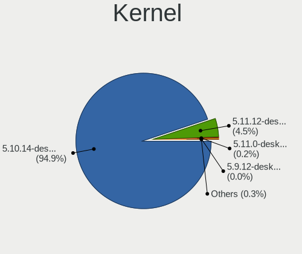

| Version                        | Computers | Percent |
|--------------------------------|-----------|---------|
| 5.10.14-desktop-1omv4002       | 4317      | 95.32%  |
| 5.11.12-desktop-1omv4002       | 184       | 4.06%   |
| 5.11.0-desktop-clang-1omv4002  | 10        | 0.22%   |
| 5.10.13-desktop-1omv4002       | 4         | 0.09%   |
| 5.9.12-desktop-1omv4002        | 2         | 0.04%   |
| 5.8.13-desktop-clang-1omv4002  | 1         | 0.02%   |
| 5.8.13-desktop-1omv4002        | 1         | 0.02%   |
| 5.11.1-desktop-74.1.1bomv4002  | 1         | 0.02%   |
| 5.11.0-desktop-1omv4002        | 1         | 0.02%   |
| 5.11.0-desktop-0.rc4.1omv4002  | 1         | 0.02%   |
| 5.10.9-desktop-1omv4002        | 1         | 0.02%   |
| 5.10.7-desktop-1omv4002        | 1         | 0.02%   |
| 5.10.3-desktop-2omv4002        | 1         | 0.02%   |
| 5.10.2-desktop-clang-1omv4002  | 1         | 0.02%   |
| 5.10.15-desktop-1omv4002       | 1         | 0.02%   |
| 5.10.12-desktop-clang-1omv4002 | 1         | 0.02%   |
| Unknown                        | 1         | 0.02%   |

Kernel Family
-------------

Linux kernel without a distro release

| Version | Computers | Percent |
|---------|-----------|---------|
| 5.10.14 | 4317      | 95.32%  |
| 5.11.12 | 184       | 4.06%   |
| 5.11.0  | 12        | 0.26%   |
| 5.10.13 | 4         | 0.09%   |
| 5.9.12  | 2         | 0.04%   |
| 5.8.13  | 2         | 0.04%   |
| 5.11.1  | 1         | 0.02%   |
| 5.10.9  | 1         | 0.02%   |
| 5.10.7  | 1         | 0.02%   |
| 5.10.3  | 1         | 0.02%   |
| 5.10.2  | 1         | 0.02%   |
| 5.10.15 | 1         | 0.02%   |
| 5.10.12 | 1         | 0.02%   |
| Unknown | 1         | 0.02%   |

Kernel Major Ver.
-----------------

Linux kernel major version

| Version | Computers | Percent |
|---------|-----------|---------|
| 5.10    | 4327      | 95.54%  |
| 5.11    | 197       | 4.35%   |
| 5.9     | 2         | 0.04%   |
| 5.8     | 2         | 0.04%   |
| Unknown | 1         | 0.02%   |

Arch
----

OS architecture (x86_64, i586, etc.)

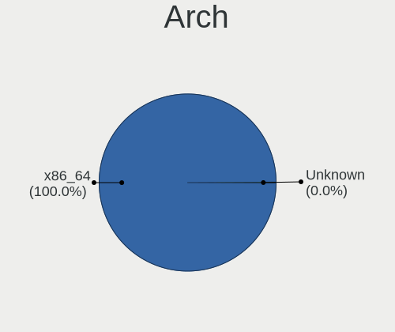

| Name    | Computers | Percent |
|---------|-----------|---------|
| x86_64  | 4482      | 99.98%  |
| Unknown | 1         | 0.02%   |

DE
--

Desktop Environment

| Name     | Computers | Percent |
|----------|-----------|---------|
| KDE5     | 4477      | 99.84%  |
| LXQt     | 2         | 0.04%   |
| Cinnamon | 2         | 0.04%   |
| KDE      | 1         | 0.02%   |
| GNOME    | 1         | 0.02%   |
| Unknown  | 1         | 0.02%   |

Display Server
--------------

X11 or Wayland

| Name    | Computers | Percent |
|---------|-----------|---------|
| X11     | 4464      | 99.58%  |
| Wayland | 18        | 0.4%    |
| Tty     | 1         | 0.02%   |

Display Manager
---------------

SDDM, LightDM, etc.

| Name    | Computers | Percent |
|---------|-----------|---------|
| SDDM    | 4482      | 99.98%  |
| Unknown | 1         | 0.02%   |

OS Lang
-------

Language

| Lang    | Computers | Percent |
|---------|-----------|---------|
| en_US   | 2271      | 50.46%  |
| de_DE   | 371       | 8.24%   |
| ru_RU   | 298       | 6.62%   |
| fr_FR   | 282       | 6.27%   |
| pl_PL   | 212       | 4.71%   |
| pt_BR   | 201       | 4.47%   |
| es_ES   | 130       | 2.89%   |
| it_IT   | 125       | 2.78%   |
| cs_CZ   | 93        | 2.07%   |
| en_GB   | 76        | 1.69%   |
| es_MX   | 40        | 0.89%   |
| es_AR   | 40        | 0.89%   |
| hu_HU   | 34        | 0.76%   |
| de_AT   | 27        | 0.6%    |
| en_AU   | 24        | 0.53%   |
| nl_NL   | 21        | 0.47%   |
| ru_UA   | 18        | 0.4%    |
| fr_BE   | 17        | 0.38%   |
| fr_CA   | 15        | 0.33%   |
| da_DK   | 14        | 0.31%   |
| ro_RO   | 13        | 0.29%   |
| es_CO   | 13        | 0.29%   |
| es_CL   | 12        | 0.27%   |
| de_CH   | 11        | 0.24%   |
| pt_PT   | 10        | 0.22%   |
| nl_BE   | 10        | 0.22%   |
| en_CA   | 10        | 0.22%   |
| en_IN   | 9         | 0.2%    |
| it_CH   | 7         | 0.16%   |
| fr_CH   | 7         | 0.16%   |
| es_PE   | 7         | 0.16%   |
| nb_NO   | 6         | 0.13%   |
| es_VE   | 6         | 0.13%   |
| en_HK   | 6         | 0.13%   |
| Unknown | 6         | 0.13%   |
| uk_UA   | 5         | 0.11%   |
| en_ZA   | 5         | 0.11%   |
| en_IL   | 5         | 0.11%   |
| es_SV   | 4         | 0.09%   |
| es_EC   | 4         | 0.09%   |
| en_NZ   | 4         | 0.09%   |
| es_UY   | 3         | 0.07%   |
| es_CR   | 3         | 0.07%   |
| en_IE   | 3         | 0.07%   |
| en_AG   | 3         | 0.07%   |
| es_GT   | 2         | 0.04%   |
| es_DO   | 2         | 0.04%   |
| de_LI   | 2         | 0.04%   |
| af_ZA   | 2         | 0.04%   |
| nl_AW   | 1         | 0.02%   |
| es_PY   | 1         | 0.02%   |
| es_PA   | 1         | 0.02%   |
| es_HN   | 1         | 0.02%   |
| es_BO   | 1         | 0.02%   |
| en_PH   | 1         | 0.02%   |
| en_NG   | 1         | 0.02%   |
| en_DK   | 1         | 0.02%   |
| de_IT   | 1         | 0.02%   |
| ar_TN   | 1         | 0.02%   |
| ar_EG   | 1         | 0.02%   |

Boot Mode
---------

EFI or BIOS

| Mode | Computers | Percent |
|------|-----------|---------|
| BIOS | 2702      | 60.22%  |
| EFI  | 1785      | 39.78%  |

Filesystem
----------

Type of filesystem

| Type    | Computers | Percent |
|---------|-----------|---------|
| Overlay | 3611      | 79.8%   |
| Ext4    | 860       | 19.01%  |
| Btrfs   | 28        | 0.62%   |
| F2fs    | 7         | 0.15%   |
| Ext3    | 6         | 0.13%   |
| Ext2    | 6         | 0.13%   |
| Xfs     | 4         | 0.09%   |
| Jfs     | 2         | 0.04%   |
| Unknown | 1         | 0.02%   |

Part. scheme
------------

Scheme of partitioning

| Type    | Computers | Percent |
|---------|-----------|---------|
| GPT     | 2540      | 56.49%  |
| MBR     | 1947      | 43.31%  |
| Unknown | 9         | 0.2%    |

Dual Boot with Linux/BSD
------------------------

Hosting more than one Linux/BSD

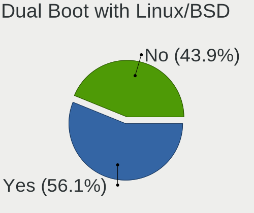

| Dual boot | Computers | Percent |
|-----------|-----------|---------|
| Yes       | 2583      | 57.31%  |
| No        | 1924      | 42.69%  |

Dual Boot (Win)
---------------

Hosting Linux and Windows

| Dual boot | Computers | Percent |
|-----------|-----------|---------|
| No        | 2343      | 52.18%  |
| Yes       | 2147      | 47.82%  |

Board
-----

Vendor
------

Motherboard manufacturer

| Name                | Computers | Percent |
|---------------------|-----------|---------|
| ASUSTek Computer    | 835       | 18.63%  |
| Hewlett-Packard     | 569       | 12.69%  |
| Lenovo              | 509       | 11.35%  |
| Dell                | 486       | 10.84%  |
| Gigabyte Technology | 388       | 8.65%   |
| Acer                | 310       | 6.92%   |
| MSI                 | 268       | 5.98%   |
| ASRock              | 204       | 4.55%   |
| Toshiba             | 116       | 2.59%   |
| Intel               | 78        | 1.74%   |
| Sony                | 66        | 1.47%   |
| Apple               | 58        | 1.29%   |
| Medion              | 56        | 1.25%   |
| Samsung Electronics | 55        | 1.23%   |
| Fujitsu             | 49        | 1.09%   |
| Pegatron            | 32        | 0.71%   |
| Biostar             | 29        | 0.65%   |
| Positivo            | 28        | 0.62%   |
| Foxconn             | 27        | 0.6%    |
| Unknown             | 26        | 0.58%   |
| Packard Bell        | 23        | 0.51%   |
| ECS                 | 18        | 0.4%    |
| eMachines           | 15        | 0.33%   |
| Philco              | 13        | 0.29%   |
| HUAWEI              | 13        | 0.29%   |
| Notebook            | 12        | 0.27%   |
| Fujitsu Siemens     | 11        | 0.25%   |
| LG Electronics      | 8         | 0.18%   |
| Chuwi               | 8         | 0.18%   |
| Microsoft           | 7         | 0.16%   |
| Gateway             | 7         | 0.16%   |
| Supermicro          | 6         | 0.13%   |
| Shuttle             | 6         | 0.13%   |
| PCWare              | 6         | 0.13%   |
| Clevo               | 6         | 0.13%   |
| ZOTAC               | 5         | 0.11%   |
| TUXEDO              | 5         | 0.11%   |
| Timi                | 5         | 0.11%   |
| System76            | 5         | 0.11%   |
| Itautec             | 5         | 0.11%   |
| Alienware           | 5         | 0.11%   |
| Teclast             | 4         | 0.09%   |
| Inventec            | 4         | 0.09%   |
| IBM                 | 4         | 0.09%   |
| BESSTAR Tech        | 4         | 0.09%   |
| Wortmann AG         | 3         | 0.07%   |
| Semp Toshiba        | 3         | 0.07%   |
| PC Specialist       | 3         | 0.07%   |
| Panasonic           | 3         | 0.07%   |
| OEM                 | 3         | 0.07%   |
| Huanan              | 3         | 0.07%   |
| AMD                 | 3         | 0.07%   |
| UMAX                | 2         | 0.04%   |
| NEC Computers       | 2         | 0.04%   |
| Megaware            | 2         | 0.04%   |
| MACHINIST           | 2         | 0.04%   |
| Jumper              | 2         | 0.04%   |
| HASEE Computer      | 2         | 0.04%   |
| BOX                 | 2         | 0.04%   |
| AZW                 | 2         | 0.04%   |

Model
-----

Motherboard model

| Name                           | Computers | Percent |
|--------------------------------|-----------|---------|
| ASUS All Series                | 52        | 1.16%   |
| ASUS UX31E                     | 44        | 0.98%   |
| Unknown                        | 41        | 0.91%   |
| HP Notebook                    | 22        | 0.49%   |
| Dell OptiPlex 780              | 22        | 0.49%   |
| Dell Inspiron 3451             | 22        | 0.49%   |
| Dell OptiPlex 7010             | 16        | 0.36%   |
| Medion E2292                   | 13        | 0.29%   |
| ASUS PRIME A320M-K             | 13        | 0.29%   |
| HP Pavilion g6                 | 12        | 0.27%   |
| MSI MS-7817                    | 11        | 0.25%   |
| Dell Latitude E6430            | 11        | 0.25%   |
| HP Pavilion dv6                | 10        | 0.22%   |
| Gigabyte B450M DS3H            | 10        | 0.22%   |
| ASUS PRIME B450M-A             | 10        | 0.22%   |
| HP Compaq Pro 6300 SFF         | 9         | 0.2%    |
| Gigabyte A320M-S2H             | 9         | 0.2%    |
| Gigabyte 970A-DS3P             | 9         | 0.2%    |
| Dell OptiPlex 9020             | 9         | 0.2%    |
| Dell Latitude D630             | 9         | 0.2%    |
| Toshiba Satellite A300         | 8         | 0.18%   |
| MSI MS-7641                    | 8         | 0.18%   |
| HP EliteDesk 800 G1 SFF        | 8         | 0.18%   |
| Gigabyte G31M-ES2L             | 8         | 0.18%   |
| Gigabyte B75M-D3H              | 8         | 0.18%   |
| Dell OptiPlex 3020             | 8         | 0.18%   |
| MSI MS-7C52                    | 7         | 0.16%   |
| MSI MS-7721                    | 7         | 0.16%   |
| Intel H61                      | 7         | 0.16%   |
| HP Pavilion 15                 | 7         | 0.16%   |
| HP EliteBook 8440p             | 7         | 0.16%   |
| HP Compaq 8200 Elite SFF PC    | 7         | 0.16%   |
| Gigabyte H61M-DS2              | 7         | 0.16%   |
| Dell OptiPlex 790              | 7         | 0.16%   |
| Dell Latitude E6420            | 7         | 0.16%   |
| Dell Latitude E6410            | 7         | 0.16%   |
| Dell Inspiron 15-3567          | 7         | 0.16%   |
| ASUS M5A97 R2.0                | 7         | 0.16%   |
| ASRock G31M-S                  | 7         | 0.16%   |
| MSI MS-7B86                    | 6         | 0.13%   |
| MSI MS-7693                    | 6         | 0.13%   |
| Lenovo Z50-70 20354            | 6         | 0.13%   |
| Lenovo IdeaPad S145-15AST 81N3 | 6         | 0.13%   |
| Lenovo IdeaPad 3 15ADA05 81W1  | 6         | 0.13%   |
| HP EliteBook 8570w             | 6         | 0.13%   |
| Gigabyte GA-78LMT-USB3 6.0     | 6         | 0.13%   |
| Gigabyte B450 AORUS ELITE      | 6         | 0.13%   |
| Dell OptiPlex 390              | 6         | 0.13%   |
| Dell Latitude E6500            | 6         | 0.13%   |
| Dell Latitude E6400            | 6         | 0.13%   |
| Dell Inspiron N5110            | 6         | 0.13%   |
| ASUS X541NA                    | 6         | 0.13%   |
| ASUS TUF Gaming X570-PLUS      | 6         | 0.13%   |
| ASUS PRIME X470-PRO            | 6         | 0.13%   |
| ASUS PRIME B350-PLUS           | 6         | 0.13%   |
| ASUS P8Z77-V LX                | 6         | 0.13%   |
| ASUS P8H61-M LX3 R2.0          | 6         | 0.13%   |
| ASUS M5A78L-M/USB3             | 6         | 0.13%   |
| ASUS M5A78L-M PLUS/USB3        | 6         | 0.13%   |
| ASUS K53E                      | 6         | 0.13%   |

Model Family
------------

Motherboard model prefix

| Name                   | Computers | Percent |
|------------------------|-----------|---------|
| Acer Aspire            | 229       | 5.11%   |
| Lenovo ThinkPad        | 159       | 3.55%   |
| Dell Inspiron          | 134       | 2.99%   |
| Dell Latitude          | 133       | 2.97%   |
| Lenovo IdeaPad         | 130       | 2.9%    |
| Dell OptiPlex          | 128       | 2.86%   |
| HP Compaq              | 99        | 2.21%   |
| Toshiba Satellite      | 95        | 2.12%   |
| HP Pavilion            | 95        | 2.12%   |
| ASUS PRIME             | 86        | 1.92%   |
| HP Laptop              | 55        | 1.23%   |
| Lenovo ThinkCentre     | 53        | 1.18%   |
| ASUS All               | 52        | 1.16%   |
| HP EliteBook           | 51        | 1.14%   |
| ASUS UX31E             | 44        | 0.98%   |
| Unknown                | 41        | 0.91%   |
| HP ProBook             | 38        | 0.85%   |
| ASUS ROG               | 37        | 0.83%   |
| Dell Vostro            | 27        | 0.6%    |
| ASUS VivoBook          | 27        | 0.6%    |
| ASUS M5A78L-M          | 27        | 0.6%    |
| HP EliteDesk           | 26        | 0.58%   |
| ASUS TUF               | 25        | 0.56%   |
| Fujitsu ESPRIMO        | 24        | 0.54%   |
| Lenovo IdeaCentre      | 23        | 0.51%   |
| HP Notebook            | 22        | 0.49%   |
| Dell Precision         | 20        | 0.45%   |
| ASUS P8Z77-V           | 20        | 0.45%   |
| Gigabyte B450M         | 19        | 0.42%   |
| Fujitsu LIFEBOOK       | 19        | 0.42%   |
| Acer Extensa           | 19        | 0.42%   |
| ASUS P8H61-M           | 18        | 0.4%    |
| HP ProDesk             | 17        | 0.38%   |
| Acer TravelMate        | 17        | 0.38%   |
| Packard Bell EasyNote  | 15        | 0.33%   |
| Gigabyte B450          | 14        | 0.31%   |
| Medion E2292           | 13        | 0.29%   |
| HP ENVY                | 13        | 0.29%   |
| Gigabyte X570          | 12        | 0.27%   |
| Gigabyte A320M-S2H     | 12        | 0.27%   |
| Dell XPS               | 12        | 0.27%   |
| ASUS M5A97             | 12        | 0.27%   |
| MSI MS-7817            | 11        | 0.25%   |
| Gigabyte GA-78LMT-USB3 | 11        | 0.25%   |
| ASUS P5G41T-M          | 11        | 0.25%   |
| HP 250                 | 10        | 0.22%   |
| Acer Veriton           | 10        | 0.22%   |
| Gigabyte 970A-DS3P     | 9         | 0.2%    |
| MSI MS-7641            | 8         | 0.18%   |
| Intel H61              | 8         | 0.18%   |
| Gigabyte G31M-ES2L     | 8         | 0.18%   |
| Gigabyte B75M-D3H      | 8         | 0.18%   |
| Dell Studio            | 8         | 0.18%   |
| ASUS P5K               | 8         | 0.18%   |
| MSI MS-7C52            | 7         | 0.16%   |
| MSI MS-7721            | 7         | 0.16%   |
| Microsoft Surface      | 7         | 0.16%   |
| HP Stream              | 7         | 0.16%   |
| Gigabyte H61M-DS2      | 7         | 0.16%   |
| ASUS SABERTOOTH        | 7         | 0.16%   |

MFG Year
--------

Motherboard manufacture year

| Year    | Computers | Percent |
|---------|-----------|---------|
| 2012    | 498       | 11.11%  |
| 2011    | 480       | 10.71%  |
| 2013    | 387       | 8.63%   |
| 2014    | 349       | 7.78%   |
| 2010    | 344       | 7.67%   |
| 2018    | 310       | 6.92%   |
| 2019    | 305       | 6.8%    |
| 2008    | 292       | 6.51%   |
| 2017    | 269       | 6%      |
| 2009    | 266       | 5.93%   |
| 2015    | 249       | 5.55%   |
| 2016    | 223       | 4.97%   |
| 2020    | 208       | 4.64%   |
| 2007    | 162       | 3.61%   |
| 2021    | 61        | 1.36%   |
| 2006    | 58        | 1.29%   |
| 2005    | 14        | 0.31%   |
| 2004    | 6         | 0.13%   |
| Unknown | 2         | 0.04%   |

Form Factor
-----------

Physical design of the computer

| Name        | Computers | Percent |
|-------------|-----------|---------|
| Desktop     | 2184      | 48.72%  |
| Notebook    | 2125      | 47.4%   |
| All in one  | 70        | 1.56%   |
| Mini pc     | 44        | 0.98%   |
| Convertible | 41        | 0.91%   |
| Tablet      | 13        | 0.29%   |
| Server      | 6         | 0.13%   |

Secure Boot
-----------

Enabled or disabled

| State    | Computers | Percent |
|----------|-----------|---------|
| Disabled | 4483      | 100%    |

Coreboot
--------

Have coreboot on board

| Used | Computers | Percent |
|------|-----------|---------|
| No   | 4480      | 99.93%  |
| Yes  | 3         | 0.07%   |

RAM Size
--------

Total RAM memory

| Size in GB      | Computers | Percent |
|-----------------|-----------|---------|
| 3.01-4.0        | 1452      | 32.35%  |
| 4.01-8.0        | 1113      | 24.79%  |
| 8.01-16.0       | 845       | 18.82%  |
| 16.01-24.0      | 569       | 12.68%  |
| 1.01-2.0        | 211       | 4.7%    |
| 32.01-64.0      | 166       | 3.7%    |
| 2.01-3.0        | 67        | 1.49%   |
| 24.01-32.0      | 34        | 0.76%   |
| 64.01-256.0     | 21        | 0.47%   |
| 0.51-1.0        | 9         | 0.2%    |
| More than 256.0 | 1         | 0.02%   |
| Unknown         | 1         | 0.02%   |

RAM Used
--------

Used RAM memory

| Used GB   | Computers | Percent |
|-----------|-----------|---------|
| 1.01-2.0  | 3508      | 77.7%   |
| 0.51-1.0  | 610       | 13.51%  |
| 2.01-3.0  | 263       | 5.83%   |
| 0.01-0.5  | 107       | 2.37%   |
| 3.01-4.0  | 15        | 0.33%   |
| 4.01-8.0  | 9         | 0.2%    |
| 8.01-16.0 | 2         | 0.04%   |
| Unknown   | 1         | 0.02%   |

Total Drives
------------

Number of drives on board

| Drives | Computers | Percent |
|--------|-----------|---------|
| 1      | 2780      | 61.93%  |
| 2      | 1041      | 23.19%  |
| 3      | 343       | 7.64%   |
| 4      | 150       | 3.34%   |
| 0      | 69        | 1.54%   |
| 5      | 60        | 1.34%   |
| 6      | 20        | 0.45%   |
| 7      | 13        | 0.29%   |
| 8      | 10        | 0.22%   |
| 9      | 2         | 0.04%   |
| 18     | 1         | 0.02%   |

Has CD-ROM
----------

Has CD-ROM on board

| Presented | Computers | Percent |
|-----------|-----------|---------|
| Yes       | 2800      | 62.39%  |
| No        | 1688      | 37.61%  |

Has Ethernet
------------

Has Ethernet on board

| Presented | Computers | Percent |
|-----------|-----------|---------|
| Yes       | 4233      | 94.42%  |
| No        | 250       | 5.58%   |

Has WiFi
--------

Has WiFi module

| Presented | Computers | Percent |
|-----------|-----------|---------|
| Yes       | 2961      | 66.03%  |
| No        | 1523      | 33.97%  |

Has Bluetooth
-------------

Has Bluetooth module

| Presented | Computers | Percent |
|-----------|-----------|---------|
| No        | 2478      | 55.26%  |
| Yes       | 2006      | 44.74%  |

Location
--------

Country
-------

Geographic location (country)

| Country      | Computers | Percent |
|--------------|-----------|---------|
| Germany      | 546       | 12.18%  |
| USA          | 443       | 9.88%   |
| Russia       | 382       | 8.52%   |
| France       | 344       | 7.67%   |
| Brazil       | 327       | 7.29%   |
| Poland       | 302       | 6.74%   |
| Italy        | 209       | 4.66%   |
| Spain        | 180       | 4.01%   |
| UK           | 128       | 2.85%   |
| Czechia      | 115       | 2.56%   |
| Canada       | 114       | 2.54%   |
| Mexico       | 86        | 1.92%   |
| Ukraine      | 72        | 1.61%   |
| Hungary      | 56        | 1.25%   |
| Australia    | 56        | 1.25%   |
| Argentina    | 55        | 1.23%   |
| Netherlands  | 54        | 1.2%    |
| India        | 54        | 1.2%    |
| Belgium      | 43        | 0.96%   |
| Romania      | 41        | 0.91%   |
| Austria      | 40        | 0.89%   |
| Sweden       | 39        | 0.87%   |
| Greece       | 36        | 0.8%    |
| Portugal     | 35        | 0.78%   |
| Japan        | 35        | 0.78%   |
| Indonesia    | 32        | 0.71%   |
| Finland      | 31        | 0.69%   |
| Switzerland  | 29        | 0.65%   |
| Bulgaria     | 28        | 0.62%   |
| Slovakia     | 26        | 0.58%   |
| Serbia       | 25        | 0.56%   |
| Denmark      | 25        | 0.56%   |
| Belarus      | 24        | 0.54%   |
| Norway       | 20        | 0.45%   |
| China        | 20        | 0.45%   |
| Chile        | 19        | 0.42%   |
| South Africa | 17        | 0.38%   |
| Thailand     | 16        | 0.36%   |
| Israel       | 16        | 0.36%   |
| Costa Rica   | 16        | 0.36%   |
| Colombia     | 15        | 0.33%   |
| Taiwan       | 14        | 0.31%   |
| Algeria      | 14        | 0.31%   |
| Philippines  | 13        | 0.29%   |
| Peru         | 12        | 0.27%   |
| New Zealand  | 12        | 0.27%   |
| Morocco      | 12        | 0.27%   |
| Ireland      | 12        | 0.27%   |
| Hong Kong    | 12        | 0.27%   |
| Saudi Arabia | 11        | 0.25%   |
| Turkey       | 10        | 0.22%   |
| Malaysia     | 10        | 0.22%   |
| Venezuela    | 9         | 0.2%    |
| Kazakhstan   | 9         | 0.2%    |
| Egypt        | 9         | 0.2%    |
| Iran         | 8         | 0.18%   |
| Uruguay      | 7         | 0.16%   |
| Lithuania    | 7         | 0.16%   |
| Puerto Rico  | 6         | 0.13%   |
| Moldova      | 6         | 0.13%   |

City
----

Geographic location (city)

| City             | Computers | Percent |
|------------------|-----------|---------|
| Moscow           | 63        | 1.4%    |
| Prague           | 59        | 1.31%   |
| Warsaw           | 47        | 1.04%   |
| Paris            | 38        | 0.84%   |
| Berlin           | 37        | 0.82%   |
| St Petersburg    | 35        | 0.78%   |
| Sao Paulo        | 34        | 0.75%   |
| Krakow           | 30        | 0.67%   |
| Rome             | 27        | 0.6%    |
| Milan            | 27        | 0.6%    |
| Mexico City      | 25        | 0.55%   |
| Rio de Janeiro   | 24        | 0.53%   |
| Munich           | 21        | 0.47%   |
| Stuttgart        | 18        | 0.4%    |
| Porto Alegre     | 17        | 0.38%   |
| Krasnodar        | 17        | 0.38%   |
| Helsinki         | 17        | 0.38%   |
| Yekaterinburg    | 16        | 0.36%   |
| Vienna           | 16        | 0.36%   |
| Madrid           | 16        | 0.36%   |
| Budapest         | 15        | 0.33%   |
| Wroclaw          | 14        | 0.31%   |
| Melbourne        | 14        | 0.31%   |
| Hamburg          | 14        | 0.31%   |
| Wettringen       | 13        | 0.29%   |
| Poznan           | 13        | 0.29%   |
| Sydney           | 12        | 0.27%   |
| Nuremberg        | 12        | 0.27%   |
| Novosibirsk      | 12        | 0.27%   |
| Barcelona        | 12        | 0.27%   |
| Athens           | 12        | 0.27%   |
| Mannheim         | 11        | 0.24%   |
| Lisbon           | 11        | 0.24%   |
| Cologne          | 11        | 0.24%   |
| Buenos Aires     | 11        | 0.24%   |
| Queens           | 10        | 0.22%   |
| Nizhniy Novgorod | 10        | 0.22%   |
| Montreal         | 10        | 0.22%   |
| Minsk            | 10        | 0.22%   |
| Kyiv             | 10        | 0.22%   |
| Kharkiv          | 10        | 0.22%   |
| Belgrade         | 10        | 0.22%   |
| Thessaloniki     | 9         | 0.2%    |
| Sofia            | 9         | 0.2%    |
| Lodz             | 9         | 0.2%    |
| Leipzig          | 9         | 0.2%    |
| Gdansk           | 9         | 0.2%    |
| Essen            | 9         | 0.2%    |
| Central          | 9         | 0.2%    |
| Brno             | 9         | 0.2%    |
| Belo Horizonte   | 9         | 0.2%    |
| Seattle          | 8         | 0.18%   |
| Perm             | 8         | 0.18%   |
| Limoges          | 8         | 0.18%   |
| Lima             | 8         | 0.18%   |
| Katowice         | 8         | 0.18%   |
| Jakarta          | 8         | 0.18%   |
| Florence         | 8         | 0.18%   |
| Dortmund         | 8         | 0.18%   |
| Curitiba         | 8         | 0.18%   |

Drives
------

Drive Vendor
------------

Hard drive vendors

| Vendor              | Computers | Drives | Percent |
|---------------------|-----------|--------|---------|
| WDC                 | 1276      | 1523   | 20.53%  |
| Seagate             | 1190      | 1390   | 19.15%  |
| Samsung Electronics | 710       | 860    | 11.43%  |
| Toshiba             | 496       | 530    | 7.98%   |
| Kingston            | 363       | 395    | 5.84%   |
| Hitachi             | 292       | 307    | 4.7%    |
| SanDisk             | 240       | 251    | 3.86%   |
| Crucial             | 225       | 258    | 3.62%   |
| Unknown             | 168       | 185    | 2.7%    |
| A-DATA Technology   | 108       | 115    | 1.74%   |
| HGST                | 103       | 108    | 1.66%   |
| Intel               | 90        | 102    | 1.45%   |
| China               | 64        | 68     | 1.03%   |
| SK hynix            | 59        | 60     | 0.95%   |
| Goodram             | 52        | 57     | 0.84%   |
| Intenso             | 47        | 52     | 0.76%   |
| Maxtor              | 44        | 48     | 0.71%   |
| PNY                 | 40        | 41     | 0.64%   |
| Patriot             | 40        | 43     | 0.64%   |
| Fujitsu             | 31        | 31     | 0.5%    |
| SPCC                | 30        | 30     | 0.48%   |
| OCZ                 | 28        | 29     | 0.45%   |
| Micron Technology   | 28        | 29     | 0.45%   |
| Apple               | 27        | 31     | 0.43%   |
| Apacer              | 27        | 29     | 0.43%   |
| JMicron Technology  | 24        | 24     | 0.39%   |
| Transcend           | 23        | 23     | 0.37%   |
| Phison              | 21        | 23     | 0.34%   |
| Hewlett-Packard     | 19        | 21     | 0.31%   |
| Corsair             | 19        | 20     | 0.31%   |
| Plextor             | 16        | 18     | 0.26%   |
| LITEON              | 12        | 12     | 0.19%   |
| LITEONIT            | 11        | 12     | 0.18%   |
| KingSpec            | 11        | 11     | 0.18%   |
| Team                | 10        | 11     | 0.16%   |
| SABRENT             | 7         | 9      | 0.11%   |
| KingDian            | 7         | 7      | 0.11%   |
| Gigabyte Technology | 7         | 7      | 0.11%   |
| Colorful            | 7         | 7      | 0.11%   |
| Unknown             | 7         | 7      | 0.11%   |
| Silicon Motion      | 6         | 7      | 0.1%    |
| Netac               | 6         | 6      | 0.1%    |
| ASMT                | 6         | 6      | 0.1%    |
| XPG                 | 5         | 6      | 0.08%   |
| Verbatim            | 5         | 5      | 0.08%   |
| Teclast             | 5         | 5      | 0.08%   |
| Phison Electronics  | 5         | 6      | 0.08%   |
| Lexar               | 5         | 5      | 0.08%   |
| KIOXIA              | 5         | 7      | 0.08%   |
| External            | 5         | 5      | 0.08%   |
| XrayDisk            | 4         | 4      | 0.06%   |
| WD MediaMax         | 4         | 4      | 0.06%   |
| Union Memory        | 4         | 5      | 0.06%   |
| Leven               | 4         | 4      | 0.06%   |
| LaCie               | 4         | 4      | 0.06%   |
| KIOXIA-EXCERIA      | 4         | 4      | 0.06%   |
| KingFast            | 4         | 4      | 0.06%   |
| INNOVATION IT       | 4         | 4      | 0.06%   |
| Hikvision           | 4         | 4      | 0.06%   |
| EMTEC               | 4         | 4      | 0.06%   |

Drive Model
-----------

Hard drive models

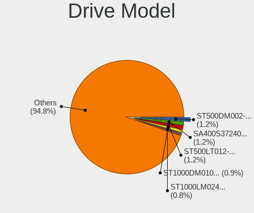

| Model                               | Computers | Percent |
|-------------------------------------|-----------|---------|
| Seagate ST500DM002-1BD142 500GB     | 79        | 1.17%   |
| Kingston SA400S37240G 240GB SSD     | 76        | 1.13%   |
| Seagate ST500LT012-1DG142 500GB     | 71        | 1.05%   |
| Seagate ST1000DM010-2EP102 1TB      | 58        | 0.86%   |
| Seagate ST1000LM024 HN-M101MBB 1TB  | 55        | 0.81%   |
| Toshiba DT01ACA100 1TB              | 53        | 0.78%   |
| Toshiba MQ01ABF050 500GB            | 48        | 0.71%   |
| Kingston SA400S37120G 120GB SSD     | 46        | 0.68%   |
| SanDisk SSD U100 256GB              | 44        | 0.65%   |
| Samsung SSD 860 EVO 500GB           | 43        | 0.64%   |
| Seagate ST1000LM035-1RK172 1TB      | 41        | 0.61%   |
| Kingston SV300S37A120G 120GB SSD    | 41        | 0.61%   |
| Seagate ST3500418AS 500GB           | 39        | 0.58%   |
| Unknown SD/MMC/MS PRO 128GB         | 38        | 0.56%   |
| Toshiba MQ01ABD100 1TB              | 38        | 0.56%   |
| Toshiba DT01ACA050 500GB            | 37        | 0.55%   |
| Kingston SA400S37480G 480GB SSD     | 37        | 0.55%   |
| WDC WD10EZEX-08WN4A0 1TB            | 36        | 0.53%   |
| Seagate ST9500325AS 500GB           | 32        | 0.47%   |
| Samsung SSD 850 EVO 250GB           | 32        | 0.47%   |
| Crucial CT240BX500SSD1 240GB        | 32        | 0.47%   |
| WDC WDS240G2G0A-00JH30 240GB SSD    | 31        | 0.46%   |
| Samsung SSD 850 EVO 500GB           | 30        | 0.44%   |
| WDC WD10JPVX-22JC3T0 1TB            | 28        | 0.41%   |
| Toshiba HDWD110 1TB                 | 28        | 0.41%   |
| Seagate ST500LM012 HN-M500MBB 500GB | 28        | 0.41%   |
| Seagate ST1000DM003-1ER162 1TB      | 28        | 0.41%   |
| Samsung SSD 860 EVO 250GB           | 28        | 0.41%   |
| Crucial CT500MX500SSD1 500GB        | 28        | 0.41%   |
| HGST HTS721010A9E630 1TB            | 27        | 0.4%    |
| WDC WDS500G2B0A-00SM50 500GB SSD    | 25        | 0.37%   |
| Seagate ST2000DM008-2FR102 2TB      | 25        | 0.37%   |
| Toshiba MQ04ABF100 1TB              | 24        | 0.36%   |
| Seagate ST1000DM003-1CH162 1TB      | 24        | 0.36%   |
| Seagate ST3500413AS 500GB           | 23        | 0.34%   |
| Toshiba DT01ACA200 2TB              | 21        | 0.31%   |
| Seagate ST1000DM003-1SB102 1TB      | 20        | 0.3%    |
| WDC WD10EZEX-00BN5A0 1TB            | 19        | 0.28%   |
| Seagate ST500LT012-9WS142 500GB     | 19        | 0.28%   |
| Seagate ST3160815AS 160GB           | 19        | 0.28%   |
| Seagate Expansion 1TB               | 19        | 0.28%   |
| SanDisk SSD PLUS 240GB              | 19        | 0.28%   |
| HGST HTS545050A7E680 500GB          | 19        | 0.28%   |
| Crucial CT480BX500SSD1 480GB        | 19        | 0.28%   |
| Crucial CT120BX500SSD1 120GB        | 18        | 0.27%   |
| Crucial CT1000MX500SSD1 1TB         | 18        | 0.27%   |
| WDC WD5000LPVX-22V0TT0 500GB        | 17        | 0.25%   |
| Seagate ST2000DM006-2DM164 2TB      | 17        | 0.25%   |
| Samsung SSD 860 EVO 1TB             | 17        | 0.25%   |
| A-DATA SU630 240GB SSD              | 17        | 0.25%   |
| WDC WD20EZRZ-00Z5HB0 2TB            | 16        | 0.24%   |
| Samsung SSD 970 EVO Plus 500GB      | 16        | 0.24%   |
| Hitachi HTS547550A9E384 500GB       | 16        | 0.24%   |
| WDC WD20EZRX-00D8PB0 2TB            | 15        | 0.22%   |
| Seagate ST3500312CS 500GB           | 15        | 0.22%   |
| Seagate ST2000DM001-1CH164 2TB      | 15        | 0.22%   |
| PNY CS900 120GB SSD                 | 15        | 0.22%   |
| Kingston SV300S37A240G 240GB SSD    | 15        | 0.22%   |
| JMicron Generic 2TB                 | 15        | 0.22%   |
| HGST HTS541010A9E680 1TB            | 15        | 0.22%   |

HDD Vendor
----------

Hard disk drive vendors

| Vendor              | Computers | Drives | Percent |
|---------------------|-----------|--------|---------|
| Seagate             | 1181      | 1377   | 33.98%  |
| WDC                 | 1085      | 1278   | 31.21%  |
| Toshiba             | 438       | 466    | 12.6%   |
| Hitachi             | 292       | 307    | 8.4%    |
| Samsung Electronics | 196       | 217    | 5.64%   |
| HGST                | 103       | 108    | 2.96%   |
| Maxtor              | 43        | 47     | 1.24%   |
| Unknown             | 39        | 39     | 1.12%   |
| Fujitsu             | 31        | 31     | 0.89%   |
| JMicron Technology  | 15        | 15     | 0.43%   |
| Apple               | 14        | 14     | 0.4%    |
| Hewlett-Packard     | 5         | 5      | 0.14%   |
| ASMT                | 5         | 5      | 0.14%   |
| WD MediaMax         | 4         | 4      | 0.12%   |
| Quantum             | 3         | 3      | 0.09%   |
| IBM/Hitachi         | 3         | 3      | 0.09%   |
| SABRENT             | 2         | 3      | 0.06%   |
| MDT                 | 2         | 2      | 0.06%   |
| ExcelStor           | 2         | 2      | 0.06%   |
| ASMedia             | 2         | 2      | 0.06%   |
| USB                 | 1         | 1      | 0.03%   |
| TPH00800640GB       | 1         | 1      | 0.03%   |
| RSH-319             | 1         | 1      | 0.03%   |
| KESU                | 1         | 1      | 0.03%   |
| Intenso             | 1         | 1      | 0.03%   |
| IB                  | 1         | 2      | 0.03%   |
| HPE                 | 1         | 1      | 0.03%   |
| HGST HTS            | 1         | 1      | 0.03%   |
| FC-1307             | 1         | 1      | 0.03%   |
| China               | 1         | 1      | 0.03%   |
| ASMT106x            | 1         | 1      | 0.03%   |

SSD Vendor
----------

Solid state drive vendors

| Vendor              | Computers | Drives | Percent |
|---------------------|-----------|--------|---------|
| Samsung Electronics | 392       | 456    | 18.19%  |
| Kingston            | 323       | 350    | 14.99%  |
| SanDisk             | 229       | 238    | 10.63%  |
| Crucial             | 204       | 234    | 9.47%   |
| WDC                 | 149       | 155    | 6.91%   |
| A-DATA Technology   | 100       | 106    | 4.64%   |
| China               | 63        | 67     | 2.92%   |
| Goodram             | 51        | 56     | 2.37%   |
| Intel               | 47        | 51     | 2.18%   |
| Intenso             | 45        | 50     | 2.09%   |
| Toshiba             | 43        | 45     | 2%      |
| PNY                 | 38        | 39     | 1.76%   |
| Patriot             | 37        | 40     | 1.72%   |
| SK hynix            | 28        | 29     | 1.3%    |
| OCZ                 | 28        | 29     | 1.3%    |
| Apacer              | 25        | 27     | 1.16%   |
| SPCC                | 24        | 24     | 1.11%   |
| Transcend           | 22        | 22     | 1.02%   |
| Micron Technology   | 22        | 23     | 1.02%   |
| Unknown             | 21        | 22     | 0.97%   |
| Plextor             | 14        | 16     | 0.65%   |
| Corsair             | 12        | 13     | 0.56%   |
| LITEONIT            | 11        | 12     | 0.51%   |
| KingSpec            | 11        | 11     | 0.51%   |
| Hewlett-Packard     | 11        | 11     | 0.51%   |
| Apple               | 11        | 11     | 0.51%   |
| LITEON              | 10        | 10     | 0.46%   |
| Team                | 9         | 10     | 0.42%   |
| KingDian            | 7         | 7      | 0.32%   |
| Colorful            | 7         | 7      | 0.32%   |
| Seagate             | 6         | 6      | 0.28%   |
| Netac               | 6         | 6      | 0.28%   |
| Unknown             | 6         | 6      | 0.28%   |
| Verbatim            | 5         | 5      | 0.23%   |
| Teclast             | 5         | 5      | 0.23%   |
| Gigabyte Technology | 5         | 5      | 0.23%   |
| XrayDisk            | 4         | 4      | 0.19%   |
| Leven               | 4         | 4      | 0.19%   |
| KingFast            | 4         | 4      | 0.19%   |
| INNOVATION IT       | 4         | 4      | 0.19%   |
| AMD                 | 4         | 4      | 0.19%   |
| Zheino              | 3         | 3      | 0.14%   |
| TO Exter            | 3         | 3      | 0.14%   |
| TCSUNBOW            | 3         | 3      | 0.14%   |
| Smartbuy            | 3         | 3      | 0.14%   |
| Mushkin             | 3         | 3      | 0.14%   |
| Lexar               | 3         | 3      | 0.14%   |
| LDLC                | 3         | 4      | 0.14%   |
| KIOXIA-EXCERIA      | 3         | 3      | 0.14%   |
| FORESEE             | 3         | 3      | 0.14%   |
| EMTEC               | 3         | 3      | 0.14%   |
| DOGGO               | 3         | 3      | 0.14%   |
| BHT                 | 3         | 3      | 0.14%   |
| VERICO              | 2         | 2      | 0.09%   |
| Vaseky              | 2         | 2      | 0.09%   |
| T-FORCE             | 2         | 2      | 0.09%   |
| Qumo                | 2         | 2      | 0.09%   |
| Platinet            | 2         | 2      | 0.09%   |
| INDMEM              | 2         | 2      | 0.09%   |
| HS-SSD-C100         | 2         | 2      | 0.09%   |

Drive Kind
----------

HDD or SSD

| Kind    | Computers | Drives | Percent |
|---------|-----------|--------|---------|
| HDD     | 2944      | 3940   | 53.65%  |
| SSD     | 1901      | 2333   | 34.65%  |
| NVMe    | 484       | 577    | 8.82%   |
| MMC     | 115       | 125    | 2.1%    |
| Unknown | 43        | 51     | 0.78%   |

Drive Connector
---------------

SATA, SAS, NVMe, etc.

| Type | Computers | Drives | Percent |
|------|-----------|--------|---------|
| SATA | 4103      | 6074   | 83.56%  |
| NVMe | 476       | 564    | 9.69%   |
| SAS  | 216       | 263    | 4.4%    |
| MMC  | 115       | 125    | 2.34%   |

Drive Size
----------

Size of hard drive

| Size in TB | Computers | Drives | Percent |
|------------|-----------|--------|---------|
| 0.01-0.5   | 3260      | 4202   | 65.29%  |
| 0.51-1.0   | 1264      | 1504   | 25.32%  |
| 1.01-2.0   | 301       | 357    | 6.03%   |
| 3.01-4.0   | 65        | 83     | 1.3%    |
| 2.01-3.0   | 63        | 81     | 1.26%   |
| 4.01-10.0  | 34        | 40     | 0.68%   |
| 10.01-20.0 | 6         | 6      | 0.12%   |

Space Total
-----------

Amount of disk space available on the file system

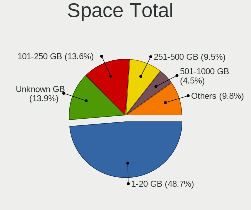

| Size in GB     | Computers | Percent |
|----------------|-----------|---------|
| 1-20           | 2272      | 50.19%  |
| Unknown        | 620       | 13.7%   |
| 101-250        | 576       | 12.72%  |
| 251-500        | 422       | 9.32%   |
| 501-1000       | 200       | 4.42%   |
| 51-100         | 195       | 4.31%   |
| 21-50          | 152       | 3.36%   |
| 1001-2000      | 60        | 1.33%   |
| 2001-3000      | 19        | 0.42%   |
| More than 3000 | 11        | 0.24%   |

Space Used
----------

Amount of used disk space

| Used GB        | Computers | Percent |
|----------------|-----------|---------|
| 1-20           | 3539      | 78.26%  |
| Unknown        | 620       | 13.71%  |
| 21-50          | 96        | 2.12%   |
| 101-250        | 87        | 1.92%   |
| 51-100         | 69        | 1.53%   |
| 251-500        | 54        | 1.19%   |
| 501-1000       | 33        | 0.73%   |
| 1001-2000      | 16        | 0.35%   |
| More than 3000 | 4         | 0.09%   |
| 2001-3000      | 3         | 0.07%   |
| 0              | 1         | 0.02%   |

Malfunc. Drives
---------------

Drive models with a malfunction

| Model                               | Computers | Drives | Percent |
|-------------------------------------|-----------|--------|---------|
| SanDisk SSD U100 256GB              | 44        | 44     | 3.1%    |
| Seagate ST500DM002-1BD142 500GB     | 32        | 32     | 2.26%   |
| Seagate ST9500325AS 500GB           | 27        | 29     | 1.9%    |
| Seagate ST500LT012-1DG142 500GB     | 23        | 23     | 1.62%   |
| Seagate ST3500418AS 500GB           | 19        | 20     | 1.34%   |
| Seagate ST1000LM024 HN-M101MBB 1TB  | 19        | 19     | 1.34%   |
| Seagate ST500LT012-9WS142 500GB     | 16        | 17     | 1.13%   |
| Toshiba MQ01ABF050 500GB            | 14        | 14     | 0.99%   |
| Toshiba DT01ACA100 1TB              | 11        | 11     | 0.78%   |
| Hitachi HTS545050A7E380 500GB       | 11        | 11     | 0.78%   |
| Seagate ST9320325AS 320GB           | 10        | 10     | 0.7%    |
| Kingston SV300S37A120G 120GB SSD    | 10        | 10     | 0.7%    |
| HGST HTS545050A7E680 500GB          | 10        | 10     | 0.7%    |
| Hitachi HTS547550A9E384 500GB       | 9         | 10     | 0.63%   |
| WDC WD10JPVX-22JC3T0 1TB            | 8         | 8      | 0.56%   |
| Toshiba DT01ACA050 500GB            | 8         | 8      | 0.56%   |
| Seagate ST500LM021-1KJ152 500GB     | 8         | 8      | 0.56%   |
| HGST HTS541010A9E680 1TB            | 8         | 8      | 0.56%   |
| WDC WD5000AAKX-003CA0 500GB         | 7         | 7      | 0.49%   |
| WDC WD5000AAKX-001CA0 500GB         | 7         | 8      | 0.49%   |
| Toshiba MQ01ABD100 1TB              | 7         | 7      | 0.49%   |
| Toshiba MQ01ABD050 500GB            | 7         | 7      | 0.49%   |
| Toshiba MK3265GSX 320GB             | 7         | 7      | 0.49%   |
| Seagate ST31000524AS 1TB            | 7         | 7      | 0.49%   |
| Seagate ST1000LM035-1RK172 1TB      | 7         | 7      | 0.49%   |
| Hitachi HTS545025B9A300 250GB       | 7         | 7      | 0.49%   |
| HGST HTS721010A9E630 1TB            | 7         | 7      | 0.49%   |
| WDC WD5000LPVX-22V0TT0 500GB        | 6         | 6      | 0.42%   |
| WDC WD10EADS-00L5B1 1TB             | 6         | 6      | 0.42%   |
| Seagate ST9500420AS 500GB           | 6         | 6      | 0.42%   |
| Seagate ST3250310AS 250GB           | 6         | 6      | 0.42%   |
| Seagate ST31000528AS 1TB            | 6         | 6      | 0.42%   |
| Samsung Electronics HM641JI 640GB   | 6         | 6      | 0.42%   |
| Samsung Electronics HD161HJ 160GB   | 6         | 6      | 0.42%   |
| Samsung Electronics HD103SJ 1TB     | 6         | 7      | 0.42%   |
| Hitachi HTS547564A9E384 640GB       | 6         | 6      | 0.42%   |
| HGST HTS545050A7E380 500GB          | 6         | 6      | 0.42%   |
| WDC WDS240G2G0A-00JH30 240GB SSD    | 5         | 5      | 0.35%   |
| WDC WD5000AAKX-75U6AA0 500GB        | 5         | 6      | 0.35%   |
| WDC WD3200BEVT-60A23T0 320GB        | 5         | 5      | 0.35%   |
| WDC WD10JPCX-24UE4T0 1TB            | 5         | 5      | 0.35%   |
| Toshiba MQ01ABD075 752GB            | 5         | 5      | 0.35%   |
| Seagate ST9250827AS 250GB           | 5         | 5      | 0.35%   |
| Seagate ST9250315AS 250GB           | 5         | 5      | 0.35%   |
| Seagate ST500LM012 HN-M500MBB 500GB | 5         | 5      | 0.35%   |
| Seagate ST3320418AS 320GB           | 5         | 5      | 0.35%   |
| Seagate ST3250820AS 250GB           | 5         | 6      | 0.35%   |
| Seagate ST3250410AS 250GB           | 5         | 5      | 0.35%   |
| Seagate ST2000DL003-9VT166 2TB      | 5         | 6      | 0.35%   |
| Samsung Electronics HD322HJ 320GB   | 5         | 5      | 0.35%   |
| Kingston SA400S37480G 480GB SSD     | 5         | 6      | 0.35%   |
| Hitachi HTS543232A7A384 320GB       | 5         | 5      | 0.35%   |
| Hitachi HTS542516K9SA00 160GB       | 5         | 5      | 0.35%   |
| Hitachi HDS721680PLA380 80GB        | 5         | 5      | 0.35%   |
| Hitachi HDS721050CLA362 500GB       | 5         | 6      | 0.35%   |
| HGST HTS725050A7E630 500GB          | 5         | 5      | 0.35%   |
| HGST HTS541075A9E680 752GB          | 5         | 5      | 0.35%   |
| WDC WD5000BPVT-22HXZT1 500GB        | 4         | 4      | 0.28%   |
| WDC WD5000AADS-00S9B0 500GB         | 4         | 4      | 0.28%   |
| WDC WD3200AAJS-56M0A0 320GB         | 4         | 4      | 0.28%   |

Malfunc. Drive Vendor
---------------------

Vendors of faulty drives

| Vendor              | Computers | Drives | Percent |
|---------------------|-----------|--------|---------|
| Seagate             | 390       | 414    | 28.34%  |
| WDC                 | 357       | 390    | 25.94%  |
| Hitachi             | 140       | 147    | 10.17%  |
| Toshiba             | 119       | 121    | 8.65%   |
| Samsung Electronics | 114       | 121    | 8.28%   |
| SanDisk             | 61        | 61     | 4.43%   |
| HGST                | 44        | 44     | 3.2%    |
| Kingston            | 34        | 36     | 2.47%   |
| Maxtor              | 25        | 25     | 1.82%   |
| Intel               | 12        | 12     | 0.87%   |
| Crucial             | 11        | 11     | 0.8%    |
| Fujitsu             | 10        | 10     | 0.73%   |
| China               | 7         | 7      | 0.51%   |
| SK hynix            | 6         | 6      | 0.44%   |
| A-DATA Technology   | 6         | 6      | 0.44%   |
| OCZ                 | 5         | 5      | 0.36%   |
| Intenso             | 3         | 3      | 0.22%   |
| Colorful            | 2         | 2      | 0.15%   |
| Apacer              | 2         | 3      | 0.15%   |
| XPG                 | 1         | 1      | 0.07%   |
| WD MediaMax         | 1         | 1      | 0.07%   |
| Unknown             | 1         | 1      | 0.07%   |
| Transcend           | 1         | 1      | 0.07%   |
| Team                | 1         | 1      | 0.07%   |
| SPCC                | 1         | 1      | 0.07%   |
| Quantum             | 1         | 1      | 0.07%   |
| QIANGHE             | 1         | 1      | 0.07%   |
| Plextor             | 1         | 1      | 0.07%   |
| Platinet            | 1         | 1      | 0.07%   |
| Netac               | 1         | 1      | 0.07%   |
| Neo Forza           | 1         | 1      | 0.07%   |
| Micron Technology   | 1         | 1      | 0.07%   |
| LITEONIT            | 1         | 1      | 0.07%   |
| LITEON              | 1         | 1      | 0.07%   |
| KingSpec            | 1         | 1      | 0.07%   |
| KingDian            | 1         | 1      | 0.07%   |
| IBM/Hitachi         | 1         | 1      | 0.07%   |
| IB                  | 1         | 1      | 0.07%   |
| Hewlett-Packard     | 1         | 1      | 0.07%   |
| Goodram             | 1         | 1      | 0.07%   |
| Faspeed             | 1         | 1      | 0.07%   |
| DRVEO               | 1         | 1      | 0.07%   |
| Corsair             | 1         | 1      | 0.07%   |
| ASMT                | 1         | 1      | 0.07%   |
| Apple               | 1         | 1      | 0.07%   |
| 240G                | 1         | 1      | 0.07%   |
| Unknown             | 1         | 1      | 0.07%   |

Malfunc. HDD Vendor
-------------------

Vendors of faulty HDD drives

| Vendor              | Computers | Drives | Percent |
|---------------------|-----------|--------|---------|
| Seagate             | 390       | 414    | 33.19%  |
| WDC                 | 343       | 375    | 29.19%  |
| Hitachi             | 140       | 147    | 11.91%  |
| Toshiba             | 119       | 121    | 10.13%  |
| Samsung Electronics | 96        | 103    | 8.17%   |
| HGST                | 44        | 44     | 3.74%   |
| Maxtor              | 25        | 25     | 2.13%   |
| Fujitsu             | 10        | 10     | 0.85%   |
| WD MediaMax         | 1         | 1      | 0.09%   |
| Quantum             | 1         | 1      | 0.09%   |
| IBM/Hitachi         | 1         | 1      | 0.09%   |
| IB                  | 1         | 1      | 0.09%   |
| Hewlett-Packard     | 1         | 1      | 0.09%   |
| China               | 1         | 1      | 0.09%   |
| ASMT                | 1         | 1      | 0.09%   |
| Apple               | 1         | 1      | 0.09%   |

Malfunc. Drive Kind
-------------------

Kinds of faulty drives

| Kind | Computers | Drives | Percent |
|------|-----------|--------|---------|
| HDD  | 1092      | 1247   | 84.39%  |
| SSD  | 194       | 197    | 14.99%  |
| NVMe | 8         | 8      | 0.62%   |

Failed Drives
-------------

Failed drive models

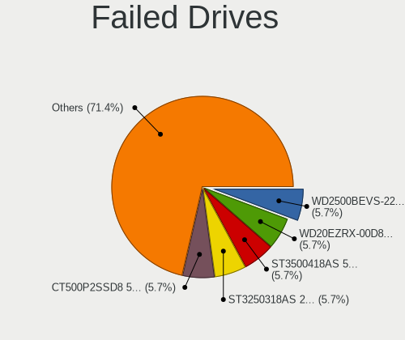

| Model                                 | Computers | Drives | Percent |
|---------------------------------------|-----------|--------|---------|
| WDC WD2500BEVS-22UST0 250GB           | 2         | 2      | 6.06%   |
| WDC WD20EZRX-00D8PB0 2TB              | 2         | 2      | 6.06%   |
| Seagate ST3500418AS 500GB             | 2         | 3      | 6.06%   |
| Seagate ST3250318AS 250GB             | 2         | 2      | 6.06%   |
| Crucial CT500P2SSD8 500GB             | 2         | 2      | 6.06%   |
| WDC WD800JD-75MSA3 80GB               | 1         | 1      | 3.03%   |
| WDC WD800JD-00LSA0 80GB               | 1         | 1      | 3.03%   |
| WDC WD5000M22K-24Z1LT0-SSHD-16GB      | 1         | 1      | 3.03%   |
| WDC WD5000LPLX-75ZNTT0 500GB          | 1         | 1      | 3.03%   |
| WDC WD5000BPVT-60HXZT1 500GB          | 1         | 1      | 3.03%   |
| WDC WD10JPVT-75A1YT0 1TB              | 1         | 1      | 3.03%   |
| WDC WD10EALX-759BA1 1TB               | 1         | 1      | 3.03%   |
| TPH00800640GB 640GB                   | 1         | 1      | 3.03%   |
| Toshiba MQ01ABF050 500GB              | 1         | 1      | 3.03%   |
| Toshiba MK3259GSXP 320GB              | 1         | 1      | 3.03%   |
| SK hynix HFS128G39TND-N210A 128GB SSD | 1         | 1      | 3.03%   |
| Seagate STM3250318AS 250GB            | 1         | 1      | 3.03%   |
| Seagate ST3320418AS 320GB             | 1         | 1      | 3.03%   |
| Seagate ST31000528AS 1TB              | 1         | 1      | 3.03%   |
| Samsung Electronics SSD PM800 TM 64GB | 1         | 1      | 3.03%   |
| Samsung Electronics HD502HJ 500GB     | 1         | 1      | 3.03%   |
| Samsung Electronics HD501LJ 500GB     | 1         | 1      | 3.03%   |
| Maxtor STM3500320AS 500GB             | 1         | 1      | 3.03%   |
| Kingston SMS200S360G 64GB SSD         | 1         | 1      | 3.03%   |
| Hitachi HTS545050A7E380 500GB         | 1         | 1      | 3.03%   |
| Hitachi HDS721010CLA332 1TB           | 1         | 1      | 3.03%   |
| HGST HTS541010A9E680 1TB              | 1         | 1      | 3.03%   |
| Apple HDD HTS541010A9E662 1TB         | 1         | 1      | 3.03%   |

Failed Drive Vendor
-------------------

Failed drive vendors

| Vendor              | Computers | Drives | Percent |
|---------------------|-----------|--------|---------|
| WDC                 | 11        | 11     | 33.33%  |
| Seagate             | 7         | 8      | 21.21%  |
| Samsung Electronics | 3         | 3      | 9.09%   |
| Toshiba             | 2         | 2      | 6.06%   |
| Hitachi             | 2         | 2      | 6.06%   |
| Crucial             | 2         | 2      | 6.06%   |
| TPH00800640GB       | 1         | 1      | 3.03%   |
| SK hynix            | 1         | 1      | 3.03%   |
| Maxtor              | 1         | 1      | 3.03%   |
| Kingston            | 1         | 1      | 3.03%   |
| HGST                | 1         | 1      | 3.03%   |
| Apple               | 1         | 1      | 3.03%   |

Drive Status
------------

Number of failed and malfunc. drives

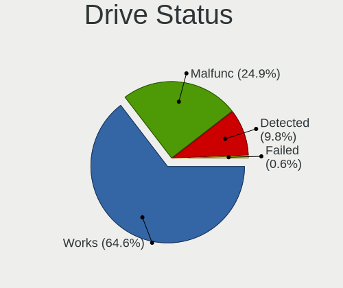

| Status   | Computers | Drives | Percent |
|----------|-----------|--------|---------|
| Works    | 3300      | 4895   | 64.79%  |
| Malfunc  | 1269      | 1452   | 24.92%  |
| Detected | 491       | 645    | 9.64%   |
| Failed   | 33        | 34     | 0.65%   |

Storage controller
------------------

Storage Vendor
--------------

Storage controller vendors

| Vendor                           | Computers | Percent |
|----------------------------------|-----------|---------|
| Intel                            | 3261      | 63.41%  |
| AMD                              | 1001      | 19.46%  |
| Samsung Electronics              | 173       | 3.36%   |
| Nvidia                           | 114       | 2.22%   |
| JMicron Technology               | 85        | 1.65%   |
| SanDisk                          | 82        | 1.59%   |
| Marvell Technology Group         | 73        | 1.42%   |
| ASMedia Technology               | 71        | 1.38%   |
| Kingston Technology Company      | 45        | 0.87%   |
| Phison Electronics               | 44        | 0.86%   |
| VIA Technologies                 | 32        | 0.62%   |
| SK hynix                         | 26        | 0.51%   |
| Micron/Crucial Technology        | 22        | 0.43%   |
| Toshiba America Info Systems     | 18        | 0.35%   |
| Silicon Motion                   | 15        | 0.29%   |
| Silicon Image                    | 10        | 0.19%   |
| Micron Technology                | 8         | 0.16%   |
| KIOXIA                           | 7         | 0.14%   |
| Union Memory (Shenzhen)          | 6         | 0.12%   |
| LSI Logic / Symbios Logic        | 6         | 0.12%   |
| ADATA Technology                 | 6         | 0.12%   |
| Realtek Semiconductor            | 5         | 0.1%    |
| Seagate Technology               | 4         | 0.08%   |
| Adaptec                          | 4         | 0.08%   |
| Lite-On Technology               | 3         | 0.06%   |
| Lite-On IT Corp. / Plextor       | 3         | 0.06%   |
| Broadcom / LSI                   | 3         | 0.06%   |
| Silicon Integrated Systems [SiS] | 2         | 0.04%   |
| Lenovo                           | 2         | 0.04%   |
| Biwin Storage Technology         | 2         | 0.04%   |
| Apple                            | 2         | 0.04%   |
| Solid State Storage Technology   | 1         | 0.02%   |
| Shenzhen Longsys Electronics     | 1         | 0.02%   |
| Promise Technology               | 1         | 0.02%   |
| OCZ Technology Group             | 1         | 0.02%   |
| MAXIO Technology (Hangzhou)      | 1         | 0.02%   |
| Integrated Technology Express    | 1         | 0.02%   |
| Hewlett-Packard                  | 1         | 0.02%   |
| 3ware                            | 1         | 0.02%   |

Storage Model
-------------

Storage controller models

| Model                                                                                   | Computers | Percent |
|-----------------------------------------------------------------------------------------|-----------|---------|
| AMD FCH SATA Controller [AHCI mode]                                                     | 612       | 9.65%   |
| Intel 8 Series/C220 Series Chipset Family 6-port SATA Controller 1 [AHCI mode]          | 240       | 3.78%   |
| Intel 7 Series Chipset Family 6-port SATA Controller [AHCI mode]                        | 236       | 3.72%   |
| Intel 6 Series/C200 Series Chipset Family 6 port Mobile SATA AHCI Controller            | 220       | 3.47%   |
| Intel Sunrise Point-LP SATA Controller [AHCI mode]                                      | 207       | 3.26%   |
| AMD SB7x0/SB8x0/SB9x0 IDE Controller                                                    | 182       | 2.87%   |
| AMD SB7x0/SB8x0/SB9x0 SATA Controller [AHCI mode]                                       | 181       | 2.85%   |
| Intel NM10/ICH7 Family SATA Controller [IDE mode]                                       | 165       | 2.6%    |
| Intel 82801IBM/IEM (ICH9M/ICH9M-E) 4 port SATA Controller [AHCI mode]                   | 162       | 2.55%   |
| Intel 6 Series/C200 Series Chipset Family 6 port Desktop SATA AHCI Controller           | 141       | 2.22%   |
| Intel 82801G (ICH7 Family) IDE Controller                                               | 129       | 2.03%   |
| AMD SB7x0/SB8x0/SB9x0 SATA Controller [IDE mode]                                        | 128       | 2.02%   |
| AMD 400 Series Chipset SATA Controller                                                  | 119       | 1.88%   |
| Intel 82801 Mobile SATA Controller [RAID mode]                                          | 117       | 1.84%   |
| Intel 7 Series/C210 Series Chipset Family 6-port SATA Controller [AHCI mode]            | 115       | 1.81%   |
| Intel 82801HM/HEM (ICH8M/ICH8M-E) IDE Controller                                        | 111       | 1.75%   |
| Intel 8 Series SATA Controller 1 [AHCI mode]                                            | 109       | 1.72%   |
| Intel Q170/Q150/B150/H170/H110/Z170/CM236 Chipset SATA Controller [AHCI Mode]           | 97        | 1.53%   |
| Samsung NVMe SSD Controller SM981/PM981/PM983                                           | 94        | 1.48%   |
| Intel 5 Series/3400 Series Chipset 4 port SATA AHCI Controller                          | 91        | 1.43%   |
| Intel 82801HM/HEM (ICH8M/ICH8M-E) SATA Controller [AHCI mode]                           | 90        | 1.42%   |
| Intel Atom Processor E3800 Series SATA AHCI Controller                                  | 82        | 1.29%   |
| Intel 6 Series/C200 Series Chipset Family Desktop SATA Controller (IDE mode, ports 4-5) | 80        | 1.26%   |
| Intel 6 Series/C200 Series Chipset Family Desktop SATA Controller (IDE mode, ports 0-3) | 80        | 1.26%   |
| Intel 200 Series PCH SATA controller [AHCI mode]                                        | 78        | 1.23%   |
| Intel SATA Controller [RAID mode]                                                       | 73        | 1.15%   |
| Intel Wildcat Point-LP SATA Controller [AHCI Mode]                                      | 71        | 1.12%   |
| Intel Celeron/Pentium Silver Processor SATA Controller                                  | 70        | 1.1%    |
| Intel 5 Series/3400 Series Chipset 6 port SATA AHCI Controller                          | 67        | 1.06%   |
| ASMedia ASM1062 Serial ATA Controller                                                   | 66        | 1.04%   |
| AMD FCH SATA Controller D                                                               | 61        | 0.96%   |
| Intel Cannon Lake PCH SATA AHCI Controller                                              | 50        | 0.79%   |
| Nvidia MCP61 SATA Controller                                                            | 49        | 0.77%   |
| Nvidia MCP61 IDE                                                                        | 48        | 0.76%   |
| Intel Atom/Celeron/Pentium Processor x5-E8000/J3xxx/N3xxx Series SATA Controller        | 48        | 0.76%   |
| Intel 4 Series Chipset PT IDER Controller                                               | 46        | 0.73%   |
| JMicron JMB363 SATA/IDE Controller                                                      | 43        | 0.68%   |
| Intel Celeron N3350/Pentium N4200/Atom E3900 Series SATA AHCI Controller                | 41        | 0.65%   |
| Intel 9 Series Chipset Family SATA Controller [AHCI Mode]                               | 40        | 0.63%   |
| AMD FCH IDE Controller                                                                  | 40        | 0.63%   |
| AMD 300 Series Chipset SATA Controller                                                  | 40        | 0.63%   |
| Intel 82801I (ICH9 Family) 2 port SATA Controller [IDE mode]                            | 38        | 0.6%    |
| Intel 5 Series/3400 Series Chipset 4 port SATA IDE Controller                           | 37        | 0.58%   |
| Intel Comet Lake SATA AHCI Controller                                                   | 36        | 0.57%   |
| Samsung NVMe SSD Controller SM961/PM961/SM963                                           | 34        | 0.54%   |
| Intel 5 Series/3400 Series Chipset 2 port SATA IDE Controller                           | 34        | 0.54%   |
| Intel 82801JI (ICH10 Family) 4 port SATA IDE Controller #1                              | 33        | 0.52%   |
| Samsung NVMe SSD Controller 980                                                         | 32        | 0.5%    |
| Intel 82801JI (ICH10 Family) 2 port SATA IDE Controller #2                              | 31        | 0.49%   |
| Intel 82801HM/HEM (ICH8M/ICH8M-E) SATA Controller [IDE mode]                            | 31        | 0.49%   |
| AMD FCH SATA Controller [IDE mode]                                                      | 29        | 0.46%   |
| Intel 7 Series/C210 Series Chipset Family 4-port SATA Controller [IDE mode]             | 27        | 0.43%   |
| Intel 7 Series/C210 Series Chipset Family 2-port SATA Controller [IDE mode]             | 27        | 0.43%   |
| SanDisk WD Blue SN550 NVMe SSD                                                          | 26        | 0.41%   |
| Intel HM170/QM170 Chipset SATA Controller [AHCI Mode]                                   | 24        | 0.38%   |
| Intel 82801IR/IO/IH (ICH9R/DO/DH) 4 port SATA Controller [IDE mode]                     | 24        | 0.38%   |
| Phison E12 NVMe Controller                                                              | 23        | 0.36%   |
| Intel NM10/ICH7 Family SATA Controller [AHCI mode]                                      | 23        | 0.36%   |
| Intel 82801JD/DO (ICH10 Family) SATA AHCI Controller                                    | 23        | 0.36%   |
| Kingston Company A2000 NVMe SSD                                                         | 22        | 0.35%   |

Storage Kind
------------

Kind of storage controller (IDE, SATA, NVMe, SAS, ...)

| Kind | Computers | Percent |
|------|-----------|---------|
| SATA | 3547      | 66.8%   |
| IDE  | 1032      | 19.44%  |
| NVMe | 475       | 8.95%   |
| RAID | 243       | 4.58%   |
| SCSI | 7         | 0.13%   |
| SAS  | 6         | 0.11%   |

Processor
---------

CPU Vendor
----------

Processor vendors

| Vendor | Computers | Percent |
|--------|-----------|---------|
| Intel  | 3358      | 74.91%  |
| AMD    | 1125      | 25.09%  |

CPU Model
---------

Processor models

| Model                                         | Computers | Percent |
|-----------------------------------------------|-----------|---------|
| Intel Core i7-2677M CPU @ 1.80GHz             | 44        | 0.98%   |
| Intel Core 2 Duo CPU E8400 @ 3.00GHz          | 44        | 0.98%   |
| Intel Core i5-7200U CPU @ 2.50GHz             | 39        | 0.87%   |
| Intel Celeron CPU N2840 @ 2.16GHz             | 38        | 0.85%   |
| Intel Core i5-3470 CPU @ 3.20GHz              | 35        | 0.78%   |
| Intel Core i3-2120 CPU @ 3.30GHz              | 30        | 0.67%   |
| Intel Core 2 Duo CPU E7500 @ 2.93GHz          | 29        | 0.65%   |
| Intel Core i5-2520M CPU @ 2.50GHz             | 28        | 0.62%   |
| Intel Core i5-8250U CPU @ 1.60GHz             | 27        | 0.6%    |
| Intel Core i3-3220 CPU @ 3.30GHz              | 27        | 0.6%    |
| AMD Ryzen 5 3500U with Radeon Vega Mobile Gfx | 27        | 0.6%    |
| Intel Celeron N4100 CPU @ 1.10GHz             | 26        | 0.58%   |
| Intel Core i5-6200U CPU @ 2.30GHz             | 25        | 0.56%   |
| Intel Core i5-3230M CPU @ 2.60GHz             | 25        | 0.56%   |
| Intel Core i5-2410M CPU @ 2.30GHz             | 25        | 0.56%   |
| Intel Core i5-2400 CPU @ 3.10GHz              | 25        | 0.56%   |
| Intel Core i3-5005U CPU @ 2.00GHz             | 25        | 0.56%   |
| AMD Ryzen 5 3600 6-Core Processor             | 25        | 0.56%   |
| Intel Core i5-3210M CPU @ 2.50GHz             | 24        | 0.54%   |
| Intel Core i3-2100 CPU @ 3.10GHz              | 24        | 0.54%   |
| AMD FX-8350 Eight-Core Processor              | 24        | 0.54%   |
| Intel Core i5-4210U CPU @ 1.70GHz             | 23        | 0.51%   |
| Intel Core i3-2310M CPU @ 2.10GHz             | 23        | 0.51%   |
| Intel Celeron CPU N3060 @ 1.60GHz             | 23        | 0.51%   |
| Intel Core i5-5200U CPU @ 2.20GHz             | 22        | 0.49%   |
| Intel Core i5-3320M CPU @ 2.60GHz             | 22        | 0.49%   |
| Intel Core 2 Duo CPU P8600 @ 2.40GHz          | 21        | 0.47%   |
| AMD Ryzen 5 2400G with Radeon Vega Graphics   | 21        | 0.47%   |
| AMD Ryzen 3 2200G with Radeon Vega Graphics   | 20        | 0.45%   |
| Intel Core i7-3770 CPU @ 3.40GHz              | 19        | 0.42%   |
| Intel Core i3-6006U CPU @ 2.00GHz             | 19        | 0.42%   |
| Intel Celeron CPU N3350 @ 1.10GHz             | 19        | 0.42%   |
| Intel Core i7-4790 CPU @ 3.60GHz              | 18        | 0.4%    |
| Intel Core i5-4590 CPU @ 3.30GHz              | 18        | 0.4%    |
| Intel Core i5 CPU M 520 @ 2.40GHz             | 18        | 0.4%    |
| Intel Core i3-3110M CPU @ 2.40GHz             | 18        | 0.4%    |
| Intel Core i3 CPU M 380 @ 2.53GHz             | 18        | 0.4%    |
| Intel Core 2 Duo CPU P8400 @ 2.26GHz          | 18        | 0.4%    |
| Intel Core i7-8550U CPU @ 1.80GHz             | 17        | 0.38%   |
| Intel Core i3-7020U CPU @ 2.30GHz             | 17        | 0.38%   |
| AMD Ryzen 5 1600 Six-Core Processor           | 17        | 0.38%   |
| Intel Pentium Dual-Core CPU T4500 @ 2.30GHz   | 16        | 0.36%   |
| Intel Pentium Dual-Core CPU T4200 @ 2.00GHz   | 16        | 0.36%   |
| Intel Core i7-7500U CPU @ 2.70GHz             | 16        | 0.36%   |
| Intel Core i5-2500 CPU @ 3.30GHz              | 16        | 0.36%   |
| Intel Core i3-2350M CPU @ 2.30GHz             | 16        | 0.36%   |
| AMD Athlon II X2 250 Processor                | 16        | 0.36%   |
| Intel Core i5-6500 CPU @ 3.20GHz              | 15        | 0.33%   |
| Intel Core i5-1035G1 CPU @ 1.00GHz            | 15        | 0.33%   |
| Intel Core i3-4170 CPU @ 3.70GHz              | 15        | 0.33%   |
| AMD Ryzen 9 3900X 12-Core Processor           | 15        | 0.33%   |
| AMD Ryzen 5 2600 Six-Core Processor           | 15        | 0.33%   |
| AMD Phenom II X4 955 Processor                | 15        | 0.33%   |
| Intel Core i7-8700 CPU @ 3.20GHz              | 14        | 0.31%   |
| Intel Core i7-6500U CPU @ 2.50GHz             | 14        | 0.31%   |
| Intel Core i7-4770 CPU @ 3.40GHz              | 14        | 0.31%   |
| Intel Core i5-4570 CPU @ 3.20GHz              | 14        | 0.31%   |
| Intel Core i5-4300U CPU @ 1.90GHz             | 14        | 0.31%   |
| Intel Core i5-3570K CPU @ 3.40GHz             | 14        | 0.31%   |
| Intel Core i5-3570 CPU @ 3.40GHz              | 14        | 0.31%   |

CPU Model Family
----------------

Processor model prefix

| Model                   | Computers | Percent |
|-------------------------|-----------|---------|
| Intel Core i5           | 911       | 20.32%  |
| Intel Core i3           | 557       | 12.42%  |
| Intel Core i7           | 547       | 12.2%   |
| Intel Core 2 Duo        | 360       | 8.03%   |
| Intel Celeron           | 307       | 6.85%   |
| Intel Pentium           | 214       | 4.77%   |
| AMD Ryzen 5             | 175       | 3.9%    |
| Intel Pentium Dual-Core | 110       | 2.45%   |
| AMD FX                  | 98        | 2.19%   |
| AMD Ryzen 7             | 82        | 1.83%   |
| AMD A8                  | 69        | 1.54%   |
| AMD Ryzen 3             | 65        | 1.45%   |
| Intel Core 2 Quad       | 63        | 1.41%   |
| AMD A4                  | 55        | 1.23%   |
| Intel Xeon              | 54        | 1.2%    |
| AMD A6                  | 50        | 1.12%   |
| AMD A10                 | 49        | 1.09%   |
| Intel Pentium Dual      | 47        | 1.05%   |
| AMD Athlon II X2        | 47        | 1.05%   |
| Other                   | 44        | 0.98%   |
| Intel Core 2            | 44        | 0.98%   |
| AMD Athlon 64 X2        | 42        | 0.94%   |
| AMD E                   | 41        | 0.91%   |
| Intel Atom              | 36        | 0.8%    |
| AMD Phenom II X4        | 36        | 0.8%    |
| AMD Athlon              | 35        | 0.78%   |
| AMD E1                  | 30        | 0.67%   |
| AMD Ryzen 9             | 25        | 0.56%   |
| AMD Athlon II X4        | 24        | 0.54%   |
| AMD E2                  | 23        | 0.51%   |
| AMD Phenom II X6        | 17        | 0.38%   |
| Intel Pentium 4         | 16        | 0.36%   |
| Intel Pentium Silver    | 14        | 0.31%   |
| Intel Pentium Gold      | 13        | 0.29%   |
| AMD Phenom              | 12        | 0.27%   |
| Intel Pentium D         | 11        | 0.25%   |
| AMD Sempron             | 11        | 0.25%   |
| AMD C-60                | 10        | 0.22%   |
| Intel Celeron Dual-Core | 9         | 0.2%    |
| AMD Athlon II X3        | 9         | 0.2%    |
| AMD Athlon 64           | 9         | 0.2%    |
| Intel Genuine           | 8         | 0.18%   |
| AMD Athlon X4           | 6         | 0.13%   |
| AMD Athlon II           | 6         | 0.13%   |
| AMD Athlon Dual Core    | 6         | 0.13%   |
| Intel Core i9           | 5         | 0.11%   |
| Intel Core 2 Extreme    | 5         | 0.11%   |
| AMD Ryzen 7 PRO         | 5         | 0.11%   |
| AMD GX                  | 5         | 0.11%   |
| AMD C-70                | 5         | 0.11%   |
| AMD Athlon X2           | 5         | 0.11%   |
| AMD A12                 | 5         | 0.11%   |
| AMD Turion II Dual-Core | 4         | 0.09%   |
| AMD Phenom II           | 4         | 0.09%   |
| Intel Core m3           | 3         | 0.07%   |
| AMD Ryzen Threadripper  | 3         | 0.07%   |
| AMD Ryzen 5 PRO         | 3         | 0.07%   |
| AMD Ryzen 3 PRO         | 3         | 0.07%   |
| AMD Phenom II X3        | 3         | 0.07%   |
| AMD Phenom II X2        | 3         | 0.07%   |

CPU Cores
---------

Number of processor cores

| Number | Computers | Percent |
|--------|-----------|---------|
| 2      | 2595      | 57.89%  |
| 4      | 1357      | 30.27%  |
| 6      | 223       | 4.97%   |
| 1      | 123       | 2.74%   |
| 8      | 111       | 2.48%   |
| 3      | 37        | 0.83%   |
| 12     | 23        | 0.51%   |
| 16     | 7         | 0.16%   |
| 10     | 4         | 0.09%   |
| 24     | 1         | 0.02%   |
| 14     | 1         | 0.02%   |
| 5      | 1         | 0.02%   |

CPU Sockets
-----------

Number of sockets

| Number | Computers | Percent |
|--------|-----------|---------|
| 1      | 4475      | 99.82%  |
| 2      | 8         | 0.18%   |

CPU Threads
-----------

Threads per core (Hyper-Threading)

| Number | Computers | Percent |
|--------|-----------|---------|
| 2      | 2317      | 51.68%  |
| 1      | 2166      | 48.32%  |

CPU Op-Modes
------------

CPU Operation Modes (32-bit, 64-bit)

| Op mode        | Computers | Percent |
|----------------|-----------|---------|
| 32-bit, 64-bit | 4481      | 99.96%  |
| Unknown        | 2         | 0.04%   |

CPU Microcode
-------------

Microcode number

| Number     | Computers | Percent |
|------------|-----------|---------|
| 0x206a7    | 462       | 10.3%   |
| 0x306a9    | 416       | 9.27%   |
| 0x1067a    | 354       | 7.89%   |
| 0x306c3    | 300       | 6.69%   |
| Unknown    | 141       | 3.14%   |
| 0x20655    | 131       | 2.92%   |
| 0x6fd      | 118       | 2.63%   |
| 0x40651    | 118       | 2.63%   |
| 0x506e3    | 94        | 2.1%    |
| 0x406e3    | 93        | 2.07%   |
| 0x806e9    | 87        | 1.94%   |
| 0x10676    | 83        | 1.85%   |
| 0x906ea    | 82        | 1.83%   |
| 0x306d4    | 81        | 1.81%   |
| 0x30678    | 74        | 1.65%   |
| 0x906e9    | 71        | 1.58%   |
| 0x06001119 | 67        | 1.49%   |
| 0x806ea    | 64        | 1.43%   |
| 0x010000c8 | 64        | 1.43%   |
| 0x08701021 | 63        | 1.4%    |
| 0x08108109 | 59        | 1.32%   |
| 0x706a1    | 58        | 1.29%   |
| 0x6fb      | 49        | 1.09%   |
| 0x406c4    | 48        | 1.07%   |
| 0x806ec    | 44        | 0.98%   |
| 0x20652    | 44        | 0.98%   |
| 0x08101016 | 43        | 0.96%   |
| 0x0800820d | 41        | 0.91%   |
| 0x506c9    | 38        | 0.85%   |
| 0x07030105 | 34        | 0.76%   |
| 0x06006705 | 34        | 0.76%   |
| 0x106e5    | 31        | 0.69%   |
| 0x706e5    | 29        | 0.65%   |
| 0x08108102 | 29        | 0.65%   |
| 0x0500010d | 29        | 0.65%   |
| 0x010000b6 | 29        | 0.65%   |
| 0x06003106 | 28        | 0.62%   |
| 0x6f6      | 26        | 0.58%   |
| 0x06000822 | 26        | 0.58%   |
| 0xa0653    | 25        | 0.56%   |
| 0x08001138 | 23        | 0.51%   |
| 0x0600611a | 21        | 0.47%   |
| 0x906eb    | 20        | 0.45%   |
| 0x906ed    | 19        | 0.42%   |
| 0x0810100b | 18        | 0.4%    |
| 0x706a8    | 17        | 0.38%   |
| 0x6f2      | 17        | 0.38%   |
| 0x0600081c | 17        | 0.38%   |
| 0x05000119 | 17        | 0.38%   |
| 0x406c3    | 16        | 0.36%   |
| 0x03000027 | 16        | 0.36%   |
| 0x05000101 | 15        | 0.33%   |
| 0x010000bf | 15        | 0.33%   |
| 0x106a5    | 14        | 0.31%   |
| 0x10677    | 14        | 0.31%   |
| 0x08701013 | 14        | 0.31%   |
| 0x08600106 | 14        | 0.31%   |
| 0x06001116 | 14        | 0.31%   |
| 0x30661    | 13        | 0.29%   |
| 0x0700010b | 13        | 0.29%   |

CPU Microarch
-------------

Microarchitecture

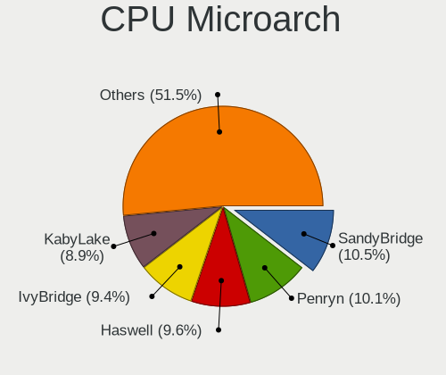

| Name            | Computers | Percent |
|-----------------|-----------|---------|
| SandyBridge     | 476       | 10.62%  |
| Penryn          | 451       | 10.06%  |
| Haswell         | 430       | 9.59%   |
| IvyBridge       | 423       | 9.44%   |
| KabyLake        | 404       | 9.01%   |
| Core            | 233       | 5.2%    |
| Skylake         | 196       | 4.37%   |
| K10             | 182       | 4.06%   |
| Westmere        | 181       | 4.04%   |
| Piledriver      | 159       | 3.55%   |
| Silvermont      | 152       | 3.39%   |
| Zen+            | 150       | 3.35%   |
| Zen 2           | 114       | 2.54%   |
| Zen             | 114       | 2.54%   |
| Broadwell       | 85        | 1.9%    |
| Bobcat          | 79        | 1.76%   |
| Goldmont plus   | 75        | 1.67%   |
| Excavator       | 75        | 1.67%   |
| K8 Hammer       | 65        | 1.45%   |
| Puma            | 56        | 1.25%   |
| CometLake       | 53        | 1.18%   |
| Nehalem         | 47        | 1.05%   |
| Goldmont        | 41        | 0.91%   |
| Steamroller     | 36        | 0.8%    |
| NetBurst        | 31        | 0.69%   |
| IceLake         | 30        | 0.67%   |
| Bonnell         | 29        | 0.65%   |
| Jaguar          | 27        | 0.6%    |
| Bulldozer       | 25        | 0.56%   |
| K10 Llano       | 24        | 0.54%   |
| TigerLake       | 12        | 0.27%   |
| Unknown         | 11        | 0.25%   |
| Zen 3           | 9         | 0.2%    |
| K8 & K10 hybrid | 7         | 0.16%   |
| Tremont         | 1         | 0.02%   |

Graphics
--------

GPU Vendor
----------

Vendors of graphics cards

| Vendor                           | Computers | Percent |
|----------------------------------|-----------|---------|
| Intel                            | 2441      | 49.29%  |
| Nvidia                           | 1315      | 26.55%  |
| AMD                              | 1188      | 23.99%  |
| VIA Technologies                 | 3         | 0.06%   |
| Matrox Electronics Systems       | 3         | 0.06%   |
| Silicon Integrated Systems [SiS] | 1         | 0.02%   |
| ATI Technologies                 | 1         | 0.02%   |

GPU Model
---------

Graphics card models

| Model                                                                                    | Computers | Percent |
|------------------------------------------------------------------------------------------|-----------|---------|
| Intel 2nd Generation Core Processor Family Integrated Graphics Controller                | 363       | 7.1%    |
| Intel 3rd Gen Core processor Graphics Controller                                         | 205       | 4.01%   |
| Intel Mobile 4 Series Chipset Integrated Graphics Controller                             | 143       | 2.8%    |
| Intel Xeon E3-1200 v3/4th Gen Core Processor Integrated Graphics Controller              | 127       | 2.48%   |
| Intel Core Processor Integrated Graphics Controller                                      | 124       | 2.43%   |
| Intel Haswell-ULT Integrated Graphics Controller                                         | 117       | 2.29%   |
| AMD Picasso/Raven 2 [Radeon Vega Series / Radeon Vega Mobile Series]                     | 89        | 1.74%   |
| Intel Xeon E3-1200 v2/3rd Gen Core processor Graphics Controller                         | 88        | 1.72%   |
| Intel Atom Processor Z36xxx/Z37xxx Series Graphics & Display                             | 87        | 1.7%    |
| Intel 4 Series Chipset Integrated Graphics Controller                                    | 87        | 1.7%    |
| Intel HD Graphics 620                                                                    | 82        | 1.6%    |
| Intel Skylake GT2 [HD Graphics 520]                                                      | 81        | 1.58%   |
| Intel Mobile GM965/GL960 Integrated Graphics Controller (secondary)                      | 72        | 1.41%   |
| Intel Mobile GM965/GL960 Integrated Graphics Controller (primary)                        | 72        | 1.41%   |
| Intel HD Graphics 5500                                                                   | 72        | 1.41%   |
| Nvidia GT218 [GeForce 210]                                                               | 66        | 1.29%   |
| Nvidia GK208B [GeForce GT 710]                                                           | 65        | 1.27%   |
| Intel Atom/Celeron/Pentium Processor x5-E8000/J3xxx/N3xxx Integrated Graphics Controller | 65        | 1.27%   |
| Intel HD Graphics 530                                                                    | 62        | 1.21%   |
| AMD Raven Ridge [Radeon Vega Series / Radeon Vega Mobile Series]                         | 62        | 1.21%   |
| Intel GeminiLake [UHD Graphics 600]                                                      | 61        | 1.19%   |
| Intel UHD Graphics 620                                                                   | 53        | 1.04%   |
| AMD Ellesmere [Radeon RX 470/480/570/570X/580/580X/590]                                  | 53        | 1.04%   |
| Intel 4th Gen Core Processor Integrated Graphics Controller                              | 49        | 0.96%   |
| AMD Stoney [Radeon R2/R3/R4/R5 Graphics]                                                 | 44        | 0.86%   |
| Intel HD Graphics 630                                                                    | 43        | 0.84%   |
| Intel CoffeeLake-S GT2 [UHD Graphics 630]                                                | 43        | 0.84%   |
| Nvidia GP107 [GeForce GTX 1050 Ti]                                                       | 39        | 0.76%   |
| Nvidia GF117M [GeForce 610M/710M/810M/820M / GT 620M/625M/630M/720M]                     | 39        | 0.76%   |
| Intel 4th Generation Core Processor Family Integrated Graphics Controller                | 39        | 0.76%   |
| Intel HD Graphics 500                                                                    | 33        | 0.65%   |
| Nvidia GP108 [GeForce GT 1030]                                                           | 32        | 0.63%   |
| AMD Renoir                                                                               | 31        | 0.61%   |
| AMD Mullins [Radeon R4/R5 Graphics]                                                      | 31        | 0.61%   |
| Nvidia GK208B [GeForce GT 730]                                                           | 30        | 0.59%   |
| Intel CometLake-U GT2 [UHD Graphics]                                                     | 30        | 0.59%   |
| AMD Wrestler [Radeon HD 6310]                                                            | 30        | 0.59%   |
| Nvidia GF119 [GeForce GT 610]                                                            | 29        | 0.57%   |
| AMD Cedar [Radeon HD 5000/6000/7350/8350 Series]                                         | 27        | 0.53%   |
| Intel CoffeeLake-H GT2 [UHD Graphics 630]                                                | 26        | 0.51%   |
| AMD RS780L [Radeon 3000]                                                                 | 26        | 0.51%   |
| AMD Wani [Radeon R5/R6/R7 Graphics]                                                      | 25        | 0.49%   |
| Intel Iris Plus Graphics G1 (Ice Lake)                                                   | 24        | 0.47%   |
| Intel 82G33/G31 Express Integrated Graphics Controller                                   | 23        | 0.45%   |
| AMD Sun XT [Radeon HD 8670A/8670M/8690M / R5 M330 / M430 / Radeon 520 Mobile]            | 22        | 0.43%   |
| Nvidia GM107 [GeForce GTX 750 Ti]                                                        | 21        | 0.41%   |
| AMD Thames [Radeon HD 7500M/7600M Series]                                                | 21        | 0.41%   |
| Nvidia GP106 [GeForce GTX 1060 6GB]                                                      | 20        | 0.39%   |
| AMD Kaveri [Radeon R7 Graphics]                                                          | 20        | 0.39%   |
| Nvidia GK107 [GeForce GTX 650]                                                           | 19        | 0.37%   |
| AMD Seymour [Radeon HD 6400M/7400M Series]                                               | 19        | 0.37%   |
| AMD RV620/M82 [Mobility Radeon HD 3450/3470]                                             | 19        | 0.37%   |
| AMD Caicos [Radeon HD 6450/7450/8450 / R5 230 OEM]                                       | 19        | 0.37%   |
| AMD Baffin [Radeon RX 550 640SP / RX 560/560X]                                           | 19        | 0.37%   |
| Intel WhiskeyLake-U GT2 [UHD Graphics 620]                                               | 18        | 0.35%   |
| Intel IvyBridge GT2 [HD Graphics 4000]                                                   | 18        | 0.35%   |
| AMD Topaz XT [Radeon R7 M260/M265 / M340/M360 / M440/M445 / 530/535 / 620/625 Mobile]    | 18        | 0.35%   |
| AMD Park [Mobility Radeon HD 5430/5450/5470]                                             | 18        | 0.35%   |
| Nvidia GP107 [GeForce GTX 1050]                                                          | 17        | 0.33%   |
| Nvidia GF108M [GeForce GT 540M]                                                          | 17        | 0.33%   |

GPU Combo
---------

Combinations of graphics cards

| Name            | Computers | Percent |
|-----------------|-----------|---------|
| 1 x Intel       | 2004      | 44.7%   |
| 1 x AMD         | 1000      | 22.31%  |
| 1 x Nvidia      | 947       | 21.12%  |
| Intel + Nvidia  | 329       | 7.34%   |
| 2 x AMD         | 79        | 1.76%   |
| Intel + AMD     | 79        | 1.76%   |
| AMD + Nvidia    | 30        | 0.67%   |
| 2 x Nvidia      | 8         | 0.18%   |
| 1 x VIA         | 3         | 0.07%   |
| 1 x Matrox      | 2         | 0.04%   |
| 1 x SiS         | 1         | 0.02%   |
| Nvidia + Matrox | 1         | 0.02%   |

GPU Driver
----------

Free vs proprietary

| Driver      | Computers | Percent |
|-------------|-----------|---------|
| Free        | 4399      | 98.1%   |
| Unknown     | 80        | 1.78%   |
| Proprietary | 5         | 0.11%   |

GPU Memory
----------

Total video memory

| Size in GB | Computers | Percent |
|------------|-----------|---------|
| Unknown    | 2076      | 46.3%   |
| 0.01-0.5   | 735       | 16.39%  |
| 1.01-2.0   | 657       | 14.65%  |
| 0.51-1.0   | 614       | 13.69%  |
| 3.01-4.0   | 203       | 4.53%   |
| 7.01-8.0   | 98        | 2.19%   |
| 5.01-6.0   | 66        | 1.47%   |
| 2.01-3.0   | 28        | 0.62%   |
| 8.01-16.0  | 6         | 0.13%   |
| 4.01-5.0   | 1         | 0.02%   |

Monitor
-------

Monitor Vendor
--------------

Monitor vendors

| Vendor                  | Computers | Percent |
|-------------------------|-----------|---------|
| Samsung Electronics     | 723       | 16.3%   |
| AU Optronics            | 471       | 10.62%  |
| LG Display              | 377       | 8.5%    |
| Goldstar                | 309       | 6.97%   |
| BOE                     | 283       | 6.38%   |
| Chimei Innolux          | 281       | 6.33%   |
| Hewlett-Packard         | 193       | 4.35%   |
| Dell                    | 190       | 4.28%   |
| Acer                    | 183       | 4.13%   |
| Philips                 | 141       | 3.18%   |
| BenQ                    | 116       | 2.61%   |
| AOC                     | 114       | 2.57%   |
| Lenovo                  | 100       | 2.25%   |
| Ancor Communications    | 99        | 2.23%   |
| Chi Mei Optoelectronics | 98        | 2.21%   |
| Iiyama                  | 61        | 1.38%   |
| CPT                     | 57        | 1.28%   |
| Apple                   | 53        | 1.19%   |
| ViewSonic               | 48        | 1.08%   |
| LG Philips              | 37        | 0.83%   |
| Sony                    | 29        | 0.65%   |
| Fujitsu Siemens         | 29        | 0.65%   |
| PANDA                   | 27        | 0.61%   |
| NEC Computers           | 26        | 0.59%   |
| Eizo                    | 24        | 0.54%   |
| ASUSTek Computer        | 23        | 0.52%   |
| Sharp                   | 20        | 0.45%   |
| HannStar                | 20        | 0.45%   |
| InfoVision              | 18        | 0.41%   |
| Toshiba                 | 14        | 0.32%   |
| Vizio                   | 12        | 0.27%   |
| Vestel Elektronik       | 12        | 0.27%   |
| Medion                  | 12        | 0.27%   |
| Unknown                 | 11        | 0.25%   |
| Panasonic               | 11        | 0.25%   |
| Belinea                 | 10        | 0.23%   |
| Sceptre Tech            | 9         | 0.2%    |
| MStar                   | 9         | 0.2%    |
| InnoLux Display         | 9         | 0.2%    |
| RTK                     | 8         | 0.18%   |
| Packard Bell            | 7         | 0.16%   |
| ___                     | 5         | 0.11%   |
| OEM                     | 5         | 0.11%   |
| Hitachi                 | 4         | 0.09%   |
| Grundig                 | 4         | 0.09%   |
| Arnos Instruments       | 4         | 0.09%   |
| AMO                     | 4         | 0.09%   |
| Westinghouse            | 3         | 0.07%   |
| Unknown (XXX)           | 3         | 0.07%   |
| RIS                     | 3         | 0.07%   |
| MSI                     | 3         | 0.07%   |
| KTC                     | 3         | 0.07%   |
| Insignia                | 3         | 0.07%   |
| IBM                     | 3         | 0.07%   |
| Hyundai ImageQuest      | 3         | 0.07%   |
| HKC                     | 3         | 0.07%   |
| Gateway                 | 3         | 0.07%   |
| Element                 | 3         | 0.07%   |
| Compal                  | 3         | 0.07%   |
| CHD                     | 3         | 0.07%   |

Monitor Model
-------------

Monitor models

| Model                                                                    | Computers | Percent |
|--------------------------------------------------------------------------|-----------|---------|
| CPT LCD Monitor COR17DB 1600x900 293x164mm 13.2-inch                     | 44        | 0.98%   |
| Samsung Electronics LCD Monitor SEC5441 1366x768 344x194mm 15.5-inch     | 31        | 0.69%   |
| AU Optronics LCD Monitor AUO38ED 1920x1080 344x193mm 15.5-inch           | 24        | 0.54%   |
| BOE LCD Monitor BOE0629 1366x768 309x173mm 13.9-inch                     | 22        | 0.49%   |
| LG Display LCD Monitor LGD02DC 1366x768 344x194mm 15.5-inch              | 21        | 0.47%   |
| LG Display LCD Monitor LGD033A 1366x768 344x194mm 15.5-inch              | 19        | 0.43%   |
| AU Optronics LCD Monitor AUO22EC 1366x768 344x193mm 15.5-inch            | 19        | 0.43%   |
| Chimei Innolux LCD Monitor CMN15DB 1366x768 344x193mm 15.5-inch          | 18        | 0.4%    |
| Goldstar FULL HD GSM5B55 1920x1080 480x270mm 21.7-inch                   | 17        | 0.38%   |
| AU Optronics LCD Monitor AUO61ED 1920x1080 344x194mm 15.5-inch           | 16        | 0.36%   |
| AU Optronics LCD Monitor AUO26EC 1366x768 344x193mm 15.5-inch            | 15        | 0.34%   |
| Samsung Electronics LCD Monitor SEC544B 1600x900 310x174mm 14.0-inch     | 14        | 0.31%   |
| Samsung Electronics LCD Monitor SEC3945 1280x800 331x207mm 15.4-inch     | 14        | 0.31%   |
| PANDA LM116LF3L02 NCP000A 1920x1080 256x144mm 11.6-inch                  | 14        | 0.31%   |
| Chi Mei Optoelectronics LCD Monitor CMO15A7 1366x768 344x193mm 15.5-inch | 14        | 0.31%   |
| AU Optronics LCD Monitor AUO71EC 1366x768 344x193mm 15.5-inch            | 14        | 0.31%   |
| AU Optronics LCD Monitor AUO45EC 1366x768 344x193mm 15.5-inch            | 14        | 0.31%   |
| Vestel Elektronik 28W_LCD_TV VES3700 1920x540                            | 12        | 0.27%   |
| LG Display LCD Monitor LGD02E9 1366x768 309x174mm 14.0-inch              | 12        | 0.27%   |
| Chimei Innolux LCD Monitor CMN1735 1920x1080 382x215mm 17.3-inch         | 12        | 0.27%   |
| Chimei Innolux LCD Monitor CMN15F5 1920x1080 344x193mm 15.5-inch         | 12        | 0.27%   |
| Chimei Innolux LCD Monitor CMN14D4 1920x1080 309x173mm 13.9-inch         | 12        | 0.27%   |
| Chi Mei Optoelectronics LCD Monitor CMO15A3 1366x768 344x193mm 15.5-inch | 12        | 0.27%   |
| AU Optronics LCD Monitor AUO70EC 1366x768 344x193mm 15.5-inch            | 12        | 0.27%   |
| Samsung Electronics C24F390 SAM0D2C 1920x1080 521x293mm 23.5-inch        | 11        | 0.25%   |
| AOC 2270W AOC2270 1920x1080 477x268mm 21.5-inch                          | 11        | 0.25%   |
| Samsung Electronics LCD Monitor SEC3741 1366x768 309x174mm 14.0-inch     | 10        | 0.22%   |
| Goldstar ULTRAWIDE GSM59F1 2560x1080 673x284mm 28.8-inch                 | 10        | 0.22%   |
| BOE LCD Monitor BOE0812 1920x1080 344x194mm 15.5-inch                    | 10        | 0.22%   |
| BOE LCD Monitor BOE0675 1366x768 344x194mm 15.5-inch                     | 10        | 0.22%   |
| AU Optronics LCD Monitor AUO23EC 1366x768 344x193mm 15.5-inch            | 10        | 0.22%   |
| AU Optronics LCD Monitor AUO21EC 1366x768 344x193mm 15.5-inch            | 10        | 0.22%   |
| AU Optronics LCD Monitor AUO20EC 1366x768 344x193mm 15.5-inch            | 10        | 0.22%   |
| AU Optronics LCD Monitor AUO183C 1366x768 310x170mm 13.9-inch            | 10        | 0.22%   |
| AU Optronics LCD Monitor AUO10EC 1366x768 344x193mm 15.5-inch            | 10        | 0.22%   |
| AU Optronics LCD Monitor AUO106C 1366x768 277x156mm 12.5-inch            | 10        | 0.22%   |
| Samsung Electronics S24F350 SAM0D20 1920x1080 521x293mm 23.5-inch        | 9         | 0.2%    |
| Samsung Electronics LCD Monitor SEC324A 1366x768 344x194mm 15.5-inch     | 9         | 0.2%    |
| Samsung Electronics C27F390 SAM0D32 1920x1080 598x336mm 27.0-inch        | 9         | 0.2%    |
| LG Philips LP154WX4-TLC8 LPL0120 1280x800 331x207mm 15.4-inch            | 9         | 0.2%    |
| Lenovo LCD Monitor LEN4031 1280x800 304x190mm 14.1-inch                  | 9         | 0.2%    |
| Chimei Innolux LCD Monitor CMN15CA 1366x768 344x193mm 15.5-inch          | 9         | 0.2%    |
| Chi Mei Optoelectronics LCD Monitor CMO1592 1366x768 344x193mm 15.5-inch | 9         | 0.2%    |
| BOE LCD Monitor BOE0671 1366x768 344x194mm 15.5-inch                     | 9         | 0.2%    |
| Samsung Electronics C32F391 SAM0D34 1920x1080 698x393mm 31.5-inch        | 8         | 0.18%   |
| MStar Demo MST0030 1920x1080 708x398mm 32.0-inch                         | 8         | 0.18%   |
| LG Display LCD Monitor LGD0259 1920x1080 345x194mm 15.6-inch             | 8         | 0.18%   |
| Goldstar IPS FULLHD GSM5AB8 1920x1080 480x270mm 21.7-inch                | 8         | 0.18%   |
| Chimei Innolux LCD Monitor CMN1728 1600x900 382x215mm 17.3-inch          | 8         | 0.18%   |
| BOE LCD Monitor BOE06A5 1366x768 344x194mm 15.5-inch                     | 8         | 0.18%   |
| BOE LCD Monitor BOE061D 1366x768 309x173mm 13.9-inch                     | 8         | 0.18%   |
| AU Optronics LCD Monitor AUO313C 1366x768 309x173mm 13.9-inch            | 8         | 0.18%   |
| AU Optronics LCD Monitor AUO219E 1600x900 382x214mm 17.2-inch            | 8         | 0.18%   |
| AU Optronics LCD Monitor AUO139E 1600x900 382x214mm 17.2-inch            | 8         | 0.18%   |
| AU Optronics LCD Monitor AUO129E 1600x900 382x214mm 17.2-inch            | 8         | 0.18%   |
| Acer G246HL ACR02FF 1920x1080 531x299mm 24.0-inch                        | 8         | 0.18%   |
| Samsung Electronics SMB1930N SAM0632 1366x768 410x230mm 18.5-inch        | 7         | 0.16%   |
| Samsung Electronics LCD Monitor SEC3245 1280x800 261x163mm 12.1-inch     | 7         | 0.16%   |
| Philips 226V4 PHLC0B1 1920x1080 477x268mm 21.5-inch                      | 7         | 0.16%   |
| LG Display LCD Monitor LGD0456 1366x768 344x194mm 15.5-inch              | 7         | 0.16%   |

Monitor Resolution
------------------

Monitor screen resolution

| Resolution         | Computers | Percent |
|--------------------|-----------|---------|
| 1920x1080 (FHD)    | 1654      | 37.76%  |
| 1366x768 (WXGA)    | 1162      | 26.53%  |
| 1600x900 (HD+)     | 298       | 6.8%    |
| 1280x1024 (SXGA)   | 253       | 5.78%   |
| 1680x1050 (WSXGA+) | 204       | 4.66%   |
| 1440x900 (WXGA+)   | 168       | 3.84%   |
| 1280x800 (WXGA)    | 157       | 3.58%   |
| 3840x2160 (4K)     | 146       | 3.33%   |
| 2560x1440 (QHD)    | 82        | 1.87%   |
| 1920x1200 (WUXGA)  | 67        | 1.53%   |
| 1360x768           | 47        | 1.07%   |
| 2560x1080          | 20        | 0.46%   |
| 1024x768 (XGA)     | 18        | 0.41%   |
| 1920x540           | 16        | 0.37%   |
| 1024x600           | 11        | 0.25%   |
| 3440x1440          | 9         | 0.21%   |
| 2560x1600          | 9         | 0.21%   |
| 1600x1200          | 8         | 0.18%   |
| 1680x945           | 5         | 0.11%   |
| 1280x960           | 5         | 0.11%   |
| 1280x720 (HD)      | 4         | 0.09%   |
| 3200x1800 (QHD+)   | 3         | 0.07%   |
| 2880x1800          | 3         | 0.07%   |
| 2736x1824          | 3         | 0.07%   |
| 2160x1440          | 3         | 0.07%   |
| 2048x1152          | 3         | 0.07%   |
| 1400x1050          | 3         | 0.07%   |
| 1280x768           | 3         | 0.07%   |
| 3840x1080          | 2         | 0.05%   |
| 2288x1287          | 2         | 0.05%   |
| 1152x864           | 2         | 0.05%   |
| 3840x2400          | 1         | 0.02%   |
| 3840x1600          | 1         | 0.02%   |
| 3840x1100          | 1         | 0.02%   |
| 3300x2200          | 1         | 0.02%   |
| 3000x2000          | 1         | 0.02%   |
| 2880x1920          | 1         | 0.02%   |
| 2304x1440          | 1         | 0.02%   |
| 2256x1504          | 1         | 0.02%   |
| 2048x1536          | 1         | 0.02%   |
| 1536x2048          | 1         | 0.02%   |

Monitor Diagonal
----------------

Diagonal size in inches

| Inches  | Computers | Percent |
|---------|-----------|---------|
| 15      | 1113      | 25.04%  |
| 23      | 380       | 8.55%   |
| 17      | 366       | 8.23%   |
| 21      | 351       | 7.9%    |
| 13      | 332       | 7.47%   |
| 24      | 262       | 5.89%   |
| 14      | 262       | 5.89%   |
| 27      | 233       | 5.24%   |
| 19      | 218       | 4.9%    |
| 18      | 181       | 4.07%   |
| 22      | 133       | 2.99%   |
| 20      | 105       | 2.36%   |
| 31      | 82        | 1.84%   |
| 12      | 69        | 1.55%   |
| 11      | 58        | 1.3%    |
| 84      | 28        | 0.63%   |
| 34      | 27        | 0.61%   |
| Unknown | 26        | 0.58%   |
| 54      | 25        | 0.56%   |
| 32      | 25        | 0.56%   |
| 72      | 23        | 0.52%   |
| 10      | 17        | 0.38%   |
| 26      | 16        | 0.36%   |
| 25      | 15        | 0.34%   |
| 52      | 12        | 0.27%   |
| 40      | 12        | 0.27%   |
| 16      | 10        | 0.22%   |
| 28      | 8         | 0.18%   |
| 46      | 6         | 0.13%   |
| 29      | 5         | 0.11%   |
| 74      | 4         | 0.09%   |
| 65      | 4         | 0.09%   |
| 60      | 4         | 0.09%   |
| 48      | 4         | 0.09%   |
| 39      | 4         | 0.09%   |
| 37      | 4         | 0.09%   |
| 49      | 3         | 0.07%   |
| 42      | 3         | 0.07%   |
| 142     | 2         | 0.04%   |
| 47      | 2         | 0.04%   |
| 43      | 2         | 0.04%   |
| 35      | 2         | 0.04%   |
| 33      | 2         | 0.04%   |
| 75      | 1         | 0.02%   |
| 57      | 1         | 0.02%   |
| 55      | 1         | 0.02%   |
| 38      | 1         | 0.02%   |
| 30      | 1         | 0.02%   |

Monitor Width
-------------

Physical width

| Width in mm    | Computers | Percent |
|----------------|-----------|---------|
| 301-350        | 1640      | 37.26%  |
| 401-500        | 866       | 19.68%  |
| 501-600        | 842       | 19.13%  |
| 351-400        | 414       | 9.41%   |
| 201-300        | 293       | 6.66%   |
| 601-700        | 120       | 2.73%   |
| 1001-1500      | 62        | 1.41%   |
| 1501-2000      | 56        | 1.27%   |
| 701-800        | 54        | 1.23%   |
| Unknown        | 26        | 0.59%   |
| 801-900        | 21        | 0.48%   |
| 901-1000       | 5         | 0.11%   |
| More than 2000 | 2         | 0.05%   |

Aspect Ratio
------------

Proportional relationship between the width and the height

| Ratio   | Computers | Percent |
|---------|-----------|---------|
| 16/9    | 3293      | 76.92%  |
| 16/10   | 612       | 14.3%   |
| 5/4     | 248       | 5.79%   |
| 4/3     | 48        | 1.12%   |
| 3/2     | 36        | 0.84%   |
| 21/9    | 27        | 0.63%   |
| 6/5     | 7         | 0.16%   |
| 32/9    | 4         | 0.09%   |
| 1.00    | 2         | 0.05%   |
| 3.40    | 1         | 0.02%   |
| 2.01    | 1         | 0.02%   |
| 0.75    | 1         | 0.02%   |
| Unknown | 1         | 0.02%   |

Monitor Area
------------

Area in inch

| Area in inch | Computers | Percent |
|----------------|-----------|---------|
| 101-110        | 1102      | 24.92%  |
| 201-250        | 933       | 21.1%   |
| 81-90          | 463       | 10.47%  |
| 151-200        | 462       | 10.45%  |
| 141-150        | 273       | 6.17%   |
| 301-350        | 247       | 5.59%   |
| 121-130        | 190       | 4.3%    |
| 351-500        | 142       | 3.21%   |
| 71-80          | 130       | 2.94%   |
| More than 1000 | 110       | 2.49%   |
| 251-300        | 94        | 2.13%   |
| 61-70          | 64        | 1.45%   |
| 51-60          | 60        | 1.36%   |
| 131-140        | 46        | 1.04%   |
| 501-1000       | 39        | 0.88%   |
| Unknown        | 26        | 0.59%   |
| 41-50          | 16        | 0.36%   |
| 111-120        | 13        | 0.29%   |
| 91-100         | 12        | 0.27%   |

Pixel Density
-------------

Pixels per inch

| Density       | Computers | Percent |
|---------------|-----------|---------|
| 51-100        | 1905      | 43.69%  |
| 101-120       | 1521      | 34.89%  |
| 121-160       | 685       | 15.71%  |
| 1-50          | 108       | 2.48%   |
| 161-240       | 97        | 2.22%   |
| Unknown       | 26        | 0.6%    |
| More than 240 | 18        | 0.41%   |

Multiple Monitors
-----------------

Total monitors connected

| Total | Computers | Percent |
|-------|-----------|---------|
| 1     | 4164      | 92.86%  |
| 2     | 265       | 5.91%   |
| 0     | 39        | 0.87%   |
| 3     | 11        | 0.25%   |
| 6     | 2         | 0.04%   |
| 4     | 2         | 0.04%   |
| 5     | 1         | 0.02%   |

Network
-------

Net Controller Vendor
---------------------

Controller vendors

| Vendor                            | Computers | Percent |
|-----------------------------------|-----------|---------|
| Realtek Semiconductor             | 2656      | 40.08%  |
| Intel                             | 1582      | 23.88%  |
| Qualcomm Atheros                  | 1070      | 16.15%  |
| Broadcom                          | 342       | 5.16%   |
| Marvell Technology Group          | 107       | 1.61%   |
| Ralink                            | 95        | 1.43%   |
| Broadcom Limited                  | 95        | 1.43%   |
| Nvidia                            | 94        | 1.42%   |
| Ralink Technology                 | 81        | 1.22%   |
| Samsung Electronics               | 61        | 0.92%   |
| TP-Link                           | 42        | 0.63%   |
| Huawei Technologies               | 36        | 0.54%   |
| JMicron Technology                | 34        | 0.51%   |
| Qualcomm Atheros Communications   | 32        | 0.48%   |
| Dell                              | 21        | 0.32%   |
| D-Link                            | 20        | 0.3%    |
| D-Link System                     | 18        | 0.27%   |
| Ericsson Business Mobile Networks | 17        | 0.26%   |
| VIA Technologies                  | 15        | 0.23%   |
| MediaTek                          | 15        | 0.23%   |
| NetGear                           | 12        | 0.18%   |
| ZTE WCDMA Technologies MSM        | 11        | 0.17%   |
| Xiaomi                            | 11        | 0.17%   |
| ASUSTek Computer                  | 11        | 0.17%   |
| Microsoft                         | 10        | 0.15%   |
| Motorola PCS                      | 9         | 0.14%   |
| ASIX Electronics                  | 9         | 0.14%   |
| 3Com                              | 8         | 0.12%   |
| IMC Networks                      | 7         | 0.11%   |
| Edimax Technology                 | 7         | 0.11%   |
| DisplayLink                       | 7         | 0.11%   |
| Sierra Wireless                   | 6         | 0.09%   |
| Linksys                           | 6         | 0.09%   |
| Belkin Components                 | 6         | 0.09%   |
| Aquantia                          | 5         | 0.08%   |
| Sitecom Europe                    | 4         | 0.06%   |
| OPPO Electronics                  | 4         | 0.06%   |
| Hewlett-Packard                   | 4         | 0.06%   |
| Qualcomm                          | 3         | 0.05%   |
| ICS Advent                        | 3         | 0.05%   |
| AVM                               | 3         | 0.05%   |
| Apple                             | 3         | 0.05%   |
| Wilocity                          | 2         | 0.03%   |
| Wacom                             | 2         | 0.03%   |
| T & A Mobile Phones               | 2         | 0.03%   |
| Silicon Integrated Systems [SiS]  | 2         | 0.03%   |
| Realtek                           | 2         | 0.03%   |
| Motorola                          | 2         | 0.03%   |
| IBM                               | 2         | 0.03%   |
| HMD Global                        | 2         | 0.03%   |
| Guillemot                         | 2         | 0.03%   |
| ZyXEL Communications              | 1         | 0.02%   |
| ZyDAS                             | 1         | 0.02%   |
| U.S. Robotics                     | 1         | 0.02%   |
| U-Blox                            | 1         | 0.02%   |
| Toshiba                           | 1         | 0.02%   |
| Sundance Technology Inc / IC Plus | 1         | 0.02%   |
| STMicroelectronics                | 1         | 0.02%   |
| Shenzhen Goodix Technology        | 1         | 0.02%   |
| Qcom                              | 1         | 0.02%   |

Net Controller Model
--------------------

Controller models

| Model                                                                   | Computers | Percent |
|-------------------------------------------------------------------------|-----------|---------|
| Realtek RTL8111/8168/8411 PCI Express Gigabit Ethernet Controller       | 1967      | 25.93%  |
| Realtek RTL810xE PCI Express Fast Ethernet controller                   | 422       | 5.56%   |
| Intel 82579LM Gigabit Network Connection (Lewisville)                   | 190       | 2.5%    |
| Qualcomm Atheros AR9485 Wireless Network Adapter                        | 176       | 2.32%   |
| Qualcomm Atheros QCA9565 / AR9565 Wireless Network Adapter              | 173       | 2.28%   |
| Qualcomm Atheros AR9285 Wireless Network Adapter (PCI-Express)          | 146       | 1.92%   |
| Qualcomm Atheros QCA9377 802.11ac Wireless Network Adapter              | 137       | 1.81%   |
| Realtek RTL8723BE PCIe Wireless Network Adapter                         | 86        | 1.13%   |
| Intel Centrino Advanced-N 6205 [Taylor Peak]                            | 85        | 1.12%   |
| Qualcomm Atheros AR8151 v2.0 Gigabit Ethernet                           | 76        | 1%      |
| Intel Wireless 7265                                                     | 73        | 0.96%   |
| Realtek RTL8821CE 802.11ac PCIe Wireless Network Adapter                | 72        | 0.95%   |
| Intel Wi-Fi 6 AX200                                                     | 72        | 0.95%   |
| Realtek RTL8188CE 802.11b/g/n WiFi Adapter                              | 65        | 0.86%   |
| Intel Wireless 7260                                                     | 62        | 0.82%   |
| Intel I211 Gigabit Network Connection                                   | 62        | 0.82%   |
| Intel Ethernet Connection I217-LM                                       | 60        | 0.79%   |
| Intel Ethernet Connection (2) I219-V                                    | 58        | 0.76%   |
| Samsung Galaxy series, misc. (tethering mode)                           | 57        | 0.75%   |
| Intel Dual Band Wireless-AC 3168NGW [Stone Peak]                        | 53        | 0.7%    |
| Intel 82567LM-3 Gigabit Network Connection                              | 53        | 0.7%    |
| Intel 82579V Gigabit Network Connection                                 | 52        | 0.69%   |
| Intel WiFi Link 5100                                                    | 48        | 0.63%   |
| Realtek RTL-8100/8101L/8139 PCI Fast Ethernet Adapter                   | 46        | 0.61%   |
| Nvidia MCP61 Ethernet                                                   | 45        | 0.59%   |
| Intel Wireless 8265 / 8275                                              | 45        | 0.59%   |
| Intel 82577LM Gigabit Network Connection                                | 43        | 0.57%   |
| Intel Wireless 8260                                                     | 42        | 0.55%   |
| Intel PRO/Wireless 3945ABG [Golan] Network Connection                   | 42        | 0.55%   |
| Intel 82567LM Gigabit Network Connection                                | 41        | 0.54%   |
| Intel Wireless 3165                                                     | 40        | 0.53%   |
| Realtek RTL8188EUS 802.11n Wireless Network Adapter                     | 39        | 0.51%   |
| Ralink MT7601U Wireless Adapter                                         | 39        | 0.51%   |
| Qualcomm Atheros AR928X Wireless Network Adapter (PCI-Express)          | 39        | 0.51%   |
| Intel Dual Band Wireless-AC 3165 Plus Bluetooth                         | 39        | 0.51%   |
| Broadcom BCM4313 802.11bgn Wireless Network Adapter                     | 39        | 0.51%   |
| Qualcomm Atheros QCA6174 802.11ac Wireless Network Adapter              | 38        | 0.5%    |
| Intel Centrino Advanced-N 6200                                          | 38        | 0.5%    |
| Qualcomm Atheros AR8161 Gigabit Ethernet                                | 37        | 0.49%   |
| Realtek RTL8153 Gigabit Ethernet Adapter                                | 36        | 0.47%   |
| Qualcomm Atheros AR242x / AR542x Wireless Network Adapter (PCI-Express) | 36        | 0.47%   |
| Intel Wireless 3160                                                     | 36        | 0.47%   |
| Realtek RTL8822CE 802.11ac PCIe Wireless Network Adapter                | 35        | 0.46%   |
| Qualcomm Atheros AR8121/AR8113/AR8114 Gigabit or Fast Ethernet          | 34        | 0.45%   |
| Intel PRO/Wireless 5100 AGN [Shiloh] Network Connection                 | 34        | 0.45%   |
| Intel PRO/Wireless 4965 AG or AGN [Kedron] Network Connection           | 34        | 0.45%   |
| Intel Cannon Lake PCH CNVi WiFi                                         | 34        | 0.45%   |
| Qualcomm Atheros AR8152 v2.0 Fast Ethernet                              | 33        | 0.44%   |
| Intel Gemini Lake PCH CNVi WiFi                                         | 31        | 0.41%   |
| JMicron JMC250 PCI Express Gigabit Ethernet Controller                  | 30        | 0.4%    |
| Realtek RTL8821AE 802.11ac PCIe Wireless Network Adapter                | 29        | 0.38%   |
| Realtek RTL8188EE Wireless Network Adapter                              | 29        | 0.38%   |
| Qualcomm Atheros AR9271 802.11n                                         | 29        | 0.38%   |
| Intel Centrino Ultimate-N 6300                                          | 29        | 0.38%   |
| Huawei E353/E3131                                                       | 29        | 0.38%   |
| Qualcomm Atheros AR9462 Wireless Network Adapter                        | 28        | 0.37%   |
| Broadcom BCM43142 802.11b/g/n                                           | 28        | 0.37%   |
| Qualcomm Atheros Killer E220x Gigabit Ethernet Controller               | 27        | 0.36%   |
| Qualcomm Atheros AR9287 Wireless Network Adapter (PCI-Express)          | 27        | 0.36%   |
| Intel Wireless-AC 9260                                                  | 27        | 0.36%   |

Wireless Vendor
---------------

Wireless vendors

| Vendor                          | Computers | Percent |
|---------------------------------|-----------|---------|
| Intel                           | 1056      | 34.61%  |
| Qualcomm Atheros                | 842       | 27.6%   |
| Realtek Semiconductor           | 557       | 18.26%  |
| Broadcom                        | 183       | 6%      |
| Ralink                          | 95        | 3.11%   |
| Ralink Technology               | 81        | 2.65%   |
| Broadcom Limited                | 39        | 1.28%   |
| TP-Link                         | 38        | 1.25%   |
| Qualcomm Atheros Communications | 32        | 1.05%   |
| D-Link                          | 17        | 0.56%   |
| Dell                            | 11        | 0.36%   |
| ASUSTek Computer                | 11        | 0.36%   |
| NetGear                         | 10        | 0.33%   |
| Microsoft                       | 9         | 0.29%   |
| D-Link System                   | 8         | 0.26%   |
| MediaTek                        | 7         | 0.23%   |
| IMC Networks                    | 7         | 0.23%   |
| Edimax Technology               | 7         | 0.23%   |
| Sierra Wireless                 | 6         | 0.2%    |
| Belkin Components               | 6         | 0.2%    |
| Linksys                         | 5         | 0.16%   |
| Marvell Technology Group        | 4         | 0.13%   |
| Sitecom Europe                  | 3         | 0.1%    |
| AVM                             | 3         | 0.1%    |
| Wilocity                        | 2         | 0.07%   |
| Wacom                           | 2         | 0.07%   |
| Realtek                         | 2         | 0.07%   |
| Guillemot                       | 2         | 0.07%   |
| ZyXEL Communications            | 1         | 0.03%   |
| ZyDAS                           | 1         | 0.03%   |
| Qcom                            | 1         | 0.03%   |
| Mercucys                        | 1         | 0.03%   |
| Fibocom                         | 1         | 0.03%   |
| BUFFALO                         | 1         | 0.03%   |

Wireless Model
--------------

Wireless models

| Model                                                                   | Computers | Percent |
|-------------------------------------------------------------------------|-----------|---------|
| Qualcomm Atheros AR9485 Wireless Network Adapter                        | 176       | 5.75%   |
| Qualcomm Atheros QCA9565 / AR9565 Wireless Network Adapter              | 173       | 5.65%   |
| Qualcomm Atheros AR9285 Wireless Network Adapter (PCI-Express)          | 146       | 4.77%   |
| Qualcomm Atheros QCA9377 802.11ac Wireless Network Adapter              | 137       | 4.47%   |
| Realtek RTL8723BE PCIe Wireless Network Adapter                         | 86        | 2.81%   |
| Intel Centrino Advanced-N 6205 [Taylor Peak]                            | 85        | 2.78%   |
| Intel Wireless 7265                                                     | 73        | 2.38%   |
| Realtek RTL8821CE 802.11ac PCIe Wireless Network Adapter                | 72        | 2.35%   |
| Intel Wi-Fi 6 AX200                                                     | 72        | 2.35%   |
| Realtek RTL8188CE 802.11b/g/n WiFi Adapter                              | 65        | 2.12%   |
| Intel Wireless 7260                                                     | 62        | 2.02%   |
| Intel Dual Band Wireless-AC 3168NGW [Stone Peak]                        | 53        | 1.73%   |
| Intel WiFi Link 5100                                                    | 48        | 1.57%   |
| Intel Wireless 8265 / 8275                                              | 45        | 1.47%   |
| Intel Wireless 8260                                                     | 42        | 1.37%   |
| Intel PRO/Wireless 3945ABG [Golan] Network Connection                   | 42        | 1.37%   |
| Intel Wireless 3165                                                     | 40        | 1.31%   |
| Realtek RTL8188EUS 802.11n Wireless Network Adapter                     | 39        | 1.27%   |
| Ralink MT7601U Wireless Adapter                                         | 39        | 1.27%   |
| Qualcomm Atheros AR928X Wireless Network Adapter (PCI-Express)          | 39        | 1.27%   |
| Intel Dual Band Wireless-AC 3165 Plus Bluetooth                         | 39        | 1.27%   |
| Broadcom BCM4313 802.11bgn Wireless Network Adapter                     | 39        | 1.27%   |
| Qualcomm Atheros QCA6174 802.11ac Wireless Network Adapter              | 38        | 1.24%   |
| Intel Centrino Advanced-N 6200                                          | 38        | 1.24%   |
| Qualcomm Atheros AR242x / AR542x Wireless Network Adapter (PCI-Express) | 36        | 1.18%   |
| Intel Wireless 3160                                                     | 36        | 1.18%   |
| Realtek RTL8822CE 802.11ac PCIe Wireless Network Adapter                | 35        | 1.14%   |
| Intel PRO/Wireless 5100 AGN [Shiloh] Network Connection                 | 34        | 1.11%   |
| Intel PRO/Wireless 4965 AG or AGN [Kedron] Network Connection           | 34        | 1.11%   |
| Intel Cannon Lake PCH CNVi WiFi                                         | 34        | 1.11%   |
| Intel Gemini Lake PCH CNVi WiFi                                         | 31        | 1.01%   |
| Realtek RTL8821AE 802.11ac PCIe Wireless Network Adapter                | 29        | 0.95%   |
| Realtek RTL8188EE Wireless Network Adapter                              | 29        | 0.95%   |
| Qualcomm Atheros AR9271 802.11n                                         | 29        | 0.95%   |
| Intel Centrino Ultimate-N 6300                                          | 29        | 0.95%   |
| Qualcomm Atheros AR9462 Wireless Network Adapter                        | 28        | 0.91%   |
| Broadcom BCM43142 802.11b/g/n                                           | 28        | 0.91%   |
| Qualcomm Atheros AR9287 Wireless Network Adapter (PCI-Express)          | 27        | 0.88%   |
| Intel Wireless-AC 9260                                                  | 27        | 0.88%   |
| Intel Comet Lake PCH-LP CNVi WiFi                                       | 27        | 0.88%   |
| Intel Centrino Wireless-N 1000 [Condor Peak]                            | 27        | 0.88%   |
| Ralink RT3290 Wireless 802.11n 1T/1R PCIe                               | 23        | 0.75%   |
| Realtek RTL8723DE Wireless Network Adapter                              | 22        | 0.72%   |
| Intel Centrino Wireless-N 2230                                          | 21        | 0.69%   |
| Realtek RTL8822BE 802.11a/b/g/n/ac WiFi adapter                         | 20        | 0.65%   |
| Ralink RT3090 Wireless 802.11n 1T/1R PCIe                               | 19        | 0.62%   |
| Ralink RT5390 Wireless 802.11n 1T/1R PCIe                               | 17        | 0.56%   |
| Broadcom BCM4312 802.11b/g LP-PHY                                       | 17        | 0.56%   |
| Realtek RTL8723AE PCIe Wireless Network Adapter                         | 16        | 0.52%   |
| Ralink RT5370 Wireless Adapter                                          | 16        | 0.52%   |
| Broadcom Limited BCM4312 802.11b/g LP-PHY                               | 16        | 0.52%   |
| Realtek RTL8191SEvB Wireless LAN Controller                             | 15        | 0.49%   |
| Ralink RT2870/RT3070 Wireless Adapter                                   | 15        | 0.49%   |
| Intel Centrino Advanced-N 6235                                          | 15        | 0.49%   |
| TP-Link TL-WN722N v2/v3 [Realtek RTL8188EUS]                            | 14        | 0.46%   |
| Realtek RTL8192CU 802.11n WLAN Adapter                                  | 14        | 0.46%   |
| Intel Centrino Wireless-N 1030 [Rainbow Peak]                           | 14        | 0.46%   |
| Broadcom BCM4331 802.11a/b/g/n                                          | 14        | 0.46%   |
| Qualcomm Atheros AR9227 Wireless Network Adapter                        | 13        | 0.42%   |
| Realtek RTL88x2bu [AC1200 Techkey]                                      | 12        | 0.39%   |

Ethernet Vendor
---------------

Ethernet vendors

| Vendor                            | Computers | Percent |
|-----------------------------------|-----------|---------|
| Realtek Semiconductor             | 2492      | 56.35%  |
| Intel                             | 883       | 19.97%  |
| Qualcomm Atheros                  | 340       | 7.69%   |
| Broadcom                          | 194       | 4.39%   |
| Marvell Technology Group          | 103       | 2.33%   |
| Nvidia                            | 93        | 2.1%    |
| Samsung Electronics               | 61        | 1.38%   |
| Broadcom Limited                  | 58        | 1.31%   |
| JMicron Technology                | 34        | 0.77%   |
| Huawei Technologies               | 34        | 0.77%   |
| VIA Technologies                  | 13        | 0.29%   |
| Xiaomi                            | 11        | 0.25%   |
| ZTE WCDMA Technologies MSM        | 10        | 0.23%   |
| D-Link System                     | 10        | 0.23%   |
| ASIX Electronics                  | 9         | 0.2%    |
| MediaTek                          | 8         | 0.18%   |
| 3Com                              | 8         | 0.18%   |
| DisplayLink                       | 7         | 0.16%   |
| Motorola PCS                      | 6         | 0.14%   |
| TP-Link                           | 5         | 0.11%   |
| Aquantia                          | 5         | 0.11%   |
| OPPO Electronics                  | 4         | 0.09%   |
| Qualcomm                          | 3         | 0.07%   |
| ICS Advent                        | 3         | 0.07%   |
| D-Link                            | 3         | 0.07%   |
| Apple                             | 3         | 0.07%   |
| T & A Mobile Phones               | 2         | 0.05%   |
| Silicon Integrated Systems [SiS]  | 2         | 0.05%   |
| NetGear                           | 2         | 0.05%   |
| HMD Global                        | 2         | 0.05%   |
| Sundance Technology Inc / IC Plus | 1         | 0.02%   |
| Sitecom Europe                    | 1         | 0.02%   |
| Microsoft                         | 1         | 0.02%   |
| Linksys                           | 1         | 0.02%   |
| LG Electronics                    | 1         | 0.02%   |
| Lenovo                            | 1         | 0.02%   |
| IBM                               | 1         | 0.02%   |
| Hewlett-Packard                   | 1         | 0.02%   |
| Google                            | 1         | 0.02%   |
| Foxconn / Hon Hai                 | 1         | 0.02%   |
| Attansic Technology               | 1         | 0.02%   |
| Archos                            | 1         | 0.02%   |
| Allwinner Technology              | 1         | 0.02%   |
| Accton Technology                 | 1         | 0.02%   |

Ethernet Model
--------------

Ethernet models

| Model                                                                          | Computers | Percent |
|--------------------------------------------------------------------------------|-----------|---------|
| Realtek RTL8111/8168/8411 PCI Express Gigabit Ethernet Controller              | 1967      | 43.99%  |
| Realtek RTL810xE PCI Express Fast Ethernet controller                          | 422       | 9.44%   |
| Intel 82579LM Gigabit Network Connection (Lewisville)                          | 190       | 4.25%   |
| Qualcomm Atheros AR8151 v2.0 Gigabit Ethernet                                  | 76        | 1.7%    |
| Intel I211 Gigabit Network Connection                                          | 62        | 1.39%   |
| Intel Ethernet Connection I217-LM                                              | 60        | 1.34%   |
| Intel Ethernet Connection (2) I219-V                                           | 58        | 1.3%    |
| Samsung Galaxy series, misc. (tethering mode)                                  | 57        | 1.27%   |
| Intel 82567LM-3 Gigabit Network Connection                                     | 53        | 1.19%   |
| Intel 82579V Gigabit Network Connection                                        | 52        | 1.16%   |
| Realtek RTL-8100/8101L/8139 PCI Fast Ethernet Adapter                          | 46        | 1.03%   |
| Nvidia MCP61 Ethernet                                                          | 45        | 1.01%   |
| Intel 82577LM Gigabit Network Connection                                       | 43        | 0.96%   |
| Intel 82567LM Gigabit Network Connection                                       | 41        | 0.92%   |
| Qualcomm Atheros AR8161 Gigabit Ethernet                                       | 37        | 0.83%   |
| Realtek RTL8153 Gigabit Ethernet Adapter                                       | 36        | 0.81%   |
| Qualcomm Atheros AR8121/AR8113/AR8114 Gigabit or Fast Ethernet                 | 34        | 0.76%   |
| Qualcomm Atheros AR8152 v2.0 Fast Ethernet                                     | 33        | 0.74%   |
| JMicron JMC250 PCI Express Gigabit Ethernet Controller                         | 30        | 0.67%   |
| Huawei E353/E3131                                                              | 29        | 0.65%   |
| Qualcomm Atheros Killer E220x Gigabit Ethernet Controller                      | 27        | 0.6%    |
| Broadcom NetLink BCM57780 Gigabit Ethernet PCIe                                | 24        | 0.54%   |
| Realtek RTL8125 2.5GbE Controller                                              | 22        | 0.49%   |
| Qualcomm Atheros AR8131 Gigabit Ethernet                                       | 22        | 0.49%   |
| Intel Ethernet Connection I217-V                                               | 22        | 0.49%   |
| Qualcomm Atheros QCA8171 Gigabit Ethernet                                      | 21        | 0.47%   |
| Intel Ethernet Connection (7) I219-V                                           | 20        | 0.45%   |
| Marvell Group 88E8040 PCI-E Fast Ethernet Controller                           | 19        | 0.42%   |
| Intel Ethernet Connection I218-LM                                              | 19        | 0.42%   |
| Intel Ethernet Connection (3) I218-LM                                          | 19        | 0.42%   |
| Broadcom NetXtreme BCM5761 Gigabit Ethernet PCIe                               | 19        | 0.42%   |
| Broadcom NetLink BCM5784M Gigabit Ethernet PCIe                                | 19        | 0.42%   |
| Intel Ethernet Connection (2) I219-LM                                          | 18        | 0.4%    |
| Broadcom NetLink BCM5787M Gigabit Ethernet PCI Express                         | 18        | 0.4%    |
| Qualcomm Atheros QCA8172 Fast Ethernet                                         | 17        | 0.38%   |
| Intel Ethernet Connection I219-LM                                              | 16        | 0.36%   |
| Qualcomm Atheros Attansic L1 Gigabit Ethernet                                  | 14        | 0.31%   |
| Qualcomm Atheros AR8132 Fast Ethernet                                          | 14        | 0.31%   |
| Intel Ethernet Controller I225-V                                               | 14        | 0.31%   |
| Intel 82566MM Gigabit Network Connection                                       | 14        | 0.31%   |
| Broadcom NetXtreme BCM57765 Gigabit Ethernet PCIe                              | 14        | 0.31%   |
| Marvell Group 88E8056 PCI-E Gigabit Ethernet Controller                        | 13        | 0.29%   |
| Intel 82574L Gigabit Network Connection                                        | 13        | 0.29%   |
| Broadcom NetXtreme BCM5764M Gigabit Ethernet PCIe                              | 13        | 0.29%   |
| Nvidia MCP79 Ethernet                                                          | 12        | 0.27%   |
| Marvell Group Yukon Optima 88E8059 [PCIe Gigabit Ethernet Controller with AVB] | 12        | 0.27%   |
| Marvell Group 88E8055 PCI-E Gigabit Ethernet Controller                        | 12        | 0.27%   |
| Intel Ethernet Connection (2) I218-V                                           | 12        | 0.27%   |
| Broadcom NetLink BCM57785 Gigabit Ethernet PCIe                                | 12        | 0.27%   |
| Realtek RTL8169 PCI Gigabit Ethernet Controller                                | 11        | 0.25%   |
| Qualcomm Atheros Killer E2500 Gigabit Ethernet Controller                      | 11        | 0.25%   |
| Marvell Group 88E8071 PCI-E Gigabit Ethernet Controller                        | 11        | 0.25%   |
| Intel 82578DC Gigabit Network Connection                                       | 11        | 0.25%   |
| Xiaomi Mi/Redmi series (RNDIS)                                                 | 10        | 0.22%   |
| VIA VT6102/VT6103 [Rhine-II]                                                   | 10        | 0.22%   |
| Qualcomm Atheros AR8162 Fast Ethernet                                          | 10        | 0.22%   |
| Intel Ethernet Connection (7) I219-LM                                          | 10        | 0.22%   |
| Intel Ethernet Connection (4) I219-LM                                          | 10        | 0.22%   |
| Broadcom NetLink BCM5906M Fast Ethernet PCI Express                            | 10        | 0.22%   |
| Realtek RTL8152 Fast Ethernet Adapter                                          | 9         | 0.2%    |

Net Controller Kind
-------------------

Ethernet, WiFi or modem

| Kind     | Computers | Percent |
|----------|-----------|---------|
| Ethernet | 4232      | 58.4%   |
| WiFi     | 2962      | 40.87%  |
| Modem    | 44        | 0.61%   |
| Unknown  | 9         | 0.12%   |

Used Controller
---------------

Currently used network controller

| Kind     | Computers | Percent |
|----------|-----------|---------|
| Ethernet | 2585      | 58.67%  |
| WiFi     | 1821      | 41.33%  |

NICs
----

Total network controllers on board

| Total | Computers | Percent |
|-------|-----------|---------|
| 2     | 2394      | 53.4%   |
| 1     | 2008      | 44.79%  |
| 3     | 49        | 1.09%   |
| 0     | 27        | 0.6%    |
| 4     | 3         | 0.07%   |
| 7     | 1         | 0.02%   |
| 5     | 1         | 0.02%   |

IPv6
----

IPv6 vs IPv4

| Used    | Computers | Percent |
|---------|-----------|---------|
| No      | 3560      | 79.27%  |
| Yes     | 930       | 20.71%  |
| Unknown | 1         | 0.02%   |

Bluetooth
---------

Bluetooth Vendor
----------------

Controller vendors

| Vendor                          | Computers | Percent |
|---------------------------------|-----------|---------|
| Intel                           | 656       | 32.57%  |
| Qualcomm Atheros Communications | 247       | 12.26%  |
| Realtek Semiconductor           | 210       | 10.43%  |
| Cambridge Silicon Radio         | 167       | 8.29%   |
| Broadcom                        | 152       | 7.55%   |
| Lite-On Technology              | 122       | 6.06%   |
| IMC Networks                    | 76        | 3.77%   |
| Foxconn / Hon Hai               | 68        | 3.38%   |
| Apple                           | 56        | 2.78%   |
| Dell                            | 51        | 2.53%   |
| ASUSTek Computer                | 42        | 2.09%   |
| Toshiba                         | 40        | 1.99%   |
| Hewlett-Packard                 | 32        | 1.59%   |
| Ralink                          | 23        | 1.14%   |
| Realtek                         | 11        | 0.55%   |
| Foxconn International           | 10        | 0.5%    |
| Chicony Electronics             | 8         | 0.4%    |
| Alps Electric                   | 7         | 0.35%   |
| Ralink Technology               | 6         | 0.3%    |
| Marvell Semiconductor           | 6         | 0.3%    |
| Integrated System Solution      | 6         | 0.3%    |
| Belkin Components               | 4         | 0.2%    |
| Askey Computer                  | 4         | 0.2%    |
| Taiyo Yuden                     | 2         | 0.1%    |
| Micro Star International        | 2         | 0.1%    |
| Dynex                           | 2         | 0.1%    |
| Unknown                         | 1         | 0.05%   |
| MediaTek                        | 1         | 0.05%   |
| i.Tech Dynamic Limited          | 1         | 0.05%   |
| Fujitsu                         | 1         | 0.05%   |

Bluetooth Model
---------------

Controller models

| Model                                                                               | Computers | Percent |
|-------------------------------------------------------------------------------------|-----------|---------|
| Intel Bluetooth wireless interface                                                  | 324       | 16.09%  |
| Cambridge Silicon Radio Bluetooth Dongle (HCI mode)                                 | 167       | 8.29%   |
| Qualcomm Atheros  Bluetooth Device                                                  | 122       | 6.06%   |
| Realtek Bluetooth Radio                                                             | 117       | 5.81%   |
| Intel Bluetooth 9460/9560 Jefferson Peak (JfP)                                      | 93        | 4.62%   |
| Intel AX200 Bluetooth                                                               | 66        | 3.28%   |
| Realtek  Bluetooth 4.2 Adapter                                                      | 57        | 2.83%   |
| Intel Wireless-AC 3168 Bluetooth                                                    | 54        | 2.68%   |
| Lite-On Qualcomm Atheros QCA9377 Bluetooth                                          | 49        | 2.43%   |
| Qualcomm Atheros AR3011 Bluetooth                                                   | 43        | 2.14%   |
| Qualcomm Atheros AR3012 Bluetooth 4.0                                               | 42        | 2.09%   |
| Intel Bluetooth Device                                                              | 36        | 1.79%   |
| Intel Centrino Bluetooth Wireless Transceiver                                       | 35        | 1.74%   |
| Broadcom BCM2045B (BDC-2.1)                                                         | 34        | 1.69%   |
| Lite-On Atheros AR3012 Bluetooth                                                    | 32        | 1.59%   |
| IMC Networks Bluetooth Radio                                                        | 27        | 1.34%   |
| IMC Networks Bluetooth Device                                                       | 27        | 1.34%   |
| Lite-On Bluetooth Device                                                            | 25        | 1.24%   |
| Intel Wireless-AC 9260 Bluetooth Adapter                                            | 24        | 1.19%   |
| Foxconn / Hon Hai Bluetooth Device                                                  | 24        | 1.19%   |
| Apple Bluetooth Host Controller                                                     | 24        | 1.19%   |
| Ralink RT3290 Bluetooth                                                             | 23        | 1.14%   |
| Dell DW375 Bluetooth Module                                                         | 23        | 1.14%   |
| Intel Centrino Advanced-N 6230 Bluetooth adapter                                    | 22        | 1.09%   |
| Realtek RTL8723B Bluetooth                                                          | 20        | 0.99%   |
| Apple Bluetooth USB Host Controller                                                 | 19        | 0.94%   |
| HP Bluetooth 2.0 Interface [Broadcom BCM2045]                                       | 17        | 0.84%   |
| Toshiba Bluetooth Device                                                            | 16        | 0.79%   |
| Qualcomm Atheros AR9462 Bluetooth                                                   | 16        | 0.79%   |
| Foxconn / Hon Hai Bluetooth USB Host Controller                                     | 16        | 0.79%   |
| Broadcom BCM20702 Bluetooth 4.0 [ThinkPad]                                          | 16        | 0.79%   |
| Broadcom BCM2045B (BDC-2.1) [Bluetooth Controller]                                  | 16        | 0.79%   |
| Qualcomm Atheros QCA61x4 Bluetooth 4.0                                              | 15        | 0.74%   |
| Broadcom BCM20702A0 Bluetooth 4.0                                                   | 15        | 0.74%   |
| HP Broadcom 2070 Bluetooth Combo                                                    | 13        | 0.65%   |
| Dell BCM20702A0 Bluetooth Module                                                    | 13        | 0.65%   |
| Foxconn / Hon Hai Foxconn T77H114 BCM2070 [Single-Chip Bluetooth 2.1 + EDR Adapter] | 12        | 0.6%    |
| Realtek RTL8821A Bluetooth                                                          | 11        | 0.55%   |
| Realtek Bluetooth Radio                                                             | 11        | 0.55%   |
| IMC Networks Atheros AR3012 Bluetooth 4.0 Adapter                                   | 11        | 0.55%   |
| Broadcom BCM2045B (BDC-2) [Bluetooth Controller]                                    | 11        | 0.55%   |
| Broadcom BCM2045 Bluetooth                                                          | 11        | 0.55%   |
| Toshiba Integrated Bluetooth HCI                                                    | 10        | 0.5%    |
| Lite-On Qualcomm Atheros Bluetooth                                                  | 10        | 0.5%    |
| Foxconn International BCM43142A0 Bluetooth module                                   | 10        | 0.5%    |
| Dell Wireless 360 Bluetooth                                                         | 10        | 0.5%    |
| Broadcom BCM2070 Bluetooth 2.1 + EDR                                                | 10        | 0.5%    |
| ASUS Broadcom BCM20702A0 Bluetooth                                                  | 9         | 0.45%   |
| Chicony Bluetooth (RTL8723BE)                                                       | 8         | 0.4%    |
| ASUS Bluetooth Radio                                                                | 8         | 0.4%    |
| IMC Networks Bluetooth                                                              | 7         | 0.35%   |
| Broadcom HP Portable SoftSailing                                                    | 7         | 0.35%   |
| Broadcom BCM2070 Bluetooth Device                                                   | 7         | 0.35%   |
| Ralink Motorola BC4 Bluetooth 3.0+HS Adapter                                        | 6         | 0.3%    |
| Toshiba RT Bluetooth Radio                                                          | 5         | 0.25%   |
| Dell Wireless 355 Bluetooth                                                         | 5         | 0.25%   |
| Broadcom BCM43142A0 Bluetooth 4.0                                                   | 5         | 0.25%   |
| ASUS Qualcomm Bluetooth 4.1                                                         | 5         | 0.25%   |
| ASUS Bluetooth Adapter                                                              | 5         | 0.25%   |
| Apple Bluetooth HCI MacBookPro (HID mode)                                           | 5         | 0.25%   |

Sound
-----

Sound Vendor
------------

Sound card vendors

| Vendor                                          | Computers | Percent |
|-------------------------------------------------|-----------|---------|
| Intel                                           | 3267      | 55.38%  |
| AMD                                             | 1292      | 21.9%   |
| Nvidia                                          | 1024      | 17.36%  |
| C-Media Electronics                             | 73        | 1.24%   |
| Creative Labs                                   | 60        | 1.02%   |
| Logitech                                        | 18        | 0.31%   |
| VIA Technologies                                | 17        | 0.29%   |
| JMTek                                           | 16        | 0.27%   |
| Texas Instruments                               | 15        | 0.25%   |
| Creative Technology                             | 10        | 0.17%   |
| Generalplus Technology                          | 8         | 0.14%   |
| ASUSTek Computer                                | 8         | 0.14%   |
| Tenx Technology                                 | 5         | 0.08%   |
| Yamaha                                          | 4         | 0.07%   |
| Razer USA                                       | 4         | 0.07%   |
| M-Audio                                         | 4         | 0.07%   |
| Bose                                            | 4         | 0.07%   |
| GN Netcom                                       | 3         | 0.05%   |
| Focusrite-Novation                              | 3         | 0.05%   |
| Ensoniq                                         | 3         | 0.05%   |
| Thesycon Systemsoftware & Consulting            | 2         | 0.03%   |
| Syntek                                          | 2         | 0.03%   |
| Silicon Integrated Systems [SiS]                | 2         | 0.03%   |
| Samson Technologies                             | 2         | 0.03%   |
| ROCCAT                                          | 2         | 0.03%   |
| Realtek Semiconductor                           | 2         | 0.03%   |
| PreSonus Audio Electronics                      | 2         | 0.03%   |
| Nuforce                                         | 2         | 0.03%   |
| Meizu                                           | 2         | 0.03%   |
| Licensed by Sony Computer Entertainment America | 2         | 0.03%   |
| Giga-Byte Technology                            | 2         | 0.03%   |
| Dell                                            | 2         | 0.03%   |
| XMOS                                            | 1         | 0.02%   |
| UCQ01000                                        | 1         | 0.02%   |
| Turtle Beach                                    | 1         | 0.02%   |
| TerraTec Electronic                             | 1         | 0.02%   |
| TEAC                                            | 1         | 0.02%   |
| SteelSeries ApS                                 | 1         | 0.02%   |
| Sony                                            | 1         | 0.02%   |
| QinHeng Electronics                             | 1         | 0.02%   |
| PS Audio                                        | 1         | 0.02%   |
| Plantronics                                     | 1         | 0.02%   |
| Phison Electronics                              | 1         | 0.02%   |
| Nordic Semiconductor ASA                        | 1         | 0.02%   |
| Midiplus                                        | 1         | 0.02%   |
| Medeli Electronics                              | 1         | 0.02%   |
| Lenovo                                          | 1         | 0.02%   |
| KORG                                            | 1         | 0.02%   |
| Kingston Technology                             | 1         | 0.02%   |
| Insignia (Best Buy)                             | 1         | 0.02%   |
| iCreate Technologies                            | 1         | 0.02%   |
| Hua Xing                                        | 1         | 0.02%   |
| Harman                                          | 1         | 0.02%   |
| GYROCOM C&C                                     | 1         | 0.02%   |
| Guillemot                                       | 1         | 0.02%   |
| FiiO Electronics Technology                     | 1         | 0.02%   |
| Elitegroup Computer Systems (ECS)               | 1         | 0.02%   |
| Edifier Technology                              | 1         | 0.02%   |
| DigiTech                                        | 1         | 0.02%   |
| Cirrus Logic                                    | 1         | 0.02%   |

Sound Model
-----------

Sound card models

| Model                                                                                             | Computers | Percent |
|---------------------------------------------------------------------------------------------------|-----------|---------|
| Intel 6 Series/C200 Series Chipset Family High Definition Audio Controller                        | 458       | 6.5%    |
| Intel 7 Series/C216 Chipset Family High Definition Audio Controller                               | 416       | 5.91%   |
| AMD SBx00 Azalia (Intel HDA)                                                                      | 306       | 4.35%   |
| Intel 8 Series/C220 Series Chipset High Definition Audio Controller                               | 263       | 3.73%   |
| AMD FCH Azalia Controller                                                                         | 255       | 3.62%   |
| Intel Sunrise Point-LP HD Audio                                                                   | 247       | 3.51%   |
| Intel 82801I (ICH9 Family) HD Audio Controller                                                    | 243       | 3.45%   |
| Intel 5 Series/3400 Series Chipset High Definition Audio                                          | 204       | 2.9%    |
| AMD Family 17h/19h HD Audio Controller                                                            | 202       | 2.87%   |
| Intel Xeon E3-1200 v3/4th Gen Core Processor HD Audio Controller                                  | 195       | 2.77%   |
| Intel NM10/ICH7 Family High Definition Audio Controller                                           | 193       | 2.74%   |
| AMD Raven/Raven2/Fenghuang HDMI/DP Audio Controller                                               | 145       | 2.06%   |
| Intel 82801H (ICH8 Family) HD Audio Controller                                                    | 143       | 2.03%   |
| Intel 8 Series HD Audio Controller                                                                | 118       | 1.68%   |
| Intel 100 Series/C230 Series Chipset Family HD Audio Controller                                   | 117       | 1.66%   |
| Nvidia High Definition Audio Controller                                                           | 116       | 1.65%   |
| Intel Haswell-ULT HD Audio Controller                                                             | 116       | 1.65%   |
| Nvidia GK208 HDMI/DP Audio Controller                                                             | 115       | 1.63%   |
| Nvidia GF108 High Definition Audio Controller                                                     | 110       | 1.56%   |
| AMD Kabini HDMI/DP Audio                                                                          | 106       | 1.51%   |
| AMD Family 17h (Models 00h-0fh) HD Audio Controller                                               | 95        | 1.35%   |
| Intel Atom Processor Z36xxx/Z37xxx Series High Definition Audio Controller                        | 87        | 1.24%   |
| AMD Starship/Matisse HD Audio Controller                                                          | 87        | 1.24%   |
| Intel Broadwell-U Audio Controller                                                                | 82        | 1.16%   |
| Intel 200 Series PCH HD Audio                                                                     | 82        | 1.16%   |
| Intel Wildcat Point-LP High Definition Audio Controller                                           | 81        | 1.15%   |
| Intel Cannon Lake PCH cAVS                                                                        | 81        | 1.15%   |
| Intel Celeron/Pentium Silver Processor High Definition Audio                                      | 74        | 1.05%   |
| AMD Family 15h (Models 60h-6fh) Audio Controller                                                  | 74        | 1.05%   |
| Nvidia GP107GL High Definition Audio Controller                                                   | 73        | 1.04%   |
| Nvidia GF119 HDMI Audio Controller                                                                | 67        | 0.95%   |
| Nvidia GK107 HDMI Audio Controller                                                                | 65        | 0.92%   |
| AMD Wrestler HDMI Audio                                                                           | 62        | 0.88%   |
| Intel Atom/Celeron/Pentium Processor x5-E8000/J3xxx/N3xxx Series High Definition Audio Controller | 60        | 0.85%   |
| Intel 82801JD/DO (ICH10 Family) HD Audio Controller                                               | 58        | 0.82%   |
| Intel 82801JI (ICH10 Family) HD Audio Controller                                                  | 57        | 0.81%   |
| AMD Oland/Hainan/Cape Verde/Pitcairn HDMI Audio [Radeon HD 7000 Series]                           | 56        | 0.8%    |
| AMD Ellesmere HDMI Audio [Radeon RX 470/480 / 570/580/590]                                        | 52        | 0.74%   |
| AMD Trinity HDMI Audio Controller                                                                 | 51        | 0.72%   |
| Nvidia MCP61 High Definition Audio                                                                | 47        | 0.67%   |
| AMD Cedar HDMI Audio [Radeon HD 5400/6300/7300 Series]                                            | 47        | 0.67%   |
| AMD RV710/730 HDMI Audio [Radeon HD 4000 series]                                                  | 46        | 0.65%   |
| AMD High Definition Audio Controller                                                              | 44        | 0.62%   |
| Nvidia GM107 High Definition Audio Controller [GeForce 940MX]                                     | 42        | 0.6%    |
| Intel Celeron N3350/Pentium N4200/Atom E3900 Series Audio Cluster                                 | 41        | 0.58%   |
| AMD Baffin HDMI/DP Audio [Radeon RX 550 640SP / RX 560/560X]                                      | 41        | 0.58%   |
| AMD Caicos HDMI Audio [Radeon HD 6450 / 7450/8450/8490 OEM / R5 230/235/235X OEM]                 | 40        | 0.57%   |
| Nvidia TU116 High Definition Audio Controller                                                     | 39        | 0.55%   |
| Intel 9 Series Chipset Family HD Audio Controller                                                 | 39        | 0.55%   |
| Intel Comet Lake PCH-LP cAVS                                                                      | 38        | 0.54%   |
| Nvidia GP106 High Definition Audio Controller                                                     | 33        | 0.47%   |
| Nvidia GP108 High Definition Audio Controller                                                     | 32        | 0.45%   |
| AMD Turks HDMI Audio [Radeon HD 6500/6600 / 6700M Series]                                         | 32        | 0.45%   |
| Nvidia TU107 GeForce GTX 1650 High Definition Audio Controller                                    | 30        | 0.43%   |
| Nvidia GP104 High Definition Audio Controller                                                     | 29        | 0.41%   |
| Intel Ice Lake-LP Smart Sound Technology Audio Controller                                         | 29        | 0.41%   |
| AMD Renoir Radeon High Definition Audio Controller                                                | 29        | 0.41%   |
| AMD Kaveri HDMI/DP Audio Controller                                                               | 29        | 0.41%   |
| Nvidia GT216 HDMI Audio Controller                                                                | 28        | 0.4%    |
| AMD RS880 HDMI Audio [Radeon HD 4200 Series]                                                      | 27        | 0.38%   |

Memory
------

Memory Vendor
-------------

Memory module vendors

| Vendor              | Computers | Percent |
|---------------------|-----------|---------|
| Samsung Electronics | 965       | 18.34%  |
| Unknown             | 853       | 16.21%  |
| SK hynix            | 745       | 14.16%  |
| Kingston            | 733       | 13.93%  |
| Micron Technology   | 356       | 6.77%   |
| Crucial             | 256       | 4.87%   |
| Corsair             | 218       | 4.14%   |
| Elpida              | 160       | 3.04%   |
| G.Skill             | 127       | 2.41%   |
| Nanya Technology    | 112       | 2.13%   |
| A-DATA Technology   | 105       | 2%      |
| Ramaxel Technology  | 92        | 1.75%   |
| Smart               | 54        | 1.03%   |
| Unknown (ABCD)      | 47        | 0.89%   |
| Patriot             | 38        | 0.72%   |
| Goodram             | 31        | 0.59%   |
| Transcend           | 28        | 0.53%   |
| Team                | 28        | 0.53%   |
| Apacer              | 27        | 0.51%   |
| AMD                 | 20        | 0.38%   |
| Unknown             | 17        | 0.32%   |
| ASint Technology    | 14        | 0.27%   |
| Toshiba             | 13        | 0.25%   |
| Teikon              | 13        | 0.25%   |
| Kingmax             | 13        | 0.25%   |
| High Bridge         | 13        | 0.25%   |
| Silicon Power       | 11        | 0.21%   |
| Qimonda             | 11        | 0.21%   |
| GeIL                | 10        | 0.19%   |
| Unifosa             | 8         | 0.15%   |
| Avant               | 8         | 0.15%   |
| PNY                 | 7         | 0.13%   |
| TakeMS              | 5         | 0.1%    |
| Smart Brazil        | 5         | 0.1%    |
| Multilaser          | 5         | 0.1%    |
| Unknown (AB)        | 4         | 0.08%   |
| SHARETRONIC         | 4         | 0.08%   |
| Qumo                | 4         | 0.08%   |
| Kreton              | 4         | 0.08%   |
| Atermiter           | 4         | 0.08%   |
| PLEXHD              | 3         | 0.06%   |
| OCZ                 | 3         | 0.06%   |
| Neo Forza           | 3         | 0.06%   |
| Infineon            | 3         | 0.06%   |
| H                   | 3         | 0.06%   |
| Goldkey             | 3         | 0.06%   |
| CSX                 | 3         | 0.06%   |
| A Force             | 3         | 0.06%   |
| Timetec             | 2         | 0.04%   |
| Thermaltake         | 2         | 0.04%   |
| Swissbit            | 2         | 0.04%   |
| Super Talent        | 2         | 0.04%   |
| S                   | 2         | 0.04%   |
| Panram              | 2         | 0.04%   |
| Novatech            | 2         | 0.04%   |
| Carry               | 2         | 0.04%   |
| ZIFEI               | 1         | 0.02%   |
| Visipro             | 1         | 0.02%   |
| V-GeN               | 1         | 0.02%   |
| V-Color             | 1         | 0.02%   |

Memory Model
------------

Memory module models

| Model                                                               | Computers | Percent |
|---------------------------------------------------------------------|-----------|---------|
| Unknown RAM Module 2GB SODIMM DDR2 667MT/s                          | 53        | 0.92%   |
| Samsung RAM M471B5273DH0-CH9 4GB SODIMM DDR3 1334MT/s               | 46        | 0.8%    |
| Samsung RAM M471B5173DB0-YK0 4GB SODIMM DDR3 1600MT/s               | 46        | 0.8%    |
| Elpida RAM Module 2GB SODIMM DDR3 1333MT/s                          | 46        | 0.8%    |
| Samsung RAM M471B5273CH0-CH9 4GB SODIMM DDR3 1334MT/s               | 43        | 0.75%   |
| Samsung RAM M471A5244CB0-CTD 4GB SODIMM DDR4 3266MT/s               | 43        | 0.75%   |
| Unknown RAM Module 2GB DIMM 800MT/s                                 | 42        | 0.73%   |
| Samsung RAM M471B5173EB0-YK0 4GB SODIMM DDR3 1600MT/s               | 42        | 0.73%   |
| Samsung RAM M471A5244CB0-CRC 4GB SODIMM DDR4 2667MT/s               | 39        | 0.68%   |
| Samsung RAM M471B5173QH0-YK0 4GB SODIMM DDR3 1600MT/s               | 38        | 0.66%   |
| Unknown RAM Module 2GB DIMM SDRAM                                   | 37        | 0.65%   |
| Unknown RAM Module 2GB DIMM DDR2 800MT/s                            | 37        | 0.65%   |
| Unknown RAM Module 2GB DIMM 1333MT/s                                | 34        | 0.59%   |
| Unknown (ABCD) RAM 123456789012345678 2048MB SODIMM LPDDR4 2400MT/s | 34        | 0.59%   |
| Unknown RAM Module 4GB DIMM 1333MT/s                                | 33        | 0.58%   |
| SK hynix RAM HMT351S6CFR8C-PB 4GB SODIMM DDR3 1600MT/s              | 32        | 0.56%   |
| SK hynix RAM HMT451S6BFR8A-PB 4GB SODIMM DDR3 1600MT/s              | 30        | 0.52%   |
| Unknown RAM Module 4GB SODIMM DDR3                                  | 28        | 0.49%   |
| SK hynix RAM HMT451S6BFR8A-PB 4096MB SODIMM DDR3 1600MT/s           | 26        | 0.45%   |
| Samsung RAM M471B5173BH0-YK0 4GB SODIMM DDR3 1600MT/s               | 26        | 0.45%   |
| SK hynix RAM HMT41GS6BFR8A-PB 8GB SODIMM DDR3 1600MT/s              | 25        | 0.44%   |
| Unknown RAM Module 4GB DIMM DDR3 1333MT/s                           | 24        | 0.42%   |
| Samsung RAM M471B5273DH0-CK0 4GB SODIMM DDR3 1600MT/s               | 24        | 0.42%   |
| Unknown RAM Module 4GB DIMM 1600MT/s                                | 23        | 0.4%    |
| SK hynix RAM HMT451S6AFR8A-PB 4GB SODIMM DDR3 1600MT/s              | 23        | 0.4%    |
| Samsung RAM M471B5773DH0-CH9 2GB SODIMM DDR3 1600MT/s               | 23        | 0.4%    |
| Unknown RAM Module 2GB SODIMM DDR2                                  | 22        | 0.38%   |
| Samsung RAM M471B5773CHS-CH9 2GB SODIMM DDR3 4199MT/s               | 21        | 0.37%   |
| Elpida RAM EBJ41UF8BCS0-DJ-F 4096MB SODIMM DDR3 1334MT/s            | 20        | 0.35%   |
| Unknown RAM Module 4GB DIMM DDR3 1600MT/s                           | 19        | 0.33%   |
| Unknown RAM Module 1GB SODIMM DDR2 667MT/s                          | 19        | 0.33%   |
| SK hynix RAM HMT351U6CFR8C-PB 4GB DIMM DDR3 1800MT/s                | 19        | 0.33%   |
| Samsung RAM M471A1K43CB1-CRC 8192MB SODIMM DDR4 2667MT/s            | 18        | 0.31%   |
| Micron RAM 4ATF51264HZ-2G3B1 4GB SODIMM DDR4 2400MT/s               | 18        | 0.31%   |
| Kingston RAM KHX1600C10D3/8G 8GB DIMM DDR3 1600MT/s                 | 18        | 0.31%   |
| Unknown RAM Module 1GB DIMM SDRAM                                   | 17        | 0.3%    |
| Samsung RAM M471B5673FH0-CH9 2GB SODIMM DDR3 1334MT/s               | 17        | 0.3%    |
| Samsung RAM M378B5673FH0-CH9 2GB DIMM DDR3 1600MT/s                 | 17        | 0.3%    |
| Unknown                                                             | 17        | 0.3%    |
| Unknown RAM Module 2GB DIMM DDR2 667MT/s                            | 16        | 0.28%   |
| Micron RAM 8JTF51264AZ-1G6E1 4GB DIMM DDR3 1600MT/s                 | 16        | 0.28%   |
| Unknown RAM Module 4GB SODIMM DDR3 1600MT/s                         | 15        | 0.26%   |
| Unknown RAM Module 2GB SODIMM DDR3                                  | 15        | 0.26%   |
| Unknown RAM Module 2GB DIMM 667MT/s                                 | 15        | 0.26%   |
| Unknown RAM Module 1GB SODIMM DDR2                                  | 15        | 0.26%   |
| Unknown RAM Module 1GB DIMM DDR2 800MT/s                            | 15        | 0.26%   |
| SK hynix RAM HYMP125S64CP8-S6 2048MB SODIMM DDR2 975MT/s            | 15        | 0.26%   |
| SK hynix RAM HMT351S6BFR8C-H9 4GB SODIMM DDR3 1333MT/s              | 15        | 0.26%   |
| Micron RAM 4ATF51264HZ-2G6E1 4GB SODIMM DDR4 2667MT/s               | 15        | 0.26%   |
| Kingston RAM KHX1600C9D3/4GX 4GB DIMM DDR3 2400MT/s                 | 15        | 0.26%   |
| Kingston RAM 99U5471-020.A00LF 4096MB DIMM DDR3 1600MT/s            | 15        | 0.26%   |
| Unknown RAM Module 1GB DIMM DDR2 667MT/s                            | 14        | 0.24%   |
| SK hynix RAM HMA851S6JJR6N-VK 4GB SODIMM DDR4 2667MT/s              | 14        | 0.24%   |
| SK hynix RAM HMA851S6AFR6N-UH 4GB SODIMM DDR4 2667MT/s              | 14        | 0.24%   |
| Samsung RAM M471B1G73DB0-YK0 8GB SODIMM DDR3 1600MT/s               | 14        | 0.24%   |
| Samsung RAM M378B5173QH0-CK0 4096MB DIMM DDR3 1866MT/s              | 14        | 0.24%   |
| Corsair RAM CMK16GX4M2B3000C15 8192MB DIMM DDR4 3000MT/s            | 14        | 0.24%   |
| Unknown RAM Module 8GB DIMM 1600MT/s                                | 13        | 0.23%   |
| Unknown RAM Module 1GB DIMM 800MT/s                                 | 13        | 0.23%   |
| Unknown (ABCD) RAM 123456789012345678 2GB DIMM LPDDR4 2400MT/s      | 13        | 0.23%   |

Memory Kind
-----------

Memory module kinds

| Kind    | Computers | Percent |
|---------|-----------|---------|
| DDR3    | 2264      | 50.21%  |
| DDR4    | 1111      | 24.64%  |
| DDR2    | 463       | 10.27%  |
| Unknown | 277       | 6.14%   |
| SDRAM   | 247       | 5.48%   |
| LPDDR4  | 76        | 1.69%   |
| DDR     | 45        | 1%      |
| LPDDR3  | 20        | 0.44%   |
| DRAM    | 6         | 0.13%   |

Memory Form Factor
------------------

Physical design of the memory module

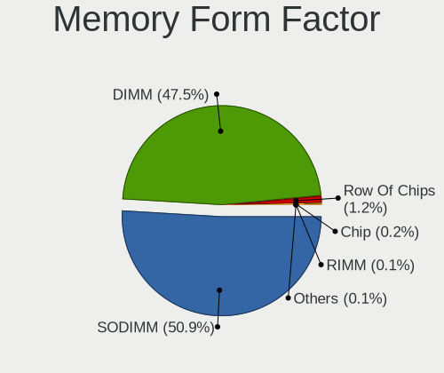

| Name         | Computers | Percent |
|--------------|-----------|---------|
| SODIMM       | 2252      | 51.05%  |
| DIMM         | 2092      | 47.43%  |
| Row Of Chips | 53        | 1.2%    |
| Chip         | 7         | 0.16%   |
| RIMM         | 3         | 0.07%   |
| Unknown      | 3         | 0.07%   |
| FB-DIMM      | 1         | 0.02%   |

Memory Size
-----------

Memory module size

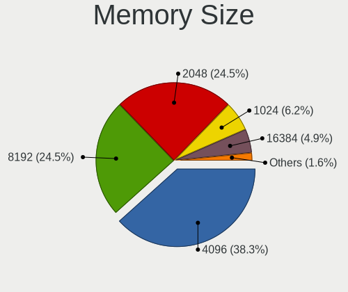

| Size  | Computers | Percent |
|-------|-----------|---------|
| 4096  | 2032      | 40.85%  |
| 2048  | 1258      | 25.29%  |
| 8192  | 1115      | 22.42%  |
| 1024  | 308       | 6.19%   |
| 16384 | 201       | 4.04%   |
| 512   | 31        | 0.62%   |
| 32768 | 25        | 0.5%    |
| 3072  | 1         | 0.02%   |
| 256   | 1         | 0.02%   |
| 64    | 1         | 0.02%   |
| 32    | 1         | 0.02%   |

Memory Speed
------------

Memory module speed

| Speed   | Computers | Percent |
|---------|-----------|---------|
| 1600    | 1374      | 27.29%  |
| 1333    | 658       | 13.07%  |
| 2667    | 413       | 8.2%    |
| 2400    | 319       | 6.34%   |
| 1334    | 272       | 5.4%    |
| 667     | 268       | 5.32%   |
| 800     | 242       | 4.81%   |
| Unknown | 182       | 3.62%   |
| 2133    | 172       | 3.42%   |
| 3200    | 151       | 3%      |
| 1067    | 120       | 2.38%   |
| 1867    | 81        | 1.61%   |
| 1066    | 72        | 1.43%   |
| 3600    | 57        | 1.13%   |
| 4199    | 47        | 0.93%   |
| 1866    | 47        | 0.93%   |
| 3266    | 45        | 0.89%   |
| 2048    | 44        | 0.87%   |
| 533     | 43        | 0.85%   |
| 400     | 38        | 0.75%   |
| 2933    | 35        | 0.7%    |
| 1800    | 33        | 0.66%   |
| 3466    | 32        | 0.64%   |
| 975     | 29        | 0.58%   |
| 2666    | 26        | 0.52%   |
| 3000    | 23        | 0.46%   |
| 2800    | 15        | 0.3%    |
| 333     | 13        | 0.26%   |
| 3400    | 10        | 0.2%    |
| 2000    | 10        | 0.2%    |
| 1639    | 10        | 0.2%    |
| 3733    | 9         | 0.18%   |
| 49926   | 8         | 0.16%   |
| 3533    | 8         | 0.16%   |
| 3066    | 8         | 0.16%   |
| 2200    | 8         | 0.16%   |
| 3151    | 7         | 0.14%   |
| 4267    | 6         | 0.12%   |
| 3500    | 6         | 0.12%   |
| 3334    | 6         | 0.12%   |
| 1400    | 6         | 0.12%   |
| 266     | 6         | 0.12%   |
| 3800    | 5         | 0.1%    |
| 2733    | 5         | 0.1%    |
| 3333    | 4         | 0.08%   |
| 3100    | 4         | 0.08%   |
| 2866    | 4         | 0.08%   |
| 2465    | 4         | 0.08%   |
| 200     | 4         | 0.08%   |
| 2134    | 3         | 0.06%   |
| 66      | 3         | 0.06%   |
| 4333    | 2         | 0.04%   |
| 4000    | 2         | 0.04%   |
| 3067    | 2         | 0.04%   |
| 2747    | 2         | 0.04%   |
| 1648    | 2         | 0.04%   |
| 1200    | 2         | 0.04%   |
| 133     | 2         | 0.04%   |
| 65535   | 1         | 0.02%   |
| 57535   | 1         | 0.02%   |

Printers & scanners
-------------------

Printer Vendor
--------------

Printer device vendors

| Vendor                | Computers | Percent |
|-----------------------|-----------|---------|
| Hewlett-Packard       | 76        | 46.06%  |
| Brother Industries    | 27        | 16.36%  |
| Canon                 | 20        | 12.12%  |
| Samsung Electronics   | 19        | 11.52%  |
| Seiko Epson           | 16        | 9.7%    |
| Dymo-CoStar           | 2         | 1.21%   |
| Xerox                 | 1         | 0.61%   |
| Ricoh                 | 1         | 0.61%   |
| Prolific Technology   | 1         | 0.61%   |
| Oki Data              | 1         | 0.61%   |
| Lexmark International | 1         | 0.61%   |

Printer Model
-------------

Printer device models

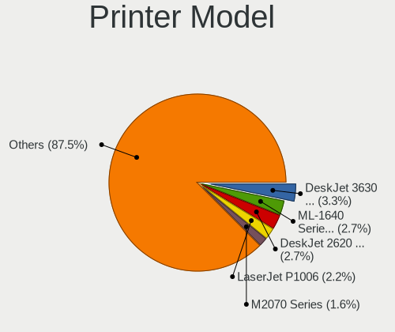

| Model                                                      | Computers | Percent |
|------------------------------------------------------------|-----------|---------|
| HP DeskJet 3630 series                                     | 6         | 3.59%   |
| HP DeskJet 2620 All-in-One Printer                         | 5         | 2.99%   |
| Samsung ML-1640 Series Laser Printer                       | 4         | 2.4%    |
| HP LaserJet P1006                                          | 4         | 2.4%    |
| Samsung M2020 Series                                       | 3         | 1.8%    |
| HP LaserJet 1020                                           | 3         | 1.8%    |
| HP ENVY 4520 series                                        | 3         | 1.8%    |
| Seiko Epson XP-243 245 247 Series                          | 2         | 1.2%    |
| Samsung M2070 Series                                       | 2         | 1.2%    |
| HP OfficeJet Pro 6960                                      | 2         | 1.2%    |
| HP LaserJet P1102                                          | 2         | 1.2%    |
| HP ENVY Photo 6200 series                                  | 2         | 1.2%    |
| HP Deskjet F4500 series                                    | 2         | 1.2%    |
| HP DeskJet 916C                                            | 2         | 1.2%    |
| HP DeskJet 845c                                            | 2         | 1.2%    |
| HP Deskjet 3520 series                                     | 2         | 1.2%    |
| HP DeskJet 2700 series                                     | 2         | 1.2%    |
| HP DeskJet 2130 series                                     | 2         | 1.2%    |
| Canon PIXMA MX920 Series                                   | 2         | 1.2%    |
| Canon PIXMA MX530 Series                                   | 2         | 1.2%    |
| Canon PIXMA MG3500 Series                                  | 2         | 1.2%    |
| Brother DCP-L3550CDW series                                | 2         | 1.2%    |
| Xerox Phaser 6000B                                         | 1         | 0.6%    |
| Seiko Epson XP-4100 Series                                 | 1         | 0.6%    |
| Seiko Epson WF-2530 Series                                 | 1         | 0.6%    |
| Seiko Epson WF-2510 Series                                 | 1         | 0.6%    |
| Seiko Epson USB2.0 Printer (Hi-speed)                      | 1         | 0.6%    |
| Seiko Epson ME Office 600F/Stylus Office BX300F/TX300F     | 1         | 0.6%    |
| Seiko Epson ME 340 Series/Stylus NX130 Series              | 1         | 0.6%    |
| Seiko Epson L395 Series                                    | 1         | 0.6%    |
| Seiko Epson L375 Series                                    | 1         | 0.6%    |
| Seiko Epson L365 Series                                    | 1         | 0.6%    |
| Seiko Epson L312 Series                                    | 1         | 0.6%    |
| Seiko Epson L222 Series                                    | 1         | 0.6%    |
| Seiko Epson L210 Series                                    | 1         | 0.6%    |
| Seiko Epson L120 Series                                    | 1         | 0.6%    |
| Seiko Epson ET-4750 [WorkForce ET-4750 EcoTank All-in-One] | 1         | 0.6%    |
| Samsung Xerox Phaser 3117 Laser Printer                    | 1         | 0.6%    |
| Samsung SCX-4650 4x21S Series                              | 1         | 0.6%    |
| Samsung SCX-4300 Series                                    | 1         | 0.6%    |
| Samsung SCX-4200 series                                    | 1         | 0.6%    |
| Samsung SCX-3200 Series                                    | 1         | 0.6%    |
| Samsung ML-1710 Printer                                    | 1         | 0.6%    |
| Samsung ML-1670 Series                                     | 1         | 0.6%    |
| Samsung ML-1660 Series                                     | 1         | 0.6%    |
| Samsung M283x Series                                       | 1         | 0.6%    |
| Samsung C43x Series                                        | 1         | 0.6%    |
| Ricoh Printing Support                                     | 1         | 0.6%    |
| Prolific PL2305 Parallel Port                              | 1         | 0.6%    |
| Oki Data USB Device                                        | 1         | 0.6%    |
| Lexmark International InkJet Color Printer                 | 1         | 0.6%    |
| HP Smart Tank Plus 650 series                              | 1         | 0.6%    |
| HP Smart Tank Plus 550 series                              | 1         | 0.6%    |
| HP Printing Support                                        | 1         | 0.6%    |
| HP OfficeJet Pro 7720 series                               | 1         | 0.6%    |
| HP Officejet 6600                                          | 1         | 0.6%    |
| HP OfficeJet 4650 series                                   | 1         | 0.6%    |
| HP Officejet 4620 series                                   | 1         | 0.6%    |
| HP Officejet 4500 G510n-z                                  | 1         | 0.6%    |
| HP Officejet 4500 G510a-f                                  | 1         | 0.6%    |

Scanner Vendor
--------------

Scanner device vendors

| Vendor                      | Computers | Percent |
|-----------------------------|-----------|---------|
| Canon                       | 21        | 47.73%  |
| Hewlett-Packard             | 10        | 22.73%  |
| Seiko Epson                 | 5         | 11.36%  |
| Mustek Systems              | 4         | 9.09%   |
| AGFA-Gevaert NV             | 2         | 4.55%   |
| Plustek                     | 1         | 2.27%   |
| KYE Systems (Mouse Systems) | 1         | 2.27%   |

Scanner Model
-------------

Scanner device models

| Model                                                    | Computers | Percent |
|----------------------------------------------------------|-----------|---------|
| Canon CanoScan LiDE 210                                  | 5         | 11.36%  |
| Canon CanoScan LiDE 110                                  | 3         | 6.82%   |
| Mustek Systems ScanExpress 1200 UB                       | 2         | 4.55%   |
| HP ScanJet 5590                                          | 2         | 4.55%   |
| Canon CanoScan LIDE 25                                   | 2         | 4.55%   |
| Canon CanoScan LiDE 120                                  | 2         | 4.55%   |
| Canon CanoScan LiDE 100                                  | 2         | 4.55%   |
| Seiko Epson Scanner                                      | 1         | 2.27%   |
| Seiko Epson GT-F730 [GT-S630/Perfection V33/V330 Photo]  | 1         | 2.27%   |
| Seiko Epson GT-F650 [GT-S600/Perfection V10/V100]        | 1         | 2.27%   |
| Seiko Epson GT-F500/GT-F550 [Perfection 2480/2580 PHOTO] | 1         | 2.27%   |
| Seiko Epson GT-7400U [Perfection 1270]                   | 1         | 2.27%   |
| Plustek 600DPI USB Scanner                               | 1         | 2.27%   |
| Mustek Systems BearPaw 2448 CU Pro                       | 1         | 2.27%   |
| Mustek Systems BearPaw 1200 CU Plus                      | 1         | 2.27%   |
| KYE Systems (Mouse Systems) ColorPage-Vivid4             | 1         | 2.27%   |
| HP ScanJet G4010                                         | 1         | 2.27%   |
| HP ScanJet 4500C/5550C                                   | 1         | 2.27%   |
| HP ScanJet 4370                                          | 1         | 2.27%   |
| HP ScanJet 3800c                                         | 1         | 2.27%   |
| HP ScanJet 3670                                          | 1         | 2.27%   |
| HP ScanJet 2300c                                         | 1         | 2.27%   |
| HP ScanJet 2200c                                         | 1         | 2.27%   |
| HP PSC 1200                                              | 1         | 2.27%   |
| Canon CanoScan N650U/N656U                               | 1         | 2.27%   |
| Canon CanoScan N1240U/LiDE 30                            | 1         | 2.27%   |
| Canon CanoScan LiDE 700F                                 | 1         | 2.27%   |
| Canon CanoScan LiDE 70                                   | 1         | 2.27%   |
| Canon CanoScan LiDE 500F                                 | 1         | 2.27%   |
| Canon CanoScan LiDE 220                                  | 1         | 2.27%   |
| Canon CanoScan LiDE 200                                  | 1         | 2.27%   |
| AGFA-Gevaert NV SnapScan Touch                           | 1         | 2.27%   |
| AGFA-Gevaert NV SnapScan e20                             | 1         | 2.27%   |

Camera
------

Camera Vendor
-------------

Camera device vendors

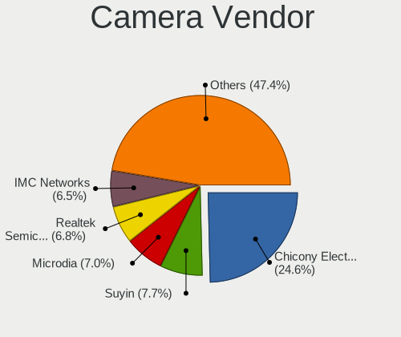

| Vendor                                 | Computers | Percent |
|----------------------------------------|-----------|---------|
| Chicony Electronics                    | 545       | 24.65%  |
| Suyin                                  | 159       | 7.19%   |
| Microdia                               | 154       | 6.97%   |
| Realtek Semiconductor                  | 152       | 6.87%   |
| IMC Networks                           | 146       | 6.6%    |
| Acer                                   | 145       | 6.56%   |
| Logitech                               | 110       | 4.98%   |
| Sunplus Innovation Technology          | 99        | 4.48%   |
| Cheng Uei Precision Industry (Foxlink) | 83        | 3.75%   |
| Quanta                                 | 70        | 3.17%   |
| Syntek                                 | 69        | 3.12%   |
| Alcor Micro                            | 50        | 2.26%   |
| Apple                                  | 46        | 2.08%   |
| Silicon Motion                         | 44        | 1.99%   |
| Ricoh                                  | 39        | 1.76%   |
| Lite-On Technology                     | 38        | 1.72%   |
| Microsoft                              | 28        | 1.27%   |
| Lenovo                                 | 23        | 1.04%   |
| Z-Star Microelectronics                | 22        | 1%      |
| Importek                               | 15        | 0.68%   |
| Primax Electronics                     | 14        | 0.63%   |
| GEMBIRD                                | 13        | 0.59%   |
| OmniVision Technologies                | 9         | 0.41%   |
| Luxvisions Innotech Limited            | 9         | 0.41%   |
| ALi                                    | 9         | 0.41%   |
| DigiTech                               | 8         | 0.36%   |
| Creative Technology                    | 8         | 0.36%   |
| Aveo Technology                        | 8         | 0.36%   |
| Samsung Electronics                    | 7         | 0.32%   |
| Cubeternet                             | 7         | 0.32%   |
| KYE Systems (Mouse Systems)            | 5         | 0.23%   |
| Huawei Technologies                    | 5         | 0.23%   |
| Genesys Logic                          | 5         | 0.23%   |
| Generalplus Technology                 | 5         | 0.23%   |
| ARC International                      | 5         | 0.23%   |
| Pixart Imaging                         | 4         | 0.18%   |
| Unknown                                | 3         | 0.14%   |
| Trust                                  | 3         | 0.14%   |
| Jieli Technology                       | 3         | 0.14%   |
| Intel                                  | 3         | 0.14%   |
| Foxconn / Hon Hai                      | 3         | 0.14%   |
| Arkmicro Technologies                  | 3         | 0.14%   |
| A4Tech                                 | 3         | 0.14%   |
| WCM_USB                                | 2         | 0.09%   |
| WaveRider Communications               | 2         | 0.09%   |
| Sweex                                  | 2         | 0.09%   |
| Sunplus Technology                     | 2         | 0.09%   |
| MacroSilicon                           | 2         | 0.09%   |
| YJX                                    | 1         | 0.05%   |
| YGTek                                  | 1         | 0.05%   |
| Xiongmai                               | 1         | 0.05%   |
| Tobii Technology AB                    | 1         | 0.05%   |
| Teslong Camera                         | 1         | 0.05%   |
| Spreadtrum Communications              | 1         | 0.05%   |
| Sonix Technology                       | 1         | 0.05%   |
| SHENZHEN EMEET TECHNOLOGY              | 1         | 0.05%   |
| Sanyo Electric                         | 1         | 0.05%   |
| Nokia Mobile Phones                    | 1         | 0.05%   |
| Nebraska Furniture Mart                | 1         | 0.05%   |
| Mimaki Engineering                     | 1         | 0.05%   |

Camera Model
------------

Camera device models

| Model                                                       | Computers | Percent |
|-------------------------------------------------------------|-----------|---------|
| Chicony HD WebCam                                           | 59        | 2.66%   |
| Chicony Integrated Camera                                   | 45        | 2.03%   |
| IMC Networks USB2.0 VGA UVC WebCam                          | 33        | 1.49%   |
| Suyin Acer/HP Integrated Webcam [CN0314]                    | 32        | 1.44%   |
| Realtek Integrated_Webcam_HD                                | 30        | 1.35%   |
| Chicony USB 2.0 Camera                                      | 28        | 1.26%   |
| Alcor Micro USB 2.0 Camera                                  | 28        | 1.26%   |
| Acer Lenovo EasyCamera                                      | 27        | 1.22%   |
| IMC Networks USB2.0 HD UVC WebCam                           | 26        | 1.17%   |
| Chicony USB2.0 HD UVC WebCam                                | 25        | 1.13%   |
| Suyin Integrated_Webcam_HD                                  | 24        | 1.08%   |
| Logitech Webcam C270                                        | 24        | 1.08%   |
| Acer Integrated Camera                                      | 24        | 1.08%   |
| Microdia Integrated_Webcam_HD                               | 23        | 1.04%   |
| Chicony VGA Webcam                                          | 23        | 1.04%   |
| Sunplus Integrated_Webcam_HD                                | 22        | 0.99%   |
| Realtek USB Camera                                          | 22        | 0.99%   |
| Syntek Lenovo EasyCamera                                    | 21        | 0.95%   |
| Syntek Integrated Camera                                    | 21        | 0.95%   |
| Chicony EasyCamera                                          | 21        | 0.95%   |
| Quanta HP Webcam                                            | 20        | 0.9%    |
| Chicony HP Truevision HD                                    | 20        | 0.9%    |
| Apple Built-in iSight                                       | 20        | 0.9%    |
| Microdia Integrated Webcam                                  | 18        | 0.81%   |
| Chicony TOSHIBA Web Camera - HD                             | 18        | 0.81%   |
| Chicony Lenovo EasyCamera                                   | 18        | 0.81%   |
| Sunplus HD WebCam                                           | 17        | 0.77%   |
| Cheng Uei Precision Industry (Foxlink) HP Webcam            | 17        | 0.77%   |
| Acer EasyCamera                                             | 17        | 0.77%   |
| Logitech Webcam C310                                        | 16        | 0.72%   |
| Lite-On Integrated Camera                                   | 16        | 0.72%   |
| Quanta VGA WebCam                                           | 15        | 0.68%   |
| Logitech HD Pro Webcam C920                                 | 15        | 0.68%   |
| IMC Networks UVC VGA Webcam                                 | 15        | 0.68%   |
| IMC Networks Integrated Camera                              | 15        | 0.68%   |
| Chicony CNF9055 Toshiba Webcam                              | 15        | 0.68%   |
| Chicony Acer CrystalEye Webcam                              | 15        | 0.68%   |
| Cheng Uei Precision Industry (Foxlink) HP TrueVision HD     | 15        | 0.68%   |
| Acer Lenovo Integrated Webcam                               | 15        | 0.68%   |
| Suyin HP Truevision HD                                      | 14        | 0.63%   |
| Chicony USB2.0 VGA UVC WebCam                               | 14        | 0.63%   |
| Chicony HP Webcam                                           | 14        | 0.63%   |
| Realtek HD WebCam                                           | 13        | 0.59%   |
| Apple FaceTime HD Camera                                    | 13        | 0.59%   |
| Syntek EasyCamera                                           | 12        | 0.54%   |
| Quanta HP TrueVision HD Camera                              | 12        | 0.54%   |
| Chicony WebCam                                              | 12        | 0.54%   |
| Chicony Integrated HP HD Webcam                             | 12        | 0.54%   |
| Alcor Micro Asus Integrated Webcam                          | 12        | 0.54%   |
| Chicony Lenovo Integrated Camera (0.3MP)                    | 11        | 0.5%    |
| Chicony HP TrueVision HD Camera                             | 11        | 0.5%    |
| Chicony HP HD Camera                                        | 11        | 0.5%    |
| Acer BisonCam, NB Pro                                       | 11        | 0.5%    |
| Realtek Acer 640 x 480 laptop camera                        | 10        | 0.45%   |
| Microdia USB 2.0 Camera                                     | 10        | 0.45%   |
| Lenovo Integrated Webcam                                    | 10        | 0.45%   |
| Chicony FJ Camera                                           | 10        | 0.45%   |
| Acer HD Webcam                                              | 10        | 0.45%   |
| Suyin 1.3M WebCam (notebook emachines E730, Acer sub-brand) | 9         | 0.41%   |
| Ricoh USB2.0 Camera                                         | 9         | 0.41%   |

Security
--------

Fingerprint Vendor
------------------

Fingerprint sensor vendors

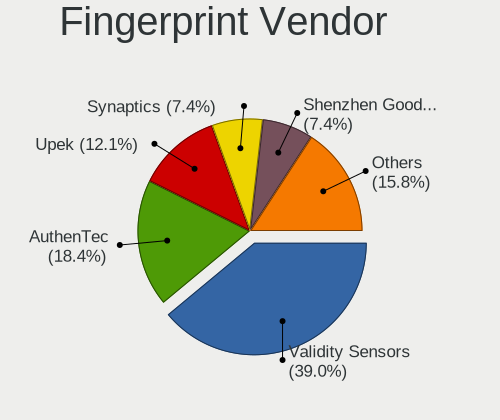

| Vendor                     | Computers | Percent |
|----------------------------|-----------|---------|
| Validity Sensors           | 98        | 37.84%  |
| AuthenTec                  | 47        | 18.15%  |
| Upek                       | 32        | 12.36%  |
| Synaptics                  | 20        | 7.72%   |
| Shenzhen Goodix Technology | 20        | 7.72%   |
| STMicroelectronics         | 14        | 5.41%   |
| LighTuning Technology      | 14        | 5.41%   |
| Elan Microelectronics      | 13        | 5.02%   |
| Focal-systems.Corp         | 1         | 0.39%   |

Fingerprint Model
-----------------

Fingerprint sensor models

| Model                                                                      | Computers | Percent |
|----------------------------------------------------------------------------|-----------|---------|
| Upek Biometric Touchchip/Touchstrip Fingerprint Sensor                     | 28        | 10.81%  |
| AuthenTec AES2810                                                          | 20        | 7.72%   |
| Validity Sensors VFS495 Fingerprint Reader                                 | 16        | 6.18%   |
| Validity Sensors VFS 5011 fingerprint sensor                               | 15        | 5.79%   |
| Shenzhen Goodix  FingerPrint Device                                        | 15        | 5.79%   |
| STMicroelectronics Fingerprint Reader                                      | 14        | 5.41%   |
| Elan ELAN:Fingerprint                                                      | 12        | 4.63%   |
| AuthenTec AES2501 Fingerprint Sensor                                       | 12        | 4.63%   |
| Validity Sensors VFS5011 Fingerprint Reader                                | 11        | 4.25%   |
| Validity Sensors VFS471 Fingerprint Reader                                 | 9         | 3.47%   |
| Validity Sensors VFS451 Fingerprint Reader                                 | 9         | 3.47%   |
| Synaptics  WBDI                                                            | 9         | 3.47%   |
| Validity Sensors VFS491                                                    | 7         | 2.7%    |
| LighTuning ES603 Swipe Fingerprint Sensor                                  | 7         | 2.7%    |
| AuthenTec AES1600                                                          | 7         | 2.7%    |
| AuthenTec Fingerprint Sensor                                               | 6         | 2.32%   |
| Validity Sensors VFS7500 Touch Fingerprint Sensor                          | 5         | 1.93%   |
| Validity Sensors VFS101 Fingerprint Reader                                 | 5         | 1.93%   |
| Validity Sensors Fingerprint scanner                                       | 5         | 1.93%   |
| LighTuning EgisTec Touch Fingerprint Sensor                                | 5         | 1.93%   |
| Validity Sensors VFS301 Fingerprint Reader                                 | 4         | 1.54%   |
| Validity Sensors Swipe Fingerprint Sensor                                  | 4         | 1.54%   |
| Upek TCS5B Fingerprint sensor                                              | 4         | 1.54%   |
| Shenzhen Goodix Fingerprint Reader                                         | 4         | 1.54%   |
| Unknown                                                                    | 4         | 1.54%   |
| Validity Sensors VFS Fingerprint sensor                                    | 3         | 1.16%   |
| Validity Sensors Synaptics WBDI                                            | 2         | 0.77%   |
| Validity Sensors Synaptics VFS7552 Touch Fingerprint Sensor with PurePrint | 2         | 0.77%   |
| Synaptics WBDI Device                                                      | 2         | 0.77%   |
| LighTuning Fingerprint Reader                                              | 2         | 0.77%   |
| Validity Sensors VFS300 Fingerprint Reader                                 | 1         | 0.39%   |
| Synaptics  VFS7552 Touch Fingerprint Sensor with PurePrint                 | 1         | 0.39%   |
| Synaptics  FS7604 Touch Fingerprint Sensor with PurePrint                  | 1         | 0.39%   |
| Synaptics Prometheus MIS Touch Fingerprint Reader                          | 1         | 0.39%   |
| Synaptics Metallica MOH Touch Fingerprint Reader                           | 1         | 0.39%   |
| Synaptics Metallica MIS Touch Fingerprint Reader                           | 1         | 0.39%   |
| Shenzhen Goodix FingerPrint                                                | 1         | 0.39%   |
| Focal-systems.Corp FT9201Fingerprint.                                      | 1         | 0.39%   |
| Elan ELAN:ARM-M4                                                           | 1         | 0.39%   |
| AuthenTec AES2550 Fingerprint Sensor                                       | 1         | 0.39%   |
| AuthenTec AES1660 Fingerprint Sensor                                       | 1         | 0.39%   |

Chipcard Vendor
---------------

Chipcard module vendors

| Vendor                            | Computers | Percent |
|-----------------------------------|-----------|---------|
| Broadcom                          | 69        | 48.94%  |
| Alcor Micro                       | 21        | 14.89%  |
| O2 Micro                          | 20        | 14.18%  |
| Lenovo                            | 13        | 9.22%   |
| Upek                              | 7         | 4.96%   |
| OmniKey                           | 3         | 2.13%   |
| SCM Microsystems                  | 2         | 1.42%   |
| VASCO Data Security International | 1         | 0.71%   |
| Reiner SCT Kartensysteme          | 1         | 0.71%   |
| Microchip Technology              | 1         | 0.71%   |
| Fujitsu Siemens Computers         | 1         | 0.71%   |
| BIT4ID                            | 1         | 0.71%   |
| Advanced Card Systems             | 1         | 0.71%   |

Chipcard Model
--------------

Chipcard module models

| Model                                                                        | Computers | Percent |
|------------------------------------------------------------------------------|-----------|---------|
| Broadcom BCM5880 Secure Applications Processor                               | 45        | 31.91%  |
| O2 Micro OZ776 CCID Smartcard Reader                                         | 20        | 14.18%  |
| Alcor Micro AU9540 Smartcard Reader                                          | 19        | 13.48%  |
| Broadcom BCM5880 Secure Applications Processor with fingerprint swipe sensor | 18        | 12.77%  |
| Lenovo Integrated Smart Card Reader                                          | 13        | 9.22%   |
| Upek TouchChip Fingerprint Coprocessor (WBF advanced mode)                   | 7         | 4.96%   |
| Broadcom 5880                                                                | 6         | 4.26%   |
| Alcor Micro Watchdata W 1981                                                 | 2         | 1.42%   |
| VASCO Data Security International Digipass 905 SmartCard Reader              | 1         | 0.71%   |
| SCM Microsystems SCR335 SmartCard Reader                                     | 1         | 0.71%   |
| SCM Microsystems SCR3340 - ExpressCard54 Smart Card Reader                   | 1         | 0.71%   |
| Reiner SCT Kartensysteme cyberJack RFID basis contactless smartcard reader   | 1         | 0.71%   |
| OmniKey CardMan 4321                                                         | 1         | 0.71%   |
| OmniKey CardMan 3021 / 3121                                                  | 1         | 0.71%   |
| OmniKey CardMan 1021                                                         | 1         | 0.71%   |
| Microchip Technology SMSC USX101x Reader                                     | 1         | 0.71%   |
| Fujitsu Siemens Computers SmartCard Reader 2A                                | 1         | 0.71%   |
| BIT4ID miniLector EVO                                                        | 1         | 0.71%   |
| Advanced Card Systems ACR38 SmartCard Reader                                 | 1         | 0.71%   |

Unsupported
-----------

Unsupported Devices
-------------------

Total unsupported devices on board

| Total | Computers | Percent |
|-------|-----------|---------|
| 0     | 3845      | 85.75%  |
| 1     | 568       | 12.67%  |
| 2     | 69        | 1.54%   |
| 3     | 2         | 0.04%   |

Unsupported Device Types
------------------------

Types of unsupported devices

| Type                     | Computers | Percent |
|--------------------------|-----------|---------|
| Fingerprint reader       | 259       | 36.74%  |
| Chipcard                 | 138       | 19.57%  |
| Graphics card            | 86        | 12.2%   |
| Net/wireless             | 76        | 10.78%  |
| Storage                  | 33        | 4.68%   |
| Multimedia controller    | 27        | 3.83%   |
| Bluetooth                | 26        | 3.69%   |
| Communication controller | 17        | 2.41%   |
| Camera                   | 13        | 1.84%   |
| Unassigned class         | 11        | 1.56%   |
| Card reader              | 6         | 0.85%   |
| Sound                    | 3         | 0.43%   |
| Network                  | 3         | 0.43%   |
| Modem                    | 3         | 0.43%   |
| Storage/ata              | 2         | 0.28%   |
| Unclassified device      | 1         | 0.14%   |
| Flash memory             | 1         | 0.14%   |

