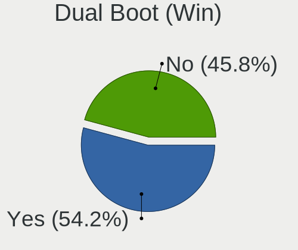
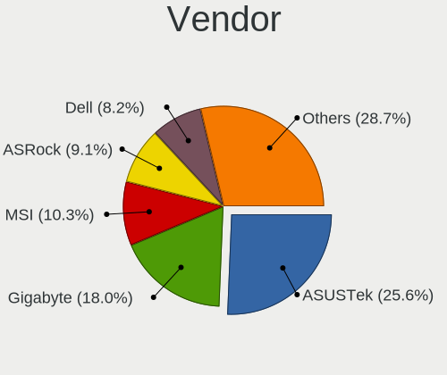
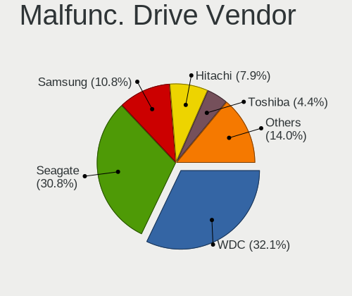
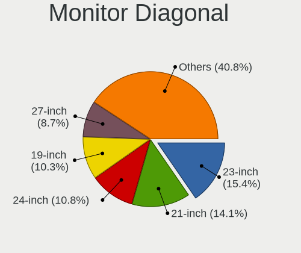
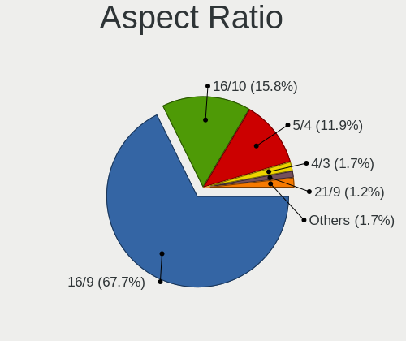
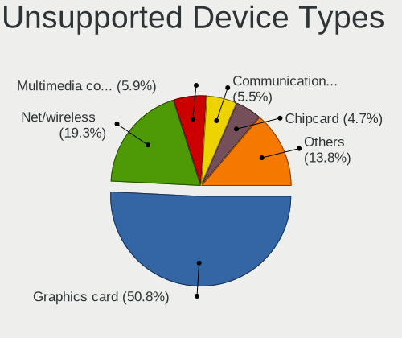

OpenMandriva 4.2 - Tested Hardware & Statistics (Desktops)
----------------------------------------------------------

A project to collect tested hardware configurations for OpenMandriva 4.2.

Anyone can contribute to this report by the [hw-probe](https://github.com/linuxhw/hw-probe) tool:

    sudo -E hw-probe -all -upload

Please contribute! Especially if your hardware is rare.

Contents
--------

* [ Test Cases ](#test-cases)

* [ System ](#system)
  - [ Kernel                   ](#kernel)
  - [ Kernel Family            ](#kernel-family)
  - [ Kernel Major Ver.        ](#kernel-major-ver)
  - [ Arch                     ](#arch)
  - [ DE                       ](#de)
  - [ Display Server           ](#display-server)
  - [ Display Manager          ](#display-manager)
  - [ OS Lang                  ](#os-lang)
  - [ Boot Mode                ](#boot-mode)
  - [ Filesystem               ](#filesystem)
  - [ Part. scheme             ](#part-scheme)
  - [ Dual Boot with Linux/BSD ](#dual-boot-with-linuxbsd)
  - [ Dual Boot (Win)          ](#dual-boot-win)

* [ Board ](#board)
  - [ Vendor                   ](#vendor)
  - [ Model                    ](#model)
  - [ Model Family             ](#model-family)
  - [ MFG Year                 ](#mfg-year)
  - [ Form Factor              ](#form-factor)
  - [ Secure Boot              ](#secure-boot)
  - [ Coreboot                 ](#coreboot)
  - [ RAM Size                 ](#ram-size)
  - [ RAM Used                 ](#ram-used)
  - [ Total Drives             ](#total-drives)
  - [ Has CD-ROM               ](#has-cd-rom)
  - [ Has Ethernet             ](#has-ethernet)
  - [ Has WiFi                 ](#has-wifi)
  - [ Has Bluetooth            ](#has-bluetooth)

* [ Location ](#location)
  - [ Country                  ](#country)
  - [ City                     ](#city)

* [ Drives ](#drives)
  - [ Drive Vendor             ](#drive-vendor)
  - [ Drive Model              ](#drive-model)
  - [ HDD Vendor               ](#hdd-vendor)
  - [ SSD Vendor               ](#ssd-vendor)
  - [ Drive Kind               ](#drive-kind)
  - [ Drive Connector          ](#drive-connector)
  - [ Drive Size               ](#drive-size)
  - [ Space Total              ](#space-total)
  - [ Space Used               ](#space-used)
  - [ Malfunc. Drives          ](#malfunc-drives)
  - [ Malfunc. Drive Vendor    ](#malfunc-drive-vendor)
  - [ Malfunc. HDD Vendor      ](#malfunc-hdd-vendor)
  - [ Malfunc. Drive Kind      ](#malfunc-drive-kind)
  - [ Failed Drives            ](#failed-drives)
  - [ Failed Drive Vendor      ](#failed-drive-vendor)
  - [ Drive Status             ](#drive-status)

* [ Storage controller ](#storage-controller)
  - [ Storage Vendor           ](#storage-vendor)
  - [ Storage Model            ](#storage-model)
  - [ Storage Kind             ](#storage-kind)

* [ Processor ](#processor)
  - [ CPU Vendor               ](#cpu-vendor)
  - [ CPU Model                ](#cpu-model)
  - [ CPU Model Family         ](#cpu-model-family)
  - [ CPU Cores                ](#cpu-cores)
  - [ CPU Sockets              ](#cpu-sockets)
  - [ CPU Threads              ](#cpu-threads)
  - [ CPU Op-Modes             ](#cpu-op-modes)
  - [ CPU Microcode            ](#cpu-microcode)
  - [ CPU Microarch            ](#cpu-microarch)

* [ Graphics ](#graphics)
  - [ GPU Vendor               ](#gpu-vendor)
  - [ GPU Model                ](#gpu-model)
  - [ GPU Combo                ](#gpu-combo)
  - [ GPU Driver               ](#gpu-driver)
  - [ GPU Memory               ](#gpu-memory)

* [ Monitor ](#monitor)
  - [ Monitor Vendor           ](#monitor-vendor)
  - [ Monitor Model            ](#monitor-model)
  - [ Monitor Resolution       ](#monitor-resolution)
  - [ Monitor Diagonal         ](#monitor-diagonal)
  - [ Monitor Width            ](#monitor-width)
  - [ Aspect Ratio             ](#aspect-ratio)
  - [ Monitor Area             ](#monitor-area)
  - [ Pixel Density            ](#pixel-density)
  - [ Multiple Monitors        ](#multiple-monitors)

* [ Network ](#network)
  - [ Net Controller Vendor    ](#net-controller-vendor)
  - [ Net Controller Model     ](#net-controller-model)
  - [ Wireless Vendor          ](#wireless-vendor)
  - [ Wireless Model           ](#wireless-model)
  - [ Ethernet Vendor          ](#ethernet-vendor)
  - [ Ethernet Model           ](#ethernet-model)
  - [ Net Controller Kind      ](#net-controller-kind)
  - [ Used Controller          ](#used-controller)
  - [ NICs                     ](#nics)
  - [ IPv6                     ](#ipv6)

* [ Bluetooth ](#bluetooth)
  - [ Bluetooth Vendor         ](#bluetooth-vendor)
  - [ Bluetooth Model          ](#bluetooth-model)

* [ Sound ](#sound)
  - [ Sound Vendor             ](#sound-vendor)
  - [ Sound Model              ](#sound-model)

* [ Memory ](#memory)
  - [ Memory Vendor            ](#memory-vendor)
  - [ Memory Model             ](#memory-model)
  - [ Memory Kind              ](#memory-kind)
  - [ Memory Form Factor       ](#memory-form-factor)
  - [ Memory Size              ](#memory-size)
  - [ Memory Speed             ](#memory-speed)

* [ Printers & scanners ](#printers--scanners)
  - [ Printer Vendor           ](#printer-vendor)
  - [ Printer Model            ](#printer-model)
  - [ Scanner Vendor           ](#scanner-vendor)
  - [ Scanner Model            ](#scanner-model)

* [ Camera ](#camera)
  - [ Camera Vendor            ](#camera-vendor)
  - [ Camera Model             ](#camera-model)

* [ Security ](#security)
  - [ Fingerprint Vendor       ](#fingerprint-vendor)
  - [ Fingerprint Model        ](#fingerprint-model)
  - [ Chipcard Vendor          ](#chipcard-vendor)
  - [ Chipcard Model           ](#chipcard-model)

* [ Unsupported ](#unsupported)
  - [ Unsupported Devices      ](#unsupported-devices)
  - [ Unsupported Device Types ](#unsupported-device-types)

Test Cases
----------

Total: 2357

| Vendor        | Model                       | Probe                                                      | Date         |
|---------------|-----------------------------|------------------------------------------------------------|--------------|
| ASUSTek       | Z97-P                       | [8ea78b28f1](https://linux-hardware.org/?probe=8ea78b28f1) | Apr 29, 2023 |
| Gigabyte      | 945GCM-S2L                  | [405bcbb43c](https://linux-hardware.org/?probe=405bcbb43c) | Apr 25, 2023 |
| ASUSTek       | PRIME H510M-K               | [820acdb913](https://linux-hardware.org/?probe=820acdb913) | Apr 22, 2023 |
| MSI           | B360M BAZOOKA               | [46516c6f3a](https://linux-hardware.org/?probe=46516c6f3a) | Apr 22, 2023 |
| ASUSTek       | M5A78L-M/USB3               | [561b87c8b4](https://linux-hardware.org/?probe=561b87c8b4) | Apr 20, 2023 |
| eMachines     | E945GCU                     | [4e6aa4be24](https://linux-hardware.org/?probe=4e6aa4be24) | Apr 16, 2023 |
| Dell          | 0RF705                      | [32dbb3206b](https://linux-hardware.org/?probe=32dbb3206b) | Apr 16, 2023 |
| ASUSTek       | P5K                         | [00a17a60bf](https://linux-hardware.org/?probe=00a17a60bf) | Apr 09, 2023 |
| Fujitsu       | D2990-A2 S26361-D2990-A2    | [c76171c0a7](https://linux-hardware.org/?probe=c76171c0a7) | Apr 07, 2023 |
| ASRock        | A320M-DVS R4.0              | [c6e30ff3cc](https://linux-hardware.org/?probe=c6e30ff3cc) | Apr 06, 2023 |
| MSI           | B450-A PRO MAX              | [31d10a7e98](https://linux-hardware.org/?probe=31d10a7e98) | Apr 04, 2023 |
| Intel         | DZ87KLT75K AAG74721-304     | [4f97ce0a4b](https://linux-hardware.org/?probe=4f97ce0a4b) | Apr 03, 2023 |
| Medion        | B250H4-EM                   | [f569d44749](https://linux-hardware.org/?probe=f569d44749) | Mar 30, 2023 |
| Gigabyte      | B75M-D3V                    | [d3ae118e3b](https://linux-hardware.org/?probe=d3ae118e3b) | Mar 30, 2023 |
| Lenovo        | ThinkCentre M58p 6137A2U    | [cc740804d7](https://linux-hardware.org/?probe=cc740804d7) | Mar 25, 2023 |
| Gigabyte      | GA-78LMT-S2P                | [3ce94dae13](https://linux-hardware.org/?probe=3ce94dae13) | Mar 25, 2023 |
| Dell          | 0C2KJT A00                  | [54bdc4bbd0](https://linux-hardware.org/?probe=54bdc4bbd0) | Mar 21, 2023 |
| ASUSTek       | P8H61-M LX PLUS             | [cdf57a039e](https://linux-hardware.org/?probe=cdf57a039e) | Mar 19, 2023 |
| Unknown       | Unknown                     | [d91eb1923c](https://linux-hardware.org/?probe=d91eb1923c) | Mar 17, 2023 |
| Dell          | 0HN7XN A01                  | [4ce2092fe2](https://linux-hardware.org/?probe=4ce2092fe2) | Mar 17, 2023 |
| Gigabyte      | P55-UD3R                    | [e720741a00](https://linux-hardware.org/?probe=e720741a00) | Mar 11, 2023 |
| Lenovo        | MAHOBAY                     | [c756678fad](https://linux-hardware.org/?probe=c756678fad) | Mar 08, 2023 |
| ASUSTek       | SABERTOOTH 990FX R2.0       | [98f8bd8557](https://linux-hardware.org/?probe=98f8bd8557) | Mar 06, 2023 |
| MSI           | H110M PRO-VH PLUS           | [e4e66a8215](https://linux-hardware.org/?probe=e4e66a8215) | Mar 06, 2023 |
| ASUSTek       | H110M-A/M.2                 | [3c4bf3c1bd](https://linux-hardware.org/?probe=3c4bf3c1bd) | Mar 05, 2023 |
| PCWare        | APM-A320G                   | [2bc24b8935](https://linux-hardware.org/?probe=2bc24b8935) | Mar 04, 2023 |
| Gigabyte      | H55M-S2H                    | [196ff8d0dc](https://linux-hardware.org/?probe=196ff8d0dc) | Mar 03, 2023 |
| Dell          | 0KC9NP A00                  | [45397750b4](https://linux-hardware.org/?probe=45397750b4) | Mar 02, 2023 |
| Lenovo        | 3178 SDK0J40697 WIN 3305... | [41d9c3d9ed](https://linux-hardware.org/?probe=41d9c3d9ed) | Mar 02, 2023 |
| Acer          | Aspire X3995                | [eccac5b752](https://linux-hardware.org/?probe=eccac5b752) | Feb 28, 2023 |
| HP            | 3032h                       | [007bbeffa0](https://linux-hardware.org/?probe=007bbeffa0) | Feb 26, 2023 |
| ASRock        | FM2A58M-VG3+ R2.0           | [92ac86c31b](https://linux-hardware.org/?probe=92ac86c31b) | Feb 25, 2023 |
| ASRock        | N68-VGS3 FX                 | [b9fbaca53d](https://linux-hardware.org/?probe=b9fbaca53d) | Feb 23, 2023 |
| ASUSTek       | M4N68T-M LE                 | [7b5fe965fd](https://linux-hardware.org/?probe=7b5fe965fd) | Feb 16, 2023 |
| Dell          | 03NVJ6 A00                  | [d118fe4ba2](https://linux-hardware.org/?probe=d118fe4ba2) | Feb 16, 2023 |
| Lenovo        | SHARKBAY NOK                | [4ccd4c2da2](https://linux-hardware.org/?probe=4ccd4c2da2) | Feb 14, 2023 |
| MSI           | B450M PRO-M2 MAX            | [2032f6e202](https://linux-hardware.org/?probe=2032f6e202) | Feb 13, 2023 |
| ASUSTek       | P6TD DELUXE                 | [f9cfe6d485](https://linux-hardware.org/?probe=f9cfe6d485) | Feb 13, 2023 |
| ASUSTek       | Z97-K                       | [afaaed1c36](https://linux-hardware.org/?probe=afaaed1c36) | Feb 09, 2023 |
| ASUSTek       | P8H61-M LE/USB3             | [91a070c2aa](https://linux-hardware.org/?probe=91a070c2aa) | Feb 03, 2023 |
| ASUSTek       | P8P67 PRO                   | [49d8a19239](https://linux-hardware.org/?probe=49d8a19239) | Feb 03, 2023 |
| MSI           | A520M-A PRO                 | [f7a88d0dea](https://linux-hardware.org/?probe=f7a88d0dea) | Feb 01, 2023 |
| Intel         | DH77EB AAG39073-304         | [8965805130](https://linux-hardware.org/?probe=8965805130) | Jan 27, 2023 |
| Gigabyte      | A320M-S2H-CF                | [7545ee3eb0](https://linux-hardware.org/?probe=7545ee3eb0) | Jan 22, 2023 |
| Gigabyte      | H61M-D2-B3                  | [e261893ec4](https://linux-hardware.org/?probe=e261893ec4) | Jan 20, 2023 |
| ASUSTek       | TUF Gaming H470-PRO         | [6d67c981b3](https://linux-hardware.org/?probe=6d67c981b3) | Jan 15, 2023 |
| ASUSTek       | TUF Gaming X570-PLUS        | [190d9b58b8](https://linux-hardware.org/?probe=190d9b58b8) | Jan 12, 2023 |
| HP            | 83F2                        | [7482186165](https://linux-hardware.org/?probe=7482186165) | Jan 11, 2023 |
| ASRock        | M3A770DE                    | [952caf04f8](https://linux-hardware.org/?probe=952caf04f8) | Jan 05, 2023 |
| ASUSTek       | M2N68 Plus                  | [12309f8c91](https://linux-hardware.org/?probe=12309f8c91) | Jan 05, 2023 |
| Gigabyte      | H61M-S1                     | [5ea753453b](https://linux-hardware.org/?probe=5ea753453b) | Jan 03, 2023 |
| HP            | 304Bh                       | [cfe1407faf](https://linux-hardware.org/?probe=cfe1407faf) | Jan 02, 2023 |
| Gigabyte      | Z590 AORUS ULTRA            | [4ab759533b](https://linux-hardware.org/?probe=4ab759533b) | Dec 25, 2022 |
| Dell          | 0M863N A00                  | [ce9fc7a224](https://linux-hardware.org/?probe=ce9fc7a224) | Dec 24, 2022 |
| Gigabyte      | EP43-DS3                    | [d0f0cd82f9](https://linux-hardware.org/?probe=d0f0cd82f9) | Dec 22, 2022 |
| ASRock        | M3A770DE                    | [2e6b1f9c2d](https://linux-hardware.org/?probe=2e6b1f9c2d) | Dec 13, 2022 |
| ASUSTek       | H110-PLUS                   | [57e0d3651c](https://linux-hardware.org/?probe=57e0d3651c) | Dec 08, 2022 |
| Gigabyte      | GA-MA770-ES3                | [70c1a43352](https://linux-hardware.org/?probe=70c1a43352) | Dec 06, 2022 |
| Gigabyte      | 970A-DS3P                   | [a4a8d6dcec](https://linux-hardware.org/?probe=a4a8d6dcec) | Dec 03, 2022 |
| Gigabyte      | Z77-D3H                     | [aecddcf17e](https://linux-hardware.org/?probe=aecddcf17e) | Nov 21, 2022 |
| Gigabyte      | G41MT-S2                    | [4c91fc2a59](https://linux-hardware.org/?probe=4c91fc2a59) | Nov 07, 2022 |
| Gigabyte      | GA-MA770-DS3                | [f435ef302a](https://linux-hardware.org/?probe=f435ef302a) | Nov 05, 2022 |
| Gigabyte      | A320M-S2H-CF                | [3f2ef35b32](https://linux-hardware.org/?probe=3f2ef35b32) | Nov 04, 2022 |
| MSI           | Z97-G43                     | [85701968ed](https://linux-hardware.org/?probe=85701968ed) | Nov 04, 2022 |
| Gigabyte      | 970A-DS3P                   | [a9f10f8922](https://linux-hardware.org/?probe=a9f10f8922) | Nov 02, 2022 |
| ASRock        | N68-S3 FX                   | [22f68458d4](https://linux-hardware.org/?probe=22f68458d4) | Nov 02, 2022 |
| VS Company    | G31T-M                      | [75eb6866e0](https://linux-hardware.org/?probe=75eb6866e0) | Nov 01, 2022 |
| ASUSTek       | P8H61-M LE R2.0             | [6b01f2f498](https://linux-hardware.org/?probe=6b01f2f498) | Oct 27, 2022 |
| HP            | 21B4 A01                    | [ec46b18fd5](https://linux-hardware.org/?probe=ec46b18fd5) | Oct 25, 2022 |
| Gigabyte      | G41M-ES2L                   | [a995e58f10](https://linux-hardware.org/?probe=a995e58f10) | Oct 24, 2022 |
| Dell          | 0200DY A02                  | [69327d2615](https://linux-hardware.org/?probe=69327d2615) | Oct 24, 2022 |
| Gigabyte      | Z97-D3H-CF                  | [5ff7cf2e42](https://linux-hardware.org/?probe=5ff7cf2e42) | Oct 23, 2022 |
| ASUSTek       | H110M-A                     | [7bd1ee25b3](https://linux-hardware.org/?probe=7bd1ee25b3) | Oct 21, 2022 |
| Fujitsu       | D3062-A1 S26361-D3062-A1    | [60e6bd1280](https://linux-hardware.org/?probe=60e6bd1280) | Oct 14, 2022 |
| ASUSTek       | H81M-K                      | [57e988db9d](https://linux-hardware.org/?probe=57e988db9d) | Oct 14, 2022 |
| HP            | 18E7                        | [132a87f746](https://linux-hardware.org/?probe=132a87f746) | Sep 28, 2022 |
| ASUSTek       | P7H55-M LX                  | [8d3b235d4c](https://linux-hardware.org/?probe=8d3b235d4c) | Sep 25, 2022 |
| HP            | 1998                        | [f8399e0d3a](https://linux-hardware.org/?probe=f8399e0d3a) | Sep 22, 2022 |
| ASUSTek       | B85M-E                      | [07477a078f](https://linux-hardware.org/?probe=07477a078f) | Sep 22, 2022 |
| ASUSTek       | P8P67                       | [a790b35cc1](https://linux-hardware.org/?probe=a790b35cc1) | Sep 17, 2022 |
| Intel         | H61                         | [d1b17183d7](https://linux-hardware.org/?probe=d1b17183d7) | Sep 16, 2022 |
| HP            | 82F2 A01                    | [f97faeff54](https://linux-hardware.org/?probe=f97faeff54) | Sep 16, 2022 |
| Lenovo        | ThinkCentre M71e 3157AE2    | [d88e0026dc](https://linux-hardware.org/?probe=d88e0026dc) | Sep 14, 2022 |
| HP            | 3396                        | [964f32cccf](https://linux-hardware.org/?probe=964f32cccf) | Sep 10, 2022 |
| ASUSTek       | ET2040I                     | [44ab433428](https://linux-hardware.org/?probe=44ab433428) | Sep 06, 2022 |
| Gigabyte      | 970A-DS3P                   | [5ba20eb04b](https://linux-hardware.org/?probe=5ba20eb04b) | Sep 01, 2022 |
| Lenovo        | ThinkCentre M58e 7408BA5    | [4384314f98](https://linux-hardware.org/?probe=4384314f98) | Sep 01, 2022 |
| Dell          | 040DDP A00                  | [09ffe165d3](https://linux-hardware.org/?probe=09ffe165d3) | Aug 30, 2022 |
| ASUSTek       | P8H61-M LX2 R2.0            | [5754d37860](https://linux-hardware.org/?probe=5754d37860) | Aug 23, 2022 |
| HP            | 82B4                        | [e3200ae579](https://linux-hardware.org/?probe=e3200ae579) | Aug 22, 2022 |
| Packard Be... | PT890-8237A                 | [36a4120390](https://linux-hardware.org/?probe=36a4120390) | Aug 20, 2022 |
| Dell          | 0XHGV1 A01                  | [b05fac6451](https://linux-hardware.org/?probe=b05fac6451) | Aug 19, 2022 |
| Dell          | 0GM819                      | [f7745d3d3a](https://linux-hardware.org/?probe=f7745d3d3a) | Aug 16, 2022 |
| Dell          | 0C27VV A01                  | [04f75d45cb](https://linux-hardware.org/?probe=04f75d45cb) | Aug 15, 2022 |
| ASUSTek       | PRIME B450M-A II            | [32bf5bd8b8](https://linux-hardware.org/?probe=32bf5bd8b8) | Aug 13, 2022 |
| ASUSTek       | PRIME B550-PLUS             | [b18ee3a2ff](https://linux-hardware.org/?probe=b18ee3a2ff) | Aug 06, 2022 |
| Intel         | DH61WW AAG23116-204         | [30715e2f04](https://linux-hardware.org/?probe=30715e2f04) | Aug 01, 2022 |
| Gigabyte      | GA-M56S-S3                  | [cb93c45a3a](https://linux-hardware.org/?probe=cb93c45a3a) | Jul 31, 2022 |
| ASUSTek       | PRIME B450M-A II            | [d85cd905fd](https://linux-hardware.org/?probe=d85cd905fd) | Jul 28, 2022 |
| Dell          | 0P301D A00                  | [48d1ed3099](https://linux-hardware.org/?probe=48d1ed3099) | Jul 28, 2022 |
| HP            | 1495                        | [1706c61a6c](https://linux-hardware.org/?probe=1706c61a6c) | Jul 22, 2022 |
| Dell          | 04GJJT A00                  | [ab730a80b3](https://linux-hardware.org/?probe=ab730a80b3) | Jul 21, 2022 |
| ASUSTek       | P6T WS PRO                  | [4160bc427a](https://linux-hardware.org/?probe=4160bc427a) | Jul 03, 2022 |
| MACHINIST     | X99-RS9 V2.0                | [0924d664a1](https://linux-hardware.org/?probe=0924d664a1) | Jun 30, 2022 |
| ASUSTek       | H110M-A/M.2                 | [98b2b138f4](https://linux-hardware.org/?probe=98b2b138f4) | Jun 20, 2022 |
| Gigabyte      | Z87X-UD3H-CF                | [8113862978](https://linux-hardware.org/?probe=8113862978) | Jun 18, 2022 |
| Gigabyte      | H61M-HD2                    | [d6e6a17072](https://linux-hardware.org/?probe=d6e6a17072) | Jun 13, 2022 |
| ASUSTek       | PRIME H270M-PLUS            | [2dd49013ff](https://linux-hardware.org/?probe=2dd49013ff) | Jun 10, 2022 |
| ASUSTek       | ROG STRIX B550-I GAMING     | [17752552c6](https://linux-hardware.org/?probe=17752552c6) | Jun 02, 2022 |
| MSI           | MS-7255                     | [772cf64635](https://linux-hardware.org/?probe=772cf64635) | Jun 02, 2022 |
| ECS           | A58F2P-M4                   | [295c085967](https://linux-hardware.org/?probe=295c085967) | Jun 01, 2022 |
| Gigabyte      | B460 AORUS PRO AC           | [2966cd34b8](https://linux-hardware.org/?probe=2966cd34b8) | May 31, 2022 |
| Lenovo        | 3178 SDK0J40697 WIN 3305... | [63747954e9](https://linux-hardware.org/?probe=63747954e9) | May 29, 2022 |
| Intel         | D2500HN AAG81480-500        | [bc39db0484](https://linux-hardware.org/?probe=bc39db0484) | May 24, 2022 |
| MSI           | B150M BAZOOKA               | [b8ec3bee43](https://linux-hardware.org/?probe=b8ec3bee43) | May 22, 2022 |
| Gigabyte      | Z68XP-UD3                   | [063aeed1a1](https://linux-hardware.org/?probe=063aeed1a1) | May 19, 2022 |
| Gigabyte      | GA-E6010N                   | [679cd1e540](https://linux-hardware.org/?probe=679cd1e540) | May 18, 2022 |
| Gigabyte      | X38-DQ6                     | [653ffc4014](https://linux-hardware.org/?probe=653ffc4014) | May 16, 2022 |
| Dell          | 0HD5W2 A00                  | [9f28ef42a4](https://linux-hardware.org/?probe=9f28ef42a4) | May 11, 2022 |
| ASUSTek       | CROSSHAIR                   | [39f623cf4d](https://linux-hardware.org/?probe=39f623cf4d) | May 08, 2022 |
| Positivo      | POS-PARS760GCD              | [dfc00dfd71](https://linux-hardware.org/?probe=dfc00dfd71) | May 05, 2022 |
| ASRock        | Z77 Pro3                    | [050aee0a5f](https://linux-hardware.org/?probe=050aee0a5f) | May 03, 2022 |
| Intel         | DG31PR AAE58249-306         | [53f6946eba](https://linux-hardware.org/?probe=53f6946eba) | May 01, 2022 |
| ASUSTek       | P6T DELUXE V2               | [0e266b4987](https://linux-hardware.org/?probe=0e266b4987) | Apr 25, 2022 |
| Foxconn       | 945 7AD Series              | [04346c58f5](https://linux-hardware.org/?probe=04346c58f5) | Apr 23, 2022 |
| Pegatron      | EVANS                       | [118f512619](https://linux-hardware.org/?probe=118f512619) | Apr 21, 2022 |
| HP            | 304Ah                       | [08fbf0f311](https://linux-hardware.org/?probe=08fbf0f311) | Apr 21, 2022 |
| Dell          | 040DDP A01                  | [1f14473753](https://linux-hardware.org/?probe=1f14473753) | Apr 19, 2022 |
| MSI           | Z170A GAMING M5             | [9cabfec30b](https://linux-hardware.org/?probe=9cabfec30b) | Apr 19, 2022 |
| Gigabyte      | G41MT-D3                    | [1785652200](https://linux-hardware.org/?probe=1785652200) | Apr 16, 2022 |
| Biostar       | H61MLV2                     | [43a89f5d91](https://linux-hardware.org/?probe=43a89f5d91) | Apr 14, 2022 |
| HP            | 2215                        | [5acea5fa0a](https://linux-hardware.org/?probe=5acea5fa0a) | Apr 13, 2022 |
| MSI           | Z370-A PRO                  | [94fccb48fd](https://linux-hardware.org/?probe=94fccb48fd) | Apr 10, 2022 |
| Intel         | H81                         | [ffcfab5f12](https://linux-hardware.org/?probe=ffcfab5f12) | Apr 08, 2022 |
| ASRock        | Z270 Extreme4               | [526a5a16bd](https://linux-hardware.org/?probe=526a5a16bd) | Apr 07, 2022 |
| Dell          | 040DDP A01                  | [8e31fed1d4](https://linux-hardware.org/?probe=8e31fed1d4) | Apr 07, 2022 |
| Dell          | 040DDP A01                  | [ff072aa20b](https://linux-hardware.org/?probe=ff072aa20b) | Apr 07, 2022 |
| Dell          | 040DDP A01                  | [9cd507e648](https://linux-hardware.org/?probe=9cd507e648) | Apr 07, 2022 |
| Dell          | 040DDP A01                  | [e5b52520a8](https://linux-hardware.org/?probe=e5b52520a8) | Apr 07, 2022 |
| ECS           | Nettle2                     | [65cedbb00d](https://linux-hardware.org/?probe=65cedbb00d) | Apr 07, 2022 |
| ASUSTek       | P8H61-M LX2 R2.0            | [dff8141976](https://linux-hardware.org/?probe=dff8141976) | Apr 06, 2022 |
| Unknown       | P4M800CE-8237               | [4c6b9a3f5e](https://linux-hardware.org/?probe=4c6b9a3f5e) | Apr 06, 2022 |
| Dell          | 0CT017                      | [27bdeec11d](https://linux-hardware.org/?probe=27bdeec11d) | Apr 04, 2022 |
| MSI           | X58M                        | [7484dce6ce](https://linux-hardware.org/?probe=7484dce6ce) | Apr 03, 2022 |
| ASUSTek       | H81M-PLUS                   | [bd717d57c2](https://linux-hardware.org/?probe=bd717d57c2) | Apr 02, 2022 |
| Lenovo        | 3106 SDK0J40705 WIN 3425... | [b3a74c237d](https://linux-hardware.org/?probe=b3a74c237d) | Apr 02, 2022 |
| Pegatron      | 2A73h                       | [1aff91c424](https://linux-hardware.org/?probe=1aff91c424) | Apr 02, 2022 |
| Gigabyte      | F2A78M-HD2                  | [1991a3f990](https://linux-hardware.org/?probe=1991a3f990) | Mar 28, 2022 |
| Lenovo        | SDK0E50510 WIN              | [996a5d269c](https://linux-hardware.org/?probe=996a5d269c) | Mar 28, 2022 |
| ASUSTek       | PRIME B350M-A               | [3839ca9677](https://linux-hardware.org/?probe=3839ca9677) | Mar 27, 2022 |
| Gigabyte      | Z87P-D3                     | [3313178485](https://linux-hardware.org/?probe=3313178485) | Mar 25, 2022 |
| ASRock        | X300M-STX                   | [0d7d21ac36](https://linux-hardware.org/?probe=0d7d21ac36) | Mar 24, 2022 |
| Dell          | 0XHGV1 A01                  | [f9fb419fef](https://linux-hardware.org/?probe=f9fb419fef) | Mar 23, 2022 |
| ASUSTek       | P8H61-M LX2 R2.0            | [91d5c07184](https://linux-hardware.org/?probe=91d5c07184) | Mar 22, 2022 |
| HP            | 81B3                        | [1924290221](https://linux-hardware.org/?probe=1924290221) | Mar 17, 2022 |
| Gigabyte      | GA-A75M-DS2                 | [7e23b31c1b](https://linux-hardware.org/?probe=7e23b31c1b) | Mar 17, 2022 |
| Dell          | 06X1TJ A00                  | [0480518e2e](https://linux-hardware.org/?probe=0480518e2e) | Mar 15, 2022 |
| Gigabyte      | H110M-DS2-CF                | [9cad95edc1](https://linux-hardware.org/?probe=9cad95edc1) | Mar 12, 2022 |
| ASRock        | FM2A55M-VG3                 | [96683b7f45](https://linux-hardware.org/?probe=96683b7f45) | Mar 12, 2022 |
| MSI           | A68HM-E33 V2                | [dfa0722637](https://linux-hardware.org/?probe=dfa0722637) | Mar 12, 2022 |
| Foxconn       | 2A8C                        | [9bcfd85a21](https://linux-hardware.org/?probe=9bcfd85a21) | Mar 07, 2022 |
| Foxconn       | 2A92                        | [d41fb8dda1](https://linux-hardware.org/?probe=d41fb8dda1) | Feb 28, 2022 |
| Acer          | RS880M05                    | [53e88a31a0](https://linux-hardware.org/?probe=53e88a31a0) | Feb 27, 2022 |
| Fujitsu       | D3062-A1 S26361-D3062-A1    | [fe75c17f25](https://linux-hardware.org/?probe=fe75c17f25) | Feb 27, 2022 |
| MSI           | H410M PRO                   | [60cb5eed90](https://linux-hardware.org/?probe=60cb5eed90) | Feb 26, 2022 |
| MSI           | KA780G                      | [f6bc0eda57](https://linux-hardware.org/?probe=f6bc0eda57) | Feb 25, 2022 |
| ASUSTek       | PRIME A320M-K               | [500a30847d](https://linux-hardware.org/?probe=500a30847d) | Feb 23, 2022 |
| ASRock        | Q1900M                      | [428eb82cd0](https://linux-hardware.org/?probe=428eb82cd0) | Feb 23, 2022 |
| MSI           | 970 GAMING                  | [ceceebf84f](https://linux-hardware.org/?probe=ceceebf84f) | Feb 19, 2022 |
| Gigabyte      | Z97-HD3                     | [e9d45ff571](https://linux-hardware.org/?probe=e9d45ff571) | Feb 18, 2022 |
| ASRock        | N68C-S UCC                  | [87de36a11b](https://linux-hardware.org/?probe=87de36a11b) | Feb 17, 2022 |
| MSI           | B450 TOMAHAWK MAX           | [740ff0ffcc](https://linux-hardware.org/?probe=740ff0ffcc) | Feb 17, 2022 |
| ASRock        | N68-GS                      | [06e4bc5238](https://linux-hardware.org/?probe=06e4bc5238) | Feb 16, 2022 |
| Lenovo        | ThinkCentre M58p 7630A38    | [5317cf122d](https://linux-hardware.org/?probe=5317cf122d) | Feb 15, 2022 |
| Huanan        | X79-ZD3 V2.3                | [c20523ee1f](https://linux-hardware.org/?probe=c20523ee1f) | Feb 15, 2022 |
| Dell          | 0TT708 A01                  | [4f615ac094](https://linux-hardware.org/?probe=4f615ac094) | Feb 15, 2022 |
| Dell          | 073MMW A02                  | [ab6cd0396d](https://linux-hardware.org/?probe=ab6cd0396d) | Feb 14, 2022 |
| Philco        | 10D                         | [2efb7555a1](https://linux-hardware.org/?probe=2efb7555a1) | Feb 14, 2022 |
| Positivo      | POS-PIH81DI                 | [64c37730f6](https://linux-hardware.org/?probe=64c37730f6) | Feb 13, 2022 |
| Gigabyte      | EP35C-DS3R                  | [1bade168b7](https://linux-hardware.org/?probe=1bade168b7) | Feb 13, 2022 |
| HP            | 1998                        | [6b68df0b96](https://linux-hardware.org/?probe=6b68df0b96) | Feb 12, 2022 |
| Intel         | DG45ID AAE27729-308         | [91f90c2997](https://linux-hardware.org/?probe=91f90c2997) | Feb 12, 2022 |
| ASUSTek       | PRIME X299-DELUXE II        | [b229af38f0](https://linux-hardware.org/?probe=b229af38f0) | Feb 12, 2022 |
| ASRock        | A320M-DVS R4.0              | [5356027467](https://linux-hardware.org/?probe=5356027467) | Feb 12, 2022 |
| MSI           | G31TM-P21                   | [d9dbe1d02f](https://linux-hardware.org/?probe=d9dbe1d02f) | Feb 11, 2022 |
| MouseCompu... | B75H2-M2                    | [f0199da02b](https://linux-hardware.org/?probe=f0199da02b) | Feb 11, 2022 |
| Dell          | 06NWYK A00                  | [a4654ee182](https://linux-hardware.org/?probe=a4654ee182) | Feb 11, 2022 |
| ASUSTek       | PRIME B450M-A               | [b23b568543](https://linux-hardware.org/?probe=b23b568543) | Feb 08, 2022 |
| Lenovo        | SKYBAY SDK0J40700 WIN 32... | [54ebd54640](https://linux-hardware.org/?probe=54ebd54640) | Feb 07, 2022 |
| ASUSTek       | P7H55                       | [1ac17e6259](https://linux-hardware.org/?probe=1ac17e6259) | Feb 07, 2022 |
| Intel         | DG41CN AAE82429-102         | [efb562bd96](https://linux-hardware.org/?probe=efb562bd96) | Feb 07, 2022 |
| ASUSTek       | P9X79                       | [2e55ebbf9f](https://linux-hardware.org/?probe=2e55ebbf9f) | Feb 06, 2022 |
| MSI           | 760GA-P43                   | [6212c219c8](https://linux-hardware.org/?probe=6212c219c8) | Feb 06, 2022 |
| MSI           | Z170A XPOWER GAMING TITA... | [f7d707147c](https://linux-hardware.org/?probe=f7d707147c) | Feb 06, 2022 |
| Dell          | 0C27VV A02                  | [f6bb9b0ffd](https://linux-hardware.org/?probe=f6bb9b0ffd) | Feb 06, 2022 |
| HP            | 3397                        | [5e842a74ac](https://linux-hardware.org/?probe=5e842a74ac) | Feb 06, 2022 |
| Dell          | 00V62H A01                  | [a5db2b8436](https://linux-hardware.org/?probe=a5db2b8436) | Feb 06, 2022 |
| Medion        | MS-7800                     | [9693a4d35c](https://linux-hardware.org/?probe=9693a4d35c) | Feb 05, 2022 |
| ASUSTek       | M4N68T                      | [5052fa9dac](https://linux-hardware.org/?probe=5052fa9dac) | Feb 05, 2022 |
| ASUSTek       | H110M-K                     | [10c9ca0b26](https://linux-hardware.org/?probe=10c9ca0b26) | Feb 05, 2022 |
| Fujitsu       | D3128-A1 S26361-D3128-A1    | [80996b75ff](https://linux-hardware.org/?probe=80996b75ff) | Feb 04, 2022 |
| MSI           | MS-7392                     | [e8f489c1fc](https://linux-hardware.org/?probe=e8f489c1fc) | Feb 04, 2022 |
| Dell          | 09PV3R A00                  | [23a9613450](https://linux-hardware.org/?probe=23a9613450) | Feb 04, 2022 |
| MSI           | Z170A GAMING M5             | [a9613de1e1](https://linux-hardware.org/?probe=a9613de1e1) | Feb 04, 2022 |
| Inventec      | Z CLASS A02                 | [32bbd0c80c](https://linux-hardware.org/?probe=32bbd0c80c) | Feb 03, 2022 |
| Dell          | 0773VG A01                  | [b1c8ece218](https://linux-hardware.org/?probe=b1c8ece218) | Feb 03, 2022 |
| Gigabyte      | M61SME-S2                   | [ce0fa6ccd3](https://linux-hardware.org/?probe=ce0fa6ccd3) | Feb 03, 2022 |
| Pegatron      | 2AC2                        | [63c15e2642](https://linux-hardware.org/?probe=63c15e2642) | Feb 03, 2022 |
| Gigabyte      | M61SME-S2L                  | [67e8645c04](https://linux-hardware.org/?probe=67e8645c04) | Feb 03, 2022 |
| HP            | 8105                        | [8e49155614](https://linux-hardware.org/?probe=8e49155614) | Feb 02, 2022 |
| MSI           | A320M PRO-VD/S              | [5d9bab6a00](https://linux-hardware.org/?probe=5d9bab6a00) | Feb 02, 2022 |
| ASUSTek       | H61M-E                      | [6075abc821](https://linux-hardware.org/?probe=6075abc821) | Feb 02, 2022 |
| Unknown       | X99H                        | [29bd27d08f](https://linux-hardware.org/?probe=29bd27d08f) | Feb 02, 2022 |
| Gigabyte      | Z87M-D3H                    | [71569beb05](https://linux-hardware.org/?probe=71569beb05) | Feb 02, 2022 |
| Gigabyte      | F2A55M-DS2                  | [bdb825e963](https://linux-hardware.org/?probe=bdb825e963) | Feb 02, 2022 |
| ASUSTek       | P8H67-M LX                  | [5e92f5c961](https://linux-hardware.org/?probe=5e92f5c961) | Feb 01, 2022 |
| Gigabyte      | A320M-HD2-CF                | [6ad345c1a5](https://linux-hardware.org/?probe=6ad345c1a5) | Feb 01, 2022 |
| Dell          | 0C522T A03                  | [b08503a021](https://linux-hardware.org/?probe=b08503a021) | Feb 01, 2022 |
| Acer          | RS880M05                    | [43b14c0f42](https://linux-hardware.org/?probe=43b14c0f42) | Jan 31, 2022 |
| ASUSTek       | ProArt X570-CREATOR WIFI    | [5d06ba826f](https://linux-hardware.org/?probe=5d06ba826f) | Jan 31, 2022 |
| Gigabyte      | H81N                        | [9f53b79a7f](https://linux-hardware.org/?probe=9f53b79a7f) | Jan 30, 2022 |
| Gigabyte      | Z97X-Gaming 7               | [83fbdbf54b](https://linux-hardware.org/?probe=83fbdbf54b) | Jan 29, 2022 |
| ASRock        | 970 Extreme4                | [f024dd97a0](https://linux-hardware.org/?probe=f024dd97a0) | Jan 29, 2022 |
| ASUSTek       | Z170-K                      | [33d0a3b270](https://linux-hardware.org/?probe=33d0a3b270) | Jan 29, 2022 |
| ASRock        | ION3D-HT                    | [5a4158f549](https://linux-hardware.org/?probe=5a4158f549) | Jan 29, 2022 |
| ASUSTek       | P5G41T-M LX PLUS            | [f3a447ef83](https://linux-hardware.org/?probe=f3a447ef83) | Jan 29, 2022 |
| ASUSTek       | P8H67-I PRO                 | [640b7e8450](https://linux-hardware.org/?probe=640b7e8450) | Jan 28, 2022 |
| Fujitsu Si... | D2824-A1 S26361-D2824-A1    | [044e014d11](https://linux-hardware.org/?probe=044e014d11) | Jan 26, 2022 |
| Gigabyte      | B450 AORUS ELITE            | [e96d993823](https://linux-hardware.org/?probe=e96d993823) | Jan 26, 2022 |
| ASRock        | H510M-HVS                   | [ef779f5d49](https://linux-hardware.org/?probe=ef779f5d49) | Jan 26, 2022 |
| Dell          | 0N4YC8 A00                  | [b32bc24608](https://linux-hardware.org/?probe=b32bc24608) | Jan 26, 2022 |
| Gigabyte      | GA-780T-D3L                 | [55f310b74b](https://linux-hardware.org/?probe=55f310b74b) | Jan 26, 2022 |
| Gigabyte      | H410M H                     | [1ca8a84549](https://linux-hardware.org/?probe=1ca8a84549) | Jan 25, 2022 |
| Gigabyte      | H57M-USB3                   | [6210f4db07](https://linux-hardware.org/?probe=6210f4db07) | Jan 25, 2022 |
| Inventec      | DQ Class A02                | [71c6779d52](https://linux-hardware.org/?probe=71c6779d52) | Jan 24, 2022 |
| ASRock        | AM1B-ITX                    | [5f089eb5bf](https://linux-hardware.org/?probe=5f089eb5bf) | Jan 24, 2022 |
| MSI           | X58M                        | [cf092b7735](https://linux-hardware.org/?probe=cf092b7735) | Jan 24, 2022 |
| Medion        | MS-7713                     | [e3eb63e81f](https://linux-hardware.org/?probe=e3eb63e81f) | Jan 22, 2022 |
| MSI           | H110M PRO-VD PLUS           | [c51916b063](https://linux-hardware.org/?probe=c51916b063) | Jan 22, 2022 |
| Gigabyte      | B450M S2H                   | [5c8ac15198](https://linux-hardware.org/?probe=5c8ac15198) | Jan 22, 2022 |
| MACHINIST     | B75 PRO V1.0                | [93a2a7dea6](https://linux-hardware.org/?probe=93a2a7dea6) | Jan 22, 2022 |
| Foxconn       | ALOE                        | [a1c7a071c6](https://linux-hardware.org/?probe=a1c7a071c6) | Jan 22, 2022 |
| ASUSTek       | P8Z77-V PRO                 | [d2c416e76d](https://linux-hardware.org/?probe=d2c416e76d) | Jan 22, 2022 |
| MSI           | 970 GAMING                  | [963e5b822d](https://linux-hardware.org/?probe=963e5b822d) | Jan 21, 2022 |
| Foxconn       | A76GMV                      | [c25b49803b](https://linux-hardware.org/?probe=c25b49803b) | Jan 21, 2022 |
| ASUSTek       | P8H67-M EVO                 | [515ba182ff](https://linux-hardware.org/?probe=515ba182ff) | Jan 21, 2022 |
| ASUSTek       | M2N-E SLI                   | [bac342fc0f](https://linux-hardware.org/?probe=bac342fc0f) | Jan 21, 2022 |
| ASRock        | N68C-GS FX                  | [7023fd83fc](https://linux-hardware.org/?probe=7023fd83fc) | Jan 21, 2022 |
| HP            | 339A                        | [9a1c8ec615](https://linux-hardware.org/?probe=9a1c8ec615) | Jan 21, 2022 |
| ASUSTek       | M4A89GTD-PRO/USB3           | [d70ebfd602](https://linux-hardware.org/?probe=d70ebfd602) | Jan 20, 2022 |
| ASRock        | FM2A58M-DG3+                | [a6f8ac859d](https://linux-hardware.org/?probe=a6f8ac859d) | Jan 20, 2022 |
| Pegatron      | 2AC2                        | [e94ba1d4f2](https://linux-hardware.org/?probe=e94ba1d4f2) | Jan 20, 2022 |
| Acer          | WMCP78M                     | [96428e77d6](https://linux-hardware.org/?probe=96428e77d6) | Jan 20, 2022 |
| ASUSTek       | ROG Maximus XI FORMULA      | [2a013fff75](https://linux-hardware.org/?probe=2a013fff75) | Jan 20, 2022 |
| Acer          | Aspire TC-390               | [a6a7896071](https://linux-hardware.org/?probe=a6a7896071) | Jan 19, 2022 |
| Dell          | 0F6X5P A00                  | [3caf7fb5f2](https://linux-hardware.org/?probe=3caf7fb5f2) | Jan 19, 2022 |
| HP            | 3029h                       | [21048ac4b2](https://linux-hardware.org/?probe=21048ac4b2) | Jan 19, 2022 |
| Alienware     | 2                           | [e149bdddfa](https://linux-hardware.org/?probe=e149bdddfa) | Jan 18, 2022 |
| ASUSTek       | V-P5G31                     | [ab3ad44c74](https://linux-hardware.org/?probe=ab3ad44c74) | Jan 18, 2022 |
| ASRock        | H61M-HVS                    | [95bbde94a9](https://linux-hardware.org/?probe=95bbde94a9) | Jan 18, 2022 |
| ASUSTek       | P5K-VM                      | [8b7c021ac4](https://linux-hardware.org/?probe=8b7c021ac4) | Jan 17, 2022 |
| MSI           | B450-A PRO MAX              | [5baec4640b](https://linux-hardware.org/?probe=5baec4640b) | Jan 16, 2022 |
| Gigabyte      | 970A-DS3P                   | [d6d4dbbb78](https://linux-hardware.org/?probe=d6d4dbbb78) | Jan 16, 2022 |
| Dell          | 03NVJ6 A02                  | [b59d482466](https://linux-hardware.org/?probe=b59d482466) | Jan 16, 2022 |
| Dell          | 0KC9NP A00                  | [9cc01ad5c0](https://linux-hardware.org/?probe=9cc01ad5c0) | Jan 15, 2022 |
| Gigabyte      | B450M DS3H-CF               | [671180553c](https://linux-hardware.org/?probe=671180553c) | Jan 14, 2022 |
| MSI           | 2A9C                        | [09004ce71d](https://linux-hardware.org/?probe=09004ce71d) | Jan 14, 2022 |
| Pegatron      | IPM31G                      | [7ca6a7c129](https://linux-hardware.org/?probe=7ca6a7c129) | Jan 14, 2022 |
| Fujitsu Si... | D2464-B1 S26361-D2464-B1    | [962a3a8bb0](https://linux-hardware.org/?probe=962a3a8bb0) | Jan 14, 2022 |
| MSI           | A320M-A PRO                 | [6b023312e7](https://linux-hardware.org/?probe=6b023312e7) | Jan 14, 2022 |
| ASUSTek       | TUF Gaming X570-PLUS        | [5724c20f52](https://linux-hardware.org/?probe=5724c20f52) | Jan 14, 2022 |
| MSI           | MS-7A66                     | [fcddf8cda4](https://linux-hardware.org/?probe=fcddf8cda4) | Jan 13, 2022 |
| ASUSTek       | PRIME B450M-A               | [ad49cdde74](https://linux-hardware.org/?probe=ad49cdde74) | Jan 13, 2022 |
| ASUSTek       | M2N-MX SE Plus              | [4fae921f3e](https://linux-hardware.org/?probe=4fae921f3e) | Jan 13, 2022 |
| ASUSTek       | A88X-PRO                    | [6dbf0bdf2f](https://linux-hardware.org/?probe=6dbf0bdf2f) | Jan 13, 2022 |
| MSI           | X570-A PRO                  | [cee1b9aefb](https://linux-hardware.org/?probe=cee1b9aefb) | Jan 13, 2022 |
| MSI           | A68HM GRENADE               | [0f44471905](https://linux-hardware.org/?probe=0f44471905) | Jan 10, 2022 |
| Gigabyte      | M52S-S3P                    | [5bdd85e9b5](https://linux-hardware.org/?probe=5bdd85e9b5) | Jan 10, 2022 |
| ASUSTek       | M5A78L-M/USB3               | [409de37ae4](https://linux-hardware.org/?probe=409de37ae4) | Jan 09, 2022 |
| ASUSTek       | P5K-E                       | [f3ebd22f2f](https://linux-hardware.org/?probe=f3ebd22f2f) | Jan 08, 2022 |
| Wortmann      | TERRA_PC                    | [16239fb870](https://linux-hardware.org/?probe=16239fb870) | Jan 08, 2022 |
| ASRock        | G31M-S                      | [30212e6fd6](https://linux-hardware.org/?probe=30212e6fd6) | Jan 08, 2022 |
| MSI           | H61M-P25                    | [f5060a86a8](https://linux-hardware.org/?probe=f5060a86a8) | Jan 07, 2022 |
| Dell          | 0WR7PY A02                  | [6ef0cffa6b](https://linux-hardware.org/?probe=6ef0cffa6b) | Jan 06, 2022 |
| HP            | 8309                        | [3cee70d4fc](https://linux-hardware.org/?probe=3cee70d4fc) | Jan 06, 2022 |
| ASUSTek       | P5GC-MX                     | [2126180fa9](https://linux-hardware.org/?probe=2126180fa9) | Jan 06, 2022 |
| Intel         | DG41RQ AAE54511-203         | [2cb2bbbfc6](https://linux-hardware.org/?probe=2cb2bbbfc6) | Jan 06, 2022 |
| MSI           | 760GM-P34                   | [42710e0964](https://linux-hardware.org/?probe=42710e0964) | Jan 06, 2022 |
| ASUSTek       | M5A78L-M/USB3               | [7a0e13a7c1](https://linux-hardware.org/?probe=7a0e13a7c1) | Jan 05, 2022 |
| Gateway       | DX4320                      | [64fc897aa2](https://linux-hardware.org/?probe=64fc897aa2) | Jan 04, 2022 |
| MSI           | 880G-E45                    | [b45f683278](https://linux-hardware.org/?probe=b45f683278) | Jan 04, 2022 |
| ASUSTek       | H81T                        | [fb5cc5d8e3](https://linux-hardware.org/?probe=fb5cc5d8e3) | Jan 03, 2022 |
| ASUSTek       | B75M-PLUS                   | [7b813765f3](https://linux-hardware.org/?probe=7b813765f3) | Jan 03, 2022 |
| Dell          | 0F3KHR A00                  | [a1905b9b4a](https://linux-hardware.org/?probe=a1905b9b4a) | Jan 03, 2022 |
| ASUSTek       | CM1735                      | [92165700b1](https://linux-hardware.org/?probe=92165700b1) | Jan 02, 2022 |
| Gigabyte      | Z370 HD3-CF                 | [b1e6f7cd7c](https://linux-hardware.org/?probe=b1e6f7cd7c) | Jan 01, 2022 |
| Dell          | 088DT1 A01                  | [2126000e67](https://linux-hardware.org/?probe=2126000e67) | Jan 01, 2022 |
| ASUSTek       | P5G41T-M LX3                | [2a3dbdc07a](https://linux-hardware.org/?probe=2a3dbdc07a) | Jan 01, 2022 |
| ASUSTek       | PRIME B365M-K               | [428a598475](https://linux-hardware.org/?probe=428a598475) | Dec 31, 2021 |
| HP            | 83E8                        | [c79a0cc45e](https://linux-hardware.org/?probe=c79a0cc45e) | Dec 31, 2021 |
| ASUSTek       | STRIX X99 GAMING            | [f7f99c478d](https://linux-hardware.org/?probe=f7f99c478d) | Dec 31, 2021 |
| ASUSTek       | H110M-A/M.2                 | [667da7e2b7](https://linux-hardware.org/?probe=667da7e2b7) | Dec 31, 2021 |
| Intel         | DP35DP AAD81073-208         | [469127a5f9](https://linux-hardware.org/?probe=469127a5f9) | Dec 31, 2021 |
| ASRock        | 945GCM-S                    | [b089710f53](https://linux-hardware.org/?probe=b089710f53) | Dec 30, 2021 |
| ASUSTek       | PRIME Z690-P WIFI           | [428d5b007d](https://linux-hardware.org/?probe=428d5b007d) | Dec 30, 2021 |
| ASUSTek       | P8H61-M LX3 R2.0            | [b699cbc873](https://linux-hardware.org/?probe=b699cbc873) | Dec 29, 2021 |
| ASRock        | B85M-HDS                    | [8806a9db07](https://linux-hardware.org/?probe=8806a9db07) | Dec 29, 2021 |
| MSI           | B450M PRO-VDH MAX           | [204ffe4516](https://linux-hardware.org/?probe=204ffe4516) | Dec 29, 2021 |
| RKM           | Cherry Trail CR             | [907cacf8cc](https://linux-hardware.org/?probe=907cacf8cc) | Dec 29, 2021 |
| ASUSTek       | P7H55-M                     | [3550171788](https://linux-hardware.org/?probe=3550171788) | Dec 29, 2021 |
| ASUSTek       | P5QPL-AM                    | [f87be438d3](https://linux-hardware.org/?probe=f87be438d3) | Dec 29, 2021 |
| Biostar       | A960D+V2                    | [447fc7af58](https://linux-hardware.org/?probe=447fc7af58) | Dec 29, 2021 |
| ASRock        | H61MV-ITX                   | [be772b3f4a](https://linux-hardware.org/?probe=be772b3f4a) | Dec 28, 2021 |
| MSI           | B450M PRO-M2 MAX            | [509959fdd1](https://linux-hardware.org/?probe=509959fdd1) | Dec 28, 2021 |
| Lenovo        | ThinkStation E20 4220RF8    | [e525340bef](https://linux-hardware.org/?probe=e525340bef) | Dec 28, 2021 |
| ASRock        | FM2A68M-DG3+                | [8b9308b9a4](https://linux-hardware.org/?probe=8b9308b9a4) | Dec 28, 2021 |
| MSI           | A68HM GRENADE               | [18ca0bdd91](https://linux-hardware.org/?probe=18ca0bdd91) | Dec 27, 2021 |
| MSI           | MS-7922                     | [d0837f687b](https://linux-hardware.org/?probe=d0837f687b) | Dec 27, 2021 |
| Intel         | MAHOBAY                     | [e3c3ae36a2](https://linux-hardware.org/?probe=e3c3ae36a2) | Dec 27, 2021 |
| HP            | 0AA0h                       | [8786bc36f4](https://linux-hardware.org/?probe=8786bc36f4) | Dec 27, 2021 |
| ZOTAC         | H55                         | [08e8c1aff2](https://linux-hardware.org/?probe=08e8c1aff2) | Dec 27, 2021 |
| ASUSTek       | P5KPL-AM-CKD-VISUM-SI       | [28aad352f5](https://linux-hardware.org/?probe=28aad352f5) | Dec 26, 2021 |
| Gigabyte      | G31M-S2L                    | [4c00491c87](https://linux-hardware.org/?probe=4c00491c87) | Dec 25, 2021 |
| Gigabyte      | B75M-D3H                    | [1524f751eb](https://linux-hardware.org/?probe=1524f751eb) | Dec 24, 2021 |
| MSI           | 0A90                        | [b08d40599d](https://linux-hardware.org/?probe=b08d40599d) | Dec 23, 2021 |
| Gigabyte      | MJPLNCB-00                  | [fe81720eae](https://linux-hardware.org/?probe=fe81720eae) | Dec 23, 2021 |
| MSI           | A68HM-P33 V2                | [4b36ec9c1a](https://linux-hardware.org/?probe=4b36ec9c1a) | Dec 23, 2021 |
| ASRock        | Q1900M                      | [627eef9622](https://linux-hardware.org/?probe=627eef9622) | Dec 22, 2021 |
| ASUSTek       | A68HM-K                     | [a6fc4a2adb](https://linux-hardware.org/?probe=a6fc4a2adb) | Dec 22, 2021 |
| HP            | 198E                        | [bb9b36a65b](https://linux-hardware.org/?probe=bb9b36a65b) | Dec 22, 2021 |
| HP            | 2B47                        | [64a4b36df8](https://linux-hardware.org/?probe=64a4b36df8) | Dec 22, 2021 |
| Lenovo        | MAHOBAY                     | [2c859e7444](https://linux-hardware.org/?probe=2c859e7444) | Dec 22, 2021 |
| Dell          | 0NW6H5 A00                  | [146165d8d1](https://linux-hardware.org/?probe=146165d8d1) | Dec 22, 2021 |
| Biostar       | A68N-5600E                  | [9ed7856f41](https://linux-hardware.org/?probe=9ed7856f41) | Dec 22, 2021 |
| Gigabyte      | H110M-DS2-CF                | [729cb86592](https://linux-hardware.org/?probe=729cb86592) | Dec 21, 2021 |
| MSI           | Z97-G45 GAMING              | [dd3539200c](https://linux-hardware.org/?probe=dd3539200c) | Dec 20, 2021 |
| MSI           | B450-A PRO MAX              | [61993c502d](https://linux-hardware.org/?probe=61993c502d) | Dec 19, 2021 |
| ASRock        | G31M-VS                     | [af2a2e4db9](https://linux-hardware.org/?probe=af2a2e4db9) | Dec 19, 2021 |
| Dell          | 0478VN A00                  | [67955910cb](https://linux-hardware.org/?probe=67955910cb) | Dec 18, 2021 |
| ASUSTek       | P5B-MX/WiFi-AP              | [97a556a1b1](https://linux-hardware.org/?probe=97a556a1b1) | Dec 18, 2021 |
| Dell          | 0J468K A00                  | [8233d2b0d6](https://linux-hardware.org/?probe=8233d2b0d6) | Dec 18, 2021 |
| Unknown       | SKYBAY                      | [19694f0921](https://linux-hardware.org/?probe=19694f0921) | Dec 18, 2021 |
| HP            | 0A00h                       | [56585a2839](https://linux-hardware.org/?probe=56585a2839) | Dec 17, 2021 |
| MSI           | G31TM-P35                   | [320ad12871](https://linux-hardware.org/?probe=320ad12871) | Dec 17, 2021 |
| MSI           | 2AE0                        | [f40b9dbbbe](https://linux-hardware.org/?probe=f40b9dbbbe) | Dec 16, 2021 |
| Dell          | 09KPNV A00                  | [52dca5cabc](https://linux-hardware.org/?probe=52dca5cabc) | Dec 16, 2021 |
| MSI           | H310M PRO-VDH PLUS          | [2e00250378](https://linux-hardware.org/?probe=2e00250378) | Dec 16, 2021 |
| ASUSTek       | P5GC-MX/1333                | [64d0453982](https://linux-hardware.org/?probe=64d0453982) | Dec 15, 2021 |
| ASUSTek       | H81-GAMER                   | [74658e6a83](https://linux-hardware.org/?probe=74658e6a83) | Dec 15, 2021 |
| ASUSTek       | A_F_K20CE                   | [926db6c655](https://linux-hardware.org/?probe=926db6c655) | Dec 15, 2021 |
| Intel         | DG41RQ AAE54511-205         | [aea3d82ee8](https://linux-hardware.org/?probe=aea3d82ee8) | Dec 15, 2021 |
| ASUSTek       | P8B75-M LX                  | [4575aea29e](https://linux-hardware.org/?probe=4575aea29e) | Dec 14, 2021 |
| Dell          | 0HN7XN A01                  | [f17f39439e](https://linux-hardware.org/?probe=f17f39439e) | Dec 13, 2021 |
| HP            | 18E9                        | [870f4a67a7](https://linux-hardware.org/?probe=870f4a67a7) | Dec 13, 2021 |
| MSI           | A88XM-E35 V2                | [ecd99b833d](https://linux-hardware.org/?probe=ecd99b833d) | Dec 13, 2021 |
| Dell          | 0HJ781                      | [acac78cc8a](https://linux-hardware.org/?probe=acac78cc8a) | Dec 12, 2021 |
| ASRock        | N68-S3 FX                   | [3cbe6d3002](https://linux-hardware.org/?probe=3cbe6d3002) | Dec 12, 2021 |
| Pegatron      | Benicia                     | [500489691f](https://linux-hardware.org/?probe=500489691f) | Dec 11, 2021 |
| ASRock        | 4Core1600-GLAN              | [d533c4790e](https://linux-hardware.org/?probe=d533c4790e) | Dec 10, 2021 |
| HP            | 0A54h                       | [417e076869](https://linux-hardware.org/?probe=417e076869) | Dec 10, 2021 |
| ASUSTek       | P8Z77-V PRO                 | [bc8f942a1a](https://linux-hardware.org/?probe=bc8f942a1a) | Dec 10, 2021 |
| ASUSTek       | Z170M-PLUS                  | [730046deb9](https://linux-hardware.org/?probe=730046deb9) | Dec 09, 2021 |
| Gigabyte      | G41M-ES2L                   | [fe423d9f2d](https://linux-hardware.org/?probe=fe423d9f2d) | Dec 08, 2021 |
| Acer          | M945G                       | [5c72066083](https://linux-hardware.org/?probe=5c72066083) | Dec 08, 2021 |
| Biostar       | NF520-A2 TE                 | [5878187120](https://linux-hardware.org/?probe=5878187120) | Dec 07, 2021 |
| Fujitsu       | D3003-A1 S26361-D3003-A1    | [e96b1f7f6b](https://linux-hardware.org/?probe=e96b1f7f6b) | Dec 07, 2021 |
| ASUSTek       | Maximus V EXTREME           | [db3905e629](https://linux-hardware.org/?probe=db3905e629) | Dec 07, 2021 |
| OEM           | B75                         | [d6a1e29a32](https://linux-hardware.org/?probe=d6a1e29a32) | Dec 07, 2021 |
| MSI           | H61M-P20                    | [614ffcb196](https://linux-hardware.org/?probe=614ffcb196) | Dec 07, 2021 |
| ASUSTek       | M4A89TD PRO USB3            | [add6c240f9](https://linux-hardware.org/?probe=add6c240f9) | Dec 07, 2021 |
| Huanan        | B85                         | [d2b55c013c](https://linux-hardware.org/?probe=d2b55c013c) | Dec 07, 2021 |
| Gateway       | DT55                        | [efc935f11c](https://linux-hardware.org/?probe=efc935f11c) | Dec 06, 2021 |
| ASRock        | A520M Pro4                  | [5a00aff0fc](https://linux-hardware.org/?probe=5a00aff0fc) | Dec 06, 2021 |
| Unknown       | Phitronics PN73PVS-M        | [f64b92d5b2](https://linux-hardware.org/?probe=f64b92d5b2) | Dec 06, 2021 |
| Gigabyte      | X570 AORUS ELITE WIFI       | [17c270ac38](https://linux-hardware.org/?probe=17c270ac38) | Dec 06, 2021 |
| Gigabyte      | G31M-S2C                    | [75933dd4ba](https://linux-hardware.org/?probe=75933dd4ba) | Dec 06, 2021 |
| Gigabyte      | H61M-S2-B3                  | [960d7d5035](https://linux-hardware.org/?probe=960d7d5035) | Dec 05, 2021 |
| Gigabyte      | Z590 VISION G               | [51e33fc095](https://linux-hardware.org/?probe=51e33fc095) | Dec 03, 2021 |
| ASUSTek       | P5K SE                      | [89a5a0d5ac](https://linux-hardware.org/?probe=89a5a0d5ac) | Dec 03, 2021 |
| Gigabyte      | B450M S2H                   | [5df988dd63](https://linux-hardware.org/?probe=5df988dd63) | Dec 03, 2021 |
| ASUSTek       | H81M-K                      | [615600f1dc](https://linux-hardware.org/?probe=615600f1dc) | Dec 03, 2021 |
| ASRock        | M3A770DE                    | [b6ee8bc974](https://linux-hardware.org/?probe=b6ee8bc974) | Dec 01, 2021 |
| Gigabyte      | B560 AORUS PRO AX           | [13325b986f](https://linux-hardware.org/?probe=13325b986f) | Dec 01, 2021 |
| Gigabyte      | H81M-DS2                    | [ddcca3f92c](https://linux-hardware.org/?probe=ddcca3f92c) | Dec 01, 2021 |
| MSI           | Z87-GD65 GAMING             | [89046e697d](https://linux-hardware.org/?probe=89046e697d) | Nov 30, 2021 |
| ASUSTek       | M2N                         | [8f674fd086](https://linux-hardware.org/?probe=8f674fd086) | Nov 30, 2021 |
| HP            | 2215                        | [a9a43dfbe0](https://linux-hardware.org/?probe=a9a43dfbe0) | Nov 30, 2021 |
| LattePanda    | Delta CDJQ-BI-7-S70GR200... | [25d7f6e054](https://linux-hardware.org/?probe=25d7f6e054) | Nov 30, 2021 |
| Gigabyte      | H61M-DS2                    | [59da226d80](https://linux-hardware.org/?probe=59da226d80) | Nov 30, 2021 |
| Intel         | H61                         | [e4a2b68a1b](https://linux-hardware.org/?probe=e4a2b68a1b) | Nov 29, 2021 |
| ASRock        | FM2A78M-DG3+                | [72dfdf487b](https://linux-hardware.org/?probe=72dfdf487b) | Nov 29, 2021 |
| Gigabyte      | B75M-D3H                    | [30820af902](https://linux-hardware.org/?probe=30820af902) | Nov 29, 2021 |
| Lenovo        | H420                        | [46b2e4c604](https://linux-hardware.org/?probe=46b2e4c604) | Nov 29, 2021 |
| ASUSTek       | M3A32-MVP DELUXE            | [2b259d6d47](https://linux-hardware.org/?probe=2b259d6d47) | Nov 27, 2021 |
| HP            | 3047h                       | [4ccf9bec03](https://linux-hardware.org/?probe=4ccf9bec03) | Nov 27, 2021 |
| Dell          | 0M5DCD A00                  | [53441b22f8](https://linux-hardware.org/?probe=53441b22f8) | Nov 27, 2021 |
| Lenovo        | MAHOBAY Win8 STD MM DPK ... | [94bbae91a2](https://linux-hardware.org/?probe=94bbae91a2) | Nov 27, 2021 |
| Gigabyte      | GA-990FXA-UD3               | [20e8f6655f](https://linux-hardware.org/?probe=20e8f6655f) | Nov 26, 2021 |
| Dell          | 0WG864                      | [0c33b47ccd](https://linux-hardware.org/?probe=0c33b47ccd) | Nov 26, 2021 |
| ASUSTek       | P7H55-M PRO                 | [5af76e9a00](https://linux-hardware.org/?probe=5af76e9a00) | Nov 25, 2021 |
| Dell          | 048DY8 A01                  | [6e5e669c60](https://linux-hardware.org/?probe=6e5e669c60) | Nov 25, 2021 |
| ASUSTek       | ROG STRIX B550-F GAMING     | [0e8b0ffebd](https://linux-hardware.org/?probe=0e8b0ffebd) | Nov 25, 2021 |
| Gigabyte      | H61M-DS2                    | [c487bf6a9c](https://linux-hardware.org/?probe=c487bf6a9c) | Nov 24, 2021 |
| ASUSTek       | M5A97 R2.0                  | [e558eb1777](https://linux-hardware.org/?probe=e558eb1777) | Nov 24, 2021 |
| Toshiba       | STI 012887                  | [f021a9f7a7](https://linux-hardware.org/?probe=f021a9f7a7) | Nov 23, 2021 |
| ASUSTek       | H110M-K                     | [dd276cffaa](https://linux-hardware.org/?probe=dd276cffaa) | Nov 23, 2021 |
| ASRock        | H81M-DGS R2.0               | [138f5b0109](https://linux-hardware.org/?probe=138f5b0109) | Nov 23, 2021 |
| Gigabyte      | Z270X-Gaming K5             | [613686da3f](https://linux-hardware.org/?probe=613686da3f) | Nov 22, 2021 |
| ASUSTek       | ROG STRIX X570-E GAMING     | [8fb57be688](https://linux-hardware.org/?probe=8fb57be688) | Nov 22, 2021 |
| HP            | 1998                        | [258c0fce4a](https://linux-hardware.org/?probe=258c0fce4a) | Nov 22, 2021 |
| ASUSTek       | M5A78L-M LX PLUS            | [e8c286f335](https://linux-hardware.org/?probe=e8c286f335) | Nov 21, 2021 |
| ASUSTek       | ROG STRIX Z590-F GAMING ... | [c0960ee402](https://linux-hardware.org/?probe=c0960ee402) | Nov 21, 2021 |
| MSI           | A320M-A PRO MAX             | [4c179204f8](https://linux-hardware.org/?probe=4c179204f8) | Nov 20, 2021 |
| MSI           | MPG X570 GAMING EDGE WIF... | [adc3036124](https://linux-hardware.org/?probe=adc3036124) | Nov 19, 2021 |
| ASUSTek       | Z97M-PLUS                   | [b63110a5f3](https://linux-hardware.org/?probe=b63110a5f3) | Nov 19, 2021 |
| Pegatron      | 2AD5                        | [28722b08e1](https://linux-hardware.org/?probe=28722b08e1) | Nov 19, 2021 |
| Supermicro    | C2SBX Hewlett               | [478694e0e0](https://linux-hardware.org/?probe=478694e0e0) | Nov 19, 2021 |
| ASUSTek       | P5VD2-MX SE                 | [bf34c9fbca](https://linux-hardware.org/?probe=bf34c9fbca) | Nov 19, 2021 |
| ASUSTek       | ROG STRIX Z370-F GAMING     | [1cd779bd1d](https://linux-hardware.org/?probe=1cd779bd1d) | Nov 18, 2021 |
| Gigabyte      | 970A-DS3P                   | [bb51358294](https://linux-hardware.org/?probe=bb51358294) | Nov 18, 2021 |
| ASRock        | G31M-GS                     | [63290c282b](https://linux-hardware.org/?probe=63290c282b) | Nov 18, 2021 |
| ASUSTek       | P8Z68-V LX                  | [0415c0798f](https://linux-hardware.org/?probe=0415c0798f) | Nov 18, 2021 |
| Gigabyte      | B75M-D2V                    | [3528c3828b](https://linux-hardware.org/?probe=3528c3828b) | Nov 18, 2021 |
| Biostar       | TH67B                       | [5d655fd2bd](https://linux-hardware.org/?probe=5d655fd2bd) | Nov 17, 2021 |
| Gigabyte      | H310M S2H x.x               | [fc59694424](https://linux-hardware.org/?probe=fc59694424) | Nov 17, 2021 |
| HP            | 0A58h                       | [caecb0c75f](https://linux-hardware.org/?probe=caecb0c75f) | Nov 17, 2021 |
| ASUSTek       | P8H61-M LX3 R2.0            | [198dd099be](https://linux-hardware.org/?probe=198dd099be) | Nov 16, 2021 |
| Gigabyte      | Z590 AORUS ELITE AX         | [665b5517a8](https://linux-hardware.org/?probe=665b5517a8) | Nov 16, 2021 |
| HP            | 8054                        | [9f5560c4b7](https://linux-hardware.org/?probe=9f5560c4b7) | Nov 16, 2021 |
| ASUSTek       | H110M-CS/BR                 | [203c43fc12](https://linux-hardware.org/?probe=203c43fc12) | Nov 15, 2021 |
| MSI           | MS-7529                     | [d6f55ff177](https://linux-hardware.org/?probe=d6f55ff177) | Nov 15, 2021 |
| ASUSTek       | P5KPL                       | [6e52b269ee](https://linux-hardware.org/?probe=6e52b269ee) | Nov 15, 2021 |
| ASUSTek       | TUF Gaming X570-PLUS        | [4b7d36666a](https://linux-hardware.org/?probe=4b7d36666a) | Nov 15, 2021 |
| ASRock        | H470M-HDV                   | [09b482f622](https://linux-hardware.org/?probe=09b482f622) | Nov 15, 2021 |
| Gigabyte      | GA-870A-UD3                 | [58809fa055](https://linux-hardware.org/?probe=58809fa055) | Nov 14, 2021 |
| MSI           | X570-A PRO                  | [1d72b572ac](https://linux-hardware.org/?probe=1d72b572ac) | Nov 14, 2021 |
| MSI           | A320M-A PRO MAX             | [09a1713d46](https://linux-hardware.org/?probe=09a1713d46) | Nov 14, 2021 |
| ASRock        | FM2A88X Extreme4+           | [fed47693de](https://linux-hardware.org/?probe=fed47693de) | Nov 14, 2021 |
| MSI           | H81M-P33                    | [76d3a6ff1e](https://linux-hardware.org/?probe=76d3a6ff1e) | Nov 13, 2021 |
| Foxconn       | 2ABF                        | [3fd5da133f](https://linux-hardware.org/?probe=3fd5da133f) | Nov 13, 2021 |
| ASUSTek       | M5A78L-M LX/BR              | [cfd9893fd8](https://linux-hardware.org/?probe=cfd9893fd8) | Nov 13, 2021 |
| ASRock        | Z97 Anniversary             | [59ca43cb01](https://linux-hardware.org/?probe=59ca43cb01) | Nov 12, 2021 |
| MSI           | B450M PRO-M2                | [dcf52c1b26](https://linux-hardware.org/?probe=dcf52c1b26) | Nov 12, 2021 |
| Alienware     | 01NYPT A00                  | [995985affc](https://linux-hardware.org/?probe=995985affc) | Nov 12, 2021 |
| HP            | 0A54h                       | [5573fe7b98](https://linux-hardware.org/?probe=5573fe7b98) | Nov 12, 2021 |
| ASUSTek       | P5VD2-MX                    | [2159202a53](https://linux-hardware.org/?probe=2159202a53) | Nov 12, 2021 |
| Gigabyte      | GA-E6010N                   | [7bd45525ce](https://linux-hardware.org/?probe=7bd45525ce) | Nov 12, 2021 |
| MSI           | Z590-A PRO                  | [ed4570b3c1](https://linux-hardware.org/?probe=ed4570b3c1) | Nov 11, 2021 |
| Gigabyte      | P41T-D3P                    | [54a25af09a](https://linux-hardware.org/?probe=54a25af09a) | Nov 11, 2021 |
| Dell          | 0GXM1W A00                  | [98ee61cefe](https://linux-hardware.org/?probe=98ee61cefe) | Nov 11, 2021 |
| Dell          | 0GM819                      | [4f630535ad](https://linux-hardware.org/?probe=4f630535ad) | Nov 11, 2021 |
| Acer          | Aspire X3995                | [351c694ae4](https://linux-hardware.org/?probe=351c694ae4) | Nov 11, 2021 |
| Lenovo        | 370A SDK0J40700 WIN 3258... | [468d100cf4](https://linux-hardware.org/?probe=468d100cf4) | Nov 11, 2021 |
| INTELBRAS     | IE-G31TM7                   | [1b854398a1](https://linux-hardware.org/?probe=1b854398a1) | Nov 11, 2021 |
| ASUSTek       | P5G41-M LX                  | [05de777705](https://linux-hardware.org/?probe=05de777705) | Nov 10, 2021 |
| Dell          | 0M5DCD A00                  | [afe9c5ca6f](https://linux-hardware.org/?probe=afe9c5ca6f) | Nov 10, 2021 |
| ASUSTek       | P5P41T-LE                   | [20aa404ab6](https://linux-hardware.org/?probe=20aa404ab6) | Nov 10, 2021 |
| ASRock        | A320M-HD                    | [9a8f9d0864](https://linux-hardware.org/?probe=9a8f9d0864) | Nov 10, 2021 |
| MSI           | B450M MORTAR MAX            | [312e04d7f9](https://linux-hardware.org/?probe=312e04d7f9) | Nov 09, 2021 |
| ASUSTek       | B85-PLUS                    | [c98055d3a7](https://linux-hardware.org/?probe=c98055d3a7) | Nov 09, 2021 |
| ASUSTek       | P5KPL-CM                    | [e89b41000d](https://linux-hardware.org/?probe=e89b41000d) | Nov 09, 2021 |
| ASRock        | N68C-GS FX                  | [ab82eb7e00](https://linux-hardware.org/?probe=ab82eb7e00) | Nov 09, 2021 |
| ASRock        | H61M-HVS                    | [32ffc2e9a5](https://linux-hardware.org/?probe=32ffc2e9a5) | Nov 09, 2021 |
| Lenovo        | ThinkCentre M90p 5450A26    | [53642a2043](https://linux-hardware.org/?probe=53642a2043) | Nov 09, 2021 |
| ASUSTek       | H81M-K                      | [e2c43ab9cf](https://linux-hardware.org/?probe=e2c43ab9cf) | Nov 08, 2021 |
| ASUSTek       | H110M-E/M.2                 | [4abd5bf630](https://linux-hardware.org/?probe=4abd5bf630) | Nov 08, 2021 |
| Gigabyte      | B75M-D2V                    | [49de67bc9e](https://linux-hardware.org/?probe=49de67bc9e) | Nov 08, 2021 |
| MSI           | Z77A-G43                    | [40aaa618d3](https://linux-hardware.org/?probe=40aaa618d3) | Nov 08, 2021 |
| Alienware     | 07W25T A00                  | [c08c87521f](https://linux-hardware.org/?probe=c08c87521f) | Nov 08, 2021 |
| MSI           | X370 GAMING PLUS            | [f04a2bdf6e](https://linux-hardware.org/?probe=f04a2bdf6e) | Nov 07, 2021 |
| ASRock        | B450M Pro4                  | [1fb0114a05](https://linux-hardware.org/?probe=1fb0114a05) | Nov 07, 2021 |
| Biostar       | TA990FXE                    | [09deaa1d44](https://linux-hardware.org/?probe=09deaa1d44) | Nov 06, 2021 |
| Biostar       | H81MHV3                     | [e7d8efbecf](https://linux-hardware.org/?probe=e7d8efbecf) | Nov 04, 2021 |
| Medion        | MS-7621                     | [4a17d1e125](https://linux-hardware.org/?probe=4a17d1e125) | Nov 04, 2021 |
| ASUSTek       | A85XM-A                     | [f28dea1e67](https://linux-hardware.org/?probe=f28dea1e67) | Nov 03, 2021 |
| HP            | 3031h                       | [9803321690](https://linux-hardware.org/?probe=9803321690) | Nov 03, 2021 |
| Acer          | RS740DVF                    | [2828e1ed3e](https://linux-hardware.org/?probe=2828e1ed3e) | Nov 03, 2021 |
| HP            | 82FE 11                     | [948a167989](https://linux-hardware.org/?probe=948a167989) | Nov 03, 2021 |
| MSI           | A320M PRO-VH PLUS           | [7295833004](https://linux-hardware.org/?probe=7295833004) | Nov 03, 2021 |
| MSI           | Z97 GAMING 3                | [75a7ea92de](https://linux-hardware.org/?probe=75a7ea92de) | Nov 03, 2021 |
| Fujitsu       | D3400-A1 S26361-D3400-A1    | [c8ce4a9635](https://linux-hardware.org/?probe=c8ce4a9635) | Nov 02, 2021 |
| Gigabyte      | H55M-S2                     | [a28dd690ca](https://linux-hardware.org/?probe=a28dd690ca) | Nov 02, 2021 |
| MSI           | B150M MORTAR                | [cc32b13112](https://linux-hardware.org/?probe=cc32b13112) | Nov 02, 2021 |
| ASUSTek       | Z97-C                       | [b061e6ba62](https://linux-hardware.org/?probe=b061e6ba62) | Nov 01, 2021 |
| Gigabyte      | P31-ES3G                    | [11d4cc5eda](https://linux-hardware.org/?probe=11d4cc5eda) | Nov 01, 2021 |
| ASUSTek       | P8Z77-V LE PLUS             | [7dc6485880](https://linux-hardware.org/?probe=7dc6485880) | Nov 01, 2021 |
| Lenovo        | 3708 SDK0J40700 WIN 3258... | [d935909503](https://linux-hardware.org/?probe=d935909503) | Nov 01, 2021 |
| Gigabyte      | PH67A-UD3-B3                | [91347848ea](https://linux-hardware.org/?probe=91347848ea) | Nov 01, 2021 |
| ASUSTek       | SABERTOOTH 990FX R2.0       | [d0a4db1348](https://linux-hardware.org/?probe=d0a4db1348) | Nov 01, 2021 |
| ASRock        | N68-S                       | [eac798f714](https://linux-hardware.org/?probe=eac798f714) | Nov 01, 2021 |
| ASUSTek       | PRIME A320M-K/BR            | [24974be67e](https://linux-hardware.org/?probe=24974be67e) | Oct 31, 2021 |
| MSI           | 760GM-P34                   | [1161af8368](https://linux-hardware.org/?probe=1161af8368) | Oct 31, 2021 |
| HP            | 3048h                       | [b62359fcb1](https://linux-hardware.org/?probe=b62359fcb1) | Oct 31, 2021 |
| ASUSTek       | P5G41T-M LE                 | [4e4e73ba37](https://linux-hardware.org/?probe=4e4e73ba37) | Oct 30, 2021 |
| MSI           | H87M-G43                    | [aecd71ac63](https://linux-hardware.org/?probe=aecd71ac63) | Oct 30, 2021 |
| Gigabyte      | B75M-D3H                    | [bb6de8b3e0](https://linux-hardware.org/?probe=bb6de8b3e0) | Oct 30, 2021 |
| MSI           | P55-CD53                    | [d342f4e0a4](https://linux-hardware.org/?probe=d342f4e0a4) | Oct 29, 2021 |
| ASUSTek       | H110M-K                     | [7e7d21d8ae](https://linux-hardware.org/?probe=7e7d21d8ae) | Oct 28, 2021 |
| MSI           | Z97M GAMING                 | [3aeeebeb96](https://linux-hardware.org/?probe=3aeeebeb96) | Oct 28, 2021 |
| Foxconn       | 2AB1                        | [d1b1b0530d](https://linux-hardware.org/?probe=d1b1b0530d) | Oct 28, 2021 |
| HP            | 3048h                       | [8473fdedb7](https://linux-hardware.org/?probe=8473fdedb7) | Oct 27, 2021 |
| Dell          | 0XHGV1 A00                  | [e221c43af2](https://linux-hardware.org/?probe=e221c43af2) | Oct 27, 2021 |
| ASUSTek       | ROG STRIX Z370-F GAMING     | [05766074d7](https://linux-hardware.org/?probe=05766074d7) | Oct 26, 2021 |
| ASRock        | 970M Pro3                   | [b42bc6ee49](https://linux-hardware.org/?probe=b42bc6ee49) | Oct 25, 2021 |
| MSI           | H81M-P33                    | [0420edf711](https://linux-hardware.org/?probe=0420edf711) | Oct 25, 2021 |
| ASUSTek       | A_F_K31AN                   | [ebd51400e3](https://linux-hardware.org/?probe=ebd51400e3) | Oct 25, 2021 |
| ASUSTek       | PRIME B450M-A               | [3b40847ac4](https://linux-hardware.org/?probe=3b40847ac4) | Oct 25, 2021 |
| ASUSTek       | P5Q3                        | [5dcfd80741](https://linux-hardware.org/?probe=5dcfd80741) | Oct 24, 2021 |
| Acer          | FIH57                       | [719b6ffbe5](https://linux-hardware.org/?probe=719b6ffbe5) | Oct 24, 2021 |
| PANSHI        | B85-S1 V1.0                 | [963f2f28d4](https://linux-hardware.org/?probe=963f2f28d4) | Oct 24, 2021 |
| Gigabyte      | A320M-H-CF                  | [780e40d828](https://linux-hardware.org/?probe=780e40d828) | Oct 23, 2021 |
| MSI           | B450 GAMING PLUS MAX        | [879759ba36](https://linux-hardware.org/?probe=879759ba36) | Oct 23, 2021 |
| HP            | 18E7                        | [94c750ba4b](https://linux-hardware.org/?probe=94c750ba4b) | Oct 23, 2021 |
| MSI           | A75A-G35                    | [7223bfa184](https://linux-hardware.org/?probe=7223bfa184) | Oct 22, 2021 |
| ASRock        | E350M1                      | [84353af140](https://linux-hardware.org/?probe=84353af140) | Oct 21, 2021 |
| ASUSTek       | ROG STRIX B550-E GAMING     | [63f68846bb](https://linux-hardware.org/?probe=63f68846bb) | Oct 21, 2021 |
| Gigabyte      | H61M-S2PV                   | [74a6f72f79](https://linux-hardware.org/?probe=74a6f72f79) | Oct 21, 2021 |
| Dell          | 0TP412                      | [61643a7463](https://linux-hardware.org/?probe=61643a7463) | Oct 20, 2021 |
| Lenovo        | SHARKBAY SDK0E50510 WIN     | [a79f5ef1cf](https://linux-hardware.org/?probe=a79f5ef1cf) | Oct 20, 2021 |
| MSI           | H97M-G43                    | [48617be8f2](https://linux-hardware.org/?probe=48617be8f2) | Oct 20, 2021 |
| ASUSTek       | P8Z77-V PRO                 | [96ecc9f1bd](https://linux-hardware.org/?probe=96ecc9f1bd) | Oct 20, 2021 |
| ASUSTek       | ROG STRIX Z370-E GAMING     | [de600dc6cc](https://linux-hardware.org/?probe=de600dc6cc) | Oct 20, 2021 |
| Fujitsu       | D3012-A1 S26361-D3012-A1    | [6b08158329](https://linux-hardware.org/?probe=6b08158329) | Oct 20, 2021 |
| Dell          | 0T656F A01                  | [7dde642133](https://linux-hardware.org/?probe=7dde642133) | Oct 20, 2021 |
| ASUSTek       | P8Z77-V PRO                 | [1276c2e404](https://linux-hardware.org/?probe=1276c2e404) | Oct 20, 2021 |
| ASUSTek       | Basswood                    | [41a11f1678](https://linux-hardware.org/?probe=41a11f1678) | Oct 20, 2021 |
| MSI           | A320M PRO-VH PLUS           | [20613df3d5](https://linux-hardware.org/?probe=20613df3d5) | Oct 19, 2021 |
| HP            | 3032h                       | [6914386d3d](https://linux-hardware.org/?probe=6914386d3d) | Oct 19, 2021 |
| MSI           | H55M-E33                    | [4b6fa6fd54](https://linux-hardware.org/?probe=4b6fa6fd54) | Oct 19, 2021 |
| ASUSTek       | C8HM70-I/HDMI               | [3475f6407e](https://linux-hardware.org/?probe=3475f6407e) | Oct 19, 2021 |
| Gigabyte      | M61PME-S2                   | [7076f55128](https://linux-hardware.org/?probe=7076f55128) | Oct 18, 2021 |
| HP            | 0AA0h                       | [fcd03cf9f8](https://linux-hardware.org/?probe=fcd03cf9f8) | Oct 18, 2021 |
| Intel         | H55                         | [919e9c3fcf](https://linux-hardware.org/?probe=919e9c3fcf) | Oct 17, 2021 |
| Positivo      | POS-EIB75CO POSITIVO        | [73e914eac2](https://linux-hardware.org/?probe=73e914eac2) | Oct 17, 2021 |
| ASUSTek       | PRIME H270-PRO              | [4e41f87995](https://linux-hardware.org/?probe=4e41f87995) | Oct 16, 2021 |
| Gigabyte      | G31M-ES2L                   | [aa3b1b645e](https://linux-hardware.org/?probe=aa3b1b645e) | Oct 16, 2021 |
| ASUSTek       | P8Z77-V LK                  | [f1b8348661](https://linux-hardware.org/?probe=f1b8348661) | Oct 16, 2021 |
| Gigabyte      | B450M GAMING                | [4e08da267c](https://linux-hardware.org/?probe=4e08da267c) | Oct 16, 2021 |
| ASUSTek       | Z170-A                      | [d3e0e0f937](https://linux-hardware.org/?probe=d3e0e0f937) | Oct 16, 2021 |
| Pegatron      | 2A73h                       | [dc24d5d19f](https://linux-hardware.org/?probe=dc24d5d19f) | Oct 16, 2021 |
| HP            | 0B40h                       | [557131b1dd](https://linux-hardware.org/?probe=557131b1dd) | Oct 16, 2021 |
| HP            | 82F2                        | [fef1d213b4](https://linux-hardware.org/?probe=fef1d213b4) | Oct 16, 2021 |
| Dell          | 051FJ8 A02                  | [e89c4e8e1c](https://linux-hardware.org/?probe=e89c4e8e1c) | Oct 16, 2021 |
| Gigabyte      | EP45-UD3R                   | [ee1862fa4f](https://linux-hardware.org/?probe=ee1862fa4f) | Oct 16, 2021 |
| ASRock        | H110M-HG4                   | [8b488cbe13](https://linux-hardware.org/?probe=8b488cbe13) | Oct 15, 2021 |
| MSI           | MAG B550M MORTAR            | [0eaaaa663b](https://linux-hardware.org/?probe=0eaaaa663b) | Oct 15, 2021 |
| Dell          | 0XHGV1 A00                  | [853a82796c](https://linux-hardware.org/?probe=853a82796c) | Oct 15, 2021 |
| Philco        | DTC-A55                     | [180d616afd](https://linux-hardware.org/?probe=180d616afd) | Oct 15, 2021 |
| ASUSTek       | P5K PRO                     | [77b7d82f05](https://linux-hardware.org/?probe=77b7d82f05) | Oct 15, 2021 |
| Dell          | 09KPNV A00                  | [ecda4970d8](https://linux-hardware.org/?probe=ecda4970d8) | Oct 15, 2021 |
| ASRock        | H310CM-HDV                  | [4eeb60a709](https://linux-hardware.org/?probe=4eeb60a709) | Oct 14, 2021 |
| ASRock        | B85M Pro4                   | [bf91ce9da1](https://linux-hardware.org/?probe=bf91ce9da1) | Oct 14, 2021 |
| Lenovo        | 3000 IPM31                  | [10c008ff82](https://linux-hardware.org/?probe=10c008ff82) | Oct 14, 2021 |
| Gigabyte      | H61M-D2-B3                  | [1005ec2531](https://linux-hardware.org/?probe=1005ec2531) | Oct 13, 2021 |
| MSI           | 2A78h                       | [65ae698183](https://linux-hardware.org/?probe=65ae698183) | Oct 13, 2021 |
| ASUSTek       | Maximus V GENE              | [ee9c5bf09d](https://linux-hardware.org/?probe=ee9c5bf09d) | Oct 13, 2021 |
| ASRock        | B450M Pro4                  | [5ed3b7e62d](https://linux-hardware.org/?probe=5ed3b7e62d) | Oct 13, 2021 |
| PCWare        | IPX1800E2                   | [509f6b0c67](https://linux-hardware.org/?probe=509f6b0c67) | Oct 13, 2021 |
| ASUSTek       | SABERTOOTH 990FX            | [4581d872f7](https://linux-hardware.org/?probe=4581d872f7) | Oct 12, 2021 |
| Gigabyte      | P31-ES3G                    | [473d89ea1a](https://linux-hardware.org/?probe=473d89ea1a) | Oct 12, 2021 |
| Acer          | Aspire X1920                | [e757b4d723](https://linux-hardware.org/?probe=e757b4d723) | Oct 12, 2021 |
| ASUSTek       | M5A97 EVO R2.0              | [9261f5cf4c](https://linux-hardware.org/?probe=9261f5cf4c) | Oct 12, 2021 |
| Gigabyte      | P35-S3G                     | [0582e2316b](https://linux-hardware.org/?probe=0582e2316b) | Oct 12, 2021 |
| ASUSTek       | PRIME B460-PLUS             | [f619d93316](https://linux-hardware.org/?probe=f619d93316) | Oct 11, 2021 |
| Gigabyte      | B85M-HD3                    | [47185d16f7](https://linux-hardware.org/?probe=47185d16f7) | Oct 11, 2021 |
| ASUSTek       | P5WDG2-WS                   | [7e4e158b65](https://linux-hardware.org/?probe=7e4e158b65) | Oct 11, 2021 |
| ASUSTek       | PRIME H410M-E               | [b79b71ae45](https://linux-hardware.org/?probe=b79b71ae45) | Oct 11, 2021 |
| MSI           | H170A GAMING PRO            | [2a068afc0c](https://linux-hardware.org/?probe=2a068afc0c) | Oct 11, 2021 |
| ASUSTek       | M4N68T-M LE                 | [a9760c8b4a](https://linux-hardware.org/?probe=a9760c8b4a) | Oct 11, 2021 |
| ASRock        | 960GM-GS3 FX                | [a35ba70698](https://linux-hardware.org/?probe=a35ba70698) | Oct 10, 2021 |
| ASRock        | H81M-HDS                    | [300c7e725d](https://linux-hardware.org/?probe=300c7e725d) | Oct 10, 2021 |
| HP            | 212B                        | [2ae84db0f4](https://linux-hardware.org/?probe=2ae84db0f4) | Oct 10, 2021 |
| MSI           | H110I PRO                   | [33e1bf9b6c](https://linux-hardware.org/?probe=33e1bf9b6c) | Oct 09, 2021 |
| ASUSTek       | CM1730,CM1830               | [f5191dcb50](https://linux-hardware.org/?probe=f5191dcb50) | Oct 09, 2021 |
| MSI           | H310M PRO-VH                | [64f79e5d38](https://linux-hardware.org/?probe=64f79e5d38) | Oct 08, 2021 |
| ASUSTek       | PRIME B360M-A               | [67d172f550](https://linux-hardware.org/?probe=67d172f550) | Oct 08, 2021 |
| Foxconn       | 2AAF                        | [65e2eaccd6](https://linux-hardware.org/?probe=65e2eaccd6) | Oct 08, 2021 |
| HP            | 21D0                        | [4fccb60381](https://linux-hardware.org/?probe=4fccb60381) | Oct 08, 2021 |
| Gigabyte      | H310M S2P                   | [637dbbacba](https://linux-hardware.org/?probe=637dbbacba) | Oct 08, 2021 |
| ASUSTek       | ROG STRIX X570-F GAMING     | [9156015f5f](https://linux-hardware.org/?probe=9156015f5f) | Oct 08, 2021 |
| ASUSTek       | PRIME H310M-E R2.0/BR       | [639ef19ce2](https://linux-hardware.org/?probe=639ef19ce2) | Oct 07, 2021 |
| MSI           | B150M MORTAR                | [fd3b108340](https://linux-hardware.org/?probe=fd3b108340) | Oct 07, 2021 |
| HP            | 87D6 SMVB                   | [bf12c5e861](https://linux-hardware.org/?probe=bf12c5e861) | Oct 07, 2021 |
| MSI           | B360M PRO-VH                | [e472116ccb](https://linux-hardware.org/?probe=e472116ccb) | Oct 07, 2021 |
| HP            | 18E9                        | [ff91fbfbe5](https://linux-hardware.org/?probe=ff91fbfbe5) | Oct 07, 2021 |
| MSI           | A68H PC Mate                | [15e5ef3b0e](https://linux-hardware.org/?probe=15e5ef3b0e) | Oct 06, 2021 |
| Gigabyte      | H310M S2H x.x               | [d0b704d0ff](https://linux-hardware.org/?probe=d0b704d0ff) | Oct 06, 2021 |
| Intel         | H61                         | [8ec0d8b02a](https://linux-hardware.org/?probe=8ec0d8b02a) | Oct 06, 2021 |
| ASRock        | A320M-HDV R4.0              | [62b5cc6d0f](https://linux-hardware.org/?probe=62b5cc6d0f) | Oct 06, 2021 |
| Dell          | 0F5C5X A00                  | [519993c906](https://linux-hardware.org/?probe=519993c906) | Oct 05, 2021 |
| ASUSTek       | P5WDG2-WS                   | [1db50356c0](https://linux-hardware.org/?probe=1db50356c0) | Oct 05, 2021 |
| Foxconn       | ALOE                        | [770aad2fe5](https://linux-hardware.org/?probe=770aad2fe5) | Oct 05, 2021 |
| Foxconn       | 2ABF                        | [92bc4bf86c](https://linux-hardware.org/?probe=92bc4bf86c) | Oct 04, 2021 |
| Acer          | Aspire M3920                | [515bfbee2e](https://linux-hardware.org/?probe=515bfbee2e) | Oct 04, 2021 |
| HP            | 3047h                       | [15f4144ba7](https://linux-hardware.org/?probe=15f4144ba7) | Oct 03, 2021 |
| Gigabyte      | GA-970A-DS3                 | [97958d9c7e](https://linux-hardware.org/?probe=97958d9c7e) | Oct 03, 2021 |
| Lenovo        | 3098 SDK0E50510 PRO or W... | [57fb928b65](https://linux-hardware.org/?probe=57fb928b65) | Oct 03, 2021 |
| ASUSTek       | P5K                         | [585bfd5e2a](https://linux-hardware.org/?probe=585bfd5e2a) | Oct 02, 2021 |
| ASRock        | G41M-GS3                    | [b0ae6e12c3](https://linux-hardware.org/?probe=b0ae6e12c3) | Oct 02, 2021 |
| ASUSTek       | B85M-G                      | [0d05812341](https://linux-hardware.org/?probe=0d05812341) | Oct 02, 2021 |
| Pegatron      | 2AB5                        | [21453a290c](https://linux-hardware.org/?probe=21453a290c) | Oct 02, 2021 |
| Unknown       | Intel X79                   | [f60e96e04a](https://linux-hardware.org/?probe=f60e96e04a) | Oct 02, 2021 |
| Gigabyte      | X570S AORUS PRO AX          | [6f1d9b0f92](https://linux-hardware.org/?probe=6f1d9b0f92) | Oct 02, 2021 |
| ASUSTek       | P5QL PRO                    | [02d6cacb04](https://linux-hardware.org/?probe=02d6cacb04) | Sep 30, 2021 |
| OEM           | Unknown                     | [a6d82457d0](https://linux-hardware.org/?probe=a6d82457d0) | Sep 30, 2021 |
| Gigabyte      | G1.Sniper A88X-CF           | [8a06541d1e](https://linux-hardware.org/?probe=8a06541d1e) | Sep 29, 2021 |
| Gigabyte      | GA-880GM-D2H                | [574c5e2762](https://linux-hardware.org/?probe=574c5e2762) | Sep 29, 2021 |
| ASUSTek       | H81M-K                      | [42cfc0c15a](https://linux-hardware.org/?probe=42cfc0c15a) | Sep 29, 2021 |
| Gigabyte      | 945G-S3                     | [53e0a8820c](https://linux-hardware.org/?probe=53e0a8820c) | Sep 28, 2021 |
| ASRock        | FM2A55M-HD+                 | [ebdbd50dcb](https://linux-hardware.org/?probe=ebdbd50dcb) | Sep 28, 2021 |
| HP            | 8433 11                     | [4ce1dd7449](https://linux-hardware.org/?probe=4ce1dd7449) | Sep 27, 2021 |
| Shuttle       | XS35V3                      | [11240c3f0f](https://linux-hardware.org/?probe=11240c3f0f) | Sep 26, 2021 |
| ASRock        | Q1900B-ITX                  | [351f306dca](https://linux-hardware.org/?probe=351f306dca) | Sep 26, 2021 |
| MSI           | 790FX-GD70                  | [ba5f2949aa](https://linux-hardware.org/?probe=ba5f2949aa) | Sep 26, 2021 |
| ASRock        | G31M-GS                     | [059439793c](https://linux-hardware.org/?probe=059439793c) | Sep 26, 2021 |
| Gigabyte      | H81M-H                      | [b961548815](https://linux-hardware.org/?probe=b961548815) | Sep 26, 2021 |
| MSI           | MAG X570 TOMAHAWK WIFI      | [469a7b17fa](https://linux-hardware.org/?probe=469a7b17fa) | Sep 25, 2021 |
| ECS           | A55F-M4                     | [627bf10798](https://linux-hardware.org/?probe=627bf10798) | Sep 25, 2021 |
| Gigabyte      | GA-78LMT-S2PT               | [c5f2dac6af](https://linux-hardware.org/?probe=c5f2dac6af) | Sep 25, 2021 |
| ASRock        | N68-VS3 FX                  | [b9c8253944](https://linux-hardware.org/?probe=b9c8253944) | Sep 25, 2021 |
| ASUSTek       | P5GV-MX                     | [608cb84fbb](https://linux-hardware.org/?probe=608cb84fbb) | Sep 24, 2021 |
| ASUSTek       | F1A55-M LX PLUS             | [26b0b41886](https://linux-hardware.org/?probe=26b0b41886) | Sep 24, 2021 |
| Gigabyte      | Z77-DS3H                    | [40468f1cff](https://linux-hardware.org/?probe=40468f1cff) | Sep 23, 2021 |
| Dell          | 0C27VV A01                  | [189c6b9bd1](https://linux-hardware.org/?probe=189c6b9bd1) | Sep 23, 2021 |
| Gigabyte      | H97-HD3                     | [bb4f678d57](https://linux-hardware.org/?probe=bb4f678d57) | Sep 23, 2021 |
| Supermicro    | X7DB8                       | [f235adfa2d](https://linux-hardware.org/?probe=f235adfa2d) | Sep 23, 2021 |
| Gigabyte      | H61M-S1                     | [706bf9f278](https://linux-hardware.org/?probe=706bf9f278) | Sep 22, 2021 |
| Gigabyte      | G31M-S2C                    | [3b43d9b42f](https://linux-hardware.org/?probe=3b43d9b42f) | Sep 22, 2021 |
| ASUSTek       | H81M-R                      | [dfe4dc9048](https://linux-hardware.org/?probe=dfe4dc9048) | Sep 22, 2021 |
| MSI           | A55M-E33                    | [695bc5477d](https://linux-hardware.org/?probe=695bc5477d) | Sep 22, 2021 |
| Gigabyte      | B75M-D3H                    | [b882e1c0f7](https://linux-hardware.org/?probe=b882e1c0f7) | Sep 22, 2021 |
| Intel         | D33217GKE G76540-202        | [dfc89bbcfb](https://linux-hardware.org/?probe=dfc89bbcfb) | Sep 22, 2021 |
| HP            | 0AA8h                       | [27262b41aa](https://linux-hardware.org/?probe=27262b41aa) | Sep 22, 2021 |
| ASUSTek       | AM1I-A                      | [0f57a946c9](https://linux-hardware.org/?probe=0f57a946c9) | Sep 22, 2021 |
| Medion        | B460H6-EM                   | [b3850657b1](https://linux-hardware.org/?probe=b3850657b1) | Sep 21, 2021 |
| ASUSTek       | M5A78L-M PLUS/USB3          | [79da7d8442](https://linux-hardware.org/?probe=79da7d8442) | Sep 21, 2021 |
| ASRock        | B450M Pro4                  | [7d5a1244bd](https://linux-hardware.org/?probe=7d5a1244bd) | Sep 20, 2021 |
| MSI           | MS-7255                     | [4cdaa67db9](https://linux-hardware.org/?probe=4cdaa67db9) | Sep 19, 2021 |
| ASRock        | G31M-S                      | [987e142046](https://linux-hardware.org/?probe=987e142046) | Sep 19, 2021 |
| ASUSTek       | SABERTOOTH 990FX            | [30e4588bc9](https://linux-hardware.org/?probe=30e4588bc9) | Sep 19, 2021 |
| ASUSTek       | P5G41T-M LX3                | [b10cd9626b](https://linux-hardware.org/?probe=b10cd9626b) | Sep 19, 2021 |
| Gigabyte      | H110M-S2H-CF                | [bf9f9e3bb5](https://linux-hardware.org/?probe=bf9f9e3bb5) | Sep 18, 2021 |
| Dell          | 042P49 A02                  | [7ffbfd1e5a](https://linux-hardware.org/?probe=7ffbfd1e5a) | Sep 18, 2021 |
| ASRock        | FM2A58M-HD+ R2.0            | [d4e67ce6aa](https://linux-hardware.org/?probe=d4e67ce6aa) | Sep 18, 2021 |
| ASUSTek       | H110M-E                     | [0458950388](https://linux-hardware.org/?probe=0458950388) | Sep 18, 2021 |
| ASUSTek       | ROG Maximus XI HERO         | [a6ad2cfbf4](https://linux-hardware.org/?probe=a6ad2cfbf4) | Sep 18, 2021 |
| Dell          | 07KY25 A01                  | [952d06ed47](https://linux-hardware.org/?probe=952d06ed47) | Sep 17, 2021 |
| AWOW          | AK41                        | [4acb262154](https://linux-hardware.org/?probe=4acb262154) | Sep 17, 2021 |
| Gigabyte      | X570 AORUS ELITE            | [0abd7690c0](https://linux-hardware.org/?probe=0abd7690c0) | Sep 17, 2021 |
| Acer          | RS740DVF                    | [4c36d6b364](https://linux-hardware.org/?probe=4c36d6b364) | Sep 17, 2021 |
| ASUSTek       | P5QL PRO                    | [1630756269](https://linux-hardware.org/?probe=1630756269) | Sep 16, 2021 |
| Dell          | 0773VG A02                  | [5b63f0fc0a](https://linux-hardware.org/?probe=5b63f0fc0a) | Sep 16, 2021 |
| Gigabyte      | B85M-HD3                    | [87c38c92e2](https://linux-hardware.org/?probe=87c38c92e2) | Sep 16, 2021 |
| Acer          | Aspire XC-830               | [ad445dc43a](https://linux-hardware.org/?probe=ad445dc43a) | Sep 15, 2021 |
| ASUSTek       | M4A77TD                     | [b5b48ab672](https://linux-hardware.org/?probe=b5b48ab672) | Sep 15, 2021 |
| Lenovo        | ThinkCentre XXXX 8813AA2    | [3800ed0406](https://linux-hardware.org/?probe=3800ed0406) | Sep 15, 2021 |
| Gigabyte      | GA-990FX-GAMING             | [61c16353ce](https://linux-hardware.org/?probe=61c16353ce) | Sep 14, 2021 |
| ASRock        | B85 Pro4                    | [fd3e875a73](https://linux-hardware.org/?probe=fd3e875a73) | Sep 14, 2021 |
| ASUSTek       | P5GL-MX                     | [e5161b0f36](https://linux-hardware.org/?probe=e5161b0f36) | Sep 14, 2021 |
| ASUSTek       | M5A97 LE R2.0               | [526fe68aa2](https://linux-hardware.org/?probe=526fe68aa2) | Sep 13, 2021 |
| ASUSTek       | H81M-R                      | [6a9795f23f](https://linux-hardware.org/?probe=6a9795f23f) | Sep 13, 2021 |
| ASUSTek       | Z170-P                      | [35710b3bec](https://linux-hardware.org/?probe=35710b3bec) | Sep 13, 2021 |
| ECS           | H81H3-M4                    | [5dcb7c25ca](https://linux-hardware.org/?probe=5dcb7c25ca) | Sep 13, 2021 |
| MSI           | H110M PRO-VH PLUS           | [6beea6f903](https://linux-hardware.org/?probe=6beea6f903) | Sep 12, 2021 |
| ASUSTek       | P5KPL-AM EPU                | [9127bc0d0a](https://linux-hardware.org/?probe=9127bc0d0a) | Sep 12, 2021 |
| ASUSTek       | TUF Z270 MARK 2             | [01f321a58c](https://linux-hardware.org/?probe=01f321a58c) | Sep 12, 2021 |
| ASUSTek       | M5A97 R2.0                  | [7b4f00a530](https://linux-hardware.org/?probe=7b4f00a530) | Sep 12, 2021 |
| Dell          | 0XCR8D A02                  | [9cb5ea4f4a](https://linux-hardware.org/?probe=9cb5ea4f4a) | Sep 11, 2021 |
| Acer          | Veriton M4630G V:1.0        | [1fb7ebe327](https://linux-hardware.org/?probe=1fb7ebe327) | Sep 11, 2021 |
| ASUSTek       | M2N68-AM SE2                | [7120a5bd54](https://linux-hardware.org/?probe=7120a5bd54) | Sep 11, 2021 |
| Gigabyte      | P31-ES3G                    | [5d60817fb5](https://linux-hardware.org/?probe=5d60817fb5) | Sep 11, 2021 |
| ASUSTek       | H81M-C                      | [d8d5c45fb5](https://linux-hardware.org/?probe=d8d5c45fb5) | Sep 10, 2021 |
| Intel         | DH61WW AAG23116-206         | [adbe5bb406](https://linux-hardware.org/?probe=adbe5bb406) | Sep 09, 2021 |
| Gigabyte      | X79-UD3                     | [2bcb651e8f](https://linux-hardware.org/?probe=2bcb651e8f) | Sep 09, 2021 |
| ASUSTek       | PRIME B350-PLUS             | [957a8f4549](https://linux-hardware.org/?probe=957a8f4549) | Sep 09, 2021 |
| ASRock        | A75M-HVS                    | [865936d9fc](https://linux-hardware.org/?probe=865936d9fc) | Sep 09, 2021 |
| ASUSTek       | P5KC                        | [3e18f7e5bb](https://linux-hardware.org/?probe=3e18f7e5bb) | Sep 08, 2021 |
| Dell          | 03NVJ6 A01                  | [64435431ed](https://linux-hardware.org/?probe=64435431ed) | Sep 08, 2021 |
| ASUSTek       | P5Q3 DELUXE                 | [c28925fc13](https://linux-hardware.org/?probe=c28925fc13) | Sep 07, 2021 |
| Gigabyte      | GA-970A-D3                  | [42e5ea780a](https://linux-hardware.org/?probe=42e5ea780a) | Sep 06, 2021 |
| Lenovo        | MAHOBAY                     | [768a809221](https://linux-hardware.org/?probe=768a809221) | Sep 06, 2021 |
| MSI           | B450M PRO-M2 MAX            | [c40909a574](https://linux-hardware.org/?probe=c40909a574) | Sep 06, 2021 |
| JW Technol... | JW-A61PM-D3 Ver1.0          | [298389c63c](https://linux-hardware.org/?probe=298389c63c) | Sep 06, 2021 |
| ASRock        | H170 Pro4                   | [9f587f8b51](https://linux-hardware.org/?probe=9f587f8b51) | Sep 06, 2021 |
| Positivo      | POS-EIH61CE SIM             | [fa2919c4c1](https://linux-hardware.org/?probe=fa2919c4c1) | Sep 06, 2021 |
| Fujitsu Si... | MS-7504VP-PV                | [53c7457a1d](https://linux-hardware.org/?probe=53c7457a1d) | Sep 06, 2021 |
| Gigabyte      | B75M-D3H                    | [4b51ce8c11](https://linux-hardware.org/?probe=4b51ce8c11) | Sep 05, 2021 |
| ASRock        | H61M-HVGS                   | [c0aee1b8a4](https://linux-hardware.org/?probe=c0aee1b8a4) | Sep 05, 2021 |
| ASUSTek       | M4A88TD-M EVO               | [64875f65a3](https://linux-hardware.org/?probe=64875f65a3) | Sep 05, 2021 |
| Dell          | 08HPGT A01                  | [eea1f6e691](https://linux-hardware.org/?probe=eea1f6e691) | Sep 04, 2021 |
| HP            | 3029h                       | [9c52ec1eb2](https://linux-hardware.org/?probe=9c52ec1eb2) | Sep 04, 2021 |
| ASUSTek       | H61M-K                      | [541ab60180](https://linux-hardware.org/?probe=541ab60180) | Sep 04, 2021 |
| ASUSTek       | M5A78L-M LX PLUS            | [c9fd460c11](https://linux-hardware.org/?probe=c9fd460c11) | Sep 04, 2021 |
| HP            | 3047h                       | [1fe7c1728e](https://linux-hardware.org/?probe=1fe7c1728e) | Sep 03, 2021 |
| Gigabyte      | 945P-S3                     | [823bc68829](https://linux-hardware.org/?probe=823bc68829) | Sep 02, 2021 |
| Gigabyte      | GA-MA78G-DS3H               | [c31af0c00d](https://linux-hardware.org/?probe=c31af0c00d) | Sep 02, 2021 |
| MSI           | A75A-G55                    | [eb17249857](https://linux-hardware.org/?probe=eb17249857) | Sep 02, 2021 |
| ASUSTek       | A88XM-A                     | [c5488ab914](https://linux-hardware.org/?probe=c5488ab914) | Sep 02, 2021 |
| Intel         | DG41RQ AAE54511-205         | [d5b6732332](https://linux-hardware.org/?probe=d5b6732332) | Sep 01, 2021 |
| Lenovo        | SHARKBAY NOK                | [e57d0a5518](https://linux-hardware.org/?probe=e57d0a5518) | Sep 01, 2021 |
| Dell          | 0RY007                      | [52d47340f2](https://linux-hardware.org/?probe=52d47340f2) | Sep 01, 2021 |
| ASUSTek       | Leonite2                    | [c331557969](https://linux-hardware.org/?probe=c331557969) | Sep 01, 2021 |
| Lenovo        | SHARKBAY 0B98401 PRO        | [c66d74fc61](https://linux-hardware.org/?probe=c66d74fc61) | Sep 01, 2021 |
| IBM           | System Planar Card SIT      | [a6fae29097](https://linux-hardware.org/?probe=a6fae29097) | Sep 01, 2021 |
| ASRock        | M3N78D                      | [731f8a2b99](https://linux-hardware.org/?probe=731f8a2b99) | Aug 31, 2021 |
| ASUSTek       | P5N-MX                      | [f748ee1490](https://linux-hardware.org/?probe=f748ee1490) | Aug 31, 2021 |
| ASRock        | Z77 Pro3                    | [73708f64f4](https://linux-hardware.org/?probe=73708f64f4) | Aug 31, 2021 |
| ASRock        | FM2A68M-DG3+                | [1c39c6a6a7](https://linux-hardware.org/?probe=1c39c6a6a7) | Aug 31, 2021 |
| ASUSTek       | Z170 PRO GAMING             | [2b9238ec6e](https://linux-hardware.org/?probe=2b9238ec6e) | Aug 31, 2021 |
| ASUSTek       | H110M-A                     | [1ce9477a20](https://linux-hardware.org/?probe=1ce9477a20) | Aug 31, 2021 |
| Biostar       | A320MH                      | [ad30d85752](https://linux-hardware.org/?probe=ad30d85752) | Aug 31, 2021 |
| Gigabyte      | J3455N-D3H                  | [24bc89b42a](https://linux-hardware.org/?probe=24bc89b42a) | Aug 31, 2021 |
| Dell          | 0200DY A02                  | [9fd555a4ea](https://linux-hardware.org/?probe=9fd555a4ea) | Aug 31, 2021 |
| ASUSTek       | A8N-E                       | [d2b8571b71](https://linux-hardware.org/?probe=d2b8571b71) | Aug 30, 2021 |
| HP            | 1589                        | [3b97dd5d3e](https://linux-hardware.org/?probe=3b97dd5d3e) | Aug 30, 2021 |
| Intel         | D54250WYK H13922-303        | [33f0fb6241](https://linux-hardware.org/?probe=33f0fb6241) | Aug 30, 2021 |
| MSI           | B450M BAZOOKA PLUS          | [3642f15ab7](https://linux-hardware.org/?probe=3642f15ab7) | Aug 30, 2021 |
| ASUSTek       | Z97-K/USB                   | [071ad478e7](https://linux-hardware.org/?probe=071ad478e7) | Aug 30, 2021 |
| ASRock        | G31M-S                      | [00579ca792](https://linux-hardware.org/?probe=00579ca792) | Aug 30, 2021 |
| Gigabyte      | H97-HD3                     | [010f9676af](https://linux-hardware.org/?probe=010f9676af) | Aug 29, 2021 |
| Foxconn       | 2AA9                        | [22b3d9cf12](https://linux-hardware.org/?probe=22b3d9cf12) | Aug 27, 2021 |
| HP            | 18E4                        | [81c51891c9](https://linux-hardware.org/?probe=81c51891c9) | Aug 27, 2021 |
| Gigabyte      | Z390 GAMING X-CF            | [9c8cf8ff6a](https://linux-hardware.org/?probe=9c8cf8ff6a) | Aug 27, 2021 |
| Gigabyte      | X58A-UD3R                   | [43ea780a3f](https://linux-hardware.org/?probe=43ea780a3f) | Aug 27, 2021 |
| Gigabyte      | Z77-DS3H                    | [540c64bf79](https://linux-hardware.org/?probe=540c64bf79) | Aug 26, 2021 |
| Gigabyte      | EP45-UD3R                   | [85e6f51a23](https://linux-hardware.org/?probe=85e6f51a23) | Aug 26, 2021 |
| Gigabyte      | B365M DS3H                  | [896c7c1c82](https://linux-hardware.org/?probe=896c7c1c82) | Aug 25, 2021 |
| ASUSTek       | AM1M-A                      | [17f2638893](https://linux-hardware.org/?probe=17f2638893) | Aug 24, 2021 |
| ASUSTek       | Z97-K                       | [0d7edd4742](https://linux-hardware.org/?probe=0d7edd4742) | Aug 24, 2021 |
| Gigabyte      | B450M DS3H-CF               | [fee891d96a](https://linux-hardware.org/?probe=fee891d96a) | Aug 24, 2021 |
| Dell          | 0VHXCD A03                  | [af67059921](https://linux-hardware.org/?probe=af67059921) | Aug 24, 2021 |
| Lenovo        | MAHOBAY NO DPK              | [e3c59baa2e](https://linux-hardware.org/?probe=e3c59baa2e) | Aug 23, 2021 |
| ASUSTek       | PRIME H310M-E R2.0          | [4118ea79d0](https://linux-hardware.org/?probe=4118ea79d0) | Aug 23, 2021 |
| Dell          | 0U7084                      | [9be8fda2ac](https://linux-hardware.org/?probe=9be8fda2ac) | Aug 22, 2021 |
| Gigabyte      | Z170-HD3P-CF                | [8d7072a03f](https://linux-hardware.org/?probe=8d7072a03f) | Aug 22, 2021 |
| ECS           | GeForce6100PM-M2            | [8f16ee8e8c](https://linux-hardware.org/?probe=8f16ee8e8c) | Aug 21, 2021 |
| ASUSTek       | A_F_K31DA_K31DAG_K20DA      | [3106355282](https://linux-hardware.org/?probe=3106355282) | Aug 21, 2021 |
| Positivo      | POS-PIQ77CL POSITIVO        | [54a0e07f92](https://linux-hardware.org/?probe=54a0e07f92) | Aug 21, 2021 |
| ASUSTek       | P5VD2-VM SE                 | [be5f9f33d4](https://linux-hardware.org/?probe=be5f9f33d4) | Aug 21, 2021 |
| ASUSTek       | M4N68T-M LE                 | [ab3a3225f4](https://linux-hardware.org/?probe=ab3a3225f4) | Aug 21, 2021 |
| MSI           | 760GM-P23                   | [5bff6942d0](https://linux-hardware.org/?probe=5bff6942d0) | Aug 21, 2021 |
| Foxconn       | NT-A2400&NT-A3500 FAB       | [443f040d6b](https://linux-hardware.org/?probe=443f040d6b) | Aug 20, 2021 |
| ASUSTek       | P5G41T-M LX                 | [af1cafb6f6](https://linux-hardware.org/?probe=af1cafb6f6) | Aug 20, 2021 |
| ASUSTek       | M5A78L-M LX PLUS            | [3aceedba10](https://linux-hardware.org/?probe=3aceedba10) | Aug 20, 2021 |
| Dell          | 03NVJ6 A01                  | [79ca915d61](https://linux-hardware.org/?probe=79ca915d61) | Aug 20, 2021 |
| Gigabyte      | H61M-S1                     | [065b6bc3f2](https://linux-hardware.org/?probe=065b6bc3f2) | Aug 19, 2021 |
| Unknown       | Unknown                     | [5df0840f32](https://linux-hardware.org/?probe=5df0840f32) | Aug 19, 2021 |
| Megaware      | OEM                         | [6ac618944e](https://linux-hardware.org/?probe=6ac618944e) | Aug 19, 2021 |
| Gigabyte      | B450M DS3H-CF               | [240d31631f](https://linux-hardware.org/?probe=240d31631f) | Aug 19, 2021 |
| ASUSTek       | P8H61-M LX3 PLUS R2.0       | [1e86163e8a](https://linux-hardware.org/?probe=1e86163e8a) | Aug 18, 2021 |
| HP            | 1998                        | [fe77be8396](https://linux-hardware.org/?probe=fe77be8396) | Aug 18, 2021 |
| Lenovo        | 3176 NOK                    | [ed11430a97](https://linux-hardware.org/?probe=ed11430a97) | Aug 18, 2021 |
| ASUSTek       | A_F_K31DA_K31DAG_K20DA      | [02cd855bbb](https://linux-hardware.org/?probe=02cd855bbb) | Aug 17, 2021 |
| Dell          | 0D28YY A02                  | [873afd1003](https://linux-hardware.org/?probe=873afd1003) | Aug 17, 2021 |
| MSI           | 2AE0                        | [ee9bcaef5f](https://linux-hardware.org/?probe=ee9bcaef5f) | Aug 17, 2021 |
| ASUSTek       | TUF B360-PRO GAMING WIFI    | [5c193ba046](https://linux-hardware.org/?probe=5c193ba046) | Aug 17, 2021 |
| Gigabyte      | B250M-Gaming5-CF            | [c34514576a](https://linux-hardware.org/?probe=c34514576a) | Aug 17, 2021 |
| Acer          | H57M01                      | [cd24012069](https://linux-hardware.org/?probe=cd24012069) | Aug 16, 2021 |
| ASUSTek       | PRIME A320M-A               | [e1326f812e](https://linux-hardware.org/?probe=e1326f812e) | Aug 16, 2021 |
| Gigabyte      | G31M-ES2L                   | [26cae4bb7a](https://linux-hardware.org/?probe=26cae4bb7a) | Aug 16, 2021 |
| Gigabyte      | A320M-H-CF                  | [83e29d3882](https://linux-hardware.org/?probe=83e29d3882) | Aug 16, 2021 |
| HP            | 3048h                       | [6c142e320c](https://linux-hardware.org/?probe=6c142e320c) | Aug 15, 2021 |
| Medion        | MS-7800                     | [34b86cf851](https://linux-hardware.org/?probe=34b86cf851) | Aug 15, 2021 |
| Fujitsu       | D3222-A1 S26361-D3222-A1    | [f13ee3f357](https://linux-hardware.org/?probe=f13ee3f357) | Aug 15, 2021 |
| Fujitsu       | D3221-A1 S26361-D3221-A1    | [4b4a995bad](https://linux-hardware.org/?probe=4b4a995bad) | Aug 15, 2021 |
| Dell          | 0D6H9T A02                  | [38abfc60a9](https://linux-hardware.org/?probe=38abfc60a9) | Aug 14, 2021 |
| MSI           | A68HM-P33 V2                | [4c3bedddac](https://linux-hardware.org/?probe=4c3bedddac) | Aug 14, 2021 |
| ASUSTek       | M5A99FX PRO R2.0            | [aba8c8d0c4](https://linux-hardware.org/?probe=aba8c8d0c4) | Aug 14, 2021 |
| Acer          | Aspire XC-830               | [1e1a867c2a](https://linux-hardware.org/?probe=1e1a867c2a) | Aug 14, 2021 |
| ASUSTek       | SABERTOOTH 990FX R2.0       | [d3ae7571c2](https://linux-hardware.org/?probe=d3ae7571c2) | Aug 14, 2021 |
| Gigabyte      | M61PME-S2P                  | [46cd16e708](https://linux-hardware.org/?probe=46cd16e708) | Aug 13, 2021 |
| ASUSTek       | Z97-A                       | [5e65f099db](https://linux-hardware.org/?probe=5e65f099db) | Aug 12, 2021 |
| Acer          | Aspire XC-603G              | [fff14b888c](https://linux-hardware.org/?probe=fff14b888c) | Aug 12, 2021 |
| Dell          | 0WR7PY A02                  | [3e13aec14c](https://linux-hardware.org/?probe=3e13aec14c) | Aug 12, 2021 |
| ASRock        | FM2A68M-HD+                 | [45c59105c4](https://linux-hardware.org/?probe=45c59105c4) | Aug 12, 2021 |
| MSI           | B450M-A PRO MAX             | [14e0f895ae](https://linux-hardware.org/?probe=14e0f895ae) | Aug 11, 2021 |
| Dell          | 0C27VV A01                  | [4a0484868d](https://linux-hardware.org/?probe=4a0484868d) | Aug 11, 2021 |
| ASUSTek       | ROG STRIX B350-F GAMING     | [74f3efe9f6](https://linux-hardware.org/?probe=74f3efe9f6) | Aug 11, 2021 |
| ASUSTek       | G15CX                       | [b38d0b1f72](https://linux-hardware.org/?probe=b38d0b1f72) | Aug 11, 2021 |
| Sony          | VAIO                        | [6a92ab4681](https://linux-hardware.org/?probe=6a92ab4681) | Aug 10, 2021 |
| HP            | 3396                        | [166cc12002](https://linux-hardware.org/?probe=166cc12002) | Aug 09, 2021 |
| ASUSTek       | M5A88-V EVO                 | [66d74f8e04](https://linux-hardware.org/?probe=66d74f8e04) | Aug 09, 2021 |
| Medion        | B360H4-EM V1.0              | [0dd27edc00](https://linux-hardware.org/?probe=0dd27edc00) | Aug 09, 2021 |
| HP            | 21EF                        | [1ab2f81428](https://linux-hardware.org/?probe=1ab2f81428) | Aug 09, 2021 |
| ABIT          | IP35 PRO                    | [da62cd8c37](https://linux-hardware.org/?probe=da62cd8c37) | Aug 08, 2021 |
| Gigabyte      | F2A88XM-D3HP                | [b658f5bf63](https://linux-hardware.org/?probe=b658f5bf63) | Aug 08, 2021 |
| Gigabyte      | AB350M-Gaming 3-CF          | [b8f7efb815](https://linux-hardware.org/?probe=b8f7efb815) | Aug 08, 2021 |
| ASUSTek       | M4N68T-M-LE-V2              | [53bb9bce29](https://linux-hardware.org/?probe=53bb9bce29) | Aug 08, 2021 |
| ASRock        | N68-S                       | [5f4575c347](https://linux-hardware.org/?probe=5f4575c347) | Aug 07, 2021 |
| ASRock        | H470M-HDV/M.2               | [8be0194bc4](https://linux-hardware.org/?probe=8be0194bc4) | Aug 07, 2021 |
| PCWare        | APM-A320G                   | [d5283510aa](https://linux-hardware.org/?probe=d5283510aa) | Aug 07, 2021 |
| ASUSTek       | M5A78L-M LX3                | [11621d5877](https://linux-hardware.org/?probe=11621d5877) | Aug 07, 2021 |
| Gigabyte      | H110M-S2H-CF                | [1f0997ab64](https://linux-hardware.org/?probe=1f0997ab64) | Aug 07, 2021 |
| Gigabyte      | H61M-S2PV                   | [08d1639600](https://linux-hardware.org/?probe=08d1639600) | Aug 07, 2021 |
| Toshiba       | Mobile Intel 4 Series/IC... | [3f16c8f90a](https://linux-hardware.org/?probe=3f16c8f90a) | Aug 06, 2021 |
| Foxconn       | 2ABF                        | [5407e26d8d](https://linux-hardware.org/?probe=5407e26d8d) | Aug 05, 2021 |
| ASRock        | A55M-HVS                    | [d5bc156b08](https://linux-hardware.org/?probe=d5bc156b08) | Aug 05, 2021 |
| Gigabyte      | GA-MA78LMT-US2H             | [0601acbf37](https://linux-hardware.org/?probe=0601acbf37) | Aug 05, 2021 |
| ASUSTek       | M5A97 PLUS                  | [bf5a5f589f](https://linux-hardware.org/?probe=bf5a5f589f) | Aug 05, 2021 |
| Acer          | Aspire XC-603G              | [8cef6da66e](https://linux-hardware.org/?probe=8cef6da66e) | Aug 05, 2021 |
| ASRock        | X570 Phantom Gaming 4       | [c5cf2036f0](https://linux-hardware.org/?probe=c5cf2036f0) | Aug 05, 2021 |
| Gigabyte      | H97M-D3H                    | [d2ec597e7d](https://linux-hardware.org/?probe=d2ec597e7d) | Aug 04, 2021 |
| Gigabyte      | G41MT-S2PT                  | [cf42c809f2](https://linux-hardware.org/?probe=cf42c809f2) | Aug 04, 2021 |
| Intel         | DG31PR AAD97573-205         | [9bda168dc6](https://linux-hardware.org/?probe=9bda168dc6) | Aug 04, 2021 |
| ASUSTek       | M3N78-EMH HDMI              | [6e6ac0f1b7](https://linux-hardware.org/?probe=6e6ac0f1b7) | Aug 04, 2021 |
| Gigabyte      | A320M-S2H-CF                | [95bc356b41](https://linux-hardware.org/?probe=95bc356b41) | Aug 03, 2021 |
| Dell          | 0DR845                      | [1714388038](https://linux-hardware.org/?probe=1714388038) | Aug 03, 2021 |
| MSI           | B450 TOMAHAWK               | [ebd09ec38b](https://linux-hardware.org/?probe=ebd09ec38b) | Aug 02, 2021 |
| Dell          | 0GXM1W A00                  | [6aa52c9eb8](https://linux-hardware.org/?probe=6aa52c9eb8) | Aug 02, 2021 |
| HP            | 339A                        | [3226b0e24a](https://linux-hardware.org/?probe=3226b0e24a) | Aug 02, 2021 |
| ASUSTek       | P8Z77-V LX                  | [dfdf1e3309](https://linux-hardware.org/?probe=dfdf1e3309) | Aug 02, 2021 |
| HP            | 3047h                       | [18889349d1](https://linux-hardware.org/?probe=18889349d1) | Aug 02, 2021 |
| Itautec       | ST 4254 ST-4254 Padrao 0... | [8616a78e1a](https://linux-hardware.org/?probe=8616a78e1a) | Aug 02, 2021 |
| Dell          | 0C2XKD A01                  | [dc0b4aba95](https://linux-hardware.org/?probe=dc0b4aba95) | Aug 02, 2021 |
| MSI           | A55M-E33                    | [be1a7f3ecc](https://linux-hardware.org/?probe=be1a7f3ecc) | Aug 01, 2021 |
| ASUSTek       | P8Z77-V LK                  | [27372d5990](https://linux-hardware.org/?probe=27372d5990) | Aug 01, 2021 |
| ASUSTek       | PRIME H310M-A R2.0          | [682ad8f090](https://linux-hardware.org/?probe=682ad8f090) | Aug 01, 2021 |
| ASRock        | G31M-VS2                    | [ffde05f551](https://linux-hardware.org/?probe=ffde05f551) | Aug 01, 2021 |
| ASRock        | H81M-HDS                    | [f6d31fab90](https://linux-hardware.org/?probe=f6d31fab90) | Aug 01, 2021 |
| Unknown       | Phitronics N68C-M           | [cfd40add6d](https://linux-hardware.org/?probe=cfd40add6d) | Jul 31, 2021 |
| PCWare        | IPX4105G Pro                | [97a4fe1f36](https://linux-hardware.org/?probe=97a4fe1f36) | Jul 31, 2021 |
| ASUSTek       | K30BF_M32BF_A_F_K31BF_6     | [b348c48f96](https://linux-hardware.org/?probe=b348c48f96) | Jul 31, 2021 |
| Gigabyte      | B450M S2H                   | [0401734340](https://linux-hardware.org/?probe=0401734340) | Jul 31, 2021 |
| ASRock        | H570M Pro4                  | [d90b21c903](https://linux-hardware.org/?probe=d90b21c903) | Jul 30, 2021 |
| HP            | 8169                        | [52b2e59c3e](https://linux-hardware.org/?probe=52b2e59c3e) | Jul 30, 2021 |
| Lenovo        | SHARKBAY SDK0E50510 WIN     | [1cf978f1d9](https://linux-hardware.org/?probe=1cf978f1d9) | Jul 30, 2021 |
| ASUSTek       | P8Z77-V LX                  | [36562061d6](https://linux-hardware.org/?probe=36562061d6) | Jul 30, 2021 |
| ASUSTek       | H81M-PLUS                   | [02f7a21c31](https://linux-hardware.org/?probe=02f7a21c31) | Jul 29, 2021 |
| ASUSTek       | SABERTOOTH 990FX R2.0       | [1aebb2e2f7](https://linux-hardware.org/?probe=1aebb2e2f7) | Jul 29, 2021 |
| ASRock        | P67 Extreme6                | [d14c8cf475](https://linux-hardware.org/?probe=d14c8cf475) | Jul 29, 2021 |
| ASRock        | FM2A55M-HD+ R2.0            | [f4587a4a09](https://linux-hardware.org/?probe=f4587a4a09) | Jul 29, 2021 |
| ASUSTek       | ROG STRIX B550-F GAMING     | [c9a8b08abb](https://linux-hardware.org/?probe=c9a8b08abb) | Jul 29, 2021 |
| Intel         | DP67DE AAG10217-300         | [e5f06ddd1f](https://linux-hardware.org/?probe=e5f06ddd1f) | Jul 29, 2021 |
| Dell          | 0WG864                      | [2e28996126](https://linux-hardware.org/?probe=2e28996126) | Jul 28, 2021 |
| Shuttle       | FL10J                       | [0f9fb196fb](https://linux-hardware.org/?probe=0f9fb196fb) | Jul 27, 2021 |
| Foxconn       | 2AAF                        | [9eb5763b8d](https://linux-hardware.org/?probe=9eb5763b8d) | Jul 27, 2021 |
| Acer          | Aspire XC-705               | [381ff0cfb4](https://linux-hardware.org/?probe=381ff0cfb4) | Jul 26, 2021 |
| ASRock        | N68-S3 UCC                  | [81310aad54](https://linux-hardware.org/?probe=81310aad54) | Jul 26, 2021 |
| Gigabyte      | B75M-D3H                    | [3beb3704cf](https://linux-hardware.org/?probe=3beb3704cf) | Jul 25, 2021 |
| ASUSTek       | PRIME Z390M-PLUS            | [deeb6b1a2f](https://linux-hardware.org/?probe=deeb6b1a2f) | Jul 25, 2021 |
| ASUSTek       | PRIME H410M-E               | [cae2419e98](https://linux-hardware.org/?probe=cae2419e98) | Jul 25, 2021 |
| MSI           | H110M PRO-VH PLUS           | [bbc29a99b7](https://linux-hardware.org/?probe=bbc29a99b7) | Jul 24, 2021 |
| Koloe         | X58                         | [8412204eaf](https://linux-hardware.org/?probe=8412204eaf) | Jul 24, 2021 |
| HP            | 1850                        | [76e386707a](https://linux-hardware.org/?probe=76e386707a) | Jul 24, 2021 |
| Lanix         | ChiefRiver                  | [749fc3ef84](https://linux-hardware.org/?probe=749fc3ef84) | Jul 24, 2021 |
| Dell          | 0C2KJT A00                  | [2187b5051a](https://linux-hardware.org/?probe=2187b5051a) | Jul 24, 2021 |
| Gigabyte      | Z97X-SLI-CF                 | [a19ff7fb6a](https://linux-hardware.org/?probe=a19ff7fb6a) | Jul 23, 2021 |
| MSI           | NF750-G55                   | [9fc0813ddd](https://linux-hardware.org/?probe=9fc0813ddd) | Jul 23, 2021 |
| ASRock        | FM2A75M-DGS                 | [3b7b9e608f](https://linux-hardware.org/?probe=3b7b9e608f) | Jul 23, 2021 |
| Gigabyte      | G41MT-S2PT                  | [7e37603df2](https://linux-hardware.org/?probe=7e37603df2) | Jul 23, 2021 |
| Acer          | Veriton X680G               | [3b8774337b](https://linux-hardware.org/?probe=3b8774337b) | Jul 23, 2021 |
| Gigabyte      | H61M-DS2                    | [fec68f6675](https://linux-hardware.org/?probe=fec68f6675) | Jul 23, 2021 |
| Gigabyte      | B360M D3H-CF                | [d836ee6421](https://linux-hardware.org/?probe=d836ee6421) | Jul 22, 2021 |
| Dell          | 0GDG8Y A00                  | [d56411950c](https://linux-hardware.org/?probe=d56411950c) | Jul 22, 2021 |
| Gigabyte      | GA-78LMT-S2P                | [f26bbc82ce](https://linux-hardware.org/?probe=f26bbc82ce) | Jul 22, 2021 |
| Dell          | 0C27VV A01                  | [99b906c497](https://linux-hardware.org/?probe=99b906c497) | Jul 21, 2021 |
| Gigabyte      | B460M DS3H                  | [f51701bc3a](https://linux-hardware.org/?probe=f51701bc3a) | Jul 21, 2021 |
| Dell          | 0FM586                      | [0282db3729](https://linux-hardware.org/?probe=0282db3729) | Jul 21, 2021 |
| MSI           | B450I GAMING PLUS AC        | [04bf0287f0](https://linux-hardware.org/?probe=04bf0287f0) | Jul 21, 2021 |
| MSI           | MS-7309                     | [9be4d2f6ee](https://linux-hardware.org/?probe=9be4d2f6ee) | Jul 21, 2021 |
| ASUSTek       | PRIME A320M-K               | [62a0cf7f70](https://linux-hardware.org/?probe=62a0cf7f70) | Jul 21, 2021 |
| Dell          | 0GH911                      | [2aa93c89cd](https://linux-hardware.org/?probe=2aa93c89cd) | Jul 21, 2021 |
| HP            | 3646h                       | [fa8c5e24d9](https://linux-hardware.org/?probe=fa8c5e24d9) | Jul 21, 2021 |
| ASUSTek       | M5A78L-M PLUS/USB3          | [04f3b034dd](https://linux-hardware.org/?probe=04f3b034dd) | Jul 21, 2021 |
| HP            | 8719                        | [d6615d50f8](https://linux-hardware.org/?probe=d6615d50f8) | Jul 20, 2021 |
| MSI           | H110M PRO-VH PLUS           | [24899222b9](https://linux-hardware.org/?probe=24899222b9) | Jul 20, 2021 |
| Dell          | 0VHWTR A01                  | [5116710fe0](https://linux-hardware.org/?probe=5116710fe0) | Jul 20, 2021 |
| Gigabyte      | B360M AORUS Gaming 3-CF     | [be19556b36](https://linux-hardware.org/?probe=be19556b36) | Jul 20, 2021 |
| PCWare        | IPMH61R1                    | [16cb1b8b48](https://linux-hardware.org/?probe=16cb1b8b48) | Jul 20, 2021 |
| ASUSTek       | P8H61-M LX3 R2.0            | [01c4a85174](https://linux-hardware.org/?probe=01c4a85174) | Jul 20, 2021 |
| Unknown       | Unknown                     | [8cfcc66d8c](https://linux-hardware.org/?probe=8cfcc66d8c) | Jul 20, 2021 |
| ASUSTek       | P7H55-M PRO                 | [1c9f5ba40f](https://linux-hardware.org/?probe=1c9f5ba40f) | Jul 20, 2021 |
| HP            | 1906                        | [6cd7c6ec7f](https://linux-hardware.org/?probe=6cd7c6ec7f) | Jul 20, 2021 |
| Biostar       | A10N-8800E                  | [aae6a8bcb2](https://linux-hardware.org/?probe=aae6a8bcb2) | Jul 20, 2021 |
| Gigabyte      | H61M-DS2                    | [a6a70ffe29](https://linux-hardware.org/?probe=a6a70ffe29) | Jul 20, 2021 |
| ASUSTek       | B75M-A                      | [ff50f031ed](https://linux-hardware.org/?probe=ff50f031ed) | Jul 20, 2021 |
| Gigabyte      | A320M-S2H V2-CF             | [5fcfefa75a](https://linux-hardware.org/?probe=5fcfefa75a) | Jul 19, 2021 |
| Intel         | DH55HC AAE70933-505         | [e8b5870e50](https://linux-hardware.org/?probe=e8b5870e50) | Jul 19, 2021 |
| Dell          | 02YRK5 A02                  | [765fb31ee4](https://linux-hardware.org/?probe=765fb31ee4) | Jul 19, 2021 |
| HP            | 83E8                        | [f378108dc3](https://linux-hardware.org/?probe=f378108dc3) | Jul 19, 2021 |
| ASUSTek       | M4A78L-M                    | [fce0d2a812](https://linux-hardware.org/?probe=fce0d2a812) | Jul 19, 2021 |
| ASUSTek       | PRIME Z390-P                | [eb20131cd9](https://linux-hardware.org/?probe=eb20131cd9) | Jul 19, 2021 |
| ASUSTek       | PRIME B350-PLUS             | [0b80ffedf6](https://linux-hardware.org/?probe=0b80ffedf6) | Jul 19, 2021 |
| Gigabyte      | X38-DQ6                     | [182c8a0c3d](https://linux-hardware.org/?probe=182c8a0c3d) | Jul 19, 2021 |
| Lenovo        | ThinkCentre M58p 3285A1G    | [214c59a169](https://linux-hardware.org/?probe=214c59a169) | Jul 19, 2021 |
| Acer          | Veriton M290                | [933b393728](https://linux-hardware.org/?probe=933b393728) | Jul 19, 2021 |
| ASUSTek       | Z97-A                       | [b8edd50f3b](https://linux-hardware.org/?probe=b8edd50f3b) | Jul 19, 2021 |
| ASUSTek       | Rampage III GENE            | [ab44db5647](https://linux-hardware.org/?probe=ab44db5647) | Jul 18, 2021 |
| Intel         | H61                         | [33ac153fc0](https://linux-hardware.org/?probe=33ac153fc0) | Jul 18, 2021 |
| Positivo      | POS-EIBTPDC                 | [8d82a3932b](https://linux-hardware.org/?probe=8d82a3932b) | Jul 18, 2021 |
| ASRock        | 880GM-LE FX                 | [19b241a883](https://linux-hardware.org/?probe=19b241a883) | Jul 18, 2021 |
| MSI           | A88XM-E45 V2                | [96f8daecd4](https://linux-hardware.org/?probe=96f8daecd4) | Jul 18, 2021 |
| Biostar       | Hi-Fi A70U3P                | [b54825264f](https://linux-hardware.org/?probe=b54825264f) | Jul 18, 2021 |
| ASUSTek       | A88XM-PLUS                  | [4f9f3cbb83](https://linux-hardware.org/?probe=4f9f3cbb83) | Jul 18, 2021 |
| ASUSTek       | P5GC-MX/1333                | [ad468facf2](https://linux-hardware.org/?probe=ad468facf2) | Jul 18, 2021 |
| Itautec       | ST 4254 ST-4254 Padrao 0... | [b413b6f067](https://linux-hardware.org/?probe=b413b6f067) | Jul 18, 2021 |
| ASUSTek       | H81M-K                      | [07e568874b](https://linux-hardware.org/?probe=07e568874b) | Jul 18, 2021 |
| MSI           | Z97-G55 SLI                 | [066f6ad76f](https://linux-hardware.org/?probe=066f6ad76f) | Jul 18, 2021 |
| HP            | 339A                        | [7ea04a15cb](https://linux-hardware.org/?probe=7ea04a15cb) | Jul 18, 2021 |
| Dell          | 0M863N A00                  | [3d05e8db4a](https://linux-hardware.org/?probe=3d05e8db4a) | Jul 18, 2021 |
| Gigabyte      | H55M-UD2H                   | [7b9ae97fe8](https://linux-hardware.org/?probe=7b9ae97fe8) | Jul 18, 2021 |
| ASUSTek       | ROG STRIX Z490-F GAMING     | [d2f11dc136](https://linux-hardware.org/?probe=d2f11dc136) | Jul 18, 2021 |
| Lenovo        | ThinkCentre M90p 5536B2G    | [4486d669b3](https://linux-hardware.org/?probe=4486d669b3) | Jul 18, 2021 |
| ASUSTek       | PRIME B460I-PLUS            | [626b3cccb3](https://linux-hardware.org/?probe=626b3cccb3) | Jul 18, 2021 |
| Gigabyte      | GA-890GPA-UD3H              | [3b293f18b7](https://linux-hardware.org/?probe=3b293f18b7) | Jul 18, 2021 |
| MSI           | Z97 GAMING 3                | [fb4d52b3b2](https://linux-hardware.org/?probe=fb4d52b3b2) | Jul 18, 2021 |
| Pegatron      | 2AB6                        | [b790271fac](https://linux-hardware.org/?probe=b790271fac) | Jul 18, 2021 |
| ASUSTek       | B75M-PLUS                   | [3c8fe5e284](https://linux-hardware.org/?probe=3c8fe5e284) | Jul 18, 2021 |
| Lenovo        | 3132 SDK0J40697 WIN 3305... | [e89e0336cb](https://linux-hardware.org/?probe=e89e0336cb) | Jul 17, 2021 |
| Fujitsu       | D3230-A1 S26361-D3230-A1    | [715cf27cd7](https://linux-hardware.org/?probe=715cf27cd7) | Jul 17, 2021 |
| Dell          | 0C27VV A01                  | [af46d74d8f](https://linux-hardware.org/?probe=af46d74d8f) | Jul 17, 2021 |
| Gigabyte      | 990FXA-UD5                  | [ce04837e9b](https://linux-hardware.org/?probe=ce04837e9b) | Jul 17, 2021 |
| Gigabyte      | Z68A-D3-B3                  | [a2816911f9](https://linux-hardware.org/?probe=a2816911f9) | Jul 16, 2021 |
| ASUSTek       | K30BF_M32BF                 | [c6fa7a1e42](https://linux-hardware.org/?probe=c6fa7a1e42) | Jul 16, 2021 |
| Gigabyte      | B450M S2H                   | [42e923e90f](https://linux-hardware.org/?probe=42e923e90f) | Jul 16, 2021 |
| Gigabyte      | GA-970A-DS3                 | [809d9eba8e](https://linux-hardware.org/?probe=809d9eba8e) | Jul 16, 2021 |
| ASUSTek       | P5GC-MX/1333                | [80d2b06bf1](https://linux-hardware.org/?probe=80d2b06bf1) | Jul 16, 2021 |
| Intel         | H61                         | [a16de406fd](https://linux-hardware.org/?probe=a16de406fd) | Jul 16, 2021 |
| ASUSTek       | P5K                         | [8e28e97b01](https://linux-hardware.org/?probe=8e28e97b01) | Jul 16, 2021 |
| ASUSTek       | P8H61-M LX2 R2.0            | [118e819065](https://linux-hardware.org/?probe=118e819065) | Jul 16, 2021 |
| HP            | 339A                        | [31018180f8](https://linux-hardware.org/?probe=31018180f8) | Jul 16, 2021 |
| Positivo      | POS-EIH61CE SIM             | [c482d13a1e](https://linux-hardware.org/?probe=c482d13a1e) | Jul 15, 2021 |
| ASUSTek       | P8H61-M LX3 R2.0            | [fae9f05ede](https://linux-hardware.org/?probe=fae9f05ede) | Jul 15, 2021 |
| Packard Be... | FMCP7AM                     | [15d7f8681a](https://linux-hardware.org/?probe=15d7f8681a) | Jul 15, 2021 |
| R-StyleCom... | ALICON AI2S-A21 00.69       | [85a8017eaf](https://linux-hardware.org/?probe=85a8017eaf) | Jul 15, 2021 |
| ASUSTek       | PRIME B350-PLUS             | [d2ccbceabd](https://linux-hardware.org/?probe=d2ccbceabd) | Jul 14, 2021 |
| ASUSTek       | Rampage III GENE            | [60c62c33f8](https://linux-hardware.org/?probe=60c62c33f8) | Jul 14, 2021 |
| HP            | 8719                        | [2d00fe2e1a](https://linux-hardware.org/?probe=2d00fe2e1a) | Jul 14, 2021 |
| Gigabyte      | EP43-S3L                    | [24512abe49](https://linux-hardware.org/?probe=24512abe49) | Jul 14, 2021 |
| ASUSTek       | P8H61-I LX R2.0             | [35646d4996](https://linux-hardware.org/?probe=35646d4996) | Jul 14, 2021 |
| Dell          | 0RK936                      | [f0d44b4e2f](https://linux-hardware.org/?probe=f0d44b4e2f) | Jul 13, 2021 |
| Lenovo        | 3140 NOK                    | [550dad499f](https://linux-hardware.org/?probe=550dad499f) | Jul 13, 2021 |
| ASUSTek       | P5QD TURBO                  | [5ce964530d](https://linux-hardware.org/?probe=5ce964530d) | Jul 13, 2021 |
| ASUSTek       | PRIME A320M-K               | [cf2ad5ad23](https://linux-hardware.org/?probe=cf2ad5ad23) | Jul 13, 2021 |
| Gigabyte      | G31M-S2L                    | [8dbd5a3bee](https://linux-hardware.org/?probe=8dbd5a3bee) | Jul 13, 2021 |
| Fujitsu       | D2828-A2 S26361-D2828-A2    | [b31915ba25](https://linux-hardware.org/?probe=b31915ba25) | Jul 13, 2021 |
| Lenovo        | SHARKBAY SDK0E50519 PRO ... | [2875f2e010](https://linux-hardware.org/?probe=2875f2e010) | Jul 13, 2021 |
| HP            | 83EE                        | [33810da820](https://linux-hardware.org/?probe=33810da820) | Jul 12, 2021 |
| MSI           | 760GM-P23                   | [27b5300ea4](https://linux-hardware.org/?probe=27b5300ea4) | Jul 12, 2021 |
| ASUSTek       | P5K SE/EPU                  | [0ea653f30f](https://linux-hardware.org/?probe=0ea653f30f) | Jul 12, 2021 |
| Lenovo        | MAHOBAY NO DPK              | [1b156e0069](https://linux-hardware.org/?probe=1b156e0069) | Jul 12, 2021 |
| Gigabyte      | Q87M-MK                     | [e121325a1c](https://linux-hardware.org/?probe=e121325a1c) | Jul 12, 2021 |
| Dell          | 0200DY A01                  | [8726b2255c](https://linux-hardware.org/?probe=8726b2255c) | Jul 12, 2021 |
| ASUSTek       | TUF H310M-PLUS GAMING/BR    | [30a1fc9db3](https://linux-hardware.org/?probe=30a1fc9db3) | Jul 11, 2021 |
| ECS           | A785GM-AD3                  | [255365e2bc](https://linux-hardware.org/?probe=255365e2bc) | Jul 11, 2021 |
| Inventec      | DQ Class A02                | [7b3ac74b9c](https://linux-hardware.org/?probe=7b3ac74b9c) | Jul 11, 2021 |
| MSI           | MS-7507                     | [ede4b6fc34](https://linux-hardware.org/?probe=ede4b6fc34) | Jul 11, 2021 |
| Gigabyte      | Z87-HD3                     | [03216262dd](https://linux-hardware.org/?probe=03216262dd) | Jul 10, 2021 |
| MSI           | MS-7309                     | [8b431e8b6f](https://linux-hardware.org/?probe=8b431e8b6f) | Jul 10, 2021 |
| ASUSTek       | Z170-P                      | [7cf3c84036](https://linux-hardware.org/?probe=7cf3c84036) | Jul 10, 2021 |
| HP            | 0A58h                       | [946ba8aa98](https://linux-hardware.org/?probe=946ba8aa98) | Jul 10, 2021 |
| ASRock        | N68-GS4/USB3 FX             | [574ca908b2](https://linux-hardware.org/?probe=574ca908b2) | Jul 10, 2021 |
| Dell          | 0DFRFW A01                  | [228725f740](https://linux-hardware.org/?probe=228725f740) | Jul 09, 2021 |
| HP            | 83EE                        | [f9f4af77e6](https://linux-hardware.org/?probe=f9f4af77e6) | Jul 09, 2021 |
| Lenovo        | ThinkCentre M70e 0830F2U    | [8dad962f2f](https://linux-hardware.org/?probe=8dad962f2f) | Jul 09, 2021 |
| ASUSTek       | TUF B450M-PLUS GAMING       | [9736c8f382](https://linux-hardware.org/?probe=9736c8f382) | Jul 09, 2021 |
| ASRock        | 880GM-LE FX                 | [ed6f3d1c5f](https://linux-hardware.org/?probe=ed6f3d1c5f) | Jul 08, 2021 |
| ASUSTek       | X99-DELUXE                  | [cb24d096c3](https://linux-hardware.org/?probe=cb24d096c3) | Jul 08, 2021 |
| HP            | 0A60h                       | [18a951fcbd](https://linux-hardware.org/?probe=18a951fcbd) | Jul 08, 2021 |
| Packard Be... | 1.0                         | [23fcbae626](https://linux-hardware.org/?probe=23fcbae626) | Jul 07, 2021 |
| ASUSTek       | PRIME B450M-A II            | [caade73501](https://linux-hardware.org/?probe=caade73501) | Jul 07, 2021 |
| ASUSTek       | B75M-A                      | [a972404c15](https://linux-hardware.org/?probe=a972404c15) | Jul 07, 2021 |
| HP            | 3397                        | [10586fd6fe](https://linux-hardware.org/?probe=10586fd6fe) | Jul 07, 2021 |
| HP            | 1495                        | [3dc7075de2](https://linux-hardware.org/?probe=3dc7075de2) | Jul 06, 2021 |
| Biostar       | B450MH                      | [8c18de889a](https://linux-hardware.org/?probe=8c18de889a) | Jul 06, 2021 |
| ASUSTek       | M5A97 R2.0                  | [4bbd7fe568](https://linux-hardware.org/?probe=4bbd7fe568) | Jul 06, 2021 |
| Gigabyte      | F2A68HM-DS2                 | [05a2852545](https://linux-hardware.org/?probe=05a2852545) | Jul 06, 2021 |
| Pegatron      | 2AB6                        | [d5eb8c32fb](https://linux-hardware.org/?probe=d5eb8c32fb) | Jul 06, 2021 |
| Apple         | Mac-F221BEC8                | [9fafe2c548](https://linux-hardware.org/?probe=9fafe2c548) | Jul 05, 2021 |
| ASRock        | G41M-S3                     | [a57f28921c](https://linux-hardware.org/?probe=a57f28921c) | Jul 05, 2021 |
| Pegatron      | 2AC3                        | [bf3a74d7d0](https://linux-hardware.org/?probe=bf3a74d7d0) | Jul 05, 2021 |
| MSI           | B360M BAZOOKA               | [383e335ebb](https://linux-hardware.org/?probe=383e335ebb) | Jul 05, 2021 |
| MSI           | MPG B550I GAMING EDGE WI... | [a09d37b32b](https://linux-hardware.org/?probe=a09d37b32b) | Jul 05, 2021 |
| Itautec       | ST 4254 ST-4254 Padrao 0... | [34f761ed16](https://linux-hardware.org/?probe=34f761ed16) | Jul 05, 2021 |
| HP            | 2AF7                        | [a09c79e41c](https://linux-hardware.org/?probe=a09c79e41c) | Jul 04, 2021 |
| Dell          | 08HPGT A03                  | [8d9ad7a344](https://linux-hardware.org/?probe=8d9ad7a344) | Jul 04, 2021 |
| ASUSTek       | M3A78-CM                    | [f751fa4ae6](https://linux-hardware.org/?probe=f751fa4ae6) | Jul 04, 2021 |
| ASUSTek       | M4A89GTD-PRO                | [86220cd206](https://linux-hardware.org/?probe=86220cd206) | Jul 03, 2021 |
| Dell          | 0KP561                      | [7f73e68ddf](https://linux-hardware.org/?probe=7f73e68ddf) | Jul 03, 2021 |
| Dell          | 0GMM0G A00                  | [2c9050ccd9](https://linux-hardware.org/?probe=2c9050ccd9) | Jul 03, 2021 |
| Biostar       | TH55B HD                    | [a6adaa6a5b](https://linux-hardware.org/?probe=a6adaa6a5b) | Jul 03, 2021 |
| MSI           | B450I GAMING PLUS AC        | [f3c078e87b](https://linux-hardware.org/?probe=f3c078e87b) | Jul 03, 2021 |
| ASUSTek       | P7P55D                      | [fd6c20bc63](https://linux-hardware.org/?probe=fd6c20bc63) | Jul 03, 2021 |
| HP            | ProLiant MicroServer        | [564631e909](https://linux-hardware.org/?probe=564631e909) | Jul 02, 2021 |
| Gigabyte      | GA-MA770T-UD3P              | [ce2833b036](https://linux-hardware.org/?probe=ce2833b036) | Jul 02, 2021 |
| HP            | 870C                        | [4a9cc5327e](https://linux-hardware.org/?probe=4a9cc5327e) | Jul 02, 2021 |
| ASUSTek       | P8H67-V                     | [66b161d8d5](https://linux-hardware.org/?probe=66b161d8d5) | Jul 02, 2021 |
| Dell          | 0F3KHR A01                  | [fee3046d10](https://linux-hardware.org/?probe=fee3046d10) | Jul 01, 2021 |
| ASUSTek       | P8H61-M LE/USB3             | [9a6e18e56a](https://linux-hardware.org/?probe=9a6e18e56a) | Jul 01, 2021 |
| MSI           | MAG B460 TOMAHAWK           | [ab74a35021](https://linux-hardware.org/?probe=ab74a35021) | Jul 01, 2021 |
| Acer          | Aspire TC-895 V:1.0         | [d1016299ed](https://linux-hardware.org/?probe=d1016299ed) | Jul 01, 2021 |
| MSI           | Z370 PC PRO                 | [59f059212b](https://linux-hardware.org/?probe=59f059212b) | Jun 30, 2021 |
| Gigabyte      | GA-78LMT-S2 R2 sex          | [0deed339a3](https://linux-hardware.org/?probe=0deed339a3) | Jun 30, 2021 |
| Inventec      | DQ Class A02                | [900b44a998](https://linux-hardware.org/?probe=900b44a998) | Jun 30, 2021 |
| Unknown       | Unknown                     | [4e9c2c5b00](https://linux-hardware.org/?probe=4e9c2c5b00) | Jun 30, 2021 |
| HP            | 83E8                        | [ced2d9a47f](https://linux-hardware.org/?probe=ced2d9a47f) | Jun 29, 2021 |
| ASUSTek       | ROG STRIX X470-I GAMING     | [b011299d93](https://linux-hardware.org/?probe=b011299d93) | Jun 29, 2021 |
| Acer          | Aspire TC-605               | [7226605ad3](https://linux-hardware.org/?probe=7226605ad3) | Jun 29, 2021 |
| ASUSTek       | P8H61-M LX3 R2.0            | [dfe0d9fbaf](https://linux-hardware.org/?probe=dfe0d9fbaf) | Jun 29, 2021 |
| Dell          | 0HN7XN A01                  | [61993f8c31](https://linux-hardware.org/?probe=61993f8c31) | Jun 28, 2021 |
| Gigabyte      | H81M-H                      | [0a704c2e3b](https://linux-hardware.org/?probe=0a704c2e3b) | Jun 28, 2021 |

...

See full list of test cases in the file [Test_Cases.md](</Dist/OpenMandriva_4.2/Desktop/Test_Cases.md>).

System
------

Kernel
------

Version of the Linux kernel

| Version                       | Desktops | Percent |
|-------------------------------|----------|---------|
| 5.10.14-desktop-1omv4002      | 2191     | 95.59%  |
| 5.11.12-desktop-1omv4002      | 87       | 3.8%    |
| 5.11.0-desktop-clang-1omv4002 | 5        | 0.22%   |
| 5.10.13-desktop-1omv4002      | 4        | 0.17%   |
| 5.8.13-desktop-clang-1omv4002 | 1        | 0.04%   |
| 5.10.9-desktop-1omv4002       | 1        | 0.04%   |
| 5.10.7-desktop-1omv4002       | 1        | 0.04%   |
| 5.10.3-desktop-2omv4002       | 1        | 0.04%   |
| 5.10.15-desktop-1omv4002      | 1        | 0.04%   |

Kernel Family
-------------

Linux kernel without a distro release

| Version | Desktops | Percent |
|---------|----------|---------|
| 5.10.14 | 2191     | 95.59%  |
| 5.11.12 | 87       | 3.8%    |
| 5.11.0  | 5        | 0.22%   |
| 5.10.13 | 4        | 0.17%   |
| 5.8.13  | 1        | 0.04%   |
| 5.10.9  | 1        | 0.04%   |
| 5.10.7  | 1        | 0.04%   |
| 5.10.3  | 1        | 0.04%   |
| 5.10.15 | 1        | 0.04%   |

Kernel Major Ver.
-----------------

Linux kernel major version

| Version | Desktops | Percent |
|---------|----------|---------|
| 5.10    | 2199     | 95.94%  |
| 5.11    | 92       | 4.01%   |
| 5.8     | 1        | 0.04%   |

Arch
----

OS architecture (x86_64, i586, etc.)

| Name   | Desktops | Percent |
|--------|----------|---------|
| x86_64 | 2261     | 100%    |

DE
--

Desktop Environment

| Name     | Desktops | Percent |
|----------|----------|---------|
| KDE5     | 2257     | 99.78%  |
| LXQt     | 3        | 0.13%   |
| KDE      | 1        | 0.04%   |
| Cinnamon | 1        | 0.04%   |

Display Server
--------------

X11 or Wayland

| Name    | Desktops | Percent |
|---------|----------|---------|
| X11     | 2245     | 99.29%  |
| Wayland | 16       | 0.71%   |

Display Manager
---------------

SDDM, LightDM, etc.

| Name | Desktops | Percent |
|------|----------|---------|
| SDDM | 2261     | 100%    |

OS Lang
-------

Language

| Lang  | Desktops | Percent |
|-------|----------|---------|
| en_US | 1163     | 50.99%  |
| ru_RU | 179      | 7.85%   |
| de_DE | 165      | 7.23%   |
| fr_FR | 148      | 6.49%   |
| pt_BR | 106      | 4.65%   |
| pl_PL | 90       | 3.95%   |
| it_IT | 66       | 2.89%   |
| es_ES | 62       | 2.72%   |
| en_GB | 28       | 1.23%   |
| cs_CZ | 27       | 1.18%   |
| hu_HU | 24       | 1.05%   |
| es_MX | 22       | 0.96%   |
| es_AR | 20       | 0.88%   |
| de_AT | 17       | 0.75%   |
| en_AU | 15       | 0.66%   |
| nl_NL | 13       | 0.57%   |
| ru_UA | 10       | 0.44%   |
| fr_CA | 10       | 0.44%   |
| fr_BE | 8        | 0.35%   |
| en_HK | 8        | 0.35%   |
| da_DK | 8        | 0.35%   |
| ro_RO | 7        | 0.31%   |
| de_CH | 7        | 0.31%   |
| pt_PT | 6        | 0.26%   |
| en_CA | 6        | 0.26%   |
| nl_BE | 5        | 0.22%   |
| es_VE | 5        | 0.22%   |
| es_CO | 5        | 0.22%   |
| es_CL | 5        | 0.22%   |
| en_IL | 5        | 0.22%   |
| en_IN | 4        | 0.18%   |
| it_CH | 3        | 0.13%   |
| es_SV | 3        | 0.13%   |
| es_EC | 3        | 0.13%   |
| en_ZA | 3        | 0.13%   |
| uk_UA | 2        | 0.09%   |
| nb_NO | 2        | 0.09%   |
| fr_CH | 2        | 0.09%   |
| es_PE | 2        | 0.09%   |
| es_DO | 2        | 0.09%   |

Boot Mode
---------

EFI or BIOS

| Mode | Desktops | Percent |
|------|----------|---------|
| BIOS | 1496     | 66.08%  |
| EFI  | 768      | 33.92%  |

Filesystem
----------

Type of filesystem

| Type    | Desktops | Percent |
|---------|----------|---------|
| Overlay | 1897     | 82.59%  |
| Ext4    | 375      | 16.33%  |
| Btrfs   | 16       | 0.7%    |
| Ext3    | 4        | 0.17%   |
| Jfs     | 2        | 0.09%   |
| Xfs     | 1        | 0.04%   |
| F2fs    | 1        | 0.04%   |
| Ext2    | 1        | 0.04%   |

Part. scheme
------------

Scheme of partitioning

| Type    | Desktops | Percent |
|---------|----------|---------|
| GPT     | 1185     | 52.18%  |
| MBR     | 1078     | 47.47%  |
| Unknown | 8        | 0.35%   |

Dual Boot with Linux/BSD
------------------------

Hosting more than one Linux/BSD

| Dual boot | Desktops | Percent |
|-----------|----------|---------|
| Yes       | 1456     | 63.83%  |
| No        | 825      | 36.17%  |

Dual Boot (Win)
---------------

Hosting Linux and Windows

| Dual boot | Desktops | Percent |
|-----------|----------|---------|
| Yes       | 1233     | 54.37%  |
| No        | 1035     | 45.63%  |

Board
-----

Vendor
------

Motherboard manufacturer

| Name                | Desktops | Percent |
|---------------------|----------|---------|
| ASUSTek Computer    | 583      | 25.79%  |
| Gigabyte Technology | 407      | 18%     |
| MSI                 | 234      | 10.35%  |
| ASRock              | 209      | 9.24%   |
| Dell                | 186      | 8.23%   |
| Hewlett-Packard     | 179      | 7.92%   |
| Lenovo              | 83       | 3.67%   |
| Intel               | 60       | 2.65%   |
| Acer                | 45       | 1.99%   |
| Pegatron            | 32       | 1.42%   |
| Biostar             | 29       | 1.28%   |
| Fujitsu             | 28       | 1.24%   |
| Foxconn             | 27       | 1.19%   |
| Medion              | 23       | 1.02%   |
| Unknown             | 19       | 0.84%   |
| ECS                 | 18       | 0.8%    |
| Positivo            | 10       | 0.44%   |
| PCWare              | 6        | 0.27%   |
| Supermicro          | 5        | 0.22%   |
| Shuttle             | 5        | 0.22%   |
| Packard Bell        | 5        | 0.22%   |
| Gateway             | 5        | 0.22%   |
| Fujitsu Siemens     | 5        | 0.22%   |
| Inventec            | 4        | 0.18%   |
| Philco              | 3        | 0.13%   |
| OEM                 | 3        | 0.13%   |
| Itautec             | 3        | 0.13%   |
| Huanan              | 3        | 0.13%   |
| BESSTAR Tech        | 3        | 0.13%   |
| Alienware           | 3        | 0.13%   |
| Semp Toshiba        | 2        | 0.09%   |
| MACHINIST           | 2        | 0.09%   |
| eMachines           | 2        | 0.09%   |
| AZW                 | 2        | 0.09%   |
| AMD                 | 2        | 0.09%   |
| ABIT                | 2        | 0.09%   |
| ZOTAC               | 1        | 0.04%   |
| Wortmann AG         | 1        | 0.04%   |
| VS Company          | 1        | 0.04%   |
| Toshiba             | 1        | 0.04%   |

Model
-----

Motherboard model

| Name                        | Desktops | Percent |
|-----------------------------|----------|---------|
| ASUS All Series             | 54       | 2.39%   |
| Dell OptiPlex 780           | 24       | 1.06%   |
| Unknown                     | 22       | 0.97%   |
| Dell OptiPlex 7010          | 16       | 0.71%   |
| ASUS PRIME A320M-K          | 13       | 0.57%   |
| Gigabyte 970A-DS3P          | 12       | 0.53%   |
| MSI MS-7817                 | 11       | 0.49%   |
| Gigabyte A320M-S2H          | 11       | 0.49%   |
| Gigabyte B450M DS3H         | 10       | 0.44%   |
| ASUS PRIME B450M-A          | 10       | 0.44%   |
| HP EliteDesk 800 G1 SFF     | 9        | 0.4%    |
| HP Compaq Pro 6300 SFF      | 9        | 0.4%    |
| Dell OptiPlex 9020          | 9        | 0.4%    |
| Dell OptiPlex 3020          | 9        | 0.4%    |
| MSI MS-7641                 | 8        | 0.35%   |
| Intel H61                   | 8        | 0.35%   |
| HP Compaq 8200 Elite SFF PC | 8        | 0.35%   |
| Gigabyte G31M-ES2L          | 8        | 0.35%   |
| Gigabyte B75M-D3H           | 8        | 0.35%   |
| MSI MS-7C52                 | 7        | 0.31%   |
| MSI MS-7721                 | 7        | 0.31%   |
| Gigabyte H61M-DS2           | 7        | 0.31%   |
| Dell OptiPlex 790           | 7        | 0.31%   |
| ASUS TUF Gaming X570-PLUS   | 7        | 0.31%   |
| ASUS M5A97 R2.0             | 7        | 0.31%   |
| ASRock G31M-S               | 7        | 0.31%   |
| MSI MS-7B86                 | 6        | 0.27%   |
| MSI MS-7693                 | 6        | 0.27%   |
| Gigabyte GA-78LMT-USB3 6.0  | 6        | 0.27%   |
| Gigabyte B450 AORUS ELITE   | 6        | 0.27%   |
| Dell OptiPlex 390           | 6        | 0.27%   |
| ASUS SABERTOOTH 990FX R2.0  | 6        | 0.27%   |
| ASUS PRIME X470-PRO         | 6        | 0.27%   |
| ASUS PRIME B350-PLUS        | 6        | 0.27%   |
| ASUS P8Z77-V LX             | 6        | 0.27%   |
| ASUS P8H61-M LX3 R2.0       | 6        | 0.27%   |
| ASUS M5A78L-M/USB3          | 6        | 0.27%   |
| ASUS M5A78L-M PLUS/USB3     | 6        | 0.27%   |
| ASUS H110M-K                | 6        | 0.27%   |
| ASRock Q1900M               | 6        | 0.27%   |

Model Family
------------

Motherboard model prefix

| Name                   | Desktops | Percent |
|------------------------|----------|---------|
| Dell OptiPlex          | 129      | 5.71%   |
| ASUS PRIME             | 90       | 3.98%   |
| HP Compaq              | 73       | 3.23%   |
| ASUS All               | 54       | 2.39%   |
| Lenovo ThinkCentre     | 50       | 2.21%   |
| ASUS ROG               | 33       | 1.46%   |
| Acer Aspire            | 32       | 1.42%   |
| HP EliteDesk           | 27       | 1.19%   |
| ASUS M5A78L-M          | 27       | 1.19%   |
| Fujitsu ESPRIMO        | 26       | 1.15%   |
| Unknown                | 22       | 0.97%   |
| ASUS TUF               | 21       | 0.93%   |
| ASUS P8H61-M           | 21       | 0.93%   |
| HP ProDesk             | 20       | 0.88%   |
| ASUS P8Z77-V           | 20       | 0.88%   |
| Gigabyte B450M         | 19       | 0.84%   |
| Dell Inspiron          | 17       | 0.75%   |
| Lenovo IdeaCentre      | 16       | 0.71%   |
| Dell Precision         | 15       | 0.66%   |
| Gigabyte B450          | 14       | 0.62%   |
| Gigabyte A320M-S2H     | 14       | 0.62%   |
| Dell Vostro            | 14       | 0.62%   |
| Gigabyte X570          | 12       | 0.53%   |
| Gigabyte 970A-DS3P     | 12       | 0.53%   |
| ASUS M5A97             | 12       | 0.53%   |
| MSI MS-7817            | 11       | 0.49%   |
| Gigabyte GA-78LMT-USB3 | 11       | 0.49%   |
| ASUS P5G41T-M          | 11       | 0.49%   |
| Intel H61              | 9        | 0.4%    |
| HP Pavilion            | 9        | 0.4%    |
| ASUS P5K               | 9        | 0.4%    |
| Acer Veriton           | 9        | 0.4%    |
| MSI MS-7641            | 8        | 0.35%   |
| Gigabyte G31M-ES2L     | 8        | 0.35%   |
| Gigabyte B75M-D3H      | 8        | 0.35%   |
| ASUS SABERTOOTH        | 8        | 0.35%   |
| ASUS P8P67             | 8        | 0.35%   |
| MSI MS-7C52            | 7        | 0.31%   |
| MSI MS-7721            | 7        | 0.31%   |
| Gigabyte H61M-DS2      | 7        | 0.31%   |

MFG Year
--------

Motherboard manufacture year

| Year | Desktops | Percent |
|------|----------|---------|
| 2012 | 282      | 12.47%  |
| 2013 | 214      | 9.46%   |
| 2011 | 200      | 8.85%   |
| 2010 | 181      | 8.01%   |
| 2018 | 178      | 7.87%   |
| 2014 | 178      | 7.87%   |
| 2009 | 160      | 7.08%   |
| 2017 | 146      | 6.46%   |
| 2008 | 130      | 5.75%   |
| 2019 | 117      | 5.17%   |
| 2015 | 102      | 4.51%   |
| 2020 | 90       | 3.98%   |
| 2016 | 89       | 3.94%   |
| 2007 | 84       | 3.72%   |
| 2006 | 55       | 2.43%   |
| 2021 | 37       | 1.64%   |
| 2005 | 13       | 0.57%   |
| 2004 | 5        | 0.22%   |

Form Factor
-----------

Physical design of the computer

| Name    | Desktops | Percent |
|---------|----------|---------|
| Desktop | 2261     | 100%    |

Secure Boot
-----------

Enabled or disabled

| State    | Desktops | Percent |
|----------|----------|---------|
| Disabled | 2261     | 100%    |

Coreboot
--------

Have coreboot on board

| Used | Desktops | Percent |
|------|----------|---------|
| No   | 2261     | 100%    |

RAM Size
--------

Total RAM memory

| Size in GB      | Desktops | Percent |
|-----------------|----------|---------|
| 3.01-4.0        | 552      | 24.31%  |
| 8.01-16.0       | 548      | 24.13%  |
| 4.01-8.0        | 450      | 19.82%  |
| 16.01-24.0      | 411      | 18.1%   |
| 32.01-64.0      | 137      | 6.03%   |
| 1.01-2.0        | 92       | 4.05%   |
| 24.01-32.0      | 31       | 1.37%   |
| 2.01-3.0        | 22       | 0.97%   |
| 64.01-256.0     | 21       | 0.92%   |
| 0.51-1.0        | 6        | 0.26%   |
| More than 256.0 | 1        | 0.04%   |

RAM Used
--------

Used RAM memory

| Used GB   | Desktops | Percent |
|-----------|----------|---------|
| 1.01-2.0  | 1675     | 73.3%   |
| 0.51-1.0  | 375      | 16.41%  |
| 2.01-3.0  | 130      | 5.69%   |
| 0.01-0.5  | 87       | 3.81%   |
| 3.01-4.0  | 10       | 0.44%   |
| 4.01-8.0  | 6        | 0.26%   |
| 8.01-16.0 | 2        | 0.09%   |

Total Drives
------------

Number of drives on board

| Drives | Desktops | Percent |
|--------|----------|---------|
| 1      | 1096     | 48.26%  |
| 2      | 570      | 25.1%   |
| 3      | 306      | 13.47%  |
| 4      | 154      | 6.78%   |
| 5      | 60       | 2.64%   |
| 0      | 37       | 1.63%   |
| 6      | 20       | 0.88%   |
| 7      | 13       | 0.57%   |
| 8      | 12       | 0.53%   |
| 9      | 2        | 0.09%   |
| 18     | 1        | 0.04%   |

Has CD-ROM
----------

Has CD-ROM on board

| Presented | Desktops | Percent |
|-----------|----------|---------|
| Yes       | 1523     | 67.21%  |
| No        | 743      | 32.79%  |

Has Ethernet
------------

Has Ethernet on board

| Presented | Desktops | Percent |
|-----------|----------|---------|
| Yes       | 2240     | 99.07%  |
| No        | 21       | 0.93%   |

Has WiFi
--------

Has WiFi module

| Presented | Desktops | Percent |
|-----------|----------|---------|
| No        | 1542     | 68.14%  |
| Yes       | 721      | 31.86%  |

Has Bluetooth
-------------

Has Bluetooth module

| Presented | Desktops | Percent |
|-----------|----------|---------|
| No        | 1831     | 80.91%  |
| Yes       | 432      | 19.09%  |

Location
--------

Country
-------

Geographic location (country)

| Country     | Desktops | Percent |
|-------------|----------|---------|
| Germany     | 261      | 11.54%  |
| Russia      | 232      | 10.26%  |
| USA         | 223      | 9.86%   |
| France      | 178      | 7.87%   |
| Brazil      | 173      | 7.65%   |
| Poland      | 129      | 5.71%   |
| Italy       | 104      | 4.6%    |
| Spain       | 86       | 3.8%    |
| UK          | 68       | 3.01%   |
| Canada      | 62       | 2.74%   |
| Ukraine     | 40       | 1.77%   |
| Mexico      | 39       | 1.72%   |
| Czechia     | 38       | 1.68%   |
| Hungary     | 37       | 1.64%   |
| Australia   | 33       | 1.46%   |
| Netherlands | 30       | 1.33%   |
| Argentina   | 30       | 1.33%   |
| Belgium     | 23       | 1.02%   |
| Austria     | 23       | 1.02%   |
| Romania     | 22       | 0.97%   |
| India       | 22       | 0.97%   |
| Greece      | 22       | 0.97%   |
| Sweden      | 18       | 0.8%    |
| Serbia      | 18       | 0.8%    |
| Japan       | 18       | 0.8%    |
| Finland     | 18       | 0.8%    |
| Bulgaria    | 16       | 0.71%   |
| Switzerland | 14       | 0.62%   |
| Portugal    | 14       | 0.62%   |
| Israel      | 14       | 0.62%   |
| Slovakia    | 13       | 0.57%   |
| Denmark     | 13       | 0.57%   |
| Belarus     | 12       | 0.53%   |
| Hong Kong   | 10       | 0.44%   |
| Taiwan      | 9        | 0.4%    |
| Costa Rica  | 9        | 0.4%    |
| Norway      | 8        | 0.35%   |
| Indonesia   | 8        | 0.35%   |
| Chile       | 8        | 0.35%   |
| Venezuela   | 7        | 0.31%   |

City
----

Geographic location (city)

| City           | Desktops | Percent |
|----------------|----------|---------|
| Moscow         | 37       | 1.62%   |
| Sao Paulo      | 24       | 1.05%   |
| Warsaw         | 18       | 0.79%   |
| St Petersburg  | 17       | 0.75%   |
| Rio de Janeiro | 17       | 0.75%   |
| Berlin         | 16       | 0.7%    |
| Paris          | 14       | 0.61%   |
| Mexico City    | 14       | 0.61%   |
| Rome           | 12       | 0.53%   |
| Milan          | 11       | 0.48%   |
| Porto Alegre   | 10       | 0.44%   |
| Novosibirsk    | 10       | 0.44%   |
| Barcelona      | 10       | 0.44%   |
| Vienna         | 9        | 0.39%   |
| Prague         | 9        | 0.39%   |
| Nuremberg      | 9        | 0.39%   |
| Helsinki       | 9        | 0.39%   |
| Budapest       | 9        | 0.39%   |
| Yekaterinburg  | 8        | 0.35%   |
| Stuttgart      | 8        | 0.35%   |
| Athens         | 8        | 0.35%   |
| Perm           | 7        | 0.31%   |
| Montreal       | 7        | 0.31%   |
| Melbourne      | 7        | 0.31%   |
| Hamburg        | 7        | 0.31%   |
| Cologne        | 7        | 0.31%   |
| Belgrade       | 7        | 0.31%   |
| Volgograd      | 6        | 0.26%   |
| Sydney         | 6        | 0.26%   |
| New Taipei     | 6        | 0.26%   |
| Munich         | 6        | 0.26%   |
| Madrid         | 6        | 0.26%   |
| Kharkiv        | 6        | 0.26%   |
| Essen          | 6        | 0.26%   |
| Central        | 6        | 0.26%   |
| Turin          | 5        | 0.22%   |
| Sofia          | 5        | 0.22%   |
| Seattle        | 5        | 0.22%   |
| Saratov        | 5        | 0.22%   |
| San Salvador   | 5        | 0.22%   |

Drives
------

Drive Vendor
------------

Hard drive vendors

| Vendor              | Desktops | Drives | Percent |
|---------------------|----------|--------|---------|
| WDC                 | 858      | 1105   | 23.27%  |
| Seagate             | 821      | 1031   | 22.27%  |
| Samsung Electronics | 429      | 556    | 11.64%  |
| Toshiba             | 234      | 262    | 6.35%   |
| Kingston            | 219      | 250    | 5.94%   |
| Hitachi             | 154      | 169    | 4.18%   |
| Crucial             | 149      | 178    | 4.04%   |
| SanDisk             | 100      | 106    | 2.71%   |
| A-DATA Technology   | 74       | 84     | 2.01%   |
| Unknown             | 52       | 66     | 1.41%   |
| China               | 47       | 51     | 1.27%   |
| Maxtor              | 45       | 49     | 1.22%   |
| Intel               | 38       | 45     | 1.03%   |
| Intenso             | 34       | 38     | 0.92%   |
| GOODRAM             | 33       | 37     | 0.9%    |
| Patriot             | 31       | 32     | 0.84%   |
| PNY                 | 25       | 26     | 0.68%   |
| Apacer              | 21       | 23     | 0.57%   |
| SPCC                | 20       | 20     | 0.54%   |
| HGST                | 18       | 23     | 0.49%   |
| OCZ                 | 15       | 16     | 0.41%   |
| Corsair             | 15       | 17     | 0.41%   |
| Transcend           | 14       | 14     | 0.38%   |
| Hewlett-Packard     | 13       | 15     | 0.35%   |
| Plextor             | 12       | 14     | 0.33%   |
| Phison              | 12       | 14     | 0.33%   |
| JMicron Technology  | 11       | 12     | 0.3%    |
| Team                | 9        | 10     | 0.24%   |
| Fujitsu             | 7        | 7      | 0.19%   |
| XPG                 | 6        | 7      | 0.16%   |
| SK hynix            | 6        | 6      | 0.16%   |
| KingSpec            | 6        | 6      | 0.16%   |
| Netac               | 5        | 5      | 0.14%   |
| Micron Technology   | 5        | 6      | 0.14%   |
| Gigabyte Technology | 5        | 5      | 0.14%   |
| WD MediaMax         | 4        | 5      | 0.11%   |
| Verbatim            | 4        | 4      | 0.11%   |
| Silicon Motion      | 4        | 5      | 0.11%   |
| KingDian            | 4        | 4      | 0.11%   |
| XrayDisk            | 3        | 3      | 0.08%   |

Drive Model
-----------

Hard drive models

| Model                            | Desktops | Percent |
|----------------------------------|----------|---------|
| Seagate ST500DM002-1BD142 500GB  | 82       | 1.95%   |
| Seagate ST1000DM010-2EP102 1TB   | 63       | 1.5%    |
| Kingston SA400S37240G 240GB SSD  | 56       | 1.33%   |
| Toshiba DT01ACA100 1TB           | 54       | 1.28%   |
| Seagate ST3500418AS 500GB        | 41       | 0.97%   |
| Toshiba DT01ACA050 500GB         | 40       | 0.95%   |
| WDC WD10EZEX-08WN4A0 1TB         | 35       | 0.83%   |
| Seagate ST1000DM003-1ER162 1TB   | 30       | 0.71%   |
| Kingston SV300S37A120G 120GB SSD | 28       | 0.66%   |
| Unknown SD/MMC/MS PRO 249GB      | 27       | 0.64%   |
| Toshiba HDWD110 1TB              | 27       | 0.64%   |
| Kingston SA400S37120G 120GB SSD  | 26       | 0.62%   |
| WDC WDS240G2G0A-00JH30 240GB SSD | 25       | 0.59%   |
| Seagate ST2000DM008-2FR102 2TB   | 25       | 0.59%   |
| Samsung SSD 860 EVO 500GB        | 24       | 0.57%   |
| WDC WD10EZEX-00BN5A0 1TB         | 22       | 0.52%   |
| Toshiba DT01ACA200 2TB           | 22       | 0.52%   |
| Seagate ST3500413AS 500GB        | 22       | 0.52%   |
| Samsung SSD 850 EVO 250GB        | 22       | 0.52%   |
| Samsung SSD 860 EVO 250GB        | 21       | 0.5%    |
| Kingston SA400S37480G 480GB SSD  | 21       | 0.5%    |
| Seagate ST1000DM003-1CH162 1TB   | 20       | 0.47%   |
| Seagate ST2000DM006-2DM164 2TB   | 19       | 0.45%   |
| Seagate ST3160815AS 160GB        | 18       | 0.43%   |
| Crucial CT240BX500SSD1 240GB     | 18       | 0.43%   |
| WDC WD20EZRZ-00Z5HB0 2TB         | 17       | 0.4%    |
| Seagate ST1000DM003-1SB102 1TB   | 17       | 0.4%    |
| Crucial CT500MX500SSD1 500GB     | 17       | 0.4%    |
| Samsung SSD 850 EVO 500GB        | 16       | 0.38%   |
| Samsung HD103SJ 1TB              | 16       | 0.38%   |
| Seagate ST3500312CS 500GB        | 15       | 0.36%   |
| WDC WD20EZRX-00D8PB0 2TB         | 14       | 0.33%   |
| Seagate ST3250318AS 250GB        | 14       | 0.33%   |
| Seagate ST2000DM001-1CH164 2TB   | 14       | 0.33%   |
| Seagate ST1000DM003-9YN162 1TB   | 14       | 0.33%   |
| Crucial CT1000MX500SSD1 1TB      | 14       | 0.33%   |
| A-DATA SU630 240GB SSD           | 14       | 0.33%   |
| WDC WD5000AAKX-60U6AA0 500GB     | 13       | 0.31%   |
| Seagate ST31000528AS 1TB         | 13       | 0.31%   |
| Seagate ST2000DM001-1ER164 2TB   | 13       | 0.31%   |

HDD Vendor
----------

Hard disk drive vendors

| Vendor              | Desktops | Drives | Percent |
|---------------------|----------|--------|---------|
| Seagate             | 815      | 1022   | 36.06%  |
| WDC                 | 770      | 967    | 34.07%  |
| Toshiba             | 213      | 238    | 9.42%   |
| Samsung Electronics | 173      | 194    | 7.65%   |
| Hitachi             | 154      | 169    | 6.81%   |
| Maxtor              | 45       | 49     | 1.99%   |
| Unknown             | 28       | 28     | 1.24%   |
| HGST                | 18       | 23     | 0.8%    |
| Fujitsu             | 7        | 7      | 0.31%   |
| JMicron Technology  | 6        | 6      | 0.27%   |
| Hewlett-Packard     | 6        | 6      | 0.27%   |
| WD MediaMax         | 4        | 5      | 0.18%   |
| Quantum             | 3        | 3      | 0.13%   |
| MDT                 | 2        | 2      | 0.09%   |
| IBM/Hitachi         | 2        | 2      | 0.09%   |
| ExcelStor           | 2        | 2      | 0.09%   |
| ASMedia             | 2        | 2      | 0.09%   |
| USB                 | 1        | 1      | 0.04%   |
| TPH00800640GB       | 1        | 1      | 0.04%   |
| StoreJet            | 1        | 1      | 0.04%   |
| RSH-319             | 1        | 1      | 0.04%   |
| KESU                | 1        | 1      | 0.04%   |
| IB                  | 1        | 2      | 0.04%   |
| HPE                 | 1        | 1      | 0.04%   |
| FC-1307             | 1        | 1      | 0.04%   |
| China               | 1        | 1      | 0.04%   |
| ASMT106x            | 1        | 1      | 0.04%   |

SSD Vendor
----------

Solid state drive vendors

| Vendor              | Desktops | Drives | Percent |
|---------------------|----------|--------|---------|
| Samsung Electronics | 200      | 255    | 16.41%  |
| Kingston            | 198      | 224    | 16.24%  |
| Crucial             | 128      | 155    | 10.5%   |
| SanDisk             | 98       | 103    | 8.04%   |
| WDC                 | 94       | 100    | 7.71%   |
| A-DATA Technology   | 68       | 77     | 5.58%   |
| China               | 46       | 50     | 3.77%   |
| Intenso             | 34       | 38     | 2.79%   |
| GOODRAM             | 32       | 36     | 2.63%   |
| Patriot             | 28       | 29     | 2.3%    |
| PNY                 | 25       | 26     | 2.05%   |
| Intel               | 20       | 23     | 1.64%   |
| Toshiba             | 19       | 19     | 1.56%   |
| Apacer              | 19       | 21     | 1.56%   |
| SPCC                | 16       | 16     | 1.31%   |
| OCZ                 | 15       | 16     | 1.23%   |
| Transcend           | 13       | 13     | 1.07%   |
| Unknown             | 12       | 13     | 0.98%   |
| Plextor             | 10       | 12     | 0.82%   |
| Corsair             | 9        | 10     | 0.74%   |
| Team                | 8        | 9      | 0.66%   |
| KingSpec            | 6        | 6      | 0.49%   |
| SK hynix            | 5        | 5      | 0.41%   |
| Netac               | 5        | 5      | 0.41%   |
| Micron Technology   | 5        | 6      | 0.41%   |
| Hewlett-Packard     | 5        | 5      | 0.41%   |
| Verbatim            | 4        | 4      | 0.33%   |
| KingDian            | 4        | 4      | 0.33%   |
| XrayDisk            | 3        | 3      | 0.25%   |
| Seagate             | 3        | 3      | 0.25%   |
| Lexar               | 3        | 3      | 0.25%   |
| Gigabyte Technology | 3        | 3      | 0.25%   |
| External            | 3        | 3      | 0.25%   |
| DOGGO               | 3        | 3      | 0.25%   |
| Colorful            | 3        | 3      | 0.25%   |
| ASMT                | 3        | 3      | 0.25%   |
| AMD                 | 3        | 3      | 0.25%   |
| Zheino              | 2        | 2      | 0.16%   |
| VERICO              | 2        | 2      | 0.16%   |
| Vaseky              | 2        | 2      | 0.16%   |

Drive Kind
----------

HDD or SSD

| Kind    | Desktops | Drives | Percent |
|---------|----------|--------|---------|
| HDD     | 1747     | 2736   | 58.06%  |
| SSD     | 1002     | 1374   | 33.3%   |
| NVMe    | 232      | 303    | 7.71%   |
| Unknown | 23       | 36     | 0.76%   |
| MMC     | 5        | 5      | 0.17%   |

Drive Connector
---------------

SATA, SAS, NVMe, etc.

| Type | Desktops | Drives | Percent |
|------|----------|--------|---------|
| SATA | 2163     | 3990   | 85.87%  |
| NVMe | 229      | 298    | 9.09%   |
| SAS  | 122      | 161    | 4.84%   |
| MMC  | 5        | 5      | 0.2%    |

Drive Size
----------

Size of hard drive

| Size in TB | Desktops | Drives | Percent |
|------------|----------|--------|---------|
| 0.01-0.5   | 1727     | 2554   | 58.5%   |
| 0.51-1.0   | 779      | 1001   | 26.39%  |
| 1.01-2.0   | 265      | 324    | 8.98%   |
| 3.01-4.0   | 68       | 91     | 2.3%    |
| 2.01-3.0   | 65       | 84     | 2.2%    |
| 4.01-10.0  | 40       | 48     | 1.36%   |
| 10.01-20.0 | 8        | 8      | 0.27%   |

Space Total
-----------

Amount of disk space available on the file system

| Size in GB     | Desktops | Percent |
|----------------|----------|---------|
| 1-20           | 1038     | 45.07%  |
| Unknown        | 521      | 22.62%  |
| 101-250        | 246      | 10.68%  |
| 251-500        | 179      | 7.77%   |
| 501-1000       | 92       | 3.99%   |
| 51-100         | 81       | 3.52%   |
| 21-50          | 75       | 3.26%   |
| 1001-2000      | 43       | 1.87%   |
| 2001-3000      | 18       | 0.78%   |
| More than 3000 | 10       | 0.43%   |

Space Used
----------

Amount of used disk space

| Used GB        | Desktops | Percent |
|----------------|----------|---------|
| 1-20           | 1577     | 68.77%  |
| Unknown        | 521      | 22.72%  |
| 101-250        | 46       | 2.01%   |
| 51-100         | 37       | 1.61%   |
| 21-50          | 32       | 1.4%    |
| 251-500        | 31       | 1.35%   |
| 501-1000       | 28       | 1.22%   |
| 1001-2000      | 14       | 0.61%   |
| More than 3000 | 4        | 0.17%   |
| 2001-3000      | 3        | 0.13%   |

Malfunc. Drives
---------------

Drive models with a malfunction

| Model                             | Desktops | Drives | Percent |
|-----------------------------------|----------|--------|---------|
| Seagate ST500DM002-1BD142 500GB   | 32       | 32     | 3.71%   |
| Seagate ST3500418AS 500GB         | 21       | 23     | 2.43%   |
| Toshiba DT01ACA100 1TB            | 12       | 12     | 1.39%   |
| Toshiba DT01ACA050 500GB          | 9        | 9      | 1.04%   |
| WDC WD5000AAKX-003CA0 500GB       | 8        | 8      | 0.93%   |
| Seagate ST9500325AS 500GB         | 8        | 8      | 0.93%   |
| Samsung Electronics HD103SJ 1TB   | 8        | 9      | 0.93%   |
| WDC WD5000AAKX-001CA0 500GB       | 7        | 8      | 0.81%   |
| Seagate ST31000524AS 1TB          | 7        | 7      | 0.81%   |
| Kingston SV300S37A120G 120GB SSD  | 7        | 7      | 0.81%   |
| WDC WD10EADS-00L5B1 1TB           | 6        | 6      | 0.7%    |
| Seagate ST3250310AS 250GB         | 6        | 6      | 0.7%    |
| Seagate ST31000528AS 1TB          | 6        | 6      | 0.7%    |
| Samsung Electronics HD161HJ 160GB | 6        | 6      | 0.7%    |
| Seagate ST3320418AS 320GB         | 5        | 5      | 0.58%   |
| Seagate ST3250820AS 250GB         | 5        | 6      | 0.58%   |
| Seagate ST3250410AS 250GB         | 5        | 5      | 0.58%   |
| Seagate ST31500341AS 1TB          | 5        | 5      | 0.58%   |
| Seagate ST2000DL003-9VT166 2TB    | 5        | 6      | 0.58%   |
| Samsung Electronics HD502HJ 500GB | 5        | 5      | 0.58%   |
| Samsung Electronics HD322HJ 320GB | 5        | 5      | 0.58%   |
| Hitachi HDS721680PLA380 82GB      | 5        | 5      | 0.58%   |
| Hitachi HDS721050CLA362 500GB     | 5        | 6      | 0.58%   |
| WDC WD5000AAKX-75U6AA0 500GB      | 4        | 4      | 0.46%   |
| WDC WD5000AADS-00S9B0 500GB       | 4        | 4      | 0.46%   |
| WDC WD3200AAJS-56M0A0 320GB       | 4        | 4      | 0.46%   |
| WDC WD2500AAKX-753CA1 250GB       | 4        | 5      | 0.46%   |
| WDC WD20PURZ-85GU6Y0 2TB          | 4        | 4      | 0.46%   |
| WDC WD10EZEX-08M2NA0 1TB          | 4        | 4      | 0.46%   |
| WDC WD10EARS-00Y5B1 1TB           | 4        | 5      | 0.46%   |
| Seagate ST3500413AS 500GB         | 4        | 4      | 0.46%   |
| Seagate ST31000333AS 1TB          | 4        | 5      | 0.46%   |
| Seagate ST1000DM010-2EP102 1TB    | 4        | 4      | 0.46%   |
| Seagate ST1000DM003-9YN162 1TB    | 4        | 5      | 0.46%   |
| Samsung Electronics HD250HJ 250GB | 4        | 4      | 0.46%   |
| Samsung Electronics HD103UJ 1TB   | 4        | 4      | 0.46%   |
| Samsung Electronics HD103SI 1TB   | 4        | 4      | 0.46%   |
| Samsung Electronics HD080HJ 80GB  | 4        | 4      | 0.46%   |
| Kingston SA400S37480G 480GB SSD   | 4        | 5      | 0.46%   |
| WDC WD6400AAKS-22A7B2 640GB       | 3        | 3      | 0.35%   |

Malfunc. Drive Vendor
---------------------

Vendors of faulty drives

| Vendor              | Desktops | Drives | Percent |
|---------------------|----------|--------|---------|
| WDC                 | 264      | 301    | 32.43%  |
| Seagate             | 249      | 277    | 30.59%  |
| Samsung Electronics | 90       | 97     | 11.06%  |
| Hitachi             | 63       | 70     | 7.74%   |
| Toshiba             | 35       | 36     | 4.3%    |
| Maxtor              | 27       | 27     | 3.32%   |
| Kingston            | 24       | 26     | 2.95%   |
| SanDisk             | 8        | 8      | 0.98%   |
| Crucial             | 7        | 7      | 0.86%   |
| China               | 6        | 6      | 0.74%   |
| A-DATA Technology   | 5        | 5      | 0.61%   |
| Intel               | 4        | 4      | 0.49%   |
| HGST                | 4        | 4      | 0.49%   |
| Fujitsu             | 3        | 3      | 0.37%   |
| OCZ                 | 2        | 2      | 0.25%   |
| Intenso             | 2        | 2      | 0.25%   |
| Hewlett-Packard     | 2        | 2      | 0.25%   |
| Apacer              | 2        | 3      | 0.25%   |
| XPG                 | 1        | 1      | 0.12%   |
| WD MediaMax         | 1        | 1      | 0.12%   |
| Team                | 1        | 1      | 0.12%   |
| SK hynix            | 1        | 1      | 0.12%   |
| Quantum             | 1        | 1      | 0.12%   |
| Plextor             | 1        | 1      | 0.12%   |
| Netac               | 1        | 1      | 0.12%   |
| Neo Forza           | 1        | 1      | 0.12%   |
| LITEON              | 1        | 1      | 0.12%   |
| KingFast            | 1        | 1      | 0.12%   |
| IB                  | 1        | 1      | 0.12%   |
| GOODRAM             | 1        | 1      | 0.12%   |
| faspeed             | 1        | 1      | 0.12%   |
| DRVEO               | 1        | 1      | 0.12%   |
| Corsair             | 1        | 1      | 0.12%   |
| Colorful            | 1        | 1      | 0.12%   |
| Unknown             | 1        | 1      | 0.12%   |

Malfunc. HDD Vendor
-------------------

Vendors of faulty HDD drives

| Vendor              | Desktops | Drives | Percent |
|---------------------|----------|--------|---------|
| WDC                 | 257      | 293    | 35.45%  |
| Seagate             | 249      | 277    | 34.34%  |
| Samsung Electronics | 81       | 88     | 11.17%  |
| Hitachi             | 63       | 70     | 8.69%   |
| Toshiba             | 35       | 36     | 4.83%   |
| Maxtor              | 27       | 27     | 3.72%   |
| HGST                | 4        | 4      | 0.55%   |
| Fujitsu             | 3        | 3      | 0.41%   |
| Hewlett-Packard     | 2        | 2      | 0.28%   |
| WD MediaMax         | 1        | 1      | 0.14%   |
| Quantum             | 1        | 1      | 0.14%   |
| IB                  | 1        | 1      | 0.14%   |
| China               | 1        | 1      | 0.14%   |

Malfunc. Drive Kind
-------------------

Kinds of faulty drives

| Kind | Desktops | Drives | Percent |
|------|----------|--------|---------|
| HDD  | 640      | 804    | 87.67%  |
| SSD  | 84       | 87     | 11.51%  |
| NVMe | 6        | 6      | 0.82%   |

Failed Drives
-------------

Failed drive models

| Model                             | Desktops | Drives | Percent |
|-----------------------------------|----------|--------|---------|
| WDC WD20EZRX-00D8PB0 2TB          | 2        | 2      | 10.53%  |
| Seagate ST3500418AS 500GB         | 2        | 3      | 10.53%  |
| Seagate ST3250318AS 250GB         | 2        | 2      | 10.53%  |
| WDC WD800JD-75MSA3 80GB           | 1        | 1      | 5.26%   |
| WDC WD800JD-00LSA0 80GB           | 1        | 1      | 5.26%   |
| WDC WD10JPVT-75A1YT0 1TB          | 1        | 1      | 5.26%   |
| WDC WD10EALX-759BA1 1TB           | 1        | 1      | 5.26%   |
| TPH00800640GB 640GB               | 1        | 1      | 5.26%   |
| Seagate STM3250318AS 250GB        | 1        | 1      | 5.26%   |
| Seagate ST3320418AS 320GB         | 1        | 1      | 5.26%   |
| Seagate ST31000528AS 1TB          | 1        | 1      | 5.26%   |
| Samsung Electronics HD502HJ 500GB | 1        | 1      | 5.26%   |
| Samsung Electronics HD501LJ 500GB | 1        | 1      | 5.26%   |
| Maxtor STM3500320AS 500GB         | 1        | 1      | 5.26%   |
| Kingston SMS200S360G 64GB SSD     | 1        | 1      | 5.26%   |
| Hitachi HDS721010CLA332 1TB       | 1        | 1      | 5.26%   |

Failed Drive Vendor
-------------------

Failed drive vendors

| Vendor              | Desktops | Drives | Percent |
|---------------------|----------|--------|---------|
| Seagate             | 7        | 8      | 36.84%  |
| WDC                 | 6        | 6      | 31.58%  |
| Samsung Electronics | 2        | 2      | 10.53%  |
| TPH00800640GB       | 1        | 1      | 5.26%   |
| Maxtor              | 1        | 1      | 5.26%   |
| Kingston            | 1        | 1      | 5.26%   |
| Hitachi             | 1        | 1      | 5.26%   |

Drive Status
------------

Number of failed and malfunc. drives

| Status   | Desktops | Drives | Percent |
|----------|----------|--------|---------|
| Works    | 1698     | 3088   | 62.04%  |
| Malfunc  | 710      | 897    | 25.94%  |
| Detected | 310      | 449    | 11.33%  |
| Failed   | 19       | 20     | 0.69%   |

Storage controller
------------------

Storage Vendor
--------------

Storage controller vendors

| Vendor                           | Desktops | Percent |
|----------------------------------|----------|---------|
| Intel                            | 1447     | 52.11%  |
| AMD                              | 708      | 25.5%   |
| Nvidia                           | 91       | 3.28%   |
| Samsung Electronics              | 86       | 3.1%    |
| JMicron Technology               | 86       | 3.1%    |
| Marvell Technology Group         | 75       | 2.7%    |
| ASMedia Technology               | 74       | 2.66%   |
| VIA Technologies                 | 33       | 1.19%   |
| SanDisk                          | 32       | 1.15%   |
| Phison Electronics               | 30       | 1.08%   |
| Kingston Technology Company      | 25       | 0.9%    |
| Micron/Crucial Technology        | 21       | 0.76%   |
| Silicon Motion                   | 12       | 0.43%   |
| Silicon Image                    | 8        | 0.29%   |
| ADATA Technology                 | 6        | 0.22%   |
| Toshiba America Info Systems     | 5        | 0.18%   |
| Seagate Technology               | 5        | 0.18%   |
| LSI Logic / Symbios Logic        | 5        | 0.18%   |
| Realtek Semiconductor            | 4        | 0.14%   |
| Lite-On IT Corp. / Plextor       | 3        | 0.11%   |
| Micron Technology                | 2        | 0.07%   |
| Lite-On Technology               | 2        | 0.07%   |
| KIOXIA                           | 2        | 0.07%   |
| Integrated Technology Express    | 2        | 0.07%   |
| Broadcom / LSI                   | 2        | 0.07%   |
| Solid State Storage Technology   | 1        | 0.04%   |
| SK hynix                         | 1        | 0.04%   |
| Silicon Integrated Systems [SiS] | 1        | 0.04%   |
| Shenzhen Longsys Electronics     | 1        | 0.04%   |
| Promise Technology               | 1        | 0.04%   |
| OCZ Technology Group             | 1        | 0.04%   |
| MAXIO Technology (Hangzhou)      | 1        | 0.04%   |
| Hewlett-Packard                  | 1        | 0.04%   |
| Biwin Storage Technology         | 1        | 0.04%   |
| Adaptec                          | 1        | 0.04%   |
| 3ware                            | 1        | 0.04%   |

Storage Model
-------------

Storage controller models

| Model                                                                                   | Desktops | Percent |
|-----------------------------------------------------------------------------------------|----------|---------|
| AMD FCH SATA Controller [AHCI mode]                                                     | 386      | 10.16%  |
| Intel 8 Series/C220 Series Chipset Family 6-port SATA Controller 1 [AHCI mode]          | 189      | 4.98%   |
| AMD SB7x0/SB8x0/SB9x0 IDE Controller                                                    | 173      | 4.56%   |
| Intel NM10/ICH7 Family SATA Controller [IDE mode]                                       | 168      | 4.42%   |
| Intel 6 Series/C200 Series Chipset Family 6 port Desktop SATA AHCI Controller           | 145      | 3.82%   |
| AMD SB7x0/SB8x0/SB9x0 SATA Controller [IDE mode]                                        | 128      | 3.37%   |
| Intel 82801G (ICH7 Family) IDE Controller                                               | 125      | 3.29%   |
| AMD SB7x0/SB8x0/SB9x0 SATA Controller [AHCI mode]                                       | 120      | 3.16%   |
| AMD 400 Series Chipset SATA Controller                                                  | 120      | 3.16%   |
| Intel 7 Series/C210 Series Chipset Family 6-port SATA Controller [AHCI mode]            | 112      | 2.95%   |
| Intel Q170/Q150/B150/H170/H110/Z170/CM236 Chipset SATA Controller [AHCI Mode]           | 90       | 2.37%   |
| Intel 6 Series/C200 Series Chipset Family Desktop SATA Controller (IDE mode, ports 4-5) | 83       | 2.19%   |
| Intel 6 Series/C200 Series Chipset Family Desktop SATA Controller (IDE mode, ports 0-3) | 83       | 2.19%   |
| Intel 200 Series PCH SATA controller [AHCI mode]                                        | 77       | 2.03%   |
| Intel SATA Controller [RAID mode]                                                       | 70       | 1.84%   |
| ASMedia ASM1062 Serial ATA Controller                                                   | 68       | 1.79%   |
| AMD FCH SATA Controller D                                                               | 64       | 1.69%   |
| Samsung NVMe SSD Controller SM981/PM981/PM983                                           | 53       | 1.4%    |
| Nvidia MCP61 SATA Controller                                                            | 52       | 1.37%   |
| Nvidia MCP61 IDE                                                                        | 51       | 1.34%   |
| Intel Cannon Lake PCH SATA AHCI Controller                                              | 49       | 1.29%   |
| Intel 4 Series Chipset PT IDER Controller                                               | 48       | 1.26%   |
| JMicron JMB363 SATA/IDE Controller                                                      | 45       | 1.18%   |
| Intel 9 Series Chipset Family SATA Controller [AHCI Mode]                               | 44       | 1.16%   |
| AMD 300 Series Chipset SATA Controller                                                  | 40       | 1.05%   |
| Intel 82801I (ICH9 Family) 2 port SATA Controller [IDE mode]                            | 39       | 1.03%   |
| AMD FCH IDE Controller                                                                  | 36       | 0.95%   |
| Intel 82801JI (ICH10 Family) 4 port SATA IDE Controller #1                              | 35       | 0.92%   |
| Intel 82801JI (ICH10 Family) 2 port SATA IDE Controller #2                              | 33       | 0.87%   |
| Intel 5 Series/3400 Series Chipset 4 port SATA IDE Controller                           | 30       | 0.79%   |
| Intel 7 Series/C210 Series Chipset Family 4-port SATA Controller [IDE mode]             | 29       | 0.76%   |
| Intel 7 Series/C210 Series Chipset Family 2-port SATA Controller [IDE mode]             | 29       | 0.76%   |
| Intel 5 Series/3400 Series Chipset 2 port SATA IDE Controller                           | 27       | 0.71%   |
| Intel 82801JD/DO (ICH10 Family) SATA AHCI Controller                                    | 25       | 0.66%   |
| Intel 82801IR/IO/IH (ICH9R/DO/DH) 4 port SATA Controller [IDE mode]                     | 24       | 0.63%   |
| AMD FCH SATA Controller [IDE mode]                                                      | 24       | 0.63%   |
| Intel 82801JI (ICH10 Family) SATA AHCI Controller                                       | 22       | 0.58%   |
| AMD 500 Series Chipset SATA Controller                                                  | 22       | 0.58%   |
| JMicron JMB368 IDE controller                                                           | 21       | 0.55%   |
| Samsung NVMe SSD Controller SM961/PM961/SM963                                           | 20       | 0.53%   |

Storage Kind
------------

Kind of storage controller (IDE, SATA, NVMe, SAS, ...)

| Kind | Desktops | Percent |
|------|----------|---------|
| SATA | 1631     | 57.9%   |
| IDE  | 839      | 29.78%  |
| NVMe | 227      | 8.06%   |
| RAID | 107      | 3.8%    |
| SCSI | 7        | 0.25%   |
| SAS  | 6        | 0.21%   |

Processor
---------

CPU Vendor
----------

Processor vendors

| Vendor | Desktops | Percent |
|--------|----------|---------|
| Intel  | 1473     | 65.15%  |
| AMD    | 788      | 34.85%  |

CPU Model
---------

Processor models

| Model                                       | Desktops | Percent |
|---------------------------------------------|----------|---------|
| Intel Core 2 Duo CPU E8400 @ 3.00GHz        | 45       | 1.99%   |
| Intel Core i5-3470 CPU @ 3.20GHz            | 36       | 1.59%   |
| Intel Core i3-2120 CPU @ 3.30GHz            | 30       | 1.33%   |
| Intel Core 2 Duo CPU E7500 @ 2.93GHz        | 29       | 1.28%   |
| Intel Core i3-3220 CPU @ 3.30GHz            | 28       | 1.24%   |
| Intel Core i3-2100 CPU @ 3.10GHz            | 26       | 1.15%   |
| Intel Core i5-2400 CPU @ 3.10GHz            | 25       | 1.1%    |
| AMD Ryzen 5 3600 6-Core Processor           | 25       | 1.1%    |
| AMD FX-8350 Eight-Core Processor            | 25       | 1.1%    |
| AMD Ryzen 5 2400G with Radeon Vega Graphics | 21       | 0.93%   |
| AMD Ryzen 3 2200G with Radeon Vega Graphics | 20       | 0.88%   |
| Intel Core i7-4790 CPU @ 3.60GHz            | 19       | 0.84%   |
| Intel Core i7-3770 CPU @ 3.40GHz            | 19       | 0.84%   |
| Intel Core i5-4590 CPU @ 3.30GHz            | 18       | 0.8%    |
| AMD Ryzen 5 1600 Six-Core Processor         | 17       | 0.75%   |
| Intel Core i5-2500 CPU @ 3.30GHz            | 16       | 0.71%   |
| AMD Ryzen 5 2600 Six-Core Processor         | 16       | 0.71%   |
| AMD Athlon II X2 250 Processor              | 16       | 0.71%   |
| Intel Core i7-8700 CPU @ 3.20GHz            | 15       | 0.66%   |
| Intel Core i7-4770 CPU @ 3.40GHz            | 15       | 0.66%   |
| Intel Core i7-2600 CPU @ 3.40GHz            | 15       | 0.66%   |
| Intel Core i5-6500 CPU @ 3.20GHz            | 15       | 0.66%   |
| Intel Core i5-4570 CPU @ 3.20GHz            | 15       | 0.66%   |
| Intel Core i5-4460 CPU @ 3.20GHz            | 15       | 0.66%   |
| Intel Core i5-3570K CPU @ 3.40GHz           | 15       | 0.66%   |
| Intel Core i5-3570 CPU @ 3.40GHz            | 15       | 0.66%   |
| Intel Core i3-4170 CPU @ 3.70GHz            | 15       | 0.66%   |
| Intel Core i3-3240 CPU @ 3.40GHz            | 15       | 0.66%   |
| AMD Phenom II X4 955 Processor              | 15       | 0.66%   |
| Intel Core i3-7100 CPU @ 3.90GHz            | 14       | 0.62%   |
| AMD Ryzen 9 3900X 12-Core Processor         | 14       | 0.62%   |
| AMD Ryzen 7 2700X Eight-Core Processor      | 14       | 0.62%   |
| AMD FX-4300 Quad-Core Processor             | 14       | 0.62%   |
| Intel Core i5-7400 CPU @ 3.00GHz            | 13       | 0.57%   |
| Intel Core i5-2500K CPU @ 3.30GHz           | 13       | 0.57%   |
| Intel Core 2 Quad CPU Q6600 @ 2.40GHz       | 13       | 0.57%   |
| AMD Ryzen 7 3700X 8-Core Processor          | 13       | 0.57%   |
| AMD Ryzen 3 3200G with Radeon Vega Graphics | 13       | 0.57%   |
| Intel Pentium CPU G620 @ 2.60GHz            | 12       | 0.53%   |
| Intel Core i3-4160 CPU @ 3.60GHz            | 12       | 0.53%   |

CPU Model Family
----------------

Processor model prefix

| Model                   | Desktops | Percent |
|-------------------------|----------|---------|
| Intel Core i5           | 368      | 16.26%  |
| Intel Core i3           | 251      | 11.09%  |
| Intel Core i7           | 225      | 9.94%   |
| Intel Core 2 Duo        | 144      | 6.36%   |
| AMD Ryzen 5             | 123      | 5.44%   |
| AMD FX                  | 103      | 4.55%   |
| Intel Pentium           | 100      | 4.42%   |
| Intel Celeron           | 82       | 3.62%   |
| Intel Pentium Dual-Core | 63       | 2.78%   |
| Intel Core 2 Quad       | 63       | 2.78%   |
| AMD Ryzen 7             | 60       | 2.65%   |
| Intel Xeon              | 50       | 2.21%   |
| AMD Ryzen 3             | 50       | 2.21%   |
| AMD Athlon II X2        | 48       | 2.12%   |
| AMD A8                  | 48       | 2.12%   |
| AMD Phenom II X4        | 40       | 1.77%   |
| AMD Athlon 64 X2        | 38       | 1.68%   |
| AMD A10                 | 36       | 1.59%   |
| Intel Core 2            | 34       | 1.5%    |
| AMD A4                  | 29       | 1.28%   |
| AMD Athlon II X4        | 25       | 1.1%    |
| AMD Athlon              | 25       | 1.1%    |
| AMD Ryzen 9             | 23       | 1.02%   |
| AMD A6                  | 22       | 0.97%   |
| Intel Pentium Dual      | 17       | 0.75%   |
| AMD Phenom II X6        | 17       | 0.75%   |
| Other                   | 16       | 0.71%   |
| Intel Pentium 4         | 16       | 0.71%   |
| Intel Atom              | 15       | 0.66%   |
| Intel Pentium D         | 13       | 0.57%   |
| AMD Phenom              | 13       | 0.57%   |
| Intel Pentium Gold      | 11       | 0.49%   |
| AMD Sempron             | 10       | 0.44%   |
| AMD Athlon II X3        | 10       | 0.44%   |
| AMD Athlon 64           | 8        | 0.35%   |
| AMD Athlon X4           | 7        | 0.31%   |
| AMD E                   | 6        | 0.27%   |
| AMD Athlon Dual Core    | 6        | 0.27%   |
| Intel Core i9           | 5        | 0.22%   |
| AMD GX                  | 5        | 0.22%   |

CPU Cores
---------

Number of processor cores

| Number | Desktops | Percent |
|--------|----------|---------|
| 2      | 935      | 41.34%  |
| 4      | 892      | 39.43%  |
| 6      | 182      | 8.05%   |
| 8      | 94       | 4.16%   |
| 1      | 85       | 3.76%   |
| 3      | 38       | 1.68%   |
| 12     | 22       | 0.97%   |
| 16     | 7        | 0.31%   |
| 10     | 5        | 0.22%   |
| 24     | 1        | 0.04%   |
| 14     | 1        | 0.04%   |

CPU Sockets
-----------

Number of sockets

| Number | Desktops | Percent |
|--------|----------|---------|
| 1      | 2256     | 99.78%  |
| 2      | 5        | 0.22%   |

CPU Threads
-----------

Threads per core (Hyper-Threading)

| Number | Desktops | Percent |
|--------|----------|---------|
| 1      | 1240     | 54.82%  |
| 2      | 1022     | 45.18%  |

CPU Op-Modes
------------

CPU Operation Modes (32-bit, 64-bit)

| Op mode        | Desktops | Percent |
|----------------|----------|---------|
| 32-bit, 64-bit | 2260     | 99.96%  |
| Unknown        | 1        | 0.04%   |

CPU Microcode
-------------

Microcode number

| Number     | Desktops | Percent |
|------------|----------|---------|
| 0x306c3    | 249      | 10.99%  |
| 0x306a9    | 204      | 9.01%   |
| 0x1067a    | 204      | 9.01%   |
| 0x206a7    | 184      | 8.12%   |
| Unknown    | 90       | 3.97%   |
| 0x506e3    | 74       | 3.27%   |
| 0x08701021 | 64       | 2.83%   |
| 0x010000c8 | 60       | 2.65%   |
| 0x06001119 | 59       | 2.6%    |
| 0x906e9    | 58       | 2.56%   |
| 0x906ea    | 52       | 2.3%    |
| 0x08101016 | 44       | 1.94%   |
| 0x0800820d | 42       | 1.85%   |
| 0x6fd      | 37       | 1.63%   |
| 0x6fb      | 30       | 1.32%   |
| 0x08108109 | 30       | 1.32%   |
| 0x06000822 | 27       | 1.19%   |
| 0x10676    | 25       | 1.1%    |
| 0xa0653    | 24       | 1.06%   |
| 0x06003106 | 24       | 1.06%   |
| 0x010000b6 | 24       | 1.06%   |
| 0x08001138 | 23       | 1.02%   |
| 0x106e5    | 21       | 0.93%   |
| 0x906eb    | 20       | 0.88%   |
| 0x906ed    | 17       | 0.75%   |
| 0x6f6      | 17       | 0.75%   |
| 0x20655    | 17       | 0.75%   |
| 0x0600081c | 17       | 0.75%   |
| 0x6f2      | 16       | 0.71%   |
| 0x0600611a | 16       | 0.71%   |
| 0x20652    | 15       | 0.66%   |
| 0x106a5    | 15       | 0.66%   |
| 0x010000bf | 15       | 0.66%   |
| 0x30678    | 14       | 0.62%   |
| 0x10677    | 14       | 0.62%   |
| 0x08701013 | 14       | 0.62%   |
| 0x06000852 | 14       | 0.62%   |
| 0xa0655    | 12       | 0.53%   |
| 0x206d7    | 12       | 0.53%   |
| 0x010000c6 | 12       | 0.53%   |

CPU Microarch
-------------

Microarchitecture

| Name          | Desktops | Percent |
|---------------|----------|---------|
| Haswell       | 263      | 11.63%  |
| Penryn        | 243      | 10.74%  |
| IvyBridge     | 209      | 9.24%   |
| SandyBridge   | 196      | 8.66%   |
| K10           | 169      | 7.47%   |
| KabyLake      | 161      | 7.12%   |
| Piledriver    | 149      | 6.59%   |
| Core          | 105      | 4.64%   |
| Zen           | 99       | 4.38%   |
| Zen+          | 90       | 3.98%   |
| Zen 2         | 90       | 3.98%   |
| Skylake       | 80       | 3.54%   |
| K8 Hammer     | 56       | 2.48%   |
| Nehalem       | 38       | 1.68%   |
| CometLake     | 37       | 1.64%   |
| Westmere      | 36       | 1.59%   |
| NetBurst      | 33       | 1.46%   |
| Silvermont    | 32       | 1.41%   |
| Steamroller   | 30       | 1.33%   |
| Bulldozer     | 25       | 1.11%   |
| Excavator     | 24       | 1.06%   |
| K10 Llano     | 16       | 0.71%   |
| Bonnell       | 14       | 0.62%   |
| Puma          | 11       | 0.49%   |
| Zen 3         | 10       | 0.44%   |
| Jaguar        | 10       | 0.44%   |
| Bobcat        | 10       | 0.44%   |
| Goldmont plus | 9        | 0.4%    |
| Unknown       | 8        | 0.35%   |
| Goldmont      | 5        | 0.22%   |
| Broadwell     | 3        | 0.13%   |
| Tremont       | 1        | 0.04%   |

Graphics
--------

GPU Vendor
----------

Vendors of graphics cards

| Vendor                     | Desktops | Percent |
|----------------------------|----------|---------|
| Nvidia                     | 873      | 37.39%  |
| Intel                      | 774      | 33.15%  |
| AMD                        | 681      | 29.16%  |
| VIA Technologies           | 3        | 0.13%   |
| Matrox Electronics Systems | 3        | 0.13%   |
| ATI Technologies           | 1        | 0.04%   |

GPU Model
---------

Graphics card models

| Model                                                                       | Desktops | Percent |
|-----------------------------------------------------------------------------|----------|---------|
| Intel Xeon E3-1200 v3/4th Gen Core Processor Integrated Graphics Controller | 129      | 5.41%   |
| Intel 2nd Generation Core Processor Family Integrated Graphics Controller   | 104      | 4.36%   |
| Intel 4 Series Chipset Integrated Graphics Controller                       | 91       | 3.82%   |
| Intel Xeon E3-1200 v2/3rd Gen Core processor Graphics Controller            | 88       | 3.69%   |
| Nvidia GT218 [GeForce 210]                                                  | 69       | 2.9%    |
| Nvidia GK208B [GeForce GT 710]                                              | 64       | 2.69%   |
| AMD Ellesmere [Radeon RX 470/480/570/570X/580/580X/590]                     | 52       | 2.18%   |
| AMD Raven Ridge [Radeon Vega Series / Radeon Vega Mobile Series]            | 49       | 2.06%   |
| Nvidia GP107 [GeForce GTX 1050 Ti]                                          | 43       | 1.8%    |
| Intel HD Graphics 530                                                       | 43       | 1.8%    |
| Intel CoffeeLake-S GT2 [UHD Graphics 630]                                   | 40       | 1.68%   |
| Intel 4th Generation Core Processor Family Integrated Graphics Controller   | 39       | 1.64%   |
| Nvidia GP108 [GeForce GT 1030]                                              | 33       | 1.38%   |
| Nvidia GK208B [GeForce GT 730]                                              | 33       | 1.38%   |
| Intel HD Graphics 630                                                       | 33       | 1.38%   |
| Nvidia GF119 [GeForce GT 610]                                               | 30       | 1.26%   |
| AMD RS780L [Radeon 3000]                                                    | 27       | 1.13%   |
| AMD Cedar [Radeon HD 5000/6000/7350/8350 Series]                            | 27       | 1.13%   |
| AMD Picasso/Raven 2 [Radeon Vega Series / Radeon Vega Mobile Series]        | 26       | 1.09%   |
| Intel 82G33/G31 Express Integrated Graphics Controller                      | 24       | 1.01%   |
| Nvidia GM107 [GeForce GTX 750 Ti]                                           | 22       | 0.92%   |
| Intel Atom Processor Z36xxx/Z37xxx Series Graphics & Display                | 22       | 0.92%   |
| Nvidia GK107 [GeForce GTX 650]                                              | 20       | 0.84%   |
| AMD Kaveri [Radeon R7 Graphics]                                             | 20       | 0.84%   |
| AMD Caicos [Radeon HD 6450/7450/8450 / R5 230 OEM]                          | 20       | 0.84%   |
| Nvidia GP106 [GeForce GTX 1060 6GB]                                         | 19       | 0.8%    |
| AMD Baffin [Radeon RX 550 640SP / RX 560/560X]                              | 19       | 0.8%    |
| Intel IvyBridge GT2 [HD Graphics 4000]                                      | 18       | 0.76%   |
| Nvidia GP107 [GeForce GTX 1050]                                             | 17       | 0.71%   |
| Intel CometLake-S GT2 [UHD Graphics 630]                                    | 17       | 0.71%   |
| Nvidia G96C [GeForce 9500 GT]                                               | 16       | 0.67%   |
| Intel Core Processor Integrated Graphics Controller                         | 16       | 0.67%   |
| Nvidia GF119 [GeForce GT 520]                                               | 15       | 0.63%   |
| Nvidia GF108 [GeForce GT 630]                                               | 15       | 0.63%   |
| AMD Turks PRO [Radeon HD 6570/7570/8550 / R5 230]                           | 15       | 0.63%   |
| Nvidia TU117 [GeForce GTX 1650]                                             | 14       | 0.59%   |
| Nvidia GM206 [GeForce GTX 960]                                              | 14       | 0.59%   |
| Nvidia GF108 [GeForce GT 730]                                               | 14       | 0.59%   |
| AMD Wani [Radeon R5/R6/R7 Graphics]                                         | 14       | 0.59%   |
| AMD RS880 [Radeon HD 4250]                                                  | 14       | 0.59%   |

GPU Combo
---------

Combinations of graphics cards

| Name            | Desktops | Percent |
|-----------------|----------|---------|
| 1 x Nvidia      | 831      | 36.74%  |
| 1 x Intel       | 719      | 31.79%  |
| 1 x AMD         | 617      | 27.28%  |
| 2 x AMD         | 43       | 1.9%    |
| Intel + Nvidia  | 21       | 0.93%   |
| AMD + Nvidia    | 16       | 0.71%   |
| Intel + AMD     | 5        | 0.22%   |
| 2 x Nvidia      | 4        | 0.18%   |
| 1 x VIA         | 3        | 0.13%   |
| 1 x Matrox      | 2        | 0.09%   |
| Nvidia + Matrox | 1        | 0.04%   |

GPU Driver
----------

Free vs proprietary

| Driver      | Desktops | Percent |
|-------------|----------|---------|
| Free        | 2188     | 96.77%  |
| Unknown     | 70       | 3.1%    |
| Proprietary | 3        | 0.13%   |

GPU Memory
----------

Total video memory

| Size in GB | Desktops | Percent |
|------------|----------|---------|
| Unknown    | 754      | 33.29%  |
| 0.51-1.0   | 424      | 18.72%  |
| 1.01-2.0   | 402      | 17.75%  |
| 0.01-0.5   | 365      | 16.11%  |
| 3.01-4.0   | 151      | 6.67%   |
| 7.01-8.0   | 91       | 4.02%   |
| 5.01-6.0   | 49       | 2.16%   |
| 2.01-3.0   | 22       | 0.97%   |
| 8.01-16.0  | 6        | 0.26%   |
| 4.01-5.0   | 1        | 0.04%   |

Monitor
-------

Monitor Vendor
--------------

Monitor vendors

| Vendor               | Desktops | Percent |
|----------------------|----------|---------|
| Samsung Electronics  | 430      | 19.76%  |
| Goldstar             | 292      | 13.42%  |
| Hewlett-Packard      | 181      | 8.32%   |
| Acer                 | 169      | 7.77%   |
| Dell                 | 164      | 7.54%   |
| Philips              | 132      | 6.07%   |
| AOC                  | 112      | 5.15%   |
| BenQ                 | 105      | 4.83%   |
| Ancor Communications | 89       | 4.09%   |
| Iiyama               | 52       | 2.39%   |
| ViewSonic            | 44       | 2.02%   |
| Fujitsu Siemens      | 26       | 1.19%   |
| ASUSTek Computer     | 25       | 1.15%   |
| NEC Computers        | 24       | 1.1%    |
| Eizo                 | 21       | 0.97%   |
| Lenovo               | 20       | 0.92%   |
| Sony                 | 19       | 0.87%   |
| HannStar             | 17       | 0.78%   |
| Medion               | 12       | 0.55%   |
| Vizio                | 11       | 0.51%   |
| Vestel Elektronik    | 11       | 0.51%   |
| Toshiba              | 11       | 0.51%   |
| Unknown              | 9        | 0.41%   |
| Belinea              | 9        | 0.41%   |
| Sceptre Tech         | 8        | 0.37%   |
| Packard Bell         | 8        | 0.37%   |
| MStar                | 8        | 0.37%   |
| ___                  | 5        | 0.23%   |
| Sharp                | 5        | 0.23%   |
| Panasonic            | 5        | 0.23%   |
| OEM                  | 4        | 0.18%   |
| Element              | 4        | 0.18%   |
| Arnos Instruments    | 4        | 0.18%   |
| AMO                  | 4        | 0.18%   |
| Unknown (XXX)        | 3        | 0.14%   |
| RTK                  | 3        | 0.14%   |
| RIS                  | 3        | 0.14%   |
| KTC                  | 3        | 0.14%   |
| Insignia             | 3        | 0.14%   |
| Hyundai ImageQuest   | 3        | 0.14%   |

Monitor Model
-------------

Monitor models

| Model                                                                  | Desktops | Percent |
|------------------------------------------------------------------------|----------|---------|
| Goldstar FULL HD GSM5B55 1920x1080 480x270mm 21.7-inch                 | 16       | 0.73%   |
| Vestel Elektronik 55UHD_LCD_TV VES3700 3840x2160 1872x1053mm 84.6-inch | 11       | 0.5%    |
| Samsung Electronics C24F390 SAM0D2C 1920x1080 521x293mm 23.5-inch      | 10       | 0.45%   |
| AOC 2270W AOC2270 1920x1080 477x268mm 21.5-inch                        | 10       | 0.45%   |
| Samsung Electronics S24F350 SAM0D20 1920x1080 521x293mm 23.5-inch      | 9        | 0.41%   |
| Samsung Electronics C27F390 SAM0D32 1920x1080 598x336mm 27.0-inch      | 9        | 0.41%   |
| Goldstar ULTRAWIDE GSM59F1 2560x1080 673x284mm 28.8-inch               | 9        | 0.41%   |
| Samsung Electronics SyncMaster SAM011E 1280x1024 338x270mm 17.0-inch   | 8        | 0.36%   |
| Samsung Electronics C32F391 SAM0D34 1920x1080 698x393mm 31.5-inch      | 8        | 0.36%   |
| Acer G246HL ACR02FF 1920x1080 531x299mm 24.0-inch                      | 8        | 0.36%   |
| Samsung Electronics SMB1930N SAM0632 1366x768 410x230mm 18.5-inch      | 7        | 0.32%   |
| MStar Demo MST0030 1366x768 708x398mm 32.0-inch                        | 7        | 0.32%   |
| Goldstar W2243 GSM56FE 1920x1080 477x268mm 21.5-inch                   | 7        | 0.32%   |
| Goldstar IPS FULLHD GSM5AB8 1920x1080 480x270mm 21.7-inch              | 7        | 0.32%   |
| Goldstar 2D FHD TV GSM59C6 1920x1080 509x286mm 23.0-inch               | 7        | 0.32%   |
| Dell U2412M DELA07A 1920x1200 518x324mm 24.1-inch                      | 7        | 0.32%   |
| Ancor Communications ASUS VS247 ACI249A 1920x1080 521x293mm 23.5-inch  | 7        | 0.32%   |
| Samsung Electronics U28E590 SAM0C4D 3840x2160 607x345mm 27.5-inch      | 6        | 0.27%   |
| Samsung Electronics LCD Monitor SAM0C3C 1366x768 609x347mm 27.6-inch   | 6        | 0.27%   |
| Goldstar W2240 GSM57A0 1920x1080 477x268mm 21.5-inch                   | 6        | 0.27%   |
| AOC 936W AOC1936 1366x768 410x230mm 18.5-inch                          | 6        | 0.27%   |
| Samsung Electronics SyncMaster SAM03D0 1440x900 410x257mm 19.1-inch    | 5        | 0.23%   |
| Philips 226V4 PHLC0B1 1920x1080 477x268mm 21.5-inch                    | 5        | 0.23%   |
| Hewlett-Packard w2207 HWP26A8 1680x1050 473x296mm 22.0-inch            | 5        | 0.23%   |
| Goldstar W2234 GSM56B8 1680x1050 474x296mm 22.0-inch                   | 5        | 0.23%   |
| Goldstar W1943 GSM4BAD 1360x768 406x229mm 18.4-inch                    | 5        | 0.23%   |
| Goldstar Ultra HD GSM5B08 3840x2160 600x340mm 27.2-inch                | 5        | 0.23%   |
| Goldstar FULL HD GSM5B54 1920x1080 480x270mm 21.7-inch                 | 5        | 0.23%   |
| Dell U2312HM DEL4072 1920x1080 510x287mm 23.0-inch                     | 5        | 0.23%   |
| AOC 2370 AOC2370 1920x1080 509x286mm 23.0-inch                         | 5        | 0.23%   |
| Ancor Communications ASUS VP228 ACI22C3 1920x1080 476x268mm 21.5-inch  | 5        | 0.23%   |
| ViewSonic VX2718-2KPC VSCB73A 2560x1440 598x336mm 27.0-inch            | 4        | 0.18%   |
| Samsung Electronics S24R35x SAM100E 1920x1080 527x296mm 23.8-inch      | 4        | 0.18%   |
| Samsung Electronics S24F350 SAM0D21 1920x1080 521x293mm 23.5-inch      | 4        | 0.18%   |
| Samsung Electronics S22F350 SAM0D1B 1920x1080 477x268mm 21.5-inch      | 4        | 0.18%   |
| Samsung Electronics S22F350 SAM0D1A 1920x1080 477x268mm 21.5-inch      | 4        | 0.18%   |
| Philips PHL 234E5 PHLC0C7 1920x1080 509x286mm 23.0-inch                | 4        | 0.18%   |
| Philips PHL 223V5 PHLC0CF 1920x1080 477x268mm 21.5-inch                | 4        | 0.18%   |
| Philips 196VL PHLC07F 1366x768 409x230mm 18.5-inch                     | 4        | 0.18%   |
| OEM 32W_LCD_TV OEM3700 1920x540                                        | 4        | 0.18%   |

Monitor Resolution
------------------

Monitor screen resolution

| Resolution         | Desktops | Percent |
|--------------------|----------|---------|
| 1920x1080 (FHD)    | 1048     | 48.81%  |
| 1280x1024 (SXGA)   | 255      | 11.88%  |
| 1680x1050 (WSXGA+) | 175      | 8.15%   |
| 1366x768 (WXGA)    | 137      | 6.38%   |
| 3840x2160 (4K)     | 113      | 5.26%   |
| 1440x900 (WXGA+)   | 112      | 5.22%   |
| 1600x900 (HD+)     | 71       | 3.31%   |
| 2560x1440 (QHD)    | 68       | 3.17%   |
| 1920x1200 (WUXGA)  | 45       | 2.1%    |
| 1360x768           | 42       | 1.96%   |
| 2560x1080          | 14       | 0.65%   |
| 1920x540           | 13       | 0.61%   |
| 1024x768 (XGA)     | 10       | 0.47%   |
| 3440x1440          | 9        | 0.42%   |
| 1600x1200          | 7        | 0.33%   |
| 1280x960           | 5        | 0.23%   |
| 2560x1600          | 4        | 0.19%   |
| 2048x1152          | 3        | 0.14%   |
| 1280x768           | 3        | 0.14%   |
| 1280x720 (HD)      | 3        | 0.14%   |
| 3840x1080          | 2        | 0.09%   |
| 1152x864           | 2        | 0.09%   |
| 3840x1600          | 1        | 0.05%   |
| 2288x1287          | 1        | 0.05%   |
| 2048x1536          | 1        | 0.05%   |
| 1536x2048          | 1        | 0.05%   |
| 1400x1050          | 1        | 0.05%   |
| 1024x600           | 1        | 0.05%   |

Monitor Diagonal
----------------

Diagonal size in inches

| Inches  | Desktops | Percent |
|---------|----------|---------|
| 23      | 337      | 15.45%  |
| 21      | 329      | 15.08%  |
| 24      | 232      | 10.64%  |
| 19      | 219      | 10.04%  |
| 27      | 191      | 8.76%   |
| 18      | 168      | 7.7%    |
| 17      | 139      | 6.37%   |
| 22      | 123      | 5.64%   |
| 20      | 90       | 4.13%   |
| 31      | 70       | 3.21%   |
| 15      | 36       | 1.65%   |
| 34      | 25       | 1.15%   |
| 32      | 25       | 1.15%   |
| Unknown | 25       | 1.15%   |
| 84      | 22       | 1.01%   |
| 72      | 20       | 0.92%   |
| 54      | 17       | 0.78%   |
| 40      | 17       | 0.78%   |
| 52      | 10       | 0.46%   |
| 26      | 10       | 0.46%   |
| 25      | 10       | 0.46%   |
| 28      | 8        | 0.37%   |
| 46      | 5        | 0.23%   |
| 29      | 5        | 0.23%   |
| 74      | 4        | 0.18%   |
| 65      | 4        | 0.18%   |
| 60      | 4        | 0.18%   |
| 39      | 4        | 0.18%   |
| 49      | 3        | 0.14%   |
| 48      | 3        | 0.14%   |
| 37      | 3        | 0.14%   |
| 58      | 2        | 0.09%   |
| 55      | 2        | 0.09%   |
| 43      | 2        | 0.09%   |
| 42      | 2        | 0.09%   |
| 35      | 2        | 0.09%   |
| 33      | 2        | 0.09%   |
| 16      | 2        | 0.09%   |
| 142     | 1        | 0.05%   |
| 75      | 1        | 0.05%   |

Monitor Width
-------------

Physical width

| Width in mm    | Desktops | Percent |
|----------------|----------|---------|
| 401-500        | 803      | 37.35%  |
| 501-600        | 725      | 33.72%  |
| 301-350        | 166      | 7.72%   |
| 351-400        | 141      | 6.56%   |
| 601-700        | 106      | 4.93%   |
| 701-800        | 52       | 2.42%   |
| 1001-1500      | 52       | 2.42%   |
| 1501-2000      | 47       | 2.19%   |
| 801-900        | 25       | 1.16%   |
| Unknown        | 25       | 1.16%   |
| 901-1000       | 4        | 0.19%   |
| 201-300        | 3        | 0.14%   |
| More than 2000 | 1        | 0.05%   |

Aspect Ratio
------------

Proportional relationship between the width and the height

| Ratio   | Desktops | Percent |
|---------|----------|---------|
| 16/9    | 1440     | 67.89%  |
| 16/10   | 334      | 15.75%  |
| 5/4     | 249      | 11.74%  |
| 4/3     | 37       | 1.74%   |
| 21/9    | 25       | 1.18%   |
| 3/2     | 21       | 0.99%   |
| 6/5     | 7        | 0.33%   |
| 32/9    | 4        | 0.19%   |
| 2.01    | 1        | 0.05%   |
| 1.00    | 1        | 0.05%   |
| 0.75    | 1        | 0.05%   |
| Unknown | 1        | 0.05%   |

Monitor Area
------------

Area in inch

| Area in inch | Desktops | Percent |
|----------------|----------|---------|
| 201-250        | 852      | 39.39%  |
| 151-200        | 436      | 20.16%  |
| 141-150        | 260      | 12.02%  |
| 301-350        | 200      | 9.25%   |
| 351-500        | 128      | 5.92%   |
| More than 1000 | 92       | 4.25%   |
| 251-300        | 81       | 3.74%   |
| 501-1000       | 40       | 1.85%   |
| 101-110        | 25       | 1.16%   |
| Unknown        | 25       | 1.16%   |
| 111-120        | 10       | 0.46%   |
| 131-140        | 9        | 0.42%   |
| 91-100         | 3        | 0.14%   |
| 71-80          | 1        | 0.05%   |
| 41-50          | 1        | 0.05%   |

Pixel Density
-------------

Pixels per inch

| Density | Desktops | Percent |
|---------|----------|---------|
| 51-100  | 1539     | 72.53%  |
| 101-120 | 409      | 19.27%  |
| 1-50    | 93       | 4.38%   |
| 121-160 | 39       | 1.84%   |
| Unknown | 25       | 1.18%   |
| 161-240 | 17       | 0.8%    |

Multiple Monitors
-----------------

Total monitors connected

| Total | Desktops | Percent |
|-------|----------|---------|
| 1     | 2091     | 92.48%  |
| 2     | 126      | 5.57%   |
| 0     | 30       | 1.33%   |
| 3     | 11       | 0.49%   |
| 4     | 2        | 0.09%   |
| 5     | 1        | 0.04%   |

Network
-------

Net Controller Vendor
---------------------

Controller vendors

| Vendor                          | Desktops | Percent |
|---------------------------------|----------|---------|
| Realtek Semiconductor           | 1460     | 49.66%  |
| Intel                           | 644      | 21.9%   |
| Qualcomm Atheros                | 253      | 8.61%   |
| Nvidia                          | 81       | 2.76%   |
| Ralink Technology               | 74       | 2.52%   |
| Broadcom                        | 66       | 2.24%   |
| Ralink                          | 51       | 1.73%   |
| TP-Link                         | 34       | 1.16%   |
| Marvell Technology Group        | 28       | 0.95%   |
| Qualcomm Atheros Communications | 23       | 0.78%   |
| Broadcom Limited                | 22       | 0.75%   |
| D-Link System                   | 17       | 0.58%   |
| VIA Technologies                | 15       | 0.51%   |
| D-Link                          | 14       | 0.48%   |
| ZTE WCDMA Technologies MSM      | 11       | 0.37%   |
| Huawei Technologies             | 11       | 0.37%   |
| NetGear                         | 10       | 0.34%   |
| Samsung Electronics             | 9        | 0.31%   |
| Microsoft                       | 9        | 0.31%   |
| ASUSTek Computer                | 9        | 0.31%   |
| 3Com                            | 8        | 0.27%   |
| IMC Networks                    | 7        | 0.24%   |
| ASIX Electronics                | 6        | 0.2%    |
| Xiaomi                          | 5        | 0.17%   |
| MediaTek                        | 5        | 0.17%   |
| Edimax Technology               | 5        | 0.17%   |
| Belkin Components               | 5        | 0.17%   |
| Aquantia                        | 5        | 0.17%   |
| Motorola PCS                    | 4        | 0.14%   |
| Mercucys                        | 3        | 0.1%    |
| Linksys                         | 3        | 0.1%    |
| JMicron Technology              | 3        | 0.1%    |
| AVM                             | 3        | 0.1%    |
| Wilocity                        | 2        | 0.07%   |
| Wacom                           | 2        | 0.07%   |
| OPPO Electronics                | 2        | 0.07%   |
| Motorola                        | 2        | 0.07%   |
| ICS Advent                      | 2        | 0.07%   |
| IBM                             | 2        | 0.07%   |
| Guillemot                       | 2        | 0.07%   |

Net Controller Model
--------------------

Controller models

| Model                                                             | Desktops | Percent |
|-------------------------------------------------------------------|----------|---------|
| Realtek RTL8111/8168/8411 PCI Express Gigabit Ethernet Controller | 1265     | 39.53%  |
| Intel 82579LM Gigabit Network Connection (Lewisville)             | 91       | 2.84%   |
| Realtek RTL810xE PCI Express Fast Ethernet controller             | 75       | 2.34%   |
| Intel I211 Gigabit Network Connection                             | 60       | 1.88%   |
| Intel 82567LM-3 Gigabit Network Connection                        | 56       | 1.75%   |
| Intel Ethernet Connection (2) I219-V                              | 55       | 1.72%   |
| Nvidia MCP61 Ethernet                                             | 48       | 1.5%    |
| Intel Ethernet Connection I217-LM                                 | 48       | 1.5%    |
| Intel Wi-Fi 6 AX200                                               | 47       | 1.47%   |
| Intel 82579V Gigabit Network Connection                           | 46       | 1.44%   |
| Realtek RTL-8100/8101L/8139 PCI Fast Ethernet Adapter             | 43       | 1.34%   |
| Ralink MT7601U Wireless Adapter                                   | 37       | 1.16%   |
| Realtek RTL8188EUS 802.11n Wireless Network Adapter               | 32       | 1%      |
| Qualcomm Atheros AR8151 v2.0 Gigabit Ethernet                     | 30       | 0.94%   |
| Qualcomm Atheros AR9485 Wireless Network Adapter                  | 26       | 0.81%   |
| Qualcomm Atheros AR8121/AR8113/AR8114 Gigabit or Fast Ethernet    | 24       | 0.75%   |
| Realtek RTL8125 2.5GbE Controller                                 | 22       | 0.69%   |
| Qualcomm Atheros AR8161 Gigabit Ethernet                          | 22       | 0.69%   |
| Qualcomm Atheros Killer E220x Gigabit Ethernet Controller         | 20       | 0.63%   |
| Qualcomm Atheros AR9271 802.11n                                   | 20       | 0.63%   |
| Intel Ethernet Connection (7) I219-V                              | 20       | 0.63%   |
| Intel Dual Band Wireless-AC 3168NGW [Stone Peak]                  | 20       | 0.63%   |
| Intel Ethernet Connection I217-V                                  | 19       | 0.59%   |
| Intel Wireless-AC 9260                                            | 15       | 0.47%   |
| Intel Ethernet Controller I225-V                                  | 15       | 0.47%   |
| Realtek RTL8192CU 802.11n WLAN Adapter                            | 14       | 0.44%   |
| Ralink RT5370 Wireless Adapter                                    | 14       | 0.44%   |
| Ralink RT2870/RT3070 Wireless Adapter                             | 13       | 0.41%   |
| Qualcomm Atheros Attansic L1 Gigabit Ethernet                     | 13       | 0.41%   |
| Qualcomm Atheros AR9227 Wireless Network Adapter                  | 13       | 0.41%   |
| Marvell Group 88E8056 PCI-E Gigabit Ethernet Controller           | 13       | 0.41%   |
| Intel 82574L Gigabit Network Connection                           | 13       | 0.41%   |
| TP-Link TL-WN722N v2/v3 [Realtek RTL8188EUS]                      | 12       | 0.38%   |
| Realtek RTL8821AE 802.11ac PCIe Wireless Network Adapter          | 12       | 0.38%   |
| Realtek RTL8192EE PCIe Wireless Network Adapter                   | 12       | 0.38%   |
| Realtek RTL8188CE 802.11b/g/n WiFi Adapter                        | 12       | 0.38%   |
| Qualcomm Atheros QCA8171 Gigabit Ethernet                         | 12       | 0.38%   |
| Broadcom NetXtreme BCM5761 Gigabit Ethernet PCIe                  | 12       | 0.38%   |
| Realtek RTL8169 PCI Gigabit Ethernet Controller                   | 11       | 0.34%   |
| Intel Wireless 7265                                               | 11       | 0.34%   |

Wireless Vendor
---------------

Wireless vendors

| Vendor                                | Desktops | Percent |
|---------------------------------------|----------|---------|
| Realtek Semiconductor                 | 197      | 26.34%  |
| Intel                                 | 156      | 20.86%  |
| Qualcomm Atheros                      | 110      | 14.71%  |
| Ralink Technology                     | 74       | 9.89%   |
| Ralink                                | 51       | 6.82%   |
| TP-Link                               | 33       | 4.41%   |
| Qualcomm Atheros Communications       | 23       | 3.07%   |
| Broadcom                              | 17       | 2.27%   |
| D-Link                                | 14       | 1.87%   |
| Microsoft                             | 9        | 1.2%    |
| ASUSTek Computer                      | 9        | 1.2%    |
| NetGear                               | 8        | 1.07%   |
| IMC Networks                          | 7        | 0.94%   |
| D-Link System                         | 7        | 0.94%   |
| Edimax Technology                     | 5        | 0.67%   |
| Belkin Components                     | 5        | 0.67%   |
| Mercucys                              | 3        | 0.4%    |
| Linksys                               | 3        | 0.4%    |
| AVM                                   | 3        | 0.4%    |
| Wilocity                              | 2        | 0.27%   |
| Wacom                                 | 2        | 0.27%   |
| Guillemot                             | 2        | 0.27%   |
| ZyXEL Communications                  | 1        | 0.13%   |
| ZyDAS                                 | 1        | 0.13%   |
| Sitecom Europe                        | 1        | 0.13%   |
| Micro Star International              | 1        | 0.13%   |
| MediaTek                              | 1        | 0.13%   |
| BUFFALO                               | 1        | 0.13%   |
| Broadcom Limited                      | 1        | 0.13%   |
| 802.11g Adapter [Linksys WUSB54GC v3] | 1        | 0.13%   |

Wireless Model
--------------

Wireless models

| Model                                                          | Desktops | Percent |
|----------------------------------------------------------------|----------|---------|
| Intel Wi-Fi 6 AX200                                            | 47       | 6.23%   |
| Ralink MT7601U Wireless Adapter                                | 37       | 4.91%   |
| Realtek RTL8188EUS 802.11n Wireless Network Adapter            | 32       | 4.24%   |
| Qualcomm Atheros AR9485 Wireless Network Adapter               | 26       | 3.45%   |
| Qualcomm Atheros AR9271 802.11n                                | 20       | 2.65%   |
| Intel Dual Band Wireless-AC 3168NGW [Stone Peak]               | 20       | 2.65%   |
| Intel Wireless-AC 9260                                         | 15       | 1.99%   |
| Realtek RTL8192CU 802.11n WLAN Adapter                         | 14       | 1.86%   |
| Ralink RT5370 Wireless Adapter                                 | 14       | 1.86%   |
| Ralink RT2870/RT3070 Wireless Adapter                          | 13       | 1.72%   |
| Qualcomm Atheros AR9227 Wireless Network Adapter               | 13       | 1.72%   |
| TP-Link TL-WN722N v2/v3 [Realtek RTL8188EUS]                   | 12       | 1.59%   |
| Realtek RTL8821AE 802.11ac PCIe Wireless Network Adapter       | 12       | 1.59%   |
| Realtek RTL8192EE PCIe Wireless Network Adapter                | 12       | 1.59%   |
| Realtek RTL8188CE 802.11b/g/n WiFi Adapter                     | 12       | 1.59%   |
| Intel Wireless 7265                                            | 11       | 1.46%   |
| Intel Cannon Lake PCH CNVi WiFi                                | 11       | 1.46%   |
| Realtek RTL8821CE 802.11ac PCIe Wireless Network Adapter       | 10       | 1.33%   |
| Realtek RTL8812AE 802.11ac PCIe Wireless Network Adapter       | 10       | 1.33%   |
| Realtek RTL8188EE Wireless Network Adapter                     | 10       | 1.33%   |
| Ralink RT3090 Wireless 802.11n 1T/1R PCIe                      | 10       | 1.33%   |
| Qualcomm Atheros QCA6174 802.11ac Wireless Network Adapter     | 10       | 1.33%   |
| Qualcomm Atheros AR9287 Wireless Network Adapter (PCI-Express) | 10       | 1.33%   |
| Intel Wireless 7260                                            | 10       | 1.33%   |
| Realtek RTL88x2bu [AC1200 Techkey]                             | 9        | 1.19%   |
| Realtek RTL8188CUS 802.11n WLAN Adapter                        | 9        | 1.19%   |
| Realtek 802.11ac NIC                                           | 9        | 1.19%   |
| Qualcomm Atheros AR93xx Wireless Network Adapter               | 9        | 1.19%   |
| Realtek RTL8192CE PCIe Wireless Network Adapter                | 8        | 1.06%   |
| Qualcomm Atheros QCA9565 / AR9565 Wireless Network Adapter     | 8        | 1.06%   |
| Realtek RTL8723BE PCIe Wireless Network Adapter                | 7        | 0.93%   |
| Intel Wireless 8260                                            | 7        | 0.93%   |
| Realtek RTL8822BE 802.11a/b/g/n/ac WiFi adapter                | 6        | 0.8%    |
| Realtek RTL8191SU 802.11n WLAN Adapter                         | 6        | 0.8%    |
| Ralink RT5390 Wireless 802.11n 1T/1R PCIe                      | 6        | 0.8%    |
| Qualcomm Atheros AR9285 Wireless Network Adapter (PCI-Express) | 6        | 0.8%    |
| Intel Wireless 3165                                            | 6        | 0.8%    |
| Intel Dual Band Wireless-AC 3165 Plus Bluetooth                | 6        | 0.8%    |
| Realtek RTL8822CE 802.11ac PCIe Wireless Network Adapter       | 5        | 0.66%   |
| Realtek RTL8188FTV 802.11b/g/n 1T1R 2.4G WLAN Adapter          | 5        | 0.66%   |

Ethernet Vendor
---------------

Ethernet vendors

| Vendor                            | Desktops | Percent |
|-----------------------------------|----------|---------|
| Realtek Semiconductor             | 1403     | 58.85%  |
| Intel                             | 545      | 22.86%  |
| Qualcomm Atheros                  | 155      | 6.5%    |
| Nvidia                            | 81       | 3.4%    |
| Broadcom                          | 49       | 2.06%   |
| Marvell Technology Group          | 28       | 1.17%   |
| Broadcom Limited                  | 21       | 0.88%   |
| VIA Technologies                  | 13       | 0.55%   |
| ZTE WCDMA Technologies MSM        | 10       | 0.42%   |
| Huawei Technologies               | 10       | 0.42%   |
| D-Link System                     | 10       | 0.42%   |
| 3Com                              | 8        | 0.34%   |
| Samsung Electronics               | 7        | 0.29%   |
| ASIX Electronics                  | 6        | 0.25%   |
| Xiaomi                            | 5        | 0.21%   |
| Aquantia                          | 5        | 0.21%   |
| MediaTek                          | 4        | 0.17%   |
| JMicron Technology                | 3        | 0.13%   |
| TP-Link                           | 2        | 0.08%   |
| OPPO Electronics                  | 2        | 0.08%   |
| NetGear                           | 2        | 0.08%   |
| Motorola PCS                      | 2        | 0.08%   |
| ICS Advent                        | 2        | 0.08%   |
| DisplayLink                       | 2        | 0.08%   |
| T & A Mobile Phones               | 1        | 0.04%   |
| Sundance Technology Inc / IC Plus | 1        | 0.04%   |
| Silicon Integrated Systems [SiS]  | 1        | 0.04%   |
| LG Electronics                    | 1        | 0.04%   |
| IBM                               | 1        | 0.04%   |
| HMD Global                        | 1        | 0.04%   |
| Foxconn / Hon Hai                 | 1        | 0.04%   |
| Apple                             | 1        | 0.04%   |
| Accton Technology                 | 1        | 0.04%   |

Ethernet Model
--------------

Ethernet models

| Model                                                             | Desktops | Percent |
|-------------------------------------------------------------------|----------|---------|
| Realtek RTL8111/8168/8411 PCI Express Gigabit Ethernet Controller | 1265     | 52.1%   |
| Intel 82579LM Gigabit Network Connection (Lewisville)             | 91       | 3.75%   |
| Realtek RTL810xE PCI Express Fast Ethernet controller             | 75       | 3.09%   |
| Intel I211 Gigabit Network Connection                             | 60       | 2.47%   |
| Intel 82567LM-3 Gigabit Network Connection                        | 56       | 2.31%   |
| Intel Ethernet Connection (2) I219-V                              | 55       | 2.27%   |
| Nvidia MCP61 Ethernet                                             | 48       | 1.98%   |
| Intel Ethernet Connection I217-LM                                 | 48       | 1.98%   |
| Intel 82579V Gigabit Network Connection                           | 46       | 1.89%   |
| Realtek RTL-8100/8101L/8139 PCI Fast Ethernet Adapter             | 43       | 1.77%   |
| Qualcomm Atheros AR8151 v2.0 Gigabit Ethernet                     | 30       | 1.24%   |
| Qualcomm Atheros AR8121/AR8113/AR8114 Gigabit or Fast Ethernet    | 24       | 0.99%   |
| Realtek RTL8125 2.5GbE Controller                                 | 22       | 0.91%   |
| Qualcomm Atheros AR8161 Gigabit Ethernet                          | 22       | 0.91%   |
| Qualcomm Atheros Killer E220x Gigabit Ethernet Controller         | 20       | 0.82%   |
| Intel Ethernet Connection (7) I219-V                              | 20       | 0.82%   |
| Intel Ethernet Connection I217-V                                  | 19       | 0.78%   |
| Intel Ethernet Controller I225-V                                  | 15       | 0.62%   |
| Qualcomm Atheros Attansic L1 Gigabit Ethernet                     | 13       | 0.54%   |
| Marvell Group 88E8056 PCI-E Gigabit Ethernet Controller           | 13       | 0.54%   |
| Intel 82574L Gigabit Network Connection                           | 13       | 0.54%   |
| Qualcomm Atheros QCA8171 Gigabit Ethernet                         | 12       | 0.49%   |
| Broadcom NetXtreme BCM5761 Gigabit Ethernet PCIe                  | 12       | 0.49%   |
| Realtek RTL8169 PCI Gigabit Ethernet Controller                   | 11       | 0.45%   |
| Intel Ethernet Connection (2) I219-LM                             | 11       | 0.45%   |
| Intel Ethernet Connection (2) I218-V                              | 11       | 0.45%   |
| Intel 82578DC Gigabit Network Connection                          | 11       | 0.45%   |
| VIA VT6102/VT6103 [Rhine-II]                                      | 10       | 0.41%   |
| Intel 82578DM Gigabit Network Connection                          | 10       | 0.41%   |
| Qualcomm Atheros AR8152 v2.0 Fast Ethernet                        | 9        | 0.37%   |
| Qualcomm Atheros AR8131 Gigabit Ethernet                          | 9        | 0.37%   |
| Intel 82566DM-2 Gigabit Network Connection                        | 8        | 0.33%   |
| Samsung Galaxy series, misc. (tethering mode)                     | 7        | 0.29%   |
| Nvidia MCP77 Ethernet                                             | 7        | 0.29%   |
| Nvidia CK804 Ethernet Controller                                  | 7        | 0.29%   |
| Intel Ethernet Connection (7) I219-LM                             | 7        | 0.29%   |
| Huawei E353/E3131                                                 | 7        | 0.29%   |
| Broadcom Limited NetXtreme BCM5754 Gigabit Ethernet PCI Express   | 7        | 0.29%   |
| ZTE WCDMA MSM DEMO Mobile Boardband                               | 6        | 0.25%   |
| Nvidia MCP55 Ethernet                                             | 6        | 0.25%   |

Net Controller Kind
-------------------

Ethernet, WiFi or modem

| Kind     | Desktops | Percent |
|----------|----------|---------|
| Ethernet | 2241     | 75.2%   |
| WiFi     | 721      | 24.19%  |
| Modem    | 11       | 0.37%   |
| Unknown  | 7        | 0.23%   |

Used Controller
---------------

Currently used network controller

| Kind     | Desktops | Percent |
|----------|----------|---------|
| Ethernet | 1908     | 86.1%   |
| WiFi     | 308      | 13.9%   |

NICs
----

Total network controllers on board

| Total | Desktops | Percent |
|-------|----------|---------|
| 1     | 1687     | 74.58%  |
| 2     | 513      | 22.68%  |
| 3     | 43       | 1.9%    |
| 0     | 14       | 0.62%   |
| 4     | 3        | 0.13%   |
| 7     | 1        | 0.04%   |
| 5     | 1        | 0.04%   |

IPv6
----

IPv6 vs IPv4

| Used    | Desktops | Percent |
|---------|----------|---------|
| No      | 1783     | 78.58%  |
| Yes     | 485      | 21.38%  |
| Unknown | 1        | 0.04%   |

Bluetooth
---------

Bluetooth Vendor
----------------

Controller vendors

| Vendor                          | Desktops | Percent |
|---------------------------------|----------|---------|
| Cambridge Silicon Radio         | 149      | 34.25%  |
| Intel                           | 137      | 31.49%  |
| ASUSTek Computer                | 35       | 8.05%   |
| Realtek Semiconductor           | 31       | 7.13%   |
| Broadcom                        | 28       | 6.44%   |
| Qualcomm Atheros Communications | 16       | 3.68%   |
| IMC Networks                    | 10       | 2.3%    |
| Lite-On Technology              | 7        | 1.61%   |
| Integrated System Solution      | 6        | 1.38%   |
| Belkin Components               | 4        | 0.92%   |
| Ralink                          | 2        | 0.46%   |
| Hewlett-Packard                 | 2        | 0.46%   |
| Dynex                           | 2        | 0.46%   |
| Unknown                         | 1        | 0.23%   |
| Realtek                         | 1        | 0.23%   |
| Micro Star International        | 1        | 0.23%   |
| i.Tech Dynamic Limited          | 1        | 0.23%   |
| Foxconn / Hon Hai               | 1        | 0.23%   |
| Apple                           | 1        | 0.23%   |

Bluetooth Model
---------------

Controller models

| Model                                                    | Desktops | Percent |
|----------------------------------------------------------|----------|---------|
| Cambridge Silicon Radio Bluetooth Dongle (HCI mode)      | 149      | 34.25%  |
| Intel Bluetooth wireless interface                       | 41       | 9.43%   |
| Intel AX200 Bluetooth                                    | 41       | 9.43%   |
| Intel Wireless-AC 3168 Bluetooth                         | 21       | 4.83%   |
| Realtek Bluetooth Radio                                  | 20       | 4.6%    |
| Broadcom BCM20702A0 Bluetooth 4.0                        | 15       | 3.45%   |
| Intel Bluetooth 9460/9560 Jefferson Peak (JfP)           | 14       | 3.22%   |
| Intel Wireless-AC 9260 Bluetooth Adapter                 | 13       | 2.99%   |
| Realtek  Bluetooth 4.2 Adapter                           | 8        | 1.84%   |
| IMC Networks Bluetooth Radio                             | 8        | 1.84%   |
| ASUS Broadcom BCM20702A0 Bluetooth                       | 8        | 1.84%   |
| ASUS Bluetooth Radio                                     | 8        | 1.84%   |
| Qualcomm Atheros  Bluetooth Device                       | 7        | 1.61%   |
| Lite-On Bluetooth Device                                 | 6        | 1.38%   |
| ASUS Bluetooth Adapter                                   | 6        | 1.38%   |
| Intel AX201 Bluetooth                                    | 5        | 1.15%   |
| Broadcom BCM2045 Bluetooth                               | 5        | 1.15%   |
| ASUS Qualcomm Bluetooth 4.1                              | 5        | 1.15%   |
| Qualcomm Atheros AR3011 Bluetooth                        | 4        | 0.92%   |
| Integrated System Solution Bluetooth Device              | 4        | 0.92%   |
| Broadcom BCM2035 Bluetooth dongle                        | 3        | 0.69%   |
| ASUS BCM20702A0                                          | 3        | 0.69%   |
| Ralink RT3290 Bluetooth                                  | 2        | 0.46%   |
| Qualcomm Atheros AR9462 Bluetooth                        | 2        | 0.46%   |
| Qualcomm Atheros AR3012 Bluetooth 4.0                    | 2        | 0.46%   |
| Integrated System Solution KY-BT100 Bluetooth Adapter    | 2        | 0.46%   |
| Dynex Bluetooth 4.0 Adapter [Broadcom, 1.12, BCM20702A0] | 2        | 0.46%   |
| Broadcom Bluetooth 2.0+eDR dongle                        | 2        | 0.46%   |
| Belkin Components F8T065BF Mini Bluetooth 4.0 Adapter    | 2        | 0.46%   |
| Belkin Components Bluetooth Mini Dongle                  | 2        | 0.46%   |
| ASUS Bluetooth Device                                    | 2        | 0.46%   |
| ASUS ASUS USB-BT500                                      | 2        | 0.46%   |
| Unknown Bluetooth Device                                 | 1        | 0.23%   |
| Realtek RTL8822BE Bluetooth 4.2 Adapter                  | 1        | 0.23%   |
| Realtek RTL8821A Bluetooth                               | 1        | 0.23%   |
| Realtek RTL8723B Bluetooth                               | 1        | 0.23%   |
| Realtek Bluetooth Radio                                  | 1        | 0.23%   |
| Qualcomm Atheros Bluetooth USB Host Controller           | 1        | 0.23%   |
| Micro Star International Bluetooth Device                | 1        | 0.23%   |
| Lite-On Atheros AR3012 Bluetooth                         | 1        | 0.23%   |

Sound
-----

Sound Vendor
------------

Sound card vendors

| Vendor                                          | Desktops | Percent |
|-------------------------------------------------|----------|---------|
| Intel                                           | 1411     | 41.68%  |
| AMD                                             | 887      | 26.2%   |
| Nvidia                                          | 800      | 23.63%  |
| C-Media Electronics                             | 72       | 2.13%   |
| Creative Labs                                   | 62       | 1.83%   |
| VIA Technologies                                | 18       | 0.53%   |
| Logitech                                        | 16       | 0.47%   |
| Texas Instruments                               | 14       | 0.41%   |
| JMTek                                           | 12       | 0.35%   |
| Generalplus Technology                          | 9        | 0.27%   |
| ASUSTek Computer                                | 6        | 0.18%   |
| Creative Technology                             | 5        | 0.15%   |
| Yamaha                                          | 4        | 0.12%   |
| Tenx Technology                                 | 4        | 0.12%   |
| Razer USA                                       | 3        | 0.09%   |
| M-Audio                                         | 3        | 0.09%   |
| Giga-Byte Technology                            | 3        | 0.09%   |
| Ensoniq                                         | 3        | 0.09%   |
| Syntek                                          | 2        | 0.06%   |
| SAVITECH                                        | 2        | 0.06%   |
| Samson Technologies                             | 2        | 0.06%   |
| PreSonus Audio Electronics                      | 2        | 0.06%   |
| Meizu                                           | 2        | 0.06%   |
| Licensed by Sony Computer Entertainment America | 2        | 0.06%   |
| GN Netcom                                       | 2        | 0.06%   |
| Focusrite-Novation                              | 2        | 0.06%   |
| Dell                                            | 2        | 0.06%   |
| Bose                                            | 2        | 0.06%   |
| XMOS                                            | 1        | 0.03%   |
| UCQ01000                                        | 1        | 0.03%   |
| Turtle Beach                                    | 1        | 0.03%   |
| Thesycon Systemsoftware & Consulting            | 1        | 0.03%   |
| SteelSeries ApS                                 | 1        | 0.03%   |
| Sony                                            | 1        | 0.03%   |
| Silicon Integrated Systems [SiS]                | 1        | 0.03%   |
| ROCCAT                                          | 1        | 0.03%   |
| QinHeng Electronics                             | 1        | 0.03%   |
| PS Audio                                        | 1        | 0.03%   |
| Nordic Semiconductor ASA                        | 1        | 0.03%   |
| Midiplus                                        | 1        | 0.03%   |

Sound Model
-----------

Sound card models

| Model                                                                             | Desktops | Percent |
|-----------------------------------------------------------------------------------|----------|---------|
| AMD SBx00 Azalia (Intel HDA)                                                      | 240      | 6.03%   |
| Intel 6 Series/C200 Series Chipset Family High Definition Audio Controller        | 225      | 5.66%   |
| Intel 8 Series/C220 Series Chipset High Definition Audio Controller               | 204      | 5.13%   |
| Intel NM10/ICH7 Family High Definition Audio Controller                           | 174      | 4.37%   |
| Intel 7 Series/C216 Chipset Family High Definition Audio Controller               | 154      | 3.87%   |
| Intel Xeon E3-1200 v3/4th Gen Core Processor HD Audio Controller                  | 146      | 3.67%   |
| AMD FCH Azalia Controller                                                         | 139      | 3.49%   |
| Nvidia High Definition Audio Controller                                           | 103      | 2.59%   |
| Nvidia GK208 HDMI/DP Audio Controller                                             | 103      | 2.59%   |
| AMD Family 17h/19h HD Audio Controller                                            | 100      | 2.51%   |
| AMD Family 17h (Models 00h-0fh) HD Audio Controller                               | 95       | 2.39%   |
| Intel 100 Series/C230 Series Chipset Family HD Audio Controller                   | 93       | 2.34%   |
| AMD Starship/Matisse HD Audio Controller                                          | 88       | 2.21%   |
| Intel 200 Series PCH HD Audio                                                     | 81       | 2.04%   |
| AMD Raven/Raven2/Fenghuang HDMI/DP Audio Controller                               | 75       | 1.89%   |
| Nvidia GP107GL High Definition Audio Controller                                   | 63       | 1.58%   |
| Intel 82801JD/DO (ICH10 Family) HD Audio Controller                               | 61       | 1.53%   |
| Intel 82801JI (ICH10 Family) HD Audio Controller                                  | 60       | 1.51%   |
| Nvidia GF119 HDMI Audio Controller                                                | 58       | 1.46%   |
| AMD Oland/Hainan/Cape Verde/Pitcairn HDMI Audio [Radeon HD 7000 Series]           | 57       | 1.43%   |
| Nvidia GF108 High Definition Audio Controller                                     | 56       | 1.41%   |
| Intel Cannon Lake PCH cAVS                                                        | 51       | 1.28%   |
| AMD Ellesmere HDMI Audio [Radeon RX 470/480 / 570/580/590]                        | 51       | 1.28%   |
| Intel 5 Series/3400 Series Chipset High Definition Audio                          | 50       | 1.26%   |
| Nvidia MCP61 High Definition Audio                                                | 49       | 1.23%   |
| Intel 82801I (ICH9 Family) HD Audio Controller                                    | 48       | 1.21%   |
| Nvidia GK107 HDMI Audio Controller                                                | 45       | 1.13%   |
| Intel 9 Series Chipset Family HD Audio Controller                                 | 43       | 1.08%   |
| AMD Baffin HDMI/DP Audio [Radeon RX 550 640SP / RX 560/560X]                      | 41       | 1.03%   |
| AMD Trinity HDMI Audio Controller                                                 | 36       | 0.9%    |
| Nvidia GM107 High Definition Audio Controller [GeForce 940MX]                     | 34       | 0.85%   |
| Nvidia GP108 High Definition Audio Controller                                     | 33       | 0.83%   |
| AMD Kabini HDMI/DP Audio                                                          | 33       | 0.83%   |
| AMD Caicos HDMI Audio [Radeon HD 6450 / 7450/8450/8490 OEM / R5 230/235/235X OEM] | 33       | 0.83%   |
| Nvidia TU116 High Definition Audio Controller                                     | 31       | 0.78%   |
| Nvidia GP106 High Definition Audio Controller                                     | 28       | 0.7%    |
| AMD Cedar HDMI Audio [Radeon HD 5400/6300/7300 Series]                            | 28       | 0.7%    |
| AMD RV710/730 HDMI Audio [Radeon HD 4000 series]                                  | 27       | 0.68%   |
| Intel 82801H (ICH8 Family) HD Audio Controller                                    | 26       | 0.65%   |
| AMD Turks HDMI Audio [Radeon HD 6500/6600 / 6700M Series]                         | 26       | 0.65%   |

Memory
------

Memory Vendor
-------------

Memory module vendors

| Vendor              | Desktops | Percent |
|---------------------|----------|---------|
| Unknown             | 608      | 23.1%   |
| Kingston            | 492      | 18.69%  |
| Samsung Electronics | 276      | 10.49%  |
| SK hynix            | 204      | 7.75%   |
| Corsair             | 193      | 7.33%   |
| Crucial             | 173      | 6.57%   |
| Micron Technology   | 129      | 4.9%    |
| G.Skill             | 117      | 4.45%   |
| Nanya Technology    | 48       | 1.82%   |
| A-DATA Technology   | 48       | 1.82%   |
| Patriot             | 32       | 1.22%   |
| GOODRAM             | 30       | 1.14%   |
| Team                | 24       | 0.91%   |
| Elpida              | 23       | 0.87%   |
| Ramaxel Technology  | 16       | 0.61%   |
| Apacer              | 15       | 0.57%   |
| Smart               | 14       | 0.53%   |
| Unknown             | 14       | 0.53%   |
| Kingmax             | 12       | 0.46%   |
| Transcend           | 11       | 0.42%   |
| GeIL                | 10       | 0.38%   |
| AMD                 | 10       | 0.38%   |
| Unifosa             | 8        | 0.3%    |
| Unknown (ABCD)      | 7        | 0.27%   |
| Silicon Power       | 7        | 0.27%   |
| Qimonda             | 6        | 0.23%   |
| Multilaser          | 5        | 0.19%   |
| Kreton              | 5        | 0.19%   |
| Avant               | 5        | 0.19%   |
| Teikon              | 4        | 0.15%   |
| TakeMS              | 4        | 0.15%   |
| PNY                 | 4        | 0.15%   |
| Atermiter           | 4        | 0.15%   |
| Unknown (AB)        | 3        | 0.11%   |
| Toshiba             | 3        | 0.11%   |
| PLEXHD              | 3        | 0.11%   |
| OCZ                 | 3        | 0.11%   |
| Infineon            | 3        | 0.11%   |
| H                   | 3        | 0.11%   |
| Goldkey             | 3        | 0.11%   |

Memory Model
------------

Memory module models

| Model                                                    | Desktops | Percent |
|----------------------------------------------------------|----------|---------|
| Unknown RAM Module 2GB DIMM 800MT/s                      | 46       | 1.56%   |
| Unknown RAM Module 2GB DIMM SDRAM                        | 38       | 1.29%   |
| Unknown RAM Module 2GB DIMM DDR2 800MT/s                 | 37       | 1.25%   |
| Unknown RAM Module 2GB DIMM 1333MT/s                     | 35       | 1.19%   |
| Unknown RAM Module 4GB DIMM 1333MT/s                     | 33       | 1.12%   |
| Unknown RAM Module 4GB DIMM DDR3 1333MT/s                | 28       | 0.95%   |
| Unknown RAM Module 4GB DIMM 1600MT/s                     | 25       | 0.85%   |
| Unknown RAM Module 4GB DIMM DDR3 1600MT/s                | 20       | 0.68%   |
| SK hynix RAM HMT351U6CFR8C-PB 4GB DIMM DDR3 1800MT/s     | 20       | 0.68%   |
| Unknown RAM Module 2GB DIMM 667MT/s                      | 18       | 0.61%   |
| Unknown RAM Module 1GB DIMM SDRAM                        | 18       | 0.61%   |
| Kingston RAM KHX1600C10D3/8G 8GB DIMM DDR3 1600MT/s      | 18       | 0.61%   |
| Unknown RAM Module 2GB DIMM DDR2 667MT/s                 | 17       | 0.58%   |
| Samsung RAM M378B5673FH0-CH9 2GB DIMM DDR3 1600MT/s      | 17       | 0.58%   |
| Unknown RAM Module 1GB DIMM DDR2 800MT/s                 | 16       | 0.54%   |
| Micron RAM 8JTF51264AZ-1G6E1 4GB DIMM DDR3 1600MT/s      | 16       | 0.54%   |
| Unknown RAM Module 1GB DIMM 800MT/s                      | 15       | 0.51%   |
| Kingston RAM KHX1600C9D3/4GX 4GB DIMM DDR3 1600MT/s      | 15       | 0.51%   |
| Kingston RAM 99U5471-020.A00LF 4GB DIMM DDR3 1600MT/s    | 15       | 0.51%   |
| Samsung RAM M378B5773DH0-CH9 2GB DIMM DDR3 1333MT/s      | 14       | 0.47%   |
| Samsung RAM M378B5173QH0-CK0 4GB DIMM DDR3 1600MT/s      | 14       | 0.47%   |
| Corsair RAM CMK16GX4M2B3000C15 8192MB DIMM DDR4 3200MT/s | 14       | 0.47%   |
| Unknown                                                  | 14       | 0.47%   |
| Unknown RAM Module 8GB DIMM 1600MT/s                     | 13       | 0.44%   |
| Unknown RAM Module 2GB DIMM 400MT/s                      | 13       | 0.44%   |
| Unknown RAM Module 8GB DIMM DDR3 1333MT/s                | 12       | 0.41%   |
| Unknown RAM Module 1GB DIMM DDR2 667MT/s                 | 12       | 0.41%   |
| Samsung RAM M378B5773CH0-CH9 2GB DIMM DDR3 1867MT/s      | 12       | 0.41%   |
| Kingston RAM KHX1866C10D3/8G 8GB DIMM DDR3 2133MT/s      | 12       | 0.41%   |
| Kingston RAM KHX1600C10D3/4G 4GB DIMM DDR3 1866MT/s      | 12       | 0.41%   |
| Kingston RAM 99U5474-028.A00LF 4GB DIMM 1333MT/s         | 12       | 0.41%   |
| Unknown RAM Module 2GB DIMM DDR3 1333MT/s                | 11       | 0.37%   |
| Unknown RAM Module 1GB DIMM 667MT/s                      | 11       | 0.37%   |
| Samsung RAM M378A1K43CB2-CTD 8GB DIMM DDR4 3266MT/s      | 11       | 0.37%   |
| Kingston RAM KHX2400C15/8G 8GB DIMM DDR4 3400MT/s        | 11       | 0.37%   |
| Corsair RAM CMZ8GX3M2A1600C9 4GB DIMM 1600MT/s           | 11       | 0.37%   |
| Corsair RAM CMK16GX4M2B3200C16 8GB DIMM DDR4 3600MT/s    | 11       | 0.37%   |
| Unknown RAM Module 4GB DIMM SDRAM                        | 10       | 0.34%   |
| Unknown RAM Module 4GB DIMM 400MT/s                      | 10       | 0.34%   |
| Unknown RAM Module 2GB DIMM DDR 1333MT/s                 | 10       | 0.34%   |

Memory Kind
-----------

Memory module kinds

| Kind    | Desktops | Percent |
|---------|----------|---------|
| DDR3    | 1011     | 43.84%  |
| DDR4    | 599      | 25.98%  |
| Unknown | 270      | 11.71%  |
| DDR2    | 198      | 8.59%   |
| SDRAM   | 175      | 7.59%   |
| DDR     | 42       | 1.82%   |
| LPDDR4  | 8        | 0.35%   |
| LPDDR3  | 2        | 0.09%   |
| DRAM    | 1        | 0.04%   |

Memory Form Factor
------------------

Physical design of the memory module

| Name    | Desktops | Percent |
|---------|----------|---------|
| DIMM    | 2136     | 95.7%   |
| SODIMM  | 92       | 4.12%   |
| RIMM    | 3        | 0.13%   |
| FB-DIMM | 1        | 0.04%   |

Memory Size
-----------

Memory module size

| Size  | Desktops | Percent |
|-------|----------|---------|
| 4096  | 871      | 34.14%  |
| 8192  | 665      | 26.07%  |
| 2048  | 630      | 24.7%   |
| 1024  | 198      | 7.76%   |
| 16384 | 133      | 5.21%   |
| 512   | 29       | 1.14%   |
| 32768 | 21       | 0.82%   |
| 3072  | 1        | 0.04%   |
| 256   | 1        | 0.04%   |
| 64    | 1        | 0.04%   |
| 32    | 1        | 0.04%   |

Memory Speed
------------

Memory module speed

| Speed   | Desktops | Percent |
|---------|----------|---------|
| 1600    | 592      | 22.94%  |
| 1333    | 463      | 17.94%  |
| 800     | 176      | 6.82%   |
| 667     | 127      | 4.92%   |
| 2400    | 122      | 4.73%   |
| Unknown | 104      | 4.03%   |
| 2667    | 100      | 3.87%   |
| 2133    | 96       | 3.72%   |
| 3600    | 71       | 2.75%   |
| 3200    | 69       | 2.67%   |
| 1867    | 61       | 2.36%   |
| 1066    | 47       | 1.82%   |
| 1866    | 44       | 1.7%    |
| 400     | 36       | 1.39%   |
| 3400    | 34       | 1.32%   |
| 1800    | 34       | 1.32%   |
| 1067    | 33       | 1.28%   |
| 2933    | 28       | 1.08%   |
| 533     | 27       | 1.05%   |
| 3466    | 25       | 0.97%   |
| 3000    | 22       | 0.85%   |
| 2666    | 22       | 0.85%   |
| 2800    | 16       | 0.62%   |
| 1334    | 16       | 0.62%   |
| 3266    | 14       | 0.54%   |
| 2048    | 14       | 0.54%   |
| 333     | 12       | 0.46%   |
| 3733    | 11       | 0.43%   |
| 2000    | 10       | 0.39%   |
| 1648    | 10       | 0.39%   |
| 3866    | 9        | 0.35%   |
| 2200    | 9        | 0.35%   |
| 49926   | 8        | 0.31%   |
| 3800    | 8        | 0.31%   |
| 3066    | 8        | 0.31%   |
| 3151    | 7        | 0.27%   |
| 3500    | 6        | 0.23%   |
| 3334    | 6        | 0.23%   |
| 3333    | 5        | 0.19%   |
| 2866    | 5        | 0.19%   |

Printers & scanners
-------------------

Printer Vendor
--------------

Printer device vendors

| Vendor                | Desktops | Percent |
|-----------------------|----------|---------|
| Hewlett-Packard       | 69       | 47.26%  |
| Brother Industries    | 25       | 17.12%  |
| Canon                 | 18       | 12.33%  |
| Samsung Electronics   | 15       | 10.27%  |
| Seiko Epson           | 13       | 8.9%    |
| Dymo-CoStar           | 2        | 1.37%   |
| Ricoh                 | 1        | 0.68%   |
| Prolific Technology   | 1        | 0.68%   |
| Oki Data              | 1        | 0.68%   |
| Lexmark International | 1        | 0.68%   |

Printer Model
-------------

Printer device models

| Model                                                      | Desktops | Percent |
|------------------------------------------------------------|----------|---------|
| HP DeskJet 2620 All-in-One Printer                         | 5        | 3.36%   |
| HP LaserJet P1006                                          | 4        | 2.68%   |
| HP DeskJet 3630 series                                     | 4        | 2.68%   |
| Samsung M2020 Series                                       | 3        | 2.01%   |
| Seiko Epson XP-243 245 247 Series                          | 2        | 1.34%   |
| Samsung ML-1640 Series Laser Printer                       | 2        | 1.34%   |
| HP OfficeJet Pro 6960                                      | 2        | 1.34%   |
| HP LaserJet P1102                                          | 2        | 1.34%   |
| HP ENVY 4520 series                                        | 2        | 1.34%   |
| HP Deskjet F4500 series                                    | 2        | 1.34%   |
| HP DeskJet 916C                                            | 2        | 1.34%   |
| HP DeskJet 845c                                            | 2        | 1.34%   |
| HP DeskJet 840c                                            | 2        | 1.34%   |
| HP Deskjet 3520 series                                     | 2        | 1.34%   |
| HP DeskJet 2700 series                                     | 2        | 1.34%   |
| HP DeskJet 2130 series                                     | 2        | 1.34%   |
| Canon PIXMA MX920 Series                                   | 2        | 1.34%   |
| Canon PIXMA MG3600 Series                                  | 2        | 1.34%   |
| Brother Printer                                            | 2        | 1.34%   |
| Seiko Epson XP-4100 Series                                 | 1        | 0.67%   |
| Seiko Epson WF-2530 Series                                 | 1        | 0.67%   |
| Seiko Epson WF-2510 Series                                 | 1        | 0.67%   |
| Seiko Epson USB2.0 Printer (Hi-speed)                      | 1        | 0.67%   |
| Seiko Epson ME Office 600F/Stylus Office BX300F/TX300F     | 1        | 0.67%   |
| Seiko Epson ME 340 Series/Stylus NX130 Series              | 1        | 0.67%   |
| Seiko Epson L396 Series                                    | 1        | 0.67%   |
| Seiko Epson L375 Series                                    | 1        | 0.67%   |
| Seiko Epson L365 Series                                    | 1        | 0.67%   |
| Seiko Epson L120 Series                                    | 1        | 0.67%   |
| Seiko Epson ET-4750 [WorkForce ET-4750 EcoTank All-in-One] | 1        | 0.67%   |
| Samsung SCX-4650 4x21S Series                              | 1        | 0.67%   |
| Samsung SCX-4300 Series                                    | 1        | 0.67%   |
| Samsung SCX-4200 series                                    | 1        | 0.67%   |
| Samsung SCX-3200 Series                                    | 1        | 0.67%   |
| Samsung ML-1710 Printer                                    | 1        | 0.67%   |
| Samsung ML-1670 Series                                     | 1        | 0.67%   |
| Samsung ML-1660 Series                                     | 1        | 0.67%   |
| Samsung M283x Series                                       | 1        | 0.67%   |
| Samsung M2070 Series                                       | 1        | 0.67%   |
| Samsung C43x Series                                        | 1        | 0.67%   |

Scanner Vendor
--------------

Scanner device vendors

| Vendor                      | Desktops | Percent |
|-----------------------------|----------|---------|
| Canon                       | 20       | 48.78%  |
| Hewlett-Packard             | 9        | 21.95%  |
| Seiko Epson                 | 4        | 9.76%   |
| Mustek Systems              | 4        | 9.76%   |
| AGFA-Gevaert NV             | 2        | 4.88%   |
| Plustek                     | 1        | 2.44%   |
| KYE Systems (Mouse Systems) | 1        | 2.44%   |

Scanner Model
-------------

Scanner device models

| Model                                                    | Desktops | Percent |
|----------------------------------------------------------|----------|---------|
| Canon CanoScan LiDE 210                                  | 5        | 12.2%   |
| Mustek Systems ScanExpress 1200 UB                       | 2        | 4.88%   |
| HP ScanJet 4500C/5550C                                   | 2        | 4.88%   |
| Canon CanoScan LiDE 70                                   | 2        | 4.88%   |
| Canon CanoScan LIDE 25                                   | 2        | 4.88%   |
| Canon CanoScan LiDE 120                                  | 2        | 4.88%   |
| Canon CanoScan LiDE 110                                  | 2        | 4.88%   |
| Canon CanoScan LiDE 100                                  | 2        | 4.88%   |
| Seiko Epson GT-F730 [GT-S630/Perfection V33/V330 Photo]  | 1        | 2.44%   |
| Seiko Epson GT-F650 [GT-S600/Perfection V10/V100]        | 1        | 2.44%   |
| Seiko Epson GT-F500/GT-F550 [Perfection 2480/2580 PHOTO] | 1        | 2.44%   |
| Seiko Epson GT-7400U [Perfection 1270]                   | 1        | 2.44%   |
| Plustek 600DPI USB Scanner                               | 1        | 2.44%   |
| Mustek Systems BearPaw 2448 CU Pro                       | 1        | 2.44%   |
| Mustek Systems BearPaw 1200 CU Plus                      | 1        | 2.44%   |
| KYE Systems (Mouse Systems) ColorPage-Vivid4             | 1        | 2.44%   |
| HP ScanJet G4010                                         | 1        | 2.44%   |
| HP ScanJet 4370                                          | 1        | 2.44%   |
| HP ScanJet 3800c                                         | 1        | 2.44%   |
| HP ScanJet 3670                                          | 1        | 2.44%   |
| HP ScanJet 2300c                                         | 1        | 2.44%   |
| HP ScanJet 2200c                                         | 1        | 2.44%   |
| HP PSC 1200                                              | 1        | 2.44%   |
| Canon CanoScan N650U/N656U                               | 1        | 2.44%   |
| Canon CanoScan LiDE 700F                                 | 1        | 2.44%   |
| Canon CanoScan LiDE 500F                                 | 1        | 2.44%   |
| Canon CanoScan LiDE 220                                  | 1        | 2.44%   |
| Canon CanoScan LiDE 200                                  | 1        | 2.44%   |
| AGFA-Gevaert NV SnapScan Touch                           | 1        | 2.44%   |
| AGFA-Gevaert NV SnapScan e20                             | 1        | 2.44%   |

Camera
------

Camera Vendor
-------------

Camera device vendors

| Vendor                        | Desktops | Percent |
|-------------------------------|----------|---------|
| Logitech                      | 111      | 34.8%   |
| Microdia                      | 30       | 9.4%    |
| Microsoft                     | 24       | 7.52%   |
| Z-Star Microelectronics       | 15       | 4.7%    |
| GEMBIRD                       | 12       | 3.76%   |
| Chicony Electronics           | 12       | 3.76%   |
| Aveo Technology               | 9        | 2.82%   |
| Sunplus Innovation Technology | 7        | 2.19%   |
| Realtek Semiconductor         | 7        | 2.19%   |
| Cubeternet                    | 7        | 2.19%   |
| Creative Technology           | 7        | 2.19%   |
| Samsung Electronics           | 5        | 1.57%   |
| KYE Systems (Mouse Systems)   | 5        | 1.57%   |
| Huawei Technologies           | 5        | 1.57%   |
| Generalplus Technology        | 5        | 1.57%   |
| ARC International             | 5        | 1.57%   |
| Jieli Technology              | 4        | 1.25%   |
| Trust                         | 3        | 0.94%   |
| Pixart Imaging                | 3        | 0.94%   |
| Genesys Logic                 | 3        | 0.94%   |
| Arkmicro Technologies         | 3        | 0.94%   |
| Apple                         | 3        | 0.94%   |
| Alcor Micro                   | 3        | 0.94%   |
| A4Tech                        | 3        | 0.94%   |
| WCM_USB                       | 2        | 0.63%   |
| Unknown                       | 2        | 0.63%   |
| Sweex                         | 2        | 0.63%   |
| Silicon Motion                | 2        | 0.63%   |
| MacroSilicon                  | 2        | 0.63%   |
| YGTek                         | 1        | 0.31%   |
| Xiongmai                      | 1        | 0.31%   |
| WaveRider Communications      | 1        | 0.31%   |
| Tobii Technology AB           | 1        | 0.31%   |
| Teslong Camera                | 1        | 0.31%   |
| Spreadtrum Communications     | 1        | 0.31%   |
| Sonix Technology              | 1        | 0.31%   |
| SHENZHEN EMEET TECHNOLOGY     | 1        | 0.31%   |
| Sanyo Electric                | 1        | 0.31%   |
| Linux Foundation              | 1        | 0.31%   |
| LG Electronics                | 1        | 0.31%   |

Camera Model
------------

Camera device models

| Model                                   | Desktops | Percent |
|-----------------------------------------|----------|---------|
| Logitech Webcam C270                    | 24       | 7.52%   |
| Logitech Webcam C310                    | 17       | 5.33%   |
| Logitech HD Pro Webcam C920             | 15       | 4.7%    |
| GEMBIRD USB2.0 PC CAMERA                | 12       | 3.76%   |
| Logitech Webcam C170                    | 11       | 3.45%   |
| Microdia Camera                         | 9        | 2.82%   |
| Microsoft LifeCam HD-3000               | 7        | 2.19%   |
| Microdia Webcam Vitade AF               | 6        | 1.88%   |
| Logitech QuickCam Pro 9000              | 6        | 1.88%   |
| Logitech HD Webcam C525                 | 6        | 1.88%   |
| Aveo USB2.0 Camera                      | 6        | 1.88%   |
| Z-Star Vimicro USB Camera (Altair)      | 5        | 1.57%   |
| Samsung Galaxy series, misc. (MTP mode) | 5        | 1.57%   |
| Huawei HiCamera                         | 5        | 1.57%   |
| Cubeternet USB2.0 Camera                | 5        | 1.57%   |
| ARC International Camera                | 5        | 1.57%   |
| Microsoft LifeCam Cinema                | 4        | 1.25%   |
| Microdia USB 2.0 Camera                 | 4        | 1.25%   |
| Microdia Sonix USB 2.0 Camera           | 4        | 1.25%   |
| Microdia Integrated Camera              | 4        | 1.25%   |
| Jieli USB PHY 2.0                       | 4        | 1.25%   |
| Generalplus GENERAL WEBCAM              | 4        | 1.25%   |
| Z-Star Venus USB2.0 Camera              | 3        | 0.94%   |
| Z-Star A4 TECH USB2.0 PC Camera J       | 3        | 0.94%   |
| Realtek Full HD webcam                  | 3        | 0.94%   |
| Pixart Imaging GE 1.3 MP MiniCam Pro    | 3        | 0.94%   |
| Microsoft LifeCam VX-5000               | 3        | 0.94%   |
| Logitech Webcam C300                    | 3        | 0.94%   |
| Creative Live! Cam Sync HD [VF0770]     | 3        | 0.94%   |
| Chicony HP High Definition 1MP Webcam   | 3        | 0.94%   |
| Arkmicro USB2.0 PC CAMERA               | 3        | 0.94%   |
| Apple iPhone 5/5C/5S/6/SE/7/8/X         | 3        | 0.94%   |
| Alcor Micro USB 2.0 PC Camera           | 3        | 0.94%   |
| Z-Star A4 TECH HD PC Camera             | 2        | 0.63%   |
| WCM_USB WEB CAM                         | 2        | 0.63%   |
| Sweex WC060 Series HD Webcam            | 2        | 0.63%   |
| Sunplus HD 720P webcam                  | 2        | 0.63%   |
| Sunplus FHD Camera Microphone           | 2        | 0.63%   |
| Sunplus Aukey-PC-LM1E Camera            | 2        | 0.63%   |
| Realtek FULL HD WEB CAM                 | 2        | 0.63%   |

Security
--------

Fingerprint Vendor
------------------

Fingerprint sensor vendors

| Vendor           | Desktops | Percent |
|------------------|----------|---------|
| Validity Sensors | 1        | 33.33%  |
| Upek             | 1        | 33.33%  |
| AuthenTec        | 1        | 33.33%  |

Fingerprint Model
-----------------

Fingerprint sensor models

| Model                                                  | Desktops | Percent |
|--------------------------------------------------------|----------|---------|
| Validity Sensors VFS 5011 fingerprint sensor           | 1        | 33.33%  |
| Upek Biometric Touchchip/Touchstrip Fingerprint Sensor | 1        | 33.33%  |
| AuthenTec AES1600                                      | 1        | 33.33%  |

Chipcard Vendor
---------------

Chipcard module vendors

| Vendor                            | Desktops | Percent |
|-----------------------------------|----------|---------|
| Alcor Micro                       | 5        | 38.46%  |
| OmniKey                           | 2        | 15.38%  |
| VASCO Data Security International | 1        | 7.69%   |
| SCM Microsystems                  | 1        | 7.69%   |
| Reiner SCT Kartensysteme          | 1        | 7.69%   |
| Fujitsu Siemens Computers         | 1        | 7.69%   |
| Bit4id                            | 1        | 7.69%   |
| Advanced Card Systems             | 1        | 7.69%   |

Chipcard Model
--------------

Chipcard module models

| Model                                                                      | Desktops | Percent |
|----------------------------------------------------------------------------|----------|---------|
| Alcor Micro AU9540 Smartcard Reader                                        | 3        | 23.08%  |
| Alcor Micro Watchdata W 1981                                               | 2        | 15.38%  |
| VASCO Data Security International Digipass 905 SmartCard Reader            | 1        | 7.69%   |
| SCM Microsystems SCR335 SmartCard Reader                                   | 1        | 7.69%   |
| Reiner SCT Kartensysteme cyberJack RFID basis contactless smartcard reader | 1        | 7.69%   |
| OmniKey CardMan 3021 / 3121                                                | 1        | 7.69%   |
| OmniKey CardMan 1021                                                       | 1        | 7.69%   |
| Fujitsu Siemens Computers SmartCard Reader 2A                              | 1        | 7.69%   |
| Bit4id miniLector EVO                                                      | 1        | 7.69%   |
| Advanced Card Systems ACR38 SmartCard Reader                               | 1        | 7.69%   |

Unsupported
-----------

Unsupported Devices
-------------------

Total unsupported devices on board

| Total | Desktops | Percent |
|-------|----------|---------|
| 0     | 2065     | 91.25%  |
| 1     | 188      | 8.31%   |
| 2     | 9        | 0.4%    |
| 3     | 1        | 0.04%   |

Unsupported Device Types
------------------------

Types of unsupported devices

| Type                     | Desktops | Percent |
|--------------------------|----------|---------|
| Graphics card            | 86       | 40.95%  |
| Net/wireless             | 49       | 23.33%  |
| Multimedia controller    | 15       | 7.14%   |
| Communication controller | 14       | 6.67%   |
| Chipcard                 | 12       | 5.71%   |
| Unassigned class         | 10       | 4.76%   |
| Camera                   | 6        | 2.86%   |
| Fingerprint reader       | 3        | 1.43%   |
| Card reader              | 3        | 1.43%   |
| Storage/ata              | 2        | 0.95%   |
| Sound                    | 2        | 0.95%   |
| Network                  | 2        | 0.95%   |
| Modem                    | 2        | 0.95%   |
| Bluetooth                | 2        | 0.95%   |
| Unclassified device      | 1        | 0.48%   |
| Net/ethernet             | 1        | 0.48%   |

