OpenMandriva 4.2 - Tested Hardware & Statistics (Desktops)
----------------------------------------------------------

A project to collect tested hardware configurations for OpenMandriva 4.2.

Anyone can contribute to this report by the [hw-probe](https://github.com/linuxhw/hw-probe) tool:

    sudo -E hw-probe -all -upload

Please contribute! Especially if your hardware is rare.

Contents
--------

* [ Test Cases ](#test-cases)

* [ System ](#system)
  - [ Kernel                   ](#kernel)
  - [ Kernel Family            ](#kernel-family)
  - [ Kernel Major Ver.        ](#kernel-major-ver)
  - [ Arch                     ](#arch)
  - [ DE                       ](#de)
  - [ Display Server           ](#display-server)
  - [ Display Manager          ](#display-manager)
  - [ OS Lang                  ](#os-lang)
  - [ Boot Mode                ](#boot-mode)
  - [ Filesystem               ](#filesystem)
  - [ Part. scheme             ](#part-scheme)
  - [ Dual Boot with Linux/BSD ](#dual-boot-with-linuxbsd)
  - [ Dual Boot (Win)          ](#dual-boot-win)

* [ Board ](#board)
  - [ Vendor                   ](#vendor)
  - [ Model                    ](#model)
  - [ Model Family             ](#model-family)
  - [ MFG Year                 ](#mfg-year)
  - [ Form Factor              ](#form-factor)
  - [ Secure Boot              ](#secure-boot)
  - [ Coreboot                 ](#coreboot)
  - [ RAM Size                 ](#ram-size)
  - [ RAM Used                 ](#ram-used)
  - [ Total Drives             ](#total-drives)
  - [ Has CD-ROM               ](#has-cd-rom)
  - [ Has Ethernet             ](#has-ethernet)
  - [ Has WiFi                 ](#has-wifi)
  - [ Has Bluetooth            ](#has-bluetooth)

* [ Location ](#location)
  - [ Country                  ](#country)
  - [ City                     ](#city)

* [ Drives ](#drives)
  - [ Drive Vendor             ](#drive-vendor)
  - [ Drive Model              ](#drive-model)
  - [ HDD Vendor               ](#hdd-vendor)
  - [ SSD Vendor               ](#ssd-vendor)
  - [ Drive Kind               ](#drive-kind)
  - [ Drive Connector          ](#drive-connector)
  - [ Drive Size               ](#drive-size)
  - [ Space Total              ](#space-total)
  - [ Space Used               ](#space-used)
  - [ Malfunc. Drives          ](#malfunc-drives)
  - [ Malfunc. Drive Vendor    ](#malfunc-drive-vendor)
  - [ Malfunc. HDD Vendor      ](#malfunc-hdd-vendor)
  - [ Malfunc. Drive Kind      ](#malfunc-drive-kind)
  - [ Failed Drives            ](#failed-drives)
  - [ Failed Drive Vendor      ](#failed-drive-vendor)
  - [ Drive Status             ](#drive-status)

* [ Storage controller ](#storage-controller)
  - [ Storage Vendor           ](#storage-vendor)
  - [ Storage Model            ](#storage-model)
  - [ Storage Kind             ](#storage-kind)

* [ Processor ](#processor)
  - [ CPU Vendor               ](#cpu-vendor)
  - [ CPU Model                ](#cpu-model)
  - [ CPU Model Family         ](#cpu-model-family)
  - [ CPU Cores                ](#cpu-cores)
  - [ CPU Sockets              ](#cpu-sockets)
  - [ CPU Threads              ](#cpu-threads)
  - [ CPU Op-Modes             ](#cpu-op-modes)
  - [ CPU Microcode            ](#cpu-microcode)
  - [ CPU Microarch            ](#cpu-microarch)

* [ Graphics ](#graphics)
  - [ GPU Vendor               ](#gpu-vendor)
  - [ GPU Model                ](#gpu-model)
  - [ GPU Combo                ](#gpu-combo)
  - [ GPU Driver               ](#gpu-driver)
  - [ GPU Memory               ](#gpu-memory)

* [ Monitor ](#monitor)
  - [ Monitor Vendor           ](#monitor-vendor)
  - [ Monitor Model            ](#monitor-model)
  - [ Monitor Resolution       ](#monitor-resolution)
  - [ Monitor Diagonal         ](#monitor-diagonal)
  - [ Monitor Width            ](#monitor-width)
  - [ Aspect Ratio             ](#aspect-ratio)
  - [ Monitor Area             ](#monitor-area)
  - [ Pixel Density            ](#pixel-density)
  - [ Multiple Monitors        ](#multiple-monitors)

* [ Network ](#network)
  - [ Net Controller Vendor    ](#net-controller-vendor)
  - [ Net Controller Model     ](#net-controller-model)
  - [ Wireless Vendor          ](#wireless-vendor)
  - [ Wireless Model           ](#wireless-model)
  - [ Ethernet Vendor          ](#ethernet-vendor)
  - [ Ethernet Model           ](#ethernet-model)
  - [ Net Controller Kind      ](#net-controller-kind)
  - [ Used Controller          ](#used-controller)
  - [ NICs                     ](#nics)
  - [ IPv6                     ](#ipv6)

* [ Bluetooth ](#bluetooth)
  - [ Bluetooth Vendor         ](#bluetooth-vendor)
  - [ Bluetooth Model          ](#bluetooth-model)

* [ Sound ](#sound)
  - [ Sound Vendor             ](#sound-vendor)
  - [ Sound Model              ](#sound-model)

* [ Memory ](#memory)
  - [ Memory Vendor            ](#memory-vendor)
  - [ Memory Model             ](#memory-model)
  - [ Memory Kind              ](#memory-kind)
  - [ Memory Form Factor       ](#memory-form-factor)
  - [ Memory Size              ](#memory-size)
  - [ Memory Speed             ](#memory-speed)

* [ Printers & scanners ](#printers--scanners)
  - [ Printer Vendor           ](#printer-vendor)
  - [ Printer Model            ](#printer-model)
  - [ Scanner Vendor           ](#scanner-vendor)
  - [ Scanner Model            ](#scanner-model)

* [ Camera ](#camera)
  - [ Camera Vendor            ](#camera-vendor)
  - [ Camera Model             ](#camera-model)

* [ Security ](#security)
  - [ Fingerprint Vendor       ](#fingerprint-vendor)
  - [ Fingerprint Model        ](#fingerprint-model)
  - [ Chipcard Vendor          ](#chipcard-vendor)
  - [ Chipcard Model           ](#chipcard-model)

* [ Unsupported ](#unsupported)
  - [ Unsupported Devices      ](#unsupported-devices)
  - [ Unsupported Device Types ](#unsupported-device-types)

Test Cases
----------

Total: 2247

| Vendor        | Model                       | Probe                                                      | Date         |
|---------------|-----------------------------|------------------------------------------------------------|--------------|
| Gigabyte      | B460 AORUS PRO AC           | [2966cd34b8](https://linux-hardware.org/?probe=2966cd34b8) | May 31, 2022 |
| Lenovo        | 3178 SDK0J40697 WIN 3305... | [63747954e9](https://linux-hardware.org/?probe=63747954e9) | May 29, 2022 |
| Intel         | D2500HN AAG81480-500        | [bc39db0484](https://linux-hardware.org/?probe=bc39db0484) | May 24, 2022 |
| MSI           | B150M BAZOOKA               | [b8ec3bee43](https://linux-hardware.org/?probe=b8ec3bee43) | May 22, 2022 |
| Gigabyte      | Z68XP-UD3                   | [063aeed1a1](https://linux-hardware.org/?probe=063aeed1a1) | May 19, 2022 |
| Gigabyte      | GA-E6010N                   | [679cd1e540](https://linux-hardware.org/?probe=679cd1e540) | May 18, 2022 |
| Gigabyte      | X38-DQ6                     | [653ffc4014](https://linux-hardware.org/?probe=653ffc4014) | May 16, 2022 |
| Dell          | 0HD5W2 A00                  | [9f28ef42a4](https://linux-hardware.org/?probe=9f28ef42a4) | May 11, 2022 |
| ASUSTek       | CROSSHAIR                   | [39f623cf4d](https://linux-hardware.org/?probe=39f623cf4d) | May 08, 2022 |
| Positivo      | POS-PARS760GCD              | [dfc00dfd71](https://linux-hardware.org/?probe=dfc00dfd71) | May 05, 2022 |
| ASRock        | Z77 Pro3                    | [050aee0a5f](https://linux-hardware.org/?probe=050aee0a5f) | May 03, 2022 |
| Intel         | DG31PR AAE58249-306         | [53f6946eba](https://linux-hardware.org/?probe=53f6946eba) | May 01, 2022 |
| ASUSTek       | P6T DELUXE V2               | [0e266b4987](https://linux-hardware.org/?probe=0e266b4987) | Apr 25, 2022 |
| Foxconn       | 945 7AD Series              | [04346c58f5](https://linux-hardware.org/?probe=04346c58f5) | Apr 23, 2022 |
| Pegatron      | EVANS                       | [118f512619](https://linux-hardware.org/?probe=118f512619) | Apr 21, 2022 |
| HP            | 304Ah                       | [08fbf0f311](https://linux-hardware.org/?probe=08fbf0f311) | Apr 21, 2022 |
| Dell          | 040DDP A01                  | [1f14473753](https://linux-hardware.org/?probe=1f14473753) | Apr 19, 2022 |
| MSI           | Z170A GAMING M5             | [9cabfec30b](https://linux-hardware.org/?probe=9cabfec30b) | Apr 19, 2022 |
| Gigabyte      | G41MT-D3                    | [1785652200](https://linux-hardware.org/?probe=1785652200) | Apr 16, 2022 |
| Biostar       | H61MLV2                     | [43a89f5d91](https://linux-hardware.org/?probe=43a89f5d91) | Apr 14, 2022 |
| HP            | 2215                        | [5acea5fa0a](https://linux-hardware.org/?probe=5acea5fa0a) | Apr 13, 2022 |
| MSI           | Z370-A PRO                  | [94fccb48fd](https://linux-hardware.org/?probe=94fccb48fd) | Apr 10, 2022 |
| Intel         | H81                         | [ffcfab5f12](https://linux-hardware.org/?probe=ffcfab5f12) | Apr 08, 2022 |
| ASRock        | Z270 Extreme4               | [526a5a16bd](https://linux-hardware.org/?probe=526a5a16bd) | Apr 07, 2022 |
| Dell          | 040DDP A01                  | [8e31fed1d4](https://linux-hardware.org/?probe=8e31fed1d4) | Apr 07, 2022 |
| Dell          | 040DDP A01                  | [ff072aa20b](https://linux-hardware.org/?probe=ff072aa20b) | Apr 07, 2022 |
| Dell          | 040DDP A01                  | [9cd507e648](https://linux-hardware.org/?probe=9cd507e648) | Apr 07, 2022 |
| Dell          | 040DDP A01                  | [e5b52520a8](https://linux-hardware.org/?probe=e5b52520a8) | Apr 07, 2022 |
| ECS           | Nettle2                     | [65cedbb00d](https://linux-hardware.org/?probe=65cedbb00d) | Apr 07, 2022 |
| ASUSTek       | P8H61-M LX2 R2.0            | [dff8141976](https://linux-hardware.org/?probe=dff8141976) | Apr 06, 2022 |
| Unknown       | P4M800CE-8237               | [4c6b9a3f5e](https://linux-hardware.org/?probe=4c6b9a3f5e) | Apr 06, 2022 |
| Dell          | 0CT017                      | [27bdeec11d](https://linux-hardware.org/?probe=27bdeec11d) | Apr 04, 2022 |
| MSI           | X58M                        | [7484dce6ce](https://linux-hardware.org/?probe=7484dce6ce) | Apr 03, 2022 |
| ASUSTek       | H81M-PLUS                   | [bd717d57c2](https://linux-hardware.org/?probe=bd717d57c2) | Apr 02, 2022 |
| Lenovo        | 3106 SDK0J40705 WIN 3425... | [b3a74c237d](https://linux-hardware.org/?probe=b3a74c237d) | Apr 02, 2022 |
| Pegatron      | 2A73h                       | [1aff91c424](https://linux-hardware.org/?probe=1aff91c424) | Apr 02, 2022 |
| Gigabyte      | F2A78M-HD2                  | [1991a3f990](https://linux-hardware.org/?probe=1991a3f990) | Mar 28, 2022 |
| Lenovo        | SDK0E50510 WIN              | [996a5d269c](https://linux-hardware.org/?probe=996a5d269c) | Mar 28, 2022 |
| ASUSTek       | PRIME B350M-A               | [3839ca9677](https://linux-hardware.org/?probe=3839ca9677) | Mar 27, 2022 |
| Gigabyte      | Z87P-D3                     | [3313178485](https://linux-hardware.org/?probe=3313178485) | Mar 25, 2022 |
| ASRock        | X300M-STX                   | [0d7d21ac36](https://linux-hardware.org/?probe=0d7d21ac36) | Mar 24, 2022 |
| Dell          | 0XHGV1 A01                  | [f9fb419fef](https://linux-hardware.org/?probe=f9fb419fef) | Mar 23, 2022 |
| ASUSTek       | P8H61-M LX2 R2.0            | [91d5c07184](https://linux-hardware.org/?probe=91d5c07184) | Mar 22, 2022 |
| HP            | 81B3                        | [1924290221](https://linux-hardware.org/?probe=1924290221) | Mar 17, 2022 |
| Gigabyte      | GA-A75M-DS2                 | [7e23b31c1b](https://linux-hardware.org/?probe=7e23b31c1b) | Mar 17, 2022 |
| Dell          | 06X1TJ A00                  | [0480518e2e](https://linux-hardware.org/?probe=0480518e2e) | Mar 15, 2022 |
| Gigabyte      | H110M-DS2-CF                | [9cad95edc1](https://linux-hardware.org/?probe=9cad95edc1) | Mar 12, 2022 |
| ASRock        | FM2A55M-VG3                 | [96683b7f45](https://linux-hardware.org/?probe=96683b7f45) | Mar 12, 2022 |
| MSI           | A68HM-E33 V2                | [dfa0722637](https://linux-hardware.org/?probe=dfa0722637) | Mar 12, 2022 |
| Foxconn       | 2A8C                        | [9bcfd85a21](https://linux-hardware.org/?probe=9bcfd85a21) | Mar 07, 2022 |
| Foxconn       | 2A92                        | [d41fb8dda1](https://linux-hardware.org/?probe=d41fb8dda1) | Feb 28, 2022 |
| Acer          | RS880M05                    | [53e88a31a0](https://linux-hardware.org/?probe=53e88a31a0) | Feb 27, 2022 |
| Fujitsu       | D3062-A1 S26361-D3062-A1    | [fe75c17f25](https://linux-hardware.org/?probe=fe75c17f25) | Feb 27, 2022 |
| MSI           | H410M PRO                   | [60cb5eed90](https://linux-hardware.org/?probe=60cb5eed90) | Feb 26, 2022 |
| MSI           | KA780G                      | [f6bc0eda57](https://linux-hardware.org/?probe=f6bc0eda57) | Feb 25, 2022 |
| ASUSTek       | PRIME A320M-K               | [500a30847d](https://linux-hardware.org/?probe=500a30847d) | Feb 23, 2022 |
| ASRock        | Q1900M                      | [428eb82cd0](https://linux-hardware.org/?probe=428eb82cd0) | Feb 23, 2022 |
| MSI           | 970 GAMING                  | [ceceebf84f](https://linux-hardware.org/?probe=ceceebf84f) | Feb 19, 2022 |
| Gigabyte      | Z97-HD3                     | [e9d45ff571](https://linux-hardware.org/?probe=e9d45ff571) | Feb 18, 2022 |
| ASRock        | N68C-S UCC                  | [87de36a11b](https://linux-hardware.org/?probe=87de36a11b) | Feb 17, 2022 |
| MSI           | B450 TOMAHAWK MAX           | [740ff0ffcc](https://linux-hardware.org/?probe=740ff0ffcc) | Feb 17, 2022 |
| ASRock        | N68-GS                      | [06e4bc5238](https://linux-hardware.org/?probe=06e4bc5238) | Feb 16, 2022 |
| Lenovo        | ThinkCentre M58p 7630A38    | [5317cf122d](https://linux-hardware.org/?probe=5317cf122d) | Feb 15, 2022 |
| Huanan        | X79-ZD3 V2.3                | [c20523ee1f](https://linux-hardware.org/?probe=c20523ee1f) | Feb 15, 2022 |
| Dell          | 0TT708 A01                  | [4f615ac094](https://linux-hardware.org/?probe=4f615ac094) | Feb 15, 2022 |
| Dell          | 073MMW A02                  | [ab6cd0396d](https://linux-hardware.org/?probe=ab6cd0396d) | Feb 14, 2022 |
| Philco        | 10D                         | [2efb7555a1](https://linux-hardware.org/?probe=2efb7555a1) | Feb 14, 2022 |
| Positivo      | POS-PIH81DI                 | [64c37730f6](https://linux-hardware.org/?probe=64c37730f6) | Feb 13, 2022 |
| Gigabyte      | EP35C-DS3R                  | [1bade168b7](https://linux-hardware.org/?probe=1bade168b7) | Feb 13, 2022 |
| HP            | 1998                        | [6b68df0b96](https://linux-hardware.org/?probe=6b68df0b96) | Feb 12, 2022 |
| Intel         | DG45ID AAE27729-308         | [91f90c2997](https://linux-hardware.org/?probe=91f90c2997) | Feb 12, 2022 |
| ASUSTek       | PRIME X299-DELUXE II        | [b229af38f0](https://linux-hardware.org/?probe=b229af38f0) | Feb 12, 2022 |
| ASRock        | A320M-DVS R4.0              | [5356027467](https://linux-hardware.org/?probe=5356027467) | Feb 12, 2022 |
| MSI           | G31TM-P21                   | [d9dbe1d02f](https://linux-hardware.org/?probe=d9dbe1d02f) | Feb 11, 2022 |
| MouseCompu... | B75H2-M2                    | [f0199da02b](https://linux-hardware.org/?probe=f0199da02b) | Feb 11, 2022 |
| Dell          | 06NWYK A00                  | [a4654ee182](https://linux-hardware.org/?probe=a4654ee182) | Feb 11, 2022 |
| ASUSTek       | PRIME B450M-A               | [b23b568543](https://linux-hardware.org/?probe=b23b568543) | Feb 08, 2022 |
| Lenovo        | SKYBAY SDK0J40700 WIN 32... | [54ebd54640](https://linux-hardware.org/?probe=54ebd54640) | Feb 07, 2022 |
| ASUSTek       | P7H55                       | [1ac17e6259](https://linux-hardware.org/?probe=1ac17e6259) | Feb 07, 2022 |
| Intel         | DG41CN AAE82429-102         | [efb562bd96](https://linux-hardware.org/?probe=efb562bd96) | Feb 07, 2022 |
| ASUSTek       | P9X79                       | [2e55ebbf9f](https://linux-hardware.org/?probe=2e55ebbf9f) | Feb 06, 2022 |
| MSI           | 760GA-P43                   | [6212c219c8](https://linux-hardware.org/?probe=6212c219c8) | Feb 06, 2022 |
| MSI           | Z170A XPOWER GAMING TITA... | [f7d707147c](https://linux-hardware.org/?probe=f7d707147c) | Feb 06, 2022 |
| Dell          | 0C27VV A02                  | [f6bb9b0ffd](https://linux-hardware.org/?probe=f6bb9b0ffd) | Feb 06, 2022 |
| HP            | 3397                        | [5e842a74ac](https://linux-hardware.org/?probe=5e842a74ac) | Feb 06, 2022 |
| Dell          | 00V62H A01                  | [a5db2b8436](https://linux-hardware.org/?probe=a5db2b8436) | Feb 06, 2022 |
| Medion        | MS-7800                     | [9693a4d35c](https://linux-hardware.org/?probe=9693a4d35c) | Feb 05, 2022 |
| ASUSTek       | M4N68T                      | [5052fa9dac](https://linux-hardware.org/?probe=5052fa9dac) | Feb 05, 2022 |
| ASUSTek       | H110M-K                     | [10c9ca0b26](https://linux-hardware.org/?probe=10c9ca0b26) | Feb 05, 2022 |
| Fujitsu       | D3128-A1 S26361-D3128-A1    | [80996b75ff](https://linux-hardware.org/?probe=80996b75ff) | Feb 04, 2022 |
| MSI           | MS-7392                     | [e8f489c1fc](https://linux-hardware.org/?probe=e8f489c1fc) | Feb 04, 2022 |
| Dell          | 09PV3R A00                  | [23a9613450](https://linux-hardware.org/?probe=23a9613450) | Feb 04, 2022 |
| MSI           | Z170A GAMING M5             | [a9613de1e1](https://linux-hardware.org/?probe=a9613de1e1) | Feb 04, 2022 |
| Inventec      | Z CLASS A02                 | [32bbd0c80c](https://linux-hardware.org/?probe=32bbd0c80c) | Feb 03, 2022 |
| Dell          | 0773VG A01                  | [b1c8ece218](https://linux-hardware.org/?probe=b1c8ece218) | Feb 03, 2022 |
| Gigabyte      | M61SME-S2                   | [ce0fa6ccd3](https://linux-hardware.org/?probe=ce0fa6ccd3) | Feb 03, 2022 |
| Pegatron      | 2AC2                        | [63c15e2642](https://linux-hardware.org/?probe=63c15e2642) | Feb 03, 2022 |
| Gigabyte      | M61SME-S2L                  | [67e8645c04](https://linux-hardware.org/?probe=67e8645c04) | Feb 03, 2022 |
| HP            | 8105                        | [8e49155614](https://linux-hardware.org/?probe=8e49155614) | Feb 02, 2022 |
| MSI           | A320M PRO-VD/S              | [5d9bab6a00](https://linux-hardware.org/?probe=5d9bab6a00) | Feb 02, 2022 |
| ASUSTek       | H61M-E                      | [6075abc821](https://linux-hardware.org/?probe=6075abc821) | Feb 02, 2022 |
| Unknown       | X99H                        | [29bd27d08f](https://linux-hardware.org/?probe=29bd27d08f) | Feb 02, 2022 |
| Gigabyte      | Z87M-D3H                    | [71569beb05](https://linux-hardware.org/?probe=71569beb05) | Feb 02, 2022 |
| Gigabyte      | F2A55M-DS2                  | [bdb825e963](https://linux-hardware.org/?probe=bdb825e963) | Feb 02, 2022 |
| ASUSTek       | P8H67-M LX                  | [5e92f5c961](https://linux-hardware.org/?probe=5e92f5c961) | Feb 01, 2022 |
| Gigabyte      | A320M-HD2-CF                | [6ad345c1a5](https://linux-hardware.org/?probe=6ad345c1a5) | Feb 01, 2022 |
| Dell          | 0C522T A03                  | [b08503a021](https://linux-hardware.org/?probe=b08503a021) | Feb 01, 2022 |
| Acer          | RS880M05                    | [43b14c0f42](https://linux-hardware.org/?probe=43b14c0f42) | Jan 31, 2022 |
| ASUSTek       | ProArt X570-CREATOR WIFI    | [5d06ba826f](https://linux-hardware.org/?probe=5d06ba826f) | Jan 31, 2022 |
| Gigabyte      | H81N                        | [9f53b79a7f](https://linux-hardware.org/?probe=9f53b79a7f) | Jan 30, 2022 |
| Gigabyte      | Z97X-Gaming 7               | [83fbdbf54b](https://linux-hardware.org/?probe=83fbdbf54b) | Jan 29, 2022 |
| ASRock        | 970 Extreme4                | [f024dd97a0](https://linux-hardware.org/?probe=f024dd97a0) | Jan 29, 2022 |
| ASUSTek       | Z170-K                      | [33d0a3b270](https://linux-hardware.org/?probe=33d0a3b270) | Jan 29, 2022 |
| ASRock        | ION3D-HT                    | [5a4158f549](https://linux-hardware.org/?probe=5a4158f549) | Jan 29, 2022 |
| ASUSTek       | P5G41T-M LX PLUS            | [f3a447ef83](https://linux-hardware.org/?probe=f3a447ef83) | Jan 29, 2022 |
| ASUSTek       | P8H67-I PRO                 | [640b7e8450](https://linux-hardware.org/?probe=640b7e8450) | Jan 28, 2022 |
| Fujitsu Si... | D2824-A1 S26361-D2824-A1    | [044e014d11](https://linux-hardware.org/?probe=044e014d11) | Jan 26, 2022 |
| Gigabyte      | B450 AORUS ELITE            | [e96d993823](https://linux-hardware.org/?probe=e96d993823) | Jan 26, 2022 |
| ASRock        | H510M-HVS                   | [ef779f5d49](https://linux-hardware.org/?probe=ef779f5d49) | Jan 26, 2022 |
| Dell          | 0N4YC8 A00                  | [b32bc24608](https://linux-hardware.org/?probe=b32bc24608) | Jan 26, 2022 |
| Gigabyte      | GA-780T-D3L                 | [55f310b74b](https://linux-hardware.org/?probe=55f310b74b) | Jan 26, 2022 |
| Gigabyte      | H410M H                     | [1ca8a84549](https://linux-hardware.org/?probe=1ca8a84549) | Jan 25, 2022 |
| Gigabyte      | H57M-USB3                   | [6210f4db07](https://linux-hardware.org/?probe=6210f4db07) | Jan 25, 2022 |
| Inventec      | DQ Class A02                | [71c6779d52](https://linux-hardware.org/?probe=71c6779d52) | Jan 24, 2022 |
| ASRock        | AM1B-ITX                    | [5f089eb5bf](https://linux-hardware.org/?probe=5f089eb5bf) | Jan 24, 2022 |
| MSI           | X58M                        | [cf092b7735](https://linux-hardware.org/?probe=cf092b7735) | Jan 24, 2022 |
| Medion        | MS-7713                     | [e3eb63e81f](https://linux-hardware.org/?probe=e3eb63e81f) | Jan 22, 2022 |
| MSI           | H110M PRO-VD PLUS           | [c51916b063](https://linux-hardware.org/?probe=c51916b063) | Jan 22, 2022 |
| Gigabyte      | B450M S2H                   | [5c8ac15198](https://linux-hardware.org/?probe=5c8ac15198) | Jan 22, 2022 |
| MACHINIST     | B75 PRO V1.0                | [93a2a7dea6](https://linux-hardware.org/?probe=93a2a7dea6) | Jan 22, 2022 |
| Foxconn       | ALOE                        | [a1c7a071c6](https://linux-hardware.org/?probe=a1c7a071c6) | Jan 22, 2022 |
| ASUSTek       | P8Z77-V PRO                 | [d2c416e76d](https://linux-hardware.org/?probe=d2c416e76d) | Jan 22, 2022 |
| MSI           | 970 GAMING                  | [963e5b822d](https://linux-hardware.org/?probe=963e5b822d) | Jan 21, 2022 |
| Foxconn       | A76GMV                      | [c25b49803b](https://linux-hardware.org/?probe=c25b49803b) | Jan 21, 2022 |
| ASUSTek       | P8H67-M EVO                 | [515ba182ff](https://linux-hardware.org/?probe=515ba182ff) | Jan 21, 2022 |
| ASUSTek       | M2N-E SLI                   | [bac342fc0f](https://linux-hardware.org/?probe=bac342fc0f) | Jan 21, 2022 |
| ASRock        | N68C-GS FX                  | [7023fd83fc](https://linux-hardware.org/?probe=7023fd83fc) | Jan 21, 2022 |
| HP            | 339A                        | [9a1c8ec615](https://linux-hardware.org/?probe=9a1c8ec615) | Jan 21, 2022 |
| ASUSTek       | M4A89GTD-PRO/USB3           | [d70ebfd602](https://linux-hardware.org/?probe=d70ebfd602) | Jan 20, 2022 |
| ASRock        | FM2A58M-DG3+                | [a6f8ac859d](https://linux-hardware.org/?probe=a6f8ac859d) | Jan 20, 2022 |
| Pegatron      | 2AC2                        | [e94ba1d4f2](https://linux-hardware.org/?probe=e94ba1d4f2) | Jan 20, 2022 |
| Acer          | WMCP78M                     | [96428e77d6](https://linux-hardware.org/?probe=96428e77d6) | Jan 20, 2022 |
| ASUSTek       | ROG Maximus XI FORMULA      | [2a013fff75](https://linux-hardware.org/?probe=2a013fff75) | Jan 20, 2022 |
| Acer          | Aspire TC-390               | [a6a7896071](https://linux-hardware.org/?probe=a6a7896071) | Jan 19, 2022 |
| Dell          | 0F6X5P A00                  | [3caf7fb5f2](https://linux-hardware.org/?probe=3caf7fb5f2) | Jan 19, 2022 |
| HP            | 3029h                       | [21048ac4b2](https://linux-hardware.org/?probe=21048ac4b2) | Jan 19, 2022 |
| Alienware     | 2                           | [e149bdddfa](https://linux-hardware.org/?probe=e149bdddfa) | Jan 18, 2022 |
| ASUSTek       | V-P5G31                     | [ab3ad44c74](https://linux-hardware.org/?probe=ab3ad44c74) | Jan 18, 2022 |
| ASRock        | H61M-HVS                    | [95bbde94a9](https://linux-hardware.org/?probe=95bbde94a9) | Jan 18, 2022 |
| ASUSTek       | P5K-VM                      | [8b7c021ac4](https://linux-hardware.org/?probe=8b7c021ac4) | Jan 17, 2022 |
| MSI           | B450-A PRO MAX              | [5baec4640b](https://linux-hardware.org/?probe=5baec4640b) | Jan 16, 2022 |
| Gigabyte      | 970A-DS3P                   | [d6d4dbbb78](https://linux-hardware.org/?probe=d6d4dbbb78) | Jan 16, 2022 |
| Dell          | 03NVJ6 A02                  | [b59d482466](https://linux-hardware.org/?probe=b59d482466) | Jan 16, 2022 |
| Dell          | 0KC9NP A00                  | [9cc01ad5c0](https://linux-hardware.org/?probe=9cc01ad5c0) | Jan 15, 2022 |
| Gigabyte      | B450M DS3H-CF               | [671180553c](https://linux-hardware.org/?probe=671180553c) | Jan 14, 2022 |
| MSI           | 2A9C                        | [09004ce71d](https://linux-hardware.org/?probe=09004ce71d) | Jan 14, 2022 |
| Pegatron      | IPM31G                      | [7ca6a7c129](https://linux-hardware.org/?probe=7ca6a7c129) | Jan 14, 2022 |
| Fujitsu Si... | D2464-B1 S26361-D2464-B1    | [962a3a8bb0](https://linux-hardware.org/?probe=962a3a8bb0) | Jan 14, 2022 |
| MSI           | A320M-A PRO                 | [6b023312e7](https://linux-hardware.org/?probe=6b023312e7) | Jan 14, 2022 |
| ASUSTek       | TUF Gaming X570-PLUS        | [5724c20f52](https://linux-hardware.org/?probe=5724c20f52) | Jan 14, 2022 |
| MSI           | MS-7A66                     | [fcddf8cda4](https://linux-hardware.org/?probe=fcddf8cda4) | Jan 13, 2022 |
| ASUSTek       | PRIME B450M-A               | [ad49cdde74](https://linux-hardware.org/?probe=ad49cdde74) | Jan 13, 2022 |
| ASUSTek       | M2N-MX SE Plus              | [4fae921f3e](https://linux-hardware.org/?probe=4fae921f3e) | Jan 13, 2022 |
| ASUSTek       | A88X-PRO                    | [6dbf0bdf2f](https://linux-hardware.org/?probe=6dbf0bdf2f) | Jan 13, 2022 |
| MSI           | X570-A PRO                  | [cee1b9aefb](https://linux-hardware.org/?probe=cee1b9aefb) | Jan 13, 2022 |
| MSI           | A68HM GRENADE               | [0f44471905](https://linux-hardware.org/?probe=0f44471905) | Jan 10, 2022 |
| Gigabyte      | M52S-S3P                    | [5bdd85e9b5](https://linux-hardware.org/?probe=5bdd85e9b5) | Jan 10, 2022 |
| ASUSTek       | M5A78L-M/USB3               | [409de37ae4](https://linux-hardware.org/?probe=409de37ae4) | Jan 09, 2022 |
| ASUSTek       | P5K-E                       | [f3ebd22f2f](https://linux-hardware.org/?probe=f3ebd22f2f) | Jan 08, 2022 |
| Wortmann      | TERRA_PC                    | [16239fb870](https://linux-hardware.org/?probe=16239fb870) | Jan 08, 2022 |
| ASRock        | G31M-S                      | [30212e6fd6](https://linux-hardware.org/?probe=30212e6fd6) | Jan 08, 2022 |
| MSI           | H61M-P25                    | [f5060a86a8](https://linux-hardware.org/?probe=f5060a86a8) | Jan 07, 2022 |
| Dell          | 0WR7PY A02                  | [6ef0cffa6b](https://linux-hardware.org/?probe=6ef0cffa6b) | Jan 06, 2022 |
| HP            | 8309                        | [3cee70d4fc](https://linux-hardware.org/?probe=3cee70d4fc) | Jan 06, 2022 |
| ASUSTek       | P5GC-MX                     | [2126180fa9](https://linux-hardware.org/?probe=2126180fa9) | Jan 06, 2022 |
| Intel         | DG41RQ AAE54511-203         | [2cb2bbbfc6](https://linux-hardware.org/?probe=2cb2bbbfc6) | Jan 06, 2022 |
| MSI           | 760GM-P34                   | [42710e0964](https://linux-hardware.org/?probe=42710e0964) | Jan 06, 2022 |
| ASUSTek       | M5A78L-M/USB3               | [7a0e13a7c1](https://linux-hardware.org/?probe=7a0e13a7c1) | Jan 05, 2022 |
| Gateway       | DX4320                      | [64fc897aa2](https://linux-hardware.org/?probe=64fc897aa2) | Jan 04, 2022 |
| MSI           | 880G-E45                    | [b45f683278](https://linux-hardware.org/?probe=b45f683278) | Jan 04, 2022 |
| ASUSTek       | H81T                        | [fb5cc5d8e3](https://linux-hardware.org/?probe=fb5cc5d8e3) | Jan 03, 2022 |
| ASUSTek       | B75M-PLUS                   | [7b813765f3](https://linux-hardware.org/?probe=7b813765f3) | Jan 03, 2022 |
| Dell          | 0F3KHR A00                  | [a1905b9b4a](https://linux-hardware.org/?probe=a1905b9b4a) | Jan 03, 2022 |
| ASUSTek       | CM1735                      | [92165700b1](https://linux-hardware.org/?probe=92165700b1) | Jan 02, 2022 |
| Gigabyte      | Z370 HD3-CF                 | [b1e6f7cd7c](https://linux-hardware.org/?probe=b1e6f7cd7c) | Jan 01, 2022 |
| Dell          | 088DT1 A01                  | [2126000e67](https://linux-hardware.org/?probe=2126000e67) | Jan 01, 2022 |
| ASUSTek       | P5G41T-M LX3                | [2a3dbdc07a](https://linux-hardware.org/?probe=2a3dbdc07a) | Jan 01, 2022 |
| ASUSTek       | PRIME B365M-K               | [428a598475](https://linux-hardware.org/?probe=428a598475) | Dec 31, 2021 |
| HP            | 83E8                        | [c79a0cc45e](https://linux-hardware.org/?probe=c79a0cc45e) | Dec 31, 2021 |
| ASUSTek       | STRIX X99 GAMING            | [f7f99c478d](https://linux-hardware.org/?probe=f7f99c478d) | Dec 31, 2021 |
| ASUSTek       | H110M-A/M.2                 | [667da7e2b7](https://linux-hardware.org/?probe=667da7e2b7) | Dec 31, 2021 |
| Intel         | DP35DP AAD81073-208         | [469127a5f9](https://linux-hardware.org/?probe=469127a5f9) | Dec 31, 2021 |
| ASRock        | 945GCM-S                    | [b089710f53](https://linux-hardware.org/?probe=b089710f53) | Dec 30, 2021 |
| ASUSTek       | PRIME Z690-P WIFI           | [428d5b007d](https://linux-hardware.org/?probe=428d5b007d) | Dec 30, 2021 |
| ASUSTek       | P8H61-M LX3 R2.0            | [b699cbc873](https://linux-hardware.org/?probe=b699cbc873) | Dec 29, 2021 |
| ASRock        | B85M-HDS                    | [8806a9db07](https://linux-hardware.org/?probe=8806a9db07) | Dec 29, 2021 |
| MSI           | B450M PRO-VDH MAX           | [204ffe4516](https://linux-hardware.org/?probe=204ffe4516) | Dec 29, 2021 |
| RKM           | Cherry Trail CR             | [907cacf8cc](https://linux-hardware.org/?probe=907cacf8cc) | Dec 29, 2021 |
| ASUSTek       | P7H55-M                     | [3550171788](https://linux-hardware.org/?probe=3550171788) | Dec 29, 2021 |
| ASUSTek       | P5QPL-AM                    | [f87be438d3](https://linux-hardware.org/?probe=f87be438d3) | Dec 29, 2021 |
| Biostar       | A960D+V2                    | [447fc7af58](https://linux-hardware.org/?probe=447fc7af58) | Dec 29, 2021 |
| ASRock        | H61MV-ITX                   | [be772b3f4a](https://linux-hardware.org/?probe=be772b3f4a) | Dec 28, 2021 |
| MSI           | B450M PRO-M2 MAX            | [509959fdd1](https://linux-hardware.org/?probe=509959fdd1) | Dec 28, 2021 |
| Lenovo        | ThinkStation E20 4220RF8    | [e525340bef](https://linux-hardware.org/?probe=e525340bef) | Dec 28, 2021 |
| ASRock        | FM2A68M-DG3+                | [8b9308b9a4](https://linux-hardware.org/?probe=8b9308b9a4) | Dec 28, 2021 |
| MSI           | A68HM GRENADE               | [18ca0bdd91](https://linux-hardware.org/?probe=18ca0bdd91) | Dec 27, 2021 |
| MSI           | MS-7922                     | [d0837f687b](https://linux-hardware.org/?probe=d0837f687b) | Dec 27, 2021 |
| Intel         | MAHOBAY                     | [e3c3ae36a2](https://linux-hardware.org/?probe=e3c3ae36a2) | Dec 27, 2021 |
| HP            | 0AA0h                       | [8786bc36f4](https://linux-hardware.org/?probe=8786bc36f4) | Dec 27, 2021 |
| ZOTAC         | H55                         | [08e8c1aff2](https://linux-hardware.org/?probe=08e8c1aff2) | Dec 27, 2021 |
| ASUSTek       | P5KPL-AM-CKD-VISUM-SI       | [28aad352f5](https://linux-hardware.org/?probe=28aad352f5) | Dec 26, 2021 |
| Gigabyte      | G31M-S2L                    | [4c00491c87](https://linux-hardware.org/?probe=4c00491c87) | Dec 25, 2021 |
| Gigabyte      | B75M-D3H                    | [1524f751eb](https://linux-hardware.org/?probe=1524f751eb) | Dec 24, 2021 |
| MSI           | 0A90                        | [b08d40599d](https://linux-hardware.org/?probe=b08d40599d) | Dec 23, 2021 |
| Gigabyte      | MJPLNCB-00                  | [fe81720eae](https://linux-hardware.org/?probe=fe81720eae) | Dec 23, 2021 |
| MSI           | A68HM-P33 V2                | [4b36ec9c1a](https://linux-hardware.org/?probe=4b36ec9c1a) | Dec 23, 2021 |
| ASRock        | Q1900M                      | [627eef9622](https://linux-hardware.org/?probe=627eef9622) | Dec 22, 2021 |
| ASUSTek       | A68HM-K                     | [a6fc4a2adb](https://linux-hardware.org/?probe=a6fc4a2adb) | Dec 22, 2021 |
| HP            | 198E                        | [bb9b36a65b](https://linux-hardware.org/?probe=bb9b36a65b) | Dec 22, 2021 |
| HP            | 2B47                        | [64a4b36df8](https://linux-hardware.org/?probe=64a4b36df8) | Dec 22, 2021 |
| Lenovo        | MAHOBAY                     | [2c859e7444](https://linux-hardware.org/?probe=2c859e7444) | Dec 22, 2021 |
| Dell          | 0NW6H5 A00                  | [146165d8d1](https://linux-hardware.org/?probe=146165d8d1) | Dec 22, 2021 |
| Biostar       | A68N-5600E                  | [9ed7856f41](https://linux-hardware.org/?probe=9ed7856f41) | Dec 22, 2021 |
| Gigabyte      | H110M-DS2-CF                | [729cb86592](https://linux-hardware.org/?probe=729cb86592) | Dec 21, 2021 |
| MSI           | Z97-G45 GAMING              | [dd3539200c](https://linux-hardware.org/?probe=dd3539200c) | Dec 20, 2021 |
| MSI           | B450-A PRO MAX              | [61993c502d](https://linux-hardware.org/?probe=61993c502d) | Dec 19, 2021 |
| ASRock        | G31M-VS                     | [af2a2e4db9](https://linux-hardware.org/?probe=af2a2e4db9) | Dec 19, 2021 |
| Dell          | 0478VN A00                  | [67955910cb](https://linux-hardware.org/?probe=67955910cb) | Dec 18, 2021 |
| ASUSTek       | P5B-MX/WiFi-AP              | [97a556a1b1](https://linux-hardware.org/?probe=97a556a1b1) | Dec 18, 2021 |
| Dell          | 0J468K A00                  | [8233d2b0d6](https://linux-hardware.org/?probe=8233d2b0d6) | Dec 18, 2021 |
| Unknown       | SKYBAY                      | [19694f0921](https://linux-hardware.org/?probe=19694f0921) | Dec 18, 2021 |
| HP            | 0A00h                       | [56585a2839](https://linux-hardware.org/?probe=56585a2839) | Dec 17, 2021 |
| MSI           | G31TM-P35                   | [320ad12871](https://linux-hardware.org/?probe=320ad12871) | Dec 17, 2021 |
| MSI           | 2AE0                        | [f40b9dbbbe](https://linux-hardware.org/?probe=f40b9dbbbe) | Dec 16, 2021 |
| Dell          | 09KPNV A00                  | [52dca5cabc](https://linux-hardware.org/?probe=52dca5cabc) | Dec 16, 2021 |
| MSI           | H310M PRO-VDH PLUS          | [2e00250378](https://linux-hardware.org/?probe=2e00250378) | Dec 16, 2021 |
| ASUSTek       | P5GC-MX/1333                | [64d0453982](https://linux-hardware.org/?probe=64d0453982) | Dec 15, 2021 |
| ASUSTek       | H81-GAMER                   | [74658e6a83](https://linux-hardware.org/?probe=74658e6a83) | Dec 15, 2021 |
| ASUSTek       | A_F_K20CE                   | [926db6c655](https://linux-hardware.org/?probe=926db6c655) | Dec 15, 2021 |
| Intel         | DG41RQ AAE54511-205         | [aea3d82ee8](https://linux-hardware.org/?probe=aea3d82ee8) | Dec 15, 2021 |
| ASUSTek       | P8B75-M LX                  | [4575aea29e](https://linux-hardware.org/?probe=4575aea29e) | Dec 14, 2021 |
| Dell          | 0HN7XN A01                  | [f17f39439e](https://linux-hardware.org/?probe=f17f39439e) | Dec 13, 2021 |
| HP            | 18E9                        | [870f4a67a7](https://linux-hardware.org/?probe=870f4a67a7) | Dec 13, 2021 |
| MSI           | A88XM-E35 V2                | [ecd99b833d](https://linux-hardware.org/?probe=ecd99b833d) | Dec 13, 2021 |
| Dell          | 0HJ781                      | [acac78cc8a](https://linux-hardware.org/?probe=acac78cc8a) | Dec 12, 2021 |
| ASRock        | N68-S3 FX                   | [3cbe6d3002](https://linux-hardware.org/?probe=3cbe6d3002) | Dec 12, 2021 |
| Pegatron      | Benicia                     | [500489691f](https://linux-hardware.org/?probe=500489691f) | Dec 11, 2021 |
| ASRock        | 4Core1600-GLAN              | [d533c4790e](https://linux-hardware.org/?probe=d533c4790e) | Dec 10, 2021 |
| HP            | 0A54h                       | [417e076869](https://linux-hardware.org/?probe=417e076869) | Dec 10, 2021 |
| ASUSTek       | P8Z77-V PRO                 | [bc8f942a1a](https://linux-hardware.org/?probe=bc8f942a1a) | Dec 10, 2021 |
| ASUSTek       | Z170M-PLUS                  | [730046deb9](https://linux-hardware.org/?probe=730046deb9) | Dec 09, 2021 |
| Gigabyte      | G41M-ES2L                   | [fe423d9f2d](https://linux-hardware.org/?probe=fe423d9f2d) | Dec 08, 2021 |
| Acer          | M945G                       | [5c72066083](https://linux-hardware.org/?probe=5c72066083) | Dec 08, 2021 |
| Biostar       | NF520-A2 TE                 | [5878187120](https://linux-hardware.org/?probe=5878187120) | Dec 07, 2021 |
| Fujitsu       | D3003-A1 S26361-D3003-A1    | [e96b1f7f6b](https://linux-hardware.org/?probe=e96b1f7f6b) | Dec 07, 2021 |
| ASUSTek       | Maximus V EXTREME           | [db3905e629](https://linux-hardware.org/?probe=db3905e629) | Dec 07, 2021 |
| OEM           | B75                         | [d6a1e29a32](https://linux-hardware.org/?probe=d6a1e29a32) | Dec 07, 2021 |
| MSI           | H61M-P20                    | [614ffcb196](https://linux-hardware.org/?probe=614ffcb196) | Dec 07, 2021 |
| ASUSTek       | M4A89TD PRO USB3            | [add6c240f9](https://linux-hardware.org/?probe=add6c240f9) | Dec 07, 2021 |
| Huanan        | B85                         | [d2b55c013c](https://linux-hardware.org/?probe=d2b55c013c) | Dec 07, 2021 |
| Gateway       | DT55                        | [efc935f11c](https://linux-hardware.org/?probe=efc935f11c) | Dec 06, 2021 |
| ASRock        | A520M Pro4                  | [5a00aff0fc](https://linux-hardware.org/?probe=5a00aff0fc) | Dec 06, 2021 |
| Unknown       | Phitronics PN73PVS-M        | [f64b92d5b2](https://linux-hardware.org/?probe=f64b92d5b2) | Dec 06, 2021 |
| Gigabyte      | X570 AORUS ELITE WIFI       | [17c270ac38](https://linux-hardware.org/?probe=17c270ac38) | Dec 06, 2021 |
| Gigabyte      | G31M-S2C                    | [75933dd4ba](https://linux-hardware.org/?probe=75933dd4ba) | Dec 06, 2021 |
| Gigabyte      | H61M-S2-B3                  | [960d7d5035](https://linux-hardware.org/?probe=960d7d5035) | Dec 05, 2021 |
| Gigabyte      | Z590 VISION G               | [51e33fc095](https://linux-hardware.org/?probe=51e33fc095) | Dec 03, 2021 |
| ASUSTek       | P5K SE                      | [89a5a0d5ac](https://linux-hardware.org/?probe=89a5a0d5ac) | Dec 03, 2021 |
| Gigabyte      | B450M S2H                   | [5df988dd63](https://linux-hardware.org/?probe=5df988dd63) | Dec 03, 2021 |
| ASUSTek       | H81M-K                      | [615600f1dc](https://linux-hardware.org/?probe=615600f1dc) | Dec 03, 2021 |
| ASRock        | M3A770DE                    | [b6ee8bc974](https://linux-hardware.org/?probe=b6ee8bc974) | Dec 01, 2021 |
| Gigabyte      | B560 AORUS PRO AX           | [13325b986f](https://linux-hardware.org/?probe=13325b986f) | Dec 01, 2021 |
| Gigabyte      | H81M-DS2                    | [ddcca3f92c](https://linux-hardware.org/?probe=ddcca3f92c) | Dec 01, 2021 |
| MSI           | Z87-GD65 GAMING             | [89046e697d](https://linux-hardware.org/?probe=89046e697d) | Nov 30, 2021 |
| ASUSTek       | M2N                         | [8f674fd086](https://linux-hardware.org/?probe=8f674fd086) | Nov 30, 2021 |
| HP            | 2215                        | [a9a43dfbe0](https://linux-hardware.org/?probe=a9a43dfbe0) | Nov 30, 2021 |
| LattePanda    | Delta CDJQ-BI-7-S70GR200... | [25d7f6e054](https://linux-hardware.org/?probe=25d7f6e054) | Nov 30, 2021 |
| Gigabyte      | H61M-DS2                    | [59da226d80](https://linux-hardware.org/?probe=59da226d80) | Nov 30, 2021 |
| Intel         | H61                         | [e4a2b68a1b](https://linux-hardware.org/?probe=e4a2b68a1b) | Nov 29, 2021 |
| ASRock        | FM2A78M-DG3+                | [72dfdf487b](https://linux-hardware.org/?probe=72dfdf487b) | Nov 29, 2021 |
| Gigabyte      | B75M-D3H                    | [30820af902](https://linux-hardware.org/?probe=30820af902) | Nov 29, 2021 |
| Lenovo        | H420                        | [46b2e4c604](https://linux-hardware.org/?probe=46b2e4c604) | Nov 29, 2021 |
| ASUSTek       | M3A32-MVP DELUXE            | [2b259d6d47](https://linux-hardware.org/?probe=2b259d6d47) | Nov 27, 2021 |
| HP            | 3047h                       | [4ccf9bec03](https://linux-hardware.org/?probe=4ccf9bec03) | Nov 27, 2021 |
| Dell          | 0M5DCD A00                  | [53441b22f8](https://linux-hardware.org/?probe=53441b22f8) | Nov 27, 2021 |
| Lenovo        | MAHOBAY Win8 STD MM DPK ... | [94bbae91a2](https://linux-hardware.org/?probe=94bbae91a2) | Nov 27, 2021 |
| Gigabyte      | GA-990FXA-UD3               | [20e8f6655f](https://linux-hardware.org/?probe=20e8f6655f) | Nov 26, 2021 |
| Dell          | 0WG864                      | [0c33b47ccd](https://linux-hardware.org/?probe=0c33b47ccd) | Nov 26, 2021 |
| ASUSTek       | P7H55-M PRO                 | [5af76e9a00](https://linux-hardware.org/?probe=5af76e9a00) | Nov 25, 2021 |
| Dell          | 048DY8 A01                  | [6e5e669c60](https://linux-hardware.org/?probe=6e5e669c60) | Nov 25, 2021 |
| ASUSTek       | ROG STRIX B550-F GAMING     | [0e8b0ffebd](https://linux-hardware.org/?probe=0e8b0ffebd) | Nov 25, 2021 |
| Gigabyte      | H61M-DS2                    | [c487bf6a9c](https://linux-hardware.org/?probe=c487bf6a9c) | Nov 24, 2021 |
| ASUSTek       | M5A97 R2.0                  | [e558eb1777](https://linux-hardware.org/?probe=e558eb1777) | Nov 24, 2021 |
| Toshiba       | STI 012887                  | [f021a9f7a7](https://linux-hardware.org/?probe=f021a9f7a7) | Nov 23, 2021 |
| ASUSTek       | H110M-K                     | [dd276cffaa](https://linux-hardware.org/?probe=dd276cffaa) | Nov 23, 2021 |
| ASRock        | H81M-DGS R2.0               | [138f5b0109](https://linux-hardware.org/?probe=138f5b0109) | Nov 23, 2021 |
| Gigabyte      | Z270X-Gaming K5             | [613686da3f](https://linux-hardware.org/?probe=613686da3f) | Nov 22, 2021 |
| ASUSTek       | ROG STRIX X570-E GAMING     | [8fb57be688](https://linux-hardware.org/?probe=8fb57be688) | Nov 22, 2021 |
| HP            | 1998                        | [258c0fce4a](https://linux-hardware.org/?probe=258c0fce4a) | Nov 22, 2021 |
| ASUSTek       | M5A78L-M LX PLUS            | [e8c286f335](https://linux-hardware.org/?probe=e8c286f335) | Nov 21, 2021 |
| ASUSTek       | ROG STRIX Z590-F GAMING ... | [c0960ee402](https://linux-hardware.org/?probe=c0960ee402) | Nov 21, 2021 |
| MSI           | A320M-A PRO MAX             | [4c179204f8](https://linux-hardware.org/?probe=4c179204f8) | Nov 20, 2021 |
| MSI           | MPG X570 GAMING EDGE WIF... | [adc3036124](https://linux-hardware.org/?probe=adc3036124) | Nov 19, 2021 |
| ASUSTek       | Z97M-PLUS                   | [b63110a5f3](https://linux-hardware.org/?probe=b63110a5f3) | Nov 19, 2021 |
| Pegatron      | 2AD5                        | [28722b08e1](https://linux-hardware.org/?probe=28722b08e1) | Nov 19, 2021 |
| Supermicro    | C2SBX Hewlett               | [478694e0e0](https://linux-hardware.org/?probe=478694e0e0) | Nov 19, 2021 |
| ASUSTek       | P5VD2-MX SE                 | [bf34c9fbca](https://linux-hardware.org/?probe=bf34c9fbca) | Nov 19, 2021 |
| ASUSTek       | ROG STRIX Z370-F GAMING     | [1cd779bd1d](https://linux-hardware.org/?probe=1cd779bd1d) | Nov 18, 2021 |
| Gigabyte      | 970A-DS3P                   | [bb51358294](https://linux-hardware.org/?probe=bb51358294) | Nov 18, 2021 |
| ASRock        | G31M-GS                     | [63290c282b](https://linux-hardware.org/?probe=63290c282b) | Nov 18, 2021 |
| ASUSTek       | P8Z68-V LX                  | [0415c0798f](https://linux-hardware.org/?probe=0415c0798f) | Nov 18, 2021 |
| Gigabyte      | B75M-D2V                    | [3528c3828b](https://linux-hardware.org/?probe=3528c3828b) | Nov 18, 2021 |
| Biostar       | TH67B                       | [5d655fd2bd](https://linux-hardware.org/?probe=5d655fd2bd) | Nov 17, 2021 |
| Gigabyte      | H310M S2H x.x               | [fc59694424](https://linux-hardware.org/?probe=fc59694424) | Nov 17, 2021 |
| HP            | 0A58h                       | [caecb0c75f](https://linux-hardware.org/?probe=caecb0c75f) | Nov 17, 2021 |
| ASUSTek       | P8H61-M LX3 R2.0            | [198dd099be](https://linux-hardware.org/?probe=198dd099be) | Nov 16, 2021 |
| Gigabyte      | Z590 AORUS ELITE AX         | [665b5517a8](https://linux-hardware.org/?probe=665b5517a8) | Nov 16, 2021 |
| HP            | 8054                        | [9f5560c4b7](https://linux-hardware.org/?probe=9f5560c4b7) | Nov 16, 2021 |
| ASUSTek       | H110M-CS/BR                 | [203c43fc12](https://linux-hardware.org/?probe=203c43fc12) | Nov 15, 2021 |
| MSI           | MS-7529                     | [d6f55ff177](https://linux-hardware.org/?probe=d6f55ff177) | Nov 15, 2021 |
| ASUSTek       | P5KPL                       | [6e52b269ee](https://linux-hardware.org/?probe=6e52b269ee) | Nov 15, 2021 |
| ASUSTek       | TUF Gaming X570-PLUS        | [4b7d36666a](https://linux-hardware.org/?probe=4b7d36666a) | Nov 15, 2021 |
| ASRock        | H470M-HDV                   | [09b482f622](https://linux-hardware.org/?probe=09b482f622) | Nov 15, 2021 |
| Gigabyte      | GA-870A-UD3                 | [58809fa055](https://linux-hardware.org/?probe=58809fa055) | Nov 14, 2021 |
| MSI           | X570-A PRO                  | [1d72b572ac](https://linux-hardware.org/?probe=1d72b572ac) | Nov 14, 2021 |
| MSI           | A320M-A PRO MAX             | [09a1713d46](https://linux-hardware.org/?probe=09a1713d46) | Nov 14, 2021 |
| ASRock        | FM2A88X Extreme4+           | [fed47693de](https://linux-hardware.org/?probe=fed47693de) | Nov 14, 2021 |
| MSI           | H81M-P33                    | [76d3a6ff1e](https://linux-hardware.org/?probe=76d3a6ff1e) | Nov 13, 2021 |
| Foxconn       | 2ABF                        | [3fd5da133f](https://linux-hardware.org/?probe=3fd5da133f) | Nov 13, 2021 |
| ASUSTek       | M5A78L-M LX/BR              | [cfd9893fd8](https://linux-hardware.org/?probe=cfd9893fd8) | Nov 13, 2021 |
| ASRock        | Z97 Anniversary             | [59ca43cb01](https://linux-hardware.org/?probe=59ca43cb01) | Nov 12, 2021 |
| MSI           | B450M PRO-M2                | [dcf52c1b26](https://linux-hardware.org/?probe=dcf52c1b26) | Nov 12, 2021 |
| Alienware     | 01NYPT A00                  | [995985affc](https://linux-hardware.org/?probe=995985affc) | Nov 12, 2021 |
| HP            | 0A54h                       | [5573fe7b98](https://linux-hardware.org/?probe=5573fe7b98) | Nov 12, 2021 |
| ASUSTek       | P5VD2-MX                    | [2159202a53](https://linux-hardware.org/?probe=2159202a53) | Nov 12, 2021 |
| Gigabyte      | GA-E6010N                   | [7bd45525ce](https://linux-hardware.org/?probe=7bd45525ce) | Nov 12, 2021 |
| MSI           | Z590-A PRO                  | [ed4570b3c1](https://linux-hardware.org/?probe=ed4570b3c1) | Nov 11, 2021 |
| Gigabyte      | P41T-D3P                    | [54a25af09a](https://linux-hardware.org/?probe=54a25af09a) | Nov 11, 2021 |
| Dell          | 0GXM1W A00                  | [98ee61cefe](https://linux-hardware.org/?probe=98ee61cefe) | Nov 11, 2021 |
| Dell          | 0GM819                      | [4f630535ad](https://linux-hardware.org/?probe=4f630535ad) | Nov 11, 2021 |
| Acer          | Aspire X3995                | [351c694ae4](https://linux-hardware.org/?probe=351c694ae4) | Nov 11, 2021 |
| Lenovo        | 370A SDK0J40700 WIN 3258... | [468d100cf4](https://linux-hardware.org/?probe=468d100cf4) | Nov 11, 2021 |
| INTELBRAS     | IE-G31TM7                   | [1b854398a1](https://linux-hardware.org/?probe=1b854398a1) | Nov 11, 2021 |
| ASUSTek       | P5G41-M LX                  | [05de777705](https://linux-hardware.org/?probe=05de777705) | Nov 10, 2021 |
| Dell          | 0M5DCD A00                  | [afe9c5ca6f](https://linux-hardware.org/?probe=afe9c5ca6f) | Nov 10, 2021 |
| ASUSTek       | P5P41T-LE                   | [20aa404ab6](https://linux-hardware.org/?probe=20aa404ab6) | Nov 10, 2021 |
| ASRock        | A320M-HD                    | [9a8f9d0864](https://linux-hardware.org/?probe=9a8f9d0864) | Nov 10, 2021 |
| MSI           | B450M MORTAR MAX            | [312e04d7f9](https://linux-hardware.org/?probe=312e04d7f9) | Nov 09, 2021 |
| ASUSTek       | B85-PLUS                    | [c98055d3a7](https://linux-hardware.org/?probe=c98055d3a7) | Nov 09, 2021 |
| ASUSTek       | P5KPL-CM                    | [e89b41000d](https://linux-hardware.org/?probe=e89b41000d) | Nov 09, 2021 |
| ASRock        | N68C-GS FX                  | [ab82eb7e00](https://linux-hardware.org/?probe=ab82eb7e00) | Nov 09, 2021 |
| ASRock        | H61M-HVS                    | [32ffc2e9a5](https://linux-hardware.org/?probe=32ffc2e9a5) | Nov 09, 2021 |
| Lenovo        | ThinkCentre M90p 5450A26    | [53642a2043](https://linux-hardware.org/?probe=53642a2043) | Nov 09, 2021 |
| ASUSTek       | H81M-K                      | [e2c43ab9cf](https://linux-hardware.org/?probe=e2c43ab9cf) | Nov 08, 2021 |
| ASUSTek       | H110M-E/M.2                 | [4abd5bf630](https://linux-hardware.org/?probe=4abd5bf630) | Nov 08, 2021 |
| Gigabyte      | B75M-D2V                    | [49de67bc9e](https://linux-hardware.org/?probe=49de67bc9e) | Nov 08, 2021 |
| MSI           | Z77A-G43                    | [40aaa618d3](https://linux-hardware.org/?probe=40aaa618d3) | Nov 08, 2021 |
| Alienware     | 07W25T A00                  | [c08c87521f](https://linux-hardware.org/?probe=c08c87521f) | Nov 08, 2021 |
| MSI           | X370 GAMING PLUS            | [f04a2bdf6e](https://linux-hardware.org/?probe=f04a2bdf6e) | Nov 07, 2021 |
| ASRock        | B450M Pro4                  | [1fb0114a05](https://linux-hardware.org/?probe=1fb0114a05) | Nov 07, 2021 |
| Biostar       | TA990FXE                    | [09deaa1d44](https://linux-hardware.org/?probe=09deaa1d44) | Nov 06, 2021 |
| Biostar       | H81MHV3                     | [e7d8efbecf](https://linux-hardware.org/?probe=e7d8efbecf) | Nov 04, 2021 |
| Medion        | MS-7621                     | [4a17d1e125](https://linux-hardware.org/?probe=4a17d1e125) | Nov 04, 2021 |
| ASUSTek       | A85XM-A                     | [f28dea1e67](https://linux-hardware.org/?probe=f28dea1e67) | Nov 03, 2021 |
| HP            | 3031h                       | [9803321690](https://linux-hardware.org/?probe=9803321690) | Nov 03, 2021 |
| Acer          | RS740DVF                    | [2828e1ed3e](https://linux-hardware.org/?probe=2828e1ed3e) | Nov 03, 2021 |
| HP            | 82FE 11                     | [948a167989](https://linux-hardware.org/?probe=948a167989) | Nov 03, 2021 |
| MSI           | A320M PRO-VH PLUS           | [7295833004](https://linux-hardware.org/?probe=7295833004) | Nov 03, 2021 |
| MSI           | Z97 GAMING 3                | [75a7ea92de](https://linux-hardware.org/?probe=75a7ea92de) | Nov 03, 2021 |
| Fujitsu       | D3400-A1 S26361-D3400-A1    | [c8ce4a9635](https://linux-hardware.org/?probe=c8ce4a9635) | Nov 02, 2021 |
| Gigabyte      | H55M-S2                     | [a28dd690ca](https://linux-hardware.org/?probe=a28dd690ca) | Nov 02, 2021 |
| MSI           | B150M MORTAR                | [cc32b13112](https://linux-hardware.org/?probe=cc32b13112) | Nov 02, 2021 |
| ASUSTek       | Z97-C                       | [b061e6ba62](https://linux-hardware.org/?probe=b061e6ba62) | Nov 01, 2021 |
| Gigabyte      | P31-ES3G                    | [11d4cc5eda](https://linux-hardware.org/?probe=11d4cc5eda) | Nov 01, 2021 |
| ASUSTek       | P8Z77-V LE PLUS             | [7dc6485880](https://linux-hardware.org/?probe=7dc6485880) | Nov 01, 2021 |
| Lenovo        | 3708 SDK0J40700 WIN 3258... | [d935909503](https://linux-hardware.org/?probe=d935909503) | Nov 01, 2021 |
| Gigabyte      | PH67A-UD3-B3                | [91347848ea](https://linux-hardware.org/?probe=91347848ea) | Nov 01, 2021 |
| ASUSTek       | SABERTOOTH 990FX R2.0       | [d0a4db1348](https://linux-hardware.org/?probe=d0a4db1348) | Nov 01, 2021 |
| ASRock        | N68-S                       | [eac798f714](https://linux-hardware.org/?probe=eac798f714) | Nov 01, 2021 |
| ASUSTek       | PRIME A320M-K/BR            | [24974be67e](https://linux-hardware.org/?probe=24974be67e) | Oct 31, 2021 |
| MSI           | 760GM-P34                   | [1161af8368](https://linux-hardware.org/?probe=1161af8368) | Oct 31, 2021 |
| HP            | 3048h                       | [b62359fcb1](https://linux-hardware.org/?probe=b62359fcb1) | Oct 31, 2021 |
| ASUSTek       | P5G41T-M LE                 | [4e4e73ba37](https://linux-hardware.org/?probe=4e4e73ba37) | Oct 30, 2021 |
| MSI           | H87M-G43                    | [aecd71ac63](https://linux-hardware.org/?probe=aecd71ac63) | Oct 30, 2021 |
| Gigabyte      | B75M-D3H                    | [bb6de8b3e0](https://linux-hardware.org/?probe=bb6de8b3e0) | Oct 30, 2021 |
| MSI           | P55-CD53                    | [d342f4e0a4](https://linux-hardware.org/?probe=d342f4e0a4) | Oct 29, 2021 |
| ASUSTek       | H110M-K                     | [7e7d21d8ae](https://linux-hardware.org/?probe=7e7d21d8ae) | Oct 28, 2021 |
| MSI           | Z97M GAMING                 | [3aeeebeb96](https://linux-hardware.org/?probe=3aeeebeb96) | Oct 28, 2021 |
| Foxconn       | 2AB1                        | [d1b1b0530d](https://linux-hardware.org/?probe=d1b1b0530d) | Oct 28, 2021 |
| HP            | 3048h                       | [8473fdedb7](https://linux-hardware.org/?probe=8473fdedb7) | Oct 27, 2021 |
| Dell          | 0XHGV1 A00                  | [e221c43af2](https://linux-hardware.org/?probe=e221c43af2) | Oct 27, 2021 |
| ASUSTek       | ROG STRIX Z370-F GAMING     | [05766074d7](https://linux-hardware.org/?probe=05766074d7) | Oct 26, 2021 |
| ASRock        | 970M Pro3                   | [b42bc6ee49](https://linux-hardware.org/?probe=b42bc6ee49) | Oct 25, 2021 |
| MSI           | H81M-P33                    | [0420edf711](https://linux-hardware.org/?probe=0420edf711) | Oct 25, 2021 |
| ASUSTek       | A_F_K31AN                   | [ebd51400e3](https://linux-hardware.org/?probe=ebd51400e3) | Oct 25, 2021 |
| ASUSTek       | PRIME B450M-A               | [3b40847ac4](https://linux-hardware.org/?probe=3b40847ac4) | Oct 25, 2021 |
| ASUSTek       | P5Q3                        | [5dcfd80741](https://linux-hardware.org/?probe=5dcfd80741) | Oct 24, 2021 |
| Acer          | FIH57                       | [719b6ffbe5](https://linux-hardware.org/?probe=719b6ffbe5) | Oct 24, 2021 |
| PANSHI        | B85-S1 V1.0                 | [963f2f28d4](https://linux-hardware.org/?probe=963f2f28d4) | Oct 24, 2021 |
| Gigabyte      | A320M-H-CF                  | [780e40d828](https://linux-hardware.org/?probe=780e40d828) | Oct 23, 2021 |
| MSI           | B450 GAMING PLUS MAX        | [879759ba36](https://linux-hardware.org/?probe=879759ba36) | Oct 23, 2021 |
| HP            | 18E7                        | [94c750ba4b](https://linux-hardware.org/?probe=94c750ba4b) | Oct 23, 2021 |
| MSI           | A75A-G35                    | [7223bfa184](https://linux-hardware.org/?probe=7223bfa184) | Oct 22, 2021 |
| ASRock        | E350M1                      | [84353af140](https://linux-hardware.org/?probe=84353af140) | Oct 21, 2021 |
| ASUSTek       | ROG STRIX B550-E GAMING     | [63f68846bb](https://linux-hardware.org/?probe=63f68846bb) | Oct 21, 2021 |
| Gigabyte      | H61M-S2PV                   | [74a6f72f79](https://linux-hardware.org/?probe=74a6f72f79) | Oct 21, 2021 |
| Dell          | 0TP412                      | [61643a7463](https://linux-hardware.org/?probe=61643a7463) | Oct 20, 2021 |
| Lenovo        | SHARKBAY SDK0E50510 WIN     | [a79f5ef1cf](https://linux-hardware.org/?probe=a79f5ef1cf) | Oct 20, 2021 |
| MSI           | H97M-G43                    | [48617be8f2](https://linux-hardware.org/?probe=48617be8f2) | Oct 20, 2021 |
| ASUSTek       | P8Z77-V PRO                 | [96ecc9f1bd](https://linux-hardware.org/?probe=96ecc9f1bd) | Oct 20, 2021 |
| ASUSTek       | ROG STRIX Z370-E GAMING     | [de600dc6cc](https://linux-hardware.org/?probe=de600dc6cc) | Oct 20, 2021 |
| Fujitsu       | D3012-A1 S26361-D3012-A1    | [6b08158329](https://linux-hardware.org/?probe=6b08158329) | Oct 20, 2021 |
| Dell          | 0T656F A01                  | [7dde642133](https://linux-hardware.org/?probe=7dde642133) | Oct 20, 2021 |
| ASUSTek       | P8Z77-V PRO                 | [1276c2e404](https://linux-hardware.org/?probe=1276c2e404) | Oct 20, 2021 |
| ASUSTek       | Basswood                    | [41a11f1678](https://linux-hardware.org/?probe=41a11f1678) | Oct 20, 2021 |
| MSI           | A320M PRO-VH PLUS           | [20613df3d5](https://linux-hardware.org/?probe=20613df3d5) | Oct 19, 2021 |
| HP            | 3032h                       | [6914386d3d](https://linux-hardware.org/?probe=6914386d3d) | Oct 19, 2021 |
| MSI           | H55M-E33                    | [4b6fa6fd54](https://linux-hardware.org/?probe=4b6fa6fd54) | Oct 19, 2021 |
| ASUSTek       | C8HM70-I/HDMI               | [3475f6407e](https://linux-hardware.org/?probe=3475f6407e) | Oct 19, 2021 |
| Gigabyte      | M61PME-S2                   | [7076f55128](https://linux-hardware.org/?probe=7076f55128) | Oct 18, 2021 |
| HP            | 0AA0h                       | [fcd03cf9f8](https://linux-hardware.org/?probe=fcd03cf9f8) | Oct 18, 2021 |
| Intel         | H55                         | [919e9c3fcf](https://linux-hardware.org/?probe=919e9c3fcf) | Oct 17, 2021 |
| Positivo      | POS-EIB75CO POSITIVO        | [73e914eac2](https://linux-hardware.org/?probe=73e914eac2) | Oct 17, 2021 |
| ASUSTek       | PRIME H270-PRO              | [4e41f87995](https://linux-hardware.org/?probe=4e41f87995) | Oct 16, 2021 |
| Gigabyte      | G31M-ES2L                   | [aa3b1b645e](https://linux-hardware.org/?probe=aa3b1b645e) | Oct 16, 2021 |
| ASUSTek       | P8Z77-V LK                  | [f1b8348661](https://linux-hardware.org/?probe=f1b8348661) | Oct 16, 2021 |
| Gigabyte      | B450M GAMING                | [4e08da267c](https://linux-hardware.org/?probe=4e08da267c) | Oct 16, 2021 |
| ASUSTek       | Z170-A                      | [d3e0e0f937](https://linux-hardware.org/?probe=d3e0e0f937) | Oct 16, 2021 |
| Pegatron      | 2A73h                       | [dc24d5d19f](https://linux-hardware.org/?probe=dc24d5d19f) | Oct 16, 2021 |
| HP            | 0B40h                       | [557131b1dd](https://linux-hardware.org/?probe=557131b1dd) | Oct 16, 2021 |
| HP            | 82F2                        | [fef1d213b4](https://linux-hardware.org/?probe=fef1d213b4) | Oct 16, 2021 |
| Dell          | 051FJ8 A02                  | [e89c4e8e1c](https://linux-hardware.org/?probe=e89c4e8e1c) | Oct 16, 2021 |
| Gigabyte      | EP45-UD3R                   | [ee1862fa4f](https://linux-hardware.org/?probe=ee1862fa4f) | Oct 16, 2021 |
| ASRock        | H110M-HG4                   | [8b488cbe13](https://linux-hardware.org/?probe=8b488cbe13) | Oct 15, 2021 |
| MSI           | MAG B550M MORTAR            | [0eaaaa663b](https://linux-hardware.org/?probe=0eaaaa663b) | Oct 15, 2021 |
| Dell          | 0XHGV1 A00                  | [853a82796c](https://linux-hardware.org/?probe=853a82796c) | Oct 15, 2021 |
| Philco        | DTC-A55                     | [180d616afd](https://linux-hardware.org/?probe=180d616afd) | Oct 15, 2021 |
| ASUSTek       | P5K PRO                     | [77b7d82f05](https://linux-hardware.org/?probe=77b7d82f05) | Oct 15, 2021 |
| Dell          | 09KPNV A00                  | [ecda4970d8](https://linux-hardware.org/?probe=ecda4970d8) | Oct 15, 2021 |
| ASRock        | H310CM-HDV                  | [4eeb60a709](https://linux-hardware.org/?probe=4eeb60a709) | Oct 14, 2021 |
| ASRock        | B85M Pro4                   | [bf91ce9da1](https://linux-hardware.org/?probe=bf91ce9da1) | Oct 14, 2021 |
| Lenovo        | 3000 IPM31                  | [10c008ff82](https://linux-hardware.org/?probe=10c008ff82) | Oct 14, 2021 |
| Gigabyte      | H61M-D2-B3                  | [1005ec2531](https://linux-hardware.org/?probe=1005ec2531) | Oct 13, 2021 |
| MSI           | 2A78h                       | [65ae698183](https://linux-hardware.org/?probe=65ae698183) | Oct 13, 2021 |
| ASUSTek       | Maximus V GENE              | [ee9c5bf09d](https://linux-hardware.org/?probe=ee9c5bf09d) | Oct 13, 2021 |
| ASRock        | B450M Pro4                  | [5ed3b7e62d](https://linux-hardware.org/?probe=5ed3b7e62d) | Oct 13, 2021 |
| PCWare        | IPX1800E2                   | [509f6b0c67](https://linux-hardware.org/?probe=509f6b0c67) | Oct 13, 2021 |
| ASUSTek       | SABERTOOTH 990FX            | [4581d872f7](https://linux-hardware.org/?probe=4581d872f7) | Oct 12, 2021 |
| Gigabyte      | P31-ES3G                    | [473d89ea1a](https://linux-hardware.org/?probe=473d89ea1a) | Oct 12, 2021 |
| Acer          | Aspire X1920                | [e757b4d723](https://linux-hardware.org/?probe=e757b4d723) | Oct 12, 2021 |
| ASUSTek       | M5A97 EVO R2.0              | [9261f5cf4c](https://linux-hardware.org/?probe=9261f5cf4c) | Oct 12, 2021 |
| Gigabyte      | P35-S3G                     | [0582e2316b](https://linux-hardware.org/?probe=0582e2316b) | Oct 12, 2021 |
| ASUSTek       | PRIME B460-PLUS             | [f619d93316](https://linux-hardware.org/?probe=f619d93316) | Oct 11, 2021 |
| Gigabyte      | B85M-HD3                    | [47185d16f7](https://linux-hardware.org/?probe=47185d16f7) | Oct 11, 2021 |
| ASUSTek       | P5WDG2-WS                   | [7e4e158b65](https://linux-hardware.org/?probe=7e4e158b65) | Oct 11, 2021 |
| ASUSTek       | PRIME H410M-E               | [b79b71ae45](https://linux-hardware.org/?probe=b79b71ae45) | Oct 11, 2021 |
| MSI           | H170A GAMING PRO            | [2a068afc0c](https://linux-hardware.org/?probe=2a068afc0c) | Oct 11, 2021 |
| ASUSTek       | M4N68T-M LE                 | [a9760c8b4a](https://linux-hardware.org/?probe=a9760c8b4a) | Oct 11, 2021 |
| ASRock        | 960GM-GS3 FX                | [a35ba70698](https://linux-hardware.org/?probe=a35ba70698) | Oct 10, 2021 |
| ASRock        | H81M-HDS                    | [300c7e725d](https://linux-hardware.org/?probe=300c7e725d) | Oct 10, 2021 |
| HP            | 212B                        | [2ae84db0f4](https://linux-hardware.org/?probe=2ae84db0f4) | Oct 10, 2021 |
| MSI           | H110I PRO                   | [33e1bf9b6c](https://linux-hardware.org/?probe=33e1bf9b6c) | Oct 09, 2021 |
| ASUSTek       | CM1730,CM1830               | [f5191dcb50](https://linux-hardware.org/?probe=f5191dcb50) | Oct 09, 2021 |
| MSI           | H310M PRO-VH                | [64f79e5d38](https://linux-hardware.org/?probe=64f79e5d38) | Oct 08, 2021 |
| ASUSTek       | PRIME B360M-A               | [67d172f550](https://linux-hardware.org/?probe=67d172f550) | Oct 08, 2021 |
| Foxconn       | 2AAF                        | [65e2eaccd6](https://linux-hardware.org/?probe=65e2eaccd6) | Oct 08, 2021 |
| HP            | 21D0                        | [4fccb60381](https://linux-hardware.org/?probe=4fccb60381) | Oct 08, 2021 |
| Gigabyte      | H310M S2P                   | [637dbbacba](https://linux-hardware.org/?probe=637dbbacba) | Oct 08, 2021 |
| ASUSTek       | ROG STRIX X570-F GAMING     | [9156015f5f](https://linux-hardware.org/?probe=9156015f5f) | Oct 08, 2021 |
| ASUSTek       | PRIME H310M-E R2.0/BR       | [639ef19ce2](https://linux-hardware.org/?probe=639ef19ce2) | Oct 07, 2021 |
| MSI           | B150M MORTAR                | [fd3b108340](https://linux-hardware.org/?probe=fd3b108340) | Oct 07, 2021 |
| HP            | 87D6 SMVB                   | [bf12c5e861](https://linux-hardware.org/?probe=bf12c5e861) | Oct 07, 2021 |
| MSI           | B360M PRO-VH                | [e472116ccb](https://linux-hardware.org/?probe=e472116ccb) | Oct 07, 2021 |
| HP            | 18E9                        | [ff91fbfbe5](https://linux-hardware.org/?probe=ff91fbfbe5) | Oct 07, 2021 |
| MSI           | A68H PC Mate                | [15e5ef3b0e](https://linux-hardware.org/?probe=15e5ef3b0e) | Oct 06, 2021 |
| Gigabyte      | H310M S2H x.x               | [d0b704d0ff](https://linux-hardware.org/?probe=d0b704d0ff) | Oct 06, 2021 |
| Intel         | H61                         | [8ec0d8b02a](https://linux-hardware.org/?probe=8ec0d8b02a) | Oct 06, 2021 |
| ASRock        | A320M-HDV R4.0              | [62b5cc6d0f](https://linux-hardware.org/?probe=62b5cc6d0f) | Oct 06, 2021 |
| Dell          | 0F5C5X A00                  | [519993c906](https://linux-hardware.org/?probe=519993c906) | Oct 05, 2021 |
| ASUSTek       | P5WDG2-WS                   | [1db50356c0](https://linux-hardware.org/?probe=1db50356c0) | Oct 05, 2021 |
| Foxconn       | ALOE                        | [770aad2fe5](https://linux-hardware.org/?probe=770aad2fe5) | Oct 05, 2021 |
| Foxconn       | 2ABF                        | [92bc4bf86c](https://linux-hardware.org/?probe=92bc4bf86c) | Oct 04, 2021 |
| Acer          | Aspire M3920                | [515bfbee2e](https://linux-hardware.org/?probe=515bfbee2e) | Oct 04, 2021 |
| HP            | 3047h                       | [15f4144ba7](https://linux-hardware.org/?probe=15f4144ba7) | Oct 03, 2021 |
| Gigabyte      | GA-970A-DS3                 | [97958d9c7e](https://linux-hardware.org/?probe=97958d9c7e) | Oct 03, 2021 |
| Lenovo        | 3098 SDK0E50510 PRO or W... | [57fb928b65](https://linux-hardware.org/?probe=57fb928b65) | Oct 03, 2021 |
| ASUSTek       | P5K                         | [585bfd5e2a](https://linux-hardware.org/?probe=585bfd5e2a) | Oct 02, 2021 |
| ASRock        | G41M-GS3                    | [b0ae6e12c3](https://linux-hardware.org/?probe=b0ae6e12c3) | Oct 02, 2021 |
| ASUSTek       | B85M-G                      | [0d05812341](https://linux-hardware.org/?probe=0d05812341) | Oct 02, 2021 |
| Pegatron      | 2AB5                        | [21453a290c](https://linux-hardware.org/?probe=21453a290c) | Oct 02, 2021 |
| Unknown       | Intel X79                   | [f60e96e04a](https://linux-hardware.org/?probe=f60e96e04a) | Oct 02, 2021 |
| Gigabyte      | X570S AORUS PRO AX          | [6f1d9b0f92](https://linux-hardware.org/?probe=6f1d9b0f92) | Oct 02, 2021 |
| ASUSTek       | P5QL PRO                    | [02d6cacb04](https://linux-hardware.org/?probe=02d6cacb04) | Sep 30, 2021 |
| OEM           | Unknown                     | [a6d82457d0](https://linux-hardware.org/?probe=a6d82457d0) | Sep 30, 2021 |
| Gigabyte      | G1.Sniper A88X-CF           | [8a06541d1e](https://linux-hardware.org/?probe=8a06541d1e) | Sep 29, 2021 |
| Gigabyte      | GA-880GM-D2H                | [574c5e2762](https://linux-hardware.org/?probe=574c5e2762) | Sep 29, 2021 |
| ASUSTek       | H81M-K                      | [42cfc0c15a](https://linux-hardware.org/?probe=42cfc0c15a) | Sep 29, 2021 |
| Gigabyte      | 945G-S3                     | [53e0a8820c](https://linux-hardware.org/?probe=53e0a8820c) | Sep 28, 2021 |
| ASRock        | FM2A55M-HD+                 | [ebdbd50dcb](https://linux-hardware.org/?probe=ebdbd50dcb) | Sep 28, 2021 |
| HP            | 8433 11                     | [4ce1dd7449](https://linux-hardware.org/?probe=4ce1dd7449) | Sep 27, 2021 |
| Shuttle       | XS35V3                      | [11240c3f0f](https://linux-hardware.org/?probe=11240c3f0f) | Sep 26, 2021 |
| ASRock        | Q1900B-ITX                  | [351f306dca](https://linux-hardware.org/?probe=351f306dca) | Sep 26, 2021 |
| MSI           | 790FX-GD70                  | [ba5f2949aa](https://linux-hardware.org/?probe=ba5f2949aa) | Sep 26, 2021 |
| ASRock        | G31M-GS                     | [059439793c](https://linux-hardware.org/?probe=059439793c) | Sep 26, 2021 |
| Gigabyte      | H81M-H                      | [b961548815](https://linux-hardware.org/?probe=b961548815) | Sep 26, 2021 |
| MSI           | MAG X570 TOMAHAWK WIFI      | [469a7b17fa](https://linux-hardware.org/?probe=469a7b17fa) | Sep 25, 2021 |
| ECS           | A55F-M4                     | [627bf10798](https://linux-hardware.org/?probe=627bf10798) | Sep 25, 2021 |
| Gigabyte      | GA-78LMT-S2PT               | [c5f2dac6af](https://linux-hardware.org/?probe=c5f2dac6af) | Sep 25, 2021 |
| ASRock        | N68-VS3 FX                  | [b9c8253944](https://linux-hardware.org/?probe=b9c8253944) | Sep 25, 2021 |
| ASUSTek       | P5GV-MX                     | [608cb84fbb](https://linux-hardware.org/?probe=608cb84fbb) | Sep 24, 2021 |
| ASUSTek       | F1A55-M LX PLUS             | [26b0b41886](https://linux-hardware.org/?probe=26b0b41886) | Sep 24, 2021 |
| Gigabyte      | Z77-DS3H                    | [40468f1cff](https://linux-hardware.org/?probe=40468f1cff) | Sep 23, 2021 |
| Dell          | 0C27VV A01                  | [189c6b9bd1](https://linux-hardware.org/?probe=189c6b9bd1) | Sep 23, 2021 |
| Gigabyte      | H97-HD3                     | [bb4f678d57](https://linux-hardware.org/?probe=bb4f678d57) | Sep 23, 2021 |
| Supermicro    | X7DB8                       | [f235adfa2d](https://linux-hardware.org/?probe=f235adfa2d) | Sep 23, 2021 |
| Gigabyte      | H61M-S1                     | [706bf9f278](https://linux-hardware.org/?probe=706bf9f278) | Sep 22, 2021 |
| Gigabyte      | G31M-S2C                    | [3b43d9b42f](https://linux-hardware.org/?probe=3b43d9b42f) | Sep 22, 2021 |
| ASUSTek       | H81M-R                      | [dfe4dc9048](https://linux-hardware.org/?probe=dfe4dc9048) | Sep 22, 2021 |
| MSI           | A55M-E33                    | [695bc5477d](https://linux-hardware.org/?probe=695bc5477d) | Sep 22, 2021 |
| Gigabyte      | B75M-D3H                    | [b882e1c0f7](https://linux-hardware.org/?probe=b882e1c0f7) | Sep 22, 2021 |
| Intel         | D33217GKE G76540-202        | [dfc89bbcfb](https://linux-hardware.org/?probe=dfc89bbcfb) | Sep 22, 2021 |
| HP            | 0AA8h                       | [27262b41aa](https://linux-hardware.org/?probe=27262b41aa) | Sep 22, 2021 |
| ASUSTek       | AM1I-A                      | [0f57a946c9](https://linux-hardware.org/?probe=0f57a946c9) | Sep 22, 2021 |
| Medion        | B460H6-EM                   | [b3850657b1](https://linux-hardware.org/?probe=b3850657b1) | Sep 21, 2021 |
| ASUSTek       | M5A78L-M PLUS/USB3          | [79da7d8442](https://linux-hardware.org/?probe=79da7d8442) | Sep 21, 2021 |
| ASRock        | B450M Pro4                  | [7d5a1244bd](https://linux-hardware.org/?probe=7d5a1244bd) | Sep 20, 2021 |
| MSI           | MS-7255                     | [4cdaa67db9](https://linux-hardware.org/?probe=4cdaa67db9) | Sep 19, 2021 |
| ASRock        | G31M-S                      | [987e142046](https://linux-hardware.org/?probe=987e142046) | Sep 19, 2021 |
| ASUSTek       | SABERTOOTH 990FX            | [30e4588bc9](https://linux-hardware.org/?probe=30e4588bc9) | Sep 19, 2021 |
| ASUSTek       | P5G41T-M LX3                | [b10cd9626b](https://linux-hardware.org/?probe=b10cd9626b) | Sep 19, 2021 |
| Gigabyte      | H110M-S2H-CF                | [bf9f9e3bb5](https://linux-hardware.org/?probe=bf9f9e3bb5) | Sep 18, 2021 |
| Dell          | 042P49 A02                  | [7ffbfd1e5a](https://linux-hardware.org/?probe=7ffbfd1e5a) | Sep 18, 2021 |
| ASRock        | FM2A58M-HD+ R2.0            | [d4e67ce6aa](https://linux-hardware.org/?probe=d4e67ce6aa) | Sep 18, 2021 |
| ASUSTek       | H110M-E                     | [0458950388](https://linux-hardware.org/?probe=0458950388) | Sep 18, 2021 |
| ASUSTek       | ROG Maximus XI HERO         | [a6ad2cfbf4](https://linux-hardware.org/?probe=a6ad2cfbf4) | Sep 18, 2021 |
| Dell          | 07KY25 A01                  | [952d06ed47](https://linux-hardware.org/?probe=952d06ed47) | Sep 17, 2021 |
| AWOW          | AK41                        | [4acb262154](https://linux-hardware.org/?probe=4acb262154) | Sep 17, 2021 |
| Gigabyte      | X570 AORUS ELITE            | [0abd7690c0](https://linux-hardware.org/?probe=0abd7690c0) | Sep 17, 2021 |
| Acer          | RS740DVF                    | [4c36d6b364](https://linux-hardware.org/?probe=4c36d6b364) | Sep 17, 2021 |
| ASUSTek       | P5QL PRO                    | [1630756269](https://linux-hardware.org/?probe=1630756269) | Sep 16, 2021 |
| Dell          | 0773VG A02                  | [5b63f0fc0a](https://linux-hardware.org/?probe=5b63f0fc0a) | Sep 16, 2021 |
| Gigabyte      | B85M-HD3                    | [87c38c92e2](https://linux-hardware.org/?probe=87c38c92e2) | Sep 16, 2021 |
| Acer          | Aspire XC-830               | [ad445dc43a](https://linux-hardware.org/?probe=ad445dc43a) | Sep 15, 2021 |
| ASUSTek       | M4A77TD                     | [b5b48ab672](https://linux-hardware.org/?probe=b5b48ab672) | Sep 15, 2021 |
| Lenovo        | ThinkCentre XXXX 8813AA2    | [3800ed0406](https://linux-hardware.org/?probe=3800ed0406) | Sep 15, 2021 |
| Gigabyte      | GA-990FX-GAMING             | [61c16353ce](https://linux-hardware.org/?probe=61c16353ce) | Sep 14, 2021 |
| ASRock        | B85 Pro4                    | [fd3e875a73](https://linux-hardware.org/?probe=fd3e875a73) | Sep 14, 2021 |
| ASUSTek       | P5GL-MX                     | [e5161b0f36](https://linux-hardware.org/?probe=e5161b0f36) | Sep 14, 2021 |
| ASUSTek       | M5A97 LE R2.0               | [526fe68aa2](https://linux-hardware.org/?probe=526fe68aa2) | Sep 13, 2021 |
| ASUSTek       | H81M-R                      | [6a9795f23f](https://linux-hardware.org/?probe=6a9795f23f) | Sep 13, 2021 |
| ASUSTek       | Z170-P                      | [35710b3bec](https://linux-hardware.org/?probe=35710b3bec) | Sep 13, 2021 |
| ECS           | H81H3-M4                    | [5dcb7c25ca](https://linux-hardware.org/?probe=5dcb7c25ca) | Sep 13, 2021 |
| MSI           | H110M PRO-VH PLUS           | [6beea6f903](https://linux-hardware.org/?probe=6beea6f903) | Sep 12, 2021 |
| ASUSTek       | P5KPL-AM EPU                | [9127bc0d0a](https://linux-hardware.org/?probe=9127bc0d0a) | Sep 12, 2021 |
| ASUSTek       | TUF Z270 MARK 2             | [01f321a58c](https://linux-hardware.org/?probe=01f321a58c) | Sep 12, 2021 |
| ASUSTek       | M5A97 R2.0                  | [7b4f00a530](https://linux-hardware.org/?probe=7b4f00a530) | Sep 12, 2021 |
| Dell          | 0XCR8D A02                  | [9cb5ea4f4a](https://linux-hardware.org/?probe=9cb5ea4f4a) | Sep 11, 2021 |
| Acer          | Veriton M4630G V:1.0        | [1fb7ebe327](https://linux-hardware.org/?probe=1fb7ebe327) | Sep 11, 2021 |
| ASUSTek       | M2N68-AM SE2                | [7120a5bd54](https://linux-hardware.org/?probe=7120a5bd54) | Sep 11, 2021 |
| Gigabyte      | P31-ES3G                    | [5d60817fb5](https://linux-hardware.org/?probe=5d60817fb5) | Sep 11, 2021 |
| ASUSTek       | H81M-C                      | [d8d5c45fb5](https://linux-hardware.org/?probe=d8d5c45fb5) | Sep 10, 2021 |
| Intel         | DH61WW AAG23116-206         | [adbe5bb406](https://linux-hardware.org/?probe=adbe5bb406) | Sep 09, 2021 |
| Gigabyte      | X79-UD3                     | [2bcb651e8f](https://linux-hardware.org/?probe=2bcb651e8f) | Sep 09, 2021 |
| ASUSTek       | PRIME B350-PLUS             | [957a8f4549](https://linux-hardware.org/?probe=957a8f4549) | Sep 09, 2021 |
| ASRock        | A75M-HVS                    | [865936d9fc](https://linux-hardware.org/?probe=865936d9fc) | Sep 09, 2021 |
| ASUSTek       | P5KC                        | [3e18f7e5bb](https://linux-hardware.org/?probe=3e18f7e5bb) | Sep 08, 2021 |
| Dell          | 03NVJ6 A01                  | [64435431ed](https://linux-hardware.org/?probe=64435431ed) | Sep 08, 2021 |
| ASUSTek       | P5Q3 DELUXE                 | [c28925fc13](https://linux-hardware.org/?probe=c28925fc13) | Sep 07, 2021 |
| Gigabyte      | GA-970A-D3                  | [42e5ea780a](https://linux-hardware.org/?probe=42e5ea780a) | Sep 06, 2021 |
| Lenovo        | MAHOBAY                     | [768a809221](https://linux-hardware.org/?probe=768a809221) | Sep 06, 2021 |
| MSI           | B450M PRO-M2 MAX            | [c40909a574](https://linux-hardware.org/?probe=c40909a574) | Sep 06, 2021 |
| JW Technol... | JW-A61PM-D3 Ver1.0          | [298389c63c](https://linux-hardware.org/?probe=298389c63c) | Sep 06, 2021 |
| ASRock        | H170 Pro4                   | [9f587f8b51](https://linux-hardware.org/?probe=9f587f8b51) | Sep 06, 2021 |
| Positivo      | POS-EIH61CE SIM             | [fa2919c4c1](https://linux-hardware.org/?probe=fa2919c4c1) | Sep 06, 2021 |
| Fujitsu Si... | MS-7504VP-PV                | [53c7457a1d](https://linux-hardware.org/?probe=53c7457a1d) | Sep 06, 2021 |
| Gigabyte      | B75M-D3H                    | [4b51ce8c11](https://linux-hardware.org/?probe=4b51ce8c11) | Sep 05, 2021 |
| ASRock        | H61M-HVGS                   | [c0aee1b8a4](https://linux-hardware.org/?probe=c0aee1b8a4) | Sep 05, 2021 |
| ASUSTek       | M4A88TD-M EVO               | [64875f65a3](https://linux-hardware.org/?probe=64875f65a3) | Sep 05, 2021 |
| Dell          | 08HPGT A01                  | [eea1f6e691](https://linux-hardware.org/?probe=eea1f6e691) | Sep 04, 2021 |
| HP            | 3029h                       | [9c52ec1eb2](https://linux-hardware.org/?probe=9c52ec1eb2) | Sep 04, 2021 |
| ASUSTek       | H61M-K                      | [541ab60180](https://linux-hardware.org/?probe=541ab60180) | Sep 04, 2021 |
| ASUSTek       | M5A78L-M LX PLUS            | [c9fd460c11](https://linux-hardware.org/?probe=c9fd460c11) | Sep 04, 2021 |
| HP            | 3047h                       | [1fe7c1728e](https://linux-hardware.org/?probe=1fe7c1728e) | Sep 03, 2021 |
| Gigabyte      | 945P-S3                     | [823bc68829](https://linux-hardware.org/?probe=823bc68829) | Sep 02, 2021 |
| Gigabyte      | GA-MA78G-DS3H               | [c31af0c00d](https://linux-hardware.org/?probe=c31af0c00d) | Sep 02, 2021 |
| MSI           | A75A-G55                    | [eb17249857](https://linux-hardware.org/?probe=eb17249857) | Sep 02, 2021 |
| ASUSTek       | A88XM-A                     | [c5488ab914](https://linux-hardware.org/?probe=c5488ab914) | Sep 02, 2021 |
| Intel         | DG41RQ AAE54511-205         | [d5b6732332](https://linux-hardware.org/?probe=d5b6732332) | Sep 01, 2021 |
| Lenovo        | SHARKBAY NOK                | [e57d0a5518](https://linux-hardware.org/?probe=e57d0a5518) | Sep 01, 2021 |
| Dell          | 0RY007                      | [52d47340f2](https://linux-hardware.org/?probe=52d47340f2) | Sep 01, 2021 |
| ASUSTek       | Leonite2                    | [c331557969](https://linux-hardware.org/?probe=c331557969) | Sep 01, 2021 |
| Lenovo        | SHARKBAY 0B98401 PRO        | [c66d74fc61](https://linux-hardware.org/?probe=c66d74fc61) | Sep 01, 2021 |
| IBM           | System Planar Card SIT      | [a6fae29097](https://linux-hardware.org/?probe=a6fae29097) | Sep 01, 2021 |
| ASRock        | M3N78D                      | [731f8a2b99](https://linux-hardware.org/?probe=731f8a2b99) | Aug 31, 2021 |
| ASUSTek       | P5N-MX                      | [f748ee1490](https://linux-hardware.org/?probe=f748ee1490) | Aug 31, 2021 |
| ASRock        | Z77 Pro3                    | [73708f64f4](https://linux-hardware.org/?probe=73708f64f4) | Aug 31, 2021 |
| ASRock        | FM2A68M-DG3+                | [1c39c6a6a7](https://linux-hardware.org/?probe=1c39c6a6a7) | Aug 31, 2021 |
| ASUSTek       | Z170 PRO GAMING             | [2b9238ec6e](https://linux-hardware.org/?probe=2b9238ec6e) | Aug 31, 2021 |
| ASUSTek       | H110M-A                     | [1ce9477a20](https://linux-hardware.org/?probe=1ce9477a20) | Aug 31, 2021 |
| Biostar       | A320MH                      | [ad30d85752](https://linux-hardware.org/?probe=ad30d85752) | Aug 31, 2021 |
| Gigabyte      | J3455N-D3H                  | [24bc89b42a](https://linux-hardware.org/?probe=24bc89b42a) | Aug 31, 2021 |
| Dell          | 0200DY A02                  | [9fd555a4ea](https://linux-hardware.org/?probe=9fd555a4ea) | Aug 31, 2021 |
| ASUSTek       | A8N-E                       | [d2b8571b71](https://linux-hardware.org/?probe=d2b8571b71) | Aug 30, 2021 |
| HP            | 1589                        | [3b97dd5d3e](https://linux-hardware.org/?probe=3b97dd5d3e) | Aug 30, 2021 |
| Intel         | D54250WYK H13922-303        | [33f0fb6241](https://linux-hardware.org/?probe=33f0fb6241) | Aug 30, 2021 |
| MSI           | B450M BAZOOKA PLUS          | [3642f15ab7](https://linux-hardware.org/?probe=3642f15ab7) | Aug 30, 2021 |
| ASUSTek       | Z97-K/USB                   | [071ad478e7](https://linux-hardware.org/?probe=071ad478e7) | Aug 30, 2021 |
| ASRock        | G31M-S                      | [00579ca792](https://linux-hardware.org/?probe=00579ca792) | Aug 30, 2021 |
| Gigabyte      | H97-HD3                     | [010f9676af](https://linux-hardware.org/?probe=010f9676af) | Aug 29, 2021 |
| Foxconn       | 2AA9                        | [22b3d9cf12](https://linux-hardware.org/?probe=22b3d9cf12) | Aug 27, 2021 |
| HP            | 18E4                        | [81c51891c9](https://linux-hardware.org/?probe=81c51891c9) | Aug 27, 2021 |
| Gigabyte      | Z390 GAMING X-CF            | [9c8cf8ff6a](https://linux-hardware.org/?probe=9c8cf8ff6a) | Aug 27, 2021 |
| Gigabyte      | X58A-UD3R                   | [43ea780a3f](https://linux-hardware.org/?probe=43ea780a3f) | Aug 27, 2021 |
| Gigabyte      | Z77-DS3H                    | [540c64bf79](https://linux-hardware.org/?probe=540c64bf79) | Aug 26, 2021 |
| Gigabyte      | EP45-UD3R                   | [85e6f51a23](https://linux-hardware.org/?probe=85e6f51a23) | Aug 26, 2021 |
| Gigabyte      | B365M DS3H                  | [896c7c1c82](https://linux-hardware.org/?probe=896c7c1c82) | Aug 25, 2021 |
| ASUSTek       | AM1M-A                      | [17f2638893](https://linux-hardware.org/?probe=17f2638893) | Aug 24, 2021 |
| ASUSTek       | Z97-K                       | [0d7edd4742](https://linux-hardware.org/?probe=0d7edd4742) | Aug 24, 2021 |
| Gigabyte      | B450M DS3H-CF               | [fee891d96a](https://linux-hardware.org/?probe=fee891d96a) | Aug 24, 2021 |
| Dell          | 0VHXCD A03                  | [af67059921](https://linux-hardware.org/?probe=af67059921) | Aug 24, 2021 |
| Lenovo        | MAHOBAY NO DPK              | [e3c59baa2e](https://linux-hardware.org/?probe=e3c59baa2e) | Aug 23, 2021 |
| ASUSTek       | PRIME H310M-E R2.0          | [4118ea79d0](https://linux-hardware.org/?probe=4118ea79d0) | Aug 23, 2021 |
| Dell          | 0U7084                      | [9be8fda2ac](https://linux-hardware.org/?probe=9be8fda2ac) | Aug 22, 2021 |
| Gigabyte      | Z170-HD3P-CF                | [8d7072a03f](https://linux-hardware.org/?probe=8d7072a03f) | Aug 22, 2021 |
| ECS           | GeForce6100PM-M2            | [8f16ee8e8c](https://linux-hardware.org/?probe=8f16ee8e8c) | Aug 21, 2021 |
| ASUSTek       | A_F_K31DA_K31DAG_K20DA      | [3106355282](https://linux-hardware.org/?probe=3106355282) | Aug 21, 2021 |
| Positivo      | POS-PIQ77CL POSITIVO        | [54a0e07f92](https://linux-hardware.org/?probe=54a0e07f92) | Aug 21, 2021 |
| ASUSTek       | P5VD2-VM SE                 | [be5f9f33d4](https://linux-hardware.org/?probe=be5f9f33d4) | Aug 21, 2021 |
| ASUSTek       | M4N68T-M LE                 | [ab3a3225f4](https://linux-hardware.org/?probe=ab3a3225f4) | Aug 21, 2021 |
| MSI           | 760GM-P23                   | [5bff6942d0](https://linux-hardware.org/?probe=5bff6942d0) | Aug 21, 2021 |
| Foxconn       | NT-A2400&NT-A3500 FAB       | [443f040d6b](https://linux-hardware.org/?probe=443f040d6b) | Aug 20, 2021 |
| ASUSTek       | P5G41T-M LX                 | [af1cafb6f6](https://linux-hardware.org/?probe=af1cafb6f6) | Aug 20, 2021 |
| ASUSTek       | M5A78L-M LX PLUS            | [3aceedba10](https://linux-hardware.org/?probe=3aceedba10) | Aug 20, 2021 |
| Dell          | 03NVJ6 A01                  | [79ca915d61](https://linux-hardware.org/?probe=79ca915d61) | Aug 20, 2021 |
| Gigabyte      | H61M-S1                     | [065b6bc3f2](https://linux-hardware.org/?probe=065b6bc3f2) | Aug 19, 2021 |
| Unknown       | Unknown                     | [5df0840f32](https://linux-hardware.org/?probe=5df0840f32) | Aug 19, 2021 |
| Megaware      | OEM                         | [6ac618944e](https://linux-hardware.org/?probe=6ac618944e) | Aug 19, 2021 |
| Gigabyte      | B450M DS3H-CF               | [240d31631f](https://linux-hardware.org/?probe=240d31631f) | Aug 19, 2021 |
| ASUSTek       | P8H61-M LX3 PLUS R2.0       | [1e86163e8a](https://linux-hardware.org/?probe=1e86163e8a) | Aug 18, 2021 |
| HP            | 1998                        | [fe77be8396](https://linux-hardware.org/?probe=fe77be8396) | Aug 18, 2021 |
| Lenovo        | 3176 NOK                    | [ed11430a97](https://linux-hardware.org/?probe=ed11430a97) | Aug 18, 2021 |
| ASUSTek       | A_F_K31DA_K31DAG_K20DA      | [02cd855bbb](https://linux-hardware.org/?probe=02cd855bbb) | Aug 17, 2021 |
| Dell          | 0D28YY A02                  | [873afd1003](https://linux-hardware.org/?probe=873afd1003) | Aug 17, 2021 |
| MSI           | 2AE0                        | [ee9bcaef5f](https://linux-hardware.org/?probe=ee9bcaef5f) | Aug 17, 2021 |
| ASUSTek       | TUF B360-PRO GAMING WIFI    | [5c193ba046](https://linux-hardware.org/?probe=5c193ba046) | Aug 17, 2021 |
| Gigabyte      | B250M-Gaming5-CF            | [c34514576a](https://linux-hardware.org/?probe=c34514576a) | Aug 17, 2021 |
| Acer          | H57M01                      | [cd24012069](https://linux-hardware.org/?probe=cd24012069) | Aug 16, 2021 |
| ASUSTek       | PRIME A320M-A               | [e1326f812e](https://linux-hardware.org/?probe=e1326f812e) | Aug 16, 2021 |
| Gigabyte      | G31M-ES2L                   | [26cae4bb7a](https://linux-hardware.org/?probe=26cae4bb7a) | Aug 16, 2021 |
| Gigabyte      | A320M-H-CF                  | [83e29d3882](https://linux-hardware.org/?probe=83e29d3882) | Aug 16, 2021 |
| HP            | 3048h                       | [6c142e320c](https://linux-hardware.org/?probe=6c142e320c) | Aug 15, 2021 |
| Medion        | MS-7800                     | [34b86cf851](https://linux-hardware.org/?probe=34b86cf851) | Aug 15, 2021 |
| Fujitsu       | D3222-A1 S26361-D3222-A1    | [f13ee3f357](https://linux-hardware.org/?probe=f13ee3f357) | Aug 15, 2021 |
| Fujitsu       | D3221-A1 S26361-D3221-A1    | [4b4a995bad](https://linux-hardware.org/?probe=4b4a995bad) | Aug 15, 2021 |
| Dell          | 0D6H9T A02                  | [38abfc60a9](https://linux-hardware.org/?probe=38abfc60a9) | Aug 14, 2021 |
| MSI           | A68HM-P33 V2                | [4c3bedddac](https://linux-hardware.org/?probe=4c3bedddac) | Aug 14, 2021 |
| ASUSTek       | M5A99FX PRO R2.0            | [aba8c8d0c4](https://linux-hardware.org/?probe=aba8c8d0c4) | Aug 14, 2021 |
| Acer          | Aspire XC-830               | [1e1a867c2a](https://linux-hardware.org/?probe=1e1a867c2a) | Aug 14, 2021 |
| ASUSTek       | SABERTOOTH 990FX R2.0       | [d3ae7571c2](https://linux-hardware.org/?probe=d3ae7571c2) | Aug 14, 2021 |
| Gigabyte      | M61PME-S2P                  | [46cd16e708](https://linux-hardware.org/?probe=46cd16e708) | Aug 13, 2021 |
| ASUSTek       | Z97-A                       | [5e65f099db](https://linux-hardware.org/?probe=5e65f099db) | Aug 12, 2021 |
| Acer          | Aspire XC-603G              | [fff14b888c](https://linux-hardware.org/?probe=fff14b888c) | Aug 12, 2021 |
| Dell          | 0WR7PY A02                  | [3e13aec14c](https://linux-hardware.org/?probe=3e13aec14c) | Aug 12, 2021 |
| ASRock        | FM2A68M-HD+                 | [45c59105c4](https://linux-hardware.org/?probe=45c59105c4) | Aug 12, 2021 |
| MSI           | B450M-A PRO MAX             | [14e0f895ae](https://linux-hardware.org/?probe=14e0f895ae) | Aug 11, 2021 |
| Dell          | 0C27VV A01                  | [4a0484868d](https://linux-hardware.org/?probe=4a0484868d) | Aug 11, 2021 |
| ASUSTek       | ROG STRIX B350-F GAMING     | [74f3efe9f6](https://linux-hardware.org/?probe=74f3efe9f6) | Aug 11, 2021 |
| ASUSTek       | G15CX                       | [b38d0b1f72](https://linux-hardware.org/?probe=b38d0b1f72) | Aug 11, 2021 |
| Sony          | VAIO                        | [6a92ab4681](https://linux-hardware.org/?probe=6a92ab4681) | Aug 10, 2021 |
| HP            | 3396                        | [166cc12002](https://linux-hardware.org/?probe=166cc12002) | Aug 09, 2021 |
| ASUSTek       | M5A88-V EVO                 | [66d74f8e04](https://linux-hardware.org/?probe=66d74f8e04) | Aug 09, 2021 |
| Medion        | B360H4-EM V1.0              | [0dd27edc00](https://linux-hardware.org/?probe=0dd27edc00) | Aug 09, 2021 |
| HP            | 21EF                        | [1ab2f81428](https://linux-hardware.org/?probe=1ab2f81428) | Aug 09, 2021 |
| ABIT          | IP35 PRO                    | [da62cd8c37](https://linux-hardware.org/?probe=da62cd8c37) | Aug 08, 2021 |
| Gigabyte      | F2A88XM-D3HP                | [b658f5bf63](https://linux-hardware.org/?probe=b658f5bf63) | Aug 08, 2021 |
| Gigabyte      | AB350M-Gaming 3-CF          | [b8f7efb815](https://linux-hardware.org/?probe=b8f7efb815) | Aug 08, 2021 |
| ASUSTek       | M4N68T-M-LE-V2              | [53bb9bce29](https://linux-hardware.org/?probe=53bb9bce29) | Aug 08, 2021 |
| ASRock        | N68-S                       | [5f4575c347](https://linux-hardware.org/?probe=5f4575c347) | Aug 07, 2021 |
| ASRock        | H470M-HDV/M.2               | [8be0194bc4](https://linux-hardware.org/?probe=8be0194bc4) | Aug 07, 2021 |
| PCWare        | APM-A320G                   | [d5283510aa](https://linux-hardware.org/?probe=d5283510aa) | Aug 07, 2021 |
| ASUSTek       | M5A78L-M LX3                | [11621d5877](https://linux-hardware.org/?probe=11621d5877) | Aug 07, 2021 |
| Gigabyte      | H110M-S2H-CF                | [1f0997ab64](https://linux-hardware.org/?probe=1f0997ab64) | Aug 07, 2021 |
| Gigabyte      | H61M-S2PV                   | [08d1639600](https://linux-hardware.org/?probe=08d1639600) | Aug 07, 2021 |
| Toshiba       | Mobile Intel 4 Series/IC... | [3f16c8f90a](https://linux-hardware.org/?probe=3f16c8f90a) | Aug 06, 2021 |
| Foxconn       | 2ABF                        | [5407e26d8d](https://linux-hardware.org/?probe=5407e26d8d) | Aug 05, 2021 |
| ASRock        | A55M-HVS                    | [d5bc156b08](https://linux-hardware.org/?probe=d5bc156b08) | Aug 05, 2021 |
| Gigabyte      | GA-MA78LMT-US2H             | [0601acbf37](https://linux-hardware.org/?probe=0601acbf37) | Aug 05, 2021 |
| ASUSTek       | M5A97 PLUS                  | [bf5a5f589f](https://linux-hardware.org/?probe=bf5a5f589f) | Aug 05, 2021 |
| Acer          | Aspire XC-603G              | [8cef6da66e](https://linux-hardware.org/?probe=8cef6da66e) | Aug 05, 2021 |
| ASRock        | X570 Phantom Gaming 4       | [c5cf2036f0](https://linux-hardware.org/?probe=c5cf2036f0) | Aug 05, 2021 |
| Gigabyte      | H97M-D3H                    | [d2ec597e7d](https://linux-hardware.org/?probe=d2ec597e7d) | Aug 04, 2021 |
| Gigabyte      | G41MT-S2PT                  | [cf42c809f2](https://linux-hardware.org/?probe=cf42c809f2) | Aug 04, 2021 |
| Intel         | DG31PR AAD97573-205         | [9bda168dc6](https://linux-hardware.org/?probe=9bda168dc6) | Aug 04, 2021 |
| ASUSTek       | M3N78-EMH HDMI              | [6e6ac0f1b7](https://linux-hardware.org/?probe=6e6ac0f1b7) | Aug 04, 2021 |
| Gigabyte      | A320M-S2H-CF                | [95bc356b41](https://linux-hardware.org/?probe=95bc356b41) | Aug 03, 2021 |
| Dell          | 0DR845                      | [1714388038](https://linux-hardware.org/?probe=1714388038) | Aug 03, 2021 |
| MSI           | B450 TOMAHAWK               | [ebd09ec38b](https://linux-hardware.org/?probe=ebd09ec38b) | Aug 02, 2021 |
| Dell          | 0GXM1W A00                  | [6aa52c9eb8](https://linux-hardware.org/?probe=6aa52c9eb8) | Aug 02, 2021 |
| HP            | 339A                        | [3226b0e24a](https://linux-hardware.org/?probe=3226b0e24a) | Aug 02, 2021 |
| ASUSTek       | P8Z77-V LX                  | [dfdf1e3309](https://linux-hardware.org/?probe=dfdf1e3309) | Aug 02, 2021 |
| HP            | 3047h                       | [18889349d1](https://linux-hardware.org/?probe=18889349d1) | Aug 02, 2021 |
| Itautec       | ST 4254 ST-4254 Padrao 0... | [8616a78e1a](https://linux-hardware.org/?probe=8616a78e1a) | Aug 02, 2021 |
| Dell          | 0C2XKD A01                  | [dc0b4aba95](https://linux-hardware.org/?probe=dc0b4aba95) | Aug 02, 2021 |
| MSI           | A55M-E33                    | [be1a7f3ecc](https://linux-hardware.org/?probe=be1a7f3ecc) | Aug 01, 2021 |
| ASUSTek       | P8Z77-V LK                  | [27372d5990](https://linux-hardware.org/?probe=27372d5990) | Aug 01, 2021 |
| ASUSTek       | PRIME H310M-A R2.0          | [682ad8f090](https://linux-hardware.org/?probe=682ad8f090) | Aug 01, 2021 |
| ASRock        | G31M-VS2                    | [ffde05f551](https://linux-hardware.org/?probe=ffde05f551) | Aug 01, 2021 |
| ASRock        | H81M-HDS                    | [f6d31fab90](https://linux-hardware.org/?probe=f6d31fab90) | Aug 01, 2021 |
| Unknown       | Phitronics N68C-M           | [cfd40add6d](https://linux-hardware.org/?probe=cfd40add6d) | Jul 31, 2021 |
| PCWare        | IPX4105G Pro                | [97a4fe1f36](https://linux-hardware.org/?probe=97a4fe1f36) | Jul 31, 2021 |
| ASUSTek       | K30BF_M32BF_A_F_K31BF_6     | [b348c48f96](https://linux-hardware.org/?probe=b348c48f96) | Jul 31, 2021 |
| Gigabyte      | B450M S2H                   | [0401734340](https://linux-hardware.org/?probe=0401734340) | Jul 31, 2021 |
| ASRock        | H570M Pro4                  | [d90b21c903](https://linux-hardware.org/?probe=d90b21c903) | Jul 30, 2021 |
| HP            | 8169                        | [52b2e59c3e](https://linux-hardware.org/?probe=52b2e59c3e) | Jul 30, 2021 |
| Lenovo        | SHARKBAY SDK0E50510 WIN     | [1cf978f1d9](https://linux-hardware.org/?probe=1cf978f1d9) | Jul 30, 2021 |
| ASUSTek       | P8Z77-V LX                  | [36562061d6](https://linux-hardware.org/?probe=36562061d6) | Jul 30, 2021 |
| ASUSTek       | H81M-PLUS                   | [02f7a21c31](https://linux-hardware.org/?probe=02f7a21c31) | Jul 29, 2021 |
| ASUSTek       | SABERTOOTH 990FX R2.0       | [1aebb2e2f7](https://linux-hardware.org/?probe=1aebb2e2f7) | Jul 29, 2021 |
| ASRock        | P67 Extreme6                | [d14c8cf475](https://linux-hardware.org/?probe=d14c8cf475) | Jul 29, 2021 |
| ASRock        | FM2A55M-HD+ R2.0            | [f4587a4a09](https://linux-hardware.org/?probe=f4587a4a09) | Jul 29, 2021 |
| ASUSTek       | ROG STRIX B550-F GAMING     | [c9a8b08abb](https://linux-hardware.org/?probe=c9a8b08abb) | Jul 29, 2021 |
| Intel         | DP67DE AAG10217-300         | [e5f06ddd1f](https://linux-hardware.org/?probe=e5f06ddd1f) | Jul 29, 2021 |
| Dell          | 0WG864                      | [2e28996126](https://linux-hardware.org/?probe=2e28996126) | Jul 28, 2021 |
| Shuttle       | FL10J                       | [0f9fb196fb](https://linux-hardware.org/?probe=0f9fb196fb) | Jul 27, 2021 |
| Foxconn       | 2AAF                        | [9eb5763b8d](https://linux-hardware.org/?probe=9eb5763b8d) | Jul 27, 2021 |
| Acer          | Aspire XC-705               | [381ff0cfb4](https://linux-hardware.org/?probe=381ff0cfb4) | Jul 26, 2021 |
| ASRock        | N68-S3 UCC                  | [81310aad54](https://linux-hardware.org/?probe=81310aad54) | Jul 26, 2021 |
| Gigabyte      | B75M-D3H                    | [3beb3704cf](https://linux-hardware.org/?probe=3beb3704cf) | Jul 25, 2021 |
| ASUSTek       | PRIME Z390M-PLUS            | [deeb6b1a2f](https://linux-hardware.org/?probe=deeb6b1a2f) | Jul 25, 2021 |
| ASUSTek       | PRIME H410M-E               | [cae2419e98](https://linux-hardware.org/?probe=cae2419e98) | Jul 25, 2021 |
| MSI           | H110M PRO-VH PLUS           | [bbc29a99b7](https://linux-hardware.org/?probe=bbc29a99b7) | Jul 24, 2021 |
| Koloe         | X58                         | [8412204eaf](https://linux-hardware.org/?probe=8412204eaf) | Jul 24, 2021 |
| HP            | 1850                        | [76e386707a](https://linux-hardware.org/?probe=76e386707a) | Jul 24, 2021 |
| Lanix         | ChiefRiver                  | [749fc3ef84](https://linux-hardware.org/?probe=749fc3ef84) | Jul 24, 2021 |
| Dell          | 0C2KJT A00                  | [2187b5051a](https://linux-hardware.org/?probe=2187b5051a) | Jul 24, 2021 |
| Gigabyte      | Z97X-SLI-CF                 | [a19ff7fb6a](https://linux-hardware.org/?probe=a19ff7fb6a) | Jul 23, 2021 |
| MSI           | NF750-G55                   | [9fc0813ddd](https://linux-hardware.org/?probe=9fc0813ddd) | Jul 23, 2021 |
| ASRock        | FM2A75M-DGS                 | [3b7b9e608f](https://linux-hardware.org/?probe=3b7b9e608f) | Jul 23, 2021 |
| Gigabyte      | G41MT-S2PT                  | [7e37603df2](https://linux-hardware.org/?probe=7e37603df2) | Jul 23, 2021 |
| Acer          | Veriton X680G               | [3b8774337b](https://linux-hardware.org/?probe=3b8774337b) | Jul 23, 2021 |
| Gigabyte      | H61M-DS2                    | [fec68f6675](https://linux-hardware.org/?probe=fec68f6675) | Jul 23, 2021 |
| Gigabyte      | B360M D3H-CF                | [d836ee6421](https://linux-hardware.org/?probe=d836ee6421) | Jul 22, 2021 |
| Dell          | 0GDG8Y A00                  | [d56411950c](https://linux-hardware.org/?probe=d56411950c) | Jul 22, 2021 |
| Gigabyte      | GA-78LMT-S2P                | [f26bbc82ce](https://linux-hardware.org/?probe=f26bbc82ce) | Jul 22, 2021 |
| Dell          | 0C27VV A01                  | [99b906c497](https://linux-hardware.org/?probe=99b906c497) | Jul 21, 2021 |
| Gigabyte      | B460M DS3H                  | [f51701bc3a](https://linux-hardware.org/?probe=f51701bc3a) | Jul 21, 2021 |
| Dell          | 0FM586                      | [0282db3729](https://linux-hardware.org/?probe=0282db3729) | Jul 21, 2021 |
| MSI           | B450I GAMING PLUS AC        | [04bf0287f0](https://linux-hardware.org/?probe=04bf0287f0) | Jul 21, 2021 |
| MSI           | MS-7309                     | [9be4d2f6ee](https://linux-hardware.org/?probe=9be4d2f6ee) | Jul 21, 2021 |
| ASUSTek       | PRIME A320M-K               | [62a0cf7f70](https://linux-hardware.org/?probe=62a0cf7f70) | Jul 21, 2021 |
| Dell          | 0GH911                      | [2aa93c89cd](https://linux-hardware.org/?probe=2aa93c89cd) | Jul 21, 2021 |
| HP            | 3646h                       | [fa8c5e24d9](https://linux-hardware.org/?probe=fa8c5e24d9) | Jul 21, 2021 |
| ASUSTek       | M5A78L-M PLUS/USB3          | [04f3b034dd](https://linux-hardware.org/?probe=04f3b034dd) | Jul 21, 2021 |
| HP            | 8719                        | [d6615d50f8](https://linux-hardware.org/?probe=d6615d50f8) | Jul 20, 2021 |
| MSI           | H110M PRO-VH PLUS           | [24899222b9](https://linux-hardware.org/?probe=24899222b9) | Jul 20, 2021 |
| Dell          | 0VHWTR A01                  | [5116710fe0](https://linux-hardware.org/?probe=5116710fe0) | Jul 20, 2021 |
| Gigabyte      | B360M AORUS Gaming 3-CF     | [be19556b36](https://linux-hardware.org/?probe=be19556b36) | Jul 20, 2021 |
| PCWare        | IPMH61R1                    | [16cb1b8b48](https://linux-hardware.org/?probe=16cb1b8b48) | Jul 20, 2021 |
| ASUSTek       | P8H61-M LX3 R2.0            | [01c4a85174](https://linux-hardware.org/?probe=01c4a85174) | Jul 20, 2021 |
| Unknown       | Unknown                     | [8cfcc66d8c](https://linux-hardware.org/?probe=8cfcc66d8c) | Jul 20, 2021 |
| ASUSTek       | P7H55-M PRO                 | [1c9f5ba40f](https://linux-hardware.org/?probe=1c9f5ba40f) | Jul 20, 2021 |
| HP            | 1906                        | [6cd7c6ec7f](https://linux-hardware.org/?probe=6cd7c6ec7f) | Jul 20, 2021 |
| Biostar       | A10N-8800E                  | [aae6a8bcb2](https://linux-hardware.org/?probe=aae6a8bcb2) | Jul 20, 2021 |
| Gigabyte      | H61M-DS2                    | [a6a70ffe29](https://linux-hardware.org/?probe=a6a70ffe29) | Jul 20, 2021 |
| ASUSTek       | B75M-A                      | [ff50f031ed](https://linux-hardware.org/?probe=ff50f031ed) | Jul 20, 2021 |
| Gigabyte      | A320M-S2H V2-CF             | [5fcfefa75a](https://linux-hardware.org/?probe=5fcfefa75a) | Jul 19, 2021 |
| Intel         | DH55HC AAE70933-505         | [e8b5870e50](https://linux-hardware.org/?probe=e8b5870e50) | Jul 19, 2021 |
| Dell          | 02YRK5 A02                  | [765fb31ee4](https://linux-hardware.org/?probe=765fb31ee4) | Jul 19, 2021 |
| HP            | 83E8                        | [f378108dc3](https://linux-hardware.org/?probe=f378108dc3) | Jul 19, 2021 |
| ASUSTek       | M4A78L-M                    | [fce0d2a812](https://linux-hardware.org/?probe=fce0d2a812) | Jul 19, 2021 |
| ASUSTek       | PRIME Z390-P                | [eb20131cd9](https://linux-hardware.org/?probe=eb20131cd9) | Jul 19, 2021 |
| ASUSTek       | PRIME B350-PLUS             | [0b80ffedf6](https://linux-hardware.org/?probe=0b80ffedf6) | Jul 19, 2021 |
| Gigabyte      | X38-DQ6                     | [182c8a0c3d](https://linux-hardware.org/?probe=182c8a0c3d) | Jul 19, 2021 |
| Lenovo        | ThinkCentre M58p 3285A1G    | [214c59a169](https://linux-hardware.org/?probe=214c59a169) | Jul 19, 2021 |
| Acer          | Veriton M290                | [933b393728](https://linux-hardware.org/?probe=933b393728) | Jul 19, 2021 |
| ASUSTek       | Z97-A                       | [b8edd50f3b](https://linux-hardware.org/?probe=b8edd50f3b) | Jul 19, 2021 |
| ASUSTek       | Rampage III GENE            | [ab44db5647](https://linux-hardware.org/?probe=ab44db5647) | Jul 18, 2021 |
| Intel         | H61                         | [33ac153fc0](https://linux-hardware.org/?probe=33ac153fc0) | Jul 18, 2021 |
| Positivo      | POS-EIBTPDC                 | [8d82a3932b](https://linux-hardware.org/?probe=8d82a3932b) | Jul 18, 2021 |
| ASRock        | 880GM-LE FX                 | [19b241a883](https://linux-hardware.org/?probe=19b241a883) | Jul 18, 2021 |
| MSI           | A88XM-E45 V2                | [96f8daecd4](https://linux-hardware.org/?probe=96f8daecd4) | Jul 18, 2021 |
| Biostar       | Hi-Fi A70U3P                | [b54825264f](https://linux-hardware.org/?probe=b54825264f) | Jul 18, 2021 |
| ASUSTek       | A88XM-PLUS                  | [4f9f3cbb83](https://linux-hardware.org/?probe=4f9f3cbb83) | Jul 18, 2021 |
| ASUSTek       | P5GC-MX/1333                | [ad468facf2](https://linux-hardware.org/?probe=ad468facf2) | Jul 18, 2021 |
| Itautec       | ST 4254 ST-4254 Padrao 0... | [b413b6f067](https://linux-hardware.org/?probe=b413b6f067) | Jul 18, 2021 |
| ASUSTek       | H81M-K                      | [07e568874b](https://linux-hardware.org/?probe=07e568874b) | Jul 18, 2021 |
| MSI           | Z97-G55 SLI                 | [066f6ad76f](https://linux-hardware.org/?probe=066f6ad76f) | Jul 18, 2021 |
| HP            | 339A                        | [7ea04a15cb](https://linux-hardware.org/?probe=7ea04a15cb) | Jul 18, 2021 |
| Dell          | 0M863N A00                  | [3d05e8db4a](https://linux-hardware.org/?probe=3d05e8db4a) | Jul 18, 2021 |
| Gigabyte      | H55M-UD2H                   | [7b9ae97fe8](https://linux-hardware.org/?probe=7b9ae97fe8) | Jul 18, 2021 |
| ASUSTek       | ROG STRIX Z490-F GAMING     | [d2f11dc136](https://linux-hardware.org/?probe=d2f11dc136) | Jul 18, 2021 |
| Lenovo        | ThinkCentre M90p 5536B2G    | [4486d669b3](https://linux-hardware.org/?probe=4486d669b3) | Jul 18, 2021 |
| ASUSTek       | PRIME B460I-PLUS            | [626b3cccb3](https://linux-hardware.org/?probe=626b3cccb3) | Jul 18, 2021 |
| Gigabyte      | GA-890GPA-UD3H              | [3b293f18b7](https://linux-hardware.org/?probe=3b293f18b7) | Jul 18, 2021 |
| MSI           | Z97 GAMING 3                | [fb4d52b3b2](https://linux-hardware.org/?probe=fb4d52b3b2) | Jul 18, 2021 |
| Pegatron      | 2AB6                        | [b790271fac](https://linux-hardware.org/?probe=b790271fac) | Jul 18, 2021 |
| ASUSTek       | B75M-PLUS                   | [3c8fe5e284](https://linux-hardware.org/?probe=3c8fe5e284) | Jul 18, 2021 |
| Lenovo        | 3132 SDK0J40697 WIN 3305... | [e89e0336cb](https://linux-hardware.org/?probe=e89e0336cb) | Jul 17, 2021 |
| Fujitsu       | D3230-A1 S26361-D3230-A1    | [715cf27cd7](https://linux-hardware.org/?probe=715cf27cd7) | Jul 17, 2021 |
| Dell          | 0C27VV A01                  | [af46d74d8f](https://linux-hardware.org/?probe=af46d74d8f) | Jul 17, 2021 |
| Gigabyte      | 990FXA-UD5                  | [ce04837e9b](https://linux-hardware.org/?probe=ce04837e9b) | Jul 17, 2021 |
| Gigabyte      | Z68A-D3-B3                  | [a2816911f9](https://linux-hardware.org/?probe=a2816911f9) | Jul 16, 2021 |
| ASUSTek       | K30BF_M32BF                 | [c6fa7a1e42](https://linux-hardware.org/?probe=c6fa7a1e42) | Jul 16, 2021 |
| Gigabyte      | B450M S2H                   | [42e923e90f](https://linux-hardware.org/?probe=42e923e90f) | Jul 16, 2021 |
| Gigabyte      | GA-970A-DS3                 | [809d9eba8e](https://linux-hardware.org/?probe=809d9eba8e) | Jul 16, 2021 |
| ASUSTek       | P5GC-MX/1333                | [80d2b06bf1](https://linux-hardware.org/?probe=80d2b06bf1) | Jul 16, 2021 |
| Intel         | H61                         | [a16de406fd](https://linux-hardware.org/?probe=a16de406fd) | Jul 16, 2021 |
| ASUSTek       | P5K                         | [8e28e97b01](https://linux-hardware.org/?probe=8e28e97b01) | Jul 16, 2021 |
| ASUSTek       | P8H61-M LX2 R2.0            | [118e819065](https://linux-hardware.org/?probe=118e819065) | Jul 16, 2021 |
| HP            | 339A                        | [31018180f8](https://linux-hardware.org/?probe=31018180f8) | Jul 16, 2021 |
| Positivo      | POS-EIH61CE SIM             | [c482d13a1e](https://linux-hardware.org/?probe=c482d13a1e) | Jul 15, 2021 |
| ASUSTek       | P8H61-M LX3 R2.0            | [fae9f05ede](https://linux-hardware.org/?probe=fae9f05ede) | Jul 15, 2021 |
| Packard Be... | FMCP7AM                     | [15d7f8681a](https://linux-hardware.org/?probe=15d7f8681a) | Jul 15, 2021 |
| R-StyleCom... | ALICON AI2S-A21 00.69       | [85a8017eaf](https://linux-hardware.org/?probe=85a8017eaf) | Jul 15, 2021 |
| ASUSTek       | PRIME B350-PLUS             | [d2ccbceabd](https://linux-hardware.org/?probe=d2ccbceabd) | Jul 14, 2021 |
| ASUSTek       | Rampage III GENE            | [60c62c33f8](https://linux-hardware.org/?probe=60c62c33f8) | Jul 14, 2021 |
| HP            | 8719                        | [2d00fe2e1a](https://linux-hardware.org/?probe=2d00fe2e1a) | Jul 14, 2021 |
| Gigabyte      | EP43-S3L                    | [24512abe49](https://linux-hardware.org/?probe=24512abe49) | Jul 14, 2021 |
| ASUSTek       | P8H61-I LX R2.0             | [35646d4996](https://linux-hardware.org/?probe=35646d4996) | Jul 14, 2021 |
| Dell          | 0RK936                      | [f0d44b4e2f](https://linux-hardware.org/?probe=f0d44b4e2f) | Jul 13, 2021 |
| Lenovo        | 3140 NOK                    | [550dad499f](https://linux-hardware.org/?probe=550dad499f) | Jul 13, 2021 |
| ASUSTek       | P5QD TURBO                  | [5ce964530d](https://linux-hardware.org/?probe=5ce964530d) | Jul 13, 2021 |
| ASUSTek       | PRIME A320M-K               | [cf2ad5ad23](https://linux-hardware.org/?probe=cf2ad5ad23) | Jul 13, 2021 |
| Gigabyte      | G31M-S2L                    | [8dbd5a3bee](https://linux-hardware.org/?probe=8dbd5a3bee) | Jul 13, 2021 |
| Fujitsu       | D2828-A2 S26361-D2828-A2    | [b31915ba25](https://linux-hardware.org/?probe=b31915ba25) | Jul 13, 2021 |
| Lenovo        | SHARKBAY SDK0E50519 PRO ... | [2875f2e010](https://linux-hardware.org/?probe=2875f2e010) | Jul 13, 2021 |
| HP            | 83EE                        | [33810da820](https://linux-hardware.org/?probe=33810da820) | Jul 12, 2021 |
| MSI           | 760GM-P23                   | [27b5300ea4](https://linux-hardware.org/?probe=27b5300ea4) | Jul 12, 2021 |
| ASUSTek       | P5K SE/EPU                  | [0ea653f30f](https://linux-hardware.org/?probe=0ea653f30f) | Jul 12, 2021 |
| Lenovo        | MAHOBAY NO DPK              | [1b156e0069](https://linux-hardware.org/?probe=1b156e0069) | Jul 12, 2021 |
| Gigabyte      | Q87M-MK                     | [e121325a1c](https://linux-hardware.org/?probe=e121325a1c) | Jul 12, 2021 |
| Dell          | 0200DY A01                  | [8726b2255c](https://linux-hardware.org/?probe=8726b2255c) | Jul 12, 2021 |
| ASUSTek       | TUF H310M-PLUS GAMING/BR    | [30a1fc9db3](https://linux-hardware.org/?probe=30a1fc9db3) | Jul 11, 2021 |
| ECS           | A785GM-AD3                  | [255365e2bc](https://linux-hardware.org/?probe=255365e2bc) | Jul 11, 2021 |
| Inventec      | DQ Class A02                | [7b3ac74b9c](https://linux-hardware.org/?probe=7b3ac74b9c) | Jul 11, 2021 |
| MSI           | MS-7507                     | [ede4b6fc34](https://linux-hardware.org/?probe=ede4b6fc34) | Jul 11, 2021 |
| Gigabyte      | Z87-HD3                     | [03216262dd](https://linux-hardware.org/?probe=03216262dd) | Jul 10, 2021 |
| MSI           | MS-7309                     | [8b431e8b6f](https://linux-hardware.org/?probe=8b431e8b6f) | Jul 10, 2021 |
| ASUSTek       | Z170-P                      | [7cf3c84036](https://linux-hardware.org/?probe=7cf3c84036) | Jul 10, 2021 |
| HP            | 0A58h                       | [946ba8aa98](https://linux-hardware.org/?probe=946ba8aa98) | Jul 10, 2021 |
| ASRock        | N68-GS4/USB3 FX             | [574ca908b2](https://linux-hardware.org/?probe=574ca908b2) | Jul 10, 2021 |
| Dell          | 0DFRFW A01                  | [228725f740](https://linux-hardware.org/?probe=228725f740) | Jul 09, 2021 |
| HP            | 83EE                        | [f9f4af77e6](https://linux-hardware.org/?probe=f9f4af77e6) | Jul 09, 2021 |
| Lenovo        | ThinkCentre M70e 0830F2U    | [8dad962f2f](https://linux-hardware.org/?probe=8dad962f2f) | Jul 09, 2021 |
| ASUSTek       | TUF B450M-PLUS GAMING       | [9736c8f382](https://linux-hardware.org/?probe=9736c8f382) | Jul 09, 2021 |
| ASRock        | 880GM-LE FX                 | [ed6f3d1c5f](https://linux-hardware.org/?probe=ed6f3d1c5f) | Jul 08, 2021 |
| ASUSTek       | X99-DELUXE                  | [cb24d096c3](https://linux-hardware.org/?probe=cb24d096c3) | Jul 08, 2021 |
| HP            | 0A60h                       | [18a951fcbd](https://linux-hardware.org/?probe=18a951fcbd) | Jul 08, 2021 |
| Packard Be... | 1.0                         | [23fcbae626](https://linux-hardware.org/?probe=23fcbae626) | Jul 07, 2021 |
| ASUSTek       | PRIME B450M-A II            | [caade73501](https://linux-hardware.org/?probe=caade73501) | Jul 07, 2021 |
| ASUSTek       | B75M-A                      | [a972404c15](https://linux-hardware.org/?probe=a972404c15) | Jul 07, 2021 |
| HP            | 3397                        | [10586fd6fe](https://linux-hardware.org/?probe=10586fd6fe) | Jul 07, 2021 |
| HP            | 1495                        | [3dc7075de2](https://linux-hardware.org/?probe=3dc7075de2) | Jul 06, 2021 |
| Biostar       | B450MH                      | [8c18de889a](https://linux-hardware.org/?probe=8c18de889a) | Jul 06, 2021 |
| ASUSTek       | M5A97 R2.0                  | [4bbd7fe568](https://linux-hardware.org/?probe=4bbd7fe568) | Jul 06, 2021 |
| Gigabyte      | F2A68HM-DS2                 | [05a2852545](https://linux-hardware.org/?probe=05a2852545) | Jul 06, 2021 |
| Pegatron      | 2AB6                        | [d5eb8c32fb](https://linux-hardware.org/?probe=d5eb8c32fb) | Jul 06, 2021 |
| Apple         | Mac-F221BEC8                | [9fafe2c548](https://linux-hardware.org/?probe=9fafe2c548) | Jul 05, 2021 |
| ASRock        | G41M-S3                     | [a57f28921c](https://linux-hardware.org/?probe=a57f28921c) | Jul 05, 2021 |
| Pegatron      | 2AC3                        | [bf3a74d7d0](https://linux-hardware.org/?probe=bf3a74d7d0) | Jul 05, 2021 |
| MSI           | B360M BAZOOKA               | [383e335ebb](https://linux-hardware.org/?probe=383e335ebb) | Jul 05, 2021 |
| MSI           | MPG B550I GAMING EDGE WI... | [a09d37b32b](https://linux-hardware.org/?probe=a09d37b32b) | Jul 05, 2021 |
| Itautec       | ST 4254 ST-4254 Padrao 0... | [34f761ed16](https://linux-hardware.org/?probe=34f761ed16) | Jul 05, 2021 |
| HP            | 2AF7                        | [a09c79e41c](https://linux-hardware.org/?probe=a09c79e41c) | Jul 04, 2021 |
| Dell          | 08HPGT A03                  | [8d9ad7a344](https://linux-hardware.org/?probe=8d9ad7a344) | Jul 04, 2021 |
| ASUSTek       | M3A78-CM                    | [f751fa4ae6](https://linux-hardware.org/?probe=f751fa4ae6) | Jul 04, 2021 |
| ASUSTek       | M4A89GTD-PRO                | [86220cd206](https://linux-hardware.org/?probe=86220cd206) | Jul 03, 2021 |
| Dell          | 0KP561                      | [7f73e68ddf](https://linux-hardware.org/?probe=7f73e68ddf) | Jul 03, 2021 |
| Dell          | 0GMM0G A00                  | [2c9050ccd9](https://linux-hardware.org/?probe=2c9050ccd9) | Jul 03, 2021 |
| Biostar       | TH55B HD                    | [a6adaa6a5b](https://linux-hardware.org/?probe=a6adaa6a5b) | Jul 03, 2021 |
| MSI           | B450I GAMING PLUS AC        | [f3c078e87b](https://linux-hardware.org/?probe=f3c078e87b) | Jul 03, 2021 |
| ASUSTek       | P7P55D                      | [fd6c20bc63](https://linux-hardware.org/?probe=fd6c20bc63) | Jul 03, 2021 |
| HP            | ProLiant MicroServer        | [564631e909](https://linux-hardware.org/?probe=564631e909) | Jul 02, 2021 |
| Gigabyte      | GA-MA770T-UD3P              | [ce2833b036](https://linux-hardware.org/?probe=ce2833b036) | Jul 02, 2021 |
| HP            | 870C                        | [4a9cc5327e](https://linux-hardware.org/?probe=4a9cc5327e) | Jul 02, 2021 |
| ASUSTek       | P8H67-V                     | [66b161d8d5](https://linux-hardware.org/?probe=66b161d8d5) | Jul 02, 2021 |
| Dell          | 0F3KHR A01                  | [fee3046d10](https://linux-hardware.org/?probe=fee3046d10) | Jul 01, 2021 |
| ASUSTek       | P8H61-M LE/USB3             | [9a6e18e56a](https://linux-hardware.org/?probe=9a6e18e56a) | Jul 01, 2021 |
| MSI           | MAG B460 TOMAHAWK           | [ab74a35021](https://linux-hardware.org/?probe=ab74a35021) | Jul 01, 2021 |
| Acer          | Aspire TC-895 V:1.0         | [d1016299ed](https://linux-hardware.org/?probe=d1016299ed) | Jul 01, 2021 |
| MSI           | Z370 PC PRO                 | [59f059212b](https://linux-hardware.org/?probe=59f059212b) | Jun 30, 2021 |
| Gigabyte      | GA-78LMT-S2 R2 sex          | [0deed339a3](https://linux-hardware.org/?probe=0deed339a3) | Jun 30, 2021 |
| Inventec      | DQ Class A02                | [900b44a998](https://linux-hardware.org/?probe=900b44a998) | Jun 30, 2021 |
| Unknown       | Unknown                     | [4e9c2c5b00](https://linux-hardware.org/?probe=4e9c2c5b00) | Jun 30, 2021 |
| HP            | 83E8                        | [ced2d9a47f](https://linux-hardware.org/?probe=ced2d9a47f) | Jun 29, 2021 |
| ASUSTek       | ROG STRIX X470-I GAMING     | [b011299d93](https://linux-hardware.org/?probe=b011299d93) | Jun 29, 2021 |
| Acer          | Aspire TC-605               | [7226605ad3](https://linux-hardware.org/?probe=7226605ad3) | Jun 29, 2021 |
| ASUSTek       | P8H61-M LX3 R2.0            | [dfe0d9fbaf](https://linux-hardware.org/?probe=dfe0d9fbaf) | Jun 29, 2021 |
| Dell          | 0HN7XN A01                  | [61993f8c31](https://linux-hardware.org/?probe=61993f8c31) | Jun 28, 2021 |
| Gigabyte      | H81M-H                      | [0a704c2e3b](https://linux-hardware.org/?probe=0a704c2e3b) | Jun 28, 2021 |
| MSI           | Z97-G55 SLI                 | [4ae1c51612](https://linux-hardware.org/?probe=4ae1c51612) | Jun 28, 2021 |
| ASRock        | 890GM Pro3                  | [ba7c80fa48](https://linux-hardware.org/?probe=ba7c80fa48) | Jun 27, 2021 |
| HP            | 1850                        | [1c89bb4a9d](https://linux-hardware.org/?probe=1c89bb4a9d) | Jun 27, 2021 |
| Lenovo        | 3176 NOK                    | [9dad112b64](https://linux-hardware.org/?probe=9dad112b64) | Jun 27, 2021 |
| MSI           | B75MA-E33                   | [6711bba80c](https://linux-hardware.org/?probe=6711bba80c) | Jun 27, 2021 |
| OEM           | Unknown                     | [cc2cebb89c](https://linux-hardware.org/?probe=cc2cebb89c) | Jun 27, 2021 |
| ASUSTek       | P8Z77-V                     | [906bb09daa](https://linux-hardware.org/?probe=906bb09daa) | Jun 27, 2021 |
| Intel         | DH55TC AAE70932-206         | [61b50d18dd](https://linux-hardware.org/?probe=61b50d18dd) | Jun 26, 2021 |
| Gigabyte      | 945GCM-S2L                  | [b042f1413c](https://linux-hardware.org/?probe=b042f1413c) | Jun 26, 2021 |
| ECS           | 945P-A                      | [2303adfd85](https://linux-hardware.org/?probe=2303adfd85) | Jun 25, 2021 |
| Gigabyte      | M68MT-S2                    | [4c9f378a06](https://linux-hardware.org/?probe=4c9f378a06) | Jun 25, 2021 |
| MSI           | 2AE0                        | [9fb814da1c](https://linux-hardware.org/?probe=9fb814da1c) | Jun 25, 2021 |
| Intel         | DH61WW AAG23116-204         | [a5a80d3f13](https://linux-hardware.org/?probe=a5a80d3f13) | Jun 24, 2021 |
| ASUSTek       | P5N73-AM                    | [2ef1027334](https://linux-hardware.org/?probe=2ef1027334) | Jun 24, 2021 |
| Lenovo        | 36C5 SDK0J40700 WIN 3258... | [3785c9863d](https://linux-hardware.org/?probe=3785c9863d) | Jun 24, 2021 |
| HP            | 0266                        | [e3d09bf1a3](https://linux-hardware.org/?probe=e3d09bf1a3) | Jun 23, 2021 |
| ASUSTek       | M4A89TD PRO USB3            | [7d5e9783ec](https://linux-hardware.org/?probe=7d5e9783ec) | Jun 22, 2021 |
| Gigabyte      | H61M-DS2                    | [8315595533](https://linux-hardware.org/?probe=8315595533) | Jun 22, 2021 |
| ASUSTek       | TUF B450-PLUS GAMING        | [c2285d9014](https://linux-hardware.org/?probe=c2285d9014) | Jun 22, 2021 |
| ASUSTek       | PRIME B250M-A               | [f831241a0e](https://linux-hardware.org/?probe=f831241a0e) | Jun 21, 2021 |
| MSI           | 2AE0                        | [305442818d](https://linux-hardware.org/?probe=305442818d) | Jun 21, 2021 |
| Dell          | 0Y5FXV A00                  | [280fffcf13](https://linux-hardware.org/?probe=280fffcf13) | Jun 21, 2021 |
| Dell          | 00V62H A01                  | [652d3d0caa](https://linux-hardware.org/?probe=652d3d0caa) | Jun 20, 2021 |
| ASRock        | H61M-ITX                    | [1386265d99](https://linux-hardware.org/?probe=1386265d99) | Jun 20, 2021 |
| MSI           | Z87-G43                     | [c049769b6b](https://linux-hardware.org/?probe=c049769b6b) | Jun 20, 2021 |
| ASRock        | D1800B-ITX                  | [aab8599c3b](https://linux-hardware.org/?probe=aab8599c3b) | Jun 20, 2021 |
| ASUSTek       | AM1M-A/BR                   | [31cb5e025b](https://linux-hardware.org/?probe=31cb5e025b) | Jun 20, 2021 |
| MSI           | 760GM-P23                   | [2a7524175d](https://linux-hardware.org/?probe=2a7524175d) | Jun 20, 2021 |
| ASUSTek       | A88XM-E                     | [f9c27b350f](https://linux-hardware.org/?probe=f9c27b350f) | Jun 20, 2021 |
| HP            | 81B3                        | [18282dbba2](https://linux-hardware.org/?probe=18282dbba2) | Jun 20, 2021 |
| ASUSTek       | M5A78L-M LX                 | [895ae81586](https://linux-hardware.org/?probe=895ae81586) | Jun 20, 2021 |
| Biostar       | A320MH                      | [16e2552ccc](https://linux-hardware.org/?probe=16e2552ccc) | Jun 20, 2021 |
| ASUSTek       | F2A55-M LK2                 | [5c87d5baf6](https://linux-hardware.org/?probe=5c87d5baf6) | Jun 20, 2021 |
| HP            | 3396                        | [8ba99c8dc7](https://linux-hardware.org/?probe=8ba99c8dc7) | Jun 19, 2021 |
| MSI           | B85-G43                     | [4749868a2f](https://linux-hardware.org/?probe=4749868a2f) | Jun 19, 2021 |
| MSI           | A320M-A PRO                 | [f2c3de360b](https://linux-hardware.org/?probe=f2c3de360b) | Jun 19, 2021 |
| ASUSTek       | PRIME X370-PRO              | [15b6c87991](https://linux-hardware.org/?probe=15b6c87991) | Jun 18, 2021 |
| Dell          | 0D6H9T A01                  | [1efd9c946f](https://linux-hardware.org/?probe=1efd9c946f) | Jun 18, 2021 |
| MSI           | 0A90                        | [fa534e03c7](https://linux-hardware.org/?probe=fa534e03c7) | Jun 18, 2021 |
| HP            | 3031h                       | [e216976e4f](https://linux-hardware.org/?probe=e216976e4f) | Jun 18, 2021 |
| MSI           | 970A-G43                    | [447e2a364c](https://linux-hardware.org/?probe=447e2a364c) | Jun 18, 2021 |
| ASUSTek       | H81M-PLUS                   | [76eecb7492](https://linux-hardware.org/?probe=76eecb7492) | Jun 18, 2021 |
| Gateway       | DT55                        | [9fb46dff42](https://linux-hardware.org/?probe=9fb46dff42) | Jun 18, 2021 |
| HP            | 2B15A                       | [77b2814746](https://linux-hardware.org/?probe=77b2814746) | Jun 18, 2021 |
| HP            | 339A                        | [2564e4d68c](https://linux-hardware.org/?probe=2564e4d68c) | Jun 18, 2021 |
| Philco        | 10D                         | [3d1f8f75a0](https://linux-hardware.org/?probe=3d1f8f75a0) | Jun 18, 2021 |
| Dell          | 0T2HR0 A00                  | [5ebc3e1577](https://linux-hardware.org/?probe=5ebc3e1577) | Jun 17, 2021 |
| Dell          | 0NKW6Y A02                  | [332e6daeb9](https://linux-hardware.org/?probe=332e6daeb9) | Jun 17, 2021 |
| ASUSTek       | P8Z77-V LX                  | [e642e2143a](https://linux-hardware.org/?probe=e642e2143a) | Jun 17, 2021 |
| Gigabyte      | H410M S2                    | [55c0b46ce8](https://linux-hardware.org/?probe=55c0b46ce8) | Jun 16, 2021 |
| ASUSTek       | PRIME B450M-K               | [6ba9397454](https://linux-hardware.org/?probe=6ba9397454) | Jun 15, 2021 |
| Gigabyte      | B75M-D3V                    | [687bb998e6](https://linux-hardware.org/?probe=687bb998e6) | Jun 15, 2021 |
| Lenovo        | Bantry CRB SDK0J40697 WI... | [4a0a83693b](https://linux-hardware.org/?probe=4a0a83693b) | Jun 14, 2021 |
| Dell          | 0M5DCD A00                  | [77faf70869](https://linux-hardware.org/?probe=77faf70869) | Jun 14, 2021 |
| Gigabyte      | M55S-S3                     | [30e2fc4d4c](https://linux-hardware.org/?probe=30e2fc4d4c) | Jun 14, 2021 |
| Dell          | 053CWD A00                  | [10134ac00b](https://linux-hardware.org/?probe=10134ac00b) | Jun 13, 2021 |
| ASUSTek       | PRIME B450M-A               | [9640e0c3b6](https://linux-hardware.org/?probe=9640e0c3b6) | Jun 13, 2021 |
| ASUSTek       | PRIME B450M-A II            | [715f19bf10](https://linux-hardware.org/?probe=715f19bf10) | Jun 13, 2021 |
| HP            | 3048h                       | [6d4915c0a2](https://linux-hardware.org/?probe=6d4915c0a2) | Jun 13, 2021 |
| Gigabyte      | B450 AORUS ELITE            | [abc590fe5a](https://linux-hardware.org/?probe=abc590fe5a) | Jun 13, 2021 |
| Gigabyte      | GA-870A-UD3                 | [30f9196fff](https://linux-hardware.org/?probe=30f9196fff) | Jun 12, 2021 |
| Gigabyte      | Z97MX-Gaming 5              | [fe086dcd5a](https://linux-hardware.org/?probe=fe086dcd5a) | Jun 12, 2021 |
| ASRock        | B550 Steel Legend           | [9a3e7a73b3](https://linux-hardware.org/?probe=9a3e7a73b3) | Jun 12, 2021 |
| Gigabyte      | X570 AORUS ULTRA            | [27fea5c8cb](https://linux-hardware.org/?probe=27fea5c8cb) | Jun 12, 2021 |
| HP            | 3646h                       | [e4d389c526](https://linux-hardware.org/?probe=e4d389c526) | Jun 12, 2021 |
| Acer          | Aspire XC-830               | [329947ce38](https://linux-hardware.org/?probe=329947ce38) | Jun 11, 2021 |
| MSI           | 970 GAMING                  | [16042a20e9](https://linux-hardware.org/?probe=16042a20e9) | Jun 11, 2021 |
| BESSTAR Te... | UM300 V1.0                  | [b8ca43a73c](https://linux-hardware.org/?probe=b8ca43a73c) | Jun 10, 2021 |
| HP            | 8055                        | [99139c7f32](https://linux-hardware.org/?probe=99139c7f32) | Jun 10, 2021 |
| Dell          | 0M863N A00                  | [791a12cef2](https://linux-hardware.org/?probe=791a12cef2) | Jun 10, 2021 |
| Dell          | 0GH911                      | [3d8aec55af](https://linux-hardware.org/?probe=3d8aec55af) | Jun 10, 2021 |
| PCWare        | IPMH61G1                    | [0c7f3f26ee](https://linux-hardware.org/?probe=0c7f3f26ee) | Jun 10, 2021 |
| Gigabyte      | P35-DS3                     | [61b1f9b99b](https://linux-hardware.org/?probe=61b1f9b99b) | Jun 09, 2021 |
| ASRock        | Z97X Killer                 | [8709df56e5](https://linux-hardware.org/?probe=8709df56e5) | Jun 09, 2021 |
| Acer          | Aspire TC-605               | [128ff95aec](https://linux-hardware.org/?probe=128ff95aec) | Jun 09, 2021 |
| Foxconn       | 2ADA                        | [c13947dc86](https://linux-hardware.org/?probe=c13947dc86) | Jun 09, 2021 |
| MSI           | KA790GX                     | [6171bacf26](https://linux-hardware.org/?probe=6171bacf26) | Jun 08, 2021 |
| ASUSTek       | H81M-P PLUS                 | [832c44928a](https://linux-hardware.org/?probe=832c44928a) | Jun 08, 2021 |
| ASRock        | B250M Pro4                  | [a3fd36f3a1](https://linux-hardware.org/?probe=a3fd36f3a1) | Jun 08, 2021 |
| ASUSTek       | H61M-K                      | [ff3298a573](https://linux-hardware.org/?probe=ff3298a573) | Jun 08, 2021 |
| ASRock        | A320M-DVS R4.0              | [e720571240](https://linux-hardware.org/?probe=e720571240) | Jun 08, 2021 |
| ASUSTek       | H81M-K                      | [8fbfc836cf](https://linux-hardware.org/?probe=8fbfc836cf) | Jun 08, 2021 |
| ASUSTek       | P8Z77-V DELUXE              | [de2648c81a](https://linux-hardware.org/?probe=de2648c81a) | Jun 08, 2021 |
| ASUSTek       | TUF B450-PRO GAMING         | [ef79bc6b0f](https://linux-hardware.org/?probe=ef79bc6b0f) | Jun 07, 2021 |
| ASUSTek       | PRIME B450M-GAMING/BR       | [667b66bc11](https://linux-hardware.org/?probe=667b66bc11) | Jun 07, 2021 |
| HP            | 3396                        | [0cb8ca8887](https://linux-hardware.org/?probe=0cb8ca8887) | Jun 07, 2021 |
| ASUSTek       | M5A78L-M PLUS/USB3          | [e775cf4c6b](https://linux-hardware.org/?probe=e775cf4c6b) | Jun 07, 2021 |
| Gigabyte      | EG41MF-US2H                 | [7869ca1fc6](https://linux-hardware.org/?probe=7869ca1fc6) | Jun 07, 2021 |
| Dell          | 0GDG8Y A00                  | [c007f9db78](https://linux-hardware.org/?probe=c007f9db78) | Jun 06, 2021 |
| HP            | ProLiant ML350 G5           | [297ef6b999](https://linux-hardware.org/?probe=297ef6b999) | Jun 06, 2021 |
| Dell          | 0GXM1W A00                  | [78f74c7eeb](https://linux-hardware.org/?probe=78f74c7eeb) | Jun 06, 2021 |
| Dell          | 0R790T A00                  | [2a1a642f42](https://linux-hardware.org/?probe=2a1a642f42) | Jun 06, 2021 |
| ASRock        | H87 Pro4                    | [5f78dd5211](https://linux-hardware.org/?probe=5f78dd5211) | Jun 06, 2021 |
| HP            | 870C                        | [2161a2184f](https://linux-hardware.org/?probe=2161a2184f) | Jun 06, 2021 |
| Unknown       | Unknown                     | [38e8344779](https://linux-hardware.org/?probe=38e8344779) | Jun 06, 2021 |
| Gigabyte      | H61M-DS2                    | [2cded67836](https://linux-hardware.org/?probe=2cded67836) | Jun 06, 2021 |
| ASUSTek       | A8V Deluxe                  | [b38568681e](https://linux-hardware.org/?probe=b38568681e) | Jun 05, 2021 |
| Fujitsu       | D3162-A1 S26361-D3162-A1    | [9a2b696908](https://linux-hardware.org/?probe=9a2b696908) | Jun 05, 2021 |
| ASUSTek       | M5A78L-M/USB3               | [5f64f722de](https://linux-hardware.org/?probe=5f64f722de) | Jun 04, 2021 |
| HP            | 0A80h                       | [ffbf3f551c](https://linux-hardware.org/?probe=ffbf3f551c) | Jun 04, 2021 |
| ASRock        | Q1900M                      | [5a6a3fd400](https://linux-hardware.org/?probe=5a6a3fd400) | Jun 04, 2021 |
| ASUSTek       | P5G41T-M LX3                | [33296e49c0](https://linux-hardware.org/?probe=33296e49c0) | Jun 04, 2021 |
| Gigabyte      | 970A-UD3P                   | [ca9626f2da](https://linux-hardware.org/?probe=ca9626f2da) | Jun 04, 2021 |
| Intel         | DH55PJ AAE93812-302         | [abc6844561](https://linux-hardware.org/?probe=abc6844561) | Jun 04, 2021 |
| HP            | 8265                        | [2469ca65b1](https://linux-hardware.org/?probe=2469ca65b1) | Jun 02, 2021 |
| Foxconn       | A76ML-K 30                  | [5981198dbd](https://linux-hardware.org/?probe=5981198dbd) | Jun 02, 2021 |
| ASUSTek       | PRIME A320M-K/BR            | [e306be6474](https://linux-hardware.org/?probe=e306be6474) | Jun 02, 2021 |
| MSI           | H97M-G43                    | [ad63da340e](https://linux-hardware.org/?probe=ad63da340e) | Jun 02, 2021 |
| ASUSTek       | M5A97 R2.0                  | [568847c7b0](https://linux-hardware.org/?probe=568847c7b0) | Jun 02, 2021 |
| ASRock        | X99 Extreme4                | [c424f01ff6](https://linux-hardware.org/?probe=c424f01ff6) | Jun 02, 2021 |
| Dell          | 0GDG8Y A00                  | [45aa9aed0d](https://linux-hardware.org/?probe=45aa9aed0d) | Jun 02, 2021 |
| ASUSTek       | F2A85-V PRO                 | [7950140465](https://linux-hardware.org/?probe=7950140465) | Jun 02, 2021 |
| Gigabyte      | G41MT-S2P                   | [08c33e40f0](https://linux-hardware.org/?probe=08c33e40f0) | Jun 01, 2021 |
| Gigabyte      | B250-HD3P-CF                | [174cf1c7bd](https://linux-hardware.org/?probe=174cf1c7bd) | Jun 01, 2021 |
| HP            | 83E8                        | [f2ed15c184](https://linux-hardware.org/?probe=f2ed15c184) | Jun 01, 2021 |
| Medion        | B360H4-EM V1.0              | [8ce3bc5db0](https://linux-hardware.org/?probe=8ce3bc5db0) | Jun 01, 2021 |
| HP            | 0AA8h                       | [5ef9b701f3](https://linux-hardware.org/?probe=5ef9b701f3) | Jun 01, 2021 |
| Gigabyte      | B85M-D3H                    | [a85b460d7a](https://linux-hardware.org/?probe=a85b460d7a) | Jun 01, 2021 |
| ASUSTek       | P8Z68-V LX                  | [7bbe919e56](https://linux-hardware.org/?probe=7bbe919e56) | Jun 01, 2021 |
| Biostar       | H81MHV3                     | [0a593d3966](https://linux-hardware.org/?probe=0a593d3966) | Jun 01, 2021 |
| Lenovo        | ThinkCentre M71e 3157A23    | [1bd4686165](https://linux-hardware.org/?probe=1bd4686165) | Jun 01, 2021 |
| ASUSTek       | Maximus IX FORMULA          | [49645f5d3a](https://linux-hardware.org/?probe=49645f5d3a) | Jun 01, 2021 |
| Acer          | EG31M R01-A3                | [58c95200b2](https://linux-hardware.org/?probe=58c95200b2) | Jun 01, 2021 |
| Gigabyte      | H97M-Gaming 3               | [df13f72a9a](https://linux-hardware.org/?probe=df13f72a9a) | Jun 01, 2021 |
| Lenovo        | ThinkCentre A70z 0401ZBP    | [d1d91c4baf](https://linux-hardware.org/?probe=d1d91c4baf) | May 30, 2021 |
| Medion        | Z370H4-EM                   | [88279b78cf](https://linux-hardware.org/?probe=88279b78cf) | May 30, 2021 |
| Dell          | 0U880P A01                  | [d8137ab8a4](https://linux-hardware.org/?probe=d8137ab8a4) | May 30, 2021 |
| Gigabyte      | P55-USB3                    | [053480926c](https://linux-hardware.org/?probe=053480926c) | May 30, 2021 |
| MSI           | H97 PC Mate                 | [05dcac5e7f](https://linux-hardware.org/?probe=05dcac5e7f) | May 30, 2021 |
| Gigabyte      | A320M-S2H-CF                | [caee1ea093](https://linux-hardware.org/?probe=caee1ea093) | May 30, 2021 |
| ASUSTek       | P5Q-E                       | [ef3b21caf0](https://linux-hardware.org/?probe=ef3b21caf0) | May 30, 2021 |
| HP            | 18E7                        | [9844f6635c](https://linux-hardware.org/?probe=9844f6635c) | May 30, 2021 |
| ASRock        | 890FX Deluxe3               | [2b9cbc3fac](https://linux-hardware.org/?probe=2b9cbc3fac) | May 30, 2021 |
| Gigabyte      | G41MT-S2                    | [5efbefcaa5](https://linux-hardware.org/?probe=5efbefcaa5) | May 30, 2021 |
| ASRock        | H310M-ITX/ac                | [839b20476a](https://linux-hardware.org/?probe=839b20476a) | May 29, 2021 |
| MSI           | Z87 MPOWER                  | [848def4822](https://linux-hardware.org/?probe=848def4822) | May 29, 2021 |
| ECS           | A55F2-M4                    | [b08197df02](https://linux-hardware.org/?probe=b08197df02) | May 29, 2021 |
| Dell          | 0CU409                      | [46a56037d1](https://linux-hardware.org/?probe=46a56037d1) | May 29, 2021 |
| Dell          | 02YRK5 A02                  | [b61e8f0adc](https://linux-hardware.org/?probe=b61e8f0adc) | May 29, 2021 |
| HP            | 822A                        | [29fc4a6c51](https://linux-hardware.org/?probe=29fc4a6c51) | May 29, 2021 |
| HP            | 1825                        | [2efdb3364c](https://linux-hardware.org/?probe=2efdb3364c) | May 29, 2021 |
| Gigabyte      | GA-78LMT-S2                 | [765cd8d9a0](https://linux-hardware.org/?probe=765cd8d9a0) | May 28, 2021 |
| ECS           | H61H2-M12                   | [1dce0cbd26](https://linux-hardware.org/?probe=1dce0cbd26) | May 28, 2021 |
| Gigabyte      | F2A88XM-HD3P                | [098b7142ea](https://linux-hardware.org/?probe=098b7142ea) | May 28, 2021 |
| ASRock        | J5040-ITX                   | [5ffe86e682](https://linux-hardware.org/?probe=5ffe86e682) | May 28, 2021 |
| MSI           | P45 Neo3                    | [568ab8505e](https://linux-hardware.org/?probe=568ab8505e) | May 28, 2021 |
| Gigabyte      | GA-78LMT-USB3               | [63b4120251](https://linux-hardware.org/?probe=63b4120251) | May 28, 2021 |
| HP            | 2B00 A01                    | [aa243a819d](https://linux-hardware.org/?probe=aa243a819d) | May 28, 2021 |
| ASUSTek       | CROSSHAIR VI HERO           | [dfe212da86](https://linux-hardware.org/?probe=dfe212da86) | May 28, 2021 |
| Lenovo        | ThinkCentre M58 7360BB6     | [7e76e404ec](https://linux-hardware.org/?probe=7e76e404ec) | May 28, 2021 |
| Dell          | 0D6H9T A00                  | [50bce970ea](https://linux-hardware.org/?probe=50bce970ea) | May 28, 2021 |
| Gigabyte      | F2A88XM-D3HP                | [1112ac9ec4](https://linux-hardware.org/?probe=1112ac9ec4) | May 28, 2021 |
| ASUSTek       | PRIME A320M-K               | [3c83289b45](https://linux-hardware.org/?probe=3c83289b45) | May 28, 2021 |
| Medion        | B460H6-EM                   | [0b9ae4f256](https://linux-hardware.org/?probe=0b9ae4f256) | May 28, 2021 |
| Gigabyte      | Z390 GAMING X-CF            | [70a090b795](https://linux-hardware.org/?probe=70a090b795) | May 28, 2021 |
| MSI           | 880GMA-E35                  | [26947ed7fd](https://linux-hardware.org/?probe=26947ed7fd) | May 28, 2021 |
| ASRock        | Z77 Extreme4                | [e7ebad7358](https://linux-hardware.org/?probe=e7ebad7358) | May 27, 2021 |
| ASRock        | 970A-G                      | [361926350b](https://linux-hardware.org/?probe=361926350b) | May 27, 2021 |
| ASUSTek       | P6X58D PREMIUM              | [04bc38919d](https://linux-hardware.org/?probe=04bc38919d) | May 27, 2021 |
| ASUSTek       | TUF B450M-PLUS GAMING       | [a710a4841c](https://linux-hardware.org/?probe=a710a4841c) | May 27, 2021 |
| ASRock        | Q1900M                      | [cfca765670](https://linux-hardware.org/?probe=cfca765670) | May 27, 2021 |
| HP            | 0AECh D                     | [dfa7ef3696](https://linux-hardware.org/?probe=dfa7ef3696) | May 27, 2021 |
| ASRock        | A320M-HDV R4.0              | [094ade14ae](https://linux-hardware.org/?probe=094ade14ae) | May 27, 2021 |
| ASRock        | G41C-GS                     | [3b3b30bf78](https://linux-hardware.org/?probe=3b3b30bf78) | May 27, 2021 |
| ASUSTek       | P8Z77-V LX                  | [330b8b499b](https://linux-hardware.org/?probe=330b8b499b) | May 27, 2021 |
| ASUSTek       | M4A78LT-M                   | [ef97789a6a](https://linux-hardware.org/?probe=ef97789a6a) | May 27, 2021 |
| Intel         | H61                         | [7502a08a7f](https://linux-hardware.org/?probe=7502a08a7f) | May 27, 2021 |
| Pegatron      | 2ACF                        | [0b29dcfbc0](https://linux-hardware.org/?probe=0b29dcfbc0) | May 27, 2021 |
| Intel         | H61M S1                     | [f60c55c8c4](https://linux-hardware.org/?probe=f60c55c8c4) | May 27, 2021 |
| Pegatron      | 2AB6                        | [863f982c04](https://linux-hardware.org/?probe=863f982c04) | May 27, 2021 |
| Itautec       | ST 4265 ST-4265 Padrao 0... | [e909a30ea3](https://linux-hardware.org/?probe=e909a30ea3) | May 27, 2021 |
| MSI           | X470 GAMING PLUS            | [b8d3749011](https://linux-hardware.org/?probe=b8d3749011) | May 27, 2021 |
| ASUSTek       | ROG ZENITH EXTREME          | [9a02cba527](https://linux-hardware.org/?probe=9a02cba527) | May 27, 2021 |
| MSI           | X470 GAMING PLUS MAX        | [b58732d371](https://linux-hardware.org/?probe=b58732d371) | May 27, 2021 |
| Gigabyte      | B450M DS3H-CF               | [13ed4a7523](https://linux-hardware.org/?probe=13ed4a7523) | May 27, 2021 |
| Gigabyte      | B450 AORUS M                | [a7a67287a3](https://linux-hardware.org/?probe=a7a67287a3) | May 26, 2021 |
| ASUSTek       | M4A78T-E                    | [fa66471153](https://linux-hardware.org/?probe=fa66471153) | May 26, 2021 |
| ASUSTek       | H81I-PLUS                   | [8ca4919b3c](https://linux-hardware.org/?probe=8ca4919b3c) | May 26, 2021 |
| Dell          | 0JP3NX A01                  | [f3e4767726](https://linux-hardware.org/?probe=f3e4767726) | May 26, 2021 |
| Gigabyte      | GA-MA785GM-US2H             | [775e4d5b91](https://linux-hardware.org/?probe=775e4d5b91) | May 26, 2021 |
| Fujitsu       | D3222-A1 S26361-D3222-A1    | [e73bfe9067](https://linux-hardware.org/?probe=e73bfe9067) | May 26, 2021 |
| ASUSTek       | H170M-E D3                  | [3814a57318](https://linux-hardware.org/?probe=3814a57318) | May 26, 2021 |
| ASUSTek       | H97M-E                      | [5f39051050](https://linux-hardware.org/?probe=5f39051050) | May 26, 2021 |
| Medion        | MS-7748                     | [ce5b2bf4ab](https://linux-hardware.org/?probe=ce5b2bf4ab) | May 26, 2021 |
| Gigabyte      | H77M-D3H                    | [c2a9934461](https://linux-hardware.org/?probe=c2a9934461) | May 26, 2021 |
| ASUSTek       | PRIME A320M-K               | [3e92571a0c](https://linux-hardware.org/?probe=3e92571a0c) | May 26, 2021 |
| ASRock        | FM2A88X Extreme6+           | [fc022f03f6](https://linux-hardware.org/?probe=fc022f03f6) | May 26, 2021 |
| ASUSTek       | P8Z77-V                     | [6f05aea2c1](https://linux-hardware.org/?probe=6f05aea2c1) | May 26, 2021 |
| Intel         | DH61CR AAG14064-207         | [f396a0d1bf](https://linux-hardware.org/?probe=f396a0d1bf) | May 26, 2021 |
| ASUSTek       | M5A78L-M LX3                | [6b1f3dbb76](https://linux-hardware.org/?probe=6b1f3dbb76) | May 26, 2021 |
| ECS           | NM70-I2                     | [3d11efa233](https://linux-hardware.org/?probe=3d11efa233) | May 26, 2021 |
| ASUSTek       | P8H67                       | [3ea9d90a4b](https://linux-hardware.org/?probe=3ea9d90a4b) | May 25, 2021 |
| ASUSTek       | P8H61-M LE R2.0             | [e6f55faad0](https://linux-hardware.org/?probe=e6f55faad0) | May 25, 2021 |
| MSI           | MS-B9181                    | [936af50ab4](https://linux-hardware.org/?probe=936af50ab4) | May 25, 2021 |
| Lenovo        | Tiger Hill                  | [3f61f1be35](https://linux-hardware.org/?probe=3f61f1be35) | May 25, 2021 |
| ASUSTek       | NARRA2                      | [0b2cf24d70](https://linux-hardware.org/?probe=0b2cf24d70) | May 25, 2021 |
| Shuttle       | FS35V4                      | [1fd5fa69e2](https://linux-hardware.org/?probe=1fd5fa69e2) | May 25, 2021 |
| Unknown       | 1.0                         | [704db88794](https://linux-hardware.org/?probe=704db88794) | May 25, 2021 |
| Gigabyte      | H310M H x.x                 | [141475f02b](https://linux-hardware.org/?probe=141475f02b) | May 25, 2021 |
| ASUSTek       | PRIME H310M-R R2.0          | [dd9596a6b0](https://linux-hardware.org/?probe=dd9596a6b0) | May 25, 2021 |
| MSI           | X79A-GD45                   | [02cd4d8346](https://linux-hardware.org/?probe=02cd4d8346) | May 25, 2021 |
| Lenovo        | ThinkCentre M58 7373ANU     | [f0ab2754bf](https://linux-hardware.org/?probe=f0ab2754bf) | May 24, 2021 |
| ASUSTek       | A8V Deluxe                  | [e739f2f0ba](https://linux-hardware.org/?probe=e739f2f0ba) | May 24, 2021 |
| ASUSTek       | PRIME B460I-PLUS            | [18673416df](https://linux-hardware.org/?probe=18673416df) | May 24, 2021 |
| ASUSTek       | ROG STRIX Z390-F GAMING     | [18a85dba7a](https://linux-hardware.org/?probe=18a85dba7a) | May 24, 2021 |
| Foxconn       | ETON                        | [39497ce3ae](https://linux-hardware.org/?probe=39497ce3ae) | May 24, 2021 |
| Intel         | SKYBAY                      | [047ead1d70](https://linux-hardware.org/?probe=047ead1d70) | May 23, 2021 |
| MSI           | Z270 GAMING M3              | [d14e738381](https://linux-hardware.org/?probe=d14e738381) | May 23, 2021 |
| Gigabyte      | H61M-S1                     | [2f7da43eb2](https://linux-hardware.org/?probe=2f7da43eb2) | May 23, 2021 |
| HP            | 8184 X4                     | [af59cc6653](https://linux-hardware.org/?probe=af59cc6653) | May 23, 2021 |
| Dell          | 0C27VV A01                  | [5824a76242](https://linux-hardware.org/?probe=5824a76242) | May 23, 2021 |
| Gigabyte      | GA-MA74GM-S2                | [46427beb21](https://linux-hardware.org/?probe=46427beb21) | May 23, 2021 |
| MSI           | Z270 PC MATE                | [da1a4f54be](https://linux-hardware.org/?probe=da1a4f54be) | May 22, 2021 |
| ASUSTek       | PRIME H310M-E R2.0          | [cf67f59f47](https://linux-hardware.org/?probe=cf67f59f47) | May 21, 2021 |
| Gigabyte      | GA-78LMT-USB3 SEx           | [1a6e8b294a](https://linux-hardware.org/?probe=1a6e8b294a) | May 21, 2021 |
| Fujitsu       | D3064-A1 S26361-D3064-A1    | [bc93ea6c14](https://linux-hardware.org/?probe=bc93ea6c14) | May 21, 2021 |
| ASUSTek       | PRIME X470-PRO              | [bc4e48a57f](https://linux-hardware.org/?probe=bc4e48a57f) | May 21, 2021 |
| HP            | 1850                        | [c530dd2242](https://linux-hardware.org/?probe=c530dd2242) | May 20, 2021 |
| MSI           | H110M PRO-VH                | [4f4586d8e4](https://linux-hardware.org/?probe=4f4586d8e4) | May 20, 2021 |
| Intel         | DH61CR AAG14064-210         | [bea3558b12](https://linux-hardware.org/?probe=bea3558b12) | May 20, 2021 |
| Gigabyte      | B450M DS3H V2               | [fb56f8288c](https://linux-hardware.org/?probe=fb56f8288c) | May 20, 2021 |
| Pegatron      | IPPPV-D3G                   | [d4187bad77](https://linux-hardware.org/?probe=d4187bad77) | May 20, 2021 |
| Dell          | 0GDG8Y A00                  | [c75161deac](https://linux-hardware.org/?probe=c75161deac) | May 20, 2021 |
| ASUSTek       | A68HM-K                     | [21ffa9e4c4](https://linux-hardware.org/?probe=21ffa9e4c4) | May 20, 2021 |
| MSI           | A320M-A PRO MAX             | [9e9bc74757](https://linux-hardware.org/?probe=9e9bc74757) | May 20, 2021 |
| Intel         | B75                         | [471fdfc5a9](https://linux-hardware.org/?probe=471fdfc5a9) | May 20, 2021 |
| HP            | 1494                        | [646e6e27e3](https://linux-hardware.org/?probe=646e6e27e3) | May 20, 2021 |
| ASUSTek       | P8H77-V LE                  | [1c52fd81d7](https://linux-hardware.org/?probe=1c52fd81d7) | May 19, 2021 |
| Gigabyte      | B450M DS3H-CF               | [5bd94422d2](https://linux-hardware.org/?probe=5bd94422d2) | May 19, 2021 |
| Gigabyte      | G31M-S2L                    | [25dadefc88](https://linux-hardware.org/?probe=25dadefc88) | May 19, 2021 |
| ASUSTek       | P8H61-M                     | [5d5163972e](https://linux-hardware.org/?probe=5d5163972e) | May 19, 2021 |
| Foxconn       | 2AB1                        | [6d788b887d](https://linux-hardware.org/?probe=6d788b887d) | May 19, 2021 |
| Positivo      | POS-EIH61CE POSITIVO        | [dd9faa3cd6](https://linux-hardware.org/?probe=dd9faa3cd6) | May 19, 2021 |
| ASUSTek       | P8P67 LE                    | [6f03b103e7](https://linux-hardware.org/?probe=6f03b103e7) | May 19, 2021 |
| ASUSTek       | P8H67                       | [fa879ee1d2](https://linux-hardware.org/?probe=fa879ee1d2) | May 19, 2021 |
| Gigabyte      | GA-MA78GM-UD2H              | [ef29fffcf0](https://linux-hardware.org/?probe=ef29fffcf0) | May 19, 2021 |
| Lenovo        | ThinkCentre M81 5048W4M     | [1b01ff9935](https://linux-hardware.org/?probe=1b01ff9935) | May 19, 2021 |
| Dell          | 0HN7XN A01                  | [fa2352afac](https://linux-hardware.org/?probe=fa2352afac) | May 19, 2021 |
| PERTOSA       | GA-H110TN-M                 | [4da44461b8](https://linux-hardware.org/?probe=4da44461b8) | May 19, 2021 |
| Gigabyte      | B460M DS3H AC-Y1            | [ff04bd46cb](https://linux-hardware.org/?probe=ff04bd46cb) | May 19, 2021 |
| ASUSTek       | H81-PLUS                    | [fcc92ae0ad](https://linux-hardware.org/?probe=fcc92ae0ad) | May 19, 2021 |
| ASRock        | B450M Pro4-F                | [d0b165dab9](https://linux-hardware.org/?probe=d0b165dab9) | May 18, 2021 |
| ASUSTek       | ROG CROSSHAIR VI EXTREME    | [6ed533ad09](https://linux-hardware.org/?probe=6ed533ad09) | May 18, 2021 |
| MSI           | B450M-A PRO MAX             | [2f09898c11](https://linux-hardware.org/?probe=2f09898c11) | May 18, 2021 |
| MSI           | Z97 GAMING 3                | [cb9d4b0462](https://linux-hardware.org/?probe=cb9d4b0462) | May 18, 2021 |
| Gigabyte      | H61M-S1                     | [1237be5bd5](https://linux-hardware.org/?probe=1237be5bd5) | May 18, 2021 |
| Dell          | 042P49 A00                  | [f146c310d6](https://linux-hardware.org/?probe=f146c310d6) | May 18, 2021 |
| Dell          | 0PC5F7 A02                  | [37a6f33254](https://linux-hardware.org/?probe=37a6f33254) | May 18, 2021 |
| HP            | 3029h                       | [8762af3d44](https://linux-hardware.org/?probe=8762af3d44) | May 17, 2021 |
| Gigabyte      | H110M-D2P-WG-CF             | [d93cbf1c19](https://linux-hardware.org/?probe=d93cbf1c19) | May 17, 2021 |
| MSI           | A75A-G55                    | [f9773bff22](https://linux-hardware.org/?probe=f9773bff22) | May 17, 2021 |
| Dell          | 08NPPY A00                  | [d6f702a0ce](https://linux-hardware.org/?probe=d6f702a0ce) | May 17, 2021 |
| Gigabyte      | H97-HD3                     | [d122b778d3](https://linux-hardware.org/?probe=d122b778d3) | May 17, 2021 |
| ASUSTek       | P5P43TD PRO                 | [4d5f23e6ba](https://linux-hardware.org/?probe=4d5f23e6ba) | May 17, 2021 |
| MSI           | B350 TOMAHAWK               | [a77063fc2f](https://linux-hardware.org/?probe=a77063fc2f) | May 17, 2021 |
| HP            | 843B                        | [08f01868cf](https://linux-hardware.org/?probe=08f01868cf) | May 16, 2021 |
| ASUSTek       | P8Z77-V PRO                 | [9bc4105913](https://linux-hardware.org/?probe=9bc4105913) | May 16, 2021 |
| ASUSTek       | H110M-A/M.2                 | [d9927fc022](https://linux-hardware.org/?probe=d9927fc022) | May 16, 2021 |
| Gigabyte      | 945GM-S2                    | [4f4fa6d3f6](https://linux-hardware.org/?probe=4f4fa6d3f6) | May 16, 2021 |
| ASUSTek       | P5B-E Plus                  | [f9be77afb6](https://linux-hardware.org/?probe=f9be77afb6) | May 16, 2021 |
| Foxconn       | A88GMV                      | [1a5051e686](https://linux-hardware.org/?probe=1a5051e686) | May 15, 2021 |
| ASUSTek       | F2A55-M LE                  | [c21ee50e9e](https://linux-hardware.org/?probe=c21ee50e9e) | May 15, 2021 |
| Gigabyte      | F2A55M-HD2                  | [970f02b452](https://linux-hardware.org/?probe=970f02b452) | May 15, 2021 |
| ASUSTek       | P9X79 WS                    | [71e296f6e0](https://linux-hardware.org/?probe=71e296f6e0) | May 15, 2021 |
| Gigabyte      | 970A-DS3P                   | [93ce6f702d](https://linux-hardware.org/?probe=93ce6f702d) | May 15, 2021 |
| HP            | 8169                        | [944b201d63](https://linux-hardware.org/?probe=944b201d63) | May 14, 2021 |
| ASUSTek       | PRIME B450M-A               | [dce57e5149](https://linux-hardware.org/?probe=dce57e5149) | May 14, 2021 |
| ECS           | nForce4-A754                | [b1d8ef79df](https://linux-hardware.org/?probe=b1d8ef79df) | May 14, 2021 |
| HP            | 2B2C                        | [7358e30bef](https://linux-hardware.org/?probe=7358e30bef) | May 14, 2021 |
| Pegatron      | 2AB6                        | [a03ea07f16](https://linux-hardware.org/?probe=a03ea07f16) | May 14, 2021 |
| ASUSTek       | P8H77-M LE                  | [8cdbe7ec6a](https://linux-hardware.org/?probe=8cdbe7ec6a) | May 14, 2021 |
| ASUSTek       | PRIME B450-PLUS             | [3199607565](https://linux-hardware.org/?probe=3199607565) | May 13, 2021 |
| Intel         | YL-3160L2                   | [c282d94246](https://linux-hardware.org/?probe=c282d94246) | May 13, 2021 |
| Gigabyte      | Z97X-UD3H-CF                | [2addb54096](https://linux-hardware.org/?probe=2addb54096) | May 13, 2021 |
| Gigabyte      | Z68X-UD7-B3                 | [22eae98fb5](https://linux-hardware.org/?probe=22eae98fb5) | May 13, 2021 |
| Unknown       | Unknown                     | [b6f7dca694](https://linux-hardware.org/?probe=b6f7dca694) | May 13, 2021 |
| Biostar       | H61MU3                      | [69a029f975](https://linux-hardware.org/?probe=69a029f975) | May 13, 2021 |
| Gigabyte      | Z97N-WIFI                   | [3719049bcb](https://linux-hardware.org/?probe=3719049bcb) | May 13, 2021 |
| Gigabyte      | M61SME-S2                   | [fb1e012f68](https://linux-hardware.org/?probe=fb1e012f68) | May 13, 2021 |
| HP            | 1850                        | [c904ea417d](https://linux-hardware.org/?probe=c904ea417d) | May 13, 2021 |
| Gigabyte      | H61MS                       | [2d937d9e5a](https://linux-hardware.org/?probe=2d937d9e5a) | May 13, 2021 |
| MSI           | 2AE0                        | [c8f93067a4](https://linux-hardware.org/?probe=c8f93067a4) | May 13, 2021 |
| HP            | 1495                        | [9f708b7e14](https://linux-hardware.org/?probe=9f708b7e14) | May 12, 2021 |
| Intel         | H81                         | [67b7d9b892](https://linux-hardware.org/?probe=67b7d9b892) | May 12, 2021 |
| ASUSTek       | P5B-V                       | [b8b1c3026c](https://linux-hardware.org/?probe=b8b1c3026c) | May 11, 2021 |
| Dell          | 0GDG8Y A00                  | [4c641612a0](https://linux-hardware.org/?probe=4c641612a0) | May 11, 2021 |
| HP            | 1998                        | [bb881d3d75](https://linux-hardware.org/?probe=bb881d3d75) | May 11, 2021 |
| ASUSTek       | B75M-PLUS                   | [0b24f83f00](https://linux-hardware.org/?probe=0b24f83f00) | May 10, 2021 |
| ASUSTek       | M5A78L-M LX PLUS            | [d2da3a11cc](https://linux-hardware.org/?probe=d2da3a11cc) | May 10, 2021 |
| ASRock        | G31M-S                      | [948b6142ec](https://linux-hardware.org/?probe=948b6142ec) | May 10, 2021 |
| Dell          | 0HHV7N A00                  | [c95af35aaa](https://linux-hardware.org/?probe=c95af35aaa) | May 10, 2021 |
| HP            | 1589                        | [6505b7cd57](https://linux-hardware.org/?probe=6505b7cd57) | May 10, 2021 |
| ASUSTek       | M5A78L-M LX/BR              | [3e8e021bd5](https://linux-hardware.org/?probe=3e8e021bd5) | May 09, 2021 |
| MSI           | A68HM-P33 V2                | [4dc951c5ed](https://linux-hardware.org/?probe=4dc951c5ed) | May 09, 2021 |
| Gigabyte      | B85M-HD3 R4                 | [0950e49e1a](https://linux-hardware.org/?probe=0950e49e1a) | May 09, 2021 |
| Gigabyte      | GA-78LMT-USB3 R2 sex        | [f900105a8a](https://linux-hardware.org/?probe=f900105a8a) | May 09, 2021 |
| Gigabyte      | EG41MF-US2H                 | [f416a7a6b3](https://linux-hardware.org/?probe=f416a7a6b3) | May 09, 2021 |
| Acer          | FMCP7A-ION                  | [093d03caf5](https://linux-hardware.org/?probe=093d03caf5) | May 08, 2021 |
| ASUSTek       | P5KPL-AM SE                 | [ec9321bd41](https://linux-hardware.org/?probe=ec9321bd41) | May 08, 2021 |
| HP            | 1496                        | [ef4e0697d7](https://linux-hardware.org/?probe=ef4e0697d7) | May 08, 2021 |
| Gigabyte      | GA-78LMT-S2P                | [0ed3ef71a6](https://linux-hardware.org/?probe=0ed3ef71a6) | May 07, 2021 |
| ASRock        | FM2A58M-VG3+ R2.0           | [9b6328f4f9](https://linux-hardware.org/?probe=9b6328f4f9) | May 07, 2021 |
| Gigabyte      | H67A-UD3H-B3                | [ef235ebf04](https://linux-hardware.org/?probe=ef235ebf04) | May 07, 2021 |
| Gigabyte      | B450M DS3H-CF               | [356c77df30](https://linux-hardware.org/?probe=356c77df30) | May 07, 2021 |
| ASUSTek       | P8H67                       | [2a6528d558](https://linux-hardware.org/?probe=2a6528d558) | May 07, 2021 |
| ASRock        | 880GM-LE FX                 | [256c66503a](https://linux-hardware.org/?probe=256c66503a) | May 06, 2021 |
| ASUSTek       | P5P43TD                     | [c6ab4fdac0](https://linux-hardware.org/?probe=c6ab4fdac0) | May 06, 2021 |
| ASUSTek       | A88XM-PLUS                  | [4482a1fb69](https://linux-hardware.org/?probe=4482a1fb69) | May 06, 2021 |
| Gigabyte      | H81M-S2PV                   | [c8a2e1e897](https://linux-hardware.org/?probe=c8a2e1e897) | May 06, 2021 |
| Lenovo        | 30C7 SDK0J40709 WIN 3259... | [24f944159d](https://linux-hardware.org/?probe=24f944159d) | May 05, 2021 |
| Biostar       | H61MHV2                     | [b9948574a1](https://linux-hardware.org/?probe=b9948574a1) | May 05, 2021 |
| ASUSTek       | PRIME A320M-K               | [e66cb6faa6](https://linux-hardware.org/?probe=e66cb6faa6) | May 05, 2021 |
| Lenovo        | 3102 SDK0J40697 WIN 3305... | [c98a5560b5](https://linux-hardware.org/?probe=c98a5560b5) | May 05, 2021 |
| Unknown       | Unknown                     | [419ca665f8](https://linux-hardware.org/?probe=419ca665f8) | May 05, 2021 |
| MSI           | H81M-E33                    | [47447aaec1](https://linux-hardware.org/?probe=47447aaec1) | May 05, 2021 |
| Dell          | 02YRK5 A03                  | [8cf922f5f9](https://linux-hardware.org/?probe=8cf922f5f9) | May 05, 2021 |
| ASUSTek       | Z170I PRO GAMING            | [f507378b6c](https://linux-hardware.org/?probe=f507378b6c) | May 04, 2021 |
| ASUSTek       | PRIME A320M-K               | [4a636273a1](https://linux-hardware.org/?probe=4a636273a1) | May 03, 2021 |
| Dell          | 0MN1TX A02                  | [e71f0f6329](https://linux-hardware.org/?probe=e71f0f6329) | May 03, 2021 |
| Intel         | DB65AL AAG12530-306         | [8cf2183901](https://linux-hardware.org/?probe=8cf2183901) | May 03, 2021 |
| Gigabyte      | GA-73PVM-S2H                | [cf5b08094e](https://linux-hardware.org/?probe=cf5b08094e) | May 03, 2021 |
| ASUSTek       | P8B75-M                     | [3191cc134d](https://linux-hardware.org/?probe=3191cc134d) | May 03, 2021 |
| ASUSTek       | PRIME H410I-PLUS            | [fd65650f77](https://linux-hardware.org/?probe=fd65650f77) | May 02, 2021 |
| Lenovo        | ThinkCentre M58p 3285A1G    | [0b347a19e2](https://linux-hardware.org/?probe=0b347a19e2) | May 02, 2021 |
| ASUSTek       | PRIME A320M-K               | [e6b2bd062a](https://linux-hardware.org/?probe=e6b2bd062a) | May 02, 2021 |
| ASUSTek       | M5A97 LE R2.0               | [62c1d1c377](https://linux-hardware.org/?probe=62c1d1c377) | May 02, 2021 |
| ASUSTek       | M5A78L-M LX3                | [05d8f2c231](https://linux-hardware.org/?probe=05d8f2c231) | May 01, 2021 |
| ASRock        | X370 Taichi                 | [928d2a495c](https://linux-hardware.org/?probe=928d2a495c) | May 01, 2021 |
| Gigabyte      | B250M-D2V-CF                | [3eeaf82899](https://linux-hardware.org/?probe=3eeaf82899) | May 01, 2021 |
| ASRock        | X79 Extreme4                | [d3383d57ef](https://linux-hardware.org/?probe=d3383d57ef) | May 01, 2021 |
| Pegatron      | 2AB6                        | [56ed9fd483](https://linux-hardware.org/?probe=56ed9fd483) | Apr 30, 2021 |
| HP            | 339A                        | [51ca5c6660](https://linux-hardware.org/?probe=51ca5c6660) | Apr 30, 2021 |
| Gigabyte      | H370 AORUS GAMING 3 WIFI... | [80bd915b0b](https://linux-hardware.org/?probe=80bd915b0b) | Apr 29, 2021 |
| ASUSTek       | UN45                        | [6abde89216](https://linux-hardware.org/?probe=6abde89216) | Apr 29, 2021 |
| Dell          | 0RF705                      | [4c04185044](https://linux-hardware.org/?probe=4c04185044) | Apr 29, 2021 |
| ASUSTek       | P5QL-ASUS-SE                | [72b785dd42](https://linux-hardware.org/?probe=72b785dd42) | Apr 29, 2021 |
| Gigabyte      | M55S-S3                     | [7114f9857a](https://linux-hardware.org/?probe=7114f9857a) | Apr 29, 2021 |
| HP            | 0AA8h                       | [5f350b471f](https://linux-hardware.org/?probe=5f350b471f) | Apr 29, 2021 |
| Lenovo        | H220                        | [751668cb7c](https://linux-hardware.org/?probe=751668cb7c) | Apr 28, 2021 |
| ASUSTek       | P7P55-M                     | [5634ac753e](https://linux-hardware.org/?probe=5634ac753e) | Apr 28, 2021 |
| HP            | 2B36                        | [6458f2da90](https://linux-hardware.org/?probe=6458f2da90) | Apr 28, 2021 |
| ASRock        | H81 Pro BTC R2.0            | [7fd75986b4](https://linux-hardware.org/?probe=7fd75986b4) | Apr 28, 2021 |
| ASUSTek       | M2N68 Plus                  | [2b058a72c6](https://linux-hardware.org/?probe=2b058a72c6) | Apr 27, 2021 |
| Gigabyte      | GA-990XA-UD3                | [1e22cf3bd6](https://linux-hardware.org/?probe=1e22cf3bd6) | Apr 27, 2021 |
| Gigabyte      | GA-78LMT-USB3 R2 sex        | [9e0202e76a](https://linux-hardware.org/?probe=9e0202e76a) | Apr 27, 2021 |
| Lenovo        | 36F7 SDK0J40700 WIN 3258... | [2466020caa](https://linux-hardware.org/?probe=2466020caa) | Apr 27, 2021 |
| Pegatron      | 2A86E01                     | [07f7ab9102](https://linux-hardware.org/?probe=07f7ab9102) | Apr 27, 2021 |
| MSI           | B350M GAMING PRO            | [1a70d53d57](https://linux-hardware.org/?probe=1a70d53d57) | Apr 27, 2021 |
| ASUSTek       | Z170I PRO GAMING            | [5bbf131591](https://linux-hardware.org/?probe=5bbf131591) | Apr 27, 2021 |
| Supermicro    | X8SIE                       | [25324c5f40](https://linux-hardware.org/?probe=25324c5f40) | Apr 27, 2021 |
| MSI           | MS-7235                     | [3d8c008ca3](https://linux-hardware.org/?probe=3d8c008ca3) | Apr 27, 2021 |
| ASRock        | FM2A75M Pro4+               | [ce8423f26b](https://linux-hardware.org/?probe=ce8423f26b) | Apr 26, 2021 |
| ASRock        | ConRoe1333-D667             | [d2b25b94ef](https://linux-hardware.org/?probe=d2b25b94ef) | Apr 26, 2021 |
| Dell          | 03NVJ6 A01                  | [7469d666a9](https://linux-hardware.org/?probe=7469d666a9) | Apr 26, 2021 |
| MSI           | B450 GAMING PRO CARBON M... | [43367e9899](https://linux-hardware.org/?probe=43367e9899) | Apr 26, 2021 |
| Gigabyte      | H61M-S2-B3                  | [0bc44f87a4](https://linux-hardware.org/?probe=0bc44f87a4) | Apr 26, 2021 |
| HP            | 8265                        | [3c6bca2a55](https://linux-hardware.org/?probe=3c6bca2a55) | Apr 26, 2021 |
| ASUSTek       | M2N-E SLI                   | [ff54330a37](https://linux-hardware.org/?probe=ff54330a37) | Apr 26, 2021 |
| Gigabyte      | A320M-S2H-CF                | [af4d44b73b](https://linux-hardware.org/?probe=af4d44b73b) | Apr 26, 2021 |
| ASUSTek       | H81M-PLUS                   | [c35521c972](https://linux-hardware.org/?probe=c35521c972) | Apr 26, 2021 |
| ASUSTek       | GRYPHON Z87                 | [8a54738ba0](https://linux-hardware.org/?probe=8a54738ba0) | Apr 26, 2021 |
| Gigabyte      | A320M-S2H-CF                | [ee47b44b11](https://linux-hardware.org/?probe=ee47b44b11) | Apr 26, 2021 |
| Gigabyte      | A320M-S2H-CF                | [5323cfbbab](https://linux-hardware.org/?probe=5323cfbbab) | Apr 26, 2021 |
| Intel         | B75                         | [902d7a793a](https://linux-hardware.org/?probe=902d7a793a) | Apr 26, 2021 |
| Pegatron      | 2A73h                       | [8d84f6dc9e](https://linux-hardware.org/?probe=8d84f6dc9e) | Apr 25, 2021 |
| Fujitsu       | D3011-A1 S26361-D3011-A1    | [59d1a825fd](https://linux-hardware.org/?probe=59d1a825fd) | Apr 25, 2021 |
| ASRock        | FM2A68M-HD+                 | [254f079c86](https://linux-hardware.org/?probe=254f079c86) | Apr 25, 2021 |
| Gigabyte      | EP43-UD3L                   | [dce0418111](https://linux-hardware.org/?probe=dce0418111) | Apr 25, 2021 |
| ASUSTek       | P8H77-V LE                  | [2d0220b677](https://linux-hardware.org/?probe=2d0220b677) | Apr 25, 2021 |
| Dell          | 0GM819                      | [9be2fda568](https://linux-hardware.org/?probe=9be2fda568) | Apr 25, 2021 |
| Unknown       | G41 Series                  | [0fd9a49651](https://linux-hardware.org/?probe=0fd9a49651) | Apr 25, 2021 |
| ASUSTek       | PRIME B365M-A               | [6b5f72cbaa](https://linux-hardware.org/?probe=6b5f72cbaa) | Apr 25, 2021 |
| ASRock        | AB350 Pro4                  | [ba0ccdb5ff](https://linux-hardware.org/?probe=ba0ccdb5ff) | Apr 25, 2021 |
| ASUSTek       | P5KPL-VM/S                  | [92b85b3097](https://linux-hardware.org/?probe=92b85b3097) | Apr 25, 2021 |
| Gigabyte      | GA-890GPA-UD3H              | [31d974ab0d](https://linux-hardware.org/?probe=31d974ab0d) | Apr 24, 2021 |
| HP            | 1497                        | [f31b7787f3](https://linux-hardware.org/?probe=f31b7787f3) | Apr 24, 2021 |
| Gigabyte      | G41MT-S2PT                  | [79c635f579](https://linux-hardware.org/?probe=79c635f579) | Apr 24, 2021 |
| Unknown       | G41T-M7                     | [86bbf996cf](https://linux-hardware.org/?probe=86bbf996cf) | Apr 24, 2021 |
| MSI           | H81M-P33                    | [2156497a05](https://linux-hardware.org/?probe=2156497a05) | Apr 24, 2021 |
| Gigabyte      | GA-78LMT-USB3 x.x           | [5ebc04c3d2](https://linux-hardware.org/?probe=5ebc04c3d2) | Apr 24, 2021 |
| ASRock        | FM2A58M-VG3+ R2.0           | [e3cdc7da97](https://linux-hardware.org/?probe=e3cdc7da97) | Apr 24, 2021 |
| HP            | 339A                        | [a1df28b0b9](https://linux-hardware.org/?probe=a1df28b0b9) | Apr 24, 2021 |
| HP            | 1589                        | [507c2f3d10](https://linux-hardware.org/?probe=507c2f3d10) | Apr 24, 2021 |
| Gigabyte      | H57M-USB3                   | [da796c7dcf](https://linux-hardware.org/?probe=da796c7dcf) | Apr 23, 2021 |
| Gigabyte      | A320M-S2H-CF                | [4337c31eba](https://linux-hardware.org/?probe=4337c31eba) | Apr 23, 2021 |
| Gigabyte      | H61M-DS2H                   | [7b0d6c969d](https://linux-hardware.org/?probe=7b0d6c969d) | Apr 23, 2021 |
| ASUSTek       | P8P67                       | [e9c8622c63](https://linux-hardware.org/?probe=e9c8622c63) | Apr 23, 2021 |
| ASRock        | 760GM-HDV                   | [3d5408fb8a](https://linux-hardware.org/?probe=3d5408fb8a) | Apr 23, 2021 |
| Acer          | WMCP78M                     | [4c4b83ca44](https://linux-hardware.org/?probe=4c4b83ca44) | Apr 23, 2021 |
| Gigabyte      | GA-990XA-UD3                | [4180e4357f](https://linux-hardware.org/?probe=4180e4357f) | Apr 22, 2021 |
| Gigabyte      | H55M-UD2H                   | [afb15f3716](https://linux-hardware.org/?probe=afb15f3716) | Apr 22, 2021 |
| ASUSTek       | P5Q SE                      | [7aac504d79](https://linux-hardware.org/?probe=7aac504d79) | Apr 22, 2021 |
| ASUSTek       | M5A99X EVO                  | [b1f02e29a0](https://linux-hardware.org/?probe=b1f02e29a0) | Apr 21, 2021 |
| Gigabyte      | H81M-S2PV                   | [17b76de966](https://linux-hardware.org/?probe=17b76de966) | Apr 21, 2021 |
| MSI           | H81M-E33                    | [d73f21e9c3](https://linux-hardware.org/?probe=d73f21e9c3) | Apr 21, 2021 |
| ASUSTek       | TUF B350M-PLUS GAMING       | [671daf25c5](https://linux-hardware.org/?probe=671daf25c5) | Apr 21, 2021 |
| Lenovo        | ThinkCentre M91p 7033WE1    | [6983745c31](https://linux-hardware.org/?probe=6983745c31) | Apr 21, 2021 |
| Dell          | 018D1Y A00                  | [71e1e3019c](https://linux-hardware.org/?probe=71e1e3019c) | Apr 21, 2021 |
| Gigabyte      | G41M-Combo                  | [600ab598ef](https://linux-hardware.org/?probe=600ab598ef) | Apr 21, 2021 |
| Fujitsu       | D3230-A1 S26361-D3230-A1    | [7b91ab27dd](https://linux-hardware.org/?probe=7b91ab27dd) | Apr 21, 2021 |
| ASUSTek       | P5Q                         | [db04624ac3](https://linux-hardware.org/?probe=db04624ac3) | Apr 20, 2021 |
| Intel         | ChiefRiver                  | [cbfecfee53](https://linux-hardware.org/?probe=cbfecfee53) | Apr 20, 2021 |
| Gigabyte      | F2A68HM-S1                  | [4a0e2da1ba](https://linux-hardware.org/?probe=4a0e2da1ba) | Apr 20, 2021 |
| Acer          | F672CR R01-B1               | [e41788bfca](https://linux-hardware.org/?probe=e41788bfca) | Apr 20, 2021 |
| Gigabyte      | H55M-S2V                    | [9170ec8194](https://linux-hardware.org/?probe=9170ec8194) | Apr 20, 2021 |
| Lenovo        | 36F7 SDK0J40700 WIN 3258... | [ccffa99f27](https://linux-hardware.org/?probe=ccffa99f27) | Apr 20, 2021 |
| HP            | 843F                        | [8de206c26d](https://linux-hardware.org/?probe=8de206c26d) | Apr 20, 2021 |
| HP            | 3397                        | [8634cd9219](https://linux-hardware.org/?probe=8634cd9219) | Apr 19, 2021 |
| ASRock        | A320M-DVS R4.0              | [0a7e8b0fab](https://linux-hardware.org/?probe=0a7e8b0fab) | Apr 19, 2021 |
| Gigabyte      | G1.Assassin2                | [7dc713cd9f](https://linux-hardware.org/?probe=7dc713cd9f) | Apr 19, 2021 |
| MSI           | H310M PRO-VD PLUS           | [67f23ccd98](https://linux-hardware.org/?probe=67f23ccd98) | Apr 18, 2021 |
| Gigabyte      | B450M DS3H-CF               | [728e0dcc58](https://linux-hardware.org/?probe=728e0dcc58) | Apr 18, 2021 |
| Fujitsu Si... | D2804-A1 S26361-D2804-A1    | [fec7a58b0e](https://linux-hardware.org/?probe=fec7a58b0e) | Apr 18, 2021 |
| ASUSTek       | PRIME B550M-A AC            | [9538407202](https://linux-hardware.org/?probe=9538407202) | Apr 18, 2021 |
| HP            | 339A                        | [dae2b2d8c7](https://linux-hardware.org/?probe=dae2b2d8c7) | Apr 18, 2021 |
| ASUSTek       | Z97-A                       | [21dda648bf](https://linux-hardware.org/?probe=21dda648bf) | Apr 17, 2021 |
| MSI           | 760GM-P34                   | [3973833aaa](https://linux-hardware.org/?probe=3973833aaa) | Apr 17, 2021 |
| ASRock        | B450M Steel Legend          | [bd59689744](https://linux-hardware.org/?probe=bd59689744) | Apr 17, 2021 |
| ASUSTek       | B85M-E                      | [ac3e4d3945](https://linux-hardware.org/?probe=ac3e4d3945) | Apr 17, 2021 |
| MSI           | X470 GAMING PRO             | [a47e1c40ec](https://linux-hardware.org/?probe=a47e1c40ec) | Apr 17, 2021 |
| ASUSTek       | P5G41T-M LX2/GB             | [f263cfe6e7](https://linux-hardware.org/?probe=f263cfe6e7) | Apr 17, 2021 |
| Intel         | D33217GKE G76540-202        | [7d2600d5b0](https://linux-hardware.org/?probe=7d2600d5b0) | Apr 17, 2021 |
| Acer          | Predator G3-710             | [e000c9c90b](https://linux-hardware.org/?probe=e000c9c90b) | Apr 16, 2021 |
| Lenovo        | Win8 STD MM DPK IPG         | [9f941fe922](https://linux-hardware.org/?probe=9f941fe922) | Apr 16, 2021 |
| Gigabyte      | VM900M                      | [80cc3448b0](https://linux-hardware.org/?probe=80cc3448b0) | Apr 15, 2021 |
| Gigabyte      | GA-MA790XT-UD4P             | [9383f87d8a](https://linux-hardware.org/?probe=9383f87d8a) | Apr 15, 2021 |
| Lenovo        | Dory CRB                    | [676ace5d71](https://linux-hardware.org/?probe=676ace5d71) | Apr 15, 2021 |
| MSI           | 970 GAMING                  | [85147b76d4](https://linux-hardware.org/?probe=85147b76d4) | Apr 15, 2021 |
| Intel         | H55                         | [a5e4100a0a](https://linux-hardware.org/?probe=a5e4100a0a) | Apr 15, 2021 |
| ASRock        | FM2A58M-HD+ R2.0            | [9166558a28](https://linux-hardware.org/?probe=9166558a28) | Apr 15, 2021 |
| MSI           | PRESTIGE X570 CREATION      | [26b69278f1](https://linux-hardware.org/?probe=26b69278f1) | Apr 14, 2021 |
| Dell          | 09KPNV A00                  | [4fc6e5fa65](https://linux-hardware.org/?probe=4fc6e5fa65) | Apr 14, 2021 |
| Dell          | 03NVJ6 A00                  | [1dd1d4d667](https://linux-hardware.org/?probe=1dd1d4d667) | Apr 14, 2021 |
| ASUSTek       | P5QL-E                      | [8c2bad9def](https://linux-hardware.org/?probe=8c2bad9def) | Apr 14, 2021 |
| ASRock        | A320M-DGS                   | [8b2a8306a5](https://linux-hardware.org/?probe=8b2a8306a5) | Apr 14, 2021 |
| Dell          | 0GXM1W A00                  | [f89ce77b43](https://linux-hardware.org/?probe=f89ce77b43) | Apr 14, 2021 |
| Dell          | 0N4YC8 A00                  | [adc6b44f76](https://linux-hardware.org/?probe=adc6b44f76) | Apr 14, 2021 |
| ASUSTek       | H81M-K                      | [4747c6d242](https://linux-hardware.org/?probe=4747c6d242) | Apr 14, 2021 |
| Pegatron      | EVE                         | [7985addc49](https://linux-hardware.org/?probe=7985addc49) | Apr 14, 2021 |
| MSI           | H81M-E33                    | [a5ebd5e702](https://linux-hardware.org/?probe=a5ebd5e702) | Apr 13, 2021 |
| Packard Be... | FMP55                       | [8be759793e](https://linux-hardware.org/?probe=8be759793e) | Apr 13, 2021 |
| ASUSTek       | P8P67 LE                    | [77a21fd6d4](https://linux-hardware.org/?probe=77a21fd6d4) | Apr 12, 2021 |
| Gigabyte      | F2A78M-HD2                  | [40a120bfc0](https://linux-hardware.org/?probe=40a120bfc0) | Apr 12, 2021 |
| Gigabyte      | EP35-DS4                    | [e4af9801ed](https://linux-hardware.org/?probe=e4af9801ed) | Apr 12, 2021 |
| ASUSTek       | M4A78 PRO                   | [2a14b8b31b](https://linux-hardware.org/?probe=2a14b8b31b) | Apr 12, 2021 |
| Fujitsu       | D3431-A1 S26361-D3431-A1    | [6e638871b1](https://linux-hardware.org/?probe=6e638871b1) | Apr 12, 2021 |
| ASUSTek       | P8Z68-V PRO GEN3            | [824778b869](https://linux-hardware.org/?probe=824778b869) | Apr 12, 2021 |
| Pegatron      | APX85-GS                    | [3a6accac1f](https://linux-hardware.org/?probe=3a6accac1f) | Apr 12, 2021 |
| ASUSTek       | P8P67 DELUXE                | [8c83051b44](https://linux-hardware.org/?probe=8c83051b44) | Apr 12, 2021 |
| Gateway       | IPISB-VR                    | [afd237df78](https://linux-hardware.org/?probe=afd237df78) | Apr 12, 2021 |
| Dell          | 09KPNV A00                  | [25453867aa](https://linux-hardware.org/?probe=25453867aa) | Apr 11, 2021 |
| ASUSTek       | M4A79XTD EVO                | [d76708221f](https://linux-hardware.org/?probe=d76708221f) | Apr 11, 2021 |
| BESSTAR Te... | UM250 V1.0                  | [4def631c3f](https://linux-hardware.org/?probe=4def631c3f) | Apr 11, 2021 |
| Dell          | 0WR7PY A01                  | [ed53ad0f09](https://linux-hardware.org/?probe=ed53ad0f09) | Apr 11, 2021 |
| ASRock        | A88M-G                      | [54e86a8fc1](https://linux-hardware.org/?probe=54e86a8fc1) | Apr 11, 2021 |
| Fujitsu       | D3162-A1 S26361-D3162-A1    | [564a68e751](https://linux-hardware.org/?probe=564a68e751) | Apr 11, 2021 |
| Dell          | 0CT017                      | [a57cbe27ac](https://linux-hardware.org/?probe=a57cbe27ac) | Apr 11, 2021 |
| Toshiba       | STI 012994 Rev. 10/00       | [e8822134ee](https://linux-hardware.org/?probe=e8822134ee) | Apr 10, 2021 |
| Gigabyte      | B450 AORUS PRO-CF           | [60e5407954](https://linux-hardware.org/?probe=60e5407954) | Apr 10, 2021 |
| Gigabyte      | Z170-D3H-CF                 | [6af96b8b4e](https://linux-hardware.org/?probe=6af96b8b4e) | Apr 10, 2021 |
| Dell          | 0WMJ54 A01                  | [59c7b4d6ff](https://linux-hardware.org/?probe=59c7b4d6ff) | Apr 10, 2021 |
| Dell          | 0GDG8Y A00                  | [652cc9bc89](https://linux-hardware.org/?probe=652cc9bc89) | Apr 10, 2021 |
| Lenovo        | ThinkCentre M58 7373WB7     | [57e7329bf2](https://linux-hardware.org/?probe=57e7329bf2) | Apr 09, 2021 |
| Supermicro    | X9SRE/X9SRE-3F/X9SRi/X9S... | [f791c179a5](https://linux-hardware.org/?probe=f791c179a5) | Apr 09, 2021 |
| Intel         | DP55WB AAE64798-205         | [c3484ad47c](https://linux-hardware.org/?probe=c3484ad47c) | Apr 09, 2021 |
| Lenovo        | 0C48431 PRO                 | [168c88c35b](https://linux-hardware.org/?probe=168c88c35b) | Apr 08, 2021 |
| Acer          | Veriton M480                | [a7a0203b44](https://linux-hardware.org/?probe=a7a0203b44) | Apr 08, 2021 |
| Gigabyte      | H170M-DS3H-CF               | [90c6b23e03](https://linux-hardware.org/?probe=90c6b23e03) | Apr 08, 2021 |
| Medion        | B550A4-EM                   | [5ed240bcdd](https://linux-hardware.org/?probe=5ed240bcdd) | Apr 07, 2021 |
| MSI           | MS-7360                     | [4fddba3fda](https://linux-hardware.org/?probe=4fddba3fda) | Apr 07, 2021 |
| Gigabyte      | B550 GAMING X V2            | [fb80233da7](https://linux-hardware.org/?probe=fb80233da7) | Apr 07, 2021 |
| ASUSTek       | TUF Gaming B450-PLUS II     | [10498e9d12](https://linux-hardware.org/?probe=10498e9d12) | Apr 07, 2021 |
| ASUSTek       | SABERTOOTH 990FX R2.0       | [f061f1e474](https://linux-hardware.org/?probe=f061f1e474) | Apr 07, 2021 |
| ASUSTek       | Maximus VI HERO             | [72e481dfa2](https://linux-hardware.org/?probe=72e481dfa2) | Apr 07, 2021 |
| ASUSTek       | TUF Gaming X570-PLUS        | [b0530164f5](https://linux-hardware.org/?probe=b0530164f5) | Apr 06, 2021 |
| ASUSTek       | ROG STRIX X570-E GAMING     | [200f5fc3d6](https://linux-hardware.org/?probe=200f5fc3d6) | Apr 06, 2021 |
| ASUSTek       | PRIME A320M-K               | [251a492b82](https://linux-hardware.org/?probe=251a492b82) | Apr 06, 2021 |
| ASUSTek       | P5Q                         | [ebd008d62f](https://linux-hardware.org/?probe=ebd008d62f) | Apr 06, 2021 |
| MSI           | MS-7418 100                 | [af5ab7c73f](https://linux-hardware.org/?probe=af5ab7c73f) | Apr 06, 2021 |
| Gigabyte      | 8I945PLGE-RH                | [9aa9e5280b](https://linux-hardware.org/?probe=9aa9e5280b) | Apr 05, 2021 |
| Fujitsu       | D3120-A1 S26361-D3120-A1    | [3dd8976688](https://linux-hardware.org/?probe=3dd8976688) | Apr 05, 2021 |
| Gigabyte      | B75M-D3H                    | [3c5bd6f1d5](https://linux-hardware.org/?probe=3c5bd6f1d5) | Apr 05, 2021 |
| Gigabyte      | B450M DS3H-CF               | [657c0505c5](https://linux-hardware.org/?probe=657c0505c5) | Apr 05, 2021 |
| Pyramid       | CPYSKI0011 V1.0             | [ce3fe09395](https://linux-hardware.org/?probe=ce3fe09395) | Apr 05, 2021 |
| Wortmann      | TERRA_PC                    | [542e154a84](https://linux-hardware.org/?probe=542e154a84) | Apr 05, 2021 |
| ASRock        | G31M-S                      | [55df0fdef1](https://linux-hardware.org/?probe=55df0fdef1) | Apr 05, 2021 |
| ASUSTek       | M5A78L-M LX3                | [d6fa67f18f](https://linux-hardware.org/?probe=d6fa67f18f) | Apr 05, 2021 |
| Gigabyte      | AB350M-DS3H V2-CF           | [d517dc305d](https://linux-hardware.org/?probe=d517dc305d) | Apr 05, 2021 |
| ASUSTek       | Z170-A                      | [0e290cc57a](https://linux-hardware.org/?probe=0e290cc57a) | Apr 05, 2021 |
| Gigabyte      | 970A-D3P                    | [5a979dcc15](https://linux-hardware.org/?probe=5a979dcc15) | Apr 05, 2021 |
| Gigabyte      | GA-E6010N                   | [1635d5db86](https://linux-hardware.org/?probe=1635d5db86) | Apr 05, 2021 |
| HP            | 8767 A                      | [4bffd20068](https://linux-hardware.org/?probe=4bffd20068) | Apr 05, 2021 |
| ASUSTek       | PRIME B450-PLUS             | [d59e8583c7](https://linux-hardware.org/?probe=d59e8583c7) | Apr 05, 2021 |
| ASRock        | A785GXH/128M                | [7a27db094e](https://linux-hardware.org/?probe=7a27db094e) | Apr 04, 2021 |
| Dell          | 0PU052                      | [8b35a68b60](https://linux-hardware.org/?probe=8b35a68b60) | Apr 04, 2021 |
| ASRock        | H81M-HDS                    | [44d4e3ca20](https://linux-hardware.org/?probe=44d4e3ca20) | Apr 04, 2021 |
| MSI           | B350 TOMAHAWK               | [966ad8fdf5](https://linux-hardware.org/?probe=966ad8fdf5) | Apr 03, 2021 |
| Gigabyte      | Z97X-Gaming 3               | [9da795fc4e](https://linux-hardware.org/?probe=9da795fc4e) | Apr 03, 2021 |
| MSI           | MPG Z490 GAMING EDGE WIF... | [7506117469](https://linux-hardware.org/?probe=7506117469) | Apr 03, 2021 |
| ASUSTek       | PRIME H270-PLUS             | [a579757204](https://linux-hardware.org/?probe=a579757204) | Apr 03, 2021 |
| ASUSTek       | PRIME B460M-A               | [86e3143f40](https://linux-hardware.org/?probe=86e3143f40) | Apr 03, 2021 |
| ASRock        | A300M-STX                   | [fab06f5134](https://linux-hardware.org/?probe=fab06f5134) | Apr 03, 2021 |
| Pegatron      | EVANS                       | [662adb3d96](https://linux-hardware.org/?probe=662adb3d96) | Apr 03, 2021 |
| Positivo      | POS-EIB85CZ POSITIVO        | [fd387bd03f](https://linux-hardware.org/?probe=fd387bd03f) | Apr 03, 2021 |
| Gigabyte      | A320M-S2H-CF                | [a1d81fc589](https://linux-hardware.org/?probe=a1d81fc589) | Apr 03, 2021 |
| MSI           | Z77A-G43                    | [2df99824aa](https://linux-hardware.org/?probe=2df99824aa) | Apr 03, 2021 |
| ASUSTek       | M4A78-E                     | [007a4c7e3f](https://linux-hardware.org/?probe=007a4c7e3f) | Apr 03, 2021 |
| Gigabyte      | nForce                      | [0238aa6970](https://linux-hardware.org/?probe=0238aa6970) | Apr 03, 2021 |
| AMD           | 970A-D3                     | [bc3361f320](https://linux-hardware.org/?probe=bc3361f320) | Apr 02, 2021 |
| Intel         | D34010WYK H14771-302        | [797d7e3af9](https://linux-hardware.org/?probe=797d7e3af9) | Apr 02, 2021 |
| ASUSTek       | B75M-A                      | [6c54090cc0](https://linux-hardware.org/?probe=6c54090cc0) | Apr 02, 2021 |
| ASUSTek       | P8Z77-V LX                  | [da7dc5e5b9](https://linux-hardware.org/?probe=da7dc5e5b9) | Apr 02, 2021 |
| Dell          | 0D883F A06                  | [3cefb90d05](https://linux-hardware.org/?probe=3cefb90d05) | Apr 02, 2021 |
| ASUSTek       | ROG STRIX Z370-H GAMING     | [c49b7e8d5d](https://linux-hardware.org/?probe=c49b7e8d5d) | Apr 01, 2021 |
| Intel         | H61                         | [9c1352c0c5](https://linux-hardware.org/?probe=9c1352c0c5) | Apr 01, 2021 |
| ASUSTek       | P7H55-M                     | [eec47f990c](https://linux-hardware.org/?probe=eec47f990c) | Apr 01, 2021 |
| Biostar       | H61MLC                      | [e373b143ec](https://linux-hardware.org/?probe=e373b143ec) | Apr 01, 2021 |
| ASUSTek       | PRIME Z490-P                | [ddc489f5a0](https://linux-hardware.org/?probe=ddc489f5a0) | Apr 01, 2021 |
| MSI           | H81M-E33                    | [e0909347c4](https://linux-hardware.org/?probe=e0909347c4) | Apr 01, 2021 |
| ASUSTek       | PRIME N3060T                | [ca424e5a3d](https://linux-hardware.org/?probe=ca424e5a3d) | Mar 31, 2021 |
| HP            | 8433 11                     | [e9742c8d9f](https://linux-hardware.org/?probe=e9742c8d9f) | Mar 31, 2021 |
| Lenovo        | ThinkCentre M71e 3157H2U    | [6e0ad0f342](https://linux-hardware.org/?probe=6e0ad0f342) | Mar 31, 2021 |
| Gigabyte      | K8M800-8237                 | [a47db8ede5](https://linux-hardware.org/?probe=a47db8ede5) | Mar 31, 2021 |
| ASUSTek       | B85-PLUS                    | [f6ac5358d0](https://linux-hardware.org/?probe=f6ac5358d0) | Mar 30, 2021 |
| Gigabyte      | 970A-DS3P                   | [c1f8d5a818](https://linux-hardware.org/?probe=c1f8d5a818) | Mar 30, 2021 |
| Foxconn       | 45CMX/45GMX/45CMX-K         | [e5fcb44711](https://linux-hardware.org/?probe=e5fcb44711) | Mar 30, 2021 |
| Dell          | 042P49 A01                  | [d6c9390744](https://linux-hardware.org/?probe=d6c9390744) | Mar 30, 2021 |
| Gigabyte      | B75M-HD3                    | [efba9b0bd6](https://linux-hardware.org/?probe=efba9b0bd6) | Mar 30, 2021 |
| ASUSTek       | PRIME A320M-K 2020-03-20    | [19aaa9b56e](https://linux-hardware.org/?probe=19aaa9b56e) | Mar 30, 2021 |
| Foxconn       | 2ADA                        | [8e0a8e4df3](https://linux-hardware.org/?probe=8e0a8e4df3) | Mar 30, 2021 |
| AZW           | Gemini X45                  | [47684b9b79](https://linux-hardware.org/?probe=47684b9b79) | Mar 30, 2021 |
| ASRock        | FM2A68M-DG3+                | [25661235c9](https://linux-hardware.org/?probe=25661235c9) | Mar 30, 2021 |
| ASUSTek       | PRIME A520M-A               | [71b455ce2c](https://linux-hardware.org/?probe=71b455ce2c) | Mar 30, 2021 |
| Gigabyte      | 970A-DS3P                   | [6967af910d](https://linux-hardware.org/?probe=6967af910d) | Mar 30, 2021 |
| ASUSTek       | P8H61-M LE/BR               | [3da458bb15](https://linux-hardware.org/?probe=3da458bb15) | Mar 30, 2021 |
| ASRock        | H61M-DGS                    | [00a9a0504a](https://linux-hardware.org/?probe=00a9a0504a) | Mar 29, 2021 |
| Gigabyte      | M68M-S2P                    | [7048a5521e](https://linux-hardware.org/?probe=7048a5521e) | Mar 29, 2021 |
| HP            | 1495                        | [d46569af95](https://linux-hardware.org/?probe=d46569af95) | Mar 29, 2021 |
| ASUSTek       | A88XM-A/USB                 | [ac50582416](https://linux-hardware.org/?probe=ac50582416) | Mar 29, 2021 |
| Lenovo        | 36C5 SDK0J40700 WIN 3258... | [f63a872b30](https://linux-hardware.org/?probe=f63a872b30) | Mar 29, 2021 |
| Foxconn       | G41MX/G41MX-K 2.0 1.0       | [b72dc7a1c6](https://linux-hardware.org/?probe=b72dc7a1c6) | Mar 29, 2021 |
| ASUSTek       | ROG STRIX X570-E GAMING     | [feff198a8c](https://linux-hardware.org/?probe=feff198a8c) | Mar 28, 2021 |
| ASRock        | 980DE3/U3S3                 | [59ec1f6535](https://linux-hardware.org/?probe=59ec1f6535) | Mar 28, 2021 |
| ASUSTek       | Z170-A                      | [bc9390b913](https://linux-hardware.org/?probe=bc9390b913) | Mar 28, 2021 |
| ASRock        | X300M-STX                   | [d63b8349a4](https://linux-hardware.org/?probe=d63b8349a4) | Mar 28, 2021 |
| Gigabyte      | 990FXA-UD5                  | [ee05252b79](https://linux-hardware.org/?probe=ee05252b79) | Mar 28, 2021 |
| Dell          | 0M9KCM A00                  | [8c15902bb5](https://linux-hardware.org/?probe=8c15902bb5) | Mar 28, 2021 |
| Medion        | B550A4-EM                   | [641ec219ff](https://linux-hardware.org/?probe=641ec219ff) | Mar 27, 2021 |
| ASUSTek       | B85M-G                      | [91155409dd](https://linux-hardware.org/?probe=91155409dd) | Mar 27, 2021 |
| Dell          | 03NVJ6 A03                  | [1cfd75328b](https://linux-hardware.org/?probe=1cfd75328b) | Mar 27, 2021 |
| ASUSTek       | PRIME B450M-K               | [c937c20854](https://linux-hardware.org/?probe=c937c20854) | Mar 27, 2021 |
| ASUSTek       | TUF B450M-PLUS GAMING       | [94c196f033](https://linux-hardware.org/?probe=94c196f033) | Mar 27, 2021 |
| Gigabyte      | X570 AORUS ELITE            | [3b1b4b1c8e](https://linux-hardware.org/?probe=3b1b4b1c8e) | Mar 26, 2021 |
| MSI           | H81I                        | [0ee0e06e0e](https://linux-hardware.org/?probe=0ee0e06e0e) | Mar 26, 2021 |
| Dell          | 0G2DM9 A02                  | [b92012a107](https://linux-hardware.org/?probe=b92012a107) | Mar 26, 2021 |
| Lenovo        | 31900059 STD or WIN         | [14c6799448](https://linux-hardware.org/?probe=14c6799448) | Mar 26, 2021 |
| Fujitsu Si... | D2812-A1 S26361-D2812-A1    | [9db8ddac8c](https://linux-hardware.org/?probe=9db8ddac8c) | Mar 26, 2021 |
| HP            | 1497                        | [4aa0208ce6](https://linux-hardware.org/?probe=4aa0208ce6) | Mar 25, 2021 |
| ASRock        | B75 Pro3-M                  | [b8df5e2a33](https://linux-hardware.org/?probe=b8df5e2a33) | Mar 25, 2021 |
| Acer          | Revo RL80                   | [ffb8ad31e5](https://linux-hardware.org/?probe=ffb8ad31e5) | Mar 25, 2021 |
| Gigabyte      | B450M GAMING                | [ce5e898db9](https://linux-hardware.org/?probe=ce5e898db9) | Mar 25, 2021 |
| Lenovo        | 3106 SDK0J40697 WIN 3305... | [4cec86e841](https://linux-hardware.org/?probe=4cec86e841) | Mar 25, 2021 |
| ASUSTek       | P5K                         | [420f05ab65](https://linux-hardware.org/?probe=420f05ab65) | Mar 25, 2021 |
| ASUSTek       | P8Z77-V LX2                 | [f032f846be](https://linux-hardware.org/?probe=f032f846be) | Mar 25, 2021 |
| HP            | 1632                        | [adf9ebb679](https://linux-hardware.org/?probe=adf9ebb679) | Mar 25, 2021 |
| ASUSTek       | H81M-C                      | [b1af204b23](https://linux-hardware.org/?probe=b1af204b23) | Mar 25, 2021 |
| ASUSTek       | PRIME Z490-A                | [4e55190581](https://linux-hardware.org/?probe=4e55190581) | Mar 25, 2021 |
| Intel         | H61                         | [e2156cbdc4](https://linux-hardware.org/?probe=e2156cbdc4) | Mar 24, 2021 |
| HP            | 339A                        | [aa41827990](https://linux-hardware.org/?probe=aa41827990) | Mar 24, 2021 |
| ASUSTek       | ROG STRIX B350-F GAMING     | [f645c9753a](https://linux-hardware.org/?probe=f645c9753a) | Mar 24, 2021 |
| Biostar       | H110MHC                     | [acc13c8156](https://linux-hardware.org/?probe=acc13c8156) | Mar 24, 2021 |
| ASUSTek       | ROG STRIX B550-I GAMING     | [3dcec36efc](https://linux-hardware.org/?probe=3dcec36efc) | Mar 24, 2021 |
| Gigabyte      | GA-78LMT-S2P                | [a5d5c057c0](https://linux-hardware.org/?probe=a5d5c057c0) | Mar 24, 2021 |
| HP            | 21D0                        | [98195974ff](https://linux-hardware.org/?probe=98195974ff) | Mar 24, 2021 |
| Gigabyte      | X570 UD                     | [b728548810](https://linux-hardware.org/?probe=b728548810) | Mar 23, 2021 |
| HP            | 8056                        | [929f1a58d4](https://linux-hardware.org/?probe=929f1a58d4) | Mar 23, 2021 |
| Dell          | 0WJ771                      | [aa18fb386c](https://linux-hardware.org/?probe=aa18fb386c) | Mar 23, 2021 |
| MSI           | B450I GAMING PLUS AC        | [6a4196e0aa](https://linux-hardware.org/?probe=6a4196e0aa) | Mar 23, 2021 |
| Gigabyte      | B450M GAMING                | [f9ba1e4acb](https://linux-hardware.org/?probe=f9ba1e4acb) | Mar 23, 2021 |
| ASUSTek       | P7H55D-M EVO                | [ccb057337e](https://linux-hardware.org/?probe=ccb057337e) | Mar 23, 2021 |
| Gigabyte      | X570 AORUS ULTRA            | [e339795191](https://linux-hardware.org/?probe=e339795191) | Mar 22, 2021 |
| MSI           | B250I PRO                   | [207aefe038](https://linux-hardware.org/?probe=207aefe038) | Mar 22, 2021 |
| MSI           | B460M PRO                   | [1dc8484ff4](https://linux-hardware.org/?probe=1dc8484ff4) | Mar 22, 2021 |
| Lenovo        | SDK0F82993 WIN              | [e0d2043187](https://linux-hardware.org/?probe=e0d2043187) | Mar 22, 2021 |
| ASUSTek       | P8H67-V                     | [17a10fd615](https://linux-hardware.org/?probe=17a10fd615) | Mar 22, 2021 |
| ASUSTek       | P5KPL-SE                    | [7e17e3dd40](https://linux-hardware.org/?probe=7e17e3dd40) | Mar 22, 2021 |
| ECS           | P4M890T-M                   | [72bfcda4bf](https://linux-hardware.org/?probe=72bfcda4bf) | Mar 22, 2021 |
| Dell          | 0CT103 A02                  | [05386eb1aa](https://linux-hardware.org/?probe=05386eb1aa) | Mar 22, 2021 |
| Pegatron      | 2AC2A                       | [68b6a9c14f](https://linux-hardware.org/?probe=68b6a9c14f) | Mar 22, 2021 |
| Lenovo        | 36EB SDK0J40700 WIN 3258... | [9df38865e6](https://linux-hardware.org/?probe=9df38865e6) | Mar 22, 2021 |
| Medion        | MS-7728                     | [45b65ef256](https://linux-hardware.org/?probe=45b65ef256) | Mar 22, 2021 |
| Gigabyte      | B450M S2H                   | [3e97c5a1b1](https://linux-hardware.org/?probe=3e97c5a1b1) | Mar 22, 2021 |
| Gigabyte      | G31M-ES2L                   | [8f3e9f6041](https://linux-hardware.org/?probe=8f3e9f6041) | Mar 21, 2021 |
| Gigabyte      | Z97X-UD5H                   | [600eb1487a](https://linux-hardware.org/?probe=600eb1487a) | Mar 21, 2021 |
| ASUSTek       | P5KPL-AM SE                 | [90f988bead](https://linux-hardware.org/?probe=90f988bead) | Mar 21, 2021 |
| Dell          | 01TKCC A00                  | [7347043bf0](https://linux-hardware.org/?probe=7347043bf0) | Mar 21, 2021 |
| Pegatron      | IPM41-D3                    | [de7033f1d0](https://linux-hardware.org/?probe=de7033f1d0) | Mar 21, 2021 |
| ASRock        | 4Core1600Twins-P35          | [5df045db58](https://linux-hardware.org/?probe=5df045db58) | Mar 21, 2021 |
| MSI           | H310M PRO-D                 | [b723b19a29](https://linux-hardware.org/?probe=b723b19a29) | Mar 21, 2021 |
| MSI           | A320M-A PRO                 | [9bd4224188](https://linux-hardware.org/?probe=9bd4224188) | Mar 21, 2021 |
| ASUSTek       | ROG STRIX B450-F GAMING     | [36cb237d6b](https://linux-hardware.org/?probe=36cb237d6b) | Mar 21, 2021 |
| MSI           | A68HM-P33                   | [15aa878424](https://linux-hardware.org/?probe=15aa878424) | Mar 21, 2021 |
| ASRock        | ConRoe945G-DVI              | [fe64d52a52](https://linux-hardware.org/?probe=fe64d52a52) | Mar 21, 2021 |
| ASRock        | AD425PV3                    | [20089c34b5](https://linux-hardware.org/?probe=20089c34b5) | Mar 20, 2021 |
| Unknown       | 1.0                         | [c1917daf8e](https://linux-hardware.org/?probe=c1917daf8e) | Mar 20, 2021 |
| MSI           | PRESTIGE X570 CREATION      | [ce50045764](https://linux-hardware.org/?probe=ce50045764) | Mar 20, 2021 |
| ASRock        | H81M-HDS R2.0               | [f96f8abace](https://linux-hardware.org/?probe=f96f8abace) | Mar 20, 2021 |
| Gigabyte      | 945P-S3                     | [ad8de00f82](https://linux-hardware.org/?probe=ad8de00f82) | Mar 20, 2021 |
| ASRock        | 4CoreDual-VSTA              | [5f974c11f5](https://linux-hardware.org/?probe=5f974c11f5) | Mar 20, 2021 |
| Dell          | 0P301D A00                  | [6fe18f41c2](https://linux-hardware.org/?probe=6fe18f41c2) | Mar 20, 2021 |
| Gigabyte      | EP31-DS3L                   | [4941011667](https://linux-hardware.org/?probe=4941011667) | Mar 20, 2021 |
| ASUSTek       | ROG STRIX Z370-F GAMING     | [f3603f07d8](https://linux-hardware.org/?probe=f3603f07d8) | Mar 20, 2021 |
| Gigabyte      | 970A-DS3P                   | [6e21f08df5](https://linux-hardware.org/?probe=6e21f08df5) | Mar 20, 2021 |
| ASUSTek       | P8H77-V                     | [63f5eaa9c1](https://linux-hardware.org/?probe=63f5eaa9c1) | Mar 20, 2021 |
| Intel         | DH55HC AAE70933-505         | [2ebfc03ce7](https://linux-hardware.org/?probe=2ebfc03ce7) | Mar 20, 2021 |
| Gigabyte      | H77-D3H                     | [97a321c106](https://linux-hardware.org/?probe=97a321c106) | Mar 19, 2021 |
| HP            | 0B54h D                     | [4c7077e561](https://linux-hardware.org/?probe=4c7077e561) | Mar 19, 2021 |
| MSI           | B450M PRO-M2 MAX            | [6e5e0c9ef4](https://linux-hardware.org/?probe=6e5e0c9ef4) | Mar 19, 2021 |
| ASRock        | Z97M Anniversary            | [8f5f590096](https://linux-hardware.org/?probe=8f5f590096) | Mar 19, 2021 |
| Intel         | H61 V124                    | [5916aa41ed](https://linux-hardware.org/?probe=5916aa41ed) | Mar 19, 2021 |
| ASUSTek       | M2N                         | [56db54e530](https://linux-hardware.org/?probe=56db54e530) | Mar 19, 2021 |
| Gigabyte      | H81M-S2PH                   | [f60ca840fb](https://linux-hardware.org/?probe=f60ca840fb) | Mar 19, 2021 |
| HP            | 3397                        | [998a7122a7](https://linux-hardware.org/?probe=998a7122a7) | Mar 19, 2021 |
| HP            | 1495                        | [a5e0a07e26](https://linux-hardware.org/?probe=a5e0a07e26) | Mar 19, 2021 |
| ASUSTek       | P8H77-M                     | [58e0982b92](https://linux-hardware.org/?probe=58e0982b92) | Mar 18, 2021 |
| Gigabyte      | H110M-S2H-CF                | [17fcafc529](https://linux-hardware.org/?probe=17fcafc529) | Mar 18, 2021 |
| ASRock        | H71M-DGS                    | [30424c4317](https://linux-hardware.org/?probe=30424c4317) | Mar 18, 2021 |
| ASUSTek       | P8H61-M LX3 R2.0            | [c02285c89f](https://linux-hardware.org/?probe=c02285c89f) | Mar 18, 2021 |
| PCWare        | IPMH61R3 8MB                | [bf6f2e38fc](https://linux-hardware.org/?probe=bf6f2e38fc) | Mar 18, 2021 |
| Gigabyte      | B85M-D3H                    | [c15ac3c35d](https://linux-hardware.org/?probe=c15ac3c35d) | Mar 18, 2021 |
| ASUSTek       | M5A97 R2.0                  | [7ec0b9b2c3](https://linux-hardware.org/?probe=7ec0b9b2c3) | Mar 18, 2021 |
| Gigabyte      | GA-78LMT-S2P                | [f763229f94](https://linux-hardware.org/?probe=f763229f94) | Mar 18, 2021 |
| Foxconn       | 2ADA                        | [8bd33fa616](https://linux-hardware.org/?probe=8bd33fa616) | Mar 17, 2021 |
| ASUSTek       | P8Z68-V LX                  | [d1673f61bc](https://linux-hardware.org/?probe=d1673f61bc) | Mar 17, 2021 |
| Lenovo        | MAHOBAY NO DPK              | [cf498f2cbf](https://linux-hardware.org/?probe=cf498f2cbf) | Mar 17, 2021 |
| ASRock        | H61M-DGS                    | [7bda431c0e](https://linux-hardware.org/?probe=7bda431c0e) | Mar 17, 2021 |
| ASUSTek       | M4A78L-M                    | [43263892c0](https://linux-hardware.org/?probe=43263892c0) | Mar 17, 2021 |
| ASUSTek       | P5G41T-M LX                 | [4bad51d218](https://linux-hardware.org/?probe=4bad51d218) | Mar 17, 2021 |
| HP            | 1495                        | [23947d4a1e](https://linux-hardware.org/?probe=23947d4a1e) | Mar 17, 2021 |
| Acer          | Aspire X3960                | [a97a9d54f4](https://linux-hardware.org/?probe=a97a9d54f4) | Mar 17, 2021 |
| HP            | 8055                        | [b6745cc285](https://linux-hardware.org/?probe=b6745cc285) | Mar 17, 2021 |
| ASUSTek       | M4A79T Deluxe               | [2ccff038d2](https://linux-hardware.org/?probe=2ccff038d2) | Mar 16, 2021 |
| ASRock        | J3160-ITX                   | [3c2af2b732](https://linux-hardware.org/?probe=3c2af2b732) | Mar 16, 2021 |
| Dell          | 0C27VV A01                  | [48f8273cdb](https://linux-hardware.org/?probe=48f8273cdb) | Mar 16, 2021 |
| HP            | 2B17                        | [6ddcc8eb69](https://linux-hardware.org/?probe=6ddcc8eb69) | Mar 16, 2021 |
| ASRock        | 990FX Killer                | [625c91fa18](https://linux-hardware.org/?probe=625c91fa18) | Mar 16, 2021 |
| MSI           | A75A-G55                    | [df5084559e](https://linux-hardware.org/?probe=df5084559e) | Mar 16, 2021 |
| Fujitsu       | D3161-A1 S26361-D3161-A1    | [a535e781e7](https://linux-hardware.org/?probe=a535e781e7) | Mar 16, 2021 |
| MSI           | 2AE0                        | [365da127d4](https://linux-hardware.org/?probe=365da127d4) | Mar 16, 2021 |
| Lenovo        | 30D2 SDK0J40697 WIN 3305... | [863c61112e](https://linux-hardware.org/?probe=863c61112e) | Mar 15, 2021 |
| MSI           | 880GM-E41                   | [4f6b84a8c0](https://linux-hardware.org/?probe=4f6b84a8c0) | Mar 15, 2021 |
| Intel         | D945GCF AAD73937-203        | [9af90c4ba4](https://linux-hardware.org/?probe=9af90c4ba4) | Mar 15, 2021 |
| ASUSTek       | P8H67-V                     | [b5fd5c6013](https://linux-hardware.org/?probe=b5fd5c6013) | Mar 15, 2021 |
| ASRock        | D1800B-ITX                  | [71b6b6f5a6](https://linux-hardware.org/?probe=71b6b6f5a6) | Mar 15, 2021 |
| ASUSTek       | H110M-D                     | [da2dd5ad1a](https://linux-hardware.org/?probe=da2dd5ad1a) | Mar 15, 2021 |
| HP            | 3032h                       | [79b0bf2416](https://linux-hardware.org/?probe=79b0bf2416) | Mar 15, 2021 |
| MSI           | Z270 SLI PLUS               | [035ab8c6ba](https://linux-hardware.org/?probe=035ab8c6ba) | Mar 15, 2021 |
| ECS           | Nettle2                     | [66362f2135](https://linux-hardware.org/?probe=66362f2135) | Mar 15, 2021 |
| MSI           | 0A90                        | [77af045208](https://linux-hardware.org/?probe=77af045208) | Mar 15, 2021 |
| Dell          | 0GY6Y8 A00                  | [9e619d21b5](https://linux-hardware.org/?probe=9e619d21b5) | Mar 15, 2021 |
| ASRock        | 970 Pro3 R2.0               | [9ca4a43821](https://linux-hardware.org/?probe=9ca4a43821) | Mar 14, 2021 |
| ASRock        | A75M-HVS                    | [fe8e965db2](https://linux-hardware.org/?probe=fe8e965db2) | Mar 14, 2021 |
| Pegatron      | 2A94h                       | [3b44f86cb2](https://linux-hardware.org/?probe=3b44f86cb2) | Mar 14, 2021 |
| ASUSTek       | P5Q SE2                     | [4437f3bea0](https://linux-hardware.org/?probe=4437f3bea0) | Mar 14, 2021 |
| Gigabyte      | G31M-ES2L                   | [1228d342bc](https://linux-hardware.org/?probe=1228d342bc) | Mar 14, 2021 |
| Gigabyte      | 970A-DS3P                   | [deca40f736](https://linux-hardware.org/?probe=deca40f736) | Mar 14, 2021 |
| ASRock        | G31M-S                      | [cc4812e5d3](https://linux-hardware.org/?probe=cc4812e5d3) | Mar 14, 2021 |
| ASRock        | H81M-VG4 R2.0               | [f2f4430f62](https://linux-hardware.org/?probe=f2f4430f62) | Mar 14, 2021 |
| MSI           | B85M-G43                    | [7df1054145](https://linux-hardware.org/?probe=7df1054145) | Mar 14, 2021 |
| ASRock        | Z97 Killer                  | [fbbf57d9ef](https://linux-hardware.org/?probe=fbbf57d9ef) | Mar 13, 2021 |
| Gigabyte      | F2A55-DS3                   | [2fce3f9abf](https://linux-hardware.org/?probe=2fce3f9abf) | Mar 13, 2021 |
| ASUSTek       | M5A97                       | [ffe04eae1e](https://linux-hardware.org/?probe=ffe04eae1e) | Mar 13, 2021 |
| ASRock        | N68C-S UCC                  | [b76da0c03a](https://linux-hardware.org/?probe=b76da0c03a) | Mar 13, 2021 |
| ASRock        | X570 Taichi                 | [625f6e648c](https://linux-hardware.org/?probe=625f6e648c) | Mar 13, 2021 |
| HP            | 18E7                        | [76536f1bd8](https://linux-hardware.org/?probe=76536f1bd8) | Mar 13, 2021 |
| HP            | 3029h                       | [b4fdf8793a](https://linux-hardware.org/?probe=b4fdf8793a) | Mar 13, 2021 |
| Unknown       | Unknown                     | [bd424c5d7a](https://linux-hardware.org/?probe=bd424c5d7a) | Mar 13, 2021 |
| Gigabyte      | B550 AORUS ELITE AX V2      | [a837738425](https://linux-hardware.org/?probe=a837738425) | Mar 12, 2021 |
| Lenovo        | MAHOBAY NOK                 | [a774a1915e](https://linux-hardware.org/?probe=a774a1915e) | Mar 12, 2021 |
| MSI           | N3150I ECO                  | [ec0dd2e662](https://linux-hardware.org/?probe=ec0dd2e662) | Mar 12, 2021 |
| ASUSTek       | M2N-SLI                     | [af4f9eba40](https://linux-hardware.org/?probe=af4f9eba40) | Mar 12, 2021 |
| Gigabyte      | GA-970A-UD3                 | [664270ae87](https://linux-hardware.org/?probe=664270ae87) | Mar 12, 2021 |
| Dell          | 0D28YY A02                  | [cda9ac1dba](https://linux-hardware.org/?probe=cda9ac1dba) | Mar 12, 2021 |
| Gigabyte      | Z68X-UD3H-B3                | [7f2618efb7](https://linux-hardware.org/?probe=7f2618efb7) | Mar 12, 2021 |
| ASRock        | B365 Pro4                   | [25a7645cd4](https://linux-hardware.org/?probe=25a7645cd4) | Mar 12, 2021 |
| Gigabyte      | Z170X-Gaming 7              | [33fda2d090](https://linux-hardware.org/?probe=33fda2d090) | Mar 12, 2021 |
| Gigabyte      | G41MT-S2P                   | [ca4e78877a](https://linux-hardware.org/?probe=ca4e78877a) | Mar 12, 2021 |
| MSI           | Z370-A PRO                  | [ad1db00b2c](https://linux-hardware.org/?probe=ad1db00b2c) | Mar 12, 2021 |
| Biostar       | Hi-Fi A88ZN                 | [72cff94e15](https://linux-hardware.org/?probe=72cff94e15) | Mar 12, 2021 |
| Pegatron      | 2AD5                        | [55ee1f8ad3](https://linux-hardware.org/?probe=55ee1f8ad3) | Mar 11, 2021 |
| Gigabyte      | GA-78LMT-USB3 R2 sex        | [3a65e53333](https://linux-hardware.org/?probe=3a65e53333) | Mar 11, 2021 |
| ASRock        | AB350 Gaming K4             | [81d69d2907](https://linux-hardware.org/?probe=81d69d2907) | Mar 11, 2021 |
| ASUSTek       | A68HM-K                     | [04cd9cbfad](https://linux-hardware.org/?probe=04cd9cbfad) | Mar 11, 2021 |
| ASUSTek       | P5B-VM DO                   | [5aa0af5163](https://linux-hardware.org/?probe=5aa0af5163) | Mar 11, 2021 |
| HP            | 3047h                       | [b1eace383e](https://linux-hardware.org/?probe=b1eace383e) | Mar 11, 2021 |
| Dell          | 0HY9JP A00                  | [7c50339008](https://linux-hardware.org/?probe=7c50339008) | Mar 10, 2021 |
| MSI           | B75MA-E33                   | [e459ded47c](https://linux-hardware.org/?probe=e459ded47c) | Mar 10, 2021 |
| Lenovo        | ThinkCentre M58p 3285A1G    | [82a9fbf842](https://linux-hardware.org/?probe=82a9fbf842) | Mar 10, 2021 |
| Huanan        | X99-F8                      | [3bbee45dc4](https://linux-hardware.org/?probe=3bbee45dc4) | Mar 10, 2021 |
| ASUSTek       | H81M-PLUS                   | [f69b341120](https://linux-hardware.org/?probe=f69b341120) | Mar 09, 2021 |
| ASUSTek       | M2N68-AM SE2                | [db45d26f2d](https://linux-hardware.org/?probe=db45d26f2d) | Mar 09, 2021 |
| MSI           | MAG B550 TOMAHAWK           | [d4787d1161](https://linux-hardware.org/?probe=d4787d1161) | Mar 09, 2021 |
| Gigabyte      | H61M-S2V-B3                 | [b0a0929002](https://linux-hardware.org/?probe=b0a0929002) | Mar 09, 2021 |
| ASUSTek       | P5G41T-M LE                 | [a4382b583f](https://linux-hardware.org/?probe=a4382b583f) | Mar 09, 2021 |
| ASUSTek       | E520                        | [d631cee7e4](https://linux-hardware.org/?probe=d631cee7e4) | Mar 09, 2021 |
| Dell          | 0HN7XN A01                  | [3b5f8120f4](https://linux-hardware.org/?probe=3b5f8120f4) | Mar 09, 2021 |
| Dell          | 0GX297                      | [6ac3da669a](https://linux-hardware.org/?probe=6ac3da669a) | Mar 09, 2021 |
| ASUSTek       | C51MCP51                    | [338362b67f](https://linux-hardware.org/?probe=338362b67f) | Mar 09, 2021 |
| Intel         | DG35EC AAE29266-210         | [a6cf021afe](https://linux-hardware.org/?probe=a6cf021afe) | Mar 08, 2021 |
| Gigabyte      | GA-MA790X-UD3P              | [da0c72a06a](https://linux-hardware.org/?probe=da0c72a06a) | Mar 08, 2021 |
| ASUSTek       | P5K SE                      | [c121ebf1b4](https://linux-hardware.org/?probe=c121ebf1b4) | Mar 08, 2021 |
| Gigabyte      | Z370 HD3P-CF                | [987afdd30b](https://linux-hardware.org/?probe=987afdd30b) | Mar 08, 2021 |
| ECS           | P43T-A2                     | [6bb64f76fd](https://linux-hardware.org/?probe=6bb64f76fd) | Mar 08, 2021 |
| Lenovo        | SHARKBAY SDK0J40700 WIN     | [e8626654b5](https://linux-hardware.org/?probe=e8626654b5) | Mar 08, 2021 |
| Dell          | 0KWVT8 A02                  | [82fb89329e](https://linux-hardware.org/?probe=82fb89329e) | Mar 08, 2021 |
| Dell          | 0WR7PY A02                  | [79f441fd47](https://linux-hardware.org/?probe=79f441fd47) | Mar 08, 2021 |
| Gigabyte      | EP45-DS3L                   | [cf36728751](https://linux-hardware.org/?probe=cf36728751) | Mar 08, 2021 |
| Pegatron      | C15B                        | [f6722e1ac2](https://linux-hardware.org/?probe=f6722e1ac2) | Mar 08, 2021 |
| Gigabyte      | Z87-HD3                     | [661d1b585d](https://linux-hardware.org/?probe=661d1b585d) | Mar 07, 2021 |
| Gigabyte      | GA-78LMT-USB3               | [80778167ba](https://linux-hardware.org/?probe=80778167ba) | Mar 07, 2021 |
| Medion        | B250H4-EM                   | [a900d364f0](https://linux-hardware.org/?probe=a900d364f0) | Mar 07, 2021 |
| ASRock        | H81 Pro BTC                 | [e52b1d0360](https://linux-hardware.org/?probe=e52b1d0360) | Mar 07, 2021 |
| ASRock        | AB350 Pro4                  | [f1c225d089](https://linux-hardware.org/?probe=f1c225d089) | Mar 07, 2021 |
| ASRock        | H61M-VG3                    | [37e1545431](https://linux-hardware.org/?probe=37e1545431) | Mar 07, 2021 |
| Intel         | DG965RY AAD41691-301        | [d08f840a09](https://linux-hardware.org/?probe=d08f840a09) | Mar 07, 2021 |
| Lenovo        | 3140 SDK0J40700 WIN 3258... | [b495d0a8f7](https://linux-hardware.org/?probe=b495d0a8f7) | Mar 07, 2021 |
| Medion        | B360H4-EM V1.0              | [4d9b9f5e6b](https://linux-hardware.org/?probe=4d9b9f5e6b) | Mar 07, 2021 |
| Biostar       | Hi-Fi A70U3P                | [c205c2d284](https://linux-hardware.org/?probe=c205c2d284) | Mar 07, 2021 |
| Intel         | DG41RQ AAE54511-203         | [7896915678](https://linux-hardware.org/?probe=7896915678) | Mar 06, 2021 |
| Biostar       | A10N-8800E                  | [f70ae0cb83](https://linux-hardware.org/?probe=f70ae0cb83) | Mar 06, 2021 |
| Gigabyte      | X570 AORUS PRO              | [5c86fc01aa](https://linux-hardware.org/?probe=5c86fc01aa) | Mar 06, 2021 |
| ASUSTek       | B150I PRO GAMING/AURA       | [df0e387c4e](https://linux-hardware.org/?probe=df0e387c4e) | Mar 06, 2021 |
| Gigabyte      | MZBAYAP-00                  | [84a3575b2a](https://linux-hardware.org/?probe=84a3575b2a) | Mar 06, 2021 |
| Gigabyte      | EP45-UD3R                   | [f15aef02eb](https://linux-hardware.org/?probe=f15aef02eb) | Mar 06, 2021 |
| Intel         | DH55TC AAE70932-205         | [9d41a26f67](https://linux-hardware.org/?probe=9d41a26f67) | Mar 06, 2021 |
| ASUSTek       | H97M-E                      | [9fc11777e5](https://linux-hardware.org/?probe=9fc11777e5) | Mar 06, 2021 |
| BESSTAR Te... | UM300 V1.0                  | [c4e04796d1](https://linux-hardware.org/?probe=c4e04796d1) | Mar 05, 2021 |
| HP            | 1825                        | [72fd2f8ad5](https://linux-hardware.org/?probe=72fd2f8ad5) | Mar 05, 2021 |
| Gigabyte      | G31M-S2L                    | [b9f3f724db](https://linux-hardware.org/?probe=b9f3f724db) | Mar 05, 2021 |
| ASUSTek       | M5A99FX PRO R2.0            | [415981e811](https://linux-hardware.org/?probe=415981e811) | Mar 05, 2021 |
| ASUSTek       | X99-E WS/USB                | [ef1601508a](https://linux-hardware.org/?probe=ef1601508a) | Mar 05, 2021 |
| Gigabyte      | A320M-S2H V2-CF             | [9ebf280981](https://linux-hardware.org/?probe=9ebf280981) | Mar 05, 2021 |
| Gigabyte      | A320M-S2H-CF                | [efa91095ab](https://linux-hardware.org/?probe=efa91095ab) | Mar 05, 2021 |
| Fujitsu       | D3162-A1 S26361-D3162-A1    | [f5e8a2f432](https://linux-hardware.org/?probe=f5e8a2f432) | Mar 05, 2021 |
| HP            | 1495                        | [ca9664aff0](https://linux-hardware.org/?probe=ca9664aff0) | Mar 05, 2021 |
| HP            | 2B09                        | [44e3728303](https://linux-hardware.org/?probe=44e3728303) | Mar 05, 2021 |
| Intel         | DB75EN AAG39650-302         | [02f80c53ea](https://linux-hardware.org/?probe=02f80c53ea) | Mar 05, 2021 |
| ASUSTek       | STRIX Z270E GAMING          | [59ce71eb85](https://linux-hardware.org/?probe=59ce71eb85) | Mar 05, 2021 |
| Gigabyte      | F2A85X-UP4                  | [d75d9b7907](https://linux-hardware.org/?probe=d75d9b7907) | Mar 05, 2021 |
| ASUSTek       | M5A78L-M LX                 | [cefdf64d5f](https://linux-hardware.org/?probe=cefdf64d5f) | Mar 04, 2021 |
| Acer          | Aspire TC-105               | [c87047835b](https://linux-hardware.org/?probe=c87047835b) | Mar 04, 2021 |
| ASRock        | G31M-GS                     | [322218d6f5](https://linux-hardware.org/?probe=322218d6f5) | Mar 04, 2021 |
| Gigabyte      | A320M-S2H-CF                | [6a6794999b](https://linux-hardware.org/?probe=6a6794999b) | Mar 04, 2021 |
| ASUSTek       | H81M-C                      | [d0e8823978](https://linux-hardware.org/?probe=d0e8823978) | Mar 04, 2021 |
| ASRock        | 970 Pro3 R2.0               | [3323601eef](https://linux-hardware.org/?probe=3323601eef) | Mar 04, 2021 |
| Lenovo        | 3102 SDK0J40697 WIN 3305... | [88d2fa4529](https://linux-hardware.org/?probe=88d2fa4529) | Mar 04, 2021 |
| Acer          | RS880M05                    | [fcf184d823](https://linux-hardware.org/?probe=fcf184d823) | Mar 04, 2021 |
| Dell          | 0D441T A03                  | [8017b8ee40](https://linux-hardware.org/?probe=8017b8ee40) | Mar 04, 2021 |
| MSI           | G31M3-F V2                  | [b1991d796c](https://linux-hardware.org/?probe=b1991d796c) | Mar 04, 2021 |
| Acer          | Aspire TC-705               | [3251e9c42c](https://linux-hardware.org/?probe=3251e9c42c) | Mar 04, 2021 |
| Gigabyte      | Z68X-UD3H-B3                | [c783507abb](https://linux-hardware.org/?probe=c783507abb) | Mar 04, 2021 |
| ASUSTek       | H81M-A                      | [fe05062f2b](https://linux-hardware.org/?probe=fe05062f2b) | Mar 04, 2021 |
| Gigabyte      | H55M-USB3                   | [041e0131e2](https://linux-hardware.org/?probe=041e0131e2) | Mar 04, 2021 |
| Dell          | 0N4YC8 A00                  | [4db2d47b04](https://linux-hardware.org/?probe=4db2d47b04) | Mar 04, 2021 |
| MSI           | A68HM-E33 V2                | [dc44683476](https://linux-hardware.org/?probe=dc44683476) | Mar 04, 2021 |
| HP            | 1998                        | [3479356a0f](https://linux-hardware.org/?probe=3479356a0f) | Mar 04, 2021 |
| ASRock        | AB350M-HDV                  | [45089ec3c2](https://linux-hardware.org/?probe=45089ec3c2) | Mar 03, 2021 |
| Gigabyte      | B85M-DS3H-A                 | [fa49dca039](https://linux-hardware.org/?probe=fa49dca039) | Mar 03, 2021 |
| Lenovo        | 3111 SDK0J40697 WIN 3305... | [35aa198b7a](https://linux-hardware.org/?probe=35aa198b7a) | Mar 03, 2021 |
| Dell          | 0HD5W2 A01                  | [1d4eaac5cd](https://linux-hardware.org/?probe=1d4eaac5cd) | Mar 03, 2021 |
| ASUSTek       | H110I-PLUS                  | [e7be74a4ef](https://linux-hardware.org/?probe=e7be74a4ef) | Mar 03, 2021 |
| ASRock        | G41M-VS3                    | [b8d52a6899](https://linux-hardware.org/?probe=b8d52a6899) | Mar 03, 2021 |
| Medion        | MS-7728                     | [7e4d284284](https://linux-hardware.org/?probe=7e4d284284) | Mar 03, 2021 |
| Intel         | DG41RQ AAE54511-205         | [799bd82a1f](https://linux-hardware.org/?probe=799bd82a1f) | Mar 03, 2021 |
| ASUSTek       | M5A78L-M/USB3               | [f8b4357520](https://linux-hardware.org/?probe=f8b4357520) | Mar 03, 2021 |
| ASUSTek       | Z87-DELUXE                  | [a42c6fba38](https://linux-hardware.org/?probe=a42c6fba38) | Mar 03, 2021 |
| Lenovo        | ThinkCentre M70e 0833AL2    | [f895ed0873](https://linux-hardware.org/?probe=f895ed0873) | Mar 03, 2021 |
| ASUSTek       | M32CD_A_F_K20CD_K31CD       | [9e852bf65f](https://linux-hardware.org/?probe=9e852bf65f) | Mar 02, 2021 |
| Pegatron      | 2A94h                       | [b035a149a3](https://linux-hardware.org/?probe=b035a149a3) | Mar 02, 2021 |
| ASUSTek       | B85-PLUS                    | [4cc8774bf3](https://linux-hardware.org/?probe=4cc8774bf3) | Mar 02, 2021 |
| Fujitsu       | D3062-A1 S26361-D3062-A1    | [09a529cf4a](https://linux-hardware.org/?probe=09a529cf4a) | Mar 02, 2021 |
| ASUSTek       | P5Q-PRO                     | [0d5eb6b7d2](https://linux-hardware.org/?probe=0d5eb6b7d2) | Mar 02, 2021 |
| HP            | 3646h                       | [ae2d7f8ca8](https://linux-hardware.org/?probe=ae2d7f8ca8) | Mar 02, 2021 |
| MSI           | B450I GAMING PLUS AC        | [aa41662477](https://linux-hardware.org/?probe=aa41662477) | Mar 02, 2021 |
| Dell          | 03NVJ6 A01                  | [2265f87681](https://linux-hardware.org/?probe=2265f87681) | Mar 02, 2021 |
| ASRock        | AM2NF6G-VSTA                | [d00505b738](https://linux-hardware.org/?probe=d00505b738) | Mar 02, 2021 |
| Unknown       | Unknown                     | [5f41497264](https://linux-hardware.org/?probe=5f41497264) | Mar 02, 2021 |
| ASUSTek       | P8B75-M LE                  | [dca6f4d6d0](https://linux-hardware.org/?probe=dca6f4d6d0) | Mar 02, 2021 |
| HP            | 08B8h                       | [c6f567409e](https://linux-hardware.org/?probe=c6f567409e) | Mar 02, 2021 |
| Fujitsu       | D3064-A1 S26361-D3064-A1    | [43370a5c20](https://linux-hardware.org/?probe=43370a5c20) | Mar 02, 2021 |
| ASUSTek       | M5A78L-M PLUS/USB3          | [6a0c475800](https://linux-hardware.org/?probe=6a0c475800) | Mar 02, 2021 |
| Gigabyte      | X38-DQ6                     | [af8a4076db](https://linux-hardware.org/?probe=af8a4076db) | Mar 02, 2021 |
| HP            | 2AF7                        | [ebf9984de8](https://linux-hardware.org/?probe=ebf9984de8) | Mar 02, 2021 |
| Biostar       | N61PB-M2S                   | [49b9e67e6e](https://linux-hardware.org/?probe=49b9e67e6e) | Mar 02, 2021 |
| MSI           | H110M PRO-D                 | [9126d5d2e7](https://linux-hardware.org/?probe=9126d5d2e7) | Mar 02, 2021 |
| ASUSTek       | P8P67 PRO                   | [d894535eb2](https://linux-hardware.org/?probe=d894535eb2) | Mar 02, 2021 |
| Gigabyte      | GA-M56S-S3                  | [d6a37febf5](https://linux-hardware.org/?probe=d6a37febf5) | Mar 02, 2021 |
| Lenovo        | 3129 NOK                    | [6691773220](https://linux-hardware.org/?probe=6691773220) | Mar 01, 2021 |
| ASUSTek       | P5KPL-AM EPU                | [8a1fa47d2e](https://linux-hardware.org/?probe=8a1fa47d2e) | Mar 01, 2021 |
| MSI           | 2AE0                        | [665a62068d](https://linux-hardware.org/?probe=665a62068d) | Mar 01, 2021 |
| ASUSTek       | P8H61-M LX PLUS             | [b94539c6dc](https://linux-hardware.org/?probe=b94539c6dc) | Mar 01, 2021 |
| ASUSTek       | H110M-K                     | [163b15bc2b](https://linux-hardware.org/?probe=163b15bc2b) | Mar 01, 2021 |
| Intel         | H61                         | [5fa6283817](https://linux-hardware.org/?probe=5fa6283817) | Mar 01, 2021 |
| ASUSTek       | G11CD                       | [00f5bdbdfb](https://linux-hardware.org/?probe=00f5bdbdfb) | Mar 01, 2021 |
| ASUSTek       | B85M-G                      | [65a39ddc43](https://linux-hardware.org/?probe=65a39ddc43) | Mar 01, 2021 |
| ASUSTek       | P8B75-M LX                  | [9fb20c11d3](https://linux-hardware.org/?probe=9fb20c11d3) | Mar 01, 2021 |
| Casper        | NIRVANA DESKTOP 1           | [fe1eeed22d](https://linux-hardware.org/?probe=fe1eeed22d) | Mar 01, 2021 |
| ASUSTek       | Z170-A                      | [1c477e6a87](https://linux-hardware.org/?probe=1c477e6a87) | Feb 28, 2021 |
| Dell          | 0MGK50 A02                  | [2a9c7c67dc](https://linux-hardware.org/?probe=2a9c7c67dc) | Feb 28, 2021 |
| Gigabyte      | H81M-HD3                    | [1eca782ae1](https://linux-hardware.org/?probe=1eca782ae1) | Feb 28, 2021 |
| ASRock        | H81M-HDS R2.0               | [600a12b7d5](https://linux-hardware.org/?probe=600a12b7d5) | Feb 28, 2021 |
| Gigabyte      | GA-78LMT-USB3 SEx           | [899ceb143e](https://linux-hardware.org/?probe=899ceb143e) | Feb 28, 2021 |
| Gigabyte      | H61M-S2PV                   | [63b2ee9a72](https://linux-hardware.org/?probe=63b2ee9a72) | Feb 28, 2021 |
| MSI           | B450 TOMAHAWK MAX           | [d35de9f29e](https://linux-hardware.org/?probe=d35de9f29e) | Feb 28, 2021 |
| Fujitsu       | D3024-A1 S26361-D3024-A1    | [00cab9c594](https://linux-hardware.org/?probe=00cab9c594) | Feb 28, 2021 |
| ASUSTek       | Rampage IV GENE             | [16cf45ce16](https://linux-hardware.org/?probe=16cf45ce16) | Feb 28, 2021 |
| ASUSTek       | A88XM-A                     | [9a83e5e1bb](https://linux-hardware.org/?probe=9a83e5e1bb) | Feb 28, 2021 |
| Gigabyte      | Z97-HD3                     | [7868b95b7d](https://linux-hardware.org/?probe=7868b95b7d) | Feb 28, 2021 |
| ASUSTek       | PRIME B550M-A               | [b99a58dca1](https://linux-hardware.org/?probe=b99a58dca1) | Feb 28, 2021 |
| Gigabyte      | GA-MA69VM-S2                | [e6be97699c](https://linux-hardware.org/?probe=e6be97699c) | Feb 27, 2021 |
| Medion        | BTDD-LT                     | [f6753a7b07](https://linux-hardware.org/?probe=f6753a7b07) | Feb 27, 2021 |
| MSI           | A68HM-E33 V2                | [82903771b8](https://linux-hardware.org/?probe=82903771b8) | Feb 27, 2021 |
| Acer          | Aspire M3920                | [ffac193f95](https://linux-hardware.org/?probe=ffac193f95) | Feb 27, 2021 |
| ASRock        | AM2NF6G-VSTA                | [95c911c3f7](https://linux-hardware.org/?probe=95c911c3f7) | Feb 27, 2021 |
| ASUSTek       | ROG CROSSHAIR VII HERO      | [3e0ba959ac](https://linux-hardware.org/?probe=3e0ba959ac) | Feb 27, 2021 |
| Gigabyte      | G41MT-D3V                   | [ed1976fefc](https://linux-hardware.org/?probe=ed1976fefc) | Feb 27, 2021 |
| ASRock        | 970 Pro3 R2.0               | [a3bffeaaf2](https://linux-hardware.org/?probe=a3bffeaaf2) | Feb 27, 2021 |
| ASUSTek       | PRIME X570-P                | [341cde83f2](https://linux-hardware.org/?probe=341cde83f2) | Feb 27, 2021 |
| Dell          | 0T1D10 A01                  | [3577c78a56](https://linux-hardware.org/?probe=3577c78a56) | Feb 27, 2021 |
| HP            | 1998                        | [43bd925171](https://linux-hardware.org/?probe=43bd925171) | Feb 27, 2021 |
| Lenovo        | ThinkCentre M58p 6234WAV    | [05a9547b85](https://linux-hardware.org/?probe=05a9547b85) | Feb 26, 2021 |
| Gigabyte      | G31M-S2L                    | [c0301ac11d](https://linux-hardware.org/?probe=c0301ac11d) | Feb 26, 2021 |
| Gigabyte      | EP35-DS3L                   | [fe9a1b7496](https://linux-hardware.org/?probe=fe9a1b7496) | Feb 26, 2021 |
| Gigabyte      | B450 AORUS ELITE            | [94d8e7faa5](https://linux-hardware.org/?probe=94d8e7faa5) | Feb 26, 2021 |
| Intel         | X99                         | [f324261bee](https://linux-hardware.org/?probe=f324261bee) | Feb 26, 2021 |
| HP            | 3029h                       | [c1402e7026](https://linux-hardware.org/?probe=c1402e7026) | Feb 26, 2021 |
| Biostar       | G31M+                       | [ef2a1747ae](https://linux-hardware.org/?probe=ef2a1747ae) | Feb 26, 2021 |
| ASRock        | B450M-HDV                   | [e9e6224aba](https://linux-hardware.org/?probe=e9e6224aba) | Feb 26, 2021 |
| LIVEFAN       | Unknown                     | [a95f919120](https://linux-hardware.org/?probe=a95f919120) | Feb 25, 2021 |
| ASUSTek       | ROG STRIX B550-A GAMING     | [029f25ca7b](https://linux-hardware.org/?probe=029f25ca7b) | Feb 25, 2021 |
| ASUSTek       | M5A97 R2.0                  | [c52ad0d2fd](https://linux-hardware.org/?probe=c52ad0d2fd) | Feb 25, 2021 |
| Gigabyte      | B460M AORUS PRO             | [4af3ce6a11](https://linux-hardware.org/?probe=4af3ce6a11) | Feb 25, 2021 |
| ASUSTek       | PRIME A320M-K               | [24a672b8ac](https://linux-hardware.org/?probe=24a672b8ac) | Feb 25, 2021 |
| AZW           | BT3 X                       | [d11c74013e](https://linux-hardware.org/?probe=d11c74013e) | Feb 25, 2021 |
| MSI           | Z87-G41 PC Mate             | [4a6cc7a165](https://linux-hardware.org/?probe=4a6cc7a165) | Feb 25, 2021 |
| Gigabyte      | GA-78LMT-S2PT               | [84982803f8](https://linux-hardware.org/?probe=84982803f8) | Feb 25, 2021 |
| ASRock        | H61M-S                      | [f4feb004a2](https://linux-hardware.org/?probe=f4feb004a2) | Feb 25, 2021 |
| HP            | 2B47                        | [03a772b7f4](https://linux-hardware.org/?probe=03a772b7f4) | Feb 25, 2021 |
| ASUSTek       | P5QL PRO                    | [83e25996b4](https://linux-hardware.org/?probe=83e25996b4) | Feb 25, 2021 |
| MSI           | 970A-G43                    | [5c188af375](https://linux-hardware.org/?probe=5c188af375) | Feb 25, 2021 |
| Dell          | 0Y5DDC A00                  | [2164b3ffaf](https://linux-hardware.org/?probe=2164b3ffaf) | Feb 24, 2021 |
| Medion        | MS-7646                     | [5ca2e128b6](https://linux-hardware.org/?probe=5ca2e128b6) | Feb 24, 2021 |
| Gigabyte      | H81M-S2PV                   | [dc2800f15c](https://linux-hardware.org/?probe=dc2800f15c) | Feb 24, 2021 |
| Gigabyte      | B450 AORUS ELITE            | [4c72b477cb](https://linux-hardware.org/?probe=4c72b477cb) | Feb 24, 2021 |
| Dell          | 0C27VV A02                  | [49cd056ca4](https://linux-hardware.org/?probe=49cd056ca4) | Feb 24, 2021 |
| Dell          | 0NK5PH A00                  | [3f81389dd6](https://linux-hardware.org/?probe=3f81389dd6) | Feb 24, 2021 |
| Gigabyte      | M55S-S3                     | [0d4f758e92](https://linux-hardware.org/?probe=0d4f758e92) | Feb 24, 2021 |
| ASUSTek       | ROG STRIX Z370-G GAMING     | [fe1a81c6bc](https://linux-hardware.org/?probe=fe1a81c6bc) | Feb 24, 2021 |
| Lenovo        | MAHOBAY NOK                 | [67ea005277](https://linux-hardware.org/?probe=67ea005277) | Feb 24, 2021 |
| Gigabyte      | H77M-D3H                    | [3ffa3067b0](https://linux-hardware.org/?probe=3ffa3067b0) | Feb 24, 2021 |
| MSI           | MPG X570 GAMING EDGE WIF... | [ea96ce3fda](https://linux-hardware.org/?probe=ea96ce3fda) | Feb 24, 2021 |
| ASUSTek       | PRIME Z390M-PLUS            | [b8499efd63](https://linux-hardware.org/?probe=b8499efd63) | Feb 24, 2021 |
| ASRock        | ION3D-HT                    | [0d58be2193](https://linux-hardware.org/?probe=0d58be2193) | Feb 24, 2021 |
| ASRock        | A320M-HD                    | [188658286e](https://linux-hardware.org/?probe=188658286e) | Feb 23, 2021 |
| ASUSTek       | ROG STRIX X570-E GAMING     | [52b46f5660](https://linux-hardware.org/?probe=52b46f5660) | Feb 23, 2021 |
| Dell          | 03NVJ6 A01                  | [393a29bf7a](https://linux-hardware.org/?probe=393a29bf7a) | Feb 23, 2021 |
| Lenovo        | ThinkCentre M90p 5536B2G    | [f66deab8be](https://linux-hardware.org/?probe=f66deab8be) | Feb 23, 2021 |
| HP            | 2B52                        | [756eed253c](https://linux-hardware.org/?probe=756eed253c) | Feb 23, 2021 |
| ASUSTek       | PRIME H310M-R R2.0          | [b9f01d9593](https://linux-hardware.org/?probe=b9f01d9593) | Feb 23, 2021 |
| Acer          | Aspire M3920                | [a14c36aae7](https://linux-hardware.org/?probe=a14c36aae7) | Feb 23, 2021 |
| ASUSTek       | P5K-VM                      | [39270c836f](https://linux-hardware.org/?probe=39270c836f) | Feb 23, 2021 |
| Lenovo        | ThinkCentre M71e 3134C3U    | [df374a38e5](https://linux-hardware.org/?probe=df374a38e5) | Feb 23, 2021 |
| ASRock        | M3N78D                      | [c40a449681](https://linux-hardware.org/?probe=c40a449681) | Feb 23, 2021 |
| HP            | 1494                        | [c369d28059](https://linux-hardware.org/?probe=c369d28059) | Feb 23, 2021 |
| Dell          | 0C27VV A01                  | [d47c258b89](https://linux-hardware.org/?probe=d47c258b89) | Feb 22, 2021 |
| Gigabyte      | AB350M-Gaming 3-CF          | [55cfaaee1b](https://linux-hardware.org/?probe=55cfaaee1b) | Feb 22, 2021 |
| ASUSTek       | PRIME X570-P                | [7e4e426453](https://linux-hardware.org/?probe=7e4e426453) | Feb 22, 2021 |
| ASUSTek       | M4N78 SE                    | [da1fd4246e](https://linux-hardware.org/?probe=da1fd4246e) | Feb 22, 2021 |
| Gigabyte      | 970A-UD3P                   | [77748ba0e4](https://linux-hardware.org/?probe=77748ba0e4) | Feb 22, 2021 |
| Biostar       | G31M+                       | [e6be27ef65](https://linux-hardware.org/?probe=e6be27ef65) | Feb 22, 2021 |
| ASUSTek       | P8H61                       | [d9f4d2b35c](https://linux-hardware.org/?probe=d9f4d2b35c) | Feb 22, 2021 |
| Gigabyte      | H81-D3                      | [d05b1b3efc](https://linux-hardware.org/?probe=d05b1b3efc) | Feb 22, 2021 |
| Gigabyte      | A320M-HD2-CF                | [9070974dd1](https://linux-hardware.org/?probe=9070974dd1) | Feb 22, 2021 |
| Gigabyte      | G31M-ES2L                   | [ccd37902d0](https://linux-hardware.org/?probe=ccd37902d0) | Feb 22, 2021 |
| ASUSTek       | P5KPL-AM                    | [f0ef3d4c19](https://linux-hardware.org/?probe=f0ef3d4c19) | Feb 22, 2021 |
| ASUSTek       | PRIME Z390-P                | [d8644f31a7](https://linux-hardware.org/?probe=d8644f31a7) | Feb 22, 2021 |
| Gigabyte      | AX370-Gaming K7 se3         | [2df7d4aa25](https://linux-hardware.org/?probe=2df7d4aa25) | Feb 22, 2021 |
| ASUSTek       | M5A78L/USB3                 | [16a51e99f7](https://linux-hardware.org/?probe=16a51e99f7) | Feb 22, 2021 |
| Gigabyte      | H110M-DS2-CF                | [f1e66dfcc2](https://linux-hardware.org/?probe=f1e66dfcc2) | Feb 22, 2021 |
| Foxconn       | 2ACA                        | [4f062f3285](https://linux-hardware.org/?probe=4f062f3285) | Feb 22, 2021 |
| Medion        | MS-7667                     | [1d4564b177](https://linux-hardware.org/?probe=1d4564b177) | Feb 22, 2021 |
| HP            | 3646h                       | [8433de9dff](https://linux-hardware.org/?probe=8433de9dff) | Feb 22, 2021 |
| ASUSTek       | PRIME X470-PRO              | [1198a2aec8](https://linux-hardware.org/?probe=1198a2aec8) | Feb 21, 2021 |
| ASUSTek       | P8B75-V                     | [38c2a7057d](https://linux-hardware.org/?probe=38c2a7057d) | Feb 21, 2021 |
| Shuttle       | SFM27 V20                   | [14a841b718](https://linux-hardware.org/?probe=14a841b718) | Feb 21, 2021 |
| ASRock        | QC5000-ITX/WiFi             | [d321b1eb90](https://linux-hardware.org/?probe=d321b1eb90) | Feb 21, 2021 |
| ASUSTek       | M4N68T-M-LE-V2              | [9e2461cd17](https://linux-hardware.org/?probe=9e2461cd17) | Feb 21, 2021 |
| HP            | 08B4h                       | [ad9d1edcbb](https://linux-hardware.org/?probe=ad9d1edcbb) | Feb 21, 2021 |
| ASUSTek       | M4A88TD-V EVO/USB3          | [1382e76c47](https://linux-hardware.org/?probe=1382e76c47) | Feb 21, 2021 |
| ASUSTek       | VM45                        | [03eeb85521](https://linux-hardware.org/?probe=03eeb85521) | Feb 21, 2021 |
| MSI           | Z87I                        | [3bd10e1f76](https://linux-hardware.org/?probe=3bd10e1f76) | Feb 21, 2021 |
| Gigabyte      | H61M-DS2                    | [760e479bf1](https://linux-hardware.org/?probe=760e479bf1) | Feb 21, 2021 |
| Biostar       | H310MHP                     | [ffed5728f1](https://linux-hardware.org/?probe=ffed5728f1) | Feb 21, 2021 |
| ASUSTek       | TUF B360M-E GAMING          | [fb24c9d115](https://linux-hardware.org/?probe=fb24c9d115) | Feb 21, 2021 |
| Gigabyte      | X570 AORUS PRO WIFI         | [e6cb859b40](https://linux-hardware.org/?probe=e6cb859b40) | Feb 21, 2021 |
| ASUSTek       | P7P55D EVO                  | [90a83f66fc](https://linux-hardware.org/?probe=90a83f66fc) | Feb 21, 2021 |
| ASUSTek       | P8Z77-V LK                  | [844694329f](https://linux-hardware.org/?probe=844694329f) | Feb 21, 2021 |
| Dell          | 0JJ7YG A00                  | [d068643fef](https://linux-hardware.org/?probe=d068643fef) | Feb 21, 2021 |
| ASRock        | FM2A68M-DG3+                | [8e0a2c9417](https://linux-hardware.org/?probe=8e0a2c9417) | Feb 20, 2021 |
| Acer          | Aspire XC-705               | [d03b302a8b](https://linux-hardware.org/?probe=d03b302a8b) | Feb 20, 2021 |
| MSI           | H81M-P32L                   | [96690f6cf3](https://linux-hardware.org/?probe=96690f6cf3) | Feb 20, 2021 |
| ASRock        | N68C-GS FX                  | [8d2b36f7c1](https://linux-hardware.org/?probe=8d2b36f7c1) | Feb 20, 2021 |
| Biostar       | A320MH                      | [b0903b5f40](https://linux-hardware.org/?probe=b0903b5f40) | Feb 20, 2021 |
| HP            | 18E7                        | [e7616e8b52](https://linux-hardware.org/?probe=e7616e8b52) | Feb 20, 2021 |
| ASUSTek       | PRIME B250M-A               | [e33b6a55d2](https://linux-hardware.org/?probe=e33b6a55d2) | Feb 20, 2021 |
| ASRock        | 970 Pro3 R2.0               | [b738509452](https://linux-hardware.org/?probe=b738509452) | Feb 20, 2021 |
| HP            | 8399                        | [733813e901](https://linux-hardware.org/?probe=733813e901) | Feb 20, 2021 |
| Gigabyte      | B450 AORUS ELITE            | [3582928f83](https://linux-hardware.org/?probe=3582928f83) | Feb 20, 2021 |
| Gigabyte      | B450 I AORUS PRO WIFI-CF    | [425d05e9f6](https://linux-hardware.org/?probe=425d05e9f6) | Feb 20, 2021 |
| ASUSTek       | A8N-E                       | [900011ad0c](https://linux-hardware.org/?probe=900011ad0c) | Feb 20, 2021 |
| ASUSTek       | M4A78LT-M-LE                | [c2acd2b23d](https://linux-hardware.org/?probe=c2acd2b23d) | Feb 20, 2021 |
| Dell          | 0P03DX A01                  | [fe04b5c5be](https://linux-hardware.org/?probe=fe04b5c5be) | Feb 20, 2021 |
| HP            | 8653 A                      | [595703ce32](https://linux-hardware.org/?probe=595703ce32) | Feb 20, 2021 |
| MSI           | 760GM-P23                   | [2f9c20e9ed](https://linux-hardware.org/?probe=2f9c20e9ed) | Feb 20, 2021 |
| Gigabyte      | GA-880GA-UD3H               | [1f66aadacf](https://linux-hardware.org/?probe=1f66aadacf) | Feb 20, 2021 |
| MSI           | MEG X570 UNIFY              | [455cf08e86](https://linux-hardware.org/?probe=455cf08e86) | Feb 20, 2021 |
| Medion        | H67H2-EM                    | [80d0c1b135](https://linux-hardware.org/?probe=80d0c1b135) | Feb 20, 2021 |
| Gigabyte      | H67MA-UD2H-B3               | [03deb7b10e](https://linux-hardware.org/?probe=03deb7b10e) | Feb 20, 2021 |
| Fujitsu       | D3164-A1 S26361-D3164-A1    | [c81d067d76](https://linux-hardware.org/?probe=c81d067d76) | Feb 19, 2021 |
| ASUSTek       | ROG STRIX B450-E GAMING     | [e268471ccd](https://linux-hardware.org/?probe=e268471ccd) | Feb 19, 2021 |
| Gigabyte      | Z390 UD                     | [a4958d1cd9](https://linux-hardware.org/?probe=a4958d1cd9) | Feb 19, 2021 |
| Dell          | 0MGK50 A02                  | [50a844754f](https://linux-hardware.org/?probe=50a844754f) | Feb 19, 2021 |
| ASUSTek       | PRIME H270-PRO              | [105adac3f0](https://linux-hardware.org/?probe=105adac3f0) | Feb 19, 2021 |
| MSI           | MS-7246                     | [72a69ce73a](https://linux-hardware.org/?probe=72a69ce73a) | Feb 19, 2021 |
| ASUSTek       | F1A55-M LX PLUS R2.0        | [e43be940f1](https://linux-hardware.org/?probe=e43be940f1) | Feb 19, 2021 |
| ASUSTek       | M5A78L                      | [7894bb2068](https://linux-hardware.org/?probe=7894bb2068) | Feb 19, 2021 |
| Dell          | 0YXT71 A01                  | [9caef10679](https://linux-hardware.org/?probe=9caef10679) | Feb 19, 2021 |
| ASUSTek       | PRIME X399-A                | [9d1b1d82c7](https://linux-hardware.org/?probe=9d1b1d82c7) | Feb 19, 2021 |
| ASUSTek       | PRIME B450M-A               | [aca4e470c3](https://linux-hardware.org/?probe=aca4e470c3) | Feb 19, 2021 |
| ASUSTek       | M2N-MX SE Plus              | [80cea1a03a](https://linux-hardware.org/?probe=80cea1a03a) | Feb 19, 2021 |
| Dell          | 0WR7PY A03                  | [878e82f1a3](https://linux-hardware.org/?probe=878e82f1a3) | Feb 19, 2021 |
| ASUSTek       | PRIME X470-PRO              | [2459f2e480](https://linux-hardware.org/?probe=2459f2e480) | Feb 19, 2021 |
| ASRock        | H77M                        | [eb7af012c2](https://linux-hardware.org/?probe=eb7af012c2) | Feb 19, 2021 |
| Gigabyte      | P75-D3                      | [59aa766a6f](https://linux-hardware.org/?probe=59aa766a6f) | Feb 19, 2021 |
| HP            | 3047h                       | [fd3d1d0fc1](https://linux-hardware.org/?probe=fd3d1d0fc1) | Feb 19, 2021 |
| ASUSTek       | P9X79 PRO                   | [c8b6de14b8](https://linux-hardware.org/?probe=c8b6de14b8) | Feb 19, 2021 |
| Gigabyte      | 945GM-S2                    | [0e639b75dc](https://linux-hardware.org/?probe=0e639b75dc) | Feb 19, 2021 |
| ASRock        | H61M-HG4                    | [3ab9e3c702](https://linux-hardware.org/?probe=3ab9e3c702) | Feb 19, 2021 |
| Gigabyte      | H81M-H                      | [75358678b8](https://linux-hardware.org/?probe=75358678b8) | Feb 19, 2021 |
| HP            | 830C                        | [eb9aa7104e](https://linux-hardware.org/?probe=eb9aa7104e) | Feb 19, 2021 |
| Gigabyte      | B85M-DS3H-A                 | [4abc5ab3a2](https://linux-hardware.org/?probe=4abc5ab3a2) | Feb 19, 2021 |
| ASRock        | G41M-VS3                    | [3130a81be0](https://linux-hardware.org/?probe=3130a81be0) | Feb 19, 2021 |
| MSI           | B350M GAMING PRO            | [b6a8851986](https://linux-hardware.org/?probe=b6a8851986) | Feb 19, 2021 |
| MSI           | H110M PRO-VH PLUS           | [5ec73bb253](https://linux-hardware.org/?probe=5ec73bb253) | Feb 19, 2021 |
| Gigabyte      | B365M DS3H                  | [7a047280e0](https://linux-hardware.org/?probe=7a047280e0) | Feb 19, 2021 |
| MSI           | MS-B1591                    | [75e25a8bd2](https://linux-hardware.org/?probe=75e25a8bd2) | Feb 18, 2021 |
| ASRock        | X470 Taichi Ultimate        | [e61c67438b](https://linux-hardware.org/?probe=e61c67438b) | Feb 18, 2021 |
| ASUSTek       | M5A78L-M/USB3               | [adc076730d](https://linux-hardware.org/?probe=adc076730d) | Feb 18, 2021 |
| ASRock        | ALiveNF6G-VSTA              | [591a138bba](https://linux-hardware.org/?probe=591a138bba) | Feb 18, 2021 |
| Dell          | 0MN1TX A01                  | [ebc826cccc](https://linux-hardware.org/?probe=ebc826cccc) | Feb 18, 2021 |
| Gigabyte      | GA-78LMT-USB3               | [d1e38fd613](https://linux-hardware.org/?probe=d1e38fd613) | Feb 18, 2021 |
| ASRock        | H81M-HDS                    | [05a7870590](https://linux-hardware.org/?probe=05a7870590) | Feb 18, 2021 |
| ASUSTek       | P5K SE/EPU                  | [3ffa418a2e](https://linux-hardware.org/?probe=3ffa418a2e) | Feb 18, 2021 |
| HP            | 1998                        | [a574c0a6bb](https://linux-hardware.org/?probe=a574c0a6bb) | Feb 18, 2021 |
| ASUSTek       | VM65-K                      | [6b97cf71eb](https://linux-hardware.org/?probe=6b97cf71eb) | Feb 18, 2021 |
| Dell          | 0JC474                      | [26ed6eb12e](https://linux-hardware.org/?probe=26ed6eb12e) | Feb 18, 2021 |
| ASUSTek       | PRIME X299-DELUXE           | [ec2129ee4c](https://linux-hardware.org/?probe=ec2129ee4c) | Feb 18, 2021 |
| ASUSTek       | PRIME B350-PLUS             | [23ddb098d4](https://linux-hardware.org/?probe=23ddb098d4) | Feb 18, 2021 |
| ASRock        | X399 Taichi                 | [a127191500](https://linux-hardware.org/?probe=a127191500) | Feb 18, 2021 |
| ASUSTek       | PRIME A320M-K               | [23c8d52843](https://linux-hardware.org/?probe=23c8d52843) | Feb 18, 2021 |
| Dell          | 0DFRFW A01                  | [3a08d5be0b](https://linux-hardware.org/?probe=3a08d5be0b) | Feb 18, 2021 |
| ASUSTek       | P8H61-M LX3 R2.0            | [994dadf394](https://linux-hardware.org/?probe=994dadf394) | Feb 18, 2021 |
| MSI           | A320M-A PRO MAX             | [f22bf6b05d](https://linux-hardware.org/?probe=f22bf6b05d) | Feb 18, 2021 |
| Acer          | Aspire TC-115               | [f18d55c713](https://linux-hardware.org/?probe=f18d55c713) | Feb 18, 2021 |
| Fujitsu       | D3012-A1 S26361-D3012-A1    | [a5c687c788](https://linux-hardware.org/?probe=a5c687c788) | Feb 18, 2021 |
| MSI           | A320M-A PRO                 | [f6f3c2290d](https://linux-hardware.org/?probe=f6f3c2290d) | Feb 18, 2021 |
| Gigabyte      | GA-78LMT-S2                 | [074b856edf](https://linux-hardware.org/?probe=074b856edf) | Feb 18, 2021 |
| Lenovo        | SHARKBAY NOK                | [2792d5d293](https://linux-hardware.org/?probe=2792d5d293) | Feb 18, 2021 |
| Acer          | FIH57                       | [ac53b79fb0](https://linux-hardware.org/?probe=ac53b79fb0) | Feb 18, 2021 |
| Lenovo        | 0B98401 PRO                 | [9589d203fc](https://linux-hardware.org/?probe=9589d203fc) | Feb 18, 2021 |
| ASUSTek       | P8H61-M LE                  | [367abd019e](https://linux-hardware.org/?probe=367abd019e) | Feb 18, 2021 |
| Gigabyte      | GA-MA770-UD3                | [83000197e3](https://linux-hardware.org/?probe=83000197e3) | Feb 18, 2021 |
| Dell          | 0GDG8Y A00                  | [7080c165c4](https://linux-hardware.org/?probe=7080c165c4) | Feb 18, 2021 |
| ASUSTek       | TUF Gaming X570-PLUS        | [9f4b4d9c63](https://linux-hardware.org/?probe=9f4b4d9c63) | Feb 18, 2021 |
| ASRock        | 990FX Extreme3              | [e60ede799d](https://linux-hardware.org/?probe=e60ede799d) | Feb 18, 2021 |
| ECS           | A780GM-A                    | [dc3479d75d](https://linux-hardware.org/?probe=dc3479d75d) | Feb 18, 2021 |
| ASRock        | 970A-G                      | [47cd142b28](https://linux-hardware.org/?probe=47cd142b28) | Feb 18, 2021 |
| ASUSTek       | F1A55-M LE R2.0             | [cd88fb9009](https://linux-hardware.org/?probe=cd88fb9009) | Feb 18, 2021 |
| ASUSTek       | M4A785TD-V EVO              | [55a1272550](https://linux-hardware.org/?probe=55a1272550) | Feb 17, 2021 |
| MSI           | H81M-P33                    | [bfa8d32e2c](https://linux-hardware.org/?probe=bfa8d32e2c) | Feb 17, 2021 |
| PCChips       | P49G                        | [a2f19ae622](https://linux-hardware.org/?probe=a2f19ae622) | Feb 17, 2021 |
| MSI           | H61M-P31                    | [a0192f9d6e](https://linux-hardware.org/?probe=a0192f9d6e) | Feb 17, 2021 |
| ASUSTek       | VM62N                       | [7e7cf3c9f9](https://linux-hardware.org/?probe=7e7cf3c9f9) | Feb 17, 2021 |
| ASUSTek       | A68HM-K                     | [a182fabcc0](https://linux-hardware.org/?probe=a182fabcc0) | Feb 17, 2021 |
| ASUSTek       | PRIME B450M-A               | [b64095c22b](https://linux-hardware.org/?probe=b64095c22b) | Feb 17, 2021 |
| Gigabyte      | J1800M-D3P                  | [49fa200cd3](https://linux-hardware.org/?probe=49fa200cd3) | Feb 17, 2021 |
| Gigabyte      | H81M-S1                     | [9f76940797](https://linux-hardware.org/?probe=9f76940797) | Feb 17, 2021 |
| HP            | 2B60 MVB                    | [0330705a93](https://linux-hardware.org/?probe=0330705a93) | Feb 17, 2021 |
| MSI           | B460M-A PRO                 | [e692ace041](https://linux-hardware.org/?probe=e692ace041) | Feb 17, 2021 |
| Lenovo        | ThinkCentre M91p 7033A2G    | [856c271a7e](https://linux-hardware.org/?probe=856c271a7e) | Feb 17, 2021 |
| ASUSTek       | PRIME A320M-C R2.0          | [43febdf802](https://linux-hardware.org/?probe=43febdf802) | Feb 17, 2021 |
| Dell          | 044NDP A00                  | [b28763e35a](https://linux-hardware.org/?probe=b28763e35a) | Feb 17, 2021 |
| ASUSTek       | Z87M-PLUS                   | [d90fd08234](https://linux-hardware.org/?probe=d90fd08234) | Feb 17, 2021 |
| ASUSTek       | A88X-PLUS                   | [4ed4606fad](https://linux-hardware.org/?probe=4ed4606fad) | Feb 17, 2021 |
| Medion        | B360H4-EM V1.0              | [528f5daf7f](https://linux-hardware.org/?probe=528f5daf7f) | Feb 17, 2021 |
| ABIT          | FP-IN9 SLI                  | [91f5f66c7c](https://linux-hardware.org/?probe=91f5f66c7c) | Feb 17, 2021 |
| Gigabyte      | GA-880GM-UD2H               | [7f41757cff](https://linux-hardware.org/?probe=7f41757cff) | Feb 17, 2021 |
| Positivo      | POS-EIBTPDC                 | [369f5ef661](https://linux-hardware.org/?probe=369f5ef661) | Feb 17, 2021 |
| ASUSTek       | VM65-K                      | [4f0bcd1276](https://linux-hardware.org/?probe=4f0bcd1276) | Feb 17, 2021 |
| Gigabyte      | Z77-D3H                     | [927d662923](https://linux-hardware.org/?probe=927d662923) | Feb 17, 2021 |
| ASUSTek       | VM40B                       | [6c0bf22f39](https://linux-hardware.org/?probe=6c0bf22f39) | Feb 17, 2021 |
| Lenovo        | ThinkCentre M91 4518E4S     | [a57355ac9b](https://linux-hardware.org/?probe=a57355ac9b) | Feb 17, 2021 |
| Gigabyte      | GA-78LMT-USB3               | [ab98b73d62](https://linux-hardware.org/?probe=ab98b73d62) | Feb 17, 2021 |
| Fujitsu       | D3162-A1 S26361-D3162-A1    | [2ce3af7431](https://linux-hardware.org/?probe=2ce3af7431) | Feb 17, 2021 |
| Foxconn       | G41MX/G41MX-K 2.0 1.0       | [b73a33497c](https://linux-hardware.org/?probe=b73a33497c) | Feb 17, 2021 |
| Biostar       | A55MD2                      | [7be9da21ea](https://linux-hardware.org/?probe=7be9da21ea) | Feb 17, 2021 |
| ASRock        | 990FX Killer                | [d1452b5b51](https://linux-hardware.org/?probe=d1452b5b51) | Feb 17, 2021 |
| ASUSTek       | ROG STRIX Z390-F GAMING     | [4dce235be2](https://linux-hardware.org/?probe=4dce235be2) | Feb 17, 2021 |
| HP            | 2B2C                        | [8c45c42df1](https://linux-hardware.org/?probe=8c45c42df1) | Feb 17, 2021 |
| ASUSTek       | TUF Gaming X570-PLUS_BR     | [c4b7ce9a90](https://linux-hardware.org/?probe=c4b7ce9a90) | Feb 17, 2021 |
| ASUSTek       | P8Z77-V PRO/THUNDERBOLT     | [d716bdd4fd](https://linux-hardware.org/?probe=d716bdd4fd) | Feb 17, 2021 |
| ASUSTek       | P5B-E Plus                  | [74cd5585e4](https://linux-hardware.org/?probe=74cd5585e4) | Feb 17, 2021 |
| MSI           | Z370 GAMING M5              | [b8a1cae0de](https://linux-hardware.org/?probe=b8a1cae0de) | Feb 17, 2021 |
| HP            | 3048h                       | [206044c701](https://linux-hardware.org/?probe=206044c701) | Feb 17, 2021 |
| ASUSTek       | Crosshair V Formula         | [e25f64d805](https://linux-hardware.org/?probe=e25f64d805) | Feb 17, 2021 |
| Lenovo        | 36F7 SDK0J40700 WIN 3258... | [9e2bd1c8be](https://linux-hardware.org/?probe=9e2bd1c8be) | Feb 17, 2021 |
| Intel         | DQ67OW AAG12528-306         | [fc1203a2bb](https://linux-hardware.org/?probe=fc1203a2bb) | Feb 17, 2021 |
| Gigabyte      | P35-DS3R                    | [d805a57916](https://linux-hardware.org/?probe=d805a57916) | Feb 17, 2021 |
| ASUSTek       | PRIME B450M-A               | [b85357f17d](https://linux-hardware.org/?probe=b85357f17d) | Feb 17, 2021 |
| MSI           | A68HM GRENADE               | [ef233c3c7f](https://linux-hardware.org/?probe=ef233c3c7f) | Feb 17, 2021 |
| MSI           | H310M PRO-VDH               | [e3633e95cd](https://linux-hardware.org/?probe=e3633e95cd) | Feb 17, 2021 |
| Pegatron      | Eureka3                     | [e67d76f297](https://linux-hardware.org/?probe=e67d76f297) | Feb 17, 2021 |
| MSI           | Z270 GAMING PRO CARBON      | [723ef6ad10](https://linux-hardware.org/?probe=723ef6ad10) | Feb 17, 2021 |
| ASUSTek       | M5A88-V EVO                 | [af794c7302](https://linux-hardware.org/?probe=af794c7302) | Feb 17, 2021 |
| ASUSTek       | H81I-PLUS                   | [d02b784ca7](https://linux-hardware.org/?probe=d02b784ca7) | Feb 17, 2021 |
| Acer          | Predator G3-605             | [f1a8ae2c26](https://linux-hardware.org/?probe=f1a8ae2c26) | Feb 17, 2021 |
| Gigabyte      | B450M DS3H-CF               | [345a062971](https://linux-hardware.org/?probe=345a062971) | Feb 17, 2021 |
| ECS           | Nettle3                     | [fb2a315c43](https://linux-hardware.org/?probe=fb2a315c43) | Feb 16, 2021 |
| Lenovo        | ThinkCentre M58p 7479AF7    | [7f54c3475f](https://linux-hardware.org/?probe=7f54c3475f) | Feb 16, 2021 |
| ASUSTek       | P8H61-M LX                  | [0f5221a11b](https://linux-hardware.org/?probe=0f5221a11b) | Feb 16, 2021 |
| Dell          | 0DFRFW A01                  | [71a10bba93](https://linux-hardware.org/?probe=71a10bba93) | Feb 16, 2021 |
| ASUSTek       | P8H61-M LX3                 | [613c8a1900](https://linux-hardware.org/?probe=613c8a1900) | Feb 16, 2021 |
| ASUSTek       | M4A78 PRO                   | [d9c44db946](https://linux-hardware.org/?probe=d9c44db946) | Feb 16, 2021 |
| Gigabyte      | Z370M D3H-CF                | [d47a646398](https://linux-hardware.org/?probe=d47a646398) | Feb 16, 2021 |
| ASUSTek       | PRIME Z390M-PLUS            | [5ad5e7c0b8](https://linux-hardware.org/?probe=5ad5e7c0b8) | Feb 16, 2021 |
| ASUSTek       | PRIME X470-PRO              | [ec0fcefa76](https://linux-hardware.org/?probe=ec0fcefa76) | Feb 16, 2021 |
| Gigabyte      | GA-MA74GM-S2H               | [0b8d872590](https://linux-hardware.org/?probe=0b8d872590) | Feb 16, 2021 |
| Gigabyte      | P35C-DS3R                   | [4c68880898](https://linux-hardware.org/?probe=4c68880898) | Feb 16, 2021 |
| MSI           | H110M PRO-VH PLUS           | [cc81f85828](https://linux-hardware.org/?probe=cc81f85828) | Feb 16, 2021 |
| MSI           | MS-B1831                    | [aa1477871c](https://linux-hardware.org/?probe=aa1477871c) | Feb 16, 2021 |
| Gigabyte      | G41MT-USB3                  | [23660698a6](https://linux-hardware.org/?probe=23660698a6) | Feb 16, 2021 |
| Gigabyte      | B450 AORUS M                | [d085f1e9e2](https://linux-hardware.org/?probe=d085f1e9e2) | Feb 16, 2021 |
| Lenovo        | SHARKBAY SDK0E50510 WIN     | [5cef878cd5](https://linux-hardware.org/?probe=5cef878cd5) | Feb 16, 2021 |
| ASUSTek       | H110I-PLUS                  | [176a0cd7a9](https://linux-hardware.org/?probe=176a0cd7a9) | Feb 16, 2021 |
| ASRock        | H310M-ITX/ac                | [4dbc99781b](https://linux-hardware.org/?probe=4dbc99781b) | Feb 16, 2021 |
| HP            | 845A                        | [9e9db37079](https://linux-hardware.org/?probe=9e9db37079) | Feb 16, 2021 |
| Gigabyte      | 990XA-UD3                   | [1b7882d331](https://linux-hardware.org/?probe=1b7882d331) | Feb 16, 2021 |
| ASUSTek       | P8H77-V LE                  | [7f15f19a9b](https://linux-hardware.org/?probe=7f15f19a9b) | Feb 16, 2021 |
| Intel         | H55                         | [f5d64f432c](https://linux-hardware.org/?probe=f5d64f432c) | Feb 16, 2021 |
| ASRock        | H61M-HG4                    | [a13c61d4d2](https://linux-hardware.org/?probe=a13c61d4d2) | Feb 16, 2021 |
| Gigabyte      | G31M-S2L                    | [28e9f55296](https://linux-hardware.org/?probe=28e9f55296) | Feb 16, 2021 |
| MSI           | B85M-G43                    | [78c8425747](https://linux-hardware.org/?probe=78c8425747) | Feb 16, 2021 |
| ASRock        | X370 Killer SLI             | [f10517956c](https://linux-hardware.org/?probe=f10517956c) | Feb 16, 2021 |
| Acer          | RS780HVF                    | [fe3895a973](https://linux-hardware.org/?probe=fe3895a973) | Feb 16, 2021 |
| MSI           | H97 PC Mate                 | [c493ad5bbb](https://linux-hardware.org/?probe=c493ad5bbb) | Feb 16, 2021 |
| ASUSTek       | BM6835_BM6635_BP6335        | [2ca35f372f](https://linux-hardware.org/?probe=2ca35f372f) | Feb 16, 2021 |
| HP            | 3397                        | [ba21eb1e9b](https://linux-hardware.org/?probe=ba21eb1e9b) | Feb 16, 2021 |
| ASRock        | A88M-G                      | [130d73daed](https://linux-hardware.org/?probe=130d73daed) | Feb 16, 2021 |
| ASUSTek       | PRIME A320M-K               | [388c283a3d](https://linux-hardware.org/?probe=388c283a3d) | Feb 16, 2021 |
| Lenovo        | ThinkCentre M58p 6234DJ1    | [c00914fcfe](https://linux-hardware.org/?probe=c00914fcfe) | Feb 16, 2021 |
| Packard Be... | IMEDIA S1300                | [63b7117a72](https://linux-hardware.org/?probe=63b7117a72) | Feb 16, 2021 |
| MSI           | H81M-E34                    | [79e5bf9034](https://linux-hardware.org/?probe=79e5bf9034) | Feb 16, 2021 |
| HP            | 3646h                       | [5ab0630d12](https://linux-hardware.org/?probe=5ab0630d12) | Feb 16, 2021 |
| ASUSTek       | P8Z68-V PRO GEN3            | [50a296ab73](https://linux-hardware.org/?probe=50a296ab73) | Feb 16, 2021 |
| ASUSTek       | Z87-K                       | [a8ae334948](https://linux-hardware.org/?probe=a8ae334948) | Feb 16, 2021 |
| Medion        | MS-7728                     | [68d93c460a](https://linux-hardware.org/?probe=68d93c460a) | Feb 16, 2021 |
| Dell          | 0M9KCM A02                  | [802f6994df](https://linux-hardware.org/?probe=802f6994df) | Feb 16, 2021 |
| Gigabyte      | H61M-S2P                    | [93bf0c5ca7](https://linux-hardware.org/?probe=93bf0c5ca7) | Feb 16, 2021 |
| Dell          | 0TVR1F A01                  | [cc737eba14](https://linux-hardware.org/?probe=cc737eba14) | Feb 16, 2021 |
| MSI           | A88X-G45 GAMING             | [05d5a888d4](https://linux-hardware.org/?probe=05d5a888d4) | Feb 16, 2021 |
| ASUSTek       | TUF Gaming X570-PLUS        | [cd896e34fc](https://linux-hardware.org/?probe=cd896e34fc) | Feb 16, 2021 |
| HP            | 3031h                       | [05d6f9c869](https://linux-hardware.org/?probe=05d6f9c869) | Feb 16, 2021 |
| ASUSTek       | M5A78L-M PLUS/USB3          | [2a34d7c2e6](https://linux-hardware.org/?probe=2a34d7c2e6) | Feb 16, 2021 |
| Biostar       | H81MHV3                     | [dd2f04f1ee](https://linux-hardware.org/?probe=dd2f04f1ee) | Feb 16, 2021 |
| MSI           | B450 GAMING PLUS MAX        | [ba647431f2](https://linux-hardware.org/?probe=ba647431f2) | Feb 16, 2021 |
| Intel         | DH61WW AAG23116-206         | [446351d845](https://linux-hardware.org/?probe=446351d845) | Feb 15, 2021 |
| Gigabyte      | GA-MA770T-UD3               | [5b28edae36](https://linux-hardware.org/?probe=5b28edae36) | Feb 15, 2021 |
| ASUSTek       | M4A89GTD-PRO/USB3           | [d2b9f26b16](https://linux-hardware.org/?probe=d2b9f26b16) | Feb 15, 2021 |
| Positivo      | POS-ECIG41BSA               | [dd378f35f2](https://linux-hardware.org/?probe=dd378f35f2) | Feb 15, 2021 |
| ASUSTek       | EB1501G                     | [0d0d8b9925](https://linux-hardware.org/?probe=0d0d8b9925) | Feb 15, 2021 |
| ASRock        | 890FX Deluxe5               | [022bb150a9](https://linux-hardware.org/?probe=022bb150a9) | Feb 15, 2021 |
| ASRock        | FM2A68M-DG3+                | [508d752d8f](https://linux-hardware.org/?probe=508d752d8f) | Feb 15, 2021 |
| Acer          | Aspire TC-885 V:1.1         | [3c4c1ea792](https://linux-hardware.org/?probe=3c4c1ea792) | Feb 15, 2021 |
| Gigabyte      | B450 AORUS M                | [3269491626](https://linux-hardware.org/?probe=3269491626) | Feb 15, 2021 |
| ASUSTek       | PRIME X470-PRO              | [72064cec12](https://linux-hardware.org/?probe=72064cec12) | Feb 15, 2021 |
| Gigabyte      | A320M-S2H V2-CF             | [fba77860fe](https://linux-hardware.org/?probe=fba77860fe) | Feb 15, 2021 |
| ASUSTek       | M5A78L-M/USB3               | [0d3e22f3f4](https://linux-hardware.org/?probe=0d3e22f3f4) | Feb 15, 2021 |
| ASUSTek       | P8H61-MX                    | [ab353c0e7e](https://linux-hardware.org/?probe=ab353c0e7e) | Feb 15, 2021 |
| Gigabyte      | X570 AORUS ELITE            | [14acba97fd](https://linux-hardware.org/?probe=14acba97fd) | Feb 15, 2021 |
| ASUSTek       | SABERTOOTH 990FX R2.0       | [6f51b530bd](https://linux-hardware.org/?probe=6f51b530bd) | Feb 15, 2021 |
| Lenovo        | ThinkCentre M72e 3598B44    | [87a77f0fa3](https://linux-hardware.org/?probe=87a77f0fa3) | Feb 15, 2021 |
| Gigabyte      | A320M-HD2-CF                | [4587ba7aff](https://linux-hardware.org/?probe=4587ba7aff) | Feb 15, 2021 |
| MSI           | MS-7267                     | [b987c1ad14](https://linux-hardware.org/?probe=b987c1ad14) | Feb 15, 2021 |
| MSI           | MPG B550 GAMING CARBON W... | [e2586980c6](https://linux-hardware.org/?probe=e2586980c6) | Feb 15, 2021 |
| ASUSTek       | M5A78L-M LX                 | [f9044c8571](https://linux-hardware.org/?probe=f9044c8571) | Feb 15, 2021 |
| Gigabyte      | GA-78LMT-USB3 x.x           | [c188205583](https://linux-hardware.org/?probe=c188205583) | Feb 15, 2021 |
| ECS           | Asterope                    | [0f8a05c749](https://linux-hardware.org/?probe=0f8a05c749) | Feb 15, 2021 |
| ASUSTek       | P5G41T-M LX2/BR             | [849a8b68e7](https://linux-hardware.org/?probe=849a8b68e7) | Feb 15, 2021 |
| Dell          | 0J3C2F A00                  | [ae3400bd93](https://linux-hardware.org/?probe=ae3400bd93) | Feb 15, 2021 |
| Acer          | Veriton M290                | [8dca1ee0df](https://linux-hardware.org/?probe=8dca1ee0df) | Feb 15, 2021 |
| MSI           | A78M-E35 V2                 | [173e28a6b2](https://linux-hardware.org/?probe=173e28a6b2) | Feb 15, 2021 |
| ASRock        | B75M DASH G/A               | [417bcccfa6](https://linux-hardware.org/?probe=417bcccfa6) | Feb 15, 2021 |
| Gigabyte      | G31M-S2C                    | [1e65afdd18](https://linux-hardware.org/?probe=1e65afdd18) | Feb 15, 2021 |
| Gigabyte      | G31M-S2L                    | [6c898a20f1](https://linux-hardware.org/?probe=6c898a20f1) | Feb 15, 2021 |
| ASUSTek       | B75M-PLUS                   | [49bd48f97d](https://linux-hardware.org/?probe=49bd48f97d) | Feb 15, 2021 |
| Gigabyte      | X570 AORUS ELITE            | [d1ae4aef4f](https://linux-hardware.org/?probe=d1ae4aef4f) | Feb 15, 2021 |
| HEDYCOMPUT... | OEM V1.0                    | [0b7c832d3c](https://linux-hardware.org/?probe=0b7c832d3c) | Feb 15, 2021 |
| Gigabyte      | H55M-D2H                    | [5fbd86a9eb](https://linux-hardware.org/?probe=5fbd86a9eb) | Feb 15, 2021 |
| HP            | 8591                        | [b6b7f6af35](https://linux-hardware.org/?probe=b6b7f6af35) | Feb 15, 2021 |
| ASRock        | H61M-DG3/USB3               | [6482ac68ac](https://linux-hardware.org/?probe=6482ac68ac) | Feb 15, 2021 |
| ASUSTek       | PRIME B450-PLUS             | [015f4f6c33](https://linux-hardware.org/?probe=015f4f6c33) | Feb 15, 2021 |
| ASRock        | ConRoe1333-D667             | [f919a6006e](https://linux-hardware.org/?probe=f919a6006e) | Feb 15, 2021 |
| Gigabyte      | Z170M-D3H-CF                | [e8f2857b0a](https://linux-hardware.org/?probe=e8f2857b0a) | Feb 15, 2021 |
| Gateway       | IPISB-VR                    | [34ac07f88c](https://linux-hardware.org/?probe=34ac07f88c) | Feb 15, 2021 |
| Gigabyte      | G41MT-S2PT                  | [7b39e6bd46](https://linux-hardware.org/?probe=7b39e6bd46) | Feb 15, 2021 |
| Lenovo        | ThinkCentre M58e 7307AR8    | [b0cc1d5047](https://linux-hardware.org/?probe=b0cc1d5047) | Feb 15, 2021 |
| Gigabyte      | GA-MA785GM-US2H             | [7378ccd14c](https://linux-hardware.org/?probe=7378ccd14c) | Feb 15, 2021 |
| Gigabyte      | B85M-D2V-SI                 | [a0779807a2](https://linux-hardware.org/?probe=a0779807a2) | Feb 15, 2021 |
| HP            | 0A64h                       | [783ae68bbc](https://linux-hardware.org/?probe=783ae68bbc) | Feb 15, 2021 |
| MSI           | A88XM-E45 V2                | [e60a00f673](https://linux-hardware.org/?probe=e60a00f673) | Feb 15, 2021 |
| ASUSTek       | P6TD DELUXE                 | [4db8ac896d](https://linux-hardware.org/?probe=4db8ac896d) | Feb 15, 2021 |
| HP            | 1998                        | [1c3142e06d](https://linux-hardware.org/?probe=1c3142e06d) | Feb 15, 2021 |
| MSI           | B450 TOMAHAWK MAX           | [3f862a087f](https://linux-hardware.org/?probe=3f862a087f) | Feb 15, 2021 |
| Lenovo        | ThinkServer TS140           | [a9837b5eab](https://linux-hardware.org/?probe=a9837b5eab) | Feb 15, 2021 |
| ASRock        | J3455M                      | [3858448941](https://linux-hardware.org/?probe=3858448941) | Feb 15, 2021 |
| Gigabyte      | AM1M-S2H                    | [cf87ee00a2](https://linux-hardware.org/?probe=cf87ee00a2) | Feb 15, 2021 |
| Lenovo        | 36EB SDK0R32862 WIN 3258... | [0bfdaf4e85](https://linux-hardware.org/?probe=0bfdaf4e85) | Feb 15, 2021 |
| ASUSTek       | P5QD TURBO                  | [fd7de4eb5a](https://linux-hardware.org/?probe=fd7de4eb5a) | Feb 15, 2021 |
| MSI           | GF615M-P33                  | [5b231c3219](https://linux-hardware.org/?probe=5b231c3219) | Feb 15, 2021 |
| Gigabyte      | H310N x.x                   | [f1fca44787](https://linux-hardware.org/?probe=f1fca44787) | Feb 15, 2021 |
| ASUSTek       | PRIME A320M-K               | [a73d476102](https://linux-hardware.org/?probe=a73d476102) | Feb 15, 2021 |
| Gigabyte      | B75M-D3H                    | [4e8ee39807](https://linux-hardware.org/?probe=4e8ee39807) | Feb 15, 2021 |
| Dell          | 0M863N A00                  | [300431594a](https://linux-hardware.org/?probe=300431594a) | Feb 14, 2021 |
| ASRock        | Z77E-ITX                    | [ce16fccf9d](https://linux-hardware.org/?probe=ce16fccf9d) | Feb 14, 2021 |
| Gigabyte      | A320M-S2H-CF                | [1e56d6dfaa](https://linux-hardware.org/?probe=1e56d6dfaa) | Feb 14, 2021 |
| ASRock        | D1800M                      | [7aee55a839](https://linux-hardware.org/?probe=7aee55a839) | Feb 14, 2021 |
| MSI           | X370 GAMING PLUS            | [26f4437015](https://linux-hardware.org/?probe=26f4437015) | Feb 14, 2021 |
| HP            | 1495                        | [b1460e1c12](https://linux-hardware.org/?probe=b1460e1c12) | Feb 14, 2021 |
| HP            | 18E4                        | [6c8bac2b52](https://linux-hardware.org/?probe=6c8bac2b52) | Feb 14, 2021 |
| Gigabyte      | EP35-DS4                    | [b369765106](https://linux-hardware.org/?probe=b369765106) | Feb 14, 2021 |
| Gigabyte      | P67A-UD4-B3                 | [67b840dbb9](https://linux-hardware.org/?probe=67b840dbb9) | Feb 14, 2021 |
| ASRock        | H97 Pro4                    | [9eda2d4611](https://linux-hardware.org/?probe=9eda2d4611) | Feb 14, 2021 |
| ASUSTek       | P8B75-M LX                  | [dc49777ce8](https://linux-hardware.org/?probe=dc49777ce8) | Feb 14, 2021 |
| HP            | 2B46                        | [b7cd9f611b](https://linux-hardware.org/?probe=b7cd9f611b) | Feb 14, 2021 |
| Acer          | Veriton M480                | [69a3c96c0a](https://linux-hardware.org/?probe=69a3c96c0a) | Feb 14, 2021 |
| MSI           | A55-G41 PC Mate             | [f88466bf70](https://linux-hardware.org/?probe=f88466bf70) | Feb 14, 2021 |
| Dell          | 0HY9JP A02                  | [ed0b1ea0a5](https://linux-hardware.org/?probe=ed0b1ea0a5) | Feb 14, 2021 |
| ASUSTek       | P8Z77-V LX                  | [23a6027065](https://linux-hardware.org/?probe=23a6027065) | Feb 14, 2021 |
| MSI           | H81M-P33                    | [a242aae8f0](https://linux-hardware.org/?probe=a242aae8f0) | Feb 14, 2021 |
| ASUSTek       | M5A97 R2.0                  | [033f3af3c0](https://linux-hardware.org/?probe=033f3af3c0) | Feb 14, 2021 |
| Pegatron      | 2AE4                        | [8570b15385](https://linux-hardware.org/?probe=8570b15385) | Feb 14, 2021 |
| ASUSTek       | VM62                        | [fd5d5343f1](https://linux-hardware.org/?probe=fd5d5343f1) | Feb 14, 2021 |
| ASUSTek       | Z87-C                       | [601b3fd251](https://linux-hardware.org/?probe=601b3fd251) | Feb 14, 2021 |
| MSI           | B360 GAMING PLUS            | [28fd708d1e](https://linux-hardware.org/?probe=28fd708d1e) | Feb 14, 2021 |
| ASUSTek       | H110M-E/M.2                 | [dc8b47f73d](https://linux-hardware.org/?probe=dc8b47f73d) | Feb 14, 2021 |
| Gigabyte      | B450M DS3H-CF               | [682a0c66fb](https://linux-hardware.org/?probe=682a0c66fb) | Feb 14, 2021 |
| Dell          | 0V8WGR A02                  | [c464ee3d04](https://linux-hardware.org/?probe=c464ee3d04) | Feb 14, 2021 |
| Dell          | 0F6X5P A00                  | [efcd1859df](https://linux-hardware.org/?probe=efcd1859df) | Feb 14, 2021 |
| MSI           | B450M MORTAR TITANIUM       | [0afabb19fa](https://linux-hardware.org/?probe=0afabb19fa) | Feb 14, 2021 |
| Dell          | 0WMJ54 A01                  | [3be9cf8ea6](https://linux-hardware.org/?probe=3be9cf8ea6) | Feb 14, 2021 |
| ASUSTek       | A8N-E                       | [a35eff4bb9](https://linux-hardware.org/?probe=a35eff4bb9) | Feb 14, 2021 |
| ASUSTek       | Rampage III GENE            | [3994b32fbb](https://linux-hardware.org/?probe=3994b32fbb) | Feb 14, 2021 |
| eMachines     | EMCP73VT-PM                 | [245eec7138](https://linux-hardware.org/?probe=245eec7138) | Feb 14, 2021 |
| Gigabyte      | X570 GAMING X               | [4b0521d0ee](https://linux-hardware.org/?probe=4b0521d0ee) | Feb 14, 2021 |
| Dell          | 0WR7PY A02                  | [4005ac4804](https://linux-hardware.org/?probe=4005ac4804) | Feb 14, 2021 |
| MSI           | B450M BAZOOKA               | [dfe21bdf69](https://linux-hardware.org/?probe=dfe21bdf69) | Feb 14, 2021 |
| MSI           | Z68A-GD65                   | [ead6453bfb](https://linux-hardware.org/?probe=ead6453bfb) | Feb 14, 2021 |
| ASRock        | AB350M Pro4                 | [e2dc3ef1ca](https://linux-hardware.org/?probe=e2dc3ef1ca) | Feb 14, 2021 |
| ASUSTek       | ROG STRIX Z490-F GAMING     | [70733c3f45](https://linux-hardware.org/?probe=70733c3f45) | Feb 14, 2021 |
| MSI           | 785G-E53                    | [186805415c](https://linux-hardware.org/?probe=186805415c) | Feb 14, 2021 |
| ASRock        | FM2A88X Extreme6+           | [39899b06fa](https://linux-hardware.org/?probe=39899b06fa) | Feb 14, 2021 |
| ASUSTek       | M5A78L-M LX3                | [cbf28f35f1](https://linux-hardware.org/?probe=cbf28f35f1) | Feb 14, 2021 |
| Dell          | 0P301D A00                  | [201634388b](https://linux-hardware.org/?probe=201634388b) | Feb 14, 2021 |
| ASUSTek       | ROG STRIX X470-F GAMING     | [7450b827a1](https://linux-hardware.org/?probe=7450b827a1) | Feb 14, 2021 |
| ASUSTek       | P8H61-M LE R2.0             | [5e21989251](https://linux-hardware.org/?probe=5e21989251) | Feb 14, 2021 |
| ASRock        | Q1900M                      | [96839e6929](https://linux-hardware.org/?probe=96839e6929) | Feb 14, 2021 |
| Gigabyte      | H61MA-D2V                   | [35291823d8](https://linux-hardware.org/?probe=35291823d8) | Feb 14, 2021 |
| Gigabyte      | B450 AORUS PRO-CF           | [58aaf9366c](https://linux-hardware.org/?probe=58aaf9366c) | Feb 14, 2021 |
| ASUSTek       | P5G41T-M LX3                | [d282a8d18c](https://linux-hardware.org/?probe=d282a8d18c) | Feb 14, 2021 |
| ASRock        | N68C-S UCC                  | [9d5bbf4186](https://linux-hardware.org/?probe=9d5bbf4186) | Feb 14, 2021 |
| ASRock        | N68C-GS4 FX                 | [897ea3532d](https://linux-hardware.org/?probe=897ea3532d) | Feb 14, 2021 |
| Biostar       | A320MH                      | [78fe6b19be](https://linux-hardware.org/?probe=78fe6b19be) | Feb 14, 2021 |
| HP            | 2B36                        | [822dd71f17](https://linux-hardware.org/?probe=822dd71f17) | Feb 14, 2021 |
| ASUSTek       | B85-PRO GAMER               | [3cd9ecf495](https://linux-hardware.org/?probe=3cd9ecf495) | Feb 14, 2021 |
| Dell          | 0YNVJG A02                  | [28a962af2e](https://linux-hardware.org/?probe=28a962af2e) | Feb 14, 2021 |
| ASUSTek       | PRIME B350-PLUS             | [2b433b2357](https://linux-hardware.org/?probe=2b433b2357) | Feb 14, 2021 |
| ASUSTek       | M5A78L-M PLUS/USB3          | [a9283faded](https://linux-hardware.org/?probe=a9283faded) | Feb 14, 2021 |
| Gigabyte      | Z370 HD3-CF                 | [de94ccbf1a](https://linux-hardware.org/?probe=de94ccbf1a) | Feb 14, 2021 |
| Acer          | WG43M                       | [09d469f1fc](https://linux-hardware.org/?probe=09d469f1fc) | Feb 14, 2021 |
| ASUSTek       | P8H77-V                     | [71b1c108c4](https://linux-hardware.org/?probe=71b1c108c4) | Feb 14, 2021 |
| Acer          | Aspire XC-603               | [34a56aa66e](https://linux-hardware.org/?probe=34a56aa66e) | Feb 14, 2021 |
| AMD           | A88                         | [11ecb6d298](https://linux-hardware.org/?probe=11ecb6d298) | Feb 14, 2021 |
| ASUSTek       | PRIME B350-PLUS             | [e1dc5a8ea7](https://linux-hardware.org/?probe=e1dc5a8ea7) | Feb 14, 2021 |
| MSI           | Aspen                       | [7af4021eff](https://linux-hardware.org/?probe=7af4021eff) | Feb 14, 2021 |
| Dell          | 04VF8V A01                  | [14d2de53c9](https://linux-hardware.org/?probe=14d2de53c9) | Feb 14, 2021 |
| ASUSTek       | PRIME B450M-A               | [59db4030bc](https://linux-hardware.org/?probe=59db4030bc) | Feb 14, 2021 |
| ASUSTek       | M5A78L-M PLUS/USB3          | [8e682f4ead](https://linux-hardware.org/?probe=8e682f4ead) | Feb 14, 2021 |
| ASRock        | B550M Steel Legend          | [4744d31675](https://linux-hardware.org/?probe=4744d31675) | Feb 14, 2021 |
| ASRock        | FM2A88X Extreme6+           | [a9eee5568c](https://linux-hardware.org/?probe=a9eee5568c) | Feb 14, 2021 |
| MSI           | Z97S SLI Krait Edition      | [9f04601c65](https://linux-hardware.org/?probe=9f04601c65) | Feb 14, 2021 |
| ASRock        | B450 Gaming K4              | [2dd140ff3e](https://linux-hardware.org/?probe=2dd140ff3e) | Feb 14, 2021 |
| ASUSTek       | P7H55-M PRO                 | [aead87bf38](https://linux-hardware.org/?probe=aead87bf38) | Feb 14, 2021 |
| Gigabyte      | B365M DS3H                  | [256f20d242](https://linux-hardware.org/?probe=256f20d242) | Feb 14, 2021 |
| Acer          | Aspire XC-603G              | [c1eef5736b](https://linux-hardware.org/?probe=c1eef5736b) | Feb 14, 2021 |
| HP            | 339A                        | [9b00c79c68](https://linux-hardware.org/?probe=9b00c79c68) | Feb 14, 2021 |
| Dell          | 0F6X5P A00                  | [4adcccb57c](https://linux-hardware.org/?probe=4adcccb57c) | Feb 14, 2021 |
| ASUSTek       | P8P67 PRO                   | [b536ccc74b](https://linux-hardware.org/?probe=b536ccc74b) | Feb 14, 2021 |
| Lenovo        | 3176 NOK                    | [c5216ce396](https://linux-hardware.org/?probe=c5216ce396) | Feb 14, 2021 |
| Gigabyte      | B550I AORUS PRO AX          | [105a38c590](https://linux-hardware.org/?probe=105a38c590) | Feb 14, 2021 |
| Gigabyte      | B450 AORUS PRO-CF           | [abdd5f9208](https://linux-hardware.org/?probe=abdd5f9208) | Feb 14, 2021 |
| MSI           | B450 TOMAHAWK MAX           | [dfc223f07c](https://linux-hardware.org/?probe=dfc223f07c) | Feb 14, 2021 |
| ASUSTek       | A_F_K20CE                   | [771c050533](https://linux-hardware.org/?probe=771c050533) | Feb 14, 2021 |
| ASRock        | G31M-S                      | [9df2962507](https://linux-hardware.org/?probe=9df2962507) | Feb 14, 2021 |
| HP            | 3397                        | [0f4de2ac20](https://linux-hardware.org/?probe=0f4de2ac20) | Feb 14, 2021 |
| Pegatron      | 2AC2                        | [8e8229ff90](https://linux-hardware.org/?probe=8e8229ff90) | Feb 14, 2021 |
| Dell          | 07KY25 A01                  | [d2a02136f1](https://linux-hardware.org/?probe=d2a02136f1) | Feb 14, 2021 |
| Gigabyte      | Z68X-UD3H-B3                | [7fbf195b30](https://linux-hardware.org/?probe=7fbf195b30) | Feb 14, 2021 |
| MSI           | MS-B1421                    | [d34a1ec47f](https://linux-hardware.org/?probe=d34a1ec47f) | Feb 14, 2021 |
| MSI           | B450M PRO-VDH MAX           | [ddebd9ef2f](https://linux-hardware.org/?probe=ddebd9ef2f) | Feb 14, 2021 |
| ASUSTek       | P7P55 LX                    | [60f66a0c68](https://linux-hardware.org/?probe=60f66a0c68) | Feb 14, 2021 |
| MSI           | MPG X570 GAMING PRO CARB... | [da5df29d30](https://linux-hardware.org/?probe=da5df29d30) | Feb 14, 2021 |
| Gigabyte      | A320M-S2H V2-CF             | [4bd5f3c6ef](https://linux-hardware.org/?probe=4bd5f3c6ef) | Feb 14, 2021 |
| MSI           | X470 GAMING PRO CARBON      | [e0ef54344d](https://linux-hardware.org/?probe=e0ef54344d) | Feb 14, 2021 |
| ASUSTek       | VM42                        | [10f73b5198](https://linux-hardware.org/?probe=10f73b5198) | Feb 14, 2021 |
| Gigabyte      | AB350-Gaming 3-CF           | [5142678499](https://linux-hardware.org/?probe=5142678499) | Feb 14, 2021 |
| ASUSTek       | PRIME B450M-A               | [386df832f1](https://linux-hardware.org/?probe=386df832f1) | Feb 14, 2021 |
| ASRock        | A88M-G                      | [f8751e82d0](https://linux-hardware.org/?probe=f8751e82d0) | Feb 14, 2021 |
| ASUSTek       | P8H67                       | [1305a1af87](https://linux-hardware.org/?probe=1305a1af87) | Feb 14, 2021 |
| ASUSTek       | P9X79                       | [9013675b9e](https://linux-hardware.org/?probe=9013675b9e) | Feb 14, 2021 |
| ASUSTek       | M2N                         | [dbfe603100](https://linux-hardware.org/?probe=dbfe603100) | Feb 14, 2021 |
| MSI           | A320M-A PRO MAX             | [c4f6a52387](https://linux-hardware.org/?probe=c4f6a52387) | Feb 13, 2021 |
| Biostar       | A880GU3                     | [a1ab95c322](https://linux-hardware.org/?probe=a1ab95c322) | Feb 13, 2021 |
| MSI           | B450M PRO-M2 MAX            | [9644a0a56c](https://linux-hardware.org/?probe=9644a0a56c) | Feb 13, 2021 |
| Pegatron      | 2AD3                        | [5888de381b](https://linux-hardware.org/?probe=5888de381b) | Feb 13, 2021 |
| HP            | 3029h                       | [c1957854cc](https://linux-hardware.org/?probe=c1957854cc) | Feb 13, 2021 |
| MSI           | P43 Neo-F                   | [5498db1dae](https://linux-hardware.org/?probe=5498db1dae) | Feb 13, 2021 |
| ASUSTek       | M5A78L/USB3                 | [84dc871f65](https://linux-hardware.org/?probe=84dc871f65) | Feb 13, 2021 |
| ASRock        | 939A790GMH                  | [cd38d5001b](https://linux-hardware.org/?probe=cd38d5001b) | Feb 13, 2021 |
| Intel         | DH55TC AAE70932-205         | [7d462f007b](https://linux-hardware.org/?probe=7d462f007b) | Feb 13, 2021 |
| HP            | 0B4Ch D                     | [8c0248f39d](https://linux-hardware.org/?probe=8c0248f39d) | Feb 13, 2021 |
| Dell          | 0DFRFW A00                  | [093c47fb9c](https://linux-hardware.org/?probe=093c47fb9c) | Feb 13, 2021 |
| MSI           | B450M PRO-VDH MAX           | [b35a6adee9](https://linux-hardware.org/?probe=b35a6adee9) | Feb 13, 2021 |
| ASUSTek       | PRIME X470-PRO              | [bf8919baa3](https://linux-hardware.org/?probe=bf8919baa3) | Feb 13, 2021 |
| MSI           | Z370 KRAIT GAMING           | [6262cc3afd](https://linux-hardware.org/?probe=6262cc3afd) | Feb 13, 2021 |
| ASUSTek       | H110M-K                     | [34bf1da3fe](https://linux-hardware.org/?probe=34bf1da3fe) | Feb 13, 2021 |
| Lenovo        | 3708 SDK0J40700 WIN 3258... | [6df0b2ea0a](https://linux-hardware.org/?probe=6df0b2ea0a) | Feb 13, 2021 |
| ECS           | G31T-M7                     | [4b118f08f0](https://linux-hardware.org/?probe=4b118f08f0) | Feb 13, 2021 |
| Gigabyte      | GA-MA770-US3                | [f3c4696b8b](https://linux-hardware.org/?probe=f3c4696b8b) | Feb 13, 2021 |
| ASUSTek       | B75M-A                      | [f933644689](https://linux-hardware.org/?probe=f933644689) | Feb 13, 2021 |
| Foxconn       | 2AB7                        | [7d82c70a1b](https://linux-hardware.org/?probe=7d82c70a1b) | Feb 13, 2021 |
| Dell          | 0CU409                      | [a6d24be0b3](https://linux-hardware.org/?probe=a6d24be0b3) | Feb 13, 2021 |
| Intel         | DH55TC AAE70932-205         | [4b77473a07](https://linux-hardware.org/?probe=4b77473a07) | Feb 13, 2021 |
| ASRock        | 890GX Extreme3              | [1168daa7de](https://linux-hardware.org/?probe=1168daa7de) | Feb 13, 2021 |
| ASRock        | 970 Extreme3                | [48548effcd](https://linux-hardware.org/?probe=48548effcd) | Feb 13, 2021 |
| ASUSTek       | P5Q                         | [a9bc15b309](https://linux-hardware.org/?probe=a9bc15b309) | Feb 13, 2021 |
| Dell          | 0P301D A02                  | [478789c1ce](https://linux-hardware.org/?probe=478789c1ce) | Feb 13, 2021 |
| ASUSTek       | M5A78L-M LX/BR              | [013d17bfbe](https://linux-hardware.org/?probe=013d17bfbe) | Feb 13, 2021 |
| Lenovo        | ThinkCentre M57 6075G4G     | [634bd29e96](https://linux-hardware.org/?probe=634bd29e96) | Feb 13, 2021 |
| Foxconn       | 2ADA                        | [e331704c31](https://linux-hardware.org/?probe=e331704c31) | Feb 13, 2021 |
| ASUSTek       | TUF X470-PLUS GAMING        | [f0591914c5](https://linux-hardware.org/?probe=f0591914c5) | Feb 13, 2021 |
| HP            | 1998                        | [c415742b9e](https://linux-hardware.org/?probe=c415742b9e) | Feb 13, 2021 |
| ASRock        | 880GM-LE FX                 | [b044dbde27](https://linux-hardware.org/?probe=b044dbde27) | Feb 13, 2021 |
| ASUSTek       | TUF Gaming B550-PLUS        | [6969353956](https://linux-hardware.org/?probe=6969353956) | Feb 13, 2021 |
| HP            | 339A                        | [28d7d73e86](https://linux-hardware.org/?probe=28d7d73e86) | Feb 13, 2021 |
| Biostar       | X470NH                      | [b4ae665275](https://linux-hardware.org/?probe=b4ae665275) | Feb 13, 2021 |
| MSI           | A320M PRO-VD/S              | [cfb6d7e271](https://linux-hardware.org/?probe=cfb6d7e271) | Feb 13, 2021 |
| Gigabyte      | H270-HD3-CF                 | [839d302e65](https://linux-hardware.org/?probe=839d302e65) | Feb 13, 2021 |
| Gigabyte      | Z390 I AORUS PRO WIFI-CF    | [c8b28bb334](https://linux-hardware.org/?probe=c8b28bb334) | Feb 13, 2021 |
| ASRock        | B75M R2.0                   | [6b1142fdaa](https://linux-hardware.org/?probe=6b1142fdaa) | Feb 13, 2021 |
| HP            | 8434 11                     | [61c3e3852a](https://linux-hardware.org/?probe=61c3e3852a) | Feb 13, 2021 |
| Gigabyte      | 970A-DS3P                   | [bdecca84fa](https://linux-hardware.org/?probe=bdecca84fa) | Feb 13, 2021 |
| Dell          | 0H8052                      | [d8d0898e8c](https://linux-hardware.org/?probe=d8d0898e8c) | Feb 13, 2021 |
| ASUSTek       | TUF Gaming X570-PLUS        | [23ecc9c16e](https://linux-hardware.org/?probe=23ecc9c16e) | Feb 13, 2021 |
| Dell          | 0MGK50 A01                  | [9e95b96d22](https://linux-hardware.org/?probe=9e95b96d22) | Feb 13, 2021 |
| MSI           | B450-A PRO MAX              | [847afbdecd](https://linux-hardware.org/?probe=847afbdecd) | Feb 13, 2021 |
| ASUSTek       | P8H67-V                     | [271ddfba55](https://linux-hardware.org/?probe=271ddfba55) | Feb 13, 2021 |
| Gigabyte      | F2A88XM-HD3P                | [e4b94b963c](https://linux-hardware.org/?probe=e4b94b963c) | Feb 13, 2021 |
| ASUSTek       | ROG CROSSHAIR VII HERO      | [f3b091a53f](https://linux-hardware.org/?probe=f3b091a53f) | Feb 13, 2021 |
| Gigabyte      | Z77-DS3H                    | [257252c78a](https://linux-hardware.org/?probe=257252c78a) | Feb 13, 2021 |
| HP            | 8767 A                      | [06b6693f47](https://linux-hardware.org/?probe=06b6693f47) | Feb 13, 2021 |
| ASRock        | Q1900M                      | [d4372897b8](https://linux-hardware.org/?probe=d4372897b8) | Feb 13, 2021 |
| ASUSTek       | PRIME B350-PLUS             | [f091b2039e](https://linux-hardware.org/?probe=f091b2039e) | Feb 13, 2021 |
| Unknown       | Unknown                     | [bcfd68ee4a](https://linux-hardware.org/?probe=bcfd68ee4a) | Feb 13, 2021 |
| MSI           | MPG X570 GAMING PLUS        | [367184cc26](https://linux-hardware.org/?probe=367184cc26) | Feb 13, 2021 |
| ASUSTek       | G10AC                       | [45b762a0d1](https://linux-hardware.org/?probe=45b762a0d1) | Feb 13, 2021 |
| ASUSTek       | P8H77-V                     | [bbc60c2820](https://linux-hardware.org/?probe=bbc60c2820) | Feb 13, 2021 |
| ASUSTek       | PRIME Z490M-PLUS            | [b66d9aba5f](https://linux-hardware.org/?probe=b66d9aba5f) | Feb 13, 2021 |
| MSI           | B450-A PRO                  | [06f48e2df2](https://linux-hardware.org/?probe=06f48e2df2) | Feb 13, 2021 |
| Pegatron      | IPM41-D3                    | [25bf10702a](https://linux-hardware.org/?probe=25bf10702a) | Feb 13, 2021 |
| Gigabyte      | H81M-D2W                    | [0c4d4005b0](https://linux-hardware.org/?probe=0c4d4005b0) | Feb 13, 2021 |
| ASUSTek       | STRIX Z270F GAMING          | [743d5820cc](https://linux-hardware.org/?probe=743d5820cc) | Feb 13, 2021 |
| ASUSTek       | P5Q-E                       | [381e94eee9](https://linux-hardware.org/?probe=381e94eee9) | Feb 13, 2021 |
| ASUSTek       | P7P55D-E DELUXE             | [b0857a93ff](https://linux-hardware.org/?probe=b0857a93ff) | Feb 13, 2021 |
| Medion        | MS-7728                     | [d0402ddbf8](https://linux-hardware.org/?probe=d0402ddbf8) | Feb 13, 2021 |
| Gigabyte      | X470 AORUS GAMING 7 WIFI... | [5357a43f8b](https://linux-hardware.org/?probe=5357a43f8b) | Feb 13, 2021 |
| Intel         | DZ75ML-45K AAG75008-102     | [766f49163c](https://linux-hardware.org/?probe=766f49163c) | Feb 13, 2021 |
| Dell          | 0F8096                      | [d6748871e7](https://linux-hardware.org/?probe=d6748871e7) | Feb 13, 2021 |
| ASUSTek       | M11AD                       | [20f79fd732](https://linux-hardware.org/?probe=20f79fd732) | Feb 13, 2021 |
| Dell          | 0N826N A03                  | [a6d1088895](https://linux-hardware.org/?probe=a6d1088895) | Feb 13, 2021 |
| Gigabyte      | GA-MA790XT-UD4P             | [0ebedefc78](https://linux-hardware.org/?probe=0ebedefc78) | Feb 13, 2021 |
| Gigabyte      | B450 AORUS ELITE            | [d1d653933a](https://linux-hardware.org/?probe=d1d653933a) | Feb 13, 2021 |
| ASUSTek       | PRIME A320M-K               | [19dc97c5e3](https://linux-hardware.org/?probe=19dc97c5e3) | Feb 13, 2021 |
| Gigabyte      | A320M-H-CF                  | [610eab835e](https://linux-hardware.org/?probe=610eab835e) | Feb 13, 2021 |
| Gigabyte      | 970A-DS3P                   | [95657447bf](https://linux-hardware.org/?probe=95657447bf) | Feb 13, 2021 |
| ASUSTek       | F2A55                       | [f7377c94e7](https://linux-hardware.org/?probe=f7377c94e7) | Feb 13, 2021 |
| ASUSTek       | H110M-A/M.2                 | [351477b72b](https://linux-hardware.org/?probe=351477b72b) | Feb 13, 2021 |
| ASRock        | H81M-DGS R2.0               | [4033e9544e](https://linux-hardware.org/?probe=4033e9544e) | Feb 13, 2021 |
| Gigabyte      | B450 AORUS PRO-CF           | [fea6b4e575](https://linux-hardware.org/?probe=fea6b4e575) | Feb 13, 2021 |
| ASUSTek       | P5Q PRO TURBO               | [9b87958706](https://linux-hardware.org/?probe=9b87958706) | Feb 13, 2021 |
| Dell          | 0WWJRX A00                  | [a3efc0b825](https://linux-hardware.org/?probe=a3efc0b825) | Feb 13, 2021 |
| ASUSTek       | CM1745                      | [c15e7fd26c](https://linux-hardware.org/?probe=c15e7fd26c) | Feb 13, 2021 |
| MSI           | H270I GAMING PRO AC         | [dcae892f29](https://linux-hardware.org/?probe=dcae892f29) | Feb 13, 2021 |
| Shuttle       | DH370                       | [980b0d7203](https://linux-hardware.org/?probe=980b0d7203) | Feb 13, 2021 |
| HP            | 18E7                        | [a96bf65645](https://linux-hardware.org/?probe=a96bf65645) | Feb 13, 2021 |
| Gigabyte      | X570 AORUS ELITE            | [95c384707c](https://linux-hardware.org/?probe=95c384707c) | Feb 13, 2021 |
| Gigabyte      | B85M-D3H                    | [aeb9f15d91](https://linux-hardware.org/?probe=aeb9f15d91) | Feb 13, 2021 |
| ASUSTek       | PRIME X370-PRO              | [1d15b94110](https://linux-hardware.org/?probe=1d15b94110) | Feb 13, 2021 |
| Dell          | 0CRH6C A00                  | [0d8a77b65a](https://linux-hardware.org/?probe=0d8a77b65a) | Feb 13, 2021 |
| HP            | 2B17                        | [d3bef43185](https://linux-hardware.org/?probe=d3bef43185) | Feb 13, 2021 |
| Gigabyte      | Z97P-D3                     | [89c2eed11c](https://linux-hardware.org/?probe=89c2eed11c) | Feb 13, 2021 |
| HP            | 8653 A                      | [202f2b5577](https://linux-hardware.org/?probe=202f2b5577) | Feb 13, 2021 |
| ASRock        | FM2A68M-HD+                 | [f913e542e3](https://linux-hardware.org/?probe=f913e542e3) | Feb 13, 2021 |
| ASUSTek       | PRIME Z390-A                | [483f7ecc15](https://linux-hardware.org/?probe=483f7ecc15) | Feb 13, 2021 |
| MSI           | H81M-P33                    | [190f14bae7](https://linux-hardware.org/?probe=190f14bae7) | Feb 13, 2021 |
| ASUSTek       | H110M-K                     | [93e2887ee4](https://linux-hardware.org/?probe=93e2887ee4) | Feb 13, 2021 |
| Gigabyte      | H67MA-USB3-B3               | [bd0fcefe9f](https://linux-hardware.org/?probe=bd0fcefe9f) | Feb 13, 2021 |
| ASUSTek       | PRIME B350-PLUS             | [8187617dc6](https://linux-hardware.org/?probe=8187617dc6) | Feb 13, 2021 |
| HP            | 18E6                        | [3ac0a6e0d1](https://linux-hardware.org/?probe=3ac0a6e0d1) | Feb 13, 2021 |
| Supermicro    | H8SMI                       | [fca930ae99](https://linux-hardware.org/?probe=fca930ae99) | Feb 13, 2021 |
| PCWare        | IPMH61R1                    | [0886282c12](https://linux-hardware.org/?probe=0886282c12) | Feb 13, 2021 |
| Intel         | DH61CR AAG14064-204         | [3785afcc75](https://linux-hardware.org/?probe=3785afcc75) | Feb 13, 2021 |
| Gigabyte      | P41T-D3P                    | [bbeb28eda5](https://linux-hardware.org/?probe=bbeb28eda5) | Feb 13, 2021 |
| HP            | 3048h                       | [2c055ef572](https://linux-hardware.org/?probe=2c055ef572) | Feb 13, 2021 |
| Lenovo        | ThinkCentre A55 926503U     | [b26c381be4](https://linux-hardware.org/?probe=b26c381be4) | Feb 13, 2021 |
| ASRock        | A320M-HDV R4.0              | [f9baed0a61](https://linux-hardware.org/?probe=f9baed0a61) | Feb 13, 2021 |
| Fujitsu       | D3011-A1 S26361-D3011-A1    | [aadc2b1f61](https://linux-hardware.org/?probe=aadc2b1f61) | Feb 09, 2021 |
| ASRock        | H81M-DGS R2.0               | [d02448fddf](https://linux-hardware.org/?probe=d02448fddf) | Feb 08, 2021 |
| ASRock        | H81M-DGS R2.0               | [062114a51e](https://linux-hardware.org/?probe=062114a51e) | Feb 08, 2021 |
| ASRock        | X570 Phantom Gaming 4 Wi... | [5366a7f32a](https://linux-hardware.org/?probe=5366a7f32a) | Feb 08, 2021 |
| ASUSTek       | P8Z77-V                     | [d165244f3b](https://linux-hardware.org/?probe=d165244f3b) | Feb 07, 2021 |
| Fujitsu       | D3011-A1 S26361-D3011-A1    | [4a97f0b328](https://linux-hardware.org/?probe=4a97f0b328) | Feb 06, 2021 |
| ASRock        | A320M-HDV R3.0              | [698b1c6ea7](https://linux-hardware.org/?probe=698b1c6ea7) | Feb 05, 2021 |
| Lenovo        | SHARKBAY 0B98401 WIN        | [3cb6ed97a9](https://linux-hardware.org/?probe=3cb6ed97a9) | Jan 22, 2021 |
| Gigabyte      | GA-MA770T-UD3P              | [b48c163a55](https://linux-hardware.org/?probe=b48c163a55) | Jan 17, 2021 |
| Gigabyte      | GA-MA770T-UD3P              | [893a38628c](https://linux-hardware.org/?probe=893a38628c) | Jan 15, 2021 |
| Gigabyte      | X58A-UD3R                   | [17344d5408](https://linux-hardware.org/?probe=17344d5408) | Jan 04, 2021 |
| ASRock        | X570 Phantom Gaming 4 Wi... | [1e34395780](https://linux-hardware.org/?probe=1e34395780) | Oct 07, 2020 |

...

See full list of test cases in the file [Test_Cases.md](</Dist/OpenMandriva_4.2/Desktop/Test_Cases.md>).

System
------

Kernel
------

Version of the Linux kernel

| Version                       | Desktops | Percent |
|-------------------------------|----------|---------|
| 5.10.14-desktop-1omv4002      | 2110     | 96.04%  |
| 5.11.12-desktop-1omv4002      | 73       | 3.32%   |
| 5.11.0-desktop-clang-1omv4002 | 5        | 0.23%   |
| 5.10.13-desktop-1omv4002      | 4        | 0.18%   |
| 5.8.13-desktop-clang-1omv4002 | 1        | 0.05%   |
| 5.10.9-desktop-1omv4002       | 1        | 0.05%   |
| 5.10.7-desktop-1omv4002       | 1        | 0.05%   |
| 5.10.3-desktop-2omv4002       | 1        | 0.05%   |
| 5.10.15-desktop-1omv4002      | 1        | 0.05%   |

Kernel Family
-------------

Linux kernel without a distro release

| Version | Desktops | Percent |
|---------|----------|---------|
| 5.10.14 | 2110     | 96.04%  |
| 5.11.12 | 73       | 3.32%   |
| 5.11.0  | 5        | 0.23%   |
| 5.10.13 | 4        | 0.18%   |
| 5.8.13  | 1        | 0.05%   |
| 5.10.9  | 1        | 0.05%   |
| 5.10.7  | 1        | 0.05%   |
| 5.10.3  | 1        | 0.05%   |
| 5.10.15 | 1        | 0.05%   |

Kernel Major Ver.
-----------------

Linux kernel major version

| Version | Desktops | Percent |
|---------|----------|---------|
| 5.10    | 2118     | 96.4%   |
| 5.11    | 78       | 3.55%   |
| 5.8     | 1        | 0.05%   |

Arch
----

OS architecture (x86_64, i586, etc.)

| Name   | Desktops | Percent |
|--------|----------|---------|
| x86_64 | 2176     | 100%    |

DE
--

Desktop Environment

| Name     | Desktops | Percent |
|----------|----------|---------|
| KDE5     | 2173     | 99.82%  |
| LXQt     | 2        | 0.09%   |
| KDE      | 1        | 0.05%   |
| Cinnamon | 1        | 0.05%   |

Display Server
--------------

X11 or Wayland

| Name    | Desktops | Percent |
|---------|----------|---------|
| X11     | 2162     | 99.36%  |
| Wayland | 14       | 0.64%   |

Display Manager
---------------

SDDM, LightDM, etc.

| Name | Desktops | Percent |
|------|----------|---------|
| SDDM | 2176     | 100%    |

OS Lang
-------

Language

| Lang    | Desktops | Percent |
|---------|----------|---------|
| en_US   | 1117     | 51.05%  |
| ru_RU   | 171      | 7.82%   |
| de_DE   | 159      | 7.27%   |
| fr_FR   | 140      | 6.4%    |
| pt_BR   | 103      | 4.71%   |
| pl_PL   | 88       | 4.02%   |
| it_IT   | 61       | 2.79%   |
| es_ES   | 61       | 2.79%   |
| cs_CZ   | 27       | 1.23%   |
| en_GB   | 26       | 1.19%   |
| hu_HU   | 23       | 1.05%   |
| es_MX   | 21       | 0.96%   |
| es_AR   | 20       | 0.91%   |
| de_AT   | 17       | 0.78%   |
| en_AU   | 15       | 0.69%   |
| nl_NL   | 13       | 0.59%   |
| ru_UA   | 10       | 0.46%   |
| fr_CA   | 9        | 0.41%   |
| fr_BE   | 8        | 0.37%   |
| da_DK   | 8        | 0.37%   |
| ro_RO   | 7        | 0.32%   |
| de_CH   | 7        | 0.32%   |
| pt_PT   | 6        | 0.27%   |
| en_HK   | 6        | 0.27%   |
| nl_BE   | 5        | 0.23%   |
| es_VE   | 5        | 0.23%   |
| es_CL   | 5        | 0.23%   |
| en_IL   | 5        | 0.23%   |
| en_CA   | 5        | 0.23%   |
| es_CO   | 4        | 0.18%   |
| it_CH   | 3        | 0.14%   |
| es_SV   | 3        | 0.14%   |
| es_EC   | 3        | 0.14%   |
| en_ZA   | 3        | 0.14%   |
| en_IN   | 3        | 0.14%   |
| uk_UA   | 2        | 0.09%   |
| nb_NO   | 2        | 0.09%   |
| es_PE   | 2        | 0.09%   |
| es_DO   | 2        | 0.09%   |
| en_AG   | 2        | 0.09%   |
| Unknown | 2        | 0.09%   |
| nl_AW   | 1        | 0.05%   |
| es_PY   | 1        | 0.05%   |
| es_PA   | 1        | 0.05%   |
| en_IE   | 1        | 0.05%   |
| en_DK   | 1        | 0.05%   |
| de_LI   | 1        | 0.05%   |
| de_IT   | 1        | 0.05%   |
| ar_EG   | 1        | 0.05%   |
| af_ZA   | 1        | 0.05%   |

Boot Mode
---------

EFI or BIOS

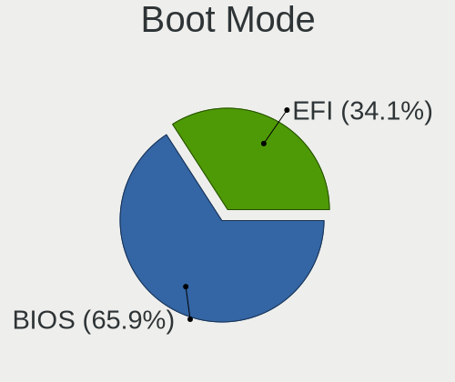

| Mode | Desktops | Percent |
|------|----------|---------|
| BIOS | 1432     | 65.78%  |
| EFI  | 745      | 34.22%  |

Filesystem
----------

Type of filesystem

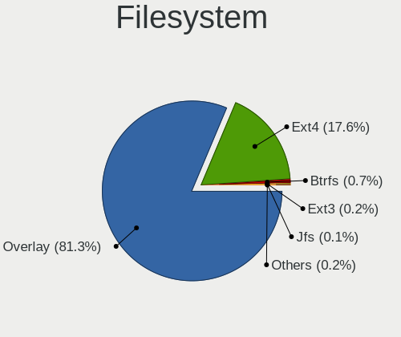

| Type    | Desktops | Percent |
|---------|----------|---------|
| Overlay | 1831     | 83.3%   |
| Ext4    | 342      | 15.56%  |
| Btrfs   | 16       | 0.73%   |
| Ext3    | 4        | 0.18%   |
| Jfs     | 2        | 0.09%   |
| Xfs     | 1        | 0.05%   |
| F2fs    | 1        | 0.05%   |
| Ext2    | 1        | 0.05%   |

Part. scheme
------------

Scheme of partitioning

| Type    | Desktops | Percent |
|---------|----------|---------|
| GPT     | 1138     | 52.15%  |
| MBR     | 1037     | 47.53%  |
| Unknown | 7        | 0.32%   |

Dual Boot with Linux/BSD
------------------------

Hosting more than one Linux/BSD

| Dual boot | Desktops | Percent |
|-----------|----------|---------|
| Yes       | 1411     | 64.43%  |
| No        | 779      | 35.57%  |

Dual Boot (Win)
---------------

Hosting Linux and Windows

| Dual boot | Desktops | Percent |
|-----------|----------|---------|
| Yes       | 1183     | 54.24%  |
| No        | 998      | 45.76%  |

Board
-----

Vendor
------

Motherboard manufacturer

| Name                | Desktops | Percent |
|---------------------|----------|---------|
| ASUSTek Computer    | 557      | 25.6%   |
| Gigabyte Technology | 385      | 17.69%  |
| MSI                 | 231      | 10.62%  |
| ASRock              | 204      | 9.38%   |
| Dell                | 178      | 8.18%   |
| Hewlett-Packard     | 170      | 7.81%   |
| Lenovo              | 82       | 3.77%   |
| Intel               | 57       | 2.62%   |
| Acer                | 45       | 2.07%   |
| Pegatron            | 32       | 1.47%   |
| Biostar             | 29       | 1.33%   |
| Foxconn             | 27       | 1.24%   |
| Fujitsu             | 26       | 1.19%   |
| Medion              | 23       | 1.06%   |
| Unknown             | 18       | 0.83%   |
| ECS                 | 17       | 0.78%   |
| Positivo            | 10       | 0.46%   |
| PCWare              | 6        | 0.28%   |
| Supermicro          | 5        | 0.23%   |
| Shuttle             | 5        | 0.23%   |
| Gateway             | 5        | 0.23%   |
| Fujitsu Siemens     | 5        | 0.23%   |
| Packard Bell        | 4        | 0.18%   |
| Inventec            | 4        | 0.18%   |
| Philco              | 3        | 0.14%   |
| OEM                 | 3        | 0.14%   |
| Itautec             | 3        | 0.14%   |
| Huanan              | 3        | 0.14%   |
| BESSTAR Tech        | 3        | 0.14%   |
| Alienware           | 3        | 0.14%   |
| Semp Toshiba        | 2        | 0.09%   |
| AZW                 | 2        | 0.09%   |
| AMD                 | 2        | 0.09%   |
| ABIT                | 2        | 0.09%   |
| ZOTAC               | 1        | 0.05%   |
| Wortmann AG         | 1        | 0.05%   |
| Toshiba             | 1        | 0.05%   |
| Sony                | 1        | 0.05%   |
| RKM                 | 1        | 0.05%   |
| R-StyleComputers    | 1        | 0.05%   |
| Pyramid             | 1        | 0.05%   |
| PERTOSA             | 1        | 0.05%   |
| PCChips             | 1        | 0.05%   |
| PANSHI              | 1        | 0.05%   |
| MouseComputer       | 1        | 0.05%   |
| Megaware            | 1        | 0.05%   |
| MACHINIST           | 1        | 0.05%   |
| LIVEFAN             | 1        | 0.05%   |
| LattePanda          | 1        | 0.05%   |
| Lanix               | 1        | 0.05%   |
| Koloe               | 1        | 0.05%   |
| JW Technology       | 1        | 0.05%   |
| INTELBRAS           | 1        | 0.05%   |
| IBM                 | 1        | 0.05%   |
| HEDYCOMPUTER        | 1        | 0.05%   |
| eMachines           | 1        | 0.05%   |
| Casper              | 1        | 0.05%   |
| AWOW                | 1        | 0.05%   |
| Apple               | 1        | 0.05%   |

Model
-----

Motherboard model

| Name                               | Desktops | Percent |
|------------------------------------|----------|---------|
| ASUS All Series                    | 51       | 2.34%   |
| Dell OptiPlex 780                  | 22       | 1.01%   |
| Unknown                            | 21       | 0.97%   |
| Dell OptiPlex 7010                 | 16       | 0.74%   |
| ASUS PRIME A320M-K                 | 13       | 0.6%    |
| MSI MS-7817                        | 11       | 0.51%   |
| Gigabyte B450M DS3H                | 10       | 0.46%   |
| ASUS PRIME B450M-A                 | 10       | 0.46%   |
| HP Compaq Pro 6300 SFF             | 9        | 0.41%   |
| Gigabyte A320M-S2H                 | 9        | 0.41%   |
| Gigabyte 970A-DS3P                 | 9        | 0.41%   |
| Dell OptiPlex 9020                 | 9        | 0.41%   |
| MSI MS-7641                        | 8        | 0.37%   |
| HP EliteDesk 800 G1 SFF            | 8        | 0.37%   |
| Gigabyte G31M-ES2L                 | 8        | 0.37%   |
| Gigabyte B75M-D3H                  | 8        | 0.37%   |
| Dell OptiPlex 3020                 | 8        | 0.37%   |
| MSI MS-7C52                        | 7        | 0.32%   |
| MSI MS-7721                        | 7        | 0.32%   |
| Intel H61                          | 7        | 0.32%   |
| HP Compaq 8200 Elite SFF PC        | 7        | 0.32%   |
| Gigabyte H61M-DS2                  | 7        | 0.32%   |
| Dell OptiPlex 790                  | 7        | 0.32%   |
| ASUS M5A97 R2.0                    | 7        | 0.32%   |
| ASRock G31M-S                      | 7        | 0.32%   |
| MSI MS-7B86                        | 6        | 0.28%   |
| MSI MS-7693                        | 6        | 0.28%   |
| Gigabyte GA-78LMT-USB3 6.0         | 6        | 0.28%   |
| Gigabyte B450 AORUS ELITE          | 6        | 0.28%   |
| Dell OptiPlex 390                  | 6        | 0.28%   |
| ASUS TUF Gaming X570-PLUS          | 6        | 0.28%   |
| ASUS PRIME X470-PRO                | 6        | 0.28%   |
| ASUS PRIME B350-PLUS               | 6        | 0.28%   |
| ASUS P8Z77-V LX                    | 6        | 0.28%   |
| ASUS P8H61-M LX3 R2.0              | 6        | 0.28%   |
| ASUS M5A78L-M/USB3                 | 6        | 0.28%   |
| ASUS M5A78L-M PLUS/USB3            | 6        | 0.28%   |
| ASUS H110M-K                       | 6        | 0.28%   |
| ASRock Q1900M                      | 6        | 0.28%   |
| MSI MS-7C37                        | 5        | 0.23%   |
| MSI MS-7C02                        | 5        | 0.23%   |
| MSI MS-7B84                        | 5        | 0.23%   |
| MSI MS-7A15                        | 5        | 0.23%   |
| Gigabyte X570 AORUS ELITE          | 5        | 0.23%   |
| Gigabyte B450M S2H                 | 5        | 0.23%   |
| Dell OptiPlex 9010                 | 5        | 0.23%   |
| Dell OptiPlex 380                  | 5        | 0.23%   |
| ASUS SABERTOOTH 990FX R2.0         | 5        | 0.23%   |
| ASUS M5A78L-M LX3                  | 5        | 0.23%   |
| ASRock FM2A68M-DG3+                | 5        | 0.23%   |
| MSI MS-7C51                        | 4        | 0.18%   |
| MSI MS-7A40                        | 4        | 0.18%   |
| MSI MS-7A38                        | 4        | 0.18%   |
| MSI MS-7695                        | 4        | 0.18%   |
| Medion MS-7728                     | 4        | 0.18%   |
| HP Compaq Elite 8300 SFF           | 4        | 0.18%   |
| HP Compaq dc5850 Small Form Factor | 4        | 0.18%   |
| HP Compaq 8000 Elite SFF PC        | 4        | 0.18%   |
| HP Compaq 6005 Pro SFF PC          | 4        | 0.18%   |
| Gigabyte H61M-S1                   | 4        | 0.18%   |

Model Family
------------

Motherboard model prefix

| Name                   | Desktops | Percent |
|------------------------|----------|---------|
| Dell OptiPlex          | 123      | 5.65%   |
| ASUS PRIME             | 85       | 3.91%   |
| HP Compaq              | 70       | 3.22%   |
| ASUS All               | 51       | 2.34%   |
| Lenovo ThinkCentre     | 49       | 2.25%   |
| ASUS ROG               | 32       | 1.47%   |
| Acer Aspire            | 32       | 1.47%   |
| ASUS M5A78L-M          | 27       | 1.24%   |
| HP EliteDesk           | 26       | 1.19%   |
| Fujitsu ESPRIMO        | 24       | 1.1%    |
| Unknown                | 21       | 0.97%   |
| ASUS P8Z77-V           | 20       | 0.92%   |
| Gigabyte B450M         | 19       | 0.87%   |
| ASUS TUF               | 19       | 0.87%   |
| ASUS P8H61-M           | 18       | 0.83%   |
| HP ProDesk             | 17       | 0.78%   |
| Lenovo IdeaCentre      | 16       | 0.74%   |
| Dell Inspiron          | 16       | 0.74%   |
| Dell Precision         | 15       | 0.69%   |
| Gigabyte B450          | 14       | 0.64%   |
| Dell Vostro            | 13       | 0.6%    |
| Gigabyte X570          | 12       | 0.55%   |
| Gigabyte A320M-S2H     | 12       | 0.55%   |
| ASUS M5A97             | 12       | 0.55%   |
| MSI MS-7817            | 11       | 0.51%   |
| Gigabyte GA-78LMT-USB3 | 11       | 0.51%   |
| ASUS P5G41T-M          | 11       | 0.51%   |
| Gigabyte 970A-DS3P     | 9        | 0.41%   |
| Acer Veriton           | 9        | 0.41%   |
| MSI MS-7641            | 8        | 0.37%   |
| Intel H61              | 8        | 0.37%   |
| HP Pavilion            | 8        | 0.37%   |
| Gigabyte G31M-ES2L     | 8        | 0.37%   |
| Gigabyte B75M-D3H      | 8        | 0.37%   |
| ASUS P5K               | 8        | 0.37%   |
| MSI MS-7C52            | 7        | 0.32%   |
| MSI MS-7721            | 7        | 0.32%   |
| Gigabyte H61M-DS2      | 7        | 0.32%   |
| ASUS SABERTOOTH        | 7        | 0.32%   |
| ASRock G31M-S          | 7        | 0.32%   |
| MSI MS-7B86            | 6        | 0.28%   |
| MSI MS-7693            | 6        | 0.28%   |
| ASUS P8P67             | 6        | 0.28%   |
| ASUS P8H77-V           | 6        | 0.28%   |
| ASUS P5Q               | 6        | 0.28%   |
| ASUS H110M-K           | 6        | 0.28%   |
| ASRock Q1900M          | 6        | 0.28%   |
| ASRock 970             | 6        | 0.28%   |
| MSI MS-7C37            | 5        | 0.23%   |
| MSI MS-7C02            | 5        | 0.23%   |
| MSI MS-7B84            | 5        | 0.23%   |
| MSI MS-7A15            | 5        | 0.23%   |
| ASUS P8Z68-V           | 5        | 0.23%   |
| ASUS P8B75-M           | 5        | 0.23%   |
| ASUS P5KPL-AM          | 5        | 0.23%   |
| ASUS A                 | 5        | 0.23%   |
| ASRock H81M-HDS        | 5        | 0.23%   |
| ASRock FM2A68M-DG3+    | 5        | 0.23%   |
| ASRock B450M           | 5        | 0.23%   |
| MSI MS-7C51            | 4        | 0.18%   |

MFG Year
--------

Motherboard manufacture year

| Year | Desktops | Percent |
|------|----------|---------|
| 2012 | 276      | 12.68%  |
| 2013 | 205      | 9.42%   |
| 2011 | 187      | 8.59%   |
| 2018 | 176      | 8.09%   |
| 2010 | 175      | 8.04%   |
| 2014 | 172      | 7.9%    |
| 2009 | 148      | 6.8%    |
| 2017 | 140      | 6.43%   |
| 2008 | 126      | 5.79%   |
| 2019 | 122      | 5.61%   |
| 2015 | 94       | 4.32%   |
| 2016 | 87       | 4%      |
| 2020 | 85       | 3.91%   |
| 2007 | 80       | 3.68%   |
| 2006 | 52       | 2.39%   |
| 2021 | 34       | 1.56%   |
| 2005 | 12       | 0.55%   |
| 2004 | 5        | 0.23%   |

Form Factor
-----------

Physical design of the computer

| Name    | Desktops | Percent |
|---------|----------|---------|
| Desktop | 2176     | 100%    |

Secure Boot
-----------

Enabled or disabled

| State    | Desktops | Percent |
|----------|----------|---------|
| Disabled | 2176     | 100%    |

Coreboot
--------

Have coreboot on board

| Used | Desktops | Percent |
|------|----------|---------|
| No   | 2176     | 100%    |

RAM Size
--------

Total RAM memory

| Size in GB      | Desktops | Percent |
|-----------------|----------|---------|
| 8.01-16.0       | 532      | 24.4%   |
| 3.01-4.0        | 528      | 24.22%  |
| 4.01-8.0        | 433      | 19.86%  |
| 16.01-24.0      | 396      | 18.17%  |
| 32.01-64.0      | 127      | 5.83%   |
| 1.01-2.0        | 88       | 4.04%   |
| 24.01-32.0      | 28       | 1.28%   |
| 2.01-3.0        | 21       | 0.96%   |
| 64.01-256.0     | 21       | 0.96%   |
| 0.51-1.0        | 5        | 0.23%   |
| More than 256.0 | 1        | 0.05%   |

RAM Used
--------

Used RAM memory

| Used GB   | Desktops | Percent |
|-----------|----------|---------|
| 1.01-2.0  | 1610     | 73.42%  |
| 0.51-1.0  | 355      | 16.19%  |
| 2.01-3.0  | 129      | 5.88%   |
| 0.01-0.5  | 81       | 3.69%   |
| 3.01-4.0  | 10       | 0.46%   |
| 4.01-8.0  | 6        | 0.27%   |
| 8.01-16.0 | 2        | 0.09%   |

Total Drives
------------

Number of drives on board

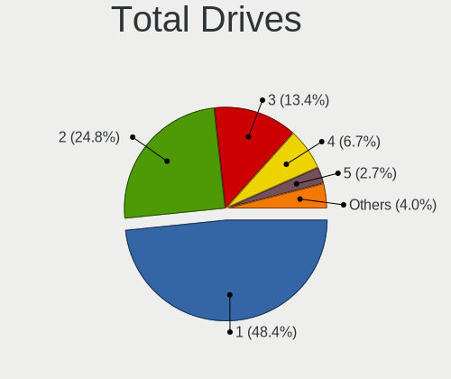

| Drives | Desktops | Percent |
|--------|----------|---------|
| 1      | 1049     | 48.14%  |
| 2      | 555      | 25.47%  |
| 3      | 294      | 13.49%  |
| 4      | 144      | 6.61%   |
| 5      | 58       | 2.66%   |
| 0      | 35       | 1.61%   |
| 6      | 19       | 0.87%   |
| 7      | 12       | 0.55%   |
| 8      | 10       | 0.46%   |
| 9      | 2        | 0.09%   |
| 18     | 1        | 0.05%   |

Has CD-ROM
----------

Has CD-ROM on board

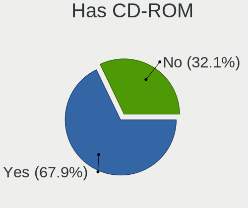

| Presented | Desktops | Percent |
|-----------|----------|---------|
| Yes       | 1456     | 66.85%  |
| No        | 722      | 33.15%  |

Has Ethernet
------------

Has Ethernet on board

| Presented | Desktops | Percent |
|-----------|----------|---------|
| Yes       | 2157     | 99.13%  |
| No        | 19       | 0.87%   |

Has WiFi
--------

Has WiFi module

| Presented | Desktops | Percent |
|-----------|----------|---------|
| No        | 1482     | 68.08%  |
| Yes       | 695      | 31.92%  |

Has Bluetooth
-------------

Has Bluetooth module

| Presented | Desktops | Percent |
|-----------|----------|---------|
| No        | 1761     | 80.93%  |
| Yes       | 415      | 19.07%  |

Location
--------

Country
-------

Geographic location (country)

| Country      | Desktops | Percent |
|--------------|----------|---------|
| Germany      | 251      | 11.53%  |
| Russia       | 219      | 10.06%  |
| USA          | 216      | 9.93%   |
| France       | 169      | 7.77%   |
| Brazil       | 166      | 7.63%   |
| Poland       | 125      | 5.74%   |
| Italy        | 98       | 4.5%    |
| Spain        | 85       | 3.91%   |
| UK           | 65       | 2.99%   |
| Canada       | 61       | 2.8%    |
| Ukraine      | 39       | 1.79%   |
| Czechia      | 38       | 1.75%   |
| Mexico       | 35       | 1.61%   |
| Hungary      | 35       | 1.61%   |
| Australia    | 33       | 1.52%   |
| Netherlands  | 30       | 1.38%   |
| Argentina    | 30       | 1.38%   |
| Belgium      | 23       | 1.06%   |
| Greece       | 22       | 1.01%   |
| Austria      | 22       | 1.01%   |
| Romania      | 21       | 0.97%   |
| India        | 21       | 0.97%   |
| Sweden       | 18       | 0.83%   |
| Serbia       | 18       | 0.83%   |
| Japan        | 17       | 0.78%   |
| Finland      | 17       | 0.78%   |
| Bulgaria     | 15       | 0.69%   |
| Switzerland  | 14       | 0.64%   |
| Portugal     | 14       | 0.64%   |
| Israel       | 14       | 0.64%   |
| Slovakia     | 13       | 0.6%    |
| Denmark      | 13       | 0.6%    |
| Belarus      | 12       | 0.55%   |
| Taiwan       | 9        | 0.41%   |
| Hong Kong    | 9        | 0.41%   |
| Costa Rica   | 9        | 0.41%   |
| Norway       | 8        | 0.37%   |
| Indonesia    | 8        | 0.37%   |
| Thailand     | 7        | 0.32%   |
| South Africa | 7        | 0.32%   |
| Peru         | 7        | 0.32%   |
| Egypt        | 7        | 0.32%   |
| Chile        | 7        | 0.32%   |
| Venezuela    | 6        | 0.28%   |
| Moldova      | 6        | 0.28%   |
| Ireland      | 6        | 0.28%   |
| Morocco      | 5        | 0.23%   |
| Malaysia     | 5        | 0.23%   |
| El Salvador  | 5        | 0.23%   |
| Colombia     | 5        | 0.23%   |
| China        | 5        | 0.23%   |
| Algeria      | 5        | 0.23%   |
| Turkey       | 4        | 0.18%   |
| Saudi Arabia | 4        | 0.18%   |
| Puerto Rico  | 4        | 0.18%   |
| Kazakhstan   | 4        | 0.18%   |
| Tunisia      | 3        | 0.14%   |
| Philippines  | 3        | 0.14%   |
| Paraguay     | 3        | 0.14%   |
| New Zealand  | 3        | 0.14%   |

City
----

Geographic location (city)

| City             | Desktops | Percent |
|------------------|----------|---------|
| Moscow           | 35       | 1.6%    |
| Sao Paulo        | 22       | 1.01%   |
| Warsaw           | 18       | 0.82%   |
| St Petersburg    | 17       | 0.78%   |
| Rio de Janeiro   | 15       | 0.69%   |
| Paris            | 15       | 0.69%   |
| Berlin           | 15       | 0.69%   |
| Mexico City      | 12       | 0.55%   |
| Rome             | 11       | 0.5%    |
| Milan            | 11       | 0.5%    |
| Porto Alegre     | 10       | 0.46%   |
| Barcelona        | 10       | 0.46%   |
| Novosibirsk      | 9        | 0.41%   |
| Yekaterinburg    | 8        | 0.37%   |
| Vienna           | 8        | 0.37%   |
| Stuttgart        | 8        | 0.37%   |
| Prague           | 8        | 0.37%   |
| Nuremberg        | 8        | 0.37%   |
| Helsinki         | 8        | 0.37%   |
| Budapest         | 8        | 0.37%   |
| Athens           | 8        | 0.37%   |
| Perm             | 7        | 0.32%   |
| Montreal         | 7        | 0.32%   |
| Melbourne        | 7        | 0.32%   |
| Hamburg          | 7        | 0.32%   |
| Cologne          | 7        | 0.32%   |
| Belgrade         | 7        | 0.32%   |
| Sydney           | 6        | 0.27%   |
| New Taipei       | 6        | 0.27%   |
| Munich           | 6        | 0.27%   |
| Madrid           | 6        | 0.27%   |
| Kharkiv          | 6        | 0.27%   |
| Essen            | 6        | 0.27%   |
| Central          | 6        | 0.27%   |
| Sofia            | 5        | 0.23%   |
| Seattle          | 5        | 0.23%   |
| Saratov          | 5        | 0.23%   |
| San Salvador     | 5        | 0.23%   |
| San Jose         | 5        | 0.23%   |
| Nizhniy Novgorod | 5        | 0.23%   |
| Minsk            | 5        | 0.23%   |
| Marange-Silvange | 5        | 0.23%   |
| Mannheim         | 5        | 0.23%   |
| Londrina         | 5        | 0.23%   |
| Limoges          | 5        | 0.23%   |
| Leipzig          | 5        | 0.23%   |
| Kyiv             | 5        | 0.23%   |
| Kazan         | 5        | 0.23%   |
| Juiz de Fora     | 5        | 0.23%   |
| Heredia          | 5        | 0.23%   |
| Chelyabinsk      | 5        | 0.23%   |
| Cairo            | 5        | 0.23%   |
| Buenos Aires     | 5        | 0.23%   |
| Zurich           | 4        | 0.18%   |
| Wroclaw          | 4        | 0.18%   |
| Turin            | 4        | 0.18%   |
| Thessaloniki     | 4        | 0.18%   |
| Sundsvall        | 4        | 0.18%   |
| Sochi            | 4        | 0.18%   |
| Sifok          | 4        | 0.18%   |

Drives
------

Drive Vendor
------------

Hard drive vendors

| Vendor              | Desktops | Drives | Percent |
|---------------------|----------|--------|---------|
| WDC                 | 833      | 1063   | 23.51%  |
| Seagate             | 786      | 970    | 22.18%  |
| Samsung Electronics | 417      | 540    | 11.77%  |
| Toshiba             | 224      | 249    | 6.32%   |
| Kingston            | 208      | 235    | 5.87%   |
| Hitachi             | 149      | 162    | 4.21%   |
| Crucial             | 143      | 172    | 4.04%   |
| SanDisk             | 96       | 101    | 2.71%   |
| A-DATA Technology   | 68       | 75     | 1.92%   |
| Unknown             | 47       | 57     | 1.33%   |
| China               | 44       | 48     | 1.24%   |
| MAXTOR              | 43       | 47     | 1.21%   |
| Intel               | 37       | 43     | 1.04%   |
| Intenso             | 33       | 37     | 0.93%   |
| GOODRAM             | 32       | 35     | 0.9%    |
| Patriot             | 29       | 30     | 0.82%   |
| PNY                 | 23       | 24     | 0.65%   |
| Apacer              | 20       | 22     | 0.56%   |
| HGST                | 18       | 22     | 0.51%   |
| SPCC                | 17       | 17     | 0.48%   |
| OCZ                 | 15       | 16     | 0.42%   |
| Corsair             | 15       | 16     | 0.42%   |
| Transcend           | 14       | 14     | 0.4%    |
| PLEXTOR             | 12       | 14     | 0.34%   |
| Phison              | 12       | 14     | 0.34%   |
| Hewlett-Packard     | 12       | 14     | 0.34%   |
| JMicron             | 11       | 11     | 0.31%   |
| Team                | 9        | 10     | 0.25%   |
| Fujitsu             | 7        | 7      | 0.2%    |
| KingSpec            | 6        | 6      | 0.17%   |
| XPG                 | 5        | 6      | 0.14%   |
| SK Hynix            | 5        | 5      | 0.14%   |
| Micron Technology   | 5        | 6      | 0.14%   |
| Gigabyte Technology | 5        | 5      | 0.14%   |
| WD MediaMax         | 4        | 4      | 0.11%   |
| Verbatim            | 4        | 4      | 0.11%   |
| Silicon Motion      | 4        | 5      | 0.11%   |
| Netac               | 4        | 4      | 0.11%   |
| KingDian            | 4        | 4      | 0.11%   |
| XrayDisk            | 3        | 3      | 0.08%   |
| SABRENT             | 3        | 3      | 0.08%   |
| QUANTUM             | 3        | 3      | 0.08%   |
| Phison Electronics  | 3        | 4      | 0.08%   |
| Lexar               | 3        | 3      | 0.08%   |
| External            | 3        | 3      | 0.08%   |
| DOGGO               | 3        | 3      | 0.08%   |
| Colorful            | 3        | 3      | 0.08%   |
| ASMT                | 3        | 3      | 0.08%   |
| AMD                 | 3        | 3      | 0.08%   |
| ZTE                 | 2        | 2      | 0.06%   |
| Zheino              | 2        | 2      | 0.06%   |
| VERICO              | 2        | 2      | 0.06%   |
| Vaseky              | 2        | 2      | 0.06%   |
| USB                 | 2        | 2      | 0.06%   |
| TCSUNBOW            | 2        | 2      | 0.06%   |
| T-FORCE             | 2        | 2      | 0.06%   |
| QUMO                | 2        | 2      | 0.06%   |
| MDT                 | 2        | 2      | 0.06%   |
| LITEONIT            | 2        | 2      | 0.06%   |
| LITEON              | 2        | 2      | 0.06%   |

Drive Model
-----------

Hard drive models

| Model                            | Desktops | Percent |
|----------------------------------|----------|---------|
| Seagate ST500DM002-1BD142 500GB  | 77       | 1.91%   |
| Seagate ST1000DM010-2EP102 1TB   | 58       | 1.44%   |
| Kingston SA400S37240G 240GB SSD  | 53       | 1.31%   |
| Toshiba DT01ACA100 1TB           | 51       | 1.26%   |
| Seagate ST3500418AS 500GB        | 39       | 0.97%   |
| Toshiba DT01ACA050 500GB         | 37       | 0.92%   |
| WDC WD10EZEX-08WN4A0 1TB         | 35       | 0.87%   |
| Toshiba HDWD110 1TB              | 27       | 0.67%   |
| Seagate ST1000DM003-1ER162 1TB   | 27       | 0.67%   |
| Kingston SV300S37A120G 120GB SSD | 27       | 0.67%   |
| Unknown SD/MMC/MS PRO 999GB      | 26       | 0.64%   |
| WDC WDS240G2G0A-00JH30 240GB SSD | 24       | 0.6%    |
| Seagate ST2000DM008-2FR102 2TB   | 24       | 0.6%    |
| Kingston SA400S37120G 120GB SSD  | 24       | 0.6%    |
| Samsung SSD 860 EVO 500GB        | 23       | 0.57%   |
| Seagate ST3500413AS 500GB        | 22       | 0.55%   |
| Samsung SSD 860 EVO 250GB        | 21       | 0.52%   |
| Samsung SSD 850 EVO 250GB        | 21       | 0.52%   |
| Toshiba DT01ACA200 2TB           | 20       | 0.5%    |
| Seagate ST1000DM003-1CH162 1TB   | 20       | 0.5%    |
| WDC WD10EZEX-00BN5A0 1TB         | 19       | 0.47%   |
| Kingston SA400S37480G 480GB SSD  | 19       | 0.47%   |
| Seagate ST3160815AS 160GB        | 18       | 0.45%   |
| Crucial CT240BX500SSD1 240GB     | 18       | 0.45%   |
| Seagate ST2000DM006-2DM164 2TB   | 17       | 0.42%   |
| Crucial CT500MX500SSD1 500GB     | 17       | 0.42%   |
| WDC WD20EZRZ-00Z5HB0 2TB         | 16       | 0.4%    |
| Seagate ST1000DM003-1SB102 1TB   | 16       | 0.4%    |
| Samsung SSD 850 EVO 500GB        | 16       | 0.4%    |
| Seagate ST3500312CS 500GB        | 15       | 0.37%   |
| WDC WD20EZRX-00D8PB0 2TB         | 14       | 0.35%   |
| Seagate ST2000DM001-1CH164 2TB   | 14       | 0.35%   |
| Seagate ST1000DM003-9YN162 1TB   | 14       | 0.35%   |
| Samsung HD103SJ 1TB              | 14       | 0.35%   |
| WDC WD5000AAKX-60U6AA0 500GB     | 13       | 0.32%   |
| Seagate ST3250318AS 250GB        | 13       | 0.32%   |
| Seagate ST2000DM001-1ER164 2TB   | 13       | 0.32%   |
| Crucial CT1000MX500SSD1 1TB      | 13       | 0.32%   |
| WDC WD10EZEX-22MFCA0 1TB         | 12       | 0.3%    |
| WDC WD10EADS-00L5B1 1TB          | 12       | 0.3%    |
| Seagate ST31000528AS 1TB         | 12       | 0.3%    |
| Seagate ST31000524AS 1TB         | 12       | 0.3%    |
| Seagate Expansion 4TB            | 12       | 0.3%    |
| Samsung SSD 970 EVO Plus 500GB   | 12       | 0.3%    |
| Samsung SSD 860 EVO 1TB          | 12       | 0.3%    |
| A-DATA SU630 240GB SSD           | 12       | 0.3%    |
| WDC WDS500G2B0A-00SM50 500GB SSD | 11       | 0.27%   |
| WDC WD5000AAKX-001CA0 500GB      | 11       | 0.27%   |
| WDC WD1002FAEX-00Z3A0 1TB        | 11       | 0.27%   |
| Seagate ST4000DM004-2CV104 4TB   | 11       | 0.27%   |
| Seagate ST3250410AS 250GB        | 11       | 0.27%   |
| Seagate ST3160318AS 160GB        | 11       | 0.27%   |
| Samsung HD161HJ 160GB            | 11       | 0.27%   |
| Crucial CT480BX500SSD1 480GB     | 11       | 0.27%   |
| WDC WD10EZEX-21M2NA0 1TB         | 10       | 0.25%   |
| WDC WD10EZEX-00WN4A0 1TB         | 10       | 0.25%   |
| Seagate ST3250310AS 250GB        | 10       | 0.25%   |
| Seagate ST250DM000-1BD141 250GB  | 10       | 0.25%   |
| SanDisk SSD PLUS 240GB           | 10       | 0.25%   |
| Samsung SSD 840 EVO 250GB        | 10       | 0.25%   |

HDD Vendor
----------

Hard disk drive vendors

| Vendor              | Desktops | Drives | Percent |
|---------------------|----------|--------|---------|
| Seagate             | 781      | 962    | 35.88%  |
| WDC                 | 748      | 929    | 34.36%  |
| Toshiba             | 203      | 225    | 9.32%   |
| Samsung Electronics | 166      | 186    | 7.63%   |
| Hitachi             | 149      | 162    | 6.84%   |
| MAXTOR              | 43       | 47     | 1.98%   |
| Unknown             | 27       | 27     | 1.24%   |
| HGST                | 18       | 22     | 0.83%   |
| Fujitsu             | 7        | 7      | 0.32%   |
| Hewlett-Packard     | 5        | 5      | 0.23%   |
| WD MediaMax         | 4        | 4      | 0.18%   |
| SABRENT             | 3        | 3      | 0.14%   |
| QUANTUM             | 3        | 3      | 0.14%   |
| ASMT                | 3        | 3      | 0.14%   |
| MDT                 | 2        | 2      | 0.09%   |
| IBM/Hitachi         | 2        | 2      | 0.09%   |
| ExcelStor           | 2        | 2      | 0.09%   |
| ASMedia             | 2        | 2      | 0.09%   |
| USB                 | 1        | 1      | 0.05%   |
| TPH00800640GB       | 1        | 1      | 0.05%   |
| RSH-319             | 1        | 1      | 0.05%   |
| KESU                | 1        | 1      | 0.05%   |
| IB                  | 1        | 2      | 0.05%   |
| HPE                 | 1        | 1      | 0.05%   |
| FC-1307             | 1        | 1      | 0.05%   |
| China               | 1        | 1      | 0.05%   |
| ASMT106x            | 1        | 1      | 0.05%   |

SSD Vendor
----------

Solid state drive vendors

| Vendor              | Desktops | Drives | Percent |
|---------------------|----------|--------|---------|
| Samsung Electronics | 196      | 249    | 16.7%   |
| Kingston            | 188      | 211    | 16.01%  |
| Crucial             | 126      | 153    | 10.73%  |
| SanDisk             | 94       | 98     | 8.01%   |
| WDC                 | 91       | 97     | 7.75%   |
| A-DATA Technology   | 63       | 69     | 5.37%   |
| China               | 43       | 47     | 3.66%   |
| Intenso             | 33       | 37     | 2.81%   |
| GOODRAM             | 31       | 34     | 2.64%   |
| Patriot             | 26       | 27     | 2.21%   |
| PNY                 | 23       | 24     | 1.96%   |
| Toshiba             | 19       | 19     | 1.62%   |
| Intel               | 19       | 22     | 1.62%   |
| Apacer              | 18       | 20     | 1.53%   |
| OCZ                 | 15       | 16     | 1.28%   |
| Transcend           | 13       | 13     | 1.11%   |
| SPCC                | 13       | 13     | 1.11%   |
| Unknown             | 11       | 12     | 0.94%   |
| PLEXTOR             | 10       | 12     | 0.85%   |
| Corsair             | 9        | 10     | 0.77%   |
| Team                | 8        | 9      | 0.68%   |
| KingSpec            | 6        | 6      | 0.51%   |
| JMicron             | 6        | 6      | 0.51%   |
| Micron Technology   | 5        | 6      | 0.43%   |
| Hewlett-Packard     | 5        | 5      | 0.43%   |
| Verbatim            | 4        | 4      | 0.34%   |
| SK Hynix            | 4        | 4      | 0.34%   |
| Netac               | 4        | 4      | 0.34%   |
| KingDian            | 4        | 4      | 0.34%   |
| XrayDisk            | 3        | 3      | 0.26%   |
| Seagate             | 3        | 3      | 0.26%   |
| Lexar               | 3        | 3      | 0.26%   |
| Gigabyte Technology | 3        | 3      | 0.26%   |
| External            | 3        | 3      | 0.26%   |
| DOGGO               | 3        | 3      | 0.26%   |
| Colorful            | 3        | 3      | 0.26%   |
| AMD                 | 3        | 3      | 0.26%   |
| Zheino              | 2        | 2      | 0.17%   |
| VERICO              | 2        | 2      | 0.17%   |
| Vaseky              | 2        | 2      | 0.17%   |
| TCSUNBOW            | 2        | 2      | 0.17%   |
| T-FORCE             | 2        | 2      | 0.17%   |
| QUMO                | 2        | 2      | 0.17%   |
| LITEONIT            | 2        | 2      | 0.17%   |
| Leven               | 2        | 2      | 0.17%   |
| LDLC                | 2        | 3      | 0.17%   |
| INDMEM              | 2        | 2      | 0.17%   |
| FOXLINE             | 2        | 2      | 0.17%   |
| Emtec               | 2        | 2      | 0.17%   |
| AFOX                | 2        | 2      | 0.17%   |
| 1TB                 | 2        | 2      | 0.17%   |
| Yeyian              | 1        | 1      | 0.09%   |
| XPG                 | 1        | 1      | 0.09%   |
| WDC WDS             | 1        | 1      | 0.09%   |
| ViperTeq            | 1        | 1      | 0.09%   |
| TO Exter            | 1        | 1      | 0.09%   |
| Timetec             | 1        | 1      | 0.09%   |
| Tigo                | 1        | 1      | 0.09%   |
| Super Talent        | 1        | 1      | 0.09%   |
| Smartbuy            | 1        | 1      | 0.09%   |

Drive Kind
----------

HDD or SSD

| Kind    | Desktops | Drives | Percent |
|---------|----------|--------|---------|
| HDD     | 1686     | 2603   | 58.2%   |
| SSD     | 967      | 1319   | 33.38%  |
| NVMe    | 218      | 284    | 7.53%   |
| Unknown | 21       | 29     | 0.72%   |
| MMC     | 5        | 5      | 0.17%   |

Drive Connector
---------------

SATA, SAS, NVMe, etc.

| Type | Desktops | Drives | Percent |
|------|----------|--------|---------|
| SATA | 2080     | 3804   | 86.02%  |
| NVMe | 218      | 283    | 9.02%   |
| SAS  | 115      | 148    | 4.76%   |
| MMC  | 5        | 5      | 0.21%   |

Drive Size
----------

Size of hard drive

| Size in TB | Desktops | Drives | Percent |
|------------|----------|--------|---------|
| 0.01-0.5   | 1644     | 2417   | 58.09%  |
| 0.51-1.0   | 750      | 975    | 26.5%   |
| 1.01-2.0   | 262      | 312    | 9.26%   |
| 3.01-4.0   | 65       | 86     | 2.3%    |
| 2.01-3.0   | 62       | 79     | 2.19%   |
| 4.01-10.0  | 41       | 47     | 1.45%   |
| 10.01-20.0 | 6        | 6      | 0.21%   |

Space Total
-----------

Amount of disk space available on the file system

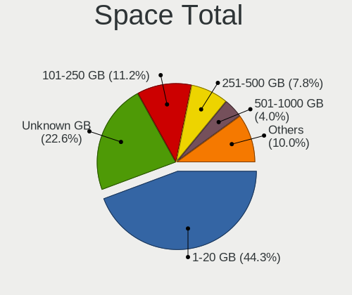

| Size in GB     | Desktops | Percent |
|----------------|----------|---------|
| 1-20           | 1010     | 45.89%  |
| Unknown        | 493      | 22.4%   |
| 101-250        | 226      | 10.27%  |
| 251-500        | 168      | 7.63%   |
| 501-1000       | 87       | 3.95%   |
| 51-100         | 78       | 3.54%   |
| 21-50          | 71       | 3.23%   |
| 1001-2000      | 41       | 1.86%   |
| 2001-3000      | 17       | 0.77%   |
| More than 3000 | 10       | 0.45%   |

Space Used
----------

Amount of used disk space

| Used GB        | Desktops | Percent |
|----------------|----------|---------|
| 1-20           | 1521     | 69.33%  |
| Unknown        | 493      | 22.47%  |
| 101-250        | 45       | 2.05%   |
| 51-100         | 34       | 1.55%   |
| 21-50          | 29       | 1.32%   |
| 251-500        | 28       | 1.28%   |
| 501-1000       | 23       | 1.05%   |
| 1001-2000      | 14       | 0.64%   |
| More than 3000 | 4        | 0.18%   |
| 2001-3000      | 3        | 0.14%   |

Malfunc. Drives
---------------

Drive models with a malfunction

| Model                             | Desktops | Drives | Percent |
|-----------------------------------|----------|--------|---------|
| Seagate ST500DM002-1BD142 500GB   | 31       | 31     | 3.76%   |
| Seagate ST3500418AS 500GB         | 19       | 20     | 2.31%   |
| Toshiba DT01ACA100 1TB            | 11       | 11     | 1.33%   |
| Toshiba DT01ACA050 500GB          | 8        | 8      | 0.97%   |
| Seagate ST9500325AS 500GB         | 8        | 8      | 0.97%   |
| WDC WD5000AAKX-003CA0 500GB       | 7        | 7      | 0.85%   |
| WDC WD5000AAKX-001CA0 500GB       | 7        | 8      | 0.85%   |
| Seagate ST31000524AS 1TB          | 7        | 7      | 0.85%   |
| Kingston SV300S37A120G 120GB SSD  | 7        | 7      | 0.85%   |
| WDC WD10EADS-00L5B1 1TB           | 6        | 6      | 0.73%   |
| Seagate ST3250310AS 250GB         | 6        | 6      | 0.73%   |
| Samsung Electronics HD161HJ 160GB | 6        | 6      | 0.73%   |
| Samsung Electronics HD103SJ 1TB   | 6        | 7      | 0.73%   |
| Seagate ST3320418AS 320GB         | 5        | 5      | 0.61%   |
| Seagate ST3250820AS 250GB         | 5        | 6      | 0.61%   |
| Seagate ST3250410AS 250GB         | 5        | 5      | 0.61%   |
| Seagate ST31000528AS 1TB          | 5        | 5      | 0.61%   |
| Seagate ST2000DL003-9VT166 2TB    | 5        | 6      | 0.61%   |
| Samsung Electronics HD322HJ 320GB | 5        | 5      | 0.61%   |
| Hitachi HDS721680PLA380 80GB      | 5        | 5      | 0.61%   |
| Hitachi HDS721050CLA362 500GB     | 5        | 6      | 0.61%   |
| WDC WD5000AAKX-75U6AA0 500GB      | 4        | 4      | 0.49%   |
| WDC WD5000AADS-00S9B0 500GB       | 4        | 4      | 0.49%   |
| WDC WD3200AAJS-56M0A0 320GB       | 4        | 4      | 0.49%   |
| WDC WD20PURZ-85GU6Y0 2TB          | 4        | 4      | 0.49%   |
| WDC WD10EZEX-08M2NA0 1TB          | 4        | 4      | 0.49%   |
| Seagate ST3500413AS 500GB         | 4        | 4      | 0.49%   |
| Seagate ST31500341AS 1TB          | 4        | 4      | 0.49%   |
| Seagate ST31000333AS 1TB          | 4        | 5      | 0.49%   |
| Seagate ST1000DM010-2EP102 1TB    | 4        | 4      | 0.49%   |
| Seagate ST1000DM003-9YN162 1TB    | 4        | 4      | 0.49%   |
| Samsung Electronics HD502HJ 500GB | 4        | 4      | 0.49%   |
| Samsung Electronics HD250HJ 250GB | 4        | 4      | 0.49%   |
| Samsung Electronics HD103UJ 1TB   | 4        | 4      | 0.49%   |
| Samsung Electronics HD103SI 1TB   | 4        | 4      | 0.49%   |
| Samsung Electronics HD080HJ 80GB  | 4        | 4      | 0.49%   |
| Kingston SA400S37480G 480GB SSD   | 4        | 5      | 0.49%   |
| WDC WD6400AAKS-22A7B2 640GB       | 3        | 3      | 0.36%   |
| WDC WD5000BPVT-22HXZT1 500GB      | 3        | 3      | 0.36%   |
| WDC WD5000AVVS-63H0B1 500GB       | 3        | 3      | 0.36%   |
| WDC WD5000AAKX-60U6AA0 500GB      | 3        | 3      | 0.36%   |
| WDC WD5000AAKS-00V1A0 500GB       | 3        | 3      | 0.36%   |
| WDC WD3200AAJS-00L7A0 320GB       | 3        | 3      | 0.36%   |
| WDC WD30EFRX-68EUZN0 3TB          | 3        | 3      | 0.36%   |
| WDC WD2500AAKX-753CA1 250GB       | 3        | 3      | 0.36%   |
| WDC WD20EZRZ-00Z5HB0 2TB          | 3        | 3      | 0.36%   |
| WDC WD20EARX-00PASB0 2TB          | 3        | 3      | 0.36%   |
| WDC WD20EARS-00MVWB0 2TB          | 3        | 3      | 0.36%   |
| WDC WD10EZEX-08WN4A0 1TB          | 3        | 3      | 0.36%   |
| WDC WD10EARX-00N0YB0 1TB          | 3        | 3      | 0.36%   |
| WDC WD10EARS-00Y5B1 1TB           | 3        | 4      | 0.36%   |
| WDC WD10EARS-00MVWB0 1TB          | 3        | 3      | 0.36%   |
| Seagate ST500LT012-9WS142 500GB   | 3        | 3      | 0.36%   |
| Seagate ST500LT012-1DG142 500GB   | 3        | 3      | 0.36%   |
| Seagate ST500LM021-1KJ152 500GB   | 3        | 3      | 0.36%   |
| Seagate ST380811AS 80GB           | 3        | 3      | 0.36%   |
| Seagate ST3320620AS 320GB         | 3        | 3      | 0.36%   |
| Seagate ST3250318AS 250GB         | 3        | 3      | 0.36%   |
| Seagate ST3160815AS 160GB         | 3        | 3      | 0.36%   |
| Seagate ST250DM000-1BD141 250GB   | 3        | 3      | 0.36%   |

Malfunc. Drive Vendor
---------------------

Vendors of faulty drives

| Vendor              | Desktops | Drives | Percent |
|---------------------|----------|--------|---------|
| WDC                 | 256      | 288    | 32.78%  |
| Seagate             | 241      | 262    | 30.86%  |
| Samsung Electronics | 86       | 93     | 11.01%  |
| Hitachi             | 60       | 66     | 7.68%   |
| Toshiba             | 32       | 33     | 4.1%    |
| MAXTOR              | 25       | 25     | 3.2%    |
| Kingston            | 24       | 26     | 3.07%   |
| SanDisk             | 7        | 7      | 0.9%    |
| Crucial             | 7        | 7      | 0.9%    |
| China               | 5        | 5      | 0.64%   |
| Intel               | 4        | 4      | 0.51%   |
| HGST                | 4        | 4      | 0.51%   |
| A-DATA Technology   | 4        | 4      | 0.51%   |
| Fujitsu             | 3        | 3      | 0.38%   |
| OCZ                 | 2        | 2      | 0.26%   |
| Intenso             | 2        | 2      | 0.26%   |
| Apacer              | 2        | 3      | 0.26%   |
| XPG                 | 1        | 1      | 0.13%   |
| WD MediaMax         | 1        | 1      | 0.13%   |
| Team                | 1        | 1      | 0.13%   |
| SK Hynix            | 1        | 1      | 0.13%   |
| QUANTUM             | 1        | 1      | 0.13%   |
| PLEXTOR             | 1        | 1      | 0.13%   |
| Netac               | 1        | 1      | 0.13%   |
| Neo Forza           | 1        | 1      | 0.13%   |
| LITEON              | 1        | 1      | 0.13%   |
| IB                  | 1        | 1      | 0.13%   |
| Hewlett-Packard     | 1        | 1      | 0.13%   |
| GOODRAM             | 1        | 1      | 0.13%   |
| faspeed             | 1        | 1      | 0.13%   |
| DRVEO               | 1        | 1      | 0.13%   |
| Corsair             | 1        | 1      | 0.13%   |
| Colorful            | 1        | 1      | 0.13%   |
| Unknown             | 1        | 1      | 0.13%   |

Malfunc. HDD Vendor
-------------------

Vendors of faulty HDD drives

| Vendor              | Desktops | Drives | Percent |
|---------------------|----------|--------|---------|
| WDC                 | 250      | 281    | 35.87%  |
| Seagate             | 241      | 262    | 34.58%  |
| Samsung Electronics | 77       | 84     | 11.05%  |
| Hitachi             | 60       | 66     | 8.61%   |
| Toshiba             | 32       | 33     | 4.59%   |
| MAXTOR              | 25       | 25     | 3.59%   |
| HGST                | 4        | 4      | 0.57%   |
| Fujitsu             | 3        | 3      | 0.43%   |
| WD MediaMax         | 1        | 1      | 0.14%   |
| QUANTUM             | 1        | 1      | 0.14%   |
| IB                  | 1        | 1      | 0.14%   |
| Hewlett-Packard     | 1        | 1      | 0.14%   |
| China               | 1        | 1      | 0.14%   |

Malfunc. Drive Kind
-------------------

Kinds of faulty drives

| Kind | Desktops | Drives | Percent |
|------|----------|--------|---------|
| HDD  | 617      | 763    | 87.89%  |
| SSD  | 79       | 82     | 11.25%  |
| NVMe | 6        | 6      | 0.85%   |

Failed Drives
-------------

Failed drive models

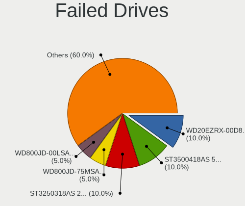

| Model                             | Desktops | Drives | Percent |
|-----------------------------------|----------|--------|---------|
| WDC WD20EZRX-00D8PB0 2TB          | 2        | 2      | 10.53%  |
| Seagate ST3500418AS 500GB         | 2        | 3      | 10.53%  |
| Seagate ST3250318AS 250GB         | 2        | 2      | 10.53%  |
| WDC WD800JD-75MSA3 80GB           | 1        | 1      | 5.26%   |
| WDC WD800JD-00LSA0 80GB           | 1        | 1      | 5.26%   |
| WDC WD10JPVT-75A1YT0 1TB          | 1        | 1      | 5.26%   |
| WDC WD10EALX-759BA1 1TB           | 1        | 1      | 5.26%   |
| TPH00800640GB 640GB               | 1        | 1      | 5.26%   |
| Seagate STM3250318AS 250GB        | 1        | 1      | 5.26%   |
| Seagate ST3320418AS 320GB         | 1        | 1      | 5.26%   |
| Seagate ST31000528AS 1TB          | 1        | 1      | 5.26%   |
| Samsung Electronics HD502HJ 500GB | 1        | 1      | 5.26%   |
| Samsung Electronics HD501LJ 500GB | 1        | 1      | 5.26%   |
| MAXTOR STM3500320AS 500GB         | 1        | 1      | 5.26%   |
| Kingston SMS200S360G 64GB SSD     | 1        | 1      | 5.26%   |
| Hitachi HDS721010CLA332 1TB       | 1        | 1      | 5.26%   |

Failed Drive Vendor
-------------------

Failed drive vendors

| Vendor              | Desktops | Drives | Percent |
|---------------------|----------|--------|---------|
| Seagate             | 7        | 8      | 36.84%  |
| WDC                 | 6        | 6      | 31.58%  |
| Samsung Electronics | 2        | 2      | 10.53%  |
| TPH00800640GB       | 1        | 1      | 5.26%   |
| MAXTOR              | 1        | 1      | 5.26%   |
| Kingston            | 1        | 1      | 5.26%   |
| Hitachi             | 1        | 1      | 5.26%   |

Drive Status
------------

Number of failed and malfunc. drives

| Status   | Desktops | Drives | Percent |
|----------|----------|--------|---------|
| Works    | 1637     | 2951   | 62.24%  |
| Malfunc  | 682      | 851    | 25.93%  |
| Detected | 292      | 418    | 11.1%   |
| Failed   | 19       | 20     | 0.72%   |

Storage controller
------------------

Storage Vendor
--------------

Storage controller vendors

| Vendor                           | Desktops | Percent |
|----------------------------------|----------|---------|
| Intel                            | 1389     | 52.12%  |
| AMD                              | 686      | 25.74%  |
| Nvidia                           | 87       | 3.26%   |
| Samsung Electronics              | 85       | 3.19%   |
| JMicron Technology               | 82       | 3.08%   |
| Marvell Technology Group         | 71       | 2.66%   |
| ASMedia Technology               | 70       | 2.63%   |
| VIA Technologies                 | 31       | 1.16%   |
| Sandisk                          | 31       | 1.16%   |
| Phison Electronics               | 29       | 1.09%   |
| Kingston Technology Company      | 24       | 0.9%    |
| Micron/Crucial Technology        | 17       | 0.64%   |
| Silicon Motion                   | 11       | 0.41%   |
| Silicon Image                    | 8        | 0.3%    |
| Toshiba America Info Systems     | 5        | 0.19%   |
| LSI Logic / Symbios Logic        | 5        | 0.19%   |
| ADATA Technology                 | 5        | 0.19%   |
| Seagate Technology               | 4        | 0.15%   |
| Realtek Semiconductor            | 3        | 0.11%   |
| Lite-On IT Corp. / Plextor       | 3        | 0.11%   |
| Micron Technology                | 2        | 0.08%   |
| Lite-On Technology               | 2        | 0.08%   |
| KIOXIA                           | 2        | 0.08%   |
| Broadcom / LSI                   | 2        | 0.08%   |
| Solid State Storage Technology   | 1        | 0.04%   |
| SK Hynix                         | 1        | 0.04%   |
| Silicon Integrated Systems [SiS] | 1        | 0.04%   |
| Shenzhen Longsys Electronics     | 1        | 0.04%   |
| Promise Technology               | 1        | 0.04%   |
| OCZ Technology Group             | 1        | 0.04%   |
| Integrated Technology Express    | 1        | 0.04%   |
| Hewlett-Packard                  | 1        | 0.04%   |
| Biwin Storage Technology         | 1        | 0.04%   |
| Adaptec                          | 1        | 0.04%   |
| 3ware                            | 1        | 0.04%   |

Storage Model
-------------

Storage controller models

| Model                                                                                   | Desktops | Percent |
|-----------------------------------------------------------------------------------------|----------|---------|
| AMD FCH SATA Controller [AHCI mode]                                                     | 380      | 10.41%  |
| Intel 8 Series/C220 Series Chipset Family 6-port SATA Controller 1 [AHCI mode]          | 181      | 4.96%   |
| AMD SB7x0/SB8x0/SB9x0 IDE Controller                                                    | 165      | 4.52%   |
| Intel NM10/ICH7 Family SATA Controller [IDE mode]                                       | 162      | 4.44%   |
| Intel 6 Series/C200 Series Chipset Family 6 port Desktop SATA AHCI Controller           | 136      | 3.73%   |
| AMD SB7x0/SB8x0/SB9x0 SATA Controller [IDE mode]                                        | 123      | 3.37%   |
| Intel 82801G (ICH7 Family) IDE Controller                                               | 122      | 3.34%   |
| AMD 400 Series Chipset SATA Controller                                                  | 118      | 3.23%   |
| AMD SB7x0/SB8x0/SB9x0 SATA Controller [AHCI mode]                                       | 115      | 3.15%   |
| Intel 7 Series/C210 Series Chipset Family 6-port SATA Controller [AHCI mode]            | 112      | 3.07%   |
| Intel Q170/Q150/B150/H170/H110/Z170/CM236 Chipset SATA Controller [AHCI Mode]           | 87       | 2.38%   |
| Intel 6 Series/C200 Series Chipset Family Desktop SATA Controller (IDE mode, ports 4-5) | 79       | 2.16%   |
| Intel 6 Series/C200 Series Chipset Family Desktop SATA Controller (IDE mode, ports 0-3) | 79       | 2.16%   |
| Intel 200 Series PCH SATA controller [AHCI mode]                                        | 74       | 2.03%   |
| Intel SATA Controller [RAID mode]                                                       | 68       | 1.86%   |
| ASMedia ASM1062 Serial ATA Controller                                                   | 65       | 1.78%   |
| AMD FCH SATA Controller D                                                               | 61       | 1.67%   |
| Samsung NVMe SSD Controller SM981/PM981/PM983                                           | 52       | 1.43%   |
| Nvidia MCP61 SATA Controller                                                            | 49       | 1.34%   |
| Nvidia MCP61 IDE                                                                        | 48       | 1.32%   |
| Intel Cannon Lake PCH SATA AHCI Controller                                              | 48       | 1.32%   |
| Intel 4 Series Chipset PT IDER Controller                                               | 46       | 1.26%   |
| JMicron JMB363 SATA/IDE Controller                                                      | 43       | 1.18%   |
| Intel 9 Series Chipset Family SATA Controller [AHCI Mode]                               | 40       | 1.1%    |
| AMD 300 Series Chipset SATA Controller                                                  | 40       | 1.1%    |
| Intel 82801I (ICH9 Family) 2 port SATA Controller [IDE mode]                            | 38       | 1.04%   |
| AMD FCH IDE Controller                                                                  | 35       | 0.96%   |
| Intel 82801JI (ICH10 Family) 4 port SATA IDE Controller #1                              | 33       | 0.9%    |
| Intel 82801JI (ICH10 Family) 2 port SATA IDE Controller #2                              | 31       | 0.85%   |
| Intel 5 Series/3400 Series Chipset 4 port SATA IDE Controller                           | 28       | 0.77%   |
| Intel 7 Series/C210 Series Chipset Family 4-port SATA Controller [IDE mode]             | 27       | 0.74%   |
| Intel 7 Series/C210 Series Chipset Family 2-port SATA Controller [IDE mode]             | 27       | 0.74%   |
| Intel 5 Series/3400 Series Chipset 2 port SATA IDE Controller                           | 25       | 0.69%   |
| Intel 82801IR/IO/IH (ICH9R/DO/DH) 4 port SATA Controller [IDE mode]                     | 24       | 0.66%   |
| Intel 82801JD/DO (ICH10 Family) SATA AHCI Controller                                    | 23       | 0.63%   |
| AMD FCH SATA Controller [IDE mode]                                                      | 23       | 0.63%   |
| Intel 82801JI (ICH10 Family) SATA AHCI Controller                                       | 21       | 0.58%   |
| Samsung NVMe SSD Controller SM961/PM961/SM963                                           | 20       | 0.55%   |
| JMicron JMB368 IDE controller                                                           | 20       | 0.55%   |
| Kingston Company A2000 NVMe SSD                                                         | 19       | 0.52%   |
| Intel Atom Processor E3800 Series SATA AHCI Controller                                  | 19       | 0.52%   |
| Intel 82801JD/DO (ICH10 Family) 4-port SATA IDE Controller                              | 19       | 0.52%   |
| Intel 82801JD/DO (ICH10 Family) 2-port SATA IDE Controller                              | 19       | 0.52%   |
| AMD 500 Series Chipset SATA Controller                                                  | 19       | 0.52%   |
| Marvell Group 88SE6111/6121 SATA II / PATA Controller                                   | 18       | 0.49%   |
| Intel 5 Series/3400 Series Chipset 6 port SATA AHCI Controller                          | 18       | 0.49%   |
| Intel 82801H (ICH8 Family) 4 port SATA Controller [IDE mode]                            | 17       | 0.47%   |
| Phison E12 NVMe Controller                                                              | 16       | 0.44%   |
| Intel 400 Series Chipset Family SATA AHCI Controller                                    | 16       | 0.44%   |
| VIA VT6415 PATA IDE Host Controller                                                     | 15       | 0.41%   |
| Marvell Group 88SE9172 SATA 6Gb/s Controller                                            | 14       | 0.38%   |
| Intel C600/X79 series chipset 6-Port SATA AHCI Controller                               | 14       | 0.38%   |
| Intel 82801IB (ICH9) 2 port SATA Controller [IDE mode]                                  | 14       | 0.38%   |
| Intel 82801HR/HO/HH (ICH8R/DO/DH) 2 port SATA Controller [IDE mode]                     | 13       | 0.36%   |
| VIA VT82C586A/B/VT82C686/A/B/VT823x/A/C PIPC Bus Master IDE                             | 11       | 0.3%    |
| Sandisk WD Blue SN550 NVMe SSD                                                          | 11       | 0.3%    |
| Samsung NVMe SSD Controller 980                                                         | 11       | 0.3%    |
| Intel NM10/ICH7 Family SATA Controller [AHCI mode]                                      | 11       | 0.3%    |
| JMicron JMB361 AHCI/IDE                                                                 | 10       | 0.27%   |
| Silicon Motion SM2263EN/SM2263XT SSD Controller                                         | 9        | 0.25%   |

Storage Kind
------------

Kind of storage controller (IDE, SATA, NVMe, SAS, ...)

| Kind | Desktops | Percent |
|------|----------|---------|
| SATA | 1574     | 58.21%  |
| IDE  | 799      | 29.55%  |
| NVMe | 216      | 7.99%   |
| RAID | 103      | 3.81%   |
| SAS  | 6        | 0.22%   |
| SCSI | 6        | 0.22%   |

Processor
---------

CPU Vendor
----------

Processor vendors

| Vendor | Desktops | Percent |
|--------|----------|---------|
| Intel  | 1413     | 64.94%  |
| AMD    | 763      | 35.06%  |

CPU Model
---------

Processor models

| Model                                         | Desktops | Percent |
|-----------------------------------------------|----------|---------|
| Intel Core 2 Duo CPU E8400 @ 3.00GHz          | 44       | 2.02%   |
| Intel Core i5-3470 CPU @ 3.20GHz              | 35       | 1.61%   |
| Intel Core i3-2120 CPU @ 3.30GHz              | 30       | 1.38%   |
| Intel Core 2 Duo CPU E7500 @ 2.93GHz          | 29       | 1.33%   |
| Intel Core i3-3220 CPU @ 3.30GHz              | 26       | 1.19%   |
| Intel Core i5-2400 CPU @ 3.10GHz              | 25       | 1.15%   |
| AMD Ryzen 5 3600 6-Core Processor             | 25       | 1.15%   |
| Intel Core i3-2100 CPU @ 3.10GHz              | 24       | 1.1%    |
| AMD FX-8350 Eight-Core Processor              | 24       | 1.1%    |
| AMD Ryzen 5 2400G with Radeon Vega Graphics   | 21       | 0.97%   |
| AMD Ryzen 3 2200G with Radeon Vega Graphics   | 20       | 0.92%   |
| Intel Core i7-3770 CPU @ 3.40GHz              | 19       | 0.87%   |
| Intel Core i7-4790 CPU @ 3.60GHz              | 18       | 0.83%   |
| Intel Core i5-4590 CPU @ 3.30GHz              | 18       | 0.83%   |
| AMD Ryzen 5 1600 Six-Core Processor           | 17       | 0.78%   |
| Intel Core i5-2500 CPU @ 3.30GHz              | 16       | 0.74%   |
| AMD Athlon II X2 250 Processor                | 16       | 0.74%   |
| Intel Core i5-6500 CPU @ 3.20GHz              | 15       | 0.69%   |
| Intel Core i3-4170 CPU @ 3.70GHz              | 15       | 0.69%   |
| AMD Ryzen 5 2600 Six-Core Processor           | 15       | 0.69%   |
| AMD Phenom II X4 955 Processor                | 15       | 0.69%   |
| Intel Core i7-8700 CPU @ 3.20GHz              | 14       | 0.64%   |
| Intel Core i7-4770 CPU @ 3.40GHz              | 14       | 0.64%   |
| Intel Core i5-4570 CPU @ 3.20GHz              | 14       | 0.64%   |
| Intel Core i5-3570K CPU @ 3.40GHz             | 14       | 0.64%   |
| Intel Core i5-3570 CPU @ 3.40GHz              | 14       | 0.64%   |
| Intel Core i3-3240 CPU @ 3.40GHz              | 14       | 0.64%   |
| AMD Ryzen 7 2700X Eight-Core Processor        | 14       | 0.64%   |
| Intel Core i7-2600 CPU @ 3.40GHz              | 13       | 0.6%    |
| Intel Core i5-4460 CPU @ 3.20GHz              | 13       | 0.6%    |
| Intel Core i3-7100 CPU @ 3.90GHz              | 13       | 0.6%    |
| Intel Core 2 Quad CPU Q6600 @ 2.40GHz         | 13       | 0.6%    |
| AMD Ryzen 9 3900X 12-Core Processor           | 13       | 0.6%    |
| AMD Ryzen 3 3200G with Radeon Vega Graphics   | 13       | 0.6%    |
| AMD FX-4300 Quad-Core Processor               | 13       | 0.6%    |
| Intel Core i3-4160 CPU @ 3.60GHz              | 12       | 0.55%   |
| Intel Celeron CPU J1900 @ 1.99GHz             | 12       | 0.55%   |
| AMD Ryzen 7 3700X 8-Core Processor            | 12       | 0.55%   |
| Intel Pentium CPU G4400 @ 3.30GHz             | 11       | 0.51%   |
| Intel Core i7-3770K CPU @ 3.50GHz             | 11       | 0.51%   |
| Intel Core i5-7400 CPU @ 3.00GHz              | 11       | 0.51%   |
| Intel Core i5-4440 CPU @ 3.10GHz              | 11       | 0.51%   |
| Intel Core i5-2500K CPU @ 3.30GHz             | 11       | 0.51%   |
| Intel Core i3-4130 CPU @ 3.40GHz              | 11       | 0.51%   |
| Intel Pentium Dual-Core CPU E5300 @ 2.60GHz   | 10       | 0.46%   |
| Intel Pentium CPU G620 @ 2.60GHz              | 10       | 0.46%   |
| Intel Core i7-8700K CPU @ 3.70GHz             | 10       | 0.46%   |
| Intel Core i7-6700 CPU @ 3.40GHz              | 10       | 0.46%   |
| Intel Core 2 Quad CPU Q8300 @ 2.50GHz         | 10       | 0.46%   |
| AMD Ryzen 7 2700 Eight-Core Processor         | 10       | 0.46%   |
| AMD Ryzen 7 1700 Eight-Core Processor         | 10       | 0.46%   |
| AMD Athlon II X4 640 Processor                | 10       | 0.46%   |
| AMD A8-9600 RADEON R7, 10 COMPUTE CORES 4C+6G | 10       | 0.46%   |
| Intel Pentium Dual-Core CPU E5700 @ 3.00GHz   | 9        | 0.41%   |
| Intel Pentium Dual-Core CPU E5400 @ 2.70GHz   | 9        | 0.41%   |
| Intel Pentium CPU G2030 @ 3.00GHz             | 9        | 0.41%   |
| Intel Core i7-4790K CPU @ 4.00GHz             | 9        | 0.41%   |
| Intel Core i5-3330 CPU @ 3.00GHz              | 9        | 0.41%   |
| Intel Core i3-6100 CPU @ 3.70GHz              | 9        | 0.41%   |
| Intel Core 2 Quad CPU Q9550 @ 2.83GHz         | 9        | 0.41%   |

CPU Model Family
----------------

Processor model prefix

| Model                   | Desktops | Percent |
|-------------------------|----------|---------|
| Intel Core i5           | 352      | 16.18%  |
| Intel Core i3           | 244      | 11.21%  |
| Intel Core i7           | 211      | 9.7%    |
| Intel Core 2 Duo        | 138      | 6.34%   |
| AMD Ryzen 5             | 120      | 5.51%   |
| AMD FX                  | 97       | 4.46%   |
| Intel Pentium           | 96       | 4.41%   |
| Intel Celeron           | 80       | 3.68%   |
| Intel Core 2 Quad       | 62       | 2.85%   |
| Intel Pentium Dual-Core | 60       | 2.76%   |
| AMD Ryzen 7             | 59       | 2.71%   |
| AMD Ryzen 3             | 50       | 2.3%    |
| Intel Xeon              | 49       | 2.25%   |
| AMD Athlon II X2        | 47       | 2.16%   |
| AMD A8                  | 47       | 2.16%   |
| AMD Athlon 64 X2        | 37       | 1.7%    |
| AMD Phenom II X4        | 36       | 1.65%   |
| AMD A10                 | 35       | 1.61%   |
| Intel Core 2            | 33       | 1.52%   |
| AMD A4                  | 29       | 1.33%   |
| AMD Athlon II X4        | 24       | 1.1%    |
| AMD Ryzen 9             | 22       | 1.01%   |
| AMD Athlon              | 22       | 1.01%   |
| AMD A6                  | 22       | 1.01%   |
| AMD Phenom II X6        | 17       | 0.78%   |
| Other                   | 16       | 0.74%   |
| Intel Pentium Dual      | 16       | 0.74%   |
| Intel Pentium 4         | 16       | 0.74%   |
| Intel Atom              | 14       | 0.64%   |
| AMD Phenom              | 12       | 0.55%   |
| Intel Pentium Gold      | 11       | 0.51%   |
| Intel Pentium D         | 11       | 0.51%   |
| AMD Sempron             | 10       | 0.46%   |
| AMD Athlon II X3        | 9        | 0.41%   |
| AMD Athlon 64           | 8        | 0.37%   |
| AMD E                   | 6        | 0.28%   |
| AMD Athlon X4           | 6        | 0.28%   |
| AMD Athlon Dual Core    | 6        | 0.28%   |
| Intel Core i9           | 4        | 0.18%   |
| AMD Ryzen 7 PRO         | 4        | 0.18%   |
| AMD GX                  | 4        | 0.18%   |
| AMD E1                  | 4        | 0.18%   |
| Intel Genuine           | 3        | 0.14%   |
| AMD Ryzen Threadripper  | 3        | 0.14%   |
| AMD Ryzen 3 PRO         | 3        | 0.14%   |
| AMD Phenom II X3        | 3        | 0.14%   |
| AMD Phenom II X2        | 3        | 0.14%   |
| Intel Core 2 Extreme    | 2        | 0.09%   |
| AMD Ryzen 5 PRO         | 2        | 0.09%   |
| AMD G                   | 2        | 0.09%   |
| AMD E2                  | 2        | 0.09%   |
| Intel Pentium Silver    | 1        | 0.05%   |
| Intel Celeron Dual-Core | 1        | 0.05%   |
| AMD Turion II Neo       | 1        | 0.05%   |
| AMD Quad-Core Opteron   | 1        | 0.05%   |
| AMD PRO A8              | 1        | 0.05%   |
| AMD Dual Core Opteron   | 1        | 0.05%   |
| AMD A12                 | 1        | 0.05%   |

CPU Cores
---------

Number of processor cores

| Number | Desktops | Percent |
|--------|----------|---------|
| 2      | 899      | 41.31%  |
| 4      | 856      | 39.34%  |
| 6      | 177      | 8.13%   |
| 8      | 91       | 4.18%   |
| 1      | 83       | 3.81%   |
| 3      | 36       | 1.65%   |
| 12     | 21       | 0.97%   |
| 16     | 7        | 0.32%   |
| 10     | 4        | 0.18%   |
| 24     | 1        | 0.05%   |
| 14     | 1        | 0.05%   |

CPU Sockets
-----------

Number of sockets

| Number | Desktops | Percent |
|--------|----------|---------|
| 1      | 2171     | 99.77%  |
| 2      | 5        | 0.23%   |

CPU Threads
-----------

Threads per core (Hyper-Threading)

| Number | Desktops | Percent |
|--------|----------|---------|
| 1      | 1197     | 55.01%  |
| 2      | 979      | 44.99%  |

CPU Op-Modes
------------

CPU Operation Modes (32-bit, 64-bit)

| Op mode        | Desktops | Percent |
|----------------|----------|---------|
| 32-bit, 64-bit | 2175     | 99.95%  |
| Unknown        | 1        | 0.05%   |

CPU Microcode
-------------

Microcode number

| Number     | Desktops | Percent |
|------------|----------|---------|
| 0x306c3    | 238      | 10.93%  |
| 0x306a9    | 196      | 9%      |
| 0x1067a    | 196      | 9%      |
| 0x206a7    | 176      | 8.08%   |
| Unknown    | 87       | 3.99%   |
| 0x506e3    | 73       | 3.35%   |
| 0x08701021 | 61       | 2.8%    |
| 0x06001119 | 59       | 2.71%   |
| 0x010000c8 | 57       | 2.62%   |
| 0x906e9    | 53       | 2.43%   |
| 0x906ea    | 51       | 2.34%   |
| 0x08101016 | 42       | 1.93%   |
| 0x0800820d | 41       | 1.88%   |
| 0x6fd      | 35       | 1.61%   |
| 0x6fb      | 30       | 1.38%   |
| 0x08108109 | 29       | 1.33%   |
| 0x06000822 | 26       | 1.19%   |
| 0xa0653    | 24       | 1.1%    |
| 0x10676    | 24       | 1.1%    |
| 0x06003106 | 24       | 1.1%    |
| 0x08001138 | 23       | 1.06%   |
| 0x010000b6 | 22       | 1.01%   |
| 0x906eb    | 20       | 0.92%   |
| 0x106e5    | 19       | 0.87%   |
| 0x906ed    | 17       | 0.78%   |
| 0x0600081c | 17       | 0.78%   |
| 0x6f6      | 16       | 0.73%   |
| 0x6f2      | 16       | 0.73%   |
| 0x20655    | 15       | 0.69%   |
| 0x20652    | 15       | 0.69%   |
| 0x0600611a | 15       | 0.69%   |
| 0x010000bf | 15       | 0.69%   |
| 0x106a5    | 14       | 0.64%   |
| 0x10677    | 14       | 0.64%   |
| 0x08701013 | 14       | 0.64%   |
| 0x30678    | 13       | 0.6%    |
| 0x206d7    | 12       | 0.55%   |
| 0x0810100b | 11       | 0.51%   |
| 0x08001137 | 11       | 0.51%   |
| 0x06000852 | 11       | 0.51%   |
| 0x010000c6 | 11       | 0.51%   |
| 0xa0655    | 10       | 0.46%   |
| 0x06000629 | 10       | 0.46%   |
| 0x03000027 | 10       | 0.46%   |
| 0x06000817 | 9        | 0.41%   |
| 0xf65      | 8        | 0.37%   |
| 0x06001116 | 8        | 0.37%   |
| 0x00000000 | 8        | 0.37%   |
| 0xf43      | 7        | 0.32%   |
| 0xa0671    | 7        | 0.32%   |
| 0x306f2    | 7        | 0.32%   |
| 0x010000c7 | 7        | 0.32%   |
| 0x01000086 | 7        | 0.32%   |
| 0x806e9    | 6        | 0.28%   |
| 0x0a201009 | 6        | 0.28%   |
| 0x08600106 | 6        | 0.28%   |
| 0x0800820b | 6        | 0.28%   |
| 0x906ec    | 5        | 0.23%   |
| 0x706a1    | 5        | 0.23%   |
| 0x406c4    | 5        | 0.23%   |

CPU Microarch
-------------

Microarchitecture

| Name          | Desktops | Percent |
|---------------|----------|---------|
| Haswell       | 251      | 11.53%  |
| Penryn        | 234      | 10.75%  |
| IvyBridge     | 201      | 9.24%   |
| SandyBridge   | 188      | 8.64%   |
| K10           | 161      | 7.4%    |
| KabyLake      | 155      | 7.12%   |
| Piledriver    | 144      | 6.62%   |
| Core          | 101      | 4.64%   |
| Zen           | 97       | 4.46%   |
| Zen+          | 88       | 4.04%   |
| Zen 2         | 87       | 4%      |
| Skylake       | 79       | 3.63%   |
| K8 Hammer     | 55       | 2.53%   |
| Nehalem       | 35       | 1.61%   |
| Westmere      | 34       | 1.56%   |
| CometLake     | 34       | 1.56%   |
| Silvermont    | 31       | 1.42%   |
| NetBurst      | 31       | 1.42%   |
| Steamroller   | 29       | 1.33%   |
| Bulldozer     | 24       | 1.1%    |
| Excavator     | 23       | 1.06%   |
| K10 Llano     | 16       | 0.74%   |
| Bonnell       | 13       | 0.6%    |
| Puma          | 11       | 0.51%   |
| Bobcat        | 10       | 0.46%   |
| Zen 3         | 9        | 0.41%   |
| Jaguar        | 9        | 0.41%   |
| Goldmont plus | 9        | 0.41%   |
| Unknown       | 8        | 0.37%   |
| Goldmont      | 5        | 0.23%   |
| Broadwell     | 3        | 0.14%   |
| Tremont       | 1        | 0.05%   |

Graphics
--------

GPU Vendor
----------

Vendors of graphics cards

| Vendor                     | Desktops | Percent |
|----------------------------|----------|---------|
| Nvidia                     | 840      | 37.43%  |
| Intel                      | 740      | 32.98%  |
| AMD                        | 657      | 29.28%  |
| VIA Technologies           | 3        | 0.13%   |
| Matrox Electronics Systems | 3        | 0.13%   |
| ATI Technologies           | 1        | 0.04%   |

GPU Model
---------

Graphics card models

| Model                                                                                    | Desktops | Percent |
|------------------------------------------------------------------------------------------|----------|---------|
| Intel Xeon E3-1200 v3/4th Gen Core Processor Integrated Graphics Controller              | 121      | 5.29%   |
| Intel 2nd Generation Core Processor Family Integrated Graphics Controller                | 98       | 4.29%   |
| Intel 4 Series Chipset Integrated Graphics Controller                                    | 87       | 3.81%   |
| Intel Xeon E3-1200 v2/3rd Gen Core processor Graphics Controller                         | 82       | 3.59%   |
| Nvidia GT218 [GeForce 210]                                                               | 66       | 2.89%   |
| Nvidia GK208B [GeForce GT 710]                                                           | 63       | 2.76%   |
| AMD Ellesmere [Radeon RX 470/480/570/570X/580/580X/590]                                  | 51       | 2.23%   |
| AMD Raven Ridge [Radeon Vega Series / Radeon Vega Mobile Series]                         | 47       | 2.06%   |
| Intel HD Graphics 530                                                                    | 42       | 1.84%   |
| Nvidia GP107 [GeForce GTX 1050 Ti]                                                       | 39       | 1.71%   |
| Intel CoffeeLake-S GT2 [UHD Graphics 630]                                                | 39       | 1.71%   |
| Intel 4th Generation Core Processor Family Integrated Graphics Controller                | 38       | 1.66%   |
| Nvidia GP108 [GeForce GT 1030]                                                           | 32       | 1.4%    |
| Intel HD Graphics 630                                                                    | 31       | 1.36%   |
| Nvidia GK208B [GeForce GT 730]                                                           | 30       | 1.31%   |
| Nvidia GF119 [GeForce GT 610]                                                            | 29       | 1.27%   |
| AMD RS780L [Radeon 3000]                                                                 | 26       | 1.14%   |
| AMD Picasso/Raven 2 [Radeon Vega Series / Radeon Vega Mobile Series]                     | 26       | 1.14%   |
| AMD Cedar [Radeon HD 5000/6000/7350/8350 Series]                                         | 26       | 1.14%   |
| Intel 82G33/G31 Express Integrated Graphics Controller                                   | 23       | 1.01%   |
| Nvidia GM107 [GeForce GTX 750 Ti]                                                        | 21       | 0.92%   |
| Intel Atom Processor Z36xxx/Z37xxx Series Graphics & Display                             | 21       | 0.92%   |
| AMD Kaveri [Radeon R7 Graphics]                                                          | 20       | 0.87%   |
| Nvidia GP106 [GeForce GTX 1060 6GB]                                                      | 19       | 0.83%   |
| Nvidia GK107 [GeForce GTX 650]                                                           | 19       | 0.83%   |
| AMD Caicos [Radeon HD 6450/7450/8450 / R5 230 OEM]                                       | 19       | 0.83%   |
| AMD Baffin [Radeon RX 550 640SP / RX 560/560X]                                           | 19       | 0.83%   |
| Intel IvyBridge GT2 [HD Graphics 4000]                                                   | 18       | 0.79%   |
| Intel CometLake-S GT2 [UHD Graphics 630]                                                 | 17       | 0.74%   |
| Nvidia GP107 [GeForce GTX 1050]                                                          | 16       | 0.7%    |
| Intel Core Processor Integrated Graphics Controller                                      | 16       | 0.7%    |
| Nvidia GF119 [GeForce GT 520]                                                            | 15       | 0.66%   |
| Nvidia GF108 [GeForce GT 630]                                                            | 15       | 0.66%   |
| Nvidia G96C [GeForce 9500 GT]                                                            | 15       | 0.66%   |
| AMD Wani [Radeon R5/R6/R7 Graphics]                                                      | 14       | 0.61%   |
| AMD Turks PRO [Radeon HD 6570/7570/8550 / R5 230]                                        | 14       | 0.61%   |
| AMD RS880 [Radeon HD 4250]                                                               | 14       | 0.61%   |
| Nvidia TU117 [GeForce GTX 1650]                                                          | 13       | 0.57%   |
| Nvidia GM206 [GeForce GTX 960]                                                           | 13       | 0.57%   |
| Nvidia GF108 [GeForce GT 730]                                                            | 13       | 0.57%   |
| AMD Lexa PRO [Radeon 540/540X/550/550X / RX 540X/550/550X]                               | 13       | 0.57%   |
| Nvidia GT218 [GeForce 8400 GS Rev. 3]                                                    | 12       | 0.52%   |
| Nvidia G98 [GeForce 8400 GS Rev. 2]                                                      | 12       | 0.52%   |
| Nvidia GP104 [GeForce GTX 1070]                                                          | 11       | 0.48%   |
| Intel HD Graphics 510                                                                    | 11       | 0.48%   |
| AMD RV710 [Radeon HD 4350/4550]                                                          | 11       | 0.48%   |
| AMD RS880 [Radeon HD 4200]                                                               | 11       | 0.48%   |
| AMD Richland [Radeon HD 8570D]                                                           | 11       | 0.48%   |
| AMD Oland PRO [Radeon R7 240/340 / Radeon 520]                                           | 11       | 0.48%   |
| AMD Navi 10 [Radeon RX 5600 OEM/5600 XT / 5700/5700 XT]                                  | 11       | 0.48%   |
| Nvidia TU116 [GeForce GTX 1660 SUPER]                                                    | 10       | 0.44%   |
| Nvidia GT215 [GeForce GT 240]                                                            | 10       | 0.44%   |
| Nvidia GK107 [GeForce GT 740]                                                            | 10       | 0.44%   |
| Nvidia GK104 [GeForce GTX 760]                                                           | 10       | 0.44%   |
| Nvidia GF108 [GeForce GT 430]                                                            | 10       | 0.44%   |
| Nvidia G94 [GeForce 9600 GT]                                                             | 10       | 0.44%   |
| Nvidia G84 [GeForce 8600 GT]                                                             | 10       | 0.44%   |
| Intel Atom/Celeron/Pentium Processor x5-E8000/J3xxx/N3xxx Integrated Graphics Controller | 10       | 0.44%   |
| Nvidia TU116 [GeForce GTX 1660]                                                          | 9        | 0.39%   |
| Nvidia TU116 [GeForce GTX 1650 SUPER]                                                    | 9        | 0.39%   |

GPU Combo
---------

Combinations of graphics cards

| Name            | Desktops | Percent |
|-----------------|----------|---------|
| 1 x Nvidia      | 800      | 36.76%  |
| 1 x Intel       | 689      | 31.66%  |
| 1 x AMD         | 599      | 27.53%  |
| 2 x AMD         | 39       | 1.79%   |
| Intel + Nvidia  | 20       | 0.92%   |
| AMD + Nvidia    | 15       | 0.69%   |
| 2 x Nvidia      | 4        | 0.18%   |
| Intel + AMD     | 4        | 0.18%   |
| 1 x VIA         | 3        | 0.14%   |
| 1 x Matrox      | 2        | 0.09%   |
| Nvidia + Matrox | 1        | 0.05%   |

GPU Driver
----------

Free vs proprietary

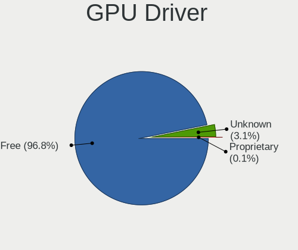

| Driver      | Desktops | Percent |
|-------------|----------|---------|
| Free        | 2109     | 96.92%  |
| Unknown     | 64       | 2.94%   |
| Proprietary | 3        | 0.14%   |

GPU Memory
----------

Total video memory

| Size in GB | Desktops | Percent |
|------------|----------|---------|
| Unknown    | 722      | 33.16%  |
| 0.51-1.0   | 411      | 18.88%  |
| 1.01-2.0   | 385      | 17.68%  |
| 0.01-0.5   | 349      | 16.03%  |
| 3.01-4.0   | 143      | 6.57%   |
| 7.01-8.0   | 89       | 4.09%   |
| 5.01-6.0   | 49       | 2.25%   |
| 2.01-3.0   | 22       | 1.01%   |
| 8.01-16.0  | 6        | 0.28%   |
| 4.01-5.0   | 1        | 0.05%   |

Monitor
-------

Monitor Vendor
--------------

Monitor vendors

| Vendor               | Desktops | Percent |
|----------------------|----------|---------|
| Samsung Electronics  | 412      | 19.54%  |
| Goldstar             | 287      | 13.61%  |
| Hewlett-Packard      | 173      | 8.21%   |
| Acer                 | 165      | 7.83%   |
| Dell                 | 158      | 7.5%    |
| Philips              | 128      | 6.07%   |
| AOC                  | 110      | 5.22%   |
| BenQ                 | 106      | 5.03%   |
| Ancor Communications | 88       | 4.17%   |
| Iiyama               | 52       | 2.47%   |
| ViewSonic            | 42       | 1.99%   |
| Fujitsu Siemens      | 25       | 1.19%   |
| NEC Computers        | 24       | 1.14%   |
| Eizo                 | 21       | 1%      |
| ASUSTek Computer     | 21       | 1%      |
| Lenovo               | 18       | 0.85%   |
| Sony                 | 17       | 0.81%   |
| HannStar             | 17       | 0.81%   |
| Vizio                | 11       | 0.52%   |
| Vestel Elektronik    | 11       | 0.52%   |
| Toshiba              | 11       | 0.52%   |
| Medion               | 11       | 0.52%   |
| Unknown              | 9        | 0.43%   |
| Sceptre Tech         | 9        | 0.43%   |
| Belinea              | 9        | 0.43%   |
| MStar                | 8        | 0.38%   |
| Packard Bell         | 7        | 0.33%   |
| ___                  | 5        | 0.24%   |
| Sharp                | 5        | 0.24%   |
| Panasonic            | 5        | 0.24%   |
| OEM                  | 4        | 0.19%   |
| Arnos Instruments    | 4        | 0.19%   |
| AMO                  | 4        | 0.19%   |
| Unknown (XXX)        | 3        | 0.14%   |
| RTK                  | 3        | 0.14%   |
| RIS                  | 3        | 0.14%   |
| KTC                  | 3        | 0.14%   |
| Insignia             | 3        | 0.14%   |
| Hyundai ImageQuest   | 3        | 0.14%   |
| HKC                  | 3        | 0.14%   |
| Hitachi              | 3        | 0.14%   |
| Element              | 3        | 0.14%   |
| Compal               | 3        | 0.14%   |
| WYT                  | 2        | 0.09%   |
| Westinghouse         | 2        | 0.09%   |
| VIE                  | 2        | 0.09%   |
| SKY                  | 2        | 0.09%   |
| Sanyo                | 2        | 0.09%   |
| PRI                  | 2        | 0.09%   |
| Positivo             | 2        | 0.09%   |
| NCS                  | 2        | 0.09%   |
| MSI                  | 2        | 0.09%   |
| MiTAC                | 2        | 0.09%   |
| Mi                   | 2        | 0.09%   |
| IOD                  | 2        | 0.09%   |
| IBM                  | 2        | 0.09%   |
| Grundig              | 2        | 0.09%   |
| GDH                  | 2        | 0.09%   |
| Gateway              | 2        | 0.09%   |
| DENON                | 2        | 0.09%   |

Monitor Model
-------------

Monitor models

| Model                                                                 | Desktops | Percent |
|-----------------------------------------------------------------------|----------|---------|
| Goldstar FULL HD GSM5B55 1920x1080 480x270mm 21.7-inch                | 15       | 0.7%    |
| Vestel Elektronik 22W_LCD_TV VES3700 1920x540                         | 11       | 0.52%   |
| Samsung Electronics C24F390 SAM0D2C 1920x1080 521x293mm 23.5-inch     | 10       | 0.47%   |
| AOC 2270W AOC2270 1920x1080 477x268mm 21.5-inch                       | 10       | 0.47%   |
| Goldstar ULTRAWIDE GSM59F1 2560x1080 673x284mm 28.8-inch              | 9        | 0.42%   |
| Samsung Electronics S24F350 SAM0D20 1920x1080 521x293mm 23.5-inch     | 8        | 0.38%   |
| Samsung Electronics C32F391 SAM0D34 1920x1080 698x393mm 31.5-inch     | 8        | 0.38%   |
| Samsung Electronics C27F390 SAM0D32 1920x1080 598x336mm 27.0-inch     | 8        | 0.38%   |
| Acer G246HL ACR02FF 1920x1080 531x299mm 24.0-inch                     | 8        | 0.38%   |
| Samsung Electronics SMB1930N SAM0632 1366x768 410x230mm 18.5-inch     | 7        | 0.33%   |
| MStar Demo MST0030 1920x1080 708x398mm 32.0-inch                      | 7        | 0.33%   |
| Goldstar W2243 GSM56FE 1920x1080 477x268mm 21.5-inch                  | 7        | 0.33%   |
| Goldstar IPS FULLHD GSM5AB8 1920x1080 480x270mm 21.7-inch             | 7        | 0.33%   |
| Goldstar 2D FHD LG TV GSM59C6 1920x1080 510x290mm 23.1-inch           | 7        | 0.33%   |
| Dell U2412M DELA07A 1920x1200 518x324mm 24.1-inch                     | 7        | 0.33%   |
| Ancor Communications ASUS VS247 ACI249A 1920x1080 520x290mm 23.4-inch | 7        | 0.33%   |
| Samsung Electronics U28E590 SAM0C4D 3840x2160 607x345mm 27.5-inch     | 6        | 0.28%   |
| Samsung Electronics SyncMaster SAM011E 1280x1024 338x270mm 17.0-inch  | 6        | 0.28%   |
| Goldstar W2240 GSM57A0 1920x1080 477x268mm 21.5-inch                  | 6        | 0.28%   |
| AOC 936W AOC1936 1366x768 410x230mm 18.5-inch                         | 6        | 0.28%   |
| Samsung Electronics SyncMaster SAM03D0 1440x900 410x257mm 19.1-inch   | 5        | 0.23%   |
| Samsung Electronics LCD Monitor SAM0C3C 1366x768 609x347mm 27.6-inch  | 5        | 0.23%   |
| Philips 226V4 PHLC0B1 1920x1080 477x268mm 21.5-inch                   | 5        | 0.23%   |
| Hewlett-Packard w2207 HWP26A8 1680x1050 473x296mm 22.0-inch           | 5        | 0.23%   |
| Goldstar W2234 GSM56B8 1680x1050 474x296mm 22.0-inch                  | 5        | 0.23%   |
| Goldstar W1943 GSM4BAD 1360x768 406x229mm 18.4-inch                   | 5        | 0.23%   |
| Goldstar LG Ultra HD GSM5B08 3840x2160 600x340mm 27.2-inch            | 5        | 0.23%   |
| Goldstar FULL HD GSM5B54 1920x1080 480x270mm 21.7-inch                | 5        | 0.23%   |
| Dell U2312HM DEL4072 1920x1080 510x287mm 23.0-inch                    | 5        | 0.23%   |
| AOC 2370 AOC2370 1920x1080 509x286mm 23.0-inch                        | 5        | 0.23%   |
| ViewSonic VX2718-2KPC VSCB73A 2560x1440 598x336mm 27.0-inch           | 4        | 0.19%   |
| Samsung Electronics S24R35x SAM100E 1920x1080 530x300mm 24.0-inch     | 4        | 0.19%   |
| Samsung Electronics S24F350 SAM0D21 1920x1080 521x293mm 23.5-inch     | 4        | 0.19%   |
| Samsung Electronics S22F350 SAM0D1A 1920x1080 480x270mm 21.7-inch     | 4        | 0.19%   |
| Philips PHL 234E5 PHLC0C7 1920x1080 510x290mm 23.1-inch               | 4        | 0.19%   |
| Philips PHL 223V5 PHLC0CF 1920x1080 480x270mm 21.7-inch               | 4        | 0.19%   |
| Philips 196VL PHLC07F 1366x768 409x230mm 18.5-inch                    | 4        | 0.19%   |
| OEM 185W_LCD_TV OEM3700 1920x540                                      | 4        | 0.19%   |
| NEC Computers E222W NEC6777 1680x1050 474x296mm 22.0-inch             | 4        | 0.19%   |
| Goldstar W2242 GSM5678 1680x1050 474x296mm 22.0-inch                  | 4        | 0.19%   |
| Goldstar MP59G GSM5B34 1920x1080 480x270mm 21.7-inch                  | 4        | 0.19%   |
| Goldstar LG HDR 4K GSM7707 3840x2160 600x340mm 27.2-inch              | 4        | 0.19%   |
| Goldstar IPS FULLHD GSM5AB6 1920x1080 480x270mm 21.7-inch             | 4        | 0.19%   |
| Goldstar HD GSM5ACB 1366x768 410x230mm 18.5-inch                      | 4        | 0.19%   |
| Goldstar 2D FHD TV GSM59C4 1920x1080 509x286mm 23.0-inch              | 4        | 0.19%   |
| Dell U2312HM DEL4071 1920x1080 510x287mm 23.0-inch                    | 4        | 0.19%   |
| Dell SE2719H DELF10C 1920x1080 598x336mm 27.0-inch                    | 4        | 0.19%   |
| Dell P2214H DELA098 1920x1080 477x268mm 21.5-inch                     | 4        | 0.19%   |
| Dell E177FP DELA023 1280x1024 338x270mm 17.0-inch                     | 4        | 0.19%   |
| Dell 2209WA DELF011 1680x1050 474x296mm 22.0-inch                     | 4        | 0.19%   |
| ASUSTek Computer VG245 AUS24A1 1920x1080 531x299mm 24.0-inch          | 4        | 0.19%   |
| ASUSTek Computer VA249 AUS24C1 1920x1080 527x296mm 23.8-inch          | 4        | 0.19%   |
| AOC F19 AOC1900 1366x768 410x230mm 18.5-inch                          | 4        | 0.19%   |
| AOC 2236 AOC2236 1920x1080 477x268mm 21.5-inch                        | 4        | 0.19%   |
| Ancor Communications VW222 ACI22A2 1680x1050 473x296mm 22.0-inch      | 4        | 0.19%   |
| Ancor Communications ASUS VW193D ACI19D5 1440x900 408x255mm 18.9-inch | 4        | 0.19%   |
| Ancor Communications ASUS VC239 ACI23C4 1920x1080 509x286mm 23.0-inch | 4        | 0.19%   |
| ___ LCDTV14 ___0101 1920x1080                                         | 3        | 0.14%   |
| ViewSonic LCD Monitor VSC0E28 1920x1080 480x270mm 21.7-inch           | 3        | 0.14%   |
| Toshiba TV TSB0206 1920x1080 886x498mm 40.0-inch                      | 3        | 0.14%   |

Monitor Resolution
------------------

Monitor screen resolution

| Resolution         | Desktops | Percent |
|--------------------|----------|---------|
| 1920x1080 (FHD)    | 1019     | 48.94%  |
| 1280x1024 (SXGA)   | 242      | 11.62%  |
| 1680x1050 (WSXGA+) | 172      | 8.26%   |
| 1366x768 (WXGA)    | 129      | 6.2%    |
| 3840x2160 (4K)     | 112      | 5.38%   |
| 1440x900 (WXGA+)   | 109      | 5.24%   |
| 2560x1440 (QHD)    | 67       | 3.22%   |
| 1600x900 (HD+)     | 65       | 3.12%   |
| 1920x1200 (WUXGA)  | 44       | 2.11%   |
| 1360x768           | 41       | 1.97%   |
| 2560x1080          | 14       | 0.67%   |
| 1920x540           | 13       | 0.62%   |
| 1024x768 (XGA)     | 10       | 0.48%   |
| 3440x1440          | 9        | 0.43%   |
| 1600x1200          | 8        | 0.38%   |
| 1280x960           | 5        | 0.24%   |
| 2560x1600          | 4        | 0.19%   |
| 2048x1152          | 3        | 0.14%   |
| 1280x768           | 3        | 0.14%   |
| 1280x720 (HD)      | 3        | 0.14%   |
| 3840x1080          | 2        | 0.1%    |
| 1152x864           | 2        | 0.1%    |
| 3840x1600          | 1        | 0.05%   |
| 2288x1287          | 1        | 0.05%   |
| 2048x1536          | 1        | 0.05%   |
| 1536x2048          | 1        | 0.05%   |
| 1400x1050          | 1        | 0.05%   |
| 1024x600           | 1        | 0.05%   |

Monitor Diagonal
----------------

Diagonal size in inches

| Inches  | Desktops | Percent |
|---------|----------|---------|
| 23      | 328      | 15.52%  |
| 21      | 320      | 15.14%  |
| 24      | 224      | 10.6%   |
| 19      | 209      | 9.89%   |
| 27      | 199      | 9.42%   |
| 18      | 159      | 7.52%   |
| 17      | 134      | 6.34%   |
| 22      | 123      | 5.82%   |
| 20      | 84       | 3.98%   |
| 31      | 66       | 3.12%   |
| 15      | 37       | 1.75%   |
| 34      | 25       | 1.18%   |
| 32      | 24       | 1.14%   |
| Unknown | 24       | 1.14%   |
| 84      | 22       | 1.04%   |
| 72      | 19       | 0.9%    |
| 54      | 17       | 0.8%    |
| 52      | 10       | 0.47%   |
| 40      | 10       | 0.47%   |
| 25      | 10       | 0.47%   |
| 26      | 9        | 0.43%   |
| 28      | 8        | 0.38%   |
| 29      | 5        | 0.24%   |
| 74      | 4        | 0.19%   |
| 65      | 4        | 0.19%   |
| 60      | 4        | 0.19%   |
| 39      | 4        | 0.19%   |
| 49      | 3        | 0.14%   |
| 46      | 3        | 0.14%   |
| 37      | 3        | 0.14%   |
| 48      | 2        | 0.09%   |
| 43      | 2        | 0.09%   |
| 42      | 2        | 0.09%   |
| 35      | 2        | 0.09%   |
| 33      | 2        | 0.09%   |
| 16      | 2        | 0.09%   |
| 142     | 1        | 0.05%   |
| 75      | 1        | 0.05%   |
| 57      | 1        | 0.05%   |
| 55      | 1        | 0.05%   |
| 47      | 1        | 0.05%   |
| 38      | 1        | 0.05%   |
| 30      | 1        | 0.05%   |
| 14      | 1        | 0.05%   |
| 12      | 1        | 0.05%   |
| 10      | 1        | 0.05%   |

Monitor Width
-------------

Physical width

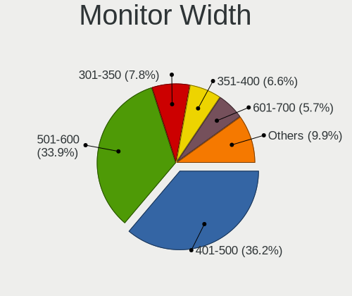

| Width in mm    | Desktops | Percent |
|----------------|----------|---------|
| 401-500        | 778      | 37.35%  |
| 501-600        | 715      | 34.33%  |
| 301-350        | 162      | 7.78%   |
| 351-400        | 134      | 6.43%   |
| 601-700        | 101      | 4.85%   |
| 701-800        | 51       | 2.45%   |
| 1501-2000      | 46       | 2.21%   |
| 1001-1500      | 46       | 2.21%   |
| Unknown        | 24       | 1.15%   |
| 801-900        | 18       | 0.86%   |
| 901-1000       | 4        | 0.19%   |
| 201-300        | 3        | 0.14%   |
| More than 2000 | 1        | 0.05%   |

Aspect Ratio
------------

Proportional relationship between the width and the height

| Ratio   | Desktops | Percent |
|---------|----------|---------|
| 16/9    | 1394     | 67.83%  |
| 16/10   | 326      | 15.86%  |
| 5/4     | 237      | 11.53%  |
| 4/3     | 37       | 1.8%    |
| 21/9    | 25       | 1.22%   |
| 3/2     | 21       | 1.02%   |
| 6/5     | 7        | 0.34%   |
| 32/9    | 4        | 0.19%   |
| 2.01    | 1        | 0.05%   |
| 1.00    | 1        | 0.05%   |
| 0.75    | 1        | 0.05%   |
| Unknown | 1        | 0.05%   |

Monitor Area
------------

Area in inch

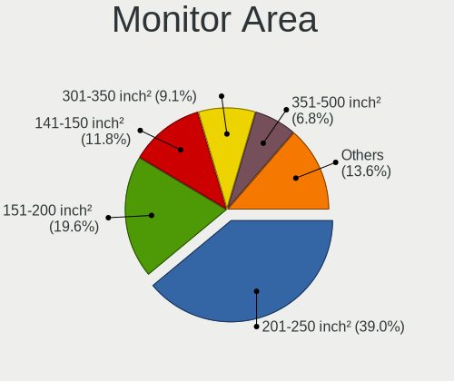

| Area in inch | Desktops | Percent |
|----------------|----------|---------|
| 201-250        | 824      | 39.35%  |
| 151-200        | 424      | 20.25%  |
| 141-150        | 246      | 11.75%  |
| 301-350        | 208      | 9.93%   |
| 351-500        | 123      | 5.87%   |
| More than 1000 | 87       | 4.15%   |
| 251-300        | 77       | 3.68%   |
| 501-1000       | 31       | 1.48%   |
| 101-110        | 26       | 1.24%   |
| Unknown        | 24       | 1.15%   |
| 111-120        | 10       | 0.48%   |
| 131-140        | 9        | 0.43%   |
| 91-100         | 3        | 0.14%   |
| 71-80          | 1        | 0.05%   |
| 41-50          | 1        | 0.05%   |

Pixel Density
-------------

Pixels per inch

| Density | Desktops | Percent |
|---------|----------|---------|
| 51-100  | 1485     | 72.19%  |
| 101-120 | 402      | 19.54%  |
| 1-50    | 85       | 4.13%   |
| 121-160 | 40       | 1.94%   |
| Unknown | 24       | 1.17%   |
| 161-240 | 21       | 1.02%   |

Multiple Monitors
-----------------

Total monitors connected

| Total | Desktops | Percent |
|-------|----------|---------|
| 1     | 2014     | 92.56%  |
| 2     | 120      | 5.51%   |
| 0     | 28       | 1.29%   |
| 3     | 11       | 0.51%   |
| 4     | 2        | 0.09%   |
| 5     | 1        | 0.05%   |

Network
-------

Net Controller Vendor
---------------------

Controller vendors

| Vendor                            | Desktops | Percent |
|-----------------------------------|----------|---------|
| Realtek Semiconductor             | 1409     | 49.72%  |
| Intel                             | 617      | 21.77%  |
| Qualcomm Atheros                  | 247      | 8.72%   |
| Nvidia                            | 77       | 2.72%   |
| Ralink Technology                 | 68       | 2.4%    |
| Broadcom                          | 64       | 2.26%   |
| Ralink                            | 48       | 1.69%   |
| TP-Link                           | 34       | 1.2%    |
| Marvell Technology Group          | 27       | 0.95%   |
| Qualcomm Atheros Communications   | 23       | 0.81%   |
| Broadcom Limited                  | 22       | 0.78%   |
| D-Link System                     | 16       | 0.56%   |
| VIA Technologies                  | 14       | 0.49%   |
| D-Link                            | 14       | 0.49%   |
| ZTE WCDMA Technologies MSM        | 11       | 0.39%   |
| Huawei Technologies               | 11       | 0.39%   |
| NetGear                           | 10       | 0.35%   |
| Samsung Electronics               | 9        | 0.32%   |
| ASUSTek Computer                  | 9        | 0.32%   |
| Microsoft                         | 8        | 0.28%   |
| 3Com                              | 8        | 0.28%   |
| IMC Networks                      | 7        | 0.25%   |
| ASIX Electronics                  | 6        | 0.21%   |
| Xiaomi                            | 5        | 0.18%   |
| MediaTek                          | 5        | 0.18%   |
| Edimax Technology                 | 5        | 0.18%   |
| Belkin Components                 | 5        | 0.18%   |
| Aquantia                          | 5        | 0.18%   |
| Motorola PCS                      | 4        | 0.14%   |
| Mercucys                          | 3        | 0.11%   |
| Linksys                           | 3        | 0.11%   |
| JMicron Technology                | 3        | 0.11%   |
| Wilocity                          | 2        | 0.07%   |
| Wacom                             | 2        | 0.07%   |
| OPPO Electronics                  | 2        | 0.07%   |
| Motorola                          | 2        | 0.07%   |
| ICS Advent                        | 2        | 0.07%   |
| IBM                               | 2        | 0.07%   |
| Guillemot                         | 2        | 0.07%   |
| DisplayLink                       | 2        | 0.07%   |
| AVM                               | 2        | 0.07%   |
| ZyXEL Communications              | 1        | 0.04%   |
| ZyDAS                             | 1        | 0.04%   |
| U.S. Robotics                     | 1        | 0.04%   |
| T & A Mobile Phones               | 1        | 0.04%   |
| Sundance Technology Inc / IC Plus | 1        | 0.04%   |
| STMicroelectronics                | 1        | 0.04%   |
| Sitecom Europe                    | 1        | 0.04%   |
| Silicon Integrated Systems [SiS]  | 1        | 0.04%   |
| PEAK-System Technik               | 1        | 0.04%   |
| Manta                             | 1        | 0.04%   |
| LG Electronics                    | 1        | 0.04%   |
| HMD Global                        | 1        | 0.04%   |
| Foxconn / Hon Hai                 | 1        | 0.04%   |
| Fitbit                            | 1        | 0.04%   |
| Exar                              | 1        | 0.04%   |
| BUFFALO                           | 1        | 0.04%   |
| Apple                             | 1        | 0.04%   |
| Afatech                           | 1        | 0.04%   |
| Accton Technology                 | 1        | 0.04%   |

Net Controller Model
--------------------

Controller models

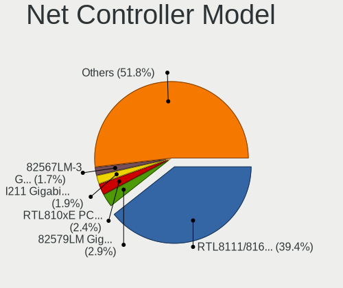

| Model                                                             | Desktops | Percent |
|-------------------------------------------------------------------|----------|---------|
| Realtek RTL8111/8168/8411 PCI Express Gigabit Ethernet Controller | 1220     | 39.61%  |
| Intel 82579LM Gigabit Network Connection (Lewisville)             | 88       | 2.86%   |
| Realtek RTL810xE PCI Express Fast Ethernet controller             | 72       | 2.34%   |
| Intel I211 Gigabit Network Connection                             | 60       | 1.95%   |
| Intel Ethernet Connection (2) I219-V                              | 54       | 1.75%   |
| Intel 82567LM-3 Gigabit Network Connection                        | 53       | 1.72%   |
| Intel Ethernet Connection I217-LM                                 | 46       | 1.49%   |
| Nvidia MCP61 Ethernet                                             | 45       | 1.46%   |
| Intel Wi-Fi 6 AX200                                               | 44       | 1.43%   |
| Intel 82579V Gigabit Network Connection                           | 43       | 1.4%    |
| Realtek RTL-8100/8101L/8139 PCI Fast Ethernet Adapter             | 42       | 1.36%   |
| Ralink MT7601U Wireless Adapter                                   | 33       | 1.07%   |
| Realtek RTL8188EUS 802.11n Wireless Network Adapter               | 30       | 0.97%   |
| Qualcomm Atheros AR8151 v2.0 Gigabit Ethernet                     | 28       | 0.91%   |
| Qualcomm Atheros AR9485 Wireless Network Adapter                  | 25       | 0.81%   |
| Qualcomm Atheros AR8121/AR8113/AR8114 Gigabit or Fast Ethernet    | 24       | 0.78%   |
| Realtek RTL8125 2.5GbE Controller                                 | 22       | 0.71%   |
| Qualcomm Atheros AR8161 Gigabit Ethernet                          | 21       | 0.68%   |
| Qualcomm Atheros Killer E220x Gigabit Ethernet Controller         | 20       | 0.65%   |
| Qualcomm Atheros AR9271 802.11n                                   | 20       | 0.65%   |
| Intel Ethernet Connection (7) I219-V                              | 20       | 0.65%   |
| Intel Dual Band Wireless-AC 3168NGW [Stone Peak]                  | 19       | 0.62%   |
| Intel Ethernet Connection I217-V                                  | 16       | 0.52%   |
| Intel Wireless-AC 9260                                            | 15       | 0.49%   |
| Ralink RT5370 Wireless Adapter                                    | 14       | 0.45%   |
| Qualcomm Atheros AR9227 Wireless Network Adapter                  | 13       | 0.42%   |
| Marvell Group 88E8056 PCI-E Gigabit Ethernet Controller           | 13       | 0.42%   |
| Intel Ethernet Controller I225-V                                  | 13       | 0.42%   |
| Intel 82574L Gigabit Network Connection                           | 13       | 0.42%   |
| TP-Link TL-WN722N v2/v3 [Realtek RTL8188EUS]                      | 12       | 0.39%   |
| Realtek RTL8821AE 802.11ac PCIe Wireless Network Adapter          | 12       | 0.39%   |
| Realtek RTL8192CU 802.11n WLAN Adapter                            | 12       | 0.39%   |
| Ralink RT2870/RT3070 Wireless Adapter                             | 12       | 0.39%   |
| Qualcomm Atheros QCA8171 Gigabit Ethernet                         | 12       | 0.39%   |
| Qualcomm Atheros Attansic L1 Gigabit Ethernet                     | 12       | 0.39%   |
| Broadcom NetXtreme BCM5761 Gigabit Ethernet PCIe                  | 12       | 0.39%   |
| Realtek RTL8192EE PCIe Wireless Network Adapter                   | 11       | 0.36%   |
| Realtek RTL8188CE 802.11b/g/n WiFi Adapter                        | 11       | 0.36%   |
| Intel Ethernet Connection (2) I219-LM                             | 11       | 0.36%   |
| Intel Ethernet Connection (2) I218-V                              | 11       | 0.36%   |
| Intel Cannon Lake PCH CNVi WiFi                                   | 11       | 0.36%   |
| Intel 82578DC Gigabit Network Connection                          | 11       | 0.36%   |
| Realtek RTL8821CE 802.11ac PCIe Wireless Network Adapter          | 10       | 0.32%   |
| Realtek RTL8188EE Wireless Network Adapter                        | 10       | 0.32%   |
| Realtek RTL8169 PCI Gigabit Ethernet Controller                   | 10       | 0.32%   |
| Ralink RT3090 Wireless 802.11n 1T/1R PCIe                         | 10       | 0.32%   |
| Qualcomm Atheros QCA6174 802.11ac Wireless Network Adapter        | 10       | 0.32%   |
| Intel Wireless 7265                                               | 10       | 0.32%   |
| Intel Wireless 7260                                               | 10       | 0.32%   |
| VIA VT6102/VT6103 [Rhine-II]                                      | 9        | 0.29%   |
| Realtek RTL88x2bu [AC1200 Techkey]                                | 9        | 0.29%   |
| Realtek RTL8812AE 802.11ac PCIe Wireless Network Adapter          | 9        | 0.29%   |
| Realtek RTL8188CUS 802.11n WLAN Adapter                           | 9        | 0.29%   |
| Qualcomm Atheros AR93xx Wireless Network Adapter                  | 9        | 0.29%   |
| Qualcomm Atheros AR9287 Wireless Network Adapter (PCI-Express)    | 9        | 0.29%   |
| Qualcomm Atheros AR8152 v2.0 Fast Ethernet                        | 9        | 0.29%   |
| Qualcomm Atheros AR8131 Gigabit Ethernet                          | 9        | 0.29%   |
| Intel 82578DM Gigabit Network Connection                          | 9        | 0.29%   |
| Realtek RTL8192CE PCIe Wireless Network Adapter                   | 8        | 0.26%   |
| Realtek 802.11ac NIC                                              | 8        | 0.26%   |

Wireless Vendor
---------------

Wireless vendors

| Vendor                          | Desktops | Percent |
|---------------------------------|----------|---------|
| Realtek Semiconductor           | 188      | 26.22%  |
| Intel                           | 149      | 20.78%  |
| Qualcomm Atheros                | 108      | 15.06%  |
| Ralink Technology               | 68       | 9.48%   |
| Ralink                          | 48       | 6.69%   |
| TP-Link                         | 33       | 4.6%    |
| Qualcomm Atheros Communications | 23       | 3.21%   |
| Broadcom                        | 17       | 2.37%   |
| D-Link                          | 14       | 1.95%   |
| ASUSTek Computer                | 9        | 1.26%   |
| NetGear                         | 8        | 1.12%   |
| Microsoft                       | 8        | 1.12%   |
| IMC Networks                    | 7        | 0.98%   |
| D-Link System                   | 7        | 0.98%   |
| Edimax Technology               | 5        | 0.7%    |
| Belkin Components               | 5        | 0.7%    |
| Mercucys                        | 3        | 0.42%   |
| Linksys                         | 3        | 0.42%   |
| Wilocity                        | 2        | 0.28%   |
| Wacom                           | 2        | 0.28%   |
| Guillemot                       | 2        | 0.28%   |
| AVM                             | 2        | 0.28%   |
| ZyXEL Communications            | 1        | 0.14%   |
| ZyDAS                           | 1        | 0.14%   |
| Sitecom Europe                  | 1        | 0.14%   |
| MediaTek                        | 1        | 0.14%   |
| BUFFALO                         | 1        | 0.14%   |
| Broadcom Limited                | 1        | 0.14%   |

Wireless Model
--------------

Wireless models

| Model                                                                          | Desktops | Percent |
|--------------------------------------------------------------------------------|----------|---------|
| Intel Wi-Fi 6 AX200                                                            | 44       | 6.09%   |
| Ralink MT7601U Wireless Adapter                                                | 33       | 4.57%   |
| Realtek RTL8188EUS 802.11n Wireless Network Adapter                            | 30       | 4.16%   |
| Qualcomm Atheros AR9485 Wireless Network Adapter                               | 25       | 3.46%   |
| Qualcomm Atheros AR9271 802.11n                                                | 20       | 2.77%   |
| Intel Dual Band Wireless-AC 3168NGW [Stone Peak]                               | 19       | 2.63%   |
| Intel Wireless-AC 9260                                                         | 15       | 2.08%   |
| Ralink RT5370 Wireless Adapter                                                 | 14       | 1.94%   |
| Qualcomm Atheros AR9227 Wireless Network Adapter                               | 13       | 1.8%    |
| TP-Link TL-WN722N v2/v3 [Realtek RTL8188EUS]                                   | 12       | 1.66%   |
| Realtek RTL8821AE 802.11ac PCIe Wireless Network Adapter                       | 12       | 1.66%   |
| Realtek RTL8192CU 802.11n WLAN Adapter                                         | 12       | 1.66%   |
| Ralink RT2870/RT3070 Wireless Adapter                                          | 12       | 1.66%   |
| Realtek RTL8192EE PCIe Wireless Network Adapter                                | 11       | 1.52%   |
| Realtek RTL8188CE 802.11b/g/n WiFi Adapter                                     | 11       | 1.52%   |
| Intel Cannon Lake PCH CNVi WiFi                                                | 11       | 1.52%   |
| Realtek RTL8821CE 802.11ac PCIe Wireless Network Adapter                       | 10       | 1.39%   |
| Realtek RTL8188EE Wireless Network Adapter                                     | 10       | 1.39%   |
| Ralink RT3090 Wireless 802.11n 1T/1R PCIe                                      | 10       | 1.39%   |
| Qualcomm Atheros QCA6174 802.11ac Wireless Network Adapter                     | 10       | 1.39%   |
| Intel Wireless 7265                                                            | 10       | 1.39%   |
| Intel Wireless 7260                                                            | 10       | 1.39%   |
| Realtek RTL88x2bu [AC1200 Techkey]                                             | 9        | 1.25%   |
| Realtek RTL8812AE 802.11ac PCIe Wireless Network Adapter                       | 9        | 1.25%   |
| Realtek RTL8188CUS 802.11n WLAN Adapter                                        | 9        | 1.25%   |
| Qualcomm Atheros AR93xx Wireless Network Adapter                               | 9        | 1.25%   |
| Qualcomm Atheros AR9287 Wireless Network Adapter (PCI-Express)                 | 9        | 1.25%   |
| Realtek RTL8192CE PCIe Wireless Network Adapter                                | 8        | 1.11%   |
| Realtek 802.11ac NIC                                                           | 8        | 1.11%   |
| Qualcomm Atheros QCA9565 / AR9565 Wireless Network Adapter                     | 8        | 1.11%   |
| Realtek RTL8723BE PCIe Wireless Network Adapter                                | 7        | 0.97%   |
| Realtek RTL8822BE 802.11a/b/g/n/ac WiFi adapter                                | 6        | 0.83%   |
| Ralink RT5390 Wireless 802.11n 1T/1R PCIe                                      | 6        | 0.83%   |
| Qualcomm Atheros AR9285 Wireless Network Adapter (PCI-Express)                 | 6        | 0.83%   |
| Intel Wireless 8260                                                            | 6        | 0.83%   |
| Intel Wireless 3165                                                            | 6        | 0.83%   |
| Intel Dual Band Wireless-AC 3165 Plus Bluetooth                                | 6        | 0.83%   |
| Realtek RTL8822CE 802.11ac PCIe Wireless Network Adapter                       | 5        | 0.69%   |
| Realtek RTL8191SU 802.11n WLAN Adapter                                         | 5        | 0.69%   |
| Realtek RTL8188FTV 802.11b/g/n 1T1R 2.4G WLAN Adapter                          | 5        | 0.69%   |
| Ralink RT2790 Wireless 802.11n 1T/2R PCIe                                      | 5        | 0.69%   |
| Ralink RT2561/RT61 rev B 802.11g                                               | 5        | 0.69%   |
| Qualcomm Atheros AR9462 Wireless Network Adapter                               | 5        | 0.69%   |
| Microsoft XBOX ACC                                                             | 5        | 0.69%   |
| IMC Networks Mediao 802.11n WLAN [Realtek RTL8191SU]                           | 5        | 0.69%   |
| TP-Link TL-WN821N Version 5 RTL8192EU                                          | 4        | 0.55%   |
| TP-Link 802.11ac WLAN Adapter                                                  | 4        | 0.55%   |
| Realtek RTL8812AU 802.11a/b/g/n/ac 2T2R DB WLAN Adapter                        | 4        | 0.55%   |
| Ralink RT5392 PCIe Wireless Network Adapter                                    | 4        | 0.55%   |
| Ralink RT5390R 802.11bgn PCIe Wireless Network Adapter                         | 4        | 0.55%   |
| Qualcomm Atheros AR922X Wireless Network Adapter                               | 4        | 0.55%   |
| Qualcomm Atheros AR5413/AR5414 Wireless Network Adapter [AR5006X(S) 802.11abg] | 4        | 0.55%   |
| Qualcomm Atheros AR2413/AR2414 Wireless Network Adapter [AR5005G(S) 802.11bg]  | 4        | 0.55%   |
| Intel Wireless 8265 / 8275                                                     | 4        | 0.55%   |
| Broadcom BCM4360 802.11ac Wireless Network Adapter                             | 4        | 0.55%   |
| Broadcom BCM4352 802.11ac Wireless Network Adapter                             | 4        | 0.55%   |
| TP-Link TL-WN823N v2/v3 [Realtek RTL8192EU]                                    | 3        | 0.42%   |
| TP-Link Archer T3U [Realtek RTL8812BU]                                         | 3        | 0.42%   |
| Realtek RTL8191SEvB Wireless LAN Controller                                    | 3        | 0.42%   |
| Realtek RTL8187 Wireless Adapter                                               | 3        | 0.42%   |

Ethernet Vendor
---------------

Ethernet vendors

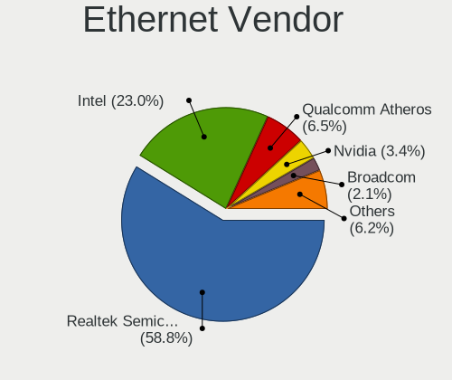

| Vendor                            | Desktops | Percent |
|-----------------------------------|----------|---------|
| Realtek Semiconductor             | 1354     | 58.84%  |
| Intel                             | 522      | 22.69%  |
| Qualcomm Atheros                  | 151      | 6.56%   |
| Nvidia                            | 77       | 3.35%   |
| Broadcom                          | 47       | 2.04%   |
| Marvell Technology Group          | 27       | 1.17%   |
| Broadcom Limited                  | 21       | 0.91%   |
| VIA Technologies                  | 12       | 0.52%   |
| ZTE WCDMA Technologies MSM        | 10       | 0.43%   |
| Huawei Technologies               | 10       | 0.43%   |
| Samsung Electronics               | 9        | 0.39%   |
| D-Link System                     | 9        | 0.39%   |
| 3Com                              | 8        | 0.35%   |
| ASIX Electronics                  | 6        | 0.26%   |
| Xiaomi                            | 5        | 0.22%   |
| Aquantia                          | 5        | 0.22%   |
| MediaTek                          | 4        | 0.17%   |
| JMicron Technology                | 3        | 0.13%   |
| TP-Link                           | 2        | 0.09%   |
| OPPO Electronics                  | 2        | 0.09%   |
| NetGear                           | 2        | 0.09%   |
| Motorola PCS                      | 2        | 0.09%   |
| ICS Advent                        | 2        | 0.09%   |
| DisplayLink                       | 2        | 0.09%   |
| T & A Mobile Phones               | 1        | 0.04%   |
| Sundance Technology Inc / IC Plus | 1        | 0.04%   |
| Silicon Integrated Systems [SiS]  | 1        | 0.04%   |
| LG Electronics                    | 1        | 0.04%   |
| IBM                               | 1        | 0.04%   |
| HMD Global                        | 1        | 0.04%   |
| Foxconn / Hon Hai                 | 1        | 0.04%   |
| Apple                             | 1        | 0.04%   |
| Accton Technology                 | 1        | 0.04%   |

Ethernet Model
--------------

Ethernet models

| Model                                                             | Desktops | Percent |
|-------------------------------------------------------------------|----------|---------|
| Realtek RTL8111/8168/8411 PCI Express Gigabit Ethernet Controller | 1220     | 52.09%  |
| Intel 82579LM Gigabit Network Connection (Lewisville)             | 88       | 3.76%   |
| Realtek RTL810xE PCI Express Fast Ethernet controller             | 72       | 3.07%   |
| Intel I211 Gigabit Network Connection                             | 60       | 2.56%   |
| Intel Ethernet Connection (2) I219-V                              | 54       | 2.31%   |
| Intel 82567LM-3 Gigabit Network Connection                        | 53       | 2.26%   |
| Intel Ethernet Connection I217-LM                                 | 46       | 1.96%   |
| Nvidia MCP61 Ethernet                                             | 45       | 1.92%   |
| Intel 82579V Gigabit Network Connection                           | 43       | 1.84%   |
| Realtek RTL-8100/8101L/8139 PCI Fast Ethernet Adapter             | 42       | 1.79%   |
| Qualcomm Atheros AR8151 v2.0 Gigabit Ethernet                     | 28       | 1.2%    |
| Qualcomm Atheros AR8121/AR8113/AR8114 Gigabit or Fast Ethernet    | 24       | 1.02%   |
| Realtek RTL8125 2.5GbE Controller                                 | 22       | 0.94%   |
| Qualcomm Atheros AR8161 Gigabit Ethernet                          | 21       | 0.9%    |
| Qualcomm Atheros Killer E220x Gigabit Ethernet Controller         | 20       | 0.85%   |
| Intel Ethernet Connection (7) I219-V                              | 20       | 0.85%   |
| Intel Ethernet Connection I217-V                                  | 16       | 0.68%   |
| Marvell Group 88E8056 PCI-E Gigabit Ethernet Controller           | 13       | 0.56%   |
| Intel Ethernet Controller I225-V                                  | 13       | 0.56%   |
| Intel 82574L Gigabit Network Connection                           | 13       | 0.56%   |
| Qualcomm Atheros QCA8171 Gigabit Ethernet                         | 12       | 0.51%   |
| Qualcomm Atheros Attansic L1 Gigabit Ethernet                     | 12       | 0.51%   |
| Broadcom NetXtreme BCM5761 Gigabit Ethernet PCIe                  | 12       | 0.51%   |
| Intel Ethernet Connection (2) I219-LM                             | 11       | 0.47%   |
| Intel Ethernet Connection (2) I218-V                              | 11       | 0.47%   |
| Intel 82578DC Gigabit Network Connection                          | 11       | 0.47%   |
| Realtek RTL8169 PCI Gigabit Ethernet Controller                   | 10       | 0.43%   |
| VIA VT6102/VT6103 [Rhine-II]                                      | 9        | 0.38%   |
| Qualcomm Atheros AR8152 v2.0 Fast Ethernet                        | 9        | 0.38%   |
| Qualcomm Atheros AR8131 Gigabit Ethernet                          | 9        | 0.38%   |
| Intel 82578DM Gigabit Network Connection                          | 9        | 0.38%   |
| Samsung Galaxy series, misc. (tethering mode)                     | 7        | 0.3%    |
| Nvidia MCP77 Ethernet                                             | 7        | 0.3%    |
| Nvidia CK804 Ethernet Controller                                  | 7        | 0.3%    |
| Intel Ethernet Connection (7) I219-LM                             | 7        | 0.3%    |
| Intel 82566DM-2 Gigabit Network Connection                        | 7        | 0.3%    |
| Huawei E353/E3131                                                 | 7        | 0.3%    |
| Broadcom Limited NetXtreme BCM5754 Gigabit Ethernet PCI Express   | 7        | 0.3%    |
| ZTE WCDMA MSM ZTE MSM                                             | 6        | 0.26%   |
| Nvidia MCP55 Ethernet                                             | 6        | 0.26%   |
| Marvell Group 88E8001 Gigabit Ethernet Controller                 | 6        | 0.26%   |
| Intel 82566DM Gigabit Network Connection                          | 6        | 0.26%   |
| D-Link System DGE-528T Gigabit Ethernet Adapter                   | 6        | 0.26%   |
| Qualcomm Atheros Killer E2400 Gigabit Ethernet Controller         | 5        | 0.21%   |
| Qualcomm Atheros Attansic L2 Fast Ethernet                        | 5        | 0.21%   |
| Nvidia MCP73 Ethernet                                             | 5        | 0.21%   |
| Marvell Group 88E8071 PCI-E Gigabit Ethernet Controller           | 5        | 0.21%   |
| Intel NM10/ICH7 Family LAN Controller                             | 5        | 0.21%   |
| Intel 82567LF-3 Gigabit Network Connection                        | 5        | 0.21%   |
| Intel 82562V-2 10/100 Network Connection                          | 5        | 0.21%   |
| Broadcom NetXtreme BCM5762 Gigabit Ethernet PCIe                  | 5        | 0.21%   |
| Broadcom NetXtreme BCM5751 Gigabit Ethernet PCI Express           | 5        | 0.21%   |
| Broadcom NetLink BCM57780 Gigabit Ethernet PCIe                   | 5        | 0.21%   |
| Xiaomi Mi/Redmi series (RNDIS)                                    | 4        | 0.17%   |
| Qualcomm Atheros Killer E2500 Gigabit Ethernet Controller         | 4        | 0.17%   |
| MediaTek Vodafone Smart N10                                       | 4        | 0.17%   |
| Intel Ethernet Connection (5) I219-LM                             | 4        | 0.17%   |
| Intel 82567V-2 Gigabit Network Connection                         | 4        | 0.17%   |
| Intel 82566DC Gigabit Network Connection                          | 4        | 0.17%   |
| Intel 82562V 10/100 Network Connection                            | 4        | 0.17%   |

Net Controller Kind
-------------------

Ethernet, WiFi or modem

| Kind     | Desktops | Percent |
|----------|----------|---------|
| Ethernet | 2158     | 75.22%  |
| WiFi     | 695      | 24.22%  |
| Modem    | 9        | 0.31%   |
| Unknown  | 7        | 0.24%   |

Used Controller
---------------

Currently used network controller

| Kind     | Desktops | Percent |
|----------|----------|---------|
| Ethernet | 1834     | 86.1%   |
| WiFi     | 296      | 13.9%   |

NICs
----

Total network controllers on board

| Total | Desktops | Percent |
|-------|----------|---------|
| 1     | 1618     | 74.36%  |
| 2     | 496      | 22.79%  |
| 3     | 43       | 1.98%   |
| 0     | 14       | 0.64%   |
| 4     | 3        | 0.14%   |
| 7     | 1        | 0.05%   |
| 5     | 1        | 0.05%   |

IPv6
----

IPv6 vs IPv4

| Used    | Desktops | Percent |
|---------|----------|---------|
| No      | 1728     | 79.27%  |
| Yes     | 451      | 20.69%  |
| Unknown | 1        | 0.05%   |

Bluetooth
---------

Bluetooth Vendor
----------------

Controller vendors

| Vendor                          | Desktops | Percent |
|---------------------------------|----------|---------|
| Cambridge Silicon Radio         | 142      | 33.97%  |
| Intel                           | 131      | 31.34%  |
| ASUSTek Computer                | 34       | 8.13%   |
| Realtek Semiconductor           | 31       | 7.42%   |
| Broadcom                        | 27       | 6.46%   |
| Qualcomm Atheros Communications | 15       | 3.59%   |
| IMC Networks                    | 10       | 2.39%   |
| Lite-On Technology              | 7        | 1.67%   |
| Integrated System Solution      | 6        | 1.44%   |
| Belkin Components               | 4        | 0.96%   |
| Ralink                          | 2        | 0.48%   |
| Hewlett-Packard                 | 2        | 0.48%   |
| Dynex                           | 2        | 0.48%   |
| Unknown                         | 1        | 0.24%   |
| Realtek                         | 1        | 0.24%   |
| i.Tech Dynamic Limited          | 1        | 0.24%   |
| Foxconn / Hon Hai               | 1        | 0.24%   |
| Apple                           | 1        | 0.24%   |

Bluetooth Model
---------------

Controller models

| Model                                                    | Desktops | Percent |
|----------------------------------------------------------|----------|---------|
| Cambridge Silicon Radio Bluetooth Dongle (HCI mode)      | 142      | 33.97%  |
| Intel Bluetooth wireless interface                       | 39       | 9.33%   |
| Intel AX200 Bluetooth                                    | 39       | 9.33%   |
| Intel Wireless-AC 3168 Bluetooth                         | 20       | 4.78%   |
| Realtek Bluetooth Radio                                  | 18       | 4.31%   |
| Broadcom BCM20702A0 Bluetooth 4.0                        | 15       | 3.59%   |
| Intel Bluetooth 9460/9560 Jefferson Peak (JfP)           | 14       | 3.35%   |
| Intel Wireless-AC 9260 Bluetooth Adapter                 | 13       | 3.11%   |
| Realtek  Bluetooth 4.2 Adapter                           | 8        | 1.91%   |
| Qualcomm Atheros  Bluetooth Device                       | 8        | 1.91%   |
| IMC Networks Bluetooth Radio                             | 8        | 1.91%   |
| ASUS Broadcom BCM20702A0 Bluetooth                       | 8        | 1.91%   |
| ASUS Bluetooth Radio                                     | 8        | 1.91%   |
| Lite-On Bluetooth Device                                 | 6        | 1.44%   |
| ASUS Qualcomm Bluetooth 4.1                              | 5        | 1.2%    |
| ASUS Bluetooth Adapter                                   | 5        | 1.2%    |
| Intel AX201 Bluetooth                                    | 4        | 0.96%   |
| Integrated System Solution Bluetooth Device              | 4        | 0.96%   |
| Broadcom BCM2045 Bluetooth                               | 4        | 0.96%   |
| Realtek 802.11ac WLAN Adapter                            | 3        | 0.72%   |
| Qualcomm Atheros AR3011 Bluetooth                        | 3        | 0.72%   |
| Broadcom BCM2035 Bluetooth dongle                        | 3        | 0.72%   |
| ASUS BCM20702A0                                          | 3        | 0.72%   |
| Ralink RT3290 Bluetooth                                  | 2        | 0.48%   |
| Qualcomm Atheros AR3012 Bluetooth 4.0                    | 2        | 0.48%   |
| Integrated System Solution KY-BT100 Bluetooth Adapter    | 2        | 0.48%   |
| Dynex Bluetooth 4.0 Adapter [Broadcom, 1.12, BCM20702A0] | 2        | 0.48%   |
| Broadcom Bluetooth 2.0+EDR dongle                        | 2        | 0.48%   |
| Belkin Components F8T065BF Mini Bluetooth 4.0 Adapter    | 2        | 0.48%   |
| Belkin Components Bluetooth Mini Dongle                  | 2        | 0.48%   |
| ASUS Bluetooth Device                                    | 2        | 0.48%   |
| ASUS ASUS USB-BT500                                      | 2        | 0.48%   |
| Unknown Bluetooth Device                                 | 1        | 0.24%   |
| Realtek RTL8822BE Bluetooth 4.2 Adapter                  | 1        | 0.24%   |
| Realtek RTL8723B Bluetooth                               | 1        | 0.24%   |
| Realtek Bluetooth Radio                                  | 1        | 0.24%   |
| Qualcomm Atheros QCA61x4 Bluetooth 4.0                   | 1        | 0.24%   |
| Qualcomm Atheros Bluetooth USB Host Controller           | 1        | 0.24%   |
| Lite-On Atheros AR3012 Bluetooth                         | 1        | 0.24%   |
| Intel Centrino Bluetooth Wireless Transceiver            | 1        | 0.24%   |
| Intel AX210 Bluetooth                                    | 1        | 0.24%   |
| IMC Networks Bluetooth Device                            | 1        | 0.24%   |
| IMC Networks Bluetooth                                   | 1        | 0.24%   |
| i.Tech Dynamic Limited BlueCON U2                        | 1        | 0.24%   |
| HP Bluetooth 2.0 Interface [Broadcom BCM2045]            | 1        | 0.24%   |
| HP Atheros AR9285 Malbec Bluetooth Adapter               | 1        | 0.24%   |
| Foxconn / Hon Hai Bluetooth USB Host Controller          | 1        | 0.24%   |
| Broadcom HP Bluethunder                                  | 1        | 0.24%   |
| Broadcom BCM92046DG-CL1ROM Bluetooth 2.1 UHE Dongle      | 1        | 0.24%   |
| Broadcom BCM92045B3 ROM                                  | 1        | 0.24%   |
| ASUS Broadcom BCM20702 Single-Chip Bluetooth 4.0 + LE    | 1        | 0.24%   |
| Apple Built-in Bluetooth 2.0+EDR HCI                     | 1        | 0.24%   |

Sound
-----

Sound Vendor
------------

Sound card vendors

| Vendor                                          | Desktops | Percent |
|-------------------------------------------------|----------|---------|
| Intel                                           | 1352     | 41.55%  |
| AMD                                             | 857      | 26.34%  |
| Nvidia                                          | 771      | 23.69%  |
| C-Media Electronics                             | 69       | 2.12%   |
| Creative Labs                                   | 60       | 1.84%   |
| VIA Technologies                                | 17       | 0.52%   |
| Logitech                                        | 15       | 0.46%   |
| Texas Instruments                               | 13       | 0.4%    |
| JMTek                                           | 12       | 0.37%   |
| Generalplus Technology                          | 8        | 0.25%   |
| ASUSTek Computer                                | 6        | 0.18%   |
| Creative Technology                             | 5        | 0.15%   |
| Yamaha                                          | 3        | 0.09%   |
| Tenx Technology                                 | 3        | 0.09%   |
| Razer USA                                       | 3        | 0.09%   |
| M-Audio                                         | 3        | 0.09%   |
| Ensoniq                                         | 3        | 0.09%   |
| Syntek                                          | 2        | 0.06%   |
| Samson Technologies                             | 2        | 0.06%   |
| PreSonus Audio Electronics                      | 2        | 0.06%   |
| Nuforce                                         | 2        | 0.06%   |
| Meizu                                           | 2        | 0.06%   |
| Licensed by Sony Computer Entertainment America | 2        | 0.06%   |
| GN Netcom                                       | 2        | 0.06%   |
| Giga-Byte Technology                            | 2        | 0.06%   |
| Focusrite-Novation                              | 2        | 0.06%   |
| Dell                                            | 2        | 0.06%   |
| Bose                                            | 2        | 0.06%   |
| XMOS                                            | 1        | 0.03%   |
| UCQ01000                                        | 1        | 0.03%   |
| Turtle Beach                                    | 1        | 0.03%   |
| Thesycon Systemsoftware & Consulting            | 1        | 0.03%   |
| SteelSeries ApS                                 | 1        | 0.03%   |
| Sony                                            | 1        | 0.03%   |
| Silicon Integrated Systems [SiS]                | 1        | 0.03%   |
| ROCCAT                                          | 1        | 0.03%   |
| QinHeng Electronics                             | 1        | 0.03%   |
| PS Audio                                        | 1        | 0.03%   |
| Nordic Semiconductor ASA                        | 1        | 0.03%   |
| Midiplus                                        | 1        | 0.03%   |
| Medeli Electronics                              | 1        | 0.03%   |
| KORG                                            | 1        | 0.03%   |
| Kingston Technology                             | 1        | 0.03%   |
| Insignia (Best Buy)                             | 1        | 0.03%   |
| iCreate Technologies                            | 1        | 0.03%   |
| Hua Xing                                        | 1        | 0.03%   |
| Harman                                          | 1        | 0.03%   |
| GYROCOM C&C                                     | 1        | 0.03%   |
| Guillemot                                       | 1        | 0.03%   |
| GuangZhou FiiO Electronics                      | 1        | 0.03%   |
| EDIFIER Technology                              | 1        | 0.03%   |
| DigiTech                                        | 1        | 0.03%   |
| Cirrus Logic                                    | 1        | 0.03%   |
| Blue Microphones                                | 1        | 0.03%   |
| BEHRINGER International                         | 1        | 0.03%   |
| B & W Group                                     | 1        | 0.03%   |
| ATI Technologies                                | 1        | 0.03%   |
| Arturia                                         | 1        | 0.03%   |
| AKAI Professional M.I.                          | 1        | 0.03%   |
| Afatech                                         | 1        | 0.03%   |

Sound Model
-----------

Sound card models

| Model                                                                             | Desktops | Percent |
|-----------------------------------------------------------------------------------|----------|---------|
| AMD SBx00 Azalia (Intel HDA)                                                      | 231      | 6.04%   |
| Intel 6 Series/C200 Series Chipset Family High Definition Audio Controller        | 213      | 5.57%   |
| Intel 8 Series/C220 Series Chipset High Definition Audio Controller               | 196      | 5.12%   |
| Intel NM10/ICH7 Family High Definition Audio Controller                           | 168      | 4.39%   |
| Intel 7 Series/C216 Chipset Family High Definition Audio Controller               | 151      | 3.95%   |
| Intel Xeon E3-1200 v3/4th Gen Core Processor HD Audio Controller                  | 138      | 3.61%   |
| AMD FCH Azalia Controller                                                         | 137      | 3.58%   |
| Nvidia High Definition Audio Controller                                           | 100      | 2.61%   |
| Nvidia GK208 HDMI/DP Audio Controller                                             | 98       | 2.56%   |
| AMD Family 17h/19h HD Audio Controller                                            | 96       | 2.51%   |
| AMD Family 17h (Models 00h-0fh) HD Audio Controller                               | 94       | 2.46%   |
| Intel 100 Series/C230 Series Chipset Family HD Audio Controller                   | 90       | 2.35%   |
| AMD Starship/Matisse HD Audio Controller                                          | 85       | 2.22%   |
| Intel 200 Series PCH HD Audio                                                     | 78       | 2.04%   |
| AMD Raven/Raven2/Fenghuang HDMI/DP Audio Controller                               | 73       | 1.91%   |
| Nvidia GP107GL High Definition Audio Controller                                   | 58       | 1.52%   |
| Intel 82801JD/DO (ICH10 Family) HD Audio Controller                               | 58       | 1.52%   |
| Nvidia GF119 HDMI Audio Controller                                                | 57       | 1.49%   |
| Intel 82801JI (ICH10 Family) HD Audio Controller                                  | 57       | 1.49%   |
| Nvidia GF108 High Definition Audio Controller                                     | 54       | 1.41%   |
| AMD Oland/Hainan/Cape Verde/Pitcairn HDMI Audio [Radeon HD 7000 Series]           | 54       | 1.41%   |
| Intel Cannon Lake PCH cAVS                                                        | 50       | 1.31%   |
| AMD Ellesmere HDMI Audio [Radeon RX 470/480 / 570/580/590]                        | 50       | 1.31%   |
| Nvidia MCP61 High Definition Audio                                                | 47       | 1.23%   |
| Intel 82801I (ICH9 Family) HD Audio Controller                                    | 46       | 1.2%    |
| Intel 5 Series/3400 Series Chipset High Definition Audio                          | 46       | 1.2%    |
| Nvidia GK107 HDMI Audio Controller                                                | 44       | 1.15%   |
| AMD Baffin HDMI/DP Audio [Radeon RX 550 640SP / RX 560/560X]                      | 40       | 1.05%   |
| Intel 9 Series Chipset Family HD Audio Controller                                 | 39       | 1.02%   |
| AMD Trinity HDMI Audio Controller                                                 | 36       | 0.94%   |
| Nvidia GP108 High Definition Audio Controller                                     | 32       | 0.84%   |
| AMD Kabini HDMI/DP Audio                                                          | 32       | 0.84%   |
| Nvidia TU116 High Definition Audio Controller                                     | 31       | 0.81%   |
| Nvidia GM107 High Definition Audio Controller [GeForce 940MX]                     | 31       | 0.81%   |
| AMD Caicos HDMI Audio [Radeon HD 6450 / 7450/8450/8490 OEM / R5 230/235/235X OEM] | 31       | 0.81%   |
| Nvidia GP106 High Definition Audio Controller                                     | 28       | 0.73%   |
| AMD RV710/730 HDMI Audio [Radeon HD 4000 series]                                  | 27       | 0.71%   |
| AMD Cedar HDMI Audio [Radeon HD 5400/6300/7300 Series]                            | 27       | 0.71%   |
| Intel 82801H (ICH8 Family) HD Audio Controller                                    | 25       | 0.65%   |
| Nvidia GK104 HDMI Audio Controller                                                | 24       | 0.63%   |
| Nvidia GP104 High Definition Audio Controller                                     | 23       | 0.6%    |
| AMD Turks HDMI Audio [Radeon HD 6500/6600 / 6700M Series]                         | 23       | 0.6%    |
| AMD Kaveri HDMI/DP Audio Controller                                               | 23       | 0.6%    |
| AMD Family 15h (Models 60h-6fh) Audio Controller                                  | 22       | 0.58%   |
| Intel Comet Lake PCH-V cAVS                                                       | 21       | 0.55%   |
| Intel Atom Processor Z36xxx/Z37xxx Series High Definition Audio Controller        | 21       | 0.55%   |
| Nvidia GK106 HDMI Audio Controller                                                | 20       | 0.52%   |
| Nvidia GM206 High Definition Audio Controller                                     | 19       | 0.5%    |
| AMD RS880 HDMI Audio [Radeon HD 4200 Series]                                      | 19       | 0.5%    |
| AMD Redwood HDMI Audio [Radeon HD 5000 Series]                                    | 18       | 0.47%   |
| AMD Navi 10 HDMI Audio                                                            | 17       | 0.44%   |
| AMD RS780 HDMI Audio [Radeon 3000/3100 / HD 3200/3300]                            | 16       | 0.42%   |
| Nvidia TU106 High Definition Audio Controller                                     | 15       | 0.39%   |
| Intel C600/X79 series chipset High Definition Audio Controller                    | 15       | 0.39%   |
| C-Media Electronics CMI8788 [Oxygen HD Audio]                                     | 15       | 0.39%   |
| C-Media Electronics Audio Adapter (Unitek Y-247A)                                 | 15       | 0.39%   |
| AMD Juniper HDMI Audio [Radeon HD 5700 Series]                                    | 15       | 0.39%   |
| Creative Labs Sound Core3D [Sound Blaster Recon3D / Z-Series]                     | 14       | 0.37%   |
| Nvidia TU107 GeForce GTX 1650 High Definition Audio Controller                    | 13       | 0.34%   |
| Nvidia GT216 HDMI Audio Controller                                                | 13       | 0.34%   |

Memory
------

Memory Vendor
-------------

Memory module vendors

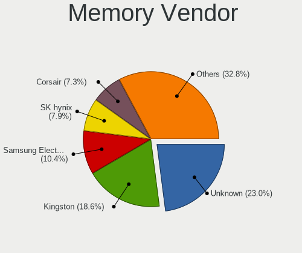

| Vendor              | Desktops | Percent |
|---------------------|----------|---------|
| Unknown             | 579      | 22.87%  |
| Kingston            | 475      | 18.76%  |
| Samsung Electronics | 267      | 10.55%  |
| SK Hynix            | 196      | 7.74%   |
| Corsair             | 186      | 7.35%   |
| Crucial             | 167      | 6.6%    |
| Micron Technology   | 127      | 5.02%   |
| G.Skill             | 112      | 4.42%   |
| A-DATA Technology   | 45       | 1.78%   |
| Nanya Technology    | 44       | 1.74%   |
| Patriot             | 30       | 1.18%   |
| GOODRAM             | 29       | 1.15%   |
| Team                | 23       | 0.91%   |
| Elpida              | 23       | 0.91%   |
| Apacer              | 15       | 0.59%   |
| Smart               | 14       | 0.55%   |
| Ramaxel Technology  | 14       | 0.55%   |
| Unknown             | 13       | 0.51%   |
| Transcend           | 11       | 0.43%   |
| Kingmax             | 11       | 0.43%   |
| GeIL                | 10       | 0.39%   |
| AMD                 | 10       | 0.39%   |
| Unifosa             | 8        | 0.32%   |
| Unknown (ABCD)      | 7        | 0.28%   |
| Silicon Power       | 7        | 0.28%   |
| Qimonda             | 6        | 0.24%   |
| Multilaser          | 5        | 0.2%    |
| Avant               | 5        | 0.2%    |
| Teikon              | 4        | 0.16%   |
| TakeMS              | 4        | 0.16%   |
| PNY                 | 4        | 0.16%   |
| Kreton              | 4        | 0.16%   |
| Atermiter           | 4        | 0.16%   |
| Unknown (AB)        | 3        | 0.12%   |
| Toshiba             | 3        | 0.12%   |
| PLEXHD              | 3        | 0.12%   |
| OCZ                 | 3        | 0.12%   |
| Infineon            | 3        | 0.12%   |
| H                   | 3        | 0.12%   |
| Goldkey             | 3        | 0.12%   |
| TIMETEC             | 2        | 0.08%   |
| Thermaltake         | 2        | 0.08%   |
| Swissbit            | 2        | 0.08%   |
| Super Talent        | 2        | 0.08%   |
| S                   | 2        | 0.08%   |
| Qumo                | 2        | 0.08%   |
| Panram              | 2        | 0.08%   |
| Neo Forza           | 2        | 0.08%   |
| V-Color             | 1        | 0.04%   |
| Uroad               | 1        | 0.04%   |
| Unknown (8AF1)      | 1        | 0.04%   |
| Unknown (82B5)      | 1        | 0.04%   |
| Unknown (07FB)      | 1        | 0.04%   |
| TwinMOS             | 1        | 0.04%   |
| TeamGroup           | 1        | 0.04%   |
| Smart Modular       | 1        | 0.04%   |
| SHARETRONIC         | 1        | 0.04%   |
| SGS/Thomson         | 1        | 0.04%   |
| Sesame              | 1        | 0.04%   |
| SanMax              | 1        | 0.04%   |

Memory Model
------------

Memory module models

| Model                                                          | Desktops | Percent |
|----------------------------------------------------------------|----------|---------|
| Unknown RAM Module 2GB DIMM 800MT/s                            | 42       | 1.48%   |
| Unknown RAM Module 2GB DIMM SDRAM                              | 37       | 1.31%   |
| Unknown RAM Module 2GB DIMM DDR2 800MT/s                       | 37       | 1.31%   |
| Unknown RAM Module 2GB DIMM 1333MT/s                           | 34       | 1.2%    |
| Unknown RAM Module 4GB DIMM 1333MT/s                           | 33       | 1.17%   |
| Unknown RAM Module 4GB DIMM DDR3 1333MT/s                      | 24       | 0.85%   |
| Unknown RAM Module 4GB DIMM 1600MT/s                           | 23       | 0.81%   |
| Unknown RAM Module 4GB DIMM DDR3 1600MT/s                      | 19       | 0.67%   |
| SK Hynix RAM HMT351U6CFR8C-PB 4096MB DIMM DDR3 1800MT/s        | 19       | 0.67%   |
| Unknown RAM Module 1GB DIMM SDRAM                              | 17       | 0.6%    |
| Samsung RAM M378B5673FH0-CH9 2GB DIMM DDR3 1600MT/s            | 17       | 0.6%    |
| Unknown RAM Module 2GB DIMM DDR2 667MT/s                       | 16       | 0.56%   |
| Micron RAM 8JTF51264AZ-1G6E1 4096MB DIMM DDR3 1600MT/s         | 16       | 0.56%   |
| Kingston RAM KHX1600C10D3/8G 4096MB DIMM DDR3 1600MT/s         | 16       | 0.56%   |
| Unknown RAM Module 2GB DIMM 667MT/s                            | 15       | 0.53%   |
| Unknown RAM Module 1GB DIMM DDR2 800MT/s                       | 15       | 0.53%   |
| Kingston RAM KHX1600C9D3/4GX 4096MB DIMM DDR3 2400MT/s         | 15       | 0.53%   |
| Kingston RAM 99U5471-020.A00LF 4GB DIMM DDR3 1600MT/s          | 15       | 0.53%   |
| Samsung RAM M378B5173QH0-CK0 4GB DIMM DDR3 1866MT/s            | 14       | 0.49%   |
| Corsair RAM CMK16GX4M2B3000C15 8GB DIMM DDR4 3000MT/s          | 14       | 0.49%   |
| Unknown RAM Module 8GB DIMM 1600MT/s                           | 13       | 0.46%   |
| Unknown RAM Module 1GB DIMM 800MT/s                            | 13       | 0.46%   |
| Samsung RAM M378B5773DH0-CH9 2GB DIMM DDR3 1333MT/s            | 13       | 0.46%   |
| Unknown                                                        | 13       | 0.46%   |
| Unknown RAM Module 8GB DIMM DDR3 1333MT/s                      | 12       | 0.42%   |
| Unknown RAM Module 2GB DIMM 400MT/s                            | 12       | 0.42%   |
| Unknown RAM Module 1GB DIMM DDR2 667MT/s                       | 12       | 0.42%   |
| Samsung RAM M378B5773CH0-CH9 2GB DIMM SDRAM 1867MT/s           | 12       | 0.42%   |
| Kingston RAM KHX1600C10D3/4G 4GB DIMM DDR3 1866MT/s            | 12       | 0.42%   |
| Unknown RAM Module 2GB DIMM DDR3 1333MT/s                      | 11       | 0.39%   |
| Samsung RAM M378A1K43CB2-CTD 8GB DIMM DDR4 3200MT/s            | 11       | 0.39%   |
| Kingston RAM KHX2400C15/8G 8192MB DIMM DDR4 2933MT/s           | 11       | 0.39%   |
| Kingston RAM KHX1866C10D3/8G 8GB DIMM DDR3 1867MT/s            | 11       | 0.39%   |
| Kingston RAM 99U5474-028.A00LF 4GB DIMM DDR3 1600MT/s          | 11       | 0.39%   |
| Corsair RAM CMK16GX4M2B3200C16 8GB DIMM DDR4 3600MT/s          | 11       | 0.39%   |
| Unknown RAM Module 4GB DIMM SDRAM                              | 10       | 0.35%   |
| Unknown RAM Module 4GB DIMM 400MT/s                            | 10       | 0.35%   |
| Unknown RAM Module 2GB DIMM DDR 1333MT/s                       | 10       | 0.35%   |
| Unknown RAM Module 1GB DIMM 667MT/s                            | 10       | 0.35%   |
| SK Hynix RAM HMT451U6BFR8A-PB 4GB DIMM DDR3 1600MT/s           | 10       | 0.35%   |
| Samsung RAM M378B5173DB0-CK0 4GB DIMM DDR3 1600MT/s            | 10       | 0.35%   |
| Kingston RAM KHX2666C16/8G 8GB DIMM DDR4 3466MT/s              | 10       | 0.35%   |
| Kingston RAM 99U5584-005.A00LF 4096MB DIMM DDR3 1600MT/s       | 10       | 0.35%   |
| Corsair RAM CMZ8GX3M2A1600C9 4GB DIMM DDR3 1600MT/s            | 10       | 0.35%   |
| Unknown RAM Module 4GB DIMM 1066MT/s                           | 9        | 0.32%   |
| SK Hynix RAM HMT451U6AFR8C-PB 4096MB DIMM DDR3 1600MT/s        | 9        | 0.32%   |
| Unknown RAM Module 8GB DIMM DDR3 1600MT/s                      | 8        | 0.28%   |
| Unknown RAM Module 2GB DIMM DDR2                               | 8        | 0.28%   |
| Unknown RAM Module 2GB DIMM 1066MT/s                           | 8        | 0.28%   |
| Unknown RAM Module 1GB DIMM                                    | 8        | 0.28%   |
| SK Hynix RAM HMT351U6EFR8C-PB 4GB DIMM DDR3 1800MT/s           | 8        | 0.28%   |
| Samsung RAM M378B5273DH0-CH9 4GB DIMM DDR3 2133MT/s            | 8        | 0.28%   |
| Kingston RAM 99U5584-010.A00LF 4GB DIMM DDR3 1866MT/s          | 8        | 0.28%   |
| Kingston RAM 99U5471-052.A00LF 8GB DIMM DDR3 1333MT/s          | 8        | 0.28%   |
| G.Skill RAM F4-3200C16-8GVKB 8GB DIMM DDR4 3200MT/s            | 8        | 0.28%   |
| Crucial RAM CT51264BA160BJ.C8F 4096MB DIMM DDR3 1600MT/s       | 8        | 0.28%   |
| Unknown RAM Module 2GB DIMM                                    | 7        | 0.25%   |
| Unknown (ABCD) RAM 123456789012345678 2GB DIMM LPDDR4 2400MT/s | 7        | 0.25%   |
| Samsung RAM M378B5673EH1-CH9 2048MB DIMM DDR3 1333MT/s         | 7        | 0.25%   |
| Samsung RAM M378B5273CH0-CH9 4096MB DIMM 1867MT/s              | 7        | 0.25%   |

Memory Kind
-----------

Memory module kinds

| Kind    | Desktops | Percent |
|---------|----------|---------|
| DDR3    | 975      | 44.06%  |
| DDR4    | 580      | 26.21%  |
| Unknown | 254      | 11.48%  |
| DDR2    | 193      | 8.72%   |
| SDRAM   | 159      | 7.18%   |
| DDR     | 41       | 1.85%   |
| LPDDR4  | 8        | 0.36%   |
| LPDDR3  | 2        | 0.09%   |
| DRAM    | 1        | 0.05%   |

Memory Form Factor
------------------

Physical design of the memory module

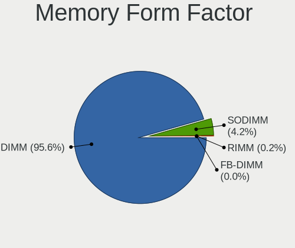

| Name    | Desktops | Percent |
|---------|----------|---------|
| DIMM    | 2052     | 95.53%  |
| SODIMM  | 92       | 4.28%   |
| RIMM    | 3        | 0.14%   |
| FB-DIMM | 1        | 0.05%   |

Memory Size
-----------

Memory module size

| Size  | Desktops | Percent |
|-------|----------|---------|
| 4096  | 842      | 34.4%   |
| 8192  | 634      | 25.9%   |
| 2048  | 603      | 24.63%  |
| 1024  | 189      | 7.72%   |
| 16384 | 129      | 5.27%   |
| 512   | 29       | 1.18%   |
| 32768 | 18       | 0.74%   |
| 3072  | 1        | 0.04%   |
| 256   | 1        | 0.04%   |
| 64    | 1        | 0.04%   |
| 32    | 1        | 0.04%   |

Memory Speed
------------

Memory module speed

| Speed   | Desktops | Percent |
|---------|----------|---------|
| 1600    | 569      | 22.96%  |
| 1333    | 448      | 18.08%  |
| 800     | 168      | 6.78%   |
| 2400    | 129      | 5.21%   |
| 667     | 124      | 5%      |
| Unknown | 100      | 4.04%   |
| 2133    | 97       | 3.91%   |
| 2667    | 94       | 3.79%   |
| 3200    | 86       | 3.47%   |
| 3600    | 56       | 2.26%   |
| 1867    | 56       | 2.26%   |
| 1066    | 45       | 1.82%   |
| 1866    | 43       | 1.74%   |
| 400     | 35       | 1.41%   |
| 2933    | 34       | 1.37%   |
| 1067    | 34       | 1.37%   |
| 1800    | 33       | 1.33%   |
| 3466    | 32       | 1.29%   |
| 2666    | 27       | 1.09%   |
| 533     | 27       | 1.09%   |
| 3000    | 23       | 0.93%   |
| 1334    | 16       | 0.65%   |
| 2800    | 14       | 0.56%   |
| 2048    | 12       | 0.48%   |
| 333     | 11       | 0.44%   |
| 2000    | 10       | 0.4%    |
| 3400    | 9        | 0.36%   |
| 49926   | 8        | 0.32%   |
| 3733    | 8        | 0.32%   |
| 3533    | 8        | 0.32%   |
| 3066    | 8        | 0.32%   |
| 2200    | 8        | 0.32%   |
| 3151    | 7        | 0.28%   |
| 3500    | 6        | 0.24%   |
| 3334    | 6        | 0.24%   |
| 1400    | 6        | 0.24%   |
| 3800    | 5        | 0.2%    |
| 2733    | 5        | 0.2%    |
| 1639    | 5        | 0.2%    |
| 3333    | 4        | 0.16%   |
| 3100    | 4        | 0.16%   |
| 2866    | 4        | 0.16%   |
| 2465    | 4        | 0.16%   |
| 200     | 4        | 0.16%   |
| 3266    | 3        | 0.12%   |
| 2134    | 3        | 0.12%   |
| 266     | 3        | 0.12%   |
| 66      | 3        | 0.12%   |
| 4333    | 2        | 0.08%   |
| 4000    | 2        | 0.08%   |
| 3067    | 2        | 0.08%   |
| 2747    | 2        | 0.08%   |
| 1648    | 2        | 0.08%   |
| 133     | 2        | 0.08%   |
| 65535   | 1        | 0.04%   |
| 57535   | 1        | 0.04%   |
| 43889   | 1        | 0.04%   |
| 41632   | 1        | 0.04%   |
| 6400    | 1        | 0.04%   |
| 5354    | 1        | 0.04%   |

Printers & scanners
-------------------

Printer Vendor
--------------

Printer device vendors

| Vendor                | Desktops | Percent |
|-----------------------|----------|---------|
| Hewlett-Packard       | 65       | 46.76%  |
| Brother Industries    | 24       | 17.27%  |
| Canon                 | 16       | 11.51%  |
| Samsung Electronics   | 15       | 10.79%  |
| Seiko Epson           | 13       | 9.35%   |
| Dymo-CoStar           | 2        | 1.44%   |
| Ricoh                 | 1        | 0.72%   |
| Prolific Technology   | 1        | 0.72%   |
| Oki Data              | 1        | 0.72%   |
| Lexmark International | 1        | 0.72%   |

Printer Model
-------------

Printer device models

| Model                                                      | Desktops | Percent |
|------------------------------------------------------------|----------|---------|
| HP DeskJet 2620 All-in-One Printer                         | 5        | 3.55%   |
| HP LaserJet P1006                                          | 4        | 2.84%   |
| HP DeskJet 3630 series                                     | 4        | 2.84%   |
| Samsung M2020 Series                                       | 3        | 2.13%   |
| Seiko Epson XP-243 245 247 Series                          | 2        | 1.42%   |
| Samsung ML-1640 Series Laser Printer                       | 2        | 1.42%   |
| HP OfficeJet Pro 6960                                      | 2        | 1.42%   |
| HP LaserJet P1102                                          | 2        | 1.42%   |
| HP ENVY 4520 series                                        | 2        | 1.42%   |
| HP Deskjet F4500 series                                    | 2        | 1.42%   |
| HP DeskJet 916C                                            | 2        | 1.42%   |
| HP DeskJet 845c                                            | 2        | 1.42%   |
| HP Deskjet 3520 series                                     | 2        | 1.42%   |
| HP DeskJet 2700 series                                     | 2        | 1.42%   |
| HP DeskJet 2130 series                                     | 2        | 1.42%   |
| Canon PIXMA MX920 Series                                   | 2        | 1.42%   |
| Seiko Epson XP-4100 Series                                 | 1        | 0.71%   |
| Seiko Epson WF-2530 Series                                 | 1        | 0.71%   |
| Seiko Epson WF-2510 Series                                 | 1        | 0.71%   |
| Seiko Epson USB2.0 Printer (Hi-speed)                      | 1        | 0.71%   |
| Seiko Epson ME Office 600F/Stylus Office BX300F/TX300F     | 1        | 0.71%   |
| Seiko Epson ME 340 Series/Stylus NX130 Series              | 1        | 0.71%   |
| Seiko Epson L395 Series                                    | 1        | 0.71%   |
| Seiko Epson L375 Series                                    | 1        | 0.71%   |
| Seiko Epson L365 Series                                    | 1        | 0.71%   |
| Seiko Epson L120 Series                                    | 1        | 0.71%   |
| Seiko Epson ET-4750 [WorkForce ET-4750 EcoTank All-in-One] | 1        | 0.71%   |
| Samsung SCX-4650 4x21S Series                              | 1        | 0.71%   |
| Samsung SCX-4300 Series                                    | 1        | 0.71%   |
| Samsung SCX-4200 series                                    | 1        | 0.71%   |
| Samsung SCX-3200 Series                                    | 1        | 0.71%   |
| Samsung ML-1710 Printer                                    | 1        | 0.71%   |
| Samsung ML-1670 Series                                     | 1        | 0.71%   |
| Samsung ML-1660 Series                                     | 1        | 0.71%   |
| Samsung M283x Series                                       | 1        | 0.71%   |
| Samsung M2070 Series                                       | 1        | 0.71%   |
| Samsung C43x Series                                        | 1        | 0.71%   |
| Ricoh Printing Support                                     | 1        | 0.71%   |
| Prolific PL2305 Parallel Port                              | 1        | 0.71%   |
| Oki Data USB Device                                        | 1        | 0.71%   |
| Lexmark International InkJet Color Printer                 | 1        | 0.71%   |
| HP Smart Tank Plus 650 series                              | 1        | 0.71%   |
| HP Smart Tank Plus 550 series                              | 1        | 0.71%   |
| HP Printing Support                                        | 1        | 0.71%   |
| HP OfficeJet Pro 7720 series                               | 1        | 0.71%   |
| HP Officejet 6600                                          | 1        | 0.71%   |
| HP OfficeJet 4650 series                                   | 1        | 0.71%   |
| HP Officejet 4620 series                                   | 1        | 0.71%   |
| HP Officejet 4500 G510n-z                                  | 1        | 0.71%   |
| HP Officejet 2620 series                                   | 1        | 0.71%   |
| HP LaserJet Pro M148f-M149f                                | 1        | 0.71%   |
| HP LaserJet P2015 series                                   | 1        | 0.71%   |
| HP LaserJet P1005                                          | 1        | 0.71%   |
| HP LaserJet M203-M206                                      | 1        | 0.71%   |
| HP LaserJet M14-M17                                        | 1        | 0.71%   |
| HP LaserJet 2300d                                          | 1        | 0.71%   |
| HP LaserJet 1300                                           | 1        | 0.71%   |
| HP LaserJet 1200                                           | 1        | 0.71%   |
| HP LaserJet 1022                                           | 1        | 0.71%   |
| HP LaserJet 1020                                           | 1        | 0.71%   |

Scanner Vendor
--------------

Scanner device vendors

| Vendor                      | Desktops | Percent |
|-----------------------------|----------|---------|
| Canon                       | 19       | 48.72%  |
| Hewlett-Packard             | 8        | 20.51%  |
| Seiko Epson                 | 4        | 10.26%  |
| Mustek Systems              | 4        | 10.26%  |
| AGFA-Gevaert NV             | 2        | 5.13%   |
| Plustek                     | 1        | 2.56%   |
| KYE Systems (Mouse Systems) | 1        | 2.56%   |

Scanner Model
-------------

Scanner device models

| Model                                                    | Desktops | Percent |
|----------------------------------------------------------|----------|---------|
| Canon CanoScan LiDE 210                                  | 5        | 12.82%  |
| Mustek Systems ScanExpress 1200 UB                       | 2        | 5.13%   |
| Canon CanoScan LIDE 25                                   | 2        | 5.13%   |
| Canon CanoScan LiDE 120                                  | 2        | 5.13%   |
| Canon CanoScan LiDE 110                                  | 2        | 5.13%   |
| Canon CanoScan LiDE 100                                  | 2        | 5.13%   |
| Seiko Epson GT-F730 [GT-S630/Perfection V33/V330 Photo]  | 1        | 2.56%   |
| Seiko Epson GT-F650 [GT-S600/Perfection V10/V100]        | 1        | 2.56%   |
| Seiko Epson GT-F500/GT-F550 [Perfection 2480/2580 PHOTO] | 1        | 2.56%   |
| Seiko Epson GT-7400U [Perfection 1270]                   | 1        | 2.56%   |
| Plustek 600DPI USB Scanner                               | 1        | 2.56%   |
| Mustek Systems BearPaw 2448 CU Pro                       | 1        | 2.56%   |
| Mustek Systems BearPaw 1200 CU Plus                      | 1        | 2.56%   |
| KYE Systems (Mouse Systems) ColorPage-Vivid4             | 1        | 2.56%   |
| HP ScanJet G4010                                         | 1        | 2.56%   |
| HP ScanJet 4500C/5550C                                   | 1        | 2.56%   |
| HP ScanJet 4370                                          | 1        | 2.56%   |
| HP ScanJet 3800c                                         | 1        | 2.56%   |
| HP ScanJet 3670                                          | 1        | 2.56%   |
| HP ScanJet 2300c                                         | 1        | 2.56%   |
| HP ScanJet 2200c                                         | 1        | 2.56%   |
| HP PSC 1200                                              | 1        | 2.56%   |
| Canon CanoScan N650U/N656U                               | 1        | 2.56%   |
| Canon CanoScan LiDE 700F                                 | 1        | 2.56%   |
| Canon CanoScan LiDE 70                                   | 1        | 2.56%   |
| Canon CanoScan LiDE 500F                                 | 1        | 2.56%   |
| Canon CanoScan LiDE 220                                  | 1        | 2.56%   |
| Canon CanoScan LiDE 200                                  | 1        | 2.56%   |
| AGFA-Gevaert NV SnapScan Touch                           | 1        | 2.56%   |
| AGFA-Gevaert NV SnapScan e20                             | 1        | 2.56%   |

Camera
------

Camera Vendor
-------------

Camera device vendors

| Vendor                                 | Desktops | Percent |
|----------------------------------------|----------|---------|
| Logitech                               | 106      | 34.98%  |
| Microdia                               | 28       | 9.24%   |
| Microsoft                              | 24       | 7.92%   |
| Z-Star Microelectronics                | 13       | 4.29%   |
| GEMBIRD                                | 12       | 3.96%   |
| Chicony Electronics                    | 11       | 3.63%   |
| Aveo Technology                        | 8        | 2.64%   |
| Sunplus Innovation Technology          | 7        | 2.31%   |
| Realtek Semiconductor                  | 7        | 2.31%   |
| Creative Technology                    | 7        | 2.31%   |
| Cubeternet                             | 6        | 1.98%   |
| Samsung Electronics                    | 5        | 1.65%   |
| KYE Systems (Mouse Systems)            | 5        | 1.65%   |
| Huawei Technologies                    | 5        | 1.65%   |
| Generalplus Technology                 | 5        | 1.65%   |
| ARC International                      | 5        | 1.65%   |
| Trust                                  | 3        | 0.99%   |
| Pixart Imaging                         | 3        | 0.99%   |
| Genesys Logic                          | 3        | 0.99%   |
| Arkmicro Technologies                  | 3        | 0.99%   |
| Apple                                  | 3        | 0.99%   |
| Alcor Micro                            | 3        | 0.99%   |
| A4Tech                                 | 3        | 0.99%   |
| WCM_USB                                | 2        | 0.66%   |
| Sweex                                  | 2        | 0.66%   |
| Silicon Motion                         | 2        | 0.66%   |
| MacroSilicon                           | 2        | 0.66%   |
| Jieli Technology                       | 2        | 0.66%   |
| YGTek                                  | 1        | 0.33%   |
| Xiongmai                               | 1        | 0.33%   |
| WaveRider Communications               | 1        | 0.33%   |
| Unknown                                | 1        | 0.33%   |
| Tobii Technology AB                    | 1        | 0.33%   |
| Teslong Camera                         | 1        | 0.33%   |
| Spreadtrum Communications              | 1        | 0.33%   |
| Sonix Technology                       | 1        | 0.33%   |
| SHENZHEN EMEET TECHNOLOGY              | 1        | 0.33%   |
| Sanyo Electric                         | 1        | 0.33%   |
| Linux Foundation                       | 1        | 0.33%   |
| LG Electronics                         | 1        | 0.33%   |
| IMC Networks                           | 1        | 0.33%   |
| HHT                                    | 1        | 0.33%   |
| Hewlett-Packard                        | 1        | 0.33%   |
| eMPIA Technology                       | 1        | 0.33%   |
| Cheng Uei Precision Industry (Foxlink) | 1        | 0.33%   |
| AVerMedia Technologies                 | 1        | 0.33%   |

Camera Model
------------

Camera device models

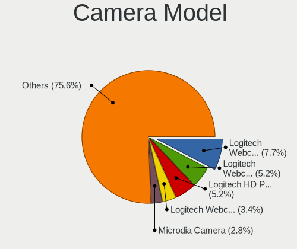

| Model                                             | Desktops | Percent |
|---------------------------------------------------|----------|---------|
| Logitech Webcam C270                              | 23       | 7.59%   |
| Logitech Webcam C310                              | 16       | 5.28%   |
| Logitech HD Pro Webcam C920                       | 15       | 4.95%   |
| Logitech Webcam C170                              | 9        | 2.97%   |
| Microsoft LifeCam HD-3000                         | 7        | 2.31%   |
| Microdia Camera                                   | 7        | 2.31%   |
| GEMBIRD Generic UVC 1.00 camera [AppoTech AX2311] | 7        | 2.31%   |
| Microdia Webcam Vitade AF                         | 6        | 1.98%   |
| Logitech HD Webcam C525                           | 6        | 1.98%   |
| Samsung Galaxy A5 (MTP)                           | 5        | 1.65%   |
| Logitech QuickCam Pro 9000                        | 5        | 1.65%   |
| Huawei UVC Camera                                 | 5        | 1.65%   |
| GEMBIRD USB2.0 PC CAMERA                          | 5        | 1.65%   |
| Aveo USB2.0 Camera                                | 5        | 1.65%   |
| ARC International Camera                          | 5        | 1.65%   |
| Z-Star Vimicro USB Camera (Altair)                | 4        | 1.32%   |
| Microsoft LifeCam Cinema                          | 4        | 1.32%   |
| Microdia USB 2.0 Camera                           | 4        | 1.32%   |
| Microdia Sonix USB 2.0 Camera                     | 4        | 1.32%   |
| Microdia Integrated Camera                        | 4        | 1.32%   |
| Generalplus CAMERA - UVC                          | 4        | 1.32%   |
| Cubeternet USB2.0 Camera                          | 4        | 1.32%   |
| Z-Star Venus USB2.0 Camera                        | 3        | 0.99%   |
| Z-Star A4 TECH USB2.0 PC Camera J                 | 3        | 0.99%   |
| Realtek Full HD webcam                            | 3        | 0.99%   |
| Pixart Imaging GE 1.3 MP MiniCam Pro              | 3        | 0.99%   |
| Microsoft LifeCam VX-5000                         | 3        | 0.99%   |
| Logitech Webcam C300                              | 3        | 0.99%   |
| Creative Live! Cam Sync HD [VF0770]               | 3        | 0.99%   |
| Chicony HP High Definition 1MP Webcam             | 3        | 0.99%   |
| Arkmicro USB2.0 PC CAMERA                         | 3        | 0.99%   |
| Apple iPhone 5/5C/5S/6/SE                         | 3        | 0.99%   |
| Alcor Micro USB 2.0 PC Camera                     | 3        | 0.99%   |
| WCM_USB WEB CAM                                   | 2        | 0.66%   |
| Sweex WC060 Series HD Webcam                      | 2        | 0.66%   |
| Sunplus HK 1080P K20Pro                           | 2        | 0.66%   |
| Sunplus HD 720P webcam                            | 2        | 0.66%   |
| Sunplus Aukey-PC-LM1E Camera                      | 2        | 0.66%   |
| Realtek WEB CAMERA M9 Pro                         | 2        | 0.66%   |
| Microsoft LifeCam VX-2000                         | 2        | 0.66%   |
| Microsoft LifeCam Studio                          | 2        | 0.66%   |
| Microsoft LifeCam HD-5000                         | 2        | 0.66%   |
| Microdia USB Camera                               | 2        | 0.66%   |
| MacroSilicon USB Video                            | 2        | 0.66%   |
| Logitech Webcam C600                              | 2        | 0.66%   |
| Logitech Webcam C200                              | 2        | 0.66%   |
| Logitech QuickCam Pro 5000                        | 2        | 0.66%   |
| Logitech QuickCam Pro 4000                        | 2        | 0.66%   |
| Logitech HD Webcam C910                           | 2        | 0.66%   |
| Logitech HD Webcam C615                           | 2        | 0.66%   |
| Logitech C922 Pro Stream Webcam                   | 2        | 0.66%   |
| KYE Systems (Mouse Systems) FaceCam 1000X         | 2        | 0.66%   |
| Jieli USB PHY 2.0                                 | 2        | 0.66%   |
| Genesys Logic Camera                              | 2        | 0.66%   |
| Cubeternet GL-UPC822 UVC WebCam                   | 2        | 0.66%   |
| Creative Live! Cam Chat HD [VF0700]               | 2        | 0.66%   |
| Aveo Camera                                       | 2        | 0.66%   |
| A4Tech HD 720P PC Camera                          | 2        | 0.66%   |
| Z-Star Sirius USB2.0 Camera                       | 1        | 0.33%   |
| Z-Star Integrated Camera                          | 1        | 0.33%   |

Security
--------

Fingerprint Vendor
------------------

Fingerprint sensor vendors

| Vendor           | Desktops | Percent |
|------------------|----------|---------|
| Validity Sensors | 1        | 33.33%  |
| Upek             | 1        | 33.33%  |
| AuthenTec        | 1        | 33.33%  |

Fingerprint Model
-----------------

Fingerprint sensor models

| Model                                                  | Desktops | Percent |
|--------------------------------------------------------|----------|---------|
| Validity Sensors VFS 5011 fingerprint sensor           | 1        | 33.33%  |
| Upek Biometric Touchchip/Touchstrip Fingerprint Sensor | 1        | 33.33%  |
| AuthenTec AES1600                                      | 1        | 33.33%  |

Chipcard Vendor
---------------

Chipcard module vendors

| Vendor                            | Desktops | Percent |
|-----------------------------------|----------|---------|
| Alcor Micro                       | 5        | 38.46%  |
| OmniKey                           | 2        | 15.38%  |
| VASCO Data Security International | 1        | 7.69%   |
| SCM Microsystems                  | 1        | 7.69%   |
| Reiner SCT Kartensysteme          | 1        | 7.69%   |
| Fujitsu Siemens Computers         | 1        | 7.69%   |
| BIT4ID                            | 1        | 7.69%   |
| Advanced Card Systems             | 1        | 7.69%   |

Chipcard Model
--------------

Chipcard module models

| Model                                                                      | Desktops | Percent |
|----------------------------------------------------------------------------|----------|---------|
| Alcor Micro AU9540 Smartcard Reader                                        | 3        | 23.08%  |
| Alcor Micro Watchdata W 1981                                               | 2        | 15.38%  |
| VASCO Data Security International Digipass 905 SmartCard Reader            | 1        | 7.69%   |
| SCM Microsystems SCR335 SmartCard Reader                                   | 1        | 7.69%   |
| Reiner SCT Kartensysteme cyberJack RFID basis contactless smartcard reader | 1        | 7.69%   |
| OmniKey CardMan 3021 / 3121                                                | 1        | 7.69%   |
| OmniKey CardMan 1021                                                       | 1        | 7.69%   |
| Fujitsu Siemens Computers SmartCard Reader 2A                              | 1        | 7.69%   |
| BIT4ID miniLector EVO                                                      | 1        | 7.69%   |
| Advanced Card Systems ACR38 SmartCard Reader                               | 1        | 7.69%   |

Unsupported
-----------

Unsupported Devices
-------------------

Total unsupported devices on board

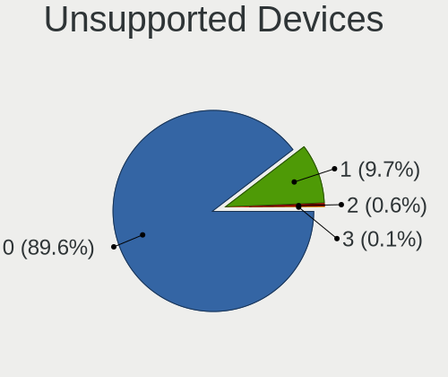

| Total | Desktops | Percent |
|-------|----------|---------|
| 0     | 2000     | 91.91%  |
| 1     | 167      | 7.67%   |
| 2     | 8        | 0.37%   |
| 3     | 1        | 0.05%   |

Unsupported Device Types
------------------------

Types of unsupported devices

| Type                     | Desktops | Percent |
|--------------------------|----------|---------|
| Graphics card            | 67       | 35.83%  |
| Net/wireless             | 47       | 25.13%  |
| Multimedia controller    | 14       | 7.49%   |
| Communication controller | 14       | 7.49%   |
| Chipcard                 | 12       | 6.42%   |
| Unassigned class         | 10       | 5.35%   |
| Camera                   | 6        | 3.21%   |
| Fingerprint reader       | 3        | 1.6%    |
| Card reader              | 3        | 1.6%    |
| Storage/ata              | 2        | 1.07%   |
| Sound                    | 2        | 1.07%   |
| Network                  | 2        | 1.07%   |
| Modem                    | 2        | 1.07%   |
| Bluetooth                | 2        | 1.07%   |
| Unclassified device      | 1        | 0.53%   |

