OpenMandriva 4.2 - Tested Hardware & Statistics (Notebooks)
-----------------------------------------------------------

A project to collect tested hardware configurations for OpenMandriva 4.2.

Anyone can contribute to this report by the [hw-probe](https://github.com/linuxhw/hw-probe) tool:

    sudo -E hw-probe -all -upload

Please contribute! Especially if your hardware is rare.

Contents
--------

* [ Test Cases ](#test-cases)

* [ System ](#system)
  - [ Kernel                   ](#kernel)
  - [ Kernel Family            ](#kernel-family)
  - [ Kernel Major Ver.        ](#kernel-major-ver)
  - [ Arch                     ](#arch)
  - [ DE                       ](#de)
  - [ Display Server           ](#display-server)
  - [ Display Manager          ](#display-manager)
  - [ OS Lang                  ](#os-lang)
  - [ Boot Mode                ](#boot-mode)
  - [ Filesystem               ](#filesystem)
  - [ Part. scheme             ](#part-scheme)
  - [ Dual Boot with Linux/BSD ](#dual-boot-with-linuxbsd)
  - [ Dual Boot (Win)          ](#dual-boot-win)

* [ Board ](#board)
  - [ Vendor                   ](#vendor)
  - [ Model                    ](#model)
  - [ Model Family             ](#model-family)
  - [ MFG Year                 ](#mfg-year)
  - [ Form Factor              ](#form-factor)
  - [ Secure Boot              ](#secure-boot)
  - [ Coreboot                 ](#coreboot)
  - [ RAM Size                 ](#ram-size)
  - [ RAM Used                 ](#ram-used)
  - [ Total Drives             ](#total-drives)
  - [ Has CD-ROM               ](#has-cd-rom)
  - [ Has Ethernet             ](#has-ethernet)
  - [ Has WiFi                 ](#has-wifi)
  - [ Has Bluetooth            ](#has-bluetooth)

* [ Location ](#location)
  - [ Country                  ](#country)
  - [ City                     ](#city)

* [ Drives ](#drives)
  - [ Drive Vendor             ](#drive-vendor)
  - [ Drive Model              ](#drive-model)
  - [ HDD Vendor               ](#hdd-vendor)
  - [ SSD Vendor               ](#ssd-vendor)
  - [ Drive Kind               ](#drive-kind)
  - [ Drive Connector          ](#drive-connector)
  - [ Drive Size               ](#drive-size)
  - [ Space Total              ](#space-total)
  - [ Space Used               ](#space-used)
  - [ Malfunc. Drives          ](#malfunc-drives)
  - [ Malfunc. Drive Vendor    ](#malfunc-drive-vendor)
  - [ Malfunc. HDD Vendor      ](#malfunc-hdd-vendor)
  - [ Malfunc. Drive Kind      ](#malfunc-drive-kind)
  - [ Failed Drives            ](#failed-drives)
  - [ Failed Drive Vendor      ](#failed-drive-vendor)
  - [ Drive Status             ](#drive-status)

* [ Storage controller ](#storage-controller)
  - [ Storage Vendor           ](#storage-vendor)
  - [ Storage Model            ](#storage-model)
  - [ Storage Kind             ](#storage-kind)

* [ Processor ](#processor)
  - [ CPU Vendor               ](#cpu-vendor)
  - [ CPU Model                ](#cpu-model)
  - [ CPU Model Family         ](#cpu-model-family)
  - [ CPU Cores                ](#cpu-cores)
  - [ CPU Sockets              ](#cpu-sockets)
  - [ CPU Threads              ](#cpu-threads)
  - [ CPU Op-Modes             ](#cpu-op-modes)
  - [ CPU Microcode            ](#cpu-microcode)
  - [ CPU Microarch            ](#cpu-microarch)

* [ Graphics ](#graphics)
  - [ GPU Vendor               ](#gpu-vendor)
  - [ GPU Model                ](#gpu-model)
  - [ GPU Combo                ](#gpu-combo)
  - [ GPU Driver               ](#gpu-driver)
  - [ GPU Memory               ](#gpu-memory)

* [ Monitor ](#monitor)
  - [ Monitor Vendor           ](#monitor-vendor)
  - [ Monitor Model            ](#monitor-model)
  - [ Monitor Resolution       ](#monitor-resolution)
  - [ Monitor Diagonal         ](#monitor-diagonal)
  - [ Monitor Width            ](#monitor-width)
  - [ Aspect Ratio             ](#aspect-ratio)
  - [ Monitor Area             ](#monitor-area)
  - [ Pixel Density            ](#pixel-density)
  - [ Multiple Monitors        ](#multiple-monitors)

* [ Network ](#network)
  - [ Net Controller Vendor    ](#net-controller-vendor)
  - [ Net Controller Model     ](#net-controller-model)
  - [ Wireless Vendor          ](#wireless-vendor)
  - [ Wireless Model           ](#wireless-model)
  - [ Ethernet Vendor          ](#ethernet-vendor)
  - [ Ethernet Model           ](#ethernet-model)
  - [ Net Controller Kind      ](#net-controller-kind)
  - [ Used Controller          ](#used-controller)
  - [ NICs                     ](#nics)
  - [ IPv6                     ](#ipv6)

* [ Bluetooth ](#bluetooth)
  - [ Bluetooth Vendor         ](#bluetooth-vendor)
  - [ Bluetooth Model          ](#bluetooth-model)

* [ Sound ](#sound)
  - [ Sound Vendor             ](#sound-vendor)
  - [ Sound Model              ](#sound-model)

* [ Memory ](#memory)
  - [ Memory Vendor            ](#memory-vendor)
  - [ Memory Model             ](#memory-model)
  - [ Memory Kind              ](#memory-kind)
  - [ Memory Form Factor       ](#memory-form-factor)
  - [ Memory Size              ](#memory-size)
  - [ Memory Speed             ](#memory-speed)

* [ Printers & scanners ](#printers--scanners)
  - [ Printer Vendor           ](#printer-vendor)
  - [ Printer Model            ](#printer-model)
  - [ Scanner Vendor           ](#scanner-vendor)
  - [ Scanner Model            ](#scanner-model)

* [ Camera ](#camera)
  - [ Camera Vendor            ](#camera-vendor)
  - [ Camera Model             ](#camera-model)

* [ Security ](#security)
  - [ Fingerprint Vendor       ](#fingerprint-vendor)
  - [ Fingerprint Model        ](#fingerprint-model)
  - [ Chipcard Vendor          ](#chipcard-vendor)
  - [ Chipcard Model           ](#chipcard-model)

* [ Unsupported ](#unsupported)
  - [ Unsupported Devices      ](#unsupported-devices)
  - [ Unsupported Device Types ](#unsupported-device-types)

Test Cases
----------

Total: 2230

| Vendor        | Model                       | Probe                                                      | Date         |
|---------------|-----------------------------|------------------------------------------------------------|--------------|
| Acer          | Aspire VX5-591G             | [7defe87998](https://linux-hardware.org/?probe=7defe87998) | Dec 23, 2022 |
| ASUSTek       | M51Vr                       | [ffc48a52ea](https://linux-hardware.org/?probe=ffc48a52ea) | Dec 22, 2022 |
| HP            | Presario CQ62               | [fce21eae2c](https://linux-hardware.org/?probe=fce21eae2c) | Dec 15, 2022 |
| HP            | Compaq 6735s                | [72d29aa11f](https://linux-hardware.org/?probe=72d29aa11f) | Dec 14, 2022 |
| Dell          | Inspiron 3451               | [de7f9d5e33](https://linux-hardware.org/?probe=de7f9d5e33) | Dec 14, 2022 |
| Acer          | Aspire A315-34              | [85794e606c](https://linux-hardware.org/?probe=85794e606c) | Dec 08, 2022 |
| HP            | Compaq Presario CQ60        | [1f521f98cb](https://linux-hardware.org/?probe=1f521f98cb) | Nov 27, 2022 |
| ASUSTek       | K70IJ                       | [8df764e624](https://linux-hardware.org/?probe=8df764e624) | Nov 23, 2022 |
| Dell          | Inspiron 3451               | [105a376344](https://linux-hardware.org/?probe=105a376344) | Nov 17, 2022 |
| HP            | G72                         | [08a732911d](https://linux-hardware.org/?probe=08a732911d) | Oct 31, 2022 |
| Sony          | VPCEB1S1R                   | [1e64f5427a](https://linux-hardware.org/?probe=1e64f5427a) | Oct 21, 2022 |
| HP            | ENVY 15                     | [71c0056a73](https://linux-hardware.org/?probe=71c0056a73) | Oct 13, 2022 |
| Dell          | Inspiron 3451               | [37b9e0d491](https://linux-hardware.org/?probe=37b9e0d491) | Oct 13, 2022 |
| Apple         | MacBookPro13,2              | [8eaf391b08](https://linux-hardware.org/?probe=8eaf391b08) | Oct 12, 2022 |
| HP            | Notebook                    | [2fd3bd5ee0](https://linux-hardware.org/?probe=2fd3bd5ee0) | Oct 10, 2022 |
| Dell          | Inspiron 3451               | [29de9dfa4a](https://linux-hardware.org/?probe=29de9dfa4a) | Oct 07, 2022 |
| Toshiba       | Satellite C650D             | [69db41a0b6](https://linux-hardware.org/?probe=69db41a0b6) | Oct 06, 2022 |
| Dell          | Inspiron 3451               | [9bf3a4a735](https://linux-hardware.org/?probe=9bf3a4a735) | Oct 03, 2022 |
| Dell          | Inspiron 3451               | [aee33639b9](https://linux-hardware.org/?probe=aee33639b9) | Oct 01, 2022 |
| HP            | Laptop 15-bs0xx             | [7ed786bee9](https://linux-hardware.org/?probe=7ed786bee9) | Sep 30, 2022 |
| Acer          | Aspire V3-471               | [b04cc2ea05](https://linux-hardware.org/?probe=b04cc2ea05) | Sep 20, 2022 |
| Dell          | Vostro 3500                 | [08bd4157a3](https://linux-hardware.org/?probe=08bd4157a3) | Sep 18, 2022 |
| Lenovo        | B50-45 20388                | [d55d9fad24](https://linux-hardware.org/?probe=d55d9fad24) | Sep 17, 2022 |
| Dell          | Inspiron 3451               | [fcdfa43a37](https://linux-hardware.org/?probe=fcdfa43a37) | Sep 15, 2022 |
| Dell          | Inspiron 3451               | [f06aa45765](https://linux-hardware.org/?probe=f06aa45765) | Sep 13, 2022 |
| ASUSTek       | K53U                        | [d13ff70895](https://linux-hardware.org/?probe=d13ff70895) | Sep 08, 2022 |
| Samsung       | RC420/RC520/RC720           | [a6b07acfe5](https://linux-hardware.org/?probe=a6b07acfe5) | Sep 07, 2022 |
| Acer          | Aspire 5715Z                | [82086ce1c6](https://linux-hardware.org/?probe=82086ce1c6) | Sep 01, 2022 |
| Packard Be... | EasyNote TK37               | [996a14d9f4](https://linux-hardware.org/?probe=996a14d9f4) | Aug 17, 2022 |
| Packard Be... | EasyNote TE11BZ             | [2a8e801b4e](https://linux-hardware.org/?probe=2a8e801b4e) | Aug 16, 2022 |
| HP            | Notebook                    | [975f3e38e3](https://linux-hardware.org/?probe=975f3e38e3) | Aug 15, 2022 |
| Dell          | Latitude E6540              | [d47b2c5c2b](https://linux-hardware.org/?probe=d47b2c5c2b) | Aug 06, 2022 |
| Dell          | Latitude E5470              | [9e78351999](https://linux-hardware.org/?probe=9e78351999) | Aug 04, 2022 |
| MSI           | GE62VR 7RF                  | [e5f6f7e14c](https://linux-hardware.org/?probe=e5f6f7e14c) | Aug 03, 2022 |
| ASUSTek       | K50ID                       | [2c1dddeaea](https://linux-hardware.org/?probe=2c1dddeaea) | Jul 29, 2022 |
| Dell          | Inspiron 3451               | [c95dd7e491](https://linux-hardware.org/?probe=c95dd7e491) | Jul 13, 2022 |
| HP            | Pavilion g6                 | [2f0de52d8e](https://linux-hardware.org/?probe=2f0de52d8e) | Jul 08, 2022 |
| Gateway       | NE56R                       | [69f2805432](https://linux-hardware.org/?probe=69f2805432) | Jul 06, 2022 |
| HP            | Stream Laptop 14-ax0XX      | [03bede7266](https://linux-hardware.org/?probe=03bede7266) | Jul 03, 2022 |
| Dell          | Inspiron 3451               | [a57cf9cc46](https://linux-hardware.org/?probe=a57cf9cc46) | Jul 03, 2022 |
| ASUSTek       | X542UA                      | [f5da6492ca](https://linux-hardware.org/?probe=f5da6492ca) | Jul 03, 2022 |
| Dell          | Latitude D630               | [df3001a64d](https://linux-hardware.org/?probe=df3001a64d) | Jul 02, 2022 |
| Notebook      | MIM 2200                    | [85748618b6](https://linux-hardware.org/?probe=85748618b6) | Jul 02, 2022 |
| Dell          | Inspiron 3451               | [6cf63ca19e](https://linux-hardware.org/?probe=6cf63ca19e) | Jun 30, 2022 |
| Dell          | Latitude E7250              | [790850da0b](https://linux-hardware.org/?probe=790850da0b) | Jun 22, 2022 |
| Samsung       | 355V4C/356V4C/3445VC/354... | [212cd0ac63](https://linux-hardware.org/?probe=212cd0ac63) | Jun 22, 2022 |
| Dell          | Inspiron 3451               | [d9ac6a3f41](https://linux-hardware.org/?probe=d9ac6a3f41) | Jun 19, 2022 |
| ASUSTek       | N71Vg                       | [6926193d76](https://linux-hardware.org/?probe=6926193d76) | Jun 18, 2022 |
| HP            | Pavilion dv6                | [1ba5e6c491](https://linux-hardware.org/?probe=1ba5e6c491) | Jun 18, 2022 |
| Sony          | VGN-NW310F                  | [318b17f951](https://linux-hardware.org/?probe=318b17f951) | Jun 17, 2022 |
| HP            | Pavilion g4                 | [193875edcc](https://linux-hardware.org/?probe=193875edcc) | Jun 15, 2022 |
| Acer          | Extensa 5220                | [dd0d362582](https://linux-hardware.org/?probe=dd0d362582) | Jun 15, 2022 |
| Dell          | Inspiron 3451               | [7ca7f789d8](https://linux-hardware.org/?probe=7ca7f789d8) | Jun 14, 2022 |
| HP            | Laptop 17-bs0xx             | [a4587cc1de](https://linux-hardware.org/?probe=a4587cc1de) | Jun 10, 2022 |
| Dell          | Inspiron 3451               | [a6feb9dcd2](https://linux-hardware.org/?probe=a6feb9dcd2) | Jun 07, 2022 |
| Lenovo        | IdeaPad S145-14IIL 81W6     | [058bd1f6b9](https://linux-hardware.org/?probe=058bd1f6b9) | Jun 04, 2022 |
| Dell          | Inspiron 3451               | [ba5e3a5d77](https://linux-hardware.org/?probe=ba5e3a5d77) | Jun 02, 2022 |
| Medion        | E7220                       | [d4a700af57](https://linux-hardware.org/?probe=d4a700af57) | Jun 01, 2022 |
| Dell          | Inspiron 3451               | [04e9ce0ba0](https://linux-hardware.org/?probe=04e9ce0ba0) | Jun 01, 2022 |
| Dell          | Inspiron 3451               | [8ad9f9f5d9](https://linux-hardware.org/?probe=8ad9f9f5d9) | May 29, 2022 |
| Dell          | Inspiron 3451               | [798f65546b](https://linux-hardware.org/?probe=798f65546b) | May 27, 2022 |
| Clevo         | W55xEU                      | [c5fd2417f4](https://linux-hardware.org/?probe=c5fd2417f4) | May 25, 2022 |
| HP            | ProBook 450 G1              | [0097404cab](https://linux-hardware.org/?probe=0097404cab) | May 23, 2022 |
| Lenovo        | ThinkPad T61 7661BM5        | [9a6d69d512](https://linux-hardware.org/?probe=9a6d69d512) | May 22, 2022 |
| Dell          | Inspiron 3451               | [38c450f343](https://linux-hardware.org/?probe=38c450f343) | May 21, 2022 |
| Acer          | Aspire 5332                 | [f48da95c17](https://linux-hardware.org/?probe=f48da95c17) | May 21, 2022 |
| Dell          | Inspiron 3451               | [d14ff2c62e](https://linux-hardware.org/?probe=d14ff2c62e) | May 20, 2022 |
| Toshiba       | Satellite C670D-126         | [9df3447b21](https://linux-hardware.org/?probe=9df3447b21) | May 14, 2022 |
| Packard Be... | EasyNote MH35               | [f3180b0817](https://linux-hardware.org/?probe=f3180b0817) | May 13, 2022 |
| Toshiba       | Satellite C645D             | [53153cb65d](https://linux-hardware.org/?probe=53153cb65d) | May 04, 2022 |
| Acer          | Aspire F5-573               | [f571b0dc6f](https://linux-hardware.org/?probe=f571b0dc6f) | May 02, 2022 |
| ASUSTek       | UX31E                       | [35c8958673](https://linux-hardware.org/?probe=35c8958673) | May 01, 2022 |
| Lenovo        | IdeaPad 100-15IBY 80MJ      | [ea3bd2e330](https://linux-hardware.org/?probe=ea3bd2e330) | May 01, 2022 |
| Samsung       | RC530/RC730                 | [2e44e9228e](https://linux-hardware.org/?probe=2e44e9228e) | Apr 28, 2022 |
| PC Special... | NJ50_70CU                   | [a9b4399cad](https://linux-hardware.org/?probe=a9b4399cad) | Apr 26, 2022 |
| Lenovo        | IdeaPad S510p 20298         | [80943ca395](https://linux-hardware.org/?probe=80943ca395) | Apr 18, 2022 |
| Dell          | Inspiron 15-5578            | [4e70c05231](https://linux-hardware.org/?probe=4e70c05231) | Apr 17, 2022 |
| HP            | Pavilion dv6                | [639a7422d8](https://linux-hardware.org/?probe=639a7422d8) | Apr 16, 2022 |
| HP            | Pavilion Laptop 15-eg0xx... | [e9a5e187ad](https://linux-hardware.org/?probe=e9a5e187ad) | Apr 15, 2022 |
| Lenovo        | ThinkPad Helix 36986CG      | [f0aa04a603](https://linux-hardware.org/?probe=f0aa04a603) | Apr 12, 2022 |
| HP            | ProBook 470 G3              | [5c65c7eedd](https://linux-hardware.org/?probe=5c65c7eedd) | Apr 10, 2022 |
| HP            | Pavilion dv6                | [209dbfbea6](https://linux-hardware.org/?probe=209dbfbea6) | Apr 06, 2022 |
| ASUSTek       | VivoBook_ASUSLaptop X515... | [c5c24ea4c2](https://linux-hardware.org/?probe=c5c24ea4c2) | Apr 06, 2022 |
| Packard Be... | EasyNote TJ71               | [9afad803e0](https://linux-hardware.org/?probe=9afad803e0) | Apr 05, 2022 |
| Sony          | VGN-FZ31M                   | [5e1ef6c19a](https://linux-hardware.org/?probe=5e1ef6c19a) | Apr 03, 2022 |
| Acer          | Aspire F5-571               | [68cb5f9f95](https://linux-hardware.org/?probe=68cb5f9f95) | Apr 03, 2022 |
| HP            | Pavilion 17                 | [e3071e1f70](https://linux-hardware.org/?probe=e3071e1f70) | Apr 02, 2022 |
| ASUSTek       | X71Sr                       | [0e6ffbc190](https://linux-hardware.org/?probe=0e6ffbc190) | Apr 01, 2022 |
| HP            | 355 G2                      | [5a5271a7df](https://linux-hardware.org/?probe=5a5271a7df) | Mar 29, 2022 |
| Acer          | Aspire 4738                 | [c809b67c9e](https://linux-hardware.org/?probe=c809b67c9e) | Mar 23, 2022 |
| HUAWEI        | MACH-WX9                    | [44d6d432f9](https://linux-hardware.org/?probe=44d6d432f9) | Mar 21, 2022 |
| HP            | ENVY Notebook               | [591f84e3bb](https://linux-hardware.org/?probe=591f84e3bb) | Mar 11, 2022 |
| Dell          | Inspiron 1525               | [83a319f258](https://linux-hardware.org/?probe=83a319f258) | Mar 11, 2022 |
| Fujitsu Si... | AMILO Li3910                | [8762e9c632](https://linux-hardware.org/?probe=8762e9c632) | Mar 10, 2022 |
| ASUSTek       | K53Z                        | [1a3f77be23](https://linux-hardware.org/?probe=1a3f77be23) | Mar 09, 2022 |
| ASUSTek       | UX31E                       | [889c1ad7d2](https://linux-hardware.org/?probe=889c1ad7d2) | Mar 07, 2022 |
| ASUSTek       | X555DG                      | [74e5474a84](https://linux-hardware.org/?probe=74e5474a84) | Mar 05, 2022 |
| Dell          | Inspiron 1545               | [bb9daa5ab1](https://linux-hardware.org/?probe=bb9daa5ab1) | Mar 05, 2022 |
| Samsung       | 530U3BI/530U4BI/530U4BH     | [18b982d433](https://linux-hardware.org/?probe=18b982d433) | Mar 05, 2022 |
| HP            | Pavilion dv5                | [81371d4535](https://linux-hardware.org/?probe=81371d4535) | Mar 04, 2022 |
| HP            | Pavilion g4                 | [16ba341ccd](https://linux-hardware.org/?probe=16ba341ccd) | Mar 03, 2022 |
| Dell          | Inspiron 1420               | [30424b62be](https://linux-hardware.org/?probe=30424b62be) | Mar 03, 2022 |
| ASUSTek       | K50IJ                       | [fde5cc4a6c](https://linux-hardware.org/?probe=fde5cc4a6c) | Mar 01, 2022 |
| Toshiba       | Satellite C855              | [a757f64435](https://linux-hardware.org/?probe=a757f64435) | Feb 28, 2022 |
| Acer          | Aspire V3-571G              | [40f6802b71](https://linux-hardware.org/?probe=40f6802b71) | Feb 27, 2022 |
| Clevo         | M740TU(N)/M760TU(N)/W7X0... | [810f5ad6fa](https://linux-hardware.org/?probe=810f5ad6fa) | Feb 25, 2022 |
| Toshiba       | Satellite C650D             | [99c0e6257f](https://linux-hardware.org/?probe=99c0e6257f) | Feb 20, 2022 |
| Dell          | Studio 1555                 | [0fd5d9a994](https://linux-hardware.org/?probe=0fd5d9a994) | Feb 20, 2022 |
| ASUSTek       | X75A1                       | [232712babb](https://linux-hardware.org/?probe=232712babb) | Feb 19, 2022 |
| ASUSTek       | K50IJ                       | [e8a3ceb5a9](https://linux-hardware.org/?probe=e8a3ceb5a9) | Feb 18, 2022 |
| Acer          | One Z1402                   | [8746e0e3e7](https://linux-hardware.org/?probe=8746e0e3e7) | Feb 18, 2022 |
| HP            | Compaq 6910p (GB951EA#AK... | [b136dd5def](https://linux-hardware.org/?probe=b136dd5def) | Feb 15, 2022 |
| Acer          | Extensa 2519                | [4da8d63710](https://linux-hardware.org/?probe=4da8d63710) | Feb 13, 2022 |
| Sony          | SVF1521G6EW                 | [365ef21d2a](https://linux-hardware.org/?probe=365ef21d2a) | Feb 13, 2022 |
| Toshiba       | Satellite L350              | [85b90b81ce](https://linux-hardware.org/?probe=85b90b81ce) | Feb 13, 2022 |
| Acer          | Aspire V5-122               | [d516569472](https://linux-hardware.org/?probe=d516569472) | Feb 13, 2022 |
| Acer          | Aspire E1-530               | [21e2a6f70a](https://linux-hardware.org/?probe=21e2a6f70a) | Feb 13, 2022 |
| ASUSTek       | K52F                        | [46e3780be8](https://linux-hardware.org/?probe=46e3780be8) | Feb 12, 2022 |
| Lenovo        | G50-80 80E5                 | [5182b3bbf6](https://linux-hardware.org/?probe=5182b3bbf6) | Feb 10, 2022 |
| ASUSTek       | X555LD                      | [bdda853706](https://linux-hardware.org/?probe=bdda853706) | Feb 09, 2022 |
| Acer          | Aspire 6935                 | [d0dd380298](https://linux-hardware.org/?probe=d0dd380298) | Feb 08, 2022 |
| Lenovo        | IdeaPad Gaming 3 15ARH05... | [bf3e4dae03](https://linux-hardware.org/?probe=bf3e4dae03) | Feb 08, 2022 |
| Positivo B... | VJFE42F11X-XXXXXX           | [9aa6cb1e41](https://linux-hardware.org/?probe=9aa6cb1e41) | Feb 08, 2022 |
| Dell          | Latitude E6410              | [6754affc30](https://linux-hardware.org/?probe=6754affc30) | Feb 08, 2022 |
| Lenovo        | ThinkPad P50 20EN0005PG     | [0043180375](https://linux-hardware.org/?probe=0043180375) | Feb 07, 2022 |
| Toshiba       | Satellite C855-22N          | [e8a4451a9d](https://linux-hardware.org/?probe=e8a4451a9d) | Feb 06, 2022 |
| Dell          | Inspiron 3520               | [3c1c6e0805](https://linux-hardware.org/?probe=3c1c6e0805) | Feb 06, 2022 |
| Apple         | MacBookPro12,1              | [261fb2f356](https://linux-hardware.org/?probe=261fb2f356) | Feb 06, 2022 |
| Dell          | G3 3779                     | [c9185bcf1f](https://linux-hardware.org/?probe=c9185bcf1f) | Feb 06, 2022 |
| ASUSTek       | X550CA                      | [fb82e73470](https://linux-hardware.org/?probe=fb82e73470) | Feb 06, 2022 |
| Dell          | Inspiron 3451               | [f00c7a8507](https://linux-hardware.org/?probe=f00c7a8507) | Feb 06, 2022 |
| Apple         | MacBookPro5,3               | [7742fa4642](https://linux-hardware.org/?probe=7742fa4642) | Feb 05, 2022 |
| Dell          | Inspiron 3451               | [9c87bc4fca](https://linux-hardware.org/?probe=9c87bc4fca) | Feb 05, 2022 |
| Acer          | Acadia V1.40                | [b18e761c0f](https://linux-hardware.org/?probe=b18e761c0f) | Feb 05, 2022 |
| Acer          | Swift SF314-41              | [61007dacfd](https://linux-hardware.org/?probe=61007dacfd) | Feb 05, 2022 |
| Acer          | Extensa 5620                | [d5048cae9a](https://linux-hardware.org/?probe=d5048cae9a) | Feb 05, 2022 |
| ASUSTek       | K52Dr                       | [fef25611fb](https://linux-hardware.org/?probe=fef25611fb) | Feb 05, 2022 |
| ASUSTek       | TUF Gaming FX505DT_FX505... | [6160f71e77](https://linux-hardware.org/?probe=6160f71e77) | Feb 05, 2022 |
| Lenovo        | IdeaPad 330S-14AST 81F8     | [895bbcb050](https://linux-hardware.org/?probe=895bbcb050) | Feb 05, 2022 |
| HP            | Pavilion dm1                | [4b0fcd3df5](https://linux-hardware.org/?probe=4b0fcd3df5) | Feb 04, 2022 |
| HP            | 355 G2                      | [2a05eb0f1c](https://linux-hardware.org/?probe=2a05eb0f1c) | Feb 04, 2022 |
| Acer          | Aspire 5715Z                | [378fec89b1](https://linux-hardware.org/?probe=378fec89b1) | Feb 04, 2022 |
| Lenovo        | G50-70 20351                | [c31d2c4893](https://linux-hardware.org/?probe=c31d2c4893) | Feb 04, 2022 |
| HP            | ProBook 640 G1              | [5d9fd312b4](https://linux-hardware.org/?probe=5d9fd312b4) | Feb 03, 2022 |
| Clevo         | P150HMx                     | [8f04d16711](https://linux-hardware.org/?probe=8f04d16711) | Feb 03, 2022 |
| Lenovo        | IdeaPad U330p 20267         | [b8645533ae](https://linux-hardware.org/?probe=b8645533ae) | Feb 02, 2022 |
| Dell          | Latitude D630               | [f7a31d8e3e](https://linux-hardware.org/?probe=f7a31d8e3e) | Feb 02, 2022 |
| Lenovo        | ThinkPad W700 27526LG       | [06b01ba136](https://linux-hardware.org/?probe=06b01ba136) | Feb 02, 2022 |
| HP            | 355 G2                      | [96a86baab9](https://linux-hardware.org/?probe=96a86baab9) | Feb 02, 2022 |
| MSI           | VR201                       | [5d514ac721](https://linux-hardware.org/?probe=5d514ac721) | Feb 01, 2022 |
| Lenovo        | ThinkPad T520 4243W4K       | [449f0842a4](https://linux-hardware.org/?probe=449f0842a4) | Feb 01, 2022 |
| Sony          | VGN-FE31H                   | [a7185cc26a](https://linux-hardware.org/?probe=a7185cc26a) | Feb 01, 2022 |
| Toshiba       | Satellite Pro R850          | [8d5f88157a](https://linux-hardware.org/?probe=8d5f88157a) | Feb 01, 2022 |
| HP            | EliteBook 8540p             | [ead4c2c3fb](https://linux-hardware.org/?probe=ead4c2c3fb) | Feb 01, 2022 |
| Lenovo        | V14-ADA 82C6                | [e8c4b3dfce](https://linux-hardware.org/?probe=e8c4b3dfce) | Jan 31, 2022 |
| Teclast       | F15S                        | [f3161d72b0](https://linux-hardware.org/?probe=f3161d72b0) | Jan 30, 2022 |
| HP            | ProBook 6470b               | [86ba660bb5](https://linux-hardware.org/?probe=86ba660bb5) | Jan 30, 2022 |
| Toshiba       | Satellite A300              | [a909d3702b](https://linux-hardware.org/?probe=a909d3702b) | Jan 30, 2022 |
| Toshiba       | Satellite A300              | [b02315f2c0](https://linux-hardware.org/?probe=b02315f2c0) | Jan 30, 2022 |
| Acer          | Aspire V5-571               | [9c1e6c6a9e](https://linux-hardware.org/?probe=9c1e6c6a9e) | Jan 29, 2022 |
| Toshiba       | Satellite A300              | [ddf886b767](https://linux-hardware.org/?probe=ddf886b767) | Jan 29, 2022 |
| Toshiba       | Satellite Pro P200          | [2edecbff69](https://linux-hardware.org/?probe=2edecbff69) | Jan 29, 2022 |
| HP            | Laptop 14-cm0xxx            | [36fa473b25](https://linux-hardware.org/?probe=36fa473b25) | Jan 29, 2022 |
| Acer          | Aspire 8942G                | [97a7a92547](https://linux-hardware.org/?probe=97a7a92547) | Jan 28, 2022 |
| Packard Be... | EasyNote TJ65               | [9770dbdaeb](https://linux-hardware.org/?probe=9770dbdaeb) | Jan 28, 2022 |
| Dell          | Wolf                        | [8fc168eba7](https://linux-hardware.org/?probe=8fc168eba7) | Jan 27, 2022 |
| Samsung       | RV420/RV520/RV720/E3530/... | [e3308423e5](https://linux-hardware.org/?probe=e3308423e5) | Jan 26, 2022 |
| HP            | ProBook 6550b               | [02d7f3125e](https://linux-hardware.org/?probe=02d7f3125e) | Jan 26, 2022 |
| Lenovo        | IdeaPad 320-15AST 80XV      | [4df21e66db](https://linux-hardware.org/?probe=4df21e66db) | Jan 25, 2022 |
| HP            | 655                         | [68e37d8274](https://linux-hardware.org/?probe=68e37d8274) | Jan 25, 2022 |
| Dell          | Latitude E5410              | [074ed63eb9](https://linux-hardware.org/?probe=074ed63eb9) | Jan 25, 2022 |
| Lenovo        | V330-15IKB 81AX             | [3bcb1d5f53](https://linux-hardware.org/?probe=3bcb1d5f53) | Jan 25, 2022 |
| Timi          | TM1801                      | [349fdb5215](https://linux-hardware.org/?probe=349fdb5215) | Jan 25, 2022 |
| HP            | Laptop 15-bs2xx             | [0210b11791](https://linux-hardware.org/?probe=0210b11791) | Jan 25, 2022 |
| Dell          | Inspiron 5567               | [e0eb175311](https://linux-hardware.org/?probe=e0eb175311) | Jan 25, 2022 |
| Positivo      | Mobile                      | [9b53719e46](https://linux-hardware.org/?probe=9b53719e46) | Jan 25, 2022 |
| Acer          | V5-131                      | [ac6664dce9](https://linux-hardware.org/?probe=ac6664dce9) | Jan 25, 2022 |
| Acer          | Extensa 2540                | [27a41f2533](https://linux-hardware.org/?probe=27a41f2533) | Jan 24, 2022 |
| Dell          | Inspiron 3451               | [a212372095](https://linux-hardware.org/?probe=a212372095) | Jan 24, 2022 |
| ASUSTek       | P50IJ                       | [154348ae3a](https://linux-hardware.org/?probe=154348ae3a) | Jan 24, 2022 |
| Lenovo        | ThinkPad T520 4242NS9       | [100812fcd9](https://linux-hardware.org/?probe=100812fcd9) | Jan 24, 2022 |
| Lenovo        | Yoga 500-15IBD 80N6         | [46a5cef815](https://linux-hardware.org/?probe=46a5cef815) | Jan 23, 2022 |
| Acer          | Aspire 7720                 | [20a42368f1](https://linux-hardware.org/?probe=20a42368f1) | Jan 23, 2022 |
| UMAX          | MediaBook 14                | [87cb50f680](https://linux-hardware.org/?probe=87cb50f680) | Jan 23, 2022 |
| HP            | Laptop 17-bs0xx             | [e018d5506c](https://linux-hardware.org/?probe=e018d5506c) | Jan 23, 2022 |
| Acer          | Extensa 4630Z               | [40d8b3d26c](https://linux-hardware.org/?probe=40d8b3d26c) | Jan 23, 2022 |
| Eii           | WSA116                      | [ecff258a89](https://linux-hardware.org/?probe=ecff258a89) | Jan 23, 2022 |
| Dell          | Inspiron 3451               | [cf464f5bce](https://linux-hardware.org/?probe=cf464f5bce) | Jan 22, 2022 |
| Lenovo        | IdeaPad 3 15IML05 81WB      | [eebb00a00f](https://linux-hardware.org/?probe=eebb00a00f) | Jan 22, 2022 |
| Notebook      | PCx0Dx                      | [95b7ce0007](https://linux-hardware.org/?probe=95b7ce0007) | Jan 22, 2022 |
| Philco        | 14I                         | [5006ca52e2](https://linux-hardware.org/?probe=5006ca52e2) | Jan 21, 2022 |
| Dell          | Latitude 3540               | [28339307b2](https://linux-hardware.org/?probe=28339307b2) | Jan 21, 2022 |
| Sony          | VPCEB18FD                   | [5fbd1a31a6](https://linux-hardware.org/?probe=5fbd1a31a6) | Jan 21, 2022 |
| HP            | Laptop 15-da1xxx            | [d6706833ff](https://linux-hardware.org/?probe=d6706833ff) | Jan 21, 2022 |
| Dell          | Inspiron 3482               | [f13427c9b0](https://linux-hardware.org/?probe=f13427c9b0) | Jan 21, 2022 |
| Apple         | MacBook6,1                  | [6907df60fb](https://linux-hardware.org/?probe=6907df60fb) | Jan 20, 2022 |
| Dell          | Inspiron 3451               | [e47bd66b78](https://linux-hardware.org/?probe=e47bd66b78) | Jan 20, 2022 |
| Acer          | Aspire F5-572G              | [221a91f679](https://linux-hardware.org/?probe=221a91f679) | Jan 19, 2022 |
| Lenovo        | ThinkPad E560 20EVA02SSP    | [e9bebad8ef](https://linux-hardware.org/?probe=e9bebad8ef) | Jan 19, 2022 |
| MSI           | GF63 Thin 9RCX              | [c00b17efdc](https://linux-hardware.org/?probe=c00b17efdc) | Jan 19, 2022 |
| Dell          | MXG071                      | [cd914ee2f0](https://linux-hardware.org/?probe=cd914ee2f0) | Jan 18, 2022 |
| ASUSTek       | S551LN                      | [f6beec1048](https://linux-hardware.org/?probe=f6beec1048) | Jan 18, 2022 |
| Samsung       | R410P                       | [7837bc7c5f](https://linux-hardware.org/?probe=7837bc7c5f) | Jan 17, 2022 |
| HP            | Laptop 17-ca0xxx            | [e88e9c2f3d](https://linux-hardware.org/?probe=e88e9c2f3d) | Jan 17, 2022 |
| Acer          | Aspire 5740                 | [005887e692](https://linux-hardware.org/?probe=005887e692) | Jan 17, 2022 |
| Toshiba       | PORTEGE Z30-A               | [6df479c161](https://linux-hardware.org/?probe=6df479c161) | Jan 16, 2022 |
| Lenovo        | V14-IGL 82C2                | [c90b300aea](https://linux-hardware.org/?probe=c90b300aea) | Jan 16, 2022 |
| Lenovo        | B570e HuronRiver Platfor... | [fd321a896a](https://linux-hardware.org/?probe=fd321a896a) | Jan 16, 2022 |
| ASUSTek       | K53U                        | [7e754deb91](https://linux-hardware.org/?probe=7e754deb91) | Jan 16, 2022 |
| Lenovo        | ThinkPad T420 4236LP7       | [92673f1d6e](https://linux-hardware.org/?probe=92673f1d6e) | Jan 16, 2022 |
| Acer          | Aspire S3-391               | [a83705b242](https://linux-hardware.org/?probe=a83705b242) | Jan 16, 2022 |
| Dell          | Inspiron 3451               | [6da7af33f8](https://linux-hardware.org/?probe=6da7af33f8) | Jan 15, 2022 |
| Lenovo        | IdeaPad 100-15IBY 80MJ      | [efe75d8f3f](https://linux-hardware.org/?probe=efe75d8f3f) | Jan 14, 2022 |
| Lenovo        | B50-45 20388                | [ccee69eba1](https://linux-hardware.org/?probe=ccee69eba1) | Jan 14, 2022 |
| Toshiba       | Satellite L45-B             | [5e026ae9b0](https://linux-hardware.org/?probe=5e026ae9b0) | Jan 14, 2022 |
| Acer          | Aspire A315-31              | [972630705f](https://linux-hardware.org/?probe=972630705f) | Jan 14, 2022 |
| Apple         | MacBookPro12,1              | [f6b8d075cf](https://linux-hardware.org/?probe=f6b8d075cf) | Jan 13, 2022 |
| Toshiba       | Satellite A300              | [59338f2a1a](https://linux-hardware.org/?probe=59338f2a1a) | Jan 12, 2022 |
| Toshiba       | Satellite C55D-B            | [5f8ab9c9ce](https://linux-hardware.org/?probe=5f8ab9c9ce) | Jan 11, 2022 |
| Samsung       | N100SP                      | [47ec2e67d9](https://linux-hardware.org/?probe=47ec2e67d9) | Jan 11, 2022 |
| Sony          | VPCEH1S1E                   | [854163fb58](https://linux-hardware.org/?probe=854163fb58) | Jan 10, 2022 |
| Dell          | Inspiron 3451               | [053236f8c0](https://linux-hardware.org/?probe=053236f8c0) | Jan 09, 2022 |
| System76      | Galago Pro                  | [1295378270](https://linux-hardware.org/?probe=1295378270) | Jan 09, 2022 |
| HP            | G62                         | [aacfc1cff1](https://linux-hardware.org/?probe=aacfc1cff1) | Jan 08, 2022 |
| HP            | Pavilion Gaming Laptop 1... | [0c29e5ae78](https://linux-hardware.org/?probe=0c29e5ae78) | Jan 07, 2022 |
| Lenovo        | IdeaPad 100-15IBD 80QQ      | [ba78c8aef3](https://linux-hardware.org/?probe=ba78c8aef3) | Jan 07, 2022 |
| Acer          | Aspire 1510                 | [26c825b4a7](https://linux-hardware.org/?probe=26c825b4a7) | Jan 07, 2022 |
| ASUSTek       | All Series                  | [951c8c3ffc](https://linux-hardware.org/?probe=951c8c3ffc) | Jan 06, 2022 |
| Lenovo        | IdeaPad 330-15AST 81D6      | [53e9ec174a](https://linux-hardware.org/?probe=53e9ec174a) | Jan 06, 2022 |
| Dell          | XPS L521X                   | [204c990a51](https://linux-hardware.org/?probe=204c990a51) | Jan 06, 2022 |
| Toshiba       | Satellite A305              | [c4aed880fb](https://linux-hardware.org/?probe=c4aed880fb) | Jan 05, 2022 |
| Chuwi         | Hero Book                   | [b111f44fad](https://linux-hardware.org/?probe=b111f44fad) | Jan 05, 2022 |
| Dell          | Latitude 3301               | [e00b2dbfbc](https://linux-hardware.org/?probe=e00b2dbfbc) | Jan 05, 2022 |
| Dell          | Inspiron 3451               | [b34e6337ae](https://linux-hardware.org/?probe=b34e6337ae) | Jan 05, 2022 |
| ASUSTek       | N752VX                      | [073f2c3d43](https://linux-hardware.org/?probe=073f2c3d43) | Jan 05, 2022 |
| HP            | ProBook 4530s               | [c68e298c14](https://linux-hardware.org/?probe=c68e298c14) | Jan 04, 2022 |
| Lenovo        | ThinkPad L530 24791S8       | [030611ecba](https://linux-hardware.org/?probe=030611ecba) | Jan 04, 2022 |
| Lenovo        | IdeaPad Z470                | [b6c0836e89](https://linux-hardware.org/?probe=b6c0836e89) | Jan 04, 2022 |
| HP            | 635                         | [aafd01b4db](https://linux-hardware.org/?probe=aafd01b4db) | Jan 04, 2022 |
| Lenovo        | ThinkPad E14 20RA001DPB     | [cb0f7db023](https://linux-hardware.org/?probe=cb0f7db023) | Jan 04, 2022 |
| Dell          | Latitude E6540              | [665bf5dae7](https://linux-hardware.org/?probe=665bf5dae7) | Jan 04, 2022 |
| HP            | Pavilion m6                 | [be191c0d05](https://linux-hardware.org/?probe=be191c0d05) | Jan 04, 2022 |
| Lenovo        | V15 G2 ITL 82KB             | [95f33224e9](https://linux-hardware.org/?probe=95f33224e9) | Jan 04, 2022 |
| Sony          | VGN-NW2SRF_S                | [e1e99e3e88](https://linux-hardware.org/?probe=e1e99e3e88) | Jan 03, 2022 |
| HP            | Laptop 15-db0xxx            | [b4d1a18243](https://linux-hardware.org/?probe=b4d1a18243) | Jan 02, 2022 |
| Dell          | XPS M1530                   | [edfbd4eb1c](https://linux-hardware.org/?probe=edfbd4eb1c) | Jan 02, 2022 |
| HP            | Notebook                    | [48f175a513](https://linux-hardware.org/?probe=48f175a513) | Jan 02, 2022 |
| HP            | Laptop 15s-eq1xxx           | [393b7857f2](https://linux-hardware.org/?probe=393b7857f2) | Jan 02, 2022 |
| Lenovo        | ThinkPad X250 20CLA21MJP    | [850c0ae1da](https://linux-hardware.org/?probe=850c0ae1da) | Jan 02, 2022 |
| Lenovo        | G50-45 80E3                 | [616c133c6e](https://linux-hardware.org/?probe=616c133c6e) | Jan 01, 2022 |
| eMachines     | E525                        | [192bbb8b30](https://linux-hardware.org/?probe=192bbb8b30) | Jan 01, 2022 |
| Dell          | Latitude E5430 vPro         | [a073f421c1](https://linux-hardware.org/?probe=a073f421c1) | Jan 01, 2022 |
| Acer          | Swift SF314-59              | [820456adab](https://linux-hardware.org/?probe=820456adab) | Dec 31, 2021 |
| Dell          | Latitude E6230              | [45bd8ebfa3](https://linux-hardware.org/?probe=45bd8ebfa3) | Dec 31, 2021 |
| Toshiba       | Satellite C870D-119         | [2731f273f4](https://linux-hardware.org/?probe=2731f273f4) | Dec 30, 2021 |
| Samsung       | R540/SA41/E452              | [5e1fcfa3a5](https://linux-hardware.org/?probe=5e1fcfa3a5) | Dec 30, 2021 |
| Sony          | VGN-FZ31Z                   | [38b3f4d971](https://linux-hardware.org/?probe=38b3f4d971) | Dec 30, 2021 |
| Lenovo        | B590 20208                  | [da7dd95049](https://linux-hardware.org/?probe=da7dd95049) | Dec 29, 2021 |
| Sony          | VGN-FZ31Z                   | [d1a2146c05](https://linux-hardware.org/?probe=d1a2146c05) | Dec 29, 2021 |
| Lenovo        | IdeaPad P500 20210          | [395d599207](https://linux-hardware.org/?probe=395d599207) | Dec 29, 2021 |
| Acer          | Aspire 5733                 | [50ccc07d3e](https://linux-hardware.org/?probe=50ccc07d3e) | Dec 29, 2021 |
| Toshiba       | Satellite L655              | [aad84241ca](https://linux-hardware.org/?probe=aad84241ca) | Dec 29, 2021 |
| Acer          | Aspire ES1-571              | [ae601c56b8](https://linux-hardware.org/?probe=ae601c56b8) | Dec 28, 2021 |
| ASUSTek       | N75SF                       | [6587985fe7](https://linux-hardware.org/?probe=6587985fe7) | Dec 28, 2021 |
| ASUSTek       | UX31E                       | [cd8cc790a0](https://linux-hardware.org/?probe=cd8cc790a0) | Dec 27, 2021 |
| ASUSTek       | X45U                        | [55d2da3313](https://linux-hardware.org/?probe=55d2da3313) | Dec 27, 2021 |
| Sony          | SVT11125CBS                 | [961f242a60](https://linux-hardware.org/?probe=961f242a60) | Dec 27, 2021 |
| HP            | EliteBook 8740w             | [6f583dfeaf](https://linux-hardware.org/?probe=6f583dfeaf) | Dec 27, 2021 |
| HP            | Notebook                    | [d496159ad3](https://linux-hardware.org/?probe=d496159ad3) | Dec 26, 2021 |
| HP            | EliteBook 6930p             | [0346ff374d](https://linux-hardware.org/?probe=0346ff374d) | Dec 26, 2021 |
| Dell          | Inspiron 3451               | [d0340265ee](https://linux-hardware.org/?probe=d0340265ee) | Dec 26, 2021 |
| Lenovo        | IdeaPad 5 14ALC05 82LM      | [13f35d1d12](https://linux-hardware.org/?probe=13f35d1d12) | Dec 26, 2021 |
| Acer          | Aspire ES1-571              | [4973bd9cc7](https://linux-hardware.org/?probe=4973bd9cc7) | Dec 25, 2021 |
| Lenovo        | V145-15AST 81MT             | [24ba3bb7a0](https://linux-hardware.org/?probe=24ba3bb7a0) | Dec 25, 2021 |
| Sony          | VPCEB1M1E                   | [1e9385a74f](https://linux-hardware.org/?probe=1e9385a74f) | Dec 25, 2021 |
| Acer          | Aspire 5742                 | [45a5de08c7](https://linux-hardware.org/?probe=45a5de08c7) | Dec 25, 2021 |
| Acer          | Aspire 5920G                | [f06229224a](https://linux-hardware.org/?probe=f06229224a) | Dec 25, 2021 |
| LEADER        | NH5BT11                     | [763efa7eb2](https://linux-hardware.org/?probe=763efa7eb2) | Dec 25, 2021 |
| HP            | 650                         | [339ab3e2d2](https://linux-hardware.org/?probe=339ab3e2d2) | Dec 25, 2021 |
| Lenovo        | ThinkPad T500 2087A75       | [6a1f2d337c](https://linux-hardware.org/?probe=6a1f2d337c) | Dec 25, 2021 |
| ASUSTek       | VivoBook_ASUSLaptop X712... | [840f7b0eff](https://linux-hardware.org/?probe=840f7b0eff) | Dec 25, 2021 |
| Dell          | Inspiron 3451               | [73576a9684](https://linux-hardware.org/?probe=73576a9684) | Dec 24, 2021 |
| Samsung       | 3570R/370R/470R/450R/510... | [8e6899196e](https://linux-hardware.org/?probe=8e6899196e) | Dec 24, 2021 |
| Dell          | Inspiron N4010              | [bf8476146c](https://linux-hardware.org/?probe=bf8476146c) | Dec 24, 2021 |
| Acer          | Extensa 215-51K             | [eb7ebb463b](https://linux-hardware.org/?probe=eb7ebb463b) | Dec 23, 2021 |
| Toshiba       | Satellite L355              | [63c919a1ed](https://linux-hardware.org/?probe=63c919a1ed) | Dec 23, 2021 |
| HUAWEI        | BOHB-WAX9                   | [2797b5bd37](https://linux-hardware.org/?probe=2797b5bd37) | Dec 23, 2021 |
| Fujitsu       | FMVNA7BEC                   | [5a7719cad2](https://linux-hardware.org/?probe=5a7719cad2) | Dec 23, 2021 |
| Lenovo        | M30-70 20446                | [127f503834](https://linux-hardware.org/?probe=127f503834) | Dec 22, 2021 |
| Dell          | Latitude E6510              | [e637c26490](https://linux-hardware.org/?probe=e637c26490) | Dec 21, 2021 |
| Acer          | Aspire One 522              | [7f495fc85b](https://linux-hardware.org/?probe=7f495fc85b) | Dec 21, 2021 |
| Dell          | Latitude E6430              | [5d9ca1d1db](https://linux-hardware.org/?probe=5d9ca1d1db) | Dec 21, 2021 |
| Lenovo        | ThinkPad T410 25376B8       | [0b0d4dd23f](https://linux-hardware.org/?probe=0b0d4dd23f) | Dec 21, 2021 |
| Acer          | TravelMate P259-MG          | [e589fbcecc](https://linux-hardware.org/?probe=e589fbcecc) | Dec 20, 2021 |
| Dell          | G5 5590                     | [d548c52867](https://linux-hardware.org/?probe=d548c52867) | Dec 20, 2021 |
| eMachines     | Unknown                     | [6b9767faba](https://linux-hardware.org/?probe=6b9767faba) | Dec 20, 2021 |
| Dell          | Latitude E5400              | [ea58337ba8](https://linux-hardware.org/?probe=ea58337ba8) | Dec 20, 2021 |
| HP            | Laptop 15s-eq2xxx           | [899ca3371c](https://linux-hardware.org/?probe=899ca3371c) | Dec 20, 2021 |
| Acer          | TP-W701P-53334G1            | [674f2996b5](https://linux-hardware.org/?probe=674f2996b5) | Dec 19, 2021 |
| HP            | Notebook                    | [5aaca3e01e](https://linux-hardware.org/?probe=5aaca3e01e) | Dec 19, 2021 |
| Lenovo        | IdeaPad 100-15IBD 80QQ      | [90575747f7](https://linux-hardware.org/?probe=90575747f7) | Dec 18, 2021 |
| HP            | 250 G8 Notebook PC          | [fda86b8b4a](https://linux-hardware.org/?probe=fda86b8b4a) | Dec 18, 2021 |
| Toshiba       | Satellite C855D             | [daee1ba27b](https://linux-hardware.org/?probe=daee1ba27b) | Dec 18, 2021 |
| Samsung       | 550XDA                      | [6b3fd04b47](https://linux-hardware.org/?probe=6b3fd04b47) | Dec 18, 2021 |
| Dell          | Inspiron 3451               | [bd37d8fdf8](https://linux-hardware.org/?probe=bd37d8fdf8) | Dec 18, 2021 |
| Acer          | Aspire 5733                 | [3854ed74f2](https://linux-hardware.org/?probe=3854ed74f2) | Dec 17, 2021 |
| Sony          | VPCEF3E1E                   | [f26bff938f](https://linux-hardware.org/?probe=f26bff938f) | Dec 17, 2021 |
| Acer          | Aspire ES1-571              | [972c765b35](https://linux-hardware.org/?probe=972c765b35) | Dec 17, 2021 |
| ASUSTek       | K53SJ                       | [1ffcc2cfda](https://linux-hardware.org/?probe=1ffcc2cfda) | Dec 16, 2021 |
| ASUSTek       | X541NA                      | [70801591a7](https://linux-hardware.org/?probe=70801591a7) | Dec 16, 2021 |
| Positivo      | S14BW01                     | [94de31910c](https://linux-hardware.org/?probe=94de31910c) | Dec 16, 2021 |
| Dell          | Inspiron N5010              | [061faf00df](https://linux-hardware.org/?probe=061faf00df) | Dec 15, 2021 |
| HP            | ProBook 450 G4              | [0573beab82](https://linux-hardware.org/?probe=0573beab82) | Dec 15, 2021 |
| Chuwi         | Hero Book                   | [27e37e5a15](https://linux-hardware.org/?probe=27e37e5a15) | Dec 14, 2021 |
| Acer          | Aspire A315-54K             | [56741904bd](https://linux-hardware.org/?probe=56741904bd) | Dec 13, 2021 |
| ASUSTek       | UL30A                       | [3f3677f6ee](https://linux-hardware.org/?probe=3f3677f6ee) | Dec 13, 2021 |
| Toshiba       | Satellite L750              | [30ad7918cd](https://linux-hardware.org/?probe=30ad7918cd) | Dec 13, 2021 |
| Dell          | Latitude E6430              | [5d4005ae4c](https://linux-hardware.org/?probe=5d4005ae4c) | Dec 13, 2021 |
| HP            | Pavilion 15                 | [99645415a4](https://linux-hardware.org/?probe=99645415a4) | Dec 10, 2021 |
| Lenovo        | ThinkPad T410 2537Z7A       | [d6ddba3925](https://linux-hardware.org/?probe=d6ddba3925) | Dec 10, 2021 |
| Sony          | SVE1513B1EW                 | [094d9138e5](https://linux-hardware.org/?probe=094d9138e5) | Dec 10, 2021 |
| Lenovo        | ThinkPad E460 20ETCTO1WW    | [e5a940ffdf](https://linux-hardware.org/?probe=e5a940ffdf) | Dec 10, 2021 |
| HP            | 250 G6 Notebook PC          | [3b955f362a](https://linux-hardware.org/?probe=3b955f362a) | Dec 10, 2021 |
| Toshiba       | TE5                         | [fb39721f00](https://linux-hardware.org/?probe=fb39721f00) | Dec 10, 2021 |
| LG Electro... | A410-G.BC49P1               | [5f952dc625](https://linux-hardware.org/?probe=5f952dc625) | Dec 09, 2021 |
| Lenovo        | ThinkPad E550 20DF002YUS    | [1533118145](https://linux-hardware.org/?probe=1533118145) | Dec 09, 2021 |
| eMachines     | D520 V1.04                  | [932e776d87](https://linux-hardware.org/?probe=932e776d87) | Dec 08, 2021 |
| Lenovo        | IdeaPad S145-15IIL 81W8     | [9df7c17faf](https://linux-hardware.org/?probe=9df7c17faf) | Dec 08, 2021 |
| HP            | 620                         | [7612676b9a](https://linux-hardware.org/?probe=7612676b9a) | Dec 08, 2021 |
| HP            | Laptop 15-dw0xxx            | [96f8dadd49](https://linux-hardware.org/?probe=96f8dadd49) | Dec 08, 2021 |
| ASUSTek       | X550CL                      | [319b95b99d](https://linux-hardware.org/?probe=319b95b99d) | Dec 07, 2021 |
| Dell          | Inspiron 7773               | [2f7c3c0c0b](https://linux-hardware.org/?probe=2f7c3c0c0b) | Dec 07, 2021 |
| eMachines     | E525                        | [eb1ee3fb6c](https://linux-hardware.org/?probe=eb1ee3fb6c) | Dec 07, 2021 |
| Chuwi         | LapBook Pro                 | [ad5d162393](https://linux-hardware.org/?probe=ad5d162393) | Dec 06, 2021 |
| Positivo      | J14AL11                     | [2e5fd22945](https://linux-hardware.org/?probe=2e5fd22945) | Dec 06, 2021 |
| Acer          | Aspire E1-421               | [a7c18d534d](https://linux-hardware.org/?probe=a7c18d534d) | Dec 06, 2021 |
| RM            | NOTEBOOK 320                | [6998aef680](https://linux-hardware.org/?probe=6998aef680) | Dec 06, 2021 |
| Lenovo        | IdeaPad L340-15IRH Gamin... | [331d419175](https://linux-hardware.org/?probe=331d419175) | Dec 06, 2021 |
| Dell          | Inspiron M5030              | [b28a3fe6a7](https://linux-hardware.org/?probe=b28a3fe6a7) | Dec 05, 2021 |
| HP            | Notebook                    | [d7c2bef552](https://linux-hardware.org/?probe=d7c2bef552) | Dec 05, 2021 |
| Dell          | Latitude E6430              | [eee07229a4](https://linux-hardware.org/?probe=eee07229a4) | Dec 05, 2021 |
| Dell          | Latitude E6410              | [07ca5fc75a](https://linux-hardware.org/?probe=07ca5fc75a) | Dec 05, 2021 |
| ASUSTek       | K84L                        | [dce2044275](https://linux-hardware.org/?probe=dce2044275) | Dec 05, 2021 |
| Acer          | Aspire 7540                 | [ebaf96fd07](https://linux-hardware.org/?probe=ebaf96fd07) | Dec 04, 2021 |
| ASUSTek       | ZenBook Pro Duo UX582LR_... | [26964d4c51](https://linux-hardware.org/?probe=26964d4c51) | Dec 04, 2021 |
| HP            | Pavilion g7                 | [795980ab4c](https://linux-hardware.org/?probe=795980ab4c) | Dec 04, 2021 |
| Lenovo        | IdeaPad 110-15ISK 80UD      | [b71a9c285d](https://linux-hardware.org/?probe=b71a9c285d) | Dec 03, 2021 |
| LG Electro... | S460-G.BG31P1               | [bbdfd3b78e](https://linux-hardware.org/?probe=bbdfd3b78e) | Dec 02, 2021 |
| Medion        | Akoya E1317T                | [0d8103d7b7](https://linux-hardware.org/?probe=0d8103d7b7) | Dec 02, 2021 |
| Positivo      | H14BT58                     | [7e692b3a7a](https://linux-hardware.org/?probe=7e692b3a7a) | Dec 02, 2021 |
| HP            | EliteBook 8460p             | [07bcad31f5](https://linux-hardware.org/?probe=07bcad31f5) | Dec 02, 2021 |
| MSI           | GE72 2QC                    | [db92825225](https://linux-hardware.org/?probe=db92825225) | Dec 02, 2021 |
| Philco        | 14F                         | [ab69e64295](https://linux-hardware.org/?probe=ab69e64295) | Dec 02, 2021 |
| ASUSTek       | ROG Zephyrus M16 GU603HM... | [f69fadfb4b](https://linux-hardware.org/?probe=f69fadfb4b) | Dec 01, 2021 |
| Dell          | Latitude E6510              | [cef6e43321](https://linux-hardware.org/?probe=cef6e43321) | Dec 01, 2021 |
| Fujitsu Si... | AMILO Li3910                | [6f355c1c73](https://linux-hardware.org/?probe=6f355c1c73) | Dec 01, 2021 |
| TUXEDO        | Unknown                     | [ca8a5a1ea8](https://linux-hardware.org/?probe=ca8a5a1ea8) | Dec 01, 2021 |
| ASUSTek       | K53SC                       | [c935a13f9f](https://linux-hardware.org/?probe=c935a13f9f) | Nov 29, 2021 |
| Sony          | VPCEB1E9R                   | [28655d3e4d](https://linux-hardware.org/?probe=28655d3e4d) | Nov 29, 2021 |
| Lenovo        | ThinkPad L530 24792T1       | [3e12618615](https://linux-hardware.org/?probe=3e12618615) | Nov 29, 2021 |
| Toshiba       | Satellite L500              | [46d5208475](https://linux-hardware.org/?probe=46d5208475) | Nov 28, 2021 |
| HP            | 14                          | [d7cb66a845](https://linux-hardware.org/?probe=d7cb66a845) | Nov 28, 2021 |
| Apple         | MacBookPro9,1               | [aab55d2e9a](https://linux-hardware.org/?probe=aab55d2e9a) | Nov 28, 2021 |
| Acer          | P4LJ0                       | [0f57f6b606](https://linux-hardware.org/?probe=0f57f6b606) | Nov 27, 2021 |
| Dell          | Vostro 3700                 | [18f091832c](https://linux-hardware.org/?probe=18f091832c) | Nov 27, 2021 |
| Acer          | Ferrari One 200             | [57001d93d1](https://linux-hardware.org/?probe=57001d93d1) | Nov 27, 2021 |
| Lenovo        | IdeaPad S145-15IGM 81MX     | [1a6e8764f5](https://linux-hardware.org/?probe=1a6e8764f5) | Nov 27, 2021 |
| Acer          | Aspire A315-55G             | [448bb6c3ec](https://linux-hardware.org/?probe=448bb6c3ec) | Nov 26, 2021 |
| Toshiba       | Satellite A300              | [c62dc3b138](https://linux-hardware.org/?probe=c62dc3b138) | Nov 25, 2021 |
| Lenovo        | IdeaPad 100-15IBY 80MJ      | [4305ff478f](https://linux-hardware.org/?probe=4305ff478f) | Nov 25, 2021 |
| HP            | Compaq Presario C700        | [b6d30a2918](https://linux-hardware.org/?probe=b6d30a2918) | Nov 25, 2021 |
| HP            | Compaq 15                   | [8aede4cf2d](https://linux-hardware.org/?probe=8aede4cf2d) | Nov 25, 2021 |
| HP            | 245 G6                      | [103da5dd76](https://linux-hardware.org/?probe=103da5dd76) | Nov 25, 2021 |
| ASUSTek       | K50IN                       | [b3baa5bea0](https://linux-hardware.org/?probe=b3baa5bea0) | Nov 24, 2021 |
| HP            | Compaq CQ45                 | [7d66f3183b](https://linux-hardware.org/?probe=7d66f3183b) | Nov 24, 2021 |
| HP            | OMEN by Laptop              | [54c37833db](https://linux-hardware.org/?probe=54c37833db) | Nov 23, 2021 |
| Acer          | Aspire 5338                 | [db097f4f70](https://linux-hardware.org/?probe=db097f4f70) | Nov 23, 2021 |
| Dell          | Vostro 1510                 | [3eb9def4af](https://linux-hardware.org/?probe=3eb9def4af) | Nov 23, 2021 |
| Lenovo        | IdeaPad S145-15IWL 81S9     | [ef65932064](https://linux-hardware.org/?probe=ef65932064) | Nov 23, 2021 |
| Lenovo        | B590 20206                  | [42e20a3566](https://linux-hardware.org/?probe=42e20a3566) | Nov 22, 2021 |
| Sony          | SVT13115FGS                 | [a5821de326](https://linux-hardware.org/?probe=a5821de326) | Nov 22, 2021 |
| Lenovo        | ThinkPad T430 2347CL1       | [c13939a100](https://linux-hardware.org/?probe=c13939a100) | Nov 22, 2021 |
| Lenovo        | IdeaPad 330S-15IKB 81F5     | [860506d6bd](https://linux-hardware.org/?probe=860506d6bd) | Nov 22, 2021 |
| Acer          | Aspire 5733                 | [a87c6cfa14](https://linux-hardware.org/?probe=a87c6cfa14) | Nov 21, 2021 |
| Dell          | G5 5590                     | [7704b7b3ea](https://linux-hardware.org/?probe=7704b7b3ea) | Nov 21, 2021 |
| Medion        | Akoya P6638                 | [dca71e6592](https://linux-hardware.org/?probe=dca71e6592) | Nov 21, 2021 |
| Samsung       | 300E5EV/300E4EV/270E5EV/... | [423bdd7d74](https://linux-hardware.org/?probe=423bdd7d74) | Nov 21, 2021 |
| Acer          | Aspire E5-432G              | [d6fe7992f3](https://linux-hardware.org/?probe=d6fe7992f3) | Nov 21, 2021 |
| Acer          | Aspire V5-471P              | [bf3b81cbb6](https://linux-hardware.org/?probe=bf3b81cbb6) | Nov 20, 2021 |
| HP            | EliteBook 840 G3            | [1a5ca1d992](https://linux-hardware.org/?probe=1a5ca1d992) | Nov 20, 2021 |
| Dell          | Inspiron 5566               | [c5dc9a3bde](https://linux-hardware.org/?probe=c5dc9a3bde) | Nov 20, 2021 |
| Lenovo        | ThinkPad E490 20N8CTO1WW    | [80d0bc77b6](https://linux-hardware.org/?probe=80d0bc77b6) | Nov 20, 2021 |
| Apple         | MacBookPro5,4               | [ccd5a782d0](https://linux-hardware.org/?probe=ccd5a782d0) | Nov 20, 2021 |
| Acer          | TravelMate B311-31          | [75d144f180](https://linux-hardware.org/?probe=75d144f180) | Nov 20, 2021 |
| Toshiba       | Satellite L50-A-1EL         | [40fff0be70](https://linux-hardware.org/?probe=40fff0be70) | Nov 19, 2021 |
| Lenovo        | ThinkPad T520 4243ED3       | [973921bfad](https://linux-hardware.org/?probe=973921bfad) | Nov 19, 2021 |
| Acer          | Aspire A315-56              | [be19e72980](https://linux-hardware.org/?probe=be19e72980) | Nov 19, 2021 |
| ASUSTek       | K73SD                       | [75b029cf30](https://linux-hardware.org/?probe=75b029cf30) | Nov 19, 2021 |
| Medion        | A17                         | [55d3f6120b](https://linux-hardware.org/?probe=55d3f6120b) | Nov 19, 2021 |
| HP            | Notebook                    | [b93914e090](https://linux-hardware.org/?probe=b93914e090) | Nov 18, 2021 |
| Lenovo        | ThinkPad X230 2330A17       | [1a1f1149c1](https://linux-hardware.org/?probe=1a1f1149c1) | Nov 18, 2021 |
| Lenovo        | IdeaPad 320-15IKB 80XL      | [bb94961cc9](https://linux-hardware.org/?probe=bb94961cc9) | Nov 18, 2021 |
| CSL-Comput... | R Evolve C14i               | [7efef38952](https://linux-hardware.org/?probe=7efef38952) | Nov 18, 2021 |
| HP            | Compaq CQ58                 | [9523e1fbb6](https://linux-hardware.org/?probe=9523e1fbb6) | Nov 18, 2021 |
| ASUSTek       | K50IJ                       | [9e28f131eb](https://linux-hardware.org/?probe=9e28f131eb) | Nov 18, 2021 |
| Lenovo        | G475 20080                  | [98bc985284](https://linux-hardware.org/?probe=98bc985284) | Nov 18, 2021 |
| Lenovo        | ThinkPad T520 42433VG       | [529262c2e4](https://linux-hardware.org/?probe=529262c2e4) | Nov 17, 2021 |
| Acer          | Predator PH315-51           | [77c52e9cd3](https://linux-hardware.org/?probe=77c52e9cd3) | Nov 17, 2021 |
| Dell          | Latitude E5520              | [4cdf5273ab](https://linux-hardware.org/?probe=4cdf5273ab) | Nov 16, 2021 |
| Fujitsu       | LIFEBOOK E754               | [9569f15e49](https://linux-hardware.org/?probe=9569f15e49) | Nov 16, 2021 |
| ASUSTek       | VivoBook E14 E402YA_E402... | [5b90bc1ed9](https://linux-hardware.org/?probe=5b90bc1ed9) | Nov 16, 2021 |
| Dell          | Inspiron 1545               | [f5a7f54888](https://linux-hardware.org/?probe=f5a7f54888) | Nov 16, 2021 |
| Lenovo        | B50-10 80QR                 | [cb474c37e6](https://linux-hardware.org/?probe=cb474c37e6) | Nov 15, 2021 |
| ASUSTek       | X751LJ                      | [79030e87e9](https://linux-hardware.org/?probe=79030e87e9) | Nov 15, 2021 |
| Dell          | Inspiron 1525               | [c057cfbdb4](https://linux-hardware.org/?probe=c057cfbdb4) | Nov 15, 2021 |
| Dell          | Latitude E6420              | [71905152a8](https://linux-hardware.org/?probe=71905152a8) | Nov 14, 2021 |
| Acer          | Aspire E1-572G              | [cf6f4d66a4](https://linux-hardware.org/?probe=cf6f4d66a4) | Nov 14, 2021 |
| SLIMBOOK      | PRO                         | [7aafeb8c15](https://linux-hardware.org/?probe=7aafeb8c15) | Nov 14, 2021 |
| HP            | Pavilion dv6                | [5120795ac2](https://linux-hardware.org/?probe=5120795ac2) | Nov 14, 2021 |
| Acer          | Aspire A315-34              | [29d6ad8b6f](https://linux-hardware.org/?probe=29d6ad8b6f) | Nov 14, 2021 |
| Dell          | Latitude E6320              | [2eebab8f3a](https://linux-hardware.org/?probe=2eebab8f3a) | Nov 14, 2021 |
| Medion        | ERAZER X7857 MD60893        | [2f979af179](https://linux-hardware.org/?probe=2f979af179) | Nov 14, 2021 |
| Acer          | Swift SF314-52              | [58ba001f88](https://linux-hardware.org/?probe=58ba001f88) | Nov 14, 2021 |
| HP            | Laptop 14-cm0xxx            | [7df7f1e92d](https://linux-hardware.org/?probe=7df7f1e92d) | Nov 14, 2021 |
| Lenovo        | IdeaPad 5 14ALC05 82LM      | [bf655cd438](https://linux-hardware.org/?probe=bf655cd438) | Nov 13, 2021 |
| Dell          | Inspiron 5379               | [691dab9bbc](https://linux-hardware.org/?probe=691dab9bbc) | Nov 13, 2021 |
| HP            | ProBook 640 G1              | [72d5b9727b](https://linux-hardware.org/?probe=72d5b9727b) | Nov 12, 2021 |
| ASUSTek       | X75VC                       | [39352780e5](https://linux-hardware.org/?probe=39352780e5) | Nov 12, 2021 |
| Lenovo        | ThinkPad T460 MFG_IN_GO     | [91bd573a72](https://linux-hardware.org/?probe=91bd573a72) | Nov 12, 2021 |
| HP            | 2000                        | [8ba69b64fe](https://linux-hardware.org/?probe=8ba69b64fe) | Nov 11, 2021 |
| Dell          | XPS 13 9350                 | [e70882b3fd](https://linux-hardware.org/?probe=e70882b3fd) | Nov 11, 2021 |
| Lenovo        | ThinkPad R61 8935W7T        | [bef030b1ef](https://linux-hardware.org/?probe=bef030b1ef) | Nov 11, 2021 |
| Lenovo        | ThinkPad T61 64669YG        | [0cbad8aae1](https://linux-hardware.org/?probe=0cbad8aae1) | Nov 11, 2021 |
| Sony          | VGN-FZ31Z                   | [fe8ba3f801](https://linux-hardware.org/?probe=fe8ba3f801) | Nov 11, 2021 |
| Samsung       | R530/R730/R540              | [a9360a0208](https://linux-hardware.org/?probe=a9360a0208) | Nov 09, 2021 |
| Acer          | Aspire E5-771               | [dd11733c60](https://linux-hardware.org/?probe=dd11733c60) | Nov 09, 2021 |
| ASUSTek       | ROG Strix G712LV_G712LV     | [9154e175ad](https://linux-hardware.org/?probe=9154e175ad) | Nov 09, 2021 |
| HP            | Laptop 15-bs0xx             | [1c8aa481f0](https://linux-hardware.org/?probe=1c8aa481f0) | Nov 09, 2021 |
| Samsung       | 300E4C/300E5C/300E7C        | [fbc9822ad6](https://linux-hardware.org/?probe=fbc9822ad6) | Nov 09, 2021 |
| Acer          | AO725                       | [e39e3a5527](https://linux-hardware.org/?probe=e39e3a5527) | Nov 08, 2021 |
| HP            | EliteBook 8470p             | [96b971a0ed](https://linux-hardware.org/?probe=96b971a0ed) | Nov 08, 2021 |
| Dell          | Latitude E5470              | [affe63217a](https://linux-hardware.org/?probe=affe63217a) | Nov 07, 2021 |
| Acer          | Nitro AN517-52              | [ccfbf09818](https://linux-hardware.org/?probe=ccfbf09818) | Nov 07, 2021 |
| Lenovo        | ThinkPad T460 20FMS78014    | [415b6db3da](https://linux-hardware.org/?probe=415b6db3da) | Nov 07, 2021 |
| HP            | 15                          | [48da1734b3](https://linux-hardware.org/?probe=48da1734b3) | Nov 06, 2021 |
| Acer          | Aspire 5250                 | [effc5cc35d](https://linux-hardware.org/?probe=effc5cc35d) | Nov 06, 2021 |
| HP            | 255 G1                      | [3676d15104](https://linux-hardware.org/?probe=3676d15104) | Nov 06, 2021 |
| SIEMENS       | SIMATIC Field PG M5         | [8ef86a348c](https://linux-hardware.org/?probe=8ef86a348c) | Nov 06, 2021 |
| HP            | ENVY Notebook               | [bd814d20f6](https://linux-hardware.org/?probe=bd814d20f6) | Nov 05, 2021 |
| Lenovo        | V155-15API 81V5             | [b4eb5bdc7f](https://linux-hardware.org/?probe=b4eb5bdc7f) | Nov 05, 2021 |
| Fujitsu       | LIFEBOOK A555/G             | [4312be5851](https://linux-hardware.org/?probe=4312be5851) | Nov 05, 2021 |
| HP            | Pavilion dv4                | [d37c348339](https://linux-hardware.org/?probe=d37c348339) | Nov 04, 2021 |
| HP            | EliteBook 2560p             | [8fc8e01a40](https://linux-hardware.org/?probe=8fc8e01a40) | Nov 04, 2021 |
| PERSONA       | MYBOOK 14                   | [bf2929c7e3](https://linux-hardware.org/?probe=bf2929c7e3) | Nov 03, 2021 |
| Lenovo        | IdeaPad 330S-15IKB 81F5     | [33b288d9d0](https://linux-hardware.org/?probe=33b288d9d0) | Nov 01, 2021 |
| ASUSTek       | UX31E                       | [b089d44dc0](https://linux-hardware.org/?probe=b089d44dc0) | Nov 01, 2021 |
| Gateway       | NV42                        | [8f46bc202f](https://linux-hardware.org/?probe=8f46bc202f) | Nov 01, 2021 |
| MSI           | GE70 2QE                    | [36acedb60b](https://linux-hardware.org/?probe=36acedb60b) | Nov 01, 2021 |
| eMachines     | E720                        | [82e0c7193f](https://linux-hardware.org/?probe=82e0c7193f) | Oct 31, 2021 |
| Toshiba       | IS 1412                     | [c0faa178a2](https://linux-hardware.org/?probe=c0faa178a2) | Oct 31, 2021 |
| Dell          | Vostro A860                 | [55832dd912](https://linux-hardware.org/?probe=55832dd912) | Oct 30, 2021 |
| Fujitsu       | LIFEBOOK E746               | [767eb7c6d3](https://linux-hardware.org/?probe=767eb7c6d3) | Oct 30, 2021 |
| Fujitsu       | LIFEBOOK P702               | [4639f065c8](https://linux-hardware.org/?probe=4639f065c8) | Oct 29, 2021 |
| Medion        | WIM2180                     | [a1f9398a77](https://linux-hardware.org/?probe=a1f9398a77) | Oct 29, 2021 |
| Lenovo        | IdeaPad 530S-15IKB 81EV     | [8272a05168](https://linux-hardware.org/?probe=8272a05168) | Oct 29, 2021 |
| Lenovo        | ThinkPad R400 7438T6U       | [8c2d9e608c](https://linux-hardware.org/?probe=8c2d9e608c) | Oct 28, 2021 |
| Dell          | Inspiron 3520               | [60a030aed3](https://linux-hardware.org/?probe=60a030aed3) | Oct 28, 2021 |
| Dell          | Latitude E5530 non-vPro     | [a377d34c0d](https://linux-hardware.org/?probe=a377d34c0d) | Oct 27, 2021 |
| ASUSTek       | VivoBook_ASUSLaptop X512... | [51b5e6cb3f](https://linux-hardware.org/?probe=51b5e6cb3f) | Oct 26, 2021 |
| ASUSTek       | UX31E                       | [62ce68edef](https://linux-hardware.org/?probe=62ce68edef) | Oct 26, 2021 |
| HP            | Laptop 15s-du3xxx           | [6f87ece998](https://linux-hardware.org/?probe=6f87ece998) | Oct 26, 2021 |
| HP            | Laptop 14-bs0xx             | [c25df06e57](https://linux-hardware.org/?probe=c25df06e57) | Oct 26, 2021 |
| Lenovo        | ThinkPad W520 42844DG       | [90895aab86](https://linux-hardware.org/?probe=90895aab86) | Oct 25, 2021 |
| Lenovo        | ThinkPad P70 20ERS00500     | [6988796caf](https://linux-hardware.org/?probe=6988796caf) | Oct 25, 2021 |
| Dell          | Inspiron 3542               | [102ed51abd](https://linux-hardware.org/?probe=102ed51abd) | Oct 25, 2021 |
| Dell          | Vostro 1400                 | [ba2e7123ba](https://linux-hardware.org/?probe=ba2e7123ba) | Oct 24, 2021 |
| Lenovo        | V145-15AST 81MT             | [0036c99447](https://linux-hardware.org/?probe=0036c99447) | Oct 24, 2021 |
| ASUSTek       | UX31E                       | [3783b25b2a](https://linux-hardware.org/?probe=3783b25b2a) | Oct 24, 2021 |
| Samsung       | R530/R730/R540              | [cae9eeef46](https://linux-hardware.org/?probe=cae9eeef46) | Oct 24, 2021 |
| Lenovo        | IdeaPad S540-15IML D 81N... | [3b7bf6fdeb](https://linux-hardware.org/?probe=3b7bf6fdeb) | Oct 24, 2021 |
| Sony          | VGN-FW270J                  | [dbfd29f616](https://linux-hardware.org/?probe=dbfd29f616) | Oct 24, 2021 |
| HP            | G70                         | [9ed49ae55e](https://linux-hardware.org/?probe=9ed49ae55e) | Oct 23, 2021 |
| HP            | ProBook 6460b               | [317c62df4b](https://linux-hardware.org/?probe=317c62df4b) | Oct 23, 2021 |
| Acer          | Aspire E5-575T              | [a03fc24624](https://linux-hardware.org/?probe=a03fc24624) | Oct 23, 2021 |
| Lenovo        | ThinkPad X121e 3051RT2      | [29fef13a3a](https://linux-hardware.org/?probe=29fef13a3a) | Oct 22, 2021 |
| Positivo      | S14BW01                     | [6b146fc86e](https://linux-hardware.org/?probe=6b146fc86e) | Oct 22, 2021 |
| Dell          | Inspiron 15 7000 Gaming     | [19f7ba4a63](https://linux-hardware.org/?probe=19f7ba4a63) | Oct 22, 2021 |
| ASUSTek       | VivoBook 15_ASUS Laptop ... | [703d0f2090](https://linux-hardware.org/?probe=703d0f2090) | Oct 21, 2021 |
| ASUSTek       | K53BR                       | [af980dc491](https://linux-hardware.org/?probe=af980dc491) | Oct 21, 2021 |
| Dell          | Latitude E6500              | [84217e1781](https://linux-hardware.org/?probe=84217e1781) | Oct 21, 2021 |
| ASUSTek       | M51Vr                       | [843c7a8519](https://linux-hardware.org/?probe=843c7a8519) | Oct 20, 2021 |
| Acer          | Aspire E5-573               | [2d9c3e1922](https://linux-hardware.org/?probe=2d9c3e1922) | Oct 20, 2021 |
| Lenovo        | ThinkPad E14 20RA0016SP     | [1221048e12](https://linux-hardware.org/?probe=1221048e12) | Oct 20, 2021 |
| Sony          | VPCEH1L8E                   | [11ef4d4baf](https://linux-hardware.org/?probe=11ef4d4baf) | Oct 19, 2021 |
| Acer          | Aspire V3-772G              | [10e7ffc71d](https://linux-hardware.org/?probe=10e7ffc71d) | Oct 19, 2021 |
| Lenovo        | IdeaPad 330S-15IKB 81F5     | [8735c1e718](https://linux-hardware.org/?probe=8735c1e718) | Oct 19, 2021 |
| Dell          | Latitude D630               | [a21cbd39f7](https://linux-hardware.org/?probe=a21cbd39f7) | Oct 19, 2021 |
| Toshiba       | Satellite A505              | [a955d2e293](https://linux-hardware.org/?probe=a955d2e293) | Oct 18, 2021 |
| ASUSTek       | VivoBook_ASUSLaptop X421... | [235e8c9537](https://linux-hardware.org/?probe=235e8c9537) | Oct 18, 2021 |
| Toshiba       | Satellite Pro C50-A-1C8     | [bb444038cf](https://linux-hardware.org/?probe=bb444038cf) | Oct 18, 2021 |
| ASUSTek       | K52JT                       | [edec5d042a](https://linux-hardware.org/?probe=edec5d042a) | Oct 17, 2021 |
| Acer          | Aspire A315-42G             | [6134bf279a](https://linux-hardware.org/?probe=6134bf279a) | Oct 17, 2021 |
| eMachines     | E520 V1.06                  | [2d22d1c64a](https://linux-hardware.org/?probe=2d22d1c64a) | Oct 17, 2021 |
| Jumper        | Ezbook X3                   | [fe510b821a](https://linux-hardware.org/?probe=fe510b821a) | Oct 17, 2021 |
| Lenovo        | ThinkPad T530 2394BK7       | [ec3329e68a](https://linux-hardware.org/?probe=ec3329e68a) | Oct 17, 2021 |
| HP            | Pavilion Sleekbook 15 PC    | [10a67c9e23](https://linux-hardware.org/?probe=10a67c9e23) | Oct 16, 2021 |
| Lenovo        | IdeaPad 330-17IKB 81DM      | [60456eb59b](https://linux-hardware.org/?probe=60456eb59b) | Oct 16, 2021 |
| Apple         | MacBookPro11,3              | [619a3816eb](https://linux-hardware.org/?probe=619a3816eb) | Oct 16, 2021 |
| Acer          | Aspire E5-571               | [b967df63ce](https://linux-hardware.org/?probe=b967df63ce) | Oct 15, 2021 |
| Lenovo        | G700 20251                  | [a1e8a47b13](https://linux-hardware.org/?probe=a1e8a47b13) | Oct 15, 2021 |
| Lenovo        | IdeaPad 3 14ADA05 81W0      | [87d959803d](https://linux-hardware.org/?probe=87d959803d) | Oct 15, 2021 |
| Positivo      | S14SL01                     | [5d92191da4](https://linux-hardware.org/?probe=5d92191da4) | Oct 15, 2021 |
| ASUSTek       | PU551JD                     | [1e77763341](https://linux-hardware.org/?probe=1e77763341) | Oct 15, 2021 |
| Lenovo        | IdeaPad 320S-14IKB 81BN     | [92a4ba4aa3](https://linux-hardware.org/?probe=92a4ba4aa3) | Oct 15, 2021 |
| Acer          | Aspire A315-56              | [f30ecd32c2](https://linux-hardware.org/?probe=f30ecd32c2) | Oct 15, 2021 |
| HP            | EliteBook 8470p             | [3c24201057](https://linux-hardware.org/?probe=3c24201057) | Oct 15, 2021 |
| ASUSTek       | UX31E                       | [a20549b1ee](https://linux-hardware.org/?probe=a20549b1ee) | Oct 14, 2021 |
| HP            | ProBook 650 G1              | [15e5c85b3b](https://linux-hardware.org/?probe=15e5c85b3b) | Oct 14, 2021 |
| NEC Comput... | PC-LL550VG6R                | [5879ce1d61](https://linux-hardware.org/?probe=5879ce1d61) | Oct 13, 2021 |
| ASUSTek       | S551LN                      | [fdeccae58a](https://linux-hardware.org/?probe=fdeccae58a) | Oct 13, 2021 |
| HP            | EliteBook 8570w             | [b703149715](https://linux-hardware.org/?probe=b703149715) | Oct 13, 2021 |
| ASUSTek       | X555LAB                     | [858657e291](https://linux-hardware.org/?probe=858657e291) | Oct 12, 2021 |
| Lenovo        | IdeaPad S340-14IIL 81VV     | [7b592089b2](https://linux-hardware.org/?probe=7b592089b2) | Oct 12, 2021 |
| ASUSTek       | UX31E                       | [33cb7873b3](https://linux-hardware.org/?probe=33cb7873b3) | Oct 11, 2021 |
| Sony          | VPCEA3S1E                   | [dec993fe87](https://linux-hardware.org/?probe=dec993fe87) | Oct 11, 2021 |
| Lenovo        | IdeaPad 330-15IKB 81DE      | [ea290c0520](https://linux-hardware.org/?probe=ea290c0520) | Oct 11, 2021 |
| HP            | Notebook                    | [41dd55250d](https://linux-hardware.org/?probe=41dd55250d) | Oct 11, 2021 |
| Dell          | Inspiron 3521               | [da35783974](https://linux-hardware.org/?probe=da35783974) | Oct 11, 2021 |
| Lenovo        | IdeaPad 3 15ADA05 81W1      | [ff57de0ffa](https://linux-hardware.org/?probe=ff57de0ffa) | Oct 10, 2021 |
| Lenovo        | ThinkPad Edge 031928G       | [04895faef4](https://linux-hardware.org/?probe=04895faef4) | Oct 10, 2021 |
| Lenovo        | ThinkPad T540p 20BFS31F0... | [217f56ead2](https://linux-hardware.org/?probe=217f56ead2) | Oct 10, 2021 |
| ARIMA         | W651UI                      | [287379af9f](https://linux-hardware.org/?probe=287379af9f) | Oct 10, 2021 |
| Alienware     | M11x R2                     | [3489d7096d](https://linux-hardware.org/?probe=3489d7096d) | Oct 10, 2021 |
| Lenovo        | G50-45 80E3                 | [d520f23d4e](https://linux-hardware.org/?probe=d520f23d4e) | Oct 10, 2021 |
| Acer          | Aspire E5-571G              | [95a7cc7345](https://linux-hardware.org/?probe=95a7cc7345) | Oct 09, 2021 |
| Lenovo        | G700 20251                  | [2a59a10bb7](https://linux-hardware.org/?probe=2a59a10bb7) | Oct 08, 2021 |
| Lenovo        | Z50-70 20354                | [22e290b148](https://linux-hardware.org/?probe=22e290b148) | Oct 08, 2021 |
| Dell          | Latitude E6520              | [b42465ddf3](https://linux-hardware.org/?probe=b42465ddf3) | Oct 08, 2021 |
| Acer          | Aspire S3-391               | [12f6dc750d](https://linux-hardware.org/?probe=12f6dc750d) | Oct 07, 2021 |
| Lenovo        | ThinkPad T520 4242A21       | [3888aa6ed7](https://linux-hardware.org/?probe=3888aa6ed7) | Oct 07, 2021 |
| Acer          | Aspire ES1-533              | [a1a36f11f4](https://linux-hardware.org/?probe=a1a36f11f4) | Oct 07, 2021 |
| Sony          | VPCS111FM                   | [0fb69d4d18](https://linux-hardware.org/?probe=0fb69d4d18) | Oct 06, 2021 |
| ASUSTek       | UX31E                       | [3d656a59f6](https://linux-hardware.org/?probe=3d656a59f6) | Oct 06, 2021 |
| Toshiba       | Satellite P755              | [d7893b2025](https://linux-hardware.org/?probe=d7893b2025) | Oct 06, 2021 |
| Dell          | Latitude E6420              | [3518feb297](https://linux-hardware.org/?probe=3518feb297) | Oct 06, 2021 |
| HP            | Pavilion dm4                | [4e6e58bbba](https://linux-hardware.org/?probe=4e6e58bbba) | Oct 06, 2021 |
| Acer          | Aspire ES1-520              | [b9968db322](https://linux-hardware.org/?probe=b9968db322) | Oct 05, 2021 |
| Samsung       | 350V5C/351V5C/3540VC/344... | [c9b430fff1](https://linux-hardware.org/?probe=c9b430fff1) | Oct 05, 2021 |
| Lenovo        | ThinkPad T530 2429MF7       | [64ac10f6b5](https://linux-hardware.org/?probe=64ac10f6b5) | Oct 05, 2021 |
| ASUSTek       | F3Sr                        | [546f7c0dbd](https://linux-hardware.org/?probe=546f7c0dbd) | Oct 05, 2021 |
| ASUSTek       | UX31E                       | [b24ee374eb](https://linux-hardware.org/?probe=b24ee374eb) | Oct 04, 2021 |
| ASUSTek       | X751MA                      | [7a7899c096](https://linux-hardware.org/?probe=7a7899c096) | Oct 04, 2021 |
| Timi          | Mi NoteBook Horizon Edit... | [f88ea3973e](https://linux-hardware.org/?probe=f88ea3973e) | Oct 04, 2021 |
| Dell          | Venue 11 Pro 7130 vPro      | [b59eb435a5](https://linux-hardware.org/?probe=b59eb435a5) | Oct 04, 2021 |
| Dell          | Studio XPS 1340             | [e7799cbc49](https://linux-hardware.org/?probe=e7799cbc49) | Oct 04, 2021 |
| Medion        | E7417 MD99269               | [b8ed23fd23](https://linux-hardware.org/?probe=b8ed23fd23) | Oct 03, 2021 |
| HP            | EliteBook Revolve 810 G3    | [d3d205d3b0](https://linux-hardware.org/?probe=d3d205d3b0) | Oct 03, 2021 |
| HP            | 15                          | [ef614cc235](https://linux-hardware.org/?probe=ef614cc235) | Oct 03, 2021 |
| Sony          | VPCEH10EB                   | [c75fe465b1](https://linux-hardware.org/?probe=c75fe465b1) | Oct 03, 2021 |
| Dell          | Inspiron 15-3567            | [5db12e2534](https://linux-hardware.org/?probe=5db12e2534) | Oct 02, 2021 |
| Apple         | MacBookPro12,1              | [18e31a37c1](https://linux-hardware.org/?probe=18e31a37c1) | Oct 02, 2021 |
| Lenovo        | ThinkPad X220 Tablet 429... | [627f5a64cf](https://linux-hardware.org/?probe=627f5a64cf) | Oct 02, 2021 |
| Lenovo        | Unknown                     | [56e7fa3c9b](https://linux-hardware.org/?probe=56e7fa3c9b) | Oct 02, 2021 |
| Lenovo        | ThinkPad T61 765818U        | [368275ba77](https://linux-hardware.org/?probe=368275ba77) | Oct 02, 2021 |
| ASUSTek       | UX31E                       | [634508203a](https://linux-hardware.org/?probe=634508203a) | Oct 01, 2021 |
| Apple         | MacBook7,1                  | [fc165a022b](https://linux-hardware.org/?probe=fc165a022b) | Oct 01, 2021 |
| Dell          | Latitude E6500              | [2994c9526e](https://linux-hardware.org/?probe=2994c9526e) | Sep 30, 2021 |
| ASUSTek       | UX31E                       | [ae53a22db8](https://linux-hardware.org/?probe=ae53a22db8) | Sep 30, 2021 |
| MSI           | GE72 2QD                    | [772096be73](https://linux-hardware.org/?probe=772096be73) | Sep 29, 2021 |
| ASUSTek       | X751SA                      | [9b5b69452d](https://linux-hardware.org/?probe=9b5b69452d) | Sep 29, 2021 |
| Dell          | Latitude 5491               | [197b1a5c35](https://linux-hardware.org/?probe=197b1a5c35) | Sep 29, 2021 |
| Lenovo        | ThinkPad T420 4236A22       | [e92d8556e9](https://linux-hardware.org/?probe=e92d8556e9) | Sep 29, 2021 |
| Sony          | VPCF23S1E                   | [bca5866f5e](https://linux-hardware.org/?probe=bca5866f5e) | Sep 28, 2021 |
| ASUSTek       | UX31E                       | [1ce98669cc](https://linux-hardware.org/?probe=1ce98669cc) | Sep 27, 2021 |
| Dell          | Inspiron 3521               | [3e85c5d96f](https://linux-hardware.org/?probe=3e85c5d96f) | Sep 27, 2021 |
| Acer          | Aspire 8930                 | [f6633135a3](https://linux-hardware.org/?probe=f6633135a3) | Sep 27, 2021 |
| ASUSTek       | UX31E                       | [65594b31db](https://linux-hardware.org/?probe=65594b31db) | Sep 27, 2021 |
| Acer          | Aspire 7250                 | [4550910b55](https://linux-hardware.org/?probe=4550910b55) | Sep 27, 2021 |
| Acer          | Aspire V5-552G              | [17710ebd6d](https://linux-hardware.org/?probe=17710ebd6d) | Sep 26, 2021 |
| ASUSTek       | UX31E                       | [61a05f66ef](https://linux-hardware.org/?probe=61a05f66ef) | Sep 24, 2021 |
| ASUSTek       | K53SD                       | [8bd68017a2](https://linux-hardware.org/?probe=8bd68017a2) | Sep 24, 2021 |
| ASUSTek       | A6Je                        | [4192e41344](https://linux-hardware.org/?probe=4192e41344) | Sep 24, 2021 |
| ASUSTek       | X555DG                      | [c0331b0d0b](https://linux-hardware.org/?probe=c0331b0d0b) | Sep 23, 2021 |
| Lenovo        | ThinkPad E495 20NECTO1WW    | [0064d74421](https://linux-hardware.org/?probe=0064d74421) | Sep 23, 2021 |
| HP            | EliteBook 8530p             | [8002401481](https://linux-hardware.org/?probe=8002401481) | Sep 23, 2021 |
| Dell          | Latitude E5510              | [5b02accd5b](https://linux-hardware.org/?probe=5b02accd5b) | Sep 23, 2021 |
| Packard Be... | EasyNote LM85               | [d4bcc9a744](https://linux-hardware.org/?probe=d4bcc9a744) | Sep 23, 2021 |
| Lenovo        | ThinkPad T61 7661BM5        | [574dd5f703](https://linux-hardware.org/?probe=574dd5f703) | Sep 22, 2021 |
| Dell          | Inspiron N5110              | [8c04a9e8df](https://linux-hardware.org/?probe=8c04a9e8df) | Sep 22, 2021 |
| Samsung       | 550XCJ/550XCR               | [e886fe36b0](https://linux-hardware.org/?probe=e886fe36b0) | Sep 22, 2021 |
| Acer          | Aspire E5-573G              | [19374f68da](https://linux-hardware.org/?probe=19374f68da) | Sep 21, 2021 |
| Samsung       | RV415                       | [9fbf78d306](https://linux-hardware.org/?probe=9fbf78d306) | Sep 21, 2021 |
| Dell          | Inspiron 3793               | [7334b969a1](https://linux-hardware.org/?probe=7334b969a1) | Sep 21, 2021 |
| HP            | OMEN by Laptop 15-dc0xxx    | [3c54753690](https://linux-hardware.org/?probe=3c54753690) | Sep 20, 2021 |
| ASUSTek       | UX31E                       | [02b242903b](https://linux-hardware.org/?probe=02b242903b) | Sep 20, 2021 |
| Acer          | Aspire A515-51              | [aa89265aaf](https://linux-hardware.org/?probe=aa89265aaf) | Sep 20, 2021 |
| HP            | Compaq 2510p                | [1f3c069a21](https://linux-hardware.org/?probe=1f3c069a21) | Sep 20, 2021 |
| HP            | Pavilion dm4                | [e860b20b4d](https://linux-hardware.org/?probe=e860b20b4d) | Sep 19, 2021 |
| HP            | EliteBook 2570p             | [a4488fd2fe](https://linux-hardware.org/?probe=a4488fd2fe) | Sep 19, 2021 |
| ASUSTek       | K73SV                       | [3a380949ba](https://linux-hardware.org/?probe=3a380949ba) | Sep 18, 2021 |
| ASUSTek       | UX31E                       | [6d3c0cb595](https://linux-hardware.org/?probe=6d3c0cb595) | Sep 18, 2021 |
| HP            | EliteBook 8540p             | [f9509414bc](https://linux-hardware.org/?probe=f9509414bc) | Sep 18, 2021 |
| Acer          | Aspire E5-551               | [223b8d9942](https://linux-hardware.org/?probe=223b8d9942) | Sep 18, 2021 |
| Fujitsu       | LIFEBOOK A555               | [b13a831913](https://linux-hardware.org/?probe=b13a831913) | Sep 17, 2021 |
| ASUSTek       | UX31E                       | [4771fb2aab](https://linux-hardware.org/?probe=4771fb2aab) | Sep 17, 2021 |
| Dell          | Latitude 7280               | [3a3823b149](https://linux-hardware.org/?probe=3a3823b149) | Sep 17, 2021 |
| Lenovo        | G500 20236                  | [b740654686](https://linux-hardware.org/?probe=b740654686) | Sep 17, 2021 |
| ASUSTek       | X550CA                      | [4340321f04](https://linux-hardware.org/?probe=4340321f04) | Sep 17, 2021 |
| Lenovo        | ThinkPad T400 2767C44       | [980d970cf5](https://linux-hardware.org/?probe=980d970cf5) | Sep 17, 2021 |
| ASUSTek       | K53E                        | [2e6fad8350](https://linux-hardware.org/?probe=2e6fad8350) | Sep 16, 2021 |
| Lenovo        | IdeaPad 510-15ISK 80SR      | [ecb9711c99](https://linux-hardware.org/?probe=ecb9711c99) | Sep 16, 2021 |
| ASUSTek       | UX31E                       | [6c54ed5e3e](https://linux-hardware.org/?probe=6c54ed5e3e) | Sep 16, 2021 |
| ASUSTek       | UX31E                       | [aa60d02a7b](https://linux-hardware.org/?probe=aa60d02a7b) | Sep 15, 2021 |
| Acer          | TravelMate 4400             | [8b304af834](https://linux-hardware.org/?probe=8b304af834) | Sep 15, 2021 |
| Lenovo        | IdeaPad 520-15IKB 80YL      | [de6c566c7f](https://linux-hardware.org/?probe=de6c566c7f) | Sep 15, 2021 |
| HP            | Notebook                    | [c3bcf38e50](https://linux-hardware.org/?probe=c3bcf38e50) | Sep 15, 2021 |
| Sony          | VGN-FZ21M                   | [f68a8cedaa](https://linux-hardware.org/?probe=f68a8cedaa) | Sep 15, 2021 |
| Acer          | Aspire 5250                 | [be1b633020](https://linux-hardware.org/?probe=be1b633020) | Sep 14, 2021 |
| Lenovo        | B570 HuronRiver Platform    | [0ddea0a24e](https://linux-hardware.org/?probe=0ddea0a24e) | Sep 14, 2021 |
| Toshiba       | Satellite P870              | [32a822de07](https://linux-hardware.org/?probe=32a822de07) | Sep 14, 2021 |
| Dell          | Inspiron 15-7569            | [6ccc3403f8](https://linux-hardware.org/?probe=6ccc3403f8) | Sep 14, 2021 |
| Acer          | Aspire ES1-520              | [4b4f263238](https://linux-hardware.org/?probe=4b4f263238) | Sep 14, 2021 |
| Lenovo        | ThinkPad T61 7659AB7        | [3c213b818b](https://linux-hardware.org/?probe=3c213b818b) | Sep 14, 2021 |
| ASUSTek       | UX31E                       | [e1b27b035e](https://linux-hardware.org/?probe=e1b27b035e) | Sep 13, 2021 |
| Positivo      | SW6H                        | [2653f4ff4b](https://linux-hardware.org/?probe=2653f4ff4b) | Sep 12, 2021 |
| ASUSTek       | G750JX                      | [185445c775](https://linux-hardware.org/?probe=185445c775) | Sep 12, 2021 |
| Toshiba       | Satellite P845              | [27d8557047](https://linux-hardware.org/?probe=27d8557047) | Sep 12, 2021 |
| Apple         | MacBookPro8,2               | [64a2bd261a](https://linux-hardware.org/?probe=64a2bd261a) | Sep 12, 2021 |
| Acer          | TravelMate 5720             | [4de6ed548e](https://linux-hardware.org/?probe=4de6ed548e) | Sep 12, 2021 |
| Lenovo        | ThinkPad P50 20EQS3BT2E     | [cd882d5f13](https://linux-hardware.org/?probe=cd882d5f13) | Sep 11, 2021 |
| Toshiba       | Satellite A200              | [371cf70da6](https://linux-hardware.org/?probe=371cf70da6) | Sep 11, 2021 |
| Dell          | Latitude E6220              | [84556dee36](https://linux-hardware.org/?probe=84556dee36) | Sep 11, 2021 |
| Dell          | Latitude E5440              | [4464c56965](https://linux-hardware.org/?probe=4464c56965) | Sep 11, 2021 |
| Toshiba       | Satellite C850D-11R         | [34dcaf597d](https://linux-hardware.org/?probe=34dcaf597d) | Sep 10, 2021 |
| HP            | Compaq Presario CQ40        | [62284df376](https://linux-hardware.org/?probe=62284df376) | Sep 10, 2021 |
| HP            | EliteBook 8560p             | [48828ad0d3](https://linux-hardware.org/?probe=48828ad0d3) | Sep 10, 2021 |
| HP            | EliteBook 820 G1            | [00b3e62e2e](https://linux-hardware.org/?probe=00b3e62e2e) | Sep 10, 2021 |
| HP            | Laptop 15s-fq2xxx           | [6c992b7260](https://linux-hardware.org/?probe=6c992b7260) | Sep 09, 2021 |
| ASUSTek       | UX31E                       | [d137a3a584](https://linux-hardware.org/?probe=d137a3a584) | Sep 09, 2021 |
| Samsung       | R428/P428/R478              | [77a0a88cfc](https://linux-hardware.org/?probe=77a0a88cfc) | Sep 09, 2021 |
| ASUSTek       | UX31E                       | [4b97784aeb](https://linux-hardware.org/?probe=4b97784aeb) | Sep 08, 2021 |
| Dell          | Inspiron N4030              | [8944573827](https://linux-hardware.org/?probe=8944573827) | Sep 08, 2021 |
| Lenovo        | Z50-70 20354                | [cfcaf524be](https://linux-hardware.org/?probe=cfcaf524be) | Sep 07, 2021 |
| ASUSTek       | VivoBook_ASUS Laptop E51... | [99fd24a032](https://linux-hardware.org/?probe=99fd24a032) | Sep 07, 2021 |
| Toshiba       | TECRA M9                    | [75287979cc](https://linux-hardware.org/?probe=75287979cc) | Sep 07, 2021 |
| ASUSTek       | UX31E                       | [e0160c202c](https://linux-hardware.org/?probe=e0160c202c) | Sep 06, 2021 |
| Lenovo        | ThinkPad T530 2429B14       | [c7e0c71a2b](https://linux-hardware.org/?probe=c7e0c71a2b) | Sep 06, 2021 |
| HP            | 15                          | [0082f1df8d](https://linux-hardware.org/?probe=0082f1df8d) | Sep 06, 2021 |
| Toshiba       | Satellite P750              | [ee2674ad2e](https://linux-hardware.org/?probe=ee2674ad2e) | Sep 06, 2021 |
| HP            | ProBook 450 G3              | [d480a297c7](https://linux-hardware.org/?probe=d480a297c7) | Sep 06, 2021 |
| ASUSTek       | X540LJ                      | [ae188f0f01](https://linux-hardware.org/?probe=ae188f0f01) | Sep 05, 2021 |
| Lenovo        | ThinkPad X130e 06222EU      | [a5822f49a3](https://linux-hardware.org/?probe=a5822f49a3) | Sep 05, 2021 |
| Acer          | Extensa 5620                | [1889e6a3ba](https://linux-hardware.org/?probe=1889e6a3ba) | Sep 05, 2021 |
| Dell          | Latitude E6410              | [62c06fee3f](https://linux-hardware.org/?probe=62c06fee3f) | Sep 04, 2021 |
| Chuwi         | CoreBook Pro                | [0fcccea10f](https://linux-hardware.org/?probe=0fcccea10f) | Sep 04, 2021 |
| AMI           | Intel                       | [61b25a4d10](https://linux-hardware.org/?probe=61b25a4d10) | Sep 04, 2021 |
| ASUSTek       | K53U                        | [a2f8f1be7d](https://linux-hardware.org/?probe=a2f8f1be7d) | Sep 04, 2021 |
| HP            | ENVY 4                      | [b61e9946e0](https://linux-hardware.org/?probe=b61e9946e0) | Sep 04, 2021 |
| Lenovo        | IdeaPad G485 QAWGE          | [e4e83ad591](https://linux-hardware.org/?probe=e4e83ad591) | Sep 04, 2021 |
| Lenovo        | ThinkPad X230 2306A44       | [8f97e284a7](https://linux-hardware.org/?probe=8f97e284a7) | Sep 03, 2021 |
| Toshiba       | dynabook R73/A              | [deb0351e19](https://linux-hardware.org/?probe=deb0351e19) | Sep 03, 2021 |
| HP            | Pavilion dv6                | [194d0a6b6d](https://linux-hardware.org/?probe=194d0a6b6d) | Sep 02, 2021 |
| Lenovo        | IdeaPad 120S-11IAP 81A4     | [f987a10b43](https://linux-hardware.org/?probe=f987a10b43) | Sep 01, 2021 |
| ASUSTek       | UX31E                       | [36e2960d9e](https://linux-hardware.org/?probe=36e2960d9e) | Sep 01, 2021 |
| Dell          | Latitude E6400              | [843b7bd830](https://linux-hardware.org/?probe=843b7bd830) | Sep 01, 2021 |
| MSI           | GS65 Stealth Thin 8RF       | [002d1b30c9](https://linux-hardware.org/?probe=002d1b30c9) | Sep 01, 2021 |
| ASUSTek       | UX31E                       | [f8455be078](https://linux-hardware.org/?probe=f8455be078) | Aug 31, 2021 |
| HP            | 650                         | [903702eab5](https://linux-hardware.org/?probe=903702eab5) | Aug 31, 2021 |
| Dell          | Latitude E6530              | [5996acf813](https://linux-hardware.org/?probe=5996acf813) | Aug 31, 2021 |
| Samsung       | 300E4C/300E5C/300E7C        | [13a2f4c840](https://linux-hardware.org/?probe=13a2f4c840) | Aug 31, 2021 |
| Acer          | Extensa 5620                | [76628e61cc](https://linux-hardware.org/?probe=76628e61cc) | Aug 30, 2021 |
| HP            | Notebook                    | [2c504d9c43](https://linux-hardware.org/?probe=2c504d9c43) | Aug 30, 2021 |
| ASUSTek       | UX31E                       | [715882de9a](https://linux-hardware.org/?probe=715882de9a) | Aug 30, 2021 |
| HP            | Laptop 17-bs0xx             | [fe8aec7620](https://linux-hardware.org/?probe=fe8aec7620) | Aug 30, 2021 |
| HP            | Pavilion g6                 | [5b26455c9d](https://linux-hardware.org/?probe=5b26455c9d) | Aug 30, 2021 |
| Toshiba       | Satellite A200              | [e120bda033](https://linux-hardware.org/?probe=e120bda033) | Aug 30, 2021 |
| Lenovo        | B50-70 80EU                 | [33ac3a2c18](https://linux-hardware.org/?probe=33ac3a2c18) | Aug 29, 2021 |
| Toshiba       | Satellite L675D             | [7ed7466f02](https://linux-hardware.org/?probe=7ed7466f02) | Aug 29, 2021 |
| HP            | Pavilion Gaming Laptop 1... | [75619baa6e](https://linux-hardware.org/?probe=75619baa6e) | Aug 29, 2021 |
| Acer          | Aspire ES1-512              | [666660f555](https://linux-hardware.org/?probe=666660f555) | Aug 29, 2021 |
| BANGHO        | MAX G0101                   | [88ac236a11](https://linux-hardware.org/?probe=88ac236a11) | Aug 29, 2021 |
| HP            | Compaq Presario C700        | [6de0905808](https://linux-hardware.org/?probe=6de0905808) | Aug 28, 2021 |
| HP            | Notebook                    | [fa651d2327](https://linux-hardware.org/?probe=fa651d2327) | Aug 28, 2021 |
| HP            | Pavilion g6                 | [708de8642b](https://linux-hardware.org/?probe=708de8642b) | Aug 28, 2021 |
| Lenovo        | ThinkPad SL 27464RM         | [612cb5f7a2](https://linux-hardware.org/?probe=612cb5f7a2) | Aug 28, 2021 |
| Dell          | Latitude E6440              | [6636885dd6](https://linux-hardware.org/?probe=6636885dd6) | Aug 28, 2021 |
| Toshiba       | Satellite A300              | [c5391fae24](https://linux-hardware.org/?probe=c5391fae24) | Aug 27, 2021 |
| Apple         | MacBookPro8,1               | [c7926f6e27](https://linux-hardware.org/?probe=c7926f6e27) | Aug 27, 2021 |
| Acer          | Aspire 4349                 | [527e511232](https://linux-hardware.org/?probe=527e511232) | Aug 27, 2021 |
| ASUSTek       | UX31E                       | [a626915a9b](https://linux-hardware.org/?probe=a626915a9b) | Aug 27, 2021 |
| Lenovo        | ThinkPad T420s 4174FM9      | [12fd92046e](https://linux-hardware.org/?probe=12fd92046e) | Aug 27, 2021 |
| Toshiba       | Satellite P200              | [9c5e106c1d](https://linux-hardware.org/?probe=9c5e106c1d) | Aug 26, 2021 |
| ASUSTek       | UX31E                       | [48a1496d43](https://linux-hardware.org/?probe=48a1496d43) | Aug 26, 2021 |
| Lenovo        | B590 20208                  | [231e5afd60](https://linux-hardware.org/?probe=231e5afd60) | Aug 26, 2021 |
| Dell          | Inspiron 3451               | [4864d7d088](https://linux-hardware.org/?probe=4864d7d088) | Aug 26, 2021 |
| Sony          | VPCEB43FG                   | [4a81e892f0](https://linux-hardware.org/?probe=4a81e892f0) | Aug 26, 2021 |
| Sony          | VPCCW2S8E                   | [a8c2dc6942](https://linux-hardware.org/?probe=a8c2dc6942) | Aug 26, 2021 |
| Acer          | Aspire E5-551               | [154250f58d](https://linux-hardware.org/?probe=154250f58d) | Aug 25, 2021 |
| HP            | Pavilion 15                 | [99f2fbc2fe](https://linux-hardware.org/?probe=99f2fbc2fe) | Aug 25, 2021 |
| HP            | ProBook 4430s               | [e764612d91](https://linux-hardware.org/?probe=e764612d91) | Aug 25, 2021 |
| Acer          | Aspire A315-56              | [bf1f07bd8f](https://linux-hardware.org/?probe=bf1f07bd8f) | Aug 25, 2021 |
| ASUSTek       | M51Vr                       | [11a3e4219e](https://linux-hardware.org/?probe=11a3e4219e) | Aug 25, 2021 |
| Lenovo        | IdeaPad 330-15IKB 81DE      | [1a571bccee](https://linux-hardware.org/?probe=1a571bccee) | Aug 24, 2021 |
| Positivo      | Unknown                     | [28bac734c5](https://linux-hardware.org/?probe=28bac734c5) | Aug 24, 2021 |
| Acer          | Nitro AN515-54              | [5305fab05a](https://linux-hardware.org/?probe=5305fab05a) | Aug 24, 2021 |
| Unknown       | Unknown                     | [a12413ac7e](https://linux-hardware.org/?probe=a12413ac7e) | Aug 24, 2021 |
| HUAWEI        | HVY-WXX9                    | [428295be2a](https://linux-hardware.org/?probe=428295be2a) | Aug 24, 2021 |
| Lenovo        | Z50-75 80EC                 | [27b14654f6](https://linux-hardware.org/?probe=27b14654f6) | Aug 23, 2021 |
| GEO           | GeoBook3                    | [fd999a9ccb](https://linux-hardware.org/?probe=fd999a9ccb) | Aug 23, 2021 |
| eMachines     | eMachiens G443              | [dcb360fa9d](https://linux-hardware.org/?probe=dcb360fa9d) | Aug 23, 2021 |
| Dell          | Precision M3800             | [5b31ab2dd1](https://linux-hardware.org/?probe=5b31ab2dd1) | Aug 22, 2021 |
| Dell          | Inspiron 1520               | [3df4e95976](https://linux-hardware.org/?probe=3df4e95976) | Aug 22, 2021 |
| Lenovo        | ThinkPad E455 20DEA027CD    | [8edb3642cb](https://linux-hardware.org/?probe=8edb3642cb) | Aug 22, 2021 |
| ASUSTek       | X455LA                      | [d40617b08b](https://linux-hardware.org/?probe=d40617b08b) | Aug 22, 2021 |
| Dell          | Latitude E6400              | [6f5bf178ae](https://linux-hardware.org/?probe=6f5bf178ae) | Aug 21, 2021 |
| Lenovo        | Y50-70 20378                | [43adb60059](https://linux-hardware.org/?probe=43adb60059) | Aug 21, 2021 |
| MSI           | GL75 Leopard 10SCSR         | [9524392ab1](https://linux-hardware.org/?probe=9524392ab1) | Aug 21, 2021 |
| ASUSTek       | UX31E                       | [f11d89cc89](https://linux-hardware.org/?probe=f11d89cc89) | Aug 21, 2021 |
| Dell          | Inspiron N5110              | [a42427bf11](https://linux-hardware.org/?probe=a42427bf11) | Aug 21, 2021 |
| Lenovo        | G505 20240                  | [5a3e9b5118](https://linux-hardware.org/?probe=5a3e9b5118) | Aug 20, 2021 |
| Lenovo        | IdeaPad 330-15IKB 81DE      | [7bbab53802](https://linux-hardware.org/?probe=7bbab53802) | Aug 20, 2021 |
| HP            | Laptop 17-by3xxx            | [58e4be097e](https://linux-hardware.org/?probe=58e4be097e) | Aug 20, 2021 |
| Apple         | MacBookPro9,2               | [9d083e28bc](https://linux-hardware.org/?probe=9d083e28bc) | Aug 20, 2021 |
| Samsung       | SBBA                        | [65f6d55cec](https://linux-hardware.org/?probe=65f6d55cec) | Aug 20, 2021 |
| Acer          | Aspire 5738                 | [f05072dfe2](https://linux-hardware.org/?probe=f05072dfe2) | Aug 20, 2021 |
| MSI           | GP63 Leopard 8RE            | [4386911d5e](https://linux-hardware.org/?probe=4386911d5e) | Aug 20, 2021 |
| Sony          | VGN-FW235J                  | [cf6cd49762](https://linux-hardware.org/?probe=cf6cd49762) | Aug 20, 2021 |
| ASUSTek       | UX31E                       | [36beb5b173](https://linux-hardware.org/?probe=36beb5b173) | Aug 19, 2021 |
| Lenovo        | IdeaPad Yoga 11S 20246      | [71ce37eae0](https://linux-hardware.org/?probe=71ce37eae0) | Aug 19, 2021 |
| Lenovo        | IdeaPad 320-15ISK 80XH      | [301da897a6](https://linux-hardware.org/?probe=301da897a6) | Aug 19, 2021 |
| Lenovo        | ThinkPad W530 2447A55       | [bb1dabf95c](https://linux-hardware.org/?probe=bb1dabf95c) | Aug 19, 2021 |
| Philco        | 14L                         | [55ea231ff3](https://linux-hardware.org/?probe=55ea231ff3) | Aug 19, 2021 |
| ASUSTek       | K75VM                       | [21b58d5364](https://linux-hardware.org/?probe=21b58d5364) | Aug 19, 2021 |
| HP            | Pavilion Gaming Laptop 1... | [2436542f9e](https://linux-hardware.org/?probe=2436542f9e) | Aug 19, 2021 |
| MSI           | VR601                       | [182064e2f6](https://linux-hardware.org/?probe=182064e2f6) | Aug 19, 2021 |
| Lenovo        | IdeaPad 1 14IGL05 81VU      | [6d7fb6d592](https://linux-hardware.org/?probe=6d7fb6d592) | Aug 19, 2021 |
| Dell          | Inspiron 3541               | [231f84ef9a](https://linux-hardware.org/?probe=231f84ef9a) | Aug 18, 2021 |
| HP            | 620                         | [c2402bee8f](https://linux-hardware.org/?probe=c2402bee8f) | Aug 18, 2021 |
| ASUSTek       | UX31E                       | [0816a877bd](https://linux-hardware.org/?probe=0816a877bd) | Aug 18, 2021 |
| Dell          | Latitude E7440              | [b87783b728](https://linux-hardware.org/?probe=b87783b728) | Aug 18, 2021 |
| Acer          | Aspire A515-44              | [99130e2a63](https://linux-hardware.org/?probe=99130e2a63) | Aug 17, 2021 |
| Toshiba       | Satellite L750              | [b9d7ea01d3](https://linux-hardware.org/?probe=b9d7ea01d3) | Aug 17, 2021 |
| ASUSTek       | UX31E                       | [7b007be9fd](https://linux-hardware.org/?probe=7b007be9fd) | Aug 16, 2021 |
| Lenovo        | V15-ADA 82C7                | [10584329de](https://linux-hardware.org/?probe=10584329de) | Aug 16, 2021 |
| ASUSTek       | UX31E                       | [f9243be85f](https://linux-hardware.org/?probe=f9243be85f) | Aug 16, 2021 |
| AVITA         | NE14A2                      | [cd5b403f7b](https://linux-hardware.org/?probe=cd5b403f7b) | Aug 16, 2021 |
| HP            | Pavilion g4                 | [3276092f1e](https://linux-hardware.org/?probe=3276092f1e) | Aug 15, 2021 |
| ASUSTek       | X555LAB                     | [492a70dafb](https://linux-hardware.org/?probe=492a70dafb) | Aug 15, 2021 |
| ASUSTek       | VivoBook_ASUSLaptop X712... | [5099762c27](https://linux-hardware.org/?probe=5099762c27) | Aug 15, 2021 |
| HP            | Laptop 14-dk0xxx            | [aa814d2ef6](https://linux-hardware.org/?probe=aa814d2ef6) | Aug 15, 2021 |
| Samsung       | 905S3G/906S3G/915S3G/930... | [c2dee4fe1c](https://linux-hardware.org/?probe=c2dee4fe1c) | Aug 14, 2021 |
| HP            | Pavilion dv6                | [85137e0eb5](https://linux-hardware.org/?probe=85137e0eb5) | Aug 14, 2021 |
| Acer          | Aspire E1-572               | [83fa6c50f9](https://linux-hardware.org/?probe=83fa6c50f9) | Aug 14, 2021 |
| Acer          | Aspire 5742G                | [47d7f0676e](https://linux-hardware.org/?probe=47d7f0676e) | Aug 13, 2021 |
| Lenovo        | IdeaPad 3 14ADA05 81W0      | [392df1ef2b](https://linux-hardware.org/?probe=392df1ef2b) | Aug 13, 2021 |
| HP            | Laptop 15-ra0xx             | [0e21f00a7b](https://linux-hardware.org/?probe=0e21f00a7b) | Aug 13, 2021 |
| ASUSTek       | UX31E                       | [80cfc9b687](https://linux-hardware.org/?probe=80cfc9b687) | Aug 12, 2021 |
| eMachines     | Padus                       | [23d6f05daf](https://linux-hardware.org/?probe=23d6f05daf) | Aug 12, 2021 |
| Lenovo        | IdeaPad S340-15API 81NC     | [4efc66c85a](https://linux-hardware.org/?probe=4efc66c85a) | Aug 11, 2021 |
| Samsung       | R530/R730                   | [3c4eb18a66](https://linux-hardware.org/?probe=3c4eb18a66) | Aug 11, 2021 |
| ASUSTek       | UX31E                       | [4651e027d9](https://linux-hardware.org/?probe=4651e027d9) | Aug 11, 2021 |
| Dell          | Inspiron 15-3567            | [f3dce1cf9c](https://linux-hardware.org/?probe=f3dce1cf9c) | Aug 11, 2021 |
| Acer          | Aspire 5742Z                | [dd55e4423e](https://linux-hardware.org/?probe=dd55e4423e) | Aug 11, 2021 |
| Dell          | Latitude E6410              | [6fabd1e814](https://linux-hardware.org/?probe=6fabd1e814) | Aug 11, 2021 |
| Acer          | Aspire ES1-531              | [7e9380ffa9](https://linux-hardware.org/?probe=7e9380ffa9) | Aug 11, 2021 |
| ASUSTek       | UX31E                       | [28897c5b5f](https://linux-hardware.org/?probe=28897c5b5f) | Aug 09, 2021 |
| Acer          | Aspire ES1-571              | [f17ba50593](https://linux-hardware.org/?probe=f17ba50593) | Aug 09, 2021 |
| MSI           | CR610M                      | [68759b0315](https://linux-hardware.org/?probe=68759b0315) | Aug 08, 2021 |
| HP            | ProBook 470 G0              | [52a8d13536](https://linux-hardware.org/?probe=52a8d13536) | Aug 08, 2021 |
| Fujitsu       | LIFEBOOK V1020              | [8eff816347](https://linux-hardware.org/?probe=8eff816347) | Aug 08, 2021 |
| ASUSTek       | UX31E                       | [5c64722433](https://linux-hardware.org/?probe=5c64722433) | Aug 07, 2021 |
| ASUSTek       | UX31E                       | [88c691e7f1](https://linux-hardware.org/?probe=88c691e7f1) | Aug 07, 2021 |
| Sony          | VPCEB15FB                   | [15c824ba8c](https://linux-hardware.org/?probe=15c824ba8c) | Aug 07, 2021 |
| HP            | EliteBook Folio 9470m       | [007cd499bf](https://linux-hardware.org/?probe=007cd499bf) | Aug 06, 2021 |
| Acer          | Aspire E1-772G              | [f90e78e30c](https://linux-hardware.org/?probe=f90e78e30c) | Aug 06, 2021 |
| Dell          | Inspiron 11-3168            | [67552d79ac](https://linux-hardware.org/?probe=67552d79ac) | Aug 05, 2021 |
| Lenovo        | ZHAOYANG E49L 20178         | [312f83aef7](https://linux-hardware.org/?probe=312f83aef7) | Aug 04, 2021 |
| ASUSTek       | UX31E                       | [1e458b84be](https://linux-hardware.org/?probe=1e458b84be) | Aug 04, 2021 |
| Dell          | System Inspiron N7110       | [57caac7a11](https://linux-hardware.org/?probe=57caac7a11) | Aug 04, 2021 |
| ASUSTek       | X555QA                      | [9ea78fd6b8](https://linux-hardware.org/?probe=9ea78fd6b8) | Aug 04, 2021 |
| Acer          | Extensa 2511G               | [6a087db61e](https://linux-hardware.org/?probe=6a087db61e) | Aug 04, 2021 |
| ASUSTek       | UX31E                       | [8951f246ed](https://linux-hardware.org/?probe=8951f246ed) | Aug 04, 2021 |
| Toshiba       | Satellite L300              | [cf09ab3f7b](https://linux-hardware.org/?probe=cf09ab3f7b) | Aug 04, 2021 |
| Dell          | Latitude E6410              | [2642f1ccbf](https://linux-hardware.org/?probe=2642f1ccbf) | Aug 03, 2021 |
| Lenovo        | IdeaPad 3 15ADA05 81W1      | [b176392b38](https://linux-hardware.org/?probe=b176392b38) | Aug 02, 2021 |
| Toshiba       | Satellite Pro L300          | [56810e152d](https://linux-hardware.org/?probe=56810e152d) | Aug 02, 2021 |
| ASUSTek       | X555QA                      | [77f9efc15b](https://linux-hardware.org/?probe=77f9efc15b) | Aug 02, 2021 |
| ASUSTek       | X556URK                     | [39508e15e9](https://linux-hardware.org/?probe=39508e15e9) | Aug 02, 2021 |
| Lenovo        | IdeaPad 320-15ABR 80XS      | [fc496cc5f1](https://linux-hardware.org/?probe=fc496cc5f1) | Aug 02, 2021 |
| Dell          | Latitude E6330              | [805fbb547d](https://linux-hardware.org/?probe=805fbb547d) | Aug 02, 2021 |
| Lenovo        | ThinkPad T500 224235U       | [af0abeae96](https://linux-hardware.org/?probe=af0abeae96) | Aug 02, 2021 |
| HP            | Notebook                    | [d05f512f0c](https://linux-hardware.org/?probe=d05f512f0c) | Aug 01, 2021 |
| Acer          | Extensa 5620                | [9f11c37b87](https://linux-hardware.org/?probe=9f11c37b87) | Aug 01, 2021 |
| Lenovo        | G400s 20244                 | [43fe80380d](https://linux-hardware.org/?probe=43fe80380d) | Aug 01, 2021 |
| HP            | Pavilion dv7                | [2966b0fcc3](https://linux-hardware.org/?probe=2966b0fcc3) | Jul 31, 2021 |
| Dell          | Inspiron 5547               | [5956d016c4](https://linux-hardware.org/?probe=5956d016c4) | Jul 31, 2021 |
| Dell          | Latitude E6530              | [3318146af3](https://linux-hardware.org/?probe=3318146af3) | Jul 31, 2021 |
| ASUSTek       | N76VZ                       | [2659536413](https://linux-hardware.org/?probe=2659536413) | Jul 31, 2021 |
| Acer          | TravelMate 5720             | [b273b3b08b](https://linux-hardware.org/?probe=b273b3b08b) | Jul 30, 2021 |
| Sony          | VGN-FW190E                  | [76c6658153](https://linux-hardware.org/?probe=76c6658153) | Jul 30, 2021 |
| Dell          | Latitude E5520              | [596506d724](https://linux-hardware.org/?probe=596506d724) | Jul 30, 2021 |
| HUAWEI        | BOHK-WAX9X                  | [d111db11a8](https://linux-hardware.org/?probe=d111db11a8) | Jul 30, 2021 |
| Lenovo        | IdeaPad 320-15IAP 80XR      | [3da57c8f0a](https://linux-hardware.org/?probe=3da57c8f0a) | Jul 30, 2021 |
| Lenovo        | G40-45 80E1                 | [597f4ff063](https://linux-hardware.org/?probe=597f4ff063) | Jul 29, 2021 |
| ASUSTek       | UX31E                       | [44b0620279](https://linux-hardware.org/?probe=44b0620279) | Jul 29, 2021 |
| Lenovo        | IdeaPad 3 15ADA05 81W1      | [af6e658215](https://linux-hardware.org/?probe=af6e658215) | Jul 29, 2021 |
| HP            | Pavilion g6                 | [54748daba1](https://linux-hardware.org/?probe=54748daba1) | Jul 28, 2021 |
| Lenovo        | IdeaPad 3 15ADA05 81W1      | [4d57aa7ae7](https://linux-hardware.org/?probe=4d57aa7ae7) | Jul 28, 2021 |
| Positivo      | S14BW01                     | [2c773d0a85](https://linux-hardware.org/?probe=2c773d0a85) | Jul 28, 2021 |
| Lenovo        | IdeaPad L340-15IRH Gamin... | [8cdb059bd7](https://linux-hardware.org/?probe=8cdb059bd7) | Jul 28, 2021 |
| Digibras      | NH4CU03                     | [29e30b2f47](https://linux-hardware.org/?probe=29e30b2f47) | Jul 28, 2021 |
| Teclast       | F15S                        | [49f33bd674](https://linux-hardware.org/?probe=49f33bd674) | Jul 28, 2021 |
| Dell          | Latitude E5520              | [5c855b9a27](https://linux-hardware.org/?probe=5c855b9a27) | Jul 27, 2021 |
| HP            | 550                         | [6adbee7061](https://linux-hardware.org/?probe=6adbee7061) | Jul 27, 2021 |
| Lenovo        | IdeaPad 3 15ADA05 81W1      | [d696ddb724](https://linux-hardware.org/?probe=d696ddb724) | Jul 27, 2021 |
| Acer          | Aspire A515-54G             | [423dbfb637](https://linux-hardware.org/?probe=423dbfb637) | Jul 27, 2021 |
| Lenovo        | V110-15AST 80TD             | [8ead90b4e2](https://linux-hardware.org/?probe=8ead90b4e2) | Jul 27, 2021 |
| Lenovo        | IdeaPad 3 15ADA05 81W1      | [a49af6e8ca](https://linux-hardware.org/?probe=a49af6e8ca) | Jul 26, 2021 |
| Samsung       | Q430/Q530                   | [0c8ac8e636](https://linux-hardware.org/?probe=0c8ac8e636) | Jul 26, 2021 |
| Dell          | Latitude E5550              | [5770baf0a8](https://linux-hardware.org/?probe=5770baf0a8) | Jul 26, 2021 |
| ASUSTek       | X75VC                       | [b4132b0b83](https://linux-hardware.org/?probe=b4132b0b83) | Jul 25, 2021 |
| Acer          | Aspire A515-51G             | [490727e945](https://linux-hardware.org/?probe=490727e945) | Jul 25, 2021 |
| Sony          | SVE14A1S6EW                 | [d88a05e1ff](https://linux-hardware.org/?probe=d88a05e1ff) | Jul 25, 2021 |
| Intel         | W7645                       | [8465fa1bd1](https://linux-hardware.org/?probe=8465fa1bd1) | Jul 25, 2021 |
| Toshiba       | Satellite L755              | [0260029bde](https://linux-hardware.org/?probe=0260029bde) | Jul 25, 2021 |
| Toshiba       | Satellite C850D-11K         | [c442634262](https://linux-hardware.org/?probe=c442634262) | Jul 24, 2021 |
| Lenovo        | B590 37612ZG                | [d98c071ad8](https://linux-hardware.org/?probe=d98c071ad8) | Jul 24, 2021 |
| Acer          | Aspire E5-522               | [4df0ce18ff](https://linux-hardware.org/?probe=4df0ce18ff) | Jul 24, 2021 |
| HP            | 635                         | [06f1ff97b5](https://linux-hardware.org/?probe=06f1ff97b5) | Jul 24, 2021 |
| HP            | ProBook 440 G6              | [8d2d5c40d7](https://linux-hardware.org/?probe=8d2d5c40d7) | Jul 24, 2021 |
| Sony          | SVE14A35CXH                 | [9c5acaf613](https://linux-hardware.org/?probe=9c5acaf613) | Jul 23, 2021 |
| Dell          | Inspiron 3521               | [bea03aa7b8](https://linux-hardware.org/?probe=bea03aa7b8) | Jul 22, 2021 |
| Packard Be... | EasyNote TE69KB             | [86e553cd69](https://linux-hardware.org/?probe=86e553cd69) | Jul 22, 2021 |
| ASUSTek       | X550JK                      | [ebd01f2605](https://linux-hardware.org/?probe=ebd01f2605) | Jul 22, 2021 |
| HP            | 2000                        | [13aaafccdb](https://linux-hardware.org/?probe=13aaafccdb) | Jul 22, 2021 |
| Lenovo        | V15-ADA 82C7                | [b94ac5b0db](https://linux-hardware.org/?probe=b94ac5b0db) | Jul 22, 2021 |
| HUAWEI        | NBLL-WXX9                   | [f42c1709be](https://linux-hardware.org/?probe=f42c1709be) | Jul 21, 2021 |
| HP            | ProBook 455 G7              | [4cc429d760](https://linux-hardware.org/?probe=4cc429d760) | Jul 21, 2021 |
| ASUSTek       | GL752VW                     | [50d9d36655](https://linux-hardware.org/?probe=50d9d36655) | Jul 21, 2021 |
| Toshiba       | TECRA S11                   | [34a16c1c24](https://linux-hardware.org/?probe=34a16c1c24) | Jul 21, 2021 |
| Lenovo        | IdeaPad 110-14ISK 80UC      | [6d6a97729d](https://linux-hardware.org/?probe=6d6a97729d) | Jul 21, 2021 |
| HP            | Pavilion g4                 | [3f01790d4e](https://linux-hardware.org/?probe=3f01790d4e) | Jul 21, 2021 |
| Lenovo        | Z50-70 20354                | [66ea173cb5](https://linux-hardware.org/?probe=66ea173cb5) | Jul 21, 2021 |
| HP            | Pavilion g6                 | [9a5dcf0b58](https://linux-hardware.org/?probe=9a5dcf0b58) | Jul 21, 2021 |
| Sony          | SVF1521B1EW                 | [fd3b2d00e9](https://linux-hardware.org/?probe=fd3b2d00e9) | Jul 21, 2021 |
| Apple         | MacBookPro6,2               | [22a976ce11](https://linux-hardware.org/?probe=22a976ce11) | Jul 21, 2021 |
| Fujitsu       | LIFEBOOK S752               | [cd451c84ac](https://linux-hardware.org/?probe=cd451c84ac) | Jul 21, 2021 |
| Lenovo        | G50-70m 20423               | [0b1a40c724](https://linux-hardware.org/?probe=0b1a40c724) | Jul 21, 2021 |
| Dell          | Latitude E4310              | [2bbea19fde](https://linux-hardware.org/?probe=2bbea19fde) | Jul 21, 2021 |
| Dell          | Inspiron 3493               | [df4bedc1fd](https://linux-hardware.org/?probe=df4bedc1fd) | Jul 21, 2021 |
| ASUSTek       | K84C                        | [3c199f4247](https://linux-hardware.org/?probe=3c199f4247) | Jul 21, 2021 |
| Dell          | Inspiron 15-3565            | [931f3dd3ce](https://linux-hardware.org/?probe=931f3dd3ce) | Jul 20, 2021 |
| HP            | EliteBook 850 G6            | [d0a8afe992](https://linux-hardware.org/?probe=d0a8afe992) | Jul 20, 2021 |
| Acer          | Aspire A315-21              | [259e326fa1](https://linux-hardware.org/?probe=259e326fa1) | Jul 20, 2021 |
| Dell          | Latitude E4300              | [3310bfe342](https://linux-hardware.org/?probe=3310bfe342) | Jul 20, 2021 |
| Lenovo        | ThinkPad X220 429144U       | [adb1e003e4](https://linux-hardware.org/?probe=adb1e003e4) | Jul 20, 2021 |
| Toshiba       | Satellite S855              | [fd91905dbd](https://linux-hardware.org/?probe=fd91905dbd) | Jul 20, 2021 |
| Acer          | Aspire A317-52              | [d2cf394833](https://linux-hardware.org/?probe=d2cf394833) | Jul 20, 2021 |
| Lenovo        | IdeaPad 320S-14IKB 81BN     | [b957a1327b](https://linux-hardware.org/?probe=b957a1327b) | Jul 19, 2021 |
| ASUSTek       | ASUS TUF Gaming F15 FX50... | [b44e9be41b](https://linux-hardware.org/?probe=b44e9be41b) | Jul 19, 2021 |
| Lenovo        | IdeaPad Z580                | [b6b62cb7e9](https://linux-hardware.org/?probe=b6b62cb7e9) | Jul 19, 2021 |
| Apple         | MacBookAir6,2               | [9d8a333b02](https://linux-hardware.org/?probe=9d8a333b02) | Jul 19, 2021 |
| HP            | Pavilion dv6500             | [e4aa7493f2](https://linux-hardware.org/?probe=e4aa7493f2) | Jul 19, 2021 |
| Samsung       | 3570R/370R/470R/450R/510... | [c499631e7e](https://linux-hardware.org/?probe=c499631e7e) | Jul 19, 2021 |
| Packard Be... | EasyNote ENTG71BM           | [788b497894](https://linux-hardware.org/?probe=788b497894) | Jul 19, 2021 |
| HP            | ENVY Spectre XT Ultraboo... | [bf877db72a](https://linux-hardware.org/?probe=bf877db72a) | Jul 19, 2021 |
| Lenovo        | B50-10 80QR                 | [0155a8f42f](https://linux-hardware.org/?probe=0155a8f42f) | Jul 19, 2021 |
| HP            | Pavilion Notebook           | [668bdbac43](https://linux-hardware.org/?probe=668bdbac43) | Jul 19, 2021 |
| HP            | ProBook 455 G1              | [99bdbe02e3](https://linux-hardware.org/?probe=99bdbe02e3) | Jul 19, 2021 |
| HP            | 250 G6 Notebook PC          | [14945dd66b](https://linux-hardware.org/?probe=14945dd66b) | Jul 19, 2021 |
| Lenovo        | IdeaPad 330-15IKB 81FE      | [9b9629e155](https://linux-hardware.org/?probe=9b9629e155) | Jul 18, 2021 |
| Fujitsu Si... | ESPRIMO Mobile V5505        | [0ae1d8d27e](https://linux-hardware.org/?probe=0ae1d8d27e) | Jul 18, 2021 |
| Clevo         | P170HMx                     | [ec390083cc](https://linux-hardware.org/?probe=ec390083cc) | Jul 18, 2021 |
| HP            | Laptop 15-bs0xx             | [c84d445008](https://linux-hardware.org/?probe=c84d445008) | Jul 18, 2021 |
| Acer          | Aspire E5-521               | [d4629ecbed](https://linux-hardware.org/?probe=d4629ecbed) | Jul 18, 2021 |
| Lenovo        | ThinkPad X270 20HNA003CD    | [51faf0c18d](https://linux-hardware.org/?probe=51faf0c18d) | Jul 18, 2021 |
| Acer          | Aspire E1-531               | [11fbbf6787](https://linux-hardware.org/?probe=11fbbf6787) | Jul 18, 2021 |
| Lenovo        | IdeaPad 3 15IML05 81WB      | [9325c953a8](https://linux-hardware.org/?probe=9325c953a8) | Jul 18, 2021 |
| Acer          | Extensa 5220                | [1617222801](https://linux-hardware.org/?probe=1617222801) | Jul 18, 2021 |
| Lenovo        | ThinkPad X250 20CM003WMS    | [1b947b3e68](https://linux-hardware.org/?probe=1b947b3e68) | Jul 18, 2021 |
| HP            | Laptop 17-ak0xx             | [8aaa6730f3](https://linux-hardware.org/?probe=8aaa6730f3) | Jul 18, 2021 |
| HP            | Laptop 17-ca1xxx            | [70224ff941](https://linux-hardware.org/?probe=70224ff941) | Jul 18, 2021 |
| Dell          | Studio 1537                 | [10c4e6ba84](https://linux-hardware.org/?probe=10c4e6ba84) | Jul 18, 2021 |
| ASUSTek       | N56VB                       | [f2fc85b211](https://linux-hardware.org/?probe=f2fc85b211) | Jul 18, 2021 |
| Toshiba       | Satellite C660D             | [039468c7c5](https://linux-hardware.org/?probe=039468c7c5) | Jul 18, 2021 |
| Lenovo        | ThinkPad X270 W10DG 20K5... | [d83fe28604](https://linux-hardware.org/?probe=d83fe28604) | Jul 18, 2021 |
| Lenovo        | G50-70 20351                | [fa2db4d6e3](https://linux-hardware.org/?probe=fa2db4d6e3) | Jul 18, 2021 |
| Lenovo        | IdeaPad 310-15IKB 80TV      | [86c7696d39](https://linux-hardware.org/?probe=86c7696d39) | Jul 18, 2021 |
| Dell          | Latitude E6330              | [1495c91445](https://linux-hardware.org/?probe=1495c91445) | Jul 18, 2021 |
| LG Electro... | S425-G.BC34P1               | [3b7ad3360a](https://linux-hardware.org/?probe=3b7ad3360a) | Jul 18, 2021 |
| Toshiba       | Satellite C55-A-1P6         | [9c3f3bd6a9](https://linux-hardware.org/?probe=9c3f3bd6a9) | Jul 16, 2021 |
| Unknown       | Unknown                     | [b7fe3d0d08](https://linux-hardware.org/?probe=b7fe3d0d08) | Jul 16, 2021 |
| Sony          | VPCEB490X                   | [1f03b2998c](https://linux-hardware.org/?probe=1f03b2998c) | Jul 16, 2021 |
| HP            | Pavilion Gaming Laptop 1... | [4a3e2fdc5a](https://linux-hardware.org/?probe=4a3e2fdc5a) | Jul 16, 2021 |
| Fujitsu       | LIFEBOOK S752               | [e7d270b252](https://linux-hardware.org/?probe=e7d270b252) | Jul 16, 2021 |
| Philco        | 14I                         | [97af09cd5c](https://linux-hardware.org/?probe=97af09cd5c) | Jul 16, 2021 |
| Lenovo        | IdeaPad 110-15IBR 80T7      | [662ed28f07](https://linux-hardware.org/?probe=662ed28f07) | Jul 16, 2021 |
| Clevo         | P170HMx                     | [344949086b](https://linux-hardware.org/?probe=344949086b) | Jul 16, 2021 |
| Fujitsu       | LIFEBOOK AH531              | [ab47c683a5](https://linux-hardware.org/?probe=ab47c683a5) | Jul 15, 2021 |
| Toshiba       | NB300                       | [03b62f85cb](https://linux-hardware.org/?probe=03b62f85cb) | Jul 15, 2021 |
| HP            | ProBook 470 G0              | [d3b32a50d9](https://linux-hardware.org/?probe=d3b32a50d9) | Jul 15, 2021 |
| Lenovo        | B50-30 20382                | [a85cf825e3](https://linux-hardware.org/?probe=a85cf825e3) | Jul 14, 2021 |
| Lenovo        | ThinkPad X250 20CM003WMS    | [8d7d83bd4d](https://linux-hardware.org/?probe=8d7d83bd4d) | Jul 14, 2021 |
| Lenovo        | IdeaPad S145-15AST 81N3     | [2d432c99d0](https://linux-hardware.org/?probe=2d432c99d0) | Jul 13, 2021 |
| HP            | EliteBook 8560p             | [e2d06d21df](https://linux-hardware.org/?probe=e2d06d21df) | Jul 13, 2021 |
| ASUSTek       | X450LCP                     | [3c6fb338b5](https://linux-hardware.org/?probe=3c6fb338b5) | Jul 13, 2021 |
| Lenovo        | ThinkPad T450 20BUS1KJ0A    | [ef199037df](https://linux-hardware.org/?probe=ef199037df) | Jul 13, 2021 |
| ASUSTek       | S400CA                      | [982b30ab33](https://linux-hardware.org/?probe=982b30ab33) | Jul 13, 2021 |
| HP            | ProBook 6460b               | [b39eb9b256](https://linux-hardware.org/?probe=b39eb9b256) | Jul 13, 2021 |
| Acer          | Aspire E1-532               | [435513eb8b](https://linux-hardware.org/?probe=435513eb8b) | Jul 12, 2021 |
| HP            | 15 Notebook PC              | [c0d0babf1a](https://linux-hardware.org/?probe=c0d0babf1a) | Jul 12, 2021 |
| Lenovo        | IdeaPad 320-17IKB 80XM      | [bf4d083f6d](https://linux-hardware.org/?probe=bf4d083f6d) | Jul 12, 2021 |
| Toshiba       | NB550D                      | [6e4b998cc0](https://linux-hardware.org/?probe=6e4b998cc0) | Jul 12, 2021 |
| Dell          | XPS L501X                   | [b3c2cb620c](https://linux-hardware.org/?probe=b3c2cb620c) | Jul 12, 2021 |
| ASUSTek       | X541UVK                     | [a1a32deeeb](https://linux-hardware.org/?probe=a1a32deeeb) | Jul 11, 2021 |
| Panasonic     | CF-31ACAAA1M                | [80cfd698d1](https://linux-hardware.org/?probe=80cfd698d1) | Jul 11, 2021 |
| Megaware      | W240BU                      | [8144e0b1ed](https://linux-hardware.org/?probe=8144e0b1ed) | Jul 11, 2021 |
| Lenovo        | ThinkPad T400 6475WFP       | [1482143d0f](https://linux-hardware.org/?probe=1482143d0f) | Jul 11, 2021 |
| HP            | 240 G8                      | [ccf0bf3b8d](https://linux-hardware.org/?probe=ccf0bf3b8d) | Jul 10, 2021 |
| ASUSTek       | K84C                        | [42cc44efde](https://linux-hardware.org/?probe=42cc44efde) | Jul 10, 2021 |
| Itautec       | Infoway                     | [93a997fc2d](https://linux-hardware.org/?probe=93a997fc2d) | Jul 09, 2021 |
| Acer          | Aspire A315-42              | [6cee4f831c](https://linux-hardware.org/?probe=6cee4f831c) | Jul 09, 2021 |
| Dell          | Latitude E5420              | [e220b26135](https://linux-hardware.org/?probe=e220b26135) | Jul 09, 2021 |
| HP            | Pavilion 15                 | [d0d9cbbbb3](https://linux-hardware.org/?probe=d0d9cbbbb3) | Jul 08, 2021 |
| Lenovo        | ThinkPad T470 W10DG 20JM... | [f8be4a61cf](https://linux-hardware.org/?probe=f8be4a61cf) | Jul 08, 2021 |
| ASUSTek       | X541UV                      | [92ba8a9769](https://linux-hardware.org/?probe=92ba8a9769) | Jul 08, 2021 |
| Lenovo        | G510 20238                  | [428dcd6503](https://linux-hardware.org/?probe=428dcd6503) | Jul 07, 2021 |
| Lenovo        | ThinkPad X240 20AMA52RUK    | [34acf2547e](https://linux-hardware.org/?probe=34acf2547e) | Jul 07, 2021 |
| Acer          | Aspire 5738                 | [77c0819e0f](https://linux-hardware.org/?probe=77c0819e0f) | Jul 07, 2021 |
| Lenovo        | ThinkPad T500 20823GU       | [bf402bc819](https://linux-hardware.org/?probe=bf402bc819) | Jul 07, 2021 |
| Acer          | Aspire 4736Z                | [efefc68616](https://linux-hardware.org/?probe=efefc68616) | Jul 07, 2021 |
| Acer          | Swift SF713-51              | [cfbfabdf1e](https://linux-hardware.org/?probe=cfbfabdf1e) | Jul 06, 2021 |
| Acer          | Aspire A317-52              | [fdd39dc001](https://linux-hardware.org/?probe=fdd39dc001) | Jul 06, 2021 |
| Dell          | Latitude D530               | [daf9b88063](https://linux-hardware.org/?probe=daf9b88063) | Jul 06, 2021 |
| ASUSTek       | X540SA                      | [d2b8d646e2](https://linux-hardware.org/?probe=d2b8d646e2) | Jul 06, 2021 |
| ASUSTek       | K43SJ                       | [f4702e95b4](https://linux-hardware.org/?probe=f4702e95b4) | Jul 05, 2021 |
| HP            | Stream Laptop 14-cb1xxx     | [775940f213](https://linux-hardware.org/?probe=775940f213) | Jul 05, 2021 |
| Lenovo        | G50-80 80E5                 | [7f1fee802e](https://linux-hardware.org/?probe=7f1fee802e) | Jul 05, 2021 |
| Acer          | TravelMate 5520             | [d5e520d7a5](https://linux-hardware.org/?probe=d5e520d7a5) | Jul 05, 2021 |
| HP            | 620                         | [4ce2d79bf7](https://linux-hardware.org/?probe=4ce2d79bf7) | Jul 04, 2021 |
| Fujitsu       | LIFEBOOK U937               | [cc66511bae](https://linux-hardware.org/?probe=cc66511bae) | Jul 04, 2021 |
| ASUSTek       | VivoBook_ASUS Laptop E21... | [4d4b243c17](https://linux-hardware.org/?probe=4d4b243c17) | Jul 04, 2021 |
| ASUSTek       | K501UX                      | [e475a649d7](https://linux-hardware.org/?probe=e475a649d7) | Jul 03, 2021 |
| ASUSTek       | K84L                        | [01c9e0cbe1](https://linux-hardware.org/?probe=01c9e0cbe1) | Jul 03, 2021 |
| Acer          | AO722                       | [3f8c0961a3](https://linux-hardware.org/?probe=3f8c0961a3) | Jul 03, 2021 |
| Lenovo        | ThinkPad W510 4391BY8       | [12d0ff5c27](https://linux-hardware.org/?probe=12d0ff5c27) | Jul 03, 2021 |
| ASUSTek       | N53SV                       | [bc382dfb5a](https://linux-hardware.org/?probe=bc382dfb5a) | Jul 02, 2021 |
| HP            | Pavilion dv6700             | [02e8bf6b2a](https://linux-hardware.org/?probe=02e8bf6b2a) | Jul 02, 2021 |
| Lenovo        | IdeaPad 330-15IKB 81FE      | [a6415f17f7](https://linux-hardware.org/?probe=a6415f17f7) | Jul 02, 2021 |
| Dell          | Inspiron 1545               | [6cf4f07073](https://linux-hardware.org/?probe=6cf4f07073) | Jul 02, 2021 |
| HP            | Notebook                    | [3d1ade180e](https://linux-hardware.org/?probe=3d1ade180e) | Jul 02, 2021 |
| Toshiba       | Satellite C660D             | [fdbefe0e71](https://linux-hardware.org/?probe=fdbefe0e71) | Jul 01, 2021 |
| Lenovo        | G710 20252                  | [b72d9c4abb](https://linux-hardware.org/?probe=b72d9c4abb) | Jul 01, 2021 |
| Lenovo        | ThinkPad T460s 20FAS2L60... | [c0ba9a0437](https://linux-hardware.org/?probe=c0ba9a0437) | Jun 30, 2021 |
| Dell          | Latitude E6420              | [8f845b2726](https://linux-hardware.org/?probe=8f845b2726) | Jun 30, 2021 |
| ASUSTek       | VivoBook_ASUS Laptop E41... | [70b7ae3529](https://linux-hardware.org/?probe=70b7ae3529) | Jun 29, 2021 |
| HP            | Stream Notebook PC 13       | [59f4d0c56b](https://linux-hardware.org/?probe=59f4d0c56b) | Jun 29, 2021 |
| ASUSTek       | K53U                        | [c9bbf0c931](https://linux-hardware.org/?probe=c9bbf0c931) | Jun 28, 2021 |
| HP            | EliteBook 8460p             | [cc6035ae99](https://linux-hardware.org/?probe=cc6035ae99) | Jun 28, 2021 |
| ASUSTek       | G53JW                       | [68fb3cee64](https://linux-hardware.org/?probe=68fb3cee64) | Jun 28, 2021 |
| Sony          | SVE1713Y1EB                 | [dfe0f426a0](https://linux-hardware.org/?probe=dfe0f426a0) | Jun 28, 2021 |
| Dell          | Latitude E6400              | [d638a1b2b6](https://linux-hardware.org/?probe=d638a1b2b6) | Jun 28, 2021 |
| Philco        | 14I                         | [6d8ccae707](https://linux-hardware.org/?probe=6d8ccae707) | Jun 27, 2021 |
| GPD           | G1618-03                    | [57d79493a2](https://linux-hardware.org/?probe=57d79493a2) | Jun 27, 2021 |
| Lenovo        | IdeaPad 100-15IBD 80QQ      | [4f14f11ee3](https://linux-hardware.org/?probe=4f14f11ee3) | Jun 26, 2021 |
| Dell          | Latitude E6320              | [ea72d912cc](https://linux-hardware.org/?probe=ea72d912cc) | Jun 26, 2021 |
| Lenovo        | ThinkPad Edge 057872G       | [8bc64e956d](https://linux-hardware.org/?probe=8bc64e956d) | Jun 25, 2021 |
| Fujitsu       | LIFEBOOK AH531              | [55c1824e27](https://linux-hardware.org/?probe=55c1824e27) | Jun 25, 2021 |
| Dell          | Inspiron 3558               | [1ff1af9090](https://linux-hardware.org/?probe=1ff1af9090) | Jun 24, 2021 |
| Dell          | Latitude 3340               | [2db6fdec7f](https://linux-hardware.org/?probe=2db6fdec7f) | Jun 24, 2021 |
| Dell          | Latitude 5410               | [ac9c91b55b](https://linux-hardware.org/?probe=ac9c91b55b) | Jun 24, 2021 |
| Dell          | Latitude E6510              | [dfcbd1620d](https://linux-hardware.org/?probe=dfcbd1620d) | Jun 24, 2021 |
| HP            | Notebook                    | [ba5f208eae](https://linux-hardware.org/?probe=ba5f208eae) | Jun 23, 2021 |
| HP            | Pavilion g6                 | [c5340daa46](https://linux-hardware.org/?probe=c5340daa46) | Jun 23, 2021 |
| ASUSTek       | U41SV                       | [d302c61bcf](https://linux-hardware.org/?probe=d302c61bcf) | Jun 23, 2021 |
| HP            | 2000                        | [e68fb16182](https://linux-hardware.org/?probe=e68fb16182) | Jun 23, 2021 |
| Acer          | Aspire 4736Z                | [6a5d92699d](https://linux-hardware.org/?probe=6a5d92699d) | Jun 23, 2021 |
| HP            | Compaq 6720s                | [742bbfa6df](https://linux-hardware.org/?probe=742bbfa6df) | Jun 22, 2021 |
| Acer          | Aspire E5-573               | [22e59e4d90](https://linux-hardware.org/?probe=22e59e4d90) | Jun 21, 2021 |
| Dell          | Inspiron 3542               | [547e97d703](https://linux-hardware.org/?probe=547e97d703) | Jun 21, 2021 |
| HP            | Laptop 15-bs0xx             | [27582e9e17](https://linux-hardware.org/?probe=27582e9e17) | Jun 21, 2021 |
| Lenovo        | ThinkPad T420 42363S6       | [9689bef600](https://linux-hardware.org/?probe=9689bef600) | Jun 21, 2021 |
| Lenovo        | ThinkPad T420 4236Y19       | [48927432b4](https://linux-hardware.org/?probe=48927432b4) | Jun 20, 2021 |
| Dell          | Inspiron 15-3567            | [b18b2ef77a](https://linux-hardware.org/?probe=b18b2ef77a) | Jun 20, 2021 |
| Packard Be... | EasyNote TH36               | [5f558a4204](https://linux-hardware.org/?probe=5f558a4204) | Jun 19, 2021 |
| HP            | Pavilion g7                 | [193028c082](https://linux-hardware.org/?probe=193028c082) | Jun 19, 2021 |
| Lenovo        | V330-15IKB 81AX             | [e6e76d81ec](https://linux-hardware.org/?probe=e6e76d81ec) | Jun 19, 2021 |
| Dell          | Inspiron MP061              | [16b5ee2323](https://linux-hardware.org/?probe=16b5ee2323) | Jun 19, 2021 |
| Acer          | Extensa 2530                | [639b0ba3d1](https://linux-hardware.org/?probe=639b0ba3d1) | Jun 19, 2021 |
| Lenovo        | IdeaPad 310-15ISK 80SM      | [f5582e4610](https://linux-hardware.org/?probe=f5582e4610) | Jun 18, 2021 |
| HP            | Laptop 17-by3xxx            | [242c838f22](https://linux-hardware.org/?probe=242c838f22) | Jun 18, 2021 |
| Dell          | Latitude 5410               | [d2e12e5e84](https://linux-hardware.org/?probe=d2e12e5e84) | Jun 18, 2021 |
| Lenovo        | IdeaPad Slim 1-14AST-05 ... | [3969ad3df6](https://linux-hardware.org/?probe=3969ad3df6) | Jun 18, 2021 |
| Samsung       | RV415                       | [3870ff85f0](https://linux-hardware.org/?probe=3870ff85f0) | Jun 18, 2021 |
| Lenovo        | ThinkPad T60p 2008UJU       | [dfb71e6e4e](https://linux-hardware.org/?probe=dfb71e6e4e) | Jun 17, 2021 |
| eMachines     | E720                        | [105c917dcb](https://linux-hardware.org/?probe=105c917dcb) | Jun 17, 2021 |
| HP            | EliteBook 840 G3            | [1eea9f6e6c](https://linux-hardware.org/?probe=1eea9f6e6c) | Jun 17, 2021 |
| HP            | 2000                        | [8f8138fe78](https://linux-hardware.org/?probe=8f8138fe78) | Jun 17, 2021 |
| HP            | Laptop 17-ak0xx             | [b0a18db3b7](https://linux-hardware.org/?probe=b0a18db3b7) | Jun 17, 2021 |
| Positivo      | C14CU51                     | [4b0a7fd707](https://linux-hardware.org/?probe=4b0a7fd707) | Jun 17, 2021 |
| HP            | Pavilion dv6700             | [56342fd485](https://linux-hardware.org/?probe=56342fd485) | Jun 17, 2021 |

...

See full list of test cases in the file [Test_Cases.md](</Dist/OpenMandriva_4.2/Notebook/Test_Cases.md>).

System
------

Kernel
------

Version of the Linux kernel

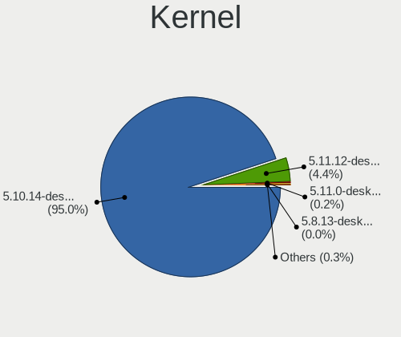

| Version                        | Notebooks | Percent |
|--------------------------------|-----------|---------|
| 5.10.14-desktop-1omv4002       | 2082      | 95.03%  |
| 5.11.12-desktop-1omv4002       | 95        | 4.34%   |
| 5.11.0-desktop-clang-1omv4002  | 5         | 0.23%   |
| 5.9.12-desktop-1omv4002        | 2         | 0.09%   |
| 5.8.13-desktop-1omv4002        | 1         | 0.05%   |
| 5.11.1-desktop-74.1.1bomv4002  | 1         | 0.05%   |
| 5.11.0-desktop-1omv4002        | 1         | 0.05%   |
| 5.11.0-desktop-0.rc4.1omv4002  | 1         | 0.05%   |
| 5.10.2-desktop-clang-1omv4002  | 1         | 0.05%   |
| 5.10.12-desktop-clang-1omv4002 | 1         | 0.05%   |
| Unknown                        | 1         | 0.05%   |

Kernel Family
-------------

Linux kernel without a distro release

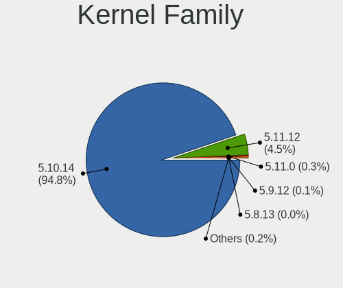

| Version | Notebooks | Percent |
|---------|-----------|---------|
| 5.10.14 | 2082      | 95.03%  |
| 5.11.12 | 95        | 4.34%   |
| 5.11.0  | 7         | 0.32%   |
| 5.9.12  | 2         | 0.09%   |
| 5.8.13  | 1         | 0.05%   |
| 5.11.1  | 1         | 0.05%   |
| 5.10.2  | 1         | 0.05%   |
| 5.10.12 | 1         | 0.05%   |
| Unknown | 1         | 0.05%   |

Kernel Major Ver.
-----------------

Linux kernel major version

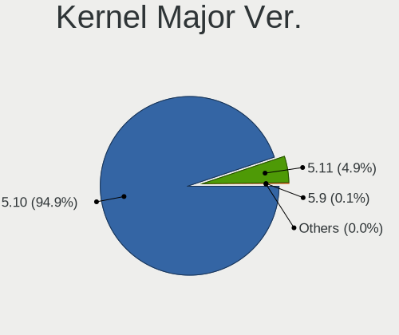

| Version | Notebooks | Percent |
|---------|-----------|---------|
| 5.10    | 2084      | 95.12%  |
| 5.11    | 103       | 4.7%    |
| 5.9     | 2         | 0.09%   |
| 5.8     | 1         | 0.05%   |
| Unknown | 1         | 0.05%   |

Arch
----

OS architecture (x86_64, i586, etc.)

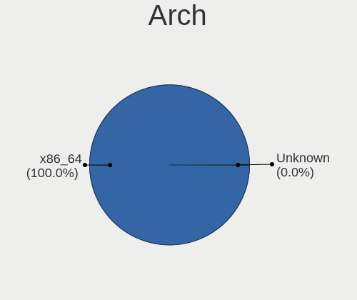

| Name    | Notebooks | Percent |
|---------|-----------|---------|
| x86_64  | 2167      | 99.95%  |
| Unknown | 1         | 0.05%   |

DE
--

Desktop Environment

| Name     | Notebooks | Percent |
|----------|-----------|---------|
| KDE5     | 2165      | 99.86%  |
| GNOME    | 1         | 0.05%   |
| Cinnamon | 1         | 0.05%   |
| Unknown  | 1         | 0.05%   |

Display Server
--------------

X11 or Wayland

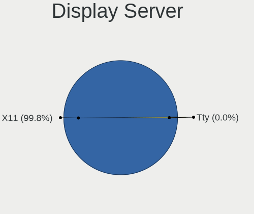

| Name    | Notebooks | Percent |
|---------|-----------|---------|
| X11     | 2164      | 99.82%  |
| Wayland | 3         | 0.14%   |
| Tty     | 1         | 0.05%   |

Display Manager
---------------

SDDM, LightDM, etc.

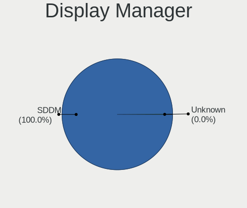

| Name    | Notebooks | Percent |
|---------|-----------|---------|
| SDDM    | 2167      | 99.95%  |
| Unknown | 1         | 0.05%   |

OS Lang
-------

Language

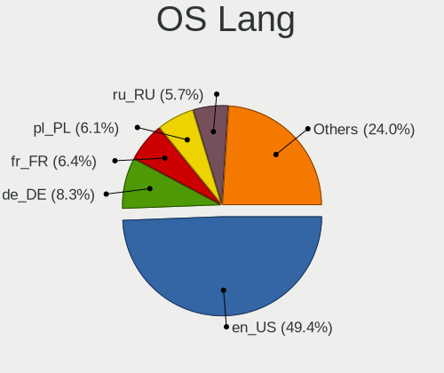

| Lang    | Notebooks | Percent |
|---------|-----------|---------|
| en_US   | 1079      | 49.63%  |
| de_DE   | 182       | 8.37%   |
| pl_PL   | 136       | 6.26%   |
| fr_FR   | 136       | 6.26%   |
| ru_RU   | 124       | 5.7%    |
| pt_BR   | 99        | 4.55%   |
| cs_CZ   | 63        | 2.9%    |
| it_IT   | 61        | 2.81%   |
| es_ES   | 57        | 2.62%   |
| en_GB   | 46        | 2.12%   |
| es_AR   | 20        | 0.92%   |
| es_MX   | 16        | 0.74%   |
| hu_HU   | 11        | 0.51%   |
| fr_BE   | 9         | 0.41%   |
| es_CO   | 9         | 0.41%   |
| ru_UA   | 8         | 0.37%   |
| en_AU   | 8         | 0.37%   |
| fr_CH   | 7         | 0.32%   |
| es_CL   | 7         | 0.32%   |
| ro_RO   | 6         | 0.28%   |
| nl_NL   | 6         | 0.28%   |
| en_IN   | 6         | 0.28%   |
| de_AT   | 6         | 0.28%   |
| da_DK   | 6         | 0.28%   |
| fr_CA   | 5         | 0.23%   |
| en_CA   | 5         | 0.23%   |
| pt_PT   | 4         | 0.18%   |
| nl_BE   | 4         | 0.18%   |
| nb_NO   | 4         | 0.18%   |
| en_NZ   | 4         | 0.18%   |
| de_CH   | 4         | 0.18%   |
| Unknown | 4         | 0.18%   |
| uk_UA   | 3         | 0.14%   |
| es_UY   | 3         | 0.14%   |
| es_PE   | 3         | 0.14%   |
| es_CR   | 3         | 0.14%   |
| it_CH   | 2         | 0.09%   |
| es_GT   | 2         | 0.09%   |
| en_ZA   | 2         | 0.09%   |
| en_IE   | 2         | 0.09%   |

Boot Mode
---------

EFI or BIOS

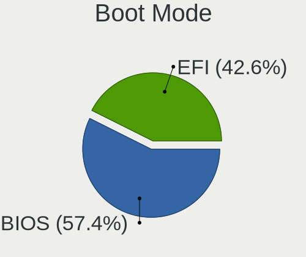

| Mode | Notebooks | Percent |
|------|-----------|---------|
| BIOS | 1257      | 57.9%   |
| EFI  | 914       | 42.1%   |

Filesystem
----------

Type of filesystem

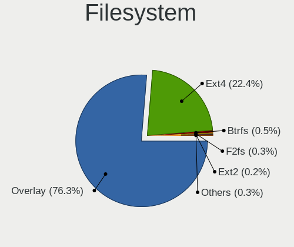

| Type    | Notebooks | Percent |
|---------|-----------|---------|
| Overlay | 1668      | 76.23%  |
| Ext4    | 492       | 22.49%  |
| Btrfs   | 11        | 0.5%    |
| F2fs    | 6         | 0.27%   |
| Ext2    | 5         | 0.23%   |
| Xfs     | 3         | 0.14%   |
| Ext3    | 2         | 0.09%   |
| Unknown | 1         | 0.05%   |

Part. scheme
------------

Scheme of partitioning

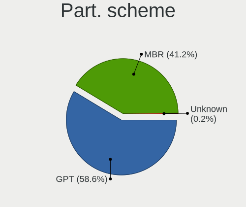

| Type    | Notebooks | Percent |
|---------|-----------|---------|
| GPT     | 1264      | 58.14%  |
| MBR     | 908       | 41.77%  |
| Unknown | 2         | 0.09%   |

Dual Boot with Linux/BSD
------------------------

Hosting more than one Linux/BSD

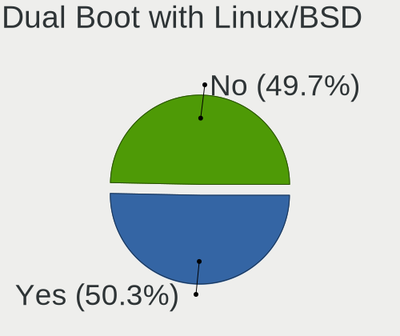

| Dual boot | Notebooks | Percent |
|-----------|-----------|---------|
| Yes       | 1103      | 50.64%  |
| No        | 1075      | 49.36%  |

Dual Boot (Win)
---------------

Hosting Linux and Windows

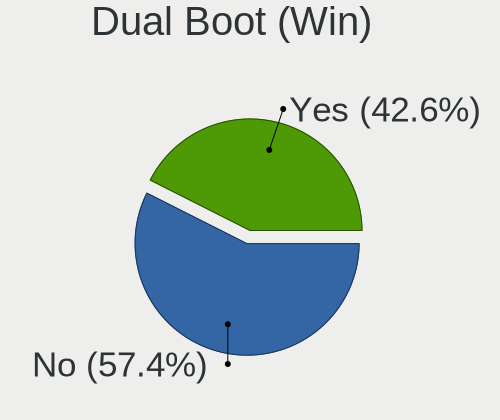

| Dual boot | Notebooks | Percent |
|-----------|-----------|---------|
| No        | 1246      | 57.42%  |
| Yes       | 924       | 42.58%  |

Board
-----

Vendor
------

Motherboard manufacturer

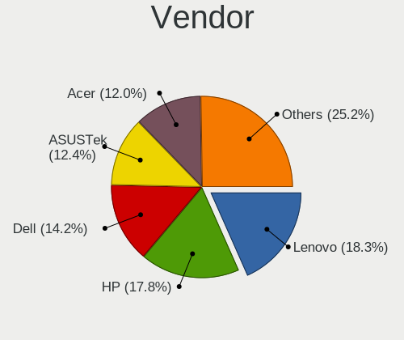

| Name                | Notebooks | Percent |
|---------------------|-----------|---------|
| Lenovo              | 397       | 18.31%  |
| Hewlett-Packard     | 386       | 17.8%   |
| Dell                | 308       | 14.21%  |
| ASUSTek Computer    | 268       | 12.36%  |
| Acer                | 262       | 12.08%  |
| Toshiba             | 116       | 5.35%   |
| Sony                | 64        | 2.95%   |
| Samsung Electronics | 56        | 2.58%   |
| MSI                 | 36        | 1.66%   |
| Apple               | 35        | 1.61%   |
| Fujitsu             | 23        | 1.06%   |
| Packard Bell        | 21        | 0.97%   |
| Medion              | 18        | 0.83%   |
| Positivo            | 17        | 0.78%   |
| eMachines           | 14        | 0.65%   |
| Notebook            | 13        | 0.6%    |
| HUAWEI              | 13        | 0.6%    |
| Philco              | 10        | 0.46%   |
| Unknown             | 8         | 0.37%   |
| LG Electronics      | 6         | 0.28%   |
| Fujitsu Siemens     | 6         | 0.28%   |
| Clevo               | 6         | 0.28%   |
| Chuwi               | 6         | 0.28%   |
| TUXEDO              | 5         | 0.23%   |
| Timi                | 5         | 0.23%   |
| System76            | 5         | 0.23%   |
| Teclast             | 4         | 0.18%   |
| PC Specialist       | 3         | 0.14%   |
| Panasonic           | 3         | 0.14%   |
| Intel               | 3         | 0.14%   |
| Gateway             | 3         | 0.14%   |
| Wortmann AG         | 2         | 0.09%   |
| UMAX                | 2         | 0.09%   |
| NEC Computers       | 2         | 0.09%   |
| Jumper              | 2         | 0.09%   |
| HASEE Computer      | 2         | 0.09%   |
| BOX                 | 2         | 0.09%   |
| Alienware           | 2         | 0.09%   |
| VIT                 | 1         | 0.05%   |
| TEKNOSERVICE        | 1         | 0.05%   |

Model
-----

Motherboard model

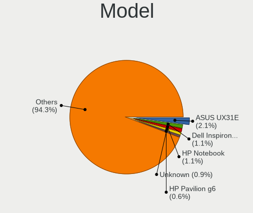

| Name                                       | Notebooks | Percent |
|--------------------------------------------|-----------|---------|
| ASUS UX31E                                 | 44        | 2.03%   |
| Dell Inspiron 3451                         | 32        | 1.48%   |
| HP Notebook                                | 24        | 1.11%   |
| Unknown                                    | 19        | 0.88%   |
| HP Pavilion g6                             | 13        | 0.6%    |
| Dell Latitude E6430                        | 11        | 0.51%   |
| HP Pavilion dv6                            | 10        | 0.46%   |
| Dell Latitude D630                         | 10        | 0.46%   |
| Toshiba Satellite A300                     | 8         | 0.37%   |
| HP Pavilion 15                             | 7         | 0.32%   |
| HP EliteBook 8440p                         | 7         | 0.32%   |
| Dell Latitude E6420                        | 7         | 0.32%   |
| Dell Latitude E6410                        | 7         | 0.32%   |
| Dell Inspiron 15-3567                      | 7         | 0.32%   |
| Lenovo Z50-70 20354                        | 6         | 0.28%   |
| Lenovo IdeaPad S145-15AST 81N3             | 6         | 0.28%   |
| Lenovo IdeaPad 3 15ADA05 81W1              | 6         | 0.28%   |
| HP EliteBook 8570w                         | 6         | 0.28%   |
| Dell Latitude E6500                        | 6         | 0.28%   |
| Dell Latitude E6400                        | 6         | 0.28%   |
| Dell Inspiron N5110                        | 6         | 0.28%   |
| ASUS X541NA                                | 6         | 0.28%   |
| ASUS K53E                                  | 6         | 0.28%   |
| Samsung 300E4A/300E5A/300E7A/3430EA/3530EA | 5         | 0.23%   |
| Positivo Mobile                            | 5         | 0.23%   |
| Philco 14I                                 | 5         | 0.23%   |
| Lenovo IdeaPad 330-15IKB 81DE              | 5         | 0.23%   |
| HP Pavilion Notebook                       | 5         | 0.23%   |
| HP Laptop 15-bs0xx                         | 5         | 0.23%   |
| HP 15                                      | 5         | 0.23%   |
| ASUS X550CA                                | 5         | 0.23%   |
| ASUS K52F                                  | 5         | 0.23%   |
| Acer Aspire 5738                           | 5         | 0.23%   |
| Toshiba Satellite L500                     | 4         | 0.18%   |
| Positivo S14BW01                           | 4         | 0.18%   |
| Lenovo IdeaPad 330S-15IKB 81F5             | 4         | 0.18%   |
| Lenovo IdeaPad 100-15IBY 80MJ              | 4         | 0.18%   |
| Lenovo IdeaPad 100-15IBD 80QQ              | 4         | 0.18%   |
| Lenovo G50-80 80E5                         | 4         | 0.18%   |
| Lenovo B50-45 20388                        | 4         | 0.18%   |

Model Family
------------

Motherboard model prefix

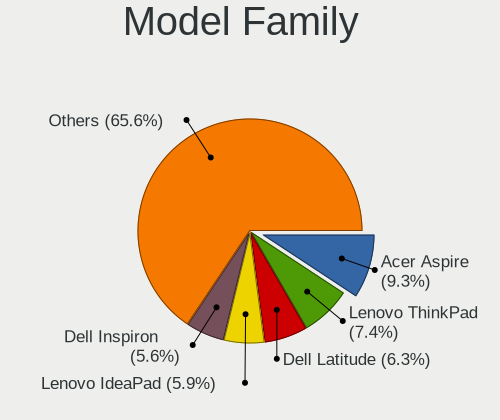

| Name                  | Notebooks | Percent |
|-----------------------|-----------|---------|
| Acer Aspire           | 199       | 9.18%   |
| Lenovo ThinkPad       | 158       | 7.29%   |
| Dell Latitude         | 136       | 6.27%   |
| Lenovo IdeaPad        | 130       | 6%      |
| Dell Inspiron         | 121       | 5.58%   |
| Toshiba Satellite     | 96        | 4.43%   |
| HP Pavilion           | 84        | 3.87%   |
| HP Laptop             | 56        | 2.58%   |
| HP EliteBook          | 50        | 2.31%   |
| ASUS UX31E            | 44        | 2.03%   |
| HP ProBook            | 38        | 1.75%   |
| HP Compaq             | 31        | 1.43%   |
| ASUS VivoBook         | 25        | 1.15%   |
| HP Notebook           | 24        | 1.11%   |
| Fujitsu LIFEBOOK      | 19        | 0.88%   |
| Acer Extensa          | 19        | 0.88%   |
| Unknown               | 19        | 0.88%   |
| Packard Bell EasyNote | 17        | 0.78%   |
| Acer TravelMate       | 16        | 0.74%   |
| Dell Vostro           | 15        | 0.69%   |
| HP ENVY               | 11        | 0.51%   |
| HP 250                | 10        | 0.46%   |
| Dell XPS              | 8         | 0.37%   |
| Dell Studio           | 8         | 0.37%   |
| HP Stream             | 7         | 0.32%   |
| Apple MacBookPro9     | 7         | 0.32%   |
| Acer Swift            | 7         | 0.32%   |
| Toshiba dynabook      | 6         | 0.28%   |
| Lenovo Z50-70         | 6         | 0.28%   |
| Lenovo B590           | 6         | 0.28%   |
| HP Presario           | 6         | 0.28%   |
| HP 255                | 6         | 0.28%   |
| HP 15                 | 6         | 0.28%   |
| ASUS ZenBook          | 6         | 0.28%   |
| ASUS X541NA           | 6         | 0.28%   |
| ASUS TUF              | 6         | 0.28%   |
| ASUS K53E             | 6         | 0.28%   |
| Apple MacBookPro8     | 6         | 0.28%   |
| Acer Nitro            | 6         | 0.28%   |
| Toshiba TECRA         | 5         | 0.23%   |

MFG Year
--------

Motherboard manufacture year

| Year    | Notebooks | Percent |
|---------|-----------|---------|
| 2011    | 293       | 13.51%  |
| 2012    | 221       | 10.19%  |
| 2013    | 179       | 8.26%   |
| 2010    | 175       | 8.07%   |
| 2014    | 173       | 7.98%   |
| 2008    | 161       | 7.43%   |
| 2019    | 153       | 7.06%   |
| 2015    | 138       | 6.37%   |
| 2016    | 118       | 5.44%   |
| 2017    | 116       | 5.35%   |
| 2018    | 115       | 5.3%    |
| 2009    | 113       | 5.21%   |
| 2020    | 98        | 4.52%   |
| 2007    | 82        | 3.78%   |
| 2021    | 22        | 1.01%   |
| 2006    | 6         | 0.28%   |
| 2005    | 2         | 0.09%   |
| Unknown | 2         | 0.09%   |
| 2004    | 1         | 0.05%   |

Form Factor
-----------

Physical design of the computer

| Name     | Notebooks | Percent |
|----------|-----------|---------|
| Notebook | 2168      | 100%    |

Secure Boot
-----------

Enabled or disabled

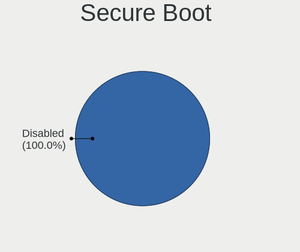

| State    | Notebooks | Percent |
|----------|-----------|---------|
| Disabled | 2168      | 100%    |

Coreboot
--------

Have coreboot on board

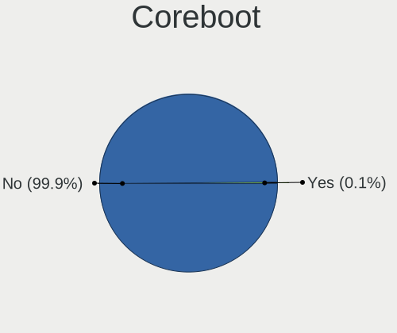

| Used | Notebooks | Percent |
|------|-----------|---------|
| No   | 2165      | 99.86%  |
| Yes  | 3         | 0.14%   |

RAM Size
--------

Total RAM memory

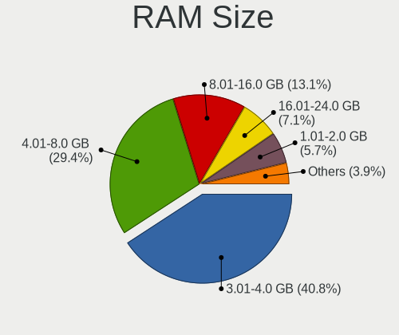

| Size in GB | Notebooks | Percent |
|------------|-----------|---------|
| 3.01-4.0   | 882       | 40.65%  |
| 4.01-8.0   | 642       | 29.59%  |
| 8.01-16.0  | 290       | 13.36%  |
| 16.01-24.0 | 151       | 6.96%   |
| 1.01-2.0   | 122       | 5.62%   |
| 2.01-3.0   | 45        | 2.07%   |
| 32.01-64.0 | 28        | 1.29%   |
| 24.01-32.0 | 5         | 0.23%   |
| 0.51-1.0   | 4         | 0.18%   |
| Unknown    | 1         | 0.05%   |

RAM Used
--------

Used RAM memory

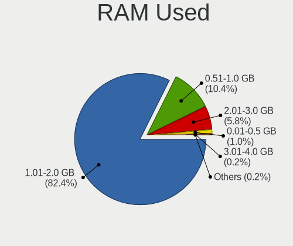

| Used GB  | Notebooks | Percent |
|----------|-----------|---------|
| 1.01-2.0 | 1789      | 81.95%  |
| 0.51-1.0 | 234       | 10.72%  |
| 2.01-3.0 | 124       | 5.68%   |
| 0.01-0.5 | 27        | 1.24%   |
| 3.01-4.0 | 5         | 0.23%   |
| 4.01-8.0 | 3         | 0.14%   |
| Unknown  | 1         | 0.05%   |

Total Drives
------------

Number of drives on board

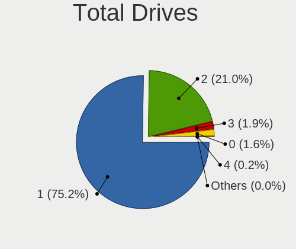

| Drives | Notebooks | Percent |
|--------|-----------|---------|
| 1      | 1634      | 75.26%  |
| 2      | 456       | 21%     |
| 3      | 41        | 1.89%   |
| 0      | 35        | 1.61%   |
| 4      | 4         | 0.18%   |
| 5      | 1         | 0.05%   |

Has CD-ROM
----------

Has CD-ROM on board

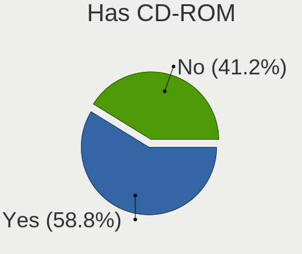

| Presented | Notebooks | Percent |
|-----------|-----------|---------|
| Yes       | 1272      | 58.62%  |
| No        | 898       | 41.38%  |

Has Ethernet
------------

Has Ethernet on board

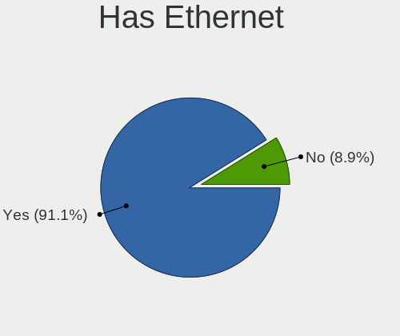

| Presented | Notebooks | Percent |
|-----------|-----------|---------|
| Yes       | 1979      | 91.28%  |
| No        | 189       | 8.72%   |

Has WiFi
--------

Has WiFi module

| Presented | Notebooks | Percent |
|-----------|-----------|---------|
| Yes       | 2149      | 99.12%  |
| No        | 19        | 0.88%   |

Has Bluetooth
-------------

Has Bluetooth module

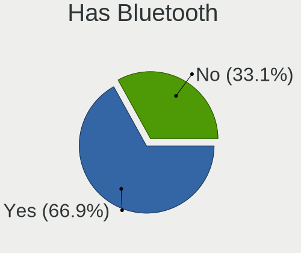

| Presented | Notebooks | Percent |
|-----------|-----------|---------|
| Yes       | 1457      | 67.17%  |
| No        | 712       | 32.83%  |

Location
--------

Country
-------

Geographic location (country)

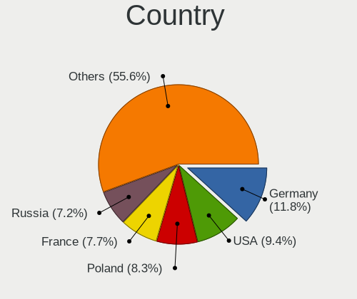

| Country      | Notebooks | Percent |
|--------------|-----------|---------|
| Germany      | 253       | 11.66%  |
| USA          | 202       | 9.31%   |
| Poland       | 187       | 8.62%   |
| France       | 170       | 7.84%   |
| Russia       | 158       | 7.28%   |
| Brazil       | 155       | 7.15%   |
| Italy        | 105       | 4.84%   |
| Spain        | 83        | 3.83%   |
| Czechia      | 74        | 3.41%   |
| UK           | 59        | 2.72%   |
| Canada       | 48        | 2.21%   |
| Mexico       | 43        | 1.98%   |
| India        | 32        | 1.48%   |
| Ukraine      | 31        | 1.43%   |
| Argentina    | 24        | 1.11%   |
| Indonesia    | 23        | 1.06%   |
| Romania      | 22        | 1.01%   |
| Sweden       | 21        | 0.97%   |
| Portugal     | 21        | 0.97%   |
| Hungary      | 21        | 0.97%   |
| Netherlands  | 20        | 0.92%   |
| Australia    | 20        | 0.92%   |
| Belgium      | 19        | 0.88%   |
| Japan        | 18        | 0.83%   |
| Switzerland  | 16        | 0.74%   |
| Greece       | 14        | 0.65%   |
| Finland      | 14        | 0.65%   |
| China        | 14        | 0.65%   |
| Bulgaria     | 13        | 0.6%    |
| Slovakia     | 12        | 0.55%   |
| Denmark      | 12        | 0.55%   |
| Belarus      | 12        | 0.55%   |
| Norway       | 11        | 0.51%   |
| Colombia     | 11        | 0.51%   |
| Chile        | 11        | 0.51%   |
| Austria      | 11        | 0.51%   |
| South Africa | 10        | 0.46%   |
| Philippines  | 10        | 0.46%   |
| Thailand     | 9         | 0.41%   |
| Algeria      | 9         | 0.41%   |

City
----

Geographic location (city)

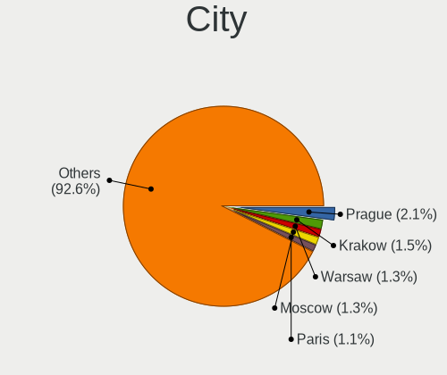

| City             | Notebooks | Percent |
|------------------|-----------|---------|
| Prague           | 48        | 2.2%    |
| Krakow           | 35        | 1.6%    |
| Moscow           | 29        | 1.33%   |
| Warsaw           | 28        | 1.28%   |
| Paris            | 24        | 1.1%    |
| Berlin           | 20        | 0.92%   |
| St Petersburg    | 16        | 0.73%   |
| Milan            | 16        | 0.73%   |
| Rome             | 15        | 0.69%   |
| Munich           | 13        | 0.59%   |
| Mexico City      | 13        | 0.59%   |
| Sao Paulo        | 12        | 0.55%   |
| Krasnodar        | 12        | 0.55%   |
| Wroclaw          | 10        | 0.46%   |
| Stuttgart        | 10        | 0.46%   |
| Queens           | 10        | 0.46%   |
| Rio de Janeiro   | 9         | 0.41%   |
| Poznan           | 9         | 0.41%   |
| Madrid           | 9         | 0.41%   |
| Helsinki         | 8         | 0.37%   |
| Brno             | 8         | 0.37%   |
| Yekaterinburg    | 7         | 0.32%   |
| Porto Alegre     | 7         | 0.32%   |
| Lodz             | 7         | 0.32%   |
| Gdansk           | 7         | 0.32%   |
| Buenos Aires     | 7         | 0.32%   |
| Budapest         | 7         | 0.32%   |
| Bucharest        | 7         | 0.32%   |
| Vienna           | 6         | 0.27%   |
| Sydney           | 6         | 0.27%   |
| Melbourne        | 6         | 0.27%   |
| Mannheim         | 6         | 0.27%   |
| Lisbon           | 6         | 0.27%   |
| Johannesburg     | 6         | 0.27%   |
| Florence         | 6         | 0.27%   |
| Thessaloniki     | 5         | 0.23%   |
| Nizhniy Novgorod | 5         | 0.23%   |
| Minsk            | 5         | 0.23%   |
| Kyiv             | 5         | 0.23%   |
| Kielce           | 5         | 0.23%   |

Drives
------

Drive Vendor
------------

Hard drive vendors

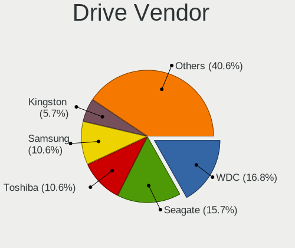

| Vendor              | Notebooks | Drives | Percent |
|---------------------|-----------|--------|---------|
| WDC                 | 420       | 433    | 16.91%  |
| Seagate             | 391       | 400    | 15.74%  |
| Samsung Electronics | 264       | 290    | 10.63%  |
| Toshiba             | 263       | 272    | 10.59%  |
| Kingston            | 143       | 148    | 5.76%   |
| Hitachi             | 142       | 144    | 5.72%   |
| SanDisk             | 134       | 139    | 5.39%   |
| Unknown             | 87        | 91     | 3.5%    |
| HGST                | 80        | 81     | 3.22%   |
| Crucial             | 70        | 73     | 2.82%   |
| Intel               | 49        | 54     | 1.97%   |
| SK hynix            | 47        | 48     | 1.89%   |
| A-DATA Technology   | 40        | 40     | 1.61%   |
| Fujitsu             | 25        | 25     | 1.01%   |
| Micron Technology   | 22        | 22     | 0.89%   |
| GOODRAM             | 20        | 22     | 0.81%   |
| Apple               | 20        | 23     | 0.81%   |
| China               | 17        | 17     | 0.68%   |
| PNY                 | 16        | 16     | 0.64%   |
| OCZ                 | 13        | 13     | 0.52%   |
| SPCC                | 12        | 12     | 0.48%   |
| Patriot             | 11        | 13     | 0.44%   |
| JMicron Technology  | 11        | 11     | 0.44%   |
| LITEON              | 10        | 10     | 0.4%    |
| Phison              | 9         | 9      | 0.36%   |
| LITEONIT            | 9         | 10     | 0.36%   |
| Intenso             | 9         | 10     | 0.36%   |
| Transcend           | 8         | 8      | 0.32%   |
| Hewlett-Packard     | 7         | 7      | 0.28%   |
| Apacer              | 7         | 7      | 0.28%   |
| Unknown             | 6         | 6      | 0.24%   |
| Teclast             | 5         | 5      | 0.2%    |
| Union Memory        | 4         | 5      | 0.16%   |
| SABRENT             | 4         | 6      | 0.16%   |
| Plextor             | 4         | 4      | 0.16%   |
| KingSpec            | 4         | 4      | 0.16%   |
| KingDian            | 4         | 4      | 0.16%   |
| Corsair             | 4         | 4      | 0.16%   |
| Colorful            | 4         | 4      | 0.16%   |
| UMIS                | 3         | 3      | 0.12%   |

Drive Model
-----------

Hard drive models

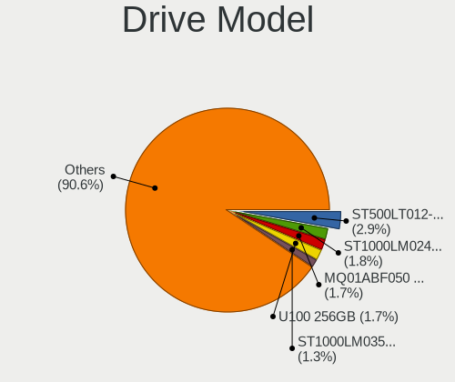

| Model                               | Notebooks | Percent |
|-------------------------------------|-----------|---------|
| Seagate ST500LT012-1DG142 500GB     | 73        | 2.9%    |
| Seagate ST1000LM024 HN-M101MBB 1TB  | 45        | 1.79%   |
| Toshiba MQ01ABF050 500GB            | 44        | 1.75%   |
| SanDisk SSD U100 256GB              | 44        | 1.75%   |
| Seagate ST1000LM035-1RK172 1TB      | 33        | 1.31%   |
| Toshiba MQ01ABD100 1TB              | 32        | 1.27%   |
| WDC WD10JPVX-22JC3T0 1TB            | 25        | 0.99%   |
| Seagate ST9500325AS 500GB           | 25        | 0.99%   |
| Toshiba MQ04ABF100 1TB              | 22        | 0.87%   |
| Seagate ST500LM012 HN-M500MBB 500GB | 22        | 0.87%   |
| Kingston SA400S37240G 240GB SSD     | 22        | 0.87%   |
| Samsung SSD 860 EVO 500GB           | 20        | 0.79%   |
| Kingston SA400S37120G 120GB SSD     | 20        | 0.79%   |
| Kingston SA400S37480G 480GB SSD     | 18        | 0.71%   |
| WDC WD5000LPVX-22V0TT0 500GB        | 17        | 0.67%   |
| Seagate ST500LT012-9WS142 500GB     | 16        | 0.63%   |
| Hitachi HTS547550A9E384 500GB       | 16        | 0.63%   |
| HGST HTS721010A9E630 1TB            | 16        | 0.63%   |
| HGST HTS545050A7E680 500GB          | 16        | 0.63%   |
| HGST HTS541010A9E680 1TB            | 15        | 0.6%    |
| WDC WDS500G2B0A-00SM50 500GB SSD    | 14        | 0.56%   |
| Crucial CT240BX500SSD1 240GB        | 14        | 0.56%   |
| WDC WD10SPZX-21Z10T0 1TB            | 13        | 0.52%   |
| Samsung SSD 850 EVO 500GB           | 13        | 0.52%   |
| Seagate ST9320325AS 320GB           | 12        | 0.48%   |
| Kingston SV300S37A120G 120GB SSD    | 12        | 0.48%   |
| Hitachi HTS545050A7E380 500GB       | 12        | 0.48%   |
| HGST HTS545050A7E380 500GB          | 12        | 0.48%   |
| WDC WD5000LPCX-24VHAT0 500GB        | 11        | 0.44%   |
| Toshiba MQ01ABD050 500GB            | 11        | 0.44%   |
| Samsung SSD 850 EVO 250GB           | 11        | 0.44%   |
| Hitachi HTS545025B9A300 250GB       | 11        | 0.44%   |
| Crucial CT500MX500SSD1 500GB        | 11        | 0.44%   |
| PNY CS900 120GB SSD                 | 10        | 0.4%    |
| WDC WD10JPCX-24UE4T0 1TB            | 9         | 0.36%   |
| Unknown SD/MMC/MS PRO 64GB          | 9         | 0.36%   |
| Seagate ST500LM021-1KJ152 500GB     | 9         | 0.36%   |
| SanDisk SSD PLUS 240GB              | 9         | 0.36%   |
| Hitachi HTS543232A7A384 320GB       | 9         | 0.36%   |
| WDC WD10SPZX-24Z10T0 1TB            | 8         | 0.32%   |

HDD Vendor
----------

Hard disk drive vendors

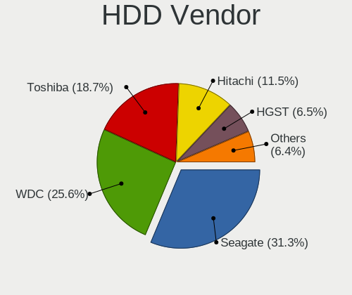

| Vendor              | Notebooks | Drives | Percent |
|---------------------|-----------|--------|---------|
| Seagate             | 387       | 395    | 31.34%  |
| WDC                 | 318       | 326    | 25.75%  |
| Toshiba             | 231       | 237    | 18.7%   |
| Hitachi             | 142       | 144    | 11.5%   |
| HGST                | 80        | 81     | 6.48%   |
| Samsung Electronics | 28        | 29     | 2.27%   |
| Fujitsu             | 25        | 25     | 2.02%   |
| Unknown             | 9         | 9      | 0.73%   |
| Apple               | 8         | 8      | 0.65%   |
| SABRENT             | 2         | 3      | 0.16%   |
| USB3.0              | 1         | 1      | 0.08%   |
| Intenso             | 1         | 1      | 0.08%   |
| IBM/Hitachi         | 1         | 1      | 0.08%   |
| HGST HTS            | 1         | 1      | 0.08%   |
| ASMT                | 1         | 1      | 0.08%   |

SSD Vendor
----------

Solid state drive vendors

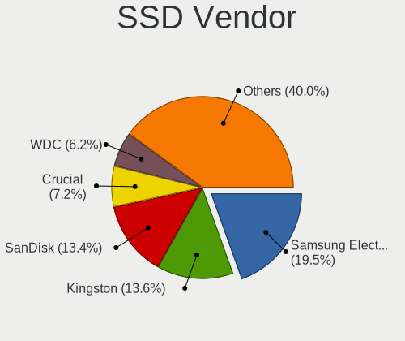

| Vendor              | Notebooks | Drives | Percent |
|---------------------|-----------|--------|---------|
| Samsung Electronics | 181       | 192    | 19.55%  |
| SanDisk             | 126       | 130    | 13.61%  |
| Kingston            | 126       | 130    | 13.61%  |
| Crucial             | 67        | 70     | 7.24%   |
| WDC                 | 56        | 56     | 6.05%   |
| A-DATA Technology   | 36        | 36     | 3.89%   |
| Intel               | 26        | 27     | 2.81%   |
| Toshiba             | 23        | 25     | 2.48%   |
| SK hynix            | 21        | 22     | 2.27%   |
| GOODRAM             | 20        | 22     | 2.16%   |
| Micron Technology   | 17        | 17     | 1.84%   |
| China               | 17        | 17     | 1.84%   |
| PNY                 | 14        | 14     | 1.51%   |
| OCZ                 | 13        | 13     | 1.4%    |
| SPCC                | 11        | 11     | 1.19%   |
| Patriot             | 11        | 13     | 1.19%   |
| LITEONIT            | 9         | 10     | 0.97%   |
| LITEON              | 9         | 9      | 0.97%   |
| Apple               | 9         | 9      | 0.97%   |
| Unknown             | 8         | 8      | 0.86%   |
| Transcend           | 8         | 8      | 0.86%   |
| Intenso             | 8         | 9      | 0.86%   |
| JMicron Technology  | 7         | 7      | 0.76%   |
| Apacer              | 7         | 7      | 0.76%   |
| Hewlett-Packard     | 6         | 6      | 0.65%   |
| Teclast             | 5         | 5      | 0.54%   |
| Unknown             | 5         | 5      | 0.54%   |
| Plextor             | 4         | 4      | 0.43%   |
| KingSpec            | 4         | 4      | 0.43%   |
| KingDian            | 4         | 4      | 0.43%   |
| Colorful            | 4         | 4      | 0.43%   |
| KingFast            | 3         | 3      | 0.32%   |
| INNOVATION IT       | 3         | 3      | 0.32%   |
| Corsair             | 3         | 3      | 0.32%   |
| BHT                 | 3         | 3      | 0.32%   |
| Smartbuy            | 2         | 2      | 0.22%   |
| Seagate             | 2         | 2      | 0.22%   |
| Netac               | 2         | 2      | 0.22%   |
| Mushkin             | 2         | 2      | 0.22%   |
| Leven               | 2         | 2      | 0.22%   |

Drive Kind
----------

HDD or SSD

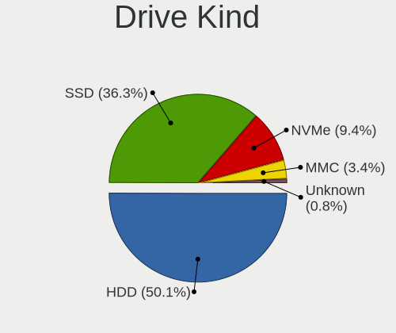

| Kind    | Notebooks | Drives | Percent |
|---------|-----------|--------|---------|
| HDD     | 1206      | 1262   | 50.08%  |
| SSD     | 876       | 958    | 36.38%  |
| NVMe    | 226       | 253    | 9.39%   |
| MMC     | 80        | 87     | 3.32%   |
| Unknown | 20        | 20     | 0.83%   |

Drive Connector
---------------

SATA, SAS, NVMe, etc.

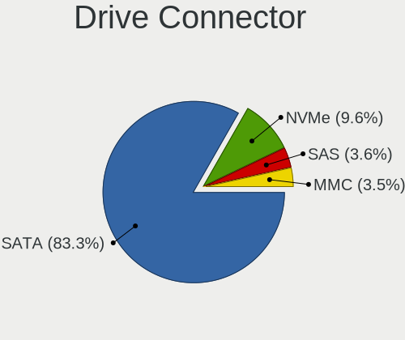

| Type | Notebooks | Drives | Percent |
|------|-----------|--------|---------|
| SATA | 1929      | 2153   | 83.29%  |
| NVMe | 223       | 247    | 9.63%   |
| SAS  | 84        | 93     | 3.63%   |
| MMC  | 80        | 87     | 3.45%   |

Drive Size
----------

Size of hard drive

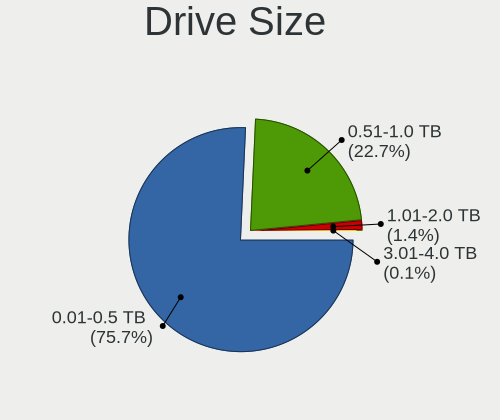

| Size in TB | Notebooks | Drives | Percent |
|------------|-----------|--------|---------|
| 0.01-0.5   | 1559      | 1707   | 75.97%  |
| 0.51-1.0   | 457       | 475    | 22.27%  |
| 1.01-2.0   | 25        | 25     | 1.22%   |
| 3.01-4.0   | 7         | 8      | 0.34%   |
| 4.01-10.0  | 4         | 5      | 0.19%   |

Space Total
-----------

Amount of disk space available on the file system

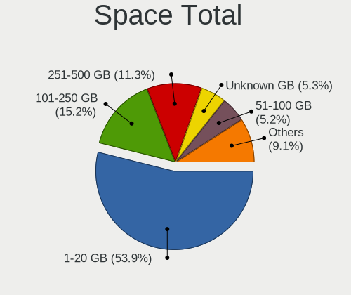

| Size in GB | Notebooks | Percent |
|------------|-----------|---------|
| 1-20       | 1188      | 54.32%  |
| 101-250    | 329       | 15.04%  |
| 251-500    | 243       | 11.11%  |
| Unknown    | 115       | 5.26%   |
| 51-100     | 112       | 5.12%   |
| 501-1000   | 105       | 4.8%    |
| 21-50      | 76        | 3.48%   |
| 1001-2000  | 17        | 0.78%   |
| 2001-3000  | 2         | 0.09%   |

Space Used
----------

Amount of used disk space

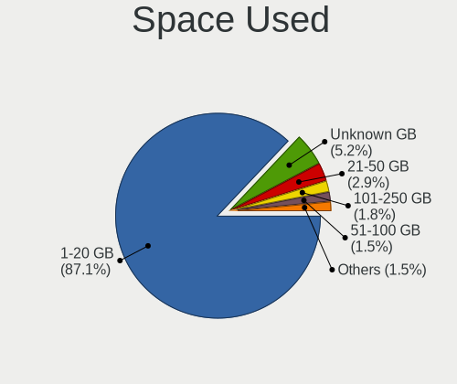

| Used GB   | Notebooks | Percent |
|-----------|-----------|---------|
| 1-20      | 1905      | 87.07%  |
| Unknown   | 115       | 5.26%   |
| 21-50     | 63        | 2.88%   |
| 101-250   | 39        | 1.78%   |
| 51-100    | 33        | 1.51%   |
| 251-500   | 22        | 1.01%   |
| 501-1000  | 8         | 0.37%   |
| 1001-2000 | 2         | 0.09%   |
| 0         | 1         | 0.05%   |

Malfunc. Drives
---------------

Drive models with a malfunction

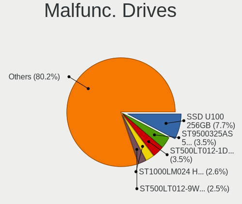

| Model                               | Notebooks | Drives | Percent |
|-------------------------------------|-----------|--------|---------|
| SanDisk SSD U100 256GB              | 44        | 44     | 7.64%   |
| Seagate ST9500325AS 500GB           | 20        | 22     | 3.47%   |
| Seagate ST500LT012-1DG142 500GB     | 20        | 20     | 3.47%   |
| Seagate ST1000LM024 HN-M101MBB 1TB  | 15        | 15     | 2.6%    |
| Seagate ST500LT012-9WS142 500GB     | 14        | 15     | 2.43%   |
| Toshiba MQ01ABF050 500GB            | 13        | 13     | 2.26%   |
| Seagate ST9320325AS 320GB           | 10        | 10     | 1.74%   |
| HGST HTS545050A7E680 500GB          | 10        | 10     | 1.74%   |
| Hitachi HTS545050A7E380 500GB       | 9         | 9      | 1.56%   |
| Hitachi HTS547550A9E384 500GB       | 8         | 9      | 1.39%   |
| HGST HTS541010A9E680 1TB            | 8         | 8      | 1.39%   |
| Toshiba MK3265GSX 320GB             | 7         | 7      | 1.22%   |
| Seagate ST9500420AS 500GB           | 7         | 7      | 1.22%   |
| WDC WD5000LPVX-22V0TT0 500GB        | 6         | 6      | 1.04%   |
| WDC WD10JPVX-22JC3T0 1TB            | 6         | 6      | 1.04%   |
| Toshiba MQ01ABD100 1TB              | 6         | 6      | 1.04%   |
| Toshiba MQ01ABD050 500GB            | 6         | 6      | 1.04%   |
| Hitachi HTS547564A9E384 640GB       | 6         | 6      | 1.04%   |
| Hitachi HTS545025B9A300 250GB       | 6         | 6      | 1.04%   |
| Toshiba MQ01ABD075 752GB            | 5         | 5      | 0.87%   |
| Seagate ST9250827AS 250GB           | 5         | 5      | 0.87%   |
| Seagate ST500LM021-1KJ152 500GB     | 5         | 5      | 0.87%   |
| Seagate ST1000LM035-1RK172 1TB      | 5         | 5      | 0.87%   |
| Samsung Electronics HM641JI 640GB   | 5         | 5      | 0.87%   |
| Hitachi HTS542516K9SA00 160GB       | 5         | 5      | 0.87%   |
| HGST HTS725050A7E630 500GB          | 5         | 5      | 0.87%   |
| HGST HTS545050A7E380 500GB          | 5         | 5      | 0.87%   |
| HGST HTS541075A9E680 752GB          | 5         | 5      | 0.87%   |
| WDC WD3200BEVT-60A23T0 320GB        | 4         | 4      | 0.69%   |
| WDC WD10JPCX-24UE4T0 1TB            | 4         | 4      | 0.69%   |
| Seagate ST320LT007-9ZV142 320GB     | 4         | 4      | 0.69%   |
| Hitachi HTS543232A7A384 320GB       | 4         | 4      | 0.69%   |
| WDC WDS240G2G0A-00JH30 240GB SSD    | 3         | 3      | 0.52%   |
| WDC WD5000BPVT-22HXZT3 500GB        | 3         | 3      | 0.52%   |
| WDC WD3200BEKT-60F3T1 320GB         | 3         | 3      | 0.52%   |
| WDC WD10SPZX-24Z10T0 1TB            | 3         | 3      | 0.52%   |
| Toshiba MK5055GSX 500GB             | 3         | 3      | 0.52%   |
| Seagate ST9320423AS 320GB           | 3         | 3      | 0.52%   |
| Seagate ST9250315AS 250GB           | 3         | 3      | 0.52%   |
| Seagate ST500LM012 HN-M500MBB 500GB | 3         | 3      | 0.52%   |

Malfunc. Drive Vendor
---------------------

Vendors of faulty drives

| Vendor              | Notebooks | Drives | Percent |
|---------------------|-----------|--------|---------|
| Seagate             | 147       | 150    | 25.52%  |
| WDC                 | 93        | 93     | 16.15%  |
| Toshiba             | 88        | 89     | 15.28%  |
| Hitachi             | 79        | 80     | 13.72%  |
| SanDisk             | 53        | 53     | 9.2%    |
| HGST                | 36        | 36     | 6.25%   |
| Samsung Electronics | 28        | 28     | 4.86%   |
| Kingston            | 10        | 10     | 1.74%   |
| Fujitsu             | 8         | 8      | 1.39%   |
| Intel               | 7         | 7      | 1.22%   |
| Crucial             | 4         | 4      | 0.69%   |
| SK hynix            | 3         | 3      | 0.52%   |
| OCZ                 | 3         | 3      | 0.52%   |
| A-DATA Technology   | 2         | 2      | 0.35%   |
| Unknown             | 1         | 1      | 0.17%   |
| Transcend           | 1         | 1      | 0.17%   |
| SPCC                | 1         | 1      | 0.17%   |
| Platinet            | 1         | 1      | 0.17%   |
| Micron Technology   | 1         | 1      | 0.17%   |
| LITEONIT            | 1         | 1      | 0.17%   |
| KingSpec            | 1         | 1      | 0.17%   |
| KingDian            | 1         | 1      | 0.17%   |
| Intenso             | 1         | 1      | 0.17%   |
| IBM/Hitachi         | 1         | 1      | 0.17%   |
| Colorful            | 1         | 1      | 0.17%   |
| China               | 1         | 1      | 0.17%   |
| ASMT                | 1         | 1      | 0.17%   |
| Apple               | 1         | 1      | 0.17%   |
| 240G                | 1         | 1      | 0.17%   |

Malfunc. HDD Vendor
-------------------

Vendors of faulty HDD drives

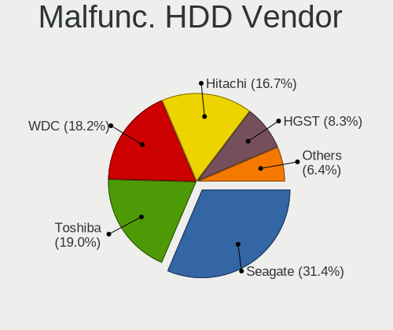

| Vendor              | Notebooks | Drives | Percent |
|---------------------|-----------|--------|---------|
| Seagate             | 147       | 150    | 31.61%  |
| Toshiba             | 88        | 89     | 18.92%  |
| WDC                 | 85        | 85     | 18.28%  |
| Hitachi             | 79        | 80     | 16.99%  |
| HGST                | 36        | 36     | 7.74%   |
| Samsung Electronics | 19        | 19     | 4.09%   |
| Fujitsu             | 8         | 8      | 1.72%   |
| IBM/Hitachi         | 1         | 1      | 0.22%   |
| ASMT                | 1         | 1      | 0.22%   |
| Apple               | 1         | 1      | 0.22%   |

Malfunc. Drive Kind
-------------------

Kinds of faulty drives

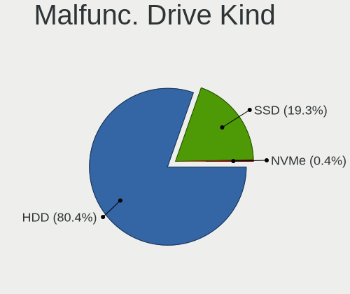

| Kind | Notebooks | Drives | Percent |
|------|-----------|--------|---------|
| HDD  | 462       | 470    | 80.63%  |
| SSD  | 109       | 109    | 19.02%  |
| NVMe | 2         | 2      | 0.35%   |

Failed Drives
-------------

Failed drive models

| Model                                 | Notebooks | Drives | Percent |
|---------------------------------------|-----------|--------|---------|
| WDC WD2500BEVS-22UST0 250GB           | 2         | 2      | 15.38%  |
| Crucial CT500P2SSD8 500GB             | 2         | 2      | 15.38%  |
| WDC WD5000M22K-24Z1LT0-SSHD-16GB      | 1         | 1      | 7.69%   |
| WDC WD5000LPLX-75ZNTT0 500GB          | 1         | 1      | 7.69%   |
| WDC WD5000BPVT-60HXZT1 500GB          | 1         | 1      | 7.69%   |
| Toshiba MQ01ABF050 500GB              | 1         | 1      | 7.69%   |
| Toshiba MK3259GSXP 320GB              | 1         | 1      | 7.69%   |
| SK hynix HFS128G39TND-N210A 128GB SSD | 1         | 1      | 7.69%   |
| Samsung Electronics SSD PM800 TM 64GB | 1         | 1      | 7.69%   |
| Hitachi HTS545050A7E380 500GB         | 1         | 1      | 7.69%   |
| HGST HTS541010A9E680 1TB              | 1         | 1      | 7.69%   |

Failed Drive Vendor
-------------------

Failed drive vendors

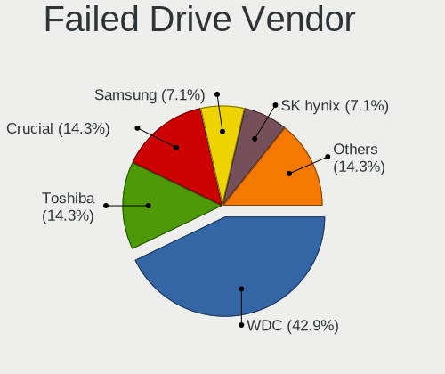

| Vendor              | Notebooks | Drives | Percent |
|---------------------|-----------|--------|---------|
| WDC                 | 5         | 5      | 38.46%  |
| Toshiba             | 2         | 2      | 15.38%  |
| Crucial             | 2         | 2      | 15.38%  |
| SK hynix            | 1         | 1      | 7.69%   |
| Samsung Electronics | 1         | 1      | 7.69%   |
| Hitachi             | 1         | 1      | 7.69%   |
| HGST                | 1         | 1      | 7.69%   |

Drive Status
------------

Number of failed and malfunc. drives

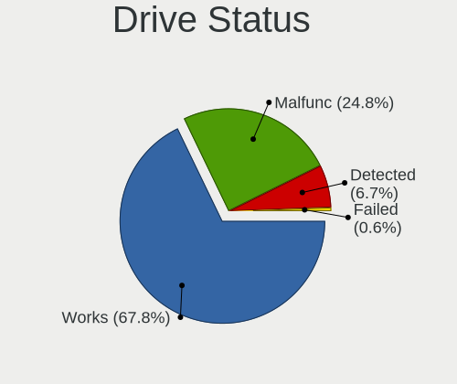

| Status   | Notebooks | Drives | Percent |
|----------|-----------|--------|---------|
| Works    | 1565      | 1812   | 68.01%  |
| Malfunc  | 568       | 581    | 24.68%  |
| Detected | 155       | 174    | 6.74%   |
| Failed   | 13        | 13     | 0.56%   |

Storage controller
------------------

Storage Vendor
--------------

Storage controller vendors

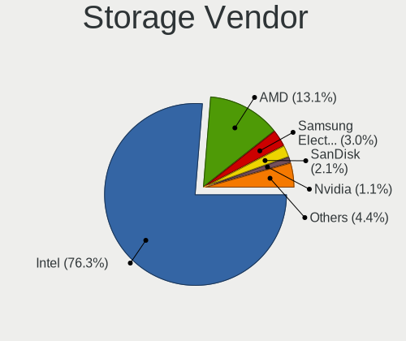

| Vendor                           | Notebooks | Percent |
|----------------------------------|-----------|---------|
| Intel                            | 1756      | 76.12%  |
| AMD                              | 303       | 13.13%  |
| Samsung Electronics              | 72        | 3.12%   |
| SanDisk                          | 49        | 2.12%   |
| Nvidia                           | 24        | 1.04%   |
| SK hynix                         | 22        | 0.95%   |
| Kingston Technology Company      | 18        | 0.78%   |
| Phison Electronics               | 13        | 0.56%   |
| Toshiba America Info Systems     | 9         | 0.39%   |
| Union Memory (Shenzhen)          | 6         | 0.26%   |
| Micron Technology                | 5         | 0.22%   |
| Silicon Motion                   | 4         | 0.17%   |
| KIOXIA                           | 4         | 0.17%   |
| Micron/Crucial Technology        | 3         | 0.13%   |
| JMicron Technology               | 3         | 0.13%   |
| Apple                            | 3         | 0.13%   |
| Silicon Image                    | 2         | 0.09%   |
| Realtek Semiconductor            | 2         | 0.09%   |
| Lenovo                           | 2         | 0.09%   |
| ADATA Technology                 | 2         | 0.09%   |
| Silicon Integrated Systems [SiS] | 1         | 0.04%   |
| Marvell Technology Group         | 1         | 0.04%   |
| Lite-On Technology               | 1         | 0.04%   |
| Biwin Storage Technology         | 1         | 0.04%   |
| ASMedia Technology               | 1         | 0.04%   |

Storage Model
-------------

Storage controller models

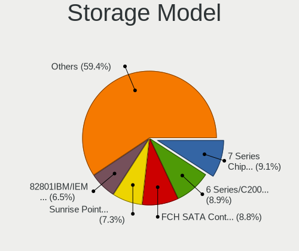

| Model                                                                                  | Notebooks | Percent |
|----------------------------------------------------------------------------------------|-----------|---------|
| Intel 7 Series Chipset Family 6-port SATA Controller [AHCI mode]                       | 227       | 9.04%   |
| AMD FCH SATA Controller [AHCI mode]                                                    | 220       | 8.76%   |
| Intel 6 Series/C200 Series Chipset Family 6 port Mobile SATA AHCI Controller           | 219       | 8.73%   |
| Intel Sunrise Point-LP SATA Controller [AHCI mode]                                     | 183       | 7.29%   |
| Intel 82801IBM/IEM (ICH9M/ICH9M-E) 4 port SATA Controller [AHCI mode]                  | 164       | 6.53%   |
| Intel 82801 Mobile SATA Controller [RAID mode]                                         | 116       | 4.62%   |
| Intel 82801HM/HEM (ICH8M/ICH8M-E) IDE Controller                                       | 101       | 4.02%   |
| Intel 8 Series SATA Controller 1 [AHCI mode]                                           | 98        | 3.9%    |
| Intel 5 Series/3400 Series Chipset 4 port SATA AHCI Controller                         | 93        | 3.71%   |
| Intel 82801HM/HEM (ICH8M/ICH8M-E) SATA Controller [AHCI mode]                          | 83        | 3.31%   |
| Intel Atom Processor E3800 Series SATA AHCI Controller                                 | 69        | 2.75%   |
| AMD SB7x0/SB8x0/SB9x0 SATA Controller [AHCI mode]                                      | 68        | 2.71%   |
| Intel Wildcat Point-LP SATA Controller [AHCI Mode]                                     | 66        | 2.63%   |
| Intel 8 Series/C220 Series Chipset Family 6-port SATA Controller 1 [AHCI mode]         | 51        | 2.03%   |
| Intel 5 Series/3400 Series Chipset 6 port SATA AHCI Controller                         | 49        | 1.95%   |
| Intel Celeron/Pentium Silver Processor SATA Controller                                 | 37        | 1.47%   |
| Samsung NVMe SSD Controller SM981/PM981/PM983                                          | 36        | 1.43%   |
| Intel Atom/Celeron/Pentium Processor x5-E8000/J3xxx/N3xxx Series SATA Controller       | 34        | 1.35%   |
| Intel 82801HM/HEM (ICH8M/ICH8M-E) SATA Controller [IDE mode]                           | 28        | 1.12%   |
| Intel HM170/QM170 Chipset SATA Controller [AHCI Mode]                                  | 26        | 1.04%   |
| Intel Celeron N3350/Pentium N4200/Atom E3900 Series SATA AHCI Controller               | 26        | 1.04%   |
| Intel Cannon Lake Mobile PCH SATA AHCI Controller                                      | 21        | 0.84%   |
| Intel 82801IBM/IEM (ICH9M/ICH9M-E) 2 port SATA Controller [IDE mode]                   | 21        | 0.84%   |
| Samsung NVMe SSD Controller 980                                                        | 20        | 0.8%    |
| Intel Comet Lake SATA AHCI Controller                                                  | 20        | 0.8%    |
| Intel Ice Lake-LP SATA Controller [AHCI mode]                                          | 17        | 0.68%   |
| AMD SB7x0/SB8x0/SB9x0 IDE Controller                                                   | 16        | 0.64%   |
| SanDisk WD Blue SN550 NVMe SSD                                                         | 15        | 0.6%    |
| SanDisk WD Blue SN500 / PC SN520 NVMe SSD                                              | 15        | 0.6%    |
| Intel SSD 660P Series                                                                  | 14        | 0.56%   |
| Intel 7 Series Chipset Family 4-port SATA Controller [IDE mode]                        | 14        | 0.56%   |
| Intel 7 Series Chipset Family 2-port SATA Controller [IDE mode]                        | 14        | 0.56%   |
| Intel NM10/ICH7 Family SATA Controller [AHCI mode]                                     | 12        | 0.48%   |
| Intel 6 Series/C200 Series Chipset Family Mobile SATA Controller (IDE mode, ports 0-3) | 12        | 0.48%   |
| SK hynix BC511                                                                         | 11        | 0.44%   |
| Nvidia MCP79 AHCI Controller                                                           | 11        | 0.44%   |
| Intel 6 Series/C200 Series Chipset Family Mobile SATA Controller (IDE mode, ports 4-5) | 11        | 0.44%   |
| Intel Volume Management Device NVMe RAID Controller                                    | 10        | 0.4%    |
| Intel Cannon Point-LP SATA Controller [AHCI Mode]                                      | 10        | 0.4%    |
| Samsung NVMe SSD Controller SM961/PM961/SM963                                          | 9         | 0.36%   |

Storage Kind
------------

Kind of storage controller (IDE, SATA, NVMe, SAS, ...)

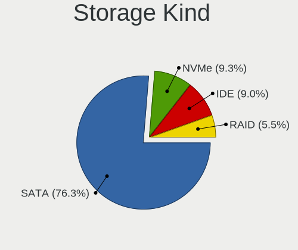

| Kind | Notebooks | Percent |
|------|-----------|---------|
| SATA | 1854      | 76.3%   |
| NVMe | 224       | 9.22%   |
| IDE  | 220       | 9.05%   |
| RAID | 132       | 5.43%   |

Processor
---------

CPU Vendor
----------

Processor vendors

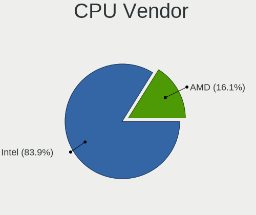

| Vendor | Notebooks | Percent |
|--------|-----------|---------|
| Intel  | 1818      | 83.86%  |
| AMD    | 350       | 16.14%  |

CPU Model
---------

Processor models

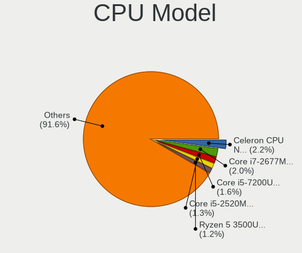

| Model                                         | Notebooks | Percent |
|-----------------------------------------------|-----------|---------|
| Intel Celeron CPU N2840 @ 2.16GHz             | 48        | 2.21%   |
| Intel Core i7-2677M CPU @ 1.80GHz             | 44        | 2.03%   |
| Intel Core i5-7200U CPU @ 2.50GHz             | 35        | 1.61%   |
| Intel Core i5-2520M CPU @ 2.50GHz             | 28        | 1.29%   |
| AMD Ryzen 5 3500U with Radeon Vega Mobile Gfx | 27        | 1.25%   |
| Intel Core i5-3230M CPU @ 2.60GHz             | 26        | 1.2%    |
| Intel Core i5-2410M CPU @ 2.30GHz             | 26        | 1.2%    |
| Intel Core i5-6200U CPU @ 2.30GHz             | 25        | 1.15%   |
| Intel Core i5-3210M CPU @ 2.50GHz             | 24        | 1.11%   |
| Intel Core i5-8250U CPU @ 1.60GHz             | 23        | 1.06%   |
| Intel Core i3-5005U CPU @ 2.00GHz             | 23        | 1.06%   |
| Intel Core i3-2310M CPU @ 2.10GHz             | 23        | 1.06%   |
| Intel Core i5-4210U CPU @ 1.70GHz             | 22        | 1.01%   |
| Intel Core i5-3320M CPU @ 2.60GHz             | 22        | 1.01%   |
| Intel Core i5-5200U CPU @ 2.20GHz             | 21        | 0.97%   |
| Intel Core 2 Duo CPU P8600 @ 2.40GHz          | 21        | 0.97%   |
| Intel Core i3-3110M CPU @ 2.40GHz             | 19        | 0.88%   |
| Intel Core 2 Duo CPU P8400 @ 2.26GHz          | 19        | 0.88%   |
| Intel Celeron CPU N3060 @ 1.60GHz             | 19        | 0.88%   |
| Intel Core i5 CPU M 520 @ 2.40GHz             | 18        | 0.83%   |
| Intel Core i3-6006U CPU @ 2.00GHz             | 18        | 0.83%   |
| Intel Core i3 CPU M 380 @ 2.53GHz             | 18        | 0.83%   |
| Intel Pentium Dual-Core CPU T4200 @ 2.00GHz   | 17        | 0.78%   |
| Intel Core i3-7020U CPU @ 2.30GHz             | 17        | 0.78%   |
| Intel Celeron CPU N3350 @ 1.10GHz             | 17        | 0.78%   |
| Intel Pentium Dual-Core CPU T4500 @ 2.30GHz   | 16        | 0.74%   |
| Intel Core i7-8550U CPU @ 1.80GHz             | 16        | 0.74%   |
| Intel Core i3-2350M CPU @ 2.30GHz             | 16        | 0.74%   |
| Intel Core i7-6500U CPU @ 2.50GHz             | 14        | 0.65%   |
| Intel Core i5-1035G1 CPU @ 1.00GHz            | 14        | 0.65%   |
| Intel Core i3-3120M CPU @ 2.50GHz             | 14        | 0.65%   |
| Intel Pentium CPU B960 @ 2.20GHz              | 13        | 0.6%    |
| Intel Core i7-7500U CPU @ 2.70GHz             | 13        | 0.6%    |
| Intel Core i7-2670QM CPU @ 2.20GHz            | 13        | 0.6%    |
| Intel Core i5-5300U CPU @ 2.30GHz             | 13        | 0.6%    |
| Intel Core i5-4200U CPU @ 1.60GHz             | 13        | 0.6%    |
| Intel Core i3-4030U CPU @ 1.90GHz             | 13        | 0.6%    |
| Intel Core i3 CPU M 370 @ 2.40GHz             | 13        | 0.6%    |
| Intel Core 2 Duo CPU T7250 @ 2.00GHz          | 13        | 0.6%    |
| Intel Celeron N4000 CPU @ 1.10GHz             | 13        | 0.6%    |

CPU Model Family
----------------

Processor model prefix

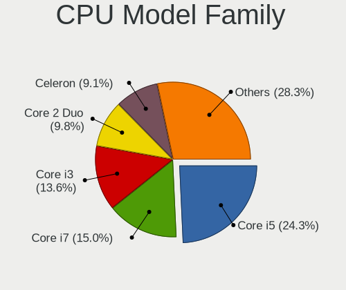

| Model                   | Notebooks | Percent |
|-------------------------|-----------|---------|
| Intel Core i5           | 525       | 24.22%  |
| Intel Core i7           | 323       | 14.9%   |
| Intel Core i3           | 293       | 13.51%  |
| Intel Core 2 Duo        | 212       | 9.78%   |
| Intel Celeron           | 200       | 9.23%   |
| Intel Pentium           | 105       | 4.84%   |
| AMD Ryzen 5             | 54        | 2.49%   |
| Intel Pentium Dual-Core | 53        | 2.44%   |
| AMD E                   | 34        | 1.57%   |
| Intel Pentium Dual      | 32        | 1.48%   |
| Other                   | 27        | 1.25%   |
| AMD A6                  | 27        | 1.25%   |
| AMD A4                  | 26        | 1.2%    |
| AMD E1                  | 25        | 1.15%   |
| AMD A8                  | 23        | 1.06%   |
| AMD Ryzen 7             | 21        | 0.97%   |
| AMD E2                  | 21        | 0.97%   |
| Intel Atom              | 18        | 0.83%   |
| AMD Ryzen 3             | 13        | 0.6%    |
| AMD A10                 | 13        | 0.6%    |
| AMD Athlon              | 12        | 0.55%   |
| AMD C-60                | 11        | 0.51%   |
| Intel Pentium Silver    | 10        | 0.46%   |
| Intel Core 2            | 10        | 0.46%   |
| Intel Celeron Dual-Core | 8         | 0.37%   |
| AMD Athlon II           | 6         | 0.28%   |
| Intel Genuine           | 5         | 0.23%   |
| AMD C-70                | 5         | 0.23%   |
| AMD Athlon X2           | 5         | 0.23%   |
| AMD Athlon 64 X2        | 5         | 0.23%   |
| AMD Turion II Dual-Core | 4         | 0.18%   |
| AMD Phenom II           | 4         | 0.18%   |
| AMD A12                 | 4         | 0.18%   |
| Intel Core m3           | 3         | 0.14%   |
| Intel Core 2 Extreme    | 3         | 0.14%   |
| Intel Core m7           | 2         | 0.09%   |
| AMD V120                | 2         | 0.09%   |
| AMD Turion II           | 2         | 0.09%   |
| AMD Sempron             | 2         | 0.09%   |
| AMD C-50                | 2         | 0.09%   |

CPU Cores
---------

Number of processor cores

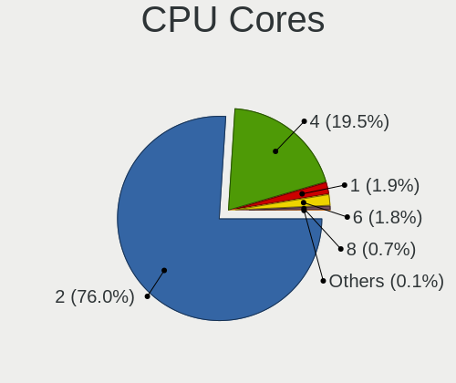

| Number | Notebooks | Percent |
|--------|-----------|---------|
| 2      | 1645      | 75.88%  |
| 4      | 424       | 19.56%  |
| 1      | 42        | 1.94%   |
| 6      | 40        | 1.85%   |
| 8      | 15        | 0.69%   |
| 5      | 1         | 0.05%   |
| 3      | 1         | 0.05%   |

CPU Sockets
-----------

Number of sockets

| Number | Notebooks | Percent |
|--------|-----------|---------|
| 1      | 2168      | 100%    |

CPU Threads
-----------

Threads per core (Hyper-Threading)

| Number | Notebooks | Percent |
|--------|-----------|---------|
| 2      | 1279      | 58.99%  |
| 1      | 889       | 41.01%  |

CPU Op-Modes
------------

CPU Operation Modes (32-bit, 64-bit)

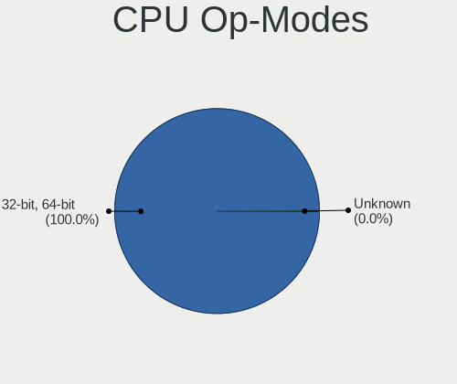

| Op mode        | Notebooks | Percent |
|----------------|-----------|---------|
| 32-bit, 64-bit | 2167      | 99.95%  |
| Unknown        | 1         | 0.05%   |

CPU Microcode
-------------

Microcode number

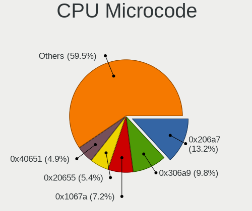

| Number     | Notebooks | Percent |
|------------|-----------|---------|
| 0x206a7    | 283       | 13.05%  |
| 0x306a9    | 211       | 9.73%   |
| 0x1067a    | 157       | 7.24%   |
| 0x20655    | 117       | 5.39%   |
| 0x40651    | 107       | 4.93%   |
| 0x406e3    | 88        | 4.06%   |
| 0x6fd      | 84        | 3.87%   |
| 0x306d4    | 76        | 3.5%    |
| 0x806e9    | 70        | 3.23%   |
| 0x30678    | 67        | 3.09%   |
| 0x10676    | 57        | 2.63%   |
| 0x306c3    | 55        | 2.54%   |
| 0x806ea    | 53        | 2.44%   |
| Unknown    | 51        | 2.35%   |
| 0x806ec    | 37        | 1.71%   |
| 0x406c4    | 36        | 1.66%   |
| 0x06006705 | 31        | 1.43%   |
| 0x706a1    | 30        | 1.38%   |
| 0x20652    | 30        | 1.38%   |
| 0x906ea    | 28        | 1.29%   |
| 0x706e5    | 28        | 1.29%   |
| 0x08108109 | 28        | 1.29%   |
| 0x07030105 | 28        | 1.29%   |
| 0x0500010d | 27        | 1.24%   |
| 0x506c9    | 25        | 1.15%   |
| 0x08108102 | 25        | 1.15%   |
| 0x506e3    | 19        | 0.88%   |
| 0x05000119 | 18        | 0.83%   |
| 0x6fb      | 16        | 0.74%   |
| 0x906e9    | 14        | 0.65%   |
| 0x806c1    | 13        | 0.6%    |
| 0x706a8    | 12        | 0.55%   |
| 0x106e5    | 11        | 0.51%   |
| 0x05000101 | 11        | 0.51%   |
| 0xa0652    | 10        | 0.46%   |
| 0x07030104 | 10        | 0.46%   |
| 0x6fa      | 9         | 0.41%   |
| 0x6f6      | 9         | 0.41%   |
| 0x406c3    | 9         | 0.41%   |
| 0x06001119 | 9         | 0.41%   |

CPU Microarch
-------------

Microarchitecture

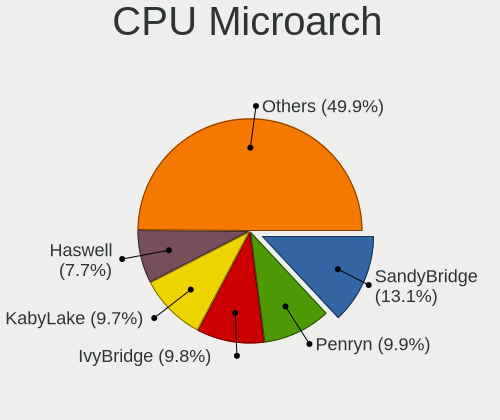

| Name            | Notebooks | Percent |
|-----------------|-----------|---------|
| SandyBridge     | 285       | 13.15%  |
| Penryn          | 214       | 9.87%   |
| IvyBridge       | 213       | 9.82%   |
| KabyLake        | 212       | 9.78%   |
| Haswell         | 164       | 7.56%   |
| Westmere        | 149       | 6.87%   |
| Core            | 126       | 5.81%   |
| Silvermont      | 117       | 5.4%    |
| Skylake         | 110       | 5.07%   |
| Broadwell       | 77        | 3.55%   |
| Bobcat          | 70        | 3.23%   |
| Zen+            | 60        | 2.77%   |
| Excavator       | 49        | 2.26%   |
| Puma            | 43        | 1.98%   |
| Goldmont plus   | 42        | 1.94%   |
| IceLake         | 29        | 1.34%   |
| Goldmont        | 26        | 1.2%    |
| Zen 2           | 23        | 1.06%   |
| K10             | 22        | 1.01%   |
| Jaguar          | 17        | 0.78%   |
| Piledriver      | 16        | 0.74%   |
| CometLake       | 16        | 0.74%   |
| Zen             | 14        | 0.65%   |
| Bonnell         | 14        | 0.65%   |
| TigerLake       | 13        | 0.6%    |
| Nehalem         | 11        | 0.51%   |
| K8 Hammer       | 10        | 0.46%   |
| K8 & K10 hybrid | 9         | 0.42%   |
| K10 Llano       | 8         | 0.37%   |
| Steamroller     | 6         | 0.28%   |
| Unknown         | 3         | 0.14%   |

Graphics
--------

GPU Vendor
----------

Vendors of graphics cards

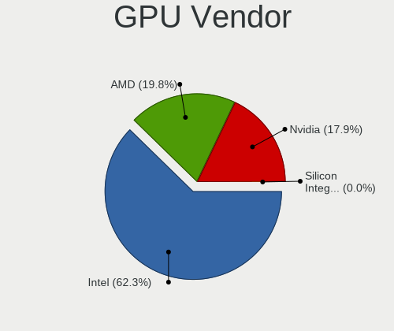

| Vendor                           | Notebooks | Percent |
|----------------------------------|-----------|---------|
| Intel                            | 1598      | 62.3%   |
| AMD                              | 507       | 19.77%  |
| Nvidia                           | 459       | 17.89%  |
| Silicon Integrated Systems [SiS] | 1         | 0.04%   |

GPU Model
---------

Graphics card models

| Model                                                                                    | Notebooks | Percent |
|------------------------------------------------------------------------------------------|-----------|---------|
| Intel 2nd Generation Core Processor Family Integrated Graphics Controller                | 263       | 9.8%    |
| Intel 3rd Gen Core processor Graphics Controller                                         | 196       | 7.3%    |
| Intel Mobile 4 Series Chipset Integrated Graphics Controller                             | 144       | 5.37%   |
| Intel Core Processor Integrated Graphics Controller                                      | 109       | 4.06%   |
| Intel Haswell-ULT Integrated Graphics Controller                                         | 106       | 3.95%   |
| Intel Skylake GT2 [HD Graphics 520]                                                      | 77        | 2.87%   |
| Intel Mobile GM965/GL960 Integrated Graphics Controller (secondary)                      | 74        | 2.76%   |
| Intel Mobile GM965/GL960 Integrated Graphics Controller (primary)                        | 74        | 2.76%   |
| Intel HD Graphics 620                                                                    | 73        | 2.72%   |
| Intel Atom Processor Z36xxx/Z37xxx Series Graphics & Display                             | 72        | 2.68%   |
| Intel HD Graphics 5500                                                                   | 67        | 2.5%    |
| AMD Picasso/Raven 2 [Radeon Vega Series / Radeon Vega Mobile Series]                     | 60        | 2.24%   |
| Intel 4th Gen Core Processor Integrated Graphics Controller                              | 48        | 1.79%   |
| Intel UHD Graphics 620                                                                   | 45        | 1.68%   |
| Intel Atom/Celeron/Pentium Processor x5-E8000/J3xxx/N3xxx Integrated Graphics Controller | 45        | 1.68%   |
| AMD Stoney [Radeon R2/R3/R4/R5 Graphics]                                                 | 39        | 1.45%   |
| Nvidia GF117M [GeForce 610M/710M/810M/820M / GT 620M/625M/630M/720M]                     | 38        | 1.42%   |
| Intel GeminiLake [UHD Graphics 600]                                                      | 32        | 1.19%   |
| Intel CoffeeLake-H GT2 [UHD Graphics 630]                                                | 26        | 0.97%   |
| AMD Mullins [Radeon R4/R5 Graphics]                                                      | 26        | 0.97%   |
| AMD Wrestler [Radeon HD 6310]                                                            | 24        | 0.89%   |
| Intel Iris Plus Graphics G1 (Ice Lake)                                                   | 23        | 0.86%   |
| Intel CometLake-U GT2 [UHD Graphics]                                                     | 23        | 0.86%   |
| AMD Sun XT [Radeon HD 8670A/8670M/8690M / R5 M330 / M430 / Radeon 520 Mobile]            | 23        | 0.86%   |
| AMD Renoir                                                                               | 22        | 0.82%   |
| Intel HD Graphics 500                                                                    | 21        | 0.78%   |
| AMD Thames [Radeon HD 7500M/7600M Series]                                                | 21        | 0.78%   |
| AMD RV620/M82 [Mobility Radeon HD 3450/3470]                                             | 20        | 0.75%   |
| AMD Seymour [Radeon HD 6400M/7400M Series]                                               | 19        | 0.71%   |
| AMD Topaz XT [Radeon R7 M260/M265 / M340/M360 / M440/M445 / 530/535 / 620/625 Mobile]    | 18        | 0.67%   |
| AMD Park [Mobility Radeon HD 5430/5450/5470]                                             | 18        | 0.67%   |
| Intel HD Graphics 530                                                                    | 17        | 0.63%   |
| Nvidia GF108M [GeForce GT 540M]                                                          | 16        | 0.6%    |
| Intel WhiskeyLake-U GT2 [UHD Graphics 620]                                               | 16        | 0.6%    |
| AMD RS880M [Mobility Radeon HD 4225/4250]                                                | 14        | 0.52%   |
| Nvidia GP107M [GeForce GTX 1050 Mobile]                                                  | 13        | 0.48%   |
| AMD Wrestler [Radeon HD 7310]                                                            | 13        | 0.48%   |
| AMD RV710/M92 [Mobility Radeon HD 4530/4570/545v]                                        | 13        | 0.48%   |
| AMD Raven Ridge [Radeon Vega Series / Radeon Vega Mobile Series]                         | 13        | 0.48%   |
| Nvidia TU117M [GeForce GTX 1650 Mobile / Max-Q]                                          | 12        | 0.45%   |

GPU Combo
---------

Combinations of graphics cards

| Name           | Notebooks | Percent |
|----------------|-----------|---------|
| 1 x Intel      | 1216      | 56.09%  |
| 1 x AMD        | 378       | 17.44%  |
| Intel + Nvidia | 308       | 14.21%  |
| 1 x Nvidia     | 132       | 6.09%   |
| Intel + AMD    | 74        | 3.41%   |
| 2 x AMD        | 40        | 1.85%   |
| AMD + Nvidia   | 15        | 0.69%   |
| 2 x Nvidia     | 4         | 0.18%   |
| 1 x SiS        | 1         | 0.05%   |

GPU Driver
----------

Free vs proprietary

| Driver      | Notebooks | Percent |
|-------------|-----------|---------|
| Free        | 2153      | 99.26%  |
| Unknown     | 14        | 0.65%   |
| Proprietary | 2         | 0.09%   |

GPU Memory
----------

Total video memory

| Size in GB | Notebooks | Percent |
|------------|-----------|---------|
| Unknown    | 1251      | 57.7%   |
| 0.01-0.5   | 366       | 16.88%  |
| 1.01-2.0   | 261       | 12.04%  |
| 0.51-1.0   | 201       | 9.27%   |
| 3.01-4.0   | 57        | 2.63%   |
| 5.01-6.0   | 16        | 0.74%   |
| 7.01-8.0   | 9         | 0.42%   |
| 2.01-3.0   | 7         | 0.32%   |

Monitor
-------

Monitor Vendor
--------------

Monitor vendors

| Vendor                  | Notebooks | Percent |
|-------------------------|-----------|---------|
| AU Optronics            | 468       | 21.35%  |
| LG Display              | 375       | 17.11%  |
| Samsung Electronics     | 301       | 13.73%  |
| BOE                     | 291       | 13.28%  |
| Chimei Innolux          | 282       | 12.86%  |
| Chi Mei Optoelectronics | 98        | 4.47%   |
| Lenovo                  | 67        | 3.06%   |
| CPT                     | 57        | 2.6%    |
| LG Philips              | 38        | 1.73%   |
| Apple                   | 36        | 1.64%   |
| Goldstar                | 16        | 0.73%   |
| Sharp                   | 15        | 0.68%   |
| InfoVision              | 14        | 0.64%   |
| Dell                    | 14        | 0.64%   |
| PANDA                   | 12        | 0.55%   |
| Acer                    | 11        | 0.5%    |
| Sony                    | 10        | 0.46%   |
| Philips                 | 9         | 0.41%   |
| InnoLux Display         | 8         | 0.36%   |
| BenQ                    | 7         | 0.32%   |
| Hewlett-Packard         | 6         | 0.27%   |
| ViewSonic               | 5         | 0.23%   |
| Iiyama                  | 5         | 0.23%   |
| Panasonic               | 4         | 0.18%   |
| AOC                     | 4         | 0.18%   |
| Ancor Communications    | 4         | 0.18%   |
| Toshiba                 | 3         | 0.14%   |
| HannStar                | 3         | 0.14%   |
| Fujitsu Siemens         | 3         | 0.14%   |
| Eizo                    | 3         | 0.14%   |
| Unknown                 | 2         | 0.09%   |
| Quanta Display          | 2         | 0.09%   |
| ASUSTek Computer        | 2         | 0.09%   |
| Westinghouse            | 1         | 0.05%   |
| Vizio                   | 1         | 0.05%   |
| Vestel Elektronik       | 1         | 0.05%   |
| SNC                     | 1         | 0.05%   |
| S2-Tek                  | 1         | 0.05%   |
| RTK                     | 1         | 0.05%   |
| ONN                     | 1         | 0.05%   |

Monitor Model
-------------

Monitor models

| Model                                                                    | Notebooks | Percent |
|--------------------------------------------------------------------------|-----------|---------|
| CPT LCD Monitor COR17DB 1600x900 293x164mm 13.2-inch                     | 44        | 2%      |
| Samsung Electronics LCD Monitor SEC5441 1366x768 344x194mm 15.5-inch     | 32        | 1.46%   |
| BOE LCD Monitor BOE0629 1366x768 309x173mm 13.9-inch                     | 32        | 1.46%   |
| AU Optronics LCD Monitor AUO38ED 1920x1080 344x193mm 15.5-inch           | 25        | 1.14%   |
| LG Display LCD Monitor LGD02DC 1366x768 344x194mm 15.5-inch              | 22        | 1%      |
| AU Optronics LCD Monitor AUO22EC 1366x768 344x193mm 15.5-inch            | 20        | 0.91%   |
| LG Display LCD Monitor LGD033A 1366x768 344x194mm 15.5-inch              | 19        | 0.86%   |
| Chimei Innolux LCD Monitor CMN15DB 1366x768 344x193mm 15.5-inch          | 18        | 0.82%   |
| AU Optronics LCD Monitor AUO26EC 1366x768 344x193mm 15.5-inch            | 17        | 0.77%   |
| AU Optronics LCD Monitor AUO61ED 1920x1080 344x194mm 15.5-inch           | 16        | 0.73%   |
| Samsung Electronics LCD Monitor SEC3945 1280x800 331x207mm 15.4-inch     | 15        | 0.68%   |
| Samsung Electronics LCD Monitor SEC544B 1600x900 382x214mm 17.2-inch     | 14        | 0.64%   |
| Chi Mei Optoelectronics LCD Monitor CMO15A7 1366x768 344x193mm 15.5-inch | 14        | 0.64%   |
| AU Optronics LCD Monitor AUO71EC 1366x768 344x193mm 15.5-inch            | 14        | 0.64%   |
| AU Optronics LCD Monitor AUO45EC 1366x768 344x193mm 15.5-inch            | 14        | 0.64%   |
| Chimei Innolux LCD Monitor CMN15F5 1920x1080 344x193mm 15.5-inch         | 13        | 0.59%   |
| LG Display LCD Monitor LGD02E9 1366x768 310x170mm 13.9-inch              | 12        | 0.55%   |
| Chimei Innolux LCD Monitor CMN1735 1920x1080 382x215mm 17.3-inch         | 12        | 0.55%   |
| Chi Mei Optoelectronics LCD Monitor CMO15A3 1366x768 344x193mm 15.5-inch | 12        | 0.55%   |
| AU Optronics LCD Monitor AUO70EC 1366x768 344x193mm 15.5-inch            | 12        | 0.55%   |
| AU Optronics LCD Monitor AUO20EC 1366x768 344x193mm 15.5-inch            | 11        | 0.5%    |
| AU Optronics LCD Monitor AUO10EC 1366x768 344x193mm 15.5-inch            | 11        | 0.5%    |
| Samsung Electronics LCD Monitor SEC3741 1280x800 331x207mm 15.4-inch     | 10        | 0.45%   |
| Chimei Innolux LCD Monitor CMN15CA 1366x768 344x193mm 15.5-inch          | 10        | 0.45%   |
| Chimei Innolux LCD Monitor CMN14D4 1920x1080 309x173mm 13.9-inch         | 10        | 0.45%   |
| BOE LCD Monitor BOE0812 1920x1080 344x194mm 15.5-inch                    | 10        | 0.45%   |
| BOE LCD Monitor BOE0675 1366x768 344x194mm 15.5-inch                     | 10        | 0.45%   |
| AU Optronics LCD Monitor AUO23EC 1366x768 344x193mm 15.5-inch            | 10        | 0.45%   |
| AU Optronics LCD Monitor AUO21EC 1366x768 344x193mm 15.5-inch            | 10        | 0.45%   |
| AU Optronics LCD Monitor AUO183C 1366x768 309x173mm 13.9-inch            | 10        | 0.45%   |
| AU Optronics LCD Monitor AUO106C 1366x768 276x155mm 12.5-inch            | 10        | 0.45%   |
| Samsung Electronics LCD Monitor SEC324A 1366x768 344x194mm 15.5-inch     | 9         | 0.41%   |
| LG Philips LP154WX4-TLC8 LPL0120 1280x800 331x207mm 15.4-inch            | 9         | 0.41%   |
| Lenovo LCD Monitor LEN4031 1280x800 303x190mm 14.1-inch                  | 9         | 0.41%   |
| Chi Mei Optoelectronics LCD Monitor CMO1592 1366x768 344x193mm 15.5-inch | 9         | 0.41%   |
| BOE LCD Monitor BOE0671 1366x768 344x194mm 15.5-inch                     | 9         | 0.41%   |
| AU Optronics LCD Monitor AUO139E 1600x900 382x214mm 17.2-inch            | 9         | 0.41%   |
| LG Display LCD Monitor LGD0259 1920x1080 345x194mm 15.6-inch             | 8         | 0.36%   |
| Chimei Innolux LCD Monitor CMN1728 1600x900 382x215mm 17.3-inch          | 8         | 0.36%   |
| BOE LCD Monitor BOE06A5 1366x768 344x194mm 15.5-inch                     | 8         | 0.36%   |

Monitor Resolution
------------------

Monitor screen resolution

| Resolution         | Notebooks | Percent |
|--------------------|-----------|---------|
| 1366x768 (WXGA)    | 1053      | 48.55%  |
| 1920x1080 (FHD)    | 543       | 25.03%  |
| 1600x900 (HD+)     | 227       | 10.47%  |
| 1280x800 (WXGA)    | 159       | 7.33%   |
| 1440x900 (WXGA+)   | 58        | 2.67%   |
| 1680x1050 (WSXGA+) | 23        | 1.06%   |
| 3840x2160 (4K)     | 22        | 1.01%   |
| 1920x1200 (WUXGA)  | 14        | 0.65%   |
| 2560x1440 (QHD)    | 11        | 0.51%   |
| 1024x600           | 10        | 0.46%   |
| 1280x1024 (SXGA)   | 7         | 0.32%   |
| 1024x768 (XGA)     | 7         | 0.32%   |
| 2560x1600          | 5         | 0.23%   |
| 1680x945           | 5         | 0.23%   |
| 2880x1800          | 4         | 0.18%   |
| 3200x1800 (QHD+)   | 3         | 0.14%   |
| 1360x768           | 3         | 0.14%   |
| 2560x1080          | 2         | 0.09%   |
| 2160x1440          | 2         | 0.09%   |
| 1920x540           | 2         | 0.09%   |
| 1400x1050          | 2         | 0.09%   |
| 3840x1100          | 1         | 0.05%   |
| 3300x2200          | 1         | 0.05%   |
| 3000x2000          | 1         | 0.05%   |
| 2304x1440          | 1         | 0.05%   |
| 2288x1287          | 1         | 0.05%   |
| 2256x1504          | 1         | 0.05%   |
| 1280x720 (HD)      | 1         | 0.05%   |

Monitor Diagonal
----------------

Diagonal size in inches

| Inches  | Notebooks | Percent |
|---------|-----------|---------|
| 15      | 1095      | 49.82%  |
| 13      | 333       | 15.15%  |
| 14      | 254       | 11.56%  |
| 17      | 232       | 10.56%  |
| 12      | 64        | 2.91%   |
| 11      | 40        | 1.82%   |
| 23      | 23        | 1.05%   |
| 27      | 21        | 0.96%   |
| 18      | 21        | 0.96%   |
| 21      | 17        | 0.77%   |
| 24      | 13        | 0.59%   |
| 10      | 13        | 0.59%   |
| 20      | 12        | 0.55%   |
| 31      | 11        | 0.5%    |
| 16      | 8         | 0.36%   |
| 22      | 7         | 0.32%   |
| 54      | 6         | 0.27%   |
| 84      | 3         | 0.14%   |
| 72      | 3         | 0.14%   |
| 25      | 3         | 0.14%   |
| 19      | 3         | 0.14%   |
| 48      | 2         | 0.09%   |
| 46      | 2         | 0.09%   |
| 34      | 2         | 0.09%   |
| 32      | 2         | 0.09%   |
| Unknown | 2         | 0.09%   |
| 142     | 1         | 0.05%   |
| 47      | 1         | 0.05%   |
| 42      | 1         | 0.05%   |
| 40      | 1         | 0.05%   |
| 37      | 1         | 0.05%   |
| 26      | 1         | 0.05%   |

Monitor Width
-------------

Physical width

| Width in mm    | Notebooks | Percent |
|----------------|-----------|---------|
| 301-350        | 1495      | 68.3%   |
| 351-400        | 281       | 12.84%  |
| 201-300        | 259       | 11.83%  |
| 501-600        | 60        | 2.74%   |
| 401-500        | 55        | 2.51%   |
| 601-700        | 12        | 0.55%   |
| 1001-1500      | 11        | 0.5%    |
| 1501-2000      | 6         | 0.27%   |
| 701-800        | 4         | 0.18%   |
| 801-900        | 2         | 0.09%   |
| Unknown        | 2         | 0.09%   |
| More than 2000 | 1         | 0.05%   |
| 901-1000       | 1         | 0.05%   |

Aspect Ratio
------------

Proportional relationship between the width and the height

| Ratio | Notebooks | Percent |
|-------|-----------|---------|
| 16/9  | 1800      | 85.76%  |
| 16/10 | 268       | 12.77%  |
| 3/2   | 10        | 0.48%   |
| 4/3   | 9         | 0.43%   |
| 5/4   | 8         | 0.38%   |
| 21/9  | 2         | 0.1%    |
| 3.40  | 1         | 0.05%   |
| 1.00  | 1         | 0.05%   |

Monitor Area
------------

Area in inch²

| Area in inch² | Notebooks | Percent |
|----------------|-----------|---------|
| 101-110        | 1093      | 49.73%  |
| 81-90          | 462       | 21.02%  |
| 121-130        | 191       | 8.69%   |
| 71-80          | 122       | 5.55%   |
| 61-70          | 62        | 2.82%   |
| 201-250        | 58        | 2.64%   |
| 51-60          | 42        | 1.91%   |
| 131-140        | 37        | 1.68%   |
| 141-150        | 25        | 1.14%   |
| 301-350        | 21        | 0.96%   |
| 151-200        | 18        | 0.82%   |
| More than 1000 | 15        | 0.68%   |
| 351-500        | 15        | 0.68%   |
| 41-50          | 12        | 0.55%   |
| 91-100         | 10        | 0.45%   |
| 501-1000       | 6         | 0.27%   |
| 251-300        | 4         | 0.18%   |
| 111-120        | 3         | 0.14%   |
| Unknown        | 2         | 0.09%   |

Pixel Density
-------------

Pixels per inch

| Density       | Notebooks | Percent |
|---------------|-----------|---------|
| 101-120       | 1123      | 51.51%  |
| 121-160       | 631       | 28.94%  |
| 51-100        | 342       | 15.69%  |
| 161-240       | 50        | 2.29%   |
| 1-50          | 17        | 0.78%   |
| More than 240 | 15        | 0.69%   |
| Unknown       | 2         | 0.09%   |

Multiple Monitors
-----------------

Total monitors connected

| Total | Notebooks | Percent |
|-------|-----------|---------|
| 1     | 2020      | 93.13%  |
| 2     | 139       | 6.41%   |
| 0     | 10        | 0.46%   |

Network
-------

Net Controller Vendor
---------------------

Controller vendors

| Vendor                            | Notebooks | Percent |
|-----------------------------------|-----------|---------|
| Realtek Semiconductor             | 1180      | 32.77%  |
| Intel                             | 881       | 24.47%  |
| Qualcomm Atheros                  | 827       | 22.97%  |
| Broadcom                          | 259       | 7.19%   |
| Marvell Technology Group          | 69        | 1.92%   |
| Broadcom Limited                  | 65        | 1.81%   |
| Samsung Electronics               | 52        | 1.44%   |
| Ralink                            | 46        | 1.28%   |
| Huawei Technologies               | 35        | 0.97%   |
| JMicron Technology                | 31        | 0.86%   |
| Dell                              | 21        | 0.58%   |
| Ericsson Business Mobile Networks | 17        | 0.47%   |
| Nvidia                            | 14        | 0.39%   |
| Ralink Technology                 | 12        | 0.33%   |
| MediaTek                          | 10        | 0.28%   |
| Qualcomm Atheros Communications   | 9         | 0.25%   |
| TP-Link                           | 8         | 0.22%   |
| Sierra Wireless                   | 6         | 0.17%   |
| Xiaomi                            | 5         | 0.14%   |
| Motorola PCS                      | 5         | 0.14%   |
| DisplayLink                       | 5         | 0.14%   |
| D-Link                            | 5         | 0.14%   |
| Hewlett-Packard                   | 4         | 0.11%   |
| Qualcomm                          | 3         | 0.08%   |
| Linksys                           | 3         | 0.08%   |
| ASIX Electronics                  | 3         | 0.08%   |
| Sitecom Europe                    | 2         | 0.06%   |
| OPPO Electronics                  | 2         | 0.06%   |
| NetGear                           | 2         | 0.06%   |
| Edimax Technology                 | 2         | 0.06%   |
| ASUSTek Computer                  | 2         | 0.06%   |
| Apple                             | 2         | 0.06%   |
| Toshiba                           | 1         | 0.03%   |
| T & A Mobile Phones               | 1         | 0.03%   |
| Silicon Integrated Systems [SiS]  | 1         | 0.03%   |
| Shenzhen Goodix Technology        | 1         | 0.03%   |
| Qcom                              | 1         | 0.03%   |
| Lenovo                            | 1         | 0.03%   |
| ICS Advent                        | 1         | 0.03%   |
| HMD Global                        | 1         | 0.03%   |

Net Controller Model
--------------------

Controller models

| Model                                                                   | Notebooks | Percent |
|-------------------------------------------------------------------------|-----------|---------|
| Realtek RTL8111/8168/8411 PCI Express Gigabit Ethernet Controller       | 688       | 16.07%  |
| Realtek RTL810xE PCI Express Fast Ethernet controller                   | 352       | 8.22%   |
| Qualcomm Atheros QCA9565 / AR9565 Wireless Network Adapter              | 172       | 4.02%   |
| Qualcomm Atheros AR9485 Wireless Network Adapter                        | 150       | 3.5%    |
| Qualcomm Atheros AR9285 Wireless Network Adapter (PCI-Express)          | 143       | 3.34%   |
| Qualcomm Atheros QCA9377 802.11ac Wireless Network Adapter              | 128       | 2.99%   |
| Intel 82579LM Gigabit Network Connection (Lewisville)                   | 101       | 2.36%   |
| Intel Centrino Advanced-N 6205 [Taylor Peak]                            | 84        | 1.96%   |
| Realtek RTL8723BE PCIe Wireless Network Adapter                         | 76        | 1.78%   |
| Intel Wireless 7265                                                     | 58        | 1.36%   |
| Realtek RTL8821CE 802.11ac PCIe Wireless Network Adapter                | 52        | 1.21%   |
| Realtek RTL8188CE 802.11b/g/n WiFi Adapter                              | 51        | 1.19%   |
| Samsung Galaxy series, misc. (tethering mode)                           | 50        | 1.17%   |
| Qualcomm Atheros AR8151 v2.0 Gigabit Ethernet                           | 49        | 1.14%   |
| Intel Wireless 7260                                                     | 48        | 1.12%   |
| Intel WiFi Link 5100                                                    | 47        | 1.1%    |
| Intel PRO/Wireless 3945ABG [Golan] Network Connection                   | 43        | 1%      |
| Intel 82577LM Gigabit Network Connection                                | 43        | 1%      |
| Intel 82567LM Gigabit Network Connection                                | 40        | 0.93%   |
| Broadcom BCM4313 802.11bgn Wireless Network Adapter                     | 40        | 0.93%   |
| Intel Wireless 8265 / 8275                                              | 39        | 0.91%   |
| Intel Centrino Advanced-N 6200                                          | 38        | 0.89%   |
| Qualcomm Atheros AR928X Wireless Network Adapter (PCI-Express)          | 37        | 0.86%   |
| Qualcomm Atheros AR242x / AR542x Wireless Network Adapter (PCI-Express) | 35        | 0.82%   |
| Intel PRO/Wireless 4965 AG or AGN [Kedron] Network Connection           | 35        | 0.82%   |
| Intel PRO/Wireless 5100 AGN [Shiloh] Network Connection                 | 34        | 0.79%   |
| Intel Wireless 8260                                                     | 33        | 0.77%   |
| Huawei E353/E3131                                                       | 32        | 0.75%   |
| Intel Wireless 3160                                                     | 30        | 0.7%    |
| Realtek RTL8822CE 802.11ac PCIe Wireless Network Adapter                | 29        | 0.68%   |
| Realtek RTL8153 Gigabit Ethernet Adapter                                | 28        | 0.65%   |
| JMicron JMC250 PCI Express Gigabit Ethernet Controller                  | 28        | 0.65%   |
| Intel Wireless 3165                                                     | 28        | 0.65%   |
| Intel Dual Band Wireless-AC 3165 Plus Bluetooth                         | 28        | 0.65%   |
| Intel Centrino Ultimate-N 6300                                          | 28        | 0.65%   |
| Qualcomm Atheros QCA6174 802.11ac Wireless Network Adapter              | 27        | 0.63%   |
| Intel Centrino Wireless-N 1000 [Condor Peak]                            | 27        | 0.63%   |
| Broadcom BCM43142 802.11b/g/n                                           | 27        | 0.63%   |
| Intel Dual Band Wireless-AC 3168NGW [Stone Peak]                        | 26        | 0.61%   |
| Intel Wi-Fi 6 AX200                                                     | 25        | 0.58%   |

Wireless Vendor
---------------

Wireless vendors

| Vendor                          | Notebooks | Percent |
|---------------------------------|-----------|---------|
| Intel                           | 831       | 37.62%  |
| Qualcomm Atheros                | 737       | 33.36%  |
| Realtek Semiconductor           | 349       | 15.8%   |
| Broadcom                        | 153       | 6.93%   |
| Ralink                          | 46        | 2.08%   |
| Broadcom Limited                | 30        | 1.36%   |
| Ralink Technology               | 12        | 0.54%   |
| Dell                            | 11        | 0.5%    |
| Qualcomm Atheros Communications | 9         | 0.41%   |
| Sierra Wireless                 | 6         | 0.27%   |
| MediaTek                        | 6         | 0.27%   |
| TP-Link                         | 5         | 0.23%   |
| NetGear                         | 2         | 0.09%   |
| Linksys                         | 2         | 0.09%   |
| Edimax Technology               | 2         | 0.09%   |
| D-Link                          | 2         | 0.09%   |
| ASUSTek Computer                | 2         | 0.09%   |
| Sitecom Europe                  | 1         | 0.05%   |
| Qcom                            | 1         | 0.05%   |
| Belkin Components               | 1         | 0.05%   |
| AVM                             | 1         | 0.05%   |

Wireless Model
--------------

Wireless models

| Model                                                                   | Notebooks | Percent |
|-------------------------------------------------------------------------|-----------|---------|
| Qualcomm Atheros QCA9565 / AR9565 Wireless Network Adapter              | 172       | 7.77%   |
| Qualcomm Atheros AR9485 Wireless Network Adapter                        | 150       | 6.77%   |
| Qualcomm Atheros AR9285 Wireless Network Adapter (PCI-Express)          | 143       | 6.46%   |
| Qualcomm Atheros QCA9377 802.11ac Wireless Network Adapter              | 128       | 5.78%   |
| Intel Centrino Advanced-N 6205 [Taylor Peak]                            | 84        | 3.79%   |
| Realtek RTL8723BE PCIe Wireless Network Adapter                         | 76        | 3.43%   |
| Intel Wireless 7265                                                     | 58        | 2.62%   |
| Realtek RTL8821CE 802.11ac PCIe Wireless Network Adapter                | 52        | 2.35%   |
| Realtek RTL8188CE 802.11b/g/n WiFi Adapter                              | 51        | 2.3%    |
| Intel Wireless 7260                                                     | 48        | 2.17%   |
| Intel WiFi Link 5100                                                    | 47        | 2.12%   |
| Intel PRO/Wireless 3945ABG [Golan] Network Connection                   | 43        | 1.94%   |
| Broadcom BCM4313 802.11bgn Wireless Network Adapter                     | 40        | 1.81%   |
| Intel Wireless 8265 / 8275                                              | 39        | 1.76%   |
| Intel Centrino Advanced-N 6200                                          | 38        | 1.72%   |
| Qualcomm Atheros AR928X Wireless Network Adapter (PCI-Express)          | 37        | 1.67%   |
| Qualcomm Atheros AR242x / AR542x Wireless Network Adapter (PCI-Express) | 35        | 1.58%   |
| Intel PRO/Wireless 4965 AG or AGN [Kedron] Network Connection           | 35        | 1.58%   |
| Intel PRO/Wireless 5100 AGN [Shiloh] Network Connection                 | 34        | 1.53%   |
| Intel Wireless 8260                                                     | 33        | 1.49%   |
| Intel Wireless 3160                                                     | 30        | 1.35%   |
| Realtek RTL8822CE 802.11ac PCIe Wireless Network Adapter                | 29        | 1.31%   |
| Intel Wireless 3165                                                     | 28        | 1.26%   |
| Intel Dual Band Wireless-AC 3165 Plus Bluetooth                         | 28        | 1.26%   |
| Intel Centrino Ultimate-N 6300                                          | 28        | 1.26%   |
| Qualcomm Atheros QCA6174 802.11ac Wireless Network Adapter              | 27        | 1.22%   |
| Intel Centrino Wireless-N 1000 [Condor Peak]                            | 27        | 1.22%   |
| Broadcom BCM43142 802.11b/g/n                                           | 27        | 1.22%   |
| Intel Dual Band Wireless-AC 3168NGW [Stone Peak]                        | 26        | 1.17%   |
| Intel Wi-Fi 6 AX200                                                     | 25        | 1.13%   |
| Qualcomm Atheros AR9462 Wireless Network Adapter                        | 24        | 1.08%   |
| Realtek RTL8723DE Wireless Network Adapter                              | 23        | 1.04%   |
| Ralink RT3290 Wireless 802.11n 1T/1R PCIe                               | 21        | 0.95%   |
| Intel Cannon Lake PCH CNVi WiFi                                         | 21        | 0.95%   |
| Intel Centrino Wireless-N 2230                                          | 20        | 0.9%    |
| Realtek RTL8188EE Wireless Network Adapter                              | 18        | 0.81%   |
| Qualcomm Atheros AR9287 Wireless Network Adapter (PCI-Express)          | 18        | 0.81%   |
| Intel Comet Lake PCH-LP CNVi WiFi                                       | 18        | 0.81%   |
| Broadcom BCM4312 802.11b/g LP-PHY                                       | 17        | 0.77%   |
| Realtek RTL8821AE 802.11ac PCIe Wireless Network Adapter                | 16        | 0.72%   |

Ethernet Vendor
---------------

Ethernet vendors

| Vendor                           | Notebooks | Percent |
|----------------------------------|-----------|---------|
| Realtek Semiconductor            | 1075      | 53.19%  |
| Intel                            | 335       | 16.58%  |
| Qualcomm Atheros                 | 193       | 9.55%   |
| Broadcom                         | 137       | 6.78%   |
| Marvell Technology Group         | 69        | 3.41%   |
| Samsung Electronics              | 52        | 2.57%   |
| Broadcom Limited                 | 37        | 1.83%   |
| Huawei Technologies              | 34        | 1.68%   |
| JMicron Technology               | 31        | 1.53%   |
| Nvidia                           | 13        | 0.64%   |
| Xiaomi                           | 5         | 0.25%   |
| DisplayLink                      | 5         | 0.25%   |
| Motorola PCS                     | 4         | 0.2%    |
| MediaTek                         | 4         | 0.2%    |
| TP-Link                          | 3         | 0.15%   |
| Qualcomm                         | 3         | 0.15%   |
| D-Link                           | 3         | 0.15%   |
| ASIX Electronics                 | 3         | 0.15%   |
| OPPO Electronics                 | 2         | 0.1%    |
| Apple                            | 2         | 0.1%    |
| T & A Mobile Phones              | 1         | 0.05%   |
| Sitecom Europe                   | 1         | 0.05%   |
| Silicon Integrated Systems [SiS] | 1         | 0.05%   |
| Linksys                          | 1         | 0.05%   |
| Lenovo                           | 1         | 0.05%   |
| ICS Advent                       | 1         | 0.05%   |
| HMD Global                       | 1         | 0.05%   |
| Hewlett-Packard                  | 1         | 0.05%   |
| Attansic Technology              | 1         | 0.05%   |
| Archos                           | 1         | 0.05%   |
| Allwinner Technology             | 1         | 0.05%   |

Ethernet Model
--------------

Ethernet models

| Model                                                                          | Notebooks | Percent |
|--------------------------------------------------------------------------------|-----------|---------|
| Realtek RTL8111/8168/8411 PCI Express Gigabit Ethernet Controller              | 688       | 33.91%  |
| Realtek RTL810xE PCI Express Fast Ethernet controller                          | 352       | 17.35%  |
| Intel 82579LM Gigabit Network Connection (Lewisville)                          | 101       | 4.98%   |
| Samsung Galaxy series, misc. (tethering mode)                                  | 50        | 2.46%   |
| Qualcomm Atheros AR8151 v2.0 Gigabit Ethernet                                  | 49        | 2.41%   |
| Intel 82577LM Gigabit Network Connection                                       | 43        | 2.12%   |
| Intel 82567LM Gigabit Network Connection                                       | 40        | 1.97%   |
| Huawei E353/E3131                                                              | 32        | 1.58%   |
| Realtek RTL8153 Gigabit Ethernet Adapter                                       | 28        | 1.38%   |
| JMicron JMC250 PCI Express Gigabit Ethernet Controller                         | 28        | 1.38%   |
| Qualcomm Atheros AR8152 v2.0 Fast Ethernet                                     | 24        | 1.18%   |
| Broadcom NetLink BCM57780 Gigabit Ethernet PCIe                                | 20        | 0.99%   |
| Marvell Group 88E8040 PCI-E Fast Ethernet Controller                           | 19        | 0.94%   |
| Intel Ethernet Connection I218-LM                                              | 19        | 0.94%   |
| Intel Ethernet Connection (3) I218-LM                                          | 19        | 0.94%   |
| Broadcom NetLink BCM5787M Gigabit Ethernet PCI Express                         | 18        | 0.89%   |
| Broadcom NetLink BCM5784M Gigabit Ethernet PCIe                                | 18        | 0.89%   |
| Qualcomm Atheros QCA8172 Fast Ethernet                                         | 17        | 0.84%   |
| Qualcomm Atheros AR8161 Gigabit Ethernet                                       | 16        | 0.79%   |
| Intel Ethernet Connection I219-LM                                              | 15        | 0.74%   |
| Qualcomm Atheros AR8132 Fast Ethernet                                          | 14        | 0.69%   |
| Intel 82566MM Gigabit Network Connection                                       | 14        | 0.69%   |
| Qualcomm Atheros AR8131 Gigabit Ethernet                                       | 13        | 0.64%   |
| Marvell Group Yukon Optima 88E8059 [PCIe Gigabit Ethernet Controller with AVB] | 13        | 0.64%   |
| Broadcom NetXtreme BCM57765 Gigabit Ethernet PCIe                              | 13        | 0.64%   |
| Broadcom NetLink BCM57785 Gigabit Ethernet PCIe                                | 13        | 0.64%   |
| Marvell Group 88E8055 PCI-E Gigabit Ethernet Controller                        | 12        | 0.59%   |
| Intel Ethernet Connection I217-LM                                              | 12        | 0.59%   |
| Qualcomm Atheros AR8121/AR8113/AR8114 Gigabit or Fast Ethernet                 | 11        | 0.54%   |
| Broadcom NetLink BCM5906M Fast Ethernet PCI Express                            | 11        | 0.54%   |
| Qualcomm Atheros AR8162 Fast Ethernet                                          | 10        | 0.49%   |
| Broadcom NetXtreme BCM5764M Gigabit Ethernet PCIe                              | 10        | 0.49%   |
| Broadcom NetXtreme BCM5755M Gigabit Ethernet PCI Express                       | 10        | 0.49%   |
| Qualcomm Atheros QCA8171 Gigabit Ethernet                                      | 9         | 0.44%   |
| Qualcomm Atheros AR8152 v1.1 Fast Ethernet                                     | 9         | 0.44%   |
| Intel Ethernet Connection I219-V                                               | 9         | 0.44%   |
| Intel Ethernet Connection (4) I219-LM                                          | 9         | 0.44%   |
| Intel 82579V Gigabit Network Connection                                        | 9         | 0.44%   |
| Broadcom NetXtreme BCM57786 Gigabit Ethernet PCIe                              | 9         | 0.44%   |
| Qualcomm Atheros Killer E2500 Gigabit Ethernet Controller                      | 8         | 0.39%   |

Net Controller Kind
-------------------

Ethernet, WiFi or modem

| Kind     | Notebooks | Percent |
|----------|-----------|---------|
| WiFi     | 2150      | 51.65%  |
| Ethernet | 1977      | 47.49%  |
| Modem    | 34        | 0.82%   |
| Unknown  | 2         | 0.05%   |

Used Controller
---------------

Currently used network controller

| Kind     | Notebooks | Percent |
|----------|-----------|---------|
| WiFi     | 1463      | 68.4%   |
| Ethernet | 676       | 31.6%   |

NICs
----

Total network controllers on board

| Total | Notebooks | Percent |
|-------|-----------|---------|
| 2     | 1815      | 83.72%  |
| 1     | 338       | 15.59%  |
| 0     | 10        | 0.46%   |
| 3     | 5         | 0.23%   |

IPv6
----

IPv6 vs IPv4

| Used | Notebooks | Percent |
|------|-----------|---------|
| No   | 1724      | 79.37%  |
| Yes  | 448       | 20.63%  |

Bluetooth
---------

Bluetooth Vendor
----------------

Controller vendors

| Vendor                          | Notebooks | Percent |
|---------------------------------|-----------|---------|
| Intel                           | 450       | 30.78%  |
| Qualcomm Atheros Communications | 226       | 15.46%  |
| Realtek Semiconductor           | 163       | 11.15%  |
| Broadcom                        | 122       | 8.34%   |
| Lite-On Technology              | 116       | 7.93%   |
| Foxconn / Hon Hai               | 67        | 4.58%   |
| IMC Networks                    | 61        | 4.17%   |
| Dell                            | 52        | 3.56%   |
| Toshiba                         | 40        | 2.74%   |
| Apple                           | 32        | 2.19%   |
| Hewlett-Packard                 | 30        | 2.05%   |
| Cambridge Silicon Radio         | 23        | 1.57%   |
| Ralink                          | 21        | 1.44%   |
| Realtek                         | 10        | 0.68%   |
| Foxconn International           | 10        | 0.68%   |
| Chicony Electronics             | 8         | 0.55%   |
| ASUSTek Computer                | 8         | 0.55%   |
| Alps Electric                   | 7         | 0.48%   |
| Ralink Technology               | 6         | 0.41%   |
| Askey Computer                  | 4         | 0.27%   |
| Taiyo Yuden                     | 2         | 0.14%   |
| Micro Star International        | 2         | 0.14%   |
| MediaTek                        | 1         | 0.07%   |
| Fujitsu                         | 1         | 0.07%   |

Bluetooth Model
---------------

Controller models

| Model                                                                               | Notebooks | Percent |
|-------------------------------------------------------------------------------------|-----------|---------|
| Intel Bluetooth wireless interface                                                  | 256       | 17.51%  |
| Qualcomm Atheros  Bluetooth Device                                                  | 114       | 7.8%    |
| Realtek Bluetooth Radio                                                             | 90        | 6.16%   |
| Intel Bluetooth 9460/9560 Jefferson Peak (JfP)                                      | 52        | 3.56%   |
| Lite-On Qualcomm Atheros QCA9377 Bluetooth                                          | 48        | 3.28%   |
| Realtek  Bluetooth 4.2 Adapter                                                      | 45        | 3.08%   |
| Qualcomm Atheros AR3012 Bluetooth 4.0                                               | 40        | 2.74%   |
| Qualcomm Atheros AR3011 Bluetooth                                                   | 39        | 2.67%   |
| Intel Centrino Bluetooth Wireless Transceiver                                       | 34        | 2.33%   |
| Broadcom BCM2045B (BDC-2.1)                                                         | 34        | 2.33%   |
| Lite-On Atheros AR3012 Bluetooth                                                    | 31        | 2.12%   |
| Intel Wireless-AC 3168 Bluetooth                                                    | 26        | 1.78%   |
| Intel AX201 Bluetooth                                                               | 26        | 1.78%   |
| Intel AX200 Bluetooth                                                               | 25        | 1.71%   |
| Foxconn / Hon Hai Bluetooth Device                                                  | 25        | 1.71%   |
| Dell DW375 Bluetooth Module                                                         | 23        | 1.57%   |
| Cambridge Silicon Radio Bluetooth Dongle (HCI mode)                                 | 23        | 1.57%   |
| Ralink RT3290 Bluetooth                                                             | 21        | 1.44%   |
| Lite-On Bluetooth Device                                                            | 21        | 1.44%   |
| Intel Centrino Advanced-N 6230 Bluetooth adapter                                    | 21        | 1.44%   |
| IMC Networks Bluetooth Device                                                       | 21        | 1.44%   |
| Apple Bluetooth Host Controller                                                     | 21        | 1.44%   |
| Realtek RTL8723B Bluetooth                                                          | 19        | 1.3%    |
| IMC Networks Bluetooth Radio                                                        | 19        | 1.3%    |
| Toshiba Bluetooth Device                                                            | 16        | 1.09%   |
| HP Bluetooth 2.0 Interface [Broadcom BCM2045]                                       | 16        | 1.09%   |
| Broadcom BCM20702 Bluetooth 4.0 [ThinkPad]                                          | 16        | 1.09%   |
| Broadcom BCM2045B (BDC-2.1) [Bluetooth Controller]                                  | 16        | 1.09%   |
| Foxconn / Hon Hai Bluetooth USB Host Controller                                     | 14        | 0.96%   |
| Qualcomm Atheros AR9462 Bluetooth                                                   | 13        | 0.89%   |
| HP Broadcom 2070 Bluetooth Combo                                                    | 13        | 0.89%   |
| Dell BCM20702A0 Bluetooth Module                                                    | 13        | 0.89%   |
| Qualcomm Atheros QCA61x4 Bluetooth 4.0                                              | 12        | 0.82%   |
| Foxconn / Hon Hai Foxconn T77H114 BCM2070 [Single-Chip Bluetooth 2.1 + EDR Adapter] | 12        | 0.82%   |
| IMC Networks Atheros AR3012 Bluetooth 4.0 Adapter                                   | 11        | 0.75%   |
| Dell Wireless 360 Bluetooth                                                         | 11        | 0.75%   |
| Broadcom BCM2045B (BDC-2) [Bluetooth Controller]                                    | 11        | 0.75%   |
| Apple Bluetooth USB Host Controller                                                 | 11        | 0.75%   |
| Toshiba Integrated Bluetooth HCI                                                    | 10        | 0.68%   |
| Realtek Bluetooth Radio                                                             | 10        | 0.68%   |

Sound
-----

Sound Vendor
------------

Sound card vendors

| Vendor                               | Notebooks | Percent |
|--------------------------------------|-----------|---------|
| Intel                                | 1799      | 72.25%  |
| AMD                                  | 419       | 16.83%  |
| Nvidia                               | 237       | 9.52%   |
| JMTek                                | 4         | 0.16%   |
| C-Media Electronics                  | 4         | 0.16%   |
| Logitech                             | 3         | 0.12%   |
| Creative Technology                  | 3         | 0.12%   |
| Texas Instruments                    | 2         | 0.08%   |
| Realtek Semiconductor                | 2         | 0.08%   |
| ASUSTek Computer                     | 2         | 0.08%   |
| Thesycon Systemsoftware & Consulting | 1         | 0.04%   |
| TerraTec Electronic                  | 1         | 0.04%   |
| TEAC                                 | 1         | 0.04%   |
| Silicon Integrated Systems [SiS]     | 1         | 0.04%   |
| Razer USA                            | 1         | 0.04%   |
| Plantronics                          | 1         | 0.04%   |
| Phison Electronics                   | 1         | 0.04%   |
| M-Audio                              | 1         | 0.04%   |
| Lenovo                               | 1         | 0.04%   |
| GN Netcom                            | 1         | 0.04%   |
| Focusrite-Novation                   | 1         | 0.04%   |
| Elitegroup Computer Systems (ECS)    | 1         | 0.04%   |
| Bose                                 | 1         | 0.04%   |
| AudioQuest                           | 1         | 0.04%   |
| Apple                                | 1         | 0.04%   |

Sound Model
-----------

Sound card models

| Model                                                                                             | Notebooks | Percent |
|---------------------------------------------------------------------------------------------------|-----------|---------|
| Intel 7 Series/C216 Chipset Family High Definition Audio Controller                               | 260       | 8.58%   |
| Intel 6 Series/C200 Series Chipset Family High Definition Audio Controller                        | 238       | 7.85%   |
| Intel Sunrise Point-LP HD Audio                                                                   | 218       | 7.19%   |
| Intel 82801I (ICH9 Family) HD Audio Controller                                                    | 201       | 6.63%   |
| Intel 5 Series/3400 Series Chipset High Definition Audio                                          | 160       | 5.28%   |
| AMD FCH Azalia Controller                                                                         | 116       | 3.83%   |
| Intel 82801H (ICH8 Family) HD Audio Controller                                                    | 112       | 3.69%   |
| Intel 8 Series HD Audio Controller                                                                | 107       | 3.53%   |
| Intel Haswell-ULT HD Audio Controller                                                             | 105       | 3.46%   |
| AMD Family 17h/19h HD Audio Controller                                                            | 99        | 3.27%   |
| Intel Broadwell-U Audio Controller                                                                | 77        | 2.54%   |
| Intel Wildcat Point-LP High Definition Audio Controller                                           | 76        | 2.51%   |
| AMD SBx00 Azalia (Intel HDA)                                                                      | 76        | 2.51%   |
| Intel Atom Processor Z36xxx/Z37xxx Series High Definition Audio Controller                        | 72        | 2.37%   |
| AMD Kabini HDMI/DP Audio                                                                          | 70        | 2.31%   |
| AMD Raven/Raven2/Fenghuang HDMI/DP Audio Controller                                               | 67        | 2.21%   |
| Intel 8 Series/C220 Series Chipset High Definition Audio Controller                               | 58        | 1.91%   |
| AMD Wrestler HDMI Audio                                                                           | 57        | 1.88%   |
| Nvidia GF108 High Definition Audio Controller                                                     | 54        | 1.78%   |
| Intel Xeon E3-1200 v3/4th Gen Core Processor HD Audio Controller                                  | 51        | 1.68%   |
| AMD Family 15h (Models 60h-6fh) Audio Controller                                                  | 49        | 1.62%   |
| Intel Atom/Celeron/Pentium Processor x5-E8000/J3xxx/N3xxx Series High Definition Audio Controller | 44        | 1.45%   |
| Intel Celeron/Pentium Silver Processor High Definition Audio                                      | 41        | 1.35%   |
| AMD High Definition Audio Controller                                                              | 39        | 1.29%   |
| Intel Comet Lake PCH-LP cAVS                                                                      | 29        | 0.96%   |
| Intel Ice Lake-LP Smart Sound Technology Audio Controller                                         | 28        | 0.92%   |
| Intel Cannon Lake PCH cAVS                                                                        | 28        | 0.92%   |
| Intel Celeron N3350/Pentium N4200/Atom E3900 Series Audio Cluster                                 | 26        | 0.86%   |
| Intel NM10/ICH7 Family High Definition Audio Controller                                           | 24        | 0.79%   |
| Intel 100 Series/C230 Series Chipset Family HD Audio Controller                                   | 19        | 0.63%   |
| AMD RV710/730 HDMI Audio [Radeon HD 4000 series]                                                  | 19        | 0.63%   |
| AMD Cedar HDMI Audio [Radeon HD 5400/6300/7300 Series]                                            | 19        | 0.63%   |
| Nvidia GK107 HDMI Audio Controller                                                                | 18        | 0.59%   |
| Intel Cannon Point-LP High Definition Audio Controller                                            | 18        | 0.59%   |
| AMD Renoir Radeon High Definition Audio Controller                                                | 18        | 0.59%   |
| Nvidia TU107 GeForce GTX 1650 High Definition Audio Controller                                    | 17        | 0.56%   |
| Nvidia High Definition Audio Controller                                                           | 16        | 0.53%   |
| Nvidia GT216 HDMI Audio Controller                                                                | 16        | 0.53%   |
| AMD Trinity HDMI Audio Controller                                                                 | 16        | 0.53%   |
| Intel CM238 HD Audio Controller                                                                   | 14        | 0.46%   |

Memory
------

Memory Vendor
-------------

Memory module vendors

| Vendor              | Notebooks | Percent |
|---------------------|-----------|---------|
| Samsung Electronics | 673       | 26.02%  |
| SK hynix            | 528       | 20.42%  |
| Unknown             | 261       | 10.09%  |
| Kingston            | 243       | 9.4%    |
| Micron Technology   | 221       | 8.55%   |
| Elpida              | 137       | 5.3%    |
| Crucial             | 74        | 2.86%   |
| Ramaxel Technology  | 71        | 2.75%   |
| Nanya Technology    | 66        | 2.55%   |
| A-DATA Technology   | 63        | 2.44%   |
| Smart               | 39        | 1.51%   |
| Corsair             | 27        | 1.04%   |
| Unknown (ABCD)      | 21        | 0.81%   |
| Transcend           | 17        | 0.66%   |
| ASint Technology    | 15        | 0.58%   |
| High Bridge         | 13        | 0.5%    |
| G.Skill             | 13        | 0.5%    |
| Apacer              | 11        | 0.43%   |
| Teikon              | 9         | 0.35%   |
| Toshiba             | 8         | 0.31%   |
| AMD                 | 8         | 0.31%   |
| Patriot             | 7         | 0.27%   |
| Team                | 5         | 0.19%   |
| Smart Brazil        | 5         | 0.19%   |
| Qimonda             | 5         | 0.19%   |
| Unknown             | 4         | 0.15%   |
| Silicon Power       | 3         | 0.12%   |
| SHARETRONIC         | 3         | 0.12%   |
| PNY                 | 3         | 0.12%   |
| Qumo                | 2         | 0.08%   |
| Kingmax             | 2         | 0.08%   |
| Goodram             | 2         | 0.08%   |
| CSX                 | 2         | 0.08%   |
| Carry               | 2         | 0.08%   |
| A Force             | 2         | 0.08%   |
| ZIFEI               | 1         | 0.04%   |
| Visipro             | 1         | 0.04%   |
| V-GeN               | 1         | 0.04%   |
| Unknown (AB)        | 1         | 0.04%   |
| Unknown (8A02)      | 1         | 0.04%   |

Memory Model
------------

Memory module models

| Model                                                            | Notebooks | Percent |
|------------------------------------------------------------------|-----------|---------|
| Unknown RAM Module 2GB SODIMM DDR2 667MT/s                       | 53        | 1.92%   |
| SK hynix RAM HMT451S6BFR8A-PB 4GB SODIMM DDR3 1600MT/s           | 53        | 1.92%   |
| Samsung RAM M471B5273DH0-CH9 4096MB SODIMM DDR3 1334MT/s         | 46        | 1.67%   |
| Elpida RAM Module 2GB SODIMM DDR3 1333MT/s                       | 45        | 1.63%   |
| Samsung RAM M471B5273CH0-CH9 4GB SODIMM DDR3 1334MT/s            | 43        | 1.56%   |
| Samsung RAM M471B5173DB0-YK0 4GB SODIMM DDR3 1600MT/s            | 42        | 1.53%   |
| Samsung RAM M471A5244CB0-CTD 4GB SODIMM DDR4 3266MT/s            | 41        | 1.49%   |
| Samsung RAM M471B5173EB0-YK0 4GB SODIMM DDR3 1600MT/s            | 40        | 1.45%   |
| Samsung RAM M471B5173BH0-YK0 4GB SODIMM DDR3 1600MT/s            | 35        | 1.27%   |
| Samsung RAM M471A5244CB0-CRC 4GB SODIMM DDR4 2667MT/s            | 33        | 1.2%    |
| SK hynix RAM HMT351S6CFR8C-PB 4GB SODIMM DDR3 1600MT/s           | 32        | 1.16%   |
| Samsung RAM M471B5173QH0-YK0 4GB SODIMM DDR3 1600MT/s            | 32        | 1.16%   |
| Unknown RAM Module 4GB SODIMM DDR3                               | 27        | 0.98%   |
| SK hynix RAM HMT41GS6BFR8A-PB 8GB SODIMM DDR3 1600MT/s           | 27        | 0.98%   |
| Samsung RAM M471B5773DH0-CH9 2GB SODIMM DDR3 1600MT/s            | 24        | 0.87%   |
| Samsung RAM M471B5273DH0-CK0 4GB SODIMM DDR3 1600MT/s            | 23        | 0.84%   |
| Unknown RAM Module 2GB SODIMM DDR2                               | 22        | 0.8%    |
| Samsung RAM M471B5773CHS-CH9 2GB SODIMM DDR3 4199MT/s            | 22        | 0.8%    |
| SK hynix RAM HMT451S6AFR8A-PB 4GB SODIMM DDR3 1600MT/s           | 21        | 0.76%   |
| Elpida RAM EBJ41UF8BCS0-DJ-F 4GB SODIMM DDR3 1334MT/s            | 20        | 0.73%   |
| Unknown RAM Module 1GB SODIMM DDR2 667MT/s                       | 19        | 0.69%   |
| Unknown (ABCD) RAM 123456789012345678 2GB SODIMM LPDDR4 2400MT/s | 18        | 0.65%   |
| Unknown RAM Module 2GB SODIMM DDR3                               | 16        | 0.58%   |
| Samsung RAM M471B5673FH0-CH9 2GB SODIMM DDR3 1334MT/s            | 16        | 0.58%   |
| Micron RAM 4ATF51264HZ-2G3B1 4GB SODIMM DDR4 2400MT/s            | 16        | 0.58%   |
| SK hynix RAM HYMP125S64CP8-S6 2GB SODIMM DDR2 800MT/s            | 15        | 0.54%   |
| SK hynix RAM HMT351S6BFR8C-H9 4GB SODIMM DDR3 1333MT/s           | 15        | 0.54%   |
| Micron RAM 4ATF51264HZ-2G6E1 4GB SODIMM DDR4 2667MT/s            | 15        | 0.54%   |
| Unknown RAM Module 4GB SODIMM DDR3 1600MT/s                      | 14        | 0.51%   |
| Unknown RAM Module 1GB SODIMM DDR2                               | 14        | 0.51%   |
| SK hynix RAM HMA851S6JJR6N-VK 4GB SODIMM DDR4 2667MT/s           | 14        | 0.51%   |
| Samsung RAM M471A1K43CB1-CRC 8GB SODIMM DDR4 2667MT/s            | 14        | 0.51%   |
| SK hynix RAM HMA851S6AFR6N-UH 2GB SODIMM LPDDR4 2667MT/s         | 13        | 0.47%   |
| SK hynix RAM HMA81GS6AFR8N-UH 8GB SODIMM DDR4 2667MT/s           | 13        | 0.47%   |
| Nanya RAM NT2GC64B88B0NS-CG 2GB SODIMM DDR3 1334MT/s             | 13        | 0.47%   |
| SK hynix RAM HMA851S6CJR6N-VK 4GB SODIMM DDR4 2667MT/s           | 12        | 0.44%   |
| SK hynix RAM HMA851S6AFR6N-UH 4GB SODIMM DDR4 2400MT/s           | 12        | 0.44%   |
| Samsung RAM M471B5673FH0-CF8 2GB SODIMM DDR3 1067MT/s            | 12        | 0.44%   |
| Samsung RAM M471A1K43CB1-CTD 8GB SODIMM DDR4 2667MT/s            | 12        | 0.44%   |
| Samsung RAM M471B1G73QH0-YK0 8192MB SODIMM DDR3 1600MT/s         | 11        | 0.4%    |

Memory Kind
-----------

Memory module kinds

| Kind    | Notebooks | Percent |
|---------|-----------|---------|
| DDR3    | 1240      | 57.41%  |
| DDR4    | 472       | 21.85%  |
| DDR2    | 263       | 12.18%  |
| SDRAM   | 90        | 4.17%   |
| LPDDR4  | 46        | 2.13%   |
| Unknown | 23        | 1.06%   |
| LPDDR3  | 15        | 0.69%   |
| DRAM    | 6         | 0.28%   |
| DDR     | 5         | 0.23%   |

Memory Form Factor
------------------

Physical design of the memory module

| Name         | Notebooks | Percent |
|--------------|-----------|---------|
| SODIMM       | 2059      | 96.94%  |
| Row Of Chips | 46        | 2.17%   |
| DIMM         | 9         | 0.42%   |
| Chip         | 7         | 0.33%   |
| Unknown      | 3         | 0.14%   |

Memory Size
-----------

Memory module size

| Size  | Notebooks | Percent |
|-------|-----------|---------|
| 4096  | 1122      | 46.95%  |
| 2048  | 623       | 26.07%  |
| 8192  | 453       | 18.95%  |
| 1024  | 117       | 4.9%    |
| 16384 | 67        | 2.8%    |
| 32768 | 6         | 0.25%   |
| 512   | 2         | 0.08%   |

Memory Speed
------------

Memory module speed

| Speed   | Notebooks | Percent |
|---------|-----------|---------|
| 1600    | 769       | 31.71%  |
| 2667    | 285       | 11.75%  |
| 1334    | 259       | 10.68%  |
| 1333    | 205       | 8.45%   |
| 2400    | 154       | 6.35%   |
| 667     | 142       | 5.86%   |
| 1067    | 85        | 3.51%   |
| Unknown | 80        | 3.3%    |
| 800     | 72        | 2.97%   |
| 2133    | 66        | 2.72%   |
| 3200    | 63        | 2.6%    |
| 4199    | 53        | 2.19%   |
| 3266    | 41        | 1.69%   |
| 2048    | 32        | 1.32%   |
| 975     | 30        | 1.24%   |
| 1066    | 24        | 0.99%   |
| 1867    | 18        | 0.74%   |
| 533     | 18        | 0.74%   |
| 4267    | 5         | 0.21%   |
| 1639    | 5         | 0.21%   |
| 8400    | 3         | 0.12%   |
| 400     | 3         | 0.12%   |
| 2933    | 2         | 0.08%   |
| 1200    | 2         | 0.08%   |
| 333     | 2         | 0.08%   |
| 266     | 2         | 0.08%   |
| 3733    | 1         | 0.04%   |
| 2267    | 1         | 0.04%   |
| 1866    | 1         | 0.04%   |
| 1776    | 1         | 0.04%   |
| 933     | 1         | 0.04%   |

Printers & scanners
-------------------

Printer Vendor
--------------

Printer device vendors

| Vendor                | Notebooks | Percent |
|-----------------------|-----------|---------|
| Hewlett-Packard       | 9         | 39.13%  |
| Samsung Electronics   | 4         | 17.39%  |
| Seiko Epson           | 3         | 13.04%  |
| Canon                 | 3         | 13.04%  |
| Brother Industries    | 2         | 8.7%    |
| Xerox                 | 1         | 4.35%   |
| Lexmark International | 1         | 4.35%   |

Printer Model
-------------

Printer device models

| Model                                   | Notebooks | Percent |
|-----------------------------------------|-----------|---------|
| Samsung ML-1640 Series Laser Printer    | 2         | 8.7%    |
| HP LaserJet 1020                        | 2         | 8.7%    |
| HP DeskJet 3630 series                  | 2         | 8.7%    |
| Xerox Phaser 6000B                      | 1         | 4.35%   |
| Seiko Epson L312 Series                 | 1         | 4.35%   |
| Seiko Epson L220 Series                 | 1         | 4.35%   |
| Seiko Epson L210 Series                 | 1         | 4.35%   |
| Samsung Xerox Phaser 3117 Laser Printer | 1         | 4.35%   |
| Samsung M2070 Series                    | 1         | 4.35%   |
| Lexmark International E360d             | 1         | 4.35%   |
| HP LaserJet 200 colorMFP M275nw         | 1         | 4.35%   |
| HP ENVY Photo 6200 series               | 1         | 4.35%   |
| HP ENVY 6000 series                     | 1         | 4.35%   |
| HP ENVY 4520 series                     | 1         | 4.35%   |
| HP DeskJet 2130 series                  | 1         | 4.35%   |
| Canon PIXMA MG3500 Series               | 1         | 4.35%   |
| Canon PIXMA MG2500 Series               | 1         | 4.35%   |
| Canon LBP2900                           | 1         | 4.35%   |
| Brother MFC-J5330DW                     | 1         | 4.35%   |
| Brother DCP-L3550CDW series             | 1         | 4.35%   |

Scanner Vendor
--------------

Scanner device vendors

| Vendor          | Notebooks | Percent |
|-----------------|-----------|---------|
| Hewlett-Packard | 2         | 40%     |
| Canon           | 2         | 40%     |
| Seiko Epson     | 1         | 20%     |

Scanner Model
-------------

Scanner device models

| Model                         | Notebooks | Percent |
|-------------------------------|-----------|---------|
| HP ScanJet 5590               | 2         | 40%     |
| Seiko Epson Scanner           | 1         | 20%     |
| Canon CanoScan N1240U/LiDE 30 | 1         | 20%     |
| Canon CanoScan LiDE 110       | 1         | 20%     |

Camera
------

Camera Vendor
-------------

Camera device vendors

| Vendor                                 | Notebooks | Percent |
|----------------------------------------|-----------|---------|
| Chicony Electronics                    | 524       | 28.81%  |
| Suyin                                  | 172       | 9.46%   |
| IMC Networks                           | 139       | 7.64%   |
| Acer                                   | 138       | 7.59%   |
| Realtek Semiconductor                  | 135       | 7.42%   |
| Microdia                               | 124       | 6.82%   |
| Sunplus Innovation Technology          | 87        | 4.78%   |
| Cheng Uei Precision Industry (Foxlink) | 78        | 4.29%   |
| Quanta                                 | 67        | 3.68%   |
| Syntek                                 | 64        | 3.52%   |
| Silicon Motion                         | 41        | 2.25%   |
| Ricoh                                  | 38        | 2.09%   |
| Lite-On Technology                     | 38        | 2.09%   |
| Alcor Micro                            | 33        | 1.81%   |
| Apple                                  | 27        | 1.48%   |
| Lenovo                                 | 23        | 1.26%   |
| Importek                               | 15        | 0.82%   |
| Primax Electronics                     | 14        | 0.77%   |
| OmniVision Technologies                | 9         | 0.49%   |
| Luxvisions Innotech Limited            | 9         | 0.49%   |
| DigiTech                               | 9         | 0.49%   |
| ALi                                    | 9         | 0.49%   |
| Z-Star Microelectronics                | 5         | 0.27%   |
| Foxconn / Hon Hai                      | 3         | 0.16%   |
| Logitech                               | 2         | 0.11%   |
| Genesys Logic                          | 2         | 0.11%   |
| WaveRider Communications               | 1         | 0.05%   |
| Sunplus Technology                     | 1         | 0.05%   |
| Samsung Electronics                    | 1         | 0.05%   |
| Pixart Imaging                         | 1         | 0.05%   |
| Nokia Mobile Phones                    | 1         | 0.05%   |
| Nebraska Furniture Mart                | 1         | 0.05%   |
| Microsoft                              | 1         | 0.05%   |
| lihappe8                               | 1         | 0.05%   |
| JMicron Technology                     | 1         | 0.05%   |
| Intel                                  | 1         | 0.05%   |
| GEMBIRD                                | 1         | 0.05%   |
| Cubeternet                             | 1         | 0.05%   |
| Creative Technology                    | 1         | 0.05%   |
| Alpha Imaging Technology               | 1         | 0.05%   |

Camera Model
------------

Camera device models

| Model                                                   | Notebooks | Percent |
|---------------------------------------------------------|-----------|---------|
| Chicony HD WebCam                                       | 53        | 2.91%   |
| Chicony Integrated Camera                               | 44        | 2.42%   |
| Suyin Integrated_Webcam_HD                              | 34        | 1.87%   |
| Suyin Acer/HP Integrated Webcam [CN0314]                | 32        | 1.76%   |
| Chicony USB 2.0 Camera                                  | 31        | 1.7%    |
| IMC Networks USB2.0 VGA UVC WebCam                      | 30        | 1.65%   |
| Realtek Integrated_Webcam_HD                            | 29        | 1.59%   |
| Acer Lenovo EasyCamera                                  | 27        | 1.48%   |
| Microdia Integrated_Webcam_HD                           | 24        | 1.32%   |
| IMC Networks USB2.0 HD UVC WebCam                       | 24        | 1.32%   |
| Chicony USB2.0 HD UVC WebCam                            | 24        | 1.32%   |
| Chicony VGA Webcam                                      | 23        | 1.26%   |
| Syntek Lenovo EasyCamera                                | 21        | 1.15%   |
| Realtek USB Camera                                      | 21        | 1.15%   |
| Acer Integrated Camera                                  | 21        | 1.15%   |
| Syntek Integrated Camera                                | 20        | 1.1%    |
| Sunplus Integrated_Webcam_HD                            | 20        | 1.1%    |
| Quanta HP Webcam                                        | 20        | 1.1%    |
| Chicony HP TrueVision HD                                | 20        | 1.1%    |
| Microdia Integrated Webcam                              | 19        | 1.04%   |
| Chicony EasyCamera                                      | 19        | 1.04%   |
| Sunplus HD WebCam                                       | 18        | 0.99%   |
| Chicony TOSHIBA Web Camera - HD                         | 18        | 0.99%   |
| Chicony Lenovo EasyCamera                               | 17        | 0.93%   |
| Cheng Uei Precision Industry (Foxlink) HP Webcam        | 17        | 0.93%   |
| Acer EasyCamera                                         | 17        | 0.93%   |
| Lite-On Integrated Camera                               | 16        | 0.88%   |
| Suyin HP Truevision HD                                  | 15        | 0.82%   |
| IMC Networks UVC VGA Webcam                             | 15        | 0.82%   |
| Chicony CNF9055 Toshiba Webcam                          | 15        | 0.82%   |
| Chicony Acer CrystalEye Webcam                          | 15        | 0.82%   |
| Acer Lenovo Integrated Webcam                           | 15        | 0.82%   |
| Quanta VGA WebCam                                       | 14        | 0.77%   |
| Chicony Webcam                                          | 14        | 0.77%   |
| Chicony USB2.0 VGA UVC WebCam                           | 14        | 0.77%   |
| Cheng Uei Precision Industry (Foxlink) HP TrueVision HD | 14        | 0.77%   |
| Alcor Micro USB 2.0 Camera                              | 14        | 0.77%   |
| Realtek HD WebCam                                       | 13        | 0.71%   |
| IMC Networks Integrated Camera                          | 13        | 0.71%   |
| Chicony HP Webcam                                       | 13        | 0.71%   |

Security
--------

Fingerprint Vendor
------------------

Fingerprint sensor vendors

| Vendor                     | Notebooks | Percent |
|----------------------------|-----------|---------|
| Validity Sensors           | 98        | 39.2%   |
| AuthenTec                  | 46        | 18.4%   |
| Upek                       | 31        | 12.4%   |
| Shenzhen Goodix Technology | 18        | 7.2%    |
| Synaptics                  | 16        | 6.4%    |
| STMicroelectronics         | 14        | 5.6%    |
| LighTuning Technology      | 14        | 5.6%    |
| Elan Microelectronics      | 12        | 4.8%    |
| Focal-systems.Corp         | 1         | 0.4%    |

Fingerprint Model
-----------------

Fingerprint sensor models

| Model                                                                      | Notebooks | Percent |
|----------------------------------------------------------------------------|-----------|---------|
| Upek Biometric Touchchip/Touchstrip Fingerprint Sensor                     | 27        | 10.8%   |
| AuthenTec AES2810                                                          | 20        | 8%      |
| Validity Sensors VFS495 Fingerprint Reader                                 | 16        | 6.4%    |
| Shenzhen Goodix  FingerPrint Device                                        | 15        | 6%      |
| Validity Sensors VFS 5011 fingerprint sensor                               | 14        | 5.6%    |
| STMicroelectronics Fingerprint Reader                                      | 14        | 5.6%    |
| Validity Sensors VFS5011 Fingerprint Reader                                | 12        | 4.8%    |
| AuthenTec AES2501 Fingerprint Sensor                                       | 12        | 4.8%    |
| Elan ELAN:Fingerprint                                                      | 11        | 4.4%    |
| Validity Sensors VFS471 Fingerprint Reader                                 | 9         | 3.6%    |
| Validity Sensors VFS451 Fingerprint Reader                                 | 9         | 3.6%    |
| Validity Sensors VFS491                                                    | 7         | 2.8%    |
| LighTuning ES603 Swipe Fingerprint Sensor                                  | 7         | 2.8%    |
| Synaptics  WBDI                                                            | 6         | 2.4%    |
| AuthenTec Fingerprint Sensor                                               | 6         | 2.4%    |
| AuthenTec AES1600                                                          | 6         | 2.4%    |
| Validity Sensors VFS7500 Touch Fingerprint Sensor                          | 5         | 2%      |
| Validity Sensors VFS101 Fingerprint Reader                                 | 5         | 2%      |
| Validity Sensors Swipe Fingerprint Sensor                                  | 5         | 2%      |
| Validity Sensors Fingerprint scanner                                       | 5         | 2%      |
| LighTuning EgisTec Touch Fingerprint Sensor                                | 5         | 2%      |
| Validity Sensors VFS301 Fingerprint Reader                                 | 4         | 1.6%    |
| Upek TCS5B Fingerprint sensor                                              | 4         | 1.6%    |
| Validity Sensors VFS Fingerprint sensor                                    | 3         | 1.2%    |
| Unknown                                                                    | 3         | 1.2%    |
| Validity Sensors Synaptics VFS7552 Touch Fingerprint Sensor with PurePrint | 2         | 0.8%    |
| Synaptics WBDI Device                                                      | 2         | 0.8%    |
| Shenzhen Goodix Fingerprint Reader                                         | 2         | 0.8%    |
| LighTuning Fingerprint Reader                                              | 2         | 0.8%    |
| Validity Sensors VFS300 Fingerprint Reader                                 | 1         | 0.4%    |
| Validity Sensors Synaptics WBDI                                            | 1         | 0.4%    |
| Synaptics  VFS7552 Touch Fingerprint Sensor with PurePrint                 | 1         | 0.4%    |
| Synaptics  FS7604 Touch Fingerprint Sensor with PurePrint                  | 1         | 0.4%    |
| Synaptics Prometheus MIS Touch Fingerprint Reader                          | 1         | 0.4%    |
| Synaptics Metallica MOH Touch Fingerprint Reader                           | 1         | 0.4%    |
| Synaptics Metallica MIS Touch Fingerprint Reader                           | 1         | 0.4%    |
| Shenzhen Goodix FingerPrint                                                | 1         | 0.4%    |
| Focal-systems.Corp FT9201Fingerprint.                                      | 1         | 0.4%    |
| Elan ELAN:ARM-M4                                                           | 1         | 0.4%    |
| AuthenTec AES2550 Fingerprint Sensor                                       | 1         | 0.4%    |

Chipcard Vendor
---------------

Chipcard module vendors

| Vendor               | Notebooks | Percent |
|----------------------|-----------|---------|
| Broadcom             | 70        | 53.85%  |
| O2 Micro             | 21        | 16.15%  |
| Alcor Micro          | 16        | 12.31%  |
| Lenovo               | 13        | 10%     |
| Upek                 | 7         | 5.38%   |
| SCM Microsystems     | 1         | 0.77%   |
| OmniKey              | 1         | 0.77%   |
| Microchip Technology | 1         | 0.77%   |

Chipcard Model
--------------

Chipcard module models

| Model                                                                        | Notebooks | Percent |
|------------------------------------------------------------------------------|-----------|---------|
| Broadcom BCM5880 Secure Applications Processor                               | 45        | 34.62%  |
| O2 Micro OZ776 CCID Smartcard Reader                                         | 21        | 16.15%  |
| Broadcom BCM5880 Secure Applications Processor with fingerprint swipe sensor | 18        | 13.85%  |
| Alcor Micro AU9540 Smartcard Reader                                          | 16        | 12.31%  |
| Lenovo Integrated Smart Card Reader                                          | 13        | 10%     |
| Upek TouchChip Fingerprint Coprocessor (WBF advanced mode)                   | 7         | 5.38%   |
| Broadcom 5880                                                                | 7         | 5.38%   |
| SCM Microsystems SCR3340 - ExpressCard54 Smart Card Reader                   | 1         | 0.77%   |
| OmniKey CardMan 4321                                                         | 1         | 0.77%   |
| Microchip Technology SMSC USX101x Reader                                     | 1         | 0.77%   |

Unsupported
-----------

Unsupported Devices
-------------------

Total unsupported devices on board

| Total | Notebooks | Percent |
|-------|-----------|---------|
| 0     | 1696      | 78.19%  |
| 1     | 404       | 18.63%  |
| 2     | 68        | 3.14%   |
| 3     | 1         | 0.05%   |

Unsupported Device Types
------------------------

Types of unsupported devices

| Type                     | Notebooks | Percent |
|--------------------------|-----------|---------|
| Fingerprint reader       | 250       | 46.64%  |
| Chipcard                 | 128       | 23.88%  |
| Graphics card            | 43        | 8.02%   |
| Storage                  | 34        | 6.34%   |
| Net/wireless             | 29        | 5.41%   |
| Bluetooth                | 24        | 4.48%   |
| Multimedia controller    | 13        | 2.43%   |
| Camera                   | 6         | 1.12%   |
| Card reader              | 3         | 0.56%   |
| Communication controller | 2         | 0.37%   |
| Sound                    | 1         | 0.19%   |
| Network                  | 1         | 0.19%   |
| Modem                    | 1         | 0.19%   |
| Flash memory             | 1         | 0.19%   |

