OpenMandriva 4.2 - Tested Hardware & Statistics (Notebooks)
-----------------------------------------------------------

A project to collect tested hardware configurations for OpenMandriva 4.2.

Anyone can contribute to this report by the [hw-probe](https://github.com/linuxhw/hw-probe) tool:

    sudo -E hw-probe -all -upload

Please contribute! Especially if your hardware is rare.

Contents
--------

* [ Test Cases ](#test-cases)

* [ System ](#system)
  - [ Kernel                   ](#kernel)
  - [ Kernel Family            ](#kernel-family)
  - [ Kernel Major Ver.        ](#kernel-major-ver)
  - [ Arch                     ](#arch)
  - [ DE                       ](#de)
  - [ Display Server           ](#display-server)
  - [ Display Manager          ](#display-manager)
  - [ OS Lang                  ](#os-lang)
  - [ Boot Mode                ](#boot-mode)
  - [ Filesystem               ](#filesystem)
  - [ Part. scheme             ](#part-scheme)
  - [ Dual Boot with Linux/BSD ](#dual-boot-with-linuxbsd)
  - [ Dual Boot (Win)          ](#dual-boot-win)

* [ Board ](#board)
  - [ Vendor                   ](#vendor)
  - [ Model                    ](#model)
  - [ Model Family             ](#model-family)
  - [ MFG Year                 ](#mfg-year)
  - [ Form Factor              ](#form-factor)
  - [ Secure Boot              ](#secure-boot)
  - [ Coreboot                 ](#coreboot)
  - [ RAM Size                 ](#ram-size)
  - [ RAM Used                 ](#ram-used)
  - [ Total Drives             ](#total-drives)
  - [ Has CD-ROM               ](#has-cd-rom)
  - [ Has Ethernet             ](#has-ethernet)
  - [ Has WiFi                 ](#has-wifi)
  - [ Has Bluetooth            ](#has-bluetooth)

* [ Location ](#location)
  - [ Country                  ](#country)
  - [ City                     ](#city)

* [ Drives ](#drives)
  - [ Drive Vendor             ](#drive-vendor)
  - [ Drive Model              ](#drive-model)
  - [ HDD Vendor               ](#hdd-vendor)
  - [ SSD Vendor               ](#ssd-vendor)
  - [ Drive Kind               ](#drive-kind)
  - [ Drive Connector          ](#drive-connector)
  - [ Drive Size               ](#drive-size)
  - [ Space Total              ](#space-total)
  - [ Space Used               ](#space-used)
  - [ Malfunc. Drives          ](#malfunc-drives)
  - [ Malfunc. Drive Vendor    ](#malfunc-drive-vendor)
  - [ Malfunc. HDD Vendor      ](#malfunc-hdd-vendor)
  - [ Malfunc. Drive Kind      ](#malfunc-drive-kind)
  - [ Failed Drives            ](#failed-drives)
  - [ Failed Drive Vendor      ](#failed-drive-vendor)
  - [ Drive Status             ](#drive-status)

* [ Storage controller ](#storage-controller)
  - [ Storage Vendor           ](#storage-vendor)
  - [ Storage Model            ](#storage-model)
  - [ Storage Kind             ](#storage-kind)

* [ Processor ](#processor)
  - [ CPU Vendor               ](#cpu-vendor)
  - [ CPU Model                ](#cpu-model)
  - [ CPU Model Family         ](#cpu-model-family)
  - [ CPU Cores                ](#cpu-cores)
  - [ CPU Sockets              ](#cpu-sockets)
  - [ CPU Threads              ](#cpu-threads)
  - [ CPU Op-Modes             ](#cpu-op-modes)
  - [ CPU Microcode            ](#cpu-microcode)
  - [ CPU Microarch            ](#cpu-microarch)

* [ Graphics ](#graphics)
  - [ GPU Vendor               ](#gpu-vendor)
  - [ GPU Model                ](#gpu-model)
  - [ GPU Combo                ](#gpu-combo)
  - [ GPU Driver               ](#gpu-driver)
  - [ GPU Memory               ](#gpu-memory)

* [ Monitor ](#monitor)
  - [ Monitor Vendor           ](#monitor-vendor)
  - [ Monitor Model            ](#monitor-model)
  - [ Monitor Resolution       ](#monitor-resolution)
  - [ Monitor Diagonal         ](#monitor-diagonal)
  - [ Monitor Width            ](#monitor-width)
  - [ Aspect Ratio             ](#aspect-ratio)
  - [ Monitor Area             ](#monitor-area)
  - [ Pixel Density            ](#pixel-density)
  - [ Multiple Monitors        ](#multiple-monitors)

* [ Network ](#network)
  - [ Net Controller Vendor    ](#net-controller-vendor)
  - [ Net Controller Model     ](#net-controller-model)
  - [ Wireless Vendor          ](#wireless-vendor)
  - [ Wireless Model           ](#wireless-model)
  - [ Ethernet Vendor          ](#ethernet-vendor)
  - [ Ethernet Model           ](#ethernet-model)
  - [ Net Controller Kind      ](#net-controller-kind)
  - [ Used Controller          ](#used-controller)
  - [ NICs                     ](#nics)
  - [ IPv6                     ](#ipv6)

* [ Bluetooth ](#bluetooth)
  - [ Bluetooth Vendor         ](#bluetooth-vendor)
  - [ Bluetooth Model          ](#bluetooth-model)

* [ Sound ](#sound)
  - [ Sound Vendor             ](#sound-vendor)
  - [ Sound Model              ](#sound-model)

* [ Memory ](#memory)
  - [ Memory Vendor            ](#memory-vendor)
  - [ Memory Model             ](#memory-model)
  - [ Memory Kind              ](#memory-kind)
  - [ Memory Form Factor       ](#memory-form-factor)
  - [ Memory Size              ](#memory-size)
  - [ Memory Speed             ](#memory-speed)

* [ Printers & scanners ](#printers--scanners)
  - [ Printer Vendor           ](#printer-vendor)
  - [ Printer Model            ](#printer-model)
  - [ Scanner Vendor           ](#scanner-vendor)
  - [ Scanner Model            ](#scanner-model)

* [ Camera ](#camera)
  - [ Camera Vendor            ](#camera-vendor)
  - [ Camera Model             ](#camera-model)

* [ Security ](#security)
  - [ Fingerprint Vendor       ](#fingerprint-vendor)
  - [ Fingerprint Model        ](#fingerprint-model)
  - [ Chipcard Vendor          ](#chipcard-vendor)
  - [ Chipcard Model           ](#chipcard-model)

* [ Unsupported ](#unsupported)
  - [ Unsupported Devices      ](#unsupported-devices)
  - [ Unsupported Device Types ](#unsupported-device-types)

Test Cases
----------

Total: 2196

| Vendor        | Model                       | Probe                                                      | Date         |
|---------------|-----------------------------|------------------------------------------------------------|--------------|
| ASUSTek       | K50ID                       | [2c1dddeaea](https://linux-hardware.org/?probe=2c1dddeaea) | Jul 29, 2022 |
| Dell          | Inspiron 3451               | [c95dd7e491](https://linux-hardware.org/?probe=c95dd7e491) | Jul 13, 2022 |
| HP            | Pavilion g6                 | [2f0de52d8e](https://linux-hardware.org/?probe=2f0de52d8e) | Jul 08, 2022 |
| Gateway       | NE56R                       | [69f2805432](https://linux-hardware.org/?probe=69f2805432) | Jul 06, 2022 |
| HP            | Stream Laptop 14-ax0XX      | [03bede7266](https://linux-hardware.org/?probe=03bede7266) | Jul 03, 2022 |
| Dell          | Inspiron 3451               | [a57cf9cc46](https://linux-hardware.org/?probe=a57cf9cc46) | Jul 03, 2022 |
| ASUSTek       | X542UA                      | [f5da6492ca](https://linux-hardware.org/?probe=f5da6492ca) | Jul 03, 2022 |
| Dell          | Latitude D630               | [df3001a64d](https://linux-hardware.org/?probe=df3001a64d) | Jul 02, 2022 |
| Notebook      | MIM 2200                    | [85748618b6](https://linux-hardware.org/?probe=85748618b6) | Jul 02, 2022 |
| Dell          | Inspiron 3451               | [6cf63ca19e](https://linux-hardware.org/?probe=6cf63ca19e) | Jun 30, 2022 |
| Dell          | Latitude E7250              | [790850da0b](https://linux-hardware.org/?probe=790850da0b) | Jun 22, 2022 |
| Samsung       | 355V4C/356V4C/3445VC/354... | [212cd0ac63](https://linux-hardware.org/?probe=212cd0ac63) | Jun 22, 2022 |
| Dell          | Inspiron 3451               | [d9ac6a3f41](https://linux-hardware.org/?probe=d9ac6a3f41) | Jun 19, 2022 |
| ASUSTek       | N71Vg                       | [6926193d76](https://linux-hardware.org/?probe=6926193d76) | Jun 18, 2022 |
| HP            | Pavilion dv6                | [1ba5e6c491](https://linux-hardware.org/?probe=1ba5e6c491) | Jun 18, 2022 |
| Sony          | VGN-NW310F                  | [318b17f951](https://linux-hardware.org/?probe=318b17f951) | Jun 17, 2022 |
| HP            | Pavilion g4                 | [193875edcc](https://linux-hardware.org/?probe=193875edcc) | Jun 15, 2022 |
| Acer          | Extensa 5220                | [dd0d362582](https://linux-hardware.org/?probe=dd0d362582) | Jun 15, 2022 |
| Dell          | Inspiron 3451               | [7ca7f789d8](https://linux-hardware.org/?probe=7ca7f789d8) | Jun 14, 2022 |
| HP            | Laptop 17-bs0xx             | [a4587cc1de](https://linux-hardware.org/?probe=a4587cc1de) | Jun 10, 2022 |
| Dell          | Inspiron 3451               | [a6feb9dcd2](https://linux-hardware.org/?probe=a6feb9dcd2) | Jun 07, 2022 |
| Lenovo        | IdeaPad S145-14IIL 81W6     | [058bd1f6b9](https://linux-hardware.org/?probe=058bd1f6b9) | Jun 04, 2022 |
| Dell          | Inspiron 3451               | [ba5e3a5d77](https://linux-hardware.org/?probe=ba5e3a5d77) | Jun 02, 2022 |
| Medion        | E7220                       | [d4a700af57](https://linux-hardware.org/?probe=d4a700af57) | Jun 01, 2022 |
| Dell          | Inspiron 3451               | [04e9ce0ba0](https://linux-hardware.org/?probe=04e9ce0ba0) | Jun 01, 2022 |
| Dell          | Inspiron 3451               | [8ad9f9f5d9](https://linux-hardware.org/?probe=8ad9f9f5d9) | May 29, 2022 |
| Dell          | Inspiron 3451               | [798f65546b](https://linux-hardware.org/?probe=798f65546b) | May 27, 2022 |
| Clevo         | W55xEU                      | [c5fd2417f4](https://linux-hardware.org/?probe=c5fd2417f4) | May 25, 2022 |
| HP            | ProBook 450 G1              | [0097404cab](https://linux-hardware.org/?probe=0097404cab) | May 23, 2022 |
| Lenovo        | ThinkPad T61 7661BM5        | [9a6d69d512](https://linux-hardware.org/?probe=9a6d69d512) | May 22, 2022 |
| Dell          | Inspiron 3451               | [38c450f343](https://linux-hardware.org/?probe=38c450f343) | May 21, 2022 |
| Acer          | Aspire 5332                 | [f48da95c17](https://linux-hardware.org/?probe=f48da95c17) | May 21, 2022 |
| Dell          | Inspiron 3451               | [d14ff2c62e](https://linux-hardware.org/?probe=d14ff2c62e) | May 20, 2022 |
| Toshiba       | Satellite C670D-126         | [9df3447b21](https://linux-hardware.org/?probe=9df3447b21) | May 14, 2022 |
| Packard Be... | EasyNote MH35               | [f3180b0817](https://linux-hardware.org/?probe=f3180b0817) | May 13, 2022 |
| Toshiba       | Satellite C645D             | [53153cb65d](https://linux-hardware.org/?probe=53153cb65d) | May 04, 2022 |
| Acer          | Aspire F5-573               | [f571b0dc6f](https://linux-hardware.org/?probe=f571b0dc6f) | May 02, 2022 |
| ASUSTek       | UX31E                       | [35c8958673](https://linux-hardware.org/?probe=35c8958673) | May 01, 2022 |
| Lenovo        | IdeaPad 100-15IBY 80MJ      | [ea3bd2e330](https://linux-hardware.org/?probe=ea3bd2e330) | May 01, 2022 |
| Samsung       | RC530/RC730                 | [2e44e9228e](https://linux-hardware.org/?probe=2e44e9228e) | Apr 28, 2022 |
| PC Special... | NJ50_70CU                   | [a9b4399cad](https://linux-hardware.org/?probe=a9b4399cad) | Apr 26, 2022 |
| Lenovo        | IdeaPad S510p 20298         | [80943ca395](https://linux-hardware.org/?probe=80943ca395) | Apr 18, 2022 |
| Dell          | Inspiron 15-5578            | [4e70c05231](https://linux-hardware.org/?probe=4e70c05231) | Apr 17, 2022 |
| HP            | Pavilion dv6                | [639a7422d8](https://linux-hardware.org/?probe=639a7422d8) | Apr 16, 2022 |
| HP            | Pavilion Laptop 15-eg0xx... | [e9a5e187ad](https://linux-hardware.org/?probe=e9a5e187ad) | Apr 15, 2022 |
| Lenovo        | ThinkPad Helix 36986CG      | [f0aa04a603](https://linux-hardware.org/?probe=f0aa04a603) | Apr 12, 2022 |
| HP            | ProBook 470 G3              | [5c65c7eedd](https://linux-hardware.org/?probe=5c65c7eedd) | Apr 10, 2022 |
| HP            | Pavilion dv6                | [209dbfbea6](https://linux-hardware.org/?probe=209dbfbea6) | Apr 06, 2022 |
| ASUSTek       | VivoBook_ASUSLaptop X515... | [c5c24ea4c2](https://linux-hardware.org/?probe=c5c24ea4c2) | Apr 06, 2022 |
| Packard Be... | EasyNote TJ71               | [9afad803e0](https://linux-hardware.org/?probe=9afad803e0) | Apr 05, 2022 |
| Sony          | VGN-FZ31M                   | [5e1ef6c19a](https://linux-hardware.org/?probe=5e1ef6c19a) | Apr 03, 2022 |
| Acer          | Aspire F5-571               | [68cb5f9f95](https://linux-hardware.org/?probe=68cb5f9f95) | Apr 03, 2022 |
| HP            | Pavilion 17                 | [e3071e1f70](https://linux-hardware.org/?probe=e3071e1f70) | Apr 02, 2022 |
| ASUSTek       | X71Sr                       | [0e6ffbc190](https://linux-hardware.org/?probe=0e6ffbc190) | Apr 01, 2022 |
| HP            | 355 G2                      | [5a5271a7df](https://linux-hardware.org/?probe=5a5271a7df) | Mar 29, 2022 |
| Acer          | Aspire 4738                 | [c809b67c9e](https://linux-hardware.org/?probe=c809b67c9e) | Mar 23, 2022 |
| HUAWEI        | MACH-WX9                    | [44d6d432f9](https://linux-hardware.org/?probe=44d6d432f9) | Mar 21, 2022 |
| HP            | ENVY Notebook               | [591f84e3bb](https://linux-hardware.org/?probe=591f84e3bb) | Mar 11, 2022 |
| Dell          | Inspiron 1525               | [83a319f258](https://linux-hardware.org/?probe=83a319f258) | Mar 11, 2022 |
| Fujitsu Si... | AMILO Li3910                | [8762e9c632](https://linux-hardware.org/?probe=8762e9c632) | Mar 10, 2022 |
| ASUSTek       | K53Z                        | [1a3f77be23](https://linux-hardware.org/?probe=1a3f77be23) | Mar 09, 2022 |
| ASUSTek       | UX31E                       | [889c1ad7d2](https://linux-hardware.org/?probe=889c1ad7d2) | Mar 07, 2022 |
| ASUSTek       | X555DG                      | [74e5474a84](https://linux-hardware.org/?probe=74e5474a84) | Mar 05, 2022 |
| Dell          | Inspiron 1545               | [bb9daa5ab1](https://linux-hardware.org/?probe=bb9daa5ab1) | Mar 05, 2022 |
| Samsung       | 530U3BI/530U4BI/530U4BH     | [18b982d433](https://linux-hardware.org/?probe=18b982d433) | Mar 05, 2022 |
| HP            | Pavilion dv5                | [81371d4535](https://linux-hardware.org/?probe=81371d4535) | Mar 04, 2022 |
| HP            | Pavilion g4                 | [16ba341ccd](https://linux-hardware.org/?probe=16ba341ccd) | Mar 03, 2022 |
| Dell          | Inspiron 1420               | [30424b62be](https://linux-hardware.org/?probe=30424b62be) | Mar 03, 2022 |
| ASUSTek       | K50IJ                       | [fde5cc4a6c](https://linux-hardware.org/?probe=fde5cc4a6c) | Mar 01, 2022 |
| Toshiba       | Satellite C855              | [a757f64435](https://linux-hardware.org/?probe=a757f64435) | Feb 28, 2022 |
| Acer          | Aspire V3-571G              | [40f6802b71](https://linux-hardware.org/?probe=40f6802b71) | Feb 27, 2022 |
| Clevo         | M740TU(N)/M760TU(N)/W7X0... | [810f5ad6fa](https://linux-hardware.org/?probe=810f5ad6fa) | Feb 25, 2022 |
| Toshiba       | Satellite C650D             | [99c0e6257f](https://linux-hardware.org/?probe=99c0e6257f) | Feb 20, 2022 |
| Dell          | Studio 1555                 | [0fd5d9a994](https://linux-hardware.org/?probe=0fd5d9a994) | Feb 20, 2022 |
| ASUSTek       | X75A1                       | [232712babb](https://linux-hardware.org/?probe=232712babb) | Feb 19, 2022 |
| ASUSTek       | K50IJ                       | [e8a3ceb5a9](https://linux-hardware.org/?probe=e8a3ceb5a9) | Feb 18, 2022 |
| Acer          | One Z1402                   | [8746e0e3e7](https://linux-hardware.org/?probe=8746e0e3e7) | Feb 18, 2022 |
| HP            | Compaq 6910p (GB951EA#AK... | [b136dd5def](https://linux-hardware.org/?probe=b136dd5def) | Feb 15, 2022 |
| Acer          | Extensa 2519                | [4da8d63710](https://linux-hardware.org/?probe=4da8d63710) | Feb 13, 2022 |
| Sony          | SVF1521G6EW                 | [365ef21d2a](https://linux-hardware.org/?probe=365ef21d2a) | Feb 13, 2022 |
| Toshiba       | Satellite L350              | [85b90b81ce](https://linux-hardware.org/?probe=85b90b81ce) | Feb 13, 2022 |
| Acer          | Aspire V5-122               | [d516569472](https://linux-hardware.org/?probe=d516569472) | Feb 13, 2022 |
| Acer          | Aspire E1-530               | [21e2a6f70a](https://linux-hardware.org/?probe=21e2a6f70a) | Feb 13, 2022 |
| ASUSTek       | K52F                        | [46e3780be8](https://linux-hardware.org/?probe=46e3780be8) | Feb 12, 2022 |
| Lenovo        | G50-80 80E5                 | [5182b3bbf6](https://linux-hardware.org/?probe=5182b3bbf6) | Feb 10, 2022 |
| ASUSTek       | X555LD                      | [bdda853706](https://linux-hardware.org/?probe=bdda853706) | Feb 09, 2022 |
| Acer          | Aspire 6935                 | [d0dd380298](https://linux-hardware.org/?probe=d0dd380298) | Feb 08, 2022 |
| Lenovo        | IdeaPad Gaming 3 15ARH05... | [bf3e4dae03](https://linux-hardware.org/?probe=bf3e4dae03) | Feb 08, 2022 |
| Positivo B... | VJFE42F11X-XXXXXX           | [9aa6cb1e41](https://linux-hardware.org/?probe=9aa6cb1e41) | Feb 08, 2022 |
| Dell          | Latitude E6410              | [6754affc30](https://linux-hardware.org/?probe=6754affc30) | Feb 08, 2022 |
| Lenovo        | ThinkPad P50 20EN0005PG     | [0043180375](https://linux-hardware.org/?probe=0043180375) | Feb 07, 2022 |
| Toshiba       | Satellite C855-22N          | [e8a4451a9d](https://linux-hardware.org/?probe=e8a4451a9d) | Feb 06, 2022 |
| Dell          | Inspiron 3520               | [3c1c6e0805](https://linux-hardware.org/?probe=3c1c6e0805) | Feb 06, 2022 |
| Apple         | MacBookPro12,1              | [261fb2f356](https://linux-hardware.org/?probe=261fb2f356) | Feb 06, 2022 |
| Dell          | G3 3779                     | [c9185bcf1f](https://linux-hardware.org/?probe=c9185bcf1f) | Feb 06, 2022 |
| ASUSTek       | X550CA                      | [fb82e73470](https://linux-hardware.org/?probe=fb82e73470) | Feb 06, 2022 |
| Dell          | Inspiron 3451               | [f00c7a8507](https://linux-hardware.org/?probe=f00c7a8507) | Feb 06, 2022 |
| Apple         | MacBookPro5,3               | [7742fa4642](https://linux-hardware.org/?probe=7742fa4642) | Feb 05, 2022 |
| Dell          | Inspiron 3451               | [9c87bc4fca](https://linux-hardware.org/?probe=9c87bc4fca) | Feb 05, 2022 |
| Acer          | Acadia V1.40                | [b18e761c0f](https://linux-hardware.org/?probe=b18e761c0f) | Feb 05, 2022 |
| Acer          | Swift SF314-41              | [61007dacfd](https://linux-hardware.org/?probe=61007dacfd) | Feb 05, 2022 |
| Acer          | Extensa 5620                | [d5048cae9a](https://linux-hardware.org/?probe=d5048cae9a) | Feb 05, 2022 |
| ASUSTek       | K52Dr                       | [fef25611fb](https://linux-hardware.org/?probe=fef25611fb) | Feb 05, 2022 |
| ASUSTek       | TUF Gaming FX505DT_FX505... | [6160f71e77](https://linux-hardware.org/?probe=6160f71e77) | Feb 05, 2022 |
| Lenovo        | IdeaPad 330S-14AST 81F8     | [895bbcb050](https://linux-hardware.org/?probe=895bbcb050) | Feb 05, 2022 |
| HP            | Pavilion dm1                | [4b0fcd3df5](https://linux-hardware.org/?probe=4b0fcd3df5) | Feb 04, 2022 |
| HP            | 355 G2                      | [2a05eb0f1c](https://linux-hardware.org/?probe=2a05eb0f1c) | Feb 04, 2022 |
| Acer          | Aspire 5715Z                | [378fec89b1](https://linux-hardware.org/?probe=378fec89b1) | Feb 04, 2022 |
| Lenovo        | G50-70 20351                | [c31d2c4893](https://linux-hardware.org/?probe=c31d2c4893) | Feb 04, 2022 |
| HP            | ProBook 640 G1              | [5d9fd312b4](https://linux-hardware.org/?probe=5d9fd312b4) | Feb 03, 2022 |
| Clevo         | P150HMx                     | [8f04d16711](https://linux-hardware.org/?probe=8f04d16711) | Feb 03, 2022 |
| Lenovo        | IdeaPad U330p 20267         | [b8645533ae](https://linux-hardware.org/?probe=b8645533ae) | Feb 02, 2022 |
| Dell          | Latitude D630               | [f7a31d8e3e](https://linux-hardware.org/?probe=f7a31d8e3e) | Feb 02, 2022 |
| Lenovo        | ThinkPad W700 27526LG       | [06b01ba136](https://linux-hardware.org/?probe=06b01ba136) | Feb 02, 2022 |
| HP            | 355 G2                      | [96a86baab9](https://linux-hardware.org/?probe=96a86baab9) | Feb 02, 2022 |
| MSI           | VR201                       | [5d514ac721](https://linux-hardware.org/?probe=5d514ac721) | Feb 01, 2022 |
| Lenovo        | ThinkPad T520 4243W4K       | [449f0842a4](https://linux-hardware.org/?probe=449f0842a4) | Feb 01, 2022 |
| Sony          | VGN-FE31H                   | [a7185cc26a](https://linux-hardware.org/?probe=a7185cc26a) | Feb 01, 2022 |
| Toshiba       | Satellite Pro R850          | [8d5f88157a](https://linux-hardware.org/?probe=8d5f88157a) | Feb 01, 2022 |
| HP            | EliteBook 8540p             | [ead4c2c3fb](https://linux-hardware.org/?probe=ead4c2c3fb) | Feb 01, 2022 |
| Lenovo        | V14-ADA 82C6                | [e8c4b3dfce](https://linux-hardware.org/?probe=e8c4b3dfce) | Jan 31, 2022 |
| Teclast       | F15S                        | [f3161d72b0](https://linux-hardware.org/?probe=f3161d72b0) | Jan 30, 2022 |
| HP            | ProBook 6470b               | [86ba660bb5](https://linux-hardware.org/?probe=86ba660bb5) | Jan 30, 2022 |
| Toshiba       | Satellite A300              | [a909d3702b](https://linux-hardware.org/?probe=a909d3702b) | Jan 30, 2022 |
| Toshiba       | Satellite A300              | [b02315f2c0](https://linux-hardware.org/?probe=b02315f2c0) | Jan 30, 2022 |
| Acer          | Aspire V5-571               | [9c1e6c6a9e](https://linux-hardware.org/?probe=9c1e6c6a9e) | Jan 29, 2022 |
| Toshiba       | Satellite A300              | [ddf886b767](https://linux-hardware.org/?probe=ddf886b767) | Jan 29, 2022 |
| Toshiba       | Satellite Pro P200          | [2edecbff69](https://linux-hardware.org/?probe=2edecbff69) | Jan 29, 2022 |
| HP            | Laptop 14-cm0xxx            | [36fa473b25](https://linux-hardware.org/?probe=36fa473b25) | Jan 29, 2022 |
| Acer          | Aspire 8942G                | [97a7a92547](https://linux-hardware.org/?probe=97a7a92547) | Jan 28, 2022 |
| Packard Be... | EasyNote TJ65               | [9770dbdaeb](https://linux-hardware.org/?probe=9770dbdaeb) | Jan 28, 2022 |
| Dell          | Wolf                        | [8fc168eba7](https://linux-hardware.org/?probe=8fc168eba7) | Jan 27, 2022 |
| Samsung       | RV420/RV520/RV720/E3530/... | [e3308423e5](https://linux-hardware.org/?probe=e3308423e5) | Jan 26, 2022 |
| HP            | ProBook 6550b               | [02d7f3125e](https://linux-hardware.org/?probe=02d7f3125e) | Jan 26, 2022 |
| Lenovo        | IdeaPad 320-15AST 80XV      | [4df21e66db](https://linux-hardware.org/?probe=4df21e66db) | Jan 25, 2022 |
| HP            | 655                         | [68e37d8274](https://linux-hardware.org/?probe=68e37d8274) | Jan 25, 2022 |
| Dell          | Latitude E5410              | [074ed63eb9](https://linux-hardware.org/?probe=074ed63eb9) | Jan 25, 2022 |
| Lenovo        | V330-15IKB 81AX             | [3bcb1d5f53](https://linux-hardware.org/?probe=3bcb1d5f53) | Jan 25, 2022 |
| Timi          | TM1801                      | [349fdb5215](https://linux-hardware.org/?probe=349fdb5215) | Jan 25, 2022 |
| HP            | Laptop 15-bs2xx             | [0210b11791](https://linux-hardware.org/?probe=0210b11791) | Jan 25, 2022 |
| Dell          | Inspiron 5567               | [e0eb175311](https://linux-hardware.org/?probe=e0eb175311) | Jan 25, 2022 |
| Positivo      | Mobile                      | [9b53719e46](https://linux-hardware.org/?probe=9b53719e46) | Jan 25, 2022 |
| Acer          | V5-131                      | [ac6664dce9](https://linux-hardware.org/?probe=ac6664dce9) | Jan 25, 2022 |
| Acer          | Extensa 2540                | [27a41f2533](https://linux-hardware.org/?probe=27a41f2533) | Jan 24, 2022 |
| Dell          | Inspiron 3451               | [a212372095](https://linux-hardware.org/?probe=a212372095) | Jan 24, 2022 |
| ASUSTek       | P50IJ                       | [154348ae3a](https://linux-hardware.org/?probe=154348ae3a) | Jan 24, 2022 |
| Lenovo        | ThinkPad T520 4242NS9       | [100812fcd9](https://linux-hardware.org/?probe=100812fcd9) | Jan 24, 2022 |
| Lenovo        | Yoga 500-15IBD 80N6         | [46a5cef815](https://linux-hardware.org/?probe=46a5cef815) | Jan 23, 2022 |
| Acer          | Aspire 7720                 | [20a42368f1](https://linux-hardware.org/?probe=20a42368f1) | Jan 23, 2022 |
| UMAX          | MediaBook 14                | [87cb50f680](https://linux-hardware.org/?probe=87cb50f680) | Jan 23, 2022 |
| HP            | Laptop 17-bs0xx             | [e018d5506c](https://linux-hardware.org/?probe=e018d5506c) | Jan 23, 2022 |
| Acer          | Extensa 4630Z               | [40d8b3d26c](https://linux-hardware.org/?probe=40d8b3d26c) | Jan 23, 2022 |
| Eii           | WSA116                      | [ecff258a89](https://linux-hardware.org/?probe=ecff258a89) | Jan 23, 2022 |
| Dell          | Inspiron 3451               | [cf464f5bce](https://linux-hardware.org/?probe=cf464f5bce) | Jan 22, 2022 |
| Lenovo        | IdeaPad 3 15IML05 81WB      | [eebb00a00f](https://linux-hardware.org/?probe=eebb00a00f) | Jan 22, 2022 |
| Notebook      | PCx0Dx                      | [95b7ce0007](https://linux-hardware.org/?probe=95b7ce0007) | Jan 22, 2022 |
| Philco        | 14I                         | [5006ca52e2](https://linux-hardware.org/?probe=5006ca52e2) | Jan 21, 2022 |
| Dell          | Latitude 3540               | [28339307b2](https://linux-hardware.org/?probe=28339307b2) | Jan 21, 2022 |
| Sony          | VPCEB18FD                   | [5fbd1a31a6](https://linux-hardware.org/?probe=5fbd1a31a6) | Jan 21, 2022 |
| HP            | Laptop 15-da1xxx            | [d6706833ff](https://linux-hardware.org/?probe=d6706833ff) | Jan 21, 2022 |
| Dell          | Inspiron 3482               | [f13427c9b0](https://linux-hardware.org/?probe=f13427c9b0) | Jan 21, 2022 |
| Apple         | MacBook6,1                  | [6907df60fb](https://linux-hardware.org/?probe=6907df60fb) | Jan 20, 2022 |
| Dell          | Inspiron 3451               | [e47bd66b78](https://linux-hardware.org/?probe=e47bd66b78) | Jan 20, 2022 |
| Acer          | Aspire F5-572G              | [221a91f679](https://linux-hardware.org/?probe=221a91f679) | Jan 19, 2022 |
| Lenovo        | ThinkPad E560 20EVA02SSP    | [e9bebad8ef](https://linux-hardware.org/?probe=e9bebad8ef) | Jan 19, 2022 |
| MSI           | GF63 Thin 9RCX              | [c00b17efdc](https://linux-hardware.org/?probe=c00b17efdc) | Jan 19, 2022 |
| Dell          | MXG071                      | [cd914ee2f0](https://linux-hardware.org/?probe=cd914ee2f0) | Jan 18, 2022 |
| ASUSTek       | S551LN                      | [f6beec1048](https://linux-hardware.org/?probe=f6beec1048) | Jan 18, 2022 |
| Samsung       | R410P                       | [7837bc7c5f](https://linux-hardware.org/?probe=7837bc7c5f) | Jan 17, 2022 |
| HP            | Laptop 17-ca0xxx            | [e88e9c2f3d](https://linux-hardware.org/?probe=e88e9c2f3d) | Jan 17, 2022 |
| Acer          | Aspire 5740                 | [005887e692](https://linux-hardware.org/?probe=005887e692) | Jan 17, 2022 |
| Toshiba       | PORTEGE Z30-A               | [6df479c161](https://linux-hardware.org/?probe=6df479c161) | Jan 16, 2022 |
| Lenovo        | V14-IGL 82C2                | [c90b300aea](https://linux-hardware.org/?probe=c90b300aea) | Jan 16, 2022 |
| Lenovo        | B570e HuronRiver Platfor... | [fd321a896a](https://linux-hardware.org/?probe=fd321a896a) | Jan 16, 2022 |
| ASUSTek       | K53U                        | [7e754deb91](https://linux-hardware.org/?probe=7e754deb91) | Jan 16, 2022 |
| Lenovo        | ThinkPad T420 4236LP7       | [92673f1d6e](https://linux-hardware.org/?probe=92673f1d6e) | Jan 16, 2022 |
| Acer          | Aspire S3-391               | [a83705b242](https://linux-hardware.org/?probe=a83705b242) | Jan 16, 2022 |
| Dell          | Inspiron 3451               | [6da7af33f8](https://linux-hardware.org/?probe=6da7af33f8) | Jan 15, 2022 |
| Lenovo        | IdeaPad 100-15IBY 80MJ      | [efe75d8f3f](https://linux-hardware.org/?probe=efe75d8f3f) | Jan 14, 2022 |
| Lenovo        | B50-45 20388                | [ccee69eba1](https://linux-hardware.org/?probe=ccee69eba1) | Jan 14, 2022 |
| Toshiba       | Satellite L45-B             | [5e026ae9b0](https://linux-hardware.org/?probe=5e026ae9b0) | Jan 14, 2022 |
| Acer          | Aspire A315-31              | [972630705f](https://linux-hardware.org/?probe=972630705f) | Jan 14, 2022 |
| Apple         | MacBookPro12,1              | [f6b8d075cf](https://linux-hardware.org/?probe=f6b8d075cf) | Jan 13, 2022 |
| Toshiba       | Satellite A300              | [59338f2a1a](https://linux-hardware.org/?probe=59338f2a1a) | Jan 12, 2022 |
| Toshiba       | Satellite C55D-B            | [5f8ab9c9ce](https://linux-hardware.org/?probe=5f8ab9c9ce) | Jan 11, 2022 |
| Samsung       | N100SP                      | [47ec2e67d9](https://linux-hardware.org/?probe=47ec2e67d9) | Jan 11, 2022 |
| Sony          | VPCEH1S1E                   | [854163fb58](https://linux-hardware.org/?probe=854163fb58) | Jan 10, 2022 |
| Dell          | Inspiron 3451               | [053236f8c0](https://linux-hardware.org/?probe=053236f8c0) | Jan 09, 2022 |
| System76      | Galago Pro                  | [1295378270](https://linux-hardware.org/?probe=1295378270) | Jan 09, 2022 |
| HP            | G62                         | [aacfc1cff1](https://linux-hardware.org/?probe=aacfc1cff1) | Jan 08, 2022 |
| HP            | Pavilion Gaming Laptop 1... | [0c29e5ae78](https://linux-hardware.org/?probe=0c29e5ae78) | Jan 07, 2022 |
| Lenovo        | IdeaPad 100-15IBD 80QQ      | [ba78c8aef3](https://linux-hardware.org/?probe=ba78c8aef3) | Jan 07, 2022 |
| Acer          | Aspire 1510                 | [26c825b4a7](https://linux-hardware.org/?probe=26c825b4a7) | Jan 07, 2022 |
| ASUSTek       | All Series                  | [951c8c3ffc](https://linux-hardware.org/?probe=951c8c3ffc) | Jan 06, 2022 |
| Lenovo        | IdeaPad 330-15AST 81D6      | [53e9ec174a](https://linux-hardware.org/?probe=53e9ec174a) | Jan 06, 2022 |
| Dell          | XPS L521X                   | [204c990a51](https://linux-hardware.org/?probe=204c990a51) | Jan 06, 2022 |
| Toshiba       | Satellite A305              | [c4aed880fb](https://linux-hardware.org/?probe=c4aed880fb) | Jan 05, 2022 |
| Chuwi         | Hero Book                   | [b111f44fad](https://linux-hardware.org/?probe=b111f44fad) | Jan 05, 2022 |
| Dell          | Latitude 3301               | [e00b2dbfbc](https://linux-hardware.org/?probe=e00b2dbfbc) | Jan 05, 2022 |
| Dell          | Inspiron 3451               | [b34e6337ae](https://linux-hardware.org/?probe=b34e6337ae) | Jan 05, 2022 |
| ASUSTek       | N752VX                      | [073f2c3d43](https://linux-hardware.org/?probe=073f2c3d43) | Jan 05, 2022 |
| HP            | ProBook 4530s               | [c68e298c14](https://linux-hardware.org/?probe=c68e298c14) | Jan 04, 2022 |
| Lenovo        | ThinkPad L530 24791S8       | [030611ecba](https://linux-hardware.org/?probe=030611ecba) | Jan 04, 2022 |
| Lenovo        | IdeaPad Z470                | [b6c0836e89](https://linux-hardware.org/?probe=b6c0836e89) | Jan 04, 2022 |
| HP            | 635                         | [aafd01b4db](https://linux-hardware.org/?probe=aafd01b4db) | Jan 04, 2022 |
| Lenovo        | ThinkPad E14 20RA001DPB     | [cb0f7db023](https://linux-hardware.org/?probe=cb0f7db023) | Jan 04, 2022 |
| Dell          | Latitude E6540              | [665bf5dae7](https://linux-hardware.org/?probe=665bf5dae7) | Jan 04, 2022 |
| HP            | Pavilion m6                 | [be191c0d05](https://linux-hardware.org/?probe=be191c0d05) | Jan 04, 2022 |
| Lenovo        | V15 G2 ITL 82KB             | [95f33224e9](https://linux-hardware.org/?probe=95f33224e9) | Jan 04, 2022 |
| Sony          | VGN-NW2SRF_S                | [e1e99e3e88](https://linux-hardware.org/?probe=e1e99e3e88) | Jan 03, 2022 |
| HP            | Laptop 15-db0xxx            | [b4d1a18243](https://linux-hardware.org/?probe=b4d1a18243) | Jan 02, 2022 |
| Dell          | XPS M1530                   | [edfbd4eb1c](https://linux-hardware.org/?probe=edfbd4eb1c) | Jan 02, 2022 |
| HP            | Notebook                    | [48f175a513](https://linux-hardware.org/?probe=48f175a513) | Jan 02, 2022 |
| HP            | Laptop 15s-eq1xxx           | [393b7857f2](https://linux-hardware.org/?probe=393b7857f2) | Jan 02, 2022 |
| Lenovo        | ThinkPad X250 20CLA21MJP    | [850c0ae1da](https://linux-hardware.org/?probe=850c0ae1da) | Jan 02, 2022 |
| Lenovo        | G50-45 80E3                 | [616c133c6e](https://linux-hardware.org/?probe=616c133c6e) | Jan 01, 2022 |
| eMachines     | E525                        | [192bbb8b30](https://linux-hardware.org/?probe=192bbb8b30) | Jan 01, 2022 |
| Dell          | Latitude E5430 vPro         | [a073f421c1](https://linux-hardware.org/?probe=a073f421c1) | Jan 01, 2022 |
| Acer          | Swift SF314-59              | [820456adab](https://linux-hardware.org/?probe=820456adab) | Dec 31, 2021 |
| Dell          | Latitude E6230              | [45bd8ebfa3](https://linux-hardware.org/?probe=45bd8ebfa3) | Dec 31, 2021 |
| Toshiba       | Satellite C870D-119         | [2731f273f4](https://linux-hardware.org/?probe=2731f273f4) | Dec 30, 2021 |
| Samsung       | R540/SA41/E452              | [5e1fcfa3a5](https://linux-hardware.org/?probe=5e1fcfa3a5) | Dec 30, 2021 |
| Sony          | VGN-FZ31Z                   | [38b3f4d971](https://linux-hardware.org/?probe=38b3f4d971) | Dec 30, 2021 |
| Lenovo        | B590 20208                  | [da7dd95049](https://linux-hardware.org/?probe=da7dd95049) | Dec 29, 2021 |
| Sony          | VGN-FZ31Z                   | [d1a2146c05](https://linux-hardware.org/?probe=d1a2146c05) | Dec 29, 2021 |
| Lenovo        | IdeaPad P500 20210          | [395d599207](https://linux-hardware.org/?probe=395d599207) | Dec 29, 2021 |
| Acer          | Aspire 5733                 | [50ccc07d3e](https://linux-hardware.org/?probe=50ccc07d3e) | Dec 29, 2021 |
| Toshiba       | Satellite L655              | [aad84241ca](https://linux-hardware.org/?probe=aad84241ca) | Dec 29, 2021 |
| Acer          | Aspire ES1-571              | [ae601c56b8](https://linux-hardware.org/?probe=ae601c56b8) | Dec 28, 2021 |
| ASUSTek       | N75SF                       | [6587985fe7](https://linux-hardware.org/?probe=6587985fe7) | Dec 28, 2021 |
| ASUSTek       | UX31E                       | [cd8cc790a0](https://linux-hardware.org/?probe=cd8cc790a0) | Dec 27, 2021 |
| ASUSTek       | X45U                        | [55d2da3313](https://linux-hardware.org/?probe=55d2da3313) | Dec 27, 2021 |
| Sony          | SVT11125CBS                 | [961f242a60](https://linux-hardware.org/?probe=961f242a60) | Dec 27, 2021 |
| HP            | EliteBook 8740w             | [6f583dfeaf](https://linux-hardware.org/?probe=6f583dfeaf) | Dec 27, 2021 |
| HP            | Notebook                    | [d496159ad3](https://linux-hardware.org/?probe=d496159ad3) | Dec 26, 2021 |
| HP            | EliteBook 6930p             | [0346ff374d](https://linux-hardware.org/?probe=0346ff374d) | Dec 26, 2021 |
| Dell          | Inspiron 3451               | [d0340265ee](https://linux-hardware.org/?probe=d0340265ee) | Dec 26, 2021 |
| Lenovo        | IdeaPad 5 14ALC05 82LM      | [13f35d1d12](https://linux-hardware.org/?probe=13f35d1d12) | Dec 26, 2021 |
| Acer          | Aspire ES1-571              | [4973bd9cc7](https://linux-hardware.org/?probe=4973bd9cc7) | Dec 25, 2021 |
| Lenovo        | V145-15AST 81MT             | [24ba3bb7a0](https://linux-hardware.org/?probe=24ba3bb7a0) | Dec 25, 2021 |
| Sony          | VPCEB1M1E                   | [1e9385a74f](https://linux-hardware.org/?probe=1e9385a74f) | Dec 25, 2021 |
| Acer          | Aspire 5742                 | [45a5de08c7](https://linux-hardware.org/?probe=45a5de08c7) | Dec 25, 2021 |
| Acer          | Aspire 5920G                | [f06229224a](https://linux-hardware.org/?probe=f06229224a) | Dec 25, 2021 |
| LEADER        | NH5BT11                     | [763efa7eb2](https://linux-hardware.org/?probe=763efa7eb2) | Dec 25, 2021 |
| HP            | 650                         | [339ab3e2d2](https://linux-hardware.org/?probe=339ab3e2d2) | Dec 25, 2021 |
| Lenovo        | ThinkPad T500 2087A75       | [6a1f2d337c](https://linux-hardware.org/?probe=6a1f2d337c) | Dec 25, 2021 |
| ASUSTek       | VivoBook_ASUSLaptop X712... | [840f7b0eff](https://linux-hardware.org/?probe=840f7b0eff) | Dec 25, 2021 |
| Dell          | Inspiron 3451               | [73576a9684](https://linux-hardware.org/?probe=73576a9684) | Dec 24, 2021 |
| Samsung       | 3570R/370R/470R/450R/510... | [8e6899196e](https://linux-hardware.org/?probe=8e6899196e) | Dec 24, 2021 |
| Dell          | Inspiron N4010              | [bf8476146c](https://linux-hardware.org/?probe=bf8476146c) | Dec 24, 2021 |
| Acer          | Extensa 215-51K             | [eb7ebb463b](https://linux-hardware.org/?probe=eb7ebb463b) | Dec 23, 2021 |
| Toshiba       | Satellite L355              | [63c919a1ed](https://linux-hardware.org/?probe=63c919a1ed) | Dec 23, 2021 |
| HUAWEI        | BOHB-WAX9                   | [2797b5bd37](https://linux-hardware.org/?probe=2797b5bd37) | Dec 23, 2021 |
| Fujitsu       | FMVNA7BEC                   | [5a7719cad2](https://linux-hardware.org/?probe=5a7719cad2) | Dec 23, 2021 |
| Lenovo        | M30-70 20446                | [127f503834](https://linux-hardware.org/?probe=127f503834) | Dec 22, 2021 |
| Dell          | Latitude E6510              | [e637c26490](https://linux-hardware.org/?probe=e637c26490) | Dec 21, 2021 |
| Acer          | Aspire One 522              | [7f495fc85b](https://linux-hardware.org/?probe=7f495fc85b) | Dec 21, 2021 |
| Dell          | Latitude E6430              | [5d9ca1d1db](https://linux-hardware.org/?probe=5d9ca1d1db) | Dec 21, 2021 |
| Lenovo        | ThinkPad T410 25376B8       | [0b0d4dd23f](https://linux-hardware.org/?probe=0b0d4dd23f) | Dec 21, 2021 |
| Acer          | TravelMate P259-MG          | [e589fbcecc](https://linux-hardware.org/?probe=e589fbcecc) | Dec 20, 2021 |
| Dell          | G5 5590                     | [d548c52867](https://linux-hardware.org/?probe=d548c52867) | Dec 20, 2021 |
| eMachines     | Unknown                     | [6b9767faba](https://linux-hardware.org/?probe=6b9767faba) | Dec 20, 2021 |
| Dell          | Latitude E5400              | [ea58337ba8](https://linux-hardware.org/?probe=ea58337ba8) | Dec 20, 2021 |
| HP            | Laptop 15s-eq2xxx           | [899ca3371c](https://linux-hardware.org/?probe=899ca3371c) | Dec 20, 2021 |
| Acer          | TP-W701P-53334G1            | [674f2996b5](https://linux-hardware.org/?probe=674f2996b5) | Dec 19, 2021 |
| HP            | Notebook                    | [5aaca3e01e](https://linux-hardware.org/?probe=5aaca3e01e) | Dec 19, 2021 |
| Lenovo        | IdeaPad 100-15IBD 80QQ      | [90575747f7](https://linux-hardware.org/?probe=90575747f7) | Dec 18, 2021 |
| HP            | 250 G8 Notebook PC          | [fda86b8b4a](https://linux-hardware.org/?probe=fda86b8b4a) | Dec 18, 2021 |
| Toshiba       | Satellite C855D             | [daee1ba27b](https://linux-hardware.org/?probe=daee1ba27b) | Dec 18, 2021 |
| Samsung       | 550XDA                      | [6b3fd04b47](https://linux-hardware.org/?probe=6b3fd04b47) | Dec 18, 2021 |
| Dell          | Inspiron 3451               | [bd37d8fdf8](https://linux-hardware.org/?probe=bd37d8fdf8) | Dec 18, 2021 |
| Acer          | Aspire 5733                 | [3854ed74f2](https://linux-hardware.org/?probe=3854ed74f2) | Dec 17, 2021 |
| Sony          | VPCEF3E1E                   | [f26bff938f](https://linux-hardware.org/?probe=f26bff938f) | Dec 17, 2021 |
| Acer          | Aspire ES1-571              | [972c765b35](https://linux-hardware.org/?probe=972c765b35) | Dec 17, 2021 |
| ASUSTek       | K53SJ                       | [1ffcc2cfda](https://linux-hardware.org/?probe=1ffcc2cfda) | Dec 16, 2021 |
| ASUSTek       | X541NA                      | [70801591a7](https://linux-hardware.org/?probe=70801591a7) | Dec 16, 2021 |
| Positivo      | S14BW01                     | [94de31910c](https://linux-hardware.org/?probe=94de31910c) | Dec 16, 2021 |
| Dell          | Inspiron N5010              | [061faf00df](https://linux-hardware.org/?probe=061faf00df) | Dec 15, 2021 |
| HP            | ProBook 450 G4              | [0573beab82](https://linux-hardware.org/?probe=0573beab82) | Dec 15, 2021 |
| Chuwi         | Hero Book                   | [27e37e5a15](https://linux-hardware.org/?probe=27e37e5a15) | Dec 14, 2021 |
| Acer          | Aspire A315-54K             | [56741904bd](https://linux-hardware.org/?probe=56741904bd) | Dec 13, 2021 |
| ASUSTek       | UL30A                       | [3f3677f6ee](https://linux-hardware.org/?probe=3f3677f6ee) | Dec 13, 2021 |
| Toshiba       | Satellite L750              | [30ad7918cd](https://linux-hardware.org/?probe=30ad7918cd) | Dec 13, 2021 |
| Dell          | Latitude E6430              | [5d4005ae4c](https://linux-hardware.org/?probe=5d4005ae4c) | Dec 13, 2021 |
| HP            | Pavilion 15                 | [99645415a4](https://linux-hardware.org/?probe=99645415a4) | Dec 10, 2021 |
| Lenovo        | ThinkPad T410 2537Z7A       | [d6ddba3925](https://linux-hardware.org/?probe=d6ddba3925) | Dec 10, 2021 |
| Sony          | SVE1513B1EW                 | [094d9138e5](https://linux-hardware.org/?probe=094d9138e5) | Dec 10, 2021 |
| Lenovo        | ThinkPad E460 20ETCTO1WW    | [e5a940ffdf](https://linux-hardware.org/?probe=e5a940ffdf) | Dec 10, 2021 |
| HP            | 250 G6 Notebook PC          | [3b955f362a](https://linux-hardware.org/?probe=3b955f362a) | Dec 10, 2021 |
| Toshiba       | TE5                         | [fb39721f00](https://linux-hardware.org/?probe=fb39721f00) | Dec 10, 2021 |
| LG Electro... | A410-G.BC49P1               | [5f952dc625](https://linux-hardware.org/?probe=5f952dc625) | Dec 09, 2021 |
| Lenovo        | ThinkPad E550 20DF002YUS    | [1533118145](https://linux-hardware.org/?probe=1533118145) | Dec 09, 2021 |
| eMachines     | D520 V1.04                  | [932e776d87](https://linux-hardware.org/?probe=932e776d87) | Dec 08, 2021 |
| Lenovo        | IdeaPad S145-15IIL 81W8     | [9df7c17faf](https://linux-hardware.org/?probe=9df7c17faf) | Dec 08, 2021 |
| HP            | 620                         | [7612676b9a](https://linux-hardware.org/?probe=7612676b9a) | Dec 08, 2021 |
| HP            | Laptop 15-dw0xxx            | [96f8dadd49](https://linux-hardware.org/?probe=96f8dadd49) | Dec 08, 2021 |
| ASUSTek       | X550CL                      | [319b95b99d](https://linux-hardware.org/?probe=319b95b99d) | Dec 07, 2021 |
| Dell          | Inspiron 7773               | [2f7c3c0c0b](https://linux-hardware.org/?probe=2f7c3c0c0b) | Dec 07, 2021 |
| eMachines     | E525                        | [eb1ee3fb6c](https://linux-hardware.org/?probe=eb1ee3fb6c) | Dec 07, 2021 |
| Chuwi         | LapBook Pro                 | [ad5d162393](https://linux-hardware.org/?probe=ad5d162393) | Dec 06, 2021 |
| Positivo      | J14AL11                     | [2e5fd22945](https://linux-hardware.org/?probe=2e5fd22945) | Dec 06, 2021 |
| Acer          | Aspire E1-421               | [a7c18d534d](https://linux-hardware.org/?probe=a7c18d534d) | Dec 06, 2021 |
| RM            | NOTEBOOK 320                | [6998aef680](https://linux-hardware.org/?probe=6998aef680) | Dec 06, 2021 |
| Lenovo        | IdeaPad L340-15IRH Gamin... | [331d419175](https://linux-hardware.org/?probe=331d419175) | Dec 06, 2021 |
| Dell          | Inspiron M5030              | [b28a3fe6a7](https://linux-hardware.org/?probe=b28a3fe6a7) | Dec 05, 2021 |
| HP            | Notebook                    | [d7c2bef552](https://linux-hardware.org/?probe=d7c2bef552) | Dec 05, 2021 |
| Dell          | Latitude E6430              | [eee07229a4](https://linux-hardware.org/?probe=eee07229a4) | Dec 05, 2021 |
| Dell          | Latitude E6410              | [07ca5fc75a](https://linux-hardware.org/?probe=07ca5fc75a) | Dec 05, 2021 |
| ASUSTek       | K84L                        | [dce2044275](https://linux-hardware.org/?probe=dce2044275) | Dec 05, 2021 |
| Acer          | Aspire 7540                 | [ebaf96fd07](https://linux-hardware.org/?probe=ebaf96fd07) | Dec 04, 2021 |
| ASUSTek       | ZenBook Pro Duo UX582LR_... | [26964d4c51](https://linux-hardware.org/?probe=26964d4c51) | Dec 04, 2021 |
| HP            | Pavilion g7                 | [795980ab4c](https://linux-hardware.org/?probe=795980ab4c) | Dec 04, 2021 |
| Lenovo        | IdeaPad 110-15ISK 80UD      | [b71a9c285d](https://linux-hardware.org/?probe=b71a9c285d) | Dec 03, 2021 |
| LG Electro... | S460-G.BG31P1               | [bbdfd3b78e](https://linux-hardware.org/?probe=bbdfd3b78e) | Dec 02, 2021 |
| Medion        | Akoya E1317T                | [0d8103d7b7](https://linux-hardware.org/?probe=0d8103d7b7) | Dec 02, 2021 |
| Positivo      | H14BT58                     | [7e692b3a7a](https://linux-hardware.org/?probe=7e692b3a7a) | Dec 02, 2021 |
| HP            | EliteBook 8460p             | [07bcad31f5](https://linux-hardware.org/?probe=07bcad31f5) | Dec 02, 2021 |
| MSI           | GE72 2QC                    | [db92825225](https://linux-hardware.org/?probe=db92825225) | Dec 02, 2021 |
| Philco        | 14F                         | [ab69e64295](https://linux-hardware.org/?probe=ab69e64295) | Dec 02, 2021 |
| ASUSTek       | ROG Zephyrus M16 GU603HM... | [f69fadfb4b](https://linux-hardware.org/?probe=f69fadfb4b) | Dec 01, 2021 |
| Dell          | Latitude E6510              | [cef6e43321](https://linux-hardware.org/?probe=cef6e43321) | Dec 01, 2021 |
| Fujitsu Si... | AMILO Li3910                | [6f355c1c73](https://linux-hardware.org/?probe=6f355c1c73) | Dec 01, 2021 |
| TUXEDO        | Unknown                     | [ca8a5a1ea8](https://linux-hardware.org/?probe=ca8a5a1ea8) | Dec 01, 2021 |
| ASUSTek       | K53SC                       | [c935a13f9f](https://linux-hardware.org/?probe=c935a13f9f) | Nov 29, 2021 |
| Sony          | VPCEB1E9R                   | [28655d3e4d](https://linux-hardware.org/?probe=28655d3e4d) | Nov 29, 2021 |
| Lenovo        | ThinkPad L530 24792T1       | [3e12618615](https://linux-hardware.org/?probe=3e12618615) | Nov 29, 2021 |
| Toshiba       | Satellite L500              | [46d5208475](https://linux-hardware.org/?probe=46d5208475) | Nov 28, 2021 |
| HP            | 14                          | [d7cb66a845](https://linux-hardware.org/?probe=d7cb66a845) | Nov 28, 2021 |
| Apple         | MacBookPro9,1               | [aab55d2e9a](https://linux-hardware.org/?probe=aab55d2e9a) | Nov 28, 2021 |
| Acer          | P4LJ0                       | [0f57f6b606](https://linux-hardware.org/?probe=0f57f6b606) | Nov 27, 2021 |
| Dell          | Vostro 3700                 | [18f091832c](https://linux-hardware.org/?probe=18f091832c) | Nov 27, 2021 |
| Acer          | Ferrari One 200             | [57001d93d1](https://linux-hardware.org/?probe=57001d93d1) | Nov 27, 2021 |
| Lenovo        | IdeaPad S145-15IGM 81MX     | [1a6e8764f5](https://linux-hardware.org/?probe=1a6e8764f5) | Nov 27, 2021 |
| Acer          | Aspire A315-55G             | [448bb6c3ec](https://linux-hardware.org/?probe=448bb6c3ec) | Nov 26, 2021 |
| Toshiba       | Satellite A300              | [c62dc3b138](https://linux-hardware.org/?probe=c62dc3b138) | Nov 25, 2021 |
| Lenovo        | IdeaPad 100-15IBY 80MJ      | [4305ff478f](https://linux-hardware.org/?probe=4305ff478f) | Nov 25, 2021 |
| HP            | Compaq Presario C700        | [b6d30a2918](https://linux-hardware.org/?probe=b6d30a2918) | Nov 25, 2021 |
| HP            | Compaq 15                   | [8aede4cf2d](https://linux-hardware.org/?probe=8aede4cf2d) | Nov 25, 2021 |
| HP            | 245 G6                      | [103da5dd76](https://linux-hardware.org/?probe=103da5dd76) | Nov 25, 2021 |
| ASUSTek       | K50IN                       | [b3baa5bea0](https://linux-hardware.org/?probe=b3baa5bea0) | Nov 24, 2021 |
| HP            | Compaq CQ45                 | [7d66f3183b](https://linux-hardware.org/?probe=7d66f3183b) | Nov 24, 2021 |
| HP            | OMEN by Laptop              | [54c37833db](https://linux-hardware.org/?probe=54c37833db) | Nov 23, 2021 |
| Acer          | Aspire 5338                 | [db097f4f70](https://linux-hardware.org/?probe=db097f4f70) | Nov 23, 2021 |
| Dell          | Vostro 1510                 | [3eb9def4af](https://linux-hardware.org/?probe=3eb9def4af) | Nov 23, 2021 |
| Lenovo        | IdeaPad S145-15IWL 81S9     | [ef65932064](https://linux-hardware.org/?probe=ef65932064) | Nov 23, 2021 |
| Lenovo        | B590 20206                  | [42e20a3566](https://linux-hardware.org/?probe=42e20a3566) | Nov 22, 2021 |
| Sony          | SVT13115FGS                 | [a5821de326](https://linux-hardware.org/?probe=a5821de326) | Nov 22, 2021 |
| Lenovo        | ThinkPad T430 2347CL1       | [c13939a100](https://linux-hardware.org/?probe=c13939a100) | Nov 22, 2021 |
| Lenovo        | IdeaPad 330S-15IKB 81F5     | [860506d6bd](https://linux-hardware.org/?probe=860506d6bd) | Nov 22, 2021 |
| Acer          | Aspire 5733                 | [a87c6cfa14](https://linux-hardware.org/?probe=a87c6cfa14) | Nov 21, 2021 |
| Dell          | G5 5590                     | [7704b7b3ea](https://linux-hardware.org/?probe=7704b7b3ea) | Nov 21, 2021 |
| Medion        | Akoya P6638                 | [dca71e6592](https://linux-hardware.org/?probe=dca71e6592) | Nov 21, 2021 |
| Samsung       | 300E5EV/300E4EV/270E5EV/... | [423bdd7d74](https://linux-hardware.org/?probe=423bdd7d74) | Nov 21, 2021 |
| Acer          | Aspire E5-432G              | [d6fe7992f3](https://linux-hardware.org/?probe=d6fe7992f3) | Nov 21, 2021 |
| Acer          | Aspire V5-471P              | [bf3b81cbb6](https://linux-hardware.org/?probe=bf3b81cbb6) | Nov 20, 2021 |
| HP            | EliteBook 840 G3            | [1a5ca1d992](https://linux-hardware.org/?probe=1a5ca1d992) | Nov 20, 2021 |
| Dell          | Inspiron 5566               | [c5dc9a3bde](https://linux-hardware.org/?probe=c5dc9a3bde) | Nov 20, 2021 |
| Lenovo        | ThinkPad E490 20N8CTO1WW    | [80d0bc77b6](https://linux-hardware.org/?probe=80d0bc77b6) | Nov 20, 2021 |
| Apple         | MacBookPro5,4               | [ccd5a782d0](https://linux-hardware.org/?probe=ccd5a782d0) | Nov 20, 2021 |
| Acer          | TravelMate B311-31          | [75d144f180](https://linux-hardware.org/?probe=75d144f180) | Nov 20, 2021 |
| Toshiba       | Satellite L50-A-1EL         | [40fff0be70](https://linux-hardware.org/?probe=40fff0be70) | Nov 19, 2021 |
| Lenovo        | ThinkPad T520 4243ED3       | [973921bfad](https://linux-hardware.org/?probe=973921bfad) | Nov 19, 2021 |
| Acer          | Aspire A315-56              | [be19e72980](https://linux-hardware.org/?probe=be19e72980) | Nov 19, 2021 |
| ASUSTek       | K73SD                       | [75b029cf30](https://linux-hardware.org/?probe=75b029cf30) | Nov 19, 2021 |
| Medion        | A17                         | [55d3f6120b](https://linux-hardware.org/?probe=55d3f6120b) | Nov 19, 2021 |
| HP            | Notebook                    | [b93914e090](https://linux-hardware.org/?probe=b93914e090) | Nov 18, 2021 |
| Lenovo        | ThinkPad X230 2330A17       | [1a1f1149c1](https://linux-hardware.org/?probe=1a1f1149c1) | Nov 18, 2021 |
| Lenovo        | IdeaPad 320-15IKB 80XL      | [bb94961cc9](https://linux-hardware.org/?probe=bb94961cc9) | Nov 18, 2021 |
| CSL-Comput... | R Evolve C14i               | [7efef38952](https://linux-hardware.org/?probe=7efef38952) | Nov 18, 2021 |
| HP            | Compaq CQ58                 | [9523e1fbb6](https://linux-hardware.org/?probe=9523e1fbb6) | Nov 18, 2021 |
| ASUSTek       | K50IJ                       | [9e28f131eb](https://linux-hardware.org/?probe=9e28f131eb) | Nov 18, 2021 |
| Lenovo        | G475 20080                  | [98bc985284](https://linux-hardware.org/?probe=98bc985284) | Nov 18, 2021 |
| Lenovo        | ThinkPad T520 42433VG       | [529262c2e4](https://linux-hardware.org/?probe=529262c2e4) | Nov 17, 2021 |
| Acer          | Predator PH315-51           | [77c52e9cd3](https://linux-hardware.org/?probe=77c52e9cd3) | Nov 17, 2021 |
| Dell          | Latitude E5520              | [4cdf5273ab](https://linux-hardware.org/?probe=4cdf5273ab) | Nov 16, 2021 |
| Fujitsu       | LIFEBOOK E754               | [9569f15e49](https://linux-hardware.org/?probe=9569f15e49) | Nov 16, 2021 |
| ASUSTek       | VivoBook E14 E402YA_E402... | [5b90bc1ed9](https://linux-hardware.org/?probe=5b90bc1ed9) | Nov 16, 2021 |
| Dell          | Inspiron 1545               | [f5a7f54888](https://linux-hardware.org/?probe=f5a7f54888) | Nov 16, 2021 |
| Lenovo        | B50-10 80QR                 | [cb474c37e6](https://linux-hardware.org/?probe=cb474c37e6) | Nov 15, 2021 |
| ASUSTek       | X751LJ                      | [79030e87e9](https://linux-hardware.org/?probe=79030e87e9) | Nov 15, 2021 |
| Dell          | Inspiron 1525               | [c057cfbdb4](https://linux-hardware.org/?probe=c057cfbdb4) | Nov 15, 2021 |
| Dell          | Latitude E6420              | [71905152a8](https://linux-hardware.org/?probe=71905152a8) | Nov 14, 2021 |
| Acer          | Aspire E1-572G              | [cf6f4d66a4](https://linux-hardware.org/?probe=cf6f4d66a4) | Nov 14, 2021 |
| SLIMBOOK      | PRO                         | [7aafeb8c15](https://linux-hardware.org/?probe=7aafeb8c15) | Nov 14, 2021 |
| HP            | Pavilion dv6                | [5120795ac2](https://linux-hardware.org/?probe=5120795ac2) | Nov 14, 2021 |
| Acer          | Aspire A315-34              | [29d6ad8b6f](https://linux-hardware.org/?probe=29d6ad8b6f) | Nov 14, 2021 |
| Dell          | Latitude E6320              | [2eebab8f3a](https://linux-hardware.org/?probe=2eebab8f3a) | Nov 14, 2021 |
| Medion        | ERAZER X7857 MD60893        | [2f979af179](https://linux-hardware.org/?probe=2f979af179) | Nov 14, 2021 |
| Acer          | Swift SF314-52              | [58ba001f88](https://linux-hardware.org/?probe=58ba001f88) | Nov 14, 2021 |
| HP            | Laptop 14-cm0xxx            | [7df7f1e92d](https://linux-hardware.org/?probe=7df7f1e92d) | Nov 14, 2021 |
| Lenovo        | IdeaPad 5 14ALC05 82LM      | [bf655cd438](https://linux-hardware.org/?probe=bf655cd438) | Nov 13, 2021 |
| Dell          | Inspiron 5379               | [691dab9bbc](https://linux-hardware.org/?probe=691dab9bbc) | Nov 13, 2021 |
| HP            | ProBook 640 G1              | [72d5b9727b](https://linux-hardware.org/?probe=72d5b9727b) | Nov 12, 2021 |
| ASUSTek       | X75VC                       | [39352780e5](https://linux-hardware.org/?probe=39352780e5) | Nov 12, 2021 |
| Lenovo        | ThinkPad T460 MFG_IN_GO     | [91bd573a72](https://linux-hardware.org/?probe=91bd573a72) | Nov 12, 2021 |
| HP            | 2000                        | [8ba69b64fe](https://linux-hardware.org/?probe=8ba69b64fe) | Nov 11, 2021 |
| Dell          | XPS 13 9350                 | [e70882b3fd](https://linux-hardware.org/?probe=e70882b3fd) | Nov 11, 2021 |
| Lenovo        | ThinkPad R61 8935W7T        | [bef030b1ef](https://linux-hardware.org/?probe=bef030b1ef) | Nov 11, 2021 |
| Lenovo        | ThinkPad T61 64669YG        | [0cbad8aae1](https://linux-hardware.org/?probe=0cbad8aae1) | Nov 11, 2021 |
| Sony          | VGN-FZ31Z                   | [fe8ba3f801](https://linux-hardware.org/?probe=fe8ba3f801) | Nov 11, 2021 |
| Samsung       | R530/R730/R540              | [a9360a0208](https://linux-hardware.org/?probe=a9360a0208) | Nov 09, 2021 |
| Acer          | Aspire E5-771               | [dd11733c60](https://linux-hardware.org/?probe=dd11733c60) | Nov 09, 2021 |
| ASUSTek       | ROG Strix G712LV_G712LV     | [9154e175ad](https://linux-hardware.org/?probe=9154e175ad) | Nov 09, 2021 |
| HP            | Laptop 15-bs0xx             | [1c8aa481f0](https://linux-hardware.org/?probe=1c8aa481f0) | Nov 09, 2021 |
| Samsung       | 300E4C/300E5C/300E7C        | [fbc9822ad6](https://linux-hardware.org/?probe=fbc9822ad6) | Nov 09, 2021 |
| Acer          | AO725                       | [e39e3a5527](https://linux-hardware.org/?probe=e39e3a5527) | Nov 08, 2021 |
| HP            | EliteBook 8470p             | [96b971a0ed](https://linux-hardware.org/?probe=96b971a0ed) | Nov 08, 2021 |
| Dell          | Latitude E5470              | [affe63217a](https://linux-hardware.org/?probe=affe63217a) | Nov 07, 2021 |
| Acer          | Nitro AN517-52              | [ccfbf09818](https://linux-hardware.org/?probe=ccfbf09818) | Nov 07, 2021 |
| Lenovo        | ThinkPad T460 20FMS78014    | [415b6db3da](https://linux-hardware.org/?probe=415b6db3da) | Nov 07, 2021 |
| HP            | 15                          | [48da1734b3](https://linux-hardware.org/?probe=48da1734b3) | Nov 06, 2021 |
| Acer          | Aspire 5250                 | [effc5cc35d](https://linux-hardware.org/?probe=effc5cc35d) | Nov 06, 2021 |
| HP            | 255 G1                      | [3676d15104](https://linux-hardware.org/?probe=3676d15104) | Nov 06, 2021 |
| SIEMENS       | SIMATIC Field PG M5         | [8ef86a348c](https://linux-hardware.org/?probe=8ef86a348c) | Nov 06, 2021 |
| HP            | ENVY Notebook               | [bd814d20f6](https://linux-hardware.org/?probe=bd814d20f6) | Nov 05, 2021 |
| Lenovo        | V155-15API 81V5             | [b4eb5bdc7f](https://linux-hardware.org/?probe=b4eb5bdc7f) | Nov 05, 2021 |
| Fujitsu       | LIFEBOOK A555/G             | [4312be5851](https://linux-hardware.org/?probe=4312be5851) | Nov 05, 2021 |
| HP            | Pavilion dv4                | [d37c348339](https://linux-hardware.org/?probe=d37c348339) | Nov 04, 2021 |
| HP            | EliteBook 2560p             | [8fc8e01a40](https://linux-hardware.org/?probe=8fc8e01a40) | Nov 04, 2021 |
| PERSONA       | MYBOOK 14                   | [bf2929c7e3](https://linux-hardware.org/?probe=bf2929c7e3) | Nov 03, 2021 |
| Lenovo        | IdeaPad 330S-15IKB 81F5     | [33b288d9d0](https://linux-hardware.org/?probe=33b288d9d0) | Nov 01, 2021 |
| ASUSTek       | UX31E                       | [b089d44dc0](https://linux-hardware.org/?probe=b089d44dc0) | Nov 01, 2021 |
| Gateway       | NV42                        | [8f46bc202f](https://linux-hardware.org/?probe=8f46bc202f) | Nov 01, 2021 |
| MSI           | GE70 2QE                    | [36acedb60b](https://linux-hardware.org/?probe=36acedb60b) | Nov 01, 2021 |
| eMachines     | E720                        | [82e0c7193f](https://linux-hardware.org/?probe=82e0c7193f) | Oct 31, 2021 |
| Toshiba       | IS 1412                     | [c0faa178a2](https://linux-hardware.org/?probe=c0faa178a2) | Oct 31, 2021 |
| Dell          | Vostro A860                 | [55832dd912](https://linux-hardware.org/?probe=55832dd912) | Oct 30, 2021 |
| Fujitsu       | LIFEBOOK E746               | [767eb7c6d3](https://linux-hardware.org/?probe=767eb7c6d3) | Oct 30, 2021 |
| Fujitsu       | LIFEBOOK P702               | [4639f065c8](https://linux-hardware.org/?probe=4639f065c8) | Oct 29, 2021 |
| Medion        | WIM2180                     | [a1f9398a77](https://linux-hardware.org/?probe=a1f9398a77) | Oct 29, 2021 |
| Lenovo        | IdeaPad 530S-15IKB 81EV     | [8272a05168](https://linux-hardware.org/?probe=8272a05168) | Oct 29, 2021 |
| Lenovo        | ThinkPad R400 7438T6U       | [8c2d9e608c](https://linux-hardware.org/?probe=8c2d9e608c) | Oct 28, 2021 |
| Dell          | Inspiron 3520               | [60a030aed3](https://linux-hardware.org/?probe=60a030aed3) | Oct 28, 2021 |
| Dell          | Latitude E5530 non-vPro     | [a377d34c0d](https://linux-hardware.org/?probe=a377d34c0d) | Oct 27, 2021 |
| ASUSTek       | VivoBook_ASUSLaptop X512... | [51b5e6cb3f](https://linux-hardware.org/?probe=51b5e6cb3f) | Oct 26, 2021 |
| ASUSTek       | UX31E                       | [62ce68edef](https://linux-hardware.org/?probe=62ce68edef) | Oct 26, 2021 |
| HP            | Laptop 15s-du3xxx           | [6f87ece998](https://linux-hardware.org/?probe=6f87ece998) | Oct 26, 2021 |
| HP            | Laptop 14-bs0xx             | [c25df06e57](https://linux-hardware.org/?probe=c25df06e57) | Oct 26, 2021 |
| Lenovo        | ThinkPad W520 42844DG       | [90895aab86](https://linux-hardware.org/?probe=90895aab86) | Oct 25, 2021 |
| Lenovo        | ThinkPad P70 20ERS00500     | [6988796caf](https://linux-hardware.org/?probe=6988796caf) | Oct 25, 2021 |
| Dell          | Inspiron 3542               | [102ed51abd](https://linux-hardware.org/?probe=102ed51abd) | Oct 25, 2021 |
| Dell          | Vostro 1400                 | [ba2e7123ba](https://linux-hardware.org/?probe=ba2e7123ba) | Oct 24, 2021 |
| Lenovo        | V145-15AST 81MT             | [0036c99447](https://linux-hardware.org/?probe=0036c99447) | Oct 24, 2021 |
| ASUSTek       | UX31E                       | [3783b25b2a](https://linux-hardware.org/?probe=3783b25b2a) | Oct 24, 2021 |
| Samsung       | R530/R730/R540              | [cae9eeef46](https://linux-hardware.org/?probe=cae9eeef46) | Oct 24, 2021 |
| Lenovo        | IdeaPad S540-15IML D 81N... | [3b7bf6fdeb](https://linux-hardware.org/?probe=3b7bf6fdeb) | Oct 24, 2021 |
| Sony          | VGN-FW270J                  | [dbfd29f616](https://linux-hardware.org/?probe=dbfd29f616) | Oct 24, 2021 |
| HP            | G70                         | [9ed49ae55e](https://linux-hardware.org/?probe=9ed49ae55e) | Oct 23, 2021 |
| HP            | ProBook 6460b               | [317c62df4b](https://linux-hardware.org/?probe=317c62df4b) | Oct 23, 2021 |
| Acer          | Aspire E5-575T              | [a03fc24624](https://linux-hardware.org/?probe=a03fc24624) | Oct 23, 2021 |
| Lenovo        | ThinkPad X121e 3051RT2      | [29fef13a3a](https://linux-hardware.org/?probe=29fef13a3a) | Oct 22, 2021 |
| Positivo      | S14BW01                     | [6b146fc86e](https://linux-hardware.org/?probe=6b146fc86e) | Oct 22, 2021 |
| Dell          | Inspiron 15 7000 Gaming     | [19f7ba4a63](https://linux-hardware.org/?probe=19f7ba4a63) | Oct 22, 2021 |
| ASUSTek       | VivoBook 15_ASUS Laptop ... | [703d0f2090](https://linux-hardware.org/?probe=703d0f2090) | Oct 21, 2021 |
| ASUSTek       | K53BR                       | [af980dc491](https://linux-hardware.org/?probe=af980dc491) | Oct 21, 2021 |
| Dell          | Latitude E6500              | [84217e1781](https://linux-hardware.org/?probe=84217e1781) | Oct 21, 2021 |
| ASUSTek       | M51Vr                       | [843c7a8519](https://linux-hardware.org/?probe=843c7a8519) | Oct 20, 2021 |
| Acer          | Aspire E5-573               | [2d9c3e1922](https://linux-hardware.org/?probe=2d9c3e1922) | Oct 20, 2021 |
| Lenovo        | ThinkPad E14 20RA0016SP     | [1221048e12](https://linux-hardware.org/?probe=1221048e12) | Oct 20, 2021 |
| Sony          | VPCEH1L8E                   | [11ef4d4baf](https://linux-hardware.org/?probe=11ef4d4baf) | Oct 19, 2021 |
| Acer          | Aspire V3-772G              | [10e7ffc71d](https://linux-hardware.org/?probe=10e7ffc71d) | Oct 19, 2021 |
| Lenovo        | IdeaPad 330S-15IKB 81F5     | [8735c1e718](https://linux-hardware.org/?probe=8735c1e718) | Oct 19, 2021 |
| Dell          | Latitude D630               | [a21cbd39f7](https://linux-hardware.org/?probe=a21cbd39f7) | Oct 19, 2021 |
| Toshiba       | Satellite A505              | [a955d2e293](https://linux-hardware.org/?probe=a955d2e293) | Oct 18, 2021 |
| ASUSTek       | VivoBook_ASUSLaptop X421... | [235e8c9537](https://linux-hardware.org/?probe=235e8c9537) | Oct 18, 2021 |
| Toshiba       | Satellite Pro C50-A-1C8     | [bb444038cf](https://linux-hardware.org/?probe=bb444038cf) | Oct 18, 2021 |
| ASUSTek       | K52JT                       | [edec5d042a](https://linux-hardware.org/?probe=edec5d042a) | Oct 17, 2021 |
| Acer          | Aspire A315-42G             | [6134bf279a](https://linux-hardware.org/?probe=6134bf279a) | Oct 17, 2021 |
| eMachines     | E520 V1.06                  | [2d22d1c64a](https://linux-hardware.org/?probe=2d22d1c64a) | Oct 17, 2021 |
| Jumper        | Ezbook X3                   | [fe510b821a](https://linux-hardware.org/?probe=fe510b821a) | Oct 17, 2021 |
| Lenovo        | ThinkPad T530 2394BK7       | [ec3329e68a](https://linux-hardware.org/?probe=ec3329e68a) | Oct 17, 2021 |
| HP            | Pavilion Sleekbook 15 PC    | [10a67c9e23](https://linux-hardware.org/?probe=10a67c9e23) | Oct 16, 2021 |
| Lenovo        | IdeaPad 330-17IKB 81DM      | [60456eb59b](https://linux-hardware.org/?probe=60456eb59b) | Oct 16, 2021 |
| Apple         | MacBookPro11,3              | [619a3816eb](https://linux-hardware.org/?probe=619a3816eb) | Oct 16, 2021 |
| Acer          | Aspire E5-571               | [b967df63ce](https://linux-hardware.org/?probe=b967df63ce) | Oct 15, 2021 |
| Lenovo        | G700 20251                  | [a1e8a47b13](https://linux-hardware.org/?probe=a1e8a47b13) | Oct 15, 2021 |
| Lenovo        | IdeaPad 3 14ADA05 81W0      | [87d959803d](https://linux-hardware.org/?probe=87d959803d) | Oct 15, 2021 |
| Positivo      | S14SL01                     | [5d92191da4](https://linux-hardware.org/?probe=5d92191da4) | Oct 15, 2021 |
| ASUSTek       | PU551JD                     | [1e77763341](https://linux-hardware.org/?probe=1e77763341) | Oct 15, 2021 |
| Lenovo        | IdeaPad 320S-14IKB 81BN     | [92a4ba4aa3](https://linux-hardware.org/?probe=92a4ba4aa3) | Oct 15, 2021 |
| Acer          | Aspire A315-56              | [f30ecd32c2](https://linux-hardware.org/?probe=f30ecd32c2) | Oct 15, 2021 |
| HP            | EliteBook 8470p             | [3c24201057](https://linux-hardware.org/?probe=3c24201057) | Oct 15, 2021 |
| ASUSTek       | UX31E                       | [a20549b1ee](https://linux-hardware.org/?probe=a20549b1ee) | Oct 14, 2021 |
| HP            | ProBook 650 G1              | [15e5c85b3b](https://linux-hardware.org/?probe=15e5c85b3b) | Oct 14, 2021 |
| NEC Comput... | PC-LL550VG6R                | [5879ce1d61](https://linux-hardware.org/?probe=5879ce1d61) | Oct 13, 2021 |
| ASUSTek       | S551LN                      | [fdeccae58a](https://linux-hardware.org/?probe=fdeccae58a) | Oct 13, 2021 |
| HP            | EliteBook 8570w             | [b703149715](https://linux-hardware.org/?probe=b703149715) | Oct 13, 2021 |
| ASUSTek       | X555LAB                     | [858657e291](https://linux-hardware.org/?probe=858657e291) | Oct 12, 2021 |
| Lenovo        | IdeaPad S340-14IIL 81VV     | [7b592089b2](https://linux-hardware.org/?probe=7b592089b2) | Oct 12, 2021 |
| ASUSTek       | UX31E                       | [33cb7873b3](https://linux-hardware.org/?probe=33cb7873b3) | Oct 11, 2021 |
| Sony          | VPCEA3S1E                   | [dec993fe87](https://linux-hardware.org/?probe=dec993fe87) | Oct 11, 2021 |
| Lenovo        | IdeaPad 330-15IKB 81DE      | [ea290c0520](https://linux-hardware.org/?probe=ea290c0520) | Oct 11, 2021 |
| HP            | Notebook                    | [41dd55250d](https://linux-hardware.org/?probe=41dd55250d) | Oct 11, 2021 |
| Dell          | Inspiron 3521               | [da35783974](https://linux-hardware.org/?probe=da35783974) | Oct 11, 2021 |
| Lenovo        | IdeaPad 3 15ADA05 81W1      | [ff57de0ffa](https://linux-hardware.org/?probe=ff57de0ffa) | Oct 10, 2021 |
| Lenovo        | ThinkPad Edge 031928G       | [04895faef4](https://linux-hardware.org/?probe=04895faef4) | Oct 10, 2021 |
| Lenovo        | ThinkPad T540p 20BFS31F0... | [217f56ead2](https://linux-hardware.org/?probe=217f56ead2) | Oct 10, 2021 |
| ARIMA         | W651UI                      | [287379af9f](https://linux-hardware.org/?probe=287379af9f) | Oct 10, 2021 |
| Alienware     | M11x R2                     | [3489d7096d](https://linux-hardware.org/?probe=3489d7096d) | Oct 10, 2021 |
| Lenovo        | G50-45 80E3                 | [d520f23d4e](https://linux-hardware.org/?probe=d520f23d4e) | Oct 10, 2021 |
| Acer          | Aspire E5-571G              | [95a7cc7345](https://linux-hardware.org/?probe=95a7cc7345) | Oct 09, 2021 |
| Lenovo        | G700 20251                  | [2a59a10bb7](https://linux-hardware.org/?probe=2a59a10bb7) | Oct 08, 2021 |
| Lenovo        | Z50-70 20354                | [22e290b148](https://linux-hardware.org/?probe=22e290b148) | Oct 08, 2021 |
| Dell          | Latitude E6520              | [b42465ddf3](https://linux-hardware.org/?probe=b42465ddf3) | Oct 08, 2021 |
| Acer          | Aspire S3-391               | [12f6dc750d](https://linux-hardware.org/?probe=12f6dc750d) | Oct 07, 2021 |
| Lenovo        | ThinkPad T520 4242A21       | [3888aa6ed7](https://linux-hardware.org/?probe=3888aa6ed7) | Oct 07, 2021 |
| Acer          | Aspire ES1-533              | [a1a36f11f4](https://linux-hardware.org/?probe=a1a36f11f4) | Oct 07, 2021 |
| Sony          | VPCS111FM                   | [0fb69d4d18](https://linux-hardware.org/?probe=0fb69d4d18) | Oct 06, 2021 |
| ASUSTek       | UX31E                       | [3d656a59f6](https://linux-hardware.org/?probe=3d656a59f6) | Oct 06, 2021 |
| Toshiba       | Satellite P755              | [d7893b2025](https://linux-hardware.org/?probe=d7893b2025) | Oct 06, 2021 |
| Dell          | Latitude E6420              | [3518feb297](https://linux-hardware.org/?probe=3518feb297) | Oct 06, 2021 |
| HP            | Pavilion dm4                | [4e6e58bbba](https://linux-hardware.org/?probe=4e6e58bbba) | Oct 06, 2021 |
| Acer          | Aspire ES1-520              | [b9968db322](https://linux-hardware.org/?probe=b9968db322) | Oct 05, 2021 |
| Samsung       | 350V5C/351V5C/3540VC/344... | [c9b430fff1](https://linux-hardware.org/?probe=c9b430fff1) | Oct 05, 2021 |
| Lenovo        | ThinkPad T530 2429MF7       | [64ac10f6b5](https://linux-hardware.org/?probe=64ac10f6b5) | Oct 05, 2021 |
| ASUSTek       | F3Sr                        | [546f7c0dbd](https://linux-hardware.org/?probe=546f7c0dbd) | Oct 05, 2021 |
| ASUSTek       | UX31E                       | [b24ee374eb](https://linux-hardware.org/?probe=b24ee374eb) | Oct 04, 2021 |
| ASUSTek       | X751MA                      | [7a7899c096](https://linux-hardware.org/?probe=7a7899c096) | Oct 04, 2021 |
| Timi          | Mi NoteBook Horizon Edit... | [f88ea3973e](https://linux-hardware.org/?probe=f88ea3973e) | Oct 04, 2021 |
| Dell          | Venue 11 Pro 7130 vPro      | [b59eb435a5](https://linux-hardware.org/?probe=b59eb435a5) | Oct 04, 2021 |
| Dell          | Studio XPS 1340             | [e7799cbc49](https://linux-hardware.org/?probe=e7799cbc49) | Oct 04, 2021 |
| Medion        | E7417 MD99269               | [b8ed23fd23](https://linux-hardware.org/?probe=b8ed23fd23) | Oct 03, 2021 |
| HP            | EliteBook Revolve 810 G3    | [d3d205d3b0](https://linux-hardware.org/?probe=d3d205d3b0) | Oct 03, 2021 |
| HP            | 15                          | [ef614cc235](https://linux-hardware.org/?probe=ef614cc235) | Oct 03, 2021 |
| Sony          | VPCEH10EB                   | [c75fe465b1](https://linux-hardware.org/?probe=c75fe465b1) | Oct 03, 2021 |
| Dell          | Inspiron 15-3567            | [5db12e2534](https://linux-hardware.org/?probe=5db12e2534) | Oct 02, 2021 |
| Apple         | MacBookPro12,1              | [18e31a37c1](https://linux-hardware.org/?probe=18e31a37c1) | Oct 02, 2021 |
| Lenovo        | ThinkPad X220 Tablet 429... | [627f5a64cf](https://linux-hardware.org/?probe=627f5a64cf) | Oct 02, 2021 |
| Lenovo        | Unknown                     | [56e7fa3c9b](https://linux-hardware.org/?probe=56e7fa3c9b) | Oct 02, 2021 |
| Lenovo        | ThinkPad T61 765818U        | [368275ba77](https://linux-hardware.org/?probe=368275ba77) | Oct 02, 2021 |
| ASUSTek       | UX31E                       | [634508203a](https://linux-hardware.org/?probe=634508203a) | Oct 01, 2021 |
| Apple         | MacBook7,1                  | [fc165a022b](https://linux-hardware.org/?probe=fc165a022b) | Oct 01, 2021 |
| Dell          | Latitude E6500              | [2994c9526e](https://linux-hardware.org/?probe=2994c9526e) | Sep 30, 2021 |
| ASUSTek       | UX31E                       | [ae53a22db8](https://linux-hardware.org/?probe=ae53a22db8) | Sep 30, 2021 |
| MSI           | GE72 2QD                    | [772096be73](https://linux-hardware.org/?probe=772096be73) | Sep 29, 2021 |
| ASUSTek       | X751SA                      | [9b5b69452d](https://linux-hardware.org/?probe=9b5b69452d) | Sep 29, 2021 |
| Dell          | Latitude 5491               | [197b1a5c35](https://linux-hardware.org/?probe=197b1a5c35) | Sep 29, 2021 |
| Lenovo        | ThinkPad T420 4236A22       | [e92d8556e9](https://linux-hardware.org/?probe=e92d8556e9) | Sep 29, 2021 |
| Sony          | VPCF23S1E                   | [bca5866f5e](https://linux-hardware.org/?probe=bca5866f5e) | Sep 28, 2021 |
| ASUSTek       | UX31E                       | [1ce98669cc](https://linux-hardware.org/?probe=1ce98669cc) | Sep 27, 2021 |
| Dell          | Inspiron 3521               | [3e85c5d96f](https://linux-hardware.org/?probe=3e85c5d96f) | Sep 27, 2021 |
| Acer          | Aspire 8930                 | [f6633135a3](https://linux-hardware.org/?probe=f6633135a3) | Sep 27, 2021 |
| ASUSTek       | UX31E                       | [65594b31db](https://linux-hardware.org/?probe=65594b31db) | Sep 27, 2021 |
| Acer          | Aspire 7250                 | [4550910b55](https://linux-hardware.org/?probe=4550910b55) | Sep 27, 2021 |
| Acer          | Aspire V5-552G              | [17710ebd6d](https://linux-hardware.org/?probe=17710ebd6d) | Sep 26, 2021 |
| ASUSTek       | UX31E                       | [61a05f66ef](https://linux-hardware.org/?probe=61a05f66ef) | Sep 24, 2021 |
| ASUSTek       | K53SD                       | [8bd68017a2](https://linux-hardware.org/?probe=8bd68017a2) | Sep 24, 2021 |
| ASUSTek       | A6Je                        | [4192e41344](https://linux-hardware.org/?probe=4192e41344) | Sep 24, 2021 |
| ASUSTek       | X555DG                      | [c0331b0d0b](https://linux-hardware.org/?probe=c0331b0d0b) | Sep 23, 2021 |
| Lenovo        | ThinkPad E495 20NECTO1WW    | [0064d74421](https://linux-hardware.org/?probe=0064d74421) | Sep 23, 2021 |
| HP            | EliteBook 8530p             | [8002401481](https://linux-hardware.org/?probe=8002401481) | Sep 23, 2021 |
| Dell          | Latitude E5510              | [5b02accd5b](https://linux-hardware.org/?probe=5b02accd5b) | Sep 23, 2021 |
| Packard Be... | EasyNote LM85               | [d4bcc9a744](https://linux-hardware.org/?probe=d4bcc9a744) | Sep 23, 2021 |
| Lenovo        | ThinkPad T61 7661BM5        | [574dd5f703](https://linux-hardware.org/?probe=574dd5f703) | Sep 22, 2021 |
| Dell          | Inspiron N5110              | [8c04a9e8df](https://linux-hardware.org/?probe=8c04a9e8df) | Sep 22, 2021 |
| Samsung       | 550XCJ/550XCR               | [e886fe36b0](https://linux-hardware.org/?probe=e886fe36b0) | Sep 22, 2021 |
| Acer          | Aspire E5-573G              | [19374f68da](https://linux-hardware.org/?probe=19374f68da) | Sep 21, 2021 |
| Samsung       | RV415                       | [9fbf78d306](https://linux-hardware.org/?probe=9fbf78d306) | Sep 21, 2021 |
| Dell          | Inspiron 3793               | [7334b969a1](https://linux-hardware.org/?probe=7334b969a1) | Sep 21, 2021 |
| HP            | OMEN by Laptop 15-dc0xxx    | [3c54753690](https://linux-hardware.org/?probe=3c54753690) | Sep 20, 2021 |
| ASUSTek       | UX31E                       | [02b242903b](https://linux-hardware.org/?probe=02b242903b) | Sep 20, 2021 |
| Acer          | Aspire A515-51              | [aa89265aaf](https://linux-hardware.org/?probe=aa89265aaf) | Sep 20, 2021 |
| HP            | Compaq 2510p                | [1f3c069a21](https://linux-hardware.org/?probe=1f3c069a21) | Sep 20, 2021 |
| HP            | Pavilion dm4                | [e860b20b4d](https://linux-hardware.org/?probe=e860b20b4d) | Sep 19, 2021 |
| HP            | EliteBook 2570p             | [a4488fd2fe](https://linux-hardware.org/?probe=a4488fd2fe) | Sep 19, 2021 |
| ASUSTek       | K73SV                       | [3a380949ba](https://linux-hardware.org/?probe=3a380949ba) | Sep 18, 2021 |
| ASUSTek       | UX31E                       | [6d3c0cb595](https://linux-hardware.org/?probe=6d3c0cb595) | Sep 18, 2021 |
| HP            | EliteBook 8540p             | [f9509414bc](https://linux-hardware.org/?probe=f9509414bc) | Sep 18, 2021 |
| Acer          | Aspire E5-551               | [223b8d9942](https://linux-hardware.org/?probe=223b8d9942) | Sep 18, 2021 |
| Fujitsu       | LIFEBOOK A555               | [b13a831913](https://linux-hardware.org/?probe=b13a831913) | Sep 17, 2021 |
| ASUSTek       | UX31E                       | [4771fb2aab](https://linux-hardware.org/?probe=4771fb2aab) | Sep 17, 2021 |
| Dell          | Latitude 7280               | [3a3823b149](https://linux-hardware.org/?probe=3a3823b149) | Sep 17, 2021 |
| Lenovo        | G500 20236                  | [b740654686](https://linux-hardware.org/?probe=b740654686) | Sep 17, 2021 |
| ASUSTek       | X550CA                      | [4340321f04](https://linux-hardware.org/?probe=4340321f04) | Sep 17, 2021 |
| Lenovo        | ThinkPad T400 2767C44       | [980d970cf5](https://linux-hardware.org/?probe=980d970cf5) | Sep 17, 2021 |
| ASUSTek       | K53E                        | [2e6fad8350](https://linux-hardware.org/?probe=2e6fad8350) | Sep 16, 2021 |
| Lenovo        | IdeaPad 510-15ISK 80SR      | [ecb9711c99](https://linux-hardware.org/?probe=ecb9711c99) | Sep 16, 2021 |
| ASUSTek       | UX31E                       | [6c54ed5e3e](https://linux-hardware.org/?probe=6c54ed5e3e) | Sep 16, 2021 |
| ASUSTek       | UX31E                       | [aa60d02a7b](https://linux-hardware.org/?probe=aa60d02a7b) | Sep 15, 2021 |
| Acer          | TravelMate 4400             | [8b304af834](https://linux-hardware.org/?probe=8b304af834) | Sep 15, 2021 |
| Lenovo        | IdeaPad 520-15IKB 80YL      | [de6c566c7f](https://linux-hardware.org/?probe=de6c566c7f) | Sep 15, 2021 |
| HP            | Notebook                    | [c3bcf38e50](https://linux-hardware.org/?probe=c3bcf38e50) | Sep 15, 2021 |
| Sony          | VGN-FZ21M                   | [f68a8cedaa](https://linux-hardware.org/?probe=f68a8cedaa) | Sep 15, 2021 |
| Acer          | Aspire 5250                 | [be1b633020](https://linux-hardware.org/?probe=be1b633020) | Sep 14, 2021 |
| Lenovo        | B570 HuronRiver Platform    | [0ddea0a24e](https://linux-hardware.org/?probe=0ddea0a24e) | Sep 14, 2021 |
| Toshiba       | Satellite P870              | [32a822de07](https://linux-hardware.org/?probe=32a822de07) | Sep 14, 2021 |
| Dell          | Inspiron 15-7569            | [6ccc3403f8](https://linux-hardware.org/?probe=6ccc3403f8) | Sep 14, 2021 |
| Acer          | Aspire ES1-520              | [4b4f263238](https://linux-hardware.org/?probe=4b4f263238) | Sep 14, 2021 |
| Lenovo        | ThinkPad T61 7659AB7        | [3c213b818b](https://linux-hardware.org/?probe=3c213b818b) | Sep 14, 2021 |
| ASUSTek       | UX31E                       | [e1b27b035e](https://linux-hardware.org/?probe=e1b27b035e) | Sep 13, 2021 |
| Positivo      | SW6H                        | [2653f4ff4b](https://linux-hardware.org/?probe=2653f4ff4b) | Sep 12, 2021 |
| ASUSTek       | G750JX                      | [185445c775](https://linux-hardware.org/?probe=185445c775) | Sep 12, 2021 |
| Toshiba       | Satellite P845              | [27d8557047](https://linux-hardware.org/?probe=27d8557047) | Sep 12, 2021 |
| Apple         | MacBookPro8,2               | [64a2bd261a](https://linux-hardware.org/?probe=64a2bd261a) | Sep 12, 2021 |
| Acer          | TravelMate 5720             | [4de6ed548e](https://linux-hardware.org/?probe=4de6ed548e) | Sep 12, 2021 |
| Lenovo        | ThinkPad P50 20EQS3BT2E     | [cd882d5f13](https://linux-hardware.org/?probe=cd882d5f13) | Sep 11, 2021 |
| Toshiba       | Satellite A200              | [371cf70da6](https://linux-hardware.org/?probe=371cf70da6) | Sep 11, 2021 |
| Dell          | Latitude E6220              | [84556dee36](https://linux-hardware.org/?probe=84556dee36) | Sep 11, 2021 |
| Dell          | Latitude E5440              | [4464c56965](https://linux-hardware.org/?probe=4464c56965) | Sep 11, 2021 |
| Toshiba       | Satellite C850D-11R         | [34dcaf597d](https://linux-hardware.org/?probe=34dcaf597d) | Sep 10, 2021 |
| HP            | Compaq Presario CQ40        | [62284df376](https://linux-hardware.org/?probe=62284df376) | Sep 10, 2021 |
| HP            | EliteBook 8560p             | [48828ad0d3](https://linux-hardware.org/?probe=48828ad0d3) | Sep 10, 2021 |
| HP            | EliteBook 820 G1            | [00b3e62e2e](https://linux-hardware.org/?probe=00b3e62e2e) | Sep 10, 2021 |
| HP            | Laptop 15s-fq2xxx           | [6c992b7260](https://linux-hardware.org/?probe=6c992b7260) | Sep 09, 2021 |
| ASUSTek       | UX31E                       | [d137a3a584](https://linux-hardware.org/?probe=d137a3a584) | Sep 09, 2021 |
| Samsung       | R428/P428/R478              | [77a0a88cfc](https://linux-hardware.org/?probe=77a0a88cfc) | Sep 09, 2021 |
| ASUSTek       | UX31E                       | [4b97784aeb](https://linux-hardware.org/?probe=4b97784aeb) | Sep 08, 2021 |
| Dell          | Inspiron N4030              | [8944573827](https://linux-hardware.org/?probe=8944573827) | Sep 08, 2021 |
| Lenovo        | Z50-70 20354                | [cfcaf524be](https://linux-hardware.org/?probe=cfcaf524be) | Sep 07, 2021 |
| ASUSTek       | VivoBook_ASUS Laptop E51... | [99fd24a032](https://linux-hardware.org/?probe=99fd24a032) | Sep 07, 2021 |
| Toshiba       | TECRA M9                    | [75287979cc](https://linux-hardware.org/?probe=75287979cc) | Sep 07, 2021 |
| ASUSTek       | UX31E                       | [e0160c202c](https://linux-hardware.org/?probe=e0160c202c) | Sep 06, 2021 |
| Lenovo        | ThinkPad T530 2429B14       | [c7e0c71a2b](https://linux-hardware.org/?probe=c7e0c71a2b) | Sep 06, 2021 |
| HP            | 15                          | [0082f1df8d](https://linux-hardware.org/?probe=0082f1df8d) | Sep 06, 2021 |
| Toshiba       | Satellite P750              | [ee2674ad2e](https://linux-hardware.org/?probe=ee2674ad2e) | Sep 06, 2021 |
| HP            | ProBook 450 G3              | [d480a297c7](https://linux-hardware.org/?probe=d480a297c7) | Sep 06, 2021 |
| ASUSTek       | X540LJ                      | [ae188f0f01](https://linux-hardware.org/?probe=ae188f0f01) | Sep 05, 2021 |
| Lenovo        | ThinkPad X130e 06222EU      | [a5822f49a3](https://linux-hardware.org/?probe=a5822f49a3) | Sep 05, 2021 |
| Acer          | Extensa 5620                | [1889e6a3ba](https://linux-hardware.org/?probe=1889e6a3ba) | Sep 05, 2021 |
| Dell          | Latitude E6410              | [62c06fee3f](https://linux-hardware.org/?probe=62c06fee3f) | Sep 04, 2021 |
| Chuwi         | CoreBook Pro                | [0fcccea10f](https://linux-hardware.org/?probe=0fcccea10f) | Sep 04, 2021 |
| AMI           | Intel                       | [61b25a4d10](https://linux-hardware.org/?probe=61b25a4d10) | Sep 04, 2021 |
| ASUSTek       | K53U                        | [a2f8f1be7d](https://linux-hardware.org/?probe=a2f8f1be7d) | Sep 04, 2021 |
| HP            | ENVY 4                      | [b61e9946e0](https://linux-hardware.org/?probe=b61e9946e0) | Sep 04, 2021 |
| Lenovo        | IdeaPad G485 QAWGE          | [e4e83ad591](https://linux-hardware.org/?probe=e4e83ad591) | Sep 04, 2021 |
| Lenovo        | ThinkPad X230 2306A44       | [8f97e284a7](https://linux-hardware.org/?probe=8f97e284a7) | Sep 03, 2021 |
| Toshiba       | dynabook R73/A              | [deb0351e19](https://linux-hardware.org/?probe=deb0351e19) | Sep 03, 2021 |
| HP            | Pavilion dv6                | [194d0a6b6d](https://linux-hardware.org/?probe=194d0a6b6d) | Sep 02, 2021 |
| Lenovo        | IdeaPad 120S-11IAP 81A4     | [f987a10b43](https://linux-hardware.org/?probe=f987a10b43) | Sep 01, 2021 |
| ASUSTek       | UX31E                       | [36e2960d9e](https://linux-hardware.org/?probe=36e2960d9e) | Sep 01, 2021 |
| Dell          | Latitude E6400              | [843b7bd830](https://linux-hardware.org/?probe=843b7bd830) | Sep 01, 2021 |
| MSI           | GS65 Stealth Thin 8RF       | [002d1b30c9](https://linux-hardware.org/?probe=002d1b30c9) | Sep 01, 2021 |
| ASUSTek       | UX31E                       | [f8455be078](https://linux-hardware.org/?probe=f8455be078) | Aug 31, 2021 |
| HP            | 650                         | [903702eab5](https://linux-hardware.org/?probe=903702eab5) | Aug 31, 2021 |
| Dell          | Latitude E6530              | [5996acf813](https://linux-hardware.org/?probe=5996acf813) | Aug 31, 2021 |
| Samsung       | 300E4C/300E5C/300E7C        | [13a2f4c840](https://linux-hardware.org/?probe=13a2f4c840) | Aug 31, 2021 |
| Acer          | Extensa 5620                | [76628e61cc](https://linux-hardware.org/?probe=76628e61cc) | Aug 30, 2021 |
| HP            | Notebook                    | [2c504d9c43](https://linux-hardware.org/?probe=2c504d9c43) | Aug 30, 2021 |
| ASUSTek       | UX31E                       | [715882de9a](https://linux-hardware.org/?probe=715882de9a) | Aug 30, 2021 |
| HP            | Laptop 17-bs0xx             | [fe8aec7620](https://linux-hardware.org/?probe=fe8aec7620) | Aug 30, 2021 |
| HP            | Pavilion g6                 | [5b26455c9d](https://linux-hardware.org/?probe=5b26455c9d) | Aug 30, 2021 |
| Toshiba       | Satellite A200              | [e120bda033](https://linux-hardware.org/?probe=e120bda033) | Aug 30, 2021 |
| Lenovo        | B50-70 80EU                 | [33ac3a2c18](https://linux-hardware.org/?probe=33ac3a2c18) | Aug 29, 2021 |
| Toshiba       | Satellite L675D             | [7ed7466f02](https://linux-hardware.org/?probe=7ed7466f02) | Aug 29, 2021 |
| HP            | Pavilion Gaming Laptop 1... | [75619baa6e](https://linux-hardware.org/?probe=75619baa6e) | Aug 29, 2021 |
| Acer          | Aspire ES1-512              | [666660f555](https://linux-hardware.org/?probe=666660f555) | Aug 29, 2021 |
| BANGHO        | MAX G0101                   | [88ac236a11](https://linux-hardware.org/?probe=88ac236a11) | Aug 29, 2021 |
| HP            | Compaq Presario C700        | [6de0905808](https://linux-hardware.org/?probe=6de0905808) | Aug 28, 2021 |
| HP            | Notebook                    | [fa651d2327](https://linux-hardware.org/?probe=fa651d2327) | Aug 28, 2021 |
| HP            | Pavilion g6                 | [708de8642b](https://linux-hardware.org/?probe=708de8642b) | Aug 28, 2021 |
| Lenovo        | ThinkPad SL 27464RM         | [612cb5f7a2](https://linux-hardware.org/?probe=612cb5f7a2) | Aug 28, 2021 |
| Dell          | Latitude E6440              | [6636885dd6](https://linux-hardware.org/?probe=6636885dd6) | Aug 28, 2021 |
| Toshiba       | Satellite A300              | [c5391fae24](https://linux-hardware.org/?probe=c5391fae24) | Aug 27, 2021 |
| Apple         | MacBookPro8,1               | [c7926f6e27](https://linux-hardware.org/?probe=c7926f6e27) | Aug 27, 2021 |
| Acer          | Aspire 4349                 | [527e511232](https://linux-hardware.org/?probe=527e511232) | Aug 27, 2021 |
| ASUSTek       | UX31E                       | [a626915a9b](https://linux-hardware.org/?probe=a626915a9b) | Aug 27, 2021 |
| Lenovo        | ThinkPad T420s 4174FM9      | [12fd92046e](https://linux-hardware.org/?probe=12fd92046e) | Aug 27, 2021 |
| Toshiba       | Satellite P200              | [9c5e106c1d](https://linux-hardware.org/?probe=9c5e106c1d) | Aug 26, 2021 |
| ASUSTek       | UX31E                       | [48a1496d43](https://linux-hardware.org/?probe=48a1496d43) | Aug 26, 2021 |
| Lenovo        | B590 20208                  | [231e5afd60](https://linux-hardware.org/?probe=231e5afd60) | Aug 26, 2021 |
| Dell          | Inspiron 3451               | [4864d7d088](https://linux-hardware.org/?probe=4864d7d088) | Aug 26, 2021 |
| Sony          | VPCEB43FG                   | [4a81e892f0](https://linux-hardware.org/?probe=4a81e892f0) | Aug 26, 2021 |
| Sony          | VPCCW2S8E                   | [a8c2dc6942](https://linux-hardware.org/?probe=a8c2dc6942) | Aug 26, 2021 |
| Acer          | Aspire E5-551               | [154250f58d](https://linux-hardware.org/?probe=154250f58d) | Aug 25, 2021 |
| HP            | Pavilion 15                 | [99f2fbc2fe](https://linux-hardware.org/?probe=99f2fbc2fe) | Aug 25, 2021 |
| HP            | ProBook 4430s               | [e764612d91](https://linux-hardware.org/?probe=e764612d91) | Aug 25, 2021 |
| Acer          | Aspire A315-56              | [bf1f07bd8f](https://linux-hardware.org/?probe=bf1f07bd8f) | Aug 25, 2021 |
| ASUSTek       | M51Vr                       | [11a3e4219e](https://linux-hardware.org/?probe=11a3e4219e) | Aug 25, 2021 |
| Lenovo        | IdeaPad 330-15IKB 81DE      | [1a571bccee](https://linux-hardware.org/?probe=1a571bccee) | Aug 24, 2021 |
| Positivo      | Unknown                     | [28bac734c5](https://linux-hardware.org/?probe=28bac734c5) | Aug 24, 2021 |
| Acer          | Nitro AN515-54              | [5305fab05a](https://linux-hardware.org/?probe=5305fab05a) | Aug 24, 2021 |
| Unknown       | Unknown                     | [a12413ac7e](https://linux-hardware.org/?probe=a12413ac7e) | Aug 24, 2021 |
| HUAWEI        | HVY-WXX9                    | [428295be2a](https://linux-hardware.org/?probe=428295be2a) | Aug 24, 2021 |
| Lenovo        | Z50-75 80EC                 | [27b14654f6](https://linux-hardware.org/?probe=27b14654f6) | Aug 23, 2021 |
| GEO           | GeoBook3                    | [fd999a9ccb](https://linux-hardware.org/?probe=fd999a9ccb) | Aug 23, 2021 |
| eMachines     | eMachiens G443              | [dcb360fa9d](https://linux-hardware.org/?probe=dcb360fa9d) | Aug 23, 2021 |
| Dell          | Precision M3800             | [5b31ab2dd1](https://linux-hardware.org/?probe=5b31ab2dd1) | Aug 22, 2021 |
| Dell          | Inspiron 1520               | [3df4e95976](https://linux-hardware.org/?probe=3df4e95976) | Aug 22, 2021 |
| Lenovo        | ThinkPad E455 20DEA027CD    | [8edb3642cb](https://linux-hardware.org/?probe=8edb3642cb) | Aug 22, 2021 |
| ASUSTek       | X455LA                      | [d40617b08b](https://linux-hardware.org/?probe=d40617b08b) | Aug 22, 2021 |
| Dell          | Latitude E6400              | [6f5bf178ae](https://linux-hardware.org/?probe=6f5bf178ae) | Aug 21, 2021 |
| Lenovo        | Y50-70 20378                | [43adb60059](https://linux-hardware.org/?probe=43adb60059) | Aug 21, 2021 |
| MSI           | GL75 Leopard 10SCSR         | [9524392ab1](https://linux-hardware.org/?probe=9524392ab1) | Aug 21, 2021 |
| ASUSTek       | UX31E                       | [f11d89cc89](https://linux-hardware.org/?probe=f11d89cc89) | Aug 21, 2021 |
| Dell          | Inspiron N5110              | [a42427bf11](https://linux-hardware.org/?probe=a42427bf11) | Aug 21, 2021 |
| Lenovo        | G505 20240                  | [5a3e9b5118](https://linux-hardware.org/?probe=5a3e9b5118) | Aug 20, 2021 |
| Lenovo        | IdeaPad 330-15IKB 81DE      | [7bbab53802](https://linux-hardware.org/?probe=7bbab53802) | Aug 20, 2021 |
| HP            | Laptop 17-by3xxx            | [58e4be097e](https://linux-hardware.org/?probe=58e4be097e) | Aug 20, 2021 |
| Apple         | MacBookPro9,2               | [9d083e28bc](https://linux-hardware.org/?probe=9d083e28bc) | Aug 20, 2021 |
| Samsung       | SBBA                        | [65f6d55cec](https://linux-hardware.org/?probe=65f6d55cec) | Aug 20, 2021 |
| Acer          | Aspire 5738                 | [f05072dfe2](https://linux-hardware.org/?probe=f05072dfe2) | Aug 20, 2021 |
| MSI           | GP63 Leopard 8RE            | [4386911d5e](https://linux-hardware.org/?probe=4386911d5e) | Aug 20, 2021 |
| Sony          | VGN-FW235J                  | [cf6cd49762](https://linux-hardware.org/?probe=cf6cd49762) | Aug 20, 2021 |
| ASUSTek       | UX31E                       | [36beb5b173](https://linux-hardware.org/?probe=36beb5b173) | Aug 19, 2021 |
| Lenovo        | IdeaPad Yoga 11S 20246      | [71ce37eae0](https://linux-hardware.org/?probe=71ce37eae0) | Aug 19, 2021 |
| Lenovo        | IdeaPad 320-15ISK 80XH      | [301da897a6](https://linux-hardware.org/?probe=301da897a6) | Aug 19, 2021 |
| Lenovo        | ThinkPad W530 2447A55       | [bb1dabf95c](https://linux-hardware.org/?probe=bb1dabf95c) | Aug 19, 2021 |
| Philco        | 14L                         | [55ea231ff3](https://linux-hardware.org/?probe=55ea231ff3) | Aug 19, 2021 |
| ASUSTek       | K75VM                       | [21b58d5364](https://linux-hardware.org/?probe=21b58d5364) | Aug 19, 2021 |
| HP            | Pavilion Gaming Laptop 1... | [2436542f9e](https://linux-hardware.org/?probe=2436542f9e) | Aug 19, 2021 |
| MSI           | VR601                       | [182064e2f6](https://linux-hardware.org/?probe=182064e2f6) | Aug 19, 2021 |
| Lenovo        | IdeaPad 1 14IGL05 81VU      | [6d7fb6d592](https://linux-hardware.org/?probe=6d7fb6d592) | Aug 19, 2021 |
| Dell          | Inspiron 3541               | [231f84ef9a](https://linux-hardware.org/?probe=231f84ef9a) | Aug 18, 2021 |
| HP            | 620                         | [c2402bee8f](https://linux-hardware.org/?probe=c2402bee8f) | Aug 18, 2021 |
| ASUSTek       | UX31E                       | [0816a877bd](https://linux-hardware.org/?probe=0816a877bd) | Aug 18, 2021 |
| Dell          | Latitude E7440              | [b87783b728](https://linux-hardware.org/?probe=b87783b728) | Aug 18, 2021 |
| Acer          | Aspire A515-44              | [99130e2a63](https://linux-hardware.org/?probe=99130e2a63) | Aug 17, 2021 |
| Toshiba       | Satellite L750              | [b9d7ea01d3](https://linux-hardware.org/?probe=b9d7ea01d3) | Aug 17, 2021 |
| ASUSTek       | UX31E                       | [7b007be9fd](https://linux-hardware.org/?probe=7b007be9fd) | Aug 16, 2021 |
| Lenovo        | V15-ADA 82C7                | [10584329de](https://linux-hardware.org/?probe=10584329de) | Aug 16, 2021 |
| ASUSTek       | UX31E                       | [f9243be85f](https://linux-hardware.org/?probe=f9243be85f) | Aug 16, 2021 |
| AVITA         | NE14A2                      | [cd5b403f7b](https://linux-hardware.org/?probe=cd5b403f7b) | Aug 16, 2021 |
| HP            | Pavilion g4                 | [3276092f1e](https://linux-hardware.org/?probe=3276092f1e) | Aug 15, 2021 |
| ASUSTek       | X555LAB                     | [492a70dafb](https://linux-hardware.org/?probe=492a70dafb) | Aug 15, 2021 |
| ASUSTek       | VivoBook_ASUSLaptop X712... | [5099762c27](https://linux-hardware.org/?probe=5099762c27) | Aug 15, 2021 |
| HP            | Laptop 14-dk0xxx            | [aa814d2ef6](https://linux-hardware.org/?probe=aa814d2ef6) | Aug 15, 2021 |
| Samsung       | 905S3G/906S3G/915S3G/930... | [c2dee4fe1c](https://linux-hardware.org/?probe=c2dee4fe1c) | Aug 14, 2021 |
| HP            | Pavilion dv6                | [85137e0eb5](https://linux-hardware.org/?probe=85137e0eb5) | Aug 14, 2021 |
| Acer          | Aspire E1-572               | [83fa6c50f9](https://linux-hardware.org/?probe=83fa6c50f9) | Aug 14, 2021 |
| Acer          | Aspire 5742G                | [47d7f0676e](https://linux-hardware.org/?probe=47d7f0676e) | Aug 13, 2021 |
| Lenovo        | IdeaPad 3 14ADA05 81W0      | [392df1ef2b](https://linux-hardware.org/?probe=392df1ef2b) | Aug 13, 2021 |
| HP            | Laptop 15-ra0xx             | [0e21f00a7b](https://linux-hardware.org/?probe=0e21f00a7b) | Aug 13, 2021 |
| ASUSTek       | UX31E                       | [80cfc9b687](https://linux-hardware.org/?probe=80cfc9b687) | Aug 12, 2021 |
| eMachines     | Padus                       | [23d6f05daf](https://linux-hardware.org/?probe=23d6f05daf) | Aug 12, 2021 |
| Lenovo        | IdeaPad S340-15API 81NC     | [4efc66c85a](https://linux-hardware.org/?probe=4efc66c85a) | Aug 11, 2021 |
| Samsung       | R530/R730                   | [3c4eb18a66](https://linux-hardware.org/?probe=3c4eb18a66) | Aug 11, 2021 |
| ASUSTek       | UX31E                       | [4651e027d9](https://linux-hardware.org/?probe=4651e027d9) | Aug 11, 2021 |
| Dell          | Inspiron 15-3567            | [f3dce1cf9c](https://linux-hardware.org/?probe=f3dce1cf9c) | Aug 11, 2021 |
| Acer          | Aspire 5742Z                | [dd55e4423e](https://linux-hardware.org/?probe=dd55e4423e) | Aug 11, 2021 |
| Dell          | Latitude E6410              | [6fabd1e814](https://linux-hardware.org/?probe=6fabd1e814) | Aug 11, 2021 |
| Acer          | Aspire ES1-531              | [7e9380ffa9](https://linux-hardware.org/?probe=7e9380ffa9) | Aug 11, 2021 |
| ASUSTek       | UX31E                       | [28897c5b5f](https://linux-hardware.org/?probe=28897c5b5f) | Aug 09, 2021 |
| Acer          | Aspire ES1-571              | [f17ba50593](https://linux-hardware.org/?probe=f17ba50593) | Aug 09, 2021 |
| MSI           | CR610M                      | [68759b0315](https://linux-hardware.org/?probe=68759b0315) | Aug 08, 2021 |
| HP            | ProBook 470 G0              | [52a8d13536](https://linux-hardware.org/?probe=52a8d13536) | Aug 08, 2021 |
| Fujitsu       | LIFEBOOK V1020              | [8eff816347](https://linux-hardware.org/?probe=8eff816347) | Aug 08, 2021 |
| ASUSTek       | UX31E                       | [5c64722433](https://linux-hardware.org/?probe=5c64722433) | Aug 07, 2021 |
| ASUSTek       | UX31E                       | [88c691e7f1](https://linux-hardware.org/?probe=88c691e7f1) | Aug 07, 2021 |
| Sony          | VPCEB15FB                   | [15c824ba8c](https://linux-hardware.org/?probe=15c824ba8c) | Aug 07, 2021 |
| HP            | EliteBook Folio 9470m       | [007cd499bf](https://linux-hardware.org/?probe=007cd499bf) | Aug 06, 2021 |
| Acer          | Aspire E1-772G              | [f90e78e30c](https://linux-hardware.org/?probe=f90e78e30c) | Aug 06, 2021 |
| Dell          | Inspiron 11-3168            | [67552d79ac](https://linux-hardware.org/?probe=67552d79ac) | Aug 05, 2021 |
| Lenovo        | ZHAOYANG E49L 20178         | [312f83aef7](https://linux-hardware.org/?probe=312f83aef7) | Aug 04, 2021 |
| ASUSTek       | UX31E                       | [1e458b84be](https://linux-hardware.org/?probe=1e458b84be) | Aug 04, 2021 |
| Dell          | System Inspiron N7110       | [57caac7a11](https://linux-hardware.org/?probe=57caac7a11) | Aug 04, 2021 |
| ASUSTek       | X555QA                      | [9ea78fd6b8](https://linux-hardware.org/?probe=9ea78fd6b8) | Aug 04, 2021 |
| Acer          | Extensa 2511G               | [6a087db61e](https://linux-hardware.org/?probe=6a087db61e) | Aug 04, 2021 |
| ASUSTek       | UX31E                       | [8951f246ed](https://linux-hardware.org/?probe=8951f246ed) | Aug 04, 2021 |
| Toshiba       | Satellite L300              | [cf09ab3f7b](https://linux-hardware.org/?probe=cf09ab3f7b) | Aug 04, 2021 |
| Dell          | Latitude E6410              | [2642f1ccbf](https://linux-hardware.org/?probe=2642f1ccbf) | Aug 03, 2021 |
| Lenovo        | IdeaPad 3 15ADA05 81W1      | [b176392b38](https://linux-hardware.org/?probe=b176392b38) | Aug 02, 2021 |
| Toshiba       | Satellite Pro L300          | [56810e152d](https://linux-hardware.org/?probe=56810e152d) | Aug 02, 2021 |
| ASUSTek       | X555QA                      | [77f9efc15b](https://linux-hardware.org/?probe=77f9efc15b) | Aug 02, 2021 |
| ASUSTek       | X556URK                     | [39508e15e9](https://linux-hardware.org/?probe=39508e15e9) | Aug 02, 2021 |
| Lenovo        | IdeaPad 320-15ABR 80XS      | [fc496cc5f1](https://linux-hardware.org/?probe=fc496cc5f1) | Aug 02, 2021 |
| Dell          | Latitude E6330              | [805fbb547d](https://linux-hardware.org/?probe=805fbb547d) | Aug 02, 2021 |
| Lenovo        | ThinkPad T500 224235U       | [af0abeae96](https://linux-hardware.org/?probe=af0abeae96) | Aug 02, 2021 |
| HP            | Notebook                    | [d05f512f0c](https://linux-hardware.org/?probe=d05f512f0c) | Aug 01, 2021 |
| Acer          | Extensa 5620                | [9f11c37b87](https://linux-hardware.org/?probe=9f11c37b87) | Aug 01, 2021 |
| Lenovo        | G400s 20244                 | [43fe80380d](https://linux-hardware.org/?probe=43fe80380d) | Aug 01, 2021 |
| HP            | Pavilion dv7                | [2966b0fcc3](https://linux-hardware.org/?probe=2966b0fcc3) | Jul 31, 2021 |
| Dell          | Inspiron 5547               | [5956d016c4](https://linux-hardware.org/?probe=5956d016c4) | Jul 31, 2021 |
| Dell          | Latitude E6530              | [3318146af3](https://linux-hardware.org/?probe=3318146af3) | Jul 31, 2021 |
| ASUSTek       | N76VZ                       | [2659536413](https://linux-hardware.org/?probe=2659536413) | Jul 31, 2021 |
| Acer          | TravelMate 5720             | [b273b3b08b](https://linux-hardware.org/?probe=b273b3b08b) | Jul 30, 2021 |
| Sony          | VGN-FW190E                  | [76c6658153](https://linux-hardware.org/?probe=76c6658153) | Jul 30, 2021 |
| Dell          | Latitude E5520              | [596506d724](https://linux-hardware.org/?probe=596506d724) | Jul 30, 2021 |
| HUAWEI        | BOHK-WAX9X                  | [d111db11a8](https://linux-hardware.org/?probe=d111db11a8) | Jul 30, 2021 |
| Lenovo        | IdeaPad 320-15IAP 80XR      | [3da57c8f0a](https://linux-hardware.org/?probe=3da57c8f0a) | Jul 30, 2021 |
| Lenovo        | G40-45 80E1                 | [597f4ff063](https://linux-hardware.org/?probe=597f4ff063) | Jul 29, 2021 |
| ASUSTek       | UX31E                       | [44b0620279](https://linux-hardware.org/?probe=44b0620279) | Jul 29, 2021 |
| Lenovo        | IdeaPad 3 15ADA05 81W1      | [af6e658215](https://linux-hardware.org/?probe=af6e658215) | Jul 29, 2021 |
| HP            | Pavilion g6                 | [54748daba1](https://linux-hardware.org/?probe=54748daba1) | Jul 28, 2021 |
| Lenovo        | IdeaPad 3 15ADA05 81W1      | [4d57aa7ae7](https://linux-hardware.org/?probe=4d57aa7ae7) | Jul 28, 2021 |
| Positivo      | S14BW01                     | [2c773d0a85](https://linux-hardware.org/?probe=2c773d0a85) | Jul 28, 2021 |
| Lenovo        | IdeaPad L340-15IRH Gamin... | [8cdb059bd7](https://linux-hardware.org/?probe=8cdb059bd7) | Jul 28, 2021 |
| Digibras      | NH4CU03                     | [29e30b2f47](https://linux-hardware.org/?probe=29e30b2f47) | Jul 28, 2021 |
| Teclast       | F15S                        | [49f33bd674](https://linux-hardware.org/?probe=49f33bd674) | Jul 28, 2021 |
| Dell          | Latitude E5520              | [5c855b9a27](https://linux-hardware.org/?probe=5c855b9a27) | Jul 27, 2021 |
| HP            | 550                         | [6adbee7061](https://linux-hardware.org/?probe=6adbee7061) | Jul 27, 2021 |
| Lenovo        | IdeaPad 3 15ADA05 81W1      | [d696ddb724](https://linux-hardware.org/?probe=d696ddb724) | Jul 27, 2021 |
| Acer          | Aspire A515-54G             | [423dbfb637](https://linux-hardware.org/?probe=423dbfb637) | Jul 27, 2021 |
| Lenovo        | V110-15AST 80TD             | [8ead90b4e2](https://linux-hardware.org/?probe=8ead90b4e2) | Jul 27, 2021 |
| Lenovo        | IdeaPad 3 15ADA05 81W1      | [a49af6e8ca](https://linux-hardware.org/?probe=a49af6e8ca) | Jul 26, 2021 |
| Samsung       | Q430/Q530                   | [0c8ac8e636](https://linux-hardware.org/?probe=0c8ac8e636) | Jul 26, 2021 |
| Dell          | Latitude E5550              | [5770baf0a8](https://linux-hardware.org/?probe=5770baf0a8) | Jul 26, 2021 |
| ASUSTek       | X75VC                       | [b4132b0b83](https://linux-hardware.org/?probe=b4132b0b83) | Jul 25, 2021 |
| Acer          | Aspire A515-51G             | [490727e945](https://linux-hardware.org/?probe=490727e945) | Jul 25, 2021 |
| Sony          | SVE14A1S6EW                 | [d88a05e1ff](https://linux-hardware.org/?probe=d88a05e1ff) | Jul 25, 2021 |
| Intel         | W7645                       | [8465fa1bd1](https://linux-hardware.org/?probe=8465fa1bd1) | Jul 25, 2021 |
| Toshiba       | Satellite L755              | [0260029bde](https://linux-hardware.org/?probe=0260029bde) | Jul 25, 2021 |
| Toshiba       | Satellite C850D-11K         | [c442634262](https://linux-hardware.org/?probe=c442634262) | Jul 24, 2021 |
| Lenovo        | B590 37612ZG                | [d98c071ad8](https://linux-hardware.org/?probe=d98c071ad8) | Jul 24, 2021 |
| Acer          | Aspire E5-522               | [4df0ce18ff](https://linux-hardware.org/?probe=4df0ce18ff) | Jul 24, 2021 |
| HP            | 635                         | [06f1ff97b5](https://linux-hardware.org/?probe=06f1ff97b5) | Jul 24, 2021 |
| HP            | ProBook 440 G6              | [8d2d5c40d7](https://linux-hardware.org/?probe=8d2d5c40d7) | Jul 24, 2021 |
| Sony          | SVE14A35CXH                 | [9c5acaf613](https://linux-hardware.org/?probe=9c5acaf613) | Jul 23, 2021 |
| Dell          | Inspiron 3521               | [bea03aa7b8](https://linux-hardware.org/?probe=bea03aa7b8) | Jul 22, 2021 |
| Packard Be... | EasyNote TE69KB             | [86e553cd69](https://linux-hardware.org/?probe=86e553cd69) | Jul 22, 2021 |
| ASUSTek       | X550JK                      | [ebd01f2605](https://linux-hardware.org/?probe=ebd01f2605) | Jul 22, 2021 |
| HP            | 2000                        | [13aaafccdb](https://linux-hardware.org/?probe=13aaafccdb) | Jul 22, 2021 |
| Lenovo        | V15-ADA 82C7                | [b94ac5b0db](https://linux-hardware.org/?probe=b94ac5b0db) | Jul 22, 2021 |
| HUAWEI        | NBLL-WXX9                   | [f42c1709be](https://linux-hardware.org/?probe=f42c1709be) | Jul 21, 2021 |
| HP            | ProBook 455 G7              | [4cc429d760](https://linux-hardware.org/?probe=4cc429d760) | Jul 21, 2021 |
| ASUSTek       | GL752VW                     | [50d9d36655](https://linux-hardware.org/?probe=50d9d36655) | Jul 21, 2021 |
| Toshiba       | TECRA S11                   | [34a16c1c24](https://linux-hardware.org/?probe=34a16c1c24) | Jul 21, 2021 |
| Lenovo        | IdeaPad 110-14ISK 80UC      | [6d6a97729d](https://linux-hardware.org/?probe=6d6a97729d) | Jul 21, 2021 |
| HP            | Pavilion g4                 | [3f01790d4e](https://linux-hardware.org/?probe=3f01790d4e) | Jul 21, 2021 |
| Lenovo        | Z50-70 20354                | [66ea173cb5](https://linux-hardware.org/?probe=66ea173cb5) | Jul 21, 2021 |
| HP            | Pavilion g6                 | [9a5dcf0b58](https://linux-hardware.org/?probe=9a5dcf0b58) | Jul 21, 2021 |
| Sony          | SVF1521B1EW                 | [fd3b2d00e9](https://linux-hardware.org/?probe=fd3b2d00e9) | Jul 21, 2021 |
| Apple         | MacBookPro6,2               | [22a976ce11](https://linux-hardware.org/?probe=22a976ce11) | Jul 21, 2021 |
| Fujitsu       | LIFEBOOK S752               | [cd451c84ac](https://linux-hardware.org/?probe=cd451c84ac) | Jul 21, 2021 |
| Lenovo        | G50-70m 20423               | [0b1a40c724](https://linux-hardware.org/?probe=0b1a40c724) | Jul 21, 2021 |
| Dell          | Latitude E4310              | [2bbea19fde](https://linux-hardware.org/?probe=2bbea19fde) | Jul 21, 2021 |
| Dell          | Inspiron 3493               | [df4bedc1fd](https://linux-hardware.org/?probe=df4bedc1fd) | Jul 21, 2021 |
| ASUSTek       | K84C                        | [3c199f4247](https://linux-hardware.org/?probe=3c199f4247) | Jul 21, 2021 |
| Dell          | Inspiron 15-3565            | [931f3dd3ce](https://linux-hardware.org/?probe=931f3dd3ce) | Jul 20, 2021 |
| HP            | EliteBook 850 G6            | [d0a8afe992](https://linux-hardware.org/?probe=d0a8afe992) | Jul 20, 2021 |
| Acer          | Aspire A315-21              | [259e326fa1](https://linux-hardware.org/?probe=259e326fa1) | Jul 20, 2021 |
| Dell          | Latitude E4300              | [3310bfe342](https://linux-hardware.org/?probe=3310bfe342) | Jul 20, 2021 |
| Lenovo        | ThinkPad X220 429144U       | [adb1e003e4](https://linux-hardware.org/?probe=adb1e003e4) | Jul 20, 2021 |
| Toshiba       | Satellite S855              | [fd91905dbd](https://linux-hardware.org/?probe=fd91905dbd) | Jul 20, 2021 |
| Acer          | Aspire A317-52              | [d2cf394833](https://linux-hardware.org/?probe=d2cf394833) | Jul 20, 2021 |
| Lenovo        | IdeaPad 320S-14IKB 81BN     | [b957a1327b](https://linux-hardware.org/?probe=b957a1327b) | Jul 19, 2021 |
| ASUSTek       | ASUS TUF Gaming F15 FX50... | [b44e9be41b](https://linux-hardware.org/?probe=b44e9be41b) | Jul 19, 2021 |
| Lenovo        | IdeaPad Z580                | [b6b62cb7e9](https://linux-hardware.org/?probe=b6b62cb7e9) | Jul 19, 2021 |
| Apple         | MacBookAir6,2               | [9d8a333b02](https://linux-hardware.org/?probe=9d8a333b02) | Jul 19, 2021 |
| HP            | Pavilion dv6500             | [e4aa7493f2](https://linux-hardware.org/?probe=e4aa7493f2) | Jul 19, 2021 |
| Samsung       | 3570R/370R/470R/450R/510... | [c499631e7e](https://linux-hardware.org/?probe=c499631e7e) | Jul 19, 2021 |
| Packard Be... | EasyNote ENTG71BM           | [788b497894](https://linux-hardware.org/?probe=788b497894) | Jul 19, 2021 |
| HP            | ENVY Spectre XT Ultraboo... | [bf877db72a](https://linux-hardware.org/?probe=bf877db72a) | Jul 19, 2021 |
| Lenovo        | B50-10 80QR                 | [0155a8f42f](https://linux-hardware.org/?probe=0155a8f42f) | Jul 19, 2021 |
| HP            | Pavilion Notebook           | [668bdbac43](https://linux-hardware.org/?probe=668bdbac43) | Jul 19, 2021 |
| HP            | ProBook 455 G1              | [99bdbe02e3](https://linux-hardware.org/?probe=99bdbe02e3) | Jul 19, 2021 |
| HP            | 250 G6 Notebook PC          | [14945dd66b](https://linux-hardware.org/?probe=14945dd66b) | Jul 19, 2021 |
| Lenovo        | IdeaPad 330-15IKB 81FE      | [9b9629e155](https://linux-hardware.org/?probe=9b9629e155) | Jul 18, 2021 |
| Fujitsu Si... | ESPRIMO Mobile V5505        | [0ae1d8d27e](https://linux-hardware.org/?probe=0ae1d8d27e) | Jul 18, 2021 |
| Clevo         | P170HMx                     | [ec390083cc](https://linux-hardware.org/?probe=ec390083cc) | Jul 18, 2021 |
| HP            | Laptop 15-bs0xx             | [c84d445008](https://linux-hardware.org/?probe=c84d445008) | Jul 18, 2021 |
| Acer          | Aspire E5-521               | [d4629ecbed](https://linux-hardware.org/?probe=d4629ecbed) | Jul 18, 2021 |
| Lenovo        | ThinkPad X270 20HNA003CD    | [51faf0c18d](https://linux-hardware.org/?probe=51faf0c18d) | Jul 18, 2021 |
| Acer          | Aspire E1-531               | [11fbbf6787](https://linux-hardware.org/?probe=11fbbf6787) | Jul 18, 2021 |
| Lenovo        | IdeaPad 3 15IML05 81WB      | [9325c953a8](https://linux-hardware.org/?probe=9325c953a8) | Jul 18, 2021 |
| Acer          | Extensa 5220                | [1617222801](https://linux-hardware.org/?probe=1617222801) | Jul 18, 2021 |
| Lenovo        | ThinkPad X250 20CM003WMS    | [1b947b3e68](https://linux-hardware.org/?probe=1b947b3e68) | Jul 18, 2021 |
| HP            | Laptop 17-ak0xx             | [8aaa6730f3](https://linux-hardware.org/?probe=8aaa6730f3) | Jul 18, 2021 |
| HP            | Laptop 17-ca1xxx            | [70224ff941](https://linux-hardware.org/?probe=70224ff941) | Jul 18, 2021 |
| Dell          | Studio 1537                 | [10c4e6ba84](https://linux-hardware.org/?probe=10c4e6ba84) | Jul 18, 2021 |
| ASUSTek       | N56VB                       | [f2fc85b211](https://linux-hardware.org/?probe=f2fc85b211) | Jul 18, 2021 |
| Toshiba       | Satellite C660D             | [039468c7c5](https://linux-hardware.org/?probe=039468c7c5) | Jul 18, 2021 |
| Lenovo        | ThinkPad X270 W10DG 20K5... | [d83fe28604](https://linux-hardware.org/?probe=d83fe28604) | Jul 18, 2021 |
| Lenovo        | G50-70 20351                | [fa2db4d6e3](https://linux-hardware.org/?probe=fa2db4d6e3) | Jul 18, 2021 |
| Lenovo        | IdeaPad 310-15IKB 80TV      | [86c7696d39](https://linux-hardware.org/?probe=86c7696d39) | Jul 18, 2021 |
| Dell          | Latitude E6330              | [1495c91445](https://linux-hardware.org/?probe=1495c91445) | Jul 18, 2021 |
| LG Electro... | S425-G.BC34P1               | [3b7ad3360a](https://linux-hardware.org/?probe=3b7ad3360a) | Jul 18, 2021 |
| Toshiba       | Satellite C55-A-1P6         | [9c3f3bd6a9](https://linux-hardware.org/?probe=9c3f3bd6a9) | Jul 16, 2021 |
| Unknown       | Unknown                     | [b7fe3d0d08](https://linux-hardware.org/?probe=b7fe3d0d08) | Jul 16, 2021 |
| Sony          | VPCEB490X                   | [1f03b2998c](https://linux-hardware.org/?probe=1f03b2998c) | Jul 16, 2021 |
| HP            | Pavilion Gaming Laptop 1... | [4a3e2fdc5a](https://linux-hardware.org/?probe=4a3e2fdc5a) | Jul 16, 2021 |
| Fujitsu       | LIFEBOOK S752               | [e7d270b252](https://linux-hardware.org/?probe=e7d270b252) | Jul 16, 2021 |
| Philco        | 14I                         | [97af09cd5c](https://linux-hardware.org/?probe=97af09cd5c) | Jul 16, 2021 |
| Lenovo        | IdeaPad 110-15IBR 80T7      | [662ed28f07](https://linux-hardware.org/?probe=662ed28f07) | Jul 16, 2021 |
| Clevo         | P170HMx                     | [344949086b](https://linux-hardware.org/?probe=344949086b) | Jul 16, 2021 |
| Fujitsu       | LIFEBOOK AH531              | [ab47c683a5](https://linux-hardware.org/?probe=ab47c683a5) | Jul 15, 2021 |
| Toshiba       | NB300                       | [03b62f85cb](https://linux-hardware.org/?probe=03b62f85cb) | Jul 15, 2021 |
| HP            | ProBook 470 G0              | [d3b32a50d9](https://linux-hardware.org/?probe=d3b32a50d9) | Jul 15, 2021 |
| Lenovo        | B50-30 20382                | [a85cf825e3](https://linux-hardware.org/?probe=a85cf825e3) | Jul 14, 2021 |
| Lenovo        | ThinkPad X250 20CM003WMS    | [8d7d83bd4d](https://linux-hardware.org/?probe=8d7d83bd4d) | Jul 14, 2021 |
| Lenovo        | IdeaPad S145-15AST 81N3     | [2d432c99d0](https://linux-hardware.org/?probe=2d432c99d0) | Jul 13, 2021 |
| HP            | EliteBook 8560p             | [e2d06d21df](https://linux-hardware.org/?probe=e2d06d21df) | Jul 13, 2021 |
| ASUSTek       | X450LCP                     | [3c6fb338b5](https://linux-hardware.org/?probe=3c6fb338b5) | Jul 13, 2021 |
| Lenovo        | ThinkPad T450 20BUS1KJ0A    | [ef199037df](https://linux-hardware.org/?probe=ef199037df) | Jul 13, 2021 |
| ASUSTek       | S400CA                      | [982b30ab33](https://linux-hardware.org/?probe=982b30ab33) | Jul 13, 2021 |
| HP            | ProBook 6460b               | [b39eb9b256](https://linux-hardware.org/?probe=b39eb9b256) | Jul 13, 2021 |
| Acer          | Aspire E1-532               | [435513eb8b](https://linux-hardware.org/?probe=435513eb8b) | Jul 12, 2021 |
| HP            | 15 Notebook PC              | [c0d0babf1a](https://linux-hardware.org/?probe=c0d0babf1a) | Jul 12, 2021 |
| Lenovo        | IdeaPad 320-17IKB 80XM      | [bf4d083f6d](https://linux-hardware.org/?probe=bf4d083f6d) | Jul 12, 2021 |
| Toshiba       | NB550D                      | [6e4b998cc0](https://linux-hardware.org/?probe=6e4b998cc0) | Jul 12, 2021 |
| Dell          | XPS L501X                   | [b3c2cb620c](https://linux-hardware.org/?probe=b3c2cb620c) | Jul 12, 2021 |
| ASUSTek       | X541UVK                     | [a1a32deeeb](https://linux-hardware.org/?probe=a1a32deeeb) | Jul 11, 2021 |
| Panasonic     | CF-31ACAAA1M                | [80cfd698d1](https://linux-hardware.org/?probe=80cfd698d1) | Jul 11, 2021 |
| Megaware      | W240BU                      | [8144e0b1ed](https://linux-hardware.org/?probe=8144e0b1ed) | Jul 11, 2021 |
| Lenovo        | ThinkPad T400 6475WFP       | [1482143d0f](https://linux-hardware.org/?probe=1482143d0f) | Jul 11, 2021 |
| HP            | 240 G8                      | [ccf0bf3b8d](https://linux-hardware.org/?probe=ccf0bf3b8d) | Jul 10, 2021 |
| ASUSTek       | K84C                        | [42cc44efde](https://linux-hardware.org/?probe=42cc44efde) | Jul 10, 2021 |
| Itautec       | Infoway                     | [93a997fc2d](https://linux-hardware.org/?probe=93a997fc2d) | Jul 09, 2021 |
| Acer          | Aspire A315-42              | [6cee4f831c](https://linux-hardware.org/?probe=6cee4f831c) | Jul 09, 2021 |
| Dell          | Latitude E5420              | [e220b26135](https://linux-hardware.org/?probe=e220b26135) | Jul 09, 2021 |
| HP            | Pavilion 15                 | [d0d9cbbbb3](https://linux-hardware.org/?probe=d0d9cbbbb3) | Jul 08, 2021 |
| Lenovo        | ThinkPad T470 W10DG 20JM... | [f8be4a61cf](https://linux-hardware.org/?probe=f8be4a61cf) | Jul 08, 2021 |
| ASUSTek       | X541UV                      | [92ba8a9769](https://linux-hardware.org/?probe=92ba8a9769) | Jul 08, 2021 |
| Lenovo        | G510 20238                  | [428dcd6503](https://linux-hardware.org/?probe=428dcd6503) | Jul 07, 2021 |
| Lenovo        | ThinkPad X240 20AMA52RUK    | [34acf2547e](https://linux-hardware.org/?probe=34acf2547e) | Jul 07, 2021 |
| Acer          | Aspire 5738                 | [77c0819e0f](https://linux-hardware.org/?probe=77c0819e0f) | Jul 07, 2021 |
| Lenovo        | ThinkPad T500 20823GU       | [bf402bc819](https://linux-hardware.org/?probe=bf402bc819) | Jul 07, 2021 |
| Acer          | Aspire 4736Z                | [efefc68616](https://linux-hardware.org/?probe=efefc68616) | Jul 07, 2021 |
| Acer          | Swift SF713-51              | [cfbfabdf1e](https://linux-hardware.org/?probe=cfbfabdf1e) | Jul 06, 2021 |
| Acer          | Aspire A317-52              | [fdd39dc001](https://linux-hardware.org/?probe=fdd39dc001) | Jul 06, 2021 |
| Dell          | Latitude D530               | [daf9b88063](https://linux-hardware.org/?probe=daf9b88063) | Jul 06, 2021 |
| ASUSTek       | X540SA                      | [d2b8d646e2](https://linux-hardware.org/?probe=d2b8d646e2) | Jul 06, 2021 |
| ASUSTek       | K43SJ                       | [f4702e95b4](https://linux-hardware.org/?probe=f4702e95b4) | Jul 05, 2021 |
| HP            | Stream Laptop 14-cb1xxx     | [775940f213](https://linux-hardware.org/?probe=775940f213) | Jul 05, 2021 |
| Lenovo        | G50-80 80E5                 | [7f1fee802e](https://linux-hardware.org/?probe=7f1fee802e) | Jul 05, 2021 |
| Acer          | TravelMate 5520             | [d5e520d7a5](https://linux-hardware.org/?probe=d5e520d7a5) | Jul 05, 2021 |
| HP            | 620                         | [4ce2d79bf7](https://linux-hardware.org/?probe=4ce2d79bf7) | Jul 04, 2021 |
| Fujitsu       | LIFEBOOK U937               | [cc66511bae](https://linux-hardware.org/?probe=cc66511bae) | Jul 04, 2021 |
| ASUSTek       | VivoBook_ASUS Laptop E21... | [4d4b243c17](https://linux-hardware.org/?probe=4d4b243c17) | Jul 04, 2021 |
| ASUSTek       | K501UX                      | [e475a649d7](https://linux-hardware.org/?probe=e475a649d7) | Jul 03, 2021 |
| ASUSTek       | K84L                        | [01c9e0cbe1](https://linux-hardware.org/?probe=01c9e0cbe1) | Jul 03, 2021 |
| Acer          | AO722                       | [3f8c0961a3](https://linux-hardware.org/?probe=3f8c0961a3) | Jul 03, 2021 |
| Lenovo        | ThinkPad W510 4391BY8       | [12d0ff5c27](https://linux-hardware.org/?probe=12d0ff5c27) | Jul 03, 2021 |
| ASUSTek       | N53SV                       | [bc382dfb5a](https://linux-hardware.org/?probe=bc382dfb5a) | Jul 02, 2021 |
| HP            | Pavilion dv6700             | [02e8bf6b2a](https://linux-hardware.org/?probe=02e8bf6b2a) | Jul 02, 2021 |
| Lenovo        | IdeaPad 330-15IKB 81FE      | [a6415f17f7](https://linux-hardware.org/?probe=a6415f17f7) | Jul 02, 2021 |
| Dell          | Inspiron 1545               | [6cf4f07073](https://linux-hardware.org/?probe=6cf4f07073) | Jul 02, 2021 |
| HP            | Notebook                    | [3d1ade180e](https://linux-hardware.org/?probe=3d1ade180e) | Jul 02, 2021 |
| Toshiba       | Satellite C660D             | [fdbefe0e71](https://linux-hardware.org/?probe=fdbefe0e71) | Jul 01, 2021 |
| Lenovo        | G710 20252                  | [b72d9c4abb](https://linux-hardware.org/?probe=b72d9c4abb) | Jul 01, 2021 |
| Lenovo        | ThinkPad T460s 20FAS2L60... | [c0ba9a0437](https://linux-hardware.org/?probe=c0ba9a0437) | Jun 30, 2021 |
| Dell          | Latitude E6420              | [8f845b2726](https://linux-hardware.org/?probe=8f845b2726) | Jun 30, 2021 |
| ASUSTek       | VivoBook_ASUS Laptop E41... | [70b7ae3529](https://linux-hardware.org/?probe=70b7ae3529) | Jun 29, 2021 |
| HP            | Stream Notebook PC 13       | [59f4d0c56b](https://linux-hardware.org/?probe=59f4d0c56b) | Jun 29, 2021 |
| ASUSTek       | K53U                        | [c9bbf0c931](https://linux-hardware.org/?probe=c9bbf0c931) | Jun 28, 2021 |
| HP            | EliteBook 8460p             | [cc6035ae99](https://linux-hardware.org/?probe=cc6035ae99) | Jun 28, 2021 |
| ASUSTek       | G53JW                       | [68fb3cee64](https://linux-hardware.org/?probe=68fb3cee64) | Jun 28, 2021 |
| Sony          | SVE1713Y1EB                 | [dfe0f426a0](https://linux-hardware.org/?probe=dfe0f426a0) | Jun 28, 2021 |
| Dell          | Latitude E6400              | [d638a1b2b6](https://linux-hardware.org/?probe=d638a1b2b6) | Jun 28, 2021 |
| Philco        | 14I                         | [6d8ccae707](https://linux-hardware.org/?probe=6d8ccae707) | Jun 27, 2021 |
| GPD           | G1618-03                    | [57d79493a2](https://linux-hardware.org/?probe=57d79493a2) | Jun 27, 2021 |
| Lenovo        | IdeaPad 100-15IBD 80QQ      | [4f14f11ee3](https://linux-hardware.org/?probe=4f14f11ee3) | Jun 26, 2021 |
| Dell          | Latitude E6320              | [ea72d912cc](https://linux-hardware.org/?probe=ea72d912cc) | Jun 26, 2021 |
| Lenovo        | ThinkPad Edge 057872G       | [8bc64e956d](https://linux-hardware.org/?probe=8bc64e956d) | Jun 25, 2021 |
| Fujitsu       | LIFEBOOK AH531              | [55c1824e27](https://linux-hardware.org/?probe=55c1824e27) | Jun 25, 2021 |
| Dell          | Inspiron 3558               | [1ff1af9090](https://linux-hardware.org/?probe=1ff1af9090) | Jun 24, 2021 |
| Dell          | Latitude 3340               | [2db6fdec7f](https://linux-hardware.org/?probe=2db6fdec7f) | Jun 24, 2021 |
| Dell          | Latitude 5410               | [ac9c91b55b](https://linux-hardware.org/?probe=ac9c91b55b) | Jun 24, 2021 |
| Dell          | Latitude E6510              | [dfcbd1620d](https://linux-hardware.org/?probe=dfcbd1620d) | Jun 24, 2021 |
| HP            | Notebook                    | [ba5f208eae](https://linux-hardware.org/?probe=ba5f208eae) | Jun 23, 2021 |
| HP            | Pavilion g6                 | [c5340daa46](https://linux-hardware.org/?probe=c5340daa46) | Jun 23, 2021 |
| ASUSTek       | U41SV                       | [d302c61bcf](https://linux-hardware.org/?probe=d302c61bcf) | Jun 23, 2021 |
| HP            | 2000                        | [e68fb16182](https://linux-hardware.org/?probe=e68fb16182) | Jun 23, 2021 |
| Acer          | Aspire 4736Z                | [6a5d92699d](https://linux-hardware.org/?probe=6a5d92699d) | Jun 23, 2021 |
| HP            | Compaq 6720s                | [742bbfa6df](https://linux-hardware.org/?probe=742bbfa6df) | Jun 22, 2021 |
| Acer          | Aspire E5-573               | [22e59e4d90](https://linux-hardware.org/?probe=22e59e4d90) | Jun 21, 2021 |
| Dell          | Inspiron 3542               | [547e97d703](https://linux-hardware.org/?probe=547e97d703) | Jun 21, 2021 |
| HP            | Laptop 15-bs0xx             | [27582e9e17](https://linux-hardware.org/?probe=27582e9e17) | Jun 21, 2021 |
| Lenovo        | ThinkPad T420 42363S6       | [9689bef600](https://linux-hardware.org/?probe=9689bef600) | Jun 21, 2021 |
| Lenovo        | ThinkPad T420 4236Y19       | [48927432b4](https://linux-hardware.org/?probe=48927432b4) | Jun 20, 2021 |
| Dell          | Inspiron 15-3567            | [b18b2ef77a](https://linux-hardware.org/?probe=b18b2ef77a) | Jun 20, 2021 |
| Packard Be... | EasyNote TH36               | [5f558a4204](https://linux-hardware.org/?probe=5f558a4204) | Jun 19, 2021 |
| HP            | Pavilion g7                 | [193028c082](https://linux-hardware.org/?probe=193028c082) | Jun 19, 2021 |
| Lenovo        | V330-15IKB 81AX             | [e6e76d81ec](https://linux-hardware.org/?probe=e6e76d81ec) | Jun 19, 2021 |
| Dell          | Inspiron MP061              | [16b5ee2323](https://linux-hardware.org/?probe=16b5ee2323) | Jun 19, 2021 |
| Acer          | Extensa 2530                | [639b0ba3d1](https://linux-hardware.org/?probe=639b0ba3d1) | Jun 19, 2021 |
| Lenovo        | IdeaPad 310-15ISK 80SM      | [f5582e4610](https://linux-hardware.org/?probe=f5582e4610) | Jun 18, 2021 |
| HP            | Laptop 17-by3xxx            | [242c838f22](https://linux-hardware.org/?probe=242c838f22) | Jun 18, 2021 |
| Dell          | Latitude 5410               | [d2e12e5e84](https://linux-hardware.org/?probe=d2e12e5e84) | Jun 18, 2021 |
| Lenovo        | IdeaPad Slim 1-14AST-05 ... | [3969ad3df6](https://linux-hardware.org/?probe=3969ad3df6) | Jun 18, 2021 |
| Samsung       | RV415                       | [3870ff85f0](https://linux-hardware.org/?probe=3870ff85f0) | Jun 18, 2021 |
| Lenovo        | ThinkPad T60p 2008UJU       | [dfb71e6e4e](https://linux-hardware.org/?probe=dfb71e6e4e) | Jun 17, 2021 |
| eMachines     | E720                        | [105c917dcb](https://linux-hardware.org/?probe=105c917dcb) | Jun 17, 2021 |
| HP            | EliteBook 840 G3            | [1eea9f6e6c](https://linux-hardware.org/?probe=1eea9f6e6c) | Jun 17, 2021 |
| HP            | 2000                        | [8f8138fe78](https://linux-hardware.org/?probe=8f8138fe78) | Jun 17, 2021 |
| HP            | Laptop 17-ak0xx             | [b0a18db3b7](https://linux-hardware.org/?probe=b0a18db3b7) | Jun 17, 2021 |
| Positivo      | C14CU51                     | [4b0a7fd707](https://linux-hardware.org/?probe=4b0a7fd707) | Jun 17, 2021 |
| HP            | Pavilion dv6700             | [56342fd485](https://linux-hardware.org/?probe=56342fd485) | Jun 17, 2021 |
| Toshiba       | Satellite L500D             | [ccbdc12e3e](https://linux-hardware.org/?probe=ccbdc12e3e) | Jun 17, 2021 |
| Acer          | Extensa 5220                | [caf10a35ae](https://linux-hardware.org/?probe=caf10a35ae) | Jun 16, 2021 |
| Toshiba       | NB305                       | [d8383576cc](https://linux-hardware.org/?probe=d8383576cc) | Jun 16, 2021 |
| HP            | G42                         | [6c7ca36345](https://linux-hardware.org/?probe=6c7ca36345) | Jun 16, 2021 |
| Samsung       | 300E4A/300E5A/300E7A/343... | [748ef126fe](https://linux-hardware.org/?probe=748ef126fe) | Jun 16, 2021 |
| HP            | Laptop 17-ca0xxx            | [54dc75605b](https://linux-hardware.org/?probe=54dc75605b) | Jun 16, 2021 |
| Acer          | Aspire V3-572G              | [cbc87ff256](https://linux-hardware.org/?probe=cbc87ff256) | Jun 15, 2021 |
| Intel         | W7645                       | [8cc3ed81ef](https://linux-hardware.org/?probe=8cc3ed81ef) | Jun 15, 2021 |
| Lenovo        | ThinkPad 11e 3rd Gen 20G... | [fbd9c66b2a](https://linux-hardware.org/?probe=fbd9c66b2a) | Jun 14, 2021 |
| HP            | EliteBook 8560p             | [1d6900b825](https://linux-hardware.org/?probe=1d6900b825) | Jun 14, 2021 |
| Acer          | AOD255E                     | [fb9d6e173e](https://linux-hardware.org/?probe=fb9d6e173e) | Jun 14, 2021 |
| LG Electro... | C500-G.AEF5BE1              | [b78f4cd34d](https://linux-hardware.org/?probe=b78f4cd34d) | Jun 14, 2021 |
| HP            | 14                          | [f6f78edde4](https://linux-hardware.org/?probe=f6f78edde4) | Jun 14, 2021 |
| Acer          | Aspire 5755G                | [0094f345fe](https://linux-hardware.org/?probe=0094f345fe) | Jun 13, 2021 |
| VIT           | P1400                       | [129d543695](https://linux-hardware.org/?probe=129d543695) | Jun 13, 2021 |
| ASUSTek       | N75SF                       | [b3de5b1217](https://linux-hardware.org/?probe=b3de5b1217) | Jun 13, 2021 |
| HP            | 550                         | [6f367249a1](https://linux-hardware.org/?probe=6f367249a1) | Jun 13, 2021 |
| HP            | Notebook                    | [bb26df509d](https://linux-hardware.org/?probe=bb26df509d) | Jun 13, 2021 |
| HP            | ENVY Notebook               | [a69f50c924](https://linux-hardware.org/?probe=a69f50c924) | Jun 13, 2021 |
| Lenovo        | G50-30 80G0                 | [3e63493472](https://linux-hardware.org/?probe=3e63493472) | Jun 12, 2021 |
| Samsung       | 3570R/370R/470R/450R/510... | [e82b7b36f2](https://linux-hardware.org/?probe=e82b7b36f2) | Jun 12, 2021 |
| HP            | Pavilion dv4                | [c917deb0c5](https://linux-hardware.org/?probe=c917deb0c5) | Jun 11, 2021 |
| Toshiba       | Satellite L500D             | [2e1709e20f](https://linux-hardware.org/?probe=2e1709e20f) | Jun 11, 2021 |
| Lenovo        | ThinkPad L530 24811K2       | [3517541065](https://linux-hardware.org/?probe=3517541065) | Jun 11, 2021 |
| Dell          | Latitude E6400              | [bf21eedf6d](https://linux-hardware.org/?probe=bf21eedf6d) | Jun 11, 2021 |
| Lenovo        | IdeaPad Y430 20005          | [ef8d0e4b6a](https://linux-hardware.org/?probe=ef8d0e4b6a) | Jun 11, 2021 |
| HP            | G42                         | [9e70487afb](https://linux-hardware.org/?probe=9e70487afb) | Jun 11, 2021 |
| Apple         | MacBookPro9,1               | [ab4a09b221](https://linux-hardware.org/?probe=ab4a09b221) | Jun 09, 2021 |
| Apple         | MacBookAir6,2               | [100060fffa](https://linux-hardware.org/?probe=100060fffa) | Jun 09, 2021 |
| HP            | Compaq 8510p                | [c371bbdff4](https://linux-hardware.org/?probe=c371bbdff4) | Jun 09, 2021 |
| Medion        | Erazer P7643 MD99977        | [1001ac215a](https://linux-hardware.org/?probe=1001ac215a) | Jun 09, 2021 |
| HUAWEI        | HLY-WX9XX                   | [72f511586b](https://linux-hardware.org/?probe=72f511586b) | Jun 09, 2021 |
| Sony          | SVE14A3M1RW                 | [d5f5c6607b](https://linux-hardware.org/?probe=d5f5c6607b) | Jun 08, 2021 |
| Acer          | Aspire E5-573               | [4193a2da9d](https://linux-hardware.org/?probe=4193a2da9d) | Jun 08, 2021 |
| Acer          | TravelMate P253             | [f15f0992a6](https://linux-hardware.org/?probe=f15f0992a6) | Jun 08, 2021 |
| HP            | Laptop 14s-fq0xxx           | [f485f80d53](https://linux-hardware.org/?probe=f485f80d53) | Jun 08, 2021 |
| HP            | Unknown                     | [4547e17ee0](https://linux-hardware.org/?probe=4547e17ee0) | Jun 08, 2021 |
| HP            | ProBook 640 G1              | [c1e0152d09](https://linux-hardware.org/?probe=c1e0152d09) | Jun 07, 2021 |
| ASUSTek       | K52Jc                       | [4b93dc4ee8](https://linux-hardware.org/?probe=4b93dc4ee8) | Jun 07, 2021 |
| HP            | Compaq 6910p                | [dcf8ea2636](https://linux-hardware.org/?probe=dcf8ea2636) | Jun 07, 2021 |
| Acer          | Aspire E5-523G              | [b092f36afc](https://linux-hardware.org/?probe=b092f36afc) | Jun 06, 2021 |
| Lenovo        | ThinkPad T410s 291236G      | [ebbdc74a27](https://linux-hardware.org/?probe=ebbdc74a27) | Jun 06, 2021 |
| Dell          | Latitude E5510              | [648d4a58e1](https://linux-hardware.org/?probe=648d4a58e1) | Jun 06, 2021 |
| Mediacom      | SmartBook Pro i5            | [336786814c](https://linux-hardware.org/?probe=336786814c) | Jun 06, 2021 |
| Toshiba       | dynabook R73/BN             | [c9cdf2bc57](https://linux-hardware.org/?probe=c9cdf2bc57) | Jun 06, 2021 |
| Dell          | Inspiron 5759               | [419c7a7fab](https://linux-hardware.org/?probe=419c7a7fab) | Jun 05, 2021 |
| HP            | EliteBook 2760p             | [b5175e38d8](https://linux-hardware.org/?probe=b5175e38d8) | Jun 05, 2021 |
| Dell          | Latitude E4310              | [8d4563315e](https://linux-hardware.org/?probe=8d4563315e) | Jun 05, 2021 |
| Samsung       | R540/R580/R780/SA41/E452... | [8e43774bcd](https://linux-hardware.org/?probe=8e43774bcd) | Jun 05, 2021 |
| MSI           | MS-16G1                     | [76d2e68f9f](https://linux-hardware.org/?probe=76d2e68f9f) | Jun 05, 2021 |
| Toshiba       | Satellite R830              | [b4a3fd7cb5](https://linux-hardware.org/?probe=b4a3fd7cb5) | Jun 04, 2021 |
| Dell          | Latitude E6420              | [59d780251f](https://linux-hardware.org/?probe=59d780251f) | Jun 04, 2021 |
| Lenovo        | IdeaPad 510-15IKB 80SV      | [0860242147](https://linux-hardware.org/?probe=0860242147) | Jun 04, 2021 |
| Motion Com... | C5te                        | [9eb48c4b07](https://linux-hardware.org/?probe=9eb48c4b07) | Jun 04, 2021 |
| ASUSTek       | K53E                        | [7437bb8449](https://linux-hardware.org/?probe=7437bb8449) | Jun 04, 2021 |
| HP            | 245 G6                      | [a3594ab925](https://linux-hardware.org/?probe=a3594ab925) | Jun 03, 2021 |
| Samsung       | 550P5C/550P7C               | [c62eb032da](https://linux-hardware.org/?probe=c62eb032da) | Jun 02, 2021 |
| Samsung       | 450R4E/450R5E/450R4V/450... | [5846d60e48](https://linux-hardware.org/?probe=5846d60e48) | Jun 02, 2021 |
| ASUSTek       | TP300LA                     | [1c4ff3ec3c](https://linux-hardware.org/?probe=1c4ff3ec3c) | Jun 02, 2021 |
| Toshiba       | Satellite L515              | [72858b36e6](https://linux-hardware.org/?probe=72858b36e6) | Jun 02, 2021 |
| Acer          | Nitro AN515-31              | [c6ff24bf8d](https://linux-hardware.org/?probe=c6ff24bf8d) | Jun 02, 2021 |
| Lenovo        | IdeaPad 130-14IKB 81H6      | [8af935f813](https://linux-hardware.org/?probe=8af935f813) | Jun 02, 2021 |
| Lenovo        | IdeaPad 310-14ISK 80UG      | [d1a55d8429](https://linux-hardware.org/?probe=d1a55d8429) | Jun 02, 2021 |
| HP            | Pavilion dv6500             | [a1be6eeba3](https://linux-hardware.org/?probe=a1be6eeba3) | Jun 02, 2021 |
| ASUSTek       | X541NA                      | [daad255c87](https://linux-hardware.org/?probe=daad255c87) | Jun 01, 2021 |
| HP            | Compaq Presario CQ71        | [d4deb2b08d](https://linux-hardware.org/?probe=d4deb2b08d) | Jun 01, 2021 |
| Acer          | Aspire E5-774G              | [840315c6bd](https://linux-hardware.org/?probe=840315c6bd) | Jun 01, 2021 |
| Lenovo        | IdeaPad 3 15IML05 81WB      | [57e683258c](https://linux-hardware.org/?probe=57e683258c) | Jun 01, 2021 |
| HP            | Laptop 14-fq0xxx            | [338ffa8883](https://linux-hardware.org/?probe=338ffa8883) | Jun 01, 2021 |
| Lenovo        | V130-14IKB 81HQ             | [8995f3c1ad](https://linux-hardware.org/?probe=8995f3c1ad) | Jun 01, 2021 |
| Panasonic     | CF-C2CQAZXCM                | [58782c30b3](https://linux-hardware.org/?probe=58782c30b3) | Jun 01, 2021 |
| Sony          | VGN-NR230FE                 | [b97d7a8c66](https://linux-hardware.org/?probe=b97d7a8c66) | Jun 01, 2021 |
| TUXEDO        | InfinityBook_S_14_v5        | [36d147c67f](https://linux-hardware.org/?probe=36d147c67f) | May 31, 2021 |
| Acer          | Aspire A517-51G             | [cdd4dc075d](https://linux-hardware.org/?probe=cdd4dc075d) | May 31, 2021 |
| ASUSTek       | TP300LA                     | [aa03d405bc](https://linux-hardware.org/?probe=aa03d405bc) | May 31, 2021 |
| ASUSTek       | VivoBook_ASUS Laptop E41... | [bbd93f8e6d](https://linux-hardware.org/?probe=bbd93f8e6d) | May 30, 2021 |
| Dell          | Inspiron 11 - 3147          | [8efeef8292](https://linux-hardware.org/?probe=8efeef8292) | May 30, 2021 |
| Lenovo        | ThinkPad T500 2089W8J       | [db936567f0](https://linux-hardware.org/?probe=db936567f0) | May 30, 2021 |
| ASUSTek       | X540LA                      | [dcd714d5fa](https://linux-hardware.org/?probe=dcd714d5fa) | May 29, 2021 |
| TUXEDO        | Unknown                     | [6a4f5cf72d](https://linux-hardware.org/?probe=6a4f5cf72d) | May 29, 2021 |
| Lenovo        | IdeaPad S145-15API 81UT     | [a3b0bd4e8c](https://linux-hardware.org/?probe=a3b0bd4e8c) | May 29, 2021 |
| Lenovo        | ThinkPad T400 647358G       | [b4f44d7932](https://linux-hardware.org/?probe=b4f44d7932) | May 29, 2021 |
| ASUSTek       | X541UJ                      | [07beee0321](https://linux-hardware.org/?probe=07beee0321) | May 29, 2021 |
| Lenovo        | IdeaPad 330-15IKB 81DC      | [6e9f38b90b](https://linux-hardware.org/?probe=6e9f38b90b) | May 29, 2021 |
| HP            | EliteBook 8440p             | [66a3f34824](https://linux-hardware.org/?probe=66a3f34824) | May 28, 2021 |
| Toshiba       | Satellite C660              | [58d3740c30](https://linux-hardware.org/?probe=58d3740c30) | May 28, 2021 |
| Acer          | Aspire A315-21              | [cdc742cd03](https://linux-hardware.org/?probe=cdc742cd03) | May 28, 2021 |
| Lenovo        | IdeaPad 330-15IKB 81DE      | [2d4092c666](https://linux-hardware.org/?probe=2d4092c666) | May 28, 2021 |
| ASUSTek       | X550LD                      | [89bed4ca0a](https://linux-hardware.org/?probe=89bed4ca0a) | May 28, 2021 |
| Lenovo        | IdeaPad 100-14IBY 80MH      | [bac9935f0b](https://linux-hardware.org/?probe=bac9935f0b) | May 28, 2021 |
| Dell          | Inspiron 1525               | [06130b24c5](https://linux-hardware.org/?probe=06130b24c5) | May 27, 2021 |
| Dell          | Latitude D630               | [e271885d51](https://linux-hardware.org/?probe=e271885d51) | May 27, 2021 |
| Acer          | AO756                       | [342f07fa37](https://linux-hardware.org/?probe=342f07fa37) | May 27, 2021 |
| Acer          | Nitro AN515-31              | [907a665bee](https://linux-hardware.org/?probe=907a665bee) | May 27, 2021 |
| Lenovo        | B50-80 80LT                 | [ef615e10ea](https://linux-hardware.org/?probe=ef615e10ea) | May 27, 2021 |
| MSI           | Modern 14 B10RBSW           | [59a9a7d8ba](https://linux-hardware.org/?probe=59a9a7d8ba) | May 27, 2021 |
| ASUSTek       | K53SV                       | [a8fd68fccc](https://linux-hardware.org/?probe=a8fd68fccc) | May 26, 2021 |
| Lenovo        | IdeaPad S340-15IIL 81WL     | [cafd8230a3](https://linux-hardware.org/?probe=cafd8230a3) | May 26, 2021 |
| ASUSTek       | K84C                        | [90b6f7f3b9](https://linux-hardware.org/?probe=90b6f7f3b9) | May 26, 2021 |
| Acer          | Aspire 6930                 | [e96287525d](https://linux-hardware.org/?probe=e96287525d) | May 26, 2021 |
| HP            | Laptop 15s-fq1xxx           | [15275ded56](https://linux-hardware.org/?probe=15275ded56) | May 26, 2021 |
| HP            | 1000                        | [9b998d7c8a](https://linux-hardware.org/?probe=9b998d7c8a) | May 26, 2021 |
| Dell          | Latitude E6410              | [7e35c63842](https://linux-hardware.org/?probe=7e35c63842) | May 26, 2021 |
| Toshiba       | Satellite C55-B             | [80080989fa](https://linux-hardware.org/?probe=80080989fa) | May 26, 2021 |
| Notebook      | NL40_50CU                   | [bef33bdd29](https://linux-hardware.org/?probe=bef33bdd29) | May 26, 2021 |
| Lenovo        | ThinkPad E560 20EV002FUS    | [0f12ef1983](https://linux-hardware.org/?probe=0f12ef1983) | May 25, 2021 |
| ASUSTek       | E402NA                      | [5e42886fed](https://linux-hardware.org/?probe=5e42886fed) | May 25, 2021 |
| HP            | Pavilion dv2                | [737ec97b67](https://linux-hardware.org/?probe=737ec97b67) | May 25, 2021 |
| Dell          | Latitude 3190               | [b4b340d25f](https://linux-hardware.org/?probe=b4b340d25f) | May 25, 2021 |
| Samsung       | R540/R580/R780/SA41/E452    | [5eb2429423](https://linux-hardware.org/?probe=5eb2429423) | May 25, 2021 |
| Lenovo        | ThinkPad X240 20AM006Q00    | [f100b7cdb9](https://linux-hardware.org/?probe=f100b7cdb9) | May 25, 2021 |
| System76      | Serval                      | [5136cf6b6d](https://linux-hardware.org/?probe=5136cf6b6d) | May 25, 2021 |
| ASUSTek       | X541UA                      | [a1015d7c80](https://linux-hardware.org/?probe=a1015d7c80) | May 25, 2021 |
| Acer          | Aspire F5-573G              | [800cf633d7](https://linux-hardware.org/?probe=800cf633d7) | May 25, 2021 |
| NEC Comput... | PC-VK22TGGCN                | [b6a2893c7e](https://linux-hardware.org/?probe=b6a2893c7e) | May 25, 2021 |
| PC Special... | NL40_50CU                   | [4c801a7970](https://linux-hardware.org/?probe=4c801a7970) | May 25, 2021 |
| Toshiba       | Satellite M645              | [10ef628d4e](https://linux-hardware.org/?probe=10ef628d4e) | May 25, 2021 |
| Dell          | Latitude E5500              | [679f6f3259](https://linux-hardware.org/?probe=679f6f3259) | May 25, 2021 |
| MSI           | MEGA BOOK GX720             | [e3c5f7a96f](https://linux-hardware.org/?probe=e3c5f7a96f) | May 25, 2021 |
| Lenovo        | B590 20206                  | [1af936a5a6](https://linux-hardware.org/?probe=1af936a5a6) | May 25, 2021 |
| Lenovo        | V110-15AST 80TD             | [59984ff619](https://linux-hardware.org/?probe=59984ff619) | May 25, 2021 |
| Lenovo        | ThinkPad T460s 20F9003WM... | [2f11ab3425](https://linux-hardware.org/?probe=2f11ab3425) | May 25, 2021 |
| Toshiba       | Satellite C50-A539          | [c6c8ae87d9](https://linux-hardware.org/?probe=c6c8ae87d9) | May 25, 2021 |
| ASUSTek       | X756UB                      | [5ad35410c9](https://linux-hardware.org/?probe=5ad35410c9) | May 24, 2021 |
| MSI           | Bravo 17 A4DDR              | [2c4328f7fe](https://linux-hardware.org/?probe=2c4328f7fe) | May 24, 2021 |
| HP            | Pavilion g6                 | [9f6adc0e92](https://linux-hardware.org/?probe=9f6adc0e92) | May 24, 2021 |
| HP            | EliteBook 8440p             | [f168c3b8d9](https://linux-hardware.org/?probe=f168c3b8d9) | May 24, 2021 |
| Lenovo        | G500 20236                  | [1d15b8d109](https://linux-hardware.org/?probe=1d15b8d109) | May 23, 2021 |
| HP            | 255 G4                      | [7d26af3d4e](https://linux-hardware.org/?probe=7d26af3d4e) | May 23, 2021 |
| HP            | 255 G6 Notebook PC          | [5671ba2f85](https://linux-hardware.org/?probe=5671ba2f85) | May 23, 2021 |
| Acer          | Aspire 6930G                | [806923e295](https://linux-hardware.org/?probe=806923e295) | May 23, 2021 |
| Acer          | Aspire 8950G                | [d65fb86955](https://linux-hardware.org/?probe=d65fb86955) | May 22, 2021 |
| HP            | Presario CQ61               | [a5e05ab6e7](https://linux-hardware.org/?probe=a5e05ab6e7) | May 22, 2021 |
| HP            | Unknown                     | [3584a13ae5](https://linux-hardware.org/?probe=3584a13ae5) | May 22, 2021 |
| Lenovo        | ThinkPad E14 20RBCTO1WW     | [7600096eaf](https://linux-hardware.org/?probe=7600096eaf) | May 22, 2021 |
| Lenovo        | ThinkPad L580 20LWCTO1WW    | [bd0ac21c5d](https://linux-hardware.org/?probe=bd0ac21c5d) | May 21, 2021 |
| ASUSTek       | X71A                        | [2633f89303](https://linux-hardware.org/?probe=2633f89303) | May 21, 2021 |
| Lenovo        | ThinkPad T530 23942U1       | [079f66901d](https://linux-hardware.org/?probe=079f66901d) | May 20, 2021 |
| Acer          | Aspire E1-570G              | [98166600fa](https://linux-hardware.org/?probe=98166600fa) | May 20, 2021 |
| MSI           | GS75 Stealth 8SF            | [1458eae4d6](https://linux-hardware.org/?probe=1458eae4d6) | May 19, 2021 |
| ASUSTek       | TUF Gaming FX505DD_FX505... | [828f345230](https://linux-hardware.org/?probe=828f345230) | May 19, 2021 |
| ASUSTek       | X550CA                      | [bbd306cb28](https://linux-hardware.org/?probe=bbd306cb28) | May 19, 2021 |
| Lenovo        | IdeaPad Y700-15ISK 80NV     | [d63399b396](https://linux-hardware.org/?probe=d63399b396) | May 19, 2021 |
| Dell          | Latitude 7490               | [b3010001a3](https://linux-hardware.org/?probe=b3010001a3) | May 18, 2021 |
| HP            | Laptop 17-ca1xxx            | [039df57583](https://linux-hardware.org/?probe=039df57583) | May 18, 2021 |
| Lenovo        | ThinkPad X250 20CLS4CM00    | [e12c82d1be](https://linux-hardware.org/?probe=e12c82d1be) | May 18, 2021 |
| Acer          | Aspire A515-54G             | [7f53433bc2](https://linux-hardware.org/?probe=7f53433bc2) | May 18, 2021 |
| ASUSTek       | VivoBook_ASUSLaptop X409... | [72e52c0472](https://linux-hardware.org/?probe=72e52c0472) | May 18, 2021 |
| Acer          | TravelMate 7740G            | [89fd9a3518](https://linux-hardware.org/?probe=89fd9a3518) | May 17, 2021 |
| Lenovo        | Yoga 2 11 20332             | [f3ea69a3c0](https://linux-hardware.org/?probe=f3ea69a3c0) | May 17, 2021 |
| Dell          | Inspiron 3541               | [2170036527](https://linux-hardware.org/?probe=2170036527) | May 17, 2021 |
| ASUSTek       | K70AD                       | [2e6a474ae4](https://linux-hardware.org/?probe=2e6a474ae4) | May 17, 2021 |
| HP            | ProBook 450 G0              | [5e25937ac8](https://linux-hardware.org/?probe=5e25937ac8) | May 16, 2021 |
| Dell          | Latitude E5430 non-vPro     | [ee7236c5d8](https://linux-hardware.org/?probe=ee7236c5d8) | May 16, 2021 |
| Sony          | VPCEG11FX                   | [b17f63c46c](https://linux-hardware.org/?probe=b17f63c46c) | May 16, 2021 |
| Dynabook      | Satellite Pro R50-EC        | [7204350b2e](https://linux-hardware.org/?probe=7204350b2e) | May 15, 2021 |
| HP            | Pavilion dv5                | [14f176409d](https://linux-hardware.org/?probe=14f176409d) | May 15, 2021 |
| Lenovo        | V145-15AST 81MT             | [dafc649bae](https://linux-hardware.org/?probe=dafc649bae) | May 15, 2021 |
| Lenovo        | ThinkPad X230 23259S9       | [38ceebb313](https://linux-hardware.org/?probe=38ceebb313) | May 15, 2021 |
| Fujitsu Si... | AMILO Xi 3650               | [4982da1fe4](https://linux-hardware.org/?probe=4982da1fe4) | May 15, 2021 |
| Dell          | Latitude E6430              | [e230cc1f02](https://linux-hardware.org/?probe=e230cc1f02) | May 15, 2021 |
| HP            | ProBook 455 G4              | [aca836bae8](https://linux-hardware.org/?probe=aca836bae8) | May 14, 2021 |
| eMachines     | E725                        | [329f8f580e](https://linux-hardware.org/?probe=329f8f580e) | May 14, 2021 |
| Lenovo        | IdeaPad Y560                | [a51abd79ce](https://linux-hardware.org/?probe=a51abd79ce) | May 14, 2021 |
| Toshiba       | Satellite C55-B             | [1359e65975](https://linux-hardware.org/?probe=1359e65975) | May 14, 2021 |
| HP            | Stream Laptop               | [9f4a70d7da](https://linux-hardware.org/?probe=9f4a70d7da) | May 14, 2021 |
| Lenovo        | IdeaPad Z510 20287          | [d2840f77f1](https://linux-hardware.org/?probe=d2840f77f1) | May 13, 2021 |
| HP            | ENVY Spectre XT Ultraboo... | [b59cb43ed6](https://linux-hardware.org/?probe=b59cb43ed6) | May 13, 2021 |
| Acer          | Aspire ES1-731              | [f0df9a9794](https://linux-hardware.org/?probe=f0df9a9794) | May 13, 2021 |
| Apple         | MacBookPro9,2               | [1a045980ab](https://linux-hardware.org/?probe=1a045980ab) | May 13, 2021 |
| ASUSTek       | X551CAP                     | [ae8c5d52f8](https://linux-hardware.org/?probe=ae8c5d52f8) | May 12, 2021 |
| HP            | Compaq 610                  | [d7fba18a92](https://linux-hardware.org/?probe=d7fba18a92) | May 12, 2021 |
| Toshiba       | Satellite L855              | [70615b0780](https://linux-hardware.org/?probe=70615b0780) | May 12, 2021 |
| Dell          | Inspiron 15-3567            | [a7a01005c4](https://linux-hardware.org/?probe=a7a01005c4) | May 12, 2021 |
| HP            | Pavilion g6                 | [ab2366fd14](https://linux-hardware.org/?probe=ab2366fd14) | May 11, 2021 |
| Gateway       | NE71B                       | [aed5c08015](https://linux-hardware.org/?probe=aed5c08015) | May 11, 2021 |
| Toshiba       | Satellite L300              | [fb6a95c937](https://linux-hardware.org/?probe=fb6a95c937) | May 11, 2021 |
| Dell          | Inspiron N5110              | [aab4398a6b](https://linux-hardware.org/?probe=aab4398a6b) | May 11, 2021 |
| Samsung       | 340XAA/350XAA/550XAA        | [a71682ef0b](https://linux-hardware.org/?probe=a71682ef0b) | May 10, 2021 |
| Dell          | Latitude E4300              | [7ed9015fd5](https://linux-hardware.org/?probe=7ed9015fd5) | May 10, 2021 |
| Dell          | Latitude E5250              | [8c3b8c27c8](https://linux-hardware.org/?probe=8c3b8c27c8) | May 10, 2021 |
| HP            | Pavilion dv6                | [63656472a4](https://linux-hardware.org/?probe=63656472a4) | May 10, 2021 |
| Apple         | MacBookPro14,2              | [53977ab29b](https://linux-hardware.org/?probe=53977ab29b) | May 10, 2021 |
| Lenovo        | IdeaPad 3 17ARE05 81W5      | [2fe8e30909](https://linux-hardware.org/?probe=2fe8e30909) | May 10, 2021 |
| Lenovo        | IdeaPad 330-15IKB 81FE      | [50b19105c9](https://linux-hardware.org/?probe=50b19105c9) | May 09, 2021 |
| Lenovo        | ThinkPad T400 276731U       | [c6b333e5e9](https://linux-hardware.org/?probe=c6b333e5e9) | May 09, 2021 |
| Acer          | Aspire One 753              | [78e58cd9e7](https://linux-hardware.org/?probe=78e58cd9e7) | May 09, 2021 |
| ASUSTek       | UX430UAR                    | [84b8a6331d](https://linux-hardware.org/?probe=84b8a6331d) | May 08, 2021 |
| Notebook      | W54_55SU1,SUW               | [e27efc414a](https://linux-hardware.org/?probe=e27efc414a) | May 08, 2021 |
| INSYS         | CD9-G148                    | [162b7d2dd4](https://linux-hardware.org/?probe=162b7d2dd4) | May 07, 2021 |
| Lenovo        | IdeaPad Z580                | [35eff85369](https://linux-hardware.org/?probe=35eff85369) | May 07, 2021 |
| ASUSTek       | K52F                        | [0ff0faf2a5](https://linux-hardware.org/?probe=0ff0faf2a5) | May 07, 2021 |
| Lenovo        | G50-45 80E3                 | [651a94ef46](https://linux-hardware.org/?probe=651a94ef46) | May 07, 2021 |
| Sony          | SVE1513R1EB                 | [e87dd3a1c3](https://linux-hardware.org/?probe=e87dd3a1c3) | May 07, 2021 |
| HP            | HDX 18                      | [dead2b5b56](https://linux-hardware.org/?probe=dead2b5b56) | May 07, 2021 |
| Dell          | Latitude E5510              | [eacacaf351](https://linux-hardware.org/?probe=eacacaf351) | May 06, 2021 |
| HP            | EliteBook 8440p             | [1e6116284f](https://linux-hardware.org/?probe=1e6116284f) | May 06, 2021 |
| HP            | EliteBook 745 G5            | [21422647b7](https://linux-hardware.org/?probe=21422647b7) | May 06, 2021 |
| MSI           | CX700ND/CX70 0NF/CX70 0N... | [82a2320772](https://linux-hardware.org/?probe=82a2320772) | May 06, 2021 |
| Lenovo        | ThinkPad T420 4236NGG       | [6e1ce3ec19](https://linux-hardware.org/?probe=6e1ce3ec19) | May 06, 2021 |
| HP            | EliteBook 8470p             | [c711985520](https://linux-hardware.org/?probe=c711985520) | May 05, 2021 |
| Lenovo        | ThinkPad X240 20AMS5K70K    | [f0950d1e44](https://linux-hardware.org/?probe=f0950d1e44) | May 05, 2021 |
| HP            | Laptop 15-bs2xx             | [de6dfe1d67](https://linux-hardware.org/?probe=de6dfe1d67) | May 05, 2021 |
| Dell          | Latitude E5430 non-vPro     | [1e27d11b7b](https://linux-hardware.org/?probe=1e27d11b7b) | May 05, 2021 |
| Packard Be... | EasyNote TJ75               | [3393ed0aef](https://linux-hardware.org/?probe=3393ed0aef) | May 04, 2021 |
| Fujitsu       | LIFEBOOK S936               | [84c3eaebea](https://linux-hardware.org/?probe=84c3eaebea) | May 04, 2021 |
| ASUSTek       | N750JV                      | [d6e91115b4](https://linux-hardware.org/?probe=d6e91115b4) | May 04, 2021 |
| Sony          | SVE1112M1EW                 | [56587e791b](https://linux-hardware.org/?probe=56587e791b) | May 04, 2021 |
| Lenovo        | B70-80 80MR                 | [17bea3da43](https://linux-hardware.org/?probe=17bea3da43) | May 04, 2021 |
| ASUSTek       | UX31E                       | [4acf6ce595](https://linux-hardware.org/?probe=4acf6ce595) | May 04, 2021 |
| HP            | EliteBook 830 G5            | [b3ffc8d1cb](https://linux-hardware.org/?probe=b3ffc8d1cb) | May 04, 2021 |
| HP            | Compaq 6730b (NB028EA#AB... | [9028097d4d](https://linux-hardware.org/?probe=9028097d4d) | May 04, 2021 |
| Lenovo        | ThinkPad T430 2349A52       | [cc62c3dbe6](https://linux-hardware.org/?probe=cc62c3dbe6) | May 04, 2021 |
| Apple         | MacBookPro9,1               | [2a7a2f896e](https://linux-hardware.org/?probe=2a7a2f896e) | May 04, 2021 |
| Apple         | MacBookPro5,5               | [9fd378ab5c](https://linux-hardware.org/?probe=9fd378ab5c) | May 04, 2021 |
| Fujitsu       | FMVWE3AB11                  | [65dce9cf99](https://linux-hardware.org/?probe=65dce9cf99) | May 03, 2021 |
| Chuwi         | LapBook SE                  | [6b3ce5ac77](https://linux-hardware.org/?probe=6b3ce5ac77) | May 03, 2021 |
| Acer          | Aspire E5-521               | [d1c6c7309a](https://linux-hardware.org/?probe=d1c6c7309a) | May 03, 2021 |
| HP            | Notebook                    | [4e09e8ff3b](https://linux-hardware.org/?probe=4e09e8ff3b) | May 03, 2021 |
| Dell          | Latitude E6430              | [ae54b2b764](https://linux-hardware.org/?probe=ae54b2b764) | May 03, 2021 |
| Dell          | Inspiron 3542               | [c79c1bb92b](https://linux-hardware.org/?probe=c79c1bb92b) | May 03, 2021 |
| Acer          | Aspire A314-21              | [e4edde6113](https://linux-hardware.org/?probe=e4edde6113) | May 03, 2021 |
| Toshiba       | TECRA A11                   | [bd61ccc317](https://linux-hardware.org/?probe=bd61ccc317) | May 03, 2021 |
| ASUSTek       | X751SA                      | [74bae77b22](https://linux-hardware.org/?probe=74bae77b22) | May 02, 2021 |
| ASUSTek       | K52Je                       | [37419e7b56](https://linux-hardware.org/?probe=37419e7b56) | May 02, 2021 |
| Dell          | Studio 1558                 | [8af25501bb](https://linux-hardware.org/?probe=8af25501bb) | May 02, 2021 |
| ASUSTek       | K53BR                       | [841e53b659](https://linux-hardware.org/?probe=841e53b659) | May 02, 2021 |
| Dell          | Latitude D630               | [b2217103b4](https://linux-hardware.org/?probe=b2217103b4) | May 02, 2021 |
| Toshiba       | Satellite C650              | [60f32739c4](https://linux-hardware.org/?probe=60f32739c4) | May 02, 2021 |
| Dell          | Latitude E6510              | [e7e09bf362](https://linux-hardware.org/?probe=e7e09bf362) | May 02, 2021 |
| Dell          | System Inspiron N7110       | [f5f418c337](https://linux-hardware.org/?probe=f5f418c337) | May 02, 2021 |
| Dell          | Latitude D630               | [40a03f054f](https://linux-hardware.org/?probe=40a03f054f) | May 02, 2021 |
| HP            | G42                         | [dd8ca2760f](https://linux-hardware.org/?probe=dd8ca2760f) | May 01, 2021 |
| HP            | Pavilion dv5                | [f75415bbd7](https://linux-hardware.org/?probe=f75415bbd7) | May 01, 2021 |
| Dell          | Vostro V131                 | [d5b6ed9e9f](https://linux-hardware.org/?probe=d5b6ed9e9f) | May 01, 2021 |
| Lenovo        | ThinkPad X270 20HNA003CD    | [836cddeafe](https://linux-hardware.org/?probe=836cddeafe) | May 01, 2021 |
| Acer          | TravelMate 5735Z            | [c693260a6b](https://linux-hardware.org/?probe=c693260a6b) | May 01, 2021 |
| Lenovo        | IdeaPad 100-15IBD 80QQ      | [76766044b4](https://linux-hardware.org/?probe=76766044b4) | Apr 30, 2021 |
| Lenovo        | V110-15IAP 80TG             | [76ac42ca9c](https://linux-hardware.org/?probe=76ac42ca9c) | Apr 30, 2021 |
| Lenovo        | ThinkPad T420 42367H8       | [fdee9c4edc](https://linux-hardware.org/?probe=fdee9c4edc) | Apr 30, 2021 |
| Sony          | VGN-CR343N_B                | [9ac5c739ff](https://linux-hardware.org/?probe=9ac5c739ff) | Apr 29, 2021 |
| Acer          | Aspire 7530G                | [77fc351561](https://linux-hardware.org/?probe=77fc351561) | Apr 29, 2021 |
| Getac         | F110G2                      | [58904e275d](https://linux-hardware.org/?probe=58904e275d) | Apr 29, 2021 |
| Packard Be... | EasyNote TS11HR             | [bf73d37a98](https://linux-hardware.org/?probe=bf73d37a98) | Apr 29, 2021 |
| Dell          | Inspiron M5040              | [a3753ec28c](https://linux-hardware.org/?probe=a3753ec28c) | Apr 29, 2021 |
| Dell          | Inspiron 7375               | [242fe391fa](https://linux-hardware.org/?probe=242fe391fa) | Apr 28, 2021 |
| HP            | Pavilion 15                 | [1ddb966308](https://linux-hardware.org/?probe=1ddb966308) | Apr 28, 2021 |
| Acer          | Aspire 5738                 | [b7e2e5fe40](https://linux-hardware.org/?probe=b7e2e5fe40) | Apr 28, 2021 |
| ASUSTek       | X453SA                      | [e72a666c50](https://linux-hardware.org/?probe=e72a666c50) | Apr 28, 2021 |
| HASEE Comp... | QTC6                        | [7f1f85fd8c](https://linux-hardware.org/?probe=7f1f85fd8c) | Apr 28, 2021 |
| Acer          | Aspire 5734Z                | [936f72a9f5](https://linux-hardware.org/?probe=936f72a9f5) | Apr 28, 2021 |
| Acer          | Aspire A315-53              | [d79183eb2c](https://linux-hardware.org/?probe=d79183eb2c) | Apr 27, 2021 |
| Notebook      | N750BU                      | [7649ad2493](https://linux-hardware.org/?probe=7649ad2493) | Apr 27, 2021 |
| Dell          | Latitude E5520              | [33b9916878](https://linux-hardware.org/?probe=33b9916878) | Apr 27, 2021 |
| Lenovo        | ThinkPad T430s 23551M9      | [a8dc3f9294](https://linux-hardware.org/?probe=a8dc3f9294) | Apr 27, 2021 |
| HP            | Pavilion dv4                | [40f26c8648](https://linux-hardware.org/?probe=40f26c8648) | Apr 27, 2021 |
| Dell          | G3 3590                     | [db1162156b](https://linux-hardware.org/?probe=db1162156b) | Apr 26, 2021 |
| Lenovo        | ThinkPad T430 23501F9       | [d855b9bf0f](https://linux-hardware.org/?probe=d855b9bf0f) | Apr 26, 2021 |
| Dell          | XPS 17 9700                 | [0e9828798d](https://linux-hardware.org/?probe=0e9828798d) | Apr 26, 2021 |
| Acer          | Aspire 5749                 | [1ba75fac57](https://linux-hardware.org/?probe=1ba75fac57) | Apr 26, 2021 |
| Datto         | 1000                        | [954a2c11fa](https://linux-hardware.org/?probe=954a2c11fa) | Apr 26, 2021 |
| Dell          | Precision M4500             | [6e9edf3f84](https://linux-hardware.org/?probe=6e9edf3f84) | Apr 26, 2021 |
| Acer          | Aspire 5733                 | [3b48abe35c](https://linux-hardware.org/?probe=3b48abe35c) | Apr 26, 2021 |
| Dell          | Inspiron 3576               | [4f2876e834](https://linux-hardware.org/?probe=4f2876e834) | Apr 25, 2021 |
| Notebook      | N7x0WU                      | [c86e776e54](https://linux-hardware.org/?probe=c86e776e54) | Apr 25, 2021 |
| Lenovo        | ThinkPad T400 6474AH2       | [ed472e478f](https://linux-hardware.org/?probe=ed472e478f) | Apr 25, 2021 |
| Dell          | Latitude E5550              | [765e6b13e0](https://linux-hardware.org/?probe=765e6b13e0) | Apr 25, 2021 |
| Dell          | Latitude E5420              | [dab164d1bc](https://linux-hardware.org/?probe=dab164d1bc) | Apr 25, 2021 |
| ASUSTek       | VivoBook 12_ASUS Laptop ... | [7c22a606ed](https://linux-hardware.org/?probe=7c22a606ed) | Apr 25, 2021 |
| HP            | OMEN Laptop 15-en0xxx       | [3f4bbd14ba](https://linux-hardware.org/?probe=3f4bbd14ba) | Apr 25, 2021 |
| MSI           | GL62 7QF                    | [50b6cbd5c4](https://linux-hardware.org/?probe=50b6cbd5c4) | Apr 25, 2021 |
| Dell          | Inspiron 5520               | [d28c12ce74](https://linux-hardware.org/?probe=d28c12ce74) | Apr 24, 2021 |
| Acer          | TravelMate 6460             | [287952fb68](https://linux-hardware.org/?probe=287952fb68) | Apr 24, 2021 |
| ASUSTek       | ZenBook UX334FAC_UX333FA... | [1d83fd7f16](https://linux-hardware.org/?probe=1d83fd7f16) | Apr 24, 2021 |
| HP            | EliteBook 8470p             | [a7b2495ff3](https://linux-hardware.org/?probe=a7b2495ff3) | Apr 24, 2021 |
| HP            | Laptop 15-db0xxx            | [7a4d236e06](https://linux-hardware.org/?probe=7a4d236e06) | Apr 24, 2021 |
| Samsung       | RC530/RC730                 | [c66166755e](https://linux-hardware.org/?probe=c66166755e) | Apr 23, 2021 |
| HP            | EliteBook 8440p             | [8fa156b86f](https://linux-hardware.org/?probe=8fa156b86f) | Apr 23, 2021 |
| HP            | Pavilion 14                 | [4548abf810](https://linux-hardware.org/?probe=4548abf810) | Apr 23, 2021 |
| HP            | Laptop 15-da0xxx            | [e403581fcf](https://linux-hardware.org/?probe=e403581fcf) | Apr 23, 2021 |
| Sony          | SVT15112CXS                 | [5cfb0576a3](https://linux-hardware.org/?probe=5cfb0576a3) | Apr 23, 2021 |
| Lenovo        | Z50-70 20354                | [fbc2a66e2b](https://linux-hardware.org/?probe=fbc2a66e2b) | Apr 22, 2021 |
| Samsung       | 300E4A/300E5A/300E7A/343... | [dfe4d656ba](https://linux-hardware.org/?probe=dfe4d656ba) | Apr 22, 2021 |
| HP            | Pavilion dv6                | [1c16a5af8e](https://linux-hardware.org/?probe=1c16a5af8e) | Apr 22, 2021 |
| HP            | 255 G1                      | [69940fb2d7](https://linux-hardware.org/?probe=69940fb2d7) | Apr 21, 2021 |
| Acer          | Aspire 7739ZG               | [e7821edbae](https://linux-hardware.org/?probe=e7821edbae) | Apr 21, 2021 |
| HP            | 250 G4 Notebook PC          | [dfee972647](https://linux-hardware.org/?probe=dfee972647) | Apr 21, 2021 |
| HP            | Notebook                    | [85106b4bba](https://linux-hardware.org/?probe=85106b4bba) | Apr 21, 2021 |
| Lenovo        | Yoga 2 11 20332             | [00514da828](https://linux-hardware.org/?probe=00514da828) | Apr 21, 2021 |
| Lenovo        | ThinkPad R500 2714AAG       | [0f62cca304](https://linux-hardware.org/?probe=0f62cca304) | Apr 20, 2021 |
| Dell          | G5 5505                     | [4a9d7b5691](https://linux-hardware.org/?probe=4a9d7b5691) | Apr 20, 2021 |
| Acer          | AOD270                      | [e0bbdeb849](https://linux-hardware.org/?probe=e0bbdeb849) | Apr 20, 2021 |
| Lenovo        | IdeaPad 330S-14IKB 81F4     | [5716765d09](https://linux-hardware.org/?probe=5716765d09) | Apr 20, 2021 |
| Toshiba       | Satellite C850D-119         | [f6e30349e9](https://linux-hardware.org/?probe=f6e30349e9) | Apr 19, 2021 |
| Lenovo        | ThinkPad T540p 20BFS03V0... | [54e1027e45](https://linux-hardware.org/?probe=54e1027e45) | Apr 19, 2021 |
| ASUSTek       | VivoBook_ASUSLaptop X512... | [eb6394158d](https://linux-hardware.org/?probe=eb6394158d) | Apr 19, 2021 |
| Acer          | Aspire E1-532P              | [dde984d114](https://linux-hardware.org/?probe=dde984d114) | Apr 19, 2021 |
| Lenovo        | ThinkPad T430s 2356GW2      | [1a6dcc75f5](https://linux-hardware.org/?probe=1a6dcc75f5) | Apr 19, 2021 |
| ASUSTek       | TUF Gaming FX705DT_FX705... | [7ddf65fdea](https://linux-hardware.org/?probe=7ddf65fdea) | Apr 18, 2021 |
| Acer          | Aspire A315-55G             | [983277ce49](https://linux-hardware.org/?probe=983277ce49) | Apr 18, 2021 |
| ASUSTek       | ROG Zephyrus G14 GA401IV... | [fee97d5281](https://linux-hardware.org/?probe=fee97d5281) | Apr 18, 2021 |
| Shuttle       | DS67U                       | [f1dff13da7](https://linux-hardware.org/?probe=f1dff13da7) | Apr 18, 2021 |
| Dell          | Latitude E5440              | [38d5e661a5](https://linux-hardware.org/?probe=38d5e661a5) | Apr 18, 2021 |
| Lenovo        | ThinkPad T440 20B7S05Y00    | [b503f4c4ef](https://linux-hardware.org/?probe=b503f4c4ef) | Apr 18, 2021 |
| Acer          | Aspire E5-573G              | [757d6acfca](https://linux-hardware.org/?probe=757d6acfca) | Apr 18, 2021 |
| Lenovo        | ThinkPad X220 Tablet 429... | [c4ddf086a5](https://linux-hardware.org/?probe=c4ddf086a5) | Apr 17, 2021 |
| HP            | Pavilion 11 x360 PC         | [a4d6817276](https://linux-hardware.org/?probe=a4d6817276) | Apr 17, 2021 |
| Lenovo        | Flex 2-15 20405             | [bd075d1778](https://linux-hardware.org/?probe=bd075d1778) | Apr 17, 2021 |
| Apple         | MacBook10,1                 | [15a3498829](https://linux-hardware.org/?probe=15a3498829) | Apr 17, 2021 |
| Acer          | Aspire A315-42G             | [763f005fb2](https://linux-hardware.org/?probe=763f005fb2) | Apr 17, 2021 |
| Dell          | Inspiron 15-3552            | [3fde2e26ea](https://linux-hardware.org/?probe=3fde2e26ea) | Apr 17, 2021 |
| Dell          | Latitude E7440              | [926cab109f](https://linux-hardware.org/?probe=926cab109f) | Apr 16, 2021 |
| MSI           | GL75 9SD                    | [0d103513e8](https://linux-hardware.org/?probe=0d103513e8) | Apr 16, 2021 |
| ASUSTek       | K52Je                       | [fb1ce94b02](https://linux-hardware.org/?probe=fb1ce94b02) | Apr 16, 2021 |
| Acer          | Aspire E1-570               | [977f296ff1](https://linux-hardware.org/?probe=977f296ff1) | Apr 16, 2021 |
| Lenovo        | ThinkPad R61e 7650E8G       | [40e04a5cbb](https://linux-hardware.org/?probe=40e04a5cbb) | Apr 16, 2021 |
| Toshiba       | Satellite U400              | [159d86eda9](https://linux-hardware.org/?probe=159d86eda9) | Apr 16, 2021 |
| Lenovo        | IdeaPad S145-15IGM 81WT     | [b62215e929](https://linux-hardware.org/?probe=b62215e929) | Apr 16, 2021 |
| HP            | Laptop 15-bs0xx             | [c86810e4d8](https://linux-hardware.org/?probe=c86810e4d8) | Apr 15, 2021 |
| Dell          | Inspiron 15-3565            | [a0b384abf6](https://linux-hardware.org/?probe=a0b384abf6) | Apr 15, 2021 |
| Toshiba       | Satellite C850D-13F         | [9c84b6372e](https://linux-hardware.org/?probe=9c84b6372e) | Apr 15, 2021 |
| Dell          | Inspiron N5010              | [48e6d0cfc8](https://linux-hardware.org/?probe=48e6d0cfc8) | Apr 15, 2021 |
| HP            | ProBook 455 G7              | [b459e0d422](https://linux-hardware.org/?probe=b459e0d422) | Apr 15, 2021 |
| Samsung       | 300E4A/300E5A/300E7A/343... | [c1b93578d2](https://linux-hardware.org/?probe=c1b93578d2) | Apr 14, 2021 |
| HP            | ProBook 450 G4              | [65321e210d](https://linux-hardware.org/?probe=65321e210d) | Apr 14, 2021 |
| Acer          | Aspire E5-771               | [29547a7cb8](https://linux-hardware.org/?probe=29547a7cb8) | Apr 14, 2021 |
| Dell          | Latitude E5420              | [a636103dc7](https://linux-hardware.org/?probe=a636103dc7) | Apr 14, 2021 |
| Lenovo        | ThinkPad X260 20F5A0HB00    | [9163ce31dc](https://linux-hardware.org/?probe=9163ce31dc) | Apr 14, 2021 |
| Toshiba       | Satellite C55-A-1T6         | [8e968fff5d](https://linux-hardware.org/?probe=8e968fff5d) | Apr 14, 2021 |
| Samsung       | 550P5C/550P7C               | [b2a0b28a09](https://linux-hardware.org/?probe=b2a0b28a09) | Apr 13, 2021 |
| HP            | Unknown                     | [2465109965](https://linux-hardware.org/?probe=2465109965) | Apr 13, 2021 |
| Lenovo        | G50-70 20351                | [6aaf1631a2](https://linux-hardware.org/?probe=6aaf1631a2) | Apr 13, 2021 |
| Dell          | Latitude E6520              | [a29e692ada](https://linux-hardware.org/?probe=a29e692ada) | Apr 12, 2021 |
| Lenovo        | G50-30 80G0                 | [6fdb4cd1c9](https://linux-hardware.org/?probe=6fdb4cd1c9) | Apr 12, 2021 |
| Fujitsu       | LIFEBOOK A555               | [7382b5564b](https://linux-hardware.org/?probe=7382b5564b) | Apr 11, 2021 |
| ASUSTek       | X541NA                      | [15bd22b48d](https://linux-hardware.org/?probe=15bd22b48d) | Apr 11, 2021 |
| Acer          | Aspire ES1-711              | [a43c3a21c8](https://linux-hardware.org/?probe=a43c3a21c8) | Apr 11, 2021 |
| Lenovo        | ThinkPad L430 24641J9       | [58b8840dc7](https://linux-hardware.org/?probe=58b8840dc7) | Apr 11, 2021 |
| ASUSTek       | VivoBook 15_ASUS Laptop ... | [e840fc367b](https://linux-hardware.org/?probe=e840fc367b) | Apr 11, 2021 |
| ASUSTek       | UX31E                       | [22901fcbc7](https://linux-hardware.org/?probe=22901fcbc7) | Apr 11, 2021 |
| Samsung       | RF511/RF411/RF711           | [c6d1a19e4c](https://linux-hardware.org/?probe=c6d1a19e4c) | Apr 11, 2021 |
| Toshiba       | Satellite L500              | [8423e3a982](https://linux-hardware.org/?probe=8423e3a982) | Apr 11, 2021 |
| Toshiba       | Satellite P755              | [e61a1b57e3](https://linux-hardware.org/?probe=e61a1b57e3) | Apr 11, 2021 |
| Acer          | Aspire 5920                 | [92e5f600b5](https://linux-hardware.org/?probe=92e5f600b5) | Apr 10, 2021 |
| Lenovo        | ThinkPad T430 2342A19       | [4a05cec425](https://linux-hardware.org/?probe=4a05cec425) | Apr 10, 2021 |
| HP            | Compaq 6710b (GR680ET#AB... | [0cc31ec5fd](https://linux-hardware.org/?probe=0cc31ec5fd) | Apr 10, 2021 |
| ASUSTek       | K53SD                       | [b5452720d4](https://linux-hardware.org/?probe=b5452720d4) | Apr 10, 2021 |
| Acer          | Aspire 4741                 | [cf750140a8](https://linux-hardware.org/?probe=cf750140a8) | Apr 10, 2021 |
| Lenovo        | U41-70 80JV                 | [13c2c5f1f6](https://linux-hardware.org/?probe=13c2c5f1f6) | Apr 10, 2021 |
| Lenovo        | IdeaPad S145-15AST 81N3     | [33f587521c](https://linux-hardware.org/?probe=33f587521c) | Apr 10, 2021 |
| Sony          | VPCCA3C5E                   | [2dea50c3b6](https://linux-hardware.org/?probe=2dea50c3b6) | Apr 09, 2021 |
| Lenovo        | ThinkPad R400 7440AU5       | [cca049dfe0](https://linux-hardware.org/?probe=cca049dfe0) | Apr 09, 2021 |
| HP            | Laptop 15-bs1xx             | [95103f81f5](https://linux-hardware.org/?probe=95103f81f5) | Apr 09, 2021 |
| HP            | Pavilion dv9500             | [c03e14a199](https://linux-hardware.org/?probe=c03e14a199) | Apr 09, 2021 |
| HP            | EliteBook 2740p             | [6604ebcf44](https://linux-hardware.org/?probe=6604ebcf44) | Apr 09, 2021 |
| Samsung       | RV411/RV511/E3511/S3511/... | [d1b52df1bc](https://linux-hardware.org/?probe=d1b52df1bc) | Apr 09, 2021 |
| Apple         | MacBook7,1                  | [9b4e89202e](https://linux-hardware.org/?probe=9b4e89202e) | Apr 09, 2021 |
| ASUSTek       | VivoBook_ASUSLaptop X412... | [2bfc02822e](https://linux-hardware.org/?probe=2bfc02822e) | Apr 09, 2021 |
| Lenovo        | ThinkPad T60 20076RG        | [aa3ea77acf](https://linux-hardware.org/?probe=aa3ea77acf) | Apr 08, 2021 |
| HP            | ProBook 455 G1              | [417c452c54](https://linux-hardware.org/?probe=417c452c54) | Apr 08, 2021 |
| Lenovo        | IdeaPad S145-15AST 81N3     | [a78f421cb0](https://linux-hardware.org/?probe=a78f421cb0) | Apr 08, 2021 |
| Dell          | Inspiron N5110              | [a677fe0972](https://linux-hardware.org/?probe=a677fe0972) | Apr 08, 2021 |
| Dell          | Latitude 7275               | [a8551fd24e](https://linux-hardware.org/?probe=a8551fd24e) | Apr 08, 2021 |
| MSI           | CR610M                      | [e2e00880a3](https://linux-hardware.org/?probe=e2e00880a3) | Apr 08, 2021 |
| Dell          | Inspiron N5110              | [122641cd7e](https://linux-hardware.org/?probe=122641cd7e) | Apr 08, 2021 |
| Acer          | Aspire A515-55              | [7180a56021](https://linux-hardware.org/?probe=7180a56021) | Apr 08, 2021 |
| Lenovo        | ThinkPad X230 2325BF1       | [0e7036eb69](https://linux-hardware.org/?probe=0e7036eb69) | Apr 08, 2021 |
| Dell          | Latitude D630               | [54c39dd5c8](https://linux-hardware.org/?probe=54c39dd5c8) | Apr 07, 2021 |
| MSI           | GE70 2OC\2OE                | [8dbbbadeba](https://linux-hardware.org/?probe=8dbbbadeba) | Apr 07, 2021 |
| HP            | G72                         | [9b339571ea](https://linux-hardware.org/?probe=9b339571ea) | Apr 07, 2021 |
| Dell          | Inspiron 7348               | [bd1d84d6e7](https://linux-hardware.org/?probe=bd1d84d6e7) | Apr 07, 2021 |
| Dell          | Inspiron 3541               | [b47d90cfd3](https://linux-hardware.org/?probe=b47d90cfd3) | Apr 07, 2021 |
| Dell          | Latitude D630               | [1046c7207f](https://linux-hardware.org/?probe=1046c7207f) | Apr 07, 2021 |
| HP            | 250 G6 Notebook PC          | [24826280c1](https://linux-hardware.org/?probe=24826280c1) | Apr 07, 2021 |
| Lenovo        | IdeaPad 5 15ARE05 81YQ      | [153c0b966c](https://linux-hardware.org/?probe=153c0b966c) | Apr 07, 2021 |
| HP            | ProBook 4720s               | [02e147cc86](https://linux-hardware.org/?probe=02e147cc86) | Apr 06, 2021 |
| HP            | Presario CQ57               | [6b12018a7b](https://linux-hardware.org/?probe=6b12018a7b) | Apr 06, 2021 |
| Dell          | Inspiron 17-7779            | [2cf1f86b67](https://linux-hardware.org/?probe=2cf1f86b67) | Apr 06, 2021 |
| Acer          | Aspire 5749Z                | [5faba47b3a](https://linux-hardware.org/?probe=5faba47b3a) | Apr 06, 2021 |
| Fujitsu       | LIFEBOOK A555               | [1c32478380](https://linux-hardware.org/?probe=1c32478380) | Apr 06, 2021 |
| Samsung       | 355V4C/356V4C/3445VC/354... | [32ae0ad23b](https://linux-hardware.org/?probe=32ae0ad23b) | Apr 06, 2021 |
| Dell          | Inspiron 15-3567            | [8e5a3a6e19](https://linux-hardware.org/?probe=8e5a3a6e19) | Apr 05, 2021 |
| TEKNOSERVI... | NJ5x_NJ7xLU                 | [92ac2e8194](https://linux-hardware.org/?probe=92ac2e8194) | Apr 05, 2021 |
| Acer          | Aspire 5730                 | [643fa63d2a](https://linux-hardware.org/?probe=643fa63d2a) | Apr 05, 2021 |
| HP            | Presario CQ57               | [df123006be](https://linux-hardware.org/?probe=df123006be) | Apr 05, 2021 |
| Acer          | Aspire 5735                 | [46dec4bbf3](https://linux-hardware.org/?probe=46dec4bbf3) | Apr 04, 2021 |
| Samsung       | 550P5C/550P7C               | [7351ca6727](https://linux-hardware.org/?probe=7351ca6727) | Apr 04, 2021 |
| Dell          | Vostro 1310                 | [79951d3fa6](https://linux-hardware.org/?probe=79951d3fa6) | Apr 03, 2021 |
| Toshiba       | Satellite L500D             | [d6c76f6d55](https://linux-hardware.org/?probe=d6c76f6d55) | Apr 03, 2021 |
| Acer          | Aspire E5-575               | [24e321f005](https://linux-hardware.org/?probe=24e321f005) | Apr 03, 2021 |
| Sony          | VGN-AR61M                   | [2444fc03b0](https://linux-hardware.org/?probe=2444fc03b0) | Apr 03, 2021 |
| HP            | Pavilion g6                 | [c7fb8bfa4b](https://linux-hardware.org/?probe=c7fb8bfa4b) | Apr 02, 2021 |
| Samsung       | 300E4C/300E5C/300E7C        | [17b131245a](https://linux-hardware.org/?probe=17b131245a) | Apr 02, 2021 |
| Dell          | Latitude E5410              | [5d8f94313f](https://linux-hardware.org/?probe=5d8f94313f) | Apr 02, 2021 |
| HP            | ProBook 4510s               | [9f7ec11d45](https://linux-hardware.org/?probe=9f7ec11d45) | Apr 02, 2021 |
| Acer          | Aspire E1-522               | [d7eeb6e45b](https://linux-hardware.org/?probe=d7eeb6e45b) | Apr 02, 2021 |
| Acer          | Aspire A315-41              | [2ba4e8be53](https://linux-hardware.org/?probe=2ba4e8be53) | Apr 02, 2021 |
| Toshiba       | dynabook CX/48F             | [d32bf9dced](https://linux-hardware.org/?probe=d32bf9dced) | Apr 02, 2021 |
| Lenovo        | IdeaPad Y700-14ISK 80NU     | [d02022f9fe](https://linux-hardware.org/?probe=d02022f9fe) | Apr 02, 2021 |
| Acer          | Aspire E1-530               | [413014540d](https://linux-hardware.org/?probe=413014540d) | Apr 01, 2021 |
| Acer          | Aspire V5-571PG             | [e499ac500b](https://linux-hardware.org/?probe=e499ac500b) | Apr 01, 2021 |
| Toshiba       | Satellite C50-B             | [7bc5301fd3](https://linux-hardware.org/?probe=7bc5301fd3) | Apr 01, 2021 |
| HP            | Pavilion dv7                | [47e6366eb5](https://linux-hardware.org/?probe=47e6366eb5) | Apr 01, 2021 |
| Dell          | Latitude E5440              | [757746e097](https://linux-hardware.org/?probe=757746e097) | Apr 01, 2021 |
| Dell          | XPS L412Z                   | [e383c24416](https://linux-hardware.org/?probe=e383c24416) | Apr 01, 2021 |
| MSI           | GE60 2OC\2OD\2OE            | [9a4a054203](https://linux-hardware.org/?probe=9a4a054203) | Apr 01, 2021 |
| Positivo      | C14CR21                     | [04611a13ed](https://linux-hardware.org/?probe=04611a13ed) | Apr 01, 2021 |
| Dell          | Inspiron 3420               | [4d76b6366d](https://linux-hardware.org/?probe=4d76b6366d) | Apr 01, 2021 |
| Fujitsu       | LIFEBOOK AH531/GFO          | [9571db7610](https://linux-hardware.org/?probe=9571db7610) | Apr 01, 2021 |
| HP            | Pavilion 15                 | [a3d7181425](https://linux-hardware.org/?probe=a3d7181425) | Apr 01, 2021 |
| Dell          | Inspiron 5493               | [ca72654f00](https://linux-hardware.org/?probe=ca72654f00) | Apr 01, 2021 |
| Lenovo        | IdeaPad 720S-13ARR 81BR     | [ba9389519c](https://linux-hardware.org/?probe=ba9389519c) | Mar 31, 2021 |
| ASUSTek       | K54C                        | [d732f562ae](https://linux-hardware.org/?probe=d732f562ae) | Mar 31, 2021 |
| Lenovo        | ThinkPad X240 20AMS1WW0X    | [1f98cf2913](https://linux-hardware.org/?probe=1f98cf2913) | Mar 31, 2021 |
| Sony          | VPCEE25FB                   | [713aa5dd33](https://linux-hardware.org/?probe=713aa5dd33) | Mar 31, 2021 |
| ASUSTek       | VivoBook_ASUSLaptop X412... | [fce8cbe53c](https://linux-hardware.org/?probe=fce8cbe53c) | Mar 31, 2021 |
| Toshiba       | dynabook Satellite B552/... | [0a547ba59a](https://linux-hardware.org/?probe=0a547ba59a) | Mar 31, 2021 |
| Acer          | Aspire A515-54G             | [4ceb1f2a16](https://linux-hardware.org/?probe=4ceb1f2a16) | Mar 30, 2021 |
| Acer          | Aspire 6930                 | [69ae24dfd0](https://linux-hardware.org/?probe=69ae24dfd0) | Mar 30, 2021 |
| MSI           | GS60 2PC Ghost              | [3585ad85a3](https://linux-hardware.org/?probe=3585ad85a3) | Mar 30, 2021 |
| ASUSTek       | S550CB                      | [c3d21619bb](https://linux-hardware.org/?probe=c3d21619bb) | Mar 30, 2021 |
| HP            | 250 G4 Notebook PC          | [e3119c3a18](https://linux-hardware.org/?probe=e3119c3a18) | Mar 30, 2021 |
| Samsung       | 400B4B/400B5B/200B4B/200... | [af785987c5](https://linux-hardware.org/?probe=af785987c5) | Mar 29, 2021 |
| HUAWEI        | KLVL-WXX9                   | [fa9618c729](https://linux-hardware.org/?probe=fa9618c729) | Mar 29, 2021 |
| HP            | G62                         | [4ae17e3e52](https://linux-hardware.org/?probe=4ae17e3e52) | Mar 29, 2021 |
| Lenovo        | B50-10 80QR                 | [7c52833a1a](https://linux-hardware.org/?probe=7c52833a1a) | Mar 29, 2021 |
| HP            | ProBook 455 G1              | [6e8083fcb0](https://linux-hardware.org/?probe=6e8083fcb0) | Mar 29, 2021 |
| Toshiba       | Satellite L500              | [d11d1f9916](https://linux-hardware.org/?probe=d11d1f9916) | Mar 28, 2021 |
| HP            | 625                         | [3b4d8e7472](https://linux-hardware.org/?probe=3b4d8e7472) | Mar 28, 2021 |
| Lenovo        | G580 20150                  | [1cd42a9e46](https://linux-hardware.org/?probe=1cd42a9e46) | Mar 28, 2021 |
| ASUSTek       | ASUS TUF Gaming A17 FA70... | [05175a4f79](https://linux-hardware.org/?probe=05175a4f79) | Mar 28, 2021 |
| eMachines     | eME644G                     | [737ef04411](https://linux-hardware.org/?probe=737ef04411) | Mar 28, 2021 |
| Dell          | Vostro 1500                 | [76ade477e8](https://linux-hardware.org/?probe=76ade477e8) | Mar 28, 2021 |
| ASUSTek       | ROG Zephyrus G14 GA401II... | [0ce0f563e1](https://linux-hardware.org/?probe=0ce0f563e1) | Mar 28, 2021 |
| ASUSTek       | K52F                        | [ca51314e8c](https://linux-hardware.org/?probe=ca51314e8c) | Mar 28, 2021 |
| Dell          | Latitude E5250              | [dce94f71af](https://linux-hardware.org/?probe=dce94f71af) | Mar 28, 2021 |
| Dell          | Latitude E4200              | [e280d6c346](https://linux-hardware.org/?probe=e280d6c346) | Mar 28, 2021 |
| Acer          | TravelMate 5720             | [5223364cd2](https://linux-hardware.org/?probe=5223364cd2) | Mar 28, 2021 |
| Lenovo        | IdeaPad 330-15IGM 81FN      | [e9507ddca4](https://linux-hardware.org/?probe=e9507ddca4) | Mar 28, 2021 |
| Samsung       | 355V4C/356V4C/3445VC/354... | [44076dd289](https://linux-hardware.org/?probe=44076dd289) | Mar 28, 2021 |
| Samsung       | 300E4A/300E5A/300E7A/343... | [c1b634df6e](https://linux-hardware.org/?probe=c1b634df6e) | Mar 28, 2021 |
| Philco        | 14I                         | [d5b644ae2c](https://linux-hardware.org/?probe=d5b644ae2c) | Mar 27, 2021 |
| Lenovo        | ThinkPad Edge E530 62724... | [2654b6b5f0](https://linux-hardware.org/?probe=2654b6b5f0) | Mar 27, 2021 |
| Acer          | Aspire 5735                 | [d6f8cd1094](https://linux-hardware.org/?probe=d6f8cd1094) | Mar 27, 2021 |
| Acer          | Aspire ES1-520              | [6177ff1b25](https://linux-hardware.org/?probe=6177ff1b25) | Mar 27, 2021 |
| Medion        | P7402 MD60850               | [0e482f31af](https://linux-hardware.org/?probe=0e482f31af) | Mar 27, 2021 |
| Lenovo        | G710 20252                  | [88496f6bc3](https://linux-hardware.org/?probe=88496f6bc3) | Mar 27, 2021 |
| Positivo      | S14BW01                     | [7642eba851](https://linux-hardware.org/?probe=7642eba851) | Mar 27, 2021 |
| Dell          | Precision M4700             | [bfcc6dc934](https://linux-hardware.org/?probe=bfcc6dc934) | Mar 27, 2021 |
| Medion        | X6816                       | [8483d3d12a](https://linux-hardware.org/?probe=8483d3d12a) | Mar 26, 2021 |
| ASUSTek       | X541NA                      | [1fd2afa9e4](https://linux-hardware.org/?probe=1fd2afa9e4) | Mar 26, 2021 |
| Dell          | Latitude 3350               | [0e311822af](https://linux-hardware.org/?probe=0e311822af) | Mar 26, 2021 |
| Philco        | 10D                         | [a988ee3551](https://linux-hardware.org/?probe=a988ee3551) | Mar 26, 2021 |
| ASUSTek       | X555DA                      | [e1bca09149](https://linux-hardware.org/?probe=e1bca09149) | Mar 26, 2021 |
| HP            | ProBook 650 G1              | [2166a3017a](https://linux-hardware.org/?probe=2166a3017a) | Mar 25, 2021 |
| HP            | 250 G6 Notebook PC          | [a4cdb933aa](https://linux-hardware.org/?probe=a4cdb933aa) | Mar 25, 2021 |
| Dell          | Studio 1555                 | [4d96bc2569](https://linux-hardware.org/?probe=4d96bc2569) | Mar 25, 2021 |
| Apple         | MacBookPro9,2               | [fe8e39804e](https://linux-hardware.org/?probe=fe8e39804e) | Mar 25, 2021 |
| Lenovo        | ThinkPad T420 4177Q5U       | [73e8b79e9e](https://linux-hardware.org/?probe=73e8b79e9e) | Mar 25, 2021 |
| Dell          | Inspiron 5457               | [20fd52d7eb](https://linux-hardware.org/?probe=20fd52d7eb) | Mar 25, 2021 |
| HP            | Laptop 17-ca0xxx            | [e2a4a5e396](https://linux-hardware.org/?probe=e2a4a5e396) | Mar 25, 2021 |
| Dell          | Latitude E6420              | [8f8a435f52](https://linux-hardware.org/?probe=8f8a435f52) | Mar 25, 2021 |
| Toshiba       | Satellite A665              | [0946b14d18](https://linux-hardware.org/?probe=0946b14d18) | Mar 24, 2021 |
| HP            | 250 G2                      | [54d0d70b5f](https://linux-hardware.org/?probe=54d0d70b5f) | Mar 24, 2021 |
| Acer          | Predator G3-572             | [f82fd3fd5d](https://linux-hardware.org/?probe=f82fd3fd5d) | Mar 24, 2021 |
| Lenovo        | M30-70 20446                | [e616033b4a](https://linux-hardware.org/?probe=e616033b4a) | Mar 24, 2021 |
| ASUSTek       | X550CL                      | [72ec76771c](https://linux-hardware.org/?probe=72ec76771c) | Mar 24, 2021 |
| Acer          | Aspire 5737Z                | [08c92ed6c5](https://linux-hardware.org/?probe=08c92ed6c5) | Mar 24, 2021 |
| Sony          | VPCEB4E1R                   | [336fcbfab4](https://linux-hardware.org/?probe=336fcbfab4) | Mar 24, 2021 |
| ASUSTek       | E502SA                      | [11a2b81dd1](https://linux-hardware.org/?probe=11a2b81dd1) | Mar 24, 2021 |
| ASUSTek       | TUF Gaming FX505DT_FX505... | [0d1bc8378e](https://linux-hardware.org/?probe=0d1bc8378e) | Mar 24, 2021 |
| Acer          | Aspire V3-571G              | [d39ca36356](https://linux-hardware.org/?probe=d39ca36356) | Mar 24, 2021 |
| Dell          | Inspiron 5566               | [00bc58155f](https://linux-hardware.org/?probe=00bc58155f) | Mar 24, 2021 |
| ASUSTek       | F7E                         | [b4cbc9be17](https://linux-hardware.org/?probe=b4cbc9be17) | Mar 23, 2021 |
| HP            | Pavilion Laptop 15-ck0xx    | [f973f0f31c](https://linux-hardware.org/?probe=f973f0f31c) | Mar 23, 2021 |
| HP            | ENVY m6                     | [9e9afd99eb](https://linux-hardware.org/?probe=9e9afd99eb) | Mar 23, 2021 |
| Lenovo        | IdeaPad S340-15API 81NC     | [78d08afb9f](https://linux-hardware.org/?probe=78d08afb9f) | Mar 23, 2021 |
| Fujitsu       | LIFEBOOK S752               | [9f5e0877d6](https://linux-hardware.org/?probe=9f5e0877d6) | Mar 23, 2021 |
| Toshiba       | Satellite Pro L500          | [bdc5747738](https://linux-hardware.org/?probe=bdc5747738) | Mar 23, 2021 |
| ASUSTek       | X45U                        | [05632e634d](https://linux-hardware.org/?probe=05632e634d) | Mar 23, 2021 |
| MSI           | GP73 Leopard 8RE            | [dab359c170](https://linux-hardware.org/?probe=dab359c170) | Mar 22, 2021 |
| Acer          | Aspire A515-52              | [742cc3a402](https://linux-hardware.org/?probe=742cc3a402) | Mar 22, 2021 |
| Packard Be... | DOT S                       | [29e5ff902a](https://linux-hardware.org/?probe=29e5ff902a) | Mar 22, 2021 |
| HP            | Compaq 610                  | [2c363ab900](https://linux-hardware.org/?probe=2c363ab900) | Mar 22, 2021 |
| Dell          | Latitude D530               | [bd67bc09cd](https://linux-hardware.org/?probe=bd67bc09cd) | Mar 22, 2021 |
| Acer          | Aspire E5-571G              | [3e0a40c602](https://linux-hardware.org/?probe=3e0a40c602) | Mar 22, 2021 |
| Lenovo        | ThinkPad X220 429144U       | [904413e6ca](https://linux-hardware.org/?probe=904413e6ca) | Mar 22, 2021 |
| LG Electro... | 17Z990-V.AA75A1             | [f0b5695db6](https://linux-hardware.org/?probe=f0b5695db6) | Mar 21, 2021 |
| Toshiba       | Satellite C855-10N          | [89e8178e79](https://linux-hardware.org/?probe=89e8178e79) | Mar 21, 2021 |
| HP            | Laptop 15-bs1xx             | [23e0f1e344](https://linux-hardware.org/?probe=23e0f1e344) | Mar 21, 2021 |
| HP            | ProBook 4330s               | [1a7504f82d](https://linux-hardware.org/?probe=1a7504f82d) | Mar 21, 2021 |
| HP            | Pavilion 15                 | [9f0e83422c](https://linux-hardware.org/?probe=9f0e83422c) | Mar 21, 2021 |
| Lenovo        | ThinkPad L512 2597AB2       | [4bf067c04f](https://linux-hardware.org/?probe=4bf067c04f) | Mar 21, 2021 |
| MSI           | GL65 9SD                    | [a2c036cd57](https://linux-hardware.org/?probe=a2c036cd57) | Mar 21, 2021 |
| MSI           | GF63 Thin 9RCX              | [a7d83229d8](https://linux-hardware.org/?probe=a7d83229d8) | Mar 21, 2021 |
| Dell          | Latitude E6440              | [6f00c6ac0b](https://linux-hardware.org/?probe=6f00c6ac0b) | Mar 21, 2021 |
| HP            | EliteBook 8570w             | [df1d28abd8](https://linux-hardware.org/?probe=df1d28abd8) | Mar 21, 2021 |
| Lenovo        | ThinkPad X390 20Q1S01J00    | [a67fd9412a](https://linux-hardware.org/?probe=a67fd9412a) | Mar 21, 2021 |
| HP            | Presario CQ57               | [d1a5344e41](https://linux-hardware.org/?probe=d1a5344e41) | Mar 20, 2021 |
| Sony          | SVF14213CXW                 | [dbab335ef1](https://linux-hardware.org/?probe=dbab335ef1) | Mar 20, 2021 |
| Lenovo        | IdeaPad 330-17IKB 81DM      | [7bedfda98f](https://linux-hardware.org/?probe=7bedfda98f) | Mar 20, 2021 |
| Toshiba       | Satellite C655              | [783776477f](https://linux-hardware.org/?probe=783776477f) | Mar 20, 2021 |
| Toshiba       | Satellite C660              | [4a81b15429](https://linux-hardware.org/?probe=4a81b15429) | Mar 20, 2021 |
| Lenovo        | Legion Y530-15ICH 81FV      | [36ba280ff4](https://linux-hardware.org/?probe=36ba280ff4) | Mar 20, 2021 |
| Toshiba       | Satellite C50-A283          | [24ae6b1824](https://linux-hardware.org/?probe=24ae6b1824) | Mar 20, 2021 |
| Toshiba       | dynabook Satellite B552/... | [56a39af725](https://linux-hardware.org/?probe=56a39af725) | Mar 20, 2021 |
| HP            | Laptop 15-db0xxx            | [8f0e48372b](https://linux-hardware.org/?probe=8f0e48372b) | Mar 19, 2021 |
| MSI           | GE62 7RE                    | [b649489e7a](https://linux-hardware.org/?probe=b649489e7a) | Mar 19, 2021 |
| Lenovo        | IdeaPad 330-15ARR 81D2      | [c455d22554](https://linux-hardware.org/?probe=c455d22554) | Mar 19, 2021 |
| Acer          | Aspire V3-772               | [9221e54fcf](https://linux-hardware.org/?probe=9221e54fcf) | Mar 19, 2021 |
| Lenovo        | ThinkPad T410 25188PG       | [079941e8f6](https://linux-hardware.org/?probe=079941e8f6) | Mar 19, 2021 |
| Lenovo        | B50-45 20388                | [00473d6c0a](https://linux-hardware.org/?probe=00473d6c0a) | Mar 18, 2021 |
| ASUSTek       | K52F                        | [783c51cebb](https://linux-hardware.org/?probe=783c51cebb) | Mar 18, 2021 |
| Medion        | E17201 MD61426              | [38fe9b4d21](https://linux-hardware.org/?probe=38fe9b4d21) | Mar 18, 2021 |
| HP            | Compaq Presario CQ50        | [d548875719](https://linux-hardware.org/?probe=d548875719) | Mar 18, 2021 |
| HP            | 250 G1                      | [7b14b4e7e5](https://linux-hardware.org/?probe=7b14b4e7e5) | Mar 18, 2021 |
| Dell          | Inspiron 5584               | [6a810e6f23](https://linux-hardware.org/?probe=6a810e6f23) | Mar 17, 2021 |
| Toshiba       | Satellite S855              | [eb315acbe4](https://linux-hardware.org/?probe=eb315acbe4) | Mar 17, 2021 |
| Lenovo        | ThinkPad X250 20CM003WMS    | [28fa77d271](https://linux-hardware.org/?probe=28fa77d271) | Mar 17, 2021 |
| Acer          | Aspire ES1-132              | [97c7981410](https://linux-hardware.org/?probe=97c7981410) | Mar 17, 2021 |
| Dell          | Latitude E6420              | [e7f5f57404](https://linux-hardware.org/?probe=e7f5f57404) | Mar 17, 2021 |
| ASUSTek       | K50IJ                       | [0609e0680e](https://linux-hardware.org/?probe=0609e0680e) | Mar 17, 2021 |
| Lenovo        | V15-IIL 82C5                | [d0d09bf087](https://linux-hardware.org/?probe=d0d09bf087) | Mar 17, 2021 |
| Lenovo        | G500 20236                  | [06be48148d](https://linux-hardware.org/?probe=06be48148d) | Mar 17, 2021 |
| Dell          | XPS 13 9333                 | [905e8cdc8c](https://linux-hardware.org/?probe=905e8cdc8c) | Mar 17, 2021 |
| HP            | Pavilion dv6                | [cf490a5888](https://linux-hardware.org/?probe=cf490a5888) | Mar 17, 2021 |
| Dell          | Studio 1537                 | [3bebd2bd38](https://linux-hardware.org/?probe=3bebd2bd38) | Mar 16, 2021 |
| HP            | Pavilion dv5                | [eb325228e6](https://linux-hardware.org/?probe=eb325228e6) | Mar 16, 2021 |
| HP            | ProBook 4330s               | [956a847fdf](https://linux-hardware.org/?probe=956a847fdf) | Mar 16, 2021 |
| Acer          | Aspire R3-471T              | [566951a239](https://linux-hardware.org/?probe=566951a239) | Mar 15, 2021 |
| Samsung       | 300E5EV/300E4EV/270E5EV/... | [35948492df](https://linux-hardware.org/?probe=35948492df) | Mar 15, 2021 |
| HP            | Laptop 17-ak0xx             | [8eb922b2c8](https://linux-hardware.org/?probe=8eb922b2c8) | Mar 15, 2021 |
| Acer          | Aspire E1-572               | [7572977c39](https://linux-hardware.org/?probe=7572977c39) | Mar 15, 2021 |
| Toshiba       | Satellite Pro C850-1K4      | [3222dd082a](https://linux-hardware.org/?probe=3222dd082a) | Mar 15, 2021 |
| MOTILE        | M142                        | [11f35bf0f2](https://linux-hardware.org/?probe=11f35bf0f2) | Mar 15, 2021 |
| HP            | Compaq Presario CQ60        | [e4613a6f75](https://linux-hardware.org/?probe=e4613a6f75) | Mar 15, 2021 |
| Lenovo        | ThinkPad E595 20NF0002PB    | [48e275709f](https://linux-hardware.org/?probe=48e275709f) | Mar 14, 2021 |
| Sony          | VGN-CR42S_W                 | [b45fd47859](https://linux-hardware.org/?probe=b45fd47859) | Mar 14, 2021 |
| ASUSTek       | VivoBook_ASUSLaptop X509... | [a115fb2c3d](https://linux-hardware.org/?probe=a115fb2c3d) | Mar 14, 2021 |
| Lenovo        | ThinkPad T420 4236EJ8       | [15fd4b07d7](https://linux-hardware.org/?probe=15fd4b07d7) | Mar 14, 2021 |
| Lenovo        | B50-10 80QR                 | [7a33b40ad4](https://linux-hardware.org/?probe=7a33b40ad4) | Mar 14, 2021 |
| Lenovo        | ThinkPad X230 2320HNU       | [6086a15046](https://linux-hardware.org/?probe=6086a15046) | Mar 14, 2021 |
| HP            | EliteBook 2570p             | [0072a02a5d](https://linux-hardware.org/?probe=0072a02a5d) | Mar 14, 2021 |
| Lenovo        | B570e HuronRiver Platfor... | [88621ac34b](https://linux-hardware.org/?probe=88621ac34b) | Mar 14, 2021 |
| ASUSTek       | VivoBook_ASUSLaptop X510... | [a2da40b855](https://linux-hardware.org/?probe=a2da40b855) | Mar 14, 2021 |
| Acer          | Aspire A515-51G             | [0a2ba73d99](https://linux-hardware.org/?probe=0a2ba73d99) | Mar 14, 2021 |
| Lenovo        | ThinkPad T400 6475R1G       | [9a6cc50c52](https://linux-hardware.org/?probe=9a6cc50c52) | Mar 13, 2021 |
| Dell          | Vostro 3700                 | [d1ece8006f](https://linux-hardware.org/?probe=d1ece8006f) | Mar 13, 2021 |
| HP            | EliteBook 840 G3            | [1d763aead9](https://linux-hardware.org/?probe=1d763aead9) | Mar 13, 2021 |
| ASUSTek       | X540LA                      | [8b0145ff0c](https://linux-hardware.org/?probe=8b0145ff0c) | Mar 13, 2021 |
| Digibras      | NH4CU53                     | [00aec5236e](https://linux-hardware.org/?probe=00aec5236e) | Mar 13, 2021 |
| ASUSTek       | N43SN                       | [4601b9ac7c](https://linux-hardware.org/?probe=4601b9ac7c) | Mar 13, 2021 |
| Acer          | Aspire E5-571               | [f3aa33b66a](https://linux-hardware.org/?probe=f3aa33b66a) | Mar 13, 2021 |
| Lenovo        | Flex 2-15D 20377            | [25906b0bb1](https://linux-hardware.org/?probe=25906b0bb1) | Mar 13, 2021 |
| Lenovo        | Legion Y540-15IRH-PG0 81... | [cc03baf33c](https://linux-hardware.org/?probe=cc03baf33c) | Mar 13, 2021 |
| Exo           | C14C                        | [21f9a60600](https://linux-hardware.org/?probe=21f9a60600) | Mar 12, 2021 |
| Clevo         | W240EU/W250EUQ/W270EUQ      | [c5dbe9a1bd](https://linux-hardware.org/?probe=c5dbe9a1bd) | Mar 12, 2021 |
| HP            | 255 G3                      | [2bf8d1ea52](https://linux-hardware.org/?probe=2bf8d1ea52) | Mar 12, 2021 |
| Lenovo        | Y520-15IKBN 80WK            | [1725699a96](https://linux-hardware.org/?probe=1725699a96) | Mar 12, 2021 |
| Acer          | Aspire E1-731               | [23ea26d43f](https://linux-hardware.org/?probe=23ea26d43f) | Mar 12, 2021 |
| Lenovo        | IdeaPad 320-14IKB 80XK      | [5d7090421a](https://linux-hardware.org/?probe=5d7090421a) | Mar 12, 2021 |
| Lenovo        | IdeaPad 330S-14IKB 81JM     | [8eaee17f52](https://linux-hardware.org/?probe=8eaee17f52) | Mar 12, 2021 |
| HP            | 350 G2                      | [a5a8c36ff9](https://linux-hardware.org/?probe=a5a8c36ff9) | Mar 12, 2021 |
| ASUSTek       | GL752VW                     | [cc49081343](https://linux-hardware.org/?probe=cc49081343) | Mar 12, 2021 |
| Dell          | Vostro 3481                 | [63b8942776](https://linux-hardware.org/?probe=63b8942776) | Mar 12, 2021 |
| HP            | 3115-AEC13432GR1            | [2eb1f5ec9e](https://linux-hardware.org/?probe=2eb1f5ec9e) | Mar 12, 2021 |
| Lenovo        | G580 2189                   | [387b714e2f](https://linux-hardware.org/?probe=387b714e2f) | Mar 12, 2021 |
| HP            | 15                          | [08b381f369](https://linux-hardware.org/?probe=08b381f369) | Mar 12, 2021 |
| Acer          | Aspire 7736                 | [f3777d97b2](https://linux-hardware.org/?probe=f3777d97b2) | Mar 11, 2021 |
| ASUSTek       | UX305CA                     | [59e93a7668](https://linux-hardware.org/?probe=59e93a7668) | Mar 11, 2021 |
| Acer          | Aspire E1-522               | [afba225f96](https://linux-hardware.org/?probe=afba225f96) | Mar 11, 2021 |
| HP            | Pavilion dv6500             | [4aae1e6d26](https://linux-hardware.org/?probe=4aae1e6d26) | Mar 11, 2021 |
| Acer          | Aspire 5735                 | [c07d1c3c14](https://linux-hardware.org/?probe=c07d1c3c14) | Mar 11, 2021 |
| Acer          | Aspire 5738                 | [b0206d4cae](https://linux-hardware.org/?probe=b0206d4cae) | Mar 11, 2021 |
| Sony          | VGN-FE41M                   | [e530adcb85](https://linux-hardware.org/?probe=e530adcb85) | Mar 11, 2021 |
| HP            | Compaq 8710w                | [2b1ffee1d7](https://linux-hardware.org/?probe=2b1ffee1d7) | Mar 11, 2021 |
| HP            | ProBook 4330s               | [538aeeedb2](https://linux-hardware.org/?probe=538aeeedb2) | Mar 11, 2021 |
| Dell          | Latitude D630               | [6edb19491b](https://linux-hardware.org/?probe=6edb19491b) | Mar 11, 2021 |
| eMachines     | G725                        | [5c5d0b68b5](https://linux-hardware.org/?probe=5c5d0b68b5) | Mar 11, 2021 |
| Lenovo        | IdeaPad 330-15ARR 81D2      | [5c4a41c06a](https://linux-hardware.org/?probe=5c4a41c06a) | Mar 10, 2021 |
| HP            | Mini 210-1000               | [31655b89d1](https://linux-hardware.org/?probe=31655b89d1) | Mar 10, 2021 |
| Dell          | Inspiron 3593               | [e2f95f0c46](https://linux-hardware.org/?probe=e2f95f0c46) | Mar 10, 2021 |
| MSI           | Prestige 15 A10SC           | [74e3425ce7](https://linux-hardware.org/?probe=74e3425ce7) | Mar 10, 2021 |
| Dell          | Latitude E6320              | [fa02ae0919](https://linux-hardware.org/?probe=fa02ae0919) | Mar 10, 2021 |
| Acer          | AOD255E                     | [cacd668025](https://linux-hardware.org/?probe=cacd668025) | Mar 10, 2021 |
| Acer          | Aspire 5742G                | [659f9d690c](https://linux-hardware.org/?probe=659f9d690c) | Mar 10, 2021 |
| Lenovo        | Y50-70 20378                | [cf5ada670f](https://linux-hardware.org/?probe=cf5ada670f) | Mar 10, 2021 |
| Lenovo        | G475 20080                  | [bc23f1203d](https://linux-hardware.org/?probe=bc23f1203d) | Mar 10, 2021 |
| LG Electro... | C400-G.BC31P1               | [45ae2c9b3b](https://linux-hardware.org/?probe=45ae2c9b3b) | Mar 10, 2021 |
| Lenovo        | IdeaPad S130-14IGM 81J2     | [78eacf5922](https://linux-hardware.org/?probe=78eacf5922) | Mar 10, 2021 |
| Teclast       | F15                         | [2a9e97f18c](https://linux-hardware.org/?probe=2a9e97f18c) | Mar 10, 2021 |
| HP            | Pavilion Gaming Laptop 1... | [c709dca2be](https://linux-hardware.org/?probe=c709dca2be) | Mar 10, 2021 |
| Lenovo        | ThinkPad X200 Tablet 745... | [3064788fc5](https://linux-hardware.org/?probe=3064788fc5) | Mar 10, 2021 |
| Dell          | System XPS L502X            | [0fbf97f758](https://linux-hardware.org/?probe=0fbf97f758) | Mar 09, 2021 |
| Lenovo        | IdeaPad 320-17ISK 80XJ      | [96e03d9082](https://linux-hardware.org/?probe=96e03d9082) | Mar 09, 2021 |
| Lenovo        | ThinkPad X300 40521TG       | [56d9cf2086](https://linux-hardware.org/?probe=56d9cf2086) | Mar 09, 2021 |
| Samsung       | R519/R719                   | [2f3f250259](https://linux-hardware.org/?probe=2f3f250259) | Mar 09, 2021 |
| Toshiba       | Satellite M840-C1T          | [d41c4bb2f6](https://linux-hardware.org/?probe=d41c4bb2f6) | Mar 09, 2021 |
| HP            | EliteBook 8440p             | [63cf53773d](https://linux-hardware.org/?probe=63cf53773d) | Mar 09, 2021 |
| HP            | EliteBook 8440p             | [f3dc1a6b83](https://linux-hardware.org/?probe=f3dc1a6b83) | Mar 09, 2021 |
| Dell          | Studio 1537                 | [d55e1137f1](https://linux-hardware.org/?probe=d55e1137f1) | Mar 09, 2021 |
| Lenovo        | ThinkPad W530 243852U       | [15c953bc70](https://linux-hardware.org/?probe=15c953bc70) | Mar 09, 2021 |
| Sony          | VPCEA42EG                   | [e49095cfef](https://linux-hardware.org/?probe=e49095cfef) | Mar 09, 2021 |
| Philco        | 14H                         | [63f8c1252a](https://linux-hardware.org/?probe=63f8c1252a) | Mar 09, 2021 |
| HP            | Unknown                     | [1cd366948c](https://linux-hardware.org/?probe=1cd366948c) | Mar 08, 2021 |
| Notebook      | W517GU1                     | [d0541f86cf](https://linux-hardware.org/?probe=d0541f86cf) | Mar 08, 2021 |
| Lenovo        | IdeaPad S145-15IWL 81S9     | [158ae21192](https://linux-hardware.org/?probe=158ae21192) | Mar 08, 2021 |
| HP            | ProBook 440 G5              | [22f1c0cdf5](https://linux-hardware.org/?probe=22f1c0cdf5) | Mar 08, 2021 |
| Dell          | Latitude 5490               | [266b7dd4f0](https://linux-hardware.org/?probe=266b7dd4f0) | Mar 07, 2021 |
| Dell          | Inspiron N5010              | [0cc19de212](https://linux-hardware.org/?probe=0cc19de212) | Mar 07, 2021 |
| Acer          | Aspire 5745G                | [c44a738b0f](https://linux-hardware.org/?probe=c44a738b0f) | Mar 07, 2021 |
| HP            | Compaq 15                   | [1ce25a2590](https://linux-hardware.org/?probe=1ce25a2590) | Mar 07, 2021 |
| Dell          | Latitude E7250              | [76aeabfc6d](https://linux-hardware.org/?probe=76aeabfc6d) | Mar 07, 2021 |
| HUAWEI        | KPL-W0X                     | [e2b13b80dd](https://linux-hardware.org/?probe=e2b13b80dd) | Mar 07, 2021 |
| ASUSTek       | K75VM                       | [23716112ba](https://linux-hardware.org/?probe=23716112ba) | Mar 07, 2021 |
| Medion        | Akoya E4214 MD99570         | [a3a3a84a8c](https://linux-hardware.org/?probe=a3a3a84a8c) | Mar 07, 2021 |
| Dell          | Inspiron 3793               | [55693a02f8](https://linux-hardware.org/?probe=55693a02f8) | Mar 07, 2021 |
| Lenovo        | IdeaPad 320S-14IKB 81BN     | [6047349679](https://linux-hardware.org/?probe=6047349679) | Mar 07, 2021 |
| Lenovo        | G585 20137                  | [030145d9e4](https://linux-hardware.org/?probe=030145d9e4) | Mar 06, 2021 |
| Gigabyte      | MMLP5AP-00                  | [9fd6fa6ab2](https://linux-hardware.org/?probe=9fd6fa6ab2) | Mar 06, 2021 |
| HP            | EliteBook 8570w             | [dea4fc7cbc](https://linux-hardware.org/?probe=dea4fc7cbc) | Mar 06, 2021 |
| Lenovo        | G505 20240                  | [f4751407dd](https://linux-hardware.org/?probe=f4751407dd) | Mar 06, 2021 |
| Lenovo        | IdeaPad 330-15AST 81D6      | [6cebb9ea4b](https://linux-hardware.org/?probe=6cebb9ea4b) | Mar 06, 2021 |
| Acer          | Aspire V5-591G              | [98a381aa96](https://linux-hardware.org/?probe=98a381aa96) | Mar 06, 2021 |
| Fujitsu Si... | ESPRIMO Mobile V5505        | [2243503c6a](https://linux-hardware.org/?probe=2243503c6a) | Mar 06, 2021 |
| Dell          | Latitude E6500              | [ae5310eb77](https://linux-hardware.org/?probe=ae5310eb77) | Mar 06, 2021 |
| Acer          | Aspire E5-521               | [911fba0272](https://linux-hardware.org/?probe=911fba0272) | Mar 06, 2021 |
| Lenovo        | IdeaPad 310-15IKB 80TV      | [96fabea171](https://linux-hardware.org/?probe=96fabea171) | Mar 06, 2021 |
| Sony          | VGN-BZ12VN                  | [9d8fa2339d](https://linux-hardware.org/?probe=9d8fa2339d) | Mar 06, 2021 |
| ASUSTek       | X550JX                      | [28b0925433](https://linux-hardware.org/?probe=28b0925433) | Mar 06, 2021 |
| Acer          | Aspire A315-34              | [d23d84b5f6](https://linux-hardware.org/?probe=d23d84b5f6) | Mar 06, 2021 |
| HP            | 15                          | [99425cf2ab](https://linux-hardware.org/?probe=99425cf2ab) | Mar 06, 2021 |
| ASUSTek       | X541NA                      | [b33f176880](https://linux-hardware.org/?probe=b33f176880) | Mar 05, 2021 |
| HP            | 250 G5 Notebook PC          | [90faa0f795](https://linux-hardware.org/?probe=90faa0f795) | Mar 05, 2021 |
| ASUSTek       | X550LA                      | [8fa83b9605](https://linux-hardware.org/?probe=8fa83b9605) | Mar 05, 2021 |
| Samsung       | 300E4A/300E5A/300E7A/343... | [a86ee13929](https://linux-hardware.org/?probe=a86ee13929) | Mar 05, 2021 |
| Lenovo        | Legion R7000 2020 82B6      | [4202717644](https://linux-hardware.org/?probe=4202717644) | Mar 05, 2021 |
| ASUSTek       | N73SV                       | [bd07b1d2fa](https://linux-hardware.org/?probe=bd07b1d2fa) | Mar 05, 2021 |
| HP            | Notebook                    | [3412bf6285](https://linux-hardware.org/?probe=3412bf6285) | Mar 05, 2021 |
| Notebook      | W330SU2                     | [e5e71a4e94](https://linux-hardware.org/?probe=e5e71a4e94) | Mar 05, 2021 |
| Acer          | Aspire 7551G                | [70bbd4fbf6](https://linux-hardware.org/?probe=70bbd4fbf6) | Mar 05, 2021 |
| Lenovo        | IdeaPad 110-15ISK 80UD      | [aedc60a146](https://linux-hardware.org/?probe=aedc60a146) | Mar 04, 2021 |
| Toshiba       | Satellite C855D             | [b912f9a645](https://linux-hardware.org/?probe=b912f9a645) | Mar 04, 2021 |
| HP            | Pavilion dv6                | [2ce3f40ec4](https://linux-hardware.org/?probe=2ce3f40ec4) | Mar 04, 2021 |
| ASUSTek       | K54LY                       | [6968932b0f](https://linux-hardware.org/?probe=6968932b0f) | Mar 04, 2021 |
| Irbis         | NB600                       | [5d8592ab55](https://linux-hardware.org/?probe=5d8592ab55) | Mar 04, 2021 |
| Lenovo        | ThinkPad T470s W10DG 20J... | [862964d148](https://linux-hardware.org/?probe=862964d148) | Mar 04, 2021 |
| Lenovo        | ThinkPad E595 20NFCTO1WW    | [57e1b3c793](https://linux-hardware.org/?probe=57e1b3c793) | Mar 04, 2021 |
| Packard Be... | EasyNote ENTF71BM           | [af88c1060b](https://linux-hardware.org/?probe=af88c1060b) | Mar 04, 2021 |
| Samsung       | R430/R480/R440              | [3a50dcef81](https://linux-hardware.org/?probe=3a50dcef81) | Mar 04, 2021 |
| Lenovo        | Yoga 500-14ISK 80R5         | [871b9656f1](https://linux-hardware.org/?probe=871b9656f1) | Mar 04, 2021 |
| Lenovo        | Z50-70 20354                | [057b4c9586](https://linux-hardware.org/?probe=057b4c9586) | Mar 04, 2021 |
| ASUSTek       | X102BA                      | [5b648fcc6b](https://linux-hardware.org/?probe=5b648fcc6b) | Mar 04, 2021 |
| Dell          | Latitude E6430              | [8d1da3f669](https://linux-hardware.org/?probe=8d1da3f669) | Mar 03, 2021 |
| MSI           | MS-16Y1                     | [cf94f57846](https://linux-hardware.org/?probe=cf94f57846) | Mar 03, 2021 |
| Dell          | Vostro 3559                 | [b219913ffb](https://linux-hardware.org/?probe=b219913ffb) | Mar 03, 2021 |
| Sony          | SVF1521B1EW                 | [9aea17f283](https://linux-hardware.org/?probe=9aea17f283) | Mar 03, 2021 |
| ASUSTek       | K53E                        | [240c8e4c14](https://linux-hardware.org/?probe=240c8e4c14) | Mar 03, 2021 |
| Dell          | Latitude E6430              | [fcece1b74e](https://linux-hardware.org/?probe=fcece1b74e) | Mar 03, 2021 |
| Packard Be... | EasyNote TE11BZ             | [bc550d6f03](https://linux-hardware.org/?probe=bc550d6f03) | Mar 03, 2021 |
| Dell          | Latitude E7240              | [0c5657e4c4](https://linux-hardware.org/?probe=0c5657e4c4) | Mar 03, 2021 |
| Apple         | MacBookPro8,1               | [146199ad36](https://linux-hardware.org/?probe=146199ad36) | Mar 03, 2021 |
| Lenovo        | ThinkPad SL 2746AEG         | [4591f5d5af](https://linux-hardware.org/?probe=4591f5d5af) | Mar 03, 2021 |
| Toshiba       | Satellite L740              | [91b7d3fb4d](https://linux-hardware.org/?probe=91b7d3fb4d) | Mar 02, 2021 |
| Lenovo        | IdeaPad 330-15IKB 81FD      | [0985e5fa31](https://linux-hardware.org/?probe=0985e5fa31) | Mar 02, 2021 |
| Lenovo        | IdeaPad 110-15ACL 80TJ      | [de610a167a](https://linux-hardware.org/?probe=de610a167a) | Mar 02, 2021 |
| Acer          | Extensa 2530                | [8bbcf5629e](https://linux-hardware.org/?probe=8bbcf5629e) | Mar 02, 2021 |
| Fujitsu       | LIFEBOOK AH530              | [6c394c36a3](https://linux-hardware.org/?probe=6c394c36a3) | Mar 02, 2021 |
| Toshiba       | Satellite A660              | [c4116324ca](https://linux-hardware.org/?probe=c4116324ca) | Mar 02, 2021 |
| Toshiba       | Satellite L500              | [743bee3248](https://linux-hardware.org/?probe=743bee3248) | Mar 02, 2021 |
| Lenovo        | ThinkPad X220 4291HL8       | [f8dd5d3807](https://linux-hardware.org/?probe=f8dd5d3807) | Mar 02, 2021 |
| Dell          | Latitude E5500              | [f8a1c7d871](https://linux-hardware.org/?probe=f8a1c7d871) | Mar 02, 2021 |
| HP            | Laptop 15-dw1xxx            | [3c33325ae3](https://linux-hardware.org/?probe=3c33325ae3) | Mar 02, 2021 |
| Acer          | Aspire ES1-512              | [05b439eb53](https://linux-hardware.org/?probe=05b439eb53) | Mar 02, 2021 |
| HP            | EliteBook 8570w             | [d1b458d6dc](https://linux-hardware.org/?probe=d1b458d6dc) | Mar 02, 2021 |
| ASUSTek       | Q503UA                      | [e90e66cddf](https://linux-hardware.org/?probe=e90e66cddf) | Mar 02, 2021 |
| Lenovo        | ThinkPad Yoga 11e 3rd Ge... | [2673ef7524](https://linux-hardware.org/?probe=2673ef7524) | Mar 02, 2021 |
| ASUSTek       | E402BA                      | [a79c989114](https://linux-hardware.org/?probe=a79c989114) | Mar 02, 2021 |
| Lenovo        | IdeaPad Z500 20202          | [749450d48e](https://linux-hardware.org/?probe=749450d48e) | Mar 02, 2021 |
| Lenovo        | Z51-70 80K6                 | [4bdd4bb849](https://linux-hardware.org/?probe=4bdd4bb849) | Mar 01, 2021 |
| HUAWEI        | NBLK-WAX9X                  | [175b1599ff](https://linux-hardware.org/?probe=175b1599ff) | Mar 01, 2021 |
| HP            | Pavilion g4                 | [1e7372e4f2](https://linux-hardware.org/?probe=1e7372e4f2) | Mar 01, 2021 |
| ASUSTek       | F3Sa                        | [1c08fce424](https://linux-hardware.org/?probe=1c08fce424) | Mar 01, 2021 |
| Dell          | Latitude E6430              | [c6aa22328c](https://linux-hardware.org/?probe=c6aa22328c) | Mar 01, 2021 |
| HP            | Compaq CQ58                 | [eae8c61010](https://linux-hardware.org/?probe=eae8c61010) | Mar 01, 2021 |
| Toshiba       | Satellite C45-A             | [e00317dc4d](https://linux-hardware.org/?probe=e00317dc4d) | Mar 01, 2021 |
| Acer          | Aspire ES1-523              | [7585efb170](https://linux-hardware.org/?probe=7585efb170) | Mar 01, 2021 |
| ASUSTek       | UX303UB                     | [c4867a5743](https://linux-hardware.org/?probe=c4867a5743) | Mar 01, 2021 |
| ASUSTek       | VivoBook_ASUSLaptop X412... | [a5f08bd719](https://linux-hardware.org/?probe=a5f08bd719) | Mar 01, 2021 |
| HP            | Pavilion g6                 | [eed61b0bc0](https://linux-hardware.org/?probe=eed61b0bc0) | Mar 01, 2021 |
| Dell          | Studio XPS 1645             | [a1f2a332f0](https://linux-hardware.org/?probe=a1f2a332f0) | Mar 01, 2021 |
| System76      | Kudu                        | [6867020961](https://linux-hardware.org/?probe=6867020961) | Mar 01, 2021 |
| HP            | Laptop 14-df0xxx            | [c1d21b6940](https://linux-hardware.org/?probe=c1d21b6940) | Mar 01, 2021 |
| Toshiba       | TECRA S11                   | [6e22430c5c](https://linux-hardware.org/?probe=6e22430c5c) | Feb 28, 2021 |
| Lenovo        | ThinkPad T540p 20BFS0CY0... | [1f4bed3864](https://linux-hardware.org/?probe=1f4bed3864) | Feb 28, 2021 |
| ASUSTek       | S301LA                      | [46c36642fb](https://linux-hardware.org/?probe=46c36642fb) | Feb 28, 2021 |
| Lenovo        | Edge 2-1580 80QF            | [a5536a6504](https://linux-hardware.org/?probe=a5536a6504) | Feb 28, 2021 |
| Dell          | Latitude E6430              | [53088ff77e](https://linux-hardware.org/?probe=53088ff77e) | Feb 28, 2021 |
| Dell          | Inspiron 3542               | [f0d3dfb618](https://linux-hardware.org/?probe=f0d3dfb618) | Feb 28, 2021 |
| TUXEDO        | Book BA1510                 | [20441ee11b](https://linux-hardware.org/?probe=20441ee11b) | Feb 28, 2021 |
| Lenovo        | IdeaPad 110-15ACL 80TJ      | [17d3b7c54c](https://linux-hardware.org/?probe=17d3b7c54c) | Feb 28, 2021 |
| Acer          | Aspire V3-772               | [b5e9b235b5](https://linux-hardware.org/?probe=b5e9b235b5) | Feb 28, 2021 |
| HP            | Laptop 15-bw0xx             | [a4b7d9cbf8](https://linux-hardware.org/?probe=a4b7d9cbf8) | Feb 28, 2021 |
| Acer          | Aspire V3-771               | [082bb1e501](https://linux-hardware.org/?probe=082bb1e501) | Feb 28, 2021 |
| Intel         | SLIMBOOK                    | [36bbd7056a](https://linux-hardware.org/?probe=36bbd7056a) | Feb 28, 2021 |
| Sony          | SVE1512J6ESI                | [dd5a3b93c7](https://linux-hardware.org/?probe=dd5a3b93c7) | Feb 28, 2021 |
| Wortmann      | TERRA Mobile 1220M          | [a871232cc4](https://linux-hardware.org/?probe=a871232cc4) | Feb 28, 2021 |
| Toshiba       | Satellite Pro P300          | [0c65bf8163](https://linux-hardware.org/?probe=0c65bf8163) | Feb 28, 2021 |
| ASUSTek       | K53E                        | [d99d3ab698](https://linux-hardware.org/?probe=d99d3ab698) | Feb 28, 2021 |
| Dell          | Latitude E7450              | [dfb4275179](https://linux-hardware.org/?probe=dfb4275179) | Feb 28, 2021 |
| Lenovo        | ThinkPad Edge 03193TG       | [a3404ec50b](https://linux-hardware.org/?probe=a3404ec50b) | Feb 28, 2021 |
| HP            | ProBook 470 G4              | [c3d85c83ec](https://linux-hardware.org/?probe=c3d85c83ec) | Feb 28, 2021 |
| Acer          | Aspire E5-574               | [edcd8f1f7b](https://linux-hardware.org/?probe=edcd8f1f7b) | Feb 27, 2021 |
| Lenovo        | ThinkPad W520 428423G       | [85cd5aaf68](https://linux-hardware.org/?probe=85cd5aaf68) | Feb 27, 2021 |
| Acer          | Aspire E5-571               | [4a0c1cf20f](https://linux-hardware.org/?probe=4a0c1cf20f) | Feb 27, 2021 |
| Unknown       | Unknown                     | [941e941403](https://linux-hardware.org/?probe=941e941403) | Feb 27, 2021 |
| Dell          | Latitude E7470              | [9cf2c8472a](https://linux-hardware.org/?probe=9cf2c8472a) | Feb 27, 2021 |
| ASUSTek       | K52JU                       | [35169a92e3](https://linux-hardware.org/?probe=35169a92e3) | Feb 27, 2021 |
| Acer          | Aspire ES1-731G             | [ce0f40c172](https://linux-hardware.org/?probe=ce0f40c172) | Feb 27, 2021 |
| ASUSTek       | X580VD                      | [495ac14b6a](https://linux-hardware.org/?probe=495ac14b6a) | Feb 27, 2021 |
| HP            | 435                         | [47d8f21d1d](https://linux-hardware.org/?probe=47d8f21d1d) | Feb 27, 2021 |
| HP            | ProBook 440 G1              | [db5f4de72c](https://linux-hardware.org/?probe=db5f4de72c) | Feb 27, 2021 |
| Lenovo        | IdeaPad L340-15API 81LW     | [a94321f4aa](https://linux-hardware.org/?probe=a94321f4aa) | Feb 27, 2021 |
| Toshiba       | QOSMIO X875                 | [8c031f25b1](https://linux-hardware.org/?probe=8c031f25b1) | Feb 27, 2021 |
| Lenovo        | ThinkPad X201 3680R61       | [b59abf334e](https://linux-hardware.org/?probe=b59abf334e) | Feb 27, 2021 |
| ASUSTek       | K54C                        | [467c86ad9a](https://linux-hardware.org/?probe=467c86ad9a) | Feb 26, 2021 |
| Acer          | Aspire 7560                 | [4a4a042dd5](https://linux-hardware.org/?probe=4a4a042dd5) | Feb 26, 2021 |
| MSI           | GV72 7RD                    | [e560d7575d](https://linux-hardware.org/?probe=e560d7575d) | Feb 26, 2021 |
| ASUSTek       | VivoBook_ASUSLaptop X512... | [c501aa1f72](https://linux-hardware.org/?probe=c501aa1f72) | Feb 26, 2021 |
| Dell          | Inspiron 3442               | [72203ae281](https://linux-hardware.org/?probe=72203ae281) | Feb 26, 2021 |
| Acer          | Aspire E5-511               | [8de4c7bbdb](https://linux-hardware.org/?probe=8de4c7bbdb) | Feb 26, 2021 |
| HP            | Pavilion g6                 | [2ce61d58bf](https://linux-hardware.org/?probe=2ce61d58bf) | Feb 26, 2021 |
| Apple         | MacBookPro11,3              | [fca747effa](https://linux-hardware.org/?probe=fca747effa) | Feb 26, 2021 |
| HP            | 635                         | [6f3252ee0a](https://linux-hardware.org/?probe=6f3252ee0a) | Feb 26, 2021 |
| ASUSTek       | K53SJ                       | [d4c7792ad9](https://linux-hardware.org/?probe=d4c7792ad9) | Feb 26, 2021 |
| HP            | Pavilion g7                 | [5d7e2dc151](https://linux-hardware.org/?probe=5d7e2dc151) | Feb 26, 2021 |
| HP            | OMEN by Laptop 17-an0xx     | [b1088bed99](https://linux-hardware.org/?probe=b1088bed99) | Feb 26, 2021 |
| ASUSTek       | G751JY                      | [307ddc7569](https://linux-hardware.org/?probe=307ddc7569) | Feb 26, 2021 |
| Sony          | VPCSB1S1E                   | [b4b81479dc](https://linux-hardware.org/?probe=b4b81479dc) | Feb 25, 2021 |
| Fujitsu       | CELSIUS H720                | [ebed3a7dfe](https://linux-hardware.org/?probe=ebed3a7dfe) | Feb 25, 2021 |
| Acer          | Aspire 5250                 | [6cf7283385](https://linux-hardware.org/?probe=6cf7283385) | Feb 25, 2021 |
| Lenovo        | IdeaPad Z510 20287          | [a95dd47eb7](https://linux-hardware.org/?probe=a95dd47eb7) | Feb 25, 2021 |
| Dell          | Latitude E7440              | [fc3ea12735](https://linux-hardware.org/?probe=fc3ea12735) | Feb 25, 2021 |
| Lenovo        | V14-ADA 82C6                | [3ecc80b63c](https://linux-hardware.org/?probe=3ecc80b63c) | Feb 25, 2021 |
| Lenovo        | ThinkPad X250 20CLS2B000    | [bb460e7263](https://linux-hardware.org/?probe=bb460e7263) | Feb 25, 2021 |
| Dell          | Inspiron N5030              | [47077a37f2](https://linux-hardware.org/?probe=47077a37f2) | Feb 25, 2021 |
| ASUSTek       | X202EV                      | [1c1369ff15](https://linux-hardware.org/?probe=1c1369ff15) | Feb 25, 2021 |
| HP            | Laptop 17-ca1xxx            | [ad11e664d1](https://linux-hardware.org/?probe=ad11e664d1) | Feb 25, 2021 |
| HP            | ZBook 15 G3                 | [7c24c07795](https://linux-hardware.org/?probe=7c24c07795) | Feb 25, 2021 |
| Lenovo        | Legion 5 15ARH05H 82B1      | [3dd34b8a87](https://linux-hardware.org/?probe=3dd34b8a87) | Feb 25, 2021 |
| HP            | EliteBook 830 G5            | [65135f4810](https://linux-hardware.org/?probe=65135f4810) | Feb 24, 2021 |
| HP            | EliteBook 820 G2            | [50dcf0521d](https://linux-hardware.org/?probe=50dcf0521d) | Feb 24, 2021 |
| Lenovo        | IdeaPad Z580                | [9cd18dc0e4](https://linux-hardware.org/?probe=9cd18dc0e4) | Feb 24, 2021 |
| Acer          | Extensa 5235                | [48868a0c5e](https://linux-hardware.org/?probe=48868a0c5e) | Feb 24, 2021 |
| Toshiba       | Satellite Pro C660          | [d403ce56c0](https://linux-hardware.org/?probe=d403ce56c0) | Feb 23, 2021 |
| Apple         | MacBookPro9,2               | [ceb6b94413](https://linux-hardware.org/?probe=ceb6b94413) | Feb 23, 2021 |
| Dell          | Inspiron 1720               | [d115c79f7a](https://linux-hardware.org/?probe=d115c79f7a) | Feb 23, 2021 |
| Samsung       | 300V3A/300V4A/300V5A/200... | [f1fa3059bc](https://linux-hardware.org/?probe=f1fa3059bc) | Feb 23, 2021 |
| Lenovo        | ThinkPad T510 4384WJP       | [4bde66317f](https://linux-hardware.org/?probe=4bde66317f) | Feb 23, 2021 |
| Dell          | Inspiron 3584               | [5db4b64bf0](https://linux-hardware.org/?probe=5db4b64bf0) | Feb 23, 2021 |
| ASUSTek       | GL552VW                     | [d4a7a17781](https://linux-hardware.org/?probe=d4a7a17781) | Feb 23, 2021 |
| HP            | 1000                        | [2ab8891f42](https://linux-hardware.org/?probe=2ab8891f42) | Feb 23, 2021 |
| HP            | Laptop 15-db1xxx            | [cd2707f38a](https://linux-hardware.org/?probe=cd2707f38a) | Feb 23, 2021 |
| ASUSTek       | X540LJ                      | [69d1c03b56](https://linux-hardware.org/?probe=69d1c03b56) | Feb 23, 2021 |
| Acer          | Aspire 8730                 | [645b14b1ed](https://linux-hardware.org/?probe=645b14b1ed) | Feb 23, 2021 |
| Philco        | 14I                         | [a000a4d312](https://linux-hardware.org/?probe=a000a4d312) | Feb 23, 2021 |
| Lenovo        | V155-15API 81V5             | [92ca3ba51f](https://linux-hardware.org/?probe=92ca3ba51f) | Feb 23, 2021 |
| HP            | ProBook 6560b               | [a6e0d274fd](https://linux-hardware.org/?probe=a6e0d274fd) | Feb 23, 2021 |
| Acer          | Aspire 5310                 | [7138f65a56](https://linux-hardware.org/?probe=7138f65a56) | Feb 22, 2021 |
| Dell          | Inspiron 1525               | [6fae9ff164](https://linux-hardware.org/?probe=6fae9ff164) | Feb 22, 2021 |
| Jumper        | EZbook                      | [6a6f8f6a9b](https://linux-hardware.org/?probe=6a6f8f6a9b) | Feb 22, 2021 |
| Notebook      | N24_25JU                    | [f9ea6cc0cf](https://linux-hardware.org/?probe=f9ea6cc0cf) | Feb 22, 2021 |
| Apple         | MacBookPro8,1               | [467f82a695](https://linux-hardware.org/?probe=467f82a695) | Feb 22, 2021 |
| ASUSTek       | K53SC                       | [d64661ce51](https://linux-hardware.org/?probe=d64661ce51) | Feb 22, 2021 |
| HP            | Notebook                    | [e718153751](https://linux-hardware.org/?probe=e718153751) | Feb 22, 2021 |
| Lenovo        | IdeaPad Z510 20287          | [8e09c2fd90](https://linux-hardware.org/?probe=8e09c2fd90) | Feb 22, 2021 |
| HP            | EliteBook 2540p             | [a3baaf31a3](https://linux-hardware.org/?probe=a3baaf31a3) | Feb 22, 2021 |
| Dell          | Inspiron 15-3567            | [8a60475fc6](https://linux-hardware.org/?probe=8a60475fc6) | Feb 21, 2021 |
| Lenovo        | IdeaPad S145-15AST 81N3     | [a7caccd1c2](https://linux-hardware.org/?probe=a7caccd1c2) | Feb 21, 2021 |
| Acer          | Aspire 5740                 | [55db9da84a](https://linux-hardware.org/?probe=55db9da84a) | Feb 21, 2021 |
| ASUSTek       | K50IP                       | [1bb6f0294c](https://linux-hardware.org/?probe=1bb6f0294c) | Feb 21, 2021 |
| ASUSTek       | VivoBook_ASUSLaptop X512... | [85c6fb8933](https://linux-hardware.org/?probe=85c6fb8933) | Feb 21, 2021 |
| Samsung       | 350V5C/351V5C/3540VC/344... | [1fcff543f2](https://linux-hardware.org/?probe=1fcff543f2) | Feb 21, 2021 |
| Sony          | VPCF11D4E                   | [94027bdd57](https://linux-hardware.org/?probe=94027bdd57) | Feb 21, 2021 |
| HP            | ENVY Laptop 17-cg1xxx       | [280e648d24](https://linux-hardware.org/?probe=280e648d24) | Feb 21, 2021 |
| HP            | 255 G6 Notebook PC          | [d94758e463](https://linux-hardware.org/?probe=d94758e463) | Feb 21, 2021 |
| Lenovo        | ThinkPad E420 1141AC5       | [121bdb503e](https://linux-hardware.org/?probe=121bdb503e) | Feb 21, 2021 |
| Sony          | SVE11125CLB                 | [32f7cd36f3](https://linux-hardware.org/?probe=32f7cd36f3) | Feb 21, 2021 |
| HP            | 14                          | [20a5c7509a](https://linux-hardware.org/?probe=20a5c7509a) | Feb 21, 2021 |
| Dell          | Latitude E6420              | [d2fae626d6](https://linux-hardware.org/?probe=d2fae626d6) | Feb 20, 2021 |
| Lenovo        | ThinkPad X270 W10DG 20K5... | [6e30a8723b](https://linux-hardware.org/?probe=6e30a8723b) | Feb 20, 2021 |
| Positivo      | EC10IS1                     | [d2b109f4db](https://linux-hardware.org/?probe=d2b109f4db) | Feb 20, 2021 |
| HP            | Pavilion Sleekbook 15       | [aeb3111a93](https://linux-hardware.org/?probe=aeb3111a93) | Feb 20, 2021 |
| Dell          | Latitude E6400              | [4285e6b02b](https://linux-hardware.org/?probe=4285e6b02b) | Feb 20, 2021 |
| HP            | Pavilion Notebook 15-bc5... | [6937a336d9](https://linux-hardware.org/?probe=6937a336d9) | Feb 20, 2021 |
| HP            | Compaq 6530b (GW688AV)      | [2812d098fd](https://linux-hardware.org/?probe=2812d098fd) | Feb 20, 2021 |
| Medion        | P6630                       | [864fc0f31f](https://linux-hardware.org/?probe=864fc0f31f) | Feb 20, 2021 |
| Lenovo        | Z50-75 80EC                 | [cebb0408b1](https://linux-hardware.org/?probe=cebb0408b1) | Feb 20, 2021 |
| Acer          | Aspire 5750                 | [858dd9e44b](https://linux-hardware.org/?probe=858dd9e44b) | Feb 20, 2021 |
| ASUSTek       | X550CA                      | [55bbab3f49](https://linux-hardware.org/?probe=55bbab3f49) | Feb 20, 2021 |
| Lenovo        | ThinkPad E130 33585DG       | [0a970e3bc5](https://linux-hardware.org/?probe=0a970e3bc5) | Feb 20, 2021 |
| HP            | Stream Laptop 11-y0XX       | [ce0aecd52b](https://linux-hardware.org/?probe=ce0aecd52b) | Feb 20, 2021 |
| Toshiba       | QOSMIO X770                 | [1d2a7b2b7a](https://linux-hardware.org/?probe=1d2a7b2b7a) | Feb 20, 2021 |
| Acer          | Aspire ES1-523              | [51209cbbc1](https://linux-hardware.org/?probe=51209cbbc1) | Feb 20, 2021 |
| Lenovo        | Z50-70 20354                | [a5c2265afe](https://linux-hardware.org/?probe=a5c2265afe) | Feb 20, 2021 |
| Dell          | Inspiron 3493               | [684245175e](https://linux-hardware.org/?probe=684245175e) | Feb 20, 2021 |
| Dell          | Inspiron 3793               | [d81c158e71](https://linux-hardware.org/?probe=d81c158e71) | Feb 20, 2021 |
| ASUSTek       | VivoBook 15_ASUS Laptop ... | [62a927aa6a](https://linux-hardware.org/?probe=62a927aa6a) | Feb 20, 2021 |
| Acer          | Aspire A315-55KG            | [a30be319dc](https://linux-hardware.org/?probe=a30be319dc) | Feb 20, 2021 |
| Lenovo        | ThinkPad X200 7459V1H       | [4746398cae](https://linux-hardware.org/?probe=4746398cae) | Feb 20, 2021 |
| Sony          | VGN-CS31MR_P                | [9ba6f04344](https://linux-hardware.org/?probe=9ba6f04344) | Feb 20, 2021 |
| Dell          | Latitude E5550              | [6b6fbf34ab](https://linux-hardware.org/?probe=6b6fbf34ab) | Feb 20, 2021 |
| HP            | Compaq Presario CQ61        | [4a6ce0ac9d](https://linux-hardware.org/?probe=4a6ce0ac9d) | Feb 20, 2021 |
| ASUSTek       | TUF Gaming FX705DT_FX705... | [45f6d763fb](https://linux-hardware.org/?probe=45f6d763fb) | Feb 20, 2021 |
| eMachines     | E625                        | [a797854218](https://linux-hardware.org/?probe=a797854218) | Feb 20, 2021 |
| ASUSTek       | X555UB                      | [260d78f7c8](https://linux-hardware.org/?probe=260d78f7c8) | Feb 20, 2021 |
| Acer          | Swift SF114-32              | [9624b40859](https://linux-hardware.org/?probe=9624b40859) | Feb 20, 2021 |
| Dell          | Latitude E4310              | [6b4c3b36ec](https://linux-hardware.org/?probe=6b4c3b36ec) | Feb 20, 2021 |
| ASUSTek       | X551CA                      | [9b1f472232](https://linux-hardware.org/?probe=9b1f472232) | Feb 20, 2021 |
| Dell          | Inspiron 3583               | [bc55304feb](https://linux-hardware.org/?probe=bc55304feb) | Feb 20, 2021 |
| Lenovo        | ThinkPad T410 25376B8       | [de7bf8efee](https://linux-hardware.org/?probe=de7bf8efee) | Feb 20, 2021 |
| Dell          | Inspiron 5558               | [5f7c2b9bd7](https://linux-hardware.org/?probe=5f7c2b9bd7) | Feb 20, 2021 |
| Unknown       | S331                        | [64df08bf88](https://linux-hardware.org/?probe=64df08bf88) | Feb 20, 2021 |
| HP            | Presario CQ56               | [54f5681a51](https://linux-hardware.org/?probe=54f5681a51) | Feb 20, 2021 |
| Dell          | Vostro 1014                 | [2cdda6c52f](https://linux-hardware.org/?probe=2cdda6c52f) | Feb 20, 2021 |
| Acer          | Aspire VX5-591G             | [f810126535](https://linux-hardware.org/?probe=f810126535) | Feb 20, 2021 |
| HP            | EliteBook 2740p             | [13520f47b2](https://linux-hardware.org/?probe=13520f47b2) | Feb 19, 2021 |
| Acer          | Aspire E5-774G              | [4272193d04](https://linux-hardware.org/?probe=4272193d04) | Feb 19, 2021 |
| HP            | ProBook 470 G3              | [12ef122267](https://linux-hardware.org/?probe=12ef122267) | Feb 19, 2021 |
| Lenovo        | ThinkPad X230 23257R2       | [6972a7c5c7](https://linux-hardware.org/?probe=6972a7c5c7) | Feb 19, 2021 |
| Dell          | Latitude E5470              | [0c80004113](https://linux-hardware.org/?probe=0c80004113) | Feb 19, 2021 |
| Acer          | Swift SF313-52              | [c0cb32be40](https://linux-hardware.org/?probe=c0cb32be40) | Feb 19, 2021 |
| Medion        | E7222                       | [ff69052271](https://linux-hardware.org/?probe=ff69052271) | Feb 19, 2021 |
| ASUSTek       | K52F                        | [5097150202](https://linux-hardware.org/?probe=5097150202) | Feb 19, 2021 |
| Acer          | Aspire 7730G                | [24acf4298c](https://linux-hardware.org/?probe=24acf4298c) | Feb 19, 2021 |
| Lenovo        | IdeaPad 110-14ISK 80UC      | [aa73d76a73](https://linux-hardware.org/?probe=aa73d76a73) | Feb 19, 2021 |
| ASUSTek       | X705NA                      | [0fd92654c8](https://linux-hardware.org/?probe=0fd92654c8) | Feb 19, 2021 |
| Lenovo        | ThinkPad T430 2347EV8       | [3bf5967320](https://linux-hardware.org/?probe=3bf5967320) | Feb 19, 2021 |
| Fujitsu       | LIFEBOOK AH530              | [44d679288c](https://linux-hardware.org/?probe=44d679288c) | Feb 19, 2021 |
| MSI           | GT72 2QD                    | [16b2d2e2fe](https://linux-hardware.org/?probe=16b2d2e2fe) | Feb 19, 2021 |
| Acer          | TravelMate 5720             | [9769ac725b](https://linux-hardware.org/?probe=9769ac725b) | Feb 19, 2021 |
| Apple         | MacBookPro8,2               | [1bb4210bcb](https://linux-hardware.org/?probe=1bb4210bcb) | Feb 19, 2021 |
| Panasonic     | CF-19AHN15PE                | [45b7d843cb](https://linux-hardware.org/?probe=45b7d843cb) | Feb 19, 2021 |
| Lenovo        | G50-80 80E5                 | [409bf6e1f4](https://linux-hardware.org/?probe=409bf6e1f4) | Feb 19, 2021 |
| Lenovo        | IdeaPad 3 15IML05 81WB      | [eee7083853](https://linux-hardware.org/?probe=eee7083853) | Feb 19, 2021 |
| Lenovo        | ThinkPad T420 42367A4       | [13e53ee564](https://linux-hardware.org/?probe=13e53ee564) | Feb 19, 2021 |
| ASUSTek       | E200HA                      | [1faf0b360f](https://linux-hardware.org/?probe=1faf0b360f) | Feb 19, 2021 |
| ASUSTek       | ZenBook UX393EA_UX393EA     | [6d2cb2d750](https://linux-hardware.org/?probe=6d2cb2d750) | Feb 19, 2021 |
| Lenovo        | ThinkPad T450s 20BWS0GK0... | [94ab2dff05](https://linux-hardware.org/?probe=94ab2dff05) | Feb 19, 2021 |
| Toshiba       | Satellite C845D             | [6a73d1fd72](https://linux-hardware.org/?probe=6a73d1fd72) | Feb 19, 2021 |
| HP            | G71                         | [f266734a6b](https://linux-hardware.org/?probe=f266734a6b) | Feb 19, 2021 |
| HP            | Pavilion 17                 | [af09ac42df](https://linux-hardware.org/?probe=af09ac42df) | Feb 18, 2021 |
| Lenovo        | ThinkPad T460s 20F90057M... | [2bf00440b7](https://linux-hardware.org/?probe=2bf00440b7) | Feb 18, 2021 |
| Lenovo        | G550 20023                  | [18af02e48f](https://linux-hardware.org/?probe=18af02e48f) | Feb 18, 2021 |
| Lenovo        | IdeaPad 300-15ISK 80Q7      | [663573b53a](https://linux-hardware.org/?probe=663573b53a) | Feb 18, 2021 |
| Dell          | Inspiron 3558               | [41ba11dbb4](https://linux-hardware.org/?probe=41ba11dbb4) | Feb 18, 2021 |
| ASUSTek       | TUF Gaming FX505DT_FX505... | [030df8a064](https://linux-hardware.org/?probe=030df8a064) | Feb 18, 2021 |
| Dell          | Latitude E7240              | [930a2bf801](https://linux-hardware.org/?probe=930a2bf801) | Feb 18, 2021 |
| Acer          | Extensa 5230                | [9c44a6f136](https://linux-hardware.org/?probe=9c44a6f136) | Feb 18, 2021 |
| HP            | Pavilion 15                 | [230e0478e3](https://linux-hardware.org/?probe=230e0478e3) | Feb 18, 2021 |
| Medion        | P6678 MD61550               | [eea4504b6e](https://linux-hardware.org/?probe=eea4504b6e) | Feb 18, 2021 |
| Acer          | Aspire E1-731               | [60b65e4542](https://linux-hardware.org/?probe=60b65e4542) | Feb 18, 2021 |
| HP            | Notebook                    | [b5c62a3151](https://linux-hardware.org/?probe=b5c62a3151) | Feb 18, 2021 |
| Lenovo        | Legion Y540-15IRH-PG0 81... | [20297c21f8](https://linux-hardware.org/?probe=20297c21f8) | Feb 18, 2021 |
| Apple         | MacBookPro8,2               | [ddccd909a3](https://linux-hardware.org/?probe=ddccd909a3) | Feb 18, 2021 |
| Lenovo        | IdeaPad S145-15API 81UT     | [431b8cdf54](https://linux-hardware.org/?probe=431b8cdf54) | Feb 18, 2021 |
| HUAWEI        | NBLK-WAX9X                  | [3311619921](https://linux-hardware.org/?probe=3311619921) | Feb 18, 2021 |
| Notebook      | W54_W550SU2                 | [153f6906f7](https://linux-hardware.org/?probe=153f6906f7) | Feb 18, 2021 |
| Packard Be... | EasyNote TM86               | [f548aa653a](https://linux-hardware.org/?probe=f548aa653a) | Feb 18, 2021 |
| Toshiba       | TECRA M10                   | [e82f20e4b2](https://linux-hardware.org/?probe=e82f20e4b2) | Feb 18, 2021 |
| Acer          | TravelMate 6593             | [9eee1e10b8](https://linux-hardware.org/?probe=9eee1e10b8) | Feb 18, 2021 |
| Toshiba       | Satellite C660              | [7312663072](https://linux-hardware.org/?probe=7312663072) | Feb 18, 2021 |
| Toshiba       | dynabook EX/35KWH           | [c52a95f06c](https://linux-hardware.org/?probe=c52a95f06c) | Feb 18, 2021 |
| ASUSTek       | X541NA                      | [977bf96326](https://linux-hardware.org/?probe=977bf96326) | Feb 18, 2021 |
| Toshiba       | Satellite C670D             | [04aafe4f88](https://linux-hardware.org/?probe=04aafe4f88) | Feb 18, 2021 |
| Lenovo        | ThinkPad T450 20BUS34R00    | [45c2cf5cd3](https://linux-hardware.org/?probe=45c2cf5cd3) | Feb 18, 2021 |
| Acer          | Aspire 5720Z                | [aa5a168ee1](https://linux-hardware.org/?probe=aa5a168ee1) | Feb 18, 2021 |
| Lenovo        | G570 20079                  | [0b9a381e3c](https://linux-hardware.org/?probe=0b9a381e3c) | Feb 18, 2021 |
| MSI           | CX61 2QF                    | [d2c1298231](https://linux-hardware.org/?probe=d2c1298231) | Feb 18, 2021 |
| Toshiba       | Satellite P200D             | [2f8b3e1ed2](https://linux-hardware.org/?probe=2f8b3e1ed2) | Feb 18, 2021 |
| Lenovo        | G780                        | [1e173c3095](https://linux-hardware.org/?probe=1e173c3095) | Feb 17, 2021 |
| ASUSTek       | UX305CA                     | [e987f92abb](https://linux-hardware.org/?probe=e987f92abb) | Feb 17, 2021 |
| Dell          | Inspiron 3421               | [3e65240343](https://linux-hardware.org/?probe=3e65240343) | Feb 17, 2021 |
| ASUSTek       | ZenBook UX425JA_UX425JA     | [0777f9cf28](https://linux-hardware.org/?probe=0777f9cf28) | Feb 17, 2021 |
| HP            | Pavilion dv2700             | [ca3ae41acc](https://linux-hardware.org/?probe=ca3ae41acc) | Feb 17, 2021 |
| Lenovo        | Z50-70 20354                | [84b15e21ec](https://linux-hardware.org/?probe=84b15e21ec) | Feb 17, 2021 |
| Packard Be... | EasyNote TE11HC             | [f701f6f1af](https://linux-hardware.org/?probe=f701f6f1af) | Feb 17, 2021 |
| Acer          | Extensa 5230                | [b128a06266](https://linux-hardware.org/?probe=b128a06266) | Feb 17, 2021 |
| Sony          | SVE1512C6EW                 | [477d0e5a6d](https://linux-hardware.org/?probe=477d0e5a6d) | Feb 17, 2021 |
| Medion        | E6217                       | [4d4aa00cf1](https://linux-hardware.org/?probe=4d4aa00cf1) | Feb 17, 2021 |
| MSI           | Modern 14 A10M              | [62c9e819cd](https://linux-hardware.org/?probe=62c9e819cd) | Feb 17, 2021 |
| Dell          | G5 5590                     | [d5dc831484](https://linux-hardware.org/?probe=d5dc831484) | Feb 17, 2021 |
| Acer          | Aspire 4736                 | [dcfe6a6021](https://linux-hardware.org/?probe=dcfe6a6021) | Feb 17, 2021 |
| Acer          | Aspire V3-731               | [bcf8b1b01f](https://linux-hardware.org/?probe=bcf8b1b01f) | Feb 17, 2021 |
| BOX           | W54_W94_W955TU,-T,-C        | [c1ad0c1d75](https://linux-hardware.org/?probe=c1ad0c1d75) | Feb 17, 2021 |
| Packard Be... | EasyNote TM85               | [972a7d0f8c](https://linux-hardware.org/?probe=972a7d0f8c) | Feb 17, 2021 |
| Dell          | Latitude E4200              | [818892c02b](https://linux-hardware.org/?probe=818892c02b) | Feb 17, 2021 |
| HP            | 650                         | [1496183ef4](https://linux-hardware.org/?probe=1496183ef4) | Feb 17, 2021 |
| Acer          | Aspire 5739G                | [098eb26426](https://linux-hardware.org/?probe=098eb26426) | Feb 17, 2021 |
| Lenovo        | G450 20022                  | [a98aa9041e](https://linux-hardware.org/?probe=a98aa9041e) | Feb 17, 2021 |
| Acer          | Extensa 5635                | [9ca83ed795](https://linux-hardware.org/?probe=9ca83ed795) | Feb 17, 2021 |
| Dell          | Latitude D630               | [760e7377cc](https://linux-hardware.org/?probe=760e7377cc) | Feb 17, 2021 |
| Lenovo        | ThinkPad T61 7661W1D        | [6db91fdd34](https://linux-hardware.org/?probe=6db91fdd34) | Feb 17, 2021 |
| Lenovo        | ThinkPad X230 23244A9       | [30e1d86e16](https://linux-hardware.org/?probe=30e1d86e16) | Feb 17, 2021 |
| ASUSTek       | X751LB                      | [7963624e0f](https://linux-hardware.org/?probe=7963624e0f) | Feb 17, 2021 |
| Notebook      | P17SM-A                     | [5f6fd26574](https://linux-hardware.org/?probe=5f6fd26574) | Feb 17, 2021 |
| Toshiba       | KIRA                        | [db4400282e](https://linux-hardware.org/?probe=db4400282e) | Feb 17, 2021 |
| Acer          | TravelMate B117-M           | [7f904c6f3c](https://linux-hardware.org/?probe=7f904c6f3c) | Feb 17, 2021 |
| HP            | ENVY dv6                    | [e7fc4373dc](https://linux-hardware.org/?probe=e7fc4373dc) | Feb 17, 2021 |
| Lenovo        | IdeaPad 320-17IKB 80XM      | [6878a47334](https://linux-hardware.org/?probe=6878a47334) | Feb 17, 2021 |
| Lenovo        | IdeaPad 330-15ARR 81D2      | [139aa703d1](https://linux-hardware.org/?probe=139aa703d1) | Feb 17, 2021 |
| HASEE Comp... | E460                        | [5af90fef31](https://linux-hardware.org/?probe=5af90fef31) | Feb 17, 2021 |
| Apple         | MacBookPro5,1               | [f2a7a39bb7](https://linux-hardware.org/?probe=f2a7a39bb7) | Feb 17, 2021 |
| Lenovo        | ThinkPad X220 4291T61       | [dfc4564c84](https://linux-hardware.org/?probe=dfc4564c84) | Feb 17, 2021 |
| HP            | Laptop 15-bs2xx             | [999ce195e5](https://linux-hardware.org/?probe=999ce195e5) | Feb 17, 2021 |
| ASUSTek       | Z450LA                      | [26d20b9ea9](https://linux-hardware.org/?probe=26d20b9ea9) | Feb 17, 2021 |
| HP            | Pavilion dv6500             | [312dee49ee](https://linux-hardware.org/?probe=312dee49ee) | Feb 17, 2021 |
| HP            | Compaq Presario CQ71        | [415733c49c](https://linux-hardware.org/?probe=415733c49c) | Feb 17, 2021 |
| Acer          | Aspire E5-471G              | [3b58cbf4e6](https://linux-hardware.org/?probe=3b58cbf4e6) | Feb 17, 2021 |
| Lenovo        | ThinkPad A285 20MWCTO1WW    | [8e663db748](https://linux-hardware.org/?probe=8e663db748) | Feb 17, 2021 |
| Toshiba       | Satellite L775D-106         | [713d40c7f5](https://linux-hardware.org/?probe=713d40c7f5) | Feb 17, 2021 |
| Lenovo        | ThinkPad Edge E431 62772... | [a06f8800a2](https://linux-hardware.org/?probe=a06f8800a2) | Feb 16, 2021 |
| System76      | Pangolin Performance        | [5242f879ac](https://linux-hardware.org/?probe=5242f879ac) | Feb 16, 2021 |
| ASUSTek       | X705UAR                     | [43a66b3d7e](https://linux-hardware.org/?probe=43a66b3d7e) | Feb 16, 2021 |
| Dell          | Latitude E6400              | [9181b665bd](https://linux-hardware.org/?probe=9181b665bd) | Feb 16, 2021 |
| HP            | Laptop 14-dk1xxx            | [48d2054858](https://linux-hardware.org/?probe=48d2054858) | Feb 16, 2021 |
| Lenovo        | ThinkPad Edge 01965PG       | [d492757268](https://linux-hardware.org/?probe=d492757268) | Feb 16, 2021 |
| ASUSTek       | 1015PN                      | [68ca82187e](https://linux-hardware.org/?probe=68ca82187e) | Feb 16, 2021 |
| Lenovo        | IdeaPad 700-15ISK 80RU      | [176eb776c1](https://linux-hardware.org/?probe=176eb776c1) | Feb 16, 2021 |
| Packard Be... | EasyNote TJ72               | [15b4200796](https://linux-hardware.org/?probe=15b4200796) | Feb 16, 2021 |
| HP            | Laptop 17-ca0xxx            | [c0651c40dc](https://linux-hardware.org/?probe=c0651c40dc) | Feb 16, 2021 |
| HP            | Laptop 15-bs0xx             | [44d63200cf](https://linux-hardware.org/?probe=44d63200cf) | Feb 16, 2021 |
| ASUSTek       | K52Je                       | [04509f0ba4](https://linux-hardware.org/?probe=04509f0ba4) | Feb 16, 2021 |
| Medion        | E7220                       | [04d35d2ddb](https://linux-hardware.org/?probe=04d35d2ddb) | Feb 16, 2021 |
| Toshiba       | T20                         | [549cb56da8](https://linux-hardware.org/?probe=549cb56da8) | Feb 16, 2021 |
| Unknown       | Unknown                     | [af1054a626](https://linux-hardware.org/?probe=af1054a626) | Feb 16, 2021 |
| Lenovo        | IdeaPad 330S-15IKB 81F5     | [3db155cf59](https://linux-hardware.org/?probe=3db155cf59) | Feb 16, 2021 |
| Lenovo        | IdeaPad 110-15ACL 80TJ      | [2443c28951](https://linux-hardware.org/?probe=2443c28951) | Feb 16, 2021 |
| Lenovo        | ThinkPad W500 406333G       | [eb53a5f4f4](https://linux-hardware.org/?probe=eb53a5f4f4) | Feb 16, 2021 |
| Lenovo        | IdeaPad U430p 20269         | [31a5bf7b1d](https://linux-hardware.org/?probe=31a5bf7b1d) | Feb 16, 2021 |
| Dell          | Latitude E6500              | [e67ed656c4](https://linux-hardware.org/?probe=e67ed656c4) | Feb 16, 2021 |
| ASUSTek       | 1215B                       | [ebfa2d4192](https://linux-hardware.org/?probe=ebfa2d4192) | Feb 16, 2021 |
| Lenovo        | IdeaPad 110S-11IBR 80WG     | [d81832f346](https://linux-hardware.org/?probe=d81832f346) | Feb 16, 2021 |
| Philco        | 14H                         | [a6bfdda9f3](https://linux-hardware.org/?probe=a6bfdda9f3) | Feb 16, 2021 |
| Acer          | Aspire A315-21G             | [ba8d297078](https://linux-hardware.org/?probe=ba8d297078) | Feb 16, 2021 |
| Sony          | VGN-AW11M_H                 | [fe6264bd47](https://linux-hardware.org/?probe=fe6264bd47) | Feb 16, 2021 |
| Lenovo        | Z40-70 80E6                 | [36ad0ea621](https://linux-hardware.org/?probe=36ad0ea621) | Feb 16, 2021 |
| Lenovo        | ThinkPad L460 20FVS14V00    | [63081003be](https://linux-hardware.org/?probe=63081003be) | Feb 16, 2021 |
| Dell          | Latitude 5580               | [a2a5ccd9f6](https://linux-hardware.org/?probe=a2a5ccd9f6) | Feb 16, 2021 |
| ASUSTek       | 1225B                       | [01e22a2fb9](https://linux-hardware.org/?probe=01e22a2fb9) | Feb 16, 2021 |
| Packard Be... | EN Butterfly s              | [5a04dc0c44](https://linux-hardware.org/?probe=5a04dc0c44) | Feb 16, 2021 |
| Lenovo        | ThinkPad L520 785952G       | [188eea1565](https://linux-hardware.org/?probe=188eea1565) | Feb 16, 2021 |
| Toshiba       | TECRA A11                   | [96fc158d33](https://linux-hardware.org/?probe=96fc158d33) | Feb 16, 2021 |
| Lenovo        | IdeaPad S145-15AST 81N3     | [1a52fb16f9](https://linux-hardware.org/?probe=1a52fb16f9) | Feb 16, 2021 |
| HP            | ProBook 4730s               | [918a27bb3c](https://linux-hardware.org/?probe=918a27bb3c) | Feb 16, 2021 |
| Lenovo        | V330-14IKB 81B0             | [f31089d685](https://linux-hardware.org/?probe=f31089d685) | Feb 16, 2021 |
| HP            | EliteBook 2570p             | [f5b5f0802b](https://linux-hardware.org/?probe=f5b5f0802b) | Feb 16, 2021 |
| Lenovo        | IdeaPad U530 Touch 20289    | [0f1cd8cb67](https://linux-hardware.org/?probe=0f1cd8cb67) | Feb 16, 2021 |
| HP            | ProBook 4540s               | [f6618c225b](https://linux-hardware.org/?probe=f6618c225b) | Feb 16, 2021 |
| HP            | Laptop 17-ca1xxx            | [1c5dcbfcee](https://linux-hardware.org/?probe=1c5dcbfcee) | Feb 16, 2021 |
| HP            | G70                         | [46e1ecd1c4](https://linux-hardware.org/?probe=46e1ecd1c4) | Feb 16, 2021 |
| ASUSTek       | ZenBook UX333FN_UX333FN     | [a0537ad7d5](https://linux-hardware.org/?probe=a0537ad7d5) | Feb 16, 2021 |
| Positivo      | Mobile                      | [1bab48ab43](https://linux-hardware.org/?probe=1bab48ab43) | Feb 16, 2021 |
| Toshiba       | Satellite C855              | [60adcbc05d](https://linux-hardware.org/?probe=60adcbc05d) | Feb 16, 2021 |
| Lenovo        | 3000 G530 444622G           | [3ef99e25df](https://linux-hardware.org/?probe=3ef99e25df) | Feb 16, 2021 |
| Sony          | VPCEA36FA                   | [050c395bd5](https://linux-hardware.org/?probe=050c395bd5) | Feb 16, 2021 |
| Dell          | Latitude 7280               | [8b3c1115b6](https://linux-hardware.org/?probe=8b3c1115b6) | Feb 16, 2021 |
| Dell          | Latitude E6320              | [91567c808c](https://linux-hardware.org/?probe=91567c808c) | Feb 16, 2021 |
| Lenovo        | IdeaPad 320-15ISK 80XH      | [420ea54dc8](https://linux-hardware.org/?probe=420ea54dc8) | Feb 16, 2021 |
| Lenovo        | IdeaPad 330-15IGM 81FN      | [e4be5de447](https://linux-hardware.org/?probe=e4be5de447) | Feb 16, 2021 |
| HP            | Notebook                    | [0102f95d55](https://linux-hardware.org/?probe=0102f95d55) | Feb 16, 2021 |
| Unknown       | Unknown                     | [3c68044d9b](https://linux-hardware.org/?probe=3c68044d9b) | Feb 16, 2021 |
| HP            | Pavilion Notebook           | [d72eaee383](https://linux-hardware.org/?probe=d72eaee383) | Feb 16, 2021 |
| HP            | Laptop 14-dk001ns           | [8b5e8dbfe6](https://linux-hardware.org/?probe=8b5e8dbfe6) | Feb 16, 2021 |
| Lenovo        | G485 20136                  | [a1d788af50](https://linux-hardware.org/?probe=a1d788af50) | Feb 16, 2021 |
| Dell          | G5 5505                     | [4d23cc9f25](https://linux-hardware.org/?probe=4d23cc9f25) | Feb 16, 2021 |
| Samsung       | 270E5J/2570EJ               | [8bde493a98](https://linux-hardware.org/?probe=8bde493a98) | Feb 16, 2021 |
| Fujitsu       | LIFEBOOK S710               | [67b5132bb5](https://linux-hardware.org/?probe=67b5132bb5) | Feb 16, 2021 |
| eMachines     | E725                        | [3b7dc88a13](https://linux-hardware.org/?probe=3b7dc88a13) | Feb 16, 2021 |
| Apple         | MacBookPro7,1               | [cee5949e9c](https://linux-hardware.org/?probe=cee5949e9c) | Feb 16, 2021 |
| Dell          | Latitude E6430              | [f858e68811](https://linux-hardware.org/?probe=f858e68811) | Feb 15, 2021 |
| Lenovo        | IdeaPad 100-15IBY 80MJ      | [ad80e13de1](https://linux-hardware.org/?probe=ad80e13de1) | Feb 15, 2021 |
| Dell          | Latitude E6500              | [4f80db0a1e](https://linux-hardware.org/?probe=4f80db0a1e) | Feb 15, 2021 |
| PC Special... | P65_67RSRP                  | [9c7f682fc3](https://linux-hardware.org/?probe=9c7f682fc3) | Feb 15, 2021 |
| HUAWEI        | BOHK-WAX9X                  | [2e3039e232](https://linux-hardware.org/?probe=2e3039e232) | Feb 15, 2021 |
| Dell          | Inspiron 5567               | [70964d0896](https://linux-hardware.org/?probe=70964d0896) | Feb 15, 2021 |
| ASUSTek       | N56VB                       | [4c01f76fd6](https://linux-hardware.org/?probe=4c01f76fd6) | Feb 15, 2021 |
| Fujitsu Si... | LIFEBOOK P8010              | [1dcbdb2010](https://linux-hardware.org/?probe=1dcbdb2010) | Feb 15, 2021 |
| Samsung       | RV415                       | [04fb5eed69](https://linux-hardware.org/?probe=04fb5eed69) | Feb 15, 2021 |
| ASUSTek       | B451JA                      | [65d95b6d5e](https://linux-hardware.org/?probe=65d95b6d5e) | Feb 15, 2021 |
| Acer          | TravelMate 7750G            | [257b0f1ee6](https://linux-hardware.org/?probe=257b0f1ee6) | Feb 15, 2021 |
| Dell          | Vostro 2421                 | [6bf4f95287](https://linux-hardware.org/?probe=6bf4f95287) | Feb 15, 2021 |
| Wortmann      | 1220558_1470105             | [978fe89b32](https://linux-hardware.org/?probe=978fe89b32) | Feb 15, 2021 |
| HP            | ProBook 440 G2              | [8be5048c51](https://linux-hardware.org/?probe=8be5048c51) | Feb 15, 2021 |
| Lenovo        | ThinkPad X240 20AMS0MT00    | [832d177f4b](https://linux-hardware.org/?probe=832d177f4b) | Feb 15, 2021 |
| TUXEDO        | P7xxTM1                     | [00d0ae34d0](https://linux-hardware.org/?probe=00d0ae34d0) | Feb 15, 2021 |
| Lenovo        | Unknown                     | [730c34b52a](https://linux-hardware.org/?probe=730c34b52a) | Feb 15, 2021 |
| HP            | Compaq Presario CQ60        | [62c4884ec9](https://linux-hardware.org/?probe=62c4884ec9) | Feb 15, 2021 |
| Lenovo        | IdeaPad 110-15IBR 80T7      | [05387251be](https://linux-hardware.org/?probe=05387251be) | Feb 15, 2021 |
| HP            | Notebook                    | [20ca9e474d](https://linux-hardware.org/?probe=20ca9e474d) | Feb 15, 2021 |
| Toshiba       | Satellite L300              | [262e17c5fd](https://linux-hardware.org/?probe=262e17c5fd) | Feb 15, 2021 |
| Acer          | Aspire E5-576               | [bac0fba8ad](https://linux-hardware.org/?probe=bac0fba8ad) | Feb 15, 2021 |
| Lenovo        | ThinkPad T500 2089A22       | [3db0e4933f](https://linux-hardware.org/?probe=3db0e4933f) | Feb 15, 2021 |
| Dell          | Inspiron 5748               | [8bb7ec1035](https://linux-hardware.org/?probe=8bb7ec1035) | Feb 15, 2021 |
| Acer          | Aspire A315-33              | [60bab409c3](https://linux-hardware.org/?probe=60bab409c3) | Feb 15, 2021 |
| Positivo      | Mobile                      | [567639ec8c](https://linux-hardware.org/?probe=567639ec8c) | Feb 15, 2021 |
| Dell          | Inspiron 3793               | [3ca062d192](https://linux-hardware.org/?probe=3ca062d192) | Feb 15, 2021 |
| Positivo      | Mobile                      | [4c43c0b046](https://linux-hardware.org/?probe=4c43c0b046) | Feb 15, 2021 |
| Chuwi         | LapBook SE                  | [aa7b1d91a8](https://linux-hardware.org/?probe=aa7b1d91a8) | Feb 15, 2021 |
| Medion        | P7652 MD61200               | [cb43e4f400](https://linux-hardware.org/?probe=cb43e4f400) | Feb 15, 2021 |
| Acer          | Aspire E5-471               | [370d3286b0](https://linux-hardware.org/?probe=370d3286b0) | Feb 15, 2021 |
| Sony          | VPCSB21FD                   | [c2393452ba](https://linux-hardware.org/?probe=c2393452ba) | Feb 15, 2021 |
| Acer          | Aspire 7750G                | [0abcfde8dd](https://linux-hardware.org/?probe=0abcfde8dd) | Feb 15, 2021 |
| HP            | 250 G3                      | [e808cdf197](https://linux-hardware.org/?probe=e808cdf197) | Feb 15, 2021 |
| Lenovo        | G50-80 80E5                 | [a73b56cae0](https://linux-hardware.org/?probe=a73b56cae0) | Feb 15, 2021 |
| Acer          | Nitro AN515-52              | [bbb2ccebf8](https://linux-hardware.org/?probe=bbb2ccebf8) | Feb 15, 2021 |
| Samsung       | 270E5G/270E5U               | [7fbdf08c05](https://linux-hardware.org/?probe=7fbdf08c05) | Feb 15, 2021 |
| HP            | Stream Laptop 14-ax0XX      | [44440d1836](https://linux-hardware.org/?probe=44440d1836) | Feb 15, 2021 |
| ASUSTek       | K45VM                       | [26690f314d](https://linux-hardware.org/?probe=26690f314d) | Feb 15, 2021 |
| ASUSTek       | VivoBook 15_ASUS Laptop ... | [2f559fcbda](https://linux-hardware.org/?probe=2f559fcbda) | Feb 15, 2021 |
| HP            | EliteBook 8440p (VV954AV... | [b7194062aa](https://linux-hardware.org/?probe=b7194062aa) | Feb 15, 2021 |
| ASUSTek       | X555LD                      | [1b2994e7f3](https://linux-hardware.org/?probe=1b2994e7f3) | Feb 15, 2021 |
| HUAWEI        | BOHK-WAX9X                  | [40bcb4aaf2](https://linux-hardware.org/?probe=40bcb4aaf2) | Feb 15, 2021 |
| Acer          | TravelMate 5740             | [2e37a83892](https://linux-hardware.org/?probe=2e37a83892) | Feb 15, 2021 |
| Lenovo        | B590 20208                  | [8499ecfb08](https://linux-hardware.org/?probe=8499ecfb08) | Feb 15, 2021 |
| HP            | ZBook 15                    | [97e2d93cb7](https://linux-hardware.org/?probe=97e2d93cb7) | Feb 15, 2021 |
| HP            | Laptop 15-bw0xx             | [ceadf86528](https://linux-hardware.org/?probe=ceadf86528) | Feb 15, 2021 |
| HP            | Pavilion Laptop 15-cw0xx... | [174fef9deb](https://linux-hardware.org/?probe=174fef9deb) | Feb 15, 2021 |
| MSI           | CR650                       | [6a5163e196](https://linux-hardware.org/?probe=6a5163e196) | Feb 15, 2021 |
| Lenovo        | ThinkPad L380 20M5S01800    | [7fb3a9661b](https://linux-hardware.org/?probe=7fb3a9661b) | Feb 15, 2021 |
| Apple         | MacBookAir3,2               | [0392f08b03](https://linux-hardware.org/?probe=0392f08b03) | Feb 15, 2021 |
| HP            | EliteBook 8570w             | [988bf6b270](https://linux-hardware.org/?probe=988bf6b270) | Feb 15, 2021 |
| Fujitsu       | FMVNFB40J                   | [8a3d6bcc89](https://linux-hardware.org/?probe=8a3d6bcc89) | Feb 15, 2021 |
| Acer          | Aspire one 1-431            | [bc37fe85ee](https://linux-hardware.org/?probe=bc37fe85ee) | Feb 15, 2021 |
| Acer          | Aspire E1-571               | [0aeb5ebb6f](https://linux-hardware.org/?probe=0aeb5ebb6f) | Feb 15, 2021 |
| Toshiba       | Satellite C55t-A            | [9aa1575740](https://linux-hardware.org/?probe=9aa1575740) | Feb 15, 2021 |
| Dell          | Latitude E6230              | [dc0bd3c6cb](https://linux-hardware.org/?probe=dc0bd3c6cb) | Feb 15, 2021 |
| HP            | Pavilion dv7                | [d5c877b245](https://linux-hardware.org/?probe=d5c877b245) | Feb 15, 2021 |
| Lenovo        | ThinkPad X1 Carbon 34603... | [8752c90af1](https://linux-hardware.org/?probe=8752c90af1) | Feb 15, 2021 |
| UMAX          | VisionBook 14Wa Plus        | [85de5460d8](https://linux-hardware.org/?probe=85de5460d8) | Feb 15, 2021 |
| Dell          | Inspiron 1420               | [0c5957927b](https://linux-hardware.org/?probe=0c5957927b) | Feb 15, 2021 |
| Dell          | XPS 13 7390                 | [0438c86fd2](https://linux-hardware.org/?probe=0438c86fd2) | Feb 15, 2021 |
| HP            | Compaq 6730b                | [201f3dd002](https://linux-hardware.org/?probe=201f3dd002) | Feb 15, 2021 |
| Lenovo        | Y50-70 20378                | [652fe632f8](https://linux-hardware.org/?probe=652fe632f8) | Feb 15, 2021 |
| Acer          | Aspire 5738                 | [c107fc9c40](https://linux-hardware.org/?probe=c107fc9c40) | Feb 15, 2021 |
| ASUSTek       | K54HR                       | [a1f313431a](https://linux-hardware.org/?probe=a1f313431a) | Feb 15, 2021 |
| HP            | Pavilion Laptop 15-cs1xx... | [7e66d22c17](https://linux-hardware.org/?probe=7e66d22c17) | Feb 15, 2021 |
| HP            | EliteBook 8570w             | [1fc9a35979](https://linux-hardware.org/?probe=1fc9a35979) | Feb 14, 2021 |
| Acer          | Aspire V5-573G              | [b81a9aa66b](https://linux-hardware.org/?probe=b81a9aa66b) | Feb 14, 2021 |
| Dell          | Precision M4500             | [4afe123de3](https://linux-hardware.org/?probe=4afe123de3) | Feb 14, 2021 |
| ASUSTek       | K53SV                       | [56611c95f9](https://linux-hardware.org/?probe=56611c95f9) | Feb 14, 2021 |
| HP            | 1000                        | [8abdcbcc9f](https://linux-hardware.org/?probe=8abdcbcc9f) | Feb 14, 2021 |
| Dell          | Latitude E6410              | [6c4e9a1bb7](https://linux-hardware.org/?probe=6c4e9a1bb7) | Feb 14, 2021 |
| Acer          | Aspire F5-573G              | [6fad2f0ade](https://linux-hardware.org/?probe=6fad2f0ade) | Feb 14, 2021 |
| Fujitsu Si... | ESPRIMO Mobile V6505        | [fe4d90d25a](https://linux-hardware.org/?probe=fe4d90d25a) | Feb 14, 2021 |
| Lenovo        | IdeaPad 330-15IKB 81DE      | [1a455f2f0a](https://linux-hardware.org/?probe=1a455f2f0a) | Feb 14, 2021 |
| HP            | Laptop 15-da0xxx            | [5966811005](https://linux-hardware.org/?probe=5966811005) | Feb 14, 2021 |
| Dell          | Latitude E6220              | [c414743a0f](https://linux-hardware.org/?probe=c414743a0f) | Feb 14, 2021 |
| ASUSTek       | X550CC                      | [e54d6a8350](https://linux-hardware.org/?probe=e54d6a8350) | Feb 14, 2021 |
| HP            | Pavilion 17                 | [7b3347d5d2](https://linux-hardware.org/?probe=7b3347d5d2) | Feb 14, 2021 |
| Samsung       | 270E5J/2570EJ               | [d1ed788da0](https://linux-hardware.org/?probe=d1ed788da0) | Feb 14, 2021 |
| Dell          | Precision M6400             | [2bd1a24330](https://linux-hardware.org/?probe=2bd1a24330) | Feb 14, 2021 |
| HP            | Laptop 14-bp0xx             | [4726db52dc](https://linux-hardware.org/?probe=4726db52dc) | Feb 14, 2021 |
| Acer          | Aspire A717-72G             | [7ed8d2ec4c](https://linux-hardware.org/?probe=7ed8d2ec4c) | Feb 14, 2021 |
| Sony          | SVF15213CBB                 | [5fbff0b239](https://linux-hardware.org/?probe=5fbff0b239) | Feb 14, 2021 |
| HUAWEI        | NBLK-WAX9X                  | [ea226c1801](https://linux-hardware.org/?probe=ea226c1801) | Feb 14, 2021 |
| Toshiba       | Satellite C55-A-142         | [247d69009c](https://linux-hardware.org/?probe=247d69009c) | Feb 14, 2021 |
| Samsung       | 340XAA/350XAA/550XAA        | [14c6059516](https://linux-hardware.org/?probe=14c6059516) | Feb 14, 2021 |
| Acer          | Aspire 5920G                | [84d07fe122](https://linux-hardware.org/?probe=84d07fe122) | Feb 14, 2021 |
| Sony          | SVS13A2C5E                  | [04e027e95e](https://linux-hardware.org/?probe=04e027e95e) | Feb 14, 2021 |
| Dell          | Latitude 7380               | [b576fbfc5f](https://linux-hardware.org/?probe=b576fbfc5f) | Feb 14, 2021 |
| Dell          | Latitude E6430              | [523e70936d](https://linux-hardware.org/?probe=523e70936d) | Feb 14, 2021 |
| Packard Be... | EasyNote ENTG71BM           | [d11dd1d1a0](https://linux-hardware.org/?probe=d11dd1d1a0) | Feb 14, 2021 |
| Dell          | Latitude E6440              | [f5239c378b](https://linux-hardware.org/?probe=f5239c378b) | Feb 14, 2021 |
| Notebook      | N230WU                      | [8b8fbae51f](https://linux-hardware.org/?probe=8b8fbae51f) | Feb 14, 2021 |
| System76      | Oryx Pro                    | [57a731c7a2](https://linux-hardware.org/?probe=57a731c7a2) | Feb 14, 2021 |
| ASUSTek       | N75SF                       | [fb0a0887a3](https://linux-hardware.org/?probe=fb0a0887a3) | Feb 14, 2021 |
| ASUSTek       | X555LD                      | [78355d7193](https://linux-hardware.org/?probe=78355d7193) | Feb 14, 2021 |
| Acer          | V5-171                      | [6a63f71641](https://linux-hardware.org/?probe=6a63f71641) | Feb 14, 2021 |
| Dell          | Latitude 3330               | [df19805dc1](https://linux-hardware.org/?probe=df19805dc1) | Feb 14, 2021 |
| Apple         | MacBookPro7,1               | [57ec5647c3](https://linux-hardware.org/?probe=57ec5647c3) | Feb 14, 2021 |
| ASUSTek       | X551MA                      | [6f97387dac](https://linux-hardware.org/?probe=6f97387dac) | Feb 14, 2021 |
| Lenovo        | ThinkPad L530 24812K6       | [d78f3099e4](https://linux-hardware.org/?probe=d78f3099e4) | Feb 14, 2021 |
| Packard Be... | SJV50MV                     | [aba113ee3f](https://linux-hardware.org/?probe=aba113ee3f) | Feb 14, 2021 |
| Dell          | System Inspiron N7110       | [07dfe506e8](https://linux-hardware.org/?probe=07dfe506e8) | Feb 14, 2021 |
| Acer          | Aspire E5-774G              | [f002df90ed](https://linux-hardware.org/?probe=f002df90ed) | Feb 14, 2021 |
| ASUSTek       | K95VB                       | [840275684d](https://linux-hardware.org/?probe=840275684d) | Feb 14, 2021 |
| Lenovo        | 3000 N200 0769AC5           | [f87847d2c8](https://linux-hardware.org/?probe=f87847d2c8) | Feb 14, 2021 |
| HP            | EliteBook 6930p             | [7a4c225b16](https://linux-hardware.org/?probe=7a4c225b16) | Feb 14, 2021 |
| Acer          | Aspire 7750G                | [46924f1deb](https://linux-hardware.org/?probe=46924f1deb) | Feb 14, 2021 |
| Samsung       | 340XAA/350XAA/550XAA        | [a2d04af062](https://linux-hardware.org/?probe=a2d04af062) | Feb 14, 2021 |
| Lenovo        | ThinkPad T400 6475CA6       | [73e76bab10](https://linux-hardware.org/?probe=73e76bab10) | Feb 14, 2021 |
| Dell          | Inspiron 1750               | [142735e487](https://linux-hardware.org/?probe=142735e487) | Feb 14, 2021 |
| Sony          | SVE1712C1EB                 | [395e8cb5de](https://linux-hardware.org/?probe=395e8cb5de) | Feb 14, 2021 |
| Acer          | Aspire A515-51              | [93e06bd2dd](https://linux-hardware.org/?probe=93e06bd2dd) | Feb 14, 2021 |
| ASUSTek       | X556UQK                     | [790cc674fe](https://linux-hardware.org/?probe=790cc674fe) | Feb 14, 2021 |
| Toshiba       | Satellite A300              | [01cee69894](https://linux-hardware.org/?probe=01cee69894) | Feb 14, 2021 |
| Lenovo        | V110-15AST 80TD             | [41eb7c8092](https://linux-hardware.org/?probe=41eb7c8092) | Feb 14, 2021 |
| Medion        | S621xT                      | [3b77cd1079](https://linux-hardware.org/?probe=3b77cd1079) | Feb 14, 2021 |
| ASUSTek       | ASUS TUF Gaming F15 FX50... | [5843b21ecd](https://linux-hardware.org/?probe=5843b21ecd) | Feb 14, 2021 |
| Lenovo        | IdeaPad S340-15API 81NC     | [dfee2beeff](https://linux-hardware.org/?probe=dfee2beeff) | Feb 14, 2021 |
| HP            | Pavilion dm1                | [89fba540d9](https://linux-hardware.org/?probe=89fba540d9) | Feb 14, 2021 |
| Timi          | TM1703                      | [4d64e40cca](https://linux-hardware.org/?probe=4d64e40cca) | Feb 14, 2021 |
| Toshiba       | Satellite Pro C650          | [61032d50eb](https://linux-hardware.org/?probe=61032d50eb) | Feb 14, 2021 |
| Apple         | MacBookAir7,2               | [77ef6f058a](https://linux-hardware.org/?probe=77ef6f058a) | Feb 14, 2021 |
| HP            | Unknown                     | [50213b8aab](https://linux-hardware.org/?probe=50213b8aab) | Feb 14, 2021 |
| Dell          | Latitude E4300              | [a09ca20174](https://linux-hardware.org/?probe=a09ca20174) | Feb 14, 2021 |
| Toshiba       | Satellite C650              | [4f53ceeaaa](https://linux-hardware.org/?probe=4f53ceeaaa) | Feb 14, 2021 |
| HP            | Pavilion Gaming Laptop 1... | [9558a67c82](https://linux-hardware.org/?probe=9558a67c82) | Feb 14, 2021 |
| Lenovo        | IdeaPad S410 20301          | [90bb71374c](https://linux-hardware.org/?probe=90bb71374c) | Feb 14, 2021 |
| Acer          | Aspire 5750G                | [84855d9ab6](https://linux-hardware.org/?probe=84855d9ab6) | Feb 14, 2021 |
| Acer          | Nitro AN515-51              | [dc8bea4633](https://linux-hardware.org/?probe=dc8bea4633) | Feb 14, 2021 |
| ASUSTek       | VivoBook_ASUSLaptop X509... | [c37d13876c](https://linux-hardware.org/?probe=c37d13876c) | Feb 14, 2021 |
| HP            | Pavilion Notebook           | [12ac0db9cf](https://linux-hardware.org/?probe=12ac0db9cf) | Feb 14, 2021 |
| HP            | Laptop 14-df0xxx            | [f63544b7d3](https://linux-hardware.org/?probe=f63544b7d3) | Feb 14, 2021 |
| BOX           | W54_W94_W955TU,-T,-C        | [45730a0879](https://linux-hardware.org/?probe=45730a0879) | Feb 14, 2021 |
| HP            | Pavilion Notebook           | [74fb8b5b1d](https://linux-hardware.org/?probe=74fb8b5b1d) | Feb 14, 2021 |
| HP            | EliteBook 2560p             | [573a6ae3c7](https://linux-hardware.org/?probe=573a6ae3c7) | Feb 14, 2021 |
| HP            | Notebook                    | [56a5c8c252](https://linux-hardware.org/?probe=56a5c8c252) | Feb 14, 2021 |
| Toshiba       | Satellite C50D-A            | [5407989bf0](https://linux-hardware.org/?probe=5407989bf0) | Feb 14, 2021 |
| Acer          | Aspire 5732Z                | [a72e26c3bd](https://linux-hardware.org/?probe=a72e26c3bd) | Feb 14, 2021 |
| Lenovo        | IdeaPad Y450                | [f1c5a43472](https://linux-hardware.org/?probe=f1c5a43472) | Feb 14, 2021 |
| Samsung       | RC410/RC510/RC710           | [d3ca43ef75](https://linux-hardware.org/?probe=d3ca43ef75) | Feb 14, 2021 |
| Lenovo        | V310-14ISK 80UF             | [fe1fcaba32](https://linux-hardware.org/?probe=fe1fcaba32) | Feb 14, 2021 |
| Acer          | Aspire A315-21              | [6bfff27597](https://linux-hardware.org/?probe=6bfff27597) | Feb 14, 2021 |
| Dell          | Inspiron 7737               | [5b544a78f4](https://linux-hardware.org/?probe=5b544a78f4) | Feb 14, 2021 |
| Lenovo        | ThinkPad X201 36801T8       | [2796d4366f](https://linux-hardware.org/?probe=2796d4366f) | Feb 13, 2021 |
| HP            | ProBook 650 G1              | [2dcb1a408a](https://linux-hardware.org/?probe=2dcb1a408a) | Feb 13, 2021 |
| HP            | Laptop 17-by3xxx            | [b4b56c090a](https://linux-hardware.org/?probe=b4b56c090a) | Feb 13, 2021 |
| HP            | Pavilion Laptop 15-cc5xx    | [dd1a830aed](https://linux-hardware.org/?probe=dd1a830aed) | Feb 13, 2021 |
| Dell          | Vostro 3558                 | [176249071b](https://linux-hardware.org/?probe=176249071b) | Feb 13, 2021 |
| Acer          | Aspire E5-575               | [d828cee88c](https://linux-hardware.org/?probe=d828cee88c) | Feb 13, 2021 |
| HP            | Pavilion Notebook           | [775d500103](https://linux-hardware.org/?probe=775d500103) | Feb 13, 2021 |
| ASUSTek       | X510URR                     | [e6658d16a2](https://linux-hardware.org/?probe=e6658d16a2) | Feb 13, 2021 |
| Dell          | Inspiron N4050              | [fe7039a86a](https://linux-hardware.org/?probe=fe7039a86a) | Feb 13, 2021 |
| Lenovo        | B50-45 20388                | [e8e340d720](https://linux-hardware.org/?probe=e8e340d720) | Feb 13, 2021 |
| Lenovo        | IdeaPad 300-17ISK 80QH      | [cdaedf3d0f](https://linux-hardware.org/?probe=cdaedf3d0f) | Feb 13, 2021 |
| HP            | Pavilion Notebook           | [065510eb37](https://linux-hardware.org/?probe=065510eb37) | Feb 13, 2021 |
| Dell          | Inspiron N5010              | [1cb7b5bfc2](https://linux-hardware.org/?probe=1cb7b5bfc2) | Feb 13, 2021 |
| Dell          | Latitude E6500              | [8ab29fa5af](https://linux-hardware.org/?probe=8ab29fa5af) | Feb 13, 2021 |
| Dell          | Vostro 3580                 | [476cc70c3f](https://linux-hardware.org/?probe=476cc70c3f) | Feb 13, 2021 |
| HP            | Pavilion g6                 | [cb22d05188](https://linux-hardware.org/?probe=cb22d05188) | Feb 13, 2021 |
| Dell          | System XPS L702X            | [eba41decbd](https://linux-hardware.org/?probe=eba41decbd) | Feb 13, 2021 |
| Lenovo        | IdeaPad S145-15AST 81N3     | [b42972bd60](https://linux-hardware.org/?probe=b42972bd60) | Feb 13, 2021 |
| Lenovo        | IdeaPad Z570 HuronRiver ... | [a7c9465bbe](https://linux-hardware.org/?probe=a7c9465bbe) | Feb 13, 2021 |
| Positivo      | Mobile                      | [38e3f5dc6a](https://linux-hardware.org/?probe=38e3f5dc6a) | Feb 13, 2021 |
| HP            | EliteBook 6930p             | [2941ebcde6](https://linux-hardware.org/?probe=2941ebcde6) | Feb 13, 2021 |
| HP            | Compaq 6730b (GB987ET#UU... | [2ef76d4042](https://linux-hardware.org/?probe=2ef76d4042) | Feb 13, 2021 |
| ASUSTek       | K52Je                       | [477cdb43f3](https://linux-hardware.org/?probe=477cdb43f3) | Feb 13, 2021 |
| ASUSTek       | X202E                       | [c5033e83cd](https://linux-hardware.org/?probe=c5033e83cd) | Feb 13, 2021 |
| HP            | Laptop 17-bs1xx             | [0d45e7c091](https://linux-hardware.org/?probe=0d45e7c091) | Feb 13, 2021 |
| Microtech     | ebookPro                    | [ed4dda5740](https://linux-hardware.org/?probe=ed4dda5740) | Feb 13, 2021 |
| Toshiba       | Satellite P300              | [a00049839a](https://linux-hardware.org/?probe=a00049839a) | Feb 13, 2021 |
| Unknown       | Unknown                     | [211a145f5c](https://linux-hardware.org/?probe=211a145f5c) | Feb 13, 2021 |
| ASUSTek       | N56JN                       | [4a25424f56](https://linux-hardware.org/?probe=4a25424f56) | Feb 13, 2021 |
| ASUSTek       | X556URK                     | [6af569fcf4](https://linux-hardware.org/?probe=6af569fcf4) | Feb 13, 2021 |
| HP            | Pavilion Laptop 15-eh0xx... | [0d3cda2978](https://linux-hardware.org/?probe=0d3cda2978) | Feb 13, 2021 |
| Lenovo        | ThinkPad E555 20DH0027UK    | [d60a8b46bd](https://linux-hardware.org/?probe=d60a8b46bd) | Feb 13, 2021 |
| Acer          | Extensa 2510                | [817ace0ace](https://linux-hardware.org/?probe=817ace0ace) | Feb 13, 2021 |
| HP            | Notebook                    | [be5c275fc5](https://linux-hardware.org/?probe=be5c275fc5) | Feb 13, 2021 |
| HP            | G42                         | [7e1ebb9cf3](https://linux-hardware.org/?probe=7e1ebb9cf3) | Feb 13, 2021 |
| HP            | Pavilion Sleekbook 15 PC    | [36935c9da4](https://linux-hardware.org/?probe=36935c9da4) | Feb 13, 2021 |
| Dell          | Latitude 3440               | [d2806294ef](https://linux-hardware.org/?probe=d2806294ef) | Feb 13, 2021 |
| Acer          | Extensa 5635Z               | [c1269f168e](https://linux-hardware.org/?probe=c1269f168e) | Feb 13, 2021 |
| Acer          | Aspire E5-471G              | [401fa9d58e](https://linux-hardware.org/?probe=401fa9d58e) | Feb 13, 2021 |
| Lenovo        | ThinkPad T61 7659D92        | [8d9f56460d](https://linux-hardware.org/?probe=8d9f56460d) | Feb 13, 2021 |
| Notebook      | Satori                      | [ddd4559d18](https://linux-hardware.org/?probe=ddd4559d18) | Feb 13, 2021 |
| HP            | Laptop 15s-fq1xxx           | [0ca5d74a3d](https://linux-hardware.org/?probe=0ca5d74a3d) | Feb 13, 2021 |
| Acer          | Aspire E5-773G              | [1abd616409](https://linux-hardware.org/?probe=1abd616409) | Feb 13, 2021 |
| Dell          | Latitude E7270              | [d651a33910](https://linux-hardware.org/?probe=d651a33910) | Feb 13, 2021 |
| HP            | EliteBook 8440p             | [e9ab83904f](https://linux-hardware.org/?probe=e9ab83904f) | Feb 13, 2021 |
| Acer          | Aspire A115-31              | [7f92ed2146](https://linux-hardware.org/?probe=7f92ed2146) | Feb 13, 2021 |
| Lenovo        | ThinkPad T440s 20ARS0BG0... | [615511f33c](https://linux-hardware.org/?probe=615511f33c) | Feb 13, 2021 |
| Sony          | VPCEC2S0E                   | [f8ce9ded56](https://linux-hardware.org/?probe=f8ce9ded56) | Feb 13, 2021 |
| Dell          | Inspiron 15-3567            | [02bfaa11ba](https://linux-hardware.org/?probe=02bfaa11ba) | Feb 13, 2021 |
| ASUSTek       | X540LJ                      | [f0d7150be5](https://linux-hardware.org/?probe=f0d7150be5) | Feb 13, 2021 |
| HP            | Pavilion dv4                | [3cad9bcbf9](https://linux-hardware.org/?probe=3cad9bcbf9) | Feb 13, 2021 |
| Lenovo        | ThinkPad T420 4236BD5       | [5575e4dcc5](https://linux-hardware.org/?probe=5575e4dcc5) | Feb 13, 2021 |
| Teclast       | F15                         | [1c7d49b0b0](https://linux-hardware.org/?probe=1c7d49b0b0) | Feb 13, 2021 |
| HP            | ENVY m6                     | [8a03ab22a4](https://linux-hardware.org/?probe=8a03ab22a4) | Feb 13, 2021 |
| ASUSTek       | X553SA                      | [916709b5d6](https://linux-hardware.org/?probe=916709b5d6) | Feb 13, 2021 |
| Timi          | TM1604                      | [eaa2cd1ec0](https://linux-hardware.org/?probe=eaa2cd1ec0) | Feb 13, 2021 |
| Clevo         | W240EL/W250ELQ/W270ELQ      | [8799283658](https://linux-hardware.org/?probe=8799283658) | Feb 13, 2021 |
| Fujitsu       | LIFEBOOK E744               | [21e0385b49](https://linux-hardware.org/?probe=21e0385b49) | Feb 13, 2021 |
| ASUSTek       | ZenBook UX533FD_UX533FD     | [b2795c1a02](https://linux-hardware.org/?probe=b2795c1a02) | Feb 13, 2021 |
| Lenovo        | IdeaPad 330-15ARR 81D2      | [8f8fd2975a](https://linux-hardware.org/?probe=8f8fd2975a) | Feb 13, 2021 |
| Lenovo        | ThinkPad Edge E530c 3366... | [e34430353c](https://linux-hardware.org/?probe=e34430353c) | Feb 13, 2021 |
| HP            | Compaq Presario CQ61        | [8f2bc58707](https://linux-hardware.org/?probe=8f2bc58707) | Feb 13, 2021 |
| HP            | Stream Notebook PC 11       | [b12a6d79ae](https://linux-hardware.org/?probe=b12a6d79ae) | Feb 13, 2021 |
| HP            | Laptop 15s-fq1xxx           | [afefb618be](https://linux-hardware.org/?probe=afefb618be) | Feb 13, 2021 |
| Maibenben     | XiaoMai5                    | [ec76278c71](https://linux-hardware.org/?probe=ec76278c71) | Feb 13, 2021 |
| Sony          | VPCEC4C5E                   | [e180ac23c6](https://linux-hardware.org/?probe=e180ac23c6) | Feb 13, 2021 |
| Dell          | Inspiron 1420               | [6c0820678b](https://linux-hardware.org/?probe=6c0820678b) | Feb 13, 2021 |
| Acer          | Aspire 4820TG               | [0659c6aeae](https://linux-hardware.org/?probe=0659c6aeae) | Feb 13, 2021 |
| Acer          | Aspire M3-581TG             | [d8eb0219a8](https://linux-hardware.org/?probe=d8eb0219a8) | Feb 13, 2021 |
| Dell          | Inspiron 15-3552            | [3dc10d645e](https://linux-hardware.org/?probe=3dc10d645e) | Feb 13, 2021 |
| Purism        | Librem 13 v4                | [af4ad81769](https://linux-hardware.org/?probe=af4ad81769) | Feb 13, 2021 |
| Lenovo        | ThinkPad E470 20H10077RT    | [3352a12db4](https://linux-hardware.org/?probe=3352a12db4) | Feb 13, 2021 |
| Dell          | Studio XPS 1640             | [59a4e204df](https://linux-hardware.org/?probe=59a4e204df) | Feb 13, 2021 |
| Fujitsu       | FMVA56GBX                   | [bdc337bd04](https://linux-hardware.org/?probe=bdc337bd04) | Feb 13, 2021 |
| MSI           | GL73 9SC                    | [f3c156bf31](https://linux-hardware.org/?probe=f3c156bf31) | Feb 13, 2021 |
| Packard Be... | IPOWER                      | [7e9a381494](https://linux-hardware.org/?probe=7e9a381494) | Feb 13, 2021 |
| Dell          | Inspiron 3521               | [e07121b9bd](https://linux-hardware.org/?probe=e07121b9bd) | Feb 13, 2021 |
| Timi          | TM1607                      | [1829f7f2ed](https://linux-hardware.org/?probe=1829f7f2ed) | Feb 13, 2021 |
| Acer          | Swift SF113-31              | [63765a9a2d](https://linux-hardware.org/?probe=63765a9a2d) | Feb 13, 2021 |
| HP            | ENVY 15 x360 PC             | [1760641bd6](https://linux-hardware.org/?probe=1760641bd6) | Feb 13, 2021 |
| Lenovo        | ThinkPad T480s 20L70025U... | [89b0b81a64](https://linux-hardware.org/?probe=89b0b81a64) | Feb 13, 2021 |
| Toshiba       | Satellite A300              | [ff0f4cbc00](https://linux-hardware.org/?probe=ff0f4cbc00) | Feb 13, 2021 |
| ASUSTek       | K53E                        | [87f7d00f4b](https://linux-hardware.org/?probe=87f7d00f4b) | Feb 13, 2021 |
| HP            | Pavilion g6                 | [a45a89930f](https://linux-hardware.org/?probe=a45a89930f) | Feb 13, 2021 |
| Dell          | Inspiron N5110              | [d574fb5416](https://linux-hardware.org/?probe=d574fb5416) | Feb 13, 2021 |
| MSI           | GF65 Thin 10SDR             | [2140e64244](https://linux-hardware.org/?probe=2140e64244) | Feb 13, 2021 |
| Lenovo        | ThinkPad X220 42872VU       | [450fec21f7](https://linux-hardware.org/?probe=450fec21f7) | Feb 13, 2021 |
| ASUSTek       | K70IO                       | [4912792c07](https://linux-hardware.org/?probe=4912792c07) | Feb 13, 2021 |
| Unknown       | Unknown                     | [440af1645f](https://linux-hardware.org/?probe=440af1645f) | Feb 13, 2021 |
| Toshiba       | Satellite L50-B             | [c313cf094e](https://linux-hardware.org/?probe=c313cf094e) | Feb 13, 2021 |
| Alienware     | 13 R3                       | [e744108bc3](https://linux-hardware.org/?probe=e744108bc3) | Feb 13, 2021 |
| HP            | 1000                        | [16b305a6f5](https://linux-hardware.org/?probe=16b305a6f5) | Feb 13, 2021 |
| ASUSTek       | X551MA                      | [28f35e475d](https://linux-hardware.org/?probe=28f35e475d) | Feb 13, 2021 |
| HP            | Compaq Presario A900        | [49c2561e8c](https://linux-hardware.org/?probe=49c2561e8c) | Feb 13, 2021 |
| Acer          | Predator PH517-61           | [2fe680cb31](https://linux-hardware.org/?probe=2fe680cb31) | Feb 10, 2021 |
| HP            | EliteBook 850 G6            | [40877f0c5d](https://linux-hardware.org/?probe=40877f0c5d) | Feb 10, 2021 |
| Lenovo        | IdeaPad 320-15IKB 80XL      | [b5ecae2a89](https://linux-hardware.org/?probe=b5ecae2a89) | Feb 02, 2021 |
| Lenovo        | IdeaPad 320-15IKB 80XL      | [3af1a79007](https://linux-hardware.org/?probe=3af1a79007) | Feb 02, 2021 |
| Dell          | Latitude 5490               | [0eff7bc09c](https://linux-hardware.org/?probe=0eff7bc09c) | Jan 15, 2021 |
| Dell          | Latitude 5490               | [6348ecbd54](https://linux-hardware.org/?probe=6348ecbd54) | Jan 15, 2021 |
| ASUSTek       | K53E                        | [ac91ddf4f9](https://linux-hardware.org/?probe=ac91ddf4f9) | Dec 07, 2020 |
| ASUSTek       | X550CA                      | [8fd4bbd18f](https://linux-hardware.org/?probe=8fd4bbd18f) | Dec 07, 2020 |
| Lenovo        | G460 20041                  | [999ea1063f](https://linux-hardware.org/?probe=999ea1063f) | Dec 04, 2020 |

...

See full list of test cases in the file [Test_Cases.md](</Dist/OpenMandriva_4.2/Notebook/Test_Cases.md>).

System
------

Kernel
------

Version of the Linux kernel

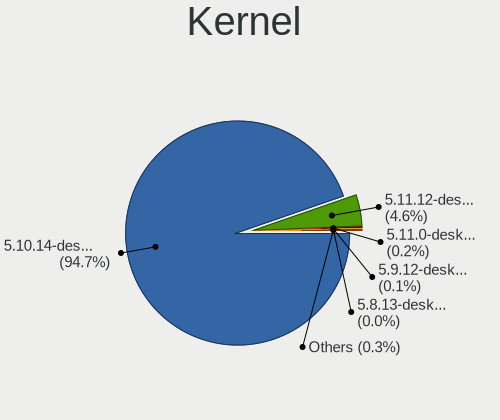

| Version                        | Notebooks | Percent |
|--------------------------------|-----------|---------|
| 5.10.14-desktop-1omv4002       | 2049      | 94.99%  |
| 5.11.12-desktop-1omv4002       | 94        | 4.36%   |
| 5.11.0-desktop-clang-1omv4002  | 5         | 0.23%   |
| 5.9.12-desktop-1omv4002        | 2         | 0.09%   |
| 5.8.13-desktop-1omv4002        | 1         | 0.05%   |
| 5.11.1-desktop-74.1.1bomv4002  | 1         | 0.05%   |
| 5.11.0-desktop-1omv4002        | 1         | 0.05%   |
| 5.11.0-desktop-0.rc4.1omv4002  | 1         | 0.05%   |
| 5.10.2-desktop-clang-1omv4002  | 1         | 0.05%   |
| 5.10.12-desktop-clang-1omv4002 | 1         | 0.05%   |
| Unknown                        | 1         | 0.05%   |

Kernel Family
-------------

Linux kernel without a distro release

| Version | Notebooks | Percent |
|---------|-----------|---------|
| 5.10.14 | 2049      | 94.99%  |
| 5.11.12 | 94        | 4.36%   |
| 5.11.0  | 7         | 0.32%   |
| 5.9.12  | 2         | 0.09%   |
| 5.8.13  | 1         | 0.05%   |
| 5.11.1  | 1         | 0.05%   |
| 5.10.2  | 1         | 0.05%   |
| 5.10.12 | 1         | 0.05%   |
| Unknown | 1         | 0.05%   |

Kernel Major Ver.
-----------------

Linux kernel major version

| Version | Notebooks | Percent |
|---------|-----------|---------|
| 5.10    | 2051      | 95.09%  |
| 5.11    | 102       | 4.73%   |
| 5.9     | 2         | 0.09%   |
| 5.8     | 1         | 0.05%   |
| Unknown | 1         | 0.05%   |

Arch
----

OS architecture (x86_64, i586, etc.)

| Name    | Notebooks | Percent |
|---------|-----------|---------|
| x86_64  | 2133      | 99.95%  |
| Unknown | 1         | 0.05%   |

DE
--

Desktop Environment

| Name     | Notebooks | Percent |
|----------|-----------|---------|
| KDE5     | 2131      | 99.86%  |
| GNOME    | 1         | 0.05%   |
| Cinnamon | 1         | 0.05%   |
| Unknown  | 1         | 0.05%   |

Display Server
--------------

X11 or Wayland

| Name    | Notebooks | Percent |
|---------|-----------|---------|
| X11     | 2130      | 99.81%  |
| Wayland | 3         | 0.14%   |
| Tty     | 1         | 0.05%   |

Display Manager
---------------

SDDM, LightDM, etc.

| Name    | Notebooks | Percent |
|---------|-----------|---------|
| SDDM    | 2133      | 99.95%  |
| Unknown | 1         | 0.05%   |

OS Lang
-------

Language

| Lang    | Notebooks | Percent |
|---------|-----------|---------|
| en_US   | 1069      | 49.95%  |
| de_DE   | 181       | 8.46%   |
| fr_FR   | 132       | 6.17%   |
| pl_PL   | 126       | 5.89%   |
| ru_RU   | 121       | 5.65%   |
| pt_BR   | 97        | 4.53%   |
| cs_CZ   | 63        | 2.94%   |
| it_IT   | 61        | 2.85%   |
| es_ES   | 57        | 2.66%   |
| en_GB   | 45        | 2.1%    |
| es_AR   | 19        | 0.89%   |
| es_MX   | 16        | 0.75%   |
| hu_HU   | 11        | 0.51%   |
| fr_BE   | 9         | 0.42%   |
| ru_UA   | 8         | 0.37%   |
| es_CO   | 8         | 0.37%   |
| en_AU   | 8         | 0.37%   |
| fr_CH   | 7         | 0.33%   |
| es_CL   | 7         | 0.33%   |
| ro_RO   | 6         | 0.28%   |
| nl_NL   | 6         | 0.28%   |
| en_IN   | 6         | 0.28%   |
| de_AT   | 6         | 0.28%   |
| da_DK   | 6         | 0.28%   |
| fr_CA   | 5         | 0.23%   |
| en_CA   | 5         | 0.23%   |
| pt_PT   | 4         | 0.19%   |
| nl_BE   | 4         | 0.19%   |
| nb_NO   | 4         | 0.19%   |
| en_NZ   | 4         | 0.19%   |
| de_CH   | 4         | 0.19%   |
| Unknown | 4         | 0.19%   |
| uk_UA   | 3         | 0.14%   |
| es_UY   | 3         | 0.14%   |
| es_PE   | 3         | 0.14%   |
| es_CR   | 3         | 0.14%   |
| it_CH   | 2         | 0.09%   |
| es_GT   | 2         | 0.09%   |
| en_ZA   | 2         | 0.09%   |
| en_IE   | 2         | 0.09%   |
| es_VE   | 1         | 0.05%   |
| es_HN   | 1         | 0.05%   |
| es_EC   | 1         | 0.05%   |
| es_BO   | 1         | 0.05%   |
| en_PH   | 1         | 0.05%   |
| en_NG   | 1         | 0.05%   |
| en_AG   | 1         | 0.05%   |
| de_LI   | 1         | 0.05%   |
| ar_TN   | 1         | 0.05%   |
| ar_DZ   | 1         | 0.05%   |
| af_ZA   | 1         | 0.05%   |

Boot Mode
---------

EFI or BIOS

| Mode | Notebooks | Percent |
|------|-----------|---------|
| BIOS | 1233      | 57.7%   |
| EFI  | 904       | 42.3%   |

Filesystem
----------

Type of filesystem

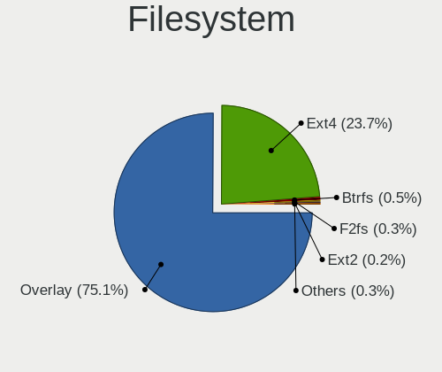

| Type    | Notebooks | Percent |
|---------|-----------|---------|
| Overlay | 1649      | 76.56%  |
| Ext4    | 477       | 22.14%  |
| Btrfs   | 11        | 0.51%   |
| F2fs    | 6         | 0.28%   |
| Ext2    | 5         | 0.23%   |
| Xfs     | 3         | 0.14%   |
| Ext3    | 2         | 0.09%   |
| Unknown | 1         | 0.05%   |

Part. scheme
------------

Scheme of partitioning

| Type    | Notebooks | Percent |
|---------|-----------|---------|
| GPT     | 1247      | 58.27%  |
| MBR     | 891       | 41.64%  |
| Unknown | 2         | 0.09%   |

Dual Boot with Linux/BSD
------------------------

Hosting more than one Linux/BSD

| Dual boot | Notebooks | Percent |
|-----------|-----------|---------|
| Yes       | 1091      | 50.89%  |
| No        | 1053      | 49.11%  |

Dual Boot (Win)
---------------

Hosting Linux and Windows

| Dual boot | Notebooks | Percent |
|-----------|-----------|---------|
| No        | 1228      | 57.49%  |
| Yes       | 908       | 42.51%  |

Board
-----

Vendor
------

Motherboard manufacturer

| Name                  | Notebooks | Percent |
|-----------------------|-----------|---------|
| Lenovo                | 396       | 18.56%  |
| Hewlett-Packard       | 378       | 17.71%  |
| Dell                  | 297       | 13.92%  |
| ASUSTek Computer      | 265       | 12.42%  |
| Acer                  | 258       | 12.09%  |
| Toshiba               | 115       | 5.39%   |
| Sony                  | 63        | 2.95%   |
| Samsung Electronics   | 55        | 2.58%   |
| MSI                   | 35        | 1.64%   |
| Apple                 | 34        | 1.59%   |
| Fujitsu               | 23        | 1.08%   |
| Packard Bell          | 19        | 0.89%   |
| Medion                | 18        | 0.84%   |
| Positivo              | 17        | 0.8%    |
| eMachines             | 14        | 0.66%   |
| Notebook              | 13        | 0.61%   |
| HUAWEI                | 13        | 0.61%   |
| Philco                | 10        | 0.47%   |
| Unknown               | 8         | 0.37%   |
| LG Electronics        | 6         | 0.28%   |
| Fujitsu Siemens       | 6         | 0.28%   |
| Clevo                 | 6         | 0.28%   |
| Chuwi                 | 6         | 0.28%   |
| TUXEDO                | 5         | 0.23%   |
| Timi                  | 5         | 0.23%   |
| System76              | 5         | 0.23%   |
| Teclast               | 4         | 0.19%   |
| PC Specialist         | 3         | 0.14%   |
| Panasonic             | 3         | 0.14%   |
| Intel                 | 3         | 0.14%   |
| Gateway               | 3         | 0.14%   |
| Wortmann AG           | 2         | 0.09%   |
| UMAX                  | 2         | 0.09%   |
| NEC Computers         | 2         | 0.09%   |
| Jumper                | 2         | 0.09%   |
| HASEE Computer        | 2         | 0.09%   |
| BOX                   | 2         | 0.09%   |
| Alienware             | 2         | 0.09%   |
| VIT                   | 1         | 0.05%   |
| TEKNOSERVICE          | 1         | 0.05%   |
| SLIMBOOK              | 1         | 0.05%   |
| SIEMENS               | 1         | 0.05%   |
| Shuttle               | 1         | 0.05%   |
| Semp Toshiba          | 1         | 0.05%   |
| RM                    | 1         | 0.05%   |
| Purism                | 1         | 0.05%   |
| Positivo Bahia - VAIO | 1         | 0.05%   |
| PERSONA               | 1         | 0.05%   |
| Motion Computing      | 1         | 0.05%   |
| MOTILE                | 1         | 0.05%   |
| Microtech             | 1         | 0.05%   |
| Megaware              | 1         | 0.05%   |
| Mediacom              | 1         | 0.05%   |
| Maibenben             | 1         | 0.05%   |
| LEADER                | 1         | 0.05%   |
| Itautec               | 1         | 0.05%   |
| Irbis                 | 1         | 0.05%   |
| INSYS                 | 1         | 0.05%   |
| GPD                   | 1         | 0.05%   |
| Gigabyte Technology   | 1         | 0.05%   |

Model
-----

Motherboard model

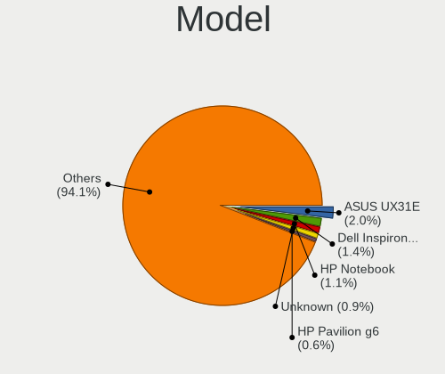

| Name                                       | Notebooks | Percent |
|--------------------------------------------|-----------|---------|
| ASUS UX31E                                 | 44        | 2.06%   |
| Dell Inspiron 3451                         | 24        | 1.12%   |
| HP Notebook                                | 22        | 1.03%   |
| Unknown                                    | 19        | 0.89%   |
| HP Pavilion g6                             | 13        | 0.61%   |
| Dell Latitude E6430                        | 11        | 0.52%   |
| HP Pavilion dv6                            | 10        | 0.47%   |
| Dell Latitude D630                         | 10        | 0.47%   |
| Toshiba Satellite A300                     | 8         | 0.37%   |
| HP Pavilion 15                             | 7         | 0.33%   |
| HP EliteBook 8440p                         | 7         | 0.33%   |
| Dell Latitude E6420                        | 7         | 0.33%   |
| Dell Latitude E6410                        | 7         | 0.33%   |
| Dell Inspiron 15-3567                      | 7         | 0.33%   |
| Lenovo Z50-70 20354                        | 6         | 0.28%   |
| Lenovo IdeaPad S145-15AST 81N3             | 6         | 0.28%   |
| Lenovo IdeaPad 3 15ADA05 81W1              | 6         | 0.28%   |
| HP EliteBook 8570w                         | 6         | 0.28%   |
| Dell Latitude E6500                        | 6         | 0.28%   |
| Dell Latitude E6400                        | 6         | 0.28%   |
| Dell Inspiron N5110                        | 6         | 0.28%   |
| ASUS X541NA                                | 6         | 0.28%   |
| ASUS K53E                                  | 6         | 0.28%   |
| Samsung 300E4A/300E5A/300E7A/3430EA/3530EA | 5         | 0.23%   |
| Positivo Mobile                            | 5         | 0.23%   |
| Philco 14I                                 | 5         | 0.23%   |
| Lenovo IdeaPad 330-15IKB 81DE              | 5         | 0.23%   |
| HP Pavilion Notebook                       | 5         | 0.23%   |
| HP 15                                      | 5         | 0.23%   |
| ASUS X550CA                                | 5         | 0.23%   |
| ASUS K52F                                  | 5         | 0.23%   |
| Acer Aspire 5738                           | 5         | 0.23%   |
| Toshiba Satellite L500                     | 4         | 0.19%   |
| Positivo S14BW01                           | 4         | 0.19%   |
| Lenovo IdeaPad 330S-15IKB 81F5             | 4         | 0.19%   |
| Lenovo IdeaPad 100-15IBY 80MJ              | 4         | 0.19%   |
| Lenovo IdeaPad 100-15IBD 80QQ              | 4         | 0.19%   |
| Lenovo G50-80 80E5                         | 4         | 0.19%   |
| HP Pavilion g4                             | 4         | 0.19%   |
| HP Pavilion dv5                            | 4         | 0.19%   |
| HP Pavilion dv4                            | 4         | 0.19%   |
| HP Laptop 17-ca0xxx                        | 4         | 0.19%   |
| HP Laptop 15-bs0xx                         | 4         | 0.19%   |
| HP G42                                     | 4         | 0.19%   |
| HP EliteBook 8470p                         | 4         | 0.19%   |
| HP 2000                                    | 4         | 0.19%   |
| HP 1000                                    | 4         | 0.19%   |
| Dell Latitude E6510                        | 4         | 0.19%   |
| Dell Latitude E6320                        | 4         | 0.19%   |
| Dell Latitude E5520                        | 4         | 0.19%   |
| Dell Inspiron N5010                        | 4         | 0.19%   |
| Dell Inspiron 3793                         | 4         | 0.19%   |
| Dell Inspiron 3542                         | 4         | 0.19%   |
| Dell Inspiron 3521                         | 4         | 0.19%   |
| Dell Inspiron 1525                         | 4         | 0.19%   |
| ASUS K52Je                                 | 4         | 0.19%   |
| Apple MacBookPro9,2                        | 4         | 0.19%   |
| Acer TravelMate 5720                       | 4         | 0.19%   |
| Acer Extensa 5620                          | 4         | 0.19%   |
| Acer Aspire ES1-571                        | 4         | 0.19%   |

Model Family
------------

Motherboard model prefix

| Name                  | Notebooks | Percent |
|-----------------------|-----------|---------|
| Acer Aspire           | 195       | 9.14%   |
| Lenovo ThinkPad       | 158       | 7.4%    |
| Dell Latitude         | 134       | 6.28%   |
| Lenovo IdeaPad        | 130       | 6.09%   |
| Dell Inspiron         | 113       | 5.3%    |
| Toshiba Satellite     | 95        | 4.45%   |
| HP Pavilion           | 84        | 3.94%   |
| HP Laptop             | 55        | 2.58%   |
| HP EliteBook          | 50        | 2.34%   |
| ASUS UX31E            | 44        | 2.06%   |
| HP ProBook            | 38        | 1.78%   |
| HP Compaq             | 29        | 1.36%   |
| ASUS VivoBook         | 25        | 1.17%   |
| HP Notebook           | 22        | 1.03%   |
| Fujitsu LIFEBOOK      | 19        | 0.89%   |
| Acer Extensa          | 19        | 0.89%   |
| Unknown               | 19        | 0.89%   |
| Acer TravelMate       | 16        | 0.75%   |
| Packard Bell EasyNote | 15        | 0.7%    |
| Dell Vostro           | 14        | 0.66%   |
| HP ENVY               | 10        | 0.47%   |
| HP 250                | 10        | 0.47%   |
| Dell XPS              | 8         | 0.37%   |
| Dell Studio           | 8         | 0.37%   |
| HP Stream             | 7         | 0.33%   |
| Apple MacBookPro9     | 7         | 0.33%   |
| Acer Swift            | 7         | 0.33%   |
| Toshiba dynabook      | 6         | 0.28%   |
| Lenovo Z50-70         | 6         | 0.28%   |
| Lenovo B590           | 6         | 0.28%   |
| HP 255                | 6         | 0.28%   |
| HP 15                 | 6         | 0.28%   |
| ASUS ZenBook          | 6         | 0.28%   |
| ASUS X541NA           | 6         | 0.28%   |
| ASUS TUF              | 6         | 0.28%   |
| ASUS K53E             | 6         | 0.28%   |
| Apple MacBookPro8     | 6         | 0.28%   |
| Acer Nitro            | 6         | 0.28%   |
| Toshiba TECRA         | 5         | 0.23%   |
| Samsung 300E4A        | 5         | 0.23%   |
| Positivo Mobile       | 5         | 0.23%   |
| Philco 14I            | 5         | 0.23%   |
| Lenovo Legion         | 5         | 0.23%   |
| HP Presario           | 5         | 0.23%   |
| Dell System           | 5         | 0.23%   |
| Dell Precision        | 5         | 0.23%   |
| Dell G5               | 5         | 0.23%   |
| ASUS X550CA           | 5         | 0.23%   |
| ASUS K52F             | 5         | 0.23%   |
| Positivo S14BW01      | 4         | 0.19%   |
| Lenovo G50-80         | 4         | 0.19%   |
| HP OMEN               | 4         | 0.19%   |
| HP G42                | 4         | 0.19%   |
| HP 2000               | 4         | 0.19%   |
| HP 1000               | 4         | 0.19%   |
| ASUS ROG              | 4         | 0.19%   |
| ASUS K52Je            | 4         | 0.19%   |
| Apple MacBookPro5     | 4         | 0.19%   |
| Sony VGN-FZ31Z        | 3         | 0.14%   |
| Samsung RV415         | 3         | 0.14%   |

MFG Year
--------

Motherboard manufacture year

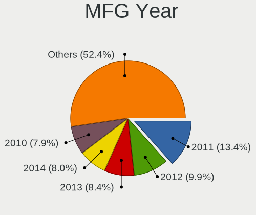

| Year    | Notebooks | Percent |
|---------|-----------|---------|
| 2011    | 291       | 13.64%  |
| 2012    | 218       | 10.22%  |
| 2013    | 178       | 8.34%   |
| 2010    | 168       | 7.87%   |
| 2014    | 164       | 7.69%   |
| 2008    | 158       | 7.4%    |
| 2019    | 151       | 7.08%   |
| 2015    | 136       | 6.37%   |
| 2016    | 118       | 5.53%   |
| 2018    | 115       | 5.39%   |
| 2017    | 114       | 5.34%   |
| 2009    | 113       | 5.3%    |
| 2020    | 97        | 4.55%   |
| 2007    | 80        | 3.75%   |
| 2021    | 22        | 1.03%   |
| 2006    | 6         | 0.28%   |
| 2005    | 2         | 0.09%   |
| Unknown | 2         | 0.09%   |
| 2004    | 1         | 0.05%   |

Form Factor
-----------

Physical design of the computer

| Name     | Notebooks | Percent |
|----------|-----------|---------|
| Notebook | 2134      | 100%    |

Secure Boot
-----------

Enabled or disabled

| State    | Notebooks | Percent |
|----------|-----------|---------|
| Disabled | 2134      | 100%    |

Coreboot
--------

Have coreboot on board

| Used | Notebooks | Percent |
|------|-----------|---------|
| No   | 2131      | 99.86%  |
| Yes  | 3         | 0.14%   |

RAM Size
--------

Total RAM memory

| Size in GB | Notebooks | Percent |
|------------|-----------|---------|
| 3.01-4.0   | 863       | 40.4%   |
| 4.01-8.0   | 636       | 29.78%  |
| 8.01-16.0  | 286       | 13.39%  |
| 16.01-24.0 | 150       | 7.02%   |
| 1.01-2.0   | 120       | 5.62%   |
| 2.01-3.0   | 44        | 2.06%   |
| 32.01-64.0 | 27        | 1.26%   |
| 24.01-32.0 | 5         | 0.23%   |
| 0.51-1.0   | 4         | 0.19%   |
| Unknown    | 1         | 0.05%   |

RAM Used
--------

Used RAM memory

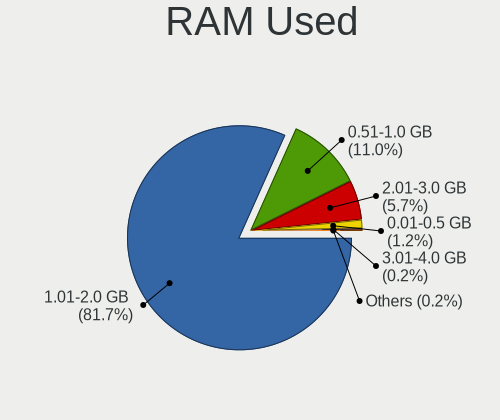

| Used GB  | Notebooks | Percent |
|----------|-----------|---------|
| 1.01-2.0 | 1763      | 82.04%  |
| 0.51-1.0 | 229       | 10.66%  |
| 2.01-3.0 | 123       | 5.72%   |
| 0.01-0.5 | 25        | 1.16%   |
| 3.01-4.0 | 5         | 0.23%   |
| 4.01-8.0 | 3         | 0.14%   |
| Unknown  | 1         | 0.05%   |

Total Drives
------------

Number of drives on board

| Drives | Notebooks | Percent |
|--------|-----------|---------|
| 1      | 1610      | 75.34%  |
| 2      | 447       | 20.92%  |
| 3      | 41        | 1.92%   |
| 0      | 34        | 1.59%   |
| 4      | 4         | 0.19%   |
| 5      | 1         | 0.05%   |

Has CD-ROM
----------

Has CD-ROM on board

| Presented | Notebooks | Percent |
|-----------|-----------|---------|
| Yes       | 1258      | 58.9%   |
| No        | 878       | 41.1%   |

Has Ethernet
------------

Has Ethernet on board

| Presented | Notebooks | Percent |
|-----------|-----------|---------|
| Yes       | 1946      | 91.19%  |
| No        | 188       | 8.81%   |

Has WiFi
--------

Has WiFi module

| Presented | Notebooks | Percent |
|-----------|-----------|---------|
| Yes       | 2116      | 99.16%  |
| No        | 18        | 0.84%   |

Has Bluetooth
-------------

Has Bluetooth module

| Presented | Notebooks | Percent |
|-----------|-----------|---------|
| Yes       | 1447      | 67.78%  |
| No        | 688       | 32.22%  |

Location
--------

Country
-------

Geographic location (country)

| Country      | Notebooks | Percent |
|--------------|-----------|---------|
| Germany      | 252       | 11.8%   |
| USA          | 202       | 9.46%   |
| Poland       | 178       | 8.34%   |
| France       | 164       | 7.68%   |
| Russia       | 154       | 7.21%   |
| Brazil       | 153       | 7.17%   |
| Italy        | 103       | 4.82%   |
| Spain        | 83        | 3.89%   |
| Czechia      | 74        | 3.47%   |
| UK           | 58        | 2.72%   |
| Canada       | 48        | 2.25%   |
| Mexico       | 43        | 2.01%   |
| Ukraine      | 31        | 1.45%   |
| India        | 31        | 1.45%   |
| Indonesia    | 23        | 1.08%   |
| Argentina    | 23        | 1.08%   |
| Sweden       | 21        | 0.98%   |
| Portugal     | 21        | 0.98%   |
| Hungary      | 21        | 0.98%   |
| Romania      | 20        | 0.94%   |
| Netherlands  | 20        | 0.94%   |
| Australia    | 20        | 0.94%   |
| Belgium      | 19        | 0.89%   |
| Japan        | 18        | 0.84%   |
| Switzerland  | 15        | 0.7%    |
| Greece       | 14        | 0.66%   |
| China        | 14        | 0.66%   |
| Finland      | 13        | 0.61%   |
| Bulgaria     | 13        | 0.61%   |
| Slovakia     | 12        | 0.56%   |
| Denmark      | 12        | 0.56%   |
| Belarus      | 12        | 0.56%   |
| Norway       | 11        | 0.52%   |
| Chile        | 11        | 0.52%   |
| Austria      | 11        | 0.52%   |
| South Africa | 10        | 0.47%   |
| Philippines  | 10        | 0.47%   |
| Thailand     | 9         | 0.42%   |
| Colombia     | 9         | 0.42%   |
| Algeria      | 9         | 0.42%   |
| New Zealand  | 8         | 0.37%   |
| Costa Rica   | 7         | 0.33%   |
| Uruguay      | 6         | 0.28%   |
| Serbia       | 6         | 0.28%   |
| Saudi Arabia | 6         | 0.28%   |
| Morocco      | 6         | 0.28%   |
| Ireland      | 6         | 0.28%   |
| Cyprus       | 6         | 0.28%   |
| Turkey       | 5         | 0.23%   |
| Taiwan       | 5         | 0.23%   |
| Malaysia     | 5         | 0.23%   |
| Kazakhstan   | 5         | 0.23%   |
| Iran         | 5         | 0.23%   |
| Vietnam      | 4         | 0.19%   |
| Lithuania    | 4         | 0.19%   |
| Kenya        | 4         | 0.19%   |
| Venezuela    | 3         | 0.14%   |
| South Korea  | 3         | 0.14%   |
| Runion     | 3         | 0.14%   |
| Peru         | 3         | 0.14%   |

City
----

Geographic location (city)

| City                    | Notebooks | Percent |
|-------------------------|-----------|---------|
| Prague                  | 48        | 2.23%   |
| Warsaw                  | 28        | 1.3%    |
| Moscow                  | 28        | 1.3%    |
| Krakow                  | 28        | 1.3%    |
| Paris                   | 23        | 1.07%   |
| Berlin                  | 20        | 0.93%   |
| St Petersburg           | 16        | 0.74%   |
| Milan                   | 16        | 0.74%   |
| Rome                    | 15        | 0.7%    |
| Munich                  | 13        | 0.6%    |
| Mexico City             | 13        | 0.6%    |
| Sao Paulo               | 12        | 0.56%   |
| Krasnodar               | 12        | 0.56%   |
| Wroclaw                 | 10        | 0.46%   |
| Stuttgart               | 10        | 0.46%   |
| Queens                  | 10        | 0.46%   |
| Rio de Janeiro          | 9         | 0.42%   |
| Poznan                  | 9         | 0.42%   |
| Madrid                  | 9         | 0.42%   |
| Helsinki                | 8         | 0.37%   |
| Brno                    | 8         | 0.37%   |
| Yekaterinburg           | 7         | 0.33%   |
| Porto Alegre            | 7         | 0.33%   |
| Lodz                    | 7         | 0.33%   |
| Gdansk                  | 7         | 0.33%   |
| Budapest                | 7         | 0.33%   |
| Bucharest               | 7         | 0.33%   |
| Vienna                  | 6         | 0.28%   |
| Sydney                  | 6         | 0.28%   |
| Melbourne               | 6         | 0.28%   |
| Mannheim                | 6         | 0.28%   |
| Lisbon                  | 6         | 0.28%   |
| Johannesburg            | 6         | 0.28%   |
| Florence                | 6         | 0.28%   |
| Buenos Aires            | 6         | 0.28%   |
| Thessaloniki            | 5         | 0.23%   |
| Nizhniy Novgorod        | 5         | 0.23%   |
| Minsk                   | 5         | 0.23%   |
| Kyiv                    | 5         | 0.23%   |
| Kielce                  | 5         | 0.23%   |
| Jakarta                 | 5         | 0.23%   |
| Hamburg                 | 5         | 0.23%   |
| Belo Horizonte          | 5         | 0.23%   |
| Beaverton               | 5         | 0.23%   |
| Villanueva de la Canada | 4         | 0.19%   |
| Tehran                  | 4         | 0.19%   |
| Stockholm               | 4         | 0.19%   |
| Sofia                   | 4         | 0.19%   |
| San Diego               | 4         | 0.19%   |
| Salvador                | 4         | 0.19%   |
| Nuremberg               | 4         | 0.19%   |
| Nairobi                 | 4         | 0.19%   |
| Memphis                 | 4         | 0.19%   |
| Maldonado               | 4         | 0.19%   |
| Leipzig                 | 4         | 0.19%   |
| Kensington              | 4         | 0.19%   |
| Katowice                | 4         | 0.19%   |
| Karlsruhe               | 4         | 0.19%   |
| Hanover                 | 4         | 0.19%   |
| Guadalajara             | 4         | 0.19%   |

Drives
------

Drive Vendor
------------

Hard drive vendors

| Vendor              | Notebooks | Drives | Percent |
|---------------------|-----------|--------|---------|
| WDC                 | 419       | 432    | 17.12%  |
| Seagate             | 372       | 381    | 15.2%   |
| Samsung Electronics | 263       | 289    | 10.75%  |
| Toshiba             | 262       | 271    | 10.71%  |
| Kingston            | 139       | 144    | 5.68%   |
| Hitachi             | 139       | 141    | 5.68%   |
| SanDisk             | 133       | 138    | 5.44%   |
| Unknown             | 86        | 90     | 3.51%   |
| HGST                | 80        | 81     | 3.27%   |
| Crucial             | 70        | 73     | 2.86%   |
| Intel               | 49        | 54     | 2%      |
| SK hynix            | 47        | 48     | 1.92%   |
| A-DATA Technology   | 37        | 37     | 1.51%   |
| Fujitsu             | 24        | 24     | 0.98%   |
| Micron Technology   | 22        | 22     | 0.9%    |
| Goodram             | 20        | 22     | 0.82%   |
| Apple               | 19        | 21     | 0.78%   |
| China               | 17        | 17     | 0.69%   |
| PNY                 | 16        | 16     | 0.65%   |
| OCZ                 | 13        | 13     | 0.53%   |
| SPCC                | 12        | 12     | 0.49%   |
| Patriot             | 11        | 13     | 0.45%   |
| JMicron Technology  | 11        | 11     | 0.45%   |
| LITEON              | 10        | 10     | 0.41%   |
| Phison              | 9         | 9      | 0.37%   |
| LITEONIT            | 9         | 10     | 0.37%   |
| Intenso             | 9         | 10     | 0.37%   |
| Transcend           | 8         | 8      | 0.33%   |
| Hewlett-Packard     | 7         | 7      | 0.29%   |
| Apacer              | 7         | 7      | 0.29%   |
| Unknown             | 6         | 6      | 0.25%   |
| Teclast             | 5         | 5      | 0.2%    |
| Union Memory        | 4         | 5      | 0.16%   |
| SABRENT             | 4         | 6      | 0.16%   |
| Plextor             | 4         | 4      | 0.16%   |
| KingSpec            | 4         | 4      | 0.16%   |
| Corsair             | 4         | 4      | 0.16%   |
| Colorful            | 4         | 4      | 0.16%   |
| UMIS                | 3         | 3      | 0.12%   |
| LaCie               | 3         | 3      | 0.12%   |
| KIOXIA              | 3         | 4      | 0.12%   |
| KingFast            | 3         | 3      | 0.12%   |
| KingDian            | 3         | 3      | 0.12%   |
| INNOVATION IT       | 3         | 3      | 0.12%   |
| BHT                 | 3         | 3      | 0.12%   |
| Smartbuy            | 2         | 2      | 0.08%   |
| Silicon Motion      | 2         | 2      | 0.08%   |
| Phison Electronics  | 2         | 2      | 0.08%   |
| OWC                 | 2         | 2      | 0.08%   |
| Netac               | 2         | 2      | 0.08%   |
| Mushkin             | 2         | 2      | 0.08%   |
| Lexar               | 2         | 2      | 0.08%   |
| Leven               | 2         | 2      | 0.08%   |
| Lenovo              | 2         | 2      | 0.08%   |
| KIOXIA-EXCERIA      | 2         | 2      | 0.08%   |
| HS-SSD-C100         | 2         | 2      | 0.08%   |
| Hikvision           | 2         | 2      | 0.08%   |
| Gigabyte Technology | 2         | 2      | 0.08%   |
| FORESEE             | 2         | 2      | 0.08%   |
| External            | 2         | 2      | 0.08%   |

Drive Model
-----------

Hard drive models

| Model                               | Notebooks | Percent |
|-------------------------------------|-----------|---------|
| Seagate ST500LT012-1DG142 500GB     | 64        | 2.58%   |
| Seagate ST1000LM024 HN-M101MBB 1TB  | 45        | 1.81%   |
| Toshiba MQ01ABF050 500GB            | 44        | 1.77%   |
| SanDisk SSD U100 256GB              | 44        | 1.77%   |
| Toshiba MQ01ABD100 1TB              | 32        | 1.29%   |
| Seagate ST1000LM035-1RK172 1TB      | 32        | 1.29%   |
| WDC WD10JPVX-22JC3T0 1TB            | 25        | 1.01%   |
| Seagate ST9500325AS 500GB           | 24        | 0.97%   |
| Toshiba MQ04ABF100 1TB              | 22        | 0.89%   |
| Seagate ST500LM012 HN-M500MBB 500GB | 22        | 0.89%   |
| Samsung SSD 860 EVO 500GB           | 20        | 0.81%   |
| Kingston SA400S37240G 240GB SSD     | 20        | 0.81%   |
| Kingston SA400S37120G 120GB SSD     | 20        | 0.81%   |
| Kingston SA400S37480G 480GB SSD     | 18        | 0.72%   |
| WDC WD5000LPVX-22V0TT0 500GB        | 17        | 0.68%   |
| Seagate ST500LT012-9WS142 500GB     | 16        | 0.64%   |
| Hitachi HTS547550A9E384 500GB       | 16        | 0.64%   |
| HGST HTS721010A9E630 1TB            | 16        | 0.64%   |
| HGST HTS545050A7E680 500GB          | 16        | 0.64%   |
| HGST HTS541010A9E680 1TB            | 15        | 0.6%    |
| WDC WDS500G2B0A-00SM50 500GB SSD    | 14        | 0.56%   |
| Crucial CT240BX500SSD1 240GB        | 14        | 0.56%   |
| WDC WD10SPZX-21Z10T0 1TB            | 13        | 0.52%   |
| Samsung SSD 850 EVO 500GB           | 13        | 0.52%   |
| Kingston SV300S37A120G 120GB SSD    | 12        | 0.48%   |
| Hitachi HTS545050A7E380 500GB       | 12        | 0.48%   |
| HGST HTS545050A7E380 500GB          | 12        | 0.48%   |
| WDC WD5000LPCX-24VHAT0 500GB        | 11        | 0.44%   |
| Toshiba MQ01ABD050 500GB            | 11        | 0.44%   |
| Seagate ST9320325AS 320GB           | 11        | 0.44%   |
| Samsung SSD 850 EVO 250GB           | 11        | 0.44%   |
| Crucial CT500MX500SSD1 500GB        | 11        | 0.44%   |
| PNY CS900 120GB SSD                 | 10        | 0.4%    |
| Hitachi HTS545025B9A300 250GB       | 10        | 0.4%    |
| WDC WD10JPCX-24UE4T0 1TB            | 9         | 0.36%   |
| Unknown SD/MMC/MS PRO 64GB          | 9         | 0.36%   |
| Seagate ST500LM021-1KJ152 500GB     | 9         | 0.36%   |
| SanDisk SSD PLUS 240GB              | 9         | 0.36%   |
| Hitachi HTS543232A7A384 320GB       | 9         | 0.36%   |
| WDC WD10SPZX-24Z10T0 1TB            | 8         | 0.32%   |
| WDC WD10SPZX-24Z10 1TB              | 8         | 0.32%   |
| Toshiba MQ01ABD075 752GB            | 8         | 0.32%   |
| Toshiba MK3265GSX 320GB             | 8         | 0.32%   |
| Hitachi HTS547575A9E384 752GB       | 8         | 0.32%   |
| WDC WDS240G2G0A-00JH30 240GB SSD    | 7         | 0.28%   |
| WDC WDS120G2G0A-00JH30 120GB SSD    | 7         | 0.28%   |
| WDC WD3200BEVT-22ZCT0 320GB         | 7         | 0.28%   |
| Seagate ST9500420AS 500GB           | 7         | 0.28%   |
| Seagate ST9250827AS 250GB           | 7         | 0.28%   |
| Kingston SUV400S37240G 240GB SSD    | 7         | 0.28%   |
| JMicron Generic 2TB                 | 7         | 0.28%   |
| Intel SSDPEKNW512G8H 512GB          | 7         | 0.28%   |
| Hitachi HTS723232A7A364 320GB       | 7         | 0.28%   |
| Hitachi HTS547564A9E384 640GB       | 7         | 0.28%   |
| HGST HTS725050A7E630 500GB          | 7         | 0.28%   |
| WDC WD5000LPCX-24C6HT0 500GB        | 6         | 0.24%   |
| WDC WD5000BPVT-22HXZT3 500GB        | 6         | 0.24%   |
| WDC WD2500BEVS-22UST0 250GB         | 6         | 0.24%   |
| Toshiba MQ01ABF032 320GB            | 6         | 0.24%   |
| Seagate ST9250410AS 250GB           | 6         | 0.24%   |

HDD Vendor
----------

Hard disk drive vendors

| Vendor              | Notebooks | Drives | Percent |
|---------------------|-----------|--------|---------|
| Seagate             | 369       | 377    | 30.45%  |
| WDC                 | 317       | 325    | 26.16%  |
| Toshiba             | 230       | 236    | 18.98%  |
| Hitachi             | 139       | 141    | 11.47%  |
| HGST                | 80        | 81     | 6.6%    |
| Samsung Electronics | 28        | 29     | 2.31%   |
| Fujitsu             | 24        | 24     | 1.98%   |
| Unknown             | 9         | 9      | 0.74%   |
| Apple               | 8         | 8      | 0.66%   |
| SABRENT             | 3         | 5      | 0.25%   |
| ASMT                | 2         | 2      | 0.17%   |
| Intenso             | 1         | 1      | 0.08%   |
| IBM/Hitachi         | 1         | 1      | 0.08%   |
| HGST HTS            | 1         | 1      | 0.08%   |

SSD Vendor
----------

Solid state drive vendors

| Vendor              | Notebooks | Drives | Percent |
|---------------------|-----------|--------|---------|
| Samsung Electronics | 180       | 191    | 19.76%  |
| SanDisk             | 125       | 129    | 13.72%  |
| Kingston            | 123       | 127    | 13.5%   |
| Crucial             | 67        | 70     | 7.35%   |
| WDC                 | 56        | 56     | 6.15%   |
| A-DATA Technology   | 34        | 34     | 3.73%   |
| Intel               | 26        | 27     | 2.85%   |
| Toshiba             | 23        | 25     | 2.52%   |
| SK hynix            | 21        | 22     | 2.31%   |
| GOODRAM             | 20        | 22     | 2.2%    |
| Micron Technology   | 17        | 17     | 1.87%   |
| China               | 17        | 17     | 1.87%   |
| PNY                 | 14        | 14     | 1.54%   |
| OCZ                 | 13        | 13     | 1.43%   |
| SPCC                | 11        | 11     | 1.21%   |
| Patriot             | 11        | 13     | 1.21%   |
| LITEONIT            | 9         | 10     | 0.99%   |
| LITEON              | 9         | 9      | 0.99%   |
| Apple               | 9         | 9      | 0.99%   |
| Unknown             | 8         | 8      | 0.88%   |
| Transcend           | 8         | 8      | 0.88%   |
| Intenso             | 8         | 9      | 0.88%   |
| Apacer              | 7         | 7      | 0.77%   |
| Hewlett-Packard     | 6         | 6      | 0.66%   |
| Teclast             | 5         | 5      | 0.55%   |
| Unknown             | 5         | 5      | 0.55%   |
| Plextor             | 4         | 4      | 0.44%   |
| KingSpec            | 4         | 4      | 0.44%   |
| Colorful            | 4         | 4      | 0.44%   |
| KingFast            | 3         | 3      | 0.33%   |
| KingDian            | 3         | 3      | 0.33%   |
| INNOVATION IT       | 3         | 3      | 0.33%   |
| Corsair             | 3         | 3      | 0.33%   |
| BHT                 | 3         | 3      | 0.33%   |
| Smartbuy            | 2         | 2      | 0.22%   |
| Seagate             | 2         | 2      | 0.22%   |
| Netac               | 2         | 2      | 0.22%   |
| Mushkin             | 2         | 2      | 0.22%   |
| Leven               | 2         | 2      | 0.22%   |
| KIOXIA-EXCERIA      | 2         | 2      | 0.22%   |
| HS-SSD-C100         | 2         | 2      | 0.22%   |
| Gigabyte Technology | 2         | 2      | 0.22%   |
| FORESEE             | 2         | 2      | 0.22%   |
| Zheino              | 1         | 1      | 0.11%   |
| XrayDisk            | 1         | 1      | 0.11%   |
| Verbatim            | 1         | 1      | 0.11%   |
| Vaseky              | 1         | 1      | 0.11%   |
| USB3.0              | 1         | 1      | 0.11%   |
| Union Memory        | 1         | 1      | 0.11%   |
| TO Exter            | 1         | 1      | 0.11%   |
| TEXTORM             | 1         | 1      | 0.11%   |
| Team                | 1         | 1      | 0.11%   |
| TCSUNBOW            | 1         | 1      | 0.11%   |
| TakeMS              | 1         | 1      | 0.11%   |
| Smart               | 1         | 1      | 0.11%   |
| RX7                 | 1         | 1      | 0.11%   |
| Platinet            | 1         | 1      | 0.11%   |
| Phison              | 1         | 1      | 0.11%   |
| OWC                 | 1         | 1      | 0.11%   |
| Maxtor              | 1         | 1      | 0.11%   |

Drive Kind
----------

HDD or SSD

| Kind    | Notebooks | Drives | Percent |
|---------|-----------|--------|---------|
| HDD     | 1183      | 1240   | 49.83%  |
| SSD     | 867       | 943    | 36.52%  |
| NVMe    | 226       | 254    | 9.52%   |
| MMC     | 79        | 86     | 3.33%   |
| Unknown | 19        | 19     | 0.8%    |

Drive Connector
---------------

SATA, SAS, NVMe, etc.

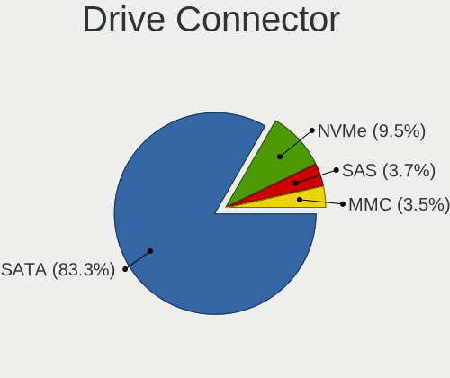

| Type | Notebooks | Drives | Percent |
|------|-----------|--------|---------|
| SATA | 1899      | 2122   | 83.29%  |
| NVMe | 220       | 243    | 9.65%   |
| SAS  | 82        | 91     | 3.6%    |
| MMC  | 79        | 86     | 3.46%   |

Drive Size
----------

Size of hard drive

| Size in TB | Notebooks | Drives | Percent |
|------------|-----------|--------|---------|
| 0.01-0.5   | 1525      | 1671   | 75.72%  |
| 0.51-1.0   | 458       | 480    | 22.74%  |
| 1.01-2.0   | 28        | 29     | 1.39%   |
| 3.01-4.0   | 3         | 3      | 0.15%   |

Space Total
-----------

Amount of disk space available on the file system

| Size in GB | Notebooks | Percent |
|------------|-----------|---------|
| 1-20       | 1178      | 54.71%  |
| 101-250    | 316       | 14.68%  |
| 251-500    | 240       | 11.15%  |
| Unknown    | 112       | 5.2%    |
| 51-100     | 109       | 5.06%   |
| 501-1000   | 103       | 4.78%   |
| 21-50      | 76        | 3.53%   |
| 1001-2000  | 17        | 0.79%   |
| 2001-3000  | 2         | 0.09%   |

Space Used
----------

Amount of used disk space

| Used GB   | Notebooks | Percent |
|-----------|-----------|---------|
| 1-20      | 1874      | 87%     |
| Unknown   | 112       | 5.2%    |
| 21-50     | 63        | 2.92%   |
| 101-250   | 39        | 1.81%   |
| 51-100    | 33        | 1.53%   |
| 251-500   | 22        | 1.02%   |
| 501-1000  | 8         | 0.37%   |
| 1001-2000 | 2         | 0.09%   |
| 0         | 1         | 0.05%   |

Malfunc. Drives
---------------

Drive models with a malfunction

| Model                               | Notebooks | Drives | Percent |
|-------------------------------------|-----------|--------|---------|
| SanDisk SSD U100 256GB              | 44        | 44     | 7.73%   |
| Seagate ST500LT012-1DG142 500GB     | 20        | 20     | 3.51%   |
| Seagate ST9500325AS 500GB           | 19        | 21     | 3.34%   |
| Seagate ST1000LM024 HN-M101MBB 1TB  | 15        | 15     | 2.64%   |
| Seagate ST500LT012-9WS142 500GB     | 14        | 15     | 2.46%   |
| Toshiba MQ01ABF050 500GB            | 13        | 13     | 2.28%   |
| HGST HTS545050A7E680 500GB          | 10        | 10     | 1.76%   |
| Seagate ST9320325AS 320GB           | 9         | 9      | 1.58%   |
| Hitachi HTS545050A7E380 500GB       | 9         | 9      | 1.58%   |
| Hitachi HTS547550A9E384 500GB       | 8         | 9      | 1.41%   |
| HGST HTS541010A9E680 1TB            | 8         | 8      | 1.41%   |
| Toshiba MK3265GSX 320GB             | 7         | 7      | 1.23%   |
| WDC WD5000LPVX-22V0TT0 500GB        | 6         | 6      | 1.05%   |
| WDC WD10JPVX-22JC3T0 1TB            | 6         | 6      | 1.05%   |
| Toshiba MQ01ABD100 1TB              | 6         | 6      | 1.05%   |
| Toshiba MQ01ABD050 500GB            | 6         | 6      | 1.05%   |
| Seagate ST9500420AS 500GB           | 6         | 6      | 1.05%   |
| Hitachi HTS547564A9E384 640GB       | 6         | 6      | 1.05%   |
| Hitachi HTS545025B9A300 250GB       | 6         | 6      | 1.05%   |
| Toshiba MQ01ABD075 752GB            | 5         | 5      | 0.88%   |
| Seagate ST9250827AS 250GB           | 5         | 5      | 0.88%   |
| Seagate ST500LM021-1KJ152 500GB     | 5         | 5      | 0.88%   |
| Seagate ST1000LM035-1RK172 1TB      | 5         | 5      | 0.88%   |
| Samsung Electronics HM641JI 640GB   | 5         | 5      | 0.88%   |
| Hitachi HTS542516K9SA00 160GB       | 5         | 5      | 0.88%   |
| HGST HTS725050A7E630 500GB          | 5         | 5      | 0.88%   |
| HGST HTS545050A7E380 500GB          | 5         | 5      | 0.88%   |
| HGST HTS541075A9E680 752GB          | 5         | 5      | 0.88%   |
| WDC WD3200BEVT-60A23T0 320GB        | 4         | 4      | 0.7%    |
| WDC WD10JPCX-24UE4T0 1TB            | 4         | 4      | 0.7%    |
| Seagate ST320LT007-9ZV142 320GB     | 4         | 4      | 0.7%    |
| Hitachi HTS543232A7A384 320GB       | 4         | 4      | 0.7%    |
| WDC WDS240G2G0A-00JH30 240GB SSD    | 3         | 3      | 0.53%   |
| WDC WD5000BPVT-22HXZT3 500GB        | 3         | 3      | 0.53%   |
| WDC WD3200BEKT-60F3T1 320GB         | 3         | 3      | 0.53%   |
| WDC WD10SPZX-24Z10T0 1TB            | 3         | 3      | 0.53%   |
| Toshiba MK5055GSX 500GB             | 3         | 3      | 0.53%   |
| Seagate ST9320423AS 320GB           | 3         | 3      | 0.53%   |
| Seagate ST9250315AS 250GB           | 3         | 3      | 0.53%   |
| Seagate ST500LM012 HN-M500MBB 500GB | 3         | 3      | 0.53%   |
| Seagate ST500LM000-SSHD-8GB         | 3         | 3      | 0.53%   |
| Samsung Electronics HM160HI 160GB   | 3         | 3      | 0.53%   |
| Kingston SV300S37A120G 120GB SSD    | 3         | 3      | 0.53%   |
| Hitachi HTS547575A9E384 752GB       | 3         | 3      | 0.53%   |
| Hitachi HTS545050B9A300 500GB       | 3         | 3      | 0.53%   |
| Hitachi HTS542525K9SA00 250GB       | 3         | 3      | 0.53%   |
| WDC WDS120G2G0A-00JH30 120GB SSD    | 2         | 2      | 0.35%   |
| WDC WD7500BPVT-22HXZT3 752GB        | 2         | 2      | 0.35%   |
| WDC WD5000LPCX-60VHAT0 500GB        | 2         | 2      | 0.35%   |
| WDC WD5000BEVT-22ZAT0 500GB         | 2         | 2      | 0.35%   |
| WDC WD5000BEKT-60KA9T0 500GB        | 2         | 2      | 0.35%   |
| WDC WD3200BPVT-75ZEST0 320GB        | 2         | 2      | 0.35%   |
| WDC WD3200BEVT-80A0RT0 320GB        | 2         | 2      | 0.35%   |
| WDC WD2500BEVS-60UST0 250GB         | 2         | 2      | 0.35%   |
| Toshiba MQ02ABD100H 1TB             | 2         | 2      | 0.35%   |
| Toshiba MQ01ABD032 320GB            | 2         | 2      | 0.35%   |
| Toshiba MK6476GSX 640GB             | 2         | 2      | 0.35%   |
| Toshiba MK6465GSX 640GB             | 2         | 2      | 0.35%   |
| Toshiba MK5076GSX 500GB             | 2         | 2      | 0.35%   |
| Toshiba MK5075GSX 500GB             | 2         | 2      | 0.35%   |

Malfunc. Drive Vendor
---------------------

Vendors of faulty drives

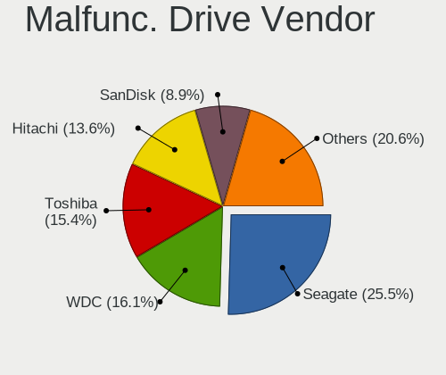

| Vendor              | Notebooks | Drives | Percent |
|---------------------|-----------|--------|---------|
| Seagate             | 143       | 146    | 25.13%  |
| WDC                 | 92        | 92     | 16.17%  |
| Toshiba             | 87        | 88     | 15.29%  |
| Hitachi             | 79        | 80     | 13.88%  |
| SanDisk             | 53        | 53     | 9.31%   |
| HGST                | 36        | 36     | 6.33%   |
| Samsung Electronics | 28        | 28     | 4.92%   |
| Kingston            | 10        | 10     | 1.76%   |
| Intel               | 7         | 7      | 1.23%   |
| Fujitsu             | 7         | 7      | 1.23%   |
| Crucial             | 4         | 4      | 0.7%    |
| SK hynix            | 3         | 3      | 0.53%   |
| OCZ                 | 3         | 3      | 0.53%   |
| A-DATA Technology   | 2         | 2      | 0.35%   |
| Unknown             | 1         | 1      | 0.18%   |
| Transcend           | 1         | 1      | 0.18%   |
| SPCC                | 1         | 1      | 0.18%   |
| Platinet            | 1         | 1      | 0.18%   |
| Micron Technology   | 1         | 1      | 0.18%   |
| LITEONIT            | 1         | 1      | 0.18%   |
| KingSpec            | 1         | 1      | 0.18%   |
| KingDian            | 1         | 1      | 0.18%   |
| Intenso             | 1         | 1      | 0.18%   |
| IBM/Hitachi         | 1         | 1      | 0.18%   |
| Colorful            | 1         | 1      | 0.18%   |
| China               | 1         | 1      | 0.18%   |
| ASMT                | 1         | 1      | 0.18%   |
| Apple               | 1         | 1      | 0.18%   |
| 240G                | 1         | 1      | 0.18%   |

Malfunc. HDD Vendor
-------------------

Vendors of faulty HDD drives

| Vendor              | Notebooks | Drives | Percent |
|---------------------|-----------|--------|---------|
| Seagate             | 143       | 146    | 31.22%  |
| Toshiba             | 87        | 88     | 19%     |
| WDC                 | 84        | 84     | 18.34%  |
| Hitachi             | 79        | 80     | 17.25%  |
| HGST                | 36        | 36     | 7.86%   |
| Samsung Electronics | 19        | 19     | 4.15%   |
| Fujitsu             | 7         | 7      | 1.53%   |
| IBM/Hitachi         | 1         | 1      | 0.22%   |
| ASMT                | 1         | 1      | 0.22%   |
| Apple               | 1         | 1      | 0.22%   |

Malfunc. Drive Kind
-------------------

Kinds of faulty drives

| Kind | Notebooks | Drives | Percent |
|------|-----------|--------|---------|
| HDD  | 455       | 463    | 80.39%  |
| SSD  | 109       | 109    | 19.26%  |
| NVMe | 2         | 2      | 0.35%   |

Failed Drives
-------------

Failed drive models

| Model                                 | Notebooks | Drives | Percent |
|---------------------------------------|-----------|--------|---------|
| WDC WD2500BEVS-22UST0 250GB           | 2         | 2      | 15.38%  |
| Crucial CT500P2SSD8 500GB             | 2         | 2      | 15.38%  |
| WDC WD5000M22K-24Z1LT0-SSHD-16GB      | 1         | 1      | 7.69%   |
| WDC WD5000LPLX-75ZNTT0 500GB          | 1         | 1      | 7.69%   |
| WDC WD5000BPVT-60HXZT1 500GB          | 1         | 1      | 7.69%   |
| Toshiba MQ01ABF050 500GB              | 1         | 1      | 7.69%   |
| Toshiba MK3259GSXP 320GB              | 1         | 1      | 7.69%   |
| SK hynix HFS128G39TND-N210A 128GB SSD | 1         | 1      | 7.69%   |
| Samsung Electronics SSD PM800 TM 64GB | 1         | 1      | 7.69%   |
| Hitachi HTS545050A7E380 500GB         | 1         | 1      | 7.69%   |
| HGST HTS541010A9E680 1TB              | 1         | 1      | 7.69%   |

Failed Drive Vendor
-------------------

Failed drive vendors

| Vendor              | Notebooks | Drives | Percent |
|---------------------|-----------|--------|---------|
| WDC                 | 5         | 5      | 38.46%  |
| Toshiba             | 2         | 2      | 15.38%  |
| Crucial             | 2         | 2      | 15.38%  |
| SK hynix            | 1         | 1      | 7.69%   |
| Samsung Electronics | 1         | 1      | 7.69%   |
| Hitachi             | 1         | 1      | 7.69%   |
| HGST                | 1         | 1      | 7.69%   |

Drive Status
------------

Number of failed and malfunc. drives

| Status   | Notebooks | Drives | Percent |
|----------|-----------|--------|---------|
| Works    | 1540      | 1784   | 67.96%  |
| Malfunc  | 561       | 574    | 24.76%  |
| Detected | 152       | 171    | 6.71%   |
| Failed   | 13        | 13     | 0.57%   |

Storage controller
------------------

Storage Vendor
--------------

Storage controller vendors

| Vendor                           | Notebooks | Percent |
|----------------------------------|-----------|---------|
| Intel                            | 1731      | 76.19%  |
| AMD                              | 297       | 13.07%  |
| Samsung Electronics              | 72        | 3.17%   |
| SanDisk                          | 49        | 2.16%   |
| Nvidia                           | 23        | 1.01%   |
| SK hynix                         | 22        | 0.97%   |
| Kingston Technology Company      | 17        | 0.75%   |
| Phison Electronics               | 13        | 0.57%   |
| Toshiba America Info Systems     | 9         | 0.4%    |
| Union Memory (Shenzhen)          | 6         | 0.26%   |
| Micron Technology                | 5         | 0.22%   |
| Silicon Motion                   | 4         | 0.18%   |
| KIOXIA                           | 4         | 0.18%   |
| Micron/Crucial Technology        | 3         | 0.13%   |
| JMicron Technology               | 3         | 0.13%   |
| Silicon Image                    | 2         | 0.09%   |
| Realtek Semiconductor            | 2         | 0.09%   |
| Lenovo                           | 2         | 0.09%   |
| Apple                            | 2         | 0.09%   |
| Silicon Integrated Systems [SiS] | 1         | 0.04%   |
| Marvell Technology Group         | 1         | 0.04%   |
| Lite-On Technology               | 1         | 0.04%   |
| Biwin Storage Technology         | 1         | 0.04%   |
| ASMedia Technology               | 1         | 0.04%   |
| ADATA Technology                 | 1         | 0.04%   |

Storage Model
-------------

Storage controller models

| Model                                                                                  | Notebooks | Percent |
|----------------------------------------------------------------------------------------|-----------|---------|
| Intel 7 Series Chipset Family 6-port SATA Controller [AHCI mode]                       | 226       | 9.14%   |
| Intel 6 Series/C200 Series Chipset Family 6 port Mobile SATA AHCI Controller           | 218       | 8.82%   |
| AMD FCH SATA Controller [AHCI mode]                                                    | 217       | 8.78%   |
| Intel Sunrise Point-LP SATA Controller [AHCI mode]                                     | 182       | 7.36%   |
| Intel 82801IBM/IEM (ICH9M/ICH9M-E) 4 port SATA Controller [AHCI mode]                  | 161       | 6.51%   |
| Intel 82801 Mobile SATA Controller [RAID mode]                                         | 116       | 4.69%   |
| Intel 82801HM/HEM (ICH8M/ICH8M-E) IDE Controller                                       | 100       | 4.05%   |
| Intel 8 Series SATA Controller 1 [AHCI mode]                                           | 97        | 3.92%   |
| Intel 5 Series/3400 Series Chipset 4 port SATA AHCI Controller                         | 91        | 3.68%   |
| Intel 82801HM/HEM (ICH8M/ICH8M-E) SATA Controller [AHCI mode]                          | 82        | 3.32%   |
| Intel Wildcat Point-LP SATA Controller [AHCI Mode]                                     | 66        | 2.67%   |
| AMD SB7x0/SB8x0/SB9x0 SATA Controller [AHCI mode]                                      | 66        | 2.67%   |
| Intel Atom Processor E3800 Series SATA AHCI Controller                                 | 61        | 2.47%   |
| Intel 8 Series/C220 Series Chipset Family 6-port SATA Controller 1 [AHCI mode]         | 50        | 2.02%   |
| Intel 5 Series/3400 Series Chipset 6 port SATA AHCI Controller                         | 49        | 1.98%   |
| Samsung NVMe SSD Controller SM981/PM981/PM983                                          | 36        | 1.46%   |
| Intel Celeron/Pentium Silver Processor SATA Controller                                 | 36        | 1.46%   |
| Intel Atom/Celeron/Pentium Processor x5-E8000/J3xxx/N3xxx Series SATA Controller       | 34        | 1.38%   |
| Intel 82801HM/HEM (ICH8M/ICH8M-E) SATA Controller [IDE mode]                           | 28        | 1.13%   |
| Intel Celeron N3350/Pentium N4200/Atom E3900 Series SATA AHCI Controller               | 26        | 1.05%   |
| Intel HM170/QM170 Chipset SATA Controller [AHCI Mode]                                  | 24        | 0.97%   |
| Intel Cannon Lake Mobile PCH SATA AHCI Controller                                      | 21        | 0.85%   |
| Samsung NVMe SSD Controller 980                                                        | 20        | 0.81%   |
| Intel Comet Lake SATA AHCI Controller                                                  | 20        | 0.81%   |
| Intel 82801IBM/IEM (ICH9M/ICH9M-E) 2 port SATA Controller [IDE mode]                   | 20        | 0.81%   |
| Intel Ice Lake-LP SATA Controller [AHCI mode]                                          | 17        | 0.69%   |
| SanDisk WD Blue SN550 NVMe SSD                                                         | 15        | 0.61%   |
| SanDisk WD Blue SN500 / PC SN520 NVMe SSD                                              | 15        | 0.61%   |
| AMD SB7x0/SB8x0/SB9x0 IDE Controller                                                   | 15        | 0.61%   |
| Intel SSD 660P Series                                                                  | 14        | 0.57%   |
| Intel 7 Series Chipset Family 4-port SATA Controller [IDE mode]                        | 14        | 0.57%   |
| Intel 7 Series Chipset Family 2-port SATA Controller [IDE mode]                        | 14        | 0.57%   |
| Intel NM10/ICH7 Family SATA Controller [AHCI mode]                                     | 12        | 0.49%   |
| Intel 6 Series/C200 Series Chipset Family Mobile SATA Controller (IDE mode, ports 0-3) | 12        | 0.49%   |
| SK hynix BC511                                                                         | 11        | 0.44%   |
| Nvidia MCP79 AHCI Controller                                                           | 11        | 0.44%   |
| Intel 6 Series/C200 Series Chipset Family Mobile SATA Controller (IDE mode, ports 4-5) | 11        | 0.44%   |
| Intel Volume Management Device NVMe RAID Controller                                    | 10        | 0.4%    |
| Intel Cannon Point-LP SATA Controller [AHCI Mode]                                      | 10        | 0.4%    |
| Samsung NVMe SSD Controller SM961/PM961/SM963                                          | 9         | 0.36%   |
| Kingston Company U-SNS8154P3 NVMe SSD                                                  | 8         | 0.32%   |
| Intel 5 Series/3400 Series Chipset 4 port SATA IDE Controller                          | 8         | 0.32%   |
| Intel 5 Series/3400 Series Chipset 2 port SATA IDE Controller                          | 8         | 0.32%   |
| Toshiba America Info Systems BG3 NVMe SSD Controller                                   | 7         | 0.28%   |
| SanDisk Non-Volatile memory controller                                                 | 7         | 0.28%   |
| Phison PS5013 E13 NVMe Controller                                                      | 7         | 0.28%   |
| Kingston Company Company Non-Volatile memory controller                                | 7         | 0.28%   |
| Intel Mobile 4 Series Chipset PT IDER Controller                                       | 7         | 0.28%   |
| Union Memory (Shenzhen) Non-Volatile memory controller                                 | 6         | 0.24%   |
| SanDisk WD Black SN750 / PC SN730 NVMe SSD                                             | 6         | 0.24%   |
| Phison E12 NVMe Controller                                                             | 6         | 0.24%   |
| Intel Tiger Lake-LP SATA Controller                                                    | 6         | 0.24%   |
| Intel 82801GBM/GHM (ICH7-M Family) SATA Controller [IDE mode]                          | 6         | 0.24%   |
| Intel 82801G (ICH7 Family) IDE Controller                                              | 6         | 0.24%   |
| AMD FCH SATA Controller [IDE mode]                                                     | 6         | 0.24%   |
| SK hynix Non-Volatile memory controller                                                | 5         | 0.2%    |
| SK hynix BC501 NVMe Solid State Drive                                                  | 5         | 0.2%    |
| SanDisk PC SN520 NVMe SSD                                                              | 5         | 0.2%    |
| Nvidia MCP89 SATA Controller (AHCI mode)                                               | 5         | 0.2%    |
| Micron Non-Volatile memory controller                                                  | 5         | 0.2%    |

Storage Kind
------------

Kind of storage controller (IDE, SATA, NVMe, SAS, ...)

| Kind | Notebooks | Percent |
|------|-----------|---------|
| SATA | 1826      | 76.31%  |
| NVMe | 221       | 9.24%   |
| IDE  | 216       | 9.03%   |
| RAID | 130       | 5.43%   |

Processor
---------

CPU Vendor
----------

Processor vendors

| Vendor | Notebooks | Percent |
|--------|-----------|---------|
| Intel  | 1791      | 83.93%  |
| AMD    | 343       | 16.07%  |

CPU Model
---------

Processor models

| Model                                         | Notebooks | Percent |
|-----------------------------------------------|-----------|---------|
| Intel Core i7-2677M CPU @ 1.80GHz             | 44        | 2.06%   |
| Intel Celeron CPU N2840 @ 2.16GHz             | 40        | 1.87%   |
| Intel Core i5-7200U CPU @ 2.50GHz             | 35        | 1.64%   |
| Intel Core i5-2520M CPU @ 2.50GHz             | 28        | 1.31%   |
| AMD Ryzen 5 3500U with Radeon Vega Mobile Gfx | 27        | 1.27%   |
| Intel Core i5-3230M CPU @ 2.60GHz             | 26        | 1.22%   |
| Intel Core i5-2410M CPU @ 2.30GHz             | 25        | 1.17%   |
| Intel Core i5-6200U CPU @ 2.30GHz             | 24        | 1.12%   |
| Intel Core i5-3210M CPU @ 2.50GHz             | 24        | 1.12%   |
| Intel Core i5-8250U CPU @ 1.60GHz             | 23        | 1.08%   |
| Intel Core i3-5005U CPU @ 2.00GHz             | 23        | 1.08%   |
| Intel Core i3-2310M CPU @ 2.10GHz             | 23        | 1.08%   |
| Intel Core i5-4210U CPU @ 1.70GHz             | 22        | 1.03%   |
| Intel Core i5-3320M CPU @ 2.60GHz             | 22        | 1.03%   |
| Intel Core i5-5200U CPU @ 2.20GHz             | 21        | 0.98%   |
| Intel Core 2 Duo CPU P8600 @ 2.40GHz          | 21        | 0.98%   |
| Intel Core i5 CPU M 520 @ 2.40GHz             | 18        | 0.84%   |
| Intel Core i3-6006U CPU @ 2.00GHz             | 18        | 0.84%   |
| Intel Core i3-3110M CPU @ 2.40GHz             | 18        | 0.84%   |
| Intel Core i3 CPU M 380 @ 2.53GHz             | 18        | 0.84%   |
| Intel Core 2 Duo CPU P8400 @ 2.26GHz          | 18        | 0.84%   |
| Intel Celeron CPU N3060 @ 1.60GHz             | 18        | 0.84%   |
| Intel Core i3-7020U CPU @ 2.30GHz             | 17        | 0.8%    |
| Intel Celeron CPU N3350 @ 1.10GHz             | 17        | 0.8%    |
| Intel Pentium Dual-Core CPU T4200 @ 2.00GHz   | 16        | 0.75%   |
| Intel Core i7-8550U CPU @ 1.80GHz             | 16        | 0.75%   |
| Intel Core i3-2350M CPU @ 2.30GHz             | 16        | 0.75%   |
| Intel Pentium Dual-Core CPU T4500 @ 2.30GHz   | 15        | 0.7%    |
| Intel Core i7-6500U CPU @ 2.50GHz             | 14        | 0.66%   |
| Intel Core i5-1035G1 CPU @ 1.00GHz            | 14        | 0.66%   |
| Intel Core i3-3120M CPU @ 2.50GHz             | 14        | 0.66%   |
| Intel Pentium CPU B960 @ 2.20GHz              | 13        | 0.61%   |
| Intel Core i7-7500U CPU @ 2.70GHz             | 13        | 0.61%   |
| Intel Core i7-2670QM CPU @ 2.20GHz            | 13        | 0.61%   |
| Intel Core i5-5300U CPU @ 2.30GHz             | 13        | 0.61%   |
| Intel Core i5-4200U CPU @ 1.60GHz             | 13        | 0.61%   |
| Intel Core i3-4030U CPU @ 1.90GHz             | 13        | 0.61%   |
| Intel Core 2 Duo CPU T7250 @ 2.00GHz          | 13        | 0.61%   |
| Intel Celeron N4000 CPU @ 1.10GHz             | 13        | 0.61%   |
| AMD E-300 APU with Radeon HD Graphics         | 13        | 0.61%   |
| Intel Pentium Dual-Core CPU T4300 @ 2.10GHz   | 12        | 0.56%   |
| Intel Core i7-6700HQ CPU @ 2.60GHz            | 12        | 0.56%   |
| Intel Core i7-10510U CPU @ 1.80GHz            | 12        | 0.56%   |
| Intel Core i5-6300U CPU @ 2.40GHz             | 12        | 0.56%   |
| Intel Core i5-4300U CPU @ 1.90GHz             | 12        | 0.56%   |
| Intel Core i5-10210U CPU @ 1.60GHz            | 12        | 0.56%   |
| Intel Core i5 CPU M 540 @ 2.53GHz             | 12        | 0.56%   |
| Intel Core i3-4005U CPU @ 1.70GHz             | 12        | 0.56%   |
| Intel Core i3 CPU M 370 @ 2.40GHz             | 12        | 0.56%   |
| Intel Core i5-2450M CPU @ 2.50GHz             | 11        | 0.52%   |
| Intel Core i5 CPU M 480 @ 2.67GHz             | 11        | 0.52%   |
| Intel Core i3-3217U CPU @ 1.80GHz             | 11        | 0.52%   |
| Intel Core i3-2330M CPU @ 2.20GHz             | 11        | 0.52%   |
| Intel Core 2 Duo CPU T8100 @ 2.10GHz          | 11        | 0.52%   |
| Intel Core 2 Duo CPU T7500 @ 2.20GHz          | 11        | 0.52%   |
| Intel Core 2 Duo CPU T6500 @ 2.10GHz          | 11        | 0.52%   |
| Intel Core 2 Duo CPU P8700 @ 2.53GHz          | 11        | 0.52%   |
| AMD E1-1200 APU with Radeon HD Graphics       | 11        | 0.52%   |
| Intel Pentium CPU N3710 @ 1.60GHz             | 10        | 0.47%   |
| Intel Core i5-3337U CPU @ 1.80GHz             | 10        | 0.47%   |

CPU Model Family
----------------

Processor model prefix

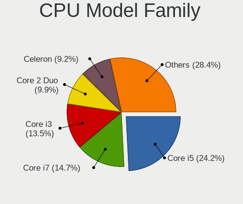

| Model                          | Notebooks | Percent |
|--------------------------------|-----------|---------|
| Intel Core i5                  | 519       | 24.32%  |
| Intel Core i7                  | 320       | 15%     |
| Intel Core i3                  | 291       | 13.64%  |
| Intel Core 2 Duo               | 211       | 9.89%   |
| Intel Celeron                  | 190       | 8.9%    |
| Intel Pentium                  | 105       | 4.92%   |
| AMD Ryzen 5                    | 54        | 2.53%   |
| Intel Pentium Dual-Core        | 51        | 2.39%   |
| AMD E                          | 34        | 1.59%   |
| Intel Pentium Dual             | 31        | 1.45%   |
| Other                          | 26        | 1.22%   |
| AMD A6                         | 26        | 1.22%   |
| AMD A4                         | 26        | 1.22%   |
| AMD E1                         | 24        | 1.12%   |
| AMD A8                         | 22        | 1.03%   |
| AMD Ryzen 7                    | 21        | 0.98%   |
| AMD E2                         | 21        | 0.98%   |
| Intel Atom                     | 18        | 0.84%   |
| AMD Ryzen 3                    | 13        | 0.61%   |
| AMD A10                        | 13        | 0.61%   |
| AMD Athlon                     | 11        | 0.52%   |
| Intel Core 2                   | 10        | 0.47%   |
| AMD C-60                       | 10        | 0.47%   |
| Intel Pentium Silver           | 9         | 0.42%   |
| Intel Celeron Dual-Core        | 8         | 0.37%   |
| AMD Athlon II                  | 6         | 0.28%   |
| Intel Genuine                  | 5         | 0.23%   |
| AMD C-70                       | 5         | 0.23%   |
| AMD Athlon X2                  | 5         | 0.23%   |
| AMD Athlon 64 X2               | 5         | 0.23%   |
| AMD Turion II Dual-Core        | 4         | 0.19%   |
| AMD Phenom II                  | 4         | 0.19%   |
| AMD A12                        | 4         | 0.19%   |
| Intel Core m3                  | 3         | 0.14%   |
| Intel Core 2 Extreme           | 3         | 0.14%   |
| Intel Core m7                  | 2         | 0.09%   |
| AMD Turion II                  | 2         | 0.09%   |
| AMD C-50                       | 2         | 0.09%   |
| AMD Athlon II Dual-Core        | 2         | 0.09%   |
| Intel Pentium Gold             | 1         | 0.05%   |
| Intel Core 2 Solo              | 1         | 0.05%   |
| Intel Core 2 Quad              | 1         | 0.05%   |
| Intel Celeron M                | 1         | 0.05%   |
| AMD V140                       | 1         | 0.05%   |
| AMD V120                       | 1         | 0.05%   |
| AMD Turion X2 Dual-Core Mobile | 1         | 0.05%   |
| AMD Turion 64 X2 Mobile        | 1         | 0.05%   |
| AMD Turion 64 Mobile           | 1         | 0.05%   |
| AMD Sempron                    | 1         | 0.05%   |
| AMD Ryzen 9                    | 1         | 0.05%   |
| AMD Ryzen 7 PRO                | 1         | 0.05%   |
| AMD Ryzen 5 PRO                | 1         | 0.05%   |
| AMD Quad-Core                  | 1         | 0.05%   |
| AMD GX                         | 1         | 0.05%   |
| AMD FX                         | 1         | 0.05%   |
| AMD Athlon Neo                 | 1         | 0.05%   |
| AMD Athlon 64                  | 1         | 0.05%   |

CPU Cores
---------

Number of processor cores

| Number | Notebooks | Percent |
|--------|-----------|---------|
| 2      | 1621      | 75.96%  |
| 4      | 417       | 19.54%  |
| 6      | 40        | 1.87%   |
| 1      | 39        | 1.83%   |
| 8      | 15        | 0.7%    |
| 5      | 1         | 0.05%   |
| 3      | 1         | 0.05%   |

CPU Sockets
-----------

Number of sockets

| Number | Notebooks | Percent |
|--------|-----------|---------|
| 1      | 2134      | 100%    |

CPU Threads
-----------

Threads per core (Hyper-Threading)

| Number | Notebooks | Percent |
|--------|-----------|---------|
| 2      | 1268      | 59.42%  |
| 1      | 866       | 40.58%  |

CPU Op-Modes
------------

CPU Operation Modes (32-bit, 64-bit)

| Op mode        | Notebooks | Percent |
|----------------|-----------|---------|
| 32-bit, 64-bit | 2133      | 99.95%  |
| Unknown        | 1         | 0.05%   |

CPU Microcode
-------------

Microcode number

| Number     | Notebooks | Percent |
|------------|-----------|---------|
| 0x206a7    | 282       | 13.21%  |
| 0x306a9    | 210       | 9.84%   |
| 0x1067a    | 154       | 7.21%   |
| 0x20655    | 116       | 5.43%   |
| 0x40651    | 106       | 4.96%   |
| 0x406e3    | 86        | 4.03%   |
| 0x6fd      | 83        | 3.89%   |
| 0x306d4    | 76        | 3.56%   |
| 0x806e9    | 70        | 3.28%   |
| 0x30678    | 59        | 2.76%   |
| 0x10676    | 56        | 2.62%   |
| 0x306c3    | 54        | 2.53%   |
| 0x806ea    | 53        | 2.48%   |
| Unknown    | 51        | 2.39%   |
| 0x806ec    | 37        | 1.73%   |
| 0x406c4    | 35        | 1.64%   |
| 0x06006705 | 31        | 1.45%   |
| 0x706a1    | 30        | 1.41%   |
| 0x20652    | 29        | 1.36%   |
| 0x906ea    | 28        | 1.31%   |
| 0x706e5    | 28        | 1.31%   |
| 0x08108109 | 28        | 1.31%   |
| 0x07030105 | 26        | 1.22%   |
| 0x0500010d | 26        | 1.22%   |
| 0x506c9    | 25        | 1.17%   |
| 0x08108102 | 25        | 1.17%   |
| 0x506e3    | 18        | 0.84%   |
| 0x05000119 | 17        | 0.8%    |
| 0x6fb      | 16        | 0.75%   |
| 0x906e9    | 12        | 0.56%   |
| 0x806c1    | 12        | 0.56%   |
| 0x706a8    | 11        | 0.52%   |
| 0x106e5    | 11        | 0.52%   |
| 0x05000101 | 11        | 0.52%   |
| 0xa0652    | 10        | 0.47%   |
| 0x07030104 | 10        | 0.47%   |
| 0x6fa      | 9         | 0.42%   |
| 0x6f6      | 9         | 0.42%   |
| 0x406c3    | 9         | 0.42%   |
| 0x06001119 | 9         | 0.42%   |
| 0x05000028 | 9         | 0.42%   |
| 0x30661    | 8         | 0.37%   |
| 0x08600106 | 8         | 0.37%   |
| 0x0700010b | 8         | 0.37%   |
| 0x06006704 | 8         | 0.37%   |
| 0x010000c8 | 7         | 0.33%   |
| 0x010000b6 | 7         | 0.33%   |
| 0xa0660    | 6         | 0.28%   |
| 0x106ca    | 6         | 0.28%   |
| 0x10661    | 6         | 0.28%   |
| 0x0810100b | 6         | 0.28%   |
| 0x06001116 | 6         | 0.28%   |
| 0x03000027 | 6         | 0.28%   |
| 0x30673    | 5         | 0.23%   |
| 0x08600104 | 5         | 0.23%   |
| 0x08101007 | 5         | 0.23%   |
| 0x07030106 | 5         | 0.23%   |
| 0x07000106 | 5         | 0.23%   |
| 0x0600611a | 5         | 0.23%   |
| 0x806eb    | 4         | 0.19%   |

CPU Microarch
-------------

Microarchitecture

| Name            | Notebooks | Percent |
|-----------------|-----------|---------|
| SandyBridge     | 284       | 13.31%  |
| IvyBridge       | 212       | 9.93%   |
| Penryn          | 210       | 9.84%   |
| KabyLake        | 210       | 9.84%   |
| Haswell         | 162       | 7.59%   |
| Westmere        | 147       | 6.89%   |
| Core            | 125       | 5.86%   |
| Silvermont      | 108       | 5.06%   |
| Skylake         | 107       | 5.01%   |
| Broadwell       | 77        | 3.61%   |
| Bobcat          | 68        | 3.19%   |
| Zen+            | 60        | 2.81%   |
| Excavator       | 49        | 2.3%    |
| Puma            | 41        | 1.92%   |
| Goldmont plus   | 41        | 1.92%   |
| IceLake         | 29        | 1.36%   |
| Goldmont        | 26        | 1.22%   |
| Zen 2           | 23        | 1.08%   |
| K10             | 21        | 0.98%   |
| Jaguar          | 17        | 0.8%    |
| Piledriver      | 16        | 0.75%   |
| CometLake       | 16        | 0.75%   |
| Zen             | 14        | 0.66%   |
| Bonnell         | 14        | 0.66%   |
| TigerLake       | 12        | 0.56%   |
| Nehalem         | 11        | 0.52%   |
| K8 Hammer       | 10        | 0.47%   |
| K10 Llano       | 8         | 0.37%   |
| K8 & K10 hybrid | 7         | 0.33%   |
| Steamroller     | 6         | 0.28%   |
| Unknown         | 3         | 0.14%   |

Graphics
--------

GPU Vendor
----------

Vendors of graphics cards

| Vendor                           | Notebooks | Percent |
|----------------------------------|-----------|---------|
| Intel                            | 1573      | 62.27%  |
| AMD                              | 498       | 19.71%  |
| Nvidia                           | 454       | 17.97%  |
| Silicon Integrated Systems [SiS] | 1         | 0.04%   |

GPU Model
---------

Graphics card models

| Model                                                                                    | Notebooks | Percent |
|------------------------------------------------------------------------------------------|-----------|---------|
| Intel 2nd Generation Core Processor Family Integrated Graphics Controller                | 262       | 9.91%   |
| Intel 3rd Gen Core processor Graphics Controller                                         | 195       | 7.38%   |
| Intel Mobile 4 Series Chipset Integrated Graphics Controller                             | 141       | 5.33%   |
| Intel Core Processor Integrated Graphics Controller                                      | 108       | 4.09%   |
| Intel Haswell-ULT Integrated Graphics Controller                                         | 105       | 3.97%   |
| Intel Skylake GT2 [HD Graphics 520]                                                      | 76        | 2.88%   |
| Intel Mobile GM965/GL960 Integrated Graphics Controller (secondary)                      | 73        | 2.76%   |
| Intel Mobile GM965/GL960 Integrated Graphics Controller (primary)                        | 73        | 2.76%   |
| Intel HD Graphics 620                                                                    | 68        | 2.57%   |
| Intel HD Graphics 5500                                                                   | 67        | 2.53%   |
| Intel Atom Processor Z36xxx/Z37xxx Series Graphics & Display                             | 64        | 2.42%   |
| AMD Picasso/Raven 2 [Radeon Vega Series / Radeon Vega Mobile Series]                     | 60        | 2.27%   |
| Intel 4th Gen Core Processor Integrated Graphics Controller                              | 47        | 1.78%   |
| Intel UHD Graphics 620                                                                   | 45        | 1.7%    |
| Intel Atom/Celeron/Pentium Processor x5-E8000/J3xxx/N3xxx Integrated Graphics Controller | 44        | 1.66%   |
| AMD Stoney [Radeon R2/R3/R4/R5 Graphics]                                                 | 39        | 1.48%   |
| Nvidia GF117M [GeForce 610M/710M/810M/820M / GT 620M/625M/630M/720M]                     | 38        | 1.44%   |
| Intel GeminiLake [UHD Graphics 600]                                                      | 32        | 1.21%   |
| Intel CoffeeLake-H GT2 [UHD Graphics 630]                                                | 26        | 0.98%   |
| AMD Wrestler [Radeon HD 6310]                                                            | 24        | 0.91%   |
| AMD Mullins [Radeon R4/R5 Graphics]                                                      | 24        | 0.91%   |
| Intel Iris Plus Graphics G1 (Ice Lake)                                                   | 23        | 0.87%   |
| Intel CometLake-U GT2 [UHD Graphics]                                                     | 23        | 0.87%   |
| AMD Renoir                                                                               | 22        | 0.83%   |
| Intel HD Graphics 500                                                                    | 21        | 0.79%   |
| AMD Thames [Radeon HD 7500M/7600M Series]                                                | 21        | 0.79%   |
| AMD Sun XT [Radeon HD 8670A/8670M/8690M / R5 M330 / M430 / Radeon 520 Mobile]            | 21        | 0.79%   |
| AMD Seymour [Radeon HD 6400M/7400M Series]                                               | 19        | 0.72%   |
| AMD RV620/M82 [Mobility Radeon HD 3450/3470]                                             | 19        | 0.72%   |
| AMD Topaz XT [Radeon R7 M260/M265 / M340/M360 / M440/M445 / 530/535 / 620/625 Mobile]    | 18        | 0.68%   |
| AMD Park [Mobility Radeon HD 5430/5450/5470]                                             | 18        | 0.68%   |
| Nvidia GF108M [GeForce GT 540M]                                                          | 16        | 0.61%   |
| Intel WhiskeyLake-U GT2 [UHD Graphics 620]                                               | 16        | 0.61%   |
| Intel HD Graphics 530                                                                    | 16        | 0.61%   |
| AMD RV710/M92 [Mobility Radeon HD 4530/4570/545v]                                        | 13        | 0.49%   |
| AMD RS880M [Mobility Radeon HD 4225/4250]                                                | 13        | 0.49%   |
| AMD Raven Ridge [Radeon Vega Series / Radeon Vega Mobile Series]                         | 13        | 0.49%   |
| Nvidia TU117M [GeForce GTX 1650 Mobile / Max-Q]                                          | 12        | 0.45%   |
| Nvidia GP107M [GeForce GTX 1050 Mobile]                                                  | 12        | 0.45%   |
| AMD Wrestler [Radeon HD 7310]                                                            | 12        | 0.45%   |
| Nvidia GK208BM [GeForce 920M]                                                            | 11        | 0.42%   |
| Nvidia G96CM [GeForce 9600M GT]                                                          | 11        | 0.42%   |
| Nvidia GM107M [GeForce GTX 950M]                                                         | 10        | 0.38%   |
| Nvidia GF108M [GeForce GT 620M/630M/635M/640M LE]                                        | 10        | 0.38%   |
| Intel HD Graphics 630                                                                    | 10        | 0.38%   |
| Intel CometLake-H GT2 [UHD Graphics]                                                     | 10        | 0.38%   |
| AMD Wrestler [Radeon HD 6320]                                                            | 10        | 0.38%   |
| AMD Wrestler [Radeon HD 6290]                                                            | 10        | 0.38%   |
| AMD Wani [Radeon R5/R6/R7 Graphics]                                                      | 10        | 0.38%   |
| Nvidia GM108M [GeForce 840M]                                                             | 9         | 0.34%   |
| Nvidia GF108M [GeForce GT 525M]                                                          | 9         | 0.34%   |
| Intel TigerLake-LP GT2 [Iris Xe Graphics]                                                | 9         | 0.34%   |
| Intel GeminiLake [UHD Graphics 605]                                                      | 9         | 0.34%   |
| AMD Mullins [Radeon R2 Graphics]                                                         | 9         | 0.34%   |
| AMD Madison [Mobility Radeon HD 5650/5750 / 6530M/6550M]                                 | 9         | 0.34%   |
| Nvidia GM108M [GeForce 940M]                                                             | 8         | 0.3%    |
| Nvidia GM107M [GeForce GTX 960M]                                                         | 8         | 0.3%    |
| Nvidia GK208M [GeForce GT 740M]                                                          | 8         | 0.3%    |
| Nvidia GK107GLM [Quadro K1000M]                                                          | 8         | 0.3%    |
| Nvidia GF119M [GeForce GT 520MX]                                                         | 8         | 0.3%    |

GPU Combo
---------

Combinations of graphics cards

| Name           | Notebooks | Percent |
|----------------|-----------|---------|
| 1 x Intel      | 1196      | 56.04%  |
| 1 x AMD        | 371       | 17.39%  |
| Intel + Nvidia | 304       | 14.25%  |
| 1 x Nvidia     | 131       | 6.14%   |
| Intel + AMD    | 73        | 3.42%   |
| 2 x AMD        | 39        | 1.83%   |
| AMD + Nvidia   | 15        | 0.7%    |
| 2 x Nvidia     | 4         | 0.19%   |
| 1 x SiS        | 1         | 0.05%   |

GPU Driver
----------

Free vs proprietary

| Driver      | Notebooks | Percent |
|-------------|-----------|---------|
| Free        | 2119      | 99.25%  |
| Unknown     | 14        | 0.66%   |
| Proprietary | 2         | 0.09%   |

GPU Memory
----------

Total video memory

| Size in GB | Notebooks | Percent |
|------------|-----------|---------|
| Unknown    | 1231      | 57.69%  |
| 0.01-0.5   | 360       | 16.87%  |
| 1.01-2.0   | 260       | 12.18%  |
| 0.51-1.0   | 197       | 9.23%   |
| 3.01-4.0   | 55        | 2.58%   |
| 5.01-6.0   | 16        | 0.75%   |
| 7.01-8.0   | 9         | 0.42%   |
| 2.01-3.0   | 6         | 0.28%   |

Monitor
-------

Monitor Vendor
--------------

Monitor vendors

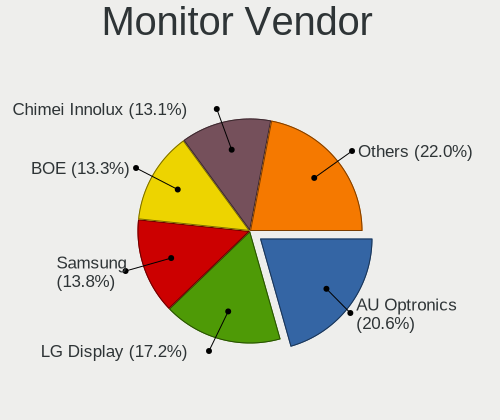

| Vendor                  | Notebooks | Percent |
|-------------------------|-----------|---------|
| AU Optronics            | 463       | 21.46%  |
| LG Display              | 369       | 17.1%   |
| Samsung Electronics     | 298       | 13.81%  |
| BOE                     | 281       | 13.02%  |
| Chimei Innolux          | 277       | 12.84%  |
| Chi Mei Optoelectronics | 96        | 4.45%   |
| Lenovo                  | 67        | 3.1%    |
| CPT                     | 57        | 2.64%   |
| LG Philips              | 37        | 1.71%   |
| Apple                   | 35        | 1.62%   |
| Goldstar                | 16        | 0.74%   |
| Sharp                   | 15        | 0.7%    |
| InfoVision              | 14        | 0.65%   |
| Dell                    | 14        | 0.65%   |
| PANDA                   | 12        | 0.56%   |
| Acer                    | 11        | 0.51%   |
| Sony                    | 9         | 0.42%   |
| Philips                 | 9         | 0.42%   |
| InnoLux Display         | 8         | 0.37%   |
| BenQ                    | 7         | 0.32%   |
| Hewlett-Packard         | 6         | 0.28%   |
| ViewSonic               | 5         | 0.23%   |
| Iiyama                  | 5         | 0.23%   |
| Panasonic               | 4         | 0.19%   |
| AOC                     | 4         | 0.19%   |
| Ancor Communications    | 4         | 0.19%   |
| Toshiba                 | 3         | 0.14%   |
| HannStar                | 3         | 0.14%   |
| Fujitsu Siemens         | 3         | 0.14%   |
| Eizo                    | 3         | 0.14%   |
| Unknown                 | 2         | 0.09%   |
| Quanta Display          | 2         | 0.09%   |
| ASUSTek Computer        | 2         | 0.09%   |
| Westinghouse            | 1         | 0.05%   |
| Vizio                   | 1         | 0.05%   |
| Vestel Elektronik       | 1         | 0.05%   |
| SNC                     | 1         | 0.05%   |
| S2-Tek                  | 1         | 0.05%   |
| RTK                     | 1         | 0.05%   |
| ONN                     | 1         | 0.05%   |
| NEC Computers           | 1         | 0.05%   |
| MTD                     | 1         | 0.05%   |
| JDI                     | 1         | 0.05%   |
| HYD                     | 1         | 0.05%   |
| HB@                     | 1         | 0.05%   |
| Grundig                 | 1         | 0.05%   |
| Envision Peripherals    | 1         | 0.05%   |
| Envision                | 1         | 0.05%   |
| Beko                    | 1         | 0.05%   |
| BBK                     | 1         | 0.05%   |

Monitor Model
-------------

Monitor models

| Model                                                                    | Notebooks | Percent |
|--------------------------------------------------------------------------|-----------|---------|
| CPT LCD Monitor COR17DB 1600x900 293x164mm 13.2-inch                     | 44        | 2.03%   |
| Samsung Electronics LCD Monitor SEC5441 1366x768 344x194mm 15.5-inch     | 31        | 1.43%   |
| AU Optronics LCD Monitor AUO38ED 1920x1080 344x193mm 15.5-inch           | 25        | 1.15%   |
| BOE LCD Monitor BOE0629 1366x768 309x173mm 13.9-inch                     | 24        | 1.11%   |
| LG Display LCD Monitor LGD02DC 1366x768 344x194mm 15.5-inch              | 21        | 0.97%   |
| AU Optronics LCD Monitor AUO22EC 1366x768 344x193mm 15.5-inch            | 20        | 0.92%   |
| LG Display LCD Monitor LGD033A 1366x768 344x194mm 15.5-inch              | 19        | 0.88%   |
| Chimei Innolux LCD Monitor CMN15DB 1366x768 344x193mm 15.5-inch          | 18        | 0.83%   |
| AU Optronics LCD Monitor AUO61ED 1920x1080 344x193mm 15.5-inch           | 16        | 0.74%   |
| AU Optronics LCD Monitor AUO26EC 1366x768 344x193mm 15.5-inch            | 16        | 0.74%   |
| Samsung Electronics LCD Monitor SEC544B 1600x900 310x174mm 14.0-inch     | 14        | 0.65%   |
| Samsung Electronics LCD Monitor SEC3945 1280x800 331x207mm 15.4-inch     | 14        | 0.65%   |
| Chi Mei Optoelectronics LCD Monitor CMO15A7 1366x768 344x193mm 15.5-inch | 14        | 0.65%   |
| AU Optronics LCD Monitor AUO71EC 1366x768 344x193mm 15.5-inch            | 14        | 0.65%   |
| AU Optronics LCD Monitor AUO45EC 1366x768 344x193mm 15.5-inch            | 14        | 0.65%   |
| LG Display LCD Monitor LGD02E9 1366x768 309x174mm 14.0-inch              | 12        | 0.55%   |
| Chimei Innolux LCD Monitor CMN1735 1920x1080 381x214mm 17.2-inch         | 12        | 0.55%   |
| Chimei Innolux LCD Monitor CMN15F5 1920x1080 344x193mm 15.5-inch         | 12        | 0.55%   |
| Chi Mei Optoelectronics LCD Monitor CMO15A3 1366x768 344x194mm 15.5-inch | 12        | 0.55%   |
| AU Optronics LCD Monitor AUO70EC 1366x768 344x193mm 15.5-inch            | 12        | 0.55%   |
| AU Optronics LCD Monitor AUO20EC 1366x768 344x193mm 15.5-inch            | 11        | 0.51%   |
| Samsung Electronics LCD Monitor SEC3741 1366x768 309x174mm 14.0-inch     | 10        | 0.46%   |
| Chimei Innolux LCD Monitor CMN14D4 1920x1080 309x173mm 13.9-inch         | 10        | 0.46%   |
| BOE LCD Monitor BOE0812 1920x1080 344x194mm 15.5-inch                    | 10        | 0.46%   |
| BOE LCD Monitor BOE0675 1366x768 344x194mm 15.5-inch                     | 10        | 0.46%   |
| AU Optronics LCD Monitor AUO23EC 1366x768 344x193mm 15.5-inch            | 10        | 0.46%   |
| AU Optronics LCD Monitor AUO21EC 1366x768 344x193mm 15.5-inch            | 10        | 0.46%   |
| AU Optronics LCD Monitor AUO183C 1366x768 309x173mm 13.9-inch            | 10        | 0.46%   |
| AU Optronics LCD Monitor AUO10EC 1366x768 344x193mm 15.5-inch            | 10        | 0.46%   |
| AU Optronics LCD Monitor AUO106C 1366x768 277x156mm 12.5-inch            | 10        | 0.46%   |
| Samsung Electronics LCD Monitor SEC324A 1366x768 344x194mm 15.5-inch     | 9         | 0.42%   |
| LG Philips LP154WX4-TLC8 LPL0120 1280x800 331x207mm 15.4-inch            | 9         | 0.42%   |
| Lenovo LCD Monitor LEN4031 1280x800 304x190mm 14.1-inch                  | 9         | 0.42%   |
| Chimei Innolux LCD Monitor CMN15CA 1366x768 344x193mm 15.5-inch          | 9         | 0.42%   |
| Chi Mei Optoelectronics LCD Monitor CMO1592 1366x768 344x193mm 15.5-inch | 9         | 0.42%   |
| BOE LCD Monitor BOE0671 1366x768 344x194mm 15.5-inch                     | 9         | 0.42%   |
| LG Display LCD Monitor LGD0259 1920x1080 345x194mm 15.6-inch             | 8         | 0.37%   |
| Chimei Innolux LCD Monitor CMN1728 1600x900 382x215mm 17.3-inch          | 8         | 0.37%   |
| BOE LCD Monitor BOE06A5 1366x768 344x194mm 15.5-inch                     | 8         | 0.37%   |
| BOE LCD Monitor BOE061D 1366x768 309x173mm 13.9-inch                     | 8         | 0.37%   |
| AU Optronics LCD Monitor AUO313C 1366x768 309x173mm 13.9-inch            | 8         | 0.37%   |
| AU Optronics LCD Monitor AUO219E 1600x900 382x214mm 17.2-inch            | 8         | 0.37%   |
| AU Optronics LCD Monitor AUO139E 1600x900 382x214mm 17.2-inch            | 8         | 0.37%   |
| AU Optronics LCD Monitor AUO129E 1600x900 382x214mm 17.2-inch            | 8         | 0.37%   |
| Samsung Electronics LCD Monitor SEC3245 1280x800 331x207mm 15.4-inch     | 7         | 0.32%   |
| LG Display LCD Monitor LGD0456 1366x768 344x194mm 15.5-inch              | 7         | 0.32%   |
| Chimei Innolux LCD Monitor CMN15AB 1366x768 344x193mm 15.5-inch          | 7         | 0.32%   |
| Chimei Innolux LCD Monitor CMN14D6 1366x768 309x173mm 13.9-inch          | 7         | 0.32%   |
| BOE LCD Monitor BOE0696 1366x768 309x173mm 13.9-inch                     | 7         | 0.32%   |
| BOE LCD Monitor BOE0672 1366x768 344x194mm 15.5-inch                     | 7         | 0.32%   |
| LG Display LCD Monitor LGD056D 1920x1080 382x215mm 17.3-inch             | 6         | 0.28%   |
| LG Display LCD Monitor LGD0468 1366x768 344x194mm 15.5-inch              | 6         | 0.28%   |
| LG Display LCD Monitor LGD039F 1366x768 345x194mm 15.6-inch              | 6         | 0.28%   |
| Lenovo LCD Monitor LEN40B1 1600x900 344x193mm 15.5-inch                  | 6         | 0.28%   |
| InfoVision LCD Monitor IVO03F4 1024x600 223x125mm 10.1-inch              | 6         | 0.28%   |
| Chimei Innolux LCD Monitor CMN15E7 1920x1080 344x193mm 15.5-inch         | 6         | 0.28%   |
| Chimei Innolux LCD Monitor CMN15C9 1366x768 344x193mm 15.5-inch          | 6         | 0.28%   |
| Chimei Innolux LCD Monitor CMN15BD 1366x768 344x194mm 15.5-inch          | 6         | 0.28%   |
| BOE LCD Monitor BOE05B1 1366x768 309x173mm 13.9-inch                     | 6         | 0.28%   |
| AU Optronics LCD Monitor AUO81EC 1366x768 344x193mm 15.5-inch            | 6         | 0.28%   |

Monitor Resolution
------------------

Monitor screen resolution

| Resolution         | Notebooks | Percent |
|--------------------|-----------|---------|
| 1366x768 (WXGA)    | 1030      | 48.24%  |
| 1920x1080 (FHD)    | 539       | 25.25%  |
| 1600x900 (HD+)     | 224       | 10.49%  |
| 1280x800 (WXGA)    | 156       | 7.31%   |
| 1440x900 (WXGA+)   | 58        | 2.72%   |
| 1680x1050 (WSXGA+) | 23        | 1.08%   |
| 3840x2160 (4K)     | 22        | 1.03%   |
| 1920x1200 (WUXGA)  | 14        | 0.66%   |
| 2560x1440 (QHD)    | 11        | 0.52%   |
| 1024x600           | 10        | 0.47%   |
| 1280x1024 (SXGA)   | 7         | 0.33%   |
| 1024x768 (XGA)     | 7         | 0.33%   |
| 2560x1600          | 5         | 0.23%   |
| 1680x945           | 5         | 0.23%   |
| 3200x1800 (QHD+)   | 3         | 0.14%   |
| 2880x1800          | 3         | 0.14%   |
| 1360x768           | 3         | 0.14%   |
| 2560x1080          | 2         | 0.09%   |
| 2160x1440          | 2         | 0.09%   |
| 1920x540           | 2         | 0.09%   |
| 1400x1050          | 2         | 0.09%   |
| 3840x1100          | 1         | 0.05%   |
| 3300x2200          | 1         | 0.05%   |
| 3000x2000          | 1         | 0.05%   |
| 2304x1440          | 1         | 0.05%   |
| 2288x1287          | 1         | 0.05%   |
| 2256x1504          | 1         | 0.05%   |
| 1280x720 (HD)      | 1         | 0.05%   |

Monitor Diagonal
----------------

Diagonal size in inches

| Inches  | Notebooks | Percent |
|---------|-----------|---------|
| 15      | 1073      | 49.58%  |
| 13      | 323       | 14.93%  |
| 14      | 254       | 11.74%  |
| 17      | 230       | 10.63%  |
| 12      | 64        | 2.96%   |
| 11      | 41        | 1.89%   |
| 23      | 24        | 1.11%   |
| 27      | 21        | 0.97%   |
| 18      | 20        | 0.92%   |
| 21      | 17        | 0.79%   |
| 10      | 13        | 0.6%    |
| 24      | 12        | 0.55%   |
| 20      | 12        | 0.55%   |
| 31      | 11        | 0.51%   |
| 16      | 8         | 0.37%   |
| 22      | 7         | 0.32%   |
| 54      | 6         | 0.28%   |
| 84      | 3         | 0.14%   |
| 72      | 3         | 0.14%   |
| 25      | 3         | 0.14%   |
| 19      | 3         | 0.14%   |
| 48      | 2         | 0.09%   |
| 46      | 2         | 0.09%   |
| 34      | 2         | 0.09%   |
| 32      | 2         | 0.09%   |
| Unknown | 2         | 0.09%   |
| 142     | 1         | 0.05%   |
| 47      | 1         | 0.05%   |
| 42      | 1         | 0.05%   |
| 40      | 1         | 0.05%   |
| 37      | 1         | 0.05%   |
| 26      | 1         | 0.05%   |

Monitor Width
-------------

Physical width

| Width in mm    | Notebooks | Percent |
|----------------|-----------|---------|
| 301-350        | 1465      | 67.98%  |
| 351-400        | 277       | 12.85%  |
| 201-300        | 259       | 12.02%  |
| 501-600        | 60        | 2.78%   |
| 401-500        | 55        | 2.55%   |
| 601-700        | 12        | 0.56%   |
| 1001-1500      | 11        | 0.51%   |
| 1501-2000      | 6         | 0.28%   |
| 701-800        | 4         | 0.19%   |
| 801-900        | 2         | 0.09%   |
| Unknown        | 2         | 0.09%   |
| More than 2000 | 1         | 0.05%   |
| 901-1000       | 1         | 0.05%   |

Aspect Ratio
------------

Proportional relationship between the width and the height

| Ratio | Notebooks | Percent |
|-------|-----------|---------|
| 16/9  | 1770      | 85.71%  |
| 16/10 | 264       | 12.78%  |
| 3/2   | 10        | 0.48%   |
| 4/3   | 9         | 0.44%   |
| 5/4   | 8         | 0.39%   |
| 21/9  | 2         | 0.1%    |
| 3.40  | 1         | 0.05%   |
| 1.00  | 1         | 0.05%   |

Monitor Area
------------

Area in inch

| Area in inch | Notebooks | Percent |
|----------------|-----------|---------|
| 101-110        | 1072      | 49.52%  |
| 81-90          | 454       | 20.97%  |
| 121-130        | 189       | 8.73%   |
| 71-80          | 121       | 5.59%   |
| 61-70          | 62        | 2.86%   |
| 201-250        | 58        | 2.68%   |
| 51-60          | 43        | 1.99%   |
| 131-140        | 37        | 1.71%   |
| 141-150        | 24        | 1.11%   |
| 301-350        | 21        | 0.97%   |
| 151-200        | 18        | 0.83%   |
| More than 1000 | 15        | 0.69%   |
| 351-500        | 15        | 0.69%   |
| 41-50          | 12        | 0.55%   |
| 91-100         | 9         | 0.42%   |
| 501-1000       | 6         | 0.28%   |
| 251-300        | 4         | 0.18%   |
| 111-120        | 3         | 0.14%   |
| Unknown        | 2         | 0.09%   |

Pixel Density
-------------

Pixels per inch

| Density       | Notebooks | Percent |
|---------------|-----------|---------|
| 101-120       | 1099      | 51.21%  |
| 121-160       | 628       | 29.26%  |
| 51-100        | 336       | 15.66%  |
| 161-240       | 50        | 2.33%   |
| 1-50          | 17        | 0.79%   |
| More than 240 | 14        | 0.65%   |
| Unknown       | 2         | 0.09%   |

Multiple Monitors
-----------------

Total monitors connected

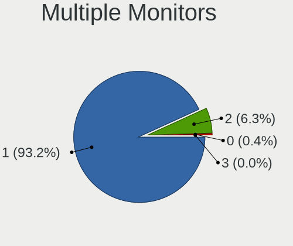

| Total | Notebooks | Percent |
|-------|-----------|---------|
| 1     | 1986      | 93.02%  |
| 2     | 139       | 6.51%   |
| 0     | 10        | 0.47%   |

Network
-------

Net Controller Vendor
---------------------

Controller vendors

| Vendor                            | Notebooks | Percent |
|-----------------------------------|-----------|---------|
| Realtek Semiconductor             | 1165      | 32.9%   |
| Intel                             | 874       | 24.68%  |
| Qualcomm Atheros                  | 807       | 22.79%  |
| Broadcom                          | 254       | 7.17%   |
| Marvell Technology Group          | 67        | 1.89%   |
| Broadcom Limited                  | 65        | 1.84%   |
| Samsung Electronics               | 52        | 1.47%   |
| Ralink                            | 46        | 1.3%    |
| JMicron Technology                | 31        | 0.88%   |
| Huawei Technologies               | 27        | 0.76%   |
| Dell                              | 21        | 0.59%   |
| Ericsson Business Mobile Networks | 17        | 0.48%   |
| Nvidia                            | 13        | 0.37%   |
| Ralink Technology                 | 10        | 0.28%   |
| MediaTek                          | 10        | 0.28%   |
| Qualcomm Atheros Communications   | 9         | 0.25%   |
| TP-Link                           | 8         | 0.23%   |
| Sierra Wireless                   | 6         | 0.17%   |
| Xiaomi                            | 5         | 0.14%   |
| Motorola PCS                      | 5         | 0.14%   |
| DisplayLink                       | 5         | 0.14%   |
| D-Link                            | 5         | 0.14%   |
| Hewlett-Packard                   | 4         | 0.11%   |
| Qualcomm                          | 3         | 0.08%   |
| Linksys                           | 3         | 0.08%   |
| ASIX Electronics                  | 3         | 0.08%   |
| Sitecom Europe                    | 2         | 0.06%   |
| OPPO Electronics                  | 2         | 0.06%   |
| NetGear                           | 2         | 0.06%   |
| Edimax Technology                 | 2         | 0.06%   |
| ASUSTek Computer                  | 2         | 0.06%   |
| Apple                             | 2         | 0.06%   |
| Toshiba                           | 1         | 0.03%   |
| T & A Mobile Phones               | 1         | 0.03%   |
| Silicon Integrated Systems [SiS]  | 1         | 0.03%   |
| Shenzhen Goodix Technology        | 1         | 0.03%   |
| Qcom                              | 1         | 0.03%   |
| Lenovo                            | 1         | 0.03%   |
| ICS Advent                        | 1         | 0.03%   |
| HMD Global                        | 1         | 0.03%   |
| Belkin Components                 | 1         | 0.03%   |
| AVM                               | 1         | 0.03%   |
| Attansic Technology               | 1         | 0.03%   |
| Archos                            | 1         | 0.03%   |
| AMD                               | 1         | 0.03%   |
| Allwinner Technology              | 1         | 0.03%   |

Net Controller Model
--------------------

Controller models

| Model                                                                   | Notebooks | Percent |
|-------------------------------------------------------------------------|-----------|---------|
| Realtek RTL8111/8168/8411 PCI Express Gigabit Ethernet Controller       | 678       | 16.1%   |
| Realtek RTL810xE PCI Express Fast Ethernet controller                   | 348       | 8.26%   |
| Qualcomm Atheros QCA9565 / AR9565 Wireless Network Adapter              | 163       | 3.87%   |
| Qualcomm Atheros AR9485 Wireless Network Adapter                        | 149       | 3.54%   |
| Qualcomm Atheros AR9285 Wireless Network Adapter (PCI-Express)          | 139       | 3.3%    |
| Qualcomm Atheros QCA9377 802.11ac Wireless Network Adapter              | 127       | 3.02%   |
| Intel 82579LM Gigabit Network Connection (Lewisville)                   | 101       | 2.4%    |
| Intel Centrino Advanced-N 6205 [Taylor Peak]                            | 84        | 1.99%   |
| Realtek RTL8723BE PCIe Wireless Network Adapter                         | 76        | 1.8%    |
| Intel Wireless 7265                                                     | 58        | 1.38%   |
| Realtek RTL8821CE 802.11ac PCIe Wireless Network Adapter                | 52        | 1.23%   |
| Realtek RTL8188CE 802.11b/g/n WiFi Adapter                              | 51        | 1.21%   |
| Samsung Galaxy series, misc. (tethering mode)                           | 50        | 1.19%   |
| Qualcomm Atheros AR8151 v2.0 Gigabit Ethernet                           | 48        | 1.14%   |
| Intel Wireless 7260                                                     | 48        | 1.14%   |
| Intel WiFi Link 5100                                                    | 46        | 1.09%   |
| Intel PRO/Wireless 3945ABG [Golan] Network Connection                   | 43        | 1.02%   |
| Intel 82577LM Gigabit Network Connection                                | 43        | 1.02%   |
| Intel 82567LM Gigabit Network Connection                                | 40        | 0.95%   |
| Intel Wireless 8265 / 8275                                              | 39        | 0.93%   |
| Broadcom BCM4313 802.11bgn Wireless Network Adapter                     | 39        | 0.93%   |
| Intel Centrino Advanced-N 6200                                          | 38        | 0.9%    |
| Qualcomm Atheros AR928X Wireless Network Adapter (PCI-Express)          | 37        | 0.88%   |
| Intel PRO/Wireless 4965 AG or AGN [Kedron] Network Connection           | 35        | 0.83%   |
| Intel PRO/Wireless 5100 AGN [Shiloh] Network Connection                 | 34        | 0.81%   |
| Qualcomm Atheros AR242x / AR542x Wireless Network Adapter (PCI-Express) | 33        | 0.78%   |
| Intel Wireless 8260                                                     | 33        | 0.78%   |
| Realtek RTL8822CE 802.11ac PCIe Wireless Network Adapter                | 29        | 0.69%   |
| Intel Wireless 3160                                                     | 29        | 0.69%   |
| Realtek RTL8153 Gigabit Ethernet Adapter                                | 28        | 0.66%   |
| JMicron JMC250 PCI Express Gigabit Ethernet Controller                  | 28        | 0.66%   |
| Intel Dual Band Wireless-AC 3165 Plus Bluetooth                         | 28        | 0.66%   |
| Intel Centrino Ultimate-N 6300                                          | 28        | 0.66%   |
| Intel Wireless 3165                                                     | 27        | 0.64%   |
| Intel Centrino Wireless-N 1000 [Condor Peak]                            | 27        | 0.64%   |
| Broadcom BCM43142 802.11b/g/n                                           | 27        | 0.64%   |
| Qualcomm Atheros QCA6174 802.11ac Wireless Network Adapter              | 26        | 0.62%   |
| Intel Dual Band Wireless-AC 3168NGW [Stone Peak]                        | 26        | 0.62%   |
| Intel Wi-Fi 6 AX200                                                     | 25        | 0.59%   |
| Qualcomm Atheros AR8152 v2.0 Fast Ethernet                              | 24        | 0.57%   |
| Huawei E353/E3131                                                       | 24        | 0.57%   |
| Qualcomm Atheros AR9462 Wireless Network Adapter                        | 23        | 0.55%   |
| Realtek RTL8723DE Wireless Network Adapter                              | 22        | 0.52%   |
| Ralink RT3290 Wireless 802.11n 1T/1R PCIe                               | 21        | 0.5%    |
| Intel Cannon Lake PCH CNVi WiFi                                         | 21        | 0.5%    |
| Intel Centrino Wireless-N 2230                                          | 20        | 0.47%   |
| Marvell Group 88E8040 PCI-E Fast Ethernet Controller                    | 19        | 0.45%   |
| Intel Ethernet Connection I218-LM                                       | 19        | 0.45%   |
| Intel Ethernet Connection (3) I218-LM                                   | 19        | 0.45%   |
| Broadcom NetLink BCM57780 Gigabit Ethernet PCIe                         | 19        | 0.45%   |
| Qualcomm Atheros AR9287 Wireless Network Adapter (PCI-Express)          | 18        | 0.43%   |
| Intel Comet Lake PCH-LP CNVi WiFi                                       | 18        | 0.43%   |
| Broadcom NetLink BCM5787M Gigabit Ethernet PCI Express                  | 18        | 0.43%   |
| Broadcom NetLink BCM5784M Gigabit Ethernet PCIe                         | 18        | 0.43%   |
| Realtek RTL8188EE Wireless Network Adapter                              | 17        | 0.4%    |
| Qualcomm Atheros QCA8172 Fast Ethernet                                  | 17        | 0.4%    |
| Qualcomm Atheros AR8161 Gigabit Ethernet                                | 16        | 0.38%   |
| Broadcom Limited BCM4312 802.11b/g LP-PHY                               | 16        | 0.38%   |
| Broadcom BCM4312 802.11b/g LP-PHY                                       | 16        | 0.38%   |
| Realtek RTL8821AE 802.11ac PCIe Wireless Network Adapter                | 15        | 0.36%   |

Wireless Vendor
---------------

Wireless vendors

| Vendor                          | Notebooks | Percent |
|---------------------------------|-----------|---------|
| Intel                           | 825       | 37.95%  |
| Qualcomm Atheros                | 718       | 33.03%  |
| Realtek Semiconductor           | 344       | 15.82%  |
| Broadcom                        | 150       | 6.9%    |
| Ralink                          | 46        | 2.12%   |
| Broadcom Limited                | 30        | 1.38%   |
| Dell                            | 11        | 0.51%   |
| Ralink Technology               | 10        | 0.46%   |
| Qualcomm Atheros Communications | 9         | 0.41%   |
| Sierra Wireless                 | 6         | 0.28%   |
| MediaTek                        | 6         | 0.28%   |
| TP-Link                         | 5         | 0.23%   |
| NetGear                         | 2         | 0.09%   |
| Linksys                         | 2         | 0.09%   |
| Edimax Technology               | 2         | 0.09%   |
| D-Link                          | 2         | 0.09%   |
| ASUSTek Computer                | 2         | 0.09%   |
| Sitecom Europe                  | 1         | 0.05%   |
| Qcom                            | 1         | 0.05%   |
| Belkin Components               | 1         | 0.05%   |
| AVM                             | 1         | 0.05%   |

Wireless Model
--------------

Wireless models

| Model                                                                   | Notebooks | Percent |
|-------------------------------------------------------------------------|-----------|---------|
| Qualcomm Atheros QCA9565 / AR9565 Wireless Network Adapter              | 163       | 7.48%   |
| Qualcomm Atheros AR9485 Wireless Network Adapter                        | 149       | 6.83%   |
| Qualcomm Atheros AR9285 Wireless Network Adapter (PCI-Express)          | 139       | 6.38%   |
| Qualcomm Atheros QCA9377 802.11ac Wireless Network Adapter              | 127       | 5.83%   |
| Intel Centrino Advanced-N 6205 [Taylor Peak]                            | 84        | 3.85%   |
| Realtek RTL8723BE PCIe Wireless Network Adapter                         | 76        | 3.49%   |
| Intel Wireless 7265                                                     | 58        | 2.66%   |
| Realtek RTL8821CE 802.11ac PCIe Wireless Network Adapter                | 52        | 2.39%   |
| Realtek RTL8188CE 802.11b/g/n WiFi Adapter                              | 51        | 2.34%   |
| Intel Wireless 7260                                                     | 48        | 2.2%    |
| Intel WiFi Link 5100                                                    | 46        | 2.11%   |
| Intel PRO/Wireless 3945ABG [Golan] Network Connection                   | 43        | 1.97%   |
| Intel Wireless 8265 / 8275                                              | 39        | 1.79%   |
| Broadcom BCM4313 802.11bgn Wireless Network Adapter                     | 39        | 1.79%   |
| Intel Centrino Advanced-N 6200                                          | 38        | 1.74%   |
| Qualcomm Atheros AR928X Wireless Network Adapter (PCI-Express)          | 37        | 1.7%    |
| Intel PRO/Wireless 4965 AG or AGN [Kedron] Network Connection           | 35        | 1.61%   |
| Intel PRO/Wireless 5100 AGN [Shiloh] Network Connection                 | 34        | 1.56%   |
| Qualcomm Atheros AR242x / AR542x Wireless Network Adapter (PCI-Express) | 33        | 1.51%   |
| Intel Wireless 8260                                                     | 33        | 1.51%   |
| Realtek RTL8822CE 802.11ac PCIe Wireless Network Adapter                | 29        | 1.33%   |
| Intel Wireless 3160                                                     | 29        | 1.33%   |
| Intel Dual Band Wireless-AC 3165 Plus Bluetooth                         | 28        | 1.28%   |
| Intel Centrino Ultimate-N 6300                                          | 28        | 1.28%   |
| Intel Wireless 3165                                                     | 27        | 1.24%   |
| Intel Centrino Wireless-N 1000 [Condor Peak]                            | 27        | 1.24%   |
| Broadcom BCM43142 802.11b/g/n                                           | 27        | 1.24%   |
| Qualcomm Atheros QCA6174 802.11ac Wireless Network Adapter              | 26        | 1.19%   |
| Intel Dual Band Wireless-AC 3168NGW [Stone Peak]                        | 26        | 1.19%   |
| Intel Wi-Fi 6 AX200                                                     | 25        | 1.15%   |
| Qualcomm Atheros AR9462 Wireless Network Adapter                        | 23        | 1.06%   |
| Realtek RTL8723DE Wireless Network Adapter                              | 22        | 1.01%   |
| Ralink RT3290 Wireless 802.11n 1T/1R PCIe                               | 21        | 0.96%   |
| Intel Cannon Lake PCH CNVi WiFi                                         | 21        | 0.96%   |
| Intel Centrino Wireless-N 2230                                          | 20        | 0.92%   |
| Qualcomm Atheros AR9287 Wireless Network Adapter (PCI-Express)          | 18        | 0.83%   |
| Intel Comet Lake PCH-LP CNVi WiFi                                       | 18        | 0.83%   |
| Realtek RTL8188EE Wireless Network Adapter                              | 17        | 0.78%   |
| Broadcom Limited BCM4312 802.11b/g LP-PHY                               | 16        | 0.73%   |
| Broadcom BCM4312 802.11b/g LP-PHY                                       | 16        | 0.73%   |
| Realtek RTL8821AE 802.11ac PCIe Wireless Network Adapter                | 15        | 0.69%   |
| Realtek RTL8723AE PCIe Wireless Network Adapter                         | 15        | 0.69%   |
| Intel Centrino Advanced-N 6235                                          | 15        | 0.69%   |
| Intel Centrino Wireless-N 1030 [Rainbow Peak]                           | 14        | 0.64%   |
| Realtek RTL8822BE 802.11a/b/g/n/ac WiFi adapter                         | 13        | 0.6%    |
| Broadcom BCM4331 802.11a/b/g/n                                          | 13        | 0.6%    |
| Realtek RTL8191SEvB Wireless LAN Controller                             | 12        | 0.55%   |
| Broadcom BCM43224 802.11a/b/g/n                                         | 11        | 0.5%    |
| Ralink RT5390 Wireless 802.11n 1T/1R PCIe                               | 10        | 0.46%   |
| Intel Ultimate N WiFi Link 5300                                         | 10        | 0.46%   |
| Broadcom BCM4322 802.11a/b/g/n Wireless LAN Controller                  | 10        | 0.46%   |
| Broadcom BCM4311 802.11b/g WLAN                                         | 10        | 0.46%   |
| Realtek RTL8723BU 802.11b/g/n WLAN Adapter                              | 9         | 0.41%   |
| Ralink RT3090 Wireless 802.11n 1T/1R PCIe                               | 9         | 0.41%   |
| Qualcomm Atheros AR9271 802.11n                                         | 9         | 0.41%   |
| Intel Wireless-AC 9260                                                  | 9         | 0.41%   |
| Intel Wi-Fi 6 AX201                                                     | 9         | 0.41%   |
| Intel Gemini Lake PCH CNVi WiFi                                         | 8         | 0.37%   |
| Intel Comet Lake PCH CNVi WiFi                                          | 8         | 0.37%   |
| Intel Cannon Point-LP CNVi [Wireless-AC]                                | 8         | 0.37%   |

Ethernet Vendor
---------------

Ethernet vendors

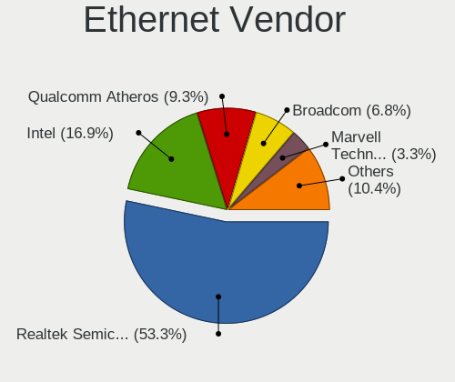

| Vendor                           | Notebooks | Percent |
|----------------------------------|-----------|---------|
| Realtek Semiconductor            | 1061      | 53.37%  |
| Intel                            | 333       | 16.75%  |
| Qualcomm Atheros                 | 189       | 9.51%   |
| Broadcom                         | 135       | 6.79%   |
| Marvell Technology Group         | 67        | 3.37%   |
| Samsung Electronics              | 52        | 2.62%   |
| Broadcom Limited                 | 37        | 1.86%   |
| JMicron Technology               | 31        | 1.56%   |
| Huawei Technologies              | 26        | 1.31%   |
| Nvidia                           | 12        | 0.6%    |
| Xiaomi                           | 5         | 0.25%   |
| DisplayLink                      | 5         | 0.25%   |
| Motorola PCS                     | 4         | 0.2%    |
| MediaTek                         | 4         | 0.2%    |
| TP-Link                          | 3         | 0.15%   |
| Qualcomm                         | 3         | 0.15%   |
| D-Link                           | 3         | 0.15%   |
| ASIX Electronics                 | 3         | 0.15%   |
| OPPO Electronics                 | 2         | 0.1%    |
| Apple                            | 2         | 0.1%    |
| T & A Mobile Phones              | 1         | 0.05%   |
| Sitecom Europe                   | 1         | 0.05%   |
| Silicon Integrated Systems [SiS] | 1         | 0.05%   |
| Linksys                          | 1         | 0.05%   |
| Lenovo                           | 1         | 0.05%   |
| ICS Advent                       | 1         | 0.05%   |
| HMD Global                       | 1         | 0.05%   |
| Hewlett-Packard                  | 1         | 0.05%   |
| Attansic Technology              | 1         | 0.05%   |
| Archos                           | 1         | 0.05%   |
| Allwinner Technology             | 1         | 0.05%   |

Ethernet Model
--------------

Ethernet models

| Model                                                                          | Notebooks | Percent |
|--------------------------------------------------------------------------------|-----------|---------|
| Realtek RTL8111/8168/8411 PCI Express Gigabit Ethernet Controller              | 678       | 33.97%  |
| Realtek RTL810xE PCI Express Fast Ethernet controller                          | 348       | 17.43%  |
| Intel 82579LM Gigabit Network Connection (Lewisville)                          | 101       | 5.06%   |
| Samsung Galaxy series, misc. (tethering mode)                                  | 50        | 2.51%   |
| Qualcomm Atheros AR8151 v2.0 Gigabit Ethernet                                  | 48        | 2.4%    |
| Intel 82577LM Gigabit Network Connection                                       | 43        | 2.15%   |
| Intel 82567LM Gigabit Network Connection                                       | 40        | 2%      |
| Realtek RTL8153 Gigabit Ethernet Adapter                                       | 28        | 1.4%    |
| JMicron JMC250 PCI Express Gigabit Ethernet Controller                         | 28        | 1.4%    |
| Qualcomm Atheros AR8152 v2.0 Fast Ethernet                                     | 24        | 1.2%    |
| Huawei E353/E3131                                                              | 24        | 1.2%    |
| Marvell Group 88E8040 PCI-E Fast Ethernet Controller                           | 19        | 0.95%   |
| Intel Ethernet Connection I218-LM                                              | 19        | 0.95%   |
| Intel Ethernet Connection (3) I218-LM                                          | 19        | 0.95%   |
| Broadcom NetLink BCM57780 Gigabit Ethernet PCIe                                | 19        | 0.95%   |
| Broadcom NetLink BCM5787M Gigabit Ethernet PCI Express                         | 18        | 0.9%    |
| Broadcom NetLink BCM5784M Gigabit Ethernet PCIe                                | 18        | 0.9%    |
| Qualcomm Atheros QCA8172 Fast Ethernet                                         | 17        | 0.85%   |
| Qualcomm Atheros AR8161 Gigabit Ethernet                                       | 16        | 0.8%    |
| Intel Ethernet Connection I219-LM                                              | 15        | 0.75%   |
| Qualcomm Atheros AR8132 Fast Ethernet                                          | 14        | 0.7%    |
| Intel 82566MM Gigabit Network Connection                                       | 14        | 0.7%    |
| Qualcomm Atheros AR8131 Gigabit Ethernet                                       | 13        | 0.65%   |
| Broadcom NetXtreme BCM57765 Gigabit Ethernet PCIe                              | 13        | 0.65%   |
| Broadcom NetLink BCM57785 Gigabit Ethernet PCIe                                | 13        | 0.65%   |
| Marvell Group Yukon Optima 88E8059 [PCIe Gigabit Ethernet Controller with AVB] | 12        | 0.6%    |
| Marvell Group 88E8055 PCI-E Gigabit Ethernet Controller                        | 12        | 0.6%    |
| Intel Ethernet Connection I217-LM                                              | 11        | 0.55%   |
| Qualcomm Atheros AR8162 Fast Ethernet                                          | 10        | 0.5%    |
| Qualcomm Atheros AR8121/AR8113/AR8114 Gigabit or Fast Ethernet                 | 10        | 0.5%    |
| Broadcom NetXtreme BCM5764M Gigabit Ethernet PCIe                              | 10        | 0.5%    |
| Broadcom NetXtreme BCM5755M Gigabit Ethernet PCI Express                       | 10        | 0.5%    |
| Broadcom NetLink BCM5906M Fast Ethernet PCI Express                            | 10        | 0.5%    |
| Qualcomm Atheros QCA8171 Gigabit Ethernet                                      | 9         | 0.45%   |
| Intel Ethernet Connection I219-V                                               | 9         | 0.45%   |
| Intel Ethernet Connection (4) I219-LM                                          | 9         | 0.45%   |
| Intel 82579V Gigabit Network Connection                                        | 9         | 0.45%   |
| Broadcom NetXtreme BCM57786 Gigabit Ethernet PCIe                              | 9         | 0.45%   |
| Qualcomm Atheros AR8152 v1.1 Fast Ethernet                                     | 8         | 0.4%    |
| Broadcom Limited NetLink BCM5787M Gigabit Ethernet PCI Express                 | 8         | 0.4%    |
| Broadcom Limited NetLink BCM57780 Gigabit Ethernet PCIe                        | 8         | 0.4%    |
| Qualcomm Atheros Killer E2500 Gigabit Ethernet Controller                      | 7         | 0.35%   |
| Qualcomm Atheros Killer E220x Gigabit Ethernet Controller                      | 7         | 0.35%   |
| Intel Ethernet Connection (4) I219-V                                           | 7         | 0.35%   |
| Broadcom NetXtreme BCM5761 Gigabit Ethernet PCIe                               | 7         | 0.35%   |
| Nvidia MCP79 Ethernet                                                          | 6         | 0.3%    |
| Marvell Group 88E8071 PCI-E Gigabit Ethernet Controller                        | 6         | 0.3%    |
| Xiaomi Mi/Redmi series (RNDIS)                                                 | 5         | 0.25%   |
| Realtek RTL8152 Fast Ethernet Adapter                                          | 5         | 0.25%   |
| Marvell Group 88E8036 PCI-E Fast Ethernet Controller                           | 5         | 0.25%   |
| Intel Ethernet Connection I217-V                                               | 5         | 0.25%   |
| Broadcom Limited NetXtreme BCM5761e Gigabit Ethernet PCIe                      | 5         | 0.25%   |
| Realtek RTL-8100/8101L/8139 PCI Fast Ethernet Adapter                          | 4         | 0.2%    |
| Motorola PCS moto g(9) play                                                    | 4         | 0.2%    |
| MediaTek moto e(6) plus                                                        | 4         | 0.2%    |
| Marvell Group 88E8057 PCI-E Gigabit Ethernet Controller                        | 4         | 0.2%    |
| Intel WiMAX Connection 2400m                                                   | 4         | 0.2%    |
| Intel Ethernet Connection (2) I219-LM                                          | 4         | 0.2%    |
| Intel 82562GT 10/100 Network Connection                                        | 4         | 0.2%    |
| Marvell Group 88E8040T PCI-E Fast Ethernet Controller                          | 3         | 0.15%   |

Net Controller Kind
-------------------

Ethernet, WiFi or modem

| Kind     | Notebooks | Percent |
|----------|-----------|---------|
| WiFi     | 2117      | 51.67%  |
| Ethernet | 1944      | 47.45%  |
| Modem    | 34        | 0.83%   |
| Unknown  | 2         | 0.05%   |

Used Controller
---------------

Currently used network controller

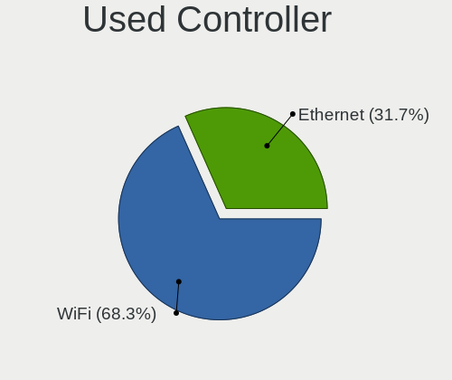

| Kind     | Notebooks | Percent |
|----------|-----------|---------|
| WiFi     | 1446      | 68.66%  |
| Ethernet | 660       | 31.34%  |

NICs
----

Total network controllers on board

| Total | Notebooks | Percent |
|-------|-----------|---------|
| 2     | 1791      | 83.93%  |
| 1     | 328       | 15.37%  |
| 0     | 10        | 0.47%   |
| 3     | 5         | 0.23%   |

IPv6
----

IPv6 vs IPv4

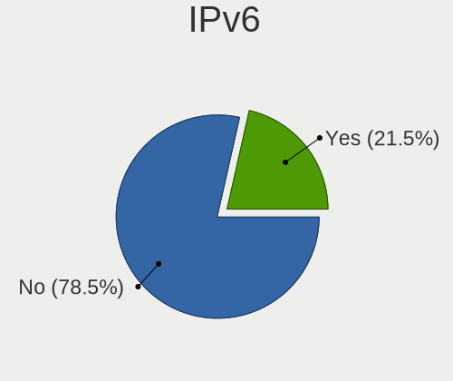

| Used | Notebooks | Percent |
|------|-----------|---------|
| No   | 1699      | 79.47%  |
| Yes  | 439       | 20.53%  |

Bluetooth
---------

Bluetooth Vendor
----------------

Controller vendors

| Vendor                          | Notebooks | Percent |
|---------------------------------|-----------|---------|
| Intel                           | 446       | 30.72%  |
| Qualcomm Atheros Communications | 226       | 15.56%  |
| Realtek Semiconductor           | 162       | 11.16%  |
| Broadcom                        | 122       | 8.4%    |
| Lite-On Technology              | 113       | 7.78%   |
| Foxconn / Hon Hai               | 66        | 4.55%   |
| IMC Networks                    | 61        | 4.2%    |
| Dell                            | 52        | 3.58%   |
| Toshiba                         | 40        | 2.75%   |
| Apple                           | 32        | 2.2%    |
| Hewlett-Packard                 | 30        | 2.07%   |
| Cambridge Silicon Radio         | 22        | 1.52%   |
| Ralink                          | 21        | 1.45%   |
| Realtek                         | 10        | 0.69%   |
| Foxconn International           | 10        | 0.69%   |
| Chicony Electronics             | 8         | 0.55%   |
| ASUSTek Computer                | 8         | 0.55%   |
| Alps Electric                   | 7         | 0.48%   |
| Ralink Technology               | 6         | 0.41%   |
| Askey Computer                  | 4         | 0.28%   |
| Taiyo Yuden                     | 2         | 0.14%   |
| Micro Star International        | 2         | 0.14%   |
| MediaTek                        | 1         | 0.07%   |
| Fujitsu                         | 1         | 0.07%   |

Bluetooth Model
---------------

Controller models

| Model                                                                               | Notebooks | Percent |
|-------------------------------------------------------------------------------------|-----------|---------|
| Intel Bluetooth wireless interface                                                  | 254       | 17.49%  |
| Qualcomm Atheros  Bluetooth Device                                                  | 126       | 8.68%   |
| Realtek Bluetooth Radio                                                             | 87        | 5.99%   |
| Intel Bluetooth 9460/9560 Jefferson Peak (JfP)                                      | 51        | 3.51%   |
| Lite-On Qualcomm Atheros QCA9377 Bluetooth                                          | 47        | 3.24%   |
| Realtek  Bluetooth 4.2 Adapter                                                      | 44        | 3.03%   |
| Qualcomm Atheros AR3012 Bluetooth 4.0                                               | 40        | 2.75%   |
| Qualcomm Atheros AR3011 Bluetooth                                                   | 39        | 2.69%   |
| Intel Centrino Bluetooth Wireless Transceiver                                       | 34        | 2.34%   |
| Broadcom BCM2045B (BDC-2.1)                                                         | 34        | 2.34%   |
| Lite-On Atheros AR3012 Bluetooth                                                    | 31        | 2.13%   |
| Intel Bluetooth Device                                                              | 29        | 2%      |
| Intel Wireless-AC 3168 Bluetooth                                                    | 26        | 1.79%   |
| Intel AX201 Bluetooth                                                               | 26        | 1.79%   |
| Intel AX200 Bluetooth                                                               | 25        | 1.72%   |
| Foxconn / Hon Hai Bluetooth Device                                                  | 24        | 1.65%   |
| Dell DW375 Bluetooth Module                                                         | 23        | 1.58%   |
| Cambridge Silicon Radio Bluetooth Dongle (HCI mode)                                 | 22        | 1.52%   |
| Ralink RT3290 Bluetooth                                                             | 21        | 1.45%   |
| IMC Networks Bluetooth Device                                                       | 21        | 1.45%   |
| Apple Bluetooth Host Controller                                                     | 21        | 1.45%   |
| Realtek RTL8723B Bluetooth                                                          | 19        | 1.31%   |
| Lite-On Bluetooth Device                                                            | 19        | 1.31%   |
| IMC Networks Bluetooth Radio                                                        | 19        | 1.31%   |
| Toshiba Bluetooth Device                                                            | 16        | 1.1%    |
| HP Bluetooth 2.0 Interface [Broadcom BCM2045]                                       | 16        | 1.1%    |
| Broadcom BCM20702 Bluetooth 4.0 [ThinkPad]                                          | 16        | 1.1%    |
| Broadcom BCM2045B (BDC-2.1) [Bluetooth Controller]                                  | 16        | 1.1%    |
| Foxconn / Hon Hai Bluetooth USB Host Controller                                     | 14        | 0.96%   |
| Qualcomm Atheros AR9462 Bluetooth                                                   | 13        | 0.9%    |
| HP Broadcom 2070 Bluetooth Combo                                                    | 13        | 0.9%    |
| Dell BCM20702A0 Bluetooth Module                                                    | 13        | 0.9%    |
| Foxconn / Hon Hai Foxconn T77H114 BCM2070 [Single-Chip Bluetooth 2.1 + EDR Adapter] | 12        | 0.83%   |
| IMC Networks Atheros AR3012 Bluetooth 4.0 Adapter                                   | 11        | 0.76%   |
| Dell Wireless 360 Bluetooth                                                         | 11        | 0.76%   |
| Broadcom BCM2045B (BDC-2) [Bluetooth Controller]                                    | 11        | 0.76%   |
| Apple Bluetooth USB Host Controller                                                 | 11        | 0.76%   |
| Toshiba Integrated Bluetooth HCI                                                    | 10        | 0.69%   |
| Realtek Bluetooth Radio                                                             | 10        | 0.69%   |
| Lite-On Qualcomm Atheros Bluetooth                                                  | 10        | 0.69%   |
| Foxconn International BCM43142A0 Bluetooth module                                   | 10        | 0.69%   |
| Broadcom BCM2070 Bluetooth 2.1 + EDR                                                | 10        | 0.69%   |
| Realtek RTL8821A Bluetooth                                                          | 8         | 0.55%   |
| Chicony Bluetooth (RTL8723BE)                                                       | 8         | 0.55%   |
| Broadcom HP Portable SoftSailing                                                    | 7         | 0.48%   |
| Broadcom BCM2070 Bluetooth Device                                                   | 7         | 0.48%   |
| Ralink Motorola BC4 Bluetooth 3.0+HS Adapter                                        | 6         | 0.41%   |
| IMC Networks Bluetooth                                                              | 6         | 0.41%   |
| Broadcom BCM2045 Bluetooth                                                          | 6         | 0.41%   |
| Toshiba RT Bluetooth Radio                                                          | 5         | 0.34%   |
| Dell Wireless 355 Bluetooth                                                         | 5         | 0.34%   |
| Toshiba Integrated Bluetooth (Taiyo Yuden)                                          | 4         | 0.28%   |
| Qualcomm Atheros AR3012 Bluetooth                                                   | 4         | 0.28%   |
| Foxconn / Hon Hai Broadcom Bluetooth 2.1 Device                                     | 4         | 0.28%   |
| Broadcom BCM43142A0 Bluetooth 4.0                                                   | 4         | 0.28%   |
| ASUS BT-183 Bluetooth 2.0+EDR adapter                                               | 4         | 0.28%   |
| Askey Bluetooth Device                                                              | 4         | 0.28%   |
| Realtek RTL8822BE Bluetooth 4.2 Adapter                                             | 3         | 0.21%   |
| Foxconn / Hon Hai BCM20702A0                                                        | 3         | 0.21%   |
| Broadcom HP Portable Bumble Bee                                                     | 3         | 0.21%   |

Sound
-----

Sound Vendor
------------

Sound card vendors

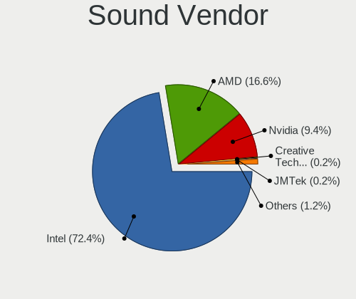

| Vendor                               | Notebooks | Percent |
|--------------------------------------|-----------|---------|
| Intel                                | 1772      | 72.24%  |
| AMD                                  | 411       | 16.75%  |
| Nvidia                               | 235       | 9.58%   |
| JMTek                                | 4         | 0.16%   |
| C-Media Electronics                  | 4         | 0.16%   |
| Logitech                             | 3         | 0.12%   |
| Creative Technology                  | 3         | 0.12%   |
| Texas Instruments                    | 2         | 0.08%   |
| Realtek Semiconductor                | 2         | 0.08%   |
| ASUSTek Computer                     | 2         | 0.08%   |
| Thesycon Systemsoftware & Consulting | 1         | 0.04%   |
| TerraTec Electronic                  | 1         | 0.04%   |
| TEAC                                 | 1         | 0.04%   |
| Silicon Integrated Systems [SiS]     | 1         | 0.04%   |
| Razer USA                            | 1         | 0.04%   |
| Plantronics                          | 1         | 0.04%   |
| Phison Electronics                   | 1         | 0.04%   |
| M-Audio                              | 1         | 0.04%   |
| Lenovo                               | 1         | 0.04%   |
| GN Netcom                            | 1         | 0.04%   |
| Focusrite-Novation                   | 1         | 0.04%   |
| Elitegroup Computer Systems (ECS)    | 1         | 0.04%   |
| Bose                                 | 1         | 0.04%   |
| AudioQuest                           | 1         | 0.04%   |
| Apple                                | 1         | 0.04%   |

Sound Model
-----------

Sound card models

| Model                                                                                             | Notebooks | Percent |
|---------------------------------------------------------------------------------------------------|-----------|---------|
| Intel 7 Series/C216 Chipset Family High Definition Audio Controller                               | 259       | 8.67%   |
| Intel 6 Series/C200 Series Chipset Family High Definition Audio Controller                        | 237       | 7.93%   |
| Intel Sunrise Point-LP HD Audio                                                                   | 216       | 7.23%   |
| Intel 82801I (ICH9 Family) HD Audio Controller                                                    | 197       | 6.59%   |
| Intel 5 Series/3400 Series Chipset High Definition Audio                                          | 158       | 5.29%   |
| AMD FCH Azalia Controller                                                                         | 113       | 3.78%   |
| Intel 82801H (ICH8 Family) HD Audio Controller                                                    | 111       | 3.71%   |
| Intel 8 Series HD Audio Controller                                                                | 106       | 3.55%   |
| Intel Haswell-ULT HD Audio Controller                                                             | 104       | 3.48%   |
| AMD Family 17h/19h HD Audio Controller                                                            | 99        | 3.31%   |
| Intel Broadwell-U Audio Controller                                                                | 77        | 2.58%   |
| Intel Wildcat Point-LP High Definition Audio Controller                                           | 76        | 2.54%   |
| AMD SBx00 Azalia (Intel HDA)                                                                      | 73        | 2.44%   |
| AMD Kabini HDMI/DP Audio                                                                          | 68        | 2.28%   |
| AMD Raven/Raven2/Fenghuang HDMI/DP Audio Controller                                               | 67        | 2.24%   |
| Intel Atom Processor Z36xxx/Z37xxx Series High Definition Audio Controller                        | 64        | 2.14%   |
| Intel 8 Series/C220 Series Chipset High Definition Audio Controller                               | 57        | 1.91%   |
| AMD Wrestler HDMI Audio                                                                           | 55        | 1.84%   |
| Nvidia GF108 High Definition Audio Controller                                                     | 54        | 1.81%   |
| Intel Xeon E3-1200 v3/4th Gen Core Processor HD Audio Controller                                  | 50        | 1.67%   |
| AMD Family 15h (Models 60h-6fh) Audio Controller                                                  | 49        | 1.64%   |
| Intel Atom/Celeron/Pentium Processor x5-E8000/J3xxx/N3xxx Series High Definition Audio Controller | 43        | 1.44%   |
| Intel Celeron/Pentium Silver Processor High Definition Audio                                      | 40        | 1.34%   |
| AMD High Definition Audio Controller                                                              | 39        | 1.3%    |
| Intel Comet Lake PCH-LP cAVS                                                                      | 29        | 0.97%   |
| Intel Ice Lake-LP Smart Sound Technology Audio Controller                                         | 28        | 0.94%   |
| Intel Cannon Lake PCH cAVS                                                                        | 28        | 0.94%   |
| Intel Celeron N3350/Pentium N4200/Atom E3900 Series Audio Cluster                                 | 26        | 0.87%   |
| Intel NM10/ICH7 Family High Definition Audio Controller                                           | 24        | 0.8%    |
| AMD RV710/730 HDMI Audio [Radeon HD 4000 series]                                                  | 19        | 0.64%   |
| AMD Cedar HDMI Audio [Radeon HD 5400/6300/7300 Series]                                            | 19        | 0.64%   |
| Nvidia GK107 HDMI Audio Controller                                                                | 18        | 0.6%    |
| Intel Cannon Point-LP High Definition Audio Controller                                            | 18        | 0.6%    |
| Intel 100 Series/C230 Series Chipset Family HD Audio Controller                                   | 18        | 0.6%    |
| AMD Renoir Radeon High Definition Audio Controller                                                | 18        | 0.6%    |
| Nvidia TU107 GeForce GTX 1650 High Definition Audio Controller                                    | 17        | 0.57%   |
| Nvidia High Definition Audio Controller                                                           | 16        | 0.54%   |
| Nvidia GT216 HDMI Audio Controller                                                                | 16        | 0.54%   |
| AMD Trinity HDMI Audio Controller                                                                 | 16        | 0.54%   |
| Nvidia GP107GL High Definition Audio Controller                                                   | 13        | 0.43%   |
| Nvidia GK208 HDMI/DP Audio Controller                                                             | 13        | 0.43%   |
| Intel Tiger Lake-LP Smart Sound Technology Audio Controller                                       | 12        | 0.4%    |
| Intel CM238 HD Audio Controller                                                                   | 12        | 0.4%    |
| AMD RV620 HDMI Audio [Radeon HD 3450/3470/3550/3570]                                              | 12        | 0.4%    |
| Nvidia MCP79 High Definition Audio                                                                | 11        | 0.37%   |
| Nvidia GM107 High Definition Audio Controller [GeForce 940MX]                                     | 10        | 0.33%   |
| Nvidia GF119 HDMI Audio Controller                                                                | 10        | 0.33%   |
| Intel Comet Lake PCH cAVS                                                                         | 10        | 0.33%   |
| AMD Redwood HDMI Audio [Radeon HD 5000 Series]                                                    | 9         | 0.3%    |
| Nvidia TU116 High Definition Audio Controller                                                     | 8         | 0.27%   |
| AMD Turks HDMI Audio [Radeon HD 6500/6600 / 6700M Series]                                         | 8         | 0.27%   |
| AMD RS880 HDMI Audio [Radeon HD 4200 Series]                                                      | 8         | 0.27%   |
| AMD Caicos HDMI Audio [Radeon HD 6450 / 7450/8450/8490 OEM / R5 230/235/235X OEM]                 | 8         | 0.27%   |
| AMD BeaverCreek HDMI Audio [Radeon HD 6500D and 6400G-6600G series]                               | 8         | 0.27%   |
| Nvidia TU106 High Definition Audio Controller                                                     | 7         | 0.23%   |
| Nvidia GP104 High Definition Audio Controller                                                     | 6         | 0.2%    |
| AMD Kaveri HDMI/DP Audio Controller                                                               | 6         | 0.2%    |
| Nvidia MCP89 High Definition Audio                                                                | 5         | 0.17%   |
| Nvidia GM204 High Definition Audio Controller                                                     | 5         | 0.17%   |
| Nvidia GF116 High Definition Audio Controller                                                     | 5         | 0.17%   |

Memory
------

Memory Vendor
-------------

Memory module vendors

| Vendor              | Notebooks | Percent |
|---------------------|-----------|---------|
| Samsung Electronics | 659       | 25.88%  |
| SK hynix            | 524       | 20.58%  |
| Unknown             | 254       | 9.98%   |
| Kingston            | 241       | 9.47%   |
| Micron Technology   | 217       | 8.52%   |
| Elpida              | 135       | 5.3%    |
| Crucial             | 73        | 2.87%   |
| Ramaxel Technology  | 70        | 2.75%   |
| Nanya Technology    | 65        | 2.55%   |
| A-DATA Technology   | 61        | 2.4%    |
| Smart               | 39        | 1.53%   |
| Corsair             | 26        | 1.02%   |
| Unknown (ABCD)      | 21        | 0.82%   |
| Transcend           | 17        | 0.67%   |
| ASint Technology    | 14        | 0.55%   |
| High Bridge         | 13        | 0.51%   |
| G.Skill             | 13        | 0.51%   |
| Apacer              | 11        | 0.43%   |
| Teikon              | 9         | 0.35%   |
| Toshiba             | 8         | 0.31%   |
| AMD                 | 8         | 0.31%   |
| Patriot             | 7         | 0.27%   |
| Team                | 5         | 0.2%    |
| Smart Brazil        | 5         | 0.2%    |
| Qimonda             | 5         | 0.2%    |
| Unknown             | 4         | 0.16%   |
| Silicon Power       | 3         | 0.12%   |
| SHARETRONIC         | 3         | 0.12%   |
| PNY                 | 3         | 0.12%   |
| Qumo                | 2         | 0.08%   |
| Kingmax             | 2         | 0.08%   |
| Goodram             | 2         | 0.08%   |
| CSX                 | 2         | 0.08%   |
| Carry               | 2         | 0.08%   |
| A Force             | 2         | 0.08%   |
| ZIFEI               | 1         | 0.04%   |
| Visipro             | 1         | 0.04%   |
| V-GeN               | 1         | 0.04%   |
| Unknown (AB)        | 1         | 0.04%   |
| Unknown (8A02)      | 1         | 0.04%   |
| Unknown (02BA)      | 1         | 0.04%   |
| PSC                 | 1         | 0.04%   |
| pqi                 | 1         | 0.04%   |
| Positivo            | 1         | 0.04%   |
| PKI/Kingston        | 1         | 0.04%   |
| Novatech            | 1         | 0.04%   |
| Neo Forza           | 1         | 0.04%   |
| Magnum Tech         | 1         | 0.04%   |
| KingFast            | 1         | 0.04%   |
| HT Micron           | 1         | 0.04%   |
| Hexon               | 1         | 0.04%   |
| Dane-Elec           | 1         | 0.04%   |
| Catalyst            | 1         | 0.04%   |
| Avant               | 1         | 0.04%   |
| A-DA                | 1         | 0.04%   |
| 48spaces            | 1         | 0.04%   |

Memory Model
------------

Memory module models

| Model                                                            | Notebooks | Percent |
|------------------------------------------------------------------|-----------|---------|
| Unknown RAM Module 2GB SODIMM DDR2 667MT/s                       | 52        | 1.92%   |
| SK hynix RAM HMT451S6BFR8A-PB 4GB SODIMM DDR3 1600MT/s           | 52        | 1.92%   |
| Samsung RAM M471B5273DH0-CH9 4GB SODIMM DDR3 1334MT/s            | 46        | 1.7%    |
| Elpida RAM Module 2GB SODIMM DDR3 1333MT/s                       | 45        | 1.66%   |
| Samsung RAM M471B5273CH0-CH9 4GB SODIMM DDR3 1334MT/s            | 43        | 1.59%   |
| Samsung RAM M471B5173DB0-YK0 4GB SODIMM DDR3 1600MT/s            | 42        | 1.55%   |
| Samsung RAM M471A5244CB0-CTD 4096MB SODIMM DDR4 3266MT/s         | 41        | 1.51%   |
| Samsung RAM M471B5173EB0-YK0 4GB SODIMM DDR3 1600MT/s            | 40        | 1.48%   |
| Samsung RAM M471A5244CB0-CRC 4GB SODIMM DDR4 2667MT/s            | 33        | 1.22%   |
| SK hynix RAM HMT351S6CFR8C-PB 4GB SODIMM DDR3 1600MT/s           | 32        | 1.18%   |
| Samsung RAM M471B5173QH0-YK0 4GB SODIMM DDR3 1600MT/s            | 32        | 1.18%   |
| Unknown RAM Module 4GB SODIMM DDR3                               | 27        | 1%      |
| Samsung RAM M471B5173BH0-YK0 4GB SODIMM DDR3 1600MT/s            | 27        | 1%      |
| Samsung RAM M471B5773DH0-CH9 2GB SODIMM DDR3 1600MT/s            | 23        | 0.85%   |
| Samsung RAM M471B5273DH0-CK0 4GB SODIMM DDR3 1600MT/s            | 23        | 0.85%   |
| Unknown RAM Module 2GB SODIMM DDR2                               | 22        | 0.81%   |
| SK hynix RAM HMT41GS6BFR8A-PB 8GB SODIMM DDR3 1600MT/s           | 21        | 0.77%   |
| Samsung RAM M471B5773CHS-CH9 2GB SODIMM DDR3 4199MT/s            | 21        | 0.77%   |
| Elpida RAM EBJ41UF8BCS0-DJ-F 4GB SODIMM DDR3 1334MT/s            | 20        | 0.74%   |
| Unknown RAM Module 1GB SODIMM DDR2 667MT/s                       | 19        | 0.7%    |
| Unknown (ABCD) RAM 123456789012345678 4GB SODIMM LPDDR4 2400MT/s | 18        | 0.66%   |
| SK hynix RAM HMT351S6EFR8A-PB 4GB SODIMM DDR3 1600MT/s           | 17        | 0.63%   |
| Samsung RAM M471B5673FH0-CH9 2GB SODIMM DDR3 1334MT/s            | 16        | 0.59%   |
| Micron RAM 4ATF51264HZ-2G3B1 4GB SODIMM DDR4 2400MT/s            | 16        | 0.59%   |
| Unknown RAM Module 2GB SODIMM DDR3                               | 15        | 0.55%   |
| SK hynix RAM HYMP125S64CP8-S6 2GB SODIMM DDR 800MT/s             | 15        | 0.55%   |
| Micron RAM 4ATF51264HZ-2G6E1 4GB SODIMM DDR4 2667MT/s            | 15        | 0.55%   |
| Unknown RAM Module 4GB SODIMM DDR3 1600MT/s                      | 14        | 0.52%   |
| Unknown RAM Module 1GB SODIMM DDR2                               | 14        | 0.52%   |
| SK hynix RAM HMA851S6JJR6N-VK 4GB SODIMM DDR4 2667MT/s           | 14        | 0.52%   |
| Samsung RAM M471A1K43CB1-CRC 8GB SODIMM DDR4 2667MT/s            | 14        | 0.52%   |
| SK hynix RAM HMA851S6AFR6N-UH 4GB SODIMM DDR4 2667MT/s           | 13        | 0.48%   |
| SK hynix RAM HMA81GS6AFR8N-UH 8GB SODIMM DDR4 2667MT/s           | 13        | 0.48%   |
| Nanya RAM NT2GC64B88B0NS-CG 2GB SODIMM DDR3 1334MT/s             | 13        | 0.48%   |
| SK hynix RAM HMA851S6CJR6N-VK 4GB SODIMM DDR4 2667MT/s           | 12        | 0.44%   |
| SK hynix RAM HMA851S6AFR6N-UH 4096MB SODIMM DDR4 2400MT/s        | 12        | 0.44%   |
| Samsung RAM M471A1K43CB1-CTD 8GB SODIMM DDR4 2667MT/s            | 12        | 0.44%   |
| SK hynix RAM HMT451S6AFR8A-PB 4096MB SODIMM DDR3 1600MT/s        | 11        | 0.41%   |
| SK hynix RAM HMT425S6AFR6A-PB 2GB SODIMM DDR3 1600MT/s           | 11        | 0.41%   |
| SK hynix RAM HMT351S6BFR8C-H9 4GB SODIMM DDR3 1333MT/s           | 11        | 0.41%   |
| Samsung RAM M471B5673FH0-CF8 2GB SODIMM DDR3 1067MT/s            | 11        | 0.41%   |
| Samsung RAM M471B1G73QH0-YK0 8GB SODIMM DDR3 1600MT/s            | 11        | 0.41%   |
| Samsung RAM M471B1G73EB0-YK0 8GB SODIMM DDR3 1600MT/s            | 11        | 0.41%   |
| Samsung RAM M471B1G73DB0-YK0 8GB SODIMM DDR3 1600MT/s            | 11        | 0.41%   |
| SK hynix RAM HMT451S6AFR8A-PB 4GB SODIMM DDR3 1600MT/s           | 10        | 0.37%   |
| Samsung RAM M471B5273EB0-CK0 4GB SODIMM DDR3 4199MT/s            | 10        | 0.37%   |
| Samsung RAM M471A5244CB0-CWE 4GB SODIMM DDR4 3200MT/s            | 10        | 0.37%   |
| Nanya RAM NT4GC64B8HB0NS-CG 4096MB SODIMM DDR3 1334MT/s          | 10        | 0.37%   |
| Unknown RAM Module 2GB SODIMM 800MT/s                            | 9         | 0.33%   |
| SK hynix RAM HYMP125S64CP8-Y5 2GB SODIMM DDR2 667MT/s            | 9         | 0.33%   |
| SK hynix RAM HMT351S6CFR8C-H9 4096MB SODIMM DDR3 1334MT/s        | 9         | 0.33%   |
| SK hynix RAM HMT325S6BFR8C-H9 2GB SODIMM DDR3 1333MT/s           | 9         | 0.33%   |
| SK hynix RAM HMA81GS6JJR8N-VK 8GB SODIMM DDR4 2667MT/s           | 9         | 0.33%   |
| Samsung RAM M471B5673EH1-CF8 2GB SODIMM DDR3 4199MT/s            | 9         | 0.33%   |
| Samsung RAM M471A1K43DB1-CTD 8192MB SODIMM DDR4 2667MT/s         | 9         | 0.33%   |
| Samsung RAM M4 70T5663EH3-CF7 2GB SODIMM DDR 975MT/s             | 9         | 0.33%   |
| Micron RAM 8KTF51264HZ-1G6E1 4GB SODIMM DDR3 1600MT/s            | 9         | 0.33%   |
| Micron RAM 8JSF25664HZ-1G4D1 2048MB SODIMM DDR3 1334MT/s         | 9         | 0.33%   |
| Micron RAM 4ATF51264HZ-2G6E! 4096MB SODIMM DDR4 2400MT/s         | 9         | 0.33%   |
| A-DATA RAM AD73I1C1674EV 4GB SODIMM DDR3 1334MT/s                | 9         | 0.33%   |

Memory Kind
-----------

Memory module kinds

| Kind    | Notebooks | Percent |
|---------|-----------|---------|
| DDR3    | 1220      | 57.52%  |
| DDR4    | 467       | 22.02%  |
| DDR2    | 258       | 12.16%  |
| SDRAM   | 84        | 3.96%   |
| LPDDR4  | 46        | 2.17%   |
| Unknown | 22        | 1.04%   |
| LPDDR3  | 14        | 0.66%   |
| DRAM    | 5         | 0.24%   |
| DDR     | 5         | 0.24%   |

Memory Form Factor
------------------

Physical design of the memory module

| Name         | Notebooks | Percent |
|--------------|-----------|---------|
| SODIMM       | 2027      | 96.94%  |
| Row Of Chips | 46        | 2.2%    |
| DIMM         | 8         | 0.38%   |
| Chip         | 7         | 0.33%   |
| Unknown      | 3         | 0.14%   |

Memory Size
-----------

Memory module size

| Size  | Notebooks | Percent |
|-------|-----------|---------|
| 4096  | 1119      | 47.66%  |
| 2048  | 627       | 26.7%   |
| 8192  | 421       | 17.93%  |
| 1024  | 115       | 4.9%    |
| 16384 | 58        | 2.47%   |
| 32768 | 6         | 0.26%   |
| 512   | 2         | 0.09%   |

Memory Speed
------------

Memory module speed

| Speed   | Notebooks | Percent |
|---------|-----------|---------|
| 1600    | 756       | 31.78%  |
| 2667    | 281       | 11.81%  |
| 1334    | 256       | 10.76%  |
| 1333    | 204       | 8.58%   |
| 2400    | 151       | 6.35%   |
| 667     | 139       | 5.84%   |
| 1067    | 83        | 3.49%   |
| Unknown | 79        | 3.32%   |
| 800     | 69        | 2.9%    |
| 2133    | 65        | 2.73%   |
| 3200    | 58        | 2.44%   |
| 4199    | 47        | 1.98%   |
| 3266    | 41        | 1.72%   |
| 2048    | 32        | 1.35%   |
| 975     | 29        | 1.22%   |
| 1066    | 27        | 1.13%   |
| 1867    | 18        | 0.76%   |
| 533     | 16        | 0.67%   |
| 4267    | 5         | 0.21%   |
| 1639    | 5         | 0.21%   |
| 8400    | 3         | 0.13%   |
| 400     | 3         | 0.13%   |
| 1200    | 2         | 0.08%   |
| 333     | 2         | 0.08%   |
| 266     | 2         | 0.08%   |
| 3733    | 1         | 0.04%   |
| 2933    | 1         | 0.04%   |
| 2267    | 1         | 0.04%   |
| 1866    | 1         | 0.04%   |
| 1776    | 1         | 0.04%   |
| 933     | 1         | 0.04%   |

Printers & scanners
-------------------

Printer Vendor
--------------

Printer device vendors

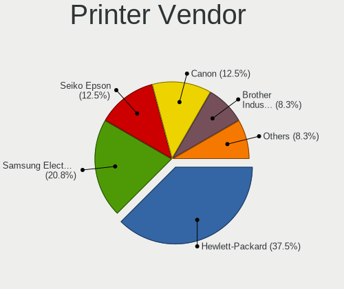

| Vendor                | Notebooks | Percent |
|-----------------------|-----------|---------|
| Hewlett-Packard       | 9         | 39.13%  |
| Samsung Electronics   | 4         | 17.39%  |
| Seiko Epson           | 3         | 13.04%  |
| Canon                 | 3         | 13.04%  |
| Brother Industries    | 2         | 8.7%    |
| Xerox                 | 1         | 4.35%   |
| Lexmark International | 1         | 4.35%   |

Printer Model
-------------

Printer device models

| Model                                   | Notebooks | Percent |
|-----------------------------------------|-----------|---------|
| Samsung ML-1640 Series Laser Printer    | 2         | 8.7%    |
| HP LaserJet 1020                        | 2         | 8.7%    |
| HP DeskJet 3630 series                  | 2         | 8.7%    |
| Xerox Phaser 6000B                      | 1         | 4.35%   |
| Seiko Epson L312 Series                 | 1         | 4.35%   |
| Seiko Epson L220 Series                 | 1         | 4.35%   |
| Seiko Epson L210 Series                 | 1         | 4.35%   |
| Samsung Xerox Phaser 3117 Laser Printer | 1         | 4.35%   |
| Samsung M2070 Series                    | 1         | 4.35%   |
| Lexmark International E360d             | 1         | 4.35%   |
| HP LaserJet 200 colorMFP M275nw         | 1         | 4.35%   |
| HP ENVY Photo 6200 series               | 1         | 4.35%   |
| HP ENVY 6000 series                     | 1         | 4.35%   |
| HP ENVY 4520 series                     | 1         | 4.35%   |
| HP DeskJet 2130 series                  | 1         | 4.35%   |
| Canon PIXMA MG3500 Series               | 1         | 4.35%   |
| Canon PIXMA MG2500 Series               | 1         | 4.35%   |
| Canon LBP2900                           | 1         | 4.35%   |
| Brother MFC-J5330DW                     | 1         | 4.35%   |
| Brother DCP-L3550CDW series             | 1         | 4.35%   |

Scanner Vendor
--------------

Scanner device vendors

| Vendor          | Notebooks | Percent |
|-----------------|-----------|---------|
| Hewlett-Packard | 2         | 40%     |
| Canon           | 2         | 40%     |
| Seiko Epson     | 1         | 20%     |

Scanner Model
-------------

Scanner device models

| Model                         | Notebooks | Percent |
|-------------------------------|-----------|---------|
| HP ScanJet 5590               | 2         | 40%     |
| Seiko Epson Scanner           | 1         | 20%     |
| Canon CanoScan N1240U/LiDE 30 | 1         | 20%     |
| Canon CanoScan LiDE 110       | 1         | 20%     |

Camera
------

Camera Vendor
-------------

Camera device vendors

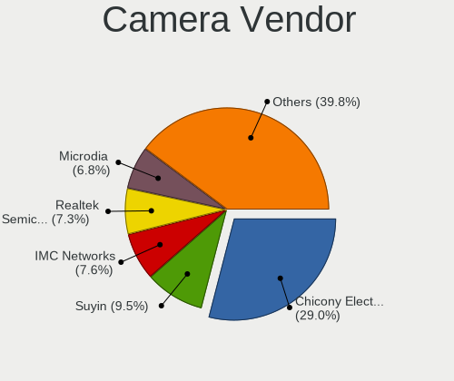

| Vendor                                 | Notebooks | Percent |
|----------------------------------------|-----------|---------|
| Chicony Electronics                    | 519       | 29.01%  |
| Suyin                                  | 161       | 9%      |
| IMC Networks                           | 139       | 7.77%   |
| Acer                                   | 137       | 7.66%   |
| Realtek Semiconductor                  | 131       | 7.32%   |
| Microdia                               | 120       | 6.71%   |
| Sunplus Innovation Technology          | 86        | 4.81%   |
| Cheng Uei Precision Industry (Foxlink) | 78        | 4.36%   |
| Quanta                                 | 66        | 3.69%   |
| Syntek                                 | 63        | 3.52%   |
| Silicon Motion                         | 41        | 2.29%   |
| Ricoh                                  | 38        | 2.12%   |
| Lite-On Technology                     | 38        | 2.12%   |
| Alcor Micro                            | 32        | 1.79%   |
| Apple                                  | 27        | 1.51%   |
| Lenovo                                 | 23        | 1.29%   |
| Importek                               | 15        | 0.84%   |
| Primax Electronics                     | 14        | 0.78%   |
| OmniVision Technologies                | 9         | 0.5%    |
| Luxvisions Innotech Limited            | 9         | 0.5%    |
| ALi                                    | 9         | 0.5%    |
| DigiTech                               | 8         | 0.45%   |
| Z-Star Microelectronics                | 5         | 0.28%   |
| Foxconn / Hon Hai                      | 3         | 0.17%   |
| Logitech                               | 2         | 0.11%   |
| Genesys Logic                          | 2         | 0.11%   |
| WaveRider Communications               | 1         | 0.06%   |
| Sunplus Technology                     | 1         | 0.06%   |
| Samsung Electronics                    | 1         | 0.06%   |
| Pixart Imaging                         | 1         | 0.06%   |
| Nokia Mobile Phones                    | 1         | 0.06%   |
| Nebraska Furniture Mart                | 1         | 0.06%   |
| Microsoft                              | 1         | 0.06%   |
| lihappe8                               | 1         | 0.06%   |
| JMicron Technology                     | 1         | 0.06%   |
| Intel                                  | 1         | 0.06%   |
| GEMBIRD                                | 1         | 0.06%   |
| Cubeternet                             | 1         | 0.06%   |
| Creative Technology                    | 1         | 0.06%   |
| Alpha Imaging Technology               | 1         | 0.06%   |

Camera Model
------------

Camera device models

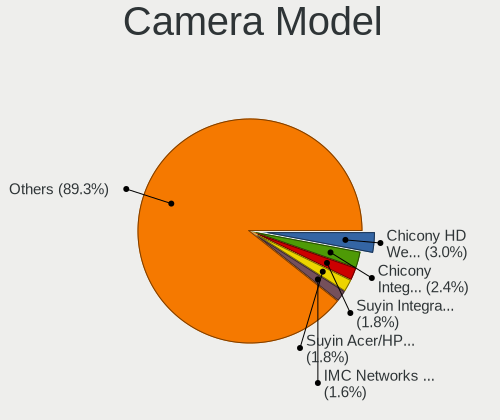

| Model                                                       | Notebooks | Percent |
|-------------------------------------------------------------|-----------|---------|
| Chicony HD WebCam                                           | 58        | 3.24%   |
| Chicony Integrated Camera                                   | 44        | 2.46%   |
| Suyin Acer/HP Integrated Webcam [CN0314]                    | 32        | 1.79%   |
| IMC Networks USB2.0 VGA UVC WebCam                          | 30        | 1.68%   |
| Acer Lenovo EasyCamera                                      | 27        | 1.51%   |
| Suyin Integrated_Webcam_HD                                  | 26        | 1.45%   |
| Realtek Integrated_Webcam_HD                                | 26        | 1.45%   |
| Chicony USB 2.0 Camera                                      | 26        | 1.45%   |
| IMC Networks USB2.0 HD UVC WebCam                           | 24        | 1.34%   |
| Chicony USB2.0 HD UVC WebCam                                | 24        | 1.34%   |
| Chicony VGA Webcam                                          | 23        | 1.28%   |
| Microdia Integrated_Webcam_HD                               | 22        | 1.23%   |
| Syntek Lenovo EasyCamera                                    | 21        | 1.17%   |
| Syntek Integrated Camera                                    | 20        | 1.12%   |
| Sunplus Integrated_Webcam_HD                                | 20        | 1.12%   |
| Quanta HP Webcam                                            | 20        | 1.12%   |
| Chicony HP Truevision HD                                    | 19        | 1.06%   |
| Chicony EasyCamera                                          | 19        | 1.06%   |
| Realtek USB Camera                                          | 18        | 1.01%   |
| Microdia Integrated Webcam                                  | 18        | 1.01%   |
| Chicony TOSHIBA Web Camera - HD                             | 18        | 1.01%   |
| Acer Integrated Camera                                      | 18        | 1.01%   |
| Sunplus HD Webcam                                           | 17        | 0.95%   |
| Chicony Lenovo EasyCamera                                   | 17        | 0.95%   |
| Cheng Uei Precision Industry (Foxlink) HP Webcam            | 17        | 0.95%   |
| Acer EasyCamera                                             | 17        | 0.95%   |
| Lite-On Integrated Camera                                   | 16        | 0.89%   |
| IMC Networks UVC VGA Webcam                                 | 15        | 0.84%   |
| Chicony CNF9055 Toshiba Webcam                              | 15        | 0.84%   |
| Chicony Acer CrystalEye Webcam                              | 15        | 0.84%   |
| Acer Lenovo Integrated Webcam                               | 15        | 0.84%   |
| Suyin HP Truevision HD                                      | 14        | 0.78%   |
| Chicony USB2.0 VGA UVC WebCam                               | 14        | 0.78%   |
| Cheng Uei Precision Industry (Foxlink) HP TrueVision HD     | 14        | 0.78%   |
| Alcor Micro USB 2.0 PC cam                                  | 14        | 0.78%   |
| Quanta VGA WebCam                                           | 13        | 0.73%   |
| IMC Networks Integrated Camera                              | 13        | 0.73%   |
| Chicony HP Webcam                                           | 13        | 0.73%   |
| Apple FaceTime HD Camera                                    | 13        | 0.73%   |
| Realtek HD WebCam                                           | 12        | 0.67%   |
| Chicony WebCam                                              | 12        | 0.67%   |
| Chicony Integrated HP HD Webcam                             | 12        | 0.67%   |
| Alcor Micro Asus Integrated Webcam                          | 12        | 0.67%   |
| Acer HD Webcam                                              | 12        | 0.67%   |
| Syntek EasyCamera                                           | 11        | 0.61%   |
| Quanta HP TrueVision HD Camera                              | 11        | 0.61%   |
| Chicony Lenovo Integrated Camera (0.3MP)                    | 11        | 0.61%   |
| Chicony HP TrueVision HD Camera                             | 11        | 0.61%   |
| Realtek Acer 640 x 480 laptop camera                        | 10        | 0.56%   |
| Lenovo Integrated Webcam                                    | 10        | 0.56%   |
| IMC Networks Integrated Webcam                              | 10        | 0.56%   |
| Chicony HP HD Camera                                        | 10        | 0.56%   |
| Chicony FJ Camera                                           | 10        | 0.56%   |
| Apple Built-in iSight                                       | 10        | 0.56%   |
| Acer BisonCam, NB Pro                                       | 10        | 0.56%   |
| Suyin 1.3M WebCam (notebook emachines E730, Acer sub-brand) | 9         | 0.5%    |
| Quanta HD User Facing                                       | 9         | 0.5%    |
| OmniVision OV2640 Webcam                                    | 9         | 0.5%    |
| IMC Networks Lenovo EasyCamera                              | 9         | 0.5%    |
| Chicony USB2.0 Camera                                       | 9         | 0.5%    |

Security
--------

Fingerprint Vendor
------------------

Fingerprint sensor vendors

| Vendor                     | Notebooks | Percent |
|----------------------------|-----------|---------|
| Validity Sensors           | 96        | 38.71%  |
| AuthenTec                  | 46        | 18.55%  |
| Upek                       | 31        | 12.5%   |
| Shenzhen Goodix Technology | 18        | 7.26%   |
| Synaptics                  | 16        | 6.45%   |
| STMicroelectronics         | 14        | 5.65%   |
| LighTuning Technology      | 14        | 5.65%   |
| Elan Microelectronics      | 12        | 4.84%   |
| Focal-systems.Corp         | 1         | 0.4%    |

Fingerprint Model
-----------------

Fingerprint sensor models

| Model                                                                      | Notebooks | Percent |
|----------------------------------------------------------------------------|-----------|---------|
| Upek Biometric Touchchip/Touchstrip Fingerprint Sensor                     | 27        | 10.89%  |
| AuthenTec AES2810                                                          | 20        | 8.06%   |
| Validity Sensors VFS495 Fingerprint Reader                                 | 16        | 6.45%   |
| Shenzhen Goodix  FingerPrint Device                                        | 15        | 6.05%   |
| Validity Sensors VFS 5011 fingerprint sensor                               | 14        | 5.65%   |
| STMicroelectronics Fingerprint Reader                                      | 14        | 5.65%   |
| AuthenTec AES2501 Fingerprint Sensor                                       | 12        | 4.84%   |
| Validity Sensors VFS5011 Fingerprint Reader                                | 11        | 4.44%   |
| Elan ELAN:Fingerprint                                                      | 11        | 4.44%   |
| Validity Sensors VFS471 Fingerprint Reader                                 | 9         | 3.63%   |
| Validity Sensors VFS451 Fingerprint Reader                                 | 9         | 3.63%   |
| Validity Sensors VFS491                                                    | 7         | 2.82%   |
| LighTuning ES603 Swipe Fingerprint Sensor                                  | 7         | 2.82%   |
| Synaptics  WBDI                                                            | 6         | 2.42%   |
| AuthenTec Fingerprint Sensor                                               | 6         | 2.42%   |
| AuthenTec AES1600                                                          | 6         | 2.42%   |
| Validity Sensors VFS7500 Touch Fingerprint Sensor                          | 5         | 2.02%   |
| Validity Sensors VFS101 Fingerprint Reader                                 | 5         | 2.02%   |
| Validity Sensors Fingerprint scanner                                       | 5         | 2.02%   |
| LighTuning EgisTec Touch Fingerprint Sensor                                | 5         | 2.02%   |
| Validity Sensors VFS301 Fingerprint Reader                                 | 4         | 1.61%   |
| Validity Sensors Swipe Fingerprint Sensor                                  | 4         | 1.61%   |
| Upek TCS5B Fingerprint sensor                                              | 4         | 1.61%   |
| Validity Sensors VFS Fingerprint sensor                                    | 3         | 1.21%   |
| Unknown                                                                    | 3         | 1.21%   |
| Validity Sensors Synaptics VFS7552 Touch Fingerprint Sensor with PurePrint | 2         | 0.81%   |
| Synaptics WBDI Device                                                      | 2         | 0.81%   |
| Shenzhen Goodix Fingerprint Reader                                         | 2         | 0.81%   |
| LighTuning Fingerprint Reader                                              | 2         | 0.81%   |
| Validity Sensors VFS300 Fingerprint Reader                                 | 1         | 0.4%    |
| Validity Sensors Synaptics WBDI                                            | 1         | 0.4%    |
| Synaptics  VFS7552 Touch Fingerprint Sensor with PurePrint                 | 1         | 0.4%    |
| Synaptics  FS7604 Touch Fingerprint Sensor with PurePrint                  | 1         | 0.4%    |
| Synaptics Prometheus MIS Touch Fingerprint Reader                          | 1         | 0.4%    |
| Synaptics Metallica MOH Touch Fingerprint Reader                           | 1         | 0.4%    |
| Synaptics Metallica MIS Touch Fingerprint Reader                           | 1         | 0.4%    |
| Shenzhen Goodix FingerPrint                                                | 1         | 0.4%    |
| Focal-systems.Corp FT9201Fingerprint.                                      | 1         | 0.4%    |
| Elan ELAN:ARM-M4                                                           | 1         | 0.4%    |
| AuthenTec AES2550 Fingerprint Sensor                                       | 1         | 0.4%    |
| AuthenTec AES1660 Fingerprint Sensor                                       | 1         | 0.4%    |

Chipcard Vendor
---------------

Chipcard module vendors

| Vendor               | Notebooks | Percent |
|----------------------|-----------|---------|
| Broadcom             | 69        | 53.49%  |
| O2 Micro             | 21        | 16.28%  |
| Alcor Micro          | 16        | 12.4%   |
| Lenovo               | 13        | 10.08%  |
| Upek                 | 7         | 5.43%   |
| SCM Microsystems     | 1         | 0.78%   |
| OmniKey              | 1         | 0.78%   |
| Microchip Technology | 1         | 0.78%   |

Chipcard Model
--------------

Chipcard module models

| Model                                                                        | Notebooks | Percent |
|------------------------------------------------------------------------------|-----------|---------|
| Broadcom BCM5880 Secure Applications Processor                               | 45        | 34.88%  |
| O2 Micro OZ776 CCID Smartcard Reader                                         | 21        | 16.28%  |
| Broadcom BCM5880 Secure Applications Processor with fingerprint swipe sensor | 18        | 13.95%  |
| Alcor Micro AU9540 Smartcard Reader                                          | 16        | 12.4%   |
| Lenovo Integrated Smart Card Reader                                          | 13        | 10.08%  |
| Upek TouchChip Fingerprint Coprocessor (WBF advanced mode)                   | 7         | 5.43%   |
| Broadcom 5880                                                                | 6         | 4.65%   |
| SCM Microsystems SCR3340 - ExpressCard54 Smart Card Reader                   | 1         | 0.78%   |
| OmniKey CardMan 4321                                                         | 1         | 0.78%   |
| Microchip Technology SMSC USX101x Reader                                     | 1         | 0.78%   |

Unsupported
-----------

Unsupported Devices
-------------------

Total unsupported devices on board

| Total | Notebooks | Percent |
|-------|-----------|---------|
| 0     | 1676      | 78.5%   |
| 1     | 398       | 18.64%  |
| 2     | 60        | 2.81%   |
| 3     | 1         | 0.05%   |

Unsupported Device Types
------------------------

Types of unsupported devices

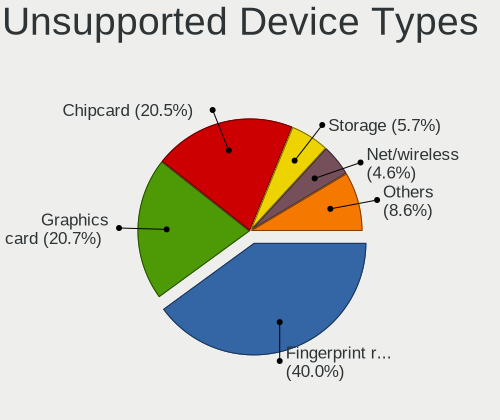

| Type                     | Notebooks | Percent |
|--------------------------|-----------|---------|
| Fingerprint reader       | 248       | 48.25%  |
| Chipcard                 | 127       | 24.71%  |
| Storage                  | 34        | 6.61%   |
| Net/wireless             | 29        | 5.64%   |
| Graphics card            | 24        | 4.67%   |
| Bluetooth                | 24        | 4.67%   |
| Multimedia controller    | 13        | 2.53%   |
| Camera                   | 6         | 1.17%   |
| Card reader              | 3         | 0.58%   |
| Communication controller | 2         | 0.39%   |
| Sound                    | 1         | 0.19%   |
| Network                  | 1         | 0.19%   |
| Modem                    | 1         | 0.19%   |
| Flash memory             | 1         | 0.19%   |

