OpenMandriva 4.3 - Tested Hardware & Statistics
-----------------------------------------------

A project to collect tested hardware configurations for OpenMandriva 4.3.

Anyone can contribute to this report by the [hw-probe](https://github.com/linuxhw/hw-probe) tool:

    sudo -E hw-probe -all -upload

Please contribute! Especially if your hardware is rare.

This is a report for all computer types. See also reports for [desktops](/Dist/OpenMandriva_4.3/Desktop/README.md) and [notebooks](/Dist/OpenMandriva_4.3/Notebook/README.md).

Contents
--------

* [ Test Cases ](#test-cases)

* [ System ](#system)
  - [ Kernel                   ](#kernel)
  - [ Kernel Family            ](#kernel-family)
  - [ Kernel Major Ver.        ](#kernel-major-ver)
  - [ Arch                     ](#arch)
  - [ DE                       ](#de)
  - [ Display Server           ](#display-server)
  - [ Display Manager          ](#display-manager)
  - [ OS Lang                  ](#os-lang)
  - [ Boot Mode                ](#boot-mode)
  - [ Filesystem               ](#filesystem)
  - [ Part. scheme             ](#part-scheme)
  - [ Dual Boot with Linux/BSD ](#dual-boot-with-linuxbsd)
  - [ Dual Boot (Win)          ](#dual-boot-win)

* [ Board ](#board)
  - [ Vendor                   ](#vendor)
  - [ Model                    ](#model)
  - [ Model Family             ](#model-family)
  - [ MFG Year                 ](#mfg-year)
  - [ Form Factor              ](#form-factor)
  - [ Secure Boot              ](#secure-boot)
  - [ Coreboot                 ](#coreboot)
  - [ RAM Size                 ](#ram-size)
  - [ RAM Used                 ](#ram-used)
  - [ Total Drives             ](#total-drives)
  - [ Has CD-ROM               ](#has-cd-rom)
  - [ Has Ethernet             ](#has-ethernet)
  - [ Has WiFi                 ](#has-wifi)
  - [ Has Bluetooth            ](#has-bluetooth)

* [ Location ](#location)
  - [ Country                  ](#country)
  - [ City                     ](#city)

* [ Drives ](#drives)
  - [ Drive Vendor             ](#drive-vendor)
  - [ Drive Model              ](#drive-model)
  - [ HDD Vendor               ](#hdd-vendor)
  - [ SSD Vendor               ](#ssd-vendor)
  - [ Drive Kind               ](#drive-kind)
  - [ Drive Connector          ](#drive-connector)
  - [ Drive Size               ](#drive-size)
  - [ Space Total              ](#space-total)
  - [ Space Used               ](#space-used)
  - [ Malfunc. Drives          ](#malfunc-drives)
  - [ Malfunc. Drive Vendor    ](#malfunc-drive-vendor)
  - [ Malfunc. HDD Vendor      ](#malfunc-hdd-vendor)
  - [ Malfunc. Drive Kind      ](#malfunc-drive-kind)
  - [ Failed Drives            ](#failed-drives)
  - [ Failed Drive Vendor      ](#failed-drive-vendor)
  - [ Drive Status             ](#drive-status)

* [ Storage controller ](#storage-controller)
  - [ Storage Vendor           ](#storage-vendor)
  - [ Storage Model            ](#storage-model)
  - [ Storage Kind             ](#storage-kind)

* [ Processor ](#processor)
  - [ CPU Vendor               ](#cpu-vendor)
  - [ CPU Model                ](#cpu-model)
  - [ CPU Model Family         ](#cpu-model-family)
  - [ CPU Cores                ](#cpu-cores)
  - [ CPU Sockets              ](#cpu-sockets)
  - [ CPU Threads              ](#cpu-threads)
  - [ CPU Op-Modes             ](#cpu-op-modes)
  - [ CPU Microcode            ](#cpu-microcode)
  - [ CPU Microarch            ](#cpu-microarch)

* [ Graphics ](#graphics)
  - [ GPU Vendor               ](#gpu-vendor)
  - [ GPU Model                ](#gpu-model)
  - [ GPU Combo                ](#gpu-combo)
  - [ GPU Driver               ](#gpu-driver)
  - [ GPU Memory               ](#gpu-memory)

* [ Monitor ](#monitor)
  - [ Monitor Vendor           ](#monitor-vendor)
  - [ Monitor Model            ](#monitor-model)
  - [ Monitor Resolution       ](#monitor-resolution)
  - [ Monitor Diagonal         ](#monitor-diagonal)
  - [ Monitor Width            ](#monitor-width)
  - [ Aspect Ratio             ](#aspect-ratio)
  - [ Monitor Area             ](#monitor-area)
  - [ Pixel Density            ](#pixel-density)
  - [ Multiple Monitors        ](#multiple-monitors)

* [ Network ](#network)
  - [ Net Controller Vendor    ](#net-controller-vendor)
  - [ Net Controller Model     ](#net-controller-model)
  - [ Wireless Vendor          ](#wireless-vendor)
  - [ Wireless Model           ](#wireless-model)
  - [ Ethernet Vendor          ](#ethernet-vendor)
  - [ Ethernet Model           ](#ethernet-model)
  - [ Net Controller Kind      ](#net-controller-kind)
  - [ Used Controller          ](#used-controller)
  - [ NICs                     ](#nics)
  - [ IPv6                     ](#ipv6)

* [ Bluetooth ](#bluetooth)
  - [ Bluetooth Vendor         ](#bluetooth-vendor)
  - [ Bluetooth Model          ](#bluetooth-model)

* [ Sound ](#sound)
  - [ Sound Vendor             ](#sound-vendor)
  - [ Sound Model              ](#sound-model)

* [ Memory ](#memory)
  - [ Memory Vendor            ](#memory-vendor)
  - [ Memory Model             ](#memory-model)
  - [ Memory Kind              ](#memory-kind)
  - [ Memory Form Factor       ](#memory-form-factor)
  - [ Memory Size              ](#memory-size)
  - [ Memory Speed             ](#memory-speed)

* [ Printers & scanners ](#printers--scanners)
  - [ Printer Vendor           ](#printer-vendor)
  - [ Printer Model            ](#printer-model)
  - [ Scanner Vendor           ](#scanner-vendor)
  - [ Scanner Model            ](#scanner-model)

* [ Camera ](#camera)
  - [ Camera Vendor            ](#camera-vendor)
  - [ Camera Model             ](#camera-model)

* [ Security ](#security)
  - [ Fingerprint Vendor       ](#fingerprint-vendor)
  - [ Fingerprint Model        ](#fingerprint-model)
  - [ Chipcard Vendor          ](#chipcard-vendor)
  - [ Chipcard Model           ](#chipcard-model)

* [ Unsupported ](#unsupported)
  - [ Unsupported Devices      ](#unsupported-devices)
  - [ Unsupported Device Types ](#unsupported-device-types)

Test Cases
----------

Total: 4932

| Vendor        | Model                       | Form-Factor | Probe                                                      | Date         |
|---------------|-----------------------------|-------------|------------------------------------------------------------|--------------|
| ASUSTek       | X750JB                      | Notebook    | [c3848bc769](https://linux-hardware.org/?probe=c3848bc769) | Dec 28, 2024 |
| Unknown       | Unknown                     | Desktop     | [2815b29936](https://linux-hardware.org/?probe=2815b29936) | Dec 25, 2024 |
| Intel         | H61                         | Desktop     | [3b41c83d54](https://linux-hardware.org/?probe=3b41c83d54) | Dec 22, 2024 |
| MACHINIST     | E5-K9 V1.0                  | Desktop     | [0454705976](https://linux-hardware.org/?probe=0454705976) | Dec 19, 2024 |
| Gigabyte      | G41MT-S2PT                  | Desktop     | [a4239ba143](https://linux-hardware.org/?probe=a4239ba143) | Dec 17, 2024 |
| Lenovo        | SHARKBAY NOK                | Desktop     | [5cd46a0402](https://linux-hardware.org/?probe=5cd46a0402) | Dec 11, 2024 |
| Acer          | Aspire One 721              | Notebook    | [2bcae04153](https://linux-hardware.org/?probe=2bcae04153) | Dec 10, 2024 |
| Dell          | 0VRWRC A00                  | Desktop     | [e5eed30893](https://linux-hardware.org/?probe=e5eed30893) | Dec 07, 2024 |
| Samsung       | 100NZA                      | Notebook    | [6a49e4caae](https://linux-hardware.org/?probe=6a49e4caae) | Nov 28, 2024 |
| Toshiba       | K201                        | Notebook    | [ea9c66694d](https://linux-hardware.org/?probe=ea9c66694d) | Nov 16, 2024 |
| ASUSTek       | Z87-PRO                     | Desktop     | [d86d8eeada](https://linux-hardware.org/?probe=d86d8eeada) | Nov 10, 2024 |
| Acer          | AO722                       | Notebook    | [4f5bec46c5](https://linux-hardware.org/?probe=4f5bec46c5) | Nov 09, 2024 |
| Unknown       | P43R1600Twins-110DB         | Desktop     | [c600d2b183](https://linux-hardware.org/?probe=c600d2b183) | Nov 08, 2024 |
| MSI           | MS-7345                     | Desktop     | [aa2fdabfba](https://linux-hardware.org/?probe=aa2fdabfba) | Oct 28, 2024 |
| Intel         | DG31PR AAD97573-205         | Desktop     | [4b573de034](https://linux-hardware.org/?probe=4b573de034) | Oct 23, 2024 |
| Gigabyte      | M68MT-S2P                   | Desktop     | [4364777496](https://linux-hardware.org/?probe=4364777496) | Oct 13, 2024 |
| Gigabyte      | M68MT-S2P                   | Desktop     | [8ec2ec3822](https://linux-hardware.org/?probe=8ec2ec3822) | Oct 12, 2024 |
| Razer         | Blade Pro 17 (2019)         | Notebook    | [ed24f6a1dd](https://linux-hardware.org/?probe=ed24f6a1dd) | Oct 04, 2024 |
| Fujitsu       | LIFEBOOK AH532              | Notebook    | [288e1c2e47](https://linux-hardware.org/?probe=288e1c2e47) | Oct 03, 2024 |
| Toshiba       | dynabook T552/36HR          | Notebook    | [89711f38a1](https://linux-hardware.org/?probe=89711f38a1) | Sep 30, 2024 |
| HP            | Notebook                    | Notebook    | [72921f7b8f](https://linux-hardware.org/?probe=72921f7b8f) | Sep 30, 2024 |
| Gigabyte      | GA-78LMT-S2                 | Desktop     | [ced9a3f102](https://linux-hardware.org/?probe=ced9a3f102) | Sep 27, 2024 |
| Dell          | 0G214D A00                  | Desktop     | [14a759b600](https://linux-hardware.org/?probe=14a759b600) | Sep 03, 2024 |
| ASUSTek       | P5W DH Deluxe               | Desktop     | [00b4a6bc5d](https://linux-hardware.org/?probe=00b4a6bc5d) | Sep 02, 2024 |
| ASUSTek       | X540SAA                     | Notebook    | [5818df112a](https://linux-hardware.org/?probe=5818df112a) | Aug 27, 2024 |
| ASUSTek       | UX31E                       | Notebook    | [e909c7ac51](https://linux-hardware.org/?probe=e909c7ac51) | Aug 25, 2024 |
| ASRock        | B450M-HDV R4.0              | Desktop     | [30c8ac7aa5](https://linux-hardware.org/?probe=30c8ac7aa5) | Aug 25, 2024 |
| Gigabyte      | EP45-UD3L                   | Desktop     | [b547815742](https://linux-hardware.org/?probe=b547815742) | Aug 24, 2024 |
| HP            | Laptop 15-bs1xx             | Notebook    | [336c9088f1](https://linux-hardware.org/?probe=336c9088f1) | Aug 17, 2024 |
| MSI           | A320M-A PRO MAX             | Desktop     | [ae173ca405](https://linux-hardware.org/?probe=ae173ca405) | Aug 11, 2024 |
| HP            | Laptop 15-ef2xxx            | Notebook    | [5ffcd74bdd](https://linux-hardware.org/?probe=5ffcd74bdd) | Aug 09, 2024 |
| Lenovo        | ThinkPad P50 20EQS09W00     | Notebook    | [b2f5a7a26e](https://linux-hardware.org/?probe=b2f5a7a26e) | Aug 04, 2024 |
| Dell          | 0HHV7N A00                  | Desktop     | [cdb750e171](https://linux-hardware.org/?probe=cdb750e171) | Aug 03, 2024 |
| ECS           | H81H3-WM                    | Desktop     | [7527b5c842](https://linux-hardware.org/?probe=7527b5c842) | Aug 03, 2024 |
| HP            | Laptop 15-bw0xx             | Notebook    | [3c266eb18f](https://linux-hardware.org/?probe=3c266eb18f) | Aug 03, 2024 |
| Dell          | 0WG261                      | Desktop     | [4cb003db71](https://linux-hardware.org/?probe=4cb003db71) | Aug 01, 2024 |
| MSI           | A320M-A PRO                 | Desktop     | [5cfda460bb](https://linux-hardware.org/?probe=5cfda460bb) | Jul 31, 2024 |
| Dell          | Latitude E6430              | Notebook    | [0ba450ff38](https://linux-hardware.org/?probe=0ba450ff38) | Jul 27, 2024 |
| ASUSTek       | UX31E                       | Notebook    | [566e36f5b1](https://linux-hardware.org/?probe=566e36f5b1) | Jul 23, 2024 |
| Gigabyte      | GA-880GA-UD3H               | Desktop     | [11fd69223a](https://linux-hardware.org/?probe=11fd69223a) | Jul 20, 2024 |
| LG Electro... | V720                        | All in one  | [144cf84a65](https://linux-hardware.org/?probe=144cf84a65) | Jul 19, 2024 |
| Lenovo        | ThinkPad T410 2537FP3       | Notebook    | [d0c191da8b](https://linux-hardware.org/?probe=d0c191da8b) | Jul 18, 2024 |
| Gateway       | NV57H                       | Notebook    | [8524f6ae6c](https://linux-hardware.org/?probe=8524f6ae6c) | Jul 13, 2024 |
| Sony          | VGN-SZ38GP_C                | Notebook    | [78f33888aa](https://linux-hardware.org/?probe=78f33888aa) | Jul 09, 2024 |
| ASUSTek       | P9X79                       | Desktop     | [a7b620dd59](https://linux-hardware.org/?probe=a7b620dd59) | Jul 07, 2024 |
| MSI           | MS-16Y1                     | Notebook    | [718d1ff4dc](https://linux-hardware.org/?probe=718d1ff4dc) | Jul 03, 2024 |
| ASUSTek       | X202E                       | Notebook    | [5d28c12871](https://linux-hardware.org/?probe=5d28c12871) | Jul 01, 2024 |
| MSI           | PRO H610M-G DDR4            | Desktop     | [8624f4c5fe](https://linux-hardware.org/?probe=8624f4c5fe) | Jun 25, 2024 |
| Lenovo        | ThinkPad T440s 20AQ009DG... | Notebook    | [025f58a3ae](https://linux-hardware.org/?probe=025f58a3ae) | Jun 19, 2024 |
| Unknown       | X79                         | Desktop     | [69bf2d4204](https://linux-hardware.org/?probe=69bf2d4204) | Jun 12, 2024 |
| Dell          | Inspiron 15-3567            | Notebook    | [79d0be4a8b](https://linux-hardware.org/?probe=79d0be4a8b) | Jun 01, 2024 |
| MSI           | H510M-A PRO                 | Desktop     | [70b4e886ab](https://linux-hardware.org/?probe=70b4e886ab) | May 30, 2024 |
| ASUSTek       | UX31E                       | Notebook    | [0fd2dc51a9](https://linux-hardware.org/?probe=0fd2dc51a9) | May 18, 2024 |
| ASUSTek       | H87-PRO                     | Desktop     | [fb958f35d6](https://linux-hardware.org/?probe=fb958f35d6) | May 10, 2024 |
| ASRock        | B550 Phantom Gaming 4/ac    | Desktop     | [eb876823d7](https://linux-hardware.org/?probe=eb876823d7) | May 10, 2024 |
| Gigabyte      | G41MT-S2PT                  | Desktop     | [a415a1e824](https://linux-hardware.org/?probe=a415a1e824) | May 08, 2024 |
| ASRock        | B550 Phantom Gaming 4/ac    | Desktop     | [72d8d32749](https://linux-hardware.org/?probe=72d8d32749) | May 07, 2024 |
| Gigabyte      | B550M DS3H AC               | Desktop     | [0a5a41e025](https://linux-hardware.org/?probe=0a5a41e025) | Apr 30, 2024 |
| HP            | 0A54h                       | Desktop     | [603811635b](https://linux-hardware.org/?probe=603811635b) | Apr 28, 2024 |
| ASUSTek       | X99-A                       | Desktop     | [eab08c37f7](https://linux-hardware.org/?probe=eab08c37f7) | Apr 28, 2024 |
| Lenovo        | IdeaPad Y570 20091          | Notebook    | [67336a137f](https://linux-hardware.org/?probe=67336a137f) | Apr 26, 2024 |
| Dell          | Latitude E6400              | Notebook    | [ab58a2d0bd](https://linux-hardware.org/?probe=ab58a2d0bd) | Apr 26, 2024 |
| HP            | 2B02                        | Desktop     | [5272c37a4c](https://linux-hardware.org/?probe=5272c37a4c) | Apr 18, 2024 |
| MSI           | Z77MA-G45                   | Desktop     | [7a6ac2c320](https://linux-hardware.org/?probe=7a6ac2c320) | Apr 11, 2024 |
| ASRock        | B450 Steel Legend           | Desktop     | [8acd2823d2](https://linux-hardware.org/?probe=8acd2823d2) | Apr 06, 2024 |
| ASRock        | AB350M Pro4                 | Desktop     | [705e1fd7bf](https://linux-hardware.org/?probe=705e1fd7bf) | Apr 05, 2024 |
| Dell          | Latitude 7290               | Notebook    | [b7f36c7c42](https://linux-hardware.org/?probe=b7f36c7c42) | Apr 04, 2024 |
| HP            | Pavilion g6                 | Notebook    | [1857b80f6f](https://linux-hardware.org/?probe=1857b80f6f) | Apr 04, 2024 |
| ASRock        | H61M-ITX                    | Desktop     | [56a5b3ae2f](https://linux-hardware.org/?probe=56a5b3ae2f) | Apr 03, 2024 |
| ASUSTek       | M4A785-M                    | Desktop     | [cb33f5a0f5](https://linux-hardware.org/?probe=cb33f5a0f5) | Mar 30, 2024 |
| Dell          | XPS M1530                   | Notebook    | [d252773f43](https://linux-hardware.org/?probe=d252773f43) | Mar 27, 2024 |
| Dell          | Inspiron 3583               | Notebook    | [0bd478d9d8](https://linux-hardware.org/?probe=0bd478d9d8) | Mar 15, 2024 |
| Dell          | 0NDYHG A01                  | Desktop     | [fd065468fe](https://linux-hardware.org/?probe=fd065468fe) | Mar 15, 2024 |
| Lenovo        | G485 20136                  | Notebook    | [930fda78a0](https://linux-hardware.org/?probe=930fda78a0) | Mar 12, 2024 |
| Gigabyte      | X570S UD                    | Desktop     | [6331209e18](https://linux-hardware.org/?probe=6331209e18) | Mar 07, 2024 |
| Sony          | VGN-SR35G_B                 | Notebook    | [aaa8b6533c](https://linux-hardware.org/?probe=aaa8b6533c) | Feb 19, 2024 |
| Apple         | MacBookAir7,2               | Notebook    | [75fdc8cc2a](https://linux-hardware.org/?probe=75fdc8cc2a) | Feb 18, 2024 |
| Lenovo        | 30C0 SDK0J40697 WIN 3305... | Desktop     | [130cc65dca](https://linux-hardware.org/?probe=130cc65dca) | Feb 18, 2024 |
| Dell          | 088DT1 A01                  | Desktop     | [1656499259](https://linux-hardware.org/?probe=1656499259) | Feb 17, 2024 |
| HP            | Stream Laptop 11-ak0xxx     | Notebook    | [d2ecfb241e](https://linux-hardware.org/?probe=d2ecfb241e) | Feb 13, 2024 |
| MSI           | 760GM-P21                   | Desktop     | [18f56af6bd](https://linux-hardware.org/?probe=18f56af6bd) | Feb 09, 2024 |
| Pegatron      | 2A86E01                     | Desktop     | [9f5ddccda6](https://linux-hardware.org/?probe=9f5ddccda6) | Feb 04, 2024 |
| ASUSTek       | ROG STRIX B550-F GAMING     | Desktop     | [6a6209d599](https://linux-hardware.org/?probe=6a6209d599) | Feb 04, 2024 |
| Acer          | Extensa 5635ZG              | Notebook    | [04e9911d43](https://linux-hardware.org/?probe=04e9911d43) | Feb 03, 2024 |
| Gigabyte      | X670 AORUS ELITE AX         | Desktop     | [f0bd42b414](https://linux-hardware.org/?probe=f0bd42b414) | Feb 01, 2024 |
| HP            | EliteBook 8440p             | Notebook    | [e8c221770b](https://linux-hardware.org/?probe=e8c221770b) | Jan 31, 2024 |
| HP            | EliteBook 8460p             | Notebook    | [9fd5ed9142](https://linux-hardware.org/?probe=9fd5ed9142) | Jan 30, 2024 |
| MSI           | H110M PRO-VD                | Desktop     | [2dcaa98349](https://linux-hardware.org/?probe=2dcaa98349) | Jan 30, 2024 |
| HP            | 1791                        | Desktop     | [e301050210](https://linux-hardware.org/?probe=e301050210) | Jan 29, 2024 |
| ASUSTek       | M4N68T-M-V2                 | Desktop     | [5c4d08e0c4](https://linux-hardware.org/?probe=5c4d08e0c4) | Jan 28, 2024 |
| MSI           | Z97 GAMING 3                | Desktop     | [5a4ad9cb67](https://linux-hardware.org/?probe=5a4ad9cb67) | Jan 28, 2024 |
| Lenovo        | B51-80 80LM                 | Notebook    | [71d2badad4](https://linux-hardware.org/?probe=71d2badad4) | Jan 27, 2024 |
| HP            | 350 G2                      | Notebook    | [ad55cbfa8a](https://linux-hardware.org/?probe=ad55cbfa8a) | Jan 27, 2024 |
| Unknown       | P43R1600Twins-110DB         | Desktop     | [0741a919e4](https://linux-hardware.org/?probe=0741a919e4) | Jan 26, 2024 |
| Gigabyte      | Z390 UD V2                  | Desktop     | [b2693bec37](https://linux-hardware.org/?probe=b2693bec37) | Jan 25, 2024 |
| HP            | 198E                        | Desktop     | [15f15e41f1](https://linux-hardware.org/?probe=15f15e41f1) | Jan 11, 2024 |
| ASUSTek       | M5A78L-M LX3                | Desktop     | [6b0c1cd101](https://linux-hardware.org/?probe=6b0c1cd101) | Jan 10, 2024 |
| Sony          | VGN-FZ31Z                   | Notebook    | [3df7d503da](https://linux-hardware.org/?probe=3df7d503da) | Jan 09, 2024 |
| MSI           | A75A-G35                    | Desktop     | [288caa413e](https://linux-hardware.org/?probe=288caa413e) | Jan 09, 2024 |
| Intel         | B75                         | Desktop     | [648128d27a](https://linux-hardware.org/?probe=648128d27a) | Jan 06, 2024 |
| Lenovo        | B580 20144                  | Notebook    | [f062a8fd3a](https://linux-hardware.org/?probe=f062a8fd3a) | Jan 03, 2024 |
| HP            | 8055                        | Desktop     | [e27c0366a9](https://linux-hardware.org/?probe=e27c0366a9) | Jan 02, 2024 |
| ASUSTek       | X750JB                      | Notebook    | [3c2f9bd15e](https://linux-hardware.org/?probe=3c2f9bd15e) | Dec 28, 2023 |
| MSI           | G31TM-P21                   | Desktop     | [c80f741175](https://linux-hardware.org/?probe=c80f741175) | Dec 26, 2023 |
| ASUSTek       | H61M-A/BR                   | Desktop     | [e50028a157](https://linux-hardware.org/?probe=e50028a157) | Dec 25, 2023 |
| Gigabyte      | G1.Sniper B5-CF             | Desktop     | [9d3fa026ff](https://linux-hardware.org/?probe=9d3fa026ff) | Dec 25, 2023 |
| Razer         | Blade Pro 17 (2019)         | Notebook    | [25b1af1536](https://linux-hardware.org/?probe=25b1af1536) | Dec 25, 2023 |
| ASUSTek       | X441BA                      | Notebook    | [04e5c55b92](https://linux-hardware.org/?probe=04e5c55b92) | Dec 23, 2023 |
| Dell          | Latitude E7240              | Notebook    | [8fc0b7d8ea](https://linux-hardware.org/?probe=8fc0b7d8ea) | Dec 16, 2023 |
| MSI           | MS-16Y1                     | Notebook    | [41ce29bec7](https://linux-hardware.org/?probe=41ce29bec7) | Dec 12, 2023 |
| Gigabyte      | 965P-S3                     | Desktop     | [b73dd61ca5](https://linux-hardware.org/?probe=b73dd61ca5) | Dec 09, 2023 |
| HP            | 18E5                        | Desktop     | [7b54dc44b4](https://linux-hardware.org/?probe=7b54dc44b4) | Dec 06, 2023 |
| Acer          | TravelMate B311-31          | Notebook    | [9611377d0c](https://linux-hardware.org/?probe=9611377d0c) | Dec 05, 2023 |
| HP            | 8265                        | Desktop     | [1faa811cf0](https://linux-hardware.org/?probe=1faa811cf0) | Dec 03, 2023 |
| Toshiba       | dynabook T552/36HR          | Notebook    | [1e3171aa0a](https://linux-hardware.org/?probe=1e3171aa0a) | Nov 30, 2023 |
| HP            | Stream Laptop 11-ak0xxx     | Notebook    | [16dda5c039](https://linux-hardware.org/?probe=16dda5c039) | Nov 29, 2023 |
| Lenovo        | ThinkPad T490 20N3S4VV00    | Notebook    | [1106c092a2](https://linux-hardware.org/?probe=1106c092a2) | Nov 26, 2023 |
| Dell          | Latitude E6430              | Notebook    | [a7befe7f1b](https://linux-hardware.org/?probe=a7befe7f1b) | Nov 23, 2023 |
| Samsung       | 300E5EV/300E4EV/270E5EV/... | Notebook    | [2d0d992e3e](https://linux-hardware.org/?probe=2d0d992e3e) | Nov 22, 2023 |
| MSI           | A320M-A PRO MAX             | Desktop     | [40327ad292](https://linux-hardware.org/?probe=40327ad292) | Nov 20, 2023 |
| HP            | 1589                        | Desktop     | [3e5f417056](https://linux-hardware.org/?probe=3e5f417056) | Nov 20, 2023 |
| Digibras      | NH4CU53                     | Notebook    | [25fff3f773](https://linux-hardware.org/?probe=25fff3f773) | Nov 20, 2023 |
| Dell          | Vostro 1310                 | Notebook    | [bd82e2c035](https://linux-hardware.org/?probe=bd82e2c035) | Nov 19, 2023 |
| ASUSTek       | PRIME A320M-K               | Desktop     | [68aadf1f9b](https://linux-hardware.org/?probe=68aadf1f9b) | Nov 17, 2023 |
| MACHINIST     | E5 MR9A PRO MAX V1.1        | Desktop     | [199a544882](https://linux-hardware.org/?probe=199a544882) | Nov 16, 2023 |
| ASUSTek       | M50Vn                       | Notebook    | [9c35898e36](https://linux-hardware.org/?probe=9c35898e36) | Nov 16, 2023 |
| HP            | 1998                        | Desktop     | [eb9bb55c96](https://linux-hardware.org/?probe=eb9bb55c96) | Nov 16, 2023 |
| Positivo      | POS-EIH61CE POSITIVO        | Desktop     | [fd1391a823](https://linux-hardware.org/?probe=fd1391a823) | Nov 15, 2023 |
| Foxconn       | 2A92                        | Desktop     | [6cd9ba6728](https://linux-hardware.org/?probe=6cd9ba6728) | Nov 15, 2023 |
| Gigabyte      | GA-A55M-S2V                 | Desktop     | [780d61593a](https://linux-hardware.org/?probe=780d61593a) | Nov 14, 2023 |
| MSI           | MAG B460M MORTAR WIFI       | Desktop     | [0342a78240](https://linux-hardware.org/?probe=0342a78240) | Nov 13, 2023 |
| Samsung       | 355V4C/356V4C/3445VC/354... | Notebook    | [613acc55d8](https://linux-hardware.org/?probe=613acc55d8) | Nov 13, 2023 |
| ASUSTek       | X540SAA                     | Notebook    | [1c5e9077a8](https://linux-hardware.org/?probe=1c5e9077a8) | Nov 12, 2023 |
| HP            | 1850                        | Desktop     | [10595f0ac3](https://linux-hardware.org/?probe=10595f0ac3) | Nov 10, 2023 |
| ASUSTek       | PRIME Q270M-C               | Desktop     | [0fcd993247](https://linux-hardware.org/?probe=0fcd993247) | Nov 10, 2023 |
| HP            | ProBook 6470b               | Notebook    | [5b5177e5ed](https://linux-hardware.org/?probe=5b5177e5ed) | Nov 08, 2023 |
| Toshiba       | Satellite C855-10N          | Notebook    | [7afd607141](https://linux-hardware.org/?probe=7afd607141) | Nov 06, 2023 |
| ASUSTek       | A68HM-K                     | Desktop     | [c3e5415128](https://linux-hardware.org/?probe=c3e5415128) | Nov 06, 2023 |
| ASRock        | FM2A68M-HD+                 | Desktop     | [2b5c984cd8](https://linux-hardware.org/?probe=2b5c984cd8) | Nov 04, 2023 |
| ASUSTek       | ROG Zephyrus G14 GA401QM... | Notebook    | [b0487db7bf](https://linux-hardware.org/?probe=b0487db7bf) | Nov 04, 2023 |
| Toshiba       | TECRA W50-A                 | Notebook    | [ad6c61de24](https://linux-hardware.org/?probe=ad6c61de24) | Nov 04, 2023 |
| ASUSTek       | X550VQ                      | Notebook    | [b6d6ff10aa](https://linux-hardware.org/?probe=b6d6ff10aa) | Nov 03, 2023 |
| Google        | Falco                       | Notebook    | [0ea6d932bf](https://linux-hardware.org/?probe=0ea6d932bf) | Nov 01, 2023 |
| MSI           | MPG B550 GAMING PLUS        | Desktop     | [09d5186c37](https://linux-hardware.org/?probe=09d5186c37) | Oct 30, 2023 |
| Gigabyte      | GA-890GPA-UD3H              | Desktop     | [0be3861a6a](https://linux-hardware.org/?probe=0be3861a6a) | Oct 29, 2023 |
| AMI           | Aptio CRB                   | Mini pc     | [d0b884f8e1](https://linux-hardware.org/?probe=d0b884f8e1) | Oct 27, 2023 |
| Dell          | Inspiron 5737               | Notebook    | [6ed0863a43](https://linux-hardware.org/?probe=6ed0863a43) | Oct 27, 2023 |
| HP            | 8054                        | Desktop     | [3f9ecca91a](https://linux-hardware.org/?probe=3f9ecca91a) | Oct 26, 2023 |
| Apple         | MacBookPro7,1               | Notebook    | [cb27a04bd5](https://linux-hardware.org/?probe=cb27a04bd5) | Oct 26, 2023 |
| ASUSTek       | VivoBook_ASUSLaptop X515... | Notebook    | [dc730f5631](https://linux-hardware.org/?probe=dc730f5631) | Oct 23, 2023 |
| Acer          | Aspire 5742                 | Notebook    | [f30dc155bd](https://linux-hardware.org/?probe=f30dc155bd) | Oct 21, 2023 |
| ASUSTek       | P8H77-M PRO                 | Desktop     | [968efc7996](https://linux-hardware.org/?probe=968efc7996) | Oct 20, 2023 |
| Lenovo        | 30D0 NOK                    | Desktop     | [e67eff74dc](https://linux-hardware.org/?probe=e67eff74dc) | Oct 20, 2023 |
| ASRock        | H110M-HDV R3.0              | Desktop     | [491538303f](https://linux-hardware.org/?probe=491538303f) | Oct 19, 2023 |
| Lenovo        | SHARKBAY 0B98401 PRO        | Desktop     | [6e81d4f878](https://linux-hardware.org/?probe=6e81d4f878) | Oct 18, 2023 |
| Unknown       | Unknown                     | Notebook    | [e1751f1726](https://linux-hardware.org/?probe=e1751f1726) | Oct 17, 2023 |
| HP            | 2000                        | Notebook    | [c2669ff6cb](https://linux-hardware.org/?probe=c2669ff6cb) | Oct 16, 2023 |
| Acer          | Aspire GX-281               | Desktop     | [17fad55365](https://linux-hardware.org/?probe=17fad55365) | Oct 16, 2023 |
| MSI           | GT70 0NC/GT70 0NC           | Notebook    | [24e93d9411](https://linux-hardware.org/?probe=24e93d9411) | Oct 15, 2023 |
| ACTION        | M5A78L-M lX V2              | Desktop     | [fe141a8a31](https://linux-hardware.org/?probe=fe141a8a31) | Oct 15, 2023 |
| Lenovo        | IdeaPad P500 20210          | Notebook    | [ba316cb723](https://linux-hardware.org/?probe=ba316cb723) | Oct 12, 2023 |
| HP            | 158A                        | Desktop     | [9e43d14a8e](https://linux-hardware.org/?probe=9e43d14a8e) | Oct 10, 2023 |
| Dell          | 0FDT3J A03                  | Server      | [8904f36bde](https://linux-hardware.org/?probe=8904f36bde) | Oct 09, 2023 |
| Dell          | Latitude E5440              | Notebook    | [a039ff25ef](https://linux-hardware.org/?probe=a039ff25ef) | Oct 08, 2023 |
| MSI           | MS-7235                     | Desktop     | [afb00bf553](https://linux-hardware.org/?probe=afb00bf553) | Oct 07, 2023 |
| Gigabyte      | GA-K8NE                     | Desktop     | [8cb50a99b7](https://linux-hardware.org/?probe=8cb50a99b7) | Oct 07, 2023 |
| Gigabyte      | F2A55M-DS2                  | Desktop     | [75d90cf644](https://linux-hardware.org/?probe=75d90cf644) | Oct 07, 2023 |
| Pegatron      | Benicia                     | Desktop     | [b70dfb3fc8](https://linux-hardware.org/?probe=b70dfb3fc8) | Oct 05, 2023 |
| ASUSTek       | P5G41T-M LX2/GB             | Desktop     | [a3ea9b4b56](https://linux-hardware.org/?probe=a3ea9b4b56) | Oct 04, 2023 |
| Gigabyte      | F2A88X-D3H                  | Desktop     | [6ea97d511f](https://linux-hardware.org/?probe=6ea97d511f) | Oct 04, 2023 |
| Lenovo        | ThinkCentre M58p 7484ANU    | Desktop     | [edc20561a3](https://linux-hardware.org/?probe=edc20561a3) | Oct 03, 2023 |
| MSI           | 970 GAMING                  | Desktop     | [c095e62997](https://linux-hardware.org/?probe=c095e62997) | Oct 02, 2023 |
| HP            | Pavilion g6                 | Notebook    | [7fadaa78cd](https://linux-hardware.org/?probe=7fadaa78cd) | Oct 02, 2023 |
| MSI           | B350M PRO-VD PLUS           | Desktop     | [a8c796cebf](https://linux-hardware.org/?probe=a8c796cebf) | Oct 01, 2023 |
| Lenovo        | Z50-70 20354                | Notebook    | [eb33abdaae](https://linux-hardware.org/?probe=eb33abdaae) | Sep 29, 2023 |
| OEGStone      | C4100/C5100                 | Notebook    | [0c27e50b14](https://linux-hardware.org/?probe=0c27e50b14) | Sep 29, 2023 |
| HP            | 3398                        | Desktop     | [13aa132a7d](https://linux-hardware.org/?probe=13aa132a7d) | Sep 29, 2023 |
| WesternDig... | BBC 0001                    | Desktop     | [b31e10d01b](https://linux-hardware.org/?probe=b31e10d01b) | Sep 29, 2023 |
| WesternDig... | BBC 0001                    | Desktop     | [ba340393f7](https://linux-hardware.org/?probe=ba340393f7) | Sep 29, 2023 |
| Pegatron      | Benicia                     | Desktop     | [840b02e356](https://linux-hardware.org/?probe=840b02e356) | Sep 29, 2023 |
| MSI           | B450M BAZOOKA V2            | Desktop     | [c815d636ce](https://linux-hardware.org/?probe=c815d636ce) | Sep 28, 2023 |
| HP            | 84F5                        | Mini pc     | [ef936bc0cb](https://linux-hardware.org/?probe=ef936bc0cb) | Sep 28, 2023 |
| MSI           | Z97-G45 GAMING              | Desktop     | [19c07d0fca](https://linux-hardware.org/?probe=19c07d0fca) | Sep 27, 2023 |
| Dell          | Vostro 1000                 | Notebook    | [38499a1a0f](https://linux-hardware.org/?probe=38499a1a0f) | Sep 25, 2023 |
| HP            | Laptop 17-cn0xxx            | Notebook    | [10ec627bad](https://linux-hardware.org/?probe=10ec627bad) | Sep 25, 2023 |
| Acer          | Aspire E5-571               | Notebook    | [e74a87d3f4](https://linux-hardware.org/?probe=e74a87d3f4) | Sep 25, 2023 |
| Toshiba       | Satellite S50t-B            | Notebook    | [a574ee83ff](https://linux-hardware.org/?probe=a574ee83ff) | Sep 24, 2023 |
| Lenovo        | ThinkCentre A70z 0401B7P    | Desktop     | [21a635940f](https://linux-hardware.org/?probe=21a635940f) | Sep 24, 2023 |
| HP            | EliteBook 840 G5            | Notebook    | [03d461d3af](https://linux-hardware.org/?probe=03d461d3af) | Sep 22, 2023 |
| Acer          | Nitro AN515-57              | Notebook    | [05c9cbc8e5](https://linux-hardware.org/?probe=05c9cbc8e5) | Sep 22, 2023 |
| Fujitsu       | D3230-A1 S26361-D3230-A1    | Desktop     | [3d3b14f0f9](https://linux-hardware.org/?probe=3d3b14f0f9) | Sep 21, 2023 |
| ASUSTek       | B150M-C D3                  | Desktop     | [179a66ec43](https://linux-hardware.org/?probe=179a66ec43) | Sep 19, 2023 |
| Pegatron      | 2AB5                        | Desktop     | [b21eddb040](https://linux-hardware.org/?probe=b21eddb040) | Sep 19, 2023 |
| ASUSTek       | PRIME H270M-PLUS            | Desktop     | [fa9b30f699](https://linux-hardware.org/?probe=fa9b30f699) | Sep 18, 2023 |
| Gigabyte      | A520M H                     | Desktop     | [24efefc447](https://linux-hardware.org/?probe=24efefc447) | Sep 17, 2023 |
| ASUSTek       | P52F                        | Notebook    | [6be70b4b24](https://linux-hardware.org/?probe=6be70b4b24) | Sep 17, 2023 |
| Dell          | 048DY8 A00                  | Desktop     | [3cc67a5e62](https://linux-hardware.org/?probe=3cc67a5e62) | Sep 15, 2023 |
| ASUSTek       | P5KPL-AM                    | Desktop     | [3f55a69040](https://linux-hardware.org/?probe=3f55a69040) | Sep 11, 2023 |
| Dell          | Latitude E6410              | Notebook    | [9b57eaa1eb](https://linux-hardware.org/?probe=9b57eaa1eb) | Sep 09, 2023 |
| Toshiba       | STI 006998G                 | Desktop     | [d34aadcc92](https://linux-hardware.org/?probe=d34aadcc92) | Sep 07, 2023 |
| ASRock        | Z68 Pro3                    | Desktop     | [757ebbe056](https://linux-hardware.org/?probe=757ebbe056) | Sep 06, 2023 |
| MSI           | MS-1759                     | Notebook    | [19dddb0418](https://linux-hardware.org/?probe=19dddb0418) | Sep 06, 2023 |
| ASUSTek       | ASUS TUF Gaming F17 FX70... | Notebook    | [34fb398b78](https://linux-hardware.org/?probe=34fb398b78) | Sep 06, 2023 |
| Intel         | NUC11PABi5 M68265-501       | Mini pc     | [3266fb476d](https://linux-hardware.org/?probe=3266fb476d) | Sep 06, 2023 |
| HP            | Pavilion dv4                | Notebook    | [0b01aaddd6](https://linux-hardware.org/?probe=0b01aaddd6) | Sep 06, 2023 |
| Lenovo        | Yoga 920-13IKB 80Y7         | Convertible | [5dca7c7315](https://linux-hardware.org/?probe=5dca7c7315) | Sep 05, 2023 |
| Acer          | Aspire 4741                 | Notebook    | [2f2b673625](https://linux-hardware.org/?probe=2f2b673625) | Sep 04, 2023 |
| HUAWEI        | NBLK-WAX9X                  | Notebook    | [02c4374b47](https://linux-hardware.org/?probe=02c4374b47) | Sep 04, 2023 |
| Foxconn       | G31MX Series                | Desktop     | [4b4c5fb5f8](https://linux-hardware.org/?probe=4b4c5fb5f8) | Sep 04, 2023 |
| Acer          | Aspire XC-830               | Desktop     | [a3356b9a91](https://linux-hardware.org/?probe=a3356b9a91) | Sep 03, 2023 |
| Acer          | Nitro AN515-57              | Notebook    | [95b036ac9a](https://linux-hardware.org/?probe=95b036ac9a) | Sep 03, 2023 |
| Lenovo        | Z50-75 80EC                 | Notebook    | [12894bacfb](https://linux-hardware.org/?probe=12894bacfb) | Sep 03, 2023 |
| Dell          | Studio 1735                 | Notebook    | [88cf1723e0](https://linux-hardware.org/?probe=88cf1723e0) | Sep 03, 2023 |
| HP            | Laptop 15-bs0xx             | Notebook    | [9651a05c1d](https://linux-hardware.org/?probe=9651a05c1d) | Sep 03, 2023 |
| Chuwi         | LapBook Pro                 | Notebook    | [4dd222efaa](https://linux-hardware.org/?probe=4dd222efaa) | Sep 01, 2023 |
| Fujitsu       | D3400-A1 S26361-D3400-A1    | Desktop     | [f11dacb362](https://linux-hardware.org/?probe=f11dacb362) | Sep 01, 2023 |
| ASRock        | AB350M Pro4                 | Desktop     | [0f9de0fdf4](https://linux-hardware.org/?probe=0f9de0fdf4) | Sep 01, 2023 |
| Foxconn       | A6VMX 0A                    | Desktop     | [338cdb7d40](https://linux-hardware.org/?probe=338cdb7d40) | Sep 01, 2023 |
| ASRock        | H97M Pro4                   | Desktop     | [ff1be33f8e](https://linux-hardware.org/?probe=ff1be33f8e) | Sep 01, 2023 |
| Gigabyte      | X58A-UD3R                   | Desktop     | [8ee240ba0b](https://linux-hardware.org/?probe=8ee240ba0b) | Sep 01, 2023 |
| MSI           | PRO B660M-A DDR4            | Desktop     | [b6a24176aa](https://linux-hardware.org/?probe=b6a24176aa) | Aug 31, 2023 |
| HP            | 18E5                        | Desktop     | [75c3b34f87](https://linux-hardware.org/?probe=75c3b34f87) | Aug 31, 2023 |
| ASUSTek       | S301LP                      | Notebook    | [d33b635602](https://linux-hardware.org/?probe=d33b635602) | Aug 31, 2023 |
| Gigabyte      | B450M K-CF                  | Desktop     | [2086d348b2](https://linux-hardware.org/?probe=2086d348b2) | Aug 31, 2023 |
| ASUSTek       | X75VC                       | Notebook    | [4a2115b7ae](https://linux-hardware.org/?probe=4a2115b7ae) | Aug 31, 2023 |
| ASUSTek       | K501LX                      | Notebook    | [ca56f1b803](https://linux-hardware.org/?probe=ca56f1b803) | Aug 30, 2023 |
| ASUSTek       | P8H61 EVO                   | Desktop     | [facd465366](https://linux-hardware.org/?probe=facd465366) | Aug 30, 2023 |
| MSI           | G41M-P33 Combo              | Desktop     | [23712e9380](https://linux-hardware.org/?probe=23712e9380) | Aug 28, 2023 |
| Positivo      | POS-PQ45AU                  | Desktop     | [aba45a4f14](https://linux-hardware.org/?probe=aba45a4f14) | Aug 27, 2023 |
| Dell          | XPS M1330                   | Notebook    | [ce3d41b222](https://linux-hardware.org/?probe=ce3d41b222) | Aug 27, 2023 |
| ASUSTek       | P8Z77-V LX                  | Desktop     | [9f1872b5e9](https://linux-hardware.org/?probe=9f1872b5e9) | Aug 26, 2023 |
| Dell          | Latitude E6440              | Notebook    | [759a858fa1](https://linux-hardware.org/?probe=759a858fa1) | Aug 25, 2023 |
| ASUSTek       | K73SV                       | Notebook    | [7aca2d97c0](https://linux-hardware.org/?probe=7aca2d97c0) | Aug 25, 2023 |
| GEEKOM        | GM08i3T                     | Desktop     | [36ea06968d](https://linux-hardware.org/?probe=36ea06968d) | Aug 23, 2023 |
| Lenovo        | IdeaPad 130-14IKB 81H6      | Notebook    | [abae84243d](https://linux-hardware.org/?probe=abae84243d) | Aug 23, 2023 |
| HP            | Compaq nc8430 (EM741AV)     | Notebook    | [02d656a746](https://linux-hardware.org/?probe=02d656a746) | Aug 22, 2023 |
| Dell          | Inspiron 1720               | Notebook    | [577e8e228f](https://linux-hardware.org/?probe=577e8e228f) | Aug 22, 2023 |
| ASRock        | 890GX Pro3                  | Desktop     | [c36b43c52a](https://linux-hardware.org/?probe=c36b43c52a) | Aug 21, 2023 |
| eMachines     | E520 V1.06                  | Notebook    | [bd63874856](https://linux-hardware.org/?probe=bd63874856) | Aug 20, 2023 |
| Lenovo        | G50-80 80E5                 | Notebook    | [6d8baa3226](https://linux-hardware.org/?probe=6d8baa3226) | Aug 20, 2023 |
| Gigabyte      | GA-N680SLI-DQ6              | Desktop     | [0838a31aaf](https://linux-hardware.org/?probe=0838a31aaf) | Aug 19, 2023 |
| Danew         | Dbook 131                   | Notebook    | [35ea124809](https://linux-hardware.org/?probe=35ea124809) | Aug 19, 2023 |
| Apple         | MacBookAir6,2               | Notebook    | [76dda9cde6](https://linux-hardware.org/?probe=76dda9cde6) | Aug 19, 2023 |
| Intel         | DE3815TYKH H26998-402       | Desktop     | [a2a8c567a3](https://linux-hardware.org/?probe=a2a8c567a3) | Aug 17, 2023 |
| Gigabyte      | GA-MA780G-UD3H              | Desktop     | [83e6c3323d](https://linux-hardware.org/?probe=83e6c3323d) | Aug 16, 2023 |
| HP            | 3031h                       | Desktop     | [2f9084013a](https://linux-hardware.org/?probe=2f9084013a) | Aug 13, 2023 |
| ASUSTek       | P7P55D DELUXE               | Desktop     | [f900ebabde](https://linux-hardware.org/?probe=f900ebabde) | Aug 13, 2023 |
| ASUSTek       | Rampage IV GENE             | Desktop     | [2a494a04b5](https://linux-hardware.org/?probe=2a494a04b5) | Aug 12, 2023 |
| Acer          | Aspire ES1-431              | Notebook    | [171fd219cc](https://linux-hardware.org/?probe=171fd219cc) | Aug 10, 2023 |
| HP            | 18E7                        | Desktop     | [ff27f888f0](https://linux-hardware.org/?probe=ff27f888f0) | Aug 10, 2023 |
| Dell          | 040DDP A00                  | Desktop     | [13d99d66da](https://linux-hardware.org/?probe=13d99d66da) | Aug 09, 2023 |
| Apple         | Mac-77EB7D7DAF985301 iMa... | All in one  | [b280ab65dd](https://linux-hardware.org/?probe=b280ab65dd) | Aug 09, 2023 |
| Dell          | 0P301D A00                  | Desktop     | [e5091194fb](https://linux-hardware.org/?probe=e5091194fb) | Aug 08, 2023 |
| Lenovo        | IdeaPad S145-14IWL 81MU     | Notebook    | [eab0544dc6](https://linux-hardware.org/?probe=eab0544dc6) | Aug 06, 2023 |
| Acer          | Aspire 5738                 | Notebook    | [f5df04e0e6](https://linux-hardware.org/?probe=f5df04e0e6) | Aug 04, 2023 |
| ASUSTek       | TUF Gaming B550M-PLUS       | Desktop     | [c94a18b924](https://linux-hardware.org/?probe=c94a18b924) | Aug 02, 2023 |
| Toshiba       | Satellite C850-B239         | Notebook    | [a075f60c70](https://linux-hardware.org/?probe=a075f60c70) | Aug 02, 2023 |
| Dell          | Vostro 3700                 | Notebook    | [96e4579b7b](https://linux-hardware.org/?probe=96e4579b7b) | Aug 01, 2023 |
| HP            | 18E7                        | Desktop     | [339050cd65](https://linux-hardware.org/?probe=339050cd65) | Aug 01, 2023 |
| ASUSTek       | M5A78L-M/USB3               | Desktop     | [3a500cdb55](https://linux-hardware.org/?probe=3a500cdb55) | Aug 01, 2023 |
| Apple         | Mac-35C5E08120C7EEAF Mac... | Mini pc     | [b57f8ee5f8](https://linux-hardware.org/?probe=b57f8ee5f8) | Aug 01, 2023 |
| Dell          | 0C27VV A03                  | Desktop     | [75ff82774b](https://linux-hardware.org/?probe=75ff82774b) | Jul 31, 2023 |
| HP            | 84EE 1100                   | All in one  | [52d1413f34](https://linux-hardware.org/?probe=52d1413f34) | Jul 29, 2023 |
| PCWare        | IPX1800E2                   | Desktop     | [ee17cd82e7](https://linux-hardware.org/?probe=ee17cd82e7) | Jul 27, 2023 |
| ASUSTek       | X550CC                      | Notebook    | [792e9db762](https://linux-hardware.org/?probe=792e9db762) | Jul 27, 2023 |
| Toshiba       | Satellite C50D-A-11G        | Notebook    | [b67508b754](https://linux-hardware.org/?probe=b67508b754) | Jul 27, 2023 |
| Gigabyte      | B250M-Gaming 3-CF           | Desktop     | [1d4e6c23cf](https://linux-hardware.org/?probe=1d4e6c23cf) | Jul 27, 2023 |
| HP            | 212B                        | Desktop     | [8e6a290d51](https://linux-hardware.org/?probe=8e6a290d51) | Jul 25, 2023 |
| Intel         | powered classmate PC        | Notebook    | [ccbb0cb45a](https://linux-hardware.org/?probe=ccbb0cb45a) | Jul 24, 2023 |
| Dell          | 0VD92X A00                  | Desktop     | [675e646d05](https://linux-hardware.org/?probe=675e646d05) | Jul 23, 2023 |
| Intel         | JSL MRD                     | Desktop     | [4c9c765884](https://linux-hardware.org/?probe=4c9c765884) | Jul 21, 2023 |
| Dell          | 0M863N A01                  | Desktop     | [682fc212b6](https://linux-hardware.org/?probe=682fc212b6) | Jul 20, 2023 |
| HP            | Stream Laptop 11-ak0xxx     | Notebook    | [61fa9a2c91](https://linux-hardware.org/?probe=61fa9a2c91) | Jul 20, 2023 |
| Dell          | Inspiron N5110              | Notebook    | [140474e198](https://linux-hardware.org/?probe=140474e198) | Jul 19, 2023 |
| Intel X79     | Unknown                     | Desktop     | [360facd1fb](https://linux-hardware.org/?probe=360facd1fb) | Jul 19, 2023 |
| Acer          | Nitro AN515-57              | Notebook    | [9853a8cf46](https://linux-hardware.org/?probe=9853a8cf46) | Jul 18, 2023 |
| Lenovo        | IdeaPad 5 15ARE05 81YQ      | Notebook    | [afb16ac821](https://linux-hardware.org/?probe=afb16ac821) | Jul 17, 2023 |
| Acer          | Aspire E5-573G              | Notebook    | [3cc36162b8](https://linux-hardware.org/?probe=3cc36162b8) | Jul 16, 2023 |
| ASUSTek       | M5A97 LE R2.0               | Desktop     | [87763ca861](https://linux-hardware.org/?probe=87763ca861) | Jul 16, 2023 |
| Lenovo        | IdeaPad S145-15API 81V7     | Notebook    | [46cfd28279](https://linux-hardware.org/?probe=46cfd28279) | Jul 16, 2023 |
| Foxconn       | 2ABF                        | Desktop     | [e302c823fc](https://linux-hardware.org/?probe=e302c823fc) | Jul 13, 2023 |
| HP            | 18E8                        | Desktop     | [b892f0dd28](https://linux-hardware.org/?probe=b892f0dd28) | Jul 12, 2023 |
| ASUSTek       | PRIME H310M-E R2.0          | Desktop     | [7a8f3c985f](https://linux-hardware.org/?probe=7a8f3c985f) | Jul 11, 2023 |
| ASUSTek       | X756UXK                     | Notebook    | [746e141543](https://linux-hardware.org/?probe=746e141543) | Jul 10, 2023 |
| Gigabyte      | B450M DS3H-CF               | Desktop     | [144cb029ba](https://linux-hardware.org/?probe=144cb029ba) | Jul 08, 2023 |
| Dell          | 01TKCC A01                  | Desktop     | [b3ab41fd8f](https://linux-hardware.org/?probe=b3ab41fd8f) | Jul 08, 2023 |
| Dell          | 04P1GP A01                  | All in one  | [3a9a768d92](https://linux-hardware.org/?probe=3a9a768d92) | Jul 08, 2023 |
| Lenovo        | G485 20136                  | Notebook    | [9ce1d97d02](https://linux-hardware.org/?probe=9ce1d97d02) | Jul 07, 2023 |
| Positivo      | POS-PIQ77CL POSITIVO        | Desktop     | [c9ccceb765](https://linux-hardware.org/?probe=c9ccceb765) | Jul 07, 2023 |
| ASRock        | H510M-HDV R2.0              | Desktop     | [2cb98a7961](https://linux-hardware.org/?probe=2cb98a7961) | Jul 06, 2023 |
| ASUSTek       | TP501UA                     | Notebook    | [ee28aacdd1](https://linux-hardware.org/?probe=ee28aacdd1) | Jul 05, 2023 |
| ASUSTek       | 1015PN                      | Notebook    | [7482ea5fc2](https://linux-hardware.org/?probe=7482ea5fc2) | Jul 03, 2023 |
| ECS           | H55H-M2                     | Desktop     | [344ce5bb17](https://linux-hardware.org/?probe=344ce5bb17) | Jul 03, 2023 |
| ASUSTek       | UN45                        | Desktop     | [487845dd55](https://linux-hardware.org/?probe=487845dd55) | Jul 03, 2023 |
| Gigabyte      | 965P-S3                     | Desktop     | [7aa7550205](https://linux-hardware.org/?probe=7aa7550205) | Jul 02, 2023 |
| MSI           | PRO X670-P WIFI             | Desktop     | [7beeaf657d](https://linux-hardware.org/?probe=7beeaf657d) | Jul 02, 2023 |
| Acer          | Aspire E5-772               | Notebook    | [b33f11c7c9](https://linux-hardware.org/?probe=b33f11c7c9) | Jul 01, 2023 |
| ASUSTek       | N752VX                      | Notebook    | [d4fd40a9f3](https://linux-hardware.org/?probe=d4fd40a9f3) | Jul 01, 2023 |
| Gigabyte      | H61M-S1                     | Desktop     | [b6be2d7f9f](https://linux-hardware.org/?probe=b6be2d7f9f) | Jun 30, 2023 |
| HP            | Notebook                    | Notebook    | [a178cbf707](https://linux-hardware.org/?probe=a178cbf707) | Jun 29, 2023 |
| Acer          | Aspire TC-705               | Desktop     | [326f873ac3](https://linux-hardware.org/?probe=326f873ac3) | Jun 29, 2023 |
| Acer          | Aspire A315-42              | Notebook    | [d2a1351f86](https://linux-hardware.org/?probe=d2a1351f86) | Jun 28, 2023 |
| ASUSTek       | M5A97 PLUS                  | Desktop     | [2faeb24e37](https://linux-hardware.org/?probe=2faeb24e37) | Jun 27, 2023 |
| Fujitsu       | D3403-U1 S26361-D3403-U1    | Desktop     | [90067b8232](https://linux-hardware.org/?probe=90067b8232) | Jun 27, 2023 |
| Gigabyte      | GA-78LMT-S2                 | Desktop     | [a31908b24b](https://linux-hardware.org/?probe=a31908b24b) | Jun 25, 2023 |
| Intel         | DH61WW AAG23116-204         | Desktop     | [4269ca2c0b](https://linux-hardware.org/?probe=4269ca2c0b) | Jun 25, 2023 |
| HP            | 8055                        | Desktop     | [7fac5a1354](https://linux-hardware.org/?probe=7fac5a1354) | Jun 24, 2023 |
| Packard Be... | EasyNote TJ65               | Notebook    | [cdc135487b](https://linux-hardware.org/?probe=cdc135487b) | Jun 24, 2023 |
| Gigabyte      | A320M-S2H V2-CF             | Desktop     | [9408842ffc](https://linux-hardware.org/?probe=9408842ffc) | Jun 24, 2023 |
| MSI           | MS-7360                     | Desktop     | [9a0d46b069](https://linux-hardware.org/?probe=9a0d46b069) | Jun 23, 2023 |
| Lenovo        | ThinkPad P52 20M9CTO1WW     | Notebook    | [9d234065ed](https://linux-hardware.org/?probe=9d234065ed) | Jun 22, 2023 |
| Dell          | 0WMJ54 A01                  | Desktop     | [0b8cf1cae7](https://linux-hardware.org/?probe=0b8cf1cae7) | Jun 22, 2023 |
| ASUSTek       | PRIME B365M-A               | Desktop     | [4e877b9c8d](https://linux-hardware.org/?probe=4e877b9c8d) | Jun 22, 2023 |
| Acer          | Nitro AN515-57              | Notebook    | [fc54744449](https://linux-hardware.org/?probe=fc54744449) | Jun 22, 2023 |
| Dell          | Inspiron 15 3525            | Notebook    | [09f4615df6](https://linux-hardware.org/?probe=09f4615df6) | Jun 22, 2023 |
| Lenovo        | SHARKBAY NOK                | Desktop     | [4560c6d34d](https://linux-hardware.org/?probe=4560c6d34d) | Jun 19, 2023 |
| ASUSTek       | P8H61-M LX                  | Desktop     | [35de204113](https://linux-hardware.org/?probe=35de204113) | Jun 19, 2023 |
| MSI           | 2AE0                        | Desktop     | [fdfc88e5da](https://linux-hardware.org/?probe=fdfc88e5da) | Jun 18, 2023 |
| Apple         | Mac-942B5BF58194151B        | All in one  | [651988e989](https://linux-hardware.org/?probe=651988e989) | Jun 18, 2023 |
| Gigabyte      | B450M DS3H-CF               | Desktop     | [3c45e54fd2](https://linux-hardware.org/?probe=3c45e54fd2) | Jun 17, 2023 |
| ASUSTek       | H97-PLUS                    | Desktop     | [adc38f998a](https://linux-hardware.org/?probe=adc38f998a) | Jun 17, 2023 |
| ASUSTek       | H61M-A/BR                   | Desktop     | [a587493314](https://linux-hardware.org/?probe=a587493314) | Jun 16, 2023 |
| Lenovo        | SDK0E50510 WIN              | Desktop     | [8571bdf994](https://linux-hardware.org/?probe=8571bdf994) | Jun 15, 2023 |
| Acer          | Veriton M6630G V:1.0        | Desktop     | [d58cd3aa7d](https://linux-hardware.org/?probe=d58cd3aa7d) | Jun 14, 2023 |
| ASUSTek       | ROG CROSSHAIR VIII HERO     | Desktop     | [922c598503](https://linux-hardware.org/?probe=922c598503) | Jun 14, 2023 |
| Intel         | Alder Lake-H PCH E1.0G      | Desktop     | [26e6a1f816](https://linux-hardware.org/?probe=26e6a1f816) | Jun 13, 2023 |
| Lenovo        | 103D SDK0Q40112 WIN 3305... | Desktop     | [5c2eef3678](https://linux-hardware.org/?probe=5c2eef3678) | Jun 12, 2023 |
| ASUSTek       | P8Z77-V LX                  | Desktop     | [b5b264d1e8](https://linux-hardware.org/?probe=b5b264d1e8) | Jun 12, 2023 |
| ASRock        | G41M-VS3                    | Desktop     | [d592b19e9b](https://linux-hardware.org/?probe=d592b19e9b) | Jun 10, 2023 |
| Wistron       | ProLiant ML110 G5           | Desktop     | [eea1c44d94](https://linux-hardware.org/?probe=eea1c44d94) | Jun 10, 2023 |
| Medion        | Akoya E7226                 | Notebook    | [b46a96183b](https://linux-hardware.org/?probe=b46a96183b) | Jun 10, 2023 |
| Lenovo        | V110-15IAP 80TG             | Notebook    | [68a77b486e](https://linux-hardware.org/?probe=68a77b486e) | Jun 09, 2023 |
| Toshiba       | Satellite L635              | Notebook    | [4f124d1525](https://linux-hardware.org/?probe=4f124d1525) | Jun 09, 2023 |
| Biostar       | H610MH                      | Desktop     | [2cd4e157d4](https://linux-hardware.org/?probe=2cd4e157d4) | Jun 08, 2023 |
| Apple         | MacBookAir7,2               | Notebook    | [44cf28ec0e](https://linux-hardware.org/?probe=44cf28ec0e) | Jun 05, 2023 |
| HP            | Pavilion g4                 | Notebook    | [af0c33de44](https://linux-hardware.org/?probe=af0c33de44) | Jun 05, 2023 |
| Dell          | Latitude E4300              | Notebook    | [cfd95b7e5e](https://linux-hardware.org/?probe=cfd95b7e5e) | Jun 05, 2023 |
| HP            | 1850                        | Desktop     | [bddc14be8b](https://linux-hardware.org/?probe=bddc14be8b) | Jun 05, 2023 |
| Dell          | Inspiron 5567               | Notebook    | [0564fd483d](https://linux-hardware.org/?probe=0564fd483d) | Jun 04, 2023 |
| HP            | 1495                        | Desktop     | [0cbf6bee1f](https://linux-hardware.org/?probe=0cbf6bee1f) | Jun 04, 2023 |
| MSI           | Boston                      | Desktop     | [95b4d5183d](https://linux-hardware.org/?probe=95b4d5183d) | Jun 04, 2023 |
| Lenovo        | ThinkPad X1 Carbon 4th 2... | Notebook    | [1b82c0c3c8](https://linux-hardware.org/?probe=1b82c0c3c8) | Jun 02, 2023 |
| Lenovo        | IdeaPad Z570 HuronRiver ... | Notebook    | [7b5291c6f8](https://linux-hardware.org/?probe=7b5291c6f8) | Jun 02, 2023 |
| Gigabyte      | B550M AORUS PRO-P           | Desktop     | [417320253a](https://linux-hardware.org/?probe=417320253a) | May 31, 2023 |
| TPV-INVENT... | 2AC6 A01                    | Desktop     | [1ac394c97c](https://linux-hardware.org/?probe=1ac394c97c) | May 30, 2023 |
| Gigabyte      | X570 AORUS MASTER           | Desktop     | [528f7440b7](https://linux-hardware.org/?probe=528f7440b7) | May 29, 2023 |
| Gigabyte      | H61M-DS2 x.x                | Desktop     | [e58b7bfc92](https://linux-hardware.org/?probe=e58b7bfc92) | May 29, 2023 |
| Gigabyte      | GA-MA78LMT-S2               | Desktop     | [bf3b702d7a](https://linux-hardware.org/?probe=bf3b702d7a) | May 28, 2023 |
| HP            | Pavilion dm4                | Notebook    | [51b921c72d](https://linux-hardware.org/?probe=51b921c72d) | May 28, 2023 |
| Sony          | VGN-FZ31Z                   | Notebook    | [31c6913c14](https://linux-hardware.org/?probe=31c6913c14) | May 26, 2023 |
| MSI           | A520M-A PRO                 | Desktop     | [6f1a19d503](https://linux-hardware.org/?probe=6f1a19d503) | May 25, 2023 |
| Gigabyte      | B365M DS3H                  | Desktop     | [149a19eeeb](https://linux-hardware.org/?probe=149a19eeeb) | May 24, 2023 |
| HP            | Laptop 15-bs1xx             | Notebook    | [f0b7bf3520](https://linux-hardware.org/?probe=f0b7bf3520) | May 23, 2023 |
| ASUSTek       | H81M-K                      | Desktop     | [f65eac842b](https://linux-hardware.org/?probe=f65eac842b) | May 23, 2023 |
| Lenovo        | ThinkPad T490 20N3S4VV00    | Notebook    | [5c190a4d57](https://linux-hardware.org/?probe=5c190a4d57) | May 22, 2023 |
| HP            | ProBook 645 G1              | Notebook    | [c1df991f26](https://linux-hardware.org/?probe=c1df991f26) | May 19, 2023 |
| Gigabyte      | H510M H                     | Desktop     | [39725fefa4](https://linux-hardware.org/?probe=39725fefa4) | May 19, 2023 |
| HP            | 0A54h                       | Desktop     | [76953e42f8](https://linux-hardware.org/?probe=76953e42f8) | May 18, 2023 |
| Acer          | Aspire A114-32              | Notebook    | [d17a909427](https://linux-hardware.org/?probe=d17a909427) | May 18, 2023 |
| UMAX          | VisionBook 13Wg Flex        | Convertible | [170db25383](https://linux-hardware.org/?probe=170db25383) | May 17, 2023 |
| Gigabyte      | B450M H                     | Desktop     | [4bd367b4c7](https://linux-hardware.org/?probe=4bd367b4c7) | May 17, 2023 |
| Apple         | Mac-F227BEC8 PVT            | All in one  | [f50517b1c5](https://linux-hardware.org/?probe=f50517b1c5) | May 17, 2023 |
| HP            | 18E5                        | Desktop     | [5e25e2156a](https://linux-hardware.org/?probe=5e25e2156a) | May 16, 2023 |
| Lenovo        | ThinkPad X100e 0022CTO      | Notebook    | [842b7a3ee2](https://linux-hardware.org/?probe=842b7a3ee2) | May 14, 2023 |
| Lenovo        | ThinkPad A275 20KCS0FT02    | Notebook    | [d697ec6804](https://linux-hardware.org/?probe=d697ec6804) | May 14, 2023 |
| ASRock        | G41M-GS3                    | Desktop     | [8859685e86](https://linux-hardware.org/?probe=8859685e86) | May 13, 2023 |
| Dell          | 09KPNV A01                  | Desktop     | [cbd408a1a6](https://linux-hardware.org/?probe=cbd408a1a6) | May 13, 2023 |
| Dell          | 0W0CHX A00                  | Desktop     | [60defd2bfe](https://linux-hardware.org/?probe=60defd2bfe) | May 12, 2023 |
| Acer          | RS880M05                    | Desktop     | [5952c105f6](https://linux-hardware.org/?probe=5952c105f6) | May 12, 2023 |
| Gigabyte      | H61M-S1                     | Desktop     | [db910d4ee1](https://linux-hardware.org/?probe=db910d4ee1) | May 11, 2023 |
| MSI           | MAG B550 TOMAHAWK           | Desktop     | [68afb54270](https://linux-hardware.org/?probe=68afb54270) | May 10, 2023 |
| HP            | 83EB                        | All in one  | [0abdbdd77b](https://linux-hardware.org/?probe=0abdbdd77b) | May 10, 2023 |
| ASUSTek       | M4A78L-M                    | Desktop     | [1a843c3a7f](https://linux-hardware.org/?probe=1a843c3a7f) | May 10, 2023 |
| HP            | Compaq Mini CQ10-500        | Notebook    | [4b9087625d](https://linux-hardware.org/?probe=4b9087625d) | May 09, 2023 |
| Sony          | VGN-FZ31Z                   | Notebook    | [6fe358200a](https://linux-hardware.org/?probe=6fe358200a) | May 09, 2023 |
| HP            | ProBook 440 G1              | Notebook    | [aea73943e8](https://linux-hardware.org/?probe=aea73943e8) | May 09, 2023 |
| Apple         | MacBookAir9,1               | Notebook    | [a0073c6ff3](https://linux-hardware.org/?probe=a0073c6ff3) | May 08, 2023 |
| ASUSTek       | P8H67                       | Desktop     | [eeb083abcd](https://linux-hardware.org/?probe=eeb083abcd) | May 07, 2023 |
| Shuttle       | FZ77                        | Desktop     | [e4a71bcb2d](https://linux-hardware.org/?probe=e4a71bcb2d) | May 07, 2023 |
| Lenovo        | ThinkPad L13 Gen 3 21BAS... | Notebook    | [6c404ee491](https://linux-hardware.org/?probe=6c404ee491) | May 06, 2023 |
| Quanta        | JW2                         | Notebook    | [eb9ff2a263](https://linux-hardware.org/?probe=eb9ff2a263) | May 06, 2023 |
| Gigabyte      | GA-MA790XT-UD4P             | Desktop     | [c9a5bee99d](https://linux-hardware.org/?probe=c9a5bee99d) | May 05, 2023 |
| Acer          | Aspire A315-42              | Notebook    | [d8f78a98f2](https://linux-hardware.org/?probe=d8f78a98f2) | May 05, 2023 |
| eMachines     | eMG620                      | Notebook    | [224dc7209e](https://linux-hardware.org/?probe=224dc7209e) | May 04, 2023 |
| MSI           | 760GM-P34                   | Desktop     | [cb75fca473](https://linux-hardware.org/?probe=cb75fca473) | May 04, 2023 |
| Toshiba       | Satellite C640              | Notebook    | [20d436bfa7](https://linux-hardware.org/?probe=20d436bfa7) | May 02, 2023 |
| MSI           | MS-7025                     | Desktop     | [a15dc17cfc](https://linux-hardware.org/?probe=a15dc17cfc) | May 02, 2023 |
| MAXSUN        | MS-A86FX FS M.3             | Desktop     | [3ce20d3b05](https://linux-hardware.org/?probe=3ce20d3b05) | May 01, 2023 |
| ASUSTek       | UX31E                       | Notebook    | [1fb0ca13ff](https://linux-hardware.org/?probe=1fb0ca13ff) | May 01, 2023 |
| Sony          | VGN-AW11M_H                 | Notebook    | [2c9f98ca31](https://linux-hardware.org/?probe=2c9f98ca31) | May 01, 2023 |
| DIEBOLD       | NM70-I                      | Desktop     | [c01a40d58c](https://linux-hardware.org/?probe=c01a40d58c) | Apr 30, 2023 |
| ASUSTek       | H81M-C/BR                   | Desktop     | [32942be783](https://linux-hardware.org/?probe=32942be783) | Apr 29, 2023 |
| Lenovo        | Unknown                     | Notebook    | [33a55a2347](https://linux-hardware.org/?probe=33a55a2347) | Apr 29, 2023 |
| HP            | Laptop 15-dw1xxx            | Notebook    | [3056c07eb6](https://linux-hardware.org/?probe=3056c07eb6) | Apr 29, 2023 |
| Dell          | Vostro 3558                 | Notebook    | [e1e3261c15](https://linux-hardware.org/?probe=e1e3261c15) | Apr 29, 2023 |
| Toshiba       | Satellite L45-B             | Notebook    | [8f1db96b6f](https://linux-hardware.org/?probe=8f1db96b6f) | Apr 29, 2023 |
| AZW           | MINI S 10                   | Desktop     | [12ba32f977](https://linux-hardware.org/?probe=12ba32f977) | Apr 28, 2023 |
| Acer          | Swift SF314-59              | Notebook    | [a84de33c38](https://linux-hardware.org/?probe=a84de33c38) | Apr 28, 2023 |
| Dell          | Latitude D830               | Notebook    | [2ab0772efb](https://linux-hardware.org/?probe=2ab0772efb) | Apr 28, 2023 |
| HP            | 15 Notebook PC              | Notebook    | [a63003783d](https://linux-hardware.org/?probe=a63003783d) | Apr 27, 2023 |
| Dell          | 0XKD8M A00                  | All in one  | [1629350aa9](https://linux-hardware.org/?probe=1629350aa9) | Apr 27, 2023 |
| Acer          | Nitro AN515-57              | Notebook    | [f549cb502c](https://linux-hardware.org/?probe=f549cb502c) | Apr 27, 2023 |
| Gigabyte      | GA-MA785GM-US2H             | Desktop     | [238598d9ab](https://linux-hardware.org/?probe=238598d9ab) | Apr 26, 2023 |
| Acer          | Aspire 5737Z                | Notebook    | [121eda50b8](https://linux-hardware.org/?probe=121eda50b8) | Apr 26, 2023 |
| Fujitsu       | FMVA05004                   | Notebook    | [c494a8453d](https://linux-hardware.org/?probe=c494a8453d) | Apr 26, 2023 |
| Toshiba       | dynabook TV/68KBL           | Notebook    | [19c59e3701](https://linux-hardware.org/?probe=19c59e3701) | Apr 26, 2023 |
| Samsung       | 300E5EV/300E4EV/270E5EV/... | Notebook    | [5c79032176](https://linux-hardware.org/?probe=5c79032176) | Apr 25, 2023 |
| ASUSTek       | P8P67 LE                    | Desktop     | [e46f340908](https://linux-hardware.org/?probe=e46f340908) | Apr 25, 2023 |
| HP            | Pavilion g4                 | Notebook    | [5e2040a91f](https://linux-hardware.org/?probe=5e2040a91f) | Apr 25, 2023 |
| ASRock        | AB350M-HDV                  | Desktop     | [44ac797451](https://linux-hardware.org/?probe=44ac797451) | Apr 25, 2023 |
| ASUSTek       | A68HM-K                     | Desktop     | [ae90303c3a](https://linux-hardware.org/?probe=ae90303c3a) | Apr 25, 2023 |
| Lenovo        | ThinkCentre A70z 0401G6G    | Desktop     | [b1b8bf3df6](https://linux-hardware.org/?probe=b1b8bf3df6) | Apr 25, 2023 |
| HP            | ProBook 5320m               | Notebook    | [7597710994](https://linux-hardware.org/?probe=7597710994) | Apr 24, 2023 |
| Dell          | Latitude E7240              | Notebook    | [b72361ca9e](https://linux-hardware.org/?probe=b72361ca9e) | Apr 24, 2023 |
| HP            | ProLiant DL360p Gen8        | Server      | [961a066e6b](https://linux-hardware.org/?probe=961a066e6b) | Apr 24, 2023 |
| Toshiba       | Satellite C855              | Notebook    | [b383279bda](https://linux-hardware.org/?probe=b383279bda) | Apr 23, 2023 |
| HP            | 0AA8h                       | Desktop     | [b927834a03](https://linux-hardware.org/?probe=b927834a03) | Apr 23, 2023 |
| HP            | Pavilion 15                 | Notebook    | [e72f221b5b](https://linux-hardware.org/?probe=e72f221b5b) | Apr 23, 2023 |
| Gigabyte      | H61M-S2PH                   | Desktop     | [ec36f4ada2](https://linux-hardware.org/?probe=ec36f4ada2) | Apr 23, 2023 |
| Gigabyte      | 990FXA-UD3                  | Desktop     | [bf1dbf49a8](https://linux-hardware.org/?probe=bf1dbf49a8) | Apr 22, 2023 |
| Gigabyte      | EP45-UD3                    | Desktop     | [5d45f63468](https://linux-hardware.org/?probe=5d45f63468) | Apr 22, 2023 |
| Biostar       | A75MG                       | Desktop     | [50cb5c256e](https://linux-hardware.org/?probe=50cb5c256e) | Apr 22, 2023 |
| Samsung       | R59P/R60P/R61P              | Notebook    | [59ad89854c](https://linux-hardware.org/?probe=59ad89854c) | Apr 22, 2023 |
| Lenovo        | ThinkPad Yoga 11e 3rd Ge... | Notebook    | [503c99202e](https://linux-hardware.org/?probe=503c99202e) | Apr 21, 2023 |
| HP            | Pavilion dv6                | Notebook    | [b3613186fa](https://linux-hardware.org/?probe=b3613186fa) | Apr 21, 2023 |
| Intel         | DB65AL AAG12530-310         | Desktop     | [c625f3747a](https://linux-hardware.org/?probe=c625f3747a) | Apr 21, 2023 |
| HUAWEI        | HLYL-WXX9                   | Notebook    | [78adec215e](https://linux-hardware.org/?probe=78adec215e) | Apr 21, 2023 |
| ASUSTek       | M5A78L-M PLUS/USB3          | Desktop     | [5f1a1c6abd](https://linux-hardware.org/?probe=5f1a1c6abd) | Apr 20, 2023 |
| Dell          | Inspiron 1545               | Notebook    | [68a7470480](https://linux-hardware.org/?probe=68a7470480) | Apr 19, 2023 |
| Foxconn       | 2ABF                        | Desktop     | [53d3a8d066](https://linux-hardware.org/?probe=53d3a8d066) | Apr 19, 2023 |
| Lenovo        | ThinkPad X260 20F5S2WX0W    | Notebook    | [97447a0777](https://linux-hardware.org/?probe=97447a0777) | Apr 19, 2023 |
| Lenovo        | ThinkPad T540p 20BECTO1W... | Notebook    | [ccb7f92798](https://linux-hardware.org/?probe=ccb7f92798) | Apr 19, 2023 |
| Gigabyte      | G31M-ES2L                   | Desktop     | [0244194778](https://linux-hardware.org/?probe=0244194778) | Apr 17, 2023 |
| Acer          | TravelMate 5730             | Notebook    | [8e99149abe](https://linux-hardware.org/?probe=8e99149abe) | Apr 17, 2023 |
| Dell          | Inspiron MM061              | Notebook    | [b825c609a9](https://linux-hardware.org/?probe=b825c609a9) | Apr 15, 2023 |
| ASUSTek       | PRIME X570-P                | Desktop     | [337102cd4c](https://linux-hardware.org/?probe=337102cd4c) | Apr 15, 2023 |
| ASUSTek       | STRIX Z270H GAMING          | Desktop     | [7ac461b735](https://linux-hardware.org/?probe=7ac461b735) | Apr 15, 2023 |
| Gigabyte      | P55-UD3R                    | Desktop     | [5e8538987d](https://linux-hardware.org/?probe=5e8538987d) | Apr 14, 2023 |
| Acer          | AO756                       | Notebook    | [c17d5276ec](https://linux-hardware.org/?probe=c17d5276ec) | Apr 14, 2023 |
| ASUSTek       | K73TA                       | Notebook    | [34319e673a](https://linux-hardware.org/?probe=34319e673a) | Apr 13, 2023 |
| Dell          | 0GXM1W A00                  | Desktop     | [f96d907026](https://linux-hardware.org/?probe=f96d907026) | Apr 13, 2023 |
| ASUSTek       | VivoBook_ASUSLaptop X510... | Notebook    | [af4ccb91b1](https://linux-hardware.org/?probe=af4ccb91b1) | Apr 12, 2023 |
| ASRock        | M3N78D FX                   | Desktop     | [618073d9e9](https://linux-hardware.org/?probe=618073d9e9) | Apr 12, 2023 |
| Fujitsu Si... | LIFEBOOK S6420              | Notebook    | [6a6e2f88f4](https://linux-hardware.org/?probe=6a6e2f88f4) | Apr 12, 2023 |
| Dell          | 0WR7PY A02                  | Desktop     | [2cec768fe1](https://linux-hardware.org/?probe=2cec768fe1) | Apr 11, 2023 |
| ASRock        | X570 Pro4                   | Desktop     | [feb08fab62](https://linux-hardware.org/?probe=feb08fab62) | Apr 09, 2023 |
| Fujitsu Si... | D2312-A3 S26361-D2312-A3    | Desktop     | [54fabc7712](https://linux-hardware.org/?probe=54fabc7712) | Apr 09, 2023 |
| Acer          | Aspire 5250                 | Notebook    | [f2040ffb31](https://linux-hardware.org/?probe=f2040ffb31) | Apr 09, 2023 |
| ASUSTek       | AM1M-A                      | Desktop     | [120f5780bd](https://linux-hardware.org/?probe=120f5780bd) | Apr 09, 2023 |
| Fujitsu Si... | LIFEBOOK S6420              | Notebook    | [52b4a5a0f0](https://linux-hardware.org/?probe=52b4a5a0f0) | Apr 08, 2023 |
| Lenovo        | Z50-75 80EC                 | Notebook    | [1502ff1933](https://linux-hardware.org/?probe=1502ff1933) | Apr 08, 2023 |
| Dell          | Latitude E5470              | Notebook    | [3e49e9c541](https://linux-hardware.org/?probe=3e49e9c541) | Apr 08, 2023 |
| Gigabyte      | GA-78LMT-USB3               | Desktop     | [2d355e87d7](https://linux-hardware.org/?probe=2d355e87d7) | Apr 07, 2023 |
| Lenovo        | ThinkPad W530 243852U       | Notebook    | [ea2ee391a5](https://linux-hardware.org/?probe=ea2ee391a5) | Apr 07, 2023 |
| Gigabyte      | GA-78LMT-S2PT               | Desktop     | [10c9b38ed6](https://linux-hardware.org/?probe=10c9b38ed6) | Apr 07, 2023 |
| HP            | ProBook 4530s               | Notebook    | [efd084d9d5](https://linux-hardware.org/?probe=efd084d9d5) | Apr 07, 2023 |
| Gigabyte      | H61M-S2PV                   | Desktop     | [8c4f851451](https://linux-hardware.org/?probe=8c4f851451) | Apr 07, 2023 |
| Lenovo        | B51-80 80LM                 | Notebook    | [78e2e080ea](https://linux-hardware.org/?probe=78e2e080ea) | Apr 07, 2023 |
| ASUSTek       | M4N98TD EVO                 | Desktop     | [8a2a2cf1ce](https://linux-hardware.org/?probe=8a2a2cf1ce) | Apr 07, 2023 |
| ASRock        | H61M-DGS                    | Desktop     | [e2dd28ca36](https://linux-hardware.org/?probe=e2dd28ca36) | Apr 06, 2023 |
| Gigabyte      | F2A55M-DS2                  | Desktop     | [fea5792a8b](https://linux-hardware.org/?probe=fea5792a8b) | Apr 06, 2023 |
| ASUSTek       | H170-PRO                    | Desktop     | [8756f8891c](https://linux-hardware.org/?probe=8756f8891c) | Apr 06, 2023 |
| ASUSTek       | PRIME B450-PLUS             | Desktop     | [9e99b4150b](https://linux-hardware.org/?probe=9e99b4150b) | Apr 06, 2023 |
| ASRock        | A320M-DVS R4.0              | Desktop     | [6da0293a4b](https://linux-hardware.org/?probe=6da0293a4b) | Apr 05, 2023 |
| Acer          | Aspire 3680                 | Notebook    | [b5511d9060](https://linux-hardware.org/?probe=b5511d9060) | Apr 05, 2023 |
| HP            | 245 G6                      | Notebook    | [c6a1e2951c](https://linux-hardware.org/?probe=c6a1e2951c) | Apr 05, 2023 |
| MSI           | B450 TOMAHAWK MAX           | Desktop     | [540d1f11a6](https://linux-hardware.org/?probe=540d1f11a6) | Apr 05, 2023 |
| ASUSTek       | P8Z77-I DELUXE              | Desktop     | [d8dc8a37b1](https://linux-hardware.org/?probe=d8dc8a37b1) | Apr 04, 2023 |
| Lenovo        | ThinkPad T410 2537WB7       | Notebook    | [d68ffd9d0f](https://linux-hardware.org/?probe=d68ffd9d0f) | Apr 04, 2023 |
| Apple         | MacBookAir5,2               | Notebook    | [8293b6000a](https://linux-hardware.org/?probe=8293b6000a) | Apr 04, 2023 |
| Lenovo        | ThinkPad X220 4290CTO       | Notebook    | [5dd9277838](https://linux-hardware.org/?probe=5dd9277838) | Apr 04, 2023 |
| ASRock        | 990FX Extreme3              | Desktop     | [013cd9b246](https://linux-hardware.org/?probe=013cd9b246) | Apr 03, 2023 |
| ASUSTek       | ROG Maximus XIII HERO       | Desktop     | [de861c6d3f](https://linux-hardware.org/?probe=de861c6d3f) | Apr 03, 2023 |
| Acer          | Veriton X2632G V:1.0        | Desktop     | [f5eafafc96](https://linux-hardware.org/?probe=f5eafafc96) | Apr 02, 2023 |
| ASUSTek       | G752VM                      | Notebook    | [13d6602e92](https://linux-hardware.org/?probe=13d6602e92) | Apr 02, 2023 |
| ZOTAC         | ZBOX-EN1070/1060,EN1070K... | Mini pc     | [5f703bfc7d](https://linux-hardware.org/?probe=5f703bfc7d) | Apr 01, 2023 |
| ASUSTek       | PRIME X470-PRO              | Desktop     | [96fcc41161](https://linux-hardware.org/?probe=96fcc41161) | Apr 01, 2023 |
| Gigabyte      | B360 AORUS GAMING 3-CF      | Desktop     | [f54ccba86f](https://linux-hardware.org/?probe=f54ccba86f) | Apr 01, 2023 |
| HP            | 2AFA                        | Desktop     | [d177838277](https://linux-hardware.org/?probe=d177838277) | Mar 31, 2023 |
| Dell          | XPS M1330                   | Notebook    | [46b9a5cfde](https://linux-hardware.org/?probe=46b9a5cfde) | Mar 31, 2023 |
| HP            | Laptop 15-db0xxx            | Notebook    | [c51f53a733](https://linux-hardware.org/?probe=c51f53a733) | Mar 31, 2023 |
| Fujitsu       | D3600-A1 S26361-D3600-A1    | Desktop     | [fc9a42e387](https://linux-hardware.org/?probe=fc9a42e387) | Mar 31, 2023 |
| Lenovo        | Legion 5 15IMH05 82AU       | Notebook    | [36c0a38885](https://linux-hardware.org/?probe=36c0a38885) | Mar 31, 2023 |
| HP            | Pavilion dv6                | Notebook    | [c91e4d9c5a](https://linux-hardware.org/?probe=c91e4d9c5a) | Mar 30, 2023 |
| Samsung       | 355V4C/356V4C/3445VC/354... | Notebook    | [6b9737a62f](https://linux-hardware.org/?probe=6b9737a62f) | Mar 30, 2023 |
| Lenovo        | ThinkPad Edge E530 3259M... | Notebook    | [9aaa97a931](https://linux-hardware.org/?probe=9aaa97a931) | Mar 30, 2023 |
| Fujitsu       | LIFEBOOK AH530              | Notebook    | [a316144991](https://linux-hardware.org/?probe=a316144991) | Mar 29, 2023 |
| Toshiba       | Satellite L750              | Notebook    | [0bc21ff162](https://linux-hardware.org/?probe=0bc21ff162) | Mar 28, 2023 |
| HP            | 3047h                       | Desktop     | [c4f4f0c51d](https://linux-hardware.org/?probe=c4f4f0c51d) | Mar 28, 2023 |
| Gigabyte      | GA-780T-D3L                 | Desktop     | [4f523c6409](https://linux-hardware.org/?probe=4f523c6409) | Mar 28, 2023 |
| Lenovo        | NO DPK                      | Desktop     | [220c640743](https://linux-hardware.org/?probe=220c640743) | Mar 28, 2023 |
| ASUSTek       | PRIME B450M-A II            | All in one  | [fcd01e22d7](https://linux-hardware.org/?probe=fcd01e22d7) | Mar 28, 2023 |
| Dell          | Studio 1558                 | Notebook    | [955946c74d](https://linux-hardware.org/?probe=955946c74d) | Mar 28, 2023 |
| Gigabyte      | B450M S2H                   | Desktop     | [0901eb1e27](https://linux-hardware.org/?probe=0901eb1e27) | Mar 27, 2023 |
| HP            | ENVY x360 Convertible 15... | Convertible | [d6ddfac9d0](https://linux-hardware.org/?probe=d6ddfac9d0) | Mar 27, 2023 |
| HP            | 250 G1                      | Notebook    | [a19b3136b7](https://linux-hardware.org/?probe=a19b3136b7) | Mar 26, 2023 |
| HP            | 8158 A01                    | Mini pc     | [8d1c60fe86](https://linux-hardware.org/?probe=8d1c60fe86) | Mar 26, 2023 |
| Medion        | Akoya E6416                 | Notebook    | [bb2e759014](https://linux-hardware.org/?probe=bb2e759014) | Mar 26, 2023 |
| ASUSTek       | P8H77-M                     | Desktop     | [6fc56d2339](https://linux-hardware.org/?probe=6fc56d2339) | Mar 25, 2023 |
| MSI           | A520M PRO                   | Desktop     | [c27ea21be5](https://linux-hardware.org/?probe=c27ea21be5) | Mar 25, 2023 |
| Acer          | Aspire ES1-411              | Notebook    | [1a4caa9a83](https://linux-hardware.org/?probe=1a4caa9a83) | Mar 24, 2023 |
| HP            | 86F3 00100                  | All in one  | [4cf13e2cd3](https://linux-hardware.org/?probe=4cf13e2cd3) | Mar 24, 2023 |
| Lenovo        | IdeaPad 110-15IBR 80T7      | Notebook    | [178936b7f4](https://linux-hardware.org/?probe=178936b7f4) | Mar 24, 2023 |
| ASUSTek       | TUF Gaming B550-PLUS WIF... | Desktop     | [5c811e496f](https://linux-hardware.org/?probe=5c811e496f) | Mar 24, 2023 |
| Lenovo        | SDK0E50519 WIN              | Desktop     | [2fb6bb5874](https://linux-hardware.org/?probe=2fb6bb5874) | Mar 24, 2023 |
| ASUSTek       | M4N98TD EVO                 | Desktop     | [9cb4b84924](https://linux-hardware.org/?probe=9cb4b84924) | Mar 24, 2023 |
| Dell          | 0NDYHG A01                  | Desktop     | [93bc601af0](https://linux-hardware.org/?probe=93bc601af0) | Mar 23, 2023 |
| MSI           | MS-7255                     | Desktop     | [7322068101](https://linux-hardware.org/?probe=7322068101) | Mar 23, 2023 |
| Toshiba       | T20                         | Notebook    | [a0757b47d7](https://linux-hardware.org/?probe=a0757b47d7) | Mar 22, 2023 |
| Acer          | TravelMate 5744             | Notebook    | [3ad8bf7639](https://linux-hardware.org/?probe=3ad8bf7639) | Mar 22, 2023 |
| Gigabyte      | P43-ES3G                    | Desktop     | [60a7dc4c2e](https://linux-hardware.org/?probe=60a7dc4c2e) | Mar 20, 2023 |
| ASUSTek       | M5A99X EVO R2.0             | Desktop     | [db3e17d5f1](https://linux-hardware.org/?probe=db3e17d5f1) | Mar 20, 2023 |
| ASUSTek       | PRIME B350M-A               | Desktop     | [9ee81ffe32](https://linux-hardware.org/?probe=9ee81ffe32) | Mar 20, 2023 |
| ASRock        | 970A-G                      | Desktop     | [52b0aa69ba](https://linux-hardware.org/?probe=52b0aa69ba) | Mar 20, 2023 |
| HP            | 18E7                        | Desktop     | [9e4b5010d8](https://linux-hardware.org/?probe=9e4b5010d8) | Mar 20, 2023 |
| Gigabyte      | A520M H                     | Desktop     | [a3cee7c278](https://linux-hardware.org/?probe=a3cee7c278) | Mar 19, 2023 |
| Gigabyte      | 990FXA-UD5                  | Desktop     | [0daa99f732](https://linux-hardware.org/?probe=0daa99f732) | Mar 19, 2023 |
| Lenovo        | IdeaPad 330-15IKB 81DE      | Notebook    | [77b7fd07a4](https://linux-hardware.org/?probe=77b7fd07a4) | Mar 19, 2023 |
| ASUSTek       | UX31E                       | Notebook    | [b637fa75c8](https://linux-hardware.org/?probe=b637fa75c8) | Mar 18, 2023 |
| Lenovo        | ThinkPad P50 20EQS1MY00     | Notebook    | [beeb327f26](https://linux-hardware.org/?probe=beeb327f26) | Mar 18, 2023 |
| Dell          | Inspiron 15-3567            | Notebook    | [e90a87f6f2](https://linux-hardware.org/?probe=e90a87f6f2) | Mar 18, 2023 |
| MSI           | GP60 2OD                    | Notebook    | [a3ffd8113f](https://linux-hardware.org/?probe=a3ffd8113f) | Mar 18, 2023 |
| HONOR         | NBR-WAX9                    | Notebook    | [19fd2af680](https://linux-hardware.org/?probe=19fd2af680) | Mar 18, 2023 |
| MSI           | H310M PRO-VDH PLUS          | Desktop     | [2a1291ac22](https://linux-hardware.org/?probe=2a1291ac22) | Mar 18, 2023 |
| Acer          | Aspire 7750G                | Notebook    | [39d6b256fa](https://linux-hardware.org/?probe=39d6b256fa) | Mar 18, 2023 |
| MSI           | H55M-P31                    | Desktop     | [e95e62df99](https://linux-hardware.org/?probe=e95e62df99) | Mar 18, 2023 |
| Notebook      | N8xxEP6                     | Notebook    | [a4bd2c22eb](https://linux-hardware.org/?probe=a4bd2c22eb) | Mar 18, 2023 |
| HP            | Pavilion dv6                | Notebook    | [9c24401930](https://linux-hardware.org/?probe=9c24401930) | Mar 18, 2023 |
| Lenovo        | G570 20079                  | Notebook    | [2d7a146140](https://linux-hardware.org/?probe=2d7a146140) | Mar 18, 2023 |
| Lenovo        | IdeaPad 3 15ALC6 82KU       | Notebook    | [fce879befb](https://linux-hardware.org/?probe=fce879befb) | Mar 18, 2023 |
| Medion        | H81H3-EM2 H81EM2W08.217     | Desktop     | [1e1a430355](https://linux-hardware.org/?probe=1e1a430355) | Mar 17, 2023 |
| Dell          | 0T1D10 A01                  | Desktop     | [c640b09a8b](https://linux-hardware.org/?probe=c640b09a8b) | Mar 17, 2023 |
| Dell          | Latitude E7440              | Notebook    | [8a6e751b61](https://linux-hardware.org/?probe=8a6e751b61) | Mar 16, 2023 |
| Pegatron      | 2AB5                        | Desktop     | [7ab2e7b0ab](https://linux-hardware.org/?probe=7ab2e7b0ab) | Mar 16, 2023 |
| ASUSTek       | CG5290                      | Desktop     | [e0ab58dbfe](https://linux-hardware.org/?probe=e0ab58dbfe) | Mar 16, 2023 |
| ASUSTek       | VC62B                       | Desktop     | [9bf2d226a8](https://linux-hardware.org/?probe=9bf2d226a8) | Mar 15, 2023 |
| MSI           | H61M-P20                    | Desktop     | [8129a4f5a4](https://linux-hardware.org/?probe=8129a4f5a4) | Mar 15, 2023 |
| Dell          | Latitude E7240              | Notebook    | [7fbe857344](https://linux-hardware.org/?probe=7fbe857344) | Mar 14, 2023 |
| HP            | 245 G6 Notebook PC          | Notebook    | [8ff2a816b5](https://linux-hardware.org/?probe=8ff2a816b5) | Mar 13, 2023 |
| ASRock        | G31M-S                      | Desktop     | [7672cc15a2](https://linux-hardware.org/?probe=7672cc15a2) | Mar 13, 2023 |
| Apple         | MacBookAir7,2               | Notebook    | [9509c77e2b](https://linux-hardware.org/?probe=9509c77e2b) | Mar 13, 2023 |
| ASUSTek       | UX31E                       | Notebook    | [7f3525f6ef](https://linux-hardware.org/?probe=7f3525f6ef) | Mar 12, 2023 |
| Gigabyte      | B85M-D3H-A                  | Desktop     | [4265744c52](https://linux-hardware.org/?probe=4265744c52) | Mar 12, 2023 |
| Acer          | Aspire ES1-523              | Notebook    | [4247bd6835](https://linux-hardware.org/?probe=4247bd6835) | Mar 12, 2023 |
| Dell          | 00V62H A01                  | Desktop     | [a45ebd1b85](https://linux-hardware.org/?probe=a45ebd1b85) | Mar 12, 2023 |
| Acer          | Aspire A515-51G             | Notebook    | [757a62eff0](https://linux-hardware.org/?probe=757a62eff0) | Mar 11, 2023 |
| Pegatron      | 2AC2                        | Desktop     | [a6084e8904](https://linux-hardware.org/?probe=a6084e8904) | Mar 11, 2023 |
| Toshiba       | All In One PC MP            | All in one  | [2a3a0b15f8](https://linux-hardware.org/?probe=2a3a0b15f8) | Mar 11, 2023 |
| ASUSTek       | P7P55D DELUXE               | Desktop     | [d2b402f3c0](https://linux-hardware.org/?probe=d2b402f3c0) | Mar 11, 2023 |
| Fujitsu       | LIFEBOOK S760               | Notebook    | [1d2e721898](https://linux-hardware.org/?probe=1d2e721898) | Mar 10, 2023 |
| HP            | 0AA0h                       | Desktop     | [f86f0bc187](https://linux-hardware.org/?probe=f86f0bc187) | Mar 10, 2023 |
| Gigabyte      | B450M DS3H-CF               | Desktop     | [bf4c797c87](https://linux-hardware.org/?probe=bf4c797c87) | Mar 10, 2023 |
| HP            | Stream Laptop 14-cb0XX      | Notebook    | [b8dffd9bd3](https://linux-hardware.org/?probe=b8dffd9bd3) | Mar 10, 2023 |
| Dell          | Vostro 1310                 | Notebook    | [a5677d37dc](https://linux-hardware.org/?probe=a5677d37dc) | Mar 09, 2023 |
| ASRock        | H61M-ITX                    | Desktop     | [ab7e81c6ca](https://linux-hardware.org/?probe=ab7e81c6ca) | Mar 09, 2023 |
| HP            | ENVY 6                      | Notebook    | [4873f7b85f](https://linux-hardware.org/?probe=4873f7b85f) | Mar 08, 2023 |
| Lenovo        | 3102 SDK0K13476 WIN 3306... | Desktop     | [b1a69ac03b](https://linux-hardware.org/?probe=b1a69ac03b) | Mar 08, 2023 |
| ECS           | MCP61PM-GM                  | Desktop     | [ac561937e3](https://linux-hardware.org/?probe=ac561937e3) | Mar 08, 2023 |
| AZW           | GT-R                        | Notebook    | [cce9cccb8f](https://linux-hardware.org/?probe=cce9cccb8f) | Mar 07, 2023 |
| Gigabyte      | B450M DS3H-CF               | Desktop     | [c6f9f5a58d](https://linux-hardware.org/?probe=c6f9f5a58d) | Mar 06, 2023 |
| HP            | ENVY x360 Convertible 15... | Convertible | [0cd8da5364](https://linux-hardware.org/?probe=0cd8da5364) | Mar 06, 2023 |
| Gigabyte      | P35-DS3L                    | Desktop     | [31aeecfcb9](https://linux-hardware.org/?probe=31aeecfcb9) | Mar 06, 2023 |
| ASUSTek       | PRIME X370-PRO              | Desktop     | [9b72e94139](https://linux-hardware.org/?probe=9b72e94139) | Mar 06, 2023 |
| Lenovo        | IdeaPad 330-17IKB 81DM      | Notebook    | [c420621505](https://linux-hardware.org/?probe=c420621505) | Mar 05, 2023 |
| Gigabyte      | Z370M D3H-CF                | Desktop     | [d000dc6718](https://linux-hardware.org/?probe=d000dc6718) | Mar 04, 2023 |
| Lenovo        | Yoga Slim 7 13ACN5 82CY     | Notebook    | [9c91f76369](https://linux-hardware.org/?probe=9c91f76369) | Mar 04, 2023 |
| ASUSTek       | VivoBook_ASUSLaptop E510... | Notebook    | [9b0664e4d7](https://linux-hardware.org/?probe=9b0664e4d7) | Mar 04, 2023 |
| ASUSTek       | UX31E                       | Notebook    | [ba97297cf9](https://linux-hardware.org/?probe=ba97297cf9) | Mar 04, 2023 |
| Gigabyte      | B85M-DS3H-A                 | Desktop     | [914a9990c4](https://linux-hardware.org/?probe=914a9990c4) | Mar 04, 2023 |
| Microsoft     | Surface Pro 6               | Tablet      | [82ecc9ac72](https://linux-hardware.org/?probe=82ecc9ac72) | Mar 03, 2023 |
| Gigabyte      | B450M DS3H-CF               | Desktop     | [84e37e870d](https://linux-hardware.org/?probe=84e37e870d) | Mar 03, 2023 |
| Toshiba       | dynabook R73/BN             | Notebook    | [1d81bb5f08](https://linux-hardware.org/?probe=1d81bb5f08) | Mar 03, 2023 |
| Intel         | DB75EN AAG39650-302         | Desktop     | [e828686fc3](https://linux-hardware.org/?probe=e828686fc3) | Mar 03, 2023 |
| ASUSTek       | Z97-PRO GAMER               | Desktop     | [1da5b61697](https://linux-hardware.org/?probe=1da5b61697) | Mar 02, 2023 |
| Acer          | Aspire E1-532P              | Notebook    | [8a23f06db4](https://linux-hardware.org/?probe=8a23f06db4) | Mar 01, 2023 |
| ASUSTek       | F2A85-V PRO                 | Desktop     | [aa7d308d7e](https://linux-hardware.org/?probe=aa7d308d7e) | Mar 01, 2023 |
| Fujitsu       | D2990-A3 S26361-D2990-A3    | Desktop     | [6f1de5f17c](https://linux-hardware.org/?probe=6f1de5f17c) | Feb 28, 2023 |
| Acer          | Aspire V3-772               | Notebook    | [5a0c297e10](https://linux-hardware.org/?probe=5a0c297e10) | Feb 28, 2023 |
| ASUSTek       | PRIME B550M-A               | Desktop     | [a6af4042ea](https://linux-hardware.org/?probe=a6af4042ea) | Feb 28, 2023 |
| Foxconn       | G31MX Series                | Desktop     | [79ee8e5da3](https://linux-hardware.org/?probe=79ee8e5da3) | Feb 28, 2023 |
| Dell          | Latitude E6420              | Notebook    | [a84f4dbcbb](https://linux-hardware.org/?probe=a84f4dbcbb) | Feb 28, 2023 |
| ASUSTek       | K75VJ                       | Notebook    | [7fc0fff829](https://linux-hardware.org/?probe=7fc0fff829) | Feb 27, 2023 |
| MSI           | B450M MORTAR MAX            | Desktop     | [0335729036](https://linux-hardware.org/?probe=0335729036) | Feb 27, 2023 |
| Intel         | H61                         | Desktop     | [b61ef1ed65](https://linux-hardware.org/?probe=b61ef1ed65) | Feb 27, 2023 |
| MSI           | NF750-G55                   | Desktop     | [f279251ffa](https://linux-hardware.org/?probe=f279251ffa) | Feb 27, 2023 |
| Acer          | Aspire E5-571               | Notebook    | [5f035002e1](https://linux-hardware.org/?probe=5f035002e1) | Feb 27, 2023 |
| Acer          | EG43M                       | Desktop     | [d533c457eb](https://linux-hardware.org/?probe=d533c457eb) | Feb 26, 2023 |
| ASUSTek       | PRIME Q270M-C               | Desktop     | [edf748dbbb](https://linux-hardware.org/?probe=edf748dbbb) | Feb 26, 2023 |
| eMachines     | eME728                      | Notebook    | [2331984fc8](https://linux-hardware.org/?probe=2331984fc8) | Feb 26, 2023 |
| Samsung       | 550XBE/350XBE               | Notebook    | [d9f49e98fd](https://linux-hardware.org/?probe=d9f49e98fd) | Feb 25, 2023 |
| Toshiba       | Satellite C850              | Notebook    | [99d4efbb52](https://linux-hardware.org/?probe=99d4efbb52) | Feb 25, 2023 |
| Dell          | 0VHWTR A01                  | Desktop     | [ab8247e106](https://linux-hardware.org/?probe=ab8247e106) | Feb 24, 2023 |
| MSI           | B360M PRO-VH                | Desktop     | [fad0bd20e1](https://linux-hardware.org/?probe=fad0bd20e1) | Feb 24, 2023 |
| HP            | 650                         | Notebook    | [ab0b350259](https://linux-hardware.org/?probe=ab0b350259) | Feb 24, 2023 |
| MSI           | G41M-P33 Combo              | Desktop     | [91c8d45121](https://linux-hardware.org/?probe=91c8d45121) | Feb 24, 2023 |
| ASUSTek       | M4A89GTD-PRO/USB3           | Desktop     | [9171567db4](https://linux-hardware.org/?probe=9171567db4) | Feb 24, 2023 |
| ASUSTek       | P8H61-M LX R2.0             | Desktop     | [b410c9f493](https://linux-hardware.org/?probe=b410c9f493) | Feb 24, 2023 |
| HP            | 1998                        | Desktop     | [145c009f05](https://linux-hardware.org/?probe=145c009f05) | Feb 24, 2023 |
| ASUSTek       | M2N-MX SE Plus              | Desktop     | [21aa20cd64](https://linux-hardware.org/?probe=21aa20cd64) | Feb 24, 2023 |
| Acer          | Aspire A517-51G             | Notebook    | [12040fcd10](https://linux-hardware.org/?probe=12040fcd10) | Feb 24, 2023 |
| Toshiba       | Satellite C850-1GF          | Notebook    | [f568855409](https://linux-hardware.org/?probe=f568855409) | Feb 24, 2023 |
| Gigabyte      | Z97-HD3                     | Desktop     | [016a51a4af](https://linux-hardware.org/?probe=016a51a4af) | Feb 23, 2023 |
| MSI           | H110M PRO-VH PLUS           | Desktop     | [de05d0d3f6](https://linux-hardware.org/?probe=de05d0d3f6) | Feb 23, 2023 |
| Gigabyte      | G1.Sniper A88X-CF           | Desktop     | [cfe5ecec44](https://linux-hardware.org/?probe=cfe5ecec44) | Feb 23, 2023 |
| Biostar       | N68S3B                      | Desktop     | [4572b3d965](https://linux-hardware.org/?probe=4572b3d965) | Feb 23, 2023 |
| Foxconn       | 2ADA                        | Desktop     | [75b2eb9c1f](https://linux-hardware.org/?probe=75b2eb9c1f) | Feb 23, 2023 |
| Lenovo        | IdeaPad Gaming 3 15IMH05... | Notebook    | [d488fc0d9a](https://linux-hardware.org/?probe=d488fc0d9a) | Feb 22, 2023 |
| Positivo      | S14SL01                     | Notebook    | [914a9e691e](https://linux-hardware.org/?probe=914a9e691e) | Feb 22, 2023 |
| Lenovo        | ThinkPad T430s 23551M9      | Notebook    | [91b6a109b4](https://linux-hardware.org/?probe=91b6a109b4) | Feb 22, 2023 |
| Gigabyte      | H81M-S2PV                   | Desktop     | [ad365efca1](https://linux-hardware.org/?probe=ad365efca1) | Feb 22, 2023 |
| Gigabyte      | X570 GAMING X               | Desktop     | [4803e8ee01](https://linux-hardware.org/?probe=4803e8ee01) | Feb 22, 2023 |
| ASUSTek       | ROG CROSSHAIR VIII DARK ... | Desktop     | [2d36b57c9c](https://linux-hardware.org/?probe=2d36b57c9c) | Feb 22, 2023 |
| Gigabyte      | GA-78LMT-USB3 R2 sex        | Desktop     | [9523a0ccc2](https://linux-hardware.org/?probe=9523a0ccc2) | Feb 22, 2023 |
| Gateway       | NV53A                       | Notebook    | [1e2b4ec4d3](https://linux-hardware.org/?probe=1e2b4ec4d3) | Feb 22, 2023 |
| Fujitsu Si... | AMILO Li3910                | Notebook    | [28890c5346](https://linux-hardware.org/?probe=28890c5346) | Feb 21, 2023 |
| ASUSTek       | M5A78L/USB3                 | Desktop     | [b4288b76ee](https://linux-hardware.org/?probe=b4288b76ee) | Feb 21, 2023 |
| HP            | Pavilion dv6                | Notebook    | [526430f218](https://linux-hardware.org/?probe=526430f218) | Feb 21, 2023 |
| MSI           | Z170A XPOWER GAMING TITA... | Desktop     | [b644019f77](https://linux-hardware.org/?probe=b644019f77) | Feb 21, 2023 |
| Apple         | MacBookPro9,2               | Notebook    | [80df77e6a1](https://linux-hardware.org/?probe=80df77e6a1) | Feb 21, 2023 |
| MSI           | H510M-A PRO                 | Desktop     | [bbef057c8f](https://linux-hardware.org/?probe=bbef057c8f) | Feb 21, 2023 |
| ASUSTek       | PRIME Z390-P                | Desktop     | [d81ff5358a](https://linux-hardware.org/?probe=d81ff5358a) | Feb 20, 2023 |
| MSI           | G41M-P23                    | Desktop     | [04211b9202](https://linux-hardware.org/?probe=04211b9202) | Feb 20, 2023 |
| ASUSTek       | ROG STRIX B560-A GAMING ... | Desktop     | [119e106d80](https://linux-hardware.org/?probe=119e106d80) | Feb 20, 2023 |
| ASRock        | 880GM-LE FX                 | Desktop     | [db290cd703](https://linux-hardware.org/?probe=db290cd703) | Feb 19, 2023 |
| Lenovo        | B560 43308VG                | Notebook    | [c30b594458](https://linux-hardware.org/?probe=c30b594458) | Feb 19, 2023 |
| HP            | ProBook 4520s               | Notebook    | [8192287499](https://linux-hardware.org/?probe=8192287499) | Feb 19, 2023 |
| MSI           | Z97M GAMING                 | Desktop     | [e983a3704e](https://linux-hardware.org/?probe=e983a3704e) | Feb 19, 2023 |
| Lenovo        | IdeaPad Yoga 11S 20246      | Notebook    | [b0941b8ef0](https://linux-hardware.org/?probe=b0941b8ef0) | Feb 18, 2023 |
| HP            | 15                          | Notebook    | [4db2520843](https://linux-hardware.org/?probe=4db2520843) | Feb 18, 2023 |
| ASUSTek       | PN51-E1                     | Mini pc     | [ff9cd473da](https://linux-hardware.org/?probe=ff9cd473da) | Feb 18, 2023 |
| HP            | ProBook 4540s               | Notebook    | [cc3e78f73f](https://linux-hardware.org/?probe=cc3e78f73f) | Feb 18, 2023 |
| ASUSTek       | STRIX X99 GAMING            | Desktop     | [8dd1992835](https://linux-hardware.org/?probe=8dd1992835) | Feb 18, 2023 |
| ASRock        | 880GM-LE FX                 | Desktop     | [1d45a444a3](https://linux-hardware.org/?probe=1d45a444a3) | Feb 18, 2023 |
| PC Special... | NJ50_70CU                   | Notebook    | [68dd853397](https://linux-hardware.org/?probe=68dd853397) | Feb 17, 2023 |
| MSI           | MPG Z490 GAMING EDGE WIF... | Desktop     | [3ed988e135](https://linux-hardware.org/?probe=3ed988e135) | Feb 17, 2023 |
| Gigabyte      | H87M-HD3                    | Desktop     | [778b7898e3](https://linux-hardware.org/?probe=778b7898e3) | Feb 17, 2023 |
| ASUSTek       | X555LJ                      | Notebook    | [a524479b7a](https://linux-hardware.org/?probe=a524479b7a) | Feb 17, 2023 |
| Toshiba       | Satellite C70-C-18E         | Notebook    | [7642482909](https://linux-hardware.org/?probe=7642482909) | Feb 17, 2023 |
| EVGA          | 151-IB-E699                 | Desktop     | [9e975c7966](https://linux-hardware.org/?probe=9e975c7966) | Feb 17, 2023 |
| HP            | Pavilion 15                 | Notebook    | [a48098f6fc](https://linux-hardware.org/?probe=a48098f6fc) | Feb 17, 2023 |
| HP            | Laptop 15-da0xxx            | Notebook    | [ac458108b4](https://linux-hardware.org/?probe=ac458108b4) | Feb 17, 2023 |
| Pegatron      | IPM31G                      | Desktop     | [42d112d7e0](https://linux-hardware.org/?probe=42d112d7e0) | Feb 17, 2023 |
| ASUSTek       | K54C                        | Notebook    | [ea944628df](https://linux-hardware.org/?probe=ea944628df) | Feb 17, 2023 |
| ASUSTek       | VivoBook_ASUSLaptop X513... | Notebook    | [66c33604c4](https://linux-hardware.org/?probe=66c33604c4) | Feb 17, 2023 |
| Samsung       | R519/R719                   | Notebook    | [1dc4bc1b72](https://linux-hardware.org/?probe=1dc4bc1b72) | Feb 17, 2023 |
| Lenovo        | IdeaPad S145-15AST 81N3     | Notebook    | [ffd622d65f](https://linux-hardware.org/?probe=ffd622d65f) | Feb 17, 2023 |
| HP            | 2820h                       | Desktop     | [552bdc9930](https://linux-hardware.org/?probe=552bdc9930) | Feb 17, 2023 |
| eMachines     | eMachiens G443              | Notebook    | [096a4bb9e4](https://linux-hardware.org/?probe=096a4bb9e4) | Feb 16, 2023 |
| HP            | Pavilion dv6500             | Notebook    | [95a9115968](https://linux-hardware.org/?probe=95a9115968) | Feb 16, 2023 |
| MSI           | H61M-E33                    | Desktop     | [f0c902ce04](https://linux-hardware.org/?probe=f0c902ce04) | Feb 16, 2023 |
| MSI           | Z97-G45 GAMING              | Desktop     | [c6a7d3a755](https://linux-hardware.org/?probe=c6a7d3a755) | Feb 16, 2023 |
| Gigabyte      | MZAPLBP-00                  | Desktop     | [b043125d6e](https://linux-hardware.org/?probe=b043125d6e) | Feb 16, 2023 |
| Gigabyte      | GA-MA790XT-UD4P             | Desktop     | [3ce39f40e7](https://linux-hardware.org/?probe=3ce39f40e7) | Feb 16, 2023 |
| MSI           | B350M PRO-VD PLUS           | Desktop     | [63789621e0](https://linux-hardware.org/?probe=63789621e0) | Feb 16, 2023 |
| Lenovo        | ThinkCentre M91 4518E4S     | Desktop     | [91b1fb7e03](https://linux-hardware.org/?probe=91b1fb7e03) | Feb 16, 2023 |
| Philco        | DTC-A55                     | Desktop     | [e957b8f1cf](https://linux-hardware.org/?probe=e957b8f1cf) | Feb 16, 2023 |
| Gigabyte      | F2A78M-HD2                  | Desktop     | [9f9cc6f9e2](https://linux-hardware.org/?probe=9f9cc6f9e2) | Feb 16, 2023 |
| MSI           | Z170A KRAIT GAMING 3X       | Desktop     | [8e521a2efc](https://linux-hardware.org/?probe=8e521a2efc) | Feb 16, 2023 |
| ASUSTek       | H81T                        | Desktop     | [51aa090e9a](https://linux-hardware.org/?probe=51aa090e9a) | Feb 16, 2023 |
| ASUSTek       | N76VZ                       | Notebook    | [ed9bd6b127](https://linux-hardware.org/?probe=ed9bd6b127) | Feb 16, 2023 |
| Dell          | Latitude E7440              | Notebook    | [86f8d34ba7](https://linux-hardware.org/?probe=86f8d34ba7) | Feb 16, 2023 |
| HP            | 3031h                       | Desktop     | [2b0cc2bd6e](https://linux-hardware.org/?probe=2b0cc2bd6e) | Feb 16, 2023 |
| Toshiba       | dynabook R73/BN             | Notebook    | [df7e69c5c4](https://linux-hardware.org/?probe=df7e69c5c4) | Feb 16, 2023 |
| HP            | ProBook 470 G4              | Notebook    | [8730091665](https://linux-hardware.org/?probe=8730091665) | Feb 15, 2023 |
| HP            | Notebook                    | Notebook    | [21442c303e](https://linux-hardware.org/?probe=21442c303e) | Feb 15, 2023 |
| HP            | 250 G6 Notebook PC          | Notebook    | [745ae4d0fb](https://linux-hardware.org/?probe=745ae4d0fb) | Feb 15, 2023 |
| MSI           | MS-7235                     | Desktop     | [519f3742a3](https://linux-hardware.org/?probe=519f3742a3) | Feb 15, 2023 |
| Dell          | 0NK5PH A00                  | Desktop     | [5455b577db](https://linux-hardware.org/?probe=5455b577db) | Feb 15, 2023 |
| Lenovo        | IdeaPad S145-15AST 81N3     | Notebook    | [bc69f33fa2](https://linux-hardware.org/?probe=bc69f33fa2) | Feb 15, 2023 |
| ASUSTek       | K52N                        | Notebook    | [f87ece85e9](https://linux-hardware.org/?probe=f87ece85e9) | Feb 15, 2023 |
| Gigabyte      | P43-ES3G                    | Desktop     | [528ffce1c7](https://linux-hardware.org/?probe=528ffce1c7) | Feb 15, 2023 |
| HP            | 1000                        | Notebook    | [57de0f3103](https://linux-hardware.org/?probe=57de0f3103) | Feb 15, 2023 |
| ASUSTek       | PRIME B365M-K               | Desktop     | [20b88dda19](https://linux-hardware.org/?probe=20b88dda19) | Feb 15, 2023 |
| Dell          | 0GXM1W A00                  | Desktop     | [3ab6d305fc](https://linux-hardware.org/?probe=3ab6d305fc) | Feb 15, 2023 |
| MSI           | MPG B550 GAMING CARBON W... | Desktop     | [f0d6ada218](https://linux-hardware.org/?probe=f0d6ada218) | Feb 15, 2023 |
| ASUSTek       | PRIME Z690-P WIFI           | Desktop     | [b30e6a84c8](https://linux-hardware.org/?probe=b30e6a84c8) | Feb 14, 2023 |
| Samsung       | RV419/RV420                 | Notebook    | [7ec9e518c4](https://linux-hardware.org/?probe=7ec9e518c4) | Feb 14, 2023 |
| Samsung       | 300E4C/300E5C/300E7C        | Notebook    | [dddbb2d135](https://linux-hardware.org/?probe=dddbb2d135) | Feb 14, 2023 |
| MSI           | Z97-G45 GAMING              | Desktop     | [f9318d4390](https://linux-hardware.org/?probe=f9318d4390) | Feb 14, 2023 |
| Lenovo        | ThinkPad X270 W10DG 20K5... | Notebook    | [bf015f98c2](https://linux-hardware.org/?probe=bf015f98c2) | Feb 14, 2023 |
| ASRock        | E350M1                      | Desktop     | [ac69adceb6](https://linux-hardware.org/?probe=ac69adceb6) | Feb 13, 2023 |
| ASUSTek       | P7P55D-E EVO                | Desktop     | [f1ec250753](https://linux-hardware.org/?probe=f1ec250753) | Feb 13, 2023 |
| Dell          | 0YXT71 A01                  | Desktop     | [cdc2dedbcd](https://linux-hardware.org/?probe=cdc2dedbcd) | Feb 13, 2023 |
| Apple         | Mac-F226BEC8 PVT            | All in one  | [7623da10b8](https://linux-hardware.org/?probe=7623da10b8) | Feb 13, 2023 |
| HP            | 3031h                       | Desktop     | [f9a0848388](https://linux-hardware.org/?probe=f9a0848388) | Feb 11, 2023 |
| Apple         | MacBookAir5,2               | Notebook    | [4f99163f99](https://linux-hardware.org/?probe=4f99163f99) | Feb 11, 2023 |
| ASUSTek       | PRIME X570-PRO              | Desktop     | [f0f4d31de2](https://linux-hardware.org/?probe=f0f4d31de2) | Feb 10, 2023 |
| ASUSTek       | UX31E                       | Notebook    | [e8fdc1676a](https://linux-hardware.org/?probe=e8fdc1676a) | Feb 10, 2023 |
| Medion        | TJ4105                      | Desktop     | [cd654518c0](https://linux-hardware.org/?probe=cd654518c0) | Feb 09, 2023 |
| Apple         | Mac-F42C88C8 Proto1         | Desktop     | [8532f05156](https://linux-hardware.org/?probe=8532f05156) | Feb 09, 2023 |
| HP            | Compaq Presario CQ61        | Notebook    | [df4d59acd5](https://linux-hardware.org/?probe=df4d59acd5) | Feb 07, 2023 |
| HP            | 1905                        | Desktop     | [a442e1de06](https://linux-hardware.org/?probe=a442e1de06) | Feb 07, 2023 |
| Lenovo        | ThinkPad X240 20AL00FMGE    | Notebook    | [0ac2678512](https://linux-hardware.org/?probe=0ac2678512) | Feb 06, 2023 |
| Acer          | Extensa 5635                | Notebook    | [8f8f4d24f9](https://linux-hardware.org/?probe=8f8f4d24f9) | Feb 06, 2023 |
| Lenovo        | 0x36A017AA SDK0J40700 WI... | Desktop     | [a527005a2a](https://linux-hardware.org/?probe=a527005a2a) | Feb 06, 2023 |
| Lenovo        | ThinkPad L15 Gen 1 20U70... | Notebook    | [7ca566f68b](https://linux-hardware.org/?probe=7ca566f68b) | Feb 05, 2023 |
| Dell          | 084J0R A00                  | Desktop     | [7fe633b52f](https://linux-hardware.org/?probe=7fe633b52f) | Feb 05, 2023 |
| Apple         | MacBookPro8,1               | Notebook    | [d6adca1255](https://linux-hardware.org/?probe=d6adca1255) | Feb 04, 2023 |
| HP            | ProBook 6465b               | Notebook    | [00b2021fae](https://linux-hardware.org/?probe=00b2021fae) | Feb 04, 2023 |
| Intel         | NUC7i5BNB J31144-310        | Mini pc     | [87fe173b18](https://linux-hardware.org/?probe=87fe173b18) | Feb 02, 2023 |
| HP            | EliteBook x360 1030 G2      | Convertible | [6a440e41d7](https://linux-hardware.org/?probe=6a440e41d7) | Feb 02, 2023 |
| Dell          | Latitude E5420              | Notebook    | [ccc3ca9853](https://linux-hardware.org/?probe=ccc3ca9853) | Jan 31, 2023 |
| HP            | 3115-AEC13432GR1            | Notebook    | [98eb70341a](https://linux-hardware.org/?probe=98eb70341a) | Jan 30, 2023 |
| Lenovo        | Legion Y540-15IRH-PG0 81... | Notebook    | [e2fa9aa820](https://linux-hardware.org/?probe=e2fa9aa820) | Jan 29, 2023 |
| ASUSTek       | Z97-K                       | Desktop     | [e3f865cd20](https://linux-hardware.org/?probe=e3f865cd20) | Jan 28, 2023 |
| HP            | Notebook                    | Notebook    | [d38e078368](https://linux-hardware.org/?probe=d38e078368) | Jan 28, 2023 |
| Apple         | MacBook4,1                  | Notebook    | [e00443a9cc](https://linux-hardware.org/?probe=e00443a9cc) | Jan 27, 2023 |
| ASUSTek       | UX31E                       | Notebook    | [d87ac57c19](https://linux-hardware.org/?probe=d87ac57c19) | Jan 27, 2023 |
| HP            | 14                          | Notebook    | [53d080d83a](https://linux-hardware.org/?probe=53d080d83a) | Jan 27, 2023 |
| Dell          | Inspiron 15 3521            | Notebook    | [41f89081ff](https://linux-hardware.org/?probe=41f89081ff) | Jan 26, 2023 |
| Apple         | Mac-F2208EC8                | Mini pc     | [873ee647b0](https://linux-hardware.org/?probe=873ee647b0) | Jan 26, 2023 |
| Dell          | 0773VG A00                  | Desktop     | [328dae4014](https://linux-hardware.org/?probe=328dae4014) | Jan 26, 2023 |
| HP            | 3048h                       | Desktop     | [caabf4189f](https://linux-hardware.org/?probe=caabf4189f) | Jan 25, 2023 |
| OEGStone      | C4100/C5100                 | Notebook    | [4365b7b231](https://linux-hardware.org/?probe=4365b7b231) | Jan 25, 2023 |
| AZW           | U59                         | Desktop     | [6d2b672b77](https://linux-hardware.org/?probe=6d2b672b77) | Jan 25, 2023 |
| ASRock        | 775XFire-VSTA               | Desktop     | [e80788f790](https://linux-hardware.org/?probe=e80788f790) | Jan 24, 2023 |
| Lenovo        | ThinkPad W541 20EF0020MD    | Notebook    | [fca73ad2a9](https://linux-hardware.org/?probe=fca73ad2a9) | Jan 24, 2023 |
| ASUSTek       | VivoBook_ASUSLaptop TP42... | Convertible | [95898eae6d](https://linux-hardware.org/?probe=95898eae6d) | Jan 23, 2023 |
| Packard Be... | PB56                        | Notebook    | [f26fcb7ee5](https://linux-hardware.org/?probe=f26fcb7ee5) | Jan 23, 2023 |
| Dell          | 0X2MKR A00                  | All in one  | [5b29ed7213](https://linux-hardware.org/?probe=5b29ed7213) | Jan 23, 2023 |
| Fujitsu       | D2828-A2 S26361-D2828-A2    | Desktop     | [dcecec2239](https://linux-hardware.org/?probe=dcecec2239) | Jan 22, 2023 |
| Gigabyte      | N3050ND3H                   | Desktop     | [1663928526](https://linux-hardware.org/?probe=1663928526) | Jan 21, 2023 |
| HP            | Pavilion dv5                | Notebook    | [94ba65752b](https://linux-hardware.org/?probe=94ba65752b) | Jan 20, 2023 |
| GEEKOM        | MiniAir 11                  | Server      | [0d27879bb6](https://linux-hardware.org/?probe=0d27879bb6) | Jan 19, 2023 |
| ASUSTek       | Z77-A                       | Desktop     | [10081492a7](https://linux-hardware.org/?probe=10081492a7) | Jan 19, 2023 |
| Acer          | Iconia Tab W501             | Tablet      | [c3d132fb91](https://linux-hardware.org/?probe=c3d132fb91) | Jan 18, 2023 |
| ASUSTek       | C60M1-I                     | Desktop     | [defd3912ae](https://linux-hardware.org/?probe=defd3912ae) | Jan 18, 2023 |
| Panasonic     | CF-53JULCV1M                | Notebook    | [89c1166efc](https://linux-hardware.org/?probe=89c1166efc) | Jan 18, 2023 |
| Unknown       | HX90                        | Desktop     | [2b034e44e2](https://linux-hardware.org/?probe=2b034e44e2) | Jan 18, 2023 |
| Dell          | Inspiron N5110              | Notebook    | [bf606ed50a](https://linux-hardware.org/?probe=bf606ed50a) | Jan 18, 2023 |
| HP            | ProBook 440 G1              | Notebook    | [035c7a4e2d](https://linux-hardware.org/?probe=035c7a4e2d) | Jan 18, 2023 |
| Medion        | MS-7621                     | Desktop     | [67b535d88f](https://linux-hardware.org/?probe=67b535d88f) | Jan 18, 2023 |
| Dell          | Latitude 7490               | Notebook    | [b611fc6b64](https://linux-hardware.org/?probe=b611fc6b64) | Jan 18, 2023 |
| Gigabyte      | F2A55M-HD2                  | Desktop     | [74a62575d2](https://linux-hardware.org/?probe=74a62575d2) | Jan 17, 2023 |
| ASUSTek       | P8B75-V                     | Desktop     | [276102bb1a](https://linux-hardware.org/?probe=276102bb1a) | Jan 16, 2023 |
| HP            | Pavilion dv6500             | Notebook    | [33985f088a](https://linux-hardware.org/?probe=33985f088a) | Jan 16, 2023 |
| Acer          | Iconia Tab W501             | Tablet      | [9941154ca3](https://linux-hardware.org/?probe=9941154ca3) | Jan 15, 2023 |
| HP            | EliteBook 745 G3            | Notebook    | [c20a339ddb](https://linux-hardware.org/?probe=c20a339ddb) | Jan 15, 2023 |
| Lenovo        | SDK0F82993 WIN              | Desktop     | [48f294dfb4](https://linux-hardware.org/?probe=48f294dfb4) | Jan 15, 2023 |
| Acer          | Aspire 7551                 | Notebook    | [b3e5df94f4](https://linux-hardware.org/?probe=b3e5df94f4) | Jan 15, 2023 |
| MSI           | MAG B550 TOMAHAWK           | Desktop     | [291dceb273](https://linux-hardware.org/?probe=291dceb273) | Jan 14, 2023 |
| ASUSTek       | VivoBook_ASUSLaptop TP42... | Convertible | [b70eca9c43](https://linux-hardware.org/?probe=b70eca9c43) | Jan 14, 2023 |
| Dell          | Latitude E7440              | Notebook    | [9c4aac8b46](https://linux-hardware.org/?probe=9c4aac8b46) | Jan 14, 2023 |
| Fujitsu       | D2828-A2 S26361-D2828-A2    | Desktop     | [79d2961429](https://linux-hardware.org/?probe=79d2961429) | Jan 14, 2023 |
| HP            | 8054                        | Desktop     | [faf1c97cea](https://linux-hardware.org/?probe=faf1c97cea) | Jan 14, 2023 |
| Supermicro    | A1SA2-2750F                 | Server      | [e134d7a317](https://linux-hardware.org/?probe=e134d7a317) | Jan 14, 2023 |
| HP            | 18E5                        | Desktop     | [614faa708b](https://linux-hardware.org/?probe=614faa708b) | Jan 14, 2023 |
| Pegatron      | IPM41-D3                    | Desktop     | [23a918874b](https://linux-hardware.org/?probe=23a918874b) | Jan 14, 2023 |
| ASUSTek       | UX31E                       | Notebook    | [d60bab803e](https://linux-hardware.org/?probe=d60bab803e) | Jan 13, 2023 |
| HP            | 84EE 1100                   | All in one  | [708c21d16b](https://linux-hardware.org/?probe=708c21d16b) | Jan 13, 2023 |
| Gigabyte      | Z390 AORUS MASTER-CF        | Desktop     | [12f29d53ba](https://linux-hardware.org/?probe=12f29d53ba) | Jan 13, 2023 |
| Gigabyte      | H81M-S2PV                   | Desktop     | [72e7e2e1cf](https://linux-hardware.org/?probe=72e7e2e1cf) | Jan 11, 2023 |
| Toshiba       | Satellite C850-B561         | Notebook    | [562d6cde14](https://linux-hardware.org/?probe=562d6cde14) | Jan 11, 2023 |
| Lenovo        | ThinkPad X240 20AM001RGE    | Notebook    | [f4aafcf7a9](https://linux-hardware.org/?probe=f4aafcf7a9) | Jan 11, 2023 |
| Gigabyte      | B250M-Gaming 3-CF           | Desktop     | [805d82d697](https://linux-hardware.org/?probe=805d82d697) | Jan 10, 2023 |
| Apple         | MacBookAir5,1               | Notebook    | [ce911686b3](https://linux-hardware.org/?probe=ce911686b3) | Jan 10, 2023 |
| Dell          | XPS M1330                   | Notebook    | [e3d66114f6](https://linux-hardware.org/?probe=e3d66114f6) | Jan 10, 2023 |
| Acer          | Iconia Tab W501             | Tablet      | [ec34a44908](https://linux-hardware.org/?probe=ec34a44908) | Jan 10, 2023 |
| Gigabyte      | H170-D3H-CF                 | Desktop     | [8064745798](https://linux-hardware.org/?probe=8064745798) | Jan 10, 2023 |
| Dell          | Inspiron 3442               | Notebook    | [f540a5f964](https://linux-hardware.org/?probe=f540a5f964) | Jan 09, 2023 |
| Star Labs     | Lite                        | Notebook    | [6614e226df](https://linux-hardware.org/?probe=6614e226df) | Jan 09, 2023 |
| HP            | 0AA4h                       | Desktop     | [e0776de36f](https://linux-hardware.org/?probe=e0776de36f) | Jan 09, 2023 |
| HP            | 802F                        | Desktop     | [1dd3655605](https://linux-hardware.org/?probe=1dd3655605) | Jan 09, 2023 |
| Gigabyte      | Z68XP-UD3                   | Desktop     | [e2f62062de](https://linux-hardware.org/?probe=e2f62062de) | Jan 09, 2023 |
| Apple         | Mac-F2208EC8                | Mini pc     | [a2bce032b4](https://linux-hardware.org/?probe=a2bce032b4) | Jan 09, 2023 |
| Dell          | 0654JC A01                  | Desktop     | [c3016e1823](https://linux-hardware.org/?probe=c3016e1823) | Jan 09, 2023 |
| HP            | OMEN by Laptop              | Notebook    | [84aa790d17](https://linux-hardware.org/?probe=84aa790d17) | Jan 09, 2023 |
| HP            | 8265                        | Desktop     | [83897e98cf](https://linux-hardware.org/?probe=83897e98cf) | Jan 08, 2023 |
| MSI           | 990XA-GD55                  | Desktop     | [b4525a8431](https://linux-hardware.org/?probe=b4525a8431) | Jan 08, 2023 |
| Apple         | Mac-F42386C8 PVT            | All in one  | [d94d0c7025](https://linux-hardware.org/?probe=d94d0c7025) | Jan 08, 2023 |
| Dell          | Latitude E6400              | Notebook    | [70bce3a55c](https://linux-hardware.org/?probe=70bce3a55c) | Jan 08, 2023 |
| HP            | 1489                        | All in one  | [2660a9d31d](https://linux-hardware.org/?probe=2660a9d31d) | Jan 08, 2023 |
| Dell          | Latitude E5440              | Notebook    | [91bedeb5e1](https://linux-hardware.org/?probe=91bedeb5e1) | Jan 07, 2023 |
| Gigabyte      | Z690 GAMING X DDR4          | Desktop     | [c1c8654cde](https://linux-hardware.org/?probe=c1c8654cde) | Jan 07, 2023 |
| Lenovo        | IdeaPad 3 15ADA05 81W1      | Notebook    | [782467ee8c](https://linux-hardware.org/?probe=782467ee8c) | Jan 07, 2023 |
| Acer          | Aspire 7741                 | Notebook    | [d0e4567b4a](https://linux-hardware.org/?probe=d0e4567b4a) | Jan 07, 2023 |
| Lenovo        | V15-IGL 82C3                | Notebook    | [3bc9e3b318](https://linux-hardware.org/?probe=3bc9e3b318) | Jan 07, 2023 |
| Acer          | Veriton N4640G              | Desktop     | [3392dd3c90](https://linux-hardware.org/?probe=3392dd3c90) | Jan 07, 2023 |
| Alienware     | 04VWF2 A02                  | Desktop     | [15f4ed4e31](https://linux-hardware.org/?probe=15f4ed4e31) | Jan 07, 2023 |
| Lenovo        | ThinkPad Helix 2nd 20CHS... | Tablet      | [e6190d3469](https://linux-hardware.org/?probe=e6190d3469) | Jan 07, 2023 |
| HP            | 250 G3                      | Notebook    | [227b44bf7c](https://linux-hardware.org/?probe=227b44bf7c) | Jan 06, 2023 |
| HP            | Laptop 15-db0xxx            | Notebook    | [0232b39536](https://linux-hardware.org/?probe=0232b39536) | Jan 06, 2023 |
| eMachines     | E725                        | Notebook    | [0655d63f70](https://linux-hardware.org/?probe=0655d63f70) | Jan 06, 2023 |
| Acer          | Spin SP513-51               | Convertible | [1fe9e7fa54](https://linux-hardware.org/?probe=1fe9e7fa54) | Jan 06, 2023 |
| Acer          | Veriton M2631G V:1.0        | Desktop     | [ddeffc27a7](https://linux-hardware.org/?probe=ddeffc27a7) | Jan 05, 2023 |
| Pegatron      | 2AC3                        | Desktop     | [4ce129e600](https://linux-hardware.org/?probe=4ce129e600) | Jan 05, 2023 |
| ASUSTek       | K55VM                       | Notebook    | [d4d53ed49f](https://linux-hardware.org/?probe=d4d53ed49f) | Jan 04, 2023 |
| HP            | Pavilion g6                 | Notebook    | [6cae064dc5](https://linux-hardware.org/?probe=6cae064dc5) | Jan 04, 2023 |
| Dell          | 0M5DCD A00                  | Desktop     | [c64a1198cd](https://linux-hardware.org/?probe=c64a1198cd) | Jan 04, 2023 |
| HP            | ProBook 470 G2              | Notebook    | [1f62ff6417](https://linux-hardware.org/?probe=1f62ff6417) | Jan 04, 2023 |
| HP            | Compaq 15                   | Notebook    | [c282ede7c5](https://linux-hardware.org/?probe=c282ede7c5) | Jan 04, 2023 |
| HP            | EliteBook 725 G3            | Notebook    | [174e0c5f05](https://linux-hardware.org/?probe=174e0c5f05) | Jan 04, 2023 |
| Dell          | Latitude D520               | Notebook    | [7f05ddf105](https://linux-hardware.org/?probe=7f05ddf105) | Jan 04, 2023 |
| Dell          | Latitude 7490               | Notebook    | [7e445638b6](https://linux-hardware.org/?probe=7e445638b6) | Jan 04, 2023 |
| MSI           | A88X-G45 GAMING             | Desktop     | [1caf5c85d9](https://linux-hardware.org/?probe=1caf5c85d9) | Jan 04, 2023 |
| Sony          | VJF153                      | Notebook    | [f3643923cc](https://linux-hardware.org/?probe=f3643923cc) | Jan 04, 2023 |
| Acer          | Nitro AN515-55              | Notebook    | [c5bc3a8eae](https://linux-hardware.org/?probe=c5bc3a8eae) | Jan 03, 2023 |
| Apple         | Mac-35C5E08120C7EEAF Mac... | Mini pc     | [c0e5361a69](https://linux-hardware.org/?probe=c0e5361a69) | Jan 03, 2023 |
| Gigabyte      | Z690 AORUS ULTRA            | Desktop     | [55627fc077](https://linux-hardware.org/?probe=55627fc077) | Jan 03, 2023 |
| ASUSTek       | PRIME B350-PLUS             | Desktop     | [5f0eeeb9e7](https://linux-hardware.org/?probe=5f0eeeb9e7) | Jan 03, 2023 |
| Dell          | 0XCR8D A03                  | Desktop     | [faccba61cf](https://linux-hardware.org/?probe=faccba61cf) | Jan 03, 2023 |
| Fujitsu       | D3432-A1 S26361-D3432-A1    | Desktop     | [afe5105302](https://linux-hardware.org/?probe=afe5105302) | Jan 03, 2023 |
| ASUSTek       | Berkeley                    | Desktop     | [746d7be693](https://linux-hardware.org/?probe=746d7be693) | Jan 03, 2023 |
| Lenovo        | IdeaPad Yoga 11S 20246      | Notebook    | [a73ca839a1](https://linux-hardware.org/?probe=a73ca839a1) | Jan 03, 2023 |
| Dell          | 0MM599                      | Desktop     | [95763443e3](https://linux-hardware.org/?probe=95763443e3) | Jan 03, 2023 |
| Intel         | NUC5PPYB H76558-108         | Mini pc     | [e93bf27a59](https://linux-hardware.org/?probe=e93bf27a59) | Jan 02, 2023 |
| Positivo      | Z100                        | Notebook    | [58b7c4d1ff](https://linux-hardware.org/?probe=58b7c4d1ff) | Jan 02, 2023 |
| ASRock        | B450M-HDV R4.0              | Desktop     | [df9ca70fa3](https://linux-hardware.org/?probe=df9ca70fa3) | Jan 02, 2023 |
| Gigabyte      | H61M-S2PV                   | Desktop     | [85ad98c994](https://linux-hardware.org/?probe=85ad98c994) | Jan 02, 2023 |
| HP            | Victus by Laptop 16-e0xx... | Notebook    | [287840d797](https://linux-hardware.org/?probe=287840d797) | Jan 02, 2023 |
| AZW           | MINI S                      | Desktop     | [ad7c4329eb](https://linux-hardware.org/?probe=ad7c4329eb) | Jan 02, 2023 |
| Acer          | Aspire 5732Z                | Notebook    | [86b79bce9e](https://linux-hardware.org/?probe=86b79bce9e) | Jan 01, 2023 |
| Gigabyte      | B550M DS3H                  | Desktop     | [509cc939cc](https://linux-hardware.org/?probe=509cc939cc) | Jan 01, 2023 |
| OEM           | Intel H81                   | Desktop     | [1700a7a4c7](https://linux-hardware.org/?probe=1700a7a4c7) | Jan 01, 2023 |
| Gigabyte      | B365 HD3                    | Desktop     | [195240c264](https://linux-hardware.org/?probe=195240c264) | Jan 01, 2023 |
| Dell          | System Inspiron N411Z       | Notebook    | [21f279751c](https://linux-hardware.org/?probe=21f279751c) | Jan 01, 2023 |
| Lenovo        | IdeaPad Duet 3 10IGL5 82... | Tablet      | [e2215a9d80](https://linux-hardware.org/?probe=e2215a9d80) | Jan 01, 2023 |
| Packard Be... | EasyNote TM97               | Notebook    | [fad44d67ab](https://linux-hardware.org/?probe=fad44d67ab) | Jan 01, 2023 |
| HP            | 1000                        | Notebook    | [5634ff72b1](https://linux-hardware.org/?probe=5634ff72b1) | Jan 01, 2023 |
| Acer          | Aspire A114-33              | Notebook    | [bba53b0159](https://linux-hardware.org/?probe=bba53b0159) | Jan 01, 2023 |
| Toshiba       | Satellite A305D             | Notebook    | [b85a377462](https://linux-hardware.org/?probe=b85a377462) | Dec 31, 2022 |
| ASUSTek       | TUF Gaming B560-PLUS WIF... | Desktop     | [7295ec02b5](https://linux-hardware.org/?probe=7295ec02b5) | Dec 31, 2022 |
| ASUSTek       | UN45                        | Desktop     | [bde2e2efb1](https://linux-hardware.org/?probe=bde2e2efb1) | Dec 31, 2022 |
| MSI           | MS-7502 Fab D               | Desktop     | [9126e1035f](https://linux-hardware.org/?probe=9126e1035f) | Dec 31, 2022 |
| Gigabyte      | GA-78LMT-USB3 SEx           | Desktop     | [b0dd8fc6b5](https://linux-hardware.org/?probe=b0dd8fc6b5) | Dec 31, 2022 |
| Lenovo        | ThinkPad T410 2537BF9       | Notebook    | [f83ed1dd39](https://linux-hardware.org/?probe=f83ed1dd39) | Dec 30, 2022 |
| ASUSTek       | TP501UA                     | Notebook    | [1f2aaf8804](https://linux-hardware.org/?probe=1f2aaf8804) | Dec 30, 2022 |
| ASUSTek       | K55VD                       | Notebook    | [e4c90250df](https://linux-hardware.org/?probe=e4c90250df) | Dec 30, 2022 |
| ASUSTek       | X555UJ                      | Notebook    | [f4ba8643aa](https://linux-hardware.org/?probe=f4ba8643aa) | Dec 30, 2022 |
| Acer          | Nitro AN515-57              | Notebook    | [b0bfa9530a](https://linux-hardware.org/?probe=b0bfa9530a) | Dec 29, 2022 |
| ASUSTek       | STRIKER II EXTREME          | Desktop     | [3258ffa0c1](https://linux-hardware.org/?probe=3258ffa0c1) | Dec 29, 2022 |
| ASUSTek       | G1                          | Notebook    | [1f8e426f96](https://linux-hardware.org/?probe=1f8e426f96) | Dec 29, 2022 |
| Gigabyte      | H61M-D2H                    | Desktop     | [28aede6faf](https://linux-hardware.org/?probe=28aede6faf) | Dec 29, 2022 |
| MSI           | Z97 PC Mate                 | Desktop     | [1b7e70ab6e](https://linux-hardware.org/?probe=1b7e70ab6e) | Dec 29, 2022 |
| HP            | Notebook                    | Notebook    | [91bc85bf6e](https://linux-hardware.org/?probe=91bc85bf6e) | Dec 29, 2022 |
| Samsung       | NB30/N146                   | Notebook    | [7f9b976789](https://linux-hardware.org/?probe=7f9b976789) | Dec 29, 2022 |
| ASUSTek       | P5K SE/EPU                  | Desktop     | [3f0c89985c](https://linux-hardware.org/?probe=3f0c89985c) | Dec 29, 2022 |
| Fujitsu       | LIFEBOOK P702               | Notebook    | [4734f4370b](https://linux-hardware.org/?probe=4734f4370b) | Dec 28, 2022 |
| Lenovo        | V560                        | Notebook    | [f937de4c61](https://linux-hardware.org/?probe=f937de4c61) | Dec 28, 2022 |
| HP            | Compaq Presario CQ60        | Notebook    | [92ece593f5](https://linux-hardware.org/?probe=92ece593f5) | Dec 28, 2022 |
| HP            | EliteBook 820 G2            | Notebook    | [bd56ec4f01](https://linux-hardware.org/?probe=bd56ec4f01) | Dec 28, 2022 |
| Gigabyte      | MJPLNBB-00                  | Desktop     | [879a5b77ff](https://linux-hardware.org/?probe=879a5b77ff) | Dec 28, 2022 |
| Acer          | Aspire E5-573G              | Notebook    | [6e1255aa44](https://linux-hardware.org/?probe=6e1255aa44) | Dec 28, 2022 |
| Dell          | 0HN7XN A01                  | Desktop     | [43a0d87199](https://linux-hardware.org/?probe=43a0d87199) | Dec 28, 2022 |
| Positivo      | Hendrix                     | Notebook    | [55aa2f92d7](https://linux-hardware.org/?probe=55aa2f92d7) | Dec 27, 2022 |
| Dell          | Latitude 7480               | Notebook    | [45b0f992f6](https://linux-hardware.org/?probe=45b0f992f6) | Dec 27, 2022 |
| Pegatron      | APX85-GS                    | Desktop     | [82db9f15c6](https://linux-hardware.org/?probe=82db9f15c6) | Dec 27, 2022 |
| Samsung       | 300E4C/300E5C/300E7C        | Notebook    | [7a3513a2e1](https://linux-hardware.org/?probe=7a3513a2e1) | Dec 27, 2022 |
| Acer          | Nitro AN515-44              | Notebook    | [58b02cceb0](https://linux-hardware.org/?probe=58b02cceb0) | Dec 27, 2022 |
| Acer          | Aspire TC-865 V:1.1         | Desktop     | [0c8add55fe](https://linux-hardware.org/?probe=0c8add55fe) | Dec 27, 2022 |
| Lenovo        | IdeaPad S145-15AST 81N3     | Notebook    | [9e6b5e5ebf](https://linux-hardware.org/?probe=9e6b5e5ebf) | Dec 27, 2022 |
| Acer          | Nitro AN515-57              | Notebook    | [8ecb7e11b3](https://linux-hardware.org/?probe=8ecb7e11b3) | Dec 26, 2022 |
| MSI           | X470 GAMING PLUS MAX        | Desktop     | [bc68280036](https://linux-hardware.org/?probe=bc68280036) | Dec 26, 2022 |
| Samsung       | 270E5G/270E5U               | Notebook    | [705baed85a](https://linux-hardware.org/?probe=705baed85a) | Dec 26, 2022 |
| HUAWEI        | BOHK-WAX9X                  | Notebook    | [6703f01cfc](https://linux-hardware.org/?probe=6703f01cfc) | Dec 26, 2022 |
| Lenovo        | SHARKBAY NOK                | Desktop     | [46123218f3](https://linux-hardware.org/?probe=46123218f3) | Dec 26, 2022 |
| Lenovo        | ThinkPad X1 Carbon 34604... | Notebook    | [dfb555f802](https://linux-hardware.org/?probe=dfb555f802) | Dec 26, 2022 |
| Gigabyte      | G41MT-S2PT                  | Desktop     | [14611d6c99](https://linux-hardware.org/?probe=14611d6c99) | Dec 26, 2022 |
| HP            | 2AF7                        | Desktop     | [96344d97ba](https://linux-hardware.org/?probe=96344d97ba) | Dec 26, 2022 |
| Acer          | Aspire A315-53              | Notebook    | [e012bb5bc1](https://linux-hardware.org/?probe=e012bb5bc1) | Dec 25, 2022 |
| ASUSTek       | M51Tr                       | Notebook    | [dffa412a98](https://linux-hardware.org/?probe=dffa412a98) | Dec 25, 2022 |
| Gigabyte      | B450M S2H                   | Desktop     | [500abd4186](https://linux-hardware.org/?probe=500abd4186) | Dec 25, 2022 |
| ASUSTek       | NARRA3                      | Desktop     | [cc0a64d0df](https://linux-hardware.org/?probe=cc0a64d0df) | Dec 25, 2022 |
| Pegatron      | IPPPV-D3G                   | Desktop     | [4d1a2299dc](https://linux-hardware.org/?probe=4d1a2299dc) | Dec 24, 2022 |
| Dell          | G7 7790                     | Notebook    | [da767d5fd4](https://linux-hardware.org/?probe=da767d5fd4) | Dec 24, 2022 |
| ASUSTek       | TUF B450-PLUS GAMING        | Desktop     | [9e269ee2a4](https://linux-hardware.org/?probe=9e269ee2a4) | Dec 24, 2022 |
| Lenovo        | IdeaPad S145-15AST 81N3     | Notebook    | [8c835888d6](https://linux-hardware.org/?probe=8c835888d6) | Dec 24, 2022 |
| ASUSTek       | UX31E                       | Notebook    | [08a1ad1c63](https://linux-hardware.org/?probe=08a1ad1c63) | Dec 24, 2022 |
| Acer          | Aspire A315-21G             | Notebook    | [435933801a](https://linux-hardware.org/?probe=435933801a) | Dec 24, 2022 |
| ASRock        | FM2A68M-DG3+                | Desktop     | [11eb39826a](https://linux-hardware.org/?probe=11eb39826a) | Dec 24, 2022 |
| Acer          | Aspire VX5-591G             | Notebook    | [f2e0369ba1](https://linux-hardware.org/?probe=f2e0369ba1) | Dec 24, 2022 |
| Positivo      | Mobile                      | Notebook    | [6031910e64](https://linux-hardware.org/?probe=6031910e64) | Dec 24, 2022 |
| Lenovo        | ThinkPad SL 2746N8G         | Notebook    | [f540a3a892](https://linux-hardware.org/?probe=f540a3a892) | Dec 23, 2022 |
| Positivo      | H14BT58                     | Notebook    | [9914219613](https://linux-hardware.org/?probe=9914219613) | Dec 23, 2022 |
| ASUSTek       | VivoBook_ASUSLaptop X509... | Notebook    | [beb602dcf6](https://linux-hardware.org/?probe=beb602dcf6) | Dec 23, 2022 |
| Dell          | 0J3C2F A00                  | Desktop     | [f993ebb9ed](https://linux-hardware.org/?probe=f993ebb9ed) | Dec 23, 2022 |
| ASUSTek       | K53SC                       | Notebook    | [5105f25e5e](https://linux-hardware.org/?probe=5105f25e5e) | Dec 23, 2022 |
| Apple         | MacBookAir7,2               | Notebook    | [00e62a7231](https://linux-hardware.org/?probe=00e62a7231) | Dec 23, 2022 |
| MSI           | 880GM-E41                   | Desktop     | [2880803d71](https://linux-hardware.org/?probe=2880803d71) | Dec 23, 2022 |
| ASUSTek       | TUF B360-PRO GAMING         | Desktop     | [561b98afc3](https://linux-hardware.org/?probe=561b98afc3) | Dec 23, 2022 |
| Dell          | 0JJW8N A03                  | Desktop     | [5917cccca0](https://linux-hardware.org/?probe=5917cccca0) | Dec 23, 2022 |
| ASUSTek       | TUF Gaming B550-PLUS        | Desktop     | [87da3fdf4d](https://linux-hardware.org/?probe=87da3fdf4d) | Dec 23, 2022 |
| Lenovo        | ThinkPad X220 Tablet 429... | Notebook    | [791ace450e](https://linux-hardware.org/?probe=791ace450e) | Dec 23, 2022 |
| ASRock        | FM2A88M-HD+                 | Desktop     | [18b83ae613](https://linux-hardware.org/?probe=18b83ae613) | Dec 22, 2022 |
| Dell          | Latitude 5280               | Notebook    | [59002e923b](https://linux-hardware.org/?probe=59002e923b) | Dec 22, 2022 |
| HP            | Pavilion dv9000 (RR329EA... | Notebook    | [6fc7281f2f](https://linux-hardware.org/?probe=6fc7281f2f) | Dec 22, 2022 |
| ASUSTek       | 1015BXO                     | Notebook    | [7cce9a65ec](https://linux-hardware.org/?probe=7cce9a65ec) | Dec 22, 2022 |
| Toshiba       | Satellite C55-B             | Notebook    | [8f81c02bbf](https://linux-hardware.org/?probe=8f81c02bbf) | Dec 21, 2022 |
| Gigabyte      | X470 AORUS GAMING 5 WIFI... | Desktop     | [003ac98d7f](https://linux-hardware.org/?probe=003ac98d7f) | Dec 21, 2022 |
| PERTOSA       | GA-H110TN-M                 | Desktop     | [048d8cca49](https://linux-hardware.org/?probe=048d8cca49) | Dec 21, 2022 |
| Dell          | 0VHWTR A01                  | Desktop     | [a5070ec279](https://linux-hardware.org/?probe=a5070ec279) | Dec 20, 2022 |
| Apple         | Mac-942B59F58194171B iMa... | All in one  | [ec2528ae6f](https://linux-hardware.org/?probe=ec2528ae6f) | Dec 20, 2022 |
| Acer          | Aspire 5336                 | Notebook    | [9724b5d705](https://linux-hardware.org/?probe=9724b5d705) | Dec 20, 2022 |
| RM Educati... | RM                          | Notebook    | [758b521362](https://linux-hardware.org/?probe=758b521362) | Dec 20, 2022 |
| Langchao      | NF5110                      | Server      | [3578ca8ceb](https://linux-hardware.org/?probe=3578ca8ceb) | Dec 20, 2022 |
| Lenovo        | ThinkPad W510 4318CTO       | Notebook    | [215feb2d5e](https://linux-hardware.org/?probe=215feb2d5e) | Dec 20, 2022 |
| ECS           | G31T-M7                     | Desktop     | [327ac25b68](https://linux-hardware.org/?probe=327ac25b68) | Dec 20, 2022 |
| Gigabyte      | 945GCMX-S2                  | Desktop     | [3b9937e6df](https://linux-hardware.org/?probe=3b9937e6df) | Dec 20, 2022 |
| MSI           | GE62 6QD                    | Notebook    | [20d959e778](https://linux-hardware.org/?probe=20d959e778) | Dec 19, 2022 |
| LG Electro... | 17Z90P-G.AA56F              | Notebook    | [fa43417151](https://linux-hardware.org/?probe=fa43417151) | Dec 19, 2022 |
| MSI           | H81M-E34                    | Desktop     | [3aa811568d](https://linux-hardware.org/?probe=3aa811568d) | Dec 19, 2022 |
| Toshiba       | EQUIUM A300D                | Notebook    | [ffde5ccef4](https://linux-hardware.org/?probe=ffde5ccef4) | Dec 19, 2022 |
| ASUSTek       | P5QL PRO                    | Desktop     | [5f3343c803](https://linux-hardware.org/?probe=5f3343c803) | Dec 19, 2022 |
| ASUSTek       | X555LD                      | Notebook    | [d1d5c6a19e](https://linux-hardware.org/?probe=d1d5c6a19e) | Dec 19, 2022 |
| Gigabyte      | H61M-DS2                    | Desktop     | [b5c4e6cf61](https://linux-hardware.org/?probe=b5c4e6cf61) | Dec 19, 2022 |
| Dell          | 0M858N A00                  | Desktop     | [e46a95080d](https://linux-hardware.org/?probe=e46a95080d) | Dec 18, 2022 |
| ASUSTek       | UX31E                       | Notebook    | [4f41f354cd](https://linux-hardware.org/?probe=4f41f354cd) | Dec 18, 2022 |
| ASUSTek       | PN50                        | Mini pc     | [ff287eecab](https://linux-hardware.org/?probe=ff287eecab) | Dec 18, 2022 |
| Gigabyte      | X399 AORUS PRO-CF           | Desktop     | [71ebf721cc](https://linux-hardware.org/?probe=71ebf721cc) | Dec 17, 2022 |
| HP            | 8055                        | Desktop     | [6c7fa83dc9](https://linux-hardware.org/?probe=6c7fa83dc9) | Dec 17, 2022 |
| Dell          | Latitude E6330              | Notebook    | [ca6551bf8e](https://linux-hardware.org/?probe=ca6551bf8e) | Dec 17, 2022 |
| Notebook      | W65_67SZ                    | Notebook    | [770c00f7d9](https://linux-hardware.org/?probe=770c00f7d9) | Dec 17, 2022 |
| Samsung       | 305E4A/305E5A/305E7A        | Notebook    | [0d7a54bc21](https://linux-hardware.org/?probe=0d7a54bc21) | Dec 16, 2022 |
| Dell          | 0RW203                      | Desktop     | [2f5bede488](https://linux-hardware.org/?probe=2f5bede488) | Dec 16, 2022 |
| Lenovo        | Yoga 2-11 20332             | Notebook    | [92a038a164](https://linux-hardware.org/?probe=92a038a164) | Dec 16, 2022 |
| Lenovo        | IdeaPad S145-14AST 81ST     | Notebook    | [04cc986bf6](https://linux-hardware.org/?probe=04cc986bf6) | Dec 15, 2022 |
| Gigabyte      | F2A85X-UP4                  | Desktop     | [80358a5ba1](https://linux-hardware.org/?probe=80358a5ba1) | Dec 15, 2022 |
| Lenovo        | B590 20206                  | Notebook    | [b2b98c19da](https://linux-hardware.org/?probe=b2b98c19da) | Dec 15, 2022 |
| Acer          | Veriton N2620G              | Desktop     | [a626bf668e](https://linux-hardware.org/?probe=a626bf668e) | Dec 15, 2022 |
| Dell          | 050Nt9 A00                  | All in one  | [075f206957](https://linux-hardware.org/?probe=075f206957) | Dec 15, 2022 |
| Toshiba       | STI 006998G                 | Desktop     | [a41e0d92a7](https://linux-hardware.org/?probe=a41e0d92a7) | Dec 15, 2022 |
| Lenovo        | 364F SDK0J40700 WIN 3258... | Desktop     | [ffe60f958c](https://linux-hardware.org/?probe=ffe60f958c) | Dec 15, 2022 |
| ASUSTek       | K40IJ                       | Notebook    | [191b6ded65](https://linux-hardware.org/?probe=191b6ded65) | Dec 15, 2022 |
| Dell          | 0FR6WH A01                  | Desktop     | [46d6c645fe](https://linux-hardware.org/?probe=46d6c645fe) | Dec 15, 2022 |
| Gigabyte      | F2A68HM-H                   | Desktop     | [f18234034f](https://linux-hardware.org/?probe=f18234034f) | Dec 15, 2022 |
| HP            | 2AFB                        | Desktop     | [4c57ea0ee7](https://linux-hardware.org/?probe=4c57ea0ee7) | Dec 15, 2022 |
| ASUSTek       | ROG STRIX X570-I GAMING     | Desktop     | [587fac961e](https://linux-hardware.org/?probe=587fac961e) | Dec 15, 2022 |
| Dell          | 0VD92X A00                  | Desktop     | [9feb549665](https://linux-hardware.org/?probe=9feb549665) | Dec 15, 2022 |
| Gigabyte      | B550 AORUS ELITE V2         | Desktop     | [ad1e402db3](https://linux-hardware.org/?probe=ad1e402db3) | Dec 15, 2022 |
| Lenovo        | ThinkPad X230 23245QP       | Notebook    | [e525a77c95](https://linux-hardware.org/?probe=e525a77c95) | Dec 15, 2022 |
| Lenovo        | G460 20041                  | Notebook    | [b76fa704f7](https://linux-hardware.org/?probe=b76fa704f7) | Dec 15, 2022 |
| Lenovo        | 3111 SDK0J40697 WIN 3305... | Mini pc     | [a9d66f9686](https://linux-hardware.org/?probe=a9d66f9686) | Dec 14, 2022 |
| Lenovo        | IdeaPad Gaming 3 15IMH05... | Notebook    | [259226594a](https://linux-hardware.org/?probe=259226594a) | Dec 14, 2022 |
| Dell          | Inspiron 11 - 3147          | Notebook    | [d5aa2c3900](https://linux-hardware.org/?probe=d5aa2c3900) | Dec 14, 2022 |
| ASUSTek       | P8H61-M LX2/CSM             | Desktop     | [cc6e7dae77](https://linux-hardware.org/?probe=cc6e7dae77) | Dec 14, 2022 |
| ASUSTek       | M5A78L-M PLUS/USB3          | Desktop     | [0a564c9f0f](https://linux-hardware.org/?probe=0a564c9f0f) | Dec 14, 2022 |
| Datto         | SSD                         | Desktop     | [a9bff0a51c](https://linux-hardware.org/?probe=a9bff0a51c) | Dec 14, 2022 |
| Lenovo        | Yoga 710-15IKB 80V5         | Convertible | [373f71370e](https://linux-hardware.org/?probe=373f71370e) | Dec 14, 2022 |
| HP            | 304Ah                       | Desktop     | [d8b600f39e](https://linux-hardware.org/?probe=d8b600f39e) | Dec 13, 2022 |
| ECS           | H61H2-M2                    | Desktop     | [8525777743](https://linux-hardware.org/?probe=8525777743) | Dec 13, 2022 |
| Dell          | Latitude E7250              | Notebook    | [3e40466ae4](https://linux-hardware.org/?probe=3e40466ae4) | Dec 13, 2022 |
| HP            | Pavilion 15                 | Notebook    | [5d88eed564](https://linux-hardware.org/?probe=5d88eed564) | Dec 13, 2022 |
| Dell          | 0T10XW A02                  | Desktop     | [1539e12262](https://linux-hardware.org/?probe=1539e12262) | Dec 13, 2022 |
| ASUSTek       | Z10PH-D16 Series            | Desktop     | [18911cf243](https://linux-hardware.org/?probe=18911cf243) | Dec 13, 2022 |
| HP            | Notebook                    | Notebook    | [07b9e8995f](https://linux-hardware.org/?probe=07b9e8995f) | Dec 12, 2022 |
| ASUSTek       | UX31E                       | Notebook    | [651fa58fbd](https://linux-hardware.org/?probe=651fa58fbd) | Dec 12, 2022 |
| MSI           | GS65 Stealth Thin 8RF       | Notebook    | [074195107c](https://linux-hardware.org/?probe=074195107c) | Dec 12, 2022 |
| Gigabyte      | H310M S2V                   | Desktop     | [6895902fe7](https://linux-hardware.org/?probe=6895902fe7) | Dec 12, 2022 |
| Apple         | Mac-942B5BF58194151B        | All in one  | [c832b9b688](https://linux-hardware.org/?probe=c832b9b688) | Dec 12, 2022 |
| ASUSTek       | PN41                        | Mini pc     | [ec5acc536f](https://linux-hardware.org/?probe=ec5acc536f) | Dec 12, 2022 |
| ASUSTek       | AM1M-A                      | Desktop     | [260a382d54](https://linux-hardware.org/?probe=260a382d54) | Dec 12, 2022 |
| Lenovo        | IdeaPad Z580                | Notebook    | [4784b53f14](https://linux-hardware.org/?probe=4784b53f14) | Dec 12, 2022 |
| Fujitsu       | D3161-A1 S26361-D3161-A1    | Desktop     | [62f6fd5f8d](https://linux-hardware.org/?probe=62f6fd5f8d) | Dec 12, 2022 |
| MSI           | MPG B550 GAMING EDGE WIF... | Desktop     | [9537bff125](https://linux-hardware.org/?probe=9537bff125) | Dec 11, 2022 |
| HP            | Laptop 15-bw0xx             | Notebook    | [1d2ea30fb2](https://linux-hardware.org/?probe=1d2ea30fb2) | Dec 11, 2022 |
| Dell          | 0KG317                      | Desktop     | [cf7f697a0a](https://linux-hardware.org/?probe=cf7f697a0a) | Dec 11, 2022 |
| HP            | 650                         | Notebook    | [9bb3729969](https://linux-hardware.org/?probe=9bb3729969) | Dec 11, 2022 |
| ASUSTek       | ROG Flow X13 GV301RA_GV3... | Convertible | [d7ea1184a2](https://linux-hardware.org/?probe=d7ea1184a2) | Dec 10, 2022 |
| Acer          | Aspire V5-573               | Notebook    | [1d88db5ee2](https://linux-hardware.org/?probe=1d88db5ee2) | Dec 10, 2022 |
| Sony          | VGN-FZ31Z                   | Notebook    | [4f392d3575](https://linux-hardware.org/?probe=4f392d3575) | Dec 10, 2022 |
| ASUSTek       | P8Z77-V LX                  | Desktop     | [d53608f3e3](https://linux-hardware.org/?probe=d53608f3e3) | Dec 10, 2022 |
| Acer          | Aspire E1-571G              | Notebook    | [344383d85d](https://linux-hardware.org/?probe=344383d85d) | Dec 10, 2022 |
| HP            | Pavilion Laptop 15-cw1xx... | Notebook    | [e0584a11c0](https://linux-hardware.org/?probe=e0584a11c0) | Dec 10, 2022 |
| Dell          | 01TKCC A01                  | Desktop     | [0dc9bb1cf4](https://linux-hardware.org/?probe=0dc9bb1cf4) | Dec 09, 2022 |
| Lenovo        | ThinkCentre M70e 0829RB4    | Desktop     | [5a5b271c35](https://linux-hardware.org/?probe=5a5b271c35) | Dec 09, 2022 |
| HP            | 18E7                        | Desktop     | [9759493e06](https://linux-hardware.org/?probe=9759493e06) | Dec 09, 2022 |
| ASRock        | 945GCM-S                    | Desktop     | [926787ea67](https://linux-hardware.org/?probe=926787ea67) | Dec 09, 2022 |
| Positivo      | Mobile                      | Notebook    | [bc5f4e6c85](https://linux-hardware.org/?probe=bc5f4e6c85) | Dec 09, 2022 |
| Acer          | TravelMate 5720             | Notebook    | [d0a54f621e](https://linux-hardware.org/?probe=d0a54f621e) | Dec 09, 2022 |
| Acer          | Aspire A515-52              | Notebook    | [99e671f55f](https://linux-hardware.org/?probe=99e671f55f) | Dec 09, 2022 |
| ASUSTek       | TUF B450-PRO GAMING         | Desktop     | [945412b0cc](https://linux-hardware.org/?probe=945412b0cc) | Dec 09, 2022 |
| Dell          | 0P301D A02                  | Desktop     | [8ab7a916f1](https://linux-hardware.org/?probe=8ab7a916f1) | Dec 08, 2022 |
| HP            | 15                          | Notebook    | [20dfd7b8f5](https://linux-hardware.org/?probe=20dfd7b8f5) | Dec 08, 2022 |
| MSI           | 760GM-P23                   | Desktop     | [29337f7359](https://linux-hardware.org/?probe=29337f7359) | Dec 08, 2022 |
| ASRock        | B550 Taichi                 | Desktop     | [0203e79add](https://linux-hardware.org/?probe=0203e79add) | Dec 08, 2022 |
| Packard Be... | DOT S                       | Notebook    | [753f17a658](https://linux-hardware.org/?probe=753f17a658) | Dec 08, 2022 |
| Lenovo        | ThinkPad L530 24783R8       | Notebook    | [406c066d36](https://linux-hardware.org/?probe=406c066d36) | Dec 08, 2022 |
| ASUSTek       | K55VD                       | Notebook    | [469f0a1d1f](https://linux-hardware.org/?probe=469f0a1d1f) | Dec 07, 2022 |
| Gigabyte      | Z370M D3H-CF                | Desktop     | [dabda33265](https://linux-hardware.org/?probe=dabda33265) | Dec 07, 2022 |
| Acer          | Aspire A315-51              | Notebook    | [3ab56a93d6](https://linux-hardware.org/?probe=3ab56a93d6) | Dec 07, 2022 |
| Toshiba       | Satellite C855              | Notebook    | [1a35ba24c1](https://linux-hardware.org/?probe=1a35ba24c1) | Dec 07, 2022 |
| ASUSTek       | K53SV                       | Notebook    | [a745b1ead9](https://linux-hardware.org/?probe=a745b1ead9) | Dec 07, 2022 |
| Positivo      | H14BT58                     | Notebook    | [c038df5c8c](https://linux-hardware.org/?probe=c038df5c8c) | Dec 07, 2022 |
| MAXSUN        | MS-TZZ A320M.2-VH           | Desktop     | [c3fc86b5d4](https://linux-hardware.org/?probe=c3fc86b5d4) | Dec 06, 2022 |
| Toshiba       | Satellite L655              | Notebook    | [741c3e22b7](https://linux-hardware.org/?probe=741c3e22b7) | Dec 06, 2022 |
| ASUSTek       | P8H61-M LX R2.0             | Desktop     | [664d064b07](https://linux-hardware.org/?probe=664d064b07) | Dec 06, 2022 |
| Acer          | Nitro AN515-57              | Notebook    | [b0bc15145c](https://linux-hardware.org/?probe=b0bc15145c) | Dec 06, 2022 |
| Apple         | Mac-F22C86C8                | Mini pc     | [13ca001c57](https://linux-hardware.org/?probe=13ca001c57) | Dec 06, 2022 |
| HP            | 15                          | Notebook    | [e5a0cdc9de](https://linux-hardware.org/?probe=e5a0cdc9de) | Dec 06, 2022 |
| Lenovo        | 0x36A017AA 31900058 STD     | Desktop     | [ccc212b757](https://linux-hardware.org/?probe=ccc212b757) | Dec 06, 2022 |
| Dell          | Latitude E6540              | Notebook    | [20786b000c](https://linux-hardware.org/?probe=20786b000c) | Dec 05, 2022 |
| Lenovo        | SHARKBAY 0B98401 WIN        | Desktop     | [a4a47ea164](https://linux-hardware.org/?probe=a4a47ea164) | Dec 05, 2022 |
| Intel         | HURONRIVER                  | Desktop     | [d8a4f4a923](https://linux-hardware.org/?probe=d8a4f4a923) | Dec 05, 2022 |
| HP            | ProLiant ML350e Gen8        | Desktop     | [984fe41e3c](https://linux-hardware.org/?probe=984fe41e3c) | Dec 05, 2022 |
| ECS           | 945P/PL-A                   | Desktop     | [8db8eec28d](https://linux-hardware.org/?probe=8db8eec28d) | Dec 05, 2022 |
| HP            | Pavilion dv6000 (RV009UA... | Notebook    | [6dcd661136](https://linux-hardware.org/?probe=6dcd661136) | Dec 05, 2022 |
| Gigabyte      | GA-78LMT-S2                 | Desktop     | [fa3aeacc17](https://linux-hardware.org/?probe=fa3aeacc17) | Dec 05, 2022 |
| MSI           | GF63 Thin 9RCX              | Notebook    | [1bf4364f61](https://linux-hardware.org/?probe=1bf4364f61) | Dec 05, 2022 |
| Dell          | 0M863N A01                  | Desktop     | [ee8183087b](https://linux-hardware.org/?probe=ee8183087b) | Dec 04, 2022 |
| Positivo      | POS-PIQ77CL POSITIVO        | Desktop     | [e98fcde376](https://linux-hardware.org/?probe=e98fcde376) | Dec 04, 2022 |
| Sony          | VPCEL2S1E                   | Notebook    | [0c98b9d570](https://linux-hardware.org/?probe=0c98b9d570) | Dec 04, 2022 |

...

See full list of test cases in the file [Test_Cases.md](</Dist/OpenMandriva_4.3/All/Test_Cases.md>).

System
------

Kernel
------

Version of the Linux kernel

| Version                       | Computers | Percent |
|-------------------------------|-----------|---------|
| 5.16.7-desktop-1omv4003       | 4396      | 91.74%  |
| 5.16.13-desktop-1omv4003      | 349       | 7.28%   |
| 5.17.1-desktop-2omv4050       | 18        | 0.38%   |
| 5.14.14-desktop-1omv4050      | 8         | 0.17%   |
| 5.16.5-desktop-2omv4003       | 4         | 0.08%   |
| 5.16.9-desktop-1omv4003       | 3         | 0.06%   |
| 5.17.1-desktop-clang-2omv4050 | 2         | 0.04%   |
| 5.16.3-desktop-2omv4050       | 2         | 0.04%   |
| 5.10.14-desktop-1omv4002      | 2         | 0.04%   |
| 6.5.3-desktop-1omv2390        | 1         | 0.02%   |
| 6.1.10                        | 1         | 0.02%   |
| 5.17.7-desktop-1omv4090       | 1         | 0.02%   |
| 5.16.9-desktop-1omv4050       | 1         | 0.02%   |
| 5.16.7-desktop-clang-1omv4003 | 1         | 0.02%   |
| 5.16.13-desktop-1omv4050      | 1         | 0.02%   |
| 5.15.14-1-lts                 | 1         | 0.02%   |
| 5.11.12-desktop-1omv4002      | 1         | 0.02%   |

Kernel Family
-------------

Linux kernel without a distro release

| Version | Computers | Percent |
|---------|-----------|---------|
| 5.16.7  | 4397      | 91.76%  |
| 5.16.13 | 350       | 7.3%    |
| 5.17.1  | 20        | 0.42%   |
| 5.14.14 | 8         | 0.17%   |
| 5.16.9  | 4         | 0.08%   |
| 5.16.5  | 4         | 0.08%   |
| 5.16.3  | 2         | 0.04%   |
| 5.10.14 | 2         | 0.04%   |
| 6.5.3   | 1         | 0.02%   |
| 6.1.10  | 1         | 0.02%   |
| 5.17.7  | 1         | 0.02%   |
| 5.15.14 | 1         | 0.02%   |
| 5.11.12 | 1         | 0.02%   |

Kernel Major Ver.
-----------------

Linux kernel major version

| Version | Computers | Percent |
|---------|-----------|---------|
| 5.16    | 4679      | 99.26%  |
| 5.17    | 21        | 0.45%   |
| 5.14    | 8         | 0.17%   |
| 5.10    | 2         | 0.04%   |
| 6.5     | 1         | 0.02%   |
| 6.1     | 1         | 0.02%   |
| 5.15    | 1         | 0.02%   |
| 5.11    | 1         | 0.02%   |

Arch
----

OS architecture (x86_64, i586, etc.)

| Name   | Computers | Percent |
|--------|-----------|---------|
| x86_64 | 4712      | 100%    |

DE
--

Desktop Environment

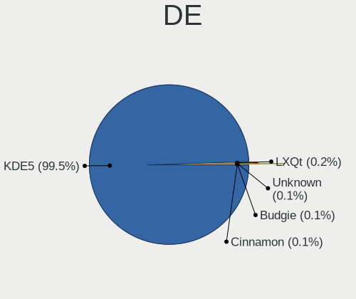

| Name     | Computers | Percent |
|----------|-----------|---------|
| KDE5     | 4692      | 99.47%  |
| LXQt     | 9         | 0.19%   |
| Unknown  | 7         | 0.15%   |
| Budgie   | 5         | 0.11%   |
| Cinnamon | 4         | 0.08%   |

Display Server
--------------

X11 or Wayland

| Name    | Computers | Percent |
|---------|-----------|---------|
| X11     | 4683      | 99.36%  |
| Wayland | 30        | 0.64%   |

Display Manager
---------------

SDDM, LightDM, etc.

| Name    | Computers | Percent |
|---------|-----------|---------|
| SDDM    | 4707      | 99.87%  |
| LightDM | 6         | 0.13%   |

OS Lang
-------

Language

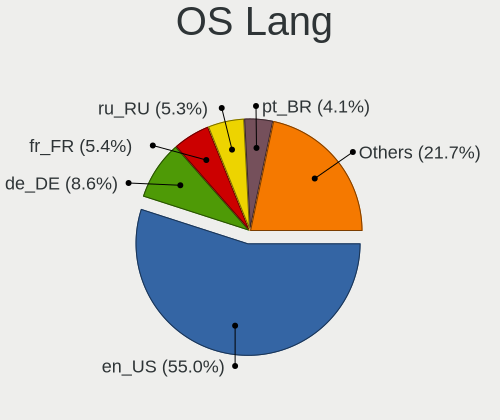

| Lang  | Computers | Percent |
|-------|-----------|---------|
| en_US | 2613      | 54.96%  |
| de_DE | 407       | 8.56%   |
| fr_FR | 256       | 5.38%   |
| ru_RU | 250       | 5.26%   |
| pt_BR | 197       | 4.14%   |
| pl_PL | 145       | 3.05%   |
| it_IT | 130       | 2.73%   |
| en_GB | 104       | 2.19%   |
| es_ES | 93        | 1.96%   |
| cs_CZ | 57        | 1.2%    |
| es_MX | 48        | 1.01%   |
| es_AR | 46        | 0.97%   |
| de_AT | 41        | 0.86%   |
| en_IN | 28        | 0.59%   |
| hu_HU | 26        | 0.55%   |
| en_CA | 24        | 0.5%    |
| tr_TR | 23        | 0.48%   |
| pt_PT | 21        | 0.44%   |
| es_CO | 19        | 0.4%    |
| fr_CA | 18        | 0.38%   |
| nl_NL | 17        | 0.36%   |
| de_CH | 17        | 0.36%   |
| es_CL | 16        | 0.34%   |
| en_AU | 16        | 0.34%   |
| fr_BE | 15        | 0.32%   |
| ru_UA | 11        | 0.23%   |
| es_VE | 11        | 0.23%   |
| nl_BE | 9         | 0.19%   |
| da_DK | 9         | 0.19%   |
| es_PE | 8         | 0.17%   |
| nb_NO | 7         | 0.15%   |
| fr_CH | 6         | 0.13%   |
| ro_RO | 5         | 0.11%   |
| es_CR | 5         | 0.11%   |
| es_UY | 4         | 0.08%   |
| es_EC | 4         | 0.08%   |
| es_BO | 4         | 0.08%   |
| uk_UA | 3         | 0.06%   |
| es_SV | 3         | 0.06%   |
| es_DO | 3         | 0.06%   |

Boot Mode
---------

EFI or BIOS

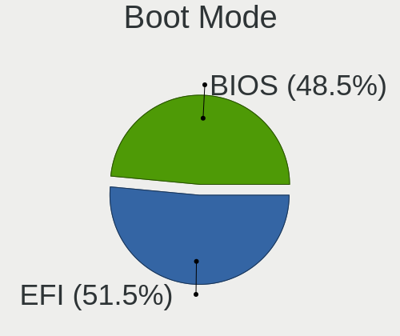

| Mode | Computers | Percent |
|------|-----------|---------|
| EFI  | 2431      | 51.48%  |
| BIOS | 2291      | 48.52%  |

Filesystem
----------

Type of filesystem

| Type     | Computers | Percent |
|----------|-----------|---------|
| Overlay  | 3744      | 77.92%  |
| Ext4     | 1034      | 21.52%  |
| Xfs      | 9         | 0.19%   |
| Btrfs    | 8         | 0.17%   |
| F2fs     | 5         | 0.1%    |
| Jfs      | 2         | 0.04%   |
| Ext3     | 2         | 0.04%   |
| Reiserfs | 1         | 0.02%   |

Part. scheme
------------

Scheme of partitioning

| Type    | Computers | Percent |
|---------|-----------|---------|
| GPT     | 3167      | 66.83%  |
| MBR     | 1551      | 32.73%  |
| Unknown | 21        | 0.44%   |

Dual Boot with Linux/BSD
------------------------

Hosting more than one Linux/BSD

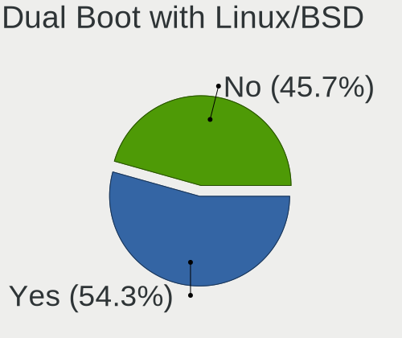

| Dual boot | Computers | Percent |
|-----------|-----------|---------|
| Yes       | 2587      | 54.35%  |
| No        | 2173      | 45.65%  |

Dual Boot (Win)
---------------

Hosting Linux and Windows

| Dual boot | Computers | Percent |
|-----------|-----------|---------|
| No        | 2402      | 50.8%   |
| Yes       | 2326      | 49.2%   |

Board
-----

Vendor
------

Motherboard manufacturer

| Name                | Computers | Percent |
|---------------------|-----------|---------|
| ASUSTek Computer    | 745       | 15.81%  |
| Dell                | 623       | 13.22%  |
| Hewlett-Packard     | 618       | 13.12%  |
| Lenovo              | 548       | 11.63%  |
| Gigabyte Technology | 415       | 8.81%   |
| Acer                | 310       | 6.58%   |
| MSI                 | 278       | 5.9%    |
| ASRock              | 193       | 4.1%    |
| Toshiba             | 109       | 2.31%   |
| Intel               | 102       | 2.16%   |
| Apple               | 81        | 1.72%   |
| Fujitsu             | 72        | 1.53%   |
| Samsung Electronics | 52        | 1.1%    |
| Sony                | 51        | 1.08%   |
| Positivo            | 34        | 0.72%   |
| Medion              | 29        | 0.62%   |
| Foxconn             | 28        | 0.59%   |
| Pegatron            | 27        | 0.57%   |
| Packard Bell        | 25        | 0.53%   |
| Biostar             | 25        | 0.53%   |
| Unknown             | 23        | 0.49%   |
| ECS                 | 18        | 0.38%   |
| AZW                 | 14        | 0.3%    |
| Fujitsu Siemens     | 13        | 0.28%   |
| HUAWEI              | 12        | 0.25%   |
| eMachines           | 11        | 0.23%   |
| Alienware           | 11        | 0.23%   |
| TUXEDO              | 10        | 0.21%   |
| BESSTAR Tech        | 10        | 0.21%   |
| Philco              | 9         | 0.19%   |
| LG Electronics      | 9         | 0.19%   |
| Chuwi               | 9         | 0.19%   |
| Shuttle             | 8         | 0.17%   |
| Supermicro          | 7         | 0.15%   |
| Notebook            | 7         | 0.15%   |
| Gateway             | 7         | 0.15%   |
| Compaq              | 7         | 0.15%   |
| Microsoft           | 6         | 0.13%   |
| MACHINIST           | 6         | 0.13%   |
| Digibras            | 5         | 0.11%   |

Model
-----

Motherboard model

| Name                           | Computers | Percent |
|--------------------------------|-----------|---------|
| Dell Latitude 3120             | 48        | 1.02%   |
| ASUS All Series                | 46        | 0.98%   |
| Unknown                        | 38        | 0.81%   |
| Dell Latitude 3190 2-in-1      | 34        | 0.72%   |
| Dell Latitude 3310             | 29        | 0.62%   |
| Gigabyte H410M H V3            | 27        | 0.57%   |
| HP Notebook                    | 23        | 0.49%   |
| ASUS UX31E                     | 21        | 0.45%   |
| ASUS SABERTOOTH Z77            | 19        | 0.4%    |
| Dell OptiPlex 7010             | 18        | 0.38%   |
| Lenovo IdeaPad 1 14ADA05 82GW  | 11        | 0.23%   |
| Intel H61                      | 11        | 0.23%   |
| HP Pavilion g6                 | 11        | 0.23%   |
| Sony VGN-FZ31Z                 | 10        | 0.21%   |
| HP Pavilion dv6                | 10        | 0.21%   |
| Dell OptiPlex 780              | 10        | 0.21%   |
| MSI MS-7C91                    | 9         | 0.19%   |
| Gigabyte B450M DS3H            | 9         | 0.19%   |
| ASUS PRIME B450M-A II          | 9         | 0.19%   |
| Lenovo IdeaPad S145-15AST 81N3 | 8         | 0.17%   |
| HP ProDesk 600 G1 SFF          | 8         | 0.17%   |
| Dell OptiPlex 9020             | 8         | 0.17%   |
| Dell OptiPlex 790              | 8         | 0.17%   |
| Dell OptiPlex 380              | 8         | 0.17%   |
| Dell OptiPlex 3020             | 8         | 0.17%   |
| Dell Latitude E6430            | 8         | 0.17%   |
| Dell Latitude 3300             | 8         | 0.17%   |
| Acer Nitro AN515-57            | 8         | 0.17%   |
| Positivo Mobile                | 7         | 0.15%   |
| MSI MS-7A38                    | 7         | 0.15%   |
| HP EliteDesk 800 G1 SFF        | 7         | 0.15%   |
| HP 15                          | 7         | 0.15%   |
| Dell XPS 15 9530               | 7         | 0.15%   |
| Dell Latitude E7450            | 7         | 0.15%   |
| Dell Latitude E7240            | 7         | 0.15%   |
| Dell Latitude E6420            | 7         | 0.15%   |
| Acer Aspire A515-51G           | 7         | 0.15%   |
| MSI MS-7C37                    | 6         | 0.13%   |
| MSI MS-7C02                    | 6         | 0.13%   |
| MSI MS-7B79                    | 6         | 0.13%   |

Model Family
------------

Motherboard model prefix

| Name                  | Computers | Percent |
|-----------------------|-----------|---------|
| Dell Latitude         | 289       | 6.13%   |
| Acer Aspire           | 207       | 4.39%   |
| Lenovo ThinkPad       | 175       | 3.71%   |
| Lenovo IdeaPad        | 140       | 2.97%   |
| Dell OptiPlex         | 118       | 2.5%    |
| HP Pavilion           | 107       | 2.27%   |
| HP Compaq             | 92        | 1.95%   |
| Toshiba Satellite     | 88        | 1.87%   |
| Dell Inspiron         | 88        | 1.87%   |
| ASUS PRIME            | 87        | 1.85%   |
| Lenovo ThinkCentre    | 65        | 1.38%   |
| HP Laptop             | 65        | 1.38%   |
| HP ProBook            | 55        | 1.17%   |
| ASUS All              | 46        | 0.98%   |
| ASUS VivoBook         | 44        | 0.93%   |
| ASUS TUF              | 41        | 0.87%   |
| ASUS ROG              | 38        | 0.81%   |
| Unknown               | 38        | 0.81%   |
| HP EliteDesk          | 36        | 0.76%   |
| HP EliteBook          | 35        | 0.74%   |
| Dell Precision        | 35        | 0.74%   |
| Gigabyte H410M        | 31        | 0.66%   |
| Dell Vostro           | 31        | 0.66%   |
| Dell XPS              | 30        | 0.64%   |
| Fujitsu ESPRIMO       | 29        | 0.62%   |
| HP ProDesk            | 28        | 0.59%   |
| Fujitsu LIFEBOOK      | 28        | 0.59%   |
| ASUS SABERTOOTH       | 25        | 0.53%   |
| HP Notebook           | 23        | 0.49%   |
| Acer Nitro            | 22        | 0.47%   |
| Lenovo IdeaCentre     | 21        | 0.45%   |
| ASUS UX31E            | 21        | 0.45%   |
| ASUS M5A78L-M         | 20        | 0.42%   |
| Gigabyte B450M        | 19        | 0.4%    |
| Packard Bell EasyNote | 17        | 0.36%   |
| Lenovo Yoga           | 15        | 0.32%   |
| Acer Veriton          | 14        | 0.3%    |
| Acer Swift            | 13        | 0.28%   |
| Acer Extensa          | 13        | 0.28%   |
| Intel H61             | 12        | 0.25%   |

MFG Year
--------

Motherboard manufacture year

| Year    | Computers | Percent |
|---------|-----------|---------|
| 2012    | 480       | 10.19%  |
| 2011    | 442       | 9.38%   |
| 2013    | 388       | 8.23%   |
| 2019    | 346       | 7.34%   |
| 2021    | 343       | 7.28%   |
| 2014    | 343       | 7.28%   |
| 2020    | 328       | 6.96%   |
| 2018    | 320       | 6.79%   |
| 2010    | 302       | 6.41%   |
| 2016    | 240       | 5.09%   |
| 2017    | 238       | 5.05%   |
| 2008    | 231       | 4.9%    |
| 2009    | 222       | 4.71%   |
| 2015    | 217       | 4.61%   |
| 2007    | 144       | 3.06%   |
| 2006    | 68        | 1.44%   |
| 2022    | 45        | 0.96%   |
| 2005    | 8         | 0.17%   |
| Unknown | 4         | 0.08%   |
| 2023    | 3         | 0.06%   |

Form Factor
-----------

Physical design of the computer

| Name        | Computers | Percent |
|-------------|-----------|---------|
| Notebook    | 2206      | 46.82%  |
| Desktop     | 2191      | 46.5%   |
| Convertible | 126       | 2.67%   |
| All in one  | 77        | 1.63%   |
| Mini pc     | 75        | 1.59%   |
| Server      | 20        | 0.42%   |
| Tablet      | 17        | 0.36%   |

Secure Boot
-----------

Enabled or disabled

| State    | Computers | Percent |
|----------|-----------|---------|
| Disabled | 4712      | 100%    |

Coreboot
--------

Have coreboot on board

| Used | Computers | Percent |
|------|-----------|---------|
| No   | 4705      | 99.85%  |
| Yes  | 7         | 0.15%   |

RAM Size
--------

Total RAM memory

| Size in GB      | Computers | Percent |
|-----------------|-----------|---------|
| 4.01-8.0        | 1330      | 28.11%  |
| 3.01-4.0        | 1224      | 25.87%  |
| 8.01-16.0       | 835       | 17.65%  |
| 16.01-24.0      | 701       | 14.82%  |
| 32.01-64.0      | 278       | 5.88%   |
| 1.01-2.0        | 163       | 3.45%   |
| 64.01-256.0     | 63        | 1.33%   |
| 24.01-32.0      | 62        | 1.31%   |
| 2.01-3.0        | 62        | 1.31%   |
| 0.51-1.0        | 10        | 0.21%   |
| More than 256.0 | 3         | 0.06%   |

RAM Used
--------

Used RAM memory

| Used GB   | Computers | Percent |
|-----------|-----------|---------|
| 1.01-2.0  | 3487      | 72.81%  |
| 0.51-1.0  | 806       | 16.83%  |
| 2.01-3.0  | 356       | 7.43%   |
| 0.01-0.5  | 78        | 1.63%   |
| 3.01-4.0  | 35        | 0.73%   |
| 4.01-8.0  | 16        | 0.33%   |
| 8.01-16.0 | 11        | 0.23%   |

Total Drives
------------

Number of drives on board

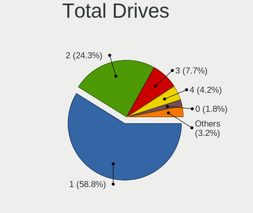

| Drives | Computers | Percent |
|--------|-----------|---------|
| 1      | 2796      | 58.84%  |
| 2      | 1153      | 24.26%  |
| 3      | 368       | 7.74%   |
| 4      | 200       | 4.21%   |
| 0      | 84        | 1.77%   |
| 5      | 80        | 1.68%   |
| 6      | 32        | 0.67%   |
| 7      | 14        | 0.29%   |
| 8      | 7         | 0.15%   |
| 9      | 6         | 0.13%   |
| 12     | 3         | 0.06%   |
| 11     | 3         | 0.06%   |
| 13     | 2         | 0.04%   |
| 25     | 1         | 0.02%   |
| 18     | 1         | 0.02%   |
| 15     | 1         | 0.02%   |
| 10     | 1         | 0.02%   |

Has CD-ROM
----------

Has CD-ROM on board

| Presented | Computers | Percent |
|-----------|-----------|---------|
| Yes       | 2369      | 50.15%  |
| No        | 2355      | 49.85%  |

Has Ethernet
------------

Has Ethernet on board

| Presented | Computers | Percent |
|-----------|-----------|---------|
| Yes       | 4256      | 90.32%  |
| No        | 456       | 9.68%   |

Has WiFi
--------

Has WiFi module

| Presented | Computers | Percent |
|-----------|-----------|---------|
| Yes       | 3241      | 68.65%  |
| No        | 1480      | 31.35%  |

Has Bluetooth
-------------

Has Bluetooth module

| Presented | Computers | Percent |
|-----------|-----------|---------|
| No        | 2369      | 50.15%  |
| Yes       | 2355      | 49.85%  |

Location
--------

Country
-------

Geographic location (country)

| Country     | Computers | Percent |
|-------------|-----------|---------|
| Germany     | 557       | 11.8%   |
| USA         | 541       | 11.46%  |
| France      | 324       | 6.87%   |
| Brazil      | 311       | 6.59%   |
| Russia      | 309       | 6.55%   |
| Poland      | 238       | 5.04%   |
| Italy       | 201       | 4.26%   |
| Netherlands | 200       | 4.24%   |
| UK          | 147       | 3.12%   |
| Spain       | 127       | 2.69%   |
| Canada      | 121       | 2.56%   |
| Mexico      | 89        | 1.89%   |
| India       | 81        | 1.72%   |
| Czechia     | 76        | 1.61%   |
| Australia   | 75        | 1.59%   |
| Japan       | 61        | 1.29%   |
| Indonesia   | 61        | 1.29%   |
| Argentina   | 59        | 1.25%   |
| Austria     | 54        | 1.14%   |
| Romania     | 51        | 1.08%   |
| Portugal    | 51        | 1.08%   |
| Ukraine     | 48        | 1.02%   |
| Switzerland | 45        | 0.95%   |
| Turkey      | 44        | 0.93%   |
| Sweden      | 41        | 0.87%   |
| Belgium     | 41        | 0.87%   |
| Hungary     | 40        | 0.85%   |
| Colombia    | 37        | 0.78%   |
| Slovakia    | 31        | 0.66%   |
| Serbia      | 28        | 0.59%   |
| Finland     | 26        | 0.55%   |
| China       | 24        | 0.51%   |
| Chile       | 24        | 0.51%   |
| Greece      | 22        | 0.47%   |
| Bulgaria    | 22        | 0.47%   |
| Egypt       | 21        | 0.45%   |
| Peru        | 20        | 0.42%   |
| Norway      | 19        | 0.4%    |
| Venezuela   | 18        | 0.38%   |
| Israel      | 17        | 0.36%   |

City
----

Geographic location (city)

| City           | Computers | Percent |
|----------------|-----------|---------|
| Schagen        | 137       | 2.86%   |
| Moscow         | 59        | 1.23%   |
| Warsaw         | 41        | 0.85%   |
| Paris          | 41        | 0.85%   |
| Berlin         | 40        | 0.83%   |
| Sao Paulo      | 37        | 0.77%   |
| Prague         | 33        | 0.69%   |
| Milan          | 28        | 0.58%   |
| Vienna         | 27        | 0.56%   |
| Munich         | 25        | 0.52%   |
| Mexico City    | 25        | 0.52%   |
| Gonikoppal     | 22        | 0.46%   |
| Sydney         | 21        | 0.44%   |
| St Petersburg  | 21        | 0.44%   |
| Rio de Janeiro | 20        | 0.42%   |
| Istanbul       | 18        | 0.38%   |
| Hamburg        | 18        | 0.38%   |
| Strzyzow       | 17        | 0.35%   |
| Jakarta        | 17        | 0.35%   |
| Bengaluru      | 17        | 0.35%   |
| Belgrade       | 17        | 0.35%   |
| Madrid         | 16        | 0.33%   |
| Krakow         | 14        | 0.29%   |
| Cairo          | 14        | 0.29%   |
| Rome           | 13        | 0.27%   |
| Poznan         | 13        | 0.27%   |
| Lima           | 13        | 0.27%   |
| Gdansk         | 12        | 0.25%   |
| Bucharest      | 12        | 0.25%   |
| Brisbane       | 12        | 0.25%   |
| Bratislava     | 12        | 0.25%   |
| Helsinki       | 11        | 0.23%   |
| Cluj-Napoca    | 11        | 0.23%   |
| Cascais        | 11        | 0.23%   |
| Barcelona      | 11        | 0.23%   |
| Zagreb         | 10        | 0.21%   |
| Wroclaw        | 10        | 0.21%   |
| San Jos      | 10        | 0.21%   |
| Montreal       | 10        | 0.21%   |
| Montevideo     | 10        | 0.21%   |

Drives
------

Drive Vendor
------------

Hard drive vendors

| Vendor              | Computers | Drives | Percent |
|---------------------|-----------|--------|---------|
| WDC                 | 1161      | 1445   | 16.98%  |
| Seagate             | 1013      | 1298   | 14.81%  |
| Samsung Electronics | 877       | 1090   | 12.83%  |
| Toshiba             | 475       | 524    | 6.95%   |
| Kingston            | 395       | 438    | 5.78%   |
| Crucial             | 294       | 342    | 4.3%    |
| SanDisk             | 291       | 329    | 4.26%   |
| Hitachi             | 275       | 300    | 4.02%   |
| Unknown             | 180       | 210    | 2.63%   |
| A-DATA Technology   | 162       | 173    | 2.37%   |
| SK hynix            | 141       | 146    | 2.06%   |
| HGST                | 128       | 146    | 1.87%   |
| China               | 81        | 89     | 1.18%   |
| Intel               | 76        | 82     | 1.11%   |
| Micron Technology   | 69        | 74     | 1.01%   |
| GOODRAM             | 52        | 54     | 0.76%   |
| PNY                 | 46        | 57     | 0.67%   |
| Unknown             | 46        | 48     | 0.67%   |
| SPCC                | 45        | 50     | 0.66%   |
| Intenso             | 43        | 44     | 0.63%   |
| Patriot             | 41        | 44     | 0.6%    |
| Maxtor              | 40        | 47     | 0.58%   |
| LITEON              | 39        | 40     | 0.57%   |
| JMicron Technology  | 37        | 39     | 0.54%   |
| Apple               | 37        | 40     | 0.54%   |
| KIOXIA              | 36        | 36     | 0.53%   |
| Apacer              | 34        | 36     | 0.5%    |
| Gigabyte Technology | 33        | 33     | 0.48%   |
| ASMT                | 33        | 40     | 0.48%   |
| Fujitsu             | 29        | 30     | 0.42%   |
| OCZ                 | 27        | 27     | 0.39%   |
| Team                | 26        | 27     | 0.38%   |
| Netac               | 26        | 30     | 0.38%   |
| SSSTC               | 25        | 25     | 0.37%   |
| Phison              | 25        | 28     | 0.37%   |
| Corsair             | 25        | 27     | 0.37%   |
| Transcend           | 24        | 26     | 0.35%   |
| Hewlett-Packard     | 23        | 39     | 0.34%   |
| Silicon Motion      | 19        | 22     | 0.28%   |
| KingSpec            | 18        | 18     | 0.26%   |

Drive Model
-----------

Hard drive models

| Model                              | Computers | Percent |
|------------------------------------|-----------|---------|
| Kingston SA400S37240G 240GB SSD    | 98        | 1.31%   |
| Seagate ST500DM002-1BD142 500GB    | 77        | 1.03%   |
| Seagate ST1000DM010-2EP102 1TB     | 65        | 0.87%   |
| Kingston SA400S37480G 480GB SSD    | 49        | 0.65%   |
| Samsung SSD 860 EVO 500GB          | 48        | 0.64%   |
| Unknown                            | 46        | 0.61%   |
| Kingston SA400S37120G 120GB SSD    | 45        | 0.6%    |
| Toshiba MQ01ABF050 500GB           | 44        | 0.59%   |
| Toshiba MQ01ABD100 1TB             | 44        | 0.59%   |
| Samsung SSD 860 EVO 250GB          | 44        | 0.59%   |
| WDC WD10EZEX-08WN4A0 1TB           | 43        | 0.57%   |
| Unknown SD/MMC/MS PRO 128GB        | 43        | 0.57%   |
| Samsung SSD 850 EVO 250GB          | 43        | 0.57%   |
| Crucial CT500MX500SSD1 500GB       | 42        | 0.56%   |
| Toshiba DT01ACA100 1TB             | 40        | 0.53%   |
| Seagate ST1000LM024 HN-M101MBB 1TB | 40        | 0.53%   |
| Crucial CT240BX500SSD1 240GB       | 40        | 0.53%   |
| Seagate ST2000DM008-2FR102 2TB     | 37        | 0.49%   |
| WDC WDS240G2G0A-00JH30 240GB SSD   | 34        | 0.45%   |
| Toshiba MQ04ABF100 1TB             | 33        | 0.44%   |
| Seagate ST500LT012-1DG142 500GB    | 33        | 0.44%   |
| Seagate ST1000LM035-1RK172 1TB     | 33        | 0.44%   |
| Kingston SV300S37A120G 120GB SSD   | 32        | 0.43%   |
| Toshiba DT01ACA050 500GB           | 30        | 0.4%    |
| Samsung SSD 850 EVO 500GB          | 30        | 0.4%    |
| Crucial CT1000MX500SSD1 1TB        | 30        | 0.4%    |
| Crucial CT480BX500SSD1 480GB       | 28        | 0.37%   |
| Seagate ST1000DM003-1ER162 1TB     | 27        | 0.36%   |
| Seagate ST9500325AS 500GB          | 26        | 0.35%   |
| Samsung SSD 970 EVO Plus 500GB     | 26        | 0.35%   |
| HGST HTS545050A7E680 500GB         | 26        | 0.35%   |
| SanDisk SSD PLUS 240GB             | 25        | 0.33%   |
| Seagate ST3500418AS 500GB          | 24        | 0.32%   |
| Samsung SSD 970 EVO Plus 1TB       | 24        | 0.32%   |
| Samsung HD502HJ 500GB              | 23        | 0.31%   |
| WDC WDS500G2B0A-00SM50 500GB SSD   | 22        | 0.29%   |
| SK hynix BC711 NVMe 128GB          | 22        | 0.29%   |
| JMicron Generic 500GB              | 22        | 0.29%   |
| HGST HTS721010A9E630 1TB           | 22        | 0.29%   |
| A-DATA SU750 256GB SSD             | 22        | 0.29%   |

HDD Vendor
----------

Hard disk drive vendors

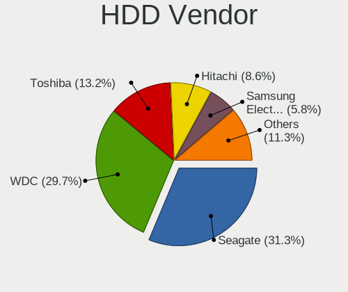

| Vendor              | Computers | Drives | Percent |
|---------------------|-----------|--------|---------|
| Seagate             | 998       | 1272   | 31.32%  |
| WDC                 | 946       | 1148   | 29.69%  |
| Toshiba             | 422       | 466    | 13.25%  |
| Hitachi             | 275       | 300    | 8.63%   |
| Samsung Electronics | 186       | 218    | 5.84%   |
| HGST                | 128       | 146    | 4.02%   |
| Unknown             | 44        | 44     | 1.38%   |
| Maxtor              | 38        | 45     | 1.19%   |
| Fujitsu             | 29        | 30     | 0.91%   |
| JMicron Technology  | 25        | 27     | 0.78%   |
| Apple               | 17        | 18     | 0.53%   |
| ASMT                | 16        | 22     | 0.5%    |
| TO Exter            | 7         | 7      | 0.22%   |
| SABRENT             | 7         | 8      | 0.22%   |
| IBM/Hitachi         | 5         | 7      | 0.16%   |
| Hewlett-Packard     | 5         | 18     | 0.16%   |
| WD MediaMax         | 4         | 5      | 0.13%   |
| Intenso             | 4         | 4      | 0.13%   |
| ASMedia             | 4         | 4      | 0.13%   |
| SAGE                | 3         | 3      | 0.09%   |
| Magnetic Data       | 3         | 3      | 0.09%   |
| Initio              | 2         | 2      | 0.06%   |
| HPE                 | 2         | 3      | 0.06%   |
| External            | 2         | 2      | 0.06%   |
| Unknown             | 2         | 2      | 0.06%   |
| USB                 | 1         | 1      | 0.03%   |
| RSH-339             | 1         | 1      | 0.03%   |
| QUANTUM             | 1         | 1      | 0.03%   |
| QC-FT-D             | 1         | 1      | 0.03%   |
| MARVELL             | 1         | 1      | 0.03%   |
| MARSHAL             | 1         | 1      | 0.03%   |
| LaCie               | 1         | 1      | 0.03%   |
| Inateck             | 1         | 1      | 0.03%   |
| HGST HTS            | 1         | 1      | 0.03%   |
| ExcelStor           | 1         | 1      | 0.03%   |
| Config              | 1         | 1      | 0.03%   |
| China               | 1         | 1      | 0.03%   |

SSD Vendor
----------

Solid state drive vendors

| Vendor              | Computers | Drives | Percent |
|---------------------|-----------|--------|---------|
| Samsung Electronics | 479       | 557    | 18.69%  |
| Kingston            | 330       | 364    | 12.88%  |
| SanDisk             | 256       | 288    | 9.99%   |
| Crucial             | 251       | 288    | 9.79%   |
| WDC                 | 141       | 161    | 5.5%    |
| A-DATA Technology   | 129       | 132    | 5.03%   |
| China               | 80        | 88     | 3.12%   |
| Micron Technology   | 50        | 53     | 1.95%   |
| GOODRAM             | 50        | 50     | 1.95%   |
| PNY                 | 40        | 48     | 1.56%   |
| SK hynix            | 39        | 40     | 1.52%   |
| Toshiba             | 37        | 39     | 1.44%   |
| Patriot             | 35        | 38     | 1.37%   |
| LITEON              | 35        | 35     | 1.37%   |
| SPCC                | 34        | 38     | 1.33%   |
| Intel               | 34        | 36     | 1.33%   |
| Intenso             | 32        | 33     | 1.25%   |
| Apacer              | 31        | 32     | 1.21%   |
| OCZ                 | 27        | 27     | 1.05%   |
| Team                | 24        | 24     | 0.94%   |
| Unknown             | 24        | 25     | 0.94%   |
| Netac               | 23        | 27     | 0.9%    |
| Transcend           | 22        | 23     | 0.86%   |
| Gigabyte Technology | 21        | 21     | 0.82%   |
| KingSpec            | 18        | 18     | 0.7%    |
| Apple               | 18        | 19     | 0.7%    |
| LITEONIT            | 14        | 16     | 0.55%   |
| Hewlett-Packard     | 13        | 15     | 0.51%   |
| ASMT                | 13        | 14     | 0.51%   |
| Lexar               | 12        | 12     | 0.47%   |
| Corsair             | 12        | 13     | 0.47%   |
| KingDian            | 10        | 11     | 0.39%   |
| KIOXIA-EXCERIA      | 9         | 9      | 0.35%   |
| Leven               | 8         | 9      | 0.31%   |
| KingFast            | 8         | 8      | 0.31%   |
| Seagate             | 7         | 7      | 0.27%   |
| USB3.0              | 6         | 6      | 0.23%   |
| Emtec               | 6         | 6      | 0.23%   |
| Colorful            | 6         | 8      | 0.23%   |
| TCSUNBOW            | 5         | 5      | 0.2%    |

Drive Kind
----------

HDD or SSD

| Kind    | Computers | Drives | Percent |
|---------|-----------|--------|---------|
| HDD     | 2679      | 3816   | 44.35%  |
| SSD     | 2202      | 2820   | 36.46%  |
| NVMe    | 923       | 1097   | 15.28%  |
| MMC     | 160       | 172    | 2.65%   |
| Unknown | 76        | 100    | 1.26%   |

Drive Connector
---------------

SATA, SAS, NVMe, etc.

| Type | Computers | Drives | Percent |
|------|-----------|--------|---------|
| SATA | 4033      | 6335   | 74.12%  |
| NVMe | 919       | 1082   | 16.89%  |
| SAS  | 329       | 416    | 6.05%   |
| MMC  | 160       | 172    | 2.94%   |

Drive Size
----------

Size of hard drive

| Size in TB | Computers | Drives | Percent |
|------------|-----------|--------|---------|
| 0.01-0.5   | 3212      | 4285   | 63.74%  |
| 0.51-1.0   | 1281      | 1611   | 25.42%  |
| 1.01-2.0   | 343       | 452    | 6.81%   |
| 3.01-4.0   | 66        | 97     | 1.31%   |
| 2.01-3.0   | 65        | 86     | 1.29%   |
| 4.01-10.0  | 57        | 90     | 1.13%   |
| 10.01-20.0 | 14        | 14     | 0.28%   |
| 20.01-50.0 | 1         | 1      | 0.02%   |

Space Total
-----------

Amount of disk space available on the file system

| Size in GB     | Computers | Percent |
|----------------|-----------|---------|
| 1-20           | 2586      | 53.7%   |
| 101-250        | 701       | 14.56%  |
| 251-500        | 419       | 8.7%    |
| Unknown        | 370       | 7.68%   |
| 501-1000       | 224       | 4.65%   |
| 51-100         | 207       | 4.3%    |
| 21-50          | 189       | 3.92%   |
| 1001-2000      | 79        | 1.64%   |
| More than 3000 | 22        | 0.46%   |
| 2001-3000      | 19        | 0.39%   |

Space Used
----------

Amount of used disk space

| Used GB        | Computers | Percent |
|----------------|-----------|---------|
| 1-20           | 3950      | 82.58%  |
| Unknown        | 370       | 7.74%   |
| 101-250        | 114       | 2.38%   |
| 21-50          | 111       | 2.32%   |
| 51-100         | 101       | 2.11%   |
| 251-500        | 64        | 1.34%   |
| 501-1000       | 43        | 0.9%    |
| 1001-2000      | 20        | 0.42%   |
| More than 3000 | 7         | 0.15%   |
| 2001-3000      | 3         | 0.06%   |

Malfunc. Drives
---------------

Drive models with a malfunction

| Model                               | Computers | Drives | Percent |
|-------------------------------------|-----------|--------|---------|
| Seagate ST500DM002-1BD142 500GB     | 36        | 38     | 2.47%   |
| SanDisk SSD U100 256GB              | 21        | 21     | 1.44%   |
| HGST HTS545050A7E680 500GB          | 21        | 21     | 1.44%   |
| Seagate ST9500325AS 500GB           | 19        | 19     | 1.3%    |
| Seagate ST1000LM024 HN-M101MBB 1TB  | 17        | 17     | 1.17%   |
| HGST HTS541010A9E680 1TB            | 13        | 14     | 0.89%   |
| Toshiba MQ01ABF050 500GB            | 12        | 12     | 0.82%   |
| Seagate ST9320325AS 320GB           | 11        | 11     | 0.75%   |
| Samsung Electronics HD322HJ 320GB   | 11        | 12     | 0.75%   |
| Kingston SV300S37A120G 120GB SSD    | 11        | 11     | 0.75%   |
| Hitachi HTS543232A7A384 320GB       | 10        | 11     | 0.69%   |
| Crucial CT240M500SSD1 240GB         | 10        | 10     | 0.69%   |
| WDC WDS240G2G0A-00JH30 240GB SSD    | 9         | 10     | 0.62%   |
| Toshiba MQ01ABD100 1TB              | 9         | 10     | 0.62%   |
| Seagate ST1000DM010-2EP102 1TB      | 9         | 11     | 0.62%   |
| Seagate ST1000DM003-9YN162 1TB      | 9         | 9      | 0.62%   |
| HGST HTS721010A9E630 1TB            | 9         | 11     | 0.62%   |
| WDC WD10EARS-00Y5B1 1TB             | 8         | 9      | 0.55%   |
| Toshiba MQ01ABD050 500GB            | 8         | 8      | 0.55%   |
| Seagate ST500LT012-1DG142 500GB     | 8         | 8      | 0.55%   |
| Seagate ST500LM012 HN-M500MBB 500GB | 8         | 8      | 0.55%   |
| Seagate ST3500418AS 500GB           | 8         | 9      | 0.55%   |
| Seagate ST3500413AS 500GB           | 8         | 8      | 0.55%   |
| Seagate ST1000LM035-1RK172 1TB      | 8         | 8      | 0.55%   |
| SanDisk SSD PLUS 240GB              | 8         | 8      | 0.55%   |
| Seagate ST500LT012-9WS142 500GB     | 7         | 7      | 0.48%   |
| Seagate ST31000524AS 1TB            | 7         | 8      | 0.48%   |
| Samsung Electronics HD502HJ 500GB   | 7         | 7      | 0.48%   |
| Samsung Electronics HD502HI 500GB   | 7         | 8      | 0.48%   |
| Hitachi HTS725032A7E630 320GB       | 7         | 7      | 0.48%   |
| Hitachi HTS545050A7E380 500GB       | 7         | 7      | 0.48%   |
| HGST HTS545050A7E380 500GB          | 7         | 7      | 0.48%   |
| WDC WD5000AAKS-00V1A0 500GB         | 6         | 6      | 0.41%   |
| WDC WD10EALX-009BA0 1TB             | 6         | 6      | 0.41%   |
| Toshiba DT01ACA050 500GB            | 6         | 7      | 0.41%   |
| Seagate ST2000DM001-1CH164 2TB      | 6         | 6      | 0.41%   |
| SanDisk SSD PLUS 480GB              | 6         | 6      | 0.41%   |
| Hitachi HTS545050B9A300 500GB       | 6         | 6      | 0.41%   |
| Hitachi HDS721050CLA362 500GB       | 6         | 7      | 0.41%   |
| HGST HTS725050A7E630 500GB          | 6         | 6      | 0.41%   |

Malfunc. Drive Vendor
---------------------

Vendors of faulty drives

| Vendor              | Computers | Drives | Percent |
|---------------------|-----------|--------|---------|
| Seagate             | 374       | 423    | 26.41%  |
| WDC                 | 305       | 335    | 21.54%  |
| Hitachi             | 147       | 156    | 10.38%  |
| Toshiba             | 123       | 127    | 8.69%   |
| Samsung Electronics | 109       | 121    | 7.7%    |
| HGST                | 72        | 77     | 5.08%   |
| SanDisk             | 52        | 53     | 3.67%   |
| Kingston            | 29        | 30     | 2.05%   |
| Crucial             | 26        | 27     | 1.84%   |
| Maxtor              | 25        | 27     | 1.77%   |
| A-DATA Technology   | 17        | 18     | 1.2%    |
| Micron Technology   | 13        | 13     | 0.92%   |
| Intel               | 13        | 13     | 0.92%   |
| Fujitsu             | 12        | 12     | 0.85%   |
| China               | 10        | 11     | 0.71%   |
| SK hynix            | 9         | 10     | 0.64%   |
| Apple               | 7         | 7      | 0.49%   |
| LITEON              | 5         | 5      | 0.35%   |
| IBM/Hitachi         | 5         | 7      | 0.35%   |
| GOODRAM             | 5         | 5      | 0.35%   |
| ASMT                | 5         | 6      | 0.35%   |
| OCZ                 | 4         | 4      | 0.28%   |
| Patriot             | 3         | 3      | 0.21%   |
| Hewlett-Packard     | 3         | 4      | 0.21%   |
| Corsair             | 3         | 4      | 0.21%   |
| Transcend           | 2         | 2      | 0.14%   |
| SPCC                | 2         | 2      | 0.14%   |
| PNY                 | 2         | 3      | 0.14%   |
| KingSpec            | 2         | 2      | 0.14%   |
| HP Phison           | 2         | 2      | 0.14%   |
| ASMedia             | 2         | 2      | 0.14%   |
| Unknown             | 2         | 2      | 0.14%   |
| WDC WDS2            | 1         | 1      | 0.07%   |
| WD MediaMax         | 1         | 1      | 0.07%   |
| Vaseky              | 1         | 1      | 0.07%   |
| USB3.0              | 1         | 1      | 0.07%   |
| TO Exter            | 1         | 1      | 0.07%   |
| TEXTORM             | 1         | 1      | 0.07%   |
| TCSUNBOW            | 1         | 1      | 0.07%   |
| SSSTC               | 1         | 1      | 0.07%   |

Malfunc. HDD Vendor
-------------------

Vendors of faulty HDD drives

| Vendor              | Computers | Drives | Percent |
|---------------------|-----------|--------|---------|
| Seagate             | 374       | 423    | 32.55%  |
| WDC                 | 290       | 317    | 25.24%  |
| Hitachi             | 147       | 156    | 12.79%  |
| Toshiba             | 120       | 124    | 10.44%  |
| Samsung Electronics | 89        | 99     | 7.75%   |
| HGST                | 72        | 77     | 6.27%   |
| Maxtor              | 25        | 27     | 2.18%   |
| Fujitsu             | 12        | 12     | 1.04%   |
| IBM/Hitachi         | 5         | 7      | 0.44%   |
| Apple               | 3         | 3      | 0.26%   |
| ASMedia             | 2         | 2      | 0.17%   |
| WD MediaMax         | 1         | 1      | 0.09%   |
| TO Exter            | 1         | 1      | 0.09%   |
| RSH-339             | 1         | 1      | 0.09%   |
| Magnetic Data       | 1         | 1      | 0.09%   |
| Initio              | 1         | 1      | 0.09%   |
| HPE                 | 1         | 1      | 0.09%   |
| Hewlett-Packard     | 1         | 2      | 0.09%   |
| ExcelStor           | 1         | 1      | 0.09%   |
| ASMT                | 1         | 2      | 0.09%   |
| Unknown             | 1         | 1      | 0.09%   |

Malfunc. Drive Kind
-------------------

Kinds of faulty drives

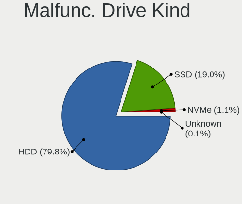

| Kind    | Computers | Drives | Percent |
|---------|-----------|--------|---------|
| HDD     | 1052      | 1259   | 79.82%  |
| SSD     | 251       | 264    | 19.04%  |
| NVMe    | 14        | 16     | 1.06%   |
| Unknown | 1         | 1      | 0.08%   |

Failed Drives
-------------

Failed drive models

| Model                                            | Computers | Drives | Percent |
|--------------------------------------------------|-----------|--------|---------|
| Samsung Electronics HD103SJ 1TB                  | 3         | 3      | 6.98%   |
| Apple HDD HTS541010A9E662 1TB                    | 3         | 3      | 6.98%   |
| WDC WD3200BEVT-11ZCT0 320GB                      | 2         | 2      | 4.65%   |
| Toshiba MQ01ABD100 1TB                           | 2         | 2      | 4.65%   |
| WDC WD5000BEVT-22ZAT0 500GB                      | 1         | 1      | 2.33%   |
| WDC WD5000BEVT-22A0RT0 500GB                     | 1         | 1      | 2.33%   |
| WDC WD3200BUCT-63TWBY0 320GB                     | 1         | 1      | 2.33%   |
| WDC WD3200BEKT-60KA9T0 320GB                     | 1         | 1      | 2.33%   |
| WDC WD3200AAJS-60Z0A0 320GB                      | 1         | 1      | 2.33%   |
| WDC WD2500BEVT-60ZCT1 250GB                      | 1         | 1      | 2.33%   |
| WDC WD20EARS-00MVWB0 2TB                         | 1         | 1      | 2.33%   |
| WDC WD1600YS-23SHB0 160GB                        | 1         | 1      | 2.33%   |
| WDC WD1600BEVT-75A23T0 160GB                     | 1         | 1      | 2.33%   |
| WDC WD10JPVX-60JC3T0 1TB                         | 1         | 1      | 2.33%   |
| Toshiba MQ01ABD050 500GB                         | 1         | 1      | 2.33%   |
| Toshiba MK3265GSXN 320GB                         | 1         | 1      | 2.33%   |
| Toshiba MK3259GSXP 320GB                         | 1         | 1      | 2.33%   |
| Toshiba MK3256GSY 320GB                          | 1         | 1      | 2.33%   |
| Toshiba DT01ACA100 1TB                           | 1         | 1      | 2.33%   |
| Seagate STM31000528AS 1TB                        | 1         | 1      | 2.33%   |
| Seagate ST980811AS 80GB                          | 1         | 1      | 2.33%   |
| Seagate ST500LM012 HN-M500MBB 500GB              | 1         | 1      | 2.33%   |
| Seagate ST3250318AS 250GB                        | 1         | 1      | 2.33%   |
| Seagate ST3160215A 160GB                         | 1         | 1      | 2.33%   |
| Samsung Electronics SSD 980 500GB                | 1         | 1      | 2.33%   |
| Samsung Electronics MZ7TY128HDHP-000L1 128GB SSD | 1         | 1      | 2.33%   |
| Samsung Electronics HM160HI 160GB                | 1         | 1      | 2.33%   |
| Samsung Electronics HD502IJ 500GB                | 1         | 1      | 2.33%   |
| Samsung Electronics HD103UJ 1TB                  | 1         | 1      | 2.33%   |
| Intel SSDSA2BW160G3 160GB                        | 1         | 1      | 2.33%   |
| Hitachi HTS725050A7E630 500GB                    | 1         | 1      | 2.33%   |
| Hitachi HTS545050B9SA00 500GB                    | 1         | 1      | 2.33%   |
| Hitachi HTS545050A7E380 500GB                    | 1         | 1      | 2.33%   |
| Hitachi HDS721010DLE630 1TB                      | 1         | 1      | 2.33%   |
| Hitachi HDP725050GLA360 500GB                    | 1         | 1      | 2.33%   |
| GOODRAM SSDPR-PX500-256-80 256GB                 | 1         | 1      | 2.33%   |
| Apple HDD HTS545050A7E362 500GB                  | 1         | 1      | 2.33%   |

Failed Drive Vendor
-------------------

Failed drive vendors

| Vendor              | Computers | Drives | Percent |
|---------------------|-----------|--------|---------|
| WDC                 | 12        | 12     | 27.91%  |
| Samsung Electronics | 8         | 8      | 18.6%   |
| Toshiba             | 7         | 7      | 16.28%  |
| Seagate             | 5         | 5      | 11.63%  |
| Hitachi             | 5         | 5      | 11.63%  |
| Apple               | 4         | 4      | 9.3%    |
| Intel               | 1         | 1      | 2.33%   |
| GOODRAM             | 1         | 1      | 2.33%   |

Drive Status
------------

Number of failed and malfunc. drives

| Status   | Computers | Drives | Percent |
|----------|-----------|--------|---------|
| Works    | 3689      | 5874   | 67.43%  |
| Malfunc  | 1289      | 1540   | 23.56%  |
| Detected | 451       | 548    | 8.24%   |
| Failed   | 42        | 43     | 0.77%   |

Storage controller
------------------

Storage Vendor
--------------

Storage controller vendors

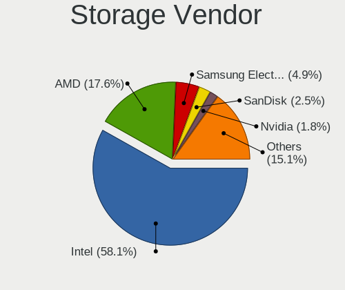

| Vendor                           | Computers | Percent |
|----------------------------------|-----------|---------|
| Intel                            | 3314      | 58.14%  |
| AMD                              | 1001      | 17.56%  |
| Samsung Electronics              | 280       | 4.91%   |
| SanDisk                          | 143       | 2.51%   |
| Nvidia                           | 102       | 1.79%   |
| JMicron Technology               | 100       | 1.75%   |
| SK hynix                         | 94        | 1.65%   |
| ASMedia Technology               | 87        | 1.53%   |
| Marvell Technology Group         | 78        | 1.37%   |
| Kingston Technology Company      | 72        | 1.26%   |
| Phison Electronics               | 69        | 1.21%   |
| Silicon Motion                   | 51        | 0.89%   |
| Micron/Crucial Technology        | 48        | 0.84%   |
| KIOXIA                           | 35        | 0.61%   |
| ADATA Technology                 | 31        | 0.54%   |
| VIA Technologies                 | 24        | 0.42%   |
| Solid State Storage Technology   | 24        | 0.42%   |
| Micron Technology                | 23        | 0.4%    |
| Toshiba America Info Systems     | 21        | 0.37%   |
| Realtek Semiconductor            | 19        | 0.33%   |
| Broadcom / LSI                   | 13        | 0.23%   |
| Union Memory (Shenzhen)          | 9         | 0.16%   |
| Seagate Technology               | 8         | 0.14%   |
| MAXIO Technology (Hangzhou)      | 7         | 0.12%   |
| Lite-On Technology               | 7         | 0.12%   |
| Integrated Technology Express    | 6         | 0.11%   |
| Silicon Integrated Systems [SiS] | 5         | 0.09%   |
| Shenzhen Longsys Electronics     | 4         | 0.07%   |
| LSI Logic / Symbios Logic        | 4         | 0.07%   |
| Adaptec                          | 4         | 0.07%   |
| Silicon Image                    | 3         | 0.05%   |
| Yangtze Memory Technologies      | 2         | 0.04%   |
| Promise Technology               | 2         | 0.04%   |
| Hewlett-Packard                  | 2         | 0.04%   |
| Apple                            | 2         | 0.04%   |
| OCZ Technology Group             | 1         | 0.02%   |
| Netac Technology                 | 1         | 0.02%   |
| Lite-On IT Corp. / Plextor       | 1         | 0.02%   |
| INNOGRIT                         | 1         | 0.02%   |
| Biwin Storage Technology         | 1         | 0.02%   |

Storage Model
-------------

Storage controller models

| Model                                                                                   | Computers | Percent |
|-----------------------------------------------------------------------------------------|-----------|---------|
| AMD FCH SATA Controller [AHCI mode]                                                     | 576       | 8.53%   |
| Intel 8 Series/C220 Series Chipset Family 6-port SATA Controller 1 [AHCI mode]          | 263       | 3.89%   |
| Intel 7 Series Chipset Family 6-port SATA Controller [AHCI mode]                        | 252       | 3.73%   |
| Intel Sunrise Point-LP SATA Controller [AHCI mode]                                      | 195       | 2.89%   |
| Intel 6 Series/C200 Series Chipset Family 6 port Mobile SATA AHCI Controller            | 175       | 2.59%   |
| AMD SB7x0/SB8x0/SB9x0 SATA Controller [AHCI mode]                                       | 158       | 2.34%   |
| AMD SB7x0/SB8x0/SB9x0 IDE Controller                                                    | 156       | 2.31%   |
| Intel 82801 Mobile SATA Controller [RAID mode]                                          | 141       | 2.09%   |
| Intel NM10/ICH7 Family SATA Controller [IDE mode]                                       | 136       | 2.01%   |
| Samsung NVMe SSD Controller SM981/PM981/PM983                                           | 135       | 2%      |
| Intel 6 Series/C200 Series Chipset Family 6 port Desktop SATA AHCI Controller           | 134       | 1.98%   |
| Intel 82801IBM/IEM (ICH9M/ICH9M-E) 4 port SATA Controller [AHCI mode]                   | 120       | 1.78%   |
| AMD 400 Series Chipset SATA Controller                                                  | 120       | 1.78%   |
| Intel Celeron/Pentium Silver Processor SATA Controller                                  | 115       | 1.7%    |
| Intel Q170/Q150/B150/H170/H110/Z170/CM236 Chipset SATA Controller [AHCI Mode]           | 110       | 1.63%   |
| Intel 7 Series/C210 Series Chipset Family 6-port SATA Controller [AHCI mode]            | 110       | 1.63%   |
| Intel 82801G (ICH7 Family) IDE Controller                                               | 98        | 1.45%   |
| Intel 8 Series SATA Controller 1 [AHCI mode]                                            | 89        | 1.32%   |
| AMD SB7x0/SB8x0/SB9x0 SATA Controller [IDE mode]                                        | 86        | 1.27%   |
| Intel SATA Controller [RAID Mode]                                                       | 85        | 1.26%   |
| Samsung NVMe SSD Controller 980 (DRAM-less)                                             | 84        | 1.24%   |
| Intel 5 Series/3400 Series Chipset 4 port SATA AHCI Controller                          | 83        | 1.23%   |
| Intel 200 Series PCH SATA controller [AHCI mode]                                        | 83        | 1.23%   |
| Intel 82801HM/HEM (ICH8M/ICH8M-E) IDE Controller                                        | 82        | 1.21%   |
| ASMedia ASM1061/ASM1062 Serial ATA Controller                                           | 81        | 1.2%    |
| AMD 500 Series Chipset SATA Controller                                                  | 80        | 1.18%   |
| Intel Wildcat Point-LP SATA Controller [AHCI Mode]                                      | 77        | 1.14%   |
| Intel 5 Series/3400 Series Chipset 6 port SATA AHCI Controller                          | 73        | 1.08%   |
| Intel Atom Processor E3800 Series SATA AHCI Controller                                  | 72        | 1.07%   |
| Intel 6 Series/C200 Series Chipset Family Desktop SATA Controller (IDE mode, ports 4-5) | 71        | 1.05%   |
| Intel 6 Series/C200 Series Chipset Family Desktop SATA Controller (IDE mode, ports 0-3) | 71        | 1.05%   |
| Intel Cannon Lake PCH SATA AHCI Controller                                              | 70        | 1.04%   |
| Intel 82801HM/HEM (ICH8M/ICH8M-E) SATA Controller [AHCI mode]                           | 70        | 1.04%   |
| JMicron JMB363 SATA/IDE Controller                                                      | 67        | 0.99%   |
| Intel 500 Series Chipset Family SATA AHCI Controller                                    | 66        | 0.98%   |
| Intel Atom/Celeron/Pentium Processor x5-E8000/J3xxx/N3xxx Series SATA Controller        | 44        | 0.65%   |
| SK hynix Gold P31/BC711/PC711 NVMe Solid State Drive                                    | 43        | 0.64%   |
| Silicon Motion SM2263EN/SM2263XT (DRAM-less) NVMe SSD Controllers                       | 43        | 0.64%   |
| Nvidia MCP61 SATA Controller                                                            | 42        | 0.62%   |
| SanDisk Ultra 3D / WD PC SN530, IX SN530, Blue SN550 NVMe SSD (DRAM-less)               | 41        | 0.61%   |

Storage Kind
------------

Kind of storage controller (IDE, SATA, NVMe, SAS, ...)

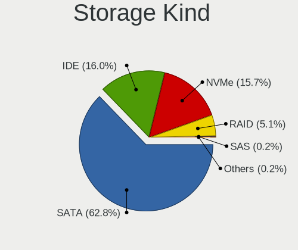

| Kind | Computers | Percent |
|------|-----------|---------|
| SATA | 3655      | 62.78%  |
| IDE  | 933       | 16.03%  |
| NVMe | 915       | 15.72%  |
| RAID | 298       | 5.12%   |
| SAS  | 12        | 0.21%   |
| SCSI | 9         | 0.15%   |

Processor
---------

CPU Vendor
----------

Processor vendors

| Vendor | Computers | Percent |
|--------|-----------|---------|
| Intel  | 3540      | 75.13%  |
| AMD    | 1172      | 24.87%  |

CPU Model
---------

Processor models

| Model                                         | Computers | Percent |
|-----------------------------------------------|-----------|---------|
| Intel Pentium Silver N6000 @ 1.10GHz          | 54        | 1.14%   |
| Intel Core i5-10400 CPU @ 2.90GHz             | 41        | 0.87%   |
| Intel Core i5-3320M CPU @ 2.60GHz             | 36        | 0.76%   |
| Intel Core i5-8250U CPU @ 1.60GHz             | 35        | 0.74%   |
| Intel Core i5-7200U CPU @ 2.50GHz             | 33        | 0.7%    |
| Intel Core 2 Duo CPU E8400 @ 3.00GHz          | 33        | 0.7%    |
| Intel Core i5-8265U CPU @ 1.60GHz             | 32        | 0.68%   |
| Intel Core i5-2400 CPU @ 3.10GHz              | 31        | 0.66%   |
| Intel Pentium Silver N5030 CPU @ 1.10GHz      | 30        | 0.64%   |
| Intel Core i5-3210M CPU @ 2.50GHz             | 30        | 0.64%   |
| Intel Core i5-3470 CPU @ 3.20GHz              | 29        | 0.61%   |
| AMD Ryzen 5 3600 6-Core Processor             | 29        | 0.61%   |
| Intel Core i5-5200U CPU @ 2.20GHz             | 28        | 0.59%   |
| Intel Core i5-4570 CPU @ 3.20GHz              | 28        | 0.59%   |
| AMD Ryzen 5 3500U with Radeon Vega Mobile Gfx | 27        | 0.57%   |
| Intel Core 2 Quad CPU Q6600 @ 2.40GHz         | 25        | 0.53%   |
| Intel Core i5-2520M CPU @ 2.50GHz             | 24        | 0.51%   |
| Intel Core i3-2120 CPU @ 3.30GHz              | 24        | 0.51%   |
| AMD FX-8350 Eight-Core Processor              | 24        | 0.51%   |
| Intel Core i5-6300U CPU @ 2.40GHz             | 23        | 0.49%   |
| Intel Core i5-4210U CPU @ 1.70GHz             | 22        | 0.47%   |
| Intel Core i5-3570K CPU @ 3.40GHz             | 22        | 0.47%   |
| Intel Celeron N4020 CPU @ 1.10GHz             | 22        | 0.47%   |
| Intel Celeron CPU N3060 @ 1.60GHz             | 22        | 0.47%   |
| AMD Ryzen 5 5600G with Radeon Graphics        | 22        | 0.47%   |
| Intel Core i7-2677M CPU @ 1.80GHz             | 21        | 0.45%   |
| Intel Core i5-6200U CPU @ 2.30GHz             | 21        | 0.45%   |
| Intel Core i5-2450M CPU @ 2.50GHz             | 21        | 0.45%   |
| Intel Core i3-3220 CPU @ 3.30GHz              | 21        | 0.45%   |
| Intel Celeron CPU N2840 @ 2.16GHz             | 21        | 0.45%   |
| AMD Ryzen 7 3700X 8-Core Processor            | 21        | 0.45%   |
| AMD 3020e with Radeon Graphics                | 21        | 0.45%   |
| Intel Core i3-4130 CPU @ 3.40GHz              | 20        | 0.42%   |
| Intel Core i7-3770 CPU @ 3.40GHz              | 19        | 0.4%    |
| Intel Core i5-6500 CPU @ 3.20GHz              | 19        | 0.4%    |
| Intel Core i3-2310M CPU @ 2.10GHz             | 19        | 0.4%    |
| Intel Core i3-2100 CPU @ 3.10GHz              | 19        | 0.4%    |
| AMD FX-6300 Six-Core Processor                | 19        | 0.4%    |
| Intel Core i5-4590 CPU @ 3.30GHz              | 18        | 0.38%   |
| Intel Core i5 CPU M 520 @ 2.40GHz             | 18        | 0.38%   |

CPU Model Family
----------------

Processor model prefix

| Model                   | Computers | Percent |
|-------------------------|-----------|---------|
| Intel Core i5           | 1103      | 23.39%  |
| Intel Core i3           | 513       | 10.88%  |
| Intel Core i7           | 487       | 10.33%  |
| Intel Celeron           | 339       | 7.19%   |
| Intel Core 2 Duo        | 269       | 5.71%   |
| AMD Ryzen 5             | 213       | 4.52%   |
| Intel Pentium           | 183       | 3.88%   |
| AMD Ryzen 7             | 146       | 3.1%    |
| Other                   | 137       | 2.91%   |
| Intel Pentium Silver    | 102       | 2.16%   |
| AMD FX                  | 102       | 2.16%   |
| Intel Xeon              | 97        | 2.06%   |
| Intel Pentium Dual-Core | 87        | 1.85%   |
| AMD Ryzen 3             | 68        | 1.44%   |
| Intel Core 2 Quad       | 67        | 1.42%   |
| AMD A8                  | 53        | 1.12%   |
| AMD A6                  | 52        | 1.1%    |
| AMD A4                  | 45        | 0.95%   |
| AMD A10                 | 42        | 0.89%   |
| Intel Core 2            | 40        | 0.85%   |
| Intel Atom              | 36        | 0.76%   |
| AMD Phenom II X4        | 36        | 0.76%   |
| Intel Pentium Dual      | 34        | 0.72%   |
| AMD E1                  | 33        | 0.7%    |
| AMD Athlon              | 33        | 0.7%    |
| AMD Ryzen 9             | 31        | 0.66%   |
| AMD Athlon II X2        | 30        | 0.64%   |
| AMD E                   | 28        | 0.59%   |
| AMD Athlon 64 X2        | 24        | 0.51%   |
| Intel Core i9           | 19        | 0.4%    |
| AMD E2                  | 17        | 0.36%   |
| Intel Genuine           | 16        | 0.34%   |
| AMD Ryzen 5 PRO         | 13        | 0.28%   |
| Intel Pentium Gold      | 12        | 0.25%   |
| AMD Sempron             | 12        | 0.25%   |
| AMD C-60                | 12        | 0.25%   |
| AMD Athlon II X4        | 12        | 0.25%   |
| AMD Phenom II X6        | 11        | 0.23%   |
| AMD Athlon X4           | 11        | 0.23%   |
| AMD Athlon II X3        | 11        | 0.23%   |

CPU Cores
---------

Number of processor cores

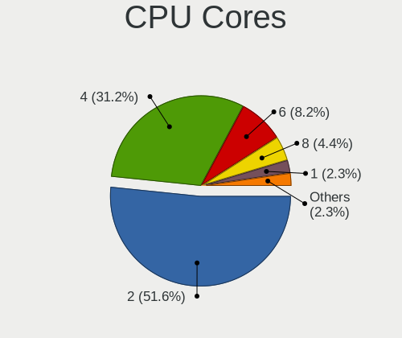

| Number | Computers | Percent |
|--------|-----------|---------|
| 2      | 2434      | 51.62%  |
| 4      | 1469      | 31.16%  |
| 6      | 386       | 8.19%   |
| 8      | 208       | 4.41%   |
| 1      | 109       | 2.31%   |
| 3      | 43        | 0.91%   |
| 12     | 27        | 0.57%   |
| 16     | 21        | 0.45%   |
| 10     | 10        | 0.21%   |
| 14     | 4         | 0.08%   |
| 128    | 1         | 0.02%   |
| 44     | 1         | 0.02%   |
| 28     | 1         | 0.02%   |
| 20     | 1         | 0.02%   |

CPU Sockets
-----------

Number of sockets

| Number | Computers | Percent |
|--------|-----------|---------|
| 1      | 4689      | 99.51%  |
| 2      | 23        | 0.49%   |

CPU Threads
-----------

Threads per core (Hyper-Threading)

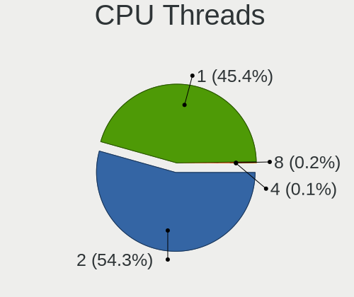

| Number | Computers | Percent |
|--------|-----------|---------|
| 2      | 2562      | 54.35%  |
| 1      | 2139      | 45.38%  |
| 8      | 10        | 0.21%   |
| 4      | 3         | 0.06%   |

CPU Op-Modes
------------

CPU Operation Modes (32-bit, 64-bit)

| Op mode        | Computers | Percent |
|----------------|-----------|---------|
| 32-bit, 64-bit | 4711      | 99.96%  |
| Unknown        | 2         | 0.04%   |

CPU Microcode
-------------

Microcode number

| Number     | Computers | Percent |
|------------|-----------|---------|
| 0x206a7    | 409       | 8.65%   |
| 0x306a9    | 390       | 8.25%   |
| 0x306c3    | 323       | 6.83%   |
| 0x1067a    | 297       | 6.28%   |
| Unknown    | 126       | 2.66%   |
| 0x20655    | 121       | 2.56%   |
| 0x506e3    | 113       | 2.39%   |
| 0x906ea    | 109       | 2.3%    |
| 0x40651    | 97        | 2.05%   |
| 0x306d4    | 94        | 1.99%   |
| 0x406e3    | 93        | 1.97%   |
| 0x806e9    | 86        | 1.82%   |
| 0x6fd      | 82        | 1.73%   |
| 0x08108109 | 80        | 1.69%   |
| 0x806ea    | 76        | 1.61%   |
| 0x706a8    | 75        | 1.59%   |
| 0x906e9    | 73        | 1.54%   |
| 0x906c0    | 73        | 1.54%   |
| 0x08701021 | 72        | 1.52%   |
| 0x30678    | 64        | 1.35%   |
| 0x10676    | 63        | 1.33%   |
| 0x806ec    | 62        | 1.31%   |
| 0x6fb      | 52        | 1.1%    |
| 0xa0655    | 50        | 1.06%   |
| 0x010000c8 | 50        | 1.06%   |
| 0x0a50000c | 49        | 1.04%   |
| 0x706a1    | 48        | 1.02%   |
| 0x06001119 | 47        | 0.99%   |
| 0xa0653    | 42        | 0.89%   |
| 0x20652    | 42        | 0.89%   |
| 0x506c9    | 39        | 0.82%   |
| 0x0800820d | 39        | 0.82%   |
| 0x406c4    | 38        | 0.8%    |
| 0x06006705 | 37        | 0.78%   |
| 0x806c1    | 36        | 0.76%   |
| 0x106e5    | 35        | 0.74%   |
| 0x06003106 | 35        | 0.74%   |
| 0x706e5    | 34        | 0.72%   |
| 0x08600106 | 34        | 0.72%   |
| 0x07030105 | 30        | 0.63%   |

CPU Microarch
-------------

Microarchitecture

| Name             | Computers | Percent |
|------------------|-----------|---------|
| KabyLake         | 484       | 10.26%  |
| Haswell          | 438       | 9.29%   |
| SandyBridge      | 428       | 9.08%   |
| IvyBridge        | 407       | 8.63%   |
| Penryn           | 370       | 7.85%   |
| Skylake          | 215       | 4.56%   |
| Core             | 195       | 4.13%   |
| Westmere         | 176       | 3.73%   |
| Zen+             | 148       | 3.14%   |
| Zen 2            | 141       | 2.99%   |
| Silvermont       | 140       | 2.97%   |
| Piledriver       | 139       | 2.95%   |
| K10              | 138       | 2.93%   |
| Goldmont plus    | 123       | 2.61%   |
| Zen 3            | 111       | 2.35%   |
| CometLake        | 111       | 2.35%   |
| Broadwell        | 107       | 2.27%   |
| Zen              | 95        | 2.01%   |
| Tremont          | 73        | 1.55%   |
| Excavator        | 71        | 1.51%   |
| Bobcat           | 62        | 1.31%   |
| Icelake          | 59        | 1.25%   |
| Unknown          | 54        | 1.15%   |
| Nehalem          | 53        | 1.12%   |
| K8 Hammer        | 52        | 1.1%    |
| Puma             | 44        | 0.93%   |
| Steamroller      | 42        | 0.89%   |
| Goldmont         | 40        | 0.85%   |
| TigerLake        | 38        | 0.81%   |
| K10 Llano        | 32        | 0.68%   |
| Jaguar           | 31        | 0.66%   |
| Bonnell          | 29        | 0.61%   |
| Alderlake Hybrid | 20        | 0.42%   |
| NetBurst         | 19        | 0.4%    |
| Bulldozer        | 19        | 0.4%    |
| K8 & K10 hybrid  | 12        | 0.25%   |

Graphics
--------

GPU Vendor
----------

Vendors of graphics cards

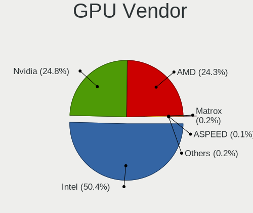

| Vendor                           | Computers | Percent |
|----------------------------------|-----------|---------|
| Intel                            | 2631      | 50.43%  |
| Nvidia                           | 1296      | 24.84%  |
| AMD                              | 1266      | 24.27%  |
| Matrox Electronics Systems       | 8         | 0.15%   |
| ASPEED Technology                | 6         | 0.12%   |
| VIA Technologies                 | 4         | 0.08%   |
| Silicon Integrated Systems [SiS] | 4         | 0.08%   |
| Conexant Systems                 | 1         | 0.02%   |
| ATI Technologies                 | 1         | 0.02%   |

GPU Model
---------

Graphics card models

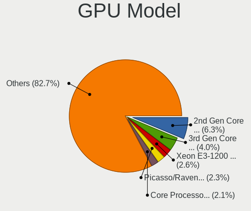

| Model                                                                                    | Computers | Percent |
|------------------------------------------------------------------------------------------|-----------|---------|
| Intel 2nd Generation Core Processor Family Integrated Graphics Controller                | 337       | 6.29%   |
| Intel 3rd Gen Core processor Graphics Controller                                         | 214       | 4%      |
| Intel Xeon E3-1200 v3/4th Gen Core Processor Integrated Graphics Controller              | 141       | 2.63%   |
| AMD Picasso/Raven 2 [Radeon Vega Series / Radeon Vega Mobile Series]                     | 121       | 2.26%   |
| Intel Core Processor Integrated Graphics Controller                                      | 112       | 2.09%   |
| Intel Mobile 4 Series Chipset Integrated Graphics Controller                             | 98        | 1.83%   |
| Intel Haswell-ULT Integrated Graphics Controller                                         | 97        | 1.81%   |
| Intel Skylake GT2 [HD Graphics 520]                                                      | 88        | 1.64%   |
| Intel Xeon E3-1200 v2/3rd Gen Core processor Graphics Controller                         | 83        | 1.55%   |
| Intel HD Graphics 620                                                                    | 83        | 1.55%   |
| Intel HD Graphics 5500                                                                   | 77        | 1.44%   |
| Intel GeminiLake [UHD Graphics 600]                                                      | 77        | 1.44%   |
| Intel Atom Processor Z36xxx/Z37xxx Series Graphics & Display                             | 76        | 1.42%   |
| Intel 4 Series Chipset Integrated Graphics Controller                                    | 75        | 1.4%    |
| Intel HD Graphics 530                                                                    | 74        | 1.38%   |
| Intel JasperLake [UHD Graphics]                                                          | 73        | 1.36%   |
| AMD Ellesmere [Radeon RX 470/480/570/570X/580/580X/590]                                  | 65        | 1.21%   |
| Nvidia GK208B [GeForce GT 710]                                                           | 62        | 1.16%   |
| Intel Atom/Celeron/Pentium Processor x5-E8000/J3xxx/N3xxx Integrated Graphics Controller | 62        | 1.16%   |
| Intel UHD Graphics 620                                                                   | 61        | 1.14%   |
| Intel CometLake-S GT2 [UHD Graphics 630]                                                 | 60        | 1.12%   |
| Intel 4th Gen Core Processor Integrated Graphics Controller                              | 60        | 1.12%   |
| AMD Cezanne [Radeon Vega Series / Radeon Vega Mobile Series]                             | 60        | 1.12%   |
| AMD Renoir [Radeon Vega Series / Radeon Vega Mobile Series]                              | 51        | 0.95%   |
| Intel WhiskeyLake-U GT2 [UHD Graphics 620]                                               | 50        | 0.93%   |
| Intel CoffeeLake-S GT2 [UHD Graphics 630]                                                | 50        | 0.93%   |
| Nvidia GT218 [GeForce 210]                                                               | 49        | 0.92%   |
| Intel Mobile GM965/GL960 Integrated Graphics Controller (secondary)                      | 48        | 0.9%    |
| Intel Mobile GM965/GL960 Integrated Graphics Controller (primary)                        | 48        | 0.9%    |
| Nvidia GP107 [GeForce GTX 1050 Ti]                                                       | 46        | 0.86%   |
| Intel HD Graphics 630                                                                    | 46        | 0.86%   |
| Intel GeminiLake [UHD Graphics 605]                                                      | 46        | 0.86%   |
| AMD Stoney [Radeon R2/R3/R4/R5 Graphics]                                                 | 44        | 0.82%   |
| Intel 4th Generation Core Processor Family Integrated Graphics Controller                | 39        | 0.73%   |
| AMD Raven Ridge [Radeon Vega Series / Radeon Vega Mobile Series]                         | 38        | 0.71%   |
| Nvidia GK208B [GeForce GT 730]                                                           | 32        | 0.6%    |
| AMD Lucienne                                                                             | 32        | 0.6%    |
| Intel HD Graphics 500                                                                    | 31        | 0.58%   |
| Intel CoffeeLake-H GT2 [UHD Graphics 630]                                                | 31        | 0.58%   |
| Intel TigerLake-LP GT2 [Iris Xe Graphics]                                                | 29        | 0.54%   |

GPU Combo
---------

Combinations of graphics cards

| Name                     | Computers | Percent |
|--------------------------|-----------|---------|
| 1 x Intel                | 2160      | 45.73%  |
| 1 x AMD                  | 1097      | 23.23%  |
| 1 x Nvidia               | 918       | 19.44%  |
| Intel + Nvidia           | 345       | 7.3%    |
| Intel + AMD              | 79        | 1.67%   |
| 2 x AMD                  | 70        | 1.48%   |
| AMD + Nvidia             | 22        | 0.47%   |
| 2 x Nvidia               | 7         | 0.15%   |
| 1 x Matrox               | 6         | 0.13%   |
| 1 x ASPEED               | 5         | 0.11%   |
| 1 x VIA                  | 4         | 0.08%   |
| 1 x SiS                  | 4         | 0.08%   |
| Nvidia + Matrox          | 2         | 0.04%   |
| 3 x AMD                  | 1         | 0.02%   |
| 2 x Nvidia + 1 x Matrox  | 1         | 0.02%   |
| Nvidia + ASPEED          | 1         | 0.02%   |
| Intel + Conexant Systems | 1         | 0.02%   |

GPU Driver
----------

Free vs proprietary

| Driver      | Computers | Percent |
|-------------|-----------|---------|
| Free        | 4593      | 97.43%  |
| Unknown     | 114       | 2.42%   |
| Proprietary | 7         | 0.15%   |

GPU Memory
----------

Total video memory

| Size in GB | Computers | Percent |
|------------|-----------|---------|
| Unknown    | 2318      | 49.08%  |
| 0.01-0.5   | 728       | 15.41%  |
| 1.01-2.0   | 616       | 13.04%  |
| 0.51-1.0   | 526       | 11.14%  |
| 3.01-4.0   | 234       | 4.95%   |
| 7.01-8.0   | 158       | 3.35%   |
| 5.01-6.0   | 80        | 1.69%   |
| 2.01-3.0   | 33        | 0.7%    |
| 8.01-16.0  | 25        | 0.53%   |
| 16.01-24.0 | 4         | 0.08%   |
| 4.01-5.0   | 1         | 0.02%   |

Monitor
-------

Monitor Vendor
--------------

Monitor vendors

| Vendor                  | Computers | Percent |
|-------------------------|-----------|---------|
| Samsung Electronics     | 644       | 13.68%  |
| AU Optronics            | 511       | 10.85%  |
| LG Display              | 417       | 8.86%   |
| Chimei Innolux          | 339       | 7.2%    |
| BOE                     | 333       | 7.07%   |
| Goldstar                | 278       | 5.9%    |
| Dell                    | 242       | 5.14%   |
| Hewlett-Packard         | 241       | 5.12%   |
| Acer                    | 178       | 3.78%   |
| AOC                     | 156       | 3.31%   |
| Philips                 | 148       | 3.14%   |
| BenQ                    | 104       | 2.21%   |
| Lenovo                  | 93        | 1.97%   |
| Chi Mei Optoelectronics | 88        | 1.87%   |
| Ancor Communications    | 81        | 1.72%   |
| ViewSonic               | 67        | 1.42%   |
| Apple                   | 66        | 1.4%    |
| Iiyama                  | 45        | 0.96%   |
| Eizo                    | 40        | 0.85%   |
| Sony                    | 36        | 0.76%   |
| Sharp                   | 36        | 0.76%   |
| LG Philips              | 32        | 0.68%   |
| ASUSTek Computer        | 30        | 0.64%   |
| InfoVision              | 29        | 0.62%   |
| CPT                     | 27        | 0.57%   |
| Toshiba                 | 23        | 0.49%   |
| NEC Computers           | 20        | 0.42%   |
| HannStar                | 19        | 0.4%    |
| Fujitsu Siemens         | 19        | 0.4%    |
| PANDA                   | 17        | 0.36%   |
| Panasonic               | 14        | 0.3%    |
| Hitachi                 | 11        | 0.23%   |
| Unknown                 | 10        | 0.21%   |
| Sceptre Tech            | 10        | 0.21%   |
| MSI                     | 10        | 0.21%   |
| ___                     | 9         | 0.19%   |
| Vizio                   | 9         | 0.19%   |
| Vestel Elektronik       | 9         | 0.19%   |
| TCL                     | 9         | 0.19%   |
| Medion                  | 9         | 0.19%   |

Monitor Model
-------------

Monitor models

| Model                                                                    | Computers | Percent |
|--------------------------------------------------------------------------|-----------|---------|
| BOE LCD Monitor BOE093D 1366x768 256x144mm 11.6-inch                     | 33        | 0.69%   |
| Chimei Innolux LCD Monitor CMN15F5 1920x1080 344x193mm 15.5-inch         | 25        | 0.52%   |
| LG Display LCD Monitor LGD02DC 1366x768 344x194mm 15.5-inch              | 24        | 0.5%    |
| Dell D1918H DEL2005 1366x768 410x230mm 18.5-inch                         | 22        | 0.46%   |
| CPT LCD Monitor COR17DB 1600x900 293x164mm 13.2-inch                     | 21        | 0.44%   |
| AU Optronics LCD Monitor AUO202D 1920x1080 293x165mm 13.2-inch           | 20        | 0.42%   |
| Chimei Innolux LCD Monitor CMN15DB 1366x768 344x193mm 15.5-inch          | 19        | 0.4%    |
| Samsung Electronics LCD Monitor SEC5441 1280x800 286x179mm 13.3-inch     | 18        | 0.38%   |
| Goldstar FULL HD GSM5B55 1920x1080 480x270mm 21.7-inch                   | 18        | 0.38%   |
| Eizo EV3285 ENC2979 3840x2160 698x393mm 31.5-inch                        | 17        | 0.36%   |
| AU Optronics LCD Monitor AUO22EC 1366x768 344x193mm 15.5-inch            | 17        | 0.36%   |
| LG Display LCD Monitor LGD033A 1366x768 340x190mm 15.3-inch              | 16        | 0.34%   |
| AU Optronics LCD Monitor AUO38ED 1920x1080 344x193mm 15.5-inch           | 16        | 0.34%   |
| AU Optronics LCD Monitor AUO405C 1366x768 256x144mm 11.6-inch            | 15        | 0.31%   |
| Philips 273PQPY PHLC096 1920x1080 597x336mm 27.0-inch                    | 14        | 0.29%   |
| Chi Mei Optoelectronics LCD Monitor CMO15A7 1366x768 344x193mm 15.5-inch | 14        | 0.29%   |
| AU Optronics LCD Monitor AUO723C 1366x768 309x173mm 13.9-inch            | 14        | 0.29%   |
| Goldstar ULTRAWIDE GSM59F1 2560x1080 677x290mm 29.0-inch                 | 13        | 0.27%   |
| BOE LCD Monitor BOE0812 1920x1080 344x194mm 15.5-inch                    | 13        | 0.27%   |
| AU Optronics LCD Monitor AUO71EC 1366x768 344x193mm 15.5-inch            | 13        | 0.27%   |
| AU Optronics LCD Monitor AUO21ED 1920x1080 344x193mm 15.5-inch           | 13        | 0.27%   |
| AU Optronics LCD Monitor AUO20EC 1366x768 344x193mm 15.5-inch            | 13        | 0.27%   |
| AU Optronics LCD Monitor AUO106C 1366x768 277x156mm 12.5-inch            | 13        | 0.27%   |
| Samsung Electronics LCD Monitor SDC5441 1366x768 309x174mm 14.0-inch     | 12        | 0.25%   |
| Chimei Innolux LCD Monitor CMN14D6 1366x768 309x173mm 13.9-inch          | 12        | 0.25%   |
| AU Optronics LCD Monitor AUO7E91 1366x768 256x144mm 11.6-inch            | 12        | 0.25%   |
| AU Optronics LCD Monitor AUO26EC 1366x768 344x193mm 15.5-inch            | 12        | 0.25%   |
| Samsung Electronics LCD Monitor SEC544B 1600x900 382x215mm 17.3-inch     | 11        | 0.23%   |
| Samsung Electronics C24F390 SAM0D2C 1920x1080 521x293mm 23.5-inch        | 11        | 0.23%   |
| AOC 24B1W1 AOC2401 1920x1080 527x296mm 23.8-inch                         | 11        | 0.23%   |
| LG Display LCD Monitor LGD02D8 1366x768 277x156mm 12.5-inch              | 10        | 0.21%   |
| Chimei Innolux LCD Monitor CMN15E7 1920x1080 344x193mm 15.5-inch         | 10        | 0.21%   |
| Chimei Innolux LCD Monitor CMN15CA 1366x768 344x193mm 15.5-inch          | 10        | 0.21%   |
| Chi Mei Optoelectronics LCD Monitor CMO15A3 1366x768 344x193mm 15.5-inch | 10        | 0.21%   |
| BOE LCD Monitor BOE0744 1366x768 256x144mm 11.6-inch                     | 10        | 0.21%   |
| AU Optronics LCD Monitor AUO139E 1600x900 382x214mm 17.2-inch            | 10        | 0.21%   |
| AOC 2270W AOC2270 1920x1080 477x268mm 21.5-inch                          | 10        | 0.21%   |
| Vestel Elektronik 49FHD_LCD_TV VES3700 1920x1080 1280x720mm 57.8-inch    | 9         | 0.19%   |
| Samsung Electronics C27F390 SAM0D32 1920x1080 600x340mm 27.2-inch        | 9         | 0.19%   |
| Philips PHL 223V5 PHLC0CF 1920x1080 480x270mm 21.7-inch                  | 9         | 0.19%   |

Monitor Resolution
------------------

Monitor screen resolution

| Resolution         | Computers | Percent |
|--------------------|-----------|---------|
| 1920x1080 (FHD)    | 1768      | 38.23%  |
| 1366x768 (WXGA)    | 1259      | 27.22%  |
| 1600x900 (HD+)     | 250       | 5.41%   |
| 3840x2160 (4K)     | 248       | 5.36%   |
| 1280x1024 (SXGA)   | 203       | 4.39%   |
| 2560x1440 (QHD)    | 154       | 3.33%   |
| 1440x900 (WXGA+)   | 148       | 3.2%    |
| 1680x1050 (WSXGA+) | 145       | 3.14%   |
| 1280x800 (WXGA)    | 123       | 2.66%   |
| 1920x1200 (WUXGA)  | 101       | 2.18%   |
| 1360x768           | 45        | 0.97%   |
| 3440x1440          | 27        | 0.58%   |
| 2560x1080          | 26        | 0.56%   |
| 1920x540           | 16        | 0.35%   |
| 1024x768 (XGA)     | 16        | 0.35%   |
| 2560x1600          | 14        | 0.3%    |
| 3200x1800 (QHD+)   | 12        | 0.26%   |
| 1600x1200          | 10        | 0.22%   |
| 2160x1440          | 7         | 0.15%   |
| 2288x1287          | 6         | 0.13%   |
| 1280x720 (HD)      | 6         | 0.13%   |
| 1024x600           | 5         | 0.11%   |
| 2880x1800          | 4         | 0.09%   |
| 2048x1152          | 4         | 0.09%   |
| 1920x1280          | 4         | 0.09%   |
| 1280x960           | 4         | 0.09%   |
| 2880x1920          | 3         | 0.06%   |
| 3840x1080          | 2         | 0.04%   |
| 2256x1504          | 2         | 0.04%   |
| 1680x945           | 2         | 0.04%   |
| 1280x768           | 2         | 0.04%   |
| 3840x2400          | 1         | 0.02%   |
| 3840x1600          | 1         | 0.02%   |
| 3840x1200          | 1         | 0.02%   |
| 3456x2160          | 1         | 0.02%   |
| 3200x2000          | 1         | 0.02%   |
| 2736x1824          | 1         | 0.02%   |
| 1600x2560          | 1         | 0.02%   |
| 1400x1050          | 1         | 0.02%   |
| Unknown            | 1         | 0.02%   |

Monitor Diagonal
----------------

Diagonal size in inches

| Inches  | Computers | Percent |
|---------|-----------|---------|
| 15      | 1058      | 22.45%  |
| 13      | 402       | 8.53%   |
| 23      | 342       | 7.26%   |
| 21      | 334       | 7.09%   |
| 24      | 330       | 7%      |
| 27      | 329       | 6.98%   |
| 17      | 311       | 6.6%    |
| 14      | 265       | 5.62%   |
| 19      | 203       | 4.31%   |
| 11      | 147       | 3.12%   |
| 31      | 146       | 3.1%    |
| 18      | 141       | 2.99%   |
| 22      | 109       | 2.31%   |
| 12      | 100       | 2.12%   |
| 20      | 89        | 1.89%   |
| 34      | 47        | 1%      |
| 84      | 46        | 0.98%   |
| 32      | 34        | 0.72%   |
| Unknown | 29        | 0.62%   |
| 40      | 27        | 0.57%   |
| 54      | 24        | 0.51%   |
| 26      | 23        | 0.49%   |
| 72      | 22        | 0.47%   |
| 25      | 18        | 0.38%   |
| 16      | 16        | 0.34%   |
| 10      | 14        | 0.3%    |
| 65      | 12        | 0.25%   |
| 52      | 12        | 0.25%   |
| 48      | 8         | 0.17%   |
| 46      | 8         | 0.17%   |
| 33      | 7         | 0.15%   |
| 28      | 6         | 0.13%   |
| 74      | 5         | 0.11%   |
| 42      | 5         | 0.11%   |
| 39      | 5         | 0.11%   |
| 142     | 4         | 0.08%   |
| 43      | 4         | 0.08%   |
| 37      | 4         | 0.08%   |
| 35      | 4         | 0.08%   |
| 29      | 4         | 0.08%   |

Monitor Width
-------------

Physical width

| Width in mm    | Computers | Percent |
|----------------|-----------|---------|
| 301-350        | 1593      | 34.18%  |
| 501-600        | 966       | 20.73%  |
| 401-500        | 763       | 16.37%  |
| 201-300        | 466       | 10%     |
| 351-400        | 366       | 7.85%   |
| 601-700        | 184       | 3.95%   |
| 701-800        | 87        | 1.87%   |
| 1001-1500      | 78        | 1.67%   |
| 1501-2000      | 76        | 1.63%   |
| 801-900        | 41        | 0.88%   |
| Unknown        | 29        | 0.62%   |
| 901-1000       | 8         | 0.17%   |
| More than 2000 | 4         | 0.09%   |

Aspect Ratio
------------

Proportional relationship between the width and the height

| Ratio   | Computers | Percent |
|---------|-----------|---------|
| 16/9    | 3594      | 79.88%  |
| 16/10   | 561       | 12.47%  |
| 5/4     | 198       | 4.4%    |
| 21/9    | 51        | 1.13%   |
| 4/3     | 45        | 1%      |
| 3/2     | 29        | 0.64%   |
| 6/5     | 6         | 0.13%   |
| 1.00    | 4         | 0.09%   |
| 32/9    | 3         | 0.07%   |
| Unknown | 3         | 0.07%   |
| 1.96    | 2         | 0.04%   |
| 3.20    | 1         | 0.02%   |
| 2.00    | 1         | 0.02%   |
| 0.56    | 1         | 0.02%   |

Monitor Area
------------

Area in inch

| Area in inch | Computers | Percent |
|----------------|-----------|---------|
| 101-110        | 1051      | 22.42%  |
| 201-250        | 884       | 18.86%  |
| 81-90          | 493       | 10.52%  |
| 151-200        | 401       | 8.55%   |
| 301-350        | 347       | 7.4%    |
| 351-500        | 240       | 5.12%   |
| 141-150        | 211       | 4.5%    |
| 71-80          | 182       | 3.88%   |
| 121-130        | 175       | 3.73%   |
| 251-300        | 151       | 3.22%   |
| 51-60          | 147       | 3.14%   |
| More than 1000 | 144       | 3.07%   |
| 61-70          | 90        | 1.92%   |
| 501-1000       | 62        | 1.32%   |
| 131-140        | 42        | 0.9%    |
| Unknown        | 29        | 0.62%   |
| 111-120        | 18        | 0.38%   |
| 41-50          | 15        | 0.32%   |
| 91-100         | 6         | 0.13%   |

Pixel Density
-------------

Pixels per inch

| Density       | Computers | Percent |
|---------------|-----------|---------|
| 51-100        | 1911      | 41.61%  |
| 101-120       | 1453      | 31.64%  |
| 121-160       | 897       | 19.53%  |
| 161-240       | 157       | 3.42%   |
| 1-50          | 123       | 2.68%   |
| Unknown       | 29        | 0.63%   |
| More than 240 | 23        | 0.5%    |

Multiple Monitors
-----------------

Total monitors connected

| Total | Computers | Percent |
|-------|-----------|---------|
| 1     | 4280      | 90.7%   |
| 2     | 355       | 7.52%   |
| 0     | 60        | 1.27%   |
| 3     | 21        | 0.45%   |
| 4     | 2         | 0.04%   |
| 7     | 1         | 0.02%   |

Network
-------

Net Controller Vendor
---------------------

Controller vendors

| Vendor                            | Computers | Percent |
|-----------------------------------|-----------|---------|
| Realtek Semiconductor             | 2772      | 40.21%  |
| Intel                             | 1905      | 27.63%  |
| Qualcomm Atheros                  | 905       | 13.13%  |
| Broadcom                          | 353       | 5.12%   |
| Ralink Technology                 | 104       | 1.51%   |
| Ralink                            | 101       | 1.47%   |
| Marvell Technology Group          | 94        | 1.36%   |
| Broadcom Limited                  | 86        | 1.25%   |
| Nvidia                            | 76        | 1.1%    |
| TP-Link                           | 61        | 0.88%   |
| Samsung Electronics               | 41        | 0.59%   |
| MediaTek                          | 40        | 0.58%   |
| Qualcomm Atheros Communications   | 22        | 0.32%   |
| JMicron Technology                | 22        | 0.32%   |
| Huawei Technologies               | 22        | 0.32%   |
| Dell                              | 21        | 0.3%    |
| Ericsson Business Mobile Networks | 18        | 0.26%   |
| ASIX Electronics                  | 18        | 0.26%   |
| D-Link System                     | 17        | 0.25%   |
| NetGear                           | 16        | 0.23%   |
| Motorola PCS                      | 14        | 0.2%    |
| D-Link                            | 14        | 0.2%    |
| VIA Technologies                  | 11        | 0.16%   |
| Sierra Wireless                   | 11        | 0.16%   |
| Aquantia                          | 10        | 0.15%   |
| Hewlett-Packard                   | 9         | 0.13%   |
| Xiaomi                            | 8         | 0.12%   |
| Microsoft                         | 7         | 0.1%    |
| Edimax Technology                 | 7         | 0.1%    |
| Belkin Components                 | 7         | 0.1%    |
| ASUSTek Computer                  | 7         | 0.1%    |
| IMC Networks                      | 6         | 0.09%   |
| DisplayLink                       | 6         | 0.09%   |
| Silicon Integrated Systems [SiS]  | 5         | 0.07%   |
| OPPO Electronics                  | 5         | 0.07%   |
| AVM                               | 5         | 0.07%   |
| OnePlus Technology (Shenzhen)     | 4         | 0.06%   |
| Mellanox Technologies             | 4         | 0.06%   |
| ZTE WCDMA Technologies MSM        | 3         | 0.04%   |
| vivo                              | 3         | 0.04%   |

Net Controller Model
--------------------

Controller models

| Model                                                                  | Computers | Percent |
|------------------------------------------------------------------------|-----------|---------|
| Realtek RTL8111/8168/8211/8411 PCI Express Gigabit Ethernet Controller | 1947      | 24.44%  |
| Realtek RTL810xE PCI Express Fast Ethernet controller                  | 370       | 4.64%   |
| Intel 82579LM Gigabit Network Connection (Lewisville)                  | 191       | 2.4%    |
| Qualcomm Atheros AR9485 Wireless Network Adapter                       | 131       | 1.64%   |
| Realtek RTL8821CE 802.11ac PCIe Wireless Network Adapter               | 126       | 1.58%   |
| Qualcomm Atheros AR9285 Wireless Network Adapter (PCI-Express)         | 118       | 1.48%   |
| Qualcomm Atheros QCA9377 802.11ac Wireless Network Adapter             | 114       | 1.43%   |
| Qualcomm Atheros QCA9565 / AR9565 Wireless Network Adapter             | 109       | 1.37%   |
| Intel Wi-Fi 6 AX200                                                    | 108       | 1.36%   |
| Intel Wireless 8265 / 8275                                             | 98        | 1.23%   |
| Intel Ethernet Connection I217-LM                                      | 97        | 1.22%   |
| Intel Wireless 7265                                                    | 96        | 1.2%    |
| Realtek RTL8125 2.5GbE Controller                                      | 87        | 1.09%   |
| Intel Wireless 7260                                                    | 78        | 0.98%   |
| Intel Centrino Advanced-N 6205 [Taylor Peak]                           | 78        | 0.98%   |
| Realtek RTL8188CE 802.11b/g/n WiFi Adapter                             | 73        | 0.92%   |
| Qualcomm Atheros QCA6174 802.11ac Wireless Network Adapter             | 70        | 0.88%   |
| Intel Wireless 3165                                                    | 69        | 0.87%   |
| Broadcom BCM4313 802.11bgn Wireless Network Adapter                    | 66        | 0.83%   |
| Intel I211 Gigabit Network Connection                                  | 63        | 0.79%   |
| Realtek RTL8153 Gigabit Ethernet Adapter                               | 62        | 0.78%   |
| Intel 82579V Gigabit Network Connection                                | 62        | 0.78%   |
| Intel Wi-Fi 6 AX201 160MHz                                             | 61        | 0.77%   |
| Intel Dual Band Wireless-AC 3168NGW [Stone Peak]                       | 59        | 0.74%   |
| Intel Wireless 8260                                                    | 58        | 0.73%   |
| Intel Ethernet Connection (2) I219-V                                   | 56        | 0.7%    |
| Qualcomm Atheros AR8151 v2.0 Gigabit Ethernet                          | 55        | 0.69%   |
| Realtek RTL8723BE PCIe Wireless Network Adapter                        | 50        | 0.63%   |
| Realtek RTL8822CE 802.11ac PCIe Wireless Network Adapter               | 49        | 0.61%   |
| Realtek RTL8188EUS 802.11n Wireless Network Adapter                    | 48        | 0.6%    |
| Intel Cannon Point-LP CNVi [Wireless-AC]                               | 46        | 0.58%   |
| Ralink MT7601U Wireless Adapter                                        | 41        | 0.51%   |
| Intel 82567LM-3 Gigabit Network Connection                             | 41        | 0.51%   |
| Realtek RTL8188EE Wireless Network Adapter                             | 40        | 0.5%    |
| Intel Wireless 3160                                                    | 40        | 0.5%    |
| Samsung Galaxy series, misc. (tethering mode)                          | 39        | 0.49%   |
| Realtek RTL-8100/8101L/8139 PCI Fast Ethernet Adapter                  | 38        | 0.48%   |
| Intel Ethernet Connection (7) I219-V                                   | 36        | 0.45%   |
| Qualcomm Atheros AR93xx Wireless Network Adapter                       | 35        | 0.44%   |
| Nvidia MCP61 Ethernet                                                  | 35        | 0.44%   |

Wireless Vendor
---------------

Wireless vendors

| Vendor                                | Computers | Percent |
|---------------------------------------|-----------|---------|
| Intel                                 | 1313      | 38.96%  |
| Qualcomm Atheros                      | 722       | 21.42%  |
| Realtek Semiconductor                 | 650       | 19.29%  |
| Broadcom                              | 213       | 6.32%   |
| Ralink Technology                     | 104       | 3.09%   |
| Ralink                                | 101       | 3%      |
| TP-Link                               | 45        | 1.34%   |
| Broadcom Limited                      | 39        | 1.16%   |
| MediaTek                              | 34        | 1.01%   |
| Qualcomm Atheros Communications       | 22        | 0.65%   |
| NetGear                               | 14        | 0.42%   |
| D-Link                                | 14        | 0.42%   |
| Dell                                  | 13        | 0.39%   |
| Sierra Wireless                       | 11        | 0.33%   |
| D-Link System                         | 8         | 0.24%   |
| Microsoft                             | 7         | 0.21%   |
| Edimax Technology                     | 7         | 0.21%   |
| ASUSTek Computer                      | 7         | 0.21%   |
| IMC Networks                          | 6         | 0.18%   |
| Belkin Components                     | 6         | 0.18%   |
| Marvell Technology Group              | 5         | 0.15%   |
| AVM                                   | 5         | 0.15%   |
| Hewlett-Packard                       | 4         | 0.12%   |
| Qcom                                  | 2         | 0.06%   |
| Mercucys                              | 2         | 0.06%   |
| Linksys                               | 2         | 0.06%   |
| Gemtek                                | 2         | 0.06%   |
| Chu Yuen Enterprise                   | 2         | 0.06%   |
| 802.11g Adapter [Linksys WUSB54GC v3] | 2         | 0.06%   |
| ZyXEL Communications                  | 1         | 0.03%   |
| ZyDAS                                 | 1         | 0.03%   |
| TRENDnet                              | 1         | 0.03%   |
| Sitecom Europe                        | 1         | 0.03%   |
| Philips (or NXP)                      | 1         | 0.03%   |
| Logitec                               | 1         | 0.03%   |
| Guillemot                             | 1         | 0.03%   |
| BUFFALO                               | 1         | 0.03%   |

Wireless Model
--------------

Wireless models

| Model                                                          | Computers | Percent |
|----------------------------------------------------------------|-----------|---------|
| Qualcomm Atheros AR9485 Wireless Network Adapter               | 131       | 3.88%   |
| Realtek RTL8821CE 802.11ac PCIe Wireless Network Adapter       | 126       | 3.73%   |
| Qualcomm Atheros AR9285 Wireless Network Adapter (PCI-Express) | 118       | 3.49%   |
| Qualcomm Atheros QCA9377 802.11ac Wireless Network Adapter     | 114       | 3.37%   |
| Qualcomm Atheros QCA9565 / AR9565 Wireless Network Adapter     | 109       | 3.23%   |
| Intel Wi-Fi 6 AX200                                            | 108       | 3.2%    |
| Intel Wireless 8265 / 8275                                     | 98        | 2.9%    |
| Intel Wireless 7265                                            | 96        | 2.84%   |
| Intel Wireless 7260                                            | 78        | 2.31%   |
| Intel Centrino Advanced-N 6205 [Taylor Peak]                   | 78        | 2.31%   |
| Realtek RTL8188CE 802.11b/g/n WiFi Adapter                     | 73        | 2.16%   |
| Qualcomm Atheros QCA6174 802.11ac Wireless Network Adapter     | 70        | 2.07%   |
| Intel Wireless 3165                                            | 69        | 2.04%   |
| Broadcom BCM4313 802.11bgn Wireless Network Adapter            | 66        | 1.95%   |
| Intel Wi-Fi 6 AX201 160MHz                                     | 61        | 1.81%   |
| Intel Dual Band Wireless-AC 3168NGW [Stone Peak]               | 59        | 1.75%   |
| Intel Wireless 8260                                            | 58        | 1.72%   |
| Realtek RTL8723BE PCIe Wireless Network Adapter                | 50        | 1.48%   |
| Realtek RTL8822CE 802.11ac PCIe Wireless Network Adapter       | 49        | 1.45%   |
| Realtek RTL8188EUS 802.11n Wireless Network Adapter            | 48        | 1.42%   |
| Intel Cannon Point-LP CNVi [Wireless-AC]                       | 46        | 1.36%   |
| Ralink MT7601U Wireless Adapter                                | 41        | 1.21%   |
| Realtek RTL8188EE Wireless Network Adapter                     | 40        | 1.18%   |
| Intel Wireless 3160                                            | 40        | 1.18%   |
| Qualcomm Atheros AR93xx Wireless Network Adapter               | 35        | 1.04%   |
| Intel WiFi Link 5100                                           | 34        | 1.01%   |
| Qualcomm Atheros AR9462 Wireless Network Adapter               | 32        | 0.95%   |
| Intel Centrino Wireless-N 2230                                 | 32        | 0.95%   |
| Intel PRO/Wireless 3945ABG [Golan] Network Connection          | 31        | 0.92%   |
| Intel Cannon Lake PCH CNVi WiFi                                | 31        | 0.92%   |
| Ralink RT3290 Wireless 802.11n 1T/1R PCIe                      | 30        | 0.89%   |
| Intel PRO/Wireless 4965 AG or AGN [Kedron] Network Connection  | 30        | 0.89%   |
| Qualcomm Atheros AR928X Wireless Network Adapter (PCI-Express) | 29        | 0.86%   |
| Intel Dual Band Wireless-AC 3165 Plus Bluetooth                | 29        | 0.86%   |
| Intel Centrino Ultimate-N 6300                                 | 28        | 0.83%   |
| Intel Wi-Fi 5(802.11ac) Wireless-AC 9x6x [Thunder Peak]        | 27        | 0.8%    |
| Intel Wi-Fi 6 AX201                                            | 26        | 0.77%   |
| Broadcom BCM43224 802.11a/b/g/n                                | 25        | 0.74%   |
| Qualcomm Atheros AR9287 Wireless Network Adapter (PCI-Express) | 24        | 0.71%   |
| Intel Centrino Wireless-N 1000 [Condor Peak]                   | 24        | 0.71%   |

Ethernet Vendor
---------------

Ethernet vendors

| Vendor                            | Computers | Percent |
|-----------------------------------|-----------|---------|
| Realtek Semiconductor             | 2517      | 56.59%  |
| Intel                             | 1026      | 23.07%  |
| Qualcomm Atheros                  | 271       | 6.09%   |
| Broadcom                          | 191       | 4.29%   |
| Marvell Technology Group          | 89        | 2%      |
| Nvidia                            | 76        | 1.71%   |
| Broadcom Limited                  | 48        | 1.08%   |
| Samsung Electronics               | 39        | 0.88%   |
| JMicron Technology                | 22        | 0.49%   |
| ASIX Electronics                  | 18        | 0.4%    |
| TP-Link                           | 16        | 0.36%   |
| Huawei Technologies               | 16        | 0.36%   |
| Motorola PCS                      | 14        | 0.31%   |
| VIA Technologies                  | 11        | 0.25%   |
| Aquantia                          | 10        | 0.22%   |
| D-Link System                     | 9         | 0.2%    |
| Xiaomi                            | 8         | 0.18%   |
| MediaTek                          | 6         | 0.13%   |
| DisplayLink                       | 6         | 0.13%   |
| Silicon Integrated Systems [SiS]  | 5         | 0.11%   |
| OPPO Electronics                  | 5         | 0.11%   |
| OnePlus Technology (Shenzhen)     | 4         | 0.09%   |
| vivo                              | 3         | 0.07%   |
| Spreadtrum Communications         | 3         | 0.07%   |
| Mellanox Technologies             | 3         | 0.07%   |
| HTC (High Tech Computer)          | 3         | 0.07%   |
| Hewlett-Packard                   | 3         | 0.07%   |
| Google                            | 3         | 0.07%   |
| 3Com                              | 3         | 0.07%   |
| T & A Mobile Phones               | 2         | 0.04%   |
| Qualcomm                          | 2         | 0.04%   |
| NetGear                           | 2         | 0.04%   |
| ICS Advent                        | 2         | 0.04%   |
| TOMTOM                            | 1         | 0.02%   |
| Sundance Technology Inc / IC Plus | 1         | 0.02%   |
| Netchip Technology                | 1         | 0.02%   |
| Microchip Technology              | 1         | 0.02%   |
| Lenovo                            | 1         | 0.02%   |
| Emulex                            | 1         | 0.02%   |
| Dell                              | 1         | 0.02%   |

Ethernet Model
--------------

Ethernet models

| Model                                                                  | Computers | Percent |
|------------------------------------------------------------------------|-----------|---------|
| Realtek RTL8111/8168/8211/8411 PCI Express Gigabit Ethernet Controller | 1947      | 42.86%  |
| Realtek RTL810xE PCI Express Fast Ethernet controller                  | 370       | 8.14%   |
| Intel 82579LM Gigabit Network Connection (Lewisville)                  | 191       | 4.2%    |
| Intel Ethernet Connection I217-LM                                      | 97        | 2.14%   |
| Realtek RTL8125 2.5GbE Controller                                      | 87        | 1.92%   |
| Intel I211 Gigabit Network Connection                                  | 63        | 1.39%   |
| Realtek RTL8153 Gigabit Ethernet Adapter                               | 62        | 1.36%   |
| Intel 82579V Gigabit Network Connection                                | 62        | 1.36%   |
| Intel Ethernet Connection (2) I219-V                                   | 56        | 1.23%   |
| Qualcomm Atheros AR8151 v2.0 Gigabit Ethernet                          | 55        | 1.21%   |
| Intel 82567LM-3 Gigabit Network Connection                             | 41        | 0.9%    |
| Samsung Galaxy series, misc. (tethering mode)                          | 39        | 0.86%   |
| Realtek RTL-8100/8101L/8139 PCI Fast Ethernet Adapter                  | 38        | 0.84%   |
| Intel Ethernet Connection (7) I219-V                                   | 36        | 0.79%   |
| Nvidia MCP61 Ethernet                                                  | 35        | 0.77%   |
| Intel Ethernet Controller I225-V                                       | 34        | 0.75%   |
| Intel Ethernet Connection (2) I219-LM                                  | 34        | 0.75%   |
| Qualcomm Atheros AR8152 v2.0 Fast Ethernet                             | 33        | 0.73%   |
| Intel Ethernet Connection I218-LM                                      | 28        | 0.62%   |
| Intel 82577LM Gigabit Network Connection                               | 28        | 0.62%   |
| Qualcomm Atheros AR8131 Gigabit Ethernet                               | 27        | 0.59%   |
| Broadcom NetLink BCM57780 Gigabit Ethernet PCIe                        | 27        | 0.59%   |
| Intel Ethernet Connection I217-V                                       | 26        | 0.57%   |
| Intel Ethernet Connection (3) I218-LM                                  | 23        | 0.51%   |
| Intel 82567LM Gigabit Network Connection                               | 23        | 0.51%   |
| Broadcom NetXtreme BCM57765 Gigabit Ethernet PCIe                      | 22        | 0.48%   |
| Intel Ethernet Connection I219-LM                                      | 21        | 0.46%   |
| Qualcomm Atheros AR8161 Gigabit Ethernet                               | 20        | 0.44%   |
| Intel 82574L Gigabit Network Connection                                | 19        | 0.42%   |
| Qualcomm Atheros AR8121/AR8113/AR8114 Gigabit or Fast Ethernet         | 18        | 0.4%    |
| Broadcom NetXtreme BCM5761 Gigabit Ethernet PCIe                       | 18        | 0.4%    |
| Broadcom NetLink BCM57785 Gigabit Ethernet PCIe                        | 17        | 0.37%   |
| Realtek Killer E2600 GbE Controller                                    | 16        | 0.35%   |
| JMicron JMC250 PCI Express Gigabit Ethernet Controller                 | 16        | 0.35%   |
| Intel Ethernet Connection (2) I218-V                                   | 16        | 0.35%   |
| Qualcomm Atheros Killer E220x Gigabit Ethernet Controller              | 15        | 0.33%   |
| Qualcomm Atheros AR8162 Fast Ethernet                                  | 15        | 0.33%   |
| Intel Ethernet Connection (4) I219-LM                                  | 15        | 0.33%   |
| Broadcom NetXtreme BCM5764M Gigabit Ethernet PCIe                      | 15        | 0.33%   |
| TP-Link UE300 10/100/1000 LAN (ethernet mode) [Realtek RTL8153]        | 14        | 0.31%   |

Net Controller Kind
-------------------

Ethernet, WiFi or modem

| Kind     | Computers | Percent |
|----------|-----------|---------|
| Ethernet | 4254      | 56.41%  |
| WiFi     | 3241      | 42.98%  |
| Modem    | 42        | 0.56%   |
| Unknown  | 4         | 0.05%   |

Used Controller
---------------

Currently used network controller

| Kind     | Computers | Percent |
|----------|-----------|---------|
| Ethernet | 2594      | 55.99%  |
| WiFi     | 2039      | 44.01%  |

NICs
----

Total network controllers on board

| Total | Computers | Percent |
|-------|-----------|---------|
| 2     | 2464      | 52.23%  |
| 1     | 2131      | 45.17%  |
| 3     | 70        | 1.48%   |
| 0     | 41        | 0.87%   |
| 4     | 9         | 0.19%   |
| 5     | 2         | 0.04%   |
| 10    | 1         | 0.02%   |

IPv6
----

IPv6 vs IPv4

| Used | Computers | Percent |
|------|-----------|---------|
| No   | 3348      | 70.68%  |
| Yes  | 1389      | 29.32%  |

Bluetooth
---------

Bluetooth Vendor
----------------

Controller vendors

| Vendor                          | Computers | Percent |
|---------------------------------|-----------|---------|
| Intel                           | 973       | 40.97%  |
| Realtek Semiconductor           | 250       | 10.53%  |
| Qualcomm Atheros Communications | 217       | 9.14%   |
| Cambridge Silicon Radio         | 156       | 6.57%   |
| Broadcom                        | 150       | 6.32%   |
| IMC Networks                    | 107       | 4.51%   |
| Lite-On Technology              | 106       | 4.46%   |
| Apple                           | 78        | 3.28%   |
| Foxconn / Hon Hai               | 73        | 3.07%   |
| Dell                            | 46        | 1.94%   |
| Toshiba                         | 38        | 1.6%    |
| ASUSTek Computer                | 35        | 1.47%   |
| Hewlett-Packard                 | 32        | 1.35%   |
| Ralink                          | 30        | 1.26%   |
| Alps Electric                   | 11        | 0.46%   |
| Realtek                         | 10        | 0.42%   |
| MediaTek                        | 9         | 0.38%   |
| Ralink Technology               | 7         | 0.29%   |
| Marvell Semiconductor           | 5         | 0.21%   |
| Fujitsu                         | 5         | 0.21%   |
| Foxconn International           | 4         | 0.17%   |
| Edimax Technology               | 4         | 0.17%   |
| Askey Computer                  | 4         | 0.17%   |
| TP-Link                         | 3         | 0.13%   |
| Dynex                           | 3         | 0.13%   |
| Unknown                         | 3         | 0.13%   |
| Integrated System Solution      | 2         | 0.08%   |
| Chicony Electronics             | 2         | 0.08%   |
| Belkin Components               | 2         | 0.08%   |
| Accel Semiconductor             | 2         | 0.08%   |
| USI                             | 1         | 0.04%   |
| Taiyo Yuden                     | 1         | 0.04%   |
| Smart Modular Technologies      | 1         | 0.04%   |
| SiW                             | 1         | 0.04%   |
| SINO WEALTH                     | 1         | 0.04%   |
| Primax Electronics              | 1         | 0.04%   |
| Opticis                         | 1         | 0.04%   |
| D-Link System                   | 1         | 0.04%   |

Bluetooth Model
---------------

Controller models

| Model                                                                               | Computers | Percent |
|-------------------------------------------------------------------------------------|-----------|---------|
| Intel Bluetooth wireless interface                                                  | 441       | 18.57%  |
| Cambridge Silicon Radio Bluetooth Dongle (HCI mode)                                 | 156       | 6.57%   |
| Realtek Bluetooth Radio                                                             | 137       | 5.77%   |
| Intel AX201 Bluetooth                                                               | 133       | 5.6%    |
| Intel Bluetooth 9460/9560 Jefferson Peak (JfP)                                      | 127       | 5.35%   |
| Intel AX200 Bluetooth                                                               | 104       | 4.38%   |
| Qualcomm Atheros  Bluetooth Device                                                  | 85        | 3.58%   |
| Realtek  Bluetooth 4.2 Adapter                                                      | 76        | 3.2%    |
| Intel Wireless-AC 3168 Bluetooth                                                    | 56        | 2.36%   |
| Intel Centrino Bluetooth Wireless Transceiver                                       | 43        | 1.81%   |
| IMC Networks Bluetooth Radio                                                        | 43        | 1.81%   |
| Lite-On Qualcomm Atheros QCA9377 Bluetooth                                          | 40        | 1.68%   |
| Qualcomm Atheros QCA61x4 Bluetooth 4.0                                              | 37        | 1.56%   |
| Qualcomm Atheros AR3011 Bluetooth                                                   | 37        | 1.56%   |
| Qualcomm Atheros AR3012 Bluetooth 4.0                                               | 36        | 1.52%   |
| Ralink RT3290 Bluetooth                                                             | 30        | 1.26%   |
| Lite-On Bluetooth Device                                                            | 30        | 1.26%   |
| IMC Networks Bluetooth Device                                                       | 30        | 1.26%   |
| Broadcom BCM20702 Bluetooth 4.0 [ThinkPad]                                          | 29        | 1.22%   |
| Apple Bluetooth Host Controller                                                     | 28        | 1.18%   |
| Broadcom BCM2045B (BDC-2.1)                                                         | 27        | 1.14%   |
| Intel Wireless-AC 9260 Bluetooth Adapter                                            | 26        | 1.09%   |
| Dell DW375 Bluetooth Module                                                         | 24        | 1.01%   |
| Lite-On Atheros AR3012 Bluetooth                                                    | 22        | 0.93%   |
| Intel Centrino Advanced-N 6230 Bluetooth adapter                                    | 22        | 0.93%   |
| HP Broadcom 2070 Bluetooth Combo                                                    | 22        | 0.93%   |
| Apple Bluetooth USB Host Controller                                                 | 22        | 0.93%   |
| Apple Built-in Bluetooth 2.0+EDR HCI                                                | 20        | 0.84%   |
| Intel AX210 Bluetooth                                                               | 19        | 0.8%    |
| Foxconn / Hon Hai Bluetooth Device                                                  | 18        | 0.76%   |
| Realtek 802.11ac WLAN Adapter                                                       | 13        | 0.55%   |
| IMC Networks Atheros AR3012 Bluetooth 4.0 Adapter                                   | 13        | 0.55%   |
| Toshiba RT Bluetooth Radio                                                          | 12        | 0.51%   |
| Realtek RTL8723B Bluetooth                                                          | 12        | 0.51%   |
| Foxconn / Hon Hai Foxconn T77H114 BCM2070 [Single-Chip Bluetooth 2.1 + EDR Adapter] | 12        | 0.51%   |
| Broadcom BCM20702A0 Bluetooth 4.0                                                   | 12        | 0.51%   |
| Qualcomm Atheros AR9462 Bluetooth                                                   | 11        | 0.46%   |
| Dell BCM20702A0 Bluetooth Module                                                    | 11        | 0.46%   |
| Realtek Bluetooth Radio                                                             | 10        | 0.42%   |
| IMC Networks Wireless_Device                                                        | 10        | 0.42%   |

Sound
-----

Sound Vendor
------------

Sound card vendors

| Vendor                                       | Computers | Percent |
|----------------------------------------------|-----------|---------|
| Intel                                        | 3436      | 54.82%  |
| AMD                                          | 1394      | 22.24%  |
| Nvidia                                       | 1017      | 16.23%  |
| C-Media Electronics                          | 92        | 1.47%   |
| Creative Labs                                | 53        | 0.85%   |
| Logitech                                     | 38        | 0.61%   |
| Texas Instruments                            | 22        | 0.35%   |
| JMTek                                        | 16        | 0.26%   |
| Creative Technology                          | 16        | 0.26%   |
| Generalplus Technology                       | 14        | 0.22%   |
| ASUSTek Computer                             | 11        | 0.18%   |
| VIA Technologies                             | 8         | 0.13%   |
| Plantronics                                  | 8         | 0.13%   |
| GN Netcom                                    | 7         | 0.11%   |
| XMOS                                         | 5         | 0.08%   |
| Silicon Integrated Systems [SiS]             | 5         | 0.08%   |
| Realtek Semiconductor                        | 5         | 0.08%   |
| Tenx Technology                              | 4         | 0.06%   |
| Samson Technologies                          | 4         | 0.06%   |
| Kingston Technology                          | 4         | 0.06%   |
| Focusrite-Novation                           | 4         | 0.06%   |
| Blue Microphones                             | 4         | 0.06%   |
| Thesycon Systemsoftware & Consulting         | 3         | 0.05%   |
| SteelSeries ApS                              | 3         | 0.05%   |
| Sony                                         | 3         | 0.05%   |
| Razer USA                                    | 3         | 0.05%   |
| Lenovo                                       | 3         | 0.05%   |
| KTMicro                                      | 3         | 0.05%   |
| Hewlett-Packard                              | 3         | 0.05%   |
| Ensoniq                                      | 3         | 0.05%   |
| Corsair                                      | 3         | 0.05%   |
| BEHRINGER International                      | 3         | 0.05%   |
| Apple                                        | 3         | 0.05%   |
| Zoran Co. Personal Media Division (Nogatech) | 2         | 0.03%   |
| Trust                                        | 2         | 0.03%   |
| ROCCAT                                       | 2         | 0.03%   |
| QinHeng Electronics                          | 2         | 0.03%   |
| PreSonus Audio Electronics                   | 2         | 0.03%   |
| No brand                                     | 2         | 0.03%   |
| Micro Star International                     | 2         | 0.03%   |

Sound Model
-----------

Sound card models

| Model                                                                                             | Computers | Percent |
|---------------------------------------------------------------------------------------------------|-----------|---------|
| Intel 7 Series/C216 Chipset Family High Definition Audio Controller                               | 413       | 5.49%   |
| Intel 6 Series/C200 Series Chipset Family High Definition Audio Controller                        | 394       | 5.23%   |
| AMD Family 17h/19h/1ah HD Audio Controller                                                        | 324       | 4.3%    |
| Intel 8 Series/C220 Series Chipset High Definition Audio Controller                               | 287       | 3.81%   |
| AMD SBx00 Azalia (Intel HDA)                                                                      | 265       | 3.52%   |
| Intel Sunrise Point-LP HD Audio                                                                   | 251       | 3.33%   |
| AMD FCH Azalia Controller                                                                         | 231       | 3.07%   |
| Intel Xeon E3-1200 v3/4th Gen Core Processor HD Audio Controller                                  | 228       | 3.03%   |
| Intel 5 Series/3400 Series Chipset High Definition Audio                                          | 196       | 2.6%    |
| Intel 82801I (ICH9 Family) HD Audio Controller                                                    | 187       | 2.48%   |
| Intel NM10/ICH7 Family High Definition Audio Controller                                           | 163       | 2.17%   |
| AMD Raven/Raven2/Fenghuang HDMI/DP Audio Controller                                               | 155       | 2.06%   |
| AMD Renoir Radeon High Definition Audio Controller                                                | 144       | 1.91%   |
| Intel 100 Series/C230 Series Chipset Family HD Audio Controller                                   | 134       | 1.78%   |
| Intel Celeron/Pentium Silver Processor High Definition Audio                                      | 122       | 1.62%   |
| Nvidia GK208 HDMI/DP Audio Controller                                                             | 118       | 1.57%   |
| AMD Starship/Matisse HD Audio Controller                                                          | 116       | 1.54%   |
| Intel Cannon Lake PCH cAVS                                                                        | 114       | 1.51%   |
| Intel 82801H (ICH8 Family) HD Audio Controller                                                    | 109       | 1.45%   |
| Nvidia GF108 High Definition Audio Controller                                                     | 100       | 1.33%   |
| Intel 8 Series HD Audio Controller                                                                | 99        | 1.32%   |
| Intel Haswell-ULT HD Audio Controller                                                             | 98        | 1.3%    |
| Intel Broadwell-U Audio Controller                                                                | 98        | 1.3%    |
| Intel Wildcat Point-LP High Definition Audio Controller                                           | 94        | 1.25%   |
| Nvidia High Definition Audio Controller                                                           | 90        | 1.2%    |
| Nvidia GP107GL High Definition Audio Controller                                                   | 87        | 1.16%   |
| AMD Kabini HDMI/DP Audio                                                                          | 87        | 1.16%   |
| Intel 200 Series PCH HD Audio                                                                     | 86        | 1.14%   |
| AMD Family 17h (Models 00h-0fh) HD Audio Controller                                               | 78        | 1.04%   |
| Intel Atom Processor Z36xxx/Z37xxx Series High Definition Audio Controller                        | 76        | 1.01%   |
| Intel Jasper Lake HD Audio                                                                        | 73        | 0.97%   |
| AMD Family 15h (Models 60h-6fh) Audio Controller                                                  | 69        | 0.92%   |
| Intel 82801JI (ICH10 Family) HD Audio Controller                                                  | 68        | 0.9%    |
| AMD Ellesmere HDMI Audio [Radeon RX 470/480 / 570/580/590]                                        | 67        | 0.89%   |
| Intel Cannon Point-LP High Definition Audio Controller                                            | 65        | 0.86%   |
| AMD Oland/Hainan/Cape Verde/Pitcairn HDMI Audio [Radeon HD 7000 Series]                           | 65        | 0.86%   |
| Intel Atom/Celeron/Pentium Processor x5-E8000/J3xxx/N3xxx Series High Definition Audio Controller | 58        | 0.77%   |
| AMD Cedar HDMI Audio [Radeon HD 5400/6300/7300 Series]                                            | 54        | 0.72%   |
| Nvidia GM107 High Definition Audio Controller [GeForce 940MX]                                     | 51        | 0.68%   |
| Intel Smart Sound Technology (SST) Audio Controller                                               | 50        | 0.66%   |

Memory
------

Memory Vendor
-------------

Memory module vendors

| Vendor              | Computers | Percent |
|---------------------|-----------|---------|
| Samsung Electronics | 1043      | 18.52%  |
| SK hynix            | 875       | 15.54%  |
| Unknown             | 733       | 13.01%  |
| Kingston            | 711       | 12.62%  |
| Micron Technology   | 456       | 8.1%    |
| Crucial             | 291       | 5.17%   |
| Corsair             | 229       | 4.07%   |
| G.Skill             | 179       | 3.18%   |
| A-DATA Technology   | 135       | 2.4%    |
| Elpida              | 113       | 2.01%   |
| Ramaxel Technology  | 109       | 1.94%   |
| Nanya Technology    | 87        | 1.54%   |
| Unknown             | 74        | 1.31%   |
| Smart               | 70        | 1.24%   |
| Unknown (ABCD)      | 48        | 0.85%   |
| Patriot             | 48        | 0.85%   |
| Team                | 41        | 0.73%   |
| GOODRAM             | 27        | 0.48%   |
| Transcend           | 24        | 0.43%   |
| Teikon              | 21        | 0.37%   |
| AMD                 | 21        | 0.37%   |
| Silicon Power       | 14        | 0.25%   |
| ASint Technology    | 13        | 0.23%   |
| Apacer              | 13        | 0.23%   |
| CSX                 | 12        | 0.21%   |
| Qimonda             | 11        | 0.2%    |
| Kingmax             | 10        | 0.18%   |
| GeIL                | 10        | 0.18%   |
| Unifosa             | 8         | 0.14%   |
| PNY                 | 8         | 0.14%   |
| Avant               | 8         | 0.14%   |
| Smart Brazil        | 7         | 0.12%   |
| High Bridge         | 7         | 0.12%   |
| Goldkey             | 7         | 0.12%   |
| Toshiba             | 6         | 0.11%   |
| Super Talent        | 5         | 0.09%   |
| Sesame              | 5         | 0.09%   |
| Multilaser          | 5         | 0.09%   |
| 48spaces            | 5         | 0.09%   |
| Timetec             | 4         | 0.07%   |

Memory Model
------------

Memory module models

| Model                                                            | Computers | Percent |
|------------------------------------------------------------------|-----------|---------|
| Unknown                                                          | 74        | 1.21%   |
| Samsung RAM M471B5173QH0-YK0 4GB SODIMM DDR3 1600MT/s            | 55        | 0.9%    |
| Samsung RAM M471B5273DH0-CH9 4GB SODIMM DDR3 1334MT/s            | 53        | 0.87%   |
| SK hynix RAM HMT351S6CFR8C-PB 4GB SODIMM DDR3 1600MT/s           | 52        | 0.85%   |
| Samsung RAM M471B5173DB0-YK0 4GB SODIMM DDR3 1600MT/s            | 52        | 0.85%   |
| Unknown RAM Module 2GB SODIMM DDR2 667MT/s                       | 48        | 0.78%   |
| SK hynix RAM HCNNNBKMMLXR-NEE 1GB Row Of Chips LPDDR4 4267MT/s   | 44        | 0.72%   |
| Samsung RAM M471B5173EB0-YK0 4GB SODIMM DDR3 1600MT/s            | 41        | 0.67%   |
| Unknown RAM Module 2GB DIMM SDRAM                                | 40        | 0.65%   |
| Unknown RAM Module 4GB DIMM 1333MT/s                             | 39        | 0.64%   |
| SK hynix RAM HMT451S6BFR8A-PB 4096MB SODIMM DDR3 1600MT/s        | 36        | 0.59%   |
| SK hynix RAM HMT41GS6BFR8A-PB 8GB SODIMM DDR3 1600MT/s           | 36        | 0.59%   |
| SK hynix RAM HMA81GS6AFR8N-UH 8GB SODIMM DDR4 2667MT/s           | 36        | 0.59%   |
| Unknown (ABCD) RAM 123456789012345678 2GB SODIMM LPDDR3 2400MT/s | 35        | 0.57%   |
| Samsung RAM M471B5273CH0-CH9 4GB SODIMM DDR3 1334MT/s            | 35        | 0.57%   |
| Unknown RAM Module 2GB DIMM DDR2 800MT/s                         | 34        | 0.55%   |
| Samsung RAM M471A5244CB0-CTD 4GB SODIMM DDR4 3266MT/s            | 34        | 0.55%   |
| Unknown RAM Module 2GB SODIMM DDR2                               | 28        | 0.46%   |
| Unknown RAM Module 2GB DIMM 800MT/s                              | 28        | 0.46%   |
| SK hynix RAM HMT451S6BFR8A-PB 4GB SODIMM DDR3 1600MT/s           | 27        | 0.44%   |
| SK hynix RAM HMT451S6AFR8A-PB 4GB SODIMM DDR3 1600MT/s           | 25        | 0.41%   |
| Unknown RAM Module 4GB DIMM DDR3 1333MT/s                        | 23        | 0.38%   |
| Samsung RAM M471B5773DH0-CH9 2GB SODIMM DDR3 1600MT/s            | 23        | 0.38%   |
| Samsung RAM M471A5244CB0-CWE 4096MB SODIMM DDR4 3200MT/s         | 23        | 0.38%   |
| Samsung RAM M471A5244CB0-CRC 4GB SODIMM DDR4 2667MT/s            | 23        | 0.38%   |
| Samsung RAM M378B5173QH0-CK0 4GB DIMM DDR3 1600MT/s              | 23        | 0.38%   |
| Samsung RAM M471B5773CHS-CH9 2GB SODIMM DDR3 4199MT/s            | 22        | 0.36%   |
| Samsung RAM M471A1K43CB1-CRC 8GB SODIMM DDR4 2667MT/s            | 22        | 0.36%   |
| Elpida RAM Module 2GB SODIMM DDR3 1333MT/s                       | 22        | 0.36%   |
| Unknown RAM Module 2GB DIMM 1333MT/s                             | 21        | 0.34%   |
| Samsung RAM M471B1G73DB0-YK0 8GB SODIMM DDR3 1600MT/s            | 21        | 0.34%   |
| Micron RAM 4ATF51264HZ-2G6E1 4GB SODIMM DDR4 2667MT/s            | 21        | 0.34%   |
| Unknown RAM Module 1GB SODIMM DDR2 667MT/s                       | 20        | 0.33%   |
| Micron RAM 4ATF51264HZ-3G2J1 4GB SODIMM DDR4 3200MT/s            | 20        | 0.33%   |
| Corsair RAM CMK16GX4M2B3200C16 8GB DIMM DDR4 3600MT/s            | 20        | 0.33%   |
| SK hynix RAM HMT351S6BFR8C-H9 4GB SODIMM DDR3 1333MT/s           | 19        | 0.31%   |
| SK hynix RAM HYMP125S64CP8-S6 2048MB SODIMM DDR2 975MT/s         | 18        | 0.29%   |
| SK hynix RAM HMA851S6AFR6N-UH 4GB SODIMM DDR4 2667MT/s           | 18        | 0.29%   |
| Samsung RAM M471B5273DH0-CK0 4GB SODIMM DDR3 2400MT/s            | 18        | 0.29%   |
| Micron RAM Module 8GB DIMM DDR4 2666MT/s                         | 18        | 0.29%   |

Memory Kind
-----------

Memory module kinds

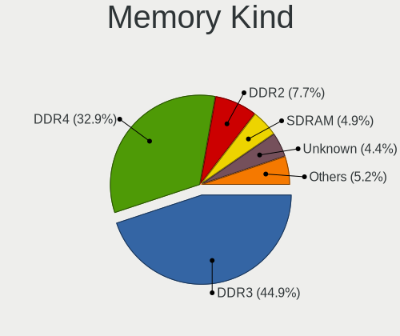

| Kind    | Computers | Percent |
|---------|-----------|---------|
| DDR3    | 2151      | 44.92%  |
| DDR4    | 1573      | 32.85%  |
| DDR2    | 369       | 7.71%   |
| SDRAM   | 235       | 4.91%   |
| Unknown | 213       | 4.45%   |
| LPDDR4  | 144       | 3.01%   |
| DDR     | 44        | 0.92%   |
| LPDDR3  | 34        | 0.71%   |
| DRAM    | 15        | 0.31%   |
| DDR5    | 9         | 0.19%   |
| LPDDR5  | 1         | 0.02%   |

Memory Form Factor
------------------

Physical design of the memory module

| Name         | Computers | Percent |
|--------------|-----------|---------|
| SODIMM       | 2446      | 52.16%  |
| DIMM         | 2066      | 44.06%  |
| Row Of Chips | 148       | 3.16%   |
| Chip         | 15        | 0.32%   |
| Unknown      | 6         | 0.13%   |
| RIMM         | 4         | 0.09%   |
| FB-DIMM      | 4         | 0.09%   |

Memory Size
-----------

Memory module size

| Size  | Computers | Percent |
|-------|-----------|---------|
| 4096  | 1875      | 35.09%  |
| 8192  | 1672      | 31.29%  |
| 2048  | 1067      | 19.97%  |
| 16384 | 378       | 7.07%   |
| 1024  | 234       | 4.38%   |
| 32768 | 88        | 1.65%   |
| 512   | 27        | 0.51%   |
| 65536 | 1         | 0.02%   |
| 12288 | 1         | 0.02%   |

Memory Speed
------------

Memory module speed

| Speed   | Computers | Percent |
|---------|-----------|---------|
| 1600    | 1366      | 25.59%  |
| 1333    | 549       | 10.29%  |
| 2667    | 492       | 9.22%   |
| 3200    | 413       | 7.74%   |
| 2400    | 375       | 7.03%   |
| 1334    | 243       | 4.55%   |
| 800     | 202       | 3.78%   |
| 667     | 190       | 3.56%   |
| 2133    | 170       | 3.19%   |
| Unknown | 157       | 2.94%   |
| 3600    | 117       | 2.19%   |
| 1067    | 103       | 1.93%   |
| 1867    | 98        | 1.84%   |
| 1866    | 64        | 1.2%    |
| 4267    | 61        | 1.14%   |
| 1066    | 55        | 1.03%   |
| 2666    | 50        | 0.94%   |
| 4199    | 45        | 0.84%   |
| 2048    | 45        | 0.84%   |
| 3266    | 38        | 0.71%   |
| 533     | 37        | 0.69%   |
| 1800    | 36        | 0.67%   |
| 3400    | 35        | 0.66%   |
| 3000    | 32        | 0.6%    |
| 975     | 29        | 0.54%   |
| 3733    | 26        | 0.49%   |
| 400     | 25        | 0.47%   |
| 4000    | 23        | 0.43%   |
| 2933    | 22        | 0.41%   |
| 3466    | 18        | 0.34%   |
| 3800    | 13        | 0.24%   |
| 3066    | 13        | 0.24%   |
| 333     | 13        | 0.24%   |
| 8400    | 12        | 0.22%   |
| 3666    | 11        | 0.21%   |
| 1639    | 11        | 0.21%   |
| 4266    | 9         | 0.17%   |
| 2000    | 9         | 0.17%   |
| 49926   | 8         | 0.15%   |
| 4800    | 6         | 0.11%   |

Printers & scanners
-------------------

Printer Vendor
--------------

Printer device vendors

| Vendor                | Computers | Percent |
|-----------------------|-----------|---------|
| Hewlett-Packard       | 67        | 37.64%  |
| Brother Industries    | 40        | 22.47%  |
| Canon                 | 27        | 15.17%  |
| Samsung Electronics   | 15        | 8.43%   |
| Seiko Epson           | 11        | 6.18%   |
| Lexmark International | 6         | 3.37%   |
| Xerox                 | 3         | 1.69%   |
| Kyocera               | 2         | 1.12%   |
| Zebra                 | 1         | 0.56%   |
| Ricoh                 | 1         | 0.56%   |
| QinHeng Electronics   | 1         | 0.56%   |
| Prolific Technology   | 1         | 0.56%   |
| NXP Semiconductors    | 1         | 0.56%   |
| Dymo-CoStar           | 1         | 0.56%   |
| Citizen               | 1         | 0.56%   |

Printer Model
-------------

Printer device models

| Model                                        | Computers | Percent |
|----------------------------------------------|-----------|---------|
| Samsung M2070 Series                         | 4         | 2.25%   |
| Brother DCP-7055W                            | 4         | 2.25%   |
| HP LaserJet 1200                             | 3         | 1.69%   |
| HP LaserJet 1020                             | 3         | 1.69%   |
| HP LaserJet 1018                             | 3         | 1.69%   |
| HP LaserJet 1010                             | 3         | 1.69%   |
| HP ENVY 4520 series                          | 3         | 1.69%   |
| HP DeskJet 2700 series                       | 3         | 1.69%   |
| Seiko Epson ET-4760 Series                   | 2         | 1.12%   |
| Samsung SCX-3400 Series                      | 2         | 1.12%   |
| Samsung M2020 Series                         | 2         | 1.12%   |
| Samsung CLP-310 Color Laser Printer          | 2         | 1.12%   |
| HP OfficeJet Pro 7740 series                 | 2         | 1.12%   |
| HP LaserJet P1005                            | 2         | 1.12%   |
| HP Ink Tank Wireless 410 series              | 2         | 1.12%   |
| HP ENVY 4500 series                          | 2         | 1.12%   |
| HP DeskJet 5550                              | 2         | 1.12%   |
| HP DeskJet 2620 All-in-One Printer           | 2         | 1.12%   |
| HP DeskJet 2300 series                       | 2         | 1.12%   |
| HP Deskjet 1050 J410                         | 2         | 1.12%   |
| Canon TS5100 series                          | 2         | 1.12%   |
| Canon PIXMA MG3600 Series                    | 2         | 1.12%   |
| Canon iP7200 series                          | 2         | 1.12%   |
| Brother Printer                              | 2         | 1.12%   |
| Brother MFC-L2710DW series                   | 2         | 1.12%   |
| Brother MFC-J470DW                           | 2         | 1.12%   |
| Brother HL-L2370DW series                    | 2         | 1.12%   |
| Brother HL-L2300D series                     | 2         | 1.12%   |
| Brother DCP-T310                             | 2         | 1.12%   |
| Zebra LP2824                                 | 1         | 0.56%   |
| Xerox Phaser 6510                            | 1         | 0.56%   |
| Xerox Phaser 6010N                           | 1         | 0.56%   |
| Xerox Phaser 3260                            | 1         | 0.56%   |
| Seiko Epson XP-2100 Series                   | 1         | 0.56%   |
| Seiko Epson ME 320/330 Series [Stylus SX125] | 1         | 0.56%   |
| Seiko Epson L365 Series                      | 1         | 0.56%   |
| Seiko Epson L355 Series                      | 1         | 0.56%   |
| Seiko Epson L3210 Series                     | 1         | 0.56%   |
| Seiko Epson L3150 Series                     | 1         | 0.56%   |
| Seiko Epson L120 Series                      | 1         | 0.56%   |

Scanner Vendor
--------------

Scanner device vendors

| Vendor          | Computers | Percent |
|-----------------|-----------|---------|
| Canon           | 16        | 72.73%  |
| Seiko Epson     | 3         | 13.64%  |
| Mustek Systems  | 2         | 9.09%   |
| Hewlett-Packard | 1         | 4.55%   |

Scanner Model
-------------

Scanner device models

| Model                                                    | Computers | Percent |
|----------------------------------------------------------|-----------|---------|
| Canon CanoScan LiDE 110                                  | 4         | 18.18%  |
| Seiko Epson GT-9300UF [Perfection 2400 PHOTO]            | 2         | 9.09%   |
| Canon CanoScan N670U/N676U/LiDE 20                       | 2         | 9.09%   |
| Canon CanoScan N1240U/LiDE 30                            | 2         | 9.09%   |
| Canon CanoScan LiDE 120                                  | 2         | 9.09%   |
| Canon CanoScan LiDE 100                                  | 2         | 9.09%   |
| Seiko Epson GT-F500/GT-F550 [Perfection 2480/2580 PHOTO] | 1         | 4.55%   |
| Mustek Systems SNAPSCAN e22                              | 1         | 4.55%   |
| Mustek Systems ScanExpress 1200 CU                       | 1         | 4.55%   |
| HP ScanJet 2400c                                         | 1         | 4.55%   |
| Canon CanoScan LiDE 600F                                 | 1         | 4.55%   |
| Canon CanoScan LIDE 25                                   | 1         | 4.55%   |
| Canon CanoScan LiDE 210                                  | 1         | 4.55%   |
| Canon CanoScan 5200F                                     | 1         | 4.55%   |

Camera
------

Camera Vendor
-------------

Camera device vendors

| Vendor                                 | Computers | Percent |
|----------------------------------------|-----------|---------|
| Chicony Electronics                    | 520       | 21.24%  |
| Realtek Semiconductor                  | 271       | 11.07%  |
| Microdia                               | 263       | 10.74%  |
| IMC Networks                           | 141       | 5.76%   |
| Sunplus Innovation Technology          | 136       | 5.56%   |
| Logitech                               | 123       | 5.02%   |
| Bison Electronics                      | 106       | 4.33%   |
| Suyin                                  | 104       | 4.25%   |
| Quanta                                 | 94        | 3.84%   |
| Cheng Uei Precision Industry (Foxlink) | 93        | 3.8%    |
| Syntek                                 | 66        | 2.7%    |
| Apple                                  | 61        | 2.49%   |
| Lite-On Technology                     | 48        | 1.96%   |
| Silicon Motion                         | 47        | 1.92%   |
| Ricoh                                  | 39        | 1.59%   |
| Alcor Micro                            | 39        | 1.59%   |
| Acer                                   | 25        | 1.02%   |
| Microsoft                              | 23        | 0.94%   |
| Importek                               | 20        | 0.82%   |
| ALi                                    | 20        | 0.82%   |
| Lenovo                                 | 18        | 0.74%   |
| Z-Star Microelectronics                | 16        | 0.65%   |
| Luxvisions Innotech Limited            | 15        | 0.61%   |
| Generalplus Technology                 | 14        | 0.57%   |
| Sonix Technology                       | 11        | 0.45%   |
| Samsung Electronics                    | 11        | 0.45%   |
| Primax Electronics                     | 11        | 0.45%   |
| KYE Systems (Mouse Systems)            | 9         | 0.37%   |
| Cubeternet                             | 7         | 0.29%   |
| Aveo Technology                        | 7         | 0.29%   |
| Sunplus Technology                     | 5         | 0.2%    |
| OmniVision Technologies                | 5         | 0.2%    |
| Hewlett-Packard                        | 5         | 0.2%    |
| GEMBIRD                                | 5         | 0.2%    |
| DigiTech                               | 5         | 0.2%    |
| Trust                                  | 4         | 0.16%   |
| ARC International                      | 4         | 0.16%   |
| Unknown                                | 3         | 0.12%   |
| Jieli Technology                       | 3         | 0.12%   |
| Creative Technology                    | 3         | 0.12%   |

Camera Model
------------

Camera device models

| Model                                                   | Computers | Percent |
|---------------------------------------------------------|-----------|---------|
| Microdia Integrated_Webcam_HD                           | 103       | 4.14%   |
| Chicony Integrated Camera                               | 72        | 2.9%    |
| Realtek Integrated_Webcam_5M                            | 59        | 2.37%   |
| Realtek Integrated_Webcam_HD                            | 56        | 2.25%   |
| Sunplus Integrated_Webcam_HD                            | 52        | 2.09%   |
| Chicony HD WebCam                                       | 47        | 1.89%   |
| Microdia Integrated Webcam                              | 34        | 1.37%   |
| Syntek Integrated Camera                                | 32        | 1.29%   |
| Logitech Webcam C270                                    | 29        | 1.17%   |
| IMC Networks USB2.0 HD UVC WebCam                       | 27        | 1.09%   |
| IMC Networks Integrated Camera                          | 26        | 1.05%   |
| Bison Integrated Camera                                 | 24        | 0.97%   |
| Suyin Acer/HP Integrated Webcam [CN0314]                | 23        | 0.92%   |
| Realtek USB Camera                                      | 22        | 0.88%   |
| IMC Networks USB2.0 VGA UVC WebCam                      | 22        | 0.88%   |
| Chicony USB 2.0 Camera                                  | 22        | 0.88%   |
| Chicony TOSHIBA Web Camera - HD                         | 22        | 0.88%   |
| Chicony USB2.0 VGA UVC WebCam                           | 21        | 0.84%   |
| Chicony Lenovo EasyCamera                               | 21        | 0.84%   |
| Quanta HD User Facing                                   | 20        | 0.8%    |
| Chicony VGA Webcam                                      | 20        | 0.8%    |
| Apple Built-in iSight                                   | 20        | 0.8%    |
| Apple FaceTime HD Camera (Built-in)                     | 19        | 0.76%   |
| Microdia USB 2.0 Camera                                 | 18        | 0.72%   |
| Sunplus HD WebCam                                       | 17        | 0.68%   |
| Microdia Integrated_Webcam_5M                           | 17        | 0.68%   |
| Chicony HP Truevision HD                                | 17        | 0.68%   |
| Chicony FJ Camera                                       | 17        | 0.68%   |
| Quanta HP TrueVision HD Camera                          | 16        | 0.64%   |
| Chicony HP TrueVision HD Camera                         | 16        | 0.64%   |
| Chicony HD User Facing                                  | 16        | 0.64%   |
| Syntek Lenovo EasyCamera                                | 15        | 0.6%    |
| Realtek EasyCamera                                      | 15        | 0.6%    |
| Logitech HD Webcam C525                                 | 15        | 0.6%    |
| Chicony USB2.0 HD UVC WebCam                            | 15        | 0.6%    |
| Cheng Uei Precision Industry (Foxlink) HP Truevision HD | 15        | 0.6%    |
| Quanta HD Webcam                                        | 14        | 0.56%   |
| Logitech HD Pro Webcam C920                             | 14        | 0.56%   |
| Lite-On Integrated Camera                               | 14        | 0.56%   |
| Bison Lenovo EasyCamera                                 | 14        | 0.56%   |

Security
--------

Fingerprint Vendor
------------------

Fingerprint sensor vendors

| Vendor                     | Computers | Percent |
|----------------------------|-----------|---------|
| Validity Sensors           | 92        | 39.32%  |
| AuthenTec                  | 32        | 13.68%  |
| Upek                       | 26        | 11.11%  |
| Synaptics                  | 21        | 8.97%   |
| Shenzhen Goodix Technology | 19        | 8.12%   |
| Elan Microelectronics      | 18        | 7.69%   |
| STMicroelectronics         | 12        | 5.13%   |
| LighTuning Technology      | 11        | 4.7%    |
| Samsung Electronics        | 1         | 0.43%   |
| HOLTEK                     | 1         | 0.43%   |
| Focal-systems.Corp         | 1         | 0.43%   |

Fingerprint Model
-----------------

Fingerprint sensor models

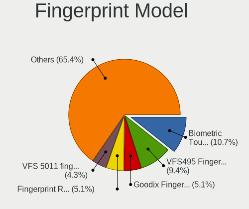

| Model                                                                      | Computers | Percent |
|----------------------------------------------------------------------------|-----------|---------|
| Upek Biometric Touchchip/Touchstrip Fingerprint Sensor                     | 25        | 10.68%  |
| Validity Sensors VFS495 Fingerprint Reader                                 | 22        | 9.4%    |
| STMicroelectronics Fingerprint Reader                                      | 12        | 5.13%   |
| Shenzhen Goodix  Fingerprint Device                                        | 12        | 5.13%   |
| Validity Sensors VFS 5011 fingerprint sensor                               | 10        | 4.27%   |
| AuthenTec AES2501 Fingerprint Sensor                                       | 9         | 3.85%   |
| Validity Sensors VFS7500 Touch Fingerprint Sensor                          | 8         | 3.42%   |
| Validity Sensors VFS491                                                    | 8         | 3.42%   |
| Elan ELAN:ARM-M4                                                           | 8         | 3.42%   |
| AuthenTec AES2810                                                          | 7         | 2.99%   |
| AuthenTec AES1600                                                          | 7         | 2.99%   |
| Validity Sensors VFS471 Fingerprint Reader                                 | 6         | 2.56%   |
| Validity Sensors Synaptics WBDI                                            | 6         | 2.56%   |
| Validity Sensors Swipe Fingerprint Sensor                                  | 6         | 2.56%   |
| Shenzhen Goodix Fingerprint Reader                                         | 6         | 2.56%   |
| Elan ELAN:Fingerprint                                                      | 6         | 2.56%   |
| Validity Sensors VFS5011 Fingerprint Reader                                | 5         | 2.14%   |
| Synaptics Prometheus MIS Touch Fingerprint Reader                          | 5         | 2.14%   |
| LighTuning EgisTec Touch Fingerprint Sensor                                | 5         | 2.14%   |
| AuthenTec Fingerprint Sensor                                               | 5         | 2.14%   |
| Validity Sensors VFS451 Fingerprint Reader                                 | 4         | 1.71%   |
| Validity Sensors VFS301 Fingerprint Reader                                 | 4         | 1.71%   |
| Validity Sensors Fingerprint scanner                                       | 4         | 1.71%   |
| Synaptics TouchPad                                                         | 4         | 1.71%   |
| Elan WBF Fingerprint Sensor                                                | 4         | 1.71%   |
| Validity Sensors VFS300 Fingerprint Reader                                 | 3         | 1.28%   |
| Synaptics Fingerprint reader [HP G6]                                       | 3         | 1.28%   |
| LighTuning ES603 Swipe Fingerprint Sensor                                  | 3         | 1.28%   |
| AuthenTec AES2550 Fingerprint Sensor                                       | 3         | 1.28%   |
| Validity Sensors VFS101 Fingerprint Reader                                 | 2         | 0.85%   |
| Validity Sensors Synaptics VFS7552 Touch Fingerprint Sensor                | 2         | 0.85%   |
| Synaptics  WBDI                                                            | 2         | 0.85%   |
| Synaptics Metallica MIS Touch Fingerprint Reader                           | 2         | 0.85%   |
| LighTuning Fingerprint Reader                                              | 2         | 0.85%   |
| Validity Sensors VFS7552 Touch Fingerprint Sensor                          | 1         | 0.43%   |
| Validity Sensors Synaptics VFS7552 Touch Fingerprint Sensor with PurePrint | 1         | 0.43%   |
| Upek TCS5B Fingerprint sensor                                              | 1         | 0.43%   |
| Synaptics WBDI Fingerprint Reader USB 102                                  | 1         | 0.43%   |
| Synaptics WBDI Device                                                      | 1         | 0.43%   |
| Synaptics  FS7604 Touch Fingerprint Sensor with PurePrint                  | 1         | 0.43%   |

Chipcard Vendor
---------------

Chipcard module vendors

| Vendor                | Computers | Percent |
|-----------------------|-----------|---------|
| Broadcom              | 88        | 53.33%  |
| Alcor Micro           | 20        | 12.12%  |
| O2 Micro              | 19        | 11.52%  |
| Upek                  | 14        | 8.48%   |
| Lenovo                | 12        | 7.27%   |
| SCM Microsystems      | 3         | 1.82%   |
| Realtek Semiconductor | 3         | 1.82%   |
| Gemalto (was Gemplus) | 3         | 1.82%   |
| Bit4id                | 2         | 1.21%   |
| Cherry                | 1         | 0.61%   |

Chipcard Model
--------------

Chipcard module models

| Model                                                                        | Computers | Percent |
|------------------------------------------------------------------------------|-----------|---------|
| Broadcom BCM5880 Secure Applications Processor                               | 42        | 25.45%  |
| Broadcom BCM5880 Secure Applications Processor with fingerprint swipe sensor | 24        | 14.55%  |
| Alcor Micro AU9540 Smartcard Reader                                          | 19        | 11.52%  |
| O2 Micro OZ776 CCID Smartcard Reader                                         | 18        | 10.91%  |
| Broadcom 5880                                                                | 16        | 9.7%    |
| Upek TouchChip Fingerprint Coprocessor (WBF advanced mode)                   | 14        | 8.48%   |
| Lenovo Integrated Smart Card Reader                                          | 12        | 7.27%   |
| Broadcom 58200                                                               | 5         | 3.03%   |
| Realtek Semiconductor Smart Card Reader Interface                            | 3         | 1.82%   |
| SCM Microsystems SCR3340 - ExpressCard54 Smart Card Reader                   | 2         | 1.21%   |
| Gemalto (was Gemplus) GemPC Twin SmartCard Reader                            | 2         | 1.21%   |
| SCM Microsystems CLOUD 2700 F Smart Card Reader                              | 1         | 0.61%   |
| O2 Micro Oz776 SmartCard Reader                                              | 1         | 0.61%   |
| Gemalto (was Gemplus) Compact Smart Card Reader Writer                       | 1         | 0.61%   |
| Cherry Smart Terminal XX44                                                   | 1         | 0.61%   |
| Broadcom BCM5880 Secure Applications Processor with fingerprint touch sensor | 1         | 0.61%   |
| Bit4id miniLector EVO                                                        | 1         | 0.61%   |
| BIT4ID miniLector AIR NFC v3                                                 | 1         | 0.61%   |
| Alcor Micro EMV Smartcard Reader                                             | 1         | 0.61%   |

Unsupported
-----------

Unsupported Devices
-------------------

Total unsupported devices on board

| Total | Computers | Percent |
|-------|-----------|---------|
| 0     | 3832      | 81.17%  |
| 1     | 754       | 15.97%  |
| 2     | 118       | 2.5%    |
| 3     | 14        | 0.3%    |
| 7     | 1         | 0.02%   |
| 6     | 1         | 0.02%   |
| 4     | 1         | 0.02%   |

Unsupported Device Types
------------------------

Types of unsupported devices

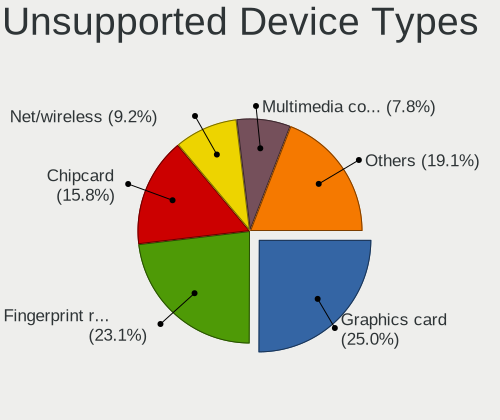

| Type                     | Computers | Percent |
|--------------------------|-----------|---------|
| Graphics card            | 254       | 25.05%  |
| Fingerprint reader       | 234       | 23.08%  |
| Chipcard                 | 160       | 15.78%  |
| Net/wireless             | 93        | 9.17%   |
| Multimedia controller    | 79        | 7.79%   |
| Bluetooth                | 63        | 6.21%   |
| Storage                  | 29        | 2.86%   |
| Communication controller | 27        | 2.66%   |
| Camera                   | 27        | 2.66%   |
| Unassigned class         | 20        | 1.97%   |
| Network                  | 8         | 0.79%   |
| Wireless                 | 4         | 0.39%   |
| Sound                    | 4         | 0.39%   |
| Card reader              | 4         | 0.39%   |
| Flash memory             | 3         | 0.3%    |
| Storage/raid             | 2         | 0.2%    |
| Net/ethernet             | 2         | 0.2%    |
| Dvb card                 | 1         | 0.1%    |

