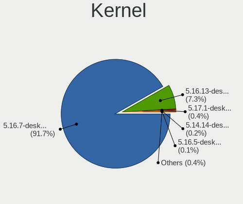
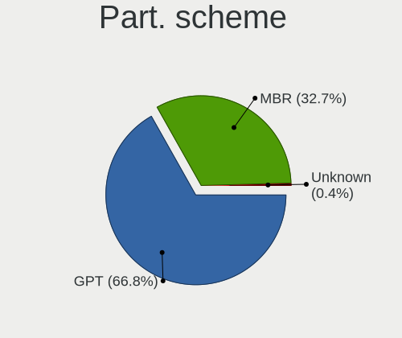
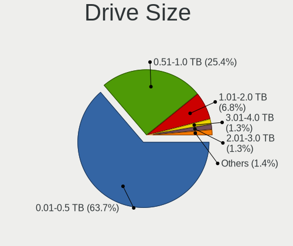
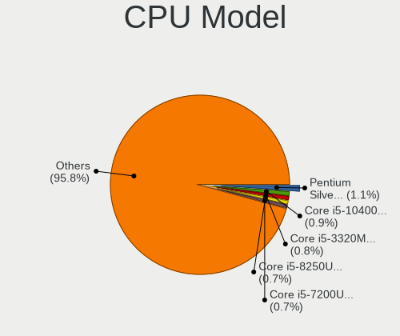
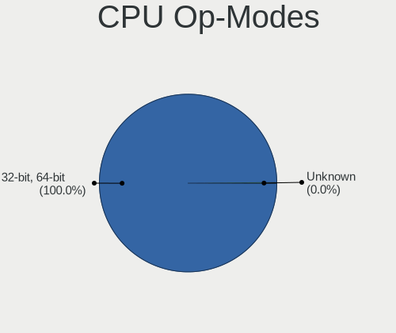
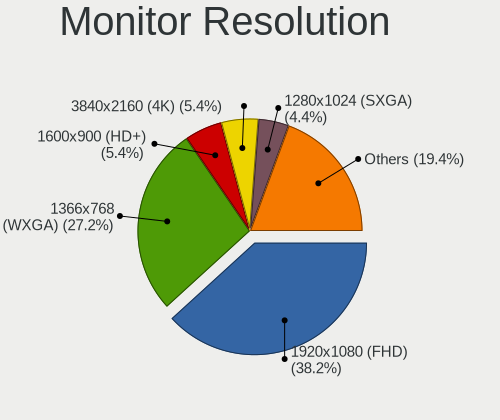
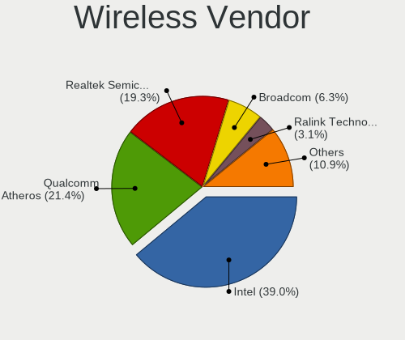
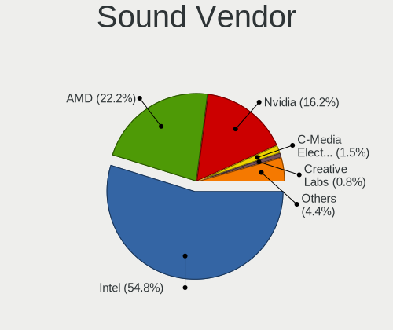

OpenMandriva 4.3 - Tested Hardware & Statistics
-----------------------------------------------

A project to collect tested hardware configurations for OpenMandriva 4.3.

Anyone can contribute to this report by the [hw-probe](https://github.com/linuxhw/hw-probe) tool:

    sudo -E hw-probe -all -upload

Please contribute! Especially if your hardware is rare.

This is a report for all computer types. See also reports for [desktops](/Dist/OpenMandriva_4.3/Desktop/README.md) and [notebooks](/Dist/OpenMandriva_4.3/Notebook/README.md).

Contents
--------

* [ Test Cases ](#test-cases)

* [ System ](#system)
  - [ Kernel                   ](#kernel)
  - [ Kernel Family            ](#kernel-family)
  - [ Kernel Major Ver.        ](#kernel-major-ver)
  - [ Arch                     ](#arch)
  - [ DE                       ](#de)
  - [ Display Server           ](#display-server)
  - [ Display Manager          ](#display-manager)
  - [ OS Lang                  ](#os-lang)
  - [ Boot Mode                ](#boot-mode)
  - [ Filesystem               ](#filesystem)
  - [ Part. scheme             ](#part-scheme)
  - [ Dual Boot with Linux/BSD ](#dual-boot-with-linuxbsd)
  - [ Dual Boot (Win)          ](#dual-boot-win)

* [ Board ](#board)
  - [ Vendor                   ](#vendor)
  - [ Model                    ](#model)
  - [ Model Family             ](#model-family)
  - [ MFG Year                 ](#mfg-year)
  - [ Form Factor              ](#form-factor)
  - [ Secure Boot              ](#secure-boot)
  - [ Coreboot                 ](#coreboot)
  - [ RAM Size                 ](#ram-size)
  - [ RAM Used                 ](#ram-used)
  - [ Total Drives             ](#total-drives)
  - [ Has CD-ROM               ](#has-cd-rom)
  - [ Has Ethernet             ](#has-ethernet)
  - [ Has WiFi                 ](#has-wifi)
  - [ Has Bluetooth            ](#has-bluetooth)

* [ Location ](#location)
  - [ Country                  ](#country)
  - [ City                     ](#city)

* [ Drives ](#drives)
  - [ Drive Vendor             ](#drive-vendor)
  - [ Drive Model              ](#drive-model)
  - [ HDD Vendor               ](#hdd-vendor)
  - [ SSD Vendor               ](#ssd-vendor)
  - [ Drive Kind               ](#drive-kind)
  - [ Drive Connector          ](#drive-connector)
  - [ Drive Size               ](#drive-size)
  - [ Space Total              ](#space-total)
  - [ Space Used               ](#space-used)
  - [ Malfunc. Drives          ](#malfunc-drives)
  - [ Malfunc. Drive Vendor    ](#malfunc-drive-vendor)
  - [ Malfunc. HDD Vendor      ](#malfunc-hdd-vendor)
  - [ Malfunc. Drive Kind      ](#malfunc-drive-kind)
  - [ Failed Drives            ](#failed-drives)
  - [ Failed Drive Vendor      ](#failed-drive-vendor)
  - [ Drive Status             ](#drive-status)

* [ Storage controller ](#storage-controller)
  - [ Storage Vendor           ](#storage-vendor)
  - [ Storage Model            ](#storage-model)
  - [ Storage Kind             ](#storage-kind)

* [ Processor ](#processor)
  - [ CPU Vendor               ](#cpu-vendor)
  - [ CPU Model                ](#cpu-model)
  - [ CPU Model Family         ](#cpu-model-family)
  - [ CPU Cores                ](#cpu-cores)
  - [ CPU Sockets              ](#cpu-sockets)
  - [ CPU Threads              ](#cpu-threads)
  - [ CPU Op-Modes             ](#cpu-op-modes)
  - [ CPU Microcode            ](#cpu-microcode)
  - [ CPU Microarch            ](#cpu-microarch)

* [ Graphics ](#graphics)
  - [ GPU Vendor               ](#gpu-vendor)
  - [ GPU Model                ](#gpu-model)
  - [ GPU Combo                ](#gpu-combo)
  - [ GPU Driver               ](#gpu-driver)
  - [ GPU Memory               ](#gpu-memory)

* [ Monitor ](#monitor)
  - [ Monitor Vendor           ](#monitor-vendor)
  - [ Monitor Model            ](#monitor-model)
  - [ Monitor Resolution       ](#monitor-resolution)
  - [ Monitor Diagonal         ](#monitor-diagonal)
  - [ Monitor Width            ](#monitor-width)
  - [ Aspect Ratio             ](#aspect-ratio)
  - [ Monitor Area             ](#monitor-area)
  - [ Pixel Density            ](#pixel-density)
  - [ Multiple Monitors        ](#multiple-monitors)

* [ Network ](#network)
  - [ Net Controller Vendor    ](#net-controller-vendor)
  - [ Net Controller Model     ](#net-controller-model)
  - [ Wireless Vendor          ](#wireless-vendor)
  - [ Wireless Model           ](#wireless-model)
  - [ Ethernet Vendor          ](#ethernet-vendor)
  - [ Ethernet Model           ](#ethernet-model)
  - [ Net Controller Kind      ](#net-controller-kind)
  - [ Used Controller          ](#used-controller)
  - [ NICs                     ](#nics)
  - [ IPv6                     ](#ipv6)

* [ Bluetooth ](#bluetooth)
  - [ Bluetooth Vendor         ](#bluetooth-vendor)
  - [ Bluetooth Model          ](#bluetooth-model)

* [ Sound ](#sound)
  - [ Sound Vendor             ](#sound-vendor)
  - [ Sound Model              ](#sound-model)

* [ Memory ](#memory)
  - [ Memory Vendor            ](#memory-vendor)
  - [ Memory Model             ](#memory-model)
  - [ Memory Kind              ](#memory-kind)
  - [ Memory Form Factor       ](#memory-form-factor)
  - [ Memory Size              ](#memory-size)
  - [ Memory Speed             ](#memory-speed)

* [ Printers & scanners ](#printers--scanners)
  - [ Printer Vendor           ](#printer-vendor)
  - [ Printer Model            ](#printer-model)
  - [ Scanner Vendor           ](#scanner-vendor)
  - [ Scanner Model            ](#scanner-model)

* [ Camera ](#camera)
  - [ Camera Vendor            ](#camera-vendor)
  - [ Camera Model             ](#camera-model)

* [ Security ](#security)
  - [ Fingerprint Vendor       ](#fingerprint-vendor)
  - [ Fingerprint Model        ](#fingerprint-model)
  - [ Chipcard Vendor          ](#chipcard-vendor)
  - [ Chipcard Model           ](#chipcard-model)

* [ Unsupported ](#unsupported)
  - [ Unsupported Devices      ](#unsupported-devices)
  - [ Unsupported Device Types ](#unsupported-device-types)

Test Cases
----------

Total: 4356

| Vendor        | Model                       | Form-Factor | Probe                                                      | Date         |
|---------------|-----------------------------|-------------|------------------------------------------------------------|--------------|
| Fujitsu       | D2990-A3 S26361-D2990-A3    | Desktop     | [6f1de5f17c](https://linux-hardware.org/?probe=6f1de5f17c) | Feb 28, 2023 |
| Acer          | Aspire V3-772               | Notebook    | [5a0c297e10](https://linux-hardware.org/?probe=5a0c297e10) | Feb 28, 2023 |
| ASUSTek       | PRIME B550M-A               | Desktop     | [a6af4042ea](https://linux-hardware.org/?probe=a6af4042ea) | Feb 28, 2023 |
| Foxconn       | G31MX Series                | Desktop     | [79ee8e5da3](https://linux-hardware.org/?probe=79ee8e5da3) | Feb 28, 2023 |
| Dell          | Latitude E6420              | Notebook    | [a84f4dbcbb](https://linux-hardware.org/?probe=a84f4dbcbb) | Feb 28, 2023 |
| ASUSTek       | K75VJ                       | Notebook    | [7fc0fff829](https://linux-hardware.org/?probe=7fc0fff829) | Feb 27, 2023 |
| MSI           | B450M MORTAR MAX            | Desktop     | [0335729036](https://linux-hardware.org/?probe=0335729036) | Feb 27, 2023 |
| Intel         | H61                         | Desktop     | [b61ef1ed65](https://linux-hardware.org/?probe=b61ef1ed65) | Feb 27, 2023 |
| MSI           | NF750-G55                   | Desktop     | [f279251ffa](https://linux-hardware.org/?probe=f279251ffa) | Feb 27, 2023 |
| Acer          | Aspire E5-571               | Notebook    | [5f035002e1](https://linux-hardware.org/?probe=5f035002e1) | Feb 27, 2023 |
| Acer          | EG43M                       | Desktop     | [d533c457eb](https://linux-hardware.org/?probe=d533c457eb) | Feb 26, 2023 |
| ASUSTek       | PRIME Q270M-C               | Desktop     | [edf748dbbb](https://linux-hardware.org/?probe=edf748dbbb) | Feb 26, 2023 |
| eMachines     | eME728                      | Notebook    | [2331984fc8](https://linux-hardware.org/?probe=2331984fc8) | Feb 26, 2023 |
| Samsung       | 550XBE/350XBE               | Notebook    | [d9f49e98fd](https://linux-hardware.org/?probe=d9f49e98fd) | Feb 25, 2023 |
| Toshiba       | Satellite C850              | Notebook    | [99d4efbb52](https://linux-hardware.org/?probe=99d4efbb52) | Feb 25, 2023 |
| Dell          | 0VHWTR A01                  | Desktop     | [ab8247e106](https://linux-hardware.org/?probe=ab8247e106) | Feb 24, 2023 |
| MSI           | B360M PRO-VH                | Desktop     | [fad0bd20e1](https://linux-hardware.org/?probe=fad0bd20e1) | Feb 24, 2023 |
| HP            | 650                         | Notebook    | [ab0b350259](https://linux-hardware.org/?probe=ab0b350259) | Feb 24, 2023 |
| MSI           | G41M-P33 Combo              | Desktop     | [91c8d45121](https://linux-hardware.org/?probe=91c8d45121) | Feb 24, 2023 |
| ASUSTek       | M4A89GTD-PRO/USB3           | Desktop     | [9171567db4](https://linux-hardware.org/?probe=9171567db4) | Feb 24, 2023 |
| ASUSTek       | P8H61-M LX R2.0             | Desktop     | [b410c9f493](https://linux-hardware.org/?probe=b410c9f493) | Feb 24, 2023 |
| HP            | 1998                        | Desktop     | [145c009f05](https://linux-hardware.org/?probe=145c009f05) | Feb 24, 2023 |
| ASUSTek       | M2N-MX SE Plus              | Desktop     | [21aa20cd64](https://linux-hardware.org/?probe=21aa20cd64) | Feb 24, 2023 |
| Acer          | Aspire A517-51G             | Notebook    | [12040fcd10](https://linux-hardware.org/?probe=12040fcd10) | Feb 24, 2023 |
| Toshiba       | Satellite C850-1GF          | Notebook    | [f568855409](https://linux-hardware.org/?probe=f568855409) | Feb 24, 2023 |
| Gigabyte      | Z97-HD3                     | Desktop     | [016a51a4af](https://linux-hardware.org/?probe=016a51a4af) | Feb 23, 2023 |
| MSI           | H110M PRO-VH PLUS           | Desktop     | [de05d0d3f6](https://linux-hardware.org/?probe=de05d0d3f6) | Feb 23, 2023 |
| Gigabyte      | G1.Sniper A88X-CF           | Desktop     | [cfe5ecec44](https://linux-hardware.org/?probe=cfe5ecec44) | Feb 23, 2023 |
| Biostar       | N68S3B                      | Desktop     | [4572b3d965](https://linux-hardware.org/?probe=4572b3d965) | Feb 23, 2023 |
| Foxconn       | 2ADA                        | Desktop     | [75b2eb9c1f](https://linux-hardware.org/?probe=75b2eb9c1f) | Feb 23, 2023 |
| Lenovo        | IdeaPad Gaming 3 15IMH05... | Notebook    | [d488fc0d9a](https://linux-hardware.org/?probe=d488fc0d9a) | Feb 22, 2023 |
| Positivo      | S14SL01                     | Notebook    | [914a9e691e](https://linux-hardware.org/?probe=914a9e691e) | Feb 22, 2023 |
| Lenovo        | ThinkPad T430s 23551M9      | Notebook    | [91b6a109b4](https://linux-hardware.org/?probe=91b6a109b4) | Feb 22, 2023 |
| Gigabyte      | H81M-S2PV                   | Desktop     | [ad365efca1](https://linux-hardware.org/?probe=ad365efca1) | Feb 22, 2023 |
| Gigabyte      | X570 GAMING X               | Desktop     | [4803e8ee01](https://linux-hardware.org/?probe=4803e8ee01) | Feb 22, 2023 |
| ASUSTek       | ROG CROSSHAIR VIII DARK ... | Desktop     | [2d36b57c9c](https://linux-hardware.org/?probe=2d36b57c9c) | Feb 22, 2023 |
| Gigabyte      | GA-78LMT-USB3 R2 sex        | Desktop     | [9523a0ccc2](https://linux-hardware.org/?probe=9523a0ccc2) | Feb 22, 2023 |
| Gateway       | NV53A                       | Notebook    | [1e2b4ec4d3](https://linux-hardware.org/?probe=1e2b4ec4d3) | Feb 22, 2023 |
| Fujitsu Si... | AMILO Li3910                | Notebook    | [28890c5346](https://linux-hardware.org/?probe=28890c5346) | Feb 21, 2023 |
| ASUSTek       | M5A78L/USB3                 | Desktop     | [b4288b76ee](https://linux-hardware.org/?probe=b4288b76ee) | Feb 21, 2023 |
| HP            | Pavilion dv6                | Notebook    | [526430f218](https://linux-hardware.org/?probe=526430f218) | Feb 21, 2023 |
| MSI           | Z170A XPOWER GAMING TITA... | Desktop     | [b644019f77](https://linux-hardware.org/?probe=b644019f77) | Feb 21, 2023 |
| Apple         | MacBookPro9,2               | Notebook    | [80df77e6a1](https://linux-hardware.org/?probe=80df77e6a1) | Feb 21, 2023 |
| MSI           | H510M-A PRO                 | Desktop     | [bbef057c8f](https://linux-hardware.org/?probe=bbef057c8f) | Feb 21, 2023 |
| ASUSTek       | PRIME Z390-P                | Desktop     | [d81ff5358a](https://linux-hardware.org/?probe=d81ff5358a) | Feb 20, 2023 |
| MSI           | G41M-P23                    | Desktop     | [04211b9202](https://linux-hardware.org/?probe=04211b9202) | Feb 20, 2023 |
| ASUSTek       | ROG STRIX B560-A GAMING ... | Desktop     | [119e106d80](https://linux-hardware.org/?probe=119e106d80) | Feb 20, 2023 |
| ASRock        | 880GM-LE FX                 | Desktop     | [db290cd703](https://linux-hardware.org/?probe=db290cd703) | Feb 19, 2023 |
| Lenovo        | B560 43308VG                | Notebook    | [c30b594458](https://linux-hardware.org/?probe=c30b594458) | Feb 19, 2023 |
| HP            | ProBook 4520s               | Notebook    | [8192287499](https://linux-hardware.org/?probe=8192287499) | Feb 19, 2023 |
| MSI           | Z97M GAMING                 | Desktop     | [e983a3704e](https://linux-hardware.org/?probe=e983a3704e) | Feb 19, 2023 |
| Lenovo        | IdeaPad Yoga 11S 20246      | Notebook    | [b0941b8ef0](https://linux-hardware.org/?probe=b0941b8ef0) | Feb 18, 2023 |
| HP            | 15                          | Notebook    | [4db2520843](https://linux-hardware.org/?probe=4db2520843) | Feb 18, 2023 |
| ASUSTek       | PN51-E1                     | Mini pc     | [ff9cd473da](https://linux-hardware.org/?probe=ff9cd473da) | Feb 18, 2023 |
| HP            | ProBook 4540s               | Notebook    | [cc3e78f73f](https://linux-hardware.org/?probe=cc3e78f73f) | Feb 18, 2023 |
| ASUSTek       | STRIX X99 GAMING            | Desktop     | [8dd1992835](https://linux-hardware.org/?probe=8dd1992835) | Feb 18, 2023 |
| ASRock        | 880GM-LE FX                 | Desktop     | [1d45a444a3](https://linux-hardware.org/?probe=1d45a444a3) | Feb 18, 2023 |
| PC Special... | NJ50_70CU                   | Notebook    | [68dd853397](https://linux-hardware.org/?probe=68dd853397) | Feb 17, 2023 |
| MSI           | MPG Z490 GAMING EDGE WIF... | Desktop     | [3ed988e135](https://linux-hardware.org/?probe=3ed988e135) | Feb 17, 2023 |
| Gigabyte      | H87M-HD3                    | Desktop     | [778b7898e3](https://linux-hardware.org/?probe=778b7898e3) | Feb 17, 2023 |
| ASUSTek       | X555LJ                      | Notebook    | [a524479b7a](https://linux-hardware.org/?probe=a524479b7a) | Feb 17, 2023 |
| Toshiba       | Satellite C70-C-18E         | Notebook    | [7642482909](https://linux-hardware.org/?probe=7642482909) | Feb 17, 2023 |
| EVGA          | 151-IB-E699                 | Desktop     | [9e975c7966](https://linux-hardware.org/?probe=9e975c7966) | Feb 17, 2023 |
| HP            | Pavilion 15                 | Notebook    | [a48098f6fc](https://linux-hardware.org/?probe=a48098f6fc) | Feb 17, 2023 |
| HP            | Laptop 15-da0xxx            | Notebook    | [ac458108b4](https://linux-hardware.org/?probe=ac458108b4) | Feb 17, 2023 |
| Pegatron      | IPM31G                      | Desktop     | [42d112d7e0](https://linux-hardware.org/?probe=42d112d7e0) | Feb 17, 2023 |
| ASUSTek       | K54C                        | Notebook    | [ea944628df](https://linux-hardware.org/?probe=ea944628df) | Feb 17, 2023 |
| ASUSTek       | VivoBook_ASUSLaptop X513... | Notebook    | [66c33604c4](https://linux-hardware.org/?probe=66c33604c4) | Feb 17, 2023 |
| Samsung       | R519/R719                   | Notebook    | [1dc4bc1b72](https://linux-hardware.org/?probe=1dc4bc1b72) | Feb 17, 2023 |
| Lenovo        | IdeaPad S145-15AST 81N3     | Notebook    | [ffd622d65f](https://linux-hardware.org/?probe=ffd622d65f) | Feb 17, 2023 |
| HP            | 2820h                       | Desktop     | [552bdc9930](https://linux-hardware.org/?probe=552bdc9930) | Feb 17, 2023 |
| eMachines     | eMachiens G443              | Notebook    | [096a4bb9e4](https://linux-hardware.org/?probe=096a4bb9e4) | Feb 16, 2023 |
| HP            | Pavilion dv6500             | Notebook    | [95a9115968](https://linux-hardware.org/?probe=95a9115968) | Feb 16, 2023 |
| MSI           | H61M-E33                    | Desktop     | [f0c902ce04](https://linux-hardware.org/?probe=f0c902ce04) | Feb 16, 2023 |
| MSI           | Z97-G45 GAMING              | Desktop     | [c6a7d3a755](https://linux-hardware.org/?probe=c6a7d3a755) | Feb 16, 2023 |
| Gigabyte      | MZAPLBP-00                  | Desktop     | [b043125d6e](https://linux-hardware.org/?probe=b043125d6e) | Feb 16, 2023 |
| Gigabyte      | GA-MA790XT-UD4P             | Desktop     | [3ce39f40e7](https://linux-hardware.org/?probe=3ce39f40e7) | Feb 16, 2023 |
| MSI           | B350M PRO-VD PLUS           | Desktop     | [63789621e0](https://linux-hardware.org/?probe=63789621e0) | Feb 16, 2023 |
| Lenovo        | ThinkCentre M91 4518E4S     | Desktop     | [91b1fb7e03](https://linux-hardware.org/?probe=91b1fb7e03) | Feb 16, 2023 |
| Philco        | DTC-A55                     | Desktop     | [e957b8f1cf](https://linux-hardware.org/?probe=e957b8f1cf) | Feb 16, 2023 |
| Gigabyte      | F2A78M-HD2                  | Desktop     | [9f9cc6f9e2](https://linux-hardware.org/?probe=9f9cc6f9e2) | Feb 16, 2023 |
| MSI           | Z170A KRAIT GAMING 3X       | Desktop     | [8e521a2efc](https://linux-hardware.org/?probe=8e521a2efc) | Feb 16, 2023 |
| ASUSTek       | H81T                        | Desktop     | [51aa090e9a](https://linux-hardware.org/?probe=51aa090e9a) | Feb 16, 2023 |
| ASUSTek       | N76VZ                       | Notebook    | [ed9bd6b127](https://linux-hardware.org/?probe=ed9bd6b127) | Feb 16, 2023 |
| Dell          | Latitude E7440              | Notebook    | [86f8d34ba7](https://linux-hardware.org/?probe=86f8d34ba7) | Feb 16, 2023 |
| HP            | 3031h                       | Desktop     | [2b0cc2bd6e](https://linux-hardware.org/?probe=2b0cc2bd6e) | Feb 16, 2023 |
| Toshiba       | dynabook R73/BN             | Notebook    | [df7e69c5c4](https://linux-hardware.org/?probe=df7e69c5c4) | Feb 16, 2023 |
| HP            | ProBook 470 G4              | Notebook    | [8730091665](https://linux-hardware.org/?probe=8730091665) | Feb 15, 2023 |
| HP            | Notebook                    | Notebook    | [21442c303e](https://linux-hardware.org/?probe=21442c303e) | Feb 15, 2023 |
| HP            | 250 G6 Notebook PC          | Notebook    | [745ae4d0fb](https://linux-hardware.org/?probe=745ae4d0fb) | Feb 15, 2023 |
| MSI           | MS-7235                     | Desktop     | [519f3742a3](https://linux-hardware.org/?probe=519f3742a3) | Feb 15, 2023 |
| Dell          | 0NK5PH A00                  | Desktop     | [5455b577db](https://linux-hardware.org/?probe=5455b577db) | Feb 15, 2023 |
| Lenovo        | IdeaPad S145-15AST 81N3     | Notebook    | [bc69f33fa2](https://linux-hardware.org/?probe=bc69f33fa2) | Feb 15, 2023 |
| ASUSTek       | K52N                        | Notebook    | [f87ece85e9](https://linux-hardware.org/?probe=f87ece85e9) | Feb 15, 2023 |
| Gigabyte      | P43-ES3G                    | Desktop     | [528ffce1c7](https://linux-hardware.org/?probe=528ffce1c7) | Feb 15, 2023 |
| HP            | 1000                        | Notebook    | [57de0f3103](https://linux-hardware.org/?probe=57de0f3103) | Feb 15, 2023 |
| ASUSTek       | PRIME B365M-K               | Desktop     | [20b88dda19](https://linux-hardware.org/?probe=20b88dda19) | Feb 15, 2023 |
| Dell          | 0GXM1W A00                  | Desktop     | [3ab6d305fc](https://linux-hardware.org/?probe=3ab6d305fc) | Feb 15, 2023 |
| MSI           | MPG B550 GAMING CARBON W... | Desktop     | [f0d6ada218](https://linux-hardware.org/?probe=f0d6ada218) | Feb 15, 2023 |
| ASUSTek       | PRIME Z690-P WIFI           | Desktop     | [b30e6a84c8](https://linux-hardware.org/?probe=b30e6a84c8) | Feb 14, 2023 |
| Samsung       | RV419/RV420                 | Notebook    | [7ec9e518c4](https://linux-hardware.org/?probe=7ec9e518c4) | Feb 14, 2023 |
| Samsung       | 300E4C/300E5C/300E7C        | Notebook    | [dddbb2d135](https://linux-hardware.org/?probe=dddbb2d135) | Feb 14, 2023 |
| MSI           | Z97-G45 GAMING              | Desktop     | [f9318d4390](https://linux-hardware.org/?probe=f9318d4390) | Feb 14, 2023 |
| Lenovo        | ThinkPad X270 W10DG 20K5... | Notebook    | [bf015f98c2](https://linux-hardware.org/?probe=bf015f98c2) | Feb 14, 2023 |
| ASRock        | E350M1                      | Desktop     | [ac69adceb6](https://linux-hardware.org/?probe=ac69adceb6) | Feb 13, 2023 |
| ASUSTek       | P7P55D-E EVO                | Desktop     | [f1ec250753](https://linux-hardware.org/?probe=f1ec250753) | Feb 13, 2023 |
| Dell          | 0YXT71 A01                  | Desktop     | [cdc2dedbcd](https://linux-hardware.org/?probe=cdc2dedbcd) | Feb 13, 2023 |
| Apple         | Mac-F226BEC8 PVT            | All in one  | [7623da10b8](https://linux-hardware.org/?probe=7623da10b8) | Feb 13, 2023 |
| HP            | 3031h                       | Desktop     | [f9a0848388](https://linux-hardware.org/?probe=f9a0848388) | Feb 11, 2023 |
| Apple         | MacBookAir5,2               | Notebook    | [4f99163f99](https://linux-hardware.org/?probe=4f99163f99) | Feb 11, 2023 |
| ASUSTek       | PRIME X570-PRO              | Desktop     | [f0f4d31de2](https://linux-hardware.org/?probe=f0f4d31de2) | Feb 10, 2023 |
| ASUSTek       | UX31E                       | Notebook    | [e8fdc1676a](https://linux-hardware.org/?probe=e8fdc1676a) | Feb 10, 2023 |
| Medion        | TJ4105                      | Desktop     | [cd654518c0](https://linux-hardware.org/?probe=cd654518c0) | Feb 09, 2023 |
| Apple         | Mac-F42C88C8 Proto1         | Desktop     | [8532f05156](https://linux-hardware.org/?probe=8532f05156) | Feb 09, 2023 |
| HP            | Compaq Presario CQ61        | Notebook    | [df4d59acd5](https://linux-hardware.org/?probe=df4d59acd5) | Feb 07, 2023 |
| HP            | 1905                        | Desktop     | [a442e1de06](https://linux-hardware.org/?probe=a442e1de06) | Feb 07, 2023 |
| Lenovo        | ThinkPad X240 20AL00FMGE    | Notebook    | [0ac2678512](https://linux-hardware.org/?probe=0ac2678512) | Feb 06, 2023 |
| Acer          | Extensa 5635                | Notebook    | [8f8f4d24f9](https://linux-hardware.org/?probe=8f8f4d24f9) | Feb 06, 2023 |
| Lenovo        | 0x36A017AA SDK0J40700 WI... | Desktop     | [a527005a2a](https://linux-hardware.org/?probe=a527005a2a) | Feb 06, 2023 |
| Lenovo        | ThinkPad L15 Gen 1 20U70... | Notebook    | [7ca566f68b](https://linux-hardware.org/?probe=7ca566f68b) | Feb 05, 2023 |
| Dell          | 084J0R A00                  | Desktop     | [7fe633b52f](https://linux-hardware.org/?probe=7fe633b52f) | Feb 05, 2023 |
| Apple         | MacBookPro8,1               | Notebook    | [d6adca1255](https://linux-hardware.org/?probe=d6adca1255) | Feb 04, 2023 |
| HP            | ProBook 6465b               | Notebook    | [00b2021fae](https://linux-hardware.org/?probe=00b2021fae) | Feb 04, 2023 |
| Intel         | NUC7i5BNB J31144-310        | Mini pc     | [87fe173b18](https://linux-hardware.org/?probe=87fe173b18) | Feb 02, 2023 |
| HP            | EliteBook x360 1030 G2      | Convertible | [6a440e41d7](https://linux-hardware.org/?probe=6a440e41d7) | Feb 02, 2023 |
| Dell          | Latitude E5420              | Notebook    | [ccc3ca9853](https://linux-hardware.org/?probe=ccc3ca9853) | Jan 31, 2023 |
| HP            | 3115-AEC13432GR1            | Notebook    | [98eb70341a](https://linux-hardware.org/?probe=98eb70341a) | Jan 30, 2023 |
| Lenovo        | Legion Y540-15IRH-PG0 81... | Notebook    | [e2fa9aa820](https://linux-hardware.org/?probe=e2fa9aa820) | Jan 29, 2023 |
| ASUSTek       | Z97-K                       | Desktop     | [e3f865cd20](https://linux-hardware.org/?probe=e3f865cd20) | Jan 28, 2023 |
| HP            | Notebook                    | Notebook    | [d38e078368](https://linux-hardware.org/?probe=d38e078368) | Jan 28, 2023 |
| Apple         | MacBook4,1                  | Notebook    | [e00443a9cc](https://linux-hardware.org/?probe=e00443a9cc) | Jan 27, 2023 |
| ASUSTek       | UX31E                       | Notebook    | [d87ac57c19](https://linux-hardware.org/?probe=d87ac57c19) | Jan 27, 2023 |
| HP            | 14                          | Notebook    | [53d080d83a](https://linux-hardware.org/?probe=53d080d83a) | Jan 27, 2023 |
| Dell          | Inspiron 15 3521            | Notebook    | [41f89081ff](https://linux-hardware.org/?probe=41f89081ff) | Jan 26, 2023 |
| Apple         | Mac-F2208EC8                | Mini pc     | [873ee647b0](https://linux-hardware.org/?probe=873ee647b0) | Jan 26, 2023 |
| Dell          | 0773VG A00                  | Desktop     | [328dae4014](https://linux-hardware.org/?probe=328dae4014) | Jan 26, 2023 |
| HP            | 3048h                       | Desktop     | [caabf4189f](https://linux-hardware.org/?probe=caabf4189f) | Jan 25, 2023 |
| OEGStone      | C4100/C5100                 | Notebook    | [4365b7b231](https://linux-hardware.org/?probe=4365b7b231) | Jan 25, 2023 |
| AZW           | U59                         | Desktop     | [6d2b672b77](https://linux-hardware.org/?probe=6d2b672b77) | Jan 25, 2023 |
| ASRock        | 775XFire-VSTA               | Desktop     | [e80788f790](https://linux-hardware.org/?probe=e80788f790) | Jan 24, 2023 |
| Lenovo        | ThinkPad W541 20EF0020MD    | Notebook    | [fca73ad2a9](https://linux-hardware.org/?probe=fca73ad2a9) | Jan 24, 2023 |
| ASUSTek       | VivoBook_ASUSLaptop TP42... | Convertible | [95898eae6d](https://linux-hardware.org/?probe=95898eae6d) | Jan 23, 2023 |
| Packard Be... | PB56                        | Notebook    | [f26fcb7ee5](https://linux-hardware.org/?probe=f26fcb7ee5) | Jan 23, 2023 |
| Dell          | 0X2MKR A00                  | All in one  | [5b29ed7213](https://linux-hardware.org/?probe=5b29ed7213) | Jan 23, 2023 |
| Fujitsu       | D2828-A2 S26361-D2828-A2    | Desktop     | [dcecec2239](https://linux-hardware.org/?probe=dcecec2239) | Jan 22, 2023 |
| Gigabyte      | N3050ND3H                   | Desktop     | [1663928526](https://linux-hardware.org/?probe=1663928526) | Jan 21, 2023 |
| HP            | Pavilion dv5                | Notebook    | [94ba65752b](https://linux-hardware.org/?probe=94ba65752b) | Jan 20, 2023 |
| GEEKOM        | MiniAir 11                  | Server      | [0d27879bb6](https://linux-hardware.org/?probe=0d27879bb6) | Jan 19, 2023 |
| ASUSTek       | Z77-A                       | Desktop     | [10081492a7](https://linux-hardware.org/?probe=10081492a7) | Jan 19, 2023 |
| Acer          | Iconia Tab W501             | Tablet      | [c3d132fb91](https://linux-hardware.org/?probe=c3d132fb91) | Jan 18, 2023 |
| ASUSTek       | C60M1-I                     | Desktop     | [defd3912ae](https://linux-hardware.org/?probe=defd3912ae) | Jan 18, 2023 |
| Panasonic     | CF-53JULCV1M                | Notebook    | [89c1166efc](https://linux-hardware.org/?probe=89c1166efc) | Jan 18, 2023 |
| Unknown       | HX90                        | Desktop     | [2b034e44e2](https://linux-hardware.org/?probe=2b034e44e2) | Jan 18, 2023 |
| Dell          | Inspiron N5110              | Notebook    | [bf606ed50a](https://linux-hardware.org/?probe=bf606ed50a) | Jan 18, 2023 |
| HP            | ProBook 440 G1              | Notebook    | [035c7a4e2d](https://linux-hardware.org/?probe=035c7a4e2d) | Jan 18, 2023 |
| Medion        | MS-7621                     | Desktop     | [67b535d88f](https://linux-hardware.org/?probe=67b535d88f) | Jan 18, 2023 |
| Dell          | Latitude 7490               | Notebook    | [b611fc6b64](https://linux-hardware.org/?probe=b611fc6b64) | Jan 18, 2023 |
| Gigabyte      | F2A55M-HD2                  | Desktop     | [74a62575d2](https://linux-hardware.org/?probe=74a62575d2) | Jan 17, 2023 |
| ASUSTek       | P8B75-V                     | Desktop     | [276102bb1a](https://linux-hardware.org/?probe=276102bb1a) | Jan 16, 2023 |
| HP            | Pavilion dv6500             | Notebook    | [33985f088a](https://linux-hardware.org/?probe=33985f088a) | Jan 16, 2023 |
| Acer          | Iconia Tab W501             | Tablet      | [9941154ca3](https://linux-hardware.org/?probe=9941154ca3) | Jan 15, 2023 |
| HP            | EliteBook 745 G3            | Notebook    | [c20a339ddb](https://linux-hardware.org/?probe=c20a339ddb) | Jan 15, 2023 |
| Lenovo        | SDK0F82993 WIN              | Desktop     | [48f294dfb4](https://linux-hardware.org/?probe=48f294dfb4) | Jan 15, 2023 |
| Acer          | Aspire 7551                 | Notebook    | [b3e5df94f4](https://linux-hardware.org/?probe=b3e5df94f4) | Jan 15, 2023 |
| MSI           | MAG B550 TOMAHAWK           | Desktop     | [291dceb273](https://linux-hardware.org/?probe=291dceb273) | Jan 14, 2023 |
| ASUSTek       | VivoBook_ASUSLaptop TP42... | Convertible | [b70eca9c43](https://linux-hardware.org/?probe=b70eca9c43) | Jan 14, 2023 |
| Dell          | Latitude E7440              | Notebook    | [9c4aac8b46](https://linux-hardware.org/?probe=9c4aac8b46) | Jan 14, 2023 |
| Fujitsu       | D2828-A2 S26361-D2828-A2    | Desktop     | [79d2961429](https://linux-hardware.org/?probe=79d2961429) | Jan 14, 2023 |
| HP            | 8054                        | Desktop     | [faf1c97cea](https://linux-hardware.org/?probe=faf1c97cea) | Jan 14, 2023 |
| Supermicro    | A1SA2-2750F                 | Server      | [e134d7a317](https://linux-hardware.org/?probe=e134d7a317) | Jan 14, 2023 |
| HP            | 18E5                        | Desktop     | [614faa708b](https://linux-hardware.org/?probe=614faa708b) | Jan 14, 2023 |
| Pegatron      | IPM41-D3                    | Desktop     | [23a918874b](https://linux-hardware.org/?probe=23a918874b) | Jan 14, 2023 |
| ASUSTek       | UX31E                       | Notebook    | [d60bab803e](https://linux-hardware.org/?probe=d60bab803e) | Jan 13, 2023 |
| HP            | 84EE 1100                   | All in one  | [708c21d16b](https://linux-hardware.org/?probe=708c21d16b) | Jan 13, 2023 |
| Gigabyte      | Z390 AORUS MASTER-CF        | Desktop     | [12f29d53ba](https://linux-hardware.org/?probe=12f29d53ba) | Jan 13, 2023 |
| Gigabyte      | H81M-S2PV                   | Desktop     | [72e7e2e1cf](https://linux-hardware.org/?probe=72e7e2e1cf) | Jan 11, 2023 |
| Toshiba       | Satellite C850-B561         | Notebook    | [562d6cde14](https://linux-hardware.org/?probe=562d6cde14) | Jan 11, 2023 |
| Lenovo        | ThinkPad X240 20AM001RGE    | Notebook    | [f4aafcf7a9](https://linux-hardware.org/?probe=f4aafcf7a9) | Jan 11, 2023 |
| Gigabyte      | B250M-Gaming 3-CF           | Desktop     | [805d82d697](https://linux-hardware.org/?probe=805d82d697) | Jan 10, 2023 |
| Apple         | MacBookAir5,1               | Notebook    | [ce911686b3](https://linux-hardware.org/?probe=ce911686b3) | Jan 10, 2023 |
| Dell          | XPS M1330                   | Notebook    | [e3d66114f6](https://linux-hardware.org/?probe=e3d66114f6) | Jan 10, 2023 |
| Acer          | Iconia Tab W501             | Tablet      | [ec34a44908](https://linux-hardware.org/?probe=ec34a44908) | Jan 10, 2023 |
| Gigabyte      | H170-D3H-CF                 | Desktop     | [8064745798](https://linux-hardware.org/?probe=8064745798) | Jan 10, 2023 |
| Dell          | Inspiron 3442               | Notebook    | [f540a5f964](https://linux-hardware.org/?probe=f540a5f964) | Jan 09, 2023 |
| Star Labs     | Lite                        | Notebook    | [6614e226df](https://linux-hardware.org/?probe=6614e226df) | Jan 09, 2023 |
| HP            | 0AA4h                       | Desktop     | [e0776de36f](https://linux-hardware.org/?probe=e0776de36f) | Jan 09, 2023 |
| HP            | 802F                        | Desktop     | [1dd3655605](https://linux-hardware.org/?probe=1dd3655605) | Jan 09, 2023 |
| Gigabyte      | Z68XP-UD3                   | Desktop     | [e2f62062de](https://linux-hardware.org/?probe=e2f62062de) | Jan 09, 2023 |
| Apple         | Mac-F2208EC8                | Mini pc     | [a2bce032b4](https://linux-hardware.org/?probe=a2bce032b4) | Jan 09, 2023 |
| Dell          | 0654JC A01                  | Desktop     | [c3016e1823](https://linux-hardware.org/?probe=c3016e1823) | Jan 09, 2023 |
| HP            | OMEN by Laptop              | Notebook    | [84aa790d17](https://linux-hardware.org/?probe=84aa790d17) | Jan 09, 2023 |
| HP            | 8265                        | Desktop     | [83897e98cf](https://linux-hardware.org/?probe=83897e98cf) | Jan 08, 2023 |
| MSI           | 990XA-GD55                  | Desktop     | [b4525a8431](https://linux-hardware.org/?probe=b4525a8431) | Jan 08, 2023 |
| Apple         | Mac-F42386C8 PVT            | All in one  | [d94d0c7025](https://linux-hardware.org/?probe=d94d0c7025) | Jan 08, 2023 |
| Dell          | Latitude E6400              | Notebook    | [70bce3a55c](https://linux-hardware.org/?probe=70bce3a55c) | Jan 08, 2023 |
| HP            | 1489                        | All in one  | [2660a9d31d](https://linux-hardware.org/?probe=2660a9d31d) | Jan 08, 2023 |
| Dell          | Latitude E5440              | Notebook    | [91bedeb5e1](https://linux-hardware.org/?probe=91bedeb5e1) | Jan 07, 2023 |
| Gigabyte      | Z690 GAMING X DDR4          | Desktop     | [c1c8654cde](https://linux-hardware.org/?probe=c1c8654cde) | Jan 07, 2023 |
| Lenovo        | IdeaPad 3 15ADA05 81W1      | Notebook    | [782467ee8c](https://linux-hardware.org/?probe=782467ee8c) | Jan 07, 2023 |
| Acer          | Aspire 7741                 | Notebook    | [d0e4567b4a](https://linux-hardware.org/?probe=d0e4567b4a) | Jan 07, 2023 |
| Lenovo        | V15-IGL 82C3                | Notebook    | [3bc9e3b318](https://linux-hardware.org/?probe=3bc9e3b318) | Jan 07, 2023 |
| Acer          | Veriton N4640G              | Desktop     | [3392dd3c90](https://linux-hardware.org/?probe=3392dd3c90) | Jan 07, 2023 |
| Alienware     | 04VWF2 A02                  | Desktop     | [15f4ed4e31](https://linux-hardware.org/?probe=15f4ed4e31) | Jan 07, 2023 |
| Lenovo        | ThinkPad Helix 2nd 20CHS... | Tablet      | [e6190d3469](https://linux-hardware.org/?probe=e6190d3469) | Jan 07, 2023 |
| HP            | 250 G3                      | Notebook    | [227b44bf7c](https://linux-hardware.org/?probe=227b44bf7c) | Jan 06, 2023 |
| HP            | Laptop 15-db0xxx            | Notebook    | [0232b39536](https://linux-hardware.org/?probe=0232b39536) | Jan 06, 2023 |
| eMachines     | E725                        | Notebook    | [0655d63f70](https://linux-hardware.org/?probe=0655d63f70) | Jan 06, 2023 |
| Acer          | Spin SP513-51               | Convertible | [1fe9e7fa54](https://linux-hardware.org/?probe=1fe9e7fa54) | Jan 06, 2023 |
| Acer          | Veriton M2631G V:1.0        | Desktop     | [ddeffc27a7](https://linux-hardware.org/?probe=ddeffc27a7) | Jan 05, 2023 |
| Pegatron      | 2AC3                        | Desktop     | [4ce129e600](https://linux-hardware.org/?probe=4ce129e600) | Jan 05, 2023 |
| ASUSTek       | K55VM                       | Notebook    | [d4d53ed49f](https://linux-hardware.org/?probe=d4d53ed49f) | Jan 04, 2023 |
| HP            | Pavilion g6                 | Notebook    | [6cae064dc5](https://linux-hardware.org/?probe=6cae064dc5) | Jan 04, 2023 |
| Dell          | 0M5DCD A00                  | Desktop     | [c64a1198cd](https://linux-hardware.org/?probe=c64a1198cd) | Jan 04, 2023 |
| HP            | ProBook 470 G2              | Notebook    | [1f62ff6417](https://linux-hardware.org/?probe=1f62ff6417) | Jan 04, 2023 |
| HP            | Compaq 15                   | Notebook    | [c282ede7c5](https://linux-hardware.org/?probe=c282ede7c5) | Jan 04, 2023 |
| HP            | EliteBook 725 G3            | Notebook    | [174e0c5f05](https://linux-hardware.org/?probe=174e0c5f05) | Jan 04, 2023 |
| Dell          | Latitude D520               | Notebook    | [7f05ddf105](https://linux-hardware.org/?probe=7f05ddf105) | Jan 04, 2023 |
| Dell          | Latitude 7490               | Notebook    | [7e445638b6](https://linux-hardware.org/?probe=7e445638b6) | Jan 04, 2023 |
| MSI           | A88X-G45 GAMING             | Desktop     | [1caf5c85d9](https://linux-hardware.org/?probe=1caf5c85d9) | Jan 04, 2023 |
| Sony          | VJF153                      | Notebook    | [f3643923cc](https://linux-hardware.org/?probe=f3643923cc) | Jan 04, 2023 |
| Acer          | Nitro AN515-55              | Notebook    | [c5bc3a8eae](https://linux-hardware.org/?probe=c5bc3a8eae) | Jan 03, 2023 |
| Apple         | Mac-35C5E08120C7EEAF Mac... | Mini pc     | [c0e5361a69](https://linux-hardware.org/?probe=c0e5361a69) | Jan 03, 2023 |
| Gigabyte      | Z690 AORUS ULTRA            | Desktop     | [55627fc077](https://linux-hardware.org/?probe=55627fc077) | Jan 03, 2023 |
| ASUSTek       | PRIME B350-PLUS             | Desktop     | [5f0eeeb9e7](https://linux-hardware.org/?probe=5f0eeeb9e7) | Jan 03, 2023 |
| Dell          | 0XCR8D A03                  | Desktop     | [faccba61cf](https://linux-hardware.org/?probe=faccba61cf) | Jan 03, 2023 |
| Fujitsu       | D3432-A1 S26361-D3432-A1    | Desktop     | [afe5105302](https://linux-hardware.org/?probe=afe5105302) | Jan 03, 2023 |
| ASUSTek       | Berkeley                    | Desktop     | [746d7be693](https://linux-hardware.org/?probe=746d7be693) | Jan 03, 2023 |
| Lenovo        | IdeaPad Yoga 11S 20246      | Notebook    | [a73ca839a1](https://linux-hardware.org/?probe=a73ca839a1) | Jan 03, 2023 |
| Dell          | 0MM599                      | Desktop     | [95763443e3](https://linux-hardware.org/?probe=95763443e3) | Jan 03, 2023 |
| Intel         | NUC5PPYB H76558-108         | Mini pc     | [e93bf27a59](https://linux-hardware.org/?probe=e93bf27a59) | Jan 02, 2023 |
| Positivo      | Z100                        | Notebook    | [58b7c4d1ff](https://linux-hardware.org/?probe=58b7c4d1ff) | Jan 02, 2023 |
| ASRock        | B450M-HDV R4.0              | Desktop     | [df9ca70fa3](https://linux-hardware.org/?probe=df9ca70fa3) | Jan 02, 2023 |
| Gigabyte      | H61M-S2PV                   | Desktop     | [85ad98c994](https://linux-hardware.org/?probe=85ad98c994) | Jan 02, 2023 |
| HP            | Victus by Laptop 16-e0xx... | Notebook    | [287840d797](https://linux-hardware.org/?probe=287840d797) | Jan 02, 2023 |
| AZW           | MINI S                      | Desktop     | [ad7c4329eb](https://linux-hardware.org/?probe=ad7c4329eb) | Jan 02, 2023 |
| Acer          | Aspire 5732Z                | Notebook    | [86b79bce9e](https://linux-hardware.org/?probe=86b79bce9e) | Jan 01, 2023 |
| Gigabyte      | B550M DS3H                  | Desktop     | [509cc939cc](https://linux-hardware.org/?probe=509cc939cc) | Jan 01, 2023 |
| OEM           | Intel H81                   | Desktop     | [1700a7a4c7](https://linux-hardware.org/?probe=1700a7a4c7) | Jan 01, 2023 |
| Gigabyte      | B365 HD3                    | Desktop     | [195240c264](https://linux-hardware.org/?probe=195240c264) | Jan 01, 2023 |
| Dell          | System Inspiron N411Z       | Notebook    | [21f279751c](https://linux-hardware.org/?probe=21f279751c) | Jan 01, 2023 |
| Lenovo        | IdeaPad Duet 3 10IGL5 82... | Tablet      | [e2215a9d80](https://linux-hardware.org/?probe=e2215a9d80) | Jan 01, 2023 |
| Packard Be... | EasyNote TM97               | Notebook    | [fad44d67ab](https://linux-hardware.org/?probe=fad44d67ab) | Jan 01, 2023 |
| HP            | 1000                        | Notebook    | [5634ff72b1](https://linux-hardware.org/?probe=5634ff72b1) | Jan 01, 2023 |
| Acer          | Aspire A114-33              | Notebook    | [bba53b0159](https://linux-hardware.org/?probe=bba53b0159) | Jan 01, 2023 |
| Toshiba       | Satellite A305D             | Notebook    | [b85a377462](https://linux-hardware.org/?probe=b85a377462) | Dec 31, 2022 |
| ASUSTek       | TUF Gaming B560-PLUS WIF... | Desktop     | [7295ec02b5](https://linux-hardware.org/?probe=7295ec02b5) | Dec 31, 2022 |
| ASUSTek       | UN45                        | Desktop     | [bde2e2efb1](https://linux-hardware.org/?probe=bde2e2efb1) | Dec 31, 2022 |
| MSI           | MS-7502 Fab D               | Desktop     | [9126e1035f](https://linux-hardware.org/?probe=9126e1035f) | Dec 31, 2022 |
| Gigabyte      | GA-78LMT-USB3 SEx           | Desktop     | [b0dd8fc6b5](https://linux-hardware.org/?probe=b0dd8fc6b5) | Dec 31, 2022 |
| Lenovo        | ThinkPad T410 2537BF9       | Notebook    | [f83ed1dd39](https://linux-hardware.org/?probe=f83ed1dd39) | Dec 30, 2022 |
| ASUSTek       | TP501UA                     | Notebook    | [1f2aaf8804](https://linux-hardware.org/?probe=1f2aaf8804) | Dec 30, 2022 |
| ASUSTek       | K55VD                       | Notebook    | [e4c90250df](https://linux-hardware.org/?probe=e4c90250df) | Dec 30, 2022 |
| ASUSTek       | X555UJ                      | Notebook    | [f4ba8643aa](https://linux-hardware.org/?probe=f4ba8643aa) | Dec 30, 2022 |
| Acer          | Nitro AN515-57              | Notebook    | [b0bfa9530a](https://linux-hardware.org/?probe=b0bfa9530a) | Dec 29, 2022 |
| ASUSTek       | STRIKER II EXTREME          | Desktop     | [3258ffa0c1](https://linux-hardware.org/?probe=3258ffa0c1) | Dec 29, 2022 |
| ASUSTek       | G1                          | Notebook    | [1f8e426f96](https://linux-hardware.org/?probe=1f8e426f96) | Dec 29, 2022 |
| Gigabyte      | H61M-D2H                    | Desktop     | [28aede6faf](https://linux-hardware.org/?probe=28aede6faf) | Dec 29, 2022 |
| MSI           | Z97 PC Mate                 | Desktop     | [1b7e70ab6e](https://linux-hardware.org/?probe=1b7e70ab6e) | Dec 29, 2022 |
| HP            | Notebook                    | Notebook    | [91bc85bf6e](https://linux-hardware.org/?probe=91bc85bf6e) | Dec 29, 2022 |
| Samsung       | NB30/N146                   | Notebook    | [7f9b976789](https://linux-hardware.org/?probe=7f9b976789) | Dec 29, 2022 |
| ASUSTek       | P5K SE/EPU                  | Desktop     | [3f0c89985c](https://linux-hardware.org/?probe=3f0c89985c) | Dec 29, 2022 |
| Fujitsu       | LIFEBOOK P702               | Notebook    | [4734f4370b](https://linux-hardware.org/?probe=4734f4370b) | Dec 28, 2022 |
| Lenovo        | V560                        | Notebook    | [f937de4c61](https://linux-hardware.org/?probe=f937de4c61) | Dec 28, 2022 |
| HP            | Compaq Presario CQ60        | Notebook    | [92ece593f5](https://linux-hardware.org/?probe=92ece593f5) | Dec 28, 2022 |
| HP            | EliteBook 820 G2            | Notebook    | [bd56ec4f01](https://linux-hardware.org/?probe=bd56ec4f01) | Dec 28, 2022 |
| Gigabyte      | MJPLNBB-00                  | Desktop     | [879a5b77ff](https://linux-hardware.org/?probe=879a5b77ff) | Dec 28, 2022 |
| Acer          | Aspire E5-573G              | Notebook    | [6e1255aa44](https://linux-hardware.org/?probe=6e1255aa44) | Dec 28, 2022 |
| Dell          | 0HN7XN A01                  | Desktop     | [43a0d87199](https://linux-hardware.org/?probe=43a0d87199) | Dec 28, 2022 |
| Positivo      | Hendrix                     | Notebook    | [55aa2f92d7](https://linux-hardware.org/?probe=55aa2f92d7) | Dec 27, 2022 |
| Dell          | Latitude 7480               | Notebook    | [45b0f992f6](https://linux-hardware.org/?probe=45b0f992f6) | Dec 27, 2022 |
| Pegatron      | APX85-GS                    | Desktop     | [82db9f15c6](https://linux-hardware.org/?probe=82db9f15c6) | Dec 27, 2022 |
| Samsung       | 300E4C/300E5C/300E7C        | Notebook    | [7a3513a2e1](https://linux-hardware.org/?probe=7a3513a2e1) | Dec 27, 2022 |
| Acer          | Nitro AN515-44              | Notebook    | [58b02cceb0](https://linux-hardware.org/?probe=58b02cceb0) | Dec 27, 2022 |
| Acer          | Aspire TC-865 V:1.1         | Desktop     | [0c8add55fe](https://linux-hardware.org/?probe=0c8add55fe) | Dec 27, 2022 |
| Lenovo        | IdeaPad S145-15AST 81N3     | Notebook    | [9e6b5e5ebf](https://linux-hardware.org/?probe=9e6b5e5ebf) | Dec 27, 2022 |
| Acer          | Nitro AN515-57              | Notebook    | [8ecb7e11b3](https://linux-hardware.org/?probe=8ecb7e11b3) | Dec 26, 2022 |
| MSI           | X470 GAMING PLUS MAX        | Desktop     | [bc68280036](https://linux-hardware.org/?probe=bc68280036) | Dec 26, 2022 |
| Samsung       | 270E5G/270E5U               | Notebook    | [705baed85a](https://linux-hardware.org/?probe=705baed85a) | Dec 26, 2022 |
| HUAWEI        | BOHK-WAX9X                  | Notebook    | [6703f01cfc](https://linux-hardware.org/?probe=6703f01cfc) | Dec 26, 2022 |
| Lenovo        | SHARKBAY NOK                | Desktop     | [46123218f3](https://linux-hardware.org/?probe=46123218f3) | Dec 26, 2022 |
| Lenovo        | ThinkPad X1 Carbon 34604... | Notebook    | [dfb555f802](https://linux-hardware.org/?probe=dfb555f802) | Dec 26, 2022 |
| Gigabyte      | G41MT-S2PT                  | Desktop     | [14611d6c99](https://linux-hardware.org/?probe=14611d6c99) | Dec 26, 2022 |
| HP            | 2AF7                        | Desktop     | [96344d97ba](https://linux-hardware.org/?probe=96344d97ba) | Dec 26, 2022 |
| Acer          | Aspire A315-53              | Notebook    | [e012bb5bc1](https://linux-hardware.org/?probe=e012bb5bc1) | Dec 25, 2022 |
| ASUSTek       | M51Tr                       | Notebook    | [dffa412a98](https://linux-hardware.org/?probe=dffa412a98) | Dec 25, 2022 |
| Gigabyte      | B450M S2H                   | Desktop     | [500abd4186](https://linux-hardware.org/?probe=500abd4186) | Dec 25, 2022 |
| ASUSTek       | NARRA3                      | Desktop     | [cc0a64d0df](https://linux-hardware.org/?probe=cc0a64d0df) | Dec 25, 2022 |
| Pegatron      | IPPPV-D3G                   | Desktop     | [4d1a2299dc](https://linux-hardware.org/?probe=4d1a2299dc) | Dec 24, 2022 |
| Dell          | G7 7790                     | Notebook    | [da767d5fd4](https://linux-hardware.org/?probe=da767d5fd4) | Dec 24, 2022 |
| ASUSTek       | TUF B450-PLUS GAMING        | Desktop     | [9e269ee2a4](https://linux-hardware.org/?probe=9e269ee2a4) | Dec 24, 2022 |
| Lenovo        | IdeaPad S145-15AST 81N3     | Notebook    | [8c835888d6](https://linux-hardware.org/?probe=8c835888d6) | Dec 24, 2022 |
| ASUSTek       | UX31E                       | Notebook    | [08a1ad1c63](https://linux-hardware.org/?probe=08a1ad1c63) | Dec 24, 2022 |
| Acer          | Aspire A315-21G             | Notebook    | [435933801a](https://linux-hardware.org/?probe=435933801a) | Dec 24, 2022 |
| ASRock        | FM2A68M-DG3+                | Desktop     | [11eb39826a](https://linux-hardware.org/?probe=11eb39826a) | Dec 24, 2022 |
| Acer          | Aspire VX5-591G             | Notebook    | [f2e0369ba1](https://linux-hardware.org/?probe=f2e0369ba1) | Dec 24, 2022 |
| Positivo      | Mobile                      | Notebook    | [6031910e64](https://linux-hardware.org/?probe=6031910e64) | Dec 24, 2022 |
| Lenovo        | ThinkPad SL 2746N8G         | Notebook    | [f540a3a892](https://linux-hardware.org/?probe=f540a3a892) | Dec 23, 2022 |
| Positivo      | H14BT58                     | Notebook    | [9914219613](https://linux-hardware.org/?probe=9914219613) | Dec 23, 2022 |
| ASUSTek       | VivoBook_ASUSLaptop X509... | Notebook    | [beb602dcf6](https://linux-hardware.org/?probe=beb602dcf6) | Dec 23, 2022 |
| Dell          | 0J3C2F A00                  | Desktop     | [f993ebb9ed](https://linux-hardware.org/?probe=f993ebb9ed) | Dec 23, 2022 |
| ASUSTek       | K53SC                       | Notebook    | [5105f25e5e](https://linux-hardware.org/?probe=5105f25e5e) | Dec 23, 2022 |
| Apple         | MacBookAir7,2               | Notebook    | [00e62a7231](https://linux-hardware.org/?probe=00e62a7231) | Dec 23, 2022 |
| MSI           | 880GM-E41                   | Desktop     | [2880803d71](https://linux-hardware.org/?probe=2880803d71) | Dec 23, 2022 |
| ASUSTek       | TUF B360-PRO GAMING         | Desktop     | [561b98afc3](https://linux-hardware.org/?probe=561b98afc3) | Dec 23, 2022 |
| Dell          | 0JJW8N A03                  | Desktop     | [5917cccca0](https://linux-hardware.org/?probe=5917cccca0) | Dec 23, 2022 |
| ASUSTek       | TUF Gaming B550-PLUS        | Desktop     | [87da3fdf4d](https://linux-hardware.org/?probe=87da3fdf4d) | Dec 23, 2022 |
| Lenovo        | ThinkPad X220 Tablet 429... | Notebook    | [791ace450e](https://linux-hardware.org/?probe=791ace450e) | Dec 23, 2022 |
| ASRock        | FM2A88M-HD+                 | Desktop     | [18b83ae613](https://linux-hardware.org/?probe=18b83ae613) | Dec 22, 2022 |
| Dell          | Latitude 5280               | Notebook    | [59002e923b](https://linux-hardware.org/?probe=59002e923b) | Dec 22, 2022 |
| HP            | Pavilion dv9000 (RR329EA... | Notebook    | [6fc7281f2f](https://linux-hardware.org/?probe=6fc7281f2f) | Dec 22, 2022 |
| ASUSTek       | 1015BXO                     | Notebook    | [7cce9a65ec](https://linux-hardware.org/?probe=7cce9a65ec) | Dec 22, 2022 |
| Toshiba       | Satellite C55-B             | Notebook    | [8f81c02bbf](https://linux-hardware.org/?probe=8f81c02bbf) | Dec 21, 2022 |
| Gigabyte      | X470 AORUS GAMING 5 WIFI... | Desktop     | [003ac98d7f](https://linux-hardware.org/?probe=003ac98d7f) | Dec 21, 2022 |
| PERTOSA       | GA-H110TN-M                 | Desktop     | [048d8cca49](https://linux-hardware.org/?probe=048d8cca49) | Dec 21, 2022 |
| Dell          | 0VHWTR A01                  | Desktop     | [a5070ec279](https://linux-hardware.org/?probe=a5070ec279) | Dec 20, 2022 |
| Apple         | Mac-942B59F58194171B iMa... | All in one  | [ec2528ae6f](https://linux-hardware.org/?probe=ec2528ae6f) | Dec 20, 2022 |
| Acer          | Aspire 5336                 | Notebook    | [9724b5d705](https://linux-hardware.org/?probe=9724b5d705) | Dec 20, 2022 |
| RM Educati... | RM                          | Notebook    | [758b521362](https://linux-hardware.org/?probe=758b521362) | Dec 20, 2022 |
| Langchao      | NF5110                      | Server      | [3578ca8ceb](https://linux-hardware.org/?probe=3578ca8ceb) | Dec 20, 2022 |
| Lenovo        | ThinkPad W510 4318CTO       | Notebook    | [215feb2d5e](https://linux-hardware.org/?probe=215feb2d5e) | Dec 20, 2022 |
| ECS           | G31T-M7                     | Desktop     | [327ac25b68](https://linux-hardware.org/?probe=327ac25b68) | Dec 20, 2022 |
| Gigabyte      | 945GCMX-S2                  | Desktop     | [3b9937e6df](https://linux-hardware.org/?probe=3b9937e6df) | Dec 20, 2022 |
| MSI           | GE62 6QD                    | Notebook    | [20d959e778](https://linux-hardware.org/?probe=20d959e778) | Dec 19, 2022 |
| LG Electro... | 17Z90P-G.AA56F              | Notebook    | [fa43417151](https://linux-hardware.org/?probe=fa43417151) | Dec 19, 2022 |
| MSI           | H81M-E34                    | Desktop     | [3aa811568d](https://linux-hardware.org/?probe=3aa811568d) | Dec 19, 2022 |
| Toshiba       | EQUIUM A300D                | Notebook    | [ffde5ccef4](https://linux-hardware.org/?probe=ffde5ccef4) | Dec 19, 2022 |
| ASUSTek       | P5QL PRO                    | Desktop     | [5f3343c803](https://linux-hardware.org/?probe=5f3343c803) | Dec 19, 2022 |
| ASUSTek       | X555LD                      | Notebook    | [d1d5c6a19e](https://linux-hardware.org/?probe=d1d5c6a19e) | Dec 19, 2022 |
| Gigabyte      | H61M-DS2                    | Desktop     | [b5c4e6cf61](https://linux-hardware.org/?probe=b5c4e6cf61) | Dec 19, 2022 |
| Dell          | 0M858N A00                  | Desktop     | [e46a95080d](https://linux-hardware.org/?probe=e46a95080d) | Dec 18, 2022 |
| ASUSTek       | UX31E                       | Notebook    | [4f41f354cd](https://linux-hardware.org/?probe=4f41f354cd) | Dec 18, 2022 |
| ASUSTek       | PN50                        | Mini pc     | [ff287eecab](https://linux-hardware.org/?probe=ff287eecab) | Dec 18, 2022 |
| Gigabyte      | X399 AORUS PRO-CF           | Desktop     | [71ebf721cc](https://linux-hardware.org/?probe=71ebf721cc) | Dec 17, 2022 |
| HP            | 8055                        | Desktop     | [6c7fa83dc9](https://linux-hardware.org/?probe=6c7fa83dc9) | Dec 17, 2022 |
| Dell          | Latitude E6330              | Notebook    | [ca6551bf8e](https://linux-hardware.org/?probe=ca6551bf8e) | Dec 17, 2022 |
| Notebook      | W65_67SZ                    | Notebook    | [770c00f7d9](https://linux-hardware.org/?probe=770c00f7d9) | Dec 17, 2022 |
| Samsung       | 305E4A/305E5A/305E7A        | Notebook    | [0d7a54bc21](https://linux-hardware.org/?probe=0d7a54bc21) | Dec 16, 2022 |
| Dell          | 0RW203                      | Desktop     | [2f5bede488](https://linux-hardware.org/?probe=2f5bede488) | Dec 16, 2022 |
| Lenovo        | Yoga 2-11 20332             | Notebook    | [92a038a164](https://linux-hardware.org/?probe=92a038a164) | Dec 16, 2022 |
| Lenovo        | IdeaPad S145-14AST 81ST     | Notebook    | [04cc986bf6](https://linux-hardware.org/?probe=04cc986bf6) | Dec 15, 2022 |
| Gigabyte      | F2A85X-UP4                  | Desktop     | [80358a5ba1](https://linux-hardware.org/?probe=80358a5ba1) | Dec 15, 2022 |
| Lenovo        | B590 20206                  | Notebook    | [b2b98c19da](https://linux-hardware.org/?probe=b2b98c19da) | Dec 15, 2022 |
| Acer          | Veriton N2620G              | Desktop     | [a626bf668e](https://linux-hardware.org/?probe=a626bf668e) | Dec 15, 2022 |
| Dell          | 050Nt9 A00                  | All in one  | [075f206957](https://linux-hardware.org/?probe=075f206957) | Dec 15, 2022 |
| Pegatron      | IPM41-D3                    | Desktop     | [a41e0d92a7](https://linux-hardware.org/?probe=a41e0d92a7) | Dec 15, 2022 |
| Lenovo        | 364F SDK0J40700 WIN 3258... | Desktop     | [ffe60f958c](https://linux-hardware.org/?probe=ffe60f958c) | Dec 15, 2022 |
| ASUSTek       | K40IJ                       | Notebook    | [191b6ded65](https://linux-hardware.org/?probe=191b6ded65) | Dec 15, 2022 |
| Dell          | 0FR6WH A01                  | Desktop     | [46d6c645fe](https://linux-hardware.org/?probe=46d6c645fe) | Dec 15, 2022 |
| Gigabyte      | F2A68HM-H                   | Desktop     | [f18234034f](https://linux-hardware.org/?probe=f18234034f) | Dec 15, 2022 |
| HP            | 2AFB                        | Desktop     | [4c57ea0ee7](https://linux-hardware.org/?probe=4c57ea0ee7) | Dec 15, 2022 |
| ASUSTek       | ROG STRIX X570-I GAMING     | Desktop     | [587fac961e](https://linux-hardware.org/?probe=587fac961e) | Dec 15, 2022 |
| Dell          | 0VD92X A00                  | Desktop     | [9feb549665](https://linux-hardware.org/?probe=9feb549665) | Dec 15, 2022 |
| Gigabyte      | B550 AORUS ELITE V2         | Desktop     | [ad1e402db3](https://linux-hardware.org/?probe=ad1e402db3) | Dec 15, 2022 |
| Lenovo        | ThinkPad X230 23245QP       | Notebook    | [e525a77c95](https://linux-hardware.org/?probe=e525a77c95) | Dec 15, 2022 |
| Lenovo        | G460 20041                  | Notebook    | [b76fa704f7](https://linux-hardware.org/?probe=b76fa704f7) | Dec 15, 2022 |
| Lenovo        | 3111 SDK0J40697 WIN 3305... | Mini pc     | [a9d66f9686](https://linux-hardware.org/?probe=a9d66f9686) | Dec 14, 2022 |
| Lenovo        | IdeaPad Gaming 3 15IMH05... | Notebook    | [259226594a](https://linux-hardware.org/?probe=259226594a) | Dec 14, 2022 |
| Dell          | Inspiron 11 - 3147          | Notebook    | [d5aa2c3900](https://linux-hardware.org/?probe=d5aa2c3900) | Dec 14, 2022 |
| ASUSTek       | P8H61-M LX2/CSM             | Desktop     | [cc6e7dae77](https://linux-hardware.org/?probe=cc6e7dae77) | Dec 14, 2022 |
| ASUSTek       | M5A78L-M PLUS/USB3          | Desktop     | [0a564c9f0f](https://linux-hardware.org/?probe=0a564c9f0f) | Dec 14, 2022 |
| Datto         | SSD                         | Desktop     | [a9bff0a51c](https://linux-hardware.org/?probe=a9bff0a51c) | Dec 14, 2022 |
| Lenovo        | Yoga 710-15IKB 80V5         | Convertible | [373f71370e](https://linux-hardware.org/?probe=373f71370e) | Dec 14, 2022 |
| HP            | 304Ah                       | Desktop     | [d8b600f39e](https://linux-hardware.org/?probe=d8b600f39e) | Dec 13, 2022 |
| ECS           | H61H2-M2                    | Desktop     | [8525777743](https://linux-hardware.org/?probe=8525777743) | Dec 13, 2022 |
| Dell          | Latitude E7250              | Notebook    | [3e40466ae4](https://linux-hardware.org/?probe=3e40466ae4) | Dec 13, 2022 |
| HP            | Pavilion 15                 | Notebook    | [5d88eed564](https://linux-hardware.org/?probe=5d88eed564) | Dec 13, 2022 |
| Dell          | 0T10XW A02                  | Desktop     | [1539e12262](https://linux-hardware.org/?probe=1539e12262) | Dec 13, 2022 |
| ASUSTek       | Z10PH-D16 Series            | Desktop     | [18911cf243](https://linux-hardware.org/?probe=18911cf243) | Dec 13, 2022 |
| HP            | Notebook                    | Notebook    | [07b9e8995f](https://linux-hardware.org/?probe=07b9e8995f) | Dec 12, 2022 |
| ASUSTek       | UX31E                       | Notebook    | [651fa58fbd](https://linux-hardware.org/?probe=651fa58fbd) | Dec 12, 2022 |
| MSI           | GS65 Stealth Thin 8RF       | Notebook    | [074195107c](https://linux-hardware.org/?probe=074195107c) | Dec 12, 2022 |
| Gigabyte      | H310M S2V                   | Desktop     | [6895902fe7](https://linux-hardware.org/?probe=6895902fe7) | Dec 12, 2022 |
| Apple         | Mac-942B5BF58194151B        | All in one  | [c832b9b688](https://linux-hardware.org/?probe=c832b9b688) | Dec 12, 2022 |
| ASUSTek       | PN41                        | Mini pc     | [ec5acc536f](https://linux-hardware.org/?probe=ec5acc536f) | Dec 12, 2022 |
| ASUSTek       | AM1M-A                      | Desktop     | [260a382d54](https://linux-hardware.org/?probe=260a382d54) | Dec 12, 2022 |
| Lenovo        | IdeaPad Z580                | Notebook    | [4784b53f14](https://linux-hardware.org/?probe=4784b53f14) | Dec 12, 2022 |
| Fujitsu       | D3161-A1 S26361-D3161-A1    | Desktop     | [62f6fd5f8d](https://linux-hardware.org/?probe=62f6fd5f8d) | Dec 12, 2022 |
| MSI           | MPG B550 GAMING EDGE WIF... | Desktop     | [9537bff125](https://linux-hardware.org/?probe=9537bff125) | Dec 11, 2022 |
| HP            | Laptop 15-bw0xx             | Notebook    | [1d2ea30fb2](https://linux-hardware.org/?probe=1d2ea30fb2) | Dec 11, 2022 |
| Dell          | 0KG317                      | Desktop     | [cf7f697a0a](https://linux-hardware.org/?probe=cf7f697a0a) | Dec 11, 2022 |
| HP            | 650                         | Notebook    | [9bb3729969](https://linux-hardware.org/?probe=9bb3729969) | Dec 11, 2022 |
| ASUSTek       | ROG Flow X13 GV301RA_GV3... | Convertible | [d7ea1184a2](https://linux-hardware.org/?probe=d7ea1184a2) | Dec 10, 2022 |
| Acer          | Aspire V5-573               | Notebook    | [1d88db5ee2](https://linux-hardware.org/?probe=1d88db5ee2) | Dec 10, 2022 |
| Sony          | VGN-FZ31Z                   | Notebook    | [4f392d3575](https://linux-hardware.org/?probe=4f392d3575) | Dec 10, 2022 |
| ASUSTek       | P8Z77-V LX                  | Desktop     | [d53608f3e3](https://linux-hardware.org/?probe=d53608f3e3) | Dec 10, 2022 |
| Acer          | Aspire E1-571G              | Notebook    | [344383d85d](https://linux-hardware.org/?probe=344383d85d) | Dec 10, 2022 |
| HP            | Pavilion Laptop 15-cw1xx... | Notebook    | [e0584a11c0](https://linux-hardware.org/?probe=e0584a11c0) | Dec 10, 2022 |
| Dell          | 01TKCC A01                  | Desktop     | [0dc9bb1cf4](https://linux-hardware.org/?probe=0dc9bb1cf4) | Dec 09, 2022 |
| Lenovo        | ThinkCentre M70e 0829RB4    | Desktop     | [5a5b271c35](https://linux-hardware.org/?probe=5a5b271c35) | Dec 09, 2022 |
| HP            | 18E7                        | Desktop     | [9759493e06](https://linux-hardware.org/?probe=9759493e06) | Dec 09, 2022 |
| ASRock        | 945GCM-S                    | Desktop     | [926787ea67](https://linux-hardware.org/?probe=926787ea67) | Dec 09, 2022 |
| Positivo      | Mobile                      | Notebook    | [bc5f4e6c85](https://linux-hardware.org/?probe=bc5f4e6c85) | Dec 09, 2022 |
| Acer          | TravelMate 5720             | Notebook    | [d0a54f621e](https://linux-hardware.org/?probe=d0a54f621e) | Dec 09, 2022 |
| Acer          | Aspire A515-52              | Notebook    | [99e671f55f](https://linux-hardware.org/?probe=99e671f55f) | Dec 09, 2022 |
| ASUSTek       | TUF B450-PRO GAMING         | Desktop     | [945412b0cc](https://linux-hardware.org/?probe=945412b0cc) | Dec 09, 2022 |
| Dell          | 0P301D A02                  | Desktop     | [8ab7a916f1](https://linux-hardware.org/?probe=8ab7a916f1) | Dec 08, 2022 |
| HP            | 15                          | Notebook    | [20dfd7b8f5](https://linux-hardware.org/?probe=20dfd7b8f5) | Dec 08, 2022 |
| MSI           | 760GM-P23                   | Desktop     | [29337f7359](https://linux-hardware.org/?probe=29337f7359) | Dec 08, 2022 |
| ASRock        | B550 Taichi                 | Desktop     | [0203e79add](https://linux-hardware.org/?probe=0203e79add) | Dec 08, 2022 |
| Packard Be... | DOT S                       | Notebook    | [753f17a658](https://linux-hardware.org/?probe=753f17a658) | Dec 08, 2022 |
| Lenovo        | ThinkPad L530 24783R8       | Notebook    | [406c066d36](https://linux-hardware.org/?probe=406c066d36) | Dec 08, 2022 |
| ASUSTek       | K55VD                       | Notebook    | [469f0a1d1f](https://linux-hardware.org/?probe=469f0a1d1f) | Dec 07, 2022 |
| Gigabyte      | Z370M D3H-CF                | Desktop     | [dabda33265](https://linux-hardware.org/?probe=dabda33265) | Dec 07, 2022 |
| Acer          | Aspire A315-51              | Notebook    | [3ab56a93d6](https://linux-hardware.org/?probe=3ab56a93d6) | Dec 07, 2022 |
| Toshiba       | Satellite C855              | Notebook    | [1a35ba24c1](https://linux-hardware.org/?probe=1a35ba24c1) | Dec 07, 2022 |
| ASUSTek       | K53SV                       | Notebook    | [a745b1ead9](https://linux-hardware.org/?probe=a745b1ead9) | Dec 07, 2022 |
| Positivo      | H14BT58                     | Notebook    | [c038df5c8c](https://linux-hardware.org/?probe=c038df5c8c) | Dec 07, 2022 |
| MAXSUN        | MS-TZZ A320M.2-VH           | Desktop     | [c3fc86b5d4](https://linux-hardware.org/?probe=c3fc86b5d4) | Dec 06, 2022 |
| Toshiba       | Satellite L655              | Notebook    | [741c3e22b7](https://linux-hardware.org/?probe=741c3e22b7) | Dec 06, 2022 |
| ASUSTek       | P8H61-M LX R2.0             | Desktop     | [664d064b07](https://linux-hardware.org/?probe=664d064b07) | Dec 06, 2022 |
| Acer          | Nitro AN515-57              | Notebook    | [b0bc15145c](https://linux-hardware.org/?probe=b0bc15145c) | Dec 06, 2022 |
| Apple         | Mac-F22C86C8                | Mini pc     | [13ca001c57](https://linux-hardware.org/?probe=13ca001c57) | Dec 06, 2022 |
| HP            | 15                          | Notebook    | [e5a0cdc9de](https://linux-hardware.org/?probe=e5a0cdc9de) | Dec 06, 2022 |
| Lenovo        | 0x36A017AA 31900058 STD     | Desktop     | [ccc212b757](https://linux-hardware.org/?probe=ccc212b757) | Dec 06, 2022 |
| Dell          | Latitude E6540              | Notebook    | [20786b000c](https://linux-hardware.org/?probe=20786b000c) | Dec 05, 2022 |
| Lenovo        | SHARKBAY 0B98401 WIN        | Desktop     | [a4a47ea164](https://linux-hardware.org/?probe=a4a47ea164) | Dec 05, 2022 |
| Intel         | HURONRIVER                  | Desktop     | [d8a4f4a923](https://linux-hardware.org/?probe=d8a4f4a923) | Dec 05, 2022 |
| HP            | ProLiant ML350e Gen8        | Desktop     | [984fe41e3c](https://linux-hardware.org/?probe=984fe41e3c) | Dec 05, 2022 |
| ECS           | 945P/PL-A                   | Desktop     | [8db8eec28d](https://linux-hardware.org/?probe=8db8eec28d) | Dec 05, 2022 |
| HP            | Pavilion dv6000 (RV009UA... | Notebook    | [6dcd661136](https://linux-hardware.org/?probe=6dcd661136) | Dec 05, 2022 |
| Gigabyte      | GA-78LMT-S2                 | Desktop     | [fa3aeacc17](https://linux-hardware.org/?probe=fa3aeacc17) | Dec 05, 2022 |
| MSI           | GF63 Thin 9RCX              | Notebook    | [1bf4364f61](https://linux-hardware.org/?probe=1bf4364f61) | Dec 05, 2022 |
| Dell          | 0M863N A01                  | Desktop     | [ee8183087b](https://linux-hardware.org/?probe=ee8183087b) | Dec 04, 2022 |
| Positivo      | POS-PIQ77CL POSITIVO        | Desktop     | [e98fcde376](https://linux-hardware.org/?probe=e98fcde376) | Dec 04, 2022 |
| Sony          | VPCEL2S1E                   | Notebook    | [0c98b9d570](https://linux-hardware.org/?probe=0c98b9d570) | Dec 04, 2022 |
| Apple         | MacBookAir6,1               | Notebook    | [af63449087](https://linux-hardware.org/?probe=af63449087) | Dec 04, 2022 |
| Lenovo        | G770 20089                  | Notebook    | [d35d60f972](https://linux-hardware.org/?probe=d35d60f972) | Dec 04, 2022 |
| Lenovo        | SHARKBAY NOK                | Desktop     | [ef7a013f9b](https://linux-hardware.org/?probe=ef7a013f9b) | Dec 04, 2022 |
| Lenovo        | IdeaPad 100-15IBD 80QQ      | Notebook    | [fd9114a304](https://linux-hardware.org/?probe=fd9114a304) | Dec 04, 2022 |
| ACTION        | ACTINA GA-G31M-S2L          | Desktop     | [2a2934f919](https://linux-hardware.org/?probe=2a2934f919) | Dec 04, 2022 |
| ASUSTek       | UX31E                       | Notebook    | [7bde8b90c7](https://linux-hardware.org/?probe=7bde8b90c7) | Dec 04, 2022 |
| Sony          | VGN-NW31JF_S                | Notebook    | [ebfbfb034a](https://linux-hardware.org/?probe=ebfbfb034a) | Dec 04, 2022 |
| ASUSTek       | K42F                        | Notebook    | [05ddce411d](https://linux-hardware.org/?probe=05ddce411d) | Dec 04, 2022 |
| Acer          | Aspire 5750                 | Notebook    | [bfe28498bd](https://linux-hardware.org/?probe=bfe28498bd) | Dec 04, 2022 |
| Lenovo        | Win8 Pro DPK TPG            | Desktop     | [1dbda8e648](https://linux-hardware.org/?probe=1dbda8e648) | Dec 04, 2022 |
| Dell          | Latitude E5510              | Notebook    | [6027856ab6](https://linux-hardware.org/?probe=6027856ab6) | Dec 03, 2022 |
| Acer          | Aspire X3950                | Desktop     | [96044c1932](https://linux-hardware.org/?probe=96044c1932) | Dec 03, 2022 |
| ASUSTek       | H97-PLUS                    | Desktop     | [c79b15a3cf](https://linux-hardware.org/?probe=c79b15a3cf) | Dec 03, 2022 |
| HP            | ProBook 4530s               | Notebook    | [f8f94617e8](https://linux-hardware.org/?probe=f8f94617e8) | Dec 03, 2022 |
| HP            | 8648                        | Desktop     | [79673ee467](https://linux-hardware.org/?probe=79673ee467) | Dec 02, 2022 |
| Intel         | NUC10i5FNB K61361-303       | Mini pc     | [d9bba42204](https://linux-hardware.org/?probe=d9bba42204) | Dec 02, 2022 |
| Lenovo        | IdeaPad 100-15IBY 80MJ      | Notebook    | [78f2f440eb](https://linux-hardware.org/?probe=78f2f440eb) | Dec 02, 2022 |
| ASUSTek       | X550CL                      | Notebook    | [8a2aad437e](https://linux-hardware.org/?probe=8a2aad437e) | Dec 02, 2022 |
| Langchao      | NF5110                      | Server      | [ae8b7868da](https://linux-hardware.org/?probe=ae8b7868da) | Dec 02, 2022 |
| ASUSTek       | P7P55D PRO                  | Desktop     | [b566591b3c](https://linux-hardware.org/?probe=b566591b3c) | Dec 02, 2022 |
| Dell          | Latitude E6420              | Notebook    | [011df4cb7f](https://linux-hardware.org/?probe=011df4cb7f) | Dec 02, 2022 |
| ASUSTek       | M5A97 PLUS                  | Desktop     | [63820e3937](https://linux-hardware.org/?probe=63820e3937) | Dec 01, 2022 |
| Lenovo        | IdeaPad 100-15IBD 80QQ      | Notebook    | [929550dc41](https://linux-hardware.org/?probe=929550dc41) | Dec 01, 2022 |
| ASUSTek       | PRIME B250M-K               | Desktop     | [97a1793680](https://linux-hardware.org/?probe=97a1793680) | Dec 01, 2022 |
| ASUSTek       | P5K WS                      | Desktop     | [f3608476bf](https://linux-hardware.org/?probe=f3608476bf) | Dec 01, 2022 |
| Medion        | MS-7748                     | Desktop     | [0e92aa55ca](https://linux-hardware.org/?probe=0e92aa55ca) | Nov 30, 2022 |
| Lenovo        | ThinkPad T530 24297ZG       | Notebook    | [422f84a794](https://linux-hardware.org/?probe=422f84a794) | Nov 30, 2022 |
| ASUSTek       | Z170-E                      | Desktop     | [5e68d23175](https://linux-hardware.org/?probe=5e68d23175) | Nov 30, 2022 |
| Samsung       | 550XDA                      | Notebook    | [7614fde301](https://linux-hardware.org/?probe=7614fde301) | Nov 30, 2022 |
| Medion        | MS-7800                     | Desktop     | [a5658a6933](https://linux-hardware.org/?probe=a5658a6933) | Nov 30, 2022 |
| ASRock        | N68-S3 UCC                  | Desktop     | [1d20e4ba6d](https://linux-hardware.org/?probe=1d20e4ba6d) | Nov 30, 2022 |
| Dell          | 0YHMCJ A01                  | Server      | [77f946c99b](https://linux-hardware.org/?probe=77f946c99b) | Nov 30, 2022 |
| MACHINIST     | X99-D8-MAX V1.0             | Desktop     | [c2430965a1](https://linux-hardware.org/?probe=c2430965a1) | Nov 30, 2022 |
| ASUSTek       | VivoBook_ASUSLaptop E410... | Notebook    | [9505f905e8](https://linux-hardware.org/?probe=9505f905e8) | Nov 30, 2022 |
| Dell          | Inspiron 5423               | Notebook    | [db57850733](https://linux-hardware.org/?probe=db57850733) | Nov 29, 2022 |
| Lenovo        | IdeaPad 3 15ADA05 81W1      | Notebook    | [1a742c23df](https://linux-hardware.org/?probe=1a742c23df) | Nov 29, 2022 |
| Toshiba       | Satellite L40               | Notebook    | [fa36933936](https://linux-hardware.org/?probe=fa36933936) | Nov 29, 2022 |
| Apple         | MacBookPro12,1              | Notebook    | [f03f3a9325](https://linux-hardware.org/?probe=f03f3a9325) | Nov 29, 2022 |
| Dell          | Inspiron 15-3567            | Notebook    | [20219ca82a](https://linux-hardware.org/?probe=20219ca82a) | Nov 29, 2022 |
| HP            | 255 G7 Notebook PC          | Notebook    | [0bd83a29f4](https://linux-hardware.org/?probe=0bd83a29f4) | Nov 29, 2022 |
| ECS           | 945P/PL-A                   | Desktop     | [ff47651dd8](https://linux-hardware.org/?probe=ff47651dd8) | Nov 29, 2022 |
| Biostar       | H81MHV3 5.0                 | Desktop     | [d89a05dd31](https://linux-hardware.org/?probe=d89a05dd31) | Nov 29, 2022 |
| Gigabyte      | B450 AORUS M                | Desktop     | [d20243efed](https://linux-hardware.org/?probe=d20243efed) | Nov 28, 2022 |
| ASUSTek       | UX31E                       | Notebook    | [97c63f232d](https://linux-hardware.org/?probe=97c63f232d) | Nov 28, 2022 |
| Toshiba       | Satellite L875              | Notebook    | [2d5e211d72](https://linux-hardware.org/?probe=2d5e211d72) | Nov 28, 2022 |
| Toshiba       | PORTEGE Z30t-A              | Notebook    | [8af94993bd](https://linux-hardware.org/?probe=8af94993bd) | Nov 28, 2022 |
| Samsung       | 3570R/370R/470R/450R/510... | Notebook    | [51d2b67ca3](https://linux-hardware.org/?probe=51d2b67ca3) | Nov 28, 2022 |
| Gigabyte      | B360 AORUS GAMING 3 WIFI... | Desktop     | [e479f87a66](https://linux-hardware.org/?probe=e479f87a66) | Nov 28, 2022 |
| Medion        | E11201                      | Notebook    | [0838f9db75](https://linux-hardware.org/?probe=0838f9db75) | Nov 27, 2022 |
| Gateway       | M-1631U                     | Notebook    | [f0f0517dab](https://linux-hardware.org/?probe=f0f0517dab) | Nov 27, 2022 |
| Medion        | E2292                       | Convertible | [98818a6a22](https://linux-hardware.org/?probe=98818a6a22) | Nov 27, 2022 |
| ASRock        | B550M-ITX/ac                | Desktop     | [31f70fbb3e](https://linux-hardware.org/?probe=31f70fbb3e) | Nov 27, 2022 |
| ASUSTek       | PRIME X570-PRO              | Desktop     | [c218724cb4](https://linux-hardware.org/?probe=c218724cb4) | Nov 27, 2022 |
| MSI           | Z77MA-G45                   | Desktop     | [feb165c344](https://linux-hardware.org/?probe=feb165c344) | Nov 27, 2022 |
| ASRock        | A88M-G                      | Desktop     | [323199813d](https://linux-hardware.org/?probe=323199813d) | Nov 27, 2022 |
| Lenovo        | 3000 N500 42336DS           | Notebook    | [f3d917b782](https://linux-hardware.org/?probe=f3d917b782) | Nov 26, 2022 |
| MSI           | P55-CD53                    | Desktop     | [a602949484](https://linux-hardware.org/?probe=a602949484) | Nov 26, 2022 |
| ASUSTek       | PRIME H410M-R               | Desktop     | [b680eec959](https://linux-hardware.org/?probe=b680eec959) | Nov 26, 2022 |
| ASUSTek       | X550CL                      | Notebook    | [06c7fdf5c9](https://linux-hardware.org/?probe=06c7fdf5c9) | Nov 26, 2022 |
| Dell          | Latitude E6220              | Notebook    | [aa8d2d2fc7](https://linux-hardware.org/?probe=aa8d2d2fc7) | Nov 26, 2022 |
| HP            | 3397                        | Desktop     | [c943f7435d](https://linux-hardware.org/?probe=c943f7435d) | Nov 26, 2022 |
| Dell          | Inspiron MP061              | Notebook    | [d70d7496df](https://linux-hardware.org/?probe=d70d7496df) | Nov 26, 2022 |
| ASUSTek       | M4A88TD-V EVO/USB3          | Desktop     | [9419d2017e](https://linux-hardware.org/?probe=9419d2017e) | Nov 26, 2022 |
| Gigabyte      | G31M-ES2L                   | Desktop     | [1eb32c408c](https://linux-hardware.org/?probe=1eb32c408c) | Nov 26, 2022 |
| HP            | 0AECh D                     | Desktop     | [857616948b](https://linux-hardware.org/?probe=857616948b) | Nov 26, 2022 |
| Acer          | Aspire A315-42              | Notebook    | [3413fb7947](https://linux-hardware.org/?probe=3413fb7947) | Nov 26, 2022 |
| HP            | 1589                        | Desktop     | [077a89fb54](https://linux-hardware.org/?probe=077a89fb54) | Nov 26, 2022 |
| ASUSTek       | P8B75-M LX PLUS             | Desktop     | [7948a35f59](https://linux-hardware.org/?probe=7948a35f59) | Nov 25, 2022 |
| Acer          | NC-ES1-512-C3AH             | Notebook    | [0670f9ed15](https://linux-hardware.org/?probe=0670f9ed15) | Nov 25, 2022 |
| HP            | 2215                        | Desktop     | [0134898651](https://linux-hardware.org/?probe=0134898651) | Nov 25, 2022 |
| Lenovo        | B590 20208                  | Notebook    | [9f49ff06cf](https://linux-hardware.org/?probe=9f49ff06cf) | Nov 24, 2022 |
| Lenovo        | IdeaPad 3 15IML05 82BS      | Notebook    | [418849100f](https://linux-hardware.org/?probe=418849100f) | Nov 24, 2022 |
| HP            | 650                         | Notebook    | [15c69c43ca](https://linux-hardware.org/?probe=15c69c43ca) | Nov 24, 2022 |
| HP            | EliteBook 8560p             | Notebook    | [e7bf51183d](https://linux-hardware.org/?probe=e7bf51183d) | Nov 24, 2022 |
| Wistron       | ProLiant ML110 G6           | Desktop     | [7d448ab5cc](https://linux-hardware.org/?probe=7d448ab5cc) | Nov 24, 2022 |
| HP            | ProBook 430 G3              | Notebook    | [0fa29b61e3](https://linux-hardware.org/?probe=0fa29b61e3) | Nov 24, 2022 |
| HUAWEI        | NBLK-WAX9X                  | Notebook    | [600e3f0f09](https://linux-hardware.org/?probe=600e3f0f09) | Nov 24, 2022 |
| Samsung       | 300E5EV/300E4EV/270E5EV/... | Notebook    | [adcb4db30d](https://linux-hardware.org/?probe=adcb4db30d) | Nov 24, 2022 |
| Unknown       | Unknown                     | Notebook    | [9b50d75b30](https://linux-hardware.org/?probe=9b50d75b30) | Nov 24, 2022 |
| Foxconn       | 2A92                        | Desktop     | [e21715c047](https://linux-hardware.org/?probe=e21715c047) | Nov 24, 2022 |
| Supermicro    | PDSMi+                      | Desktop     | [3a70b82d42](https://linux-hardware.org/?probe=3a70b82d42) | Nov 24, 2022 |
| Intel         | B75                         | Desktop     | [a8932d4a21](https://linux-hardware.org/?probe=a8932d4a21) | Nov 24, 2022 |
| Lenovo        | ThinkPad T420 4180GH5       | Notebook    | [8dba4b2123](https://linux-hardware.org/?probe=8dba4b2123) | Nov 23, 2022 |
| Foxconn       | 2ADA                        | Desktop     | [3be30a3d31](https://linux-hardware.org/?probe=3be30a3d31) | Nov 23, 2022 |
| Wistron       | ProLiant ML110 G5           | Desktop     | [67cc68fbfe](https://linux-hardware.org/?probe=67cc68fbfe) | Nov 23, 2022 |
| HP            | 8582 01100                  | All in one  | [4977f9d91d](https://linux-hardware.org/?probe=4977f9d91d) | Nov 23, 2022 |
| Sony          | VPCEG16EG                   | Notebook    | [ee22559858](https://linux-hardware.org/?probe=ee22559858) | Nov 23, 2022 |
| Dell          | 0M863N A01                  | Desktop     | [ca7e5eab8d](https://linux-hardware.org/?probe=ca7e5eab8d) | Nov 23, 2022 |
| ASUSTek       | P5KPL-AM SE                 | Desktop     | [eca478ef1d](https://linux-hardware.org/?probe=eca478ef1d) | Nov 23, 2022 |
| HP            | Notebook                    | Notebook    | [616c071073](https://linux-hardware.org/?probe=616c071073) | Nov 23, 2022 |
| Apple         | MacBookPro12,1              | Notebook    | [063ffbb0e8](https://linux-hardware.org/?probe=063ffbb0e8) | Nov 23, 2022 |
| Lenovo        | IdeaPad U310 Touch          | Notebook    | [09beadc5ae](https://linux-hardware.org/?probe=09beadc5ae) | Nov 22, 2022 |
| Intel         | DG41TY AAE47335-302         | Desktop     | [ae2fb8d0b3](https://linux-hardware.org/?probe=ae2fb8d0b3) | Nov 22, 2022 |
| Intel         | powered classmate PC        | Notebook    | [d74f69f66a](https://linux-hardware.org/?probe=d74f69f66a) | Nov 22, 2022 |
| Lenovo        | ThinkPad R500 2716AZJ       | Notebook    | [ecf18761e4](https://linux-hardware.org/?probe=ecf18761e4) | Nov 22, 2022 |
| Dell          | Inspiron 3501               | Notebook    | [1c7b4c3780](https://linux-hardware.org/?probe=1c7b4c3780) | Nov 21, 2022 |
| Dell          | Latitude E6410              | Notebook    | [22585074f3](https://linux-hardware.org/?probe=22585074f3) | Nov 21, 2022 |
| HP            | 3399                        | Desktop     | [bce6df1ffb](https://linux-hardware.org/?probe=bce6df1ffb) | Nov 21, 2022 |
| ASUSTek       | F1A55-M LE                  | Desktop     | [f2120128c1](https://linux-hardware.org/?probe=f2120128c1) | Nov 21, 2022 |
| Gigabyte      | H61M-DS2 x.x                | Desktop     | [cd65013120](https://linux-hardware.org/?probe=cd65013120) | Nov 21, 2022 |
| ASRock        | B450M Steel Legend          | Desktop     | [4792cdbba2](https://linux-hardware.org/?probe=4792cdbba2) | Nov 21, 2022 |
| Lenovo        | 32E9 SDK0T76465 WIN 3422... | Desktop     | [ec30826806](https://linux-hardware.org/?probe=ec30826806) | Nov 21, 2022 |
| Pegatron      | NARRA5                      | Desktop     | [d8632e2872](https://linux-hardware.org/?probe=d8632e2872) | Nov 21, 2022 |
| ASRock        | P67 Extreme4                | Desktop     | [569fd8178d](https://linux-hardware.org/?probe=569fd8178d) | Nov 21, 2022 |
| ASUSTek       | PRIME Z690-P D4             | Desktop     | [049f06f11d](https://linux-hardware.org/?probe=049f06f11d) | Nov 21, 2022 |
| AZW           | SEi                         | Desktop     | [a8e813c483](https://linux-hardware.org/?probe=a8e813c483) | Nov 21, 2022 |
| Dell          | 00NNT0 A00                  | Desktop     | [c25787d8b9](https://linux-hardware.org/?probe=c25787d8b9) | Nov 20, 2022 |
| ASUSTek       | H81M-PLUS                   | Desktop     | [880e6565e8](https://linux-hardware.org/?probe=880e6565e8) | Nov 20, 2022 |
| Alienware     | M17xR3                      | Notebook    | [d472e55685](https://linux-hardware.org/?probe=d472e55685) | Nov 20, 2022 |
| Sony          | VPCEB2M1E                   | Notebook    | [eeefed51e4](https://linux-hardware.org/?probe=eeefed51e4) | Nov 20, 2022 |
| ASUSTek       | Z97-C                       | Desktop     | [733140c078](https://linux-hardware.org/?probe=733140c078) | Nov 20, 2022 |
| Apple         | MacBookAir4,2               | Notebook    | [7d3f0e5604](https://linux-hardware.org/?probe=7d3f0e5604) | Nov 20, 2022 |
| MSI           | PRO Z690-A WIFI             | Desktop     | [5b31194732](https://linux-hardware.org/?probe=5b31194732) | Nov 20, 2022 |
| Chuwi         | LapBook SE                  | Notebook    | [ecc56a3703](https://linux-hardware.org/?probe=ecc56a3703) | Nov 19, 2022 |
| HP            | EliteBook 840 G1            | Notebook    | [45a5881e61](https://linux-hardware.org/?probe=45a5881e61) | Nov 19, 2022 |
| Shuttle       | FS61                        | Desktop     | [7a940c8fa3](https://linux-hardware.org/?probe=7a940c8fa3) | Nov 19, 2022 |
| Lenovo        | S145-15API 81UT             | Notebook    | [fd832d05e2](https://linux-hardware.org/?probe=fd832d05e2) | Nov 19, 2022 |
| HP            | Pavilion g7                 | Notebook    | [fae1d08109](https://linux-hardware.org/?probe=fae1d08109) | Nov 19, 2022 |
| Pegatron      | 2A94h                       | Desktop     | [be99475703](https://linux-hardware.org/?probe=be99475703) | Nov 19, 2022 |
| HP            | Pavilion dm4                | Notebook    | [d90ac7b5c2](https://linux-hardware.org/?probe=d90ac7b5c2) | Nov 19, 2022 |
| ECS           | G41T-M7                     | Desktop     | [f97036df33](https://linux-hardware.org/?probe=f97036df33) | Nov 18, 2022 |
| Intel         | X99                         | Desktop     | [c95c1d173b](https://linux-hardware.org/?probe=c95c1d173b) | Nov 18, 2022 |
| TPV-INVENT... | 2AC6 A01                    | Desktop     | [04b3ba4242](https://linux-hardware.org/?probe=04b3ba4242) | Nov 18, 2022 |
| Gigabyte      | 970A-DS3P                   | Desktop     | [fc7b21bd04](https://linux-hardware.org/?probe=fc7b21bd04) | Nov 18, 2022 |
| Gigabyte      | A520M H                     | Desktop     | [c2ad29d3e8](https://linux-hardware.org/?probe=c2ad29d3e8) | Nov 18, 2022 |
| HP            | Notebook                    | Notebook    | [ded915d6cd](https://linux-hardware.org/?probe=ded915d6cd) | Nov 18, 2022 |
| Fujitsu Si... | D2364-A3 S26361-D2364-A3    | Desktop     | [62ce7f9a0b](https://linux-hardware.org/?probe=62ce7f9a0b) | Nov 18, 2022 |
| Huanan        | X99-8M-F V1.1               | Desktop     | [b1d1b0ad4c](https://linux-hardware.org/?probe=b1d1b0ad4c) | Nov 18, 2022 |
| HP            | Presario CQ43               | Notebook    | [0ed80872c0](https://linux-hardware.org/?probe=0ed80872c0) | Nov 18, 2022 |
| Acer          | Aspire one 1-431            | Notebook    | [c27978fdc4](https://linux-hardware.org/?probe=c27978fdc4) | Nov 18, 2022 |
| Acer          | Aspire 6930G                | Notebook    | [05ad62f97d](https://linux-hardware.org/?probe=05ad62f97d) | Nov 17, 2022 |
| Packard Be... | EasyNote TK81               | Notebook    | [c396423368](https://linux-hardware.org/?probe=c396423368) | Nov 17, 2022 |
| Lenovo        | IdeaPad L340-17IRH Gamin... | Notebook    | [dd25be7aef](https://linux-hardware.org/?probe=dd25be7aef) | Nov 17, 2022 |
| ASUSTek       | K54HR                       | Notebook    | [ba95174feb](https://linux-hardware.org/?probe=ba95174feb) | Nov 17, 2022 |
| Compaq        | 420                         | Notebook    | [07ab1c2b0f](https://linux-hardware.org/?probe=07ab1c2b0f) | Nov 17, 2022 |
| Dell          | 0FDT3J A03                  | Server      | [438f28559c](https://linux-hardware.org/?probe=438f28559c) | Nov 16, 2022 |
| ASUSTek       | P5KPL/1600                  | Desktop     | [24b13d1967](https://linux-hardware.org/?probe=24b13d1967) | Nov 16, 2022 |
| HP            | 843B                        | Desktop     | [373e5cc61d](https://linux-hardware.org/?probe=373e5cc61d) | Nov 16, 2022 |
| Intel         | H61                         | Desktop     | [faeac27433](https://linux-hardware.org/?probe=faeac27433) | Nov 16, 2022 |
| Medion        | MS-7728                     | Desktop     | [813d86814d](https://linux-hardware.org/?probe=813d86814d) | Nov 16, 2022 |
| MSI           | CR620                       | Notebook    | [4d90de18ca](https://linux-hardware.org/?probe=4d90de18ca) | Nov 16, 2022 |
| Acer          | Veriton N4630G              | Desktop     | [f4566a57a9](https://linux-hardware.org/?probe=f4566a57a9) | Nov 16, 2022 |
| Lenovo        | Legion 5 Pro 16ACH6H 82J... | Notebook    | [9c25ade74d](https://linux-hardware.org/?probe=9c25ade74d) | Nov 16, 2022 |
| Toshiba       | Satellite Pro U500          | Notebook    | [064a36a5bb](https://linux-hardware.org/?probe=064a36a5bb) | Nov 16, 2022 |
| Apple         | MacBookPro8,1               | Notebook    | [6f3ecf327d](https://linux-hardware.org/?probe=6f3ecf327d) | Nov 16, 2022 |
| ALDO          | C2016-BSWI-D2               | Desktop     | [0e4c4c6806](https://linux-hardware.org/?probe=0e4c4c6806) | Nov 16, 2022 |
| AZW           | Gemini M                    | Desktop     | [683123c4f5](https://linux-hardware.org/?probe=683123c4f5) | Nov 16, 2022 |
| HP            | EliteBook Folio 1040 G2     | Notebook    | [3f95d3f191](https://linux-hardware.org/?probe=3f95d3f191) | Nov 15, 2022 |
| LDLC          | SPC-N                       | Notebook    | [acec489419](https://linux-hardware.org/?probe=acec489419) | Nov 15, 2022 |
| ASUSTek       | H81M-A                      | Desktop     | [ff63827781](https://linux-hardware.org/?probe=ff63827781) | Nov 15, 2022 |
| Dell          | 0UR033 A00                  | Server      | [2ff8924b15](https://linux-hardware.org/?probe=2ff8924b15) | Nov 15, 2022 |
| ASRock        | B450M Steel Legend          | Desktop     | [6cb0948dfd](https://linux-hardware.org/?probe=6cb0948dfd) | Nov 15, 2022 |
| MSI           | H61M-P31/W8                 | Desktop     | [a7d3a01ab2](https://linux-hardware.org/?probe=a7d3a01ab2) | Nov 15, 2022 |
| ASUSTek       | N751JX                      | Notebook    | [cea52af467](https://linux-hardware.org/?probe=cea52af467) | Nov 14, 2022 |
| Lenovo        | ThinkPad T470s W10DG 20J... | Notebook    | [298f1bd357](https://linux-hardware.org/?probe=298f1bd357) | Nov 14, 2022 |
| HP            | 22F8                        | Desktop     | [754ebee9c8](https://linux-hardware.org/?probe=754ebee9c8) | Nov 14, 2022 |
| Lenovo        | G550 20023                  | Notebook    | [80be7e8e25](https://linux-hardware.org/?probe=80be7e8e25) | Nov 14, 2022 |
| Lenovo        | ThinkPad T470p 20J6CTO1W... | Notebook    | [4121297e16](https://linux-hardware.org/?probe=4121297e16) | Nov 14, 2022 |
| Sony          | SVE1411EGXB                 | Notebook    | [dafea482eb](https://linux-hardware.org/?probe=dafea482eb) | Nov 14, 2022 |
| ASUSTek       | P8Z77-V LX                  | Desktop     | [2d904e2be7](https://linux-hardware.org/?probe=2d904e2be7) | Nov 13, 2022 |
| Lenovo        | IdeaPad 320-15IAP 80XR      | Notebook    | [9506350a75](https://linux-hardware.org/?probe=9506350a75) | Nov 13, 2022 |
| Lenovo        | 0x36C4 SDK0K17763 WIN 18... | All in one  | [7a3f735fc0](https://linux-hardware.org/?probe=7a3f735fc0) | Nov 13, 2022 |
| Apple         | MacBookPro5,5               | Notebook    | [9ef06fcef1](https://linux-hardware.org/?probe=9ef06fcef1) | Nov 13, 2022 |
| HP            | 84FD                        | Desktop     | [6ee4b6828c](https://linux-hardware.org/?probe=6ee4b6828c) | Nov 13, 2022 |
| Deltron       | H81H3-M4                    | Desktop     | [49530f2e0b](https://linux-hardware.org/?probe=49530f2e0b) | Nov 13, 2022 |
| MSI           | H97 GUARD-PRO               | Desktop     | [3ea9d7a74a](https://linux-hardware.org/?probe=3ea9d7a74a) | Nov 13, 2022 |
| Gigabyte      | H87-HD3                     | Desktop     | [e5a8d4700d](https://linux-hardware.org/?probe=e5a8d4700d) | Nov 12, 2022 |
| ASRock        | B450M Pro4 R2.0             | Desktop     | [c5952a73e7](https://linux-hardware.org/?probe=c5952a73e7) | Nov 12, 2022 |
| ASUSTek       | H81M-K                      | Desktop     | [052f42f29a](https://linux-hardware.org/?probe=052f42f29a) | Nov 12, 2022 |
| Fujitsu       | LIFEBOOK E782               | Notebook    | [f6b2530682](https://linux-hardware.org/?probe=f6b2530682) | Nov 12, 2022 |
| HP            | ProBook 455 G2              | Notebook    | [1a5d0a1618](https://linux-hardware.org/?probe=1a5d0a1618) | Nov 12, 2022 |
| Dell          | Vostro 3300                 | Notebook    | [be3a3b081d](https://linux-hardware.org/?probe=be3a3b081d) | Nov 12, 2022 |
| Acer          | Aspire 7741                 | Notebook    | [d5166a002a](https://linux-hardware.org/?probe=d5166a002a) | Nov 11, 2022 |
| HP            | 250 G5 Notebook PC          | Notebook    | [d710968897](https://linux-hardware.org/?probe=d710968897) | Nov 11, 2022 |
| Toshiba       | Satellite C870-D7K          | Notebook    | [b2f60a1b4d](https://linux-hardware.org/?probe=b2f60a1b4d) | Nov 11, 2022 |
| ASUSTek       | UX31E                       | Notebook    | [fa27762189](https://linux-hardware.org/?probe=fa27762189) | Nov 11, 2022 |
| ASUSTek       | P5K SE/EPU                  | Desktop     | [d5e58b3718](https://linux-hardware.org/?probe=d5e58b3718) | Nov 11, 2022 |
| Gigabyte      | H61M-S1                     | Desktop     | [19dc931962](https://linux-hardware.org/?probe=19dc931962) | Nov 10, 2022 |
| MSI           | U270DX                      | Notebook    | [2a68a6ba02](https://linux-hardware.org/?probe=2a68a6ba02) | Nov 10, 2022 |
| ASRock        | B365M Pro4-F                | Desktop     | [aa006ea111](https://linux-hardware.org/?probe=aa006ea111) | Nov 10, 2022 |
| Gigabyte      | H61M-DS2 x.x                | Desktop     | [4488e0a71a](https://linux-hardware.org/?probe=4488e0a71a) | Nov 10, 2022 |
| Acer          | Nitro AN515-43              | Notebook    | [0e624570e1](https://linux-hardware.org/?probe=0e624570e1) | Nov 10, 2022 |
| Dell          | Inspiron N7010              | Notebook    | [8d43f2e3fc](https://linux-hardware.org/?probe=8d43f2e3fc) | Nov 10, 2022 |
| Lenovo        | Yoga 510-14ISK 80S7         | Convertible | [5a5633f611](https://linux-hardware.org/?probe=5a5633f611) | Nov 09, 2022 |
| Acer          | RS880M05                    | Desktop     | [cb216f090c](https://linux-hardware.org/?probe=cb216f090c) | Nov 09, 2022 |
| ASUSTek       | X553MA                      | Notebook    | [673c961915](https://linux-hardware.org/?probe=673c961915) | Nov 09, 2022 |
| Acer          | Aspire 5750G                | Notebook    | [8383f208a6](https://linux-hardware.org/?probe=8383f208a6) | Nov 09, 2022 |
| Fujitsu       | FMVXN4MN2Z                  | Notebook    | [7a08a94b1e](https://linux-hardware.org/?probe=7a08a94b1e) | Nov 09, 2022 |
| Fujitsu       | D3161-A1 S26361-D3161-A1    | Desktop     | [fb87099a0d](https://linux-hardware.org/?probe=fb87099a0d) | Nov 09, 2022 |
| Dell          | 0V52N7 A02                  | Server      | [3151a21ebf](https://linux-hardware.org/?probe=3151a21ebf) | Nov 09, 2022 |
| Unknown       | Unknown                     | Notebook    | [c46b9195f3](https://linux-hardware.org/?probe=c46b9195f3) | Nov 09, 2022 |
| Gigabyte      | GA-MA78GM-S2H               | Desktop     | [ac916f47fc](https://linux-hardware.org/?probe=ac916f47fc) | Nov 08, 2022 |
| ASUSTek       | P5E-VM SE                   | Desktop     | [a41a51330d](https://linux-hardware.org/?probe=a41a51330d) | Nov 08, 2022 |
| HP            | Pavilion dv2700             | Notebook    | [a8e36a1579](https://linux-hardware.org/?probe=a8e36a1579) | Nov 08, 2022 |
| Acer          | Aspire X1700                | Desktop     | [764516b8f0](https://linux-hardware.org/?probe=764516b8f0) | Nov 08, 2022 |
| Dell          | 0VD92X A00                  | Desktop     | [a22087073b](https://linux-hardware.org/?probe=a22087073b) | Nov 08, 2022 |
| Dell          | Latitude E6400              | Notebook    | [22ccbac81a](https://linux-hardware.org/?probe=22ccbac81a) | Nov 07, 2022 |
| HP            | Notebook                    | Notebook    | [0164126ac9](https://linux-hardware.org/?probe=0164126ac9) | Nov 07, 2022 |
| ASRock        | Z170 Extreme4               | Desktop     | [f0b56da15d](https://linux-hardware.org/?probe=f0b56da15d) | Nov 07, 2022 |
| HP            | ProBook 4530s               | Notebook    | [afb0629ea9](https://linux-hardware.org/?probe=afb0629ea9) | Nov 07, 2022 |
| MSI           | B450M MORTAR TITANIUM       | Desktop     | [b6768dd5b7](https://linux-hardware.org/?probe=b6768dd5b7) | Nov 07, 2022 |
| ASUSTek       | K53E                        | Notebook    | [07d6d01b99](https://linux-hardware.org/?probe=07d6d01b99) | Nov 06, 2022 |
| HP            | Notebook                    | Notebook    | [59b70f4c7c](https://linux-hardware.org/?probe=59b70f4c7c) | Nov 06, 2022 |
| Gigabyte      | Z68MA-D2H-B3                | Desktop     | [09c5b6e39e](https://linux-hardware.org/?probe=09c5b6e39e) | Nov 06, 2022 |
| Pegatron      | 2AE3                        | Desktop     | [19ae75aacc](https://linux-hardware.org/?probe=19ae75aacc) | Nov 06, 2022 |
| Lenovo        | G485 20136                  | Notebook    | [f8ee5082f8](https://linux-hardware.org/?probe=f8ee5082f8) | Nov 06, 2022 |
| ASRock        | 4CoreDual-SATA2             | Desktop     | [e1a81edea7](https://linux-hardware.org/?probe=e1a81edea7) | Nov 05, 2022 |
| MSI           | GF615M-P33                  | Desktop     | [8aec7634ab](https://linux-hardware.org/?probe=8aec7634ab) | Nov 05, 2022 |
| Acer          | TravelMate P259-G2-M        | Notebook    | [4a85f586b3](https://linux-hardware.org/?probe=4a85f586b3) | Nov 05, 2022 |
| Acer          | Aspire A717-71G             | Notebook    | [a6fa794196](https://linux-hardware.org/?probe=a6fa794196) | Nov 05, 2022 |
| ASUSTek       | K56CM                       | Notebook    | [c93289dc28](https://linux-hardware.org/?probe=c93289dc28) | Nov 05, 2022 |
| Samsung       | 300V3A/300V4A/300V5A/200... | Notebook    | [e2cadc512e](https://linux-hardware.org/?probe=e2cadc512e) | Nov 05, 2022 |
| Dell          | XPS 15 9530                 | Notebook    | [5ffd5ed23d](https://linux-hardware.org/?probe=5ffd5ed23d) | Nov 05, 2022 |
| HP            | 2820h                       | Desktop     | [6378a2e9c3](https://linux-hardware.org/?probe=6378a2e9c3) | Nov 05, 2022 |
| Toshiba       | Satellite C75D-B            | Notebook    | [c125fc089c](https://linux-hardware.org/?probe=c125fc089c) | Nov 05, 2022 |
| VS Company    | MCP61M                      | Desktop     | [ef6adc510d](https://linux-hardware.org/?probe=ef6adc510d) | Nov 05, 2022 |
| Lenovo        | ThinkPad L520 78596CG       | Notebook    | [094f09bcf8](https://linux-hardware.org/?probe=094f09bcf8) | Nov 04, 2022 |
| Toshiba       | Satellite Pro A200          | Notebook    | [09ae3b0b13](https://linux-hardware.org/?probe=09ae3b0b13) | Nov 04, 2022 |
| Lenovo        | ThinkPad L480 20LS001AMC    | Notebook    | [010fd86c32](https://linux-hardware.org/?probe=010fd86c32) | Nov 04, 2022 |
| Lenovo        | B50-45 80F0                 | Notebook    | [2d36803ec6](https://linux-hardware.org/?probe=2d36803ec6) | Nov 04, 2022 |
| ASUSTek       | H170I-PLUS D3               | Desktop     | [74df37995c](https://linux-hardware.org/?probe=74df37995c) | Nov 04, 2022 |
| ASUSTek       | K50IN                       | Notebook    | [8c069a1707](https://linux-hardware.org/?probe=8c069a1707) | Nov 03, 2022 |
| Packard Be... | EasyNote MZ45               | Notebook    | [93dada1577](https://linux-hardware.org/?probe=93dada1577) | Nov 03, 2022 |
| HP            | Stream Laptop 14-cb0XX      | Notebook    | [1d618807a7](https://linux-hardware.org/?probe=1d618807a7) | Nov 03, 2022 |
| ASUSTek       | PRIME B365M-K               | Desktop     | [e2e281d38d](https://linux-hardware.org/?probe=e2e281d38d) | Nov 03, 2022 |
| Fujitsu       | D3219-A1 S26361-D3219-A1    | Desktop     | [bdc77dbc53](https://linux-hardware.org/?probe=bdc77dbc53) | Nov 03, 2022 |
| Samsung       | 400B2B/400B2B               | Notebook    | [a909b4b203](https://linux-hardware.org/?probe=a909b4b203) | Nov 03, 2022 |
| ASUSTek       | VivoBook_ASUSLaptop TP40... | Convertible | [f9f727f7e5](https://linux-hardware.org/?probe=f9f727f7e5) | Nov 02, 2022 |
| HP            | ENVY m6                     | Notebook    | [9043724da5](https://linux-hardware.org/?probe=9043724da5) | Nov 02, 2022 |
| ASUSTek       | ASUS BR1100FKA BR1100FKA... | Convertible | [83a1fc191a](https://linux-hardware.org/?probe=83a1fc191a) | Nov 02, 2022 |
| Lenovo        | IdeaPad 110-15ACL 80TJ      | Notebook    | [0a79270558](https://linux-hardware.org/?probe=0a79270558) | Nov 02, 2022 |
| Panasonic     | CF-C1BWFBZ1M                | Notebook    | [18a81d5db2](https://linux-hardware.org/?probe=18a81d5db2) | Nov 02, 2022 |
| Acer          | Nitro AN515-57              | Notebook    | [44f768478e](https://linux-hardware.org/?probe=44f768478e) | Nov 02, 2022 |
| Acer          | Aspire X1430                | Desktop     | [f48a8d45d8](https://linux-hardware.org/?probe=f48a8d45d8) | Nov 01, 2022 |
| Toshiba       | Satellite C660              | Notebook    | [44c6e56cd9](https://linux-hardware.org/?probe=44c6e56cd9) | Nov 01, 2022 |
| Lenovo        | G50-80 80E5                 | Notebook    | [0470f02ccb](https://linux-hardware.org/?probe=0470f02ccb) | Nov 01, 2022 |
| ASUSTek       | S551LN                      | Notebook    | [67e15a659d](https://linux-hardware.org/?probe=67e15a659d) | Oct 31, 2022 |
| ASUSTek       | SABERTOOTH Z77              | Desktop     | [8b208b8383](https://linux-hardware.org/?probe=8b208b8383) | Oct 31, 2022 |
| Acer          | Extensa 5635Z               | Notebook    | [35ce596e08](https://linux-hardware.org/?probe=35ce596e08) | Oct 31, 2022 |
| ASUSTek       | M4A78 PLUS                  | Desktop     | [bac044cd22](https://linux-hardware.org/?probe=bac044cd22) | Oct 31, 2022 |
| Dell          | Latitude E5500              | Notebook    | [c64399793c](https://linux-hardware.org/?probe=c64399793c) | Oct 31, 2022 |
| ASUSTek       | PRIME B450M-A II            | Desktop     | [c23efa8caa](https://linux-hardware.org/?probe=c23efa8caa) | Oct 31, 2022 |
| Dell          | Latitude E6400              | Notebook    | [8f2639b285](https://linux-hardware.org/?probe=8f2639b285) | Oct 31, 2022 |
| Dell          | 0GXM1W A00                  | Desktop     | [598d815c17](https://linux-hardware.org/?probe=598d815c17) | Oct 31, 2022 |
| Acer          | Aspire E5-573G              | Notebook    | [acfa0d90d6](https://linux-hardware.org/?probe=acfa0d90d6) | Oct 31, 2022 |
| Pegatron      | IPPCR-SS                    | Desktop     | [9427da0212](https://linux-hardware.org/?probe=9427da0212) | Oct 31, 2022 |
| Intel         | powered classmate PC        | Notebook    | [5555da7553](https://linux-hardware.org/?probe=5555da7553) | Oct 31, 2022 |
| Gigabyte      | H410M S2H V3                | Desktop     | [202065a62d](https://linux-hardware.org/?probe=202065a62d) | Oct 30, 2022 |
| Gigabyte      | 970A-UD3P                   | Desktop     | [5f7d9d2a04](https://linux-hardware.org/?probe=5f7d9d2a04) | Oct 30, 2022 |
| Prestigio     | PSB133S01ZFP                | Notebook    | [e10becbd35](https://linux-hardware.org/?probe=e10becbd35) | Oct 30, 2022 |
| Dell          | Latitude E7240              | Notebook    | [7605a5bf1c](https://linux-hardware.org/?probe=7605a5bf1c) | Oct 30, 2022 |
| Apple         | Mac-F221BEC8                | Desktop     | [12b6232cdd](https://linux-hardware.org/?probe=12b6232cdd) | Oct 30, 2022 |
| ASUSTek       | X556UQK                     | Notebook    | [f8bdcbce4e](https://linux-hardware.org/?probe=f8bdcbce4e) | Oct 29, 2022 |
| Gigabyte      | Z690 AORUS MASTER           | Desktop     | [2a7d6b757b](https://linux-hardware.org/?probe=2a7d6b757b) | Oct 29, 2022 |
| Dell          | Studio 1737                 | Notebook    | [97f398804e](https://linux-hardware.org/?probe=97f398804e) | Oct 29, 2022 |
| HP            | Compaq 615                  | Notebook    | [ae90fa3742](https://linux-hardware.org/?probe=ae90fa3742) | Oct 29, 2022 |
| ASUSTek       | UX31E                       | Notebook    | [6e9cb9c0e0](https://linux-hardware.org/?probe=6e9cb9c0e0) | Oct 29, 2022 |
| MSI           | P45 Platinum                | Desktop     | [5507d45c35](https://linux-hardware.org/?probe=5507d45c35) | Oct 29, 2022 |
| Dell          | Inspiron 1525               | Notebook    | [ffb4369f83](https://linux-hardware.org/?probe=ffb4369f83) | Oct 29, 2022 |
| Dell          | XPS 15 9530                 | Notebook    | [fc7ef1ce9a](https://linux-hardware.org/?probe=fc7ef1ce9a) | Oct 29, 2022 |
| ASUSTek       | M5A78L-M LX PLUS            | Desktop     | [345683b134](https://linux-hardware.org/?probe=345683b134) | Oct 29, 2022 |
| ASRock        | H81M-ITX                    | Desktop     | [56f93814ea](https://linux-hardware.org/?probe=56f93814ea) | Oct 28, 2022 |
| Acer          | Aspire 5745                 | Notebook    | [2f79de6974](https://linux-hardware.org/?probe=2f79de6974) | Oct 28, 2022 |
| ASUSTek       | M5A87                       | Desktop     | [88e6b582c9](https://linux-hardware.org/?probe=88e6b582c9) | Oct 28, 2022 |
| Lenovo        | IdeaPad 5 Pro 14ACN6 82L... | Notebook    | [6b57390808](https://linux-hardware.org/?probe=6b57390808) | Oct 28, 2022 |
| Dell          | 0WMJ54 A01                  | Desktop     | [41e9e7aba7](https://linux-hardware.org/?probe=41e9e7aba7) | Oct 28, 2022 |
| HP            | Pavilion Laptop 15-cc0xx    | Notebook    | [0ca2ea7180](https://linux-hardware.org/?probe=0ca2ea7180) | Oct 28, 2022 |
| Unknown       | Unknown                     | Desktop     | [8d93ee0286](https://linux-hardware.org/?probe=8d93ee0286) | Oct 28, 2022 |
| ASUSTek       | P8B75-V                     | Desktop     | [ca5c26654a](https://linux-hardware.org/?probe=ca5c26654a) | Oct 27, 2022 |
| ASRock        | B550M-HDV                   | Desktop     | [4d5068a3be](https://linux-hardware.org/?probe=4d5068a3be) | Oct 27, 2022 |
| Acer          | Aspire 8730                 | Notebook    | [86bffd9523](https://linux-hardware.org/?probe=86bffd9523) | Oct 27, 2022 |
| Acer          | Aspire E3-112               | Notebook    | [fd34f66305](https://linux-hardware.org/?probe=fd34f66305) | Oct 26, 2022 |
| Acer          | Veriton M275                | Desktop     | [c4604d6f2a](https://linux-hardware.org/?probe=c4604d6f2a) | Oct 26, 2022 |
| Toshiba       | Satellite L45-B             | Notebook    | [e2f30e0f1e](https://linux-hardware.org/?probe=e2f30e0f1e) | Oct 26, 2022 |
| ASUSTek       | P8H67-M PRO                 | Desktop     | [b50585b578](https://linux-hardware.org/?probe=b50585b578) | Oct 26, 2022 |
| Dell          | 0WR7PY A03                  | Desktop     | [fa0daeab26](https://linux-hardware.org/?probe=fa0daeab26) | Oct 26, 2022 |
| Acer          | Veriton NBU                 | Desktop     | [7be04cd3ed](https://linux-hardware.org/?probe=7be04cd3ed) | Oct 25, 2022 |
| Gigabyte      | G41MT-S2PT                  | Desktop     | [2fb43f4be2](https://linux-hardware.org/?probe=2fb43f4be2) | Oct 25, 2022 |
| Acer          | Aspire ES1-571              | Notebook    | [f9f7926da2](https://linux-hardware.org/?probe=f9f7926da2) | Oct 25, 2022 |
| ASRock        | G41C-GS                     | Desktop     | [218d55e0ca](https://linux-hardware.org/?probe=218d55e0ca) | Oct 25, 2022 |
| ASUSTek       | P5Q3 DELUXE                 | Desktop     | [a25c84e8f1](https://linux-hardware.org/?probe=a25c84e8f1) | Oct 25, 2022 |
| Panasonic     | CFSX4-1                     | Notebook    | [2ddae6e0e1](https://linux-hardware.org/?probe=2ddae6e0e1) | Oct 25, 2022 |
| Lenovo        | IdeaPad 1 14ADA05 82GW      | Notebook    | [ede3bcd3f3](https://linux-hardware.org/?probe=ede3bcd3f3) | Oct 24, 2022 |
| Lenovo        | IdeaPad S145-15AST 81N3     | Notebook    | [bfa28dd791](https://linux-hardware.org/?probe=bfa28dd791) | Oct 24, 2022 |
| Dell          | 0GX297                      | Desktop     | [a047bbd7a0](https://linux-hardware.org/?probe=a047bbd7a0) | Oct 24, 2022 |
| ASRock        | N68-VS3 UCC                 | Desktop     | [82afa0e5bc](https://linux-hardware.org/?probe=82afa0e5bc) | Oct 24, 2022 |
| Dell          | Studio 1737                 | Notebook    | [d6e17c05b2](https://linux-hardware.org/?probe=d6e17c05b2) | Oct 24, 2022 |
| Lenovo        | G400s VILG1                 | Notebook    | [b7315785a1](https://linux-hardware.org/?probe=b7315785a1) | Oct 24, 2022 |
| ASUSTek       | A7U                         | Notebook    | [867f26dde1](https://linux-hardware.org/?probe=867f26dde1) | Oct 24, 2022 |
| Gigabyte      | H310M S2H x.x               | Desktop     | [cce2975614](https://linux-hardware.org/?probe=cce2975614) | Oct 24, 2022 |
| ASUSTek       | P5QL-E                      | Desktop     | [41810c587a](https://linux-hardware.org/?probe=41810c587a) | Oct 24, 2022 |
| Acer          | TravelMate B311-31          | Notebook    | [010dd1e876](https://linux-hardware.org/?probe=010dd1e876) | Oct 24, 2022 |
| Apple         | Mac-942B5BF58194151B        | All in one  | [683ac39f80](https://linux-hardware.org/?probe=683ac39f80) | Oct 24, 2022 |
| Packard Be... | EasyNote ENTE70BH           | Notebook    | [2135a5aed7](https://linux-hardware.org/?probe=2135a5aed7) | Oct 23, 2022 |
| MSI           | MPG X570 GAMING PLUS        | Desktop     | [e59cef718b](https://linux-hardware.org/?probe=e59cef718b) | Oct 23, 2022 |
| Acer          | WMCP78M                     | Desktop     | [f4e3945dea](https://linux-hardware.org/?probe=f4e3945dea) | Oct 23, 2022 |
| ASUSTek       | M5A99X EVO R2.0             | Desktop     | [5b61c1c241](https://linux-hardware.org/?probe=5b61c1c241) | Oct 23, 2022 |
| Lenovo        | ThinkPad X240 20AMS01M00    | Notebook    | [2f1c7b7716](https://linux-hardware.org/?probe=2f1c7b7716) | Oct 23, 2022 |
| ASRock        | B450M Pro4                  | Desktop     | [12b83ecfd4](https://linux-hardware.org/?probe=12b83ecfd4) | Oct 22, 2022 |
| Fujitsu       | LIFEBOOK AH532              | Notebook    | [d806b92948](https://linux-hardware.org/?probe=d806b92948) | Oct 22, 2022 |
| Dell          | 0HX555                      | Desktop     | [86339c4a3f](https://linux-hardware.org/?probe=86339c4a3f) | Oct 22, 2022 |
| Philco        | DTC-A55                     | Desktop     | [5c7d64ff3f](https://linux-hardware.org/?probe=5c7d64ff3f) | Oct 22, 2022 |
| Acer          | WG43M                       | Desktop     | [e520a7dfca](https://linux-hardware.org/?probe=e520a7dfca) | Oct 22, 2022 |
| Gigabyte      | GA-790FXTA-UD5              | Desktop     | [78218a5b63](https://linux-hardware.org/?probe=78218a5b63) | Oct 21, 2022 |
| Dell          | Precision M6800             | Notebook    | [9b909039ee](https://linux-hardware.org/?probe=9b909039ee) | Oct 21, 2022 |
| ZOTAC         | ZBOX-QCM7T3000/EN072080S... | Mini pc     | [612f0f6e06](https://linux-hardware.org/?probe=612f0f6e06) | Oct 21, 2022 |
| MSI           | H61M-P20                    | Desktop     | [a50648c486](https://linux-hardware.org/?probe=a50648c486) | Oct 21, 2022 |
| Lenovo        | ThinkPad T520 42434WU       | Notebook    | [d118d39c58](https://linux-hardware.org/?probe=d118d39c58) | Oct 21, 2022 |
| MSI           | GT70 0NC/GT70 0NC           | Notebook    | [592b788d62](https://linux-hardware.org/?probe=592b788d62) | Oct 20, 2022 |
| ASUSTek       | M5A78L-M PLUS/USB3          | Desktop     | [6c32002395](https://linux-hardware.org/?probe=6c32002395) | Oct 20, 2022 |
| Dell          | Latitude E5410              | Notebook    | [f3b5d196ef](https://linux-hardware.org/?probe=f3b5d196ef) | Oct 20, 2022 |
| ASRock        | H81 Pro BTC R2.0            | Desktop     | [2ead6c088f](https://linux-hardware.org/?probe=2ead6c088f) | Oct 20, 2022 |
| Sony          | SVE1513B1EW                 | Notebook    | [77ef0b542b](https://linux-hardware.org/?probe=77ef0b542b) | Oct 20, 2022 |
| Dell          | 0V52N7 A01                  | Server      | [c3990d0066](https://linux-hardware.org/?probe=c3990d0066) | Oct 19, 2022 |
| Acer          | Aspire E5-574               | Notebook    | [d9797d9fa7](https://linux-hardware.org/?probe=d9797d9fa7) | Oct 19, 2022 |
| Dell          | Inspiron 13-7359            | Notebook    | [239627f1d1](https://linux-hardware.org/?probe=239627f1d1) | Oct 19, 2022 |
| HP            | 1825                        | Desktop     | [e0a35f1d0f](https://linux-hardware.org/?probe=e0a35f1d0f) | Oct 19, 2022 |
| Samsung       | 550XDA                      | Notebook    | [fcfceeaf04](https://linux-hardware.org/?probe=fcfceeaf04) | Oct 19, 2022 |
| Dell          | 0M5DCD A00                  | Desktop     | [e14791bb51](https://linux-hardware.org/?probe=e14791bb51) | Oct 19, 2022 |
| HP            | 805D                        | Desktop     | [a70ef30fce](https://linux-hardware.org/?probe=a70ef30fce) | Oct 19, 2022 |
| MSI           | GE62 6QC                    | Notebook    | [92ac4fbaa6](https://linux-hardware.org/?probe=92ac4fbaa6) | Oct 19, 2022 |
| Intel         | DH61BF AAG81311-101         | Desktop     | [770d8bf876](https://linux-hardware.org/?probe=770d8bf876) | Oct 19, 2022 |
| ASUSTek       | A88XM-A                     | Desktop     | [9622704d8f](https://linux-hardware.org/?probe=9622704d8f) | Oct 18, 2022 |
| ASUSTek       | P5KPL-E                     | Desktop     | [2f1e1cbbf4](https://linux-hardware.org/?probe=2f1e1cbbf4) | Oct 18, 2022 |
| Lenovo        | G480                        | Notebook    | [984691a38d](https://linux-hardware.org/?probe=984691a38d) | Oct 18, 2022 |
| ASUSTek       | TUF Gaming B460-PLUS        | Desktop     | [5823a0c5d0](https://linux-hardware.org/?probe=5823a0c5d0) | Oct 18, 2022 |
| HP            | Unknown                     | Notebook    | [4a0df43034](https://linux-hardware.org/?probe=4a0df43034) | Oct 17, 2022 |
| Dell          | Latitude E6330              | Notebook    | [d4d6ca7ae9](https://linux-hardware.org/?probe=d4d6ca7ae9) | Oct 17, 2022 |
| Lenovo        | G50-70 20351                | Notebook    | [a1e9be5323](https://linux-hardware.org/?probe=a1e9be5323) | Oct 17, 2022 |
| ASUSTek       | PN41                        | Mini pc     | [29f6ba9612](https://linux-hardware.org/?probe=29f6ba9612) | Oct 17, 2022 |
| Dell          | 02YYK5 A01                  | Desktop     | [5872b35f8c](https://linux-hardware.org/?probe=5872b35f8c) | Oct 17, 2022 |
| ASUSTek       | PRIME B560M-K               | Desktop     | [8d9bc873e4](https://linux-hardware.org/?probe=8d9bc873e4) | Oct 17, 2022 |
| HP            | Pavilion Laptop 15-cs0xx... | Notebook    | [9e37b60507](https://linux-hardware.org/?probe=9e37b60507) | Oct 16, 2022 |
| Dell          | Latitude E6430              | Notebook    | [2e8f3bd664](https://linux-hardware.org/?probe=2e8f3bd664) | Oct 16, 2022 |
| ASRock        | Z87 Pro3                    | Desktop     | [364a0afaff](https://linux-hardware.org/?probe=364a0afaff) | Oct 16, 2022 |
| Dell          | 0XFWHV A00                  | Desktop     | [4a5716d169](https://linux-hardware.org/?probe=4a5716d169) | Oct 16, 2022 |
| Gigabyte      | F2A88XM-HD3P                | Desktop     | [b5c41a9fef](https://linux-hardware.org/?probe=b5c41a9fef) | Oct 16, 2022 |
| Dell          | Latitude E6420              | Notebook    | [913e2b1acd](https://linux-hardware.org/?probe=913e2b1acd) | Oct 15, 2022 |
| HP            | 1850                        | Desktop     | [eda9bb7861](https://linux-hardware.org/?probe=eda9bb7861) | Oct 15, 2022 |
| Lenovo        | ThinkPad L560 20F1000TJP    | Notebook    | [e9b7a4ffc2](https://linux-hardware.org/?probe=e9b7a4ffc2) | Oct 15, 2022 |
| Gigabyte      | H61M-D2H                    | Desktop     | [3c51ad7454](https://linux-hardware.org/?probe=3c51ad7454) | Oct 15, 2022 |
| Acer          | Aspire A515-44              | Notebook    | [a19fc69283](https://linux-hardware.org/?probe=a19fc69283) | Oct 15, 2022 |
| Intel         | DP45SG AAE27733-403         | Desktop     | [f391a78f4d](https://linux-hardware.org/?probe=f391a78f4d) | Oct 15, 2022 |
| LG Electro... | S460-G.BG31P1               | Notebook    | [a0b3b8e905](https://linux-hardware.org/?probe=a0b3b8e905) | Oct 15, 2022 |
| Dell          | Latitude 3340               | Notebook    | [d99dbe3b99](https://linux-hardware.org/?probe=d99dbe3b99) | Oct 14, 2022 |
| ASUSTek       | PRIME H510M-A               | Desktop     | [720d282dfe](https://linux-hardware.org/?probe=720d282dfe) | Oct 14, 2022 |
| ASUSTek       | UX31E                       | Notebook    | [bddc33ef5a](https://linux-hardware.org/?probe=bddc33ef5a) | Oct 14, 2022 |
| Gigabyte      | F2A55M-DS2                  | Desktop     | [1feb9942e8](https://linux-hardware.org/?probe=1feb9942e8) | Oct 14, 2022 |
| Packard Be... | EasyNote TJ66               | Notebook    | [e5f4bf84f8](https://linux-hardware.org/?probe=e5f4bf84f8) | Oct 14, 2022 |
| Compaq        | PRESARIOCQ18                | Notebook    | [5172032993](https://linux-hardware.org/?probe=5172032993) | Oct 14, 2022 |
| ASUSTek       | PRIME H410M-A               | Desktop     | [8dc5e6f530](https://linux-hardware.org/?probe=8dc5e6f530) | Oct 14, 2022 |
| Dell          | Latitude E5440              | Notebook    | [432aa93109](https://linux-hardware.org/?probe=432aa93109) | Oct 14, 2022 |
| Intel         | NUC8BEB J72693-306          | Mini pc     | [a9f67e3f57](https://linux-hardware.org/?probe=a9f67e3f57) | Oct 13, 2022 |
| Dell          | Inspiron 5551               | Notebook    | [64865d9bb5](https://linux-hardware.org/?probe=64865d9bb5) | Oct 13, 2022 |
| ASUSTek       | PRIME B450M-A II            | Desktop     | [6144d2247a](https://linux-hardware.org/?probe=6144d2247a) | Oct 13, 2022 |
| Dell          | Precision 7720              | Notebook    | [4cadd86832](https://linux-hardware.org/?probe=4cadd86832) | Oct 13, 2022 |
| Dell          | Studio 1555                 | Notebook    | [52104abe69](https://linux-hardware.org/?probe=52104abe69) | Oct 13, 2022 |
| HP            | Laptop 14-bw0xx             | Notebook    | [3a190d5718](https://linux-hardware.org/?probe=3a190d5718) | Oct 13, 2022 |
| Acer          | Aspire E5-573G              | Notebook    | [bccf0a4ebe](https://linux-hardware.org/?probe=bccf0a4ebe) | Oct 13, 2022 |
| Lenovo        | IdeaPad 330-15IKB 81FE      | Notebook    | [bb386c7d60](https://linux-hardware.org/?probe=bb386c7d60) | Oct 13, 2022 |
| Toshiba       | Satellite C855              | Notebook    | [65e0a41b8d](https://linux-hardware.org/?probe=65e0a41b8d) | Oct 13, 2022 |
| Itautec       | ST 4254 ST-4254 Padrao 0... | Desktop     | [48ee58de23](https://linux-hardware.org/?probe=48ee58de23) | Oct 13, 2022 |
| Acer          | Aspire 7250G                | Notebook    | [34966259d6](https://linux-hardware.org/?probe=34966259d6) | Oct 13, 2022 |
| HP            | G42                         | Notebook    | [fd42e3aedb](https://linux-hardware.org/?probe=fd42e3aedb) | Oct 12, 2022 |
| Dell          | XPS 15 9530                 | Notebook    | [ad2b1ab7b8](https://linux-hardware.org/?probe=ad2b1ab7b8) | Oct 12, 2022 |
| Star Labs     | StarLite                    | Notebook    | [627ad33197](https://linux-hardware.org/?probe=627ad33197) | Oct 12, 2022 |
| HP            | 1497                        | Desktop     | [ff6d690da4](https://linux-hardware.org/?probe=ff6d690da4) | Oct 12, 2022 |
| ASUSTek       | PRIME A320M-E               | Desktop     | [ff58ea3dc1](https://linux-hardware.org/?probe=ff58ea3dc1) | Oct 12, 2022 |
| ASUSTek       | PRIME H410M-A               | Desktop     | [dc990d0395](https://linux-hardware.org/?probe=dc990d0395) | Oct 12, 2022 |
| Dell          | Latitude E6440              | Notebook    | [3b13c28e46](https://linux-hardware.org/?probe=3b13c28e46) | Oct 12, 2022 |
| AMD           | A88                         | Desktop     | [1ee2502537](https://linux-hardware.org/?probe=1ee2502537) | Oct 12, 2022 |
| Pegatron      | IPM31G                      | Desktop     | [75d4fc0b55](https://linux-hardware.org/?probe=75d4fc0b55) | Oct 12, 2022 |
| Lenovo        | ThinkPad T440s 20ARS4PR0... | Notebook    | [18c02300b9](https://linux-hardware.org/?probe=18c02300b9) | Oct 11, 2022 |
| Dell          | 0T656F A01                  | Desktop     | [1680fa50c0](https://linux-hardware.org/?probe=1680fa50c0) | Oct 11, 2022 |
| HP            | 2171                        | Desktop     | [105af7e899](https://linux-hardware.org/?probe=105af7e899) | Oct 11, 2022 |
| Gigabyte      | B75M-D3H                    | Desktop     | [4bc40092b2](https://linux-hardware.org/?probe=4bc40092b2) | Oct 11, 2022 |
| Lenovo        | IdeaPad L340-15IRH Gamin... | Notebook    | [87cfe8ed2e](https://linux-hardware.org/?probe=87cfe8ed2e) | Oct 11, 2022 |
| Lenovo        | ThinkCentre M58 7359WES     | Desktop     | [1c00ee45c1](https://linux-hardware.org/?probe=1c00ee45c1) | Oct 11, 2022 |
| Dell          | Latitude E6540              | Notebook    | [d1b0bd16b5](https://linux-hardware.org/?probe=d1b0bd16b5) | Oct 11, 2022 |
| ASRock        | G41C-GS R2.0                | Desktop     | [92ab2501ea](https://linux-hardware.org/?probe=92ab2501ea) | Oct 11, 2022 |
| ASUSTek       | UX31E                       | Notebook    | [22cf469faa](https://linux-hardware.org/?probe=22cf469faa) | Oct 10, 2022 |
| Acer          | Aspire XC-230               | Desktop     | [d213bca85f](https://linux-hardware.org/?probe=d213bca85f) | Oct 10, 2022 |
| Lenovo        | IdeaPad 330-15IGM 81D1      | Notebook    | [792528e3b2](https://linux-hardware.org/?probe=792528e3b2) | Oct 10, 2022 |
| Gigabyte      | 945GM-S2                    | Desktop     | [3087d063e3](https://linux-hardware.org/?probe=3087d063e3) | Oct 10, 2022 |
| ASUSTek       | PRIME H410I-PLUS            | Desktop     | [10709dd95e](https://linux-hardware.org/?probe=10709dd95e) | Oct 10, 2022 |
| HP            | 829E                        | Mini pc     | [465ec7a2fe](https://linux-hardware.org/?probe=465ec7a2fe) | Oct 10, 2022 |
| Gigabyte      | F2A58M-HD2                  | Desktop     | [a219433035](https://linux-hardware.org/?probe=a219433035) | Oct 10, 2022 |
| AZW           | U59                         | Desktop     | [8300f61a93](https://linux-hardware.org/?probe=8300f61a93) | Oct 10, 2022 |
| HP            | 805D                        | Desktop     | [8938f51322](https://linux-hardware.org/?probe=8938f51322) | Oct 09, 2022 |
| Lenovo        | Dory CRB                    | Desktop     | [33ae78632a](https://linux-hardware.org/?probe=33ae78632a) | Oct 09, 2022 |
| Dell          | Latitude E6410              | Notebook    | [4f6730e0f2](https://linux-hardware.org/?probe=4f6730e0f2) | Oct 09, 2022 |
| Lenovo        | IdeaPad 5 14ARE05 81YM      | Notebook    | [3e7ef86329](https://linux-hardware.org/?probe=3e7ef86329) | Oct 09, 2022 |
| ASUSTek       | X550VB                      | Notebook    | [a7c1c1cb1b](https://linux-hardware.org/?probe=a7c1c1cb1b) | Oct 09, 2022 |
| Dell          | Inspiron N7010              | Notebook    | [8d58156239](https://linux-hardware.org/?probe=8d58156239) | Oct 09, 2022 |
| ASUSTek       | PRIME Z590-P                | Desktop     | [cf3661bb7c](https://linux-hardware.org/?probe=cf3661bb7c) | Oct 09, 2022 |
| Dell          | Inspiron 5558               | Notebook    | [8918b1b82e](https://linux-hardware.org/?probe=8918b1b82e) | Oct 09, 2022 |
| Chuwi         | RZBOX                       | Desktop     | [76b6d7cd78](https://linux-hardware.org/?probe=76b6d7cd78) | Oct 08, 2022 |
| HP            | Laptop 15-da0xxx            | Notebook    | [d172225c0b](https://linux-hardware.org/?probe=d172225c0b) | Oct 08, 2022 |
| MSI           | A55M-P33                    | Desktop     | [127b8f180e](https://linux-hardware.org/?probe=127b8f180e) | Oct 08, 2022 |
| Lenovo        | IdeaPad 3 15ADA05 81W1      | Notebook    | [3665682cc6](https://linux-hardware.org/?probe=3665682cc6) | Oct 08, 2022 |
| HP            | Laptop 15-ef1xxx            | Notebook    | [9d44a35e48](https://linux-hardware.org/?probe=9d44a35e48) | Oct 08, 2022 |
| ASRock        | M3N78D FX                   | Desktop     | [e40ba3988f](https://linux-hardware.org/?probe=e40ba3988f) | Oct 08, 2022 |
| Gigabyte      | B550M AORUS PRO-P           | Desktop     | [feb96964b1](https://linux-hardware.org/?probe=feb96964b1) | Oct 08, 2022 |
| Dell          | 0MN1TX A01                  | Desktop     | [a9faf44fe8](https://linux-hardware.org/?probe=a9faf44fe8) | Oct 07, 2022 |
| Fujitsu       | LIFEBOOK E736               | Notebook    | [3e7cc2c14a](https://linux-hardware.org/?probe=3e7cc2c14a) | Oct 07, 2022 |
| HP            | Laptop 15-da2xxx            | Notebook    | [b699753cc6](https://linux-hardware.org/?probe=b699753cc6) | Oct 07, 2022 |
| Dell          | Latitude E6400              | Notebook    | [509deb10b3](https://linux-hardware.org/?probe=509deb10b3) | Oct 07, 2022 |
| MSI           | H110M PRO-VH PLUS           | Desktop     | [9dc72dc357](https://linux-hardware.org/?probe=9dc72dc357) | Oct 07, 2022 |
| Lenovo        | IdeaPad 1 14ADA05 82GW      | Notebook    | [8061516838](https://linux-hardware.org/?probe=8061516838) | Oct 06, 2022 |
| Toshiba       | Satellite R830              | Notebook    | [0a5299f7e0](https://linux-hardware.org/?probe=0a5299f7e0) | Oct 06, 2022 |
| Lenovo        | MAHOBAY Win8 Pro DPK TPG    | Desktop     | [7a7bc387f4](https://linux-hardware.org/?probe=7a7bc387f4) | Oct 06, 2022 |
| Medion        | MS-7797                     | Desktop     | [9137d0eacf](https://linux-hardware.org/?probe=9137d0eacf) | Oct 06, 2022 |
| ASUSTek       | M2V-MX                      | Desktop     | [55b3f7f6b0](https://linux-hardware.org/?probe=55b3f7f6b0) | Oct 06, 2022 |
| HP            | 18E4                        | Desktop     | [d9deeda238](https://linux-hardware.org/?probe=d9deeda238) | Oct 05, 2022 |
| Positivo      | C14CR01                     | Notebook    | [7c0d0b2efd](https://linux-hardware.org/?probe=7c0d0b2efd) | Oct 05, 2022 |
| Lenovo        | IdeaPad 3 15ITL05 81X8      | Notebook    | [f9224c972e](https://linux-hardware.org/?probe=f9224c972e) | Oct 05, 2022 |
| HP            | Pavilion 17                 | Notebook    | [f7626421b2](https://linux-hardware.org/?probe=f7626421b2) | Oct 05, 2022 |
| Gigabyte      | H110M-S2PH-CF               | Desktop     | [580c13ac38](https://linux-hardware.org/?probe=580c13ac38) | Oct 05, 2022 |
| Acer          | Aspire 5250                 | Notebook    | [8a18115a5b](https://linux-hardware.org/?probe=8a18115a5b) | Oct 04, 2022 |
| Dell          | Inspiron 3442               | Notebook    | [612b4b36a1](https://linux-hardware.org/?probe=612b4b36a1) | Oct 04, 2022 |
| Dell          | 01TKCC A01                  | Desktop     | [65103a04c3](https://linux-hardware.org/?probe=65103a04c3) | Oct 04, 2022 |
| Lenovo        | IdeaPad 3 15ADA05 81W1      | Notebook    | [b8ad7a8464](https://linux-hardware.org/?probe=b8ad7a8464) | Oct 04, 2022 |
| Dell          | Latitude 3120               | Convertible | [60de9a1977](https://linux-hardware.org/?probe=60de9a1977) | Oct 04, 2022 |
| ASUSTek       | PRIME B450M-A II            | Desktop     | [89400b60b0](https://linux-hardware.org/?probe=89400b60b0) | Oct 04, 2022 |
| Acer          | Aspire E5-575G              | Notebook    | [5e60e8faae](https://linux-hardware.org/?probe=5e60e8faae) | Oct 04, 2022 |
| ASUSTek       | P5W DH Deluxe               | Desktop     | [8d5a649ba5](https://linux-hardware.org/?probe=8d5a649ba5) | Oct 03, 2022 |
| Intel         | H55                         | Desktop     | [73719c58ab](https://linux-hardware.org/?probe=73719c58ab) | Oct 03, 2022 |
| Dell          | Latitude E6420              | Notebook    | [cc0d33aedb](https://linux-hardware.org/?probe=cc0d33aedb) | Oct 03, 2022 |
| Acer          | TravelMate 5744             | Notebook    | [4817d4810d](https://linux-hardware.org/?probe=4817d4810d) | Oct 03, 2022 |
| Lenovo        | 3098 SDK0E50510 WIN         | Desktop     | [f6a6361e08](https://linux-hardware.org/?probe=f6a6361e08) | Oct 03, 2022 |
| Dell          | Latitude 3190 2-in-1        | Convertible | [36b32fe8c0](https://linux-hardware.org/?probe=36b32fe8c0) | Oct 03, 2022 |
| ASRock        | G41C-GS R2.0                | Desktop     | [c6e6708366](https://linux-hardware.org/?probe=c6e6708366) | Oct 03, 2022 |
| Gigabyte      | A320M-S2H-CF                | Desktop     | [019702e62b](https://linux-hardware.org/?probe=019702e62b) | Oct 03, 2022 |
| Dell          | XPS 15 9530                 | Notebook    | [abfab502a6](https://linux-hardware.org/?probe=abfab502a6) | Oct 02, 2022 |
| Lenovo        | ThinkCentre M58p 6234FB9    | Desktop     | [3c772e3e1d](https://linux-hardware.org/?probe=3c772e3e1d) | Oct 02, 2022 |
| ASUSTek       | UX303UB                     | Notebook    | [d67f04fc6e](https://linux-hardware.org/?probe=d67f04fc6e) | Oct 02, 2022 |
| Dell          | Inspiron 5559               | Notebook    | [47a7282318](https://linux-hardware.org/?probe=47a7282318) | Oct 02, 2022 |
| ASUSTek       | X550JX                      | Notebook    | [43694e5952](https://linux-hardware.org/?probe=43694e5952) | Oct 02, 2022 |
| Acer          | Aspire V3-571G              | Notebook    | [bfd8dc3c18](https://linux-hardware.org/?probe=bfd8dc3c18) | Oct 02, 2022 |
| MSI           | A75A-G35                    | Desktop     | [66b1d71092](https://linux-hardware.org/?probe=66b1d71092) | Oct 02, 2022 |
| Lenovo        | IdeaPad 1 14ADA05 82GW      | Notebook    | [516795a4a8](https://linux-hardware.org/?probe=516795a4a8) | Oct 02, 2022 |
| Biostar       | A75MG                       | Desktop     | [ba1785b4b6](https://linux-hardware.org/?probe=ba1785b4b6) | Oct 02, 2022 |
| MSI           | B75MA-E33                   | Desktop     | [a14df6d116](https://linux-hardware.org/?probe=a14df6d116) | Oct 02, 2022 |
| Lenovo        | ThinkCentre M91p 4518AU8    | Desktop     | [ce1567bb35](https://linux-hardware.org/?probe=ce1567bb35) | Oct 02, 2022 |
| ASUSTek       | ROG STRIX X570-F GAMING     | Desktop     | [d4f76a4236](https://linux-hardware.org/?probe=d4f76a4236) | Oct 01, 2022 |
| HP            | ProBook 450 G4              | Notebook    | [9c6340e585](https://linux-hardware.org/?probe=9c6340e585) | Oct 01, 2022 |
| Dell          | Inspiron 1545               | Notebook    | [ba72c7ee42](https://linux-hardware.org/?probe=ba72c7ee42) | Oct 01, 2022 |
| MSI           | MS-7235                     | Desktop     | [838e2c27f1](https://linux-hardware.org/?probe=838e2c27f1) | Oct 01, 2022 |
| Lenovo        | 3000 N200 0769B4G           | Notebook    | [947f124efc](https://linux-hardware.org/?probe=947f124efc) | Oct 01, 2022 |
| Lenovo        | 0x30F617AA NOK              | Desktop     | [bb13b87bd5](https://linux-hardware.org/?probe=bb13b87bd5) | Oct 01, 2022 |
| Lenovo        | IdeaPad 1 14ADA05 82GW      | Notebook    | [7ff2c5ad1c](https://linux-hardware.org/?probe=7ff2c5ad1c) | Oct 01, 2022 |
| Lenovo        | IdeaPad 1 14ADA05 82GW      | Notebook    | [a64cec6a4d](https://linux-hardware.org/?probe=a64cec6a4d) | Oct 01, 2022 |
| ASUSTek       | UX303UB                     | Notebook    | [e09f793c1a](https://linux-hardware.org/?probe=e09f793c1a) | Oct 01, 2022 |
| Lenovo        | IdeaPad 530S-14ARR 81H1     | Notebook    | [68b0c0ca1a](https://linux-hardware.org/?probe=68b0c0ca1a) | Oct 01, 2022 |
| MSI           | B350M PRO-VDH               | Desktop     | [1a0d8b695d](https://linux-hardware.org/?probe=1a0d8b695d) | Oct 01, 2022 |
| Lenovo        | 3098 NOK                    | Desktop     | [a46521af41](https://linux-hardware.org/?probe=a46521af41) | Oct 01, 2022 |
| Fujitsu       | D2990-A2 S26361-D2990-A2    | Desktop     | [982b143d73](https://linux-hardware.org/?probe=982b143d73) | Oct 01, 2022 |
| ASUSTek       | M5A78L-M LX                 | Desktop     | [d967f57569](https://linux-hardware.org/?probe=d967f57569) | Oct 01, 2022 |
| ASUSTek       | M5A87                       | Desktop     | [89ca067566](https://linux-hardware.org/?probe=89ca067566) | Oct 01, 2022 |
| Gigabyte      | GA-970A-D3                  | Desktop     | [8c24fa2271](https://linux-hardware.org/?probe=8c24fa2271) | Oct 01, 2022 |
| Gigabyte      | B360 AORUS GAMING 3-CF      | Desktop     | [87a1c21540](https://linux-hardware.org/?probe=87a1c21540) | Oct 01, 2022 |
| Sony          | VPCYB3V1E                   | Notebook    | [de50c8a304](https://linux-hardware.org/?probe=de50c8a304) | Oct 01, 2022 |
| Lenovo        | IdeaPad S145-15AST 81N3     | Notebook    | [f50a823779](https://linux-hardware.org/?probe=f50a823779) | Oct 01, 2022 |
| HP            | Laptop 15-bs0xx             | Notebook    | [646f4ffa8e](https://linux-hardware.org/?probe=646f4ffa8e) | Oct 01, 2022 |
| ASRock        | B450M Pro4-F                | Desktop     | [75b0aa3c75](https://linux-hardware.org/?probe=75b0aa3c75) | Sep 30, 2022 |
| Lenovo        | 0x36A017AA SDK0J40700 WI... | Desktop     | [a6b14fdcf3](https://linux-hardware.org/?probe=a6b14fdcf3) | Sep 30, 2022 |
| Dell          | Inspiron 11-3162            | Notebook    | [8cd15b2f0c](https://linux-hardware.org/?probe=8cd15b2f0c) | Sep 30, 2022 |
| Acer          | Batman A01                  | Desktop     | [f8ebe348e4](https://linux-hardware.org/?probe=f8ebe348e4) | Sep 30, 2022 |
| ASUSTek       | PRIME B450M-A               | Desktop     | [cfe1aba7e6](https://linux-hardware.org/?probe=cfe1aba7e6) | Sep 30, 2022 |
| ASUSTek       | P5KPL-AM EPU                | Desktop     | [66877298d4](https://linux-hardware.org/?probe=66877298d4) | Sep 30, 2022 |
| Dell          | Latitude E6520              | Notebook    | [04817b4ceb](https://linux-hardware.org/?probe=04817b4ceb) | Sep 30, 2022 |
| Lenovo        | G460 20041                  | Notebook    | [9018f40ad5](https://linux-hardware.org/?probe=9018f40ad5) | Sep 30, 2022 |
| Dell          | Latitude 3190 2-in-1        | Convertible | [11e4602764](https://linux-hardware.org/?probe=11e4602764) | Sep 30, 2022 |
| Dell          | Latitude 3310               | Notebook    | [3c4874fa51](https://linux-hardware.org/?probe=3c4874fa51) | Sep 30, 2022 |
| Lenovo        | ThinkBook 13s-IML 20RR      | Notebook    | [d153a4f97a](https://linux-hardware.org/?probe=d153a4f97a) | Sep 29, 2022 |
| Toshiba       | Satellite L505              | Notebook    | [3e91e2bfaf](https://linux-hardware.org/?probe=3e91e2bfaf) | Sep 29, 2022 |
| HP            | Laptop 14s-fq1xxx           | Notebook    | [3990ec6cb0](https://linux-hardware.org/?probe=3990ec6cb0) | Sep 29, 2022 |
| HP            | Compaq 6720s                | Notebook    | [ddb5163310](https://linux-hardware.org/?probe=ddb5163310) | Sep 29, 2022 |
| Apple         | MacBook7,1                  | Notebook    | [88d57c6319](https://linux-hardware.org/?probe=88d57c6319) | Sep 29, 2022 |
| Huanan        | X79 (INTEL Xeon E5/Corei... | Desktop     | [a40d59533c](https://linux-hardware.org/?probe=a40d59533c) | Sep 29, 2022 |
| Dell          | Inspiron 15-3552            | Notebook    | [9414d73ae0](https://linux-hardware.org/?probe=9414d73ae0) | Sep 29, 2022 |
| Acer          | Veriton M275                | Desktop     | [f871926a8e](https://linux-hardware.org/?probe=f871926a8e) | Sep 29, 2022 |
| Intel         | DQ67SW AAG12527-310         | Desktop     | [235930defb](https://linux-hardware.org/?probe=235930defb) | Sep 28, 2022 |
| Gigabyte      | Z87X-UD5H-CF                | Desktop     | [5a7ad7dba9](https://linux-hardware.org/?probe=5a7ad7dba9) | Sep 28, 2022 |
| Dell          | XPS 13 9360                 | Notebook    | [6f1ecca2f0](https://linux-hardware.org/?probe=6f1ecca2f0) | Sep 28, 2022 |
| ASUSTek       | M5A97 LE R2.0               | Desktop     | [372cdc3726](https://linux-hardware.org/?probe=372cdc3726) | Sep 28, 2022 |
| Dell          | Latitude 3310               | Notebook    | [c21a321dce](https://linux-hardware.org/?probe=c21a321dce) | Sep 28, 2022 |
| Dell          | Inspiron 5558               | Notebook    | [a42a4722f7](https://linux-hardware.org/?probe=a42a4722f7) | Sep 28, 2022 |
| Dell          | Latitude 3120               | Convertible | [2e9902fee0](https://linux-hardware.org/?probe=2e9902fee0) | Sep 28, 2022 |
| Dell          | Vostro 5391                 | Notebook    | [61a25cdb83](https://linux-hardware.org/?probe=61a25cdb83) | Sep 28, 2022 |
| Dell          | Latitude 3120               | Convertible | [932a938506](https://linux-hardware.org/?probe=932a938506) | Sep 28, 2022 |
| Dell          | Latitude 3190 2-in-1        | Convertible | [c3041b210f](https://linux-hardware.org/?probe=c3041b210f) | Sep 28, 2022 |
| Sony          | VPCEH1S1R                   | Notebook    | [5214bb023f](https://linux-hardware.org/?probe=5214bb023f) | Sep 27, 2022 |
| Dell          | Latitude 3300               | Notebook    | [365349d964](https://linux-hardware.org/?probe=365349d964) | Sep 27, 2022 |
| Dell          | Latitude 3190 2-in-1        | Convertible | [af23e43e99](https://linux-hardware.org/?probe=af23e43e99) | Sep 27, 2022 |
| Dell          | Latitude 3310               | Notebook    | [313ab64584](https://linux-hardware.org/?probe=313ab64584) | Sep 27, 2022 |
| Dell          | Latitude 3190 2-in-1        | Convertible | [d46d96565b](https://linux-hardware.org/?probe=d46d96565b) | Sep 27, 2022 |
| Dell          | Latitude 3190 2-in-1        | Convertible | [f5f99a7234](https://linux-hardware.org/?probe=f5f99a7234) | Sep 27, 2022 |
| Dell          | Latitude 3190 2-in-1        | Convertible | [7cea84adb2](https://linux-hardware.org/?probe=7cea84adb2) | Sep 27, 2022 |
| Lenovo        | IdeaPad Z580                | Notebook    | [a33ab40c8b](https://linux-hardware.org/?probe=a33ab40c8b) | Sep 27, 2022 |
| Dell          | Latitude 3120               | Convertible | [bc34bf4d73](https://linux-hardware.org/?probe=bc34bf4d73) | Sep 27, 2022 |
| ASUSTek       | PRIME Z690-P D4             | Desktop     | [3bafc34ffc](https://linux-hardware.org/?probe=3bafc34ffc) | Sep 27, 2022 |
| Packard Be... | EasyNote LS44SB             | Notebook    | [184a0768bd](https://linux-hardware.org/?probe=184a0768bd) | Sep 26, 2022 |
| Dell          | Latitude 3120               | Convertible | [56ac60a3dc](https://linux-hardware.org/?probe=56ac60a3dc) | Sep 26, 2022 |
| ASUSTek       | VivoBook_ASUSLaptop E210... | Notebook    | [898f9bf963](https://linux-hardware.org/?probe=898f9bf963) | Sep 26, 2022 |
| Dell          | Latitude 3120               | Convertible | [8736347f60](https://linux-hardware.org/?probe=8736347f60) | Sep 26, 2022 |
| Dell          | Latitude 3420               | Notebook    | [ee7c1fce66](https://linux-hardware.org/?probe=ee7c1fce66) | Sep 26, 2022 |
| Dell          | Latitude 3190 2-in-1        | Convertible | [9d1392e945](https://linux-hardware.org/?probe=9d1392e945) | Sep 26, 2022 |
| Dell          | Latitude 3310               | Notebook    | [0f1fb4687f](https://linux-hardware.org/?probe=0f1fb4687f) | Sep 26, 2022 |
| Dell          | Latitude 3190 2-in-1        | Convertible | [6ce0a09785](https://linux-hardware.org/?probe=6ce0a09785) | Sep 26, 2022 |
| Dell          | Latitude 3310               | Notebook    | [a6ce17cd6b](https://linux-hardware.org/?probe=a6ce17cd6b) | Sep 26, 2022 |
| Acer          | Aspire V5-471               | Notebook    | [66437a2187](https://linux-hardware.org/?probe=66437a2187) | Sep 26, 2022 |
| Dell          | Latitude 3310               | Notebook    | [87af9a8980](https://linux-hardware.org/?probe=87af9a8980) | Sep 26, 2022 |
| Dell          | Latitude 3120               | Convertible | [9458cffde8](https://linux-hardware.org/?probe=9458cffde8) | Sep 26, 2022 |
| Gigabyte      | B450 AORUS ELITE            | Desktop     | [8749a17d26](https://linux-hardware.org/?probe=8749a17d26) | Sep 25, 2022 |
| Intel         | NUC10i7FNB K61360-305       | Mini pc     | [a7aadaeed0](https://linux-hardware.org/?probe=a7aadaeed0) | Sep 25, 2022 |
| HP            | Laptop 17-by3xxx            | Notebook    | [41db205ec7](https://linux-hardware.org/?probe=41db205ec7) | Sep 25, 2022 |
| Lenovo        | ThinkPad SL500 27464DG      | Notebook    | [6c2b4ce4b1](https://linux-hardware.org/?probe=6c2b4ce4b1) | Sep 25, 2022 |
| ASUSTek       | CM1740                      | Desktop     | [6ebc913933](https://linux-hardware.org/?probe=6ebc913933) | Sep 25, 2022 |
| HP            | 250 G5 Notebook PC          | Notebook    | [6c6ae30eba](https://linux-hardware.org/?probe=6c6ae30eba) | Sep 24, 2022 |
| HP            | Pavilion 15                 | Notebook    | [32670a0451](https://linux-hardware.org/?probe=32670a0451) | Sep 24, 2022 |
| Dell          | 0NV0M7 A02                  | Desktop     | [02925c7220](https://linux-hardware.org/?probe=02925c7220) | Sep 24, 2022 |
| MSI           | Z390-A PRO                  | Desktop     | [e78a82387b](https://linux-hardware.org/?probe=e78a82387b) | Sep 24, 2022 |
| ASRock        | X300M-STX                   | Desktop     | [c354f2b293](https://linux-hardware.org/?probe=c354f2b293) | Sep 24, 2022 |
| Dell          | Inspiron 3721               | Notebook    | [7411a700cf](https://linux-hardware.org/?probe=7411a700cf) | Sep 24, 2022 |
| HP            | Laptop 17-cp0xxx            | Notebook    | [dafafa97a4](https://linux-hardware.org/?probe=dafafa97a4) | Sep 24, 2022 |
| Intel         | DG41WV AAE90316-103         | Desktop     | [425dd57672](https://linux-hardware.org/?probe=425dd57672) | Sep 24, 2022 |
| Fujitsu       | LIFEBOOK S760               | Notebook    | [ceda61113a](https://linux-hardware.org/?probe=ceda61113a) | Sep 23, 2022 |
| Dell          | 0M5DCD A00                  | Desktop     | [991137f04f](https://linux-hardware.org/?probe=991137f04f) | Sep 23, 2022 |
| Dell          | 0PTTT9 A00                  | Desktop     | [21bde061e9](https://linux-hardware.org/?probe=21bde061e9) | Sep 23, 2022 |
| Dell          | Latitude 3120               | Convertible | [5281ee08e1](https://linux-hardware.org/?probe=5281ee08e1) | Sep 23, 2022 |
| Dell          | Latitude 3310               | Notebook    | [4c5dc33267](https://linux-hardware.org/?probe=4c5dc33267) | Sep 23, 2022 |
| Dell          | Latitude 3190 2-in-1        | Convertible | [9c4d48864b](https://linux-hardware.org/?probe=9c4d48864b) | Sep 23, 2022 |
| Lenovo        | ThinkCentre Edge71 1578D... | Desktop     | [95dded89b8](https://linux-hardware.org/?probe=95dded89b8) | Sep 23, 2022 |
| Dell          | Latitude 3190 2-in-1        | Convertible | [443df1ca5c](https://linux-hardware.org/?probe=443df1ca5c) | Sep 23, 2022 |
| Dell          | Latitude 3190 2-in-1        | Convertible | [061ef6f153](https://linux-hardware.org/?probe=061ef6f153) | Sep 23, 2022 |
| ASUSTek       | PRIME B560M-A AC            | Desktop     | [a99682c38d](https://linux-hardware.org/?probe=a99682c38d) | Sep 23, 2022 |
| Dell          | Latitude 7480               | Notebook    | [e1a3ca1d32](https://linux-hardware.org/?probe=e1a3ca1d32) | Sep 22, 2022 |
| Lenovo        | IdeaPad 3 14ALC6 82KT       | Notebook    | [2b37d81d4c](https://linux-hardware.org/?probe=2b37d81d4c) | Sep 22, 2022 |
| HP            | ProBook 450 G1              | Notebook    | [2527dc6ea0](https://linux-hardware.org/?probe=2527dc6ea0) | Sep 22, 2022 |
| Acer          | Nitro AN515-31              | Notebook    | [9b451feb14](https://linux-hardware.org/?probe=9b451feb14) | Sep 22, 2022 |
| HP            | Compaq 15                   | Notebook    | [345fe48777](https://linux-hardware.org/?probe=345fe48777) | Sep 22, 2022 |
| Lenovo        | ThinkPad X200s 7470WWD      | Notebook    | [268aa65de3](https://linux-hardware.org/?probe=268aa65de3) | Sep 22, 2022 |
| ASUSTek       | K70AD                       | Notebook    | [49dff3ffb5](https://linux-hardware.org/?probe=49dff3ffb5) | Sep 22, 2022 |
| ASUSTek       | X441BA                      | Notebook    | [e542a68ddf](https://linux-hardware.org/?probe=e542a68ddf) | Sep 21, 2022 |
| Lenovo        | 30BB SDK0J40697 WIN 3305... | All in one  | [989f23b214](https://linux-hardware.org/?probe=989f23b214) | Sep 21, 2022 |
| MSI           | Z370 GAMING PRO CARBON      | Desktop     | [978c6dd9dd](https://linux-hardware.org/?probe=978c6dd9dd) | Sep 21, 2022 |
| HP            | 1998                        | Desktop     | [5148539ae1](https://linux-hardware.org/?probe=5148539ae1) | Sep 21, 2022 |
| Dell          | G5 5505                     | Notebook    | [82017aa2ae](https://linux-hardware.org/?probe=82017aa2ae) | Sep 21, 2022 |
| MACHINIST     | B75 PRO V1.0                | Desktop     | [752cb8efae](https://linux-hardware.org/?probe=752cb8efae) | Sep 21, 2022 |
| Acer          | Aspire A315-23              | Notebook    | [dd730980b1](https://linux-hardware.org/?probe=dd730980b1) | Sep 20, 2022 |
| Gigabyte      | H61M-S2PV                   | Desktop     | [a82f4ceccc](https://linux-hardware.org/?probe=a82f4ceccc) | Sep 20, 2022 |
| Lenovo        | 3728 SDK0R32862 WIN 3258... | Desktop     | [d78d85bde3](https://linux-hardware.org/?probe=d78d85bde3) | Sep 20, 2022 |
| HP            | Pavilion Gaming Laptop 1... | Notebook    | [8003baae8c](https://linux-hardware.org/?probe=8003baae8c) | Sep 19, 2022 |
| ASUSTek       | PN41                        | Mini pc     | [a2d230d217](https://linux-hardware.org/?probe=a2d230d217) | Sep 19, 2022 |
| Acer          | Nitro AN515-31              | Notebook    | [33e582251a](https://linux-hardware.org/?probe=33e582251a) | Sep 19, 2022 |
| Lenovo        | G50-80 80R0                 | Notebook    | [f04ed15344](https://linux-hardware.org/?probe=f04ed15344) | Sep 19, 2022 |
| Samsung       | R530/R730                   | Notebook    | [0d4e13e70f](https://linux-hardware.org/?probe=0d4e13e70f) | Sep 19, 2022 |
| Dell          | Latitude 3310               | Notebook    | [0e1784b38d](https://linux-hardware.org/?probe=0e1784b38d) | Sep 19, 2022 |
| Dell          | Latitude 3120               | Convertible | [983266d6ba](https://linux-hardware.org/?probe=983266d6ba) | Sep 19, 2022 |
| Dell          | Latitude 3120               | Convertible | [374de3c13c](https://linux-hardware.org/?probe=374de3c13c) | Sep 19, 2022 |
| Dell          | Latitude 3190 2-in-1        | Convertible | [bc2dd8505b](https://linux-hardware.org/?probe=bc2dd8505b) | Sep 19, 2022 |
| HP            | 2B34                        | Desktop     | [a9e82bbb40](https://linux-hardware.org/?probe=a9e82bbb40) | Sep 19, 2022 |
| Dell          | Latitude 3310               | Notebook    | [55332651e0](https://linux-hardware.org/?probe=55332651e0) | Sep 19, 2022 |
| Dell          | Latitude 3120               | Convertible | [e6b9b405e8](https://linux-hardware.org/?probe=e6b9b405e8) | Sep 19, 2022 |
| Dell          | Latitude 3190 2-in-1        | Convertible | [448ba707f6](https://linux-hardware.org/?probe=448ba707f6) | Sep 19, 2022 |
| Dell          | Latitude 3120               | Notebook    | [558e95141d](https://linux-hardware.org/?probe=558e95141d) | Sep 19, 2022 |
| Dell          | Latitude 3300               | Notebook    | [a2513a9849](https://linux-hardware.org/?probe=a2513a9849) | Sep 19, 2022 |
| HP            | Laptop 15-ef2xxx            | Notebook    | [c9ab60a094](https://linux-hardware.org/?probe=c9ab60a094) | Sep 19, 2022 |
| ASUSTek       | M5A88-V EVO                 | Desktop     | [9dc35eec1a](https://linux-hardware.org/?probe=9dc35eec1a) | Sep 19, 2022 |
| Lenovo        | ThinkPad T400 6474WPU       | Notebook    | [892c3fb361](https://linux-hardware.org/?probe=892c3fb361) | Sep 18, 2022 |
| NEC Comput... | PC-VK26MXZCE                | Notebook    | [db8f5e4181](https://linux-hardware.org/?probe=db8f5e4181) | Sep 18, 2022 |
| ASUSTek       | PRIME B550M-K               | Desktop     | [f5fb874e1e](https://linux-hardware.org/?probe=f5fb874e1e) | Sep 18, 2022 |
| HP            | 2B29                        | Desktop     | [391e407d29](https://linux-hardware.org/?probe=391e407d29) | Sep 18, 2022 |
| ASRock        | A75M-HVS                    | Desktop     | [7f906bad42](https://linux-hardware.org/?probe=7f906bad42) | Sep 18, 2022 |
| HP            | 843F                        | Desktop     | [7694ed2ffa](https://linux-hardware.org/?probe=7694ed2ffa) | Sep 18, 2022 |

...

See full list of test cases in the file [Test_Cases.md](</Dist/OpenMandriva_4.3/All/Test_Cases.md>).

System
------

Kernel
------

Version of the Linux kernel

| Version                       | Computers | Percent |
|-------------------------------|-----------|---------|
| 5.16.7-desktop-1omv4003       | 4096      | 94.88%  |
| 5.16.13-desktop-1omv4003      | 184       | 4.26%   |
| 5.17.1-desktop-2omv4050       | 17        | 0.39%   |
| 5.14.14-desktop-1omv4050      | 5         | 0.12%   |
| 5.16.5-desktop-2omv4003       | 3         | 0.07%   |
| 5.17.1-desktop-clang-2omv4050 | 2         | 0.05%   |
| 5.16.9-desktop-1omv4003       | 2         | 0.05%   |
| 5.16.3-desktop-2omv4050       | 2         | 0.05%   |
| 6.1.10                        | 1         | 0.02%   |
| 5.17.7-desktop-1omv4090       | 1         | 0.02%   |
| 5.16.9-desktop-1omv4050       | 1         | 0.02%   |
| 5.16.7-desktop-clang-1omv4003 | 1         | 0.02%   |
| 5.15.14-1-lts                 | 1         | 0.02%   |
| 5.10.14-desktop-1omv4002      | 1         | 0.02%   |

Kernel Family
-------------

Linux kernel without a distro release

| Version | Computers | Percent |
|---------|-----------|---------|
| 5.16.7  | 4097      | 94.9%   |
| 5.16.13 | 184       | 4.26%   |
| 5.17.1  | 19        | 0.44%   |
| 5.14.14 | 5         | 0.12%   |
| 5.16.9  | 3         | 0.07%   |
| 5.16.5  | 3         | 0.07%   |
| 5.16.3  | 2         | 0.05%   |
| 6.1.10  | 1         | 0.02%   |
| 5.17.7  | 1         | 0.02%   |
| 5.15.14 | 1         | 0.02%   |
| 5.10.14 | 1         | 0.02%   |

Kernel Major Ver.
-----------------

Linux kernel major version

| Version | Computers | Percent |
|---------|-----------|---------|
| 5.16    | 4263      | 99.35%  |
| 5.17    | 20        | 0.47%   |
| 5.14    | 5         | 0.12%   |
| 6.1     | 1         | 0.02%   |
| 5.15    | 1         | 0.02%   |
| 5.10    | 1         | 0.02%   |

Arch
----

OS architecture (x86_64, i586, etc.)

| Name   | Computers | Percent |
|--------|-----------|---------|
| x86_64 | 4290      | 100%    |

DE
--

Desktop Environment

| Name    | Computers | Percent |
|---------|-----------|---------|
| KDE5    | 4276      | 99.67%  |
| LXQt    | 8         | 0.19%   |
| Unknown | 6         | 0.14%   |

Display Server
--------------

X11 or Wayland

| Name    | Computers | Percent |
|---------|-----------|---------|
| X11     | 4262      | 99.35%  |
| Wayland | 28        | 0.65%   |

Display Manager
---------------

SDDM, LightDM, etc.

| Name    | Computers | Percent |
|---------|-----------|---------|
| SDDM    | 4289      | 99.98%  |
| LightDM | 1         | 0.02%   |

OS Lang
-------

Language

| Lang  | Computers | Percent |
|-------|-----------|---------|
| en_US | 2420      | 56.29%  |
| de_DE | 375       | 8.72%   |
| fr_FR | 218       | 5.07%   |
| ru_RU | 208       | 4.84%   |
| pt_BR | 173       | 4.02%   |
| pl_PL | 127       | 2.95%   |
| it_IT | 117       | 2.72%   |
| en_GB | 90        | 2.09%   |
| es_ES | 84        | 1.95%   |
| cs_CZ | 47        | 1.09%   |
| es_AR | 42        | 0.98%   |
| es_MX | 40        | 0.93%   |
| de_AT | 40        | 0.93%   |
| en_IN | 24        | 0.56%   |
| hu_HU | 22        | 0.51%   |
| tr_TR | 21        | 0.49%   |
| en_CA | 19        | 0.44%   |
| pt_PT | 18        | 0.42%   |
| es_CO | 16        | 0.37%   |
| en_AU | 16        | 0.37%   |
| fr_CA | 15        | 0.35%   |
| de_CH | 15        | 0.35%   |
| nl_NL | 14        | 0.33%   |
| es_CL | 13        | 0.3%    |
| fr_BE | 11        | 0.26%   |
| es_VE | 11        | 0.26%   |
| ru_UA | 9         | 0.21%   |
| nl_BE | 9         | 0.21%   |
| es_PE | 8         | 0.19%   |
| da_DK | 8         | 0.19%   |
| fr_CH | 6         | 0.14%   |
| nb_NO | 5         | 0.12%   |
| es_CR | 5         | 0.12%   |
| ro_RO | 4         | 0.09%   |
| es_UY | 4         | 0.09%   |
| es_BO | 4         | 0.09%   |
| uk_UA | 3         | 0.07%   |
| es_SV | 3         | 0.07%   |
| es_EC | 3         | 0.07%   |
| en_ZA | 3         | 0.07%   |

Boot Mode
---------

EFI or BIOS

| Mode | Computers | Percent |
|------|-----------|---------|
| EFI  | 2240      | 52.21%  |
| BIOS | 2050      | 47.79%  |

Filesystem
----------

Type of filesystem

| Type     | Computers | Percent |
|----------|-----------|---------|
| Overlay  | 3550      | 82.19%  |
| Ext4     | 751       | 17.39%  |
| Xfs      | 6         | 0.14%   |
| Btrfs    | 5         | 0.12%   |
| F2fs     | 3         | 0.07%   |
| Jfs      | 2         | 0.05%   |
| Reiserfs | 1         | 0.02%   |
| Ext3     | 1         | 0.02%   |

Part. scheme
------------

Scheme of partitioning

| Type    | Computers | Percent |
|---------|-----------|---------|
| GPT     | 2868      | 66.74%  |
| MBR     | 1411      | 32.84%  |
| Unknown | 18        | 0.42%   |

Dual Boot with Linux/BSD
------------------------

Hosting more than one Linux/BSD

| Dual boot | Computers | Percent |
|-----------|-----------|---------|
| Yes       | 2375      | 55.22%  |
| No        | 1926      | 44.78%  |

Dual Boot (Win)
---------------

Hosting Linux and Windows

| Dual boot | Computers | Percent |
|-----------|-----------|---------|
| No        | 2193      | 51.08%  |
| Yes       | 2100      | 48.92%  |

Board
-----

Vendor
------

Motherboard manufacturer

| Name                  | Computers | Percent |
|-----------------------|-----------|---------|
| ASUSTek Computer      | 683       | 15.92%  |
| Dell                  | 580       | 13.52%  |
| Hewlett-Packard       | 561       | 13.08%  |
| Lenovo                | 503       | 11.72%  |
| Gigabyte Technology   | 371       | 8.65%   |
| Acer                  | 283       | 6.6%    |
| MSI                   | 249       | 5.8%    |
| ASRock                | 175       | 4.08%   |
| Toshiba               | 100       | 2.33%   |
| Intel                 | 91        | 2.12%   |
| Apple                 | 73        | 1.7%    |
| Fujitsu               | 66        | 1.54%   |
| Samsung Electronics   | 47        | 1.1%    |
| Sony                  | 45        | 1.05%   |
| Positivo              | 33        | 0.77%   |
| Medion                | 26        | 0.61%   |
| Packard Bell          | 25        | 0.58%   |
| Foxconn               | 25        | 0.58%   |
| Biostar               | 25        | 0.58%   |
| Pegatron              | 23        | 0.54%   |
| Unknown               | 20        | 0.47%   |
| ECS                   | 15        | 0.35%   |
| AZW                   | 13        | 0.3%    |
| Alienware             | 11        | 0.26%   |
| TUXEDO                | 10        | 0.23%   |
| HUAWEI                | 10        | 0.23%   |
| Fujitsu Siemens       | 10        | 0.23%   |
| BESSTAR Tech          | 10        | 0.23%   |
| Philco                | 9         | 0.21%   |
| eMachines             | 9         | 0.21%   |
| LG Electronics        | 8         | 0.19%   |
| Chuwi                 | 8         | 0.19%   |
| Supermicro            | 7         | 0.16%   |
| Shuttle               | 7         | 0.16%   |
| Notebook              | 7         | 0.16%   |
| Compaq                | 7         | 0.16%   |
| Gateway               | 6         | 0.14%   |
| Microsoft             | 5         | 0.12%   |
| Positivo Bahia - VAIO | 4         | 0.09%   |
| Panasonic             | 4         | 0.09%   |

Model
-----

Motherboard model

| Name                           | Computers | Percent |
|--------------------------------|-----------|---------|
| Dell Latitude 3120             | 48        | 1.12%   |
| ASUS All Series                | 41        | 0.96%   |
| Unknown                        | 35        | 0.82%   |
| Dell Latitude 3190 2-in-1      | 34        | 0.79%   |
| Dell Latitude 3310             | 29        | 0.68%   |
| Gigabyte H410M H V3            | 27        | 0.63%   |
| HP Notebook                    | 22        | 0.51%   |
| ASUS SABERTOOTH Z77            | 19        | 0.44%   |
| Dell OptiPlex 7010             | 16        | 0.37%   |
| ASUS UX31E                     | 14        | 0.33%   |
| Lenovo IdeaPad 1 14ADA05 82GW  | 11        | 0.26%   |
| Intel H61                      | 10        | 0.23%   |
| HP Pavilion g6                 | 10        | 0.23%   |
| Dell OptiPlex 780              | 9         | 0.21%   |
| Positivo Mobile                | 8         | 0.19%   |
| MSI MS-7C91                    | 8         | 0.19%   |
| Lenovo IdeaPad S145-15AST 81N3 | 8         | 0.19%   |
| Dell OptiPlex 790              | 8         | 0.19%   |
| Dell OptiPlex 380              | 8         | 0.19%   |
| Dell Latitude 3300             | 8         | 0.19%   |
| ASUS PRIME B450M-A II          | 8         | 0.19%   |
| Sony VGN-FZ31Z                 | 7         | 0.16%   |
| HP Pavilion dv6                | 7         | 0.16%   |
| HP 15                          | 7         | 0.16%   |
| Dell XPS 15 9530               | 7         | 0.16%   |
| Dell OptiPlex 9020             | 7         | 0.16%   |
| Dell Latitude E7450            | 7         | 0.16%   |
| Dell Latitude E6420            | 7         | 0.16%   |
| MSI MS-7C37                    | 6         | 0.14%   |
| MSI MS-7B79                    | 6         | 0.14%   |
| MSI MS-7A38                    | 6         | 0.14%   |
| MSI MS-7721                    | 6         | 0.14%   |
| HP Pavilion 15                 | 6         | 0.14%   |
| HP Laptop 15-da0xxx            | 6         | 0.14%   |
| HP Laptop 14-fq0xxx            | 6         | 0.14%   |
| HP EliteDesk 800 G1 SFF        | 6         | 0.14%   |
| HP Compaq Pro 6300 SFF         | 6         | 0.14%   |
| HP Compaq 15                   | 6         | 0.14%   |
| Gigabyte 970A-DS3P             | 6         | 0.14%   |
| Dell Precision M6800           | 6         | 0.14%   |

Model Family
------------

Motherboard model prefix

| Name                  | Computers | Percent |
|-----------------------|-----------|---------|
| Dell Latitude         | 277       | 6.46%   |
| Acer Aspire           | 190       | 4.43%   |
| Lenovo ThinkPad       | 158       | 3.68%   |
| Lenovo IdeaPad        | 132       | 3.08%   |
| Dell OptiPlex         | 110       | 2.56%   |
| HP Pavilion           | 100       | 2.33%   |
| HP Compaq             | 84        | 1.96%   |
| Toshiba Satellite     | 82        | 1.91%   |
| ASUS PRIME            | 81        | 1.89%   |
| Dell Inspiron         | 79        | 1.84%   |
| Lenovo ThinkCentre    | 59        | 1.38%   |
| HP Laptop             | 59        | 1.38%   |
| HP ProBook            | 52        | 1.21%   |
| ASUS VivoBook         | 43        | 1%      |
| ASUS All              | 41        | 0.96%   |
| ASUS TUF              | 40        | 0.93%   |
| ASUS ROG              | 37        | 0.86%   |
| Unknown               | 35        | 0.82%   |
| HP EliteBook          | 32        | 0.75%   |
| Dell Precision        | 32        | 0.75%   |
| HP EliteDesk          | 31        | 0.72%   |
| Gigabyte H410M        | 31        | 0.72%   |
| Fujitsu LIFEBOOK      | 27        | 0.63%   |
| Dell XPS              | 27        | 0.63%   |
| Fujitsu ESPRIMO       | 25        | 0.58%   |
| Dell Vostro           | 25        | 0.58%   |
| ASUS SABERTOOTH       | 25        | 0.58%   |
| HP ProDesk            | 24        | 0.56%   |
| HP Notebook           | 22        | 0.51%   |
| Lenovo IdeaCentre     | 21        | 0.49%   |
| Acer Nitro            | 18        | 0.42%   |
| Packard Bell EasyNote | 17        | 0.4%    |
| ASUS M5A78L-M         | 17        | 0.4%    |
| ASUS UX31E            | 14        | 0.33%   |
| Lenovo Yoga           | 13        | 0.3%    |
| Gigabyte B450M        | 13        | 0.3%    |
| Acer Swift            | 13        | 0.3%    |
| Acer Extensa          | 12        | 0.28%   |
| Intel H61             | 11        | 0.26%   |
| HP 250                | 11        | 0.26%   |

MFG Year
--------

Motherboard manufacture year

| Year    | Computers | Percent |
|---------|-----------|---------|
| 2012    | 429       | 10%     |
| 2011    | 398       | 9.28%   |
| 2013    | 349       | 8.14%   |
| 2019    | 334       | 7.79%   |
| 2021    | 332       | 7.74%   |
| 2020    | 321       | 7.48%   |
| 2018    | 298       | 6.95%   |
| 2014    | 291       | 6.78%   |
| 2010    | 277       | 6.46%   |
| 2016    | 219       | 5.1%    |
| 2015    | 212       | 4.94%   |
| 2017    | 211       | 4.92%   |
| 2009    | 201       | 4.69%   |
| 2008    | 193       | 4.5%    |
| 2007    | 124       | 2.89%   |
| 2006    | 57        | 1.33%   |
| 2022    | 35        | 0.82%   |
| 2005    | 5         | 0.12%   |
| Unknown | 4         | 0.09%   |

Form Factor
-----------

Physical design of the computer

| Name        | Computers | Percent |
|-------------|-----------|---------|
| Notebook    | 2020      | 47.09%  |
| Desktop     | 1972      | 45.97%  |
| Convertible | 124       | 2.89%   |
| Mini pc     | 70        | 1.63%   |
| All in one  | 69        | 1.61%   |
| Server      | 19        | 0.44%   |
| Tablet      | 16        | 0.37%   |

Secure Boot
-----------

Enabled or disabled

| State    | Computers | Percent |
|----------|-----------|---------|
| Disabled | 4290      | 100%    |

Coreboot
--------

Have coreboot on board

| Used | Computers | Percent |
|------|-----------|---------|
| No   | 4284      | 99.86%  |
| Yes  | 6         | 0.14%   |

RAM Size
--------

Total RAM memory

| Size in GB      | Computers | Percent |
|-----------------|-----------|---------|
| 4.01-8.0        | 1227      | 28.59%  |
| 3.01-4.0        | 1120      | 26.1%   |
| 8.01-16.0       | 754       | 17.57%  |
| 16.01-24.0      | 627       | 14.61%  |
| 32.01-64.0      | 250       | 5.83%   |
| 1.01-2.0        | 140       | 3.26%   |
| 2.01-3.0        | 54        | 1.26%   |
| 24.01-32.0      | 53        | 1.24%   |
| 64.01-256.0     | 53        | 1.24%   |
| 0.51-1.0        | 10        | 0.23%   |
| More than 256.0 | 3         | 0.07%   |

RAM Used
--------

Used RAM memory

| Used GB   | Computers | Percent |
|-----------|-----------|---------|
| 1.01-2.0  | 3181      | 73.87%  |
| 0.51-1.0  | 705       | 16.37%  |
| 2.01-3.0  | 301       | 6.99%   |
| 0.01-0.5  | 61        | 1.42%   |
| 3.01-4.0  | 32        | 0.74%   |
| 4.01-8.0  | 16        | 0.37%   |
| 8.01-16.0 | 10        | 0.23%   |

Total Drives
------------

Number of drives on board

| Drives | Computers | Percent |
|--------|-----------|---------|
| 1      | 2535      | 58.99%  |
| 2      | 1050      | 24.44%  |
| 3      | 331       | 7.7%    |
| 4      | 176       | 4.1%    |
| 0      | 81        | 1.89%   |
| 5      | 68        | 1.58%   |
| 6      | 27        | 0.63%   |
| 7      | 11        | 0.26%   |
| 8      | 7         | 0.16%   |
| 9      | 4         | 0.09%   |
| 12     | 3         | 0.07%   |
| 11     | 2         | 0.05%   |
| 15     | 1         | 0.02%   |
| 10     | 1         | 0.02%   |

Has CD-ROM
----------

Has CD-ROM on board

| Presented | Computers | Percent |
|-----------|-----------|---------|
| No        | 2154      | 50.19%  |
| Yes       | 2138      | 49.81%  |

Has Ethernet
------------

Has Ethernet on board

| Presented | Computers | Percent |
|-----------|-----------|---------|
| Yes       | 3858      | 89.93%  |
| No        | 432       | 10.07%  |

Has WiFi
--------

Has WiFi module

| Presented | Computers | Percent |
|-----------|-----------|---------|
| Yes       | 2954      | 68.79%  |
| No        | 1340      | 31.21%  |

Has Bluetooth
-------------

Has Bluetooth module

| Presented | Computers | Percent |
|-----------|-----------|---------|
| Yes       | 2178      | 50.75%  |
| No        | 2114      | 49.25%  |

Location
--------

Country
-------

Geographic location (country)

| Country     | Computers | Percent |
|-------------|-----------|---------|
| Germany     | 515       | 12%     |
| USA         | 496       | 11.55%  |
| France      | 287       | 6.69%   |
| Brazil      | 280       | 6.52%   |
| Russia      | 263       | 6.13%   |
| Poland      | 214       | 4.98%   |
| Netherlands | 195       | 4.54%   |
| Italy       | 183       | 4.26%   |
| UK          | 139       | 3.24%   |
| Spain       | 118       | 2.75%   |
| Canada      | 109       | 2.54%   |
| Mexico      | 81        | 1.89%   |
| India       | 74        | 1.72%   |
| Australia   | 73        | 1.7%    |
| Czechia     | 65        | 1.51%   |
| Indonesia   | 57        | 1.33%   |
| Japan       | 54        | 1.26%   |
| Austria     | 53        | 1.23%   |
| Argentina   | 53        | 1.23%   |
| Portugal    | 47        | 1.09%   |
| Ukraine     | 44        | 1.02%   |
| Turkey      | 43        | 1%      |
| Switzerland | 42        | 0.98%   |
| Romania     | 42        | 0.98%   |
| Sweden      | 39        | 0.91%   |
| Hungary     | 35        | 0.82%   |
| Belgium     | 35        | 0.82%   |
| Colombia    | 32        | 0.75%   |
| Serbia      | 27        | 0.63%   |
| Slovakia    | 26        | 0.61%   |
| Finland     | 24        | 0.56%   |
| Greece      | 22        | 0.51%   |
| China       | 22        | 0.51%   |
| Egypt       | 21        | 0.49%   |
| Chile       | 21        | 0.49%   |
| Bulgaria    | 21        | 0.49%   |
| Peru        | 19        | 0.44%   |
| Venezuela   | 18        | 0.42%   |
| Israel      | 17        | 0.4%    |
| Norway      | 16        | 0.37%   |

City
----

Geographic location (city)

| City           | Computers | Percent |
|----------------|-----------|---------|
| Schagen        | 137       | 3.18%   |
| Moscow         | 53        | 1.23%   |
| Berlin         | 38        | 0.88%   |
| Warsaw         | 34        | 0.79%   |
| Paris          | 34        | 0.79%   |
| Sao Paulo      | 33        | 0.77%   |
| Vienna         | 26        | 0.6%    |
| Prague         | 26        | 0.6%    |
| Milan          | 23        | 0.53%   |
| Gonikoppal     | 22        | 0.51%   |
| Mexico City    | 21        | 0.49%   |
| Sydney         | 20        | 0.46%   |
| Munich         | 20        | 0.46%   |
| Strzyzow       | 17        | 0.39%   |
| St Petersburg  | 17        | 0.39%   |
| Jakarta        | 17        | 0.39%   |
| Istanbul       | 17        | 0.39%   |
| Hamburg        | 16        | 0.37%   |
| Belgrade       | 16        | 0.37%   |
| Rio de Janeiro | 15        | 0.35%   |
| Madrid         | 15        | 0.35%   |
| Cairo          | 14        | 0.32%   |
| Rome           | 13        | 0.3%    |
| Lima           | 13        | 0.3%    |
| Krakow         | 12        | 0.28%   |
| Brisbane       | 12        | 0.28%   |
| Cascais        | 11        | 0.26%   |
| Bengaluru      | 11        | 0.26%   |
| Zagreb         | 10        | 0.23%   |
| Wroclaw        | 10        | 0.23%   |
| Poznan         | 10        | 0.23%   |
| Montreal       | 10        | 0.23%   |
| Montevideo     | 10        | 0.23%   |
| Buenos Aires   | 10        | 0.23%   |
| Bratislava     | 10        | 0.23%   |
| Barcelona      | 10        | 0.23%   |
| San Jos      | 9         | 0.21%   |
| Novosibirsk    | 9         | 0.21%   |
| Kyiv           | 9         | 0.21%   |
| Jeddah         | 9         | 0.21%   |

Drives
------

Drive Vendor
------------

Hard drive vendors

| Vendor              | Computers | Drives | Percent |
|---------------------|-----------|--------|---------|
| WDC                 | 1037      | 1247   | 16.84%  |
| Seagate             | 916       | 1116   | 14.87%  |
| Samsung Electronics | 797       | 948    | 12.94%  |
| Toshiba             | 431       | 457    | 7%      |
| Kingston            | 351       | 380    | 5.7%    |
| Crucial             | 273       | 314    | 4.43%   |
| SanDisk             | 263       | 290    | 4.27%   |
| Hitachi             | 247       | 262    | 4.01%   |
| Unknown             | 164       | 176    | 2.66%   |
| A-DATA Technology   | 148       | 156    | 2.4%    |
| SK hynix            | 136       | 140    | 2.21%   |
| HGST                | 117       | 128    | 1.9%    |
| Intel               | 71        | 77     | 1.15%   |
| China               | 69        | 76     | 1.12%   |
| Micron Technology   | 57        | 57     | 0.93%   |
| GOODRAM             | 47        | 49     | 0.76%   |
| PNY                 | 43        | 51     | 0.7%    |
| Unknown             | 39        | 41     | 0.63%   |
| SPCC                | 38        | 42     | 0.62%   |
| Intenso             | 38        | 39     | 0.62%   |
| Patriot             | 37        | 39     | 0.6%    |
| LITEON              | 35        | 35     | 0.57%   |
| KIOXIA              | 34        | 34     | 0.55%   |
| Maxtor              | 33        | 38     | 0.54%   |
| ASMT                | 32        | 35     | 0.52%   |
| Apple               | 31        | 31     | 0.5%    |
| Apacer              | 31        | 32     | 0.5%    |
| JMicron Technology  | 29        | 30     | 0.47%   |
| Gigabyte Technology | 28        | 28     | 0.45%   |
| Fujitsu             | 28        | 29     | 0.45%   |
| Netac               | 26        | 27     | 0.42%   |
| Corsair             | 25        | 27     | 0.41%   |
| SSSTC               | 24        | 24     | 0.39%   |
| Phison              | 24        | 26     | 0.39%   |
| OCZ                 | 23        | 23     | 0.37%   |
| Transcend           | 22        | 24     | 0.36%   |
| Hewlett-Packard     | 22        | 25     | 0.36%   |
| Team                | 18        | 18     | 0.29%   |
| Silicon Motion      | 18        | 20     | 0.29%   |
| KingSpec            | 18        | 18     | 0.29%   |

Drive Model
-----------

Hard drive models

| Model                               | Computers | Percent |
|-------------------------------------|-----------|---------|
| Kingston SA400S37240G 240GB SSD     | 85        | 1.26%   |
| Seagate ST500DM002-1BD142 500GB     | 66        | 0.98%   |
| Seagate ST1000DM010-2EP102 1TB      | 56        | 0.83%   |
| Samsung SSD 860 EVO 500GB           | 45        | 0.67%   |
| Toshiba MQ01ABF050 500GB            | 43        | 0.64%   |
| Samsung SSD 860 EVO 250GB           | 43        | 0.64%   |
| Kingston SA400S37120G 120GB SSD     | 43        | 0.64%   |
| Samsung SSD 850 EVO 250GB           | 42        | 0.62%   |
| Kingston SA400S37480G 480GB SSD     | 41        | 0.61%   |
| Crucial CT500MX500SSD1 500GB        | 41        | 0.61%   |
| Toshiba MQ01ABD100 1TB              | 40        | 0.6%    |
| Unknown                             | 39        | 0.58%   |
| Unknown SD/MMC/MS PRO 16GB          | 38        | 0.57%   |
| Seagate ST1000LM024 HN-M101MBB 1TB  | 38        | 0.57%   |
| WDC WD10EZEX-08WN4A0 1TB            | 37        | 0.55%   |
| Crucial CT240BX500SSD1 240GB        | 36        | 0.54%   |
| Seagate ST2000DM008-2FR102 2TB      | 34        | 0.51%   |
| Toshiba DT01ACA100 1TB              | 33        | 0.49%   |
| Seagate ST500LT012-1DG142 500GB     | 32        | 0.48%   |
| WDC WDS240G2G0A-00JH30 240GB SSD    | 30        | 0.45%   |
| Toshiba MQ04ABF100 1TB              | 30        | 0.45%   |
| Seagate ST1000LM035-1RK172 1TB      | 30        | 0.45%   |
| Crucial CT1000MX500SSD1 1TB         | 28        | 0.42%   |
| Toshiba DT01ACA050 500GB            | 27        | 0.4%    |
| Samsung SSD 850 EVO 500GB           | 27        | 0.4%    |
| Kingston SV300S37A120G 120GB SSD    | 27        | 0.4%    |
| Samsung SSD 970 EVO Plus 500GB      | 25        | 0.37%   |
| Crucial CT480BX500SSD1 480GB        | 25        | 0.37%   |
| Seagate ST9500325AS 500GB           | 23        | 0.34%   |
| Seagate ST1000DM003-1ER162 1TB      | 23        | 0.34%   |
| HGST HTS545050A7E680 500GB          | 23        | 0.34%   |
| SK hynix BC711 NVMe 128GB           | 22        | 0.33%   |
| SanDisk SSD PLUS 240GB              | 22        | 0.33%   |
| A-DATA SU750 256GB SSD              | 22        | 0.33%   |
| Samsung SSD 970 EVO Plus 1TB        | 21        | 0.31%   |
| HGST HTS721010A9E630 1TB            | 21        | 0.31%   |
| WDC WDS500G2B0A-00SM50 500GB SSD    | 19        | 0.28%   |
| Toshiba HDWD110 1TB                 | 19        | 0.28%   |
| Seagate ST500LM012 HN-M500MBB 500GB | 19        | 0.28%   |
| Seagate ST3500418AS 500GB           | 19        | 0.28%   |

HDD Vendor
----------

Hard disk drive vendors

| Vendor              | Computers | Drives | Percent |
|---------------------|-----------|--------|---------|
| Seagate             | 903       | 1094   | 31.66%  |
| WDC                 | 839       | 983    | 29.42%  |
| Toshiba             | 382       | 404    | 13.39%  |
| Hitachi             | 247       | 262    | 8.66%   |
| Samsung Electronics | 165       | 185    | 5.79%   |
| HGST                | 117       | 128    | 4.1%    |
| Unknown             | 39        | 39     | 1.37%   |
| Maxtor              | 31        | 36     | 1.09%   |
| Fujitsu             | 28        | 29     | 0.98%   |
| JMicron Technology  | 21        | 22     | 0.74%   |
| ASMT                | 15        | 18     | 0.53%   |
| Apple               | 15        | 15     | 0.53%   |
| SABRENT             | 7         | 8      | 0.25%   |
| USB3.0              | 5         | 5      | 0.18%   |
| WD MediaMax         | 4         | 5      | 0.14%   |
| Hewlett-Packard     | 4         | 4      | 0.14%   |
| ASMedia             | 4         | 4      | 0.14%   |
| SAGE                | 3         | 3      | 0.11%   |
| Magnetic Data       | 3         | 3      | 0.11%   |
| Intenso             | 3         | 3      | 0.11%   |
| IBM/Hitachi         | 3         | 3      | 0.11%   |
| HPE                 | 2         | 2      | 0.07%   |
| Unknown             | 2         | 2      | 0.07%   |
| USB                 | 1         | 1      | 0.04%   |
| RSH-339             | 1         | 1      | 0.04%   |
| Quantum             | 1         | 1      | 0.04%   |
| QC-FT-D             | 1         | 1      | 0.04%   |
| MARVELL             | 1         | 1      | 0.04%   |
| LaCie               | 1         | 1      | 0.04%   |
| HGST HTS            | 1         | 1      | 0.04%   |
| ExcelStor           | 1         | 1      | 0.04%   |
| Config              | 1         | 1      | 0.04%   |
| China               | 1         | 1      | 0.04%   |

SSD Vendor
----------

Solid state drive vendors

| Vendor              | Computers | Drives | Percent |
|---------------------|-----------|--------|---------|
| Samsung Electronics | 442       | 493    | 19.12%  |
| Kingston            | 292       | 313    | 12.63%  |
| Crucial             | 234       | 266    | 10.12%  |
| SanDisk             | 231       | 253    | 9.99%   |
| WDC                 | 128       | 139    | 5.54%   |
| A-DATA Technology   | 116       | 117    | 5.02%   |
| China               | 68        | 75     | 2.94%   |
| GOODRAM             | 45        | 45     | 1.95%   |
| Micron Technology   | 41        | 41     | 1.77%   |
| SK hynix            | 38        | 39     | 1.64%   |
| PNY                 | 38        | 44     | 1.64%   |
| Toshiba             | 34        | 35     | 1.47%   |
| Patriot             | 32        | 34     | 1.38%   |
| LITEON              | 32        | 32     | 1.38%   |
| Intenso             | 31        | 32     | 1.34%   |
| Intel               | 31        | 33     | 1.34%   |
| SPCC                | 29        | 32     | 1.25%   |
| Apacer              | 28        | 28     | 1.21%   |
| OCZ                 | 23        | 23     | 0.99%   |
| Netac               | 22        | 23     | 0.95%   |
| Unknown             | 22        | 23     | 0.95%   |
| Transcend           | 20        | 21     | 0.87%   |
| KingSpec            | 18        | 18     | 0.78%   |
| Team                | 17        | 17     | 0.74%   |
| Gigabyte Technology | 16        | 16     | 0.69%   |
| Apple               | 14        | 14     | 0.61%   |
| LITEONIT            | 13        | 13     | 0.56%   |
| Hewlett-Packard     | 13        | 15     | 0.56%   |
| ASMT                | 13        | 13     | 0.56%   |
| Corsair             | 12        | 13     | 0.52%   |
| Lexar               | 10        | 10     | 0.43%   |
| KIOXIA-EXCERIA      | 9         | 9      | 0.39%   |
| KingFast            | 8         | 8      | 0.35%   |
| KingDian            | 7         | 7      | 0.3%    |
| TO Exter            | 6         | 6      | 0.26%   |
| Seagate             | 6         | 6      | 0.26%   |
| Leven               | 6         | 6      | 0.26%   |
| TCSUNBOW            | 5         | 5      | 0.22%   |
| Colorful            | 5         | 6      | 0.22%   |
| XrayDisk            | 4         | 4      | 0.17%   |

Drive Kind
----------

HDD or SSD

| Kind    | Computers | Drives | Percent |
|---------|-----------|--------|---------|
| HDD     | 2424      | 3267   | 44.37%  |
| SSD     | 1981      | 2482   | 36.26%  |
| NVMe    | 849       | 980    | 15.54%  |
| MMC     | 146       | 154    | 2.67%   |
| Unknown | 63        | 76     | 1.15%   |

Drive Connector
---------------

SATA, SAS, NVMe, etc.

| Type | Computers | Drives | Percent |
|------|-----------|--------|---------|
| SATA | 3659      | 5499   | 74.11%  |
| NVMe | 846       | 971    | 17.14%  |
| SAS  | 286       | 335    | 5.79%   |
| MMC  | 146       | 154    | 2.96%   |

Drive Size
----------

Size of hard drive

| Size in TB | Computers | Drives | Percent |
|------------|-----------|--------|---------|
| 0.01-0.5   | 2924      | 3772   | 64.36%  |
| 0.51-1.0   | 1146      | 1387   | 25.23%  |
| 1.01-2.0   | 283       | 345    | 6.23%   |
| 2.01-3.0   | 62        | 75     | 1.36%   |
| 3.01-4.0   | 56        | 77     | 1.23%   |
| 4.01-10.0  | 56        | 77     | 1.23%   |
| 10.01-20.0 | 16        | 16     | 0.35%   |

Space Total
-----------

Amount of disk space available on the file system

| Size in GB     | Computers | Percent |
|----------------|-----------|---------|
| 1-20           | 2446      | 56.67%  |
| 101-250        | 591       | 13.69%  |
| 251-500        | 352       | 8.16%   |
| Unknown        | 343       | 7.95%   |
| 501-1000       | 180       | 4.17%   |
| 51-100         | 167       | 3.87%   |
| 21-50          | 150       | 3.48%   |
| 1001-2000      | 59        | 1.37%   |
| More than 3000 | 17        | 0.39%   |
| 2001-3000      | 11        | 0.25%   |

Space Used
----------

Amount of used disk space

| Used GB        | Computers | Percent |
|----------------|-----------|---------|
| 1-20           | 3632      | 84.23%  |
| Unknown        | 343       | 7.95%   |
| 101-250        | 85        | 1.97%   |
| 21-50          | 81        | 1.88%   |
| 51-100         | 77        | 1.79%   |
| 251-500        | 45        | 1.04%   |
| 501-1000       | 26        | 0.6%    |
| 1001-2000      | 15        | 0.35%   |
| More than 3000 | 5         | 0.12%   |
| 2001-3000      | 3         | 0.07%   |

Malfunc. Drives
---------------

Drive models with a malfunction

| Model                               | Computers | Drives | Percent |
|-------------------------------------|-----------|--------|---------|
| Seagate ST500DM002-1BD142 500GB     | 28        | 29     | 2.18%   |
| HGST HTS545050A7E680 500GB          | 19        | 19     | 1.48%   |
| Seagate ST9500325AS 500GB           | 16        | 16     | 1.25%   |
| Seagate ST1000LM024 HN-M101MBB 1TB  | 15        | 15     | 1.17%   |
| SanDisk SSD U100 256GB              | 14        | 14     | 1.09%   |
| HGST HTS541010A9E680 1TB            | 13        | 13     | 1.01%   |
| Toshiba MQ01ABF050 500GB            | 12        | 12     | 0.94%   |
| Seagate ST9320325AS 320GB           | 11        | 11     | 0.86%   |
| Seagate ST1000DM010-2EP102 1TB      | 9         | 9      | 0.7%    |
| Samsung Electronics HD322HJ 320GB   | 9         | 10     | 0.7%    |
| Kingston SV300S37A120G 120GB SSD    | 9         | 9      | 0.7%    |
| Hitachi HTS543232A7A384 320GB       | 9         | 9      | 0.7%    |
| HGST HTS721010A9E630 1TB            | 9         | 10     | 0.7%    |
| WDC WDS240G2G0A-00JH30 240GB SSD    | 8         | 9      | 0.62%   |
| Seagate ST500LT012-1DG142 500GB     | 8         | 8      | 0.62%   |
| Seagate ST500LM012 HN-M500MBB 500GB | 8         | 8      | 0.62%   |
| Seagate ST3500413AS 500GB           | 8         | 8      | 0.62%   |
| Seagate ST1000DM003-9YN162 1TB      | 8         | 8      | 0.62%   |
| Toshiba MQ01ABD100 1TB              | 7         | 7      | 0.55%   |
| Toshiba MQ01ABD050 500GB            | 7         | 7      | 0.55%   |
| Seagate ST500LT012-9WS142 500GB     | 7         | 7      | 0.55%   |
| Seagate ST3500418AS 500GB           | 7         | 7      | 0.55%   |
| Seagate ST31000524AS 1TB            | 7         | 7      | 0.55%   |
| Seagate ST1000LM035-1RK172 1TB      | 7         | 7      | 0.55%   |
| Hitachi HTS725032A7E630 320GB       | 7         | 7      | 0.55%   |
| HGST HTS545050A7E380 500GB          | 7         | 7      | 0.55%   |
| Crucial CT240M500SSD1 240GB         | 7         | 7      | 0.55%   |
| Seagate ST2000DM001-1CH164 2TB      | 6         | 6      | 0.47%   |
| SanDisk SSD PLUS 240GB              | 6         | 6      | 0.47%   |
| Samsung Electronics HD502HJ 500GB   | 6         | 6      | 0.47%   |
| HGST HTS725050A7E630 500GB          | 6         | 6      | 0.47%   |
| WDC WD5000AAKS-00V1A0 500GB         | 5         | 5      | 0.39%   |
| WDC WD5000AADS-00S9B0 500GB         | 5         | 5      | 0.39%   |
| WDC WD20EZRZ-00Z5HB0 2TB            | 5         | 5      | 0.39%   |
| WDC WD10EARS-00Y5B1 1TB             | 5         | 6      | 0.39%   |
| Toshiba MQ04ABF100 1TB              | 5         | 5      | 0.39%   |
| Toshiba DT01ACA100 1TB              | 5         | 5      | 0.39%   |
| Seagate ST9250410AS 250GB           | 5         | 5      | 0.39%   |
| Seagate ST3320418AS 320GB           | 5         | 5      | 0.39%   |
| Seagate ST31000528AS 1TB            | 5         | 6      | 0.39%   |

Malfunc. Drive Vendor
---------------------

Vendors of faulty drives

| Vendor              | Computers | Drives | Percent |
|---------------------|-----------|--------|---------|
| Seagate             | 334       | 358    | 26.83%  |
| WDC                 | 264       | 286    | 21.2%   |
| Hitachi             | 127       | 131    | 10.2%   |
| Toshiba             | 111       | 113    | 8.92%   |
| Samsung Electronics | 98        | 104    | 7.87%   |
| HGST                | 66        | 68     | 5.3%    |
| SanDisk             | 41        | 41     | 3.29%   |
| Kingston            | 27        | 28     | 2.17%   |
| Crucial             | 23        | 24     | 1.85%   |
| Maxtor              | 21        | 22     | 1.69%   |
| A-DATA Technology   | 16        | 16     | 1.29%   |
| Intel               | 12        | 12     | 0.96%   |
| Fujitsu             | 11        | 11     | 0.88%   |
| Micron Technology   | 9         | 9      | 0.72%   |
| SK hynix            | 8         | 9      | 0.64%   |
| China               | 8         | 8      | 0.64%   |
| Apple               | 7         | 7      | 0.56%   |
| GOODRAM             | 5         | 5      | 0.4%    |
| OCZ                 | 4         | 4      | 0.32%   |
| ASMT                | 4         | 4      | 0.32%   |
| LITEON              | 3         | 3      | 0.24%   |
| IBM/Hitachi         | 3         | 3      | 0.24%   |
| Hewlett-Packard     | 3         | 3      | 0.24%   |
| Corsair             | 3         | 4      | 0.24%   |
| Transcend           | 2         | 2      | 0.16%   |
| SPCC                | 2         | 2      | 0.16%   |
| Patriot             | 2         | 2      | 0.16%   |
| KingSpec            | 2         | 2      | 0.16%   |
| ASMedia             | 2         | 2      | 0.16%   |
| Unknown             | 2         | 2      | 0.16%   |
| WDC WDS2            | 1         | 1      | 0.08%   |
| WD MediaMax         | 1         | 1      | 0.08%   |
| Vaseky              | 1         | 1      | 0.08%   |
| USB3.0              | 1         | 1      | 0.08%   |
| TO Exter            | 1         | 1      | 0.08%   |
| TEXTORM             | 1         | 1      | 0.08%   |
| TCSUNBOW            | 1         | 1      | 0.08%   |
| RSH-339             | 1         | 1      | 0.08%   |
| PNY                 | 1         | 1      | 0.08%   |
| Neo                 | 1         | 1      | 0.08%   |

Malfunc. HDD Vendor
-------------------

Vendors of faulty HDD drives

| Vendor              | Computers | Drives | Percent |
|---------------------|-----------|--------|---------|
| Seagate             | 334       | 358    | 32.81%  |
| WDC                 | 252       | 271    | 24.75%  |
| Hitachi             | 127       | 131    | 12.48%  |
| Toshiba             | 108       | 110    | 10.61%  |
| Samsung Electronics | 79        | 84     | 7.76%   |
| HGST                | 66        | 68     | 6.48%   |
| Maxtor              | 21        | 22     | 2.06%   |
| Fujitsu             | 11        | 11     | 1.08%   |
| ASMT                | 4         | 4      | 0.39%   |
| IBM/Hitachi         | 3         | 3      | 0.29%   |
| Apple               | 3         | 3      | 0.29%   |
| ASMedia             | 2         | 2      | 0.2%    |
| WD MediaMax         | 1         | 1      | 0.1%    |
| USB3.0              | 1         | 1      | 0.1%    |
| RSH-339             | 1         | 1      | 0.1%    |
| Magnetic Data       | 1         | 1      | 0.1%    |
| HPE                 | 1         | 1      | 0.1%    |
| Hewlett-Packard     | 1         | 1      | 0.1%    |
| ExcelStor           | 1         | 1      | 0.1%    |
| Unknown             | 1         | 1      | 0.1%    |

Malfunc. Drive Kind
-------------------

Kinds of faulty drives

| Kind    | Computers | Drives | Percent |
|---------|-----------|--------|---------|
| HDD     | 941       | 1075   | 80.63%  |
| SSD     | 214       | 223    | 18.34%  |
| NVMe    | 11        | 12     | 0.94%   |
| Unknown | 1         | 1      | 0.09%   |

Failed Drives
-------------

Failed drive models

| Model                                            | Computers | Drives | Percent |
|--------------------------------------------------|-----------|--------|---------|
| Samsung Electronics HD103SJ 1TB                  | 3         | 3      | 7.32%   |
| Apple HDD HTS541010A9E662 1TB                    | 3         | 3      | 7.32%   |
| WDC WD3200BEVT-11ZCT0 320GB                      | 2         | 2      | 4.88%   |
| Toshiba MQ01ABD100 1TB                           | 2         | 2      | 4.88%   |
| WDC WD5000BEVT-22ZAT0 500GB                      | 1         | 1      | 2.44%   |
| WDC WD5000BEVT-22A0RT0 500GB                     | 1         | 1      | 2.44%   |
| WDC WD3200BEKT-60KA9T0 320GB                     | 1         | 1      | 2.44%   |
| WDC WD3200AAJS-60Z0A0 320GB                      | 1         | 1      | 2.44%   |
| WDC WD2500BEVT-60ZCT1 250GB                      | 1         | 1      | 2.44%   |
| WDC WD20EARS-00MVWB0 2TB                         | 1         | 1      | 2.44%   |
| WDC WD1600YS-23SHB0 160GB                        | 1         | 1      | 2.44%   |
| WDC WD1600BEVT-75A23T0 160GB                     | 1         | 1      | 2.44%   |
| WDC WD10JPVX-60JC3T0 1TB                         | 1         | 1      | 2.44%   |
| Toshiba MQ01ABD050 500GB                         | 1         | 1      | 2.44%   |
| Toshiba MK3265GSXN 320GB                         | 1         | 1      | 2.44%   |
| Toshiba MK3259GSXP 320GB                         | 1         | 1      | 2.44%   |
| Toshiba MK3256GSY 320GB                          | 1         | 1      | 2.44%   |
| Toshiba DT01ACA100 1TB                           | 1         | 1      | 2.44%   |
| Seagate STM31000528AS 1TB                        | 1         | 1      | 2.44%   |
| Seagate ST980811AS 80GB                          | 1         | 1      | 2.44%   |
| Seagate ST500LM012 HN-M500MBB 500GB              | 1         | 1      | 2.44%   |
| Seagate ST3250318AS 250GB                        | 1         | 1      | 2.44%   |
| Seagate ST3160215A 160GB                         | 1         | 1      | 2.44%   |
| Samsung Electronics SSD 980 500GB                | 1         | 1      | 2.44%   |
| Samsung Electronics MZ7TY128HDHP-000L1 128GB SSD | 1         | 1      | 2.44%   |
| Samsung Electronics HM160HI 160GB                | 1         | 1      | 2.44%   |
| Samsung Electronics HD502IJ 500GB                | 1         | 1      | 2.44%   |
| Samsung Electronics HD103UJ 1TB                  | 1         | 1      | 2.44%   |
| Intel SSDSA2BW160G3 160GB                        | 1         | 1      | 2.44%   |
| Hitachi HTS725050A7E630 500GB                    | 1         | 1      | 2.44%   |
| Hitachi HTS545050A7E380 500GB                    | 1         | 1      | 2.44%   |
| Hitachi HDS721010DLE630 1TB                      | 1         | 1      | 2.44%   |
| Hitachi HDP725050GLA360 500GB                    | 1         | 1      | 2.44%   |
| GOODRAM SSDPR-PX500-256-80 256GB                 | 1         | 1      | 2.44%   |
| Apple HDD HTS545050A7E362 500GB                  | 1         | 1      | 2.44%   |

Failed Drive Vendor
-------------------

Failed drive vendors

| Vendor              | Computers | Drives | Percent |
|---------------------|-----------|--------|---------|
| WDC                 | 11        | 11     | 26.83%  |
| Samsung Electronics | 8         | 8      | 19.51%  |
| Toshiba             | 7         | 7      | 17.07%  |
| Seagate             | 5         | 5      | 12.2%   |
| Hitachi             | 4         | 4      | 9.76%   |
| Apple               | 4         | 4      | 9.76%   |
| Intel               | 1         | 1      | 2.44%   |
| GOODRAM             | 1         | 1      | 2.44%   |

Drive Status
------------

Number of failed and malfunc. drives

| Status   | Computers | Drives | Percent |
|----------|-----------|--------|---------|
| Works    | 3368      | 5156   | 68.16%  |
| Malfunc  | 1142      | 1311   | 23.11%  |
| Detected | 391       | 451    | 7.91%   |
| Failed   | 40        | 41     | 0.81%   |

Storage controller
------------------

Storage Vendor
--------------

Storage controller vendors

| Vendor                           | Computers | Percent |
|----------------------------------|-----------|---------|
| Intel                            | 3023      | 58.42%  |
| AMD                              | 902       | 17.43%  |
| Samsung Electronics              | 251       | 4.85%   |
| SanDisk                          | 133       | 2.57%   |
| Nvidia                           | 92        | 1.78%   |
| SK hynix                         | 91        | 1.76%   |
| JMicron Technology               | 87        | 1.68%   |
| ASMedia Technology               | 77        | 1.49%   |
| Marvell Technology Group         | 68        | 1.31%   |
| Phison Electronics               | 65        | 1.26%   |
| Kingston Technology Company      | 64        | 1.24%   |
| Silicon Motion                   | 44        | 0.85%   |
| Micron/Crucial Technology        | 42        | 0.81%   |
| KIOXIA                           | 34        | 0.66%   |
| ADATA Technology                 | 30        | 0.58%   |
| Solid State Storage Technology   | 24        | 0.46%   |
| VIA Technologies                 | 20        | 0.39%   |
| Micron Technology                | 20        | 0.39%   |
| Toshiba America Info Systems     | 19        | 0.37%   |
| Realtek Semiconductor            | 17        | 0.33%   |
| Broadcom / LSI                   | 11        | 0.21%   |
| Union Memory (Shenzhen)          | 9         | 0.17%   |
| Seagate Technology               | 8         | 0.15%   |
| Lite-On Technology               | 6         | 0.12%   |
| Silicon Integrated Systems [SiS] | 5         | 0.1%    |
| Integrated Technology Express    | 5         | 0.1%    |
| MAXIO Technology (Hangzhou)      | 4         | 0.08%   |
| LSI Logic / Symbios Logic        | 4         | 0.08%   |
| Silicon Image                    | 3         | 0.06%   |
| Shenzhen Longsys Electronics     | 3         | 0.06%   |
| Yangtze Memory Technologies      | 2         | 0.04%   |
| Apple                            | 2         | 0.04%   |
| Adaptec                          | 2         | 0.04%   |
| Promise Technology               | 1         | 0.02%   |
| OCZ Technology Group             | 1         | 0.02%   |
| Netac Technology                 | 1         | 0.02%   |
| Lite-On IT Corp. / Plextor       | 1         | 0.02%   |
| INNOGRIT                         | 1         | 0.02%   |
| Hewlett-Packard                  | 1         | 0.02%   |
| Biwin Storage Technology         | 1         | 0.02%   |

Storage Model
-------------

Storage controller models

| Model                                                                                   | Computers | Percent |
|-----------------------------------------------------------------------------------------|-----------|---------|
| AMD FCH SATA Controller [AHCI mode]                                                     | 527       | 8.62%   |
| Intel 7 Series Chipset Family 6-port SATA Controller [AHCI mode]                        | 233       | 3.81%   |
| Intel 8 Series/C220 Series Chipset Family 6-port SATA Controller 1 [AHCI mode]          | 228       | 3.73%   |
| Intel Sunrise Point-LP SATA Controller [AHCI mode]                                      | 184       | 3.01%   |
| Intel 6 Series/C200 Series Chipset Family 6 port Mobile SATA AHCI Controller            | 155       | 2.54%   |
| AMD SB7x0/SB8x0/SB9x0 SATA Controller [AHCI mode]                                       | 144       | 2.36%   |
| Intel 82801 Mobile SATA Controller [RAID mode]                                          | 132       | 2.16%   |
| AMD SB7x0/SB8x0/SB9x0 IDE Controller                                                    | 132       | 2.16%   |
| Intel NM10/ICH7 Family SATA Controller [IDE mode]                                       | 126       | 2.06%   |
| Samsung NVMe SSD Controller SM981/PM981/PM983                                           | 121       | 1.98%   |
| Intel 6 Series/C200 Series Chipset Family 6 port Desktop SATA AHCI Controller           | 119       | 1.95%   |
| Intel 82801IBM/IEM (ICH9M/ICH9M-E) 4 port SATA Controller [AHCI mode]                   | 112       | 1.83%   |
| Intel Celeron/Pentium Silver Processor SATA Controller                                  | 110       | 1.8%    |
| AMD 400 Series Chipset SATA Controller                                                  | 108       | 1.77%   |
| Intel 7 Series/C210 Series Chipset Family 6-port SATA Controller [AHCI mode]            | 97        | 1.59%   |
| Intel Q170/Q150/B150/H170/H110/Z170/CM236 Chipset SATA Controller [AHCI Mode]           | 94        | 1.54%   |
| Intel 82801G (ICH7 Family) IDE Controller                                               | 88        | 1.44%   |
| Intel 8 Series SATA Controller 1 [AHCI mode]                                            | 79        | 1.29%   |
| Intel 200 Series PCH SATA controller [AHCI mode]                                        | 79        | 1.29%   |
| Samsung NVMe SSD Controller 980                                                         | 77        | 1.26%   |
| Intel 5 Series/3400 Series Chipset 4 port SATA AHCI Controller                          | 76        | 1.24%   |
| Intel Wildcat Point-LP SATA Controller [AHCI Mode]                                      | 74        | 1.21%   |
| AMD 500 Series Chipset SATA Controller                                                  | 72        | 1.18%   |
| Intel 82801HM/HEM (ICH8M/ICH8M-E) IDE Controller                                        | 71        | 1.16%   |
| Intel 500 Series Chipset Family SATA AHCI Controller                                    | 71        | 1.16%   |
| ASMedia ASM1062 Serial ATA Controller                                                   | 71        | 1.16%   |
| AMD SB7x0/SB8x0/SB9x0 SATA Controller [IDE mode]                                        | 70        | 1.15%   |
| Intel SATA Controller [RAID mode]                                                       | 69        | 1.13%   |
| Intel Atom Processor E3800 Series SATA AHCI Controller                                  | 69        | 1.13%   |
| Intel Cannon Lake PCH SATA AHCI Controller                                              | 68        | 1.11%   |
| Intel 5 Series/3400 Series Chipset 6 port SATA AHCI Controller                          | 66        | 1.08%   |
| Intel 6 Series/C200 Series Chipset Family Desktop SATA Controller (IDE mode, ports 4-5) | 65        | 1.06%   |
| Intel 6 Series/C200 Series Chipset Family Desktop SATA Controller (IDE mode, ports 0-3) | 65        | 1.06%   |
| Intel 82801HM/HEM (ICH8M/ICH8M-E) SATA Controller [AHCI mode]                           | 60        | 0.98%   |
| JMicron JMB363 SATA/IDE Controller                                                      | 57        | 0.93%   |
| SK hynix Gold P31/PC711 NVMe Solid State Drive                                          | 43        | 0.7%    |
| SanDisk WD Blue SN550 NVMe SSD                                                          | 41        | 0.67%   |
| Nvidia MCP61 SATA Controller                                                            | 39        | 0.64%   |
| Intel Celeron N3350/Pentium N4200/Atom E3900 Series SATA AHCI Controller                | 39        | 0.64%   |
| Intel Atom/Celeron/Pentium Processor x5-E8000/J3xxx/N3xxx Series SATA Controller        | 38        | 0.62%   |

Storage Kind
------------

Kind of storage controller (IDE, SATA, NVMe, SAS, ...)

| Kind | Computers | Percent |
|------|-----------|---------|
| SATA | 3318      | 62.86%  |
| NVMe | 842       | 15.95%  |
| IDE  | 834       | 15.8%   |
| RAID | 268       | 5.08%   |
| SAS  | 9         | 0.17%   |
| SCSI | 7         | 0.13%   |

Processor
---------

CPU Vendor
----------

Processor vendors

| Vendor | Computers | Percent |
|--------|-----------|---------|
| Intel  | 3229      | 75.27%  |
| AMD    | 1061      | 24.73%  |

CPU Model
---------

Processor models

| Model                                         | Computers | Percent |
|-----------------------------------------------|-----------|---------|
| Intel Pentium Silver N6000 @ 1.10GHz          | 54        | 1.26%   |
| Intel Core i5-10400 CPU @ 2.90GHz             | 40        | 0.93%   |
| Intel Core i5-3320M CPU @ 2.60GHz             | 36        | 0.84%   |
| Intel Core i5-8250U CPU @ 1.60GHz             | 33        | 0.77%   |
| Intel Core i5-7200U CPU @ 2.50GHz             | 32        | 0.75%   |
| Intel Core 2 Duo CPU E8400 @ 3.00GHz          | 32        | 0.75%   |
| Intel Core i5-8265U CPU @ 1.60GHz             | 31        | 0.72%   |
| Intel Pentium Silver N5030 CPU @ 1.10GHz      | 30        | 0.7%    |
| Intel Core i5-2400 CPU @ 3.10GHz              | 29        | 0.68%   |
| Intel Core i5-5200U CPU @ 2.20GHz             | 27        | 0.63%   |
| Intel Core i5-3210M CPU @ 2.50GHz             | 27        | 0.63%   |
| AMD Ryzen 5 3600 6-Core Processor             | 26        | 0.61%   |
| Intel Core i5-3470 CPU @ 3.20GHz              | 25        | 0.58%   |
| Intel Core i5-4570 CPU @ 3.20GHz              | 24        | 0.56%   |
| Intel Core 2 Quad CPU Q6600 @ 2.40GHz         | 24        | 0.56%   |
| AMD Ryzen 5 3500U with Radeon Vega Mobile Gfx | 24        | 0.56%   |
| Intel Core i5-2520M CPU @ 2.50GHz             | 23        | 0.54%   |
| Intel Core i5-6300U CPU @ 2.40GHz             | 22        | 0.51%   |
| Intel Core i5-3570K CPU @ 3.40GHz             | 22        | 0.51%   |
| Intel Celeron CPU N2840 @ 2.16GHz             | 21        | 0.49%   |
| AMD FX-8350 Eight-Core Processor              | 21        | 0.49%   |
| AMD 3020e with Radeon Graphics                | 21        | 0.49%   |
| Intel Celeron CPU N3060 @ 1.60GHz             | 20        | 0.47%   |
| AMD Ryzen 7 3700X 8-Core Processor            | 20        | 0.47%   |
| Intel Core i5-6200U CPU @ 2.30GHz             | 19        | 0.44%   |
| Intel Core i5-2450M CPU @ 2.50GHz             | 19        | 0.44%   |
| Intel Core i3-3220 CPU @ 3.30GHz              | 19        | 0.44%   |
| Intel Core i3-2120 CPU @ 3.30GHz              | 19        | 0.44%   |
| Intel Core i5-4210U CPU @ 1.70GHz             | 18        | 0.42%   |
| Intel Core i3-4130 CPU @ 3.40GHz              | 18        | 0.42%   |
| Intel Core i3-2310M CPU @ 2.10GHz             | 18        | 0.42%   |
| Intel Core i3-2100 CPU @ 3.10GHz              | 18        | 0.42%   |
| Intel Celeron N4020 CPU @ 1.10GHz             | 18        | 0.42%   |
| AMD Ryzen 7 5700U with Radeon Graphics        | 18        | 0.42%   |
| AMD Ryzen 5 5600G with Radeon Graphics        | 18        | 0.42%   |
| Intel Core i7-3770 CPU @ 3.40GHz              | 17        | 0.4%    |
| Intel Core i5-6500 CPU @ 3.20GHz              | 17        | 0.4%    |
| Intel Core i5-5300U CPU @ 2.30GHz             | 17        | 0.4%    |
| Intel Core i5-4590 CPU @ 3.30GHz              | 17        | 0.4%    |
| Intel Core i3-5005U CPU @ 2.00GHz             | 17        | 0.4%    |

CPU Model Family
----------------

Processor model prefix

| Model                   | Computers | Percent |
|-------------------------|-----------|---------|
| Intel Core i5           | 1014      | 23.64%  |
| Intel Core i3           | 476       | 11.1%   |
| Intel Core i7           | 439       | 10.23%  |
| Intel Celeron           | 310       | 7.23%   |
| Intel Core 2 Duo        | 240       | 5.59%   |
| AMD Ryzen 5             | 185       | 4.31%   |
| Intel Pentium           | 166       | 3.87%   |
| AMD Ryzen 7             | 138       | 3.22%   |
| Other                   | 123       | 2.87%   |
| Intel Pentium Silver    | 102       | 2.38%   |
| AMD FX                  | 85        | 1.98%   |
| Intel Pentium Dual-Core | 83        | 1.93%   |
| Intel Xeon              | 80        | 1.86%   |
| Intel Core 2 Quad       | 64        | 1.49%   |
| AMD Ryzen 3             | 62        | 1.45%   |
| AMD A8                  | 51        | 1.19%   |
| AMD A6                  | 48        | 1.12%   |
| AMD A4                  | 44        | 1.03%   |
| AMD A10                 | 38        | 0.89%   |
| AMD Athlon              | 32        | 0.75%   |
| AMD E1                  | 31        | 0.72%   |
| Intel Pentium Dual      | 30        | 0.7%    |
| Intel Core 2            | 30        | 0.7%    |
| Intel Atom              | 30        | 0.7%    |
| AMD Phenom II X4        | 30        | 0.7%    |
| AMD Athlon II X2        | 29        | 0.68%   |
| AMD Ryzen 9             | 28        | 0.65%   |
| AMD E                   | 28        | 0.65%   |
| AMD Athlon 64 X2        | 23        | 0.54%   |
| Intel Core i9           | 18        | 0.42%   |
| AMD E2                  | 14        | 0.33%   |
| Intel Genuine           | 13        | 0.3%    |
| AMD Ryzen 5 PRO         | 12        | 0.28%   |
| Intel Pentium Gold      | 11        | 0.26%   |
| AMD C-60                | 11        | 0.26%   |
| AMD Athlon II X4        | 11        | 0.26%   |
| AMD Sempron             | 10        | 0.23%   |
| AMD Phenom              | 9         | 0.21%   |
| AMD Athlon X4           | 9         | 0.21%   |
| AMD Athlon II X3        | 9         | 0.21%   |

CPU Cores
---------

Number of processor cores

| Number | Computers | Percent |
|--------|-----------|---------|
| 2      | 2220      | 51.75%  |
| 4      | 1343      | 31.31%  |
| 6      | 345       | 8.04%   |
| 8      | 194       | 4.52%   |
| 1      | 94        | 2.19%   |
| 3      | 36        | 0.84%   |
| 12     | 24        | 0.56%   |
| 16     | 18        | 0.42%   |
| 10     | 10        | 0.23%   |
| 14     | 2         | 0.05%   |
| 128    | 1         | 0.02%   |
| 44     | 1         | 0.02%   |
| 28     | 1         | 0.02%   |
| 20     | 1         | 0.02%   |

CPU Sockets
-----------

Number of sockets

| Number | Computers | Percent |
|--------|-----------|---------|
| 1      | 4269      | 99.51%  |
| 2      | 21        | 0.49%   |

CPU Threads
-----------

Threads per core (Hyper-Threading)

| Number | Computers | Percent |
|--------|-----------|---------|
| 2      | 2325      | 54.2%   |
| 1      | 1953      | 45.52%  |
| 8      | 9         | 0.21%   |
| 4      | 3         | 0.07%   |

CPU Op-Modes
------------

CPU Operation Modes (32-bit, 64-bit)

| Op mode        | Computers | Percent |
|----------------|-----------|---------|
| 32-bit, 64-bit | 4288      | 99.95%  |
| Unknown        | 2         | 0.05%   |

CPU Microcode
-------------

Microcode number

| Number     | Computers | Percent |
|------------|-----------|---------|
| 0x206a7    | 370       | 8.62%   |
| 0x306a9    | 355       | 8.27%   |
| 0x306c3    | 283       | 6.59%   |
| 0x1067a    | 274       | 6.38%   |
| Unknown    | 112       | 2.61%   |
| 0x20655    | 110       | 2.56%   |
| 0x906ea    | 106       | 2.47%   |
| 0x506e3    | 100       | 2.33%   |
| 0x306d4    | 89        | 2.07%   |
| 0x406e3    | 88        | 2.05%   |
| 0x40651    | 85        | 1.98%   |
| 0x806e9    | 83        | 1.93%   |
| 0x08108109 | 78        | 1.82%   |
| 0x6fd      | 73        | 1.7%    |
| 0x906c0    | 72        | 1.68%   |
| 0x08701021 | 70        | 1.63%   |
| 0x706a8    | 69        | 1.61%   |
| 0x906e9    | 68        | 1.58%   |
| 0x806ea    | 68        | 1.58%   |
| 0x30678    | 62        | 1.44%   |
| 0x806ec    | 58        | 1.35%   |
| 0x10676    | 51        | 1.19%   |
| 0xa0655    | 50        | 1.16%   |
| 0x6fb      | 48        | 1.12%   |
| 0x706a1    | 46        | 1.07%   |
| 0x010000c8 | 44        | 1.02%   |
| 0x0a50000c | 43        | 1%      |
| 0x06001119 | 42        | 0.98%   |
| 0x20652    | 40        | 0.93%   |
| 0xa0653    | 38        | 0.89%   |
| 0x506c9    | 38        | 0.89%   |
| 0x806c1    | 34        | 0.79%   |
| 0x706e5    | 34        | 0.79%   |
| 0x406c4    | 34        | 0.79%   |
| 0x0800820d | 34        | 0.79%   |
| 0x06006705 | 34        | 0.79%   |
| 0x106e5    | 32        | 0.75%   |
| 0x06003106 | 32        | 0.75%   |
| 0x08600106 | 31        | 0.72%   |
| 0x07030105 | 30        | 0.7%    |

CPU Microarch
-------------

Microarchitecture

| Name             | Computers | Percent |
|------------------|-----------|---------|
| KabyLake         | 454       | 10.58%  |
| SandyBridge      | 385       | 8.97%   |
| Haswell          | 382       | 8.9%    |
| IvyBridge        | 367       | 8.55%   |
| Penryn           | 335       | 7.81%   |
| Skylake          | 197       | 4.59%   |
| Core             | 174       | 4.06%   |
| Westmere         | 162       | 3.78%   |
| Zen+             | 139       | 3.24%   |
| Zen 2            | 130       | 3.03%   |
| Silvermont       | 129       | 3.01%   |
| Piledriver       | 121       | 2.82%   |
| K10              | 119       | 2.77%   |
| Goldmont plus    | 115       | 2.68%   |
| CometLake        | 106       | 2.47%   |
| Broadwell        | 100       | 2.33%   |
| Zen 3            | 96        | 2.24%   |
| Zen              | 86        | 2%      |
| Tremont          | 72        | 1.68%   |
| Excavator        | 64        | 1.49%   |
| Icelake          | 59        | 1.38%   |
| Bobcat           | 58        | 1.35%   |
| Nehalem          | 48        | 1.12%   |
| K8 Hammer        | 48        | 1.12%   |
| Puma             | 44        | 1.03%   |
| Unknown          | 42        | 0.98%   |
| Goldmont         | 39        | 0.91%   |
| Steamroller      | 38        | 0.89%   |
| TigerLake        | 36        | 0.84%   |
| Jaguar           | 30        | 0.7%    |
| K10 Llano        | 29        | 0.68%   |
| Bonnell          | 25        | 0.58%   |
| Alderlake Hybrid | 18        | 0.42%   |
| NetBurst         | 17        | 0.4%    |
| Bulldozer        | 15        | 0.35%   |
| K8 & K10 hybrid  | 11        | 0.26%   |

Graphics
--------

GPU Vendor
----------

Vendors of graphics cards

| Vendor                           | Computers | Percent |
|----------------------------------|-----------|---------|
| Intel                            | 2410      | 50.8%   |
| Nvidia                           | 1164      | 24.54%  |
| AMD                              | 1147      | 24.18%  |
| Matrox Electronics Systems       | 8         | 0.17%   |
| ASPEED Technology                | 6         | 0.13%   |
| Silicon Integrated Systems [SiS] | 4         | 0.08%   |
| VIA Technologies                 | 3         | 0.06%   |
| Conexant Systems                 | 1         | 0.02%   |
| ATI Technologies                 | 1         | 0.02%   |

GPU Model
---------

Graphics card models

| Model                                                                                    | Computers | Percent |
|------------------------------------------------------------------------------------------|-----------|---------|
| Intel 2nd Generation Core Processor Family Integrated Graphics Controller                | 306       | 6.3%    |
| Intel 3rd Gen Core processor Graphics Controller                                         | 197       | 4.06%   |
| Intel Xeon E3-1200 v3/4th Gen Core Processor Integrated Graphics Controller              | 118       | 2.43%   |
| AMD Picasso/Raven 2 [Radeon Vega Series / Radeon Vega Mobile Series]                     | 117       | 2.41%   |
| Intel Core Processor Integrated Graphics Controller                                      | 102       | 2.1%    |
| Intel Mobile 4 Series Chipset Integrated Graphics Controller                             | 91        | 1.87%   |
| Intel Haswell-ULT Integrated Graphics Controller                                         | 84        | 1.73%   |
| Intel Skylake GT2 [HD Graphics 520]                                                      | 83        | 1.71%   |
| Intel HD Graphics 620                                                                    | 79        | 1.63%   |
| Intel HD Graphics 5500                                                                   | 74        | 1.52%   |
| Intel Xeon E3-1200 v2/3rd Gen Core processor Graphics Controller                         | 72        | 1.48%   |
| Intel JasperLake [UHD Graphics]                                                          | 72        | 1.48%   |
| Intel Atom Processor Z36xxx/Z37xxx Series Graphics & Display                             | 72        | 1.48%   |
| Intel 4 Series Chipset Integrated Graphics Controller                                    | 70        | 1.44%   |
| Intel GeminiLake [UHD Graphics 600]                                                      | 69        | 1.42%   |
| Intel HD Graphics 530                                                                    | 67        | 1.38%   |
| AMD Ellesmere [Radeon RX 470/480/570/570X/580/580X/590]                                  | 59        | 1.22%   |
| Nvidia GK208B [GeForce GT 710]                                                           | 57        | 1.17%   |
| Intel CometLake-S GT2 [UHD Graphics 630]                                                 | 57        | 1.17%   |
| Intel Atom/Celeron/Pentium Processor x5-E8000/J3xxx/N3xxx Integrated Graphics Controller | 55        | 1.13%   |
| Intel UHD Graphics 620                                                                   | 54        | 1.11%   |
| Intel 4th Gen Core Processor Integrated Graphics Controller                              | 54        | 1.11%   |
| AMD Cezanne [Radeon Vega Series / Radeon Vega Mobile Series]                             | 54        | 1.11%   |
| AMD Renoir                                                                               | 49        | 1.01%   |
| Intel WhiskeyLake-U GT2 [UHD Graphics 620]                                               | 48        | 0.99%   |
| Intel GeminiLake [UHD Graphics 605]                                                      | 46        | 0.95%   |
| Intel CoffeeLake-S GT2 [UHD Graphics 630]                                                | 46        | 0.95%   |
| Intel HD Graphics 630                                                                    | 45        | 0.93%   |
| Intel Mobile GM965/GL960 Integrated Graphics Controller (secondary)                      | 43        | 0.89%   |
| Intel Mobile GM965/GL960 Integrated Graphics Controller (primary)                        | 43        | 0.89%   |
| Nvidia GT218 [GeForce 210]                                                               | 41        | 0.84%   |
| Nvidia GP107 [GeForce GTX 1050 Ti]                                                       | 40        | 0.82%   |
| AMD Stoney [Radeon R2/R3/R4/R5 Graphics]                                                 | 40        | 0.82%   |
| Intel 4th Generation Core Processor Family Integrated Graphics Controller                | 37        | 0.76%   |
| AMD Raven Ridge [Radeon Vega Series / Radeon Vega Mobile Series]                         | 32        | 0.66%   |
| Nvidia GK208B [GeForce GT 730]                                                           | 30        | 0.62%   |
| Intel HD Graphics 500                                                                    | 30        | 0.62%   |
| AMD Lucienne                                                                             | 30        | 0.62%   |
| Intel CoffeeLake-H GT2 [UHD Graphics 630]                                                | 29        | 0.6%    |
| Intel TigerLake-LP GT2 [Iris Xe Graphics]                                                | 28        | 0.58%   |

GPU Combo
---------

Combinations of graphics cards

| Name                     | Computers | Percent |
|--------------------------|-----------|---------|
| 1 x Intel                | 1981      | 46.16%  |
| 1 x AMD                  | 998       | 23.25%  |
| 1 x Nvidia               | 819       | 19.08%  |
| Intel + Nvidia           | 316       | 7.36%   |
| Intel + AMD              | 73        | 1.7%    |
| 2 x AMD                  | 56        | 1.3%    |
| AMD + Nvidia             | 20        | 0.47%   |
| 2 x Nvidia               | 6         | 0.14%   |
| 1 x Matrox               | 6         | 0.14%   |
| 1 x ASPEED               | 5         | 0.12%   |
| 1 x SiS                  | 4         | 0.09%   |
| 1 x VIA                  | 3         | 0.07%   |
| 3 x AMD                  | 1         | 0.02%   |
| 2 x Nvidia + 1 x Matrox  | 1         | 0.02%   |
| Nvidia + Matrox          | 1         | 0.02%   |
| Nvidia + ASPEED          | 1         | 0.02%   |
| Intel + Conexant Systems | 1         | 0.02%   |

GPU Driver
----------

Free vs proprietary

| Driver      | Computers | Percent |
|-------------|-----------|---------|
| Free        | 4184      | 97.51%  |
| Unknown     | 103       | 2.4%    |
| Proprietary | 4         | 0.09%   |

GPU Memory
----------

Total video memory

| Size in GB | Computers | Percent |
|------------|-----------|---------|
| Unknown    | 2129      | 49.62%  |
| 0.01-0.5   | 651       | 15.17%  |
| 1.01-2.0   | 562       | 13.1%   |
| 0.51-1.0   | 469       | 10.93%  |
| 3.01-4.0   | 211       | 4.92%   |
| 7.01-8.0   | 138       | 3.22%   |
| 5.01-6.0   | 74        | 1.72%   |
| 2.01-3.0   | 32        | 0.75%   |
| 8.01-16.0  | 21        | 0.49%   |
| 16.01-24.0 | 4         | 0.09%   |

Monitor
-------

Monitor Vendor
--------------

Monitor vendors

| Vendor                  | Computers | Percent |
|-------------------------|-----------|---------|
| Samsung Electronics     | 577       | 13.4%   |
| AU Optronics            | 477       | 11.08%  |
| LG Display              | 397       | 9.22%   |
| Chimei Innolux          | 316       | 7.34%   |
| BOE                     | 314       | 7.29%   |
| Goldstar                | 257       | 5.97%   |
| Hewlett-Packard         | 222       | 5.16%   |
| Dell                    | 222       | 5.16%   |
| Acer                    | 161       | 3.74%   |
| Philips                 | 136       | 3.16%   |
| AOC                     | 135       | 3.14%   |
| BenQ                    | 94        | 2.18%   |
| Lenovo                  | 88        | 2.04%   |
| Chi Mei Optoelectronics | 76        | 1.76%   |
| Ancor Communications    | 73        | 1.7%    |
| ViewSonic               | 63        | 1.46%   |
| Apple                   | 58        | 1.35%   |
| Iiyama                  | 42        | 0.98%   |
| Sharp                   | 34        | 0.79%   |
| Eizo                    | 33        | 0.77%   |
| Sony                    | 31        | 0.72%   |
| InfoVision              | 28        | 0.65%   |
| LG Philips              | 27        | 0.63%   |
| ASUSTek Computer        | 25        | 0.58%   |
| Toshiba                 | 20        | 0.46%   |
| NEC Computers           | 20        | 0.46%   |
| CPT                     | 19        | 0.44%   |
| HannStar                | 18        | 0.42%   |
| PANDA                   | 16        | 0.37%   |
| Fujitsu Siemens         | 15        | 0.35%   |
| Panasonic               | 14        | 0.33%   |
| Hitachi                 | 11        | 0.26%   |
| Unknown                 | 10        | 0.23%   |
| Sceptre Tech            | 10        | 0.23%   |
| ___                     | 9         | 0.21%   |
| Vestel Elektronik       | 9         | 0.21%   |
| TCL                     | 9         | 0.21%   |
| MSI                     | 8         | 0.19%   |
| Medion                  | 8         | 0.19%   |
| Vizio                   | 7         | 0.16%   |

Monitor Model
-------------

Monitor models

| Model                                                                    | Computers | Percent |
|--------------------------------------------------------------------------|-----------|---------|
| BOE LCD Monitor BOE093D 1366x768 256x144mm 11.6-inch                     | 33        | 0.76%   |
| LG Display LCD Monitor LGD02DC 1366x768 344x194mm 15.5-inch              | 24        | 0.55%   |
| Chimei Innolux LCD Monitor CMN15F5 1920x1080 344x193mm 15.5-inch         | 24        | 0.55%   |
| Dell D1918H DEL2005 1366x768 410x230mm 18.5-inch                         | 22        | 0.51%   |
| AU Optronics LCD Monitor AUO202D 1920x1080 293x165mm 13.2-inch           | 20        | 0.46%   |
| Samsung Electronics LCD Monitor SEC5441 1366x768 293x165mm 13.2-inch     | 17        | 0.39%   |
| Goldstar FULL HD GSM5B55 1920x1080 480x270mm 21.7-inch                   | 17        | 0.39%   |
| Chimei Innolux LCD Monitor CMN15DB 1366x768 344x193mm 15.5-inch          | 17        | 0.39%   |
| AU Optronics LCD Monitor AUO22EC 1366x768 344x193mm 15.5-inch            | 16        | 0.37%   |
| LG Display LCD Monitor LGD033A 1366x768 344x194mm 15.5-inch              | 15        | 0.34%   |
| Philips 273PQPY PHLC096 1920x1080 597x336mm 27.0-inch                    | 14        | 0.32%   |
| CPT LCD Monitor COR17DB 1600x900 293x164mm 13.2-inch                     | 14        | 0.32%   |
| AU Optronics LCD Monitor AUO723C 1366x768 309x173mm 13.9-inch            | 14        | 0.32%   |
| AU Optronics LCD Monitor AUO405C 1366x768 256x144mm 11.6-inch            | 14        | 0.32%   |
| Chi Mei Optoelectronics LCD Monitor CMO15A7 1366x768 344x193mm 15.5-inch | 13        | 0.3%    |
| BOE LCD Monitor BOE0812 1920x1080 344x194mm 15.5-inch                    | 13        | 0.3%    |
| AU Optronics LCD Monitor AUO38ED 1920x1080 344x193mm 15.5-inch           | 13        | 0.3%    |
| AU Optronics LCD Monitor AUO21ED 1920x1080 344x193mm 15.5-inch           | 13        | 0.3%    |
| Eizo EV3285 ENC2979 3840x2160 698x393mm 31.5-inch                        | 12        | 0.28%   |
| AU Optronics LCD Monitor AUO7E91 1366x768 256x144mm 11.6-inch            | 12        | 0.28%   |
| AU Optronics LCD Monitor AUO71EC 1366x768 344x193mm 15.5-inch            | 12        | 0.28%   |
| AU Optronics LCD Monitor AUO61ED 1920x1080 344x193mm 15.5-inch           | 12        | 0.28%   |
| Goldstar ULTRAWIDE GSM59F1 2560x1080 798x334mm 34.1-inch                 | 11        | 0.25%   |
| Chimei Innolux LCD Monitor CMN14D6 1366x768 309x173mm 13.9-inch          | 11        | 0.25%   |
| AU Optronics LCD Monitor AUO26EC 1366x768 344x193mm 15.5-inch            | 11        | 0.25%   |
| AU Optronics LCD Monitor AUO106C 1366x768 277x156mm 12.5-inch            | 11        | 0.25%   |
| AOC 24G1WG4 AOC2401 1920x1080 521x293mm 23.5-inch                        | 11        | 0.25%   |
| Samsung Electronics LCD Monitor SDC5441 1366x768 344x194mm 15.5-inch     | 10        | 0.23%   |
| Samsung Electronics C24F390 SAM0D2C 1920x1080 521x293mm 23.5-inch        | 10        | 0.23%   |
| LG Display LCD Monitor LGD02D8 1366x768 277x156mm 12.5-inch              | 10        | 0.23%   |
| Chimei Innolux LCD Monitor CMN15E7 1920x1080 344x193mm 15.5-inch         | 10        | 0.23%   |
| Chimei Innolux LCD Monitor CMN15CA 1366x768 344x193mm 15.5-inch          | 10        | 0.23%   |
| BOE LCD Monitor BOE0744 1366x768 256x144mm 11.6-inch                     | 10        | 0.23%   |
| Vestel Elektronik 42 FHD_LCD-TV VES3700 1920x540                         | 9         | 0.21%   |
| Samsung Electronics LCD Monitor SEC544B 1600x900 382x214mm 17.2-inch     | 9         | 0.21%   |
| Chimei Innolux LCD Monitor CMN14D4 1920x1080 309x173mm 13.9-inch         | 9         | 0.21%   |
| BOE LCD Monitor BOE06A4 1366x768 344x194mm 15.5-inch                     | 9         | 0.21%   |
| AU Optronics LCD Monitor AUO20EC 1366x768 344x193mm 15.5-inch            | 9         | 0.21%   |
| AU Optronics LCD Monitor AUO139E 1600x900 382x214mm 17.2-inch            | 9         | 0.21%   |
| Samsung Electronics C27F390 SAM0D32 1920x1080 598x336mm 27.0-inch        | 8         | 0.18%   |

Monitor Resolution
------------------

Monitor screen resolution

| Resolution         | Computers | Percent |
|--------------------|-----------|---------|
| 1920x1080 (FHD)    | 1624      | 38.4%   |
| 1366x768 (WXGA)    | 1172      | 27.71%  |
| 3840x2160 (4K)     | 229       | 5.41%   |
| 1600x900 (HD+)     | 220       | 5.2%    |
| 1280x1024 (SXGA)   | 184       | 4.35%   |
| 2560x1440 (QHD)    | 138       | 3.26%   |
| 1440x900 (WXGA+)   | 134       | 3.17%   |
| 1680x1050 (WSXGA+) | 127       | 3%      |
| 1280x800 (WXGA)    | 111       | 2.62%   |
| 1920x1200 (WUXGA)  | 77        | 1.82%   |
| 1360x768           | 44        | 1.04%   |
| 3440x1440          | 27        | 0.64%   |
| 2560x1080          | 24        | 0.57%   |
| 1024x768 (XGA)     | 16        | 0.38%   |
| 1920x540           | 15        | 0.35%   |
| 3200x1800 (QHD+)   | 12        | 0.28%   |
| 2560x1600          | 12        | 0.28%   |
| 1600x1200          | 8         | 0.19%   |
| 2160x1440          | 6         | 0.14%   |
| 1280x720 (HD)      | 6         | 0.14%   |
| 2288x1287          | 5         | 0.12%   |
| 2880x1800          | 4         | 0.09%   |
| 2048x1152          | 4         | 0.09%   |
| 1920x1280          | 4         | 0.09%   |
| 1280x960           | 4         | 0.09%   |
| 1024x600           | 4         | 0.09%   |
| 2736x1824          | 3         | 0.07%   |
| 3840x1080          | 2         | 0.05%   |
| 2256x1504          | 2         | 0.05%   |
| 1680x945           | 2         | 0.05%   |
| 1280x768           | 2         | 0.05%   |
| 3840x2400          | 1         | 0.02%   |
| 3840x1600          | 1         | 0.02%   |
| 3840x1200          | 1         | 0.02%   |
| 3456x2160          | 1         | 0.02%   |
| 3200x2000          | 1         | 0.02%   |
| 1400x1050          | 1         | 0.02%   |
| Unknown            | 1         | 0.02%   |

Monitor Diagonal
----------------

Diagonal size in inches

| Inches  | Computers | Percent |
|---------|-----------|---------|
| 15      | 990       | 22.98%  |
| 13      | 366       | 8.5%    |
| 23      | 327       | 7.59%   |
| 21      | 312       | 7.24%   |
| 27      | 311       | 7.22%   |
| 17      | 293       | 6.8%    |
| 24      | 268       | 6.22%   |
| 14      | 241       | 5.59%   |
| 19      | 182       | 4.22%   |
| 11      | 141       | 3.27%   |
| 18      | 132       | 3.06%   |
| 31      | 109       | 2.53%   |
| 22      | 96        | 2.23%   |
| 12      | 94        | 2.18%   |
| 20      | 77        | 1.79%   |
| 84      | 45        | 1.04%   |
| 34      | 45        | 1.04%   |
| 32      | 29        | 0.67%   |
| Unknown | 25        | 0.58%   |
| 40      | 24        | 0.56%   |
| 72      | 19        | 0.44%   |
| 54      | 19        | 0.44%   |
| 26      | 18        | 0.42%   |
| 25      | 15        | 0.35%   |
| 16      | 15        | 0.35%   |
| 10      | 13        | 0.3%    |
| 65      | 12        | 0.28%   |
| 52      | 11        | 0.26%   |
| 48      | 8         | 0.19%   |
| 39      | 7         | 0.16%   |
| 33      | 6         | 0.14%   |
| 74      | 5         | 0.12%   |
| 47      | 5         | 0.12%   |
| 46      | 5         | 0.12%   |
| 43      | 5         | 0.12%   |
| 28      | 5         | 0.12%   |
| 142     | 4         | 0.09%   |
| 42      | 4         | 0.09%   |
| 37      | 4         | 0.09%   |
| 35      | 4         | 0.09%   |

Monitor Width
-------------

Physical width

| Width in mm    | Computers | Percent |
|----------------|-----------|---------|
| 301-350        | 1485      | 34.82%  |
| 501-600        | 876       | 20.54%  |
| 401-500        | 701       | 16.44%  |
| 201-300        | 430       | 10.08%  |
| 351-400        | 332       | 7.78%   |
| 601-700        | 144       | 3.38%   |
| 701-800        | 80        | 1.88%   |
| 1001-1500      | 71        | 1.66%   |
| 1501-2000      | 69        | 1.62%   |
| 801-900        | 40        | 0.94%   |
| Unknown        | 25        | 0.59%   |
| 901-1000       | 8         | 0.19%   |
| More than 2000 | 4         | 0.09%   |

Aspect Ratio
------------

Proportional relationship between the width and the height

| Ratio   | Computers | Percent |
|---------|-----------|---------|
| 16/9    | 3310      | 80.38%  |
| 16/10   | 496       | 12.04%  |
| 5/4     | 178       | 4.32%   |
| 21/9    | 49        | 1.19%   |
| 4/3     | 41        | 1%      |
| 3/2     | 26        | 0.63%   |
| 6/5     | 6         | 0.15%   |
| 1.00    | 4         | 0.1%    |
| 32/9    | 3         | 0.07%   |
| 1.96    | 2         | 0.05%   |
| Unknown | 2         | 0.05%   |
| 3.20    | 1         | 0.02%   |

Monitor Area
------------

Area in inch

| Area in inch | Computers | Percent |
|----------------|-----------|---------|
| 101-110        | 985       | 22.99%  |
| 201-250        | 809       | 18.88%  |
| 81-90          | 449       | 10.48%  |
| 151-200        | 356       | 8.31%   |
| 301-350        | 326       | 7.61%   |
| 141-150        | 202       | 4.72%   |
| 351-500        | 194       | 4.53%   |
| 71-80          | 167       | 3.9%    |
| 121-130        | 164       | 3.83%   |
| 51-60          | 141       | 3.29%   |
| More than 1000 | 129       | 3.01%   |
| 251-300        | 118       | 2.75%   |
| 61-70          | 84        | 1.96%   |
| 501-1000       | 63        | 1.47%   |
| 131-140        | 38        | 0.89%   |
| Unknown        | 25        | 0.58%   |
| 111-120        | 15        | 0.35%   |
| 41-50          | 13        | 0.3%    |
| 91-100         | 6         | 0.14%   |

Pixel Density
-------------

Pixels per inch

| Density       | Computers | Percent |
|---------------|-----------|---------|
| 51-100        | 1707      | 40.52%  |
| 101-120       | 1352      | 32.09%  |
| 121-160       | 837       | 19.87%  |
| 161-240       | 158       | 3.75%   |
| 1-50          | 111       | 2.63%   |
| Unknown       | 25        | 0.59%   |
| More than 240 | 23        | 0.55%   |

Multiple Monitors
-----------------

Total monitors connected

| Total | Computers | Percent |
|-------|-----------|---------|
| 1     | 3894      | 90.77%  |
| 2     | 321       | 7.48%   |
| 0     | 54        | 1.26%   |
| 3     | 19        | 0.44%   |
| 7     | 1         | 0.02%   |
| 4     | 1         | 0.02%   |

Network
-------

Net Controller Vendor
---------------------

Controller vendors

| Vendor                            | Computers | Percent |
|-----------------------------------|-----------|---------|
| Realtek Semiconductor             | 2504      | 40.06%  |
| Intel                             | 1766      | 28.25%  |
| Qualcomm Atheros                  | 821       | 13.13%  |
| Broadcom                          | 318       | 5.09%   |
| Ralink Technology                 | 94        | 1.5%    |
| Ralink                            | 94        | 1.5%    |
| Marvell Technology Group          | 81        | 1.3%    |
| Nvidia                            | 71        | 1.14%   |
| Broadcom Limited                  | 69        | 1.1%    |
| TP-Link                           | 52        | 0.83%   |
| Samsung Electronics               | 32        | 0.51%   |
| MediaTek                          | 31        | 0.5%    |
| JMicron Technology                | 21        | 0.34%   |
| Huawei Technologies               | 20        | 0.32%   |
| Qualcomm Atheros Communications   | 19        | 0.3%    |
| Dell                              | 19        | 0.3%    |
| Ericsson Business Mobile Networks | 18        | 0.29%   |
| ASIX Electronics                  | 17        | 0.27%   |
| NetGear                           | 14        | 0.22%   |
| D-Link System                     | 14        | 0.22%   |
| D-Link                            | 14        | 0.22%   |
| Motorola PCS                      | 13        | 0.21%   |
| Sierra Wireless                   | 11        | 0.18%   |
| VIA Technologies                  | 9         | 0.14%   |
| Hewlett-Packard                   | 8         | 0.13%   |
| Aquantia                          | 8         | 0.13%   |
| Microsoft                         | 7         | 0.11%   |
| Belkin Components                 | 7         | 0.11%   |
| Xiaomi                            | 6         | 0.1%    |
| Edimax Technology                 | 6         | 0.1%    |
| DisplayLink                       | 6         | 0.1%    |
| ASUSTek Computer                  | 6         | 0.1%    |
| Silicon Integrated Systems [SiS]  | 5         | 0.08%   |
| IMC Networks                      | 5         | 0.08%   |
| AVM                               | 5         | 0.08%   |
| OnePlus Technology (Shenzhen)     | 4         | 0.06%   |
| ZTE WCDMA Technologies MSM        | 3         | 0.05%   |
| Spreadtrum Communications         | 3         | 0.05%   |
| Mellanox Technologies             | 3         | 0.05%   |
| HTC (High Tech Computer)          | 3         | 0.05%   |

Net Controller Model
--------------------

Controller models

| Model                                                             | Computers | Percent |
|-------------------------------------------------------------------|-----------|---------|
| Realtek RTL8111/8168/8411 PCI Express Gigabit Ethernet Controller | 1765      | 24.42%  |
| Realtek RTL810xE PCI Express Fast Ethernet controller             | 336       | 4.65%   |
| Intel 82579LM Gigabit Network Connection (Lewisville)             | 179       | 2.48%   |
| Realtek RTL8821CE 802.11ac PCIe Wireless Network Adapter          | 118       | 1.63%   |
| Qualcomm Atheros AR9485 Wireless Network Adapter                  | 112       | 1.55%   |
| Qualcomm Atheros AR9285 Wireless Network Adapter (PCI-Express)    | 107       | 1.48%   |
| Qualcomm Atheros QCA9377 802.11ac Wireless Network Adapter        | 105       | 1.45%   |
| Intel Wi-Fi 6 AX200                                               | 103       | 1.43%   |
| Qualcomm Atheros QCA9565 / AR9565 Wireless Network Adapter        | 99        | 1.37%   |
| Intel Wireless 8265 / 8275                                        | 96        | 1.33%   |
| Intel Wireless 7265                                               | 93        | 1.29%   |
| Intel Ethernet Connection I217-LM                                 | 83        | 1.15%   |
| Realtek RTL8125 2.5GbE Controller                                 | 78        | 1.08%   |
| Intel Centrino Advanced-N 6205 [Taylor Peak]                      | 73        | 1.01%   |
| Realtek RTL8188CE 802.11b/g/n WiFi Adapter                        | 69        | 0.95%   |
| Qualcomm Atheros QCA6174 802.11ac Wireless Network Adapter        | 69        | 0.95%   |
| Intel Wireless 7260                                               | 66        | 0.91%   |
| Intel Wireless 3165                                               | 66        | 0.91%   |
| Intel Wi-Fi 6 AX201 160MHz                                        | 61        | 0.84%   |
| Realtek RTL8153 Gigabit Ethernet Adapter                          | 60        | 0.83%   |
| Intel I211 Gigabit Network Connection                             | 60        | 0.83%   |
| Intel 82579V Gigabit Network Connection                           | 55        | 0.76%   |
| Broadcom BCM4313 802.11bgn Wireless Network Adapter               | 55        | 0.76%   |
| Intel Ethernet Connection (2) I219-V                              | 54        | 0.75%   |
| Intel Dual Band Wireless-AC 3168NGW [Stone Peak]                  | 54        | 0.75%   |
| Intel Wireless 8260                                               | 51        | 0.71%   |
| Qualcomm Atheros AR8151 v2.0 Gigabit Ethernet                     | 48        | 0.66%   |
| Realtek RTL8822CE 802.11ac PCIe Wireless Network Adapter          | 46        | 0.64%   |
| Realtek RTL8723BE PCIe Wireless Network Adapter                   | 46        | 0.64%   |
| Intel Cannon Point-LP CNVi [Wireless-AC]                          | 43        | 0.59%   |
| Realtek RTL8188EUS 802.11n Wireless Network Adapter               | 41        | 0.57%   |
| Intel Wireless 3160                                               | 39        | 0.54%   |
| Intel 82567LM-3 Gigabit Network Connection                        | 38        | 0.53%   |
| Realtek RTL8188EE Wireless Network Adapter                        | 37        | 0.51%   |
| Ralink MT7601U Wireless Adapter                                   | 35        | 0.48%   |
| Intel Ethernet Connection (7) I219-V                              | 35        | 0.48%   |
| Qualcomm Atheros AR93xx Wireless Network Adapter                  | 34        | 0.47%   |
| Realtek RTL-8100/8101L/8139 PCI Fast Ethernet Adapter             | 33        | 0.46%   |
| Nvidia MCP61 Ethernet                                             | 33        | 0.46%   |
| Intel Ethernet Controller I225-V                                  | 32        | 0.44%   |

Wireless Vendor
---------------

Wireless vendors

| Vendor                                | Computers | Percent |
|---------------------------------------|-----------|---------|
| Intel                                 | 1218      | 39.69%  |
| Qualcomm Atheros                      | 655       | 21.34%  |
| Realtek Semiconductor                 | 588       | 19.16%  |
| Broadcom                              | 191       | 6.22%   |
| Ralink Technology                     | 94        | 3.06%   |
| Ralink                                | 94        | 3.06%   |
| TP-Link                               | 37        | 1.21%   |
| Broadcom Limited                      | 31        | 1.01%   |
| MediaTek                              | 25        | 0.81%   |
| Qualcomm Atheros Communications       | 19        | 0.62%   |
| D-Link                                | 14        | 0.46%   |
| NetGear                               | 12        | 0.39%   |
| Sierra Wireless                       | 11        | 0.36%   |
| Dell                                  | 11        | 0.36%   |
| Microsoft                             | 7         | 0.23%   |
| D-Link System                         | 7         | 0.23%   |
| Edimax Technology                     | 6         | 0.2%    |
| Belkin Components                     | 6         | 0.2%    |
| ASUSTek Computer                      | 6         | 0.2%    |
| IMC Networks                          | 5         | 0.16%   |
| AVM                                   | 5         | 0.16%   |
| Marvell Technology Group              | 4         | 0.13%   |
| Hewlett-Packard                       | 4         | 0.13%   |
| Ericsson Business Mobile Networks     | 3         | 0.1%    |
| Qcom                                  | 2         | 0.07%   |
| Linksys                               | 2         | 0.07%   |
| Chu Yuen Enterprise                   | 2         | 0.07%   |
| 802.11g Adapter [Linksys WUSB54GC v3] | 2         | 0.07%   |
| ZyDAS                                 | 1         | 0.03%   |
| TRENDnet                              | 1         | 0.03%   |
| Sitecom Europe                        | 1         | 0.03%   |
| Philips (or NXP)                      | 1         | 0.03%   |
| Mercucys                              | 1         | 0.03%   |
| Logitec                               | 1         | 0.03%   |
| Guillemot                             | 1         | 0.03%   |
| Gemtek                                | 1         | 0.03%   |

Wireless Model
--------------

Wireless models

| Model                                                          | Computers | Percent |
|----------------------------------------------------------------|-----------|---------|
| Realtek RTL8821CE 802.11ac PCIe Wireless Network Adapter       | 118       | 3.84%   |
| Qualcomm Atheros AR9485 Wireless Network Adapter               | 112       | 3.64%   |
| Qualcomm Atheros AR9285 Wireless Network Adapter (PCI-Express) | 107       | 3.48%   |
| Qualcomm Atheros QCA9377 802.11ac Wireless Network Adapter     | 105       | 3.41%   |
| Intel Wi-Fi 6 AX200                                            | 103       | 3.35%   |
| Qualcomm Atheros QCA9565 / AR9565 Wireless Network Adapter     | 99        | 3.22%   |
| Intel Wireless 8265 / 8275                                     | 96        | 3.12%   |
| Intel Wireless 7265                                            | 93        | 3.02%   |
| Intel Centrino Advanced-N 6205 [Taylor Peak]                   | 73        | 2.37%   |
| Realtek RTL8188CE 802.11b/g/n WiFi Adapter                     | 69        | 2.24%   |
| Qualcomm Atheros QCA6174 802.11ac Wireless Network Adapter     | 69        | 2.24%   |
| Intel Wireless 7260                                            | 66        | 2.15%   |
| Intel Wireless 3165                                            | 66        | 2.15%   |
| Intel Wi-Fi 6 AX201 160MHz                                     | 61        | 1.98%   |
| Broadcom BCM4313 802.11bgn Wireless Network Adapter            | 55        | 1.79%   |
| Intel Dual Band Wireless-AC 3168NGW [Stone Peak]               | 54        | 1.76%   |
| Intel Wireless 8260                                            | 51        | 1.66%   |
| Realtek RTL8822CE 802.11ac PCIe Wireless Network Adapter       | 46        | 1.5%    |
| Realtek RTL8723BE PCIe Wireless Network Adapter                | 46        | 1.5%    |
| Intel Cannon Point-LP CNVi [Wireless-AC]                       | 43        | 1.4%    |
| Realtek RTL8188EUS 802.11n Wireless Network Adapter            | 41        | 1.33%   |
| Intel Wireless 3160                                            | 39        | 1.27%   |
| Realtek RTL8188EE Wireless Network Adapter                     | 37        | 1.2%    |
| Ralink MT7601U Wireless Adapter                                | 35        | 1.14%   |
| Qualcomm Atheros AR93xx Wireless Network Adapter               | 34        | 1.11%   |
| Ralink RT3290 Wireless 802.11n 1T/1R PCIe                      | 29        | 0.94%   |
| Intel Centrino Wireless-N 2230                                 | 29        | 0.94%   |
| Intel Cannon Lake PCH CNVi WiFi                                | 29        | 0.94%   |
| Qualcomm Atheros AR9462 Wireless Network Adapter               | 28        | 0.91%   |
| Intel WiFi Link 5100                                           | 28        | 0.91%   |
| Intel PRO/Wireless 3945ABG [Golan] Network Connection          | 27        | 0.88%   |
| Intel Dual Band Wireless-AC 3165 Plus Bluetooth                | 27        | 0.88%   |
| Qualcomm Atheros AR928X Wireless Network Adapter (PCI-Express) | 26        | 0.85%   |
| Intel Centrino Ultimate-N 6300                                 | 26        | 0.85%   |
| Intel Wi-Fi 6 AX201                                            | 25        | 0.81%   |
| Intel Wireless-AC 9260                                         | 24        | 0.78%   |
| Intel PRO/Wireless 4965 AG or AGN [Kedron] Network Connection  | 24        | 0.78%   |
| Intel Centrino Wireless-N 1000 [Condor Peak]                   | 23        | 0.75%   |
| Broadcom BCM43224 802.11a/b/g/n                                | 23        | 0.75%   |
| Qualcomm Atheros AR9287 Wireless Network Adapter (PCI-Express) | 21        | 0.68%   |

Ethernet Vendor
---------------

Ethernet vendors

| Vendor                            | Computers | Percent |
|-----------------------------------|-----------|---------|
| Realtek Semiconductor             | 2275      | 56.48%  |
| Intel                             | 946       | 23.49%  |
| Qualcomm Atheros                  | 246       | 6.11%   |
| Broadcom                          | 176       | 4.37%   |
| Marvell Technology Group          | 77        | 1.91%   |
| Nvidia                            | 71        | 1.76%   |
| Broadcom Limited                  | 38        | 0.94%   |
| Samsung Electronics               | 32        | 0.79%   |
| JMicron Technology                | 21        | 0.52%   |
| ASIX Electronics                  | 17        | 0.42%   |
| TP-Link                           | 15        | 0.37%   |
| Huawei Technologies               | 15        | 0.37%   |
| VIA Technologies                  | 9         | 0.22%   |
| Motorola PCS                      | 8         | 0.2%    |
| Aquantia                          | 8         | 0.2%    |
| D-Link System                     | 7         | 0.17%   |
| Xiaomi                            | 6         | 0.15%   |
| MediaTek                          | 6         | 0.15%   |
| DisplayLink                       | 6         | 0.15%   |
| Silicon Integrated Systems [SiS]  | 5         | 0.12%   |
| OnePlus Technology (Shenzhen)     | 4         | 0.1%    |
| ZTE WCDMA Technologies MSM        | 3         | 0.07%   |
| Spreadtrum Communications         | 3         | 0.07%   |
| HTC (High Tech Computer)          | 3         | 0.07%   |
| Hewlett-Packard                   | 3         | 0.07%   |
| Google                            | 3         | 0.07%   |
| 3Com                              | 3         | 0.07%   |
| T & A Mobile Phones               | 2         | 0.05%   |
| Qualcomm                          | 2         | 0.05%   |
| OPPO                              | 2         | 0.05%   |
| NetGear                           | 2         | 0.05%   |
| Mellanox Technologies             | 2         | 0.05%   |
| ICS Advent                        | 2         | 0.05%   |
| vivo                              | 1         | 0.02%   |
| Sundance Technology Inc / IC Plus | 1         | 0.02%   |
| Netchip Technology                | 1         | 0.02%   |
| Lenovo                            | 1         | 0.02%   |
| Emulex                            | 1         | 0.02%   |
| Dell                              | 1         | 0.02%   |
| Davicom Semiconductor             | 1         | 0.02%   |

Ethernet Model
--------------

Ethernet models

| Model                                                                          | Computers | Percent |
|--------------------------------------------------------------------------------|-----------|---------|
| Realtek RTL8111/8168/8411 PCI Express Gigabit Ethernet Controller              | 1765      | 42.93%  |
| Realtek RTL810xE PCI Express Fast Ethernet controller                          | 336       | 8.17%   |
| Intel 82579LM Gigabit Network Connection (Lewisville)                          | 179       | 4.35%   |
| Intel Ethernet Connection I217-LM                                              | 83        | 2.02%   |
| Realtek RTL8125 2.5GbE Controller                                              | 78        | 1.9%    |
| Realtek RTL8153 Gigabit Ethernet Adapter                                       | 60        | 1.46%   |
| Intel I211 Gigabit Network Connection                                          | 60        | 1.46%   |
| Intel 82579V Gigabit Network Connection                                        | 55        | 1.34%   |
| Intel Ethernet Connection (2) I219-V                                           | 54        | 1.31%   |
| Qualcomm Atheros AR8151 v2.0 Gigabit Ethernet                                  | 48        | 1.17%   |
| Intel 82567LM-3 Gigabit Network Connection                                     | 38        | 0.92%   |
| Intel Ethernet Connection (7) I219-V                                           | 35        | 0.85%   |
| Realtek RTL-8100/8101L/8139 PCI Fast Ethernet Adapter                          | 33        | 0.8%    |
| Nvidia MCP61 Ethernet                                                          | 33        | 0.8%    |
| Intel Ethernet Controller I225-V                                               | 32        | 0.78%   |
| Samsung Galaxy series, misc. (tethering mode)                                  | 30        | 0.73%   |
| Qualcomm Atheros AR8152 v2.0 Fast Ethernet                                     | 30        | 0.73%   |
| Qualcomm Atheros AR8131 Gigabit Ethernet                                       | 26        | 0.63%   |
| Intel Ethernet Connection I218-LM                                              | 26        | 0.63%   |
| Intel Ethernet Connection (2) I219-LM                                          | 26        | 0.63%   |
| Broadcom NetLink BCM57780 Gigabit Ethernet PCIe                                | 26        | 0.63%   |
| Intel Ethernet Connection I217-V                                               | 25        | 0.61%   |
| Intel 82577LM Gigabit Network Connection                                       | 24        | 0.58%   |
| Intel Ethernet Connection (3) I218-LM                                          | 23        | 0.56%   |
| Intel 82567LM Gigabit Network Connection                                       | 21        | 0.51%   |
| Broadcom NetXtreme BCM57765 Gigabit Ethernet PCIe                              | 21        | 0.51%   |
| Intel Ethernet Connection I219-LM                                              | 20        | 0.49%   |
| Qualcomm Atheros AR8121/AR8113/AR8114 Gigabit or Fast Ethernet                 | 18        | 0.44%   |
| Intel 82574L Gigabit Network Connection                                        | 17        | 0.41%   |
| Broadcom NetXtreme BCM5761 Gigabit Ethernet PCIe                               | 17        | 0.41%   |
| JMicron JMC250 PCI Express Gigabit Ethernet Controller                         | 16        | 0.39%   |
| Qualcomm Atheros AR8161 Gigabit Ethernet                                       | 15        | 0.36%   |
| Broadcom NetLink BCM57785 Gigabit Ethernet PCIe                                | 15        | 0.36%   |
| Qualcomm Atheros AR8162 Fast Ethernet                                          | 14        | 0.34%   |
| Nvidia MCP79 Ethernet                                                          | 14        | 0.34%   |
| Intel Ethernet Connection (2) I218-V                                           | 14        | 0.34%   |
| TP-Link UE300 10/100/1000 LAN (ethernet mode) [Realtek RTL8153]                | 13        | 0.32%   |
| Qualcomm Atheros QCA8171 Gigabit Ethernet                                      | 13        | 0.32%   |
| Marvell Group Yukon Optima 88E8059 [PCIe Gigabit Ethernet Controller with AVB] | 13        | 0.32%   |
| Intel Ethernet Connection (4) I219-LM                                          | 13        | 0.32%   |

Net Controller Kind
-------------------

Ethernet, WiFi or modem

| Kind     | Computers | Percent |
|----------|-----------|---------|
| Ethernet | 3856      | 56.28%  |
| WiFi     | 2955      | 43.13%  |
| Modem    | 32        | 0.47%   |
| Unknown  | 9         | 0.13%   |

Used Controller
---------------

Currently used network controller

| Kind     | Computers | Percent |
|----------|-----------|---------|
| Ethernet | 2356      | 56.03%  |
| WiFi     | 1849      | 43.97%  |

NICs
----

Total network controllers on board

| Total | Computers | Percent |
|-------|-----------|---------|
| 2     | 2248      | 52.39%  |
| 1     | 1933      | 45.05%  |
| 3     | 63        | 1.47%   |
| 0     | 38        | 0.89%   |
| 4     | 7         | 0.16%   |
| 10    | 1         | 0.02%   |
| 5     | 1         | 0.02%   |

IPv6
----

IPv6 vs IPv4

| Used | Computers | Percent |
|------|-----------|---------|
| No   | 3050      | 70.98%  |
| Yes  | 1247      | 29.02%  |

Bluetooth
---------

Bluetooth Vendor
----------------

Controller vendors

| Vendor                          | Computers | Percent |
|---------------------------------|-----------|---------|
| Intel                           | 914       | 41.64%  |
| Realtek Semiconductor           | 231       | 10.52%  |
| Qualcomm Atheros Communications | 200       | 9.11%   |
| Cambridge Silicon Radio         | 144       | 6.56%   |
| Broadcom                        | 141       | 6.42%   |
| Lite-On Technology              | 99        | 4.51%   |
| IMC Networks                    | 92        | 4.19%   |
| Apple                           | 70        | 3.19%   |
| Foxconn / Hon Hai               | 66        | 3.01%   |
| Dell                            | 45        | 2.05%   |
| Toshiba                         | 34        | 1.55%   |
| ASUSTek Computer                | 33        | 1.5%    |
| Ralink                          | 29        | 1.32%   |
| Hewlett-Packard                 | 28        | 1.28%   |
| Realtek                         | 8         | 0.36%   |
| Alps Electric                   | 8         | 0.36%   |
| MediaTek                        | 7         | 0.32%   |
| Ralink Technology               | 6         | 0.27%   |
| Marvell Semiconductor           | 4         | 0.18%   |
| Fujitsu                         | 4         | 0.18%   |
| Edimax Technology               | 4         | 0.18%   |
| TP-Link                         | 3         | 0.14%   |
| Foxconn International           | 3         | 0.14%   |
| Askey Computer                  | 3         | 0.14%   |
| Unknown                         | 3         | 0.14%   |
| Unknown                         | 2         | 0.09%   |
| Integrated System Solution      | 2         | 0.09%   |
| Dynex                           | 2         | 0.09%   |
| Chicony Electronics             | 2         | 0.09%   |
| Belkin Components               | 2         | 0.09%   |
| USI                             | 1         | 0.05%   |
| Taiyo Yuden                     | 1         | 0.05%   |
| SINO WEALTH                     | 1         | 0.05%   |
| Primax Electronics              | 1         | 0.05%   |
| Opticis                         | 1         | 0.05%   |
| D-Link System                   | 1         | 0.05%   |

Bluetooth Model
---------------

Controller models

| Model                                                                               | Computers | Percent |
|-------------------------------------------------------------------------------------|-----------|---------|
| Intel Bluetooth wireless interface                                                  | 413       | 18.82%  |
| Cambridge Silicon Radio Bluetooth Dongle (HCI mode)                                 | 144       | 6.56%   |
| Realtek Bluetooth Radio                                                             | 138       | 6.29%   |
| Intel AX201 Bluetooth                                                               | 127       | 5.79%   |
| Intel Bluetooth 9460/9560 Jefferson Peak (JfP)                                      | 120       | 5.47%   |
| Intel AX200 Bluetooth                                                               | 99        | 4.51%   |
| Qualcomm Atheros  Bluetooth Device                                                  | 77        | 3.51%   |
| Realtek  Bluetooth 4.2 Adapter                                                      | 70        | 3.19%   |
| Intel Wireless-AC 3168 Bluetooth                                                    | 51        | 2.32%   |
| Intel Centrino Bluetooth Wireless Transceiver                                       | 40        | 1.82%   |
| IMC Networks Bluetooth Radio                                                        | 40        | 1.82%   |
| Lite-On Qualcomm Atheros QCA9377 Bluetooth                                          | 37        | 1.69%   |
| Qualcomm Atheros QCA61x4 Bluetooth 4.0                                              | 36        | 1.64%   |
| Qualcomm Atheros AR3011 Bluetooth                                                   | 34        | 1.55%   |
| Qualcomm Atheros AR3012 Bluetooth 4.0                                               | 31        | 1.41%   |
| Ralink RT3290 Bluetooth                                                             | 29        | 1.32%   |
| IMC Networks Bluetooth Device                                                       | 29        | 1.32%   |
| Lite-On Bluetooth Device                                                            | 28        | 1.28%   |
| Broadcom BCM20702 Bluetooth 4.0 [ThinkPad]                                          | 28        | 1.28%   |
| Broadcom BCM2045B (BDC-2.1)                                                         | 25        | 1.14%   |
| Apple Bluetooth Host Controller                                                     | 25        | 1.14%   |
| Dell DW375 Bluetooth Module                                                         | 24        | 1.09%   |
| Intel Wireless-AC 9260 Bluetooth Adapter                                            | 23        | 1.05%   |
| Intel Centrino Advanced-N 6230 Bluetooth adapter                                    | 21        | 0.96%   |
| Lite-On Atheros AR3012 Bluetooth                                                    | 20        | 0.91%   |
| Apple Bluetooth USB Host Controller                                                 | 20        | 0.91%   |
| Intel AX210 Bluetooth                                                               | 18        | 0.82%   |
| HP Broadcom 2070 Bluetooth Combo                                                    | 18        | 0.82%   |
| Apple Built-in Bluetooth 2.0+EDR HCI                                                | 18        | 0.82%   |
| Foxconn / Hon Hai Bluetooth Device                                                  | 16        | 0.73%   |
| Realtek RTL8723B Bluetooth                                                          | 12        | 0.55%   |
| Foxconn / Hon Hai Foxconn T77H114 BCM2070 [Single-Chip Bluetooth 2.1 + EDR Adapter] | 12        | 0.55%   |
| Qualcomm Atheros AR9462 Bluetooth                                                   | 11        | 0.5%    |
| Dell BCM20702A0 Bluetooth Module                                                    | 11        | 0.5%    |
| Broadcom BCM20702A0 Bluetooth 4.0                                                   | 11        | 0.5%    |
| Toshiba RT Bluetooth Radio                                                          | 10        | 0.46%   |
| IMC Networks Atheros AR3012 Bluetooth 4.0 Adapter                                   | 10        | 0.46%   |
| HP Bluetooth 2.0 Interface [Broadcom BCM2045]                                       | 9         | 0.41%   |
| Broadcom BCM2045 Bluetooth                                                          | 9         | 0.41%   |
| ASUS Broadcom BCM20702A0 Bluetooth                                                  | 9         | 0.41%   |

Sound
-----

Sound Vendor
------------

Sound card vendors

| Vendor                                       | Computers | Percent |
|----------------------------------------------|-----------|---------|
| Intel                                        | 3138      | 55.11%  |
| AMD                                          | 1265      | 22.22%  |
| Nvidia                                       | 910       | 15.98%  |
| C-Media Electronics                          | 83        | 1.46%   |
| Creative Labs                                | 49        | 0.86%   |
| Logitech                                     | 35        | 0.61%   |
| Texas Instruments                            | 20        | 0.35%   |
| JMTek                                        | 15        | 0.26%   |
| Creative Technology                          | 15        | 0.26%   |
| Generalplus Technology                       | 12        | 0.21%   |
| ASUSTek Computer                             | 10        | 0.18%   |
| VIA Technologies                             | 7         | 0.12%   |
| GN Netcom                                    | 7         | 0.12%   |
| XMOS                                         | 5         | 0.09%   |
| Silicon Integrated Systems [SiS]             | 5         | 0.09%   |
| Realtek Semiconductor                        | 5         | 0.09%   |
| Tenx Technology                              | 4         | 0.07%   |
| Plantronics                                  | 4         | 0.07%   |
| Kingston Technology                          | 4         | 0.07%   |
| Focusrite-Novation                           | 4         | 0.07%   |
| Blue Microphones                             | 4         | 0.07%   |
| SteelSeries ApS                              | 3         | 0.05%   |
| Sony                                         | 3         | 0.05%   |
| Samson Technologies                          | 3         | 0.05%   |
| Razer USA                                    | 3         | 0.05%   |
| KTMicro                                      | 3         | 0.05%   |
| Hewlett-Packard                              | 3         | 0.05%   |
| Apple                                        | 3         | 0.05%   |
| Zoran Co. Personal Media Division (Nogatech) | 2         | 0.04%   |
| Trust                                        | 2         | 0.04%   |
| Thesycon Systemsoftware & Consulting         | 2         | 0.04%   |
| ROCCAT                                       | 2         | 0.04%   |
| QinHeng Electronics                          | 2         | 0.04%   |
| PreSonus Audio Electronics                   | 2         | 0.04%   |
| No brand                                     | 2         | 0.04%   |
| M-Audio                                      | 2         | 0.04%   |
| Lenovo                                       | 2         | 0.04%   |
| GYROCOM C&C                                  | 2         | 0.04%   |
| Giga-Byte Technology                         | 2         | 0.04%   |
| FiiO Electronics Technology                  | 2         | 0.04%   |

Sound Model
-----------

Sound card models

| Model                                                                                             | Computers | Percent |
|---------------------------------------------------------------------------------------------------|-----------|---------|
| Intel 7 Series/C216 Chipset Family High Definition Audio Controller                               | 376       | 5.51%   |
| Intel 6 Series/C200 Series Chipset Family High Definition Audio Controller                        | 354       | 5.19%   |
| AMD Family 17h/19h HD Audio Controller                                                            | 296       | 4.34%   |
| Intel 8 Series/C220 Series Chipset High Definition Audio Controller                               | 250       | 3.67%   |
| Intel Sunrise Point-LP HD Audio                                                                   | 235       | 3.45%   |
| AMD SBx00 Azalia (Intel HDA)                                                                      | 232       | 3.4%    |
| AMD FCH Azalia Controller                                                                         | 212       | 3.11%   |
| Intel Xeon E3-1200 v3/4th Gen Core Processor HD Audio Controller                                  | 199       | 2.92%   |
| Intel 5 Series/3400 Series Chipset High Definition Audio                                          | 179       | 2.63%   |
| Intel 82801I (ICH9 Family) HD Audio Controller                                                    | 172       | 2.52%   |
| Intel NM10/ICH7 Family High Definition Audio Controller                                           | 146       | 2.14%   |
| AMD Raven/Raven2/Fenghuang HDMI/DP Audio Controller                                               | 145       | 2.13%   |
| AMD Renoir Radeon High Definition Audio Controller                                                | 127       | 1.86%   |
| Intel 100 Series/C230 Series Chipset Family HD Audio Controller                                   | 117       | 1.72%   |
| Intel Celeron/Pentium Silver Processor High Definition Audio                                      | 114       | 1.67%   |
| Nvidia GK208 HDMI/DP Audio Controller                                                             | 110       | 1.61%   |
| Intel Cannon Lake PCH cAVS                                                                        | 109       | 1.6%    |
| AMD Starship/Matisse HD Audio Controller                                                          | 106       | 1.55%   |
| Intel Broadwell-U Audio Controller                                                                | 93        | 1.36%   |
| Intel 82801H (ICH8 Family) HD Audio Controller                                                    | 93        | 1.36%   |
| Nvidia GF108 High Definition Audio Controller                                                     | 91        | 1.33%   |
| Intel Wildcat Point-LP High Definition Audio Controller                                           | 89        | 1.31%   |
| Intel Haswell-ULT HD Audio Controller                                                             | 86        | 1.26%   |
| Intel 8 Series HD Audio Controller                                                                | 86        | 1.26%   |
| AMD Kabini HDMI/DP Audio                                                                          | 84        | 1.23%   |
| Intel 200 Series PCH HD Audio                                                                     | 83        | 1.22%   |
| Nvidia High Definition Audio Controller                                                           | 80        | 1.17%   |
| Nvidia GP107GL High Definition Audio Controller                                                   | 78        | 1.14%   |
| Intel Atom Processor Z36xxx/Z37xxx Series High Definition Audio Controller                        | 73        | 1.07%   |
| Intel Jasper Lake HD Audio                                                                        | 72        | 1.06%   |
| AMD Family 17h (Models 00h-0fh) HD Audio Controller                                               | 70        | 1.03%   |
| Intel 82801JI (ICH10 Family) HD Audio Controller                                                  | 64        | 0.94%   |
| AMD Family 15h (Models 60h-6fh) Audio Controller                                                  | 62        | 0.91%   |
| Intel Cannon Point-LP High Definition Audio Controller                                            | 61        | 0.89%   |
| AMD Ellesmere HDMI Audio [Radeon RX 470/480 / 570/580/590]                                        | 60        | 0.88%   |
| AMD Oland/Hainan/Cape Verde/Pitcairn HDMI Audio [Radeon HD 7000 Series]                           | 57        | 0.84%   |
| Intel Audio device                                                                                | 51        | 0.75%   |
| Intel Atom/Celeron/Pentium Processor x5-E8000/J3xxx/N3xxx Series High Definition Audio Controller | 51        | 0.75%   |
| AMD Cedar HDMI Audio [Radeon HD 5400/6300/7300 Series]                                            | 48        | 0.7%    |
| AMD Wrestler HDMI Audio                                                                           | 45        | 0.66%   |

Memory
------

Memory Vendor
-------------

Memory module vendors

| Vendor              | Computers | Percent |
|---------------------|-----------|---------|
| Samsung Electronics | 948       | 18.56%  |
| SK hynix            | 805       | 15.76%  |
| Unknown             | 658       | 12.88%  |
| Kingston            | 643       | 12.59%  |
| Micron Technology   | 423       | 8.28%   |
| Crucial             | 263       | 5.15%   |
| Corsair             | 210       | 4.11%   |
| G.Skill             | 165       | 3.23%   |
| A-DATA Technology   | 121       | 2.37%   |
| Ramaxel Technology  | 102       | 2%      |
| Elpida              | 90        | 1.76%   |
| Nanya Technology    | 72        | 1.41%   |
| Unknown             | 68        | 1.33%   |
| Smart               | 66        | 1.29%   |
| Patriot             | 46        | 0.9%    |
| Unknown (ABCD)      | 45        | 0.88%   |
| Team                | 38        | 0.74%   |
| Transcend           | 22        | 0.43%   |
| GOODRAM             | 22        | 0.43%   |
| AMD                 | 20        | 0.39%   |
| Teikon              | 18        | 0.35%   |
| Silicon Power       | 12        | 0.23%   |
| ASint Technology    | 12        | 0.23%   |
| Apacer              | 12        | 0.23%   |
| CSX                 | 11        | 0.22%   |
| Qimonda             | 10        | 0.2%    |
| PNY                 | 8         | 0.16%   |
| Unifosa             | 7         | 0.14%   |
| Kingmax             | 7         | 0.14%   |
| High Bridge         | 7         | 0.14%   |
| GeIL                | 7         | 0.14%   |
| Avant               | 7         | 0.14%   |
| Smart Brazil        | 6         | 0.12%   |
| Goldkey             | 6         | 0.12%   |
| Toshiba             | 5         | 0.1%    |
| Multilaser          | 5         | 0.1%    |
| Timetec             | 4         | 0.08%   |
| Super Talent        | 4         | 0.08%   |
| Sesame              | 4         | 0.08%   |
| OM Nanotech         | 4         | 0.08%   |

Memory Model
------------

Memory module models

| Model                                                            | Computers | Percent |
|------------------------------------------------------------------|-----------|---------|
| Unknown                                                          | 68        | 1.23%   |
| SK hynix RAM HMT451S6BFR8A-PB 4GB SODIMM DDR3 1600MT/s           | 61        | 1.1%    |
| Samsung RAM M471B5273DH0-CH9 4GB SODIMM DDR3 1334MT/s            | 52        | 0.94%   |
| Samsung RAM M471B5173QH0-YK0 4GB SODIMM DDR3 1600MT/s            | 51        | 0.92%   |
| Samsung RAM M471B5173DB0-YK0 4GB SODIMM DDR3 1600MT/s            | 51        | 0.92%   |
| Unknown RAM Module 2GB SODIMM DDR2 667MT/s                       | 45        | 0.81%   |
| SK hynix RAM HMT351S6CFR8C-PB 4GB SODIMM DDR3 1600MT/s           | 45        | 0.81%   |
| SK hynix RAM HCNNNBKMMLXR-NEE 1GB Row Of Chips LPDDR4 4267MT/s   | 44        | 0.79%   |
| Samsung RAM M471B5173EB0-YK0 4GB SODIMM DDR3 1600MT/s            | 40        | 0.72%   |
| SK hynix RAM HMT41GS6BFR8A-PB 8GB SODIMM DDR3 1600MT/s           | 34        | 0.61%   |
| SK hynix RAM HMA81GS6AFR8N-UH 8GB SODIMM DDR4 2667MT/s           | 34        | 0.61%   |
| Samsung RAM M471A5244CB0-CTD 4GB SODIMM DDR4 3266MT/s            | 34        | 0.61%   |
| Unknown RAM Module 4GB DIMM 1333MT/s                             | 33        | 0.6%    |
| Unknown (ABCD) RAM 123456789012345678 2GB SODIMM LPDDR4 2400MT/s | 33        | 0.6%    |
| Unknown RAM Module 2GB DIMM SDRAM                                | 32        | 0.58%   |
| Samsung RAM M471B5273CH0-CH9 4GB SODIMM DDR3 1334MT/s            | 32        | 0.58%   |
| Unknown RAM Module 2GB DIMM DDR2 800MT/s                         | 31        | 0.56%   |
| Unknown RAM Module 2GB DIMM 800MT/s                              | 24        | 0.43%   |
| SK hynix RAM HMT451S6AFR8A-PB 4GB SODIMM DDR3 1600MT/s           | 23        | 0.42%   |
| Samsung RAM M471A5244CB0-CWE 4GB SODIMM DDR4 3200MT/s            | 23        | 0.42%   |
| Unknown RAM Module 2GB SODIMM DDR2                               | 21        | 0.38%   |
| Unknown RAM Module 4GB DIMM DDR3 1333MT/s                        | 20        | 0.36%   |
| Unknown RAM Module 1GB SODIMM DDR2 667MT/s                       | 20        | 0.36%   |
| SK hynix RAM HYMP125S64CP8-S6 2GB SODIMM DDR2 800MT/s            | 20        | 0.36%   |
| Samsung RAM M471B1G73DB0-YK0 8192MB SODIMM DDR3 1600MT/s         | 20        | 0.36%   |
| Samsung RAM M471A5244CB0-CRC 4GB SODIMM DDR4 2667MT/s            | 20        | 0.36%   |
| Unknown RAM Module 2GB DIMM 1333MT/s                             | 19        | 0.34%   |
| Samsung RAM M471B5773CHS-CH9 2GB SODIMM DDR3 4199MT/s            | 19        | 0.34%   |
| Samsung RAM M378B5173QH0-CK0 4GB DIMM DDR3 1600MT/s              | 19        | 0.34%   |
| Micron RAM 4ATF51264HZ-3G2J1 4GB SODIMM DDR4 3200MT/s            | 19        | 0.34%   |
| Micron RAM 4ATF51264HZ-2G6E1 4GB SODIMM DDR4 2667MT/s            | 19        | 0.34%   |
| SK hynix RAM HMA851S6AFR6N-UH 4GB SODIMM DDR4 2667MT/s           | 18        | 0.32%   |
| Samsung RAM M471B5773DH0-CH9 2GB SODIMM DDR3 1600MT/s            | 18        | 0.32%   |
| Samsung RAM M471A1K43CB1-CRC 8GB SODIMM DDR4 2667MT/s            | 18        | 0.32%   |
| Micron RAM Module 8GB DIMM DDR4 2666MT/s                         | 18        | 0.32%   |
| Micron RAM 0000000000-00000 8GB SODIMM DDR4 2400MT/s             | 18        | 0.32%   |
| Kingston RAM 9905403-559.A00LF 8GB DIMM DDR3 1600MT/s            | 18        | 0.32%   |
| Corsair RAM CMK16GX4M2B3200C16 8GB DIMM DDR4 3600MT/s            | 18        | 0.32%   |
| SK hynix RAM HMT351S6BFR8C-H9 4GB SODIMM DDR3 1333MT/s           | 17        | 0.31%   |
| Samsung RAM M471B5273DH0-CK0 4GB SODIMM DDR3 1600MT/s            | 17        | 0.31%   |

Memory Kind
-----------

Memory module kinds

| Kind    | Computers | Percent |
|---------|-----------|---------|
| DDR3    | 1950      | 44.95%  |
| DDR4    | 1433      | 33.03%  |
| DDR2    | 337       | 7.77%   |
| SDRAM   | 206       | 4.75%   |
| Unknown | 188       | 4.33%   |
| LPDDR4  | 139       | 3.2%    |
| DDR     | 36        | 0.83%   |
| LPDDR3  | 32        | 0.74%   |
| DRAM    | 12        | 0.28%   |
| DDR5    | 5         | 0.12%   |

Memory Form Factor
------------------

Physical design of the memory module

| Name         | Computers | Percent |
|--------------|-----------|---------|
| SODIMM       | 2241      | 52.49%  |
| DIMM         | 1864      | 43.66%  |
| Row Of Chips | 139       | 3.26%   |
| Chip         | 13        | 0.3%    |
| Unknown      | 5         | 0.12%   |
| FB-DIMM      | 4         | 0.09%   |
| RIMM         | 3         | 0.07%   |

Memory Size
-----------

Memory module size

| Size  | Computers | Percent |
|-------|-----------|---------|
| 4096  | 1773      | 37.06%  |
| 8192  | 1460      | 30.52%  |
| 2048  | 961       | 20.09%  |
| 16384 | 295       | 6.17%   |
| 1024  | 215       | 4.49%   |
| 32768 | 58        | 1.21%   |
| 512   | 21        | 0.44%   |
| 65536 | 1         | 0.02%   |

Memory Speed
------------

Memory module speed

| Speed   | Computers | Percent |
|---------|-----------|---------|
| 1600    | 1241      | 25.86%  |
| 1333    | 497       | 10.36%  |
| 2667    | 439       | 9.15%   |
| 2400    | 353       | 7.36%   |
| 3200    | 341       | 7.11%   |
| 1334    | 219       | 4.56%   |
| 800     | 186       | 3.88%   |
| 667     | 170       | 3.54%   |
| 2133    | 162       | 3.38%   |
| Unknown | 134       | 2.79%   |
| 3600    | 105       | 2.19%   |
| 1067    | 94        | 1.96%   |
| 1867    | 90        | 1.88%   |
| 4267    | 60        | 1.25%   |
| 2666    | 55        | 1.15%   |
| 1866    | 54        | 1.13%   |
| 1066    | 51        | 1.06%   |
| 3266    | 45        | 0.94%   |
| 2048    | 42        | 0.88%   |
| 4199    | 38        | 0.79%   |
| 3400    | 34        | 0.71%   |
| 533     | 34        | 0.71%   |
| 3000    | 30        | 0.63%   |
| 975     | 26        | 0.54%   |
| 2933    | 22        | 0.46%   |
| 1800    | 22        | 0.46%   |
| 400     | 22        | 0.46%   |
| 3866    | 16        | 0.33%   |
| 3733    | 14        | 0.29%   |
| 3466    | 14        | 0.29%   |
| 333     | 13        | 0.27%   |
| 8400    | 11        | 0.23%   |
| 2800    | 11        | 0.23%   |
| 3666    | 10        | 0.21%   |
| 3800    | 9         | 0.19%   |
| 1639    | 9         | 0.19%   |
| 49926   | 8         | 0.17%   |
| 4266    | 8         | 0.17%   |
| 3066    | 8         | 0.17%   |
| 2000    | 7         | 0.15%   |

Printers & scanners
-------------------

Printer Vendor
--------------

Printer device vendors

| Vendor                | Computers | Percent |
|-----------------------|-----------|---------|
| Hewlett-Packard       | 62        | 39.49%  |
| Brother Industries    | 34        | 21.66%  |
| Canon                 | 24        | 15.29%  |
| Samsung Electronics   | 12        | 7.64%   |
| Seiko Epson           | 9         | 5.73%   |
| Lexmark International | 5         | 3.18%   |
| Xerox                 | 2         | 1.27%   |
| Kyocera               | 2         | 1.27%   |
| Zebra                 | 1         | 0.64%   |
| Ricoh                 | 1         | 0.64%   |
| QinHeng Electronics   | 1         | 0.64%   |
| Prolific Technology   | 1         | 0.64%   |
| NXP Semiconductors    | 1         | 0.64%   |
| Dymo-CoStar           | 1         | 0.64%   |
| Citizen               | 1         | 0.64%   |

Printer Model
-------------

Printer device models

| Model                                        | Computers | Percent |
|----------------------------------------------|-----------|---------|
| Brother DCP-7055W                            | 4         | 2.55%   |
| HP LaserJet 1018                             | 3         | 1.91%   |
| HP LaserJet 1010                             | 3         | 1.91%   |
| HP ENVY 4520 series                          | 3         | 1.91%   |
| HP DeskJet 2700 series                       | 3         | 1.91%   |
| Seiko Epson ET-4760 Series                   | 2         | 1.27%   |
| Samsung SCX-3400 Series                      | 2         | 1.27%   |
| Samsung M2070 Series                         | 2         | 1.27%   |
| Samsung M2020 Series                         | 2         | 1.27%   |
| Samsung CLP-310 Color Laser Printer          | 2         | 1.27%   |
| HP OfficeJet Pro 7740 series                 | 2         | 1.27%   |
| HP LaserJet P1005                            | 2         | 1.27%   |
| HP LaserJet 1200                             | 2         | 1.27%   |
| HP LaserJet 1020                             | 2         | 1.27%   |
| HP Ink Tank Wireless 410 series              | 2         | 1.27%   |
| HP ENVY 4500 series                          | 2         | 1.27%   |
| HP DeskJet 5550                              | 2         | 1.27%   |
| HP DeskJet 2620 All-in-One Printer           | 2         | 1.27%   |
| HP Deskjet 1050 J410                         | 2         | 1.27%   |
| Canon TS5100 series                          | 2         | 1.27%   |
| Canon iP7200 series                          | 2         | 1.27%   |
| Brother MFC-L2710DW series                   | 2         | 1.27%   |
| Brother MFC-J470DW                           | 2         | 1.27%   |
| Brother DCP-T310                             | 2         | 1.27%   |
| Zebra LP2824                                 | 1         | 0.64%   |
| Xerox Phaser 6510                            | 1         | 0.64%   |
| Xerox Phaser 6010N                           | 1         | 0.64%   |
| Seiko Epson XP-2100 Series                   | 1         | 0.64%   |
| Seiko Epson ME 320/330 Series [Stylus SX125] | 1         | 0.64%   |
| Seiko Epson L365 Series                      | 1         | 0.64%   |
| Seiko Epson L355 Series                      | 1         | 0.64%   |
| Seiko Epson L3210 Series                     | 1         | 0.64%   |
| Seiko Epson L120 Series                      | 1         | 0.64%   |
| Seiko Epson ET-3750 Series                   | 1         | 0.64%   |
| Samsung ML-2850 Series                       | 1         | 0.64%   |
| Samsung ML-1640 Series Laser Printer         | 1         | 0.64%   |
| Samsung M267x 287x Series                    | 1         | 0.64%   |
| Samsung CLP-325 Color Laser Printer          | 1         | 0.64%   |
| Ricoh SP 211                                 | 1         | 0.64%   |
| QinHeng CH340S                               | 1         | 0.64%   |

Scanner Vendor
--------------

Scanner device vendors

| Vendor          | Computers | Percent |
|-----------------|-----------|---------|
| Canon           | 15        | 71.43%  |
| Seiko Epson     | 3         | 14.29%  |
| Mustek Systems  | 2         | 9.52%   |
| Hewlett-Packard | 1         | 4.76%   |

Scanner Model
-------------

Scanner device models

| Model                                                    | Computers | Percent |
|----------------------------------------------------------|-----------|---------|
| Canon CanoScan LiDE 110                                  | 3         | 14.29%  |
| Seiko Epson GT-9300UF [Perfection 2400 PHOTO]            | 2         | 9.52%   |
| Canon CanoScan N670U/N676U/LiDE 20                       | 2         | 9.52%   |
| Canon CanoScan N1240U/LiDE 30                            | 2         | 9.52%   |
| Canon CanoScan LiDE 120                                  | 2         | 9.52%   |
| Canon CanoScan LiDE 100                                  | 2         | 9.52%   |
| Seiko Epson GT-F500/GT-F550 [Perfection 2480/2580 PHOTO] | 1         | 4.76%   |
| Mustek Systems SNAPSCAN e22                              | 1         | 4.76%   |
| Mustek Systems ScanExpress 1200 CU                       | 1         | 4.76%   |
| HP ScanJet 2400c                                         | 1         | 4.76%   |
| Canon CanoScan LiDE 600F                                 | 1         | 4.76%   |
| Canon CanoScan LIDE 25                                   | 1         | 4.76%   |
| Canon CanoScan LiDE 210                                  | 1         | 4.76%   |
| Canon CanoScan 5200F                                     | 1         | 4.76%   |

Camera
------

Camera Vendor
-------------

Camera device vendors

| Vendor                                 | Computers | Percent |
|----------------------------------------|-----------|---------|
| Chicony Electronics                    | 491       | 21.89%  |
| Realtek Semiconductor                  | 257       | 11.46%  |
| Microdia                               | 235       | 10.48%  |
| IMC Networks                           | 131       | 5.84%   |
| Sunplus Innovation Technology          | 128       | 5.71%   |
| Acer                                   | 115       | 5.13%   |
| Logitech                               | 112       | 4.99%   |
| Suyin                                  | 93        | 4.15%   |
| Cheng Uei Precision Industry (Foxlink) | 84        | 3.74%   |
| Quanta                                 | 82        | 3.66%   |
| Syntek                                 | 60        | 2.67%   |
| Apple                                  | 55        | 2.45%   |
| Lite-On Technology                     | 47        | 2.1%    |
| Silicon Motion                         | 44        | 1.96%   |
| Alcor Micro                            | 36        | 1.6%    |
| Ricoh                                  | 33        | 1.47%   |
| Microsoft                              | 21        | 0.94%   |
| ALi                                    | 20        | 0.89%   |
| Importek                               | 17        | 0.76%   |
| Z-Star Microelectronics                | 16        | 0.71%   |
| Lenovo                                 | 16        | 0.71%   |
| Primax Electronics                     | 11        | 0.49%   |
| Generalplus Technology                 | 10        | 0.45%   |
| Sonix Technology                       | 9         | 0.4%    |
| Luxvisions Innotech Limited            | 9         | 0.4%    |
| Samsung Electronics                    | 6         | 0.27%   |
| KYE Systems (Mouse Systems)            | 6         | 0.27%   |
| Cubeternet                             | 6         | 0.27%   |
| Sunplus Technology                     | 5         | 0.22%   |
| Hewlett-Packard                        | 5         | 0.22%   |
| DigiTech                               | 5         | 0.22%   |
| Aveo Technology                        | 5         | 0.22%   |
| Unknown                                | 4         | 0.18%   |
| Trust                                  | 4         | 0.18%   |
| GEMBIRD                                | 4         | 0.18%   |
| DLEQNA19IFK6G2                         | 4         | 0.18%   |
| ARC International                      | 4         | 0.18%   |
| OmniVision Technologies                | 3         | 0.13%   |
| Jieli Technology                       | 3         | 0.13%   |
| Creative Technology                    | 3         | 0.13%   |

Camera Model
------------

Camera device models

| Model                                                   | Computers | Percent |
|---------------------------------------------------------|-----------|---------|
| Microdia Integrated_Webcam_HD                           | 98        | 4.3%    |
| Chicony Integrated Camera                               | 66        | 2.89%   |
| Realtek Integrated_Webcam_5M                            | 59        | 2.59%   |
| Realtek Integrated_Webcam_HD                            | 56        | 2.46%   |
| Chicony HD WebCam                                       | 54        | 2.37%   |
| Sunplus Integrated_Webcam_HD                            | 50        | 2.19%   |
| Microdia Integrated Webcam                              | 32        | 1.4%    |
| Syntek Integrated Camera                                | 30        | 1.32%   |
| IMC Networks USB2.0 HD UVC WebCam                       | 27        | 1.18%   |
| Logitech Webcam C270                                    | 26        | 1.14%   |
| Acer Integrated Camera                                  | 24        | 1.05%   |
| IMC Networks Integrated Camera                          | 23        | 1.01%   |
| Realtek USB Camera                                      | 22        | 0.96%   |
| Chicony USB 2.0 Camera                                  | 22        | 0.96%   |
| IMC Networks USB2.0 VGA UVC WebCam                      | 21        | 0.92%   |
| Chicony TOSHIBA Web Camera - HD                         | 21        | 0.92%   |
| Chicony VGA WebCam                                      | 20        | 0.88%   |
| Chicony Lenovo EasyCamera                               | 20        | 0.88%   |
| Suyin Acer/HP Integrated Webcam [CN0314]                | 19        | 0.83%   |
| Chicony USB2.0 VGA UVC WebCam                           | 19        | 0.83%   |
| Apple Built-in iSight                                   | 18        | 0.79%   |
| Microdia USB 2.0 Camera                                 | 17        | 0.75%   |
| Microdia Integrated_Webcam_5M                           | 17        | 0.75%   |
| Chicony FJ Camera                                       | 17        | 0.75%   |
| Quanta HD User Facing                                   | 16        | 0.7%    |
| Chicony HP Truevision HD                                | 16        | 0.7%    |
| Chicony HD User Facing                                  | 16        | 0.7%    |
| Acer Lenovo EasyCamera                                  | 16        | 0.7%    |
| Sunplus HD WebCam                                       | 15        | 0.66%   |
| Realtek EasyCamera                                      | 15        | 0.66%   |
| Chicony HP TrueVision HD Camera                         | 15        | 0.66%   |
| Apple FaceTime HD Camera (Built-in)                     | 15        | 0.66%   |
| Quanta HP TrueVision HD Camera                          | 14        | 0.61%   |
| Logitech HD Webcam C525                                 | 14        | 0.61%   |
| Lite-On Integrated Camera                               | 14        | 0.61%   |
| Cheng Uei Precision Industry (Foxlink) HP Truevision HD | 14        | 0.61%   |
| Realtek Lenovo EasyCamera                               | 13        | 0.57%   |
| Quanta HD Webcam                                        | 13        | 0.57%   |
| Logitech HD Pro Webcam C920                             | 13        | 0.57%   |
| Chicony USB2.0 HD UVC WebCam                            | 13        | 0.57%   |

Security
--------

Fingerprint Vendor
------------------

Fingerprint sensor vendors

| Vendor                     | Computers | Percent |
|----------------------------|-----------|---------|
| Validity Sensors           | 79        | 37.98%  |
| AuthenTec                  | 30        | 14.42%  |
| Upek                       | 24        | 11.54%  |
| Elan Microelectronics      | 18        | 8.65%   |
| Synaptics                  | 17        | 8.17%   |
| Shenzhen Goodix Technology | 17        | 8.17%   |
| LighTuning Technology      | 11        | 5.29%   |
| STMicroelectronics         | 9         | 4.33%   |
| Samsung Electronics        | 1         | 0.48%   |
| HOLTEK                     | 1         | 0.48%   |
| Focal-systems.Corp         | 1         | 0.48%   |

Fingerprint Model
-----------------

Fingerprint sensor models

| Model                                                       | Computers | Percent |
|-------------------------------------------------------------|-----------|---------|
| Upek Biometric Touchchip/Touchstrip Fingerprint Sensor      | 23        | 11.06%  |
| Validity Sensors VFS495 Fingerprint Reader                  | 21        | 10.1%   |
| Shenzhen Goodix  Fingerprint Device                         | 11        | 5.29%   |
| Elan ELAN:Fingerprint                                       | 10        | 4.81%   |
| STMicroelectronics Fingerprint Reader                       | 9         | 4.33%   |
| Validity Sensors VFS 5011 fingerprint sensor                | 8         | 3.85%   |
| Elan ELAN:ARM-M4                                            | 8         | 3.85%   |
| Validity Sensors VFS491                                     | 7         | 3.37%   |
| AuthenTec AES2810                                           | 7         | 3.37%   |
| AuthenTec AES2501 Fingerprint Sensor                        | 7         | 3.37%   |
| AuthenTec AES1600                                           | 7         | 3.37%   |
| Validity Sensors VFS7500 Touch Fingerprint Sensor           | 6         | 2.88%   |
| Validity Sensors Swipe Fingerprint Sensor                   | 6         | 2.88%   |
| Validity Sensors VFS5011 Fingerprint Reader                 | 5         | 2.4%    |
| Validity Sensors Synaptics WBDI                             | 5         | 2.4%    |
| Shenzhen Goodix Fingerprint Reader                          | 5         | 2.4%    |
| LighTuning EgisTec Touch Fingerprint Sensor                 | 5         | 2.4%    |
| AuthenTec Fingerprint Sensor                                | 5         | 2.4%    |
| Unknown                                                     | 5         | 2.4%    |
| Validity Sensors VFS471 Fingerprint Reader                  | 4         | 1.92%   |
| Validity Sensors Fingerprint scanner                        | 4         | 1.92%   |
| Synaptics Prometheus MIS Touch Fingerprint Reader           | 4         | 1.92%   |
| Validity Sensors VFS451 Fingerprint Reader                  | 3         | 1.44%   |
| Validity Sensors VFS301 Fingerprint Reader                  | 3         | 1.44%   |
| Synaptics  VFS7552 Touch Fingerprint Sensor with PurePrint  | 3         | 1.44%   |
| LighTuning ES603 Swipe Fingerprint Sensor                   | 3         | 1.44%   |
| AuthenTec AES2550 Fingerprint Sensor                        | 3         | 1.44%   |
| Validity Sensors VFS300 Fingerprint Reader                  | 2         | 0.96%   |
| Validity Sensors VFS101 Fingerprint Reader                  | 2         | 0.96%   |
| Validity Sensors Synaptics VFS7552 Touch Fingerprint Sensor | 2         | 0.96%   |
| LighTuning Fingerprint Reader                               | 2         | 0.96%   |
| Validity Sensors VFS7552 Touch Fingerprint Sensor           | 1         | 0.48%   |
| Upek TCS5B Fingerprint sensor                               | 1         | 0.48%   |
| Synaptics WBDI Device                                       | 1         | 0.48%   |
| Synaptics  WBDI                                             | 1         | 0.48%   |
| Synaptics  FS7604 Touch Fingerprint Sensor with PurePrint   | 1         | 0.48%   |
| Synaptics Metallica MOH Touch Fingerprint Reader            | 1         | 0.48%   |
| Synaptics Metallica MIS Touch Fingerprint Reader            | 1         | 0.48%   |
| Shenzhen Goodix FingerPrint                                 | 1         | 0.48%   |
| Samsung Fingerprint Sensor Device - 730B                    | 1         | 0.48%   |

Chipcard Vendor
---------------

Chipcard module vendors

| Vendor                | Computers | Percent |
|-----------------------|-----------|---------|
| Broadcom              | 82        | 52.9%   |
| O2 Micro              | 18        | 11.61%  |
| Alcor Micro           | 18        | 11.61%  |
| Upek                  | 14        | 9.03%   |
| Lenovo                | 11        | 7.1%    |
| SCM Microsystems      | 3         | 1.94%   |
| Realtek Semiconductor | 3         | 1.94%   |
| Gemalto (was Gemplus) | 3         | 1.94%   |
| BIT4ID                | 2         | 1.29%   |
| Cherry                | 1         | 0.65%   |

Chipcard Model
--------------

Chipcard module models

| Model                                                                        | Computers | Percent |
|------------------------------------------------------------------------------|-----------|---------|
| Broadcom BCM5880 Secure Applications Processor                               | 38        | 24.52%  |
| Broadcom BCM5880 Secure Applications Processor with fingerprint swipe sensor | 24        | 15.48%  |
| O2 Micro OZ776 CCID Smartcard Reader                                         | 17        | 10.97%  |
| Alcor Micro AU9540 Smartcard Reader                                          | 17        | 10.97%  |
| Upek TouchChip Fingerprint Coprocessor (WBF advanced mode)                   | 14        | 9.03%   |
| Broadcom 5880                                                                | 14        | 9.03%   |
| Lenovo Integrated Smart Card Reader                                          | 11        | 7.1%    |
| Broadcom 58200                                                               | 5         | 3.23%   |
| Realtek Semiconductor Smart Card Reader Interface                            | 3         | 1.94%   |
| SCM Microsystems SCR3340 - ExpressCard54 Smart Card Reader                   | 2         | 1.29%   |
| Gemalto (was Gemplus) GemPC Twin SmartCard Reader                            | 2         | 1.29%   |
| SCM Microsystems CLOUD 2700 F Smart Card Reader                              | 1         | 0.65%   |
| O2 Micro Oz776 SmartCard Reader                                              | 1         | 0.65%   |
| Gemalto (was Gemplus) Compact Smart Card Reader Writer                       | 1         | 0.65%   |
| Cherry Smart Terminal XX44                                                   | 1         | 0.65%   |
| Broadcom BCM5880 Secure Applications Processor with fingerprint touch sensor | 1         | 0.65%   |
| BIT4ID miniLector EVO                                                        | 1         | 0.65%   |
| BIT4ID miniLector AIR NFC v3                                                 | 1         | 0.65%   |
| Alcor Micro EMV Smartcard Reader                                             | 1         | 0.65%   |

Unsupported
-----------

Unsupported Devices
-------------------

Total unsupported devices on board

| Total | Computers | Percent |
|-------|-----------|---------|
| 0     | 3538      | 82.43%  |
| 1     | 655       | 15.26%  |
| 2     | 87        | 2.03%   |
| 3     | 9         | 0.21%   |
| 7     | 1         | 0.02%   |
| 6     | 1         | 0.02%   |
| 4     | 1         | 0.02%   |

Unsupported Device Types
------------------------

Types of unsupported devices

| Type                     | Computers | Percent |
|--------------------------|-----------|---------|
| Fingerprint reader       | 208       | 24.56%  |
| Graphics card            | 171       | 20.19%  |
| Chipcard                 | 150       | 17.71%  |
| Net/wireless             | 78        | 9.21%   |
| Multimedia controller    | 75        | 8.85%   |
| Bluetooth                | 56        | 6.61%   |
| Storage                  | 27        | 3.19%   |
| Communication controller | 23        | 2.72%   |
| Camera                   | 20        | 2.36%   |
| Unassigned class         | 16        | 1.89%   |
| Network                  | 7         | 0.83%   |
| Sound                    | 4         | 0.47%   |
| Wireless                 | 3         | 0.35%   |
| Flash memory             | 3         | 0.35%   |
| Storage/raid             | 2         | 0.24%   |
| Net/ethernet             | 2         | 0.24%   |
| Card reader              | 2         | 0.24%   |

