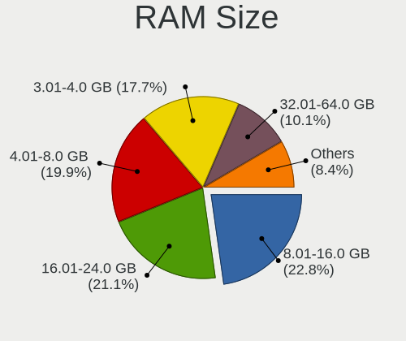
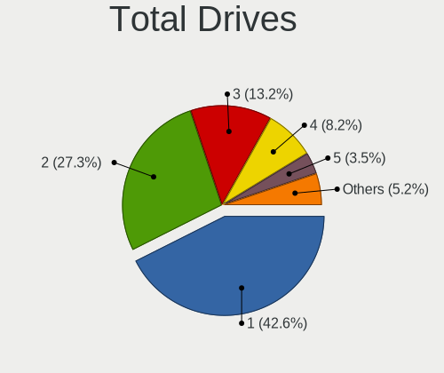
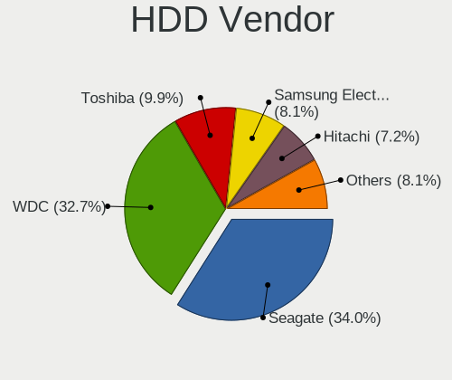
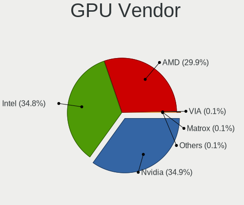
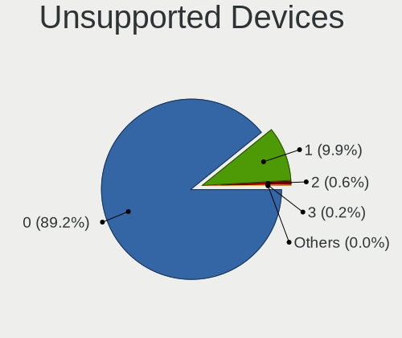

OpenMandriva 4.3 - Tested Hardware & Statistics (Desktops)
----------------------------------------------------------

A project to collect tested hardware configurations for OpenMandriva 4.3.

Anyone can contribute to this report by the [hw-probe](https://github.com/linuxhw/hw-probe) tool:

    sudo -E hw-probe -all -upload

Please contribute! Especially if your hardware is rare.

Contents
--------

* [ Test Cases ](#test-cases)

* [ System ](#system)
  - [ Kernel                   ](#kernel)
  - [ Kernel Family            ](#kernel-family)
  - [ Kernel Major Ver.        ](#kernel-major-ver)
  - [ Arch                     ](#arch)
  - [ DE                       ](#de)
  - [ Display Server           ](#display-server)
  - [ Display Manager          ](#display-manager)
  - [ OS Lang                  ](#os-lang)
  - [ Boot Mode                ](#boot-mode)
  - [ Filesystem               ](#filesystem)
  - [ Part. scheme             ](#part-scheme)
  - [ Dual Boot with Linux/BSD ](#dual-boot-with-linuxbsd)
  - [ Dual Boot (Win)          ](#dual-boot-win)

* [ Board ](#board)
  - [ Vendor                   ](#vendor)
  - [ Model                    ](#model)
  - [ Model Family             ](#model-family)
  - [ MFG Year                 ](#mfg-year)
  - [ Form Factor              ](#form-factor)
  - [ Secure Boot              ](#secure-boot)
  - [ Coreboot                 ](#coreboot)
  - [ RAM Size                 ](#ram-size)
  - [ RAM Used                 ](#ram-used)
  - [ Total Drives             ](#total-drives)
  - [ Has CD-ROM               ](#has-cd-rom)
  - [ Has Ethernet             ](#has-ethernet)
  - [ Has WiFi                 ](#has-wifi)
  - [ Has Bluetooth            ](#has-bluetooth)

* [ Location ](#location)
  - [ Country                  ](#country)
  - [ City                     ](#city)

* [ Drives ](#drives)
  - [ Drive Vendor             ](#drive-vendor)
  - [ Drive Model              ](#drive-model)
  - [ HDD Vendor               ](#hdd-vendor)
  - [ SSD Vendor               ](#ssd-vendor)
  - [ Drive Kind               ](#drive-kind)
  - [ Drive Connector          ](#drive-connector)
  - [ Drive Size               ](#drive-size)
  - [ Space Total              ](#space-total)
  - [ Space Used               ](#space-used)
  - [ Malfunc. Drives          ](#malfunc-drives)
  - [ Malfunc. Drive Vendor    ](#malfunc-drive-vendor)
  - [ Malfunc. HDD Vendor      ](#malfunc-hdd-vendor)
  - [ Malfunc. Drive Kind      ](#malfunc-drive-kind)
  - [ Failed Drives            ](#failed-drives)
  - [ Failed Drive Vendor      ](#failed-drive-vendor)
  - [ Drive Status             ](#drive-status)

* [ Storage controller ](#storage-controller)
  - [ Storage Vendor           ](#storage-vendor)
  - [ Storage Model            ](#storage-model)
  - [ Storage Kind             ](#storage-kind)

* [ Processor ](#processor)
  - [ CPU Vendor               ](#cpu-vendor)
  - [ CPU Model                ](#cpu-model)
  - [ CPU Model Family         ](#cpu-model-family)
  - [ CPU Cores                ](#cpu-cores)
  - [ CPU Sockets              ](#cpu-sockets)
  - [ CPU Threads              ](#cpu-threads)
  - [ CPU Op-Modes             ](#cpu-op-modes)
  - [ CPU Microcode            ](#cpu-microcode)
  - [ CPU Microarch            ](#cpu-microarch)

* [ Graphics ](#graphics)
  - [ GPU Vendor               ](#gpu-vendor)
  - [ GPU Model                ](#gpu-model)
  - [ GPU Combo                ](#gpu-combo)
  - [ GPU Driver               ](#gpu-driver)
  - [ GPU Memory               ](#gpu-memory)

* [ Monitor ](#monitor)
  - [ Monitor Vendor           ](#monitor-vendor)
  - [ Monitor Model            ](#monitor-model)
  - [ Monitor Resolution       ](#monitor-resolution)
  - [ Monitor Diagonal         ](#monitor-diagonal)
  - [ Monitor Width            ](#monitor-width)
  - [ Aspect Ratio             ](#aspect-ratio)
  - [ Monitor Area             ](#monitor-area)
  - [ Pixel Density            ](#pixel-density)
  - [ Multiple Monitors        ](#multiple-monitors)

* [ Network ](#network)
  - [ Net Controller Vendor    ](#net-controller-vendor)
  - [ Net Controller Model     ](#net-controller-model)
  - [ Wireless Vendor          ](#wireless-vendor)
  - [ Wireless Model           ](#wireless-model)
  - [ Ethernet Vendor          ](#ethernet-vendor)
  - [ Ethernet Model           ](#ethernet-model)
  - [ Net Controller Kind      ](#net-controller-kind)
  - [ Used Controller          ](#used-controller)
  - [ NICs                     ](#nics)
  - [ IPv6                     ](#ipv6)

* [ Bluetooth ](#bluetooth)
  - [ Bluetooth Vendor         ](#bluetooth-vendor)
  - [ Bluetooth Model          ](#bluetooth-model)

* [ Sound ](#sound)
  - [ Sound Vendor             ](#sound-vendor)
  - [ Sound Model              ](#sound-model)

* [ Memory ](#memory)
  - [ Memory Vendor            ](#memory-vendor)
  - [ Memory Model             ](#memory-model)
  - [ Memory Kind              ](#memory-kind)
  - [ Memory Form Factor       ](#memory-form-factor)
  - [ Memory Size              ](#memory-size)
  - [ Memory Speed             ](#memory-speed)

* [ Printers & scanners ](#printers--scanners)
  - [ Printer Vendor           ](#printer-vendor)
  - [ Printer Model            ](#printer-model)
  - [ Scanner Vendor           ](#scanner-vendor)
  - [ Scanner Model            ](#scanner-model)

* [ Camera ](#camera)
  - [ Camera Vendor            ](#camera-vendor)
  - [ Camera Model             ](#camera-model)

* [ Security ](#security)
  - [ Fingerprint Vendor       ](#fingerprint-vendor)
  - [ Fingerprint Model        ](#fingerprint-model)
  - [ Chipcard Vendor          ](#chipcard-vendor)
  - [ Chipcard Model           ](#chipcard-model)

* [ Unsupported ](#unsupported)
  - [ Unsupported Devices      ](#unsupported-devices)
  - [ Unsupported Device Types ](#unsupported-device-types)

Test Cases
----------

Total: 2127

| Vendor        | Model                       | Probe                                                      | Date         |
|---------------|-----------------------------|------------------------------------------------------------|--------------|
| ASRock        | G41M-VS3                    | [d592b19e9b](https://linux-hardware.org/?probe=d592b19e9b) | Jun 10, 2023 |
| Wistron       | ProLiant ML110 G5           | [eea1c44d94](https://linux-hardware.org/?probe=eea1c44d94) | Jun 10, 2023 |
| Biostar       | H610MH                      | [2cd4e157d4](https://linux-hardware.org/?probe=2cd4e157d4) | Jun 08, 2023 |
| HP            | 1850                        | [bddc14be8b](https://linux-hardware.org/?probe=bddc14be8b) | Jun 05, 2023 |
| HP            | 1495                        | [0cbf6bee1f](https://linux-hardware.org/?probe=0cbf6bee1f) | Jun 04, 2023 |
| MSI           | Boston                      | [95b4d5183d](https://linux-hardware.org/?probe=95b4d5183d) | Jun 04, 2023 |
| Gigabyte      | B550M AORUS PRO-P           | [417320253a](https://linux-hardware.org/?probe=417320253a) | May 31, 2023 |
| TPV-INVENT... | 2AC6 A01                    | [1ac394c97c](https://linux-hardware.org/?probe=1ac394c97c) | May 30, 2023 |
| Gigabyte      | X570 AORUS MASTER           | [528f7440b7](https://linux-hardware.org/?probe=528f7440b7) | May 29, 2023 |
| Gigabyte      | H61M-DS2 x.x                | [e58b7bfc92](https://linux-hardware.org/?probe=e58b7bfc92) | May 29, 2023 |
| Gigabyte      | GA-MA78LMT-S2               | [bf3b702d7a](https://linux-hardware.org/?probe=bf3b702d7a) | May 28, 2023 |
| MSI           | A520M-A PRO                 | [6f1a19d503](https://linux-hardware.org/?probe=6f1a19d503) | May 25, 2023 |
| Gigabyte      | B365M DS3H                  | [149a19eeeb](https://linux-hardware.org/?probe=149a19eeeb) | May 24, 2023 |
| ASUSTek       | H81M-K                      | [f65eac842b](https://linux-hardware.org/?probe=f65eac842b) | May 23, 2023 |
| Gigabyte      | H510M H                     | [39725fefa4](https://linux-hardware.org/?probe=39725fefa4) | May 19, 2023 |
| HP            | 0A54h                       | [76953e42f8](https://linux-hardware.org/?probe=76953e42f8) | May 18, 2023 |
| Gigabyte      | B450M H                     | [4bd367b4c7](https://linux-hardware.org/?probe=4bd367b4c7) | May 17, 2023 |
| HP            | 18E5                        | [5e25e2156a](https://linux-hardware.org/?probe=5e25e2156a) | May 16, 2023 |
| ASRock        | G41M-GS3                    | [8859685e86](https://linux-hardware.org/?probe=8859685e86) | May 13, 2023 |
| Dell          | 09KPNV A01                  | [cbd408a1a6](https://linux-hardware.org/?probe=cbd408a1a6) | May 13, 2023 |
| Dell          | 0W0CHX A00                  | [60defd2bfe](https://linux-hardware.org/?probe=60defd2bfe) | May 12, 2023 |
| Acer          | RS880M05                    | [5952c105f6](https://linux-hardware.org/?probe=5952c105f6) | May 12, 2023 |
| Gigabyte      | H61M-S1                     | [db910d4ee1](https://linux-hardware.org/?probe=db910d4ee1) | May 11, 2023 |
| MSI           | MAG B550 TOMAHAWK           | [68afb54270](https://linux-hardware.org/?probe=68afb54270) | May 10, 2023 |
| ASUSTek       | M4A78L-M                    | [1a843c3a7f](https://linux-hardware.org/?probe=1a843c3a7f) | May 10, 2023 |
| ASUSTek       | P8H67                       | [eeb083abcd](https://linux-hardware.org/?probe=eeb083abcd) | May 07, 2023 |
| Shuttle       | FZ77                        | [e4a71bcb2d](https://linux-hardware.org/?probe=e4a71bcb2d) | May 07, 2023 |
| Gigabyte      | GA-MA790XT-UD4P             | [c9a5bee99d](https://linux-hardware.org/?probe=c9a5bee99d) | May 05, 2023 |
| MSI           | 760GM-P34                   | [cb75fca473](https://linux-hardware.org/?probe=cb75fca473) | May 04, 2023 |
| MSI           | MS-7025                     | [a15dc17cfc](https://linux-hardware.org/?probe=a15dc17cfc) | May 02, 2023 |
| MAXSUN        | MS-A86FX FS M.3             | [3ce20d3b05](https://linux-hardware.org/?probe=3ce20d3b05) | May 01, 2023 |
| DIEBOLD       | NM70-I                      | [c01a40d58c](https://linux-hardware.org/?probe=c01a40d58c) | Apr 30, 2023 |
| ASUSTek       | H81M-C/BR                   | [32942be783](https://linux-hardware.org/?probe=32942be783) | Apr 29, 2023 |
| AZW           | MINI S 10                   | [12ba32f977](https://linux-hardware.org/?probe=12ba32f977) | Apr 28, 2023 |
| Gigabyte      | GA-MA785GM-US2H             | [238598d9ab](https://linux-hardware.org/?probe=238598d9ab) | Apr 26, 2023 |
| ASUSTek       | P8P67 LE                    | [e46f340908](https://linux-hardware.org/?probe=e46f340908) | Apr 25, 2023 |
| ASRock        | AB350M-HDV                  | [44ac797451](https://linux-hardware.org/?probe=44ac797451) | Apr 25, 2023 |
| ASUSTek       | A68HM-K                     | [ae90303c3a](https://linux-hardware.org/?probe=ae90303c3a) | Apr 25, 2023 |
| Lenovo        | ThinkCentre A70z 0401G6G    | [b1b8bf3df6](https://linux-hardware.org/?probe=b1b8bf3df6) | Apr 25, 2023 |
| HP            | 0AA8h                       | [b927834a03](https://linux-hardware.org/?probe=b927834a03) | Apr 23, 2023 |
| Gigabyte      | H61M-S2PH                   | [ec36f4ada2](https://linux-hardware.org/?probe=ec36f4ada2) | Apr 23, 2023 |
| Gigabyte      | 990FXA-UD3                  | [bf1dbf49a8](https://linux-hardware.org/?probe=bf1dbf49a8) | Apr 22, 2023 |
| Gigabyte      | EP45-UD3                    | [5d45f63468](https://linux-hardware.org/?probe=5d45f63468) | Apr 22, 2023 |
| Biostar       | A75MG                       | [50cb5c256e](https://linux-hardware.org/?probe=50cb5c256e) | Apr 22, 2023 |
| Intel         | DB65AL AAG12530-310         | [c625f3747a](https://linux-hardware.org/?probe=c625f3747a) | Apr 21, 2023 |
| ASUSTek       | M5A78L-M PLUS/USB3          | [5f1a1c6abd](https://linux-hardware.org/?probe=5f1a1c6abd) | Apr 20, 2023 |
| Foxconn       | 2ABF                        | [53d3a8d066](https://linux-hardware.org/?probe=53d3a8d066) | Apr 19, 2023 |
| Gigabyte      | G31M-ES2L                   | [0244194778](https://linux-hardware.org/?probe=0244194778) | Apr 17, 2023 |
| ASUSTek       | PRIME X570-P                | [337102cd4c](https://linux-hardware.org/?probe=337102cd4c) | Apr 15, 2023 |
| ASUSTek       | STRIX Z270H GAMING          | [7ac461b735](https://linux-hardware.org/?probe=7ac461b735) | Apr 15, 2023 |
| Gigabyte      | P55-UD3R                    | [5e8538987d](https://linux-hardware.org/?probe=5e8538987d) | Apr 14, 2023 |
| Dell          | 0GXM1W A00                  | [f96d907026](https://linux-hardware.org/?probe=f96d907026) | Apr 13, 2023 |
| ASRock        | M3N78D FX                   | [618073d9e9](https://linux-hardware.org/?probe=618073d9e9) | Apr 12, 2023 |
| Dell          | 0WR7PY A02                  | [2cec768fe1](https://linux-hardware.org/?probe=2cec768fe1) | Apr 11, 2023 |
| ASRock        | X570 Pro4                   | [feb08fab62](https://linux-hardware.org/?probe=feb08fab62) | Apr 09, 2023 |
| Fujitsu Si... | D2312-A3 S26361-D2312-A3    | [54fabc7712](https://linux-hardware.org/?probe=54fabc7712) | Apr 09, 2023 |
| ASUSTek       | AM1M-A                      | [120f5780bd](https://linux-hardware.org/?probe=120f5780bd) | Apr 09, 2023 |
| Gigabyte      | GA-78LMT-USB3               | [2d355e87d7](https://linux-hardware.org/?probe=2d355e87d7) | Apr 07, 2023 |
| Gigabyte      | GA-78LMT-S2PT               | [10c9b38ed6](https://linux-hardware.org/?probe=10c9b38ed6) | Apr 07, 2023 |
| Gigabyte      | H61M-S2PV                   | [8c4f851451](https://linux-hardware.org/?probe=8c4f851451) | Apr 07, 2023 |
| ASUSTek       | M4N98TD EVO                 | [8a2a2cf1ce](https://linux-hardware.org/?probe=8a2a2cf1ce) | Apr 07, 2023 |
| ASRock        | H61M-DGS                    | [e2dd28ca36](https://linux-hardware.org/?probe=e2dd28ca36) | Apr 06, 2023 |
| Gigabyte      | F2A55M-DS2                  | [fea5792a8b](https://linux-hardware.org/?probe=fea5792a8b) | Apr 06, 2023 |
| ASUSTek       | H170-PRO                    | [8756f8891c](https://linux-hardware.org/?probe=8756f8891c) | Apr 06, 2023 |
| ASUSTek       | PRIME B450-PLUS             | [9e99b4150b](https://linux-hardware.org/?probe=9e99b4150b) | Apr 06, 2023 |
| ASRock        | A320M-DVS R4.0              | [6da0293a4b](https://linux-hardware.org/?probe=6da0293a4b) | Apr 05, 2023 |
| MSI           | B450 TOMAHAWK MAX           | [540d1f11a6](https://linux-hardware.org/?probe=540d1f11a6) | Apr 05, 2023 |
| ASUSTek       | P8Z77-I DELUXE              | [d8dc8a37b1](https://linux-hardware.org/?probe=d8dc8a37b1) | Apr 04, 2023 |
| ASRock        | 990FX Extreme3              | [013cd9b246](https://linux-hardware.org/?probe=013cd9b246) | Apr 03, 2023 |
| ASUSTek       | ROG Maximus XIII HERO       | [de861c6d3f](https://linux-hardware.org/?probe=de861c6d3f) | Apr 03, 2023 |
| Acer          | Veriton X2632G V:1.0        | [f5eafafc96](https://linux-hardware.org/?probe=f5eafafc96) | Apr 02, 2023 |
| ASUSTek       | PRIME X470-PRO              | [96fcc41161](https://linux-hardware.org/?probe=96fcc41161) | Apr 01, 2023 |
| Gigabyte      | B360 AORUS GAMING 3-CF      | [f54ccba86f](https://linux-hardware.org/?probe=f54ccba86f) | Apr 01, 2023 |
| HP            | 2AFA                        | [d177838277](https://linux-hardware.org/?probe=d177838277) | Mar 31, 2023 |
| Fujitsu       | D3600-A1 S26361-D3600-A1    | [fc9a42e387](https://linux-hardware.org/?probe=fc9a42e387) | Mar 31, 2023 |
| HP            | 3047h                       | [c4f4f0c51d](https://linux-hardware.org/?probe=c4f4f0c51d) | Mar 28, 2023 |
| Gigabyte      | GA-780T-D3L                 | [4f523c6409](https://linux-hardware.org/?probe=4f523c6409) | Mar 28, 2023 |
| Lenovo        | NO DPK                      | [220c640743](https://linux-hardware.org/?probe=220c640743) | Mar 28, 2023 |
| Gigabyte      | B450M S2H                   | [0901eb1e27](https://linux-hardware.org/?probe=0901eb1e27) | Mar 27, 2023 |
| ASUSTek       | P8H77-M                     | [6fc56d2339](https://linux-hardware.org/?probe=6fc56d2339) | Mar 25, 2023 |
| MSI           | A520M PRO                   | [c27ea21be5](https://linux-hardware.org/?probe=c27ea21be5) | Mar 25, 2023 |
| ASUSTek       | TUF Gaming B550-PLUS WIF... | [5c811e496f](https://linux-hardware.org/?probe=5c811e496f) | Mar 24, 2023 |
| Lenovo        | SDK0E50519 WIN              | [2fb6bb5874](https://linux-hardware.org/?probe=2fb6bb5874) | Mar 24, 2023 |
| ASUSTek       | M4N98TD EVO                 | [9cb4b84924](https://linux-hardware.org/?probe=9cb4b84924) | Mar 24, 2023 |
| Dell          | 0NDYHG A01                  | [93bc601af0](https://linux-hardware.org/?probe=93bc601af0) | Mar 23, 2023 |
| MSI           | MS-7255                     | [7322068101](https://linux-hardware.org/?probe=7322068101) | Mar 23, 2023 |
| Gigabyte      | P43-ES3G                    | [60a7dc4c2e](https://linux-hardware.org/?probe=60a7dc4c2e) | Mar 20, 2023 |
| ASUSTek       | M5A99X EVO R2.0             | [db3e17d5f1](https://linux-hardware.org/?probe=db3e17d5f1) | Mar 20, 2023 |
| ASUSTek       | PRIME B350M-A               | [9ee81ffe32](https://linux-hardware.org/?probe=9ee81ffe32) | Mar 20, 2023 |
| ASRock        | 970A-G                      | [52b0aa69ba](https://linux-hardware.org/?probe=52b0aa69ba) | Mar 20, 2023 |
| HP            | 18E7                        | [9e4b5010d8](https://linux-hardware.org/?probe=9e4b5010d8) | Mar 20, 2023 |
| Gigabyte      | A520M H                     | [a3cee7c278](https://linux-hardware.org/?probe=a3cee7c278) | Mar 19, 2023 |
| Gigabyte      | 990FXA-UD5                  | [0daa99f732](https://linux-hardware.org/?probe=0daa99f732) | Mar 19, 2023 |
| MSI           | H310M PRO-VDH PLUS          | [2a1291ac22](https://linux-hardware.org/?probe=2a1291ac22) | Mar 18, 2023 |
| MSI           | H55M-P31                    | [e95e62df99](https://linux-hardware.org/?probe=e95e62df99) | Mar 18, 2023 |
| Medion        | H81H3-EM2 H81EM2W08.217     | [1e1a430355](https://linux-hardware.org/?probe=1e1a430355) | Mar 17, 2023 |
| Dell          | 0T1D10 A01                  | [c640b09a8b](https://linux-hardware.org/?probe=c640b09a8b) | Mar 17, 2023 |
| Pegatron      | 2AB5                        | [7ab2e7b0ab](https://linux-hardware.org/?probe=7ab2e7b0ab) | Mar 16, 2023 |
| ASUSTek       | CG5290                      | [e0ab58dbfe](https://linux-hardware.org/?probe=e0ab58dbfe) | Mar 16, 2023 |
| ASUSTek       | VC62B                       | [9bf2d226a8](https://linux-hardware.org/?probe=9bf2d226a8) | Mar 15, 2023 |
| MSI           | H61M-P20                    | [8129a4f5a4](https://linux-hardware.org/?probe=8129a4f5a4) | Mar 15, 2023 |
| ASRock        | G31M-S                      | [7672cc15a2](https://linux-hardware.org/?probe=7672cc15a2) | Mar 13, 2023 |
| Gigabyte      | B85M-D3H-A                  | [4265744c52](https://linux-hardware.org/?probe=4265744c52) | Mar 12, 2023 |
| Dell          | 00V62H A01                  | [a45ebd1b85](https://linux-hardware.org/?probe=a45ebd1b85) | Mar 12, 2023 |
| Pegatron      | 2AC2                        | [a6084e8904](https://linux-hardware.org/?probe=a6084e8904) | Mar 11, 2023 |
| ASUSTek       | P7P55D DELUXE               | [d2b402f3c0](https://linux-hardware.org/?probe=d2b402f3c0) | Mar 11, 2023 |
| HP            | 0AA0h                       | [f86f0bc187](https://linux-hardware.org/?probe=f86f0bc187) | Mar 10, 2023 |
| Gigabyte      | B450M DS3H-CF               | [bf4c797c87](https://linux-hardware.org/?probe=bf4c797c87) | Mar 10, 2023 |
| ASRock        | H61M-ITX                    | [ab7e81c6ca](https://linux-hardware.org/?probe=ab7e81c6ca) | Mar 09, 2023 |
| Lenovo        | 3102 SDK0K13476 WIN 3306... | [b1a69ac03b](https://linux-hardware.org/?probe=b1a69ac03b) | Mar 08, 2023 |
| ECS           | MCP61PM-GM                  | [ac561937e3](https://linux-hardware.org/?probe=ac561937e3) | Mar 08, 2023 |
| Gigabyte      | B450M DS3H-CF               | [c6f9f5a58d](https://linux-hardware.org/?probe=c6f9f5a58d) | Mar 06, 2023 |
| Gigabyte      | P35-DS3L                    | [31aeecfcb9](https://linux-hardware.org/?probe=31aeecfcb9) | Mar 06, 2023 |
| ASUSTek       | PRIME X370-PRO              | [9b72e94139](https://linux-hardware.org/?probe=9b72e94139) | Mar 06, 2023 |
| Gigabyte      | Z370M D3H-CF                | [d000dc6718](https://linux-hardware.org/?probe=d000dc6718) | Mar 04, 2023 |
| Gigabyte      | B85M-DS3H-A                 | [914a9990c4](https://linux-hardware.org/?probe=914a9990c4) | Mar 04, 2023 |
| Gigabyte      | B450M DS3H-CF               | [84e37e870d](https://linux-hardware.org/?probe=84e37e870d) | Mar 03, 2023 |
| Intel         | DB75EN AAG39650-302         | [e828686fc3](https://linux-hardware.org/?probe=e828686fc3) | Mar 03, 2023 |
| ASUSTek       | Z97-PRO GAMER               | [1da5b61697](https://linux-hardware.org/?probe=1da5b61697) | Mar 02, 2023 |
| ASUSTek       | F2A85-V PRO                 | [aa7d308d7e](https://linux-hardware.org/?probe=aa7d308d7e) | Mar 01, 2023 |
| Fujitsu       | D2990-A3 S26361-D2990-A3    | [6f1de5f17c](https://linux-hardware.org/?probe=6f1de5f17c) | Feb 28, 2023 |
| ASUSTek       | PRIME B550M-A               | [a6af4042ea](https://linux-hardware.org/?probe=a6af4042ea) | Feb 28, 2023 |
| Foxconn       | G31MX Series                | [79ee8e5da3](https://linux-hardware.org/?probe=79ee8e5da3) | Feb 28, 2023 |
| MSI           | B450M MORTAR MAX            | [0335729036](https://linux-hardware.org/?probe=0335729036) | Feb 27, 2023 |
| Intel         | H61                         | [b61ef1ed65](https://linux-hardware.org/?probe=b61ef1ed65) | Feb 27, 2023 |
| MSI           | NF750-G55                   | [f279251ffa](https://linux-hardware.org/?probe=f279251ffa) | Feb 27, 2023 |
| Acer          | EG43M                       | [d533c457eb](https://linux-hardware.org/?probe=d533c457eb) | Feb 26, 2023 |
| ASUSTek       | PRIME Q270M-C               | [edf748dbbb](https://linux-hardware.org/?probe=edf748dbbb) | Feb 26, 2023 |
| Dell          | 0VHWTR A01                  | [ab8247e106](https://linux-hardware.org/?probe=ab8247e106) | Feb 24, 2023 |
| MSI           | B360M PRO-VH                | [fad0bd20e1](https://linux-hardware.org/?probe=fad0bd20e1) | Feb 24, 2023 |
| MSI           | G41M-P33 Combo              | [91c8d45121](https://linux-hardware.org/?probe=91c8d45121) | Feb 24, 2023 |
| ASUSTek       | M4A89GTD-PRO/USB3           | [9171567db4](https://linux-hardware.org/?probe=9171567db4) | Feb 24, 2023 |
| ASUSTek       | P8H61-M LX R2.0             | [b410c9f493](https://linux-hardware.org/?probe=b410c9f493) | Feb 24, 2023 |
| HP            | 1998                        | [145c009f05](https://linux-hardware.org/?probe=145c009f05) | Feb 24, 2023 |
| ASUSTek       | M2N-MX SE Plus              | [21aa20cd64](https://linux-hardware.org/?probe=21aa20cd64) | Feb 24, 2023 |
| Gigabyte      | Z97-HD3                     | [016a51a4af](https://linux-hardware.org/?probe=016a51a4af) | Feb 23, 2023 |
| MSI           | H110M PRO-VH PLUS           | [de05d0d3f6](https://linux-hardware.org/?probe=de05d0d3f6) | Feb 23, 2023 |
| Gigabyte      | G1.Sniper A88X-CF           | [cfe5ecec44](https://linux-hardware.org/?probe=cfe5ecec44) | Feb 23, 2023 |
| Biostar       | N68S3B                      | [4572b3d965](https://linux-hardware.org/?probe=4572b3d965) | Feb 23, 2023 |
| Foxconn       | 2ADA                        | [75b2eb9c1f](https://linux-hardware.org/?probe=75b2eb9c1f) | Feb 23, 2023 |
| Gigabyte      | H81M-S2PV                   | [ad365efca1](https://linux-hardware.org/?probe=ad365efca1) | Feb 22, 2023 |
| Gigabyte      | X570 GAMING X               | [4803e8ee01](https://linux-hardware.org/?probe=4803e8ee01) | Feb 22, 2023 |
| ASUSTek       | ROG CROSSHAIR VIII DARK ... | [2d36b57c9c](https://linux-hardware.org/?probe=2d36b57c9c) | Feb 22, 2023 |
| Gigabyte      | GA-78LMT-USB3 R2 sex        | [9523a0ccc2](https://linux-hardware.org/?probe=9523a0ccc2) | Feb 22, 2023 |
| ASUSTek       | M5A78L/USB3                 | [b4288b76ee](https://linux-hardware.org/?probe=b4288b76ee) | Feb 21, 2023 |
| MSI           | Z170A XPOWER GAMING TITA... | [b644019f77](https://linux-hardware.org/?probe=b644019f77) | Feb 21, 2023 |
| MSI           | H510M-A PRO                 | [bbef057c8f](https://linux-hardware.org/?probe=bbef057c8f) | Feb 21, 2023 |
| ASUSTek       | PRIME Z390-P                | [d81ff5358a](https://linux-hardware.org/?probe=d81ff5358a) | Feb 20, 2023 |
| MSI           | G41M-P23                    | [04211b9202](https://linux-hardware.org/?probe=04211b9202) | Feb 20, 2023 |
| ASUSTek       | ROG STRIX B560-A GAMING ... | [119e106d80](https://linux-hardware.org/?probe=119e106d80) | Feb 20, 2023 |
| ASRock        | 880GM-LE FX                 | [db290cd703](https://linux-hardware.org/?probe=db290cd703) | Feb 19, 2023 |
| MSI           | Z97M GAMING                 | [e983a3704e](https://linux-hardware.org/?probe=e983a3704e) | Feb 19, 2023 |
| ASUSTek       | STRIX X99 GAMING            | [8dd1992835](https://linux-hardware.org/?probe=8dd1992835) | Feb 18, 2023 |
| ASRock        | 880GM-LE FX                 | [1d45a444a3](https://linux-hardware.org/?probe=1d45a444a3) | Feb 18, 2023 |
| MSI           | MPG Z490 GAMING EDGE WIF... | [3ed988e135](https://linux-hardware.org/?probe=3ed988e135) | Feb 17, 2023 |
| Gigabyte      | H87M-HD3                    | [778b7898e3](https://linux-hardware.org/?probe=778b7898e3) | Feb 17, 2023 |
| EVGA          | 151-IB-E699                 | [9e975c7966](https://linux-hardware.org/?probe=9e975c7966) | Feb 17, 2023 |
| Pegatron      | IPM31G                      | [42d112d7e0](https://linux-hardware.org/?probe=42d112d7e0) | Feb 17, 2023 |
| HP            | 2820h                       | [552bdc9930](https://linux-hardware.org/?probe=552bdc9930) | Feb 17, 2023 |
| MSI           | H61M-E33                    | [f0c902ce04](https://linux-hardware.org/?probe=f0c902ce04) | Feb 16, 2023 |
| MSI           | Z97-G45 GAMING              | [c6a7d3a755](https://linux-hardware.org/?probe=c6a7d3a755) | Feb 16, 2023 |
| Gigabyte      | MZAPLBP-00                  | [b043125d6e](https://linux-hardware.org/?probe=b043125d6e) | Feb 16, 2023 |
| Gigabyte      | GA-MA790XT-UD4P             | [3ce39f40e7](https://linux-hardware.org/?probe=3ce39f40e7) | Feb 16, 2023 |
| MSI           | B350M PRO-VD PLUS           | [63789621e0](https://linux-hardware.org/?probe=63789621e0) | Feb 16, 2023 |
| Lenovo        | ThinkCentre M91 4518E4S     | [91b1fb7e03](https://linux-hardware.org/?probe=91b1fb7e03) | Feb 16, 2023 |
| Philco        | DTC-A55                     | [e957b8f1cf](https://linux-hardware.org/?probe=e957b8f1cf) | Feb 16, 2023 |
| Gigabyte      | F2A78M-HD2                  | [9f9cc6f9e2](https://linux-hardware.org/?probe=9f9cc6f9e2) | Feb 16, 2023 |
| MSI           | Z170A KRAIT GAMING 3X       | [8e521a2efc](https://linux-hardware.org/?probe=8e521a2efc) | Feb 16, 2023 |
| ASUSTek       | H81T                        | [51aa090e9a](https://linux-hardware.org/?probe=51aa090e9a) | Feb 16, 2023 |
| HP            | 3031h                       | [2b0cc2bd6e](https://linux-hardware.org/?probe=2b0cc2bd6e) | Feb 16, 2023 |
| MSI           | MS-7235                     | [519f3742a3](https://linux-hardware.org/?probe=519f3742a3) | Feb 15, 2023 |
| Dell          | 0NK5PH A00                  | [5455b577db](https://linux-hardware.org/?probe=5455b577db) | Feb 15, 2023 |
| Gigabyte      | P43-ES3G                    | [528ffce1c7](https://linux-hardware.org/?probe=528ffce1c7) | Feb 15, 2023 |
| ASUSTek       | PRIME B365M-K               | [20b88dda19](https://linux-hardware.org/?probe=20b88dda19) | Feb 15, 2023 |
| Dell          | 0GXM1W A00                  | [3ab6d305fc](https://linux-hardware.org/?probe=3ab6d305fc) | Feb 15, 2023 |
| MSI           | MPG B550 GAMING CARBON W... | [f0d6ada218](https://linux-hardware.org/?probe=f0d6ada218) | Feb 15, 2023 |
| ASUSTek       | PRIME Z690-P WIFI           | [b30e6a84c8](https://linux-hardware.org/?probe=b30e6a84c8) | Feb 14, 2023 |
| MSI           | Z97-G45 GAMING              | [f9318d4390](https://linux-hardware.org/?probe=f9318d4390) | Feb 14, 2023 |
| ASRock        | E350M1                      | [ac69adceb6](https://linux-hardware.org/?probe=ac69adceb6) | Feb 13, 2023 |
| ASUSTek       | P7P55D-E EVO                | [f1ec250753](https://linux-hardware.org/?probe=f1ec250753) | Feb 13, 2023 |
| Dell          | 0YXT71 A01                  | [cdc2dedbcd](https://linux-hardware.org/?probe=cdc2dedbcd) | Feb 13, 2023 |
| HP            | 3031h                       | [f9a0848388](https://linux-hardware.org/?probe=f9a0848388) | Feb 11, 2023 |
| ASUSTek       | PRIME X570-PRO              | [f0f4d31de2](https://linux-hardware.org/?probe=f0f4d31de2) | Feb 10, 2023 |
| Medion        | TJ4105                      | [cd654518c0](https://linux-hardware.org/?probe=cd654518c0) | Feb 09, 2023 |
| Apple         | Mac-F42C88C8 Proto1         | [8532f05156](https://linux-hardware.org/?probe=8532f05156) | Feb 09, 2023 |
| HP            | 1905                        | [a442e1de06](https://linux-hardware.org/?probe=a442e1de06) | Feb 07, 2023 |
| Lenovo        | 0x36A017AA SDK0J40700 WI... | [a527005a2a](https://linux-hardware.org/?probe=a527005a2a) | Feb 06, 2023 |
| Dell          | 084J0R A00                  | [7fe633b52f](https://linux-hardware.org/?probe=7fe633b52f) | Feb 05, 2023 |
| ASUSTek       | Z97-K                       | [e3f865cd20](https://linux-hardware.org/?probe=e3f865cd20) | Jan 28, 2023 |
| Dell          | 0773VG A00                  | [328dae4014](https://linux-hardware.org/?probe=328dae4014) | Jan 26, 2023 |
| HP            | 3048h                       | [caabf4189f](https://linux-hardware.org/?probe=caabf4189f) | Jan 25, 2023 |
| AZW           | U59                         | [6d2b672b77](https://linux-hardware.org/?probe=6d2b672b77) | Jan 25, 2023 |
| ASRock        | 775XFire-VSTA               | [e80788f790](https://linux-hardware.org/?probe=e80788f790) | Jan 24, 2023 |
| Fujitsu       | D2828-A2 S26361-D2828-A2    | [dcecec2239](https://linux-hardware.org/?probe=dcecec2239) | Jan 22, 2023 |
| Gigabyte      | N3050ND3H                   | [1663928526](https://linux-hardware.org/?probe=1663928526) | Jan 21, 2023 |
| ASUSTek       | Z77-A                       | [10081492a7](https://linux-hardware.org/?probe=10081492a7) | Jan 19, 2023 |
| ASUSTek       | C60M1-I                     | [defd3912ae](https://linux-hardware.org/?probe=defd3912ae) | Jan 18, 2023 |
| Unknown       | HX90                        | [2b034e44e2](https://linux-hardware.org/?probe=2b034e44e2) | Jan 18, 2023 |
| Medion        | MS-7621                     | [67b535d88f](https://linux-hardware.org/?probe=67b535d88f) | Jan 18, 2023 |
| Gigabyte      | F2A55M-HD2                  | [74a62575d2](https://linux-hardware.org/?probe=74a62575d2) | Jan 17, 2023 |
| ASUSTek       | P8B75-V                     | [276102bb1a](https://linux-hardware.org/?probe=276102bb1a) | Jan 16, 2023 |
| Lenovo        | SDK0F82993 WIN              | [48f294dfb4](https://linux-hardware.org/?probe=48f294dfb4) | Jan 15, 2023 |
| MSI           | MAG B550 TOMAHAWK           | [291dceb273](https://linux-hardware.org/?probe=291dceb273) | Jan 14, 2023 |
| Fujitsu       | D2828-A2 S26361-D2828-A2    | [79d2961429](https://linux-hardware.org/?probe=79d2961429) | Jan 14, 2023 |
| HP            | 8054                        | [faf1c97cea](https://linux-hardware.org/?probe=faf1c97cea) | Jan 14, 2023 |
| HP            | 18E5                        | [614faa708b](https://linux-hardware.org/?probe=614faa708b) | Jan 14, 2023 |
| Pegatron      | IPM41-D3                    | [23a918874b](https://linux-hardware.org/?probe=23a918874b) | Jan 14, 2023 |
| Gigabyte      | Z390 AORUS MASTER-CF        | [12f29d53ba](https://linux-hardware.org/?probe=12f29d53ba) | Jan 13, 2023 |
| Gigabyte      | H81M-S2PV                   | [72e7e2e1cf](https://linux-hardware.org/?probe=72e7e2e1cf) | Jan 11, 2023 |
| Gigabyte      | B250M-Gaming 3-CF           | [805d82d697](https://linux-hardware.org/?probe=805d82d697) | Jan 10, 2023 |
| Gigabyte      | H170-D3H-CF                 | [8064745798](https://linux-hardware.org/?probe=8064745798) | Jan 10, 2023 |
| HP            | 0AA4h                       | [e0776de36f](https://linux-hardware.org/?probe=e0776de36f) | Jan 09, 2023 |
| HP            | 802F                        | [1dd3655605](https://linux-hardware.org/?probe=1dd3655605) | Jan 09, 2023 |
| Gigabyte      | Z68XP-UD3                   | [e2f62062de](https://linux-hardware.org/?probe=e2f62062de) | Jan 09, 2023 |
| Dell          | 0654JC A01                  | [c3016e1823](https://linux-hardware.org/?probe=c3016e1823) | Jan 09, 2023 |
| HP            | 8265                        | [83897e98cf](https://linux-hardware.org/?probe=83897e98cf) | Jan 08, 2023 |
| MSI           | 990XA-GD55                  | [b4525a8431](https://linux-hardware.org/?probe=b4525a8431) | Jan 08, 2023 |
| Gigabyte      | Z690 GAMING X DDR4          | [c1c8654cde](https://linux-hardware.org/?probe=c1c8654cde) | Jan 07, 2023 |
| Acer          | Veriton N4640G              | [3392dd3c90](https://linux-hardware.org/?probe=3392dd3c90) | Jan 07, 2023 |
| Alienware     | 04VWF2 A02                  | [15f4ed4e31](https://linux-hardware.org/?probe=15f4ed4e31) | Jan 07, 2023 |
| Acer          | Veriton M2631G V:1.0        | [ddeffc27a7](https://linux-hardware.org/?probe=ddeffc27a7) | Jan 05, 2023 |
| Pegatron      | 2AC3                        | [4ce129e600](https://linux-hardware.org/?probe=4ce129e600) | Jan 05, 2023 |
| Dell          | 0M5DCD A00                  | [c64a1198cd](https://linux-hardware.org/?probe=c64a1198cd) | Jan 04, 2023 |
| MSI           | A88X-G45 GAMING             | [1caf5c85d9](https://linux-hardware.org/?probe=1caf5c85d9) | Jan 04, 2023 |
| Gigabyte      | Z690 AORUS ULTRA            | [55627fc077](https://linux-hardware.org/?probe=55627fc077) | Jan 03, 2023 |
| ASUSTek       | PRIME B350-PLUS             | [5f0eeeb9e7](https://linux-hardware.org/?probe=5f0eeeb9e7) | Jan 03, 2023 |
| Dell          | 0XCR8D A03                  | [faccba61cf](https://linux-hardware.org/?probe=faccba61cf) | Jan 03, 2023 |
| Fujitsu       | D3432-A1 S26361-D3432-A1    | [afe5105302](https://linux-hardware.org/?probe=afe5105302) | Jan 03, 2023 |
| ASUSTek       | Berkeley                    | [746d7be693](https://linux-hardware.org/?probe=746d7be693) | Jan 03, 2023 |
| Dell          | 0MM599                      | [95763443e3](https://linux-hardware.org/?probe=95763443e3) | Jan 03, 2023 |
| ASRock        | B450M-HDV R4.0              | [df9ca70fa3](https://linux-hardware.org/?probe=df9ca70fa3) | Jan 02, 2023 |
| Gigabyte      | H61M-S2PV                   | [85ad98c994](https://linux-hardware.org/?probe=85ad98c994) | Jan 02, 2023 |
| AZW           | MINI S                      | [ad7c4329eb](https://linux-hardware.org/?probe=ad7c4329eb) | Jan 02, 2023 |
| Gigabyte      | B550M DS3H                  | [509cc939cc](https://linux-hardware.org/?probe=509cc939cc) | Jan 01, 2023 |
| OEM           | Intel H81                   | [1700a7a4c7](https://linux-hardware.org/?probe=1700a7a4c7) | Jan 01, 2023 |
| Gigabyte      | B365 HD3                    | [195240c264](https://linux-hardware.org/?probe=195240c264) | Jan 01, 2023 |
| ASUSTek       | TUF Gaming B560-PLUS WIF... | [7295ec02b5](https://linux-hardware.org/?probe=7295ec02b5) | Dec 31, 2022 |
| ASUSTek       | UN45                        | [bde2e2efb1](https://linux-hardware.org/?probe=bde2e2efb1) | Dec 31, 2022 |
| MSI           | MS-7502 Fab D               | [9126e1035f](https://linux-hardware.org/?probe=9126e1035f) | Dec 31, 2022 |
| Gigabyte      | GA-78LMT-USB3 SEx           | [b0dd8fc6b5](https://linux-hardware.org/?probe=b0dd8fc6b5) | Dec 31, 2022 |
| ASUSTek       | STRIKER II EXTREME          | [3258ffa0c1](https://linux-hardware.org/?probe=3258ffa0c1) | Dec 29, 2022 |
| Gigabyte      | H61M-D2H                    | [28aede6faf](https://linux-hardware.org/?probe=28aede6faf) | Dec 29, 2022 |
| MSI           | Z97 PC Mate                 | [1b7e70ab6e](https://linux-hardware.org/?probe=1b7e70ab6e) | Dec 29, 2022 |
| ASUSTek       | P5K SE/EPU                  | [3f0c89985c](https://linux-hardware.org/?probe=3f0c89985c) | Dec 29, 2022 |
| Gigabyte      | MJPLNBB-00                  | [879a5b77ff](https://linux-hardware.org/?probe=879a5b77ff) | Dec 28, 2022 |
| Dell          | 0HN7XN A01                  | [43a0d87199](https://linux-hardware.org/?probe=43a0d87199) | Dec 28, 2022 |
| Pegatron      | APX85-GS                    | [82db9f15c6](https://linux-hardware.org/?probe=82db9f15c6) | Dec 27, 2022 |
| Acer          | Aspire TC-865 V:1.1         | [0c8add55fe](https://linux-hardware.org/?probe=0c8add55fe) | Dec 27, 2022 |
| MSI           | X470 GAMING PLUS MAX        | [bc68280036](https://linux-hardware.org/?probe=bc68280036) | Dec 26, 2022 |
| Lenovo        | SHARKBAY NOK                | [46123218f3](https://linux-hardware.org/?probe=46123218f3) | Dec 26, 2022 |
| Gigabyte      | G41MT-S2PT                  | [14611d6c99](https://linux-hardware.org/?probe=14611d6c99) | Dec 26, 2022 |
| HP            | 2AF7                        | [96344d97ba](https://linux-hardware.org/?probe=96344d97ba) | Dec 26, 2022 |
| Gigabyte      | B450M S2H                   | [500abd4186](https://linux-hardware.org/?probe=500abd4186) | Dec 25, 2022 |
| ASUSTek       | NARRA3                      | [cc0a64d0df](https://linux-hardware.org/?probe=cc0a64d0df) | Dec 25, 2022 |
| Pegatron      | IPPPV-D3G                   | [4d1a2299dc](https://linux-hardware.org/?probe=4d1a2299dc) | Dec 24, 2022 |
| ASUSTek       | TUF B450-PLUS GAMING        | [9e269ee2a4](https://linux-hardware.org/?probe=9e269ee2a4) | Dec 24, 2022 |
| ASRock        | FM2A68M-DG3+                | [11eb39826a](https://linux-hardware.org/?probe=11eb39826a) | Dec 24, 2022 |
| Dell          | 0J3C2F A00                  | [f993ebb9ed](https://linux-hardware.org/?probe=f993ebb9ed) | Dec 23, 2022 |
| MSI           | 880GM-E41                   | [2880803d71](https://linux-hardware.org/?probe=2880803d71) | Dec 23, 2022 |
| ASUSTek       | TUF B360-PRO GAMING         | [561b98afc3](https://linux-hardware.org/?probe=561b98afc3) | Dec 23, 2022 |
| Dell          | 0JJW8N A03                  | [5917cccca0](https://linux-hardware.org/?probe=5917cccca0) | Dec 23, 2022 |
| ASUSTek       | TUF Gaming B550-PLUS        | [87da3fdf4d](https://linux-hardware.org/?probe=87da3fdf4d) | Dec 23, 2022 |
| ASRock        | FM2A88M-HD+                 | [18b83ae613](https://linux-hardware.org/?probe=18b83ae613) | Dec 22, 2022 |
| Gigabyte      | X470 AORUS GAMING 5 WIFI... | [003ac98d7f](https://linux-hardware.org/?probe=003ac98d7f) | Dec 21, 2022 |
| PERTOSA       | GA-H110TN-M                 | [048d8cca49](https://linux-hardware.org/?probe=048d8cca49) | Dec 21, 2022 |
| Dell          | 0VHWTR A01                  | [a5070ec279](https://linux-hardware.org/?probe=a5070ec279) | Dec 20, 2022 |
| ECS           | G31T-M7                     | [327ac25b68](https://linux-hardware.org/?probe=327ac25b68) | Dec 20, 2022 |
| Gigabyte      | 945GCMX-S2                  | [3b9937e6df](https://linux-hardware.org/?probe=3b9937e6df) | Dec 20, 2022 |
| MSI           | H81M-E34                    | [3aa811568d](https://linux-hardware.org/?probe=3aa811568d) | Dec 19, 2022 |
| ASUSTek       | P5QL PRO                    | [5f3343c803](https://linux-hardware.org/?probe=5f3343c803) | Dec 19, 2022 |
| Gigabyte      | H61M-DS2                    | [b5c4e6cf61](https://linux-hardware.org/?probe=b5c4e6cf61) | Dec 19, 2022 |
| Dell          | 0M858N A00                  | [e46a95080d](https://linux-hardware.org/?probe=e46a95080d) | Dec 18, 2022 |
| Gigabyte      | X399 AORUS PRO-CF           | [71ebf721cc](https://linux-hardware.org/?probe=71ebf721cc) | Dec 17, 2022 |
| HP            | 8055                        | [6c7fa83dc9](https://linux-hardware.org/?probe=6c7fa83dc9) | Dec 17, 2022 |
| Dell          | 0RW203                      | [2f5bede488](https://linux-hardware.org/?probe=2f5bede488) | Dec 16, 2022 |
| Gigabyte      | F2A85X-UP4                  | [80358a5ba1](https://linux-hardware.org/?probe=80358a5ba1) | Dec 15, 2022 |
| Acer          | Veriton N2620G              | [a626bf668e](https://linux-hardware.org/?probe=a626bf668e) | Dec 15, 2022 |
| Pegatron      | IPM41-D3                    | [a41e0d92a7](https://linux-hardware.org/?probe=a41e0d92a7) | Dec 15, 2022 |
| Lenovo        | 364F SDK0J40700 WIN 3258... | [ffe60f958c](https://linux-hardware.org/?probe=ffe60f958c) | Dec 15, 2022 |
| Dell          | 0FR6WH A01                  | [46d6c645fe](https://linux-hardware.org/?probe=46d6c645fe) | Dec 15, 2022 |
| Gigabyte      | F2A68HM-H                   | [f18234034f](https://linux-hardware.org/?probe=f18234034f) | Dec 15, 2022 |
| HP            | 2AFB                        | [4c57ea0ee7](https://linux-hardware.org/?probe=4c57ea0ee7) | Dec 15, 2022 |
| ASUSTek       | ROG STRIX X570-I GAMING     | [587fac961e](https://linux-hardware.org/?probe=587fac961e) | Dec 15, 2022 |
| Dell          | 0VD92X A00                  | [9feb549665](https://linux-hardware.org/?probe=9feb549665) | Dec 15, 2022 |
| Gigabyte      | B550 AORUS ELITE V2         | [ad1e402db3](https://linux-hardware.org/?probe=ad1e402db3) | Dec 15, 2022 |
| ASUSTek       | P8H61-M LX2/CSM             | [cc6e7dae77](https://linux-hardware.org/?probe=cc6e7dae77) | Dec 14, 2022 |
| ASUSTek       | M5A78L-M PLUS/USB3          | [0a564c9f0f](https://linux-hardware.org/?probe=0a564c9f0f) | Dec 14, 2022 |
| Datto         | SSD                         | [a9bff0a51c](https://linux-hardware.org/?probe=a9bff0a51c) | Dec 14, 2022 |
| HP            | 304Ah                       | [d8b600f39e](https://linux-hardware.org/?probe=d8b600f39e) | Dec 13, 2022 |
| ECS           | H61H2-M2                    | [8525777743](https://linux-hardware.org/?probe=8525777743) | Dec 13, 2022 |
| Dell          | 0T10XW A02                  | [1539e12262](https://linux-hardware.org/?probe=1539e12262) | Dec 13, 2022 |
| ASUSTek       | Z10PH-D16 Series            | [18911cf243](https://linux-hardware.org/?probe=18911cf243) | Dec 13, 2022 |
| Gigabyte      | H310M S2V                   | [6895902fe7](https://linux-hardware.org/?probe=6895902fe7) | Dec 12, 2022 |
| ASUSTek       | AM1M-A                      | [260a382d54](https://linux-hardware.org/?probe=260a382d54) | Dec 12, 2022 |
| Fujitsu       | D3161-A1 S26361-D3161-A1    | [62f6fd5f8d](https://linux-hardware.org/?probe=62f6fd5f8d) | Dec 12, 2022 |
| MSI           | MPG B550 GAMING EDGE WIF... | [9537bff125](https://linux-hardware.org/?probe=9537bff125) | Dec 11, 2022 |
| Dell          | 0KG317                      | [cf7f697a0a](https://linux-hardware.org/?probe=cf7f697a0a) | Dec 11, 2022 |
| ASUSTek       | P8Z77-V LX                  | [d53608f3e3](https://linux-hardware.org/?probe=d53608f3e3) | Dec 10, 2022 |
| Dell          | 01TKCC A01                  | [0dc9bb1cf4](https://linux-hardware.org/?probe=0dc9bb1cf4) | Dec 09, 2022 |
| Lenovo        | ThinkCentre M70e 0829RB4    | [5a5b271c35](https://linux-hardware.org/?probe=5a5b271c35) | Dec 09, 2022 |
| HP            | 18E7                        | [9759493e06](https://linux-hardware.org/?probe=9759493e06) | Dec 09, 2022 |
| ASRock        | 945GCM-S                    | [926787ea67](https://linux-hardware.org/?probe=926787ea67) | Dec 09, 2022 |
| ASUSTek       | TUF B450-PRO GAMING         | [945412b0cc](https://linux-hardware.org/?probe=945412b0cc) | Dec 09, 2022 |
| Dell          | 0P301D A02                  | [8ab7a916f1](https://linux-hardware.org/?probe=8ab7a916f1) | Dec 08, 2022 |
| MSI           | 760GM-P23                   | [29337f7359](https://linux-hardware.org/?probe=29337f7359) | Dec 08, 2022 |
| ASRock        | B550 Taichi                 | [0203e79add](https://linux-hardware.org/?probe=0203e79add) | Dec 08, 2022 |
| Gigabyte      | Z370M D3H-CF                | [dabda33265](https://linux-hardware.org/?probe=dabda33265) | Dec 07, 2022 |
| MAXSUN        | MS-TZZ A320M.2-VH           | [c3fc86b5d4](https://linux-hardware.org/?probe=c3fc86b5d4) | Dec 06, 2022 |
| ASUSTek       | P8H61-M LX R2.0             | [664d064b07](https://linux-hardware.org/?probe=664d064b07) | Dec 06, 2022 |
| Lenovo        | 0x36A017AA 31900058 STD     | [ccc212b757](https://linux-hardware.org/?probe=ccc212b757) | Dec 06, 2022 |
| Lenovo        | SHARKBAY 0B98401 WIN        | [a4a47ea164](https://linux-hardware.org/?probe=a4a47ea164) | Dec 05, 2022 |
| Intel         | HURONRIVER                  | [d8a4f4a923](https://linux-hardware.org/?probe=d8a4f4a923) | Dec 05, 2022 |
| HP            | ProLiant ML350e Gen8        | [984fe41e3c](https://linux-hardware.org/?probe=984fe41e3c) | Dec 05, 2022 |
| ECS           | 945P/PL-A                   | [8db8eec28d](https://linux-hardware.org/?probe=8db8eec28d) | Dec 05, 2022 |
| Gigabyte      | GA-78LMT-S2                 | [fa3aeacc17](https://linux-hardware.org/?probe=fa3aeacc17) | Dec 05, 2022 |
| Dell          | 0M863N A01                  | [ee8183087b](https://linux-hardware.org/?probe=ee8183087b) | Dec 04, 2022 |
| Positivo      | POS-PIQ77CL POSITIVO        | [e98fcde376](https://linux-hardware.org/?probe=e98fcde376) | Dec 04, 2022 |
| Lenovo        | SHARKBAY NOK                | [ef7a013f9b](https://linux-hardware.org/?probe=ef7a013f9b) | Dec 04, 2022 |
| ACTION        | ACTINA GA-G31M-S2L          | [2a2934f919](https://linux-hardware.org/?probe=2a2934f919) | Dec 04, 2022 |
| Lenovo        | Win8 Pro DPK TPG            | [1dbda8e648](https://linux-hardware.org/?probe=1dbda8e648) | Dec 04, 2022 |
| Acer          | Aspire X3950                | [96044c1932](https://linux-hardware.org/?probe=96044c1932) | Dec 03, 2022 |
| ASUSTek       | H97-PLUS                    | [c79b15a3cf](https://linux-hardware.org/?probe=c79b15a3cf) | Dec 03, 2022 |
| HP            | 8648                        | [79673ee467](https://linux-hardware.org/?probe=79673ee467) | Dec 02, 2022 |
| ASUSTek       | P7P55D PRO                  | [b566591b3c](https://linux-hardware.org/?probe=b566591b3c) | Dec 02, 2022 |
| ASUSTek       | M5A97 PLUS                  | [63820e3937](https://linux-hardware.org/?probe=63820e3937) | Dec 01, 2022 |
| ASUSTek       | PRIME B250M-K               | [97a1793680](https://linux-hardware.org/?probe=97a1793680) | Dec 01, 2022 |
| ASUSTek       | P5K WS                      | [f3608476bf](https://linux-hardware.org/?probe=f3608476bf) | Dec 01, 2022 |
| Medion        | MS-7748                     | [0e92aa55ca](https://linux-hardware.org/?probe=0e92aa55ca) | Nov 30, 2022 |
| ASUSTek       | Z170-E                      | [5e68d23175](https://linux-hardware.org/?probe=5e68d23175) | Nov 30, 2022 |
| Medion        | MS-7800                     | [a5658a6933](https://linux-hardware.org/?probe=a5658a6933) | Nov 30, 2022 |
| ASRock        | N68-S3 UCC                  | [1d20e4ba6d](https://linux-hardware.org/?probe=1d20e4ba6d) | Nov 30, 2022 |
| MACHINIST     | X99-D8-MAX V1.0             | [c2430965a1](https://linux-hardware.org/?probe=c2430965a1) | Nov 30, 2022 |
| ECS           | 945P/PL-A                   | [ff47651dd8](https://linux-hardware.org/?probe=ff47651dd8) | Nov 29, 2022 |
| Biostar       | H81MHV3 5.0                 | [d89a05dd31](https://linux-hardware.org/?probe=d89a05dd31) | Nov 29, 2022 |
| Gigabyte      | B450 AORUS M                | [d20243efed](https://linux-hardware.org/?probe=d20243efed) | Nov 28, 2022 |
| Gigabyte      | B360 AORUS GAMING 3 WIFI... | [e479f87a66](https://linux-hardware.org/?probe=e479f87a66) | Nov 28, 2022 |
| ASRock        | B550M-ITX/ac                | [31f70fbb3e](https://linux-hardware.org/?probe=31f70fbb3e) | Nov 27, 2022 |
| ASUSTek       | PRIME X570-PRO              | [c218724cb4](https://linux-hardware.org/?probe=c218724cb4) | Nov 27, 2022 |
| MSI           | Z77MA-G45                   | [feb165c344](https://linux-hardware.org/?probe=feb165c344) | Nov 27, 2022 |
| ASRock        | A88M-G                      | [323199813d](https://linux-hardware.org/?probe=323199813d) | Nov 27, 2022 |
| MSI           | P55-CD53                    | [a602949484](https://linux-hardware.org/?probe=a602949484) | Nov 26, 2022 |
| ASUSTek       | PRIME H410M-R               | [b680eec959](https://linux-hardware.org/?probe=b680eec959) | Nov 26, 2022 |
| HP            | 3397                        | [c943f7435d](https://linux-hardware.org/?probe=c943f7435d) | Nov 26, 2022 |
| ASUSTek       | M4A88TD-V EVO/USB3          | [9419d2017e](https://linux-hardware.org/?probe=9419d2017e) | Nov 26, 2022 |
| Gigabyte      | G31M-ES2L                   | [1eb32c408c](https://linux-hardware.org/?probe=1eb32c408c) | Nov 26, 2022 |
| HP            | 0AECh D                     | [857616948b](https://linux-hardware.org/?probe=857616948b) | Nov 26, 2022 |
| HP            | 1589                        | [077a89fb54](https://linux-hardware.org/?probe=077a89fb54) | Nov 26, 2022 |
| ASUSTek       | P8B75-M LX PLUS             | [7948a35f59](https://linux-hardware.org/?probe=7948a35f59) | Nov 25, 2022 |
| HP            | 2215                        | [0134898651](https://linux-hardware.org/?probe=0134898651) | Nov 25, 2022 |
| Wistron       | ProLiant ML110 G6           | [7d448ab5cc](https://linux-hardware.org/?probe=7d448ab5cc) | Nov 24, 2022 |
| Foxconn       | 2A92                        | [e21715c047](https://linux-hardware.org/?probe=e21715c047) | Nov 24, 2022 |
| Supermicro    | PDSMi+                      | [3a70b82d42](https://linux-hardware.org/?probe=3a70b82d42) | Nov 24, 2022 |
| Intel         | B75                         | [a8932d4a21](https://linux-hardware.org/?probe=a8932d4a21) | Nov 24, 2022 |
| Foxconn       | 2ADA                        | [3be30a3d31](https://linux-hardware.org/?probe=3be30a3d31) | Nov 23, 2022 |
| Wistron       | ProLiant ML110 G5           | [67cc68fbfe](https://linux-hardware.org/?probe=67cc68fbfe) | Nov 23, 2022 |
| Dell          | 0M863N A01                  | [ca7e5eab8d](https://linux-hardware.org/?probe=ca7e5eab8d) | Nov 23, 2022 |
| ASUSTek       | P5KPL-AM SE                 | [eca478ef1d](https://linux-hardware.org/?probe=eca478ef1d) | Nov 23, 2022 |
| Intel         | DG41TY AAE47335-302         | [ae2fb8d0b3](https://linux-hardware.org/?probe=ae2fb8d0b3) | Nov 22, 2022 |
| HP            | 3399                        | [bce6df1ffb](https://linux-hardware.org/?probe=bce6df1ffb) | Nov 21, 2022 |
| ASUSTek       | F1A55-M LE                  | [f2120128c1](https://linux-hardware.org/?probe=f2120128c1) | Nov 21, 2022 |
| Gigabyte      | H61M-DS2 x.x                | [cd65013120](https://linux-hardware.org/?probe=cd65013120) | Nov 21, 2022 |
| ASRock        | B450M Steel Legend          | [4792cdbba2](https://linux-hardware.org/?probe=4792cdbba2) | Nov 21, 2022 |
| Lenovo        | 32E9 SDK0T76465 WIN 3422... | [ec30826806](https://linux-hardware.org/?probe=ec30826806) | Nov 21, 2022 |
| Pegatron      | NARRA5                      | [d8632e2872](https://linux-hardware.org/?probe=d8632e2872) | Nov 21, 2022 |
| ASRock        | P67 Extreme4                | [569fd8178d](https://linux-hardware.org/?probe=569fd8178d) | Nov 21, 2022 |
| ASUSTek       | PRIME Z690-P D4             | [049f06f11d](https://linux-hardware.org/?probe=049f06f11d) | Nov 21, 2022 |
| AZW           | SEi                         | [a8e813c483](https://linux-hardware.org/?probe=a8e813c483) | Nov 21, 2022 |
| Dell          | 00NNT0 A00                  | [c25787d8b9](https://linux-hardware.org/?probe=c25787d8b9) | Nov 20, 2022 |
| ASUSTek       | H81M-PLUS                   | [880e6565e8](https://linux-hardware.org/?probe=880e6565e8) | Nov 20, 2022 |
| ASUSTek       | Z97-C                       | [733140c078](https://linux-hardware.org/?probe=733140c078) | Nov 20, 2022 |
| MSI           | PRO Z690-A WIFI             | [5b31194732](https://linux-hardware.org/?probe=5b31194732) | Nov 20, 2022 |
| Shuttle       | FS61                        | [7a940c8fa3](https://linux-hardware.org/?probe=7a940c8fa3) | Nov 19, 2022 |
| Pegatron      | 2A94h                       | [be99475703](https://linux-hardware.org/?probe=be99475703) | Nov 19, 2022 |
| ECS           | G41T-M7                     | [f97036df33](https://linux-hardware.org/?probe=f97036df33) | Nov 18, 2022 |
| Intel         | X99                         | [c95c1d173b](https://linux-hardware.org/?probe=c95c1d173b) | Nov 18, 2022 |
| TPV-INVENT... | 2AC6 A01                    | [04b3ba4242](https://linux-hardware.org/?probe=04b3ba4242) | Nov 18, 2022 |
| Gigabyte      | 970A-DS3P                   | [fc7b21bd04](https://linux-hardware.org/?probe=fc7b21bd04) | Nov 18, 2022 |
| Gigabyte      | A520M H                     | [c2ad29d3e8](https://linux-hardware.org/?probe=c2ad29d3e8) | Nov 18, 2022 |
| Fujitsu Si... | D2364-A3 S26361-D2364-A3    | [62ce7f9a0b](https://linux-hardware.org/?probe=62ce7f9a0b) | Nov 18, 2022 |
| Huanan        | X99-8M-F V1.1               | [b1d1b0ad4c](https://linux-hardware.org/?probe=b1d1b0ad4c) | Nov 18, 2022 |
| ASUSTek       | P5KPL/1600                  | [24b13d1967](https://linux-hardware.org/?probe=24b13d1967) | Nov 16, 2022 |
| HP            | 843B                        | [373e5cc61d](https://linux-hardware.org/?probe=373e5cc61d) | Nov 16, 2022 |
| Intel         | H61                         | [faeac27433](https://linux-hardware.org/?probe=faeac27433) | Nov 16, 2022 |
| Medion        | MS-7728                     | [813d86814d](https://linux-hardware.org/?probe=813d86814d) | Nov 16, 2022 |
| Acer          | Veriton N4630G              | [f4566a57a9](https://linux-hardware.org/?probe=f4566a57a9) | Nov 16, 2022 |
| ALDO          | C2016-BSWI-D2               | [0e4c4c6806](https://linux-hardware.org/?probe=0e4c4c6806) | Nov 16, 2022 |
| AZW           | Gemini M                    | [683123c4f5](https://linux-hardware.org/?probe=683123c4f5) | Nov 16, 2022 |
| ASUSTek       | H81M-A                      | [ff63827781](https://linux-hardware.org/?probe=ff63827781) | Nov 15, 2022 |
| ASRock        | B450M Steel Legend          | [6cb0948dfd](https://linux-hardware.org/?probe=6cb0948dfd) | Nov 15, 2022 |
| MSI           | H61M-P31/W8                 | [a7d3a01ab2](https://linux-hardware.org/?probe=a7d3a01ab2) | Nov 15, 2022 |
| HP            | 22F8                        | [754ebee9c8](https://linux-hardware.org/?probe=754ebee9c8) | Nov 14, 2022 |
| ASUSTek       | P8Z77-V LX                  | [2d904e2be7](https://linux-hardware.org/?probe=2d904e2be7) | Nov 13, 2022 |
| HP            | 84FD                        | [6ee4b6828c](https://linux-hardware.org/?probe=6ee4b6828c) | Nov 13, 2022 |
| Deltron       | H81H3-M4                    | [49530f2e0b](https://linux-hardware.org/?probe=49530f2e0b) | Nov 13, 2022 |
| MSI           | H97 GUARD-PRO               | [3ea9d7a74a](https://linux-hardware.org/?probe=3ea9d7a74a) | Nov 13, 2022 |
| Gigabyte      | H87-HD3                     | [e5a8d4700d](https://linux-hardware.org/?probe=e5a8d4700d) | Nov 12, 2022 |
| ASRock        | B450M Pro4 R2.0             | [c5952a73e7](https://linux-hardware.org/?probe=c5952a73e7) | Nov 12, 2022 |
| ASUSTek       | H81M-K                      | [052f42f29a](https://linux-hardware.org/?probe=052f42f29a) | Nov 12, 2022 |
| ASUSTek       | P5K SE/EPU                  | [d5e58b3718](https://linux-hardware.org/?probe=d5e58b3718) | Nov 11, 2022 |
| Gigabyte      | H61M-S1                     | [19dc931962](https://linux-hardware.org/?probe=19dc931962) | Nov 10, 2022 |
| ASRock        | B365M Pro4-F                | [aa006ea111](https://linux-hardware.org/?probe=aa006ea111) | Nov 10, 2022 |
| Gigabyte      | H61M-DS2 x.x                | [4488e0a71a](https://linux-hardware.org/?probe=4488e0a71a) | Nov 10, 2022 |
| Acer          | RS880M05                    | [cb216f090c](https://linux-hardware.org/?probe=cb216f090c) | Nov 09, 2022 |
| Fujitsu       | D3161-A1 S26361-D3161-A1    | [fb87099a0d](https://linux-hardware.org/?probe=fb87099a0d) | Nov 09, 2022 |
| Gigabyte      | GA-MA78GM-S2H               | [ac916f47fc](https://linux-hardware.org/?probe=ac916f47fc) | Nov 08, 2022 |
| ASUSTek       | P5E-VM SE                   | [a41a51330d](https://linux-hardware.org/?probe=a41a51330d) | Nov 08, 2022 |
| Acer          | Aspire X1700                | [764516b8f0](https://linux-hardware.org/?probe=764516b8f0) | Nov 08, 2022 |
| Dell          | 0VD92X A00                  | [a22087073b](https://linux-hardware.org/?probe=a22087073b) | Nov 08, 2022 |
| ASRock        | Z170 Extreme4               | [f0b56da15d](https://linux-hardware.org/?probe=f0b56da15d) | Nov 07, 2022 |
| MSI           | B450M MORTAR TITANIUM       | [b6768dd5b7](https://linux-hardware.org/?probe=b6768dd5b7) | Nov 07, 2022 |
| Gigabyte      | Z68MA-D2H-B3                | [09c5b6e39e](https://linux-hardware.org/?probe=09c5b6e39e) | Nov 06, 2022 |
| Pegatron      | 2AE3                        | [19ae75aacc](https://linux-hardware.org/?probe=19ae75aacc) | Nov 06, 2022 |
| ASRock        | 4CoreDual-SATA2             | [e1a81edea7](https://linux-hardware.org/?probe=e1a81edea7) | Nov 05, 2022 |
| MSI           | GF615M-P33                  | [8aec7634ab](https://linux-hardware.org/?probe=8aec7634ab) | Nov 05, 2022 |
| HP            | 2820h                       | [6378a2e9c3](https://linux-hardware.org/?probe=6378a2e9c3) | Nov 05, 2022 |
| VS Company    | MCP61M                      | [ef6adc510d](https://linux-hardware.org/?probe=ef6adc510d) | Nov 05, 2022 |
| ASUSTek       | H170I-PLUS D3               | [74df37995c](https://linux-hardware.org/?probe=74df37995c) | Nov 04, 2022 |
| ASUSTek       | PRIME B365M-K               | [e2e281d38d](https://linux-hardware.org/?probe=e2e281d38d) | Nov 03, 2022 |
| Fujitsu       | D3219-A1 S26361-D3219-A1    | [bdc77dbc53](https://linux-hardware.org/?probe=bdc77dbc53) | Nov 03, 2022 |
| Acer          | Aspire X1430                | [f48a8d45d8](https://linux-hardware.org/?probe=f48a8d45d8) | Nov 01, 2022 |
| ASUSTek       | SABERTOOTH Z77              | [8b208b8383](https://linux-hardware.org/?probe=8b208b8383) | Oct 31, 2022 |
| ASUSTek       | M4A78 PLUS                  | [bac044cd22](https://linux-hardware.org/?probe=bac044cd22) | Oct 31, 2022 |
| ASUSTek       | PRIME B450M-A II            | [c23efa8caa](https://linux-hardware.org/?probe=c23efa8caa) | Oct 31, 2022 |
| Dell          | 0GXM1W A00                  | [598d815c17](https://linux-hardware.org/?probe=598d815c17) | Oct 31, 2022 |
| Pegatron      | IPPCR-SS                    | [9427da0212](https://linux-hardware.org/?probe=9427da0212) | Oct 31, 2022 |
| Gigabyte      | H410M S2H V3                | [202065a62d](https://linux-hardware.org/?probe=202065a62d) | Oct 30, 2022 |
| Gigabyte      | 970A-UD3P                   | [5f7d9d2a04](https://linux-hardware.org/?probe=5f7d9d2a04) | Oct 30, 2022 |
| Apple         | Mac-F221BEC8                | [12b6232cdd](https://linux-hardware.org/?probe=12b6232cdd) | Oct 30, 2022 |
| Gigabyte      | Z690 AORUS MASTER           | [2a7d6b757b](https://linux-hardware.org/?probe=2a7d6b757b) | Oct 29, 2022 |
| MSI           | P45 Platinum                | [5507d45c35](https://linux-hardware.org/?probe=5507d45c35) | Oct 29, 2022 |
| ASUSTek       | M5A78L-M LX PLUS            | [345683b134](https://linux-hardware.org/?probe=345683b134) | Oct 29, 2022 |
| ASRock        | H81M-ITX                    | [56f93814ea](https://linux-hardware.org/?probe=56f93814ea) | Oct 28, 2022 |
| ASUSTek       | M5A87                       | [88e6b582c9](https://linux-hardware.org/?probe=88e6b582c9) | Oct 28, 2022 |
| Dell          | 0WMJ54 A01                  | [41e9e7aba7](https://linux-hardware.org/?probe=41e9e7aba7) | Oct 28, 2022 |
| Unknown       | Unknown                     | [8d93ee0286](https://linux-hardware.org/?probe=8d93ee0286) | Oct 28, 2022 |
| ASUSTek       | P8B75-V                     | [ca5c26654a](https://linux-hardware.org/?probe=ca5c26654a) | Oct 27, 2022 |
| ASRock        | B550M-HDV                   | [4d5068a3be](https://linux-hardware.org/?probe=4d5068a3be) | Oct 27, 2022 |
| Acer          | Veriton M275                | [c4604d6f2a](https://linux-hardware.org/?probe=c4604d6f2a) | Oct 26, 2022 |
| ASUSTek       | P8H67-M PRO                 | [b50585b578](https://linux-hardware.org/?probe=b50585b578) | Oct 26, 2022 |
| Dell          | 0WR7PY A03                  | [fa0daeab26](https://linux-hardware.org/?probe=fa0daeab26) | Oct 26, 2022 |
| Acer          | Veriton NBU                 | [7be04cd3ed](https://linux-hardware.org/?probe=7be04cd3ed) | Oct 25, 2022 |
| Gigabyte      | G41MT-S2PT                  | [2fb43f4be2](https://linux-hardware.org/?probe=2fb43f4be2) | Oct 25, 2022 |
| ASRock        | G41C-GS                     | [218d55e0ca](https://linux-hardware.org/?probe=218d55e0ca) | Oct 25, 2022 |
| ASUSTek       | P5Q3 DELUXE                 | [a25c84e8f1](https://linux-hardware.org/?probe=a25c84e8f1) | Oct 25, 2022 |
| Dell          | 0GX297                      | [a047bbd7a0](https://linux-hardware.org/?probe=a047bbd7a0) | Oct 24, 2022 |
| ASRock        | N68-VS3 UCC                 | [82afa0e5bc](https://linux-hardware.org/?probe=82afa0e5bc) | Oct 24, 2022 |
| Gigabyte      | H310M S2H x.x               | [cce2975614](https://linux-hardware.org/?probe=cce2975614) | Oct 24, 2022 |
| ASUSTek       | P5QL-E                      | [41810c587a](https://linux-hardware.org/?probe=41810c587a) | Oct 24, 2022 |
| MSI           | MPG X570 GAMING PLUS        | [e59cef718b](https://linux-hardware.org/?probe=e59cef718b) | Oct 23, 2022 |
| Acer          | WMCP78M                     | [f4e3945dea](https://linux-hardware.org/?probe=f4e3945dea) | Oct 23, 2022 |
| ASUSTek       | M5A99X EVO R2.0             | [5b61c1c241](https://linux-hardware.org/?probe=5b61c1c241) | Oct 23, 2022 |
| ASRock        | B450M Pro4                  | [12b83ecfd4](https://linux-hardware.org/?probe=12b83ecfd4) | Oct 22, 2022 |
| Dell          | 0HX555                      | [86339c4a3f](https://linux-hardware.org/?probe=86339c4a3f) | Oct 22, 2022 |
| Philco        | DTC-A55                     | [5c7d64ff3f](https://linux-hardware.org/?probe=5c7d64ff3f) | Oct 22, 2022 |
| Acer          | WG43M                       | [e520a7dfca](https://linux-hardware.org/?probe=e520a7dfca) | Oct 22, 2022 |
| Gigabyte      | GA-790FXTA-UD5              | [78218a5b63](https://linux-hardware.org/?probe=78218a5b63) | Oct 21, 2022 |
| MSI           | H61M-P20                    | [a50648c486](https://linux-hardware.org/?probe=a50648c486) | Oct 21, 2022 |
| ASUSTek       | M5A78L-M PLUS/USB3          | [6c32002395](https://linux-hardware.org/?probe=6c32002395) | Oct 20, 2022 |
| ASRock        | H81 Pro BTC R2.0            | [2ead6c088f](https://linux-hardware.org/?probe=2ead6c088f) | Oct 20, 2022 |
| HP            | 1825                        | [e0a35f1d0f](https://linux-hardware.org/?probe=e0a35f1d0f) | Oct 19, 2022 |
| Dell          | 0M5DCD A00                  | [e14791bb51](https://linux-hardware.org/?probe=e14791bb51) | Oct 19, 2022 |
| HP            | 805D                        | [a70ef30fce](https://linux-hardware.org/?probe=a70ef30fce) | Oct 19, 2022 |
| Intel         | DH61BF AAG81311-101         | [770d8bf876](https://linux-hardware.org/?probe=770d8bf876) | Oct 19, 2022 |
| ASUSTek       | A88XM-A                     | [9622704d8f](https://linux-hardware.org/?probe=9622704d8f) | Oct 18, 2022 |
| ASUSTek       | P5KPL-E                     | [2f1e1cbbf4](https://linux-hardware.org/?probe=2f1e1cbbf4) | Oct 18, 2022 |
| ASUSTek       | TUF Gaming B460-PLUS        | [5823a0c5d0](https://linux-hardware.org/?probe=5823a0c5d0) | Oct 18, 2022 |
| Dell          | 02YYK5 A01                  | [5872b35f8c](https://linux-hardware.org/?probe=5872b35f8c) | Oct 17, 2022 |
| ASUSTek       | PRIME B560M-K               | [8d9bc873e4](https://linux-hardware.org/?probe=8d9bc873e4) | Oct 17, 2022 |
| ASRock        | Z87 Pro3                    | [364a0afaff](https://linux-hardware.org/?probe=364a0afaff) | Oct 16, 2022 |
| Dell          | 0XFWHV A00                  | [4a5716d169](https://linux-hardware.org/?probe=4a5716d169) | Oct 16, 2022 |
| Gigabyte      | F2A88XM-HD3P                | [b5c41a9fef](https://linux-hardware.org/?probe=b5c41a9fef) | Oct 16, 2022 |
| HP            | 1850                        | [eda9bb7861](https://linux-hardware.org/?probe=eda9bb7861) | Oct 15, 2022 |
| Gigabyte      | H61M-D2H                    | [3c51ad7454](https://linux-hardware.org/?probe=3c51ad7454) | Oct 15, 2022 |
| Intel         | DP45SG AAE27733-403         | [f391a78f4d](https://linux-hardware.org/?probe=f391a78f4d) | Oct 15, 2022 |
| ASUSTek       | PRIME H510M-A               | [720d282dfe](https://linux-hardware.org/?probe=720d282dfe) | Oct 14, 2022 |
| Gigabyte      | F2A55M-DS2                  | [1feb9942e8](https://linux-hardware.org/?probe=1feb9942e8) | Oct 14, 2022 |
| ASUSTek       | PRIME H410M-A               | [8dc5e6f530](https://linux-hardware.org/?probe=8dc5e6f530) | Oct 14, 2022 |
| ASUSTek       | PRIME B450M-A II            | [6144d2247a](https://linux-hardware.org/?probe=6144d2247a) | Oct 13, 2022 |
| Itautec       | ST 4254 ST-4254 Padrao 0... | [48ee58de23](https://linux-hardware.org/?probe=48ee58de23) | Oct 13, 2022 |
| HP            | 1497                        | [ff6d690da4](https://linux-hardware.org/?probe=ff6d690da4) | Oct 12, 2022 |
| ASUSTek       | PRIME A320M-E               | [ff58ea3dc1](https://linux-hardware.org/?probe=ff58ea3dc1) | Oct 12, 2022 |
| ASUSTek       | PRIME H410M-A               | [dc990d0395](https://linux-hardware.org/?probe=dc990d0395) | Oct 12, 2022 |
| AMD           | A88                         | [1ee2502537](https://linux-hardware.org/?probe=1ee2502537) | Oct 12, 2022 |
| Pegatron      | IPM31G                      | [75d4fc0b55](https://linux-hardware.org/?probe=75d4fc0b55) | Oct 12, 2022 |
| Dell          | 0T656F A01                  | [1680fa50c0](https://linux-hardware.org/?probe=1680fa50c0) | Oct 11, 2022 |
| HP            | 2171                        | [105af7e899](https://linux-hardware.org/?probe=105af7e899) | Oct 11, 2022 |
| Gigabyte      | B75M-D3H                    | [4bc40092b2](https://linux-hardware.org/?probe=4bc40092b2) | Oct 11, 2022 |
| Lenovo        | ThinkCentre M58 7359WES     | [1c00ee45c1](https://linux-hardware.org/?probe=1c00ee45c1) | Oct 11, 2022 |
| ASRock        | G41C-GS R2.0                | [92ab2501ea](https://linux-hardware.org/?probe=92ab2501ea) | Oct 11, 2022 |
| Acer          | Aspire XC-230               | [d213bca85f](https://linux-hardware.org/?probe=d213bca85f) | Oct 10, 2022 |
| Gigabyte      | 945GM-S2                    | [3087d063e3](https://linux-hardware.org/?probe=3087d063e3) | Oct 10, 2022 |
| ASUSTek       | PRIME H410I-PLUS            | [10709dd95e](https://linux-hardware.org/?probe=10709dd95e) | Oct 10, 2022 |
| Gigabyte      | F2A58M-HD2                  | [a219433035](https://linux-hardware.org/?probe=a219433035) | Oct 10, 2022 |
| AZW           | U59                         | [8300f61a93](https://linux-hardware.org/?probe=8300f61a93) | Oct 10, 2022 |
| HP            | 805D                        | [8938f51322](https://linux-hardware.org/?probe=8938f51322) | Oct 09, 2022 |
| Lenovo        | Dory CRB                    | [33ae78632a](https://linux-hardware.org/?probe=33ae78632a) | Oct 09, 2022 |
| ASUSTek       | PRIME Z590-P                | [cf3661bb7c](https://linux-hardware.org/?probe=cf3661bb7c) | Oct 09, 2022 |
| Chuwi         | RZBOX                       | [76b6d7cd78](https://linux-hardware.org/?probe=76b6d7cd78) | Oct 08, 2022 |
| MSI           | A55M-P33                    | [127b8f180e](https://linux-hardware.org/?probe=127b8f180e) | Oct 08, 2022 |
| ASRock        | M3N78D FX                   | [e40ba3988f](https://linux-hardware.org/?probe=e40ba3988f) | Oct 08, 2022 |
| Gigabyte      | B550M AORUS PRO-P           | [feb96964b1](https://linux-hardware.org/?probe=feb96964b1) | Oct 08, 2022 |
| Dell          | 0MN1TX A01                  | [a9faf44fe8](https://linux-hardware.org/?probe=a9faf44fe8) | Oct 07, 2022 |
| MSI           | H110M PRO-VH PLUS           | [9dc72dc357](https://linux-hardware.org/?probe=9dc72dc357) | Oct 07, 2022 |
| Lenovo        | MAHOBAY Win8 Pro DPK TPG    | [7a7bc387f4](https://linux-hardware.org/?probe=7a7bc387f4) | Oct 06, 2022 |
| Medion        | MS-7797                     | [9137d0eacf](https://linux-hardware.org/?probe=9137d0eacf) | Oct 06, 2022 |
| ASUSTek       | M2V-MX                      | [55b3f7f6b0](https://linux-hardware.org/?probe=55b3f7f6b0) | Oct 06, 2022 |
| HP            | 18E4                        | [d9deeda238](https://linux-hardware.org/?probe=d9deeda238) | Oct 05, 2022 |
| Gigabyte      | H110M-S2PH-CF               | [580c13ac38](https://linux-hardware.org/?probe=580c13ac38) | Oct 05, 2022 |
| Dell          | 01TKCC A01                  | [65103a04c3](https://linux-hardware.org/?probe=65103a04c3) | Oct 04, 2022 |
| ASUSTek       | PRIME B450M-A II            | [89400b60b0](https://linux-hardware.org/?probe=89400b60b0) | Oct 04, 2022 |
| ASUSTek       | P5W DH Deluxe               | [8d5a649ba5](https://linux-hardware.org/?probe=8d5a649ba5) | Oct 03, 2022 |
| Intel         | H55                         | [73719c58ab](https://linux-hardware.org/?probe=73719c58ab) | Oct 03, 2022 |
| Lenovo        | 3098 SDK0E50510 WIN         | [f6a6361e08](https://linux-hardware.org/?probe=f6a6361e08) | Oct 03, 2022 |
| ASRock        | G41C-GS R2.0                | [c6e6708366](https://linux-hardware.org/?probe=c6e6708366) | Oct 03, 2022 |
| Gigabyte      | A320M-S2H-CF                | [019702e62b](https://linux-hardware.org/?probe=019702e62b) | Oct 03, 2022 |
| Lenovo        | ThinkCentre M58p 6234FB9    | [3c772e3e1d](https://linux-hardware.org/?probe=3c772e3e1d) | Oct 02, 2022 |
| MSI           | A75A-G35                    | [66b1d71092](https://linux-hardware.org/?probe=66b1d71092) | Oct 02, 2022 |
| Biostar       | A75MG                       | [ba1785b4b6](https://linux-hardware.org/?probe=ba1785b4b6) | Oct 02, 2022 |
| MSI           | B75MA-E33                   | [a14df6d116](https://linux-hardware.org/?probe=a14df6d116) | Oct 02, 2022 |
| Lenovo        | ThinkCentre M91p 4518AU8    | [ce1567bb35](https://linux-hardware.org/?probe=ce1567bb35) | Oct 02, 2022 |
| ASUSTek       | ROG STRIX X570-F GAMING     | [d4f76a4236](https://linux-hardware.org/?probe=d4f76a4236) | Oct 01, 2022 |
| MSI           | MS-7235                     | [838e2c27f1](https://linux-hardware.org/?probe=838e2c27f1) | Oct 01, 2022 |
| Lenovo        | 0x30F617AA NOK              | [bb13b87bd5](https://linux-hardware.org/?probe=bb13b87bd5) | Oct 01, 2022 |
| MSI           | B350M PRO-VDH               | [1a0d8b695d](https://linux-hardware.org/?probe=1a0d8b695d) | Oct 01, 2022 |
| Lenovo        | 3098 NOK                    | [a46521af41](https://linux-hardware.org/?probe=a46521af41) | Oct 01, 2022 |
| Fujitsu       | D2990-A2 S26361-D2990-A2    | [982b143d73](https://linux-hardware.org/?probe=982b143d73) | Oct 01, 2022 |
| ASUSTek       | M5A78L-M LX                 | [d967f57569](https://linux-hardware.org/?probe=d967f57569) | Oct 01, 2022 |
| ASUSTek       | M5A87                       | [89ca067566](https://linux-hardware.org/?probe=89ca067566) | Oct 01, 2022 |
| Gigabyte      | GA-970A-D3                  | [8c24fa2271](https://linux-hardware.org/?probe=8c24fa2271) | Oct 01, 2022 |
| Gigabyte      | B360 AORUS GAMING 3-CF      | [87a1c21540](https://linux-hardware.org/?probe=87a1c21540) | Oct 01, 2022 |
| ASRock        | B450M Pro4-F                | [75b0aa3c75](https://linux-hardware.org/?probe=75b0aa3c75) | Sep 30, 2022 |
| Lenovo        | 0x36A017AA SDK0J40700 WI... | [a6b14fdcf3](https://linux-hardware.org/?probe=a6b14fdcf3) | Sep 30, 2022 |
| Acer          | Batman A01                  | [f8ebe348e4](https://linux-hardware.org/?probe=f8ebe348e4) | Sep 30, 2022 |
| ASUSTek       | PRIME B450M-A               | [cfe1aba7e6](https://linux-hardware.org/?probe=cfe1aba7e6) | Sep 30, 2022 |
| ASUSTek       | P5KPL-AM EPU                | [66877298d4](https://linux-hardware.org/?probe=66877298d4) | Sep 30, 2022 |
| Huanan        | X79 (INTEL Xeon E5/Corei... | [a40d59533c](https://linux-hardware.org/?probe=a40d59533c) | Sep 29, 2022 |
| Acer          | Veriton M275                | [f871926a8e](https://linux-hardware.org/?probe=f871926a8e) | Sep 29, 2022 |
| Intel         | DQ67SW AAG12527-310         | [235930defb](https://linux-hardware.org/?probe=235930defb) | Sep 28, 2022 |
| Gigabyte      | Z87X-UD5H-CF                | [5a7ad7dba9](https://linux-hardware.org/?probe=5a7ad7dba9) | Sep 28, 2022 |
| ASUSTek       | M5A97 LE R2.0               | [372cdc3726](https://linux-hardware.org/?probe=372cdc3726) | Sep 28, 2022 |
| ASUSTek       | PRIME Z690-P D4             | [3bafc34ffc](https://linux-hardware.org/?probe=3bafc34ffc) | Sep 27, 2022 |
| Gigabyte      | B450 AORUS ELITE            | [8749a17d26](https://linux-hardware.org/?probe=8749a17d26) | Sep 25, 2022 |
| ASUSTek       | CM1740                      | [6ebc913933](https://linux-hardware.org/?probe=6ebc913933) | Sep 25, 2022 |
| Dell          | 0NV0M7 A02                  | [02925c7220](https://linux-hardware.org/?probe=02925c7220) | Sep 24, 2022 |
| MSI           | Z390-A PRO                  | [e78a82387b](https://linux-hardware.org/?probe=e78a82387b) | Sep 24, 2022 |
| ASRock        | X300M-STX                   | [c354f2b293](https://linux-hardware.org/?probe=c354f2b293) | Sep 24, 2022 |
| Intel         | DG41WV AAE90316-103         | [425dd57672](https://linux-hardware.org/?probe=425dd57672) | Sep 24, 2022 |
| Dell          | 0M5DCD A00                  | [991137f04f](https://linux-hardware.org/?probe=991137f04f) | Sep 23, 2022 |
| Dell          | 0PTTT9 A00                  | [21bde061e9](https://linux-hardware.org/?probe=21bde061e9) | Sep 23, 2022 |
| Lenovo        | ThinkCentre Edge71 1578D... | [95dded89b8](https://linux-hardware.org/?probe=95dded89b8) | Sep 23, 2022 |
| ASUSTek       | PRIME B560M-A AC            | [a99682c38d](https://linux-hardware.org/?probe=a99682c38d) | Sep 23, 2022 |
| MSI           | Z370 GAMING PRO CARBON      | [978c6dd9dd](https://linux-hardware.org/?probe=978c6dd9dd) | Sep 21, 2022 |
| HP            | 1998                        | [5148539ae1](https://linux-hardware.org/?probe=5148539ae1) | Sep 21, 2022 |
| MACHINIST     | B75 PRO V1.0                | [752cb8efae](https://linux-hardware.org/?probe=752cb8efae) | Sep 21, 2022 |
| Gigabyte      | H61M-S2PV                   | [a82f4ceccc](https://linux-hardware.org/?probe=a82f4ceccc) | Sep 20, 2022 |
| Lenovo        | 3728 SDK0R32862 WIN 3258... | [d78d85bde3](https://linux-hardware.org/?probe=d78d85bde3) | Sep 20, 2022 |
| HP            | 2B34                        | [a9e82bbb40](https://linux-hardware.org/?probe=a9e82bbb40) | Sep 19, 2022 |
| ASUSTek       | M5A88-V EVO                 | [9dc35eec1a](https://linux-hardware.org/?probe=9dc35eec1a) | Sep 19, 2022 |
| ASUSTek       | PRIME B550M-K               | [f5fb874e1e](https://linux-hardware.org/?probe=f5fb874e1e) | Sep 18, 2022 |
| HP            | 2B29                        | [391e407d29](https://linux-hardware.org/?probe=391e407d29) | Sep 18, 2022 |
| ASRock        | A75M-HVS                    | [7f906bad42](https://linux-hardware.org/?probe=7f906bad42) | Sep 18, 2022 |
| HP            | 843F                        | [7694ed2ffa](https://linux-hardware.org/?probe=7694ed2ffa) | Sep 18, 2022 |
| Gigabyte      | GA-78LMT-S2                 | [f75308c465](https://linux-hardware.org/?probe=f75308c465) | Sep 17, 2022 |
| ASUSTek       | M5A97 LE R2.0               | [52fe410fe3](https://linux-hardware.org/?probe=52fe410fe3) | Sep 16, 2022 |
| HP            | 1495                        | [462389df36](https://linux-hardware.org/?probe=462389df36) | Sep 14, 2022 |
| ASUSTek       | Maximus VIII RANGER         | [832824de54](https://linux-hardware.org/?probe=832824de54) | Sep 14, 2022 |
| ASUSTek       | ProArt B550-CREATOR         | [6ee9d3e2c4](https://linux-hardware.org/?probe=6ee9d3e2c4) | Sep 14, 2022 |
| Gigabyte      | F2A88X-D3H                  | [06d4572f5e](https://linux-hardware.org/?probe=06d4572f5e) | Sep 14, 2022 |
| ASUSTek       | H81M-A/BR                   | [daab24c8b6](https://linux-hardware.org/?probe=daab24c8b6) | Sep 14, 2022 |
| ASUSTek       | PRIME H310M-E R2.0          | [331a481ab0](https://linux-hardware.org/?probe=331a481ab0) | Sep 14, 2022 |
| Gigabyte      | X570 AORUS PRO              | [7858c98403](https://linux-hardware.org/?probe=7858c98403) | Sep 13, 2022 |
| MSI           | Z97 MPOWER                  | [a98aedda05](https://linux-hardware.org/?probe=a98aedda05) | Sep 13, 2022 |
| ASUSTek       | PRIME H310-PLUS             | [0937dcb89c](https://linux-hardware.org/?probe=0937dcb89c) | Sep 12, 2022 |
| ASRock        | X99 Taichi                  | [2eb979e980](https://linux-hardware.org/?probe=2eb979e980) | Sep 12, 2022 |
| Dell          | 0H8052                      | [1ade497706](https://linux-hardware.org/?probe=1ade497706) | Sep 12, 2022 |
| Gigabyte      | EX58-UD3R                   | [e482e214bd](https://linux-hardware.org/?probe=e482e214bd) | Sep 12, 2022 |
| Shuttle       | XH310V2                     | [c99efae947](https://linux-hardware.org/?probe=c99efae947) | Sep 12, 2022 |
| MSI           | MAG Z390M MORTAR            | [175f37281b](https://linux-hardware.org/?probe=175f37281b) | Sep 12, 2022 |
| HP            | 158B                        | [ba2366e9ad](https://linux-hardware.org/?probe=ba2366e9ad) | Sep 12, 2022 |
| ASRock        | B450M-HDV R4.0              | [73684f0e47](https://linux-hardware.org/?probe=73684f0e47) | Sep 12, 2022 |
| HP            | 304Bh                       | [0a7bcbdd9e](https://linux-hardware.org/?probe=0a7bcbdd9e) | Sep 11, 2022 |
| MSI           | B560M PRO                   | [6c43058545](https://linux-hardware.org/?probe=6c43058545) | Sep 11, 2022 |
| MSI           | 0A48                        | [2619140b48](https://linux-hardware.org/?probe=2619140b48) | Sep 10, 2022 |
| Dell          | 01TKCC A01                  | [6d032338c0](https://linux-hardware.org/?probe=6d032338c0) | Sep 10, 2022 |
| Gigabyte      | GB-BRR7H-4800               | [5fb806b2c8](https://linux-hardware.org/?probe=5fb806b2c8) | Sep 10, 2022 |
| ASUSTek       | P8B75-M LX                  | [0533bc0e86](https://linux-hardware.org/?probe=0533bc0e86) | Sep 10, 2022 |
| Dell          | 03NVJ6 A00                  | [ef8c1a9dee](https://linux-hardware.org/?probe=ef8c1a9dee) | Sep 10, 2022 |
| ASRock        | G41M-VS3                    | [021bcda428](https://linux-hardware.org/?probe=021bcda428) | Sep 10, 2022 |
| Gigabyte      | Z68AP-D3                    | [1ac8cbcc47](https://linux-hardware.org/?probe=1ac8cbcc47) | Sep 10, 2022 |
| Dell          | 0J3C2F A00                  | [40c43aff10](https://linux-hardware.org/?probe=40c43aff10) | Sep 10, 2022 |
| Apple         | Mac-F221BEC8                | [c0353e7c9e](https://linux-hardware.org/?probe=c0353e7c9e) | Sep 09, 2022 |
| ASUSTek       | TUF Gaming B460M-PLUS       | [cd84312899](https://linux-hardware.org/?probe=cd84312899) | Sep 09, 2022 |
| ASUSTek       | ROG CROSSHAIR VIII HERO     | [36b349b529](https://linux-hardware.org/?probe=36b349b529) | Sep 09, 2022 |
| Dell          | 0M5DCD A00                  | [1a5c8e32b7](https://linux-hardware.org/?probe=1a5c8e32b7) | Sep 09, 2022 |
| Gigabyte      | A520M DS3H                  | [036c262ad4](https://linux-hardware.org/?probe=036c262ad4) | Sep 08, 2022 |
| ASRock        | Z170 Extreme4               | [70e3d85420](https://linux-hardware.org/?probe=70e3d85420) | Sep 07, 2022 |
| MSI           | IONA                        | [11d081dfc3](https://linux-hardware.org/?probe=11d081dfc3) | Sep 07, 2022 |
| Positivo      | POS-PQ45AU                  | [2770dcd81a](https://linux-hardware.org/?probe=2770dcd81a) | Sep 07, 2022 |
| Unknown       | GSUO H61V10C                | [4eeb38bb0a](https://linux-hardware.org/?probe=4eeb38bb0a) | Sep 07, 2022 |
| ASRock        | J3355B-ITX                  | [1cf7076b74](https://linux-hardware.org/?probe=1cf7076b74) | Sep 07, 2022 |
| Gigabyte      | VM900M                      | [c6eefaabf9](https://linux-hardware.org/?probe=c6eefaabf9) | Sep 07, 2022 |
| MSI           | A320M PRO-M2 V2             | [c211642362](https://linux-hardware.org/?probe=c211642362) | Sep 06, 2022 |
| ASUSTek       | P8H61-M LE/USB3             | [8a66fbdadd](https://linux-hardware.org/?probe=8a66fbdadd) | Sep 06, 2022 |
| ECS           | GeForce 8000 series         | [7a60cea111](https://linux-hardware.org/?probe=7a60cea111) | Sep 06, 2022 |
| Gigabyte      | 970A-DS3P                   | [537708f71a](https://linux-hardware.org/?probe=537708f71a) | Sep 06, 2022 |
| MSI           | B350M PRO-VDH               | [ac68238341](https://linux-hardware.org/?probe=ac68238341) | Sep 05, 2022 |
| HP            | 8076                        | [e6fa33cc02](https://linux-hardware.org/?probe=e6fa33cc02) | Sep 05, 2022 |
| ASRock        | B450 Pro4                   | [4d5b865aed](https://linux-hardware.org/?probe=4d5b865aed) | Sep 05, 2022 |
| Unknown       | Unknown                     | [e2115bf207](https://linux-hardware.org/?probe=e2115bf207) | Sep 05, 2022 |
| PCWare        | IPMH61R3                    | [1cbe0ee116](https://linux-hardware.org/?probe=1cbe0ee116) | Sep 04, 2022 |
| ASUSTek       | SABERTOOTH Z77              | [b36d7be7c1](https://linux-hardware.org/?probe=b36d7be7c1) | Sep 04, 2022 |
| HP            | 304Bh                       | [d395dd6c91](https://linux-hardware.org/?probe=d395dd6c91) | Sep 04, 2022 |
| Gigabyte      | H97N-WIFI                   | [fb64be85f1](https://linux-hardware.org/?probe=fb64be85f1) | Sep 04, 2022 |
| Dell          | 09KPNV A01                  | [b5cc00787f](https://linux-hardware.org/?probe=b5cc00787f) | Sep 04, 2022 |
| ASUSTek       | P5G41T-M LX2/GB             | [792cbc3418](https://linux-hardware.org/?probe=792cbc3418) | Sep 04, 2022 |
| HP            | 8767 A                      | [33800541e3](https://linux-hardware.org/?probe=33800541e3) | Sep 04, 2022 |
| Gigabyte      | B560 AORUS PRO AX           | [fbd2e39516](https://linux-hardware.org/?probe=fbd2e39516) | Sep 04, 2022 |
| ECS           | H61H-G11/7.0                | [790b93cbee](https://linux-hardware.org/?probe=790b93cbee) | Sep 03, 2022 |
| Unknown       | Intel X79                   | [9e666e1530](https://linux-hardware.org/?probe=9e666e1530) | Sep 02, 2022 |
| HP            | 8053                        | [2e48f3f13e](https://linux-hardware.org/?probe=2e48f3f13e) | Sep 02, 2022 |
| Dell          | 0TP412                      | [73ec9dcd98](https://linux-hardware.org/?probe=73ec9dcd98) | Sep 02, 2022 |
| Gigabyte      | 945GCM-S2L                  | [99613365f5](https://linux-hardware.org/?probe=99613365f5) | Sep 01, 2022 |
| ASRock        | A320M-DVS R4.0              | [143e6e1816](https://linux-hardware.org/?probe=143e6e1816) | Sep 01, 2022 |
| Foxconn       | 2ABF                        | [c9a801a4d2](https://linux-hardware.org/?probe=c9a801a4d2) | Sep 01, 2022 |
| ASRock        | X99 Taichi                  | [4cd4bf6c89](https://linux-hardware.org/?probe=4cd4bf6c89) | Sep 01, 2022 |
| ASRock        | B550M-ITX/ac                | [7850c07cdc](https://linux-hardware.org/?probe=7850c07cdc) | Aug 31, 2022 |
| MSI           | H510M-A PRO                 | [120400698e](https://linux-hardware.org/?probe=120400698e) | Aug 31, 2022 |
| Vorke         | V1 Plus                     | [0f36a3adcb](https://linux-hardware.org/?probe=0f36a3adcb) | Aug 31, 2022 |
| MSI           | Z97 GAMING 7                | [c9ebe69583](https://linux-hardware.org/?probe=c9ebe69583) | Aug 30, 2022 |
| ASRock        | N68C-S UCC                  | [f3389e42f8](https://linux-hardware.org/?probe=f3389e42f8) | Aug 30, 2022 |
| Gigabyte      | VM900M                      | [f446d835da](https://linux-hardware.org/?probe=f446d835da) | Aug 30, 2022 |
| Dell          | 0R230R A00                  | [0ea749e83c](https://linux-hardware.org/?probe=0ea749e83c) | Aug 30, 2022 |
| HP            | 0A60h                       | [d801f7cb0c](https://linux-hardware.org/?probe=d801f7cb0c) | Aug 30, 2022 |
| MSI           | MAG X570S TOMAHAWK MAX W... | [33aaa7baf4](https://linux-hardware.org/?probe=33aaa7baf4) | Aug 29, 2022 |
| Lenovo        | ThinkCentre M91p 4518AU8    | [0099ab3432](https://linux-hardware.org/?probe=0099ab3432) | Aug 29, 2022 |
| Lenovo        | ThinkCentre M58p 6234CL2    | [14449a705a](https://linux-hardware.org/?probe=14449a705a) | Aug 29, 2022 |
| ASUSTek       | SABERTOOTH X58              | [efb40be4e1](https://linux-hardware.org/?probe=efb40be4e1) | Aug 28, 2022 |
| ASUSTek       | A88XM-A                     | [d8a4e4d954](https://linux-hardware.org/?probe=d8a4e4d954) | Aug 28, 2022 |
| Medion        | B460H6-EM                   | [91371e505d](https://linux-hardware.org/?probe=91371e505d) | Aug 28, 2022 |
| Gigabyte      | GA-MA78LMT-S2               | [a18db0fafd](https://linux-hardware.org/?probe=a18db0fafd) | Aug 27, 2022 |
| ASUSTek       | P8B WS                      | [5f89ab0d00](https://linux-hardware.org/?probe=5f89ab0d00) | Aug 27, 2022 |
| Fujitsu       | D3061-A1 S26361-D3061-A1    | [f74dc71ad8](https://linux-hardware.org/?probe=f74dc71ad8) | Aug 27, 2022 |
| ASRock        | A320M-HDV R4.0              | [67712f11d9](https://linux-hardware.org/?probe=67712f11d9) | Aug 27, 2022 |
| ASUSTek       | PRIME Z390-A                | [459c7c1eee](https://linux-hardware.org/?probe=459c7c1eee) | Aug 27, 2022 |
| MSI           | G31TM-P21                   | [cf0bc232f5](https://linux-hardware.org/?probe=cf0bc232f5) | Aug 26, 2022 |
| ASRock        | FM2A68M-HD+                 | [22cc477cd2](https://linux-hardware.org/?probe=22cc477cd2) | Aug 26, 2022 |
| MSI           | 760GM-P21                   | [7e45cde899](https://linux-hardware.org/?probe=7e45cde899) | Aug 26, 2022 |
| HP            | 1497                        | [82e518a338](https://linux-hardware.org/?probe=82e518a338) | Aug 26, 2022 |
| ASUSTek       | M5A78L LE                   | [e4a6425675](https://linux-hardware.org/?probe=e4a6425675) | Aug 26, 2022 |
| Dell          | 0RJ290                      | [ca82162ed5](https://linux-hardware.org/?probe=ca82162ed5) | Aug 25, 2022 |
| Acer          | Aspire XC-710 V:1.1         | [0b76e0f97d](https://linux-hardware.org/?probe=0b76e0f97d) | Aug 25, 2022 |
| Foxconn       | H61M/H61M-S                 | [18e7da32e9](https://linux-hardware.org/?probe=18e7da32e9) | Aug 25, 2022 |
| ASRock        | N68C-GS4 FX                 | [0462079328](https://linux-hardware.org/?probe=0462079328) | Aug 25, 2022 |
| ASUSTek       | PRIME B350M-A               | [1c98247f4c](https://linux-hardware.org/?probe=1c98247f4c) | Aug 25, 2022 |
| OEM           | A320                        | [4dffd629cf](https://linux-hardware.org/?probe=4dffd629cf) | Aug 25, 2022 |
| ASUSTek       | TUF Gaming X570-PLUS        | [d1cae6aca8](https://linux-hardware.org/?probe=d1cae6aca8) | Aug 24, 2022 |
| HP            | 21D0                        | [1bd58d519c](https://linux-hardware.org/?probe=1bd58d519c) | Aug 24, 2022 |
| Gigabyte      | Z68A-D3H-B3                 | [e75751c55b](https://linux-hardware.org/?probe=e75751c55b) | Aug 24, 2022 |
| ASUSTek       | TUF Gaming B450-PLUS II     | [7332174749](https://linux-hardware.org/?probe=7332174749) | Aug 24, 2022 |
| Gigabyte      | F2A68HM-H                   | [c824203d0a](https://linux-hardware.org/?probe=c824203d0a) | Aug 24, 2022 |
| Dell          | 08HPGT A01                  | [744f838dc2](https://linux-hardware.org/?probe=744f838dc2) | Aug 24, 2022 |
| ICP / iEi     | B217 V1.0                   | [9b540ece9f](https://linux-hardware.org/?probe=9b540ece9f) | Aug 23, 2022 |
| Gigabyte      | B550M AORUS PRO-P           | [7dae220687](https://linux-hardware.org/?probe=7dae220687) | Aug 23, 2022 |
| Dell          | 0YJPT1 A00                  | [1de0aeba8f](https://linux-hardware.org/?probe=1de0aeba8f) | Aug 22, 2022 |
| ASUSTek       | PRIME Z390-P                | [ca7534d4dc](https://linux-hardware.org/?probe=ca7534d4dc) | Aug 22, 2022 |
| ASUSTek       | M5A78L-M/USB3               | [fa5f1121d5](https://linux-hardware.org/?probe=fa5f1121d5) | Aug 22, 2022 |
| Intel         | H61                         | [f0a810114c](https://linux-hardware.org/?probe=f0a810114c) | Aug 22, 2022 |
| ASUSTek       | Z87-C                       | [8de83c544f](https://linux-hardware.org/?probe=8de83c544f) | Aug 21, 2022 |
| HP            | 1998                        | [69b6b04268](https://linux-hardware.org/?probe=69b6b04268) | Aug 21, 2022 |
| ASRock        | N68C-S UCC                  | [bb19c0586c](https://linux-hardware.org/?probe=bb19c0586c) | Aug 20, 2022 |
| Gigabyte      | B365M DS3H WIFI             | [142e25352d](https://linux-hardware.org/?probe=142e25352d) | Aug 20, 2022 |
| ASUSTek       | PRIME B450M-A II            | [56a34e0816](https://linux-hardware.org/?probe=56a34e0816) | Aug 20, 2022 |
| ASUSTek       | P5KPL-SE                    | [2925e63a87](https://linux-hardware.org/?probe=2925e63a87) | Aug 20, 2022 |
| AZW           | MII-V                       | [59698f6b33](https://linux-hardware.org/?probe=59698f6b33) | Aug 20, 2022 |
| OEM           | Intel H81                   | [5e354c60d1](https://linux-hardware.org/?probe=5e354c60d1) | Aug 20, 2022 |
| ASUSTek       | P5KPL-VM                    | [803031cd3b](https://linux-hardware.org/?probe=803031cd3b) | Aug 19, 2022 |
| Gigabyte      | B450M S2H                   | [a0a7a845e3](https://linux-hardware.org/?probe=a0a7a845e3) | Aug 18, 2022 |
| Gigabyte      | P43-ES3G                    | [de6e02672c](https://linux-hardware.org/?probe=de6e02672c) | Aug 18, 2022 |
| ASUSTek       | PRIME Z390-A                | [859884934f](https://linux-hardware.org/?probe=859884934f) | Aug 17, 2022 |
| Acer          | MRS600M                     | [ec4c10d06e](https://linux-hardware.org/?probe=ec4c10d06e) | Aug 17, 2022 |
| ASUSTek       | PRIME B250-PRO              | [870d7102f5](https://linux-hardware.org/?probe=870d7102f5) | Aug 17, 2022 |
| Gigabyte      | H410M S2 V2                 | [944a99ea66](https://linux-hardware.org/?probe=944a99ea66) | Aug 17, 2022 |
| Gigabyte      | H81M-S2PH                   | [c8f8e78df8](https://linux-hardware.org/?probe=c8f8e78df8) | Aug 17, 2022 |
| Gigabyte      | B460M DS3H                  | [2b97e09efa](https://linux-hardware.org/?probe=2b97e09efa) | Aug 17, 2022 |
| Fujitsu       | D3233-A1 S26361-D3233-A1    | [7b3d6b544c](https://linux-hardware.org/?probe=7b3d6b544c) | Aug 16, 2022 |
| Dell          | 0T656F A01                  | [ec4014a549](https://linux-hardware.org/?probe=ec4014a549) | Aug 16, 2022 |
| Gigabyte      | B550 AORUS ELITE            | [08e3444b3c](https://linux-hardware.org/?probe=08e3444b3c) | Aug 15, 2022 |
| HP            | 2AE2                        | [1fd0bb70dc](https://linux-hardware.org/?probe=1fd0bb70dc) | Aug 15, 2022 |
| Gigabyte      | P43-ES3G                    | [2b0691bddd](https://linux-hardware.org/?probe=2b0691bddd) | Aug 15, 2022 |
| Dell          | 0PC5F7 A03                  | [56ee42afe3](https://linux-hardware.org/?probe=56ee42afe3) | Aug 15, 2022 |
| Dell          | 0NC2VH A01                  | [170b178361](https://linux-hardware.org/?probe=170b178361) | Aug 15, 2022 |
| HP            | 18E7                        | [06374a6240](https://linux-hardware.org/?probe=06374a6240) | Aug 14, 2022 |
| ASRock        | 960GM-VGS3 FX               | [55c4e8059c](https://linux-hardware.org/?probe=55c4e8059c) | Aug 14, 2022 |
| MSI           | X570-A PRO                  | [30146876c6](https://linux-hardware.org/?probe=30146876c6) | Aug 14, 2022 |
| ASRock        | J3455-ITX                   | [4386fccad1](https://linux-hardware.org/?probe=4386fccad1) | Aug 14, 2022 |
| Lenovo        | SHARKBAY NOK                | [ee169e47b3](https://linux-hardware.org/?probe=ee169e47b3) | Aug 13, 2022 |
| Dell          | 08WKV3 A00                  | [4e57c20454](https://linux-hardware.org/?probe=4e57c20454) | Aug 13, 2022 |
| Lenovo        | ThinkCentre XXXX 739527G    | [ca5fe11e2c](https://linux-hardware.org/?probe=ca5fe11e2c) | Aug 13, 2022 |
| ASUSTek       | ROG STRIX B365-F GAMING     | [1ae946a847](https://linux-hardware.org/?probe=1ae946a847) | Aug 13, 2022 |
| ASUSTek       | PRIME B450M-A II            | [fd41ccab04](https://linux-hardware.org/?probe=fd41ccab04) | Aug 13, 2022 |
| HP            | 1850                        | [33933e3e5d](https://linux-hardware.org/?probe=33933e3e5d) | Aug 12, 2022 |
| ASRock        | H61M-DGS                    | [50b7221c5a](https://linux-hardware.org/?probe=50b7221c5a) | Aug 12, 2022 |
| ASUSTek       | PRIME B450M-A II            | [bc32ff70b7](https://linux-hardware.org/?probe=bc32ff70b7) | Aug 12, 2022 |
| Gigabyte      | EP35C-DS3R                  | [762d78160d](https://linux-hardware.org/?probe=762d78160d) | Aug 12, 2022 |
| MSI           | A68HM-E33 V2                | [2f3db9cd91](https://linux-hardware.org/?probe=2f3db9cd91) | Aug 12, 2022 |
| ASRock        | Z97M Pro4                   | [245d189a61](https://linux-hardware.org/?probe=245d189a61) | Aug 11, 2022 |
| MSI           | MPG Z390 GAMING PLUS        | [73bf30c596](https://linux-hardware.org/?probe=73bf30c596) | Aug 11, 2022 |
| Gigabyte      | P35-DS3L                    | [c765f5b81c](https://linux-hardware.org/?probe=c765f5b81c) | Aug 11, 2022 |
| Foxconn       | 2ABF                        | [3b20387bcc](https://linux-hardware.org/?probe=3b20387bcc) | Aug 10, 2022 |
| ASRock        | H81M-DGS                    | [31bdc504d4](https://linux-hardware.org/?probe=31bdc504d4) | Aug 10, 2022 |
| Dell          | 07KY25 A00                  | [676025f81a](https://linux-hardware.org/?probe=676025f81a) | Aug 10, 2022 |
| ASUSTek       | TUF B360-PRO GAMING         | [62d813423e](https://linux-hardware.org/?probe=62d813423e) | Aug 10, 2022 |
| MSI           | X470 GAMING M7 AC           | [58947090d5](https://linux-hardware.org/?probe=58947090d5) | Aug 09, 2022 |
| eMachines     | Veriton V2110               | [3492540d77](https://linux-hardware.org/?probe=3492540d77) | Aug 09, 2022 |
| ASRock        | AB350 Pro4                  | [2df31a9fbf](https://linux-hardware.org/?probe=2df31a9fbf) | Aug 09, 2022 |
| ASUSTek       | Z87-PRO                     | [89a77b442f](https://linux-hardware.org/?probe=89a77b442f) | Aug 09, 2022 |
| Gigabyte      | EP35-DS3P                   | [5c29aee903](https://linux-hardware.org/?probe=5c29aee903) | Aug 08, 2022 |
| ASUSTek       | AT3IONT-I DELUXE            | [642e31466d](https://linux-hardware.org/?probe=642e31466d) | Aug 08, 2022 |
| Dell          | 0782GW A01                  | [b3ebc3aed3](https://linux-hardware.org/?probe=b3ebc3aed3) | Aug 08, 2022 |
| HP            | 304Bh                       | [e1e3f301cb](https://linux-hardware.org/?probe=e1e3f301cb) | Aug 08, 2022 |
| Intel         | H61                         | [eabc8be629](https://linux-hardware.org/?probe=eabc8be629) | Aug 08, 2022 |
| Gigabyte      | H55M-UD2H                   | [4d6a861120](https://linux-hardware.org/?probe=4d6a861120) | Aug 07, 2022 |
| ASUSTek       | SABERTOOTH Z77              | [95f444c24c](https://linux-hardware.org/?probe=95f444c24c) | Aug 07, 2022 |
| Gigabyte      | EP45-UD3R                   | [6c434341ce](https://linux-hardware.org/?probe=6c434341ce) | Aug 07, 2022 |
| ASUSTek       | M3A78 PRO                   | [0b63e92a55](https://linux-hardware.org/?probe=0b63e92a55) | Aug 07, 2022 |
| HP            | 2215                        | [75304ada6c](https://linux-hardware.org/?probe=75304ada6c) | Aug 06, 2022 |
| Toshiba       | STI 006998G                 | [3de3fa77fc](https://linux-hardware.org/?probe=3de3fa77fc) | Aug 06, 2022 |
| ASRock        | H110M-STX                   | [62b1924710](https://linux-hardware.org/?probe=62b1924710) | Aug 06, 2022 |
| Gigabyte      | A320M-H-CF                  | [4015089c1e](https://linux-hardware.org/?probe=4015089c1e) | Aug 06, 2022 |
| MSI           | 2A9C                        | [8913065613](https://linux-hardware.org/?probe=8913065613) | Aug 06, 2022 |
| Dell          | 0NV0M7 A02                  | [dbf000aacd](https://linux-hardware.org/?probe=dbf000aacd) | Aug 06, 2022 |
| Gigabyte      | A520M S2H                   | [daa1f68f01](https://linux-hardware.org/?probe=daa1f68f01) | Aug 06, 2022 |
| MACHINIST     | X79 (INTEL Xeon E5/Corei... | [a722bef081](https://linux-hardware.org/?probe=a722bef081) | Aug 06, 2022 |
| MSI           | Z87-G43 GAMING              | [490239de9e](https://linux-hardware.org/?probe=490239de9e) | Aug 05, 2022 |
| Dell          | 0GY6Y8 A01                  | [1ad9e54625](https://linux-hardware.org/?probe=1ad9e54625) | Aug 05, 2022 |
| ASUSTek       | M2N68-AM SE2                | [b68c110fde](https://linux-hardware.org/?probe=b68c110fde) | Aug 05, 2022 |
| ASRock        | A300M-STX                   | [f6b820d15f](https://linux-hardware.org/?probe=f6b820d15f) | Aug 05, 2022 |
| ASRock        | H270M-ITX/ac                | [273c214064](https://linux-hardware.org/?probe=273c214064) | Aug 05, 2022 |
| Dell          | 0KG317                      | [65c105e2be](https://linux-hardware.org/?probe=65c105e2be) | Aug 04, 2022 |
| ASUSTek       | A68HM-K                     | [d5d981cf7b](https://linux-hardware.org/?probe=d5d981cf7b) | Aug 04, 2022 |
| ASUSTek       | H110M-K                     | [8c6442a868](https://linux-hardware.org/?probe=8c6442a868) | Aug 04, 2022 |
| Gigabyte      | GA-990FXA-UD3               | [7893ade7cb](https://linux-hardware.org/?probe=7893ade7cb) | Aug 04, 2022 |
| ASUSTek       | PRIME B350M-E               | [f9e07e62c2](https://linux-hardware.org/?probe=f9e07e62c2) | Aug 04, 2022 |
| Unknown       | Unknown                     | [0725792da0](https://linux-hardware.org/?probe=0725792da0) | Aug 04, 2022 |
| Gigabyte      | B360M GAMING HD             | [95e1eb0fcb](https://linux-hardware.org/?probe=95e1eb0fcb) | Aug 03, 2022 |
| Lenovo        | 3102                        | [73e0fee2bc](https://linux-hardware.org/?probe=73e0fee2bc) | Aug 03, 2022 |
| Gigabyte      | Z170X-UD3-CF                | [450fee0496](https://linux-hardware.org/?probe=450fee0496) | Aug 03, 2022 |
| HP            | 2B29                        | [5fcf3a8320](https://linux-hardware.org/?probe=5fcf3a8320) | Aug 02, 2022 |
| ASUSTek       | PRIME B450M-A               | [97dba8f5e3](https://linux-hardware.org/?probe=97dba8f5e3) | Aug 02, 2022 |
| ASUSTek       | TUF Gaming B560M-PLUS       | [6b790e8a9b](https://linux-hardware.org/?probe=6b790e8a9b) | Aug 02, 2022 |
| Acer          | EM61SM/EM61PM               | [1a35a6d7dc](https://linux-hardware.org/?probe=1a35a6d7dc) | Aug 02, 2022 |
| Foxconn       | 2ABF                        | [4f1fca6662](https://linux-hardware.org/?probe=4f1fca6662) | Aug 02, 2022 |
| ASUSTek       | P8H67                       | [508b0275e3](https://linux-hardware.org/?probe=508b0275e3) | Aug 02, 2022 |
| Gigabyte      | H61M-S2PH                   | [31bd0a48c9](https://linux-hardware.org/?probe=31bd0a48c9) | Aug 02, 2022 |
| Gigabyte      | H87-HD3                     | [daaf600950](https://linux-hardware.org/?probe=daaf600950) | Aug 01, 2022 |
| Gigabyte      | GA-78LMT-S2P                | [b5fded6824](https://linux-hardware.org/?probe=b5fded6824) | Aug 01, 2022 |
| HP            | 339A                        | [251a764917](https://linux-hardware.org/?probe=251a764917) | Aug 01, 2022 |
| ASUSTek       | P7P55D-E PRO                | [d58be7b6d1](https://linux-hardware.org/?probe=d58be7b6d1) | Aug 01, 2022 |
| MSI           | Z590-A PRO                  | [7051f56dda](https://linux-hardware.org/?probe=7051f56dda) | Aug 01, 2022 |
| MSI           | Z77A-GD65                   | [fcadad42a5](https://linux-hardware.org/?probe=fcadad42a5) | Aug 01, 2022 |
| HP            | 843F                        | [eeba83fecb](https://linux-hardware.org/?probe=eeba83fecb) | Aug 01, 2022 |
| ASUSTek       | ProArt X570-CREATOR WIFI    | [7e6cd7bcb3](https://linux-hardware.org/?probe=7e6cd7bcb3) | Jul 31, 2022 |
| ASUSTek       | P8B75-M LX                  | [653f46c8e3](https://linux-hardware.org/?probe=653f46c8e3) | Jul 31, 2022 |
| ASUSTek       | P5G41C-M LX                 | [4e30dc6361](https://linux-hardware.org/?probe=4e30dc6361) | Jul 31, 2022 |
| MSI           | B85M-P33                    | [6e9af1d1e4](https://linux-hardware.org/?probe=6e9af1d1e4) | Jul 31, 2022 |
| ASUSTek       | ROG STRIX Z390-E GAMING     | [cb7c9442d6](https://linux-hardware.org/?probe=cb7c9442d6) | Jul 31, 2022 |
| Unknown       | Unknown                     | [a8e41fdaaa](https://linux-hardware.org/?probe=a8e41fdaaa) | Jul 31, 2022 |
| ASUSTek       | Z97-A-USB31                 | [25db3983fe](https://linux-hardware.org/?probe=25db3983fe) | Jul 30, 2022 |
| ASUSTek       | TUF Gaming B550-PLUS        | [10ece2cb6c](https://linux-hardware.org/?probe=10ece2cb6c) | Jul 30, 2022 |
| ASUSTek       | TUF Gaming B450-PLUS II     | [edd98c5418](https://linux-hardware.org/?probe=edd98c5418) | Jul 30, 2022 |
| ASRock        | J5040-ITX                   | [2cc4fd5d75](https://linux-hardware.org/?probe=2cc4fd5d75) | Jul 30, 2022 |
| ASUSTek       | M3A78 PRO                   | [c30fca013c](https://linux-hardware.org/?probe=c30fca013c) | Jul 30, 2022 |
| HP            | 2ADC                        | [86608333bc](https://linux-hardware.org/?probe=86608333bc) | Jul 29, 2022 |
| PCWare        | IPMH61R2                    | [b3245af28d](https://linux-hardware.org/?probe=b3245af28d) | Jul 29, 2022 |
| HP            | 0AA0h                       | [5d21c69a99](https://linux-hardware.org/?probe=5d21c69a99) | Jul 29, 2022 |
| HP            | 18E4                        | [d13265fa57](https://linux-hardware.org/?probe=d13265fa57) | Jul 29, 2022 |
| ASUSTek       | TUF Gaming X570-PLUS_BR     | [e1d666e84a](https://linux-hardware.org/?probe=e1d666e84a) | Jul 29, 2022 |
| Dell          | OptiPlex 780                | [7a029315b9](https://linux-hardware.org/?probe=7a029315b9) | Jul 28, 2022 |
| ASRock        | Z97 Anniversary             | [768b11cbe4](https://linux-hardware.org/?probe=768b11cbe4) | Jul 28, 2022 |
| MSI           | G31TM-P35                   | [1bc8def241](https://linux-hardware.org/?probe=1bc8def241) | Jul 28, 2022 |
| MSI           | AM1I                        | [63e6d4040e](https://linux-hardware.org/?probe=63e6d4040e) | Jul 28, 2022 |
| Gigabyte      | B450M H                     | [1357e3b3d3](https://linux-hardware.org/?probe=1357e3b3d3) | Jul 28, 2022 |
| ASUSTek       | H110M-A/M.2                 | [93ad7b0efb](https://linux-hardware.org/?probe=93ad7b0efb) | Jul 28, 2022 |
| ASRock        | B450M Steel Legend          | [db492973ec](https://linux-hardware.org/?probe=db492973ec) | Jul 28, 2022 |
| ASRock        | A320M-HDV                   | [cc72c3c914](https://linux-hardware.org/?probe=cc72c3c914) | Jul 28, 2022 |
| ASUSTek       | M5A97 LE R2.0               | [24e94dd87e](https://linux-hardware.org/?probe=24e94dd87e) | Jul 28, 2022 |
| Lenovo        | 36EB SDK0J40700 WIN 3258... | [0068653ca3](https://linux-hardware.org/?probe=0068653ca3) | Jul 28, 2022 |
| Lenovo        | MAHOBAY 0B98401 PRO         | [d64175b64b](https://linux-hardware.org/?probe=d64175b64b) | Jul 28, 2022 |
| ASRock        | A88M-ITX/ac                 | [e339941033](https://linux-hardware.org/?probe=e339941033) | Jul 27, 2022 |
| Intel         | D54250WYK H13922-303        | [71b03b93a2](https://linux-hardware.org/?probe=71b03b93a2) | Jul 27, 2022 |
| Acer          | Aspire X1930                | [6a650f512e](https://linux-hardware.org/?probe=6a650f512e) | Jul 27, 2022 |
| Fujitsu       | D3062-A1 S26361-D3062-A1    | [d0ef6d20cf](https://linux-hardware.org/?probe=d0ef6d20cf) | Jul 27, 2022 |
| Foxconn       | A76ML-K 30                  | [7b118c6a6b](https://linux-hardware.org/?probe=7b118c6a6b) | Jul 27, 2022 |
| Dell          | 09KPNV A00                  | [610282a0e6](https://linux-hardware.org/?probe=610282a0e6) | Jul 27, 2022 |
| Dell          | 0YF8P5 A00                  | [04ebe8cd88](https://linux-hardware.org/?probe=04ebe8cd88) | Jul 27, 2022 |
| ASRock        | B450M Pro4                  | [5b4bccdf27](https://linux-hardware.org/?probe=5b4bccdf27) | Jul 27, 2022 |
| HP            | 1495                        | [61a8f473e2](https://linux-hardware.org/?probe=61a8f473e2) | Jul 27, 2022 |
| MSI           | B250M PRO-VDH               | [eb1ff40d2d](https://linux-hardware.org/?probe=eb1ff40d2d) | Jul 27, 2022 |
| ASUSTek       | Z97-P                       | [eeb9068dca](https://linux-hardware.org/?probe=eeb9068dca) | Jul 27, 2022 |
| Gigabyte      | H55M-S2H                    | [a9a6ab85ac](https://linux-hardware.org/?probe=a9a6ab85ac) | Jul 27, 2022 |
| Dell          | 0NW6H5 A00                  | [b76e9e02fa](https://linux-hardware.org/?probe=b76e9e02fa) | Jul 27, 2022 |
| Gigabyte      | H81M-HD3                    | [0cfb15d654](https://linux-hardware.org/?probe=0cfb15d654) | Jul 27, 2022 |
| ASRock        | FM2A88X-ITX+                | [24e0844619](https://linux-hardware.org/?probe=24e0844619) | Jul 27, 2022 |
| Acer          | IPXHW-RL                    | [d99b7cb71e](https://linux-hardware.org/?probe=d99b7cb71e) | Jul 27, 2022 |
| Intel         | DH67VR AAG27177-201         | [3aeca135cd](https://linux-hardware.org/?probe=3aeca135cd) | Jul 26, 2022 |
| ASUSTek       | SABERTOOTH Z77              | [05947b595a](https://linux-hardware.org/?probe=05947b595a) | Jul 26, 2022 |
| MSI           | H310M PRO-VDH PLUS          | [e487b063ea](https://linux-hardware.org/?probe=e487b063ea) | Jul 26, 2022 |
| MSI           | B450 TOMAHAWK MAX           | [17954b8ac5](https://linux-hardware.org/?probe=17954b8ac5) | Jul 26, 2022 |
| Dell          | 0C27VV A03                  | [c1c4edd1e5](https://linux-hardware.org/?probe=c1c4edd1e5) | Jul 26, 2022 |
| Dell          | 042P49 A01                  | [f9003ad850](https://linux-hardware.org/?probe=f9003ad850) | Jul 26, 2022 |
| Login Info... | LOG-H310M-G                 | [f02a0ed6dd](https://linux-hardware.org/?probe=f02a0ed6dd) | Jul 26, 2022 |
| Acer          | Aspire XC-830               | [02572035c8](https://linux-hardware.org/?probe=02572035c8) | Jul 26, 2022 |
| Dell          | 04YP6J A02                  | [8161693c82](https://linux-hardware.org/?probe=8161693c82) | Jul 26, 2022 |
| Pegatron      | 2AE2                        | [772ded1d83](https://linux-hardware.org/?probe=772ded1d83) | Jul 25, 2022 |
| Dell          | 0V8WGR A01                  | [76ddff41fc](https://linux-hardware.org/?probe=76ddff41fc) | Jul 25, 2022 |
| Acer          | EM61SM/EM61PM               | [e470dff38f](https://linux-hardware.org/?probe=e470dff38f) | Jul 25, 2022 |
| Lenovo        | ThinkCentre M58p 6137B28    | [5473e97fa6](https://linux-hardware.org/?probe=5473e97fa6) | Jul 25, 2022 |
| Gigabyte      | H170M-D3H-GSM-CF            | [ace82a6273](https://linux-hardware.org/?probe=ace82a6273) | Jul 25, 2022 |
| Gigabyte      | G31M-S2L                    | [2e1715f154](https://linux-hardware.org/?probe=2e1715f154) | Jul 25, 2022 |
| Wistron       | ProLiant ML110 G5           | [fdb0300292](https://linux-hardware.org/?probe=fdb0300292) | Jul 24, 2022 |
| Dell          | 0VHWTR A01                  | [9796d6eca3](https://linux-hardware.org/?probe=9796d6eca3) | Jul 24, 2022 |
| Gigabyte      | F2A88XM-D3H                 | [7923ed68b5](https://linux-hardware.org/?probe=7923ed68b5) | Jul 24, 2022 |
| Gigabyte      | X570 AORUS MASTER           | [7af6c5cebe](https://linux-hardware.org/?probe=7af6c5cebe) | Jul 24, 2022 |
| ASRock        | AB350 Pro4                  | [7bb0cce634](https://linux-hardware.org/?probe=7bb0cce634) | Jul 24, 2022 |
| MSI           | X470 GAMING PLUS            | [ea3f7e3b48](https://linux-hardware.org/?probe=ea3f7e3b48) | Jul 23, 2022 |
| Fujitsu       | D3233-A1 S26361-D3233-A1    | [dc8bafd932](https://linux-hardware.org/?probe=dc8bafd932) | Jul 23, 2022 |
| ASRock        | A300M-STX                   | [bad4adf823](https://linux-hardware.org/?probe=bad4adf823) | Jul 23, 2022 |
| Gigabyte      | 970A-UD3P                   | [72a44c6eea](https://linux-hardware.org/?probe=72a44c6eea) | Jul 23, 2022 |
| Pegatron      | NARRA5                      | [368503425d](https://linux-hardware.org/?probe=368503425d) | Jul 23, 2022 |
| ASUSTek       | P7H55-M/USB3                | [7e7606e64d](https://linux-hardware.org/?probe=7e7606e64d) | Jul 23, 2022 |
| HP            | 0A68h                       | [cc4b39e6d0](https://linux-hardware.org/?probe=cc4b39e6d0) | Jul 22, 2022 |
| Lenovo        | MAHOBAY NOK                 | [8fc99169c3](https://linux-hardware.org/?probe=8fc99169c3) | Jul 22, 2022 |
| Gigabyte      | B75M-D3H                    | [80dcd8a0f7](https://linux-hardware.org/?probe=80dcd8a0f7) | Jul 22, 2022 |
| Gigabyte      | Z87-HD3                     | [e6bf6ea62f](https://linux-hardware.org/?probe=e6bf6ea62f) | Jul 21, 2022 |
| Gigabyte      | B75M-HD3                    | [321d2817a3](https://linux-hardware.org/?probe=321d2817a3) | Jul 21, 2022 |
| HP            | 1998                        | [82c8302941](https://linux-hardware.org/?probe=82c8302941) | Jul 21, 2022 |
| Lenovo        | 1.0                         | [e520e716cf](https://linux-hardware.org/?probe=e520e716cf) | Jul 21, 2022 |
| ASUSTek       | H110M-R                     | [34942a8abc](https://linux-hardware.org/?probe=34942a8abc) | Jul 20, 2022 |
| ECS           | H61H2-M2                    | [c1d1e739cf](https://linux-hardware.org/?probe=c1d1e739cf) | Jul 20, 2022 |
| Acer          | Veriton M290                | [647393aa0c](https://linux-hardware.org/?probe=647393aa0c) | Jul 20, 2022 |
| PCChips       | A15G                        | [4cdd689308](https://linux-hardware.org/?probe=4cdd689308) | Jul 20, 2022 |
| ASRock        | B450M-HDV                   | [e45f2cd5d8](https://linux-hardware.org/?probe=e45f2cd5d8) | Jul 20, 2022 |
| ASRock        | H81 Pro BTC R2.0            | [bece300d92](https://linux-hardware.org/?probe=bece300d92) | Jul 20, 2022 |
| Gigabyte      | B550M AORUS PRO-P           | [55fdb6713c](https://linux-hardware.org/?probe=55fdb6713c) | Jul 19, 2022 |
| Acer          | Veriton M2110G              | [060e101a26](https://linux-hardware.org/?probe=060e101a26) | Jul 19, 2022 |
| ASUSTek       | H110M-R                     | [8d52662820](https://linux-hardware.org/?probe=8d52662820) | Jul 19, 2022 |
| Gigabyte      | P31-DS3L                    | [3b8118fb89](https://linux-hardware.org/?probe=3b8118fb89) | Jul 19, 2022 |
| Gigabyte      | B365M H                     | [879d413452](https://linux-hardware.org/?probe=879d413452) | Jul 19, 2022 |
| Gigabyte      | Z590 GAMING X               | [4a97996102](https://linux-hardware.org/?probe=4a97996102) | Jul 18, 2022 |
| ASUSTek       | M4A78                       | [d04747e05b](https://linux-hardware.org/?probe=d04747e05b) | Jul 17, 2022 |
| HP            | 8906 SMVB                   | [3b89e3e952](https://linux-hardware.org/?probe=3b89e3e952) | Jul 17, 2022 |
| ASUSTek       | PRIME B460M-A R2.0          | [3e2c54f9f1](https://linux-hardware.org/?probe=3e2c54f9f1) | Jul 17, 2022 |
| Foxconn       | 2ABF                        | [2349372af2](https://linux-hardware.org/?probe=2349372af2) | Jul 16, 2022 |
| Gigabyte      | G1.Sniper A88X-CF           | [478e424482](https://linux-hardware.org/?probe=478e424482) | Jul 16, 2022 |
| Lenovo        | SHARKBAY 0B98401 WIN        | [e6b47dedd7](https://linux-hardware.org/?probe=e6b47dedd7) | Jul 15, 2022 |
| ASUSTek       | P5QLD PRO                   | [fbf3a31304](https://linux-hardware.org/?probe=fbf3a31304) | Jul 15, 2022 |
| MSI           | B450 GAMING PLUS MAX        | [e5638d3552](https://linux-hardware.org/?probe=e5638d3552) | Jul 15, 2022 |
| Intel         | DQ77MK AAG39642-500         | [7b6a43a9f1](https://linux-hardware.org/?probe=7b6a43a9f1) | Jul 15, 2022 |
| ASUSTek       | ROG STRIX B550-F GAMING     | [775050f5d9](https://linux-hardware.org/?probe=775050f5d9) | Jul 15, 2022 |
| MSI           | H110M PRO-VD PLUS           | [03eaa344c6](https://linux-hardware.org/?probe=03eaa344c6) | Jul 15, 2022 |
| MSI           | G41M-P28                    | [8bd39aa164](https://linux-hardware.org/?probe=8bd39aa164) | Jul 14, 2022 |
| MSI           | B450 TOMAHAWK MAX II        | [20ea8fab3f](https://linux-hardware.org/?probe=20ea8fab3f) | Jul 14, 2022 |
| Gigabyte      | GA-MA770T-UD3               | [eebcfac8a3](https://linux-hardware.org/?probe=eebcfac8a3) | Jul 14, 2022 |
| MSI           | B250M PRO-VH                | [d0a4b76e78](https://linux-hardware.org/?probe=d0a4b76e78) | Jul 13, 2022 |
| HP            | 83E8                        | [a2dc0fc924](https://linux-hardware.org/?probe=a2dc0fc924) | Jul 13, 2022 |
| Foxconn       | 945 7MD Series              | [30585b93f0](https://linux-hardware.org/?probe=30585b93f0) | Jul 13, 2022 |
| Dell          | 048DY8 A01                  | [aad36ba2cd](https://linux-hardware.org/?probe=aad36ba2cd) | Jul 13, 2022 |
| Intel         | DH55TC AAE70932-303         | [0005417882](https://linux-hardware.org/?probe=0005417882) | Jul 13, 2022 |
| Gigabyte      | A320M-H-CF                  | [9b24417251](https://linux-hardware.org/?probe=9b24417251) | Jul 12, 2022 |
| Gigabyte      | H310M S2H x.x               | [8dbe4d55a5](https://linux-hardware.org/?probe=8dbe4d55a5) | Jul 11, 2022 |
| Colorful T... | H310M-T PRO V21             | [b922e2142b](https://linux-hardware.org/?probe=b922e2142b) | Jul 11, 2022 |
| HP            | 339A                        | [a4606d9234](https://linux-hardware.org/?probe=a4606d9234) | Jul 10, 2022 |
| ASRock        | N68C-S UCC                  | [8c5338cc67](https://linux-hardware.org/?probe=8c5338cc67) | Jul 10, 2022 |
| ASRock        | AMCP7A-ION                  | [339f0e7944](https://linux-hardware.org/?probe=339f0e7944) | Jul 10, 2022 |
| Acer          | FMCP7AM                     | [f2fc2e98c3](https://linux-hardware.org/?probe=f2fc2e98c3) | Jul 10, 2022 |
| ASUSTek       | A8N-VM CSM                  | [3cf6a895cd](https://linux-hardware.org/?probe=3cf6a895cd) | Jul 10, 2022 |
| Gigabyte      | GA-A75-UD4H                 | [eba82e4b87](https://linux-hardware.org/?probe=eba82e4b87) | Jul 10, 2022 |
| Gigabyte      | P35-DS3L                    | [67182580cc](https://linux-hardware.org/?probe=67182580cc) | Jul 10, 2022 |
| ASUSTek       | TUF Gaming B460M-PLUS       | [ee629832da](https://linux-hardware.org/?probe=ee629832da) | Jul 09, 2022 |
| Gigabyte      | 945PL-S3                    | [72ffb35881](https://linux-hardware.org/?probe=72ffb35881) | Jul 09, 2022 |
| ASUSTek       | M5A97 R2.0                  | [03f898f89a](https://linux-hardware.org/?probe=03f898f89a) | Jul 09, 2022 |
| ASRock        | A320M-HDV R4.0              | [a39b9bab73](https://linux-hardware.org/?probe=a39b9bab73) | Jul 09, 2022 |
| ASUSTek       | ROG STRIX B550-F GAMING     | [96de3e0656](https://linux-hardware.org/?probe=96de3e0656) | Jul 08, 2022 |
| Dell          | 0R849J A01                  | [3ea68d63c3](https://linux-hardware.org/?probe=3ea68d63c3) | Jul 08, 2022 |
| Gigabyte      | EP45-UD3                    | [195c60abeb](https://linux-hardware.org/?probe=195c60abeb) | Jul 08, 2022 |
| Gigabyte      | 990FXA-UD5                  | [9c7f4deae5](https://linux-hardware.org/?probe=9c7f4deae5) | Jul 08, 2022 |
| ASUSTek       | P5K                         | [31df9a51bc](https://linux-hardware.org/?probe=31df9a51bc) | Jul 08, 2022 |
| Gigabyte      | MBHM87P-00                  | [c02df16b43](https://linux-hardware.org/?probe=c02df16b43) | Jul 08, 2022 |
| ASUSTek       | P5B                         | [0c722e5ec0](https://linux-hardware.org/?probe=0c722e5ec0) | Jul 07, 2022 |
| MSI           | B250M PRO-VH                | [cab2cbb630](https://linux-hardware.org/?probe=cab2cbb630) | Jul 07, 2022 |
| ASUSTek       | ROG Maximus X APEX          | [e1fa4e4923](https://linux-hardware.org/?probe=e1fa4e4923) | Jul 06, 2022 |
| Intel         | X79Turbo V1.x               | [497c3810d8](https://linux-hardware.org/?probe=497c3810d8) | Jul 06, 2022 |
| Intel         | DQ35MP AAD82086-702         | [a0cae9f6a9](https://linux-hardware.org/?probe=a0cae9f6a9) | Jul 06, 2022 |
| Gigabyte      | H410M H V3                  | [0d26f198ff](https://linux-hardware.org/?probe=0d26f198ff) | Jul 06, 2022 |
| MSI           | G41M-P23                    | [8885c18d8c](https://linux-hardware.org/?probe=8885c18d8c) | Jul 06, 2022 |
| HP            | 843C                        | [5f218ccb19](https://linux-hardware.org/?probe=5f218ccb19) | Jul 06, 2022 |
| MSI           | Z97 XPOWER AC               | [b7324cb6ab](https://linux-hardware.org/?probe=b7324cb6ab) | Jul 05, 2022 |
| Biostar       | H310MHC2                    | [9fc3974ab1](https://linux-hardware.org/?probe=9fc3974ab1) | Jul 05, 2022 |
| Gigabyte      | H97M-D3H                    | [46d0a033ca](https://linux-hardware.org/?probe=46d0a033ca) | Jul 05, 2022 |
| ASRock        | H61M-VS                     | [c68e40b7eb](https://linux-hardware.org/?probe=c68e40b7eb) | Jul 05, 2022 |
| Intel         | H61                         | [da6d35599a](https://linux-hardware.org/?probe=da6d35599a) | Jul 04, 2022 |
| Gigabyte      | Z97X-UD5H                   | [8b5f0f789c](https://linux-hardware.org/?probe=8b5f0f789c) | Jul 04, 2022 |
| Dell          | 0Y5DDC A00                  | [e99c8ae46f](https://linux-hardware.org/?probe=e99c8ae46f) | Jul 04, 2022 |
| MSI           | MPG Z490 GAMING PLUS        | [440b013dd2](https://linux-hardware.org/?probe=440b013dd2) | Jul 04, 2022 |
| Lenovo        | SHARKBAY SDK0J40700 WIN ... | [a1ca3ddb17](https://linux-hardware.org/?probe=a1ca3ddb17) | Jul 03, 2022 |
| Fujitsu       | D2828-A2 S26361-D2828-A2    | [98c7e055a3](https://linux-hardware.org/?probe=98c7e055a3) | Jul 03, 2022 |
| ASUSTek       | P5K-VM                      | [ad9d0f9183](https://linux-hardware.org/?probe=ad9d0f9183) | Jul 02, 2022 |
| Lenovo        | 3102 SDK0K13476 WIN 3306... | [ac6fde7f04](https://linux-hardware.org/?probe=ac6fde7f04) | Jul 02, 2022 |
| HP            | 212B                        | [bd8ef053fd](https://linux-hardware.org/?probe=bd8ef053fd) | Jul 02, 2022 |
| Intel         | DH67BL AAG10189-211         | [ef2f004b52](https://linux-hardware.org/?probe=ef2f004b52) | Jul 02, 2022 |
| ASRock        | Z390 Pro4                   | [25bd784ca6](https://linux-hardware.org/?probe=25bd784ca6) | Jul 02, 2022 |
| ASUSTek       | ROG Maximus X HERO          | [924f16c3d0](https://linux-hardware.org/?probe=924f16c3d0) | Jul 02, 2022 |
| Pegatron      | IPM41-D3                    | [a7cc8d2654](https://linux-hardware.org/?probe=a7cc8d2654) | Jul 01, 2022 |
| ASUSTek       | TUF B350M-PLUS GAMING       | [a082da0857](https://linux-hardware.org/?probe=a082da0857) | Jun 30, 2022 |
| ASUSTek       | SABERTOOTH Z77              | [06ca24d4e1](https://linux-hardware.org/?probe=06ca24d4e1) | Jun 30, 2022 |
| ASUSTek       | P8H77-V LE                  | [0ecaca17cb](https://linux-hardware.org/?probe=0ecaca17cb) | Jun 30, 2022 |
| Gigabyte      | H470 HD3                    | [4857a7b7bf](https://linux-hardware.org/?probe=4857a7b7bf) | Jun 30, 2022 |
| MSI           | MAG B550 TOMAHAWK           | [7a90f7795b](https://linux-hardware.org/?probe=7a90f7795b) | Jun 30, 2022 |
| Biostar       | A68N-5600E                  | [d5cfa78343](https://linux-hardware.org/?probe=d5cfa78343) | Jun 29, 2022 |
| ASUSTek       | PRIME Z270-A                | [da80c0d1cd](https://linux-hardware.org/?probe=da80c0d1cd) | Jun 29, 2022 |
| MSI           | A320M PRO-VD/S V2           | [fc5a5d812c](https://linux-hardware.org/?probe=fc5a5d812c) | Jun 29, 2022 |
| Gigabyte      | EP45-UD3                    | [bb62363ad2](https://linux-hardware.org/?probe=bb62363ad2) | Jun 29, 2022 |
| HP            | 18E9                        | [67a4877415](https://linux-hardware.org/?probe=67a4877415) | Jun 29, 2022 |
| Gigabyte      | X58A-UD3R                   | [c414829bec](https://linux-hardware.org/?probe=c414829bec) | Jun 28, 2022 |
| ASUSTek       | PRIME B450-PLUS             | [f2f78497e6](https://linux-hardware.org/?probe=f2f78497e6) | Jun 28, 2022 |
| Intel         | DP43BF AAE78171-302         | [0115160101](https://linux-hardware.org/?probe=0115160101) | Jun 28, 2022 |
| Dell          | 0KRC95 A00                  | [04aacdbccd](https://linux-hardware.org/?probe=04aacdbccd) | Jun 28, 2022 |
| ASUSTek       | ROG STRIX B550-I GAMING     | [0f4c661912](https://linux-hardware.org/?probe=0f4c661912) | Jun 27, 2022 |
| ASRock        | H81 Pro BTC R2.0            | [371c2586d6](https://linux-hardware.org/?probe=371c2586d6) | Jun 27, 2022 |
| HP            | 3047h                       | [32eb7049a1](https://linux-hardware.org/?probe=32eb7049a1) | Jun 27, 2022 |
| ASRock        | 890GM Pro3 R2.0             | [4b7b86cf21](https://linux-hardware.org/?probe=4b7b86cf21) | Jun 27, 2022 |
| ASRock        | A320M-HDV                   | [ec991b1524](https://linux-hardware.org/?probe=ec991b1524) | Jun 27, 2022 |
| MSI           | MPG X570 GAMING PLUS        | [5fa355f7ec](https://linux-hardware.org/?probe=5fa355f7ec) | Jun 26, 2022 |
| ASUSTek       | SABERTOOTH Z77              | [1f3399d205](https://linux-hardware.org/?probe=1f3399d205) | Jun 26, 2022 |
| Gigabyte      | GA-880GM-USB3               | [4d48252e22](https://linux-hardware.org/?probe=4d48252e22) | Jun 26, 2022 |
| ASRock        | 990FX Killer                | [1e18ee882c](https://linux-hardware.org/?probe=1e18ee882c) | Jun 26, 2022 |
| MSI           | H81M-P33                    | [d690a68389](https://linux-hardware.org/?probe=d690a68389) | Jun 25, 2022 |
| Gigabyte      | Z690 UD                     | [2c21dadeed](https://linux-hardware.org/?probe=2c21dadeed) | Jun 25, 2022 |
| ASUSTek       | H81M-R 2016-11-08           | [f9ac4d3e81](https://linux-hardware.org/?probe=f9ac4d3e81) | Jun 25, 2022 |
| Foxconn       | 945 7MC Series              | [16836e63f5](https://linux-hardware.org/?probe=16836e63f5) | Jun 25, 2022 |
| MSI           | A78M-E45                    | [ca217e0ccb](https://linux-hardware.org/?probe=ca217e0ccb) | Jun 25, 2022 |
| ASUSTek       | P5GC-MX/1333                | [30692c3fdb](https://linux-hardware.org/?probe=30692c3fdb) | Jun 23, 2022 |
| HP            | 3646h                       | [d27deccf27](https://linux-hardware.org/?probe=d27deccf27) | Jun 22, 2022 |
| ASUSTek       | SABERTOOTH 990FX R2.0       | [6fd11970ae](https://linux-hardware.org/?probe=6fd11970ae) | Jun 22, 2022 |
| MSI           | Z170A KRAIT GAMING          | [7f2adf56e4](https://linux-hardware.org/?probe=7f2adf56e4) | Jun 21, 2022 |
| Dell          | 0G919G A00                  | [753f0bf2a8](https://linux-hardware.org/?probe=753f0bf2a8) | Jun 21, 2022 |
| ASRock        | M3N78D                      | [8ae000afb6](https://linux-hardware.org/?probe=8ae000afb6) | Jun 21, 2022 |
| Gigabyte      | X570 AORUS PRO WIFI         | [73aff9ca4a](https://linux-hardware.org/?probe=73aff9ca4a) | Jun 21, 2022 |
| Gigabyte      | H410M S2 V3                 | [79ac3d3f38](https://linux-hardware.org/?probe=79ac3d3f38) | Jun 21, 2022 |
| ASUSTek       | M2NPV-VM                    | [818e78cbe0](https://linux-hardware.org/?probe=818e78cbe0) | Jun 21, 2022 |
| ASUSTek       | ROG CROSSHAIR VIII DARK ... | [ecc6e0f4ef](https://linux-hardware.org/?probe=ecc6e0f4ef) | Jun 21, 2022 |
| ASUSTek       | P8Z68-V LE                  | [5aa18e7ef9](https://linux-hardware.org/?probe=5aa18e7ef9) | Jun 20, 2022 |
| ASUSTek       | M5A97 PLUS                  | [bef449f943](https://linux-hardware.org/?probe=bef449f943) | Jun 20, 2022 |
| ASUSTek       | P8H61-M LE                  | [f3ceed4c58](https://linux-hardware.org/?probe=f3ceed4c58) | Jun 20, 2022 |
| ASUSTek       | PRIME B450M-GAMING/BR       | [a0d16e2b3c](https://linux-hardware.org/?probe=a0d16e2b3c) | Jun 20, 2022 |
| ASUSTek       | G10DK                       | [3882552921](https://linux-hardware.org/?probe=3882552921) | Jun 19, 2022 |
| Intel         | DH77KC AAG39641-401         | [3d2faf0e14](https://linux-hardware.org/?probe=3d2faf0e14) | Jun 19, 2022 |
| HP            | 843B                        | [21619041e8](https://linux-hardware.org/?probe=21619041e8) | Jun 19, 2022 |
| ASRock        | B365M Pro4                  | [1cc64b4898](https://linux-hardware.org/?probe=1cc64b4898) | Jun 19, 2022 |
| Gigabyte      | X570S AORUS PRO AX          | [ff71b93299](https://linux-hardware.org/?probe=ff71b93299) | Jun 19, 2022 |
| Acer          | Aspire TC-605               | [7356d9b33a](https://linux-hardware.org/?probe=7356d9b33a) | Jun 18, 2022 |
| ASUSTek       | PRIME A520M-K               | [e41f474842](https://linux-hardware.org/?probe=e41f474842) | Jun 18, 2022 |
| MSI           | 870-G45                     | [f116a1cf99](https://linux-hardware.org/?probe=f116a1cf99) | Jun 18, 2022 |
| Intel         | H61                         | [358da63cbc](https://linux-hardware.org/?probe=358da63cbc) | Jun 18, 2022 |
| ASRock        | FM2A68M-DG3+                | [494419a571](https://linux-hardware.org/?probe=494419a571) | Jun 17, 2022 |
| ASRock        | QC6000M                     | [176afb6dcc](https://linux-hardware.org/?probe=176afb6dcc) | Jun 17, 2022 |
| Gigabyte      | F2A78M-HD2                  | [d6be55432d](https://linux-hardware.org/?probe=d6be55432d) | Jun 16, 2022 |
| ASUSTek       | P7H55                       | [eda50025d7](https://linux-hardware.org/?probe=eda50025d7) | Jun 16, 2022 |
| ASUSTek       | ROG STRIX X470-I GAMING     | [dab54fda61](https://linux-hardware.org/?probe=dab54fda61) | Jun 16, 2022 |
| ASUSTek       | P8B75-M                     | [9ab6f4690f](https://linux-hardware.org/?probe=9ab6f4690f) | Jun 16, 2022 |
| ASUSTek       | M5A78L-M/USB3               | [fb36d0a844](https://linux-hardware.org/?probe=fb36d0a844) | Jun 15, 2022 |
| ASUSTek       | PRIME A320M-K               | [67c7179045](https://linux-hardware.org/?probe=67c7179045) | Jun 15, 2022 |
| Gigabyte      | B450M DS3H V2               | [684cf228c4](https://linux-hardware.org/?probe=684cf228c4) | Jun 15, 2022 |
| ASUSTek       | P5QPL-AM                    | [f67a5f860e](https://linux-hardware.org/?probe=f67a5f860e) | Jun 15, 2022 |
| MSI           | Z77A-G43                    | [ead05322dd](https://linux-hardware.org/?probe=ead05322dd) | Jun 15, 2022 |
| ASUSTek       | TUF B360M-PLUS GAMING       | [88104c621b](https://linux-hardware.org/?probe=88104c621b) | Jun 15, 2022 |
| ASUSTek       | PRIME A520M-E               | [d381bbec9f](https://linux-hardware.org/?probe=d381bbec9f) | Jun 15, 2022 |
| ASUSTek       | H81T                        | [6687cc21f3](https://linux-hardware.org/?probe=6687cc21f3) | Jun 14, 2022 |
| Gigabyte      | A320M-S2H-CF                | [0ca08532ce](https://linux-hardware.org/?probe=0ca08532ce) | Jun 14, 2022 |
| MSI           | A320M PRO-VH                | [47f765c61f](https://linux-hardware.org/?probe=47f765c61f) | Jun 14, 2022 |
| Packard Be... | MCP73                       | [0542e4233e](https://linux-hardware.org/?probe=0542e4233e) | Jun 14, 2022 |
| Intel         | DH67BL AAG10189-211         | [8bb84d5aaf](https://linux-hardware.org/?probe=8bb84d5aaf) | Jun 14, 2022 |
| Gigabyte      | H510M H                     | [75fd209e13](https://linux-hardware.org/?probe=75fd209e13) | Jun 14, 2022 |
| MSI           | MS-7360                     | [fe6f5deaa0](https://linux-hardware.org/?probe=fe6f5deaa0) | Jun 13, 2022 |
| HP            | 18E7                        | [f2d50ba3c2](https://linux-hardware.org/?probe=f2d50ba3c2) | Jun 13, 2022 |
| Dell          | 09KPNV A00                  | [ed59551343](https://linux-hardware.org/?probe=ed59551343) | Jun 13, 2022 |
| langchao      | IPM41-D3                    | [bb1a55c140](https://linux-hardware.org/?probe=bb1a55c140) | Jun 13, 2022 |
| Gigabyte      | GA-MA78LMT-S2               | [be77f2ffd4](https://linux-hardware.org/?probe=be77f2ffd4) | Jun 12, 2022 |
| Gigabyte      | P55A-UD3                    | [66062b5350](https://linux-hardware.org/?probe=66062b5350) | Jun 12, 2022 |
| MSI           | MS-7360                     | [df15dd80d4](https://linux-hardware.org/?probe=df15dd80d4) | Jun 12, 2022 |
| MSI           | H55M-E33                    | [1fa7005827](https://linux-hardware.org/?probe=1fa7005827) | Jun 12, 2022 |
| Gigabyte      | 990FXA-UD3                  | [df35df715a](https://linux-hardware.org/?probe=df35df715a) | Jun 12, 2022 |
| Gigabyte      | F2A88XN-WIFI                | [4a67ad74b7](https://linux-hardware.org/?probe=4a67ad74b7) | Jun 12, 2022 |
| ASUSTek       | H110I-PLUS                  | [36389b33b6](https://linux-hardware.org/?probe=36389b33b6) | Jun 12, 2022 |
| ASUSTek       | SABERTOOTH Z77              | [4e830e41ec](https://linux-hardware.org/?probe=4e830e41ec) | Jun 11, 2022 |
| ASUSTek       | SABERTOOTH Z77              | [b0e6137115](https://linux-hardware.org/?probe=b0e6137115) | Jun 11, 2022 |
| ASUSTek       | ROG STRIX Z390-E GAMING     | [576fc8e8ed](https://linux-hardware.org/?probe=576fc8e8ed) | Jun 11, 2022 |
| Gigabyte      | F2A88XM-D3H                 | [6818c8dc03](https://linux-hardware.org/?probe=6818c8dc03) | Jun 11, 2022 |
| ASUSTek       | PRIME X470-PRO              | [712464602f](https://linux-hardware.org/?probe=712464602f) | Jun 11, 2022 |
| MSI           | H310M PRO-VDH PLUS          | [839663a1af](https://linux-hardware.org/?probe=839663a1af) | Jun 10, 2022 |
| Acer          | Aspire M3970                | [66016e2c0d](https://linux-hardware.org/?probe=66016e2c0d) | Jun 10, 2022 |

...

See full list of test cases in the file [Test_Cases.md](</Dist/OpenMandriva_4.3/Desktop/Test_Cases.md>).

System
------

Kernel
------

Version of the Linux kernel

| Version                       | Desktops | Percent |
|-------------------------------|----------|---------|
| 5.16.7-desktop-1omv4003       | 1935     | 92.76%  |
| 5.16.13-desktop-1omv4003      | 139      | 6.66%   |
| 5.17.1-desktop-2omv4050       | 2        | 0.1%    |
| 5.16.5-desktop-2omv4003       | 2        | 0.1%    |
| 5.16.3-desktop-2omv4050       | 2        | 0.1%    |
| 5.10.14-desktop-1omv4002      | 2        | 0.1%    |
| 5.17.7-desktop-1omv4090       | 1        | 0.05%   |
| 5.16.7-desktop-clang-1omv4003 | 1        | 0.05%   |
| 5.16.13-desktop-1omv4050      | 1        | 0.05%   |
| 5.11.12-desktop-1omv4002      | 1        | 0.05%   |

Kernel Family
-------------

Linux kernel without a distro release

| Version | Desktops | Percent |
|---------|----------|---------|
| 5.16.7  | 1936     | 92.81%  |
| 5.16.13 | 140      | 6.71%   |
| 5.17.1  | 2        | 0.1%    |
| 5.16.5  | 2        | 0.1%    |
| 5.16.3  | 2        | 0.1%    |
| 5.10.14 | 2        | 0.1%    |
| 5.17.7  | 1        | 0.05%   |
| 5.11.12 | 1        | 0.05%   |

Kernel Major Ver.
-----------------

Linux kernel major version

| Version | Desktops | Percent |
|---------|----------|---------|
| 5.16    | 2052     | 99.71%  |
| 5.17    | 3        | 0.15%   |
| 5.10    | 2        | 0.1%    |
| 5.11    | 1        | 0.05%   |

Arch
----

OS architecture (x86_64, i586, etc.)

| Name   | Desktops | Percent |
|--------|----------|---------|
| x86_64 | 2058     | 100%    |

DE
--

Desktop Environment

| Name    | Desktops | Percent |
|---------|----------|---------|
| KDE5    | 2054     | 99.76%  |
| Unknown | 3        | 0.15%   |
| LXQt    | 2        | 0.1%    |

Display Server
--------------

X11 or Wayland

| Name    | Desktops | Percent |
|---------|----------|---------|
| X11     | 2035     | 98.88%  |
| Wayland | 23       | 1.12%   |

Display Manager
---------------

SDDM, LightDM, etc.

| Name | Desktops | Percent |
|------|----------|---------|
| SDDM | 2058     | 100%    |

OS Lang
-------

Language

| Lang  | Desktops | Percent |
|-------|----------|---------|
| en_US | 1129     | 54.49%  |
| de_DE | 191      | 9.22%   |
| ru_RU | 144      | 6.95%   |
| fr_FR | 95       | 4.58%   |
| pt_BR | 88       | 4.25%   |
| pl_PL | 62       | 2.99%   |
| it_IT | 46       | 2.22%   |
| es_ES | 39       | 1.88%   |
| en_GB | 37       | 1.79%   |
| es_AR | 29       | 1.4%    |
| es_MX | 19       | 0.92%   |
| de_AT | 18       | 0.87%   |
| cs_CZ | 18       | 0.87%   |
| en_IN | 16       | 0.77%   |
| hu_HU | 13       | 0.63%   |
| tr_TR | 10       | 0.48%   |
| en_CA | 10       | 0.48%   |
| fr_CA | 9        | 0.43%   |
| es_CO | 9        | 0.43%   |
| en_AU | 9        | 0.43%   |
| ru_UA | 7        | 0.34%   |
| pt_PT | 6        | 0.29%   |
| de_CH | 6        | 0.29%   |
| da_DK | 6        | 0.29%   |
| nl_NL | 5        | 0.24%   |
| es_VE | 5        | 0.24%   |
| es_CL | 5        | 0.24%   |
| fr_BE | 4        | 0.19%   |
| es_PE | 4        | 0.19%   |
| nb_NO | 3        | 0.14%   |
| es_CR | 3        | 0.14%   |
| uk_UA | 2        | 0.1%    |
| fr_CH | 2        | 0.1%    |
| es_UY | 2        | 0.1%    |
| es_SV | 2        | 0.1%    |
| en_ZA | 2        | 0.1%    |
| en_IL | 2        | 0.1%    |
| en_HK | 2        | 0.1%    |
| ar_SA | 2        | 0.1%    |
| ar_EG | 2        | 0.1%    |

Boot Mode
---------

EFI or BIOS

| Mode | Desktops | Percent |
|------|----------|---------|
| BIOS | 1146     | 55.6%   |
| EFI  | 915      | 44.4%   |

Filesystem
----------

Type of filesystem

| Type     | Desktops | Percent |
|----------|----------|---------|
| Overlay  | 1715     | 82.02%  |
| Ext4     | 366      | 17.5%   |
| Btrfs    | 3        | 0.14%   |
| Xfs      | 2        | 0.1%    |
| F2fs     | 2        | 0.1%    |
| Reiserfs | 1        | 0.05%   |
| Jfs      | 1        | 0.05%   |
| Ext3     | 1        | 0.05%   |

Part. scheme
------------

Scheme of partitioning

| Type    | Desktops | Percent |
|---------|----------|---------|
| GPT     | 1272     | 61.57%  |
| MBR     | 777      | 37.61%  |
| Unknown | 17       | 0.82%   |

Dual Boot with Linux/BSD
------------------------

Hosting more than one Linux/BSD

| Dual boot | Desktops | Percent |
|-----------|----------|---------|
| Yes       | 1275     | 61.53%  |
| No        | 797      | 38.47%  |

Dual Boot (Win)
---------------

Hosting Linux and Windows

| Dual boot | Desktops | Percent |
|-----------|----------|---------|
| Yes       | 1164     | 56.45%  |
| No        | 898      | 43.55%  |

Board
-----

Vendor
------

Motherboard manufacturer

| Name                | Desktops | Percent |
|---------------------|----------|---------|
| ASUSTek Computer    | 467      | 22.69%  |
| Gigabyte Technology | 389      | 18.9%   |
| MSI                 | 231      | 11.22%  |
| ASRock              | 183      | 8.89%   |
| Hewlett-Packard     | 165      | 8.02%   |
| Dell                | 161      | 7.82%   |
| Lenovo              | 86       | 4.18%   |
| Intel               | 63       | 3.06%   |
| Acer                | 54       | 2.62%   |
| Fujitsu             | 29       | 1.41%   |
| Foxconn             | 26       | 1.26%   |
| Pegatron            | 25       | 1.21%   |
| Biostar             | 25       | 1.21%   |
| ECS                 | 16       | 0.78%   |
| Medion              | 14       | 0.68%   |
| Unknown             | 11       | 0.53%   |
| Positivo            | 10       | 0.49%   |
| AZW                 | 9        | 0.44%   |
| Shuttle             | 7        | 0.34%   |
| Fujitsu Siemens     | 6        | 0.29%   |
| Alienware           | 6        | 0.29%   |
| BESSTAR Tech        | 5        | 0.24%   |
| Packard Bell        | 4        | 0.19%   |
| OEM                 | 4        | 0.19%   |
| MACHINIST           | 4        | 0.19%   |
| Apple               | 4        | 0.19%   |
| Wistron             | 3        | 0.15%   |
| PCWare              | 3        | 0.15%   |
| Supermicro          | 2        | 0.1%    |
| Philco              | 2        | 0.1%    |
| MAXSUN              | 2        | 0.1%    |
| Login Informatica   | 2        | 0.1%    |
| Itautec             | 2        | 0.1%    |
| Huanan              | 2        | 0.1%    |
| Gateway             | 2        | 0.1%    |
| VS Company          | 1        | 0.05%   |
| Vorke               | 1        | 0.05%   |
| TPV-INVENTA         | 1        | 0.05%   |
| Semp Toshiba        | 1        | 0.05%   |
| Proline             | 1        | 0.05%   |

Model
-----

Motherboard model

| Name                             | Desktops | Percent |
|----------------------------------|----------|---------|
| ASUS All Series                  | 44       | 2.14%   |
| Gigabyte H410M H V3              | 27       | 1.31%   |
| ASUS SABERTOOTH Z77              | 19       | 0.92%   |
| Dell OptiPlex 7010               | 18       | 0.87%   |
| Unknown                          | 11       | 0.53%   |
| Intel H61                        | 10       | 0.49%   |
| MSI MS-7C91                      | 9        | 0.44%   |
| Dell OptiPlex 780                | 9        | 0.44%   |
| Gigabyte B450M DS3H              | 8        | 0.39%   |
| Dell OptiPlex 9020               | 8        | 0.39%   |
| Dell OptiPlex 790                | 8        | 0.39%   |
| Dell OptiPlex 380                | 8        | 0.39%   |
| ASUS PRIME B450M-A II            | 8        | 0.39%   |
| MSI MS-7C37                      | 6        | 0.29%   |
| MSI MS-7C02                      | 6        | 0.29%   |
| MSI MS-7B79                      | 6        | 0.29%   |
| MSI MS-7A38                      | 6        | 0.29%   |
| MSI MS-7721                      | 6        | 0.29%   |
| HP ProDesk 600 G1 SFF            | 6        | 0.29%   |
| HP EliteDesk 800 G1 SFF          | 6        | 0.29%   |
| HP Compaq Pro 6300 SFF           | 6        | 0.29%   |
| Gigabyte 970A-DS3P               | 6        | 0.29%   |
| Dell OptiPlex 745                | 6        | 0.29%   |
| Dell OptiPlex 7020               | 6        | 0.29%   |
| Dell OptiPlex 3020               | 6        | 0.29%   |
| ASUS TUF Gaming B550-PLUS        | 6        | 0.29%   |
| ASUS ROG STRIX B550-F GAMING     | 6        | 0.29%   |
| ASUS PRIME B450-PLUS             | 6        | 0.29%   |
| MSI MS-7C84                      | 5        | 0.24%   |
| MSI MS-7788                      | 5        | 0.24%   |
| MSI MS-7641                      | 5        | 0.24%   |
| HP EliteDesk 800 G1 USDT         | 5        | 0.24%   |
| HP Compaq 8200 Elite SFF PC      | 5        | 0.24%   |
| HP Compaq 8100 Elite CMT PC      | 5        | 0.24%   |
| Gigabyte B550M AORUS PRO-P       | 5        | 0.24%   |
| Gigabyte A320M-S2H               | 5        | 0.24%   |
| Dell Precision WorkStation T3500 | 5        | 0.24%   |
| Dell OptiPlex 760                | 5        | 0.24%   |
| Dell OptiPlex 390                | 5        | 0.24%   |
| ASUS TUF Gaming B550M-PLUS       | 5        | 0.24%   |

Model Family
------------

Motherboard model prefix

| Name                   | Desktops | Percent |
|------------------------|----------|---------|
| Dell OptiPlex          | 110      | 5.34%   |
| ASUS PRIME             | 85       | 4.13%   |
| HP Compaq              | 59       | 2.87%   |
| Lenovo ThinkCentre     | 58       | 2.82%   |
| ASUS All               | 44       | 2.14%   |
| ASUS TUF               | 37       | 1.8%    |
| Acer Aspire            | 36       | 1.75%   |
| ASUS ROG               | 33       | 1.6%    |
| Gigabyte H410M         | 31       | 1.51%   |
| HP EliteDesk           | 29       | 1.41%   |
| Fujitsu ESPRIMO        | 25       | 1.21%   |
| ASUS SABERTOOTH        | 25       | 1.21%   |
| HP ProDesk             | 24       | 1.17%   |
| Dell Precision         | 18       | 0.87%   |
| ASUS M5A78L-M          | 18       | 0.87%   |
| Gigabyte B450M         | 17       | 0.83%   |
| Dell Inspiron          | 13       | 0.63%   |
| Acer Veriton           | 13       | 0.63%   |
| Dell Vostro            | 12       | 0.58%   |
| Intel H61              | 11       | 0.53%   |
| Gigabyte X570          | 11       | 0.53%   |
| Unknown                | 11       | 0.53%   |
| Gigabyte Z390          | 10       | 0.49%   |
| Gigabyte GA-78LMT-USB3 | 10       | 0.49%   |
| ASUS M5A97             | 10       | 0.49%   |
| ASRock B450M           | 10       | 0.49%   |
| MSI MS-7C91            | 9        | 0.44%   |
| HP Pavilion            | 9        | 0.44%   |
| Gigabyte B550M         | 9        | 0.44%   |
| Gigabyte B450          | 9        | 0.44%   |
| ASUS P8H61-M           | 9        | 0.44%   |
| Lenovo IdeaCentre      | 8        | 0.39%   |
| ASRock A320M-HDV       | 8        | 0.39%   |
| MSI MS-7C37            | 6        | 0.29%   |
| MSI MS-7C02            | 6        | 0.29%   |
| MSI MS-7B79            | 6        | 0.29%   |
| MSI MS-7A38            | 6        | 0.29%   |
| MSI MS-7721            | 6        | 0.29%   |
| HP Slim                | 6        | 0.29%   |
| Gigabyte H310M         | 6        | 0.29%   |

MFG Year
--------

Motherboard manufacture year

| Year | Desktops | Percent |
|------|----------|---------|
| 2012 | 227      | 11.03%  |
| 2013 | 195      | 9.48%   |
| 2018 | 182      | 8.84%   |
| 2011 | 161      | 7.82%   |
| 2014 | 143      | 6.95%   |
| 2021 | 142      | 6.9%    |
| 2020 | 141      | 6.85%   |
| 2010 | 139      | 6.75%   |
| 2019 | 119      | 5.78%   |
| 2009 | 119      | 5.78%   |
| 2008 | 95       | 4.62%   |
| 2017 | 88       | 4.28%   |
| 2015 | 87       | 4.23%   |
| 2016 | 85       | 4.13%   |
| 2007 | 64       | 3.11%   |
| 2006 | 47       | 2.28%   |
| 2022 | 18       | 0.87%   |
| 2005 | 5        | 0.24%   |
| 2023 | 1        | 0.05%   |

Form Factor
-----------

Physical design of the computer

| Name    | Desktops | Percent |
|---------|----------|---------|
| Desktop | 2058     | 100%    |

Secure Boot
-----------

Enabled or disabled

| State    | Desktops | Percent |
|----------|----------|---------|
| Disabled | 2058     | 100%    |

Coreboot
--------

Have coreboot on board

| Used | Desktops | Percent |
|------|----------|---------|
| No   | 2058     | 100%    |

RAM Size
--------

Total RAM memory

| Size in GB      | Desktops | Percent |
|-----------------|----------|---------|
| 8.01-16.0       | 464      | 22.48%  |
| 16.01-24.0      | 437      | 21.17%  |
| 4.01-8.0        | 416      | 20.16%  |
| 3.01-4.0        | 370      | 17.93%  |
| 32.01-64.0      | 207      | 10.03%  |
| 1.01-2.0        | 57       | 2.76%   |
| 64.01-256.0     | 44       | 2.13%   |
| 24.01-32.0      | 42       | 2.03%   |
| 2.01-3.0        | 22       | 1.07%   |
| 0.51-1.0        | 3        | 0.15%   |
| More than 256.0 | 2        | 0.1%    |

RAM Used
--------

Used RAM memory

| Used GB   | Desktops | Percent |
|-----------|----------|---------|
| 1.01-2.0  | 1370     | 65.99%  |
| 0.51-1.0  | 462      | 22.25%  |
| 2.01-3.0  | 160      | 7.71%   |
| 0.01-0.5  | 46       | 2.22%   |
| 3.01-4.0  | 22       | 1.06%   |
| 4.01-8.0  | 10       | 0.48%   |
| 8.01-16.0 | 6        | 0.29%   |

Total Drives
------------

Number of drives on board

| Drives | Desktops | Percent |
|--------|----------|---------|
| 1      | 879      | 42.46%  |
| 2      | 566      | 27.34%  |
| 3      | 275      | 13.29%  |
| 4      | 174      | 8.41%   |
| 5      | 71       | 3.43%   |
| 0      | 48       | 2.32%   |
| 6      | 28       | 1.35%   |
| 7      | 11       | 0.53%   |
| 8      | 7        | 0.34%   |
| 9      | 4        | 0.19%   |
| 12     | 2        | 0.1%    |
| 11     | 2        | 0.1%    |
| 15     | 1        | 0.05%   |
| 13     | 1        | 0.05%   |
| 10     | 1        | 0.05%   |

Has CD-ROM
----------

Has CD-ROM on board

| Presented | Desktops | Percent |
|-----------|----------|---------|
| Yes       | 1160     | 56.26%  |
| No        | 902      | 43.74%  |

Has Ethernet
------------

Has Ethernet on board

| Presented | Desktops | Percent |
|-----------|----------|---------|
| Yes       | 2041     | 99.17%  |
| No        | 17       | 0.83%   |

Has WiFi
--------

Has WiFi module

| Presented | Desktops | Percent |
|-----------|----------|---------|
| No        | 1347     | 65.29%  |
| Yes       | 716      | 34.71%  |

Has Bluetooth
-------------

Has Bluetooth module

| Presented | Desktops | Percent |
|-----------|----------|---------|
| No        | 1611     | 78.24%  |
| Yes       | 448      | 21.76%  |

Location
--------

Country
-------

Geographic location (country)

| Country      | Desktops | Percent |
|--------------|----------|---------|
| Germany      | 261      | 12.67%  |
| USA          | 254      | 12.33%  |
| Russia       | 173      | 8.4%    |
| France       | 137      | 6.65%   |
| Brazil       | 135      | 6.55%   |
| Poland       | 113      | 5.49%   |
| Italy        | 80       | 3.88%   |
| Canada       | 55       | 2.67%   |
| UK           | 54       | 2.62%   |
| Spain        | 52       | 2.52%   |
| Australia    | 44       | 2.14%   |
| India        | 42       | 2.04%   |
| Mexico       | 35       | 1.7%    |
| Argentina    | 33       | 1.6%    |
| Ukraine      | 28       | 1.36%   |
| Japan        | 27       | 1.31%   |
| Czechia      | 27       | 1.31%   |
| Austria      | 26       | 1.26%   |
| Netherlands  | 25       | 1.21%   |
| Hungary      | 21       | 1.02%   |
| Indonesia    | 20       | 0.97%   |
| Turkey       | 18       | 0.87%   |
| Switzerland  | 18       | 0.87%   |
| Sweden       | 18       | 0.87%   |
| Serbia       | 16       | 0.78%   |
| Romania      | 16       | 0.78%   |
| Portugal     | 14       | 0.68%   |
| Belgium      | 14       | 0.68%   |
| Egypt        | 13       | 0.63%   |
| Colombia     | 13       | 0.63%   |
| Uruguay      | 11       | 0.53%   |
| Slovakia     | 11       | 0.53%   |
| Israel       | 11       | 0.53%   |
| Venezuela    | 10       | 0.49%   |
| Finland      | 10       | 0.49%   |
| China        | 10       | 0.49%   |
| Algeria      | 10       | 0.49%   |
| Peru         | 9        | 0.44%   |
| Thailand     | 8        | 0.39%   |
| South Africa | 8        | 0.39%   |

City
----

Geographic location (city)

| City              | Desktops | Percent |
|-------------------|----------|---------|
| Moscow            | 32       | 1.54%   |
| Gonikoppal        | 22       | 1.06%   |
| Warsaw            | 17       | 0.82%   |
| Strzyzow          | 17       | 0.82%   |
| Sao Paulo         | 15       | 0.72%   |
| Berlin            | 15       | 0.72%   |
| Vienna            | 13       | 0.62%   |
| St Petersburg     | 13       | 0.62%   |
| Munich            | 11       | 0.53%   |
| Sydney            | 10       | 0.48%   |
| Paris             | 10       | 0.48%   |
| Mexico City       | 10       | 0.48%   |
| Rio de Janeiro    | 9        | 0.43%   |
| Milan             | 9        | 0.43%   |
| Cairo             | 9        | 0.43%   |
| Istanbul          | 8        | 0.38%   |
| Budapest          | 8        | 0.38%   |
| Brisbane          | 8        | 0.38%   |
| Belgrade          | 8        | 0.38%   |
| Yekaterinburg     | 7        | 0.34%   |
| Rome              | 7        | 0.34%   |
| Poznan            | 7        | 0.34%   |
| Nizhniy Novgorod  | 7        | 0.34%   |
| Montevideo        | 7        | 0.34%   |
| Marseille         | 7        | 0.34%   |
| Lima              | 7        | 0.34%   |
| Jakarta           | 7        | 0.34%   |
| Buenos Aires      | 7        | 0.34%   |
| Braganca Paulista | 7        | 0.34%   |
| Madrid            | 6        | 0.29%   |
| Kyiv              | 6        | 0.29%   |
| Hamburg           | 6        | 0.29%   |
| Chelyabinsk       | 6        | 0.29%   |
| Bratislava        | 6        | 0.29%   |
| Zagreb            | 5        | 0.24%   |
| Wroclaw           | 5        | 0.24%   |
| Tel Aviv          | 5        | 0.24%   |
| Stavropol         | 5        | 0.24%   |
| San Marcos        | 5        | 0.24%   |
| San Jose          | 5        | 0.24%   |

Drives
------

Drive Vendor
------------

Hard drive vendors

| Vendor              | Desktops | Drives | Percent |
|---------------------|----------|--------|---------|
| WDC                 | 702      | 932    | 19.76%  |
| Seagate             | 651      | 848    | 18.32%  |
| Samsung Electronics | 472      | 616    | 13.28%  |
| Kingston            | 209      | 237    | 5.88%   |
| Toshiba             | 202      | 227    | 5.69%   |
| Crucial             | 176      | 210    | 4.95%   |
| SanDisk             | 150      | 178    | 4.22%   |
| Hitachi             | 136      | 151    | 3.83%   |
| A-DATA Technology   | 101      | 108    | 2.84%   |
| China               | 46       | 53     | 1.29%   |
| Unknown             | 36       | 47     | 1.01%   |
| Maxtor              | 35       | 40     | 0.99%   |
| HGST                | 31       | 38     | 0.87%   |
| SPCC                | 27       | 31     | 0.76%   |
| Intel               | 27       | 28     | 0.76%   |
| GOODRAM             | 26       | 28     | 0.73%   |
| PNY                 | 25       | 32     | 0.7%    |
| Patriot             | 22       | 24     | 0.62%   |
| Apacer              | 22       | 23     | 0.62%   |
| Gigabyte Technology | 21       | 21     | 0.59%   |
| Intenso             | 20       | 21     | 0.56%   |
| OCZ                 | 19       | 19     | 0.53%   |
| Corsair             | 18       | 19     | 0.51%   |
| Unknown             | 18       | 19     | 0.51%   |
| Phison              | 17       | 20     | 0.48%   |
| Netac               | 17       | 19     | 0.48%   |
| Micron Technology   | 16       | 16     | 0.45%   |
| Team                | 15       | 15     | 0.42%   |
| JMicron Technology  | 14       | 15     | 0.39%   |
| Hewlett-Packard     | 14       | 17     | 0.39%   |
| Transcend           | 13       | 15     | 0.37%   |
| SK hynix            | 13       | 13     | 0.37%   |
| ASMT                | 13       | 15     | 0.37%   |
| XPG                 | 11       | 14     | 0.31%   |
| KIOXIA-EXCERIA      | 8        | 8      | 0.23%   |
| KingSpec            | 8        | 8      | 0.23%   |
| Silicon Motion      | 7        | 8      | 0.2%    |
| LITEON              | 7        | 7      | 0.2%    |
| KingFast            | 7        | 7      | 0.2%    |
| Apple               | 7        | 7      | 0.2%    |

Drive Model
-----------

Hard drive models

| Model                            | Desktops | Percent |
|----------------------------------|----------|---------|
| Seagate ST500DM002-1BD142 500GB  | 70       | 1.71%   |
| Seagate ST1000DM010-2EP102 1TB   | 59       | 1.44%   |
| Kingston SA400S37240G 240GB SSD  | 48       | 1.17%   |
| WDC WD10EZEX-08WN4A0 1TB         | 40       | 0.98%   |
| Toshiba DT01ACA100 1TB           | 36       | 0.88%   |
| Seagate ST2000DM008-2FR102 2TB   | 34       | 0.83%   |
| Crucial CT500MX500SSD1 500GB     | 32       | 0.78%   |
| Samsung SSD 860 EVO 500GB        | 31       | 0.76%   |
| Kingston SA400S37480G 480GB SSD  | 31       | 0.76%   |
| Samsung SSD 860 EVO 250GB        | 30       | 0.73%   |
| Samsung SSD 850 EVO 250GB        | 29       | 0.71%   |
| Toshiba DT01ACA050 500GB         | 28       | 0.68%   |
| Kingston SA400S37120G 120GB SSD  | 27       | 0.66%   |
| Seagate ST1000DM003-1ER162 1TB   | 26       | 0.64%   |
| Samsung HD502HJ 500GB            | 22       | 0.54%   |
| A-DATA SU750 256GB SSD           | 22       | 0.54%   |
| WDC WDS240G2G0A-00JH30 240GB SSD | 21       | 0.51%   |
| Samsung SSD 970 EVO Plus 500GB   | 21       | 0.51%   |
| Kingston SV300S37A120G 120GB SSD | 21       | 0.51%   |
| Crucial CT240BX500SSD1 240GB     | 21       | 0.51%   |
| Crucial CT1000MX500SSD1 1TB      | 21       | 0.51%   |
| Seagate ST1000DM003-1CH162 1TB   | 20       | 0.49%   |
| Crucial CT480BX500SSD1 480GB     | 20       | 0.49%   |
| Samsung SSD 850 EVO 500GB        | 19       | 0.46%   |
| Toshiba HDWD110 1TB              | 18       | 0.44%   |
| Seagate ST3500418AS 500GB        | 18       | 0.44%   |
| Seagate ST2000DM001-1ER164 2TB   | 18       | 0.44%   |
| Seagate ST1000DM003-1SB102 1TB   | 18       | 0.44%   |
| Unknown                          | 18       | 0.44%   |
| Unknown SD/MMC/MS PRO 64GB       | 17       | 0.42%   |
| SanDisk SSD PLUS 240GB           | 17       | 0.42%   |
| Toshiba DT01ACA200 2TB           | 16       | 0.39%   |
| Seagate ST3500413AS 500GB        | 16       | 0.39%   |
| Seagate ST31000528AS 1TB         | 15       | 0.37%   |
| SanDisk SSD PLUS 1000GB          | 15       | 0.37%   |
| Samsung SSD 970 EVO Plus 1TB     | 15       | 0.37%   |
| SanDisk SDSSDA240G 240GB         | 14       | 0.34%   |
| Samsung HD322HJ 320GB            | 14       | 0.34%   |
| WDC WD10EZEX-00BN5A0 1TB         | 13       | 0.32%   |
| Seagate ST3500312CS 500GB        | 13       | 0.32%   |

HDD Vendor
----------

Hard disk drive vendors

| Vendor              | Desktops | Drives | Percent |
|---------------------|----------|--------|---------|
| Seagate             | 642      | 831    | 34.67%  |
| WDC                 | 610      | 774    | 32.94%  |
| Toshiba             | 184      | 209    | 9.94%   |
| Samsung Electronics | 151      | 177    | 8.15%   |
| Hitachi             | 136      | 151    | 7.34%   |
| Maxtor              | 34       | 39     | 1.84%   |
| HGST                | 31       | 38     | 1.67%   |
| Unknown             | 18       | 18     | 0.97%   |
| Apple               | 7        | 7      | 0.38%   |
| Fujitsu             | 5        | 5      | 0.27%   |
| USB3.0              | 4        | 4      | 0.22%   |
| WD MediaMax         | 3        | 4      | 0.16%   |
| Intenso             | 3        | 3      | 0.16%   |
| IBM/Hitachi         | 3        | 4      | 0.16%   |
| Hewlett-Packard     | 3        | 3      | 0.16%   |
| Magnetic Data       | 2        | 2      | 0.11%   |
| JMicron Technology  | 2        | 2      | 0.11%   |
| HPE                 | 2        | 2      | 0.11%   |
| ASMT                | 2        | 3      | 0.11%   |
| Unknown             | 2        | 2      | 0.11%   |
| RSH-339             | 1        | 1      | 0.05%   |
| QUANTUM             | 1        | 1      | 0.05%   |
| MARVELL             | 1        | 1      | 0.05%   |
| Inateck             | 1        | 1      | 0.05%   |
| External            | 1        | 1      | 0.05%   |
| ExcelStor           | 1        | 1      | 0.05%   |
| Config              | 1        | 1      | 0.05%   |
| China               | 1        | 1      | 0.05%   |

SSD Vendor
----------

Solid state drive vendors

| Vendor              | Desktops | Drives | Percent |
|---------------------|----------|--------|---------|
| Samsung Electronics | 242      | 289    | 17.91%  |
| Kingston            | 178      | 198    | 13.18%  |
| Crucial             | 147      | 172    | 10.88%  |
| SanDisk             | 136      | 160    | 10.07%  |
| WDC                 | 87       | 102    | 6.44%   |
| A-DATA Technology   | 84       | 85     | 6.22%   |
| China               | 45       | 52     | 3.33%   |
| GOODRAM             | 24       | 24     | 1.78%   |
| PNY                 | 21       | 26     | 1.55%   |
| SPCC                | 20       | 23     | 1.48%   |
| Apacer              | 20       | 20     | 1.48%   |
| OCZ                 | 19       | 19     | 1.41%   |
| Patriot             | 18       | 20     | 1.33%   |
| Intel               | 18       | 19     | 1.33%   |
| Unknown             | 16       | 17     | 1.18%   |
| Team                | 15       | 15     | 1.11%   |
| Micron Technology   | 15       | 15     | 1.11%   |
| Toshiba             | 14       | 14     | 1.04%   |
| Netac               | 13       | 15     | 0.96%   |
| Intenso             | 13       | 14     | 0.96%   |
| Gigabyte Technology | 13       | 13     | 0.96%   |
| Transcend           | 11       | 12     | 0.81%   |
| ASMT                | 11       | 12     | 0.81%   |
| JMicron Technology  | 9        | 10     | 0.67%   |
| KingSpec            | 8        | 8      | 0.59%   |
| Hewlett-Packard     | 8        | 10     | 0.59%   |
| KingFast            | 7        | 7      | 0.52%   |
| Corsair             | 7        | 7      | 0.52%   |
| LITEON              | 6        | 6      | 0.44%   |
| KIOXIA-EXCERIA      | 6        | 6      | 0.44%   |
| TO Exter            | 5        | 5      | 0.37%   |
| Colorful            | 5        | 6      | 0.37%   |
| SK hynix            | 4        | 4      | 0.3%    |
| Seagate             | 4        | 4      | 0.3%    |
| LITEONIT            | 4        | 4      | 0.3%    |
| Leven               | 4        | 4      | 0.3%    |
| KingDian            | 4        | 4      | 0.3%    |
| Zheino              | 3        | 4      | 0.22%   |
| SABRENT             | 3        | 4      | 0.22%   |
| Mushkin             | 3        | 3      | 0.22%   |

Drive Kind
----------

HDD or SSD

| Kind    | Desktops | Drives | Percent |
|---------|----------|--------|---------|
| HDD     | 1443     | 2286   | 49.45%  |
| SSD     | 1059     | 1513   | 36.29%  |
| NVMe    | 373      | 481    | 12.78%  |
| Unknown | 36       | 49     | 1.23%   |
| MMC     | 7        | 8      | 0.24%   |

Drive Connector
---------------

SATA, SAS, NVMe, etc.

| Type | Desktops | Drives | Percent |
|------|----------|--------|---------|
| SATA | 1922     | 3660   | 78.19%  |
| NVMe | 371      | 475    | 15.09%  |
| SAS  | 158      | 194    | 6.43%   |
| MMC  | 7        | 8      | 0.28%   |

Drive Size
----------

Size of hard drive

| Size in TB | Desktops | Drives | Percent |
|------------|----------|--------|---------|
| 0.01-0.5   | 1533     | 2271   | 56.99%  |
| 0.51-1.0   | 734      | 991    | 27.29%  |
| 1.01-2.0   | 240      | 295    | 8.92%   |
| 2.01-3.0   | 62       | 79     | 2.3%    |
| 3.01-4.0   | 57       | 75     | 2.12%   |
| 4.01-10.0  | 45       | 68     | 1.67%   |
| 10.01-20.0 | 19       | 20     | 0.71%   |

Space Total
-----------

Amount of disk space available on the file system

| Size in GB     | Desktops | Percent |
|----------------|----------|---------|
| 1-20           | 1087     | 52.03%  |
| Unknown        | 277      | 13.26%  |
| 101-250        | 256      | 12.25%  |
| 251-500        | 155      | 7.42%   |
| 501-1000       | 86       | 4.12%   |
| 21-50          | 85       | 4.07%   |
| 51-100         | 74       | 3.54%   |
| 1001-2000      | 37       | 1.77%   |
| More than 3000 | 18       | 0.86%   |
| 2001-3000      | 14       | 0.67%   |

Space Used
----------

Amount of used disk space

| Used GB        | Desktops | Percent |
|----------------|----------|---------|
| 1-20           | 1592     | 76.5%   |
| Unknown        | 277      | 13.31%  |
| 101-250        | 55       | 2.64%   |
| 21-50          | 41       | 1.97%   |
| 51-100         | 39       | 1.87%   |
| 251-500        | 30       | 1.44%   |
| 501-1000       | 26       | 1.25%   |
| 1001-2000      | 13       | 0.62%   |
| More than 3000 | 6        | 0.29%   |
| 2001-3000      | 2        | 0.1%    |

Malfunc. Drives
---------------

Drive models with a malfunction

| Model                             | Desktops | Drives | Percent |
|-----------------------------------|----------|--------|---------|
| Seagate ST500DM002-1BD142 500GB   | 31       | 32     | 3.93%   |
| Seagate ST1000DM010-2EP102 1TB    | 9        | 9      | 1.14%   |
| Seagate ST1000DM003-9YN162 1TB    | 9        | 9      | 1.14%   |
| Samsung Electronics HD322HJ 320GB | 9        | 10     | 1.14%   |
| Seagate ST3500413AS 500GB         | 8        | 8      | 1.01%   |
| Seagate ST9500325AS 500GB         | 7        | 7      | 0.89%   |
| Samsung Electronics HD502HJ 500GB | 7        | 7      | 0.89%   |
| Kingston SV300S37A120G 120GB SSD  | 7        | 7      | 0.89%   |
| WDC WDS240G2G0A-00JH30 240GB SSD  | 6        | 7      | 0.76%   |
| Seagate ST3500418AS 500GB         | 6        | 6      | 0.76%   |
| Seagate ST31000524AS 1TB          | 6        | 6      | 0.76%   |
| Seagate ST2000DM001-1CH164 2TB    | 6        | 6      | 0.76%   |
| SanDisk SSD PLUS 240GB            | 6        | 6      | 0.76%   |
| WDC WD5000AAKX-00ERMA0 500GB      | 5        | 5      | 0.63%   |
| WDC WD5000AAKS-00V1A0 500GB       | 5        | 5      | 0.63%   |
| WDC WD5000AADS-00S9B0 500GB       | 5        | 5      | 0.63%   |
| WDC WD20EZRZ-00Z5HB0 2TB          | 5        | 5      | 0.63%   |
| WDC WD10EZEX-08WN4A0 1TB          | 5        | 5      | 0.63%   |
| WDC WD10EARS-00Y5B1 1TB           | 5        | 6      | 0.63%   |
| WDC WD10EALX-009BA0 1TB           | 5        | 5      | 0.63%   |
| Toshiba DT01ACA100 1TB            | 5        | 5      | 0.63%   |
| Toshiba DT01ACA050 500GB          | 5        | 6      | 0.63%   |
| Seagate ST3320418AS 320GB         | 5        | 5      | 0.63%   |
| Seagate ST31000528AS 1TB          | 5        | 6      | 0.63%   |
| Seagate ST1000DM003-1SB102 1TB    | 5        | 5      | 0.63%   |
| Seagate ST1000DM003-1CH162 1TB    | 5        | 6      | 0.63%   |
| Samsung Electronics HD502HI 500GB | 5        | 6      | 0.63%   |
| Hitachi HDS721050CLA362 500GB     | 5        | 6      | 0.63%   |
| GOODRAM SSD 120GB                 | 5        | 5      | 0.63%   |
| WDC WD5000AAKX-22ERMA0 500GB      | 4        | 4      | 0.51%   |
| WDC WD3200AAJS-00L7A0 320GB       | 4        | 4      | 0.51%   |
| WDC WD20EARS-00MVWB0 2TB          | 4        | 4      | 0.51%   |
| Seagate ST92505610AS 250GB        | 4        | 4      | 0.51%   |
| Seagate ST380013AS 80GB           | 4        | 4      | 0.51%   |
| Seagate ST250DM000-1BD141 250GB   | 4        | 4      | 0.51%   |
| SanDisk SSD PLUS 480GB            | 4        | 4      | 0.51%   |
| Samsung Electronics SP2504C 250GB | 4        | 4      | 0.51%   |
| Samsung Electronics HD753LJ 752GB | 4        | 4      | 0.51%   |
| Samsung Electronics HD161HJ 160GB | 4        | 4      | 0.51%   |
| Samsung Electronics HD160JJ 160GB | 4        | 4      | 0.51%   |

Malfunc. Drive Vendor
---------------------

Vendors of faulty drives

| Vendor              | Desktops | Drives | Percent |
|---------------------|----------|--------|---------|
| Seagate             | 230      | 254    | 30.54%  |
| WDC                 | 206      | 229    | 27.36%  |
| Samsung Electronics | 81       | 89     | 10.76%  |
| Hitachi             | 61       | 66     | 8.1%    |
| Toshiba             | 28       | 29     | 3.72%   |
| Maxtor              | 23       | 24     | 3.05%   |
| SanDisk             | 19       | 19     | 2.52%   |
| Kingston            | 18       | 19     | 2.39%   |
| HGST                | 11       | 12     | 1.46%   |
| A-DATA Technology   | 9        | 10     | 1.2%    |
| Crucial             | 8        | 9      | 1.06%   |
| Intel               | 6        | 6      | 0.8%    |
| GOODRAM             | 5        | 5      | 0.66%   |
| ASMT                | 4        | 4      | 0.53%   |
| OCZ                 | 3        | 3      | 0.4%    |
| Micron Technology   | 3        | 3      | 0.4%    |
| IBM/Hitachi         | 3        | 4      | 0.4%    |
| China               | 3        | 3      | 0.4%    |
| SPCC                | 2        | 2      | 0.27%   |
| Patriot             | 2        | 2      | 0.27%   |
| Hewlett-Packard     | 2        | 2      | 0.27%   |
| Fujitsu             | 2        | 2      | 0.27%   |
| Unknown             | 2        | 2      | 0.27%   |
| WDC WDS2            | 1        | 1      | 0.13%   |
| WD MediaMax         | 1        | 1      | 0.13%   |
| USB3.0              | 1        | 1      | 0.13%   |
| Transcend           | 1        | 1      | 0.13%   |
| TO Exter            | 1        | 1      | 0.13%   |
| TEXTORM             | 1        | 1      | 0.13%   |
| TCSUNBOW            | 1        | 1      | 0.13%   |
| RSH-339             | 1        | 1      | 0.13%   |
| Neo                 | 1        | 1      | 0.13%   |
| LITEONIT            | 1        | 1      | 0.13%   |
| LITEON              | 1        | 1      | 0.13%   |
| KingSpec            | 1        | 1      | 0.13%   |
| Kingmax             | 1        | 1      | 0.13%   |
| KingDian            | 1        | 1      | 0.13%   |
| INNOVATION IT       | 1        | 1      | 0.13%   |
| Initio              | 1        | 1      | 0.13%   |
| HPE                 | 1        | 1      | 0.13%   |

Malfunc. HDD Vendor
-------------------

Vendors of faulty HDD drives

| Vendor              | Desktops | Drives | Percent |
|---------------------|----------|--------|---------|
| Seagate             | 230      | 254    | 36.28%  |
| WDC                 | 197      | 217    | 31.07%  |
| Samsung Electronics | 72       | 80     | 11.36%  |
| Hitachi             | 61       | 66     | 9.62%   |
| Toshiba             | 28       | 29     | 4.42%   |
| Maxtor              | 23       | 24     | 3.63%   |
| HGST                | 11       | 12     | 1.74%   |
| IBM/Hitachi         | 3        | 4      | 0.47%   |
| Fujitsu             | 2        | 2      | 0.32%   |
| WD MediaMax         | 1        | 1      | 0.16%   |
| USB3.0              | 1        | 1      | 0.16%   |
| RSH-339             | 1        | 1      | 0.16%   |
| HPE                 | 1        | 1      | 0.16%   |
| Hewlett-Packard     | 1        | 1      | 0.16%   |
| ExcelStor           | 1        | 1      | 0.16%   |
| Unknown             | 1        | 1      | 0.16%   |

Malfunc. Drive Kind
-------------------

Kinds of faulty drives

| Kind | Desktops | Drives | Percent |
|------|----------|--------|---------|
| HDD  | 556      | 695    | 82.62%  |
| SSD  | 112      | 120    | 16.64%  |
| NVMe | 5        | 6      | 0.74%   |

Failed Drives
-------------

Failed drive models

| Model                                            | Desktops | Drives | Percent |
|--------------------------------------------------|----------|--------|---------|
| Samsung Electronics HD103SJ 1TB                  | 3        | 3      | 12.5%   |
| Apple HDD HTS541010A9E662 1TB                    | 3        | 3      | 12.5%   |
| WDC WD3200AAJS-60Z0A0 320GB                      | 1        | 1      | 4.17%   |
| WDC WD20EARS-00MVWB0 2TB                         | 1        | 1      | 4.17%   |
| WDC WD1600YS-23SHB0 160GB                        | 1        | 1      | 4.17%   |
| Toshiba MQ01ABD050 500GB                         | 1        | 1      | 4.17%   |
| Toshiba MK3256GSY 320GB                          | 1        | 1      | 4.17%   |
| Toshiba DT01ACA100 1TB                           | 1        | 1      | 4.17%   |
| Seagate STM31000528AS 1TB                        | 1        | 1      | 4.17%   |
| Seagate ST980811AS 80GB                          | 1        | 1      | 4.17%   |
| Seagate ST3250318AS 250GB                        | 1        | 1      | 4.17%   |
| Seagate ST3160215A 160GB                         | 1        | 1      | 4.17%   |
| Samsung Electronics SSD 980 500GB                | 1        | 1      | 4.17%   |
| Samsung Electronics MZ7TY128HDHP-000L1 128GB SSD | 1        | 1      | 4.17%   |
| Samsung Electronics HM160HI 160GB                | 1        | 1      | 4.17%   |
| Samsung Electronics HD103UJ 1TB                  | 1        | 1      | 4.17%   |
| Hitachi HTS725050A7E630 500GB                    | 1        | 1      | 4.17%   |
| Hitachi HDS721010DLE630 1TB                      | 1        | 1      | 4.17%   |
| Hitachi HDP725050GLA360 500GB                    | 1        | 1      | 4.17%   |
| GOODRAM SSDPR-PX500-256-80 256GB                 | 1        | 1      | 4.17%   |

Failed Drive Vendor
-------------------

Failed drive vendors

| Vendor              | Desktops | Drives | Percent |
|---------------------|----------|--------|---------|
| Samsung Electronics | 7        | 7      | 29.17%  |
| Seagate             | 4        | 4      | 16.67%  |
| WDC                 | 3        | 3      | 12.5%   |
| Toshiba             | 3        | 3      | 12.5%   |
| Hitachi             | 3        | 3      | 12.5%   |
| Apple               | 3        | 3      | 12.5%   |
| GOODRAM             | 1        | 1      | 4.17%   |

Drive Status
------------

Number of failed and malfunc. drives

| Status   | Desktops | Drives | Percent |
|----------|----------|--------|---------|
| Works    | 1694     | 3306   | 67.09%  |
| Malfunc  | 652      | 821    | 25.82%  |
| Detected | 156      | 186    | 6.18%   |
| Failed   | 23       | 24     | 0.91%   |

Storage controller
------------------

Storage Vendor
--------------

Storage controller vendors

| Vendor                           | Desktops | Percent |
|----------------------------------|----------|---------|
| Intel                            | 1351     | 49.41%  |
| AMD                              | 624      | 22.82%  |
| Samsung Electronics              | 126      | 4.61%   |
| JMicron Technology               | 86       | 3.15%   |
| ASMedia Technology               | 73       | 2.67%   |
| Marvell Technology Group         | 70       | 2.56%   |
| Nvidia                           | 68       | 2.49%   |
| SanDisk                          | 66       | 2.41%   |
| Phison Electronics               | 48       | 1.76%   |
| Kingston Technology Company      | 37       | 1.35%   |
| Micron/Crucial Technology        | 33       | 1.21%   |
| Silicon Motion                   | 31       | 1.13%   |
| VIA Technologies                 | 22       | 0.8%    |
| ADATA Technology                 | 18       | 0.66%   |
| Realtek Semiconductor            | 13       | 0.48%   |
| SK hynix                         | 8        | 0.29%   |
| Seagate Technology               | 7        | 0.26%   |
| Integrated Technology Express    | 6        | 0.22%   |
| Broadcom / LSI                   | 6        | 0.22%   |
| Toshiba America Info Systems     | 5        | 0.18%   |
| Micron Technology                | 4        | 0.15%   |
| MAXIO Technology (Hangzhou)      | 4        | 0.15%   |
| Lite-On Technology               | 4        | 0.15%   |
| Adaptec                          | 4        | 0.15%   |
| LSI Logic / Symbios Logic        | 3        | 0.11%   |
| Union Memory (Shenzhen)          | 2        | 0.07%   |
| Silicon Image                    | 2        | 0.07%   |
| Promise Technology               | 2        | 0.07%   |
| KIOXIA                           | 2        | 0.07%   |
| Yangtze Memory Technologies      | 1        | 0.04%   |
| Solid State Storage Technology   | 1        | 0.04%   |
| Silicon Integrated Systems [SiS] | 1        | 0.04%   |
| Shenzhen Longsys Electronics     | 1        | 0.04%   |
| Netac Technology                 | 1        | 0.04%   |
| Lite-On IT Corp. / Plextor       | 1        | 0.04%   |
| INNOGRIT                         | 1        | 0.04%   |
| Hewlett-Packard                  | 1        | 0.04%   |
| 3ware                            | 1        | 0.04%   |

Storage Model
-------------

Storage controller models

| Model                                                                                   | Desktops | Percent |
|-----------------------------------------------------------------------------------------|----------|---------|
| AMD FCH SATA Controller [AHCI mode]                                                     | 307      | 8.74%   |
| Intel 8 Series/C220 Series Chipset Family 6-port SATA Controller 1 [AHCI mode]          | 191      | 5.44%   |
| Intel NM10/ICH7 Family SATA Controller [IDE mode]                                       | 125      | 3.56%   |
| AMD SB7x0/SB8x0/SB9x0 IDE Controller                                                    | 124      | 3.53%   |
| Intel 6 Series/C200 Series Chipset Family 6 port Desktop SATA AHCI Controller           | 115      | 3.27%   |
| AMD 400 Series Chipset SATA Controller                                                  | 115      | 3.27%   |
| Intel 7 Series/C210 Series Chipset Family 6-port SATA Controller [AHCI mode]            | 101      | 2.87%   |
| AMD SB7x0/SB8x0/SB9x0 SATA Controller [AHCI mode]                                       | 94       | 2.68%   |
| Intel 82801G (ICH7 Family) IDE Controller                                               | 89       | 2.53%   |
| Intel Q170/Q150/B150/H170/H110/Z170/CM236 Chipset SATA Controller [AHCI Mode]           | 80       | 2.28%   |
| Samsung NVMe SSD Controller SM981/PM981/PM983                                           | 79       | 2.25%   |
| Intel 200 Series PCH SATA controller [AHCI mode]                                        | 77       | 2.19%   |
| AMD 500 Series Chipset SATA Controller                                                  | 77       | 2.19%   |
| AMD SB7x0/SB8x0/SB9x0 SATA Controller [IDE mode]                                        | 72       | 2.05%   |
| ASMedia ASM1062 Serial ATA Controller                                                   | 67       | 1.91%   |
| Intel 6 Series/C200 Series Chipset Family Desktop SATA Controller (IDE mode, ports 4-5) | 66       | 1.88%   |
| Intel 6 Series/C200 Series Chipset Family Desktop SATA Controller (IDE mode, ports 0-3) | 66       | 1.88%   |
| Intel 500 Series Chipset Family SATA AHCI Controller                                    | 65       | 1.85%   |
| Intel SATA Controller [RAID mode]                                                       | 63       | 1.79%   |
| Intel Cannon Lake PCH SATA AHCI Controller                                              | 59       | 1.68%   |
| JMicron JMB363 SATA/IDE Controller                                                      | 58       | 1.65%   |
| Nvidia MCP61 SATA Controller                                                            | 40       | 1.14%   |
| AMD FCH SATA Controller D                                                               | 38       | 1.08%   |
| Nvidia MCP61 IDE                                                                        | 34       | 0.97%   |
| Intel 82801I (ICH9 Family) 2 port SATA Controller [IDE mode]                            | 33       | 0.94%   |
| Intel 4 Series Chipset PT IDER Controller                                               | 33       | 0.94%   |
| Intel 5 Series/3400 Series Chipset 6 port SATA AHCI Controller                          | 32       | 0.91%   |
| AMD FCH IDE Controller                                                                  | 32       | 0.91%   |
| Intel 82801JI (ICH10 Family) 4 port SATA IDE Controller #1                              | 30       | 0.85%   |
| Intel 82801JI (ICH10 Family) 2 port SATA IDE Controller #2                              | 30       | 0.85%   |
| Intel 9 Series Chipset Family SATA Controller [AHCI Mode]                               | 27       | 0.77%   |
| Phison E12 NVMe Controller                                                              | 25       | 0.71%   |
| Intel 82801JI (ICH10 Family) SATA AHCI Controller                                       | 24       | 0.68%   |
| Intel 5 Series/3400 Series Chipset 4 port SATA IDE Controller                           | 24       | 0.68%   |
| Silicon Motion SM2263EN/SM2263XT SSD Controller                                         | 23       | 0.65%   |
| Samsung NVMe SSD Controller PM9A1/PM9A3/980PRO                                          | 23       | 0.65%   |
| Intel 5 Series/3400 Series Chipset 2 port SATA IDE Controller                           | 23       | 0.65%   |
| AMD FCH SATA Controller [IDE mode]                                                      | 23       | 0.65%   |
| Kingston Company A2000 NVMe SSD                                                         | 21       | 0.6%    |
| Intel 82801IR/IO/IH (ICH9R/DO/DH) 4 port SATA Controller [IDE mode]                     | 21       | 0.6%    |

Storage Kind
------------

Kind of storage controller (IDE, SATA, NVMe, SAS, ...)

| Kind | Desktops | Percent |
|------|----------|---------|
| SATA | 1570     | 57.59%  |
| IDE  | 669      | 24.54%  |
| NVMe | 368      | 13.5%   |
| RAID | 104      | 3.82%   |
| SAS  | 9        | 0.33%   |
| SCSI | 6        | 0.22%   |

Processor
---------

CPU Vendor
----------

Processor vendors

| Vendor | Desktops | Percent |
|--------|----------|---------|
| Intel  | 1374     | 66.76%  |
| AMD    | 684      | 33.24%  |

CPU Model
---------

Processor models

| Model                                       | Desktops | Percent |
|---------------------------------------------|----------|---------|
| Intel Core i5-10400 CPU @ 2.90GHz           | 41       | 1.99%   |
| Intel Core 2 Duo CPU E8400 @ 3.00GHz        | 32       | 1.55%   |
| Intel Core i5-2400 CPU @ 3.10GHz            | 29       | 1.41%   |
| Intel Core i5-3470 CPU @ 3.20GHz            | 27       | 1.31%   |
| AMD Ryzen 5 3600 6-Core Processor           | 27       | 1.31%   |
| Intel Core i5-4570 CPU @ 3.20GHz            | 24       | 1.17%   |
| Intel Core 2 Quad CPU Q6600 @ 2.40GHz       | 24       | 1.17%   |
| AMD FX-8350 Eight-Core Processor            | 23       | 1.12%   |
| Intel Core i5-3570K CPU @ 3.40GHz           | 22       | 1.07%   |
| Intel Core i3-2120 CPU @ 3.30GHz            | 22       | 1.07%   |
| AMD Ryzen 7 3700X 8-Core Processor          | 21       | 1.02%   |
| Intel Core i3-3220 CPU @ 3.30GHz            | 20       | 0.97%   |
| AMD Ryzen 5 5600G with Radeon Graphics      | 19       | 0.92%   |
| Intel Core i7-3770 CPU @ 3.40GHz            | 18       | 0.87%   |
| Intel Core i5-4590 CPU @ 3.30GHz            | 18       | 0.87%   |
| Intel Core i3-4130 CPU @ 3.40GHz            | 18       | 0.87%   |
| Intel Core i3-2100 CPU @ 3.10GHz            | 18       | 0.87%   |
| AMD FX-6300 Six-Core Processor              | 18       | 0.87%   |
| Intel Core 2 Duo CPU E7500 @ 2.93GHz        | 17       | 0.83%   |
| Intel Core i5-9400F CPU @ 2.90GHz           | 16       | 0.78%   |
| Intel Core i7-8700 CPU @ 3.20GHz            | 15       | 0.73%   |
| Intel Core i7-2600 CPU @ 3.40GHz            | 15       | 0.73%   |
| Intel Core i5-6500 CPU @ 3.20GHz            | 15       | 0.73%   |
| Intel Core 2 Duo CPU E7400 @ 2.80GHz        | 14       | 0.68%   |
| AMD Ryzen 5 5600X 6-Core Processor          | 14       | 0.68%   |
| Intel Core i7-4790 CPU @ 3.60GHz            | 13       | 0.63%   |
| Intel Core i5-7400 CPU @ 3.00GHz            | 13       | 0.63%   |
| Intel Core i5-4460 CPU @ 3.20GHz            | 13       | 0.63%   |
| Intel Core i5 CPU 650 @ 3.20GHz             | 13       | 0.63%   |
| Intel Pentium Dual-Core CPU E5300 @ 2.60GHz | 12       | 0.58%   |
| AMD Ryzen 7 5700G with Radeon Graphics      | 12       | 0.58%   |
| AMD Ryzen 5 3400G with Radeon Vega Graphics | 12       | 0.58%   |
| AMD Ryzen 5 2600 Six-Core Processor         | 12       | 0.58%   |
| AMD Ryzen 5 1600 Six-Core Processor         | 12       | 0.58%   |
| AMD Ryzen 3 3200G with Radeon Vega Graphics | 12       | 0.58%   |
| Intel Core i5-8400 CPU @ 2.80GHz            | 11       | 0.53%   |
| Intel Core i5-3330 CPU @ 3.00GHz            | 11       | 0.53%   |
| Intel Core i3-3240 CPU @ 3.40GHz            | 11       | 0.53%   |
| AMD Ryzen 7 2700X Eight-Core Processor      | 11       | 0.53%   |
| AMD Ryzen 3 2200G with Radeon Vega Graphics | 11       | 0.53%   |

CPU Model Family
----------------

Processor model prefix

| Model                   | Desktops | Percent |
|-------------------------|----------|---------|
| Intel Core i5           | 431      | 20.93%  |
| Intel Core i3           | 210      | 10.2%   |
| Intel Core i7           | 169      | 8.21%   |
| AMD Ryzen 5             | 136      | 6.61%   |
| Intel Core 2 Duo        | 93       | 4.52%   |
| AMD FX                  | 90       | 4.37%   |
| Intel Celeron           | 81       | 3.93%   |
| AMD Ryzen 7             | 81       | 3.93%   |
| Intel Pentium           | 75       | 3.64%   |
| Intel Xeon              | 68       | 3.3%    |
| Intel Core 2 Quad       | 62       | 3.01%   |
| Intel Pentium Dual-Core | 49       | 2.38%   |
| Other                   | 46       | 2.23%   |
| AMD Ryzen 3             | 38       | 1.85%   |
| AMD A8                  | 34       | 1.65%   |
| AMD Phenom II X4        | 31       | 1.51%   |
| AMD Athlon II X2        | 29       | 1.41%   |
| AMD Ryzen 9             | 23       | 1.12%   |
| AMD A10                 | 23       | 1.12%   |
| AMD Athlon 64 X2        | 22       | 1.07%   |
| AMD A4                  | 22       | 1.07%   |
| Intel Core 2            | 21       | 1.02%   |
| AMD Athlon              | 20       | 0.97%   |
| Intel Pentium Dual      | 18       | 0.87%   |
| AMD A6                  | 16       | 0.78%   |
| Intel Core i9           | 14       | 0.68%   |
| AMD Athlon II X4        | 12       | 0.58%   |
| Intel Pentium Gold      | 11       | 0.53%   |
| AMD Athlon X4           | 11       | 0.53%   |
| AMD Ryzen 5 PRO         | 10       | 0.49%   |
| AMD Phenom              | 10       | 0.49%   |
| AMD Athlon II X3        | 10       | 0.49%   |
| Intel Pentium D         | 9        | 0.44%   |
| Intel Atom              | 9        | 0.44%   |
| AMD Phenom II X6        | 9        | 0.44%   |
| AMD Sempron             | 8        | 0.39%   |
| Intel Pentium 4         | 6        | 0.29%   |
| AMD Phenom II X2        | 6        | 0.29%   |
| AMD Athlon 64           | 6        | 0.29%   |
| AMD Ryzen 3 PRO         | 5        | 0.24%   |

CPU Cores
---------

Number of processor cores

| Number | Desktops | Percent |
|--------|----------|---------|
| 4      | 777      | 37.72%  |
| 2      | 729      | 35.39%  |
| 6      | 282      | 13.69%  |
| 8      | 128      | 6.21%   |
| 1      | 51       | 2.48%   |
| 3      | 39       | 1.89%   |
| 12     | 25       | 1.21%   |
| 16     | 17       | 0.83%   |
| 10     | 7        | 0.34%   |
| 14     | 2        | 0.1%    |
| 44     | 1        | 0.05%   |
| 28     | 1        | 0.05%   |
| 20     | 1        | 0.05%   |

CPU Sockets
-----------

Number of sockets

| Number | Desktops | Percent |
|--------|----------|---------|
| 1      | 2042     | 99.22%  |
| 2      | 16       | 0.78%   |

CPU Threads
-----------

Threads per core (Hyper-Threading)

| Number | Desktops | Percent |
|--------|----------|---------|
| 1      | 1042     | 50.61%  |
| 2      | 1015     | 49.3%   |
| 4      | 2        | 0.1%    |

CPU Op-Modes
------------

CPU Operation Modes (32-bit, 64-bit)

| Op mode        | Desktops | Percent |
|----------------|----------|---------|
| 32-bit, 64-bit | 2058     | 99.95%  |
| Unknown        | 1        | 0.05%   |

CPU Microcode
-------------

Microcode number

| Number     | Desktops | Percent |
|------------|----------|---------|
| 0x306c3    | 231      | 11.19%  |
| 0x306a9    | 162      | 7.85%   |
| 0x1067a    | 155      | 7.51%   |
| 0x206a7    | 145      | 7.02%   |
| 0x08701021 | 70       | 3.39%   |
| 0x906ea    | 69       | 3.34%   |
| 0x506e3    | 66       | 3.2%    |
| Unknown    | 52       | 2.52%   |
| 0x906e9    | 49       | 2.37%   |
| 0xa0655    | 47       | 2.28%   |
| 0x0800820d | 39       | 1.89%   |
| 0xa0653    | 38       | 1.84%   |
| 0x010000c8 | 38       | 1.84%   |
| 0x6fb      | 36       | 1.74%   |
| 0x06001119 | 36       | 1.74%   |
| 0x08108109 | 30       | 1.45%   |
| 0x06000822 | 29       | 1.4%    |
| 0x06003106 | 28       | 1.36%   |
| 0x0a50000c | 27       | 1.31%   |
| 0x106e5    | 25       | 1.21%   |
| 0x6fd      | 23       | 1.11%   |
| 0x20655    | 23       | 1.11%   |
| 0xa0671    | 22       | 1.07%   |
| 0x10676    | 21       | 1.02%   |
| 0x906eb    | 20       | 0.97%   |
| 0x08101016 | 20       | 0.97%   |
| 0x010000b6 | 20       | 0.97%   |
| 0x0a201016 | 18       | 0.87%   |
| 0x08001138 | 16       | 0.77%   |
| 0x90672    | 14       | 0.68%   |
| 0x08600106 | 14       | 0.68%   |
| 0x906ec    | 13       | 0.63%   |
| 0x106a5    | 13       | 0.63%   |
| 0x0600081c | 13       | 0.63%   |
| 0x03000027 | 13       | 0.63%   |
| 0x6f2      | 12       | 0.58%   |
| 0x20652    | 12       | 0.58%   |
| 0x06000852 | 12       | 0.58%   |
| 0x6f6      | 11       | 0.53%   |
| 0x206d7    | 11       | 0.53%   |

CPU Microarch
-------------

Microarchitecture

| Name             | Desktops | Percent |
|------------------|----------|---------|
| Haswell          | 246      | 11.95%  |
| Penryn           | 186      | 9.03%   |
| IvyBridge        | 171      | 8.31%   |
| KabyLake         | 169      | 8.21%   |
| SandyBridge      | 159      | 7.72%   |
| K10              | 113      | 5.49%   |
| Piledriver       | 112      | 5.44%   |
| Zen 2            | 97       | 4.71%   |
| Core             | 86       | 4.18%   |
| CometLake        | 85       | 4.13%   |
| Zen+             | 79       | 3.84%   |
| Zen 3            | 74       | 3.59%   |
| Skylake          | 69       | 3.35%   |
| Zen              | 61       | 2.96%   |
| Westmere         | 44       | 2.14%   |
| Nehalem          | 40       | 1.94%   |
| Steamroller      | 33       | 1.6%    |
| K8 Hammer        | 32       | 1.55%   |
| Icelake          | 22       | 1.07%   |
| NetBurst         | 18       | 0.87%   |
| K10 Llano        | 18       | 0.87%   |
| Alderlake Hybrid | 18       | 0.87%   |
| Excavator        | 17       | 0.83%   |
| Bulldozer        | 17       | 0.83%   |
| Silvermont       | 14       | 0.68%   |
| Jaguar           | 14       | 0.68%   |
| Goldmont plus    | 13       | 0.63%   |
| Puma             | 11       | 0.53%   |
| Broadwell        | 10       | 0.49%   |
| Goldmont         | 8        | 0.39%   |
| Bonnell          | 8        | 0.39%   |
| Tremont          | 7        | 0.34%   |
| Bobcat           | 6        | 0.29%   |
| TigerLake        | 1        | 0.05%   |
| Unknown          | 1        | 0.05%   |

Graphics
--------

GPU Vendor
----------

Vendors of graphics cards

| Vendor                     | Desktops | Percent |
|----------------------------|----------|---------|
| Nvidia                     | 746      | 35.09%  |
| Intel                      | 741      | 34.85%  |
| AMD                        | 630      | 29.63%  |
| VIA Technologies           | 3        | 0.14%   |
| Matrox Electronics Systems | 3        | 0.14%   |
| Conexant Systems           | 1        | 0.05%   |
| ATI Technologies           | 1        | 0.05%   |
| ASPEED Technology          | 1        | 0.05%   |

GPU Model
---------

Graphics card models

| Model                                                                       | Desktops | Percent |
|-----------------------------------------------------------------------------|----------|---------|
| Intel Xeon E3-1200 v3/4th Gen Core Processor Integrated Graphics Controller | 125      | 5.8%    |
| Intel 2nd Generation Core Processor Family Integrated Graphics Controller   | 91       | 4.22%   |
| Intel Xeon E3-1200 v2/3rd Gen Core processor Graphics Controller            | 78       | 3.62%   |
| Intel 4 Series Chipset Integrated Graphics Controller                       | 70       | 3.25%   |
| AMD Ellesmere [Radeon RX 470/480/570/570X/580/580X/590]                     | 60       | 2.78%   |
| Nvidia GK208B [GeForce GT 710]                                              | 58       | 2.69%   |
| Intel CometLake-S GT2 [UHD Graphics 630]                                    | 56       | 2.6%    |
| Nvidia GT218 [GeForce 210]                                                  | 43       | 1.99%   |
| Nvidia GP107 [GeForce GTX 1050 Ti]                                          | 43       | 1.99%   |
| Intel CoffeeLake-S GT2 [UHD Graphics 630]                                   | 41       | 1.9%    |
| Intel HD Graphics 530                                                       | 38       | 1.76%   |
| Intel 4th Generation Core Processor Family Integrated Graphics Controller   | 36       | 1.67%   |
| Nvidia GK208B [GeForce GT 730]                                              | 32       | 1.48%   |
| AMD Picasso/Raven 2 [Radeon Vega Series / Radeon Vega Mobile Series]        | 31       | 1.44%   |
| AMD Cezanne [Radeon Vega Series / Radeon Vega Mobile Series]                | 31       | 1.44%   |
| AMD Raven Ridge [Radeon Vega Series / Radeon Vega Mobile Series]            | 28       | 1.3%    |
| Intel HD Graphics 630                                                       | 27       | 1.25%   |
| Nvidia GP108 [GeForce GT 1030]                                              | 25       | 1.16%   |
| AMD Cedar [Radeon HD 5000/6000/7350/8350 Series]                            | 24       | 1.11%   |
| Nvidia GM107 [GeForce GTX 750 Ti]                                           | 22       | 1.02%   |
| Nvidia GP107 [GeForce GTX 1050]                                             | 21       | 0.97%   |
| Nvidia GF108 [GeForce GT 630]                                               | 21       | 0.97%   |
| Nvidia TU117 [GeForce GTX 1650]                                             | 19       | 0.88%   |
| Intel 82G33/G31 Express Integrated Graphics Controller                      | 19       | 0.88%   |
| Intel Core Processor Integrated Graphics Controller                         | 18       | 0.83%   |
| AMD Kaveri [Radeon R7 Graphics]                                             | 18       | 0.83%   |
| AMD RS780L [Radeon 3000]                                                    | 17       | 0.79%   |
| Nvidia GP106 [GeForce GTX 1060 6GB]                                         | 16       | 0.74%   |
| Nvidia GF119 [GeForce GT 610]                                               | 16       | 0.74%   |
| AMD Navi 10 [Radeon RX 5600 OEM/5600 XT / 5700/5700 XT]                     | 16       | 0.74%   |
| Nvidia TU116 [GeForce GTX 1660 SUPER]                                       | 15       | 0.7%    |
| Nvidia GP106 [GeForce GTX 1060 3GB]                                         | 15       | 0.7%    |
| AMD Renoir                                                                  | 15       | 0.7%    |
| AMD Oland PRO [Radeon R7 240/340 / Radeon 520]                              | 15       | 0.7%    |
| AMD Caicos [Radeon HD 6450/7450/8450 / R5 230 OEM]                          | 15       | 0.7%    |
| AMD Baffin [Radeon RX 550 640SP / RX 560/560X]                              | 14       | 0.65%   |
| Intel IvyBridge GT2 [HD Graphics 4000]                                      | 13       | 0.6%    |
| Intel GeminiLake [UHD Graphics 600]                                         | 13       | 0.6%    |
| AMD Cape Verde XT [Radeon HD 7770/8760 / R7 250X]                           | 12       | 0.56%   |
| AMD Lexa PRO [Radeon 540/540X/550/550X / RX 540X/550/550X]                  | 11       | 0.51%   |

GPU Combo
---------

Combinations of graphics cards

| Name                     | Desktops | Percent |
|--------------------------|----------|---------|
| 1 x Nvidia               | 717      | 34.79%  |
| 1 x Intel                | 681      | 33.04%  |
| 1 x AMD                  | 595      | 28.87%  |
| 2 x AMD                  | 22       | 1.07%   |
| Intel + Nvidia           | 18       | 0.87%   |
| Intel + AMD              | 9        | 0.44%   |
| 2 x Nvidia               | 6        | 0.29%   |
| AMD + Nvidia             | 4        | 0.19%   |
| 1 x VIA                  | 3        | 0.15%   |
| 1 x Matrox               | 3        | 0.15%   |
| 3 x AMD                  | 1        | 0.05%   |
| Nvidia + ASPEED          | 1        | 0.05%   |
| Intel + Conexant Systems | 1        | 0.05%   |

GPU Driver
----------

Free vs proprietary

| Driver      | Desktops | Percent |
|-------------|----------|---------|
| Free        | 1979     | 96.11%  |
| Unknown     | 77       | 3.74%   |
| Proprietary | 3        | 0.15%   |

GPU Memory
----------

Total video memory

| Size in GB | Desktops | Percent |
|------------|----------|---------|
| Unknown    | 756      | 36.72%  |
| 1.01-2.0   | 350      | 17%     |
| 0.51-1.0   | 313      | 15.2%   |
| 0.01-0.5   | 264      | 12.82%  |
| 3.01-4.0   | 140      | 6.8%    |
| 7.01-8.0   | 131      | 6.36%   |
| 5.01-6.0   | 53       | 2.57%   |
| 2.01-3.0   | 25       | 1.21%   |
| 8.01-16.0  | 22       | 1.07%   |
| 16.01-24.0 | 4        | 0.19%   |
| 4.01-5.0   | 1        | 0.05%   |

Monitor
-------

Monitor Vendor
--------------

Monitor vendors

| Vendor               | Desktops | Percent |
|----------------------|----------|---------|
| Samsung Electronics  | 348      | 17.19%  |
| Goldstar             | 225      | 11.11%  |
| Dell                 | 192      | 9.48%   |
| Hewlett-Packard      | 187      | 9.23%   |
| Acer                 | 151      | 7.46%   |
| AOC                  | 132      | 6.52%   |
| Philips              | 124      | 6.12%   |
| BenQ                 | 86       | 4.25%   |
| Ancor Communications | 70       | 3.46%   |
| ViewSonic            | 62       | 3.06%   |
| Iiyama               | 36       | 1.78%   |
| Lenovo               | 26       | 1.28%   |
| Sony                 | 25       | 1.23%   |
| ASUSTek Computer     | 25       | 1.23%   |
| Eizo                 | 19       | 0.94%   |
| Fujitsu Siemens      | 18       | 0.89%   |
| NEC Computers        | 16       | 0.79%   |
| HannStar             | 14       | 0.69%   |
| Panasonic            | 11       | 0.54%   |
| Sceptre Tech         | 9        | 0.44%   |
| MSI                  | 9        | 0.44%   |
| Medion               | 9        | 0.44%   |
| Toshiba              | 8        | 0.4%    |
| Hitachi              | 8        | 0.4%    |
| Vestel Elektronik    | 7        | 0.35%   |
| Unknown              | 7        | 0.35%   |
| TCL                  | 7        | 0.35%   |
| ___                  | 6        | 0.3%    |
| Unknown (XXX)        | 6        | 0.3%    |
| Packard Bell         | 6        | 0.3%    |
| Xiaomi               | 5        | 0.25%   |
| MiTAC                | 5        | 0.25%   |
| IOD                  | 5        | 0.25%   |
| GDH                  | 5        | 0.25%   |
| CHD                  | 5        | 0.25%   |
| Belinea              | 5        | 0.25%   |
| MStar                | 4        | 0.2%    |
| Mitsubishi           | 4        | 0.2%    |
| Gigabyte Technology  | 4        | 0.2%    |
| Gateway              | 4        | 0.2%    |

Monitor Model
-------------

Monitor models

| Model                                                                 | Desktops | Percent |
|-----------------------------------------------------------------------|----------|---------|
| Dell D1918H DEL2005 1366x768 410x230mm 18.5-inch                      | 22       | 1.06%   |
| Goldstar FULL HD GSM5B55 1920x1080 480x270mm 21.7-inch                | 17       | 0.82%   |
| Philips 273PQPY PHLC096 1920x1080 597x336mm 27.0-inch                 | 14       | 0.68%   |
| Samsung Electronics C24F390 SAM0D2C 1920x1080 521x293mm 23.5-inch     | 9        | 0.44%   |
| Philips PHL 223V5 PHLC0CF 1920x1080 477x268mm 21.5-inch               | 8        | 0.39%   |
| Goldstar ULTRAWIDE GSM59F1 2560x1080 673x284mm 28.8-inch              | 8        | 0.39%   |
| AOC 27P2DG5 AOC2702 1920x1080 598x336mm 27.0-inch                     | 8        | 0.39%   |
| AOC 24B1W1 AOC2401 1920x1080 527x296mm 23.8-inch                      | 8        | 0.39%   |
| Vestel Elektronik 43UHD_LCD_TV VES3700 3840x2160 950x540mm 43.0-inch  | 7        | 0.34%   |
| Panasonic TV MEIA296 3840x2160 708x398mm 32.0-inch                    | 7        | 0.34%   |
| AOC 2270W AOC2270 1920x1080 477x268mm 21.5-inch                       | 7        | 0.34%   |
| Samsung Electronics S27F350 SAM0D22 1920x1080 598x336mm 27.0-inch     | 6        | 0.29%   |
| Samsung Electronics S22B150 SAM08A3 1920x1080 477x268mm 21.5-inch     | 6        | 0.29%   |
| Samsung Electronics C27F390 SAM0D32 1920x1080 598x336mm 27.0-inch     | 6        | 0.29%   |
| Philips PHL 243V7 PHLC155 1920x1080 527x296mm 23.8-inch               | 6        | 0.29%   |
| AOC Q3279WG5B AOC3279 2560x1440 725x428mm 33.1-inch                   | 6        | 0.29%   |
| AOC 2217 AOC2217 1680x1050 470x300mm 22.0-inch                        | 6        | 0.29%   |
| Ancor Communications VS278 ACI27A1 1920x1080 598x336mm 27.0-inch      | 6        | 0.29%   |
| Ancor Communications ASUS VS247 ACI249A 1920x1080 521x293mm 23.5-inch | 6        | 0.29%   |
| Ancor Communications ASUS VP228 ACI22C3 1920x1080 476x268mm 21.5-inch | 6        | 0.29%   |
| Samsung Electronics SyncMaster SAM0255 1680x1050 474x296mm 22.0-inch  | 5        | 0.24%   |
| Samsung Electronics S24F350 SAM0D20 1920x1080 521x293mm 23.5-inch     | 5        | 0.24%   |
| Samsung Electronics LCD Monitor SAM07D0 1360x768 700x390mm 31.5-inch  | 5        | 0.24%   |
| Philips PHL 243V5 PHLC0D1 1920x1080 521x293mm 23.5-inch               | 5        | 0.24%   |
| Lenovo LEN LT2452pwC LEN1144 1920x1080 518x324mm 24.1-inch            | 5        | 0.24%   |
| Hewlett-Packard LA1951 HWP285A 1280x1024 380x300mm 19.1-inch          | 5        | 0.24%   |
| Goldstar IPS FULLHD GSM5AB8 1920x1080 480x270mm 21.7-inch             | 5        | 0.24%   |
| AOC 2460G5 AOC2460 1920x1080 531x299mm 24.0-inch                      | 5        | 0.24%   |
| Acer K222HQL ACR03E1 1920x1080 477x268mm 21.5-inch                    | 5        | 0.24%   |
| Samsung Electronics SyncMaster SAM01F9 1280x1024 376x301mm 19.0-inch  | 4        | 0.19%   |
| Philips PHL 273V7 PHLC156 1920x1080 598x336mm 27.0-inch               | 4        | 0.19%   |
| MSI Optix G241VC MSI1462 1920x1080 521x294mm 23.6-inch                | 4        | 0.19%   |
| Hewlett-Packard w1907 HWP26A2 1440x900 408x255mm 18.9-inch            | 4        | 0.19%   |
| Hewlett-Packard 27er HWP3326 1920x1080 598x336mm 27.0-inch            | 4        | 0.19%   |
| Hewlett-Packard 24fw HPN3545 1920x1080 527x296mm 23.8-inch            | 4        | 0.19%   |
| Hewlett-Packard 22w HPN342E 1920x1080 480x270mm 21.7-inch             | 4        | 0.19%   |
| Goldstar W2243 GSM56FE 1920x1080 477x269mm 21.6-inch                  | 4        | 0.19%   |
| Goldstar W1942 GSM4B6F 1440x900 408x255mm 18.9-inch                   | 4        | 0.19%   |
| Goldstar Ultra HD GSM5B09 3840x2160 600x340mm 27.2-inch               | 4        | 0.19%   |
| Goldstar E2340 GSM57C7 1920x1080 510x290mm 23.1-inch                  | 4        | 0.19%   |

Monitor Resolution
------------------

Monitor screen resolution

| Resolution         | Desktops | Percent |
|--------------------|----------|---------|
| 1920x1080 (FHD)    | 966      | 48.45%  |
| 1280x1024 (SXGA)   | 178      | 8.93%   |
| 3840x2160 (4K)     | 153      | 7.67%   |
| 1680x1050 (WSXGA+) | 116      | 5.82%   |
| 2560x1440 (QHD)    | 114      | 5.72%   |
| 1366x768 (WXGA)    | 113      | 5.67%   |
| 1440x900 (WXGA+)   | 82       | 4.11%   |
| 1600x900 (HD+)     | 74       | 3.71%   |
| 1920x1200 (WUXGA)  | 57       | 2.86%   |
| 1360x768           | 39       | 1.96%   |
| 3440x1440          | 25       | 1.25%   |
| 2560x1080          | 17       | 0.85%   |
| 1920x540           | 13       | 0.65%   |
| 1024x768 (XGA)     | 12       | 0.6%    |
| 1600x1200          | 8        | 0.4%    |
| 1280x720 (HD)      | 6        | 0.3%    |
| 2288x1287          | 5        | 0.25%   |
| 2048x1152          | 4        | 0.2%    |
| 1280x960           | 4        | 0.2%    |
| 2560x1600          | 2        | 0.1%    |
| 1280x768           | 2        | 0.1%    |
| 3840x1600          | 1        | 0.05%   |
| 3840x1200          | 1        | 0.05%   |
| 3840x1080          | 1        | 0.05%   |
| Unknown            | 1        | 0.05%   |

Monitor Diagonal
----------------

Diagonal size in inches

| Inches  | Desktops | Percent |
|---------|----------|---------|
| 23      | 299      | 14.74%  |
| 21      | 283      | 13.95%  |
| 27      | 266      | 13.11%  |
| 24      | 237      | 11.68%  |
| 19      | 177      | 8.72%   |
| 18      | 117      | 5.77%   |
| 22      | 94       | 4.63%   |
| 17      | 93       | 4.58%   |
| 31      | 85       | 4.19%   |
| 20      | 68       | 3.35%   |
| 84      | 38       | 1.87%   |
| 34      | 37       | 1.82%   |
| 15      | 31       | 1.53%   |
| 32      | 26       | 1.28%   |
| Unknown | 23       | 1.13%   |
| 40      | 20       | 0.99%   |
| 72      | 17       | 0.84%   |
| 25      | 14       | 0.69%   |
| 54      | 12       | 0.59%   |
| 65      | 10       | 0.49%   |
| 26      | 10       | 0.49%   |
| 52      | 8        | 0.39%   |
| 48      | 6        | 0.3%    |
| 39      | 6        | 0.3%    |
| 33      | 6        | 0.3%    |
| 46      | 5        | 0.25%   |
| 47      | 4        | 0.2%    |
| 42      | 4        | 0.2%    |
| 35      | 4        | 0.2%    |
| 29      | 4        | 0.2%    |
| 28      | 4        | 0.2%    |
| 142     | 3        | 0.15%   |
| 12      | 3        | 0.15%   |
| 55      | 2        | 0.1%    |
| 43      | 2        | 0.1%    |
| 37      | 2        | 0.1%    |
| 14      | 2        | 0.1%    |
| 60      | 1        | 0.05%   |
| 58      | 1        | 0.05%   |
| 57      | 1        | 0.05%   |

Monitor Width
-------------

Physical width

| Width in mm    | Desktops | Percent |
|----------------|----------|---------|
| 501-600        | 765      | 38.58%  |
| 401-500        | 645      | 32.53%  |
| 301-350        | 120      | 6.05%   |
| 601-700        | 112      | 5.65%   |
| 351-400        | 99       | 4.99%   |
| 701-800        | 68       | 3.43%   |
| 1501-2000      | 55       | 2.77%   |
| 1001-1500      | 52       | 2.62%   |
| 801-900        | 33       | 1.66%   |
| Unknown        | 23       | 1.16%   |
| 901-1000       | 5        | 0.25%   |
| More than 2000 | 3        | 0.15%   |
| 201-300        | 3        | 0.15%   |

Aspect Ratio
------------

Proportional relationship between the width and the height

| Ratio   | Desktops | Percent |
|---------|----------|---------|
| 16/9    | 1397     | 71.57%  |
| 16/10   | 283      | 14.5%   |
| 5/4     | 173      | 8.86%   |
| 21/9    | 41       | 2.1%    |
| 4/3     | 34       | 1.74%   |
| 3/2     | 8        | 0.41%   |
| 6/5     | 6        | 0.31%   |
| 1.00    | 3        | 0.15%   |
| 32/9    | 2        | 0.1%    |
| Unknown | 2        | 0.1%    |
| 3.20    | 1        | 0.05%   |
| 2.00    | 1        | 0.05%   |
| 1.96    | 1        | 0.05%   |

Monitor Area
------------

Area in inch

| Area in inch | Desktops | Percent |
|----------------|----------|---------|
| 201-250        | 742      | 37.08%  |
| 151-200        | 329      | 16.44%  |
| 301-350        | 273      | 13.64%  |
| 141-150        | 184      | 9.2%    |
| 351-500        | 158      | 7.9%    |
| 251-300        | 104      | 5.2%    |
| More than 1000 | 98       | 4.9%    |
| 501-1000       | 49       | 2.45%   |
| 101-110        | 23       | 1.15%   |
| Unknown        | 23       | 1.15%   |
| 111-120        | 8        | 0.4%    |
| 71-80          | 3        | 0.15%   |
| 131-140        | 3        | 0.15%   |
| 81-90          | 2        | 0.1%    |
| 121-130        | 1        | 0.05%   |
| 91-100         | 1        | 0.05%   |

Pixel Density
-------------

Pixels per inch

| Density | Desktops | Percent |
|---------|----------|---------|
| 51-100  | 1393     | 71.4%   |
| 101-120 | 375      | 19.22%  |
| 1-50    | 87       | 4.46%   |
| 121-160 | 55       | 2.82%   |
| Unknown | 23       | 1.18%   |
| 161-240 | 18       | 0.92%   |

Multiple Monitors
-----------------

Total monitors connected

| Total | Desktops | Percent |
|-------|----------|---------|
| 1     | 1841     | 89.41%  |
| 2     | 162      | 7.87%   |
| 0     | 39       | 1.89%   |
| 3     | 14       | 0.68%   |
| 4     | 2        | 0.1%    |
| 7     | 1        | 0.05%   |

Network
-------

Net Controller Vendor
---------------------

Controller vendors

| Vendor                          | Desktops | Percent |
|---------------------------------|----------|---------|
| Realtek Semiconductor           | 1340     | 49.45%  |
| Intel                           | 703      | 25.94%  |
| Qualcomm Atheros                | 173      | 6.38%   |
| Ralink Technology               | 81       | 2.99%   |
| Broadcom                        | 68       | 2.51%   |
| Nvidia                          | 56       | 2.07%   |
| TP-Link                         | 34       | 1.25%   |
| Ralink                          | 33       | 1.22%   |
| Qualcomm Atheros Communications | 20       | 0.74%   |
| Marvell Technology Group        | 20       | 0.74%   |
| Broadcom Limited                | 18       | 0.66%   |
| D-Link System                   | 14       | 0.52%   |
| NetGear                         | 12       | 0.44%   |
| Huawei Technologies             | 11       | 0.41%   |
| VIA Technologies                | 10       | 0.37%   |
| D-Link                          | 10       | 0.37%   |
| Motorola PCS                    | 8        | 0.3%    |
| Samsung Electronics             | 7        | 0.26%   |
| Microsoft                       | 7        | 0.26%   |
| MediaTek                        | 7        | 0.26%   |
| Edimax Technology               | 6        | 0.22%   |
| Belkin Components               | 6        | 0.22%   |
| Aquantia                        | 6        | 0.22%   |
| IMC Networks                    | 5        | 0.18%   |
| ASUSTek Computer                | 5        | 0.18%   |
| ASIX Electronics                | 4        | 0.15%   |
| Xiaomi                          | 3        | 0.11%   |
| AVM                             | 3        | 0.11%   |
| 3Com                            | 3        | 0.11%   |
| ZTE WCDMA Technologies MSM      | 2        | 0.07%   |
| Spreadtrum Communications       | 2        | 0.07%   |
| OnePlus Technology (Shenzhen)   | 2        | 0.07%   |
| Mercucys                        | 2        | 0.07%   |
| Mellanox Technologies           | 2        | 0.07%   |
| JMicron Technology              | 2        | 0.07%   |
| HTC (High Tech Computer)        | 2        | 0.07%   |
| Chu Yuen Enterprise             | 2        | 0.07%   |
| ZyXEL Communications            | 1        | 0.04%   |
| ZyDAS                           | 1        | 0.04%   |
| vivo                            | 1        | 0.04%   |

Net Controller Model
--------------------

Controller models

| Model                                                             | Desktops | Percent |
|-------------------------------------------------------------------|----------|---------|
| Realtek RTL8111/8168/8411 PCI Express Gigabit Ethernet Controller | 1112     | 37.25%  |
| Intel 82579LM Gigabit Network Connection (Lewisville)             | 77       | 2.58%   |
| Realtek RTL8125 2.5GbE Controller                                 | 70       | 2.35%   |
| Intel Ethernet Connection I217-LM                                 | 67       | 2.24%   |
| Realtek RTL810xE PCI Express Fast Ethernet controller             | 65       | 2.18%   |
| Intel I211 Gigabit Network Connection                             | 61       | 2.04%   |
| Intel Wi-Fi 6 AX200                                               | 56       | 1.88%   |
| Intel Ethernet Connection (2) I219-V                              | 54       | 1.81%   |
| Intel 82579V Gigabit Network Connection                           | 41       | 1.37%   |
| Intel 82567LM-3 Gigabit Network Connection                        | 37       | 1.24%   |
| Intel Ethernet Connection (7) I219-V                              | 35       | 1.17%   |
| Ralink MT7601U Wireless Adapter                                   | 34       | 1.14%   |
| Nvidia MCP61 Ethernet                                             | 34       | 1.14%   |
| Realtek RTL8188EUS 802.11n Wireless Network Adapter               | 33       | 1.11%   |
| Intel Ethernet Controller I225-V                                  | 30       | 1.01%   |
| Realtek RTL-8100/8101L/8139 PCI Fast Ethernet Adapter             | 27       | 0.9%    |
| Intel Dual Band Wireless-AC 3168NGW [Stone Peak]                  | 27       | 0.9%    |
| Qualcomm Atheros AR93xx Wireless Network Adapter                  | 23       | 0.77%   |
| Intel Ethernet Connection I217-V                                  | 20       | 0.67%   |
| Qualcomm Atheros AR8151 v2.0 Gigabit Ethernet                     | 19       | 0.64%   |
| Intel Ethernet Connection (2) I219-LM                             | 19       | 0.64%   |
| Intel Wireless 3165                                               | 17       | 0.57%   |
| Intel Wireless-AC 9260                                            | 16       | 0.54%   |
| Realtek RTL8821CE 802.11ac PCIe Wireless Network Adapter          | 15       | 0.5%    |
| Ralink RT5370 Wireless Adapter                                    | 15       | 0.5%    |
| Qualcomm Atheros AR9485 Wireless Network Adapter                  | 15       | 0.5%    |
| Intel Ethernet Connection (2) I218-V                              | 15       | 0.5%    |
| Qualcomm Atheros AR9271 802.11n                                   | 14       | 0.47%   |
| Intel Wireless 7260                                               | 14       | 0.47%   |
| Broadcom NetXtreme BCM5761 Gigabit Ethernet PCIe                  | 14       | 0.47%   |
| Realtek RTL8192EE PCIe Wireless Network Adapter                   | 13       | 0.44%   |
| Realtek RTL8192CU 802.11n WLAN Adapter                            | 13       | 0.44%   |
| Realtek RTL8188EE Wireless Network Adapter                        | 13       | 0.44%   |
| Intel 82574L Gigabit Network Connection                           | 13       | 0.44%   |
| Realtek RTL8188CE 802.11b/g/n WiFi Adapter                        | 12       | 0.4%    |
| Marvell Group 88E8056 PCI-E Gigabit Ethernet Controller           | 12       | 0.4%    |
| Intel Wireless 7265                                               | 12       | 0.4%    |
| Intel 82578DM Gigabit Network Connection                          | 12       | 0.4%    |
| Intel 82566DM-2 Gigabit Network Connection                        | 12       | 0.4%    |
| Realtek RTL8821AE 802.11ac PCIe Wireless Network Adapter          | 11       | 0.37%   |

Wireless Vendor
---------------

Wireless vendors

| Vendor                                | Desktops | Percent |
|---------------------------------------|----------|---------|
| Intel                                 | 211      | 28.25%  |
| Realtek Semiconductor                 | 188      | 25.17%  |
| Qualcomm Atheros                      | 94       | 12.58%  |
| Ralink Technology                     | 81       | 10.84%  |
| Ralink                                | 33       | 4.42%   |
| TP-Link                               | 30       | 4.02%   |
| Qualcomm Atheros Communications       | 20       | 2.68%   |
| NetGear                               | 12       | 1.61%   |
| Broadcom                              | 11       | 1.47%   |
| D-Link                                | 10       | 1.34%   |
| Microsoft                             | 7        | 0.94%   |
| MediaTek                              | 6        | 0.8%    |
| Edimax Technology                     | 6        | 0.8%    |
| Belkin Components                     | 6        | 0.8%    |
| IMC Networks                          | 5        | 0.67%   |
| D-Link System                         | 5        | 0.67%   |
| ASUSTek Computer                      | 5        | 0.67%   |
| AVM                                   | 3        | 0.4%    |
| Mercucys                              | 2        | 0.27%   |
| Chu Yuen Enterprise                   | 2        | 0.27%   |
| Broadcom Limited                      | 2        | 0.27%   |
| ZyXEL Communications                  | 1        | 0.13%   |
| ZyDAS                                 | 1        | 0.13%   |
| TRENDnet                              | 1        | 0.13%   |
| Philips (or NXP)                      | 1        | 0.13%   |
| Logitec                               | 1        | 0.13%   |
| Linksys                               | 1        | 0.13%   |
| Gemtek                                | 1        | 0.13%   |
| 802.11g Adapter [Linksys WUSB54GC v3] | 1        | 0.13%   |

Wireless Model
--------------

Wireless models

| Model                                                      | Desktops | Percent |
|------------------------------------------------------------|----------|---------|
| Intel Wi-Fi 6 AX200                                        | 56       | 7.46%   |
| Ralink MT7601U Wireless Adapter                            | 34       | 4.53%   |
| Realtek RTL8188EUS 802.11n Wireless Network Adapter        | 33       | 4.39%   |
| Intel Dual Band Wireless-AC 3168NGW [Stone Peak]           | 27       | 3.6%    |
| Qualcomm Atheros AR93xx Wireless Network Adapter           | 23       | 3.06%   |
| Intel Wireless 3165                                        | 17       | 2.26%   |
| Intel Wireless-AC 9260                                     | 16       | 2.13%   |
| Realtek RTL8821CE 802.11ac PCIe Wireless Network Adapter   | 15       | 2%      |
| Ralink RT5370 Wireless Adapter                             | 15       | 2%      |
| Qualcomm Atheros AR9485 Wireless Network Adapter           | 15       | 2%      |
| Qualcomm Atheros AR9271 802.11n                            | 14       | 1.86%   |
| Intel Wireless 7260                                        | 14       | 1.86%   |
| Realtek RTL8192EE PCIe Wireless Network Adapter            | 13       | 1.73%   |
| Realtek RTL8192CU 802.11n WLAN Adapter                     | 13       | 1.73%   |
| Realtek RTL8188EE Wireless Network Adapter                 | 13       | 1.73%   |
| Realtek RTL8188CE 802.11b/g/n WiFi Adapter                 | 12       | 1.6%    |
| Intel Wireless 7265                                        | 12       | 1.6%    |
| Realtek RTL8821AE 802.11ac PCIe Wireless Network Adapter   | 11       | 1.46%   |
| Ralink RT2870/RT3070 Wireless Adapter                      | 11       | 1.46%   |
| Intel Cannon Lake PCH CNVi WiFi                            | 11       | 1.46%   |
| Realtek RTL8188CUS 802.11n WLAN Adapter                    | 10       | 1.33%   |
| Intel Wi-Fi 6 AX210/AX211/AX411 160MHz                     | 10       | 1.33%   |
| TP-Link TL-WN722N v2/v3 [Realtek RTL8188EUS]               | 9        | 1.2%    |
| Realtek RTL88x2bu [AC1200 Techkey]                         | 9        | 1.2%    |
| Realtek RTL8192CE PCIe Wireless Network Adapter            | 9        | 1.2%    |
| Realtek 802.11ac NIC                                       | 9        | 1.2%    |
| Qualcomm Atheros AR9227 Wireless Network Adapter           | 8        | 1.07%   |
| Realtek RTL8812AE 802.11ac PCIe Wireless Network Adapter   | 7        | 0.93%   |
| Realtek RTL8191SU 802.11n WLAN Adapter                     | 7        | 0.93%   |
| Ralink RT2561/RT61 802.11g PCI                             | 7        | 0.93%   |
| Qualcomm Atheros QCA9565 / AR9565 Wireless Network Adapter | 7        | 0.93%   |
| Intel Tiger Lake PCH CNVi WiFi                             | 7        | 0.93%   |
| TP-Link TL-WN821N Version 5 RTL8192EU                      | 6        | 0.8%    |
| Qualcomm Atheros QCA9377 802.11ac Wireless Network Adapter | 6        | 0.8%    |
| Qualcomm Atheros QCA6174 802.11ac Wireless Network Adapter | 6        | 0.8%    |
| Microsoft Xbox 360 Wireless Adapter                        | 6        | 0.8%    |
| Intel Wireless 8260                                        | 6        | 0.8%    |
| Intel Comet Lake PCH CNVi WiFi                             | 6        | 0.8%    |
| Intel Alder Lake-S PCH CNVi WiFi                           | 6        | 0.8%    |
| Realtek RTL8723BU 802.11b/g/n WLAN Adapter                 | 5        | 0.67%   |

Ethernet Vendor
---------------

Ethernet vendors

| Vendor                            | Desktops | Percent |
|-----------------------------------|----------|---------|
| Realtek Semiconductor             | 1275     | 58.92%  |
| Intel                             | 570      | 26.34%  |
| Qualcomm Atheros                  | 86       | 3.97%   |
| Broadcom                          | 57       | 2.63%   |
| Nvidia                            | 56       | 2.59%   |
| Marvell Technology Group          | 20       | 0.92%   |
| Broadcom Limited                  | 16       | 0.74%   |
| VIA Technologies                  | 10       | 0.46%   |
| Huawei Technologies               | 10       | 0.46%   |
| D-Link System                     | 9        | 0.42%   |
| Samsung Electronics               | 7        | 0.32%   |
| Aquantia                          | 6        | 0.28%   |
| TP-Link                           | 4        | 0.18%   |
| Motorola PCS                      | 4        | 0.18%   |
| ASIX Electronics                  | 4        | 0.18%   |
| Xiaomi                            | 3        | 0.14%   |
| 3Com                              | 3        | 0.14%   |
| ZTE WCDMA Technologies MSM        | 2        | 0.09%   |
| Spreadtrum Communications         | 2        | 0.09%   |
| OnePlus Technology (Shenzhen)     | 2        | 0.09%   |
| Mellanox Technologies             | 2        | 0.09%   |
| JMicron Technology                | 2        | 0.09%   |
| HTC (High Tech Computer)          | 2        | 0.09%   |
| vivo                              | 1        | 0.05%   |
| T & A Mobile Phones               | 1        | 0.05%   |
| Sundance Technology Inc / IC Plus | 1        | 0.05%   |
| Silicon Integrated Systems [SiS]  | 1        | 0.05%   |
| Qualcomm                          | 1        | 0.05%   |
| OPPO Electronics                  | 1        | 0.05%   |
| Netchip Technology                | 1        | 0.05%   |
| MediaTek                          | 1        | 0.05%   |
| Emulex                            | 1        | 0.05%   |
| DisplayLink                       | 1        | 0.05%   |
| Davicom Semiconductor             | 1        | 0.05%   |
| Adnaco Technology                 | 1        | 0.05%   |

Ethernet Model
--------------

Ethernet models

| Model                                                             | Desktops | Percent |
|-------------------------------------------------------------------|----------|---------|
| Realtek RTL8111/8168/8411 PCI Express Gigabit Ethernet Controller | 1112     | 49.93%  |
| Intel 82579LM Gigabit Network Connection (Lewisville)             | 77       | 3.46%   |
| Realtek RTL8125 2.5GbE Controller                                 | 70       | 3.14%   |
| Intel Ethernet Connection I217-LM                                 | 67       | 3.01%   |
| Realtek RTL810xE PCI Express Fast Ethernet controller             | 65       | 2.92%   |
| Intel I211 Gigabit Network Connection                             | 61       | 2.74%   |
| Intel Ethernet Connection (2) I219-V                              | 54       | 2.42%   |
| Intel 82579V Gigabit Network Connection                           | 41       | 1.84%   |
| Intel 82567LM-3 Gigabit Network Connection                        | 37       | 1.66%   |
| Intel Ethernet Connection (7) I219-V                              | 35       | 1.57%   |
| Nvidia MCP61 Ethernet                                             | 34       | 1.53%   |
| Intel Ethernet Controller I225-V                                  | 30       | 1.35%   |
| Realtek RTL-8100/8101L/8139 PCI Fast Ethernet Adapter             | 27       | 1.21%   |
| Intel Ethernet Connection I217-V                                  | 20       | 0.9%    |
| Qualcomm Atheros AR8151 v2.0 Gigabit Ethernet                     | 19       | 0.85%   |
| Intel Ethernet Connection (2) I219-LM                             | 19       | 0.85%   |
| Intel Ethernet Connection (2) I218-V                              | 15       | 0.67%   |
| Broadcom NetXtreme BCM5761 Gigabit Ethernet PCIe                  | 14       | 0.63%   |
| Intel 82574L Gigabit Network Connection                           | 13       | 0.58%   |
| Marvell Group 88E8056 PCI-E Gigabit Ethernet Controller           | 12       | 0.54%   |
| Intel 82578DM Gigabit Network Connection                          | 12       | 0.54%   |
| Intel 82566DM-2 Gigabit Network Connection                        | 12       | 0.54%   |
| Realtek RTL8153 Gigabit Ethernet Adapter                          | 11       | 0.49%   |
| Qualcomm Atheros AR8121/AR8113/AR8114 Gigabit or Fast Ethernet    | 11       | 0.49%   |
| Broadcom NetLink BCM57780 Gigabit Ethernet PCIe                   | 11       | 0.49%   |
| Realtek RTL-8110SC/8169SC Gigabit Ethernet                        | 9        | 0.4%    |
| Qualcomm Atheros Killer E220x Gigabit Ethernet Controller         | 9        | 0.4%    |
| Intel 82578DC Gigabit Network Connection                          | 9        | 0.4%    |
| Realtek RTL8169 PCI Gigabit Ethernet Controller                   | 8        | 0.36%   |
| Qualcomm Atheros QCA8171 Gigabit Ethernet                         | 8        | 0.36%   |
| Qualcomm Atheros AR8152 v2.0 Fast Ethernet                        | 8        | 0.36%   |
| Qualcomm Atheros AR8131 Gigabit Ethernet                          | 8        | 0.36%   |
| Intel Ethernet Connection (14) I219-V                             | 8        | 0.36%   |
| Broadcom NetXtreme BCM5754 Gigabit Ethernet PCI Express           | 8        | 0.36%   |
| Samsung Galaxy series, misc. (tethering mode)                     | 7        | 0.31%   |
| Nvidia MCP77 Ethernet                                             | 7        | 0.31%   |
| Broadcom Limited NetXtreme BCM5755 Gigabit Ethernet PCI Express   | 7        | 0.31%   |
| VIA VT6102/VT6103 [Rhine-II]                                      | 6        | 0.27%   |
| Qualcomm Atheros Attansic L1 Gigabit Ethernet                     | 6        | 0.27%   |
| Intel I210 Gigabit Network Connection                             | 6        | 0.27%   |

Net Controller Kind
-------------------

Ethernet, WiFi or modem

| Kind     | Desktops | Percent |
|----------|----------|---------|
| Ethernet | 2041     | 73.84%  |
| WiFi     | 716      | 25.9%   |
| Unknown  | 5        | 0.18%   |
| Modem    | 2        | 0.07%   |

Used Controller
---------------

Currently used network controller

| Kind     | Desktops | Percent |
|----------|----------|---------|
| Ethernet | 1728     | 85.25%  |
| WiFi     | 299      | 14.75%  |

NICs
----

Total network controllers on board

| Total | Desktops | Percent |
|-------|----------|---------|
| 1     | 1459     | 70.86%  |
| 2     | 533      | 25.89%  |
| 3     | 44       | 2.14%   |
| 0     | 17       | 0.83%   |
| 4     | 5        | 0.24%   |
| 5     | 1        | 0.05%   |

IPv6
----

IPv6 vs IPv4

| Used | Desktops | Percent |
|------|----------|---------|
| No   | 1451     | 70.33%  |
| Yes  | 612      | 29.67%  |

Bluetooth
---------

Bluetooth Vendor
----------------

Controller vendors

| Vendor                          | Desktops | Percent |
|---------------------------------|----------|---------|
| Intel                           | 191      | 41.98%  |
| Cambridge Silicon Radio         | 129      | 28.35%  |
| Realtek Semiconductor           | 34       | 7.47%   |
| ASUSTek Computer                | 24       | 5.27%   |
| Qualcomm Atheros Communications | 18       | 3.96%   |
| Broadcom                        | 18       | 3.96%   |
| IMC Networks                    | 12       | 2.64%   |
| Apple                           | 4        | 0.88%   |
| MediaTek                        | 3        | 0.66%   |
| Lite-On Technology              | 3        | 0.66%   |
| Dynex                           | 3        | 0.66%   |
| TP-Link                         | 2        | 0.44%   |
| Integrated System Solution      | 2        | 0.44%   |
| Accel Semiconductor             | 2        | 0.44%   |
| Unknown                         | 2        | 0.44%   |
| SINO WEALTH                     | 1        | 0.22%   |
| Ralink                          | 1        | 0.22%   |
| Primax Electronics              | 1        | 0.22%   |
| ISSC                            | 1        | 0.22%   |
| Foxconn / Hon Hai               | 1        | 0.22%   |
| Edimax Technology               | 1        | 0.22%   |
| Dell                            | 1        | 0.22%   |
| Belkin Components               | 1        | 0.22%   |

Bluetooth Model
---------------

Controller models

| Model                                                    | Desktops | Percent |
|----------------------------------------------------------|----------|---------|
| Cambridge Silicon Radio Bluetooth Dongle (HCI mode)      | 129      | 28.35%  |
| Intel Bluetooth wireless interface                       | 54       | 11.87%  |
| Intel AX200 Bluetooth                                    | 52       | 11.43%  |
| Intel Wireless-AC 3168 Bluetooth                         | 24       | 5.27%   |
| Realtek Bluetooth Radio                                  | 19       | 4.18%   |
| Intel AX201 Bluetooth                                    | 17       | 3.74%   |
| Intel Wireless-AC 9260 Bluetooth Adapter                 | 15       | 3.3%    |
| Intel Bluetooth 9460/9560 Jefferson Peak (JfP)           | 12       | 2.64%   |
| Realtek  Bluetooth 4.2 Adapter                           | 11       | 2.42%   |
| Intel AX210 Bluetooth                                    | 11       | 2.42%   |
| Broadcom BCM20702A0 Bluetooth 4.0                        | 11       | 2.42%   |
| IMC Networks Bluetooth Radio                             | 9        | 1.98%   |
| ASUS Broadcom BCM20702A0 Bluetooth                       | 9        | 1.98%   |
| Qualcomm Atheros  Bluetooth Device                       | 7        | 1.54%   |
| ASUS ASUS USB-BT500                                      | 7        | 1.54%   |
| Qualcomm Atheros AR9462 Bluetooth                        | 4        | 0.88%   |
| Intel Centrino Bluetooth Wireless Transceiver            | 4        | 0.88%   |
| Qualcomm Atheros AR3011 Bluetooth                        | 3        | 0.66%   |
| MediaTek Wireless_Device                                 | 3        | 0.66%   |
| Dynex Bluetooth 4.0 Adapter [Broadcom, 1.12, BCM20702A0] | 3        | 0.66%   |
| TP-Link UB500 Adapter                                    | 2        | 0.44%   |
| Realtek RTL8821A Bluetooth                               | 2        | 0.44%   |
| Qualcomm Atheros QCA61x4 Bluetooth 4.0                   | 2        | 0.44%   |
| Qualcomm Atheros Bluetooth USB Host Controller           | 2        | 0.44%   |
| Lite-On Qualcomm Atheros QCA9377 Bluetooth               | 2        | 0.44%   |
| Intel Bluetooth Device                                   | 2        | 0.44%   |
| Broadcom BCM92046DG-CL1ROM Bluetooth 2.1 Adapter         | 2        | 0.44%   |
| ASUS Qualcomm Bluetooth 4.1                              | 2        | 0.44%   |
| ASUS Bluetooth Radio                                     | 2        | 0.44%   |
| ASUS Bluetooth Adapter                                   | 2        | 0.44%   |
| Apple Built-in Bluetooth 2.0+EDR HCI                     | 2        | 0.44%   |
| Accel Bluetooth Device                                   | 2        | 0.44%   |
| Unknown                                                  | 2        | 0.44%   |
| SINO WEALTH RK Bluetooth Keyboar                         | 1        | 0.22%   |
| Realtek RTL8822BE Bluetooth 4.2 Adapter                  | 1        | 0.22%   |
| Realtek Bluetooth 5.1 Radio                              | 1        | 0.22%   |
| Ralink RT3290 Bluetooth                                  | 1        | 0.22%   |
| Primax Rocketfish RF-FLBTAD Bluetooth Adapter            | 1        | 0.22%   |
| Lite-On Atheros AR3012 Bluetooth                         | 1        | 0.22%   |
| ISSC Bluetooth Device                                    | 1        | 0.22%   |

Sound
-----

Sound Vendor
------------

Sound card vendors

| Vendor                                       | Desktops | Percent |
|----------------------------------------------|----------|---------|
| Intel                                        | 1321     | 41.69%  |
| AMD                                          | 834      | 26.32%  |
| Nvidia                                       | 694      | 21.9%   |
| C-Media Electronics                          | 76       | 2.4%    |
| Creative Labs                                | 49       | 1.55%   |
| Logitech                                     | 27       | 0.85%   |
| Texas Instruments                            | 17       | 0.54%   |
| Creative Technology                          | 11       | 0.35%   |
| ASUSTek Computer                             | 11       | 0.35%   |
| JMTek                                        | 10       | 0.32%   |
| Generalplus Technology                       | 8        | 0.25%   |
| VIA Technologies                             | 7        | 0.22%   |
| GN Netcom                                    | 7        | 0.22%   |
| XMOS                                         | 4        | 0.13%   |
| Tenx Technology                              | 4        | 0.13%   |
| Plantronics                                  | 4        | 0.13%   |
| Kingston Technology                          | 4        | 0.13%   |
| Blue Microphones                             | 4        | 0.13%   |
| SteelSeries ApS                              | 3        | 0.09%   |
| Sony                                         | 3        | 0.09%   |
| Samson Technologies                          | 3        | 0.09%   |
| Razer USA                                    | 3        | 0.09%   |
| KTMicro                                      | 3        | 0.09%   |
| Corsair                                      | 3        | 0.09%   |
| Trust                                        | 2        | 0.06%   |
| ROCCAT                                       | 2        | 0.06%   |
| QinHeng Electronics                          | 2        | 0.06%   |
| PreSonus Audio Electronics                   | 2        | 0.06%   |
| Medeli Electronics                           | 2        | 0.06%   |
| Hewlett-Packard                              | 2        | 0.06%   |
| GYROCOM C&C                                  | 2        | 0.06%   |
| Guangzhou FiiO Electronics                   | 2        | 0.06%   |
| Giga-Byte Technology                         | 2        | 0.06%   |
| BEHRINGER International                      | 2        | 0.06%   |
| Audient                                      | 2        | 0.06%   |
| Zoran Co. Personal Media Division (Nogatech) | 1        | 0.03%   |
| ZOOM                                         | 1        | 0.03%   |
| Xilinx                                       | 1        | 0.03%   |
| Valve Software                               | 1        | 0.03%   |
| USB MICROPHONE                               | 1        | 0.03%   |

Sound Model
-----------

Sound card models

| Model                                                                             | Desktops | Percent |
|-----------------------------------------------------------------------------------|----------|---------|
| Intel 8 Series/C220 Series Chipset High Definition Audio Controller               | 195      | 5.24%   |
| Intel 6 Series/C200 Series Chipset Family High Definition Audio Controller        | 182      | 4.89%   |
| AMD SBx00 Azalia (Intel HDA)                                                      | 177      | 4.76%   |
| Intel Xeon E3-1200 v3/4th Gen Core Processor HD Audio Controller                  | 148      | 3.98%   |
| Intel 7 Series/C216 Chipset Family High Definition Audio Controller               | 129      | 3.47%   |
| Intel NM10/ICH7 Family High Definition Audio Controller                           | 121      | 3.25%   |
| AMD FCH Azalia Controller                                                         | 118      | 3.17%   |
| AMD Family 17h/19h HD Audio Controller                                            | 114      | 3.06%   |
| AMD Starship/Matisse HD Audio Controller                                          | 111      | 2.98%   |
| Nvidia GK208 HDMI/DP Audio Controller                                             | 101      | 2.71%   |
| Intel 100 Series/C230 Series Chipset Family HD Audio Controller                   | 81       | 2.18%   |
| Intel 200 Series PCH HD Audio                                                     | 80       | 2.15%   |
| AMD Family 17h (Models 00h-0fh) HD Audio Controller                               | 75       | 2.02%   |
| Nvidia GP107GL High Definition Audio Controller                                   | 67       | 1.8%    |
| Intel Cannon Lake PCH cAVS                                                        | 67       | 1.8%    |
| Nvidia High Definition Audio Controller                                           | 66       | 1.77%   |
| Intel 82801JI (ICH10 Family) HD Audio Controller                                  | 64       | 1.72%   |
| AMD Ellesmere HDMI Audio [Radeon RX 470/480 / 570/580/590]                        | 61       | 1.64%   |
| AMD Oland/Hainan/Cape Verde/Pitcairn HDMI Audio [Radeon HD 7000 Series]           | 59       | 1.59%   |
| AMD Raven/Raven2/Fenghuang HDMI/DP Audio Controller                               | 58       | 1.56%   |
| Intel 5 Series/3400 Series Chipset High Definition Audio                          | 57       | 1.53%   |
| AMD Renoir Radeon High Definition Audio Controller                                | 53       | 1.42%   |
| Intel Smart Sound Technology (SST) Audio Controller                               | 49       | 1.32%   |
| Nvidia GF108 High Definition Audio Controller                                     | 47       | 1.26%   |
| Intel 82801I (ICH9 Family) HD Audio Controller                                    | 43       | 1.16%   |
| Nvidia MCP61 High Definition Audio                                                | 39       | 1.05%   |
| Intel 82801JD/DO (ICH10 Family) HD Audio Controller                               | 39       | 1.05%   |
| Nvidia GM107 High Definition Audio Controller [GeForce 940MX]                     | 37       | 0.99%   |
| AMD Baffin HDMI/DP Audio [Radeon RX 550 640SP / RX 560/560X]                      | 35       | 0.94%   |
| Nvidia GF119 HDMI Audio Controller                                                | 34       | 0.91%   |
| Nvidia GP106 High Definition Audio Controller                                     | 33       | 0.89%   |
| Intel 9 Series Chipset Family HD Audio Controller                                 | 29       | 0.78%   |
| AMD Cedar HDMI Audio [Radeon HD 5400/6300/7300 Series]                            | 29       | 0.78%   |
| Nvidia TU116 High Definition Audio Controller                                     | 28       | 0.75%   |
| AMD Caicos HDMI Audio [Radeon HD 6450 / 7450/8450/8490 OEM / R5 230/235/235X OEM] | 26       | 0.7%    |
| Nvidia GP108 High Definition Audio Controller                                     | 25       | 0.67%   |
| AMD Kabini HDMI/DP Audio                                                          | 25       | 0.67%   |
| Nvidia GK107 HDMI Audio Controller                                                | 24       | 0.64%   |
| AMD Trinity HDMI Audio Controller                                                 | 24       | 0.64%   |
| AMD Navi 10 HDMI Audio                                                            | 23       | 0.62%   |

Memory
------

Memory Vendor
-------------

Memory module vendors

| Vendor              | Desktops | Percent |
|---------------------|----------|---------|
| Unknown             | 452      | 18.45%  |
| Kingston            | 437      | 17.84%  |
| Samsung Electronics | 247      | 10.08%  |
| Corsair             | 189      | 7.71%   |
| SK hynix            | 177      | 7.22%   |
| Crucial             | 175      | 7.14%   |
| G.Skill             | 161      | 6.57%   |
| Micron Technology   | 133      | 5.43%   |
| A-DATA Technology   | 54       | 2.2%    |
| Unknown             | 45       | 1.84%   |
| Patriot             | 35       | 1.43%   |
| Ramaxel Technology  | 31       | 1.27%   |
| Nanya Technology    | 31       | 1.27%   |
| Team                | 27       | 1.1%    |
| Goodram             | 21       | 0.86%   |
| Elpida              | 21       | 0.86%   |
| Transcend           | 18       | 0.73%   |
| Smart               | 18       | 0.73%   |
| AMD                 | 11       | 0.45%   |
| Silicon Power       | 9        | 0.37%   |
| GeIL                | 8        | 0.33%   |
| Apacer              | 8        | 0.33%   |
| Unknown (ABCD)      | 7        | 0.29%   |
| PNY                 | 7        | 0.29%   |
| Kingmax             | 7        | 0.29%   |
| Unifosa             | 6        | 0.24%   |
| CSX                 | 6        | 0.24%   |
| Qimonda             | 5        | 0.2%    |
| Teikon              | 4        | 0.16%   |
| OM Nanotech         | 4        | 0.16%   |
| Super Talent        | 3        | 0.12%   |
| Ramos Technology    | 3        | 0.12%   |
| Kllisre             | 3        | 0.12%   |
| KLEVV               | 3        | 0.12%   |
| Wilk Elektronik     | 2        | 0.08%   |
| V-GeN               | 2        | 0.08%   |
| Unknown (2C0B)      | 2        | 0.08%   |
| Unknown (0x0DD5)    | 2        | 0.08%   |
| Sesame              | 2        | 0.08%   |
| OCZ                 | 2        | 0.08%   |

Memory Model
------------

Memory module models

| Model                                                 | Desktops | Percent |
|-------------------------------------------------------|----------|---------|
| Unknown                                               | 45       | 1.67%   |
| Unknown RAM Module 2GB DIMM SDRAM                     | 36       | 1.33%   |
| Unknown RAM Module 4GB DIMM 1333MT/s                  | 34       | 1.26%   |
| Unknown RAM Module 2GB DIMM DDR2 800MT/s              | 32       | 1.19%   |
| Unknown RAM Module 2GB DIMM 800MT/s                   | 26       | 0.96%   |
| Unknown RAM Module 4GB DIMM DDR3 1333MT/s             | 21       | 0.78%   |
| Unknown RAM Module 2GB DIMM 1333MT/s                  | 20       | 0.74%   |
| Samsung RAM M378B5173QH0-CK0 4GB DIMM DDR3 1600MT/s   | 20       | 0.74%   |
| Corsair RAM CMK16GX4M2B3200C16 8GB DIMM DDR4 3600MT/s | 20       | 0.74%   |
| Micron RAM Module 8GB DIMM DDR4 2666MT/s              | 18       | 0.67%   |
| Kingston RAM 9905403-559.A00LF 8GB DIMM DDR3 1600MT/s | 18       | 0.67%   |
| Unknown RAM Module 2GB DIMM DDR2 667MT/s              | 17       | 0.63%   |
| G.Skill RAM F4-3200C16-8GVKB 8GB DIMM DDR4 3866MT/s   | 17       | 0.63%   |
| Unknown RAM Module 2GB DIMM DDR3 1333MT/s             | 15       | 0.56%   |
| Unknown RAM Module 1GB DIMM SDRAM                     | 15       | 0.56%   |
| SK hynix RAM HMT451U6AFR8C-PB 4GB DIMM DDR3 1600MT/s  | 15       | 0.56%   |
| Samsung RAM M378B5273DH0-CH9 4GB DIMM DDR3 2133MT/s   | 15       | 0.56%   |
| Kingston RAM KHX1600C10D3/8G 8GB DIMM DDR3 1600MT/s   | 15       | 0.56%   |
| Unknown RAM Module 4GB DIMM DDR3 1600MT/s             | 14       | 0.52%   |
| Unknown RAM Module 1GB DIMM DDR2 800MT/s              | 14       | 0.52%   |
| Samsung RAM M378B5173DB0-CK0 4GB DIMM DDR3 1600MT/s   | 14       | 0.52%   |
| Samsung RAM M378B5673FH0-CH9 2GB DIMM 1600MT/s        | 13       | 0.48%   |
| Micron RAM 8JTF51264AZ-1G6E1 4GB DIMM DDR3 1600MT/s   | 13       | 0.48%   |
| Kingston RAM KHX1600C9D3/4GX 4GB DIMM DDR3 1600MT/s   | 13       | 0.48%   |
| Samsung RAM M378B5773DH0-CH9 2GB DIMM DDR3 1333MT/s   | 12       | 0.44%   |
| Kingston RAM KHX2666C16/8G 8GB DIMM DDR4 3466MT/s     | 12       | 0.44%   |
| Kingston RAM KHX2400C15/8G 8192MB DIMM DDR4 3400MT/s  | 12       | 0.44%   |
| Unknown RAM Module 2GB DIMM 400MT/s                   | 11       | 0.41%   |
| Unknown RAM Module 1GB DIMM DDR2 667MT/s              | 11       | 0.41%   |
| Samsung RAM M378B5773CH0-CH9 2GB DIMM DDR3 1867MT/s   | 11       | 0.41%   |
| Kingston RAM KF3200C16D4/8GX 8GB DIMM DDR4 3600MT/s   | 11       | 0.41%   |
| Kingston RAM 99U5471-054.A00LF 8GB DIMM DDR3 1600MT/s | 11       | 0.41%   |
| Unknown RAM Module 8GB DIMM 1600MT/s                  | 10       | 0.37%   |
| Unknown RAM Module 4GB DIMM 1600MT/s                  | 10       | 0.37%   |
| SK hynix RAM HMT351U6CFR8C-PB 4GB DIMM DDR3 1800MT/s  | 10       | 0.37%   |
| Kingston RAM KHX3200C16D4/8GX 8GB DIMM DDR4 3600MT/s  | 10       | 0.37%   |
| Kingston RAM KHX1866C10D3/8G 8GB DIMM DDR3 2133MT/s   | 10       | 0.37%   |
| Unknown RAM Module 4GB DIMM SDRAM                     | 9        | 0.33%   |
| Unknown RAM Module 4GB DIMM 400MT/s                   | 9        | 0.33%   |
| Unknown RAM Module 1GB DIMM 800MT/s                   | 9        | 0.33%   |

Memory Kind
-----------

Memory module kinds

| Kind    | Desktops | Percent |
|---------|----------|---------|
| DDR3    | 865      | 41.33%  |
| DDR4    | 706      | 33.73%  |
| Unknown | 172      | 8.22%   |
| DDR2    | 165      | 7.88%   |
| SDRAM   | 142      | 6.78%   |
| DDR     | 30       | 1.43%   |
| LPDDR4  | 8        | 0.38%   |
| DDR5    | 4        | 0.19%   |
| DRAM    | 1        | 0.05%   |

Memory Form Factor
------------------

Physical design of the memory module

| Name    | Desktops | Percent |
|---------|----------|---------|
| DIMM    | 1916     | 93.83%  |
| SODIMM  | 120      | 5.88%   |
| RIMM    | 3        | 0.15%   |
| FB-DIMM | 3        | 0.15%   |

Memory Size
-----------

Memory module size

| Size  | Desktops | Percent |
|-------|----------|---------|
| 8192  | 779      | 33.39%  |
| 4096  | 688      | 29.49%  |
| 2048  | 480      | 20.57%  |
| 16384 | 195      | 8.36%   |
| 1024  | 134      | 5.74%   |
| 32768 | 37       | 1.59%   |
| 512   | 20       | 0.86%   |

Memory Speed
------------

Memory module speed

| Speed   | Desktops | Percent |
|---------|----------|---------|
| 1600    | 528      | 22.47%  |
| 1333    | 354      | 15.06%  |
| 800     | 133      | 5.66%   |
| 3200    | 127      | 5.4%    |
| 2400    | 125      | 5.32%   |
| 3600    | 113      | 4.81%   |
| 2667    | 102      | 4.34%   |
| 2133    | 102      | 4.34%   |
| Unknown | 81       | 3.45%   |
| 667     | 80       | 3.4%    |
| 2666    | 58       | 2.47%   |
| 1867    | 53       | 2.26%   |
| 1866    | 48       | 2.04%   |
| 3400    | 35       | 1.49%   |
| 3000    | 29       | 1.23%   |
| 1066    | 28       | 1.19%   |
| 1800    | 25       | 1.06%   |
| 533     | 22       | 0.94%   |
| 400     | 22       | 0.94%   |
| 2933    | 20       | 0.85%   |
| 1067    | 20       | 0.85%   |
| 3866    | 17       | 0.72%   |
| 2048    | 13       | 0.55%   |
| 1334    | 13       | 0.55%   |
| 3466    | 12       | 0.51%   |
| 3733    | 11       | 0.47%   |
| 3666    | 10       | 0.43%   |
| 3266    | 10       | 0.43%   |
| 2800    | 10       | 0.43%   |
| 3800    | 9        | 0.38%   |
| 49926   | 8        | 0.34%   |
| 3333    | 7        | 0.3%    |
| 3066    | 7        | 0.3%    |
| 2000    | 7        | 0.3%    |
| 1639    | 7        | 0.3%    |
| 333     | 7        | 0.3%    |
| 3533    | 6        | 0.26%   |
| 1648    | 6        | 0.26%   |
| 2200    | 5        | 0.21%   |
| 3534    | 4        | 0.17%   |

Printers & scanners
-------------------

Printer Vendor
--------------

Printer device vendors

| Vendor                | Desktops | Percent |
|-----------------------|----------|---------|
| Hewlett-Packard       | 52       | 38.52%  |
| Brother Industries    | 31       | 22.96%  |
| Canon                 | 16       | 11.85%  |
| Samsung Electronics   | 12       | 8.89%   |
| Seiko Epson           | 9        | 6.67%   |
| Lexmark International | 5        | 3.7%    |
| Xerox                 | 2        | 1.48%   |
| Kyocera               | 2        | 1.48%   |
| Zebra                 | 1        | 0.74%   |
| Ricoh                 | 1        | 0.74%   |
| QinHeng Electronics   | 1        | 0.74%   |
| NXP Semiconductors    | 1        | 0.74%   |
| Dymo-CoStar           | 1        | 0.74%   |
| Citizen               | 1        | 0.74%   |

Printer Model
-------------

Printer device models

| Model                                        | Desktops | Percent |
|----------------------------------------------|----------|---------|
| Samsung M2070 Series                         | 3        | 2.22%   |
| HP LaserJet 1010                             | 3        | 2.22%   |
| HP ENVY 4520 series                          | 3        | 2.22%   |
| Seiko Epson ET-4760 Series                   | 2        | 1.48%   |
| Samsung SCX-3400 Series                      | 2        | 1.48%   |
| Samsung M2020 Series                         | 2        | 1.48%   |
| Samsung CLP-310 Color Laser Printer          | 2        | 1.48%   |
| HP LaserJet P1005                            | 2        | 1.48%   |
| HP LaserJet 1020                             | 2        | 1.48%   |
| HP LaserJet 1018                             | 2        | 1.48%   |
| HP Ink Tank Wireless 410 series              | 2        | 1.48%   |
| HP ENVY 4500 series                          | 2        | 1.48%   |
| HP DeskJet 5550                              | 2        | 1.48%   |
| HP DeskJet 2700 series                       | 2        | 1.48%   |
| HP Deskjet 1050 J410                         | 2        | 1.48%   |
| Canon TS5100 series                          | 2        | 1.48%   |
| Brother MFC-L2710DW series                   | 2        | 1.48%   |
| Brother MFC-J470DW                           | 2        | 1.48%   |
| Brother DCP-T310                             | 2        | 1.48%   |
| Zebra LP2824                                 | 1        | 0.74%   |
| Xerox Phaser 6510                            | 1        | 0.74%   |
| Xerox Phaser 6010N                           | 1        | 0.74%   |
| Seiko Epson XP-2100 Series                   | 1        | 0.74%   |
| Seiko Epson WF-2510 Series                   | 1        | 0.74%   |
| Seiko Epson ME 320/330 Series [Stylus SX125] | 1        | 0.74%   |
| Seiko Epson L6160 Series                     | 1        | 0.74%   |
| Seiko Epson L365 Series                      | 1        | 0.74%   |
| Seiko Epson L120 Series                      | 1        | 0.74%   |
| Seiko Epson ET-2710 Series                   | 1        | 0.74%   |
| Samsung ML-2850 Series                       | 1        | 0.74%   |
| Samsung ML-1640 Series Laser Printer         | 1        | 0.74%   |
| Samsung M267x 287x Series                    | 1        | 0.74%   |
| Ricoh SP 211                                 | 1        | 0.74%   |
| QinHeng CH340S                               | 1        | 0.74%   |
| NXP Semiconductors Printer-80                | 1        | 0.74%   |
| Lexmark International X364dn                 | 1        | 0.74%   |
| Lexmark International MS710                  | 1        | 0.74%   |
| Lexmark International E360d                  | 1        | 0.74%   |
| Lexmark International CX410de                | 1        | 0.74%   |
| Lexmark International B2236dw                | 1        | 0.74%   |

Scanner Vendor
--------------

Scanner device vendors

| Vendor          | Desktops | Percent |
|-----------------|----------|---------|
| Canon           | 13       | 72.22%  |
| Seiko Epson     | 2        | 11.11%  |
| Mustek Systems  | 2        | 11.11%  |
| Hewlett-Packard | 1        | 5.56%   |

Scanner Model
-------------

Scanner device models

| Model                                         | Desktops | Percent |
|-----------------------------------------------|----------|---------|
| Seiko Epson GT-9300UF [Perfection 2400 PHOTO] | 2        | 11.11%  |
| Canon CanoScan N670U/N676U/LiDE 20            | 2        | 11.11%  |
| Canon CanoScan N1240U/LiDE 30                 | 2        | 11.11%  |
| Canon CanoScan LiDE 120                       | 2        | 11.11%  |
| Canon CanoScan LiDE 110                       | 2        | 11.11%  |
| Canon CanoScan LiDE 100                       | 2        | 11.11%  |
| Mustek Systems SNAPSCAN e22                   | 1        | 5.56%   |
| Mustek Systems ScanExpress 1200 CU            | 1        | 5.56%   |
| HP ScanJet 2400c                              | 1        | 5.56%   |
| Canon CanoScan LIDE 25                        | 1        | 5.56%   |
| Canon CanoScan LiDE 210                       | 1        | 5.56%   |
| Canon CanoScan 5200F                          | 1        | 5.56%   |

Camera
------

Camera Vendor
-------------

Camera device vendors

| Vendor                        | Desktops | Percent |
|-------------------------------|----------|---------|
| Logitech                      | 110      | 40%     |
| Microdia                      | 19       | 6.91%   |
| Microsoft                     | 18       | 6.55%   |
| Generalplus Technology        | 10       | 3.64%   |
| Realtek Semiconductor         | 9        | 3.27%   |
| KYE Systems (Mouse Systems)   | 8        | 2.91%   |
| Chicony Electronics           | 7        | 2.55%   |
| Aveo Technology               | 7        | 2.55%   |
| Z-Star Microelectronics       | 6        | 2.18%   |
| Cubeternet                    | 6        | 2.18%   |
| Sunplus Innovation Technology | 5        | 1.82%   |
| Samsung Electronics           | 5        | 1.82%   |
| Hewlett-Packard               | 5        | 1.82%   |
| Apple                         | 5        | 1.82%   |
| Trust                         | 4        | 1.45%   |
| ARC International             | 4        | 1.45%   |
| Unknown                       | 3        | 1.09%   |
| Jieli Technology              | 3        | 1.09%   |
| Creative Technology           | 3        | 1.09%   |
| webcam                        | 2        | 0.73%   |
| Pixart Imaging                | 2        | 0.73%   |
| MacroSilicon                  | 2        | 0.73%   |
| IMC Networks                  | 2        | 0.73%   |
| Genesys Logic                 | 2        | 0.73%   |
| GEMBIRD                       | 2        | 0.73%   |
| AVerMedia Technologies        | 2        | 0.73%   |
| Alcor Micro                   | 2        | 0.73%   |
| WCM_USB                       | 1        | 0.36%   |
| Valve Software                | 1        | 0.36%   |
| USB3.0 HD Audio Capture       | 1        | 0.36%   |
| Tobii Technology AB           | 1        | 0.36%   |
| Sunplus IT                    | 1        | 0.36%   |
| Sonix Technology              | 1        | 0.36%   |
| Silicon Motion                | 1        | 0.36%   |
| SHENZHEN AONI ELECTRONIC      | 1        | 0.36%   |
| Remo Tech                     | 1        | 0.36%   |
| Razer USA                     | 1        | 0.36%   |
| OPPO Electronics              | 1        | 0.36%   |
| Novatek Microelectronics      | 1        | 0.36%   |
| Huawei Technologies           | 1        | 0.36%   |

Camera Model
------------

Camera device models

| Model                                   | Desktops | Percent |
|-----------------------------------------|----------|---------|
| Logitech Webcam C270                    | 29       | 10.47%  |
| Logitech HD Webcam C525                 | 14       | 5.05%   |
| Logitech HD Pro Webcam C920             | 12       | 4.33%   |
| Microsoft LifeCam HD-3000               | 10       | 3.61%   |
| Generalplus GENERAL WEBCAM              | 9        | 3.25%   |
| Logitech Webcam C170                    | 8        | 2.89%   |
| Logitech HD Webcam C615                 | 7        | 2.53%   |
| Logitech Webcam C310                    | 6        | 2.17%   |
| Aveo USB2.0 Camera                      | 6        | 2.17%   |
| Samsung Galaxy series, misc. (MTP mode) | 5        | 1.81%   |
| Apple iPhone 5/5C/5S/6/SE/7/8/X         | 5        | 1.81%   |
| Microdia CameraA                        | 4        | 1.44%   |
| Microdia Camera                         | 4        | 1.44%   |
| ARC International Camera                | 4        | 1.44%   |
| Unknown HD camera                       | 3        | 1.08%   |
| Microdia Webcam Vitade AF               | 3        | 1.08%   |
| Logitech Webcam Pro 9000                | 3        | 1.08%   |
| Logitech C922 Pro Stream Webcam         | 3        | 1.08%   |
| Jieli USB PHY 2.0                       | 3        | 1.08%   |
| HP Webcam HD 2300                       | 3        | 1.08%   |
| Cubeternet USB2.0 Camera                | 3        | 1.08%   |
| Z-Star A4 TECH USB2.0 PC Camera J       | 2        | 0.72%   |
| webcam webcam                           | 2        | 0.72%   |
| Trust WB-6250X Webcam                   | 2        | 0.72%   |
| Sunplus HD 720P webcam                  | 2        | 0.72%   |
| Sunplus Full HD webcam                  | 2        | 0.72%   |
| Realtek USB Camera                      | 2        | 0.72%   |
| Realtek Realtek USB MIC                 | 2        | 0.72%   |
| Realtek FULL HD WEB CAM                 | 2        | 0.72%   |
| Realtek FULL HD 1080P Webcam            | 2        | 0.72%   |
| Microsoft LifeCam Studio                | 2        | 0.72%   |
| Microsoft LifeCam Cinema                | 2        | 0.72%   |
| Microdia Integrated Camera              | 2        | 0.72%   |
| MacroSilicon usb video                  | 2        | 0.72%   |
| Logitech Webcam C930e                   | 2        | 0.72%   |
| Logitech Webcam C925e                   | 2        | 0.72%   |
| Logitech Webcam C250                    | 2        | 0.72%   |
| Logitech Webcam C110                    | 2        | 0.72%   |
| Logitech QuickCam Pro 9000              | 2        | 0.72%   |
| Logitech HD Webcam C910                 | 2        | 0.72%   |

Security
--------

Fingerprint Vendor
------------------

Fingerprint sensor vendors

| Vendor                | Desktops | Percent |
|-----------------------|----------|---------|
| Validity Sensors      | 1        | 33.33%  |
| Upek                  | 1        | 33.33%  |
| LighTuning Technology | 1        | 33.33%  |

Fingerprint Model
-----------------

Fingerprint sensor models

| Model                                                  | Desktops | Percent |
|--------------------------------------------------------|----------|---------|
| Validity Sensors VFS 5011 fingerprint sensor           | 1        | 33.33%  |
| Upek Biometric Touchchip/Touchstrip Fingerprint Sensor | 1        | 33.33%  |
| LighTuning EgisTec Touch Fingerprint Sensor            | 1        | 33.33%  |

Chipcard Vendor
---------------

Chipcard module vendors

| Vendor                | Desktops | Percent |
|-----------------------|----------|---------|
| Realtek Semiconductor | 2        | 25%     |
| Gemalto (was Gemplus) | 2        | 25%     |
| BIT4ID                | 2        | 25%     |
| SCM Microsystems      | 1        | 12.5%   |
| Cherry                | 1        | 12.5%   |

Chipcard Model
--------------

Chipcard module models

| Model                                             | Desktops | Percent |
|---------------------------------------------------|----------|---------|
| Realtek Semiconductor Smart Card Reader Interface | 2        | 25%     |
| Gemalto (was Gemplus) GemPC Twin SmartCard Reader | 2        | 25%     |
| SCM Microsystems CLOUD 2700 F Smart Card Reader   | 1        | 12.5%   |
| Cherry Smart Terminal XX44                        | 1        | 12.5%   |
| BIT4ID miniLector EVO                             | 1        | 12.5%   |
| BIT4ID miniLector AIR NFC v3                      | 1        | 12.5%   |

Unsupported
-----------

Unsupported Devices
-------------------

Total unsupported devices on board

| Total | Desktops | Percent |
|-------|----------|---------|
| 0     | 1857     | 90.19%  |
| 1     | 188      | 9.13%   |
| 2     | 10       | 0.49%   |
| 3     | 2        | 0.1%    |
| 7     | 1        | 0.05%   |
| 4     | 1        | 0.05%   |

Unsupported Device Types
------------------------

Types of unsupported devices

| Type                     | Desktops | Percent |
|--------------------------|----------|---------|
| Graphics card            | 97       | 45.97%  |
| Net/wireless             | 44       | 20.85%  |
| Unassigned class         | 15       | 7.11%   |
| Communication controller | 14       | 6.64%   |
| Multimedia controller    | 8        | 3.79%   |
| Bluetooth                | 8        | 3.79%   |
| Chipcard                 | 7        | 3.32%   |
| Wireless                 | 3        | 1.42%   |
| Network                  | 3        | 1.42%   |
| Fingerprint reader       | 3        | 1.42%   |
| Camera                   | 3        | 1.42%   |
| Storage/raid             | 2        | 0.95%   |
| Net/ethernet             | 2        | 0.95%   |
| Card reader              | 2        | 0.95%   |

