OpenMandriva 4.3 - Tested Hardware & Statistics (Desktops)
----------------------------------------------------------

A project to collect tested hardware configurations for OpenMandriva 4.3.

Anyone can contribute to this report by the [hw-probe](https://github.com/linuxhw/hw-probe) tool:

    sudo -E hw-probe -all -upload

Please contribute! Especially if your hardware is rare.

Contents
--------

* [ Test Cases ](#test-cases)

* [ System ](#system)
  - [ Kernel                   ](#kernel)
  - [ Kernel Family            ](#kernel-family)
  - [ Kernel Major Ver.        ](#kernel-major-ver)
  - [ Arch                     ](#arch)
  - [ DE                       ](#de)
  - [ Display Server           ](#display-server)
  - [ Display Manager          ](#display-manager)
  - [ OS Lang                  ](#os-lang)
  - [ Boot Mode                ](#boot-mode)
  - [ Filesystem               ](#filesystem)
  - [ Part. scheme             ](#part-scheme)
  - [ Dual Boot with Linux/BSD ](#dual-boot-with-linuxbsd)
  - [ Dual Boot (Win)          ](#dual-boot-win)

* [ Board ](#board)
  - [ Vendor                   ](#vendor)
  - [ Model                    ](#model)
  - [ Model Family             ](#model-family)
  - [ MFG Year                 ](#mfg-year)
  - [ Form Factor              ](#form-factor)
  - [ Secure Boot              ](#secure-boot)
  - [ Coreboot                 ](#coreboot)
  - [ RAM Size                 ](#ram-size)
  - [ RAM Used                 ](#ram-used)
  - [ Total Drives             ](#total-drives)
  - [ Has CD-ROM               ](#has-cd-rom)
  - [ Has Ethernet             ](#has-ethernet)
  - [ Has WiFi                 ](#has-wifi)
  - [ Has Bluetooth            ](#has-bluetooth)

* [ Location ](#location)
  - [ Country                  ](#country)
  - [ City                     ](#city)

* [ Drives ](#drives)
  - [ Drive Vendor             ](#drive-vendor)
  - [ Drive Model              ](#drive-model)
  - [ HDD Vendor               ](#hdd-vendor)
  - [ SSD Vendor               ](#ssd-vendor)
  - [ Drive Kind               ](#drive-kind)
  - [ Drive Connector          ](#drive-connector)
  - [ Drive Size               ](#drive-size)
  - [ Space Total              ](#space-total)
  - [ Space Used               ](#space-used)
  - [ Malfunc. Drives          ](#malfunc-drives)
  - [ Malfunc. Drive Vendor    ](#malfunc-drive-vendor)
  - [ Malfunc. HDD Vendor      ](#malfunc-hdd-vendor)
  - [ Malfunc. Drive Kind      ](#malfunc-drive-kind)
  - [ Failed Drives            ](#failed-drives)
  - [ Failed Drive Vendor      ](#failed-drive-vendor)
  - [ Drive Status             ](#drive-status)

* [ Storage controller ](#storage-controller)
  - [ Storage Vendor           ](#storage-vendor)
  - [ Storage Model            ](#storage-model)
  - [ Storage Kind             ](#storage-kind)

* [ Processor ](#processor)
  - [ CPU Vendor               ](#cpu-vendor)
  - [ CPU Model                ](#cpu-model)
  - [ CPU Model Family         ](#cpu-model-family)
  - [ CPU Cores                ](#cpu-cores)
  - [ CPU Sockets              ](#cpu-sockets)
  - [ CPU Threads              ](#cpu-threads)
  - [ CPU Op-Modes             ](#cpu-op-modes)
  - [ CPU Microcode            ](#cpu-microcode)
  - [ CPU Microarch            ](#cpu-microarch)

* [ Graphics ](#graphics)
  - [ GPU Vendor               ](#gpu-vendor)
  - [ GPU Model                ](#gpu-model)
  - [ GPU Combo                ](#gpu-combo)
  - [ GPU Driver               ](#gpu-driver)
  - [ GPU Memory               ](#gpu-memory)

* [ Monitor ](#monitor)
  - [ Monitor Vendor           ](#monitor-vendor)
  - [ Monitor Model            ](#monitor-model)
  - [ Monitor Resolution       ](#monitor-resolution)
  - [ Monitor Diagonal         ](#monitor-diagonal)
  - [ Monitor Width            ](#monitor-width)
  - [ Aspect Ratio             ](#aspect-ratio)
  - [ Monitor Area             ](#monitor-area)
  - [ Pixel Density            ](#pixel-density)
  - [ Multiple Monitors        ](#multiple-monitors)

* [ Network ](#network)
  - [ Net Controller Vendor    ](#net-controller-vendor)
  - [ Net Controller Model     ](#net-controller-model)
  - [ Wireless Vendor          ](#wireless-vendor)
  - [ Wireless Model           ](#wireless-model)
  - [ Ethernet Vendor          ](#ethernet-vendor)
  - [ Ethernet Model           ](#ethernet-model)
  - [ Net Controller Kind      ](#net-controller-kind)
  - [ Used Controller          ](#used-controller)
  - [ NICs                     ](#nics)
  - [ IPv6                     ](#ipv6)

* [ Bluetooth ](#bluetooth)
  - [ Bluetooth Vendor         ](#bluetooth-vendor)
  - [ Bluetooth Model          ](#bluetooth-model)

* [ Sound ](#sound)
  - [ Sound Vendor             ](#sound-vendor)
  - [ Sound Model              ](#sound-model)

* [ Memory ](#memory)
  - [ Memory Vendor            ](#memory-vendor)
  - [ Memory Model             ](#memory-model)
  - [ Memory Kind              ](#memory-kind)
  - [ Memory Form Factor       ](#memory-form-factor)
  - [ Memory Size              ](#memory-size)
  - [ Memory Speed             ](#memory-speed)

* [ Printers & scanners ](#printers--scanners)
  - [ Printer Vendor           ](#printer-vendor)
  - [ Printer Model            ](#printer-model)
  - [ Scanner Vendor           ](#scanner-vendor)
  - [ Scanner Model            ](#scanner-model)

* [ Camera ](#camera)
  - [ Camera Vendor            ](#camera-vendor)
  - [ Camera Model             ](#camera-model)

* [ Security ](#security)
  - [ Fingerprint Vendor       ](#fingerprint-vendor)
  - [ Fingerprint Model        ](#fingerprint-model)
  - [ Chipcard Vendor          ](#chipcard-vendor)
  - [ Chipcard Model           ](#chipcard-model)

* [ Unsupported ](#unsupported)
  - [ Unsupported Devices      ](#unsupported-devices)
  - [ Unsupported Device Types ](#unsupported-device-types)

Test Cases
----------

Total: 1215

| Vendor        | Model                       | Probe                                                      | Date         |
|---------------|-----------------------------|------------------------------------------------------------|--------------|
| Pegatron      | IPM41-D3                    | [a7cc8d2654](https://linux-hardware.org/?probe=a7cc8d2654) | Jul 01, 2022 |
| ASUSTek       | TUF B350M-PLUS GAMING       | [a082da0857](https://linux-hardware.org/?probe=a082da0857) | Jun 30, 2022 |
| ASUSTek       | SABERTOOTH Z77              | [06ca24d4e1](https://linux-hardware.org/?probe=06ca24d4e1) | Jun 30, 2022 |
| ASUSTek       | P8H77-V LE                  | [0ecaca17cb](https://linux-hardware.org/?probe=0ecaca17cb) | Jun 30, 2022 |
| Gigabyte      | H470 HD3                    | [4857a7b7bf](https://linux-hardware.org/?probe=4857a7b7bf) | Jun 30, 2022 |
| MSI           | MAG B550 TOMAHAWK           | [7a90f7795b](https://linux-hardware.org/?probe=7a90f7795b) | Jun 30, 2022 |
| Biostar       | A68N-5600E                  | [d5cfa78343](https://linux-hardware.org/?probe=d5cfa78343) | Jun 29, 2022 |
| ASUSTek       | PRIME Z270-A                | [da80c0d1cd](https://linux-hardware.org/?probe=da80c0d1cd) | Jun 29, 2022 |
| MSI           | A320M PRO-VD/S V2           | [fc5a5d812c](https://linux-hardware.org/?probe=fc5a5d812c) | Jun 29, 2022 |
| Gigabyte      | EP45-UD3                    | [bb62363ad2](https://linux-hardware.org/?probe=bb62363ad2) | Jun 29, 2022 |
| HP            | 18E9                        | [67a4877415](https://linux-hardware.org/?probe=67a4877415) | Jun 29, 2022 |
| Gigabyte      | X58A-UD3R                   | [c414829bec](https://linux-hardware.org/?probe=c414829bec) | Jun 28, 2022 |
| ASUSTek       | PRIME B450-PLUS             | [f2f78497e6](https://linux-hardware.org/?probe=f2f78497e6) | Jun 28, 2022 |
| Intel         | DP43BF AAE78171-302         | [0115160101](https://linux-hardware.org/?probe=0115160101) | Jun 28, 2022 |
| Dell          | 0KRC95 A00                  | [04aacdbccd](https://linux-hardware.org/?probe=04aacdbccd) | Jun 28, 2022 |
| ASUSTek       | ROG STRIX B550-I GAMING     | [0f4c661912](https://linux-hardware.org/?probe=0f4c661912) | Jun 27, 2022 |
| ASRock        | H81 Pro BTC R2.0            | [371c2586d6](https://linux-hardware.org/?probe=371c2586d6) | Jun 27, 2022 |
| HP            | 3047h                       | [32eb7049a1](https://linux-hardware.org/?probe=32eb7049a1) | Jun 27, 2022 |
| ASRock        | 890GM Pro3 R2.0             | [4b7b86cf21](https://linux-hardware.org/?probe=4b7b86cf21) | Jun 27, 2022 |
| ASRock        | A320M-HDV                   | [ec991b1524](https://linux-hardware.org/?probe=ec991b1524) | Jun 27, 2022 |
| MSI           | MPG X570 GAMING PLUS        | [5fa355f7ec](https://linux-hardware.org/?probe=5fa355f7ec) | Jun 26, 2022 |
| ASUSTek       | SABERTOOTH Z77              | [1f3399d205](https://linux-hardware.org/?probe=1f3399d205) | Jun 26, 2022 |
| Gigabyte      | GA-880GM-USB3               | [4d48252e22](https://linux-hardware.org/?probe=4d48252e22) | Jun 26, 2022 |
| ASRock        | 990FX Killer                | [1e18ee882c](https://linux-hardware.org/?probe=1e18ee882c) | Jun 26, 2022 |
| MSI           | H81M-P33                    | [d690a68389](https://linux-hardware.org/?probe=d690a68389) | Jun 25, 2022 |
| Gigabyte      | Z690 UD                     | [2c21dadeed](https://linux-hardware.org/?probe=2c21dadeed) | Jun 25, 2022 |
| ASUSTek       | H81M-R 2016-11-08           | [f9ac4d3e81](https://linux-hardware.org/?probe=f9ac4d3e81) | Jun 25, 2022 |
| Foxconn       | 945 7MC Series              | [16836e63f5](https://linux-hardware.org/?probe=16836e63f5) | Jun 25, 2022 |
| MSI           | A78M-E45                    | [ca217e0ccb](https://linux-hardware.org/?probe=ca217e0ccb) | Jun 25, 2022 |
| ASUSTek       | P5GC-MX/1333                | [30692c3fdb](https://linux-hardware.org/?probe=30692c3fdb) | Jun 23, 2022 |
| HP            | 3646h                       | [d27deccf27](https://linux-hardware.org/?probe=d27deccf27) | Jun 22, 2022 |
| ASUSTek       | SABERTOOTH 990FX R2.0       | [6fd11970ae](https://linux-hardware.org/?probe=6fd11970ae) | Jun 22, 2022 |
| MSI           | Z170A KRAIT GAMING          | [7f2adf56e4](https://linux-hardware.org/?probe=7f2adf56e4) | Jun 21, 2022 |
| Dell          | 0G919G A00                  | [753f0bf2a8](https://linux-hardware.org/?probe=753f0bf2a8) | Jun 21, 2022 |
| ASRock        | M3N78D                      | [8ae000afb6](https://linux-hardware.org/?probe=8ae000afb6) | Jun 21, 2022 |
| Gigabyte      | X570 AORUS PRO WIFI         | [73aff9ca4a](https://linux-hardware.org/?probe=73aff9ca4a) | Jun 21, 2022 |
| Gigabyte      | H410M S2 V3                 | [79ac3d3f38](https://linux-hardware.org/?probe=79ac3d3f38) | Jun 21, 2022 |
| ASUSTek       | M2NPV-VM                    | [818e78cbe0](https://linux-hardware.org/?probe=818e78cbe0) | Jun 21, 2022 |
| ASUSTek       | ROG CROSSHAIR VIII DARK ... | [ecc6e0f4ef](https://linux-hardware.org/?probe=ecc6e0f4ef) | Jun 21, 2022 |
| ASUSTek       | P8Z68-V LE                  | [5aa18e7ef9](https://linux-hardware.org/?probe=5aa18e7ef9) | Jun 20, 2022 |
| ASUSTek       | M5A97 PLUS                  | [bef449f943](https://linux-hardware.org/?probe=bef449f943) | Jun 20, 2022 |
| ASUSTek       | P8H61-M LE                  | [f3ceed4c58](https://linux-hardware.org/?probe=f3ceed4c58) | Jun 20, 2022 |
| ASUSTek       | PRIME B450M-GAMING/BR       | [a0d16e2b3c](https://linux-hardware.org/?probe=a0d16e2b3c) | Jun 20, 2022 |
| ASUSTek       | G10DK                       | [3882552921](https://linux-hardware.org/?probe=3882552921) | Jun 19, 2022 |
| Intel         | DH77KC AAG39641-401         | [3d2faf0e14](https://linux-hardware.org/?probe=3d2faf0e14) | Jun 19, 2022 |
| HP            | 843B                        | [21619041e8](https://linux-hardware.org/?probe=21619041e8) | Jun 19, 2022 |
| ASRock        | B365M Pro4                  | [1cc64b4898](https://linux-hardware.org/?probe=1cc64b4898) | Jun 19, 2022 |
| Gigabyte      | X570S AORUS PRO AX          | [ff71b93299](https://linux-hardware.org/?probe=ff71b93299) | Jun 19, 2022 |
| Acer          | Aspire TC-605               | [7356d9b33a](https://linux-hardware.org/?probe=7356d9b33a) | Jun 18, 2022 |
| ASUSTek       | PRIME A520M-K               | [e41f474842](https://linux-hardware.org/?probe=e41f474842) | Jun 18, 2022 |
| MSI           | 870-G45                     | [f116a1cf99](https://linux-hardware.org/?probe=f116a1cf99) | Jun 18, 2022 |
| Intel         | H61                         | [358da63cbc](https://linux-hardware.org/?probe=358da63cbc) | Jun 18, 2022 |
| ASRock        | FM2A68M-DG3+                | [494419a571](https://linux-hardware.org/?probe=494419a571) | Jun 17, 2022 |
| ASRock        | QC6000M                     | [176afb6dcc](https://linux-hardware.org/?probe=176afb6dcc) | Jun 17, 2022 |
| Gigabyte      | F2A78M-HD2                  | [d6be55432d](https://linux-hardware.org/?probe=d6be55432d) | Jun 16, 2022 |
| ASUSTek       | P7H55                       | [eda50025d7](https://linux-hardware.org/?probe=eda50025d7) | Jun 16, 2022 |
| ASUSTek       | ROG STRIX X470-I GAMING     | [dab54fda61](https://linux-hardware.org/?probe=dab54fda61) | Jun 16, 2022 |
| ASUSTek       | P8B75-M                     | [9ab6f4690f](https://linux-hardware.org/?probe=9ab6f4690f) | Jun 16, 2022 |
| ASUSTek       | M5A78L-M/USB3               | [fb36d0a844](https://linux-hardware.org/?probe=fb36d0a844) | Jun 15, 2022 |
| ASUSTek       | PRIME A320M-K               | [67c7179045](https://linux-hardware.org/?probe=67c7179045) | Jun 15, 2022 |
| Gigabyte      | B450M DS3H V2               | [684cf228c4](https://linux-hardware.org/?probe=684cf228c4) | Jun 15, 2022 |
| ASUSTek       | P5QPL-AM                    | [f67a5f860e](https://linux-hardware.org/?probe=f67a5f860e) | Jun 15, 2022 |
| MSI           | Z77A-G43                    | [ead05322dd](https://linux-hardware.org/?probe=ead05322dd) | Jun 15, 2022 |
| ASUSTek       | TUF B360M-PLUS GAMING       | [88104c621b](https://linux-hardware.org/?probe=88104c621b) | Jun 15, 2022 |
| ASUSTek       | PRIME A520M-E               | [d381bbec9f](https://linux-hardware.org/?probe=d381bbec9f) | Jun 15, 2022 |
| ASUSTek       | H81T                        | [6687cc21f3](https://linux-hardware.org/?probe=6687cc21f3) | Jun 14, 2022 |
| Gigabyte      | A320M-S2H-CF                | [0ca08532ce](https://linux-hardware.org/?probe=0ca08532ce) | Jun 14, 2022 |
| MSI           | A320M PRO-VH                | [47f765c61f](https://linux-hardware.org/?probe=47f765c61f) | Jun 14, 2022 |
| Packard Be... | MCP73                       | [0542e4233e](https://linux-hardware.org/?probe=0542e4233e) | Jun 14, 2022 |
| Intel         | DH67BL AAG10189-211         | [8bb84d5aaf](https://linux-hardware.org/?probe=8bb84d5aaf) | Jun 14, 2022 |
| Gigabyte      | H510M H                     | [75fd209e13](https://linux-hardware.org/?probe=75fd209e13) | Jun 14, 2022 |
| MSI           | MS-7360                     | [fe6f5deaa0](https://linux-hardware.org/?probe=fe6f5deaa0) | Jun 13, 2022 |
| HP            | 18E7                        | [f2d50ba3c2](https://linux-hardware.org/?probe=f2d50ba3c2) | Jun 13, 2022 |
| Dell          | 09KPNV A00                  | [ed59551343](https://linux-hardware.org/?probe=ed59551343) | Jun 13, 2022 |
| langchao      | IPM41-D3                    | [bb1a55c140](https://linux-hardware.org/?probe=bb1a55c140) | Jun 13, 2022 |
| Gigabyte      | GA-MA78LMT-S2               | [be77f2ffd4](https://linux-hardware.org/?probe=be77f2ffd4) | Jun 12, 2022 |
| Gigabyte      | P55A-UD3                    | [66062b5350](https://linux-hardware.org/?probe=66062b5350) | Jun 12, 2022 |
| MSI           | MS-7360                     | [df15dd80d4](https://linux-hardware.org/?probe=df15dd80d4) | Jun 12, 2022 |
| MSI           | H55M-E33                    | [1fa7005827](https://linux-hardware.org/?probe=1fa7005827) | Jun 12, 2022 |
| Gigabyte      | 990FXA-UD3                  | [df35df715a](https://linux-hardware.org/?probe=df35df715a) | Jun 12, 2022 |
| Gigabyte      | F2A88XN-WIFI                | [4a67ad74b7](https://linux-hardware.org/?probe=4a67ad74b7) | Jun 12, 2022 |
| ASUSTek       | H110I-PLUS                  | [36389b33b6](https://linux-hardware.org/?probe=36389b33b6) | Jun 12, 2022 |
| ASUSTek       | SABERTOOTH Z77              | [4e830e41ec](https://linux-hardware.org/?probe=4e830e41ec) | Jun 11, 2022 |
| ASUSTek       | SABERTOOTH Z77              | [b0e6137115](https://linux-hardware.org/?probe=b0e6137115) | Jun 11, 2022 |
| ASUSTek       | ROG STRIX Z390-E GAMING     | [576fc8e8ed](https://linux-hardware.org/?probe=576fc8e8ed) | Jun 11, 2022 |
| Gigabyte      | F2A88XM-D3H                 | [6818c8dc03](https://linux-hardware.org/?probe=6818c8dc03) | Jun 11, 2022 |
| ASUSTek       | PRIME X470-PRO              | [712464602f](https://linux-hardware.org/?probe=712464602f) | Jun 11, 2022 |
| MSI           | H310M PRO-VDH PLUS          | [839663a1af](https://linux-hardware.org/?probe=839663a1af) | Jun 10, 2022 |
| Acer          | Aspire M3970                | [66016e2c0d](https://linux-hardware.org/?probe=66016e2c0d) | Jun 10, 2022 |
| ASUSTek       | M5A97 PLUS                  | [668b715efd](https://linux-hardware.org/?probe=668b715efd) | Jun 10, 2022 |
| Unknown       | SKYBAY                      | [ca3c55b50a](https://linux-hardware.org/?probe=ca3c55b50a) | Jun 10, 2022 |
| Acer          | TPDS05 R3700                | [0203dde7bd](https://linux-hardware.org/?probe=0203dde7bd) | Jun 09, 2022 |
| Lenovo        | ThinkCentre M58p 9965A5G    | [35ee376f8a](https://linux-hardware.org/?probe=35ee376f8a) | Jun 09, 2022 |
| MSI           | NF980-G65                   | [81348124ff](https://linux-hardware.org/?probe=81348124ff) | Jun 09, 2022 |
| MSI           | B550M PRO-VDH WIFI          | [f498a9e83f](https://linux-hardware.org/?probe=f498a9e83f) | Jun 08, 2022 |
| Lenovo        | SHARKBAY SDK0E50510 WIN     | [a307c95089](https://linux-hardware.org/?probe=a307c95089) | Jun 08, 2022 |
| ASRock        | N68C-S UCC                  | [ca2987cf23](https://linux-hardware.org/?probe=ca2987cf23) | Jun 08, 2022 |
| Foxconn       | H55MXV-LE                   | [b1c70f54f5](https://linux-hardware.org/?probe=b1c70f54f5) | Jun 08, 2022 |
| Intel         | DG33FB AAD81072-306         | [78abe45a29](https://linux-hardware.org/?probe=78abe45a29) | Jun 08, 2022 |
| Foxconn       | 2ADA                        | [469b57fa93](https://linux-hardware.org/?probe=469b57fa93) | Jun 08, 2022 |
| Medion        | H110H4-CM2                  | [6c7f5da497](https://linux-hardware.org/?probe=6c7f5da497) | Jun 07, 2022 |
| ASUSTek       | SABERTOOTH Z77              | [ffceb89203](https://linux-hardware.org/?probe=ffceb89203) | Jun 07, 2022 |
| HP            | 843F                        | [59bbcdff88](https://linux-hardware.org/?probe=59bbcdff88) | Jun 07, 2022 |
| Dell          | 088DT1 A00                  | [b585cb1f70](https://linux-hardware.org/?probe=b585cb1f70) | Jun 07, 2022 |
| ASUSTek       | SABERTOOTH Z77              | [74c4c38cae](https://linux-hardware.org/?probe=74c4c38cae) | Jun 07, 2022 |
| Lenovo        | 3140 NOK                    | [03619a223f](https://linux-hardware.org/?probe=03619a223f) | Jun 07, 2022 |
| Shuttle       | FL10J                       | [8c27549c9e](https://linux-hardware.org/?probe=8c27549c9e) | Jun 07, 2022 |
| Gigabyte      | G41MT-S2                    | [f1c3ae3db4](https://linux-hardware.org/?probe=f1c3ae3db4) | Jun 06, 2022 |
| ASUSTek       | PRIME A320M-K               | [ba86261552](https://linux-hardware.org/?probe=ba86261552) | Jun 06, 2022 |
| MSI           | A55M-P33                    | [7b11750186](https://linux-hardware.org/?probe=7b11750186) | Jun 06, 2022 |
| ASRock        | A520M-HDV                   | [a8ade4e46f](https://linux-hardware.org/?probe=a8ade4e46f) | Jun 06, 2022 |
| OEM           | H110                        | [d9bb28c841](https://linux-hardware.org/?probe=d9bb28c841) | Jun 05, 2022 |
| HP            | 8648                        | [155bf69660](https://linux-hardware.org/?probe=155bf69660) | Jun 05, 2022 |
| ASUSTek       | TUF Gaming B550-PLUS        | [1504d60bf5](https://linux-hardware.org/?probe=1504d60bf5) | Jun 05, 2022 |
| ASUSTek       | SABERTOOTH Z77              | [aca6d1da03](https://linux-hardware.org/?probe=aca6d1da03) | Jun 05, 2022 |
| ASUSTek       | SABERTOOTH Z77              | [c0eb59d595](https://linux-hardware.org/?probe=c0eb59d595) | Jun 05, 2022 |
| ASUSTek       | SABERTOOTH Z77              | [80832b1c72](https://linux-hardware.org/?probe=80832b1c72) | Jun 05, 2022 |
| Dell          | 0GY6Y8 A03                  | [4668e3772e](https://linux-hardware.org/?probe=4668e3772e) | Jun 05, 2022 |
| ASRock        | 880GM-LE FX                 | [cd7a02b187](https://linux-hardware.org/?probe=cd7a02b187) | Jun 05, 2022 |
| Acer          | Veriton N4670G              | [0b85f95c4c](https://linux-hardware.org/?probe=0b85f95c4c) | Jun 05, 2022 |
| ASRock        | Z97 Anniversary             | [b6a332c085](https://linux-hardware.org/?probe=b6a332c085) | Jun 04, 2022 |
| Gigabyte      | 970A-DS3P                   | [4d3213676b](https://linux-hardware.org/?probe=4d3213676b) | Jun 04, 2022 |
| Gigabyte      | H110M-S2H-CF                | [7ccdf657a0](https://linux-hardware.org/?probe=7ccdf657a0) | Jun 04, 2022 |
| Gigabyte      | F2A88X-D3H                  | [5b7b255faf](https://linux-hardware.org/?probe=5b7b255faf) | Jun 04, 2022 |
| ASUSTek       | SABERTOOTH Z77              | [8ac5eb21ad](https://linux-hardware.org/?probe=8ac5eb21ad) | Jun 04, 2022 |
| ASUSTek       | P5B-VM                      | [0ee6de9e23](https://linux-hardware.org/?probe=0ee6de9e23) | Jun 03, 2022 |
| ASUSTek       | Z170-A                      | [ed86450031](https://linux-hardware.org/?probe=ed86450031) | Jun 03, 2022 |
| Fujitsu       | D3221-A1 S26361-D3221-A1    | [f011e99578](https://linux-hardware.org/?probe=f011e99578) | Jun 03, 2022 |
| HP            | 1998                        | [e1bd6ae3e1](https://linux-hardware.org/?probe=e1bd6ae3e1) | Jun 03, 2022 |
| ASRock        | Q1900B-ITX                  | [cec9d6d159](https://linux-hardware.org/?probe=cec9d6d159) | Jun 03, 2022 |
| Dell          | 040DDP A01                  | [208a2ee137](https://linux-hardware.org/?probe=208a2ee137) | Jun 02, 2022 |
| Gigabyte      | B550M AORUS PRO-P           | [eca3bd70a8](https://linux-hardware.org/?probe=eca3bd70a8) | Jun 02, 2022 |
| Dell          | 0GDG8Y A00                  | [ae659a73f9](https://linux-hardware.org/?probe=ae659a73f9) | Jun 02, 2022 |
| MACHINIST     | X79 (INTEL Xeon E5/Corei... | [536c6e19de](https://linux-hardware.org/?probe=536c6e19de) | Jun 01, 2022 |
| Dell          | 00V62H A00                  | [7622f595c6](https://linux-hardware.org/?probe=7622f595c6) | Jun 01, 2022 |
| HP            | 8054                        | [7d7b7577db](https://linux-hardware.org/?probe=7d7b7577db) | Jun 01, 2022 |
| Intel         | D2700DC AAG32420-602        | [a55bb5f425](https://linux-hardware.org/?probe=a55bb5f425) | Jun 01, 2022 |
| Dell          | 0J3C2F A02                  | [9ff329a1fd](https://linux-hardware.org/?probe=9ff329a1fd) | May 31, 2022 |
| Lenovo        | ThinkCentre M57 00P4496     | [07ba75838a](https://linux-hardware.org/?probe=07ba75838a) | May 31, 2022 |
| HP            | 3047h                       | [59affe5430](https://linux-hardware.org/?probe=59affe5430) | May 31, 2022 |
| Lenovo        | 3148 SDK0K13476 WIN 3306... | [5723328e24](https://linux-hardware.org/?probe=5723328e24) | May 31, 2022 |
| Gigabyte      | X570 AORUS PRO              | [c39f904361](https://linux-hardware.org/?probe=c39f904361) | May 30, 2022 |
| ASUSTek       | Maximus II Formula          | [84df720c51](https://linux-hardware.org/?probe=84df720c51) | May 30, 2022 |
| ASRock        | A88M-G                      | [9b82b09acc](https://linux-hardware.org/?probe=9b82b09acc) | May 30, 2022 |
| Lenovo        | ThinkCentre M90p 5536WAZ    | [c6c32dc36b](https://linux-hardware.org/?probe=c6c32dc36b) | May 30, 2022 |
| Intel         | DG43GT AAE62768-300         | [643ebac3b3](https://linux-hardware.org/?probe=643ebac3b3) | May 29, 2022 |
| Fujitsu Si... | D2464-A1 S26361-D2464-A1    | [2f5bdf6497](https://linux-hardware.org/?probe=2f5bdf6497) | May 29, 2022 |
| ASRock        | B85M-HDS                    | [54a1e6b445](https://linux-hardware.org/?probe=54a1e6b445) | May 29, 2022 |
| Gigabyte      | A320M-H-CF                  | [522da9476b](https://linux-hardware.org/?probe=522da9476b) | May 29, 2022 |
| Gigabyte      | GA-MA770-UD3                | [d1c4685112](https://linux-hardware.org/?probe=d1c4685112) | May 29, 2022 |
| MSI           | Z590-A PRO                  | [55a37b3d9c](https://linux-hardware.org/?probe=55a37b3d9c) | May 29, 2022 |
| ASUSTek       | AM1M-A/BR                   | [c8532fbb66](https://linux-hardware.org/?probe=c8532fbb66) | May 29, 2022 |
| HP            | 81C3                        | [7a57cdec90](https://linux-hardware.org/?probe=7a57cdec90) | May 28, 2022 |
| Gigabyte      | B560M H                     | [7e17227514](https://linux-hardware.org/?probe=7e17227514) | May 27, 2022 |
| MSI           | 785G-E53                    | [18ee1d0980](https://linux-hardware.org/?probe=18ee1d0980) | May 27, 2022 |
| Positivo      | POS-PIQ57BQA                | [f33ecab5de](https://linux-hardware.org/?probe=f33ecab5de) | May 27, 2022 |
| ASRock        | H270M-ITX/ac                | [e77300d74a](https://linux-hardware.org/?probe=e77300d74a) | May 27, 2022 |
| MSI           | Boston                      | [7e3c443fb1](https://linux-hardware.org/?probe=7e3c443fb1) | May 27, 2022 |
| BESSTAR Te... | UM350                       | [e4082f489e](https://linux-hardware.org/?probe=e4082f489e) | May 27, 2022 |
| HP            | 212B                        | [14db1a01c5](https://linux-hardware.org/?probe=14db1a01c5) | May 26, 2022 |
| Intel         | DP67BA AAG10219-300         | [005b9cdb8e](https://linux-hardware.org/?probe=005b9cdb8e) | May 26, 2022 |
| Gigabyte      | 990XA-UD3                   | [6cc0861cc3](https://linux-hardware.org/?probe=6cc0861cc3) | May 26, 2022 |
| Positivo      | POS-PIQ57BQA                | [2175bbae83](https://linux-hardware.org/?probe=2175bbae83) | May 26, 2022 |
| ASRock        | ALiveNF6G-GLAN              | [ae17b83ca5](https://linux-hardware.org/?probe=ae17b83ca5) | May 26, 2022 |
| Gigabyte      | B85M-D3H-A                  | [36e5918bc8](https://linux-hardware.org/?probe=36e5918bc8) | May 25, 2022 |
| Gigabyte      | GA-MA78GM-S2H               | [93d4bd3b14](https://linux-hardware.org/?probe=93d4bd3b14) | May 25, 2022 |
| Gigabyte      | B550 AORUS PRO AC           | [7260e3bf3b](https://linux-hardware.org/?probe=7260e3bf3b) | May 24, 2022 |
| Lenovo        | MAHOBAY Win8 STD MM DPK ... | [b3958742aa](https://linux-hardware.org/?probe=b3958742aa) | May 24, 2022 |
| ASUSTek       | B150M-A/M.2                 | [3aea6596c6](https://linux-hardware.org/?probe=3aea6596c6) | May 23, 2022 |
| Intel         | DH55HC AAE70933-505         | [6c27613f85](https://linux-hardware.org/?probe=6c27613f85) | May 23, 2022 |
| HP            | 1495                        | [68ead7bd6a](https://linux-hardware.org/?probe=68ead7bd6a) | May 23, 2022 |
| MSI           | B450I GAMING PLUS AC        | [dbc555961b](https://linux-hardware.org/?probe=dbc555961b) | May 23, 2022 |
| ASUSTek       | PRIME B450M-A II            | [ee4d26d407](https://linux-hardware.org/?probe=ee4d26d407) | May 23, 2022 |
| Unknown       | P4M800Pro-8237              | [31c80b1ea7](https://linux-hardware.org/?probe=31c80b1ea7) | May 23, 2022 |
| Foxconn       | 2A8C                        | [eda69f1faf](https://linux-hardware.org/?probe=eda69f1faf) | May 22, 2022 |
| Lenovo        | SDK0E50510 WIN              | [6efef2bd1e](https://linux-hardware.org/?probe=6efef2bd1e) | May 22, 2022 |
| MSI           | MS-7235                     | [cb9b6ded76](https://linux-hardware.org/?probe=cb9b6ded76) | May 22, 2022 |
| ASUSTek       | H170M-PLUS/BR               | [da237b1570](https://linux-hardware.org/?probe=da237b1570) | May 21, 2022 |
| MSI           | B350M PRO-VD PLUS           | [6098005a1a](https://linux-hardware.org/?probe=6098005a1a) | May 21, 2022 |
| MSI           | MS-7235                     | [4dfaad64fd](https://linux-hardware.org/?probe=4dfaad64fd) | May 21, 2022 |
| Gigabyte      | Z77P-D3                     | [fc0a2b2595](https://linux-hardware.org/?probe=fc0a2b2595) | May 21, 2022 |
| MSI           | 970 GAMING                  | [082a1ac531](https://linux-hardware.org/?probe=082a1ac531) | May 21, 2022 |
| MSI           | MS-7309                     | [9093ca0773](https://linux-hardware.org/?probe=9093ca0773) | May 20, 2022 |
| ASUSTek       | SABERTOOTH 990FX R2.0       | [886a958a28](https://linux-hardware.org/?probe=886a958a28) | May 20, 2022 |
| Fujitsu       | D3403-A1 S26361-D3403-A1    | [ccf347729e](https://linux-hardware.org/?probe=ccf347729e) | May 19, 2022 |
| Gigabyte      | A520M S2H                   | [74a45b7cec](https://linux-hardware.org/?probe=74a45b7cec) | May 19, 2022 |
| ASRock        | A88M-G                      | [e2baae7114](https://linux-hardware.org/?probe=e2baae7114) | May 19, 2022 |
| Lenovo        | ThinkCentre M57 9181A28     | [51ec46a243](https://linux-hardware.org/?probe=51ec46a243) | May 19, 2022 |
| Dell          | 05842Y A00                  | [7c67079823](https://linux-hardware.org/?probe=7c67079823) | May 19, 2022 |
| Gigabyte      | Z390 AORUS ELITE-CF         | [95ac26b654](https://linux-hardware.org/?probe=95ac26b654) | May 19, 2022 |
| MSI           | B450-A PRO MAX              | [7b1a855704](https://linux-hardware.org/?probe=7b1a855704) | May 19, 2022 |
| Biostar       | A68N-5600E                  | [025e31f0d1](https://linux-hardware.org/?probe=025e31f0d1) | May 19, 2022 |
| EVGA          | 151-IB-E699                 | [7df0c6167d](https://linux-hardware.org/?probe=7df0c6167d) | May 18, 2022 |
| Gigabyte      | H55M-S2                     | [4d68acc78c](https://linux-hardware.org/?probe=4d68acc78c) | May 18, 2022 |
| MSI           | Z97-G45 GAMING              | [1b02844b0b](https://linux-hardware.org/?probe=1b02844b0b) | May 18, 2022 |
| ASUSTek       | TUF Gaming B550-PLUS        | [91638ab9be](https://linux-hardware.org/?probe=91638ab9be) | May 17, 2022 |
| Gigabyte      | B75N                        | [b3e561590b](https://linux-hardware.org/?probe=b3e561590b) | May 17, 2022 |
| ASUSTek       | P5QL PRO                    | [60e61a51df](https://linux-hardware.org/?probe=60e61a51df) | May 17, 2022 |
| ASUSTek       | P5Q                         | [614f6cf0c6](https://linux-hardware.org/?probe=614f6cf0c6) | May 16, 2022 |
| ASUSTek       | H110T                       | [e1d711b496](https://linux-hardware.org/?probe=e1d711b496) | May 16, 2022 |
| HP            | 8056                        | [e9d15128a7](https://linux-hardware.org/?probe=e9d15128a7) | May 16, 2022 |
| Dell          | 0Y2MRG A00                  | [1cf635a476](https://linux-hardware.org/?probe=1cf635a476) | May 16, 2022 |
| ASUSTek       | ROG STRIX B550-F GAMING     | [39824d4e4d](https://linux-hardware.org/?probe=39824d4e4d) | May 15, 2022 |
| ASUSTek       | M4N68T-M-V2                 | [528659dab4](https://linux-hardware.org/?probe=528659dab4) | May 15, 2022 |
| ASUSTek       | B85M-G                      | [dd305c13de](https://linux-hardware.org/?probe=dd305c13de) | May 15, 2022 |
| ASUSTek       | ROG STRIX X570-F GAMING     | [52c0b4a6e0](https://linux-hardware.org/?probe=52c0b4a6e0) | May 14, 2022 |
| ASUSTek       | M2A-VM                      | [7708e385fb](https://linux-hardware.org/?probe=7708e385fb) | May 14, 2022 |
| ASUSTek       | H110M-K                     | [d0f043ff65](https://linux-hardware.org/?probe=d0f043ff65) | May 14, 2022 |
| Dell          | 0FM586                      | [82aefc332b](https://linux-hardware.org/?probe=82aefc332b) | May 14, 2022 |
| Gigabyte      | P55-UD3R                    | [638e77ebd8](https://linux-hardware.org/?probe=638e77ebd8) | May 13, 2022 |
| ASUSTek       | B85M-G                      | [6dee77b5ca](https://linux-hardware.org/?probe=6dee77b5ca) | May 13, 2022 |
| Gigabyte      | B550M AORUS ELITE           | [434d2b0bec](https://linux-hardware.org/?probe=434d2b0bec) | May 13, 2022 |
| Lenovo        | ThinkCentre M58 7360WQK     | [9002375046](https://linux-hardware.org/?probe=9002375046) | May 13, 2022 |
| ASUSTek       | NARRA3                      | [ca524c9e95](https://linux-hardware.org/?probe=ca524c9e95) | May 13, 2022 |
| ASRock        | H61M-HP4                    | [f0bda638ba](https://linux-hardware.org/?probe=f0bda638ba) | May 13, 2022 |
| ASUSTek       | H110M-R                     | [adbb3eb389](https://linux-hardware.org/?probe=adbb3eb389) | May 12, 2022 |
| ASUSTek       | TUF Gaming B460-PLUS        | [a83103153b](https://linux-hardware.org/?probe=a83103153b) | May 12, 2022 |
| Biostar       | G31M+                       | [7440220607](https://linux-hardware.org/?probe=7440220607) | May 12, 2022 |
| ASUSTek       | M5A78L-M LE/USB3            | [3494019436](https://linux-hardware.org/?probe=3494019436) | May 11, 2022 |
| HP            | 0AA8h                       | [7d29587a1a](https://linux-hardware.org/?probe=7d29587a1a) | May 11, 2022 |
| Dell          | 02YYK5 A01                  | [96f6c5bf2a](https://linux-hardware.org/?probe=96f6c5bf2a) | May 10, 2022 |
| MSI           | 760GM-P34                   | [85bea22dfe](https://linux-hardware.org/?probe=85bea22dfe) | May 09, 2022 |
| HP            | 1998                        | [b717b34f5b](https://linux-hardware.org/?probe=b717b34f5b) | May 08, 2022 |
| Positivo      | POS-PIG41BA                 | [40a9a00430](https://linux-hardware.org/?probe=40a9a00430) | May 08, 2022 |
| ASUSTek       | PRIME B365M-A               | [a281b3c075](https://linux-hardware.org/?probe=a281b3c075) | May 07, 2022 |
| Fujitsu       | D3221-A1 S26361-D3221-A1    | [d7c94f5e83](https://linux-hardware.org/?probe=d7c94f5e83) | May 07, 2022 |
| HP            | 802F                        | [5afe279c1b](https://linux-hardware.org/?probe=5afe279c1b) | May 07, 2022 |
| Lenovo        | SDK0E50510 WIN 262504835... | [5565a2f131](https://linux-hardware.org/?probe=5565a2f131) | May 07, 2022 |
| Positivo      | POS-PIH81DI                 | [f7b64e05f8](https://linux-hardware.org/?probe=f7b64e05f8) | May 06, 2022 |
| MSI           | MPG Z490 GAMING EDGE WIF... | [76e6cc98aa](https://linux-hardware.org/?probe=76e6cc98aa) | May 05, 2022 |
| ASUSTek       | A68HM-PLUS                  | [149d1c8c87](https://linux-hardware.org/?probe=149d1c8c87) | May 05, 2022 |
| Gigabyte      | B450 I AORUS PRO WIFI-CF    | [8f15e66f2d](https://linux-hardware.org/?probe=8f15e66f2d) | May 05, 2022 |
| ASRock        | QC5000-ITX/WiFi             | [ec48bca283](https://linux-hardware.org/?probe=ec48bca283) | May 05, 2022 |
| Gigabyte      | B150N-GSM-CF                | [b49d3deec3](https://linux-hardware.org/?probe=b49d3deec3) | May 05, 2022 |
| HP            | 18E7                        | [57194bb53c](https://linux-hardware.org/?probe=57194bb53c) | May 04, 2022 |
| HP            | 1998                        | [b35fc936e5](https://linux-hardware.org/?probe=b35fc936e5) | May 04, 2022 |
| MSI           | B360M PRO-VDH               | [23b80ec93e](https://linux-hardware.org/?probe=23b80ec93e) | May 04, 2022 |
| Dell          | 03NVJ6 A04                  | [ebacf887d7](https://linux-hardware.org/?probe=ebacf887d7) | May 04, 2022 |
| Lenovo        | 3102 NOK                    | [8ef837bdb4](https://linux-hardware.org/?probe=8ef837bdb4) | May 04, 2022 |
| HP            | 2B47                        | [e7433db9d1](https://linux-hardware.org/?probe=e7433db9d1) | May 03, 2022 |
| ASUSTek       | PRIME X370-A                | [4d1f9886c2](https://linux-hardware.org/?probe=4d1f9886c2) | May 03, 2022 |
| Acer          | H57M01                      | [180132b3e1](https://linux-hardware.org/?probe=180132b3e1) | May 03, 2022 |
| Dell          | 0M9KCM A01                  | [76d9159d32](https://linux-hardware.org/?probe=76d9159d32) | May 03, 2022 |
| Acer          | Aspire XC-230               | [b80fa8b04f](https://linux-hardware.org/?probe=b80fa8b04f) | May 03, 2022 |
| ASUSTek       | P8H67-M PRO                 | [d874b5668c](https://linux-hardware.org/?probe=d874b5668c) | May 02, 2022 |
| Positivo      | POS-EIBTPDC                 | [a9a49f094d](https://linux-hardware.org/?probe=a9a49f094d) | May 01, 2022 |
| ASUSTek       | PRIME H270M-PLUS            | [5498c8b84f](https://linux-hardware.org/?probe=5498c8b84f) | May 01, 2022 |
| MSI           | MS-7267                     | [12ef52bd6d](https://linux-hardware.org/?probe=12ef52bd6d) | May 01, 2022 |
| ASUSTek       | ROG Maximus X HERO          | [18daf9705b](https://linux-hardware.org/?probe=18daf9705b) | Apr 30, 2022 |
| MSI           | A320M-A PRO MAX             | [dc1c0d091e](https://linux-hardware.org/?probe=dc1c0d091e) | Apr 30, 2022 |
| ASRock        | 880GM-LE FX                 | [f695420d7e](https://linux-hardware.org/?probe=f695420d7e) | Apr 30, 2022 |
| ASUSTek       | P5QL                        | [121da21f08](https://linux-hardware.org/?probe=121da21f08) | Apr 30, 2022 |
| Gigabyte      | M68MT-S2                    | [f3b89e43d4](https://linux-hardware.org/?probe=f3b89e43d4) | Apr 30, 2022 |
| ASUSTek       | ROG STRIX B560-I GAMING ... | [e8fee79ec7](https://linux-hardware.org/?probe=e8fee79ec7) | Apr 30, 2022 |
| Lenovo        | ThinkCentre M58 7627AD5     | [05a686b922](https://linux-hardware.org/?probe=05a686b922) | Apr 30, 2022 |
| ASUSTek       | P5KPL-AM                    | [7c398e1d2b](https://linux-hardware.org/?probe=7c398e1d2b) | Apr 30, 2022 |
| HP            | 1497                        | [559a844943](https://linux-hardware.org/?probe=559a844943) | Apr 30, 2022 |
| ASUSTek       | PRIME B350-PLUS             | [13fd8e249d](https://linux-hardware.org/?probe=13fd8e249d) | Apr 30, 2022 |
| Lenovo        | 3098 SDK0E50510 WIN 2625... | [3b9e57fc42](https://linux-hardware.org/?probe=3b9e57fc42) | Apr 30, 2022 |
| ASRock        | ALiveNF6G-GLAN              | [7dfb4ca9f5](https://linux-hardware.org/?probe=7dfb4ca9f5) | Apr 29, 2022 |
| MSI           | MPG B550 GAMING PLUS        | [af2b0de49b](https://linux-hardware.org/?probe=af2b0de49b) | Apr 29, 2022 |
| ASUSTek       | TUF Gaming X570-PLUS        | [7e84138ea1](https://linux-hardware.org/?probe=7e84138ea1) | Apr 29, 2022 |
| Intel         | X79 V2.72B                  | [396faf60b6](https://linux-hardware.org/?probe=396faf60b6) | Apr 29, 2022 |
| Foxconn       | 2A8C                        | [eb747a3063](https://linux-hardware.org/?probe=eb747a3063) | Apr 29, 2022 |
| ASUSTek       | B150M-A                     | [fa213f6681](https://linux-hardware.org/?probe=fa213f6681) | Apr 28, 2022 |
| ECS           | H61H2-CM                    | [00620504c7](https://linux-hardware.org/?probe=00620504c7) | Apr 27, 2022 |
| Dell          | 0YJHYD A00                  | [6111a9976e](https://linux-hardware.org/?probe=6111a9976e) | Apr 27, 2022 |
| ASUSTek       | M51BC                       | [f997f2d1c1](https://linux-hardware.org/?probe=f997f2d1c1) | Apr 27, 2022 |
| Gigabyte      | B550M AORUS PRO-P           | [b15f34dd41](https://linux-hardware.org/?probe=b15f34dd41) | Apr 27, 2022 |
| ASUSTek       | SABERTOOTH Z77              | [d354934f98](https://linux-hardware.org/?probe=d354934f98) | Apr 27, 2022 |
| Foxconn       | H61MXE                      | [d8168e72e7](https://linux-hardware.org/?probe=d8168e72e7) | Apr 27, 2022 |
| Fujitsu Si... | D2151-A1 S26361-D2151-A1    | [4db68ede02](https://linux-hardware.org/?probe=4db68ede02) | Apr 27, 2022 |
| Gigabyte      | X570 AORUS ULTRA            | [00728feb75](https://linux-hardware.org/?probe=00728feb75) | Apr 26, 2022 |
| Gigabyte      | B85M-D2V                    | [ca876d7b83](https://linux-hardware.org/?probe=ca876d7b83) | Apr 26, 2022 |
| Acer          | Aspire TC-780               | [501877dba5](https://linux-hardware.org/?probe=501877dba5) | Apr 25, 2022 |
| ASUSTek       | PRIME A320M-K               | [f4f8108d1e](https://linux-hardware.org/?probe=f4f8108d1e) | Apr 25, 2022 |
| Intel         | DH61CR AAG14064-204         | [82d6475ef3](https://linux-hardware.org/?probe=82d6475ef3) | Apr 25, 2022 |
| Gigabyte      | AB350M-DS3H V2-CF           | [b0a2546f9f](https://linux-hardware.org/?probe=b0a2546f9f) | Apr 24, 2022 |
| Dell          | 08WKV3 A00                  | [e6ef37e2a0](https://linux-hardware.org/?probe=e6ef37e2a0) | Apr 24, 2022 |
| MSI           | G31M3 V2                    | [4c1d75729a](https://linux-hardware.org/?probe=4c1d75729a) | Apr 24, 2022 |
| Dell          | 0T1D10 A01                  | [660e4984f7](https://linux-hardware.org/?probe=660e4984f7) | Apr 24, 2022 |
| Gigabyte      | GA-78LMT-USB3 R2 sex        | [a1eaf40bdb](https://linux-hardware.org/?probe=a1eaf40bdb) | Apr 24, 2022 |
| HP            | 2820h                       | [3918640e67](https://linux-hardware.org/?probe=3918640e67) | Apr 23, 2022 |
| Gigabyte      | A320M-S2H-CF                | [3d101a3380](https://linux-hardware.org/?probe=3d101a3380) | Apr 23, 2022 |
| ASUSTek       | M4A78-EM                    | [5ef7775195](https://linux-hardware.org/?probe=5ef7775195) | Apr 23, 2022 |
| Dell          | 0KJCC5 A00                  | [00181fd144](https://linux-hardware.org/?probe=00181fd144) | Apr 23, 2022 |
| MSI           | PRO B660-A DDR4             | [ec79dfd8b1](https://linux-hardware.org/?probe=ec79dfd8b1) | Apr 23, 2022 |
| HP            | 18E9                        | [36ff483a2f](https://linux-hardware.org/?probe=36ff483a2f) | Apr 23, 2022 |
| ASUSTek       | H81M-A                      | [01c63fa622](https://linux-hardware.org/?probe=01c63fa622) | Apr 22, 2022 |
| HP            | 8719                        | [7e0ae3d91f](https://linux-hardware.org/?probe=7e0ae3d91f) | Apr 22, 2022 |
| ASUSTek       | P5B                         | [223154e54d](https://linux-hardware.org/?probe=223154e54d) | Apr 22, 2022 |
| Lenovo        | 3102 SDK0J40697 WIN 3305... | [7b24feb14a](https://linux-hardware.org/?probe=7b24feb14a) | Apr 21, 2022 |
| MSI           | X470 GAMING PLUS            | [33bcd3ec01](https://linux-hardware.org/?probe=33bcd3ec01) | Apr 20, 2022 |
| Lenovo        | SDK0E50510 WIN              | [3d829a871e](https://linux-hardware.org/?probe=3d829a871e) | Apr 20, 2022 |
| ASUSTek       | P5G41T-M LX3                | [a21dad9ee4](https://linux-hardware.org/?probe=a21dad9ee4) | Apr 20, 2022 |
| Gigabyte      | MZAPLBP-00                  | [62b2cada75](https://linux-hardware.org/?probe=62b2cada75) | Apr 20, 2022 |
| Dell          | 0YF8P5 A00                  | [11d8a53dd0](https://linux-hardware.org/?probe=11d8a53dd0) | Apr 20, 2022 |
| ASRock        | B550 Pro4                   | [a1806b3e86](https://linux-hardware.org/?probe=a1806b3e86) | Apr 20, 2022 |
| Foxconn       | G41MXP/G41MXP-V             | [61c0639dae](https://linux-hardware.org/?probe=61c0639dae) | Apr 19, 2022 |
| MSI           | B150 PC MATE                | [34c7fe45bc](https://linux-hardware.org/?probe=34c7fe45bc) | Apr 19, 2022 |
| Lenovo        | ThinkStation C20 4263BA7    | [d162e9aa70](https://linux-hardware.org/?probe=d162e9aa70) | Apr 19, 2022 |
| Alienware     | 0VDT73 A00                  | [1053bd7904](https://linux-hardware.org/?probe=1053bd7904) | Apr 18, 2022 |
| ASUSTek       | M2N68-AM                    | [15c9b8ea76](https://linux-hardware.org/?probe=15c9b8ea76) | Apr 18, 2022 |
| Gigabyte      | B450M DS3H-CF               | [66ac59c0a3](https://linux-hardware.org/?probe=66ac59c0a3) | Apr 18, 2022 |
| Gigabyte      | B450 AORUS PRO-CF           | [874e39c8ef](https://linux-hardware.org/?probe=874e39c8ef) | Apr 18, 2022 |
| Gigabyte      | B85M-DS3H                   | [c278a421cd](https://linux-hardware.org/?probe=c278a421cd) | Apr 18, 2022 |
| ASUSTek       | ROG STRIX B550-F GAMING     | [4c8ca0d53f](https://linux-hardware.org/?probe=4c8ca0d53f) | Apr 18, 2022 |
| ASRock        | Z68 Extreme4                | [36da46e911](https://linux-hardware.org/?probe=36da46e911) | Apr 18, 2022 |
| Gigabyte      | G41MT-ES2L                  | [fbeec44852](https://linux-hardware.org/?probe=fbeec44852) | Apr 18, 2022 |
| Fujitsu       | D3162-C1 S26361-D3162-C1    | [3ef27dafd2](https://linux-hardware.org/?probe=3ef27dafd2) | Apr 17, 2022 |
| HP            | 86E9 A                      | [11004e6442](https://linux-hardware.org/?probe=11004e6442) | Apr 17, 2022 |
| ASUSTek       | P8H77-M LE                  | [f940c46866](https://linux-hardware.org/?probe=f940c46866) | Apr 17, 2022 |
| HP            | 1850                        | [7c24268bc3](https://linux-hardware.org/?probe=7c24268bc3) | Apr 17, 2022 |
| Dell          | 08WKV3 A00                  | [f3afe20dae](https://linux-hardware.org/?probe=f3afe20dae) | Apr 16, 2022 |
| ASRock        | B560M Pro4                  | [2fe297dc4b](https://linux-hardware.org/?probe=2fe297dc4b) | Apr 16, 2022 |
| Gigabyte      | Z390 GAMING X-CF            | [65b68d5bb9](https://linux-hardware.org/?probe=65b68d5bb9) | Apr 16, 2022 |
| ASUSTek       | P8H67-M LX                  | [65116c3b59](https://linux-hardware.org/?probe=65116c3b59) | Apr 16, 2022 |
| Gigabyte      | EP31-DS3L                   | [a0a68f0980](https://linux-hardware.org/?probe=a0a68f0980) | Apr 15, 2022 |
| ASUSTek       | M2NPV-MX                    | [8192abd2c4](https://linux-hardware.org/?probe=8192abd2c4) | Apr 15, 2022 |
| ASUSTek       | PRIME B450M-A II            | [bdc8f9b39e](https://linux-hardware.org/?probe=bdc8f9b39e) | Apr 15, 2022 |
| Dell          | 0HN7XN A01                  | [5a9ba12201](https://linux-hardware.org/?probe=5a9ba12201) | Apr 15, 2022 |
| Lenovo        | ThinkCentre M58p 6234CZ6    | [0a8d0e5302](https://linux-hardware.org/?probe=0a8d0e5302) | Apr 15, 2022 |
| Gigabyte      | GA-A55M-S2V                 | [36d5c02824](https://linux-hardware.org/?probe=36d5c02824) | Apr 15, 2022 |
| ASUSTek       | P8Z68 DELUXE                | [7cc9a1bbb7](https://linux-hardware.org/?probe=7cc9a1bbb7) | Apr 15, 2022 |
| MSI           | 790FX-GD70                  | [0a8776ac60](https://linux-hardware.org/?probe=0a8776ac60) | Apr 15, 2022 |
| GALAX         | A320M G10g                  | [958fc1bf94](https://linux-hardware.org/?probe=958fc1bf94) | Apr 14, 2022 |
| MSI           | A68HM-E33 V2                | [9f77473319](https://linux-hardware.org/?probe=9f77473319) | Apr 14, 2022 |
| Dell          | 0YC03K A04                  | [4fd6bd10ff](https://linux-hardware.org/?probe=4fd6bd10ff) | Apr 13, 2022 |
| Unknown       | Unknown                     | [4d5c3fc937](https://linux-hardware.org/?probe=4d5c3fc937) | Apr 13, 2022 |
| Gigabyte      | F2A88XM-D3H                 | [c5c12d6818](https://linux-hardware.org/?probe=c5c12d6818) | Apr 12, 2022 |
| Lenovo        | ThinkCentre M71e 5033A3U    | [9b0b83369e](https://linux-hardware.org/?probe=9b0b83369e) | Apr 12, 2022 |
| ASRock        | N68-VS3 UCC                 | [1ca06f94c7](https://linux-hardware.org/?probe=1ca06f94c7) | Apr 12, 2022 |
| Fujitsu       | D3221-A1 S26361-D3221-A1    | [842cfcf606](https://linux-hardware.org/?probe=842cfcf606) | Apr 12, 2022 |
| ASUSTek       | M4A88T-M                    | [934e06ad74](https://linux-hardware.org/?probe=934e06ad74) | Apr 12, 2022 |
| ASUSTek       | PRIME X470-PRO              | [40d527cfe8](https://linux-hardware.org/?probe=40d527cfe8) | Apr 12, 2022 |
| ASUSTek       | A88XM-PLUS                  | [54f7cac3d4](https://linux-hardware.org/?probe=54f7cac3d4) | Apr 11, 2022 |
| Positivo      | POS-MI945AA                 | [581272b7c1](https://linux-hardware.org/?probe=581272b7c1) | Apr 11, 2022 |
| Itautec       | ST 4265                     | [b2facb728e](https://linux-hardware.org/?probe=b2facb728e) | Apr 10, 2022 |
| MSI           | H510M-A PRO                 | [d93ab23121](https://linux-hardware.org/?probe=d93ab23121) | Apr 10, 2022 |
| Dell          | 055H3G A01                  | [a41b7fbf00](https://linux-hardware.org/?probe=a41b7fbf00) | Apr 10, 2022 |
| Lenovo        | ThinkCentre M58p 7484ANU    | [2d7d0de436](https://linux-hardware.org/?probe=2d7d0de436) | Apr 10, 2022 |
| Gigabyte      | H81M-S2PV                   | [4c37e32ae6](https://linux-hardware.org/?probe=4c37e32ae6) | Apr 10, 2022 |
| Gigabyte      | B450M DS3H-CF               | [6e993bc145](https://linux-hardware.org/?probe=6e993bc145) | Apr 10, 2022 |
| MSI           | H110M ECO                   | [c01d51d1f5](https://linux-hardware.org/?probe=c01d51d1f5) | Apr 09, 2022 |
| ASUSTek       | TUF Gaming B550M-PLUS       | [b0840dd295](https://linux-hardware.org/?probe=b0840dd295) | Apr 09, 2022 |
| MSI           | MS-7369                     | [0a32c9427a](https://linux-hardware.org/?probe=0a32c9427a) | Apr 09, 2022 |
| ASUSTek       | PRIME B450-PLUS             | [48c13b2a02](https://linux-hardware.org/?probe=48c13b2a02) | Apr 09, 2022 |
| ASRock        | Z170 Extreme6               | [616ea06acb](https://linux-hardware.org/?probe=616ea06acb) | Apr 09, 2022 |
| Gigabyte      | MZBSWAP-K4                  | [8f7798d84a](https://linux-hardware.org/?probe=8f7798d84a) | Apr 08, 2022 |
| Fujitsu       | D3028-A1 S26361-D3028-A1    | [1a031845b1](https://linux-hardware.org/?probe=1a031845b1) | Apr 08, 2022 |
| HP            | 3397                        | [d22ff33b0e](https://linux-hardware.org/?probe=d22ff33b0e) | Apr 08, 2022 |
| Gigabyte      | Z77M-D3H-MVP                | [8ee23e0e96](https://linux-hardware.org/?probe=8ee23e0e96) | Apr 08, 2022 |
| Biostar       | N68S3B                      | [9410ef1116](https://linux-hardware.org/?probe=9410ef1116) | Apr 07, 2022 |
| ASRock        | Z87 Extreme6                | [7d74be6897](https://linux-hardware.org/?probe=7d74be6897) | Apr 07, 2022 |
| HP            | 18E7                        | [35dbcc5737](https://linux-hardware.org/?probe=35dbcc5737) | Apr 07, 2022 |
| Gigabyte      | B450 AORUS M                | [ff329f98b5](https://linux-hardware.org/?probe=ff329f98b5) | Apr 07, 2022 |
| ASRock        | X399 Phantom Gaming 6       | [111167cacb](https://linux-hardware.org/?probe=111167cacb) | Apr 07, 2022 |
| Acer          | Aspire XC-605               | [201896f70b](https://linux-hardware.org/?probe=201896f70b) | Apr 06, 2022 |
| ASUSTek       | A88XM-A                     | [0f8ce13fb9](https://linux-hardware.org/?probe=0f8ce13fb9) | Apr 06, 2022 |
| Lenovo        | SHARKBAY 0B98401 PRO        | [55568ec828](https://linux-hardware.org/?probe=55568ec828) | Apr 06, 2022 |
| ASRock        | FM2A78M-ITX+                | [63799d0adb](https://linux-hardware.org/?probe=63799d0adb) | Apr 06, 2022 |
| MSI           | Z97 PC Mate                 | [0e99e2c6cb](https://linux-hardware.org/?probe=0e99e2c6cb) | Apr 05, 2022 |
| ASUSTek       | VM62                        | [ae684cdf71](https://linux-hardware.org/?probe=ae684cdf71) | Apr 05, 2022 |
| Gigabyte      | H410M H V3                  | [afc10b77f7](https://linux-hardware.org/?probe=afc10b77f7) | Apr 04, 2022 |
| Gigabyte      | Z690 UD AX                  | [e7083be036](https://linux-hardware.org/?probe=e7083be036) | Apr 04, 2022 |
| Foxconn       | 2A8Ch                       | [6354cfe078](https://linux-hardware.org/?probe=6354cfe078) | Apr 04, 2022 |
| Gigabyte      | H55M-S2HP                   | [5079856030](https://linux-hardware.org/?probe=5079856030) | Apr 04, 2022 |
| MSI           | MAG X570 TOMAHAWK WIFI      | [e12e7fdd89](https://linux-hardware.org/?probe=e12e7fdd89) | Apr 04, 2022 |
| ASUSTek       | PRIME B450-PLUS             | [f067a2d929](https://linux-hardware.org/?probe=f067a2d929) | Apr 04, 2022 |
| ASUSTek       | H61M-D                      | [b9c2af0976](https://linux-hardware.org/?probe=b9c2af0976) | Apr 03, 2022 |
| EPoX Compu... | NF550/570 DDR2: AF550/57... | [2ad5eecadc](https://linux-hardware.org/?probe=2ad5eecadc) | Apr 03, 2022 |
| HP            | 1905                        | [6a3aaab7b9](https://linux-hardware.org/?probe=6a3aaab7b9) | Apr 03, 2022 |
| Gigabyte      | P35C-DS3R                   | [e8ed38bd3d](https://linux-hardware.org/?probe=e8ed38bd3d) | Apr 03, 2022 |
| Fujitsu       | D3313-B1 S26361-D3313-B1    | [01c14c16ca](https://linux-hardware.org/?probe=01c14c16ca) | Apr 03, 2022 |
| Intel         | DH61WW AAG23116-204         | [7ec10d98e3](https://linux-hardware.org/?probe=7ec10d98e3) | Apr 03, 2022 |
| ASUSTek       | P5KPL-AM EPU                | [9919bf1e95](https://linux-hardware.org/?probe=9919bf1e95) | Apr 02, 2022 |
| Acer          | Aspire M1920                | [00d3df045a](https://linux-hardware.org/?probe=00d3df045a) | Apr 02, 2022 |
| Gigabyte      | H61M-S1                     | [4a26394306](https://linux-hardware.org/?probe=4a26394306) | Apr 02, 2022 |
| Dell          | 09KPNV A00                  | [fad7c9dda0](https://linux-hardware.org/?probe=fad7c9dda0) | Apr 02, 2022 |
| Gigabyte      | H97M-D3H                    | [72d527b649](https://linux-hardware.org/?probe=72d527b649) | Apr 02, 2022 |
| Intel         | H61                         | [47b28b972b](https://linux-hardware.org/?probe=47b28b972b) | Apr 01, 2022 |
| Intel         | DG45ID AAE27729-310         | [4a15651672](https://linux-hardware.org/?probe=4a15651672) | Apr 01, 2022 |
| ASUSTek       | P8H61-M PRO                 | [a30091eb45](https://linux-hardware.org/?probe=a30091eb45) | Mar 31, 2022 |
| Gigabyte      | GA-E6010N                   | [0ab26a135d](https://linux-hardware.org/?probe=0ab26a135d) | Mar 31, 2022 |
| MSI           | MPG B550 GAMING PLUS        | [abacf8ed50](https://linux-hardware.org/?probe=abacf8ed50) | Mar 30, 2022 |
| MSI           | MS-7388                     | [d5eabb8266](https://linux-hardware.org/?probe=d5eabb8266) | Mar 30, 2022 |
| Pegatron      | SM 3322                     | [5f56bb615a](https://linux-hardware.org/?probe=5f56bb615a) | Mar 30, 2022 |
| MouseCompu... | B85H3-M4/2.0                | [3b58b2a122](https://linux-hardware.org/?probe=3b58b2a122) | Mar 30, 2022 |
| Pegatron      | IPMSB-GS                    | [57ed5ec512](https://linux-hardware.org/?probe=57ed5ec512) | Mar 30, 2022 |
| ASUSTek       | M2R-FVM                     | [94beabac6e](https://linux-hardware.org/?probe=94beabac6e) | Mar 30, 2022 |
| Dell          | 07N90W A02                  | [4fd59735d6](https://linux-hardware.org/?probe=4fd59735d6) | Mar 30, 2022 |
| Dell          | 0FR6WH A01                  | [3ebf09bc41](https://linux-hardware.org/?probe=3ebf09bc41) | Mar 30, 2022 |
| ASUSTek       | AM1M-A                      | [29e10859da](https://linux-hardware.org/?probe=29e10859da) | Mar 29, 2022 |
| Lenovo        | ThinkCentre M81 5049E7F     | [cfb0af9c1b](https://linux-hardware.org/?probe=cfb0af9c1b) | Mar 29, 2022 |
| ASUSTek       | SABERTOOTH X58              | [1c58a58ead](https://linux-hardware.org/?probe=1c58a58ead) | Mar 29, 2022 |
| ASUSTek       | PRIME B250M-K               | [2812792752](https://linux-hardware.org/?probe=2812792752) | Mar 28, 2022 |
| Intel         | DH61BF AAG81311-101         | [126de118c4](https://linux-hardware.org/?probe=126de118c4) | Mar 28, 2022 |
| Intel         | D2500HN AAG34776-402        | [990923b5a7](https://linux-hardware.org/?probe=990923b5a7) | Mar 28, 2022 |
| ASRock        | B560M Steel Legend          | [8caaa96b19](https://linux-hardware.org/?probe=8caaa96b19) | Mar 28, 2022 |
| Lenovo        | 0C48431 PRO                 | [5376a37772](https://linux-hardware.org/?probe=5376a37772) | Mar 28, 2022 |
| ASUSTek       | H97M-PLUS                   | [ccf4457b51](https://linux-hardware.org/?probe=ccf4457b51) | Mar 28, 2022 |
| Acer          | FMP55                       | [3464cd398f](https://linux-hardware.org/?probe=3464cd398f) | Mar 28, 2022 |
| Gigabyte      | A520M S2H                   | [eb0a725911](https://linux-hardware.org/?probe=eb0a725911) | Mar 28, 2022 |
| Gigabyte      | EP31-DS3L                   | [7a4dfc156e](https://linux-hardware.org/?probe=7a4dfc156e) | Mar 28, 2022 |
| ASUSTek       | AM1M-A                      | [2f7bece339](https://linux-hardware.org/?probe=2f7bece339) | Mar 27, 2022 |
| ASUSTek       | P7H55                       | [12a9db8849](https://linux-hardware.org/?probe=12a9db8849) | Mar 27, 2022 |
| Intel         | D945GCCR AAD78647-300       | [c3d1b55376](https://linux-hardware.org/?probe=c3d1b55376) | Mar 27, 2022 |
| Koloe         | X58                         | [8025987817](https://linux-hardware.org/?probe=8025987817) | Mar 27, 2022 |
| MSI           | MS-B1711                    | [29b3da3fb7](https://linux-hardware.org/?probe=29b3da3fb7) | Mar 27, 2022 |
| ASUSTek       | H81M-C/BR                   | [4d07e31cee](https://linux-hardware.org/?probe=4d07e31cee) | Mar 27, 2022 |
| ASUSTek       | M5A78L-M/USB3               | [b1645fed59](https://linux-hardware.org/?probe=b1645fed59) | Mar 26, 2022 |
| Biostar       | H81MLV3                     | [140139f958](https://linux-hardware.org/?probe=140139f958) | Mar 26, 2022 |
| ASRock        | 970 Pro3                    | [1b877e6f7a](https://linux-hardware.org/?probe=1b877e6f7a) | Mar 26, 2022 |
| ASUSTek       | M2R-FVM                     | [76ec39764b](https://linux-hardware.org/?probe=76ec39764b) | Mar 26, 2022 |
| ASUSTek       | ROG STRIX X470-F GAMING     | [b625abc938](https://linux-hardware.org/?probe=b625abc938) | Mar 26, 2022 |
| ASUSTek       | B360M-D3H                   | [bf6e46cd01](https://linux-hardware.org/?probe=bf6e46cd01) | Mar 26, 2022 |
| ASUSTek       | M5A78L-M LX                 | [b5ee1f293e](https://linux-hardware.org/?probe=b5ee1f293e) | Mar 25, 2022 |
| Gigabyte      | GA-78LMT-USB3 R2            | [d1e5c0bc9f](https://linux-hardware.org/?probe=d1e5c0bc9f) | Mar 25, 2022 |
| HP            | 843E A01                    | [8b6e63fbd4](https://linux-hardware.org/?probe=8b6e63fbd4) | Mar 25, 2022 |
| ASUSTek       | M2R-FVM                     | [eaaef17c19](https://linux-hardware.org/?probe=eaaef17c19) | Mar 25, 2022 |
| Login Info... | LOG-H110M-G3                | [30a691b952](https://linux-hardware.org/?probe=30a691b952) | Mar 25, 2022 |
| Dell          | 01KD4V A01                  | [9fae82a988](https://linux-hardware.org/?probe=9fae82a988) | Mar 24, 2022 |
| Gigabyte      | H55-UD3H                    | [1cf4bf2cfd](https://linux-hardware.org/?probe=1cf4bf2cfd) | Mar 24, 2022 |
| Biostar       | H81MHV3                     | [66b47eae5d](https://linux-hardware.org/?probe=66b47eae5d) | Mar 24, 2022 |
| Gigabyte      | B560 DS3H AC-Y1             | [f1007aa153](https://linux-hardware.org/?probe=f1007aa153) | Mar 24, 2022 |
| Gigabyte      | EX58-UD5                    | [beb844045e](https://linux-hardware.org/?probe=beb844045e) | Mar 24, 2022 |
| ECS           | H61H2-M13                   | [de7d87020c](https://linux-hardware.org/?probe=de7d87020c) | Mar 24, 2022 |
| ASRock        | G31M-GS                     | [9304842ca4](https://linux-hardware.org/?probe=9304842ca4) | Mar 24, 2022 |
| Alienware     | 0R3FWM A00                  | [fcbc77d9e4](https://linux-hardware.org/?probe=fcbc77d9e4) | Mar 24, 2022 |
| Dell          | 0HN7XN A01                  | [53f17c5666](https://linux-hardware.org/?probe=53f17c5666) | Mar 23, 2022 |
| Gigabyte      | B660 GAMING X DDR4          | [1b81b37d97](https://linux-hardware.org/?probe=1b81b37d97) | Mar 23, 2022 |
| ASUSTek       | PRIME B550M-A               | [ccfdbc46a0](https://linux-hardware.org/?probe=ccfdbc46a0) | Mar 23, 2022 |
| ASUSTek       | M2R-FVM                     | [eb934cc46a](https://linux-hardware.org/?probe=eb934cc46a) | Mar 23, 2022 |
| Gigabyte      | B560M AORUS PRO AX          | [a9df37f3f0](https://linux-hardware.org/?probe=a9df37f3f0) | Mar 23, 2022 |
| MSI           | 2A9C                        | [5789a9614f](https://linux-hardware.org/?probe=5789a9614f) | Mar 23, 2022 |
| Dell          | 0YMVJ6 A00                  | [0db6363744](https://linux-hardware.org/?probe=0db6363744) | Mar 22, 2022 |
| Gigabyte      | B450M S2H V2                | [a8e8d6dd5e](https://linux-hardware.org/?probe=a8e8d6dd5e) | Mar 22, 2022 |
| MSI           | MS-7619                     | [65c73f26b0](https://linux-hardware.org/?probe=65c73f26b0) | Mar 22, 2022 |
| ASRock        | N68C-S UCC                  | [4346995b24](https://linux-hardware.org/?probe=4346995b24) | Mar 22, 2022 |
| ASRock        | B450 Steel Legend           | [6a631fae48](https://linux-hardware.org/?probe=6a631fae48) | Mar 22, 2022 |
| MSI           | H81M-E34                    | [2278c36b03](https://linux-hardware.org/?probe=2278c36b03) | Mar 20, 2022 |
| Acer          | Aspire X1440                | [dba7164067](https://linux-hardware.org/?probe=dba7164067) | Mar 20, 2022 |
| Lenovo        | 3140 SDK0J40700 WIN 3258... | [8ab51e0212](https://linux-hardware.org/?probe=8ab51e0212) | Mar 20, 2022 |
| ASUSTek       | M3A32-MVP DELUXE            | [1bfef458ea](https://linux-hardware.org/?probe=1bfef458ea) | Mar 20, 2022 |
| HP            | 1906                        | [5a67de9420](https://linux-hardware.org/?probe=5a67de9420) | Mar 19, 2022 |
| ASUSTek       | VC62B                       | [c7bb3b876e](https://linux-hardware.org/?probe=c7bb3b876e) | Mar 19, 2022 |
| ASUSTek       | H110I-PLUS                  | [6a83a88b15](https://linux-hardware.org/?probe=6a83a88b15) | Mar 19, 2022 |
| ASUSTek       | J1800I-C/BR                 | [4d11bb964b](https://linux-hardware.org/?probe=4d11bb964b) | Mar 19, 2022 |
| Gigabyte      | B75M-D3V                    | [116074683a](https://linux-hardware.org/?probe=116074683a) | Mar 19, 2022 |
| HP            | 212A                        | [785ff8748d](https://linux-hardware.org/?probe=785ff8748d) | Mar 19, 2022 |
| ASUSTek       | PRIME H310M-E R2.0/BR       | [e7534ca823](https://linux-hardware.org/?probe=e7534ca823) | Mar 19, 2022 |
| Gigabyte      | H410M H V3                  | [4d4f3f2f75](https://linux-hardware.org/?probe=4d4f3f2f75) | Mar 18, 2022 |
| Gigabyte      | M68MT-S2P                   | [74bdda89c3](https://linux-hardware.org/?probe=74bdda89c3) | Mar 18, 2022 |
| Gigabyte      | A520I AC                    | [5a27854c64](https://linux-hardware.org/?probe=5a27854c64) | Mar 18, 2022 |
| ASRock        | G31M-VS2                    | [129721c7ce](https://linux-hardware.org/?probe=129721c7ce) | Mar 17, 2022 |
| Gigabyte      | Z390 M GAMING-CF            | [d75cb4d8c6](https://linux-hardware.org/?probe=d75cb4d8c6) | Mar 17, 2022 |
| Biostar       | H61MHV2                     | [e35ee37a65](https://linux-hardware.org/?probe=e35ee37a65) | Mar 17, 2022 |
| Gigabyte      | X570 AORUS ULTRA            | [9d6f42b14f](https://linux-hardware.org/?probe=9d6f42b14f) | Mar 17, 2022 |
| Intel         | DH61WW AAG23116-204         | [a1c0612337](https://linux-hardware.org/?probe=a1c0612337) | Mar 17, 2022 |
| HP            | 83E2                        | [d39e85ed10](https://linux-hardware.org/?probe=d39e85ed10) | Mar 16, 2022 |
| Pegatron      | 2ACF                        | [56d5f5b8ec](https://linux-hardware.org/?probe=56d5f5b8ec) | Mar 16, 2022 |
| ASUSTek       | SABERTOOTH Z77              | [3563d1c4c9](https://linux-hardware.org/?probe=3563d1c4c9) | Mar 16, 2022 |
| Gigabyte      | H81M-S1                     | [d45d4a8339](https://linux-hardware.org/?probe=d45d4a8339) | Mar 15, 2022 |
| ASUSTek       | P5KPL-AM                    | [4fc92e9a16](https://linux-hardware.org/?probe=4fc92e9a16) | Mar 15, 2022 |
| MSI           | AM1I                        | [f19c9ef173](https://linux-hardware.org/?probe=f19c9ef173) | Mar 14, 2022 |
| ASRock        | FM2A88X Extreme4+           | [7e32829960](https://linux-hardware.org/?probe=7e32829960) | Mar 13, 2022 |
| MSI           | Z390-A PRO                  | [6645577bc5](https://linux-hardware.org/?probe=6645577bc5) | Mar 13, 2022 |
| HP            | 2AFB                        | [38a1e87f23](https://linux-hardware.org/?probe=38a1e87f23) | Mar 13, 2022 |
| Intel         | DH61WW AAG23116-303         | [8cc21d5508](https://linux-hardware.org/?probe=8cc21d5508) | Mar 13, 2022 |
| Gigabyte      | Z87-D3HP-CF                 | [315b8be1e1](https://linux-hardware.org/?probe=315b8be1e1) | Mar 13, 2022 |
| Intel         | DP43TF AAE34878-403         | [72da5eadd9](https://linux-hardware.org/?probe=72da5eadd9) | Mar 13, 2022 |
| Gigabyte      | X79-UD3                     | [32e2e3a0f0](https://linux-hardware.org/?probe=32e2e3a0f0) | Mar 13, 2022 |
| Lenovo        | ThinkCentre M71e 3132B7M    | [fe771db462](https://linux-hardware.org/?probe=fe771db462) | Mar 13, 2022 |
| Medion        | B560H6-EM2                  | [b60d99a16b](https://linux-hardware.org/?probe=b60d99a16b) | Mar 13, 2022 |
| Biostar       | G31-M7 TE                   | [f08be29479](https://linux-hardware.org/?probe=f08be29479) | Mar 12, 2022 |
| ASUSTek       | PRIME Z590-A                | [7320ed668a](https://linux-hardware.org/?probe=7320ed668a) | Mar 12, 2022 |
| Intel         | H61                         | [8efa81cf12](https://linux-hardware.org/?probe=8efa81cf12) | Mar 12, 2022 |
| ASUSTek       | P5QL-E                      | [e73adbc339](https://linux-hardware.org/?probe=e73adbc339) | Mar 12, 2022 |
| Lenovo        | SHARKBAY NOK                | [382125d883](https://linux-hardware.org/?probe=382125d883) | Mar 12, 2022 |
| Foxconn       | 2AAF                        | [5160788fcc](https://linux-hardware.org/?probe=5160788fcc) | Mar 11, 2022 |
| ASUSTek       | PRIME H410M-E               | [1f267ffe6e](https://linux-hardware.org/?probe=1f267ffe6e) | Mar 11, 2022 |
| HP            | 1495                        | [65180550c1](https://linux-hardware.org/?probe=65180550c1) | Mar 11, 2022 |
| ASUSTek       | PRIME A520M-A               | [63d555c391](https://linux-hardware.org/?probe=63d555c391) | Mar 11, 2022 |
| Gigabyte      | H410M H V3                  | [41088e9fa5](https://linux-hardware.org/?probe=41088e9fa5) | Mar 11, 2022 |
| Gigabyte      | H410M H V3                  | [2669052d03](https://linux-hardware.org/?probe=2669052d03) | Mar 11, 2022 |
| Gigabyte      | H410M H V3                  | [04495b10d4](https://linux-hardware.org/?probe=04495b10d4) | Mar 11, 2022 |
| Gigabyte      | H410M H V3                  | [e8d1f7870b](https://linux-hardware.org/?probe=e8d1f7870b) | Mar 11, 2022 |
| Gigabyte      | H410M H V3                  | [cd44006f68](https://linux-hardware.org/?probe=cd44006f68) | Mar 11, 2022 |
| Gigabyte      | H410M H V3                  | [a0206ab2c4](https://linux-hardware.org/?probe=a0206ab2c4) | Mar 11, 2022 |
| Gigabyte      | H410M H V3                  | [2d8b8572f9](https://linux-hardware.org/?probe=2d8b8572f9) | Mar 11, 2022 |
| Gigabyte      | H410M H V3                  | [77f1ffb185](https://linux-hardware.org/?probe=77f1ffb185) | Mar 11, 2022 |
| Gigabyte      | H410M H V3                  | [03e601d730](https://linux-hardware.org/?probe=03e601d730) | Mar 11, 2022 |
| Gigabyte      | H410M H V3                  | [fae4aba20f](https://linux-hardware.org/?probe=fae4aba20f) | Mar 11, 2022 |
| Gigabyte      | H410M H V3                  | [19106d39f2](https://linux-hardware.org/?probe=19106d39f2) | Mar 11, 2022 |
| Gigabyte      | H410M H V3                  | [953465453c](https://linux-hardware.org/?probe=953465453c) | Mar 11, 2022 |
| Gigabyte      | H410M H V3                  | [d2bb880660](https://linux-hardware.org/?probe=d2bb880660) | Mar 11, 2022 |
| Gigabyte      | H410M H V3                  | [da0ed74962](https://linux-hardware.org/?probe=da0ed74962) | Mar 11, 2022 |
| MSI           | 0A90                        | [2874988a21](https://linux-hardware.org/?probe=2874988a21) | Mar 11, 2022 |
| Gigabyte      | GA-78LMT-USB3 R2            | [7a484a0d61](https://linux-hardware.org/?probe=7a484a0d61) | Mar 11, 2022 |
| ASUSTek       | PRIME H270M-PLUS            | [b170ce8fbe](https://linux-hardware.org/?probe=b170ce8fbe) | Mar 11, 2022 |
| Gigabyte      | G31M-S2C                    | [85d36fac37](https://linux-hardware.org/?probe=85d36fac37) | Mar 10, 2022 |
| Biostar       | TA785G3                     | [320e862589](https://linux-hardware.org/?probe=320e862589) | Mar 10, 2022 |
| Pegatron      | Benicia                     | [00bcb5f530](https://linux-hardware.org/?probe=00bcb5f530) | Mar 10, 2022 |
| ONDA          | A68V+                       | [2c4c04ae22](https://linux-hardware.org/?probe=2c4c04ae22) | Mar 10, 2022 |
| Dell          | 088DT1 A01                  | [7d57d04480](https://linux-hardware.org/?probe=7d57d04480) | Mar 09, 2022 |
| Dell          | 0427JK A00                  | [96996cefb1](https://linux-hardware.org/?probe=96996cefb1) | Mar 09, 2022 |
| Gigabyte      | H61M-DS2 DVI                | [1cac878272](https://linux-hardware.org/?probe=1cac878272) | Mar 09, 2022 |
| ASRock        | A320M-HDV R4.0              | [145e63a7a5](https://linux-hardware.org/?probe=145e63a7a5) | Mar 09, 2022 |
| Gigabyte      | B660 GAMING X DDR4          | [77b32e1116](https://linux-hardware.org/?probe=77b32e1116) | Mar 09, 2022 |
| Acer          | Predator G3-710             | [5caa62791e](https://linux-hardware.org/?probe=5caa62791e) | Mar 08, 2022 |
| ASUSTek       | P5QPL-AM                    | [a16ebd0f29](https://linux-hardware.org/?probe=a16ebd0f29) | Mar 08, 2022 |
| Gigabyte      | Z590M GAMING X              | [0f91bdb0c4](https://linux-hardware.org/?probe=0f91bdb0c4) | Mar 08, 2022 |
| ASUSTek       | A88XM-A                     | [ce5f22f97a](https://linux-hardware.org/?probe=ce5f22f97a) | Mar 08, 2022 |
| HP            | 0A54h                       | [2dfc948414](https://linux-hardware.org/?probe=2dfc948414) | Mar 08, 2022 |
| ASUSTek       | PRIME H310M-E R2.0          | [ea074742d5](https://linux-hardware.org/?probe=ea074742d5) | Mar 08, 2022 |
| Acer          | WG43M                       | [874dcfa2a0](https://linux-hardware.org/?probe=874dcfa2a0) | Mar 08, 2022 |
| Intel         | DH55TC AAE70932-206         | [fc51cc26a3](https://linux-hardware.org/?probe=fc51cc26a3) | Mar 07, 2022 |
| Dell          | 0XFWHV A00                  | [ce108fc7c0](https://linux-hardware.org/?probe=ce108fc7c0) | Mar 07, 2022 |
| ASUSTek       | B85M-G                      | [6c639bb98e](https://linux-hardware.org/?probe=6c639bb98e) | Mar 07, 2022 |
| HP            | 0A64h                       | [75e39b1761](https://linux-hardware.org/?probe=75e39b1761) | Mar 07, 2022 |
| Intel         | DQ965MT AAD36265-505        | [93758c64fa](https://linux-hardware.org/?probe=93758c64fa) | Mar 07, 2022 |
| ASUSTek       | P5GC-MX/1333                | [7708a6ffb9](https://linux-hardware.org/?probe=7708a6ffb9) | Mar 07, 2022 |
| ASRock        | G41M-S3                     | [a5d8ab9493](https://linux-hardware.org/?probe=a5d8ab9493) | Mar 07, 2022 |
| ASUSTek       | ProArt Z690-CREATOR WIFI    | [a789a0bd98](https://linux-hardware.org/?probe=a789a0bd98) | Mar 06, 2022 |
| ASUSTek       | PRIME X299-DELUXE II        | [5183569327](https://linux-hardware.org/?probe=5183569327) | Mar 06, 2022 |
| ASUSTek       | Crosshair V Formula         | [060ea89f97](https://linux-hardware.org/?probe=060ea89f97) | Mar 06, 2022 |
| ASUSTek       | PRIME B660-PLUS D4          | [fe252970ae](https://linux-hardware.org/?probe=fe252970ae) | Mar 06, 2022 |
| ASUSTek       | M5A78L-M LE/USB3            | [ee546897fd](https://linux-hardware.org/?probe=ee546897fd) | Mar 06, 2022 |
| ASUSTek       | SABERTOOTH 990FX R2.0       | [b50e430cd8](https://linux-hardware.org/?probe=b50e430cd8) | Mar 06, 2022 |
| Gigabyte      | F2A88XN-WIFI                | [30faf7e57a](https://linux-hardware.org/?probe=30faf7e57a) | Mar 06, 2022 |
| MSI           | B450M PRO-M2                | [723ab179b6](https://linux-hardware.org/?probe=723ab179b6) | Mar 06, 2022 |
| Gigabyte      | H81M-S2PH                   | [4a1c505260](https://linux-hardware.org/?probe=4a1c505260) | Mar 05, 2022 |
| Biostar       | A68N-5600                   | [63c0dd5a2a](https://linux-hardware.org/?probe=63c0dd5a2a) | Mar 05, 2022 |
| Gigabyte      | A320M-S2H V2-CF             | [d62cbb546d](https://linux-hardware.org/?probe=d62cbb546d) | Mar 05, 2022 |
| Gigabyte      | B450 I AORUS PRO WIFI-CF    | [980908e205](https://linux-hardware.org/?probe=980908e205) | Mar 05, 2022 |
| ASUSTek       | P5E3 Deluxe                 | [db85b45bf6](https://linux-hardware.org/?probe=db85b45bf6) | Mar 05, 2022 |
| ASUSTek       | P8H61-M LX2                 | [c972c35bde](https://linux-hardware.org/?probe=c972c35bde) | Mar 05, 2022 |
| ASUSTek       | TUF Gaming B450-PLUS II     | [88e2ccd4e5](https://linux-hardware.org/?probe=88e2ccd4e5) | Mar 05, 2022 |
| Lenovo        | MAHOBAY                     | [b05aa15bb2](https://linux-hardware.org/?probe=b05aa15bb2) | Mar 04, 2022 |
| Gigabyte      | G41M-Combo                  | [21e65fb534](https://linux-hardware.org/?probe=21e65fb534) | Mar 04, 2022 |
| MSI           | 760GM-P23                   | [5097aa7911](https://linux-hardware.org/?probe=5097aa7911) | Mar 04, 2022 |
| Gigabyte      | 965P-DS3                    | [71481e0139](https://linux-hardware.org/?probe=71481e0139) | Mar 04, 2022 |
| Lenovo        | 102F SDK0E50510 WIN 2625... | [efc3112f5a](https://linux-hardware.org/?probe=efc3112f5a) | Mar 04, 2022 |
| HP            | 18E7                        | [795f8bd0ed](https://linux-hardware.org/?probe=795f8bd0ed) | Mar 03, 2022 |
| ASRock        | X470 Gaming K4              | [a5070f4f7a](https://linux-hardware.org/?probe=a5070f4f7a) | Mar 03, 2022 |
| Apple         | Mac-F4208DC8 PVT            | [3d54b5db38](https://linux-hardware.org/?probe=3d54b5db38) | Mar 03, 2022 |
| Gigabyte      | B560M GAMING HD             | [e9ed858ae7](https://linux-hardware.org/?probe=e9ed858ae7) | Mar 03, 2022 |
| Gigabyte      | X570 AORUS ELITE WIFI       | [0718b9b50a](https://linux-hardware.org/?probe=0718b9b50a) | Mar 03, 2022 |
| MSI           | A58M-E33                    | [58f83fb7fc](https://linux-hardware.org/?probe=58f83fb7fc) | Mar 02, 2022 |
| Biostar       | G41D3+                      | [62ba30cf71](https://linux-hardware.org/?probe=62ba30cf71) | Mar 02, 2022 |
| Intel         | H61 V1.05                   | [51ad5bd7b7](https://linux-hardware.org/?probe=51ad5bd7b7) | Mar 02, 2022 |
| Biostar       | H61MHV                      | [84dbc7383f](https://linux-hardware.org/?probe=84dbc7383f) | Mar 02, 2022 |
| Gigabyte      | H55M-UD2H                   | [074d13c1d2](https://linux-hardware.org/?probe=074d13c1d2) | Mar 01, 2022 |
| ASUSTek       | P5KPL-AM-CKD-VISUM-SI       | [6a159a891a](https://linux-hardware.org/?probe=6a159a891a) | Mar 01, 2022 |
| ABIT          | AN8 32X                     | [bd11e8ebd1](https://linux-hardware.org/?probe=bd11e8ebd1) | Mar 01, 2022 |
| Gigabyte      | GA-MA770T-UD3               | [4bb09313d1](https://linux-hardware.org/?probe=4bb09313d1) | Mar 01, 2022 |
| Pegatron      | IPM41-D3                    | [0e8fbc26f1](https://linux-hardware.org/?probe=0e8fbc26f1) | Mar 01, 2022 |
| Dell          | OptiPlex 7020               | [ba82f9d852](https://linux-hardware.org/?probe=ba82f9d852) | Mar 01, 2022 |
| Dell          | 0YXT71 A02                  | [a449a65a87](https://linux-hardware.org/?probe=a449a65a87) | Mar 01, 2022 |
| Gigabyte      | Z68A-D3H-B3                 | [3bba8576a0](https://linux-hardware.org/?probe=3bba8576a0) | Feb 28, 2022 |
| Dell          | 00V62H A01                  | [70f59ecacf](https://linux-hardware.org/?probe=70f59ecacf) | Feb 28, 2022 |
| HP            | 843B                        | [a7c940f943](https://linux-hardware.org/?probe=a7c940f943) | Feb 28, 2022 |
| ASUSTek       | P5LD2-X                     | [c8826083d1](https://linux-hardware.org/?probe=c8826083d1) | Feb 28, 2022 |
| MSI           | MPG Z390 GAMING PLUS        | [9648d5b905](https://linux-hardware.org/?probe=9648d5b905) | Feb 28, 2022 |
| Biostar       | A68MHE                      | [b2146327c4](https://linux-hardware.org/?probe=b2146327c4) | Feb 28, 2022 |
| Gigabyte      | Z77MX-D3H                   | [7a24cb7e43](https://linux-hardware.org/?probe=7a24cb7e43) | Feb 28, 2022 |
| ASUSTek       | B85M-G R2.0                 | [03ca8a4bf7](https://linux-hardware.org/?probe=03ca8a4bf7) | Feb 28, 2022 |
| Biostar       | N68S3+                      | [d27fca4784](https://linux-hardware.org/?probe=d27fca4784) | Feb 28, 2022 |
| MSI           | Indio                       | [5005ca76bd](https://linux-hardware.org/?probe=5005ca76bd) | Feb 27, 2022 |
| Gigabyte      | Z370 AORUS Gaming 7         | [9699b8889c](https://linux-hardware.org/?probe=9699b8889c) | Feb 27, 2022 |
| ASRock        | B450M Pro4                  | [469f1aa208](https://linux-hardware.org/?probe=469f1aa208) | Feb 27, 2022 |
| Acer          | EG43M                       | [eb63ef98be](https://linux-hardware.org/?probe=eb63ef98be) | Feb 27, 2022 |
| ASUSTek       | M2N-VM DVI                  | [9445334bf6](https://linux-hardware.org/?probe=9445334bf6) | Feb 27, 2022 |
| Gigabyte      | B250M-DS3H-CF               | [5a78616e2f](https://linux-hardware.org/?probe=5a78616e2f) | Feb 27, 2022 |
| ASUSTek       | P5Q SE2                     | [2b2338382c](https://linux-hardware.org/?probe=2b2338382c) | Feb 27, 2022 |
| Gigabyte      | X570 AORUS ELITE            | [a2ab2cc330](https://linux-hardware.org/?probe=a2ab2cc330) | Feb 27, 2022 |
| ASUSTek       | B85M-G                      | [ee2e8bab58](https://linux-hardware.org/?probe=ee2e8bab58) | Feb 27, 2022 |
| Gigabyte      | B450 AORUS ELITE V2         | [7bdf3a8998](https://linux-hardware.org/?probe=7bdf3a8998) | Feb 27, 2022 |
| ASUSTek       | ROG STRIX B550-F GAMING     | [4f0307c6be](https://linux-hardware.org/?probe=4f0307c6be) | Feb 26, 2022 |
| Foxconn       | 2ADA                        | [fe3763eb05](https://linux-hardware.org/?probe=fe3763eb05) | Feb 26, 2022 |
| ECS           | MCP61PM-AMA                 | [4069bb915a](https://linux-hardware.org/?probe=4069bb915a) | Feb 26, 2022 |
| HP            | 339A                        | [d0e8f5af90](https://linux-hardware.org/?probe=d0e8f5af90) | Feb 26, 2022 |
| Acer          | Aspire XC-105               | [0dd55e5b26](https://linux-hardware.org/?probe=0dd55e5b26) | Feb 26, 2022 |
| ASUSTek       | P5QC                        | [8d2d104db6](https://linux-hardware.org/?probe=8d2d104db6) | Feb 26, 2022 |
| ASUSTek       | P8H61 R2.0                  | [e762babc96](https://linux-hardware.org/?probe=e762babc96) | Feb 26, 2022 |
| Lenovo        | NOK                         | [05c2b02bd3](https://linux-hardware.org/?probe=05c2b02bd3) | Feb 26, 2022 |
| Gigabyte      | H410M H V3                  | [d0ee45a4b1](https://linux-hardware.org/?probe=d0ee45a4b1) | Feb 26, 2022 |
| ASUSTek       | AM1M-A                      | [6926e87bd5](https://linux-hardware.org/?probe=6926e87bd5) | Feb 26, 2022 |
| Gigabyte      | F2A88X-D3H                  | [bc86e829a1](https://linux-hardware.org/?probe=bc86e829a1) | Feb 26, 2022 |
| MSI           | 990FXA-GD65                 | [290919912c](https://linux-hardware.org/?probe=290919912c) | Feb 26, 2022 |
| ASRock        | A320M-DVS R4.0              | [e6b5acbb9e](https://linux-hardware.org/?probe=e6b5acbb9e) | Feb 25, 2022 |
| Biostar       | NM70I-1017U                 | [f35ed03897](https://linux-hardware.org/?probe=f35ed03897) | Feb 25, 2022 |
| MSI           | B85-G41 PC Mate             | [ba28960b69](https://linux-hardware.org/?probe=ba28960b69) | Feb 25, 2022 |
| Acer          | Aspire XC-830               | [89acf6268c](https://linux-hardware.org/?probe=89acf6268c) | Feb 25, 2022 |
| MSI           | B450M GAMING PLUS           | [abb828286d](https://linux-hardware.org/?probe=abb828286d) | Feb 25, 2022 |
| HP            | 158B                        | [bbe3d75a37](https://linux-hardware.org/?probe=bbe3d75a37) | Feb 25, 2022 |
| Dell          | 0KRXWM A02                  | [01a5ebd96b](https://linux-hardware.org/?probe=01a5ebd96b) | Feb 25, 2022 |
| MSI           | Z270 GAMING PLUS            | [b4e5bf2bd6](https://linux-hardware.org/?probe=b4e5bf2bd6) | Feb 25, 2022 |
| MSI           | A320M-A PRO                 | [9f18f01c7a](https://linux-hardware.org/?probe=9f18f01c7a) | Feb 25, 2022 |
| Gigabyte      | B450M DS3H-CF               | [2ffdc9f169](https://linux-hardware.org/?probe=2ffdc9f169) | Feb 25, 2022 |
| Dell          | 0NKW6Y A01                  | [cf92b61f90](https://linux-hardware.org/?probe=cf92b61f90) | Feb 25, 2022 |
| HP            | 18E4                        | [e7d597600e](https://linux-hardware.org/?probe=e7d597600e) | Feb 25, 2022 |
| Shuttle       | FH170                       | [768e13fd34](https://linux-hardware.org/?probe=768e13fd34) | Feb 25, 2022 |
| MSI           | MAG X570 TOMAHAWK WIFI      | [922a24d848](https://linux-hardware.org/?probe=922a24d848) | Feb 25, 2022 |
| Biostar       | H81MHV3                     | [3fd07aef04](https://linux-hardware.org/?probe=3fd07aef04) | Feb 25, 2022 |
| Gigabyte      | Z77M-D3H                    | [7adb11305e](https://linux-hardware.org/?probe=7adb11305e) | Feb 25, 2022 |
| Supermicro    | X7DA8                       | [fcf69abc8f](https://linux-hardware.org/?probe=fcf69abc8f) | Feb 25, 2022 |
| Gigabyte      | MJPLNAB-00                  | [007ec5dbf5](https://linux-hardware.org/?probe=007ec5dbf5) | Feb 24, 2022 |
| MSI           | MPG B550 GAMING EDGE WIF... | [bca185ed94](https://linux-hardware.org/?probe=bca185ed94) | Feb 24, 2022 |
| ASUSTek       | TUF Gaming B550-PLUS        | [69ac34390b](https://linux-hardware.org/?probe=69ac34390b) | Feb 24, 2022 |
| HP            | 3047h                       | [34a5c05e7d](https://linux-hardware.org/?probe=34a5c05e7d) | Feb 24, 2022 |
| HP            | 0AA0h                       | [eaf5cda818](https://linux-hardware.org/?probe=eaf5cda818) | Feb 24, 2022 |
| MSI           | H310M PRO-D                 | [e81725af53](https://linux-hardware.org/?probe=e81725af53) | Feb 24, 2022 |
| Gigabyte      | H81M-S1                     | [c5e6e53bf0](https://linux-hardware.org/?probe=c5e6e53bf0) | Feb 24, 2022 |
| ASUSTek       | A68HM-K                     | [e6c9e3133f](https://linux-hardware.org/?probe=e6c9e3133f) | Feb 24, 2022 |
| Gigabyte      | H110M-S2PH-CF               | [3b3c38ec7d](https://linux-hardware.org/?probe=3b3c38ec7d) | Feb 24, 2022 |
| Acer          | Aspire M3970                | [ba6546f689](https://linux-hardware.org/?probe=ba6546f689) | Feb 24, 2022 |
| ASUSTek       | P5Q                         | [73b06b11d3](https://linux-hardware.org/?probe=73b06b11d3) | Feb 24, 2022 |
| ASRock        | P55 Pro/USB3                | [a251cf49af](https://linux-hardware.org/?probe=a251cf49af) | Feb 24, 2022 |
| MSI           | MAG X570 TOMAHAWK WIFI      | [b80a8fbd1b](https://linux-hardware.org/?probe=b80a8fbd1b) | Feb 24, 2022 |
| Dell          | 0D6H9T A01                  | [73aaec6a38](https://linux-hardware.org/?probe=73aaec6a38) | Feb 24, 2022 |
| ASUSTek       | PRIME Z390M-PLUS            | [544dbac379](https://linux-hardware.org/?probe=544dbac379) | Feb 23, 2022 |
| Dell          | 0GM819                      | [28011d003e](https://linux-hardware.org/?probe=28011d003e) | Feb 23, 2022 |
| Gigabyte      | Z490 UD                     | [3f8ccee299](https://linux-hardware.org/?probe=3f8ccee299) | Feb 23, 2022 |
| MSI           | P35 Platinum                | [e9c24cd6e9](https://linux-hardware.org/?probe=e9c24cd6e9) | Feb 23, 2022 |
| ASUSTek       | PRIME A320M-K               | [f7f5346da6](https://linux-hardware.org/?probe=f7f5346da6) | Feb 23, 2022 |
| Foxconn       | 2AB1                        | [1910bcdea5](https://linux-hardware.org/?probe=1910bcdea5) | Feb 23, 2022 |
| ASUSTek       | SABERTOOTH 990FX R2.0       | [f699397a64](https://linux-hardware.org/?probe=f699397a64) | Feb 22, 2022 |
| MSI           | MAG B550 TOMAHAWK           | [4fb61ea315](https://linux-hardware.org/?probe=4fb61ea315) | Feb 22, 2022 |
| Gigabyte      | GA-880GM-UD2H               | [1398ef93be](https://linux-hardware.org/?probe=1398ef93be) | Feb 22, 2022 |
| ASUSTek       | H61M-K                      | [456ab60c06](https://linux-hardware.org/?probe=456ab60c06) | Feb 22, 2022 |
| Dell          | 054KM3 A01                  | [f00a30a31e](https://linux-hardware.org/?probe=f00a30a31e) | Feb 22, 2022 |
| Gigabyte      | H410M H V3                  | [4c58660705](https://linux-hardware.org/?probe=4c58660705) | Feb 22, 2022 |
| MSI           | B450M PRO-VDH MAX           | [d521452c73](https://linux-hardware.org/?probe=d521452c73) | Feb 22, 2022 |
| ASUSTek       | P5VDC-X                     | [40943e3ee0](https://linux-hardware.org/?probe=40943e3ee0) | Feb 22, 2022 |
| ASUSTek       | P5QL-CM                     | [448c00878c](https://linux-hardware.org/?probe=448c00878c) | Feb 22, 2022 |
| MSI           | MPG X570 GAMING EDGE WIF... | [5e1b3410ac](https://linux-hardware.org/?probe=5e1b3410ac) | Feb 22, 2022 |
| Lenovo        | 36E1 SDK0J40709 WIN 3259... | [229d0b25bc](https://linux-hardware.org/?probe=229d0b25bc) | Feb 22, 2022 |
| Dell          | 09M8Y8 A02                  | [862667e874](https://linux-hardware.org/?probe=862667e874) | Feb 22, 2022 |
| Dell          | 0Y5DDC A00                  | [3c7daed552](https://linux-hardware.org/?probe=3c7daed552) | Feb 22, 2022 |
| Dell          | 09M8Y8 A02                  | [202fc1f0b9](https://linux-hardware.org/?probe=202fc1f0b9) | Feb 22, 2022 |
| BESSTAR Te... | UM700 V1.0                  | [85a4c9eb1d](https://linux-hardware.org/?probe=85a4c9eb1d) | Feb 21, 2022 |
| ASRock        | H61M-GS                     | [00b85049e6](https://linux-hardware.org/?probe=00b85049e6) | Feb 21, 2022 |
| Fujitsu       | D3041-A1 S26361-D3041-A1    | [1f607a3c8c](https://linux-hardware.org/?probe=1f607a3c8c) | Feb 21, 2022 |
| ASUSTek       | PRIME X570-P                | [177c3db384](https://linux-hardware.org/?probe=177c3db384) | Feb 21, 2022 |
| ASUSTek       | P8H61-M LX3                 | [a4a377f7fe](https://linux-hardware.org/?probe=a4a377f7fe) | Feb 21, 2022 |
| MSI           | B350 TOMAHAWK               | [a07d445338](https://linux-hardware.org/?probe=a07d445338) | Feb 21, 2022 |
| Gigabyte      | EP45-DS4                    | [a679fc7402](https://linux-hardware.org/?probe=a679fc7402) | Feb 21, 2022 |
| Intel         | DG45ID AAE27729-310         | [22f612efca](https://linux-hardware.org/?probe=22f612efca) | Feb 21, 2022 |
| ASUSTek       | P6T                         | [4fc27b844e](https://linux-hardware.org/?probe=4fc27b844e) | Feb 21, 2022 |
| Alienware     | 0C92D0 A00                  | [5764fbfde4](https://linux-hardware.org/?probe=5764fbfde4) | Feb 20, 2022 |
| MSI           | B450M PRO-VDH MAX           | [f4ded8b967](https://linux-hardware.org/?probe=f4ded8b967) | Feb 20, 2022 |
| ASRock        | ALiveNF6P-VSTA              | [eb361d0491](https://linux-hardware.org/?probe=eb361d0491) | Feb 20, 2022 |
| Alienware     | 0FPV4P A00                  | [a80e15326f](https://linux-hardware.org/?probe=a80e15326f) | Feb 20, 2022 |
| ASRock        | X570 Steel Legend           | [c8f8294a07](https://linux-hardware.org/?probe=c8f8294a07) | Feb 20, 2022 |
| Lenovo        | 3098 0B98401 PRO            | [709ca2add8](https://linux-hardware.org/?probe=709ca2add8) | Feb 20, 2022 |
| Dell          | 0HY9JP A02                  | [3c4a78636b](https://linux-hardware.org/?probe=3c4a78636b) | Feb 20, 2022 |
| Dell          | 0773VG A02                  | [15909c5366](https://linux-hardware.org/?probe=15909c5366) | Feb 20, 2022 |
| MSI           | H61M-P31/W8                 | [d91667374d](https://linux-hardware.org/?probe=d91667374d) | Feb 20, 2022 |
| HP            | 304Bh                       | [5228a8de2d](https://linux-hardware.org/?probe=5228a8de2d) | Feb 20, 2022 |
| Unknown       | T3 MRD                      | [bcb5d92f02](https://linux-hardware.org/?probe=bcb5d92f02) | Feb 20, 2022 |
| MSI           | B450M PRO-M2 MAX            | [2d6eeb7dbc](https://linux-hardware.org/?probe=2d6eeb7dbc) | Feb 20, 2022 |
| ASUSTek       | PRIME B450-PLUS             | [c5fc2ff073](https://linux-hardware.org/?probe=c5fc2ff073) | Feb 20, 2022 |
| Gigabyte      | 970A-DS3P                   | [99514a7dd5](https://linux-hardware.org/?probe=99514a7dd5) | Feb 20, 2022 |
| Gigabyte      | EP35-DS4                    | [5810977ba5](https://linux-hardware.org/?probe=5810977ba5) | Feb 20, 2022 |
| Gigabyte      | C1037UN-EU                  | [9bdd0a91ca](https://linux-hardware.org/?probe=9bdd0a91ca) | Feb 20, 2022 |
| Intel         | CRESCENTBAY                 | [281c863152](https://linux-hardware.org/?probe=281c863152) | Feb 20, 2022 |
| ASUSTek       | VM62                        | [b94bd6bcf1](https://linux-hardware.org/?probe=b94bd6bcf1) | Feb 20, 2022 |
| ASUSTek       | PRIME B450-PLUS             | [1e921b3373](https://linux-hardware.org/?probe=1e921b3373) | Feb 20, 2022 |
| Gigabyte      | Z590M                       | [561cf3500e](https://linux-hardware.org/?probe=561cf3500e) | Feb 20, 2022 |
| Dell          | 088DT1 A01                  | [eb61dff93b](https://linux-hardware.org/?probe=eb61dff93b) | Feb 20, 2022 |
| ASUSTek       | M5A97 R2.0                  | [61ba5c5bc9](https://linux-hardware.org/?probe=61ba5c5bc9) | Feb 19, 2022 |
| MSI           | Boston                      | [0f7a7dd744](https://linux-hardware.org/?probe=0f7a7dd744) | Feb 19, 2022 |
| MSI           | X370 GAMING PLUS            | [07968f0946](https://linux-hardware.org/?probe=07968f0946) | Feb 19, 2022 |
| HP            | 3032h                       | [df23e573ba](https://linux-hardware.org/?probe=df23e573ba) | Feb 19, 2022 |
| Gigabyte      | X570 GAMING X               | [346c976e4b](https://linux-hardware.org/?probe=346c976e4b) | Feb 19, 2022 |
| Digitron      | G31T-M7                     | [8c83de382a](https://linux-hardware.org/?probe=8c83de382a) | Feb 19, 2022 |
| MSI           | B450M PRO-VDH MAX           | [621f2c5bec](https://linux-hardware.org/?probe=621f2c5bec) | Feb 19, 2022 |
| Dell          | 03NVJ6 A03                  | [88a9e6e59c](https://linux-hardware.org/?probe=88a9e6e59c) | Feb 19, 2022 |
| Gigabyte      | GA-78LMT-USB3               | [a49c48355c](https://linux-hardware.org/?probe=a49c48355c) | Feb 19, 2022 |
| ASUSTek       | M4A78LT-M-LE                | [a4aca283a8](https://linux-hardware.org/?probe=a4aca283a8) | Feb 19, 2022 |
| Proline       | ProlinePartner              | [df914c13d7](https://linux-hardware.org/?probe=df914c13d7) | Feb 19, 2022 |
| ASUSTek       | TUF Gaming B550-PLUS        | [8b5be0871c](https://linux-hardware.org/?probe=8b5be0871c) | Feb 19, 2022 |
| ASUSTek       | ROG STRIX B550-E GAMING     | [38d5887ae2](https://linux-hardware.org/?probe=38d5887ae2) | Feb 19, 2022 |
| HP            | 3031h                       | [78b80c1159](https://linux-hardware.org/?probe=78b80c1159) | Feb 19, 2022 |
| Gigabyte      | G41MT-S2PT                  | [2ddf4948c9](https://linux-hardware.org/?probe=2ddf4948c9) | Feb 19, 2022 |
| Acer          | Aspire M1470                | [ff70969c70](https://linux-hardware.org/?probe=ff70969c70) | Feb 19, 2022 |
| MSI           | MS-B1711                    | [24a0b63540](https://linux-hardware.org/?probe=24a0b63540) | Feb 19, 2022 |
| Gigabyte      | H61M-S2PV                   | [9e10ad29c3](https://linux-hardware.org/?probe=9e10ad29c3) | Feb 19, 2022 |
| Gigabyte      | H170-HD3-CF                 | [eb3ca47cd7](https://linux-hardware.org/?probe=eb3ca47cd7) | Feb 19, 2022 |
| HP            | 339A                        | [9b621085cf](https://linux-hardware.org/?probe=9b621085cf) | Feb 19, 2022 |
| MSI           | MS-B9181                    | [e9c63013e3](https://linux-hardware.org/?probe=e9c63013e3) | Feb 18, 2022 |
| Gigabyte      | B550 AORUS PRO V2           | [2d8f28d6c4](https://linux-hardware.org/?probe=2d8f28d6c4) | Feb 18, 2022 |
| MSI           | P55-GD80                    | [1b84542ad4](https://linux-hardware.org/?probe=1b84542ad4) | Feb 18, 2022 |
| Dell          | 0KC9NP A01                  | [f9a0fa24f8](https://linux-hardware.org/?probe=f9a0fa24f8) | Feb 18, 2022 |
| HP            | 8717                        | [d5d2ee0ab5](https://linux-hardware.org/?probe=d5d2ee0ab5) | Feb 18, 2022 |
| Dell          | 08NPPY A00                  | [476adbddc1](https://linux-hardware.org/?probe=476adbddc1) | Feb 18, 2022 |
| NEC Comput... | IH81M                       | [5e60991665](https://linux-hardware.org/?probe=5e60991665) | Feb 18, 2022 |
| ASUSTek       | M4A88TD-V EVO/USB3          | [664d13320f](https://linux-hardware.org/?probe=664d13320f) | Feb 18, 2022 |
| Fujitsu       | D2812-A2 S26361-D2812-A2    | [f064e4f947](https://linux-hardware.org/?probe=f064e4f947) | Feb 18, 2022 |
| ASUSTek       | PRIME X570-P                | [7715b88922](https://linux-hardware.org/?probe=7715b88922) | Feb 18, 2022 |
| ASRock        | B450M-HDV R4.0              | [78d585ee32](https://linux-hardware.org/?probe=78d585ee32) | Feb 18, 2022 |
| Biostar       | A960A3+                     | [cafdbc0ef4](https://linux-hardware.org/?probe=cafdbc0ef4) | Feb 18, 2022 |
| MSI           | MAG B550 TOMAHAWK           | [5a5f32380c](https://linux-hardware.org/?probe=5a5f32380c) | Feb 18, 2022 |
| Gigabyte      | P55A-UD3                    | [a41009753e](https://linux-hardware.org/?probe=a41009753e) | Feb 18, 2022 |
| Intel         | HURONRIVER                  | [d0372ba4af](https://linux-hardware.org/?probe=d0372ba4af) | Feb 18, 2022 |
| BESSTAR Te... | UM270 V1.0                  | [3228f18f20](https://linux-hardware.org/?probe=3228f18f20) | Feb 17, 2022 |
| Lenovo        | ThinkCentre xxx 7090A17     | [f46ff370b9](https://linux-hardware.org/?probe=f46ff370b9) | Feb 17, 2022 |
| ASRock        | H61M-VS                     | [20a40d4eea](https://linux-hardware.org/?probe=20a40d4eea) | Feb 17, 2022 |
| Dell          | 05GD68 A00                  | [315a1d0e29](https://linux-hardware.org/?probe=315a1d0e29) | Feb 17, 2022 |
| Dell          | 0J3C2F A02                  | [bbd3dfcc18](https://linux-hardware.org/?probe=bbd3dfcc18) | Feb 17, 2022 |
| Gigabyte      | GA-880GM-USB3               | [4054007b41](https://linux-hardware.org/?probe=4054007b41) | Feb 17, 2022 |
| Gigabyte      | F2A88XM-D3H                 | [99909847e0](https://linux-hardware.org/?probe=99909847e0) | Feb 17, 2022 |
| ASUSTek       | M5A78L                      | [5d05f6fc45](https://linux-hardware.org/?probe=5d05f6fc45) | Feb 17, 2022 |
| Intel         | DN2820FYK H24582-204        | [c79110bc16](https://linux-hardware.org/?probe=c79110bc16) | Feb 17, 2022 |
| MSI           | MPG B550 GAMING PLUS        | [dba2436c5c](https://linux-hardware.org/?probe=dba2436c5c) | Feb 17, 2022 |
| ASUSTek       | PRIME Z270M-PLUS            | [0faabbb741](https://linux-hardware.org/?probe=0faabbb741) | Feb 17, 2022 |
| MSI           | A68HM GRENADE               | [ca74f33fe0](https://linux-hardware.org/?probe=ca74f33fe0) | Feb 17, 2022 |
| ASUSTek       | H87-PRO                     | [2e068751d5](https://linux-hardware.org/?probe=2e068751d5) | Feb 17, 2022 |
| Fujitsu       | D3062-A1 S26361-D3062-A1    | [e8c4c665b1](https://linux-hardware.org/?probe=e8c4c665b1) | Feb 17, 2022 |
| Pegatron      | 2ACF                        | [d0f6143b51](https://linux-hardware.org/?probe=d0f6143b51) | Feb 17, 2022 |
| ASUSTek       | F1A55-M LX PLUS             | [7de981a63c](https://linux-hardware.org/?probe=7de981a63c) | Feb 17, 2022 |
| Pegatron      | 2AB6                        | [4659956809](https://linux-hardware.org/?probe=4659956809) | Feb 17, 2022 |
| MSI           | Z370-A PRO                  | [51dfd147ef](https://linux-hardware.org/?probe=51dfd147ef) | Feb 17, 2022 |
| MSI           | A88XM-E45                   | [b58bd64798](https://linux-hardware.org/?probe=b58bd64798) | Feb 17, 2022 |
| ASUSTek       | M2A74-AM SE                 | [d8b6a265a1](https://linux-hardware.org/?probe=d8b6a265a1) | Feb 17, 2022 |
| MSI           | B450 GAMING PRO CARBON M... | [7172fb1f48](https://linux-hardware.org/?probe=7172fb1f48) | Feb 17, 2022 |
| Lenovo        | MAHOBAY NO DPK              | [7fa47971c2](https://linux-hardware.org/?probe=7fa47971c2) | Feb 17, 2022 |
| ASUSTek       | ROG STRIX B560-F GAMING ... | [f7ee45924c](https://linux-hardware.org/?probe=f7ee45924c) | Feb 17, 2022 |
| Gigabyte      | M61PME-S2P                  | [37f7024a37](https://linux-hardware.org/?probe=37f7024a37) | Feb 17, 2022 |
| ASRock        | B660M Pro RS                | [e421d6584e](https://linux-hardware.org/?probe=e421d6584e) | Feb 17, 2022 |
| HP            | 821D                        | [f059d8132b](https://linux-hardware.org/?probe=f059d8132b) | Feb 17, 2022 |
| ASRock        | B550M Pro4                  | [b39fbbaec6](https://linux-hardware.org/?probe=b39fbbaec6) | Feb 16, 2022 |
| HP            | 304Ah                       | [8bbd035899](https://linux-hardware.org/?probe=8bbd035899) | Feb 16, 2022 |
| ASUSTek       | M3A78-EM                    | [116a92ffa8](https://linux-hardware.org/?probe=116a92ffa8) | Feb 16, 2022 |
| Gigabyte      | H61M-DS2                    | [214381cf00](https://linux-hardware.org/?probe=214381cf00) | Feb 16, 2022 |
| Intel         | DP55WB AAE64798-205         | [a1e396ab15](https://linux-hardware.org/?probe=a1e396ab15) | Feb 16, 2022 |
| HP            | 8598                        | [2a1509dc40](https://linux-hardware.org/?probe=2a1509dc40) | Feb 16, 2022 |
| Intel         | DH55PJ AAE93812-302         | [491016ec7c](https://linux-hardware.org/?probe=491016ec7c) | Feb 16, 2022 |
| Gigabyte      | B85M-DS3H-A                 | [16f0a2b700](https://linux-hardware.org/?probe=16f0a2b700) | Feb 16, 2022 |
| Gigabyte      | G41MT-D3V                   | [1d0a4e4e9e](https://linux-hardware.org/?probe=1d0a4e4e9e) | Feb 16, 2022 |
| ASRock        | 760GM-HDV                   | [c561b5d4a6](https://linux-hardware.org/?probe=c561b5d4a6) | Feb 16, 2022 |
| HP            | 3031h                       | [2c5079d9d8](https://linux-hardware.org/?probe=2c5079d9d8) | Feb 16, 2022 |
| Gigabyte      | MJPLNCB-00                  | [d9a5169bbc](https://linux-hardware.org/?probe=d9a5169bbc) | Feb 16, 2022 |
| ASUSTek       | P5B-Deluxe                  | [9a95256627](https://linux-hardware.org/?probe=9a95256627) | Feb 16, 2022 |
| HP            | 3048h                       | [6f448e856a](https://linux-hardware.org/?probe=6f448e856a) | Feb 16, 2022 |
| ASUSTek       | Z97I-PLUS                   | [7da122cf5b](https://linux-hardware.org/?probe=7da122cf5b) | Feb 16, 2022 |
| AZW           | U59                         | [f3eee45bda](https://linux-hardware.org/?probe=f3eee45bda) | Feb 16, 2022 |
| HP            | 18E5                        | [5832416e72](https://linux-hardware.org/?probe=5832416e72) | Feb 16, 2022 |
| Gigabyte      | Z390 AORUS PRO WIFI-CF      | [e9f7ef6cdd](https://linux-hardware.org/?probe=e9f7ef6cdd) | Feb 16, 2022 |
| ASRock        | H97M Pro4                   | [dfa4523477](https://linux-hardware.org/?probe=dfa4523477) | Feb 16, 2022 |
| ASRock        | H370 Pro4                   | [053dc521e0](https://linux-hardware.org/?probe=053dc521e0) | Feb 16, 2022 |
| Gigabyte      | Z87X-UD4H-CF                | [b111f4af09](https://linux-hardware.org/?probe=b111f4af09) | Feb 16, 2022 |
| Intel         | H55                         | [b890b6f13e](https://linux-hardware.org/?probe=b890b6f13e) | Feb 16, 2022 |
| Gigabyte      | B560M DS3H                  | [0bba38da27](https://linux-hardware.org/?probe=0bba38da27) | Feb 16, 2022 |
| Dell          | 073MMW A03                  | [0e15edeb64](https://linux-hardware.org/?probe=0e15edeb64) | Feb 15, 2022 |
| MSI           | Z270 GAMING PRO             | [6c6a916a0b](https://linux-hardware.org/?probe=6c6a916a0b) | Feb 15, 2022 |
| Fujitsu       | D3221-A1 S26361-D3221-A1    | [752f501827](https://linux-hardware.org/?probe=752f501827) | Feb 15, 2022 |
| Dell          | 00V62H A01                  | [7e2f445655](https://linux-hardware.org/?probe=7e2f445655) | Feb 15, 2022 |
| ASRock        | Z390 Taichi                 | [6355b5cd92](https://linux-hardware.org/?probe=6355b5cd92) | Feb 15, 2022 |
| Dell          | 0VRWRC A00                  | [1e54431036](https://linux-hardware.org/?probe=1e54431036) | Feb 15, 2022 |
| ASRock        | 970M Pro3                   | [9f10f0a7a0](https://linux-hardware.org/?probe=9f10f0a7a0) | Feb 15, 2022 |
| ASUSTek       | TUF Z390-PLUS GAMING        | [71ecb0275e](https://linux-hardware.org/?probe=71ecb0275e) | Feb 15, 2022 |
| Gigabyte      | H410M H V3                  | [44d0691c56](https://linux-hardware.org/?probe=44d0691c56) | Feb 15, 2022 |
| Gigabyte      | H81M-D2V                    | [283cf4fd8d](https://linux-hardware.org/?probe=283cf4fd8d) | Feb 15, 2022 |
| MSI           | 970A-G46                    | [36ec26d9e5](https://linux-hardware.org/?probe=36ec26d9e5) | Feb 15, 2022 |
| Centrium      | C2014-H81H3-M4              | [6b0be9c067](https://linux-hardware.org/?probe=6b0be9c067) | Feb 15, 2022 |
| Acer          | Aspire XC-603G              | [60e7f92534](https://linux-hardware.org/?probe=60e7f92534) | Feb 15, 2022 |
| Gigabyte      | H77N-WIFI                   | [19c20b4b30](https://linux-hardware.org/?probe=19c20b4b30) | Feb 15, 2022 |
| Gigabyte      | GA-78LMT-USB3 SEx           | [7d549bc9f4](https://linux-hardware.org/?probe=7d549bc9f4) | Feb 14, 2022 |
| ASUSTek       | H81M-R                      | [95ccf112af](https://linux-hardware.org/?probe=95ccf112af) | Feb 14, 2022 |
| Dell          | 0KWVT8 A03                  | [8112bfd058](https://linux-hardware.org/?probe=8112bfd058) | Feb 14, 2022 |
| Dell          | 02YYK5 A01                  | [bfeed2f132](https://linux-hardware.org/?probe=bfeed2f132) | Feb 14, 2022 |
| ASUSTek       | SABERTOOTH Z77              | [9ca035e8ea](https://linux-hardware.org/?probe=9ca035e8ea) | Feb 14, 2022 |
| Lenovo        | SHARKBAY NO DPK             | [a53c16de6d](https://linux-hardware.org/?probe=a53c16de6d) | Feb 14, 2022 |
| HP            | 0B54h D                     | [5081de1d10](https://linux-hardware.org/?probe=5081de1d10) | Feb 14, 2022 |
| Lenovo        | SHARKBAY SDK0E50510 WIN     | [bd08b06c7d](https://linux-hardware.org/?probe=bd08b06c7d) | Feb 14, 2022 |
| BESSTAR Te... | UM270 V1.0                  | [1916cd8623](https://linux-hardware.org/?probe=1916cd8623) | Feb 14, 2022 |
| Gigabyte      | AB350-Gaming 3-CF           | [38219ed82a](https://linux-hardware.org/?probe=38219ed82a) | Feb 14, 2022 |
| ASUSTek       | M5A97 LE R2.0               | [3496364e83](https://linux-hardware.org/?probe=3496364e83) | Feb 14, 2022 |
| ASUSTek       | Z97-PRO                     | [7da7e083a2](https://linux-hardware.org/?probe=7da7e083a2) | Feb 14, 2022 |
| Dell          | 0C27VV A01                  | [5760b6c177](https://linux-hardware.org/?probe=5760b6c177) | Feb 14, 2022 |
| HP            | 18E7                        | [f54499a95e](https://linux-hardware.org/?probe=f54499a95e) | Feb 14, 2022 |
| ASUSTek       | ROG STRIX X570-E GAMING     | [2bec614106](https://linux-hardware.org/?probe=2bec614106) | Feb 14, 2022 |
| ASRock        | H81M-ITX                    | [bf52168e79](https://linux-hardware.org/?probe=bf52168e79) | Feb 14, 2022 |
| ASUSTek       | M3N78 PRO                   | [3625d4d1d0](https://linux-hardware.org/?probe=3625d4d1d0) | Feb 14, 2022 |
| Lenovo        | SHARKBAY 0B98401 WIN        | [bfd82a6119](https://linux-hardware.org/?probe=bfd82a6119) | Feb 14, 2022 |
| Gigabyte      | M68MT-S2P                   | [de3c02ce74](https://linux-hardware.org/?probe=de3c02ce74) | Feb 14, 2022 |
| Gateway       | DX4370G                     | [10f0788a75](https://linux-hardware.org/?probe=10f0788a75) | Feb 14, 2022 |
| ASUSTek       | TUF Gaming B460M-PLUS       | [731457f46c](https://linux-hardware.org/?probe=731457f46c) | Feb 13, 2022 |
| Hardkernel    | ODROID-H2                   | [c30826317d](https://linux-hardware.org/?probe=c30826317d) | Feb 13, 2022 |
| Lenovo        | ThinkCentre M58 7360WYV     | [dc7929d9bd](https://linux-hardware.org/?probe=dc7929d9bd) | Feb 13, 2022 |
| Lenovo        | 370A SDK0J40700 WIN 3258... | [4583e687ca](https://linux-hardware.org/?probe=4583e687ca) | Feb 13, 2022 |
| ASUSTek       | ROG STRIX Z590-A GAMING ... | [4ff66e932f](https://linux-hardware.org/?probe=4ff66e932f) | Feb 13, 2022 |
| MSI           | MS-7360                     | [9f4470ea28](https://linux-hardware.org/?probe=9f4470ea28) | Feb 13, 2022 |
| Gigabyte      | B450M DS3H-CF               | [e48e07387e](https://linux-hardware.org/?probe=e48e07387e) | Feb 13, 2022 |
| MSI           | X470 GAMING PLUS MAX        | [018c788b63](https://linux-hardware.org/?probe=018c788b63) | Feb 13, 2022 |
| ASUSTek       | P5K SE/EPU                  | [003f3cafc0](https://linux-hardware.org/?probe=003f3cafc0) | Feb 13, 2022 |
| ASUSTek       | M5A78L-M LX3 PLUS           | [9295ca6d10](https://linux-hardware.org/?probe=9295ca6d10) | Feb 13, 2022 |
| ASUSTek       | ROG STRIX X570-E GAMING     | [8753c04911](https://linux-hardware.org/?probe=8753c04911) | Feb 13, 2022 |
| ASUSTek       | M5A78L-M/USB3               | [6071bd2108](https://linux-hardware.org/?probe=6071bd2108) | Feb 13, 2022 |
| MSI           | H61M-E33                    | [86bdb696b0](https://linux-hardware.org/?probe=86bdb696b0) | Feb 13, 2022 |
| Gigabyte      | H110M-S2H-CF                | [50224f8f4c](https://linux-hardware.org/?probe=50224f8f4c) | Feb 13, 2022 |
| ASUSTek       | M5A99X EVO R2.0             | [186c62676c](https://linux-hardware.org/?probe=186c62676c) | Feb 13, 2022 |
| ASRock        | FM2A55M-HD+                 | [52ca8c0d7c](https://linux-hardware.org/?probe=52ca8c0d7c) | Feb 13, 2022 |
| HP            | 339A                        | [05148d7fb4](https://linux-hardware.org/?probe=05148d7fb4) | Feb 13, 2022 |
| HP            | 805D                        | [db88b9cb70](https://linux-hardware.org/?probe=db88b9cb70) | Feb 13, 2022 |
| HP            | 09F8h                       | [d887fef9ff](https://linux-hardware.org/?probe=d887fef9ff) | Feb 13, 2022 |
| ASRock        | B450 Gaming-ITX/ac          | [3d320cc4d6](https://linux-hardware.org/?probe=3d320cc4d6) | Feb 13, 2022 |
| MSI           | B360M GAMING PLUS           | [6068e205c1](https://linux-hardware.org/?probe=6068e205c1) | Feb 13, 2022 |
| MSI           | GF615M-P33 V2               | [b5bfcbf8dc](https://linux-hardware.org/?probe=b5bfcbf8dc) | Feb 13, 2022 |
| ASUSTek       | M5A78L-M LE                 | [341f21c92c](https://linux-hardware.org/?probe=341f21c92c) | Feb 13, 2022 |
| ASRock        | A320M-HDV R4.0              | [1493ffdab1](https://linux-hardware.org/?probe=1493ffdab1) | Feb 13, 2022 |
| MSI           | Z590 PRO WIFI               | [121d08a889](https://linux-hardware.org/?probe=121d08a889) | Feb 13, 2022 |
| MSI           | X570-A PRO                  | [976cefe591](https://linux-hardware.org/?probe=976cefe591) | Feb 13, 2022 |
| Gigabyte      | H410M S2H V2                | [4dd3773193](https://linux-hardware.org/?probe=4dd3773193) | Feb 13, 2022 |
| HP            | 843B                        | [fd4cf1b6af](https://linux-hardware.org/?probe=fd4cf1b6af) | Feb 13, 2022 |
| Gigabyte      | EP45-UD3P                   | [5b1d12de98](https://linux-hardware.org/?probe=5b1d12de98) | Feb 13, 2022 |
| ASRock        | A320M-HDV R4.0              | [a5d02d3a03](https://linux-hardware.org/?probe=a5d02d3a03) | Feb 13, 2022 |
| Dell          | 0Y7WYT A00                  | [3a6bb92957](https://linux-hardware.org/?probe=3a6bb92957) | Feb 13, 2022 |
| MSI           | A78-G41 PC Mate             | [38885f39bb](https://linux-hardware.org/?probe=38885f39bb) | Feb 13, 2022 |
| Lenovo        | 0B98417 PRO                 | [6e5fa50531](https://linux-hardware.org/?probe=6e5fa50531) | Feb 13, 2022 |
| Dell          | 0D28YY A00                  | [1fe2aa51aa](https://linux-hardware.org/?probe=1fe2aa51aa) | Feb 13, 2022 |
| Biostar       | TZ77XE3                     | [574676710e](https://linux-hardware.org/?probe=574676710e) | Feb 13, 2022 |
| MSI           | A68HM GRENADE               | [ca0bc05e3d](https://linux-hardware.org/?probe=ca0bc05e3d) | Feb 13, 2022 |
| Gigabyte      | Z170X-Gaming 7              | [a1e2d401fe](https://linux-hardware.org/?probe=a1e2d401fe) | Feb 13, 2022 |
| HP            | 1825                        | [0e6723f81a](https://linux-hardware.org/?probe=0e6723f81a) | Feb 13, 2022 |
| Gigabyte      | EP45-DS3L                   | [bec0b9ac1e](https://linux-hardware.org/?probe=bec0b9ac1e) | Feb 13, 2022 |
| ASUSTek       | P8H77-M                     | [b6851e2e2d](https://linux-hardware.org/?probe=b6851e2e2d) | Feb 13, 2022 |
| MSI           | X470 GAMING PLUS MAX        | [05460455bc](https://linux-hardware.org/?probe=05460455bc) | Feb 12, 2022 |
| Gigabyte      | H55M-D2H                    | [f85ece5bf7](https://linux-hardware.org/?probe=f85ece5bf7) | Feb 12, 2022 |
| Gigabyte      | B85M-D3H                    | [02643059e9](https://linux-hardware.org/?probe=02643059e9) | Feb 12, 2022 |
| ASRock        | X370 Gaming-ITX/ac          | [9b7c48a9e7](https://linux-hardware.org/?probe=9b7c48a9e7) | Feb 12, 2022 |
| ASUSTek       | SABERTOOTH Z77              | [b8658db7ef](https://linux-hardware.org/?probe=b8658db7ef) | Feb 12, 2022 |
| Lenovo        | MAHOBAY NO DPK              | [2038767b43](https://linux-hardware.org/?probe=2038767b43) | Feb 12, 2022 |
| Gigabyte      | B450 AORUS PRO-CF           | [1eb72bde90](https://linux-hardware.org/?probe=1eb72bde90) | Feb 12, 2022 |
| ASUSTek       | P8B75-M LE                  | [bc22a75684](https://linux-hardware.org/?probe=bc22a75684) | Feb 12, 2022 |
| Acer          | Aspire X3950                | [28f9470608](https://linux-hardware.org/?probe=28f9470608) | Feb 12, 2022 |
| ASUSTek       | P7H55-M                     | [295d9daf15](https://linux-hardware.org/?probe=295d9daf15) | Feb 12, 2022 |
| Unknown       | Unknown                     | [b1ed0635ab](https://linux-hardware.org/?probe=b1ed0635ab) | Feb 12, 2022 |
| BESSTAR Te... | UM250 V1.0                  | [204eaf4081](https://linux-hardware.org/?probe=204eaf4081) | Feb 12, 2022 |
| ASRock        | 970 Pro3 R2.0               | [e9838d6bb3](https://linux-hardware.org/?probe=e9838d6bb3) | Feb 12, 2022 |
| HP            | 3397                        | [f92e367657](https://linux-hardware.org/?probe=f92e367657) | Feb 12, 2022 |
| Lenovo        | SHARKBAY NOK                | [dec96a3fee](https://linux-hardware.org/?probe=dec96a3fee) | Feb 12, 2022 |
| Gigabyte      | B250M-DS3H-CF               | [57de891506](https://linux-hardware.org/?probe=57de891506) | Feb 12, 2022 |
| Gigabyte      | B75M-D3V                    | [84ebaedb6c](https://linux-hardware.org/?probe=84ebaedb6c) | Feb 12, 2022 |
| ASUSTek       | P8Z68-V PRO GEN3            | [9637033a52](https://linux-hardware.org/?probe=9637033a52) | Feb 12, 2022 |
| Intel         | H55                         | [1b1b5c3ed8](https://linux-hardware.org/?probe=1b1b5c3ed8) | Feb 12, 2022 |
| ASRock        | 960GM-VGS3 FX               | [26ac1f4605](https://linux-hardware.org/?probe=26ac1f4605) | Feb 12, 2022 |
| MSI           | B450 TOMAHAWK MAX II        | [c2a1175605](https://linux-hardware.org/?probe=c2a1175605) | Feb 12, 2022 |
| ASUSTek       | P8H61-M LX                  | [a016adec7d](https://linux-hardware.org/?probe=a016adec7d) | Feb 12, 2022 |
| ASRock        | X570 Phantom Gaming 4       | [9544722d31](https://linux-hardware.org/?probe=9544722d31) | Feb 12, 2022 |
| HP            | 2240                        | [eb5e8a711a](https://linux-hardware.org/?probe=eb5e8a711a) | Feb 12, 2022 |
| AZW           | BT3 X                       | [583bf1d943](https://linux-hardware.org/?probe=583bf1d943) | Feb 12, 2022 |
| Dell          | 0PC5F7 A00                  | [db9f96cef3](https://linux-hardware.org/?probe=db9f96cef3) | Feb 12, 2022 |
| MSI           | H510M-A PRO                 | [e189ec36c5](https://linux-hardware.org/?probe=e189ec36c5) | Feb 12, 2022 |
| ASUSTek       | P8Z77-M                     | [2662081a67](https://linux-hardware.org/?probe=2662081a67) | Feb 12, 2022 |
| ASUSTek       | ROG STRIX Z370-F GAMING     | [aaf3557539](https://linux-hardware.org/?probe=aaf3557539) | Feb 12, 2022 |
| Dell          | 05YDCW A01                  | [569f5a48d8](https://linux-hardware.org/?probe=569f5a48d8) | Feb 12, 2022 |
| ASUSTek       | PRIME B450M-A               | [cc1c8c3a5e](https://linux-hardware.org/?probe=cc1c8c3a5e) | Feb 12, 2022 |
| MSI           | MS-7345                     | [3412e837ef](https://linux-hardware.org/?probe=3412e837ef) | Feb 12, 2022 |
| Biostar       | A10N-8800E                  | [8231d95ddc](https://linux-hardware.org/?probe=8231d95ddc) | Feb 12, 2022 |
| MSI           | 0A48                        | [29ea38af38](https://linux-hardware.org/?probe=29ea38af38) | Feb 12, 2022 |
| Gigabyte      | Z390 AORUS PRO WIFI-CF      | [69ed884ade](https://linux-hardware.org/?probe=69ed884ade) | Feb 12, 2022 |
| MSI           | B450 TOMAHAWK MAX II        | [4a136af33b](https://linux-hardware.org/?probe=4a136af33b) | Feb 12, 2022 |
| Acer          | Aspire TC-330               | [07a9d7bbd1](https://linux-hardware.org/?probe=07a9d7bbd1) | Feb 12, 2022 |
| Gigabyte      | X399 AORUS XTREME-CF        | [562f2116cd](https://linux-hardware.org/?probe=562f2116cd) | Feb 11, 2022 |
| ASRock        | 890FX Deluxe4               | [33a47b3c4b](https://linux-hardware.org/?probe=33a47b3c4b) | Feb 11, 2022 |
| Gigabyte      | GA-M56S-S3                  | [8a37ffb80e](https://linux-hardware.org/?probe=8a37ffb80e) | Feb 11, 2022 |
| Gigabyte      | B460 HD3                    | [f3368b9129](https://linux-hardware.org/?probe=f3368b9129) | Feb 11, 2022 |
| ASUSTek       | P5G41T-M LX                 | [165720aab0](https://linux-hardware.org/?probe=165720aab0) | Feb 11, 2022 |
| MSI           | MS-7345                     | [3bbbb89ce1](https://linux-hardware.org/?probe=3bbbb89ce1) | Feb 11, 2022 |
| ASUSTek       | CG5290                      | [10458b81d3](https://linux-hardware.org/?probe=10458b81d3) | Feb 11, 2022 |
| HP            | 1494                        | [b8af49b874](https://linux-hardware.org/?probe=b8af49b874) | Feb 11, 2022 |
| ASUSTek       | A88X-PLUS                   | [64281aefaa](https://linux-hardware.org/?probe=64281aefaa) | Feb 11, 2022 |
| Foxconn       | A88GMV                      | [a1004894e9](https://linux-hardware.org/?probe=a1004894e9) | Feb 11, 2022 |
| HP            | 339A                        | [6f8e63bfb0](https://linux-hardware.org/?probe=6f8e63bfb0) | Feb 11, 2022 |
| Lenovo        | SHARKBAY 0B98401 PRO        | [276233dff5](https://linux-hardware.org/?probe=276233dff5) | Feb 11, 2022 |
| Gateway       | FX6860                      | [c5d971a94c](https://linux-hardware.org/?probe=c5d971a94c) | Feb 11, 2022 |
| MSI           | B450 TOMAHAWK MAX II        | [674524b893](https://linux-hardware.org/?probe=674524b893) | Feb 11, 2022 |
| Gigabyte      | B450M DS3H WIFI-CF          | [f3f24ac890](https://linux-hardware.org/?probe=f3f24ac890) | Feb 11, 2022 |
| Foxconn       | 2A8C                        | [9dc9075c9b](https://linux-hardware.org/?probe=9dc9075c9b) | Feb 11, 2022 |
| ASRock        | Z370M Pro4                  | [f98f8c1b7e](https://linux-hardware.org/?probe=f98f8c1b7e) | Feb 11, 2022 |
| HP            | 304Bh                       | [ee8368a314](https://linux-hardware.org/?probe=ee8368a314) | Feb 11, 2022 |
| Gigabyte      | X570 I AORUS PRO WIFI       | [a36bb76b5e](https://linux-hardware.org/?probe=a36bb76b5e) | Feb 11, 2022 |
| ASUSTek       | PRIME A320M-K               | [4cbfb2942d](https://linux-hardware.org/?probe=4cbfb2942d) | Feb 11, 2022 |
| Positivo      | POS-EIBTPDC                 | [ff7b84fe78](https://linux-hardware.org/?probe=ff7b84fe78) | Feb 11, 2022 |
| HP            | 339A                        | [a4eac4d7b8](https://linux-hardware.org/?probe=a4eac4d7b8) | Feb 11, 2022 |
| MSI           | B360-A PRO                  | [1447e1f0e6](https://linux-hardware.org/?probe=1447e1f0e6) | Feb 11, 2022 |
| MSI           | X470 GAMING PRO CARBON      | [b138a07f00](https://linux-hardware.org/?probe=b138a07f00) | Feb 11, 2022 |
| HP            | 1494                        | [93502b8c70](https://linux-hardware.org/?probe=93502b8c70) | Feb 11, 2022 |
| Gigabyte      | B460M DS3H                  | [136ea58ce8](https://linux-hardware.org/?probe=136ea58ce8) | Feb 11, 2022 |
| Gigabyte      | B75M-HD3                    | [81fb0bce4d](https://linux-hardware.org/?probe=81fb0bce4d) | Feb 11, 2022 |
| Dell          | 0YXT71 A01                  | [aab6383ad8](https://linux-hardware.org/?probe=aab6383ad8) | Feb 11, 2022 |
| Gigabyte      | H87M-D3H                    | [50d11c7fd7](https://linux-hardware.org/?probe=50d11c7fd7) | Feb 11, 2022 |
| ASRock        | Q1900-ITX                   | [606783a7c4](https://linux-hardware.org/?probe=606783a7c4) | Feb 11, 2022 |
| HP            | 0B4Ch D                     | [0600ea1165](https://linux-hardware.org/?probe=0600ea1165) | Feb 11, 2022 |
| Lenovo        | NOK                         | [f860aaeaf3](https://linux-hardware.org/?probe=f860aaeaf3) | Feb 11, 2022 |
| ASRock        | J4125-ITX                   | [bea5cd5426](https://linux-hardware.org/?probe=bea5cd5426) | Feb 11, 2022 |
| MSI           | MPG X570 GAMING PRO CARB... | [c5b6cfb8bc](https://linux-hardware.org/?probe=c5b6cfb8bc) | Feb 11, 2022 |
| Dell          | 0C27VV A03                  | [503d846174](https://linux-hardware.org/?probe=503d846174) | Feb 11, 2022 |
| HP            | 1998                        | [800ceec2ea](https://linux-hardware.org/?probe=800ceec2ea) | Feb 11, 2022 |
| ASUSTek       | PRIME H310-PLUS             | [217c73c9a6](https://linux-hardware.org/?probe=217c73c9a6) | Feb 11, 2022 |
| HP            | 8061                        | [f721051d60](https://linux-hardware.org/?probe=f721051d60) | Feb 11, 2022 |
| Gigabyte      | H170M-HD3 DDR3-CF           | [5503a29249](https://linux-hardware.org/?probe=5503a29249) | Feb 11, 2022 |
| ASRock        | B250 Gaming K4              | [226e1abd06](https://linux-hardware.org/?probe=226e1abd06) | Feb 11, 2022 |
| PCWare        | IPMH61R3 8MB                | [58a0a81447](https://linux-hardware.org/?probe=58a0a81447) | Feb 11, 2022 |
| ASUSTek       | P7H55-M/USB3                | [302e757209](https://linux-hardware.org/?probe=302e757209) | Feb 11, 2022 |
| MSI           | A320M PRO-VD PLUS           | [078b45782e](https://linux-hardware.org/?probe=078b45782e) | Feb 11, 2022 |
| ASUSTek       | TUF Gaming B550M-PLUS       | [91e577540a](https://linux-hardware.org/?probe=91e577540a) | Feb 11, 2022 |
| MSI           | MAG X570 TOMAHAWK WIFI      | [ace22bd471](https://linux-hardware.org/?probe=ace22bd471) | Feb 11, 2022 |
| ASUSTek       | PRIME H510M-K               | [fbe680477b](https://linux-hardware.org/?probe=fbe680477b) | Feb 10, 2022 |
| MSI           | A320M PRO-VD/S              | [70fb79e62b](https://linux-hardware.org/?probe=70fb79e62b) | Feb 10, 2022 |
| ASUSTek       | P5Q SE PLUS                 | [2c11e74904](https://linux-hardware.org/?probe=2c11e74904) | Feb 10, 2022 |
| Dell          | 0WR7PY A03                  | [69fbdda8ae](https://linux-hardware.org/?probe=69fbdda8ae) | Feb 10, 2022 |
| ASUSTek       | TUF B365M-PLUS GAMING       | [529666b867](https://linux-hardware.org/?probe=529666b867) | Feb 10, 2022 |
| ASRock        | H81M-HDS                    | [5f2ada50f9](https://linux-hardware.org/?probe=5f2ada50f9) | Feb 10, 2022 |
| Packard Be... | IMEDIA S2190                | [d0b8d7064b](https://linux-hardware.org/?probe=d0b8d7064b) | Feb 10, 2022 |
| Acer          | EG43M                       | [9d294230e4](https://linux-hardware.org/?probe=9d294230e4) | Feb 10, 2022 |
| ASRock        | 970 Pro3 R2.0               | [c83ca2e528](https://linux-hardware.org/?probe=c83ca2e528) | Feb 10, 2022 |
| MSI           | 970A-G43 PLUS               | [04a0fad784](https://linux-hardware.org/?probe=04a0fad784) | Feb 10, 2022 |
| Packard Be... | FIH57                       | [d0d43c4388](https://linux-hardware.org/?probe=d0d43c4388) | Feb 10, 2022 |
| ASUSTek       | P5Q-WS                      | [068af08645](https://linux-hardware.org/?probe=068af08645) | Feb 10, 2022 |
| ASRock        | G41C-GS R2.0                | [9eed789082](https://linux-hardware.org/?probe=9eed789082) | Feb 10, 2022 |
| MSI           | MAG X570 TOMAHAWK WIFI      | [aab268e083](https://linux-hardware.org/?probe=aab268e083) | Feb 10, 2022 |
| Medion        | H81H3-EM2 H81EM2W08.309     | [849ce8b82a](https://linux-hardware.org/?probe=849ce8b82a) | Feb 10, 2022 |
| Fujitsu       | D3171-A1 S26361-D3171-A1    | [421e056029](https://linux-hardware.org/?probe=421e056029) | Feb 10, 2022 |
| Gigabyte      | GA-970A-UD3                 | [c68353f191](https://linux-hardware.org/?probe=c68353f191) | Feb 10, 2022 |
| ASRock        | 960GM/U3S3 FX               | [4225e4762c](https://linux-hardware.org/?probe=4225e4762c) | Feb 10, 2022 |
| ASUSTek       | M2N                         | [1f54a226be](https://linux-hardware.org/?probe=1f54a226be) | Feb 10, 2022 |
| Gigabyte      | H81M-H                      | [da554d50b7](https://linux-hardware.org/?probe=da554d50b7) | Feb 10, 2022 |
| MSI           | MS-7502 Fab D               | [16d13ffcd0](https://linux-hardware.org/?probe=16d13ffcd0) | Feb 10, 2022 |
| MSI           | X58 Pro                     | [b2b7d3ff51](https://linux-hardware.org/?probe=b2b7d3ff51) | Feb 10, 2022 |
| HP            | 8717                        | [97d99714a1](https://linux-hardware.org/?probe=97d99714a1) | Feb 10, 2022 |
| ASUSTek       | Crosshair IV Formula        | [afb3c1d02c](https://linux-hardware.org/?probe=afb3c1d02c) | Feb 10, 2022 |
| ASUSTek       | SABERTOOTH Z77              | [4706a4f369](https://linux-hardware.org/?probe=4706a4f369) | Feb 10, 2022 |
| ASUSTek       | P8B75-M                     | [ba9d045c2d](https://linux-hardware.org/?probe=ba9d045c2d) | Feb 10, 2022 |
| Fujitsu       | D3222-A1 S26361-D3222-A1    | [1382b7bcc6](https://linux-hardware.org/?probe=1382b7bcc6) | Feb 10, 2022 |
| Gigabyte      | EP45-DS3L                   | [9829aba3d7](https://linux-hardware.org/?probe=9829aba3d7) | Feb 10, 2022 |
| Gigabyte      | H410M H V3                  | [473350fcea](https://linux-hardware.org/?probe=473350fcea) | Feb 10, 2022 |
| Acer          | Veriton M4630G V:1.0        | [d0c6871bff](https://linux-hardware.org/?probe=d0c6871bff) | Feb 10, 2022 |
| Gigabyte      | H410M H V3                  | [93c353df0c](https://linux-hardware.org/?probe=93c353df0c) | Feb 10, 2022 |
| ASUSTek       | P8H61                       | [ee693a0a41](https://linux-hardware.org/?probe=ee693a0a41) | Feb 10, 2022 |
| ASUSTek       | B150M-K D3                  | [2f698f5683](https://linux-hardware.org/?probe=2f698f5683) | Feb 10, 2022 |
| Gigabyte      | B250M-DS3H-CF               | [3d76f83751](https://linux-hardware.org/?probe=3d76f83751) | Feb 10, 2022 |
| Gigabyte      | H410M H V3                  | [a70524e39c](https://linux-hardware.org/?probe=a70524e39c) | Feb 10, 2022 |
| HP            | 158B                        | [5e959216d6](https://linux-hardware.org/?probe=5e959216d6) | Feb 10, 2022 |
| ASRock        | J3455M                      | [ad065cc2d7](https://linux-hardware.org/?probe=ad065cc2d7) | Feb 10, 2022 |
| HP            | 3047h                       | [ee6260c5f4](https://linux-hardware.org/?probe=ee6260c5f4) | Feb 10, 2022 |
| ASRock        | B550 Phantom Gaming-ITX/... | [3d105cd6ef](https://linux-hardware.org/?probe=3d105cd6ef) | Feb 10, 2022 |
| Gigabyte      | H370 HD3-CF                 | [a3bb7b5f22](https://linux-hardware.org/?probe=a3bb7b5f22) | Feb 10, 2022 |
| Gigabyte      | Z390 AORUS PRO WIFI-CF      | [e0ec55512a](https://linux-hardware.org/?probe=e0ec55512a) | Feb 10, 2022 |
| Alienware     | 0R3FWM A00                  | [47bf582948](https://linux-hardware.org/?probe=47bf582948) | Feb 10, 2022 |
| ECS           | KAM1-I                      | [be38f855ff](https://linux-hardware.org/?probe=be38f855ff) | Feb 10, 2022 |
| ASRock        | B450 Gaming-ITX/ac          | [218f370835](https://linux-hardware.org/?probe=218f370835) | Feb 10, 2022 |
| ASUSTek       | A320M-C                     | [11443172e0](https://linux-hardware.org/?probe=11443172e0) | Feb 10, 2022 |
| MSI           | MAG B550 TOMAHAWK           | [efd6cf168c](https://linux-hardware.org/?probe=efd6cf168c) | Feb 10, 2022 |
| ASUSTek       | ROG STRIX B550-F GAMING     | [3196a6c153](https://linux-hardware.org/?probe=3196a6c153) | Feb 09, 2022 |
| ASUSTek       | H81M-E                      | [3643285f59](https://linux-hardware.org/?probe=3643285f59) | Feb 09, 2022 |
| Fujitsu Si... | D2811-A1 S26361-D2811-A1    | [bc32230a7f](https://linux-hardware.org/?probe=bc32230a7f) | Feb 09, 2022 |
| ASRock        | B450 Pro4                   | [9758db6134](https://linux-hardware.org/?probe=9758db6134) | Feb 09, 2022 |
| Shuttle       | FH87                        | [1588ed0352](https://linux-hardware.org/?probe=1588ed0352) | Feb 09, 2022 |
| Gigabyte      | GA-78LMT-USB3               | [36743acaa2](https://linux-hardware.org/?probe=36743acaa2) | Feb 09, 2022 |
| ASRock        | B460M-HDV                   | [c9af89da15](https://linux-hardware.org/?probe=c9af89da15) | Feb 09, 2022 |
| Intel         | H61                         | [6d80839afa](https://linux-hardware.org/?probe=6d80839afa) | Feb 09, 2022 |
| Gigabyte      | B450M DS3H-CF               | [b01520659c](https://linux-hardware.org/?probe=b01520659c) | Feb 09, 2022 |
| ECS           | Livermore8                  | [e400ebae28](https://linux-hardware.org/?probe=e400ebae28) | Feb 09, 2022 |
| MSI           | MPG B550 GAMING PLUS        | [8df3c1d7cb](https://linux-hardware.org/?probe=8df3c1d7cb) | Feb 09, 2022 |
| Gigabyte      | B365M DS3H                  | [fc6c97721c](https://linux-hardware.org/?probe=fc6c97721c) | Feb 09, 2022 |
| Acer          | Aspire XC-895 V:1.0         | [56bdbd5cc9](https://linux-hardware.org/?probe=56bdbd5cc9) | Feb 09, 2022 |
| ASUSTek       | TUF B450M-PLUS GAMING       | [ef8e38b63b](https://linux-hardware.org/?probe=ef8e38b63b) | Feb 09, 2022 |
| ASUSTek       | P5SD2-VM                    | [1766237f62](https://linux-hardware.org/?probe=1766237f62) | Feb 09, 2022 |
| Gigabyte      | Z390 UD                     | [bb86a3d7b7](https://linux-hardware.org/?probe=bb86a3d7b7) | Feb 09, 2022 |
| ASUSTek       | M5A78L-M/USB3               | [f57e835c6e](https://linux-hardware.org/?probe=f57e835c6e) | Feb 09, 2022 |
| ASRock        | Z77 Extreme4                | [ef5bb8ff46](https://linux-hardware.org/?probe=ef5bb8ff46) | Feb 09, 2022 |
| MSI           | G31TM-P35                   | [6312e054ab](https://linux-hardware.org/?probe=6312e054ab) | Feb 09, 2022 |
| MSI           | H81M-P33                    | [d45239c6f0](https://linux-hardware.org/?probe=d45239c6f0) | Feb 09, 2022 |
| Intel         | DQ57TM AAE70931-401         | [532b003b77](https://linux-hardware.org/?probe=532b003b77) | Feb 09, 2022 |
| Gigabyte      | W480 VISION W               | [50112672d6](https://linux-hardware.org/?probe=50112672d6) | Feb 09, 2022 |
| ASUSTek       | PRIME B450M-K               | [dbb1d3b9dd](https://linux-hardware.org/?probe=dbb1d3b9dd) | Feb 09, 2022 |
| ASRock        | H370M Pro4                  | [acd8487e01](https://linux-hardware.org/?probe=acd8487e01) | Feb 09, 2022 |
| Medion        | B460H6-EM                   | [b32b83ff4b](https://linux-hardware.org/?probe=b32b83ff4b) | Feb 09, 2022 |
| Intel         | DH61WW AAG23116-204         | [638abe9878](https://linux-hardware.org/?probe=638abe9878) | Feb 09, 2022 |
| ASUSTek       | M11AD                       | [a6fd984676](https://linux-hardware.org/?probe=a6fd984676) | Feb 09, 2022 |
| Dell          | 0C27VV A00                  | [4ce2b5c0b9](https://linux-hardware.org/?probe=4ce2b5c0b9) | Feb 09, 2022 |
| Packard Be... | FMP55                       | [f83c583918](https://linux-hardware.org/?probe=f83c583918) | Feb 09, 2022 |
| HP            | 8055                        | [d41aa6d1f7](https://linux-hardware.org/?probe=d41aa6d1f7) | Feb 09, 2022 |
| HP            | 1497                        | [a80fd6e442](https://linux-hardware.org/?probe=a80fd6e442) | Feb 09, 2022 |
| Acer          | Aspire M3870                | [e718b5d2e4](https://linux-hardware.org/?probe=e718b5d2e4) | Feb 09, 2022 |
| Gigabyte      | 990XA-UD3                   | [7e801d22d8](https://linux-hardware.org/?probe=7e801d22d8) | Feb 09, 2022 |
| ASUSTek       | PRIME X570-PRO              | [ee8d9394ff](https://linux-hardware.org/?probe=ee8d9394ff) | Feb 09, 2022 |
| Huanan        | X99-F8                      | [b8d5df2c09](https://linux-hardware.org/?probe=b8d5df2c09) | Feb 09, 2022 |
| Gigabyte      | H310M S2 x.x                | [63cbb99892](https://linux-hardware.org/?probe=63cbb99892) | Feb 09, 2022 |
| Dell          | 0YJPT1 A00                  | [455ada7882](https://linux-hardware.org/?probe=455ada7882) | Feb 09, 2022 |
| MSI           | B450M PRO-VDH MAX           | [c3ad47497a](https://linux-hardware.org/?probe=c3ad47497a) | Feb 09, 2022 |
| ECS           | A78F2P-M2                   | [8ddba334a5](https://linux-hardware.org/?probe=8ddba334a5) | Feb 09, 2022 |
| Intel         | DH55HC AAE70933-502         | [daabbb468a](https://linux-hardware.org/?probe=daabbb468a) | Feb 09, 2022 |
| Gigabyte      | H310M M.2                   | [41502e29af](https://linux-hardware.org/?probe=41502e29af) | Feb 09, 2022 |
| Intel         | DB75EN AAG39650-302         | [da2b6f0bce](https://linux-hardware.org/?probe=da2b6f0bce) | Feb 09, 2022 |
| ASUSTek       | H97-PLUS                    | [435e9532a8](https://linux-hardware.org/?probe=435e9532a8) | Feb 09, 2022 |
| HP            | 3397                        | [cc7b1c4cf6](https://linux-hardware.org/?probe=cc7b1c4cf6) | Feb 09, 2022 |
| MSI           | H61M-P20                    | [81b315b229](https://linux-hardware.org/?probe=81b315b229) | Feb 09, 2022 |
| ASUSTek       | M5A78L-M LE                 | [03c0e0a702](https://linux-hardware.org/?probe=03c0e0a702) | Feb 09, 2022 |
| MSI           | H110M PRO-D 2017-09-06      | [441f4bb2f9](https://linux-hardware.org/?probe=441f4bb2f9) | Feb 09, 2022 |
| ASRock        | B450M Steel Legend          | [bd05301177](https://linux-hardware.org/?probe=bd05301177) | Feb 09, 2022 |
| Gigabyte      | H81M-HD3                    | [c0334497da](https://linux-hardware.org/?probe=c0334497da) | Feb 09, 2022 |
| Lenovo        | ThinkCentre A70z 0401G6G    | [96fedec8a8](https://linux-hardware.org/?probe=96fedec8a8) | Feb 09, 2022 |
| Gigabyte      | H410M H V3                  | [ba4d22ff13](https://linux-hardware.org/?probe=ba4d22ff13) | Feb 09, 2022 |
| ASRock        | N68-VGS3 FX                 | [601f46e5a4](https://linux-hardware.org/?probe=601f46e5a4) | Feb 09, 2022 |
| HP            | 304Ah                       | [078b605c39](https://linux-hardware.org/?probe=078b605c39) | Feb 09, 2022 |
| Gigabyte      | H410M H V3                  | [12985472a1](https://linux-hardware.org/?probe=12985472a1) | Feb 09, 2022 |
| Gigabyte      | H410M H V3                  | [075bf197c2](https://linux-hardware.org/?probe=075bf197c2) | Feb 09, 2022 |
| Gigabyte      | B450M S2H                   | [010f1c23a9](https://linux-hardware.org/?probe=010f1c23a9) | Feb 09, 2022 |
| Gigabyte      | H410M H V3                  | [e17b468160](https://linux-hardware.org/?probe=e17b468160) | Feb 09, 2022 |
| HP            | 18E5                        | [85267de714](https://linux-hardware.org/?probe=85267de714) | Feb 09, 2022 |
| ASUSTek       | P8H61-MX R2.0               | [ba54a33408](https://linux-hardware.org/?probe=ba54a33408) | Feb 09, 2022 |
| Gigabyte      | Z370 HD3-CF                 | [48bdfd6acb](https://linux-hardware.org/?probe=48bdfd6acb) | Feb 09, 2022 |
| Fujitsu       | D3431-A1 S26361-D3431-A1    | [e19a7be811](https://linux-hardware.org/?probe=e19a7be811) | Feb 09, 2022 |
| ASRock        | H55DE3                      | [7d4fb5775f](https://linux-hardware.org/?probe=7d4fb5775f) | Feb 09, 2022 |
| ASRock        | N68C-GS UCC                 | [42dfb79217](https://linux-hardware.org/?probe=42dfb79217) | Feb 09, 2022 |
| ASUSTek       | Q87M-E                      | [a34ad8b81e](https://linux-hardware.org/?probe=a34ad8b81e) | Feb 09, 2022 |
| ASRock        | X570M Pro4                  | [ebf8ed89a1](https://linux-hardware.org/?probe=ebf8ed89a1) | Feb 09, 2022 |
| Gigabyte      | GA-880GM-USB3               | [9c02ccf9fb](https://linux-hardware.org/?probe=9c02ccf9fb) | Feb 09, 2022 |
| Dell          | 0J3C2F A02                  | [2a3e957626](https://linux-hardware.org/?probe=2a3e957626) | Feb 09, 2022 |
| ASUSTek       | H61M-A/BR                   | [48e68c86d6](https://linux-hardware.org/?probe=48e68c86d6) | Feb 09, 2022 |
| Positivo      | POS-EINM70CS POSITIVO       | [28b687e587](https://linux-hardware.org/?probe=28b687e587) | Feb 09, 2022 |
| ASUSTek       | CM5570                      | [8ca1643160](https://linux-hardware.org/?probe=8ca1643160) | Feb 09, 2022 |
| ASRock        | B250M-HDV                   | [fcaddfe60e](https://linux-hardware.org/?probe=fcaddfe60e) | Feb 09, 2022 |
| AOpen         | i945GCt-DN 558ET10I120      | [b18526bb51](https://linux-hardware.org/?probe=b18526bb51) | Feb 09, 2022 |
| Gigabyte      | H81M-D2V                    | [3e5f48037c](https://linux-hardware.org/?probe=3e5f48037c) | Feb 09, 2022 |
| Dell          | 0GY6Y8 A01                  | [e051462e50](https://linux-hardware.org/?probe=e051462e50) | Feb 09, 2022 |
| ASUSTek       | TUF Gaming B550M-PLUS       | [b6402a0817](https://linux-hardware.org/?probe=b6402a0817) | Feb 09, 2022 |
| Kennex        | POS-PIG41BA                 | [54cfa11e20](https://linux-hardware.org/?probe=54cfa11e20) | Feb 09, 2022 |
| HP            | 8906 SMVB                   | [d73530de34](https://linux-hardware.org/?probe=d73530de34) | Feb 09, 2022 |
| Fujitsu       | D3403-A1 S26361-D3403-A1    | [e44d50036a](https://linux-hardware.org/?probe=e44d50036a) | Feb 09, 2022 |
| ASUSTek       | M4A785TD-V EVO              | [b28eb819f0](https://linux-hardware.org/?probe=b28eb819f0) | Feb 09, 2022 |
| Gigabyte      | H310M M.2 x.x               | [cdb7b11995](https://linux-hardware.org/?probe=cdb7b11995) | Feb 09, 2022 |
| Dell          | 0773VG A00                  | [e81f82fd5e](https://linux-hardware.org/?probe=e81f82fd5e) | Feb 09, 2022 |
| ASUSTek       | M5A97 EVO R2.0              | [1dac9367c9](https://linux-hardware.org/?probe=1dac9367c9) | Feb 08, 2022 |
| MSI           | 970A-G43 PLUS               | [39a6b91358](https://linux-hardware.org/?probe=39a6b91358) | Feb 08, 2022 |
| ASRock        | B450M Steel Legend          | [f81e6843ba](https://linux-hardware.org/?probe=f81e6843ba) | Feb 08, 2022 |
| Gigabyte      | 970A-D3P                    | [23ac2f5563](https://linux-hardware.org/?probe=23ac2f5563) | Feb 08, 2022 |
| ASUSTek       | P8H61-M LX2 R2.0            | [9f8ac3fe7f](https://linux-hardware.org/?probe=9f8ac3fe7f) | Feb 08, 2022 |
| Fujitsu Si... | D2811-A1 S26361-D2811-A1    | [c2c63c372d](https://linux-hardware.org/?probe=c2c63c372d) | Feb 08, 2022 |
| MSI           | Z77A-G43                    | [74fde42ed9](https://linux-hardware.org/?probe=74fde42ed9) | Feb 08, 2022 |
| ASUSTek       | Rampage Formula             | [2cf0349fbe](https://linux-hardware.org/?probe=2cf0349fbe) | Feb 08, 2022 |
| Intel         | H61                         | [71ed0d632b](https://linux-hardware.org/?probe=71ed0d632b) | Feb 08, 2022 |
| ASUSTek       | B85M-G                      | [8ed1aa83eb](https://linux-hardware.org/?probe=8ed1aa83eb) | Feb 08, 2022 |
| ASUSTek       | M5A78L-M LX3                | [5e040d4846](https://linux-hardware.org/?probe=5e040d4846) | Feb 08, 2022 |
| MSI           | Z390-A PRO                  | [692e311416](https://linux-hardware.org/?probe=692e311416) | Feb 08, 2022 |
| Dell          | 0200DY A01                  | [25c14425f5](https://linux-hardware.org/?probe=25c14425f5) | Feb 08, 2022 |
| Medion        | P2A4-EM                     | [4af039380f](https://linux-hardware.org/?probe=4af039380f) | Feb 08, 2022 |
| ASRock        | Z87M Pro4                   | [9fc521ec2a](https://linux-hardware.org/?probe=9fc521ec2a) | Feb 08, 2022 |
| Dell          | 0KWVT8 A02                  | [d48b27d912](https://linux-hardware.org/?probe=d48b27d912) | Feb 08, 2022 |
| Foxconn       | 2AB1 DVT                    | [96763fa031](https://linux-hardware.org/?probe=96763fa031) | Feb 08, 2022 |
| ASUSTek       | A88X-PRO                    | [3aa018ff2b](https://linux-hardware.org/?probe=3aa018ff2b) | Feb 08, 2022 |
| MSI           | MAG B550 TOMAHAWK           | [cd6d825a3e](https://linux-hardware.org/?probe=cd6d825a3e) | Feb 08, 2022 |
| Pegatron      | 2AB6                        | [1700ea2cb1](https://linux-hardware.org/?probe=1700ea2cb1) | Feb 08, 2022 |
| Dell          | 0HX555                      | [f8c149fc7c](https://linux-hardware.org/?probe=f8c149fc7c) | Feb 08, 2022 |
| MSI           | B75A-G43                    | [5decf8afd5](https://linux-hardware.org/?probe=5decf8afd5) | Feb 08, 2022 |
| ECS           | MCP61M-M3                   | [3e1e057d1f](https://linux-hardware.org/?probe=3e1e057d1f) | Feb 08, 2022 |
| ASRock        | B365M Phantom Gaming 4      | [9dd59e5403](https://linux-hardware.org/?probe=9dd59e5403) | Feb 08, 2022 |
| Dell          | 0M5DCD A00                  | [a2bd6e316e](https://linux-hardware.org/?probe=a2bd6e316e) | Feb 08, 2022 |
| Gigabyte      | B365 M AORUS ELITE-CF       | [3c0edffcbd](https://linux-hardware.org/?probe=3c0edffcbd) | Feb 08, 2022 |
| ASUSTek       | ROG STRIX B450-F GAMING     | [8f66106772](https://linux-hardware.org/?probe=8f66106772) | Feb 08, 2022 |
| Gigabyte      | A320M-S2H-CF                | [23adc0f637](https://linux-hardware.org/?probe=23adc0f637) | Feb 08, 2022 |
| MSI           | H77MA-G43                   | [67f0fd2098](https://linux-hardware.org/?probe=67f0fd2098) | Feb 08, 2022 |
| ASUSTek       | TUF Gaming B450-PLUS II     | [10fa8a5f53](https://linux-hardware.org/?probe=10fa8a5f53) | Feb 08, 2022 |
| MSI           | B250M PRO-VDH               | [264a4470eb](https://linux-hardware.org/?probe=264a4470eb) | Feb 08, 2022 |
| Dell          | 0Y2MRG A00                  | [2503dd3cc9](https://linux-hardware.org/?probe=2503dd3cc9) | Feb 08, 2022 |
| HP            | 18E5                        | [f47102a5ea](https://linux-hardware.org/?probe=f47102a5ea) | Feb 08, 2022 |
| Medion        | H81H3-EM2 H81EM2W08.309     | [d15b5662dc](https://linux-hardware.org/?probe=d15b5662dc) | Feb 08, 2022 |
| ASUSTek       | M32CD_A_F_K20CD_K31CD       | [1d535ba047](https://linux-hardware.org/?probe=1d535ba047) | Feb 08, 2022 |
| Gigabyte      | Z77X-UD3H                   | [6d72583104](https://linux-hardware.org/?probe=6d72583104) | Feb 08, 2022 |
| Gigabyte      | B85M-D3V                    | [d00c78fd08](https://linux-hardware.org/?probe=d00c78fd08) | Feb 08, 2022 |
| Lenovo        | MAHOBAY                     | [5939855fc2](https://linux-hardware.org/?probe=5939855fc2) | Feb 08, 2022 |
| ASUSTek       | P8B75-V                     | [fd04c0293f](https://linux-hardware.org/?probe=fd04c0293f) | Feb 08, 2022 |
| Gigabyte      | H87-HD3                     | [8262493e8d](https://linux-hardware.org/?probe=8262493e8d) | Feb 08, 2022 |
| MSI           | 760GM-P21                   | [2d1f440712](https://linux-hardware.org/?probe=2d1f440712) | Feb 08, 2022 |
| ASRock        | B550 Phantom Gaming 4/ac    | [161788a66e](https://linux-hardware.org/?probe=161788a66e) | Feb 08, 2022 |
| MSI           | B550-A PRO                  | [a7c60ed07d](https://linux-hardware.org/?probe=a7c60ed07d) | Feb 08, 2022 |
| HP            | 339A                        | [55b76d666c](https://linux-hardware.org/?probe=55b76d666c) | Feb 08, 2022 |
| ASRock        | A55M-HVS                    | [c4c68e7dd1](https://linux-hardware.org/?probe=c4c68e7dd1) | Feb 08, 2022 |
| Dell          | 0HP962                      | [3dd3f98208](https://linux-hardware.org/?probe=3dd3f98208) | Feb 08, 2022 |
| ASUSTek       | Z170-K                      | [ad24d41607](https://linux-hardware.org/?probe=ad24d41607) | Feb 08, 2022 |
| ASUSTek       | TUF Gaming X570-PLUS        | [59c28827db](https://linux-hardware.org/?probe=59c28827db) | Feb 08, 2022 |
| Acer          | Aspire XC-886 V:2.0         | [44cd92d342](https://linux-hardware.org/?probe=44cd92d342) | Feb 08, 2022 |
| Intel         | D945GNT AAC96315-405        | [050a95af06](https://linux-hardware.org/?probe=050a95af06) | Feb 08, 2022 |
| Fujitsu       | D3432-A1 S26361-D3432-A1    | [76f58a410b](https://linux-hardware.org/?probe=76f58a410b) | Feb 08, 2022 |
| Fujitsu       | D3041-A1 S26361-D3041-A1    | [decf9c65a0](https://linux-hardware.org/?probe=decf9c65a0) | Feb 08, 2022 |
| Acer          | Aspire TC-780               | [96ab8fecfb](https://linux-hardware.org/?probe=96ab8fecfb) | Feb 08, 2022 |
| MCJ           | H67H2-M4                    | [3814208f36](https://linux-hardware.org/?probe=3814208f36) | Feb 08, 2022 |
| ASRock        | A320M-HDV                   | [1090fc46ed](https://linux-hardware.org/?probe=1090fc46ed) | Feb 08, 2022 |
| Gigabyte      | Z390 UD                     | [523ae21d77](https://linux-hardware.org/?probe=523ae21d77) | Feb 08, 2022 |
| MSI           | H510I PRO WIFI              | [b9c77d9df2](https://linux-hardware.org/?probe=b9c77d9df2) | Feb 08, 2022 |
| ASRock        | B550M Pro4                  | [df943fa94a](https://linux-hardware.org/?probe=df943fa94a) | Feb 08, 2022 |
| ASUSTek       | B85-PRO GAMER               | [ccc2ed8c61](https://linux-hardware.org/?probe=ccc2ed8c61) | Feb 08, 2022 |
| Lenovo        | ThinkCentre M58e 7307AR8    | [0d155507f8](https://linux-hardware.org/?probe=0d155507f8) | Feb 08, 2022 |
| ASUSTek       | B85M-G                      | [3192836e87](https://linux-hardware.org/?probe=3192836e87) | Feb 08, 2022 |
| Dell          | 09M8Y8 A01                  | [e0748343d9](https://linux-hardware.org/?probe=e0748343d9) | Feb 08, 2022 |
| ASUSTek       | PRIME B350-PLUS             | [4ae22f289a](https://linux-hardware.org/?probe=4ae22f289a) | Feb 08, 2022 |
| ASRock        | 970 Extreme4                | [ec794a0697](https://linux-hardware.org/?probe=ec794a0697) | Feb 08, 2022 |
| Gigabyte      | Z87X-UD3H-CF                | [7fb23c35de](https://linux-hardware.org/?probe=7fb23c35de) | Feb 08, 2022 |
| Gigabyte      | 970A-DS3P                   | [1f6b5440d5](https://linux-hardware.org/?probe=1f6b5440d5) | Feb 08, 2022 |
| MSI           | Z390-A PRO                  | [f63e17bd4c](https://linux-hardware.org/?probe=f63e17bd4c) | Feb 08, 2022 |
| ASUSTek       | M4A87TD EVO                 | [ba1c658949](https://linux-hardware.org/?probe=ba1c658949) | Feb 08, 2022 |
| MSI           | X470 GAMING PLUS MAX        | [6ddacf7875](https://linux-hardware.org/?probe=6ddacf7875) | Feb 08, 2022 |
| HP            | 2B34                        | [a44a14f358](https://linux-hardware.org/?probe=a44a14f358) | Feb 08, 2022 |
| HP            | 339A                        | [eccd4901fd](https://linux-hardware.org/?probe=eccd4901fd) | Feb 08, 2022 |
| ASUSTek       | A88XM-A/USB                 | [02fcb19f44](https://linux-hardware.org/?probe=02fcb19f44) | Feb 08, 2022 |
| ASUSTek       | M4A78L-M LE                 | [06fca38713](https://linux-hardware.org/?probe=06fca38713) | Feb 08, 2022 |
| ASUSTek       | H81M-K                      | [e362930c92](https://linux-hardware.org/?probe=e362930c92) | Feb 08, 2022 |
| Gigabyte      | 990FXA-UD3                  | [693c650770](https://linux-hardware.org/?probe=693c650770) | Feb 08, 2022 |
| Gigabyte      | AB350-Gaming-CF             | [11369f4292](https://linux-hardware.org/?probe=11369f4292) | Feb 08, 2022 |
| Digiboard     | NM70-TI                     | [94fb04410f](https://linux-hardware.org/?probe=94fb04410f) | Feb 08, 2022 |
| Gigabyte      | F2A55M-HD2                  | [c4cba809c4](https://linux-hardware.org/?probe=c4cba809c4) | Feb 08, 2022 |
| Gigabyte      | 970A-DS3P                   | [7e4947c275](https://linux-hardware.org/?probe=7e4947c275) | Feb 08, 2022 |
| MSI           | 785GM-P45                   | [7427aee673](https://linux-hardware.org/?probe=7427aee673) | Feb 08, 2022 |
| HP            | 18E7                        | [a8cbd541ac](https://linux-hardware.org/?probe=a8cbd541ac) | Feb 08, 2022 |
| ASRock        | X370 Killer SLI/ac          | [6323b7dfbe](https://linux-hardware.org/?probe=6323b7dfbe) | Feb 08, 2022 |
| ASRock        | FM2A88M Extreme4+           | [43af5ac17f](https://linux-hardware.org/?probe=43af5ac17f) | Feb 08, 2022 |
| ASUSTek       | PRIME B450M-A               | [59e0e72397](https://linux-hardware.org/?probe=59e0e72397) | Feb 08, 2022 |
| ASRock        | H67M-GE/HT                  | [c804a0cb49](https://linux-hardware.org/?probe=c804a0cb49) | Feb 08, 2022 |
| ASUSTek       | G20CB                       | [ea2e422fb5](https://linux-hardware.org/?probe=ea2e422fb5) | Feb 08, 2022 |
| Gigabyte      | B560M DS3H                  | [3c0ad9ce1b](https://linux-hardware.org/?probe=3c0ad9ce1b) | Feb 08, 2022 |
| Gigabyte      | EP43-DS3L                   | [869ae4b0e8](https://linux-hardware.org/?probe=869ae4b0e8) | Feb 08, 2022 |
| Dell          | 088DT1 A01                  | [6e306699ef](https://linux-hardware.org/?probe=6e306699ef) | Feb 08, 2022 |
| Dell          | 0GM819                      | [473d90da33](https://linux-hardware.org/?probe=473d90da33) | Feb 08, 2022 |
| MSI           | MPG X570 GAMING EDGE WIF... | [6eeae24799](https://linux-hardware.org/?probe=6eeae24799) | Feb 08, 2022 |
| ASRock        | Z77 Extreme4                | [b9391856c6](https://linux-hardware.org/?probe=b9391856c6) | Feb 08, 2022 |
| Gigabyte      | H81M-D2W                    | [43a458cd6d](https://linux-hardware.org/?probe=43a458cd6d) | Feb 08, 2022 |
| Gigabyte      | H110M-S2V-CF                | [f424a1b3be](https://linux-hardware.org/?probe=f424a1b3be) | Feb 08, 2022 |
| Pegatron      | 2A73                        | [c03e3773c2](https://linux-hardware.org/?probe=c03e3773c2) | Feb 08, 2022 |
| ASRock        | X300M-STX                   | [739bf4f36a](https://linux-hardware.org/?probe=739bf4f36a) | Feb 08, 2022 |
| Dell          | 09KPNV A01                  | [8fc6552bc9](https://linux-hardware.org/?probe=8fc6552bc9) | Feb 08, 2022 |
| ASUSTek       | H81M-A/BR                   | [5195720c69](https://linux-hardware.org/?probe=5195720c69) | Feb 08, 2022 |
| Gigabyte      | H510M S2H                   | [24368cd6ce](https://linux-hardware.org/?probe=24368cd6ce) | Feb 08, 2022 |
| Gigabyte      | MTGU5AB-00                  | [21eedf9331](https://linux-hardware.org/?probe=21eedf9331) | Feb 08, 2022 |
| Gigabyte      | Z490M                       | [f61241414c](https://linux-hardware.org/?probe=f61241414c) | Feb 08, 2022 |
| MSI           | Z370 GAMING PRO CARBON      | [2485a2de04](https://linux-hardware.org/?probe=2485a2de04) | Feb 08, 2022 |
| MSI           | A88XM-E35 V2                | [ef9a71e704](https://linux-hardware.org/?probe=ef9a71e704) | Feb 08, 2022 |
| Shuttle       | FH270                       | [d43be8b1a4](https://linux-hardware.org/?probe=d43be8b1a4) | Feb 08, 2022 |
| Gigabyte      | GA-78LMT-USB3 x.x           | [0defb36db4](https://linux-hardware.org/?probe=0defb36db4) | Feb 08, 2022 |
| ASRock        | X570 Phantom Gaming 4       | [c71df10fb4](https://linux-hardware.org/?probe=c71df10fb4) | Feb 07, 2022 |
| Gigabyte      | B450M GAMING                | [16aaa53716](https://linux-hardware.org/?probe=16aaa53716) | Feb 07, 2022 |
| Gigabyte      | Z390 M GAMING-CF            | [cdab54c6de](https://linux-hardware.org/?probe=cdab54c6de) | Feb 07, 2022 |
| Dell          | 0GY6Y8 A01                  | [8b8eda08e4](https://linux-hardware.org/?probe=8b8eda08e4) | Feb 07, 2022 |
| HP            | 82F2                        | [75ddf923ec](https://linux-hardware.org/?probe=75ddf923ec) | Feb 07, 2022 |
| ASUSTek       | ROG Maximus XIII HERO       | [def3788ff1](https://linux-hardware.org/?probe=def3788ff1) | Feb 07, 2022 |
| Inventec      | ZQ Class A02                | [f97438dd66](https://linux-hardware.org/?probe=f97438dd66) | Feb 07, 2022 |
| Gigabyte      | X570 AORUS ELITE            | [2bf75fae6b](https://linux-hardware.org/?probe=2bf75fae6b) | Feb 07, 2022 |
| Gigabyte      | F2A88XM-D3HP                | [76ffe2d7cc](https://linux-hardware.org/?probe=76ffe2d7cc) | Feb 07, 2022 |
| ASRock        | B450 Steel Legend           | [26ae09cc1a](https://linux-hardware.org/?probe=26ae09cc1a) | Feb 07, 2022 |
| Dell          | 042P49 A00                  | [9f98143f82](https://linux-hardware.org/?probe=9f98143f82) | Feb 07, 2022 |
| Medion        | MS-7646                     | [2102f0dbc0](https://linux-hardware.org/?probe=2102f0dbc0) | Feb 07, 2022 |
| ASUSTek       | TUF Gaming X570-PLUS        | [231aaa6f98](https://linux-hardware.org/?probe=231aaa6f98) | Feb 07, 2022 |
| Dell          | OptiPlex 3020               | [d428f63ac6](https://linux-hardware.org/?probe=d428f63ac6) | Feb 07, 2022 |
| ASUSTek       | A68HM-PLUS                  | [416a8fa0e3](https://linux-hardware.org/?probe=416a8fa0e3) | Feb 07, 2022 |
| Gigabyte      | Z68XP-UD3P                  | [e442030d39](https://linux-hardware.org/?probe=e442030d39) | Feb 07, 2022 |
| ASUSTek       | ROG STRIX B550-E GAMING     | [b45a25dc18](https://linux-hardware.org/?probe=b45a25dc18) | Feb 07, 2022 |
| Biostar       | TZ77XE4                     | [081c3be70e](https://linux-hardware.org/?probe=081c3be70e) | Feb 07, 2022 |
| HP            | 0B4Ch D                     | [14cb40cede](https://linux-hardware.org/?probe=14cb40cede) | Feb 07, 2022 |
| ASUSTek       | ROG STRIX X570-F GAMING     | [4cd52923d0](https://linux-hardware.org/?probe=4cd52923d0) | Feb 07, 2022 |
| ASUSTek       | PRIME Z390-A                | [e7524a8c81](https://linux-hardware.org/?probe=e7524a8c81) | Feb 07, 2022 |
| Dell          | 0K240Y A01                  | [e76acf08bd](https://linux-hardware.org/?probe=e76acf08bd) | Feb 07, 2022 |
| MSI           | A320M-A PRO                 | [b21be94001](https://linux-hardware.org/?probe=b21be94001) | Feb 07, 2022 |
| Gigabyte      | B450 AORUS PRO-CF           | [a32dfea06a](https://linux-hardware.org/?probe=a32dfea06a) | Feb 07, 2022 |
| Gigabyte      | Z97-HD3                     | [24bbb404b7](https://linux-hardware.org/?probe=24bbb404b7) | Feb 07, 2022 |
| Dell          | 0R6JMP A00                  | [90f03403ae](https://linux-hardware.org/?probe=90f03403ae) | Feb 07, 2022 |
| ASRock        | P67 Extreme4 Gen3           | [3a7e065d08](https://linux-hardware.org/?probe=3a7e065d08) | Feb 07, 2022 |
| ASUSTek       | M5A78L-M PLUS/USB3          | [9da285faa6](https://linux-hardware.org/?probe=9da285faa6) | Feb 07, 2022 |
| Gigabyte      | Z170-HD3-CF                 | [f570e38ccd](https://linux-hardware.org/?probe=f570e38ccd) | Feb 07, 2022 |
| Gigabyte      | EP45-UD3LR                  | [239eb94a17](https://linux-hardware.org/?probe=239eb94a17) | Feb 07, 2022 |
| Gigabyte      | B550M DS3H                  | [9f13c18500](https://linux-hardware.org/?probe=9f13c18500) | Feb 07, 2022 |
| ASRock        | 970A-G                      | [de12500bf9](https://linux-hardware.org/?probe=de12500bf9) | Feb 07, 2022 |
| MSI           | MS-B0A21                    | [3cb5894f81](https://linux-hardware.org/?probe=3cb5894f81) | Feb 07, 2022 |
| Dell          | 0CKCXH A04                  | [a9815c1942](https://linux-hardware.org/?probe=a9815c1942) | Feb 07, 2022 |
| Biostar       | H61MLV                      | [675b0c3faf](https://linux-hardware.org/?probe=675b0c3faf) | Feb 07, 2022 |
| Gigabyte      | B85M-DS3H                   | [98d6451ac1](https://linux-hardware.org/?probe=98d6451ac1) | Feb 07, 2022 |
| MSI           | X470 GAMING PLUS MAX        | [08cbea7180](https://linux-hardware.org/?probe=08cbea7180) | Feb 07, 2022 |
| ASUSTek       | A68HM-PLUS                  | [db93ace578](https://linux-hardware.org/?probe=db93ace578) | Feb 07, 2022 |
| MSI           | Z77A-G45                    | [ff87ac3184](https://linux-hardware.org/?probe=ff87ac3184) | Feb 07, 2022 |
| MSI           | 970A-G46                    | [b31d6b3fdb](https://linux-hardware.org/?probe=b31d6b3fdb) | Feb 07, 2022 |
| Gigabyte      | A320M-S2H-CF                | [c8c77fd622](https://linux-hardware.org/?probe=c8c77fd622) | Feb 07, 2022 |
| Dell          | 0HR330                      | [564cd3050e](https://linux-hardware.org/?probe=564cd3050e) | Feb 07, 2022 |
| ASRock        | Z170 Extreme4               | [7586ccd3c6](https://linux-hardware.org/?probe=7586ccd3c6) | Feb 07, 2022 |
| Gigabyte      | B550M S2H                   | [9a0a4874ac](https://linux-hardware.org/?probe=9a0a4874ac) | Feb 07, 2022 |
| HP            | 802F                        | [d581c9200c](https://linux-hardware.org/?probe=d581c9200c) | Feb 07, 2022 |
| HP            | 8643 SMVB                   | [f6fe9d077a](https://linux-hardware.org/?probe=f6fe9d077a) | Feb 07, 2022 |
| ASUSTek       | K30AD_M31AD_M51AD_M32AD     | [0b667cb9f8](https://linux-hardware.org/?probe=0b667cb9f8) | Feb 07, 2022 |
| ASUSTek       | TUF Gaming B550M-PLUS       | [a7b70904a2](https://linux-hardware.org/?probe=a7b70904a2) | Feb 07, 2022 |
| Lenovo        | 3102 SDK0K13476 WIN 3306... | [10be720f0d](https://linux-hardware.org/?probe=10be720f0d) | Feb 07, 2022 |
| ASUSTek       | PRIME H310M-A R2.0          | [c924cab121](https://linux-hardware.org/?probe=c924cab121) | Feb 07, 2022 |
| MSI           | B150M BAZOOKA               | [1aa14df65c](https://linux-hardware.org/?probe=1aa14df65c) | Feb 07, 2022 |
| Lenovo        | 3140 NOK                    | [5391d351ee](https://linux-hardware.org/?probe=5391d351ee) | Feb 07, 2022 |
| MSI           | B450M PRO-VDH MAX           | [bfe6169921](https://linux-hardware.org/?probe=bfe6169921) | Feb 07, 2022 |
| ASRock        | P67 Performance             | [4bed91b4a7](https://linux-hardware.org/?probe=4bed91b4a7) | Feb 07, 2022 |
| ASUSTek       | TUF Gaming B550M-PLUS       | [292fa356f7](https://linux-hardware.org/?probe=292fa356f7) | Feb 07, 2022 |
| Lenovo        | 102F NO DPK                 | [ef9434937d](https://linux-hardware.org/?probe=ef9434937d) | Feb 07, 2022 |
| ASUSTek       | H97I-PLUS                   | [87ed1a4a22](https://linux-hardware.org/?probe=87ed1a4a22) | Feb 07, 2022 |
| ASUSTek       | M2NPV-VM                    | [2d4a85af0e](https://linux-hardware.org/?probe=2d4a85af0e) | Feb 07, 2022 |
| Foxconn       | 2ABF                        | [9e2a944be5](https://linux-hardware.org/?probe=9e2a944be5) | Feb 07, 2022 |
| ASUSTek       | PRIME B250M-K               | [72f22c503d](https://linux-hardware.org/?probe=72f22c503d) | Feb 07, 2022 |
| ASRock        | A320M Pro4 R2.0             | [aeb7d17744](https://linux-hardware.org/?probe=aeb7d17744) | Feb 07, 2022 |
| Gigabyte      | G41MT-S2                    | [9e2a093ef4](https://linux-hardware.org/?probe=9e2a093ef4) | Feb 07, 2022 |
| Gigabyte      | H61M-S2PV                   | [c473a69c44](https://linux-hardware.org/?probe=c473a69c44) | Feb 07, 2022 |
| ASUSTek       | PRIME X370-PRO              | [c13d124aa5](https://linux-hardware.org/?probe=c13d124aa5) | Feb 07, 2022 |
| ASUSTek       | P8P67                       | [59a8e93ae4](https://linux-hardware.org/?probe=59a8e93ae4) | Feb 07, 2022 |
| ASUSTek       | P5K SE                      | [4c53e240bc](https://linux-hardware.org/?probe=4c53e240bc) | Feb 07, 2022 |
| MSI           | B450M BAZOOKA MAX WIFI      | [0a09ad1891](https://linux-hardware.org/?probe=0a09ad1891) | Feb 07, 2022 |
| Intel         | X79G V2.x                   | [a6b95e1220](https://linux-hardware.org/?probe=a6b95e1220) | Feb 07, 2022 |
| Biostar       | H81A                        | [e045b16856](https://linux-hardware.org/?probe=e045b16856) | Feb 07, 2022 |
| ASUSTek       | CM6630_CM6730_CM6830        | [bb588fd423](https://linux-hardware.org/?probe=bb588fd423) | Feb 07, 2022 |
| HP            | 8169                        | [d6f8ef56a1](https://linux-hardware.org/?probe=d6f8ef56a1) | Feb 07, 2022 |
| MSI           | B450M PRO-M2 MAX            | [3d38f391fc](https://linux-hardware.org/?probe=3d38f391fc) | Feb 07, 2022 |

System
------

Kernel
------

Version of the Linux kernel

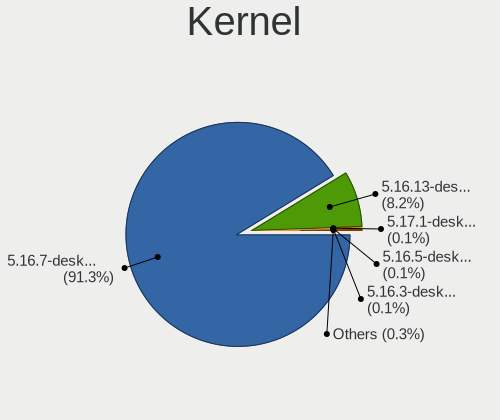

| Version                       | Desktops | Percent |
|-------------------------------|----------|---------|
| 5.16.7-desktop-1omv4003       | 1181     | 97.68%  |
| 5.16.13-desktop-1omv4003      | 20       | 1.65%   |
| 5.16.5-desktop-2omv4003       | 2        | 0.17%   |
| 5.16.3-desktop-2omv4050       | 2        | 0.17%   |
| 5.17.7-desktop-1omv4090       | 1        | 0.08%   |
| 5.17.1-desktop-2omv4050       | 1        | 0.08%   |
| 5.16.7-desktop-clang-1omv4003 | 1        | 0.08%   |
| 5.10.14-desktop-1omv4002      | 1        | 0.08%   |

Kernel Family
-------------

Linux kernel without a distro release

| Version | Desktops | Percent |
|---------|----------|---------|
| 5.16.7  | 1182     | 97.77%  |
| 5.16.13 | 20       | 1.65%   |
| 5.16.5  | 2        | 0.17%   |
| 5.16.3  | 2        | 0.17%   |
| 5.17.7  | 1        | 0.08%   |
| 5.17.1  | 1        | 0.08%   |
| 5.10.14 | 1        | 0.08%   |

Kernel Major Ver.
-----------------

Linux kernel major version

| Version | Desktops | Percent |
|---------|----------|---------|
| 5.16    | 1206     | 99.75%  |
| 5.17    | 2        | 0.17%   |
| 5.10    | 1        | 0.08%   |

Arch
----

OS architecture (x86_64, i586, etc.)

| Name   | Desktops | Percent |
|--------|----------|---------|
| x86_64 | 1209     | 100%    |

DE
--

Desktop Environment

| Name    | Desktops | Percent |
|---------|----------|---------|
| KDE5    | 1207     | 99.83%  |
| Unknown | 2        | 0.17%   |

Display Server
--------------

X11 or Wayland

| Name    | Desktops | Percent |
|---------|----------|---------|
| X11     | 1196     | 98.92%  |
| Wayland | 13       | 1.08%   |

Display Manager
---------------

SDDM, LightDM, etc.

| Name | Desktops | Percent |
|------|----------|---------|
| SDDM | 1209     | 100%    |

OS Lang
-------

Language

| Lang  | Desktops | Percent |
|-------|----------|---------|
| en_US | 654      | 54.09%  |
| de_DE | 143      | 11.83%  |
| ru_RU | 82       | 6.78%   |
| fr_FR | 45       | 3.72%   |
| pt_BR | 43       | 3.56%   |
| pl_PL | 30       | 2.48%   |
| it_IT | 30       | 2.48%   |
| es_ES | 21       | 1.74%   |
| en_GB | 21       | 1.74%   |
| en_IN | 16       | 1.32%   |
| es_AR | 15       | 1.24%   |
| de_AT | 13       | 1.08%   |
| cs_CZ | 8        | 0.66%   |
| fr_CA | 7        | 0.58%   |
| es_MX | 7        | 0.58%   |
| en_CA | 7        | 0.58%   |
| hu_HU | 6        | 0.5%    |
| ru_UA | 5        | 0.41%   |
| tr_TR | 4        | 0.33%   |
| pt_PT | 4        | 0.33%   |
| nl_NL | 4        | 0.33%   |
| es_VE | 4        | 0.33%   |
| es_CO | 4        | 0.33%   |
| de_CH | 4        | 0.33%   |
| nb_NO | 3        | 0.25%   |
| en_AU | 3        | 0.25%   |
| uk_UA | 2        | 0.17%   |
| fr_BE | 2        | 0.17%   |
| es_SV | 2        | 0.17%   |
| es_PE | 2        | 0.17%   |
| es_CR | 2        | 0.17%   |
| en_ZA | 2        | 0.17%   |
| en_IL | 2        | 0.17%   |
| da_DK | 2        | 0.17%   |
| ar_SA | 2        | 0.17%   |
| ro_RO | 1        | 0.08%   |
| es_PY | 1        | 0.08%   |
| es_EC | 1        | 0.08%   |
| es_CL | 1        | 0.08%   |
| en_HK | 1        | 0.08%   |
| ar_TN | 1        | 0.08%   |
| ar_EG | 1        | 0.08%   |
| ar_DZ | 1        | 0.08%   |

Boot Mode
---------

EFI or BIOS

| Mode | Desktops | Percent |
|------|----------|---------|
| BIOS | 656      | 54.26%  |
| EFI  | 553      | 45.74%  |

Filesystem
----------

Type of filesystem

| Type     | Desktops | Percent |
|----------|----------|---------|
| Overlay  | 1045     | 86.44%  |
| Ext4     | 162      | 13.4%   |
| Reiserfs | 1        | 0.08%   |
| Btrfs    | 1        | 0.08%   |

Part. scheme
------------

Scheme of partitioning

| Type    | Desktops | Percent |
|---------|----------|---------|
| GPT     | 753      | 62.28%  |
| MBR     | 443      | 36.64%  |
| Unknown | 13       | 1.08%   |

Dual Boot with Linux/BSD
------------------------

Hosting more than one Linux/BSD

| Dual boot | Desktops | Percent |
|-----------|----------|---------|
| Yes       | 762      | 63.03%  |
| No        | 447      | 36.97%  |

Dual Boot (Win)
---------------

Hosting Linux and Windows

| Dual boot | Desktops | Percent |
|-----------|----------|---------|
| Yes       | 704      | 58.23%  |
| No        | 505      | 41.77%  |

Board
-----

Vendor
------

Motherboard manufacturer

| Name                | Desktops | Percent |
|---------------------|----------|---------|
| ASUSTek Computer    | 282      | 23.33%  |
| Gigabyte Technology | 239      | 19.77%  |
| MSI                 | 147      | 12.16%  |
| ASRock              | 106      | 8.77%   |
| Hewlett-Packard     | 91       | 7.53%   |
| Dell                | 86       | 7.11%   |
| Lenovo              | 49       | 4.05%   |
| Intel               | 40       | 3.31%   |
| Acer                | 27       | 2.23%   |
| Biostar             | 21       | 1.74%   |
| Fujitsu             | 17       | 1.41%   |
| Foxconn             | 15       | 1.24%   |
| Pegatron            | 10       | 0.83%   |
| Positivo            | 8        | 0.66%   |
| Medion              | 7        | 0.58%   |
| ECS                 | 7        | 0.58%   |
| BESSTAR Tech        | 5        | 0.41%   |
| Alienware           | 5        | 0.41%   |
| Unknown             | 5        | 0.41%   |
| Shuttle             | 4        | 0.33%   |
| Packard Bell        | 4        | 0.33%   |
| Fujitsu Siemens     | 4        | 0.33%   |
| Gateway             | 2        | 0.17%   |
| AZW                 | 2        | 0.17%   |
| Supermicro          | 1        | 0.08%   |
| Proline             | 1        | 0.08%   |
| PCWare              | 1        | 0.08%   |
| ONDA                | 1        | 0.08%   |
| OEM                 | 1        | 0.08%   |
| NEC Computers       | 1        | 0.08%   |
| MouseComputer       | 1        | 0.08%   |
| MCJ                 | 1        | 0.08%   |
| MACHINIST           | 1        | 0.08%   |
| Login Informatica   | 1        | 0.08%   |
| langchao            | 1        | 0.08%   |
| Koloe               | 1        | 0.08%   |
| Kennex              | 1        | 0.08%   |
| Itautec             | 1        | 0.08%   |
| Inventec            | 1        | 0.08%   |
| Huanan              | 1        | 0.08%   |
| Hardkernel          | 1        | 0.08%   |
| GALAX               | 1        | 0.08%   |
| EVGA                | 1        | 0.08%   |
| EPoX Computer       | 1        | 0.08%   |
| Digitron            | 1        | 0.08%   |
| Digiboard           | 1        | 0.08%   |
| Centrium            | 1        | 0.08%   |
| Apple               | 1        | 0.08%   |
| AOpen               | 1        | 0.08%   |
| ABIT                | 1        | 0.08%   |

Model
-----

Motherboard model

| Name                             | Desktops | Percent |
|----------------------------------|----------|---------|
| ASUS All Series                  | 27       | 2.23%   |
| Gigabyte H410M H V3              | 26       | 2.15%   |
| ASUS SABERTOOTH Z77              | 15       | 1.24%   |
| Dell OptiPlex 7010               | 9        | 0.74%   |
| MSI MS-7C91                      | 6        | 0.5%    |
| Dell OptiPlex 790                | 6        | 0.5%    |
| Dell OptiPlex 780                | 6        | 0.5%    |
| MSI MS-7C84                      | 5        | 0.41%   |
| MSI MS-7721                      | 5        | 0.41%   |
| Intel H61                        | 5        | 0.41%   |
| HP Compaq Pro 6300 SFF           | 5        | 0.41%   |
| Gigabyte B450M DS3H              | 5        | 0.41%   |
| Dell OptiPlex 9020               | 5        | 0.41%   |
| ASUS TUF Gaming B550M-PLUS       | 5        | 0.41%   |
| ASUS PRIME B450-PLUS             | 5        | 0.41%   |
| ASUS PRIME A320M-K               | 5        | 0.41%   |
| Unknown                          | 5        | 0.41%   |
| MSI MS-7C56                      | 4        | 0.33%   |
| MSI MS-7C37                      | 4        | 0.33%   |
| MSI MS-7B79                      | 4        | 0.33%   |
| MSI MS-7A38                      | 4        | 0.33%   |
| HP ProDesk 600 G1 SFF            | 4        | 0.33%   |
| Gigabyte A320M-S2H               | 4        | 0.33%   |
| Gigabyte 970A-DS3P               | 4        | 0.33%   |
| Fujitsu ESPRIMO E720             | 4        | 0.33%   |
| Dell OptiPlex 7020               | 4        | 0.33%   |
| Dell Inspiron 3847               | 4        | 0.33%   |
| ASUS TUF Gaming B550-PLUS        | 4        | 0.33%   |
| ASUS SABERTOOTH 990FX R2.0       | 4        | 0.33%   |
| ASUS ROG STRIX B550-F GAMING     | 4        | 0.33%   |
| ASUS M5A78L-M/USB3               | 4        | 0.33%   |
| ASUS M2R-FVM                     | 4        | 0.33%   |
| MSI MS-7C02                      | 3        | 0.25%   |
| MSI MS-7B98                      | 3        | 0.25%   |
| MSI MS-7B84                      | 3        | 0.25%   |
| MSI MS-7758                      | 3        | 0.25%   |
| MSI MS-7693                      | 3        | 0.25%   |
| MSI MS-7360                      | 3        | 0.25%   |
| HP Pavilion Desktop 590-p0xxx    | 3        | 0.25%   |
| HP EliteDesk 800 G1 USDT         | 3        | 0.25%   |
| HP EliteDesk 800 G1 SFF          | 3        | 0.25%   |
| HP Compaq Elite 8300 SFF         | 3        | 0.25%   |
| Gigabyte Z390 AORUS PRO WIFI     | 3        | 0.25%   |
| Gigabyte GA-880GM-USB3           | 3        | 0.25%   |
| Gigabyte GA-78LMT-USB3 R2        | 3        | 0.25%   |
| Gigabyte F2A88XM-D3H             | 3        | 0.25%   |
| Gigabyte B450 AORUS PRO          | 3        | 0.25%   |
| Dell Precision WorkStation T3500 | 3        | 0.25%   |
| Dell Precision T3610             | 3        | 0.25%   |
| Dell OptiPlex 755                | 3        | 0.25%   |
| Dell OptiPlex 380                | 3        | 0.25%   |
| ASUS TUF Gaming X570-PLUS        | 3        | 0.25%   |
| ASUS A68HM-PLUS                  | 3        | 0.25%   |
| ASRock A320M-HDV R4.0            | 3        | 0.25%   |
| Positivo POS-PIQ57BQ             | 2        | 0.17%   |
| Positivo POS-EIBTPDC             | 2        | 0.17%   |
| Pegatron IPM41-D3                | 2        | 0.17%   |
| MSI MS-7D22                      | 2        | 0.17%   |
| MSI MS-7D09                      | 2        | 0.17%   |
| MSI MS-7C52                      | 2        | 0.17%   |

Model Family
------------

Motherboard model prefix

| Name                    | Desktops | Percent |
|-------------------------|----------|---------|
| Dell OptiPlex           | 55       | 4.55%   |
| ASUS PRIME              | 46       | 3.8%    |
| HP Compaq               | 35       | 2.89%   |
| Lenovo ThinkCentre      | 34       | 2.81%   |
| Gigabyte H410M          | 28       | 2.32%   |
| ASUS All                | 27       | 2.23%   |
| Acer Aspire             | 24       | 1.99%   |
| ASUS ROG                | 23       | 1.9%    |
| ASUS TUF                | 21       | 1.74%   |
| ASUS SABERTOOTH         | 20       | 1.65%   |
| HP ProDesk              | 16       | 1.32%   |
| Fujitsu ESPRIMO         | 15       | 1.24%   |
| HP EliteDesk            | 13       | 1.08%   |
| ASUS M5A78L-M           | 12       | 0.99%   |
| Gigabyte B450M          | 10       | 0.83%   |
| Dell Inspiron           | 10       | 0.83%   |
| Gigabyte Z390           | 9        | 0.74%   |
| Dell Precision          | 9        | 0.74%   |
| Gigabyte X570           | 8        | 0.66%   |
| HP Pavilion             | 7        | 0.58%   |
| Gigabyte GA-78LMT-USB3  | 7        | 0.58%   |
| Gigabyte B450           | 7        | 0.58%   |
| MSI MS-7C91             | 6        | 0.5%    |
| Intel H61               | 6        | 0.5%    |
| Dell Vostro             | 6        | 0.5%    |
| ASUS P8H61-M            | 6        | 0.5%    |
| MSI MS-7C84             | 5        | 0.41%   |
| MSI MS-7721             | 5        | 0.41%   |
| Lenovo ThinkStation     | 5        | 0.41%   |
| Gigabyte B560M          | 5        | 0.41%   |
| Gigabyte B550M          | 5        | 0.41%   |
| Dell XPS                | 5        | 0.41%   |
| ASUS M5A97              | 5        | 0.41%   |
| ASRock B450             | 5        | 0.41%   |
| ASRock A320M-HDV        | 5        | 0.41%   |
| Unknown                 | 5        | 0.41%   |
| MSI MS-7C56             | 4        | 0.33%   |
| MSI MS-7C37             | 4        | 0.33%   |
| MSI MS-7B79             | 4        | 0.33%   |
| MSI MS-7A38             | 4        | 0.33%   |
| Intel DH61WW            | 4        | 0.33%   |
| Gigabyte A320M-S2H      | 4        | 0.33%   |
| Gigabyte 970A-DS3P      | 4        | 0.33%   |
| ASUS P5Q                | 4        | 0.33%   |
| ASUS M2R-FVM            | 4        | 0.33%   |
| ASRock 970              | 4        | 0.33%   |
| Alienware Aurora        | 4        | 0.33%   |
| Packard Bell IMEDIA     | 3        | 0.25%   |
| MSI MS-7C02             | 3        | 0.25%   |
| MSI MS-7B98             | 3        | 0.25%   |
| MSI MS-7B84             | 3        | 0.25%   |
| MSI MS-7758             | 3        | 0.25%   |
| MSI MS-7693             | 3        | 0.25%   |
| MSI MS-7360             | 3        | 0.25%   |
| Lenovo IdeaCentre       | 3        | 0.25%   |
| HP Slim                 | 3        | 0.25%   |
| Gigabyte H310M          | 3        | 0.25%   |
| Gigabyte GA-880GM-USB3  | 3        | 0.25%   |
| Gigabyte F2A88XM-D3H    | 3        | 0.25%   |
| Fujitsu Siemens ESPRIMO | 3        | 0.25%   |

MFG Year
--------

Motherboard manufacture year

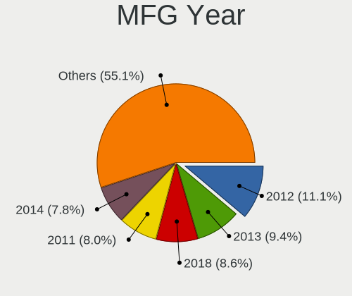

| Year | Desktops | Percent |
|------|----------|---------|
| 2012 | 127      | 10.5%   |
| 2013 | 119      | 9.84%   |
| 2018 | 107      | 8.85%   |
| 2010 | 94       | 7.78%   |
| 2021 | 93       | 7.69%   |
| 2011 | 90       | 7.44%   |
| 2020 | 87       | 7.2%    |
| 2014 | 87       | 7.2%    |
| 2019 | 77       | 6.37%   |
| 2017 | 57       | 4.71%   |
| 2009 | 55       | 4.55%   |
| 2008 | 50       | 4.14%   |
| 2015 | 47       | 3.89%   |
| 2016 | 44       | 3.64%   |
| 2007 | 37       | 3.06%   |
| 2006 | 28       | 2.32%   |
| 2022 | 8        | 0.66%   |
| 2005 | 2        | 0.17%   |

Form Factor
-----------

Physical design of the computer

| Name    | Desktops | Percent |
|---------|----------|---------|
| Desktop | 1209     | 100%    |

Secure Boot
-----------

Enabled or disabled

| State    | Desktops | Percent |
|----------|----------|---------|
| Disabled | 1209     | 100%    |

Coreboot
--------

Have coreboot on board

| Used | Desktops | Percent |
|------|----------|---------|
| No   | 1209     | 100%    |

RAM Size
--------

Total RAM memory

| Size in GB      | Desktops | Percent |
|-----------------|----------|---------|
| 8.01-16.0       | 270      | 22.33%  |
| 16.01-24.0      | 269      | 22.25%  |
| 4.01-8.0        | 263      | 21.75%  |
| 3.01-4.0        | 192      | 15.88%  |
| 32.01-64.0      | 130      | 10.75%  |
| 24.01-32.0      | 27       | 2.23%   |
| 1.01-2.0        | 27       | 2.23%   |
| 64.01-256.0     | 20       | 1.65%   |
| 2.01-3.0        | 8        | 0.66%   |
| More than 256.0 | 2        | 0.17%   |
| 0.51-1.0        | 1        | 0.08%   |

RAM Used
--------

Used RAM memory

| Used GB   | Desktops | Percent |
|-----------|----------|---------|
| 1.01-2.0  | 831      | 68.73%  |
| 0.51-1.0  | 245      | 20.26%  |
| 2.01-3.0  | 89       | 7.36%   |
| 0.01-0.5  | 21       | 1.74%   |
| 3.01-4.0  | 10       | 0.83%   |
| 4.01-8.0  | 9        | 0.74%   |
| 8.01-16.0 | 4        | 0.33%   |

Total Drives
------------

Number of drives on board

| Drives | Desktops | Percent |
|--------|----------|---------|
| 1      | 492      | 40.69%  |
| 2      | 340      | 28.12%  |
| 3      | 168      | 13.9%   |
| 4      | 96       | 7.94%   |
| 5      | 43       | 3.56%   |
| 0      | 33       | 2.73%   |
| 6      | 17       | 1.41%   |
| 7      | 8        | 0.66%   |
| 8      | 5        | 0.41%   |
| 9      | 3        | 0.25%   |
| 12     | 2        | 0.17%   |
| 15     | 1        | 0.08%   |
| 10     | 1        | 0.08%   |

Has CD-ROM
----------

Has CD-ROM on board

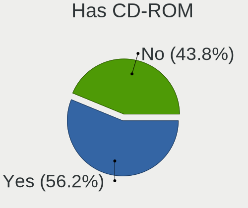

| Presented | Desktops | Percent |
|-----------|----------|---------|
| Yes       | 673      | 55.67%  |
| No        | 536      | 44.33%  |

Has Ethernet
------------

Has Ethernet on board

| Presented | Desktops | Percent |
|-----------|----------|---------|
| Yes       | 1197     | 99.01%  |
| No        | 12       | 0.99%   |

Has WiFi
--------

Has WiFi module

| Presented | Desktops | Percent |
|-----------|----------|---------|
| No        | 782      | 64.68%  |
| Yes       | 427      | 35.32%  |

Has Bluetooth
-------------

Has Bluetooth module

| Presented | Desktops | Percent |
|-----------|----------|---------|
| No        | 938      | 77.58%  |
| Yes       | 271      | 22.42%  |

Location
--------

Country
-------

Geographic location (country)

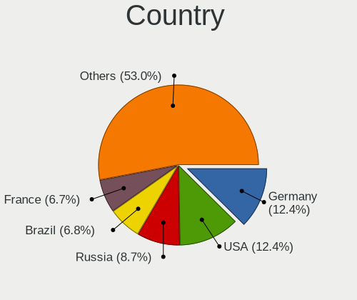

| Country                | Desktops | Percent |
|------------------------|----------|---------|
| Germany                | 197      | 16.29%  |
| USA                    | 141      | 11.66%  |
| Russia                 | 91       | 7.53%   |
| Brazil                 | 75       | 6.2%    |
| France                 | 69       | 5.71%   |
| Poland                 | 65       | 5.38%   |
| Italy                  | 48       | 3.97%   |
| Canada                 | 38       | 3.14%   |
| India                  | 35       | 2.89%   |
| Spain                  | 29       | 2.4%    |
| UK                     | 28       | 2.32%   |
| Australia              | 28       | 2.32%   |
| Ukraine                | 23       | 1.9%    |
| Mexico                 | 17       | 1.41%   |
| Netherlands            | 16       | 1.32%   |
| Argentina              | 16       | 1.32%   |
| Austria                | 15       | 1.24%   |
| Japan                  | 14       | 1.16%   |
| Czechia                | 13       | 1.08%   |
| Hungary                | 12       | 0.99%   |
| Serbia                 | 11       | 0.91%   |
| Indonesia              | 11       | 0.91%   |
| Turkey                 | 10       | 0.83%   |
| Sweden                 | 9        | 0.74%   |
| Portugal               | 9        | 0.74%   |
| Switzerland            | 8        | 0.66%   |
| Israel                 | 8        | 0.66%   |
| Egypt                  | 8        | 0.66%   |
| Colombia               | 7        | 0.58%   |
| Venezuela              | 6        | 0.5%    |
| Romania                | 6        | 0.5%    |
| Norway                 | 6        | 0.5%    |
| China                  | 6        | 0.5%    |
| Uruguay                | 5        | 0.41%   |
| South Africa           | 5        | 0.41%   |
| Peru                   | 5        | 0.41%   |
| Malaysia               | 5        | 0.41%   |
| Greece                 | 5        | 0.41%   |
| Estonia                | 5        | 0.41%   |
| Belgium                | 5        | 0.41%   |
| Belarus                | 5        | 0.41%   |
| Algeria                | 5        | 0.41%   |
| Slovakia               | 4        | 0.33%   |
| Saudi Arabia           | 4        | 0.33%   |
| Pakistan               | 4        | 0.33%   |
| Finland                | 4        | 0.33%   |
| Croatia                | 4        | 0.33%   |
| Thailand               | 3        | 0.25%   |
| Taiwan                 | 3        | 0.25%   |
| Philippines            | 3        | 0.25%   |
| Hong Kong              | 3        | 0.25%   |
| Denmark                | 3        | 0.25%   |
| Bulgaria               | 3        | 0.25%   |
| Bosnia and Herzegovina | 3        | 0.25%   |
| Azerbaijan             | 3        | 0.25%   |
| Uzbekistan             | 2        | 0.17%   |
| Tunisia                | 2        | 0.17%   |
| Slovenia               | 2        | 0.17%   |
| Paraguay               | 2        | 0.17%   |
| New Zealand            | 2        | 0.17%   |

City
----

Geographic location (city)

| City            | Desktops | Percent |
|-----------------|----------|---------|
| Gonikoppal      | 22       | 1.82%   |
| Moscow          | 18       | 1.49%   |
| Strzyzow        | 14       | 1.16%   |
| Berlin          | 11       | 0.91%   |
| Sao Paulo       | 10       | 0.83%   |
| Vienna          | 8        | 0.66%   |
| Warsaw          | 7        | 0.58%   |
| Paris           | 7        | 0.58%   |
| Munich          | 7        | 0.58%   |
| Milan           | 7        | 0.58%   |
| Brisbane        | 7        | 0.58%   |
| St Petersburg   | 6        | 0.5%    |
| Kyiv            | 6        | 0.5%    |
| Istanbul        | 6        | 0.5%    |
| Hamburg         | 6        | 0.5%    |
| Yekaterinburg   | 5        | 0.41%   |
| Sydney          | 5        | 0.41%   |
| Rome            | 5        | 0.41%   |
| Mexico City     | 5        | 0.41%   |
| Marseille       | 5        | 0.41%   |
| Lexington       | 5        | 0.41%   |
| Jakarta         | 5        | 0.41%   |
| Buenos Aires    | 5        | 0.41%   |
| Zagreb          | 4        | 0.33%   |
| Wroclaw         | 4        | 0.33%   |
| Tel Aviv        | 4        | 0.33%   |
| San Marcos      | 4        | 0.33%   |
| San Jos       | 4        | 0.33%   |
| Rochester       | 4        | 0.33%   |
| Rio de Janeiro  | 4        | 0.33%   |
| Porto Alegre    | 4        | 0.33%   |
| Norderstedt     | 4        | 0.33%   |
| Niteri        | 4        | 0.33%   |
| Madrid          | 4        | 0.33%   |
| Lima            | 4        | 0.33%   |
| Kristiansand    | 4        | 0.33%   |
| Duque de Caxias | 4        | 0.33%   |
| Cairo           | 4        | 0.33%   |
| Belgrade        | 4        | 0.33%   |
| Wiesbaden       | 3        | 0.25%   |
| Saarbrcken    | 3        | 0.25%   |
| Regensburg      | 3        | 0.25%   |
| Phoenix         | 3        | 0.25%   |
| Nuremberg       | 3        | 0.25%   |
| Mumbai          | 3        | 0.25%   |
| Montevideo      | 3        | 0.25%   |
| Melbourne       | 3        | 0.25%   |
| Kuala Lumpur    | 3        | 0.25%   |
| Johannesburg    | 3        | 0.25%   |
| Jeddah          | 3        | 0.25%   |
| Gdansk          | 3        | 0.25%   |
| Chicago         | 3        | 0.25%   |
| Chemnitz        | 3        | 0.25%   |
| Chelyabinsk     | 3        | 0.25%   |
| Central         | 3        | 0.25%   |
| Canberra        | 3        | 0.25%   |
| Bucharest       | 3        | 0.25%   |
| Beijing         | 3        | 0.25%   |
| Barcelona       | 3        | 0.25%   |
| Baku            | 3        | 0.25%   |

Drives
------

Drive Vendor
------------

Hard drive vendors

| Vendor              | Desktops | Drives | Percent |
|---------------------|----------|--------|---------|
| WDC                 | 391      | 515    | 18.66%  |
| Seagate             | 368      | 470    | 17.57%  |
| Samsung Electronics | 298      | 380    | 14.22%  |
| Kingston            | 126      | 141    | 6.01%   |
| Toshiba             | 123      | 132    | 5.87%   |
| Crucial             | 119      | 143    | 5.68%   |
| SanDisk             | 100      | 119    | 4.77%   |
| Hitachi             | 71       | 74     | 3.39%   |
| A-DATA Technology   | 65       | 71     | 3.1%    |
| Unknown             | 20       | 27     | 0.95%   |
| China               | 20       | 24     | 0.95%   |
| SPCC                | 18       | 21     | 0.86%   |
| HGST                | 18       | 21     | 0.86%   |
| Maxtor              | 17       | 21     | 0.81%   |
| Intel               | 17       | 17     | 0.81%   |
| PNY                 | 15       | 22     | 0.72%   |
| Apacer              | 15       | 16     | 0.72%   |
| Goodram             | 14       | 16     | 0.67%   |
| Gigabyte Technology | 13       | 13     | 0.62%   |
| OCZ                 | 12       | 12     | 0.57%   |
| Corsair             | 12       | 13     | 0.57%   |
| Phison              | 11       | 13     | 0.53%   |
| Patriot             | 11       | 12     | 0.53%   |
| Intenso             | 11       | 11     | 0.53%   |
| Netac               | 10       | 11     | 0.48%   |
| ASMT                | 10       | 11     | 0.48%   |
| SK hynix            | 9        | 9      | 0.43%   |
| Micron Technology   | 9        | 9      | 0.43%   |
| JMicron Technology  | 9        | 10     | 0.43%   |
| Hewlett-Packard     | 9        | 12     | 0.43%   |
| Unknown             | 9        | 9      | 0.43%   |
| Transcend           | 8        | 9      | 0.38%   |
| Team                | 8        | 8      | 0.38%   |
| XPG                 | 7        | 7      | 0.33%   |
| Silicon Motion      | 6        | 7      | 0.29%   |
| LITEON              | 6        | 6      | 0.29%   |
| KingSpec            | 6        | 6      | 0.29%   |
| Apple               | 6        | 6      | 0.29%   |
| KIOXIA-EXCERIA      | 5        | 5      | 0.24%   |
| Plextor             | 4        | 4      | 0.19%   |
| LITEONIT            | 4        | 4      | 0.19%   |
| KingFast            | 4        | 4      | 0.19%   |
| KingDian            | 4        | 4      | 0.19%   |
| WD MediaMax         | 3        | 4      | 0.14%   |
| Leven               | 3        | 3      | 0.14%   |
| IBM/Hitachi         | 3        | 3      | 0.14%   |
| Fujitsu             | 3        | 3      | 0.14%   |
| Colorful            | 3        | 3      | 0.14%   |
| AMD                 | 3        | 3      | 0.14%   |
| TO Exter            | 2        | 2      | 0.1%    |
| TCSUNBOW            | 2        | 2      | 0.1%    |
| Smartbuy            | 2        | 2      | 0.1%    |
| SABRENT             | 2        | 3      | 0.1%    |
| Realtek             | 2        | 2      | 0.1%    |
| Phison Electronics  | 2        | 2      | 0.1%    |
| Magnetic Data       | 2        | 2      | 0.1%    |
| JetFlash            | 2        | 2      | 0.1%    |
| GLOWAY              | 2        | 2      | 0.1%    |
| ZTE                 | 1        | 1      | 0.05%   |
| ZHITAI              | 1        | 1      | 0.05%   |

Drive Model
-----------

Hard drive models

| Model                            | Desktops | Percent |
|----------------------------------|----------|---------|
| Seagate ST500DM002-1BD142 500GB  | 38       | 1.56%   |
| Seagate ST1000DM010-2EP102 1TB   | 34       | 1.4%    |
| Kingston SA400S37240G 240GB SSD  | 26       | 1.07%   |
| Seagate ST2000DM008-2FR102 2TB   | 25       | 1.03%   |
| Samsung SSD 860 EVO 500GB        | 22       | 0.9%    |
| A-DATA SU750 256GB SSD           | 22       | 0.9%    |
| Toshiba DT01ACA100 1TB           | 21       | 0.86%   |
| Crucial CT500MX500SSD1 500GB     | 21       | 0.86%   |
| Toshiba DT01ACA050 500GB         | 20       | 0.82%   |
| Samsung SSD 860 EVO 250GB        | 20       | 0.82%   |
| Kingston SA400S37120G 120GB SSD  | 20       | 0.82%   |
| WDC WD10EZEX-08WN4A0 1TB         | 19       | 0.78%   |
| Samsung SSD 850 EVO 250GB        | 18       | 0.74%   |
| Seagate ST1000DM003-1ER162 1TB   | 17       | 0.7%    |
| Kingston SV300S37A120G 120GB SSD | 16       | 0.66%   |
| Kingston SA400S37480G 480GB SSD  | 16       | 0.66%   |
| WDC WDS240G2G0A-00JH30 240GB SSD | 15       | 0.62%   |
| Toshiba HDWD110 1TB              | 15       | 0.62%   |
| Crucial CT240BX500SSD1 240GB     | 15       | 0.62%   |
| Seagate ST2000DM001-1ER164 2TB   | 14       | 0.57%   |
| Crucial CT1000MX500SSD1 1TB      | 14       | 0.57%   |
| SanDisk SSD PLUS 240GB           | 12       | 0.49%   |
| Crucial CT480BX500SSD1 480GB     | 12       | 0.49%   |
| Seagate ST3500413AS 500GB        | 11       | 0.45%   |
| Seagate ST1000DM003-1SB102 1TB   | 11       | 0.45%   |
| Seagate ST1000DM003-1CH162 1TB   | 11       | 0.45%   |
| Samsung SSD 850 EVO 500GB        | 11       | 0.45%   |
| Unknown SD/MMC/MS PRO 128GB      | 10       | 0.41%   |
| SanDisk SDSSDA240G 240GB         | 10       | 0.41%   |
| Samsung SSD 970 EVO Plus 500GB   | 10       | 0.41%   |
| Toshiba DT01ACA200 2TB           | 9        | 0.37%   |
| Seagate ST31000528AS 1TB         | 9        | 0.37%   |
| Samsung SSD 970 EVO Plus 1TB     | 9        | 0.37%   |
| Samsung SSD 840 EVO 120GB        | 9        | 0.37%   |
| Samsung HD502HJ 500GB            | 9        | 0.37%   |
| Samsung HD103SJ 1TB              | 9        | 0.37%   |
| Crucial CT1000P1SSD8 1TB         | 9        | 0.37%   |
| Unknown                          | 9        | 0.37%   |
| Seagate ST3500418AS 500GB        | 8        | 0.33%   |
| SanDisk SSD PLUS 480GB           | 8        | 0.33%   |
| Samsung HD322HJ 320GB            | 8        | 0.33%   |
| WDC WD10EZEX-60WN4A0 1TB         | 7        | 0.29%   |
| Seagate ST31000524AS 1TB         | 7        | 0.29%   |
| SanDisk SSD PLUS 1000GB          | 7        | 0.29%   |
| SanDisk SDSSDA120G 120GB         | 7        | 0.29%   |
| Samsung SSD 980 PRO 1TB          | 7        | 0.29%   |
| Samsung SSD 870 QVO 1TB          | 7        | 0.29%   |
| Samsung SSD 870 EVO 500GB        | 7        | 0.29%   |
| Samsung SSD 840 EVO 250GB        | 7        | 0.29%   |
| Hitachi HDP725050GLA360 500GB    | 7        | 0.29%   |
| ASMT 2135 120GB SSD              | 7        | 0.29%   |
| WDC WD5000AAKX-00ERMA0 500GB     | 6        | 0.25%   |
| WDC WD20EZRZ-00Z5HB0 2TB         | 6        | 0.25%   |
| WDC WD10EZRX-00A8LB0 1TB         | 6        | 0.25%   |
| WDC WD10EZEX-00BN5A0 1TB         | 6        | 0.25%   |
| Toshiba HDWD130 3TB              | 6        | 0.25%   |
| SPCC Solid State Disk 256GB      | 6        | 0.25%   |
| Seagate ST2000DM006-2DM164 2TB   | 6        | 0.25%   |
| Seagate ST1000DM003-9YN162 1TB   | 6        | 0.25%   |
| Samsung SSD 970 EVO Plus 2TB     | 6        | 0.25%   |

HDD Vendor
----------

Hard disk drive vendors

| Vendor              | Desktops | Drives | Percent |
|---------------------|----------|--------|---------|
| Seagate             | 360      | 456    | 34.25%  |
| WDC                 | 335      | 428    | 31.87%  |
| Toshiba             | 115      | 124    | 10.94%  |
| Samsung Electronics | 91       | 102    | 8.66%   |
| Hitachi             | 71       | 74     | 6.76%   |
| HGST                | 18       | 21     | 1.71%   |
| Maxtor              | 17       | 21     | 1.62%   |
| Unknown             | 11       | 11     | 1.05%   |
| Apple               | 6        | 6      | 0.57%   |
| JMicron Technology  | 5        | 6      | 0.48%   |
| WD MediaMax         | 3        | 4      | 0.29%   |
| IBM/Hitachi         | 3        | 3      | 0.29%   |
| Fujitsu             | 3        | 3      | 0.29%   |
| ASMT                | 3        | 4      | 0.29%   |
| Magnetic Data       | 2        | 2      | 0.19%   |
| RSH-339             | 1        | 1      | 0.1%    |
| Quantum             | 1        | 1      | 0.1%    |
| Intenso             | 1        | 1      | 0.1%    |
| Inateck             | 1        | 1      | 0.1%    |
| HPE                 | 1        | 1      | 0.1%    |
| Config              | 1        | 1      | 0.1%    |
| China               | 1        | 1      | 0.1%    |
| Unknown             | 1        | 1      | 0.1%    |

SSD Vendor
----------

Solid state drive vendors

| Vendor              | Desktops | Drives | Percent |
|---------------------|----------|--------|---------|
| Samsung Electronics | 162      | 188    | 19.47%  |
| Kingston            | 109      | 118    | 13.1%   |
| Crucial             | 100      | 116    | 12.02%  |
| SanDisk             | 92       | 108    | 11.06%  |
| A-DATA Technology   | 53       | 53     | 6.37%   |
| WDC                 | 51       | 55     | 6.13%   |
| China               | 19       | 23     | 2.28%   |
| SPCC                | 14       | 16     | 1.68%   |
| Apacer              | 14       | 14     | 1.68%   |
| PNY                 | 13       | 18     | 1.56%   |
| OCZ                 | 12       | 12     | 1.44%   |
| Goodram             | 12       | 12     | 1.44%   |
| Intel               | 11       | 11     | 1.32%   |
| Micron Technology   | 9        | 9      | 1.08%   |
| Intenso             | 9        | 9      | 1.08%   |
| Gigabyte Technology | 9        | 9      | 1.08%   |
| Team                | 8        | 8      | 0.96%   |
| Patriot             | 8        | 9      | 0.96%   |
| Netac               | 8        | 9      | 0.96%   |
| Unknown             | 8        | 8      | 0.96%   |
| Transcend           | 7        | 8      | 0.84%   |
| Toshiba             | 7        | 7      | 0.84%   |
| ASMT                | 7        | 7      | 0.84%   |
| KingSpec            | 6        | 6      | 0.72%   |
| Hewlett-Packard     | 6        | 8      | 0.72%   |
| LITEON              | 5        | 5      | 0.6%    |
| LITEONIT            | 4        | 4      | 0.48%   |
| KingFast            | 4        | 4      | 0.48%   |
| KingDian            | 4        | 4      | 0.48%   |
| SK hynix            | 3        | 3      | 0.36%   |
| Seagate             | 3        | 3      | 0.36%   |
| Leven               | 3        | 3      | 0.36%   |
| KIOXIA-EXCERIA      | 3        | 3      | 0.36%   |
| Corsair             | 3        | 3      | 0.36%   |
| Colorful            | 3        | 3      | 0.36%   |
| Unknown             | 2        | 2      | 0.24%   |
| TO Exter            | 2        | 2      | 0.24%   |
| TCSUNBOW            | 2        | 2      | 0.24%   |
| GLOWAY              | 2        | 2      | 0.24%   |
| AMD                 | 2        | 2      | 0.24%   |
| Zheino              | 1        | 1      | 0.12%   |
| XrayDisk            | 1        | 1      | 0.12%   |
| WDC WDS2            | 1        | 1      | 0.12%   |
| WDC WDBA            | 1        | 1      | 0.12%   |
| V-GeN               | 1        | 1      | 0.12%   |
| USB3.0              | 1        | 1      | 0.12%   |
| Supermicro          | 1        | 1      | 0.12%   |
| Smartbuy            | 1        | 1      | 0.12%   |
| Qumo                | 1        | 1      | 0.12%   |
| Plextor             | 1        | 1      | 0.12%   |
| Phison              | 1        | 1      | 0.12%   |
| ORTIAL              | 1        | 1      | 0.12%   |
| OCZ-AGIL            | 1        | 1      | 0.12%   |
| NGFF                | 1        | 1      | 0.12%   |
| Mushkin             | 1        | 1      | 0.12%   |
| MARSHAL             | 1        | 1      | 0.12%   |
| Lexar               | 1        | 1      | 0.12%   |
| Kingmax             | 1        | 1      | 0.12%   |
| Kimtigo             | 1        | 1      | 0.12%   |
| JMicron Technology  | 1        | 1      | 0.12%   |

Drive Kind
----------

HDD or SSD

| Kind    | Desktops | Drives | Percent |
|---------|----------|--------|---------|
| HDD     | 820      | 1273   | 47.29%  |
| SSD     | 659      | 919    | 38%     |
| NVMe    | 233      | 302    | 13.44%  |
| Unknown | 19       | 28     | 1.1%    |
| MMC     | 3        | 3      | 0.17%   |

Drive Connector
---------------

SATA, SAS, NVMe, etc.

| Type | Desktops | Drives | Percent |
|------|----------|--------|---------|
| SATA | 1120     | 2116   | 77.72%  |
| NVMe | 231      | 297    | 16.03%  |
| SAS  | 87       | 109    | 6.04%   |
| MMC  | 3        | 3      | 0.21%   |

Drive Size
----------

Size of hard drive

| Size in TB | Desktops | Drives | Percent |
|------------|----------|--------|---------|
| 0.01-0.5   | 898      | 1307   | 56.76%  |
| 0.51-1.0   | 435      | 581    | 27.5%   |
| 1.01-2.0   | 145      | 172    | 9.17%   |
| 3.01-4.0   | 39       | 54     | 2.47%   |
| 2.01-3.0   | 34       | 38     | 2.15%   |
| 4.01-10.0  | 27       | 36     | 1.71%   |
| 10.01-20.0 | 4        | 4      | 0.25%   |

Space Total
-----------

Amount of disk space available on the file system

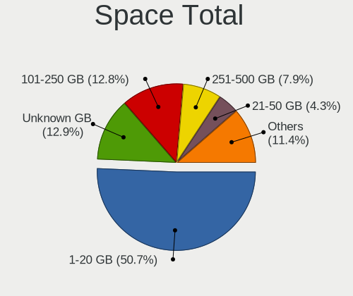

| Size in GB     | Desktops | Percent |
|----------------|----------|---------|
| 1-20           | 665      | 55%     |
| Unknown        | 153      | 12.66%  |
| 101-250        | 141      | 11.66%  |
| 251-500        | 82       | 6.78%   |
| 21-50          | 55       | 4.55%   |
| 501-1000       | 49       | 4.05%   |
| 51-100         | 34       | 2.81%   |
| 1001-2000      | 16       | 1.32%   |
| More than 3000 | 10       | 0.83%   |
| 2001-3000      | 4        | 0.33%   |

Space Used
----------

Amount of used disk space

| Used GB        | Desktops | Percent |
|----------------|----------|---------|
| 1-20           | 961      | 79.49%  |
| Unknown        | 153      | 12.66%  |
| 101-250        | 28       | 2.32%   |
| 21-50          | 18       | 1.49%   |
| 51-100         | 18       | 1.49%   |
| 501-1000       | 11       | 0.91%   |
| 251-500        | 10       | 0.83%   |
| 1001-2000      | 7        | 0.58%   |
| 2001-3000      | 2        | 0.17%   |
| More than 3000 | 1        | 0.08%   |

Malfunc. Drives
---------------

Drive models with a malfunction

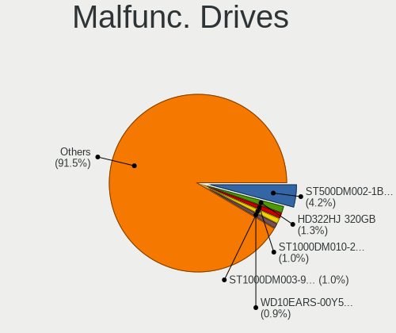

| Model                             | Desktops | Drives | Percent |
|-----------------------------------|----------|--------|---------|
| Seagate ST500DM002-1BD142 500GB   | 18       | 19     | 3.99%   |
| Seagate ST3500413AS 500GB         | 6        | 6      | 1.33%   |
| Seagate ST1000DM010-2EP102 1TB    | 6        | 6      | 1.33%   |
| Seagate ST1000DM003-9YN162 1TB    | 6        | 6      | 1.33%   |
| WDC WDS240G2G0A-00JH30 240GB SSD  | 5        | 5      | 1.11%   |
| Samsung Electronics HD322HJ 320GB | 5        | 5      | 1.11%   |
| Kingston SV300S37A120G 120GB SSD  | 5        | 5      | 1.11%   |
| WDC WD10EZEX-08WN4A0 1TB          | 4        | 4      | 0.89%   |
| Seagate ST9500325AS 500GB         | 4        | 4      | 0.89%   |
| Seagate ST92505610AS 250GB        | 4        | 4      | 0.89%   |
| Seagate ST250DM000-1BD141 250GB   | 4        | 4      | 0.89%   |
| Samsung Electronics HD502HJ 500GB | 4        | 4      | 0.89%   |
| Hitachi HDS721050CLA362 500GB     | 4        | 4      | 0.89%   |
| WDC WD5000AADS-00S9B0 500GB       | 3        | 3      | 0.67%   |
| WDC WD3200AAJS-00L7A0 320GB       | 3        | 3      | 0.67%   |
| WDC WD20EZRZ-00Z5HB0 2TB          | 3        | 3      | 0.67%   |
| WDC WD10EZEX-00RKKA0 1TB          | 3        | 3      | 0.67%   |
| WDC WD10EALX-009BA0 1TB           | 3        | 3      | 0.67%   |
| Toshiba DT01ACA100 1TB            | 3        | 3      | 0.67%   |
| Toshiba DT01ACA050 500GB          | 3        | 3      | 0.67%   |
| Seagate ST9320325AS 320GB         | 3        | 3      | 0.67%   |
| Seagate ST380013AS 80GB           | 3        | 3      | 0.67%   |
| Seagate ST3320418AS 320GB         | 3        | 3      | 0.67%   |
| Seagate ST31000528AS 1TB          | 3        | 3      | 0.67%   |
| Seagate ST1000DM003-1SB102 1TB    | 3        | 3      | 0.67%   |
| SanDisk SSD PLUS 480GB            | 3        | 3      | 0.67%   |
| Samsung Electronics SP2504C 250GB | 3        | 3      | 0.67%   |
| Samsung Electronics HD753LJ 752GB | 3        | 3      | 0.67%   |
| Samsung Electronics HD502HI 500GB | 3        | 3      | 0.67%   |
| Samsung Electronics HD161HJ 160GB | 3        | 3      | 0.67%   |
| Samsung Electronics HD160JJ 160GB | 3        | 3      | 0.67%   |
| HGST HTS545050A7E680 500GB        | 3        | 3      | 0.67%   |
| Goodram SSD 120GB                 | 3        | 3      | 0.67%   |
| ASMT 2135 120GB SSD               | 3        | 3      | 0.67%   |
| WDC WD5000AAKX-00ERMA0 500GB      | 2        | 2      | 0.44%   |
| WDC WD5000AAKX-001CA0 500GB       | 2        | 2      | 0.44%   |
| WDC WD5000AAKS-00V1A0 500GB       | 2        | 2      | 0.44%   |
| WDC WD3200AAKS-00B3A0 320GB       | 2        | 2      | 0.44%   |
| WDC WD30EZRX-00MMMB0 3TB          | 2        | 2      | 0.44%   |
| WDC WD20EFRX-68EUZN0 2TB          | 2        | 3      | 0.44%   |
| WDC WD20EARS-00MVWB0 2TB          | 2        | 2      | 0.44%   |
| WDC WD1600AAJS-08L7A0 160GB       | 2        | 2      | 0.44%   |
| WDC WD1600AAJS-00L7A0 160GB       | 2        | 2      | 0.44%   |
| WDC WD10EZRX-00A8LB0 1TB          | 2        | 2      | 0.44%   |
| WDC WD10EARS-00Y5B1 1TB           | 2        | 2      | 0.44%   |
| WDC WD10EADS-22M2B0 1TB           | 2        | 2      | 0.44%   |
| Seagate ST3500841A 500GB          | 2        | 2      | 0.44%   |
| Seagate ST3500418AS 500GB         | 2        | 2      | 0.44%   |
| Seagate ST33000651AS 3TB          | 2        | 2      | 0.44%   |
| Seagate ST3160811AS 160GB         | 2        | 2      | 0.44%   |
| Seagate ST31000524AS 1TB          | 2        | 2      | 0.44%   |
| Seagate ST2000DM006-2DM164 2TB    | 2        | 3      | 0.44%   |
| Seagate ST2000DM001-1CH164 2TB    | 2        | 2      | 0.44%   |
| SanDisk SSD PLUS 240GB            | 2        | 2      | 0.44%   |
| Samsung Electronics HD502IJ 500GB | 2        | 2      | 0.44%   |
| Samsung Electronics HD501LJ 500GB | 2        | 2      | 0.44%   |
| Samsung Electronics HD161GJ 160GB | 2        | 2      | 0.44%   |
| Samsung Electronics HD154UI 1TB   | 2        | 2      | 0.44%   |
| Samsung Electronics HD103SI 1TB   | 2        | 2      | 0.44%   |
| OCZ VERTEX4 128GB SSD             | 2        | 2      | 0.44%   |

Malfunc. Drive Vendor
---------------------

Vendors of faulty drives

| Vendor              | Desktops | Drives | Percent |
|---------------------|----------|--------|---------|
| Seagate             | 126      | 137    | 29.3%   |
| WDC                 | 117      | 132    | 27.21%  |
| Samsung Electronics | 54       | 55     | 12.56%  |
| Hitachi             | 26       | 26     | 6.05%   |
| Toshiba             | 16       | 16     | 3.72%   |
| Kingston            | 12       | 12     | 2.79%   |
| SanDisk             | 11       | 11     | 2.56%   |
| Maxtor              | 11       | 11     | 2.56%   |
| HGST                | 7        | 8      | 1.63%   |
| Intel               | 5        | 5      | 1.16%   |
| Crucial             | 5        | 5      | 1.16%   |
| A-DATA Technology   | 4        | 4      | 0.93%   |
| Micron Technology   | 3        | 3      | 0.7%    |
| IBM/Hitachi         | 3        | 3      | 0.7%    |
| Goodram             | 3        | 3      | 0.7%    |
| ASMT                | 3        | 3      | 0.7%    |
| SPCC                | 2        | 2      | 0.47%   |
| OCZ                 | 2        | 2      | 0.47%   |
| Fujitsu             | 2        | 2      | 0.47%   |
| Unknown             | 2        | 2      | 0.47%   |
| WDC WDS2            | 1        | 1      | 0.23%   |
| WD MediaMax         | 1        | 1      | 0.23%   |
| Transcend           | 1        | 1      | 0.23%   |
| TO Exter            | 1        | 1      | 0.23%   |
| TCSUNBOW            | 1        | 1      | 0.23%   |
| RSH-339             | 1        | 1      | 0.23%   |
| Patriot             | 1        | 1      | 0.23%   |
| LITEONIT            | 1        | 1      | 0.23%   |
| LITEON              | 1        | 1      | 0.23%   |
| KingSpec            | 1        | 1      | 0.23%   |
| Kingmax             | 1        | 1      | 0.23%   |
| KingDian            | 1        | 1      | 0.23%   |
| INNOVATION IT       | 1        | 1      | 0.23%   |
| HPE                 | 1        | 1      | 0.23%   |
| Hewlett-Packard     | 1        | 1      | 0.23%   |
| GLOWAY              | 1        | 1      | 0.23%   |

Malfunc. HDD Vendor
-------------------

Vendors of faulty HDD drives

| Vendor              | Desktops | Drives | Percent |
|---------------------|----------|--------|---------|
| Seagate             | 126      | 137    | 35.59%  |
| WDC                 | 110      | 123    | 31.07%  |
| Samsung Electronics | 49       | 50     | 13.84%  |
| Hitachi             | 26       | 26     | 7.34%   |
| Toshiba             | 16       | 16     | 4.52%   |
| Maxtor              | 11       | 11     | 3.11%   |
| HGST                | 7        | 8      | 1.98%   |
| IBM/Hitachi         | 3        | 3      | 0.85%   |
| Fujitsu             | 2        | 2      | 0.56%   |
| WD MediaMax         | 1        | 1      | 0.28%   |
| RSH-339             | 1        | 1      | 0.28%   |
| HPE                 | 1        | 1      | 0.28%   |
| Unknown             | 1        | 1      | 0.28%   |

Malfunc. Drive Kind
-------------------

Kinds of faulty drives

| Kind | Desktops | Drives | Percent |
|------|----------|--------|---------|
| HDD  | 312      | 380    | 80.62%  |
| SSD  | 72       | 75     | 18.6%   |
| NVMe | 3        | 3      | 0.78%   |

Failed Drives
-------------

Failed drive models

| Model                             | Desktops | Drives | Percent |
|-----------------------------------|----------|--------|---------|
| Samsung Electronics HD103SJ 1TB   | 3        | 3      | 16.67%  |
| Apple HDD HTS541010A9E662 1TB     | 3        | 3      | 16.67%  |
| WDC WD3200AAJS-60Z0A0 320GB       | 1        | 1      | 5.56%   |
| Toshiba MK3256GSY 320GB           | 1        | 1      | 5.56%   |
| Seagate STM31000528AS 1TB         | 1        | 1      | 5.56%   |
| Seagate ST980811AS 80GB           | 1        | 1      | 5.56%   |
| Seagate ST3160215A 160GB          | 1        | 1      | 5.56%   |
| Samsung Electronics SSD 980 500GB | 1        | 1      | 5.56%   |
| Samsung Electronics HM160HI 160GB | 1        | 1      | 5.56%   |
| Samsung Electronics HD103UJ 1TB   | 1        | 1      | 5.56%   |
| Hitachi HTS725050A7E630 500GB     | 1        | 1      | 5.56%   |
| Hitachi HDS721010DLE630 1TB       | 1        | 1      | 5.56%   |
| Hitachi HDP725050GLA360 500GB     | 1        | 1      | 5.56%   |
| Goodram SSDPR-PX500-256-80 256GB  | 1        | 1      | 5.56%   |

Failed Drive Vendor
-------------------

Failed drive vendors

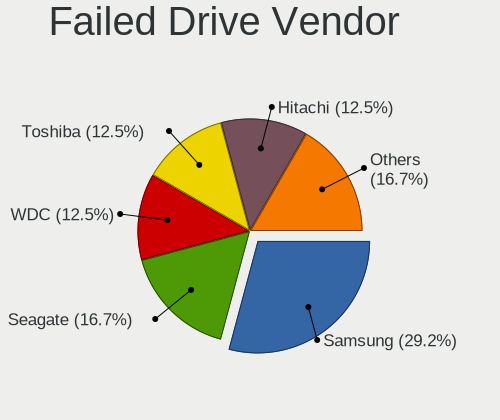

| Vendor              | Desktops | Drives | Percent |
|---------------------|----------|--------|---------|
| Samsung Electronics | 6        | 6      | 33.33%  |
| Seagate             | 3        | 3      | 16.67%  |
| Hitachi             | 3        | 3      | 16.67%  |
| Apple               | 3        | 3      | 16.67%  |
| WDC                 | 1        | 1      | 5.56%   |
| Toshiba             | 1        | 1      | 5.56%   |
| Goodram             | 1        | 1      | 5.56%   |

Drive Status
------------

Number of failed and malfunc. drives

| Status   | Desktops | Drives | Percent |
|----------|----------|--------|---------|
| Works    | 996      | 1947   | 67.66%  |
| Malfunc  | 376      | 458    | 25.54%  |
| Detected | 83       | 102    | 5.64%   |
| Failed   | 17       | 18     | 1.15%   |

Storage controller
------------------

Storage Vendor
--------------

Storage controller vendors

| Vendor                           | Desktops | Percent |
|----------------------------------|----------|---------|
| Intel                            | 789      | 48.46%  |
| AMD                              | 378      | 23.22%  |
| Samsung Electronics              | 76       | 4.67%   |
| JMicron Technology               | 50       | 3.07%   |
| ASMedia Technology               | 47       | 2.89%   |
| Marvell Technology Group         | 45       | 2.76%   |
| SanDisk                          | 38       | 2.33%   |
| Nvidia                           | 36       | 2.21%   |
| Phison Electronics               | 35       | 2.15%   |
| Micron/Crucial Technology        | 24       | 1.47%   |
| Silicon Motion                   | 21       | 1.29%   |
| Kingston Technology Company      | 21       | 1.29%   |
| ADATA Technology                 | 11       | 0.68%   |
| VIA Technologies                 | 10       | 0.61%   |
| Realtek Semiconductor            | 9        | 0.55%   |
| SK hynix                         | 6        | 0.37%   |
| Seagate Technology               | 6        | 0.37%   |
| Integrated Technology Express    | 5        | 0.31%   |
| Lite-On Technology               | 4        | 0.25%   |
| Broadcom / LSI                   | 4        | 0.25%   |
| Toshiba America Info Systems     | 2        | 0.12%   |
| Micron Technology                | 2        | 0.12%   |
| KIOXIA                           | 2        | 0.12%   |
| Yangtze Memory Technologies      | 1        | 0.06%   |
| Unknown                          | 1        | 0.06%   |
| Silicon Integrated Systems [SiS] | 1        | 0.06%   |
| Silicon Image                    | 1        | 0.06%   |
| Shenzhen Longsys Electronics     | 1        | 0.06%   |
| LSI Logic / Symbios Logic        | 1        | 0.06%   |
| Lite-On IT Corp. / Plextor       | 1        | 0.06%   |

Storage Model
-------------

Storage controller models

| Model                                                                                   | Desktops | Percent |
|-----------------------------------------------------------------------------------------|----------|---------|
| AMD FCH SATA Controller [AHCI mode]                                                     | 187      | 9.06%   |
| Intel 8 Series/C220 Series Chipset Family 6-port SATA Controller 1 [AHCI mode]          | 119      | 5.77%   |
| AMD SB7x0/SB8x0/SB9x0 IDE Controller                                                    | 70       | 3.39%   |
| AMD 400 Series Chipset SATA Controller                                                  | 70       | 3.39%   |
| AMD SB7x0/SB8x0/SB9x0 SATA Controller [AHCI mode]                                       | 68       | 3.29%   |
| Intel NM10/ICH7 Family SATA Controller [IDE mode]                                       | 64       | 3.1%    |
| Intel 6 Series/C200 Series Chipset Family 6 port Desktop SATA AHCI Controller           | 60       | 2.91%   |
| Intel 7 Series/C210 Series Chipset Family 6-port SATA Controller [AHCI mode]            | 59       | 2.86%   |
| Intel 500 Series Chipset Family SATA AHCI Controller                                    | 50       | 2.42%   |
| AMD 500 Series Chipset SATA Controller                                                  | 49       | 2.37%   |
| Intel Q170/Q150/B150/H170/H110/Z170/CM236 Chipset SATA Controller [AHCI Mode]           | 47       | 2.28%   |
| Samsung NVMe SSD Controller SM981/PM981/PM983                                           | 44       | 2.13%   |
| ASMedia ASM1062 Serial ATA Controller                                                   | 44       | 2.13%   |
| Intel 200 Series PCH SATA controller [AHCI mode]                                        | 43       | 2.08%   |
| Intel SATA Controller [RAID mode]                                                       | 41       | 1.99%   |
| Intel 82801G (ICH7 Family) IDE Controller                                               | 40       | 1.94%   |
| Intel Cannon Lake PCH SATA AHCI Controller                                              | 37       | 1.79%   |
| JMicron JMB363 SATA/IDE Controller                                                      | 34       | 1.65%   |
| AMD SB7x0/SB8x0/SB9x0 SATA Controller [IDE mode]                                        | 32       | 1.55%   |
| Intel 6 Series/C200 Series Chipset Family Desktop SATA Controller (IDE mode, ports 4-5) | 30       | 1.45%   |
| Intel 6 Series/C200 Series Chipset Family Desktop SATA Controller (IDE mode, ports 0-3) | 30       | 1.45%   |
| AMD FCH SATA Controller D                                                               | 26       | 1.26%   |
| Intel 5 Series/3400 Series Chipset 6 port SATA AHCI Controller                          | 25       | 1.21%   |
| Nvidia MCP61 SATA Controller                                                            | 21       | 1.02%   |
| Intel 82801JI (ICH10 Family) 4 port SATA IDE Controller #1                              | 21       | 1.02%   |
| Intel 82801JI (ICH10 Family) 2 port SATA IDE Controller #2                              | 21       | 1.02%   |
| Phison E12 NVMe Controller                                                              | 19       | 0.92%   |
| Intel 4 Series Chipset PT IDER Controller                                               | 19       | 0.92%   |
| Nvidia MCP61 IDE                                                                        | 18       | 0.87%   |
| Intel 82801I (ICH9 Family) 2 port SATA Controller [IDE mode]                            | 17       | 0.82%   |
| Silicon Motion SM2263EN/SM2263XT SSD Controller                                         | 16       | 0.78%   |
| Samsung NVMe SSD Controller PM9A1/PM9A3/980PRO                                          | 15       | 0.73%   |
| Intel 5 Series/3400 Series Chipset 4 port SATA IDE Controller                           | 15       | 0.73%   |
| AMD FCH IDE Controller                                                                  | 15       | 0.73%   |
| Intel 5 Series/3400 Series Chipset 2 port SATA IDE Controller                           | 14       | 0.68%   |
| Marvell Group 88SE6111/6121 SATA II / PATA Controller                                   | 13       | 0.63%   |
| Kingston Company A2000 NVMe SSD                                                         | 13       | 0.63%   |
| Intel 82801JI (ICH10 Family) SATA AHCI Controller                                       | 13       | 0.63%   |
| Samsung NVMe SSD Controller 980                                                         | 12       | 0.58%   |
| Intel 82801IR/IO/IH (ICH9R/DO/DH) 4 port SATA Controller [IDE mode]                     | 12       | 0.58%   |
| SanDisk WD Black SN750 / PC SN730 NVMe SSD                                              | 11       | 0.53%   |
| Intel Comet Lake SATA AHCI Controller                                                   | 11       | 0.53%   |
| Intel 7 Series/C210 Series Chipset Family 4-port SATA Controller [IDE mode]             | 11       | 0.53%   |
| Intel 7 Series/C210 Series Chipset Family 2-port SATA Controller [IDE mode]             | 11       | 0.53%   |
| Micron/Crucial P2 NVMe PCIe SSD                                                         | 10       | 0.48%   |
| JMicron JMB368 IDE controller                                                           | 10       | 0.48%   |
| Intel Alder Lake-S PCH SATA Controller [AHCI Mode]                                      | 10       | 0.48%   |
| Intel 9 Series Chipset Family SATA Controller [AHCI Mode]                               | 10       | 0.48%   |
| Intel 82801JD/DO (ICH10 Family) SATA AHCI Controller                                    | 10       | 0.48%   |
| Intel 82801H (ICH8 Family) 4 port SATA Controller [IDE mode]                            | 10       | 0.48%   |
| AMD FCH SATA Controller [IDE mode]                                                      | 10       | 0.48%   |
| AMD 300 Series Chipset SATA Controller                                                  | 10       | 0.48%   |
| SanDisk WD Blue SN550 NVMe SSD                                                          | 9        | 0.44%   |
| Intel Celeron/Pentium Silver Processor SATA Controller                                  | 9        | 0.44%   |
| Intel 82801HR/HO/HH (ICH8R/DO/DH) 2 port SATA Controller [IDE mode]                     | 9        | 0.44%   |
| Intel 400 Series Chipset Family SATA AHCI Controller                                    | 9        | 0.44%   |
| ADATA XPG SX8200 Pro PCIe Gen3x4 M.2 2280 Solid State Drive                             | 9        | 0.44%   |
| Samsung NVMe SSD Controller SM961/PM961/SM963                                           | 8        | 0.39%   |
| Marvell Group 88SE9172 SATA 6Gb/s Controller                                            | 8        | 0.39%   |
| Intel 82801JD/DO (ICH10 Family) 4-port SATA IDE Controller                              | 8        | 0.39%   |

Storage Kind
------------

Kind of storage controller (IDE, SATA, NVMe, SAS, ...)

| Kind | Desktops | Percent |
|------|----------|---------|
| SATA | 942      | 58.58%  |
| IDE  | 373      | 23.2%   |
| NVMe | 230      | 14.3%   |
| RAID | 59       | 3.67%   |
| SAS  | 4        | 0.25%   |

Processor
---------

CPU Vendor
----------

Processor vendors

| Vendor | Desktops | Percent |
|--------|----------|---------|
| Intel  | 796      | 65.84%  |
| AMD    | 413      | 34.16%  |

CPU Model
---------

Processor models

| Model                                       | Desktops | Percent |
|---------------------------------------------|----------|---------|
| Intel Core i5-10400 CPU @ 2.90GHz           | 35       | 2.89%   |
| Intel Core i5-3570K CPU @ 3.40GHz           | 18       | 1.49%   |
| AMD Ryzen 5 3600 6-Core Processor           | 18       | 1.49%   |
| Intel Core i5-2400 CPU @ 3.10GHz            | 17       | 1.41%   |
| Intel Core 2 Duo CPU E8400 @ 3.00GHz        | 17       | 1.41%   |
| Intel Core i5-3470 CPU @ 3.20GHz            | 16       | 1.32%   |
| AMD Ryzen 7 3700X 8-Core Processor          | 15       | 1.24%   |
| AMD FX-8350 Eight-Core Processor            | 15       | 1.24%   |
| Intel Core i5-4570 CPU @ 3.20GHz            | 14       | 1.16%   |
| Intel Core i3-4130 CPU @ 3.40GHz            | 14       | 1.16%   |
| Intel Core i5-4590 CPU @ 3.30GHz            | 13       | 1.08%   |
| AMD FX-6300 Six-Core Processor              | 12       | 0.99%   |
| Intel Core i7-2600 CPU @ 3.40GHz            | 11       | 0.91%   |
| Intel Core i5 CPU 650 @ 3.20GHz             | 11       | 0.91%   |
| Intel Core i5-4460 CPU @ 3.20GHz            | 10       | 0.83%   |
| Intel Core i3-3220 CPU @ 3.30GHz            | 10       | 0.83%   |
| Intel Core i3-2120 CPU @ 3.30GHz            | 10       | 0.83%   |
| Intel Core 2 Quad CPU Q6600 @ 2.40GHz       | 10       | 0.83%   |
| AMD Ryzen 5 5600X 6-Core Processor          | 10       | 0.83%   |
| AMD Ryzen 5 5600G with Radeon Graphics      | 10       | 0.83%   |
| AMD Ryzen 5 1600 Six-Core Processor         | 10       | 0.83%   |
| Intel Core i5-7400 CPU @ 3.00GHz            | 9        | 0.74%   |
| Intel Core i5-6500 CPU @ 3.20GHz            | 9        | 0.74%   |
| Intel Pentium Dual-Core CPU E5300 @ 2.60GHz | 8        | 0.66%   |
| Intel Core i7-8700 CPU @ 3.20GHz            | 8        | 0.66%   |
| Intel Core i7-3770 CPU @ 3.40GHz            | 8        | 0.66%   |
| AMD Ryzen 3 3200G with Radeon Vega Graphics | 8        | 0.66%   |
| AMD Ryzen 3 2200G with Radeon Vega Graphics | 8        | 0.66%   |
| Intel Core i7-4790 CPU @ 3.60GHz            | 7        | 0.58%   |
| Intel Core i3-6100 CPU @ 3.70GHz            | 7        | 0.58%   |
| Intel Core i3-4160 CPU @ 3.60GHz            | 7        | 0.58%   |
| Intel Core i3-3240 CPU @ 3.40GHz            | 7        | 0.58%   |
| Intel Core 2 Quad CPU Q9550 @ 2.83GHz       | 7        | 0.58%   |
| Intel Core 2 Duo CPU E8500 @ 3.16GHz        | 7        | 0.58%   |
| AMD Ryzen 7 5800X 8-Core Processor          | 7        | 0.58%   |
| AMD Ryzen 5 3400G with Radeon Vega Graphics | 7        | 0.58%   |
| Intel Pentium Dual CPU E2200 @ 2.20GHz      | 6        | 0.5%    |
| Intel Core i7-6700 CPU @ 3.40GHz            | 6        | 0.5%    |
| Intel Core i7-4770 CPU @ 3.40GHz            | 6        | 0.5%    |
| Intel Core i7-10700 CPU @ 2.90GHz           | 6        | 0.5%    |
| Intel Core i5-9400F CPU @ 2.90GHz           | 6        | 0.5%    |
| Intel Core i5-8400 CPU @ 2.80GHz            | 6        | 0.5%    |
| Intel Core i5-2500K CPU @ 3.30GHz           | 6        | 0.5%    |
| Intel Core i5 CPU 760 @ 2.80GHz             | 6        | 0.5%    |
| Intel Core i3-9100F CPU @ 3.60GHz           | 6        | 0.5%    |
| Intel Core i3-2100 CPU @ 3.10GHz            | 6        | 0.5%    |
| Intel Core 2 Quad CPU Q8400 @ 2.66GHz       | 6        | 0.5%    |
| Intel Core 2 Duo CPU E7400 @ 2.80GHz        | 6        | 0.5%    |
| AMD Ryzen 7 5700G with Radeon Graphics      | 6        | 0.5%    |
| AMD Ryzen 5 2600 Six-Core Processor         | 6        | 0.5%    |
| AMD Ryzen 5 2400G with Radeon Vega Graphics | 6        | 0.5%    |
| AMD Phenom II X4 955 Processor              | 6        | 0.5%    |
| AMD FX-4300 Quad-Core Processor             | 6        | 0.5%    |
| AMD Athlon 3000G with Radeon Vega Graphics  | 6        | 0.5%    |
| Intel Pentium CPU G620 @ 2.60GHz            | 5        | 0.41%   |
| Intel Core i7-8700K CPU @ 3.70GHz           | 5        | 0.41%   |
| Intel Core i5-9600K CPU @ 3.70GHz           | 5        | 0.41%   |
| Intel Core i5-6400 CPU @ 2.70GHz            | 5        | 0.41%   |
| Intel Core i5-10400F CPU @ 2.90GHz          | 5        | 0.41%   |
| Intel Core i3-4150 CPU @ 3.50GHz            | 5        | 0.41%   |

CPU Model Family
----------------

Processor model prefix

| Model                   | Desktops | Percent |
|-------------------------|----------|---------|
| Intel Core i5           | 271      | 22.42%  |
| Intel Core i3           | 124      | 10.26%  |
| Intel Core i7           | 94       | 7.78%   |
| AMD Ryzen 5             | 83       | 6.87%   |
| AMD FX                  | 52       | 4.3%    |
| AMD Ryzen 7             | 50       | 4.14%   |
| Intel Celeron           | 46       | 3.8%    |
| Intel Core 2 Duo        | 44       | 3.64%   |
| Intel Pentium           | 41       | 3.39%   |
| Intel Core 2 Quad       | 39       | 3.23%   |
| Intel Xeon              | 38       | 3.14%   |
| Other                   | 29       | 2.4%    |
| Intel Pentium Dual-Core | 28       | 2.32%   |
| AMD Ryzen 3             | 26       | 2.15%   |
| AMD Phenom II X4        | 22       | 1.82%   |
| AMD Athlon II X2        | 20       | 1.65%   |
| AMD A8                  | 18       | 1.49%   |
| AMD Athlon 64 X2        | 17       | 1.41%   |
| AMD Ryzen 9             | 14       | 1.16%   |
| AMD Athlon              | 14       | 1.16%   |
| AMD A4                  | 13       | 1.08%   |
| Intel Pentium Dual      | 11       | 0.91%   |
| AMD A10                 | 10       | 0.83%   |
| Intel Core i9           | 9        | 0.74%   |
| Intel Core 2            | 8        | 0.66%   |
| AMD Athlon X4           | 7        | 0.58%   |
| AMD A6                  | 7        | 0.58%   |
| AMD Ryzen 5 PRO         | 6        | 0.5%    |
| AMD Athlon II X4        | 6        | 0.5%    |
| Intel Pentium 4         | 5        | 0.41%   |
| Intel Atom              | 5        | 0.41%   |
| AMD Phenom II X6        | 5        | 0.41%   |
| AMD Phenom II X2        | 5        | 0.41%   |
| AMD Athlon II X3        | 5        | 0.41%   |
| AMD Ryzen 3 PRO         | 4        | 0.33%   |
| Intel Pentium D         | 3        | 0.25%   |
| AMD Sempron             | 3        | 0.25%   |
| AMD E2                  | 3        | 0.25%   |
| Intel Pentium Gold      | 2        | 0.17%   |
| Intel Genuine           | 2        | 0.17%   |
| AMD Ryzen Threadripper  | 2        | 0.17%   |
| AMD Ryzen 7 PRO         | 2        | 0.17%   |
| AMD Phenom II X3        | 2        | 0.17%   |
| AMD Phenom              | 2        | 0.17%   |
| AMD GX                  | 2        | 0.17%   |
| AMD E1                  | 2        | 0.17%   |
| AMD Athlon Dual Core    | 2        | 0.17%   |
| AMD Athlon 64           | 2        | 0.17%   |
| Intel Pentium Silver    | 1        | 0.08%   |
| AMD Ryzen Embedded      | 1        | 0.08%   |
| AMD PRO A10             | 1        | 0.08%   |
| AMD A12                 | 1        | 0.08%   |

CPU Cores
---------

Number of processor cores

| Number | Desktops | Percent |
|--------|----------|---------|
| 4      | 470      | 38.88%  |
| 2      | 408      | 33.75%  |
| 6      | 181      | 14.97%  |
| 8      | 74       | 6.12%   |
| 3      | 24       | 1.99%   |
| 1      | 23       | 1.9%    |
| 12     | 13       | 1.08%   |
| 16     | 10       | 0.83%   |
| 10     | 3        | 0.25%   |
| 14     | 2        | 0.17%   |
| 20     | 1        | 0.08%   |

CPU Sockets
-----------

Number of sockets

| Number | Desktops | Percent |
|--------|----------|---------|
| 1      | 1202     | 99.42%  |
| 2      | 7        | 0.58%   |

CPU Threads
-----------

Threads per core (Hyper-Threading)

| Number | Desktops | Percent |
|--------|----------|---------|
| 2      | 606      | 50.12%  |
| 1      | 602      | 49.79%  |
| 4      | 1        | 0.08%   |

CPU Op-Modes
------------

CPU Operation Modes (32-bit, 64-bit)

| Op mode        | Desktops | Percent |
|----------------|----------|---------|
| 32-bit, 64-bit | 1208     | 99.92%  |
| Unknown        | 1        | 0.08%   |

CPU Microcode
-------------

Microcode number

| Number     | Desktops | Percent |
|------------|----------|---------|
| 0x306c3    | 137      | 11.33%  |
| 0x306a9    | 92       | 7.61%   |
| 0x1067a    | 87       | 7.2%    |
| 0x206a7    | 76       | 6.29%   |
| 0x08701021 | 47       | 3.89%   |
| 0x506e3    | 45       | 3.72%   |
| 0xa0655    | 37       | 3.06%   |
| 0x906ea    | 37       | 3.06%   |
| Unknown    | 29       | 2.4%    |
| 0x906e9    | 26       | 2.15%   |
| 0x010000c8 | 26       | 2.15%   |
| 0xa0653    | 23       | 1.9%    |
| 0x0800820d | 23       | 1.9%    |
| 0x08108109 | 21       | 1.74%   |
| 0x06001119 | 21       | 1.74%   |
| 0x06000822 | 19       | 1.57%   |
| 0x20655    | 17       | 1.41%   |
| 0x106e5    | 17       | 1.41%   |
| 0x0a50000c | 17       | 1.41%   |
| 0x6fb      | 15       | 1.24%   |
| 0x0a201016 | 15       | 1.24%   |
| 0xa0671    | 14       | 1.16%   |
| 0x6fd      | 14       | 1.16%   |
| 0x08101016 | 14       | 1.16%   |
| 0x010000b6 | 14       | 1.16%   |
| 0x06003106 | 13       | 1.08%   |
| 0x906eb    | 12       | 0.99%   |
| 0x10676    | 12       | 0.99%   |
| 0x08001138 | 12       | 0.99%   |
| 0x906ec    | 9        | 0.74%   |
| 0x08600106 | 9        | 0.74%   |
| 0x20652    | 8        | 0.66%   |
| 0x106a5    | 8        | 0.66%   |
| 0x0700010b | 8        | 0.66%   |
| 0x906ed    | 7        | 0.58%   |
| 0x90672    | 7        | 0.58%   |
| 0x0a201009 | 7        | 0.58%   |
| 0x06000817 | 7        | 0.58%   |
| 0x306f2    | 6        | 0.5%    |
| 0x306e4    | 6        | 0.5%    |
| 0x30678    | 6        | 0.5%    |
| 0x08701013 | 6        | 0.5%    |
| 0x0810100b | 6        | 0.5%    |
| 0x08001129 | 6        | 0.5%    |
| 0x0600611a | 6        | 0.5%    |
| 0x0600081c | 6        | 0.5%    |
| 0x03000027 | 6        | 0.5%    |
| 0x010000c6 | 6        | 0.5%    |
| 0x01000086 | 6        | 0.5%    |
| 0x706a1    | 5        | 0.41%   |
| 0x6f6      | 5        | 0.41%   |
| 0x206c2    | 5        | 0.41%   |
| 0x10677    | 5        | 0.41%   |
| 0x010000bf | 5        | 0.41%   |
| 0x00000000 | 5        | 0.41%   |
| 0x706a8    | 4        | 0.33%   |
| 0x6f2      | 4        | 0.33%   |
| 0x506c9    | 4        | 0.33%   |
| 0x206d7    | 4        | 0.33%   |
| 0x06000852 | 4        | 0.33%   |

CPU Microarch
-------------

Microarchitecture

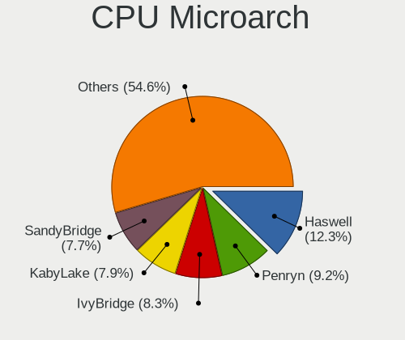

| Name             | Desktops | Percent |
|------------------|----------|---------|
| Haswell          | 147      | 12.16%  |
| Penryn           | 105      | 8.68%   |
| IvyBridge        | 99       | 8.19%   |
| KabyLake         | 93       | 7.69%   |
| SandyBridge      | 81       | 6.7%    |
| K10              | 70       | 5.79%   |
| Piledriver       | 64       | 5.29%   |
| Zen 2            | 62       | 5.13%   |
| CometLake        | 60       | 4.96%   |
| Zen+             | 48       | 3.97%   |
| Skylake          | 47       | 3.89%   |
| Zen              | 44       | 3.64%   |
| Zen 3            | 42       | 3.47%   |
| Core             | 40       | 3.31%   |
| Westmere         | 30       | 2.48%   |
| Nehalem          | 26       | 2.15%   |
| K8 Hammer        | 21       | 1.74%   |
| Steamroller      | 15       | 1.24%   |
| Icelake          | 14       | 1.16%   |
| Excavator        | 11       | 0.91%   |
| Silvermont       | 10       | 0.83%   |
| NetBurst         | 10       | 0.83%   |
| Jaguar           | 10       | 0.83%   |
| Bulldozer        | 10       | 0.83%   |
| Alderlake Hybrid | 10       | 0.83%   |
| Goldmont plus    | 9        | 0.74%   |
| K10 Llano        | 8        | 0.66%   |
| Puma             | 7        | 0.58%   |
| Goldmont         | 4        | 0.33%   |
| Bonnell          | 4        | 0.33%   |
| Tremont          | 3        | 0.25%   |
| Broadwell        | 3        | 0.25%   |
| TigerLake        | 1        | 0.08%   |
| Bobcat           | 1        | 0.08%   |

Graphics
--------

GPU Vendor
----------

Vendors of graphics cards

| Vendor           | Desktops | Percent |
|------------------|----------|---------|
| Nvidia           | 441      | 35.36%  |
| Intel            | 427      | 34.24%  |
| AMD              | 377      | 30.23%  |
| VIA Technologies | 1        | 0.08%   |
| ATI Technologies | 1        | 0.08%   |

GPU Model
---------

Graphics card models

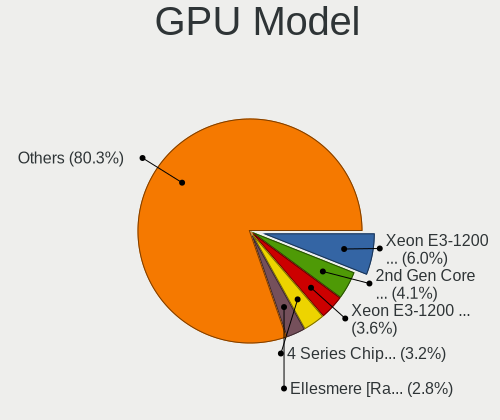

| Model                                                                       | Desktops | Percent |
|-----------------------------------------------------------------------------|----------|---------|
| Intel Xeon E3-1200 v3/4th Gen Core Processor Integrated Graphics Controller | 72       | 5.71%   |
| Intel CometLake-S GT2 [UHD Graphics 630]                                    | 42       | 3.33%   |
| Intel 4 Series Chipset Integrated Graphics Controller                       | 42       | 3.33%   |
| AMD Ellesmere [Radeon RX 470/480/570/570X/580/580X/590]                     | 42       | 3.33%   |
| Intel Xeon E3-1200 v2/3rd Gen Core processor Graphics Controller            | 41       | 3.25%   |
| Intel 2nd Generation Core Processor Family Integrated Graphics Controller   | 40       | 3.17%   |
| Nvidia GK208B [GeForce GT 710]                                              | 39       | 3.09%   |
| Intel HD Graphics 530                                                       | 26       | 2.06%   |
| Intel 4th Generation Core Processor Family Integrated Graphics Controller   | 26       | 2.06%   |
| Intel CoffeeLake-S GT2 [UHD Graphics 630]                                   | 25       | 1.98%   |
| Nvidia GP107 [GeForce GTX 1050 Ti]                                          | 22       | 1.74%   |
| Nvidia GP108 [GeForce GT 1030]                                              | 20       | 1.59%   |
| Nvidia GK208B [GeForce GT 730]                                              | 20       | 1.59%   |
| AMD Raven Ridge [Radeon Vega Series / Radeon Vega Mobile Series]            | 20       | 1.59%   |
| AMD Picasso/Raven 2 [Radeon Vega Series / Radeon Vega Mobile Series]        | 20       | 1.59%   |
| Nvidia GT218 [GeForce 210]                                                  | 17       | 1.35%   |
| AMD Cezanne                                                                 | 16       | 1.27%   |
| Nvidia GF108 [GeForce GT 630]                                               | 14       | 1.11%   |
| Nvidia GP107 [GeForce GTX 1050]                                             | 13       | 1.03%   |
| Intel Core Processor Integrated Graphics Controller                         | 13       | 1.03%   |
| Nvidia GM107 [GeForce GTX 750 Ti]                                           | 12       | 0.95%   |
| Intel HD Graphics 630                                                       | 12       | 0.95%   |
| AMD Navi 10 [Radeon RX 5600 OEM/5600 XT / 5700/5700 XT]                     | 12       | 0.95%   |
| Nvidia TU117 [GeForce GTX 1650]                                             | 11       | 0.87%   |
| AMD Kaveri [Radeon R7 Graphics]                                             | 11       | 0.87%   |
| AMD Cedar [Radeon HD 5000/6000/7350/8350 Series]                            | 11       | 0.87%   |
| Nvidia TU116 [GeForce GTX 1660 SUPER]                                       | 10       | 0.79%   |
| Nvidia GP106 [GeForce GTX 1060 6GB]                                         | 10       | 0.79%   |
| Nvidia GP106 [GeForce GTX 1060 3GB]                                         | 10       | 0.79%   |
| Nvidia GF119 [GeForce GT 610]                                               | 10       | 0.79%   |
| Intel GeminiLake [UHD Graphics 600]                                         | 9        | 0.71%   |
| AMD RS780L [Radeon 3000]                                                    | 9        | 0.71%   |
| AMD Renoir                                                                  | 9        | 0.71%   |
| AMD Oland PRO [Radeon R7 240/340 / Radeon 520]                              | 9        | 0.71%   |
| AMD Lexa PRO [Radeon 540/540X/550/550X / RX 540X/550/550X]                  | 9        | 0.71%   |
| AMD Baffin [Radeon RX 550 640SP / RX 560/560X]                              | 9        | 0.71%   |
| AMD Baffin [Radeon RX 460/560D / Pro 450/455/460/555/555X/560/560X]         | 9        | 0.71%   |
| Intel 82G33/G31 Express Integrated Graphics Controller                      | 8        | 0.63%   |
| AMD Turks XT [Radeon HD 6670/7670]                                          | 8        | 0.63%   |
| Nvidia GM206 [GeForce GTX 960]                                              | 7        | 0.56%   |
| Nvidia G94 [GeForce 9600 GT]                                                | 7        | 0.56%   |
| Intel IvyBridge GT2 [HD Graphics 4000]                                      | 7        | 0.56%   |
| Intel Atom Processor Z36xxx/Z37xxx Series Graphics & Display                | 7        | 0.56%   |
| AMD RV710 [Radeon HD 4350/4550]                                             | 7        | 0.56%   |
| AMD RS880 [Radeon HD 4250]                                                  | 7        | 0.56%   |
| AMD Cape Verde XT [Radeon HD 7770/8760 / R7 250X]                           | 7        | 0.56%   |
| AMD Caicos [Radeon HD 6450/7450/8450 / R5 230 OEM]                          | 7        | 0.56%   |
| Nvidia TU106 [GeForce RTX 2060 Rev. A]                                      | 6        | 0.48%   |
| Nvidia GP104 [GeForce GTX 1070]                                             | 6        | 0.48%   |
| Nvidia GK106 [GeForce GTX 650 Ti]                                           | 6        | 0.48%   |
| Nvidia GF108 [GeForce GT 440]                                               | 6        | 0.48%   |
| Nvidia G98 [GeForce 8400 GS Rev. 2]                                         | 6        | 0.48%   |
| Nvidia G96C [GeForce 9500 GT]                                               | 6        | 0.48%   |
| Intel 82Q35 Express Integrated Graphics Controller                          | 6        | 0.48%   |
| Intel 82945G/GZ Integrated Graphics Controller                              | 6        | 0.48%   |
| AMD RS880 [Radeon HD 4200]                                                  | 6        | 0.48%   |
| AMD Juniper XT [Radeon HD 5770]                                             | 6        | 0.48%   |
| AMD Bonaire XTX [Radeon R7 260X/360]                                        | 6        | 0.48%   |
| Nvidia GK208 [GeForce GT 630 Rev. 2]                                        | 5        | 0.4%    |
| Nvidia GF119 [GeForce GT 520]                                               | 5        | 0.4%    |

GPU Combo
---------

Combinations of graphics cards

| Name           | Desktops | Percent |
|----------------|----------|---------|
| 1 x Nvidia     | 424      | 35.07%  |
| 1 x Intel      | 391      | 32.34%  |
| 1 x AMD        | 358      | 29.61%  |
| Intel + Nvidia | 12       | 0.99%   |
| 2 x AMD        | 11       | 0.91%   |
| Intel + AMD    | 7        | 0.58%   |
| 2 x Nvidia     | 3        | 0.25%   |
| AMD + Nvidia   | 2        | 0.17%   |
| 1 x VIA        | 1        | 0.08%   |

GPU Driver
----------

Free vs proprietary

| Driver      | Desktops | Percent |
|-------------|----------|---------|
| Free        | 1163     | 96.2%   |
| Unknown     | 44       | 3.64%   |
| Proprietary | 2        | 0.17%   |

GPU Memory
----------

Total video memory

| Size in GB | Desktops | Percent |
|------------|----------|---------|
| Unknown    | 430      | 35.57%  |
| 1.01-2.0   | 217      | 17.95%  |
| 0.51-1.0   | 189      | 15.63%  |
| 0.01-0.5   | 140      | 11.58%  |
| 7.01-8.0   | 85       | 7.03%   |
| 3.01-4.0   | 83       | 6.87%   |
| 5.01-6.0   | 34       | 2.81%   |
| 2.01-3.0   | 17       | 1.41%   |
| 8.01-16.0  | 12       | 0.99%   |
| 16.01-24.0 | 2        | 0.17%   |

Monitor
-------

Monitor Vendor
--------------

Monitor vendors

| Vendor               | Desktops | Percent |
|----------------------|----------|---------|
| Samsung Electronics  | 196      | 16.24%  |
| Goldstar             | 141      | 11.68%  |
| Dell                 | 123      | 10.19%  |
| Hewlett-Packard      | 103      | 8.53%   |
| Philips              | 88       | 7.29%   |
| Acer                 | 83       | 6.88%   |
| AOC                  | 77       | 6.38%   |
| BenQ                 | 54       | 4.47%   |
| Ancor Communications | 46       | 3.81%   |
| ViewSonic            | 35       | 2.9%    |
| Iiyama               | 20       | 1.66%   |
| Sony                 | 17       | 1.41%   |
| Lenovo               | 15       | 1.24%   |
| ASUSTek Computer     | 15       | 1.24%   |
| Eizo                 | 13       | 1.08%   |
| Fujitsu Siemens      | 12       | 0.99%   |
| NEC Computers        | 11       | 0.91%   |
| HannStar             | 9        | 0.75%   |
| Vestel Elektronik    | 6        | 0.5%    |
| Sceptre Tech         | 6        | 0.5%    |
| MSI                  | 6        | 0.5%    |
| Hitachi              | 6        | 0.5%    |
| Unknown              | 5        | 0.41%   |
| Panasonic            | 5        | 0.41%   |
| Medion               | 5        | 0.41%   |
| Unknown (XXX)        | 4        | 0.33%   |
| GDH                  | 4        | 0.33%   |
| CHD                  | 4        | 0.33%   |
| ___                  | 3        | 0.25%   |
| TCL                  | 3        | 0.25%   |
| MiTAC                | 3        | 0.25%   |
| IOD                  | 3        | 0.25%   |
| Insignia             | 3        | 0.25%   |
| CVT                  | 3        | 0.25%   |
| CTV                  | 3        | 0.25%   |
| Xiaomi               | 2        | 0.17%   |
| Vizio                | 2        | 0.17%   |
| Sharp                | 2        | 0.17%   |
| RS                   | 2        | 0.17%   |
| Plain Tree Systems   | 2        | 0.17%   |
| Packard Bell         | 2        | 0.17%   |
| Orion                | 2        | 0.17%   |
| NFREN                | 2        | 0.17%   |
| MStar                | 2        | 0.17%   |
| Mitsubishi           | 2        | 0.17%   |
| Mi                   | 2        | 0.17%   |
| LLL                  | 2        | 0.17%   |
| HUAWEI               | 2        | 0.17%   |
| HKC                  | 2        | 0.17%   |
| Gateway              | 2        | 0.17%   |
| Envision             | 2        | 0.17%   |
| Denver               | 2        | 0.17%   |
| AVX                  | 2        | 0.17%   |
| Arnos Instruments    | 2        | 0.17%   |
| ZLS                  | 1        | 0.08%   |
| VOR                  | 1        | 0.08%   |
| VIE                  | 1        | 0.08%   |
| Valve                | 1        | 0.08%   |
| Unknown (DDD)        | 1        | 0.08%   |
| Toshiba              | 1        | 0.08%   |

Monitor Model
-------------

Monitor models

| Model                                                                 | Desktops | Percent |
|-----------------------------------------------------------------------|----------|---------|
| Dell D1918H DEL2005 1366x768 410x230mm 18.5-inch                      | 22       | 1.79%   |
| Philips 273PQPY PHLC096 1920x1080 597x336mm 27.0-inch                 | 11       | 0.9%    |
| Goldstar FULL HD GSM5B55 1920x1080 480x270mm 21.7-inch                | 8        | 0.65%   |
| Samsung Electronics C24F390 SAM0D2C 1920x1080 521x293mm 23.5-inch     | 7        | 0.57%   |
| Goldstar ULTRAWIDE GSM59F1 2560x1080 673x284mm 28.8-inch              | 7        | 0.57%   |
| Vestel Elektronik 28W_LCD_TV VES3700 1920x540                         | 6        | 0.49%   |
| Philips PHL 223V5 PHLC0CF 1920x1080 477x268mm 21.5-inch               | 6        | 0.49%   |
| Samsung Electronics C27F390 SAM0D32 1920x1080 598x336mm 27.0-inch     | 5        | 0.41%   |
| Philips PHL 243V5 PHLC0D1 1920x1080 521x293mm 23.5-inch               | 5        | 0.41%   |
| Ancor Communications VS278 ACI27A1 1920x1080 598x336mm 27.0-inch      | 5        | 0.41%   |
| Ancor Communications ASUS VS247 ACI249A 1920x1080 521x293mm 23.5-inch | 5        | 0.41%   |
| Samsung Electronics SyncMaster SAM0255 1680x1050 474x296mm 22.0-inch  | 4        | 0.33%   |
| Philips PHL 243V7 PHLC155 1920x1080 527x296mm 23.8-inch               | 4        | 0.33%   |
| MSI Optix MAG27C MSI1462 1920x1080 598x336mm 27.0-inch                | 4        | 0.33%   |
| Hewlett-Packard LA1951 HWP285A 1280x1024 380x300mm 19.1-inch          | 4        | 0.33%   |
| Hewlett-Packard 24fw HPN3545 1920x1080 527x296mm 23.8-inch            | 4        | 0.33%   |
| AOC G2460 AOC2460 1920x1080 531x299mm 24.0-inch                       | 4        | 0.33%   |
| AOC 27V2G5 AOC2702 1920x1080 598x336mm 27.0-inch                      | 4        | 0.33%   |
| ___ LCD TV ___0101 1360x768                                           | 3        | 0.24%   |
| Samsung Electronics SMS19A100 SAM0867 1366x768 410x230mm 18.5-inch    | 3        | 0.24%   |
| Samsung Electronics S24D390 SAM0B65 1920x1080 521x293mm 23.5-inch     | 3        | 0.24%   |
| Samsung Electronics LCD Monitor SAM0C39 1920x1080 885x498mm 40.0-inch | 3        | 0.24%   |
| Philips PHL 273V7 PHLC156 1920x1080 598x336mm 27.0-inch               | 3        | 0.24%   |
| Philips 226V4 PHLC0B1 1920x1080 477x268mm 21.5-inch                   | 3        | 0.24%   |
| Panasonic TV MEIA296 3840x2160 698x392mm 31.5-inch                    | 3        | 0.24%   |
| Hewlett-Packard LA2205 HWP2848 1680x1050 473x296mm 22.0-inch          | 3        | 0.24%   |
| Hewlett-Packard 27es HWP3326 1920x1080 598x336mm 27.0-inch            | 3        | 0.24%   |
| Goldstar W2243 GSM56FE 1920x1080 477x268mm 21.5-inch                  | 3        | 0.24%   |
| Goldstar L1742 GSM449B 1280x1024 338x270mm 17.0-inch                  | 3        | 0.24%   |
| Goldstar HDR 4K GSM7707 3840x2160 600x340mm 27.2-inch                 | 3        | 0.24%   |
| Goldstar E2340 GSM57C7 1920x1080 510x290mm 23.1-inch                  | 3        | 0.24%   |
| GDH PHILCO GDH0030 1920x540 708x398mm 32.0-inch                       | 3        | 0.24%   |
| CTV CTV CTV0030 1920x1080 708x398mm 32.0-inch                         | 3        | 0.24%   |
| BenQ GW2765 BNQ78D6 2560x1440 597x336mm 27.0-inch                     | 3        | 0.24%   |
| BenQ GW2283 BNQ78E9 1920x1080 476x268mm 21.5-inch                     | 3        | 0.24%   |
| BenQ GW2270 BNQ78DB 1920x1080 476x268mm 21.5-inch                     | 3        | 0.24%   |
| BenQ GL2760 BNQ78D5 1920x1080 598x336mm 27.0-inch                     | 3        | 0.24%   |
| BenQ G2220HDA BNQ7820 1920x1080 476x268mm 21.5-inch                   | 3        | 0.24%   |
| AOC Q3279WG5B AOC3279 2560x1440 725x428mm 33.1-inch                   | 3        | 0.24%   |
| AOC 24B2W1G5 AOC2402 1920x1080 527x296mm 23.8-inch                    | 3        | 0.24%   |
| AOC 24B1W1 AOC2401 1920x1080 527x296mm 23.8-inch                      | 3        | 0.24%   |
| AOC 2250W AOC2250 1920x1080 477x268mm 21.5-inch                       | 3        | 0.24%   |
| Ancor Communications ASUS VP228 ACI22C3 1920x1080 476x268mm 21.5-inch | 3        | 0.24%   |
| ViewSonic VX2718-2KPC VSCB73A 2560x1440 598x336mm 27.0-inch           | 2        | 0.16%   |
| ViewSonic VX2478 Series VSCE032 2560x1440 526x296mm 23.8-inch         | 2        | 0.16%   |
| ViewSonic VA703-4Series VSC6A1E 1280x1024 341x274mm 17.2-inch         | 2        | 0.16%   |
| ViewSonic VA1938 Series VSC0626 1366x768 410x230mm 18.5-inch          | 2        | 0.16%   |
| Unknown LCD TV 0101 1920x1080 1600x900mm 72.3-inch                    | 2        | 0.16%   |
| Unknown LCD Monitor FFFF 2288x1287 2550x2550mm 142.0-inch             | 2        | 0.16%   |
| Unknown (XXX) Union TV XXX2841 1920x1080 1209x680mm 54.6-inch         | 2        | 0.16%   |
| Unknown (XXX) Beyond TV XXX2851 3840x2160 1209x680mm 54.6-inch        | 2        | 0.16%   |
| Sony TV SNYEB01 1360x768                                              | 2        | 0.16%   |
| Sony TV *00 SNYF503 1920x1080 1439x809mm 65.0-inch                    | 2        | 0.16%   |
| Samsung Electronics U28E590 SAM0C4C 3840x2160 608x345mm 27.5-inch     | 2        | 0.16%   |
| Samsung Electronics SyncMaster SAM027F 1680x1050 474x296mm 22.0-inch  | 2        | 0.16%   |
| Samsung Electronics SMS22A100 SAM0868 1920x1080 477x268mm 21.5-inch   | 2        | 0.16%   |
| Samsung Electronics S27F350 SAM0D22 1920x1080 600x340mm 27.2-inch     | 2        | 0.16%   |
| Samsung Electronics S27E390 SAM0C1C 1920x1080 598x336mm 27.0-inch     | 2        | 0.16%   |
| Samsung Electronics S24R35x SAM100E 1920x1080 527x296mm 23.8-inch     | 2        | 0.16%   |
| Samsung Electronics S24F350 SAM0D20 1920x1080 521x293mm 23.5-inch     | 2        | 0.16%   |

Monitor Resolution
------------------

Monitor screen resolution

| Resolution         | Desktops | Percent |
|--------------------|----------|---------|
| 1920x1080 (FHD)    | 590      | 49.5%   |
| 3840x2160 (4K)     | 98       | 8.22%   |
| 1280x1024 (SXGA)   | 89       | 7.47%   |
| 1366x768 (WXGA)    | 78       | 6.54%   |
| 2560x1440 (QHD)    | 65       | 5.45%   |
| 1680x1050 (WSXGA+) | 61       | 5.12%   |
| 1440x900 (WXGA+)   | 45       | 3.78%   |
| 1600x900 (HD+)     | 42       | 3.52%   |
| 1920x1200 (WUXGA)  | 37       | 3.1%    |
| 3440x1440          | 20       | 1.68%   |
| 1360x768           | 18       | 1.51%   |
| 2560x1080          | 12       | 1.01%   |
| 1024x768 (XGA)     | 7        | 0.59%   |
| 1920x540           | 6        | 0.5%    |
| 1600x1200          | 6        | 0.5%    |
| 1280x720 (HD)      | 5        | 0.42%   |
| 2048x1152          | 3        | 0.25%   |
| 1280x960           | 3        | 0.25%   |
| 2560x1600          | 2        | 0.17%   |
| 2288x1287          | 2        | 0.17%   |
| 3840x1080          | 1        | 0.08%   |
| 1280x768           | 1        | 0.08%   |
| Unknown            | 1        | 0.08%   |

Monitor Diagonal
----------------

Diagonal size in inches

| Inches  | Desktops | Percent |
|---------|----------|---------|
| 27      | 179      | 14.79%  |
| 23      | 177      | 14.63%  |
| 21      | 166      | 13.72%  |
| 24      | 132      | 10.91%  |
| 19      | 96       | 7.93%   |
| 18      | 78       | 6.45%   |
| 22      | 51       | 4.21%   |
| 31      | 49       | 4.05%   |
| 17      | 47       | 3.88%   |
| 20      | 36       | 2.98%   |
| 34      | 31       | 2.56%   |
| 84      | 25       | 2.07%   |
| 15      | 20       | 1.65%   |
| 32      | 18       | 1.49%   |
| Unknown | 13       | 1.07%   |
| 72      | 11       | 0.91%   |
| 54      | 10       | 0.83%   |
| 40      | 8        | 0.66%   |
| 65      | 6        | 0.5%    |
| 52      | 6        | 0.5%    |
| 46      | 5        | 0.41%   |
| 26      | 5        | 0.41%   |
| 25      | 5        | 0.41%   |
| 48      | 4        | 0.33%   |
| 39      | 4        | 0.33%   |
| 29      | 4        | 0.33%   |
| 47      | 3        | 0.25%   |
| 42      | 3        | 0.25%   |
| 33      | 3        | 0.25%   |
| 28      | 3        | 0.25%   |
| 142     | 2        | 0.17%   |
| 55      | 2        | 0.17%   |
| 50      | 1        | 0.08%   |
| 43      | 1        | 0.08%   |
| 38      | 1        | 0.08%   |
| 37      | 1        | 0.08%   |
| 36      | 1        | 0.08%   |
| 35      | 1        | 0.08%   |
| 14      | 1        | 0.08%   |
| 12      | 1        | 0.08%   |

Monitor Width
-------------

Physical width

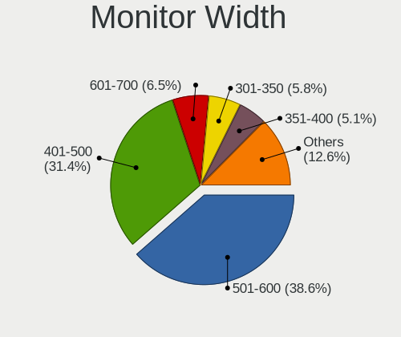

| Width in mm    | Desktops | Percent |
|----------------|----------|---------|
| 501-600        | 473      | 39.65%  |
| 401-500        | 381      | 31.94%  |
| 601-700        | 67       | 5.62%   |
| 301-350        | 65       | 5.45%   |
| 701-800        | 51       | 4.27%   |
| 351-400        | 48       | 4.02%   |
| 1001-1500      | 37       | 3.1%    |
| 1501-2000      | 36       | 3.02%   |
| 801-900        | 15       | 1.26%   |
| Unknown        | 13       | 1.09%   |
| 901-1000       | 4        | 0.34%   |
| More than 2000 | 2        | 0.17%   |
| 201-300        | 1        | 0.08%   |

Aspect Ratio
------------

Proportional relationship between the width and the height

| Ratio   | Desktops | Percent |
|---------|----------|---------|
| 16/9    | 859      | 73.61%  |
| 16/10   | 158      | 13.54%  |
| 5/4     | 84       | 7.2%    |
| 21/9    | 31       | 2.66%   |
| 4/3     | 22       | 1.89%   |
| 3/2     | 5        | 0.43%   |
| 6/5     | 3        | 0.26%   |
| 1.00    | 2        | 0.17%   |
| 32/9    | 1        | 0.09%   |
| 1.96    | 1        | 0.09%   |
| Unknown | 1        | 0.09%   |

Monitor Area
------------

Area in inch

| Area in inch | Desktops | Percent |
|----------------|----------|---------|
| 201-250        | 434      | 36.35%  |
| 301-350        | 184      | 15.41%  |
| 151-200        | 180      | 15.08%  |
| 141-150        | 111      | 9.3%    |
| 351-500        | 102      | 8.54%   |
| More than 1000 | 65       | 5.44%   |
| 251-300        | 51       | 4.27%   |
| 501-1000       | 31       | 2.6%    |
| 101-110        | 16       | 1.34%   |
| Unknown        | 13       | 1.09%   |
| 111-120        | 4        | 0.34%   |
| 81-90          | 1        | 0.08%   |
| 71-80          | 1        | 0.08%   |
| 131-140        | 1        | 0.08%   |

Pixel Density
-------------

Pixels per inch

| Density | Desktops | Percent |
|---------|----------|---------|
| 51-100  | 820      | 70.15%  |
| 101-120 | 227      | 19.42%  |
| 1-50    | 59       | 5.05%   |
| 121-160 | 37       | 3.17%   |
| 161-240 | 13       | 1.11%   |
| Unknown | 13       | 1.11%   |

Multiple Monitors
-----------------

Total monitors connected

| Total | Desktops | Percent |
|-------|----------|---------|
| 1     | 1090     | 90.16%  |
| 2     | 92       | 7.61%   |
| 0     | 18       | 1.49%   |
| 3     | 8        | 0.66%   |
| 4     | 1        | 0.08%   |

Network
-------

Net Controller Vendor
---------------------

Controller vendors

| Vendor                                | Desktops | Percent |
|---------------------------------------|----------|---------|
| Realtek Semiconductor                 | 787      | 49.59%  |
| Intel                                 | 436      | 27.47%  |
| Qualcomm Atheros                      | 97       | 6.11%   |
| Ralink Technology                     | 47       | 2.96%   |
| Broadcom                              | 31       | 1.95%   |
| Nvidia                                | 30       | 1.89%   |
| TP-Link                               | 21       | 1.32%   |
| Ralink                                | 18       | 1.13%   |
| Qualcomm Atheros Communications       | 12       | 0.76%   |
| Marvell Technology Group              | 11       | 0.69%   |
| D-Link System                         | 10       | 0.63%   |
| Motorola PCS                          | 8        | 0.5%    |
| Broadcom Limited                      | 8        | 0.5%    |
| D-Link                                | 7        | 0.44%   |
| NetGear                               | 6        | 0.38%   |
| VIA Technologies                      | 5        | 0.32%   |
| Microsoft                             | 4        | 0.25%   |
| Huawei Technologies                   | 4        | 0.25%   |
| ASUSTek Computer                      | 4        | 0.25%   |
| ASIX Electronics                      | 4        | 0.25%   |
| Samsung Electronics                   | 3        | 0.19%   |
| MediaTek                              | 3        | 0.19%   |
| Edimax Technology                     | 3        | 0.19%   |
| Belkin Components                     | 3        | 0.19%   |
| Aquantia                              | 3        | 0.19%   |
| ZTE WCDMA Technologies MSM            | 2        | 0.13%   |
| IMC Networks                          | 2        | 0.13%   |
| Chu Yuen Enterprise                   | 2        | 0.13%   |
| AVM                                   | 2        | 0.13%   |
| ZyDAS                                 | 1        | 0.06%   |
| Xiaomi                                | 1        | 0.06%   |
| Sundance Technology Inc / IC Plus     | 1        | 0.06%   |
| Spreadtrum Communications             | 1        | 0.06%   |
| Silicon Integrated Systems [SiS]      | 1        | 0.06%   |
| Sangoma Technologies                  | 1        | 0.06%   |
| Qualcomm                              | 1        | 0.06%   |
| OnePlus Technology (Shenzhen)         | 1        | 0.06%   |
| Netchip Technology                    | 1        | 0.06%   |
| Logitec                               | 1        | 0.06%   |
| JMicron Technology                    | 1        | 0.06%   |
| HTC (High Tech Computer)              | 1        | 0.06%   |
| 802.11g Adapter [Linksys WUSB54GC v3] | 1        | 0.06%   |
| 3Com                                  | 1        | 0.06%   |

Net Controller Model
--------------------

Controller models

| Model                                                             | Desktops | Percent |
|-------------------------------------------------------------------|----------|---------|
| Realtek RTL8111/8168/8411 PCI Express Gigabit Ethernet Controller | 661      | 37.88%  |
| Intel I211 Gigabit Network Connection                             | 44       | 2.52%   |
| Intel 82579LM Gigabit Network Connection (Lewisville)             | 43       | 2.46%   |
| Realtek RTL8125 2.5GbE Controller                                 | 41       | 2.35%   |
| Intel Wi-Fi 6 AX200                                               | 40       | 2.29%   |
| Intel Ethernet Connection I217-LM                                 | 38       | 2.18%   |
| Realtek RTL810xE PCI Express Fast Ethernet controller             | 36       | 2.06%   |
| Intel Ethernet Connection (2) I219-V                              | 32       | 1.83%   |
| Intel 82579V Gigabit Network Connection                           | 26       | 1.49%   |
| Intel Dual Band Wireless-AC 3168NGW [Stone Peak]                  | 23       | 1.32%   |
| Intel Ethernet Connection (7) I219-V                              | 21       | 1.2%    |
| Intel 82567LM-3 Gigabit Network Connection                        | 21       | 1.2%    |
| Intel Ethernet Controller I225-V                                  | 19       | 1.09%   |
| Nvidia MCP61 Ethernet                                             | 18       | 1.03%   |
| Realtek RTL8188EUS 802.11n Wireless Network Adapter               | 17       | 0.97%   |
| Qualcomm Atheros AR93xx Wireless Network Adapter                  | 17       | 0.97%   |
| Ralink MT7601U Wireless Adapter                                   | 14       | 0.8%    |
| Intel Wireless-AC 9260                                            | 14       | 0.8%    |
| Intel Ethernet Connection I217-V                                  | 14       | 0.8%    |
| Realtek RTL8192EE PCIe Wireless Network Adapter                   | 11       | 0.63%   |
| Intel Ethernet Connection (2) I219-LM                             | 11       | 0.63%   |
| Realtek RTL-8100/8101L/8139 PCI Fast Ethernet Adapter             | 10       | 0.57%   |
| Ralink RT2870/RT3070 Wireless Adapter                             | 10       | 0.57%   |
| Qualcomm Atheros AR8151 v2.0 Gigabit Ethernet                     | 10       | 0.57%   |
| Intel Wireless 7260                                               | 10       | 0.57%   |
| Broadcom NetXtreme BCM5761 Gigabit Ethernet PCIe                  | 10       | 0.57%   |
| Realtek RTL8821CE 802.11ac PCIe Wireless Network Adapter          | 9        | 0.52%   |
| Realtek RTL8192CU 802.11n WLAN Adapter                            | 9        | 0.52%   |
| Qualcomm Atheros AR9485 Wireless Network Adapter                  | 9        | 0.52%   |
| Realtek RTL8192CE PCIe Wireless Network Adapter                   | 8        | 0.46%   |
| Ralink RT5370 Wireless Adapter                                    | 8        | 0.46%   |
| Intel Wireless 7265                                               | 8        | 0.46%   |
| Intel Cannon Lake PCH CNVi WiFi                                   | 8        | 0.46%   |
| Intel 82578DM Gigabit Network Connection                          | 8        | 0.46%   |
| Intel 82578DC Gigabit Network Connection                          | 8        | 0.46%   |
| Realtek RTL8821AE 802.11ac PCIe Wireless Network Adapter          | 7        | 0.4%    |
| Realtek RTL8188EE Wireless Network Adapter                        | 7        | 0.4%    |
| Realtek RTL8188CE 802.11b/g/n WiFi Adapter                        | 7        | 0.4%    |
| Realtek RTL8153 Gigabit Ethernet Adapter                          | 7        | 0.4%    |
| Qualcomm Atheros AR9271 802.11n                                   | 7        | 0.4%    |
| Qualcomm Atheros AR8121/AR8113/AR8114 Gigabit or Fast Ethernet    | 7        | 0.4%    |
| Intel Wireless 3165                                               | 7        | 0.4%    |
| Intel 82566DM-2 Gigabit Network Connection                        | 7        | 0.4%    |
| TP-Link TL-WN722N v2/v3 [Realtek RTL8188EUS]                      | 6        | 0.34%   |
| Realtek RTL8188CUS 802.11n WLAN Adapter                           | 6        | 0.34%   |
| Realtek RTL8169 PCI Gigabit Ethernet Controller                   | 6        | 0.34%   |
| Qualcomm Atheros QCA9565 / AR9565 Wireless Network Adapter        | 6        | 0.34%   |
| Marvell Group 88E8056 PCI-E Gigabit Ethernet Controller           | 6        | 0.34%   |
| Intel Wi-Fi 6 AX210/AX211/AX411 160MHz                            | 6        | 0.34%   |
| Intel Ethernet Connection (2) I218-V                              | 6        | 0.34%   |
| Broadcom NetLink BCM57780 Gigabit Ethernet PCIe                   | 6        | 0.34%   |
| Realtek RTL8191SU 802.11n WLAN Adapter                            | 5        | 0.29%   |
| Realtek RTL-8110SC/8169SC Gigabit Ethernet                        | 5        | 0.29%   |
| Realtek 802.11ac NIC                                              | 5        | 0.29%   |
| Qualcomm Atheros QCA8171 Gigabit Ethernet                         | 5        | 0.29%   |
| Qualcomm Atheros AR9227 Wireless Network Adapter                  | 5        | 0.29%   |
| Qualcomm Atheros AR8131 Gigabit Ethernet                          | 5        | 0.29%   |
| NetGear A6100 AC600 DB Wireless Adapter [Realtek RTL8811AU]       | 5        | 0.29%   |
| Intel Ethernet Connection (2) I218-LM                             | 5        | 0.29%   |
| Intel Ethernet Connection (11) I219-LM                            | 5        | 0.29%   |

Wireless Vendor
---------------

Wireless vendors

| Vendor                                | Desktops | Percent |
|---------------------------------------|----------|---------|
| Intel                                 | 137      | 31%     |
| Realtek Semiconductor                 | 104      | 23.53%  |
| Qualcomm Atheros                      | 55       | 12.44%  |
| Ralink Technology                     | 47       | 10.63%  |
| TP-Link                               | 20       | 4.52%   |
| Ralink                                | 18       | 4.07%   |
| Qualcomm Atheros Communications       | 12       | 2.71%   |
| D-Link                                | 7        | 1.58%   |
| NetGear                               | 6        | 1.36%   |
| Broadcom                              | 6        | 1.36%   |
| Microsoft                             | 4        | 0.9%    |
| D-Link System                         | 4        | 0.9%    |
| ASUSTek Computer                      | 4        | 0.9%    |
| Edimax Technology                     | 3        | 0.68%   |
| Belkin Components                     | 3        | 0.68%   |
| MediaTek                              | 2        | 0.45%   |
| IMC Networks                          | 2        | 0.45%   |
| Chu Yuen Enterprise                   | 2        | 0.45%   |
| AVM                                   | 2        | 0.45%   |
| ZyDAS                                 | 1        | 0.23%   |
| Logitec                               | 1        | 0.23%   |
| Broadcom Limited                      | 1        | 0.23%   |
| 802.11g Adapter [Linksys WUSB54GC v3] | 1        | 0.23%   |

Wireless Model
--------------

Wireless models

| Model                                                                                | Desktops | Percent |
|--------------------------------------------------------------------------------------|----------|---------|
| Intel Wi-Fi 6 AX200                                                                  | 40       | 8.99%   |
| Intel Dual Band Wireless-AC 3168NGW [Stone Peak]                                     | 23       | 5.17%   |
| Realtek RTL8188EUS 802.11n Wireless Network Adapter                                  | 17       | 3.82%   |
| Qualcomm Atheros AR93xx Wireless Network Adapter                                     | 17       | 3.82%   |
| Ralink MT7601U Wireless Adapter                                                      | 14       | 3.15%   |
| Intel Wireless-AC 9260                                                               | 14       | 3.15%   |
| Realtek RTL8192EE PCIe Wireless Network Adapter                                      | 11       | 2.47%   |
| Ralink RT2870/RT3070 Wireless Adapter                                                | 10       | 2.25%   |
| Intel Wireless 7260                                                                  | 10       | 2.25%   |
| Realtek RTL8821CE 802.11ac PCIe Wireless Network Adapter                             | 9        | 2.02%   |
| Realtek RTL8192CU 802.11n WLAN Adapter                                               | 9        | 2.02%   |
| Qualcomm Atheros AR9485 Wireless Network Adapter                                     | 9        | 2.02%   |
| Realtek RTL8192CE PCIe Wireless Network Adapter                                      | 8        | 1.8%    |
| Ralink RT5370 Wireless Adapter                                                       | 8        | 1.8%    |
| Intel Wireless 7265                                                                  | 8        | 1.8%    |
| Intel Cannon Lake PCH CNVi WiFi                                                      | 8        | 1.8%    |
| Realtek RTL8821AE 802.11ac PCIe Wireless Network Adapter                             | 7        | 1.57%   |
| Realtek RTL8188EE Wireless Network Adapter                                           | 7        | 1.57%   |
| Realtek RTL8188CE 802.11b/g/n WiFi Adapter                                           | 7        | 1.57%   |
| Qualcomm Atheros AR9271 802.11n                                                      | 7        | 1.57%   |
| Intel Wireless 3165                                                                  | 7        | 1.57%   |
| TP-Link TL-WN722N v2/v3 [Realtek RTL8188EUS]                                         | 6        | 1.35%   |
| Realtek RTL8188CUS 802.11n WLAN Adapter                                              | 6        | 1.35%   |
| Qualcomm Atheros QCA9565 / AR9565 Wireless Network Adapter                           | 6        | 1.35%   |
| Intel Wi-Fi 6 AX210/AX211/AX411 160MHz                                               | 6        | 1.35%   |
| Realtek RTL8191SU 802.11n WLAN Adapter                                               | 5        | 1.12%   |
| Realtek 802.11ac NIC                                                                 | 5        | 1.12%   |
| Qualcomm Atheros AR9227 Wireless Network Adapter                                     | 5        | 1.12%   |
| NetGear A6100 AC600 DB Wireless Adapter [Realtek RTL8811AU]                          | 5        | 1.12%   |
| TP-Link TL-WN821N v5/v6 [RTL8192EU]                                                  | 4        | 0.9%    |
| Ralink RT5572 Wireless Adapter                                                       | 4        | 0.9%    |
| Ralink RT5372 Wireless Adapter                                                       | 4        | 0.9%    |
| Ralink RT3090 Wireless 802.11n 1T/1R PCIe                                            | 4        | 0.9%    |
| Ralink RT2790 Wireless 802.11n 1T/2R PCIe                                            | 4        | 0.9%    |
| Ralink RT2561/RT61 802.11g PCI                                                       | 4        | 0.9%    |
| Qualcomm Atheros AR5212/5213/2414 Wireless Network Adapter                           | 4        | 0.9%    |
| Intel Comet Lake PCH CNVi WiFi                                                       | 4        | 0.9%    |
| Realtek RTL88x2bu [AC1200 Techkey]                                                   | 3        | 0.67%   |
| Realtek RTL8723BU 802.11b/g/n WLAN Adapter                                           | 3        | 0.67%   |
| Ralink RT2501/RT2573 Wireless Adapter                                                | 3        | 0.67%   |
| Qualcomm Atheros QCA6174 802.11ac Wireless Network Adapter                           | 3        | 0.67%   |
| Qualcomm Atheros TP-Link TL-WN322G v3 / TL-WN422G v2 802.11g [Atheros AR9271]        | 3        | 0.67%   |
| Microsoft Xbox 360 Wireless Adapter                                                  | 3        | 0.67%   |
| Intel Wireless 8265 / 8275                                                           | 3        | 0.67%   |
| Intel Wireless 8260                                                                  | 3        | 0.67%   |
| Intel Tiger Lake PCH CNVi WiFi                                                       | 3        | 0.67%   |
| Broadcom BCM4360 802.11ac Wireless Network Adapter                                   | 3        | 0.67%   |
| TP-Link TL-WN823N v2/v3 [Realtek RTL8192EU]                                          | 2        | 0.45%   |
| TP-Link Archer T3U [Realtek RTL8812BU]                                               | 2        | 0.45%   |
| TP-Link Archer T2U PLUS [RTL8821AU]                                                  | 2        | 0.45%   |
| TP-Link 802.11ac WLAN Adapter                                                        | 2        | 0.45%   |
| Realtek RTL8822CE 802.11ac PCIe Wireless Network Adapter                             | 2        | 0.45%   |
| Realtek RTL8822BE 802.11a/b/g/n/ac WiFi adapter                                      | 2        | 0.45%   |
| Realtek RTL8812AE 802.11ac PCIe Wireless Network Adapter                             | 2        | 0.45%   |
| Ralink RT2070 Wireless Adapter                                                       | 2        | 0.45%   |
| Ralink RT3060 Wireless 802.11n 1T/1R                                                 | 2        | 0.45%   |
| Qualcomm Atheros QCA9377 802.11ac Wireless Network Adapter                           | 2        | 0.45%   |
| Qualcomm Atheros TP-Link TL-WN821N v3 / TL-WN822N v2 802.11n [Atheros AR7010+AR9287] | 2        | 0.45%   |
| Qualcomm Atheros AR5416 Wireless Network Adapter [AR5008 802.11(a)bgn]               | 2        | 0.45%   |
| Qualcomm Atheros AR2417 Wireless Network Adapter [AR5007G 802.11bg]                  | 2        | 0.45%   |

Ethernet Vendor
---------------

Ethernet vendors

| Vendor                            | Desktops | Percent |
|-----------------------------------|----------|---------|
| Realtek Semiconductor             | 752      | 59.54%  |
| Intel                             | 349      | 27.63%  |
| Qualcomm Atheros                  | 46       | 3.64%   |
| Nvidia                            | 30       | 2.38%   |
| Broadcom                          | 25       | 1.98%   |
| Marvell Technology Group          | 11       | 0.87%   |
| Broadcom Limited                  | 7        | 0.55%   |
| D-Link System                     | 6        | 0.48%   |
| VIA Technologies                  | 5        | 0.4%    |
| Motorola PCS                      | 4        | 0.32%   |
| Huawei Technologies               | 4        | 0.32%   |
| ASIX Electronics                  | 4        | 0.32%   |
| Samsung Electronics               | 3        | 0.24%   |
| Aquantia                          | 3        | 0.24%   |
| ZTE WCDMA Technologies MSM        | 2        | 0.16%   |
| Xiaomi                            | 1        | 0.08%   |
| TP-Link                           | 1        | 0.08%   |
| Sundance Technology Inc / IC Plus | 1        | 0.08%   |
| Spreadtrum Communications         | 1        | 0.08%   |
| Silicon Integrated Systems [SiS]  | 1        | 0.08%   |
| Qualcomm                          | 1        | 0.08%   |
| OnePlus Technology (Shenzhen)     | 1        | 0.08%   |
| Netchip Technology                | 1        | 0.08%   |
| MediaTek                          | 1        | 0.08%   |
| JMicron Technology                | 1        | 0.08%   |
| HTC (High Tech Computer)          | 1        | 0.08%   |
| 3Com                              | 1        | 0.08%   |

Ethernet Model
--------------

Ethernet models

| Model                                                                          | Desktops | Percent |
|--------------------------------------------------------------------------------|----------|---------|
| Realtek RTL8111/8168/8411 PCI Express Gigabit Ethernet Controller              | 661      | 51.04%  |
| Intel I211 Gigabit Network Connection                                          | 44       | 3.4%    |
| Intel 82579LM Gigabit Network Connection (Lewisville)                          | 43       | 3.32%   |
| Realtek RTL8125 2.5GbE Controller                                              | 41       | 3.17%   |
| Intel Ethernet Connection I217-LM                                              | 38       | 2.93%   |
| Realtek RTL810xE PCI Express Fast Ethernet controller                          | 36       | 2.78%   |
| Intel Ethernet Connection (2) I219-V                                           | 32       | 2.47%   |
| Intel 82579V Gigabit Network Connection                                        | 26       | 2.01%   |
| Intel Ethernet Connection (7) I219-V                                           | 21       | 1.62%   |
| Intel 82567LM-3 Gigabit Network Connection                                     | 21       | 1.62%   |
| Intel Ethernet Controller I225-V                                               | 19       | 1.47%   |
| Nvidia MCP61 Ethernet                                                          | 18       | 1.39%   |
| Intel Ethernet Connection I217-V                                               | 14       | 1.08%   |
| Intel Ethernet Connection (2) I219-LM                                          | 11       | 0.85%   |
| Realtek RTL-8100/8101L/8139 PCI Fast Ethernet Adapter                          | 10       | 0.77%   |
| Qualcomm Atheros AR8151 v2.0 Gigabit Ethernet                                  | 10       | 0.77%   |
| Broadcom NetXtreme BCM5761 Gigabit Ethernet PCIe                               | 10       | 0.77%   |
| Intel 82578DM Gigabit Network Connection                                       | 8        | 0.62%   |
| Intel 82578DC Gigabit Network Connection                                       | 8        | 0.62%   |
| Realtek RTL8153 Gigabit Ethernet Adapter                                       | 7        | 0.54%   |
| Qualcomm Atheros AR8121/AR8113/AR8114 Gigabit or Fast Ethernet                 | 7        | 0.54%   |
| Intel 82566DM-2 Gigabit Network Connection                                     | 7        | 0.54%   |
| Realtek RTL8169 PCI Gigabit Ethernet Controller                                | 6        | 0.46%   |
| Marvell Group 88E8056 PCI-E Gigabit Ethernet Controller                        | 6        | 0.46%   |
| Intel Ethernet Connection (2) I218-V                                           | 6        | 0.46%   |
| Broadcom NetLink BCM57780 Gigabit Ethernet PCIe                                | 6        | 0.46%   |
| Realtek RTL-8110SC/8169SC Gigabit Ethernet                                     | 5        | 0.39%   |
| Qualcomm Atheros QCA8171 Gigabit Ethernet                                      | 5        | 0.39%   |
| Qualcomm Atheros AR8131 Gigabit Ethernet                                       | 5        | 0.39%   |
| Intel Ethernet Connection (2) I218-LM                                          | 5        | 0.39%   |
| Intel Ethernet Connection (11) I219-LM                                         | 5        | 0.39%   |
| Intel 82567V-2 Gigabit Network Connection                                      | 5        | 0.39%   |
| Qualcomm Atheros Killer E2500 Gigabit Ethernet Controller                      | 4        | 0.31%   |
| Qualcomm Atheros Attansic L2 Fast Ethernet                                     | 4        | 0.31%   |
| Nvidia MCP51 Ethernet Controller                                               | 4        | 0.31%   |
| Motorola PCS moto g stylus                                                     | 4        | 0.31%   |
| Intel Ethernet Connection (14) I219-V                                          | 4        | 0.31%   |
| Intel Ethernet Connection (11) I219-V                                          | 4        | 0.31%   |
| Intel 82574L Gigabit Network Connection                                        | 4        | 0.31%   |
| Samsung Galaxy series, misc. (tethering mode)                                  | 3        | 0.23%   |
| Qualcomm Atheros Killer E220x Gigabit Ethernet Controller                      | 3        | 0.23%   |
| Nvidia MCP77 Ethernet                                                          | 3        | 0.23%   |
| Intel Ethernet Connection (12) I219-V                                          | 3        | 0.23%   |
| Broadcom NetXtreme BCM5764M Gigabit Ethernet PCIe                              | 3        | 0.23%   |
| Broadcom NetLink BCM57788 Gigabit Ethernet PCIe                                | 3        | 0.23%   |
| Broadcom NetLink BCM57781 Gigabit Ethernet PCIe                                | 3        | 0.23%   |
| Broadcom Limited NetXtreme BCM5755 Gigabit Ethernet PCI Express                | 3        | 0.23%   |
| ASIX AX88179 Gigabit Ethernet                                                  | 3        | 0.23%   |
| ZTE WCDMA MSM SCSI CD-ROM 2.31                                                 | 2        | 0.15%   |
| VIA VT6105/VT6106S [Rhine-III]                                                 | 2        | 0.15%   |
| VIA VT6102/VT6103 [Rhine-II]                                                   | 2        | 0.15%   |
| Qualcomm Atheros Attansic L1 Gigabit Ethernet                                  | 2        | 0.15%   |
| Qualcomm Atheros AR8152 v2.0 Fast Ethernet                                     | 2        | 0.15%   |
| Qualcomm Atheros AR8151 v1.0 Gigabit Ethernet                                  | 2        | 0.15%   |
| Marvell Group Yukon Optima 88E8059 [PCIe Gigabit Ethernet Controller with AVB] | 2        | 0.15%   |
| Intel NM10/ICH7 Family LAN Controller                                          | 2        | 0.15%   |
| Intel I210 Gigabit Network Connection                                          | 2        | 0.15%   |
| Intel Ethernet Connection (7) I219-LM                                          | 2        | 0.15%   |
| Intel Ethernet Connection (10) I219-V                                          | 2        | 0.15%   |
| Intel 82572EI Gigabit Ethernet Controller (Copper)                             | 2        | 0.15%   |

Net Controller Kind
-------------------

Ethernet, WiFi or modem

| Kind     | Desktops | Percent |
|----------|----------|---------|
| Ethernet | 1197     | 73.48%  |
| WiFi     | 427      | 26.21%  |
| Unknown  | 5        | 0.31%   |

Used Controller
---------------

Currently used network controller

| Kind     | Desktops | Percent |
|----------|----------|---------|
| Ethernet | 1024     | 86.05%  |
| WiFi     | 166      | 13.95%  |

NICs
----

Total network controllers on board

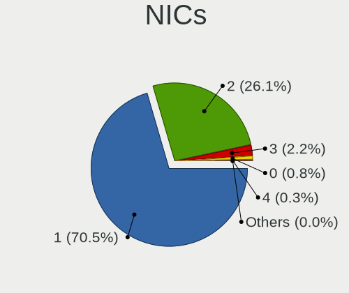

| Total | Desktops | Percent |
|-------|----------|---------|
| 1     | 859      | 71.05%  |
| 2     | 311      | 25.72%  |
| 3     | 26       | 2.15%   |
| 0     | 12       | 0.99%   |
| 4     | 1        | 0.08%   |

IPv6
----

IPv6 vs IPv4

| Used | Desktops | Percent |
|------|----------|---------|
| No   | 847      | 70.06%  |
| Yes  | 362      | 29.94%  |

Bluetooth
---------

Bluetooth Vendor
----------------

Controller vendors

| Vendor                          | Desktops | Percent |
|---------------------------------|----------|---------|
| Intel                           | 125      | 45.62%  |
| Cambridge Silicon Radio         | 76       | 27.74%  |
| Realtek Semiconductor           | 19       | 6.93%   |
| Broadcom                        | 13       | 4.74%   |
| ASUSTek Computer                | 13       | 4.74%   |
| Qualcomm Atheros Communications | 9        | 3.28%   |
| IMC Networks                    | 7        | 2.55%   |
| Lite-On Technology              | 2        | 0.73%   |
| Unknown                         | 2        | 0.73%   |
| TP-Link                         | 1        | 0.36%   |
| Primax Electronics              | 1        | 0.36%   |
| Foxconn / Hon Hai               | 1        | 0.36%   |
| Edimax Technology               | 1        | 0.36%   |
| Dynex                           | 1        | 0.36%   |
| Dell                            | 1        | 0.36%   |
| Belkin Components               | 1        | 0.36%   |
| Apple                           | 1        | 0.36%   |

Bluetooth Model
---------------

Controller models

| Model                                               | Desktops | Percent |
|-----------------------------------------------------|----------|---------|
| Cambridge Silicon Radio Bluetooth Dongle (HCI mode) | 76       | 27.74%  |
| Intel AX200 Bluetooth                               | 39       | 14.23%  |
| Intel Bluetooth wireless interface                  | 27       | 9.85%   |
| Intel Wireless-AC 3168 Bluetooth                    | 20       | 7.3%    |
| Intel Wireless-AC 9260 Bluetooth Adapter            | 13       | 4.74%   |
| Realtek Bluetooth Radio                             | 11       | 4.01%   |
| Intel Bluetooth Device                              | 10       | 3.65%   |
| Intel Bluetooth 9460/9560 Jefferson Peak (JfP)      | 8        | 2.92%   |
| Broadcom BCM20702A0 Bluetooth 4.0                   | 8        | 2.92%   |
| Realtek  Bluetooth 4.2 Adapter                      | 7        | 2.55%   |
| Intel AX210 Bluetooth                               | 7        | 2.55%   |
| IMC Networks Bluetooth Radio                        | 6        | 2.19%   |
| ASUS Broadcom BCM20702A0 Bluetooth                  | 5        | 1.82%   |
| Qualcomm Atheros AR9462 Bluetooth                   | 4        | 1.46%   |
| Qualcomm Atheros  Bluetooth Device                  | 3        | 1.09%   |
| ASUS ASUS USB-BT500                                 | 3        | 1.09%   |
| ASUS Bluetooth Radio                                | 2        | 0.73%   |
| ASUS Bluetooth Adapter                              | 2        | 0.73%   |
| Unknown                                             | 2        | 0.73%   |
| TP-Link UB500 Adapter                               | 1        | 0.36%   |
| Realtek RTL8822BE Bluetooth 4.2 Adapter             | 1        | 0.36%   |
| Qualcomm Atheros QCA61x4 Bluetooth 4.0              | 1        | 0.36%   |
| Qualcomm Atheros Bluetooth USB Host Controller      | 1        | 0.36%   |
| Primax Rocketfish RF-FLBTAD Bluetooth Adapter       | 1        | 0.36%   |
| Lite-On Qualcomm Atheros QCA9377 Bluetooth          | 1        | 0.36%   |
| Lite-On Atheros AR3012 Bluetooth                    | 1        | 0.36%   |
| Intel Centrino Bluetooth Wireless Transceiver       | 1        | 0.36%   |
| IMC Networks Bluetooth Module                       | 1        | 0.36%   |
| Foxconn / Hon Hai Bluetooth Device                  | 1        | 0.36%   |
| Edimax Bluetooth Device                             | 1        | 0.36%   |
| Dynex BCM20702A0                                    | 1        | 0.36%   |
| Dell BT Mini-Receiver                               | 1        | 0.36%   |
| Broadcom USB-500                                    | 1        | 0.36%   |
| Broadcom BCM92046DG-CL1ROM Bluetooth 2.1 Adapter    | 1        | 0.36%   |
| Broadcom BCM43142 Bluetooth 4.0                     | 1        | 0.36%   |
| Broadcom BCM20702A0                                 | 1        | 0.36%   |
| Broadcom BCM2045 Bluetooth                          | 1        | 0.36%   |
| Belkin Components Bluetooth Mini Dongle             | 1        | 0.36%   |
| ASUS BCM20702A0                                     | 1        | 0.36%   |
| Apple Bluetooth USB Host Controller                 | 1        | 0.36%   |

Sound
-----

Sound Vendor
------------

Sound card vendors

| Vendor                                        | Desktops | Percent |
|-----------------------------------------------|----------|---------|
| Intel                                         | 769      | 41.06%  |
| AMD                                           | 508      | 27.12%  |
| Nvidia                                        | 409      | 21.84%  |
| C-Media Electronics                           | 42       | 2.24%   |
| Creative Labs                                 | 34       | 1.82%   |
| Logitech                                      | 16       | 0.85%   |
| Texas Instruments                             | 11       | 0.59%   |
| JMTek                                         | 8        | 0.43%   |
| ASUSTek Computer                              | 8        | 0.43%   |
| GN Netcom                                     | 6        | 0.32%   |
| Creative Technology                           | 6        | 0.32%   |
| Generalplus Technology                        | 4        | 0.21%   |
| VIA Technologies                              | 3        | 0.16%   |
| Blue Microphones                              | 3        | 0.16%   |
| XMOS                                          | 2        | 0.11%   |
| Trust                                         | 2        | 0.11%   |
| Tenx Technology                               | 2        | 0.11%   |
| Sony                                          | 2        | 0.11%   |
| Samson Technologies                           | 2        | 0.11%   |
| ROCCAT                                        | 2        | 0.11%   |
| Razer USA                                     | 2        | 0.11%   |
| Plantronics                                   | 2        | 0.11%   |
| GYROCOM C&C                                   | 2        | 0.11%   |
| ZOOM                                          | 1        | 0.05%   |
| Xilinx                                        | 1        | 0.05%   |
| Valve Software                                | 1        | 0.05%   |
| Unknown                                       | 1        | 0.05%   |
| SteelSeries ApS                               | 1        | 0.05%   |
| Silicon Labs                                  | 1        | 0.05%   |
| Silicon Integrated Systems [SiS]              | 1        | 0.05%   |
| SAVITECH                                      | 1        | 0.05%   |
| Roland                                        | 1        | 0.05%   |
| Realtek Semiconductor                         | 1        | 0.05%   |
| QinHeng Electronics                           | 1        | 0.05%   |
| PreSonus Audio Electronics                    | 1        | 0.05%   |
| ONN                                           | 1        | 0.05%   |
| Medeli Electronics                            | 1        | 0.05%   |
| MCS                                           | 1        | 0.05%   |
| Logic3 / SpectraVideo                         | 1        | 0.05%   |
| Kingston Technology                           | 1        | 0.05%   |
| Hewlett-Packard                               | 1        | 0.05%   |
| Focusrite-Novation                            | 1        | 0.05%   |
| FiiO Electronics Technology                   | 1        | 0.05%   |
| Elitegroup Computer Systems (ECS)             | 1        | 0.05%   |
| DEXP U700 microphone                          | 1        | 0.05%   |
| Corsair                                       | 1        | 0.05%   |
| Beijing Chushifengmang Technology Development | 1        | 0.05%   |
| Audient                                       | 1        | 0.05%   |
| ATI Technologies                              | 1        | 0.05%   |
| Alesis                                        | 1        | 0.05%   |
| Unknown                                       | 1        | 0.05%   |

Sound Model
-----------

Sound card models

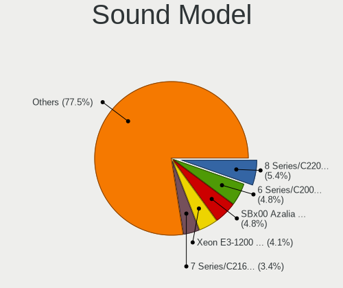

| Model                                                                             | Desktops | Percent |
|-----------------------------------------------------------------------------------|----------|---------|
| Intel 8 Series/C220 Series Chipset High Definition Audio Controller               | 119      | 5.4%    |
| AMD SBx00 Azalia (Intel HDA)                                                      | 107      | 4.86%   |
| Intel 6 Series/C200 Series Chipset Family High Definition Audio Controller        | 93       | 4.22%   |
| Intel Xeon E3-1200 v3/4th Gen Core Processor HD Audio Controller                  | 88       | 3.99%   |
| Intel 7 Series/C216 Chipset Family High Definition Audio Controller               | 77       | 3.5%    |
| AMD Starship/Matisse HD Audio Controller                                          | 71       | 3.22%   |
| AMD Family 17h/19h HD Audio Controller                                            | 69       | 3.13%   |
| Nvidia GK208 HDMI/DP Audio Controller                                             | 66       | 3%      |
| AMD FCH Azalia Controller                                                         | 64       | 2.91%   |
| Intel NM10/ICH7 Family High Definition Audio Controller                           | 63       | 2.86%   |
| Intel 100 Series/C230 Series Chipset Family HD Audio Controller                   | 48       | 2.18%   |
| AMD Family 17h (Models 00h-0fh) HD Audio Controller                               | 47       | 2.13%   |
| Intel 200 Series PCH HD Audio                                                     | 46       | 2.09%   |
| AMD Ellesmere HDMI Audio [Radeon RX 470/480 / 570/580/590]                        | 43       | 1.95%   |
| Intel 82801JI (ICH10 Family) HD Audio Controller                                  | 41       | 1.86%   |
| Intel Cannon Lake PCH cAVS                                                        | 40       | 1.82%   |
| Intel Audio device                                                                | 40       | 1.82%   |
| Intel 5 Series/3400 Series Chipset High Definition Audio                          | 40       | 1.82%   |
| AMD Raven/Raven2/Fenghuang HDMI/DP Audio Controller                               | 39       | 1.77%   |
| AMD Oland/Hainan/Cape Verde/Pitcairn HDMI Audio [Radeon HD 7000 Series]           | 38       | 1.72%   |
| Nvidia GP107GL High Definition Audio Controller                                   | 36       | 1.63%   |
| Nvidia High Definition Audio Controller                                           | 31       | 1.41%   |
| Nvidia GF108 High Definition Audio Controller                                     | 31       | 1.41%   |
| AMD Renoir Radeon High Definition Audio Controller                                | 27       | 1.23%   |
| AMD Baffin HDMI/DP Audio [Radeon RX 550 640SP / RX 560/560X]                      | 27       | 1.23%   |
| Intel 82801I (ICH9 Family) HD Audio Controller                                    | 25       | 1.13%   |
| Intel 82801JD/DO (ICH10 Family) HD Audio Controller                               | 23       | 1.04%   |
| Nvidia MCP61 High Definition Audio                                                | 21       | 0.95%   |
| Nvidia GP106 High Definition Audio Controller                                     | 21       | 0.95%   |
| Nvidia GM107 High Definition Audio Controller [GeForce 940MX]                     | 21       | 0.95%   |
| Nvidia GF119 HDMI Audio Controller                                                | 21       | 0.95%   |
| Nvidia GP108 High Definition Audio Controller                                     | 20       | 0.91%   |
| AMD Kabini HDMI/DP Audio                                                          | 18       | 0.82%   |
| AMD Turks HDMI Audio [Radeon HD 6500/6600 / 6700M Series]                         | 17       | 0.77%   |
| Nvidia TU116 High Definition Audio Controller                                     | 16       | 0.73%   |
| AMD Navi 10 HDMI Audio                                                            | 16       | 0.73%   |
| Nvidia TU106 High Definition Audio Controller                                     | 15       | 0.68%   |
| AMD Cedar HDMI Audio [Radeon HD 5400/6300/7300 Series]                            | 15       | 0.68%   |
| AMD RV710/730 HDMI Audio [Radeon HD 4000 series]                                  | 13       | 0.59%   |
| Nvidia GP104 High Definition Audio Controller                                     | 12       | 0.54%   |
| Nvidia GM206 High Definition Audio Controller                                     | 12       | 0.54%   |
| AMD Trinity HDMI Audio Controller                                                 | 12       | 0.54%   |
| AMD Caicos HDMI Audio [Radeon HD 6450 / 7450/8450/8490 OEM / R5 230/235/235X OEM] | 12       | 0.54%   |
| Nvidia TU107 GeForce GTX 1650 High Definition Audio Controller                    | 11       | 0.5%    |
| Nvidia GK106 HDMI Audio Controller                                                | 11       | 0.5%    |
| Intel Tiger Lake-H HD Audio Controller                                            | 11       | 0.5%    |
| Intel 9 Series Chipset Family HD Audio Controller                                 | 11       | 0.5%    |
| AMD Kaveri HDMI/DP Audio Controller                                               | 11       | 0.5%    |
| Intel Comet Lake PCH-V cAVS                                                       | 10       | 0.45%   |
| Intel Comet Lake PCH cAVS                                                         | 10       | 0.45%   |
| Intel Alder Lake-S HD Audio Controller                                            | 10       | 0.45%   |
| Intel 82801H (ICH8 Family) HD Audio Controller                                    | 10       | 0.45%   |
| AMD RS880 HDMI Audio [Radeon HD 4200 Series]                                      | 10       | 0.45%   |
| AMD Navi 21/23 HDMI/DP Audio Controller                                           | 10       | 0.45%   |
| AMD Juniper HDMI Audio [Radeon HD 5700 Series]                                    | 10       | 0.45%   |
| Intel Celeron/Pentium Silver Processor High Definition Audio                      | 9        | 0.41%   |
| Intel C600/X79 series chipset High Definition Audio Controller                    | 9        | 0.41%   |
| C-Media Electronics USB Audio Device                                              | 9        | 0.41%   |
| AMD Family 15h (Models 60h-6fh) Audio Controller                                  | 9        | 0.41%   |
| Nvidia GK107 HDMI Audio Controller                                                | 8        | 0.36%   |

Memory
------

Memory Vendor
-------------

Memory module vendors

| Vendor                       | Desktops | Percent |
|------------------------------|----------|---------|
| Kingston                     | 270      | 18.75%  |
| Unknown                      | 251      | 17.43%  |
| Samsung Electronics          | 145      | 10.07%  |
| Corsair                      | 112      | 7.78%   |
| SK hynix                     | 102      | 7.08%   |
| Crucial                      | 101      | 7.01%   |
| G.Skill                      | 94       | 6.53%   |
| Micron Technology            | 80       | 5.56%   |
| A-DATA Technology            | 34       | 2.36%   |
| Unknown                      | 29       | 2.01%   |
| Patriot                      | 26       | 1.81%   |
| Ramaxel Technology           | 18       | 1.25%   |
| Nanya Technology             | 17       | 1.18%   |
| Team                         | 16       | 1.11%   |
| Goodram                      | 13       | 0.9%    |
| Elpida                       | 11       | 0.76%   |
| Smart                        | 10       | 0.69%   |
| Transcend                    | 8        | 0.56%   |
| AMD                          | 7        | 0.49%   |
| Unifosa                      | 5        | 0.35%   |
| Silicon Power                | 5        | 0.35%   |
| GeIL                         | 5        | 0.35%   |
| Qimonda                      | 4        | 0.28%   |
| OM Nanotech                  | 4        | 0.28%   |
| Unknown (ABCD)               | 3        | 0.21%   |
| Teikon                       | 3        | 0.21%   |
| Kingmax                      | 3        | 0.21%   |
| Wilk Elektronik              | 2        | 0.14%   |
| Unknown (2C0B)               | 2        | 0.14%   |
| Super Talent                 | 2        | 0.14%   |
| Ramos Technology             | 2        | 0.14%   |
| OCZ                          | 2        | 0.14%   |
| Novatech                     | 2        | 0.14%   |
| JOY-IT                       | 2        | 0.14%   |
| Goldkey                      | 2        | 0.14%   |
| CSX                          | 2        | 0.14%   |
| Avant                        | 2        | 0.14%   |
| Atermiter                    | 2        | 0.14%   |
| Apacer                       | 2        | 0.14%   |
| V-Color                      | 1        | 0.07%   |
| Unknown (AB)                 | 1        | 0.07%   |
| Unknown (0x7F7FB5FFFFFFFFFF) | 1        | 0.07%   |
| Unknown (09D5)               | 1        | 0.07%   |
| Unknown (094A)               | 1        | 0.07%   |
| Unknown (00009B050000)       | 1        | 0.07%   |
| Toshiba                      | 1        | 0.07%   |
| Thermaltake                  | 1        | 0.07%   |
| Texas_Instrument             | 1        | 0.07%   |
| TakeMS                       | 1        | 0.07%   |
| SUPER KINGSTEK               | 1        | 0.07%   |
| Smart Modular                | 1        | 0.07%   |
| RZX                          | 1        | 0.07%   |
| PNY                          | 1        | 0.07%   |
| Pioneer                      | 1        | 0.07%   |
| PDPSystems                   | 1        | 0.07%   |
| Patriot Memory (PDP Systems) | 1        | 0.07%   |
| Patriot Memory               | 1        | 0.07%   |
| Panram                       | 1        | 0.07%   |
| Mushkin                      | 1        | 0.07%   |
| Multilaser                   | 1        | 0.07%   |

Memory Model
------------

Memory module models

| Model                                                   | Desktops | Percent |
|---------------------------------------------------------|----------|---------|
| Unknown                                                 | 29       | 1.82%   |
| Unknown RAM Module 2GB DIMM DDR2 800MT/s                | 19       | 1.19%   |
| Unknown RAM Module 4GB DIMM 1333MT/s                    | 18       | 1.13%   |
| Unknown RAM Module 2GB DIMM SDRAM                       | 17       | 1.07%   |
| Micron RAM Module 8GB DIMM DDR4 2666MT/s                | 17       | 1.07%   |
| Kingston RAM 9905403-559.A00LF 8GB DIMM DDR3 1600MT/s   | 15       | 0.94%   |
| Samsung RAM M378B5173QH0-CK0 4096MB DIMM DDR3 1866MT/s  | 14       | 0.88%   |
| Unknown RAM Module 2GB DIMM DDR2 667MT/s                | 13       | 0.82%   |
| Unknown RAM Module 2GB DIMM 800MT/s                     | 13       | 0.82%   |
| Unknown RAM Module 2GB DIMM 1333MT/s                    | 13       | 0.82%   |
| Kingston RAM KHX1600C10D3/8G 8GB DIMM DDR3 1600MT/s     | 13       | 0.82%   |
| Unknown RAM Module 2GB DIMM DDR3 1333MT/s               | 12       | 0.75%   |
| Unknown RAM Module 4GB DIMM DDR3 1333MT/s               | 11       | 0.69%   |
| Corsair RAM CMK16GX4M2B3200C16 8GB DIMM DDR4 3600MT/s   | 11       | 0.69%   |
| Samsung RAM M378B5673FH0-CH9 2GB DIMM DDR3 1600MT/s     | 10       | 0.63%   |
| Samsung RAM M378B5173DB0-CK0 4GB DIMM DDR3 1600MT/s     | 10       | 0.63%   |
| Kingston RAM KHX2400C15/8G 8GB DIMM DDR4 2933MT/s       | 10       | 0.63%   |
| Kingston RAM 99U5471-054.A00LF 8GB DIMM DDR3 1600MT/s   | 10       | 0.63%   |
| G.Skill RAM F4-3200C16-8GVKB 8GB DIMM DDR4 3200MT/s     | 10       | 0.63%   |
| Unknown RAM Module 4GB DIMM DDR3 1600MT/s               | 9        | 0.56%   |
| SK hynix RAM HMT451U6AFR8C-PB 4GB DIMM DDR3 1600MT/s    | 9        | 0.56%   |
| Samsung RAM M378B5273DH0-CH9 4GB DIMM DDR3 2133MT/s     | 9        | 0.56%   |
| Unknown RAM Module 4GB DIMM 400MT/s                     | 8        | 0.5%    |
| Unknown RAM Module 1GB DIMM DDR2 800MT/s                | 8        | 0.5%    |
| Kingston RAM KHX1600C9D3/4GX 4GB DIMM DDR3 2400MT/s     | 8        | 0.5%    |
| Unknown RAM Module 4GB DIMM SDRAM                       | 7        | 0.44%   |
| Unknown RAM Module 1GB DIMM SDRAM                       | 7        | 0.44%   |
| Unknown RAM Module 1GB DIMM DDR2 667MT/s                | 7        | 0.44%   |
| Kingston RAM KHX2666C16/8G 8GB DIMM DDR4 3466MT/s       | 7        | 0.44%   |
| G.Skill RAM F4-3200C16-8GIS 8192MB DIMM DDR4 3200MT/s   | 7        | 0.44%   |
| SK hynix RAM HMT351U6CFR8C-PB 4GB DIMM DDR3 1800MT/s    | 6        | 0.38%   |
| Kingston RAM KHX3200C16D4/8GX 8192MB DIMM DDR4 3533MT/s | 6        | 0.38%   |
| Kingston RAM 99U5474-028.A00LF 4GB DIMM DDR3 1600MT/s   | 6        | 0.38%   |
| Corsair RAM CMK16GX4M2A2666C16 8GB DIMM DDR4 3200MT/s   | 6        | 0.38%   |
| A-DATA RAM Module 4GB DIMM DDR3 1333MT/s                | 6        | 0.38%   |
| Unknown RAM Module 8GB DIMM DDR3 1333MT/s               | 5        | 0.31%   |
| Unknown RAM Module 8GB DIMM 1600MT/s                    | 5        | 0.31%   |
| Unknown RAM Module 4GB DIMM 1600MT/s                    | 5        | 0.31%   |
| Unknown RAM Module 2GB DIMM DDR2 533MT/s                | 5        | 0.31%   |
| Unknown RAM Module 2GB DIMM DDR2 1067MT/s               | 5        | 0.31%   |
| Unknown RAM Module 2GB DIMM DDR2                        | 5        | 0.31%   |
| Unknown RAM Module 2GB DIMM 400MT/s                     | 5        | 0.31%   |
| Unknown RAM Module 1GB DIMM 800MT/s                     | 5        | 0.31%   |
| SK hynix RAM HMT451U6BFR8C-PB 4GB DIMM DDR3 1600MT/s    | 5        | 0.31%   |
| Samsung RAM M378B5773DH0-CH9 2048MB DIMM DDR3 1333MT/s  | 5        | 0.31%   |
| Micron RAM 8JTF51264AZ-1G6E1 4GB DIMM DDR3 1600MT/s     | 5        | 0.31%   |
| Kingston RAM KHX3200C16D4/16GX 16GB DIMM DDR4 3600MT/s  | 5        | 0.31%   |
| Kingston RAM KHX1600C10D3/4G 4GB DIMM DDR3 1866MT/s     | 5        | 0.31%   |
| Kingston RAM KF3200C16D4/8GX 8GB DIMM DDR4 3600MT/s     | 5        | 0.31%   |
| Kingston RAM 99U5584-005.A00LF 4GB DIMM DDR3 1600MT/s   | 5        | 0.31%   |
| Kingston RAM 99U5471-012.A00LF 4GB DIMM DDR3 1600MT/s   | 5        | 0.31%   |
| G.Skill RAM F4-3200C16-16GIS 16GB DIMM DDR4 3600MT/s    | 5        | 0.31%   |
| Unknown RAM Module 4GB DIMM 1066MT/s                    | 4        | 0.25%   |
| Unknown RAM Module 2GB DIMM DDR2 333MT/s                | 4        | 0.25%   |
| Unknown RAM Module 2GB DIMM 667MT/s                     | 4        | 0.25%   |
| Unknown RAM Module 1GB DIMM 667MT/s                     | 4        | 0.25%   |
| SK hynix RAM HMT125U6TFR8C-H9 2GB DIMM DDR3 1333MT/s    | 4        | 0.25%   |
| SK hynix RAM HMA41GU6AFR8N-TF 8192MB DIMM DDR4 2465MT/s | 4        | 0.25%   |
| Samsung RAM M378B5673EH1-CH9 2GB DIMM DDR3 1333MT/s     | 4        | 0.25%   |
| Samsung RAM M378B5273CH0-CH9 4GB DIMM DDR3 1867MT/s     | 4        | 0.25%   |

Memory Kind
-----------

Memory module kinds

| Kind    | Desktops | Percent |
|---------|----------|---------|
| DDR3    | 507      | 41.32%  |
| DDR4    | 436      | 35.53%  |
| DDR2    | 97       | 7.91%   |
| Unknown | 97       | 7.91%   |
| SDRAM   | 72       | 5.87%   |
| DDR     | 13       | 1.06%   |
| LPDDR4  | 4        | 0.33%   |
| DRAM    | 1        | 0.08%   |

Memory Form Factor
------------------

Physical design of the memory module

| Name    | Desktops | Percent |
|---------|----------|---------|
| DIMM    | 1131     | 94.25%  |
| SODIMM  | 66       | 5.5%    |
| RIMM    | 2        | 0.17%   |
| FB-DIMM | 1        | 0.08%   |

Memory Size
-----------

Memory module size

| Size  | Desktops | Percent |
|-------|----------|---------|
| 8192  | 472      | 34.43%  |
| 4096  | 398      | 29.03%  |
| 2048  | 270      | 19.69%  |
| 16384 | 120      | 8.75%   |
| 1024  | 83       | 6.05%   |
| 32768 | 19       | 1.39%   |
| 512   | 9        | 0.66%   |

Memory Speed
------------

Memory module speed

| Speed   | Desktops | Percent |
|---------|----------|---------|
| 1600    | 307      | 22.36%  |
| 1333    | 207      | 15.08%  |
| 3200    | 92       | 6.7%    |
| 800     | 77       | 5.61%   |
| 2400    | 75       | 5.46%   |
| 3600    | 69       | 5.03%   |
| 2667    | 64       | 4.66%   |
| 2133    | 56       | 4.08%   |
| 667     | 46       | 3.35%   |
| Unknown | 43       | 3.13%   |
| 2666    | 42       | 3.06%   |
| 1867    | 32       | 2.33%   |
| 1866    | 29       | 2.11%   |
| 3466    | 19       | 1.38%   |
| 3000    | 18       | 1.31%   |
| 2933    | 18       | 1.31%   |
| 1066    | 15       | 1.09%   |
| 533     | 15       | 1.09%   |
| 1800    | 14       | 1.02%   |
| 400     | 13       | 0.95%   |
| 1067    | 11       | 0.8%    |
| 2800    | 7        | 0.51%   |
| 3733    | 6        | 0.44%   |
| 3533    | 6        | 0.44%   |
| 3400    | 5        | 0.36%   |
| 2048    | 5        | 0.36%   |
| 1400    | 5        | 0.36%   |
| 1334    | 5        | 0.36%   |
| 333     | 5        | 0.36%   |
| 4800    | 4        | 0.29%   |
| 3066    | 4        | 0.29%   |
| 3007    | 4        | 0.29%   |
| 2465    | 4        | 0.29%   |
| 2000    | 4        | 0.29%   |
| 1639    | 4        | 0.29%   |
| 49926   | 3        | 0.22%   |
| 3334    | 3        | 0.22%   |
| 3266    | 3        | 0.22%   |
| 2733    | 3        | 0.22%   |
| 4199    | 2        | 0.15%   |
| 3800    | 2        | 0.15%   |
| 3666    | 2        | 0.15%   |
| 3500    | 2        | 0.15%   |
| 3151    | 2        | 0.15%   |
| 3067    | 2        | 0.15%   |
| 2747    | 2        | 0.15%   |
| 2200    | 2        | 0.15%   |
| 2134    | 2        | 0.15%   |
| 41632   | 1        | 0.07%   |
| 8400    | 1        | 0.07%   |
| 4266    | 1        | 0.07%   |
| 4000    | 1        | 0.07%   |
| 3467    | 1        | 0.07%   |
| 3100    | 1        | 0.07%   |
| 2176    | 1        | 0.07%   |
| 2132    | 1        | 0.07%   |
| 1950    | 1        | 0.07%   |
| 1648    | 1        | 0.07%   |
| 1200    | 1        | 0.07%   |
| 880     | 1        | 0.07%   |

Printers & scanners
-------------------

Printer Vendor
--------------

Printer device vendors

| Vendor                | Desktops | Percent |
|-----------------------|----------|---------|
| Hewlett-Packard       | 29       | 38.67%  |
| Brother Industries    | 17       | 22.67%  |
| Canon                 | 8        | 10.67%  |
| Samsung Electronics   | 7        | 9.33%   |
| Seiko Epson           | 6        | 8%      |
| Lexmark International | 3        | 4%      |
| Xerox                 | 2        | 2.67%   |
| Ricoh                 | 1        | 1.33%   |
| QinHeng Electronics   | 1        | 1.33%   |
| Kyocera               | 1        | 1.33%   |

Printer Model
-------------

Printer device models

| Model                                        | Desktops | Percent |
|----------------------------------------------|----------|---------|
| Seiko Epson ET-4760 Series                   | 2        | 2.67%   |
| Samsung SCX-3400 Series                      | 2        | 2.67%   |
| Samsung M2070 Series                         | 2        | 2.67%   |
| HP LaserJet 1010                             | 2        | 2.67%   |
| HP Ink Tank Wireless 410 series              | 2        | 2.67%   |
| HP ENVY 4520 series                          | 2        | 2.67%   |
| HP ENVY 4500 series                          | 2        | 2.67%   |
| Brother MFC-J470DW                           | 2        | 2.67%   |
| Xerox Phaser 6510                            | 1        | 1.33%   |
| Xerox Phaser 6010N                           | 1        | 1.33%   |
| Seiko Epson XP-2100 Series                   | 1        | 1.33%   |
| Seiko Epson ME 320/330 Series [Stylus SX125] | 1        | 1.33%   |
| Seiko Epson L365 Series                      | 1        | 1.33%   |
| Seiko Epson ET-3750 Series                   | 1        | 1.33%   |
| Samsung ML-2850 Series                       | 1        | 1.33%   |
| Samsung M267x 287x Series                    | 1        | 1.33%   |
| Samsung M2020 Series                         | 1        | 1.33%   |
| Ricoh SP 211                                 | 1        | 1.33%   |
| QinHeng CH340S                               | 1        | 1.33%   |
| Lexmark International X364dn                 | 1        | 1.33%   |
| Lexmark International CX410de                | 1        | 1.33%   |
| Lexmark International B2236dw                | 1        | 1.33%   |
| Kyocera ECOSYS P2040dw                       | 1        | 1.33%   |
| HP PSC 1400                                  | 1        | 1.33%   |
| HP Officejet Pro 8100                        | 1        | 1.33%   |
| HP OfficeJet 8010 series                     | 1        | 1.33%   |
| HP LaserJet P2055 series                     | 1        | 1.33%   |
| HP LaserJet P1005                            | 1        | 1.33%   |
| HP LaserJet M14-M17                          | 1        | 1.33%   |
| HP LaserJet 1200                             | 1        | 1.33%   |
| HP LaserJet 1022                             | 1        | 1.33%   |
| HP LaserJet 1020                             | 1        | 1.33%   |
| HP LaserJet 1018                             | 1        | 1.33%   |
| HP LaserJet 1000                             | 1        | 1.33%   |
| HP ENVY Pro 6400 series                      | 1        | 1.33%   |
| HP ENVY Photo 7800 series                    | 1        | 1.33%   |
| HP ENVY Inspire 7900 series                  | 1        | 1.33%   |
| HP ENVY 6400 series                          | 1        | 1.33%   |
| HP Deskjet D1500 series                      | 1        | 1.33%   |
| HP DeskJet 5550                              | 1        | 1.33%   |
| HP DeskJet 4670 series                       | 1        | 1.33%   |
| HP DeskJet 3830 series                       | 1        | 1.33%   |
| HP DeskJet 2130 series                       | 1        | 1.33%   |
| HP Deskjet 1050 J410                         | 1        | 1.33%   |
| Canon PIXMA MX920 Series                     | 1        | 1.33%   |
| Canon PIXMA MX720 Series                     | 1        | 1.33%   |
| Canon PIXMA MP190                            | 1        | 1.33%   |
| Canon PIXMA MG3200 Series                    | 1        | 1.33%   |
| Canon MF632C/634C                            | 1        | 1.33%   |
| Canon L100/L150/L170                         | 1        | 1.33%   |
| Canon iP7200 series                          | 1        | 1.33%   |
| Canon iP2700 series                          | 1        | 1.33%   |
| Brother MFC-L2710DW series                   | 1        | 1.33%   |
| Brother MFC-L2710DN series                   | 1        | 1.33%   |
| Brother MFC-J6530DW                          | 1        | 1.33%   |
| Brother MFC-8510DN                           | 1        | 1.33%   |
| Brother HL-L3290CDW series                   | 1        | 1.33%   |
| Brother HL-L2390DW                           | 1        | 1.33%   |
| Brother HL-L2370DW series                    | 1        | 1.33%   |
| Brother HL-5370DW series                     | 1        | 1.33%   |

Scanner Vendor
--------------

Scanner device vendors

| Vendor          | Desktops | Percent |
|-----------------|----------|---------|
| Canon           | 6        | 60%     |
| Mustek Systems  | 2        | 20%     |
| Seiko Epson     | 1        | 10%     |
| Hewlett-Packard | 1        | 10%     |

Scanner Model
-------------

Scanner device models

| Model                                         | Desktops | Percent |
|-----------------------------------------------|----------|---------|
| Canon CanoScan LiDE 100                       | 2        | 20%     |
| Seiko Epson GT-9300UF [Perfection 2400 PHOTO] | 1        | 10%     |
| Mustek Systems SNAPSCAN e22                   | 1        | 10%     |
| Mustek Systems ScanExpress 1200 CU            | 1        | 10%     |
| HP ScanJet 2400c                              | 1        | 10%     |
| Canon CanoScan N670U/N676U/LiDE 20            | 1        | 10%     |
| Canon CanoScan N1240U/LiDE 30                 | 1        | 10%     |
| Canon CanoScan LiDE 120                       | 1        | 10%     |
| Canon CanoScan 5200F                          | 1        | 10%     |

Camera
------

Camera Vendor
-------------

Camera device vendors

| Vendor                        | Desktops | Percent |
|-------------------------------|----------|---------|
| Logitech                      | 65       | 42.76%  |
| Microsoft                     | 8        | 5.26%   |
| Microdia                      | 8        | 5.26%   |
| Generalplus Technology        | 6        | 3.95%   |
| Z-Star Microelectronics       | 5        | 3.29%   |
| Realtek Semiconductor         | 5        | 3.29%   |
| KYE Systems (Mouse Systems)   | 4        | 2.63%   |
| Hewlett-Packard               | 4        | 2.63%   |
| Unknown                       | 3        | 1.97%   |
| Trust                         | 3        | 1.97%   |
| Sunplus Innovation Technology | 3        | 1.97%   |
| Samsung Electronics           | 3        | 1.97%   |
| Pixart Imaging                | 2        | 1.32%   |
| MacroSilicon                  | 2        | 1.32%   |
| Genesys Logic                 | 2        | 1.32%   |
| GEMBIRD                       | 2        | 1.32%   |
| Cubeternet                    | 2        | 1.32%   |
| Creative Technology           | 2        | 1.32%   |
| Chicony Electronics           | 2        | 1.32%   |
| Aveo Technology               | 2        | 1.32%   |
| WCM_USB                       | 1        | 0.66%   |
| Valve Software                | 1        | 0.66%   |
| SunplusIT                     | 1        | 0.66%   |
| Sonix Technology              | 1        | 0.66%   |
| Silicon Motion                | 1        | 0.66%   |
| SHENZHEN AONI ELECTRONIC      | 1        | 0.66%   |
| Razer USA                     | 1        | 0.66%   |
| Jieli Technology              | 1        | 0.66%   |
| IMC Networks                  | 1        | 0.66%   |
| Huawei Technologies           | 1        | 0.66%   |
| eMeet-200611                  | 1        | 0.66%   |
| EC2U200                       | 1        | 0.66%   |
| CZUR Technology               | 1        | 0.66%   |
| AVerMedia Technologies        | 1        | 0.66%   |
| ARC International             | 1        | 0.66%   |
| Apple                         | 1        | 0.66%   |
| Anker                         | 1        | 0.66%   |
| Acer                          | 1        | 0.66%   |
| 2M UVC CAMERA                 | 1        | 0.66%   |

Camera Model
------------

Camera device models

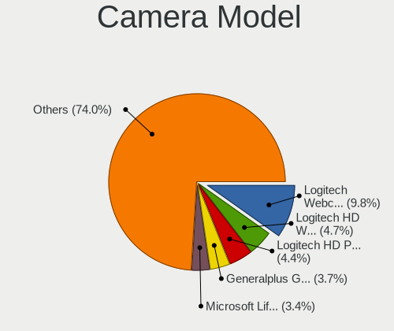

| Model                                             | Desktops | Percent |
|---------------------------------------------------|----------|---------|
| Logitech Webcam C270                              | 16       | 10.39%  |
| Microsoft LifeCam HD-3000                         | 6        | 3.9%    |
| Logitech HD Webcam C615                           | 6        | 3.9%    |
| Logitech HD Webcam C525                           | 6        | 3.9%    |
| Logitech HD Pro Webcam C920                       | 6        | 3.9%    |
| Generalplus GENERAL WEBCAM                        | 6        | 3.9%    |
| Logitech Webcam C170                              | 5        | 3.25%   |
| Unknown HD camera                                 | 3        | 1.95%   |
| Samsung Galaxy series, misc. (MTP mode)           | 3        | 1.95%   |
| Logitech Webcam C310                              | 3        | 1.95%   |
| Logitech C922 Pro Stream Webcam                   | 3        | 1.95%   |
| Z-Star A4 TECH USB2.0 PC Camera J                 | 2        | 1.3%    |
| Sunplus Full HD webcam                            | 2        | 1.3%    |
| Realtek Thronmax Webcam Mic                       | 2        | 1.3%    |
| Realtek Thronmax StreamGo Webcam                  | 2        | 1.3%    |
| Microdia USB 2.0 Camera                           | 2        | 1.3%    |
| Microdia Camera                                   | 2        | 1.3%    |
| MacroSilicon MiraBox Capture                      | 2        | 1.3%    |
| Logitech Webcam Pro 9000                          | 2        | 1.3%    |
| Logitech Webcam C925e                             | 2        | 1.3%    |
| Logitech Webcam C250                              | 2        | 1.3%    |
| Logitech QuickCam Pro 9000                        | 2        | 1.3%    |
| Logitech HD Webcam C910                           | 2        | 1.3%    |
| HP Webcam HD 2300                                 | 2        | 1.3%    |
| Genesys Logic Camera                              | 2        | 1.3%    |
| Cubeternet USB2.0 Camera                          | 2        | 1.3%    |
| Aveo USB2.0 Camera                                | 2        | 1.3%    |
| Z-Star Venus USB2.0 Camera                        | 1        | 0.65%   |
| Z-Star A4 tech USB2.0 Camera                      | 1        | 0.65%   |
| Z-Star A4 TECH HD PC Camera                       | 1        | 0.65%   |
| WCM_USB WEB CAM                                   | 1        | 0.65%   |
| Valve Software 3D Camera                          | 1        | 0.65%   |
| Trust Widescreen 3MP Webcam                       | 1        | 0.65%   |
| Trust WB-6250X Webcam                             | 1        | 0.65%   |
| Trust 2MP Auto Focus we                           | 1        | 0.65%   |
| SunplusIT USB 2.0 Camera                          | 1        | 0.65%   |
| Sunplus FHD Camera Microphone                     | 1        | 0.65%   |
| Sonix USB Camera                                  | 1        | 0.65%   |
| Silicon Motion 300k Pixel Camera                  | 1        | 0.65%   |
| SHENZHEN AONI ELECTRONIC NexiGo N930AF FHD Webcam | 1        | 0.65%   |
| Realtek WEB CAMERA M9 Pro                         | 1        | 0.65%   |
| Realtek Full HD Webcam                            | 1        | 0.65%   |
| Realtek A2L USB Camera                            | 1        | 0.65%   |
| Razer USA Gaming Webcam [Kiyo]                    | 1        | 0.65%   |
| Pixart Imaging Webcam Genius iLook 300            | 1        | 0.65%   |
| Pixart Imaging GE 1.3 MP MiniCam Pro              | 1        | 0.65%   |
| Microsoft LifeCam Studio                          | 1        | 0.65%   |
| Microsoft LifeCam Cinema                          | 1        | 0.65%   |
| Microdia Webcam Vitade AF                         | 1        | 0.65%   |
| Microdia Integrated Camera                        | 1        | 0.65%   |
| Microdia Document Scanner                         | 1        | 0.65%   |
| Microdia CyberTrack H6                            | 1        | 0.65%   |
| Logitech Webcam C930e                             | 1        | 0.65%   |
| Logitech Webcam C210                              | 1        | 0.65%   |
| Logitech Webcam C110                              | 1        | 0.65%   |
| Logitech Webcam B500                              | 1        | 0.65%   |
| Logitech QuickCam Pro 4000                        | 1        | 0.65%   |
| Logitech HD Webcam C510                           | 1        | 0.65%   |
| Logitech HD Webcam B910                           | 1        | 0.65%   |
| Logitech CrystalCam                               | 1        | 0.65%   |

Security
--------

Fingerprint Vendor
------------------

Fingerprint sensor vendors

| Vendor                | Desktops | Percent |
|-----------------------|----------|---------|
| Upek                  | 1        | 50%     |
| LighTuning Technology | 1        | 50%     |

Fingerprint Model
-----------------

Fingerprint sensor models

| Model                                                  | Desktops | Percent |
|--------------------------------------------------------|----------|---------|
| Upek Biometric Touchchip/Touchstrip Fingerprint Sensor | 1        | 50%     |
| LighTuning EgisTec Touch Fingerprint Sensor            | 1        | 50%     |

Chipcard Vendor
---------------

Chipcard module vendors

| Vendor                | Desktops | Percent |
|-----------------------|----------|---------|
| Realtek Semiconductor | 2        | 28.57%  |
| Gemalto (was Gemplus) | 2        | 28.57%  |
| SCM Microsystems      | 1        | 14.29%  |
| Cherry                | 1        | 14.29%  |
| BIT4ID                | 1        | 14.29%  |

Chipcard Model
--------------

Chipcard module models

| Model                                             | Desktops | Percent |
|---------------------------------------------------|----------|---------|
| Realtek Semiconductor Smart Card Reader Interface | 2        | 28.57%  |
| Gemalto (was Gemplus) GemPC Twin SmartCard Reader | 2        | 28.57%  |
| SCM Microsystems CLOUD 2700 F Smart Card Reader   | 1        | 14.29%  |
| Cherry Smart Terminal XX44                        | 1        | 14.29%  |
| BIT4ID miniLector EVO                             | 1        | 14.29%  |

Unsupported
-----------

Unsupported Devices
-------------------

Total unsupported devices on board

| Total | Desktops | Percent |
|-------|----------|---------|
| 0     | 1105     | 91.4%   |
| 1     | 97       | 8.02%   |
| 2     | 7        | 0.58%   |

Unsupported Device Types
------------------------

Types of unsupported devices

| Type                     | Desktops | Percent |
|--------------------------|----------|---------|
| Graphics card            | 46       | 42.59%  |
| Net/wireless             | 21       | 19.44%  |
| Unassigned class         | 8        | 7.41%   |
| Communication controller | 7        | 6.48%   |
| Chipcard                 | 6        | 5.56%   |
| Multimedia controller    | 5        | 4.63%   |
| Bluetooth                | 5        | 4.63%   |
| Wireless                 | 3        | 2.78%   |
| Network                  | 2        | 1.85%   |
| Fingerprint reader       | 2        | 1.85%   |
| Storage/raid             | 1        | 0.93%   |
| Card reader              | 1        | 0.93%   |
| Camera                   | 1        | 0.93%   |

