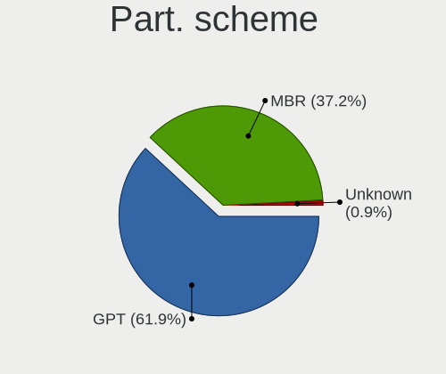
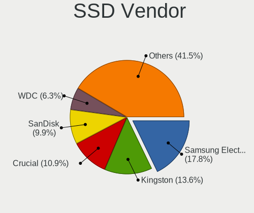
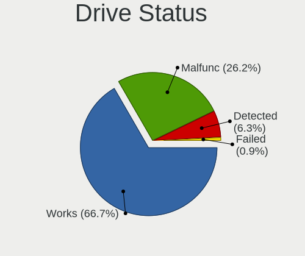
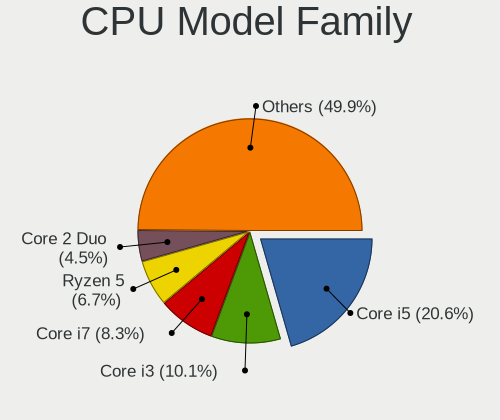
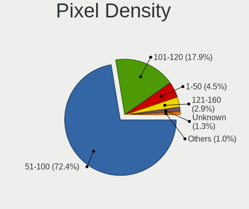
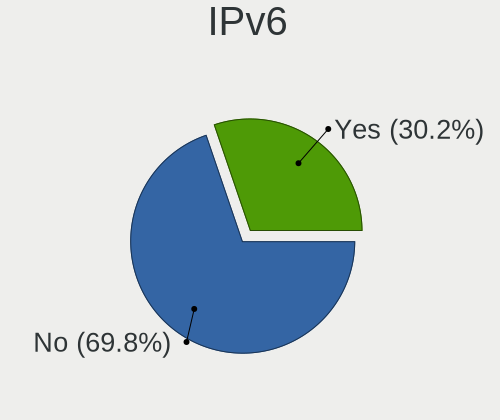
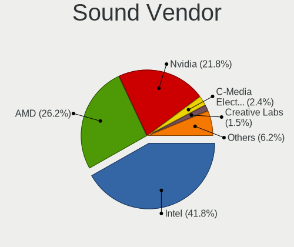
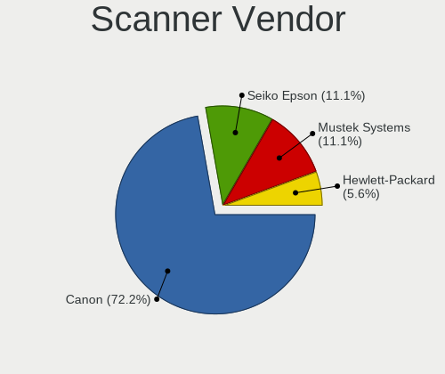
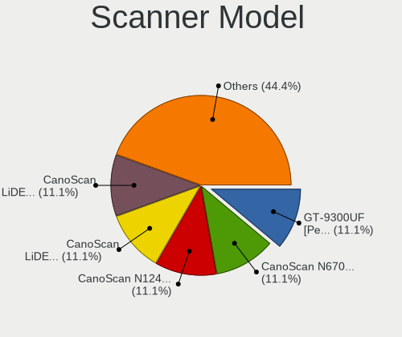

OpenMandriva 4.3 - Tested Hardware & Statistics (Desktops)
----------------------------------------------------------

A project to collect tested hardware configurations for OpenMandriva 4.3.

Anyone can contribute to this report by the [hw-probe](https://github.com/linuxhw/hw-probe) tool:

    sudo -E hw-probe -all -upload

Please contribute! Especially if your hardware is rare.

Contents
--------

* [ Test Cases ](#test-cases)

* [ System ](#system)
  - [ Kernel                   ](#kernel)
  - [ Kernel Family            ](#kernel-family)
  - [ Kernel Major Ver.        ](#kernel-major-ver)
  - [ Arch                     ](#arch)
  - [ DE                       ](#de)
  - [ Display Server           ](#display-server)
  - [ Display Manager          ](#display-manager)
  - [ OS Lang                  ](#os-lang)
  - [ Boot Mode                ](#boot-mode)
  - [ Filesystem               ](#filesystem)
  - [ Part. scheme             ](#part-scheme)
  - [ Dual Boot with Linux/BSD ](#dual-boot-with-linuxbsd)
  - [ Dual Boot (Win)          ](#dual-boot-win)

* [ Board ](#board)
  - [ Vendor                   ](#vendor)
  - [ Model                    ](#model)
  - [ Model Family             ](#model-family)
  - [ MFG Year                 ](#mfg-year)
  - [ Form Factor              ](#form-factor)
  - [ Secure Boot              ](#secure-boot)
  - [ Coreboot                 ](#coreboot)
  - [ RAM Size                 ](#ram-size)
  - [ RAM Used                 ](#ram-used)
  - [ Total Drives             ](#total-drives)
  - [ Has CD-ROM               ](#has-cd-rom)
  - [ Has Ethernet             ](#has-ethernet)
  - [ Has WiFi                 ](#has-wifi)
  - [ Has Bluetooth            ](#has-bluetooth)

* [ Location ](#location)
  - [ Country                  ](#country)
  - [ City                     ](#city)

* [ Drives ](#drives)
  - [ Drive Vendor             ](#drive-vendor)
  - [ Drive Model              ](#drive-model)
  - [ HDD Vendor               ](#hdd-vendor)
  - [ SSD Vendor               ](#ssd-vendor)
  - [ Drive Kind               ](#drive-kind)
  - [ Drive Connector          ](#drive-connector)
  - [ Drive Size               ](#drive-size)
  - [ Space Total              ](#space-total)
  - [ Space Used               ](#space-used)
  - [ Malfunc. Drives          ](#malfunc-drives)
  - [ Malfunc. Drive Vendor    ](#malfunc-drive-vendor)
  - [ Malfunc. HDD Vendor      ](#malfunc-hdd-vendor)
  - [ Malfunc. Drive Kind      ](#malfunc-drive-kind)
  - [ Failed Drives            ](#failed-drives)
  - [ Failed Drive Vendor      ](#failed-drive-vendor)
  - [ Drive Status             ](#drive-status)

* [ Storage controller ](#storage-controller)
  - [ Storage Vendor           ](#storage-vendor)
  - [ Storage Model            ](#storage-model)
  - [ Storage Kind             ](#storage-kind)

* [ Processor ](#processor)
  - [ CPU Vendor               ](#cpu-vendor)
  - [ CPU Model                ](#cpu-model)
  - [ CPU Model Family         ](#cpu-model-family)
  - [ CPU Cores                ](#cpu-cores)
  - [ CPU Sockets              ](#cpu-sockets)
  - [ CPU Threads              ](#cpu-threads)
  - [ CPU Op-Modes             ](#cpu-op-modes)
  - [ CPU Microcode            ](#cpu-microcode)
  - [ CPU Microarch            ](#cpu-microarch)

* [ Graphics ](#graphics)
  - [ GPU Vendor               ](#gpu-vendor)
  - [ GPU Model                ](#gpu-model)
  - [ GPU Combo                ](#gpu-combo)
  - [ GPU Driver               ](#gpu-driver)
  - [ GPU Memory               ](#gpu-memory)

* [ Monitor ](#monitor)
  - [ Monitor Vendor           ](#monitor-vendor)
  - [ Monitor Model            ](#monitor-model)
  - [ Monitor Resolution       ](#monitor-resolution)
  - [ Monitor Diagonal         ](#monitor-diagonal)
  - [ Monitor Width            ](#monitor-width)
  - [ Aspect Ratio             ](#aspect-ratio)
  - [ Monitor Area             ](#monitor-area)
  - [ Pixel Density            ](#pixel-density)
  - [ Multiple Monitors        ](#multiple-monitors)

* [ Network ](#network)
  - [ Net Controller Vendor    ](#net-controller-vendor)
  - [ Net Controller Model     ](#net-controller-model)
  - [ Wireless Vendor          ](#wireless-vendor)
  - [ Wireless Model           ](#wireless-model)
  - [ Ethernet Vendor          ](#ethernet-vendor)
  - [ Ethernet Model           ](#ethernet-model)
  - [ Net Controller Kind      ](#net-controller-kind)
  - [ Used Controller          ](#used-controller)
  - [ NICs                     ](#nics)
  - [ IPv6                     ](#ipv6)

* [ Bluetooth ](#bluetooth)
  - [ Bluetooth Vendor         ](#bluetooth-vendor)
  - [ Bluetooth Model          ](#bluetooth-model)

* [ Sound ](#sound)
  - [ Sound Vendor             ](#sound-vendor)
  - [ Sound Model              ](#sound-model)

* [ Memory ](#memory)
  - [ Memory Vendor            ](#memory-vendor)
  - [ Memory Model             ](#memory-model)
  - [ Memory Kind              ](#memory-kind)
  - [ Memory Form Factor       ](#memory-form-factor)
  - [ Memory Size              ](#memory-size)
  - [ Memory Speed             ](#memory-speed)

* [ Printers & scanners ](#printers--scanners)
  - [ Printer Vendor           ](#printer-vendor)
  - [ Printer Model            ](#printer-model)
  - [ Scanner Vendor           ](#scanner-vendor)
  - [ Scanner Model            ](#scanner-model)

* [ Camera ](#camera)
  - [ Camera Vendor            ](#camera-vendor)
  - [ Camera Model             ](#camera-model)

* [ Security ](#security)
  - [ Fingerprint Vendor       ](#fingerprint-vendor)
  - [ Fingerprint Model        ](#fingerprint-model)
  - [ Chipcard Vendor          ](#chipcard-vendor)
  - [ Chipcard Model           ](#chipcard-model)

* [ Unsupported ](#unsupported)
  - [ Unsupported Devices      ](#unsupported-devices)
  - [ Unsupported Device Types ](#unsupported-device-types)

Test Cases
----------

Total: 1606

| Vendor        | Model                       | Probe                                                      | Date         |
|---------------|-----------------------------|------------------------------------------------------------|--------------|
| MSI           | MS-7235                     | [838e2c27f1](https://linux-hardware.org/?probe=838e2c27f1) | Oct 01, 2022 |
| Lenovo        | 0x30F617AA NOK              | [bb13b87bd5](https://linux-hardware.org/?probe=bb13b87bd5) | Oct 01, 2022 |
| MSI           | B350M PRO-VDH               | [1a0d8b695d](https://linux-hardware.org/?probe=1a0d8b695d) | Oct 01, 2022 |
| Lenovo        | 3098 NOK                    | [a46521af41](https://linux-hardware.org/?probe=a46521af41) | Oct 01, 2022 |
| Fujitsu       | D2990-A2 S26361-D2990-A2    | [982b143d73](https://linux-hardware.org/?probe=982b143d73) | Oct 01, 2022 |
| ASUSTek       | M5A78L-M LX                 | [d967f57569](https://linux-hardware.org/?probe=d967f57569) | Oct 01, 2022 |
| ASUSTek       | M5A87                       | [89ca067566](https://linux-hardware.org/?probe=89ca067566) | Oct 01, 2022 |
| Gigabyte      | GA-970A-D3                  | [8c24fa2271](https://linux-hardware.org/?probe=8c24fa2271) | Oct 01, 2022 |
| Gigabyte      | B360 AORUS GAMING 3-CF      | [87a1c21540](https://linux-hardware.org/?probe=87a1c21540) | Oct 01, 2022 |
| ASRock        | B450M Pro4-F                | [75b0aa3c75](https://linux-hardware.org/?probe=75b0aa3c75) | Sep 30, 2022 |
| Lenovo        | 0x36A017AA SDK0J40700 WI... | [a6b14fdcf3](https://linux-hardware.org/?probe=a6b14fdcf3) | Sep 30, 2022 |
| Acer          | Batman A01                  | [f8ebe348e4](https://linux-hardware.org/?probe=f8ebe348e4) | Sep 30, 2022 |
| ASUSTek       | PRIME B450M-A               | [cfe1aba7e6](https://linux-hardware.org/?probe=cfe1aba7e6) | Sep 30, 2022 |
| ASUSTek       | P5KPL-AM EPU                | [66877298d4](https://linux-hardware.org/?probe=66877298d4) | Sep 30, 2022 |
| Huanan        | X79 (INTEL Xeon E5/Corei... | [a40d59533c](https://linux-hardware.org/?probe=a40d59533c) | Sep 29, 2022 |
| Acer          | Veriton M275                | [f871926a8e](https://linux-hardware.org/?probe=f871926a8e) | Sep 29, 2022 |
| Intel         | DQ67SW AAG12527-310         | [235930defb](https://linux-hardware.org/?probe=235930defb) | Sep 28, 2022 |
| Gigabyte      | Z87X-UD5H-CF                | [5a7ad7dba9](https://linux-hardware.org/?probe=5a7ad7dba9) | Sep 28, 2022 |
| ASUSTek       | M5A97 LE R2.0               | [372cdc3726](https://linux-hardware.org/?probe=372cdc3726) | Sep 28, 2022 |
| ASUSTek       | PRIME Z690-P D4             | [3bafc34ffc](https://linux-hardware.org/?probe=3bafc34ffc) | Sep 27, 2022 |
| Gigabyte      | B450 AORUS ELITE            | [8749a17d26](https://linux-hardware.org/?probe=8749a17d26) | Sep 25, 2022 |
| ASUSTek       | CM1740                      | [6ebc913933](https://linux-hardware.org/?probe=6ebc913933) | Sep 25, 2022 |
| Dell          | 0NV0M7 A02                  | [02925c7220](https://linux-hardware.org/?probe=02925c7220) | Sep 24, 2022 |
| MSI           | Z390-A PRO                  | [e78a82387b](https://linux-hardware.org/?probe=e78a82387b) | Sep 24, 2022 |
| ASRock        | X300M-STX                   | [c354f2b293](https://linux-hardware.org/?probe=c354f2b293) | Sep 24, 2022 |
| Intel         | DG41WV AAE90316-103         | [425dd57672](https://linux-hardware.org/?probe=425dd57672) | Sep 24, 2022 |
| Dell          | 0M5DCD A00                  | [991137f04f](https://linux-hardware.org/?probe=991137f04f) | Sep 23, 2022 |
| Dell          | 0PTTT9 A00                  | [21bde061e9](https://linux-hardware.org/?probe=21bde061e9) | Sep 23, 2022 |
| Lenovo        | ThinkCentre Edge71 1578D... | [95dded89b8](https://linux-hardware.org/?probe=95dded89b8) | Sep 23, 2022 |
| ASUSTek       | PRIME B560M-A AC            | [a99682c38d](https://linux-hardware.org/?probe=a99682c38d) | Sep 23, 2022 |
| MSI           | Z370 GAMING PRO CARBON      | [978c6dd9dd](https://linux-hardware.org/?probe=978c6dd9dd) | Sep 21, 2022 |
| HP            | 1998                        | [5148539ae1](https://linux-hardware.org/?probe=5148539ae1) | Sep 21, 2022 |
| MACHINIST     | B75 PRO V1.0                | [752cb8efae](https://linux-hardware.org/?probe=752cb8efae) | Sep 21, 2022 |
| Gigabyte      | H61M-S2PV                   | [a82f4ceccc](https://linux-hardware.org/?probe=a82f4ceccc) | Sep 20, 2022 |
| Lenovo        | 3728 SDK0R32862 WIN 3258... | [d78d85bde3](https://linux-hardware.org/?probe=d78d85bde3) | Sep 20, 2022 |
| HP            | 2B34                        | [a9e82bbb40](https://linux-hardware.org/?probe=a9e82bbb40) | Sep 19, 2022 |
| ASUSTek       | M5A88-V EVO                 | [9dc35eec1a](https://linux-hardware.org/?probe=9dc35eec1a) | Sep 19, 2022 |
| ASUSTek       | PRIME B550M-K               | [f5fb874e1e](https://linux-hardware.org/?probe=f5fb874e1e) | Sep 18, 2022 |
| HP            | 2B29                        | [391e407d29](https://linux-hardware.org/?probe=391e407d29) | Sep 18, 2022 |
| ASRock        | A75M-HVS                    | [7f906bad42](https://linux-hardware.org/?probe=7f906bad42) | Sep 18, 2022 |
| HP            | 843F                        | [7694ed2ffa](https://linux-hardware.org/?probe=7694ed2ffa) | Sep 18, 2022 |
| Gigabyte      | GA-78LMT-S2                 | [f75308c465](https://linux-hardware.org/?probe=f75308c465) | Sep 17, 2022 |
| ASUSTek       | M5A97 LE R2.0               | [52fe410fe3](https://linux-hardware.org/?probe=52fe410fe3) | Sep 16, 2022 |
| HP            | 1495                        | [462389df36](https://linux-hardware.org/?probe=462389df36) | Sep 14, 2022 |
| ASUSTek       | Maximus VIII RANGER         | [832824de54](https://linux-hardware.org/?probe=832824de54) | Sep 14, 2022 |
| ASUSTek       | ProArt B550-CREATOR         | [6ee9d3e2c4](https://linux-hardware.org/?probe=6ee9d3e2c4) | Sep 14, 2022 |
| Gigabyte      | F2A88X-D3H                  | [06d4572f5e](https://linux-hardware.org/?probe=06d4572f5e) | Sep 14, 2022 |
| ASUSTek       | H81M-A/BR                   | [daab24c8b6](https://linux-hardware.org/?probe=daab24c8b6) | Sep 14, 2022 |
| ASUSTek       | PRIME H310M-E R2.0          | [331a481ab0](https://linux-hardware.org/?probe=331a481ab0) | Sep 14, 2022 |
| Gigabyte      | X570 AORUS PRO              | [7858c98403](https://linux-hardware.org/?probe=7858c98403) | Sep 13, 2022 |
| MSI           | Z97 MPOWER                  | [a98aedda05](https://linux-hardware.org/?probe=a98aedda05) | Sep 13, 2022 |
| ASUSTek       | PRIME H310-PLUS             | [0937dcb89c](https://linux-hardware.org/?probe=0937dcb89c) | Sep 12, 2022 |
| ASRock        | X99 Taichi                  | [2eb979e980](https://linux-hardware.org/?probe=2eb979e980) | Sep 12, 2022 |
| Dell          | 0H8052                      | [1ade497706](https://linux-hardware.org/?probe=1ade497706) | Sep 12, 2022 |
| Gigabyte      | EX58-UD3R                   | [e482e214bd](https://linux-hardware.org/?probe=e482e214bd) | Sep 12, 2022 |
| Shuttle       | XH310V2                     | [c99efae947](https://linux-hardware.org/?probe=c99efae947) | Sep 12, 2022 |
| MSI           | MAG Z390M MORTAR            | [175f37281b](https://linux-hardware.org/?probe=175f37281b) | Sep 12, 2022 |
| HP            | 158B                        | [ba2366e9ad](https://linux-hardware.org/?probe=ba2366e9ad) | Sep 12, 2022 |
| ASRock        | B450M-HDV R4.0              | [73684f0e47](https://linux-hardware.org/?probe=73684f0e47) | Sep 12, 2022 |
| HP            | 304Bh                       | [0a7bcbdd9e](https://linux-hardware.org/?probe=0a7bcbdd9e) | Sep 11, 2022 |
| MSI           | B560M PRO                   | [6c43058545](https://linux-hardware.org/?probe=6c43058545) | Sep 11, 2022 |
| MSI           | 0A48                        | [2619140b48](https://linux-hardware.org/?probe=2619140b48) | Sep 10, 2022 |
| Dell          | 01TKCC A01                  | [6d032338c0](https://linux-hardware.org/?probe=6d032338c0) | Sep 10, 2022 |
| Gigabyte      | GB-BRR7H-4800               | [5fb806b2c8](https://linux-hardware.org/?probe=5fb806b2c8) | Sep 10, 2022 |
| ASUSTek       | P8B75-M LX                  | [0533bc0e86](https://linux-hardware.org/?probe=0533bc0e86) | Sep 10, 2022 |
| Dell          | 03NVJ6 A00                  | [ef8c1a9dee](https://linux-hardware.org/?probe=ef8c1a9dee) | Sep 10, 2022 |
| ASRock        | G41M-VS3                    | [021bcda428](https://linux-hardware.org/?probe=021bcda428) | Sep 10, 2022 |
| Gigabyte      | Z68AP-D3                    | [1ac8cbcc47](https://linux-hardware.org/?probe=1ac8cbcc47) | Sep 10, 2022 |
| Dell          | 0J3C2F A00                  | [40c43aff10](https://linux-hardware.org/?probe=40c43aff10) | Sep 10, 2022 |
| Apple         | Mac-F221BEC8                | [c0353e7c9e](https://linux-hardware.org/?probe=c0353e7c9e) | Sep 09, 2022 |
| ASUSTek       | TUF Gaming B460M-PLUS       | [cd84312899](https://linux-hardware.org/?probe=cd84312899) | Sep 09, 2022 |
| ASUSTek       | ROG CROSSHAIR VIII HERO     | [36b349b529](https://linux-hardware.org/?probe=36b349b529) | Sep 09, 2022 |
| Dell          | 0M5DCD A00                  | [1a5c8e32b7](https://linux-hardware.org/?probe=1a5c8e32b7) | Sep 09, 2022 |
| Gigabyte      | A520M DS3H                  | [036c262ad4](https://linux-hardware.org/?probe=036c262ad4) | Sep 08, 2022 |
| ASRock        | Z170 Extreme4               | [70e3d85420](https://linux-hardware.org/?probe=70e3d85420) | Sep 07, 2022 |
| MSI           | IONA                        | [11d081dfc3](https://linux-hardware.org/?probe=11d081dfc3) | Sep 07, 2022 |
| Positivo      | POS-PQ45AU                  | [2770dcd81a](https://linux-hardware.org/?probe=2770dcd81a) | Sep 07, 2022 |
| Unknown       | GSUO H61V10C                | [4eeb38bb0a](https://linux-hardware.org/?probe=4eeb38bb0a) | Sep 07, 2022 |
| ASRock        | J3355B-ITX                  | [1cf7076b74](https://linux-hardware.org/?probe=1cf7076b74) | Sep 07, 2022 |
| Gigabyte      | VM900M                      | [c6eefaabf9](https://linux-hardware.org/?probe=c6eefaabf9) | Sep 07, 2022 |
| MSI           | A320M PRO-M2 V2             | [c211642362](https://linux-hardware.org/?probe=c211642362) | Sep 06, 2022 |
| ASUSTek       | P8H61-M LE/USB3             | [8a66fbdadd](https://linux-hardware.org/?probe=8a66fbdadd) | Sep 06, 2022 |
| ECS           | GeForce 8000 series         | [7a60cea111](https://linux-hardware.org/?probe=7a60cea111) | Sep 06, 2022 |
| Gigabyte      | 970A-DS3P                   | [537708f71a](https://linux-hardware.org/?probe=537708f71a) | Sep 06, 2022 |
| MSI           | B350M PRO-VDH               | [ac68238341](https://linux-hardware.org/?probe=ac68238341) | Sep 05, 2022 |
| HP            | 8076                        | [e6fa33cc02](https://linux-hardware.org/?probe=e6fa33cc02) | Sep 05, 2022 |
| ASRock        | B450 Pro4                   | [4d5b865aed](https://linux-hardware.org/?probe=4d5b865aed) | Sep 05, 2022 |
| Unknown       | Unknown                     | [e2115bf207](https://linux-hardware.org/?probe=e2115bf207) | Sep 05, 2022 |
| PCWare        | IPMH61R3                    | [1cbe0ee116](https://linux-hardware.org/?probe=1cbe0ee116) | Sep 04, 2022 |
| ASUSTek       | SABERTOOTH Z77              | [b36d7be7c1](https://linux-hardware.org/?probe=b36d7be7c1) | Sep 04, 2022 |
| HP            | 304Bh                       | [d395dd6c91](https://linux-hardware.org/?probe=d395dd6c91) | Sep 04, 2022 |
| Gigabyte      | H97N-WIFI                   | [fb64be85f1](https://linux-hardware.org/?probe=fb64be85f1) | Sep 04, 2022 |
| Dell          | 09KPNV A01                  | [b5cc00787f](https://linux-hardware.org/?probe=b5cc00787f) | Sep 04, 2022 |
| ASUSTek       | P5G41T-M LX2/GB             | [792cbc3418](https://linux-hardware.org/?probe=792cbc3418) | Sep 04, 2022 |
| HP            | 8767 A                      | [33800541e3](https://linux-hardware.org/?probe=33800541e3) | Sep 04, 2022 |
| Gigabyte      | B560 AORUS PRO AX           | [fbd2e39516](https://linux-hardware.org/?probe=fbd2e39516) | Sep 04, 2022 |
| ECS           | H61H-G11/7.0                | [790b93cbee](https://linux-hardware.org/?probe=790b93cbee) | Sep 03, 2022 |
| Unknown       | Intel X79                   | [9e666e1530](https://linux-hardware.org/?probe=9e666e1530) | Sep 02, 2022 |
| HP            | 8053                        | [2e48f3f13e](https://linux-hardware.org/?probe=2e48f3f13e) | Sep 02, 2022 |
| Dell          | 0TP412                      | [73ec9dcd98](https://linux-hardware.org/?probe=73ec9dcd98) | Sep 02, 2022 |
| Gigabyte      | 945GCM-S2L                  | [99613365f5](https://linux-hardware.org/?probe=99613365f5) | Sep 01, 2022 |
| ASRock        | A320M-DVS R4.0              | [143e6e1816](https://linux-hardware.org/?probe=143e6e1816) | Sep 01, 2022 |
| Foxconn       | 2ABF                        | [c9a801a4d2](https://linux-hardware.org/?probe=c9a801a4d2) | Sep 01, 2022 |
| ASRock        | X99 Taichi                  | [4cd4bf6c89](https://linux-hardware.org/?probe=4cd4bf6c89) | Sep 01, 2022 |
| ASRock        | B550M-ITX/ac                | [7850c07cdc](https://linux-hardware.org/?probe=7850c07cdc) | Aug 31, 2022 |
| MSI           | H510M-A PRO                 | [120400698e](https://linux-hardware.org/?probe=120400698e) | Aug 31, 2022 |
| Vorke         | V1 Plus                     | [0f36a3adcb](https://linux-hardware.org/?probe=0f36a3adcb) | Aug 31, 2022 |
| MSI           | Z97 GAMING 7                | [c9ebe69583](https://linux-hardware.org/?probe=c9ebe69583) | Aug 30, 2022 |
| ASRock        | N68C-S UCC                  | [f3389e42f8](https://linux-hardware.org/?probe=f3389e42f8) | Aug 30, 2022 |
| Gigabyte      | VM900M                      | [f446d835da](https://linux-hardware.org/?probe=f446d835da) | Aug 30, 2022 |
| Dell          | 0R230R A00                  | [0ea749e83c](https://linux-hardware.org/?probe=0ea749e83c) | Aug 30, 2022 |
| HP            | 0A60h                       | [d801f7cb0c](https://linux-hardware.org/?probe=d801f7cb0c) | Aug 30, 2022 |
| MSI           | MAG X570S TOMAHAWK MAX W... | [33aaa7baf4](https://linux-hardware.org/?probe=33aaa7baf4) | Aug 29, 2022 |
| Lenovo        | ThinkCentre M91p 4518AU8    | [0099ab3432](https://linux-hardware.org/?probe=0099ab3432) | Aug 29, 2022 |
| Lenovo        | ThinkCentre M58p 6234CL2    | [14449a705a](https://linux-hardware.org/?probe=14449a705a) | Aug 29, 2022 |
| ASUSTek       | SABERTOOTH X58              | [efb40be4e1](https://linux-hardware.org/?probe=efb40be4e1) | Aug 28, 2022 |
| ASUSTek       | A88XM-A                     | [d8a4e4d954](https://linux-hardware.org/?probe=d8a4e4d954) | Aug 28, 2022 |
| Medion        | B460H6-EM                   | [91371e505d](https://linux-hardware.org/?probe=91371e505d) | Aug 28, 2022 |
| Gigabyte      | GA-MA78LMT-S2               | [a18db0fafd](https://linux-hardware.org/?probe=a18db0fafd) | Aug 27, 2022 |
| ASUSTek       | P8B WS                      | [5f89ab0d00](https://linux-hardware.org/?probe=5f89ab0d00) | Aug 27, 2022 |
| Fujitsu       | D3061-A1 S26361-D3061-A1    | [f74dc71ad8](https://linux-hardware.org/?probe=f74dc71ad8) | Aug 27, 2022 |
| ASRock        | A320M-HDV R4.0              | [67712f11d9](https://linux-hardware.org/?probe=67712f11d9) | Aug 27, 2022 |
| ASUSTek       | PRIME Z390-A                | [459c7c1eee](https://linux-hardware.org/?probe=459c7c1eee) | Aug 27, 2022 |
| MSI           | G31TM-P21                   | [cf0bc232f5](https://linux-hardware.org/?probe=cf0bc232f5) | Aug 26, 2022 |
| ASRock        | FM2A68M-HD+                 | [22cc477cd2](https://linux-hardware.org/?probe=22cc477cd2) | Aug 26, 2022 |
| MSI           | 760GM-P21                   | [7e45cde899](https://linux-hardware.org/?probe=7e45cde899) | Aug 26, 2022 |
| HP            | 1497                        | [82e518a338](https://linux-hardware.org/?probe=82e518a338) | Aug 26, 2022 |
| ASUSTek       | M5A78L LE                   | [e4a6425675](https://linux-hardware.org/?probe=e4a6425675) | Aug 26, 2022 |
| Dell          | 0RJ290                      | [ca82162ed5](https://linux-hardware.org/?probe=ca82162ed5) | Aug 25, 2022 |
| Acer          | Aspire XC-710 V:1.1         | [0b76e0f97d](https://linux-hardware.org/?probe=0b76e0f97d) | Aug 25, 2022 |
| Foxconn       | H61M/H61M-S                 | [18e7da32e9](https://linux-hardware.org/?probe=18e7da32e9) | Aug 25, 2022 |
| ASRock        | N68C-GS4 FX                 | [0462079328](https://linux-hardware.org/?probe=0462079328) | Aug 25, 2022 |
| ASUSTek       | PRIME B350M-A               | [1c98247f4c](https://linux-hardware.org/?probe=1c98247f4c) | Aug 25, 2022 |
| OEM           | A320                        | [4dffd629cf](https://linux-hardware.org/?probe=4dffd629cf) | Aug 25, 2022 |
| ASUSTek       | TUF Gaming X570-PLUS        | [d1cae6aca8](https://linux-hardware.org/?probe=d1cae6aca8) | Aug 24, 2022 |
| HP            | 21D0                        | [1bd58d519c](https://linux-hardware.org/?probe=1bd58d519c) | Aug 24, 2022 |
| Gigabyte      | Z68A-D3H-B3                 | [e75751c55b](https://linux-hardware.org/?probe=e75751c55b) | Aug 24, 2022 |
| ASUSTek       | TUF Gaming B450-PLUS II     | [7332174749](https://linux-hardware.org/?probe=7332174749) | Aug 24, 2022 |
| Gigabyte      | F2A68HM-H                   | [c824203d0a](https://linux-hardware.org/?probe=c824203d0a) | Aug 24, 2022 |
| Dell          | 08HPGT A01                  | [744f838dc2](https://linux-hardware.org/?probe=744f838dc2) | Aug 24, 2022 |
| ICP / iEi     | B217 V1.0                   | [9b540ece9f](https://linux-hardware.org/?probe=9b540ece9f) | Aug 23, 2022 |
| Gigabyte      | B550M AORUS PRO-P           | [7dae220687](https://linux-hardware.org/?probe=7dae220687) | Aug 23, 2022 |
| Dell          | 0YJPT1 A00                  | [1de0aeba8f](https://linux-hardware.org/?probe=1de0aeba8f) | Aug 22, 2022 |
| ASUSTek       | PRIME Z390-P                | [ca7534d4dc](https://linux-hardware.org/?probe=ca7534d4dc) | Aug 22, 2022 |
| ASUSTek       | M5A78L-M/USB3               | [fa5f1121d5](https://linux-hardware.org/?probe=fa5f1121d5) | Aug 22, 2022 |
| Intel         | H61                         | [f0a810114c](https://linux-hardware.org/?probe=f0a810114c) | Aug 22, 2022 |
| ASUSTek       | Z87-C                       | [8de83c544f](https://linux-hardware.org/?probe=8de83c544f) | Aug 21, 2022 |
| HP            | 1998                        | [69b6b04268](https://linux-hardware.org/?probe=69b6b04268) | Aug 21, 2022 |
| ASRock        | N68C-S UCC                  | [bb19c0586c](https://linux-hardware.org/?probe=bb19c0586c) | Aug 20, 2022 |
| Gigabyte      | B365M DS3H WIFI             | [142e25352d](https://linux-hardware.org/?probe=142e25352d) | Aug 20, 2022 |
| ASUSTek       | PRIME B450M-A II            | [56a34e0816](https://linux-hardware.org/?probe=56a34e0816) | Aug 20, 2022 |
| ASUSTek       | P5KPL-SE                    | [2925e63a87](https://linux-hardware.org/?probe=2925e63a87) | Aug 20, 2022 |
| AZW           | MII-V                       | [59698f6b33](https://linux-hardware.org/?probe=59698f6b33) | Aug 20, 2022 |
| OEM           | Intel H81                   | [5e354c60d1](https://linux-hardware.org/?probe=5e354c60d1) | Aug 20, 2022 |
| ASUSTek       | P5KPL-VM                    | [803031cd3b](https://linux-hardware.org/?probe=803031cd3b) | Aug 19, 2022 |
| Gigabyte      | B450M S2H                   | [a0a7a845e3](https://linux-hardware.org/?probe=a0a7a845e3) | Aug 18, 2022 |
| Gigabyte      | P43-ES3G                    | [de6e02672c](https://linux-hardware.org/?probe=de6e02672c) | Aug 18, 2022 |
| ASUSTek       | PRIME Z390-A                | [859884934f](https://linux-hardware.org/?probe=859884934f) | Aug 17, 2022 |
| Acer          | MRS600M                     | [ec4c10d06e](https://linux-hardware.org/?probe=ec4c10d06e) | Aug 17, 2022 |
| ASUSTek       | PRIME B250-PRO              | [870d7102f5](https://linux-hardware.org/?probe=870d7102f5) | Aug 17, 2022 |
| Gigabyte      | H410M S2 V2                 | [944a99ea66](https://linux-hardware.org/?probe=944a99ea66) | Aug 17, 2022 |
| Gigabyte      | H81M-S2PH                   | [c8f8e78df8](https://linux-hardware.org/?probe=c8f8e78df8) | Aug 17, 2022 |
| Gigabyte      | B460M DS3H                  | [2b97e09efa](https://linux-hardware.org/?probe=2b97e09efa) | Aug 17, 2022 |
| Fujitsu       | D3233-A1 S26361-D3233-A1    | [7b3d6b544c](https://linux-hardware.org/?probe=7b3d6b544c) | Aug 16, 2022 |
| Dell          | 0T656F A01                  | [ec4014a549](https://linux-hardware.org/?probe=ec4014a549) | Aug 16, 2022 |
| Gigabyte      | B550 AORUS ELITE            | [08e3444b3c](https://linux-hardware.org/?probe=08e3444b3c) | Aug 15, 2022 |
| HP            | 2AE2                        | [1fd0bb70dc](https://linux-hardware.org/?probe=1fd0bb70dc) | Aug 15, 2022 |
| Gigabyte      | P43-ES3G                    | [2b0691bddd](https://linux-hardware.org/?probe=2b0691bddd) | Aug 15, 2022 |
| Dell          | 0PC5F7 A03                  | [56ee42afe3](https://linux-hardware.org/?probe=56ee42afe3) | Aug 15, 2022 |
| Dell          | 0NC2VH A01                  | [170b178361](https://linux-hardware.org/?probe=170b178361) | Aug 15, 2022 |
| HP            | 18E7                        | [06374a6240](https://linux-hardware.org/?probe=06374a6240) | Aug 14, 2022 |
| ASRock        | 960GM-VGS3 FX               | [55c4e8059c](https://linux-hardware.org/?probe=55c4e8059c) | Aug 14, 2022 |
| MSI           | X570-A PRO                  | [30146876c6](https://linux-hardware.org/?probe=30146876c6) | Aug 14, 2022 |
| ASRock        | J3455-ITX                   | [4386fccad1](https://linux-hardware.org/?probe=4386fccad1) | Aug 14, 2022 |
| Lenovo        | SHARKBAY NOK                | [ee169e47b3](https://linux-hardware.org/?probe=ee169e47b3) | Aug 13, 2022 |
| Dell          | 08WKV3 A00                  | [4e57c20454](https://linux-hardware.org/?probe=4e57c20454) | Aug 13, 2022 |
| Lenovo        | ThinkCentre XXXX 739527G    | [ca5fe11e2c](https://linux-hardware.org/?probe=ca5fe11e2c) | Aug 13, 2022 |
| ASUSTek       | ROG STRIX B365-F GAMING     | [1ae946a847](https://linux-hardware.org/?probe=1ae946a847) | Aug 13, 2022 |
| ASUSTek       | PRIME B450M-A II            | [fd41ccab04](https://linux-hardware.org/?probe=fd41ccab04) | Aug 13, 2022 |
| HP            | 1850                        | [33933e3e5d](https://linux-hardware.org/?probe=33933e3e5d) | Aug 12, 2022 |
| ASRock        | H61M-DGS                    | [50b7221c5a](https://linux-hardware.org/?probe=50b7221c5a) | Aug 12, 2022 |
| ASUSTek       | PRIME B450M-A II            | [bc32ff70b7](https://linux-hardware.org/?probe=bc32ff70b7) | Aug 12, 2022 |
| Gigabyte      | EP35C-DS3R                  | [762d78160d](https://linux-hardware.org/?probe=762d78160d) | Aug 12, 2022 |
| MSI           | A68HM-E33 V2                | [2f3db9cd91](https://linux-hardware.org/?probe=2f3db9cd91) | Aug 12, 2022 |
| ASRock        | Z97M Pro4                   | [245d189a61](https://linux-hardware.org/?probe=245d189a61) | Aug 11, 2022 |
| MSI           | MPG Z390 GAMING PLUS        | [73bf30c596](https://linux-hardware.org/?probe=73bf30c596) | Aug 11, 2022 |
| Gigabyte      | P35-DS3L                    | [c765f5b81c](https://linux-hardware.org/?probe=c765f5b81c) | Aug 11, 2022 |
| Foxconn       | 2ABF                        | [3b20387bcc](https://linux-hardware.org/?probe=3b20387bcc) | Aug 10, 2022 |
| ASRock        | H81M-DGS                    | [31bdc504d4](https://linux-hardware.org/?probe=31bdc504d4) | Aug 10, 2022 |
| Dell          | 07KY25 A00                  | [676025f81a](https://linux-hardware.org/?probe=676025f81a) | Aug 10, 2022 |
| ASUSTek       | TUF B360-PRO GAMING         | [62d813423e](https://linux-hardware.org/?probe=62d813423e) | Aug 10, 2022 |
| MSI           | X470 GAMING M7 AC           | [58947090d5](https://linux-hardware.org/?probe=58947090d5) | Aug 09, 2022 |
| eMachines     | Veriton V2110               | [3492540d77](https://linux-hardware.org/?probe=3492540d77) | Aug 09, 2022 |
| ASRock        | AB350 Pro4                  | [2df31a9fbf](https://linux-hardware.org/?probe=2df31a9fbf) | Aug 09, 2022 |
| ASUSTek       | Z87-PRO                     | [89a77b442f](https://linux-hardware.org/?probe=89a77b442f) | Aug 09, 2022 |
| Gigabyte      | EP35-DS3P                   | [5c29aee903](https://linux-hardware.org/?probe=5c29aee903) | Aug 08, 2022 |
| ASUSTek       | AT3IONT-I DELUXE            | [642e31466d](https://linux-hardware.org/?probe=642e31466d) | Aug 08, 2022 |
| Dell          | 0782GW A01                  | [b3ebc3aed3](https://linux-hardware.org/?probe=b3ebc3aed3) | Aug 08, 2022 |
| HP            | 304Bh                       | [e1e3f301cb](https://linux-hardware.org/?probe=e1e3f301cb) | Aug 08, 2022 |
| Intel         | H61                         | [eabc8be629](https://linux-hardware.org/?probe=eabc8be629) | Aug 08, 2022 |
| Gigabyte      | H55M-UD2H                   | [4d6a861120](https://linux-hardware.org/?probe=4d6a861120) | Aug 07, 2022 |
| ASUSTek       | SABERTOOTH Z77              | [95f444c24c](https://linux-hardware.org/?probe=95f444c24c) | Aug 07, 2022 |
| Gigabyte      | EP45-UD3R                   | [6c434341ce](https://linux-hardware.org/?probe=6c434341ce) | Aug 07, 2022 |
| ASUSTek       | M3A78 PRO                   | [0b63e92a55](https://linux-hardware.org/?probe=0b63e92a55) | Aug 07, 2022 |
| HP            | 2215                        | [75304ada6c](https://linux-hardware.org/?probe=75304ada6c) | Aug 06, 2022 |
| Toshiba       | STI 006998G                 | [3de3fa77fc](https://linux-hardware.org/?probe=3de3fa77fc) | Aug 06, 2022 |
| ASRock        | H110M-STX                   | [62b1924710](https://linux-hardware.org/?probe=62b1924710) | Aug 06, 2022 |
| Gigabyte      | A320M-H-CF                  | [4015089c1e](https://linux-hardware.org/?probe=4015089c1e) | Aug 06, 2022 |
| MSI           | 2A9C                        | [8913065613](https://linux-hardware.org/?probe=8913065613) | Aug 06, 2022 |
| Dell          | 0NV0M7 A02                  | [dbf000aacd](https://linux-hardware.org/?probe=dbf000aacd) | Aug 06, 2022 |
| Gigabyte      | A520M S2H                   | [daa1f68f01](https://linux-hardware.org/?probe=daa1f68f01) | Aug 06, 2022 |
| MACHINIST     | X79 (INTEL Xeon E5/Corei... | [a722bef081](https://linux-hardware.org/?probe=a722bef081) | Aug 06, 2022 |
| MSI           | Z87-G43 GAMING              | [490239de9e](https://linux-hardware.org/?probe=490239de9e) | Aug 05, 2022 |
| Dell          | 0GY6Y8 A01                  | [1ad9e54625](https://linux-hardware.org/?probe=1ad9e54625) | Aug 05, 2022 |
| ASUSTek       | M2N68-AM SE2                | [b68c110fde](https://linux-hardware.org/?probe=b68c110fde) | Aug 05, 2022 |
| ASRock        | A300M-STX                   | [f6b820d15f](https://linux-hardware.org/?probe=f6b820d15f) | Aug 05, 2022 |
| ASRock        | H270M-ITX/ac                | [273c214064](https://linux-hardware.org/?probe=273c214064) | Aug 05, 2022 |
| Dell          | 0KG317                      | [65c105e2be](https://linux-hardware.org/?probe=65c105e2be) | Aug 04, 2022 |
| ASUSTek       | A68HM-K                     | [d5d981cf7b](https://linux-hardware.org/?probe=d5d981cf7b) | Aug 04, 2022 |
| ASUSTek       | H110M-K                     | [8c6442a868](https://linux-hardware.org/?probe=8c6442a868) | Aug 04, 2022 |
| Gigabyte      | GA-990FXA-UD3               | [7893ade7cb](https://linux-hardware.org/?probe=7893ade7cb) | Aug 04, 2022 |
| ASUSTek       | PRIME B350M-E               | [f9e07e62c2](https://linux-hardware.org/?probe=f9e07e62c2) | Aug 04, 2022 |
| Unknown       | Unknown                     | [0725792da0](https://linux-hardware.org/?probe=0725792da0) | Aug 04, 2022 |
| Gigabyte      | B360M GAMING HD             | [95e1eb0fcb](https://linux-hardware.org/?probe=95e1eb0fcb) | Aug 03, 2022 |
| Lenovo        | 3102                        | [73e0fee2bc](https://linux-hardware.org/?probe=73e0fee2bc) | Aug 03, 2022 |
| Gigabyte      | Z170X-UD3-CF                | [450fee0496](https://linux-hardware.org/?probe=450fee0496) | Aug 03, 2022 |
| HP            | 2B29                        | [5fcf3a8320](https://linux-hardware.org/?probe=5fcf3a8320) | Aug 02, 2022 |
| ASUSTek       | PRIME B450M-A               | [97dba8f5e3](https://linux-hardware.org/?probe=97dba8f5e3) | Aug 02, 2022 |
| ASUSTek       | TUF Gaming B560M-PLUS       | [6b790e8a9b](https://linux-hardware.org/?probe=6b790e8a9b) | Aug 02, 2022 |
| Acer          | EM61SM/EM61PM               | [1a35a6d7dc](https://linux-hardware.org/?probe=1a35a6d7dc) | Aug 02, 2022 |
| Foxconn       | 2ABF                        | [4f1fca6662](https://linux-hardware.org/?probe=4f1fca6662) | Aug 02, 2022 |
| ASUSTek       | P8H67                       | [508b0275e3](https://linux-hardware.org/?probe=508b0275e3) | Aug 02, 2022 |
| Gigabyte      | H61M-S2PH                   | [31bd0a48c9](https://linux-hardware.org/?probe=31bd0a48c9) | Aug 02, 2022 |
| Gigabyte      | H87-HD3                     | [daaf600950](https://linux-hardware.org/?probe=daaf600950) | Aug 01, 2022 |
| Gigabyte      | GA-78LMT-S2P                | [b5fded6824](https://linux-hardware.org/?probe=b5fded6824) | Aug 01, 2022 |
| HP            | 339A                        | [251a764917](https://linux-hardware.org/?probe=251a764917) | Aug 01, 2022 |
| ASUSTek       | P7P55D-E PRO                | [d58be7b6d1](https://linux-hardware.org/?probe=d58be7b6d1) | Aug 01, 2022 |
| MSI           | Z590-A PRO                  | [7051f56dda](https://linux-hardware.org/?probe=7051f56dda) | Aug 01, 2022 |
| MSI           | Z77A-GD65                   | [fcadad42a5](https://linux-hardware.org/?probe=fcadad42a5) | Aug 01, 2022 |
| HP            | 843F                        | [eeba83fecb](https://linux-hardware.org/?probe=eeba83fecb) | Aug 01, 2022 |
| ASUSTek       | ProArt X570-CREATOR WIFI    | [7e6cd7bcb3](https://linux-hardware.org/?probe=7e6cd7bcb3) | Jul 31, 2022 |
| ASUSTek       | P8B75-M LX                  | [653f46c8e3](https://linux-hardware.org/?probe=653f46c8e3) | Jul 31, 2022 |
| ASUSTek       | P5G41C-M LX                 | [4e30dc6361](https://linux-hardware.org/?probe=4e30dc6361) | Jul 31, 2022 |
| MSI           | B85M-P33                    | [6e9af1d1e4](https://linux-hardware.org/?probe=6e9af1d1e4) | Jul 31, 2022 |
| ASUSTek       | ROG STRIX Z390-E GAMING     | [cb7c9442d6](https://linux-hardware.org/?probe=cb7c9442d6) | Jul 31, 2022 |
| Unknown       | Unknown                     | [a8e41fdaaa](https://linux-hardware.org/?probe=a8e41fdaaa) | Jul 31, 2022 |
| ASUSTek       | Z97-A-USB31                 | [25db3983fe](https://linux-hardware.org/?probe=25db3983fe) | Jul 30, 2022 |
| ASUSTek       | TUF Gaming B550-PLUS        | [10ece2cb6c](https://linux-hardware.org/?probe=10ece2cb6c) | Jul 30, 2022 |
| ASUSTek       | TUF Gaming B450-PLUS II     | [edd98c5418](https://linux-hardware.org/?probe=edd98c5418) | Jul 30, 2022 |
| ASRock        | J5040-ITX                   | [2cc4fd5d75](https://linux-hardware.org/?probe=2cc4fd5d75) | Jul 30, 2022 |
| ASUSTek       | M3A78 PRO                   | [c30fca013c](https://linux-hardware.org/?probe=c30fca013c) | Jul 30, 2022 |
| HP            | 2ADC                        | [86608333bc](https://linux-hardware.org/?probe=86608333bc) | Jul 29, 2022 |
| PCWare        | IPMH61R2                    | [b3245af28d](https://linux-hardware.org/?probe=b3245af28d) | Jul 29, 2022 |
| HP            | 0AA0h                       | [5d21c69a99](https://linux-hardware.org/?probe=5d21c69a99) | Jul 29, 2022 |
| HP            | 18E4                        | [d13265fa57](https://linux-hardware.org/?probe=d13265fa57) | Jul 29, 2022 |
| ASUSTek       | TUF Gaming X570-PLUS_BR     | [e1d666e84a](https://linux-hardware.org/?probe=e1d666e84a) | Jul 29, 2022 |
| Dell          | OptiPlex 780                | [7a029315b9](https://linux-hardware.org/?probe=7a029315b9) | Jul 28, 2022 |
| ASRock        | Z97 Anniversary             | [768b11cbe4](https://linux-hardware.org/?probe=768b11cbe4) | Jul 28, 2022 |
| MSI           | G31TM-P35                   | [1bc8def241](https://linux-hardware.org/?probe=1bc8def241) | Jul 28, 2022 |
| MSI           | AM1I                        | [63e6d4040e](https://linux-hardware.org/?probe=63e6d4040e) | Jul 28, 2022 |
| Gigabyte      | B450M H                     | [1357e3b3d3](https://linux-hardware.org/?probe=1357e3b3d3) | Jul 28, 2022 |
| ASUSTek       | H110M-A/M.2                 | [93ad7b0efb](https://linux-hardware.org/?probe=93ad7b0efb) | Jul 28, 2022 |
| ASRock        | B450M Steel Legend          | [db492973ec](https://linux-hardware.org/?probe=db492973ec) | Jul 28, 2022 |
| ASRock        | A320M-HDV                   | [cc72c3c914](https://linux-hardware.org/?probe=cc72c3c914) | Jul 28, 2022 |
| ASUSTek       | M5A97 LE R2.0               | [24e94dd87e](https://linux-hardware.org/?probe=24e94dd87e) | Jul 28, 2022 |
| Lenovo        | 36EB SDK0J40700 WIN 3258... | [0068653ca3](https://linux-hardware.org/?probe=0068653ca3) | Jul 28, 2022 |
| Lenovo        | MAHOBAY 0B98401 PRO         | [d64175b64b](https://linux-hardware.org/?probe=d64175b64b) | Jul 28, 2022 |
| ASRock        | A88M-ITX/ac                 | [e339941033](https://linux-hardware.org/?probe=e339941033) | Jul 27, 2022 |
| Intel         | D54250WYK H13922-303        | [71b03b93a2](https://linux-hardware.org/?probe=71b03b93a2) | Jul 27, 2022 |
| Acer          | Aspire X1930                | [6a650f512e](https://linux-hardware.org/?probe=6a650f512e) | Jul 27, 2022 |
| Fujitsu       | D3062-A1 S26361-D3062-A1    | [d0ef6d20cf](https://linux-hardware.org/?probe=d0ef6d20cf) | Jul 27, 2022 |
| Foxconn       | A76ML-K 30                  | [7b118c6a6b](https://linux-hardware.org/?probe=7b118c6a6b) | Jul 27, 2022 |
| Dell          | 09KPNV A00                  | [610282a0e6](https://linux-hardware.org/?probe=610282a0e6) | Jul 27, 2022 |
| Dell          | 0YF8P5 A00                  | [04ebe8cd88](https://linux-hardware.org/?probe=04ebe8cd88) | Jul 27, 2022 |
| ASRock        | B450M Pro4                  | [5b4bccdf27](https://linux-hardware.org/?probe=5b4bccdf27) | Jul 27, 2022 |
| HP            | 1495                        | [61a8f473e2](https://linux-hardware.org/?probe=61a8f473e2) | Jul 27, 2022 |
| MSI           | B250M PRO-VDH               | [eb1ff40d2d](https://linux-hardware.org/?probe=eb1ff40d2d) | Jul 27, 2022 |
| ASUSTek       | Z97-P                       | [eeb9068dca](https://linux-hardware.org/?probe=eeb9068dca) | Jul 27, 2022 |
| Gigabyte      | H55M-S2H                    | [a9a6ab85ac](https://linux-hardware.org/?probe=a9a6ab85ac) | Jul 27, 2022 |
| Dell          | 0NW6H5 A00                  | [b76e9e02fa](https://linux-hardware.org/?probe=b76e9e02fa) | Jul 27, 2022 |
| Gigabyte      | H81M-HD3                    | [0cfb15d654](https://linux-hardware.org/?probe=0cfb15d654) | Jul 27, 2022 |
| ASRock        | FM2A88X-ITX+                | [24e0844619](https://linux-hardware.org/?probe=24e0844619) | Jul 27, 2022 |
| Acer          | IPXHW-RL                    | [d99b7cb71e](https://linux-hardware.org/?probe=d99b7cb71e) | Jul 27, 2022 |
| Intel         | DH67VR AAG27177-201         | [3aeca135cd](https://linux-hardware.org/?probe=3aeca135cd) | Jul 26, 2022 |
| ASUSTek       | SABERTOOTH Z77              | [05947b595a](https://linux-hardware.org/?probe=05947b595a) | Jul 26, 2022 |
| MSI           | H310M PRO-VDH PLUS          | [e487b063ea](https://linux-hardware.org/?probe=e487b063ea) | Jul 26, 2022 |
| MSI           | B450 TOMAHAWK MAX           | [17954b8ac5](https://linux-hardware.org/?probe=17954b8ac5) | Jul 26, 2022 |
| Dell          | 0C27VV A03                  | [c1c4edd1e5](https://linux-hardware.org/?probe=c1c4edd1e5) | Jul 26, 2022 |
| Dell          | 042P49 A01                  | [f9003ad850](https://linux-hardware.org/?probe=f9003ad850) | Jul 26, 2022 |
| Login Info... | LOG-H310M-G                 | [f02a0ed6dd](https://linux-hardware.org/?probe=f02a0ed6dd) | Jul 26, 2022 |
| Acer          | Aspire XC-830               | [02572035c8](https://linux-hardware.org/?probe=02572035c8) | Jul 26, 2022 |
| Dell          | 04YP6J A02                  | [8161693c82](https://linux-hardware.org/?probe=8161693c82) | Jul 26, 2022 |
| Pegatron      | 2AE2                        | [772ded1d83](https://linux-hardware.org/?probe=772ded1d83) | Jul 25, 2022 |
| Dell          | 0V8WGR A01                  | [76ddff41fc](https://linux-hardware.org/?probe=76ddff41fc) | Jul 25, 2022 |
| Acer          | EM61SM/EM61PM               | [e470dff38f](https://linux-hardware.org/?probe=e470dff38f) | Jul 25, 2022 |
| Lenovo        | ThinkCentre M58p 6137B28    | [5473e97fa6](https://linux-hardware.org/?probe=5473e97fa6) | Jul 25, 2022 |
| Gigabyte      | H170M-D3H-GSM-CF            | [ace82a6273](https://linux-hardware.org/?probe=ace82a6273) | Jul 25, 2022 |
| Gigabyte      | G31M-S2L                    | [2e1715f154](https://linux-hardware.org/?probe=2e1715f154) | Jul 25, 2022 |
| Wistron       | ProLiant ML110 G5           | [fdb0300292](https://linux-hardware.org/?probe=fdb0300292) | Jul 24, 2022 |
| Dell          | 0VHWTR A01                  | [9796d6eca3](https://linux-hardware.org/?probe=9796d6eca3) | Jul 24, 2022 |
| Gigabyte      | F2A88XM-D3H                 | [7923ed68b5](https://linux-hardware.org/?probe=7923ed68b5) | Jul 24, 2022 |
| Gigabyte      | X570 AORUS MASTER           | [7af6c5cebe](https://linux-hardware.org/?probe=7af6c5cebe) | Jul 24, 2022 |
| ASRock        | AB350 Pro4                  | [7bb0cce634](https://linux-hardware.org/?probe=7bb0cce634) | Jul 24, 2022 |
| MSI           | X470 GAMING PLUS            | [ea3f7e3b48](https://linux-hardware.org/?probe=ea3f7e3b48) | Jul 23, 2022 |
| Fujitsu       | D3233-A1 S26361-D3233-A1    | [dc8bafd932](https://linux-hardware.org/?probe=dc8bafd932) | Jul 23, 2022 |
| ASRock        | A300M-STX                   | [bad4adf823](https://linux-hardware.org/?probe=bad4adf823) | Jul 23, 2022 |
| Gigabyte      | 970A-UD3P                   | [72a44c6eea](https://linux-hardware.org/?probe=72a44c6eea) | Jul 23, 2022 |
| Pegatron      | NARRA5                      | [368503425d](https://linux-hardware.org/?probe=368503425d) | Jul 23, 2022 |
| ASUSTek       | P7H55-M/USB3                | [7e7606e64d](https://linux-hardware.org/?probe=7e7606e64d) | Jul 23, 2022 |
| HP            | 0A68h                       | [cc4b39e6d0](https://linux-hardware.org/?probe=cc4b39e6d0) | Jul 22, 2022 |
| Lenovo        | MAHOBAY NOK                 | [8fc99169c3](https://linux-hardware.org/?probe=8fc99169c3) | Jul 22, 2022 |
| Gigabyte      | B75M-D3H                    | [80dcd8a0f7](https://linux-hardware.org/?probe=80dcd8a0f7) | Jul 22, 2022 |
| Gigabyte      | Z87-HD3                     | [e6bf6ea62f](https://linux-hardware.org/?probe=e6bf6ea62f) | Jul 21, 2022 |
| Gigabyte      | B75M-HD3                    | [321d2817a3](https://linux-hardware.org/?probe=321d2817a3) | Jul 21, 2022 |
| HP            | 1998                        | [82c8302941](https://linux-hardware.org/?probe=82c8302941) | Jul 21, 2022 |
| Lenovo        | 1.0                         | [e520e716cf](https://linux-hardware.org/?probe=e520e716cf) | Jul 21, 2022 |
| ASUSTek       | H110M-R                     | [34942a8abc](https://linux-hardware.org/?probe=34942a8abc) | Jul 20, 2022 |
| ECS           | H61H2-M2                    | [c1d1e739cf](https://linux-hardware.org/?probe=c1d1e739cf) | Jul 20, 2022 |
| Acer          | Veriton M290                | [647393aa0c](https://linux-hardware.org/?probe=647393aa0c) | Jul 20, 2022 |
| PCChips       | A15G                        | [4cdd689308](https://linux-hardware.org/?probe=4cdd689308) | Jul 20, 2022 |
| ASRock        | B450M-HDV                   | [e45f2cd5d8](https://linux-hardware.org/?probe=e45f2cd5d8) | Jul 20, 2022 |
| ASRock        | H81 Pro BTC R2.0            | [bece300d92](https://linux-hardware.org/?probe=bece300d92) | Jul 20, 2022 |
| Gigabyte      | B550M AORUS PRO-P           | [55fdb6713c](https://linux-hardware.org/?probe=55fdb6713c) | Jul 19, 2022 |
| Acer          | Veriton M2110G              | [060e101a26](https://linux-hardware.org/?probe=060e101a26) | Jul 19, 2022 |
| ASUSTek       | H110M-R                     | [8d52662820](https://linux-hardware.org/?probe=8d52662820) | Jul 19, 2022 |
| Gigabyte      | P31-DS3L                    | [3b8118fb89](https://linux-hardware.org/?probe=3b8118fb89) | Jul 19, 2022 |
| Gigabyte      | B365M H                     | [879d413452](https://linux-hardware.org/?probe=879d413452) | Jul 19, 2022 |
| Gigabyte      | Z590 GAMING X               | [4a97996102](https://linux-hardware.org/?probe=4a97996102) | Jul 18, 2022 |
| ASUSTek       | M4A78                       | [d04747e05b](https://linux-hardware.org/?probe=d04747e05b) | Jul 17, 2022 |
| HP            | 8906 SMVB                   | [3b89e3e952](https://linux-hardware.org/?probe=3b89e3e952) | Jul 17, 2022 |
| ASUSTek       | PRIME B460M-A R2.0          | [3e2c54f9f1](https://linux-hardware.org/?probe=3e2c54f9f1) | Jul 17, 2022 |
| Foxconn       | 2ABF                        | [2349372af2](https://linux-hardware.org/?probe=2349372af2) | Jul 16, 2022 |
| Gigabyte      | G1.Sniper A88X-CF           | [478e424482](https://linux-hardware.org/?probe=478e424482) | Jul 16, 2022 |
| Lenovo        | SHARKBAY 0B98401 WIN        | [e6b47dedd7](https://linux-hardware.org/?probe=e6b47dedd7) | Jul 15, 2022 |
| ASUSTek       | P5QLD PRO                   | [fbf3a31304](https://linux-hardware.org/?probe=fbf3a31304) | Jul 15, 2022 |
| MSI           | B450 GAMING PLUS MAX        | [e5638d3552](https://linux-hardware.org/?probe=e5638d3552) | Jul 15, 2022 |
| Intel         | DQ77MK AAG39642-500         | [7b6a43a9f1](https://linux-hardware.org/?probe=7b6a43a9f1) | Jul 15, 2022 |
| ASUSTek       | ROG STRIX B550-F GAMING     | [775050f5d9](https://linux-hardware.org/?probe=775050f5d9) | Jul 15, 2022 |
| MSI           | H110M PRO-VD PLUS           | [03eaa344c6](https://linux-hardware.org/?probe=03eaa344c6) | Jul 15, 2022 |
| MSI           | G41M-P28                    | [8bd39aa164](https://linux-hardware.org/?probe=8bd39aa164) | Jul 14, 2022 |
| MSI           | B450 TOMAHAWK MAX II        | [20ea8fab3f](https://linux-hardware.org/?probe=20ea8fab3f) | Jul 14, 2022 |
| Gigabyte      | GA-MA770T-UD3               | [eebcfac8a3](https://linux-hardware.org/?probe=eebcfac8a3) | Jul 14, 2022 |
| MSI           | B250M PRO-VH                | [d0a4b76e78](https://linux-hardware.org/?probe=d0a4b76e78) | Jul 13, 2022 |
| HP            | 83E8                        | [a2dc0fc924](https://linux-hardware.org/?probe=a2dc0fc924) | Jul 13, 2022 |
| Foxconn       | 945 7MD Series              | [30585b93f0](https://linux-hardware.org/?probe=30585b93f0) | Jul 13, 2022 |
| Dell          | 048DY8 A01                  | [aad36ba2cd](https://linux-hardware.org/?probe=aad36ba2cd) | Jul 13, 2022 |
| Intel         | DH55TC AAE70932-303         | [0005417882](https://linux-hardware.org/?probe=0005417882) | Jul 13, 2022 |
| Gigabyte      | A320M-H-CF                  | [9b24417251](https://linux-hardware.org/?probe=9b24417251) | Jul 12, 2022 |
| Gigabyte      | H310M S2H x.x               | [8dbe4d55a5](https://linux-hardware.org/?probe=8dbe4d55a5) | Jul 11, 2022 |
| Colorful T... | H310M-T PRO V21             | [b922e2142b](https://linux-hardware.org/?probe=b922e2142b) | Jul 11, 2022 |
| HP            | 339A                        | [a4606d9234](https://linux-hardware.org/?probe=a4606d9234) | Jul 10, 2022 |
| ASRock        | N68C-S UCC                  | [8c5338cc67](https://linux-hardware.org/?probe=8c5338cc67) | Jul 10, 2022 |
| ASRock        | AMCP7A-ION                  | [339f0e7944](https://linux-hardware.org/?probe=339f0e7944) | Jul 10, 2022 |
| Acer          | FMCP7AM                     | [f2fc2e98c3](https://linux-hardware.org/?probe=f2fc2e98c3) | Jul 10, 2022 |
| ASUSTek       | A8N-VM CSM                  | [3cf6a895cd](https://linux-hardware.org/?probe=3cf6a895cd) | Jul 10, 2022 |
| Gigabyte      | GA-A75-UD4H                 | [eba82e4b87](https://linux-hardware.org/?probe=eba82e4b87) | Jul 10, 2022 |
| Gigabyte      | P35-DS3L                    | [67182580cc](https://linux-hardware.org/?probe=67182580cc) | Jul 10, 2022 |
| ASUSTek       | TUF Gaming B460M-PLUS       | [ee629832da](https://linux-hardware.org/?probe=ee629832da) | Jul 09, 2022 |
| Gigabyte      | 945PL-S3                    | [72ffb35881](https://linux-hardware.org/?probe=72ffb35881) | Jul 09, 2022 |
| ASUSTek       | M5A97 R2.0                  | [03f898f89a](https://linux-hardware.org/?probe=03f898f89a) | Jul 09, 2022 |
| ASRock        | A320M-HDV R4.0              | [a39b9bab73](https://linux-hardware.org/?probe=a39b9bab73) | Jul 09, 2022 |
| ASUSTek       | ROG STRIX B550-F GAMING     | [96de3e0656](https://linux-hardware.org/?probe=96de3e0656) | Jul 08, 2022 |
| Dell          | 0R849J A01                  | [3ea68d63c3](https://linux-hardware.org/?probe=3ea68d63c3) | Jul 08, 2022 |
| Gigabyte      | EP45-UD3                    | [195c60abeb](https://linux-hardware.org/?probe=195c60abeb) | Jul 08, 2022 |
| Gigabyte      | 990FXA-UD5                  | [9c7f4deae5](https://linux-hardware.org/?probe=9c7f4deae5) | Jul 08, 2022 |
| ASUSTek       | P5K                         | [31df9a51bc](https://linux-hardware.org/?probe=31df9a51bc) | Jul 08, 2022 |
| Gigabyte      | MBHM87P-00                  | [c02df16b43](https://linux-hardware.org/?probe=c02df16b43) | Jul 08, 2022 |
| ASUSTek       | P5B                         | [0c722e5ec0](https://linux-hardware.org/?probe=0c722e5ec0) | Jul 07, 2022 |
| MSI           | B250M PRO-VH                | [cab2cbb630](https://linux-hardware.org/?probe=cab2cbb630) | Jul 07, 2022 |
| ASUSTek       | ROG Maximus X APEX          | [e1fa4e4923](https://linux-hardware.org/?probe=e1fa4e4923) | Jul 06, 2022 |
| Intel         | X79Turbo V1.x               | [497c3810d8](https://linux-hardware.org/?probe=497c3810d8) | Jul 06, 2022 |
| Intel         | DQ35MP AAD82086-702         | [a0cae9f6a9](https://linux-hardware.org/?probe=a0cae9f6a9) | Jul 06, 2022 |
| Gigabyte      | H410M H V3                  | [0d26f198ff](https://linux-hardware.org/?probe=0d26f198ff) | Jul 06, 2022 |
| MSI           | G41M-P23                    | [8885c18d8c](https://linux-hardware.org/?probe=8885c18d8c) | Jul 06, 2022 |
| HP            | 843C                        | [5f218ccb19](https://linux-hardware.org/?probe=5f218ccb19) | Jul 06, 2022 |
| MSI           | Z97 XPOWER AC               | [b7324cb6ab](https://linux-hardware.org/?probe=b7324cb6ab) | Jul 05, 2022 |
| Biostar       | H310MHC2                    | [9fc3974ab1](https://linux-hardware.org/?probe=9fc3974ab1) | Jul 05, 2022 |
| Gigabyte      | H97M-D3H                    | [46d0a033ca](https://linux-hardware.org/?probe=46d0a033ca) | Jul 05, 2022 |
| ASRock        | H61M-VS                     | [c68e40b7eb](https://linux-hardware.org/?probe=c68e40b7eb) | Jul 05, 2022 |
| Intel         | H61                         | [da6d35599a](https://linux-hardware.org/?probe=da6d35599a) | Jul 04, 2022 |
| Gigabyte      | Z97X-UD5H                   | [8b5f0f789c](https://linux-hardware.org/?probe=8b5f0f789c) | Jul 04, 2022 |
| Dell          | 0Y5DDC A00                  | [e99c8ae46f](https://linux-hardware.org/?probe=e99c8ae46f) | Jul 04, 2022 |
| MSI           | MPG Z490 GAMING PLUS        | [440b013dd2](https://linux-hardware.org/?probe=440b013dd2) | Jul 04, 2022 |
| Lenovo        | SHARKBAY SDK0J40700 WIN ... | [a1ca3ddb17](https://linux-hardware.org/?probe=a1ca3ddb17) | Jul 03, 2022 |
| Fujitsu       | D2828-A2 S26361-D2828-A2    | [98c7e055a3](https://linux-hardware.org/?probe=98c7e055a3) | Jul 03, 2022 |
| ASUSTek       | P5K-VM                      | [ad9d0f9183](https://linux-hardware.org/?probe=ad9d0f9183) | Jul 02, 2022 |
| Lenovo        | 3102 SDK0K13476 WIN 3306... | [ac6fde7f04](https://linux-hardware.org/?probe=ac6fde7f04) | Jul 02, 2022 |
| HP            | 212B                        | [bd8ef053fd](https://linux-hardware.org/?probe=bd8ef053fd) | Jul 02, 2022 |
| Intel         | DH67BL AAG10189-211         | [ef2f004b52](https://linux-hardware.org/?probe=ef2f004b52) | Jul 02, 2022 |
| ASRock        | Z390 Pro4                   | [25bd784ca6](https://linux-hardware.org/?probe=25bd784ca6) | Jul 02, 2022 |
| ASUSTek       | ROG Maximus X HERO          | [924f16c3d0](https://linux-hardware.org/?probe=924f16c3d0) | Jul 02, 2022 |
| Pegatron      | IPM41-D3                    | [a7cc8d2654](https://linux-hardware.org/?probe=a7cc8d2654) | Jul 01, 2022 |
| ASUSTek       | TUF B350M-PLUS GAMING       | [a082da0857](https://linux-hardware.org/?probe=a082da0857) | Jun 30, 2022 |
| ASUSTek       | SABERTOOTH Z77              | [06ca24d4e1](https://linux-hardware.org/?probe=06ca24d4e1) | Jun 30, 2022 |
| ASUSTek       | P8H77-V LE                  | [0ecaca17cb](https://linux-hardware.org/?probe=0ecaca17cb) | Jun 30, 2022 |
| Gigabyte      | H470 HD3                    | [4857a7b7bf](https://linux-hardware.org/?probe=4857a7b7bf) | Jun 30, 2022 |
| MSI           | MAG B550 TOMAHAWK           | [7a90f7795b](https://linux-hardware.org/?probe=7a90f7795b) | Jun 30, 2022 |
| Biostar       | A68N-5600E                  | [d5cfa78343](https://linux-hardware.org/?probe=d5cfa78343) | Jun 29, 2022 |
| ASUSTek       | PRIME Z270-A                | [da80c0d1cd](https://linux-hardware.org/?probe=da80c0d1cd) | Jun 29, 2022 |
| MSI           | A320M PRO-VD/S V2           | [fc5a5d812c](https://linux-hardware.org/?probe=fc5a5d812c) | Jun 29, 2022 |
| Gigabyte      | EP45-UD3                    | [bb62363ad2](https://linux-hardware.org/?probe=bb62363ad2) | Jun 29, 2022 |
| HP            | 18E9                        | [67a4877415](https://linux-hardware.org/?probe=67a4877415) | Jun 29, 2022 |
| Gigabyte      | X58A-UD3R                   | [c414829bec](https://linux-hardware.org/?probe=c414829bec) | Jun 28, 2022 |
| ASUSTek       | PRIME B450-PLUS             | [f2f78497e6](https://linux-hardware.org/?probe=f2f78497e6) | Jun 28, 2022 |
| Intel         | DP43BF AAE78171-302         | [0115160101](https://linux-hardware.org/?probe=0115160101) | Jun 28, 2022 |
| Dell          | 0KRC95 A00                  | [04aacdbccd](https://linux-hardware.org/?probe=04aacdbccd) | Jun 28, 2022 |
| ASUSTek       | ROG STRIX B550-I GAMING     | [0f4c661912](https://linux-hardware.org/?probe=0f4c661912) | Jun 27, 2022 |
| ASRock        | H81 Pro BTC R2.0            | [371c2586d6](https://linux-hardware.org/?probe=371c2586d6) | Jun 27, 2022 |
| HP            | 3047h                       | [32eb7049a1](https://linux-hardware.org/?probe=32eb7049a1) | Jun 27, 2022 |
| ASRock        | 890GM Pro3 R2.0             | [4b7b86cf21](https://linux-hardware.org/?probe=4b7b86cf21) | Jun 27, 2022 |
| ASRock        | A320M-HDV                   | [ec991b1524](https://linux-hardware.org/?probe=ec991b1524) | Jun 27, 2022 |
| MSI           | MPG X570 GAMING PLUS        | [5fa355f7ec](https://linux-hardware.org/?probe=5fa355f7ec) | Jun 26, 2022 |
| ASUSTek       | SABERTOOTH Z77              | [1f3399d205](https://linux-hardware.org/?probe=1f3399d205) | Jun 26, 2022 |
| Gigabyte      | GA-880GM-USB3               | [4d48252e22](https://linux-hardware.org/?probe=4d48252e22) | Jun 26, 2022 |
| ASRock        | 990FX Killer                | [1e18ee882c](https://linux-hardware.org/?probe=1e18ee882c) | Jun 26, 2022 |
| MSI           | H81M-P33                    | [d690a68389](https://linux-hardware.org/?probe=d690a68389) | Jun 25, 2022 |
| Gigabyte      | Z690 UD                     | [2c21dadeed](https://linux-hardware.org/?probe=2c21dadeed) | Jun 25, 2022 |
| ASUSTek       | H81M-R 2016-11-08           | [f9ac4d3e81](https://linux-hardware.org/?probe=f9ac4d3e81) | Jun 25, 2022 |
| Foxconn       | 945 7MC Series              | [16836e63f5](https://linux-hardware.org/?probe=16836e63f5) | Jun 25, 2022 |
| MSI           | A78M-E45                    | [ca217e0ccb](https://linux-hardware.org/?probe=ca217e0ccb) | Jun 25, 2022 |
| ASUSTek       | P5GC-MX/1333                | [30692c3fdb](https://linux-hardware.org/?probe=30692c3fdb) | Jun 23, 2022 |
| HP            | 3646h                       | [d27deccf27](https://linux-hardware.org/?probe=d27deccf27) | Jun 22, 2022 |
| ASUSTek       | SABERTOOTH 990FX R2.0       | [6fd11970ae](https://linux-hardware.org/?probe=6fd11970ae) | Jun 22, 2022 |
| MSI           | Z170A KRAIT GAMING          | [7f2adf56e4](https://linux-hardware.org/?probe=7f2adf56e4) | Jun 21, 2022 |
| Dell          | 0G919G A00                  | [753f0bf2a8](https://linux-hardware.org/?probe=753f0bf2a8) | Jun 21, 2022 |
| ASRock        | M3N78D                      | [8ae000afb6](https://linux-hardware.org/?probe=8ae000afb6) | Jun 21, 2022 |
| Gigabyte      | X570 AORUS PRO WIFI         | [73aff9ca4a](https://linux-hardware.org/?probe=73aff9ca4a) | Jun 21, 2022 |
| Gigabyte      | H410M S2 V3                 | [79ac3d3f38](https://linux-hardware.org/?probe=79ac3d3f38) | Jun 21, 2022 |
| ASUSTek       | M2NPV-VM                    | [818e78cbe0](https://linux-hardware.org/?probe=818e78cbe0) | Jun 21, 2022 |
| ASUSTek       | ROG CROSSHAIR VIII DARK ... | [ecc6e0f4ef](https://linux-hardware.org/?probe=ecc6e0f4ef) | Jun 21, 2022 |
| ASUSTek       | P8Z68-V LE                  | [5aa18e7ef9](https://linux-hardware.org/?probe=5aa18e7ef9) | Jun 20, 2022 |
| ASUSTek       | M5A97 PLUS                  | [bef449f943](https://linux-hardware.org/?probe=bef449f943) | Jun 20, 2022 |
| ASUSTek       | P8H61-M LE                  | [f3ceed4c58](https://linux-hardware.org/?probe=f3ceed4c58) | Jun 20, 2022 |
| ASUSTek       | PRIME B450M-GAMING/BR       | [a0d16e2b3c](https://linux-hardware.org/?probe=a0d16e2b3c) | Jun 20, 2022 |
| ASUSTek       | G10DK                       | [3882552921](https://linux-hardware.org/?probe=3882552921) | Jun 19, 2022 |
| Intel         | DH77KC AAG39641-401         | [3d2faf0e14](https://linux-hardware.org/?probe=3d2faf0e14) | Jun 19, 2022 |
| HP            | 843B                        | [21619041e8](https://linux-hardware.org/?probe=21619041e8) | Jun 19, 2022 |
| ASRock        | B365M Pro4                  | [1cc64b4898](https://linux-hardware.org/?probe=1cc64b4898) | Jun 19, 2022 |
| Gigabyte      | X570S AORUS PRO AX          | [ff71b93299](https://linux-hardware.org/?probe=ff71b93299) | Jun 19, 2022 |
| Acer          | Aspire TC-605               | [7356d9b33a](https://linux-hardware.org/?probe=7356d9b33a) | Jun 18, 2022 |
| ASUSTek       | PRIME A520M-K               | [e41f474842](https://linux-hardware.org/?probe=e41f474842) | Jun 18, 2022 |
| MSI           | 870-G45                     | [f116a1cf99](https://linux-hardware.org/?probe=f116a1cf99) | Jun 18, 2022 |
| Intel         | H61                         | [358da63cbc](https://linux-hardware.org/?probe=358da63cbc) | Jun 18, 2022 |
| ASRock        | FM2A68M-DG3+                | [494419a571](https://linux-hardware.org/?probe=494419a571) | Jun 17, 2022 |
| ASRock        | QC6000M                     | [176afb6dcc](https://linux-hardware.org/?probe=176afb6dcc) | Jun 17, 2022 |
| Gigabyte      | F2A78M-HD2                  | [d6be55432d](https://linux-hardware.org/?probe=d6be55432d) | Jun 16, 2022 |
| ASUSTek       | P7H55                       | [eda50025d7](https://linux-hardware.org/?probe=eda50025d7) | Jun 16, 2022 |
| ASUSTek       | ROG STRIX X470-I GAMING     | [dab54fda61](https://linux-hardware.org/?probe=dab54fda61) | Jun 16, 2022 |
| ASUSTek       | P8B75-M                     | [9ab6f4690f](https://linux-hardware.org/?probe=9ab6f4690f) | Jun 16, 2022 |
| ASUSTek       | M5A78L-M/USB3               | [fb36d0a844](https://linux-hardware.org/?probe=fb36d0a844) | Jun 15, 2022 |
| ASUSTek       | PRIME A320M-K               | [67c7179045](https://linux-hardware.org/?probe=67c7179045) | Jun 15, 2022 |
| Gigabyte      | B450M DS3H V2               | [684cf228c4](https://linux-hardware.org/?probe=684cf228c4) | Jun 15, 2022 |
| ASUSTek       | P5QPL-AM                    | [f67a5f860e](https://linux-hardware.org/?probe=f67a5f860e) | Jun 15, 2022 |
| MSI           | Z77A-G43                    | [ead05322dd](https://linux-hardware.org/?probe=ead05322dd) | Jun 15, 2022 |
| ASUSTek       | TUF B360M-PLUS GAMING       | [88104c621b](https://linux-hardware.org/?probe=88104c621b) | Jun 15, 2022 |
| ASUSTek       | PRIME A520M-E               | [d381bbec9f](https://linux-hardware.org/?probe=d381bbec9f) | Jun 15, 2022 |
| ASUSTek       | H81T                        | [6687cc21f3](https://linux-hardware.org/?probe=6687cc21f3) | Jun 14, 2022 |
| Gigabyte      | A320M-S2H-CF                | [0ca08532ce](https://linux-hardware.org/?probe=0ca08532ce) | Jun 14, 2022 |
| MSI           | A320M PRO-VH                | [47f765c61f](https://linux-hardware.org/?probe=47f765c61f) | Jun 14, 2022 |
| Packard Be... | MCP73                       | [0542e4233e](https://linux-hardware.org/?probe=0542e4233e) | Jun 14, 2022 |
| Intel         | DH67BL AAG10189-211         | [8bb84d5aaf](https://linux-hardware.org/?probe=8bb84d5aaf) | Jun 14, 2022 |
| Gigabyte      | H510M H                     | [75fd209e13](https://linux-hardware.org/?probe=75fd209e13) | Jun 14, 2022 |
| MSI           | MS-7360                     | [fe6f5deaa0](https://linux-hardware.org/?probe=fe6f5deaa0) | Jun 13, 2022 |
| HP            | 18E7                        | [f2d50ba3c2](https://linux-hardware.org/?probe=f2d50ba3c2) | Jun 13, 2022 |
| Dell          | 09KPNV A00                  | [ed59551343](https://linux-hardware.org/?probe=ed59551343) | Jun 13, 2022 |
| langchao      | IPM41-D3                    | [bb1a55c140](https://linux-hardware.org/?probe=bb1a55c140) | Jun 13, 2022 |
| Gigabyte      | GA-MA78LMT-S2               | [be77f2ffd4](https://linux-hardware.org/?probe=be77f2ffd4) | Jun 12, 2022 |
| Gigabyte      | P55A-UD3                    | [66062b5350](https://linux-hardware.org/?probe=66062b5350) | Jun 12, 2022 |
| MSI           | MS-7360                     | [df15dd80d4](https://linux-hardware.org/?probe=df15dd80d4) | Jun 12, 2022 |
| MSI           | H55M-E33                    | [1fa7005827](https://linux-hardware.org/?probe=1fa7005827) | Jun 12, 2022 |
| Gigabyte      | 990FXA-UD3                  | [df35df715a](https://linux-hardware.org/?probe=df35df715a) | Jun 12, 2022 |
| Gigabyte      | F2A88XN-WIFI                | [4a67ad74b7](https://linux-hardware.org/?probe=4a67ad74b7) | Jun 12, 2022 |
| ASUSTek       | H110I-PLUS                  | [36389b33b6](https://linux-hardware.org/?probe=36389b33b6) | Jun 12, 2022 |
| ASUSTek       | SABERTOOTH Z77              | [4e830e41ec](https://linux-hardware.org/?probe=4e830e41ec) | Jun 11, 2022 |
| ASUSTek       | SABERTOOTH Z77              | [b0e6137115](https://linux-hardware.org/?probe=b0e6137115) | Jun 11, 2022 |
| ASUSTek       | ROG STRIX Z390-E GAMING     | [576fc8e8ed](https://linux-hardware.org/?probe=576fc8e8ed) | Jun 11, 2022 |
| Gigabyte      | F2A88XM-D3H                 | [6818c8dc03](https://linux-hardware.org/?probe=6818c8dc03) | Jun 11, 2022 |
| ASUSTek       | PRIME X470-PRO              | [712464602f](https://linux-hardware.org/?probe=712464602f) | Jun 11, 2022 |
| MSI           | H310M PRO-VDH PLUS          | [839663a1af](https://linux-hardware.org/?probe=839663a1af) | Jun 10, 2022 |
| Acer          | Aspire M3970                | [66016e2c0d](https://linux-hardware.org/?probe=66016e2c0d) | Jun 10, 2022 |
| ASUSTek       | M5A97 PLUS                  | [668b715efd](https://linux-hardware.org/?probe=668b715efd) | Jun 10, 2022 |
| Unknown       | SKYBAY                      | [ca3c55b50a](https://linux-hardware.org/?probe=ca3c55b50a) | Jun 10, 2022 |
| Acer          | TPDS05 R3700                | [0203dde7bd](https://linux-hardware.org/?probe=0203dde7bd) | Jun 09, 2022 |
| Lenovo        | ThinkCentre M58p 9965A5G    | [35ee376f8a](https://linux-hardware.org/?probe=35ee376f8a) | Jun 09, 2022 |
| MSI           | NF980-G65                   | [81348124ff](https://linux-hardware.org/?probe=81348124ff) | Jun 09, 2022 |
| MSI           | B550M PRO-VDH WIFI          | [f498a9e83f](https://linux-hardware.org/?probe=f498a9e83f) | Jun 08, 2022 |
| Lenovo        | SHARKBAY SDK0E50510 WIN     | [a307c95089](https://linux-hardware.org/?probe=a307c95089) | Jun 08, 2022 |
| ASRock        | N68C-S UCC                  | [ca2987cf23](https://linux-hardware.org/?probe=ca2987cf23) | Jun 08, 2022 |
| Foxconn       | H55MXV-LE                   | [b1c70f54f5](https://linux-hardware.org/?probe=b1c70f54f5) | Jun 08, 2022 |
| Intel         | DG33FB AAD81072-306         | [78abe45a29](https://linux-hardware.org/?probe=78abe45a29) | Jun 08, 2022 |
| Foxconn       | 2ADA                        | [469b57fa93](https://linux-hardware.org/?probe=469b57fa93) | Jun 08, 2022 |
| Medion        | H110H4-CM2                  | [6c7f5da497](https://linux-hardware.org/?probe=6c7f5da497) | Jun 07, 2022 |
| ASUSTek       | SABERTOOTH Z77              | [ffceb89203](https://linux-hardware.org/?probe=ffceb89203) | Jun 07, 2022 |
| HP            | 843F                        | [59bbcdff88](https://linux-hardware.org/?probe=59bbcdff88) | Jun 07, 2022 |
| Dell          | 088DT1 A00                  | [b585cb1f70](https://linux-hardware.org/?probe=b585cb1f70) | Jun 07, 2022 |
| ASUSTek       | SABERTOOTH Z77              | [74c4c38cae](https://linux-hardware.org/?probe=74c4c38cae) | Jun 07, 2022 |
| Lenovo        | 3140 NOK                    | [03619a223f](https://linux-hardware.org/?probe=03619a223f) | Jun 07, 2022 |
| Shuttle       | FL10J                       | [8c27549c9e](https://linux-hardware.org/?probe=8c27549c9e) | Jun 07, 2022 |
| Gigabyte      | G41MT-S2                    | [f1c3ae3db4](https://linux-hardware.org/?probe=f1c3ae3db4) | Jun 06, 2022 |
| ASUSTek       | PRIME A320M-K               | [ba86261552](https://linux-hardware.org/?probe=ba86261552) | Jun 06, 2022 |
| MSI           | A55M-P33                    | [7b11750186](https://linux-hardware.org/?probe=7b11750186) | Jun 06, 2022 |
| ASRock        | A520M-HDV                   | [a8ade4e46f](https://linux-hardware.org/?probe=a8ade4e46f) | Jun 06, 2022 |
| OEM           | H110                        | [d9bb28c841](https://linux-hardware.org/?probe=d9bb28c841) | Jun 05, 2022 |
| HP            | 8648                        | [155bf69660](https://linux-hardware.org/?probe=155bf69660) | Jun 05, 2022 |
| ASUSTek       | TUF Gaming B550-PLUS        | [1504d60bf5](https://linux-hardware.org/?probe=1504d60bf5) | Jun 05, 2022 |
| ASUSTek       | SABERTOOTH Z77              | [aca6d1da03](https://linux-hardware.org/?probe=aca6d1da03) | Jun 05, 2022 |
| ASUSTek       | SABERTOOTH Z77              | [c0eb59d595](https://linux-hardware.org/?probe=c0eb59d595) | Jun 05, 2022 |
| ASUSTek       | SABERTOOTH Z77              | [80832b1c72](https://linux-hardware.org/?probe=80832b1c72) | Jun 05, 2022 |
| Dell          | 0GY6Y8 A03                  | [4668e3772e](https://linux-hardware.org/?probe=4668e3772e) | Jun 05, 2022 |
| ASRock        | 880GM-LE FX                 | [cd7a02b187](https://linux-hardware.org/?probe=cd7a02b187) | Jun 05, 2022 |
| Acer          | Veriton N4670G              | [0b85f95c4c](https://linux-hardware.org/?probe=0b85f95c4c) | Jun 05, 2022 |
| ASRock        | Z97 Anniversary             | [b6a332c085](https://linux-hardware.org/?probe=b6a332c085) | Jun 04, 2022 |
| Gigabyte      | 970A-DS3P                   | [4d3213676b](https://linux-hardware.org/?probe=4d3213676b) | Jun 04, 2022 |
| Gigabyte      | H110M-S2H-CF                | [7ccdf657a0](https://linux-hardware.org/?probe=7ccdf657a0) | Jun 04, 2022 |
| Gigabyte      | F2A88X-D3H                  | [5b7b255faf](https://linux-hardware.org/?probe=5b7b255faf) | Jun 04, 2022 |
| ASUSTek       | SABERTOOTH Z77              | [8ac5eb21ad](https://linux-hardware.org/?probe=8ac5eb21ad) | Jun 04, 2022 |
| ASUSTek       | P5B-VM                      | [0ee6de9e23](https://linux-hardware.org/?probe=0ee6de9e23) | Jun 03, 2022 |
| ASUSTek       | Z170-A                      | [ed86450031](https://linux-hardware.org/?probe=ed86450031) | Jun 03, 2022 |
| Fujitsu       | D3221-A1 S26361-D3221-A1    | [f011e99578](https://linux-hardware.org/?probe=f011e99578) | Jun 03, 2022 |
| HP            | 1998                        | [e1bd6ae3e1](https://linux-hardware.org/?probe=e1bd6ae3e1) | Jun 03, 2022 |
| ASRock        | Q1900B-ITX                  | [cec9d6d159](https://linux-hardware.org/?probe=cec9d6d159) | Jun 03, 2022 |
| Dell          | 040DDP A01                  | [208a2ee137](https://linux-hardware.org/?probe=208a2ee137) | Jun 02, 2022 |
| Gigabyte      | B550M AORUS PRO-P           | [eca3bd70a8](https://linux-hardware.org/?probe=eca3bd70a8) | Jun 02, 2022 |
| Dell          | 0GDG8Y A00                  | [ae659a73f9](https://linux-hardware.org/?probe=ae659a73f9) | Jun 02, 2022 |
| MACHINIST     | X79 (INTEL Xeon E5/Corei... | [536c6e19de](https://linux-hardware.org/?probe=536c6e19de) | Jun 01, 2022 |
| Dell          | 00V62H A00                  | [7622f595c6](https://linux-hardware.org/?probe=7622f595c6) | Jun 01, 2022 |
| HP            | 8054                        | [7d7b7577db](https://linux-hardware.org/?probe=7d7b7577db) | Jun 01, 2022 |
| Intel         | D2700DC AAG32420-602        | [a55bb5f425](https://linux-hardware.org/?probe=a55bb5f425) | Jun 01, 2022 |
| Dell          | 0J3C2F A02                  | [9ff329a1fd](https://linux-hardware.org/?probe=9ff329a1fd) | May 31, 2022 |
| Lenovo        | ThinkCentre M57 00P4496     | [07ba75838a](https://linux-hardware.org/?probe=07ba75838a) | May 31, 2022 |
| HP            | 3047h                       | [59affe5430](https://linux-hardware.org/?probe=59affe5430) | May 31, 2022 |
| Lenovo        | 3148 SDK0K13476 WIN 3306... | [5723328e24](https://linux-hardware.org/?probe=5723328e24) | May 31, 2022 |
| Gigabyte      | X570 AORUS PRO              | [c39f904361](https://linux-hardware.org/?probe=c39f904361) | May 30, 2022 |
| ASUSTek       | Maximus II Formula          | [84df720c51](https://linux-hardware.org/?probe=84df720c51) | May 30, 2022 |
| ASRock        | A88M-G                      | [9b82b09acc](https://linux-hardware.org/?probe=9b82b09acc) | May 30, 2022 |
| Lenovo        | ThinkCentre M90p 5536WAZ    | [c6c32dc36b](https://linux-hardware.org/?probe=c6c32dc36b) | May 30, 2022 |
| Intel         | DG43GT AAE62768-300         | [643ebac3b3](https://linux-hardware.org/?probe=643ebac3b3) | May 29, 2022 |
| Fujitsu Si... | D2464-A1 S26361-D2464-A1    | [2f5bdf6497](https://linux-hardware.org/?probe=2f5bdf6497) | May 29, 2022 |
| ASRock        | B85M-HDS                    | [54a1e6b445](https://linux-hardware.org/?probe=54a1e6b445) | May 29, 2022 |
| Gigabyte      | A320M-H-CF                  | [522da9476b](https://linux-hardware.org/?probe=522da9476b) | May 29, 2022 |
| Gigabyte      | GA-MA770-UD3                | [d1c4685112](https://linux-hardware.org/?probe=d1c4685112) | May 29, 2022 |
| MSI           | Z590-A PRO                  | [55a37b3d9c](https://linux-hardware.org/?probe=55a37b3d9c) | May 29, 2022 |
| ASUSTek       | AM1M-A/BR                   | [c8532fbb66](https://linux-hardware.org/?probe=c8532fbb66) | May 29, 2022 |
| HP            | 81C3                        | [7a57cdec90](https://linux-hardware.org/?probe=7a57cdec90) | May 28, 2022 |
| Gigabyte      | B560M H                     | [7e17227514](https://linux-hardware.org/?probe=7e17227514) | May 27, 2022 |
| MSI           | 785G-E53                    | [18ee1d0980](https://linux-hardware.org/?probe=18ee1d0980) | May 27, 2022 |
| Positivo      | POS-PIQ57BQA                | [f33ecab5de](https://linux-hardware.org/?probe=f33ecab5de) | May 27, 2022 |
| ASRock        | H270M-ITX/ac                | [e77300d74a](https://linux-hardware.org/?probe=e77300d74a) | May 27, 2022 |
| MSI           | Boston                      | [7e3c443fb1](https://linux-hardware.org/?probe=7e3c443fb1) | May 27, 2022 |
| BESSTAR Te... | UM350                       | [e4082f489e](https://linux-hardware.org/?probe=e4082f489e) | May 27, 2022 |
| HP            | 212B                        | [14db1a01c5](https://linux-hardware.org/?probe=14db1a01c5) | May 26, 2022 |
| Intel         | DP67BA AAG10219-300         | [005b9cdb8e](https://linux-hardware.org/?probe=005b9cdb8e) | May 26, 2022 |
| Gigabyte      | 990XA-UD3                   | [6cc0861cc3](https://linux-hardware.org/?probe=6cc0861cc3) | May 26, 2022 |
| Positivo      | POS-PIQ57BQA                | [2175bbae83](https://linux-hardware.org/?probe=2175bbae83) | May 26, 2022 |
| ASRock        | ALiveNF6G-GLAN              | [ae17b83ca5](https://linux-hardware.org/?probe=ae17b83ca5) | May 26, 2022 |
| Gigabyte      | B85M-D3H-A                  | [36e5918bc8](https://linux-hardware.org/?probe=36e5918bc8) | May 25, 2022 |
| Gigabyte      | GA-MA78GM-S2H               | [93d4bd3b14](https://linux-hardware.org/?probe=93d4bd3b14) | May 25, 2022 |
| Gigabyte      | B550 AORUS PRO AC           | [7260e3bf3b](https://linux-hardware.org/?probe=7260e3bf3b) | May 24, 2022 |
| Lenovo        | MAHOBAY Win8 STD MM DPK ... | [b3958742aa](https://linux-hardware.org/?probe=b3958742aa) | May 24, 2022 |
| ASUSTek       | B150M-A/M.2                 | [3aea6596c6](https://linux-hardware.org/?probe=3aea6596c6) | May 23, 2022 |
| Intel         | DH55HC AAE70933-505         | [6c27613f85](https://linux-hardware.org/?probe=6c27613f85) | May 23, 2022 |
| HP            | 1495                        | [68ead7bd6a](https://linux-hardware.org/?probe=68ead7bd6a) | May 23, 2022 |
| MSI           | B450I GAMING PLUS AC        | [dbc555961b](https://linux-hardware.org/?probe=dbc555961b) | May 23, 2022 |
| ASUSTek       | PRIME B450M-A II            | [ee4d26d407](https://linux-hardware.org/?probe=ee4d26d407) | May 23, 2022 |
| Unknown       | P4M800Pro-8237              | [31c80b1ea7](https://linux-hardware.org/?probe=31c80b1ea7) | May 23, 2022 |
| Foxconn       | 2A8C                        | [eda69f1faf](https://linux-hardware.org/?probe=eda69f1faf) | May 22, 2022 |
| Lenovo        | SDK0E50510 WIN              | [6efef2bd1e](https://linux-hardware.org/?probe=6efef2bd1e) | May 22, 2022 |
| MSI           | MS-7235                     | [cb9b6ded76](https://linux-hardware.org/?probe=cb9b6ded76) | May 22, 2022 |
| ASUSTek       | H170M-PLUS/BR               | [da237b1570](https://linux-hardware.org/?probe=da237b1570) | May 21, 2022 |
| MSI           | B350M PRO-VD PLUS           | [6098005a1a](https://linux-hardware.org/?probe=6098005a1a) | May 21, 2022 |
| MSI           | MS-7235                     | [4dfaad64fd](https://linux-hardware.org/?probe=4dfaad64fd) | May 21, 2022 |
| Gigabyte      | Z77P-D3                     | [fc0a2b2595](https://linux-hardware.org/?probe=fc0a2b2595) | May 21, 2022 |
| MSI           | 970 GAMING                  | [082a1ac531](https://linux-hardware.org/?probe=082a1ac531) | May 21, 2022 |
| MSI           | MS-7309                     | [9093ca0773](https://linux-hardware.org/?probe=9093ca0773) | May 20, 2022 |
| ASUSTek       | SABERTOOTH 990FX R2.0       | [886a958a28](https://linux-hardware.org/?probe=886a958a28) | May 20, 2022 |
| Fujitsu       | D3403-A1 S26361-D3403-A1    | [ccf347729e](https://linux-hardware.org/?probe=ccf347729e) | May 19, 2022 |
| Gigabyte      | A520M S2H                   | [74a45b7cec](https://linux-hardware.org/?probe=74a45b7cec) | May 19, 2022 |
| ASRock        | A88M-G                      | [e2baae7114](https://linux-hardware.org/?probe=e2baae7114) | May 19, 2022 |
| Lenovo        | ThinkCentre M57 9181A28     | [51ec46a243](https://linux-hardware.org/?probe=51ec46a243) | May 19, 2022 |
| Dell          | 05842Y A00                  | [7c67079823](https://linux-hardware.org/?probe=7c67079823) | May 19, 2022 |
| Gigabyte      | Z390 AORUS ELITE-CF         | [95ac26b654](https://linux-hardware.org/?probe=95ac26b654) | May 19, 2022 |
| MSI           | B450-A PRO MAX              | [7b1a855704](https://linux-hardware.org/?probe=7b1a855704) | May 19, 2022 |
| Biostar       | A68N-5600E                  | [025e31f0d1](https://linux-hardware.org/?probe=025e31f0d1) | May 19, 2022 |
| EVGA          | 151-IB-E699                 | [7df0c6167d](https://linux-hardware.org/?probe=7df0c6167d) | May 18, 2022 |
| Gigabyte      | H55M-S2                     | [4d68acc78c](https://linux-hardware.org/?probe=4d68acc78c) | May 18, 2022 |
| MSI           | Z97-G45 GAMING              | [1b02844b0b](https://linux-hardware.org/?probe=1b02844b0b) | May 18, 2022 |
| ASUSTek       | TUF Gaming B550-PLUS        | [91638ab9be](https://linux-hardware.org/?probe=91638ab9be) | May 17, 2022 |
| Gigabyte      | B75N                        | [b3e561590b](https://linux-hardware.org/?probe=b3e561590b) | May 17, 2022 |
| ASUSTek       | P5QL PRO                    | [60e61a51df](https://linux-hardware.org/?probe=60e61a51df) | May 17, 2022 |
| ASUSTek       | P5Q                         | [614f6cf0c6](https://linux-hardware.org/?probe=614f6cf0c6) | May 16, 2022 |
| ASUSTek       | H110T                       | [e1d711b496](https://linux-hardware.org/?probe=e1d711b496) | May 16, 2022 |
| HP            | 8056                        | [e9d15128a7](https://linux-hardware.org/?probe=e9d15128a7) | May 16, 2022 |
| Dell          | 0Y2MRG A00                  | [1cf635a476](https://linux-hardware.org/?probe=1cf635a476) | May 16, 2022 |
| ASUSTek       | ROG STRIX B550-F GAMING     | [39824d4e4d](https://linux-hardware.org/?probe=39824d4e4d) | May 15, 2022 |
| ASUSTek       | M4N68T-M-V2                 | [528659dab4](https://linux-hardware.org/?probe=528659dab4) | May 15, 2022 |
| ASUSTek       | B85M-G                      | [dd305c13de](https://linux-hardware.org/?probe=dd305c13de) | May 15, 2022 |
| ASUSTek       | ROG STRIX X570-F GAMING     | [52c0b4a6e0](https://linux-hardware.org/?probe=52c0b4a6e0) | May 14, 2022 |
| ASUSTek       | M2A-VM                      | [7708e385fb](https://linux-hardware.org/?probe=7708e385fb) | May 14, 2022 |
| ASUSTek       | H110M-K                     | [d0f043ff65](https://linux-hardware.org/?probe=d0f043ff65) | May 14, 2022 |
| Dell          | 0FM586                      | [82aefc332b](https://linux-hardware.org/?probe=82aefc332b) | May 14, 2022 |
| Gigabyte      | P55-UD3R                    | [638e77ebd8](https://linux-hardware.org/?probe=638e77ebd8) | May 13, 2022 |
| ASUSTek       | B85M-G                      | [6dee77b5ca](https://linux-hardware.org/?probe=6dee77b5ca) | May 13, 2022 |
| Gigabyte      | B550M AORUS ELITE           | [434d2b0bec](https://linux-hardware.org/?probe=434d2b0bec) | May 13, 2022 |
| Lenovo        | ThinkCentre M58 7360WQK     | [9002375046](https://linux-hardware.org/?probe=9002375046) | May 13, 2022 |
| ASUSTek       | NARRA3                      | [ca524c9e95](https://linux-hardware.org/?probe=ca524c9e95) | May 13, 2022 |
| ASRock        | H61M-HP4                    | [f0bda638ba](https://linux-hardware.org/?probe=f0bda638ba) | May 13, 2022 |
| ASUSTek       | H110M-R                     | [adbb3eb389](https://linux-hardware.org/?probe=adbb3eb389) | May 12, 2022 |
| ASUSTek       | TUF Gaming B460-PLUS        | [a83103153b](https://linux-hardware.org/?probe=a83103153b) | May 12, 2022 |
| Biostar       | G31M+                       | [7440220607](https://linux-hardware.org/?probe=7440220607) | May 12, 2022 |
| ASUSTek       | M5A78L-M LE/USB3            | [3494019436](https://linux-hardware.org/?probe=3494019436) | May 11, 2022 |
| HP            | 0AA8h                       | [7d29587a1a](https://linux-hardware.org/?probe=7d29587a1a) | May 11, 2022 |
| Dell          | 02YYK5 A01                  | [96f6c5bf2a](https://linux-hardware.org/?probe=96f6c5bf2a) | May 10, 2022 |
| MSI           | 760GM-P34                   | [85bea22dfe](https://linux-hardware.org/?probe=85bea22dfe) | May 09, 2022 |
| HP            | 1998                        | [b717b34f5b](https://linux-hardware.org/?probe=b717b34f5b) | May 08, 2022 |
| Positivo      | POS-PIG41BA                 | [40a9a00430](https://linux-hardware.org/?probe=40a9a00430) | May 08, 2022 |
| ASUSTek       | PRIME B365M-A               | [a281b3c075](https://linux-hardware.org/?probe=a281b3c075) | May 07, 2022 |
| Fujitsu       | D3221-A1 S26361-D3221-A1    | [d7c94f5e83](https://linux-hardware.org/?probe=d7c94f5e83) | May 07, 2022 |
| HP            | 802F                        | [5afe279c1b](https://linux-hardware.org/?probe=5afe279c1b) | May 07, 2022 |
| Lenovo        | SDK0E50510 WIN 262504835... | [5565a2f131](https://linux-hardware.org/?probe=5565a2f131) | May 07, 2022 |
| Positivo      | POS-PIH81DI                 | [f7b64e05f8](https://linux-hardware.org/?probe=f7b64e05f8) | May 06, 2022 |
| MSI           | MPG Z490 GAMING EDGE WIF... | [76e6cc98aa](https://linux-hardware.org/?probe=76e6cc98aa) | May 05, 2022 |
| ASUSTek       | A68HM-PLUS                  | [149d1c8c87](https://linux-hardware.org/?probe=149d1c8c87) | May 05, 2022 |
| Gigabyte      | B450 I AORUS PRO WIFI-CF    | [8f15e66f2d](https://linux-hardware.org/?probe=8f15e66f2d) | May 05, 2022 |
| ASRock        | QC5000-ITX/WiFi             | [ec48bca283](https://linux-hardware.org/?probe=ec48bca283) | May 05, 2022 |
| Gigabyte      | B150N-GSM-CF                | [b49d3deec3](https://linux-hardware.org/?probe=b49d3deec3) | May 05, 2022 |
| HP            | 18E7                        | [57194bb53c](https://linux-hardware.org/?probe=57194bb53c) | May 04, 2022 |
| HP            | 1998                        | [b35fc936e5](https://linux-hardware.org/?probe=b35fc936e5) | May 04, 2022 |
| MSI           | B360M PRO-VDH               | [23b80ec93e](https://linux-hardware.org/?probe=23b80ec93e) | May 04, 2022 |
| Dell          | 03NVJ6 A04                  | [ebacf887d7](https://linux-hardware.org/?probe=ebacf887d7) | May 04, 2022 |
| Lenovo        | 3102 NOK                    | [8ef837bdb4](https://linux-hardware.org/?probe=8ef837bdb4) | May 04, 2022 |
| HP            | 2B47                        | [e7433db9d1](https://linux-hardware.org/?probe=e7433db9d1) | May 03, 2022 |
| ASUSTek       | PRIME X370-A                | [4d1f9886c2](https://linux-hardware.org/?probe=4d1f9886c2) | May 03, 2022 |
| Acer          | H57M01                      | [180132b3e1](https://linux-hardware.org/?probe=180132b3e1) | May 03, 2022 |
| Dell          | 0M9KCM A01                  | [76d9159d32](https://linux-hardware.org/?probe=76d9159d32) | May 03, 2022 |
| Acer          | Aspire XC-230               | [b80fa8b04f](https://linux-hardware.org/?probe=b80fa8b04f) | May 03, 2022 |
| ASUSTek       | P8H67-M PRO                 | [d874b5668c](https://linux-hardware.org/?probe=d874b5668c) | May 02, 2022 |
| Positivo      | POS-EIBTPDC                 | [a9a49f094d](https://linux-hardware.org/?probe=a9a49f094d) | May 01, 2022 |
| ASUSTek       | PRIME H270M-PLUS            | [5498c8b84f](https://linux-hardware.org/?probe=5498c8b84f) | May 01, 2022 |
| MSI           | MS-7267                     | [12ef52bd6d](https://linux-hardware.org/?probe=12ef52bd6d) | May 01, 2022 |
| ASUSTek       | ROG Maximus X HERO          | [18daf9705b](https://linux-hardware.org/?probe=18daf9705b) | Apr 30, 2022 |
| MSI           | A320M-A PRO MAX             | [dc1c0d091e](https://linux-hardware.org/?probe=dc1c0d091e) | Apr 30, 2022 |
| ASRock        | 880GM-LE FX                 | [f695420d7e](https://linux-hardware.org/?probe=f695420d7e) | Apr 30, 2022 |
| ASUSTek       | P5QL                        | [121da21f08](https://linux-hardware.org/?probe=121da21f08) | Apr 30, 2022 |
| Gigabyte      | M68MT-S2                    | [f3b89e43d4](https://linux-hardware.org/?probe=f3b89e43d4) | Apr 30, 2022 |
| ASUSTek       | ROG STRIX B560-I GAMING ... | [e8fee79ec7](https://linux-hardware.org/?probe=e8fee79ec7) | Apr 30, 2022 |
| Lenovo        | ThinkCentre M58 7627AD5     | [05a686b922](https://linux-hardware.org/?probe=05a686b922) | Apr 30, 2022 |
| ASUSTek       | P5KPL-AM                    | [7c398e1d2b](https://linux-hardware.org/?probe=7c398e1d2b) | Apr 30, 2022 |
| HP            | 1497                        | [559a844943](https://linux-hardware.org/?probe=559a844943) | Apr 30, 2022 |
| ASUSTek       | PRIME B350-PLUS             | [13fd8e249d](https://linux-hardware.org/?probe=13fd8e249d) | Apr 30, 2022 |
| Lenovo        | 3098 SDK0E50510 WIN 2625... | [3b9e57fc42](https://linux-hardware.org/?probe=3b9e57fc42) | Apr 30, 2022 |
| ASRock        | ALiveNF6G-GLAN              | [7dfb4ca9f5](https://linux-hardware.org/?probe=7dfb4ca9f5) | Apr 29, 2022 |
| MSI           | MPG B550 GAMING PLUS        | [af2b0de49b](https://linux-hardware.org/?probe=af2b0de49b) | Apr 29, 2022 |
| ASUSTek       | TUF Gaming X570-PLUS        | [7e84138ea1](https://linux-hardware.org/?probe=7e84138ea1) | Apr 29, 2022 |
| Intel         | X79 V2.72B                  | [396faf60b6](https://linux-hardware.org/?probe=396faf60b6) | Apr 29, 2022 |
| Foxconn       | 2A8C                        | [eb747a3063](https://linux-hardware.org/?probe=eb747a3063) | Apr 29, 2022 |
| ASUSTek       | B150M-A                     | [fa213f6681](https://linux-hardware.org/?probe=fa213f6681) | Apr 28, 2022 |
| ECS           | H61H2-CM                    | [00620504c7](https://linux-hardware.org/?probe=00620504c7) | Apr 27, 2022 |
| Dell          | 0YJHYD A00                  | [6111a9976e](https://linux-hardware.org/?probe=6111a9976e) | Apr 27, 2022 |
| ASUSTek       | M51BC                       | [f997f2d1c1](https://linux-hardware.org/?probe=f997f2d1c1) | Apr 27, 2022 |
| Gigabyte      | B550M AORUS PRO-P           | [b15f34dd41](https://linux-hardware.org/?probe=b15f34dd41) | Apr 27, 2022 |
| ASUSTek       | SABERTOOTH Z77              | [d354934f98](https://linux-hardware.org/?probe=d354934f98) | Apr 27, 2022 |
| Foxconn       | H61MXE                      | [d8168e72e7](https://linux-hardware.org/?probe=d8168e72e7) | Apr 27, 2022 |
| Fujitsu Si... | D2151-A1 S26361-D2151-A1    | [4db68ede02](https://linux-hardware.org/?probe=4db68ede02) | Apr 27, 2022 |
| Gigabyte      | X570 AORUS ULTRA            | [00728feb75](https://linux-hardware.org/?probe=00728feb75) | Apr 26, 2022 |
| Gigabyte      | B85M-D2V                    | [ca876d7b83](https://linux-hardware.org/?probe=ca876d7b83) | Apr 26, 2022 |
| Acer          | Aspire TC-780               | [501877dba5](https://linux-hardware.org/?probe=501877dba5) | Apr 25, 2022 |
| ASUSTek       | PRIME A320M-K               | [f4f8108d1e](https://linux-hardware.org/?probe=f4f8108d1e) | Apr 25, 2022 |
| Intel         | DH61CR AAG14064-204         | [82d6475ef3](https://linux-hardware.org/?probe=82d6475ef3) | Apr 25, 2022 |
| Gigabyte      | AB350M-DS3H V2-CF           | [b0a2546f9f](https://linux-hardware.org/?probe=b0a2546f9f) | Apr 24, 2022 |
| Dell          | 08WKV3 A00                  | [e6ef37e2a0](https://linux-hardware.org/?probe=e6ef37e2a0) | Apr 24, 2022 |
| MSI           | G31M3 V2                    | [4c1d75729a](https://linux-hardware.org/?probe=4c1d75729a) | Apr 24, 2022 |
| Dell          | 0T1D10 A01                  | [660e4984f7](https://linux-hardware.org/?probe=660e4984f7) | Apr 24, 2022 |
| Gigabyte      | GA-78LMT-USB3 R2 sex        | [a1eaf40bdb](https://linux-hardware.org/?probe=a1eaf40bdb) | Apr 24, 2022 |
| HP            | 2820h                       | [3918640e67](https://linux-hardware.org/?probe=3918640e67) | Apr 23, 2022 |
| Gigabyte      | A320M-S2H-CF                | [3d101a3380](https://linux-hardware.org/?probe=3d101a3380) | Apr 23, 2022 |
| ASUSTek       | M4A78-EM                    | [5ef7775195](https://linux-hardware.org/?probe=5ef7775195) | Apr 23, 2022 |
| Dell          | 0KJCC5 A00                  | [00181fd144](https://linux-hardware.org/?probe=00181fd144) | Apr 23, 2022 |
| MSI           | PRO B660-A DDR4             | [ec79dfd8b1](https://linux-hardware.org/?probe=ec79dfd8b1) | Apr 23, 2022 |
| HP            | 18E9                        | [36ff483a2f](https://linux-hardware.org/?probe=36ff483a2f) | Apr 23, 2022 |
| ASUSTek       | H81M-A                      | [01c63fa622](https://linux-hardware.org/?probe=01c63fa622) | Apr 22, 2022 |
| HP            | 8719                        | [7e0ae3d91f](https://linux-hardware.org/?probe=7e0ae3d91f) | Apr 22, 2022 |
| ASUSTek       | P5B                         | [223154e54d](https://linux-hardware.org/?probe=223154e54d) | Apr 22, 2022 |
| Lenovo        | 3102 SDK0J40697 WIN 3305... | [7b24feb14a](https://linux-hardware.org/?probe=7b24feb14a) | Apr 21, 2022 |
| MSI           | X470 GAMING PLUS            | [33bcd3ec01](https://linux-hardware.org/?probe=33bcd3ec01) | Apr 20, 2022 |
| Lenovo        | SDK0E50510 WIN              | [3d829a871e](https://linux-hardware.org/?probe=3d829a871e) | Apr 20, 2022 |
| ASUSTek       | P5G41T-M LX3                | [a21dad9ee4](https://linux-hardware.org/?probe=a21dad9ee4) | Apr 20, 2022 |
| Gigabyte      | MZAPLBP-00                  | [62b2cada75](https://linux-hardware.org/?probe=62b2cada75) | Apr 20, 2022 |
| Dell          | 0YF8P5 A00                  | [11d8a53dd0](https://linux-hardware.org/?probe=11d8a53dd0) | Apr 20, 2022 |
| ASRock        | B550 Pro4                   | [a1806b3e86](https://linux-hardware.org/?probe=a1806b3e86) | Apr 20, 2022 |
| Foxconn       | G41MXP/G41MXP-V             | [61c0639dae](https://linux-hardware.org/?probe=61c0639dae) | Apr 19, 2022 |
| MSI           | B150 PC MATE                | [34c7fe45bc](https://linux-hardware.org/?probe=34c7fe45bc) | Apr 19, 2022 |
| Lenovo        | ThinkStation C20 4263BA7    | [d162e9aa70](https://linux-hardware.org/?probe=d162e9aa70) | Apr 19, 2022 |
| Alienware     | 0VDT73 A00                  | [1053bd7904](https://linux-hardware.org/?probe=1053bd7904) | Apr 18, 2022 |
| ASUSTek       | M2N68-AM                    | [15c9b8ea76](https://linux-hardware.org/?probe=15c9b8ea76) | Apr 18, 2022 |
| Gigabyte      | B450M DS3H-CF               | [66ac59c0a3](https://linux-hardware.org/?probe=66ac59c0a3) | Apr 18, 2022 |
| Gigabyte      | B450 AORUS PRO-CF           | [874e39c8ef](https://linux-hardware.org/?probe=874e39c8ef) | Apr 18, 2022 |
| Gigabyte      | B85M-DS3H                   | [c278a421cd](https://linux-hardware.org/?probe=c278a421cd) | Apr 18, 2022 |
| ASUSTek       | ROG STRIX B550-F GAMING     | [4c8ca0d53f](https://linux-hardware.org/?probe=4c8ca0d53f) | Apr 18, 2022 |
| ASRock        | Z68 Extreme4                | [36da46e911](https://linux-hardware.org/?probe=36da46e911) | Apr 18, 2022 |
| Gigabyte      | G41MT-ES2L                  | [fbeec44852](https://linux-hardware.org/?probe=fbeec44852) | Apr 18, 2022 |
| Fujitsu       | D3162-C1 S26361-D3162-C1    | [3ef27dafd2](https://linux-hardware.org/?probe=3ef27dafd2) | Apr 17, 2022 |
| HP            | 86E9 A                      | [11004e6442](https://linux-hardware.org/?probe=11004e6442) | Apr 17, 2022 |
| ASUSTek       | P8H77-M LE                  | [f940c46866](https://linux-hardware.org/?probe=f940c46866) | Apr 17, 2022 |
| HP            | 1850                        | [7c24268bc3](https://linux-hardware.org/?probe=7c24268bc3) | Apr 17, 2022 |
| Dell          | 08WKV3 A00                  | [f3afe20dae](https://linux-hardware.org/?probe=f3afe20dae) | Apr 16, 2022 |
| ASRock        | B560M Pro4                  | [2fe297dc4b](https://linux-hardware.org/?probe=2fe297dc4b) | Apr 16, 2022 |
| Gigabyte      | Z390 GAMING X-CF            | [65b68d5bb9](https://linux-hardware.org/?probe=65b68d5bb9) | Apr 16, 2022 |
| ASUSTek       | P8H67-M LX                  | [65116c3b59](https://linux-hardware.org/?probe=65116c3b59) | Apr 16, 2022 |
| Gigabyte      | EP31-DS3L                   | [a0a68f0980](https://linux-hardware.org/?probe=a0a68f0980) | Apr 15, 2022 |
| ASUSTek       | M2NPV-MX                    | [8192abd2c4](https://linux-hardware.org/?probe=8192abd2c4) | Apr 15, 2022 |
| ASUSTek       | PRIME B450M-A II            | [bdc8f9b39e](https://linux-hardware.org/?probe=bdc8f9b39e) | Apr 15, 2022 |
| Dell          | 0HN7XN A01                  | [5a9ba12201](https://linux-hardware.org/?probe=5a9ba12201) | Apr 15, 2022 |
| Lenovo        | ThinkCentre M58p 6234CZ6    | [0a8d0e5302](https://linux-hardware.org/?probe=0a8d0e5302) | Apr 15, 2022 |
| Gigabyte      | GA-A55M-S2V                 | [36d5c02824](https://linux-hardware.org/?probe=36d5c02824) | Apr 15, 2022 |
| ASUSTek       | P8Z68 DELUXE                | [7cc9a1bbb7](https://linux-hardware.org/?probe=7cc9a1bbb7) | Apr 15, 2022 |
| MSI           | 790FX-GD70                  | [0a8776ac60](https://linux-hardware.org/?probe=0a8776ac60) | Apr 15, 2022 |
| GALAX         | A320M G10g                  | [958fc1bf94](https://linux-hardware.org/?probe=958fc1bf94) | Apr 14, 2022 |
| MSI           | A68HM-E33 V2                | [9f77473319](https://linux-hardware.org/?probe=9f77473319) | Apr 14, 2022 |
| Dell          | 0YC03K A04                  | [4fd6bd10ff](https://linux-hardware.org/?probe=4fd6bd10ff) | Apr 13, 2022 |
| Unknown       | Unknown                     | [4d5c3fc937](https://linux-hardware.org/?probe=4d5c3fc937) | Apr 13, 2022 |
| Gigabyte      | F2A88XM-D3H                 | [c5c12d6818](https://linux-hardware.org/?probe=c5c12d6818) | Apr 12, 2022 |
| Lenovo        | ThinkCentre M71e 5033A3U    | [9b0b83369e](https://linux-hardware.org/?probe=9b0b83369e) | Apr 12, 2022 |
| ASRock        | N68-VS3 UCC                 | [1ca06f94c7](https://linux-hardware.org/?probe=1ca06f94c7) | Apr 12, 2022 |
| Fujitsu       | D3221-A1 S26361-D3221-A1    | [842cfcf606](https://linux-hardware.org/?probe=842cfcf606) | Apr 12, 2022 |
| ASUSTek       | M4A88T-M                    | [934e06ad74](https://linux-hardware.org/?probe=934e06ad74) | Apr 12, 2022 |
| ASUSTek       | PRIME X470-PRO              | [40d527cfe8](https://linux-hardware.org/?probe=40d527cfe8) | Apr 12, 2022 |
| ASUSTek       | A88XM-PLUS                  | [54f7cac3d4](https://linux-hardware.org/?probe=54f7cac3d4) | Apr 11, 2022 |
| Positivo      | POS-MI945AA                 | [581272b7c1](https://linux-hardware.org/?probe=581272b7c1) | Apr 11, 2022 |
| Itautec       | ST 4265                     | [b2facb728e](https://linux-hardware.org/?probe=b2facb728e) | Apr 10, 2022 |
| MSI           | H510M-A PRO                 | [d93ab23121](https://linux-hardware.org/?probe=d93ab23121) | Apr 10, 2022 |
| Dell          | 055H3G A01                  | [a41b7fbf00](https://linux-hardware.org/?probe=a41b7fbf00) | Apr 10, 2022 |
| Lenovo        | ThinkCentre M58p 7484ANU    | [2d7d0de436](https://linux-hardware.org/?probe=2d7d0de436) | Apr 10, 2022 |
| Gigabyte      | H81M-S2PV                   | [4c37e32ae6](https://linux-hardware.org/?probe=4c37e32ae6) | Apr 10, 2022 |
| Gigabyte      | B450M DS3H-CF               | [6e993bc145](https://linux-hardware.org/?probe=6e993bc145) | Apr 10, 2022 |
| MSI           | H110M ECO                   | [c01d51d1f5](https://linux-hardware.org/?probe=c01d51d1f5) | Apr 09, 2022 |
| ASUSTek       | TUF Gaming B550M-PLUS       | [b0840dd295](https://linux-hardware.org/?probe=b0840dd295) | Apr 09, 2022 |
| MSI           | MS-7369                     | [0a32c9427a](https://linux-hardware.org/?probe=0a32c9427a) | Apr 09, 2022 |
| ASUSTek       | PRIME B450-PLUS             | [48c13b2a02](https://linux-hardware.org/?probe=48c13b2a02) | Apr 09, 2022 |
| ASRock        | Z170 Extreme6               | [616ea06acb](https://linux-hardware.org/?probe=616ea06acb) | Apr 09, 2022 |
| Gigabyte      | MZBSWAP-K4                  | [8f7798d84a](https://linux-hardware.org/?probe=8f7798d84a) | Apr 08, 2022 |
| Fujitsu       | D3028-A1 S26361-D3028-A1    | [1a031845b1](https://linux-hardware.org/?probe=1a031845b1) | Apr 08, 2022 |
| HP            | 3397                        | [d22ff33b0e](https://linux-hardware.org/?probe=d22ff33b0e) | Apr 08, 2022 |
| Gigabyte      | Z77M-D3H-MVP                | [8ee23e0e96](https://linux-hardware.org/?probe=8ee23e0e96) | Apr 08, 2022 |
| Biostar       | N68S3B                      | [9410ef1116](https://linux-hardware.org/?probe=9410ef1116) | Apr 07, 2022 |
| ASRock        | Z87 Extreme6                | [7d74be6897](https://linux-hardware.org/?probe=7d74be6897) | Apr 07, 2022 |
| HP            | 18E7                        | [35dbcc5737](https://linux-hardware.org/?probe=35dbcc5737) | Apr 07, 2022 |
| Gigabyte      | B450 AORUS M                | [ff329f98b5](https://linux-hardware.org/?probe=ff329f98b5) | Apr 07, 2022 |
| ASRock        | X399 Phantom Gaming 6       | [111167cacb](https://linux-hardware.org/?probe=111167cacb) | Apr 07, 2022 |
| Acer          | Aspire XC-605               | [201896f70b](https://linux-hardware.org/?probe=201896f70b) | Apr 06, 2022 |
| ASUSTek       | A88XM-A                     | [0f8ce13fb9](https://linux-hardware.org/?probe=0f8ce13fb9) | Apr 06, 2022 |
| Lenovo        | SHARKBAY 0B98401 PRO        | [55568ec828](https://linux-hardware.org/?probe=55568ec828) | Apr 06, 2022 |
| ASRock        | FM2A78M-ITX+                | [63799d0adb](https://linux-hardware.org/?probe=63799d0adb) | Apr 06, 2022 |
| MSI           | Z97 PC Mate                 | [0e99e2c6cb](https://linux-hardware.org/?probe=0e99e2c6cb) | Apr 05, 2022 |
| ASUSTek       | VM62                        | [ae684cdf71](https://linux-hardware.org/?probe=ae684cdf71) | Apr 05, 2022 |
| Gigabyte      | H410M H V3                  | [afc10b77f7](https://linux-hardware.org/?probe=afc10b77f7) | Apr 04, 2022 |
| Gigabyte      | Z690 UD AX                  | [e7083be036](https://linux-hardware.org/?probe=e7083be036) | Apr 04, 2022 |
| Foxconn       | 2A8Ch                       | [6354cfe078](https://linux-hardware.org/?probe=6354cfe078) | Apr 04, 2022 |
| Gigabyte      | H55M-S2HP                   | [5079856030](https://linux-hardware.org/?probe=5079856030) | Apr 04, 2022 |
| MSI           | MAG X570 TOMAHAWK WIFI      | [e12e7fdd89](https://linux-hardware.org/?probe=e12e7fdd89) | Apr 04, 2022 |
| ASUSTek       | PRIME B450-PLUS             | [f067a2d929](https://linux-hardware.org/?probe=f067a2d929) | Apr 04, 2022 |
| ASUSTek       | H61M-D                      | [b9c2af0976](https://linux-hardware.org/?probe=b9c2af0976) | Apr 03, 2022 |
| EPoX Compu... | NF550/570 DDR2: AF550/57... | [2ad5eecadc](https://linux-hardware.org/?probe=2ad5eecadc) | Apr 03, 2022 |
| HP            | 1905                        | [6a3aaab7b9](https://linux-hardware.org/?probe=6a3aaab7b9) | Apr 03, 2022 |
| Gigabyte      | P35C-DS3R                   | [e8ed38bd3d](https://linux-hardware.org/?probe=e8ed38bd3d) | Apr 03, 2022 |
| Fujitsu       | D3313-B1 S26361-D3313-B1    | [01c14c16ca](https://linux-hardware.org/?probe=01c14c16ca) | Apr 03, 2022 |
| Intel         | DH61WW AAG23116-204         | [7ec10d98e3](https://linux-hardware.org/?probe=7ec10d98e3) | Apr 03, 2022 |
| ASUSTek       | P5KPL-AM EPU                | [9919bf1e95](https://linux-hardware.org/?probe=9919bf1e95) | Apr 02, 2022 |
| Acer          | Aspire M1920                | [00d3df045a](https://linux-hardware.org/?probe=00d3df045a) | Apr 02, 2022 |
| Gigabyte      | H61M-S1                     | [4a26394306](https://linux-hardware.org/?probe=4a26394306) | Apr 02, 2022 |
| Dell          | 09KPNV A00                  | [fad7c9dda0](https://linux-hardware.org/?probe=fad7c9dda0) | Apr 02, 2022 |
| Gigabyte      | H97M-D3H                    | [72d527b649](https://linux-hardware.org/?probe=72d527b649) | Apr 02, 2022 |
| Intel         | H61                         | [47b28b972b](https://linux-hardware.org/?probe=47b28b972b) | Apr 01, 2022 |
| Intel         | DG45ID AAE27729-310         | [4a15651672](https://linux-hardware.org/?probe=4a15651672) | Apr 01, 2022 |
| ASUSTek       | P8H61-M PRO                 | [a30091eb45](https://linux-hardware.org/?probe=a30091eb45) | Mar 31, 2022 |
| Gigabyte      | GA-E6010N                   | [0ab26a135d](https://linux-hardware.org/?probe=0ab26a135d) | Mar 31, 2022 |
| MSI           | MPG B550 GAMING PLUS        | [abacf8ed50](https://linux-hardware.org/?probe=abacf8ed50) | Mar 30, 2022 |
| MSI           | MS-7388                     | [d5eabb8266](https://linux-hardware.org/?probe=d5eabb8266) | Mar 30, 2022 |
| Pegatron      | SM 3322                     | [5f56bb615a](https://linux-hardware.org/?probe=5f56bb615a) | Mar 30, 2022 |
| MouseCompu... | B85H3-M4/2.0                | [3b58b2a122](https://linux-hardware.org/?probe=3b58b2a122) | Mar 30, 2022 |
| Pegatron      | IPMSB-GS                    | [57ed5ec512](https://linux-hardware.org/?probe=57ed5ec512) | Mar 30, 2022 |
| ASUSTek       | M2R-FVM                     | [94beabac6e](https://linux-hardware.org/?probe=94beabac6e) | Mar 30, 2022 |
| Dell          | 07N90W A02                  | [4fd59735d6](https://linux-hardware.org/?probe=4fd59735d6) | Mar 30, 2022 |
| Dell          | 0FR6WH A01                  | [3ebf09bc41](https://linux-hardware.org/?probe=3ebf09bc41) | Mar 30, 2022 |
| ASUSTek       | AM1M-A                      | [29e10859da](https://linux-hardware.org/?probe=29e10859da) | Mar 29, 2022 |
| Lenovo        | ThinkCentre M81 5049E7F     | [cfb0af9c1b](https://linux-hardware.org/?probe=cfb0af9c1b) | Mar 29, 2022 |
| ASUSTek       | SABERTOOTH X58              | [1c58a58ead](https://linux-hardware.org/?probe=1c58a58ead) | Mar 29, 2022 |
| ASUSTek       | PRIME B250M-K               | [2812792752](https://linux-hardware.org/?probe=2812792752) | Mar 28, 2022 |
| Intel         | DH61BF AAG81311-101         | [126de118c4](https://linux-hardware.org/?probe=126de118c4) | Mar 28, 2022 |
| Intel         | D2500HN AAG34776-402        | [990923b5a7](https://linux-hardware.org/?probe=990923b5a7) | Mar 28, 2022 |
| ASRock        | B560M Steel Legend          | [8caaa96b19](https://linux-hardware.org/?probe=8caaa96b19) | Mar 28, 2022 |
| Lenovo        | 0C48431 PRO                 | [5376a37772](https://linux-hardware.org/?probe=5376a37772) | Mar 28, 2022 |
| ASUSTek       | H97M-PLUS                   | [ccf4457b51](https://linux-hardware.org/?probe=ccf4457b51) | Mar 28, 2022 |
| Acer          | FMP55                       | [3464cd398f](https://linux-hardware.org/?probe=3464cd398f) | Mar 28, 2022 |
| Gigabyte      | A520M S2H                   | [eb0a725911](https://linux-hardware.org/?probe=eb0a725911) | Mar 28, 2022 |
| Gigabyte      | EP31-DS3L                   | [7a4dfc156e](https://linux-hardware.org/?probe=7a4dfc156e) | Mar 28, 2022 |
| ASUSTek       | AM1M-A                      | [2f7bece339](https://linux-hardware.org/?probe=2f7bece339) | Mar 27, 2022 |
| ASUSTek       | P7H55                       | [12a9db8849](https://linux-hardware.org/?probe=12a9db8849) | Mar 27, 2022 |
| Intel         | D945GCCR AAD78647-300       | [c3d1b55376](https://linux-hardware.org/?probe=c3d1b55376) | Mar 27, 2022 |
| Koloe         | X58                         | [8025987817](https://linux-hardware.org/?probe=8025987817) | Mar 27, 2022 |
| MSI           | MS-B1711                    | [29b3da3fb7](https://linux-hardware.org/?probe=29b3da3fb7) | Mar 27, 2022 |
| ASUSTek       | H81M-C/BR                   | [4d07e31cee](https://linux-hardware.org/?probe=4d07e31cee) | Mar 27, 2022 |
| ASUSTek       | M5A78L-M/USB3               | [b1645fed59](https://linux-hardware.org/?probe=b1645fed59) | Mar 26, 2022 |
| Biostar       | H81MLV3                     | [140139f958](https://linux-hardware.org/?probe=140139f958) | Mar 26, 2022 |
| ASRock        | 970 Pro3                    | [1b877e6f7a](https://linux-hardware.org/?probe=1b877e6f7a) | Mar 26, 2022 |
| ASUSTek       | M2R-FVM                     | [76ec39764b](https://linux-hardware.org/?probe=76ec39764b) | Mar 26, 2022 |
| ASUSTek       | ROG STRIX X470-F GAMING     | [b625abc938](https://linux-hardware.org/?probe=b625abc938) | Mar 26, 2022 |
| ASUSTek       | B360M-D3H                   | [bf6e46cd01](https://linux-hardware.org/?probe=bf6e46cd01) | Mar 26, 2022 |
| ASUSTek       | M5A78L-M LX                 | [b5ee1f293e](https://linux-hardware.org/?probe=b5ee1f293e) | Mar 25, 2022 |
| Gigabyte      | GA-78LMT-USB3 R2            | [d1e5c0bc9f](https://linux-hardware.org/?probe=d1e5c0bc9f) | Mar 25, 2022 |
| HP            | 843E A01                    | [8b6e63fbd4](https://linux-hardware.org/?probe=8b6e63fbd4) | Mar 25, 2022 |
| ASUSTek       | M2R-FVM                     | [eaaef17c19](https://linux-hardware.org/?probe=eaaef17c19) | Mar 25, 2022 |
| Login Info... | LOG-H110M-G3                | [30a691b952](https://linux-hardware.org/?probe=30a691b952) | Mar 25, 2022 |
| Dell          | 01KD4V A01                  | [9fae82a988](https://linux-hardware.org/?probe=9fae82a988) | Mar 24, 2022 |
| Gigabyte      | H55-UD3H                    | [1cf4bf2cfd](https://linux-hardware.org/?probe=1cf4bf2cfd) | Mar 24, 2022 |
| Biostar       | H81MHV3                     | [66b47eae5d](https://linux-hardware.org/?probe=66b47eae5d) | Mar 24, 2022 |
| Gigabyte      | B560 DS3H AC-Y1             | [f1007aa153](https://linux-hardware.org/?probe=f1007aa153) | Mar 24, 2022 |
| Gigabyte      | EX58-UD5                    | [beb844045e](https://linux-hardware.org/?probe=beb844045e) | Mar 24, 2022 |
| ECS           | H61H2-M13                   | [de7d87020c](https://linux-hardware.org/?probe=de7d87020c) | Mar 24, 2022 |
| ASRock        | G31M-GS                     | [9304842ca4](https://linux-hardware.org/?probe=9304842ca4) | Mar 24, 2022 |
| Alienware     | 0R3FWM A00                  | [fcbc77d9e4](https://linux-hardware.org/?probe=fcbc77d9e4) | Mar 24, 2022 |
| Dell          | 0HN7XN A01                  | [53f17c5666](https://linux-hardware.org/?probe=53f17c5666) | Mar 23, 2022 |
| Gigabyte      | B660 GAMING X DDR4          | [1b81b37d97](https://linux-hardware.org/?probe=1b81b37d97) | Mar 23, 2022 |
| ASUSTek       | PRIME B550M-A               | [ccfdbc46a0](https://linux-hardware.org/?probe=ccfdbc46a0) | Mar 23, 2022 |
| ASUSTek       | M2R-FVM                     | [eb934cc46a](https://linux-hardware.org/?probe=eb934cc46a) | Mar 23, 2022 |
| Gigabyte      | B560M AORUS PRO AX          | [a9df37f3f0](https://linux-hardware.org/?probe=a9df37f3f0) | Mar 23, 2022 |
| MSI           | 2A9C                        | [5789a9614f](https://linux-hardware.org/?probe=5789a9614f) | Mar 23, 2022 |
| Dell          | 0YMVJ6 A00                  | [0db6363744](https://linux-hardware.org/?probe=0db6363744) | Mar 22, 2022 |
| Gigabyte      | B450M S2H V2                | [a8e8d6dd5e](https://linux-hardware.org/?probe=a8e8d6dd5e) | Mar 22, 2022 |
| MSI           | MS-7619                     | [65c73f26b0](https://linux-hardware.org/?probe=65c73f26b0) | Mar 22, 2022 |
| ASRock        | N68C-S UCC                  | [4346995b24](https://linux-hardware.org/?probe=4346995b24) | Mar 22, 2022 |
| ASRock        | B450 Steel Legend           | [6a631fae48](https://linux-hardware.org/?probe=6a631fae48) | Mar 22, 2022 |
| MSI           | H81M-E34                    | [2278c36b03](https://linux-hardware.org/?probe=2278c36b03) | Mar 20, 2022 |
| Acer          | Aspire X1440                | [dba7164067](https://linux-hardware.org/?probe=dba7164067) | Mar 20, 2022 |
| Lenovo        | 3140 SDK0J40700 WIN 3258... | [8ab51e0212](https://linux-hardware.org/?probe=8ab51e0212) | Mar 20, 2022 |
| ASUSTek       | M3A32-MVP DELUXE            | [1bfef458ea](https://linux-hardware.org/?probe=1bfef458ea) | Mar 20, 2022 |
| HP            | 1906                        | [5a67de9420](https://linux-hardware.org/?probe=5a67de9420) | Mar 19, 2022 |
| ASUSTek       | VC62B                       | [c7bb3b876e](https://linux-hardware.org/?probe=c7bb3b876e) | Mar 19, 2022 |
| ASUSTek       | H110I-PLUS                  | [6a83a88b15](https://linux-hardware.org/?probe=6a83a88b15) | Mar 19, 2022 |
| ASUSTek       | J1800I-C/BR                 | [4d11bb964b](https://linux-hardware.org/?probe=4d11bb964b) | Mar 19, 2022 |
| Gigabyte      | B75M-D3V                    | [116074683a](https://linux-hardware.org/?probe=116074683a) | Mar 19, 2022 |
| HP            | 212A                        | [785ff8748d](https://linux-hardware.org/?probe=785ff8748d) | Mar 19, 2022 |
| ASUSTek       | PRIME H310M-E R2.0/BR       | [e7534ca823](https://linux-hardware.org/?probe=e7534ca823) | Mar 19, 2022 |
| Gigabyte      | H410M H V3                  | [4d4f3f2f75](https://linux-hardware.org/?probe=4d4f3f2f75) | Mar 18, 2022 |
| Gigabyte      | M68MT-S2P                   | [74bdda89c3](https://linux-hardware.org/?probe=74bdda89c3) | Mar 18, 2022 |
| Gigabyte      | A520I AC                    | [5a27854c64](https://linux-hardware.org/?probe=5a27854c64) | Mar 18, 2022 |
| ASRock        | G31M-VS2                    | [129721c7ce](https://linux-hardware.org/?probe=129721c7ce) | Mar 17, 2022 |
| Gigabyte      | Z390 M GAMING-CF            | [d75cb4d8c6](https://linux-hardware.org/?probe=d75cb4d8c6) | Mar 17, 2022 |
| Biostar       | H61MHV2                     | [e35ee37a65](https://linux-hardware.org/?probe=e35ee37a65) | Mar 17, 2022 |
| Gigabyte      | X570 AORUS ULTRA            | [9d6f42b14f](https://linux-hardware.org/?probe=9d6f42b14f) | Mar 17, 2022 |
| Intel         | DH61WW AAG23116-204         | [a1c0612337](https://linux-hardware.org/?probe=a1c0612337) | Mar 17, 2022 |
| HP            | 83E2                        | [d39e85ed10](https://linux-hardware.org/?probe=d39e85ed10) | Mar 16, 2022 |
| Pegatron      | 2ACF                        | [56d5f5b8ec](https://linux-hardware.org/?probe=56d5f5b8ec) | Mar 16, 2022 |
| ASUSTek       | SABERTOOTH Z77              | [3563d1c4c9](https://linux-hardware.org/?probe=3563d1c4c9) | Mar 16, 2022 |
| Gigabyte      | H81M-S1                     | [d45d4a8339](https://linux-hardware.org/?probe=d45d4a8339) | Mar 15, 2022 |
| ASUSTek       | P5KPL-AM                    | [4fc92e9a16](https://linux-hardware.org/?probe=4fc92e9a16) | Mar 15, 2022 |
| MSI           | AM1I                        | [f19c9ef173](https://linux-hardware.org/?probe=f19c9ef173) | Mar 14, 2022 |
| ASRock        | FM2A88X Extreme4+           | [7e32829960](https://linux-hardware.org/?probe=7e32829960) | Mar 13, 2022 |
| MSI           | Z390-A PRO                  | [6645577bc5](https://linux-hardware.org/?probe=6645577bc5) | Mar 13, 2022 |
| HP            | 2AFB                        | [38a1e87f23](https://linux-hardware.org/?probe=38a1e87f23) | Mar 13, 2022 |
| Intel         | DH61WW AAG23116-303         | [8cc21d5508](https://linux-hardware.org/?probe=8cc21d5508) | Mar 13, 2022 |
| Gigabyte      | Z87-D3HP-CF                 | [315b8be1e1](https://linux-hardware.org/?probe=315b8be1e1) | Mar 13, 2022 |
| Intel         | DP43TF AAE34878-403         | [72da5eadd9](https://linux-hardware.org/?probe=72da5eadd9) | Mar 13, 2022 |
| Gigabyte      | X79-UD3                     | [32e2e3a0f0](https://linux-hardware.org/?probe=32e2e3a0f0) | Mar 13, 2022 |
| Lenovo        | ThinkCentre M71e 3132B7M    | [fe771db462](https://linux-hardware.org/?probe=fe771db462) | Mar 13, 2022 |
| Medion        | B560H6-EM2                  | [b60d99a16b](https://linux-hardware.org/?probe=b60d99a16b) | Mar 13, 2022 |
| Biostar       | G31-M7 TE                   | [f08be29479](https://linux-hardware.org/?probe=f08be29479) | Mar 12, 2022 |
| ASUSTek       | PRIME Z590-A                | [7320ed668a](https://linux-hardware.org/?probe=7320ed668a) | Mar 12, 2022 |
| Intel         | H61                         | [8efa81cf12](https://linux-hardware.org/?probe=8efa81cf12) | Mar 12, 2022 |
| ASUSTek       | P5QL-E                      | [e73adbc339](https://linux-hardware.org/?probe=e73adbc339) | Mar 12, 2022 |
| Lenovo        | SHARKBAY NOK                | [382125d883](https://linux-hardware.org/?probe=382125d883) | Mar 12, 2022 |
| Foxconn       | 2AAF                        | [5160788fcc](https://linux-hardware.org/?probe=5160788fcc) | Mar 11, 2022 |
| ASUSTek       | PRIME H410M-E               | [1f267ffe6e](https://linux-hardware.org/?probe=1f267ffe6e) | Mar 11, 2022 |
| HP            | 1495                        | [65180550c1](https://linux-hardware.org/?probe=65180550c1) | Mar 11, 2022 |
| ASUSTek       | PRIME A520M-A               | [63d555c391](https://linux-hardware.org/?probe=63d555c391) | Mar 11, 2022 |
| Gigabyte      | H410M H V3                  | [41088e9fa5](https://linux-hardware.org/?probe=41088e9fa5) | Mar 11, 2022 |
| Gigabyte      | H410M H V3                  | [2669052d03](https://linux-hardware.org/?probe=2669052d03) | Mar 11, 2022 |
| Gigabyte      | H410M H V3                  | [04495b10d4](https://linux-hardware.org/?probe=04495b10d4) | Mar 11, 2022 |
| Gigabyte      | H410M H V3                  | [e8d1f7870b](https://linux-hardware.org/?probe=e8d1f7870b) | Mar 11, 2022 |
| Gigabyte      | H410M H V3                  | [cd44006f68](https://linux-hardware.org/?probe=cd44006f68) | Mar 11, 2022 |
| Gigabyte      | H410M H V3                  | [a0206ab2c4](https://linux-hardware.org/?probe=a0206ab2c4) | Mar 11, 2022 |
| Gigabyte      | H410M H V3                  | [2d8b8572f9](https://linux-hardware.org/?probe=2d8b8572f9) | Mar 11, 2022 |
| Gigabyte      | H410M H V3                  | [77f1ffb185](https://linux-hardware.org/?probe=77f1ffb185) | Mar 11, 2022 |
| Gigabyte      | H410M H V3                  | [03e601d730](https://linux-hardware.org/?probe=03e601d730) | Mar 11, 2022 |
| Gigabyte      | H410M H V3                  | [fae4aba20f](https://linux-hardware.org/?probe=fae4aba20f) | Mar 11, 2022 |
| Gigabyte      | H410M H V3                  | [19106d39f2](https://linux-hardware.org/?probe=19106d39f2) | Mar 11, 2022 |
| Gigabyte      | H410M H V3                  | [953465453c](https://linux-hardware.org/?probe=953465453c) | Mar 11, 2022 |
| Gigabyte      | H410M H V3                  | [d2bb880660](https://linux-hardware.org/?probe=d2bb880660) | Mar 11, 2022 |
| Gigabyte      | H410M H V3                  | [da0ed74962](https://linux-hardware.org/?probe=da0ed74962) | Mar 11, 2022 |
| MSI           | 0A90                        | [2874988a21](https://linux-hardware.org/?probe=2874988a21) | Mar 11, 2022 |
| Gigabyte      | GA-78LMT-USB3 R2            | [7a484a0d61](https://linux-hardware.org/?probe=7a484a0d61) | Mar 11, 2022 |
| ASUSTek       | PRIME H270M-PLUS            | [b170ce8fbe](https://linux-hardware.org/?probe=b170ce8fbe) | Mar 11, 2022 |
| Gigabyte      | G31M-S2C                    | [85d36fac37](https://linux-hardware.org/?probe=85d36fac37) | Mar 10, 2022 |
| Biostar       | TA785G3                     | [320e862589](https://linux-hardware.org/?probe=320e862589) | Mar 10, 2022 |
| Pegatron      | Benicia                     | [00bcb5f530](https://linux-hardware.org/?probe=00bcb5f530) | Mar 10, 2022 |
| ONDA          | A68V+                       | [2c4c04ae22](https://linux-hardware.org/?probe=2c4c04ae22) | Mar 10, 2022 |
| Dell          | 088DT1 A01                  | [7d57d04480](https://linux-hardware.org/?probe=7d57d04480) | Mar 09, 2022 |
| Dell          | 0427JK A00                  | [96996cefb1](https://linux-hardware.org/?probe=96996cefb1) | Mar 09, 2022 |
| Gigabyte      | H61M-DS2 DVI                | [1cac878272](https://linux-hardware.org/?probe=1cac878272) | Mar 09, 2022 |
| ASRock        | A320M-HDV R4.0              | [145e63a7a5](https://linux-hardware.org/?probe=145e63a7a5) | Mar 09, 2022 |
| Gigabyte      | B660 GAMING X DDR4          | [77b32e1116](https://linux-hardware.org/?probe=77b32e1116) | Mar 09, 2022 |
| Acer          | Predator G3-710             | [5caa62791e](https://linux-hardware.org/?probe=5caa62791e) | Mar 08, 2022 |
| ASUSTek       | P5QPL-AM                    | [a16ebd0f29](https://linux-hardware.org/?probe=a16ebd0f29) | Mar 08, 2022 |
| Gigabyte      | Z590M GAMING X              | [0f91bdb0c4](https://linux-hardware.org/?probe=0f91bdb0c4) | Mar 08, 2022 |
| ASUSTek       | A88XM-A                     | [ce5f22f97a](https://linux-hardware.org/?probe=ce5f22f97a) | Mar 08, 2022 |
| HP            | 0A54h                       | [2dfc948414](https://linux-hardware.org/?probe=2dfc948414) | Mar 08, 2022 |
| ASUSTek       | PRIME H310M-E R2.0          | [ea074742d5](https://linux-hardware.org/?probe=ea074742d5) | Mar 08, 2022 |
| Acer          | WG43M                       | [874dcfa2a0](https://linux-hardware.org/?probe=874dcfa2a0) | Mar 08, 2022 |
| Intel         | DH55TC AAE70932-206         | [fc51cc26a3](https://linux-hardware.org/?probe=fc51cc26a3) | Mar 07, 2022 |
| Dell          | 0XFWHV A00                  | [ce108fc7c0](https://linux-hardware.org/?probe=ce108fc7c0) | Mar 07, 2022 |
| ASUSTek       | B85M-G                      | [6c639bb98e](https://linux-hardware.org/?probe=6c639bb98e) | Mar 07, 2022 |
| HP            | 0A64h                       | [75e39b1761](https://linux-hardware.org/?probe=75e39b1761) | Mar 07, 2022 |
| Intel         | DQ965MT AAD36265-505        | [93758c64fa](https://linux-hardware.org/?probe=93758c64fa) | Mar 07, 2022 |
| ASUSTek       | P5GC-MX/1333                | [7708a6ffb9](https://linux-hardware.org/?probe=7708a6ffb9) | Mar 07, 2022 |
| ASRock        | G41M-S3                     | [a5d8ab9493](https://linux-hardware.org/?probe=a5d8ab9493) | Mar 07, 2022 |
| ASUSTek       | ProArt Z690-CREATOR WIFI    | [a789a0bd98](https://linux-hardware.org/?probe=a789a0bd98) | Mar 06, 2022 |
| ASUSTek       | PRIME X299-DELUXE II        | [5183569327](https://linux-hardware.org/?probe=5183569327) | Mar 06, 2022 |
| ASUSTek       | Crosshair V Formula         | [060ea89f97](https://linux-hardware.org/?probe=060ea89f97) | Mar 06, 2022 |
| ASUSTek       | PRIME B660-PLUS D4          | [fe252970ae](https://linux-hardware.org/?probe=fe252970ae) | Mar 06, 2022 |
| ASUSTek       | M5A78L-M LE/USB3            | [ee546897fd](https://linux-hardware.org/?probe=ee546897fd) | Mar 06, 2022 |
| ASUSTek       | SABERTOOTH 990FX R2.0       | [b50e430cd8](https://linux-hardware.org/?probe=b50e430cd8) | Mar 06, 2022 |
| Gigabyte      | F2A88XN-WIFI                | [30faf7e57a](https://linux-hardware.org/?probe=30faf7e57a) | Mar 06, 2022 |
| MSI           | B450M PRO-M2                | [723ab179b6](https://linux-hardware.org/?probe=723ab179b6) | Mar 06, 2022 |
| Gigabyte      | H81M-S2PH                   | [4a1c505260](https://linux-hardware.org/?probe=4a1c505260) | Mar 05, 2022 |
| Biostar       | A68N-5600                   | [63c0dd5a2a](https://linux-hardware.org/?probe=63c0dd5a2a) | Mar 05, 2022 |
| Gigabyte      | A320M-S2H V2-CF             | [d62cbb546d](https://linux-hardware.org/?probe=d62cbb546d) | Mar 05, 2022 |
| Gigabyte      | B450 I AORUS PRO WIFI-CF    | [980908e205](https://linux-hardware.org/?probe=980908e205) | Mar 05, 2022 |
| ASUSTek       | P5E3 Deluxe                 | [db85b45bf6](https://linux-hardware.org/?probe=db85b45bf6) | Mar 05, 2022 |
| ASUSTek       | P8H61-M LX2                 | [c972c35bde](https://linux-hardware.org/?probe=c972c35bde) | Mar 05, 2022 |
| ASUSTek       | TUF Gaming B450-PLUS II     | [88e2ccd4e5](https://linux-hardware.org/?probe=88e2ccd4e5) | Mar 05, 2022 |
| Lenovo        | MAHOBAY                     | [b05aa15bb2](https://linux-hardware.org/?probe=b05aa15bb2) | Mar 04, 2022 |
| Gigabyte      | G41M-Combo                  | [21e65fb534](https://linux-hardware.org/?probe=21e65fb534) | Mar 04, 2022 |
| MSI           | 760GM-P23                   | [5097aa7911](https://linux-hardware.org/?probe=5097aa7911) | Mar 04, 2022 |
| Gigabyte      | 965P-DS3                    | [71481e0139](https://linux-hardware.org/?probe=71481e0139) | Mar 04, 2022 |
| Lenovo        | 102F SDK0E50510 WIN 2625... | [efc3112f5a](https://linux-hardware.org/?probe=efc3112f5a) | Mar 04, 2022 |
| HP            | 18E7                        | [795f8bd0ed](https://linux-hardware.org/?probe=795f8bd0ed) | Mar 03, 2022 |
| ASRock        | X470 Gaming K4              | [a5070f4f7a](https://linux-hardware.org/?probe=a5070f4f7a) | Mar 03, 2022 |
| Apple         | Mac-F4208DC8 PVT            | [3d54b5db38](https://linux-hardware.org/?probe=3d54b5db38) | Mar 03, 2022 |
| Gigabyte      | B560M GAMING HD             | [e9ed858ae7](https://linux-hardware.org/?probe=e9ed858ae7) | Mar 03, 2022 |
| Gigabyte      | X570 AORUS ELITE WIFI       | [0718b9b50a](https://linux-hardware.org/?probe=0718b9b50a) | Mar 03, 2022 |
| MSI           | A58M-E33                    | [58f83fb7fc](https://linux-hardware.org/?probe=58f83fb7fc) | Mar 02, 2022 |
| Biostar       | G41D3+                      | [62ba30cf71](https://linux-hardware.org/?probe=62ba30cf71) | Mar 02, 2022 |
| Intel         | H61 V1.05                   | [51ad5bd7b7](https://linux-hardware.org/?probe=51ad5bd7b7) | Mar 02, 2022 |
| Biostar       | H61MHV                      | [84dbc7383f](https://linux-hardware.org/?probe=84dbc7383f) | Mar 02, 2022 |
| Gigabyte      | H55M-UD2H                   | [074d13c1d2](https://linux-hardware.org/?probe=074d13c1d2) | Mar 01, 2022 |
| ASUSTek       | P5KPL-AM-CKD-VISUM-SI       | [6a159a891a](https://linux-hardware.org/?probe=6a159a891a) | Mar 01, 2022 |
| ABIT          | AN8 32X                     | [bd11e8ebd1](https://linux-hardware.org/?probe=bd11e8ebd1) | Mar 01, 2022 |
| Gigabyte      | GA-MA770T-UD3               | [4bb09313d1](https://linux-hardware.org/?probe=4bb09313d1) | Mar 01, 2022 |
| Pegatron      | IPM41-D3                    | [0e8fbc26f1](https://linux-hardware.org/?probe=0e8fbc26f1) | Mar 01, 2022 |
| Dell          | OptiPlex 7020               | [ba82f9d852](https://linux-hardware.org/?probe=ba82f9d852) | Mar 01, 2022 |
| Dell          | 0YXT71 A02                  | [a449a65a87](https://linux-hardware.org/?probe=a449a65a87) | Mar 01, 2022 |
| Gigabyte      | Z68A-D3H-B3                 | [3bba8576a0](https://linux-hardware.org/?probe=3bba8576a0) | Feb 28, 2022 |
| Dell          | 00V62H A01                  | [70f59ecacf](https://linux-hardware.org/?probe=70f59ecacf) | Feb 28, 2022 |
| HP            | 843B                        | [a7c940f943](https://linux-hardware.org/?probe=a7c940f943) | Feb 28, 2022 |
| ASUSTek       | P5LD2-X                     | [c8826083d1](https://linux-hardware.org/?probe=c8826083d1) | Feb 28, 2022 |
| MSI           | MPG Z390 GAMING PLUS        | [9648d5b905](https://linux-hardware.org/?probe=9648d5b905) | Feb 28, 2022 |
| Biostar       | A68MHE                      | [b2146327c4](https://linux-hardware.org/?probe=b2146327c4) | Feb 28, 2022 |
| Gigabyte      | Z77MX-D3H                   | [7a24cb7e43](https://linux-hardware.org/?probe=7a24cb7e43) | Feb 28, 2022 |
| ASUSTek       | B85M-G R2.0                 | [03ca8a4bf7](https://linux-hardware.org/?probe=03ca8a4bf7) | Feb 28, 2022 |
| Biostar       | N68S3+                      | [d27fca4784](https://linux-hardware.org/?probe=d27fca4784) | Feb 28, 2022 |
| MSI           | Indio                       | [5005ca76bd](https://linux-hardware.org/?probe=5005ca76bd) | Feb 27, 2022 |
| Gigabyte      | Z370 AORUS Gaming 7         | [9699b8889c](https://linux-hardware.org/?probe=9699b8889c) | Feb 27, 2022 |
| ASRock        | B450M Pro4                  | [469f1aa208](https://linux-hardware.org/?probe=469f1aa208) | Feb 27, 2022 |
| Acer          | EG43M                       | [eb63ef98be](https://linux-hardware.org/?probe=eb63ef98be) | Feb 27, 2022 |
| ASUSTek       | M2N-VM DVI                  | [9445334bf6](https://linux-hardware.org/?probe=9445334bf6) | Feb 27, 2022 |
| Gigabyte      | B250M-DS3H-CF               | [5a78616e2f](https://linux-hardware.org/?probe=5a78616e2f) | Feb 27, 2022 |
| ASUSTek       | P5Q SE2                     | [2b2338382c](https://linux-hardware.org/?probe=2b2338382c) | Feb 27, 2022 |
| Gigabyte      | X570 AORUS ELITE            | [a2ab2cc330](https://linux-hardware.org/?probe=a2ab2cc330) | Feb 27, 2022 |
| ASUSTek       | B85M-G                      | [ee2e8bab58](https://linux-hardware.org/?probe=ee2e8bab58) | Feb 27, 2022 |
| Gigabyte      | B450 AORUS ELITE V2         | [7bdf3a8998](https://linux-hardware.org/?probe=7bdf3a8998) | Feb 27, 2022 |
| ASUSTek       | ROG STRIX B550-F GAMING     | [4f0307c6be](https://linux-hardware.org/?probe=4f0307c6be) | Feb 26, 2022 |
| Foxconn       | 2ADA                        | [fe3763eb05](https://linux-hardware.org/?probe=fe3763eb05) | Feb 26, 2022 |
| ECS           | MCP61PM-AMA                 | [4069bb915a](https://linux-hardware.org/?probe=4069bb915a) | Feb 26, 2022 |
| HP            | 339A                        | [d0e8f5af90](https://linux-hardware.org/?probe=d0e8f5af90) | Feb 26, 2022 |
| Acer          | Aspire XC-105               | [0dd55e5b26](https://linux-hardware.org/?probe=0dd55e5b26) | Feb 26, 2022 |
| ASUSTek       | P5QC                        | [8d2d104db6](https://linux-hardware.org/?probe=8d2d104db6) | Feb 26, 2022 |
| ASUSTek       | P8H61 R2.0                  | [e762babc96](https://linux-hardware.org/?probe=e762babc96) | Feb 26, 2022 |
| Lenovo        | NOK                         | [05c2b02bd3](https://linux-hardware.org/?probe=05c2b02bd3) | Feb 26, 2022 |
| Gigabyte      | H410M H V3                  | [d0ee45a4b1](https://linux-hardware.org/?probe=d0ee45a4b1) | Feb 26, 2022 |
| ASUSTek       | AM1M-A                      | [6926e87bd5](https://linux-hardware.org/?probe=6926e87bd5) | Feb 26, 2022 |
| Gigabyte      | F2A88X-D3H                  | [bc86e829a1](https://linux-hardware.org/?probe=bc86e829a1) | Feb 26, 2022 |
| MSI           | 990FXA-GD65                 | [290919912c](https://linux-hardware.org/?probe=290919912c) | Feb 26, 2022 |
| ASRock        | A320M-DVS R4.0              | [e6b5acbb9e](https://linux-hardware.org/?probe=e6b5acbb9e) | Feb 25, 2022 |
| Biostar       | NM70I-1017U                 | [f35ed03897](https://linux-hardware.org/?probe=f35ed03897) | Feb 25, 2022 |
| MSI           | B85-G41 PC Mate             | [ba28960b69](https://linux-hardware.org/?probe=ba28960b69) | Feb 25, 2022 |
| Acer          | Aspire XC-830               | [89acf6268c](https://linux-hardware.org/?probe=89acf6268c) | Feb 25, 2022 |
| MSI           | B450M GAMING PLUS           | [abb828286d](https://linux-hardware.org/?probe=abb828286d) | Feb 25, 2022 |
| HP            | 158B                        | [bbe3d75a37](https://linux-hardware.org/?probe=bbe3d75a37) | Feb 25, 2022 |
| Dell          | 0KRXWM A02                  | [01a5ebd96b](https://linux-hardware.org/?probe=01a5ebd96b) | Feb 25, 2022 |
| MSI           | Z270 GAMING PLUS            | [b4e5bf2bd6](https://linux-hardware.org/?probe=b4e5bf2bd6) | Feb 25, 2022 |
| MSI           | A320M-A PRO                 | [9f18f01c7a](https://linux-hardware.org/?probe=9f18f01c7a) | Feb 25, 2022 |
| Gigabyte      | B450M DS3H-CF               | [2ffdc9f169](https://linux-hardware.org/?probe=2ffdc9f169) | Feb 25, 2022 |
| Dell          | 0NKW6Y A01                  | [cf92b61f90](https://linux-hardware.org/?probe=cf92b61f90) | Feb 25, 2022 |
| HP            | 18E4                        | [e7d597600e](https://linux-hardware.org/?probe=e7d597600e) | Feb 25, 2022 |
| Shuttle       | FH170                       | [768e13fd34](https://linux-hardware.org/?probe=768e13fd34) | Feb 25, 2022 |
| MSI           | MAG X570 TOMAHAWK WIFI      | [922a24d848](https://linux-hardware.org/?probe=922a24d848) | Feb 25, 2022 |
| Biostar       | H81MHV3                     | [3fd07aef04](https://linux-hardware.org/?probe=3fd07aef04) | Feb 25, 2022 |
| Gigabyte      | Z77M-D3H                    | [7adb11305e](https://linux-hardware.org/?probe=7adb11305e) | Feb 25, 2022 |
| Supermicro    | X7DA8                       | [fcf69abc8f](https://linux-hardware.org/?probe=fcf69abc8f) | Feb 25, 2022 |
| Gigabyte      | MJPLNAB-00                  | [007ec5dbf5](https://linux-hardware.org/?probe=007ec5dbf5) | Feb 24, 2022 |
| MSI           | MPG B550 GAMING EDGE WIF... | [bca185ed94](https://linux-hardware.org/?probe=bca185ed94) | Feb 24, 2022 |
| ASUSTek       | TUF Gaming B550-PLUS        | [69ac34390b](https://linux-hardware.org/?probe=69ac34390b) | Feb 24, 2022 |

...

See full list of test cases in the file [Test_Cases.md](</Dist/OpenMandriva_4.3/Desktop/Test_Cases.md>).

System
------

Kernel
------

Version of the Linux kernel

| Version                       | Desktops | Percent |
|-------------------------------|----------|---------|
| 5.16.7-desktop-1omv4003       | 1549     | 97.06%  |
| 5.16.13-desktop-1omv4003      | 38       | 2.38%   |
| 5.17.1-desktop-2omv4050       | 2        | 0.13%   |
| 5.16.5-desktop-2omv4003       | 2        | 0.13%   |
| 5.16.3-desktop-2omv4050       | 2        | 0.13%   |
| 5.17.7-desktop-1omv4090       | 1        | 0.06%   |
| 5.16.7-desktop-clang-1omv4003 | 1        | 0.06%   |
| 5.10.14-desktop-1omv4002      | 1        | 0.06%   |

Kernel Family
-------------

Linux kernel without a distro release

| Version | Desktops | Percent |
|---------|----------|---------|
| 5.16.7  | 1550     | 97.12%  |
| 5.16.13 | 38       | 2.38%   |
| 5.17.1  | 2        | 0.13%   |
| 5.16.5  | 2        | 0.13%   |
| 5.16.3  | 2        | 0.13%   |
| 5.17.7  | 1        | 0.06%   |
| 5.10.14 | 1        | 0.06%   |

Kernel Major Ver.
-----------------

Linux kernel major version

| Version | Desktops | Percent |
|---------|----------|---------|
| 5.16    | 1592     | 99.75%  |
| 5.17    | 3        | 0.19%   |
| 5.10    | 1        | 0.06%   |

Arch
----

OS architecture (x86_64, i586, etc.)

| Name   | Desktops | Percent |
|--------|----------|---------|
| x86_64 | 1596     | 100%    |

DE
--

Desktop Environment

| Name    | Desktops | Percent |
|---------|----------|---------|
| KDE5    | 1591     | 99.69%  |
| Unknown | 3        | 0.19%   |
| LXQt    | 2        | 0.13%   |

Display Server
--------------

X11 or Wayland

| Name    | Desktops | Percent |
|---------|----------|---------|
| X11     | 1578     | 98.87%  |
| Wayland | 18       | 1.13%   |

Display Manager
---------------

SDDM, LightDM, etc.

| Name | Desktops | Percent |
|------|----------|---------|
| SDDM | 1596     | 100%    |

OS Lang
-------

Language

| Lang  | Desktops | Percent |
|-------|----------|---------|
| en_US | 892      | 55.89%  |
| de_DE | 163      | 10.21%  |
| ru_RU | 113      | 7.08%   |
| fr_FR | 62       | 3.88%   |
| pt_BR | 61       | 3.82%   |
| pl_PL | 38       | 2.38%   |
| it_IT | 36       | 2.26%   |
| es_ES | 32       | 2.01%   |
| en_GB | 26       | 1.63%   |
| es_AR | 22       | 1.38%   |
| en_IN | 16       | 1%      |
| de_AT | 13       | 0.81%   |
| cs_CZ | 12       | 0.75%   |
| en_CA | 9        | 0.56%   |
| hu_HU | 8        | 0.5%    |
| fr_CA | 7        | 0.44%   |
| es_MX | 7        | 0.44%   |
| en_AU | 7        | 0.44%   |
| tr_TR | 5        | 0.31%   |
| ru_UA | 5        | 0.31%   |
| pt_PT | 5        | 0.31%   |
| nl_NL | 5        | 0.31%   |
| es_VE | 5        | 0.31%   |
| de_CH | 5        | 0.31%   |
| es_CO | 4        | 0.25%   |
| nb_NO | 3        | 0.19%   |
| fr_BE | 3        | 0.19%   |
| es_CR | 3        | 0.19%   |
| es_CL | 3        | 0.19%   |
| uk_UA | 2        | 0.13%   |
| es_SV | 2        | 0.13%   |
| es_PE | 2        | 0.13%   |
| en_ZA | 2        | 0.13%   |
| en_IL | 2        | 0.13%   |
| en_HK | 2        | 0.13%   |
| da_DK | 2        | 0.13%   |
| ar_SA | 2        | 0.13%   |
| ro_RO | 1        | 0.06%   |
| nl_BE | 1        | 0.06%   |
| es_UY | 1        | 0.06%   |

Boot Mode
---------

EFI or BIOS

| Mode | Desktops | Percent |
|------|----------|---------|
| BIOS | 859      | 53.82%  |
| EFI  | 737      | 46.18%  |

Filesystem
----------

Type of filesystem

| Type     | Desktops | Percent |
|----------|----------|---------|
| Overlay  | 1380     | 86.47%  |
| Ext4     | 213      | 13.35%  |
| Reiserfs | 1        | 0.06%   |
| F2fs     | 1        | 0.06%   |
| Btrfs    | 1        | 0.06%   |

Part. scheme
------------

Scheme of partitioning

| Type    | Desktops | Percent |
|---------|----------|---------|
| GPT     | 990      | 62.03%  |
| MBR     | 591      | 37.03%  |
| Unknown | 15       | 0.94%   |

Dual Boot with Linux/BSD
------------------------

Hosting more than one Linux/BSD

| Dual boot | Desktops | Percent |
|-----------|----------|---------|
| Yes       | 1007     | 63.1%   |
| No        | 589      | 36.9%   |

Dual Boot (Win)
---------------

Hosting Linux and Windows

| Dual boot | Desktops | Percent |
|-----------|----------|---------|
| Yes       | 914      | 57.27%  |
| No        | 682      | 42.73%  |

Board
-----

Vendor
------

Motherboard manufacturer

| Name                | Desktops | Percent |
|---------------------|----------|---------|
| ASUSTek Computer    | 365      | 22.87%  |
| Gigabyte Technology | 309      | 19.36%  |
| MSI                 | 186      | 11.65%  |
| ASRock              | 147      | 9.21%   |
| Hewlett-Packard     | 125      | 7.83%   |
| Dell                | 121      | 7.58%   |
| Lenovo              | 67       | 4.2%    |
| Intel               | 52       | 3.26%   |
| Acer                | 39       | 2.44%   |
| Fujitsu             | 23       | 1.44%   |
| Foxconn             | 22       | 1.38%   |
| Biostar             | 22       | 1.38%   |
| Pegatron            | 12       | 0.75%   |
| ECS                 | 10       | 0.63%   |
| Positivo            | 9        | 0.56%   |
| Unknown             | 9        | 0.56%   |
| Medion              | 8        | 0.5%    |
| Shuttle             | 5        | 0.31%   |
| BESSTAR Tech        | 5        | 0.31%   |
| Alienware           | 5        | 0.31%   |
| Packard Bell        | 4        | 0.25%   |
| Fujitsu Siemens     | 4        | 0.25%   |
| PCWare              | 3        | 0.19%   |
| OEM                 | 3        | 0.19%   |
| MACHINIST           | 3        | 0.19%   |
| AZW                 | 3        | 0.19%   |
| Login Informatica   | 2        | 0.13%   |
| Huanan              | 2        | 0.13%   |
| Gateway             | 2        | 0.13%   |
| Apple               | 2        | 0.13%   |
| Wistron             | 1        | 0.06%   |
| Vorke               | 1        | 0.06%   |
| Supermicro          | 1        | 0.06%   |
| Semp Toshiba        | 1        | 0.06%   |
| Proline             | 1        | 0.06%   |
| PCChips             | 1        | 0.06%   |
| ONDA                | 1        | 0.06%   |
| NEC Computers       | 1        | 0.06%   |
| MouseComputer       | 1        | 0.06%   |
| MCJ                 | 1        | 0.06%   |

Model
-----

Motherboard model

| Name                             | Desktops | Percent |
|----------------------------------|----------|---------|
| ASUS All Series                  | 32       | 2.01%   |
| Gigabyte H410M H V3              | 27       | 1.69%   |
| ASUS SABERTOOTH Z77              | 18       | 1.13%   |
| Dell OptiPlex 7010               | 11       | 0.69%   |
| Dell OptiPlex 780                | 9        | 0.56%   |
| Unknown                          | 9        | 0.56%   |
| Intel H61                        | 8        | 0.5%    |
| Dell OptiPlex 790                | 7        | 0.44%   |
| MSI MS-7C91                      | 6        | 0.38%   |
| MSI MS-7A38                      | 6        | 0.38%   |
| MSI MS-7721                      | 6        | 0.38%   |
| HP EliteDesk 800 G1 SFF          | 6        | 0.38%   |
| HP Compaq Pro 6300 SFF           | 6        | 0.38%   |
| Dell OptiPlex 9020               | 6        | 0.38%   |
| ASUS ROG STRIX B550-F GAMING     | 6        | 0.38%   |
| MSI MS-7C84                      | 5        | 0.31%   |
| MSI MS-7C37                      | 5        | 0.31%   |
| MSI MS-7C02                      | 5        | 0.31%   |
| MSI MS-7B79                      | 5        | 0.31%   |
| HP ProDesk 600 G1 SFF            | 5        | 0.31%   |
| HP Compaq 8100 Elite CMT PC      | 5        | 0.31%   |
| Gigabyte B450M DS3H              | 5        | 0.31%   |
| Gigabyte 970A-DS3P               | 5        | 0.31%   |
| Dell Precision WorkStation T3500 | 5        | 0.31%   |
| Dell OptiPlex 7020               | 5        | 0.31%   |
| ASUS TUF Gaming B550M-PLUS       | 5        | 0.31%   |
| ASUS TUF Gaming B550-PLUS        | 5        | 0.31%   |
| ASUS PRIME B450M-A II            | 5        | 0.31%   |
| ASUS PRIME B450-PLUS             | 5        | 0.31%   |
| ASUS PRIME A320M-K               | 5        | 0.31%   |
| ASUS M5A78L-M/USB3               | 5        | 0.31%   |
| ASRock N68C-S UCC                | 5        | 0.31%   |
| ASRock A320M-HDV R4.0            | 5        | 0.31%   |
| MSI MS-7C56                      | 4        | 0.25%   |
| MSI MS-7B98                      | 4        | 0.25%   |
| MSI MS-7B84                      | 4        | 0.25%   |
| MSI MS-7529                      | 4        | 0.25%   |
| HP Compaq 8200 Elite SFF PC      | 4        | 0.25%   |
| Gigabyte F2A88XM-D3H             | 4        | 0.25%   |
| Gigabyte B550M AORUS PRO-P       | 4        | 0.25%   |

Model Family
------------

Motherboard model prefix

| Name                   | Desktops | Percent |
|------------------------|----------|---------|
| Dell OptiPlex          | 80       | 5.01%   |
| ASUS PRIME             | 62       | 3.88%   |
| Lenovo ThinkCentre     | 45       | 2.82%   |
| HP Compaq              | 45       | 2.82%   |
| ASUS All               | 32       | 2.01%   |
| Gigabyte H410M         | 30       | 1.88%   |
| ASUS TUF               | 30       | 1.88%   |
| ASUS ROG               | 30       | 1.88%   |
| Acer Aspire            | 30       | 1.88%   |
| ASUS SABERTOOTH        | 24       | 1.5%    |
| HP EliteDesk           | 20       | 1.25%   |
| Fujitsu ESPRIMO        | 20       | 1.25%   |
| HP ProDesk             | 19       | 1.19%   |
| Dell Precision         | 15       | 0.94%   |
| ASUS M5A78L-M          | 14       | 0.88%   |
| Gigabyte B450M         | 12       | 0.75%   |
| Dell Inspiron          | 12       | 0.75%   |
| Gigabyte X570          | 10       | 0.63%   |
| Intel H61              | 9        | 0.56%   |
| Gigabyte Z390          | 9        | 0.56%   |
| ASUS M5A97             | 9        | 0.56%   |
| Unknown                | 9        | 0.56%   |
| HP Pavilion            | 8        | 0.5%    |
| Gigabyte B450          | 8        | 0.5%    |
| ASRock A320M-HDV       | 8        | 0.5%    |
| Gigabyte GA-78LMT-USB3 | 7        | 0.44%   |
| Gigabyte B550M         | 7        | 0.44%   |
| ASUS P8H61-M           | 7        | 0.44%   |
| MSI MS-7C91            | 6        | 0.38%   |
| MSI MS-7A38            | 6        | 0.38%   |
| MSI MS-7721            | 6        | 0.38%   |
| Lenovo IdeaCentre      | 6        | 0.38%   |
| Dell XPS               | 6        | 0.38%   |
| Dell Vostro            | 6        | 0.38%   |
| ASRock B450M           | 6        | 0.38%   |
| ASRock B450            | 6        | 0.38%   |
| MSI MS-7C84            | 5        | 0.31%   |
| MSI MS-7C37            | 5        | 0.31%   |
| MSI MS-7C02            | 5        | 0.31%   |
| MSI MS-7B79            | 5        | 0.31%   |

MFG Year
--------

Motherboard manufacture year

| Year | Desktops | Percent |
|------|----------|---------|
| 2012 | 160      | 10.03%  |
| 2013 | 155      | 9.71%   |
| 2018 | 150      | 9.4%    |
| 2011 | 123      | 7.71%   |
| 2010 | 121      | 7.58%   |
| 2021 | 119      | 7.46%   |
| 2020 | 116      | 7.27%   |
| 2014 | 107      | 6.7%    |
| 2019 | 101      | 6.33%   |
| 2009 | 78       | 4.89%   |
| 2017 | 73       | 4.57%   |
| 2008 | 67       | 4.2%    |
| 2016 | 64       | 4.01%   |
| 2015 | 62       | 3.88%   |
| 2007 | 50       | 3.13%   |
| 2006 | 37       | 2.32%   |
| 2022 | 9        | 0.56%   |
| 2005 | 4        | 0.25%   |

Form Factor
-----------

Physical design of the computer

| Name    | Desktops | Percent |
|---------|----------|---------|
| Desktop | 1596     | 100%    |

Secure Boot
-----------

Enabled or disabled

| State    | Desktops | Percent |
|----------|----------|---------|
| Disabled | 1596     | 100%    |

Coreboot
--------

Have coreboot on board

| Used | Desktops | Percent |
|------|----------|---------|
| No   | 1596     | 100%    |

RAM Size
--------

Total RAM memory

| Size in GB      | Desktops | Percent |
|-----------------|----------|---------|
| 8.01-16.0       | 361      | 22.62%  |
| 16.01-24.0      | 340      | 21.3%   |
| 4.01-8.0        | 328      | 20.55%  |
| 3.01-4.0        | 273      | 17.11%  |
| 32.01-64.0      | 169      | 10.59%  |
| 1.01-2.0        | 43       | 2.69%   |
| 24.01-32.0      | 34       | 2.13%   |
| 64.01-256.0     | 32       | 2.01%   |
| 2.01-3.0        | 12       | 0.75%   |
| More than 256.0 | 2        | 0.13%   |
| 0.51-1.0        | 2        | 0.13%   |

RAM Used
--------

Used RAM memory

| Used GB   | Desktops | Percent |
|-----------|----------|---------|
| 1.01-2.0  | 1089     | 68.23%  |
| 0.51-1.0  | 331      | 20.74%  |
| 2.01-3.0  | 113      | 7.08%   |
| 0.01-0.5  | 30       | 1.88%   |
| 3.01-4.0  | 18       | 1.13%   |
| 4.01-8.0  | 10       | 0.63%   |
| 8.01-16.0 | 5        | 0.31%   |

Total Drives
------------

Number of drives on board

| Drives | Desktops | Percent |
|--------|----------|---------|
| 1      | 658      | 41.23%  |
| 2      | 447      | 28.01%  |
| 3      | 225      | 14.1%   |
| 4      | 128      | 8.02%   |
| 5      | 53       | 3.32%   |
| 0      | 38       | 2.38%   |
| 6      | 23       | 1.44%   |
| 7      | 9        | 0.56%   |
| 8      | 6        | 0.38%   |
| 9      | 4        | 0.25%   |
| 12     | 2        | 0.13%   |
| 15     | 1        | 0.06%   |
| 11     | 1        | 0.06%   |
| 10     | 1        | 0.06%   |

Has CD-ROM
----------

Has CD-ROM on board

| Presented | Desktops | Percent |
|-----------|----------|---------|
| Yes       | 890      | 55.76%  |
| No        | 706      | 44.24%  |

Has Ethernet
------------

Has Ethernet on board

| Presented | Desktops | Percent |
|-----------|----------|---------|
| Yes       | 1582     | 99.12%  |
| No        | 14       | 0.88%   |

Has WiFi
--------

Has WiFi module

| Presented | Desktops | Percent |
|-----------|----------|---------|
| No        | 1045     | 65.48%  |
| Yes       | 551      | 34.52%  |

Has Bluetooth
-------------

Has Bluetooth module

| Presented | Desktops | Percent |
|-----------|----------|---------|
| No        | 1236     | 77.44%  |
| Yes       | 360      | 22.56%  |

Location
--------

Country
-------

Geographic location (country)

| Country      | Desktops | Percent |
|--------------|----------|---------|
| Germany      | 222      | 13.91%  |
| USA          | 203      | 12.72%  |
| Russia       | 129      | 8.08%   |
| Brazil       | 103      | 6.45%   |
| France       | 95       | 5.95%   |
| Poland       | 80       | 5.01%   |
| Italy        | 60       | 3.76%   |
| Canada       | 45       | 2.82%   |
| UK           | 42       | 2.63%   |
| Spain        | 41       | 2.57%   |
| India        | 40       | 2.51%   |
| Australia    | 40       | 2.51%   |
| Ukraine      | 26       | 1.63%   |
| Argentina    | 25       | 1.57%   |
| Netherlands  | 22       | 1.38%   |
| Japan        | 22       | 1.38%   |
| Mexico       | 20       | 1.25%   |
| Czechia      | 20       | 1.25%   |
| Austria      | 19       | 1.19%   |
| Sweden       | 15       | 0.94%   |
| Hungary      | 15       | 0.94%   |
| Indonesia    | 14       | 0.88%   |
| Serbia       | 13       | 0.81%   |
| Switzerland  | 12       | 0.75%   |
| Portugal     | 12       | 0.75%   |
| Turkey       | 11       | 0.69%   |
| Egypt        | 11       | 0.69%   |
| Belgium      | 11       | 0.69%   |
| Romania      | 10       | 0.63%   |
| Israel       | 10       | 0.63%   |
| Finland      | 9        | 0.56%   |
| Venezuela    | 8        | 0.5%    |
| Uruguay      | 8        | 0.5%    |
| South Africa | 7        | 0.44%   |
| Colombia     | 7        | 0.44%   |
| China        | 7        | 0.44%   |
| Algeria      | 7        | 0.44%   |
| Slovakia     | 6        | 0.38%   |
| Peru         | 6        | 0.38%   |
| Norway       | 6        | 0.38%   |

City
----

Geographic location (city)

| City           | Desktops | Percent |
|----------------|----------|---------|
| Moscow         | 23       | 1.44%   |
| Gonikoppal     | 22       | 1.38%   |
| Strzyzow       | 16       | 1%      |
| Berlin         | 14       | 0.88%   |
| Vienna         | 12       | 0.75%   |
| Sao Paulo      | 12       | 0.75%   |
| St Petersburg  | 9        | 0.56%   |
| Paris          | 9        | 0.56%   |
| Milan          | 9        | 0.56%   |
| Warsaw         | 8        | 0.5%    |
| Brisbane       | 8        | 0.5%    |
| Sydney         | 7        | 0.44%   |
| Rio de Janeiro | 7        | 0.44%   |
| Munich         | 7        | 0.44%   |
| Cairo          | 7        | 0.44%   |
| Buenos Aires   | 7        | 0.44%   |
| Yekaterinburg  | 6        | 0.38%   |
| Rome           | 6        | 0.38%   |
| Mexico City    | 6        | 0.38%   |
| Kyiv           | 6        | 0.38%   |
| Jakarta        | 6        | 0.38%   |
| Istanbul       | 6        | 0.38%   |
| Hamburg        | 6        | 0.38%   |
| Belgrade       | 6        | 0.38%   |
| Wroclaw        | 5        | 0.31%   |
| Tel Aviv       | 5        | 0.31%   |
| San Jos      | 5        | 0.31%   |
| Rochester      | 5        | 0.31%   |
| Niteri       | 5        | 0.31%   |
| Montevideo     | 5        | 0.31%   |
| Marseille      | 5        | 0.31%   |
| Lima           | 5        | 0.31%   |
| Lexington      | 5        | 0.31%   |
| Zagreb         | 4        | 0.25%   |
| Skopje         | 4        | 0.25%   |
| San Marcos     | 4        | 0.25%   |
| San Antonio    | 4        | 0.25%   |
| Prague         | 4        | 0.25%   |
| Poznan         | 4        | 0.25%   |
| Porto Alegre   | 4        | 0.25%   |

Drives
------

Drive Vendor
------------

Hard drive vendors

| Vendor              | Desktops | Drives | Percent |
|---------------------|----------|--------|---------|
| WDC                 | 535      | 697    | 19.36%  |
| Seagate             | 494      | 637    | 17.88%  |
| Samsung Electronics | 381      | 487    | 13.79%  |
| Kingston            | 170      | 188    | 6.15%   |
| Toshiba             | 154      | 166    | 5.57%   |
| Crucial             | 144      | 173    | 5.21%   |
| SanDisk             | 122      | 144    | 4.42%   |
| Hitachi             | 100      | 106    | 3.62%   |
| A-DATA Technology   | 87       | 93     | 3.15%   |
| China               | 30       | 34     | 1.09%   |
| Unknown             | 27       | 36     | 0.98%   |
| HGST                | 27       | 31     | 0.98%   |
| Maxtor              | 24       | 28     | 0.87%   |
| Intel               | 24       | 25     | 0.87%   |
| SPCC                | 22       | 25     | 0.8%    |
| PNY                 | 20       | 27     | 0.72%   |
| GOODRAM             | 19       | 21     | 0.69%   |
| Gigabyte Technology | 17       | 17     | 0.62%   |
| Apacer              | 17       | 18     | 0.62%   |
| Patriot             | 16       | 17     | 0.58%   |
| Corsair             | 16       | 17     | 0.58%   |
| Unknown             | 16       | 16     | 0.58%   |
| OCZ                 | 15       | 15     | 0.54%   |
| Phison              | 14       | 16     | 0.51%   |
| Netac               | 13       | 14     | 0.47%   |
| JMicron Technology  | 13       | 14     | 0.47%   |
| Intenso             | 13       | 13     | 0.47%   |
| SK hynix            | 12       | 12     | 0.43%   |
| ASMT                | 12       | 14     | 0.43%   |
| Micron Technology   | 11       | 11     | 0.4%    |
| Hewlett-Packard     | 11       | 14     | 0.4%    |
| Team                | 9        | 9      | 0.33%   |
| XPG                 | 8        | 9      | 0.29%   |
| Transcend           | 8        | 9      | 0.29%   |
| KingSpec            | 8        | 8      | 0.29%   |
| LITEON              | 7        | 7      | 0.25%   |
| Apple               | 7        | 7      | 0.25%   |
| Silicon Motion      | 6        | 7      | 0.22%   |
| KIOXIA-EXCERIA      | 6        | 6      | 0.22%   |
| KingFast            | 6        | 6      | 0.22%   |

Drive Model
-----------

Hard drive models

| Model                            | Desktops | Percent |
|----------------------------------|----------|---------|
| Seagate ST500DM002-1BD142 500GB  | 50       | 1.56%   |
| Seagate ST1000DM010-2EP102 1TB   | 44       | 1.38%   |
| Kingston SA400S37240G 240GB SSD  | 37       | 1.16%   |
| Seagate ST2000DM008-2FR102 2TB   | 30       | 0.94%   |
| WDC WD10EZEX-08WN4A0 1TB         | 29       | 0.91%   |
| Crucial CT500MX500SSD1 500GB     | 27       | 0.84%   |
| Toshiba DT01ACA100 1TB           | 26       | 0.81%   |
| Toshiba DT01ACA050 500GB         | 25       | 0.78%   |
| Samsung SSD 860 EVO 250GB        | 25       | 0.78%   |
| Kingston SA400S37120G 120GB SSD  | 25       | 0.78%   |
| Samsung SSD 860 EVO 500GB        | 24       | 0.75%   |
| Samsung SSD 850 EVO 250GB        | 22       | 0.69%   |
| A-DATA SU750 256GB SSD           | 22       | 0.69%   |
| Seagate ST1000DM003-1ER162 1TB   | 21       | 0.66%   |
| Kingston SA400S37480G 480GB SSD  | 20       | 0.63%   |
| Kingston SV300S37A120G 120GB SSD | 19       | 0.59%   |
| Samsung SSD 970 EVO Plus 500GB   | 18       | 0.56%   |
| Crucial CT1000MX500SSD1 1TB      | 18       | 0.56%   |
| WDC WDS240G2G0A-00JH30 240GB SSD | 17       | 0.53%   |
| Toshiba HDWD110 1TB              | 16       | 0.5%    |
| Seagate ST1000DM003-1SB102 1TB   | 16       | 0.5%    |
| Crucial CT240BX500SSD1 240GB     | 16       | 0.5%    |
| Unknown                          | 16       | 0.5%    |
| Seagate ST2000DM001-1ER164 2TB   | 15       | 0.47%   |
| Seagate ST1000DM003-1CH162 1TB   | 15       | 0.47%   |
| Samsung SSD 850 EVO 500GB        | 15       | 0.47%   |
| Crucial CT480BX500SSD1 480GB     | 15       | 0.47%   |
| Seagate ST3500418AS 500GB        | 14       | 0.44%   |
| Seagate ST3500413AS 500GB        | 14       | 0.44%   |
| Unknown SD/MMC/MS PRO 2GB        | 13       | 0.41%   |
| SanDisk SSD PLUS 240GB           | 13       | 0.41%   |
| SanDisk SDSSDA240G 240GB         | 13       | 0.41%   |
| Samsung SSD 970 EVO Plus 1TB     | 13       | 0.41%   |
| Seagate ST31000528AS 1TB         | 12       | 0.38%   |
| Samsung SSD 860 EVO 1TB          | 12       | 0.38%   |
| Samsung HD502HJ 500GB            | 12       | 0.38%   |
| WDC WDS500G2B0A-00SM50 500GB SSD | 11       | 0.34%   |
| WDC WD10EZEX-00BN5A0 1TB         | 11       | 0.34%   |
| Samsung HD103SJ 1TB              | 11       | 0.34%   |
| Crucial CT1000P1SSD8 1TB         | 11       | 0.34%   |

HDD Vendor
----------

Hard disk drive vendors

| Vendor              | Desktops | Drives | Percent |
|---------------------|----------|--------|---------|
| Seagate             | 486      | 621    | 34.23%  |
| WDC                 | 466      | 582    | 32.82%  |
| Toshiba             | 143      | 155    | 10.07%  |
| Samsung Electronics | 121      | 135    | 8.52%   |
| Hitachi             | 100      | 106    | 7.04%   |
| HGST                | 27       | 31     | 1.9%    |
| Maxtor              | 23       | 27     | 1.62%   |
| Unknown             | 14       | 14     | 0.99%   |
| Apple               | 7        | 7      | 0.49%   |
| Fujitsu             | 4        | 4      | 0.28%   |
| WD MediaMax         | 3        | 4      | 0.21%   |
| IBM/Hitachi         | 3        | 3      | 0.21%   |
| ASMT                | 3        | 5      | 0.21%   |
| USB3.0              | 2        | 2      | 0.14%   |
| Magnetic Data       | 2        | 2      | 0.14%   |
| JMicron Technology  | 2        | 2      | 0.14%   |
| Intenso             | 2        | 2      | 0.14%   |
| HPE                 | 2        | 2      | 0.14%   |
| Unknown             | 2        | 2      | 0.14%   |
| RSH-339             | 1        | 1      | 0.07%   |
| Quantum             | 1        | 1      | 0.07%   |
| MARVELL             | 1        | 1      | 0.07%   |
| Inateck             | 1        | 1      | 0.07%   |
| Hewlett-Packard     | 1        | 1      | 0.07%   |
| ExcelStor           | 1        | 1      | 0.07%   |
| Config              | 1        | 1      | 0.07%   |
| China               | 1        | 1      | 0.07%   |

SSD Vendor
----------

Solid state drive vendors

| Vendor              | Desktops | Drives | Percent |
|---------------------|----------|--------|---------|
| Samsung Electronics | 202      | 236    | 19.06%  |
| Kingston            | 146      | 158    | 13.77%  |
| Crucial             | 121      | 142    | 11.42%  |
| SanDisk             | 112      | 130    | 10.57%  |
| A-DATA Technology   | 71       | 71     | 6.7%    |
| WDC                 | 64       | 70     | 6.04%   |
| China               | 29       | 33     | 2.74%   |
| GOODRAM             | 17       | 17     | 1.6%    |
| SPCC                | 16       | 18     | 1.51%   |
| PNY                 | 16       | 21     | 1.51%   |
| Apacer              | 16       | 16     | 1.51%   |
| OCZ                 | 15       | 15     | 1.42%   |
| Intel               | 15       | 16     | 1.42%   |
| Unknown             | 14       | 14     | 1.32%   |
| Patriot             | 12       | 13     | 1.13%   |
| Micron Technology   | 11       | 11     | 1.04%   |
| Gigabyte Technology | 11       | 11     | 1.04%   |
| Netac               | 10       | 11     | 0.94%   |
| Intenso             | 10       | 10     | 0.94%   |
| Team                | 9        | 9      | 0.85%   |
| ASMT                | 9        | 9      | 0.85%   |
| Toshiba             | 8        | 8      | 0.75%   |
| KingSpec            | 8        | 8      | 0.75%   |
| Transcend           | 7        | 8      | 0.66%   |
| Hewlett-Packard     | 7        | 9      | 0.66%   |
| LITEON              | 6        | 6      | 0.57%   |
| KingFast            | 6        | 6      | 0.57%   |
| Corsair             | 5        | 5      | 0.47%   |
| SK hynix            | 4        | 4      | 0.38%   |
| LITEONIT            | 4        | 4      | 0.38%   |
| KIOXIA-EXCERIA      | 4        | 4      | 0.38%   |
| KingDian            | 4        | 4      | 0.38%   |
| Colorful            | 4        | 4      | 0.38%   |
| TO Exter            | 3        | 3      | 0.28%   |
| Seagate             | 3        | 3      | 0.28%   |
| Leven               | 3        | 3      | 0.28%   |
| Zheino              | 2        | 3      | 0.19%   |
| Unknown             | 2        | 2      | 0.19%   |
| TCSUNBOW            | 2        | 2      | 0.19%   |
| Phison              | 2        | 2      | 0.19%   |

Drive Kind
----------

HDD or SSD

| Kind    | Desktops | Drives | Percent |
|---------|----------|--------|---------|
| HDD     | 1111     | 1714   | 48.39%  |
| SSD     | 843      | 1169   | 36.72%  |
| NVMe    | 311      | 395    | 13.55%  |
| Unknown | 25       | 36     | 1.09%   |
| MMC     | 6        | 7      | 0.26%   |

Drive Connector
---------------

SATA, SAS, NVMe, etc.

| Type | Desktops | Drives | Percent |
|------|----------|--------|---------|
| SATA | 1491     | 2785   | 77.7%   |
| NVMe | 301      | 379    | 15.69%  |
| SAS  | 121      | 150    | 6.31%   |
| MMC  | 6        | 7      | 0.31%   |

Drive Size
----------

Size of hard drive

| Size in TB | Desktops | Drives | Percent |
|------------|----------|--------|---------|
| 0.01-0.5   | 1197     | 1738   | 57.16%  |
| 0.51-1.0   | 568      | 739    | 27.13%  |
| 1.01-2.0   | 194      | 231    | 9.26%   |
| 2.01-3.0   | 49       | 56     | 2.34%   |
| 3.01-4.0   | 45       | 62     | 2.15%   |
| 4.01-10.0  | 35       | 51     | 1.67%   |
| 10.01-20.0 | 6        | 6      | 0.29%   |

Space Total
-----------

Amount of disk space available on the file system

| Size in GB     | Desktops | Percent |
|----------------|----------|---------|
| 1-20           | 880      | 55.14%  |
| Unknown        | 212      | 13.28%  |
| 101-250        | 183      | 11.47%  |
| 251-500        | 117      | 7.33%   |
| 21-50          | 65       | 4.07%   |
| 501-1000       | 57       | 3.57%   |
| 51-100         | 42       | 2.63%   |
| 1001-2000      | 22       | 1.38%   |
| More than 3000 | 11       | 0.69%   |
| 2001-3000      | 7        | 0.44%   |

Space Used
----------

Amount of used disk space

| Used GB        | Desktops | Percent |
|----------------|----------|---------|
| 1-20           | 1259     | 78.88%  |
| Unknown        | 212      | 13.28%  |
| 101-250        | 37       | 2.32%   |
| 51-100         | 23       | 1.44%   |
| 21-50          | 22       | 1.38%   |
| 251-500        | 15       | 0.94%   |
| 501-1000       | 15       | 0.94%   |
| 1001-2000      | 9        | 0.56%   |
| More than 3000 | 2        | 0.13%   |
| 2001-3000      | 2        | 0.13%   |

Malfunc. Drives
---------------

Drive models with a malfunction

| Model                             | Desktops | Drives | Percent |
|-----------------------------------|----------|--------|---------|
| Seagate ST500DM002-1BD142 500GB   | 24       | 25     | 4%      |
| Seagate ST3500413AS 500GB         | 8        | 8      | 1.33%   |
| WDC WDS240G2G0A-00JH30 240GB SSD  | 6        | 6      | 1%      |
| Seagate ST1000DM010-2EP102 1TB    | 6        | 6      | 1%      |
| Seagate ST1000DM003-9YN162 1TB    | 6        | 6      | 1%      |
| Samsung Electronics HD322HJ 320GB | 6        | 6      | 1%      |
| Kingston SV300S37A120G 120GB SSD  | 6        | 6      | 1%      |
| Seagate ST9500325AS 500GB         | 5        | 5      | 0.83%   |
| GOODRAM SSD 120GB                 | 5        | 5      | 0.83%   |
| WDC WD5000AAKX-00ERMA0 500GB      | 4        | 4      | 0.67%   |
| WDC WD5000AAKS-00V1A0 500GB       | 4        | 4      | 0.67%   |
| WDC WD5000AADS-00S9B0 500GB       | 4        | 4      | 0.67%   |
| WDC WD20EZRZ-00Z5HB0 2TB          | 4        | 4      | 0.67%   |
| WDC WD10EZEX-08WN4A0 1TB          | 4        | 4      | 0.67%   |
| Toshiba DT01ACA050 500GB          | 4        | 4      | 0.67%   |
| Seagate ST92505610AS 250GB        | 4        | 4      | 0.67%   |
| Seagate ST380013AS 80GB           | 4        | 4      | 0.67%   |
| Seagate ST3500418AS 500GB         | 4        | 4      | 0.67%   |
| Seagate ST31000528AS 1TB          | 4        | 4      | 0.67%   |
| Seagate ST250DM000-1BD141 250GB   | 4        | 4      | 0.67%   |
| Seagate ST1000DM003-1SB102 1TB    | 4        | 4      | 0.67%   |
| Samsung Electronics HD502HJ 500GB | 4        | 4      | 0.67%   |
| Samsung Electronics HD502HI 500GB | 4        | 4      | 0.67%   |
| Samsung Electronics HD161HJ 160GB | 4        | 4      | 0.67%   |
| Samsung Electronics HD160JJ 160GB | 4        | 4      | 0.67%   |
| Hitachi HDS721050CLA362 500GB     | 4        | 4      | 0.67%   |
| HGST HTS545050A7E680 500GB        | 4        | 4      | 0.67%   |
| WDC WD5000AAKX-001CA0 500GB       | 3        | 3      | 0.5%    |
| WDC WD3200AAJS-00L7A0 320GB       | 3        | 3      | 0.5%    |
| WDC WD20EARS-00MVWB0 2TB          | 3        | 3      | 0.5%    |
| WDC WD2002FAEX-007BA0 2TB         | 3        | 3      | 0.5%    |
| WDC WD10EZEX-00RKKA0 1TB          | 3        | 3      | 0.5%    |
| WDC WD10EARS-00Y5B1 1TB           | 3        | 3      | 0.5%    |
| WDC WD10EALX-009BA0 1TB           | 3        | 3      | 0.5%    |
| WDC WD10EADS-22M2B0 1TB           | 3        | 3      | 0.5%    |
| Toshiba DT01ACA100 1TB            | 3        | 3      | 0.5%    |
| Seagate ST9320325AS 320GB         | 3        | 3      | 0.5%    |
| Seagate ST3320418AS 320GB         | 3        | 3      | 0.5%    |
| Seagate ST31000524AS 1TB          | 3        | 3      | 0.5%    |
| Seagate ST2000DM001-1CH164 2TB    | 3        | 3      | 0.5%    |

Malfunc. Drive Vendor
---------------------

Vendors of faulty drives

| Vendor              | Desktops | Drives | Percent |
|---------------------|----------|--------|---------|
| Seagate             | 168      | 185    | 29.47%  |
| WDC                 | 156      | 172    | 27.37%  |
| Samsung Electronics | 68       | 70     | 11.93%  |
| Hitachi             | 42       | 44     | 7.37%   |
| Toshiba             | 20       | 20     | 3.51%   |
| Kingston            | 17       | 17     | 2.98%   |
| Maxtor              | 15       | 15     | 2.63%   |
| SanDisk             | 13       | 13     | 2.28%   |
| HGST                | 11       | 12     | 1.93%   |
| Crucial             | 7        | 8      | 1.23%   |
| Intel               | 6        | 6      | 1.05%   |
| A-DATA Technology   | 6        | 6      | 1.05%   |
| GOODRAM             | 5        | 5      | 0.88%   |
| Micron Technology   | 3        | 3      | 0.53%   |
| IBM/Hitachi         | 3        | 3      | 0.53%   |
| ASMT                | 3        | 3      | 0.53%   |
| SPCC                | 2        | 2      | 0.35%   |
| OCZ                 | 2        | 2      | 0.35%   |
| Fujitsu             | 2        | 2      | 0.35%   |
| Unknown             | 2        | 2      | 0.35%   |
| WDC WDS2            | 1        | 1      | 0.18%   |
| WD MediaMax         | 1        | 1      | 0.18%   |
| Transcend           | 1        | 1      | 0.18%   |
| TO Exter            | 1        | 1      | 0.18%   |
| TEXTORM             | 1        | 1      | 0.18%   |
| TCSUNBOW            | 1        | 1      | 0.18%   |
| RSH-339             | 1        | 1      | 0.18%   |
| Patriot             | 1        | 1      | 0.18%   |
| Neo                 | 1        | 1      | 0.18%   |
| LITEONIT            | 1        | 1      | 0.18%   |
| LITEON              | 1        | 1      | 0.18%   |
| KingSpec            | 1        | 1      | 0.18%   |
| Kingmax             | 1        | 1      | 0.18%   |
| KingDian            | 1        | 1      | 0.18%   |
| INNOVATION IT       | 1        | 1      | 0.18%   |
| HPE                 | 1        | 1      | 0.18%   |
| Hewlett-Packard     | 1        | 1      | 0.18%   |
| GLOWAY              | 1        | 1      | 0.18%   |
| ExcelStor           | 1        | 1      | 0.18%   |

Malfunc. HDD Vendor
-------------------

Vendors of faulty HDD drives

| Vendor              | Desktops | Drives | Percent |
|---------------------|----------|--------|---------|
| Seagate             | 168      | 185    | 35.44%  |
| WDC                 | 147      | 161    | 31.01%  |
| Samsung Electronics | 61       | 63     | 12.87%  |
| Hitachi             | 42       | 44     | 8.86%   |
| Toshiba             | 20       | 20     | 4.22%   |
| Maxtor              | 15       | 15     | 3.16%   |
| HGST                | 11       | 12     | 2.32%   |
| IBM/Hitachi         | 3        | 3      | 0.63%   |
| Fujitsu             | 2        | 2      | 0.42%   |
| WD MediaMax         | 1        | 1      | 0.21%   |
| RSH-339             | 1        | 1      | 0.21%   |
| HPE                 | 1        | 1      | 0.21%   |
| ExcelStor           | 1        | 1      | 0.21%   |
| Unknown             | 1        | 1      | 0.21%   |

Malfunc. Drive Kind
-------------------

Kinds of faulty drives

| Kind | Desktops | Drives | Percent |
|------|----------|--------|---------|
| HDD  | 418      | 510    | 81.64%  |
| SSD  | 91       | 96     | 17.77%  |
| NVMe | 3        | 3      | 0.59%   |

Failed Drives
-------------

Failed drive models

| Model                                            | Desktops | Drives | Percent |
|--------------------------------------------------|----------|--------|---------|
| Samsung Electronics HD103SJ 1TB                  | 3        | 3      | 14.29%  |
| Apple HDD HTS541010A9E662 1TB                    | 3        | 3      | 14.29%  |
| WDC WD3200AAJS-60Z0A0 320GB                      | 1        | 1      | 4.76%   |
| WDC WD20EARS-00MVWB0 2TB                         | 1        | 1      | 4.76%   |
| WDC WD1600YS-23SHB0 160GB                        | 1        | 1      | 4.76%   |
| Toshiba MK3256GSY 320GB                          | 1        | 1      | 4.76%   |
| Seagate STM31000528AS 1TB                        | 1        | 1      | 4.76%   |
| Seagate ST980811AS 80GB                          | 1        | 1      | 4.76%   |
| Seagate ST3160215A 160GB                         | 1        | 1      | 4.76%   |
| Samsung Electronics SSD 980 500GB                | 1        | 1      | 4.76%   |
| Samsung Electronics MZ7TY128HDHP-000L1 128GB SSD | 1        | 1      | 4.76%   |
| Samsung Electronics HM160HI 160GB                | 1        | 1      | 4.76%   |
| Samsung Electronics HD103UJ 1TB                  | 1        | 1      | 4.76%   |
| Hitachi HTS725050A7E630 500GB                    | 1        | 1      | 4.76%   |
| Hitachi HDS721010DLE630 1TB                      | 1        | 1      | 4.76%   |
| Hitachi HDP725050GLA360 500GB                    | 1        | 1      | 4.76%   |
| GOODRAM SSDPR-PX500-256-80 256GB                 | 1        | 1      | 4.76%   |

Failed Drive Vendor
-------------------

Failed drive vendors

| Vendor              | Desktops | Drives | Percent |
|---------------------|----------|--------|---------|
| Samsung Electronics | 7        | 7      | 33.33%  |
| WDC                 | 3        | 3      | 14.29%  |
| Seagate             | 3        | 3      | 14.29%  |
| Hitachi             | 3        | 3      | 14.29%  |
| Apple               | 3        | 3      | 14.29%  |
| Toshiba             | 1        | 1      | 4.76%   |
| GOODRAM             | 1        | 1      | 4.76%   |

Drive Status
------------

Number of failed and malfunc. drives

| Status   | Desktops | Drives | Percent |
|----------|----------|--------|---------|
| Works    | 1323     | 2552   | 67.78%  |
| Malfunc  | 495      | 609    | 25.36%  |
| Detected | 114      | 139    | 5.84%   |
| Failed   | 20       | 21     | 1.02%   |

Storage controller
------------------

Storage Vendor
--------------

Storage controller vendors

| Vendor                           | Desktops | Percent |
|----------------------------------|----------|---------|
| Intel                            | 1051     | 49.11%  |
| AMD                              | 485      | 22.66%  |
| Samsung Electronics              | 100      | 4.67%   |
| JMicron Technology               | 69       | 3.22%   |
| ASMedia Technology               | 63       | 2.94%   |
| Marvell Technology Group         | 57       | 2.66%   |
| SanDisk                          | 52       | 2.43%   |
| Nvidia                           | 51       | 2.38%   |
| Phison Electronics               | 43       | 2.01%   |
| Micron/Crucial Technology        | 28       | 1.31%   |
| Kingston Technology Company      | 28       | 1.31%   |
| Silicon Motion                   | 25       | 1.17%   |
| VIA Technologies                 | 16       | 0.75%   |
| ADATA Technology                 | 15       | 0.7%    |
| Realtek Semiconductor            | 11       | 0.51%   |
| SK hynix                         | 7        | 0.33%   |
| Seagate Technology               | 7        | 0.33%   |
| Integrated Technology Express    | 5        | 0.23%   |
| Broadcom / LSI                   | 5        | 0.23%   |
| Toshiba America Info Systems     | 4        | 0.19%   |
| Lite-On Technology               | 4        | 0.19%   |
| Micron Technology                | 2        | 0.09%   |
| MAXIO Technology (Hangzhou)      | 2        | 0.09%   |
| KIOXIA                           | 2        | 0.09%   |
| Yangtze Memory Technologies      | 1        | 0.05%   |
| Unknown                          | 1        | 0.05%   |
| Union Memory (Shenzhen)          | 1        | 0.05%   |
| Silicon Integrated Systems [SiS] | 1        | 0.05%   |
| Silicon Image                    | 1        | 0.05%   |
| Shenzhen Longsys Electronics     | 1        | 0.05%   |
| LSI Logic / Symbios Logic        | 1        | 0.05%   |
| Lite-On IT Corp. / Plextor       | 1        | 0.05%   |

Storage Model
-------------

Storage controller models

| Model                                                                                   | Desktops | Percent |
|-----------------------------------------------------------------------------------------|----------|---------|
| AMD FCH SATA Controller [AHCI mode]                                                     | 243      | 8.92%   |
| Intel 8 Series/C220 Series Chipset Family 6-port SATA Controller 1 [AHCI mode]          | 150      | 5.5%    |
| AMD 400 Series Chipset SATA Controller                                                  | 92       | 3.38%   |
| Intel NM10/ICH7 Family SATA Controller [IDE mode]                                       | 89       | 3.27%   |
| AMD SB7x0/SB8x0/SB9x0 IDE Controller                                                    | 88       | 3.23%   |
| Intel 6 Series/C200 Series Chipset Family 6 port Desktop SATA AHCI Controller           | 87       | 3.19%   |
| AMD SB7x0/SB8x0/SB9x0 SATA Controller [AHCI mode]                                       | 76       | 2.79%   |
| Intel 7 Series/C210 Series Chipset Family 6-port SATA Controller [AHCI mode]            | 72       | 2.64%   |
| Samsung NVMe SSD Controller SM981/PM981/PM983                                           | 63       | 2.31%   |
| Intel 200 Series PCH SATA controller [AHCI mode]                                        | 63       | 2.31%   |
| Intel Q170/Q150/B150/H170/H110/Z170/CM236 Chipset SATA Controller [AHCI Mode]           | 61       | 2.24%   |
| AMD 500 Series Chipset SATA Controller                                                  | 61       | 2.24%   |
| Intel 82801G (ICH7 Family) IDE Controller                                               | 60       | 2.2%    |
| Intel 500 Series Chipset Family SATA AHCI Controller                                    | 59       | 2.17%   |
| ASMedia ASM1062 Serial ATA Controller                                                   | 57       | 2.09%   |
| Intel SATA Controller [RAID mode]                                                       | 54       | 1.98%   |
| Intel Cannon Lake PCH SATA AHCI Controller                                              | 54       | 1.98%   |
| Intel 6 Series/C200 Series Chipset Family Desktop SATA Controller (IDE mode, ports 4-5) | 47       | 1.72%   |
| Intel 6 Series/C200 Series Chipset Family Desktop SATA Controller (IDE mode, ports 0-3) | 47       | 1.72%   |
| AMD SB7x0/SB8x0/SB9x0 SATA Controller [IDE mode]                                        | 47       | 1.72%   |
| JMicron JMB363 SATA/IDE Controller                                                      | 43       | 1.58%   |
| AMD FCH SATA Controller D                                                               | 34       | 1.25%   |
| Nvidia MCP61 SATA Controller                                                            | 31       | 1.14%   |
| Intel 5 Series/3400 Series Chipset 6 port SATA AHCI Controller                          | 30       | 1.1%    |
| Intel 82801JI (ICH10 Family) 4 port SATA IDE Controller #1                              | 28       | 1.03%   |
| Intel 82801JI (ICH10 Family) 2 port SATA IDE Controller #2                              | 28       | 1.03%   |
| Nvidia MCP61 IDE                                                                        | 26       | 0.95%   |
| Intel 82801I (ICH9 Family) 2 port SATA Controller [IDE mode]                            | 25       | 0.92%   |
| Intel 4 Series Chipset PT IDER Controller                                               | 25       | 0.92%   |
| Phison E12 NVMe Controller                                                              | 23       | 0.84%   |
| Silicon Motion SM2263EN/SM2263XT SSD Controller                                         | 19       | 0.7%    |
| AMD FCH IDE Controller                                                                  | 19       | 0.7%    |
| Kingston Company A2000 NVMe SSD                                                         | 18       | 0.66%   |
| Intel 9 Series Chipset Family SATA Controller [AHCI Mode]                               | 18       | 0.66%   |
| Intel 5 Series/3400 Series Chipset 4 port SATA IDE Controller                           | 18       | 0.66%   |
| Samsung NVMe SSD Controller PM9A1/PM9A3/980PRO                                          | 17       | 0.62%   |
| JMicron JMB368 IDE controller                                                           | 17       | 0.62%   |
| Intel 5 Series/3400 Series Chipset 2 port SATA IDE Controller                           | 17       | 0.62%   |
| AMD 300 Series Chipset SATA Controller                                                  | 17       | 0.62%   |
| Intel 82801JI (ICH10 Family) SATA AHCI Controller                                       | 16       | 0.59%   |

Storage Kind
------------

Kind of storage controller (IDE, SATA, NVMe, SAS, ...)

| Kind | Desktops | Percent |
|------|----------|---------|
| SATA | 1224     | 58.42%  |
| IDE  | 485      | 23.15%  |
| NVMe | 299      | 14.27%  |
| RAID | 80       | 3.82%   |
| SAS  | 7        | 0.33%   |

Processor
---------

CPU Vendor
----------

Processor vendors

| Vendor | Desktops | Percent |
|--------|----------|---------|
| Intel  | 1066     | 66.79%  |
| AMD    | 530      | 33.21%  |

CPU Model
---------

Processor models

| Model                                       | Desktops | Percent |
|---------------------------------------------|----------|---------|
| Intel Core i5-10400 CPU @ 2.90GHz           | 39       | 2.44%   |
| Intel Core 2 Duo CPU E8400 @ 3.00GHz        | 26       | 1.63%   |
| Intel Core i5-2400 CPU @ 3.10GHz            | 23       | 1.44%   |
| AMD Ryzen 5 3600 6-Core Processor           | 23       | 1.44%   |
| Intel Core i5-4570 CPU @ 3.20GHz            | 20       | 1.25%   |
| Intel Core i5-3570K CPU @ 3.40GHz           | 20       | 1.25%   |
| Intel Core i5-3470 CPU @ 3.20GHz            | 18       | 1.13%   |
| AMD Ryzen 7 3700X 8-Core Processor          | 18       | 1.13%   |
| AMD FX-8350 Eight-Core Processor            | 18       | 1.13%   |
| Intel Core i5-4590 CPU @ 3.30GHz            | 17       | 1.07%   |
| Intel Core 2 Quad CPU Q6600 @ 2.40GHz       | 17       | 1.07%   |
| Intel Core i3-2120 CPU @ 3.30GHz            | 16       | 1%      |
| AMD Ryzen 5 5600G with Radeon Graphics      | 15       | 0.94%   |
| Intel Core i3-4130 CPU @ 3.40GHz            | 14       | 0.88%   |
| Intel Core i3-3220 CPU @ 3.30GHz            | 14       | 0.88%   |
| AMD FX-6300 Six-Core Processor              | 14       | 0.88%   |
| Intel Core i7-8700 CPU @ 3.20GHz            | 13       | 0.81%   |
| Intel Core i5-9400F CPU @ 2.90GHz           | 13       | 0.81%   |
| Intel Core i5 CPU 650 @ 3.20GHz             | 13       | 0.81%   |
| AMD Ryzen 5 5600X 6-Core Processor          | 13       | 0.81%   |
| Intel Core i7-3770 CPU @ 3.40GHz            | 12       | 0.75%   |
| Intel Core i7-2600 CPU @ 3.40GHz            | 12       | 0.75%   |
| Intel Core i5-7400 CPU @ 3.00GHz            | 11       | 0.69%   |
| Intel Core i5-4460 CPU @ 3.20GHz            | 11       | 0.69%   |
| Intel Core i3-2100 CPU @ 3.10GHz            | 11       | 0.69%   |
| Intel Core 2 Duo CPU E7400 @ 2.80GHz        | 11       | 0.69%   |
| AMD Ryzen 5 1600 Six-Core Processor         | 11       | 0.69%   |
| AMD Ryzen 3 2200G with Radeon Vega Graphics | 11       | 0.69%   |
| Intel Core i5-6500 CPU @ 3.20GHz            | 10       | 0.63%   |
| AMD Ryzen 5 3400G with Radeon Vega Graphics | 10       | 0.63%   |
| AMD Athlon 3000G with Radeon Vega Graphics  | 10       | 0.63%   |
| Intel Pentium Dual-Core CPU E5300 @ 2.60GHz | 9        | 0.56%   |
| Intel Core i7-4770 CPU @ 3.40GHz            | 9        | 0.56%   |
| Intel Core i5-8400 CPU @ 2.80GHz            | 9        | 0.56%   |
| AMD Ryzen 7 5700G with Radeon Graphics      | 9        | 0.56%   |
| AMD Ryzen 7 2700X Eight-Core Processor      | 9        | 0.56%   |
| AMD Ryzen 5 2600 Six-Core Processor         | 9        | 0.56%   |
| AMD Ryzen 3 3200G with Radeon Vega Graphics | 9        | 0.56%   |
| Intel Core i7-4790 CPU @ 3.60GHz            | 8        | 0.5%    |
| Intel Core i3-9100F CPU @ 3.60GHz           | 8        | 0.5%    |

CPU Model Family
----------------

Processor model prefix

| Model                   | Desktops | Percent |
|-------------------------|----------|---------|
| Intel Core i5           | 350      | 21.93%  |
| Intel Core i3           | 158      | 9.9%    |
| Intel Core i7           | 135      | 8.46%   |
| AMD Ryzen 5             | 110      | 6.89%   |
| AMD FX                  | 68       | 4.26%   |
| Intel Core 2 Duo        | 66       | 4.14%   |
| AMD Ryzen 7             | 65       | 4.07%   |
| Intel Celeron           | 62       | 3.88%   |
| Intel Pentium           | 56       | 3.51%   |
| Intel Xeon              | 55       | 3.45%   |
| Intel Core 2 Quad       | 47       | 2.94%   |
| Other                   | 36       | 2.26%   |
| Intel Pentium Dual-Core | 36       | 2.26%   |
| AMD Ryzen 3             | 33       | 2.07%   |
| AMD A8                  | 25       | 1.57%   |
| AMD Athlon II X2        | 24       | 1.5%    |
| AMD Phenom II X4        | 23       | 1.44%   |
| AMD Athlon 64 X2        | 19       | 1.19%   |
| AMD Athlon              | 19       | 1.19%   |
| Intel Core 2            | 16       | 1%      |
| AMD Ryzen 9             | 16       | 1%      |
| AMD A4                  | 16       | 1%      |
| AMD A10                 | 15       | 0.94%   |
| Intel Pentium Dual      | 13       | 0.81%   |
| Intel Core i9           | 12       | 0.75%   |
| AMD A6                  | 12       | 0.75%   |
| AMD Ryzen 5 PRO         | 9        | 0.56%   |
| Intel Atom              | 8        | 0.5%    |
| AMD Athlon X4           | 8        | 0.5%    |
| AMD Athlon II X4        | 8        | 0.5%    |
| AMD Athlon II X3        | 7        | 0.44%   |
| Intel Pentium Gold      | 6        | 0.38%   |
| Intel Pentium 4         | 6        | 0.38%   |
| AMD Phenom II X2        | 6        | 0.38%   |
| AMD Phenom              | 6        | 0.38%   |
| Intel Pentium D         | 5        | 0.31%   |
| AMD Phenom II X6        | 5        | 0.31%   |
| AMD Athlon 64           | 5        | 0.31%   |
| AMD Sempron             | 4        | 0.25%   |
| AMD Ryzen 3 PRO         | 4        | 0.25%   |

CPU Cores
---------

Number of processor cores

| Number | Desktops | Percent |
|--------|----------|---------|
| 4      | 608      | 38.1%   |
| 2      | 546      | 34.21%  |
| 6      | 239      | 14.97%  |
| 8      | 99       | 6.2%    |
| 1      | 38       | 2.38%   |
| 3      | 30       | 1.88%   |
| 12     | 17       | 1.07%   |
| 16     | 11       | 0.69%   |
| 10     | 5        | 0.31%   |
| 14     | 2        | 0.13%   |
| 20     | 1        | 0.06%   |

CPU Sockets
-----------

Number of sockets

| Number | Desktops | Percent |
|--------|----------|---------|
| 1      | 1587     | 99.44%  |
| 2      | 9        | 0.56%   |

CPU Threads
-----------

Threads per core (Hyper-Threading)

| Number | Desktops | Percent |
|--------|----------|---------|
| 2      | 803      | 50.31%  |
| 1      | 792      | 49.62%  |
| 4      | 1        | 0.06%   |

CPU Op-Modes
------------

CPU Operation Modes (32-bit, 64-bit)

| Op mode        | Desktops | Percent |
|----------------|----------|---------|
| 32-bit, 64-bit | 1595     | 99.94%  |
| Unknown        | 1        | 0.06%   |

CPU Microcode
-------------

Microcode number

| Number     | Desktops | Percent |
|------------|----------|---------|
| 0x306c3    | 179      | 11.22%  |
| 0x306a9    | 116      | 7.27%   |
| 0x1067a    | 115      | 7.21%   |
| 0x206a7    | 110      | 6.89%   |
| 0x08701021 | 59       | 3.7%    |
| 0x906ea    | 57       | 3.57%   |
| 0x506e3    | 52       | 3.26%   |
| 0xa0655    | 41       | 2.57%   |
| 0x906e9    | 41       | 2.57%   |
| Unknown    | 40       | 2.51%   |
| 0x0800820d | 32       | 2.01%   |
| 0xa0653    | 31       | 1.94%   |
| 0x010000c8 | 29       | 1.82%   |
| 0x06001119 | 26       | 1.63%   |
| 0x08108109 | 25       | 1.57%   |
| 0x06000822 | 25       | 1.57%   |
| 0x6fb      | 24       | 1.5%    |
| 0x106e5    | 21       | 1.32%   |
| 0x0a50000c | 21       | 1.32%   |
| 0x20655    | 20       | 1.25%   |
| 0xa0671    | 19       | 1.19%   |
| 0x08101016 | 19       | 1.19%   |
| 0x06003106 | 19       | 1.19%   |
| 0x906eb    | 18       | 1.13%   |
| 0x6fd      | 17       | 1.07%   |
| 0x0a201016 | 17       | 1.07%   |
| 0x10676    | 16       | 1%      |
| 0x010000b6 | 16       | 1%      |
| 0x08001138 | 13       | 0.81%   |
| 0x906ec    | 12       | 0.75%   |
| 0x106a5    | 12       | 0.75%   |
| 0x20652    | 11       | 0.69%   |
| 0x6f6      | 10       | 0.63%   |
| 0x08600106 | 10       | 0.63%   |
| 0x206d7    | 9        | 0.56%   |
| 0x0a201009 | 9        | 0.56%   |
| 0x0700010b | 9        | 0.56%   |
| 0x0600611a | 9        | 0.56%   |
| 0x0600081c | 9        | 0.56%   |
| 0x90672    | 8        | 0.5%    |

CPU Microarch
-------------

Microarchitecture

| Name             | Desktops | Percent |
|------------------|----------|---------|
| Haswell          | 192      | 12.03%  |
| KabyLake         | 141      | 8.83%   |
| Penryn           | 137      | 8.58%   |
| IvyBridge        | 125      | 7.83%   |
| SandyBridge      | 121      | 7.58%   |
| K10              | 84       | 5.26%   |
| Piledriver       | 82       | 5.14%   |
| Zen 2            | 78       | 4.89%   |
| CometLake        | 72       | 4.51%   |
| Zen+             | 65       | 4.07%   |
| Core             | 62       | 3.88%   |
| Zen 3            | 56       | 3.51%   |
| Zen              | 55       | 3.45%   |
| Skylake          | 54       | 3.38%   |
| Westmere         | 37       | 2.32%   |
| Nehalem          | 35       | 2.19%   |
| K8 Hammer        | 27       | 1.69%   |
| Steamroller      | 23       | 1.44%   |
| Icelake          | 19       | 1.19%   |
| Excavator        | 14       | 0.88%   |
| Bulldozer        | 14       | 0.88%   |
| NetBurst         | 13       | 0.81%   |
| Silvermont       | 11       | 0.69%   |
| K10 Llano        | 11       | 0.69%   |
| Jaguar           | 11       | 0.69%   |
| Goldmont plus    | 11       | 0.69%   |
| Alderlake Hybrid | 11       | 0.69%   |
| Puma             | 9        | 0.56%   |
| Goldmont         | 8        | 0.5%    |
| Bonnell          | 7        | 0.44%   |
| Broadwell        | 6        | 0.38%   |
| Tremont          | 3        | 0.19%   |
| TigerLake        | 1        | 0.06%   |
| Bobcat           | 1        | 0.06%   |

Graphics
--------

GPU Vendor
----------

Vendors of graphics cards

| Vendor                     | Desktops | Percent |
|----------------------------|----------|---------|
| Nvidia                     | 578      | 35.14%  |
| Intel                      | 566      | 34.41%  |
| AMD                        | 496      | 30.15%  |
| VIA Technologies           | 3        | 0.18%   |
| Matrox Electronics Systems | 1        | 0.06%   |
| ATI Technologies           | 1        | 0.06%   |

GPU Model
---------

Graphics card models

| Model                                                                       | Desktops | Percent |
|-----------------------------------------------------------------------------|----------|---------|
| Intel Xeon E3-1200 v3/4th Gen Core Processor Integrated Graphics Controller | 98       | 5.89%   |
| Intel 2nd Generation Core Processor Family Integrated Graphics Controller   | 68       | 4.08%   |
| AMD Ellesmere [Radeon RX 470/480/570/570X/580/580X/590]                     | 54       | 3.24%   |
| Intel Xeon E3-1200 v2/3rd Gen Core processor Graphics Controller            | 53       | 3.18%   |
| Intel 4 Series Chipset Integrated Graphics Controller                       | 51       | 3.06%   |
| Nvidia GK208B [GeForce GT 710]                                              | 48       | 2.88%   |
| Intel CometLake-S GT2 [UHD Graphics 630]                                    | 47       | 2.82%   |
| Intel CoffeeLake-S GT2 [UHD Graphics 630]                                   | 35       | 2.1%    |
| Nvidia GP107 [GeForce GTX 1050 Ti]                                          | 34       | 2.04%   |
| Intel HD Graphics 530                                                       | 29       | 1.74%   |
| Intel 4th Generation Core Processor Family Integrated Graphics Controller   | 28       | 1.68%   |
| Nvidia GT218 [GeForce 210]                                                  | 27       | 1.62%   |
| AMD Raven Ridge [Radeon Vega Series / Radeon Vega Mobile Series]            | 26       | 1.56%   |
| AMD Picasso/Raven 2 [Radeon Vega Series / Radeon Vega Mobile Series]        | 26       | 1.56%   |
| Nvidia GK208B [GeForce GT 730]                                              | 24       | 1.44%   |
| Nvidia GP108 [GeForce GT 1030]                                              | 23       | 1.38%   |
| AMD Cezanne                                                                 | 22       | 1.32%   |
| Intel HD Graphics 630                                                       | 21       | 1.26%   |
| Nvidia GF108 [GeForce GT 630]                                               | 17       | 1.02%   |
| Nvidia GP107 [GeForce GTX 1050]                                             | 16       | 0.96%   |
| Nvidia GM107 [GeForce GTX 750 Ti]                                           | 16       | 0.96%   |
| AMD Cedar [Radeon HD 5000/6000/7350/8350 Series]                            | 16       | 0.96%   |
| Nvidia TU117 [GeForce GTX 1650]                                             | 15       | 0.9%    |
| Intel Core Processor Integrated Graphics Controller                         | 14       | 0.84%   |
| AMD Kaveri [Radeon R7 Graphics]                                             | 14       | 0.84%   |
| Nvidia GP106 [GeForce GTX 1060 3GB]                                         | 13       | 0.78%   |
| Nvidia GF119 [GeForce GT 610]                                               | 13       | 0.78%   |
| AMD Oland PRO [Radeon R7 240/340 / Radeon 520]                              | 13       | 0.78%   |
| AMD Navi 10 [Radeon RX 5600 OEM/5600 XT / 5700/5700 XT]                     | 13       | 0.78%   |
| Nvidia TU116 [GeForce GTX 1660 SUPER]                                       | 12       | 0.72%   |
| Intel 82G33/G31 Express Integrated Graphics Controller                      | 12       | 0.72%   |
| AMD Renoir                                                                  | 12       | 0.72%   |
| Intel GeminiLake [UHD Graphics 600]                                         | 11       | 0.66%   |
| AMD RS780L [Radeon 3000]                                                    | 11       | 0.66%   |
| AMD Baffin [Radeon RX 550 640SP / RX 560/560X]                              | 11       | 0.66%   |
| Nvidia GP106 [GeForce GTX 1060 6GB]                                         | 10       | 0.6%    |
| AMD Lexa PRO [Radeon 540/540X/550/550X / RX 540X/550/550X]                  | 10       | 0.6%    |
| AMD Cape Verde XT [Radeon HD 7770/8760 / R7 250X]                           | 10       | 0.6%    |
| AMD Caicos [Radeon HD 6450/7450/8450 / R5 230 OEM]                          | 10       | 0.6%    |
| Nvidia GM206 [GeForce GTX 960]                                              | 9        | 0.54%   |

GPU Combo
---------

Combinations of graphics cards

| Name           | Desktops | Percent |
|----------------|----------|---------|
| 1 x Nvidia     | 558      | 34.96%  |
| 1 x Intel      | 519      | 32.52%  |
| 1 x AMD        | 471      | 29.51%  |
| 2 x AMD        | 17       | 1.07%   |
| Intel + Nvidia | 14       | 0.88%   |
| Intel + AMD    | 7        | 0.44%   |
| 2 x Nvidia     | 4        | 0.25%   |
| 1 x VIA        | 3        | 0.19%   |
| AMD + Nvidia   | 2        | 0.13%   |
| 1 x Matrox     | 1        | 0.06%   |

GPU Driver
----------

Free vs proprietary

| Driver      | Desktops | Percent |
|-------------|----------|---------|
| Free        | 1529     | 95.8%   |
| Unknown     | 65       | 4.07%   |
| Proprietary | 2        | 0.13%   |

GPU Memory
----------

Total video memory

| Size in GB | Desktops | Percent |
|------------|----------|---------|
| Unknown    | 579      | 36.28%  |
| 1.01-2.0   | 282      | 17.67%  |
| 0.51-1.0   | 238      | 14.91%  |
| 0.01-0.5   | 190      | 11.9%   |
| 3.01-4.0   | 118      | 7.39%   |
| 7.01-8.0   | 107      | 6.7%    |
| 5.01-6.0   | 41       | 2.57%   |
| 2.01-3.0   | 23       | 1.44%   |
| 8.01-16.0  | 15       | 0.94%   |
| 16.01-24.0 | 3        | 0.19%   |

Monitor
-------

Monitor Vendor
--------------

Monitor vendors

| Vendor               | Desktops | Percent |
|----------------------|----------|---------|
| Samsung Electronics  | 262      | 16.57%  |
| Goldstar             | 185      | 11.7%   |
| Dell                 | 155      | 9.8%    |
| Hewlett-Packard      | 142      | 8.98%   |
| Acer                 | 116      | 7.34%   |
| Philips              | 106      | 6.7%    |
| AOC                  | 105      | 6.64%   |
| BenQ                 | 65       | 4.11%   |
| Ancor Communications | 58       | 3.67%   |
| ViewSonic            | 50       | 3.16%   |
| Iiyama               | 26       | 1.64%   |
| Lenovo               | 22       | 1.39%   |
| ASUSTek Computer     | 19       | 1.2%    |
| Sony                 | 18       | 1.14%   |
| Eizo                 | 15       | 0.95%   |
| Fujitsu Siemens      | 14       | 0.89%   |
| NEC Computers        | 13       | 0.82%   |
| HannStar             | 12       | 0.76%   |
| Sceptre Tech         | 9        | 0.57%   |
| Panasonic            | 8        | 0.51%   |
| Unknown              | 7        | 0.44%   |
| MSI                  | 7        | 0.44%   |
| Vestel Elektronik    | 6        | 0.38%   |
| Toshiba              | 6        | 0.38%   |
| Hitachi              | 6        | 0.38%   |
| ___                  | 5        | 0.32%   |
| MiTAC                | 5        | 0.32%   |
| Medion               | 5        | 0.32%   |
| CHD                  | 5        | 0.32%   |
| Unknown (XXX)        | 4        | 0.25%   |
| TCL                  | 4        | 0.25%   |
| Mitsubishi           | 4        | 0.25%   |
| IOD                  | 4        | 0.25%   |
| GDH                  | 4        | 0.25%   |
| Vizio                | 3        | 0.19%   |
| Packard Bell         | 3        | 0.19%   |
| Insignia             | 3        | 0.19%   |
| Gigabyte Technology  | 3        | 0.19%   |
| Gateway              | 3        | 0.19%   |
| Envision             | 3        | 0.19%   |

Monitor Model
-------------

Monitor models

| Model                                                                 | Desktops | Percent |
|-----------------------------------------------------------------------|----------|---------|
| Dell D1918H DEL2005 1366x768 410x230mm 18.5-inch                      | 22       | 1.37%   |
| Philips 273PQPY PHLC096 1920x1080 597x336mm 27.0-inch                 | 13       | 0.81%   |
| Goldstar FULL HD GSM5B55 1920x1080 480x270mm 21.7-inch                | 13       | 0.81%   |
| Goldstar ULTRAWIDE GSM59F1 2560x1080 673x284mm 28.8-inch              | 8        | 0.5%    |
| Samsung Electronics C24F390 SAM0D2C 1920x1080 521x293mm 23.5-inch     | 7        | 0.44%   |
| Philips PHL 223V5 PHLC0CF 1920x1080 477x268mm 21.5-inch               | 7        | 0.44%   |
| AOC 24P1X AOC2401 1920x1200 518x324mm 24.1-inch                       | 7        | 0.44%   |
| Vestel Elektronik 24W_LCD_TV VES3700 1920x1080 706x398mm 31.9-inch    | 6        | 0.37%   |
| Philips PHL 243V7 PHLC155 1920x1080 527x296mm 23.8-inch               | 6        | 0.37%   |
| AOC Q3279WG5B AOC3279 2560x1440 725x428mm 33.1-inch                   | 6        | 0.37%   |
| Ancor Communications ASUS VP228 ACI22C3 1920x1080 476x268mm 21.5-inch | 6        | 0.37%   |
| Samsung Electronics C27F390 SAM0D32 1920x1080 600x340mm 27.2-inch     | 5        | 0.31%   |
| Philips PHL 243V5 PHLC0D1 1920x1080 521x293mm 23.5-inch               | 5        | 0.31%   |
| Lenovo LEN LT2452pwC LEN1144 1920x1200 518x324mm 24.1-inch            | 5        | 0.31%   |
| Hewlett-Packard LA1951 HWP285A 1280x1024 380x300mm 19.1-inch          | 5        | 0.31%   |
| AOC 2460G5 AOC2460 1920x1080 531x299mm 24.0-inch                      | 5        | 0.31%   |
| Ancor Communications VS278 ACI27A1 1920x1080 598x336mm 27.0-inch      | 5        | 0.31%   |
| Ancor Communications ASUS VS247 ACI249A 1920x1080 521x293mm 23.5-inch | 5        | 0.31%   |
| Samsung Electronics SyncMaster SAM0255 1680x1050 474x296mm 22.0-inch  | 4        | 0.25%   |
| Samsung Electronics S27F350 SAM0D22 1920x1080 598x336mm 27.0-inch     | 4        | 0.25%   |
| Panasonic TV MEIA296 1920x1080 698x392mm 31.5-inch                    | 4        | 0.25%   |
| MSI Optix MAG27C MSI1462 1920x1080 598x336mm 27.0-inch                | 4        | 0.25%   |
| Hewlett-Packard 27es HWP3326 1920x1080 598x336mm 27.0-inch            | 4        | 0.25%   |
| Hewlett-Packard 24fw HPN3545 1920x1080 527x296mm 23.8-inch            | 4        | 0.25%   |
| Goldstar W2243 GSM56FE 1920x1080 477x268mm 21.5-inch                  | 4        | 0.25%   |
| Goldstar HDR 4K GSM7707 3840x2160 600x340mm 27.2-inch                 | 4        | 0.25%   |
| BenQ EX2780Q BNQ7F76 2560x1440 597x336mm 27.0-inch                    | 4        | 0.25%   |
| AOC 27G2G3 AOC2702 1920x1080 598x336mm 27.0-inch                      | 4        | 0.25%   |
| AOC 24B2W1G5 AOC2402 1920x1080 527x296mm 23.8-inch                    | 4        | 0.25%   |
| AOC 2470W AOC2470 1920x1080 521x293mm 23.5-inch                       | 4        | 0.25%   |
| AOC 2270W AOC2270 1920x1080 477x268mm 21.5-inch                       | 4        | 0.25%   |
| AOC 2217 AOC2217 1680x1050 470x300mm 22.0-inch                        | 4        | 0.25%   |
| ___ LCDTV16 ___0101 1920x1080                                         | 3        | 0.19%   |
| Unknown LCD Monitor FFFF 2288x1287 2550x2550mm 142.0-inch             | 3        | 0.19%   |
| Toshiba TV TSB0108 1920x1080 708x398mm 32.0-inch                      | 3        | 0.19%   |
| Samsung Electronics SMS19A100 SAM0867 1366x768 410x230mm 18.5-inch    | 3        | 0.19%   |
| Samsung Electronics S24F350 SAM0D20 1920x1080 521x293mm 23.5-inch     | 3        | 0.19%   |
| Samsung Electronics S24D390 SAM0B65 1920x1080 521x293mm 23.5-inch     | 3        | 0.19%   |
| Samsung Electronics S22B150 SAM08A3 1920x1080 480x270mm 21.7-inch     | 3        | 0.19%   |
| Samsung Electronics LCD Monitor SAM0C39 1920x1080 885x498mm 40.0-inch | 3        | 0.19%   |

Monitor Resolution
------------------

Monitor screen resolution

| Resolution         | Desktops | Percent |
|--------------------|----------|---------|
| 1920x1080 (FHD)    | 758      | 48.68%  |
| 1280x1024 (SXGA)   | 130      | 8.35%   |
| 3840x2160 (4K)     | 122      | 7.84%   |
| 2560x1440 (QHD)    | 91       | 5.84%   |
| 1366x768 (WXGA)    | 90       | 5.78%   |
| 1680x1050 (WSXGA+) | 86       | 5.52%   |
| 1440x900 (WXGA+)   | 65       | 4.17%   |
| 1600x900 (HD+)     | 57       | 3.66%   |
| 1920x1200 (WUXGA)  | 45       | 2.89%   |
| 1360x768           | 26       | 1.67%   |
| 3440x1440          | 22       | 1.41%   |
| 2560x1080          | 15       | 0.96%   |
| 1920x540           | 12       | 0.77%   |
| 1024x768 (XGA)     | 10       | 0.64%   |
| 1600x1200          | 6        | 0.39%   |
| 1280x720 (HD)      | 6        | 0.39%   |
| 2288x1287          | 3        | 0.19%   |
| 2048x1152          | 3        | 0.19%   |
| 1280x960           | 3        | 0.19%   |
| 2560x1600          | 2        | 0.13%   |
| 3840x1600          | 1        | 0.06%   |
| 3840x1200          | 1        | 0.06%   |
| 3840x1080          | 1        | 0.06%   |
| 1280x768           | 1        | 0.06%   |
| Unknown            | 1        | 0.06%   |

Monitor Diagonal
----------------

Diagonal size in inches

| Inches  | Desktops | Percent |
|---------|----------|---------|
| 23      | 228      | 14.43%  |
| 27      | 223      | 14.11%  |
| 21      | 218      | 13.8%   |
| 24      | 180      | 11.39%  |
| 19      | 134      | 8.48%   |
| 18      | 90       | 5.7%    |
| 22      | 70       | 4.43%   |
| 31      | 69       | 4.37%   |
| 17      | 66       | 4.18%   |
| 20      | 52       | 3.29%   |
| 34      | 35       | 2.22%   |
| 84      | 30       | 1.9%    |
| 15      | 26       | 1.65%   |
| 32      | 22       | 1.39%   |
| Unknown | 19       | 1.2%    |
| 72      | 15       | 0.95%   |
| 54      | 11       | 0.7%    |
| 40      | 11       | 0.7%    |
| 26      | 8        | 0.51%   |
| 25      | 8        | 0.51%   |
| 65      | 7        | 0.44%   |
| 52      | 6        | 0.38%   |
| 39      | 6        | 0.38%   |
| 33      | 6        | 0.38%   |
| 46      | 5        | 0.32%   |
| 48      | 4        | 0.25%   |
| 29      | 4        | 0.25%   |
| 142     | 3        | 0.19%   |
| 47      | 3        | 0.19%   |
| 43      | 3        | 0.19%   |
| 42      | 3        | 0.19%   |
| 28      | 3        | 0.19%   |
| 37      | 2        | 0.13%   |
| 35      | 2        | 0.13%   |
| 12      | 2        | 0.13%   |
| 60      | 1        | 0.06%   |
| 55      | 1        | 0.06%   |
| 50      | 1        | 0.06%   |
| 38      | 1        | 0.06%   |
| 36      | 1        | 0.06%   |

Monitor Width
-------------

Physical width

| Width in mm    | Desktops | Percent |
|----------------|----------|---------|
| 501-600        | 609      | 39.14%  |
| 401-500        | 497      | 31.94%  |
| 601-700        | 92       | 5.91%   |
| 301-350        | 90       | 5.78%   |
| 351-400        | 70       | 4.5%    |
| 701-800        | 62       | 3.98%   |
| 1501-2000      | 45       | 2.89%   |
| 1001-1500      | 40       | 2.57%   |
| 801-900        | 22       | 1.41%   |
| Unknown        | 19       | 1.22%   |
| 901-1000       | 5        | 0.32%   |
| More than 2000 | 3        | 0.19%   |
| 201-300        | 2        | 0.13%   |

Aspect Ratio
------------

Proportional relationship between the width and the height

| Ratio   | Desktops | Percent |
|---------|----------|---------|
| 16/9    | 1096     | 72.11%  |
| 16/10   | 217      | 14.28%  |
| 5/4     | 125      | 8.22%   |
| 21/9    | 37       | 2.43%   |
| 4/3     | 27       | 1.78%   |
| 3/2     | 8        | 0.53%   |
| 6/5     | 3        | 0.2%    |
| 1.00    | 3        | 0.2%    |
| 32/9    | 1        | 0.07%   |
| 3.20    | 1        | 0.07%   |
| 1.96    | 1        | 0.07%   |
| Unknown | 1        | 0.07%   |

Monitor Area
------------

Area in inch

| Area in inch | Desktops | Percent |
|----------------|----------|---------|
| 201-250        | 565      | 36.26%  |
| 151-200        | 249      | 15.98%  |
| 301-350        | 229      | 14.7%   |
| 141-150        | 139      | 8.92%   |
| 351-500        | 134      | 8.6%    |
| More than 1000 | 77       | 4.94%   |
| 251-300        | 77       | 4.94%   |
| 501-1000       | 39       | 2.5%    |
| 101-110        | 20       | 1.28%   |
| Unknown        | 19       | 1.22%   |
| 111-120        | 5        | 0.32%   |
| 71-80          | 2        | 0.13%   |
| 81-90          | 1        | 0.06%   |
| 131-140        | 1        | 0.06%   |
| 91-100         | 1        | 0.06%   |

Pixel Density
-------------

Pixels per inch

| Density | Desktops | Percent |
|---------|----------|---------|
| 51-100  | 1082     | 70.77%  |
| 101-120 | 297      | 19.42%  |
| 1-50    | 70       | 4.58%   |
| 121-160 | 43       | 2.81%   |
| Unknown | 19       | 1.24%   |
| 161-240 | 18       | 1.18%   |

Multiple Monitors
-----------------

Total monitors connected

| Total | Desktops | Percent |
|-------|----------|---------|
| 1     | 1432     | 89.72%  |
| 2     | 122      | 7.64%   |
| 0     | 30       | 1.88%   |
| 3     | 10       | 0.63%   |
| 7     | 1        | 0.06%   |
| 4     | 1        | 0.06%   |

Network
-------

Net Controller Vendor
---------------------

Controller vendors

| Vendor                            | Desktops | Percent |
|-----------------------------------|----------|---------|
| Realtek Semiconductor             | 1033     | 49.31%  |
| Intel                             | 570      | 27.21%  |
| Qualcomm Atheros                  | 133      | 6.35%   |
| Ralink Technology                 | 62       | 2.96%   |
| Broadcom                          | 45       | 2.15%   |
| Nvidia                            | 40       | 1.91%   |
| TP-Link                           | 26       | 1.24%   |
| Ralink                            | 23       | 1.1%    |
| Marvell Technology Group          | 16       | 0.76%   |
| Qualcomm Atheros Communications   | 14       | 0.67%   |
| Broadcom Limited                  | 13       | 0.62%   |
| D-Link System                     | 12       | 0.57%   |
| VIA Technologies                  | 8        | 0.38%   |
| NetGear                           | 8        | 0.38%   |
| Motorola PCS                      | 8        | 0.38%   |
| D-Link                            | 8        | 0.38%   |
| Samsung Electronics               | 7        | 0.33%   |
| Microsoft                         | 7        | 0.33%   |
| Huawei Technologies               | 6        | 0.29%   |
| Aquantia                          | 5        | 0.24%   |
| MediaTek                          | 4        | 0.19%   |
| Edimax Technology                 | 4        | 0.19%   |
| ASUSTek Computer                  | 4        | 0.19%   |
| ASIX Electronics                  | 4        | 0.19%   |
| Belkin Components                 | 3        | 0.14%   |
| ZTE WCDMA Technologies MSM        | 2        | 0.1%    |
| Xiaomi                            | 2        | 0.1%    |
| OnePlus Technology (Shenzhen)     | 2        | 0.1%    |
| IMC Networks                      | 2        | 0.1%    |
| Chu Yuen Enterprise               | 2        | 0.1%    |
| AVM                               | 2        | 0.1%    |
| 3Com                              | 2        | 0.1%    |
| ZyDAS                             | 1        | 0.05%   |
| T & A Mobile Phones               | 1        | 0.05%   |
| Sundance Technology Inc / IC Plus | 1        | 0.05%   |
| Spreadtrum Communications         | 1        | 0.05%   |
| Silicon Integrated Systems [SiS]  | 1        | 0.05%   |
| Sangoma Technologies              | 1        | 0.05%   |
| Qualcomm                          | 1        | 0.05%   |
| OPPO Electronics                  | 1        | 0.05%   |

Net Controller Model
--------------------

Controller models

| Model                                                             | Desktops | Percent |
|-------------------------------------------------------------------|----------|---------|
| Realtek RTL8111/8168/8411 PCI Express Gigabit Ethernet Controller | 862      | 37.33%  |
| Intel 82579LM Gigabit Network Connection (Lewisville)             | 60       | 2.6%    |
| Realtek RTL8125 2.5GbE Controller                                 | 55       | 2.38%   |
| Intel Ethernet Connection I217-LM                                 | 53       | 2.3%    |
| Intel I211 Gigabit Network Connection                             | 51       | 2.21%   |
| Realtek RTL810xE PCI Express Fast Ethernet controller             | 48       | 2.08%   |
| Intel Wi-Fi 6 AX200                                               | 47       | 2.04%   |
| Intel Ethernet Connection (2) I219-V                              | 43       | 1.86%   |
| Intel 82579V Gigabit Network Connection                           | 34       | 1.47%   |
| Intel Ethernet Connection (7) I219-V                              | 31       | 1.34%   |
| Intel 82567LM-3 Gigabit Network Connection                        | 29       | 1.26%   |
| Intel Dual Band Wireless-AC 3168NGW [Stone Peak]                  | 26       | 1.13%   |
| Nvidia MCP61 Ethernet                                             | 25       | 1.08%   |
| Intel Ethernet Controller I225-V                                  | 25       | 1.08%   |
| Realtek RTL8188EUS 802.11n Wireless Network Adapter               | 24       | 1.04%   |
| Ralink MT7601U Wireless Adapter                                   | 22       | 0.95%   |
| Qualcomm Atheros AR93xx Wireless Network Adapter                  | 20       | 0.87%   |
| Realtek RTL-8100/8101L/8139 PCI Fast Ethernet Adapter             | 18       | 0.78%   |
| Intel Ethernet Connection I217-V                                  | 18       | 0.78%   |
| Intel Wireless-AC 9260                                            | 14       | 0.61%   |
| Realtek RTL8821CE 802.11ac PCIe Wireless Network Adapter          | 13       | 0.56%   |
| Qualcomm Atheros AR8151 v2.0 Gigabit Ethernet                     | 13       | 0.56%   |
| Intel Wireless 7260                                               | 13       | 0.56%   |
| Ralink RT5370 Wireless Adapter                                    | 12       | 0.52%   |
| Intel Ethernet Connection (2) I219-LM                             | 12       | 0.52%   |
| Intel Ethernet Connection (2) I218-V                              | 12       | 0.52%   |
| Broadcom NetXtreme BCM5761 Gigabit Ethernet PCIe                  | 12       | 0.52%   |
| Realtek RTL8192EE PCIe Wireless Network Adapter                   | 11       | 0.48%   |
| Realtek 802.11ac NIC                                              | 11       | 0.48%   |
| Qualcomm Atheros AR9485 Wireless Network Adapter                  | 11       | 0.48%   |
| Intel 82578DM Gigabit Network Connection                          | 11       | 0.48%   |
| Realtek RTL8192CU 802.11n WLAN Adapter                            | 10       | 0.43%   |
| Realtek RTL8188CE 802.11b/g/n WiFi Adapter                        | 10       | 0.43%   |
| Ralink RT2870/RT3070 Wireless Adapter                             | 10       | 0.43%   |
| Marvell Group 88E8056 PCI-E Gigabit Ethernet Controller           | 10       | 0.43%   |
| Intel Wireless 7265                                               | 10       | 0.43%   |
| Intel Wireless 3165                                               | 10       | 0.43%   |
| Intel Cannon Lake PCH CNVi WiFi                                   | 10       | 0.43%   |
| Intel 82574L Gigabit Network Connection                           | 10       | 0.43%   |
| Realtek RTL8821AE 802.11ac PCIe Wireless Network Adapter          | 9        | 0.39%   |

Wireless Vendor
---------------

Wireless vendors

| Vendor                                | Desktops | Percent |
|---------------------------------------|----------|---------|
| Intel                                 | 176      | 30.88%  |
| Realtek Semiconductor                 | 137      | 24.04%  |
| Qualcomm Atheros                      | 73       | 12.81%  |
| Ralink Technology                     | 62       | 10.88%  |
| TP-Link                               | 25       | 4.39%   |
| Ralink                                | 23       | 4.04%   |
| Qualcomm Atheros Communications       | 14       | 2.46%   |
| NetGear                               | 8        | 1.4%    |
| D-Link                                | 8        | 1.4%    |
| Microsoft                             | 7        | 1.23%   |
| Broadcom                              | 7        | 1.23%   |
| D-Link System                         | 5        | 0.88%   |
| Edimax Technology                     | 4        | 0.7%    |
| ASUSTek Computer                      | 4        | 0.7%    |
| MediaTek                              | 3        | 0.53%   |
| Belkin Components                     | 3        | 0.53%   |
| IMC Networks                          | 2        | 0.35%   |
| Chu Yuen Enterprise                   | 2        | 0.35%   |
| AVM                                   | 2        | 0.35%   |
| ZyDAS                                 | 1        | 0.18%   |
| Logitec                               | 1        | 0.18%   |
| Linksys                               | 1        | 0.18%   |
| Broadcom Limited                      | 1        | 0.18%   |
| 802.11g Adapter [Linksys WUSB54GC v3] | 1        | 0.18%   |

Wireless Model
--------------

Wireless models

| Model                                                       | Desktops | Percent |
|-------------------------------------------------------------|----------|---------|
| Intel Wi-Fi 6 AX200                                         | 47       | 8.2%    |
| Intel Dual Band Wireless-AC 3168NGW [Stone Peak]            | 26       | 4.54%   |
| Realtek RTL8188EUS 802.11n Wireless Network Adapter         | 24       | 4.19%   |
| Ralink MT7601U Wireless Adapter                             | 22       | 3.84%   |
| Qualcomm Atheros AR93xx Wireless Network Adapter            | 20       | 3.49%   |
| Intel Wireless-AC 9260                                      | 14       | 2.44%   |
| Realtek RTL8821CE 802.11ac PCIe Wireless Network Adapter    | 13       | 2.27%   |
| Intel Wireless 7260                                         | 13       | 2.27%   |
| Ralink RT5370 Wireless Adapter                              | 12       | 2.09%   |
| Realtek RTL8192EE PCIe Wireless Network Adapter             | 11       | 1.92%   |
| Realtek 802.11ac NIC                                        | 11       | 1.92%   |
| Qualcomm Atheros AR9485 Wireless Network Adapter            | 11       | 1.92%   |
| Realtek RTL8192CU 802.11n WLAN Adapter                      | 10       | 1.75%   |
| Realtek RTL8188CE 802.11b/g/n WiFi Adapter                  | 10       | 1.75%   |
| Ralink RT2870/RT3070 Wireless Adapter                       | 10       | 1.75%   |
| Intel Wireless 7265                                         | 10       | 1.75%   |
| Intel Wireless 3165                                         | 10       | 1.75%   |
| Intel Cannon Lake PCH CNVi WiFi                             | 10       | 1.75%   |
| Realtek RTL8821AE 802.11ac PCIe Wireless Network Adapter    | 9        | 1.57%   |
| Realtek RTL8192CE PCIe Wireless Network Adapter             | 9        | 1.57%   |
| Realtek RTL8188EE Wireless Network Adapter                  | 9        | 1.57%   |
| Qualcomm Atheros AR9271 802.11n                             | 9        | 1.57%   |
| Intel Wi-Fi 6 AX210/AX211/AX411 160MHz                      | 8        | 1.4%    |
| TP-Link TL-WN722N v2/v3 [Realtek RTL8188EUS]                | 7        | 1.22%   |
| Realtek RTL8188CUS 802.11n WLAN Adapter                     | 7        | 1.22%   |
| Qualcomm Atheros QCA9565 / AR9565 Wireless Network Adapter  | 7        | 1.22%   |
| Realtek RTL8812AE 802.11ac PCIe Wireless Network Adapter    | 6        | 1.05%   |
| Qualcomm Atheros QCA9377 802.11ac Wireless Network Adapter  | 6        | 1.05%   |
| Qualcomm Atheros AR9227 Wireless Network Adapter            | 6        | 1.05%   |
| Microsoft Xbox 360 Wireless Adapter                         | 6        | 1.05%   |
| TP-Link TL-WN821N v5/v6 [RTL8192EU]                         | 5        | 0.87%   |
| Realtek RTL8191SU 802.11n WLAN Adapter                      | 5        | 0.87%   |
| Ralink RT2790 Wireless 802.11n 1T/2R PCIe                   | 5        | 0.87%   |
| Qualcomm Atheros AR5212/5213/2414 Wireless Network Adapter  | 5        | 0.87%   |
| NetGear A6100 AC600 DB Wireless Adapter [Realtek RTL8811AU] | 5        | 0.87%   |
| Intel Wireless 8265 / 8275                                  | 5        | 0.87%   |
| Intel Wireless 8260                                         | 5        | 0.87%   |
| Intel Wireless 3160                                         | 5        | 0.87%   |
| Intel Tiger Lake PCH CNVi WiFi                              | 5        | 0.87%   |
| Intel Comet Lake PCH CNVi WiFi                              | 5        | 0.87%   |

Ethernet Vendor
---------------

Ethernet vendors

| Vendor                            | Desktops | Percent |
|-----------------------------------|----------|---------|
| Realtek Semiconductor             | 986      | 58.59%  |
| Intel                             | 461      | 27.39%  |
| Qualcomm Atheros                  | 66       | 3.92%   |
| Nvidia                            | 40       | 2.38%   |
| Broadcom                          | 38       | 2.26%   |
| Marvell Technology Group          | 16       | 0.95%   |
| Broadcom Limited                  | 12       | 0.71%   |
| VIA Technologies                  | 8        | 0.48%   |
| Samsung Electronics               | 7        | 0.42%   |
| D-Link System                     | 7        | 0.42%   |
| Huawei Technologies               | 6        | 0.36%   |
| Aquantia                          | 5        | 0.3%    |
| Motorola PCS                      | 4        | 0.24%   |
| ASIX Electronics                  | 4        | 0.24%   |
| ZTE WCDMA Technologies MSM        | 2        | 0.12%   |
| Xiaomi                            | 2        | 0.12%   |
| OnePlus Technology (Shenzhen)     | 2        | 0.12%   |
| 3Com                              | 2        | 0.12%   |
| TP-Link                           | 1        | 0.06%   |
| T & A Mobile Phones               | 1        | 0.06%   |
| Sundance Technology Inc / IC Plus | 1        | 0.06%   |
| Spreadtrum Communications         | 1        | 0.06%   |
| Silicon Integrated Systems [SiS]  | 1        | 0.06%   |
| Qualcomm                          | 1        | 0.06%   |
| OPPO Electronics                  | 1        | 0.06%   |
| Netchip Technology                | 1        | 0.06%   |
| Mellanox Technologies             | 1        | 0.06%   |
| MediaTek                          | 1        | 0.06%   |
| JMicron Technology                | 1        | 0.06%   |
| HTC (High Tech Computer)          | 1        | 0.06%   |
| Emulex                            | 1        | 0.06%   |
| DisplayLink                       | 1        | 0.06%   |
| Adnaco Technology                 | 1        | 0.06%   |

Ethernet Model
--------------

Ethernet models

| Model                                                             | Desktops | Percent |
|-------------------------------------------------------------------|----------|---------|
| Realtek RTL8111/8168/8411 PCI Express Gigabit Ethernet Controller | 862      | 49.8%   |
| Intel 82579LM Gigabit Network Connection (Lewisville)             | 60       | 3.47%   |
| Realtek RTL8125 2.5GbE Controller                                 | 55       | 3.18%   |
| Intel Ethernet Connection I217-LM                                 | 53       | 3.06%   |
| Intel I211 Gigabit Network Connection                             | 51       | 2.95%   |
| Realtek RTL810xE PCI Express Fast Ethernet controller             | 48       | 2.77%   |
| Intel Ethernet Connection (2) I219-V                              | 43       | 2.48%   |
| Intel 82579V Gigabit Network Connection                           | 34       | 1.96%   |
| Intel Ethernet Connection (7) I219-V                              | 31       | 1.79%   |
| Intel 82567LM-3 Gigabit Network Connection                        | 29       | 1.68%   |
| Nvidia MCP61 Ethernet                                             | 25       | 1.44%   |
| Intel Ethernet Controller I225-V                                  | 25       | 1.44%   |
| Realtek RTL-8100/8101L/8139 PCI Fast Ethernet Adapter             | 18       | 1.04%   |
| Intel Ethernet Connection I217-V                                  | 18       | 1.04%   |
| Qualcomm Atheros AR8151 v2.0 Gigabit Ethernet                     | 13       | 0.75%   |
| Intel Ethernet Connection (2) I219-LM                             | 12       | 0.69%   |
| Intel Ethernet Connection (2) I218-V                              | 12       | 0.69%   |
| Broadcom NetXtreme BCM5761 Gigabit Ethernet PCIe                  | 12       | 0.69%   |
| Intel 82578DM Gigabit Network Connection                          | 11       | 0.64%   |
| Marvell Group 88E8056 PCI-E Gigabit Ethernet Controller           | 10       | 0.58%   |
| Intel 82574L Gigabit Network Connection                           | 10       | 0.58%   |
| Realtek RTL8153 Gigabit Ethernet Adapter                          | 9        | 0.52%   |
| Qualcomm Atheros AR8121/AR8113/AR8114 Gigabit or Fast Ethernet    | 9        | 0.52%   |
| Intel 82578DC Gigabit Network Connection                          | 9        | 0.52%   |
| Realtek RTL-8110SC/8169SC Gigabit Ethernet                        | 8        | 0.46%   |
| Intel 82566DM-2 Gigabit Network Connection                        | 8        | 0.46%   |
| Samsung Galaxy series, misc. (tethering mode)                     | 7        | 0.4%    |
| Qualcomm Atheros QCA8171 Gigabit Ethernet                         | 7        | 0.4%    |
| Qualcomm Atheros AR8152 v2.0 Fast Ethernet                        | 7        | 0.4%    |
| Broadcom NetLink BCM57780 Gigabit Ethernet PCIe                   | 7        | 0.4%    |
| Realtek RTL8169 PCI Gigabit Ethernet Controller                   | 6        | 0.35%   |
| Qualcomm Atheros Killer E220x Gigabit Ethernet Controller         | 6        | 0.35%   |
| Qualcomm Atheros AR8131 Gigabit Ethernet                          | 6        | 0.35%   |
| Intel Ethernet Connection (2) I218-LM                             | 6        | 0.35%   |
| Intel Ethernet Connection (11) I219-V                             | 6        | 0.35%   |
| Qualcomm Atheros Killer E2500 Gigabit Ethernet Controller         | 5        | 0.29%   |
| Nvidia MCP51 Ethernet Controller                                  | 5        | 0.29%   |
| Intel Ethernet Connection (14) I219-V                             | 5        | 0.29%   |
| Intel Ethernet Connection (12) I219-V                             | 5        | 0.29%   |
| Intel Ethernet Connection (11) I219-LM                            | 5        | 0.29%   |

Net Controller Kind
-------------------

Ethernet, WiFi or modem

| Kind     | Desktops | Percent |
|----------|----------|---------|
| Ethernet | 1582     | 73.99%  |
| WiFi     | 551      | 25.77%  |
| Unknown  | 5        | 0.23%   |

Used Controller
---------------

Currently used network controller

| Kind     | Desktops | Percent |
|----------|----------|---------|
| Ethernet | 1351     | 86%     |
| WiFi     | 220      | 14%     |

NICs
----

Total network controllers on board

| Total | Desktops | Percent |
|-------|----------|---------|
| 1     | 1126     | 70.55%  |
| 2     | 416      | 26.07%  |
| 3     | 36       | 2.26%   |
| 0     | 14       | 0.88%   |
| 4     | 4        | 0.25%   |

IPv6
----

IPv6 vs IPv4

| Used | Desktops | Percent |
|------|----------|---------|
| No   | 1131     | 70.86%  |
| Yes  | 465      | 29.14%  |

Bluetooth
---------

Bluetooth Vendor
----------------

Controller vendors

| Vendor                          | Desktops | Percent |
|---------------------------------|----------|---------|
| Intel                           | 159      | 43.44%  |
| Cambridge Silicon Radio         | 97       | 26.5%   |
| Realtek Semiconductor           | 26       | 7.1%    |
| ASUSTek Computer                | 21       | 5.74%   |
| Qualcomm Atheros Communications | 17       | 4.64%   |
| Broadcom                        | 17       | 4.64%   |
| IMC Networks                    | 10       | 2.73%   |
| Lite-On Technology              | 3        | 0.82%   |
| TP-Link                         | 2        | 0.55%   |
| Apple                           | 2        | 0.55%   |
| Unknown                         | 2        | 0.55%   |
| SINO WEALTH                     | 1        | 0.27%   |
| Ralink                          | 1        | 0.27%   |
| Primax Electronics              | 1        | 0.27%   |
| MediaTek                        | 1        | 0.27%   |
| Integrated System Solution      | 1        | 0.27%   |
| Foxconn / Hon Hai               | 1        | 0.27%   |
| Edimax Technology               | 1        | 0.27%   |
| Dynex                           | 1        | 0.27%   |
| Dell                            | 1        | 0.27%   |
| Belkin Components               | 1        | 0.27%   |

Bluetooth Model
---------------

Controller models

| Model                                                 | Desktops | Percent |
|-------------------------------------------------------|----------|---------|
| Cambridge Silicon Radio Bluetooth Dongle (HCI mode)   | 97       | 26.5%   |
| Intel AX200 Bluetooth                                 | 46       | 12.57%  |
| Intel Bluetooth wireless interface                    | 42       | 11.48%  |
| Intel Wireless-AC 3168 Bluetooth                      | 23       | 6.28%   |
| Realtek Bluetooth Radio                               | 16       | 4.37%   |
| Intel Wireless-AC 9260 Bluetooth Adapter              | 13       | 3.55%   |
| Intel AX201 Bluetooth                                 | 12       | 3.28%   |
| Intel Bluetooth 9460/9560 Jefferson Peak (JfP)        | 11       | 3.01%   |
| Realtek  Bluetooth 4.2 Adapter                        | 9        | 2.46%   |
| Intel AX210 Bluetooth                                 | 9        | 2.46%   |
| Broadcom BCM20702A0 Bluetooth 4.0                     | 9        | 2.46%   |
| IMC Networks Bluetooth Radio                          | 8        | 2.19%   |
| ASUS Broadcom BCM20702A0 Bluetooth                    | 8        | 2.19%   |
| Qualcomm Atheros  Bluetooth Device                    | 7        | 1.91%   |
| ASUS ASUS USB-BT500                                   | 7        | 1.91%   |
| Qualcomm Atheros AR9462 Bluetooth                     | 4        | 1.09%   |
| Intel Centrino Bluetooth Wireless Transceiver         | 3        | 0.82%   |
| TP-Link UB500 Adapter                                 | 2        | 0.55%   |
| Qualcomm Atheros QCA61x4 Bluetooth 4.0                | 2        | 0.55%   |
| Qualcomm Atheros Bluetooth USB Host Controller        | 2        | 0.55%   |
| Qualcomm Atheros AR3011 Bluetooth                     | 2        | 0.55%   |
| Lite-On Qualcomm Atheros QCA9377 Bluetooth            | 2        | 0.55%   |
| Broadcom BCM92046DG-CL1ROM Bluetooth 2.1 Adapter      | 2        | 0.55%   |
| ASUS Bluetooth Radio                                  | 2        | 0.55%   |
| ASUS Bluetooth Adapter                                | 2        | 0.55%   |
| Unknown                                               | 2        | 0.55%   |
| SINO WEALTH RK Bluetooth Keyboar                      | 1        | 0.27%   |
| Realtek RTL8822BE Bluetooth 4.2 Adapter               | 1        | 0.27%   |
| Ralink RT3290 Bluetooth                               | 1        | 0.27%   |
| Primax Rocketfish RF-FLBTAD Bluetooth Adapter         | 1        | 0.27%   |
| MediaTek Wireless_Device                              | 1        | 0.27%   |
| Lite-On Atheros AR3012 Bluetooth                      | 1        | 0.27%   |
| Integrated System Solution KY-BT100 Bluetooth Adapter | 1        | 0.27%   |
| IMC Networks Bluetooth Module                         | 1        | 0.27%   |
| IMC Networks Bluetooth Device                         | 1        | 0.27%   |
| Foxconn / Hon Hai Bluetooth Device                    | 1        | 0.27%   |
| Edimax Bluetooth Adapter                              | 1        | 0.27%   |
| Dynex BCM20702A0                                      | 1        | 0.27%   |
| Dell BT Mini-Receiver                                 | 1        | 0.27%   |
| Broadcom USB-500                                      | 1        | 0.27%   |

Sound
-----

Sound Vendor
------------

Sound card vendors

| Vendor                                       | Desktops | Percent |
|----------------------------------------------|----------|---------|
| Intel                                        | 1029     | 41.44%  |
| AMD                                          | 659      | 26.54%  |
| Nvidia                                       | 535      | 21.55%  |
| C-Media Electronics                          | 58       | 2.34%   |
| Creative Labs                                | 43       | 1.73%   |
| Logitech                                     | 24       | 0.97%   |
| Texas Instruments                            | 14       | 0.56%   |
| Creative Technology                          | 11       | 0.44%   |
| JMTek                                        | 9        | 0.36%   |
| ASUSTek Computer                             | 8        | 0.32%   |
| GN Netcom                                    | 7        | 0.28%   |
| Generalplus Technology                       | 6        | 0.24%   |
| VIA Technologies                             | 5        | 0.2%    |
| XMOS                                         | 4        | 0.16%   |
| Blue Microphones                             | 4        | 0.16%   |
| Tenx Technology                              | 3        | 0.12%   |
| Sony                                         | 3        | 0.12%   |
| Razer USA                                    | 3        | 0.12%   |
| Plantronics                                  | 3        | 0.12%   |
| Kingston Technology                          | 3        | 0.12%   |
| Trust                                        | 2        | 0.08%   |
| SteelSeries ApS                              | 2        | 0.08%   |
| Samson Technologies                          | 2        | 0.08%   |
| ROCCAT                                       | 2        | 0.08%   |
| PreSonus Audio Electronics                   | 2        | 0.08%   |
| GYROCOM C&C                                  | 2        | 0.08%   |
| FiiO Electronics Technology                  | 2        | 0.08%   |
| Corsair                                      | 2        | 0.08%   |
| BEHRINGER International                      | 2        | 0.08%   |
| Audient                                      | 2        | 0.08%   |
| Zoran Co. Personal Media Division (Nogatech) | 1        | 0.04%   |
| ZOOM                                         | 1        | 0.04%   |
| Xilinx                                       | 1        | 0.04%   |
| Valve Software                               | 1        | 0.04%   |
| USB MICROPHONE                               | 1        | 0.04%   |
| Unknown                                      | 1        | 0.04%   |
| Silicon Labs                                 | 1        | 0.04%   |
| Silicon Integrated Systems [SiS]             | 1        | 0.04%   |
| SAVITECH                                     | 1        | 0.04%   |
| Roland                                       | 1        | 0.04%   |

Sound Model
-----------

Sound card models

| Model                                                                      | Desktops | Percent |
|----------------------------------------------------------------------------|----------|---------|
| Intel 8 Series/C220 Series Chipset High Definition Audio Controller        | 153      | 5.25%   |
| Intel 6 Series/C200 Series Chipset Family High Definition Audio Controller | 137      | 4.7%    |
| AMD SBx00 Azalia (Intel HDA)                                               | 132      | 4.53%   |
| Intel Xeon E3-1200 v3/4th Gen Core Processor HD Audio Controller           | 116      | 3.98%   |
| Intel 7 Series/C216 Chipset Family High Definition Audio Controller        | 95       | 3.26%   |
| AMD Family 17h/19h HD Audio Controller                                     | 93       | 3.19%   |
| AMD Starship/Matisse HD Audio Controller                                   | 88       | 3.02%   |
| Intel NM10/ICH7 Family High Definition Audio Controller                    | 87       | 2.99%   |
| AMD FCH Azalia Controller                                                  | 84       | 2.88%   |
| Nvidia GK208 HDMI/DP Audio Controller                                      | 80       | 2.75%   |
| Intel 200 Series PCH HD Audio                                              | 67       | 2.3%    |
| Intel 100 Series/C230 Series Chipset Family HD Audio Controller            | 62       | 2.13%   |
| AMD Family 17h (Models 00h-0fh) HD Audio Controller                        | 62       | 2.13%   |
| Intel Cannon Lake PCH cAVS                                                 | 59       | 2.03%   |
| AMD Ellesmere HDMI Audio [Radeon RX 470/480 / 570/580/590]                 | 55       | 1.89%   |
| Nvidia GP107GL High Definition Audio Controller                            | 52       | 1.79%   |
| Intel 82801JI (ICH10 Family) HD Audio Controller                           | 52       | 1.79%   |
| AMD Raven/Raven2/Fenghuang HDMI/DP Audio Controller                        | 51       | 1.75%   |
| Intel 5 Series/3400 Series Chipset High Definition Audio                   | 50       | 1.72%   |
| AMD Oland/Hainan/Cape Verde/Pitcairn HDMI Audio [Radeon HD 7000 Series]    | 48       | 1.65%   |
| Intel Audio device                                                         | 46       | 1.58%   |
| Nvidia High Definition Audio Controller                                    | 45       | 1.55%   |
| AMD Renoir Radeon High Definition Audio Controller                         | 39       | 1.34%   |
| Nvidia GF108 High Definition Audio Controller                              | 36       | 1.24%   |
| Intel 82801I (ICH9 Family) HD Audio Controller                             | 34       | 1.17%   |
| Intel 82801JD/DO (ICH10 Family) HD Audio Controller                        | 31       | 1.06%   |
| Nvidia MCP61 High Definition Audio                                         | 30       | 1.03%   |
| AMD Baffin HDMI/DP Audio [Radeon RX 550 640SP / RX 560/560X]               | 30       | 1.03%   |
| Nvidia GM107 High Definition Audio Controller [GeForce 940MX]              | 27       | 0.93%   |
| Nvidia GF119 HDMI Audio Controller                                         | 26       | 0.89%   |
| Nvidia GP106 High Definition Audio Controller                              | 24       | 0.82%   |
| Nvidia GP108 High Definition Audio Controller                              | 23       | 0.79%   |
| Nvidia TU116 High Definition Audio Controller                              | 22       | 0.76%   |
| AMD Kabini HDMI/DP Audio                                                   | 21       | 0.72%   |
| AMD Cedar HDMI Audio [Radeon HD 5400/6300/7300 Series]                     | 21       | 0.72%   |
| Intel 9 Series Chipset Family HD Audio Controller                          | 20       | 0.69%   |
| Nvidia TU106 High Definition Audio Controller                              | 19       | 0.65%   |
| AMD Navi 10 HDMI Audio                                                     | 19       | 0.65%   |
| AMD Turks HDMI Audio [Radeon HD 6500/6600 / 6700M Series]                  | 18       | 0.62%   |
| AMD RV710/730 HDMI Audio [Radeon HD 4000 series]                           | 17       | 0.58%   |

Memory
------

Memory Vendor
-------------

Memory module vendors

| Vendor              | Desktops | Percent |
|---------------------|----------|---------|
| Unknown             | 336      | 17.81%  |
| Kingston            | 336      | 17.81%  |
| Samsung Electronics | 186      | 9.86%   |
| Corsair             | 149      | 7.9%    |
| SK hynix            | 145      | 7.68%   |
| G.Skill             | 129      | 6.84%   |
| Crucial             | 129      | 6.84%   |
| Micron Technology   | 97       | 5.14%   |
| A-DATA Technology   | 42       | 2.23%   |
| Unknown             | 35       | 1.85%   |
| Patriot             | 31       | 1.64%   |
| Ramaxel Technology  | 24       | 1.27%   |
| Team                | 22       | 1.17%   |
| Nanya Technology    | 20       | 1.06%   |
| Elpida              | 17       | 0.9%    |
| Smart               | 16       | 0.85%   |
| Transcend           | 15       | 0.79%   |
| GOODRAM             | 14       | 0.74%   |
| AMD                 | 9        | 0.48%   |
| PNY                 | 7        | 0.37%   |
| Kingmax             | 7        | 0.37%   |
| Unknown (ABCD)      | 6        | 0.32%   |
| Unifosa             | 6        | 0.32%   |
| GeIL                | 6        | 0.32%   |
| Silicon Power       | 5        | 0.26%   |
| Qimonda             | 5        | 0.26%   |
| OM Nanotech         | 4        | 0.21%   |
| CSX                 | 4        | 0.21%   |
| Apacer              | 4        | 0.21%   |
| Teikon              | 3        | 0.16%   |
| Ramos Technology    | 3        | 0.16%   |
| KLEVV               | 3        | 0.16%   |
| Wilk Elektronik     | 2        | 0.11%   |
| Unknown (2C0B)      | 2        | 0.11%   |
| Super Talent        | 2        | 0.11%   |
| OCZ                 | 2        | 0.11%   |
| Novatech            | 2        | 0.11%   |
| M                   | 2        | 0.11%   |
| Kllisre             | 2        | 0.11%   |
| KETECH              | 2        | 0.11%   |

Memory Model
------------

Memory module models

| Model                                                 | Desktops | Percent |
|-------------------------------------------------------|----------|---------|
| Unknown                                               | 35       | 1.68%   |
| Unknown RAM Module 2GB DIMM DDR2 800MT/s              | 26       | 1.25%   |
| Unknown RAM Module 4GB DIMM 1333MT/s                  | 24       | 1.15%   |
| Unknown RAM Module 2GB DIMM SDRAM                     | 22       | 1.06%   |
| Unknown RAM Module 2GB DIMM 800MT/s                   | 19       | 0.91%   |
| Micron RAM Module 8GB DIMM DDR4 2666MT/s              | 17       | 0.82%   |
| Kingston RAM 9905403-559.A00LF 8GB DIMM DDR3 1600MT/s | 17       | 0.82%   |
| Unknown RAM Module 4GB DIMM DDR3 1333MT/s             | 15       | 0.72%   |
| G.Skill RAM F4-3200C16-8GVKB 8GB DIMM DDR4 3200MT/s   | 15       | 0.72%   |
| Unknown RAM Module 2GB DIMM 1333MT/s                  | 14       | 0.67%   |
| SK hynix RAM HMT451U6AFR8C-PB 4GB DIMM DDR3 1600MT/s  | 14       | 0.67%   |
| Samsung RAM M378B5173QH0-CK0 4GB DIMM DDR3 1866MT/s   | 14       | 0.67%   |
| Kingston RAM KHX1600C10D3/8G 8GB DIMM DDR3 1600MT/s   | 14       | 0.67%   |
| Corsair RAM CMK16GX4M2B3200C16 8GB DIMM DDR4 3600MT/s | 14       | 0.67%   |
| Unknown RAM Module 2GB DIMM DDR3 1333MT/s             | 13       | 0.62%   |
| Unknown RAM Module 2GB DIMM DDR2 667MT/s              | 13       | 0.62%   |
| Samsung RAM M378B5673FH0-CH9 2GB DIMM DDR3 1600MT/s   | 11       | 0.53%   |
| Samsung RAM M378B5273DH0-CH9 4GB DIMM DDR3 2133MT/s   | 11       | 0.53%   |
| Samsung RAM M378B5173DB0-CK0 4GB DIMM DDR3 1600MT/s   | 11       | 0.53%   |
| Kingston RAM KHX2400C15/8G 8GB DIMM DDR4 2933MT/s     | 11       | 0.53%   |
| Kingston RAM 99U5471-054.A00LF 8GB DIMM DDR3 1600MT/s | 11       | 0.53%   |
| Unknown RAM Module 4GB DIMM DDR3 1600MT/s             | 10       | 0.48%   |
| Unknown RAM Module 1GB DIMM SDRAM                     | 10       | 0.48%   |
| Unknown RAM Module 1GB DIMM DDR2 800MT/s              | 10       | 0.48%   |
| Kingston RAM KHX1600C9D3/4GX 4GB DIMM DDR3 2400MT/s   | 10       | 0.48%   |
| Unknown RAM Module 8GB DIMM 1600MT/s                  | 9        | 0.43%   |
| Unknown RAM Module 1GB DIMM DDR2 667MT/s              | 9        | 0.43%   |
| Unknown RAM Module 1GB DIMM 800MT/s                   | 9        | 0.43%   |
| SK hynix RAM HMT351U6CFR8C-PB 4GB DIMM DDR3 1800MT/s  | 9        | 0.43%   |
| Samsung RAM M378B5773CH0-CH9 2GB DIMM DDR3 1867MT/s   | 9        | 0.43%   |
| Kingston RAM KHX3200C16D4/8GX 8GB DIMM DDR4 3600MT/s  | 9        | 0.43%   |
| Unknown RAM Module 4GB DIMM 400MT/s                   | 8        | 0.38%   |
| Unknown RAM Module 2GB DIMM 400MT/s                   | 8        | 0.38%   |
| Samsung RAM M378B5773DH0-CH9 2GB DIMM DDR3 1333MT/s   | 8        | 0.38%   |
| Micron RAM 8JTF51264AZ-1G6E1 4GB DIMM DDR3 1600MT/s   | 8        | 0.38%   |
| Kingston RAM KHX2666C16/8G 8GB DIMM DDR4 3466MT/s     | 8        | 0.38%   |
| Kingston RAM KF3200C16D4/8GX 8GB DIMM DDR4 3600MT/s   | 8        | 0.38%   |
| G.Skill RAM F4-3200C16-8GIS 8192MB DIMM DDR4 3200MT/s | 8        | 0.38%   |
| Unknown RAM Module 4GB DIMM SDRAM                     | 7        | 0.34%   |
| Unknown RAM Module 4GB DIMM 1600MT/s                  | 7        | 0.34%   |

Memory Kind
-----------

Memory module kinds

| Kind    | Desktops | Percent |
|---------|----------|---------|
| DDR3    | 653      | 40.41%  |
| DDR4    | 573      | 35.46%  |
| Unknown | 136      | 8.42%   |
| DDR2    | 129      | 7.98%   |
| SDRAM   | 97       | 6%      |
| DDR     | 20       | 1.24%   |
| LPDDR4  | 7        | 0.43%   |
| DRAM    | 1        | 0.06%   |

Memory Form Factor
------------------

Physical design of the memory module

| Name    | Desktops | Percent |
|---------|----------|---------|
| DIMM    | 1486     | 93.93%  |
| SODIMM  | 93       | 5.88%   |
| RIMM    | 2        | 0.13%   |
| FB-DIMM | 1        | 0.06%   |

Memory Size
-----------

Memory module size

| Size  | Desktops | Percent |
|-------|----------|---------|
| 8192  | 610      | 33.89%  |
| 4096  | 519      | 28.83%  |
| 2048  | 362      | 20.11%  |
| 16384 | 157      | 8.72%   |
| 1024  | 111      | 6.17%   |
| 32768 | 27       | 1.5%    |
| 512   | 14       | 0.78%   |

Memory Speed
------------

Memory module speed

| Speed   | Desktops | Percent |
|---------|----------|---------|
| 1600    | 390      | 21.65%  |
| 1333    | 266      | 14.77%  |
| 3200    | 111      | 6.16%   |
| 2400    | 107      | 5.94%   |
| 800     | 105      | 5.83%   |
| 3600    | 95       | 5.27%   |
| 2667    | 91       | 5.05%   |
| 2133    | 75       | 4.16%   |
| 667     | 64       | 3.55%   |
| Unknown | 56       | 3.11%   |
| 2666    | 49       | 2.72%   |
| 1867    | 44       | 2.44%   |
| 1866    | 36       | 2%      |
| 3466    | 25       | 1.39%   |
| 3000    | 24       | 1.33%   |
| 1066    | 23       | 1.28%   |
| 2933    | 22       | 1.22%   |
| 1800    | 19       | 1.05%   |
| 533     | 17       | 0.94%   |
| 400     | 17       | 0.94%   |
| 1067    | 16       | 0.89%   |
| 3400    | 13       | 0.72%   |
| 2800    | 8        | 0.44%   |
| 1400    | 8        | 0.44%   |
| 3733    | 7        | 0.39%   |
| 3066    | 7        | 0.39%   |
| 2048    | 7        | 0.39%   |
| 333     | 7        | 0.39%   |
| 3800    | 5        | 0.28%   |
| 2000    | 5        | 0.28%   |
| 1639    | 5        | 0.28%   |
| 1334    | 5        | 0.28%   |
| 49926   | 4        | 0.22%   |
| 3666    | 4        | 0.22%   |
| 3334    | 4        | 0.22%   |
| 3007    | 4        | 0.22%   |
| 2465    | 4        | 0.22%   |
| 41632   | 3        | 0.17%   |
| 4800    | 3        | 0.17%   |
| 3266    | 3        | 0.17%   |

Printers & scanners
-------------------

Printer Vendor
--------------

Printer device vendors

| Vendor                | Desktops | Percent |
|-----------------------|----------|---------|
| Hewlett-Packard       | 44       | 41.12%  |
| Brother Industries    | 24       | 22.43%  |
| Canon                 | 12       | 11.21%  |
| Samsung Electronics   | 9        | 8.41%   |
| Seiko Epson           | 7        | 6.54%   |
| Lexmark International | 4        | 3.74%   |
| Xerox                 | 2        | 1.87%   |
| Kyocera               | 2        | 1.87%   |
| Ricoh                 | 1        | 0.93%   |
| QinHeng Electronics   | 1        | 0.93%   |
| NXP Semiconductors    | 1        | 0.93%   |

Printer Model
-------------

Printer device models

| Model                                        | Desktops | Percent |
|----------------------------------------------|----------|---------|
| HP LaserJet 1010                             | 3        | 2.8%    |
| Seiko Epson ET-4760 Series                   | 2        | 1.87%   |
| Samsung SCX-3400 Series                      | 2        | 1.87%   |
| Samsung M2070 Series                         | 2        | 1.87%   |
| Samsung M2020 Series                         | 2        | 1.87%   |
| HP LaserJet 1020                             | 2        | 1.87%   |
| HP Ink Tank Wireless 410 series              | 2        | 1.87%   |
| HP ENVY 4520 series                          | 2        | 1.87%   |
| HP ENVY 4500 series                          | 2        | 1.87%   |
| HP Deskjet 1050 J410                         | 2        | 1.87%   |
| Brother MFC-L2710DW series                   | 2        | 1.87%   |
| Brother MFC-J470DW                           | 2        | 1.87%   |
| Xerox Phaser 6510                            | 1        | 0.93%   |
| Xerox Phaser 6010N                           | 1        | 0.93%   |
| Seiko Epson XP-2100 Series                   | 1        | 0.93%   |
| Seiko Epson ME 320/330 Series [Stylus SX125] | 1        | 0.93%   |
| Seiko Epson L365 Series                      | 1        | 0.93%   |
| Seiko Epson L120 Series                      | 1        | 0.93%   |
| Seiko Epson ET-3750 Series                   | 1        | 0.93%   |
| Samsung ML-2850 Series                       | 1        | 0.93%   |
| Samsung M267x 287x Series                    | 1        | 0.93%   |
| Samsung CLP-310 Color Laser Printer          | 1        | 0.93%   |
| Ricoh SP 211                                 | 1        | 0.93%   |
| QinHeng CH340S                               | 1        | 0.93%   |
| NXP Semiconductors Printer-80                | 1        | 0.93%   |
| Lexmark International X364dn                 | 1        | 0.93%   |
| Lexmark International MS710                  | 1        | 0.93%   |
| Lexmark International CX410de                | 1        | 0.93%   |
| Lexmark International B2236dw                | 1        | 0.93%   |
| Kyocera ECOSYS P5021cdw                      | 1        | 0.93%   |
| Kyocera ECOSYS P2040dw                       | 1        | 0.93%   |
| HP PSC 1400                                  | 1        | 0.93%   |
| HP PhotoSmart P1000                          | 1        | 0.93%   |
| HP Officejet Pro 8100                        | 1        | 0.93%   |
| HP OfficeJet Pro 7740 series                 | 1        | 0.93%   |
| HP OfficeJet 8010 series                     | 1        | 0.93%   |
| HP OfficeJet 6950                            | 1        | 0.93%   |
| HP LaserJet Professional P1102w              | 1        | 0.93%   |
| HP LaserJet Pro M148f-M149f                  | 1        | 0.93%   |
| HP LaserJet P2055 series                     | 1        | 0.93%   |

Scanner Vendor
--------------

Scanner device vendors

| Vendor          | Desktops | Percent |
|-----------------|----------|---------|
| Canon           | 11       | 68.75%  |
| Seiko Epson     | 2        | 12.5%   |
| Mustek Systems  | 2        | 12.5%   |
| Hewlett-Packard | 1        | 6.25%   |

Scanner Model
-------------

Scanner device models

| Model                                         | Desktops | Percent |
|-----------------------------------------------|----------|---------|
| Seiko Epson GT-9300UF [Perfection 2400 PHOTO] | 2        | 12.5%   |
| Canon CanoScan N670U/N676U/LiDE 20            | 2        | 12.5%   |
| Canon CanoScan N1240U/LiDE 30                 | 2        | 12.5%   |
| Canon CanoScan LiDE 110                       | 2        | 12.5%   |
| Canon CanoScan LiDE 100                       | 2        | 12.5%   |
| Mustek Systems SNAPSCAN e22                   | 1        | 6.25%   |
| Mustek Systems ScanExpress 1200 CU            | 1        | 6.25%   |
| HP ScanJet 2400c                              | 1        | 6.25%   |
| Canon CanoScan LiDE 210                       | 1        | 6.25%   |
| Canon CanoScan LiDE 120                       | 1        | 6.25%   |
| Canon CanoScan 5200F                          | 1        | 6.25%   |

Camera
------

Camera Vendor
-------------

Camera device vendors

| Vendor                        | Desktops | Percent |
|-------------------------------|----------|---------|
| Logitech                      | 91       | 43.33%  |
| Microsoft                     | 13       | 6.19%   |
| Microdia                      | 12       | 5.71%   |
| Generalplus Technology        | 8        | 3.81%   |
| Realtek Semiconductor         | 7        | 3.33%   |
| Z-Star Microelectronics       | 6        | 2.86%   |
| KYE Systems (Mouse Systems)   | 5        | 2.38%   |
| Hewlett-Packard               | 5        | 2.38%   |
| Trust                         | 4        | 1.9%    |
| Sunplus Innovation Technology | 4        | 1.9%    |
| ARC International             | 4        | 1.9%    |
| Unknown                       | 3        | 1.43%   |
| Samsung Electronics           | 3        | 1.43%   |
| Cubeternet                    | 3        | 1.43%   |
| Chicony Electronics           | 3        | 1.43%   |
| Aveo Technology               | 3        | 1.43%   |
| Apple                         | 3        | 1.43%   |
| Pixart Imaging                | 2        | 0.95%   |
| MacroSilicon                  | 2        | 0.95%   |
| Jieli Technology              | 2        | 0.95%   |
| Genesys Logic                 | 2        | 0.95%   |
| GEMBIRD                       | 2        | 0.95%   |
| Creative Technology           | 2        | 0.95%   |
| AVerMedia Technologies        | 2        | 0.95%   |
| WCM_USB                       | 1        | 0.48%   |
| Valve Software                | 1        | 0.48%   |
| Sonix Technology              | 1        | 0.48%   |
| SJ-180517-N                   | 1        | 0.48%   |
| Silicon Motion                | 1        | 0.48%   |
| SHENZHEN AONI ELECTRONIC      | 1        | 0.48%   |
| Razer USA                     | 1        | 0.48%   |
| IMC Networks                  | 1        | 0.48%   |
| Huawei Technologies           | 1        | 0.48%   |
| Guillemot                     | 1        | 0.48%   |
| eMeet-200611                  | 1        | 0.48%   |
| EC2U200                       | 1        | 0.48%   |
| CZUR Technology               | 1        | 0.48%   |
| CVT Electronics.Co.           | 1        | 0.48%   |
| Arkmicro Technologies         | 1        | 0.48%   |
| Anker                         | 1        | 0.48%   |

Camera Model
------------

Camera device models

| Model                               | Desktops | Percent |
|-------------------------------------|----------|---------|
| Logitech Webcam C270                | 23       | 10.85%  |
| Logitech HD Pro Webcam C920         | 11       | 5.19%   |
| Logitech HD Webcam C525             | 9        | 4.25%   |
| Microsoft LifeCam HD-3000           | 8        | 3.77%   |
| Generalplus GENERAL WEBCAM          | 8        | 3.77%   |
| Logitech Webcam C170                | 7        | 3.3%    |
| Logitech HD Webcam C615             | 7        | 3.3%    |
| ARC International Camera            | 4        | 1.89%   |
| Unknown HD camera                   | 3        | 1.42%   |
| Samsung Galaxy A5 (MTP)             | 3        | 1.42%   |
| Microdia Webcam Vitade AF           | 3        | 1.42%   |
| Microdia Camera                     | 3        | 1.42%   |
| Logitech Webcam Pro 9000            | 3        | 1.42%   |
| Logitech Webcam C310                | 3        | 1.42%   |
| Logitech C922 Pro Stream Webcam     | 3        | 1.42%   |
| HP Webcam HD 2300                   | 3        | 1.42%   |
| Aveo USB2.0 Camera                  | 3        | 1.42%   |
| Apple iPhone5/5C/5S/6               | 3        | 1.42%   |
| Z-Star A4 TECH USB2.0 PC Camera J   | 2        | 0.94%   |
| Trust WB-6250X Webcam               | 2        | 0.94%   |
| Sunplus HD 720P webcam              | 2        | 0.94%   |
| Realtek USB Camera                  | 2        | 0.94%   |
| Realtek Thronmax StreamGo Webcam    | 2        | 0.94%   |
| Realtek NexiGo N660P FHD Webcam     | 2        | 0.94%   |
| Microsoft LifeCam Cinema            | 2        | 0.94%   |
| Microdia CameraA                    | 2        | 0.94%   |
| MacroSilicon USB Video              | 2        | 0.94%   |
| Logitech Webcam C930e               | 2        | 0.94%   |
| Logitech Webcam C925e               | 2        | 0.94%   |
| Logitech Webcam C250                | 2        | 0.94%   |
| Logitech QuickCam Pro 9000          | 2        | 0.94%   |
| Logitech HD Webcam C910             | 2        | 0.94%   |
| Logitech HD Webcam C510             | 2        | 0.94%   |
| Logitech BRIO Ultra HD Webcam       | 2        | 0.94%   |
| Jieli USB PHY 2.0                   | 2        | 0.94%   |
| Genesys Logic Camera                | 2        | 0.94%   |
| Cubeternet USB2.0 Camera            | 2        | 0.94%   |
| Z-Star Vimicro USB2.0 UVC PC Camera | 1        | 0.47%   |
| Z-Star Venus USB2.0 Camera          | 1        | 0.47%   |
| Z-Star A4 TECH USB2.0 PC Camera E   | 1        | 0.47%   |

Security
--------

Fingerprint Vendor
------------------

Fingerprint sensor vendors

| Vendor                | Desktops | Percent |
|-----------------------|----------|---------|
| Upek                  | 1        | 50%     |
| LighTuning Technology | 1        | 50%     |

Fingerprint Model
-----------------

Fingerprint sensor models

| Model                                                  | Desktops | Percent |
|--------------------------------------------------------|----------|---------|
| Upek Biometric Touchchip/Touchstrip Fingerprint Sensor | 1        | 50%     |
| LighTuning EgisTec Touch Fingerprint Sensor            | 1        | 50%     |

Chipcard Vendor
---------------

Chipcard module vendors

| Vendor                | Desktops | Percent |
|-----------------------|----------|---------|
| Realtek Semiconductor | 2        | 28.57%  |
| Gemalto (was Gemplus) | 2        | 28.57%  |
| SCM Microsystems      | 1        | 14.29%  |
| Cherry                | 1        | 14.29%  |
| Bit4id                | 1        | 14.29%  |

Chipcard Model
--------------

Chipcard module models

| Model                                             | Desktops | Percent |
|---------------------------------------------------|----------|---------|
| Realtek Semiconductor Smart Card Reader Interface | 2        | 28.57%  |
| Gemalto (was Gemplus) GemPC Twin SmartCard Reader | 2        | 28.57%  |
| SCM Microsystems CLOUD 2700 F Smart Card Reader   | 1        | 14.29%  |
| Cherry Smart Terminal XX44                        | 1        | 14.29%  |
| Bit4id miniLector EVO                             | 1        | 14.29%  |

Unsupported
-----------

Unsupported Devices
-------------------

Total unsupported devices on board

| Total | Desktops | Percent |
|-------|----------|---------|
| 0     | 1450     | 90.85%  |
| 1     | 138      | 8.65%   |
| 2     | 8        | 0.5%    |

Unsupported Device Types
------------------------

Types of unsupported devices

| Type                     | Desktops | Percent |
|--------------------------|----------|---------|
| Graphics card            | 71       | 47.02%  |
| Net/wireless             | 28       | 18.54%  |
| Unassigned class         | 11       | 7.28%   |
| Communication controller | 10       | 6.62%   |
| Bluetooth                | 7        | 4.64%   |
| Chipcard                 | 6        | 3.97%   |
| Multimedia controller    | 5        | 3.31%   |
| Wireless                 | 3        | 1.99%   |
| Network                  | 2        | 1.32%   |
| Net/ethernet             | 2        | 1.32%   |
| Fingerprint reader       | 2        | 1.32%   |
| Card reader              | 2        | 1.32%   |
| Storage/raid             | 1        | 0.66%   |
| Camera                   | 1        | 0.66%   |

