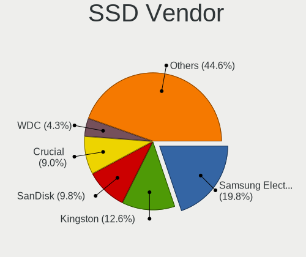
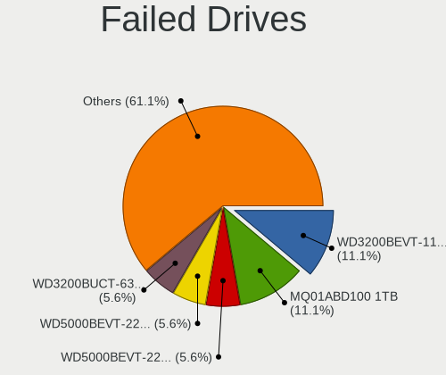
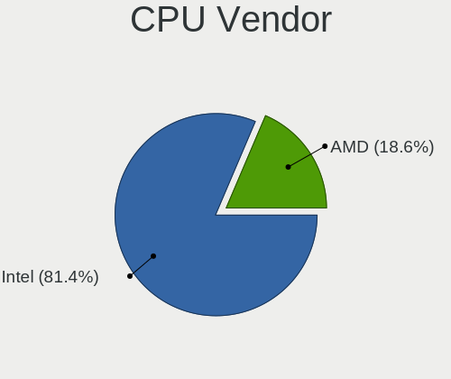
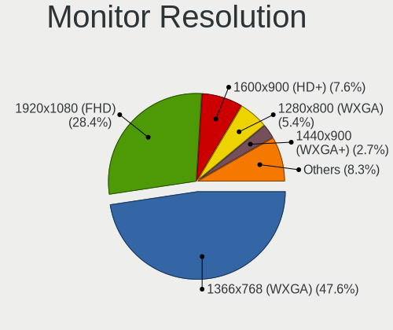
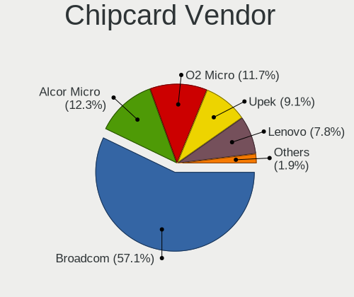
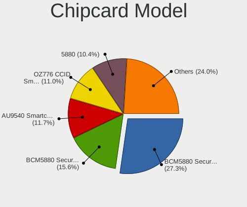

OpenMandriva 4.3 - Tested Hardware & Statistics (Notebooks)
-----------------------------------------------------------

A project to collect tested hardware configurations for OpenMandriva 4.3.

Anyone can contribute to this report by the [hw-probe](https://github.com/linuxhw/hw-probe) tool:

    sudo -E hw-probe -all -upload

Please contribute! Especially if your hardware is rare.

Contents
--------

* [ Test Cases ](#test-cases)

* [ System ](#system)
  - [ Kernel                   ](#kernel)
  - [ Kernel Family            ](#kernel-family)
  - [ Kernel Major Ver.        ](#kernel-major-ver)
  - [ Arch                     ](#arch)
  - [ DE                       ](#de)
  - [ Display Server           ](#display-server)
  - [ Display Manager          ](#display-manager)
  - [ OS Lang                  ](#os-lang)
  - [ Boot Mode                ](#boot-mode)
  - [ Filesystem               ](#filesystem)
  - [ Part. scheme             ](#part-scheme)
  - [ Dual Boot with Linux/BSD ](#dual-boot-with-linuxbsd)
  - [ Dual Boot (Win)          ](#dual-boot-win)

* [ Board ](#board)
  - [ Vendor                   ](#vendor)
  - [ Model                    ](#model)
  - [ Model Family             ](#model-family)
  - [ MFG Year                 ](#mfg-year)
  - [ Form Factor              ](#form-factor)
  - [ Secure Boot              ](#secure-boot)
  - [ Coreboot                 ](#coreboot)
  - [ RAM Size                 ](#ram-size)
  - [ RAM Used                 ](#ram-used)
  - [ Total Drives             ](#total-drives)
  - [ Has CD-ROM               ](#has-cd-rom)
  - [ Has Ethernet             ](#has-ethernet)
  - [ Has WiFi                 ](#has-wifi)
  - [ Has Bluetooth            ](#has-bluetooth)

* [ Location ](#location)
  - [ Country                  ](#country)
  - [ City                     ](#city)

* [ Drives ](#drives)
  - [ Drive Vendor             ](#drive-vendor)
  - [ Drive Model              ](#drive-model)
  - [ HDD Vendor               ](#hdd-vendor)
  - [ SSD Vendor               ](#ssd-vendor)
  - [ Drive Kind               ](#drive-kind)
  - [ Drive Connector          ](#drive-connector)
  - [ Drive Size               ](#drive-size)
  - [ Space Total              ](#space-total)
  - [ Space Used               ](#space-used)
  - [ Malfunc. Drives          ](#malfunc-drives)
  - [ Malfunc. Drive Vendor    ](#malfunc-drive-vendor)
  - [ Malfunc. HDD Vendor      ](#malfunc-hdd-vendor)
  - [ Malfunc. Drive Kind      ](#malfunc-drive-kind)
  - [ Failed Drives            ](#failed-drives)
  - [ Failed Drive Vendor      ](#failed-drive-vendor)
  - [ Drive Status             ](#drive-status)

* [ Storage controller ](#storage-controller)
  - [ Storage Vendor           ](#storage-vendor)
  - [ Storage Model            ](#storage-model)
  - [ Storage Kind             ](#storage-kind)

* [ Processor ](#processor)
  - [ CPU Vendor               ](#cpu-vendor)
  - [ CPU Model                ](#cpu-model)
  - [ CPU Model Family         ](#cpu-model-family)
  - [ CPU Cores                ](#cpu-cores)
  - [ CPU Sockets              ](#cpu-sockets)
  - [ CPU Threads              ](#cpu-threads)
  - [ CPU Op-Modes             ](#cpu-op-modes)
  - [ CPU Microcode            ](#cpu-microcode)
  - [ CPU Microarch            ](#cpu-microarch)

* [ Graphics ](#graphics)
  - [ GPU Vendor               ](#gpu-vendor)
  - [ GPU Model                ](#gpu-model)
  - [ GPU Combo                ](#gpu-combo)
  - [ GPU Driver               ](#gpu-driver)
  - [ GPU Memory               ](#gpu-memory)

* [ Monitor ](#monitor)
  - [ Monitor Vendor           ](#monitor-vendor)
  - [ Monitor Model            ](#monitor-model)
  - [ Monitor Resolution       ](#monitor-resolution)
  - [ Monitor Diagonal         ](#monitor-diagonal)
  - [ Monitor Width            ](#monitor-width)
  - [ Aspect Ratio             ](#aspect-ratio)
  - [ Monitor Area             ](#monitor-area)
  - [ Pixel Density            ](#pixel-density)
  - [ Multiple Monitors        ](#multiple-monitors)

* [ Network ](#network)
  - [ Net Controller Vendor    ](#net-controller-vendor)
  - [ Net Controller Model     ](#net-controller-model)
  - [ Wireless Vendor          ](#wireless-vendor)
  - [ Wireless Model           ](#wireless-model)
  - [ Ethernet Vendor          ](#ethernet-vendor)
  - [ Ethernet Model           ](#ethernet-model)
  - [ Net Controller Kind      ](#net-controller-kind)
  - [ Used Controller          ](#used-controller)
  - [ NICs                     ](#nics)
  - [ IPv6                     ](#ipv6)

* [ Bluetooth ](#bluetooth)
  - [ Bluetooth Vendor         ](#bluetooth-vendor)
  - [ Bluetooth Model          ](#bluetooth-model)

* [ Sound ](#sound)
  - [ Sound Vendor             ](#sound-vendor)
  - [ Sound Model              ](#sound-model)

* [ Memory ](#memory)
  - [ Memory Vendor            ](#memory-vendor)
  - [ Memory Model             ](#memory-model)
  - [ Memory Kind              ](#memory-kind)
  - [ Memory Form Factor       ](#memory-form-factor)
  - [ Memory Size              ](#memory-size)
  - [ Memory Speed             ](#memory-speed)

* [ Printers & scanners ](#printers--scanners)
  - [ Printer Vendor           ](#printer-vendor)
  - [ Printer Model            ](#printer-model)
  - [ Scanner Vendor           ](#scanner-vendor)
  - [ Scanner Model            ](#scanner-model)

* [ Camera ](#camera)
  - [ Camera Vendor            ](#camera-vendor)
  - [ Camera Model             ](#camera-model)

* [ Security ](#security)
  - [ Fingerprint Vendor       ](#fingerprint-vendor)
  - [ Fingerprint Model        ](#fingerprint-model)
  - [ Chipcard Vendor          ](#chipcard-vendor)
  - [ Chipcard Model           ](#chipcard-model)

* [ Unsupported ](#unsupported)
  - [ Unsupported Devices      ](#unsupported-devices)
  - [ Unsupported Device Types ](#unsupported-device-types)

Test Cases
----------

Total: 2261

| Vendor        | Model                       | Probe                                                      | Date         |
|---------------|-----------------------------|------------------------------------------------------------|--------------|
| HP            | EliteBook 8440p             | [e8c221770b](https://linux-hardware.org/?probe=e8c221770b) | Jan 31, 2024 |
| HP            | EliteBook 8460p             | [9fd5ed9142](https://linux-hardware.org/?probe=9fd5ed9142) | Jan 30, 2024 |
| Lenovo        | B51-80 80LM                 | [71d2badad4](https://linux-hardware.org/?probe=71d2badad4) | Jan 27, 2024 |
| HP            | 350 G2                      | [ad55cbfa8a](https://linux-hardware.org/?probe=ad55cbfa8a) | Jan 27, 2024 |
| Sony          | VGN-FZ31Z                   | [3df7d503da](https://linux-hardware.org/?probe=3df7d503da) | Jan 09, 2024 |
| Lenovo        | B580 20144                  | [f062a8fd3a](https://linux-hardware.org/?probe=f062a8fd3a) | Jan 03, 2024 |
| ASUSTek       | X750JB                      | [3c2f9bd15e](https://linux-hardware.org/?probe=3c2f9bd15e) | Dec 28, 2023 |
| Razer         | Blade Pro 17 (2019)         | [25b1af1536](https://linux-hardware.org/?probe=25b1af1536) | Dec 25, 2023 |
| ASUSTek       | X441BA                      | [04e5c55b92](https://linux-hardware.org/?probe=04e5c55b92) | Dec 23, 2023 |
| Dell          | Latitude E7240              | [8fc0b7d8ea](https://linux-hardware.org/?probe=8fc0b7d8ea) | Dec 16, 2023 |
| MSI           | MS-16Y1                     | [41ce29bec7](https://linux-hardware.org/?probe=41ce29bec7) | Dec 12, 2023 |
| Acer          | TravelMate B311-31          | [9611377d0c](https://linux-hardware.org/?probe=9611377d0c) | Dec 05, 2023 |
| Toshiba       | dynabook T552/36HR          | [1e3171aa0a](https://linux-hardware.org/?probe=1e3171aa0a) | Nov 30, 2023 |
| HP            | Stream Laptop 11-ak0xxx     | [16dda5c039](https://linux-hardware.org/?probe=16dda5c039) | Nov 29, 2023 |
| Lenovo        | ThinkPad T490 20N3S4VV00    | [1106c092a2](https://linux-hardware.org/?probe=1106c092a2) | Nov 26, 2023 |
| Dell          | Latitude E6430              | [a7befe7f1b](https://linux-hardware.org/?probe=a7befe7f1b) | Nov 23, 2023 |
| Samsung       | 300E5EV/300E4EV/270E5EV/... | [2d0d992e3e](https://linux-hardware.org/?probe=2d0d992e3e) | Nov 22, 2023 |
| Digibras      | NH4CU53                     | [25fff3f773](https://linux-hardware.org/?probe=25fff3f773) | Nov 20, 2023 |
| Dell          | Vostro 1310                 | [bd82e2c035](https://linux-hardware.org/?probe=bd82e2c035) | Nov 19, 2023 |
| ASUSTek       | M50Vn                       | [9c35898e36](https://linux-hardware.org/?probe=9c35898e36) | Nov 16, 2023 |
| Samsung       | 355V4C/356V4C/3445VC/354... | [613acc55d8](https://linux-hardware.org/?probe=613acc55d8) | Nov 13, 2023 |
| ASUSTek       | X540SAA                     | [1c5e9077a8](https://linux-hardware.org/?probe=1c5e9077a8) | Nov 12, 2023 |
| HP            | ProBook 6470b               | [5b5177e5ed](https://linux-hardware.org/?probe=5b5177e5ed) | Nov 08, 2023 |
| Toshiba       | Satellite C855-10N          | [7afd607141](https://linux-hardware.org/?probe=7afd607141) | Nov 06, 2023 |
| ASUSTek       | ROG Zephyrus G14 GA401QM... | [b0487db7bf](https://linux-hardware.org/?probe=b0487db7bf) | Nov 04, 2023 |
| Toshiba       | TECRA W50-A                 | [ad6c61de24](https://linux-hardware.org/?probe=ad6c61de24) | Nov 04, 2023 |
| ASUSTek       | X550VQ                      | [b6d6ff10aa](https://linux-hardware.org/?probe=b6d6ff10aa) | Nov 03, 2023 |
| Google        | Falco                       | [0ea6d932bf](https://linux-hardware.org/?probe=0ea6d932bf) | Nov 01, 2023 |
| Dell          | Inspiron 5737               | [6ed0863a43](https://linux-hardware.org/?probe=6ed0863a43) | Oct 27, 2023 |
| Apple         | MacBookPro7,1               | [cb27a04bd5](https://linux-hardware.org/?probe=cb27a04bd5) | Oct 26, 2023 |
| ASUSTek       | VivoBook_ASUSLaptop X515... | [dc730f5631](https://linux-hardware.org/?probe=dc730f5631) | Oct 23, 2023 |
| Acer          | Aspire 5742                 | [f30dc155bd](https://linux-hardware.org/?probe=f30dc155bd) | Oct 21, 2023 |
| Unknown       | Unknown                     | [e1751f1726](https://linux-hardware.org/?probe=e1751f1726) | Oct 17, 2023 |
| HP            | 2000                        | [c2669ff6cb](https://linux-hardware.org/?probe=c2669ff6cb) | Oct 16, 2023 |
| MSI           | GT70 0NC/GT70 0NC           | [24e93d9411](https://linux-hardware.org/?probe=24e93d9411) | Oct 15, 2023 |
| Lenovo        | IdeaPad P500 20210          | [ba316cb723](https://linux-hardware.org/?probe=ba316cb723) | Oct 12, 2023 |
| Dell          | Latitude E5440              | [a039ff25ef](https://linux-hardware.org/?probe=a039ff25ef) | Oct 08, 2023 |
| HP            | Pavilion g6                 | [7fadaa78cd](https://linux-hardware.org/?probe=7fadaa78cd) | Oct 02, 2023 |
| Lenovo        | Z50-70 20354                | [eb33abdaae](https://linux-hardware.org/?probe=eb33abdaae) | Sep 29, 2023 |
| OEGStone      | C4100/C5100                 | [0c27e50b14](https://linux-hardware.org/?probe=0c27e50b14) | Sep 29, 2023 |
| Dell          | Vostro 1000                 | [38499a1a0f](https://linux-hardware.org/?probe=38499a1a0f) | Sep 25, 2023 |
| HP            | Laptop 17-cn0xxx            | [10ec627bad](https://linux-hardware.org/?probe=10ec627bad) | Sep 25, 2023 |
| Acer          | Aspire E5-571               | [e74a87d3f4](https://linux-hardware.org/?probe=e74a87d3f4) | Sep 25, 2023 |
| Toshiba       | Satellite S50t-B            | [a574ee83ff](https://linux-hardware.org/?probe=a574ee83ff) | Sep 24, 2023 |
| HP            | EliteBook 840 G5            | [03d461d3af](https://linux-hardware.org/?probe=03d461d3af) | Sep 22, 2023 |
| Acer          | Nitro AN515-57              | [05c9cbc8e5](https://linux-hardware.org/?probe=05c9cbc8e5) | Sep 22, 2023 |
| ASUSTek       | P52F                        | [6be70b4b24](https://linux-hardware.org/?probe=6be70b4b24) | Sep 17, 2023 |
| Dell          | Latitude E6410              | [9b57eaa1eb](https://linux-hardware.org/?probe=9b57eaa1eb) | Sep 09, 2023 |
| MSI           | GE70 2PE                    | [19dddb0418](https://linux-hardware.org/?probe=19dddb0418) | Sep 06, 2023 |
| ASUSTek       | ASUS TUF Gaming F17 FX70... | [34fb398b78](https://linux-hardware.org/?probe=34fb398b78) | Sep 06, 2023 |
| HP            | Pavilion dv4                | [0b01aaddd6](https://linux-hardware.org/?probe=0b01aaddd6) | Sep 06, 2023 |
| Acer          | Aspire 4741                 | [2f2b673625](https://linux-hardware.org/?probe=2f2b673625) | Sep 04, 2023 |
| HUAWEI        | NBLK-WAX9X                  | [02c4374b47](https://linux-hardware.org/?probe=02c4374b47) | Sep 04, 2023 |
| Acer          | Nitro AN515-57              | [95b036ac9a](https://linux-hardware.org/?probe=95b036ac9a) | Sep 03, 2023 |
| Lenovo        | Z50-75 80EC                 | [12894bacfb](https://linux-hardware.org/?probe=12894bacfb) | Sep 03, 2023 |
| Dell          | Studio 1735                 | [88cf1723e0](https://linux-hardware.org/?probe=88cf1723e0) | Sep 03, 2023 |
| HP            | Laptop 15-bs0xx             | [9651a05c1d](https://linux-hardware.org/?probe=9651a05c1d) | Sep 03, 2023 |
| Chuwi         | LapBook Pro                 | [4dd222efaa](https://linux-hardware.org/?probe=4dd222efaa) | Sep 01, 2023 |
| ASUSTek       | S301LP                      | [d33b635602](https://linux-hardware.org/?probe=d33b635602) | Aug 31, 2023 |
| ASUSTek       | X75VC                       | [4a2115b7ae](https://linux-hardware.org/?probe=4a2115b7ae) | Aug 31, 2023 |
| ASUSTek       | K501LX                      | [ca56f1b803](https://linux-hardware.org/?probe=ca56f1b803) | Aug 30, 2023 |
| Dell          | XPS M1330                   | [ce3d41b222](https://linux-hardware.org/?probe=ce3d41b222) | Aug 27, 2023 |
| Dell          | Latitude E6440              | [759a858fa1](https://linux-hardware.org/?probe=759a858fa1) | Aug 25, 2023 |
| ASUSTek       | K73SV                       | [7aca2d97c0](https://linux-hardware.org/?probe=7aca2d97c0) | Aug 25, 2023 |
| Lenovo        | IdeaPad 130-14IKB 81H6      | [abae84243d](https://linux-hardware.org/?probe=abae84243d) | Aug 23, 2023 |
| HP            | Compaq nc8430 (EM741AV)     | [02d656a746](https://linux-hardware.org/?probe=02d656a746) | Aug 22, 2023 |
| Dell          | Inspiron 1720               | [577e8e228f](https://linux-hardware.org/?probe=577e8e228f) | Aug 22, 2023 |
| eMachines     | E520 V1.06                  | [bd63874856](https://linux-hardware.org/?probe=bd63874856) | Aug 20, 2023 |
| Lenovo        | G50-80 80E5                 | [6d8baa3226](https://linux-hardware.org/?probe=6d8baa3226) | Aug 20, 2023 |
| Danew         | Dbook 131                   | [35ea124809](https://linux-hardware.org/?probe=35ea124809) | Aug 19, 2023 |
| Apple         | MacBookAir6,2               | [76dda9cde6](https://linux-hardware.org/?probe=76dda9cde6) | Aug 19, 2023 |
| Acer          | Aspire ES1-431              | [171fd219cc](https://linux-hardware.org/?probe=171fd219cc) | Aug 10, 2023 |
| Lenovo        | IdeaPad S145-14IWL 81MU     | [eab0544dc6](https://linux-hardware.org/?probe=eab0544dc6) | Aug 06, 2023 |
| Acer          | Aspire 5738                 | [f5df04e0e6](https://linux-hardware.org/?probe=f5df04e0e6) | Aug 04, 2023 |
| Toshiba       | Satellite C850-B239         | [a075f60c70](https://linux-hardware.org/?probe=a075f60c70) | Aug 02, 2023 |
| Dell          | Vostro 3700                 | [96e4579b7b](https://linux-hardware.org/?probe=96e4579b7b) | Aug 01, 2023 |
| ASUSTek       | X550CC                      | [792e9db762](https://linux-hardware.org/?probe=792e9db762) | Jul 27, 2023 |
| Toshiba       | Satellite C50D-A-11G        | [b67508b754](https://linux-hardware.org/?probe=b67508b754) | Jul 27, 2023 |
| Intel         | powered classmate PC        | [ccbb0cb45a](https://linux-hardware.org/?probe=ccbb0cb45a) | Jul 24, 2023 |
| HP            | Stream Laptop 11-ak0xxx     | [61fa9a2c91](https://linux-hardware.org/?probe=61fa9a2c91) | Jul 20, 2023 |
| Dell          | Inspiron N5110              | [140474e198](https://linux-hardware.org/?probe=140474e198) | Jul 19, 2023 |
| Acer          | Nitro AN515-57              | [9853a8cf46](https://linux-hardware.org/?probe=9853a8cf46) | Jul 18, 2023 |
| Lenovo        | IdeaPad 5 15ARE05 81YQ      | [afb16ac821](https://linux-hardware.org/?probe=afb16ac821) | Jul 17, 2023 |
| Acer          | Aspire E5-573G              | [3cc36162b8](https://linux-hardware.org/?probe=3cc36162b8) | Jul 16, 2023 |
| Lenovo        | IdeaPad S145-15API 81V7     | [46cfd28279](https://linux-hardware.org/?probe=46cfd28279) | Jul 16, 2023 |
| ASUSTek       | X756UXK                     | [746e141543](https://linux-hardware.org/?probe=746e141543) | Jul 10, 2023 |
| Lenovo        | G485 20136                  | [9ce1d97d02](https://linux-hardware.org/?probe=9ce1d97d02) | Jul 07, 2023 |
| ASUSTek       | TP501UA                     | [ee28aacdd1](https://linux-hardware.org/?probe=ee28aacdd1) | Jul 05, 2023 |
| ASUSTek       | 1015PN                      | [7482ea5fc2](https://linux-hardware.org/?probe=7482ea5fc2) | Jul 03, 2023 |
| Acer          | Aspire E5-772               | [b33f11c7c9](https://linux-hardware.org/?probe=b33f11c7c9) | Jul 01, 2023 |
| ASUSTek       | N752VX                      | [d4fd40a9f3](https://linux-hardware.org/?probe=d4fd40a9f3) | Jul 01, 2023 |
| HP            | Notebook                    | [a178cbf707](https://linux-hardware.org/?probe=a178cbf707) | Jun 29, 2023 |
| Acer          | Aspire A315-42              | [d2a1351f86](https://linux-hardware.org/?probe=d2a1351f86) | Jun 28, 2023 |
| Packard Be... | EasyNote TJ65               | [cdc135487b](https://linux-hardware.org/?probe=cdc135487b) | Jun 24, 2023 |
| Lenovo        | ThinkPad P52 20M9CTO1WW     | [9d234065ed](https://linux-hardware.org/?probe=9d234065ed) | Jun 22, 2023 |
| Acer          | Nitro AN515-57              | [fc54744449](https://linux-hardware.org/?probe=fc54744449) | Jun 22, 2023 |
| Dell          | Inspiron 15 3525            | [09f4615df6](https://linux-hardware.org/?probe=09f4615df6) | Jun 22, 2023 |
| Medion        | Akoya E7226                 | [b46a96183b](https://linux-hardware.org/?probe=b46a96183b) | Jun 10, 2023 |
| Lenovo        | V110-15IAP 80TG             | [68a77b486e](https://linux-hardware.org/?probe=68a77b486e) | Jun 09, 2023 |
| Toshiba       | Satellite L635              | [4f124d1525](https://linux-hardware.org/?probe=4f124d1525) | Jun 09, 2023 |
| Apple         | MacBookAir7,2               | [44cf28ec0e](https://linux-hardware.org/?probe=44cf28ec0e) | Jun 05, 2023 |
| HP            | Pavilion g4                 | [af0c33de44](https://linux-hardware.org/?probe=af0c33de44) | Jun 05, 2023 |
| Dell          | Latitude E4300              | [cfd95b7e5e](https://linux-hardware.org/?probe=cfd95b7e5e) | Jun 05, 2023 |
| Dell          | Inspiron 5567               | [0564fd483d](https://linux-hardware.org/?probe=0564fd483d) | Jun 04, 2023 |
| Lenovo        | ThinkPad X1 Carbon 4th 2... | [1b82c0c3c8](https://linux-hardware.org/?probe=1b82c0c3c8) | Jun 02, 2023 |
| Lenovo        | IdeaPad Z570 HuronRiver ... | [7b5291c6f8](https://linux-hardware.org/?probe=7b5291c6f8) | Jun 02, 2023 |
| HP            | Pavilion dm4                | [51b921c72d](https://linux-hardware.org/?probe=51b921c72d) | May 28, 2023 |
| Sony          | VGN-FZ31Z                   | [31c6913c14](https://linux-hardware.org/?probe=31c6913c14) | May 26, 2023 |
| HP            | Laptop 15-bs1xx             | [f0b7bf3520](https://linux-hardware.org/?probe=f0b7bf3520) | May 23, 2023 |
| Lenovo        | ThinkPad T490 20N3S4VV00    | [5c190a4d57](https://linux-hardware.org/?probe=5c190a4d57) | May 22, 2023 |
| HP            | ProBook 645 G1              | [c1df991f26](https://linux-hardware.org/?probe=c1df991f26) | May 19, 2023 |
| Acer          | Aspire A114-32              | [d17a909427](https://linux-hardware.org/?probe=d17a909427) | May 18, 2023 |
| Lenovo        | ThinkPad X100e 0022CTO      | [842b7a3ee2](https://linux-hardware.org/?probe=842b7a3ee2) | May 14, 2023 |
| Lenovo        | ThinkPad A275 20KCS0FT02    | [d697ec6804](https://linux-hardware.org/?probe=d697ec6804) | May 14, 2023 |
| HP            | Compaq Mini CQ10-500        | [4b9087625d](https://linux-hardware.org/?probe=4b9087625d) | May 09, 2023 |
| Sony          | VGN-FZ31Z                   | [6fe358200a](https://linux-hardware.org/?probe=6fe358200a) | May 09, 2023 |
| HP            | ProBook 440 G1              | [aea73943e8](https://linux-hardware.org/?probe=aea73943e8) | May 09, 2023 |
| Apple         | MacBookAir9,1               | [a0073c6ff3](https://linux-hardware.org/?probe=a0073c6ff3) | May 08, 2023 |
| Lenovo        | ThinkPad L13 Gen 3 21BAS... | [6c404ee491](https://linux-hardware.org/?probe=6c404ee491) | May 06, 2023 |
| Quanta        | JW2                         | [eb9ff2a263](https://linux-hardware.org/?probe=eb9ff2a263) | May 06, 2023 |
| Acer          | Aspire A315-42              | [d8f78a98f2](https://linux-hardware.org/?probe=d8f78a98f2) | May 05, 2023 |
| eMachines     | eMG620                      | [224dc7209e](https://linux-hardware.org/?probe=224dc7209e) | May 04, 2023 |
| Toshiba       | Satellite C640              | [20d436bfa7](https://linux-hardware.org/?probe=20d436bfa7) | May 02, 2023 |
| ASUSTek       | UX31E                       | [1fb0ca13ff](https://linux-hardware.org/?probe=1fb0ca13ff) | May 01, 2023 |
| Sony          | VGN-AW11M_H                 | [2c9f98ca31](https://linux-hardware.org/?probe=2c9f98ca31) | May 01, 2023 |
| Lenovo        | Unknown                     | [33a55a2347](https://linux-hardware.org/?probe=33a55a2347) | Apr 29, 2023 |
| HP            | Laptop 15-dw1xxx            | [3056c07eb6](https://linux-hardware.org/?probe=3056c07eb6) | Apr 29, 2023 |
| Dell          | Vostro 3558                 | [e1e3261c15](https://linux-hardware.org/?probe=e1e3261c15) | Apr 29, 2023 |
| Toshiba       | Satellite L45-B             | [8f1db96b6f](https://linux-hardware.org/?probe=8f1db96b6f) | Apr 29, 2023 |
| Acer          | Swift SF314-59              | [a84de33c38](https://linux-hardware.org/?probe=a84de33c38) | Apr 28, 2023 |
| Dell          | Latitude D830               | [2ab0772efb](https://linux-hardware.org/?probe=2ab0772efb) | Apr 28, 2023 |
| HP            | 15 Notebook PC              | [a63003783d](https://linux-hardware.org/?probe=a63003783d) | Apr 27, 2023 |
| Acer          | Nitro AN515-57              | [f549cb502c](https://linux-hardware.org/?probe=f549cb502c) | Apr 27, 2023 |
| Acer          | Aspire 5737Z                | [121eda50b8](https://linux-hardware.org/?probe=121eda50b8) | Apr 26, 2023 |
| Fujitsu       | FMVA05004                   | [c494a8453d](https://linux-hardware.org/?probe=c494a8453d) | Apr 26, 2023 |
| Toshiba       | dynabook TV/68KBL           | [19c59e3701](https://linux-hardware.org/?probe=19c59e3701) | Apr 26, 2023 |
| Samsung       | 300E5EV/300E4EV/270E5EV/... | [5c79032176](https://linux-hardware.org/?probe=5c79032176) | Apr 25, 2023 |
| HP            | Pavilion g4                 | [5e2040a91f](https://linux-hardware.org/?probe=5e2040a91f) | Apr 25, 2023 |
| HP            | ProBook 5320m               | [7597710994](https://linux-hardware.org/?probe=7597710994) | Apr 24, 2023 |
| Dell          | Latitude E7240              | [b72361ca9e](https://linux-hardware.org/?probe=b72361ca9e) | Apr 24, 2023 |
| Toshiba       | Satellite C855              | [b383279bda](https://linux-hardware.org/?probe=b383279bda) | Apr 23, 2023 |
| HP            | Pavilion 15                 | [e72f221b5b](https://linux-hardware.org/?probe=e72f221b5b) | Apr 23, 2023 |
| Samsung       | R59P/R60P/R61P              | [59ad89854c](https://linux-hardware.org/?probe=59ad89854c) | Apr 22, 2023 |
| Lenovo        | ThinkPad Yoga 11e 3rd Ge... | [503c99202e](https://linux-hardware.org/?probe=503c99202e) | Apr 21, 2023 |
| HP            | Pavilion dv6                | [b3613186fa](https://linux-hardware.org/?probe=b3613186fa) | Apr 21, 2023 |
| HUAWEI        | HLYL-WXX9                   | [78adec215e](https://linux-hardware.org/?probe=78adec215e) | Apr 21, 2023 |
| Dell          | Inspiron 1545               | [68a7470480](https://linux-hardware.org/?probe=68a7470480) | Apr 19, 2023 |
| Lenovo        | ThinkPad X260 20F5S2WX0W    | [97447a0777](https://linux-hardware.org/?probe=97447a0777) | Apr 19, 2023 |
| Lenovo        | ThinkPad T540p 20BECTO1W... | [ccb7f92798](https://linux-hardware.org/?probe=ccb7f92798) | Apr 19, 2023 |
| Acer          | TravelMate 5730             | [8e99149abe](https://linux-hardware.org/?probe=8e99149abe) | Apr 17, 2023 |
| Dell          | Inspiron MM061              | [b825c609a9](https://linux-hardware.org/?probe=b825c609a9) | Apr 15, 2023 |
| Acer          | AO756                       | [c17d5276ec](https://linux-hardware.org/?probe=c17d5276ec) | Apr 14, 2023 |
| ASUSTek       | K73TA                       | [34319e673a](https://linux-hardware.org/?probe=34319e673a) | Apr 13, 2023 |
| ASUSTek       | VivoBook_ASUSLaptop X510... | [af4ccb91b1](https://linux-hardware.org/?probe=af4ccb91b1) | Apr 12, 2023 |
| Fujitsu Si... | LIFEBOOK S6420              | [6a6e2f88f4](https://linux-hardware.org/?probe=6a6e2f88f4) | Apr 12, 2023 |
| Acer          | Aspire 5250                 | [f2040ffb31](https://linux-hardware.org/?probe=f2040ffb31) | Apr 09, 2023 |
| Fujitsu Si... | LIFEBOOK S6420              | [52b4a5a0f0](https://linux-hardware.org/?probe=52b4a5a0f0) | Apr 08, 2023 |
| Lenovo        | Z50-75 80EC                 | [1502ff1933](https://linux-hardware.org/?probe=1502ff1933) | Apr 08, 2023 |
| Dell          | Latitude E5470              | [3e49e9c541](https://linux-hardware.org/?probe=3e49e9c541) | Apr 08, 2023 |
| Lenovo        | ThinkPad W530 243852U       | [ea2ee391a5](https://linux-hardware.org/?probe=ea2ee391a5) | Apr 07, 2023 |
| HP            | ProBook 4530s               | [efd084d9d5](https://linux-hardware.org/?probe=efd084d9d5) | Apr 07, 2023 |
| Lenovo        | B51-80 80LM                 | [78e2e080ea](https://linux-hardware.org/?probe=78e2e080ea) | Apr 07, 2023 |
| Acer          | Aspire 3680                 | [b5511d9060](https://linux-hardware.org/?probe=b5511d9060) | Apr 05, 2023 |
| HP            | 245 G6                      | [c6a1e2951c](https://linux-hardware.org/?probe=c6a1e2951c) | Apr 05, 2023 |
| Lenovo        | ThinkPad T410 2537WB7       | [d68ffd9d0f](https://linux-hardware.org/?probe=d68ffd9d0f) | Apr 04, 2023 |
| Apple         | MacBookAir5,2               | [8293b6000a](https://linux-hardware.org/?probe=8293b6000a) | Apr 04, 2023 |
| Lenovo        | ThinkPad X220 4290CTO       | [5dd9277838](https://linux-hardware.org/?probe=5dd9277838) | Apr 04, 2023 |
| ASUSTek       | G752VM                      | [13d6602e92](https://linux-hardware.org/?probe=13d6602e92) | Apr 02, 2023 |
| Dell          | XPS M1330                   | [46b9a5cfde](https://linux-hardware.org/?probe=46b9a5cfde) | Mar 31, 2023 |
| HP            | Laptop 15-db0xxx            | [c51f53a733](https://linux-hardware.org/?probe=c51f53a733) | Mar 31, 2023 |
| Lenovo        | Legion 5 15IMH05 82AU       | [36c0a38885](https://linux-hardware.org/?probe=36c0a38885) | Mar 31, 2023 |
| HP            | Pavilion dv6                | [c91e4d9c5a](https://linux-hardware.org/?probe=c91e4d9c5a) | Mar 30, 2023 |
| Samsung       | 355V4C/356V4C/3445VC/354... | [6b9737a62f](https://linux-hardware.org/?probe=6b9737a62f) | Mar 30, 2023 |
| Lenovo        | ThinkPad Edge E530 3259M... | [9aaa97a931](https://linux-hardware.org/?probe=9aaa97a931) | Mar 30, 2023 |
| Fujitsu       | LIFEBOOK AH530              | [a316144991](https://linux-hardware.org/?probe=a316144991) | Mar 29, 2023 |
| Toshiba       | Satellite L750              | [0bc21ff162](https://linux-hardware.org/?probe=0bc21ff162) | Mar 28, 2023 |
| Dell          | Studio 1558                 | [955946c74d](https://linux-hardware.org/?probe=955946c74d) | Mar 28, 2023 |
| HP            | 250 G1                      | [a19b3136b7](https://linux-hardware.org/?probe=a19b3136b7) | Mar 26, 2023 |
| Medion        | Akoya E6416                 | [bb2e759014](https://linux-hardware.org/?probe=bb2e759014) | Mar 26, 2023 |
| Acer          | Aspire ES1-411              | [1a4caa9a83](https://linux-hardware.org/?probe=1a4caa9a83) | Mar 24, 2023 |
| Lenovo        | IdeaPad 110-15IBR 80T7      | [178936b7f4](https://linux-hardware.org/?probe=178936b7f4) | Mar 24, 2023 |
| Toshiba       | T20                         | [a0757b47d7](https://linux-hardware.org/?probe=a0757b47d7) | Mar 22, 2023 |
| Acer          | TravelMate 5744             | [3ad8bf7639](https://linux-hardware.org/?probe=3ad8bf7639) | Mar 22, 2023 |
| Lenovo        | IdeaPad 330-15IKB 81DE      | [77b7fd07a4](https://linux-hardware.org/?probe=77b7fd07a4) | Mar 19, 2023 |
| ASUSTek       | UX31E                       | [b637fa75c8](https://linux-hardware.org/?probe=b637fa75c8) | Mar 18, 2023 |
| Lenovo        | ThinkPad P50 20EQS1MY00     | [beeb327f26](https://linux-hardware.org/?probe=beeb327f26) | Mar 18, 2023 |
| Dell          | Inspiron 15-3567            | [e90a87f6f2](https://linux-hardware.org/?probe=e90a87f6f2) | Mar 18, 2023 |
| MSI           | GP60 2OD                    | [a3ffd8113f](https://linux-hardware.org/?probe=a3ffd8113f) | Mar 18, 2023 |
| HONOR         | NBR-WAX9                    | [19fd2af680](https://linux-hardware.org/?probe=19fd2af680) | Mar 18, 2023 |
| Acer          | Aspire 7750G                | [39d6b256fa](https://linux-hardware.org/?probe=39d6b256fa) | Mar 18, 2023 |
| Notebook      | N8xxEP6                     | [a4bd2c22eb](https://linux-hardware.org/?probe=a4bd2c22eb) | Mar 18, 2023 |
| HP            | Pavilion dv6                | [9c24401930](https://linux-hardware.org/?probe=9c24401930) | Mar 18, 2023 |
| Lenovo        | G570 20079                  | [2d7a146140](https://linux-hardware.org/?probe=2d7a146140) | Mar 18, 2023 |
| Lenovo        | IdeaPad 3 15ALC6 82KU       | [fce879befb](https://linux-hardware.org/?probe=fce879befb) | Mar 18, 2023 |
| Dell          | Latitude E7440              | [8a6e751b61](https://linux-hardware.org/?probe=8a6e751b61) | Mar 16, 2023 |
| Dell          | Latitude E7240              | [7fbe857344](https://linux-hardware.org/?probe=7fbe857344) | Mar 14, 2023 |
| HP            | 245 G6 Notebook PC          | [8ff2a816b5](https://linux-hardware.org/?probe=8ff2a816b5) | Mar 13, 2023 |
| Apple         | MacBookAir7,2               | [9509c77e2b](https://linux-hardware.org/?probe=9509c77e2b) | Mar 13, 2023 |
| ASUSTek       | UX31E                       | [7f3525f6ef](https://linux-hardware.org/?probe=7f3525f6ef) | Mar 12, 2023 |
| Acer          | Aspire ES1-523              | [4247bd6835](https://linux-hardware.org/?probe=4247bd6835) | Mar 12, 2023 |
| Acer          | Aspire A515-51G             | [757a62eff0](https://linux-hardware.org/?probe=757a62eff0) | Mar 11, 2023 |
| Fujitsu       | LIFEBOOK S760               | [1d2e721898](https://linux-hardware.org/?probe=1d2e721898) | Mar 10, 2023 |
| HP            | Stream Laptop 14-cb0XX      | [b8dffd9bd3](https://linux-hardware.org/?probe=b8dffd9bd3) | Mar 10, 2023 |
| Dell          | Vostro 1310                 | [a5677d37dc](https://linux-hardware.org/?probe=a5677d37dc) | Mar 09, 2023 |
| HP            | ENVY 6                      | [4873f7b85f](https://linux-hardware.org/?probe=4873f7b85f) | Mar 08, 2023 |
| AZW           | GT-R                        | [cce9cccb8f](https://linux-hardware.org/?probe=cce9cccb8f) | Mar 07, 2023 |
| Lenovo        | IdeaPad 330-17IKB 81DM      | [c420621505](https://linux-hardware.org/?probe=c420621505) | Mar 05, 2023 |
| Lenovo        | Yoga Slim 7 13ACN5 82CY     | [9c91f76369](https://linux-hardware.org/?probe=9c91f76369) | Mar 04, 2023 |
| ASUSTek       | VivoBook_ASUSLaptop E510... | [9b0664e4d7](https://linux-hardware.org/?probe=9b0664e4d7) | Mar 04, 2023 |
| ASUSTek       | UX31E                       | [ba97297cf9](https://linux-hardware.org/?probe=ba97297cf9) | Mar 04, 2023 |
| Toshiba       | dynabook R73/BN             | [1d81bb5f08](https://linux-hardware.org/?probe=1d81bb5f08) | Mar 03, 2023 |
| Acer          | Aspire E1-532P              | [8a23f06db4](https://linux-hardware.org/?probe=8a23f06db4) | Mar 01, 2023 |
| Acer          | Aspire V3-772               | [5a0c297e10](https://linux-hardware.org/?probe=5a0c297e10) | Feb 28, 2023 |
| Dell          | Latitude E6420              | [a84f4dbcbb](https://linux-hardware.org/?probe=a84f4dbcbb) | Feb 28, 2023 |
| ASUSTek       | K75VJ                       | [7fc0fff829](https://linux-hardware.org/?probe=7fc0fff829) | Feb 27, 2023 |
| Acer          | Aspire E5-571               | [5f035002e1](https://linux-hardware.org/?probe=5f035002e1) | Feb 27, 2023 |
| eMachines     | eME728                      | [2331984fc8](https://linux-hardware.org/?probe=2331984fc8) | Feb 26, 2023 |
| Samsung       | 550XBE/350XBE               | [d9f49e98fd](https://linux-hardware.org/?probe=d9f49e98fd) | Feb 25, 2023 |
| Toshiba       | Satellite C850              | [99d4efbb52](https://linux-hardware.org/?probe=99d4efbb52) | Feb 25, 2023 |
| HP            | 650                         | [ab0b350259](https://linux-hardware.org/?probe=ab0b350259) | Feb 24, 2023 |
| Acer          | Aspire A517-51G             | [12040fcd10](https://linux-hardware.org/?probe=12040fcd10) | Feb 24, 2023 |
| Toshiba       | Satellite C850-1GF          | [f568855409](https://linux-hardware.org/?probe=f568855409) | Feb 24, 2023 |
| Lenovo        | IdeaPad Gaming 3 15IMH05... | [d488fc0d9a](https://linux-hardware.org/?probe=d488fc0d9a) | Feb 22, 2023 |
| Positivo      | S14SL01                     | [914a9e691e](https://linux-hardware.org/?probe=914a9e691e) | Feb 22, 2023 |
| Lenovo        | ThinkPad T430s 23551M9      | [91b6a109b4](https://linux-hardware.org/?probe=91b6a109b4) | Feb 22, 2023 |
| Gateway       | NV53A                       | [1e2b4ec4d3](https://linux-hardware.org/?probe=1e2b4ec4d3) | Feb 22, 2023 |
| Fujitsu Si... | AMILO Li3910                | [28890c5346](https://linux-hardware.org/?probe=28890c5346) | Feb 21, 2023 |
| HP            | Pavilion dv6                | [526430f218](https://linux-hardware.org/?probe=526430f218) | Feb 21, 2023 |
| Apple         | MacBookPro9,2               | [80df77e6a1](https://linux-hardware.org/?probe=80df77e6a1) | Feb 21, 2023 |
| Lenovo        | B560 43308VG                | [c30b594458](https://linux-hardware.org/?probe=c30b594458) | Feb 19, 2023 |
| HP            | ProBook 4520s               | [8192287499](https://linux-hardware.org/?probe=8192287499) | Feb 19, 2023 |
| Lenovo        | IdeaPad Yoga 11S 20246      | [b0941b8ef0](https://linux-hardware.org/?probe=b0941b8ef0) | Feb 18, 2023 |
| HP            | 15                          | [4db2520843](https://linux-hardware.org/?probe=4db2520843) | Feb 18, 2023 |
| HP            | ProBook 4540s               | [cc3e78f73f](https://linux-hardware.org/?probe=cc3e78f73f) | Feb 18, 2023 |
| PC Special... | NJ50_70CU                   | [68dd853397](https://linux-hardware.org/?probe=68dd853397) | Feb 17, 2023 |
| ASUSTek       | X555LJ                      | [a524479b7a](https://linux-hardware.org/?probe=a524479b7a) | Feb 17, 2023 |
| Toshiba       | Satellite C70-C-18E         | [7642482909](https://linux-hardware.org/?probe=7642482909) | Feb 17, 2023 |
| HP            | Pavilion 15                 | [a48098f6fc](https://linux-hardware.org/?probe=a48098f6fc) | Feb 17, 2023 |
| HP            | Laptop 15-da0xxx            | [ac458108b4](https://linux-hardware.org/?probe=ac458108b4) | Feb 17, 2023 |
| ASUSTek       | K54C                        | [ea944628df](https://linux-hardware.org/?probe=ea944628df) | Feb 17, 2023 |
| ASUSTek       | VivoBook_ASUSLaptop X513... | [66c33604c4](https://linux-hardware.org/?probe=66c33604c4) | Feb 17, 2023 |
| Samsung       | R519/R719                   | [1dc4bc1b72](https://linux-hardware.org/?probe=1dc4bc1b72) | Feb 17, 2023 |
| Lenovo        | IdeaPad S145-15AST 81N3     | [ffd622d65f](https://linux-hardware.org/?probe=ffd622d65f) | Feb 17, 2023 |
| eMachines     | eMachiens G443              | [096a4bb9e4](https://linux-hardware.org/?probe=096a4bb9e4) | Feb 16, 2023 |
| HP            | Pavilion dv6500             | [95a9115968](https://linux-hardware.org/?probe=95a9115968) | Feb 16, 2023 |
| ASUSTek       | N76VZ                       | [ed9bd6b127](https://linux-hardware.org/?probe=ed9bd6b127) | Feb 16, 2023 |
| Dell          | Latitude E7440              | [86f8d34ba7](https://linux-hardware.org/?probe=86f8d34ba7) | Feb 16, 2023 |
| Toshiba       | dynabook R73/BN             | [df7e69c5c4](https://linux-hardware.org/?probe=df7e69c5c4) | Feb 16, 2023 |
| HP            | ProBook 470 G4              | [8730091665](https://linux-hardware.org/?probe=8730091665) | Feb 15, 2023 |
| HP            | Notebook                    | [21442c303e](https://linux-hardware.org/?probe=21442c303e) | Feb 15, 2023 |
| HP            | 250 G6 Notebook PC          | [745ae4d0fb](https://linux-hardware.org/?probe=745ae4d0fb) | Feb 15, 2023 |
| Lenovo        | IdeaPad S145-15AST 81N3     | [bc69f33fa2](https://linux-hardware.org/?probe=bc69f33fa2) | Feb 15, 2023 |
| ASUSTek       | K52N                        | [f87ece85e9](https://linux-hardware.org/?probe=f87ece85e9) | Feb 15, 2023 |
| HP            | 1000                        | [57de0f3103](https://linux-hardware.org/?probe=57de0f3103) | Feb 15, 2023 |
| Samsung       | RV419/RV420                 | [7ec9e518c4](https://linux-hardware.org/?probe=7ec9e518c4) | Feb 14, 2023 |
| Samsung       | 300E4C/300E5C/300E7C        | [dddbb2d135](https://linux-hardware.org/?probe=dddbb2d135) | Feb 14, 2023 |
| Lenovo        | ThinkPad X270 W10DG 20K5... | [bf015f98c2](https://linux-hardware.org/?probe=bf015f98c2) | Feb 14, 2023 |
| Apple         | MacBookAir5,2               | [4f99163f99](https://linux-hardware.org/?probe=4f99163f99) | Feb 11, 2023 |
| ASUSTek       | UX31E                       | [e8fdc1676a](https://linux-hardware.org/?probe=e8fdc1676a) | Feb 10, 2023 |
| HP            | Compaq Presario CQ61        | [df4d59acd5](https://linux-hardware.org/?probe=df4d59acd5) | Feb 07, 2023 |
| Lenovo        | ThinkPad X240 20AL00FMGE    | [0ac2678512](https://linux-hardware.org/?probe=0ac2678512) | Feb 06, 2023 |
| Acer          | Extensa 5635                | [8f8f4d24f9](https://linux-hardware.org/?probe=8f8f4d24f9) | Feb 06, 2023 |
| Lenovo        | ThinkPad L15 Gen 1 20U70... | [7ca566f68b](https://linux-hardware.org/?probe=7ca566f68b) | Feb 05, 2023 |
| Apple         | MacBookPro8,1               | [d6adca1255](https://linux-hardware.org/?probe=d6adca1255) | Feb 04, 2023 |
| HP            | ProBook 6465b               | [00b2021fae](https://linux-hardware.org/?probe=00b2021fae) | Feb 04, 2023 |
| Dell          | Latitude E5420              | [ccc3ca9853](https://linux-hardware.org/?probe=ccc3ca9853) | Jan 31, 2023 |
| HP            | 3115-AEC13432GR1            | [98eb70341a](https://linux-hardware.org/?probe=98eb70341a) | Jan 30, 2023 |
| Lenovo        | Legion Y540-15IRH-PG0 81... | [e2fa9aa820](https://linux-hardware.org/?probe=e2fa9aa820) | Jan 29, 2023 |
| HP            | Notebook                    | [d38e078368](https://linux-hardware.org/?probe=d38e078368) | Jan 28, 2023 |
| Apple         | MacBook4,1                  | [e00443a9cc](https://linux-hardware.org/?probe=e00443a9cc) | Jan 27, 2023 |
| ASUSTek       | UX31E                       | [d87ac57c19](https://linux-hardware.org/?probe=d87ac57c19) | Jan 27, 2023 |
| HP            | 14                          | [53d080d83a](https://linux-hardware.org/?probe=53d080d83a) | Jan 27, 2023 |
| Dell          | Inspiron 15 3521            | [41f89081ff](https://linux-hardware.org/?probe=41f89081ff) | Jan 26, 2023 |
| OEGStone      | C4100/C5100                 | [4365b7b231](https://linux-hardware.org/?probe=4365b7b231) | Jan 25, 2023 |
| Lenovo        | ThinkPad W541 20EF0020MD    | [fca73ad2a9](https://linux-hardware.org/?probe=fca73ad2a9) | Jan 24, 2023 |
| Packard Be... | PB56                        | [f26fcb7ee5](https://linux-hardware.org/?probe=f26fcb7ee5) | Jan 23, 2023 |
| HP            | Pavilion dv5                | [94ba65752b](https://linux-hardware.org/?probe=94ba65752b) | Jan 20, 2023 |
| Panasonic     | CF-53JULCV1M                | [89c1166efc](https://linux-hardware.org/?probe=89c1166efc) | Jan 18, 2023 |
| Dell          | Inspiron N5110              | [bf606ed50a](https://linux-hardware.org/?probe=bf606ed50a) | Jan 18, 2023 |
| HP            | ProBook 440 G1              | [035c7a4e2d](https://linux-hardware.org/?probe=035c7a4e2d) | Jan 18, 2023 |
| Dell          | Latitude 7490               | [b611fc6b64](https://linux-hardware.org/?probe=b611fc6b64) | Jan 18, 2023 |
| HP            | Pavilion dv6500             | [33985f088a](https://linux-hardware.org/?probe=33985f088a) | Jan 16, 2023 |
| HP            | EliteBook 745 G3            | [c20a339ddb](https://linux-hardware.org/?probe=c20a339ddb) | Jan 15, 2023 |
| Acer          | Aspire 7551                 | [b3e5df94f4](https://linux-hardware.org/?probe=b3e5df94f4) | Jan 15, 2023 |
| Dell          | Latitude E7440              | [9c4aac8b46](https://linux-hardware.org/?probe=9c4aac8b46) | Jan 14, 2023 |
| ASUSTek       | UX31E                       | [d60bab803e](https://linux-hardware.org/?probe=d60bab803e) | Jan 13, 2023 |
| Toshiba       | Satellite C850-B561         | [562d6cde14](https://linux-hardware.org/?probe=562d6cde14) | Jan 11, 2023 |
| Lenovo        | ThinkPad X240 20AM001RGE    | [f4aafcf7a9](https://linux-hardware.org/?probe=f4aafcf7a9) | Jan 11, 2023 |
| Apple         | MacBookAir5,1               | [ce911686b3](https://linux-hardware.org/?probe=ce911686b3) | Jan 10, 2023 |
| Dell          | XPS M1330                   | [e3d66114f6](https://linux-hardware.org/?probe=e3d66114f6) | Jan 10, 2023 |
| Dell          | Inspiron 3442               | [f540a5f964](https://linux-hardware.org/?probe=f540a5f964) | Jan 09, 2023 |
| Star Labs     | Lite                        | [6614e226df](https://linux-hardware.org/?probe=6614e226df) | Jan 09, 2023 |
| HP            | OMEN by Laptop              | [84aa790d17](https://linux-hardware.org/?probe=84aa790d17) | Jan 09, 2023 |
| Dell          | Latitude E6400              | [70bce3a55c](https://linux-hardware.org/?probe=70bce3a55c) | Jan 08, 2023 |
| Dell          | Latitude E5440              | [91bedeb5e1](https://linux-hardware.org/?probe=91bedeb5e1) | Jan 07, 2023 |
| Lenovo        | IdeaPad 3 15ADA05 81W1      | [782467ee8c](https://linux-hardware.org/?probe=782467ee8c) | Jan 07, 2023 |
| Acer          | Aspire 7741                 | [d0e4567b4a](https://linux-hardware.org/?probe=d0e4567b4a) | Jan 07, 2023 |
| Lenovo        | V15-IGL 82C3                | [3bc9e3b318](https://linux-hardware.org/?probe=3bc9e3b318) | Jan 07, 2023 |
| HP            | 250 G3                      | [227b44bf7c](https://linux-hardware.org/?probe=227b44bf7c) | Jan 06, 2023 |
| HP            | Laptop 15-db0xxx            | [0232b39536](https://linux-hardware.org/?probe=0232b39536) | Jan 06, 2023 |
| eMachines     | E725                        | [0655d63f70](https://linux-hardware.org/?probe=0655d63f70) | Jan 06, 2023 |
| ASUSTek       | K55VM                       | [d4d53ed49f](https://linux-hardware.org/?probe=d4d53ed49f) | Jan 04, 2023 |
| HP            | Pavilion g6                 | [6cae064dc5](https://linux-hardware.org/?probe=6cae064dc5) | Jan 04, 2023 |
| HP            | ProBook 470 G2              | [1f62ff6417](https://linux-hardware.org/?probe=1f62ff6417) | Jan 04, 2023 |
| HP            | Compaq 15                   | [c282ede7c5](https://linux-hardware.org/?probe=c282ede7c5) | Jan 04, 2023 |
| HP            | EliteBook 725 G3            | [174e0c5f05](https://linux-hardware.org/?probe=174e0c5f05) | Jan 04, 2023 |
| Dell          | Latitude D520               | [7f05ddf105](https://linux-hardware.org/?probe=7f05ddf105) | Jan 04, 2023 |
| Dell          | Latitude 7490               | [7e445638b6](https://linux-hardware.org/?probe=7e445638b6) | Jan 04, 2023 |
| Sony          | VJF153                      | [f3643923cc](https://linux-hardware.org/?probe=f3643923cc) | Jan 04, 2023 |
| Acer          | Nitro AN515-55              | [c5bc3a8eae](https://linux-hardware.org/?probe=c5bc3a8eae) | Jan 03, 2023 |
| Lenovo        | IdeaPad Yoga 11S 20246      | [a73ca839a1](https://linux-hardware.org/?probe=a73ca839a1) | Jan 03, 2023 |
| Positivo      | Z100                        | [58b7c4d1ff](https://linux-hardware.org/?probe=58b7c4d1ff) | Jan 02, 2023 |
| HP            | Victus by Laptop 16-e0xx... | [287840d797](https://linux-hardware.org/?probe=287840d797) | Jan 02, 2023 |
| Acer          | Aspire 5732Z                | [86b79bce9e](https://linux-hardware.org/?probe=86b79bce9e) | Jan 01, 2023 |
| Dell          | System Inspiron N411Z       | [21f279751c](https://linux-hardware.org/?probe=21f279751c) | Jan 01, 2023 |
| Packard Be... | EasyNote TM97               | [fad44d67ab](https://linux-hardware.org/?probe=fad44d67ab) | Jan 01, 2023 |
| HP            | 1000                        | [5634ff72b1](https://linux-hardware.org/?probe=5634ff72b1) | Jan 01, 2023 |
| Acer          | Aspire A114-33              | [bba53b0159](https://linux-hardware.org/?probe=bba53b0159) | Jan 01, 2023 |
| Toshiba       | Satellite A305D             | [b85a377462](https://linux-hardware.org/?probe=b85a377462) | Dec 31, 2022 |
| Lenovo        | ThinkPad T410 2537BF9       | [f83ed1dd39](https://linux-hardware.org/?probe=f83ed1dd39) | Dec 30, 2022 |
| ASUSTek       | TP501UA                     | [1f2aaf8804](https://linux-hardware.org/?probe=1f2aaf8804) | Dec 30, 2022 |
| ASUSTek       | K55VD                       | [e4c90250df](https://linux-hardware.org/?probe=e4c90250df) | Dec 30, 2022 |
| ASUSTek       | X555UJ                      | [f4ba8643aa](https://linux-hardware.org/?probe=f4ba8643aa) | Dec 30, 2022 |
| Acer          | Nitro AN515-57              | [b0bfa9530a](https://linux-hardware.org/?probe=b0bfa9530a) | Dec 29, 2022 |
| ASUSTek       | G1                          | [1f8e426f96](https://linux-hardware.org/?probe=1f8e426f96) | Dec 29, 2022 |
| HP            | Notebook                    | [91bc85bf6e](https://linux-hardware.org/?probe=91bc85bf6e) | Dec 29, 2022 |
| Samsung       | NB30/N146                   | [7f9b976789](https://linux-hardware.org/?probe=7f9b976789) | Dec 29, 2022 |
| Fujitsu       | LIFEBOOK P702               | [4734f4370b](https://linux-hardware.org/?probe=4734f4370b) | Dec 28, 2022 |
| Lenovo        | V560                        | [f937de4c61](https://linux-hardware.org/?probe=f937de4c61) | Dec 28, 2022 |
| HP            | Compaq Presario CQ60        | [92ece593f5](https://linux-hardware.org/?probe=92ece593f5) | Dec 28, 2022 |
| HP            | EliteBook 820 G2            | [bd56ec4f01](https://linux-hardware.org/?probe=bd56ec4f01) | Dec 28, 2022 |
| Acer          | Aspire E5-573G              | [6e1255aa44](https://linux-hardware.org/?probe=6e1255aa44) | Dec 28, 2022 |
| Positivo      | Hendrix                     | [55aa2f92d7](https://linux-hardware.org/?probe=55aa2f92d7) | Dec 27, 2022 |
| Dell          | Latitude 7480               | [45b0f992f6](https://linux-hardware.org/?probe=45b0f992f6) | Dec 27, 2022 |
| Samsung       | 300E4C/300E5C/300E7C        | [7a3513a2e1](https://linux-hardware.org/?probe=7a3513a2e1) | Dec 27, 2022 |
| Acer          | Nitro AN515-44              | [58b02cceb0](https://linux-hardware.org/?probe=58b02cceb0) | Dec 27, 2022 |
| Lenovo        | IdeaPad S145-15AST 81N3     | [9e6b5e5ebf](https://linux-hardware.org/?probe=9e6b5e5ebf) | Dec 27, 2022 |
| Acer          | Nitro AN515-57              | [8ecb7e11b3](https://linux-hardware.org/?probe=8ecb7e11b3) | Dec 26, 2022 |
| Samsung       | 270E5G/270E5U               | [705baed85a](https://linux-hardware.org/?probe=705baed85a) | Dec 26, 2022 |
| HUAWEI        | BOHK-WAX9X                  | [6703f01cfc](https://linux-hardware.org/?probe=6703f01cfc) | Dec 26, 2022 |
| Lenovo        | ThinkPad X1 Carbon 34604... | [dfb555f802](https://linux-hardware.org/?probe=dfb555f802) | Dec 26, 2022 |
| Acer          | Aspire A315-53              | [e012bb5bc1](https://linux-hardware.org/?probe=e012bb5bc1) | Dec 25, 2022 |
| ASUSTek       | M51Tr                       | [dffa412a98](https://linux-hardware.org/?probe=dffa412a98) | Dec 25, 2022 |
| Dell          | G7 7790                     | [da767d5fd4](https://linux-hardware.org/?probe=da767d5fd4) | Dec 24, 2022 |
| Lenovo        | IdeaPad S145-15AST 81N3     | [8c835888d6](https://linux-hardware.org/?probe=8c835888d6) | Dec 24, 2022 |
| ASUSTek       | UX31E                       | [08a1ad1c63](https://linux-hardware.org/?probe=08a1ad1c63) | Dec 24, 2022 |
| Acer          | Aspire A315-21G             | [435933801a](https://linux-hardware.org/?probe=435933801a) | Dec 24, 2022 |
| Acer          | Aspire VX5-591G             | [f2e0369ba1](https://linux-hardware.org/?probe=f2e0369ba1) | Dec 24, 2022 |
| Positivo      | Mobile                      | [6031910e64](https://linux-hardware.org/?probe=6031910e64) | Dec 24, 2022 |
| Lenovo        | ThinkPad SL 2746N8G         | [f540a3a892](https://linux-hardware.org/?probe=f540a3a892) | Dec 23, 2022 |
| Positivo      | H14BT58                     | [9914219613](https://linux-hardware.org/?probe=9914219613) | Dec 23, 2022 |
| ASUSTek       | VivoBook_ASUSLaptop X509... | [beb602dcf6](https://linux-hardware.org/?probe=beb602dcf6) | Dec 23, 2022 |
| ASUSTek       | K53SC                       | [5105f25e5e](https://linux-hardware.org/?probe=5105f25e5e) | Dec 23, 2022 |
| Apple         | MacBookAir7,2               | [00e62a7231](https://linux-hardware.org/?probe=00e62a7231) | Dec 23, 2022 |
| Lenovo        | ThinkPad X220 Tablet 429... | [791ace450e](https://linux-hardware.org/?probe=791ace450e) | Dec 23, 2022 |
| Dell          | Latitude 5280               | [59002e923b](https://linux-hardware.org/?probe=59002e923b) | Dec 22, 2022 |
| HP            | Pavilion dv9000 (RR329EA... | [6fc7281f2f](https://linux-hardware.org/?probe=6fc7281f2f) | Dec 22, 2022 |
| ASUSTek       | 1015BXO                     | [7cce9a65ec](https://linux-hardware.org/?probe=7cce9a65ec) | Dec 22, 2022 |
| Toshiba       | Satellite C55-B             | [8f81c02bbf](https://linux-hardware.org/?probe=8f81c02bbf) | Dec 21, 2022 |
| Acer          | Aspire 5336                 | [9724b5d705](https://linux-hardware.org/?probe=9724b5d705) | Dec 20, 2022 |
| RM Educati... | RM                          | [758b521362](https://linux-hardware.org/?probe=758b521362) | Dec 20, 2022 |
| Lenovo        | ThinkPad W510 4318CTO       | [215feb2d5e](https://linux-hardware.org/?probe=215feb2d5e) | Dec 20, 2022 |
| MSI           | GE62 6QD                    | [20d959e778](https://linux-hardware.org/?probe=20d959e778) | Dec 19, 2022 |
| LG Electro... | 17Z90P-G.AA56F              | [fa43417151](https://linux-hardware.org/?probe=fa43417151) | Dec 19, 2022 |
| Toshiba       | EQUIUM A300D                | [ffde5ccef4](https://linux-hardware.org/?probe=ffde5ccef4) | Dec 19, 2022 |
| ASUSTek       | X555LD                      | [d1d5c6a19e](https://linux-hardware.org/?probe=d1d5c6a19e) | Dec 19, 2022 |
| ASUSTek       | UX31E                       | [4f41f354cd](https://linux-hardware.org/?probe=4f41f354cd) | Dec 18, 2022 |
| Dell          | Latitude E6330              | [ca6551bf8e](https://linux-hardware.org/?probe=ca6551bf8e) | Dec 17, 2022 |
| Notebook      | W65_67SZ                    | [770c00f7d9](https://linux-hardware.org/?probe=770c00f7d9) | Dec 17, 2022 |
| Samsung       | 305E4A/305E5A/305E7A        | [0d7a54bc21](https://linux-hardware.org/?probe=0d7a54bc21) | Dec 16, 2022 |
| Lenovo        | Yoga 2-11 20332             | [92a038a164](https://linux-hardware.org/?probe=92a038a164) | Dec 16, 2022 |
| Lenovo        | IdeaPad S145-14AST 81ST     | [04cc986bf6](https://linux-hardware.org/?probe=04cc986bf6) | Dec 15, 2022 |
| Lenovo        | B590 20206                  | [b2b98c19da](https://linux-hardware.org/?probe=b2b98c19da) | Dec 15, 2022 |
| ASUSTek       | K40IJ                       | [191b6ded65](https://linux-hardware.org/?probe=191b6ded65) | Dec 15, 2022 |
| Lenovo        | ThinkPad X230 23245QP       | [e525a77c95](https://linux-hardware.org/?probe=e525a77c95) | Dec 15, 2022 |
| Lenovo        | G460 20041                  | [b76fa704f7](https://linux-hardware.org/?probe=b76fa704f7) | Dec 15, 2022 |
| Lenovo        | IdeaPad Gaming 3 15IMH05... | [259226594a](https://linux-hardware.org/?probe=259226594a) | Dec 14, 2022 |
| Dell          | Inspiron 11 - 3147          | [d5aa2c3900](https://linux-hardware.org/?probe=d5aa2c3900) | Dec 14, 2022 |
| Dell          | Latitude E7250              | [3e40466ae4](https://linux-hardware.org/?probe=3e40466ae4) | Dec 13, 2022 |
| HP            | Pavilion 15                 | [5d88eed564](https://linux-hardware.org/?probe=5d88eed564) | Dec 13, 2022 |
| HP            | Notebook                    | [07b9e8995f](https://linux-hardware.org/?probe=07b9e8995f) | Dec 12, 2022 |
| ASUSTek       | UX31E                       | [651fa58fbd](https://linux-hardware.org/?probe=651fa58fbd) | Dec 12, 2022 |
| MSI           | GS65 Stealth Thin 8RF       | [074195107c](https://linux-hardware.org/?probe=074195107c) | Dec 12, 2022 |
| Lenovo        | IdeaPad Z580                | [4784b53f14](https://linux-hardware.org/?probe=4784b53f14) | Dec 12, 2022 |
| HP            | Laptop 15-bw0xx             | [1d2ea30fb2](https://linux-hardware.org/?probe=1d2ea30fb2) | Dec 11, 2022 |
| HP            | 650                         | [9bb3729969](https://linux-hardware.org/?probe=9bb3729969) | Dec 11, 2022 |
| Acer          | Aspire V5-573               | [1d88db5ee2](https://linux-hardware.org/?probe=1d88db5ee2) | Dec 10, 2022 |
| Sony          | VGN-FZ31Z                   | [4f392d3575](https://linux-hardware.org/?probe=4f392d3575) | Dec 10, 2022 |
| Acer          | Aspire E1-571G              | [344383d85d](https://linux-hardware.org/?probe=344383d85d) | Dec 10, 2022 |
| HP            | Pavilion Laptop 15-cw1xx... | [e0584a11c0](https://linux-hardware.org/?probe=e0584a11c0) | Dec 10, 2022 |
| Positivo      | Mobile                      | [bc5f4e6c85](https://linux-hardware.org/?probe=bc5f4e6c85) | Dec 09, 2022 |
| Acer          | TravelMate 5720             | [d0a54f621e](https://linux-hardware.org/?probe=d0a54f621e) | Dec 09, 2022 |
| Acer          | Aspire A515-52              | [99e671f55f](https://linux-hardware.org/?probe=99e671f55f) | Dec 09, 2022 |
| HP            | 15                          | [20dfd7b8f5](https://linux-hardware.org/?probe=20dfd7b8f5) | Dec 08, 2022 |
| Packard Be... | DOT S                       | [753f17a658](https://linux-hardware.org/?probe=753f17a658) | Dec 08, 2022 |
| Lenovo        | ThinkPad L530 24783R8       | [406c066d36](https://linux-hardware.org/?probe=406c066d36) | Dec 08, 2022 |
| ASUSTek       | K55VD                       | [469f0a1d1f](https://linux-hardware.org/?probe=469f0a1d1f) | Dec 07, 2022 |
| Acer          | Aspire A315-51              | [3ab56a93d6](https://linux-hardware.org/?probe=3ab56a93d6) | Dec 07, 2022 |
| Toshiba       | Satellite C855              | [1a35ba24c1](https://linux-hardware.org/?probe=1a35ba24c1) | Dec 07, 2022 |
| ASUSTek       | K53SV                       | [a745b1ead9](https://linux-hardware.org/?probe=a745b1ead9) | Dec 07, 2022 |
| Positivo      | H14BT58                     | [c038df5c8c](https://linux-hardware.org/?probe=c038df5c8c) | Dec 07, 2022 |
| Toshiba       | Satellite L655              | [741c3e22b7](https://linux-hardware.org/?probe=741c3e22b7) | Dec 06, 2022 |
| Acer          | Nitro AN515-57              | [b0bc15145c](https://linux-hardware.org/?probe=b0bc15145c) | Dec 06, 2022 |
| HP            | 15                          | [e5a0cdc9de](https://linux-hardware.org/?probe=e5a0cdc9de) | Dec 06, 2022 |
| Dell          | Latitude E6540              | [20786b000c](https://linux-hardware.org/?probe=20786b000c) | Dec 05, 2022 |
| HP            | Pavilion dv6000 (RV009UA... | [6dcd661136](https://linux-hardware.org/?probe=6dcd661136) | Dec 05, 2022 |
| MSI           | GF63 Thin 9RCX              | [1bf4364f61](https://linux-hardware.org/?probe=1bf4364f61) | Dec 05, 2022 |
| Sony          | VPCEL2S1E                   | [0c98b9d570](https://linux-hardware.org/?probe=0c98b9d570) | Dec 04, 2022 |
| Apple         | MacBookAir6,1               | [af63449087](https://linux-hardware.org/?probe=af63449087) | Dec 04, 2022 |
| Lenovo        | G770 20089                  | [d35d60f972](https://linux-hardware.org/?probe=d35d60f972) | Dec 04, 2022 |
| Lenovo        | IdeaPad 100-15IBD 80QQ      | [fd9114a304](https://linux-hardware.org/?probe=fd9114a304) | Dec 04, 2022 |
| ASUSTek       | UX31E                       | [7bde8b90c7](https://linux-hardware.org/?probe=7bde8b90c7) | Dec 04, 2022 |
| Sony          | VGN-NW31JF_S                | [ebfbfb034a](https://linux-hardware.org/?probe=ebfbfb034a) | Dec 04, 2022 |
| ASUSTek       | K42F                        | [05ddce411d](https://linux-hardware.org/?probe=05ddce411d) | Dec 04, 2022 |
| Acer          | Aspire 5750                 | [bfe28498bd](https://linux-hardware.org/?probe=bfe28498bd) | Dec 04, 2022 |
| Dell          | Latitude E5510              | [6027856ab6](https://linux-hardware.org/?probe=6027856ab6) | Dec 03, 2022 |
| HP            | ProBook 4530s               | [f8f94617e8](https://linux-hardware.org/?probe=f8f94617e8) | Dec 03, 2022 |
| Lenovo        | IdeaPad 100-15IBY 80MJ      | [78f2f440eb](https://linux-hardware.org/?probe=78f2f440eb) | Dec 02, 2022 |
| ASUSTek       | X550CL                      | [8a2aad437e](https://linux-hardware.org/?probe=8a2aad437e) | Dec 02, 2022 |
| Dell          | Latitude E6420              | [011df4cb7f](https://linux-hardware.org/?probe=011df4cb7f) | Dec 02, 2022 |
| Lenovo        | IdeaPad 100-15IBD 80QQ      | [929550dc41](https://linux-hardware.org/?probe=929550dc41) | Dec 01, 2022 |
| Lenovo        | ThinkPad T530 24297ZG       | [422f84a794](https://linux-hardware.org/?probe=422f84a794) | Nov 30, 2022 |
| Samsung       | 550XDA                      | [7614fde301](https://linux-hardware.org/?probe=7614fde301) | Nov 30, 2022 |
| ASUSTek       | VivoBook_ASUSLaptop E410... | [9505f905e8](https://linux-hardware.org/?probe=9505f905e8) | Nov 30, 2022 |
| Dell          | Inspiron 5423               | [db57850733](https://linux-hardware.org/?probe=db57850733) | Nov 29, 2022 |
| Lenovo        | IdeaPad 3 15ADA05 81W1      | [1a742c23df](https://linux-hardware.org/?probe=1a742c23df) | Nov 29, 2022 |
| Toshiba       | Satellite L40               | [fa36933936](https://linux-hardware.org/?probe=fa36933936) | Nov 29, 2022 |
| Apple         | MacBookPro12,1              | [f03f3a9325](https://linux-hardware.org/?probe=f03f3a9325) | Nov 29, 2022 |
| Dell          | Inspiron 15-3567            | [20219ca82a](https://linux-hardware.org/?probe=20219ca82a) | Nov 29, 2022 |
| HP            | 255 G7 Notebook PC          | [0bd83a29f4](https://linux-hardware.org/?probe=0bd83a29f4) | Nov 29, 2022 |
| ASUSTek       | UX31E                       | [97c63f232d](https://linux-hardware.org/?probe=97c63f232d) | Nov 28, 2022 |
| Toshiba       | Satellite L875              | [2d5e211d72](https://linux-hardware.org/?probe=2d5e211d72) | Nov 28, 2022 |
| Toshiba       | PORTEGE Z30t-A              | [8af94993bd](https://linux-hardware.org/?probe=8af94993bd) | Nov 28, 2022 |
| Samsung       | 3570R/370R/470R/450R/510... | [51d2b67ca3](https://linux-hardware.org/?probe=51d2b67ca3) | Nov 28, 2022 |
| Medion        | E11201                      | [0838f9db75](https://linux-hardware.org/?probe=0838f9db75) | Nov 27, 2022 |
| Gateway       | M-1631U                     | [f0f0517dab](https://linux-hardware.org/?probe=f0f0517dab) | Nov 27, 2022 |
| Lenovo        | 3000 N500 42336DS           | [f3d917b782](https://linux-hardware.org/?probe=f3d917b782) | Nov 26, 2022 |
| ASUSTek       | X550CL                      | [06c7fdf5c9](https://linux-hardware.org/?probe=06c7fdf5c9) | Nov 26, 2022 |
| Dell          | Latitude E6220              | [aa8d2d2fc7](https://linux-hardware.org/?probe=aa8d2d2fc7) | Nov 26, 2022 |
| Dell          | Inspiron MP061              | [d70d7496df](https://linux-hardware.org/?probe=d70d7496df) | Nov 26, 2022 |
| Acer          | Aspire A315-42              | [3413fb7947](https://linux-hardware.org/?probe=3413fb7947) | Nov 26, 2022 |
| Acer          | NC-ES1-512-C3AH             | [0670f9ed15](https://linux-hardware.org/?probe=0670f9ed15) | Nov 25, 2022 |
| Lenovo        | B590 20208                  | [9f49ff06cf](https://linux-hardware.org/?probe=9f49ff06cf) | Nov 24, 2022 |
| Lenovo        | IdeaPad 3 15IML05 82BS      | [418849100f](https://linux-hardware.org/?probe=418849100f) | Nov 24, 2022 |
| HP            | 650                         | [15c69c43ca](https://linux-hardware.org/?probe=15c69c43ca) | Nov 24, 2022 |
| HP            | EliteBook 8560p             | [e7bf51183d](https://linux-hardware.org/?probe=e7bf51183d) | Nov 24, 2022 |
| HP            | ProBook 430 G3              | [0fa29b61e3](https://linux-hardware.org/?probe=0fa29b61e3) | Nov 24, 2022 |
| HUAWEI        | NBLK-WAX9X                  | [600e3f0f09](https://linux-hardware.org/?probe=600e3f0f09) | Nov 24, 2022 |
| Samsung       | 300E5EV/300E4EV/270E5EV/... | [adcb4db30d](https://linux-hardware.org/?probe=adcb4db30d) | Nov 24, 2022 |
| Unknown       | Unknown                     | [9b50d75b30](https://linux-hardware.org/?probe=9b50d75b30) | Nov 24, 2022 |
| Lenovo        | ThinkPad T420 4180GH5       | [8dba4b2123](https://linux-hardware.org/?probe=8dba4b2123) | Nov 23, 2022 |
| Sony          | VPCEG16EG                   | [ee22559858](https://linux-hardware.org/?probe=ee22559858) | Nov 23, 2022 |
| HP            | Notebook                    | [616c071073](https://linux-hardware.org/?probe=616c071073) | Nov 23, 2022 |
| Apple         | MacBookPro12,1              | [063ffbb0e8](https://linux-hardware.org/?probe=063ffbb0e8) | Nov 23, 2022 |
| Lenovo        | IdeaPad U310 Touch          | [09beadc5ae](https://linux-hardware.org/?probe=09beadc5ae) | Nov 22, 2022 |
| Intel         | powered classmate PC        | [d74f69f66a](https://linux-hardware.org/?probe=d74f69f66a) | Nov 22, 2022 |
| Lenovo        | ThinkPad R500 2716AZJ       | [ecf18761e4](https://linux-hardware.org/?probe=ecf18761e4) | Nov 22, 2022 |
| Dell          | Inspiron 3501               | [1c7b4c3780](https://linux-hardware.org/?probe=1c7b4c3780) | Nov 21, 2022 |
| Dell          | Latitude E6410              | [22585074f3](https://linux-hardware.org/?probe=22585074f3) | Nov 21, 2022 |
| Alienware     | M17xR3                      | [d472e55685](https://linux-hardware.org/?probe=d472e55685) | Nov 20, 2022 |
| Sony          | VPCEB2M1E                   | [eeefed51e4](https://linux-hardware.org/?probe=eeefed51e4) | Nov 20, 2022 |
| Apple         | MacBookAir4,2               | [7d3f0e5604](https://linux-hardware.org/?probe=7d3f0e5604) | Nov 20, 2022 |
| Chuwi         | LapBook SE                  | [ecc56a3703](https://linux-hardware.org/?probe=ecc56a3703) | Nov 19, 2022 |
| HP            | EliteBook 840 G1            | [45a5881e61](https://linux-hardware.org/?probe=45a5881e61) | Nov 19, 2022 |
| Lenovo        | S145-15API 81UT             | [fd832d05e2](https://linux-hardware.org/?probe=fd832d05e2) | Nov 19, 2022 |
| HP            | Pavilion g7                 | [fae1d08109](https://linux-hardware.org/?probe=fae1d08109) | Nov 19, 2022 |
| HP            | Pavilion dm4                | [d90ac7b5c2](https://linux-hardware.org/?probe=d90ac7b5c2) | Nov 19, 2022 |
| HP            | Notebook                    | [ded915d6cd](https://linux-hardware.org/?probe=ded915d6cd) | Nov 18, 2022 |
| HP            | Presario CQ43               | [0ed80872c0](https://linux-hardware.org/?probe=0ed80872c0) | Nov 18, 2022 |
| Acer          | Aspire one 1-431            | [c27978fdc4](https://linux-hardware.org/?probe=c27978fdc4) | Nov 18, 2022 |
| Acer          | Aspire 6930G                | [05ad62f97d](https://linux-hardware.org/?probe=05ad62f97d) | Nov 17, 2022 |
| Packard Be... | EasyNote TK81               | [c396423368](https://linux-hardware.org/?probe=c396423368) | Nov 17, 2022 |
| Lenovo        | IdeaPad L340-17IRH Gamin... | [dd25be7aef](https://linux-hardware.org/?probe=dd25be7aef) | Nov 17, 2022 |
| ASUSTek       | K54HR                       | [ba95174feb](https://linux-hardware.org/?probe=ba95174feb) | Nov 17, 2022 |
| Compaq        | 420                         | [07ab1c2b0f](https://linux-hardware.org/?probe=07ab1c2b0f) | Nov 17, 2022 |
| MSI           | CR620                       | [4d90de18ca](https://linux-hardware.org/?probe=4d90de18ca) | Nov 16, 2022 |
| Lenovo        | Legion 5 Pro 16ACH6H 82J... | [9c25ade74d](https://linux-hardware.org/?probe=9c25ade74d) | Nov 16, 2022 |
| Toshiba       | Satellite Pro U500          | [064a36a5bb](https://linux-hardware.org/?probe=064a36a5bb) | Nov 16, 2022 |
| Apple         | MacBookPro8,1               | [6f3ecf327d](https://linux-hardware.org/?probe=6f3ecf327d) | Nov 16, 2022 |
| HP            | EliteBook Folio 1040 G2     | [3f95d3f191](https://linux-hardware.org/?probe=3f95d3f191) | Nov 15, 2022 |
| LDLC          | SPC-N                       | [acec489419](https://linux-hardware.org/?probe=acec489419) | Nov 15, 2022 |
| ASUSTek       | N751JX                      | [cea52af467](https://linux-hardware.org/?probe=cea52af467) | Nov 14, 2022 |
| Lenovo        | ThinkPad T470s W10DG 20J... | [298f1bd357](https://linux-hardware.org/?probe=298f1bd357) | Nov 14, 2022 |
| Lenovo        | G550 20023                  | [80be7e8e25](https://linux-hardware.org/?probe=80be7e8e25) | Nov 14, 2022 |
| Lenovo        | ThinkPad T470p 20J6CTO1W... | [4121297e16](https://linux-hardware.org/?probe=4121297e16) | Nov 14, 2022 |
| Sony          | SVE1411EGXB                 | [dafea482eb](https://linux-hardware.org/?probe=dafea482eb) | Nov 14, 2022 |
| Lenovo        | IdeaPad 320-15IAP 80XR      | [9506350a75](https://linux-hardware.org/?probe=9506350a75) | Nov 13, 2022 |
| Apple         | MacBookPro5,5               | [9ef06fcef1](https://linux-hardware.org/?probe=9ef06fcef1) | Nov 13, 2022 |
| Fujitsu       | LIFEBOOK E782               | [f6b2530682](https://linux-hardware.org/?probe=f6b2530682) | Nov 12, 2022 |
| HP            | ProBook 455 G2              | [1a5d0a1618](https://linux-hardware.org/?probe=1a5d0a1618) | Nov 12, 2022 |
| Dell          | Vostro 3300                 | [be3a3b081d](https://linux-hardware.org/?probe=be3a3b081d) | Nov 12, 2022 |
| Acer          | Aspire 7741                 | [d5166a002a](https://linux-hardware.org/?probe=d5166a002a) | Nov 11, 2022 |
| HP            | 250 G5 Notebook PC          | [d710968897](https://linux-hardware.org/?probe=d710968897) | Nov 11, 2022 |
| Toshiba       | Satellite C870-D7K          | [b2f60a1b4d](https://linux-hardware.org/?probe=b2f60a1b4d) | Nov 11, 2022 |
| ASUSTek       | UX31E                       | [fa27762189](https://linux-hardware.org/?probe=fa27762189) | Nov 11, 2022 |
| MSI           | U270DX                      | [2a68a6ba02](https://linux-hardware.org/?probe=2a68a6ba02) | Nov 10, 2022 |
| Acer          | Nitro AN515-43              | [0e624570e1](https://linux-hardware.org/?probe=0e624570e1) | Nov 10, 2022 |
| Dell          | Inspiron N7010              | [8d43f2e3fc](https://linux-hardware.org/?probe=8d43f2e3fc) | Nov 10, 2022 |
| ASUSTek       | X553MA                      | [673c961915](https://linux-hardware.org/?probe=673c961915) | Nov 09, 2022 |
| Acer          | Aspire 5750G                | [8383f208a6](https://linux-hardware.org/?probe=8383f208a6) | Nov 09, 2022 |
| Fujitsu       | FMVXN4MN2Z                  | [7a08a94b1e](https://linux-hardware.org/?probe=7a08a94b1e) | Nov 09, 2022 |
| Unknown       | Unknown                     | [c46b9195f3](https://linux-hardware.org/?probe=c46b9195f3) | Nov 09, 2022 |
| HP            | Pavilion dv2700             | [a8e36a1579](https://linux-hardware.org/?probe=a8e36a1579) | Nov 08, 2022 |
| Dell          | Latitude E6400              | [22ccbac81a](https://linux-hardware.org/?probe=22ccbac81a) | Nov 07, 2022 |
| HP            | Notebook                    | [0164126ac9](https://linux-hardware.org/?probe=0164126ac9) | Nov 07, 2022 |
| HP            | ProBook 4530s               | [afb0629ea9](https://linux-hardware.org/?probe=afb0629ea9) | Nov 07, 2022 |
| ASUSTek       | K53E                        | [07d6d01b99](https://linux-hardware.org/?probe=07d6d01b99) | Nov 06, 2022 |
| HP            | Notebook                    | [59b70f4c7c](https://linux-hardware.org/?probe=59b70f4c7c) | Nov 06, 2022 |
| Lenovo        | G485 20136                  | [f8ee5082f8](https://linux-hardware.org/?probe=f8ee5082f8) | Nov 06, 2022 |
| Acer          | TravelMate P259-G2-M        | [4a85f586b3](https://linux-hardware.org/?probe=4a85f586b3) | Nov 05, 2022 |
| Acer          | Aspire A717-71G             | [a6fa794196](https://linux-hardware.org/?probe=a6fa794196) | Nov 05, 2022 |
| ASUSTek       | K56CM                       | [c93289dc28](https://linux-hardware.org/?probe=c93289dc28) | Nov 05, 2022 |
| Samsung       | 300V3A/300V4A/300V5A/200... | [e2cadc512e](https://linux-hardware.org/?probe=e2cadc512e) | Nov 05, 2022 |
| Dell          | XPS 15 9530                 | [5ffd5ed23d](https://linux-hardware.org/?probe=5ffd5ed23d) | Nov 05, 2022 |
| Toshiba       | Satellite C75D-B            | [c125fc089c](https://linux-hardware.org/?probe=c125fc089c) | Nov 05, 2022 |
| Lenovo        | ThinkPad L520 78596CG       | [094f09bcf8](https://linux-hardware.org/?probe=094f09bcf8) | Nov 04, 2022 |
| Toshiba       | Satellite Pro A200          | [09ae3b0b13](https://linux-hardware.org/?probe=09ae3b0b13) | Nov 04, 2022 |
| Lenovo        | ThinkPad L480 20LS001AMC    | [010fd86c32](https://linux-hardware.org/?probe=010fd86c32) | Nov 04, 2022 |
| Lenovo        | B50-45 80F0                 | [2d36803ec6](https://linux-hardware.org/?probe=2d36803ec6) | Nov 04, 2022 |
| ASUSTek       | K50IN                       | [8c069a1707](https://linux-hardware.org/?probe=8c069a1707) | Nov 03, 2022 |
| Packard Be... | EasyNote MZ45               | [93dada1577](https://linux-hardware.org/?probe=93dada1577) | Nov 03, 2022 |
| HP            | Stream Laptop 14-cb0XX      | [1d618807a7](https://linux-hardware.org/?probe=1d618807a7) | Nov 03, 2022 |
| Samsung       | 400B2B/400B2B               | [a909b4b203](https://linux-hardware.org/?probe=a909b4b203) | Nov 03, 2022 |
| HP            | ENVY m6                     | [9043724da5](https://linux-hardware.org/?probe=9043724da5) | Nov 02, 2022 |
| Lenovo        | IdeaPad 110-15ACL 80TJ      | [0a79270558](https://linux-hardware.org/?probe=0a79270558) | Nov 02, 2022 |
| Panasonic     | CF-C1BWFBZ1M                | [18a81d5db2](https://linux-hardware.org/?probe=18a81d5db2) | Nov 02, 2022 |
| Acer          | Nitro AN515-57              | [44f768478e](https://linux-hardware.org/?probe=44f768478e) | Nov 02, 2022 |
| Toshiba       | Satellite C660              | [44c6e56cd9](https://linux-hardware.org/?probe=44c6e56cd9) | Nov 01, 2022 |
| Lenovo        | G50-80 80E5                 | [0470f02ccb](https://linux-hardware.org/?probe=0470f02ccb) | Nov 01, 2022 |
| ASUSTek       | S551LN                      | [67e15a659d](https://linux-hardware.org/?probe=67e15a659d) | Oct 31, 2022 |
| Acer          | Extensa 5635Z               | [35ce596e08](https://linux-hardware.org/?probe=35ce596e08) | Oct 31, 2022 |
| Dell          | Latitude E5500              | [c64399793c](https://linux-hardware.org/?probe=c64399793c) | Oct 31, 2022 |
| Dell          | Latitude E6400              | [8f2639b285](https://linux-hardware.org/?probe=8f2639b285) | Oct 31, 2022 |
| Acer          | Aspire E5-573G              | [acfa0d90d6](https://linux-hardware.org/?probe=acfa0d90d6) | Oct 31, 2022 |
| Intel         | powered classmate PC        | [5555da7553](https://linux-hardware.org/?probe=5555da7553) | Oct 31, 2022 |
| Prestigio     | PSB133S01ZFP                | [e10becbd35](https://linux-hardware.org/?probe=e10becbd35) | Oct 30, 2022 |
| Dell          | Latitude E7240              | [7605a5bf1c](https://linux-hardware.org/?probe=7605a5bf1c) | Oct 30, 2022 |
| ASUSTek       | X556UQK                     | [f8bdcbce4e](https://linux-hardware.org/?probe=f8bdcbce4e) | Oct 29, 2022 |
| Dell          | Studio 1737                 | [97f398804e](https://linux-hardware.org/?probe=97f398804e) | Oct 29, 2022 |
| HP            | Compaq 615                  | [ae90fa3742](https://linux-hardware.org/?probe=ae90fa3742) | Oct 29, 2022 |
| ASUSTek       | UX31E                       | [6e9cb9c0e0](https://linux-hardware.org/?probe=6e9cb9c0e0) | Oct 29, 2022 |
| Dell          | Inspiron 1525               | [ffb4369f83](https://linux-hardware.org/?probe=ffb4369f83) | Oct 29, 2022 |
| Dell          | XPS 15 9530                 | [fc7ef1ce9a](https://linux-hardware.org/?probe=fc7ef1ce9a) | Oct 29, 2022 |
| Acer          | Aspire 5745                 | [2f79de6974](https://linux-hardware.org/?probe=2f79de6974) | Oct 28, 2022 |
| Lenovo        | IdeaPad 5 Pro 14ACN6 82L... | [6b57390808](https://linux-hardware.org/?probe=6b57390808) | Oct 28, 2022 |
| HP            | Pavilion Laptop 15-cc0xx    | [0ca2ea7180](https://linux-hardware.org/?probe=0ca2ea7180) | Oct 28, 2022 |
| Acer          | Aspire 8730                 | [86bffd9523](https://linux-hardware.org/?probe=86bffd9523) | Oct 27, 2022 |
| Acer          | Aspire E3-112               | [fd34f66305](https://linux-hardware.org/?probe=fd34f66305) | Oct 26, 2022 |
| Toshiba       | Satellite L45-B             | [e2f30e0f1e](https://linux-hardware.org/?probe=e2f30e0f1e) | Oct 26, 2022 |
| Acer          | Aspire ES1-571              | [f9f7926da2](https://linux-hardware.org/?probe=f9f7926da2) | Oct 25, 2022 |
| Panasonic     | CFSX4-1                     | [2ddae6e0e1](https://linux-hardware.org/?probe=2ddae6e0e1) | Oct 25, 2022 |
| Lenovo        | IdeaPad 1 14ADA05 82GW      | [ede3bcd3f3](https://linux-hardware.org/?probe=ede3bcd3f3) | Oct 24, 2022 |
| Lenovo        | IdeaPad S145-15AST 81N3     | [bfa28dd791](https://linux-hardware.org/?probe=bfa28dd791) | Oct 24, 2022 |
| Dell          | Studio 1737                 | [d6e17c05b2](https://linux-hardware.org/?probe=d6e17c05b2) | Oct 24, 2022 |
| Lenovo        | G400s VILG1                 | [b7315785a1](https://linux-hardware.org/?probe=b7315785a1) | Oct 24, 2022 |
| ASUSTek       | A7U                         | [867f26dde1](https://linux-hardware.org/?probe=867f26dde1) | Oct 24, 2022 |
| Acer          | TravelMate B311-31          | [010dd1e876](https://linux-hardware.org/?probe=010dd1e876) | Oct 24, 2022 |
| Packard Be... | EasyNote ENTE70BH           | [2135a5aed7](https://linux-hardware.org/?probe=2135a5aed7) | Oct 23, 2022 |
| Lenovo        | ThinkPad X240 20AMS01M00    | [2f1c7b7716](https://linux-hardware.org/?probe=2f1c7b7716) | Oct 23, 2022 |
| Fujitsu       | LIFEBOOK AH532              | [d806b92948](https://linux-hardware.org/?probe=d806b92948) | Oct 22, 2022 |
| Dell          | Precision M6800             | [9b909039ee](https://linux-hardware.org/?probe=9b909039ee) | Oct 21, 2022 |
| Lenovo        | ThinkPad T520 42434WU       | [d118d39c58](https://linux-hardware.org/?probe=d118d39c58) | Oct 21, 2022 |
| MSI           | GT70 0NC/GT70 0NC           | [592b788d62](https://linux-hardware.org/?probe=592b788d62) | Oct 20, 2022 |
| Dell          | Latitude E5410              | [f3b5d196ef](https://linux-hardware.org/?probe=f3b5d196ef) | Oct 20, 2022 |
| Sony          | SVE1513B1EW                 | [77ef0b542b](https://linux-hardware.org/?probe=77ef0b542b) | Oct 20, 2022 |
| Acer          | Aspire E5-574               | [d9797d9fa7](https://linux-hardware.org/?probe=d9797d9fa7) | Oct 19, 2022 |
| Dell          | Inspiron 13-7359            | [239627f1d1](https://linux-hardware.org/?probe=239627f1d1) | Oct 19, 2022 |
| Samsung       | 550XDA                      | [fcfceeaf04](https://linux-hardware.org/?probe=fcfceeaf04) | Oct 19, 2022 |
| MSI           | GE62 6QC                    | [92ac4fbaa6](https://linux-hardware.org/?probe=92ac4fbaa6) | Oct 19, 2022 |
| Lenovo        | G480                        | [984691a38d](https://linux-hardware.org/?probe=984691a38d) | Oct 18, 2022 |
| HP            | Unknown                     | [4a0df43034](https://linux-hardware.org/?probe=4a0df43034) | Oct 17, 2022 |
| Dell          | Latitude E6330              | [d4d6ca7ae9](https://linux-hardware.org/?probe=d4d6ca7ae9) | Oct 17, 2022 |
| Lenovo        | G50-70 20351                | [a1e9be5323](https://linux-hardware.org/?probe=a1e9be5323) | Oct 17, 2022 |
| HP            | Pavilion Laptop 15-cs0xx... | [9e37b60507](https://linux-hardware.org/?probe=9e37b60507) | Oct 16, 2022 |
| Dell          | Latitude E6430              | [2e8f3bd664](https://linux-hardware.org/?probe=2e8f3bd664) | Oct 16, 2022 |
| Dell          | Latitude E6420              | [913e2b1acd](https://linux-hardware.org/?probe=913e2b1acd) | Oct 15, 2022 |
| Lenovo        | ThinkPad L560 20F1000TJP    | [e9b7a4ffc2](https://linux-hardware.org/?probe=e9b7a4ffc2) | Oct 15, 2022 |
| Acer          | Aspire A515-44              | [a19fc69283](https://linux-hardware.org/?probe=a19fc69283) | Oct 15, 2022 |
| LG Electro... | S460-G.BG31P1               | [a0b3b8e905](https://linux-hardware.org/?probe=a0b3b8e905) | Oct 15, 2022 |
| Dell          | Latitude 3340               | [d99dbe3b99](https://linux-hardware.org/?probe=d99dbe3b99) | Oct 14, 2022 |
| ASUSTek       | UX31E                       | [bddc33ef5a](https://linux-hardware.org/?probe=bddc33ef5a) | Oct 14, 2022 |
| Packard Be... | EasyNote TJ66               | [e5f4bf84f8](https://linux-hardware.org/?probe=e5f4bf84f8) | Oct 14, 2022 |
| Compaq        | PRESARIOCQ18                | [5172032993](https://linux-hardware.org/?probe=5172032993) | Oct 14, 2022 |
| Dell          | Latitude E5440              | [432aa93109](https://linux-hardware.org/?probe=432aa93109) | Oct 14, 2022 |
| Dell          | Inspiron 5551               | [64865d9bb5](https://linux-hardware.org/?probe=64865d9bb5) | Oct 13, 2022 |
| Dell          | Precision 7720              | [4cadd86832](https://linux-hardware.org/?probe=4cadd86832) | Oct 13, 2022 |
| Dell          | Studio 1555                 | [52104abe69](https://linux-hardware.org/?probe=52104abe69) | Oct 13, 2022 |
| HP            | Laptop 14-bw0xx             | [3a190d5718](https://linux-hardware.org/?probe=3a190d5718) | Oct 13, 2022 |
| Acer          | Aspire E5-573G              | [bccf0a4ebe](https://linux-hardware.org/?probe=bccf0a4ebe) | Oct 13, 2022 |
| Lenovo        | IdeaPad 330-15IKB 81FE      | [bb386c7d60](https://linux-hardware.org/?probe=bb386c7d60) | Oct 13, 2022 |
| Toshiba       | Satellite C855              | [65e0a41b8d](https://linux-hardware.org/?probe=65e0a41b8d) | Oct 13, 2022 |
| Acer          | Aspire 7250G                | [34966259d6](https://linux-hardware.org/?probe=34966259d6) | Oct 13, 2022 |
| HP            | G42                         | [fd42e3aedb](https://linux-hardware.org/?probe=fd42e3aedb) | Oct 12, 2022 |
| Dell          | XPS 15 9530                 | [ad2b1ab7b8](https://linux-hardware.org/?probe=ad2b1ab7b8) | Oct 12, 2022 |
| Star Labs     | Lite                        | [627ad33197](https://linux-hardware.org/?probe=627ad33197) | Oct 12, 2022 |
| Dell          | Latitude E6440              | [3b13c28e46](https://linux-hardware.org/?probe=3b13c28e46) | Oct 12, 2022 |
| Lenovo        | ThinkPad T440s 20ARS4PR0... | [18c02300b9](https://linux-hardware.org/?probe=18c02300b9) | Oct 11, 2022 |
| Lenovo        | IdeaPad L340-15IRH Gamin... | [87cfe8ed2e](https://linux-hardware.org/?probe=87cfe8ed2e) | Oct 11, 2022 |
| Dell          | Latitude E6540              | [d1b0bd16b5](https://linux-hardware.org/?probe=d1b0bd16b5) | Oct 11, 2022 |
| ASUSTek       | UX31E                       | [22cf469faa](https://linux-hardware.org/?probe=22cf469faa) | Oct 10, 2022 |
| Lenovo        | IdeaPad 330-15IGM 81D1      | [792528e3b2](https://linux-hardware.org/?probe=792528e3b2) | Oct 10, 2022 |
| Dell          | Latitude E6410              | [4f6730e0f2](https://linux-hardware.org/?probe=4f6730e0f2) | Oct 09, 2022 |
| Lenovo        | IdeaPad 5 14ARE05 81YM      | [3e7ef86329](https://linux-hardware.org/?probe=3e7ef86329) | Oct 09, 2022 |
| ASUSTek       | X550VB                      | [a7c1c1cb1b](https://linux-hardware.org/?probe=a7c1c1cb1b) | Oct 09, 2022 |
| Dell          | Inspiron N7010              | [8d58156239](https://linux-hardware.org/?probe=8d58156239) | Oct 09, 2022 |
| Dell          | Inspiron 5558               | [8918b1b82e](https://linux-hardware.org/?probe=8918b1b82e) | Oct 09, 2022 |
| HP            | Laptop 15-da0xxx            | [d172225c0b](https://linux-hardware.org/?probe=d172225c0b) | Oct 08, 2022 |
| Lenovo        | IdeaPad 3 15ADA05 81W1      | [3665682cc6](https://linux-hardware.org/?probe=3665682cc6) | Oct 08, 2022 |
| HP            | Laptop 15-ef1xxx            | [9d44a35e48](https://linux-hardware.org/?probe=9d44a35e48) | Oct 08, 2022 |
| Fujitsu       | LIFEBOOK E736               | [3e7cc2c14a](https://linux-hardware.org/?probe=3e7cc2c14a) | Oct 07, 2022 |
| HP            | Laptop 15-da2xxx            | [b699753cc6](https://linux-hardware.org/?probe=b699753cc6) | Oct 07, 2022 |
| Dell          | Latitude E6400              | [509deb10b3](https://linux-hardware.org/?probe=509deb10b3) | Oct 07, 2022 |
| Lenovo        | IdeaPad 1 14ADA05 82GW      | [8061516838](https://linux-hardware.org/?probe=8061516838) | Oct 06, 2022 |
| Toshiba       | Satellite R830              | [0a5299f7e0](https://linux-hardware.org/?probe=0a5299f7e0) | Oct 06, 2022 |
| Positivo      | C14CR01                     | [7c0d0b2efd](https://linux-hardware.org/?probe=7c0d0b2efd) | Oct 05, 2022 |
| Lenovo        | IdeaPad 3 15ITL05 81X8      | [f9224c972e](https://linux-hardware.org/?probe=f9224c972e) | Oct 05, 2022 |
| HP            | Pavilion 17                 | [f7626421b2](https://linux-hardware.org/?probe=f7626421b2) | Oct 05, 2022 |
| Acer          | Aspire 5250                 | [8a18115a5b](https://linux-hardware.org/?probe=8a18115a5b) | Oct 04, 2022 |
| Dell          | Inspiron 3442               | [612b4b36a1](https://linux-hardware.org/?probe=612b4b36a1) | Oct 04, 2022 |
| Lenovo        | IdeaPad 3 15ADA05 81W1      | [b8ad7a8464](https://linux-hardware.org/?probe=b8ad7a8464) | Oct 04, 2022 |
| Acer          | Aspire E5-575G              | [5e60e8faae](https://linux-hardware.org/?probe=5e60e8faae) | Oct 04, 2022 |
| Dell          | Latitude E6420              | [cc0d33aedb](https://linux-hardware.org/?probe=cc0d33aedb) | Oct 03, 2022 |
| Acer          | TravelMate 5744             | [4817d4810d](https://linux-hardware.org/?probe=4817d4810d) | Oct 03, 2022 |
| Dell          | XPS 15 9530                 | [abfab502a6](https://linux-hardware.org/?probe=abfab502a6) | Oct 02, 2022 |
| ASUSTek       | UX303UB                     | [d67f04fc6e](https://linux-hardware.org/?probe=d67f04fc6e) | Oct 02, 2022 |
| Dell          | Inspiron 5559               | [47a7282318](https://linux-hardware.org/?probe=47a7282318) | Oct 02, 2022 |
| ASUSTek       | X550JX                      | [43694e5952](https://linux-hardware.org/?probe=43694e5952) | Oct 02, 2022 |
| Acer          | Aspire V3-571G              | [bfd8dc3c18](https://linux-hardware.org/?probe=bfd8dc3c18) | Oct 02, 2022 |
| Lenovo        | IdeaPad 1 14ADA05 82GW      | [516795a4a8](https://linux-hardware.org/?probe=516795a4a8) | Oct 02, 2022 |
| HP            | ProBook 450 G4              | [9c6340e585](https://linux-hardware.org/?probe=9c6340e585) | Oct 01, 2022 |
| Dell          | Inspiron 1545               | [ba72c7ee42](https://linux-hardware.org/?probe=ba72c7ee42) | Oct 01, 2022 |
| Lenovo        | 3000 N200 0769B4G           | [947f124efc](https://linux-hardware.org/?probe=947f124efc) | Oct 01, 2022 |
| Lenovo        | IdeaPad 1 14ADA05 82GW      | [7ff2c5ad1c](https://linux-hardware.org/?probe=7ff2c5ad1c) | Oct 01, 2022 |
| Lenovo        | IdeaPad 1 14ADA05 82GW      | [a64cec6a4d](https://linux-hardware.org/?probe=a64cec6a4d) | Oct 01, 2022 |
| ASUSTek       | UX303UB                     | [e09f793c1a](https://linux-hardware.org/?probe=e09f793c1a) | Oct 01, 2022 |
| Lenovo        | IdeaPad 530S-14ARR 81H1     | [68b0c0ca1a](https://linux-hardware.org/?probe=68b0c0ca1a) | Oct 01, 2022 |
| Sony          | VPCYB3V1E                   | [de50c8a304](https://linux-hardware.org/?probe=de50c8a304) | Oct 01, 2022 |
| Lenovo        | IdeaPad S145-15AST 81N3     | [f50a823779](https://linux-hardware.org/?probe=f50a823779) | Oct 01, 2022 |
| HP            | Laptop 15-bs0xx             | [646f4ffa8e](https://linux-hardware.org/?probe=646f4ffa8e) | Oct 01, 2022 |
| Dell          | Inspiron 11-3162            | [8cd15b2f0c](https://linux-hardware.org/?probe=8cd15b2f0c) | Sep 30, 2022 |
| Dell          | Latitude E6520              | [04817b4ceb](https://linux-hardware.org/?probe=04817b4ceb) | Sep 30, 2022 |
| Lenovo        | G460 20041                  | [9018f40ad5](https://linux-hardware.org/?probe=9018f40ad5) | Sep 30, 2022 |
| Dell          | Latitude 3310               | [3c4874fa51](https://linux-hardware.org/?probe=3c4874fa51) | Sep 30, 2022 |
| Lenovo        | ThinkBook 13s-IML 20RR      | [d153a4f97a](https://linux-hardware.org/?probe=d153a4f97a) | Sep 29, 2022 |
| Toshiba       | Satellite L505              | [3e91e2bfaf](https://linux-hardware.org/?probe=3e91e2bfaf) | Sep 29, 2022 |
| HP            | Laptop 14s-fq1xxx           | [3990ec6cb0](https://linux-hardware.org/?probe=3990ec6cb0) | Sep 29, 2022 |
| HP            | Compaq 6720s                | [ddb5163310](https://linux-hardware.org/?probe=ddb5163310) | Sep 29, 2022 |
| Apple         | MacBook7,1                  | [88d57c6319](https://linux-hardware.org/?probe=88d57c6319) | Sep 29, 2022 |
| Dell          | Inspiron 15-3552            | [9414d73ae0](https://linux-hardware.org/?probe=9414d73ae0) | Sep 29, 2022 |
| Dell          | XPS 13 9360                 | [6f1ecca2f0](https://linux-hardware.org/?probe=6f1ecca2f0) | Sep 28, 2022 |
| Dell          | Latitude 3310               | [c21a321dce](https://linux-hardware.org/?probe=c21a321dce) | Sep 28, 2022 |
| Dell          | Inspiron 5558               | [a42a4722f7](https://linux-hardware.org/?probe=a42a4722f7) | Sep 28, 2022 |
| Dell          | Vostro 5391                 | [61a25cdb83](https://linux-hardware.org/?probe=61a25cdb83) | Sep 28, 2022 |
| Sony          | VPCEH1S1R                   | [5214bb023f](https://linux-hardware.org/?probe=5214bb023f) | Sep 27, 2022 |
| Dell          | Latitude 3300               | [365349d964](https://linux-hardware.org/?probe=365349d964) | Sep 27, 2022 |
| Dell          | Latitude 3310               | [313ab64584](https://linux-hardware.org/?probe=313ab64584) | Sep 27, 2022 |
| Lenovo        | IdeaPad Z580                | [a33ab40c8b](https://linux-hardware.org/?probe=a33ab40c8b) | Sep 27, 2022 |
| Packard Be... | EasyNote LS44SB             | [184a0768bd](https://linux-hardware.org/?probe=184a0768bd) | Sep 26, 2022 |
| ASUSTek       | VivoBook_ASUSLaptop E210... | [898f9bf963](https://linux-hardware.org/?probe=898f9bf963) | Sep 26, 2022 |
| Dell          | Latitude 3420               | [ee7c1fce66](https://linux-hardware.org/?probe=ee7c1fce66) | Sep 26, 2022 |
| Dell          | Latitude 3310               | [0f1fb4687f](https://linux-hardware.org/?probe=0f1fb4687f) | Sep 26, 2022 |
| Dell          | Latitude 3310               | [a6ce17cd6b](https://linux-hardware.org/?probe=a6ce17cd6b) | Sep 26, 2022 |
| Acer          | Aspire V5-471               | [66437a2187](https://linux-hardware.org/?probe=66437a2187) | Sep 26, 2022 |
| Dell          | Latitude 3310               | [87af9a8980](https://linux-hardware.org/?probe=87af9a8980) | Sep 26, 2022 |
| HP            | Laptop 17-by3xxx            | [41db205ec7](https://linux-hardware.org/?probe=41db205ec7) | Sep 25, 2022 |
| Lenovo        | ThinkPad SL500 27464DG      | [6c2b4ce4b1](https://linux-hardware.org/?probe=6c2b4ce4b1) | Sep 25, 2022 |
| HP            | 250 G5 Notebook PC          | [6c6ae30eba](https://linux-hardware.org/?probe=6c6ae30eba) | Sep 24, 2022 |
| HP            | Pavilion 15                 | [32670a0451](https://linux-hardware.org/?probe=32670a0451) | Sep 24, 2022 |
| Dell          | Inspiron 3721               | [7411a700cf](https://linux-hardware.org/?probe=7411a700cf) | Sep 24, 2022 |
| HP            | Laptop 17-cp0xxx            | [dafafa97a4](https://linux-hardware.org/?probe=dafafa97a4) | Sep 24, 2022 |
| Fujitsu       | LIFEBOOK S760               | [ceda61113a](https://linux-hardware.org/?probe=ceda61113a) | Sep 23, 2022 |
| Dell          | Latitude 3310               | [4c5dc33267](https://linux-hardware.org/?probe=4c5dc33267) | Sep 23, 2022 |
| Dell          | Latitude 7480               | [e1a3ca1d32](https://linux-hardware.org/?probe=e1a3ca1d32) | Sep 22, 2022 |
| Lenovo        | IdeaPad 3 14ALC6 82KT       | [2b37d81d4c](https://linux-hardware.org/?probe=2b37d81d4c) | Sep 22, 2022 |
| HP            | ProBook 450 G1              | [2527dc6ea0](https://linux-hardware.org/?probe=2527dc6ea0) | Sep 22, 2022 |
| Acer          | Nitro AN515-31              | [9b451feb14](https://linux-hardware.org/?probe=9b451feb14) | Sep 22, 2022 |
| HP            | Compaq 15                   | [345fe48777](https://linux-hardware.org/?probe=345fe48777) | Sep 22, 2022 |
| Lenovo        | ThinkPad X200s 7470WWD      | [268aa65de3](https://linux-hardware.org/?probe=268aa65de3) | Sep 22, 2022 |
| ASUSTek       | K70AD                       | [49dff3ffb5](https://linux-hardware.org/?probe=49dff3ffb5) | Sep 22, 2022 |
| ASUSTek       | X441BA                      | [e542a68ddf](https://linux-hardware.org/?probe=e542a68ddf) | Sep 21, 2022 |
| Dell          | G5 5505                     | [82017aa2ae](https://linux-hardware.org/?probe=82017aa2ae) | Sep 21, 2022 |
| Acer          | Aspire A315-23              | [dd730980b1](https://linux-hardware.org/?probe=dd730980b1) | Sep 20, 2022 |
| HP            | Pavilion Gaming Laptop 1... | [8003baae8c](https://linux-hardware.org/?probe=8003baae8c) | Sep 19, 2022 |
| Acer          | Nitro AN515-31              | [33e582251a](https://linux-hardware.org/?probe=33e582251a) | Sep 19, 2022 |
| Lenovo        | G50-80 80R0                 | [f04ed15344](https://linux-hardware.org/?probe=f04ed15344) | Sep 19, 2022 |
| Samsung       | R530/R730                   | [0d4e13e70f](https://linux-hardware.org/?probe=0d4e13e70f) | Sep 19, 2022 |
| Dell          | Latitude 3310               | [0e1784b38d](https://linux-hardware.org/?probe=0e1784b38d) | Sep 19, 2022 |
| Dell          | Latitude 3310               | [55332651e0](https://linux-hardware.org/?probe=55332651e0) | Sep 19, 2022 |
| Dell          | Latitude 3120               | [558e95141d](https://linux-hardware.org/?probe=558e95141d) | Sep 19, 2022 |
| Dell          | Latitude 3300               | [a2513a9849](https://linux-hardware.org/?probe=a2513a9849) | Sep 19, 2022 |
| HP            | Laptop 15-ef2xxx            | [c9ab60a094](https://linux-hardware.org/?probe=c9ab60a094) | Sep 19, 2022 |
| Lenovo        | ThinkPad T400 6474WPU       | [892c3fb361](https://linux-hardware.org/?probe=892c3fb361) | Sep 18, 2022 |
| NEC Comput... | PC-VK26MXZCE                | [db8f5e4181](https://linux-hardware.org/?probe=db8f5e4181) | Sep 18, 2022 |
| Lenovo        | ThinkPad T430 23501M2       | [b9503c9c28](https://linux-hardware.org/?probe=b9503c9c28) | Sep 18, 2022 |
| Lenovo        | IdeaPad L340-15API 81LW     | [65c4f113d8](https://linux-hardware.org/?probe=65c4f113d8) | Sep 18, 2022 |
| HP            | ProBook 6470b               | [3821322b95](https://linux-hardware.org/?probe=3821322b95) | Sep 18, 2022 |
| HP            | Notebook                    | [d29681d2ed](https://linux-hardware.org/?probe=d29681d2ed) | Sep 17, 2022 |
| Lenovo        | ThinkPad E570 20H5009NUS    | [c64258edc0](https://linux-hardware.org/?probe=c64258edc0) | Sep 17, 2022 |
| Toshiba       | TECRA S10                   | [602d81b7c5](https://linux-hardware.org/?probe=602d81b7c5) | Sep 17, 2022 |
| Toshiba       | Satellite P845T             | [0d5f5ac925](https://linux-hardware.org/?probe=0d5f5ac925) | Sep 17, 2022 |
| HP            | Laptop 15-ef0xxx            | [19d0260ef6](https://linux-hardware.org/?probe=19d0260ef6) | Sep 17, 2022 |
| HP            | 255 G5 Notebook PC          | [6d8f7ffe97](https://linux-hardware.org/?probe=6d8f7ffe97) | Sep 17, 2022 |
| Apple         | MacBook6,1                  | [93b43e5bb5](https://linux-hardware.org/?probe=93b43e5bb5) | Sep 16, 2022 |
| Lenovo        | ThinkPad T420 4180A32       | [44841341fd](https://linux-hardware.org/?probe=44841341fd) | Sep 16, 2022 |
| Chuwi         | HeroBook Pro                | [9a7d178f1b](https://linux-hardware.org/?probe=9a7d178f1b) | Sep 15, 2022 |
| Lenovo        | IdeaPad Y570 20091          | [5e2681360e](https://linux-hardware.org/?probe=5e2681360e) | Sep 15, 2022 |
| Lenovo        | ThinkPad T530 2429F33       | [790a0f2a25](https://linux-hardware.org/?probe=790a0f2a25) | Sep 14, 2022 |
| Lenovo        | IdeaPad S145-15AST 81N3     | [b552f0482d](https://linux-hardware.org/?probe=b552f0482d) | Sep 14, 2022 |
| Dell          | Latitude E7470              | [9d15a7c8a2](https://linux-hardware.org/?probe=9d15a7c8a2) | Sep 14, 2022 |
| Toshiba       | Satellite C660              | [39b26715f0](https://linux-hardware.org/?probe=39b26715f0) | Sep 14, 2022 |
| Dell          | Inspiron 5584               | [677d683644](https://linux-hardware.org/?probe=677d683644) | Sep 14, 2022 |
| Timi          | TM1612                      | [536fc04dcb](https://linux-hardware.org/?probe=536fc04dcb) | Sep 14, 2022 |
| Lenovo        | ThinkPad X230 2324GA1       | [c4e6cc1489](https://linux-hardware.org/?probe=c4e6cc1489) | Sep 14, 2022 |
| Toshiba       | Satellite L55-B             | [b593ff9e20](https://linux-hardware.org/?probe=b593ff9e20) | Sep 14, 2022 |
| HP            | Notebook                    | [963af7e07b](https://linux-hardware.org/?probe=963af7e07b) | Sep 13, 2022 |
| Lenovo        | IdeaPad 1 14ADA05 82GW      | [e558fd5212](https://linux-hardware.org/?probe=e558fd5212) | Sep 13, 2022 |
| Medion        | E4251 MD61227               | [8b3475f65b](https://linux-hardware.org/?probe=8b3475f65b) | Sep 13, 2022 |
| Compal        | NCL60/61                    | [f1f5499af8](https://linux-hardware.org/?probe=f1f5499af8) | Sep 12, 2022 |
| Toshiba       | Satellite C655              | [16a4aa3cd8](https://linux-hardware.org/?probe=16a4aa3cd8) | Sep 12, 2022 |
| Dell          | XPS 15 9530                 | [fbb3c09289](https://linux-hardware.org/?probe=fbb3c09289) | Sep 12, 2022 |
| Dell          | XPS 15 9530                 | [fccf3eb345](https://linux-hardware.org/?probe=fccf3eb345) | Sep 12, 2022 |
| HP            | ProBook 440 G1              | [58b48039ce](https://linux-hardware.org/?probe=58b48039ce) | Sep 12, 2022 |
| ASUSTek       | UX31E                       | [910cdee832](https://linux-hardware.org/?probe=910cdee832) | Sep 11, 2022 |
| HP            | Notebook                    | [2984aef090](https://linux-hardware.org/?probe=2984aef090) | Sep 11, 2022 |
| ASUSTek       | K46CA                       | [9e730cbd6a](https://linux-hardware.org/?probe=9e730cbd6a) | Sep 11, 2022 |
| Lenovo        | Unknown                     | [b5842ca017](https://linux-hardware.org/?probe=b5842ca017) | Sep 10, 2022 |
| Samsung       | R530/R730/R540              | [72aea277e6](https://linux-hardware.org/?probe=72aea277e6) | Sep 10, 2022 |
| Lenovo        | ThinkPad L420 7829H86       | [406535e915](https://linux-hardware.org/?probe=406535e915) | Sep 10, 2022 |
| HP            | Pavilion g6                 | [0774a3c97d](https://linux-hardware.org/?probe=0774a3c97d) | Sep 10, 2022 |
| LG Electro... | U560-G.BG31P1               | [741c3eddbe](https://linux-hardware.org/?probe=741c3eddbe) | Sep 10, 2022 |
| Samsung       | SX60P                       | [1e0ea8e787](https://linux-hardware.org/?probe=1e0ea8e787) | Sep 09, 2022 |
| Dell          | Precision 7560              | [3e2d1a120c](https://linux-hardware.org/?probe=3e2d1a120c) | Sep 09, 2022 |
| Dell          | Latitude E4300              | [634c1467f8](https://linux-hardware.org/?probe=634c1467f8) | Sep 09, 2022 |
| Acer          | Aspire 5738                 | [5c21c2acc6](https://linux-hardware.org/?probe=5c21c2acc6) | Sep 09, 2022 |
| Positivo      | H14BT58                     | [669a466b1c](https://linux-hardware.org/?probe=669a466b1c) | Sep 09, 2022 |
| Lenovo        | IdeaPad S400 20195          | [6bd3292f42](https://linux-hardware.org/?probe=6bd3292f42) | Sep 08, 2022 |
| Lenovo        | B5400 20278                 | [1c9d752f91](https://linux-hardware.org/?probe=1c9d752f91) | Sep 07, 2022 |
| HP            | Pavilion dv7                | [4a39ae67d5](https://linux-hardware.org/?probe=4a39ae67d5) | Sep 07, 2022 |
| Lenovo        | G580                        | [922ede2a50](https://linux-hardware.org/?probe=922ede2a50) | Sep 07, 2022 |
| Lenovo        | IdeaPad 3 15IIL05 81WE      | [22171cc2a6](https://linux-hardware.org/?probe=22171cc2a6) | Sep 07, 2022 |
| Lenovo        | IdeaPad L340-15IRH Gamin... | [14f91e3a08](https://linux-hardware.org/?probe=14f91e3a08) | Sep 07, 2022 |
| Samsung       | 3570R/370R/470R/450R/510... | [cf398ae303](https://linux-hardware.org/?probe=cf398ae303) | Sep 07, 2022 |
| HP            | ProBook 430 G1              | [cca59cbb3c](https://linux-hardware.org/?probe=cca59cbb3c) | Sep 07, 2022 |
| Positivo      | Mobile                      | [1378222b07](https://linux-hardware.org/?probe=1378222b07) | Sep 07, 2022 |
| LG Electro... | A530-T.BE76P1               | [46161b573f](https://linux-hardware.org/?probe=46161b573f) | Sep 06, 2022 |
| Lenovo        | ThinkPad Edge E531 68856... | [498682ac13](https://linux-hardware.org/?probe=498682ac13) | Sep 06, 2022 |
| Sony          | VPCSB3X9E                   | [03bd901e4f](https://linux-hardware.org/?probe=03bd901e4f) | Sep 06, 2022 |
| Lenovo        | ThinkPad T420 4236PNP       | [7c3dc0af20](https://linux-hardware.org/?probe=7c3dc0af20) | Sep 06, 2022 |
| Toshiba       | Satellite C75D-B            | [78e0cb1ca2](https://linux-hardware.org/?probe=78e0cb1ca2) | Sep 06, 2022 |
| Acer          | Aspire 5745                 | [39bc7728ac](https://linux-hardware.org/?probe=39bc7728ac) | Sep 06, 2022 |
| Lenovo        | B71-80 80RJ                 | [c16dc3a768](https://linux-hardware.org/?probe=c16dc3a768) | Sep 06, 2022 |
| Lenovo        | ThinkPad L440 20ASS11T00    | [526d97c730](https://linux-hardware.org/?probe=526d97c730) | Sep 06, 2022 |
| HP            | Stream Laptop 14-cb0XX      | [6f848cd309](https://linux-hardware.org/?probe=6f848cd309) | Sep 06, 2022 |
| Dell          | Vostro 14-5480              | [fb3ae25db8](https://linux-hardware.org/?probe=fb3ae25db8) | Sep 06, 2022 |
| Dell          | Latitude E6220              | [af87786838](https://linux-hardware.org/?probe=af87786838) | Sep 05, 2022 |
| Lenovo        | ThinkPad T530 2429W4Y       | [572b46f025](https://linux-hardware.org/?probe=572b46f025) | Sep 05, 2022 |
| ASUSTek       | K53BY                       | [efbc2be1a7](https://linux-hardware.org/?probe=efbc2be1a7) | Sep 05, 2022 |
| HP            | ProBook 450 G1              | [d9a3103936](https://linux-hardware.org/?probe=d9a3103936) | Sep 05, 2022 |
| Toshiba       | Satellite C55-A-157         | [483a0f4f49](https://linux-hardware.org/?probe=483a0f4f49) | Sep 05, 2022 |
| Fujitsu       | LIFEBOOK AH531              | [a783dcd3ca](https://linux-hardware.org/?probe=a783dcd3ca) | Sep 05, 2022 |
| Lenovo        | IdeaPad 330-15IKB 81DE      | [cb809c935a](https://linux-hardware.org/?probe=cb809c935a) | Sep 05, 2022 |
| ASUSTek       | X45C                        | [7267b251b6](https://linux-hardware.org/?probe=7267b251b6) | Sep 05, 2022 |
| Apple         | MacBookPro8,1               | [113f737135](https://linux-hardware.org/?probe=113f737135) | Sep 04, 2022 |
| Dell          | Latitude E5430 non-vPro     | [96d17dc188](https://linux-hardware.org/?probe=96d17dc188) | Sep 04, 2022 |
| ASUSTek       | X540LA                      | [3ba0635033](https://linux-hardware.org/?probe=3ba0635033) | Sep 04, 2022 |
| MSI           | MS-168B                     | [a0a6645eef](https://linux-hardware.org/?probe=a0a6645eef) | Sep 04, 2022 |
| Jumper        | EZbook                      | [d67fae436c](https://linux-hardware.org/?probe=d67fae436c) | Sep 04, 2022 |
| Lenovo        | IdeaPad 1 14ADA05 82GW      | [66724351c4](https://linux-hardware.org/?probe=66724351c4) | Sep 04, 2022 |
| ASUSTek       | VivoBook_ASUSLaptop X515... | [d7c3304983](https://linux-hardware.org/?probe=d7c3304983) | Sep 04, 2022 |
| Samsung       | 300E5M/300E5L               | [3d542c8484](https://linux-hardware.org/?probe=3d542c8484) | Sep 03, 2022 |
| Sony          | VGN-FZ31Z                   | [b99831e9f4](https://linux-hardware.org/?probe=b99831e9f4) | Sep 03, 2022 |
| Acer          | Extensa 5635ZG              | [f79a7aaa6f](https://linux-hardware.org/?probe=f79a7aaa6f) | Sep 03, 2022 |
| HP            | Compaq Presario CQ60        | [c2251f33ef](https://linux-hardware.org/?probe=c2251f33ef) | Sep 03, 2022 |
| HP            | 620                         | [34002dc814](https://linux-hardware.org/?probe=34002dc814) | Sep 02, 2022 |
| ASUSTek       | UX31E                       | [21183dcf00](https://linux-hardware.org/?probe=21183dcf00) | Sep 02, 2022 |
| UMAX          | VisionBook 14Wr Plus        | [6a2cb26049](https://linux-hardware.org/?probe=6a2cb26049) | Sep 02, 2022 |
| Getac         | B300-X                      | [927b99c2e0](https://linux-hardware.org/?probe=927b99c2e0) | Sep 02, 2022 |
| Toshiba       | Satellite C660              | [448c7a24e2](https://linux-hardware.org/?probe=448c7a24e2) | Sep 02, 2022 |
| Dell          | Latitude 3120               | [8716f564d8](https://linux-hardware.org/?probe=8716f564d8) | Sep 02, 2022 |
| HP            | Laptop 17-by4xxx            | [b9502cc4a9](https://linux-hardware.org/?probe=b9502cc4a9) | Sep 02, 2022 |
| HP            | Laptop 15-ef1xxx            | [d27c20dcf9](https://linux-hardware.org/?probe=d27c20dcf9) | Sep 01, 2022 |
| Packard Be... | DOT S                       | [b5b03f1cf7](https://linux-hardware.org/?probe=b5b03f1cf7) | Sep 01, 2022 |
| HP            | ZBook 17 G2                 | [e2fc506c38](https://linux-hardware.org/?probe=e2fc506c38) | Sep 01, 2022 |
| Lenovo        | IdeaPad 1 14ADA05 82GW      | [8a7e7ce8ea](https://linux-hardware.org/?probe=8a7e7ce8ea) | Sep 01, 2022 |
| Dell          | Latitude 3190               | [d30269b33c](https://linux-hardware.org/?probe=d30269b33c) | Sep 01, 2022 |
| ASUSTek       | ZenBook UX425QA_UM425QA     | [c48154f5f4](https://linux-hardware.org/?probe=c48154f5f4) | Sep 01, 2022 |
| ASUSTek       | X550ZE                      | [187a6feadf](https://linux-hardware.org/?probe=187a6feadf) | Sep 01, 2022 |
| HP            | Laptop 14s-fq1xxx           | [1a173c5ea0](https://linux-hardware.org/?probe=1a173c5ea0) | Sep 01, 2022 |
| HP            | Pavilion g6                 | [cc725d880c](https://linux-hardware.org/?probe=cc725d880c) | Aug 31, 2022 |
| Apple         | MacBookPro9,2               | [3662302886](https://linux-hardware.org/?probe=3662302886) | Aug 31, 2022 |
| Dell          | Inspiron 15-3567            | [710d1e9a9b](https://linux-hardware.org/?probe=710d1e9a9b) | Aug 31, 2022 |
| Dell          | Precision M6400             | [3cf32e24fa](https://linux-hardware.org/?probe=3cf32e24fa) | Aug 30, 2022 |
| Dell          | Latitude 3300               | [bea8e53929](https://linux-hardware.org/?probe=bea8e53929) | Aug 29, 2022 |
| Apple         | MacBookPro5,5               | [97fdbc4a5b](https://linux-hardware.org/?probe=97fdbc4a5b) | Aug 29, 2022 |
| Lenovo        | V14-ADA 82C6                | [ce25a77e25](https://linux-hardware.org/?probe=ce25a77e25) | Aug 29, 2022 |
| Lenovo        | IdeaPad 1 14ADA05 82GW      | [3b26a2ffe2](https://linux-hardware.org/?probe=3b26a2ffe2) | Aug 29, 2022 |
| Lenovo        | IdeaPad 1 14ADA05 82GW      | [98ac365e3c](https://linux-hardware.org/?probe=98ac365e3c) | Aug 28, 2022 |
| Dell          | Studio 1735                 | [912f409b37](https://linux-hardware.org/?probe=912f409b37) | Aug 28, 2022 |
| HP            | 620                         | [b16c60f4cf](https://linux-hardware.org/?probe=b16c60f4cf) | Aug 28, 2022 |
| Acer          | AO722                       | [377ad8686f](https://linux-hardware.org/?probe=377ad8686f) | Aug 28, 2022 |
| Lenovo        | IdeaPad 1 14ADA05 82GW      | [ee07c7a93a](https://linux-hardware.org/?probe=ee07c7a93a) | Aug 27, 2022 |
| ASUSTek       | ROG Zephyrus G15 GA503QR... | [d6c013a669](https://linux-hardware.org/?probe=d6c013a669) | Aug 27, 2022 |
| Lenovo        | IdeaPad S130-14IGM 81J2     | [1ea46f19be](https://linux-hardware.org/?probe=1ea46f19be) | Aug 27, 2022 |
| HP            | 15                          | [310d617e09](https://linux-hardware.org/?probe=310d617e09) | Aug 26, 2022 |
| Lenovo        | IdeaPad 110-15ISK 80UD      | [72888e9acb](https://linux-hardware.org/?probe=72888e9acb) | Aug 25, 2022 |
| HP            | Laptop 14-dk0xxx            | [82da7782ec](https://linux-hardware.org/?probe=82da7782ec) | Aug 25, 2022 |
| HP            | Laptop 15-dy1xxx            | [b201192ebb](https://linux-hardware.org/?probe=b201192ebb) | Aug 25, 2022 |
| Dell          | Latitude E5510              | [c237161d31](https://linux-hardware.org/?probe=c237161d31) | Aug 24, 2022 |
| Lenovo        | ThinkPad T420 4180F75       | [f4a6e9705d](https://linux-hardware.org/?probe=f4a6e9705d) | Aug 24, 2022 |
| Lenovo        | IdeaPad 3 15ADA6 82KR       | [f20e68e820](https://linux-hardware.org/?probe=f20e68e820) | Aug 24, 2022 |
| Lenovo        | IdeaPad 320-15IAP 81A3      | [81b42d221d](https://linux-hardware.org/?probe=81b42d221d) | Aug 24, 2022 |
| Acer          | Aspire A315-54K             | [685d6acc51](https://linux-hardware.org/?probe=685d6acc51) | Aug 23, 2022 |
| Dell          | Latitude E5470              | [4cf5f4680f](https://linux-hardware.org/?probe=4cf5f4680f) | Aug 23, 2022 |
| Google        | Galtic                      | [f06baf315d](https://linux-hardware.org/?probe=f06baf315d) | Aug 22, 2022 |
| Acer          | Enduro EUN314-51WG          | [aa9ea3d520](https://linux-hardware.org/?probe=aa9ea3d520) | Aug 22, 2022 |
| Acer          | TravelMate 5760             | [3d9c208d81](https://linux-hardware.org/?probe=3d9c208d81) | Aug 22, 2022 |
| Dell          | Latitude 3300               | [e8b139ecad](https://linux-hardware.org/?probe=e8b139ecad) | Aug 22, 2022 |
| Dell          | Latitude 3310               | [dedda1b96c](https://linux-hardware.org/?probe=dedda1b96c) | Aug 22, 2022 |
| Acer          | TravelMate 5730             | [ec6fd6cddb](https://linux-hardware.org/?probe=ec6fd6cddb) | Aug 22, 2022 |
| Lenovo        | IdeaPad 500S-14ISK 80Q3     | [fdbec5aab2](https://linux-hardware.org/?probe=fdbec5aab2) | Aug 22, 2022 |
| Fujitsu       | LIFEBOOK UH552              | [15a1f49654](https://linux-hardware.org/?probe=15a1f49654) | Aug 21, 2022 |
| Acer          | AO725                       | [5eed64f77d](https://linux-hardware.org/?probe=5eed64f77d) | Aug 21, 2022 |
| Lenovo        | ThinkPad X200 7458FZ3       | [232835b00b](https://linux-hardware.org/?probe=232835b00b) | Aug 21, 2022 |
| Acer          | Aspire E1-531               | [1292b2297f](https://linux-hardware.org/?probe=1292b2297f) | Aug 21, 2022 |
| HP            | Pavilion dv6                | [0aae35eb95](https://linux-hardware.org/?probe=0aae35eb95) | Aug 19, 2022 |
| Dell          | XPS 13 9360                 | [74b0bedd54](https://linux-hardware.org/?probe=74b0bedd54) | Aug 19, 2022 |
| HP            | Stream Laptop 14-cb1xxx     | [c954da96ad](https://linux-hardware.org/?probe=c954da96ad) | Aug 18, 2022 |
| ASUSTek       | X75A1                       | [870fcf0f3c](https://linux-hardware.org/?probe=870fcf0f3c) | Aug 18, 2022 |
| Dell          | Latitude E5510              | [c7defb71d5](https://linux-hardware.org/?probe=c7defb71d5) | Aug 18, 2022 |
| Medion        | Akoya E6418 MD99620         | [6817b38103](https://linux-hardware.org/?probe=6817b38103) | Aug 18, 2022 |
| Acer          | Aspire A515-51G             | [d29438c201](https://linux-hardware.org/?probe=d29438c201) | Aug 18, 2022 |
| Lenovo        | IdeaPad 3 14IGL05 81WH      | [d78fb85708](https://linux-hardware.org/?probe=d78fb85708) | Aug 18, 2022 |
| Positivo B... | S14SL03                     | [558f5a2f24](https://linux-hardware.org/?probe=558f5a2f24) | Aug 18, 2022 |
| Acer          | Nitro AN515-31              | [471659ffff](https://linux-hardware.org/?probe=471659ffff) | Aug 17, 2022 |
| Dell          | Latitude 3380               | [a99b3cef26](https://linux-hardware.org/?probe=a99b3cef26) | Aug 17, 2022 |
| ASUSTek       | VivoBook 14_ASUS Laptop ... | [9bdceca056](https://linux-hardware.org/?probe=9bdceca056) | Aug 17, 2022 |
| ASUSTek       | N75SF                       | [3b6f89e145](https://linux-hardware.org/?probe=3b6f89e145) | Aug 17, 2022 |
| NEC Comput... | PC-LJ730MG6W                | [c0e6c7edb7](https://linux-hardware.org/?probe=c0e6c7edb7) | Aug 17, 2022 |
| Dell          | Latitude 3310               | [92f66bf3aa](https://linux-hardware.org/?probe=92f66bf3aa) | Aug 17, 2022 |
| HP            | Pavilion Laptop 15-eh0xx... | [59080cc039](https://linux-hardware.org/?probe=59080cc039) | Aug 17, 2022 |
| ASUSTek       | Z550SA                      | [03ef043fd9](https://linux-hardware.org/?probe=03ef043fd9) | Aug 17, 2022 |
| HP            | Laptop 14s-fq1xxx           | [92c0a6fe2a](https://linux-hardware.org/?probe=92c0a6fe2a) | Aug 17, 2022 |
| Dell          | XPS 15 9530                 | [71f62cef7a](https://linux-hardware.org/?probe=71f62cef7a) | Aug 16, 2022 |
| Fujitsu       | LIFEBOOK AH531              | [a880d764be](https://linux-hardware.org/?probe=a880d764be) | Aug 16, 2022 |
| Lenovo        | ThinkPad L412 0585A84       | [637fa23dca](https://linux-hardware.org/?probe=637fa23dca) | Aug 16, 2022 |
| Dell          | Latitude 3310               | [1694bfcea7](https://linux-hardware.org/?probe=1694bfcea7) | Aug 16, 2022 |
| Acer          | Aspire ES1-532G             | [cf05c858ab](https://linux-hardware.org/?probe=cf05c858ab) | Aug 15, 2022 |
| Dell          | Latitude E6430              | [6c31827147](https://linux-hardware.org/?probe=6c31827147) | Aug 15, 2022 |
| Dell          | Inspiron 1501               | [11b4c83b79](https://linux-hardware.org/?probe=11b4c83b79) | Aug 15, 2022 |
| Samsung       | NC210/NC110                 | [3dcdc1dc6a](https://linux-hardware.org/?probe=3dcdc1dc6a) | Aug 15, 2022 |
| HP            | Pavilion Laptop 15-eh1xx... | [4b1440875b](https://linux-hardware.org/?probe=4b1440875b) | Aug 14, 2022 |
| ASUSTek       | X540LA                      | [15ffff65c0](https://linux-hardware.org/?probe=15ffff65c0) | Aug 14, 2022 |
| HP            | ProBook 4330s               | [62ff6ffc08](https://linux-hardware.org/?probe=62ff6ffc08) | Aug 14, 2022 |
| Acer          | Aspire A515-54G             | [e9c64a8a5c](https://linux-hardware.org/?probe=e9c64a8a5c) | Aug 14, 2022 |
| Acer          | Aspire VN7-571G             | [0d6dfdd6e0](https://linux-hardware.org/?probe=0d6dfdd6e0) | Aug 14, 2022 |
| HP            | Pavilion dv9500             | [fd3bd18049](https://linux-hardware.org/?probe=fd3bd18049) | Aug 14, 2022 |
| Toshiba       | Satellite P200              | [83fcabac55](https://linux-hardware.org/?probe=83fcabac55) | Aug 13, 2022 |
| Dell          | Vostro 1520                 | [9dab88f3ee](https://linux-hardware.org/?probe=9dab88f3ee) | Aug 13, 2022 |
| Positivo      | EC10IS1                     | [b66cd42f99](https://linux-hardware.org/?probe=b66cd42f99) | Aug 13, 2022 |
| Toshiba       | Satellite L500              | [0d58c17039](https://linux-hardware.org/?probe=0d58c17039) | Aug 13, 2022 |
| Positivo      | Mobile                      | [bddf3b59d4](https://linux-hardware.org/?probe=bddf3b59d4) | Aug 12, 2022 |
| ASUSTek       | ZenBook UX431DA_UM431DA     | [40814201a2](https://linux-hardware.org/?probe=40814201a2) | Aug 12, 2022 |
| Lenovo        | ThinkPad T61 64665DG        | [ff1be50f8c](https://linux-hardware.org/?probe=ff1be50f8c) | Aug 12, 2022 |
| Lenovo        | ThinkPad X201 3626HMG       | [1d08c103c7](https://linux-hardware.org/?probe=1d08c103c7) | Aug 12, 2022 |
| ASUSTek       | K73BR                       | [67f5d3f176](https://linux-hardware.org/?probe=67f5d3f176) | Aug 12, 2022 |
| Acer          | Aspire 4330 V1.22           | [dee8895134](https://linux-hardware.org/?probe=dee8895134) | Aug 12, 2022 |
| HP            | EliteBook 820 G3            | [c1b14847f1](https://linux-hardware.org/?probe=c1b14847f1) | Aug 12, 2022 |
| Lenovo        | ThinkPad L470 20J4002FMX    | [d949d71a19](https://linux-hardware.org/?probe=d949d71a19) | Aug 12, 2022 |
| Lenovo        | ThinkPad X1 Carbon 3rd 2... | [79688945e1](https://linux-hardware.org/?probe=79688945e1) | Aug 11, 2022 |
| Dell          | G5 5505                     | [cbbcb7c9a2](https://linux-hardware.org/?probe=cbbcb7c9a2) | Aug 11, 2022 |
| Dell          | Vostro 3401                 | [29f3354492](https://linux-hardware.org/?probe=29f3354492) | Aug 11, 2022 |
| Lenovo        | IdeaPad S145-14AST 81ST     | [cac00fb432](https://linux-hardware.org/?probe=cac00fb432) | Aug 11, 2022 |
| HP            | Pavilion dm3                | [7152a48ede](https://linux-hardware.org/?probe=7152a48ede) | Aug 10, 2022 |
| Lenovo        | IdeaPad 330-15IKB 81DE      | [cc51e49c51](https://linux-hardware.org/?probe=cc51e49c51) | Aug 10, 2022 |
| HP            | 240 G3                      | [77225815d2](https://linux-hardware.org/?probe=77225815d2) | Aug 10, 2022 |
| Toshiba       | Satellite A300              | [4f83e69c06](https://linux-hardware.org/?probe=4f83e69c06) | Aug 09, 2022 |
| HP            | 630                         | [fc9bc69e9a](https://linux-hardware.org/?probe=fc9bc69e9a) | Aug 09, 2022 |
| ASUSTek       | VivoBook_ASUSLaptop X513... | [9d6be5eb68](https://linux-hardware.org/?probe=9d6be5eb68) | Aug 08, 2022 |
| Acer          | Nitro AN515-31              | [0dbab56588](https://linux-hardware.org/?probe=0dbab56588) | Aug 08, 2022 |
| HP            | 15                          | [ef66e0296e](https://linux-hardware.org/?probe=ef66e0296e) | Aug 08, 2022 |
| HP            | ProBook 430 G4              | [616a031820](https://linux-hardware.org/?probe=616a031820) | Aug 08, 2022 |
| Dell          | Latitude E7240              | [1f20b0f54b](https://linux-hardware.org/?probe=1f20b0f54b) | Aug 08, 2022 |
| Dell          | Latitude E6420              | [3817e724ac](https://linux-hardware.org/?probe=3817e724ac) | Aug 08, 2022 |
| HP            | Compaq 15                   | [de4b6e0511](https://linux-hardware.org/?probe=de4b6e0511) | Aug 07, 2022 |
| ASUSTek       | VivoBook_ASUSLaptop X421... | [f9850e0a1e](https://linux-hardware.org/?probe=f9850e0a1e) | Aug 07, 2022 |
| Timi          | RedmiBook Pro 15S           | [4e36acba35](https://linux-hardware.org/?probe=4e36acba35) | Aug 07, 2022 |
| Dell          | Latitude 3189               | [63c2818521](https://linux-hardware.org/?probe=63c2818521) | Aug 07, 2022 |
| HP            | Stream Laptop 14-ax0XX      | [810a9d1c2c](https://linux-hardware.org/?probe=810a9d1c2c) | Aug 07, 2022 |
| MSI           | GL75 Leopard 10SDK          | [bfceb8ba35](https://linux-hardware.org/?probe=bfceb8ba35) | Aug 07, 2022 |
| Lenovo        | IdeaPad S145-15IKB 81VD     | [f3a36d0f3a](https://linux-hardware.org/?probe=f3a36d0f3a) | Aug 07, 2022 |
| Acer          | Swift SF114-31              | [b1cba472dc](https://linux-hardware.org/?probe=b1cba472dc) | Aug 06, 2022 |
| Lenovo        | ThinkPad T430s 2356LNG      | [255560d675](https://linux-hardware.org/?probe=255560d675) | Aug 06, 2022 |
| ASUSTek       | X555LN                      | [77092711a0](https://linux-hardware.org/?probe=77092711a0) | Aug 06, 2022 |
| Lenovo        | IdeaPad 100S-14IBR 80R9     | [6b1d79046a](https://linux-hardware.org/?probe=6b1d79046a) | Aug 06, 2022 |
| ASUSTek       | UX303UA                     | [73145490fa](https://linux-hardware.org/?probe=73145490fa) | Aug 06, 2022 |
| ASUSTek       | TUF Gaming FX505DY_FX505... | [b9a68ae76c](https://linux-hardware.org/?probe=b9a68ae76c) | Aug 06, 2022 |
| Acer          | E1-510                      | [05ea3ff386](https://linux-hardware.org/?probe=05ea3ff386) | Aug 05, 2022 |
| Dell          | Latitude 3310               | [97ac18f196](https://linux-hardware.org/?probe=97ac18f196) | Aug 05, 2022 |
| Dell          | Latitude 3410               | [8181c3588f](https://linux-hardware.org/?probe=8181c3588f) | Aug 05, 2022 |
| Dell          | Precision M4700             | [25efd53898](https://linux-hardware.org/?probe=25efd53898) | Aug 05, 2022 |
| HP            | ProBook 6450b               | [699b27e34f](https://linux-hardware.org/?probe=699b27e34f) | Aug 05, 2022 |
| Lenovo        | ThinkPad X230 2325U9T       | [0f0e8ec24f](https://linux-hardware.org/?probe=0f0e8ec24f) | Aug 04, 2022 |
| ASUSTek       | VivoBook_ASUSLaptop X512... | [cdc1f14772](https://linux-hardware.org/?probe=cdc1f14772) | Aug 04, 2022 |
| Dell          | Latitude 3490               | [fa1c5f753f](https://linux-hardware.org/?probe=fa1c5f753f) | Aug 04, 2022 |
| Dell          | Latitude 3310               | [9b9bed6ac6](https://linux-hardware.org/?probe=9b9bed6ac6) | Aug 04, 2022 |
| Dell          | System Inspiron N4110       | [22938e2e62](https://linux-hardware.org/?probe=22938e2e62) | Aug 03, 2022 |
| Lenovo        | ThinkPad T530 2429W4Z       | [2d95f7cc7e](https://linux-hardware.org/?probe=2d95f7cc7e) | Aug 03, 2022 |
| ASUSTek       | ZenBook UX425QA_UM425QA     | [f1d5a6ab3f](https://linux-hardware.org/?probe=f1d5a6ab3f) | Aug 03, 2022 |
| Lenovo        | ThinkPad SL510 28477NG      | [5ddf195177](https://linux-hardware.org/?probe=5ddf195177) | Aug 03, 2022 |
| Dell          | Latitude E6430              | [15e26c7cc5](https://linux-hardware.org/?probe=15e26c7cc5) | Aug 02, 2022 |
| Lenovo        | ThinkPad X220 Tablet 429... | [71c6ba6061](https://linux-hardware.org/?probe=71c6ba6061) | Aug 01, 2022 |
| Dell          | Latitude E7450              | [38051fe609](https://linux-hardware.org/?probe=38051fe609) | Aug 01, 2022 |
| Packard Be... | EasyNote TK13BZ             | [530d3ad8db](https://linux-hardware.org/?probe=530d3ad8db) | Aug 01, 2022 |
| HP            | ProBook 440 G2              | [00dd80ba31](https://linux-hardware.org/?probe=00dd80ba31) | Aug 01, 2022 |
| Acer          | Z476                        | [ade85b90c1](https://linux-hardware.org/?probe=ade85b90c1) | Aug 01, 2022 |
| Toshiba       | Satellite-C845              | [6ee9ea90a5](https://linux-hardware.org/?probe=6ee9ea90a5) | Aug 01, 2022 |
| GPU Compan... | GWNR71517                   | [72278643e8](https://linux-hardware.org/?probe=72278643e8) | Aug 01, 2022 |
| Acer          | Aspire ES1-523              | [d14f053671](https://linux-hardware.org/?probe=d14f053671) | Aug 01, 2022 |
| Acer          | Aspire E1-571               | [7102c56d5b](https://linux-hardware.org/?probe=7102c56d5b) | Aug 01, 2022 |
| Packard Be... | EasyNote TM85               | [a6df06f9e5](https://linux-hardware.org/?probe=a6df06f9e5) | Jul 31, 2022 |
| Lenovo        | ThinkPad T460 20FMS02R0G    | [0aa31e3c39](https://linux-hardware.org/?probe=0aa31e3c39) | Jul 31, 2022 |
| Acer          | TravelMate B118-M           | [490edd75cf](https://linux-hardware.org/?probe=490edd75cf) | Jul 31, 2022 |
| HP            | ProBook 6570b               | [333a24bdee](https://linux-hardware.org/?probe=333a24bdee) | Jul 31, 2022 |
| Acer          | Aspire VN7-791G             | [3e72040097](https://linux-hardware.org/?probe=3e72040097) | Jul 31, 2022 |
| HP            | 250 G7 Notebook PC          | [6204ce9d95](https://linux-hardware.org/?probe=6204ce9d95) | Jul 31, 2022 |
| eMachines     | Unknown                     | [8c6dcb08a7](https://linux-hardware.org/?probe=8c6dcb08a7) | Jul 31, 2022 |
| Notebook      | W54_W94_W955TU,-T,-C        | [7b0b52e138](https://linux-hardware.org/?probe=7b0b52e138) | Jul 31, 2022 |
| Compaq        | Presario CQ-23              | [76ea82c314](https://linux-hardware.org/?probe=76ea82c314) | Jul 30, 2022 |
| HP            | EliteBook 8470p             | [2171abfd3d](https://linux-hardware.org/?probe=2171abfd3d) | Jul 30, 2022 |
| Apple         | MacBookPro7,1               | [b846739765](https://linux-hardware.org/?probe=b846739765) | Jul 30, 2022 |
| ASUSTek       | K501LX                      | [8ea0c7daa9](https://linux-hardware.org/?probe=8ea0c7daa9) | Jul 30, 2022 |
| HP            | Laptop 15s-eq1xxx           | [ee5c151c3a](https://linux-hardware.org/?probe=ee5c151c3a) | Jul 30, 2022 |
| ASUSTek       | K53E                        | [3ca340212e](https://linux-hardware.org/?probe=3ca340212e) | Jul 30, 2022 |
| Lenovo        | G570 4334                   | [a29c1c816a](https://linux-hardware.org/?probe=a29c1c816a) | Jul 30, 2022 |
| Fujitsu       | LIFEBOOK V1020              | [e33ac2916d](https://linux-hardware.org/?probe=e33ac2916d) | Jul 30, 2022 |
| MSI           | GF63 8RD                    | [fdb72c3ec3](https://linux-hardware.org/?probe=fdb72c3ec3) | Jul 29, 2022 |
| Acer          | Aspire A317-33              | [ab07e43574](https://linux-hardware.org/?probe=ab07e43574) | Jul 29, 2022 |
| Sony          | VPCEA45FL                   | [8079ec1351](https://linux-hardware.org/?probe=8079ec1351) | Jul 29, 2022 |
| Lenovo        | ThinkPad T440s 20ARS4PR0... | [5b91ff037d](https://linux-hardware.org/?probe=5b91ff037d) | Jul 29, 2022 |
| HP            | ProBook 6570b               | [231ebd2edc](https://linux-hardware.org/?probe=231ebd2edc) | Jul 29, 2022 |
| Acer          | Aspire 7741                 | [02e9f6a808](https://linux-hardware.org/?probe=02e9f6a808) | Jul 29, 2022 |
| Dell          | Vostro 15-3568              | [a42627d17e](https://linux-hardware.org/?probe=a42627d17e) | Jul 29, 2022 |
| Lenovo        | ThinkPad S5 Yoga 15 20DR... | [147d305ac1](https://linux-hardware.org/?probe=147d305ac1) | Jul 29, 2022 |
| Lenovo        | ThinkPad X230 23253B3       | [fa19ec3adf](https://linux-hardware.org/?probe=fa19ec3adf) | Jul 29, 2022 |
| Google        | Candy                       | [cba2906cfd](https://linux-hardware.org/?probe=cba2906cfd) | Jul 29, 2022 |
| HP            | ProBook 430 G5              | [f424705bd7](https://linux-hardware.org/?probe=f424705bd7) | Jul 29, 2022 |
| Acer          | Aspire 5750                 | [e3f2dd0271](https://linux-hardware.org/?probe=e3f2dd0271) | Jul 29, 2022 |
| Lenovo        | IdeaPad S145-15IWL 81MV     | [03b39a36f1](https://linux-hardware.org/?probe=03b39a36f1) | Jul 29, 2022 |
| Lenovo        | G50-45 80E3                 | [61a6277614](https://linux-hardware.org/?probe=61a6277614) | Jul 28, 2022 |
| ASUSTek       | X551MA                      | [668a02296d](https://linux-hardware.org/?probe=668a02296d) | Jul 28, 2022 |
| HP            | ProBook 4515s               | [b9759d3b5d](https://linux-hardware.org/?probe=b9759d3b5d) | Jul 28, 2022 |
| HP            | 250 G5 Notebook PC          | [75477a4d7a](https://linux-hardware.org/?probe=75477a4d7a) | Jul 28, 2022 |
| ASUSTek       | K53U                        | [7db28a1538](https://linux-hardware.org/?probe=7db28a1538) | Jul 28, 2022 |
| Acer          | Aspire 3100                 | [26c6af2a55](https://linux-hardware.org/?probe=26c6af2a55) | Jul 28, 2022 |
| Toshiba       | Satellite P50-B-118         | [b46f72c280](https://linux-hardware.org/?probe=b46f72c280) | Jul 28, 2022 |
| HP            | 2000                        | [531b786836](https://linux-hardware.org/?probe=531b786836) | Jul 28, 2022 |
| Wortmann      | TERRA_MOBILE_1528P/1748P    | [7bcdc30be3](https://linux-hardware.org/?probe=7bcdc30be3) | Jul 28, 2022 |
| Digibras      | NH4CU03                     | [bf8a8c589a](https://linux-hardware.org/?probe=bf8a8c589a) | Jul 28, 2022 |
| Positivo      | H14BT58                     | [7f271e5d68](https://linux-hardware.org/?probe=7f271e5d68) | Jul 28, 2022 |
| Toshiba       | Satellite C850D-11K         | [544f2db462](https://linux-hardware.org/?probe=544f2db462) | Jul 28, 2022 |
| Sony          | VPCS110FL                   | [8576955f3c](https://linux-hardware.org/?probe=8576955f3c) | Jul 28, 2022 |
| ASUSTek       | VivoBook_ASUSLaptop X509... | [94a6b79798](https://linux-hardware.org/?probe=94a6b79798) | Jul 27, 2022 |
| Samsung       | 550XBE/350XBE               | [b7fabad758](https://linux-hardware.org/?probe=b7fabad758) | Jul 27, 2022 |
| HP            | Pavilion g7                 | [75fa7f0ce4](https://linux-hardware.org/?probe=75fa7f0ce4) | Jul 27, 2022 |
| Dell          | XPS 13 9300                 | [8f0daaf341](https://linux-hardware.org/?probe=8f0daaf341) | Jul 27, 2022 |
| ASUSTek       | S551LB                      | [8660a06086](https://linux-hardware.org/?probe=8660a06086) | Jul 27, 2022 |
| Dell          | Latitude E6330              | [5ee8d985ed](https://linux-hardware.org/?probe=5ee8d985ed) | Jul 27, 2022 |
| Lenovo        | IdeaPad S145-15API 81UT     | [17f64584bb](https://linux-hardware.org/?probe=17f64584bb) | Jul 27, 2022 |
| HP            | Compaq 6720s                | [d8546f791c](https://linux-hardware.org/?probe=d8546f791c) | Jul 27, 2022 |
| HP            | EliteBook 8460p             | [7b2de05256](https://linux-hardware.org/?probe=7b2de05256) | Jul 27, 2022 |
| Acer          | TravelMate P633-M           | [7d346db799](https://linux-hardware.org/?probe=7d346db799) | Jul 27, 2022 |
| Lenovo        | ThinkPad T420 4236CTO       | [6797b09b3b](https://linux-hardware.org/?probe=6797b09b3b) | Jul 27, 2022 |
| Apple         | MacBookPro8,1               | [cf1f919243](https://linux-hardware.org/?probe=cf1f919243) | Jul 27, 2022 |
| Lenovo        | IdeaPad 510-15ISK 80SR      | [44954e91a2](https://linux-hardware.org/?probe=44954e91a2) | Jul 27, 2022 |
| Sony          | VPCEB26FG                   | [49c139799c](https://linux-hardware.org/?probe=49c139799c) | Jul 27, 2022 |
| HP            | Compaq Presario CQ60        | [06fe56588b](https://linux-hardware.org/?probe=06fe56588b) | Jul 27, 2022 |
| Dell          | Latitude E7240              | [6af993caf7](https://linux-hardware.org/?probe=6af993caf7) | Jul 27, 2022 |
| Toshiba       | Satellite C870D-116         | [d92af8246c](https://linux-hardware.org/?probe=d92af8246c) | Jul 26, 2022 |
| HP            | ProBook 645 G1              | [457c35707a](https://linux-hardware.org/?probe=457c35707a) | Jul 26, 2022 |
| Acer          | Aspire 3810T                | [92f9c99b5e](https://linux-hardware.org/?probe=92f9c99b5e) | Jul 26, 2022 |
| Dell          | Latitude 131L               | [ec8717bc3f](https://linux-hardware.org/?probe=ec8717bc3f) | Jul 26, 2022 |
| Dell          | Latitude 3300               | [64cf4b87d9](https://linux-hardware.org/?probe=64cf4b87d9) | Jul 26, 2022 |
| Toshiba       | dynabook R734/K             | [a5e7d4c919](https://linux-hardware.org/?probe=a5e7d4c919) | Jul 26, 2022 |
| Dell          | Vostro 15-3568              | [da71f235a2](https://linux-hardware.org/?probe=da71f235a2) | Jul 25, 2022 |
| HP            | Pavilion Notebook           | [660665c762](https://linux-hardware.org/?probe=660665c762) | Jul 25, 2022 |
| Dell          | Latitude 3310               | [0fe12d0d48](https://linux-hardware.org/?probe=0fe12d0d48) | Jul 25, 2022 |
| Acer          | Aspire 5741G                | [a4f8482423](https://linux-hardware.org/?probe=a4f8482423) | Jul 25, 2022 |
| ASUSTek       | ASUS TUF Gaming F15 FX50... | [375ba933ba](https://linux-hardware.org/?probe=375ba933ba) | Jul 25, 2022 |
| Lenovo        | G50-45 80E3                 | [e6b9106560](https://linux-hardware.org/?probe=e6b9106560) | Jul 24, 2022 |
| Lenovo        | ThinkPad P50 20EN0008GE     | [93ec0d85ab](https://linux-hardware.org/?probe=93ec0d85ab) | Jul 24, 2022 |
| Toshiba       | Portable PC                 | [00cd85e866](https://linux-hardware.org/?probe=00cd85e866) | Jul 24, 2022 |
| Apple         | MacBookAir9,1               | [cf4d815653](https://linux-hardware.org/?probe=cf4d815653) | Jul 24, 2022 |
| HP            | Notebook                    | [17893fb905](https://linux-hardware.org/?probe=17893fb905) | Jul 24, 2022 |
| ASUSTek       | X455LJ                      | [49af56cbe0](https://linux-hardware.org/?probe=49af56cbe0) | Jul 24, 2022 |
| ASUSTek       | K50IJ                       | [60af40882b](https://linux-hardware.org/?probe=60af40882b) | Jul 24, 2022 |
| Dell          | Latitude E6430              | [8bc3b0f962](https://linux-hardware.org/?probe=8bc3b0f962) | Jul 23, 2022 |
| Lenovo        | IdeaPad S145-15AST 81N3     | [c4c41ad0b5](https://linux-hardware.org/?probe=c4c41ad0b5) | Jul 23, 2022 |
| HP            | Victus by Laptop 16-d0xx... | [acdc35979c](https://linux-hardware.org/?probe=acdc35979c) | Jul 23, 2022 |
| AZW           | GT-R                        | [eb7604ea1c](https://linux-hardware.org/?probe=eb7604ea1c) | Jul 22, 2022 |
| Lenovo        | ThinkPad T480 20L6A0XKUK    | [fe5dae3d4a](https://linux-hardware.org/?probe=fe5dae3d4a) | Jul 22, 2022 |
| Lenovo        | ThinkPad T61 6458W4B        | [3d51bdb900](https://linux-hardware.org/?probe=3d51bdb900) | Jul 22, 2022 |

...

See full list of test cases in the file [Test_Cases.md](</Dist/OpenMandriva_4.3/Notebook/Test_Cases.md>).

System
------

Kernel
------

Version of the Linux kernel

| Version                       | Notebooks | Percent |
|-------------------------------|-----------|---------|
| 5.16.7-desktop-1omv4003       | 2039      | 92.01%  |
| 5.16.13-desktop-1omv4003      | 147       | 6.63%   |
| 5.17.1-desktop-2omv4050       | 13        | 0.59%   |
| 5.14.14-desktop-1omv4050      | 8         | 0.36%   |
| 5.17.1-desktop-clang-2omv4050 | 2         | 0.09%   |
| 5.16.9-desktop-1omv4003       | 2         | 0.09%   |
| 5.16.5-desktop-2omv4003       | 2         | 0.09%   |
| 6.1.10                        | 1         | 0.05%   |
| 5.16.9-desktop-1omv4050       | 1         | 0.05%   |
| 5.15.14-1-lts                 | 1         | 0.05%   |

Kernel Family
-------------

Linux kernel without a distro release

| Version | Notebooks | Percent |
|---------|-----------|---------|
| 5.16.7  | 2039      | 92.01%  |
| 5.16.13 | 147       | 6.63%   |
| 5.17.1  | 15        | 0.68%   |
| 5.14.14 | 8         | 0.36%   |
| 5.16.9  | 3         | 0.14%   |
| 5.16.5  | 2         | 0.09%   |
| 6.1.10  | 1         | 0.05%   |
| 5.15.14 | 1         | 0.05%   |

Kernel Major Ver.
-----------------

Linux kernel major version

| Version | Notebooks | Percent |
|---------|-----------|---------|
| 5.16    | 2158      | 98.85%  |
| 5.17    | 15        | 0.69%   |
| 5.14    | 8         | 0.37%   |
| 6.1     | 1         | 0.05%   |
| 5.15    | 1         | 0.05%   |

Arch
----

OS architecture (x86_64, i586, etc.)

| Name   | Notebooks | Percent |
|--------|-----------|---------|
| x86_64 | 2182      | 100%    |

DE
--

Desktop Environment

| Name     | Notebooks | Percent |
|----------|-----------|---------|
| KDE5     | 2167      | 99.27%  |
| LXQt     | 6         | 0.27%   |
| Budgie   | 5         | 0.23%   |
| Unknown  | 4         | 0.18%   |
| Cinnamon | 1         | 0.05%   |

Display Server
--------------

X11 or Wayland

| Name    | Notebooks | Percent |
|---------|-----------|---------|
| X11     | 2179      | 99.86%  |
| Wayland | 3         | 0.14%   |

Display Manager
---------------

SDDM, LightDM, etc.

| Name    | Notebooks | Percent |
|---------|-----------|---------|
| SDDM    | 2177      | 99.73%  |
| LightDM | 6         | 0.27%   |

OS Lang
-------

Language

| Lang  | Notebooks | Percent |
|-------|-----------|---------|
| en_US | 1183      | 53.82%  |
| de_DE | 181       | 8.23%   |
| fr_FR | 135       | 6.14%   |
| pt_BR | 95        | 4.32%   |
| ru_RU | 81        | 3.69%   |
| it_IT | 76        | 3.46%   |
| pl_PL | 73        | 3.32%   |
| en_GB | 58        | 2.64%   |
| es_ES | 45        | 2.05%   |
| cs_CZ | 32        | 1.46%   |
| es_MX | 24        | 1.09%   |
| de_AT | 20        | 0.91%   |
| es_AR | 14        | 0.64%   |
| pt_PT | 13        | 0.59%   |
| hu_HU | 12        | 0.55%   |
| en_CA | 12        | 0.55%   |
| tr_TR | 11        | 0.5%    |
| es_CO | 10        | 0.45%   |
| es_CL | 10        | 0.45%   |
| en_IN | 10        | 0.45%   |
| nl_NL | 9         | 0.41%   |
| fr_CA | 9         | 0.41%   |
| fr_BE | 8         | 0.36%   |
| nl_BE | 7         | 0.32%   |
| de_CH | 7         | 0.32%   |
| es_VE | 6         | 0.27%   |
| en_AU | 5         | 0.23%   |
| ro_RO | 4         | 0.18%   |
| nb_NO | 4         | 0.18%   |
| fr_CH | 4         | 0.18%   |
| es_PE | 4         | 0.18%   |
| es_BO | 4         | 0.18%   |
| es_EC | 3         | 0.14%   |
| en_NZ | 3         | 0.14%   |
| da_DK | 3         | 0.14%   |
| ru_UA | 2         | 0.09%   |
| ja_JP | 2         | 0.09%   |
| es_UY | 2         | 0.09%   |
| es_CR | 2         | 0.09%   |
| uk_UA | 1         | 0.05%   |

Boot Mode
---------

EFI or BIOS

| Mode | Notebooks | Percent |
|------|-----------|---------|
| EFI  | 1183      | 54.12%  |
| BIOS | 1003      | 45.88%  |

Filesystem
----------

Type of filesystem

| Type    | Notebooks | Percent |
|---------|-----------|---------|
| Overlay | 1668      | 75.24%  |
| Ext4    | 536       | 24.18%  |
| Btrfs   | 5         | 0.23%   |
| Xfs     | 4         | 0.18%   |
| F2fs    | 3         | 0.14%   |
| Jfs     | 1         | 0.05%   |

Part. scheme
------------

Scheme of partitioning

| Type    | Notebooks | Percent |
|---------|-----------|---------|
| GPT     | 1491      | 68.08%  |
| MBR     | 697       | 31.83%  |
| Unknown | 2         | 0.09%   |

Dual Boot with Linux/BSD
------------------------

Hosting more than one Linux/BSD

| Dual boot | Notebooks | Percent |
|-----------|-----------|---------|
| No        | 1114      | 50.59%  |
| Yes       | 1088      | 49.41%  |

Dual Boot (Win)
---------------

Hosting Linux and Windows

| Dual boot | Notebooks | Percent |
|-----------|-----------|---------|
| No        | 1272      | 58.19%  |
| Yes       | 914       | 41.81%  |

Board
-----

Vendor
------

Motherboard manufacturer

| Name                  | Notebooks | Percent |
|-----------------------|-----------|---------|
| Lenovo                | 414       | 18.97%  |
| Hewlett-Packard       | 396       | 18.15%  |
| Dell                  | 348       | 15.95%  |
| Acer                  | 240       | 11%     |
| ASUSTek Computer      | 236       | 10.82%  |
| Toshiba               | 108       | 4.95%   |
| Samsung Electronics   | 51        | 2.34%   |
| Sony                  | 48        | 2.2%    |
| Apple                 | 45        | 2.06%   |
| Fujitsu               | 37        | 1.7%    |
| MSI                   | 31        | 1.42%   |
| Positivo              | 22        | 1.01%   |
| Packard Bell          | 21        | 0.96%   |
| Medion                | 13        | 0.6%    |
| HUAWEI                | 12        | 0.55%   |
| TUXEDO                | 10        | 0.46%   |
| eMachines             | 10        | 0.46%   |
| Unknown               | 9         | 0.41%   |
| Philco                | 7         | 0.32%   |
| Notebook              | 7         | 0.32%   |
| LG Electronics        | 7         | 0.32%   |
| Fujitsu Siemens       | 7         | 0.32%   |
| Compaq                | 6         | 0.27%   |
| Chuwi                 | 6         | 0.27%   |
| Intel                 | 5         | 0.23%   |
| Digibras              | 5         | 0.23%   |
| Alienware             | 5         | 0.23%   |
| Positivo Bahia - VAIO | 4         | 0.18%   |
| Panasonic             | 4         | 0.18%   |
| Gateway               | 4         | 0.18%   |
| AZW                   | 4         | 0.18%   |
| PC Specialist         | 3         | 0.14%   |
| Google                | 3         | 0.14%   |
| Clevo                 | 3         | 0.14%   |
| Wortmann AG           | 2         | 0.09%   |
| UMAX                  | 2         | 0.09%   |
| Timi                  | 2         | 0.09%   |
| Star Labs             | 2         | 0.09%   |
| Quanta                | 2         | 0.09%   |
| NEC Computers         | 2         | 0.09%   |

Model
-----

Motherboard model

| Name                           | Notebooks | Percent |
|--------------------------------|-----------|---------|
| Dell Latitude 3310             | 29        | 1.33%   |
| HP Notebook                    | 23        | 1.05%   |
| Unknown                        | 23        | 1.05%   |
| ASUS UX31E                     | 18        | 0.82%   |
| Lenovo IdeaPad 1 14ADA05 82GW  | 11        | 0.5%    |
| HP Pavilion g6                 | 11        | 0.5%    |
| Sony VGN-FZ31Z                 | 10        | 0.46%   |
| HP Pavilion dv6                | 10        | 0.46%   |
| Lenovo IdeaPad S145-15AST 81N3 | 8         | 0.37%   |
| Dell Latitude 3300             | 8         | 0.37%   |
| Acer Nitro AN515-57            | 8         | 0.37%   |
| Positivo Mobile                | 7         | 0.32%   |
| HP 15                          | 7         | 0.32%   |
| Dell XPS 15 9530               | 7         | 0.32%   |
| Dell Latitude E7450            | 7         | 0.32%   |
| Dell Latitude E7240            | 7         | 0.32%   |
| Dell Latitude E6430            | 7         | 0.32%   |
| Dell Latitude E6420            | 7         | 0.32%   |
| Acer Aspire A515-51G           | 7         | 0.32%   |
| HP Pavilion 15                 | 6         | 0.27%   |
| HP Laptop 15-da0xxx            | 6         | 0.27%   |
| HP Laptop 14-fq0xxx            | 6         | 0.27%   |
| HP Compaq 15                   | 6         | 0.27%   |
| Dell Precision M6800           | 6         | 0.27%   |
| Dell Latitude E6410            | 6         | 0.27%   |
| Dell Latitude 3189             | 6         | 0.27%   |
| Apple MacBookPro8,1            | 6         | 0.27%   |
| Lenovo IdeaPad S340-14API 81NB | 5         | 0.23%   |
| Lenovo IdeaPad 3 15ADA05 81W1  | 5         | 0.23%   |
| HUAWEI NBLK-WAX9X              | 5         | 0.23%   |
| HP Pavilion g7                 | 5         | 0.23%   |
| HP Pavilion g4                 | 5         | 0.23%   |
| HP Pavilion dv7                | 5         | 0.23%   |
| HP Laptop 15-db0xxx            | 5         | 0.23%   |
| HP 2000                        | 5         | 0.23%   |
| Dell XPS 13 9360               | 5         | 0.23%   |
| Dell Latitude E7440            | 5         | 0.23%   |
| Dell Latitude E6540            | 5         | 0.23%   |
| Dell Latitude E6400            | 5         | 0.23%   |
| Dell Latitude E6220            | 5         | 0.23%   |

Model Family
------------

Motherboard model prefix

| Name                  | Notebooks | Percent |
|-----------------------|-----------|---------|
| Dell Latitude         | 205       | 9.4%    |
| Lenovo ThinkPad       | 170       | 7.79%   |
| Acer Aspire           | 163       | 7.47%   |
| Lenovo IdeaPad        | 138       | 6.32%   |
| HP Pavilion           | 90        | 4.12%   |
| Toshiba Satellite     | 88        | 4.03%   |
| Dell Inspiron         | 69        | 3.16%   |
| HP Laptop             | 63        | 2.89%   |
| HP ProBook            | 55        | 2.52%   |
| ASUS VivoBook         | 39        | 1.79%   |
| HP EliteBook          | 32        | 1.47%   |
| HP Compaq             | 29        | 1.33%   |
| Fujitsu LIFEBOOK      | 26        | 1.19%   |
| HP Notebook           | 23        | 1.05%   |
| Unknown               | 23        | 1.05%   |
| Acer Nitro            | 22        | 1.01%   |
| Dell XPS              | 19        | 0.87%   |
| Dell Vostro           | 18        | 0.82%   |
| ASUS UX31E            | 18        | 0.82%   |
| Packard Bell EasyNote | 17        | 0.78%   |
| Dell Precision        | 15        | 0.69%   |
| Acer Swift            | 13        | 0.6%    |
| HP 250                | 12        | 0.55%   |
| Acer TravelMate       | 12        | 0.55%   |
| Acer Extensa          | 12        | 0.55%   |
| Sony VGN-FZ31Z        | 10        | 0.46%   |
| HP Stream             | 9         | 0.41%   |
| Dell Studio           | 9         | 0.41%   |
| Toshiba dynabook      | 8         | 0.37%   |
| Lenovo Legion         | 8         | 0.37%   |
| HP 255                | 8         | 0.37%   |
| HP 15                 | 8         | 0.37%   |
| Positivo Mobile       | 7         | 0.32%   |
| Lenovo Yoga           | 7         | 0.32%   |
| HP OMEN               | 7         | 0.32%   |
| HP ENVY               | 7         | 0.32%   |
| Dell System           | 7         | 0.32%   |
| Medion Akoya          | 6         | 0.27%   |
| ASUS ZenBook          | 6         | 0.27%   |
| Apple MacBookPro8     | 6         | 0.27%   |

MFG Year
--------

Motherboard manufacture year

| Year    | Notebooks | Percent |
|---------|-----------|---------|
| 2011    | 247       | 11.32%  |
| 2012    | 223       | 10.22%  |
| 2013    | 179       | 8.2%    |
| 2019    | 169       | 7.75%   |
| 2014    | 155       | 7.1%    |
| 2020    | 148       | 6.78%   |
| 2010    | 147       | 6.74%   |
| 2016    | 131       | 6%      |
| 2015    | 128       | 5.87%   |
| 2021    | 119       | 5.45%   |
| 2008    | 119       | 5.45%   |
| 2018    | 113       | 5.18%   |
| 2017    | 107       | 4.9%    |
| 2009    | 87        | 3.99%   |
| 2007    | 74        | 3.39%   |
| 2006    | 17        | 0.78%   |
| 2022    | 14        | 0.64%   |
| Unknown | 4         | 0.18%   |
| 2005    | 1         | 0.05%   |

Form Factor
-----------

Physical design of the computer

| Name     | Notebooks | Percent |
|----------|-----------|---------|
| Notebook | 2182      | 100%    |

Secure Boot
-----------

Enabled or disabled

| State    | Notebooks | Percent |
|----------|-----------|---------|
| Disabled | 2182      | 100%    |

Coreboot
--------

Have coreboot on board

| Used | Notebooks | Percent |
|------|-----------|---------|
| No   | 2175      | 99.68%  |
| Yes  | 7         | 0.32%   |

RAM Size
--------

Total RAM memory

| Size in GB  | Notebooks | Percent |
|-------------|-----------|---------|
| 3.01-4.0    | 765       | 35.03%  |
| 4.01-8.0    | 744       | 34.07%  |
| 8.01-16.0   | 286       | 13.1%   |
| 16.01-24.0  | 197       | 9.02%   |
| 1.01-2.0    | 90        | 4.12%   |
| 32.01-64.0  | 40        | 1.83%   |
| 2.01-3.0    | 39        | 1.79%   |
| 24.01-32.0  | 11        | 0.5%    |
| 0.51-1.0    | 7         | 0.32%   |
| 64.01-256.0 | 5         | 0.23%   |

RAM Used
--------

Used RAM memory

| Used GB   | Notebooks | Percent |
|-----------|-----------|---------|
| 1.01-2.0  | 1760      | 79.67%  |
| 0.51-1.0  | 268       | 12.13%  |
| 2.01-3.0  | 143       | 6.47%   |
| 0.01-0.5  | 18        | 0.81%   |
| 3.01-4.0  | 11        | 0.5%    |
| 4.01-8.0  | 6         | 0.27%   |
| 8.01-16.0 | 3         | 0.14%   |

Total Drives
------------

Number of drives on board

| Drives | Notebooks | Percent |
|--------|-----------|---------|
| 1      | 1606      | 73.33%  |
| 2      | 473       | 21.6%   |
| 3      | 66        | 3.01%   |
| 0      | 31        | 1.42%   |
| 4      | 12        | 0.55%   |
| 7      | 1         | 0.05%   |
| 5      | 1         | 0.05%   |

Has CD-ROM
----------

Has CD-ROM on board

| Presented | Notebooks | Percent |
|-----------|-----------|---------|
| No        | 1139      | 52.18%  |
| Yes       | 1044      | 47.82%  |

Has Ethernet
------------

Has Ethernet on board

| Presented | Notebooks | Percent |
|-----------|-----------|---------|
| Yes       | 1865      | 85.47%  |
| No        | 317       | 14.53%  |

Has WiFi
--------

Has WiFi module

| Presented | Notebooks | Percent |
|-----------|-----------|---------|
| Yes       | 2165      | 99.22%  |
| No        | 17        | 0.78%   |

Has Bluetooth
-------------

Has Bluetooth module

| Presented | Notebooks | Percent |
|-----------|-----------|---------|
| Yes       | 1599      | 73.18%  |
| No        | 586       | 26.82%  |

Location
--------

Country
-------

Geographic location (country)

| Country     | Notebooks | Percent |
|-------------|-----------|---------|
| Germany     | 248       | 11.34%  |
| USA         | 215       | 9.84%   |
| France      | 158       | 7.23%   |
| Brazil      | 154       | 7.04%   |
| Poland      | 111       | 5.08%   |
| Italy       | 105       | 4.8%    |
| Russia      | 104       | 4.76%   |
| UK          | 85        | 3.89%   |
| Netherlands | 85        | 3.89%   |
| Spain       | 62        | 2.84%   |
| Canada      | 57        | 2.61%   |
| Mexico      | 47        | 2.15%   |
| Czechia     | 40        | 1.83%   |
| Indonesia   | 38        | 1.74%   |
| Portugal    | 33        | 1.51%   |
| India       | 30        | 1.37%   |
| Romania     | 29        | 1.33%   |
| Japan       | 29        | 1.33%   |
| Australia   | 25        | 1.14%   |
| Turkey      | 24        | 1.1%    |
| Belgium     | 24        | 1.1%    |
| Austria     | 24        | 1.1%    |
| Colombia    | 23        | 1.05%   |
| Switzerland | 22        | 1.01%   |
| Sweden      | 21        | 0.96%   |
| Argentina   | 20        | 0.91%   |
| Ukraine     | 17        | 0.78%   |
| Hungary     | 17        | 0.78%   |
| Slovakia    | 16        | 0.73%   |
| Finland     | 16        | 0.73%   |
| Chile       | 15        | 0.69%   |
| Bulgaria    | 15        | 0.69%   |
| Greece      | 14        | 0.64%   |
| China       | 13        | 0.59%   |
| New Zealand | 12        | 0.55%   |
| Serbia      | 11        | 0.5%    |
| Peru        | 11        | 0.5%    |
| Norway      | 9         | 0.41%   |
| Morocco     | 9         | 0.41%   |
| Venezuela   | 8         | 0.37%   |

City
----

Geographic location (city)

| City                 | Notebooks | Percent |
|----------------------|-----------|---------|
| Schagen              | 56        | 2.53%   |
| Paris                | 26        | 1.17%   |
| Moscow               | 24        | 1.08%   |
| Prague               | 23        | 1.04%   |
| Warsaw               | 20        | 0.9%    |
| Berlin               | 20        | 0.9%    |
| Sao Paulo            | 19        | 0.86%   |
| Milan                | 16        | 0.72%   |
| Vienna               | 12        | 0.54%   |
| Cascais              | 11        | 0.5%    |
| Mexico City          | 10        | 0.45%   |
| Hamburg              | 10        | 0.45%   |
| Bengaluru            | 10        | 0.45%   |
| Sydney               | 9         | 0.41%   |
| Krakow               | 9         | 0.41%   |
| Istanbul             | 9         | 0.41%   |
| Funchal              | 9         | 0.41%   |
| Cluj-Napoca          | 9         | 0.41%   |
| Rio de Janeiro       | 8         | 0.36%   |
| Madrid               | 8         | 0.36%   |
| Jakarta              | 8         | 0.36%   |
| Belgrade             | 8         | 0.36%   |
| Surabaya             | 7         | 0.32%   |
| Munich               | 7         | 0.32%   |
| Helsinki             | 7         | 0.32%   |
| Cologne              | 7         | 0.32%   |
| Barcelona            | 7         | 0.32%   |
| Auckland             | 7         | 0.32%   |
| Salach               | 6         | 0.27%   |
| Novosibirsk          | 6         | 0.27%   |
| Montreal             | 6         | 0.27%   |
| Madison              | 6         | 0.27%   |
| Lima                 | 6         | 0.27%   |
| Gorzw Wielkopolski | 6         | 0.27%   |
| Gdansk               | 6         | 0.27%   |
| Curitiba             | 6         | 0.27%   |
| Bratislava           | 6         | 0.27%   |
| Barranquilla         | 6         | 0.27%   |
| Athens               | 6         | 0.27%   |
| Zagreb               | 5         | 0.23%   |

Drives
------

Drive Vendor
------------

Hard drive vendors

| Vendor              | Notebooks | Drives | Percent |
|---------------------|-----------|--------|---------|
| WDC                 | 355       | 378    | 13.65%  |
| Samsung Electronics | 310       | 339    | 11.92%  |
| Seagate             | 283       | 299    | 10.88%  |
| Toshiba             | 237       | 249    | 9.11%   |
| Kingston            | 153       | 159    | 5.88%   |
| Hitachi             | 127       | 131    | 4.88%   |
| Unknown             | 118       | 123    | 4.54%   |
| SanDisk             | 112       | 119    | 4.31%   |
| Crucial             | 99        | 111    | 3.81%   |
| HGST                | 91        | 94     | 3.5%    |
| SK hynix            | 90        | 95     | 3.46%   |
| A-DATA Technology   | 46        | 46     | 1.77%   |
| Micron Technology   | 41        | 42     | 1.58%   |
| Intel               | 41        | 46     | 1.58%   |
| China               | 26        | 26     | 1%      |
| KIOXIA              | 25        | 25     | 0.96%   |
| GOODRAM             | 24        | 24     | 0.92%   |
| Fujitsu             | 24        | 25     | 0.92%   |
| LITEON              | 23        | 23     | 0.88%   |
| Unknown             | 22        | 23     | 0.85%   |
| Apple               | 21        | 22     | 0.81%   |
| Intenso             | 20        | 20     | 0.77%   |
| PNY                 | 17        | 19     | 0.65%   |
| JMicron Technology  | 16        | 16     | 0.62%   |
| Patriot             | 15        | 16     | 0.58%   |
| ASMT                | 15        | 15     | 0.58%   |
| SPCC                | 14        | 14     | 0.54%   |
| SSSTC               | 11        | 11     | 0.42%   |
| KingSpec            | 10        | 10     | 0.38%   |
| Apacer              | 10        | 10     | 0.38%   |
| LITEONIT            | 9         | 11     | 0.35%   |
| Gigabyte Technology | 9         | 9      | 0.35%   |
| Transcend           | 8         | 8      | 0.31%   |
| Silicon Motion      | 8         | 10     | 0.31%   |
| Lexar               | 8         | 8      | 0.31%   |
| Hewlett-Packard     | 8         | 8      | 0.31%   |
| UMIS                | 7         | 7      | 0.27%   |
| Phison              | 7         | 7      | 0.27%   |
| Corsair             | 7         | 8      | 0.27%   |
| Team                | 6         | 6      | 0.23%   |

Drive Model
-----------

Hard drive models

| Model                               | Notebooks | Percent |
|-------------------------------------|-----------|---------|
| Kingston SA400S37240G 240GB SSD     | 43        | 1.62%   |
| Toshiba MQ01ABF050 500GB            | 38        | 1.43%   |
| Toshiba MQ01ABD100 1TB              | 35        | 1.32%   |
| Seagate ST1000LM024 HN-M101MBB 1TB  | 33        | 1.24%   |
| Seagate ST500LT012-1DG142 500GB     | 30        | 1.13%   |
| Toshiba MQ04ABF100 1TB              | 29        | 1.09%   |
| Seagate ST1000LM035-1RK172 1TB      | 26        | 0.98%   |
| Unknown                             | 22        | 0.83%   |
| HGST HTS545050A7E680 500GB          | 20        | 0.75%   |
| Seagate ST9500325AS 500GB           | 19        | 0.72%   |
| SanDisk SSD U100 256GB              | 18        | 0.68%   |
| Unknown SD/MMC/MS PRO 256GB         | 17        | 0.64%   |
| HGST HTS541010A9E680 1TB            | 17        | 0.64%   |
| Crucial CT240BX500SSD1 240GB        | 17        | 0.64%   |
| Kingston SA400S37480G 480GB SSD     | 16        | 0.6%    |
| HGST HTS721010A9E630 1TB            | 16        | 0.6%    |
| Seagate ST500LM012 HN-M500MBB 500GB | 15        | 0.57%   |
| WDC WD5000LPVX-22V0TT0 500GB        | 14        | 0.53%   |
| Samsung SSD 860 EVO 500GB           | 14        | 0.53%   |
| Kingston SA400S37120G 120GB SSD     | 14        | 0.53%   |
| Samsung SSD 860 EVO 250GB           | 13        | 0.49%   |
| Samsung SSD 850 EVO 250GB           | 13        | 0.49%   |
| Hitachi HTS543232A7A384 320GB       | 13        | 0.49%   |
| Unknown MMC64G  64GB                | 11        | 0.41%   |
| Unknown DA4064  64GB                | 10        | 0.38%   |
| Seagate ST2000LM015-2E8174 2TB      | 10        | 0.38%   |
| Samsung SSD 850 EVO 500GB           | 10        | 0.38%   |
| Hitachi HTS547550A9E384 500GB       | 10        | 0.38%   |
| Crucial CT240M500SSD1 240GB         | 10        | 0.38%   |
| Crucial CT1000BX500SSD1 1TB         | 10        | 0.38%   |
| WDC WDS500G2B0A-00SM50 500GB SSD    | 9         | 0.34%   |
| WDC WDS240G2G0A-00JH30 240GB SSD    | 9         | 0.34%   |
| WDC WD10JPCX-24UE4T0 1TB            | 9         | 0.34%   |
| SK hynix BC511 NVMe 256GB           | 9         | 0.34%   |
| Seagate ST9320325AS 320GB           | 9         | 0.34%   |
| SanDisk DF4032  32GB                | 9         | 0.34%   |
| Kingston SV300S37A120G 120GB SSD    | 9         | 0.34%   |
| JMicron Generic 8GB                 | 9         | 0.34%   |
| Hitachi HTS547575A9E384 752GB       | 9         | 0.34%   |
| HGST HTS545050A7E380 500GB          | 9         | 0.34%   |

HDD Vendor
----------

Hard disk drive vendors

| Vendor              | Notebooks | Drives | Percent |
|---------------------|-----------|--------|---------|
| Seagate             | 278       | 292    | 26.25%  |
| WDC                 | 264       | 278    | 24.93%  |
| Toshiba             | 210       | 218    | 19.83%  |
| Hitachi             | 127       | 131    | 11.99%  |
| HGST                | 91        | 94     | 8.59%   |
| Fujitsu             | 24        | 25     | 2.27%   |
| Samsung Electronics | 22        | 22     | 2.08%   |
| Unknown             | 17        | 17     | 1.61%   |
| JMicron Technology  | 9         | 9      | 0.85%   |
| SAGE                | 3         | 3      | 0.28%   |
| Apple               | 3         | 3      | 0.28%   |
| WD MediaMax         | 1         | 1      | 0.09%   |
| StoreJet            | 1         | 1      | 0.09%   |
| SSK                 | 1         | 1      | 0.09%   |
| QC-FT-D             | 1         | 1      | 0.09%   |
| MARSHAL             | 1         | 1      | 0.09%   |
| Magnetic Data       | 1         | 1      | 0.09%   |
| HGST HTS            | 1         | 1      | 0.09%   |
| Hewlett-Packard     | 1         | 1      | 0.09%   |
| External            | 1         | 1      | 0.09%   |
| ASMT                | 1         | 1      | 0.09%   |
| ASMedia             | 1         | 1      | 0.09%   |

SSD Vendor
----------

Solid state drive vendors

| Vendor              | Notebooks | Drives | Percent |
|---------------------|-----------|--------|---------|
| Samsung Electronics | 199       | 214    | 19.68%  |
| Kingston            | 127       | 132    | 12.56%  |
| SanDisk             | 96        | 102    | 9.5%    |
| Crucial             | 91        | 103    | 9%      |
| WDC                 | 43        | 43     | 4.25%   |
| A-DATA Technology   | 35        | 35     | 3.46%   |
| Micron Technology   | 28        | 28     | 2.77%   |
| SK hynix            | 26        | 27     | 2.57%   |
| China               | 26        | 26     | 2.57%   |
| GOODRAM             | 24        | 24     | 2.37%   |
| Toshiba             | 20        | 21     | 1.98%   |
| LITEON              | 20        | 20     | 1.98%   |
| Intenso             | 17        | 17     | 1.68%   |
| Apple               | 17        | 17     | 1.68%   |
| PNY                 | 16        | 17     | 1.58%   |
| Patriot             | 14        | 15     | 1.38%   |
| Intel               | 13        | 14     | 1.29%   |
| SPCC                | 11        | 11     | 1.09%   |
| ASMT                | 11        | 11     | 1.09%   |
| KingSpec            | 10        | 10     | 0.99%   |
| Apacer              | 10        | 10     | 0.99%   |
| LITEONIT            | 9         | 11     | 0.89%   |
| Transcend           | 8         | 8      | 0.79%   |
| Lexar               | 8         | 8      | 0.79%   |
| Unknown             | 7         | 7      | 0.69%   |
| OCZ                 | 6         | 6      | 0.59%   |
| Team                | 5         | 5      | 0.49%   |
| Netac               | 5         | 7      | 0.49%   |
| KingDian            | 5         | 5      | 0.49%   |
| Hewlett-Packard     | 5         | 5      | 0.49%   |
| Gigabyte Technology | 5         | 5      | 0.49%   |
| Corsair             | 5         | 6      | 0.49%   |
| TCSUNBOW            | 3         | 3      | 0.3%    |
| SABRENT             | 3         | 3      | 0.3%    |
| Plextor             | 3         | 3      | 0.3%    |
| Leven               | 3         | 3      | 0.3%    |
| KIOXIA-EXCERIA      | 3         | 3      | 0.3%    |
| Dogfish             | 3         | 3      | 0.3%    |
| BHT                 | 3         | 3      | 0.3%    |
| XrayDisk            | 2         | 2      | 0.2%    |

Drive Kind
----------

HDD or SSD

| Kind    | Notebooks | Drives | Percent |
|---------|-----------|--------|---------|
| HDD     | 1029      | 1103   | 41.16%  |
| SSD     | 942       | 1060   | 37.68%  |
| NVMe    | 372       | 414    | 14.88%  |
| MMC     | 129       | 137    | 5.16%   |
| Unknown | 28        | 29     | 1.12%   |

Drive Connector
---------------

SATA, SAS, NVMe, etc.

| Type | Notebooks | Drives | Percent |
|------|-----------|--------|---------|
| SATA | 1787      | 2059   | 74.3%   |
| NVMe | 371       | 409    | 15.43%  |
| MMC  | 129       | 137    | 5.36%   |
| SAS  | 118       | 138    | 4.91%   |

Drive Size
----------

Size of hard drive

| Size in TB | Notebooks | Drives | Percent |
|------------|-----------|--------|---------|
| 0.01-0.5   | 1429      | 1615   | 73.7%   |
| 0.51-1.0   | 446       | 482    | 23%     |
| 1.01-2.0   | 56        | 58     | 2.89%   |
| 3.01-4.0   | 6         | 6      | 0.31%   |
| 4.01-10.0  | 2         | 2      | 0.1%    |

Space Total
-----------

Amount of disk space available on the file system

| Size in GB     | Notebooks | Percent |
|----------------|-----------|---------|
| 1-20           | 1229      | 55.34%  |
| 101-250        | 362       | 16.3%   |
| 251-500        | 218       | 9.82%   |
| 51-100         | 119       | 5.36%   |
| 501-1000       | 113       | 5.09%   |
| 21-50          | 85        | 3.83%   |
| Unknown        | 64        | 2.88%   |
| 1001-2000      | 26        | 1.17%   |
| 2001-3000      | 3         | 0.14%   |
| More than 3000 | 2         | 0.09%   |

Space Used
----------

Amount of used disk space

| Used GB        | Notebooks | Percent |
|----------------|-----------|---------|
| 1-20           | 1950      | 88.44%  |
| Unknown        | 64        | 2.9%    |
| 21-50          | 53        | 2.4%    |
| 101-250        | 49        | 2.22%   |
| 51-100         | 49        | 2.22%   |
| 251-500        | 25        | 1.13%   |
| 501-1000       | 7         | 0.32%   |
| 1001-2000      | 6         | 0.27%   |
| More than 3000 | 1         | 0.05%   |
| 2001-3000      | 1         | 0.05%   |

Malfunc. Drives
---------------

Drive models with a malfunction

| Model                                   | Notebooks | Drives | Percent |
|-----------------------------------------|-----------|--------|---------|
| SanDisk SSD U100 256GB                  | 18        | 18     | 3.28%   |
| HGST HTS545050A7E680 500GB              | 17        | 17     | 3.1%    |
| Seagate ST1000LM024 HN-M101MBB 1TB      | 14        | 14     | 2.55%   |
| HGST HTS541010A9E680 1TB                | 13        | 14     | 2.37%   |
| Toshiba MQ01ABF050 500GB                | 12        | 12     | 2.19%   |
| Seagate ST9500325AS 500GB               | 12        | 12     | 2.19%   |
| Hitachi HTS543232A7A384 320GB           | 10        | 11     | 1.82%   |
| Crucial CT240M500SSD1 240GB             | 9         | 9      | 1.64%   |
| Toshiba MQ01ABD100 1TB                  | 8         | 8      | 1.46%   |
| Seagate ST9320325AS 320GB               | 8         | 8      | 1.46%   |
| Seagate ST500LT012-1DG142 500GB         | 8         | 8      | 1.46%   |
| Toshiba MQ01ABD050 500GB                | 7         | 7      | 1.28%   |
| Seagate ST500LM012 HN-M500MBB 500GB     | 7         | 7      | 1.28%   |
| Seagate ST1000LM035-1RK172 1TB          | 7         | 7      | 1.28%   |
| Hitachi HTS725032A7E630 320GB           | 7         | 7      | 1.28%   |
| HGST HTS721010A9E630 1TB                | 7         | 7      | 1.28%   |
| Hitachi HTS545050A7E380 500GB           | 6         | 6      | 1.09%   |
| Seagate ST500LT012-9WS142 500GB         | 5         | 5      | 0.91%   |
| Seagate ST500LM000-1EJ162 500GB         | 5         | 6      | 0.91%   |
| Hitachi HTS547575A9E384 752GB           | 5         | 5      | 0.91%   |
| HGST HTS545050A7E380 500GB              | 5         | 5      | 0.91%   |
| HGST HTS541075A9E680 752GB              | 5         | 6      | 0.91%   |
| Toshiba MQ04ABF100 1TB                  | 4         | 4      | 0.73%   |
| Toshiba MK1246GSX 120GB                 | 4         | 4      | 0.73%   |
| Seagate ST9250410AS 250GB               | 4         | 4      | 0.73%   |
| Seagate ST500LM021-1KJ152 500GB         | 4         | 4      | 0.73%   |
| Samsung Electronics HM160HI 160GB       | 4         | 4      | 0.73%   |
| HGST HTS725050A7E630 500GB              | 4         | 4      | 0.73%   |
| Crucial M4-CT256M4SSD3 256GB            | 4         | 4      | 0.73%   |
| WDC WD3200BPVT-24JJ5T0 320GB            | 3         | 3      | 0.55%   |
| WDC WD3200BEVT-22A23T0 320GB            | 3         | 3      | 0.55%   |
| Toshiba MK3265GSXN 320GB                | 3         | 3      | 0.55%   |
| Toshiba MK2555GSX 250GB                 | 3         | 3      | 0.55%   |
| Toshiba KSG60ZMV256G M.2 2280 256GB SSD | 3         | 3      | 0.55%   |
| Seagate ST9320423AS 320GB               | 3         | 3      | 0.55%   |
| Seagate ST9160314AS 160GB               | 3         | 3      | 0.55%   |
| Kingston SV300S37A120G 120GB SSD        | 3         | 3      | 0.55%   |
| Hitachi HTS547550A9E384 500GB           | 3         | 3      | 0.55%   |
| Hitachi HTS545050B9A300 500GB           | 3         | 3      | 0.55%   |
| Hitachi HTS542516K9SA00 160GB           | 3         | 3      | 0.55%   |

Malfunc. Drive Vendor
---------------------

Vendors of faulty drives

| Vendor              | Notebooks | Drives | Percent |
|---------------------|-----------|--------|---------|
| Seagate             | 116       | 120    | 21.17%  |
| Toshiba             | 89        | 90     | 16.24%  |
| Hitachi             | 76        | 78     | 13.87%  |
| WDC                 | 68        | 72     | 12.41%  |
| HGST                | 58        | 60     | 10.58%  |
| SanDisk             | 26        | 26     | 4.74%   |
| Samsung Electronics | 20        | 20     | 3.65%   |
| Crucial             | 18        | 18     | 3.28%   |
| Fujitsu             | 10        | 10     | 1.82%   |
| SK hynix            | 9         | 10     | 1.64%   |
| Kingston            | 9         | 9      | 1.64%   |
| Micron Technology   | 7         | 7      | 1.28%   |
| A-DATA Technology   | 7         | 7      | 1.28%   |
| Intel               | 6         | 6      | 1.09%   |
| China               | 5         | 5      | 0.91%   |
| Apple               | 5         | 5      | 0.91%   |
| LITEON              | 3         | 3      | 0.55%   |
| PNY                 | 2         | 3      | 0.36%   |
| Corsair             | 2         | 3      | 0.36%   |
| ASMedia             | 2         | 2      | 0.36%   |
| Vaseky              | 1         | 1      | 0.18%   |
| Transcend           | 1         | 1      | 0.18%   |
| OCZ                 | 1         | 1      | 0.18%   |
| Magnetic Data       | 1         | 1      | 0.18%   |
| Kross Elegance      | 1         | 1      | 0.18%   |
| KingSpec            | 1         | 1      | 0.18%   |
| JMicron Technology  | 1         | 1      | 0.18%   |
| Hewlett-Packard     | 1         | 1      | 0.18%   |
| Drevo               | 1         | 1      | 0.18%   |
| Dogfish             | 1         | 1      | 0.18%   |

Malfunc. HDD Vendor
-------------------

Vendors of faulty HDD drives

| Vendor              | Notebooks | Drives | Percent |
|---------------------|-----------|--------|---------|
| Seagate             | 116       | 120    | 27.23%  |
| Toshiba             | 86        | 87     | 20.19%  |
| Hitachi             | 76        | 78     | 17.84%  |
| WDC                 | 65        | 69     | 15.26%  |
| HGST                | 58        | 60     | 13.62%  |
| Samsung Electronics | 12        | 12     | 2.82%   |
| Fujitsu             | 10        | 10     | 2.35%   |
| Magnetic Data       | 1         | 1      | 0.23%   |
| ASMedia             | 1         | 1      | 0.23%   |
| Apple               | 1         | 1      | 0.23%   |

Malfunc. Drive Kind
-------------------

Kinds of faulty drives

| Kind    | Notebooks | Drives | Percent |
|---------|-----------|--------|---------|
| HDD     | 423       | 439    | 77.76%  |
| SSD     | 113       | 116    | 20.77%  |
| NVMe    | 7         | 8      | 1.29%   |
| Unknown | 1         | 1      | 0.18%   |

Failed Drives
-------------

Failed drive models

| Model                               | Notebooks | Drives | Percent |
|-------------------------------------|-----------|--------|---------|
| WDC WD3200BEVT-11ZCT0 320GB         | 2         | 2      | 11.11%  |
| Toshiba MQ01ABD100 1TB              | 2         | 2      | 11.11%  |
| WDC WD5000BEVT-22ZAT0 500GB         | 1         | 1      | 5.56%   |
| WDC WD5000BEVT-22A0RT0 500GB        | 1         | 1      | 5.56%   |
| WDC WD3200BUCT-63TWBY0 320GB        | 1         | 1      | 5.56%   |
| WDC WD3200BEKT-60KA9T0 320GB        | 1         | 1      | 5.56%   |
| WDC WD2500BEVT-60ZCT1 250GB         | 1         | 1      | 5.56%   |
| WDC WD1600BEVT-75A23T0 160GB        | 1         | 1      | 5.56%   |
| WDC WD10JPVX-60JC3T0 1TB            | 1         | 1      | 5.56%   |
| Toshiba MK3265GSXN 320GB            | 1         | 1      | 5.56%   |
| Toshiba MK3259GSXP 320GB            | 1         | 1      | 5.56%   |
| Seagate ST500LM012 HN-M500MBB 500GB | 1         | 1      | 5.56%   |
| Intel SSDSA2BW160G3 160GB           | 1         | 1      | 5.56%   |
| Hitachi HTS545050B9SA00 500GB       | 1         | 1      | 5.56%   |
| Hitachi HTS545050A7E380 500GB       | 1         | 1      | 5.56%   |
| Apple HDD HTS545050A7E362 500GB     | 1         | 1      | 5.56%   |

Failed Drive Vendor
-------------------

Failed drive vendors

| Vendor  | Notebooks | Drives | Percent |
|---------|-----------|--------|---------|
| WDC     | 9         | 9      | 50%     |
| Toshiba | 4         | 4      | 22.22%  |
| Hitachi | 2         | 2      | 11.11%  |
| Seagate | 1         | 1      | 5.56%   |
| Intel   | 1         | 1      | 5.56%   |
| Apple   | 1         | 1      | 5.56%   |

Drive Status
------------

Number of failed and malfunc. drives

| Status   | Notebooks | Drives | Percent |
|----------|-----------|--------|---------|
| Works    | 1600      | 1901   | 67.23%  |
| Malfunc  | 539       | 564    | 22.65%  |
| Detected | 223       | 260    | 9.37%   |
| Failed   | 18        | 18     | 0.76%   |

Storage controller
------------------

Storage Vendor
--------------

Storage controller vendors

| Vendor                           | Notebooks | Percent |
|----------------------------------|-----------|---------|
| Intel                            | 1649      | 70.02%  |
| AMD                              | 309       | 13.12%  |
| Samsung Electronics              | 102       | 4.33%   |
| SK hynix                         | 58        | 2.46%   |
| SanDisk                          | 54        | 2.29%   |
| Kingston Technology Company      | 26        | 1.1%    |
| Nvidia                           | 23        | 0.98%   |
| KIOXIA                           | 23        | 0.98%   |
| Phison Electronics               | 15        | 0.64%   |
| Micron Technology                | 14        | 0.59%   |
| Toshiba America Info Systems     | 12        | 0.51%   |
| Silicon Motion                   | 12        | 0.51%   |
| Solid State Storage Technology   | 10        | 0.42%   |
| ADATA Technology                 | 9         | 0.38%   |
| Union Memory (Shenzhen)          | 7         | 0.3%    |
| Micron/Crucial Technology        | 7         | 0.3%    |
| Silicon Integrated Systems [SiS] | 4         | 0.17%   |
| Realtek Semiconductor            | 4         | 0.17%   |
| ASMedia Technology               | 4         | 0.17%   |
| Lite-On Technology               | 3         | 0.13%   |
| Marvell Technology Group         | 2         | 0.08%   |
| JMicron Technology               | 2         | 0.08%   |
| Yangtze Memory Technologies      | 1         | 0.04%   |
| Shenzhen Longsys Electronics     | 1         | 0.04%   |
| Seagate Technology               | 1         | 0.04%   |
| MAXIO Technology (Hangzhou)      | 1         | 0.04%   |
| Biwin Storage Technology         | 1         | 0.04%   |
| Apple                            | 1         | 0.04%   |

Storage Model
-------------

Storage controller models

| Model                                                                            | Notebooks | Percent |
|----------------------------------------------------------------------------------|-----------|---------|
| Intel 7 Series Chipset Family 6-port SATA Controller [AHCI mode]                 | 242       | 9.42%   |
| AMD FCH SATA Controller [AHCI mode]                                              | 231       | 9%      |
| Intel Sunrise Point-LP SATA Controller [AHCI mode]                               | 173       | 6.74%   |
| Intel 6 Series/C200 Series Chipset Family 6 port Mobile SATA AHCI Controller     | 168       | 6.54%   |
| Intel 82801 Mobile SATA Controller [RAID mode]                                   | 134       | 5.22%   |
| Intel 82801IBM/IEM (ICH9M/ICH9M-E) 4 port SATA Controller [AHCI mode]            | 118       | 4.6%    |
| Intel 5 Series/3400 Series Chipset 4 port SATA AHCI Controller                   | 82        | 3.19%   |
| Intel 8 Series SATA Controller 1 [AHCI mode]                                     | 79        | 3.08%   |
| Intel 82801HM/HEM (ICH8M/ICH8M-E) IDE Controller                                 | 76        | 2.96%   |
| Intel Wildcat Point-LP SATA Controller [AHCI Mode]                               | 70        | 2.73%   |
| Intel 82801HM/HEM (ICH8M/ICH8M-E) SATA Controller [AHCI mode]                    | 64        | 2.49%   |
| Intel Atom Processor E3800 Series SATA AHCI Controller                           | 60        | 2.34%   |
| AMD SB7x0/SB8x0/SB9x0 SATA Controller [AHCI mode]                                | 57        | 2.22%   |
| Intel 8 Series/C220 Series Chipset Family 6-port SATA Controller 1 [AHCI mode]   | 48        | 1.87%   |
| Intel Celeron/Pentium Silver Processor SATA Controller                           | 45        | 1.75%   |
| Samsung NVMe SSD Controller 980 (DRAM-less)                                      | 41        | 1.6%    |
| Samsung NVMe SSD Controller SM981/PM981/PM983                                    | 38        | 1.48%   |
| Intel 5 Series/3400 Series Chipset 6 port SATA AHCI Controller                   | 35        | 1.36%   |
| Intel Atom/Celeron/Pentium Processor x5-E8000/J3xxx/N3xxx Series SATA Controller | 34        | 1.32%   |
| Intel HM170/QM170 Chipset SATA Controller [AHCI Mode]                            | 33        | 1.29%   |
| Intel Volume Management Device NVMe RAID Controller                              | 29        | 1.13%   |
| Intel Cannon Lake Mobile PCH SATA AHCI Controller                                | 25        | 0.97%   |
| Intel Celeron N3350/Pentium N4200/Atom E3900 Series SATA AHCI Controller         | 24        | 0.93%   |
| Intel Tiger Lake-LP SATA Controller                                              | 23        | 0.9%    |
| SanDisk Ultra 3D / WD Blue SN550 NVMe SSD                                        | 22        | 0.86%   |
| KIOXIA NVMe SSD Controller BG4 (DRAM-less)                                       | 22        | 0.86%   |
| SK hynix Gold P31/BC711/PC711 NVMe Solid State Drive                             | 20        | 0.78%   |
| AMD SB7x0/SB8x0/SB9x0 IDE Controller                                             | 20        | 0.78%   |
| SK hynix BC501 NVMe Solid State Drive                                            | 18        | 0.7%    |
| SK hynix BC511 NVMe SSD                                                          | 16        | 0.62%   |
| Intel Ice Lake-LP SATA Controller [AHCI mode]                                    | 16        | 0.62%   |
| Intel 82801HM/HEM (ICH8M/ICH8M-E) SATA Controller [IDE mode]                     | 16        | 0.62%   |
| SanDisk Extreme Pro / WD Black SN750 / PC SN730 / Red SN700 NVMe SSD             | 15        | 0.58%   |
| Intel 82801GBM/GHM (ICH7-M Family) SATA Controller [IDE mode]                    | 14        | 0.55%   |
| Intel NM10/ICH7 Family SATA Controller [AHCI mode]                               | 13        | 0.51%   |
| Intel Comet Lake SATA AHCI Controller                                            | 13        | 0.51%   |
| Silicon Motion SM2263EN/SM2263XT (DRAM-less) NVMe SSD Controllers                | 12        | 0.47%   |
| Intel Cannon Point-LP SATA Controller [AHCI Mode]                                | 12        | 0.47%   |
| Intel 82801IBM/IEM (ICH9M/ICH9M-E) 2 port SATA Controller [IDE mode]             | 12        | 0.47%   |
| Intel 7 Series Chipset Family 4-port SATA Controller [IDE mode]                  | 12        | 0.47%   |

Storage Kind
------------

Kind of storage controller (IDE, SATA, NVMe, SAS, ...)

| Kind | Notebooks | Percent |
|------|-----------|---------|
| SATA | 1747      | 70.25%  |
| NVMe | 370       | 14.88%  |
| IDE  | 204       | 8.2%    |
| RAID | 166       | 6.67%   |

Processor
---------

CPU Vendor
----------

Processor vendors

| Vendor | Notebooks | Percent |
|--------|-----------|---------|
| Intel  | 1776      | 81.39%  |
| AMD    | 406       | 18.61%  |

CPU Model
---------

Processor models

| Model                                         | Notebooks | Percent |
|-----------------------------------------------|-----------|---------|
| Intel Core i5-3320M CPU @ 2.60GHz             | 36        | 1.65%   |
| Intel Core i5-8250U CPU @ 1.60GHz             | 32        | 1.47%   |
| Intel Core i5-7200U CPU @ 2.50GHz             | 30        | 1.37%   |
| Intel Core i5-8265U CPU @ 1.60GHz             | 28        | 1.28%   |
| Intel Core i5-3210M CPU @ 2.50GHz             | 28        | 1.28%   |
| Intel Core i5-5200U CPU @ 2.20GHz             | 27        | 1.24%   |
| AMD Ryzen 5 3500U with Radeon Vega Mobile Gfx | 27        | 1.24%   |
| Intel Core i5-2520M CPU @ 2.50GHz             | 24        | 1.1%    |
| Intel Celeron CPU N3060 @ 1.60GHz             | 22        | 1.01%   |
| Intel Core i5-6300U CPU @ 2.40GHz             | 21        | 0.96%   |
| Intel Core i5-2450M CPU @ 2.50GHz             | 21        | 0.96%   |
| Intel Celeron CPU N2840 @ 2.16GHz             | 21        | 0.96%   |
| AMD 3020e with Radeon Graphics                | 21        | 0.96%   |
| Intel Core i5-4210U CPU @ 1.70GHz             | 19        | 0.87%   |
| Intel Core i3-2310M CPU @ 2.10GHz             | 19        | 0.87%   |
| Intel Core i7-2677M CPU @ 1.80GHz             | 18        | 0.82%   |
| Intel Core i5-6200U CPU @ 2.30GHz             | 18        | 0.82%   |
| Intel Celeron N4020 CPU @ 1.10GHz             | 18        | 0.82%   |
| Intel Core i5-5300U CPU @ 2.30GHz             | 17        | 0.78%   |
| Intel Core i5-3230M CPU @ 2.60GHz             | 17        | 0.78%   |
| Intel Core i3-7020U CPU @ 2.30GHz             | 17        | 0.78%   |
| Intel Core i3-2350M CPU @ 2.30GHz             | 17        | 0.78%   |
| Intel Core i3 CPU M 380 @ 2.53GHz             | 17        | 0.78%   |
| Intel Core i7-6700HQ CPU @ 2.60GHz            | 16        | 0.73%   |
| Intel Core i5 CPU M 520 @ 2.40GHz             | 16        | 0.73%   |
| Intel Core i5-4300U CPU @ 1.90GHz             | 15        | 0.69%   |
| Intel Core i5-2430M CPU @ 2.40GHz             | 15        | 0.69%   |
| Intel Core i3-5005U CPU @ 2.00GHz             | 15        | 0.69%   |
| Intel Core i3-6006U CPU @ 2.00GHz             | 14        | 0.64%   |
| Intel Core 2 Duo CPU P8600 @ 2.40GHz          | 14        | 0.64%   |
| Intel Pentium Dual-Core CPU T4300 @ 2.10GHz   | 13        | 0.6%    |
| Intel Core i7-7500U CPU @ 2.70GHz             | 13        | 0.6%    |
| Intel Core i7-6500U CPU @ 2.50GHz             | 13        | 0.6%    |
| Intel Core i3-8145U CPU @ 2.10GHz             | 13        | 0.6%    |
| Intel Core i3-3120M CPU @ 2.50GHz             | 13        | 0.6%    |
| Intel Core i3 CPU M 370 @ 2.40GHz             | 13        | 0.6%    |
| Intel 11th Gen Core i5-1135G7 @ 2.40GHz       | 13        | 0.6%    |
| Intel Pentium Dual-Core CPU T4400 @ 2.20GHz   | 12        | 0.55%   |
| Intel Core i5-2410M CPU @ 2.30GHz             | 12        | 0.55%   |
| Intel Core 2 Duo CPU T8300 @ 2.40GHz          | 12        | 0.55%   |

CPU Model Family
----------------

Processor model prefix

| Model                   | Notebooks | Percent |
|-------------------------|-----------|---------|
| Intel Core i5           | 579       | 26.54%  |
| Intel Core i3           | 276       | 12.65%  |
| Intel Core i7           | 275       | 12.6%   |
| Intel Celeron           | 215       | 9.85%   |
| Intel Core 2 Duo        | 155       | 7.1%    |
| Intel Pentium           | 90        | 4.12%   |
| Other                   | 76        | 3.48%   |
| AMD Ryzen 5             | 60        | 2.75%   |
| AMD Ryzen 7             | 48        | 2.2%    |
| Intel Pentium Dual-Core | 35        | 1.6%    |
| AMD A6                  | 34        | 1.56%   |
| AMD E1                  | 28        | 1.28%   |
| AMD E                   | 25        | 1.15%   |
| AMD Ryzen 3             | 24        | 1.1%    |
| Intel Atom              | 21        | 0.96%   |
| AMD A4                  | 20        | 0.92%   |
| Intel Pentium Silver    | 19        | 0.87%   |
| AMD A8                  | 18        | 0.82%   |
| AMD A10                 | 18        | 0.82%   |
| Intel Pentium Dual      | 14        | 0.64%   |
| Intel Core 2            | 14        | 0.64%   |
| AMD E2                  | 13        | 0.6%    |
| Intel Genuine           | 12        | 0.55%   |
| AMD Athlon              | 12        | 0.55%   |
| AMD C-60                | 10        | 0.46%   |
| AMD Turion 64 X2 Mobile | 8         | 0.37%   |
| Intel Celeron Dual-Core | 6         | 0.27%   |
| AMD Ryzen 9             | 6         | 0.27%   |
| AMD Athlon II           | 6         | 0.27%   |
| AMD FX                  | 5         | 0.23%   |
| AMD Athlon X2           | 5         | 0.23%   |
| AMD Ryzen 7 PRO         | 4         | 0.18%   |
| Intel Core m5           | 3         | 0.14%   |
| Intel Core m3           | 3         | 0.14%   |
| Intel Core M            | 3         | 0.14%   |
| Intel Celeron M         | 3         | 0.14%   |
| AMD Sempron             | 3         | 0.14%   |
| AMD Phenom II           | 3         | 0.14%   |
| AMD Mobile Sempron      | 3         | 0.14%   |
| Intel Core i9           | 2         | 0.09%   |

CPU Cores
---------

Number of processor cores

| Number | Notebooks | Percent |
|--------|-----------|---------|
| 2      | 1553      | 71.17%  |
| 4      | 453       | 20.76%  |
| 6      | 68        | 3.12%   |
| 8      | 54        | 2.47%   |
| 1      | 52        | 2.38%   |
| 10     | 1         | 0.05%   |
| 3      | 1         | 0.05%   |

CPU Sockets
-----------

Number of sockets

| Number | Notebooks | Percent |
|--------|-----------|---------|
| 1      | 2182      | 100%    |

CPU Threads
-----------

Threads per core (Hyper-Threading)

| Number | Notebooks | Percent |
|--------|-----------|---------|
| 2      | 1355      | 62.1%   |
| 1      | 817       | 37.44%  |
| 8      | 9         | 0.41%   |
| 4      | 1         | 0.05%   |

CPU Op-Modes
------------

CPU Operation Modes (32-bit, 64-bit)

| Op mode        | Notebooks | Percent |
|----------------|-----------|---------|
| 32-bit, 64-bit | 2181      | 99.95%  |
| Unknown        | 1         | 0.05%   |

CPU Microcode
-------------

Microcode number

| Number     | Notebooks | Percent |
|------------|-----------|---------|
| 0x206a7    | 240       | 10.99%  |
| 0x306a9    | 210       | 9.62%   |
| 0x1067a    | 119       | 5.45%   |
| 0x20655    | 95        | 4.35%   |
| 0x40651    | 87        | 3.98%   |
| 0x306d4    | 86        | 3.94%   |
| 0x406e3    | 84        | 3.85%   |
| 0x806e9    | 72        | 3.3%    |
| Unknown    | 68        | 3.11%   |
| 0x306c3    | 66        | 3.02%   |
| 0x806ea    | 61        | 2.79%   |
| 0x806ec    | 57        | 2.61%   |
| 0x6fd      | 56        | 2.56%   |
| 0x30678    | 53        | 2.43%   |
| 0x08108109 | 47        | 2.15%   |
| 0x10676    | 35        | 1.6%    |
| 0x406c4    | 33        | 1.51%   |
| 0x06006705 | 33        | 1.51%   |
| 0x706e5    | 31        | 1.42%   |
| 0x706a8    | 31        | 1.42%   |
| 0x506e3    | 30        | 1.37%   |
| 0x906ea    | 29        | 1.33%   |
| 0x806c1    | 29        | 1.33%   |
| 0x20652    | 29        | 1.33%   |
| 0x506c9    | 23        | 1.05%   |
| 0x0500010d | 22        | 1.01%   |
| 0x07030105 | 21        | 0.96%   |
| 0x706a1    | 20        | 0.92%   |
| 0x08200103 | 20        | 0.92%   |
| 0x0a50000c | 19        | 0.87%   |
| 0x08608103 | 18        | 0.82%   |
| 0x08108102 | 18        | 0.82%   |
| 0x406c3    | 16        | 0.73%   |
| 0x906e9    | 14        | 0.64%   |
| 0xa0652    | 13        | 0.6%    |
| 0x906c0    | 13        | 0.6%    |
| 0x806eb    | 13        | 0.6%    |
| 0x05000101 | 13        | 0.6%    |
| 0x6fb      | 12        | 0.55%   |
| 0x08600106 | 12        | 0.55%   |

CPU Microarch
-------------

Microarchitecture

| Name            | Notebooks | Percent |
|-----------------|-----------|---------|
| KabyLake        | 257       | 11.78%  |
| SandyBridge     | 241       | 11.04%  |
| IvyBridge       | 213       | 9.76%   |
| Haswell         | 157       | 7.2%    |
| Penryn          | 154       | 7.06%   |
| Westmere        | 127       | 5.82%   |
| Skylake         | 119       | 5.45%   |
| Silvermont      | 112       | 5.13%   |
| Core            | 100       | 4.58%   |
| Broadwell       | 88        | 4.03%   |
| Zen+            | 66        | 3.02%   |
| Goldmont plus   | 51        | 2.34%   |
| Bobcat          | 51        | 2.34%   |
| Excavator       | 47        | 2.15%   |
| Unknown         | 39        | 1.79%   |
| IceLake         | 33        | 1.51%   |
| TigerLake       | 31        | 1.42%   |
| Puma            | 31        | 1.42%   |
| Zen 2           | 30        | 1.37%   |
| Zen 3           | 28        | 1.28%   |
| Zen             | 27        | 1.24%   |
| Goldmont        | 24        | 1.1%    |
| Piledriver      | 20        | 0.92%   |
| Bonnell         | 19        | 0.87%   |
| K8 Hammer       | 18        | 0.82%   |
| Jaguar          | 17        | 0.78%   |
| CometLake       | 16        | 0.73%   |
| K10             | 15        | 0.69%   |
| Tremont         | 13        | 0.6%    |
| K10 Llano       | 13        | 0.6%    |
| K8 & K10 hybrid | 12        | 0.55%   |
| Steamroller     | 7         | 0.32%   |
| Nehalem         | 6         | 0.27%   |

Graphics
--------

GPU Vendor
----------

Vendors of graphics cards

| Vendor                           | Notebooks | Percent |
|----------------------------------|-----------|---------|
| Intel                            | 1590      | 61.48%  |
| AMD                              | 522       | 20.19%  |
| Nvidia                           | 470       | 18.17%  |
| Silicon Integrated Systems [SiS] | 4         | 0.15%   |

GPU Model
---------

Graphics card models

| Model                                                                                    | Notebooks | Percent |
|------------------------------------------------------------------------------------------|-----------|---------|
| Intel 2nd Generation Core Processor Family Integrated Graphics Controller                | 225       | 8.4%    |
| Intel 3rd Gen Core processor Graphics Controller                                         | 206       | 7.69%   |
| Intel Mobile 4 Series Chipset Integrated Graphics Controller                             | 96        | 3.58%   |
| Intel Core Processor Integrated Graphics Controller                                      | 93        | 3.47%   |
| Intel Haswell-ULT Integrated Graphics Controller                                         | 87        | 3.25%   |
| AMD Picasso/Raven 2 [Radeon Vega Series / Radeon Vega Mobile Series]                     | 87        | 3.25%   |
| Intel Skylake GT2 [HD Graphics 520]                                                      | 78        | 2.91%   |
| Intel HD Graphics 620                                                                    | 74        | 2.76%   |
| Intel HD Graphics 5500                                                                   | 74        | 2.76%   |
| Intel Atom Processor Z36xxx/Z37xxx Series Graphics & Display                             | 63        | 2.35%   |
| Intel 4th Gen Core Processor Integrated Graphics Controller                              | 59        | 2.2%    |
| Intel UHD Graphics 620                                                                   | 53        | 1.98%   |
| Intel Atom/Celeron/Pentium Processor x5-E8000/J3xxx/N3xxx Integrated Graphics Controller | 49        | 1.83%   |
| Intel Mobile GM965/GL960 Integrated Graphics Controller (secondary)                      | 48        | 1.79%   |
| Intel Mobile GM965/GL960 Integrated Graphics Controller (primary)                        | 48        | 1.79%   |
| Intel WhiskeyLake-U GT2 [UHD Graphics 620]                                               | 46        | 1.72%   |
| Intel GeminiLake [UHD Graphics 600]                                                      | 41        | 1.53%   |
| AMD Stoney [Radeon R2/R3/R4/R5 Graphics]                                                 | 37        | 1.38%   |
| Intel CoffeeLake-H GT2 [UHD Graphics 630]                                                | 30        | 1.12%   |
| AMD Renoir [Radeon RX Vega 6 (Ryzen 4000/5000 Mobile Series)]                            | 28        | 1.05%   |
| Intel HD Graphics 530                                                                    | 26        | 0.97%   |
| AMD Cezanne [Radeon Vega Series / Radeon Vega Mobile Series]                             | 24        | 0.9%    |
| Intel TigerLake-LP GT2 [Iris Xe Graphics]                                                | 22        | 0.82%   |
| Intel Iris Plus Graphics G1 (Ice Lake)                                                   | 22        | 0.82%   |
| Intel CometLake-U GT2 [UHD Graphics]                                                     | 22        | 0.82%   |
| AMD Lucienne                                                                             | 22        | 0.82%   |
| Nvidia GF117M [GeForce 610M/710M/810M/820M / GT 620M/625M/630M/720M]                     | 20        | 0.75%   |
| AMD Seymour [Radeon HD 6400M/7400M Series]                                               | 20        | 0.75%   |
| AMD Sun XT [Radeon HD 8670A/8670M/8690M / R5 M330 / M430 / Radeon 520 Mobile]            | 19        | 0.71%   |
| AMD Mullins [Radeon R4/R5 Graphics]                                                      | 19        | 0.71%   |
| AMD Park [Mobility Radeon HD 5430/5450/5470]                                             | 18        | 0.67%   |
| Intel HD Graphics 500                                                                    | 17        | 0.63%   |
| Nvidia TU117M [GeForce GTX 1650 Mobile / Max-Q]                                          | 16        | 0.6%    |
| Nvidia GA106M [GeForce RTX 3060 Mobile / Max-Q]                                          | 16        | 0.6%    |
| Intel TigerLake-H GT1 [UHD Graphics]                                                     | 16        | 0.6%    |
| Nvidia GM108M [GeForce 940MX]                                                            | 14        | 0.52%   |
| Intel HD Graphics 630                                                                    | 14        | 0.52%   |
| Intel JasperLake [UHD Graphics]                                                          | 13        | 0.49%   |
| Intel CometLake-H GT2 [UHD Graphics]                                                     | 13        | 0.49%   |
| AMD RS880M [Mobility Radeon HD 4225/4250]                                                | 13        | 0.49%   |

GPU Combo
---------

Combinations of graphics cards

| Name           | Notebooks | Percent |
|----------------|-----------|---------|
| 1 x Intel      | 1205      | 55.17%  |
| 1 x AMD        | 398       | 18.22%  |
| Intel + Nvidia | 319       | 14.61%  |
| 1 x Nvidia     | 133       | 6.09%   |
| Intel + AMD    | 67        | 3.07%   |
| 2 x AMD        | 40        | 1.83%   |
| AMD + Nvidia   | 17        | 0.78%   |
| 1 x SiS        | 4         | 0.18%   |
| 2 x Nvidia     | 1         | 0.05%   |

GPU Driver
----------

Free vs proprietary

| Driver      | Notebooks | Percent |
|-------------|-----------|---------|
| Free        | 2156      | 98.76%  |
| Unknown     | 24        | 1.1%    |
| Proprietary | 3         | 0.14%   |

GPU Memory
----------

Total video memory

| Size in GB | Notebooks | Percent |
|------------|-----------|---------|
| Unknown    | 1273      | 58.29%  |
| 0.01-0.5   | 389       | 17.81%  |
| 1.01-2.0   | 225       | 10.3%   |
| 0.51-1.0   | 174       | 7.97%   |
| 3.01-4.0   | 77        | 3.53%   |
| 5.01-6.0   | 24        | 1.1%    |
| 7.01-8.0   | 14        | 0.64%   |
| 2.01-3.0   | 7         | 0.32%   |
| 8.01-16.0  | 1         | 0.05%   |

Monitor
-------

Monitor Vendor
--------------

Monitor vendors

| Vendor                  | Notebooks | Percent |
|-------------------------|-----------|---------|
| AU Optronics            | 467       | 20.91%  |
| LG Display              | 409       | 18.32%  |
| Chimei Innolux          | 326       | 14.6%   |
| BOE                     | 271       | 12.14%  |
| Samsung Electronics     | 257       | 11.51%  |
| Chi Mei Optoelectronics | 87        | 3.9%    |
| Lenovo                  | 48        | 2.15%   |
| Apple                   | 43        | 1.93%   |
| LG Philips              | 31        | 1.39%   |
| Sharp                   | 25        | 1.12%   |
| CPT                     | 24        | 1.07%   |
| InfoVision              | 22        | 0.99%   |
| Goldstar                | 18        | 0.81%   |
| Dell                    | 18        | 0.81%   |
| Hewlett-Packard         | 17        | 0.76%   |
| Eizo                    | 17        | 0.76%   |
| PANDA                   | 14        | 0.63%   |
| Toshiba                 | 12        | 0.54%   |
| Philips                 | 12        | 0.54%   |
| AOC                     | 10        | 0.45%   |
| BenQ                    | 9         | 0.4%    |
| Sony                    | 8         | 0.36%   |
| Acer                    | 8         | 0.36%   |
| Iiyama                  | 6         | 0.27%   |
| CSO                     | 6         | 0.27%   |
| HannStar                | 5         | 0.22%   |
| Quanta Display          | 4         | 0.18%   |
| KDC                     | 4         | 0.18%   |
| InnoLux Display         | 4         | 0.18%   |
| ___                     | 3         | 0.13%   |
| ViewSonic               | 3         | 0.13%   |
| Unknown                 | 3         | 0.13%   |
| ASUSTek Computer        | 3         | 0.13%   |
| Ancor Communications    | 3         | 0.13%   |
| Vizio                   | 2         | 0.09%   |
| Vestel Elektronik       | 2         | 0.09%   |
| TMX                     | 2         | 0.09%   |
| STA                     | 2         | 0.09%   |
| Panasonic               | 2         | 0.09%   |
| NEC Computers           | 2         | 0.09%   |

Monitor Model
-------------

Monitor models

| Model                                                                    | Notebooks | Percent |
|--------------------------------------------------------------------------|-----------|---------|
| Chimei Innolux LCD Monitor CMN15F5 1920x1080 344x193mm 15.5-inch         | 25        | 1.12%   |
| LG Display LCD Monitor LGD02DC 1366x768 344x194mm 15.5-inch              | 24        | 1.07%   |
| AU Optronics LCD Monitor AUO202D 1920x1080 293x165mm 13.2-inch           | 20        | 0.89%   |
| Samsung Electronics LCD Monitor SEC5441 1366x768 344x194mm 15.5-inch     | 18        | 0.8%    |
| CPT LCD Monitor COR17DB 1600x900 293x164mm 13.2-inch                     | 18        | 0.8%    |
| Chimei Innolux LCD Monitor CMN15DB 1366x768 344x193mm 15.5-inch          | 18        | 0.8%    |
| AU Optronics LCD Monitor AUO22EC 1366x768 344x193mm 15.5-inch            | 17        | 0.76%   |
| LG Display LCD Monitor LGD033A 1366x768 344x194mm 15.5-inch              | 16        | 0.71%   |
| AU Optronics LCD Monitor AUO38ED 1920x1080 344x193mm 15.5-inch           | 16        | 0.71%   |
| Eizo EV3285 ENC2979 3840x2160 698x393mm 31.5-inch                        | 15        | 0.67%   |
| Chi Mei Optoelectronics LCD Monitor CMO15A7 1366x768 344x193mm 15.5-inch | 14        | 0.63%   |
| AU Optronics LCD Monitor AUO723C 1366x768 309x173mm 13.9-inch            | 14        | 0.63%   |
| BOE LCD Monitor BOE0812 1920x1080 344x194mm 15.5-inch                    | 13        | 0.58%   |
| AU Optronics LCD Monitor AUO71EC 1366x768 344x193mm 15.5-inch            | 13        | 0.58%   |
| AU Optronics LCD Monitor AUO21ED 1920x1080 344x193mm 15.5-inch           | 13        | 0.58%   |
| AU Optronics LCD Monitor AUO26EC 1366x768 344x193mm 15.5-inch            | 12        | 0.54%   |
| AU Optronics LCD Monitor AUO20EC 1366x768 344x193mm 15.5-inch            | 12        | 0.54%   |
| AU Optronics LCD Monitor AUO106C 1366x768 276x155mm 12.5-inch            | 12        | 0.54%   |
| Samsung Electronics LCD Monitor SEC544B 1600x900 382x214mm 17.2-inch     | 11        | 0.49%   |
| Samsung Electronics LCD Monitor SDC5441 1366x768 344x194mm 15.5-inch     | 11        | 0.49%   |
| LG Display LCD Monitor LGD02D8 1366x768 277x156mm 12.5-inch              | 10        | 0.45%   |
| Chimei Innolux LCD Monitor CMN15E7 1920x1080 344x193mm 15.5-inch         | 10        | 0.45%   |
| Chimei Innolux LCD Monitor CMN15CA 1366x768 344x193mm 15.5-inch          | 10        | 0.45%   |
| Chi Mei Optoelectronics LCD Monitor CMO15A3 1366x768 344x193mm 15.5-inch | 10        | 0.45%   |
| AU Optronics LCD Monitor AUO139E 1600x900 382x214mm 17.2-inch            | 10        | 0.45%   |
| Chimei Innolux LCD Monitor CMN14D6 1366x768 309x173mm 13.9-inch          | 9         | 0.4%    |
| Chi Mei Optoelectronics LCD Monitor CMO1592 1366x768 344x193mm 15.5-inch | 9         | 0.4%    |
| BOE LCD Monitor BOE06A4 1366x768 344x194mm 15.5-inch                     | 9         | 0.4%    |
| AU Optronics LCD Monitor AUO23EC 1366x768 344x193mm 15.5-inch            | 9         | 0.4%    |
| AU Optronics LCD Monitor AUO21EC 1366x768 344x193mm 15.5-inch            | 9         | 0.4%    |
| AU Optronics LCD Monitor AUO183C 1366x768 309x173mm 13.9-inch            | 9         | 0.4%    |
| LG Display LCD Monitor LGD045C 1366x768 345x194mm 15.6-inch              | 8         | 0.36%   |
| Lenovo LCD Monitor LEN4050 1280x800 331x207mm 15.4-inch                  | 8         | 0.36%   |
| Chimei Innolux LCD Monitor CMN1521 1920x1080 344x193mm 15.5-inch         | 8         | 0.36%   |
| Chimei Innolux LCD Monitor CMN14C4 1366x768 309x173mm 13.9-inch          | 8         | 0.36%   |
| BOE LCD Monitor BOE07B9 1920x1080 293x165mm 13.2-inch                    | 8         | 0.36%   |
| AU Optronics LCD Monitor AUO2E3C 1366x768 309x173mm 13.9-inch            | 8         | 0.36%   |
| AU Optronics LCD Monitor AUO213E 1600x900 309x174mm 14.0-inch            | 8         | 0.36%   |
| Sharp LCD Monitor SHP13F8 3200x1800 346x194mm 15.6-inch                  | 7         | 0.31%   |
| Samsung Electronics LCD Monitor SEC3046 1366x768 344x193mm 15.5-inch     | 7         | 0.31%   |

Monitor Resolution
------------------

Monitor screen resolution

| Resolution         | Notebooks | Percent |
|--------------------|-----------|---------|
| 1366x768 (WXGA)    | 1047      | 47.96%  |
| 1920x1080 (FHD)    | 624       | 28.58%  |
| 1600x900 (HD+)     | 163       | 7.47%   |
| 1280x800 (WXGA)    | 118       | 5.41%   |
| 1440x900 (WXGA+)   | 59        | 2.7%    |
| 3840x2160 (4K)     | 52        | 2.38%   |
| 1920x1200 (WUXGA)  | 19        | 0.87%   |
| 2560x1440 (QHD)    | 18        | 0.82%   |
| 1680x1050 (WSXGA+) | 15        | 0.69%   |
| 3200x1800 (QHD+)   | 12        | 0.55%   |
| 2560x1600          | 11        | 0.5%    |
| 1360x768           | 6         | 0.27%   |
| 1280x1024 (SXGA)   | 6         | 0.27%   |
| 1024x600           | 5         | 0.23%   |
| 2880x1800          | 4         | 0.18%   |
| 1920x1280          | 4         | 0.18%   |
| 2160x1440          | 3         | 0.14%   |
| 1920x540           | 3         | 0.14%   |
| 1024x768 (XGA)     | 3         | 0.14%   |
| 2256x1504          | 2         | 0.09%   |
| 1680x945           | 2         | 0.09%   |
| 3840x2400          | 1         | 0.05%   |
| 3840x1080          | 1         | 0.05%   |
| 3456x2160          | 1         | 0.05%   |
| 3200x2000          | 1         | 0.05%   |
| 2560x1080          | 1         | 0.05%   |
| 2288x1287          | 1         | 0.05%   |
| 1400x1050          | 1         | 0.05%   |

Monitor Diagonal
----------------

Diagonal size in inches

| Inches  | Notebooks | Percent |
|---------|-----------|---------|
| 15      | 1011      | 45.28%  |
| 13      | 367       | 16.44%  |
| 14      | 250       | 11.2%   |
| 17      | 215       | 9.63%   |
| 12      | 87        | 3.9%    |
| 11      | 64        | 2.87%   |
| 24      | 33        | 1.48%   |
| 31      | 26        | 1.16%   |
| 27      | 26        | 1.16%   |
| 23      | 22        | 0.99%   |
| 21      | 21        | 0.94%   |
| 18      | 16        | 0.72%   |
| 16      | 16        | 0.72%   |
| 10      | 10        | 0.45%   |
| 19      | 9         | 0.4%    |
| 20      | 6         | 0.27%   |
| 84      | 5         | 0.22%   |
| 54      | 5         | 0.22%   |
| 26      | 5         | 0.22%   |
| 22      | 5         | 0.22%   |
| 40      | 4         | 0.18%   |
| 32      | 4         | 0.18%   |
| 72      | 3         | 0.13%   |
| 74      | 2         | 0.09%   |
| 65      | 2         | 0.09%   |
| 48      | 2         | 0.09%   |
| 37      | 2         | 0.09%   |
| Unknown | 2         | 0.09%   |
| 142     | 1         | 0.04%   |
| 86      | 1         | 0.04%   |
| 85      | 1         | 0.04%   |
| 55      | 1         | 0.04%   |
| 52      | 1         | 0.04%   |
| 50      | 1         | 0.04%   |
| 49      | 1         | 0.04%   |
| 39      | 1         | 0.04%   |
| 36      | 1         | 0.04%   |
| 34      | 1         | 0.04%   |
| 28      | 1         | 0.04%   |
| 25      | 1         | 0.04%   |

Monitor Width
-------------

Physical width

| Width in mm    | Notebooks | Percent |
|----------------|-----------|---------|
| 301-350        | 1427      | 63.99%  |
| 201-300        | 343       | 15.38%  |
| 351-400        | 256       | 11.48%  |
| 501-600        | 78        | 3.5%    |
| 401-500        | 52        | 2.33%   |
| 601-700        | 33        | 1.48%   |
| 1001-1500      | 14        | 0.63%   |
| 1501-2000      | 11        | 0.49%   |
| 801-900        | 7         | 0.31%   |
| 701-800        | 6         | 0.27%   |
| Unknown        | 2         | 0.09%   |
| More than 2000 | 1         | 0.04%   |

Aspect Ratio
------------

Proportional relationship between the width and the height

| Ratio | Notebooks | Percent |
|-------|-----------|---------|
| 16/9  | 1847      | 87.74%  |
| 16/10 | 228       | 10.83%  |
| 3/2   | 13        | 0.62%   |
| 5/4   | 7         | 0.33%   |
| 4/3   | 5         | 0.24%   |
| 32/9  | 1         | 0.05%   |
| 21/9  | 1         | 0.05%   |
| 1.96  | 1         | 0.05%   |
| 1.00  | 1         | 0.05%   |
| 0.56  | 1         | 0.05%   |

Monitor Area
------------

Area in inch

| Area in inch | Notebooks | Percent |
|----------------|-----------|---------|
| 101-110        | 1011      | 45.26%  |
| 81-90          | 464       | 20.77%  |
| 121-130        | 179       | 8.01%   |
| 71-80          | 154       | 6.89%   |
| 61-70          | 85        | 3.8%    |
| 51-60          | 64        | 2.86%   |
| 201-250        | 62        | 2.78%   |
| 131-140        | 36        | 1.61%   |
| 351-500        | 32        | 1.43%   |
| 301-350        | 29        | 1.3%    |
| More than 1000 | 24        | 1.07%   |
| 151-200        | 20        | 0.9%    |
| 251-300        | 19        | 0.85%   |
| 141-150        | 16        | 0.72%   |
| 41-50          | 11        | 0.49%   |
| 111-120        | 11        | 0.49%   |
| 501-1000       | 10        | 0.45%   |
| 91-100         | 5         | 0.22%   |
| Unknown        | 2         | 0.09%   |

Pixel Density
-------------

Pixels per inch

| Density       | Notebooks | Percent |
|---------------|-----------|---------|
| 101-120       | 1016      | 46.1%   |
| 121-160       | 724       | 32.85%  |
| 51-100        | 317       | 14.38%  |
| 161-240       | 105       | 4.76%   |
| 1-50          | 21        | 0.95%   |
| More than 240 | 19        | 0.86%   |
| Unknown       | 2         | 0.09%   |

Multiple Monitors
-----------------

Total monitors connected

| Total | Notebooks | Percent |
|-------|-----------|---------|
| 1     | 2000      | 91.62%  |
| 2     | 170       | 7.79%   |
| 0     | 8         | 0.37%   |
| 3     | 5         | 0.23%   |

Network
-------

Net Controller Vendor
---------------------

Controller vendors

| Vendor                            | Notebooks | Percent |
|-----------------------------------|-----------|---------|
| Realtek Semiconductor             | 1225      | 34.78%  |
| Intel                             | 951       | 27%     |
| Qualcomm Atheros                  | 669       | 18.99%  |
| Broadcom                          | 244       | 6.93%   |
| Ralink                            | 64        | 1.82%   |
| Broadcom Limited                  | 60        | 1.7%    |
| Marvell Technology Group          | 58        | 1.65%   |
| Samsung Electronics               | 29        | 0.82%   |
| MediaTek                          | 24        | 0.68%   |
| JMicron Technology                | 20        | 0.57%   |
| TP-Link                           | 19        | 0.54%   |
| Dell                              | 19        | 0.54%   |
| Ericsson Business Mobile Networks | 18        | 0.51%   |
| Ralink Technology                 | 15        | 0.43%   |
| Nvidia                            | 15        | 0.43%   |
| Huawei Technologies               | 11        | 0.31%   |
| Hewlett-Packard                   | 9         | 0.26%   |
| Sierra Wireless                   | 8         | 0.23%   |
| ASIX Electronics                  | 8         | 0.23%   |
| Silicon Integrated Systems [SiS]  | 4         | 0.11%   |
| Motorola PCS                      | 4         | 0.11%   |
| D-Link                            | 4         | 0.11%   |
| Xiaomi                            | 3         | 0.09%   |
| OPPO Electronics                  | 3         | 0.09%   |
| Google                            | 3         | 0.09%   |
| vivo                              | 2         | 0.06%   |
| Qualcomm Atheros Communications   | 2         | 0.06%   |
| Qcom                              | 2         | 0.06%   |
| OnePlus Technology (Shenzhen)     | 2         | 0.06%   |
| NetGear                           | 2         | 0.06%   |
| ICS Advent                        | 2         | 0.06%   |
| DisplayLink                       | 2         | 0.06%   |
| D-Link System                     | 2         | 0.06%   |
| AVM                               | 2         | 0.06%   |
| ZTE WCDMA Technologies MSM        | 1         | 0.03%   |
| U-Blox                            | 1         | 0.03%   |
| T & A Mobile Phones               | 1         | 0.03%   |
| Spreadtrum Communications         | 1         | 0.03%   |
| Sigma Sport                       | 1         | 0.03%   |
| Shenzhen Goodix Technology        | 1         | 0.03%   |

Net Controller Model
--------------------

Controller models

| Model                                                                  | Notebooks | Percent |
|------------------------------------------------------------------------|-----------|---------|
| Realtek RTL8111/8168/8211/8411 PCI Express Gigabit Ethernet Controller | 689       | 16.36%  |
| Realtek RTL810xE PCI Express Fast Ethernet controller                  | 291       | 6.91%   |
| Qualcomm Atheros AR9485 Wireless Network Adapter                       | 107       | 2.54%   |
| Intel 82579LM Gigabit Network Connection (Lewisville)                  | 107       | 2.54%   |
| Qualcomm Atheros AR9285 Wireless Network Adapter (PCI-Express)         | 106       | 2.52%   |
| Qualcomm Atheros QCA9565 / AR9565 Wireless Network Adapter             | 99        | 2.35%   |
| Realtek RTL8821CE 802.11ac PCIe Wireless Network Adapter               | 94        | 2.23%   |
| Qualcomm Atheros QCA9377 802.11ac Wireless Network Adapter             | 94        | 2.23%   |
| Intel Centrino Advanced-N 6205 [Taylor Peak]                           | 75        | 1.78%   |
| Intel Wireless 7265                                                    | 72        | 1.71%   |
| Broadcom BCM4313 802.11bgn Wireless Network Adapter                    | 64        | 1.52%   |
| Realtek RTL8188CE 802.11b/g/n WiFi Adapter                             | 59        | 1.4%    |
| Qualcomm Atheros QCA6174 802.11ac Wireless Network Adapter             | 57        | 1.35%   |
| Intel Wireless 7260                                                    | 57        | 1.35%   |
| Intel Wireless 8265 / 8275                                             | 51        | 1.21%   |
| Realtek RTL8723BE PCIe Wireless Network Adapter                        | 48        | 1.14%   |
| Intel Wireless 8260                                                    | 47        | 1.12%   |
| Realtek RTL8153 Gigabit Ethernet Adapter                               | 44        | 1.04%   |
| Intel Wireless 3165                                                    | 44        | 1.04%   |
| Realtek RTL8822CE 802.11ac PCIe Wireless Network Adapter               | 42        | 1%      |
| Intel Wi-Fi 6 AX200                                                    | 40        | 0.95%   |
| Intel Cannon Point-LP CNVi [Wireless-AC]                               | 37        | 0.88%   |
| Intel Wireless 3160                                                    | 35        | 0.83%   |
| Qualcomm Atheros AR8151 v2.0 Gigabit Ethernet                          | 34        | 0.81%   |
| Intel WiFi Link 5100                                                   | 31        | 0.74%   |
| Intel PRO/Wireless 3945ABG [Golan] Network Connection                  | 30        | 0.71%   |
| Ralink RT3290 Wireless 802.11n 1T/1R PCIe                              | 29        | 0.69%   |
| Qualcomm Atheros AR9462 Wireless Network Adapter                       | 29        | 0.69%   |
| Intel Centrino Wireless-N 2230                                         | 29        | 0.69%   |
| Intel PRO/Wireless 4965 AG or AGN [Kedron] Network Connection          | 28        | 0.66%   |
| Intel Ethernet Connection I218-LM                                      | 28        | 0.66%   |
| Intel Centrino Ultimate-N 6300                                         | 28        | 0.66%   |
| Samsung Galaxy series, misc. (tethering mode)                          | 27        | 0.64%   |
| Intel 82577LM Gigabit Network Connection                               | 27        | 0.64%   |
| Qualcomm Atheros AR928X Wireless Network Adapter (PCI-Express)         | 26        | 0.62%   |
| Realtek RTL8188EE Wireless Network Adapter                             | 24        | 0.57%   |
| Qualcomm Atheros AR8152 v2.0 Fast Ethernet                             | 24        | 0.57%   |
| Intel Centrino Wireless-N 1000 [Condor Peak]                           | 24        | 0.57%   |
| Intel Ethernet Connection (3) I218-LM                                  | 23        | 0.55%   |
| Intel Dual Band Wireless-AC 3168NGW [Stone Peak]                       | 23        | 0.55%   |

Wireless Vendor
---------------

Wireless vendors

| Vendor                                | Notebooks | Percent |
|---------------------------------------|-----------|---------|
| Intel                                 | 903       | 40.19%  |
| Qualcomm Atheros                      | 573       | 25.5%   |
| Realtek Semiconductor                 | 410       | 18.25%  |
| Broadcom                              | 182       | 8.1%    |
| Ralink                                | 64        | 2.85%   |
| Broadcom Limited                      | 31        | 1.38%   |
| MediaTek                              | 22        | 0.98%   |
| Ralink Technology                     | 15        | 0.67%   |
| Dell                                  | 12        | 0.53%   |
| Sierra Wireless                       | 8         | 0.36%   |
| TP-Link                               | 4         | 0.18%   |
| Hewlett-Packard                       | 4         | 0.18%   |
| D-Link                                | 4         | 0.18%   |
| Ericsson Business Mobile Networks     | 3         | 0.13%   |
| Qualcomm Atheros Communications       | 2         | 0.09%   |
| Qcom                                  | 2         | 0.09%   |
| D-Link System                         | 2         | 0.09%   |
| AVM                                   | 2         | 0.09%   |
| Linksys                               | 1         | 0.04%   |
| Edimax Technology                     | 1         | 0.04%   |
| ASUSTek Computer                      | 1         | 0.04%   |
| 802.11g Adapter [Linksys WUSB54GC v3] | 1         | 0.04%   |

Wireless Model
--------------

Wireless models

| Model                                                                   | Notebooks | Percent |
|-------------------------------------------------------------------------|-----------|---------|
| Qualcomm Atheros AR9485 Wireless Network Adapter                        | 107       | 4.76%   |
| Qualcomm Atheros AR9285 Wireless Network Adapter (PCI-Express)          | 106       | 4.71%   |
| Qualcomm Atheros QCA9565 / AR9565 Wireless Network Adapter              | 99        | 4.4%    |
| Realtek RTL8821CE 802.11ac PCIe Wireless Network Adapter                | 94        | 4.18%   |
| Qualcomm Atheros QCA9377 802.11ac Wireless Network Adapter              | 94        | 4.18%   |
| Intel Centrino Advanced-N 6205 [Taylor Peak]                            | 75        | 3.33%   |
| Intel Wireless 7265                                                     | 72        | 3.2%    |
| Broadcom BCM4313 802.11bgn Wireless Network Adapter                     | 64        | 2.84%   |
| Realtek RTL8188CE 802.11b/g/n WiFi Adapter                              | 59        | 2.62%   |
| Qualcomm Atheros QCA6174 802.11ac Wireless Network Adapter              | 57        | 2.53%   |
| Intel Wireless 7260                                                     | 57        | 2.53%   |
| Intel Wireless 8265 / 8275                                              | 51        | 2.27%   |
| Realtek RTL8723BE PCIe Wireless Network Adapter                         | 48        | 2.13%   |
| Intel Wireless 8260                                                     | 47        | 2.09%   |
| Intel Wireless 3165                                                     | 44        | 1.96%   |
| Realtek RTL8822CE 802.11ac PCIe Wireless Network Adapter                | 42        | 1.87%   |
| Intel Wi-Fi 6 AX200                                                     | 40        | 1.78%   |
| Intel Cannon Point-LP CNVi [Wireless-AC]                                | 37        | 1.64%   |
| Intel Wireless 3160                                                     | 35        | 1.56%   |
| Intel WiFi Link 5100                                                    | 31        | 1.38%   |
| Intel PRO/Wireless 3945ABG [Golan] Network Connection                   | 30        | 1.33%   |
| Ralink RT3290 Wireless 802.11n 1T/1R PCIe                               | 29        | 1.29%   |
| Qualcomm Atheros AR9462 Wireless Network Adapter                        | 29        | 1.29%   |
| Intel Centrino Wireless-N 2230                                          | 29        | 1.29%   |
| Intel PRO/Wireless 4965 AG or AGN [Kedron] Network Connection           | 28        | 1.24%   |
| Intel Centrino Ultimate-N 6300                                          | 28        | 1.24%   |
| Qualcomm Atheros AR928X Wireless Network Adapter (PCI-Express)          | 26        | 1.16%   |
| Realtek RTL8188EE Wireless Network Adapter                              | 24        | 1.07%   |
| Intel Centrino Wireless-N 1000 [Condor Peak]                            | 24        | 1.07%   |
| Intel Dual Band Wireless-AC 3168NGW [Stone Peak]                        | 23        | 1.02%   |
| Intel Dual Band Wireless-AC 3165 Plus Bluetooth                         | 22        | 0.98%   |
| Intel Centrino Advanced-N 6200                                          | 22        | 0.98%   |
| Broadcom BCM43224 802.11a/b/g/n                                         | 22        | 0.98%   |
| Realtek RTL8723DE Wireless Network Adapter                              | 21        | 0.93%   |
| Qualcomm Atheros AR242x / AR542x Wireless Network Adapter (PCI-Express) | 21        | 0.93%   |
| Qualcomm Atheros AR9287 Wireless Network Adapter (PCI-Express)          | 19        | 0.84%   |
| Intel Wi-Fi 6 AX201                                                     | 19        | 0.84%   |
| Realtek RTL8723AE PCIe Wireless Network Adapter                         | 18        | 0.8%    |
| Intel Cannon Lake PCH CNVi WiFi                                         | 18        | 0.8%    |
| Intel PRO/Wireless 5100 AGN [Shiloh] Network Connection                 | 16        | 0.71%   |

Ethernet Vendor
---------------

Ethernet vendors

| Vendor                           | Notebooks | Percent |
|----------------------------------|-----------|---------|
| Realtek Semiconductor            | 1054      | 55.07%  |
| Intel                            | 362       | 18.91%  |
| Qualcomm Atheros                 | 175       | 9.14%   |
| Broadcom                         | 102       | 5.33%   |
| Marvell Technology Group         | 58        | 3.03%   |
| Broadcom Limited                 | 30        | 1.57%   |
| Samsung Electronics              | 29        | 1.52%   |
| JMicron Technology               | 20        | 1.04%   |
| TP-Link                          | 15        | 0.78%   |
| Nvidia                           | 15        | 0.78%   |
| ASIX Electronics                 | 8         | 0.42%   |
| Huawei Technologies              | 6         | 0.31%   |
| Silicon Integrated Systems [SiS] | 4         | 0.21%   |
| Xiaomi                           | 3         | 0.16%   |
| OPPO Electronics                 | 3         | 0.16%   |
| Motorola PCS                     | 3         | 0.16%   |
| Hewlett-Packard                  | 3         | 0.16%   |
| Google                           | 3         | 0.16%   |
| vivo                             | 2         | 0.1%    |
| OnePlus Technology (Shenzhen)    | 2         | 0.1%    |
| NetGear                          | 2         | 0.1%    |
| MediaTek                         | 2         | 0.1%    |
| ICS Advent                       | 2         | 0.1%    |
| DisplayLink                      | 2         | 0.1%    |
| ZTE WCDMA Technologies MSM       | 1         | 0.05%   |
| T & A Mobile Phones              | 1         | 0.05%   |
| Spreadtrum Communications        | 1         | 0.05%   |
| Qualcomm                         | 1         | 0.05%   |
| Lenovo                           | 1         | 0.05%   |
| HTC (High Tech Computer)         | 1         | 0.05%   |
| Belkin Components                | 1         | 0.05%   |
| Attansic Technology              | 1         | 0.05%   |
| Apple                            | 1         | 0.05%   |

Ethernet Model
--------------

Ethernet models

| Model                                                                          | Notebooks | Percent |
|--------------------------------------------------------------------------------|-----------|---------|
| Realtek RTL8111/8168/8211/8411 PCI Express Gigabit Ethernet Controller         | 689       | 35.76%  |
| Realtek RTL810xE PCI Express Fast Ethernet controller                          | 291       | 15.1%   |
| Intel 82579LM Gigabit Network Connection (Lewisville)                          | 107       | 5.55%   |
| Realtek RTL8153 Gigabit Ethernet Adapter                                       | 44        | 2.28%   |
| Qualcomm Atheros AR8151 v2.0 Gigabit Ethernet                                  | 34        | 1.76%   |
| Intel Ethernet Connection I218-LM                                              | 28        | 1.45%   |
| Samsung Galaxy series, misc. (tethering mode)                                  | 27        | 1.4%    |
| Intel 82577LM Gigabit Network Connection                                       | 27        | 1.4%    |
| Qualcomm Atheros AR8152 v2.0 Fast Ethernet                                     | 24        | 1.25%   |
| Intel Ethernet Connection (3) I218-LM                                          | 23        | 1.19%   |
| Intel 82567LM Gigabit Network Connection                                       | 22        | 1.14%   |
| Intel Ethernet Connection I219-LM                                              | 20        | 1.04%   |
| Intel Ethernet Connection I217-LM                                              | 20        | 1.04%   |
| Qualcomm Atheros AR8131 Gigabit Ethernet                                       | 18        | 0.93%   |
| Intel 82579V Gigabit Network Connection                                        | 17        | 0.88%   |
| Broadcom NetLink BCM57785 Gigabit Ethernet PCIe                                | 16        | 0.83%   |
| Broadcom NetLink BCM57780 Gigabit Ethernet PCIe                                | 16        | 0.83%   |
| Realtek Killer E2600 GbE Controller                                            | 15        | 0.78%   |
| Qualcomm Atheros AR8162 Fast Ethernet                                          | 15        | 0.78%   |
| Qualcomm Atheros AR8161 Gigabit Ethernet                                       | 14        | 0.73%   |
| JMicron JMC250 PCI Express Gigabit Ethernet Controller                         | 14        | 0.73%   |
| Intel Ethernet Connection (4) I219-LM                                          | 14        | 0.73%   |
| TP-Link UE300 10/100/1000 LAN (ethernet mode) [Realtek RTL8153]                | 13        | 0.67%   |
| Qualcomm Atheros AR8132 Fast Ethernet                                          | 13        | 0.67%   |
| Qualcomm Atheros QCA8172 Fast Ethernet                                         | 12        | 0.62%   |
| Marvell Group 88E8040 PCI-E Fast Ethernet Controller                           | 11        | 0.57%   |
| Marvell Group 88E8036 PCI-E Fast Ethernet Controller                           | 11        | 0.57%   |
| Intel Ethernet Connection I219-V                                               | 11        | 0.57%   |
| Intel 82566MM Gigabit Network Connection                                       | 11        | 0.57%   |
| Broadcom NetXtreme BCM57765 Gigabit Ethernet PCIe                              | 11        | 0.57%   |
| Marvell Group Yukon Optima 88E8059 [PCIe Gigabit Ethernet Controller with AVB] | 10        | 0.52%   |
| Broadcom NetXtreme BCM5764M Gigabit Ethernet PCIe                              | 10        | 0.52%   |
| Realtek RTL-8100/8101L/8139 PCI Fast Ethernet Adapter                          | 9         | 0.47%   |
| Qualcomm Atheros AR8152 v1.1 Fast Ethernet                                     | 9         | 0.47%   |
| Broadcom NetLink BCM5787M Gigabit Ethernet PCI Express                         | 9         | 0.47%   |
| Broadcom NetLink BCM5784M Gigabit Ethernet PCIe                                | 9         | 0.47%   |
| Qualcomm Atheros Killer E2400 Gigabit Ethernet Controller                      | 8         | 0.42%   |
| Nvidia MCP79 Ethernet                                                          | 8         | 0.42%   |
| Intel WiMAX Connection 2400m                                                   | 8         | 0.42%   |
| Intel Ethernet Connection (4) I219-V                                           | 8         | 0.42%   |

Net Controller Kind
-------------------

Ethernet, WiFi or modem

| Kind     | Notebooks | Percent |
|----------|-----------|---------|
| WiFi     | 2165      | 53.27%  |
| Ethernet | 1864      | 45.87%  |
| Modem    | 32        | 0.79%   |
| Unknown  | 3         | 0.07%   |

Used Controller
---------------

Currently used network controller

| Kind     | Notebooks | Percent |
|----------|-----------|---------|
| WiFi     | 1516      | 70.74%  |
| Ethernet | 627       | 29.26%  |

NICs
----

Total network controllers on board

| Total | Notebooks | Percent |
|-------|-----------|---------|
| 2     | 1733      | 79.42%  |
| 1     | 419       | 19.2%   |
| 0     | 21        | 0.96%   |
| 3     | 9         | 0.41%   |

IPv6
----

IPv6 vs IPv4

| Used | Notebooks | Percent |
|------|-----------|---------|
| No   | 1547      | 70.54%  |
| Yes  | 646       | 29.46%  |

Bluetooth
---------

Bluetooth Vendor
----------------

Controller vendors

| Vendor                          | Notebooks | Percent |
|---------------------------------|-----------|---------|
| Intel                           | 595       | 37.03%  |
| Realtek Semiconductor           | 185       | 11.51%  |
| Qualcomm Atheros Communications | 180       | 11.2%   |
| Broadcom                        | 127       | 7.9%    |
| Lite-On Technology              | 99        | 6.16%   |
| IMC Networks                    | 84        | 5.23%   |
| Foxconn / Hon Hai               | 68        | 4.23%   |
| Dell                            | 45        | 2.8%    |
| Apple                           | 44        | 2.74%   |
| Toshiba                         | 38        | 2.36%   |
| Hewlett-Packard                 | 32        | 1.99%   |
| Ralink                          | 29        | 1.8%    |
| Cambridge Silicon Radio         | 21        | 1.31%   |
| Realtek                         | 10        | 0.62%   |
| ASUSTek Computer                | 9         | 0.56%   |
| Alps Electric                   | 9         | 0.56%   |
| Ralink Technology               | 7         | 0.44%   |
| Fujitsu                         | 5         | 0.31%   |
| Foxconn International           | 4         | 0.25%   |
| Askey Computer                  | 4         | 0.25%   |
| MediaTek                        | 2         | 0.12%   |
| Edimax Technology               | 2         | 0.12%   |
| Chicony Electronics             | 2         | 0.12%   |
| USI                             | 1         | 0.06%   |
| TP-Link                         | 1         | 0.06%   |
| Taiyo Yuden                     | 1         | 0.06%   |
| Smart Modular Technologies      | 1         | 0.06%   |
| Opticis                         | 1         | 0.06%   |
| D-Link System                   | 1         | 0.06%   |

Bluetooth Model
---------------

Controller models

| Model                                                                               | Notebooks | Percent |
|-------------------------------------------------------------------------------------|-----------|---------|
| Intel Bluetooth wireless interface                                                  | 311       | 19.35%  |
| Realtek Bluetooth Radio                                                             | 115       | 7.16%   |
| Intel Bluetooth 9460/9560 Jefferson Peak (JfP)                                      | 91        | 5.66%   |
| Qualcomm Atheros  Bluetooth Device                                                  | 67        | 4.17%   |
| Intel AX201 Bluetooth                                                               | 57        | 3.55%   |
| Realtek  Bluetooth 4.2 Adapter                                                      | 55        | 3.42%   |
| Intel AX200 Bluetooth                                                               | 40        | 2.49%   |
| Intel Centrino Bluetooth Wireless Transceiver                                       | 38        | 2.36%   |
| Lite-On Qualcomm Atheros QCA9377 Bluetooth                                          | 37        | 2.3%    |
| Qualcomm Atheros AR3012 Bluetooth 4.0                                               | 36        | 2.24%   |
| IMC Networks Bluetooth Radio                                                        | 33        | 2.05%   |
| Qualcomm Atheros QCA61x4 Bluetooth 4.0                                              | 32        | 1.99%   |
| Qualcomm Atheros AR3011 Bluetooth                                                   | 30        | 1.87%   |
| Ralink RT3290 Bluetooth                                                             | 29        | 1.8%    |
| Broadcom BCM20702 Bluetooth 4.0 [ThinkPad]                                          | 29        | 1.8%    |
| Lite-On Bluetooth Device                                                            | 28        | 1.74%   |
| Broadcom BCM2045B (BDC-2.1)                                                         | 26        | 1.62%   |
| IMC Networks Bluetooth Device                                                       | 25        | 1.56%   |
| Dell DW375 Bluetooth Module                                                         | 24        | 1.49%   |
| Intel Wireless-AC 3168 Bluetooth                                                    | 23        | 1.43%   |
| Intel Bluetooth Device                                                              | 22        | 1.37%   |
| HP Broadcom 2070 Bluetooth Combo                                                    | 22        | 1.37%   |
| Cambridge Silicon Radio Bluetooth Dongle (HCI mode)                                 | 21        | 1.31%   |
| Lite-On Atheros AR3012 Bluetooth                                                    | 20        | 1.24%   |
| Apple Bluetooth Host Controller                                                     | 20        | 1.24%   |
| Foxconn / Hon Hai Bluetooth Device                                                  | 17        | 1.06%   |
| Apple Bluetooth USB Host Controller                                                 | 14        | 0.87%   |
| Toshiba RT Bluetooth Radio                                                          | 12        | 0.75%   |
| IMC Networks Atheros AR3012 Bluetooth 4.0 Adapter                                   | 12        | 0.75%   |
| Realtek RTL8723B Bluetooth                                                          | 11        | 0.68%   |
| Foxconn / Hon Hai Foxconn T77H114 BCM2070 [Single-Chip Bluetooth 2.1 + EDR Adapter] | 11        | 0.68%   |
| Dell BCM20702A0 Bluetooth Module                                                    | 11        | 0.68%   |
| Realtek Bluetooth Radio                                                             | 10        | 0.62%   |
| HP Bluetooth 2.0 Interface [Broadcom BCM2045]                                       | 9         | 0.56%   |
| Foxconn / Hon Hai Broadcom Bluetooth 2.1 Device                                     | 9         | 0.56%   |
| Broadcom BCM2045 Bluetooth                                                          | 9         | 0.56%   |
| Toshiba Bluetooth Device                                                            | 8         | 0.5%    |
| Foxconn / Hon Hai Bluetooth USB Host Controller                                     | 8         | 0.5%    |
| Broadcom HP Portable SoftSailing                                                    | 8         | 0.5%    |
| Broadcom BCM2045A0                                                                  | 8         | 0.5%    |

Sound
-----

Sound Vendor
------------

Sound card vendors

| Vendor                                       | Notebooks | Percent |
|----------------------------------------------|-----------|---------|
| Intel                                        | 1753      | 69.92%  |
| AMD                                          | 453       | 18.07%  |
| Nvidia                                       | 253       | 10.09%  |
| Logitech                                     | 6         | 0.24%   |
| Generalplus Technology                       | 5         | 0.2%    |
| C-Media Electronics                          | 5         | 0.2%    |
| Silicon Integrated Systems [SiS]             | 4         | 0.16%   |
| Realtek Semiconductor                        | 3         | 0.12%   |
| Creative Technology                          | 3         | 0.12%   |
| Texas Instruments                            | 2         | 0.08%   |
| Plantronics                                  | 2         | 0.08%   |
| Lenovo                                       | 2         | 0.08%   |
| JMTek                                        | 2         | 0.08%   |
| Focusrite-Novation                           | 2         | 0.08%   |
| Conexant Systems                             | 2         | 0.08%   |
| Zoran Co. Personal Media Division (Nogatech) | 1         | 0.04%   |
| Yamaha                                       | 1         | 0.04%   |
| XMOS                                         | 1         | 0.04%   |
| Schiit Audio                                 | 1         | 0.04%   |
| Samsung Electronics                          | 1         | 0.04%   |
| Samson Technologies                          | 1         | 0.04%   |
| Native Instruments                           | 1         | 0.04%   |
| M-Audio                                      | 1         | 0.04%   |
| Cambridge Audio                              | 1         | 0.04%   |
| Apple                                        | 1         | 0.04%   |

Sound Model
-----------

Sound card models

| Model                                                                                             | Notebooks | Percent |
|---------------------------------------------------------------------------------------------------|-----------|---------|
| Intel 7 Series/C216 Chipset Family High Definition Audio Controller                               | 269       | 8.65%   |
| Intel Sunrise Point-LP HD Audio                                                                   | 219       | 7.04%   |
| Intel 6 Series/C200 Series Chipset Family High Definition Audio Controller                        | 185       | 5.95%   |
| AMD Family 17h/19h HD Audio Controller                                                            | 174       | 5.59%   |
| Intel 82801I (ICH9 Family) HD Audio Controller                                                    | 138       | 4.44%   |
| Intel 5 Series/3400 Series Chipset High Definition Audio                                          | 134       | 4.31%   |
| AMD FCH Azalia Controller                                                                         | 104       | 3.34%   |
| Intel Haswell-ULT HD Audio Controller                                                             | 89        | 2.86%   |
| Intel 8 Series HD Audio Controller                                                                | 89        | 2.86%   |
| AMD Raven/Raven2/Fenghuang HDMI/DP Audio Controller                                               | 89        | 2.86%   |
| Intel Wildcat Point-LP High Definition Audio Controller                                           | 88        | 2.83%   |
| Intel Broadwell-U Audio Controller                                                                | 88        | 2.83%   |
| Intel 82801H (ICH8 Family) HD Audio Controller                                                    | 80        | 2.57%   |
| AMD SBx00 Azalia (Intel HDA)                                                                      | 70        | 2.25%   |
| Intel 8 Series/C220 Series Chipset High Definition Audio Controller                               | 68        | 2.19%   |
| AMD Renoir Radeon High Definition Audio Controller                                                | 65        | 2.09%   |
| Intel Atom Processor Z36xxx/Z37xxx Series High Definition Audio Controller                        | 63        | 2.03%   |
| Intel Xeon E3-1200 v3/4th Gen Core Processor HD Audio Controller                                  | 61        | 1.96%   |
| AMD Kabini HDMI/DP Audio                                                                          | 58        | 1.86%   |
| Intel Cannon Point-LP High Definition Audio Controller                                            | 53        | 1.7%    |
| Intel Celeron/Pentium Silver Processor High Definition Audio                                      | 51        | 1.64%   |
| Intel Atom/Celeron/Pentium Processor x5-E8000/J3xxx/N3xxx Series High Definition Audio Controller | 47        | 1.51%   |
| AMD Family 15h (Models 60h-6fh) Audio Controller                                                  | 47        | 1.51%   |
| Nvidia GF108 High Definition Audio Controller                                                     | 46        | 1.48%   |
| AMD Wrestler HDMI Audio                                                                           | 40        | 1.29%   |
| AMD High Definition Audio Controller                                                              | 37        | 1.19%   |
| Intel NM10/ICH7 Family High Definition Audio Controller                                           | 34        | 1.09%   |
| Intel Cannon Lake PCH cAVS                                                                        | 33        | 1.06%   |
| Intel 100 Series/C230 Series Chipset Family HD Audio Controller                                   | 32        | 1.03%   |
| Intel Tiger Lake-LP Smart Sound Technology Audio Controller                                       | 31        | 1%      |
| Intel Ice Lake-LP Smart Sound Technology Audio Controller                                         | 30        | 0.96%   |
| Intel Comet Lake PCH-LP cAVS                                                                      | 24        | 0.77%   |
| Intel Celeron N3350/Pentium N4200/Atom E3900 Series Audio Cluster                                 | 24        | 0.77%   |
| AMD Cedar HDMI Audio [Radeon HD 5400/6300/7300 Series]                                            | 21        | 0.68%   |
| AMD Trinity HDMI Audio Controller                                                                 | 20        | 0.64%   |
| Nvidia TU107 GeForce GTX 1650 High Definition Audio Controller                                    | 18        | 0.58%   |
| Nvidia High Definition Audio Controller                                                           | 17        | 0.55%   |
| Intel CM238 HD Audio Controller                                                                   | 17        | 0.55%   |
| Nvidia GA106 High Definition Audio Controller                                                     | 16        | 0.51%   |
| Intel Tiger Lake-H HD Audio Controller                                                            | 16        | 0.51%   |

Memory
------

Memory Vendor
-------------

Memory module vendors

| Vendor              | Notebooks | Percent |
|---------------------|-----------|---------|
| Samsung Electronics | 713       | 27.03%  |
| SK hynix            | 575       | 21.8%   |
| Micron Technology   | 265       | 10.05%  |
| Unknown             | 225       | 8.53%   |
| Kingston            | 213       | 8.07%   |
| Crucial             | 85        | 3.22%   |
| Elpida              | 81        | 3.07%   |
| A-DATA Technology   | 72        | 2.73%   |
| Ramaxel Technology  | 69        | 2.62%   |
| Smart               | 48        | 1.82%   |
| Nanya Technology    | 44        | 1.67%   |
| Corsair             | 29        | 1.1%    |
| Unknown (ABCD)      | 26        | 0.99%   |
| Unknown             | 20        | 0.76%   |
| Teikon              | 16        | 0.61%   |
| ASint Technology    | 10        | 0.38%   |
| Team                | 9         | 0.34%   |
| G.Skill             | 9         | 0.34%   |
| Patriot             | 8         | 0.3%    |
| AMD                 | 8         | 0.3%    |
| Smart Brazil        | 7         | 0.27%   |
| Qimonda             | 6         | 0.23%   |
| High Bridge         | 6         | 0.23%   |
| GOODRAM             | 5         | 0.19%   |
| CSX                 | 5         | 0.19%   |
| Avant               | 5         | 0.19%   |
| Apacer              | 5         | 0.19%   |
| 48spaces            | 5         | 0.19%   |
| Transcend           | 4         | 0.15%   |
| Toshiba             | 4         | 0.15%   |
| Multilaser          | 4         | 0.15%   |
| Goldkey             | 4         | 0.15%   |
| Timetec             | 3         | 0.11%   |
| Silicon Power       | 3         | 0.11%   |
| Sesame              | 3         | 0.11%   |
| HT Micron           | 3         | 0.11%   |
| Unknown (0x0C26)    | 2         | 0.08%   |
| Unifosa             | 2         | 0.08%   |
| SHARETRONIC         | 2         | 0.08%   |
| Novatech            | 2         | 0.08%   |

Memory Model
------------

Memory module models

| Model                                                               | Notebooks | Percent |
|---------------------------------------------------------------------|-----------|---------|
| SK hynix RAM HMT451S6BFR8A-PB 4GB SODIMM DDR3 1600MT/s              | 55        | 1.94%   |
| Samsung RAM M471B5273DH0-CH9 4GB SODIMM DDR3 1334MT/s               | 53        | 1.87%   |
| Samsung RAM M471B5173QH0-YK0 4096MB SODIMM DDR3 1600MT/s            | 52        | 1.83%   |
| SK hynix RAM HMT351S6CFR8C-PB 4GB SODIMM DDR3 1600MT/s              | 49        | 1.72%   |
| Samsung RAM M471B5173DB0-YK0 4GB SODIMM DDR3 1600MT/s               | 48        | 1.69%   |
| Unknown RAM Module 2GB SODIMM DDR2 667MT/s                          | 47        | 1.65%   |
| Samsung RAM M471B5173EB0-YK0 4GB SODIMM DDR3 1600MT/s               | 36        | 1.27%   |
| SK hynix RAM HMT41GS6BFR8A-PB 8GB SODIMM DDR3 1600MT/s              | 33        | 1.16%   |
| Samsung RAM M471B5273CH0-CH9 4GB SODIMM DDR3 1334MT/s               | 33        | 1.16%   |
| SK hynix RAM HMA81GS6AFR8N-UH 8GB SODIMM DDR4 2667MT/s              | 32        | 1.13%   |
| Samsung RAM M471A5244CB0-CTD 4096MB SODIMM DDR4 3266MT/s            | 32        | 1.13%   |
| Unknown RAM Module 2GB SODIMM DDR2                                  | 27        | 0.95%   |
| Unknown (ABCD) RAM 123456789012345678 2048MB SODIMM LPDDR4 2400MT/s | 25        | 0.88%   |
| SK hynix RAM HMT451S6AFR8A-PB 4GB SODIMM DDR3 1600MT/s              | 23        | 0.81%   |
| Samsung RAM M471A5244CB0-CRC 4GB SODIMM DDR4 2667MT/s               | 22        | 0.77%   |
| Samsung RAM M471B5773DH0-CH9 2GB SODIMM DDR3 1600MT/s               | 21        | 0.74%   |
| Samsung RAM M471B5773CHS-CH9 2048MB SODIMM DDR3 4199MT/s            | 21        | 0.74%   |
| Samsung RAM M471A5244CB0-CWE 4GB SODIMM DDR4 3200MT/s               | 21        | 0.74%   |
| Micron RAM 4ATF51264HZ-2G6E1 4GB SODIMM DDR4 2667MT/s               | 21        | 0.74%   |
| Samsung RAM M471B1G73DB0-YK0 8GB SODIMM DDR3 1600MT/s               | 20        | 0.7%    |
| Unknown                                                             | 20        | 0.7%    |
| Unknown RAM Module 1GB SODIMM DDR2 667MT/s                          | 19        | 0.67%   |
| SK hynix RAM HMT351S6BFR8C-H9 4GB SODIMM DDR3 1333MT/s              | 19        | 0.67%   |
| SK hynix RAM HYMP125S64CP8-S6 2048MB SODIMM DDR 975MT/s             | 18        | 0.63%   |
| Samsung RAM M471B5273DH0-CK0 4GB SODIMM DDR3 1600MT/s               | 18        | 0.63%   |
| Elpida RAM Module 2GB SODIMM DDR3 1333MT/s                          | 18        | 0.63%   |
| Samsung RAM M471A1K43CB1-CRC 8GB SODIMM DDR4 2667MT/s               | 17        | 0.6%    |
| SK hynix RAM HMT41GS6AFR8A-PB 8GB SODIMM DDR3 1600MT/s              | 16        | 0.56%   |
| SK hynix RAM HMA851S6AFR6N-UH 4GB SODIMM DDR4 2667MT/s              | 16        | 0.56%   |
| Samsung RAM M471B5673FH0-CF8 2GB SODIMM DDR3 1067MT/s               | 16        | 0.56%   |
| Samsung RAM M471B5273CH0-CK0 4GB SODIMM DDR3 1600MT/s               | 16        | 0.56%   |
| Micron RAM 4ATF1G64HZ-3G2E2 8GB SODIMM DDR4 3200MT/s                | 16        | 0.56%   |
| Samsung RAM M471A1K43DB1-CTD 8GB SODIMM DDR4 2667MT/s               | 15        | 0.53%   |
| Unknown RAM Module 2GB SODIMM 800MT/s                               | 14        | 0.49%   |
| SK hynix RAM HMAA1GS6CJR6N-XN 8GB SODIMM DDR4 3200MT/s              | 14        | 0.49%   |
| SK hynix RAM HMA81GS6DJR8N-XN 8GB SODIMM DDR4 3200MT/s              | 14        | 0.49%   |
| Samsung RAM M471B5673FH0-CH9 2GB SODIMM DDR3 1334MT/s               | 14        | 0.49%   |
| Samsung RAM M471A1K43CB1-CTD 8GB SODIMM DDR4 2667MT/s               | 14        | 0.49%   |
| Micron RAM 4ATF51264HZ-3G2J1 4GB SODIMM DDR4 3200MT/s               | 14        | 0.49%   |
| Micron RAM 4ATF51264HZ-2G3B1 4GB SODIMM DDR4 3200MT/s               | 14        | 0.49%   |

Memory Kind
-----------

Memory module kinds

| Kind    | Notebooks | Percent |
|---------|-----------|---------|
| DDR3    | 1147      | 52.02%  |
| DDR4    | 654       | 29.66%  |
| DDR2    | 188       | 8.53%   |
| SDRAM   | 78        | 3.54%   |
| LPDDR4  | 69        | 3.13%   |
| Unknown | 24        | 1.09%   |
| LPDDR3  | 23        | 1.04%   |
| DRAM    | 12        | 0.54%   |
| DDR     | 8         | 0.36%   |
| DDR5    | 2         | 0.09%   |

Memory Form Factor
------------------

Physical design of the memory module

| Name         | Notebooks | Percent |
|--------------|-----------|---------|
| SODIMM       | 2067      | 94.9%   |
| Row Of Chips | 87        | 3.99%   |
| Chip         | 12        | 0.55%   |
| DIMM         | 6         | 0.28%   |
| Unknown      | 6         | 0.28%   |

Memory Size
-----------

Memory module size

| Size  | Notebooks | Percent |
|-------|-----------|---------|
| 4096  | 1012      | 40.76%  |
| 8192  | 706       | 28.43%  |
| 2048  | 522       | 21.02%  |
| 16384 | 115       | 4.63%   |
| 1024  | 89        | 3.58%   |
| 32768 | 33        | 1.33%   |
| 512   | 6         | 0.24%   |

Memory Speed
------------

Memory module speed

| Speed   | Notebooks | Percent |
|---------|-----------|---------|
| 1600    | 759       | 31.06%  |
| 2667    | 326       | 13.34%  |
| 3200    | 236       | 9.66%   |
| 1334    | 224       | 9.17%   |
| 1333    | 155       | 6.34%   |
| 2400    | 147       | 6.01%   |
| 667     | 100       | 4.09%   |
| 1067    | 74        | 3.03%   |
| Unknown | 66        | 2.7%    |
| 800     | 54        | 2.21%   |
| 2133    | 53        | 2.17%   |
| 4199    | 43        | 1.76%   |
| 3266    | 32        | 1.31%   |
| 2048    | 30        | 1.23%   |
| 1867    | 29        | 1.19%   |
| 975     | 27        | 1.1%    |
| 1066    | 20        | 0.82%   |
| 533     | 14        | 0.57%   |
| 4267    | 13        | 0.53%   |
| 1866    | 9         | 0.37%   |
| 8400    | 8         | 0.33%   |
| 4266    | 8         | 0.33%   |
| 333     | 6         | 0.25%   |
| 1639    | 3         | 0.12%   |
| 4800    | 2         | 0.08%   |
| 3733    | 2         | 0.08%   |
| 2933    | 2         | 0.08%   |
| 2267    | 1         | 0.04%   |
| 666     | 1         | 0.04%   |

Printers & scanners
-------------------

Printer Vendor
--------------

Printer device vendors

| Vendor              | Notebooks | Percent |
|---------------------|-----------|---------|
| Hewlett-Packard     | 8         | 33.33%  |
| Canon               | 8         | 33.33%  |
| Brother Industries  | 5         | 20.83%  |
| Seiko Epson         | 1         | 4.17%   |
| Samsung Electronics | 1         | 4.17%   |
| Prolific Technology | 1         | 4.17%   |

Printer Model
-------------

Printer device models

| Model                               | Notebooks | Percent |
|-------------------------------------|-----------|---------|
| Brother DCP-7055W                   | 4         | 16.67%  |
| Seiko Epson L355 Series             | 1         | 4.17%   |
| Samsung CLP-325 Color Laser Printer | 1         | 4.17%   |
| Prolific PL2305 Parallel Port       | 1         | 4.17%   |
| HP OfficeJet Pro 69                 | 1         | 4.17%   |
| HP OfficeJet 4300                   | 1         | 4.17%   |
| HP LaserJet 1018                    | 1         | 4.17%   |
| HP ENVY Photo 6200 series           | 1         | 4.17%   |
| HP DeskJet D1360                    | 1         | 4.17%   |
| HP DeskJet 6122                     | 1         | 4.17%   |
| HP DeskJet 5820 series              | 1         | 4.17%   |
| HP DeskJet 2600 series              | 1         | 4.17%   |
| Canon TR8500 series                 | 1         | 4.17%   |
| Canon PIXMA MP280                   | 1         | 4.17%   |
| Canon PIXMA MP240                   | 1         | 4.17%   |
| Canon MP160                         | 1         | 4.17%   |
| Canon MF3010                        | 1         | 4.17%   |
| Canon iP7200 series                 | 1         | 4.17%   |
| Canon G3000 series                  | 1         | 4.17%   |
| Canon G2010 series                  | 1         | 4.17%   |
| Brother MFC-J245                    | 1         | 4.17%   |

Scanner Vendor
--------------

Scanner device vendors

| Vendor      | Notebooks | Percent |
|-------------|-----------|---------|
| Canon       | 2         | 66.67%  |
| Seiko Epson | 1         | 33.33%  |

Scanner Model
-------------

Scanner device models

| Model                                                    | Notebooks | Percent |
|----------------------------------------------------------|-----------|---------|
| Seiko Epson GT-F500/GT-F550 [Perfection 2480/2580 PHOTO] | 1         | 33.33%  |
| Canon CanoScan LiDE 600F                                 | 1         | 33.33%  |
| Canon CanoScan LiDE 110                                  | 1         | 33.33%  |

Camera
------

Camera Vendor
-------------

Camera device vendors

| Vendor                                 | Notebooks | Percent |
|----------------------------------------|-----------|---------|
| Chicony Electronics                    | 491       | 26.34%  |
| Realtek Semiconductor                  | 187       | 10.03%  |
| Microdia                               | 186       | 9.98%   |
| IMC Networks                           | 129       | 6.92%   |
| Sunplus Innovation Technology          | 101       | 5.42%   |
| Suyin                                  | 99        | 5.31%   |
| Bison Electronics                      | 87        | 4.67%   |
| Quanta                                 | 86        | 4.61%   |
| Cheng Uei Precision Industry (Foxlink) | 85        | 4.56%   |
| Syntek                                 | 55        | 2.95%   |
| Silicon Motion                         | 44        | 2.36%   |
| Lite-On Technology                     | 43        | 2.31%   |
| Ricoh                                  | 37        | 1.98%   |
| Acer                                   | 35        | 1.88%   |
| Apple                                  | 33        | 1.77%   |
| Alcor Micro                            | 31        | 1.66%   |
| ALi                                    | 20        | 1.07%   |
| Importek                               | 19        | 1.02%   |
| Lenovo                                 | 17        | 0.91%   |
| Luxvisions Innotech Limited            | 12        | 0.64%   |
| Primax Electronics                     | 11        | 0.59%   |
| Sonix Technology                       | 10        | 0.54%   |
| Z-Star Microelectronics                | 9         | 0.48%   |
| Samsung Electronics                    | 6         | 0.32%   |
| DigiTech                               | 5         | 0.27%   |
| OmniVision Technologies                | 4         | 0.21%   |
| Sunplus Technology                     | 3         | 0.16%   |
| Logitech                               | 3         | 0.16%   |
| Nebraska Furniture Mart                | 2         | 0.11%   |
| Intel                                  | 2         | 0.11%   |
| GEMBIRD                                | 2         | 0.11%   |
| WaveRider Communications               | 1         | 0.05%   |
| Tobii Technology AB                    | 1         | 0.05%   |
| SunplusIT                              | 1         | 0.05%   |
| Shenzhen Kingcome Optoelectronic       | 1         | 0.05%   |
| OYT Tech                               | 1         | 0.05%   |
| Novatek Microelectronics               | 1         | 0.05%   |
| LG Electronics                         | 1         | 0.05%   |
| HRY                                    | 1         | 0.05%   |
| Cubeternet                             | 1         | 0.05%   |

Camera Model
------------

Camera device models

| Model                                                   | Notebooks | Percent |
|---------------------------------------------------------|-----------|---------|
| Chicony Integrated Camera                               | 70        | 3.75%   |
| Microdia Integrated_Webcam_HD                           | 56        | 3%      |
| Chicony HD WebCam                                       | 50        | 2.68%   |
| Realtek Integrated_Webcam_HD                            | 47        | 2.51%   |
| Microdia Integrated Webcam                              | 33        | 1.77%   |
| Chicony USB 2.0 Camera                                  | 25        | 1.34%   |
| Sunplus Integrated_Webcam_HD                            | 24        | 1.28%   |
| Realtek USB Camera                                      | 24        | 1.28%   |
| IMC Networks Integrated Camera                          | 24        | 1.28%   |
| Syntek Integrated Camera                                | 23        | 1.23%   |
| Suyin Acer/HP Integrated Webcam [CN0314]                | 23        | 1.23%   |
| IMC Networks USB2.0 HD UVC WebCam                       | 22        | 1.18%   |
| Chicony TOSHIBA Web Camera - HD                         | 22        | 1.18%   |
| Chicony USB2.0 VGA UVC WebCam                           | 21        | 1.12%   |
| Chicony Lenovo EasyCamera                               | 21        | 1.12%   |
| Quanta HD User Facing                                   | 20        | 1.07%   |
| IMC Networks USB2.0 VGA UVC WebCam                      | 20        | 1.07%   |
| Chicony VGA Webcam                                      | 20        | 1.07%   |
| Sunplus HD WebCam                                       | 17        | 0.91%   |
| Chicony HP Truevision HD                                | 16        | 0.86%   |
| Chicony HD User Facing                                  | 16        | 0.86%   |
| Chicony FJ Camera                                       | 16        | 0.86%   |
| Bison Lenovo EasyCamera                                 | 16        | 0.86%   |
| Realtek EasyCamera                                      | 15        | 0.8%    |
| Chicony USB2.0 HD UVC WebCam                            | 15        | 0.8%    |
| Chicony HP TrueVision HD Camera                         | 15        | 0.8%    |
| Syntek Lenovo EasyCamera                                | 14        | 0.75%   |
| Quanta HD Webcam                                        | 14        | 0.75%   |
| Lite-On Integrated Camera                               | 14        | 0.75%   |
| Cheng Uei Precision Industry (Foxlink) HP Truevision HD | 14        | 0.75%   |
| Realtek Lenovo EasyCamera                               | 13        | 0.7%    |
| Quanta HP TrueVision HD Camera                          | 13        | 0.7%    |
| Bison Integrated Camera                                 | 13        | 0.7%    |
| Apple Built-in iSight                                   | 13        | 0.7%    |
| ALi Gateway Webcam                                      | 13        | 0.7%    |
| Realtek USB2.0 HD UVC WebCam                            | 12        | 0.64%   |
| Quanta VGA WebCam                                       | 12        | 0.64%   |
| Lite-On HP HD Webcam                                    | 12        | 0.64%   |
| Chicony HP Webcam                                       | 12        | 0.64%   |
| Cheng Uei Precision Industry (Foxlink) Webcam           | 12        | 0.64%   |

Security
--------

Fingerprint Vendor
------------------

Fingerprint sensor vendors

| Vendor                     | Notebooks | Percent |
|----------------------------|-----------|---------|
| Validity Sensors           | 84        | 39.81%  |
| AuthenTec                  | 32        | 15.17%  |
| Upek                       | 25        | 11.85%  |
| Elan Microelectronics      | 17        | 8.06%   |
| Shenzhen Goodix Technology | 16        | 7.58%   |
| Synaptics                  | 15        | 7.11%   |
| STMicroelectronics         | 10        | 4.74%   |
| LighTuning Technology      | 9         | 4.27%   |
| Samsung Electronics        | 1         | 0.47%   |
| HOLTEK                     | 1         | 0.47%   |
| Focal-systems.Corp         | 1         | 0.47%   |

Fingerprint Model
-----------------

Fingerprint sensor models

| Model                                                                      | Notebooks | Percent |
|----------------------------------------------------------------------------|-----------|---------|
| Upek Biometric Touchchip/Touchstrip Fingerprint Sensor                     | 24        | 11.37%  |
| Validity Sensors VFS495 Fingerprint Reader                                 | 22        | 10.43%  |
| Shenzhen Goodix  Fingerprint Device                                        | 12        | 5.69%   |
| STMicroelectronics Fingerprint Reader                                      | 10        | 4.74%   |
| Elan ELAN:Fingerprint                                                      | 9         | 4.27%   |
| AuthenTec AES2501 Fingerprint Sensor                                       | 9         | 4.27%   |
| Validity Sensors VFS491                                                    | 8         | 3.79%   |
| Validity Sensors VFS 5011 fingerprint sensor                               | 8         | 3.79%   |
| Elan ELAN:ARM-M4                                                           | 8         | 3.79%   |
| Validity Sensors VFS7500 Touch Fingerprint Sensor                          | 7         | 3.32%   |
| AuthenTec AES2810                                                          | 7         | 3.32%   |
| AuthenTec AES1600                                                          | 7         | 3.32%   |
| Validity Sensors VFS471 Fingerprint Reader                                 | 6         | 2.84%   |
| Validity Sensors VFS5011 Fingerprint Reader                                | 5         | 2.37%   |
| Validity Sensors Swipe Fingerprint Sensor                                  | 5         | 2.37%   |
| Synaptics Prometheus MIS Touch Fingerprint Reader                          | 5         | 2.37%   |
| AuthenTec Fingerprint Sensor                                               | 5         | 2.37%   |
| Validity Sensors VFS451 Fingerprint Reader                                 | 4         | 1.9%    |
| Validity Sensors VFS301 Fingerprint Reader                                 | 4         | 1.9%    |
| Validity Sensors Fingerprint scanner                                       | 4         | 1.9%    |
| Synaptics TouchPad                                                         | 4         | 1.9%    |
| LighTuning EgisTec Touch Fingerprint Sensor                                | 4         | 1.9%    |
| Validity Sensors VFS300 Fingerprint Reader                                 | 3         | 1.42%   |
| Validity Sensors Synaptics WBDI                                            | 3         | 1.42%   |
| Shenzhen Goodix Fingerprint Reader                                         | 3         | 1.42%   |
| LighTuning ES603 Swipe Fingerprint Sensor                                  | 3         | 1.42%   |
| AuthenTec AES2550 Fingerprint Sensor                                       | 3         | 1.42%   |
| Validity Sensors VFS101 Fingerprint Reader                                 | 2         | 0.95%   |
| Synaptics Metallica MIS Touch Fingerprint Reader                           | 2         | 0.95%   |
| LighTuning Fingerprint Reader                                              | 2         | 0.95%   |
| Validity Sensors VFS7552 Touch Fingerprint Sensor                          | 1         | 0.47%   |
| Validity Sensors Synaptics VFS7552 Touch Fingerprint Sensor with PurePrint | 1         | 0.47%   |
| Validity Sensors Synaptics VFS7552 Touch Fingerprint Sensor                | 1         | 0.47%   |
| Upek TCS5B Fingerprint sensor                                              | 1         | 0.47%   |
| Synaptics WBDI Device                                                      | 1         | 0.47%   |
| Synaptics  FS7604 Touch Fingerprint Sensor with PurePrint                  | 1         | 0.47%   |
| Synaptics Metallica MOH Touch Fingerprint Reader                           | 1         | 0.47%   |
| Synaptics Fingerprint reader [HP G6]                                       | 1         | 0.47%   |
| Shenzhen Goodix FingerPrint                                                | 1         | 0.47%   |
| Samsung Fingerprint Sensor Device - 730B                                   | 1         | 0.47%   |

Chipcard Vendor
---------------

Chipcard module vendors

| Vendor                | Notebooks | Percent |
|-----------------------|-----------|---------|
| Broadcom              | 86        | 56.95%  |
| O2 Micro              | 18        | 11.92%  |
| Alcor Micro           | 18        | 11.92%  |
| Upek                  | 14        | 9.27%   |
| Lenovo                | 12        | 7.95%   |
| SCM Microsystems      | 2         | 1.32%   |
| Gemalto (was Gemplus) | 1         | 0.66%   |

Chipcard Model
--------------

Chipcard module models

| Model                                                                        | Notebooks | Percent |
|------------------------------------------------------------------------------|-----------|---------|
| Broadcom BCM5880 Secure Applications Processor                               | 41        | 27.15%  |
| Broadcom BCM5880 Secure Applications Processor with fingerprint swipe sensor | 24        | 15.89%  |
| O2 Micro OZ776 CCID Smartcard Reader                                         | 17        | 11.26%  |
| Alcor Micro AU9540 Smartcard Reader                                          | 17        | 11.26%  |
| Broadcom 5880                                                                | 15        | 9.93%   |
| Upek TouchChip Fingerprint Coprocessor (WBF advanced mode)                   | 14        | 9.27%   |
| Lenovo Integrated Smart Card Reader                                          | 12        | 7.95%   |
| Broadcom 58200                                                               | 5         | 3.31%   |
| SCM Microsystems SCR3340 - ExpressCard54 Smart Card Reader                   | 2         | 1.32%   |
| O2 Micro Oz776 SmartCard Reader                                              | 1         | 0.66%   |
| Gemalto (was Gemplus) Compact Smart Card Reader Writer                       | 1         | 0.66%   |
| Broadcom BCM5880 Secure Applications Processor with fingerprint touch sensor | 1         | 0.66%   |
| Alcor Micro EMV Smartcard Reader                                             | 1         | 0.66%   |

Unsupported
-----------

Unsupported Devices
-------------------

Total unsupported devices on board

| Total | Notebooks | Percent |
|-------|-----------|---------|
| 0     | 1645      | 75.22%  |
| 1     | 456       | 20.85%  |
| 2     | 78        | 3.57%   |
| 3     | 7         | 0.32%   |
| 6     | 1         | 0.05%   |

Unsupported Device Types
------------------------

Types of unsupported devices

| Type                     | Notebooks | Percent |
|--------------------------|-----------|---------|
| Fingerprint reader       | 211       | 33.81%  |
| Chipcard                 | 148       | 23.72%  |
| Graphics card            | 86        | 13.78%  |
| Bluetooth                | 54        | 8.65%   |
| Net/wireless             | 37        | 5.93%   |
| Storage                  | 29        | 4.65%   |
| Multimedia controller    | 21        | 3.37%   |
| Camera                   | 19        | 3.04%   |
| Communication controller | 7         | 1.12%   |
| Network                  | 5         | 0.8%    |
| Sound                    | 3         | 0.48%   |
| Flash memory             | 3         | 0.48%   |
| Dvb card                 | 1         | 0.16%   |

