OpenMandriva 4.3 - Tested Hardware & Statistics (Notebooks)
-----------------------------------------------------------

A project to collect tested hardware configurations for OpenMandriva 4.3.

Anyone can contribute to this report by the [hw-probe](https://github.com/linuxhw/hw-probe) tool:

    sudo -E hw-probe -all -upload

Please contribute! Especially if your hardware is rare.

Contents
--------

* [ Test Cases ](#test-cases)

* [ System ](#system)
  - [ Kernel                   ](#kernel)
  - [ Kernel Family            ](#kernel-family)
  - [ Kernel Major Ver.        ](#kernel-major-ver)
  - [ Arch                     ](#arch)
  - [ DE                       ](#de)
  - [ Display Server           ](#display-server)
  - [ Display Manager          ](#display-manager)
  - [ OS Lang                  ](#os-lang)
  - [ Boot Mode                ](#boot-mode)
  - [ Filesystem               ](#filesystem)
  - [ Part. scheme             ](#part-scheme)
  - [ Dual Boot with Linux/BSD ](#dual-boot-with-linuxbsd)
  - [ Dual Boot (Win)          ](#dual-boot-win)

* [ Board ](#board)
  - [ Vendor                   ](#vendor)
  - [ Model                    ](#model)
  - [ Model Family             ](#model-family)
  - [ MFG Year                 ](#mfg-year)
  - [ Form Factor              ](#form-factor)
  - [ Secure Boot              ](#secure-boot)
  - [ Coreboot                 ](#coreboot)
  - [ RAM Size                 ](#ram-size)
  - [ RAM Used                 ](#ram-used)
  - [ Total Drives             ](#total-drives)
  - [ Has CD-ROM               ](#has-cd-rom)
  - [ Has Ethernet             ](#has-ethernet)
  - [ Has WiFi                 ](#has-wifi)
  - [ Has Bluetooth            ](#has-bluetooth)

* [ Location ](#location)
  - [ Country                  ](#country)
  - [ City                     ](#city)

* [ Drives ](#drives)
  - [ Drive Vendor             ](#drive-vendor)
  - [ Drive Model              ](#drive-model)
  - [ HDD Vendor               ](#hdd-vendor)
  - [ SSD Vendor               ](#ssd-vendor)
  - [ Drive Kind               ](#drive-kind)
  - [ Drive Connector          ](#drive-connector)
  - [ Drive Size               ](#drive-size)
  - [ Space Total              ](#space-total)
  - [ Space Used               ](#space-used)
  - [ Malfunc. Drives          ](#malfunc-drives)
  - [ Malfunc. Drive Vendor    ](#malfunc-drive-vendor)
  - [ Malfunc. HDD Vendor      ](#malfunc-hdd-vendor)
  - [ Malfunc. Drive Kind      ](#malfunc-drive-kind)
  - [ Failed Drives            ](#failed-drives)
  - [ Failed Drive Vendor      ](#failed-drive-vendor)
  - [ Drive Status             ](#drive-status)

* [ Storage controller ](#storage-controller)
  - [ Storage Vendor           ](#storage-vendor)
  - [ Storage Model            ](#storage-model)
  - [ Storage Kind             ](#storage-kind)

* [ Processor ](#processor)
  - [ CPU Vendor               ](#cpu-vendor)
  - [ CPU Model                ](#cpu-model)
  - [ CPU Model Family         ](#cpu-model-family)
  - [ CPU Cores                ](#cpu-cores)
  - [ CPU Sockets              ](#cpu-sockets)
  - [ CPU Threads              ](#cpu-threads)
  - [ CPU Op-Modes             ](#cpu-op-modes)
  - [ CPU Microcode            ](#cpu-microcode)
  - [ CPU Microarch            ](#cpu-microarch)

* [ Graphics ](#graphics)
  - [ GPU Vendor               ](#gpu-vendor)
  - [ GPU Model                ](#gpu-model)
  - [ GPU Combo                ](#gpu-combo)
  - [ GPU Driver               ](#gpu-driver)
  - [ GPU Memory               ](#gpu-memory)

* [ Monitor ](#monitor)
  - [ Monitor Vendor           ](#monitor-vendor)
  - [ Monitor Model            ](#monitor-model)
  - [ Monitor Resolution       ](#monitor-resolution)
  - [ Monitor Diagonal         ](#monitor-diagonal)
  - [ Monitor Width            ](#monitor-width)
  - [ Aspect Ratio             ](#aspect-ratio)
  - [ Monitor Area             ](#monitor-area)
  - [ Pixel Density            ](#pixel-density)
  - [ Multiple Monitors        ](#multiple-monitors)

* [ Network ](#network)
  - [ Net Controller Vendor    ](#net-controller-vendor)
  - [ Net Controller Model     ](#net-controller-model)
  - [ Wireless Vendor          ](#wireless-vendor)
  - [ Wireless Model           ](#wireless-model)
  - [ Ethernet Vendor          ](#ethernet-vendor)
  - [ Ethernet Model           ](#ethernet-model)
  - [ Net Controller Kind      ](#net-controller-kind)
  - [ Used Controller          ](#used-controller)
  - [ NICs                     ](#nics)
  - [ IPv6                     ](#ipv6)

* [ Bluetooth ](#bluetooth)
  - [ Bluetooth Vendor         ](#bluetooth-vendor)
  - [ Bluetooth Model          ](#bluetooth-model)

* [ Sound ](#sound)
  - [ Sound Vendor             ](#sound-vendor)
  - [ Sound Model              ](#sound-model)

* [ Memory ](#memory)
  - [ Memory Vendor            ](#memory-vendor)
  - [ Memory Model             ](#memory-model)
  - [ Memory Kind              ](#memory-kind)
  - [ Memory Form Factor       ](#memory-form-factor)
  - [ Memory Size              ](#memory-size)
  - [ Memory Speed             ](#memory-speed)

* [ Printers & scanners ](#printers--scanners)
  - [ Printer Vendor           ](#printer-vendor)
  - [ Printer Model            ](#printer-model)
  - [ Scanner Vendor           ](#scanner-vendor)
  - [ Scanner Model            ](#scanner-model)

* [ Camera ](#camera)
  - [ Camera Vendor            ](#camera-vendor)
  - [ Camera Model             ](#camera-model)

* [ Security ](#security)
  - [ Fingerprint Vendor       ](#fingerprint-vendor)
  - [ Fingerprint Model        ](#fingerprint-model)
  - [ Chipcard Vendor          ](#chipcard-vendor)
  - [ Chipcard Model           ](#chipcard-model)

* [ Unsupported ](#unsupported)
  - [ Unsupported Devices      ](#unsupported-devices)
  - [ Unsupported Device Types ](#unsupported-device-types)

Test Cases
----------

Total: 1162

| Vendor        | Model                       | Probe                                                      | Date         |
|---------------|-----------------------------|------------------------------------------------------------|--------------|
| Samsung       | Q210/P210                   | [dfc97062be](https://linux-hardware.org/?probe=dfc97062be) | Jul 01, 2022 |
| Acer          | Extensa 5220                | [1ee1e31b52](https://linux-hardware.org/?probe=1ee1e31b52) | Jul 01, 2022 |
| Apple         | MacBookPro8,1               | [88e0a63fab](https://linux-hardware.org/?probe=88e0a63fab) | Jun 30, 2022 |
| Acer          | Aspire 4732Z                | [1bf580aa91](https://linux-hardware.org/?probe=1bf580aa91) | Jun 30, 2022 |
| Dell          | Precision M6800             | [1eccdbb04e](https://linux-hardware.org/?probe=1eccdbb04e) | Jun 30, 2022 |
| Acer          | Aspire 5735                 | [b930fd3fcd](https://linux-hardware.org/?probe=b930fd3fcd) | Jun 29, 2022 |
| Dell          | Precision M6800             | [5b30cb4b9a](https://linux-hardware.org/?probe=5b30cb4b9a) | Jun 29, 2022 |
| AMI           | Intel                       | [2b592e2f4a](https://linux-hardware.org/?probe=2b592e2f4a) | Jun 29, 2022 |
| HP            | Compaq CQ45                 | [74948790d0](https://linux-hardware.org/?probe=74948790d0) | Jun 29, 2022 |
| Dell          | Precision M6800             | [49b1b7edec](https://linux-hardware.org/?probe=49b1b7edec) | Jun 28, 2022 |
| Lenovo        | ThinkPad X1 Carbon 3rd 2... | [ed40a2bae5](https://linux-hardware.org/?probe=ed40a2bae5) | Jun 28, 2022 |
| HP            | Pavilion Laptop 17-ar0xx    | [a767fd4cb1](https://linux-hardware.org/?probe=a767fd4cb1) | Jun 28, 2022 |
| HP            | Laptop 14-dk1xxx            | [6932a00eed](https://linux-hardware.org/?probe=6932a00eed) | Jun 28, 2022 |
| Lenovo        | Z40-75 80DW                 | [1fc3b34132](https://linux-hardware.org/?probe=1fc3b34132) | Jun 27, 2022 |
| Acer          | Aspire A515-41G             | [cbb6f48321](https://linux-hardware.org/?probe=cbb6f48321) | Jun 27, 2022 |
| Dell          | Latitude E6430              | [76c22c2645](https://linux-hardware.org/?probe=76c22c2645) | Jun 26, 2022 |
| Lenovo        | IdeaPad 3 15ITL05 81X8      | [240018e48a](https://linux-hardware.org/?probe=240018e48a) | Jun 26, 2022 |
| Lenovo        | S20-30 Touch 20434          | [b4ebe70967](https://linux-hardware.org/?probe=b4ebe70967) | Jun 26, 2022 |
| Toshiba       | Satellite C855-2CF          | [9e062a8425](https://linux-hardware.org/?probe=9e062a8425) | Jun 26, 2022 |
| HP            | Pavilion dv6700             | [352a224c3f](https://linux-hardware.org/?probe=352a224c3f) | Jun 26, 2022 |
| Toshiba       | Satellite C660D             | [fc25883979](https://linux-hardware.org/?probe=fc25883979) | Jun 25, 2022 |
| ASUSTek       | X555QG                      | [53e208736b](https://linux-hardware.org/?probe=53e208736b) | Jun 25, 2022 |
| ASUSTek       | X551MA                      | [e5780aff8c](https://linux-hardware.org/?probe=e5780aff8c) | Jun 24, 2022 |
| Dell          | Latitude 3420               | [027b943645](https://linux-hardware.org/?probe=027b943645) | Jun 24, 2022 |
| ASUSTek       | N61Vn                       | [72d62f755d](https://linux-hardware.org/?probe=72d62f755d) | Jun 24, 2022 |
| HP            | ZBook 15 G2                 | [cfa8a05299](https://linux-hardware.org/?probe=cfa8a05299) | Jun 23, 2022 |
| Fujitsu       | FMVS02003                   | [3536a9951f](https://linux-hardware.org/?probe=3536a9951f) | Jun 23, 2022 |
| Dell          | Latitude E5570              | [7f3b4b77f7](https://linux-hardware.org/?probe=7f3b4b77f7) | Jun 23, 2022 |
| Shuttle       | DS47D                       | [685a228ad8](https://linux-hardware.org/?probe=685a228ad8) | Jun 23, 2022 |
| Acer          | Aspire E1-531               | [415b93724e](https://linux-hardware.org/?probe=415b93724e) | Jun 22, 2022 |
| Dell          | Latitude 3300               | [5275529516](https://linux-hardware.org/?probe=5275529516) | Jun 22, 2022 |
| HP            | Spectre x2 Detachable       | [f42403915a](https://linux-hardware.org/?probe=f42403915a) | Jun 22, 2022 |
| eMachines     | E527                        | [a987a6cac2](https://linux-hardware.org/?probe=a987a6cac2) | Jun 22, 2022 |
| Dell          | Vostro 15 3515              | [f8a037663f](https://linux-hardware.org/?probe=f8a037663f) | Jun 22, 2022 |
| HP            | Pavilion Gaming Laptop 1... | [8a530af324](https://linux-hardware.org/?probe=8a530af324) | Jun 21, 2022 |
| HP            | Laptop 15-bs1xx             | [11f173103f](https://linux-hardware.org/?probe=11f173103f) | Jun 21, 2022 |
| Acer          | Aspire E5-771G              | [dac3ae2eba](https://linux-hardware.org/?probe=dac3ae2eba) | Jun 21, 2022 |
| Acer          | Extensa 5635ZG              | [d1c48399ae](https://linux-hardware.org/?probe=d1c48399ae) | Jun 20, 2022 |
| Dell          | Latitude 3190               | [14521bc3eb](https://linux-hardware.org/?probe=14521bc3eb) | Jun 20, 2022 |
| HP            | Laptop 17-by4xxx            | [13fd86fd67](https://linux-hardware.org/?probe=13fd86fd67) | Jun 20, 2022 |
| Lenovo        | IdeaPad Z570 HuronRiver ... | [ee2f7822c9](https://linux-hardware.org/?probe=ee2f7822c9) | Jun 18, 2022 |
| Acer          | Swift SF314-41              | [735d7a92b5](https://linux-hardware.org/?probe=735d7a92b5) | Jun 18, 2022 |
| HP            | Laptop 14-fq0xxx            | [bc61209d78](https://linux-hardware.org/?probe=bc61209d78) | Jun 18, 2022 |
| Dell          | Latitude 3380               | [0ccd773de6](https://linux-hardware.org/?probe=0ccd773de6) | Jun 17, 2022 |
| Lenovo        | ThinkPad T460s 20FAS76R0... | [21d6816b13](https://linux-hardware.org/?probe=21d6816b13) | Jun 17, 2022 |
| Dell          | Latitude 3420               | [178e3cbcba](https://linux-hardware.org/?probe=178e3cbcba) | Jun 17, 2022 |
| Dell          | Latitude 3300               | [ed133c13de](https://linux-hardware.org/?probe=ed133c13de) | Jun 17, 2022 |
| Dell          | Latitude 3310               | [4715235090](https://linux-hardware.org/?probe=4715235090) | Jun 17, 2022 |
| Lenovo        | ThinkPad T60 2007FUG        | [2c1a306677](https://linux-hardware.org/?probe=2c1a306677) | Jun 16, 2022 |
| Acer          | Aspire A515-44              | [5da40d4fd6](https://linux-hardware.org/?probe=5da40d4fd6) | Jun 16, 2022 |
| Dell          | Latitude 3310               | [549b7595b7](https://linux-hardware.org/?probe=549b7595b7) | Jun 16, 2022 |
| ASUSTek       | ET2040I                     | [45273f0675](https://linux-hardware.org/?probe=45273f0675) | Jun 15, 2022 |
| Unknown       | Unknown                     | [00090936e8](https://linux-hardware.org/?probe=00090936e8) | Jun 15, 2022 |
| HP            | Laptop 14-fq0xxx            | [d7cccd8f1d](https://linux-hardware.org/?probe=d7cccd8f1d) | Jun 14, 2022 |
| HP            | Compaq Presario CQ41        | [95ffc69f82](https://linux-hardware.org/?probe=95ffc69f82) | Jun 14, 2022 |
| Acer          | AO722                       | [29c2adc56d](https://linux-hardware.org/?probe=29c2adc56d) | Jun 13, 2022 |
| Dell          | Latitude E5450              | [b8d806d8a4](https://linux-hardware.org/?probe=b8d806d8a4) | Jun 13, 2022 |
| ASUSTek       | N53SV                       | [fa9f250b51](https://linux-hardware.org/?probe=fa9f250b51) | Jun 13, 2022 |
| TUXEDO        | Unknown                     | [c351e553d3](https://linux-hardware.org/?probe=c351e553d3) | Jun 13, 2022 |
| Lenovo        | IdeaPad 3 15ADA05 81W1      | [b65abaf14a](https://linux-hardware.org/?probe=b65abaf14a) | Jun 12, 2022 |
| Dell          | Inspiron N4050              | [32f413134f](https://linux-hardware.org/?probe=32f413134f) | Jun 12, 2022 |
| ASUSTek       | X553MA                      | [1794b92b61](https://linux-hardware.org/?probe=1794b92b61) | Jun 12, 2022 |
| Acer          | Aspire ES1-523              | [89fbabafb5](https://linux-hardware.org/?probe=89fbabafb5) | Jun 12, 2022 |
| Fujitsu Si... | AMILO Li3910                | [4abeebc707](https://linux-hardware.org/?probe=4abeebc707) | Jun 12, 2022 |
| ASUSTek       | K53BR                       | [b64b9e0f4a](https://linux-hardware.org/?probe=b64b9e0f4a) | Jun 12, 2022 |
| Dell          | Vostro 3500                 | [1eda18f249](https://linux-hardware.org/?probe=1eda18f249) | Jun 12, 2022 |
| HP            | Pavilion dv6                | [0bf35c5293](https://linux-hardware.org/?probe=0bf35c5293) | Jun 11, 2022 |
| Dell          | Latitude E6410              | [184348232a](https://linux-hardware.org/?probe=184348232a) | Jun 11, 2022 |
| HP            | ProBook 450 G0              | [2d87379b89](https://linux-hardware.org/?probe=2d87379b89) | Jun 11, 2022 |
| Acer          | Aspire A515-51G             | [785b725767](https://linux-hardware.org/?probe=785b725767) | Jun 10, 2022 |
| HUAWEI        | HN-WX9X                     | [d57d295c58](https://linux-hardware.org/?probe=d57d295c58) | Jun 10, 2022 |
| Dell          | Latitude 5290               | [930e34a606](https://linux-hardware.org/?probe=930e34a606) | Jun 10, 2022 |
| HP            | Pavilion g6                 | [63dcba0c57](https://linux-hardware.org/?probe=63dcba0c57) | Jun 10, 2022 |
| Dell          | Latitude E5550              | [95baf2f400](https://linux-hardware.org/?probe=95baf2f400) | Jun 10, 2022 |
| Acer          | AO756                       | [008fa33f13](https://linux-hardware.org/?probe=008fa33f13) | Jun 09, 2022 |
| Dell          | Inspiron 1545               | [7ed42ed0a1](https://linux-hardware.org/?probe=7ed42ed0a1) | Jun 09, 2022 |
| HP            | ProBook 450 G5              | [cec4cb4af4](https://linux-hardware.org/?probe=cec4cb4af4) | Jun 09, 2022 |
| HP            | EliteBook 8570p             | [bd545aec1b](https://linux-hardware.org/?probe=bd545aec1b) | Jun 09, 2022 |
| Dell          | Latitude E5430 non-vPro     | [ff7b51ffc8](https://linux-hardware.org/?probe=ff7b51ffc8) | Jun 08, 2022 |
| HP            | ProBook 640 G1              | [34ecb184f9](https://linux-hardware.org/?probe=34ecb184f9) | Jun 08, 2022 |
| Sony          | VGN-Z71JB                   | [95a370d4e4](https://linux-hardware.org/?probe=95a370d4e4) | Jun 08, 2022 |
| Lenovo        | ThinkPad T400 2767AL9       | [8084a9ed95](https://linux-hardware.org/?probe=8084a9ed95) | Jun 08, 2022 |
| Lenovo        | IdeaPad S145-15AST 81N3     | [c6975f2914](https://linux-hardware.org/?probe=c6975f2914) | Jun 07, 2022 |
| Acer          | Aspire A315-32              | [a610c5537a](https://linux-hardware.org/?probe=a610c5537a) | Jun 07, 2022 |
| LG Electro... | 15Z970-E.BH71P1             | [cc464203ff](https://linux-hardware.org/?probe=cc464203ff) | Jun 07, 2022 |
| Lenovo        | IdeaPad Gaming 3 15ACH6 ... | [4eb8e0924d](https://linux-hardware.org/?probe=4eb8e0924d) | Jun 07, 2022 |
| Lenovo        | IdeaPad 330-15IKB 81DE      | [039d0b1cdc](https://linux-hardware.org/?probe=039d0b1cdc) | Jun 07, 2022 |
| HP            | Laptop 14-fq0xxx            | [d88feaaf5e](https://linux-hardware.org/?probe=d88feaaf5e) | Jun 06, 2022 |
| Unknown       | Unknown                     | [c0625a957b](https://linux-hardware.org/?probe=c0625a957b) | Jun 06, 2022 |
| DNS           | MB50II1                     | [b4882bff99](https://linux-hardware.org/?probe=b4882bff99) | Jun 06, 2022 |
| HP            | ProBook 4530s               | [0ff1032a69](https://linux-hardware.org/?probe=0ff1032a69) | Jun 06, 2022 |
| Alienware     | 13 R3                       | [1431b0b659](https://linux-hardware.org/?probe=1431b0b659) | Jun 06, 2022 |
| TUXEDO        | Unknown                     | [ef40511693](https://linux-hardware.org/?probe=ef40511693) | Jun 05, 2022 |
| Dell          | Inspiron 15 3511            | [8f0924eb80](https://linux-hardware.org/?probe=8f0924eb80) | Jun 05, 2022 |
| Acer          | Aspire ES1-572              | [9c48d4f977](https://linux-hardware.org/?probe=9c48d4f977) | Jun 05, 2022 |
| AZW           | GT-R                        | [d86ab00f24](https://linux-hardware.org/?probe=d86ab00f24) | Jun 05, 2022 |
| Lenovo        | Legion 5 15ACH6H 82JU       | [ff882995b0](https://linux-hardware.org/?probe=ff882995b0) | Jun 05, 2022 |
| Dell          | Latitude D630               | [fb28805860](https://linux-hardware.org/?probe=fb28805860) | Jun 05, 2022 |
| HP            | Pavilion 15                 | [5e4d9a126e](https://linux-hardware.org/?probe=5e4d9a126e) | Jun 05, 2022 |
| Acer          | Aspire A315-32              | [124288f4e9](https://linux-hardware.org/?probe=124288f4e9) | Jun 05, 2022 |
| Dell          | Latitude E7450              | [29219339b2](https://linux-hardware.org/?probe=29219339b2) | Jun 05, 2022 |
| HYPA          | FLUX                        | [76b0337ef8](https://linux-hardware.org/?probe=76b0337ef8) | Jun 05, 2022 |
| Fujitsu       | FMVA0800C                   | [bacd4a55bb](https://linux-hardware.org/?probe=bacd4a55bb) | Jun 05, 2022 |
| HP            | Laptop 14-fq0xxx            | [3ebcdc19fa](https://linux-hardware.org/?probe=3ebcdc19fa) | Jun 04, 2022 |
| Acer          | Swift SF314-41G             | [aad6ae85d1](https://linux-hardware.org/?probe=aad6ae85d1) | Jun 04, 2022 |
| Sony          | VGN-FZ31Z                   | [f9b7b79d5a](https://linux-hardware.org/?probe=f9b7b79d5a) | Jun 04, 2022 |
| Sony          | VPCSB4AFX                   | [b676e37b94](https://linux-hardware.org/?probe=b676e37b94) | Jun 04, 2022 |
| Dell          | Latitude 3189               | [f1899ceede](https://linux-hardware.org/?probe=f1899ceede) | Jun 03, 2022 |
| LG Electro... | 15Z970-E.BH71P1             | [e073539ce5](https://linux-hardware.org/?probe=e073539ce5) | Jun 02, 2022 |
| Acer          | AO722                       | [73850c23ac](https://linux-hardware.org/?probe=73850c23ac) | Jun 02, 2022 |
| LG Electro... | 15Z970-E.BH71P1             | [3b5f142164](https://linux-hardware.org/?probe=3b5f142164) | Jun 02, 2022 |
| HP            | OMEN by Laptop 15-ce0xx     | [a27fbb040b](https://linux-hardware.org/?probe=a27fbb040b) | Jun 02, 2022 |
| Acer          | AOD260                      | [f5c031faa5](https://linux-hardware.org/?probe=f5c031faa5) | Jun 02, 2022 |
| Dell          | Latitude E6540              | [9cbdc3f892](https://linux-hardware.org/?probe=9cbdc3f892) | Jun 02, 2022 |
| HP            | EliteBook 840 G2            | [8aff04335d](https://linux-hardware.org/?probe=8aff04335d) | Jun 01, 2022 |
| Lenovo        | ThinkPad S2 3rd Gen 20L1... | [ee8d9751b0](https://linux-hardware.org/?probe=ee8d9751b0) | Jun 01, 2022 |
| Lenovo        | Yoga 2 11 20332             | [ad92325747](https://linux-hardware.org/?probe=ad92325747) | Jun 01, 2022 |
| Lenovo        | IdeaPad S300 20197          | [fcb07ac9aa](https://linux-hardware.org/?probe=fcb07ac9aa) | May 31, 2022 |
| HYPA          | FLUX                        | [8a69e3a34e](https://linux-hardware.org/?probe=8a69e3a34e) | May 31, 2022 |
| Philco        | 10D                         | [b4fc893791](https://linux-hardware.org/?probe=b4fc893791) | May 31, 2022 |
| Lenovo        | ThinkPad T430 2349BS7       | [2369e183ec](https://linux-hardware.org/?probe=2369e183ec) | May 30, 2022 |
| Lenovo        | ThinkPad Edge E430 32543... | [dc9d61a80b](https://linux-hardware.org/?probe=dc9d61a80b) | May 30, 2022 |
| Dell          | Vostro 5468                 | [551400dba1](https://linux-hardware.org/?probe=551400dba1) | May 29, 2022 |
| System76      | Lemur Pro                   | [4a6174b7a4](https://linux-hardware.org/?probe=4a6174b7a4) | May 29, 2022 |
| Toshiba       | Satellite C850-1KN          | [60b2c12831](https://linux-hardware.org/?probe=60b2c12831) | May 29, 2022 |
| Lenovo        | IdeaPad Z500 20202          | [8e577a4a1a](https://linux-hardware.org/?probe=8e577a4a1a) | May 29, 2022 |
| AZW           | GT-R                        | [7823df6a86](https://linux-hardware.org/?probe=7823df6a86) | May 29, 2022 |
| Acer          | Aspire 4349                 | [3d1051c72e](https://linux-hardware.org/?probe=3d1051c72e) | May 29, 2022 |
| TUXEDO        | Unknown                     | [6bda60151b](https://linux-hardware.org/?probe=6bda60151b) | May 29, 2022 |
| ASUSTek       | VivoBook_ASUSLaptop X712... | [d1c3a33e75](https://linux-hardware.org/?probe=d1c3a33e75) | May 28, 2022 |
| Dell          | Inspiron 15-3567            | [ba66fccfa1](https://linux-hardware.org/?probe=ba66fccfa1) | May 28, 2022 |
| Lenovo        | G50-70 20351                | [1150f03cf0](https://linux-hardware.org/?probe=1150f03cf0) | May 28, 2022 |
| ASUSTek       | Strix 17 GL703GE            | [5d5ba64239](https://linux-hardware.org/?probe=5d5ba64239) | May 28, 2022 |
| HP            | EliteBook 840 G2            | [eeab3d23c4](https://linux-hardware.org/?probe=eeab3d23c4) | May 27, 2022 |
| TUXEDO        | Unknown                     | [2d5566dd3f](https://linux-hardware.org/?probe=2d5566dd3f) | May 27, 2022 |
| Apple         | MacBookPro5,5               | [75eebad111](https://linux-hardware.org/?probe=75eebad111) | May 27, 2022 |
| ASUSTek       | U31Jg                       | [b761173e5e](https://linux-hardware.org/?probe=b761173e5e) | May 26, 2022 |
| Samsung       | 300V3A/300V4A/300V5A/200... | [36d7baa56d](https://linux-hardware.org/?probe=36d7baa56d) | May 26, 2022 |
| Dell          | Latitude E5410              | [fcb77d9c00](https://linux-hardware.org/?probe=fcb77d9c00) | May 26, 2022 |
| Acer          | Aspire E5-571               | [b43bf0505e](https://linux-hardware.org/?probe=b43bf0505e) | May 25, 2022 |
| HP            | Pavilion g4                 | [0c943e458a](https://linux-hardware.org/?probe=0c943e458a) | May 25, 2022 |
| ASUSTek       | X540LJ                      | [dbbcdcd2b5](https://linux-hardware.org/?probe=dbbcdcd2b5) | May 25, 2022 |
| Lenovo        | ThinkPad W520 428223G       | [5672a27a7e](https://linux-hardware.org/?probe=5672a27a7e) | May 24, 2022 |
| HP            | 255 G3                      | [a6e7ea804b](https://linux-hardware.org/?probe=a6e7ea804b) | May 24, 2022 |
| Fujitsu       | LIFEBOOK S760               | [4a88ea0c1f](https://linux-hardware.org/?probe=4a88ea0c1f) | May 24, 2022 |
| HP            | 1000                        | [e83bc1e8fe](https://linux-hardware.org/?probe=e83bc1e8fe) | May 24, 2022 |
| Acer          | Aspire E5-411               | [7c3a3077ff](https://linux-hardware.org/?probe=7c3a3077ff) | May 24, 2022 |
| HP            | Compaq 15                   | [262d99131a](https://linux-hardware.org/?probe=262d99131a) | May 23, 2022 |
| Lenovo        | IdeaPad 100-15IBY 80MJ      | [db944454c8](https://linux-hardware.org/?probe=db944454c8) | May 23, 2022 |
| HP            | 240 G7                      | [687546391a](https://linux-hardware.org/?probe=687546391a) | May 23, 2022 |
| HP            | ProBook 6475b               | [5202cf8c75](https://linux-hardware.org/?probe=5202cf8c75) | May 23, 2022 |
| Toshiba       | Satellite A100              | [a789d51565](https://linux-hardware.org/?probe=a789d51565) | May 23, 2022 |
| HP            | Laptop 14-dk1xxx            | [f05080d3fd](https://linux-hardware.org/?probe=f05080d3fd) | May 22, 2022 |
| Acer          | Aspire E1-530               | [48747611a5](https://linux-hardware.org/?probe=48747611a5) | May 22, 2022 |
| MSI           | GF63 Thin 8RCS              | [8cd1ebfa12](https://linux-hardware.org/?probe=8cd1ebfa12) | May 22, 2022 |
| Dell          | Latitude E6320              | [7f2af32493](https://linux-hardware.org/?probe=7f2af32493) | May 21, 2022 |
| Unknown       | Unknown                     | [261a0bf179](https://linux-hardware.org/?probe=261a0bf179) | May 21, 2022 |
| Lenovo        | Z50-75 80EC                 | [adddbe7947](https://linux-hardware.org/?probe=adddbe7947) | May 21, 2022 |
| Lenovo        | G50-70 20351                | [b6f469418c](https://linux-hardware.org/?probe=b6f469418c) | May 21, 2022 |
| Medion        | P6624                       | [ed8bd28269](https://linux-hardware.org/?probe=ed8bd28269) | May 21, 2022 |
| Lenovo        | IdeaPad 100-14IBY 80MH      | [1c63e5e513](https://linux-hardware.org/?probe=1c63e5e513) | May 21, 2022 |
| Lenovo        | Z710 20250                  | [ce719211e5](https://linux-hardware.org/?probe=ce719211e5) | May 21, 2022 |
| ASUSTek       | F7L                         | [f5bcd583ac](https://linux-hardware.org/?probe=f5bcd583ac) | May 21, 2022 |
| ASUSTek       | K73SD                       | [8c77e10639](https://linux-hardware.org/?probe=8c77e10639) | May 21, 2022 |
| Notebook      | N8xxEP6                     | [ae2202ea9e](https://linux-hardware.org/?probe=ae2202ea9e) | May 21, 2022 |
| ASUSTek       | K42Jc                       | [29538e9e80](https://linux-hardware.org/?probe=29538e9e80) | May 21, 2022 |
| Acer          | Aspire 7750G                | [0fd6c8569c](https://linux-hardware.org/?probe=0fd6c8569c) | May 20, 2022 |
| Positivo      | S15KL                       | [71fffe977a](https://linux-hardware.org/?probe=71fffe977a) | May 20, 2022 |
| ASUSTek       | TUF Gaming FX705DU_FX705... | [a3e1bf045d](https://linux-hardware.org/?probe=a3e1bf045d) | May 20, 2022 |
| Acer          | Aspire A314-22              | [b476e4fd95](https://linux-hardware.org/?probe=b476e4fd95) | May 20, 2022 |
| Dell          | Inspiron 3502               | [0d26fe46da](https://linux-hardware.org/?probe=0d26fe46da) | May 19, 2022 |
| Dell          | Inspiron 5520               | [0e7bf88677](https://linux-hardware.org/?probe=0e7bf88677) | May 19, 2022 |
| Lenovo        | V15-ADA 82C7                | [b42178398a](https://linux-hardware.org/?probe=b42178398a) | May 19, 2022 |
| Compaq        | Presario CQ-25              | [4412b90950](https://linux-hardware.org/?probe=4412b90950) | May 19, 2022 |
| Dell          | Latitude 7400               | [caf85903ad](https://linux-hardware.org/?probe=caf85903ad) | May 19, 2022 |
| Positivo      | Mobile                      | [1ef43bb988](https://linux-hardware.org/?probe=1ef43bb988) | May 19, 2022 |
| Dell          | Inspiron 3437               | [fcd1a7ae14](https://linux-hardware.org/?probe=fcd1a7ae14) | May 19, 2022 |
| Sony          | VGN-NR32L_S                 | [2709583292](https://linux-hardware.org/?probe=2709583292) | May 18, 2022 |
| ASUSTek       | VivoBook_ASUSLaptop X515... | [a18c103de9](https://linux-hardware.org/?probe=a18c103de9) | May 18, 2022 |
| ASUSTek       | UX305FA                     | [5ec0821cdf](https://linux-hardware.org/?probe=5ec0821cdf) | May 18, 2022 |
| ASUSTek       | 1015PE                      | [3ca5e4d427](https://linux-hardware.org/?probe=3ca5e4d427) | May 18, 2022 |
| Lenovo        | ThinkPad T61 6463Y3W        | [065aa2538b](https://linux-hardware.org/?probe=065aa2538b) | May 18, 2022 |
| Lenovo        | IdeaPad 330S-14IKB 81JM     | [3b3d6ba1e3](https://linux-hardware.org/?probe=3b3d6ba1e3) | May 18, 2022 |
| Dell          | Latitude E7450              | [26b07c8dfc](https://linux-hardware.org/?probe=26b07c8dfc) | May 18, 2022 |
| HP            | EliteBook 8570p             | [703787dd00](https://linux-hardware.org/?probe=703787dd00) | May 17, 2022 |
| Toshiba       | Satellite L350D             | [ff1e87338a](https://linux-hardware.org/?probe=ff1e87338a) | May 17, 2022 |
| Dell          | Studio 1555                 | [2f84ca8885](https://linux-hardware.org/?probe=2f84ca8885) | May 17, 2022 |
| Toshiba       | Satellite C850              | [5927aac0b7](https://linux-hardware.org/?probe=5927aac0b7) | May 17, 2022 |
| Dell          | Inspiron 3459               | [b36df0b4df](https://linux-hardware.org/?probe=b36df0b4df) | May 17, 2022 |
| HP            | ENVY Notebook 13-ab0XX      | [26ed58e99a](https://linux-hardware.org/?probe=26ed58e99a) | May 16, 2022 |
| Dell          | Latitude E6400              | [d89696196c](https://linux-hardware.org/?probe=d89696196c) | May 16, 2022 |
| Lenovo        | ThinkPad T530 23594LU       | [cbed91f90e](https://linux-hardware.org/?probe=cbed91f90e) | May 16, 2022 |
| Sony          | VPCCB3S1E                   | [e6451d9a9a](https://linux-hardware.org/?probe=e6451d9a9a) | May 15, 2022 |
| Dell          | Inspiron 1750               | [b37b4cdbbb](https://linux-hardware.org/?probe=b37b4cdbbb) | May 15, 2022 |
| Dell          | Inspiron 3520               | [a045c6d50f](https://linux-hardware.org/?probe=a045c6d50f) | May 15, 2022 |
| Dell          | Inspiron 11-3162            | [d1e811474c](https://linux-hardware.org/?probe=d1e811474c) | May 15, 2022 |
| Fujitsu Si... | LIFEBOOK S7110              | [8586a581d0](https://linux-hardware.org/?probe=8586a581d0) | May 15, 2022 |
| Packard Be... | EasyNote ENTF71BM           | [e8808a770a](https://linux-hardware.org/?probe=e8808a770a) | May 14, 2022 |
| Lenovo        | ThinkPad T410 2522W6S       | [79cd5bf620](https://linux-hardware.org/?probe=79cd5bf620) | May 14, 2022 |
| Dell          | Studio 1558                 | [ccffb59f97](https://linux-hardware.org/?probe=ccffb59f97) | May 13, 2022 |
| Dell          | Precision M2800             | [266af2c2b7](https://linux-hardware.org/?probe=266af2c2b7) | May 13, 2022 |
| Lenovo        | B70-80 80MR                 | [73a1a28362](https://linux-hardware.org/?probe=73a1a28362) | May 12, 2022 |
| Lenovo        | ThinkPad T510 43147UG       | [e4f5ef2c77](https://linux-hardware.org/?probe=e4f5ef2c77) | May 12, 2022 |
| HP            | Pavilion Laptop 15-cc5xx    | [ed11a30da0](https://linux-hardware.org/?probe=ed11a30da0) | May 12, 2022 |
| Lenovo        | ThinkPad W530 2463A64       | [f45c19aa6c](https://linux-hardware.org/?probe=f45c19aa6c) | May 11, 2022 |
| Samsung       | R519/R719                   | [8deee99c2d](https://linux-hardware.org/?probe=8deee99c2d) | May 11, 2022 |
| Compaq        | 420                         | [1525a9b616](https://linux-hardware.org/?probe=1525a9b616) | May 10, 2022 |
| Alienware     | 17                          | [b30786ba0e](https://linux-hardware.org/?probe=b30786ba0e) | May 10, 2022 |
| ASUSTek       | ROG Zephyrus G14 GA402RJ... | [ee9f39e915](https://linux-hardware.org/?probe=ee9f39e915) | May 10, 2022 |
| Acer          | AO722                       | [645156f92d](https://linux-hardware.org/?probe=645156f92d) | May 10, 2022 |
| Apple         | MacBookPro7,1               | [e2430a36a4](https://linux-hardware.org/?probe=e2430a36a4) | May 09, 2022 |
| Fujitsu       | FMVNTCAKB                   | [66083f4e27](https://linux-hardware.org/?probe=66083f4e27) | May 09, 2022 |
| HP            | Pavilion Laptop 15-cc0xx    | [324d23305d](https://linux-hardware.org/?probe=324d23305d) | May 09, 2022 |
| Dell          | Latitude E6410              | [0cac068895](https://linux-hardware.org/?probe=0cac068895) | May 08, 2022 |
| Samsung       | 350V5C/351V5C/3540VC/344... | [877b9a8dea](https://linux-hardware.org/?probe=877b9a8dea) | May 08, 2022 |
| Dell          | Latitude E6220              | [f5ba7cbb31](https://linux-hardware.org/?probe=f5ba7cbb31) | May 08, 2022 |
| Lenovo        | ThinkPad T530 24296G9       | [934e13a24c](https://linux-hardware.org/?probe=934e13a24c) | May 08, 2022 |
| ASUSTek       | N501VW                      | [71d02059fa](https://linux-hardware.org/?probe=71d02059fa) | May 06, 2022 |
| Dell          | Latitude 3120               | [0da044ae6c](https://linux-hardware.org/?probe=0da044ae6c) | May 06, 2022 |
| Packard Be... | EasyNote TS44HR             | [2eff4001dc](https://linux-hardware.org/?probe=2eff4001dc) | May 06, 2022 |
| HP            | Compaq 15                   | [25db1ef15f](https://linux-hardware.org/?probe=25db1ef15f) | May 06, 2022 |
| Lenovo        | IdeaPad Gaming 3 15ARH05... | [a49301cdaf](https://linux-hardware.org/?probe=a49301cdaf) | May 05, 2022 |
| Toshiba       | Satellite C670D             | [3eedd8ce6b](https://linux-hardware.org/?probe=3eedd8ce6b) | May 05, 2022 |
| ASUSTek       | X551MA                      | [4a12d6b5d9](https://linux-hardware.org/?probe=4a12d6b5d9) | May 05, 2022 |
| Dell          | Latitude E7440              | [8496c35f54](https://linux-hardware.org/?probe=8496c35f54) | May 05, 2022 |
| Apple         | MacBookAir7,2               | [c08ef3e666](https://linux-hardware.org/?probe=c08ef3e666) | May 04, 2022 |
| HP            | ProBook 470 G0              | [17a1e97761](https://linux-hardware.org/?probe=17a1e97761) | May 04, 2022 |
| ASUSTek       | X75A1                       | [78e4325ae6](https://linux-hardware.org/?probe=78e4325ae6) | May 04, 2022 |
| HP            | ProBook 6560b               | [10ed31948a](https://linux-hardware.org/?probe=10ed31948a) | May 04, 2022 |
| Lenovo        | IdeaPad Z370                | [be37f3c962](https://linux-hardware.org/?probe=be37f3c962) | May 04, 2022 |
| HP            | Compaq CQ58                 | [e42824ac37](https://linux-hardware.org/?probe=e42824ac37) | May 03, 2022 |
| Dell          | Latitude E7470              | [7991dfd7a5](https://linux-hardware.org/?probe=7991dfd7a5) | May 03, 2022 |
| Lenovo        | ThinkPad R500 27326FG       | [1ed6992177](https://linux-hardware.org/?probe=1ed6992177) | May 03, 2022 |
| Dell          | Latitude 3310               | [2b74207996](https://linux-hardware.org/?probe=2b74207996) | May 02, 2022 |
| Acer          | Nitro AN515-45              | [8115992c41](https://linux-hardware.org/?probe=8115992c41) | May 02, 2022 |
| HP            | 255 G1                      | [48c43a229d](https://linux-hardware.org/?probe=48c43a229d) | May 01, 2022 |
| Lenovo        | G710 20252                  | [9390db3498](https://linux-hardware.org/?probe=9390db3498) | May 01, 2022 |
| Sony          | VGN-FZ31Z                   | [ebe91972ba](https://linux-hardware.org/?probe=ebe91972ba) | May 01, 2022 |
| HP            | Pavilion g6                 | [bc4107a3bf](https://linux-hardware.org/?probe=bc4107a3bf) | May 01, 2022 |
| Dell          | Latitude E5550              | [42a576bd39](https://linux-hardware.org/?probe=42a576bd39) | May 01, 2022 |
| Lenovo        | ThinkPad X230 Tablet 343... | [db2efb40d4](https://linux-hardware.org/?probe=db2efb40d4) | May 01, 2022 |
| Dell          | Inspiron 3793               | [9d2383d1f8](https://linux-hardware.org/?probe=9d2383d1f8) | Apr 30, 2022 |
| HP            | 650                         | [1332a3196c](https://linux-hardware.org/?probe=1332a3196c) | Apr 30, 2022 |
| Dell          | Latitude 3330               | [1843c62895](https://linux-hardware.org/?probe=1843c62895) | Apr 30, 2022 |
| Lenovo        | Z50-70 20354                | [f253fe8221](https://linux-hardware.org/?probe=f253fe8221) | Apr 30, 2022 |
| Apple         | MacBookAir5,1               | [45c12c8fc4](https://linux-hardware.org/?probe=45c12c8fc4) | Apr 30, 2022 |
| Philco        | 14I                         | [03bb0fdeef](https://linux-hardware.org/?probe=03bb0fdeef) | Apr 30, 2022 |
| HP            | Laptop 17-by4xxx            | [767590ac38](https://linux-hardware.org/?probe=767590ac38) | Apr 29, 2022 |
| ASUSTek       | S551LN                      | [a5f0e1cee7](https://linux-hardware.org/?probe=a5f0e1cee7) | Apr 29, 2022 |
| Lenovo        | IdeaPad Y700-17ISK 80Q0     | [2c8a1c2444](https://linux-hardware.org/?probe=2c8a1c2444) | Apr 29, 2022 |
| TUXEDO        | Book BM15 Gen10             | [45b5b1bba9](https://linux-hardware.org/?probe=45b5b1bba9) | Apr 29, 2022 |
| Dell          | Inspiron 3593               | [54087491d8](https://linux-hardware.org/?probe=54087491d8) | Apr 28, 2022 |
| Acer          | Extensa 5635G               | [6e69a86d63](https://linux-hardware.org/?probe=6e69a86d63) | Apr 28, 2022 |
| HUAWEI        | NBM-WXX9                    | [4f15ab06cc](https://linux-hardware.org/?probe=4f15ab06cc) | Apr 28, 2022 |
| Dell          | Latitude E4310              | [41db45879c](https://linux-hardware.org/?probe=41db45879c) | Apr 27, 2022 |
| ASUSTek       | X505BA                      | [30972759d1](https://linux-hardware.org/?probe=30972759d1) | Apr 27, 2022 |
| Notebook      | W130SV                      | [a88535a3a5](https://linux-hardware.org/?probe=a88535a3a5) | Apr 27, 2022 |
| Positivo      | S14SL01                     | [f8bdbe707d](https://linux-hardware.org/?probe=f8bdbe707d) | Apr 27, 2022 |
| Lenovo        | ThinkPad X1 Carbon 4th 2... | [14f1d071ae](https://linux-hardware.org/?probe=14f1d071ae) | Apr 26, 2022 |
| HP            | ZBook 17 G3                 | [133232a304](https://linux-hardware.org/?probe=133232a304) | Apr 26, 2022 |
| Intel         | Unknown                     | [41b673dda8](https://linux-hardware.org/?probe=41b673dda8) | Apr 26, 2022 |
| Lenovo        | IdeaPad 330-15IKB 81FE      | [64cd863479](https://linux-hardware.org/?probe=64cd863479) | Apr 26, 2022 |
| Medion        | S17402 MD63000              | [fe73d0023a](https://linux-hardware.org/?probe=fe73d0023a) | Apr 25, 2022 |
| Dell          | Latitude E6410              | [bc9515e4a7](https://linux-hardware.org/?probe=bc9515e4a7) | Apr 25, 2022 |
| Dell          | Inspiron 3537               | [2fcc2371d9](https://linux-hardware.org/?probe=2fcc2371d9) | Apr 25, 2022 |
| Dell          | Latitude E7270              | [d8dedbd4f6](https://linux-hardware.org/?probe=d8dedbd4f6) | Apr 25, 2022 |
| Samsung       | 340XAA/350XAA/550XAA        | [7423afe5a1](https://linux-hardware.org/?probe=7423afe5a1) | Apr 25, 2022 |
| Dell          | Inspiron 7460               | [6a67f6de58](https://linux-hardware.org/?probe=6a67f6de58) | Apr 25, 2022 |
| Fujitsu       | FMVA06004                   | [4c63e1bcc2](https://linux-hardware.org/?probe=4c63e1bcc2) | Apr 25, 2022 |
| Lenovo        | ThinkBook 15 G3 ACL 21A4    | [2fcb2f9b19](https://linux-hardware.org/?probe=2fcb2f9b19) | Apr 24, 2022 |
| Lenovo        | ThinkPad W520 4284BL9       | [a7dd5a566e](https://linux-hardware.org/?probe=a7dd5a566e) | Apr 24, 2022 |
| Lenovo        | ThinkPad X220 42875TU       | [6748d74892](https://linux-hardware.org/?probe=6748d74892) | Apr 24, 2022 |
| Lenovo        | ThinkPad E460 20ET000YLM    | [c82beac367](https://linux-hardware.org/?probe=c82beac367) | Apr 23, 2022 |
| ASUSTek       | X705UQR                     | [e4a27bf740](https://linux-hardware.org/?probe=e4a27bf740) | Apr 23, 2022 |
| Chuwi         | AeroBook Pro                | [a123315898](https://linux-hardware.org/?probe=a123315898) | Apr 23, 2022 |
| ASUSTek       | VivoBook 15_ASUS Laptop ... | [3e3f727deb](https://linux-hardware.org/?probe=3e3f727deb) | Apr 23, 2022 |
| Acer          | Aspire V5-571G              | [e76a1e5467](https://linux-hardware.org/?probe=e76a1e5467) | Apr 23, 2022 |
| ASUSTek       | K55VD                       | [8c2253380a](https://linux-hardware.org/?probe=8c2253380a) | Apr 23, 2022 |
| Lenovo        | ThinkPad X220 42875TU       | [2dd8baa591](https://linux-hardware.org/?probe=2dd8baa591) | Apr 23, 2022 |
| Lenovo        | Yoga Slim 7 14ARE05 82A2    | [7988499108](https://linux-hardware.org/?probe=7988499108) | Apr 23, 2022 |
| HP            | Pavilion Laptop 15-eh0xx... | [6fbbf00053](https://linux-hardware.org/?probe=6fbbf00053) | Apr 23, 2022 |
| HP            | Pavilion 15                 | [a1b094c360](https://linux-hardware.org/?probe=a1b094c360) | Apr 22, 2022 |
| Acer          | Aspire A515-54G             | [9eeb0ced39](https://linux-hardware.org/?probe=9eeb0ced39) | Apr 22, 2022 |
| Dell          | Precision 3560              | [cc7a9c5fe2](https://linux-hardware.org/?probe=cc7a9c5fe2) | Apr 22, 2022 |
| HP            | Laptop 15-ra0xx             | [bc175803f2](https://linux-hardware.org/?probe=bc175803f2) | Apr 22, 2022 |
| Dell          | Inspiron 1545               | [8869defd9c](https://linux-hardware.org/?probe=8869defd9c) | Apr 22, 2022 |
| Toshiba       | Satellite C850-A786         | [e57aca482e](https://linux-hardware.org/?probe=e57aca482e) | Apr 22, 2022 |
| HP            | ProBook 4540s               | [17272efb83](https://linux-hardware.org/?probe=17272efb83) | Apr 22, 2022 |
| MSI           | GE62 6QD                    | [d66e41c50e](https://linux-hardware.org/?probe=d66e41c50e) | Apr 22, 2022 |
| Apple         | MacBookAir4,2               | [1535fd1e85](https://linux-hardware.org/?probe=1535fd1e85) | Apr 21, 2022 |
| Dell          | Latitude 3310               | [3130a4d7c3](https://linux-hardware.org/?probe=3130a4d7c3) | Apr 21, 2022 |
| Acer          | Aspire E5-551G              | [8dd5e105d1](https://linux-hardware.org/?probe=8dd5e105d1) | Apr 21, 2022 |
| Philco        | Unknown                     | [16719246ff](https://linux-hardware.org/?probe=16719246ff) | Apr 20, 2022 |
| Samsung       | RC410/RC510/RC710           | [9adfada605](https://linux-hardware.org/?probe=9adfada605) | Apr 20, 2022 |
| Dell          | G3 3579                     | [a85e01d9d0](https://linux-hardware.org/?probe=a85e01d9d0) | Apr 20, 2022 |
| HP            | Laptop 15s-eq1xxx           | [b1eb98dd6a](https://linux-hardware.org/?probe=b1eb98dd6a) | Apr 19, 2022 |
| Toshiba       | dynabook Satellite B552/... | [60e6d780aa](https://linux-hardware.org/?probe=60e6d780aa) | Apr 19, 2022 |
| Dell          | Latitude E5470              | [da9241c331](https://linux-hardware.org/?probe=da9241c331) | Apr 19, 2022 |
| HP            | Compaq 6720s                | [23c39d626c](https://linux-hardware.org/?probe=23c39d626c) | Apr 19, 2022 |
| Toshiba       | Satellite Pro C660          | [678e3209cb](https://linux-hardware.org/?probe=678e3209cb) | Apr 18, 2022 |
| Acer          | Aspire E5-571G              | [f37cea6c6f](https://linux-hardware.org/?probe=f37cea6c6f) | Apr 18, 2022 |
| Toshiba       | Satellite P200              | [f7726b9903](https://linux-hardware.org/?probe=f7726b9903) | Apr 17, 2022 |
| HP            | Unknown                     | [7732ecb02d](https://linux-hardware.org/?probe=7732ecb02d) | Apr 17, 2022 |
| Apple         | MacBookPro5,4               | [918fef81c3](https://linux-hardware.org/?probe=918fef81c3) | Apr 17, 2022 |
| Dell          | Precision M6800             | [46a37b9e8e](https://linux-hardware.org/?probe=46a37b9e8e) | Apr 16, 2022 |
| Dell          | Latitude E6320              | [84523d9bd9](https://linux-hardware.org/?probe=84523d9bd9) | Apr 16, 2022 |
| Acer          | Nitro AN517-41              | [e955d40057](https://linux-hardware.org/?probe=e955d40057) | Apr 16, 2022 |
| ASUSTek       | P52F                        | [0cb00534d0](https://linux-hardware.org/?probe=0cb00534d0) | Apr 16, 2022 |
| Acer          | Aspire R3-131T              | [776575ecdb](https://linux-hardware.org/?probe=776575ecdb) | Apr 16, 2022 |
| Gigabyte      | G5 GD                       | [2b2833576e](https://linux-hardware.org/?probe=2b2833576e) | Apr 16, 2022 |
| Acer          | Aspire 5750G                | [73d1368d93](https://linux-hardware.org/?probe=73d1368d93) | Apr 15, 2022 |
| Acer          | Aspire 5735                 | [e43434e15c](https://linux-hardware.org/?probe=e43434e15c) | Apr 15, 2022 |
| Samsung       | 700T                        | [ff97fa9856](https://linux-hardware.org/?probe=ff97fa9856) | Apr 15, 2022 |
| Dell          | Latitude E6530              | [d6f985e2ca](https://linux-hardware.org/?probe=d6f985e2ca) | Apr 15, 2022 |
| Sony          | VPCEE23FX                   | [4c7634a096](https://linux-hardware.org/?probe=4c7634a096) | Apr 15, 2022 |
| Fujitsu       | LIFEBOOK E743               | [43ee1b9237](https://linux-hardware.org/?probe=43ee1b9237) | Apr 14, 2022 |
| Sony          | VGN-FZ11M                   | [23731be3a1](https://linux-hardware.org/?probe=23731be3a1) | Apr 14, 2022 |
| HP            | ProBook 650 G5              | [db89b961c4](https://linux-hardware.org/?probe=db89b961c4) | Apr 14, 2022 |
| Lenovo        | IdeaPad 510-15IKB 80SV      | [3e5c6ada15](https://linux-hardware.org/?probe=3e5c6ada15) | Apr 14, 2022 |
| Acer          | Aspire A717-71G             | [7bf2eeb5cc](https://linux-hardware.org/?probe=7bf2eeb5cc) | Apr 14, 2022 |
| Dell          | Latitude E6500              | [d88c77328a](https://linux-hardware.org/?probe=d88c77328a) | Apr 13, 2022 |
| Sony          | SVE1713A1EW                 | [fda4c51d3c](https://linux-hardware.org/?probe=fda4c51d3c) | Apr 13, 2022 |
| HP            | Pavilion dv6500             | [31d34f3d2d](https://linux-hardware.org/?probe=31d34f3d2d) | Apr 13, 2022 |
| Acer          | Aspire R3-131T              | [44a4c66cfe](https://linux-hardware.org/?probe=44a4c66cfe) | Apr 13, 2022 |
| Lenovo        | G405 20239                  | [ab55cb1e13](https://linux-hardware.org/?probe=ab55cb1e13) | Apr 13, 2022 |
| Acer          | Nitro AN515-41              | [b938e715f4](https://linux-hardware.org/?probe=b938e715f4) | Apr 13, 2022 |
| HP            | Laptop 15-db0xxx            | [5adcbc1b64](https://linux-hardware.org/?probe=5adcbc1b64) | Apr 13, 2022 |
| Samsung       | 750XDA                      | [e2c10772c0](https://linux-hardware.org/?probe=e2c10772c0) | Apr 13, 2022 |
| HP            | Pavilion Laptop 15-eh0xx... | [28897f0c7b](https://linux-hardware.org/?probe=28897f0c7b) | Apr 13, 2022 |
| Acer          | Extensa 5635Z               | [641be7bf1b](https://linux-hardware.org/?probe=641be7bf1b) | Apr 12, 2022 |
| HP            | Presario CQ57               | [ece28d4d57](https://linux-hardware.org/?probe=ece28d4d57) | Apr 12, 2022 |
| Positivo      | Mobile                      | [1bd294322c](https://linux-hardware.org/?probe=1bd294322c) | Apr 12, 2022 |
| Lenovo        | 3000 V200 076472G           | [11a06d9b03](https://linux-hardware.org/?probe=11a06d9b03) | Apr 10, 2022 |
| ASUSTek       | GL702VM                     | [70ff5129b4](https://linux-hardware.org/?probe=70ff5129b4) | Apr 10, 2022 |
| Apple         | MacBookPro9,2               | [9ec146cb7c](https://linux-hardware.org/?probe=9ec146cb7c) | Apr 10, 2022 |
| HP            | 15                          | [43254accc2](https://linux-hardware.org/?probe=43254accc2) | Apr 10, 2022 |
| ASUSTek       | VivoBook_ASUSLaptop X515... | [34b32b5b14](https://linux-hardware.org/?probe=34b32b5b14) | Apr 10, 2022 |
| Acer          | Aspire E5-575G              | [de3e230ca3](https://linux-hardware.org/?probe=de3e230ca3) | Apr 10, 2022 |
| Lenovo        | IdeaPad 3 17IIL05 81WF      | [eb69184ad7](https://linux-hardware.org/?probe=eb69184ad7) | Apr 10, 2022 |
| HP            | Notebook                    | [4ffd4d11a5](https://linux-hardware.org/?probe=4ffd4d11a5) | Apr 09, 2022 |
| ASUSTek       | X555LJ                      | [e7e9bc2b60](https://linux-hardware.org/?probe=e7e9bc2b60) | Apr 09, 2022 |
| Apple         | MacBook5,1                  | [dc76bbdce6](https://linux-hardware.org/?probe=dc76bbdce6) | Apr 09, 2022 |
| Acer          | Aspire R3-131T              | [15f16fd968](https://linux-hardware.org/?probe=15f16fd968) | Apr 08, 2022 |
| HP            | ProBook 650 G1              | [a7d004962f](https://linux-hardware.org/?probe=a7d004962f) | Apr 08, 2022 |
| Apple         | MacBookPro9,2               | [8ae799c372](https://linux-hardware.org/?probe=8ae799c372) | Apr 08, 2022 |
| Dell          | Latitude E5500              | [485521f38b](https://linux-hardware.org/?probe=485521f38b) | Apr 08, 2022 |
| ASUSTek       | X541SA                      | [1d7a301fe2](https://linux-hardware.org/?probe=1d7a301fe2) | Apr 08, 2022 |
| Acer          | Aspire A315-54              | [596a2a878c](https://linux-hardware.org/?probe=596a2a878c) | Apr 08, 2022 |
| Positivo      | NB50TH                      | [8b6dbaa2a6](https://linux-hardware.org/?probe=8b6dbaa2a6) | Apr 08, 2022 |
| Toshiba       | TECRA A10                   | [b062d23fb7](https://linux-hardware.org/?probe=b062d23fb7) | Apr 07, 2022 |
| Dell          | Latitude E4310              | [e89d84e0dd](https://linux-hardware.org/?probe=e89d84e0dd) | Apr 07, 2022 |
| HP            | Laptop 17-by0xxx            | [40d9656aec](https://linux-hardware.org/?probe=40d9656aec) | Apr 07, 2022 |
| ASUSTek       | X556UQ                      | [ee38be8ddd](https://linux-hardware.org/?probe=ee38be8ddd) | Apr 07, 2022 |
| HP            | Laptop 14q-cy0xxx           | [625bad986e](https://linux-hardware.org/?probe=625bad986e) | Apr 07, 2022 |
| Positivo      | S14SL01                     | [092f7c7d2b](https://linux-hardware.org/?probe=092f7c7d2b) | Apr 07, 2022 |
| HP            | 2000                        | [e4610bcc0e](https://linux-hardware.org/?probe=e4610bcc0e) | Apr 07, 2022 |
| ARKA          | BOOK                        | [44809cec7b](https://linux-hardware.org/?probe=44809cec7b) | Apr 06, 2022 |
| Toshiba       | Satellite A350D             | [ea021d7947](https://linux-hardware.org/?probe=ea021d7947) | Apr 06, 2022 |
| ASUSTek       | K52Jc                       | [645adad8a7](https://linux-hardware.org/?probe=645adad8a7) | Apr 06, 2022 |
| Acer          | Aspire xxxx                 | [c389f4acb2](https://linux-hardware.org/?probe=c389f4acb2) | Apr 06, 2022 |
| Positivo B... | VJFE41F11X-XXXXXX           | [7ba2d85c09](https://linux-hardware.org/?probe=7ba2d85c09) | Apr 06, 2022 |
| Lenovo        | IdeaPad 3 15ALC6 82MF       | [3719a80289](https://linux-hardware.org/?probe=3719a80289) | Apr 06, 2022 |
| Toshiba       | dynabook R73/BN             | [af1ad57286](https://linux-hardware.org/?probe=af1ad57286) | Apr 06, 2022 |
| Apple         | MacBookAir4,2               | [0c1f8b4efe](https://linux-hardware.org/?probe=0c1f8b4efe) | Apr 05, 2022 |
| Lenovo        | V145-15AST 81MT             | [ee0a7bc711](https://linux-hardware.org/?probe=ee0a7bc711) | Apr 05, 2022 |
| Dell          | Latitude 3189               | [326c734059](https://linux-hardware.org/?probe=326c734059) | Apr 05, 2022 |
| Dell          | Latitude 3310               | [69ee7c1eaf](https://linux-hardware.org/?probe=69ee7c1eaf) | Apr 05, 2022 |
| Philco        | 14H                         | [4408057803](https://linux-hardware.org/?probe=4408057803) | Apr 04, 2022 |
| Fujitsu       | LIFEBOOK S752               | [307e875610](https://linux-hardware.org/?probe=307e875610) | Apr 04, 2022 |
| ASUSTek       | VivoBook_ASUSLaptop X515... | [952a71b37e](https://linux-hardware.org/?probe=952a71b37e) | Apr 04, 2022 |
| Lenovo        | IdeaPad 320-14IKB 80YF      | [4fdc33f1a2](https://linux-hardware.org/?probe=4fdc33f1a2) | Apr 04, 2022 |
| HP            | Pavilion 14                 | [136105017c](https://linux-hardware.org/?probe=136105017c) | Apr 04, 2022 |
| AWOW          | AK41                        | [f491f6f0fa](https://linux-hardware.org/?probe=f491f6f0fa) | Apr 04, 2022 |
| HP            | ProBook 450 G5              | [3aa8c7cbc6](https://linux-hardware.org/?probe=3aa8c7cbc6) | Apr 04, 2022 |
| ASUSTek       | X455YA                      | [cf17e2bba2](https://linux-hardware.org/?probe=cf17e2bba2) | Apr 03, 2022 |
| Dell          | Inspiron N5110              | [cd682e107d](https://linux-hardware.org/?probe=cd682e107d) | Apr 03, 2022 |
| Lenovo        | ThinkPad X100e 0022CTO      | [ad4b7e6509](https://linux-hardware.org/?probe=ad4b7e6509) | Apr 03, 2022 |
| Toshiba       | Satellite S855D             | [45b97d03ed](https://linux-hardware.org/?probe=45b97d03ed) | Apr 03, 2022 |
| Dell          | XPS 15 9510                 | [ca9b5c03cb](https://linux-hardware.org/?probe=ca9b5c03cb) | Apr 03, 2022 |
| Lenovo        | IdeaPad Y500 20193          | [8506a077af](https://linux-hardware.org/?probe=8506a077af) | Apr 02, 2022 |
| Dell          | Latitude E6420              | [41c4a5b886](https://linux-hardware.org/?probe=41c4a5b886) | Apr 02, 2022 |
| Fujitsu       | LIFEBOOK P701               | [5789c0842c](https://linux-hardware.org/?probe=5789c0842c) | Apr 02, 2022 |
| HP            | 255 G7 Notebook PC          | [a7d794c2d8](https://linux-hardware.org/?probe=a7d794c2d8) | Apr 02, 2022 |
| HP            | Elite x2 1012 G1            | [6c5dee9e74](https://linux-hardware.org/?probe=6c5dee9e74) | Apr 02, 2022 |
| Lenovo        | ThinkPad X61 7675LG2        | [bcbd5eb3f6](https://linux-hardware.org/?probe=bcbd5eb3f6) | Apr 01, 2022 |
| HP            | 255 G7 Notebook PC          | [290217f248](https://linux-hardware.org/?probe=290217f248) | Apr 01, 2022 |
| HP            | Laptop 15-da0xxx            | [b73099e091](https://linux-hardware.org/?probe=b73099e091) | Apr 01, 2022 |
| Acer          | Aspire E5-773G              | [b43b436e59](https://linux-hardware.org/?probe=b43b436e59) | Mar 31, 2022 |
| Dell          | Latitude 3189               | [36115f4eb5](https://linux-hardware.org/?probe=36115f4eb5) | Mar 31, 2022 |
| Dell          | Latitude E6230              | [c45161f6f3](https://linux-hardware.org/?probe=c45161f6f3) | Mar 31, 2022 |
| Packard Be... | EasyNote ENTG71BM           | [f236b5007a](https://linux-hardware.org/?probe=f236b5007a) | Mar 31, 2022 |
| Lenovo        | V15-IIL 82C5                | [722eee0995](https://linux-hardware.org/?probe=722eee0995) | Mar 30, 2022 |
| HP            | Pavilion g7                 | [a162ae9ffa](https://linux-hardware.org/?probe=a162ae9ffa) | Mar 30, 2022 |
| HP            | Pavilion dv5                | [29096b57ad](https://linux-hardware.org/?probe=29096b57ad) | Mar 30, 2022 |
| Fujitsu Si... | LIFEBOOK E8420              | [1f81c3ef0a](https://linux-hardware.org/?probe=1f81c3ef0a) | Mar 30, 2022 |
| Samsung       | 300E4A/300E5A/300E7A/343... | [7abb97f630](https://linux-hardware.org/?probe=7abb97f630) | Mar 30, 2022 |
| Philco        | 14I                         | [f49a55854c](https://linux-hardware.org/?probe=f49a55854c) | Mar 30, 2022 |
| Lenovo        | IdeaPad 3 17ITL6 82H9       | [0befbade0d](https://linux-hardware.org/?probe=0befbade0d) | Mar 29, 2022 |
| HP            | Pavilion 17                 | [da4b84712e](https://linux-hardware.org/?probe=da4b84712e) | Mar 29, 2022 |
| Lenovo        | Legion Y530-15ICH 81FV      | [fc7ebbef4e](https://linux-hardware.org/?probe=fc7ebbef4e) | Mar 29, 2022 |
| Dell          | Inspiron N5110              | [ce630f6abb](https://linux-hardware.org/?probe=ce630f6abb) | Mar 29, 2022 |
| Lenovo        | IdeaPad 310-15ABR 80ST      | [60aa56878d](https://linux-hardware.org/?probe=60aa56878d) | Mar 28, 2022 |
| Dell          | Latitude E5550              | [f01dc93afc](https://linux-hardware.org/?probe=f01dc93afc) | Mar 28, 2022 |
| Toshiba       | PORTEGE R935                | [b209a8e000](https://linux-hardware.org/?probe=b209a8e000) | Mar 28, 2022 |
| Coradir       | Coradir/ES10IS5             | [dfc5a02c31](https://linux-hardware.org/?probe=dfc5a02c31) | Mar 28, 2022 |
| Infinix       | INBook X1                   | [a06d137316](https://linux-hardware.org/?probe=a06d137316) | Mar 28, 2022 |
| Lenovo        | ThinkPad T61 6464W4J        | [5f73680acf](https://linux-hardware.org/?probe=5f73680acf) | Mar 28, 2022 |
| HP            | 250 G5 Notebook PC          | [a9ce7cfa0b](https://linux-hardware.org/?probe=a9ce7cfa0b) | Mar 27, 2022 |
| MSI           | GF63 Thin 9SCXR             | [46acaeb2db](https://linux-hardware.org/?probe=46acaeb2db) | Mar 27, 2022 |
| Positivo      | Z100                        | [5577927db3](https://linux-hardware.org/?probe=5577927db3) | Mar 27, 2022 |
| ASUSTek       | N76VJ                       | [53ec863214](https://linux-hardware.org/?probe=53ec863214) | Mar 26, 2022 |
| Lenovo        | ThinkPad A485 20MU0007CD    | [1e231d6b08](https://linux-hardware.org/?probe=1e231d6b08) | Mar 26, 2022 |
| Toshiba       | Satellite C855-2G8          | [37b97513a6](https://linux-hardware.org/?probe=37b97513a6) | Mar 26, 2022 |
| Apple         | MacBookPro7,1               | [ca93a32a4b](https://linux-hardware.org/?probe=ca93a32a4b) | Mar 25, 2022 |
| Dell          | Latitude E7450              | [db931ebb1f](https://linux-hardware.org/?probe=db931ebb1f) | Mar 25, 2022 |
| Fujitsu       | LIFEBOOK AH531              | [f92c8b77dc](https://linux-hardware.org/?probe=f92c8b77dc) | Mar 25, 2022 |
| HP            | Pavilion dv6                | [c7dff2cc50](https://linux-hardware.org/?probe=c7dff2cc50) | Mar 25, 2022 |
| Dell          | Latitude 3300               | [0dbed1a827](https://linux-hardware.org/?probe=0dbed1a827) | Mar 25, 2022 |
| Lenovo        | ThinkPad X230 Tablet 343... | [1cf6ad2e8e](https://linux-hardware.org/?probe=1cf6ad2e8e) | Mar 25, 2022 |
| ASUSTek       | X455YA                      | [b0469d5342](https://linux-hardware.org/?probe=b0469d5342) | Mar 25, 2022 |
| ASUSTek       | VivoBook_ASUSLaptop X515... | [57c51a1a1c](https://linux-hardware.org/?probe=57c51a1a1c) | Mar 25, 2022 |
| Lenovo        | ThinkPad X61s 7667CB5       | [05a3f6eba9](https://linux-hardware.org/?probe=05a3f6eba9) | Mar 25, 2022 |
| HP            | Pavilion TS Sleekbook 14    | [73c4a3b7b4](https://linux-hardware.org/?probe=73c4a3b7b4) | Mar 24, 2022 |
| HP            | Pavilion 11 x360 PC         | [7c506671a1](https://linux-hardware.org/?probe=7c506671a1) | Mar 24, 2022 |
| Lenovo        | IdeaPad 5 Pro 14ACN6 82L... | [5170bfb594](https://linux-hardware.org/?probe=5170bfb594) | Mar 24, 2022 |
| HP            | Pavilion g6                 | [984b59ccb9](https://linux-hardware.org/?probe=984b59ccb9) | Mar 24, 2022 |
| ASUSTek       | N56JN                       | [8302116452](https://linux-hardware.org/?probe=8302116452) | Mar 24, 2022 |
| Dell          | Inspiron 3543               | [e2163528af](https://linux-hardware.org/?probe=e2163528af) | Mar 24, 2022 |
| Lenovo        | ThinkPad X260 20F5S2C600    | [12df54f389](https://linux-hardware.org/?probe=12df54f389) | Mar 24, 2022 |
| MSI           | Alpha 15 A3DDK              | [ba7e272251](https://linux-hardware.org/?probe=ba7e272251) | Mar 23, 2022 |
| Dell          | XPS 13 9360                 | [30003161fe](https://linux-hardware.org/?probe=30003161fe) | Mar 23, 2022 |
| MSI           | GE72VR 6RF                  | [b957669e37](https://linux-hardware.org/?probe=b957669e37) | Mar 23, 2022 |
| HP            | ZBook Firefly 15 G7 Mobi... | [c923ffc942](https://linux-hardware.org/?probe=c923ffc942) | Mar 23, 2022 |
| Sony          | SVE1711G1RB                 | [f6c732711b](https://linux-hardware.org/?probe=f6c732711b) | Mar 23, 2022 |
| Dell          | Latitude E6220              | [b006a7da3b](https://linux-hardware.org/?probe=b006a7da3b) | Mar 23, 2022 |
| Unknown       | Unknown                     | [e0dc423b2a](https://linux-hardware.org/?probe=e0dc423b2a) | Mar 23, 2022 |
| HP            | Elite x2 1012 G1            | [d8c3d46ad9](https://linux-hardware.org/?probe=d8c3d46ad9) | Mar 23, 2022 |
| Dell          | Latitude 7490               | [46726fbceb](https://linux-hardware.org/?probe=46726fbceb) | Mar 23, 2022 |
| Dell          | Latitude 3189               | [1ba82561d5](https://linux-hardware.org/?probe=1ba82561d5) | Mar 22, 2022 |
| HP            | OMEN Laptop 15-en0xxx       | [35488c8cce](https://linux-hardware.org/?probe=35488c8cce) | Mar 22, 2022 |
| MSI           | GE72VR 6RF                  | [73be3ca633](https://linux-hardware.org/?probe=73be3ca633) | Mar 22, 2022 |
| HP            | ProBook 450 G6              | [e8072f850f](https://linux-hardware.org/?probe=e8072f850f) | Mar 22, 2022 |
| Packard Be... | DOT S                       | [591be1d465](https://linux-hardware.org/?probe=591be1d465) | Mar 22, 2022 |
| Dell          | Inspiron 5423               | [ea335b5e3b](https://linux-hardware.org/?probe=ea335b5e3b) | Mar 21, 2022 |
| ASUSTek       | N752VX                      | [9eb7fe04cf](https://linux-hardware.org/?probe=9eb7fe04cf) | Mar 21, 2022 |
| ASUSTek       | K40IJ                       | [dbc0e61f47](https://linux-hardware.org/?probe=dbc0e61f47) | Mar 21, 2022 |
| Dell          | Inspiron 13-5368            | [d98411620e](https://linux-hardware.org/?probe=d98411620e) | Mar 21, 2022 |
| HP            | 255 G8 Notebook PC          | [5adc6f4d6b](https://linux-hardware.org/?probe=5adc6f4d6b) | Mar 21, 2022 |
| ASUSTek       | K46CA                       | [08985cbe9e](https://linux-hardware.org/?probe=08985cbe9e) | Mar 21, 2022 |
| Dell          | System XPS L322X            | [ee172af23a](https://linux-hardware.org/?probe=ee172af23a) | Mar 21, 2022 |
| Samsung       | RV420/RV520/RV720/E3530/... | [c845b9c738](https://linux-hardware.org/?probe=c845b9c738) | Mar 21, 2022 |
| VIT           | P2402                       | [5d9e3733ea](https://linux-hardware.org/?probe=5d9e3733ea) | Mar 21, 2022 |
| eMachines     | E525                        | [269a5e5794](https://linux-hardware.org/?probe=269a5e5794) | Mar 20, 2022 |
| Apple         | MacBook5,2                  | [26c6fa4da4](https://linux-hardware.org/?probe=26c6fa4da4) | Mar 20, 2022 |
| Lenovo        | B560 43308VG                | [f1e07e69d0](https://linux-hardware.org/?probe=f1e07e69d0) | Mar 20, 2022 |
| Lenovo        | ThinkPad T520 4243M75       | [d7a393fd7b](https://linux-hardware.org/?probe=d7a393fd7b) | Mar 20, 2022 |
| Lenovo        | G50-45 80E3                 | [9ffca5e95b](https://linux-hardware.org/?probe=9ffca5e95b) | Mar 20, 2022 |
| Dell          | Precision M4800             | [71dd646f94](https://linux-hardware.org/?probe=71dd646f94) | Mar 20, 2022 |
| Lenovo        | ThinkPad X230 2325BA3       | [d4170940f0](https://linux-hardware.org/?probe=d4170940f0) | Mar 20, 2022 |
| Acer          | Acadia V1.21                | [e6541adef3](https://linux-hardware.org/?probe=e6541adef3) | Mar 20, 2022 |
| Dell          | XPS 13 9360                 | [f350633b4c](https://linux-hardware.org/?probe=f350633b4c) | Mar 20, 2022 |
| ASUSTek       | VivoBook S15 X510UF         | [93eefcdc91](https://linux-hardware.org/?probe=93eefcdc91) | Mar 19, 2022 |
| HP            | Laptop 15-da0xxx            | [66de21a937](https://linux-hardware.org/?probe=66de21a937) | Mar 19, 2022 |
| ASUSTek       | X555LJ                      | [9e38b0860e](https://linux-hardware.org/?probe=9e38b0860e) | Mar 19, 2022 |
| Fujitsu       | FMVA05003                   | [d61a791168](https://linux-hardware.org/?probe=d61a791168) | Mar 19, 2022 |
| HP            | EliteBook 8470p             | [0207f22677](https://linux-hardware.org/?probe=0207f22677) | Mar 19, 2022 |
| Positivo      | Mobile                      | [a1eb18d712](https://linux-hardware.org/?probe=a1eb18d712) | Mar 18, 2022 |
| Dell          | Latitude 3189               | [89ec672f05](https://linux-hardware.org/?probe=89ec672f05) | Mar 18, 2022 |
| Sony          | VPCEB4E1E                   | [51c7b5aa1a](https://linux-hardware.org/?probe=51c7b5aa1a) | Mar 18, 2022 |
| Fujitsu       | LIFEBOOK A3510              | [2072cd9c30](https://linux-hardware.org/?probe=2072cd9c30) | Mar 18, 2022 |
| ASUSTek       | TUF Gaming FX705DT_FX705... | [0833c34819](https://linux-hardware.org/?probe=0833c34819) | Mar 18, 2022 |
| HP            | Pavilion dv6                | [e039f6eb58](https://linux-hardware.org/?probe=e039f6eb58) | Mar 17, 2022 |
| Acer          | Aspire 5820                 | [5288ae7fc8](https://linux-hardware.org/?probe=5288ae7fc8) | Mar 17, 2022 |
| Dell          | Precision M4600             | [deec5e6e2b](https://linux-hardware.org/?probe=deec5e6e2b) | Mar 16, 2022 |
| Lenovo        | ThinkPad X230 23331D9       | [6edcc3117e](https://linux-hardware.org/?probe=6edcc3117e) | Mar 16, 2022 |
| Toshiba       | Satellite C55D-A            | [fccc5b2ef5](https://linux-hardware.org/?probe=fccc5b2ef5) | Mar 16, 2022 |
| Acer          | Aspire 7741                 | [abbf6e7e7b](https://linux-hardware.org/?probe=abbf6e7e7b) | Mar 16, 2022 |
| ASUSTek       | TUF Gaming FX504GD_FX80G... | [2bb6b8bfd0](https://linux-hardware.org/?probe=2bb6b8bfd0) | Mar 16, 2022 |
| Acer          | Predator G9-793             | [c8068717f8](https://linux-hardware.org/?probe=c8068717f8) | Mar 16, 2022 |
| Acer          | Swift SF314-52              | [24c4fad70d](https://linux-hardware.org/?probe=24c4fad70d) | Mar 16, 2022 |
| Lenovo        | N22 80S6                    | [279ca719c8](https://linux-hardware.org/?probe=279ca719c8) | Mar 16, 2022 |
| MSI           | GE72VR 6RF                  | [b64205ca2e](https://linux-hardware.org/?probe=b64205ca2e) | Mar 15, 2022 |
| ASUSTek       | VivoBook_ASUSLaptop X421... | [1b91ffaa87](https://linux-hardware.org/?probe=1b91ffaa87) | Mar 15, 2022 |
| Lenovo        | ThinkPad L15 Gen 2a 20X7... | [1829c59f64](https://linux-hardware.org/?probe=1829c59f64) | Mar 14, 2022 |
| Lenovo        | ThinkPad R61 7733B46        | [d2220c6c2e](https://linux-hardware.org/?probe=d2220c6c2e) | Mar 14, 2022 |
| ASUSTek       | G75VX                       | [2b94fd73ea](https://linux-hardware.org/?probe=2b94fd73ea) | Mar 14, 2022 |
| Dell          | Latitude E5440              | [cc385d8327](https://linux-hardware.org/?probe=cc385d8327) | Mar 14, 2022 |
| Fujitsu Si... | ESPRIMO Mobile U9210        | [bf87e829d7](https://linux-hardware.org/?probe=bf87e829d7) | Mar 14, 2022 |
| HP            | Laptop 15s-eq2xxx           | [189e272099](https://linux-hardware.org/?probe=189e272099) | Mar 13, 2022 |
| Acer          | Aspire E5-571               | [824c5eb97d](https://linux-hardware.org/?probe=824c5eb97d) | Mar 13, 2022 |
| Lenovo        | G40-30 80FY                 | [7b54425ba2](https://linux-hardware.org/?probe=7b54425ba2) | Mar 13, 2022 |
| Toshiba       | Satellite Pro S500          | [9976a7321c](https://linux-hardware.org/?probe=9976a7321c) | Mar 13, 2022 |
| Lenovo        | ThinkPad X230 2325DV5       | [c622952988](https://linux-hardware.org/?probe=c622952988) | Mar 13, 2022 |
| Toshiba       | Satellite Pro C660          | [2a2400c148](https://linux-hardware.org/?probe=2a2400c148) | Mar 13, 2022 |
| HP            | Laptop 15-bs0xx             | [2dd60fe836](https://linux-hardware.org/?probe=2dd60fe836) | Mar 13, 2022 |
| HP            | Presario CQ62               | [143eade9bc](https://linux-hardware.org/?probe=143eade9bc) | Mar 13, 2022 |
| HP            | Pavilion Notebook           | [1de76aac69](https://linux-hardware.org/?probe=1de76aac69) | Mar 12, 2022 |
| Philco        | 10D                         | [c983be3bb0](https://linux-hardware.org/?probe=c983be3bb0) | Mar 11, 2022 |
| ASUSTek       | K53U                        | [7f78b941ce](https://linux-hardware.org/?probe=7f78b941ce) | Mar 11, 2022 |
| ASUSTek       | UX303LAB                    | [f3d0e8fbea](https://linux-hardware.org/?probe=f3d0e8fbea) | Mar 11, 2022 |
| Dell          | Latitude 3310               | [d0f00ace6c](https://linux-hardware.org/?probe=d0f00ace6c) | Mar 11, 2022 |
| Dell          | Latitude 3390 2-in-1        | [b482b781bd](https://linux-hardware.org/?probe=b482b781bd) | Mar 11, 2022 |
| Medion        | E6228                       | [47099a8c6c](https://linux-hardware.org/?probe=47099a8c6c) | Mar 11, 2022 |
| Dell          | Latitude E5470              | [7fcd9d2c98](https://linux-hardware.org/?probe=7fcd9d2c98) | Mar 11, 2022 |
| Toshiba       | QOSMIO X770                 | [86f68b585b](https://linux-hardware.org/?probe=86f68b585b) | Mar 10, 2022 |
| Sony          | VGN-FZ31Z                   | [17e3cb9771](https://linux-hardware.org/?probe=17e3cb9771) | Mar 10, 2022 |
| Lenovo        | Legion 5 15ARH05H 82B1      | [05b4cceab2](https://linux-hardware.org/?probe=05b4cceab2) | Mar 10, 2022 |
| Dell          | Latitude 5411               | [b56bb115a0](https://linux-hardware.org/?probe=b56bb115a0) | Mar 10, 2022 |
| Acer          | Aspire A317-33              | [a4c0271977](https://linux-hardware.org/?probe=a4c0271977) | Mar 10, 2022 |
| Acer          | Aspire S3                   | [6ae9c3b307](https://linux-hardware.org/?probe=6ae9c3b307) | Mar 10, 2022 |
| Lenovo        | B590 20208                  | [46d63f7527](https://linux-hardware.org/?probe=46d63f7527) | Mar 10, 2022 |
| Lenovo        | ThinkPad X260 20F5S1MN00    | [0f20b300ec](https://linux-hardware.org/?probe=0f20b300ec) | Mar 09, 2022 |
| Fujitsu       | LIFEBOOK S792               | [55da3ab4e0](https://linux-hardware.org/?probe=55da3ab4e0) | Mar 09, 2022 |
| ASUSTek       | UX305FA                     | [f1641a436c](https://linux-hardware.org/?probe=f1641a436c) | Mar 09, 2022 |
| Acer          | Extensa 5220                | [fa85be94b2](https://linux-hardware.org/?probe=fa85be94b2) | Mar 09, 2022 |
| ASUSTek       | X450EA                      | [a7394d72a0](https://linux-hardware.org/?probe=a7394d72a0) | Mar 09, 2022 |
| Acer          | AO722                       | [fc0bccc42d](https://linux-hardware.org/?probe=fc0bccc42d) | Mar 09, 2022 |
| Toshiba       | Satellite L450D             | [343578bf21](https://linux-hardware.org/?probe=343578bf21) | Mar 09, 2022 |
| Toshiba       | Satellite L350D             | [8023f07e6c](https://linux-hardware.org/?probe=8023f07e6c) | Mar 09, 2022 |
| Apple         | MacBookPro9,2               | [ef06c07ea8](https://linux-hardware.org/?probe=ef06c07ea8) | Mar 08, 2022 |
| ASUSTek       | F3Sr                        | [ab9d32a3ff](https://linux-hardware.org/?probe=ab9d32a3ff) | Mar 08, 2022 |
| HP            | EliteBook 840 G3            | [ce025d2364](https://linux-hardware.org/?probe=ce025d2364) | Mar 08, 2022 |
| Intel         | Unknown                     | [9390bef13c](https://linux-hardware.org/?probe=9390bef13c) | Mar 08, 2022 |
| Lenovo        | ThinkPad T450s 20BXCTO1W... | [bd22f532ef](https://linux-hardware.org/?probe=bd22f532ef) | Mar 08, 2022 |
| Dell          | Inspiron 3493               | [dcefffbbbf](https://linux-hardware.org/?probe=dcefffbbbf) | Mar 08, 2022 |
| Samsung       | 950XCJ/951XCJ/950XCR        | [3a9118e8bc](https://linux-hardware.org/?probe=3a9118e8bc) | Mar 07, 2022 |
| Lenovo        | Unknown                     | [4308edfd8d](https://linux-hardware.org/?probe=4308edfd8d) | Mar 07, 2022 |
| Toshiba       | Satellite U400              | [e21b12ca9f](https://linux-hardware.org/?probe=e21b12ca9f) | Mar 07, 2022 |
| Lenovo        | Flex 2-15 20405             | [3e4ac3a045](https://linux-hardware.org/?probe=3e4ac3a045) | Mar 07, 2022 |
| Dell          | Latitude 3310               | [0268bb19d1](https://linux-hardware.org/?probe=0268bb19d1) | Mar 07, 2022 |
| Toshiba       | Satellite C70               | [d8f6f051b3](https://linux-hardware.org/?probe=d8f6f051b3) | Mar 07, 2022 |
| HP            | Pavilion dv7                | [eda63a0bb2](https://linux-hardware.org/?probe=eda63a0bb2) | Mar 07, 2022 |
| Dell          | Latitude D830               | [a1fd190f57](https://linux-hardware.org/?probe=a1fd190f57) | Mar 06, 2022 |
| HP            | Laptop 15-dw0xxx            | [71ec492183](https://linux-hardware.org/?probe=71ec492183) | Mar 06, 2022 |
| Toshiba       | PORTEGE R835                | [67e8021c81](https://linux-hardware.org/?probe=67e8021c81) | Mar 06, 2022 |
| Packard Be... | EasyNote TK11BZ             | [d52d456239](https://linux-hardware.org/?probe=d52d456239) | Mar 06, 2022 |
| HP            | EliteBook 820 G2            | [ecb1064b14](https://linux-hardware.org/?probe=ecb1064b14) | Mar 06, 2022 |
| Toshiba       | Satellite Pro P200          | [6a8be21d50](https://linux-hardware.org/?probe=6a8be21d50) | Mar 06, 2022 |
| Acer          | Extensa 5620                | [3104016080](https://linux-hardware.org/?probe=3104016080) | Mar 06, 2022 |
| Lenovo        | ThinkPad T420 4177R3U       | [2d58d0613a](https://linux-hardware.org/?probe=2d58d0613a) | Mar 05, 2022 |
| Dell          | XPS 13 9350                 | [ce5fd5227f](https://linux-hardware.org/?probe=ce5fd5227f) | Mar 05, 2022 |
| Acer          | Aspire 5733                 | [79a1d21f1e](https://linux-hardware.org/?probe=79a1d21f1e) | Mar 05, 2022 |
| Dell          | Latitude D630               | [b7b428082a](https://linux-hardware.org/?probe=b7b428082a) | Mar 05, 2022 |
| ASUSTek       | VivoBook_ASUSLaptop X571... | [85f724141f](https://linux-hardware.org/?probe=85f724141f) | Mar 05, 2022 |
| ASUSTek       | E205SA                      | [4c896c9379](https://linux-hardware.org/?probe=4c896c9379) | Mar 05, 2022 |
| Lenovo        | ThinkPad W541 20EGS03100    | [f7b51cf262](https://linux-hardware.org/?probe=f7b51cf262) | Mar 05, 2022 |
| HP            | Pavilion dv5000 (EZ535UA... | [1ce1458a5f](https://linux-hardware.org/?probe=1ce1458a5f) | Mar 05, 2022 |
| Panasonic     | CF-30KTPA9NP                | [fffe3abd97](https://linux-hardware.org/?probe=fffe3abd97) | Mar 05, 2022 |
| Acer          | Aspire ES1-331              | [cbba045d50](https://linux-hardware.org/?probe=cbba045d50) | Mar 05, 2022 |
| Toshiba       | TECRA M11                   | [ff568f1c19](https://linux-hardware.org/?probe=ff568f1c19) | Mar 05, 2022 |
| Apple         | MacBookPro5,2               | [a1728941bf](https://linux-hardware.org/?probe=a1728941bf) | Mar 04, 2022 |
| Dell          | Inspiron 5593               | [eca1413f3f](https://linux-hardware.org/?probe=eca1413f3f) | Mar 04, 2022 |
| HP            | 340 G2                      | [c4f663b37b](https://linux-hardware.org/?probe=c4f663b37b) | Mar 04, 2022 |
| Positivo B... | VJFE52F11X-XXXXXX           | [d40ec33f5e](https://linux-hardware.org/?probe=d40ec33f5e) | Mar 04, 2022 |
| Lenovo        | IdeaPadFlex 10 20324        | [9f925455e8](https://linux-hardware.org/?probe=9f925455e8) | Mar 04, 2022 |
| Acer          | Aspire A315-57G             | [83f0bbb366](https://linux-hardware.org/?probe=83f0bbb366) | Mar 04, 2022 |
| Lenovo        | G40-45 80E1                 | [28f40df81d](https://linux-hardware.org/?probe=28f40df81d) | Mar 04, 2022 |
| Lenovo        | G570 20079                  | [55a854b0c1](https://linux-hardware.org/?probe=55a854b0c1) | Mar 04, 2022 |
| Lenovo        | ThinkPad X220 Tablet 429... | [e8dd84a845](https://linux-hardware.org/?probe=e8dd84a845) | Mar 03, 2022 |
| Lenovo        | ThinkPad T430 2349T7Z       | [b567c4922e](https://linux-hardware.org/?probe=b567c4922e) | Mar 03, 2022 |
| Dell          | Studio 1737                 | [874afb5afd](https://linux-hardware.org/?probe=874afb5afd) | Mar 03, 2022 |
| Lenovo        | G505s 20255                 | [36cd8309bc](https://linux-hardware.org/?probe=36cd8309bc) | Mar 03, 2022 |
| Dell          | Latitude E7240              | [7004ac549b](https://linux-hardware.org/?probe=7004ac549b) | Mar 03, 2022 |
| Dell          | Latitude E6500              | [e801665544](https://linux-hardware.org/?probe=e801665544) | Mar 03, 2022 |
| Lenovo        | IdeaPad S340-14API 81NB     | [12ab030882](https://linux-hardware.org/?probe=12ab030882) | Mar 02, 2022 |
| Acer          | Aspire V3-371               | [038cc99ead](https://linux-hardware.org/?probe=038cc99ead) | Mar 02, 2022 |
| ASUSTek       | UL20A                       | [c4efddb6b4](https://linux-hardware.org/?probe=c4efddb6b4) | Mar 02, 2022 |
| Fujitsu       | Unknown                     | [bc81b988ce](https://linux-hardware.org/?probe=bc81b988ce) | Mar 02, 2022 |
| HP            | 245 G3                      | [879094e00f](https://linux-hardware.org/?probe=879094e00f) | Mar 02, 2022 |
| Lenovo        | IdeaPad S145-15IIL 82DJ     | [8c1bcab1d9](https://linux-hardware.org/?probe=8c1bcab1d9) | Mar 01, 2022 |
| HP            | ProBook 4340s               | [2b4257b1c2](https://linux-hardware.org/?probe=2b4257b1c2) | Mar 01, 2022 |
| Fujitsu       | AMILO Pi 3560               | [ea68b8ed21](https://linux-hardware.org/?probe=ea68b8ed21) | Mar 01, 2022 |
| Acer          | Aspire V3-771               | [6d5acc6be7](https://linux-hardware.org/?probe=6d5acc6be7) | Mar 01, 2022 |
| Sony          | VGN-Z690N                   | [d3465abe44](https://linux-hardware.org/?probe=d3465abe44) | Mar 01, 2022 |
| HP            | Laptop 14-fq0xxx            | [b610aeabed](https://linux-hardware.org/?probe=b610aeabed) | Mar 01, 2022 |
| Medion        | Akoya E7221                 | [a66540bc44](https://linux-hardware.org/?probe=a66540bc44) | Mar 01, 2022 |
| HP            | Notebook                    | [f820b3f676](https://linux-hardware.org/?probe=f820b3f676) | Feb 28, 2022 |
| Toshiba       | Satellite C50-A-19T         | [daa7733b2d](https://linux-hardware.org/?probe=daa7733b2d) | Feb 28, 2022 |
| ASUSTek       | X202E                       | [a8ceeefa2d](https://linux-hardware.org/?probe=a8ceeefa2d) | Feb 28, 2022 |
| Toshiba       | Satellite C50D-A-138        | [06b11bf254](https://linux-hardware.org/?probe=06b11bf254) | Feb 28, 2022 |
| Lenovo        | IdeaPad 110-15IBR 80T7      | [03a49e64cf](https://linux-hardware.org/?probe=03a49e64cf) | Feb 28, 2022 |
| Dell          | Latitude E7240              | [4cf8d57b13](https://linux-hardware.org/?probe=4cf8d57b13) | Feb 28, 2022 |
| Medion        | P6624                       | [0a502fd230](https://linux-hardware.org/?probe=0a502fd230) | Feb 28, 2022 |
| eMachines     | E525                        | [3dcd8ced36](https://linux-hardware.org/?probe=3dcd8ced36) | Feb 27, 2022 |
| ASUSTek       | N551VW                      | [b7250e82a1](https://linux-hardware.org/?probe=b7250e82a1) | Feb 27, 2022 |
| HP            | OMEN Laptop 15-en0xxx       | [5f6664d102](https://linux-hardware.org/?probe=5f6664d102) | Feb 27, 2022 |
| HP            | Pavilion dv6                | [d04802b99e](https://linux-hardware.org/?probe=d04802b99e) | Feb 27, 2022 |
| ASUSTek       | X540SA                      | [b73a01ebca](https://linux-hardware.org/?probe=b73a01ebca) | Feb 27, 2022 |
| HP            | Laptop 17-cp0xxx            | [3b6604efc1](https://linux-hardware.org/?probe=3b6604efc1) | Feb 27, 2022 |
| ASUSTek       | K73BY                       | [ea3bb81aaf](https://linux-hardware.org/?probe=ea3bb81aaf) | Feb 27, 2022 |
| Positivo      | C14CU41TV                   | [7cabe0e07c](https://linux-hardware.org/?probe=7cabe0e07c) | Feb 27, 2022 |
| Lenovo        | G560 0679                   | [7109402c58](https://linux-hardware.org/?probe=7109402c58) | Feb 27, 2022 |
| HP            | Pavilion 15                 | [c68dd3c495](https://linux-hardware.org/?probe=c68dd3c495) | Feb 27, 2022 |
| ASUSTek       | UL30A                       | [1fd1b8def7](https://linux-hardware.org/?probe=1fd1b8def7) | Feb 27, 2022 |
| Lenovo        | IdeaPad Y700-17ISK 80Q0     | [55773feeee](https://linux-hardware.org/?probe=55773feeee) | Feb 27, 2022 |
| Lenovo        | ThinkPad X1 Carbon 4th 2... | [21e2170d4a](https://linux-hardware.org/?probe=21e2170d4a) | Feb 26, 2022 |
| Sony          | VGN-FZ31Z                   | [b223305dc1](https://linux-hardware.org/?probe=b223305dc1) | Feb 26, 2022 |
| ASUSTek       | VivoBook 15_ASUS Laptop ... | [0ac4073b44](https://linux-hardware.org/?probe=0ac4073b44) | Feb 26, 2022 |
| HP            | Pavilion dv6                | [073fabe370](https://linux-hardware.org/?probe=073fabe370) | Feb 26, 2022 |
| Toshiba       | Satellite L775-166          | [f0ad0a4da5](https://linux-hardware.org/?probe=f0ad0a4da5) | Feb 26, 2022 |
| HP            | 2000                        | [53d7131a3d](https://linux-hardware.org/?probe=53d7131a3d) | Feb 26, 2022 |
| Fujitsu       | FMVA33LB2                   | [2dc30249b7](https://linux-hardware.org/?probe=2dc30249b7) | Feb 26, 2022 |
| Lenovo        | ThinkPad X220 4290LG4       | [bfb13999b0](https://linux-hardware.org/?probe=bfb13999b0) | Feb 26, 2022 |
| HP            | Compaq 6910p                | [1ba50507cc](https://linux-hardware.org/?probe=1ba50507cc) | Feb 26, 2022 |
| HP            | G60                         | [00a44feca2](https://linux-hardware.org/?probe=00a44feca2) | Feb 25, 2022 |
| Acer          | Aspire A515-51G             | [28a9d8d6a4](https://linux-hardware.org/?probe=28a9d8d6a4) | Feb 25, 2022 |
| Lenovo        | G70-80 80FF                 | [0a349a2a70](https://linux-hardware.org/?probe=0a349a2a70) | Feb 25, 2022 |
| Toshiba       | Satellite Pro C650          | [15fb8724cf](https://linux-hardware.org/?probe=15fb8724cf) | Feb 25, 2022 |
| Toshiba       | Satellite P500              | [980cb1d4af](https://linux-hardware.org/?probe=980cb1d4af) | Feb 25, 2022 |
| HP            | Compaq Presario CQ61        | [96b71ee82f](https://linux-hardware.org/?probe=96b71ee82f) | Feb 25, 2022 |
| HP            | ZBook 15 G3                 | [7b9e3082bf](https://linux-hardware.org/?probe=7b9e3082bf) | Feb 25, 2022 |
| HP            | Stream Laptop 11-ak0xxx     | [76f891b923](https://linux-hardware.org/?probe=76f891b923) | Feb 25, 2022 |
| ASUSTek       | K53Z                        | [0bd403b2c1](https://linux-hardware.org/?probe=0bd403b2c1) | Feb 25, 2022 |
| ASUSTek       | X555LA                      | [35acd46342](https://linux-hardware.org/?probe=35acd46342) | Feb 25, 2022 |
| Lenovo        | ThinkPad T61 64659TU        | [b00d789d5d](https://linux-hardware.org/?probe=b00d789d5d) | Feb 24, 2022 |
| Dell          | Inspiron 15-3552            | [969cea89d7](https://linux-hardware.org/?probe=969cea89d7) | Feb 24, 2022 |
| Lenovo        | IdeaPad Gaming 3 15IMH05... | [7803f9b898](https://linux-hardware.org/?probe=7803f9b898) | Feb 24, 2022 |
| Dell          | Inspiron 3531               | [d2d231ddeb](https://linux-hardware.org/?probe=d2d231ddeb) | Feb 24, 2022 |
| Lenovo        | IdeaPad S206 20154          | [8c712aa419](https://linux-hardware.org/?probe=8c712aa419) | Feb 24, 2022 |
| Toshiba       | Satellite C850-1GF          | [9ace91eeb9](https://linux-hardware.org/?probe=9ace91eeb9) | Feb 24, 2022 |
| ASUSTek       | X55U                        | [c7c38f077d](https://linux-hardware.org/?probe=c7c38f077d) | Feb 24, 2022 |
| HP            | EliteBook 820 G1            | [916b00f114](https://linux-hardware.org/?probe=916b00f114) | Feb 24, 2022 |
| Dell          | Latitude E6510              | [b2b28d822c](https://linux-hardware.org/?probe=b2b28d822c) | Feb 24, 2022 |
| Lenovo        | Z70-80 80FG                 | [6b2428cbfd](https://linux-hardware.org/?probe=6b2428cbfd) | Feb 24, 2022 |
| Dell          | Latitude E5500              | [1b8d8ffa33](https://linux-hardware.org/?probe=1b8d8ffa33) | Feb 24, 2022 |
| Packard Be... | EasyNote_MX67               | [0687a8a072](https://linux-hardware.org/?probe=0687a8a072) | Feb 23, 2022 |
| Sony          | SVD13215PLB                 | [82c4287f85](https://linux-hardware.org/?probe=82c4287f85) | Feb 23, 2022 |
| ASUSTek       | U32U                        | [b7944a1493](https://linux-hardware.org/?probe=b7944a1493) | Feb 23, 2022 |
| Lenovo        | IdeaPad S340-14API 81NB     | [b27662968a](https://linux-hardware.org/?probe=b27662968a) | Feb 23, 2022 |
| Lenovo        | ThinkPad T61 6464WBN        | [dde4e34ede](https://linux-hardware.org/?probe=dde4e34ede) | Feb 23, 2022 |
| Toshiba       | Satellite Pro R50-C         | [37ebd6d5b2](https://linux-hardware.org/?probe=37ebd6d5b2) | Feb 23, 2022 |
| HP            | 245 G6 Notebook PC          | [4cf4344d75](https://linux-hardware.org/?probe=4cf4344d75) | Feb 23, 2022 |
| Acer          | AO725                       | [65d4162ffe](https://linux-hardware.org/?probe=65d4162ffe) | Feb 23, 2022 |
| Lenovo        | IdeaPad S206 2638           | [84772cc34d](https://linux-hardware.org/?probe=84772cc34d) | Feb 23, 2022 |
| Lenovo        | IdeaPad Z580                | [c6aaa68e9c](https://linux-hardware.org/?probe=c6aaa68e9c) | Feb 23, 2022 |
| Dell          | Latitude 5511               | [4a0ed580d9](https://linux-hardware.org/?probe=4a0ed580d9) | Feb 23, 2022 |
| HP            | Pavilion Laptop 15-cw0xx... | [fe042017e6](https://linux-hardware.org/?probe=fe042017e6) | Feb 23, 2022 |
| Lenovo        | B71-80 80RJ                 | [a5b06f50bd](https://linux-hardware.org/?probe=a5b06f50bd) | Feb 22, 2022 |
| Dell          | Latitude D630               | [df4da93a6c](https://linux-hardware.org/?probe=df4da93a6c) | Feb 22, 2022 |
| Alienware     | Area-51m R2                 | [65a1979bb3](https://linux-hardware.org/?probe=65a1979bb3) | Feb 22, 2022 |
| HP            | Laptop 15-db0xxx            | [cfdb3aa79b](https://linux-hardware.org/?probe=cfdb3aa79b) | Feb 22, 2022 |
| Acer          | Aspire ES1-512              | [924c20d0e4](https://linux-hardware.org/?probe=924c20d0e4) | Feb 22, 2022 |
| Lenovo        | IdeaPad Y510P 20217         | [1085285f79](https://linux-hardware.org/?probe=1085285f79) | Feb 22, 2022 |
| Dell          | G15 5515                    | [820ff78ebe](https://linux-hardware.org/?probe=820ff78ebe) | Feb 22, 2022 |
| Acer          | Aspire A115-31              | [b4e968ba72](https://linux-hardware.org/?probe=b4e968ba72) | Feb 22, 2022 |
| Lenovo        | IdeaPad 5 15ARE05 81YQ      | [8b7ccdff57](https://linux-hardware.org/?probe=8b7ccdff57) | Feb 22, 2022 |
| HP            | Stream Laptop 14-ax0XX      | [3285a9a5f6](https://linux-hardware.org/?probe=3285a9a5f6) | Feb 22, 2022 |
| HP            | EliteBook 6930p             | [82000c3346](https://linux-hardware.org/?probe=82000c3346) | Feb 22, 2022 |
| Acer          | Swift SF314-52              | [d5d23d1841](https://linux-hardware.org/?probe=d5d23d1841) | Feb 22, 2022 |
| HP            | EliteBook 820 G1            | [f7beb95ac9](https://linux-hardware.org/?probe=f7beb95ac9) | Feb 22, 2022 |
| HP            | Pavilion dv5                | [38d3a28768](https://linux-hardware.org/?probe=38d3a28768) | Feb 22, 2022 |
| HP            | ProBook 450 G1              | [1f26dfd88f](https://linux-hardware.org/?probe=1f26dfd88f) | Feb 22, 2022 |
| Dell          | Latitude E5270              | [5d2d5947f3](https://linux-hardware.org/?probe=5d2d5947f3) | Feb 22, 2022 |
| HP            | Pavilion g4                 | [ec1f96551c](https://linux-hardware.org/?probe=ec1f96551c) | Feb 22, 2022 |
| Positivo      | Mobile                      | [5192d94c20](https://linux-hardware.org/?probe=5192d94c20) | Feb 22, 2022 |
| ASUSTek       | X551MA                      | [4f5ec67daf](https://linux-hardware.org/?probe=4f5ec67daf) | Feb 22, 2022 |
| Samsung       | R530/R730                   | [18c21aabf3](https://linux-hardware.org/?probe=18c21aabf3) | Feb 22, 2022 |
| Toshiba       | Satellite L300D             | [b930bd727d](https://linux-hardware.org/?probe=b930bd727d) | Feb 22, 2022 |
| Lenovo        | IdeaPad S145-15IWL 81S9     | [c4ba00804b](https://linux-hardware.org/?probe=c4ba00804b) | Feb 22, 2022 |
| HP            | Pavilion Laptop 15-eh0xx... | [a9a21f6964](https://linux-hardware.org/?probe=a9a21f6964) | Feb 21, 2022 |
| HP            | Laptop 15-db0xxx            | [32942f112f](https://linux-hardware.org/?probe=32942f112f) | Feb 21, 2022 |
| HP            | ProBook 4720s               | [532e0a288f](https://linux-hardware.org/?probe=532e0a288f) | Feb 21, 2022 |
| ASUSTek       | VivoBook_ASUS Laptop E41... | [d2119e4516](https://linux-hardware.org/?probe=d2119e4516) | Feb 21, 2022 |
| Apple         | MacBook4,1                  | [094a087c1a](https://linux-hardware.org/?probe=094a087c1a) | Feb 21, 2022 |
| HP            | ENVY TS 15                  | [af3e40938c](https://linux-hardware.org/?probe=af3e40938c) | Feb 21, 2022 |
| Dell          | Latitude E6440              | [2585c1cfb6](https://linux-hardware.org/?probe=2585c1cfb6) | Feb 21, 2022 |
| Dell          | Latitude E5420              | [6a57df1a59](https://linux-hardware.org/?probe=6a57df1a59) | Feb 21, 2022 |
| ASUSTek       | X200CA                      | [eea123637a](https://linux-hardware.org/?probe=eea123637a) | Feb 20, 2022 |
| Sony          | VPCEB1J8E                   | [b00a6a15b2](https://linux-hardware.org/?probe=b00a6a15b2) | Feb 20, 2022 |
| HP            | Compaq Presario CQ61        | [a9e075e530](https://linux-hardware.org/?probe=a9e075e530) | Feb 20, 2022 |
| Lenovo        | ThinkPad E495 20NE0002US    | [235260070b](https://linux-hardware.org/?probe=235260070b) | Feb 20, 2022 |
| Lenovo        | ThinkPad Edge E531 68852... | [af3bef5727](https://linux-hardware.org/?probe=af3bef5727) | Feb 20, 2022 |
| Teclast       | F7                          | [fccda8fbdc](https://linux-hardware.org/?probe=fccda8fbdc) | Feb 20, 2022 |
| Lenovo        | IdeaPad 100S-14IBR 80R9     | [0f818bf6e7](https://linux-hardware.org/?probe=0f818bf6e7) | Feb 20, 2022 |
| UMAX          | VisionBook 14Wr Plus        | [2e2c2de75c](https://linux-hardware.org/?probe=2e2c2de75c) | Feb 20, 2022 |
| Lenovo        | IdeaPad 100-15IBD 80QQ      | [cd97a5dfb4](https://linux-hardware.org/?probe=cd97a5dfb4) | Feb 20, 2022 |
| HP            | ENVY 15                     | [9758bb9b66](https://linux-hardware.org/?probe=9758bb9b66) | Feb 20, 2022 |
| Positivo B... | VJFE42F11X-XXXXXX           | [e844adcca1](https://linux-hardware.org/?probe=e844adcca1) | Feb 20, 2022 |
| Dell          | Vostro 3405                 | [f869338cb0](https://linux-hardware.org/?probe=f869338cb0) | Feb 20, 2022 |
| ASUSTek       | ZenBook UX425UA_UM425UA     | [571c932872](https://linux-hardware.org/?probe=571c932872) | Feb 20, 2022 |
| Acer          | Aspire V5-573G              | [62bd52b74c](https://linux-hardware.org/?probe=62bd52b74c) | Feb 20, 2022 |
| Acer          | Aspire A517-51              | [997108b078](https://linux-hardware.org/?probe=997108b078) | Feb 19, 2022 |
| Toshiba       | Satellite L355              | [d66c60d09a](https://linux-hardware.org/?probe=d66c60d09a) | Feb 19, 2022 |
| Lenovo        | IdeaPad 320-15AST 80XV      | [013349e12a](https://linux-hardware.org/?probe=013349e12a) | Feb 19, 2022 |
| Dell          | System XPS L502X            | [110f0aa3e3](https://linux-hardware.org/?probe=110f0aa3e3) | Feb 19, 2022 |
| ASUSTek       | ZenBook UX425JA_UX425JA     | [7ad48c7fcf](https://linux-hardware.org/?probe=7ad48c7fcf) | Feb 19, 2022 |
| Lenovo        | ThinkPad T430 2349G2G       | [14f905c347](https://linux-hardware.org/?probe=14f905c347) | Feb 19, 2022 |
| Acer          | Aspire V3-771               | [962c444158](https://linux-hardware.org/?probe=962c444158) | Feb 19, 2022 |
| Fujitsu       | LIFEBOOK AH532              | [8aaf1cdcde](https://linux-hardware.org/?probe=8aaf1cdcde) | Feb 19, 2022 |
| HP            | Pavilion g6                 | [792465ee85](https://linux-hardware.org/?probe=792465ee85) | Feb 19, 2022 |
| Acer          | Aspire E5-511               | [6b5a96e6cf](https://linux-hardware.org/?probe=6b5a96e6cf) | Feb 19, 2022 |
| Toshiba       | dynabook Satellite B552/... | [b86bbc9d7c](https://linux-hardware.org/?probe=b86bbc9d7c) | Feb 19, 2022 |
| Acer          | Aspire 4738                 | [f4b2c409f4](https://linux-hardware.org/?probe=f4b2c409f4) | Feb 19, 2022 |
| HP            | Compaq CQ58                 | [6f67712b57](https://linux-hardware.org/?probe=6f67712b57) | Feb 19, 2022 |
| Acer          | Aspire E5-571G              | [276c87bdc5](https://linux-hardware.org/?probe=276c87bdc5) | Feb 19, 2022 |
| Acer          | Aspire A515-51G             | [c11057eac9](https://linux-hardware.org/?probe=c11057eac9) | Feb 19, 2022 |
| Acer          | Aspire E5-575G              | [52f178c230](https://linux-hardware.org/?probe=52f178c230) | Feb 19, 2022 |
| HP            | Laptop 15-bw0xx             | [fa638b506a](https://linux-hardware.org/?probe=fa638b506a) | Feb 19, 2022 |
| ASUSTek       | K56CM                       | [c6e3cad977](https://linux-hardware.org/?probe=c6e3cad977) | Feb 19, 2022 |
| Lenovo        | Legion 5 15ARH05 82B5       | [f41ff1607c](https://linux-hardware.org/?probe=f41ff1607c) | Feb 19, 2022 |
| Dell          | System XPS L702X            | [e1d4821ec2](https://linux-hardware.org/?probe=e1d4821ec2) | Feb 19, 2022 |
| Toshiba       | Satellite L775-11N          | [497c03b2e2](https://linux-hardware.org/?probe=497c03b2e2) | Feb 19, 2022 |
| HP            | Pavilion g6                 | [77bcf6cc10](https://linux-hardware.org/?probe=77bcf6cc10) | Feb 19, 2022 |
| HP            | Notebook                    | [a1f9f76ed0](https://linux-hardware.org/?probe=a1f9f76ed0) | Feb 19, 2022 |
| Lenovo        | ThinkPad L530 24812SG       | [6eb3e0ed53](https://linux-hardware.org/?probe=6eb3e0ed53) | Feb 19, 2022 |
| Acer          | Aspire V5-471               | [700b7ea8e8](https://linux-hardware.org/?probe=700b7ea8e8) | Feb 18, 2022 |
| Acer          | Swift SF114-34              | [5ed3b0b48e](https://linux-hardware.org/?probe=5ed3b0b48e) | Feb 18, 2022 |
| HP            | Pavilion g6                 | [298655060c](https://linux-hardware.org/?probe=298655060c) | Feb 18, 2022 |
| HP            | 620                         | [9824e767d3](https://linux-hardware.org/?probe=9824e767d3) | Feb 18, 2022 |
| ASUSTek       | ROG Strix G731GU_G731GU     | [f358f74d41](https://linux-hardware.org/?probe=f358f74d41) | Feb 18, 2022 |
| ASUSTek       | X705UDR                     | [6788479ad3](https://linux-hardware.org/?probe=6788479ad3) | Feb 18, 2022 |
| ASUSTek       | VivoBook_ASUSLaptop X512... | [7b9e4b097d](https://linux-hardware.org/?probe=7b9e4b097d) | Feb 18, 2022 |
| Lenovo        | ThinkPad P50 20EN0005GE     | [1f8abac9d7](https://linux-hardware.org/?probe=1f8abac9d7) | Feb 18, 2022 |
| Lenovo        | Yoga 2 11 20332             | [8544ed95e5](https://linux-hardware.org/?probe=8544ed95e5) | Feb 18, 2022 |
| Lenovo        | ThinkPad X230 2325FG0       | [d8480748c7](https://linux-hardware.org/?probe=d8480748c7) | Feb 18, 2022 |
| AZW           | SEi                         | [e6305c0c34](https://linux-hardware.org/?probe=e6305c0c34) | Feb 18, 2022 |
| Lenovo        | IdeaPad S340-14API 81NB     | [482b871e32](https://linux-hardware.org/?probe=482b871e32) | Feb 18, 2022 |
| Acer          | Nitro AN517-41              | [14f6daa0b9](https://linux-hardware.org/?probe=14f6daa0b9) | Feb 18, 2022 |
| Lenovo        | ThinkPad T440p 20AWS3HP0... | [3a79f95039](https://linux-hardware.org/?probe=3a79f95039) | Feb 18, 2022 |
| Dell          | Latitude E6440              | [1d4bac917c](https://linux-hardware.org/?probe=1d4bac917c) | Feb 18, 2022 |
| ASUSTek       | X555YI                      | [8bc0136607](https://linux-hardware.org/?probe=8bc0136607) | Feb 18, 2022 |
| HP            | Notebook                    | [ab39875441](https://linux-hardware.org/?probe=ab39875441) | Feb 18, 2022 |
| ASUSTek       | Q504UA                      | [515d64e480](https://linux-hardware.org/?probe=515d64e480) | Feb 18, 2022 |
| Lenovo        | IdeaPad Slim 1-14AST-05 ... | [97a3db4f2f](https://linux-hardware.org/?probe=97a3db4f2f) | Feb 18, 2022 |
| Compaq        | Presario CQ-17              | [02d0a5926f](https://linux-hardware.org/?probe=02d0a5926f) | Feb 18, 2022 |
| Gateway       | EC14D                       | [8a943f6b57](https://linux-hardware.org/?probe=8a943f6b57) | Feb 18, 2022 |
| LincPlus      | P1                          | [24e3b52251](https://linux-hardware.org/?probe=24e3b52251) | Feb 18, 2022 |
| Lenovo        | ThinkPad T480 20L50067US    | [db1d64253e](https://linux-hardware.org/?probe=db1d64253e) | Feb 17, 2022 |
| Lenovo        | ThinkPad X240 20AMA4V500    | [e6a94741de](https://linux-hardware.org/?probe=e6a94741de) | Feb 17, 2022 |
| Dell          | Latitude E5410              | [c60f9e4a42](https://linux-hardware.org/?probe=c60f9e4a42) | Feb 17, 2022 |
| Lenovo        | ThinkPad T430 2349H2G       | [f873bcc6c8](https://linux-hardware.org/?probe=f873bcc6c8) | Feb 17, 2022 |
| Acer          | Extensa 5230                | [3c58103e6a](https://linux-hardware.org/?probe=3c58103e6a) | Feb 17, 2022 |
| Acer          | Aspire 5749                 | [c2beca7751](https://linux-hardware.org/?probe=c2beca7751) | Feb 17, 2022 |
| Chuwi         | GemiBook                    | [596102e73f](https://linux-hardware.org/?probe=596102e73f) | Feb 17, 2022 |
| Lenovo        | Flex 2-14 20404             | [41713d7553](https://linux-hardware.org/?probe=41713d7553) | Feb 17, 2022 |
| Lenovo        | G710 20252                  | [528af81a3a](https://linux-hardware.org/?probe=528af81a3a) | Feb 17, 2022 |
| ASUSTek       | TUF Gaming FX504GM_FX80G... | [e418af16aa](https://linux-hardware.org/?probe=e418af16aa) | Feb 17, 2022 |
| Lenovo        | G505s 20255                 | [2be9f6bed4](https://linux-hardware.org/?probe=2be9f6bed4) | Feb 17, 2022 |
| Lenovo        | ThinkPad X395 20NLS0J400    | [a122ee336d](https://linux-hardware.org/?probe=a122ee336d) | Feb 17, 2022 |
| Samsung       | 300E4A/300E5A/300E7A/343... | [dc90cd578a](https://linux-hardware.org/?probe=dc90cd578a) | Feb 17, 2022 |
| ASUSTek       | X540LA                      | [b2efca795b](https://linux-hardware.org/?probe=b2efca795b) | Feb 17, 2022 |
| Dell          | Vostro 3500                 | [e3f3a2ed38](https://linux-hardware.org/?probe=e3f3a2ed38) | Feb 17, 2022 |
| HP            | Compaq 6730b                | [bd5616251e](https://linux-hardware.org/?probe=bd5616251e) | Feb 17, 2022 |
| ASUSTek       | GL702ZC                     | [4a213a20c0](https://linux-hardware.org/?probe=4a213a20c0) | Feb 17, 2022 |
| ASUSTek       | K53SD                       | [d0ecebab71](https://linux-hardware.org/?probe=d0ecebab71) | Feb 16, 2022 |
| ASUSTek       | X556UB                      | [33eaab7189](https://linux-hardware.org/?probe=33eaab7189) | Feb 16, 2022 |
| Lenovo        | IdeaPad Z580                | [26e55e169b](https://linux-hardware.org/?probe=26e55e169b) | Feb 16, 2022 |
| Dell          | Latitude E6520              | [f921803f50](https://linux-hardware.org/?probe=f921803f50) | Feb 16, 2022 |
| Lenovo        | XiaoXinPro-13ARE 2020 82... | [dae3397144](https://linux-hardware.org/?probe=dae3397144) | Feb 16, 2022 |
| TAGTech       | TAGITOP-Pro                 | [59879a1182](https://linux-hardware.org/?probe=59879a1182) | Feb 16, 2022 |
| Fujitsu       | LIFEBOOK E736               | [b5da44235a](https://linux-hardware.org/?probe=b5da44235a) | Feb 16, 2022 |
| Radio Vict... | B34 SLIM                    | [8a100feae7](https://linux-hardware.org/?probe=8a100feae7) | Feb 16, 2022 |
| Lenovo        | ThinkPad T460s 20FAS0A50... | [964c1a1526](https://linux-hardware.org/?probe=964c1a1526) | Feb 16, 2022 |
| Lenovo        | IdeaPad S340-14API 81NB     | [d0e44d293a](https://linux-hardware.org/?probe=d0e44d293a) | Feb 16, 2022 |
| Lenovo        | G580 20157                  | [0938ea75fa](https://linux-hardware.org/?probe=0938ea75fa) | Feb 16, 2022 |
| HP            | Pavilion g7                 | [d550adc412](https://linux-hardware.org/?probe=d550adc412) | Feb 16, 2022 |
| Lenovo        | ThinkPad T530 2394A11       | [c926008d79](https://linux-hardware.org/?probe=c926008d79) | Feb 16, 2022 |
| MSI           | Bravo 17 A4DDR              | [3dcfa13df7](https://linux-hardware.org/?probe=3dcfa13df7) | Feb 16, 2022 |
| Toshiba       | Satellite S55-B             | [3379e836d1](https://linux-hardware.org/?probe=3379e836d1) | Feb 16, 2022 |
| Acer          | Aspire A315-34              | [f6383e06d7](https://linux-hardware.org/?probe=f6383e06d7) | Feb 16, 2022 |
| Samsung       | 535U4C                      | [f5f9256781](https://linux-hardware.org/?probe=f5f9256781) | Feb 16, 2022 |
| Dell          | Latitude E7440              | [1efc982c71](https://linux-hardware.org/?probe=1efc982c71) | Feb 16, 2022 |
| Lenovo        | ThinkPad L460 20FVS07C00    | [e062302c48](https://linux-hardware.org/?probe=e062302c48) | Feb 16, 2022 |
| ASUSTek       | G751JY                      | [f4ccf15bdc](https://linux-hardware.org/?probe=f4ccf15bdc) | Feb 16, 2022 |
| Toshiba       | Satellite Pro R50-C         | [d185900f87](https://linux-hardware.org/?probe=d185900f87) | Feb 16, 2022 |
| HP            | Stream Laptop 14-ds0xxx     | [0ecb6e8bdf](https://linux-hardware.org/?probe=0ecb6e8bdf) | Feb 16, 2022 |
| Lenovo        | ThinkPad X230 2330A17       | [882f7d3c8b](https://linux-hardware.org/?probe=882f7d3c8b) | Feb 16, 2022 |
| Acer          | Aspire 7745                 | [59246d05e2](https://linux-hardware.org/?probe=59246d05e2) | Feb 16, 2022 |
| Gigabyte      | GB-BSi7A-6500               | [9cfc09f66c](https://linux-hardware.org/?probe=9cfc09f66c) | Feb 16, 2022 |
| eMachines     | E625                        | [a8d173c56b](https://linux-hardware.org/?probe=a8d173c56b) | Feb 15, 2022 |
| Lenovo        | ThinkPad T420 4180F64       | [e9c9ca949c](https://linux-hardware.org/?probe=e9c9ca949c) | Feb 15, 2022 |
| Acer          | Aspire ES1-512              | [deb108070d](https://linux-hardware.org/?probe=deb108070d) | Feb 15, 2022 |
| Acer          | Aspire 4349                 | [31ff379e39](https://linux-hardware.org/?probe=31ff379e39) | Feb 15, 2022 |
| Toshiba       | Satellite Pro NB10-A-109    | [c3049f32df](https://linux-hardware.org/?probe=c3049f32df) | Feb 15, 2022 |
| HP            | Notebook                    | [7e7b9be307](https://linux-hardware.org/?probe=7e7b9be307) | Feb 15, 2022 |
| Dell          | Studio 1737                 | [498b2b8c3a](https://linux-hardware.org/?probe=498b2b8c3a) | Feb 15, 2022 |
| Lenovo        | Legion 5 Pro 16ACH6H 82J... | [adc2a96901](https://linux-hardware.org/?probe=adc2a96901) | Feb 15, 2022 |
| Toshiba       | Satellite C50-A             | [e88fd90806](https://linux-hardware.org/?probe=e88fd90806) | Feb 15, 2022 |
| HP            | Presario CQ57               | [14148f0279](https://linux-hardware.org/?probe=14148f0279) | Feb 15, 2022 |
| Toshiba       | Satellite S855D             | [47a0325074](https://linux-hardware.org/?probe=47a0325074) | Feb 15, 2022 |
| Lenovo        | ThinkPad X230 23252SG       | [a5179b9681](https://linux-hardware.org/?probe=a5179b9681) | Feb 15, 2022 |
| HP            | Pavilion 15                 | [3bd713bd35](https://linux-hardware.org/?probe=3bd713bd35) | Feb 15, 2022 |
| Lenovo        | IdeaPad 320-15IKB 80XL      | [507f27294e](https://linux-hardware.org/?probe=507f27294e) | Feb 15, 2022 |
| ASUSTek       | VivoBook_ASUS Laptop E40... | [b4d07e8ab1](https://linux-hardware.org/?probe=b4d07e8ab1) | Feb 15, 2022 |
| Lenovo        | G560 20042                  | [5c4a8043b1](https://linux-hardware.org/?probe=5c4a8043b1) | Feb 15, 2022 |
| ASUSTek       | VivoBook 15_ASUS Laptop ... | [85d4a8278e](https://linux-hardware.org/?probe=85d4a8278e) | Feb 15, 2022 |
| Toshiba       | Satellite C55-A             | [19133950aa](https://linux-hardware.org/?probe=19133950aa) | Feb 15, 2022 |
| Lenovo        | G70-35 80Q5                 | [bdf84bbcc1](https://linux-hardware.org/?probe=bdf84bbcc1) | Feb 14, 2022 |
| Samsung       | 300E4C/300E5C/300E7C        | [25518083e9](https://linux-hardware.org/?probe=25518083e9) | Feb 14, 2022 |
| Dell          | Latitude E6540              | [a06de7f66f](https://linux-hardware.org/?probe=a06de7f66f) | Feb 14, 2022 |
| Computer D... | W240EU/W250EUQ/W270EUQ      | [730b3737e2](https://linux-hardware.org/?probe=730b3737e2) | Feb 14, 2022 |
| ASUSTek       | K53U                        | [06e94593cc](https://linux-hardware.org/?probe=06e94593cc) | Feb 14, 2022 |
| Acer          | Aspire 3820                 | [7364dc5d5e](https://linux-hardware.org/?probe=7364dc5d5e) | Feb 14, 2022 |
| Schenker      | XMG CORE (TGL/M21)          | [56e3cdba6d](https://linux-hardware.org/?probe=56e3cdba6d) | Feb 14, 2022 |
| Lenovo        | ThinkPad T410 2537AT1       | [7ecf503a63](https://linux-hardware.org/?probe=7ecf503a63) | Feb 14, 2022 |
| Lenovo        | IdeaPad 5 15ALC05 82LN      | [b64b02ec69](https://linux-hardware.org/?probe=b64b02ec69) | Feb 14, 2022 |
| Fujitsu       | LIFEBOOK A3510              | [621c548147](https://linux-hardware.org/?probe=621c548147) | Feb 14, 2022 |
| Samsung       | 700T                        | [a8a433333d](https://linux-hardware.org/?probe=a8a433333d) | Feb 14, 2022 |
| Toshiba       | Satellite Pro L650          | [8cc610d205](https://linux-hardware.org/?probe=8cc610d205) | Feb 14, 2022 |
| Dell          | System Inspiron N4110       | [695b7bb3dd](https://linux-hardware.org/?probe=695b7bb3dd) | Feb 14, 2022 |
| Acer          | Aspire A514-53              | [5765e1b103](https://linux-hardware.org/?probe=5765e1b103) | Feb 14, 2022 |
| HP            | ProBook 4330s               | [3781146b1f](https://linux-hardware.org/?probe=3781146b1f) | Feb 14, 2022 |
| Packard Be... | EasyNote TJ65               | [8a31f29547](https://linux-hardware.org/?probe=8a31f29547) | Feb 14, 2022 |
| ASUSTek       | K52Je                       | [45a1a6ff08](https://linux-hardware.org/?probe=45a1a6ff08) | Feb 14, 2022 |
| HP            | 655                         | [b0189b16b1](https://linux-hardware.org/?probe=b0189b16b1) | Feb 14, 2022 |
| Fujitsu       | FMVNA1SE                    | [e2cd0bdcb5](https://linux-hardware.org/?probe=e2cd0bdcb5) | Feb 14, 2022 |
| Lenovo        | ThinkPad T430 23476P9       | [e55e8897a7](https://linux-hardware.org/?probe=e55e8897a7) | Feb 14, 2022 |
| Samsung       | 550XBE/350XBE               | [6846e14550](https://linux-hardware.org/?probe=6846e14550) | Feb 14, 2022 |
| Dell          | Latitude E6330              | [7346afde52](https://linux-hardware.org/?probe=7346afde52) | Feb 14, 2022 |
| Dell          | System Vostro 3750          | [4a5289bfbe](https://linux-hardware.org/?probe=4a5289bfbe) | Feb 14, 2022 |
| HP            | OMEN by Laptop 15-ce0xx     | [b032bf234f](https://linux-hardware.org/?probe=b032bf234f) | Feb 14, 2022 |
| Dell          | Latitude 7490               | [0aac64c377](https://linux-hardware.org/?probe=0aac64c377) | Feb 14, 2022 |
| Acer          | V5-171                      | [0200220f80](https://linux-hardware.org/?probe=0200220f80) | Feb 14, 2022 |
| Chuwi         | AeroBook                    | [82d37bd4b8](https://linux-hardware.org/?probe=82d37bd4b8) | Feb 14, 2022 |
| ASUSTek       | X55A                        | [c6b17158ac](https://linux-hardware.org/?probe=c6b17158ac) | Feb 14, 2022 |
| ASUSTek       | VivoBook 14_ASUS Laptop ... | [e783775e08](https://linux-hardware.org/?probe=e783775e08) | Feb 14, 2022 |
| ASUSTek       | X555LJ                      | [c2f63ae6d7](https://linux-hardware.org/?probe=c2f63ae6d7) | Feb 14, 2022 |
| Lenovo        | IdeaPad S145-15API 81UT     | [d9b970a3f2](https://linux-hardware.org/?probe=d9b970a3f2) | Feb 14, 2022 |
| Lenovo        | V15-IGL 82C3                | [35d928e17b](https://linux-hardware.org/?probe=35d928e17b) | Feb 14, 2022 |
| MSI           | MS-16F1                     | [cd35935349](https://linux-hardware.org/?probe=cd35935349) | Feb 13, 2022 |
| HP            | EliteBook 8440p             | [ae8afcd09f](https://linux-hardware.org/?probe=ae8afcd09f) | Feb 13, 2022 |
| Dell          | Inspiron 5558               | [999c4f7ab1](https://linux-hardware.org/?probe=999c4f7ab1) | Feb 13, 2022 |
| HP            | OMEN by Laptop 15-dc0xxx    | [429d06ed33](https://linux-hardware.org/?probe=429d06ed33) | Feb 13, 2022 |
| Acer          | Swift SF114-34              | [31d020671e](https://linux-hardware.org/?probe=31d020671e) | Feb 13, 2022 |
| Lenovo        | IdeaPad 510-15ISK 80SR      | [a5407aa128](https://linux-hardware.org/?probe=a5407aa128) | Feb 13, 2022 |
| Acer          | Extensa 5620                | [d56ce9d11a](https://linux-hardware.org/?probe=d56ce9d11a) | Feb 13, 2022 |
| MSI           | GV72 7RE                    | [d199f3e50a](https://linux-hardware.org/?probe=d199f3e50a) | Feb 13, 2022 |
| Acer          | Aspire A114-32              | [ac87b42a18](https://linux-hardware.org/?probe=ac87b42a18) | Feb 13, 2022 |
| ASUSTek       | UX330UAK                    | [8731a73bfa](https://linux-hardware.org/?probe=8731a73bfa) | Feb 13, 2022 |
| HP            | 250 G7 Notebook PC          | [f2968206ac](https://linux-hardware.org/?probe=f2968206ac) | Feb 13, 2022 |
| Toshiba       | Satellite L755              | [0c388987dc](https://linux-hardware.org/?probe=0c388987dc) | Feb 13, 2022 |
| ASUSTek       | ZenBook UX334FLC_UX334FL    | [d74ad9fc94](https://linux-hardware.org/?probe=d74ad9fc94) | Feb 13, 2022 |
| Acer          | Aspire ES1-523              | [594cf4fa2f](https://linux-hardware.org/?probe=594cf4fa2f) | Feb 13, 2022 |
| HP            | Pavilion dm1                | [577f05089d](https://linux-hardware.org/?probe=577f05089d) | Feb 13, 2022 |
| Medion        | Akoya THE TOUCH 10          | [220896c95e](https://linux-hardware.org/?probe=220896c95e) | Feb 13, 2022 |
| Dell          | Inspiron 5579               | [8ae7432b94](https://linux-hardware.org/?probe=8ae7432b94) | Feb 13, 2022 |
| Acer          | Aspire 5715Z                | [cdd4414bbd](https://linux-hardware.org/?probe=cdd4414bbd) | Feb 13, 2022 |
| Lenovo        | IdeaPad 5 Pro 14ACN6 82L... | [30c1919c89](https://linux-hardware.org/?probe=30c1919c89) | Feb 13, 2022 |
| Fujitsu       | LIFEBOOK E780               | [0ba38c6605](https://linux-hardware.org/?probe=0ba38c6605) | Feb 13, 2022 |
| HP            | 245 G1                      | [30c3eb937a](https://linux-hardware.org/?probe=30c3eb937a) | Feb 13, 2022 |
| HP            | EliteBook 8530p             | [6b45115b9e](https://linux-hardware.org/?probe=6b45115b9e) | Feb 13, 2022 |
| HP            | ProBook 650 G1              | [789c553d62](https://linux-hardware.org/?probe=789c553d62) | Feb 13, 2022 |
| Lenovo        | ThinkPad X230T 34382AG      | [bec561800f](https://linux-hardware.org/?probe=bec561800f) | Feb 13, 2022 |
| Dell          | Precision 7520              | [8f91185b52](https://linux-hardware.org/?probe=8f91185b52) | Feb 13, 2022 |
| Lenovo        | IdeaPad 330-17AST 81D7      | [0c52b3ab5c](https://linux-hardware.org/?probe=0c52b3ab5c) | Feb 13, 2022 |
| Lenovo        | ThinkPad X250 20CLS02V00    | [e64257c29a](https://linux-hardware.org/?probe=e64257c29a) | Feb 13, 2022 |
| Acer          | Aspire E5-571P              | [9e290336c1](https://linux-hardware.org/?probe=9e290336c1) | Feb 13, 2022 |
| Dell          | Latitude E5450              | [09fa63b2aa](https://linux-hardware.org/?probe=09fa63b2aa) | Feb 13, 2022 |
| Unknown       | Unknown                     | [fa14786b94](https://linux-hardware.org/?probe=fa14786b94) | Feb 13, 2022 |
| HP            | Laptop 17-ak0xx             | [874b22af5d](https://linux-hardware.org/?probe=874b22af5d) | Feb 13, 2022 |
| Toshiba       | Satellite C840              | [cb53c43003](https://linux-hardware.org/?probe=cb53c43003) | Feb 13, 2022 |
| ASUSTek       | X541UV                      | [fb81da9fa5](https://linux-hardware.org/?probe=fb81da9fa5) | Feb 13, 2022 |
| Lenovo        | ThinkPad X201 3680AE2       | [cb777c91bc](https://linux-hardware.org/?probe=cb777c91bc) | Feb 13, 2022 |
| Dell          | Inspiron 3421               | [dd5c587aaa](https://linux-hardware.org/?probe=dd5c587aaa) | Feb 13, 2022 |
| Lenovo        | ThinkPad X260 20F5S3FY00    | [08006b1c3a](https://linux-hardware.org/?probe=08006b1c3a) | Feb 13, 2022 |
| Lenovo        | IdeaPad 110-15IBR 80W2      | [045c989217](https://linux-hardware.org/?probe=045c989217) | Feb 13, 2022 |
| HP            | Laptop 15s-eq1xxx           | [574d71e586](https://linux-hardware.org/?probe=574d71e586) | Feb 13, 2022 |
| HP            | Pavilion dv7                | [937e0f27c0](https://linux-hardware.org/?probe=937e0f27c0) | Feb 13, 2022 |
| MSI           | GS73VR 7RF                  | [132f615f1d](https://linux-hardware.org/?probe=132f615f1d) | Feb 13, 2022 |
| HP            | Compaq 15                   | [fa22db8854](https://linux-hardware.org/?probe=fa22db8854) | Feb 12, 2022 |
| Packard Be... | EasyNote TE11HC             | [9bf695f39f](https://linux-hardware.org/?probe=9bf695f39f) | Feb 12, 2022 |
| HP            | G72                         | [b27d05f546](https://linux-hardware.org/?probe=b27d05f546) | Feb 12, 2022 |
| ASUSTek       | X550EP                      | [4a316b0aef](https://linux-hardware.org/?probe=4a316b0aef) | Feb 12, 2022 |
| Lenovo        | ThinkPad W510 4876A46       | [d4b8bb3ed1](https://linux-hardware.org/?probe=d4b8bb3ed1) | Feb 12, 2022 |
| HP            | ENVY 14                     | [8f15540064](https://linux-hardware.org/?probe=8f15540064) | Feb 12, 2022 |
| Dell          | Latitude 3390 2-in-1        | [c6fa52f6e0](https://linux-hardware.org/?probe=c6fa52f6e0) | Feb 12, 2022 |
| Dell          | Inspiron N5110              | [a87e7380d9](https://linux-hardware.org/?probe=a87e7380d9) | Feb 12, 2022 |
| ASUSTek       | VivoBook_ASUSLaptop M350... | [5d3d7c5340](https://linux-hardware.org/?probe=5d3d7c5340) | Feb 12, 2022 |
| ASUSTek       | X541UAK                     | [402470c7c4](https://linux-hardware.org/?probe=402470c7c4) | Feb 12, 2022 |
| HP            | Notebook                    | [7d0124e894](https://linux-hardware.org/?probe=7d0124e894) | Feb 12, 2022 |
| HUAWEI        | NBLK-WAX9X                  | [9d3a4e4a04](https://linux-hardware.org/?probe=9d3a4e4a04) | Feb 12, 2022 |
| Fujitsu Si... | ESPRIMO Mobile V5535        | [889a7efca0](https://linux-hardware.org/?probe=889a7efca0) | Feb 12, 2022 |
| ASUSTek       | A8JR                        | [3fbe9d478e](https://linux-hardware.org/?probe=3fbe9d478e) | Feb 12, 2022 |
| ASUSTek       | X202E                       | [74bdbf8e59](https://linux-hardware.org/?probe=74bdbf8e59) | Feb 12, 2022 |
| HP            | ProBook 4730s               | [2a3ff15659](https://linux-hardware.org/?probe=2a3ff15659) | Feb 12, 2022 |
| Dell          | Vostro 3559                 | [02bc6c4a34](https://linux-hardware.org/?probe=02bc6c4a34) | Feb 12, 2022 |
| HP            | Compaq CQ58                 | [a7eac41f26](https://linux-hardware.org/?probe=a7eac41f26) | Feb 12, 2022 |
| MSI           | GF65 Thin 10SDR             | [bd57e9ab22](https://linux-hardware.org/?probe=bd57e9ab22) | Feb 12, 2022 |
| Dell          | Inspiron 1525               | [673daa75d1](https://linux-hardware.org/?probe=673daa75d1) | Feb 12, 2022 |
| HP            | 255 G4                      | [9ee2c88cb4](https://linux-hardware.org/?probe=9ee2c88cb4) | Feb 12, 2022 |
| ASUSTek       | K55A                        | [e88dba3a7e](https://linux-hardware.org/?probe=e88dba3a7e) | Feb 12, 2022 |
| Toshiba       | Satellite C70-C-18E         | [c9ca181b40](https://linux-hardware.org/?probe=c9ca181b40) | Feb 12, 2022 |
| HP            | Laptop 17-ak0xx             | [5ac054b0e2](https://linux-hardware.org/?probe=5ac054b0e2) | Feb 12, 2022 |
| Lenovo        | IdeaPad S205 Brazos         | [402bdafb5f](https://linux-hardware.org/?probe=402bdafb5f) | Feb 12, 2022 |
| EVOO          | EG-LP4                      | [2d358de8cb](https://linux-hardware.org/?probe=2d358de8cb) | Feb 12, 2022 |
| Lenovo        | IdeaPad Y700-17ISK 80Q0     | [eea0ec2b64](https://linux-hardware.org/?probe=eea0ec2b64) | Feb 12, 2022 |
| Samsung       | 770Z5E/780Z5E               | [a19da5635c](https://linux-hardware.org/?probe=a19da5635c) | Feb 12, 2022 |
| Acer          | Aspire ES1-411              | [e534d71dc2](https://linux-hardware.org/?probe=e534d71dc2) | Feb 12, 2022 |
| Lenovo        | ThinkPad T500 2241CT7       | [e8559e7aba](https://linux-hardware.org/?probe=e8559e7aba) | Feb 12, 2022 |
| ASUSTek       | X756UXM                     | [d4ecf98490](https://linux-hardware.org/?probe=d4ecf98490) | Feb 12, 2022 |
| HP            | Pavilion Laptop 15-cc1xx    | [9ce361abd3](https://linux-hardware.org/?probe=9ce361abd3) | Feb 12, 2022 |
| Lenovo        | ThinkPad Edge E325 1297A... | [81d584f653](https://linux-hardware.org/?probe=81d584f653) | Feb 12, 2022 |
| HP            | Spectre 13 Ultrabook        | [6a23f734fb](https://linux-hardware.org/?probe=6a23f734fb) | Feb 12, 2022 |
| HP            | Pavilion dv6500             | [16dbcf63f1](https://linux-hardware.org/?probe=16dbcf63f1) | Feb 12, 2022 |
| TUXEDO        | Pulse 14 Gen1               | [08833de386](https://linux-hardware.org/?probe=08833de386) | Feb 11, 2022 |
| ASUSTek       | VivoBook_ASUSLaptop X515... | [331b62c0e9](https://linux-hardware.org/?probe=331b62c0e9) | Feb 11, 2022 |
| Lenovo        | ThinkPad T430 2351AK9       | [59d473ded9](https://linux-hardware.org/?probe=59d473ded9) | Feb 11, 2022 |
| Dell          | Latitude D630               | [b73fc865fd](https://linux-hardware.org/?probe=b73fc865fd) | Feb 11, 2022 |
| Lenovo        | ThinkPad X240 20AM007QMS    | [d1a972806c](https://linux-hardware.org/?probe=d1a972806c) | Feb 11, 2022 |
| Dell          | Latitude E7450              | [d3eeb3ec1b](https://linux-hardware.org/?probe=d3eeb3ec1b) | Feb 11, 2022 |
| HP            | Notebook                    | [1b41ca9725](https://linux-hardware.org/?probe=1b41ca9725) | Feb 11, 2022 |
| HP            | ProBook 455 G3              | [7d8d1c9adb](https://linux-hardware.org/?probe=7d8d1c9adb) | Feb 11, 2022 |
| Sony          | VPCEB2E1E                   | [e3df114520](https://linux-hardware.org/?probe=e3df114520) | Feb 11, 2022 |
| Dell          | Inspiron N4010              | [b04de36c04](https://linux-hardware.org/?probe=b04de36c04) | Feb 11, 2022 |
| Lenovo        | G510 20238                  | [0ab9f95484](https://linux-hardware.org/?probe=0ab9f95484) | Feb 11, 2022 |
| Samsung       | 300E4A/300E5A/300E7A/343... | [9b7b4aa697](https://linux-hardware.org/?probe=9b7b4aa697) | Feb 11, 2022 |
| Philco        | 10D                         | [562bb178d4](https://linux-hardware.org/?probe=562bb178d4) | Feb 11, 2022 |
| TUXEDO        | Aura 15 Gen1                | [832b48c46d](https://linux-hardware.org/?probe=832b48c46d) | Feb 11, 2022 |
| Sony          | VPCZ11X9E                   | [41f76e701c](https://linux-hardware.org/?probe=41f76e701c) | Feb 11, 2022 |
| ASUSTek       | K50IJ                       | [0dd30d1e7e](https://linux-hardware.org/?probe=0dd30d1e7e) | Feb 11, 2022 |
| Acer          | Swift SF314-43              | [b78e30f502](https://linux-hardware.org/?probe=b78e30f502) | Feb 11, 2022 |
| Lenovo        | ThinkPad T14 Gen 1 20S00... | [39dbce5e49](https://linux-hardware.org/?probe=39dbce5e49) | Feb 11, 2022 |
| Dell          | Inspiron 5537               | [e9448e54b5](https://linux-hardware.org/?probe=e9448e54b5) | Feb 11, 2022 |
| ASUSTek       | X751SA                      | [007765d1b3](https://linux-hardware.org/?probe=007765d1b3) | Feb 11, 2022 |
| Dell          | Inspiron 7472               | [62bdd11635](https://linux-hardware.org/?probe=62bdd11635) | Feb 11, 2022 |
| Beelink       | Gemini N                    | [fa50b7bb95](https://linux-hardware.org/?probe=fa50b7bb95) | Feb 11, 2022 |
| Toshiba       | Satellite C660              | [9e9b592889](https://linux-hardware.org/?probe=9e9b592889) | Feb 11, 2022 |
| Dell          | Latitude E5450              | [b426feb1d9](https://linux-hardware.org/?probe=b426feb1d9) | Feb 11, 2022 |
| Dell          | Latitude 7420               | [2547d7836e](https://linux-hardware.org/?probe=2547d7836e) | Feb 11, 2022 |
| Samsung       | 355V4C/356V4C/3445VC/354... | [c1ba1e4fe7](https://linux-hardware.org/?probe=c1ba1e4fe7) | Feb 11, 2022 |
| Lenovo        | IdeaPad 5 15ALC05 82LN      | [ba593a6cdd](https://linux-hardware.org/?probe=ba593a6cdd) | Feb 11, 2022 |
| Dell          | Latitude E7240              | [3893c38bf7](https://linux-hardware.org/?probe=3893c38bf7) | Feb 11, 2022 |
| ASUSTek       | X102BA                      | [401e015fff](https://linux-hardware.org/?probe=401e015fff) | Feb 11, 2022 |
| Lenovo        | ThinkPad E15 20RD005HUS     | [bc65ffe3b4](https://linux-hardware.org/?probe=bc65ffe3b4) | Feb 11, 2022 |
| HP            | 650                         | [7369d6635b](https://linux-hardware.org/?probe=7369d6635b) | Feb 11, 2022 |
| Dell          | Latitude E5570              | [35cd880438](https://linux-hardware.org/?probe=35cd880438) | Feb 11, 2022 |
| Digibras      | CL341                       | [f3b678924d](https://linux-hardware.org/?probe=f3b678924d) | Feb 11, 2022 |
| HP            | Laptop 15-da0xxx            | [18fa19a4f0](https://linux-hardware.org/?probe=18fa19a4f0) | Feb 10, 2022 |
| HUAWEI        | BOHK-WAX9X                  | [68d863ab48](https://linux-hardware.org/?probe=68d863ab48) | Feb 10, 2022 |
| Acer          | TravelMate B117-M           | [148a39d164](https://linux-hardware.org/?probe=148a39d164) | Feb 10, 2022 |
| Lenovo        | IdeaPad Y580                | [37a6572cb9](https://linux-hardware.org/?probe=37a6572cb9) | Feb 10, 2022 |
| HP            | ProBook 4510s               | [1ec304f4f6](https://linux-hardware.org/?probe=1ec304f4f6) | Feb 10, 2022 |
| HP            | OMEN by Laptop 15-dc0xxx    | [a0ba6bf4e9](https://linux-hardware.org/?probe=a0ba6bf4e9) | Feb 10, 2022 |
| Acer          | Aspire ES1-520              | [dadc839fc9](https://linux-hardware.org/?probe=dadc839fc9) | Feb 10, 2022 |
| Toshiba       | Satellite S50t-B            | [5aa437b5e0](https://linux-hardware.org/?probe=5aa437b5e0) | Feb 10, 2022 |
| Acer          | Aspire 7739G                | [f8150dd53e](https://linux-hardware.org/?probe=f8150dd53e) | Feb 10, 2022 |
| Dell          | Latitude E6420              | [b13a898011](https://linux-hardware.org/?probe=b13a898011) | Feb 10, 2022 |
| Lenovo        | G50-70 20351                | [0d63a077fb](https://linux-hardware.org/?probe=0d63a077fb) | Feb 10, 2022 |
| HP            | Laptop 17-ca0xxx            | [9be0b91a9a](https://linux-hardware.org/?probe=9be0b91a9a) | Feb 10, 2022 |
| Toshiba       | Satellite P200              | [31e65951de](https://linux-hardware.org/?probe=31e65951de) | Feb 10, 2022 |
| HP            | ProBook 640 G4              | [c155b2bd06](https://linux-hardware.org/?probe=c155b2bd06) | Feb 10, 2022 |
| ASUSTek       | VivoBook_ASUSLaptop X512... | [c4ac76b8e8](https://linux-hardware.org/?probe=c4ac76b8e8) | Feb 10, 2022 |
| Toshiba       | TECRA R950                  | [cb85483d3d](https://linux-hardware.org/?probe=cb85483d3d) | Feb 10, 2022 |
| Dell          | G3 3500                     | [0010596573](https://linux-hardware.org/?probe=0010596573) | Feb 10, 2022 |
| Lenovo        | IdeaPad 1 11IGL05 81VT      | [30b9a925de](https://linux-hardware.org/?probe=30b9a925de) | Feb 10, 2022 |
| Lenovo        | Yoga 500-15IBD 80N6         | [33a40b952e](https://linux-hardware.org/?probe=33a40b952e) | Feb 10, 2022 |
| Lenovo        | IdeaPad 330-15IKB 81FE      | [6a4a06344a](https://linux-hardware.org/?probe=6a4a06344a) | Feb 10, 2022 |
| Sony          | VPCEL2S1E                   | [5bc3063386](https://linux-hardware.org/?probe=5bc3063386) | Feb 10, 2022 |
| Acer          | Aspire E5-571               | [c9317e5bc5](https://linux-hardware.org/?probe=c9317e5bc5) | Feb 10, 2022 |
| ASUSTek       | X555LAB                     | [4c0c519cde](https://linux-hardware.org/?probe=4c0c519cde) | Feb 10, 2022 |
| HP            | Compaq Presario CQ71        | [497c6a5a22](https://linux-hardware.org/?probe=497c6a5a22) | Feb 10, 2022 |
| Lenovo        | ThinkPad T460 20FMS07000    | [9a91ce673b](https://linux-hardware.org/?probe=9a91ce673b) | Feb 10, 2022 |
| Dell          | Latitude E6230              | [a8aeb155b0](https://linux-hardware.org/?probe=a8aeb155b0) | Feb 10, 2022 |
| Dell          | Latitude E6230              | [9a78278ecc](https://linux-hardware.org/?probe=9a78278ecc) | Feb 10, 2022 |
| Lenovo        | ThinkPad T460 20FMS1DH01    | [80b214a273](https://linux-hardware.org/?probe=80b214a273) | Feb 10, 2022 |
| Clevo         | W240BU                      | [dd745527d7](https://linux-hardware.org/?probe=dd745527d7) | Feb 10, 2022 |
| Dell          | Latitude E5570              | [bc4b4080fd](https://linux-hardware.org/?probe=bc4b4080fd) | Feb 10, 2022 |
| Acer          | Aspire VN7-592G             | [fe5dd7a63b](https://linux-hardware.org/?probe=fe5dd7a63b) | Feb 10, 2022 |
| Lenovo        | IdeaPad S145-15API 81UT     | [869a837ab1](https://linux-hardware.org/?probe=869a837ab1) | Feb 10, 2022 |
| Lenovo        | ThinkPad T430 23427YU       | [82a3c63b3f](https://linux-hardware.org/?probe=82a3c63b3f) | Feb 10, 2022 |
| Acer          | Aspire A315-54              | [d4e5b617c7](https://linux-hardware.org/?probe=d4e5b617c7) | Feb 10, 2022 |
| Dell          | Latitude D620               | [dfbcd57dc6](https://linux-hardware.org/?probe=dfbcd57dc6) | Feb 10, 2022 |
| Lenovo        | ThinkPad X230 2325CZ1       | [77b71981b3](https://linux-hardware.org/?probe=77b71981b3) | Feb 10, 2022 |
| Lenovo        | ThinkPad X240 20AMS36W0X    | [2bf21d3499](https://linux-hardware.org/?probe=2bf21d3499) | Feb 10, 2022 |
| Lenovo        | IdeaPad 100-15IBY 80MJ      | [23251c9e05](https://linux-hardware.org/?probe=23251c9e05) | Feb 10, 2022 |
| Lenovo        | Unknown                     | [a3a3ea2bd9](https://linux-hardware.org/?probe=a3a3ea2bd9) | Feb 10, 2022 |
| ASUSTek       | F3E                         | [1715199afd](https://linux-hardware.org/?probe=1715199afd) | Feb 09, 2022 |
| HP            | Pavilion dv6500             | [c1302b751d](https://linux-hardware.org/?probe=c1302b751d) | Feb 09, 2022 |
| Lenovo        | G510 20238                  | [a45f27f8f3](https://linux-hardware.org/?probe=a45f27f8f3) | Feb 09, 2022 |
| Notebook      | W65_67SZ                    | [747ffa0acc](https://linux-hardware.org/?probe=747ffa0acc) | Feb 09, 2022 |
| Apple         | MacBookPro6,2               | [7208fba41e](https://linux-hardware.org/?probe=7208fba41e) | Feb 09, 2022 |
| Lenovo        | ThinkPad T430 23501B3       | [565edc6010](https://linux-hardware.org/?probe=565edc6010) | Feb 09, 2022 |
| Dell          | Latitude 5580               | [d648fbb34d](https://linux-hardware.org/?probe=d648fbb34d) | Feb 09, 2022 |
| ASUSTek       | VivoBook_ASUSLaptop X510... | [b3067b4ba2](https://linux-hardware.org/?probe=b3067b4ba2) | Feb 09, 2022 |
| Lenovo        | ThinkPad T480s 20L8S3FG0... | [3a6e35daab](https://linux-hardware.org/?probe=3a6e35daab) | Feb 09, 2022 |
| Fujitsu       | LIFEBOOK NH532              | [b161688ec9](https://linux-hardware.org/?probe=b161688ec9) | Feb 09, 2022 |
| Dell          | Latitude E5530 non-vPro     | [953a03517c](https://linux-hardware.org/?probe=953a03517c) | Feb 09, 2022 |
| Dell          | XPS 15 9570                 | [38bb8e64f6](https://linux-hardware.org/?probe=38bb8e64f6) | Feb 09, 2022 |
| ASUSTek       | X751LAB                     | [53d804a7ed](https://linux-hardware.org/?probe=53d804a7ed) | Feb 09, 2022 |
| HP            | 240 G7 Notebook PC          | [03f63a3789](https://linux-hardware.org/?probe=03f63a3789) | Feb 09, 2022 |
| Fujitsu       | LIFEBOOK E559               | [66696218c1](https://linux-hardware.org/?probe=66696218c1) | Feb 09, 2022 |
| ASUSTek       | VivoBook_ASUSLaptop X513... | [8bcb36b8c7](https://linux-hardware.org/?probe=8bcb36b8c7) | Feb 09, 2022 |
| PC Special... | PA70Hx                      | [c42b9bab78](https://linux-hardware.org/?probe=c42b9bab78) | Feb 09, 2022 |
| Lenovo        | V320-17IKB 81CN             | [07f4b5fa29](https://linux-hardware.org/?probe=07f4b5fa29) | Feb 09, 2022 |
| Acer          | VAG70_HC                    | [89df31dc20](https://linux-hardware.org/?probe=89df31dc20) | Feb 09, 2022 |
| HP            | Pavilion Laptop 15-cs3xx... | [545af13c86](https://linux-hardware.org/?probe=545af13c86) | Feb 09, 2022 |
| Toshiba       | Satellite P200              | [f5c17b2b2a](https://linux-hardware.org/?probe=f5c17b2b2a) | Feb 09, 2022 |
| Acer          | Extensa 2540                | [f4d594d720](https://linux-hardware.org/?probe=f4d594d720) | Feb 09, 2022 |
| HP            | 2000                        | [a090a60014](https://linux-hardware.org/?probe=a090a60014) | Feb 09, 2022 |
| ASUSTek       | E202SA                      | [ced358c593](https://linux-hardware.org/?probe=ced358c593) | Feb 09, 2022 |
| Lenovo        | ThinkPad T430s 2356H83      | [a5201c533e](https://linux-hardware.org/?probe=a5201c533e) | Feb 09, 2022 |
| Acer          | TravelMate 5720             | [d0756aac7e](https://linux-hardware.org/?probe=d0756aac7e) | Feb 09, 2022 |
| ASUSTek       | VivoBook 15_ASUS Laptop ... | [d31f5e23d5](https://linux-hardware.org/?probe=d31f5e23d5) | Feb 09, 2022 |
| Sony          | VPCEB4M1E                   | [373127eb11](https://linux-hardware.org/?probe=373127eb11) | Feb 09, 2022 |
| Lenovo        | ThinkPad X230 2324A14       | [502457cef5](https://linux-hardware.org/?probe=502457cef5) | Feb 09, 2022 |
| Dell          | XPS L401X                   | [1db7a71e79](https://linux-hardware.org/?probe=1db7a71e79) | Feb 09, 2022 |
| Acer          | Aspire A515-43              | [be2c091c74](https://linux-hardware.org/?probe=be2c091c74) | Feb 09, 2022 |
| HP            | EliteBook 2170p             | [8abee6201f](https://linux-hardware.org/?probe=8abee6201f) | Feb 09, 2022 |
| Lenovo        | ThinkPad X61 76753BJ        | [76a7934681](https://linux-hardware.org/?probe=76a7934681) | Feb 09, 2022 |
| ASUSTek       | VivoBook_ASUSLaptop X415... | [565e324069](https://linux-hardware.org/?probe=565e324069) | Feb 09, 2022 |
| Lenovo        | ThinkPad X240 20AMA18CIX    | [d1a32f6e9e](https://linux-hardware.org/?probe=d1a32f6e9e) | Feb 09, 2022 |
| Wortmann      | TERRA_MOBILE_1512/1712      | [6715b531e2](https://linux-hardware.org/?probe=6715b531e2) | Feb 09, 2022 |
| Acer          | Swift SF314-59              | [67a0a393d1](https://linux-hardware.org/?probe=67a0a393d1) | Feb 09, 2022 |
| Unknown       | Unknown                     | [736a64df69](https://linux-hardware.org/?probe=736a64df69) | Feb 09, 2022 |
| Lenovo        | IdeaPad S340-14API 81NB     | [c08078130a](https://linux-hardware.org/?probe=c08078130a) | Feb 09, 2022 |
| Sony          | VGN-FW51JF_H                | [922a10f2f4](https://linux-hardware.org/?probe=922a10f2f4) | Feb 09, 2022 |
| Lenovo        | G505 20240                  | [ed806edbbb](https://linux-hardware.org/?probe=ed806edbbb) | Feb 09, 2022 |
| HP            | Compaq CQ45                 | [3c75fd14fb](https://linux-hardware.org/?probe=3c75fd14fb) | Feb 09, 2022 |
| Dell          | Latitude 5480               | [eddd68780f](https://linux-hardware.org/?probe=eddd68780f) | Feb 09, 2022 |
| Lenovo        | IdeaPad Z460 20059          | [aa037a1c8c](https://linux-hardware.org/?probe=aa037a1c8c) | Feb 09, 2022 |
| Dell          | Latitude E6520              | [6a40ef6090](https://linux-hardware.org/?probe=6a40ef6090) | Feb 09, 2022 |
| Lenovo        | ThinkPad T500 20828VG       | [f79076499b](https://linux-hardware.org/?probe=f79076499b) | Feb 09, 2022 |
| HP            | Pavilion dv6                | [efb945cc4f](https://linux-hardware.org/?probe=efb945cc4f) | Feb 09, 2022 |
| Lenovo        | IdeaPad Gaming 3 15IMH05... | [6e83303f73](https://linux-hardware.org/?probe=6e83303f73) | Feb 09, 2022 |
| Dell          | Inspiron 5567               | [eec17e2cdc](https://linux-hardware.org/?probe=eec17e2cdc) | Feb 09, 2022 |
| HP            | HDX18                       | [9ac5cd7c4b](https://linux-hardware.org/?probe=9ac5cd7c4b) | Feb 09, 2022 |
| Sony          | VJFE52A0711H                | [0a29c49c46](https://linux-hardware.org/?probe=0a29c49c46) | Feb 09, 2022 |
| MSI           | MS-168A                     | [12e8387951](https://linux-hardware.org/?probe=12e8387951) | Feb 09, 2022 |
| Acer          | Aspire 5735                 | [13c6c15c9e](https://linux-hardware.org/?probe=13c6c15c9e) | Feb 09, 2022 |
| HP            | 15                          | [e2d83073ec](https://linux-hardware.org/?probe=e2d83073ec) | Feb 09, 2022 |
| Lenovo        | IdeaPad S145-15API 81V7     | [0d09c987ef](https://linux-hardware.org/?probe=0d09c987ef) | Feb 09, 2022 |
| HP            | EliteBook 8560p             | [f8a96f73d1](https://linux-hardware.org/?probe=f8a96f73d1) | Feb 09, 2022 |
| MSI           | GE62 7RE                    | [dba21298d0](https://linux-hardware.org/?probe=dba21298d0) | Feb 09, 2022 |
| HP            | Pavilion Aero Laptop 13-... | [d596970450](https://linux-hardware.org/?probe=d596970450) | Feb 09, 2022 |
| HP            | Compaq Presario CQ60        | [f5d9f92aad](https://linux-hardware.org/?probe=f5d9f92aad) | Feb 09, 2022 |
| Lenovo        | ThinkPad T460p 20FXS0MF0... | [4071e2b845](https://linux-hardware.org/?probe=4071e2b845) | Feb 09, 2022 |
| Fujitsu       | LIFEBOOK S751               | [42d5c28f38](https://linux-hardware.org/?probe=42d5c28f38) | Feb 09, 2022 |
| Alienware     | m15 Ryzen Ed. R5            | [d13b0ff958](https://linux-hardware.org/?probe=d13b0ff958) | Feb 08, 2022 |
| Acer          | Aspire A515-43              | [2b3ad05e55](https://linux-hardware.org/?probe=2b3ad05e55) | Feb 08, 2022 |
| HP            | ENVY 15                     | [91c40a9559](https://linux-hardware.org/?probe=91c40a9559) | Feb 08, 2022 |
| Samsung       | X420/X520                   | [cd4b91a032](https://linux-hardware.org/?probe=cd4b91a032) | Feb 08, 2022 |
| Packard Be... | EasyNote TE69CX             | [fb1073cdd0](https://linux-hardware.org/?probe=fb1073cdd0) | Feb 08, 2022 |
| Medion        | P6402 MD60800               | [a749ba246d](https://linux-hardware.org/?probe=a749ba246d) | Feb 08, 2022 |
| Lenovo        | V15-ADA 82C7                | [85f930f1fc](https://linux-hardware.org/?probe=85f930f1fc) | Feb 08, 2022 |
| HP            | Pavilion g6                 | [5d20c75fe1](https://linux-hardware.org/?probe=5d20c75fe1) | Feb 08, 2022 |
| Lenovo        | ThinkPad SL510 28477MG      | [8c6f03c8f7](https://linux-hardware.org/?probe=8c6f03c8f7) | Feb 08, 2022 |
| Acer          | Aspire 7740                 | [3963a3b387](https://linux-hardware.org/?probe=3963a3b387) | Feb 08, 2022 |
| Toshiba       | Satellite L40               | [ba6d18935b](https://linux-hardware.org/?probe=ba6d18935b) | Feb 08, 2022 |
| HP            | Pavilion Aero Laptop 13-... | [bbedc56833](https://linux-hardware.org/?probe=bbedc56833) | Feb 08, 2022 |
| Lenovo        | G50-30 80G0                 | [18bd9bbbe0](https://linux-hardware.org/?probe=18bd9bbbe0) | Feb 08, 2022 |
| HP            | Pavilion 11 x360 PC         | [f252168753](https://linux-hardware.org/?probe=f252168753) | Feb 08, 2022 |
| Lenovo        | ThinkPad T420 4180AT9       | [d83b7599cb](https://linux-hardware.org/?probe=d83b7599cb) | Feb 08, 2022 |
| Dell          | Latitude E6420              | [68c5bccf12](https://linux-hardware.org/?probe=68c5bccf12) | Feb 08, 2022 |
| Lenovo        | IdeaPad 110-17IKB 80VK      | [df89a1b937](https://linux-hardware.org/?probe=df89a1b937) | Feb 08, 2022 |
| ASUSTek       | VivoBook_ASUSLaptop X540... | [fc5afec8d7](https://linux-hardware.org/?probe=fc5afec8d7) | Feb 08, 2022 |
| Medion        | Akoya P2214T                | [55708cb128](https://linux-hardware.org/?probe=55708cb128) | Feb 08, 2022 |
| Packard Be... | EasyNote LM98               | [21d535f4e4](https://linux-hardware.org/?probe=21d535f4e4) | Feb 08, 2022 |
| HP            | EliteBook 840 G3            | [383572d5be](https://linux-hardware.org/?probe=383572d5be) | Feb 08, 2022 |
| Dell          | Latitude 5520               | [4c6abde0d6](https://linux-hardware.org/?probe=4c6abde0d6) | Feb 08, 2022 |
| Radxa         | ROCK Pi X v1.4              | [6a3bd80ed5](https://linux-hardware.org/?probe=6a3bd80ed5) | Feb 08, 2022 |
| Lenovo        | IdeaPad S145-15IWL 81MV     | [73738d3f0c](https://linux-hardware.org/?probe=73738d3f0c) | Feb 08, 2022 |
| Notebook      | N85_N87,HJ,HJ1,HK1          | [0ec0943d03](https://linux-hardware.org/?probe=0ec0943d03) | Feb 08, 2022 |
| Clevo         | W251ESQ/W270ESQ             | [ece30938ed](https://linux-hardware.org/?probe=ece30938ed) | Feb 08, 2022 |
| TUXEDO        | InfinityBook S 14 Gen6      | [3d7b583aeb](https://linux-hardware.org/?probe=3d7b583aeb) | Feb 08, 2022 |
| Lenovo        | ThinkPad T420s 4174NEG      | [dbb4a7778e](https://linux-hardware.org/?probe=dbb4a7778e) | Feb 08, 2022 |
| HP            | G6000 (GH831EA#ABD)         | [26992ff697](https://linux-hardware.org/?probe=26992ff697) | Feb 08, 2022 |
| Acer          | Aspire A515-51G             | [539119f529](https://linux-hardware.org/?probe=539119f529) | Feb 08, 2022 |
| Acer          | TravelMate 5760G            | [3024952eba](https://linux-hardware.org/?probe=3024952eba) | Feb 08, 2022 |
| Dell          | Latitude E5410              | [b153d79a85](https://linux-hardware.org/?probe=b153d79a85) | Feb 08, 2022 |
| Samsung       | 550XDA                      | [ec92003cdd](https://linux-hardware.org/?probe=ec92003cdd) | Feb 08, 2022 |
| Dell          | Latitude E4300              | [07ce1c5924](https://linux-hardware.org/?probe=07ce1c5924) | Feb 08, 2022 |
| Toshiba       | Satellite L755              | [11aa592c89](https://linux-hardware.org/?probe=11aa592c89) | Feb 08, 2022 |
| Acer          | Aspire E1-571G              | [6db3ca9f6d](https://linux-hardware.org/?probe=6db3ca9f6d) | Feb 08, 2022 |
| Acer          | Swift SF114-34              | [f0ffadac92](https://linux-hardware.org/?probe=f0ffadac92) | Feb 08, 2022 |
| HP            | ProBook 6475b               | [770340d4f9](https://linux-hardware.org/?probe=770340d4f9) | Feb 08, 2022 |
| Lenovo        | ThinkPad X240 20ALCTO1WW    | [1620a85467](https://linux-hardware.org/?probe=1620a85467) | Feb 08, 2022 |
| HP            | Pavilion Laptop 15-cs3xx... | [a2e640db60](https://linux-hardware.org/?probe=a2e640db60) | Feb 08, 2022 |
| Lenovo        | Flex 2-15D 20377            | [6825bda258](https://linux-hardware.org/?probe=6825bda258) | Feb 08, 2022 |
| Lenovo        | ThinkPad X61 76733NJ        | [42dec79e1d](https://linux-hardware.org/?probe=42dec79e1d) | Feb 08, 2022 |
| PC Special... | GK5NPFO                     | [14695b59b4](https://linux-hardware.org/?probe=14695b59b4) | Feb 08, 2022 |
| Lenovo        | ThinkPad L380 20M5003FUK    | [fe486b4de6](https://linux-hardware.org/?probe=fe486b4de6) | Feb 08, 2022 |
| Acer          | Aspire E5-774G              | [791321d27d](https://linux-hardware.org/?probe=791321d27d) | Feb 08, 2022 |
| Quanta        | TW8/SW8/DW8                 | [a542c42556](https://linux-hardware.org/?probe=a542c42556) | Feb 08, 2022 |
| HP            | Laptop 15-bs0xx             | [422c043d76](https://linux-hardware.org/?probe=422c043d76) | Feb 08, 2022 |
| MSI           | GP60 2PE                    | [e597f61177](https://linux-hardware.org/?probe=e597f61177) | Feb 08, 2022 |
| Samsung       | Q310                        | [a558af5b07](https://linux-hardware.org/?probe=a558af5b07) | Feb 08, 2022 |
| Lenovo        | IdeaPad 5 Pro 16ACH6 82L... | [6fc44d8cf2](https://linux-hardware.org/?probe=6fc44d8cf2) | Feb 08, 2022 |
| HP            | 250 G6 Notebook PC          | [fe1ccafd2b](https://linux-hardware.org/?probe=fe1ccafd2b) | Feb 08, 2022 |
| Acer          | Aspire A515-52G             | [01b863976d](https://linux-hardware.org/?probe=01b863976d) | Feb 08, 2022 |
| ASUSTek       | X541SA                      | [afafec99f9](https://linux-hardware.org/?probe=afafec99f9) | Feb 08, 2022 |
| Acer          | Aspire F5-573G              | [e1f58e9713](https://linux-hardware.org/?probe=e1f58e9713) | Feb 08, 2022 |
| Lenovo        | G50-30 80G0                 | [6d631d4a4d](https://linux-hardware.org/?probe=6d631d4a4d) | Feb 08, 2022 |
| Lenovo        | G570 20079                  | [61d85f383b](https://linux-hardware.org/?probe=61d85f383b) | Feb 08, 2022 |
| Dell          | Latitude E6430              | [dbbb970199](https://linux-hardware.org/?probe=dbbb970199) | Feb 08, 2022 |
| Dell          | Latitude E6220              | [5c2160f294](https://linux-hardware.org/?probe=5c2160f294) | Feb 08, 2022 |
| HP            | Pavilion g7                 | [897512dac8](https://linux-hardware.org/?probe=897512dac8) | Feb 08, 2022 |
| ASUSTek       | G74Sx                       | [d0f48fef55](https://linux-hardware.org/?probe=d0f48fef55) | Feb 08, 2022 |
| Samsung       | 550XCJ/550XCR               | [36b7150c17](https://linux-hardware.org/?probe=36b7150c17) | Feb 08, 2022 |
| HP            | ProBook 645 G1              | [98bdb87a7c](https://linux-hardware.org/?probe=98bdb87a7c) | Feb 08, 2022 |
| ASUSTek       | VivoBook_ASUSLaptop X513... | [0cc7c7e225](https://linux-hardware.org/?probe=0cc7c7e225) | Feb 08, 2022 |
| Lenovo        | ThinkPad T470 20HES23B0U    | [c080812ddb](https://linux-hardware.org/?probe=c080812ddb) | Feb 08, 2022 |
| Lanix         | A V16                       | [2cbb463004](https://linux-hardware.org/?probe=2cbb463004) | Feb 08, 2022 |
| Toshiba       | dynabook Satellite B453/... | [279ff9b0f0](https://linux-hardware.org/?probe=279ff9b0f0) | Feb 08, 2022 |
| ASUSTek       | P53E                        | [b05ea988a5](https://linux-hardware.org/?probe=b05ea988a5) | Feb 08, 2022 |
| Lenovo        | G580 2189                   | [12cb40d9b7](https://linux-hardware.org/?probe=12cb40d9b7) | Feb 08, 2022 |
| Acer          | Nitro AN517-51              | [250845433c](https://linux-hardware.org/?probe=250845433c) | Feb 08, 2022 |
| Dell          | Inspiron 5558               | [72501fb765](https://linux-hardware.org/?probe=72501fb765) | Feb 08, 2022 |
| MSI           | GS66 Stealth 10UH           | [a154ac8369](https://linux-hardware.org/?probe=a154ac8369) | Feb 08, 2022 |
| Dell          | Latitude E7440              | [e244c28777](https://linux-hardware.org/?probe=e244c28777) | Feb 08, 2022 |
| Lenovo        | B51-35 80LH                 | [4dc8595d0d](https://linux-hardware.org/?probe=4dc8595d0d) | Feb 08, 2022 |
| Apple         | MacBookPro8,1               | [e22836d761](https://linux-hardware.org/?probe=e22836d761) | Feb 08, 2022 |
| Samsung       | R580                        | [f822930ecf](https://linux-hardware.org/?probe=f822930ecf) | Feb 08, 2022 |
| Acer          | Aspire F5-573T              | [0f3251e85b](https://linux-hardware.org/?probe=0f3251e85b) | Feb 08, 2022 |
| Samsung       | RF510/RF410/RF710           | [8bb90d9533](https://linux-hardware.org/?probe=8bb90d9533) | Feb 08, 2022 |
| HP            | Laptop 17-ak0xx             | [fe99f0793f](https://linux-hardware.org/?probe=fe99f0793f) | Feb 08, 2022 |
| HP            | 250 G6 Notebook PC          | [40b0583970](https://linux-hardware.org/?probe=40b0583970) | Feb 08, 2022 |
| Lenovo        | Yoga 500-14IBD 80N4         | [277f7ae4fd](https://linux-hardware.org/?probe=277f7ae4fd) | Feb 08, 2022 |
| Sony          | VPCF236FM                   | [08bf40800a](https://linux-hardware.org/?probe=08bf40800a) | Feb 08, 2022 |
| HUAWEI        | NBLK-WAX9X                  | [09af3e68dd](https://linux-hardware.org/?probe=09af3e68dd) | Feb 07, 2022 |
| Dell          | Latitude E6540              | [aafec74a25](https://linux-hardware.org/?probe=aafec74a25) | Feb 07, 2022 |
| Dell          | Inspiron 3542               | [9d53729c91](https://linux-hardware.org/?probe=9d53729c91) | Feb 07, 2022 |
| Lenovo        | ThinkPad Edge 13IAL# 019... | [78011da841](https://linux-hardware.org/?probe=78011da841) | Feb 07, 2022 |
| Dell          | Latitude E5410              | [68418aaa43](https://linux-hardware.org/?probe=68418aaa43) | Feb 07, 2022 |
| Toshiba       | Satellite U500              | [a5e6d93704](https://linux-hardware.org/?probe=a5e6d93704) | Feb 07, 2022 |
| Acer          | Swift SF113-31              | [04cad1ea2f](https://linux-hardware.org/?probe=04cad1ea2f) | Feb 07, 2022 |
| HP            | Laptop 15s-fq1xxx           | [d6f9a9112f](https://linux-hardware.org/?probe=d6f9a9112f) | Feb 07, 2022 |
| HP            | EliteBook 2540p             | [006afe98fe](https://linux-hardware.org/?probe=006afe98fe) | Feb 07, 2022 |
| Fujitsu       | LIFEBOOK E734               | [4605034148](https://linux-hardware.org/?probe=4605034148) | Feb 07, 2022 |
| Lenovo        | ThinkPad E490 20N8CTO1WW    | [5dbb969bd8](https://linux-hardware.org/?probe=5dbb969bd8) | Feb 07, 2022 |
| Dataton       | WATCHPAX 3362               | [a46a99f5f7](https://linux-hardware.org/?probe=a46a99f5f7) | Feb 07, 2022 |
| Toshiba       | Satellite C855-112          | [99cb514a47](https://linux-hardware.org/?probe=99cb514a47) | Feb 07, 2022 |
| HUAWEI        | KLVL-WXX9                   | [837b0e80ef](https://linux-hardware.org/?probe=837b0e80ef) | Feb 07, 2022 |
| Lenovo        | ThinkPad SL410 2842AKG      | [d5e2c893f5](https://linux-hardware.org/?probe=d5e2c893f5) | Feb 07, 2022 |
| HUAWEI        | NBLK-WAX9X                  | [dbc7cbcfe1](https://linux-hardware.org/?probe=dbc7cbcfe1) | Feb 07, 2022 |
| Dell          | Inspiron 17-7778            | [5713c1770f](https://linux-hardware.org/?probe=5713c1770f) | Feb 07, 2022 |
| HP            | Pavilion 11 x360 PC         | [dcd0177f71](https://linux-hardware.org/?probe=dcd0177f71) | Feb 07, 2022 |
| Dell          | Latitude E5520m             | [0e5f84866b](https://linux-hardware.org/?probe=0e5f84866b) | Feb 07, 2022 |
| HP            | Laptop 14-fq0xxx            | [ae7230ad66](https://linux-hardware.org/?probe=ae7230ad66) | Feb 07, 2022 |
| Lenovo        | V130-15IGM 81HL             | [c2ea636dd2](https://linux-hardware.org/?probe=c2ea636dd2) | Feb 07, 2022 |
| HP            | ProBook 430 G2              | [789e7207f3](https://linux-hardware.org/?probe=789e7207f3) | Feb 07, 2022 |
| ASUSTek       | X200MA                      | [535688daec](https://linux-hardware.org/?probe=535688daec) | Feb 07, 2022 |
| ASUSTek       | X555UA                      | [04ae1e78b7](https://linux-hardware.org/?probe=04ae1e78b7) | Feb 07, 2022 |
| ASUSTek       | GL702VM                     | [015ed8325e](https://linux-hardware.org/?probe=015ed8325e) | Feb 07, 2022 |
| Acer          | Swift SF314-43              | [386053c3ce](https://linux-hardware.org/?probe=386053c3ce) | Feb 07, 2022 |
| ASUSTek       | N56VZ                       | [b1702aa9ef](https://linux-hardware.org/?probe=b1702aa9ef) | Feb 07, 2022 |
| TUXEDO        | Pulse 15 Gen1               | [33521d7a03](https://linux-hardware.org/?probe=33521d7a03) | Feb 07, 2022 |
| Dell          | Latitude E7250              | [a7ba3830f7](https://linux-hardware.org/?probe=a7ba3830f7) | Feb 07, 2022 |
| Gateway       | NV55C                       | [27fd1ff7f1](https://linux-hardware.org/?probe=27fd1ff7f1) | Feb 07, 2022 |
| HP            | Laptop 15s-fq1xxx           | [24186d3b9e](https://linux-hardware.org/?probe=24186d3b9e) | Feb 07, 2022 |
| HP            | Laptop 15q-ds0xxx           | [250ec15d99](https://linux-hardware.org/?probe=250ec15d99) | Feb 07, 2022 |
| Lenovo        | IdeaPad 100-14IBY 80MH      | [5e0e5de165](https://linux-hardware.org/?probe=5e0e5de165) | Feb 07, 2022 |
| Dell          | Inspiron 1525               | [9291db4df4](https://linux-hardware.org/?probe=9291db4df4) | Feb 07, 2022 |
| HP            | Pavilion dm3                | [d8c2f04630](https://linux-hardware.org/?probe=d8c2f04630) | Feb 07, 2022 |
| Sony          | VGN-FW170J                  | [edead40b0d](https://linux-hardware.org/?probe=edead40b0d) | Feb 07, 2022 |
| Lenovo        | ThinkPad X201 3626AT7       | [92b79d9ade](https://linux-hardware.org/?probe=92b79d9ade) | Feb 07, 2022 |
| Acer          | Aspire V3-571G              | [9ab57d4641](https://linux-hardware.org/?probe=9ab57d4641) | Feb 07, 2022 |
| Acer          | Aspire 5732Z                | [bc1767bd42](https://linux-hardware.org/?probe=bc1767bd42) | Feb 07, 2022 |
| Acer          | Aspire A515-52G             | [cfc69482e3](https://linux-hardware.org/?probe=cfc69482e3) | Feb 07, 2022 |
| Toshiba       | Satellite L750              | [3e64e98234](https://linux-hardware.org/?probe=3e64e98234) | Feb 07, 2022 |
| ASUSTek       | K73SD                       | [ee4f8f2bfb](https://linux-hardware.org/?probe=ee4f8f2bfb) | Feb 07, 2022 |
| SLIMBOOK      | ESSENTIAL15-AMD             | [609b645899](https://linux-hardware.org/?probe=609b645899) | Feb 07, 2022 |
| Framework     | Laptop                      | [55d5b56564](https://linux-hardware.org/?probe=55d5b56564) | Feb 07, 2022 |
| Acer          | Aspire 7730G                | [2da9bdb8af](https://linux-hardware.org/?probe=2da9bdb8af) | Feb 07, 2022 |
| TUXEDO        | Aura 15 Gen1                | [776a8f55b3](https://linux-hardware.org/?probe=776a8f55b3) | Feb 07, 2022 |
| HP            | Notebook                    | [be3e049297](https://linux-hardware.org/?probe=be3e049297) | Feb 07, 2022 |
| Apple         | MacBookPro11,4              | [c843bc46b3](https://linux-hardware.org/?probe=c843bc46b3) | Feb 07, 2022 |
| HP            | Pavilion dv7                | [e8cd45b30d](https://linux-hardware.org/?probe=e8cd45b30d) | Feb 07, 2022 |
| Toshiba       | Satellite C855-1TT          | [87eacffdb8](https://linux-hardware.org/?probe=87eacffdb8) | Feb 07, 2022 |
| Acer          | Nitro AN515-54              | [38aadf36ea](https://linux-hardware.org/?probe=38aadf36ea) | Feb 07, 2022 |
| Dell          | Latitude E7450              | [dd81e34279](https://linux-hardware.org/?probe=dd81e34279) | Feb 07, 2022 |
| Acer          | Aspire 4820TG               | [89b1f265e3](https://linux-hardware.org/?probe=89b1f265e3) | Feb 07, 2022 |
| Sony          | VPCF22C5E                   | [1887e093ef](https://linux-hardware.org/?probe=1887e093ef) | Feb 05, 2022 |

System
------

Kernel
------

Version of the Linux kernel

| Version                       | Notebooks | Percent |
|-------------------------------|-----------|---------|
| 5.16.7-desktop-1omv4003       | 1123      | 96.98%  |
| 5.16.13-desktop-1omv4003      | 23        | 1.99%   |
| 5.17.1-desktop-2omv4050       | 5         | 0.43%   |
| 5.16.9-desktop-1omv4003       | 2         | 0.17%   |
| 5.14.14-desktop-1omv4050      | 2         | 0.17%   |
| 5.17.1-desktop-clang-2omv4050 | 1         | 0.09%   |
| 5.16.9-desktop-1omv4050       | 1         | 0.09%   |
| 5.16.5-desktop-2omv4003       | 1         | 0.09%   |

Kernel Family
-------------

Linux kernel without a distro release

| Version | Notebooks | Percent |
|---------|-----------|---------|
| 5.16.7  | 1123      | 96.98%  |
| 5.16.13 | 23        | 1.99%   |
| 5.17.1  | 6         | 0.52%   |
| 5.16.9  | 3         | 0.26%   |
| 5.14.14 | 2         | 0.17%   |
| 5.16.5  | 1         | 0.09%   |

Kernel Major Ver.
-----------------

Linux kernel major version

| Version | Notebooks | Percent |
|---------|-----------|---------|
| 5.16    | 1150      | 99.31%  |
| 5.17    | 6         | 0.52%   |
| 5.14    | 2         | 0.17%   |

Arch
----

OS architecture (x86_64, i586, etc.)

| Name   | Notebooks | Percent |
|--------|-----------|---------|
| x86_64 | 1158      | 100%    |

DE
--

Desktop Environment

| Name    | Notebooks | Percent |
|---------|-----------|---------|
| KDE5    | 1155      | 99.74%  |
| Unknown | 2         | 0.17%   |
| LXQt    | 1         | 0.09%   |

Display Server
--------------

X11 or Wayland

| Name    | Notebooks | Percent |
|---------|-----------|---------|
| X11     | 1156      | 99.83%  |
| Wayland | 2         | 0.17%   |

Display Manager
---------------

SDDM, LightDM, etc.

| Name | Notebooks | Percent |
|------|-----------|---------|
| SDDM | 1158      | 100%    |

OS Lang
-------

Language

| Lang  | Notebooks | Percent |
|-------|-----------|---------|
| en_US | 633       | 54.66%  |
| de_DE | 124       | 10.71%  |
| fr_FR | 56        | 4.84%   |
| it_IT | 47        | 4.06%   |
| pt_BR | 46        | 3.97%   |
| pl_PL | 42        | 3.63%   |
| ru_RU | 30        | 2.59%   |
| es_ES | 23        | 1.99%   |
| en_GB | 23        | 1.99%   |
| es_MX | 15        | 1.3%    |
| de_AT | 13        | 1.12%   |
| es_CO | 10        | 0.86%   |
| es_AR | 8         | 0.69%   |
| en_CA | 8         | 0.69%   |
| cs_CZ | 8         | 0.69%   |
| tr_TR | 7         | 0.6%    |
| nl_BE | 7         | 0.6%    |
| hu_HU | 7         | 0.6%    |
| nl_NL | 5         | 0.43%   |
| es_CL | 4         | 0.35%   |
| en_IN | 4         | 0.35%   |
| de_CH | 4         | 0.35%   |
| pt_PT | 3         | 0.26%   |
| fr_CA | 3         | 0.26%   |
| es_VE | 3         | 0.26%   |
| en_AU | 3         | 0.26%   |
| ru_UA | 2         | 0.17%   |
| fr_BE | 2         | 0.17%   |
| es_CR | 2         | 0.17%   |
| es_BO | 2         | 0.17%   |
| da_DK | 2         | 0.17%   |
| uk_UA | 1         | 0.09%   |
| tr_CY | 1         | 0.09%   |
| nb_NO | 1         | 0.09%   |
| fr_CH | 1         | 0.09%   |
| es_UY | 1         | 0.09%   |
| es_PY | 1         | 0.09%   |
| es_PR | 1         | 0.09%   |
| es_PE | 1         | 0.09%   |
| es_EC | 1         | 0.09%   |
| en_ZW | 1         | 0.09%   |
| en_ZA | 1         | 0.09%   |
| en_SG | 1         | 0.09%   |

Boot Mode
---------

EFI or BIOS

| Mode | Notebooks | Percent |
|------|-----------|---------|
| EFI  | 624       | 53.89%  |
| BIOS | 534       | 46.11%  |

Filesystem
----------

Type of filesystem

| Type    | Notebooks | Percent |
|---------|-----------|---------|
| Overlay | 922       | 79.62%  |
| Ext4    | 232       | 20.03%  |
| Xfs     | 2         | 0.17%   |
| Jfs     | 1         | 0.09%   |
| Btrfs   | 1         | 0.09%   |

Part. scheme
------------

Scheme of partitioning

| Type | Notebooks | Percent |
|------|-----------|---------|
| GPT  | 784       | 67.7%   |
| MBR  | 374       | 32.3%   |

Dual Boot with Linux/BSD
------------------------

Hosting more than one Linux/BSD

| Dual boot | Notebooks | Percent |
|-----------|-----------|---------|
| Yes       | 620       | 53.54%  |
| No        | 538       | 46.46%  |

Dual Boot (Win)
---------------

Hosting Linux and Windows

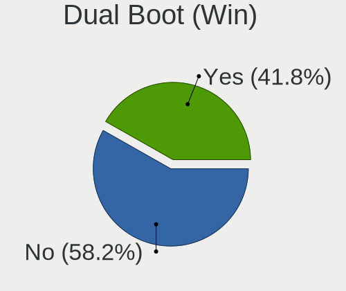

| Dual boot | Notebooks | Percent |
|-----------|-----------|---------|
| No        | 684       | 59.07%  |
| Yes       | 474       | 40.93%  |

Board
-----

Vendor
------

Motherboard manufacturer

| Name                    | Notebooks | Percent |
|-------------------------|-----------|---------|
| Lenovo                  | 223       | 19.26%  |
| Hewlett-Packard         | 209       | 18.05%  |
| Dell                    | 179       | 15.46%  |
| Acer                    | 125       | 10.79%  |
| ASUSTek Computer        | 124       | 10.71%  |
| Toshiba                 | 61        | 5.27%   |
| Sony                    | 25        | 2.16%   |
| Samsung Electronics     | 25        | 2.16%   |
| Fujitsu                 | 24        | 2.07%   |
| Apple                   | 19        | 1.64%   |
| MSI                     | 16        | 1.38%   |
| TUXEDO                  | 10        | 0.86%   |
| Positivo                | 10        | 0.86%   |
| Packard Bell            | 10        | 0.86%   |
| Medion                  | 8         | 0.69%   |
| Philco                  | 7         | 0.6%    |
| HUAWEI                  | 7         | 0.6%    |
| Unknown                 | 6         | 0.52%   |
| Fujitsu Siemens         | 5         | 0.43%   |
| Notebook                | 4         | 0.35%   |
| eMachines               | 4         | 0.35%   |
| Alienware               | 4         | 0.35%   |
| Positivo Bahia - VAIO   | 3         | 0.26%   |
| LG Electronics          | 3         | 0.26%   |
| Compaq                  | 3         | 0.26%   |
| Chuwi                   | 3         | 0.26%   |
| AZW                     | 3         | 0.26%   |
| PC Specialist           | 2         | 0.17%   |
| Intel                   | 2         | 0.17%   |
| HYPA                    | 2         | 0.17%   |
| Gigabyte Technology     | 2         | 0.17%   |
| Gateway                 | 2         | 0.17%   |
| Clevo                   | 2         | 0.17%   |
| Wortmann AG             | 1         | 0.09%   |
| VIT                     | 1         | 0.09%   |
| UMAX                    | 1         | 0.09%   |
| Teclast                 | 1         | 0.09%   |
| TAGTech                 | 1         | 0.09%   |
| System76                | 1         | 0.09%   |
| SLIMBOOK                | 1         | 0.09%   |
| Shuttle                 | 1         | 0.09%   |
| Schenker                | 1         | 0.09%   |
| Radio Victoria Fueguina | 1         | 0.09%   |
| Quanta                  | 1         | 0.09%   |
| Panasonic               | 1         | 0.09%   |
| LincPlus                | 1         | 0.09%   |
| Lanix                   | 1         | 0.09%   |
| Infinix                 | 1         | 0.09%   |
| Framework               | 1         | 0.09%   |
| EVOO                    | 1         | 0.09%   |
| DNS                     | 1         | 0.09%   |
| Digibras                | 1         | 0.09%   |
| Dataton                 | 1         | 0.09%   |
| Coradir                 | 1         | 0.09%   |
| Computer Depot          | 1         | 0.09%   |
| Beelink                 | 1         | 0.09%   |
| AWOW                    | 1         | 0.09%   |
| ARKA                    | 1         | 0.09%   |
| AMI                     | 1         | 0.09%   |

Model
-----

Motherboard model

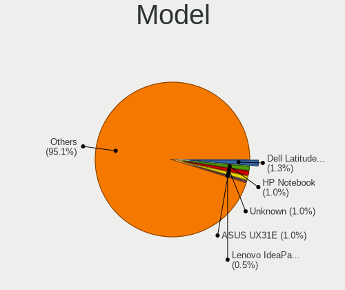

| Name                                       | Notebooks | Percent |
|--------------------------------------------|-----------|---------|
| Unknown                                    | 17        | 1.47%   |
| HP Notebook                                | 8         | 0.69%   |
| HP Pavilion g6                             | 7         | 0.6%    |
| Dell Latitude 3310                         | 7         | 0.6%    |
| HP Pavilion dv6                            | 6         | 0.52%   |
| HP Laptop 14-fq0xxx                        | 6         | 0.52%   |
| Lenovo IdeaPad S340-14API 81NB             | 5         | 0.43%   |
| Dell Latitude E7450                        | 5         | 0.43%   |
| Dell Latitude 3189                         | 5         | 0.43%   |
| Sony VGN-FZ31Z                             | 4         | 0.35%   |
| Positivo Mobile                            | 4         | 0.35%   |
| HP Pavilion 15                             | 4         | 0.35%   |
| Dell Precision M6800                       | 4         | 0.35%   |
| Dell Latitude E5410                        | 4         | 0.35%   |
| Dell Latitude D630                         | 4         | 0.35%   |
| Acer Aspire A515-51G                       | 4         | 0.35%   |
| Acer AO722                                 | 4         | 0.35%   |
| Toshiba Satellite P200                     | 3         | 0.26%   |
| Samsung 300E4A/300E5A/300E7A/3430EA/3530EA | 3         | 0.26%   |
| Philco 10D                                 | 3         | 0.26%   |
| MSI GE72VR 6RF                             | 3         | 0.26%   |
| LG 15Z970-E.BH71P1                         | 3         | 0.26%   |
| Lenovo IdeaPad Y700-17ISK 80Q0             | 3         | 0.26%   |
| Lenovo G50-70 20351                        | 3         | 0.26%   |
| HUAWEI NBLK-WAX9X                          | 3         | 0.26%   |
| HP Pavilion Laptop 15-eh0xxx               | 3         | 0.26%   |
| HP Pavilion g7                             | 3         | 0.26%   |
| HP Pavilion dv7                            | 3         | 0.26%   |
| HP Pavilion dv6500                         | 3         | 0.26%   |
| HP Pavilion 11 x360 PC                     | 3         | 0.26%   |
| HP Laptop 17-ak0xx                         | 3         | 0.26%   |
| HP Laptop 15-db0xxx                        | 3         | 0.26%   |
| HP Laptop 15-da0xxx                        | 3         | 0.26%   |
| HP Compaq CQ58                             | 3         | 0.26%   |
| HP Compaq 15                               | 3         | 0.26%   |
| HP 2000                                    | 3         | 0.26%   |
| Dell Latitude E7440                        | 3         | 0.26%   |
| Dell Latitude E7240                        | 3         | 0.26%   |
| Dell Latitude E6540                        | 3         | 0.26%   |
| Dell Latitude E6420                        | 3         | 0.26%   |
| Dell Latitude E6410                        | 3         | 0.26%   |
| Dell Latitude E6230                        | 3         | 0.26%   |
| Dell Latitude E6220                        | 3         | 0.26%   |
| Dell Latitude E5570                        | 3         | 0.26%   |
| Dell Latitude E5550                        | 3         | 0.26%   |
| Dell Latitude E5450                        | 3         | 0.26%   |
| Dell Latitude 3300                         | 3         | 0.26%   |
| Dell Inspiron N5110                        | 3         | 0.26%   |
| ASUS X555LJ                                | 3         | 0.26%   |
| ASUS X551MA                                | 3         | 0.26%   |
| ASUS VivoBook_ASUSLaptop X515EA_X515EA     | 3         | 0.26%   |
| Apple MacBookPro9,2                        | 3         | 0.26%   |
| Acer Swift SF114-34                        | 3         | 0.26%   |
| Acer Aspire R3-131T                        | 3         | 0.26%   |
| Acer Aspire E5-571                         | 3         | 0.26%   |
| Acer Aspire 5735                           | 3         | 0.26%   |
| TUXEDO Aura 15 Gen1                        | 2         | 0.17%   |
| Toshiba Satellite S855D                    | 2         | 0.17%   |
| Toshiba Satellite Pro R50-C                | 2         | 0.17%   |
| Toshiba Satellite Pro C660                 | 2         | 0.17%   |

Model Family
------------

Motherboard model prefix

| Name                  | Notebooks | Percent |
|-----------------------|-----------|---------|
| Dell Latitude         | 108       | 9.33%   |
| Lenovo ThinkPad       | 97        | 8.38%   |
| Acer Aspire           | 86        | 7.43%   |
| Lenovo IdeaPad        | 64        | 5.53%   |
| HP Pavilion           | 54        | 4.66%   |
| Toshiba Satellite     | 51        | 4.4%    |
| Dell Inspiron         | 38        | 3.28%   |
| HP Laptop             | 35        | 3.02%   |
| HP ProBook            | 24        | 2.07%   |
| ASUS VivoBook         | 24        | 2.07%   |
| Unknown               | 17        | 1.47%   |
| HP EliteBook          | 16        | 1.38%   |
| HP Compaq             | 16        | 1.38%   |
| Fujitsu LIFEBOOK      | 15        | 1.3%    |
| Acer Swift            | 11        | 0.95%   |
| Packard Bell EasyNote | 9         | 0.78%   |
| Dell Precision        | 9         | 0.78%   |
| Acer Extensa          | 9         | 0.78%   |
| HP Notebook           | 8         | 0.69%   |
| HP OMEN               | 6         | 0.52%   |
| HP 255                | 6         | 0.52%   |
| Dell XPS              | 6         | 0.52%   |
| Dell Vostro           | 6         | 0.52%   |
| Acer Nitro            | 6         | 0.52%   |
| Lenovo Yoga           | 5         | 0.43%   |
| Lenovo Legion         | 5         | 0.43%   |
| HP ENVY               | 5         | 0.43%   |
| Dell System           | 5         | 0.43%   |
| Toshiba dynabook      | 4         | 0.35%   |
| Sony VGN-FZ31Z        | 4         | 0.35%   |
| Positivo Mobile       | 4         | 0.35%   |
| HP ZBook              | 4         | 0.35%   |
| HP 250                | 4         | 0.35%   |
| Dell Studio           | 4         | 0.35%   |
| ASUS TUF              | 4         | 0.35%   |
| Acer AO722            | 4         | 0.35%   |
| Toshiba TECRA         | 3         | 0.26%   |
| Samsung 300E4A        | 3         | 0.26%   |
| Philco 10D            | 3         | 0.26%   |
| MSI GE72VR            | 3         | 0.26%   |
| Medion Akoya          | 3         | 0.26%   |
| LG 15Z970-E.BH71P1    | 3         | 0.26%   |
| Lenovo G50-70         | 3         | 0.26%   |
| Lenovo Flex           | 3         | 0.26%   |
| HUAWEI NBLK-WAX9X     | 3         | 0.26%   |
| HP Stream             | 3         | 0.26%   |
| HP Presario           | 3         | 0.26%   |
| HP 245                | 3         | 0.26%   |
| HP 2000               | 3         | 0.26%   |
| ASUS ZenBook          | 3         | 0.26%   |
| ASUS X555LJ           | 3         | 0.26%   |
| ASUS X551MA           | 3         | 0.26%   |
| Apple MacBookPro9     | 3         | 0.26%   |
| Apple MacBookPro5     | 3         | 0.26%   |
| Acer TravelMate       | 3         | 0.26%   |
| TUXEDO Pulse          | 2         | 0.17%   |
| TUXEDO Aura           | 2         | 0.17%   |
| Toshiba PORTEGE       | 2         | 0.17%   |
| Samsung 700T          | 2         | 0.17%   |
| Positivo S14SL01      | 2         | 0.17%   |

MFG Year
--------

Motherboard manufacture year

| Year    | Notebooks | Percent |
|---------|-----------|---------|
| 2012    | 125       | 10.79%  |
| 2011    | 118       | 10.19%  |
| 2013    | 99        | 8.55%   |
| 2020    | 90        | 7.77%   |
| 2019    | 82        | 7.08%   |
| 2014    | 79        | 6.82%   |
| 2016    | 77        | 6.65%   |
| 2010    | 73        | 6.3%    |
| 2015    | 70        | 6.04%   |
| 2021    | 67        | 5.79%   |
| 2018    | 62        | 5.35%   |
| 2017    | 61        | 5.27%   |
| 2008    | 55        | 4.75%   |
| 2009    | 49        | 4.23%   |
| 2007    | 43        | 3.71%   |
| 2006    | 5         | 0.43%   |
| Unknown | 2         | 0.17%   |
| 2022    | 1         | 0.09%   |

Form Factor
-----------

Physical design of the computer

| Name     | Notebooks | Percent |
|----------|-----------|---------|
| Notebook | 1158      | 100%    |

Secure Boot
-----------

Enabled or disabled

| State    | Notebooks | Percent |
|----------|-----------|---------|
| Disabled | 1158      | 100%    |

Coreboot
--------

Have coreboot on board

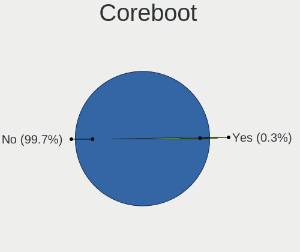

| Used | Notebooks | Percent |
|------|-----------|---------|
| No   | 1157      | 99.91%  |
| Yes  | 1         | 0.09%   |

RAM Size
--------

Total RAM memory

| Size in GB  | Notebooks | Percent |
|-------------|-----------|---------|
| 4.01-8.0    | 393       | 33.94%  |
| 3.01-4.0    | 373       | 32.21%  |
| 8.01-16.0   | 164       | 14.16%  |
| 16.01-24.0  | 120       | 10.36%  |
| 1.01-2.0    | 47        | 4.06%   |
| 32.01-64.0  | 28        | 2.42%   |
| 2.01-3.0    | 18        | 1.55%   |
| 24.01-32.0  | 6         | 0.52%   |
| 0.51-1.0    | 5         | 0.43%   |
| 64.01-256.0 | 4         | 0.35%   |

RAM Used
--------

Used RAM memory

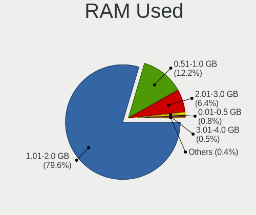

| Used GB   | Notebooks | Percent |
|-----------|-----------|---------|
| 1.01-2.0  | 942       | 81.35%  |
| 0.51-1.0  | 125       | 10.79%  |
| 2.01-3.0  | 75        | 6.48%   |
| 0.01-0.5  | 6         | 0.52%   |
| 3.01-4.0  | 4         | 0.35%   |
| 4.01-8.0  | 3         | 0.26%   |
| 8.01-16.0 | 3         | 0.26%   |

Total Drives
------------

Number of drives on board

| Drives | Notebooks | Percent |
|--------|-----------|---------|
| 1      | 838       | 72.37%  |
| 2      | 265       | 22.88%  |
| 3      | 26        | 2.25%   |
| 0      | 19        | 1.64%   |
| 4      | 9         | 0.78%   |
| 5      | 1         | 0.09%   |

Has CD-ROM
----------

Has CD-ROM on board

| Presented | Notebooks | Percent |
|-----------|-----------|---------|
| No        | 609       | 52.59%  |
| Yes       | 549       | 47.41%  |

Has Ethernet
------------

Has Ethernet on board

| Presented | Notebooks | Percent |
|-----------|-----------|---------|
| Yes       | 985       | 85.06%  |
| No        | 173       | 14.94%  |

Has WiFi
--------

Has WiFi module

| Presented | Notebooks | Percent |
|-----------|-----------|---------|
| Yes       | 1148      | 99.14%  |
| No        | 10        | 0.86%   |

Has Bluetooth
-------------

Has Bluetooth module

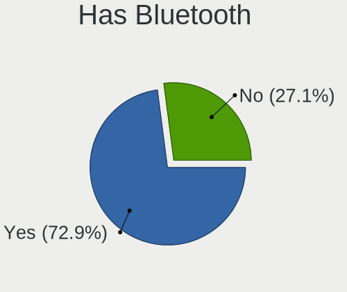

| Presented | Notebooks | Percent |
|-----------|-----------|---------|
| Yes       | 856       | 73.92%  |
| No        | 302       | 26.08%  |

Location
--------

Country
-------

Geographic location (country)

| Country                | Notebooks | Percent |
|------------------------|-----------|---------|
| Germany                | 170       | 14.68%  |
| USA                    | 125       | 10.79%  |
| France                 | 74        | 6.39%   |
| Brazil                 | 74        | 6.39%   |
| Poland                 | 65        | 5.61%   |
| Italy                  | 62        | 5.35%   |
| Russia                 | 42        | 3.63%   |
| Netherlands            | 41        | 3.54%   |
| UK                     | 35        | 3.02%   |
| Canada                 | 33        | 2.85%   |
| Spain                  | 32        | 2.76%   |
| Mexico                 | 25        | 2.16%   |
| Indonesia              | 25        | 2.16%   |
| Colombia               | 18        | 1.55%   |
| Australia              | 18        | 1.55%   |
| Turkey                 | 16        | 1.38%   |
| Japan                  | 16        | 1.38%   |
| Austria                | 16        | 1.38%   |
| Sweden                 | 13        | 1.12%   |
| Portugal               | 13        | 1.12%   |
| India                  | 12        | 1.04%   |
| Bulgaria               | 12        | 1.04%   |
| Argentina              | 12        | 1.04%   |
| Switzerland            | 11        | 0.95%   |
| Czechia                | 11        | 0.95%   |
| Belgium                | 11        | 0.95%   |
| Ukraine                | 10        | 0.86%   |
| Hungary                | 10        | 0.86%   |
| Serbia                 | 9         | 0.78%   |
| China                  | 9         | 0.78%   |
| Slovakia               | 8         | 0.69%   |
| Romania                | 7         | 0.6%    |
| Greece                 | 7         | 0.6%    |
| Finland                | 6         | 0.52%   |
| Chile                  | 6         | 0.52%   |
| Venezuela              | 5         | 0.43%   |
| New Zealand            | 5         | 0.43%   |
| Egypt                  | 5         | 0.43%   |
| Croatia                | 5         | 0.43%   |
| Peru                   | 4         | 0.35%   |
| Morocco                | 4         | 0.35%   |
| Costa Rica             | 4         | 0.35%   |
| South Africa           | 3         | 0.26%   |
| Philippines            | 3         | 0.26%   |
| Norway                 | 3         | 0.26%   |
| Ecuador                | 3         | 0.26%   |
| Denmark                | 3         | 0.26%   |
| Vietnam                | 2         | 0.17%   |
| Trinidad and Tobago    | 2         | 0.17%   |
| Thailand               | 2         | 0.17%   |
| Singapore              | 2         | 0.17%   |
| Paraguay               | 2         | 0.17%   |
| Moldova                | 2         | 0.17%   |
| Latvia                 | 2         | 0.17%   |
| Jordan                 | 2         | 0.17%   |
| Israel                 | 2         | 0.17%   |
| Bosnia and Herzegovina | 2         | 0.17%   |
| Bolivia                | 2         | 0.17%   |
| Zimbabwe               | 1         | 0.09%   |
| Uzbekistan             | 1         | 0.09%   |

City
----

Geographic location (city)

| City                 | Notebooks | Percent |
|----------------------|-----------|---------|
| Schagen              | 22        | 1.9%    |
| Berlin               | 16        | 1.38%   |
| Sao Paulo            | 14        | 1.21%   |
| Paris                | 12        | 1.04%   |
| Milan                | 11        | 0.95%   |
| Warsaw               | 10        | 0.86%   |
| Moscow               | 9         | 0.78%   |
| Vienna               | 8         | 0.69%   |
| Krakow               | 8         | 0.69%   |
| Sydney               | 7         | 0.6%    |
| Istanbul             | 7         | 0.6%    |
| Hamburg              | 7         | 0.6%    |
| Belgrade             | 7         | 0.6%    |
| Salach               | 6         | 0.52%   |
| Mexico City          | 6         | 0.52%   |
| Gorzw Wielkopolski | 6         | 0.52%   |
| Wroclaw              | 5         | 0.43%   |
| Surabaya             | 5         | 0.43%   |
| Prague               | 5         | 0.43%   |
| Montreal             | 5         | 0.43%   |
| Jakarta              | 5         | 0.43%   |
| Dortmund             | 5         | 0.43%   |
| Cologne              | 5         | 0.43%   |
| Vancouver            | 4         | 0.35%   |
| Sofia                | 4         | 0.35%   |
| Padova               | 4         | 0.35%   |
| Munich               | 4         | 0.35%   |
| Medelln            | 4         | 0.35%   |
| Madrid               | 4         | 0.35%   |
| Inman                | 4         | 0.35%   |
| Funchal              | 4         | 0.35%   |
| Bologna              | 4         | 0.35%   |
| Barranquilla         | 4         | 0.35%   |
| Auckland             | 4         | 0.35%   |
| Zagreb               | 3         | 0.26%   |
| Werdau               | 3         | 0.26%   |
| Villeurbanne         | 3         | 0.26%   |
| Teresopolis          | 3         | 0.26%   |
| Stuttgart            | 3         | 0.26%   |
| Spring Hill          | 3         | 0.26%   |
| Skierniewice         | 3         | 0.26%   |
| Sangerhausen         | 3         | 0.26%   |
| San Jos            | 3         | 0.26%   |
| Rio de Janeiro       | 3         | 0.26%   |
| Richmond Hill        | 3         | 0.26%   |
| Regina               | 3         | 0.26%   |
| Mrida              | 3         | 0.26%   |
| Melbourne            | 3         | 0.26%   |
| Leipzig              | 3         | 0.26%   |
| Gdansk               | 3         | 0.26%   |
| Duisburg             | 3         | 0.26%   |
| Champaign            | 3         | 0.26%   |
| Cairo                | 3         | 0.26%   |
| Braunschweig         | 3         | 0.26%   |
| Bratislava           | 3         | 0.26%   |
| Bonn                 | 3         | 0.26%   |
| Bogot              | 3         | 0.26%   |
| Beverly Hills        | 3         | 0.26%   |
| Bengaluru            | 3         | 0.26%   |
| Beijing              | 3         | 0.26%   |

Drives
------

Drive Vendor
------------

Hard drive vendors

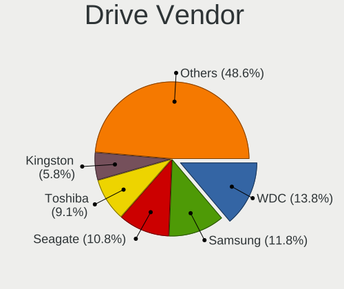

| Vendor              | Notebooks | Drives | Percent |
|---------------------|-----------|--------|---------|
| Samsung Electronics | 180       | 190    | 13.1%   |
| WDC                 | 178       | 182    | 12.95%  |
| Seagate             | 161       | 168    | 11.72%  |
| Toshiba             | 140       | 144    | 10.19%  |
| Kingston            | 84        | 85     | 6.11%   |
| Hitachi             | 62        | 62     | 4.51%   |
| Crucial             | 58        | 60     | 4.22%   |
| Unknown             | 51        | 52     | 3.71%   |
| HGST                | 47        | 47     | 3.42%   |
| SanDisk             | 42        | 42     | 3.06%   |
| SK hynix            | 40        | 44     | 2.91%   |
| Micron Technology   | 29        | 29     | 2.11%   |
| A-DATA Technology   | 29        | 29     | 2.11%   |
| Intel               | 24        | 26     | 1.75%   |
| LITEON              | 17        | 17     | 1.24%   |
| Fujitsu             | 16        | 16     | 1.16%   |
| Unknown             | 14        | 14     | 1.02%   |
| Intenso             | 11        | 11     | 0.8%    |
| Goodram             | 11        | 11     | 0.8%    |
| Patriot             | 9         | 9      | 0.66%   |
| KIOXIA              | 9         | 9      | 0.66%   |
| China               | 8         | 8      | 0.58%   |
| ASMT                | 8         | 8      | 0.58%   |
| Transcend           | 7         | 7      | 0.51%   |
| SSSTC               | 7         | 7      | 0.51%   |
| Apple               | 7         | 7      | 0.51%   |
| KingSpec            | 6         | 6      | 0.44%   |
| JMicron Technology  | 6         | 6      | 0.44%   |
| Corsair             | 6         | 6      | 0.44%   |
| Apacer              | 6         | 6      | 0.44%   |
| SPCC                | 5         | 5      | 0.36%   |
| Silicon Motion      | 5         | 6      | 0.36%   |
| SABRENT             | 5         | 5      | 0.36%   |
| Phison              | 5         | 5      | 0.36%   |
| PNY                 | 4         | 4      | 0.29%   |
| OCZ                 | 4         | 4      | 0.29%   |
| LITEONIT            | 4         | 4      | 0.29%   |
| Hewlett-Packard     | 4         | 4      | 0.29%   |
| UMIS                | 3         | 3      | 0.22%   |
| Plextor             | 3         | 3      | 0.22%   |
| Lexar               | 3         | 3      | 0.22%   |
| KingDian            | 3         | 3      | 0.22%   |
| Verbatim            | 2         | 2      | 0.15%   |
| TCSUNBOW            | 2         | 2      | 0.15%   |
| KIOXIA-EXCERIA      | 2         | 2      | 0.15%   |
| INNOVATION IT       | 2         | 2      | 0.15%   |
| INDMEM              | 2         | 2      | 0.15%   |
| Gigabyte Technology | 2         | 2      | 0.15%   |
| Drevo               | 2         | 2      | 0.15%   |
| Dogfish             | 2         | 2      | 0.15%   |
| ASMedia             | 2         | 2      | 0.15%   |
| XrayDisk            | 1         | 1      | 0.07%   |
| XPG                 | 1         | 1      | 0.07%   |
| Wdxsky              | 1         | 1      | 0.07%   |
| WD MediaMax         | 1         | 1      | 0.07%   |
| Vaseky              | 1         | 1      | 0.07%   |
| V-GeN               | 1         | 1      | 0.07%   |
| Team                | 1         | 1      | 0.07%   |
| T-FORCE             | 1         | 1      | 0.07%   |
| SUNTRSI             | 1         | 1      | 0.07%   |

Drive Model
-----------

Hard drive models

| Model                                   | Notebooks | Percent |
|-----------------------------------------|-----------|---------|
| Seagate ST1000LM024 HN-M101MBB 1TB      | 24        | 1.72%   |
| Toshiba MQ01ABF050 500GB                | 23        | 1.65%   |
| Kingston SA400S37240G 240GB SSD         | 21        | 1.5%    |
| Toshiba MQ04ABF100 1TB                  | 18        | 1.29%   |
| Toshiba MQ01ABD100 1TB                  | 16        | 1.14%   |
| Seagate ST500LT012-1DG142 500GB         | 15        | 1.07%   |
| Unknown                                 | 14        | 1%      |
| Seagate ST1000LM035-1RK172 1TB          | 13        | 0.93%   |
| Samsung SSD 860 EVO 500GB               | 12        | 0.86%   |
| Samsung SSD 850 EVO 250GB               | 12        | 0.86%   |
| HGST HTS721010A9E630 1TB                | 12        | 0.86%   |
| Kingston SA400S37480G 480GB SSD         | 10        | 0.72%   |
| Hitachi HTS543232A7A384 320GB           | 10        | 0.72%   |
| WDC WD5000LPVX-22V0TT0 500GB            | 9         | 0.64%   |
| Seagate ST9500325AS 500GB               | 9         | 0.64%   |
| Seagate ST2000LM015-2E8174 2TB          | 9         | 0.64%   |
| HGST HTS541010A9E680 1TB                | 9         | 0.64%   |
| Crucial CT240BX500SSD1 240GB            | 9         | 0.64%   |
| Kingston SA400S37120G 120GB SSD         | 8         | 0.57%   |
| WDC WDS500G2B0A-00SM50 500GB SSD        | 7         | 0.5%    |
| Unknown DA4064  64GB                    | 7         | 0.5%    |
| Samsung SSD 860 QVO 1TB                 | 7         | 0.5%    |
| Samsung SSD 850 EVO 500GB               | 7         | 0.5%    |
| HGST HTS545050A7E680 500GB              | 7         | 0.5%    |
| Seagate ST9320325AS 320GB               | 6         | 0.43%   |
| Seagate ST500LM021-1KJ152 500GB         | 6         | 0.43%   |
| Seagate ST500LM012 HN-M500MBB 500GB     | 6         | 0.43%   |
| SanDisk SSD PLUS 480GB                  | 6         | 0.43%   |
| Samsung SSD 860 EVO 250GB               | 6         | 0.43%   |
| Micron 1100_MTFDDAV256TBN 256GB SSD     | 6         | 0.43%   |
| JMicron Generic 2TB                     | 6         | 0.43%   |
| Hitachi HTS547550A9E384 500GB           | 6         | 0.43%   |
| Crucial CT1000MX500SSD1 1TB             | 6         | 0.43%   |
| Crucial CT1000BX500SSD1 1TB             | 6         | 0.43%   |
| A-DATA SX8200PNP 512GB                  | 6         | 0.43%   |
| WDC WD10JPCX-24UE4T0 1TB                | 5         | 0.36%   |
| Unknown SD/MMC/MS PRO 128GB             | 5         | 0.36%   |
| Unknown ISOCOM  64GB                    | 5         | 0.36%   |
| Toshiba MK1246GSX 120GB                 | 5         | 0.36%   |
| Seagate ST500LM000-1EJ162 500GB         | 5         | 0.36%   |
| Samsung SSD 840 EVO 500GB               | 5         | 0.36%   |
| Hitachi HTS547575A9E384 752GB           | 5         | 0.36%   |
| HGST HTS545050A7E380 500GB              | 5         | 0.36%   |
| Crucial CT500MX500SSD1 500GB            | 5         | 0.36%   |
| WDC WD5000LPCX-24C6HT0 500GB            | 4         | 0.29%   |
| WDC WD3200BPVT-22JJ5T0 320GB            | 4         | 0.29%   |
| WDC WD2500BEVT-22ZCT0 250GB             | 4         | 0.29%   |
| WDC WD10SPZX-24Z10 1TB                  | 4         | 0.29%   |
| Unknown SD64G  64GB                     | 4         | 0.29%   |
| Toshiba TR200 240GB SSD                 | 4         | 0.29%   |
| Toshiba MQ01ABF032 320GB                | 4         | 0.29%   |
| Toshiba KSG60ZMV256G M.2 2280 256GB SSD | 4         | 0.29%   |
| Seagate ST9250315AS 250GB               | 4         | 0.29%   |
| Seagate ST1000LM048-2E7172 1TB          | 4         | 0.29%   |
| Samsung SSD 860 EVO M.2 2TB             | 4         | 0.29%   |
| Samsung MZVLB1T0HBLR-000L2 1TB          | 4         | 0.29%   |
| Intenso SSD Sata III 256GB              | 4         | 0.29%   |
| Hitachi HTS545025B9SA02 250GB           | 4         | 0.29%   |
| HGST HTS725050A7E630 500GB              | 4         | 0.29%   |
| WDC WDS240G2G0B-00EPW0 240GB SSD        | 3         | 0.21%   |

HDD Vendor
----------

Hard disk drive vendors

| Vendor              | Notebooks | Drives | Percent |
|---------------------|-----------|--------|---------|
| Seagate             | 159       | 165    | 27.89%  |
| WDC                 | 134       | 136    | 23.51%  |
| Toshiba             | 121       | 123    | 21.23%  |
| Hitachi             | 62        | 62     | 10.88%  |
| HGST                | 47        | 47     | 8.25%   |
| Fujitsu             | 16        | 16     | 2.81%   |
| Samsung Electronics | 10        | 10     | 1.75%   |
| JMicron Technology  | 6         | 6      | 1.05%   |
| Unknown             | 5         | 5      | 0.88%   |
| ASMT                | 3         | 3      | 0.53%   |
| Apple               | 2         | 2      | 0.35%   |
| WD MediaMax         | 1         | 1      | 0.18%   |
| QC-FT-D             | 1         | 1      | 0.18%   |
| HGST HTS            | 1         | 1      | 0.18%   |
| Hewlett-Packard     | 1         | 1      | 0.18%   |
| ASMedia             | 1         | 1      | 0.18%   |

SSD Vendor
----------

Solid state drive vendors

| Vendor              | Notebooks | Drives | Percent |
|---------------------|-----------|--------|---------|
| Samsung Electronics | 123       | 128    | 23.12%  |
| Kingston            | 65        | 66     | 12.22%  |
| Crucial             | 52        | 54     | 9.77%   |
| SanDisk             | 37        | 37     | 6.95%   |
| Micron Technology   | 23        | 23     | 4.32%   |
| WDC                 | 22        | 22     | 4.14%   |
| A-DATA Technology   | 20        | 20     | 3.76%   |
| SK hynix            | 16        | 17     | 3.01%   |
| LITEON              | 15        | 15     | 2.82%   |
| Toshiba             | 13        | 13     | 2.44%   |
| Goodram             | 11        | 11     | 2.07%   |
| Intenso             | 10        | 10     | 1.88%   |
| Patriot             | 9         | 9      | 1.69%   |
| China               | 8         | 8      | 1.5%    |
| Transcend           | 7         | 7      | 1.32%   |
| Intel               | 7         | 7      | 1.32%   |
| Unknown             | 7         | 7      | 1.32%   |
| KingSpec            | 6         | 6      | 1.13%   |
| Apacer              | 6         | 6      | 1.13%   |
| Apple               | 5         | 5      | 0.94%   |
| PNY                 | 4         | 4      | 0.75%   |
| OCZ                 | 4         | 4      | 0.75%   |
| LITEONIT            | 4         | 4      | 0.75%   |
| Corsair             | 4         | 4      | 0.75%   |
| SPCC                | 3         | 3      | 0.56%   |
| Plextor             | 3         | 3      | 0.56%   |
| Lexar               | 3         | 3      | 0.56%   |
| KingDian            | 3         | 3      | 0.56%   |
| TCSUNBOW            | 2         | 2      | 0.38%   |
| KIOXIA-EXCERIA      | 2         | 2      | 0.38%   |
| INNOVATION IT       | 2         | 2      | 0.38%   |
| Hewlett-Packard     | 2         | 2      | 0.38%   |
| Drevo               | 2         | 2      | 0.38%   |
| Dogfish             | 2         | 2      | 0.38%   |
| ASMT                | 2         | 2      | 0.38%   |
| XrayDisk            | 1         | 1      | 0.19%   |
| Wdxsky              | 1         | 1      | 0.19%   |
| Verbatim            | 1         | 1      | 0.19%   |
| Vaseky              | 1         | 1      | 0.19%   |
| V-GeN               | 1         | 1      | 0.19%   |
| Team                | 1         | 1      | 0.19%   |
| T-FORCE             | 1         | 1      | 0.19%   |
| SUNTRSI             | 1         | 1      | 0.19%   |
| SSSTC               | 1         | 1      | 0.19%   |
| SPCC M.2            | 1         | 1      | 0.19%   |
| Seagate             | 1         | 1      | 0.19%   |
| RX7                 | 1         | 1      | 0.19%   |
| MidasForce          | 1         | 1      | 0.19%   |
| LS600               | 1         | 1      | 0.19%   |
| Leven               | 1         | 1      | 0.19%   |
| Kston               | 1         | 1      | 0.19%   |
| KLEVV               | 1         | 1      | 0.19%   |
| KingFast            | 1         | 1      | 0.19%   |
| Kingchuxing         | 1         | 1      | 0.19%   |
| Innodisk            | 1         | 1      | 0.19%   |
| Imation             | 1         | 1      | 0.19%   |
| HS-SSD-E100N        | 1         | 1      | 0.19%   |
| Golden              | 1         | 1      | 0.19%   |
| Gigabyte Technology | 1         | 1      | 0.19%   |
| FORESEE             | 1         | 1      | 0.19%   |

Drive Kind
----------

HDD or SSD

| Kind    | Notebooks | Drives | Percent |
|---------|-----------|--------|---------|
| HDD     | 556       | 580    | 41.96%  |
| SSD     | 502       | 541    | 37.89%  |
| NVMe    | 196       | 214    | 14.79%  |
| MMC     | 58        | 61     | 4.38%   |
| Unknown | 13        | 14     | 0.98%   |

Drive Connector
---------------

SATA, SAS, NVMe, etc.

| Type | Notebooks | Drives | Percent |
|------|-----------|--------|---------|
| SATA | 966       | 1077   | 75.88%  |
| NVMe | 193       | 209    | 15.16%  |
| MMC  | 58        | 61     | 4.56%   |
| SAS  | 56        | 63     | 4.4%    |

Drive Size
----------

Size of hard drive

| Size in TB | Notebooks | Drives | Percent |
|------------|-----------|--------|---------|
| 0.01-0.5   | 763       | 827    | 72.81%  |
| 0.51-1.0   | 236       | 244    | 22.52%  |
| 1.01-2.0   | 46        | 47     | 4.39%   |
| 4.01-10.0  | 3         | 3      | 0.29%   |

Space Total
-----------

Amount of disk space available on the file system

| Size in GB | Notebooks | Percent |
|------------|-----------|---------|
| 1-20       | 684       | 59.07%  |
| 101-250    | 178       | 15.37%  |
| 251-500    | 107       | 9.24%   |
| 51-100     | 54        | 4.66%   |
| 501-1000   | 49        | 4.23%   |
| 21-50      | 37        | 3.2%    |
| Unknown    | 34        | 2.94%   |
| 1001-2000  | 15        | 1.3%    |

Space Used
----------

Amount of used disk space

| Used GB   | Notebooks | Percent |
|-----------|-----------|---------|
| 1-20      | 1038      | 89.64%  |
| Unknown   | 34        | 2.94%   |
| 51-100    | 25        | 2.16%   |
| 101-250   | 24        | 2.07%   |
| 21-50     | 22        | 1.9%    |
| 251-500   | 12        | 1.04%   |
| 1001-2000 | 2         | 0.17%   |
| 501-1000  | 1         | 0.09%   |

Malfunc. Drives
---------------

Drive models with a malfunction

| Model                                               | Notebooks | Drives | Percent |
|-----------------------------------------------------|-----------|--------|---------|
| Seagate ST1000LM024 HN-M101MBB 1TB                  | 11        | 11     | 4.04%   |
| Toshiba MQ01ABF050 500GB                            | 10        | 10     | 3.68%   |
| Hitachi HTS543232A7A384 320GB                       | 8         | 8      | 2.94%   |
| Seagate ST9320325AS 320GB                           | 6         | 6      | 2.21%   |
| HGST HTS541010A9E680 1TB                            | 6         | 6      | 2.21%   |
| Seagate ST500LT012-1DG142 500GB                     | 5         | 5      | 1.84%   |
| HGST HTS721010A9E630 1TB                            | 5         | 5      | 1.84%   |
| HGST HTS545050A7E380 500GB                          | 5         | 5      | 1.84%   |
| Toshiba MQ01ABD100 1TB                              | 4         | 4      | 1.47%   |
| Toshiba MK1246GSX 120GB                             | 4         | 4      | 1.47%   |
| Seagate ST9500325AS 500GB                           | 4         | 4      | 1.47%   |
| Seagate ST1000LM035-1RK172 1TB                      | 4         | 4      | 1.47%   |
| Hitachi HTS547575A9E384 752GB                       | 4         | 4      | 1.47%   |
| HGST HTS545050A7E680 500GB                          | 4         | 4      | 1.47%   |
| WDC WD3200BPVT-24JJ5T0 320GB                        | 3         | 3      | 1.1%    |
| Toshiba MQ01ABD050 500GB                            | 3         | 3      | 1.1%    |
| Toshiba KSG60ZMV256G M.2 2280 256GB SSD             | 3         | 3      | 1.1%    |
| Seagate ST500LM021-1KJ152 500GB                     | 3         | 3      | 1.1%    |
| Seagate ST500LM000-1EJ162 500GB                     | 3         | 3      | 1.1%    |
| Hitachi HTS547550A9E384 500GB                       | 3         | 3      | 1.1%    |
| Hitachi HTS541612J9SA00 120GB                       | 3         | 3      | 1.1%    |
| HGST HTS725050A7E630 500GB                          | 3         | 3      | 1.1%    |
| HGST HTS541075A9E680 752GB                          | 3         | 3      | 1.1%    |
| Crucial M4-CT256M4SSD3 256GB                        | 3         | 3      | 1.1%    |
| Crucial CT240M500SSD1 240GB                         | 3         | 3      | 1.1%    |
| WDC WD5000BEKT-75KA9T0 500GB                        | 2         | 2      | 0.74%   |
| Toshiba MQ04ABF100 1TB                              | 2         | 2      | 0.74%   |
| Toshiba MK3265GSX 320GB                             | 2         | 2      | 0.74%   |
| Toshiba MK2555GSX 250GB                             | 2         | 2      | 0.74%   |
| Toshiba MK2035GSS 200GB                             | 2         | 2      | 0.74%   |
| Toshiba MK1637GSX 160GB                             | 2         | 2      | 0.74%   |
| Toshiba MK1255GSX H 120GB                           | 2         | 2      | 0.74%   |
| Seagate ST9320423AS 320GB                           | 2         | 2      | 0.74%   |
| Seagate ST9320320AS 320GB                           | 2         | 2      | 0.74%   |
| Seagate ST9250410AS 250GB                           | 2         | 2      | 0.74%   |
| Seagate ST9250315AS 250GB                           | 2         | 2      | 0.74%   |
| Seagate ST750LM022 HN-M750MBB 752GB                 | 2         | 2      | 0.74%   |
| Seagate ST500LT012-9WS142 500GB                     | 2         | 2      | 0.74%   |
| Seagate ST500LM012 HN-M500MBB 500GB                 | 2         | 2      | 0.74%   |
| Seagate ST2000LM015-2E8174 2TB                      | 2         | 2      | 0.74%   |
| Seagate ST1000LX015-1U7172 1TB                      | 2         | 2      | 0.74%   |
| SanDisk SD9SN8W-128G-1006 128GB SSD                 | 2         | 2      | 0.74%   |
| Micron Technology MTFDDAV256TDL-1AW1ZABHA 256GB SSD | 2         | 2      | 0.74%   |
| Kingston SV300S37A120G 120GB SSD                    | 2         | 2      | 0.74%   |
| Hitachi HTS545050A7E380 500GB                       | 2         | 2      | 0.74%   |
| Hitachi HTS543232L9A300 320GB                       | 2         | 2      | 0.74%   |
| Hitachi HTS543225L9A300 250GB                       | 2         | 2      | 0.74%   |
| Hitachi HTS542525K9SA00 250GB                       | 2         | 2      | 0.74%   |
| Hitachi HTS542516K9SA00 160GB                       | 2         | 2      | 0.74%   |
| Hitachi HTS541616J9SA00 160GB                       | 2         | 2      | 0.74%   |
| WDC WDS240G2G0B-00EPW0 240GB SSD                    | 1         | 1      | 0.37%   |
| WDC WD5000LPVX-22V0TT0 500GB                        | 1         | 1      | 0.37%   |
| WDC WD5000LPCX-60VHAT0 500GB                        | 1         | 1      | 0.37%   |
| WDC WD5000LPCX-24C6HT0 500GB                        | 1         | 1      | 0.37%   |
| WDC WD5000BPVT-80HXZT3 500GB                        | 1         | 1      | 0.37%   |
| WDC WD5000BPVT-55HXZT3 500GB                        | 1         | 1      | 0.37%   |
| WDC WD5000BPVT-22HXZT3 500GB                        | 1         | 1      | 0.37%   |
| WDC WD5000BPVT-22HXZT1 500GB                        | 1         | 1      | 0.37%   |
| WDC WD3200BUDT-63DPZY0 320GB                        | 1         | 1      | 0.37%   |
| WDC WD3200BPVT-80ZEST0 320GB                        | 1         | 1      | 0.37%   |

Malfunc. Drive Vendor
---------------------

Vendors of faulty drives

| Vendor              | Notebooks | Drives | Percent |
|---------------------|-----------|--------|---------|
| Seagate             | 63        | 63     | 23.16%  |
| Toshiba             | 53        | 53     | 19.49%  |
| Hitachi             | 40        | 40     | 14.71%  |
| WDC                 | 29        | 29     | 10.66%  |
| HGST                | 27        | 27     | 9.93%   |
| Samsung Electronics | 9         | 9      | 3.31%   |
| Fujitsu             | 9         | 9      | 3.31%   |
| Crucial             | 9         | 9      | 3.31%   |
| Kingston            | 5         | 5      | 1.84%   |
| A-DATA Technology   | 5         | 5      | 1.84%   |
| Micron Technology   | 4         | 4      | 1.47%   |
| SanDisk             | 3         | 3      | 1.1%    |
| Intel               | 3         | 3      | 1.1%    |
| SK hynix            | 2         | 3      | 0.74%   |
| China               | 2         | 2      | 0.74%   |
| Vaseky              | 1         | 1      | 0.37%   |
| Transcend           | 1         | 1      | 0.37%   |
| LITEON              | 1         | 1      | 0.37%   |
| KingSpec            | 1         | 1      | 0.37%   |
| Drevo               | 1         | 1      | 0.37%   |
| Dogfish             | 1         | 1      | 0.37%   |
| Corsair             | 1         | 1      | 0.37%   |
| ASMedia             | 1         | 1      | 0.37%   |
| Apple               | 1         | 1      | 0.37%   |

Malfunc. HDD Vendor
-------------------

Vendors of faulty HDD drives

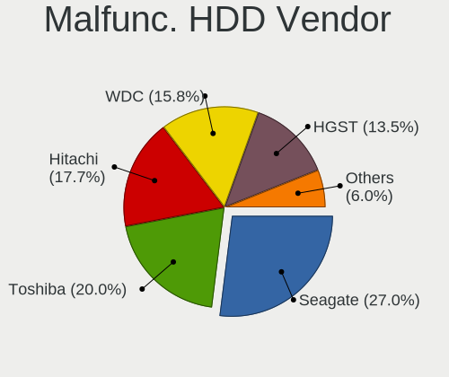

| Vendor              | Notebooks | Drives | Percent |
|---------------------|-----------|--------|---------|
| Seagate             | 63        | 63     | 28.38%  |
| Toshiba             | 50        | 50     | 22.52%  |
| Hitachi             | 40        | 40     | 18.02%  |
| WDC                 | 28        | 28     | 12.61%  |
| HGST                | 27        | 27     | 12.16%  |
| Fujitsu             | 9         | 9      | 4.05%   |
| Samsung Electronics | 4         | 4      | 1.8%    |
| ASMedia             | 1         | 1      | 0.45%   |

Malfunc. Drive Kind
-------------------

Kinds of faulty drives

| Kind | Notebooks | Drives | Percent |
|------|-----------|--------|---------|
| HDD  | 221       | 222    | 81.55%  |
| SSD  | 49        | 50     | 18.08%  |
| NVMe | 1         | 1      | 0.37%   |

Failed Drives
-------------

Failed drive models

| Model                               | Notebooks | Drives | Percent |
|-------------------------------------|-----------|--------|---------|
| WDC WD5000BEVT-22A0RT0 500GB        | 1         | 1      | 14.29%  |
| WDC WD3200BEVT-11ZCT0 320GB         | 1         | 1      | 14.29%  |
| WDC WD2500BEVT-60ZCT1 250GB         | 1         | 1      | 14.29%  |
| WDC WD10JPVX-60JC3T0 1TB            | 1         | 1      | 14.29%  |
| Toshiba MK3265GSXN 320GB            | 1         | 1      | 14.29%  |
| Seagate ST500LM012 HN-M500MBB 500GB | 1         | 1      | 14.29%  |
| Apple HDD HTS545050A7E362 500GB     | 1         | 1      | 14.29%  |

Failed Drive Vendor
-------------------

Failed drive vendors

| Vendor  | Notebooks | Drives | Percent |
|---------|-----------|--------|---------|
| WDC     | 4         | 4      | 57.14%  |
| Toshiba | 1         | 1      | 14.29%  |
| Seagate | 1         | 1      | 14.29%  |
| Apple   | 1         | 1      | 14.29%  |

Drive Status
------------

Number of failed and malfunc. drives

| Status   | Notebooks | Drives | Percent |
|----------|-----------|--------|---------|
| Works    | 877       | 1017   | 70.16%  |
| Malfunc  | 268       | 273    | 21.44%  |
| Detected | 98        | 113    | 7.84%   |
| Failed   | 7         | 7      | 0.56%   |

Storage controller
------------------

Storage Vendor
--------------

Storage controller vendors

| Vendor                           | Notebooks | Percent |
|----------------------------------|-----------|---------|
| Intel                            | 888       | 70.25%  |
| AMD                              | 177       | 14%     |
| Samsung Electronics              | 52        | 4.11%   |
| SanDisk                          | 24        | 1.9%    |
| SK hynix                         | 21        | 1.66%   |
| Kingston Technology Company      | 19        | 1.5%    |
| Phison Electronics               | 11        | 0.87%   |
| KIOXIA                           | 9         | 0.71%   |
| Nvidia                           | 8         | 0.63%   |
| ADATA Technology                 | 8         | 0.63%   |
| Toshiba America Info Systems     | 7         | 0.55%   |
| Micron Technology                | 7         | 0.55%   |
| Solid State Storage Technology   | 6         | 0.47%   |
| Silicon Motion                   | 6         | 0.47%   |
| Micron/Crucial Technology        | 5         | 0.4%    |
| Union Memory (Shenzhen)          | 3         | 0.24%   |
| Silicon Integrated Systems [SiS] | 3         | 0.24%   |
| ASMedia Technology               | 3         | 0.24%   |
| Realtek Semiconductor            | 2         | 0.16%   |
| Lite-On Technology               | 2         | 0.16%   |
| Seagate Technology               | 1         | 0.08%   |
| JMicron Technology               | 1         | 0.08%   |
| Biwin Storage Technology         | 1         | 0.08%   |

Storage Model
-------------

Storage controller models

| Model                                                                                  | Notebooks | Percent |
|----------------------------------------------------------------------------------------|-----------|---------|
| AMD FCH SATA Controller [AHCI mode]                                                    | 135       | 9.75%   |
| Intel 7 Series Chipset Family 6-port SATA Controller [AHCI mode]                       | 127       | 9.17%   |
| Intel Sunrise Point-LP SATA Controller [AHCI mode]                                     | 96        | 6.93%   |
| Intel 6 Series/C200 Series Chipset Family 6 port Mobile SATA AHCI Controller           | 74        | 5.34%   |
| Intel 82801 Mobile SATA Controller [RAID mode]                                         | 72        | 5.2%    |
| Intel 82801IBM/IEM (ICH9M/ICH9M-E) 4 port SATA Controller [AHCI mode]                  | 67        | 4.84%   |
| Intel 5 Series/3400 Series Chipset 4 port SATA AHCI Controller                         | 47        | 3.39%   |
| Intel 82801HM/HEM (ICH8M/ICH8M-E) IDE Controller                                       | 46        | 3.32%   |
| Intel Wildcat Point-LP SATA Controller [AHCI Mode]                                     | 41        | 2.96%   |
| Intel 8 Series SATA Controller 1 [AHCI mode]                                           | 36        | 2.6%    |
| Intel 82801HM/HEM (ICH8M/ICH8M-E) SATA Controller [AHCI mode]                          | 35        | 2.53%   |
| AMD SB7x0/SB8x0/SB9x0 SATA Controller [AHCI mode]                                      | 33        | 2.38%   |
| Intel Atom Processor E3800 Series SATA AHCI Controller                                 | 32        | 2.31%   |
| Intel 8 Series/C220 Series Chipset Family 6-port SATA Controller 1 [AHCI mode]         | 26        | 1.88%   |
| Samsung NVMe SSD Controller SM981/PM981/PM983                                          | 23        | 1.66%   |
| Intel HM170/QM170 Chipset SATA Controller [AHCI Mode]                                  | 23        | 1.66%   |
| Intel Celeron/Pentium Silver Processor SATA Controller                                 | 22        | 1.59%   |
| Intel Atom/Celeron/Pentium Processor x5-E8000/J3xxx/N3xxx Series SATA Controller       | 22        | 1.59%   |
| Samsung NVMe SSD Controller 980                                                        | 17        | 1.23%   |
| Intel 5 Series/3400 Series Chipset 6 port SATA AHCI Controller                         | 17        | 1.23%   |
| Intel Cannon Lake Mobile PCH SATA AHCI Controller                                      | 16        | 1.16%   |
| Intel Celeron N3350/Pentium N4200/Atom E3900 Series SATA AHCI Controller               | 14        | 1.01%   |
| Intel Tiger Lake-LP SATA Controller [AHCI mode]                                        | 13        | 0.94%   |
| AMD SB7x0/SB8x0/SB9x0 IDE Controller                                                   | 13        | 0.94%   |
| Intel Ice Lake-LP SATA Controller [AHCI mode]                                          | 12        | 0.87%   |
| Intel 82801HM/HEM (ICH8M/ICH8M-E) SATA Controller [IDE mode]                           | 11        | 0.79%   |
| SanDisk WD Blue SN550 NVMe SSD                                                         | 10        | 0.72%   |
| Intel Volume Management Device NVMe RAID Controller                                    | 10        | 0.72%   |
| SK hynix Gold P31 SSD                                                                  | 9         | 0.65%   |
| KIOXIA Non-Volatile memory controller                                                  | 9         | 0.65%   |
| Intel Comet Lake SATA AHCI Controller                                                  | 9         | 0.65%   |
| SK hynix BC501 NVMe Solid State Drive                                                  | 8         | 0.58%   |
| SanDisk WD Black SN750 / PC SN730 NVMe SSD                                             | 8         | 0.58%   |
| Intel SSD 660P Series                                                                  | 8         | 0.58%   |
| Intel Cannon Point-LP SATA Controller [AHCI Mode]                                      | 8         | 0.58%   |
| Micron Non-Volatile memory controller                                                  | 7         | 0.51%   |
| Intel 82801IBM/IEM (ICH9M/ICH9M-E) 2 port SATA Controller [IDE mode]                   | 7         | 0.51%   |
| Intel 7 Series Chipset Family 4-port SATA Controller [IDE mode]                        | 7         | 0.51%   |
| Intel 7 Series Chipset Family 2-port SATA Controller [IDE mode]                        | 7         | 0.51%   |
| ADATA XPG SX8200 Pro PCIe Gen3x4 M.2 2280 Solid State Drive                            | 7         | 0.51%   |
| Solid State Storage Non-Volatile memory controller                                     | 6         | 0.43%   |
| Silicon Motion SM2263EN/SM2263XT SSD Controller                                        | 6         | 0.43%   |
| Phison E12 NVMe Controller                                                             | 6         | 0.43%   |
| Intel Non-Volatile memory controller                                                   | 6         | 0.43%   |
| Intel 82801GBM/GHM (ICH7-M Family) SATA Controller [IDE mode]                          | 6         | 0.43%   |
| Intel 6 Series/C200 Series Chipset Family Mobile SATA Controller (IDE mode, ports 4-5) | 6         | 0.43%   |
| Intel 6 Series/C200 Series Chipset Family Mobile SATA Controller (IDE mode, ports 0-3) | 6         | 0.43%   |
| Samsung NVMe SSD Controller SM961/PM961/SM963                                          | 5         | 0.36%   |
| Nvidia MCP79 AHCI Controller                                                           | 5         | 0.36%   |
| Micron/Crucial P2 NVMe PCIe SSD                                                        | 5         | 0.36%   |
| Kingston Company U-SNS8154P3 NVMe SSD                                                  | 5         | 0.36%   |
| Intel Q170/Q150/B150/H170/H110/Z170/CM236 Chipset SATA Controller [AHCI Mode]          | 5         | 0.36%   |
| Intel NM10/ICH7 Family SATA Controller [AHCI mode]                                     | 5         | 0.36%   |
| Intel Mobile 4 Series Chipset PT IDER Controller                                       | 5         | 0.36%   |
| Intel 5 Series/3400 Series Chipset 4 port SATA IDE Controller                          | 5         | 0.36%   |
| SanDisk WD Blue SN500 / PC SN520 NVMe SSD                                              | 4         | 0.29%   |
| Kingston Company Company Non-Volatile memory controller                                | 4         | 0.29%   |
| Kingston Company OM3PDP3 NVMe SSD                                                      | 4         | 0.29%   |
| Intel 5 Series/3400 Series Chipset 2 port SATA IDE Controller                          | 4         | 0.29%   |
| Intel 400 Series Chipset Family SATA AHCI Controller                                   | 4         | 0.29%   |

Storage Kind
------------

Kind of storage controller (IDE, SATA, NVMe, SAS, ...)

| Kind | Notebooks | Percent |
|------|-----------|---------|
| SATA | 944       | 70.66%  |
| NVMe | 192       | 14.37%  |
| IDE  | 114       | 8.53%   |
| RAID | 86        | 6.44%   |

Processor
---------

CPU Vendor
----------

Processor vendors

| Vendor | Notebooks | Percent |
|--------|-----------|---------|
| Intel  | 938       | 81%     |
| AMD    | 220       | 19%     |

CPU Model
---------

Processor models

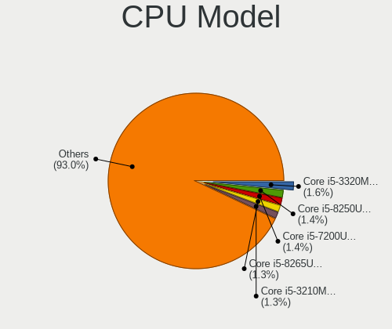

| Model                                         | Notebooks | Percent |
|-----------------------------------------------|-----------|---------|
| Intel Core i5-3320M CPU @ 2.60GHz             | 20        | 1.73%   |
| Intel Core i5-8250U CPU @ 1.60GHz             | 19        | 1.64%   |
| Intel Core i5-7200U CPU @ 2.50GHz             | 17        | 1.47%   |
| Intel Core i5-5200U CPU @ 2.20GHz             | 17        | 1.47%   |
| Intel Core i5-3210M CPU @ 2.50GHz             | 16        | 1.38%   |
| AMD Ryzen 5 3500U with Radeon Vega Mobile Gfx | 16        | 1.38%   |
| Intel Core i5-6300U CPU @ 2.40GHz             | 14        | 1.21%   |
| Intel Core i7-6700HQ CPU @ 2.60GHz            | 13        | 1.12%   |
| Intel Core i5-5300U CPU @ 2.30GHz             | 13        | 1.12%   |
| Intel Core i5-2450M CPU @ 2.50GHz             | 13        | 1.12%   |
| Intel Celeron CPU N3060 @ 1.60GHz             | 13        | 1.12%   |
| Intel Core i5-8265U CPU @ 1.60GHz             | 11        | 0.95%   |
| Intel Celeron CPU N2840 @ 2.16GHz             | 10        | 0.86%   |
| Intel Pentium Dual-Core CPU T4300 @ 2.10GHz   | 9         | 0.78%   |
| Intel Core i5-6200U CPU @ 2.30GHz             | 9         | 0.78%   |
| Intel Core i5-4300U CPU @ 1.90GHz             | 9         | 0.78%   |
| Intel Core i5-2430M CPU @ 2.40GHz             | 9         | 0.78%   |
| Intel Core i5-1035G1 CPU @ 1.00GHz            | 9         | 0.78%   |
| Intel Core i7-9750H CPU @ 2.60GHz             | 8         | 0.69%   |
| Intel Core i7-7700HQ CPU @ 2.80GHz            | 8         | 0.69%   |
| Intel Core i7-6500U CPU @ 2.50GHz             | 8         | 0.69%   |
| Intel Core i5-3230M CPU @ 2.60GHz             | 8         | 0.69%   |
| Intel Core i5 CPU M 520 @ 2.40GHz             | 8         | 0.69%   |
| Intel Core i5 CPU M 480 @ 2.67GHz             | 8         | 0.69%   |
| Intel Core i3-6006U CPU @ 2.00GHz             | 8         | 0.69%   |
| Intel Core i3-2350M CPU @ 2.30GHz             | 8         | 0.69%   |
| Intel Core i3-1005G1 CPU @ 1.20GHz            | 8         | 0.69%   |
| Intel Core i3 CPU M 370 @ 2.40GHz             | 8         | 0.69%   |
| Intel Celeron N4020 CPU @ 1.10GHz             | 8         | 0.69%   |
| AMD Ryzen 7 4800H with Radeon Graphics        | 8         | 0.69%   |
| Intel Core i7-8750H CPU @ 2.20GHz             | 7         | 0.6%    |
| Intel Core i5-4210U CPU @ 1.70GHz             | 7         | 0.6%    |
| Intel Core i5-2520M CPU @ 2.50GHz             | 7         | 0.6%    |
| Intel Core i3-7020U CPU @ 2.30GHz             | 7         | 0.6%    |
| Intel Core i3-2310M CPU @ 2.10GHz             | 7         | 0.6%    |
| Intel Core i3 CPU M 380 @ 2.53GHz             | 7         | 0.6%    |
| Intel Core 2 Duo CPU P8600 @ 2.40GHz          | 7         | 0.6%    |
| Intel Celeron CPU N3350 @ 1.10GHz             | 7         | 0.6%    |
| Intel 11th Gen Core i5-1135G7 @ 2.40GHz       | 7         | 0.6%    |
| AMD Ryzen 5 5500U with Radeon Graphics        | 7         | 0.6%    |
| AMD E-450 APU with Radeon HD Graphics         | 7         | 0.6%    |
| AMD C-60 APU with Radeon HD Graphics          | 7         | 0.6%    |
| AMD A8-7410 APU with AMD Radeon R5 Graphics   | 7         | 0.6%    |
| Intel Core i7-8550U CPU @ 1.80GHz             | 6         | 0.52%   |
| Intel Core i5-2410M CPU @ 2.30GHz             | 6         | 0.52%   |
| Intel Core i5 CPU M 560 @ 2.67GHz             | 6         | 0.52%   |
| Intel Core i5 CPU M 460 @ 2.53GHz             | 6         | 0.52%   |
| Intel Core i3-5005U CPU @ 2.00GHz             | 6         | 0.52%   |
| Intel Core i3-3120M CPU @ 2.50GHz             | 6         | 0.52%   |
| Intel Celeron CPU 1000M @ 1.80GHz             | 6         | 0.52%   |
| AMD Ryzen 3 3250U with Radeon Graphics        | 6         | 0.52%   |
| AMD E1-2100 APU with Radeon HD Graphics       | 6         | 0.52%   |
| AMD A4-9125 RADEON R3, 4 COMPUTE CORES 2C+2G  | 6         | 0.52%   |
| AMD 3020e with Radeon Graphics                | 6         | 0.52%   |
| Intel Pentium Silver N6000 @ 1.10GHz          | 5         | 0.43%   |
| Intel Pentium CPU N4200 @ 1.10GHz             | 5         | 0.43%   |
| Intel Pentium CPU N3700 @ 1.60GHz             | 5         | 0.43%   |
| Intel Core i7-7500U CPU @ 2.70GHz             | 5         | 0.43%   |
| Intel Core i7-3520M CPU @ 2.90GHz             | 5         | 0.43%   |
| Intel Core i5-4210M CPU @ 2.60GHz             | 5         | 0.43%   |

CPU Model Family
----------------

Processor model prefix

| Model                                | Notebooks | Percent |
|--------------------------------------|-----------|---------|
| Intel Core i5                        | 306       | 26.42%  |
| Intel Core i7                        | 155       | 13.39%  |
| Intel Core i3                        | 129       | 11.14%  |
| Intel Celeron                        | 117       | 10.1%   |
| Intel Core 2 Duo                     | 86        | 7.43%   |
| Intel Pentium                        | 49        | 4.23%   |
| AMD Ryzen 5                          | 37        | 3.2%    |
| Other                                | 31        | 2.68%   |
| AMD Ryzen 7                          | 30        | 2.59%   |
| AMD E1                               | 18        | 1.55%   |
| AMD A6                               | 17        | 1.47%   |
| Intel Pentium Dual-Core              | 16        | 1.38%   |
| AMD E                                | 14        | 1.21%   |
| AMD A8                               | 13        | 1.12%   |
| AMD A4                               | 13        | 1.12%   |
| AMD Ryzen 3                          | 12        | 1.04%   |
| AMD A10                              | 11        | 0.95%   |
| Intel Pentium Silver                 | 10        | 0.86%   |
| Intel Pentium Dual                   | 10        | 0.86%   |
| Intel Atom                           | 10        | 0.86%   |
| Intel Genuine                        | 7         | 0.6%    |
| Intel Core 2                         | 7         | 0.6%    |
| AMD E2                               | 7         | 0.6%    |
| AMD C-60                             | 7         | 0.6%    |
| AMD Athlon                           | 5         | 0.43%   |
| Intel Core m5                        | 3         | 0.26%   |
| Intel Core M                         | 3         | 0.26%   |
| AMD FX                               | 3         | 0.26%   |
| AMD Athlon II                        | 3         | 0.26%   |
| Intel Core m3                        | 2         | 0.17%   |
| Intel Core i9                        | 2         | 0.17%   |
| Intel Core 2 Quad                    | 2         | 0.17%   |
| Intel Celeron Dual-Core              | 2         | 0.17%   |
| AMD Ryzen 9                          | 2         | 0.17%   |
| AMD Ryzen 7 PRO                      | 2         | 0.17%   |
| AMD Phenom II                        | 2         | 0.17%   |
| AMD Athlon X2                        | 2         | 0.17%   |
| AMD Athlon 64 X2                     | 2         | 0.17%   |
| AMD Turion X2 Ultra Dual-Core Mobile | 1         | 0.09%   |
| AMD Turion II                        | 1         | 0.09%   |
| AMD Turion 64 Mobile                 | 1         | 0.09%   |
| AMD Sempron                          | 1         | 0.09%   |
| AMD Ryzen 5 PRO                      | 1         | 0.09%   |
| AMD GX                               | 1         | 0.09%   |
| AMD C-70                             | 1         | 0.09%   |
| AMD C-50                             | 1         | 0.09%   |
| AMD Athlon Neo X2                    | 1         | 0.09%   |
| AMD Athlon Neo                       | 1         | 0.09%   |
| AMD A12                              | 1         | 0.09%   |

CPU Cores
---------

Number of processor cores

| Number | Notebooks | Percent |
|--------|-----------|---------|
| 2      | 800       | 69.08%  |
| 4      | 257       | 22.19%  |
| 6      | 41        | 3.54%   |
| 8      | 31        | 2.68%   |
| 1      | 27        | 2.33%   |
| 10     | 1         | 0.09%   |
| 3      | 1         | 0.09%   |

CPU Sockets
-----------

Number of sockets

| Number | Notebooks | Percent |
|--------|-----------|---------|
| 1      | 1158      | 100%    |

CPU Threads
-----------

Threads per core (Hyper-Threading)

| Number | Notebooks | Percent |
|--------|-----------|---------|
| 2      | 719       | 62.09%  |
| 1      | 433       | 37.39%  |
| 8      | 6         | 0.52%   |

CPU Op-Modes
------------

CPU Operation Modes (32-bit, 64-bit)

| Op mode        | Notebooks | Percent |
|----------------|-----------|---------|
| 32-bit, 64-bit | 1157      | 99.91%  |
| Unknown        | 1         | 0.09%   |

CPU Microcode
-------------

Microcode number

| Number     | Notebooks | Percent |
|------------|-----------|---------|
| 0x206a7    | 114       | 9.84%   |
| 0x306a9    | 111       | 9.59%   |
| 0x1067a    | 62        | 5.35%   |
| 0x20655    | 50        | 4.32%   |
| 0x306d4    | 49        | 4.23%   |
| 0x406e3    | 47        | 4.06%   |
| 0x40651    | 39        | 3.37%   |
| 0x806e9    | 36        | 3.11%   |
| 0x806ea    | 34        | 2.94%   |
| 0x6fd      | 34        | 2.94%   |
| 0x306c3    | 34        | 2.94%   |
| 0x30678    | 28        | 2.42%   |
| Unknown    | 28        | 2.42%   |
| 0x806ec    | 26        | 2.25%   |
| 0x08108109 | 24        | 2.07%   |
| 0x706e5    | 22        | 1.9%    |
| 0x10676    | 21        | 1.81%   |
| 0x906ea    | 20        | 1.73%   |
| 0x506e3    | 20        | 1.73%   |
| 0x20652    | 19        | 1.64%   |
| 0x406c4    | 18        | 1.55%   |
| 0x06006705 | 18        | 1.55%   |
| 0x806c1    | 17        | 1.47%   |
| 0x506c9    | 14        | 1.21%   |
| 0x0500010d | 14        | 1.21%   |
| 0x706a8    | 12        | 1.04%   |
| 0x706a1    | 12        | 1.04%   |
| 0x08108102 | 12        | 1.04%   |
| 0x906e9    | 10        | 0.86%   |
| 0x07030105 | 10        | 0.86%   |
| 0x406c3    | 9         | 0.78%   |
| 0x0a50000c | 9         | 0.78%   |
| 0x08608103 | 9         | 0.78%   |
| 0x08600106 | 9         | 0.78%   |
| 0x0700010b | 9         | 0.78%   |
| 0xa0652    | 8         | 0.69%   |
| 0x05000101 | 7         | 0.6%    |
| 0x906c0    | 6         | 0.52%   |
| 0x6fb      | 6         | 0.52%   |
| 0x30673    | 6         | 0.52%   |
| 0x30661    | 6         | 0.52%   |
| 0x10661    | 6         | 0.52%   |
| 0x08200103 | 6         | 0.52%   |
| 0x06001119 | 6         | 0.52%   |
| 0x03000027 | 6         | 0.52%   |
| 0x806eb    | 5         | 0.43%   |
| 0x6f6      | 5         | 0.43%   |
| 0x07030104 | 5         | 0.43%   |
| 0x6fa      | 4         | 0.35%   |
| 0x08608102 | 4         | 0.35%   |
| 0x08600104 | 4         | 0.35%   |
| 0x08600103 | 4         | 0.35%   |
| 0x0600611a | 4         | 0.35%   |
| 0x05000119 | 4         | 0.35%   |
| 0x05000028 | 4         | 0.35%   |
| 0x010000c8 | 4         | 0.35%   |
| 0x106e5    | 3         | 0.26%   |
| 0x106ca    | 3         | 0.26%   |
| 0x06003106 | 3         | 0.26%   |
| 0x0600111f | 3         | 0.26%   |

CPU Microarch
-------------

Microarchitecture

| Name            | Notebooks | Percent |
|-----------------|-----------|---------|
| KabyLake        | 136       | 11.74%  |
| SandyBridge     | 114       | 9.84%   |
| IvyBridge       | 112       | 9.67%   |
| Penryn          | 83        | 7.17%   |
| Haswell         | 74        | 6.39%   |
| Skylake         | 71        | 6.13%   |
| Westmere        | 70        | 6.04%   |
| Silvermont      | 61        | 5.27%   |
| Core            | 57        | 4.92%   |
| Broadwell       | 50        | 4.32%   |
| Zen+            | 37        | 3.2%    |
| Bobcat          | 30        | 2.59%   |
| Excavator       | 27        | 2.33%   |
| Goldmont plus   | 24        | 2.07%   |
| IceLake         | 22        | 1.9%    |
| Zen 2           | 20        | 1.73%   |
| TigerLake       | 19        | 1.64%   |
| Unknown         | 17        | 1.47%   |
| Puma            | 16        | 1.38%   |
| Zen 3           | 14        | 1.21%   |
| Piledriver      | 14        | 1.21%   |
| Jaguar          | 14        | 1.21%   |
| Goldmont        | 14        | 1.21%   |
| CometLake       | 10        | 0.86%   |
| Zen             | 9         | 0.78%   |
| Bonnell         | 9         | 0.78%   |
| Tremont         | 6         | 0.52%   |
| K8 Hammer       | 6         | 0.52%   |
| K10 Llano       | 6         | 0.52%   |
| K10             | 6         | 0.52%   |
| K8 & K10 hybrid | 4         | 0.35%   |
| Steamroller     | 3         | 0.26%   |
| Nehalem         | 3         | 0.26%   |

Graphics
--------

GPU Vendor
----------

Vendors of graphics cards

| Vendor                           | Notebooks | Percent |
|----------------------------------|-----------|---------|
| Intel                            | 836       | 60.49%  |
| AMD                              | 285       | 20.62%  |
| Nvidia                           | 258       | 18.67%  |
| Silicon Integrated Systems [SiS] | 3         | 0.22%   |

GPU Model
---------

Graphics card models

| Model                                                                                    | Notebooks | Percent |
|------------------------------------------------------------------------------------------|-----------|---------|
| Intel 3rd Gen Core processor Graphics Controller                                         | 108       | 7.52%   |
| Intel 2nd Generation Core Processor Family Integrated Graphics Controller                | 104       | 7.24%   |
| Intel Mobile 4 Series Chipset Integrated Graphics Controller                             | 53        | 3.69%   |
| Intel Core Processor Integrated Graphics Controller                                      | 53        | 3.69%   |
| Intel Skylake GT2 [HD Graphics 520]                                                      | 45        | 3.13%   |
| Intel HD Graphics 5500                                                                   | 43        | 2.99%   |
| AMD Picasso/Raven 2 [Radeon Vega Series / Radeon Vega Mobile Series]                     | 43        | 2.99%   |
| Intel Haswell-ULT Integrated Graphics Controller                                         | 39        | 2.72%   |
| Intel HD Graphics 620                                                                    | 34        | 2.37%   |
| Intel Atom Processor Z36xxx/Z37xxx Series Graphics & Display                             | 34        | 2.37%   |
| Intel UHD Graphics 620                                                                   | 30        | 2.09%   |
| Intel Mobile GM965/GL960 Integrated Graphics Controller (secondary)                      | 29        | 2.02%   |
| Intel Mobile GM965/GL960 Integrated Graphics Controller (primary)                        | 29        | 2.02%   |
| Intel Atom/Celeron/Pentium Processor x5-E8000/J3xxx/N3xxx Integrated Graphics Controller | 27        | 1.88%   |
| Intel 4th Gen Core Processor Integrated Graphics Controller                              | 27        | 1.88%   |
| Intel CoffeeLake-H GT2 [UHD Graphics 630]                                                | 20        | 1.39%   |
| AMD Stoney [Radeon R2/R3/R4/R5 Graphics]                                                 | 20        | 1.39%   |
| Intel WhiskeyLake-U GT2 [UHD Graphics 620]                                               | 19        | 1.32%   |
| Intel GeminiLake [UHD Graphics 600]                                                      | 19        | 1.32%   |
| AMD Renoir                                                                               | 18        | 1.25%   |
| Intel Iris Plus Graphics G1 (Ice Lake)                                                   | 17        | 1.18%   |
| Intel HD Graphics 530                                                                    | 17        | 1.18%   |
| Intel TigerLake-LP GT2 [Iris Xe Graphics]                                                | 14        | 0.97%   |
| AMD Lucienne                                                                             | 13        | 0.91%   |
| AMD Cezanne                                                                              | 13        | 0.91%   |
| Intel CometLake-U GT2 [UHD Graphics]                                                     | 12        | 0.84%   |
| Nvidia GF117M [GeForce 610M/710M/810M/820M / GT 620M/625M/630M/720M]                     | 11        | 0.77%   |
| AMD Sun XT [Radeon HD 8670A/8670M/8690M / R5 M330 / M430 / Radeon 520 Mobile]            | 11        | 0.77%   |
| AMD Mullins [Radeon R4/R5 Graphics]                                                      | 10        | 0.7%    |
| Nvidia GP107M [GeForce GTX 1050 Mobile]                                                  | 9         | 0.63%   |
| Nvidia GM108M [GeForce 940MX]                                                            | 9         | 0.63%   |
| Intel HD Graphics 630                                                                    | 9         | 0.63%   |
| Intel HD Graphics 500                                                                    | 9         | 0.63%   |
| Nvidia GP106M [GeForce GTX 1060 Mobile]                                                  | 8         | 0.56%   |
| Nvidia GM108M [GeForce 840M]                                                             | 8         | 0.56%   |
| Nvidia GM107M [GeForce GTX 960M]                                                         | 8         | 0.56%   |
| Nvidia GF108M [GeForce GT 525M]                                                          | 8         | 0.56%   |
| Intel CometLake-H GT2 [UHD Graphics]                                                     | 8         | 0.56%   |
| AMD Park [Mobility Radeon HD 5430/5450/5470]                                             | 8         | 0.56%   |
| AMD Wrestler [Radeon HD 6320]                                                            | 7         | 0.49%   |
| AMD Wrestler [Radeon HD 6290]                                                            | 7         | 0.49%   |
| AMD Wani [Radeon R5/R6/R7 Graphics]                                                      | 7         | 0.49%   |
| Nvidia TU116M [GeForce GTX 1660 Ti Mobile]                                               | 6         | 0.42%   |
| Nvidia GP107M [GeForce GTX 1050 Ti Mobile]                                               | 6         | 0.42%   |
| Nvidia GK208BM [GeForce 920M]                                                            | 6         | 0.42%   |
| Intel JasperLake [UHD Graphics]                                                          | 6         | 0.42%   |
| Intel Atom Processor D2xxx/N2xxx Integrated Graphics Controller                          | 6         | 0.42%   |
| AMD Wrestler [Radeon HD 6310]                                                            | 6         | 0.42%   |
| AMD Seymour [Radeon HD 6400M/7400M Series]                                               | 6         | 0.42%   |
| AMD RS880M [Mobility Radeon HD 4225/4250]                                                | 6         | 0.42%   |
| AMD Mullins [Radeon R2 Graphics]                                                         | 6         | 0.42%   |
| AMD Kabini [Radeon HD 8210]                                                              | 6         | 0.42%   |
| Nvidia GF108M [GeForce GT 540M]                                                          | 5         | 0.35%   |
| Nvidia GA106M [GeForce RTX 3060 Mobile / Max-Q]                                          | 5         | 0.35%   |
| Intel Tiger Lake UHD Graphics                                                            | 5         | 0.35%   |
| Intel GeminiLake [UHD Graphics 605]                                                      | 5         | 0.35%   |
| Intel Celeron N3350/Pentium N4200/Atom E3900 Series Integrated Graphics Controller       | 5         | 0.35%   |
| AMD Wrestler [Radeon HD 7310]                                                            | 5         | 0.35%   |
| AMD Topaz XT [Radeon R7 M260/M265 / M340/M360 / M440/M445 / 530/535 / 620/625 Mobile]    | 5         | 0.35%   |
| AMD Thames [Radeon HD 7500M/7600M Series]                                                | 5         | 0.35%   |

GPU Combo
---------

Combinations of graphics cards

| Name           | Notebooks | Percent |
|----------------|-----------|---------|
| 1 x Intel      | 624       | 53.89%  |
| 1 x AMD        | 214       | 18.48%  |
| Intel + Nvidia | 174       | 15.03%  |
| 1 x Nvidia     | 71        | 6.13%   |
| Intel + AMD    | 37        | 3.2%    |
| 2 x AMD        | 22        | 1.9%    |
| AMD + Nvidia   | 12        | 1.04%   |
| 1 x SiS        | 3         | 0.26%   |
| 2 x Nvidia     | 1         | 0.09%   |

GPU Driver
----------

Free vs proprietary

| Driver      | Notebooks | Percent |
|-------------|-----------|---------|
| Free        | 1142      | 98.62%  |
| Unknown     | 15        | 1.3%    |
| Proprietary | 1         | 0.09%   |

GPU Memory
----------

Total video memory

| Size in GB | Notebooks | Percent |
|------------|-----------|---------|
| Unknown    | 664       | 57.34%  |
| 0.01-0.5   | 204       | 17.62%  |
| 1.01-2.0   | 114       | 9.84%   |
| 0.51-1.0   | 97        | 8.38%   |
| 3.01-4.0   | 47        | 4.06%   |
| 5.01-6.0   | 16        | 1.38%   |
| 7.01-8.0   | 10        | 0.86%   |
| 2.01-3.0   | 5         | 0.43%   |
| 8.01-16.0  | 1         | 0.09%   |

Monitor
-------

Monitor Vendor
--------------

Monitor vendors

| Vendor                  | Notebooks | Percent |
|-------------------------|-----------|---------|
| AU Optronics            | 248       | 20.96%  |
| LG Display              | 229       | 19.36%  |
| Chimei Innolux          | 175       | 14.79%  |
| BOE                     | 141       | 11.92%  |
| Samsung Electronics     | 137       | 11.58%  |
| Chi Mei Optoelectronics | 48        | 4.06%   |
| Lenovo                  | 27        | 2.28%   |
| Apple                   | 18        | 1.52%   |
| LG Philips              | 15        | 1.27%   |
| InfoVision              | 14        | 1.18%   |
| Dell                    | 13        | 1.1%    |
| Sharp                   | 10        | 0.85%   |
| Hewlett-Packard         | 10        | 0.85%   |
| PANDA                   | 9         | 0.76%   |
| Goldstar                | 9         | 0.76%   |
| Philips                 | 7         | 0.59%   |
| BenQ                    | 6         | 0.51%   |
| Toshiba                 | 5         | 0.42%   |
| Sony                    | 5         | 0.42%   |
| Iiyama                  | 5         | 0.42%   |
| CSO                     | 5         | 0.42%   |
| AOC                     | 5         | 0.42%   |
| Acer                    | 5         | 0.42%   |
| Unknown                 | 3         | 0.25%   |
| CPT                     | 3         | 0.25%   |
| ___                     | 2         | 0.17%   |
| Vizio                   | 2         | 0.17%   |
| KDC                     | 2         | 0.17%   |
| InnoLux Display         | 2         | 0.17%   |
| HannStar                | 2         | 0.17%   |
| Eizo                    | 2         | 0.17%   |
| ASUSTek Computer        | 2         | 0.17%   |
| Ancor Communications    | 2         | 0.17%   |
| Xiaomi                  | 1         | 0.08%   |
| ViewSonic               | 1         | 0.08%   |
| Vestel Elektronik       | 1         | 0.08%   |
| SLD                     | 1         | 0.08%   |
| Q@L                     | 1         | 0.08%   |
| Panasonic               | 1         | 0.08%   |
| NEC Computers           | 1         | 0.08%   |
| LP133WP1-TJAA           | 1         | 0.08%   |
| L                       | 1         | 0.08%   |
| KTC                     | 1         | 0.08%   |
| IBM                     | 1         | 0.08%   |
| Hitachi                 | 1         | 0.08%   |
| Grundig                 | 1         | 0.08%   |
| Gigabyte Technology     | 1         | 0.08%   |
| CHR                     | 1         | 0.08%   |

Monitor Model
-------------

Monitor models

| Model                                                                    | Notebooks | Percent |
|--------------------------------------------------------------------------|-----------|---------|
| LG Display LCD Monitor LGD02DC 1366x768 344x194mm 15.5-inch              | 15        | 1.26%   |
| Chimei Innolux LCD Monitor CMN15F5 1920x1080 344x193mm 15.5-inch         | 14        | 1.18%   |
| Chi Mei Optoelectronics LCD Monitor CMO15A7 1366x768 344x193mm 15.5-inch | 11        | 0.93%   |
| Samsung Electronics LCD Monitor SEC5441 1366x768 344x194mm 15.5-inch     | 10        | 0.84%   |
| Chimei Innolux LCD Monitor CMN15DB 1366x768 344x193mm 15.5-inch          | 10        | 0.84%   |
| AU Optronics LCD Monitor AUO21ED 1920x1080 344x193mm 15.5-inch           | 10        | 0.84%   |
| LG Display LCD Monitor LGD033A 1366x768 344x194mm 15.5-inch              | 9         | 0.76%   |
| AU Optronics LCD Monitor AUO22EC 1366x768 344x193mm 15.5-inch            | 9         | 0.76%   |
| AU Optronics LCD Monitor AUO38ED 1920x1080 344x193mm 15.5-inch           | 8         | 0.67%   |
| Samsung Electronics LCD Monitor SDC5441 1366x768 344x193mm 15.5-inch     | 7         | 0.59%   |
| LG Display LCD Monitor LGD0395 1366x768 344x194mm 15.5-inch              | 7         | 0.59%   |
| Chimei Innolux LCD Monitor CMN15E7 1920x1080 344x193mm 15.5-inch         | 7         | 0.59%   |
| AU Optronics LCD Monitor AUO71EC 1366x768 344x193mm 15.5-inch            | 7         | 0.59%   |
| AU Optronics LCD Monitor AUO202D 1920x1080 293x165mm 13.2-inch           | 7         | 0.59%   |
| LG Display LCD Monitor LGD046F 1920x1080 344x194mm 15.5-inch             | 6         | 0.51%   |
| LG Display LCD Monitor LGD02D8 1366x768 277x156mm 12.5-inch              | 6         | 0.51%   |
| Chimei Innolux LCD Monitor CMN1747 1920x1080 381x214mm 17.2-inch         | 6         | 0.51%   |
| Chimei Innolux LCD Monitor CMN15CA 1366x768 344x193mm 15.5-inch          | 6         | 0.51%   |
| Chimei Innolux LCD Monitor CMN15BF 1366x768 344x194mm 15.5-inch          | 6         | 0.51%   |
| BOE LCD Monitor BOE0812 1920x1080 344x194mm 15.5-inch                    | 6         | 0.51%   |
| AU Optronics LCD Monitor AUO106C 1366x768 277x156mm 12.5-inch            | 6         | 0.51%   |
| Samsung Electronics LCD Monitor SEC544B 1600x900 310x174mm 14.0-inch     | 5         | 0.42%   |
| LG Display LCD Monitor LGD04E8 1920x1080 380x210mm 17.1-inch             | 5         | 0.42%   |
| Chimei Innolux LCD Monitor CMN14D4 1920x1080 309x173mm 13.9-inch         | 5         | 0.42%   |
| BOE LCD Monitor BOE06A5 1366x768 344x194mm 15.5-inch                     | 5         | 0.42%   |
| BOE LCD Monitor BOE06A4 1366x768 344x194mm 15.5-inch                     | 5         | 0.42%   |
| BOE LCD Monitor BOE0687 1920x1080 344x193mm 15.5-inch                    | 5         | 0.42%   |
| AU Optronics LCD Monitor AUO61ED 1920x1080 344x194mm 15.5-inch           | 5         | 0.42%   |
| AU Optronics LCD Monitor AUO403D 1920x1080 309x174mm 14.0-inch           | 5         | 0.42%   |
| AU Optronics LCD Monitor AUO26EC 1366x768 344x193mm 15.5-inch            | 5         | 0.42%   |
| AU Optronics LCD Monitor AUO213E 1600x900 309x174mm 14.0-inch            | 5         | 0.42%   |
| AU Optronics LCD Monitor AUO203D 1920x1080 309x174mm 14.0-inch           | 5         | 0.42%   |
| AU Optronics LCD Monitor AUO183C 1366x768 310x170mm 13.9-inch            | 5         | 0.42%   |
| AU Optronics LCD Monitor AUO109D 1920x1080 381x214mm 17.2-inch           | 5         | 0.42%   |
| Samsung Electronics LCD Monitor SEC5442 1440x900 303x190mm 14.1-inch     | 4         | 0.34%   |
| Samsung Electronics LCD Monitor SEC3046 1366x768 340x190mm 15.3-inch     | 4         | 0.34%   |
| Samsung Electronics LCD Monitor SDC4C48 1920x1080 344x194mm 15.5-inch    | 4         | 0.34%   |
| Samsung Electronics LCD Monitor SDC4347 1366x768 344x193mm 15.5-inch     | 4         | 0.34%   |
| LG Display LCD Monitor LGD0469 1920x1080 382x215mm 17.3-inch             | 4         | 0.34%   |
| LG Display LCD Monitor LGD039F 1366x768 345x194mm 15.6-inch              | 4         | 0.34%   |
| LG Display LCD Monitor LGD0362 1600x900 309x174mm 14.0-inch              | 4         | 0.34%   |
| LG Display LCD Monitor LGD02F2 1366x768 344x194mm 15.5-inch              | 4         | 0.34%   |
| LG Display LCD Monitor LGD02DA 1920x1080 382x215mm 17.3-inch             | 4         | 0.34%   |
| Lenovo LCD Monitor LEN4050 1280x800 331x207mm 15.4-inch                  | 4         | 0.34%   |
| InfoVision LCD Monitor IVO03F4 1024x600 223x125mm 10.1-inch              | 4         | 0.34%   |
| Chimei Innolux LCD Monitor CMN1602 1920x1080 355x199mm 16.0-inch         | 4         | 0.34%   |
| Chimei Innolux LCD Monitor CMN15C5 1366x768 344x193mm 15.5-inch          | 4         | 0.34%   |
| Chimei Innolux LCD Monitor CMN14D5 1920x1080 309x173mm 13.9-inch         | 4         | 0.34%   |
| Chi Mei Optoelectronics LCD Monitor CMO15A3 1366x768 344x193mm 15.5-inch | 4         | 0.34%   |
| BOE LCD Monitor BOE06E4 1366x768 256x144mm 11.6-inch                     | 4         | 0.34%   |
| BOE LCD Monitor BOE0696 1366x768 309x173mm 13.9-inch                     | 4         | 0.34%   |
| BOE LCD Monitor BOE0672 1366x768 344x194mm 15.5-inch                     | 4         | 0.34%   |
| BOE LCD Monitor BOE05F3 1366x768 309x173mm 13.9-inch                     | 4         | 0.34%   |
| AU Optronics LCD Monitor AUO733C 1366x768 309x173mm 13.9-inch            | 4         | 0.34%   |
| AU Optronics LCD Monitor AUO45EC 1366x768 344x193mm 15.5-inch            | 4         | 0.34%   |
| AU Optronics LCD Monitor AUO325C 1366x768 256x144mm 11.6-inch            | 4         | 0.34%   |
| AU Optronics LCD Monitor AUO23EC 1366x768 344x193mm 15.5-inch            | 4         | 0.34%   |
| AU Optronics LCD Monitor AUO21EC 1366x768 344x193mm 15.5-inch            | 4         | 0.34%   |
| AU Optronics LCD Monitor AUO206C 1366x768 277x156mm 12.5-inch            | 4         | 0.34%   |
| AU Optronics LCD Monitor AUO139E 1600x900 382x214mm 17.2-inch            | 4         | 0.34%   |

Monitor Resolution
------------------

Monitor screen resolution

| Resolution         | Notebooks | Percent |
|--------------------|-----------|---------|
| 1366x768 (WXGA)    | 535       | 46.32%  |
| 1920x1080 (FHD)    | 364       | 31.52%  |
| 1600x900 (HD+)     | 81        | 7.01%   |
| 1280x800 (WXGA)    | 60        | 5.19%   |
| 1440x900 (WXGA+)   | 27        | 2.34%   |
| 3840x2160 (4K)     | 20        | 1.73%   |
| 2560x1440 (QHD)    | 12        | 1.04%   |
| 1920x1200 (WUXGA)  | 10        | 0.87%   |
| 1680x1050 (WSXGA+) | 9         | 0.78%   |
| 2560x1600          | 5         | 0.43%   |
| 1280x1024 (SXGA)   | 5         | 0.43%   |
| 3200x1800 (QHD+)   | 3         | 0.26%   |
| 2880x1800          | 3         | 0.26%   |
| 2160x1440          | 3         | 0.26%   |
| 1920x1280          | 3         | 0.26%   |
| 1024x600           | 3         | 0.26%   |
| 1680x945           | 2         | 0.17%   |
| 1360x768           | 2         | 0.17%   |
| 1024x768 (XGA)     | 2         | 0.17%   |
| 3840x2400          | 1         | 0.09%   |
| 3456x2160          | 1         | 0.09%   |
| 2560x1080          | 1         | 0.09%   |
| 2288x1287          | 1         | 0.09%   |
| 2256x1504          | 1         | 0.09%   |
| 1400x1050          | 1         | 0.09%   |

Monitor Diagonal
----------------

Diagonal size in inches

| Inches  | Notebooks | Percent |
|---------|-----------|---------|
| 15      | 541       | 45.65%  |
| 13      | 172       | 14.51%  |
| 17      | 131       | 11.05%  |
| 14      | 116       | 9.79%   |
| 12      | 52        | 4.39%   |
| 11      | 42        | 3.54%   |
| 24      | 18        | 1.52%   |
| 27      | 17        | 1.43%   |
| 23      | 15        | 1.27%   |
| 21      | 14        | 1.18%   |
| 18      | 10        | 0.84%   |
| 16      | 9         | 0.76%   |
| 31      | 7         | 0.59%   |
| 10      | 6         | 0.51%   |
| 19      | 5         | 0.42%   |
| 22      | 4         | 0.34%   |
| 65      | 3         | 0.25%   |
| 32      | 3         | 0.25%   |
| 84      | 2         | 0.17%   |
| 72      | 2         | 0.17%   |
| 54      | 2         | 0.17%   |
| 26      | 2         | 0.17%   |
| 20      | 2         | 0.17%   |
| 142     | 1         | 0.08%   |
| 74      | 1         | 0.08%   |
| 55      | 1         | 0.08%   |
| 47      | 1         | 0.08%   |
| 40      | 1         | 0.08%   |
| 39      | 1         | 0.08%   |
| 36      | 1         | 0.08%   |
| 34      | 1         | 0.08%   |
| 28      | 1         | 0.08%   |
| Unknown | 1         | 0.08%   |

Monitor Width
-------------

Physical width

| Width in mm    | Notebooks | Percent |
|----------------|-----------|---------|
| 301-350        | 742       | 62.72%  |
| 201-300        | 176       | 14.88%  |
| 351-400        | 153       | 12.93%  |
| 501-600        | 47        | 3.97%   |
| 401-500        | 32        | 2.7%    |
| 601-700        | 12        | 1.01%   |
| 1001-1500      | 7         | 0.59%   |
| 701-800        | 5         | 0.42%   |
| 1501-2000      | 5         | 0.42%   |
| 801-900        | 2         | 0.17%   |
| More than 2000 | 1         | 0.08%   |
| Unknown        | 1         | 0.08%   |

Aspect Ratio
------------

Proportional relationship between the width and the height

| Ratio | Notebooks | Percent |
|-------|-----------|---------|
| 16/9  | 986       | 87.8%   |
| 16/10 | 117       | 10.42%  |
| 3/2   | 9         | 0.8%    |
| 4/3   | 5         | 0.45%   |
| 5/4   | 4         | 0.36%   |
| 21/9  | 1         | 0.09%   |
| 1.00  | 1         | 0.09%   |

Monitor Area
------------

Area in inch

| Area in inch | Notebooks | Percent |
|----------------|-----------|---------|
| 101-110        | 543       | 45.78%  |
| 81-90          | 222       | 18.72%  |
| 121-130        | 109       | 9.19%   |
| 71-80          | 66        | 5.56%   |
| 61-70          | 51        | 4.3%    |
| 51-60          | 42        | 3.54%   |
| 201-250        | 42        | 3.54%   |
| 131-140        | 22        | 1.85%   |
| 301-350        | 19        | 1.6%    |
| More than 1000 | 12        | 1.01%   |
| 351-500        | 12        | 1.01%   |
| 141-150        | 10        | 0.84%   |
| 251-300        | 9         | 0.76%   |
| 151-200        | 8         | 0.67%   |
| 41-50          | 6         | 0.51%   |
| 111-120        | 5         | 0.42%   |
| 501-1000       | 4         | 0.34%   |
| 91-100         | 3         | 0.25%   |
| Unknown        | 1         | 0.08%   |

Pixel Density
-------------

Pixels per inch

| Density       | Notebooks | Percent |
|---------------|-----------|---------|
| 101-120       | 523       | 44.47%  |
| 121-160       | 413       | 35.12%  |
| 51-100        | 168       | 14.29%  |
| 161-240       | 46        | 3.91%   |
| More than 240 | 14        | 1.19%   |
| 1-50          | 11        | 0.94%   |
| Unknown       | 1         | 0.09%   |

Multiple Monitors
-----------------

Total monitors connected

| Total | Notebooks | Percent |
|-------|-----------|---------|
| 1     | 1064      | 91.88%  |
| 2     | 84        | 7.25%   |
| 3     | 5         | 0.43%   |
| 0     | 5         | 0.43%   |

Network
-------

Net Controller Vendor
---------------------

Controller vendors

| Vendor                                | Notebooks | Percent |
|---------------------------------------|-----------|---------|
| Realtek Semiconductor                 | 652       | 35.51%  |
| Intel                                 | 535       | 29.14%  |
| Qualcomm Atheros                      | 334       | 18.19%  |
| Broadcom                              | 119       | 6.48%   |
| Ralink                                | 31        | 1.69%   |
| Marvell Technology Group              | 29        | 1.58%   |
| Broadcom Limited                      | 18        | 0.98%   |
| MediaTek                              | 14        | 0.76%   |
| JMicron Technology                    | 13        | 0.71%   |
| Ericsson Business Mobile Networks     | 11        | 0.6%    |
| Dell                                  | 9         | 0.49%   |
| Huawei Technologies                   | 8         | 0.44%   |
| Sierra Wireless                       | 6         | 0.33%   |
| Nvidia                                | 6         | 0.33%   |
| Hewlett-Packard                       | 6         | 0.33%   |
| Ralink Technology                     | 5         | 0.27%   |
| Samsung Electronics                   | 4         | 0.22%   |
| Silicon Integrated Systems [SiS]      | 3         | 0.16%   |
| Motorola PCS                          | 3         | 0.16%   |
| Google                                | 3         | 0.16%   |
| D-Link                                | 3         | 0.16%   |
| ASIX Electronics                      | 3         | 0.16%   |
| TP-Link                               | 2         | 0.11%   |
| Qualcomm Atheros Communications       | 2         | 0.11%   |
| OnePlus Technology (Shenzhen)         | 2         | 0.11%   |
| AVM                                   | 2         | 0.11%   |
| Xiaomi                                | 1         | 0.05%   |
| U-Blox                                | 1         | 0.05%   |
| Shenzhen Goodix Technology            | 1         | 0.05%   |
| Qualcomm                              | 1         | 0.05%   |
| OPPO Electronics                      | 1         | 0.05%   |
| NetGear                               | 1         | 0.05%   |
| Linksys                               | 1         | 0.05%   |
| Lenovo                                | 1         | 0.05%   |
| HTC (High Tech Computer)              | 1         | 0.05%   |
| D-Link System                         | 1         | 0.05%   |
| ASUSTek Computer                      | 1         | 0.05%   |
| AMD                                   | 1         | 0.05%   |
| 802.11g Adapter [Linksys WUSB54GC v3] | 1         | 0.05%   |

Net Controller Model
--------------------

Controller models

| Model                                                                   | Notebooks | Percent |
|-------------------------------------------------------------------------|-----------|---------|
| Realtek RTL8111/8168/8411 PCI Express Gigabit Ethernet Controller       | 376       | 16.83%  |
| Realtek RTL810xE PCI Express Fast Ethernet controller                   | 155       | 6.94%   |
| Intel 82579LM Gigabit Network Connection (Lewisville)                   | 58        | 2.6%    |
| Qualcomm Atheros QCA9565 / AR9565 Wireless Network Adapter              | 54        | 2.42%   |
| Qualcomm Atheros AR9285 Wireless Network Adapter (PCI-Express)          | 54        | 2.42%   |
| Qualcomm Atheros QCA9377 802.11ac Wireless Network Adapter              | 50        | 2.24%   |
| Qualcomm Atheros AR9485 Wireless Network Adapter                        | 49        | 2.19%   |
| Intel Wireless 7265                                                     | 46        | 2.06%   |
| Realtek RTL8821CE 802.11ac PCIe Wireless Network Adapter                | 45        | 2.01%   |
| Intel Centrino Advanced-N 6205 [Taylor Peak]                            | 38        | 1.7%    |
| Realtek RTL8188CE 802.11b/g/n WiFi Adapter                              | 33        | 1.48%   |
| Broadcom BCM4313 802.11bgn Wireless Network Adapter                     | 33        | 1.48%   |
| Intel Wireless 8260                                                     | 31        | 1.39%   |
| Intel Wi-Fi 6 AX200                                                     | 29        | 1.3%    |
| Qualcomm Atheros QCA6174 802.11ac Wireless Network Adapter              | 27        | 1.21%   |
| Intel Wireless 7260                                                     | 27        | 1.21%   |
| Realtek RTL8822CE 802.11ac PCIe Wireless Network Adapter                | 26        | 1.16%   |
| Intel Wireless 8265 / 8275                                              | 25        | 1.12%   |
| Intel Wireless 3160                                                     | 24        | 1.07%   |
| Realtek RTL8723BE PCIe Wireless Network Adapter                         | 23        | 1.03%   |
| Intel Wireless 3165                                                     | 23        | 1.03%   |
| Realtek RTL8153 Gigabit Ethernet Adapter                                | 22        | 0.98%   |
| Intel Centrino Wireless-N 2230                                          | 18        | 0.81%   |
| Intel WiFi Link 5100                                                    | 17        | 0.76%   |
| Realtek RTL8723DE Wireless Network Adapter                              | 16        | 0.72%   |
| Ralink RT3290 Wireless 802.11n 1T/1R PCIe                               | 16        | 0.72%   |
| Intel PRO/Wireless 3945ABG [Golan] Network Connection                   | 16        | 0.72%   |
| Intel Centrino Wireless-N 1000 [Condor Peak]                            | 16        | 0.72%   |
| Intel Centrino Ultimate-N 6300                                          | 16        | 0.72%   |
| Qualcomm Atheros AR8151 v2.0 Gigabit Ethernet                           | 15        | 0.67%   |
| Intel PRO/Wireless 4965 AG or AGN [Kedron] Network Connection           | 15        | 0.67%   |
| Intel Ethernet Connection I219-LM                                       | 15        | 0.67%   |
| Intel Ethernet Connection (3) I218-LM                                   | 15        | 0.67%   |
| Intel 82577LM Gigabit Network Connection                                | 15        | 0.67%   |
| Realtek RTL8188EE Wireless Network Adapter                              | 14        | 0.63%   |
| Intel Ethernet Connection I218-LM                                       | 14        | 0.63%   |
| Intel Dual Band Wireless-AC 3165 Plus Bluetooth                         | 13        | 0.58%   |
| Intel Centrino Advanced-N 6200                                          | 13        | 0.58%   |
| Intel Cannon Point-LP CNVi [Wireless-AC]                                | 13        | 0.58%   |
| Qualcomm Atheros AR928X Wireless Network Adapter (PCI-Express)          | 12        | 0.54%   |
| Qualcomm Atheros AR8152 v2.0 Fast Ethernet                              | 12        | 0.54%   |
| Qualcomm Atheros AR242x / AR542x Wireless Network Adapter (PCI-Express) | 12        | 0.54%   |
| Intel Wi-Fi 6 AX201                                                     | 12        | 0.54%   |
| Intel Ethernet Connection I217-LM                                       | 12        | 0.54%   |
| Intel Dual Band Wireless-AC 3168NGW [Stone Peak]                        | 12        | 0.54%   |
| Intel 82567LM Gigabit Network Connection                                | 12        | 0.54%   |
| Qualcomm Atheros AR9462 Wireless Network Adapter                        | 11        | 0.49%   |
| JMicron JMC250 PCI Express Gigabit Ethernet Controller                  | 11        | 0.49%   |
| Intel Cannon Lake PCH CNVi WiFi                                         | 11        | 0.49%   |
| Intel 82579V Gigabit Network Connection                                 | 11        | 0.49%   |
| Realtek RTL8723AE PCIe Wireless Network Adapter                         | 10        | 0.45%   |
| Qualcomm Atheros QCA8172 Fast Ethernet                                  | 10        | 0.45%   |
| MediaTek MT7921 802.11ax PCI Express Wireless Network Adapter           | 10        | 0.45%   |
| Intel Centrino Advanced-N 6235                                          | 10        | 0.45%   |
| Broadcom BCM43224 802.11a/b/g/n                                         | 10        | 0.45%   |
| Qualcomm Atheros AR8162 Fast Ethernet                                   | 9         | 0.4%    |
| Qualcomm Atheros AR8132 Fast Ethernet                                   | 9         | 0.4%    |
| Qualcomm Atheros AR8131 Gigabit Ethernet                                | 9         | 0.4%    |
| Intel PRO/Wireless 5100 AGN [Shiloh] Network Connection                 | 9         | 0.4%    |
| Intel 82566MM Gigabit Network Connection                                | 9         | 0.4%    |

Wireless Vendor
---------------

Wireless vendors

| Vendor                                | Notebooks | Percent |
|---------------------------------------|-----------|---------|
| Intel                                 | 507       | 42.5%   |
| Qualcomm Atheros                      | 283       | 23.72%  |
| Realtek Semiconductor                 | 228       | 19.11%  |
| Broadcom                              | 88        | 7.38%   |
| Ralink                                | 31        | 2.6%    |
| MediaTek                              | 14        | 1.17%   |
| Broadcom Limited                      | 11        | 0.92%   |
| Sierra Wireless                       | 6         | 0.5%    |
| Ralink Technology                     | 5         | 0.42%   |
| Dell                                  | 5         | 0.42%   |
| Hewlett-Packard                       | 3         | 0.25%   |
| D-Link                                | 3         | 0.25%   |
| Qualcomm Atheros Communications       | 2         | 0.17%   |
| AVM                                   | 2         | 0.17%   |
| TP-Link                               | 1         | 0.08%   |
| Linksys                               | 1         | 0.08%   |
| D-Link System                         | 1         | 0.08%   |
| ASUSTek Computer                      | 1         | 0.08%   |
| 802.11g Adapter [Linksys WUSB54GC v3] | 1         | 0.08%   |

Wireless Model
--------------

Wireless models

| Model                                                                   | Notebooks | Percent |
|-------------------------------------------------------------------------|-----------|---------|
| Qualcomm Atheros QCA9565 / AR9565 Wireless Network Adapter              | 54        | 4.52%   |
| Qualcomm Atheros AR9285 Wireless Network Adapter (PCI-Express)          | 54        | 4.52%   |
| Qualcomm Atheros QCA9377 802.11ac Wireless Network Adapter              | 50        | 4.18%   |
| Qualcomm Atheros AR9485 Wireless Network Adapter                        | 49        | 4.1%    |
| Intel Wireless 7265                                                     | 46        | 3.85%   |
| Realtek RTL8821CE 802.11ac PCIe Wireless Network Adapter                | 45        | 3.76%   |
| Intel Centrino Advanced-N 6205 [Taylor Peak]                            | 38        | 3.18%   |
| Realtek RTL8188CE 802.11b/g/n WiFi Adapter                              | 33        | 2.76%   |
| Broadcom BCM4313 802.11bgn Wireless Network Adapter                     | 33        | 2.76%   |
| Intel Wireless 8260                                                     | 31        | 2.59%   |
| Intel Wi-Fi 6 AX200                                                     | 29        | 2.42%   |
| Qualcomm Atheros QCA6174 802.11ac Wireless Network Adapter              | 27        | 2.26%   |
| Intel Wireless 7260                                                     | 27        | 2.26%   |
| Realtek RTL8822CE 802.11ac PCIe Wireless Network Adapter                | 26        | 2.17%   |
| Intel Wireless 8265 / 8275                                              | 25        | 2.09%   |
| Intel Wireless 3160                                                     | 24        | 2.01%   |
| Realtek RTL8723BE PCIe Wireless Network Adapter                         | 23        | 1.92%   |
| Intel Wireless 3165                                                     | 23        | 1.92%   |
| Intel Centrino Wireless-N 2230                                          | 18        | 1.51%   |
| Intel WiFi Link 5100                                                    | 17        | 1.42%   |
| Realtek RTL8723DE Wireless Network Adapter                              | 16        | 1.34%   |
| Ralink RT3290 Wireless 802.11n 1T/1R PCIe                               | 16        | 1.34%   |
| Intel PRO/Wireless 3945ABG [Golan] Network Connection                   | 16        | 1.34%   |
| Intel Centrino Wireless-N 1000 [Condor Peak]                            | 16        | 1.34%   |
| Intel Centrino Ultimate-N 6300                                          | 16        | 1.34%   |
| Intel PRO/Wireless 4965 AG or AGN [Kedron] Network Connection           | 15        | 1.25%   |
| Realtek RTL8188EE Wireless Network Adapter                              | 14        | 1.17%   |
| Intel Dual Band Wireless-AC 3165 Plus Bluetooth                         | 13        | 1.09%   |
| Intel Centrino Advanced-N 6200                                          | 13        | 1.09%   |
| Intel Cannon Point-LP CNVi [Wireless-AC]                                | 13        | 1.09%   |
| Qualcomm Atheros AR928X Wireless Network Adapter (PCI-Express)          | 12        | 1%      |
| Qualcomm Atheros AR242x / AR542x Wireless Network Adapter (PCI-Express) | 12        | 1%      |
| Intel Wi-Fi 6 AX201                                                     | 12        | 1%      |
| Intel Dual Band Wireless-AC 3168NGW [Stone Peak]                        | 12        | 1%      |
| Qualcomm Atheros AR9462 Wireless Network Adapter                        | 11        | 0.92%   |
| Intel Cannon Lake PCH CNVi WiFi                                         | 11        | 0.92%   |
| Realtek RTL8723AE PCIe Wireless Network Adapter                         | 10        | 0.84%   |
| MediaTek MT7921 802.11ax PCI Express Wireless Network Adapter           | 10        | 0.84%   |
| Intel Centrino Advanced-N 6235                                          | 10        | 0.84%   |
| Broadcom BCM43224 802.11a/b/g/n                                         | 10        | 0.84%   |
| Intel PRO/Wireless 5100 AGN [Shiloh] Network Connection                 | 9         | 0.75%   |
| Broadcom BCM43142 802.11b/g/n                                           | 9         | 0.75%   |
| Realtek RTL8191SEvB Wireless LAN Controller                             | 8         | 0.67%   |
| Qualcomm Atheros AR9287 Wireless Network Adapter (PCI-Express)          | 8         | 0.67%   |
| Intel Ice Lake-LP PCH CNVi WiFi                                         | 8         | 0.67%   |
| Intel Comet Lake PCH-LP CNVi WiFi                                       | 8         | 0.67%   |
| Broadcom BCM4322 802.11a/b/g/n Wireless LAN Controller                  | 8         | 0.67%   |
| Realtek RTL8723BU 802.11b/g/n WLAN Adapter                              | 7         | 0.59%   |
| Intel Comet Lake PCH CNVi WiFi                                          | 7         | 0.59%   |
| Realtek RTL88x2bu [AC1200 Techkey]                                      | 6         | 0.5%    |
| Realtek RTL8822BE 802.11a/b/g/n/ac WiFi adapter                         | 6         | 0.5%    |
| Realtek RTL8821AE 802.11ac PCIe Wireless Network Adapter                | 6         | 0.5%    |
| Ralink RT3090 Wireless 802.11n 1T/1R PCIe                               | 6         | 0.5%    |
| Intel Ultimate N WiFi Link 5300                                         | 6         | 0.5%    |
| Intel Centrino Wireless-N 1030 [Rainbow Peak]                           | 6         | 0.5%    |
| Realtek RTL8188EUS 802.11n Wireless Network Adapter                     | 5         | 0.42%   |
| Intel Wi-Fi 6 AX201 160MHz                                              | 5         | 0.42%   |
| Intel Gemini Lake PCH CNVi WiFi                                         | 5         | 0.42%   |
| Broadcom BCM4331 802.11a/b/g/n                                          | 5         | 0.42%   |
| Broadcom BCM43228 802.11a/b/g/n                                         | 5         | 0.42%   |

Ethernet Vendor
---------------

Ethernet vendors

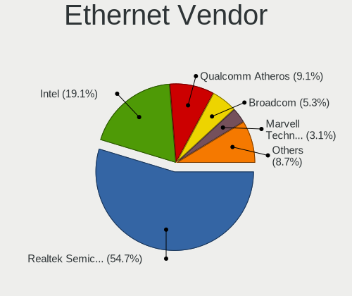

| Vendor                           | Notebooks | Percent |
|----------------------------------|-----------|---------|
| Realtek Semiconductor            | 563       | 55.85%  |
| Intel                            | 210       | 20.83%  |
| Qualcomm Atheros                 | 98        | 9.72%   |
| Broadcom                         | 50        | 4.96%   |
| Marvell Technology Group         | 29        | 2.88%   |
| JMicron Technology               | 13        | 1.29%   |
| Broadcom Limited                 | 7         | 0.69%   |
| Nvidia                           | 6         | 0.6%    |
| Huawei Technologies              | 5         | 0.5%    |
| Samsung Electronics              | 4         | 0.4%    |
| Silicon Integrated Systems [SiS] | 3         | 0.3%    |
| Hewlett-Packard                  | 3         | 0.3%    |
| Google                           | 3         | 0.3%    |
| ASIX Electronics                 | 3         | 0.3%    |
| OnePlus Technology (Shenzhen)    | 2         | 0.2%    |
| Motorola PCS                     | 2         | 0.2%    |
| Xiaomi                           | 1         | 0.1%    |
| TP-Link                          | 1         | 0.1%    |
| Qualcomm                         | 1         | 0.1%    |
| OPPO Electronics                 | 1         | 0.1%    |
| NetGear                          | 1         | 0.1%    |
| Lenovo                           | 1         | 0.1%    |
| HTC (High Tech Computer)         | 1         | 0.1%    |

Ethernet Model
--------------

Ethernet models

| Model                                                                          | Notebooks | Percent |
|--------------------------------------------------------------------------------|-----------|---------|
| Realtek RTL8111/8168/8411 PCI Express Gigabit Ethernet Controller              | 376       | 37.01%  |
| Realtek RTL810xE PCI Express Fast Ethernet controller                          | 155       | 15.26%  |
| Intel 82579LM Gigabit Network Connection (Lewisville)                          | 58        | 5.71%   |
| Realtek RTL8153 Gigabit Ethernet Adapter                                       | 22        | 2.17%   |
| Qualcomm Atheros AR8151 v2.0 Gigabit Ethernet                                  | 15        | 1.48%   |
| Intel Ethernet Connection I219-LM                                              | 15        | 1.48%   |
| Intel Ethernet Connection (3) I218-LM                                          | 15        | 1.48%   |
| Intel 82577LM Gigabit Network Connection                                       | 15        | 1.48%   |
| Intel Ethernet Connection I218-LM                                              | 14        | 1.38%   |
| Qualcomm Atheros AR8152 v2.0 Fast Ethernet                                     | 12        | 1.18%   |
| Intel Ethernet Connection I217-LM                                              | 12        | 1.18%   |
| Intel 82567LM Gigabit Network Connection                                       | 12        | 1.18%   |
| JMicron JMC250 PCI Express Gigabit Ethernet Controller                         | 11        | 1.08%   |
| Intel 82579V Gigabit Network Connection                                        | 11        | 1.08%   |
| Qualcomm Atheros QCA8172 Fast Ethernet                                         | 10        | 0.98%   |
| Qualcomm Atheros AR8162 Fast Ethernet                                          | 9         | 0.89%   |
| Qualcomm Atheros AR8132 Fast Ethernet                                          | 9         | 0.89%   |
| Qualcomm Atheros AR8131 Gigabit Ethernet                                       | 9         | 0.89%   |
| Intel 82566MM Gigabit Network Connection                                       | 9         | 0.89%   |
| Qualcomm Atheros AR8161 Gigabit Ethernet                                       | 8         | 0.79%   |
| Broadcom NetLink BCM57785 Gigabit Ethernet PCIe                                | 8         | 0.79%   |
| Intel Ethernet Connection (4) I219-LM                                          | 7         | 0.69%   |
| Broadcom NetLink BCM5787M Gigabit Ethernet PCI Express                         | 7         | 0.69%   |
| Marvell Group Yukon Optima 88E8059 [PCIe Gigabit Ethernet Controller with AVB] | 6         | 0.59%   |
| Broadcom NetLink BCM57780 Gigabit Ethernet PCIe                                | 6         | 0.59%   |
| Qualcomm Atheros Killer E2400 Gigabit Ethernet Controller                      | 5         | 0.49%   |
| Nvidia MCP79 Ethernet                                                          | 5         | 0.49%   |
| Marvell Group 88E8055 PCI-E Gigabit Ethernet Controller                        | 5         | 0.49%   |
| Marvell Group 88E8040 PCI-E Fast Ethernet Controller                           | 5         | 0.49%   |
| Marvell Group 88E8036 PCI-E Fast Ethernet Controller                           | 5         | 0.49%   |
| Intel Ethernet Connection I219-V                                               | 5         | 0.49%   |
| Intel Ethernet Connection (4) I219-V                                           | 5         | 0.49%   |
| Broadcom NetXtreme BCM57765 Gigabit Ethernet PCIe                              | 5         | 0.49%   |
| Broadcom NetXtreme BCM5764M Gigabit Ethernet PCIe                              | 5         | 0.49%   |
| Broadcom NetXtreme BCM5761e Gigabit Ethernet PCIe                              | 5         | 0.49%   |
| Realtek RTL-8100/8101L/8139 PCI Fast Ethernet Adapter                          | 4         | 0.39%   |
| Realtek Killer E2600 Gigabit Ethernet Controller                               | 4         | 0.39%   |
| Qualcomm Atheros AR8152 v1.1 Fast Ethernet                                     | 4         | 0.39%   |
| Qualcomm Atheros AR8151 v1.0 Gigabit Ethernet                                  | 4         | 0.39%   |
| Intel WiMAX Connection 2400m                                                   | 4         | 0.39%   |
| Intel Ethernet Connection (2) I219-LM                                          | 4         | 0.39%   |
| Silicon Integrated Systems [SiS] 191 Gigabit Ethernet Adapter                  | 3         | 0.3%    |
| Realtek RTL8152 Fast Ethernet Adapter                                          | 3         | 0.3%    |
| Realtek RTL8125 2.5GbE Controller                                              | 3         | 0.3%    |
| Qualcomm Atheros QCA8171 Gigabit Ethernet                                      | 3         | 0.3%    |
| Qualcomm Atheros Killer E2500 Gigabit Ethernet Controller                      | 3         | 0.3%    |
| Qualcomm Atheros AR8121/AR8113/AR8114 Gigabit or Fast Ethernet                 | 3         | 0.3%    |
| Marvell Group 88E8071 PCI-E Gigabit Ethernet Controller                        | 3         | 0.3%    |
| Intel Ethernet Connection I217-V                                               | 3         | 0.3%    |
| Intel Ethernet Connection (3) I218-V                                           | 3         | 0.3%    |
| Intel 82577LC Gigabit Network Connection                                       | 3         | 0.3%    |
| HP lt4120 Snapdragon X5 LTE                                                    | 3         | 0.3%    |
| Google Pixel 6                                                                 | 3         | 0.3%    |
| Broadcom NetXtreme BCM5761 Gigabit Ethernet PCIe                               | 3         | 0.3%    |
| Broadcom NetXtreme BCM5755M Gigabit Ethernet PCI Express                       | 3         | 0.3%    |
| Broadcom NetLink BCM5906M Fast Ethernet PCI Express                            | 3         | 0.3%    |
| Samsung GT-I9070 (network tethering, USB debugging enabled)                    | 2         | 0.2%    |
| Samsung Galaxy series, misc. (tethering mode)                                  | 2         | 0.2%    |
| Qualcomm Atheros Killer E220x Gigabit Ethernet Controller                      | 2         | 0.2%    |
| Qualcomm Atheros Attansic L1 Gigabit Ethernet                                  | 2         | 0.2%    |

Net Controller Kind
-------------------

Ethernet, WiFi or modem

| Kind     | Notebooks | Percent |
|----------|-----------|---------|
| WiFi     | 1148      | 53.27%  |
| Ethernet | 985       | 45.71%  |
| Modem    | 20        | 0.93%   |
| Unknown  | 2         | 0.09%   |

Used Controller
---------------

Currently used network controller

| Kind     | Notebooks | Percent |
|----------|-----------|---------|
| WiFi     | 810       | 71.68%  |
| Ethernet | 320       | 28.32%  |

NICs
----

Total network controllers on board

| Total | Notebooks | Percent |
|-------|-----------|---------|
| 2     | 930       | 80.31%  |
| 1     | 212       | 18.31%  |
| 0     | 9         | 0.78%   |
| 3     | 7         | 0.6%    |

IPv6
----

IPv6 vs IPv4

| Used | Notebooks | Percent |
|------|-----------|---------|
| No   | 818       | 70.64%  |
| Yes  | 340       | 29.36%  |

Bluetooth
---------

Bluetooth Vendor
----------------

Controller vendors

| Vendor                          | Notebooks | Percent |
|---------------------------------|-----------|---------|
| Intel                           | 339       | 39.46%  |
| Realtek Semiconductor           | 96        | 11.18%  |
| Qualcomm Atheros Communications | 84        | 9.78%   |
| Broadcom                        | 66        | 7.68%   |
| Lite-On Technology              | 55        | 6.4%    |
| IMC Networks                    | 42        | 4.89%   |
| Foxconn / Hon Hai               | 36        | 4.19%   |
| Dell                            | 24        | 2.79%   |
| Toshiba                         | 21        | 2.44%   |
| Apple                           | 19        | 2.21%   |
| Ralink                          | 16        | 1.86%   |
| Cambridge Silicon Radio         | 14        | 1.63%   |
| Hewlett-Packard                 | 11        | 1.28%   |
| ASUSTek Computer                | 7         | 0.81%   |
| Realtek                         | 6         | 0.7%    |
| Alps Electric                   | 6         | 0.7%    |
| Ralink Technology               | 3         | 0.35%   |
| Fujitsu                         | 3         | 0.35%   |
| Foxconn International           | 3         | 0.35%   |
| Chicony Electronics             | 2         | 0.23%   |
| USI                             | 1         | 0.12%   |
| Unknown                         | 1         | 0.12%   |
| Taiyo Yuden                     | 1         | 0.12%   |
| Edimax Technology               | 1         | 0.12%   |
| D-Link System                   | 1         | 0.12%   |
| Askey Computer                  | 1         | 0.12%   |

Bluetooth Model
---------------

Controller models

| Model                                                                               | Notebooks | Percent |
|-------------------------------------------------------------------------------------|-----------|---------|
| Intel Bluetooth wireless interface                                                  | 178       | 20.72%  |
| Realtek Bluetooth Radio                                                             | 54        | 6.29%   |
| Intel Bluetooth 9460/9560 Jefferson Peak (JfP)                                      | 41        | 4.77%   |
| Realtek  Bluetooth 4.2 Adapter                                                      | 32        | 3.73%   |
| Qualcomm Atheros  Bluetooth Device                                                  | 32        | 3.73%   |
| Intel Bluetooth Device                                                              | 31        | 3.61%   |
| Intel AX200 Bluetooth                                                               | 29        | 3.38%   |
| Intel Centrino Bluetooth Wireless Transceiver                                       | 28        | 3.26%   |
| Lite-On Qualcomm Atheros QCA9377 Bluetooth                                          | 21        | 2.44%   |
| Qualcomm Atheros AR3012 Bluetooth 4.0                                               | 19        | 2.21%   |
| IMC Networks Bluetooth Radio                                                        | 18        | 2.1%    |
| Broadcom BCM20702 Bluetooth 4.0 [ThinkPad]                                          | 18        | 2.1%    |
| Ralink RT3290 Bluetooth                                                             | 16        | 1.86%   |
| IMC Networks Bluetooth Device                                                       | 16        | 1.86%   |
| Qualcomm Atheros AR3011 Bluetooth                                                   | 15        | 1.75%   |
| Cambridge Silicon Radio Bluetooth Dongle (HCI mode)                                 | 14        | 1.63%   |
| Lite-On Bluetooth Device                                                            | 13        | 1.51%   |
| Intel Centrino Advanced-N 6230 Bluetooth adapter                                    | 13        | 1.51%   |
| Dell DW375 Bluetooth Module                                                         | 13        | 1.51%   |
| Qualcomm Atheros QCA61x4 Bluetooth 4.0                                              | 12        | 1.4%    |
| Lite-On Atheros AR3012 Bluetooth                                                    | 12        | 1.4%    |
| Intel Wireless-AC 3168 Bluetooth                                                    | 12        | 1.4%    |
| Broadcom BCM2045B (BDC-2.1)                                                         | 12        | 1.4%    |
| HP Broadcom 2070 Bluetooth Combo                                                    | 8         | 0.93%   |
| Foxconn / Hon Hai Bluetooth Device                                                  | 8         | 0.93%   |
| Apple Bluetooth Host Controller                                                     | 8         | 0.93%   |
| Toshiba RT Bluetooth Radio                                                          | 7         | 0.81%   |
| Realtek Bluetooth Radio                                                             | 6         | 0.7%    |
| Dell BCM20702A0 Bluetooth Module                                                    | 6         | 0.7%    |
| Apple Bluetooth USB Host Controller                                                 | 6         | 0.7%    |
| Realtek RTL8723B Bluetooth                                                          | 5         | 0.58%   |
| Lite-On Wireless_Device                                                             | 5         | 0.58%   |
| Foxconn / Hon Hai Foxconn T77H114 BCM2070 [Single-Chip Bluetooth 2.1 + EDR Adapter] | 5         | 0.58%   |
| Foxconn / Hon Hai BCM20702A0                                                        | 5         | 0.58%   |
| Broadcom BCM2070 Bluetooth 2.1 + EDR                                                | 5         | 0.58%   |
| Broadcom BCM2045B (BDC-2) [Bluetooth Controller]                                    | 5         | 0.58%   |
| Broadcom BCM2045 Bluetooth                                                          | 5         | 0.58%   |
| Intel Wireless-AC 9260 Bluetooth Adapter                                            | 4         | 0.47%   |
| IMC Networks Atheros AR3012 Bluetooth 4.0 Adapter                                   | 4         | 0.47%   |
| Foxconn / Hon Hai Wireless_Device                                                   | 4         | 0.47%   |
| Foxconn / Hon Hai Bluetooth USB Host Controller                                     | 4         | 0.47%   |
| Apple Built-in Bluetooth 2.0+EDR HCI                                                | 4         | 0.47%   |
| Alps Electric BCM2046 Bluetooth Device                                              | 4         | 0.47%   |
| Toshiba Integrated Bluetooth HCI                                                    | 3         | 0.35%   |
| Toshiba Bluetooth Device                                                            | 3         | 0.35%   |
| Realtek RTL8821A Bluetooth                                                          | 3         | 0.35%   |
| Qualcomm Atheros AR9462 Bluetooth                                                   | 3         | 0.35%   |
| Intel AX210 Bluetooth                                                               | 3         | 0.35%   |
| HP Bluetooth 2.0 Interface [Broadcom BCM2045]                                       | 3         | 0.35%   |
| Fujitsu Bluetooth Device                                                            | 3         | 0.35%   |
| Foxconn International BCM43142A0 Bluetooth module                                   | 3         | 0.35%   |
| Foxconn / Hon Hai Broadcom Bluetooth 2.1 Device                                     | 3         | 0.35%   |
| Broadcom HP Portable SoftSailing                                                    | 3         | 0.35%   |
| Broadcom BCM2045B (BDC-2.1) [Bluetooth Controller]                                  | 3         | 0.35%   |
| ASUS BT-253 Bluetooth Adapter                                                       | 3         | 0.35%   |
| Toshiba Integrated Bluetooth (Taiyo Yuden)                                          | 2         | 0.23%   |
| Toshiba Bluetooth Radio                                                             | 2         | 0.23%   |
| Toshiba Atheros AR3012 Bluetooth                                                    | 2         | 0.23%   |
| Ralink Motorola BC4 Bluetooth 3.0+HS Adapter                                        | 2         | 0.23%   |
| Qualcomm Atheros Bluetooth USB Host Controller                                      | 2         | 0.23%   |

Sound
-----

Sound Vendor
------------

Sound card vendors

| Vendor                                       | Notebooks | Percent |
|----------------------------------------------|-----------|---------|
| Intel                                        | 927       | 68.46%  |
| AMD                                          | 249       | 18.39%  |
| Nvidia                                       | 146       | 10.78%  |
| Logitech                                     | 4         | 0.3%    |
| Generalplus Technology                       | 4         | 0.3%    |
| Silicon Integrated Systems [SiS]             | 3         | 0.22%   |
| Realtek Semiconductor                        | 3         | 0.22%   |
| Texas Instruments                            | 2         | 0.15%   |
| Lenovo                                       | 2         | 0.15%   |
| JMTek                                        | 2         | 0.15%   |
| Conexant Systems                             | 2         | 0.15%   |
| Zoran Co. Personal Media Division (Nogatech) | 1         | 0.07%   |
| XMOS                                         | 1         | 0.07%   |
| Schiit Audio                                 | 1         | 0.07%   |
| Samsung Electronics                          | 1         | 0.07%   |
| Samson Technologies                          | 1         | 0.07%   |
| Plantronics                                  | 1         | 0.07%   |
| Native Instruments                           | 1         | 0.07%   |
| M-Audio                                      | 1         | 0.07%   |
| Focusrite-Novation                           | 1         | 0.07%   |
| Cambridge Audio                              | 1         | 0.07%   |

Sound Model
-----------

Sound card models

| Model                                                                                             | Notebooks | Percent |
|---------------------------------------------------------------------------------------------------|-----------|---------|
| Intel 7 Series/C216 Chipset Family High Definition Audio Controller                               | 141       | 8.45%   |
| Intel Sunrise Point-LP HD Audio                                                                   | 119       | 7.13%   |
| AMD Family 17h/19h HD Audio Controller                                                            | 93        | 5.57%   |
| Intel 6 Series/C200 Series Chipset Family High Definition Audio Controller                        | 85        | 5.09%   |
| Intel 82801I (ICH9 Family) HD Audio Controller                                                    | 77        | 4.61%   |
| Intel 5 Series/3400 Series Chipset High Definition Audio                                          | 73        | 4.37%   |
| AMD FCH Azalia Controller                                                                         | 60        | 3.59%   |
| Intel Wildcat Point-LP High Definition Audio Controller                                           | 50        | 3%      |
| Intel Broadwell-U Audio Controller                                                                | 50        | 3%      |
| Intel 82801H (ICH8 Family) HD Audio Controller                                                    | 46        | 2.76%   |
| AMD Raven/Raven2/Fenghuang HDMI/DP Audio Controller                                               | 42        | 2.52%   |
| Intel Haswell-ULT HD Audio Controller                                                             | 39        | 2.34%   |
| Intel 8 Series HD Audio Controller                                                                | 39        | 2.34%   |
| AMD SBx00 Azalia (Intel HDA)                                                                      | 37        | 2.22%   |
| AMD Kabini HDMI/DP Audio                                                                          | 37        | 2.22%   |
| Intel 8 Series/C220 Series Chipset High Definition Audio Controller                               | 35        | 2.1%    |
| Intel Atom Processor Z36xxx/Z37xxx Series High Definition Audio Controller                        | 34        | 2.04%   |
| AMD Renoir Radeon High Definition Audio Controller                                                | 34        | 2.04%   |
| Nvidia GF108 High Definition Audio Controller                                                     | 29        | 1.74%   |
| Intel Xeon E3-1200 v3/4th Gen Core Processor HD Audio Controller                                  | 29        | 1.74%   |
| AMD Family 15h (Models 60h-6fh) Audio Controller                                                  | 27        | 1.62%   |
| Intel Atom/Celeron/Pentium Processor x5-E8000/J3xxx/N3xxx Series High Definition Audio Controller | 26        | 1.56%   |
| AMD Wrestler HDMI Audio                                                                           | 25        | 1.5%    |
| Intel Celeron/Pentium Silver Processor High Definition Audio                                      | 24        | 1.44%   |
| Intel Ice Lake-LP Smart Sound Technology Audio Controller                                         | 22        | 1.32%   |
| Intel Cannon Point-LP High Definition Audio Controller                                            | 22        | 1.32%   |
| Intel 100 Series/C230 Series Chipset Family HD Audio Controller                                   | 22        | 1.32%   |
| Intel Cannon Lake PCH cAVS                                                                        | 21        | 1.26%   |
| AMD High Definition Audio Controller                                                              | 20        | 1.2%    |
| Intel Tiger Lake-LP Smart Sound Technology Audio Controller                                       | 19        | 1.14%   |
| Intel NM10/ICH7 Family High Definition Audio Controller                                           | 16        | 0.96%   |
| Intel Celeron N3350/Pentium N4200/Atom E3900 Series Audio Cluster                                 | 14        | 0.84%   |
| AMD Trinity HDMI Audio Controller                                                                 | 14        | 0.84%   |
| Intel Comet Lake PCH-LP cAVS                                                                      | 13        | 0.78%   |
| Nvidia GP106 High Definition Audio Controller                                                     | 11        | 0.66%   |
| Intel CM238 HD Audio Controller                                                                   | 11        | 0.66%   |
| AMD Cedar HDMI Audio [Radeon HD 5400/6300/7300 Series]                                            | 11        | 0.66%   |
| Nvidia GT216 HDMI Audio Controller                                                                | 9         | 0.54%   |
| Nvidia GP107GL High Definition Audio Controller                                                   | 9         | 0.54%   |
| Intel Comet Lake PCH cAVS                                                                         | 9         | 0.54%   |
| Nvidia TU107 GeForce GTX 1650 High Definition Audio Controller                                    | 8         | 0.48%   |
| Nvidia GM107 High Definition Audio Controller [GeForce 940MX]                                     | 8         | 0.48%   |
| Nvidia High Definition Audio Controller                                                           | 7         | 0.42%   |
| Nvidia Audio device                                                                               | 7         | 0.42%   |
| AMD RV710/730 HDMI Audio [Radeon HD 4000 series]                                                  | 7         | 0.42%   |
| Nvidia TU116 High Definition Audio Controller                                                     | 6         | 0.36%   |
| Nvidia TU106 High Definition Audio Controller                                                     | 6         | 0.36%   |
| Nvidia GK208 HDMI/DP Audio Controller                                                             | 6         | 0.36%   |
| Nvidia GK107 HDMI Audio Controller                                                                | 6         | 0.36%   |
| Nvidia GF119 HDMI Audio Controller                                                                | 6         | 0.36%   |
| Intel Jasper Lake HD Audio                                                                        | 6         | 0.36%   |
| AMD BeaverCreek HDMI Audio [Radeon HD 6500D and 6400G-6600G series]                               | 6         | 0.36%   |
| Nvidia MCP79 High Definition Audio                                                                | 5         | 0.3%    |
| Nvidia GK104 HDMI Audio Controller                                                                | 5         | 0.3%    |
| Nvidia GF106 High Definition Audio Controller                                                     | 4         | 0.24%   |
| AMD RV630 HDMI Audio [Radeon HD 2600 PRO/XT / HD 3610]                                            | 4         | 0.24%   |
| AMD Redwood HDMI Audio [Radeon HD 5000 Series]                                                    | 4         | 0.24%   |
| Silicon Integrated Systems [SiS] Azalia Audio Controller                                          | 3         | 0.18%   |
| Realtek Semiconductor USB Audio                                                                   | 3         | 0.18%   |
| Nvidia GA104 High Definition Audio Controller                                                     | 3         | 0.18%   |

Memory
------

Memory Vendor
-------------

Memory module vendors

| Vendor                                           | Notebooks | Percent |
|--------------------------------------------------|-----------|---------|
| Samsung Electronics                              | 372       | 26.69%  |
| SK hynix                                         | 313       | 22.45%  |
| Micron Technology                                | 147       | 10.55%  |
| Unknown                                          | 121       | 8.68%   |
| Kingston                                         | 117       | 8.39%   |
| Crucial                                          | 51        | 3.66%   |
| Ramaxel Technology                               | 36        | 2.58%   |
| A-DATA Technology                                | 35        | 2.51%   |
| Elpida                                           | 28        | 2.01%   |
| Nanya Technology                                 | 21        | 1.51%   |
| Smart                                            | 19        | 1.36%   |
| Corsair                                          | 18        | 1.29%   |
| Unknown (ABCD)                                   | 13        | 0.93%   |
| Unknown                                          | 9         | 0.65%   |
| Teikon                                           | 6         | 0.43%   |
| Smart Brazil                                     | 6         | 0.43%   |
| G.Skill                                          | 6         | 0.43%   |
| Team                                             | 5         | 0.36%   |
| Patriot                                          | 5         | 0.36%   |
| ASint Technology                                 | 5         | 0.36%   |
| Qimonda                                          | 4         | 0.29%   |
| Goodram                                          | 4         | 0.29%   |
| CSX                                              | 4         | 0.29%   |
| Toshiba                                          | 3         | 0.22%   |
| High Bridge                                      | 3         | 0.22%   |
| Goldkey                                          | 3         | 0.22%   |
| Apacer                                           | 3         | 0.22%   |
| Netlist                                          | 2         | 0.14%   |
| Multilaser                                       | 2         | 0.14%   |
| HT Micron                                        | 2         | 0.14%   |
| Avant                                            | 2         | 0.14%   |
| AMD                                              | 2         | 0.14%   |
| Unknown (0xAD0A)                                 | 1         | 0.07%   |
| Unknown (0x89AD)                                 | 1         | 0.07%   |
| Unknown (0x505344323247363637325300000000000000) | 1         | 0.07%   |
| Unknown (0x4D342037305432383634515A332D43453620) | 1         | 0.07%   |
| Unknown (0x48594D503132355336344350382D53362020) | 1         | 0.07%   |
| Unknown (0x48594D503131325336344350362D53362020) | 1         | 0.07%   |
| Unknown (0x0C26)                                 | 1         | 0.07%   |
| Unknown (0B45)                                   | 1         | 0.07%   |
| Unknown (09C7)                                   | 1         | 0.07%   |
| Unknown (08AE)                                   | 1         | 0.07%   |
| Unknown (081A)                                   | 1         | 0.07%   |
| Unigen                                           | 1         | 0.07%   |
| Unifosa                                          | 1         | 0.07%   |
| Timetec                                          | 1         | 0.07%   |
| Silicon Power                                    | 1         | 0.07%   |
| SHARETRONIC                                      | 1         | 0.07%   |
| Sesame                                           | 1         | 0.07%   |
| PNY                                              | 1         | 0.07%   |
| OCZ                                              | 1         | 0.07%   |
| Novatech                                         | 1         | 0.07%   |
| Lexar                                            | 1         | 0.07%   |
| Kllisre                                          | 1         | 0.07%   |
| Kembona                                          | 1         | 0.07%   |
| Carry                                            | 1         | 0.07%   |
| Axiom                                            | 1         | 0.07%   |
| Anucell Technology Holding                       | 1         | 0.07%   |
| 48spaces                                         | 1         | 0.07%   |

Memory Model
------------

Memory module models

| Model                                                               | Notebooks | Percent |
|---------------------------------------------------------------------|-----------|---------|
| SK hynix RAM HMT351S6CFR8C-PB 4GB SODIMM DDR3 1600MT/s              | 33        | 2.2%    |
| Samsung RAM M471B5273DH0-CH9 4GB SODIMM DDR3 1334MT/s               | 32        | 2.13%   |
| Samsung RAM M471B5173QH0-YK0 4GB SODIMM DDR3 1600MT/s               | 30        | 2%      |
| Unknown RAM Module 2GB SODIMM DDR2 667MT/s                          | 26        | 1.73%   |
| Samsung RAM M471B5173DB0-YK0 4GB SODIMM DDR3 1600MT/s               | 23        | 1.53%   |
| SK hynix RAM HMA81GS6AFR8N-UH 8GB SODIMM DDR4 2667MT/s              | 21        | 1.4%    |
| Samsung RAM M471B5173EB0-YK0 4GB SODIMM DDR3 1600MT/s               | 20        | 1.33%   |
| Samsung RAM M471B5273CH0-CH9 4GB SODIMM DDR3 1334MT/s               | 18        | 1.2%    |
| Samsung RAM M471A5244CB0-CTD 4GB SODIMM DDR4 3266MT/s               | 16        | 1.07%   |
| SK hynix RAM HMT451S6BFR8A-PB 4096MB SODIMM DDR3 1600MT/s           | 15        | 1%      |
| Unknown RAM Module 2GB SODIMM DDR2                                  | 13        | 0.87%   |
| Unknown RAM Module 1GB SODIMM DDR2 667MT/s                          | 13        | 0.87%   |
| Unknown (ABCD) RAM 123456789012345678 2048MB SODIMM LPDDR4 2400MT/s | 13        | 0.87%   |
| SK hynix RAM HMT451S6BFR8A-PB 4GB SODIMM DDR3 1600MT/s              | 13        | 0.87%   |
| SK hynix RAM HMT451S6AFR8A-PB 4GB SODIMM DDR3 1600MT/s              | 13        | 0.87%   |
| SK hynix RAM HMT351S6BFR8C-H9 4GB SODIMM DDR3 1333MT/s              | 13        | 0.87%   |
| Samsung RAM M471B1G73DB0-YK0 8GB SODIMM DDR3 1600MT/s               | 13        | 0.87%   |
| SK hynix RAM HMT41GS6BFR8A-PB 8GB SODIMM DDR3 1600MT/s              | 12        | 0.8%    |
| Samsung RAM M471A5244CB0-CWE 4GB SODIMM DDR4 3200MT/s               | 12        | 0.8%    |
| Micron RAM 4ATF51264HZ-2G6E1 4GB SODIMM DDR4 2667MT/s               | 12        | 0.8%    |
| Samsung RAM M471B5273DH0-CK0 4GB SODIMM DDR3 1600MT/s               | 10        | 0.67%   |
| Samsung RAM M471A5244CB0-CRC 4GB SODIMM DDR4 2667MT/s               | 10        | 0.67%   |
| Samsung RAM M471B5773DH0-CH9 2GB SODIMM DDR3 1600MT/s               | 9         | 0.6%    |
| Samsung RAM M471B5273CH0-CK0 4GB SODIMM DDR3 1600MT/s               | 9         | 0.6%    |
| Unknown                                                             | 9         | 0.6%    |
| SK hynix RAM HMT325S6BFR8C-H9 2GB SODIMM DDR3 1600MT/s              | 8         | 0.53%   |
| SK hynix RAM HMA851S6CJR6N-VK 4GB SODIMM DDR4 2667MT/s              | 8         | 0.53%   |
| SK hynix RAM HMA851S6AFR6N-UH 4GB SODIMM DDR4 2667MT/s              | 8         | 0.53%   |
| Samsung RAM M471B5773CHS-CH9 2GB SODIMM DDR3 4199MT/s               | 8         | 0.53%   |
| Samsung RAM M471A1K43CB1-CRC 8192MB SODIMM DDR4 2667MT/s            | 8         | 0.53%   |
| Samsung RAM M4 70T5663QZ3-CF7 2GB SODIMM DDR2 2048MT/s              | 8         | 0.53%   |
| Micron RAM 4ATF51264HZ-3G2J1 4GB SODIMM DDR4 3200MT/s               | 8         | 0.53%   |
| Micron RAM 4ATF51264HZ-2G3B1 4GB SODIMM DDR4 2400MT/s               | 8         | 0.53%   |
| Micron RAM 4ATF1G64HZ-3G2E2 8GB SODIMM DDR4 3200MT/s                | 8         | 0.53%   |
| Unknown RAM Module 2GB SODIMM 800MT/s                               | 7         | 0.47%   |
| SK hynix RAM HYMP125S64CP8-S6 2048MB SODIMM DDR2 975MT/s            | 7         | 0.47%   |
| Samsung RAM M471B5673FH0-CH9 2GB SODIMM DDR3 1334MT/s               | 7         | 0.47%   |
| Samsung RAM M471B5673FH0-CF8 2GB SODIMM DDR3 1067MT/s               | 7         | 0.47%   |
| Samsung RAM M471A1K43DB1-CWE 8GB SODIMM DDR4 3200MT/s               | 7         | 0.47%   |
| Samsung RAM M471A1K43DB1-CTD 8GB SODIMM DDR4 2667MT/s               | 7         | 0.47%   |
| Samsung RAM M471A1G44AB0-CWE 8192MB SODIMM DDR4 3200MT/s            | 7         | 0.47%   |
| Ramaxel RAM RMT3160ED58E9W1600 4GB SODIMM DDR3 1600MT/s             | 7         | 0.47%   |
| Crucial RAM CT102464BF160B.C16 8GB SODIMM DDR3 1600MT/s             | 7         | 0.47%   |
| Unknown RAM Module 4GB SODIMM DDR3                                  | 6         | 0.4%    |
| Unknown RAM Module 2GB SODIMM DDR2 800MT/s                          | 6         | 0.4%    |
| SK hynix RAM HMT351S6BFR8C-H9 4096MB SODIMM DDR3 1334MT/s           | 6         | 0.4%    |
| Samsung RAM M471B1G73QH0-YK0 8GB SODIMM DDR3 1600MT/s               | 6         | 0.4%    |
| Samsung RAM M471A2K43CB1-CTD 16GB SODIMM DDR4 2667MT/s              | 6         | 0.4%    |
| Samsung RAM M471A1K43CB1-CTD 8GB SODIMM DDR4 2667MT/s               | 6         | 0.4%    |
| Ramaxel RAM RMT3170ME68F9F1600 4GB SODIMM DDR3 1600MT/s             | 6         | 0.4%    |
| Micron RAM 8KTF51264HZ-1G6N1 4GB SODIMM DDR3 1600MT/s               | 6         | 0.4%    |
| Kingston RAM 99U5428-018.A00LF 8GB SODIMM DDR3 1600MT/s             | 6         | 0.4%    |
| Elpida RAM EBJ41UF8BCS0-DJ-F 4096MB SODIMM DDR3 1334MT/s            | 6         | 0.4%    |
| Crucial RAM CT102464BF160B.M16 8GB SODIMM DDR3 1600MT/s             | 6         | 0.4%    |
| Unknown RAM Module 2GB SODIMM DDR3                                  | 5         | 0.33%   |
| Smart Brazil RAM SMS4TDC3C0K0446SCG 4GB SODIMM DDR4 2667MT/s        | 5         | 0.33%   |
| SK hynix RAM HMT425S6AFR6A-PB 2GB SODIMM DDR3 1600MT/s              | 5         | 0.33%   |
| SK hynix RAM HMT351S6CFR8C-H9 4GB SODIMM DDR3 1333MT/s              | 5         | 0.33%   |
| SK hynix RAM HMA81GS6JJR8N-VK 8GB SODIMM DDR4 2667MT/s              | 5         | 0.33%   |
| SK hynix RAM HMA81GS6CJR8N-VK 8GB SODIMM DDR4 2667MT/s              | 5         | 0.33%   |

Memory Kind
-----------

Memory module kinds

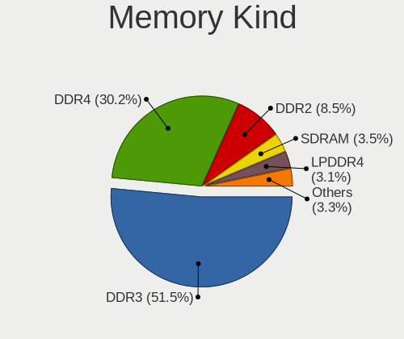

| Kind    | Notebooks | Percent |
|---------|-----------|---------|
| DDR3    | 587       | 50.69%  |
| DDR4    | 359       | 31%     |
| DDR2    | 104       | 8.98%   |
| LPDDR4  | 35        | 3.02%   |
| SDRAM   | 34        | 2.94%   |
| LPDDR3  | 16        | 1.38%   |
| Unknown | 14        | 1.21%   |
| DDR     | 5         | 0.43%   |
| DRAM    | 4         | 0.35%   |

Memory Form Factor
------------------

Physical design of the memory module

| Name         | Notebooks | Percent |
|--------------|-----------|---------|
| SODIMM       | 1099      | 95.4%   |
| Row Of Chips | 41        | 3.56%   |
| Chip         | 7         | 0.61%   |
| DIMM         | 3         | 0.26%   |
| Unknown      | 2         | 0.17%   |

Memory Size
-----------

Memory module size

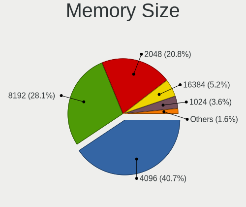

| Size  | Notebooks | Percent |
|-------|-----------|---------|
| 4096  | 576       | 44.96%  |
| 8192  | 335       | 26.15%  |
| 2048  | 257       | 20.06%  |
| 1024  | 51        | 3.98%   |
| 16384 | 47        | 3.67%   |
| 32768 | 14        | 1.09%   |
| 512   | 1         | 0.08%   |

Memory Speed
------------

Memory module speed

| Speed   | Notebooks | Percent |
|---------|-----------|---------|
| 1600    | 403       | 31.61%  |
| 2667    | 188       | 14.75%  |
| 1334    | 108       | 8.47%   |
| 2400    | 93        | 7.29%   |
| 3200    | 91        | 7.14%   |
| 1333    | 81        | 6.35%   |
| 667     | 53        | 4.16%   |
| 1067    | 35        | 2.75%   |
| 2133    | 33        | 2.59%   |
| 800     | 33        | 2.59%   |
| Unknown | 32        | 2.51%   |
| 3266    | 16        | 1.25%   |
| 2048    | 16        | 1.25%   |
| 1867    | 16        | 1.25%   |
| 4199    | 15        | 1.18%   |
| 975     | 12        | 0.94%   |
| 1066    | 11        | 0.86%   |
| 533     | 9         | 0.71%   |
| 4267    | 8         | 0.63%   |
| 1866    | 6         | 0.47%   |
| 4266    | 5         | 0.39%   |
| 2933    | 3         | 0.24%   |
| 1639    | 2         | 0.16%   |
| 8400    | 1         | 0.08%   |
| 4800    | 1         | 0.08%   |
| 2666    | 1         | 0.08%   |
| 2267    | 1         | 0.08%   |
| 666     | 1         | 0.08%   |
| 333     | 1         | 0.08%   |

Printers & scanners
-------------------

Printer Vendor
--------------

Printer device vendors

| Vendor             | Notebooks | Percent |
|--------------------|-----------|---------|
| Hewlett-Packard    | 3         | 33.33%  |
| Canon              | 3         | 33.33%  |
| Brother Industries | 3         | 33.33%  |

Printer Model
-------------

Printer device models

| Model              | Notebooks | Percent |
|--------------------|-----------|---------|
| Brother DCP-7055W  | 3         | 33.33%  |
| HP OfficeJet 4300  | 1         | 11.11%  |
| HP LaserJet 1018   | 1         | 11.11%  |
| HP DeskJet D1360   | 1         | 11.11%  |
| Canon PIXMA MP280  | 1         | 11.11%  |
| Canon MP160        | 1         | 11.11%  |
| Canon G3000 series | 1         | 11.11%  |

Scanner Vendor
--------------

Scanner device vendors

| Vendor      | Notebooks | Percent |
|-------------|-----------|---------|
| Seiko Epson | 1         | 100%    |

Scanner Model
-------------

Scanner device models

| Model                                                    | Notebooks | Percent |
|----------------------------------------------------------|-----------|---------|
| Seiko Epson GT-F500/GT-F550 [Perfection 2480/2580 PHOTO] | 1         | 100%    |

Camera
------

Camera Vendor
-------------

Camera device vendors

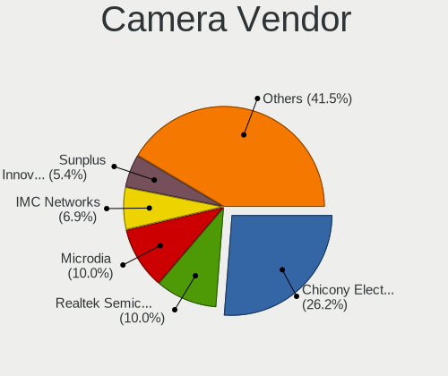

| Vendor                                 | Notebooks | Percent |
|----------------------------------------|-----------|---------|
| Chicony Electronics                    | 268       | 26.85%  |
| Microdia                               | 98        | 9.82%   |
| Realtek Semiconductor                  | 93        | 9.32%   |
| IMC Networks                           | 81        | 8.12%   |
| Acer                                   | 68        | 6.81%   |
| Sunplus Innovation Technology          | 51        | 5.11%   |
| Suyin                                  | 47        | 4.71%   |
| Quanta                                 | 43        | 4.31%   |
| Cheng Uei Precision Industry (Foxlink) | 43        | 4.31%   |
| Syntek                                 | 35        | 3.51%   |
| Lite-On Technology                     | 31        | 3.11%   |
| Silicon Motion                         | 25        | 2.51%   |
| Ricoh                                  | 20        | 2%      |
| Apple                                  | 15        | 1.5%    |
| ALi                                    | 11        | 1.1%    |
| Alcor Micro                            | 11        | 1.1%    |
| Importek                               | 10        | 1%      |
| Lenovo                                 | 8         | 0.8%    |
| Luxvisions Innotech Limited            | 6         | 0.6%    |
| Z-Star Microelectronics                | 5         | 0.5%    |
| Primax Electronics                     | 5         | 0.5%    |
| Sonix Technology                       | 4         | 0.4%    |
| Sunplus Technology                     | 3         | 0.3%    |
| DigiTech                               | 3         | 0.3%    |
| Nebraska Furniture Mart                | 2         | 0.2%    |
| Logitech                               | 2         | 0.2%    |
| WaveRider Communications               | 1         | 0.1%    |
| Unknown                                | 1         | 0.1%    |
| Tobii Technology AB                    | 1         | 0.1%    |
| SunplusIT                              | 1         | 0.1%    |
| OmniVision Technologies                | 1         | 0.1%    |
| Novatek Microelectronics               | 1         | 0.1%    |
| LG Electronics                         | 1         | 0.1%    |
| Intel                                  | 1         | 0.1%    |
| GEMBIRD                                | 1         | 0.1%    |
| Cubeternet                             | 1         | 0.1%    |

Camera Model
------------

Camera device models

| Model                                                          | Notebooks | Percent |
|----------------------------------------------------------------|-----------|---------|
| Chicony HD WebCam                                              | 37        | 3.7%    |
| Microdia Integrated_Webcam_HD                                  | 28        | 2.8%    |
| Chicony Integrated Camera                                      | 27        | 2.7%    |
| Microdia Integrated Webcam                                     | 17        | 1.7%    |
| IMC Networks Integrated Camera                                 | 17        | 1.7%    |
| Realtek Integrated_Webcam_HD                                   | 16        | 1.6%    |
| IMC Networks USB2.0 HD UVC WebCam                              | 15        | 1.5%    |
| Sunplus Integrated_Webcam_HD                                   | 14        | 1.4%    |
| Realtek USB Camera                                             | 13        | 1.3%    |
| IMC Networks USB2.0 VGA UVC WebCam                             | 13        | 1.3%    |
| Chicony FJ Camera                                              | 13        | 1.3%    |
| Syntek Integrated Camera                                       | 12        | 1.2%    |
| Chicony VGA Webcam                                             | 12        | 1.2%    |
| Suyin Acer/HP Integrated Webcam [CN0314]                       | 11        | 1.1%    |
| Lite-On Integrated Camera                                      | 11        | 1.1%    |
| Chicony USB2.0 VGA UVC WebCam                                  | 11        | 1.1%    |
| Chicony TOSHIBA Web Camera - HD                                | 11        | 1.1%    |
| Syntek Lenovo EasyCamera                                       | 10        | 1%      |
| Realtek USB2.0 HD UVC WebCam                                   | 10        | 1%      |
| Realtek Lenovo EasyCamera                                      | 10        | 1%      |
| Chicony USB 2.0 Camera                                         | 10        | 1%      |
| Chicony Lenovo EasyCamera                                      | 10        | 1%      |
| Acer Lenovo EasyCamera                                         | 10        | 1%      |
| Acer Integrated Camera                                         | 10        | 1%      |
| Quanta HD User Facing                                          | 9         | 0.9%    |
| Lite-On HP HD Webcam                                           | 9         | 0.9%    |
| Chicony USB2.0 HD UVC WebCam                                   | 9         | 0.9%    |
| Acer Lenovo Integrated Webcam                                  | 9         | 0.9%    |
| Chicony HP Truevision HD camera                                | 8         | 0.8%    |
| Chicony HD User Facing                                         | 8         | 0.8%    |
| Sunplus HD WebCam                                              | 7         | 0.7%    |
| Quanta VGA WebCam                                              | 7         | 0.7%    |
| Quanta HP TrueVision HD Camera                                 | 7         | 0.7%    |
| Quanta HD Webcam                                               | 7         | 0.7%    |
| Microdia Laptop_Integrated_Webcam_HD                           | 7         | 0.7%    |
| IMC Networks HP TrueVision HD Camera                           | 7         | 0.7%    |
| Chicony EasyCamera                                             | 7         | 0.7%    |
| Apple Built-in iSight                                          | 7         | 0.7%    |
| Syntek EasyCamera                                              | 6         | 0.6%    |
| Suyin HP Truevision HD                                         | 6         | 0.6%    |
| Realtek USB2.0 VGA UVC WebCam                                  | 6         | 0.6%    |
| Microdia USB 2.0 Camera                                        | 6         | 0.6%    |
| Microdia HP Webcam                                             | 6         | 0.6%    |
| Chicony Integrated HP HD Webcam                                | 6         | 0.6%    |
| Chicony HP Truevision HD                                       | 6         | 0.6%    |
| Chicony CNF9055 Toshiba Webcam                                 | 6         | 0.6%    |
| Cheng Uei Precision Industry (Foxlink) HP TrueVision HD Camera | 6         | 0.6%    |
| ALi Gateway Webcam                                             | 6         | 0.6%    |
| Acer ThinkPad Integrated Camera                                | 6         | 0.6%    |
| Acer BisonCam, NB Pro                                          | 6         | 0.6%    |
| Suyin HP TrueVision HD Integrated Webcam                       | 5         | 0.5%    |
| Sunplus Laptop_Integrated_Webcam_HD                            | 5         | 0.5%    |
| Realtek HP Webcam                                              | 5         | 0.5%    |
| Microdia Dell Integrated HD Webcam                             | 5         | 0.5%    |
| Luxvisions Innotech Limited HP TrueVision HD Camera            | 5         | 0.5%    |
| Importek TOSHIBA Web Camera - HD                               | 5         | 0.5%    |
| IMC Networks UVC VGA Webcam                                    | 5         | 0.5%    |
| IMC Networks Lenovo EasyCamera                                 | 5         | 0.5%    |
| Chicony Lenovo Integrated Camera (0.3MP)                       | 5         | 0.5%    |
| Chicony HP Webcam                                              | 5         | 0.5%    |

Security
--------

Fingerprint Vendor
------------------

Fingerprint sensor vendors

| Vendor                     | Notebooks | Percent |
|----------------------------|-----------|---------|
| Validity Sensors           | 35        | 33.65%  |
| AuthenTec                  | 15        | 14.42%  |
| Synaptics                  | 12        | 11.54%  |
| Elan Microelectronics      | 10        | 9.62%   |
| Upek                       | 9         | 8.65%   |
| Shenzhen Goodix Technology | 9         | 8.65%   |
| LighTuning Technology      | 7         | 6.73%   |
| STMicroelectronics         | 5         | 4.81%   |
| Samsung Electronics        | 1         | 0.96%   |
| HOLTEK                     | 1         | 0.96%   |

Fingerprint Model
-----------------

Fingerprint sensor models

| Model                                                      | Notebooks | Percent |
|------------------------------------------------------------|-----------|---------|
| Upek Biometric Touchchip/Touchstrip Fingerprint Sensor     | 9         | 8.65%   |
| Validity Sensors VFS495 Fingerprint Reader                 | 8         | 7.69%   |
| Shenzhen Goodix  FingerPrint Device                        | 8         | 7.69%   |
| Elan ELAN:Fingerprint                                      | 6         | 5.77%   |
| Validity Sensors Swipe Fingerprint Sensor                  | 5         | 4.81%   |
| STMicroelectronics Fingerprint Reader                      | 5         | 4.81%   |
| AuthenTec AES2810                                          | 5         | 4.81%   |
| Validity Sensors VFS7500 Touch Fingerprint Sensor          | 4         | 3.85%   |
| Validity Sensors VFS491                                    | 4         | 3.85%   |
| LighTuning EgisTec Touch Fingerprint Sensor                | 4         | 3.85%   |
| Elan ELAN:ARM-M4                                           | 4         | 3.85%   |
| AuthenTec AES1600                                          | 4         | 3.85%   |
| Unknown                                                    | 4         | 3.85%   |
| Validity Sensors VFS301 Fingerprint Reader                 | 3         | 2.88%   |
| Validity Sensors VFS 5011 fingerprint sensor               | 3         | 2.88%   |
| Synaptics Prometheus MIS Touch Fingerprint Reader          | 3         | 2.88%   |
| AuthenTec AES2501 Fingerprint Sensor                       | 3         | 2.88%   |
| Validity Sensors VFS5011 Fingerprint Reader                | 2         | 1.92%   |
| Validity Sensors VFS451 Fingerprint Reader                 | 2         | 1.92%   |
| LighTuning ES603 Swipe Fingerprint Sensor                  | 2         | 1.92%   |
| AuthenTec Fingerprint Sensor                               | 2         | 1.92%   |
| Validity Sensors VFS471 Fingerprint Reader                 | 1         | 0.96%   |
| Validity Sensors VFS300 Fingerprint Reader                 | 1         | 0.96%   |
| Validity Sensors VFS101 Fingerprint Reader                 | 1         | 0.96%   |
| Validity Sensors Fingerprint scanner                       | 1         | 0.96%   |
| Synaptics WBDI Device                                      | 1         | 0.96%   |
| Synaptics  VFS7552 Touch Fingerprint Sensor with PurePrint | 1         | 0.96%   |
| Synaptics  FS7604 Touch Fingerprint Sensor with PurePrint  | 1         | 0.96%   |
| Synaptics Metallica MOH Touch Fingerprint Reader           | 1         | 0.96%   |
| Synaptics Metallica MIS Touch Fingerprint Reader           | 1         | 0.96%   |
| Shenzhen Goodix Fingerprint Reader                         | 1         | 0.96%   |
| Samsung Fingerprint Sensor Device - 730B                   | 1         | 0.96%   |
| LighTuning Fingerprint Reader                              | 1         | 0.96%   |
| HOLTEK FocalTech Fingerprint Device                        | 1         | 0.96%   |
| AuthenTec AES2550 Fingerprint Sensor                       | 1         | 0.96%   |

Chipcard Vendor
---------------

Chipcard module vendors

| Vendor           | Notebooks | Percent |
|------------------|-----------|---------|
| Broadcom         | 47        | 57.32%  |
| O2 Micro         | 13        | 15.85%  |
| Alcor Micro      | 9         | 10.98%  |
| Upek             | 7         | 8.54%   |
| Lenovo           | 4         | 4.88%   |
| SCM Microsystems | 2         | 2.44%   |

Chipcard Model
--------------

Chipcard module models

| Model                                                                        | Notebooks | Percent |
|------------------------------------------------------------------------------|-----------|---------|
| Broadcom BCM5880 Secure Applications Processor                               | 22        | 26.83%  |
| O2 Micro OZ776 CCID Smartcard Reader                                         | 12        | 14.63%  |
| Broadcom BCM5880 Secure Applications Processor with fingerprint swipe sensor | 12        | 14.63%  |
| Alcor Micro AU9540 Smartcard Reader                                          | 9         | 10.98%  |
| Broadcom 5880                                                                | 8         | 9.76%   |
| Upek TouchChip Fingerprint Coprocessor (WBF advanced mode)                   | 7         | 8.54%   |
| Broadcom 58200                                                               | 5         | 6.1%    |
| Lenovo Integrated Smart Card Reader                                          | 4         | 4.88%   |
| SCM Microsystems SCR3340 - ExpressCard54 Smart Card Reader                   | 2         | 2.44%   |
| O2 Micro Oz776 SmartCard Reader                                              | 1         | 1.22%   |

Unsupported
-----------

Unsupported Devices
-------------------

Total unsupported devices on board

| Total | Notebooks | Percent |
|-------|-----------|---------|
| 0     | 894       | 77.2%   |
| 1     | 225       | 19.43%  |
| 2     | 34        | 2.94%   |
| 3     | 5         | 0.43%   |

Unsupported Device Types
------------------------

Types of unsupported devices

| Type                     | Notebooks | Percent |
|--------------------------|-----------|---------|
| Fingerprint reader       | 104       | 34.1%   |
| Chipcard                 | 81        | 26.56%  |
| Graphics card            | 34        | 11.15%  |
| Bluetooth                | 28        | 9.18%   |
| Net/wireless             | 22        | 7.21%   |
| Storage                  | 14        | 4.59%   |
| Multimedia controller    | 10        | 3.28%   |
| Camera                   | 8         | 2.62%   |
| Network                  | 2         | 0.66%   |
| Sound                    | 1         | 0.33%   |
| Communication controller | 1         | 0.33%   |

