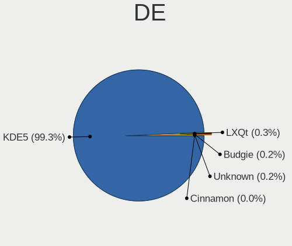
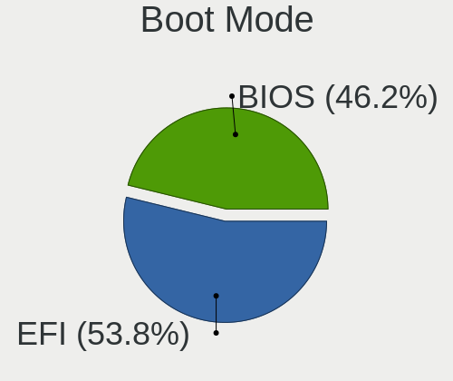
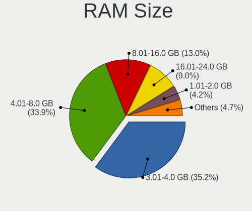
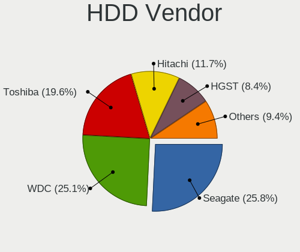
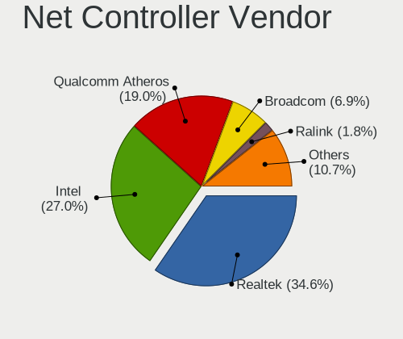
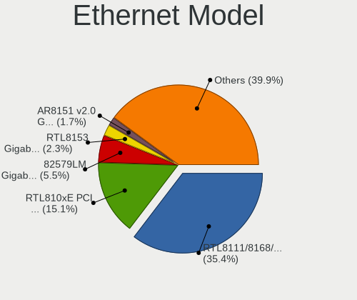
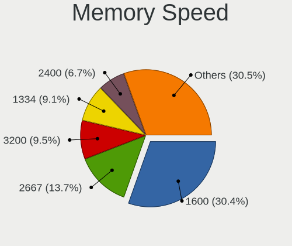
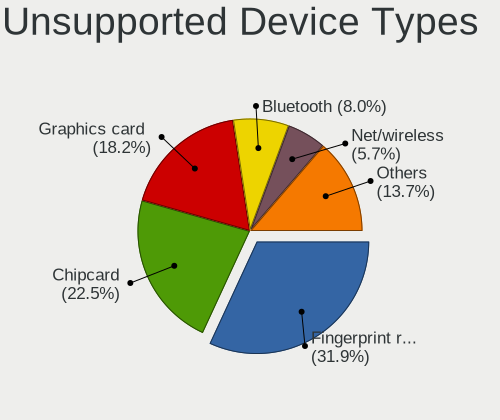

OpenMandriva 4.3 - Tested Hardware & Statistics (Notebooks)
-----------------------------------------------------------

A project to collect tested hardware configurations for OpenMandriva 4.3.

Anyone can contribute to this report by the [hw-probe](https://github.com/linuxhw/hw-probe) tool:

    sudo -E hw-probe -all -upload

Please contribute! Especially if your hardware is rare.

Contents
--------

* [ Test Cases ](#test-cases)

* [ System ](#system)
  - [ Kernel                   ](#kernel)
  - [ Kernel Family            ](#kernel-family)
  - [ Kernel Major Ver.        ](#kernel-major-ver)
  - [ Arch                     ](#arch)
  - [ DE                       ](#de)
  - [ Display Server           ](#display-server)
  - [ Display Manager          ](#display-manager)
  - [ OS Lang                  ](#os-lang)
  - [ Boot Mode                ](#boot-mode)
  - [ Filesystem               ](#filesystem)
  - [ Part. scheme             ](#part-scheme)
  - [ Dual Boot with Linux/BSD ](#dual-boot-with-linuxbsd)
  - [ Dual Boot (Win)          ](#dual-boot-win)

* [ Board ](#board)
  - [ Vendor                   ](#vendor)
  - [ Model                    ](#model)
  - [ Model Family             ](#model-family)
  - [ MFG Year                 ](#mfg-year)
  - [ Form Factor              ](#form-factor)
  - [ Secure Boot              ](#secure-boot)
  - [ Coreboot                 ](#coreboot)
  - [ RAM Size                 ](#ram-size)
  - [ RAM Used                 ](#ram-used)
  - [ Total Drives             ](#total-drives)
  - [ Has CD-ROM               ](#has-cd-rom)
  - [ Has Ethernet             ](#has-ethernet)
  - [ Has WiFi                 ](#has-wifi)
  - [ Has Bluetooth            ](#has-bluetooth)

* [ Location ](#location)
  - [ Country                  ](#country)
  - [ City                     ](#city)

* [ Drives ](#drives)
  - [ Drive Vendor             ](#drive-vendor)
  - [ Drive Model              ](#drive-model)
  - [ HDD Vendor               ](#hdd-vendor)
  - [ SSD Vendor               ](#ssd-vendor)
  - [ Drive Kind               ](#drive-kind)
  - [ Drive Connector          ](#drive-connector)
  - [ Drive Size               ](#drive-size)
  - [ Space Total              ](#space-total)
  - [ Space Used               ](#space-used)
  - [ Malfunc. Drives          ](#malfunc-drives)
  - [ Malfunc. Drive Vendor    ](#malfunc-drive-vendor)
  - [ Malfunc. HDD Vendor      ](#malfunc-hdd-vendor)
  - [ Malfunc. Drive Kind      ](#malfunc-drive-kind)
  - [ Failed Drives            ](#failed-drives)
  - [ Failed Drive Vendor      ](#failed-drive-vendor)
  - [ Drive Status             ](#drive-status)

* [ Storage controller ](#storage-controller)
  - [ Storage Vendor           ](#storage-vendor)
  - [ Storage Model            ](#storage-model)
  - [ Storage Kind             ](#storage-kind)

* [ Processor ](#processor)
  - [ CPU Vendor               ](#cpu-vendor)
  - [ CPU Model                ](#cpu-model)
  - [ CPU Model Family         ](#cpu-model-family)
  - [ CPU Cores                ](#cpu-cores)
  - [ CPU Sockets              ](#cpu-sockets)
  - [ CPU Threads              ](#cpu-threads)
  - [ CPU Op-Modes             ](#cpu-op-modes)
  - [ CPU Microcode            ](#cpu-microcode)
  - [ CPU Microarch            ](#cpu-microarch)

* [ Graphics ](#graphics)
  - [ GPU Vendor               ](#gpu-vendor)
  - [ GPU Model                ](#gpu-model)
  - [ GPU Combo                ](#gpu-combo)
  - [ GPU Driver               ](#gpu-driver)
  - [ GPU Memory               ](#gpu-memory)

* [ Monitor ](#monitor)
  - [ Monitor Vendor           ](#monitor-vendor)
  - [ Monitor Model            ](#monitor-model)
  - [ Monitor Resolution       ](#monitor-resolution)
  - [ Monitor Diagonal         ](#monitor-diagonal)
  - [ Monitor Width            ](#monitor-width)
  - [ Aspect Ratio             ](#aspect-ratio)
  - [ Monitor Area             ](#monitor-area)
  - [ Pixel Density            ](#pixel-density)
  - [ Multiple Monitors        ](#multiple-monitors)

* [ Network ](#network)
  - [ Net Controller Vendor    ](#net-controller-vendor)
  - [ Net Controller Model     ](#net-controller-model)
  - [ Wireless Vendor          ](#wireless-vendor)
  - [ Wireless Model           ](#wireless-model)
  - [ Ethernet Vendor          ](#ethernet-vendor)
  - [ Ethernet Model           ](#ethernet-model)
  - [ Net Controller Kind      ](#net-controller-kind)
  - [ Used Controller          ](#used-controller)
  - [ NICs                     ](#nics)
  - [ IPv6                     ](#ipv6)

* [ Bluetooth ](#bluetooth)
  - [ Bluetooth Vendor         ](#bluetooth-vendor)
  - [ Bluetooth Model          ](#bluetooth-model)

* [ Sound ](#sound)
  - [ Sound Vendor             ](#sound-vendor)
  - [ Sound Model              ](#sound-model)

* [ Memory ](#memory)
  - [ Memory Vendor            ](#memory-vendor)
  - [ Memory Model             ](#memory-model)
  - [ Memory Kind              ](#memory-kind)
  - [ Memory Form Factor       ](#memory-form-factor)
  - [ Memory Size              ](#memory-size)
  - [ Memory Speed             ](#memory-speed)

* [ Printers & scanners ](#printers--scanners)
  - [ Printer Vendor           ](#printer-vendor)
  - [ Printer Model            ](#printer-model)
  - [ Scanner Vendor           ](#scanner-vendor)
  - [ Scanner Model            ](#scanner-model)

* [ Camera ](#camera)
  - [ Camera Vendor            ](#camera-vendor)
  - [ Camera Model             ](#camera-model)

* [ Security ](#security)
  - [ Fingerprint Vendor       ](#fingerprint-vendor)
  - [ Fingerprint Model        ](#fingerprint-model)
  - [ Chipcard Vendor          ](#chipcard-vendor)
  - [ Chipcard Model           ](#chipcard-model)

* [ Unsupported ](#unsupported)
  - [ Unsupported Devices      ](#unsupported-devices)
  - [ Unsupported Device Types ](#unsupported-device-types)

Test Cases
----------

Total: 1738

| Vendor        | Model                       | Probe                                                      | Date         |
|---------------|-----------------------------|------------------------------------------------------------|--------------|
| HP            | ENVY m6                     | [9043724da5](https://linux-hardware.org/?probe=9043724da5) | Nov 02, 2022 |
| Lenovo        | IdeaPad 110-15ACL 80TJ      | [0a79270558](https://linux-hardware.org/?probe=0a79270558) | Nov 02, 2022 |
| Panasonic     | CF-C1BWFBZ1M                | [18a81d5db2](https://linux-hardware.org/?probe=18a81d5db2) | Nov 02, 2022 |
| Acer          | Nitro AN515-57              | [44f768478e](https://linux-hardware.org/?probe=44f768478e) | Nov 02, 2022 |
| Toshiba       | Satellite C660              | [44c6e56cd9](https://linux-hardware.org/?probe=44c6e56cd9) | Nov 01, 2022 |
| Lenovo        | G50-80 80E5                 | [0470f02ccb](https://linux-hardware.org/?probe=0470f02ccb) | Nov 01, 2022 |
| ASUSTek       | S551LN                      | [67e15a659d](https://linux-hardware.org/?probe=67e15a659d) | Oct 31, 2022 |
| Acer          | Extensa 5635Z               | [35ce596e08](https://linux-hardware.org/?probe=35ce596e08) | Oct 31, 2022 |
| Dell          | Latitude E5500              | [c64399793c](https://linux-hardware.org/?probe=c64399793c) | Oct 31, 2022 |
| Dell          | Latitude E6400              | [8f2639b285](https://linux-hardware.org/?probe=8f2639b285) | Oct 31, 2022 |
| Acer          | Aspire E5-573G              | [acfa0d90d6](https://linux-hardware.org/?probe=acfa0d90d6) | Oct 31, 2022 |
| Intel         | powered classmate PC        | [5555da7553](https://linux-hardware.org/?probe=5555da7553) | Oct 31, 2022 |
| Prestigio     | PSB133S01ZFP                | [e10becbd35](https://linux-hardware.org/?probe=e10becbd35) | Oct 30, 2022 |
| Dell          | Latitude E7240              | [7605a5bf1c](https://linux-hardware.org/?probe=7605a5bf1c) | Oct 30, 2022 |
| ASUSTek       | X556UQK                     | [f8bdcbce4e](https://linux-hardware.org/?probe=f8bdcbce4e) | Oct 29, 2022 |
| Dell          | Studio 1737                 | [97f398804e](https://linux-hardware.org/?probe=97f398804e) | Oct 29, 2022 |
| HP            | Compaq 615                  | [ae90fa3742](https://linux-hardware.org/?probe=ae90fa3742) | Oct 29, 2022 |
| ASUSTek       | UX31E                       | [6e9cb9c0e0](https://linux-hardware.org/?probe=6e9cb9c0e0) | Oct 29, 2022 |
| Dell          | Inspiron 1525               | [ffb4369f83](https://linux-hardware.org/?probe=ffb4369f83) | Oct 29, 2022 |
| Dell          | XPS 15 9530                 | [fc7ef1ce9a](https://linux-hardware.org/?probe=fc7ef1ce9a) | Oct 29, 2022 |
| Acer          | Aspire 5745                 | [2f79de6974](https://linux-hardware.org/?probe=2f79de6974) | Oct 28, 2022 |
| Lenovo        | IdeaPad 5 Pro 14ACN6 82L... | [6b57390808](https://linux-hardware.org/?probe=6b57390808) | Oct 28, 2022 |
| HP            | Pavilion Laptop 15-cc0xx    | [0ca2ea7180](https://linux-hardware.org/?probe=0ca2ea7180) | Oct 28, 2022 |
| Acer          | Aspire 8730                 | [86bffd9523](https://linux-hardware.org/?probe=86bffd9523) | Oct 27, 2022 |
| Acer          | Aspire E3-112               | [fd34f66305](https://linux-hardware.org/?probe=fd34f66305) | Oct 26, 2022 |
| Toshiba       | Satellite L45-B             | [e2f30e0f1e](https://linux-hardware.org/?probe=e2f30e0f1e) | Oct 26, 2022 |
| Acer          | Aspire ES1-571              | [f9f7926da2](https://linux-hardware.org/?probe=f9f7926da2) | Oct 25, 2022 |
| Panasonic     | CFSX4-1                     | [2ddae6e0e1](https://linux-hardware.org/?probe=2ddae6e0e1) | Oct 25, 2022 |
| Lenovo        | IdeaPad 1 14ADA05 82GW      | [ede3bcd3f3](https://linux-hardware.org/?probe=ede3bcd3f3) | Oct 24, 2022 |
| Lenovo        | IdeaPad S145-15AST 81N3     | [bfa28dd791](https://linux-hardware.org/?probe=bfa28dd791) | Oct 24, 2022 |
| Dell          | Studio 1737                 | [d6e17c05b2](https://linux-hardware.org/?probe=d6e17c05b2) | Oct 24, 2022 |
| Lenovo        | G400s VILG1                 | [b7315785a1](https://linux-hardware.org/?probe=b7315785a1) | Oct 24, 2022 |
| ASUSTek       | A7U                         | [867f26dde1](https://linux-hardware.org/?probe=867f26dde1) | Oct 24, 2022 |
| Acer          | TravelMate B311-31          | [010dd1e876](https://linux-hardware.org/?probe=010dd1e876) | Oct 24, 2022 |
| Packard Be... | EasyNote ENTE70BH           | [2135a5aed7](https://linux-hardware.org/?probe=2135a5aed7) | Oct 23, 2022 |
| Lenovo        | ThinkPad X240 20AMS01M00    | [2f1c7b7716](https://linux-hardware.org/?probe=2f1c7b7716) | Oct 23, 2022 |
| Fujitsu       | LIFEBOOK AH532              | [d806b92948](https://linux-hardware.org/?probe=d806b92948) | Oct 22, 2022 |
| Dell          | Precision M6800             | [9b909039ee](https://linux-hardware.org/?probe=9b909039ee) | Oct 21, 2022 |
| Lenovo        | ThinkPad T520 42434WU       | [d118d39c58](https://linux-hardware.org/?probe=d118d39c58) | Oct 21, 2022 |
| MSI           | GT70 0NC/GT70 0NC           | [592b788d62](https://linux-hardware.org/?probe=592b788d62) | Oct 20, 2022 |
| Dell          | Latitude E5410              | [f3b5d196ef](https://linux-hardware.org/?probe=f3b5d196ef) | Oct 20, 2022 |
| Sony          | SVE1513B1EW                 | [77ef0b542b](https://linux-hardware.org/?probe=77ef0b542b) | Oct 20, 2022 |
| Acer          | Aspire E5-574               | [d9797d9fa7](https://linux-hardware.org/?probe=d9797d9fa7) | Oct 19, 2022 |
| Dell          | Inspiron 13-7359            | [239627f1d1](https://linux-hardware.org/?probe=239627f1d1) | Oct 19, 2022 |
| Samsung       | 550XDA                      | [fcfceeaf04](https://linux-hardware.org/?probe=fcfceeaf04) | Oct 19, 2022 |
| MSI           | GE62 6QC                    | [92ac4fbaa6](https://linux-hardware.org/?probe=92ac4fbaa6) | Oct 19, 2022 |
| Lenovo        | G480                        | [984691a38d](https://linux-hardware.org/?probe=984691a38d) | Oct 18, 2022 |
| HP            | Unknown                     | [4a0df43034](https://linux-hardware.org/?probe=4a0df43034) | Oct 17, 2022 |
| Dell          | Latitude E6330              | [d4d6ca7ae9](https://linux-hardware.org/?probe=d4d6ca7ae9) | Oct 17, 2022 |
| Lenovo        | G50-70 20351                | [a1e9be5323](https://linux-hardware.org/?probe=a1e9be5323) | Oct 17, 2022 |
| HP            | Pavilion Laptop 15-cs0xx... | [9e37b60507](https://linux-hardware.org/?probe=9e37b60507) | Oct 16, 2022 |
| Dell          | Latitude E6430              | [2e8f3bd664](https://linux-hardware.org/?probe=2e8f3bd664) | Oct 16, 2022 |
| Dell          | Latitude E6420              | [913e2b1acd](https://linux-hardware.org/?probe=913e2b1acd) | Oct 15, 2022 |
| Lenovo        | ThinkPad L560 20F1000TJP    | [e9b7a4ffc2](https://linux-hardware.org/?probe=e9b7a4ffc2) | Oct 15, 2022 |
| Acer          | Aspire A515-44              | [a19fc69283](https://linux-hardware.org/?probe=a19fc69283) | Oct 15, 2022 |
| LG Electro... | S460-G.BG31P1               | [a0b3b8e905](https://linux-hardware.org/?probe=a0b3b8e905) | Oct 15, 2022 |
| Dell          | Latitude 3340               | [d99dbe3b99](https://linux-hardware.org/?probe=d99dbe3b99) | Oct 14, 2022 |
| ASUSTek       | UX31E                       | [bddc33ef5a](https://linux-hardware.org/?probe=bddc33ef5a) | Oct 14, 2022 |
| Packard Be... | EasyNote TJ66               | [e5f4bf84f8](https://linux-hardware.org/?probe=e5f4bf84f8) | Oct 14, 2022 |
| Compaq        | PRESARIOCQ18                | [5172032993](https://linux-hardware.org/?probe=5172032993) | Oct 14, 2022 |
| Dell          | Latitude E5440              | [432aa93109](https://linux-hardware.org/?probe=432aa93109) | Oct 14, 2022 |
| Dell          | Inspiron 5551               | [64865d9bb5](https://linux-hardware.org/?probe=64865d9bb5) | Oct 13, 2022 |
| Dell          | Precision 7720              | [4cadd86832](https://linux-hardware.org/?probe=4cadd86832) | Oct 13, 2022 |
| Dell          | Studio 1555                 | [52104abe69](https://linux-hardware.org/?probe=52104abe69) | Oct 13, 2022 |
| HP            | Laptop 14-bw0xx             | [3a190d5718](https://linux-hardware.org/?probe=3a190d5718) | Oct 13, 2022 |
| Acer          | Aspire E5-573G              | [bccf0a4ebe](https://linux-hardware.org/?probe=bccf0a4ebe) | Oct 13, 2022 |
| Lenovo        | IdeaPad 330-15IKB 81FE      | [bb386c7d60](https://linux-hardware.org/?probe=bb386c7d60) | Oct 13, 2022 |
| Toshiba       | Satellite C855              | [65e0a41b8d](https://linux-hardware.org/?probe=65e0a41b8d) | Oct 13, 2022 |
| Acer          | Aspire 7250G                | [34966259d6](https://linux-hardware.org/?probe=34966259d6) | Oct 13, 2022 |
| HP            | G42                         | [fd42e3aedb](https://linux-hardware.org/?probe=fd42e3aedb) | Oct 12, 2022 |
| Dell          | XPS 15 9530                 | [ad2b1ab7b8](https://linux-hardware.org/?probe=ad2b1ab7b8) | Oct 12, 2022 |
| Star Labs     | StarLite                    | [627ad33197](https://linux-hardware.org/?probe=627ad33197) | Oct 12, 2022 |
| Dell          | Latitude E6440              | [3b13c28e46](https://linux-hardware.org/?probe=3b13c28e46) | Oct 12, 2022 |
| Lenovo        | ThinkPad T440s 20ARS4PR0... | [18c02300b9](https://linux-hardware.org/?probe=18c02300b9) | Oct 11, 2022 |
| Lenovo        | IdeaPad L340-15IRH Gamin... | [87cfe8ed2e](https://linux-hardware.org/?probe=87cfe8ed2e) | Oct 11, 2022 |
| Dell          | Latitude E6540              | [d1b0bd16b5](https://linux-hardware.org/?probe=d1b0bd16b5) | Oct 11, 2022 |
| ASUSTek       | UX31E                       | [22cf469faa](https://linux-hardware.org/?probe=22cf469faa) | Oct 10, 2022 |
| Lenovo        | IdeaPad 330-15IGM 81D1      | [792528e3b2](https://linux-hardware.org/?probe=792528e3b2) | Oct 10, 2022 |
| Dell          | Latitude E6410              | [4f6730e0f2](https://linux-hardware.org/?probe=4f6730e0f2) | Oct 09, 2022 |
| Lenovo        | IdeaPad 5 14ARE05 81YM      | [3e7ef86329](https://linux-hardware.org/?probe=3e7ef86329) | Oct 09, 2022 |
| ASUSTek       | X550VB                      | [a7c1c1cb1b](https://linux-hardware.org/?probe=a7c1c1cb1b) | Oct 09, 2022 |
| Dell          | Inspiron N7010              | [8d58156239](https://linux-hardware.org/?probe=8d58156239) | Oct 09, 2022 |
| Dell          | Inspiron 5558               | [8918b1b82e](https://linux-hardware.org/?probe=8918b1b82e) | Oct 09, 2022 |
| HP            | Laptop 15-da0xxx            | [d172225c0b](https://linux-hardware.org/?probe=d172225c0b) | Oct 08, 2022 |
| Lenovo        | IdeaPad 3 15ADA05 81W1      | [3665682cc6](https://linux-hardware.org/?probe=3665682cc6) | Oct 08, 2022 |
| HP            | Laptop 15-ef1xxx            | [9d44a35e48](https://linux-hardware.org/?probe=9d44a35e48) | Oct 08, 2022 |
| Fujitsu       | LIFEBOOK E736               | [3e7cc2c14a](https://linux-hardware.org/?probe=3e7cc2c14a) | Oct 07, 2022 |
| HP            | Laptop 15-da2xxx            | [b699753cc6](https://linux-hardware.org/?probe=b699753cc6) | Oct 07, 2022 |
| Dell          | Latitude E6400              | [509deb10b3](https://linux-hardware.org/?probe=509deb10b3) | Oct 07, 2022 |
| Lenovo        | IdeaPad 1 14ADA05 82GW      | [8061516838](https://linux-hardware.org/?probe=8061516838) | Oct 06, 2022 |
| Toshiba       | Satellite R830              | [0a5299f7e0](https://linux-hardware.org/?probe=0a5299f7e0) | Oct 06, 2022 |
| Positivo      | C14CR01                     | [7c0d0b2efd](https://linux-hardware.org/?probe=7c0d0b2efd) | Oct 05, 2022 |
| Lenovo        | IdeaPad 3 15ITL05 81X8      | [f9224c972e](https://linux-hardware.org/?probe=f9224c972e) | Oct 05, 2022 |
| HP            | Pavilion 17                 | [f7626421b2](https://linux-hardware.org/?probe=f7626421b2) | Oct 05, 2022 |
| Acer          | Aspire 5250                 | [8a18115a5b](https://linux-hardware.org/?probe=8a18115a5b) | Oct 04, 2022 |
| Dell          | Inspiron 3442               | [612b4b36a1](https://linux-hardware.org/?probe=612b4b36a1) | Oct 04, 2022 |
| Lenovo        | IdeaPad 3 15ADA05 81W1      | [b8ad7a8464](https://linux-hardware.org/?probe=b8ad7a8464) | Oct 04, 2022 |
| Acer          | Aspire E5-575G              | [5e60e8faae](https://linux-hardware.org/?probe=5e60e8faae) | Oct 04, 2022 |
| Dell          | Latitude E6420              | [cc0d33aedb](https://linux-hardware.org/?probe=cc0d33aedb) | Oct 03, 2022 |
| Acer          | TravelMate 5744             | [4817d4810d](https://linux-hardware.org/?probe=4817d4810d) | Oct 03, 2022 |
| Dell          | XPS 15 9530                 | [abfab502a6](https://linux-hardware.org/?probe=abfab502a6) | Oct 02, 2022 |
| ASUSTek       | UX303UB                     | [d67f04fc6e](https://linux-hardware.org/?probe=d67f04fc6e) | Oct 02, 2022 |
| Dell          | Inspiron 5559               | [47a7282318](https://linux-hardware.org/?probe=47a7282318) | Oct 02, 2022 |
| ASUSTek       | X550JX                      | [43694e5952](https://linux-hardware.org/?probe=43694e5952) | Oct 02, 2022 |
| Acer          | Aspire V3-571G              | [bfd8dc3c18](https://linux-hardware.org/?probe=bfd8dc3c18) | Oct 02, 2022 |
| Lenovo        | IdeaPad 1 14ADA05 82GW      | [516795a4a8](https://linux-hardware.org/?probe=516795a4a8) | Oct 02, 2022 |
| HP            | ProBook 450 G4              | [9c6340e585](https://linux-hardware.org/?probe=9c6340e585) | Oct 01, 2022 |
| Dell          | Inspiron 1545               | [ba72c7ee42](https://linux-hardware.org/?probe=ba72c7ee42) | Oct 01, 2022 |
| Lenovo        | 3000 N200 0769B4G           | [947f124efc](https://linux-hardware.org/?probe=947f124efc) | Oct 01, 2022 |
| Lenovo        | IdeaPad 1 14ADA05 82GW      | [7ff2c5ad1c](https://linux-hardware.org/?probe=7ff2c5ad1c) | Oct 01, 2022 |
| Lenovo        | IdeaPad 1 14ADA05 82GW      | [a64cec6a4d](https://linux-hardware.org/?probe=a64cec6a4d) | Oct 01, 2022 |
| ASUSTek       | UX303UB                     | [e09f793c1a](https://linux-hardware.org/?probe=e09f793c1a) | Oct 01, 2022 |
| Lenovo        | IdeaPad 530S-14ARR 81H1     | [68b0c0ca1a](https://linux-hardware.org/?probe=68b0c0ca1a) | Oct 01, 2022 |
| Sony          | VPCYB3V1E                   | [de50c8a304](https://linux-hardware.org/?probe=de50c8a304) | Oct 01, 2022 |
| Lenovo        | IdeaPad S145-15AST 81N3     | [f50a823779](https://linux-hardware.org/?probe=f50a823779) | Oct 01, 2022 |
| HP            | Laptop 15-bs0xx             | [646f4ffa8e](https://linux-hardware.org/?probe=646f4ffa8e) | Oct 01, 2022 |
| Dell          | Inspiron 11-3162            | [8cd15b2f0c](https://linux-hardware.org/?probe=8cd15b2f0c) | Sep 30, 2022 |
| Dell          | Latitude E6520              | [04817b4ceb](https://linux-hardware.org/?probe=04817b4ceb) | Sep 30, 2022 |
| Lenovo        | G460 20041                  | [9018f40ad5](https://linux-hardware.org/?probe=9018f40ad5) | Sep 30, 2022 |
| Dell          | Latitude 3310               | [3c4874fa51](https://linux-hardware.org/?probe=3c4874fa51) | Sep 30, 2022 |
| Lenovo        | ThinkBook 13s-IML 20RR      | [d153a4f97a](https://linux-hardware.org/?probe=d153a4f97a) | Sep 29, 2022 |
| Toshiba       | Satellite L505              | [3e91e2bfaf](https://linux-hardware.org/?probe=3e91e2bfaf) | Sep 29, 2022 |
| HP            | Laptop 14s-fq1xxx           | [3990ec6cb0](https://linux-hardware.org/?probe=3990ec6cb0) | Sep 29, 2022 |
| HP            | Compaq 6720s                | [ddb5163310](https://linux-hardware.org/?probe=ddb5163310) | Sep 29, 2022 |
| Apple         | MacBook7,1                  | [88d57c6319](https://linux-hardware.org/?probe=88d57c6319) | Sep 29, 2022 |
| Dell          | Inspiron 15-3552            | [9414d73ae0](https://linux-hardware.org/?probe=9414d73ae0) | Sep 29, 2022 |
| Dell          | XPS 13 9360                 | [6f1ecca2f0](https://linux-hardware.org/?probe=6f1ecca2f0) | Sep 28, 2022 |
| Dell          | Latitude 3310               | [c21a321dce](https://linux-hardware.org/?probe=c21a321dce) | Sep 28, 2022 |
| Dell          | Inspiron 5558               | [a42a4722f7](https://linux-hardware.org/?probe=a42a4722f7) | Sep 28, 2022 |
| Dell          | Vostro 5391                 | [61a25cdb83](https://linux-hardware.org/?probe=61a25cdb83) | Sep 28, 2022 |
| Sony          | VPCEH1S1R                   | [5214bb023f](https://linux-hardware.org/?probe=5214bb023f) | Sep 27, 2022 |
| Dell          | Latitude 3300               | [365349d964](https://linux-hardware.org/?probe=365349d964) | Sep 27, 2022 |
| Dell          | Latitude 3310               | [313ab64584](https://linux-hardware.org/?probe=313ab64584) | Sep 27, 2022 |
| Lenovo        | IdeaPad Z580                | [a33ab40c8b](https://linux-hardware.org/?probe=a33ab40c8b) | Sep 27, 2022 |
| Packard Be... | EasyNote LS44SB             | [184a0768bd](https://linux-hardware.org/?probe=184a0768bd) | Sep 26, 2022 |
| ASUSTek       | VivoBook_ASUSLaptop E210... | [898f9bf963](https://linux-hardware.org/?probe=898f9bf963) | Sep 26, 2022 |
| Dell          | Latitude 3420               | [ee7c1fce66](https://linux-hardware.org/?probe=ee7c1fce66) | Sep 26, 2022 |
| Dell          | Latitude 3310               | [0f1fb4687f](https://linux-hardware.org/?probe=0f1fb4687f) | Sep 26, 2022 |
| Dell          | Latitude 3310               | [a6ce17cd6b](https://linux-hardware.org/?probe=a6ce17cd6b) | Sep 26, 2022 |
| Acer          | Aspire V5-471               | [66437a2187](https://linux-hardware.org/?probe=66437a2187) | Sep 26, 2022 |
| Dell          | Latitude 3310               | [87af9a8980](https://linux-hardware.org/?probe=87af9a8980) | Sep 26, 2022 |
| HP            | Laptop 17-by3xxx            | [41db205ec7](https://linux-hardware.org/?probe=41db205ec7) | Sep 25, 2022 |
| Lenovo        | ThinkPad SL500 27464DG      | [6c2b4ce4b1](https://linux-hardware.org/?probe=6c2b4ce4b1) | Sep 25, 2022 |
| HP            | 250 G5 Notebook PC          | [6c6ae30eba](https://linux-hardware.org/?probe=6c6ae30eba) | Sep 24, 2022 |
| HP            | Pavilion 15                 | [32670a0451](https://linux-hardware.org/?probe=32670a0451) | Sep 24, 2022 |
| Dell          | Inspiron 3721               | [7411a700cf](https://linux-hardware.org/?probe=7411a700cf) | Sep 24, 2022 |
| HP            | Laptop 17-cp0xxx            | [dafafa97a4](https://linux-hardware.org/?probe=dafafa97a4) | Sep 24, 2022 |
| Fujitsu       | LIFEBOOK S760               | [ceda61113a](https://linux-hardware.org/?probe=ceda61113a) | Sep 23, 2022 |
| Dell          | Latitude 3310               | [4c5dc33267](https://linux-hardware.org/?probe=4c5dc33267) | Sep 23, 2022 |
| Dell          | Latitude 7480               | [e1a3ca1d32](https://linux-hardware.org/?probe=e1a3ca1d32) | Sep 22, 2022 |
| Lenovo        | IdeaPad 3 14ALC6 82KT       | [2b37d81d4c](https://linux-hardware.org/?probe=2b37d81d4c) | Sep 22, 2022 |
| HP            | ProBook 450 G1              | [2527dc6ea0](https://linux-hardware.org/?probe=2527dc6ea0) | Sep 22, 2022 |
| Acer          | Nitro AN515-31              | [9b451feb14](https://linux-hardware.org/?probe=9b451feb14) | Sep 22, 2022 |
| HP            | Compaq 15                   | [345fe48777](https://linux-hardware.org/?probe=345fe48777) | Sep 22, 2022 |
| Lenovo        | ThinkPad X200s 7470WWD      | [268aa65de3](https://linux-hardware.org/?probe=268aa65de3) | Sep 22, 2022 |
| ASUSTek       | K70AD                       | [49dff3ffb5](https://linux-hardware.org/?probe=49dff3ffb5) | Sep 22, 2022 |
| ASUSTek       | X441BA                      | [e542a68ddf](https://linux-hardware.org/?probe=e542a68ddf) | Sep 21, 2022 |
| Dell          | G5 5505                     | [82017aa2ae](https://linux-hardware.org/?probe=82017aa2ae) | Sep 21, 2022 |
| Acer          | Aspire A315-23              | [dd730980b1](https://linux-hardware.org/?probe=dd730980b1) | Sep 20, 2022 |
| HP            | Pavilion Gaming Laptop 1... | [8003baae8c](https://linux-hardware.org/?probe=8003baae8c) | Sep 19, 2022 |
| Acer          | Nitro AN515-31              | [33e582251a](https://linux-hardware.org/?probe=33e582251a) | Sep 19, 2022 |
| Lenovo        | G50-80 80R0                 | [f04ed15344](https://linux-hardware.org/?probe=f04ed15344) | Sep 19, 2022 |
| Samsung       | R530/R730                   | [0d4e13e70f](https://linux-hardware.org/?probe=0d4e13e70f) | Sep 19, 2022 |
| Dell          | Latitude 3310               | [0e1784b38d](https://linux-hardware.org/?probe=0e1784b38d) | Sep 19, 2022 |
| Dell          | Latitude 3310               | [55332651e0](https://linux-hardware.org/?probe=55332651e0) | Sep 19, 2022 |
| Dell          | Latitude 3120               | [558e95141d](https://linux-hardware.org/?probe=558e95141d) | Sep 19, 2022 |
| Dell          | Latitude 3300               | [a2513a9849](https://linux-hardware.org/?probe=a2513a9849) | Sep 19, 2022 |
| HP            | Laptop 15-ef2xxx            | [c9ab60a094](https://linux-hardware.org/?probe=c9ab60a094) | Sep 19, 2022 |
| Lenovo        | ThinkPad T400 6474WPU       | [892c3fb361](https://linux-hardware.org/?probe=892c3fb361) | Sep 18, 2022 |
| NEC Comput... | PC-VK26MXZCE                | [db8f5e4181](https://linux-hardware.org/?probe=db8f5e4181) | Sep 18, 2022 |
| Lenovo        | ThinkPad T430 23501M2       | [b9503c9c28](https://linux-hardware.org/?probe=b9503c9c28) | Sep 18, 2022 |
| Lenovo        | IdeaPad L340-15API 81LW     | [65c4f113d8](https://linux-hardware.org/?probe=65c4f113d8) | Sep 18, 2022 |
| HP            | ProBook 6470b               | [3821322b95](https://linux-hardware.org/?probe=3821322b95) | Sep 18, 2022 |
| HP            | Notebook                    | [d29681d2ed](https://linux-hardware.org/?probe=d29681d2ed) | Sep 17, 2022 |
| Lenovo        | ThinkPad E570 20H5009NUS    | [c64258edc0](https://linux-hardware.org/?probe=c64258edc0) | Sep 17, 2022 |
| Toshiba       | TECRA S10                   | [602d81b7c5](https://linux-hardware.org/?probe=602d81b7c5) | Sep 17, 2022 |
| Toshiba       | Satellite P845T             | [0d5f5ac925](https://linux-hardware.org/?probe=0d5f5ac925) | Sep 17, 2022 |
| HP            | Laptop 15-ef0xxx            | [19d0260ef6](https://linux-hardware.org/?probe=19d0260ef6) | Sep 17, 2022 |
| HP            | 255 G5 Notebook PC          | [6d8f7ffe97](https://linux-hardware.org/?probe=6d8f7ffe97) | Sep 17, 2022 |
| Apple         | MacBook6,1                  | [93b43e5bb5](https://linux-hardware.org/?probe=93b43e5bb5) | Sep 16, 2022 |
| Lenovo        | ThinkPad T420 4180A32       | [44841341fd](https://linux-hardware.org/?probe=44841341fd) | Sep 16, 2022 |
| Chuwi         | HeroBook Pro                | [9a7d178f1b](https://linux-hardware.org/?probe=9a7d178f1b) | Sep 15, 2022 |
| Lenovo        | IdeaPad Y570 20091          | [5e2681360e](https://linux-hardware.org/?probe=5e2681360e) | Sep 15, 2022 |
| Lenovo        | ThinkPad T530 2429F33       | [790a0f2a25](https://linux-hardware.org/?probe=790a0f2a25) | Sep 14, 2022 |
| Lenovo        | IdeaPad S145-15AST 81N3     | [b552f0482d](https://linux-hardware.org/?probe=b552f0482d) | Sep 14, 2022 |
| Dell          | Latitude E7470              | [9d15a7c8a2](https://linux-hardware.org/?probe=9d15a7c8a2) | Sep 14, 2022 |
| Toshiba       | Satellite C660              | [39b26715f0](https://linux-hardware.org/?probe=39b26715f0) | Sep 14, 2022 |
| Dell          | Inspiron 5584               | [677d683644](https://linux-hardware.org/?probe=677d683644) | Sep 14, 2022 |
| Timi          | TM1612                      | [536fc04dcb](https://linux-hardware.org/?probe=536fc04dcb) | Sep 14, 2022 |
| Lenovo        | ThinkPad X230 2324GA1       | [c4e6cc1489](https://linux-hardware.org/?probe=c4e6cc1489) | Sep 14, 2022 |
| Toshiba       | Satellite L55-B             | [b593ff9e20](https://linux-hardware.org/?probe=b593ff9e20) | Sep 14, 2022 |
| HP            | Notebook                    | [963af7e07b](https://linux-hardware.org/?probe=963af7e07b) | Sep 13, 2022 |
| Lenovo        | IdeaPad 1 14ADA05 82GW      | [e558fd5212](https://linux-hardware.org/?probe=e558fd5212) | Sep 13, 2022 |
| Medion        | E4251 MD61227               | [8b3475f65b](https://linux-hardware.org/?probe=8b3475f65b) | Sep 13, 2022 |
| Compal        | NCL60/61                    | [f1f5499af8](https://linux-hardware.org/?probe=f1f5499af8) | Sep 12, 2022 |
| Toshiba       | Satellite C655              | [16a4aa3cd8](https://linux-hardware.org/?probe=16a4aa3cd8) | Sep 12, 2022 |
| Dell          | XPS 15 9530                 | [fbb3c09289](https://linux-hardware.org/?probe=fbb3c09289) | Sep 12, 2022 |
| Dell          | XPS 15 9530                 | [fccf3eb345](https://linux-hardware.org/?probe=fccf3eb345) | Sep 12, 2022 |
| HP            | ProBook 440 G1              | [58b48039ce](https://linux-hardware.org/?probe=58b48039ce) | Sep 12, 2022 |
| ASUSTek       | UX31E                       | [910cdee832](https://linux-hardware.org/?probe=910cdee832) | Sep 11, 2022 |
| HP            | Notebook                    | [2984aef090](https://linux-hardware.org/?probe=2984aef090) | Sep 11, 2022 |
| ASUSTek       | K46CA                       | [9e730cbd6a](https://linux-hardware.org/?probe=9e730cbd6a) | Sep 11, 2022 |
| Lenovo        | Unknown                     | [b5842ca017](https://linux-hardware.org/?probe=b5842ca017) | Sep 10, 2022 |
| Samsung       | R530/R730/R540              | [72aea277e6](https://linux-hardware.org/?probe=72aea277e6) | Sep 10, 2022 |
| Lenovo        | ThinkPad L420 7829H86       | [406535e915](https://linux-hardware.org/?probe=406535e915) | Sep 10, 2022 |
| HP            | Pavilion g6                 | [0774a3c97d](https://linux-hardware.org/?probe=0774a3c97d) | Sep 10, 2022 |
| LG Electro... | U560-G.BG31P1               | [741c3eddbe](https://linux-hardware.org/?probe=741c3eddbe) | Sep 10, 2022 |
| Samsung       | SX60P                       | [1e0ea8e787](https://linux-hardware.org/?probe=1e0ea8e787) | Sep 09, 2022 |
| Dell          | Precision 7560              | [3e2d1a120c](https://linux-hardware.org/?probe=3e2d1a120c) | Sep 09, 2022 |
| Dell          | Latitude E4300              | [634c1467f8](https://linux-hardware.org/?probe=634c1467f8) | Sep 09, 2022 |
| Acer          | Aspire 5738                 | [5c21c2acc6](https://linux-hardware.org/?probe=5c21c2acc6) | Sep 09, 2022 |
| Positivo      | H14BT58                     | [669a466b1c](https://linux-hardware.org/?probe=669a466b1c) | Sep 09, 2022 |
| Lenovo        | IdeaPad S400 20195          | [6bd3292f42](https://linux-hardware.org/?probe=6bd3292f42) | Sep 08, 2022 |
| Lenovo        | B5400 20278                 | [1c9d752f91](https://linux-hardware.org/?probe=1c9d752f91) | Sep 07, 2022 |
| HP            | Pavilion dv7                | [4a39ae67d5](https://linux-hardware.org/?probe=4a39ae67d5) | Sep 07, 2022 |
| Lenovo        | G580                        | [922ede2a50](https://linux-hardware.org/?probe=922ede2a50) | Sep 07, 2022 |
| Lenovo        | IdeaPad 3 15IIL05 81WE      | [22171cc2a6](https://linux-hardware.org/?probe=22171cc2a6) | Sep 07, 2022 |
| Lenovo        | IdeaPad L340-15IRH Gamin... | [14f91e3a08](https://linux-hardware.org/?probe=14f91e3a08) | Sep 07, 2022 |
| Samsung       | 3570R/370R/470R/450R/510... | [cf398ae303](https://linux-hardware.org/?probe=cf398ae303) | Sep 07, 2022 |
| HP            | ProBook 430 G1              | [cca59cbb3c](https://linux-hardware.org/?probe=cca59cbb3c) | Sep 07, 2022 |
| Positivo      | Mobile                      | [1378222b07](https://linux-hardware.org/?probe=1378222b07) | Sep 07, 2022 |
| LG Electro... | A530-T.BE76P1               | [46161b573f](https://linux-hardware.org/?probe=46161b573f) | Sep 06, 2022 |
| Lenovo        | ThinkPad Edge E531 68856... | [498682ac13](https://linux-hardware.org/?probe=498682ac13) | Sep 06, 2022 |
| Sony          | VPCSB3X9E                   | [03bd901e4f](https://linux-hardware.org/?probe=03bd901e4f) | Sep 06, 2022 |
| Lenovo        | ThinkPad T420 4236PNP       | [7c3dc0af20](https://linux-hardware.org/?probe=7c3dc0af20) | Sep 06, 2022 |
| Toshiba       | Satellite C75D-B            | [78e0cb1ca2](https://linux-hardware.org/?probe=78e0cb1ca2) | Sep 06, 2022 |
| Acer          | Aspire 5745                 | [39bc7728ac](https://linux-hardware.org/?probe=39bc7728ac) | Sep 06, 2022 |
| Lenovo        | B71-80 80RJ                 | [c16dc3a768](https://linux-hardware.org/?probe=c16dc3a768) | Sep 06, 2022 |
| Lenovo        | ThinkPad L440 20ASS11T00    | [526d97c730](https://linux-hardware.org/?probe=526d97c730) | Sep 06, 2022 |
| HP            | Stream Laptop 14-cb0XX      | [6f848cd309](https://linux-hardware.org/?probe=6f848cd309) | Sep 06, 2022 |
| Dell          | Vostro 14-5480              | [fb3ae25db8](https://linux-hardware.org/?probe=fb3ae25db8) | Sep 06, 2022 |
| Dell          | Latitude E6220              | [af87786838](https://linux-hardware.org/?probe=af87786838) | Sep 05, 2022 |
| Lenovo        | ThinkPad T530 2429W4Y       | [572b46f025](https://linux-hardware.org/?probe=572b46f025) | Sep 05, 2022 |
| ASUSTek       | K53BY                       | [efbc2be1a7](https://linux-hardware.org/?probe=efbc2be1a7) | Sep 05, 2022 |
| HP            | ProBook 450 G1              | [d9a3103936](https://linux-hardware.org/?probe=d9a3103936) | Sep 05, 2022 |
| Toshiba       | Satellite C55-A-157         | [483a0f4f49](https://linux-hardware.org/?probe=483a0f4f49) | Sep 05, 2022 |
| Fujitsu       | LIFEBOOK AH531              | [a783dcd3ca](https://linux-hardware.org/?probe=a783dcd3ca) | Sep 05, 2022 |
| Lenovo        | IdeaPad 330-15IKB 81DE      | [cb809c935a](https://linux-hardware.org/?probe=cb809c935a) | Sep 05, 2022 |
| ASUSTek       | X45C                        | [7267b251b6](https://linux-hardware.org/?probe=7267b251b6) | Sep 05, 2022 |
| Apple         | MacBookPro8,1               | [113f737135](https://linux-hardware.org/?probe=113f737135) | Sep 04, 2022 |
| Dell          | Latitude E5430 non-vPro     | [96d17dc188](https://linux-hardware.org/?probe=96d17dc188) | Sep 04, 2022 |
| ASUSTek       | X540LA                      | [3ba0635033](https://linux-hardware.org/?probe=3ba0635033) | Sep 04, 2022 |
| MSI           | MS-168B                     | [a0a6645eef](https://linux-hardware.org/?probe=a0a6645eef) | Sep 04, 2022 |
| Jumper        | EZbook                      | [d67fae436c](https://linux-hardware.org/?probe=d67fae436c) | Sep 04, 2022 |
| Lenovo        | IdeaPad 1 14ADA05 82GW      | [66724351c4](https://linux-hardware.org/?probe=66724351c4) | Sep 04, 2022 |
| ASUSTek       | VivoBook_ASUSLaptop X515... | [d7c3304983](https://linux-hardware.org/?probe=d7c3304983) | Sep 04, 2022 |
| Samsung       | 300E5M/300E5L               | [3d542c8484](https://linux-hardware.org/?probe=3d542c8484) | Sep 03, 2022 |
| Sony          | VGN-FZ31Z                   | [b99831e9f4](https://linux-hardware.org/?probe=b99831e9f4) | Sep 03, 2022 |
| Acer          | Extensa 5635ZG              | [f79a7aaa6f](https://linux-hardware.org/?probe=f79a7aaa6f) | Sep 03, 2022 |
| HP            | Compaq Presario CQ60        | [c2251f33ef](https://linux-hardware.org/?probe=c2251f33ef) | Sep 03, 2022 |
| HP            | 620                         | [34002dc814](https://linux-hardware.org/?probe=34002dc814) | Sep 02, 2022 |
| ASUSTek       | UX31E                       | [21183dcf00](https://linux-hardware.org/?probe=21183dcf00) | Sep 02, 2022 |
| UMAX          | VisionBook 14Wr Plus        | [6a2cb26049](https://linux-hardware.org/?probe=6a2cb26049) | Sep 02, 2022 |
| Getac         | B300-X                      | [927b99c2e0](https://linux-hardware.org/?probe=927b99c2e0) | Sep 02, 2022 |
| Toshiba       | Satellite C660              | [448c7a24e2](https://linux-hardware.org/?probe=448c7a24e2) | Sep 02, 2022 |
| Dell          | Latitude 3120               | [8716f564d8](https://linux-hardware.org/?probe=8716f564d8) | Sep 02, 2022 |
| HP            | Laptop 17-by4xxx            | [b9502cc4a9](https://linux-hardware.org/?probe=b9502cc4a9) | Sep 02, 2022 |
| HP            | Laptop 15-ef1xxx            | [d27c20dcf9](https://linux-hardware.org/?probe=d27c20dcf9) | Sep 01, 2022 |
| Packard Be... | DOT S                       | [b5b03f1cf7](https://linux-hardware.org/?probe=b5b03f1cf7) | Sep 01, 2022 |
| HP            | ZBook 17 G2                 | [e2fc506c38](https://linux-hardware.org/?probe=e2fc506c38) | Sep 01, 2022 |
| Lenovo        | IdeaPad 1 14ADA05 82GW      | [8a7e7ce8ea](https://linux-hardware.org/?probe=8a7e7ce8ea) | Sep 01, 2022 |
| Dell          | Latitude 3190               | [d30269b33c](https://linux-hardware.org/?probe=d30269b33c) | Sep 01, 2022 |
| ASUSTek       | ZenBook UX425QA_UM425QA     | [c48154f5f4](https://linux-hardware.org/?probe=c48154f5f4) | Sep 01, 2022 |
| ASUSTek       | X550ZE                      | [187a6feadf](https://linux-hardware.org/?probe=187a6feadf) | Sep 01, 2022 |
| HP            | Laptop 14s-fq1xxx           | [1a173c5ea0](https://linux-hardware.org/?probe=1a173c5ea0) | Sep 01, 2022 |
| HP            | Pavilion g6                 | [cc725d880c](https://linux-hardware.org/?probe=cc725d880c) | Aug 31, 2022 |
| Apple         | MacBookPro9,2               | [3662302886](https://linux-hardware.org/?probe=3662302886) | Aug 31, 2022 |
| Dell          | Inspiron 15-3567            | [710d1e9a9b](https://linux-hardware.org/?probe=710d1e9a9b) | Aug 31, 2022 |
| Dell          | Precision M6400             | [3cf32e24fa](https://linux-hardware.org/?probe=3cf32e24fa) | Aug 30, 2022 |
| Dell          | Latitude 3300               | [bea8e53929](https://linux-hardware.org/?probe=bea8e53929) | Aug 29, 2022 |
| Apple         | MacBookPro5,5               | [97fdbc4a5b](https://linux-hardware.org/?probe=97fdbc4a5b) | Aug 29, 2022 |
| Lenovo        | V14-ADA 82C6                | [ce25a77e25](https://linux-hardware.org/?probe=ce25a77e25) | Aug 29, 2022 |
| Lenovo        | IdeaPad 1 14ADA05 82GW      | [3b26a2ffe2](https://linux-hardware.org/?probe=3b26a2ffe2) | Aug 29, 2022 |
| Lenovo        | IdeaPad 1 14ADA05 82GW      | [98ac365e3c](https://linux-hardware.org/?probe=98ac365e3c) | Aug 28, 2022 |
| Dell          | Studio 1735                 | [912f409b37](https://linux-hardware.org/?probe=912f409b37) | Aug 28, 2022 |
| HP            | 620                         | [b16c60f4cf](https://linux-hardware.org/?probe=b16c60f4cf) | Aug 28, 2022 |
| Acer          | AO722                       | [377ad8686f](https://linux-hardware.org/?probe=377ad8686f) | Aug 28, 2022 |
| Lenovo        | IdeaPad 1 14ADA05 82GW      | [ee07c7a93a](https://linux-hardware.org/?probe=ee07c7a93a) | Aug 27, 2022 |
| ASUSTek       | ROG Zephyrus G15 GA503QR... | [d6c013a669](https://linux-hardware.org/?probe=d6c013a669) | Aug 27, 2022 |
| Lenovo        | IdeaPad S130-14IGM 81J2     | [1ea46f19be](https://linux-hardware.org/?probe=1ea46f19be) | Aug 27, 2022 |
| HP            | 15                          | [310d617e09](https://linux-hardware.org/?probe=310d617e09) | Aug 26, 2022 |
| Lenovo        | IdeaPad 110-15ISK 80UD      | [72888e9acb](https://linux-hardware.org/?probe=72888e9acb) | Aug 25, 2022 |
| HP            | Laptop 14-dk0xxx            | [82da7782ec](https://linux-hardware.org/?probe=82da7782ec) | Aug 25, 2022 |
| HP            | Laptop 15-dy1xxx            | [b201192ebb](https://linux-hardware.org/?probe=b201192ebb) | Aug 25, 2022 |
| Dell          | Latitude E5510              | [c237161d31](https://linux-hardware.org/?probe=c237161d31) | Aug 24, 2022 |
| Lenovo        | ThinkPad T420 4180F75       | [f4a6e9705d](https://linux-hardware.org/?probe=f4a6e9705d) | Aug 24, 2022 |
| Lenovo        | IdeaPad 3 15ADA6 82KR       | [f20e68e820](https://linux-hardware.org/?probe=f20e68e820) | Aug 24, 2022 |
| Lenovo        | IdeaPad 320-15IAP 81A3      | [81b42d221d](https://linux-hardware.org/?probe=81b42d221d) | Aug 24, 2022 |
| Acer          | Aspire A315-54K             | [685d6acc51](https://linux-hardware.org/?probe=685d6acc51) | Aug 23, 2022 |
| Dell          | Latitude E5470              | [4cf5f4680f](https://linux-hardware.org/?probe=4cf5f4680f) | Aug 23, 2022 |
| Google        | Galtic                      | [f06baf315d](https://linux-hardware.org/?probe=f06baf315d) | Aug 22, 2022 |
| Acer          | Enduro EUN314-51WG          | [aa9ea3d520](https://linux-hardware.org/?probe=aa9ea3d520) | Aug 22, 2022 |
| Acer          | TravelMate 5760             | [3d9c208d81](https://linux-hardware.org/?probe=3d9c208d81) | Aug 22, 2022 |
| Dell          | Latitude 3300               | [e8b139ecad](https://linux-hardware.org/?probe=e8b139ecad) | Aug 22, 2022 |
| Dell          | Latitude 3310               | [dedda1b96c](https://linux-hardware.org/?probe=dedda1b96c) | Aug 22, 2022 |
| Acer          | TravelMate 5730             | [ec6fd6cddb](https://linux-hardware.org/?probe=ec6fd6cddb) | Aug 22, 2022 |
| Lenovo        | IdeaPad 500S-14ISK 80Q3     | [fdbec5aab2](https://linux-hardware.org/?probe=fdbec5aab2) | Aug 22, 2022 |
| Fujitsu       | LIFEBOOK UH552              | [15a1f49654](https://linux-hardware.org/?probe=15a1f49654) | Aug 21, 2022 |
| Acer          | AO725                       | [5eed64f77d](https://linux-hardware.org/?probe=5eed64f77d) | Aug 21, 2022 |
| Lenovo        | ThinkPad X200 7458FZ3       | [232835b00b](https://linux-hardware.org/?probe=232835b00b) | Aug 21, 2022 |
| Acer          | Aspire E1-531               | [1292b2297f](https://linux-hardware.org/?probe=1292b2297f) | Aug 21, 2022 |
| HP            | Pavilion dv6                | [0aae35eb95](https://linux-hardware.org/?probe=0aae35eb95) | Aug 19, 2022 |
| Dell          | XPS 13 9360                 | [74b0bedd54](https://linux-hardware.org/?probe=74b0bedd54) | Aug 19, 2022 |
| HP            | Stream Laptop 14-cb1xxx     | [c954da96ad](https://linux-hardware.org/?probe=c954da96ad) | Aug 18, 2022 |
| ASUSTek       | X75A1                       | [870fcf0f3c](https://linux-hardware.org/?probe=870fcf0f3c) | Aug 18, 2022 |
| Dell          | Latitude E5510              | [c7defb71d5](https://linux-hardware.org/?probe=c7defb71d5) | Aug 18, 2022 |
| Medion        | Akoya E6418 MD99620         | [6817b38103](https://linux-hardware.org/?probe=6817b38103) | Aug 18, 2022 |
| Acer          | Aspire A515-51G             | [d29438c201](https://linux-hardware.org/?probe=d29438c201) | Aug 18, 2022 |
| Lenovo        | IdeaPad 3 14IGL05 81WH      | [d78fb85708](https://linux-hardware.org/?probe=d78fb85708) | Aug 18, 2022 |
| Positivo B... | S14SL03                     | [558f5a2f24](https://linux-hardware.org/?probe=558f5a2f24) | Aug 18, 2022 |
| Acer          | Nitro AN515-31              | [471659ffff](https://linux-hardware.org/?probe=471659ffff) | Aug 17, 2022 |
| Dell          | Latitude 3380               | [a99b3cef26](https://linux-hardware.org/?probe=a99b3cef26) | Aug 17, 2022 |
| ASUSTek       | VivoBook 14_ASUS Laptop ... | [9bdceca056](https://linux-hardware.org/?probe=9bdceca056) | Aug 17, 2022 |
| ASUSTek       | N75SF                       | [3b6f89e145](https://linux-hardware.org/?probe=3b6f89e145) | Aug 17, 2022 |
| NEC Comput... | PC-LJ730MG6W                | [c0e6c7edb7](https://linux-hardware.org/?probe=c0e6c7edb7) | Aug 17, 2022 |
| Dell          | Latitude 3310               | [92f66bf3aa](https://linux-hardware.org/?probe=92f66bf3aa) | Aug 17, 2022 |
| HP            | Pavilion Laptop 15-eh0xx... | [59080cc039](https://linux-hardware.org/?probe=59080cc039) | Aug 17, 2022 |
| ASUSTek       | Z550SA                      | [03ef043fd9](https://linux-hardware.org/?probe=03ef043fd9) | Aug 17, 2022 |
| HP            | Laptop 14s-fq1xxx           | [92c0a6fe2a](https://linux-hardware.org/?probe=92c0a6fe2a) | Aug 17, 2022 |
| Dell          | XPS 15 9530                 | [71f62cef7a](https://linux-hardware.org/?probe=71f62cef7a) | Aug 16, 2022 |
| Fujitsu       | LIFEBOOK AH531              | [a880d764be](https://linux-hardware.org/?probe=a880d764be) | Aug 16, 2022 |
| Lenovo        | ThinkPad L412 0585A84       | [637fa23dca](https://linux-hardware.org/?probe=637fa23dca) | Aug 16, 2022 |
| Dell          | Latitude 3310               | [1694bfcea7](https://linux-hardware.org/?probe=1694bfcea7) | Aug 16, 2022 |
| Acer          | Aspire ES1-532G             | [cf05c858ab](https://linux-hardware.org/?probe=cf05c858ab) | Aug 15, 2022 |
| Dell          | Latitude E6430              | [6c31827147](https://linux-hardware.org/?probe=6c31827147) | Aug 15, 2022 |
| Dell          | Inspiron 1501               | [11b4c83b79](https://linux-hardware.org/?probe=11b4c83b79) | Aug 15, 2022 |
| Samsung       | NC210/NC110                 | [3dcdc1dc6a](https://linux-hardware.org/?probe=3dcdc1dc6a) | Aug 15, 2022 |
| HP            | Pavilion Laptop 15-eh1xx... | [4b1440875b](https://linux-hardware.org/?probe=4b1440875b) | Aug 14, 2022 |
| ASUSTek       | X540LA                      | [15ffff65c0](https://linux-hardware.org/?probe=15ffff65c0) | Aug 14, 2022 |
| HP            | ProBook 4330s               | [62ff6ffc08](https://linux-hardware.org/?probe=62ff6ffc08) | Aug 14, 2022 |
| Acer          | Aspire A515-54G             | [e9c64a8a5c](https://linux-hardware.org/?probe=e9c64a8a5c) | Aug 14, 2022 |
| Acer          | Aspire VN7-571G             | [0d6dfdd6e0](https://linux-hardware.org/?probe=0d6dfdd6e0) | Aug 14, 2022 |
| HP            | Pavilion dv9500             | [fd3bd18049](https://linux-hardware.org/?probe=fd3bd18049) | Aug 14, 2022 |
| Toshiba       | Satellite P200              | [83fcabac55](https://linux-hardware.org/?probe=83fcabac55) | Aug 13, 2022 |
| Dell          | Vostro 1520                 | [9dab88f3ee](https://linux-hardware.org/?probe=9dab88f3ee) | Aug 13, 2022 |
| Positivo      | EC10IS1                     | [b66cd42f99](https://linux-hardware.org/?probe=b66cd42f99) | Aug 13, 2022 |
| Toshiba       | Satellite L500              | [0d58c17039](https://linux-hardware.org/?probe=0d58c17039) | Aug 13, 2022 |
| Positivo      | Mobile                      | [bddf3b59d4](https://linux-hardware.org/?probe=bddf3b59d4) | Aug 12, 2022 |
| ASUSTek       | ZenBook UX431DA_UM431DA     | [40814201a2](https://linux-hardware.org/?probe=40814201a2) | Aug 12, 2022 |
| Lenovo        | ThinkPad T61 64665DG        | [ff1be50f8c](https://linux-hardware.org/?probe=ff1be50f8c) | Aug 12, 2022 |
| Lenovo        | ThinkPad X201 3626HMG       | [1d08c103c7](https://linux-hardware.org/?probe=1d08c103c7) | Aug 12, 2022 |
| ASUSTek       | K73BR                       | [67f5d3f176](https://linux-hardware.org/?probe=67f5d3f176) | Aug 12, 2022 |
| Acer          | Aspire 4330 V1.22           | [dee8895134](https://linux-hardware.org/?probe=dee8895134) | Aug 12, 2022 |
| HP            | EliteBook 820 G3            | [c1b14847f1](https://linux-hardware.org/?probe=c1b14847f1) | Aug 12, 2022 |
| Lenovo        | ThinkPad L470 20J4002FMX    | [d949d71a19](https://linux-hardware.org/?probe=d949d71a19) | Aug 12, 2022 |
| Lenovo        | Unknown                     | [79688945e1](https://linux-hardware.org/?probe=79688945e1) | Aug 11, 2022 |
| Dell          | G5 5505                     | [cbbcb7c9a2](https://linux-hardware.org/?probe=cbbcb7c9a2) | Aug 11, 2022 |
| Dell          | Vostro 3401                 | [29f3354492](https://linux-hardware.org/?probe=29f3354492) | Aug 11, 2022 |
| Lenovo        | IdeaPad S145-14AST 81ST     | [cac00fb432](https://linux-hardware.org/?probe=cac00fb432) | Aug 11, 2022 |
| HP            | Pavilion dm3                | [7152a48ede](https://linux-hardware.org/?probe=7152a48ede) | Aug 10, 2022 |
| Lenovo        | IdeaPad 330-15IKB 81DE      | [cc51e49c51](https://linux-hardware.org/?probe=cc51e49c51) | Aug 10, 2022 |
| HP            | 240 G3                      | [77225815d2](https://linux-hardware.org/?probe=77225815d2) | Aug 10, 2022 |
| Toshiba       | Satellite A300              | [4f83e69c06](https://linux-hardware.org/?probe=4f83e69c06) | Aug 09, 2022 |
| HP            | 630                         | [fc9bc69e9a](https://linux-hardware.org/?probe=fc9bc69e9a) | Aug 09, 2022 |
| ASUSTek       | VivoBook_ASUSLaptop X513... | [9d6be5eb68](https://linux-hardware.org/?probe=9d6be5eb68) | Aug 08, 2022 |
| Acer          | Nitro AN515-31              | [0dbab56588](https://linux-hardware.org/?probe=0dbab56588) | Aug 08, 2022 |
| HP            | 15                          | [ef66e0296e](https://linux-hardware.org/?probe=ef66e0296e) | Aug 08, 2022 |
| HP            | ProBook 430 G4              | [616a031820](https://linux-hardware.org/?probe=616a031820) | Aug 08, 2022 |
| Dell          | Latitude E7240              | [1f20b0f54b](https://linux-hardware.org/?probe=1f20b0f54b) | Aug 08, 2022 |
| Dell          | Latitude E6420              | [3817e724ac](https://linux-hardware.org/?probe=3817e724ac) | Aug 08, 2022 |
| HP            | Compaq 15                   | [de4b6e0511](https://linux-hardware.org/?probe=de4b6e0511) | Aug 07, 2022 |
| ASUSTek       | VivoBook_ASUSLaptop X421... | [f9850e0a1e](https://linux-hardware.org/?probe=f9850e0a1e) | Aug 07, 2022 |
| Timi          | RedmiBook Pro 15S           | [4e36acba35](https://linux-hardware.org/?probe=4e36acba35) | Aug 07, 2022 |
| Dell          | Latitude 3189               | [63c2818521](https://linux-hardware.org/?probe=63c2818521) | Aug 07, 2022 |
| HP            | Stream Laptop 14-ax0XX      | [810a9d1c2c](https://linux-hardware.org/?probe=810a9d1c2c) | Aug 07, 2022 |
| MSI           | GL75 Leopard 10SDK          | [bfceb8ba35](https://linux-hardware.org/?probe=bfceb8ba35) | Aug 07, 2022 |
| Lenovo        | IdeaPad S145-15IKB 81VD     | [f3a36d0f3a](https://linux-hardware.org/?probe=f3a36d0f3a) | Aug 07, 2022 |
| Acer          | Swift SF114-31              | [b1cba472dc](https://linux-hardware.org/?probe=b1cba472dc) | Aug 06, 2022 |
| Lenovo        | ThinkPad T430s 2356LNG      | [255560d675](https://linux-hardware.org/?probe=255560d675) | Aug 06, 2022 |
| ASUSTek       | X555LN                      | [77092711a0](https://linux-hardware.org/?probe=77092711a0) | Aug 06, 2022 |
| Lenovo        | IdeaPad 100S-14IBR 80R9     | [6b1d79046a](https://linux-hardware.org/?probe=6b1d79046a) | Aug 06, 2022 |
| ASUSTek       | UX303UA                     | [73145490fa](https://linux-hardware.org/?probe=73145490fa) | Aug 06, 2022 |
| ASUSTek       | TUF Gaming FX505DY_FX505... | [b9a68ae76c](https://linux-hardware.org/?probe=b9a68ae76c) | Aug 06, 2022 |
| Acer          | E1-510                      | [05ea3ff386](https://linux-hardware.org/?probe=05ea3ff386) | Aug 05, 2022 |
| Dell          | Latitude 3310               | [97ac18f196](https://linux-hardware.org/?probe=97ac18f196) | Aug 05, 2022 |
| Dell          | Latitude 3410               | [8181c3588f](https://linux-hardware.org/?probe=8181c3588f) | Aug 05, 2022 |
| Dell          | Precision M4700             | [25efd53898](https://linux-hardware.org/?probe=25efd53898) | Aug 05, 2022 |
| HP            | ProBook 6450b               | [699b27e34f](https://linux-hardware.org/?probe=699b27e34f) | Aug 05, 2022 |
| Lenovo        | ThinkPad X230 2325U9T       | [0f0e8ec24f](https://linux-hardware.org/?probe=0f0e8ec24f) | Aug 04, 2022 |
| ASUSTek       | VivoBook_ASUSLaptop X512... | [cdc1f14772](https://linux-hardware.org/?probe=cdc1f14772) | Aug 04, 2022 |
| Dell          | Latitude 3490               | [fa1c5f753f](https://linux-hardware.org/?probe=fa1c5f753f) | Aug 04, 2022 |
| Dell          | Latitude 3310               | [9b9bed6ac6](https://linux-hardware.org/?probe=9b9bed6ac6) | Aug 04, 2022 |
| Dell          | System Inspiron N4110       | [22938e2e62](https://linux-hardware.org/?probe=22938e2e62) | Aug 03, 2022 |
| Lenovo        | ThinkPad T530 2429W4Z       | [2d95f7cc7e](https://linux-hardware.org/?probe=2d95f7cc7e) | Aug 03, 2022 |
| ASUSTek       | ZenBook UX425QA_UM425QA     | [f1d5a6ab3f](https://linux-hardware.org/?probe=f1d5a6ab3f) | Aug 03, 2022 |
| Lenovo        | ThinkPad SL510 28477NG      | [5ddf195177](https://linux-hardware.org/?probe=5ddf195177) | Aug 03, 2022 |
| Dell          | Latitude E6430              | [15e26c7cc5](https://linux-hardware.org/?probe=15e26c7cc5) | Aug 02, 2022 |
| Lenovo        | ThinkPad X220 Tablet 429... | [71c6ba6061](https://linux-hardware.org/?probe=71c6ba6061) | Aug 01, 2022 |
| Dell          | Latitude E7450              | [38051fe609](https://linux-hardware.org/?probe=38051fe609) | Aug 01, 2022 |
| Packard Be... | EasyNote TK13BZ             | [530d3ad8db](https://linux-hardware.org/?probe=530d3ad8db) | Aug 01, 2022 |
| HP            | ProBook 440 G2              | [00dd80ba31](https://linux-hardware.org/?probe=00dd80ba31) | Aug 01, 2022 |
| Acer          | Z476                        | [ade85b90c1](https://linux-hardware.org/?probe=ade85b90c1) | Aug 01, 2022 |
| Toshiba       | Satellite-C845              | [6ee9ea90a5](https://linux-hardware.org/?probe=6ee9ea90a5) | Aug 01, 2022 |
| GPU Compan... | GWNR71517                   | [72278643e8](https://linux-hardware.org/?probe=72278643e8) | Aug 01, 2022 |
| Acer          | Aspire ES1-523              | [d14f053671](https://linux-hardware.org/?probe=d14f053671) | Aug 01, 2022 |
| Acer          | Aspire E1-571               | [7102c56d5b](https://linux-hardware.org/?probe=7102c56d5b) | Aug 01, 2022 |
| Packard Be... | EasyNote TM85               | [a6df06f9e5](https://linux-hardware.org/?probe=a6df06f9e5) | Jul 31, 2022 |
| Lenovo        | ThinkPad T460 20FMS02R0G    | [0aa31e3c39](https://linux-hardware.org/?probe=0aa31e3c39) | Jul 31, 2022 |
| Acer          | TravelMate B118-M           | [490edd75cf](https://linux-hardware.org/?probe=490edd75cf) | Jul 31, 2022 |
| HP            | ProBook 6570b               | [333a24bdee](https://linux-hardware.org/?probe=333a24bdee) | Jul 31, 2022 |
| Acer          | Aspire VN7-791G             | [3e72040097](https://linux-hardware.org/?probe=3e72040097) | Jul 31, 2022 |
| HP            | 250 G7 Notebook PC          | [6204ce9d95](https://linux-hardware.org/?probe=6204ce9d95) | Jul 31, 2022 |
| eMachines     | Unknown                     | [8c6dcb08a7](https://linux-hardware.org/?probe=8c6dcb08a7) | Jul 31, 2022 |
| Notebook      | W54_W94_W955TU,-T,-C        | [7b0b52e138](https://linux-hardware.org/?probe=7b0b52e138) | Jul 31, 2022 |
| Compaq        | Presario CQ-23              | [76ea82c314](https://linux-hardware.org/?probe=76ea82c314) | Jul 30, 2022 |
| HP            | EliteBook 8470p             | [2171abfd3d](https://linux-hardware.org/?probe=2171abfd3d) | Jul 30, 2022 |
| Apple         | MacBookPro7,1               | [b846739765](https://linux-hardware.org/?probe=b846739765) | Jul 30, 2022 |
| ASUSTek       | K501LX                      | [8ea0c7daa9](https://linux-hardware.org/?probe=8ea0c7daa9) | Jul 30, 2022 |
| HP            | Laptop 15s-eq1xxx           | [ee5c151c3a](https://linux-hardware.org/?probe=ee5c151c3a) | Jul 30, 2022 |
| ASUSTek       | K53E                        | [3ca340212e](https://linux-hardware.org/?probe=3ca340212e) | Jul 30, 2022 |
| Lenovo        | G570 4334                   | [a29c1c816a](https://linux-hardware.org/?probe=a29c1c816a) | Jul 30, 2022 |
| Fujitsu       | LIFEBOOK V1020              | [e33ac2916d](https://linux-hardware.org/?probe=e33ac2916d) | Jul 30, 2022 |
| MSI           | GF63 8RD                    | [fdb72c3ec3](https://linux-hardware.org/?probe=fdb72c3ec3) | Jul 29, 2022 |
| Acer          | Aspire A317-33              | [ab07e43574](https://linux-hardware.org/?probe=ab07e43574) | Jul 29, 2022 |
| Sony          | VPCEA45FL                   | [8079ec1351](https://linux-hardware.org/?probe=8079ec1351) | Jul 29, 2022 |
| Lenovo        | ThinkPad T440s 20ARS4PR0... | [5b91ff037d](https://linux-hardware.org/?probe=5b91ff037d) | Jul 29, 2022 |
| HP            | ProBook 6570b               | [231ebd2edc](https://linux-hardware.org/?probe=231ebd2edc) | Jul 29, 2022 |
| Acer          | Aspire 7741                 | [02e9f6a808](https://linux-hardware.org/?probe=02e9f6a808) | Jul 29, 2022 |
| Dell          | Vostro 15-3568              | [a42627d17e](https://linux-hardware.org/?probe=a42627d17e) | Jul 29, 2022 |
| Lenovo        | ThinkPad S5 Yoga 15 20DR... | [147d305ac1](https://linux-hardware.org/?probe=147d305ac1) | Jul 29, 2022 |
| Lenovo        | ThinkPad X230 23253B3       | [fa19ec3adf](https://linux-hardware.org/?probe=fa19ec3adf) | Jul 29, 2022 |
| Google        | Candy                       | [cba2906cfd](https://linux-hardware.org/?probe=cba2906cfd) | Jul 29, 2022 |
| HP            | ProBook 430 G5              | [f424705bd7](https://linux-hardware.org/?probe=f424705bd7) | Jul 29, 2022 |
| Acer          | Aspire 5750                 | [e3f2dd0271](https://linux-hardware.org/?probe=e3f2dd0271) | Jul 29, 2022 |
| Lenovo        | IdeaPad S145-15IWL 81MV     | [03b39a36f1](https://linux-hardware.org/?probe=03b39a36f1) | Jul 29, 2022 |
| Lenovo        | G50-45 80E3                 | [61a6277614](https://linux-hardware.org/?probe=61a6277614) | Jul 28, 2022 |
| ASUSTek       | X551MA                      | [668a02296d](https://linux-hardware.org/?probe=668a02296d) | Jul 28, 2022 |
| HP            | ProBook 4515s               | [b9759d3b5d](https://linux-hardware.org/?probe=b9759d3b5d) | Jul 28, 2022 |
| HP            | 250 G5 Notebook PC          | [75477a4d7a](https://linux-hardware.org/?probe=75477a4d7a) | Jul 28, 2022 |
| ASUSTek       | K53U                        | [7db28a1538](https://linux-hardware.org/?probe=7db28a1538) | Jul 28, 2022 |
| Acer          | Aspire 3100                 | [26c6af2a55](https://linux-hardware.org/?probe=26c6af2a55) | Jul 28, 2022 |
| Toshiba       | Satellite P50-B-118         | [b46f72c280](https://linux-hardware.org/?probe=b46f72c280) | Jul 28, 2022 |
| HP            | 2000                        | [531b786836](https://linux-hardware.org/?probe=531b786836) | Jul 28, 2022 |
| Wortmann      | TERRA_MOBILE_1528P/1748P    | [7bcdc30be3](https://linux-hardware.org/?probe=7bcdc30be3) | Jul 28, 2022 |
| Digibras      | NH4CU03                     | [bf8a8c589a](https://linux-hardware.org/?probe=bf8a8c589a) | Jul 28, 2022 |
| Positivo      | H14BT58                     | [7f271e5d68](https://linux-hardware.org/?probe=7f271e5d68) | Jul 28, 2022 |
| Toshiba       | Satellite C850D-11K         | [544f2db462](https://linux-hardware.org/?probe=544f2db462) | Jul 28, 2022 |
| Sony          | VPCS110FL                   | [8576955f3c](https://linux-hardware.org/?probe=8576955f3c) | Jul 28, 2022 |
| ASUSTek       | VivoBook_ASUSLaptop X509... | [94a6b79798](https://linux-hardware.org/?probe=94a6b79798) | Jul 27, 2022 |
| Samsung       | 550XBE/350XBE               | [b7fabad758](https://linux-hardware.org/?probe=b7fabad758) | Jul 27, 2022 |
| HP            | Pavilion g7                 | [75fa7f0ce4](https://linux-hardware.org/?probe=75fa7f0ce4) | Jul 27, 2022 |
| Dell          | XPS 13 9300                 | [8f0daaf341](https://linux-hardware.org/?probe=8f0daaf341) | Jul 27, 2022 |
| ASUSTek       | S551LB                      | [8660a06086](https://linux-hardware.org/?probe=8660a06086) | Jul 27, 2022 |
| Dell          | Latitude E6330              | [5ee8d985ed](https://linux-hardware.org/?probe=5ee8d985ed) | Jul 27, 2022 |
| Lenovo        | IdeaPad S145-15API 81UT     | [17f64584bb](https://linux-hardware.org/?probe=17f64584bb) | Jul 27, 2022 |
| HP            | Compaq 6720s                | [d8546f791c](https://linux-hardware.org/?probe=d8546f791c) | Jul 27, 2022 |
| HP            | EliteBook 8460p             | [7b2de05256](https://linux-hardware.org/?probe=7b2de05256) | Jul 27, 2022 |
| Acer          | TravelMate P633-M           | [7d346db799](https://linux-hardware.org/?probe=7d346db799) | Jul 27, 2022 |
| Lenovo        | ThinkPad T420 4236CTO       | [6797b09b3b](https://linux-hardware.org/?probe=6797b09b3b) | Jul 27, 2022 |
| Apple         | MacBookPro8,1               | [cf1f919243](https://linux-hardware.org/?probe=cf1f919243) | Jul 27, 2022 |
| Lenovo        | IdeaPad 510-15ISK 80SR      | [44954e91a2](https://linux-hardware.org/?probe=44954e91a2) | Jul 27, 2022 |
| Sony          | VPCEB26FG                   | [49c139799c](https://linux-hardware.org/?probe=49c139799c) | Jul 27, 2022 |
| HP            | Compaq Presario CQ60        | [06fe56588b](https://linux-hardware.org/?probe=06fe56588b) | Jul 27, 2022 |
| Dell          | Latitude E7240              | [6af993caf7](https://linux-hardware.org/?probe=6af993caf7) | Jul 27, 2022 |
| Toshiba       | Satellite C870D-116         | [d92af8246c](https://linux-hardware.org/?probe=d92af8246c) | Jul 26, 2022 |
| HP            | ProBook 645 G1              | [457c35707a](https://linux-hardware.org/?probe=457c35707a) | Jul 26, 2022 |
| Acer          | Aspire 3810T                | [92f9c99b5e](https://linux-hardware.org/?probe=92f9c99b5e) | Jul 26, 2022 |
| Dell          | Latitude 131L               | [ec8717bc3f](https://linux-hardware.org/?probe=ec8717bc3f) | Jul 26, 2022 |
| Dell          | Latitude 3300               | [64cf4b87d9](https://linux-hardware.org/?probe=64cf4b87d9) | Jul 26, 2022 |
| Toshiba       | dynabook R734/K             | [a5e7d4c919](https://linux-hardware.org/?probe=a5e7d4c919) | Jul 26, 2022 |
| Dell          | Vostro 15-3568              | [da71f235a2](https://linux-hardware.org/?probe=da71f235a2) | Jul 25, 2022 |
| HP            | Pavilion Notebook           | [660665c762](https://linux-hardware.org/?probe=660665c762) | Jul 25, 2022 |
| Dell          | Latitude 3310               | [0fe12d0d48](https://linux-hardware.org/?probe=0fe12d0d48) | Jul 25, 2022 |
| Acer          | Aspire 5741G                | [a4f8482423](https://linux-hardware.org/?probe=a4f8482423) | Jul 25, 2022 |
| ASUSTek       | ASUS TUF Gaming F15 FX50... | [375ba933ba](https://linux-hardware.org/?probe=375ba933ba) | Jul 25, 2022 |
| Lenovo        | G50-45 80E3                 | [e6b9106560](https://linux-hardware.org/?probe=e6b9106560) | Jul 24, 2022 |
| Lenovo        | ThinkPad P50 20EN0008GE     | [93ec0d85ab](https://linux-hardware.org/?probe=93ec0d85ab) | Jul 24, 2022 |
| Toshiba       | Portable PC                 | [00cd85e866](https://linux-hardware.org/?probe=00cd85e866) | Jul 24, 2022 |
| Apple         | MacBookAir9,1               | [cf4d815653](https://linux-hardware.org/?probe=cf4d815653) | Jul 24, 2022 |
| HP            | Notebook                    | [17893fb905](https://linux-hardware.org/?probe=17893fb905) | Jul 24, 2022 |
| ASUSTek       | X455LJ                      | [49af56cbe0](https://linux-hardware.org/?probe=49af56cbe0) | Jul 24, 2022 |
| ASUSTek       | K50IJ                       | [60af40882b](https://linux-hardware.org/?probe=60af40882b) | Jul 24, 2022 |
| Dell          | Latitude E6430              | [8bc3b0f962](https://linux-hardware.org/?probe=8bc3b0f962) | Jul 23, 2022 |
| Lenovo        | IdeaPad S145-15AST 81N3     | [c4c41ad0b5](https://linux-hardware.org/?probe=c4c41ad0b5) | Jul 23, 2022 |
| HP            | Victus by Laptop 16-d0xx... | [acdc35979c](https://linux-hardware.org/?probe=acdc35979c) | Jul 23, 2022 |
| AZW           | GT-R                        | [eb7604ea1c](https://linux-hardware.org/?probe=eb7604ea1c) | Jul 22, 2022 |
| Lenovo        | ThinkPad T480 20L6A0XKUK    | [fe5dae3d4a](https://linux-hardware.org/?probe=fe5dae3d4a) | Jul 22, 2022 |
| Lenovo        | ThinkPad T61 6458W4B        | [3d51bdb900](https://linux-hardware.org/?probe=3d51bdb900) | Jul 22, 2022 |
| Acer          | Aspire 5738                 | [8b9c2d3dc0](https://linux-hardware.org/?probe=8b9c2d3dc0) | Jul 22, 2022 |
| Lenovo        | ThinkPad Helix 36986EU      | [294d96aff6](https://linux-hardware.org/?probe=294d96aff6) | Jul 22, 2022 |
| Positivo      | J14AL11                     | [7510e905d8](https://linux-hardware.org/?probe=7510e905d8) | Jul 22, 2022 |
| HP            | Notebook                    | [e859de5718](https://linux-hardware.org/?probe=e859de5718) | Jul 21, 2022 |
| Dell          | Latitude 3310               | [bc6103f96b](https://linux-hardware.org/?probe=bc6103f96b) | Jul 21, 2022 |
| Dell          | Latitude 3310               | [abe159e82a](https://linux-hardware.org/?probe=abe159e82a) | Jul 21, 2022 |
| Dell          | Latitude 3310               | [d90f147df3](https://linux-hardware.org/?probe=d90f147df3) | Jul 21, 2022 |
| Dell          | Latitude 3310               | [324b95a49a](https://linux-hardware.org/?probe=324b95a49a) | Jul 21, 2022 |
| METAPHYUNI    | MetamechBook                | [169a9a0636](https://linux-hardware.org/?probe=169a9a0636) | Jul 21, 2022 |
| Sony          | SVE1513R1EB                 | [61c51541dd](https://linux-hardware.org/?probe=61c51541dd) | Jul 21, 2022 |
| Dell          | Latitude E5450              | [c8243bf1a8](https://linux-hardware.org/?probe=c8243bf1a8) | Jul 20, 2022 |
| ASUSTek       | VivoBook_ASUSLaptop X512... | [9863a7ed67](https://linux-hardware.org/?probe=9863a7ed67) | Jul 20, 2022 |
| Lenovo        | V130-15IKB 81HN             | [fe2f5a993c](https://linux-hardware.org/?probe=fe2f5a993c) | Jul 20, 2022 |
| Dell          | Latitude 3310               | [086f88be40](https://linux-hardware.org/?probe=086f88be40) | Jul 20, 2022 |
| Dell          | Inspiron 5579               | [52e88ad171](https://linux-hardware.org/?probe=52e88ad171) | Jul 20, 2022 |
| Dell          | Latitude 3310               | [0cb2abc6bc](https://linux-hardware.org/?probe=0cb2abc6bc) | Jul 20, 2022 |
| Dell          | Latitude 3310               | [dbd9b101c2](https://linux-hardware.org/?probe=dbd9b101c2) | Jul 20, 2022 |
| Dell          | Latitude 5285               | [2b46125d79](https://linux-hardware.org/?probe=2b46125d79) | Jul 20, 2022 |
| HP            | Dev One Notebook PC         | [e386bc211b](https://linux-hardware.org/?probe=e386bc211b) | Jul 20, 2022 |
| HP            | Laptop 14-ck0xxx            | [78c2b82b87](https://linux-hardware.org/?probe=78c2b82b87) | Jul 19, 2022 |
| HP            | 250 G6 Notebook PC          | [83d1355e61](https://linux-hardware.org/?probe=83d1355e61) | Jul 19, 2022 |
| Gateway       | NV53A                       | [2674f3160f](https://linux-hardware.org/?probe=2674f3160f) | Jul 19, 2022 |
| Acer          | Aspire A515-51G             | [4414dd4c1b](https://linux-hardware.org/?probe=4414dd4c1b) | Jul 19, 2022 |
| Samsung       | 270E5G/270E5U               | [c26ed846e9](https://linux-hardware.org/?probe=c26ed846e9) | Jul 19, 2022 |
| Acer          | Aspire E3-112               | [475d626fd5](https://linux-hardware.org/?probe=475d626fd5) | Jul 19, 2022 |
| HUAWEI        | MateBook D                  | [5d7a616dd1](https://linux-hardware.org/?probe=5d7a616dd1) | Jul 18, 2022 |
| Acer          | Aspire ES1-411              | [5d551a94bd](https://linux-hardware.org/?probe=5d551a94bd) | Jul 18, 2022 |
| ASUSTek       | VivoBook_ASUSLaptop E410... | [68a78a8ed1](https://linux-hardware.org/?probe=68a78a8ed1) | Jul 18, 2022 |
| Teclast       | F15 Plus                    | [6201934176](https://linux-hardware.org/?probe=6201934176) | Jul 17, 2022 |
| ASUSTek       | VivoBook_ASUSLaptop X540... | [14d23344e2](https://linux-hardware.org/?probe=14d23344e2) | Jul 17, 2022 |
| HP            | ProBook 4441s               | [b108eaada9](https://linux-hardware.org/?probe=b108eaada9) | Jul 17, 2022 |
| Digibras      | NH4CU03                     | [803b7d3211](https://linux-hardware.org/?probe=803b7d3211) | Jul 16, 2022 |
| Sony          | VPCEA3M1R                   | [0bdfc50874](https://linux-hardware.org/?probe=0bdfc50874) | Jul 16, 2022 |
| Digibras      | NH4CU53                     | [f6b402afe8](https://linux-hardware.org/?probe=f6b402afe8) | Jul 16, 2022 |
| MSI           | GP62 6QE                    | [7e7c05c6b6](https://linux-hardware.org/?probe=7e7c05c6b6) | Jul 16, 2022 |
| Acer          | Nitro AN517-54              | [68f6109054](https://linux-hardware.org/?probe=68f6109054) | Jul 16, 2022 |
| ASUSTek       | VivoBook_ASUSLaptop X515... | [b511d2883b](https://linux-hardware.org/?probe=b511d2883b) | Jul 16, 2022 |
| Lenovo        | IdeaPad Gaming 3 15IMH05... | [eb5b940f17](https://linux-hardware.org/?probe=eb5b940f17) | Jul 16, 2022 |
| Sony          | SVE1513H1EW                 | [6e4d66c2ee](https://linux-hardware.org/?probe=6e4d66c2ee) | Jul 15, 2022 |
| HP            | ProBook 4545s               | [12575a32d1](https://linux-hardware.org/?probe=12575a32d1) | Jul 15, 2022 |
| MSI           | GE72 6QL                    | [7c22c38989](https://linux-hardware.org/?probe=7c22c38989) | Jul 15, 2022 |
| Dell          | Latitude E6530              | [67eec0ba19](https://linux-hardware.org/?probe=67eec0ba19) | Jul 15, 2022 |
| HP            | Pavilion dv6700             | [4d653cf4e6](https://linux-hardware.org/?probe=4d653cf4e6) | Jul 15, 2022 |
| Fujitsu       | LIFEBOOK A512               | [7e9ba006f3](https://linux-hardware.org/?probe=7e9ba006f3) | Jul 15, 2022 |
| HP            | Pavilion dv7                | [4065c23b56](https://linux-hardware.org/?probe=4065c23b56) | Jul 15, 2022 |
| HP            | EliteBook 8540p             | [52a3abee65](https://linux-hardware.org/?probe=52a3abee65) | Jul 15, 2022 |
| Lenovo        | ThinkPad X201 Tablet 309... | [7a661a1449](https://linux-hardware.org/?probe=7a661a1449) | Jul 15, 2022 |
| Lenovo        | ThinkPad P15s Gen 1 20T5... | [b85cc7c80c](https://linux-hardware.org/?probe=b85cc7c80c) | Jul 14, 2022 |
| HP            | Pavilion dv6700             | [c8bf7e091c](https://linux-hardware.org/?probe=c8bf7e091c) | Jul 14, 2022 |
| HP            | EliteBook 8460p             | [c3f5c82808](https://linux-hardware.org/?probe=c3f5c82808) | Jul 14, 2022 |
| ASUSTek       | UX301LA                     | [3d4655e7cf](https://linux-hardware.org/?probe=3d4655e7cf) | Jul 14, 2022 |
| Purism        | Librem 14                   | [5a0337506b](https://linux-hardware.org/?probe=5a0337506b) | Jul 14, 2022 |
| Notebook      | NL40_50GU                   | [d4e652dc65](https://linux-hardware.org/?probe=d4e652dc65) | Jul 13, 2022 |
| Toshiba       | Satellite Pro R50-C         | [25d6e4de23](https://linux-hardware.org/?probe=25d6e4de23) | Jul 13, 2022 |
| HP            | Dev One Notebook PC         | [24c64c6221](https://linux-hardware.org/?probe=24c64c6221) | Jul 13, 2022 |
| HP            | Laptop 15s-eq1xxx           | [1c3c80b88e](https://linux-hardware.org/?probe=1c3c80b88e) | Jul 13, 2022 |
| Dell          | XPS 13 9360                 | [ef3bc84295](https://linux-hardware.org/?probe=ef3bc84295) | Jul 13, 2022 |
| Acer          | Predator PH315-51           | [37b04a8093](https://linux-hardware.org/?probe=37b04a8093) | Jul 12, 2022 |
| Lenovo        | IdeaPad Slim 1-14AST-05 ... | [b0b89af62e](https://linux-hardware.org/?probe=b0b89af62e) | Jul 12, 2022 |
| Lenovo        | IdeaPad Slim 1-14AST-05 ... | [bbb311969a](https://linux-hardware.org/?probe=bbb311969a) | Jul 12, 2022 |
| Lenovo        | G575 4383                   | [8bd6296a3e](https://linux-hardware.org/?probe=8bd6296a3e) | Jul 12, 2022 |
| Lenovo        | IdeaPad 320-15IAP 80XR      | [1599e9e013](https://linux-hardware.org/?probe=1599e9e013) | Jul 11, 2022 |
| HP            | Pavilion g4                 | [87a044a9c7](https://linux-hardware.org/?probe=87a044a9c7) | Jul 11, 2022 |
| Lenovo        | IdeaPad Yoga 11S 20246      | [d088d6021c](https://linux-hardware.org/?probe=d088d6021c) | Jul 11, 2022 |
| Apple         | MacBookAir3,2               | [e3f89d4d16](https://linux-hardware.org/?probe=e3f89d4d16) | Jul 10, 2022 |
| HP            | Laptop 15-dy1xxx            | [36b1a0480d](https://linux-hardware.org/?probe=36b1a0480d) | Jul 10, 2022 |
| Acer          | Aspire A515-44              | [c0d1086ae8](https://linux-hardware.org/?probe=c0d1086ae8) | Jul 09, 2022 |
| Acer          | Swift SF114-34              | [cf0d8e217c](https://linux-hardware.org/?probe=cf0d8e217c) | Jul 09, 2022 |
| Lenovo        | V15-ADA 82C7                | [3324f369f7](https://linux-hardware.org/?probe=3324f369f7) | Jul 09, 2022 |
| Lenovo        | G40-30 80FY                 | [35d55776f6](https://linux-hardware.org/?probe=35d55776f6) | Jul 09, 2022 |
| Framework     | Laptop                      | [09fa73cc57](https://linux-hardware.org/?probe=09fa73cc57) | Jul 09, 2022 |
| Dell          | Vostro 15 3515              | [c6e9a42a66](https://linux-hardware.org/?probe=c6e9a42a66) | Jul 08, 2022 |
| HP            | ProBook 4510s               | [ae51b4e466](https://linux-hardware.org/?probe=ae51b4e466) | Jul 08, 2022 |
| ASUSTek       | S551LN                      | [1e64e5d64e](https://linux-hardware.org/?probe=1e64e5d64e) | Jul 08, 2022 |
| HP            | Notebook                    | [0dc44e8da9](https://linux-hardware.org/?probe=0dc44e8da9) | Jul 08, 2022 |
| ASUSTek       | VivoBook_ASUSLaptop X513... | [4f02f261b3](https://linux-hardware.org/?probe=4f02f261b3) | Jul 08, 2022 |
| Toshiba       | Satellite C75D-B            | [3624ac1024](https://linux-hardware.org/?probe=3624ac1024) | Jul 08, 2022 |
| Acer          | Aspire ES1-512              | [aa2ad87835](https://linux-hardware.org/?probe=aa2ad87835) | Jul 08, 2022 |
| HP            | EliteBook 8460p             | [4f0cf74fe4](https://linux-hardware.org/?probe=4f0cf74fe4) | Jul 07, 2022 |
| HP            | ProBook 4310s               | [86ae79b260](https://linux-hardware.org/?probe=86ae79b260) | Jul 07, 2022 |
| ASUSTek       | GL553VD                     | [6b5e1735a7](https://linux-hardware.org/?probe=6b5e1735a7) | Jul 07, 2022 |
| HP            | G56                         | [5c38722298](https://linux-hardware.org/?probe=5c38722298) | Jul 07, 2022 |
| Acer          | Aspire V3-471               | [75664ddf0f](https://linux-hardware.org/?probe=75664ddf0f) | Jul 07, 2022 |
| Lenovo        | ThinkPad T470s 20HGS0KE0... | [2d63b4ba76](https://linux-hardware.org/?probe=2d63b4ba76) | Jul 06, 2022 |
| Unknown       | Unknown                     | [e4a8ad0984](https://linux-hardware.org/?probe=e4a8ad0984) | Jul 05, 2022 |
| Acer          | Aspire 3100                 | [498f4edafb](https://linux-hardware.org/?probe=498f4edafb) | Jul 05, 2022 |
| ASUSTek       | K53SC                       | [4f31f807cb](https://linux-hardware.org/?probe=4f31f807cb) | Jul 05, 2022 |
| Acer          | Aspire 3100                 | [1264fab131](https://linux-hardware.org/?probe=1264fab131) | Jul 05, 2022 |
| HP            | Compaq CQ58                 | [d46da7be57](https://linux-hardware.org/?probe=d46da7be57) | Jul 05, 2022 |
| HP            | EliteBook 8570p             | [8782b09be9](https://linux-hardware.org/?probe=8782b09be9) | Jul 05, 2022 |
| Dell          | Inspiron 14-3467            | [b9a61ec06d](https://linux-hardware.org/?probe=b9a61ec06d) | Jul 05, 2022 |
| HP            | Laptop 15-da0xxx            | [5c39c57896](https://linux-hardware.org/?probe=5c39c57896) | Jul 04, 2022 |
| ASUSTek       | GL703VD                     | [dc966787de](https://linux-hardware.org/?probe=dc966787de) | Jul 04, 2022 |
| Sony          | VGN-FZ31Z                   | [62d8b20ff8](https://linux-hardware.org/?probe=62d8b20ff8) | Jul 04, 2022 |
| HP            | Pavilion dv4                | [d40a5bd13e](https://linux-hardware.org/?probe=d40a5bd13e) | Jul 04, 2022 |
| Dell          | Latitude E7450              | [6dc8d46993](https://linux-hardware.org/?probe=6dc8d46993) | Jul 02, 2022 |
| Dell          | Precision M6800             | [ba446bde45](https://linux-hardware.org/?probe=ba446bde45) | Jul 02, 2022 |
| Samsung       | 300E5M/300E5L               | [497939c649](https://linux-hardware.org/?probe=497939c649) | Jul 02, 2022 |
| Samsung       | Q210/P210                   | [dfc97062be](https://linux-hardware.org/?probe=dfc97062be) | Jul 01, 2022 |
| Acer          | Extensa 5220                | [1ee1e31b52](https://linux-hardware.org/?probe=1ee1e31b52) | Jul 01, 2022 |
| Apple         | MacBookPro8,1               | [88e0a63fab](https://linux-hardware.org/?probe=88e0a63fab) | Jun 30, 2022 |
| Acer          | Aspire 4732Z                | [1bf580aa91](https://linux-hardware.org/?probe=1bf580aa91) | Jun 30, 2022 |
| Dell          | Precision M6800             | [1eccdbb04e](https://linux-hardware.org/?probe=1eccdbb04e) | Jun 30, 2022 |
| Acer          | Aspire 5735                 | [b930fd3fcd](https://linux-hardware.org/?probe=b930fd3fcd) | Jun 29, 2022 |
| Dell          | Precision M6800             | [5b30cb4b9a](https://linux-hardware.org/?probe=5b30cb4b9a) | Jun 29, 2022 |
| AMI           | Intel                       | [2b592e2f4a](https://linux-hardware.org/?probe=2b592e2f4a) | Jun 29, 2022 |
| HP            | Compaq CQ45                 | [74948790d0](https://linux-hardware.org/?probe=74948790d0) | Jun 29, 2022 |
| Dell          | Precision M6800             | [49b1b7edec](https://linux-hardware.org/?probe=49b1b7edec) | Jun 28, 2022 |
| Lenovo        | ThinkPad X1 Carbon 3rd 2... | [ed40a2bae5](https://linux-hardware.org/?probe=ed40a2bae5) | Jun 28, 2022 |
| HP            | Pavilion Laptop 17-ar0xx    | [a767fd4cb1](https://linux-hardware.org/?probe=a767fd4cb1) | Jun 28, 2022 |
| HP            | Laptop 14-dk1xxx            | [6932a00eed](https://linux-hardware.org/?probe=6932a00eed) | Jun 28, 2022 |
| Lenovo        | Z40-75 80DW                 | [1fc3b34132](https://linux-hardware.org/?probe=1fc3b34132) | Jun 27, 2022 |
| Acer          | Aspire A515-41G             | [cbb6f48321](https://linux-hardware.org/?probe=cbb6f48321) | Jun 27, 2022 |
| Dell          | Latitude E6430              | [76c22c2645](https://linux-hardware.org/?probe=76c22c2645) | Jun 26, 2022 |
| Lenovo        | IdeaPad 3 15ITL05 81X8      | [240018e48a](https://linux-hardware.org/?probe=240018e48a) | Jun 26, 2022 |
| Lenovo        | S20-30 Touch 20434          | [b4ebe70967](https://linux-hardware.org/?probe=b4ebe70967) | Jun 26, 2022 |
| Toshiba       | Satellite C855-2CF          | [9e062a8425](https://linux-hardware.org/?probe=9e062a8425) | Jun 26, 2022 |
| HP            | Pavilion dv6700             | [352a224c3f](https://linux-hardware.org/?probe=352a224c3f) | Jun 26, 2022 |
| Toshiba       | Satellite C660D             | [fc25883979](https://linux-hardware.org/?probe=fc25883979) | Jun 25, 2022 |
| ASUSTek       | X555QG                      | [53e208736b](https://linux-hardware.org/?probe=53e208736b) | Jun 25, 2022 |
| ASUSTek       | X551MA                      | [e5780aff8c](https://linux-hardware.org/?probe=e5780aff8c) | Jun 24, 2022 |
| Dell          | Latitude 3420               | [027b943645](https://linux-hardware.org/?probe=027b943645) | Jun 24, 2022 |
| ASUSTek       | N61Vn                       | [72d62f755d](https://linux-hardware.org/?probe=72d62f755d) | Jun 24, 2022 |
| HP            | ZBook 15 G2                 | [cfa8a05299](https://linux-hardware.org/?probe=cfa8a05299) | Jun 23, 2022 |
| Fujitsu       | FMVS02003                   | [3536a9951f](https://linux-hardware.org/?probe=3536a9951f) | Jun 23, 2022 |
| Dell          | Latitude E5570              | [7f3b4b77f7](https://linux-hardware.org/?probe=7f3b4b77f7) | Jun 23, 2022 |
| Shuttle       | DS47D                       | [685a228ad8](https://linux-hardware.org/?probe=685a228ad8) | Jun 23, 2022 |
| Acer          | Aspire E1-531               | [415b93724e](https://linux-hardware.org/?probe=415b93724e) | Jun 22, 2022 |
| Dell          | Latitude 3300               | [5275529516](https://linux-hardware.org/?probe=5275529516) | Jun 22, 2022 |
| HP            | Spectre x2 Detachable       | [f42403915a](https://linux-hardware.org/?probe=f42403915a) | Jun 22, 2022 |
| eMachines     | E527                        | [a987a6cac2](https://linux-hardware.org/?probe=a987a6cac2) | Jun 22, 2022 |
| Dell          | Vostro 15 3515              | [f8a037663f](https://linux-hardware.org/?probe=f8a037663f) | Jun 22, 2022 |
| HP            | Pavilion Gaming Laptop 1... | [8a530af324](https://linux-hardware.org/?probe=8a530af324) | Jun 21, 2022 |
| HP            | Laptop 15-bs1xx             | [11f173103f](https://linux-hardware.org/?probe=11f173103f) | Jun 21, 2022 |
| Acer          | Aspire E5-771G              | [dac3ae2eba](https://linux-hardware.org/?probe=dac3ae2eba) | Jun 21, 2022 |
| Acer          | Extensa 5635ZG              | [d1c48399ae](https://linux-hardware.org/?probe=d1c48399ae) | Jun 20, 2022 |
| Dell          | Latitude 3190               | [14521bc3eb](https://linux-hardware.org/?probe=14521bc3eb) | Jun 20, 2022 |
| HP            | Laptop 17-by4xxx            | [13fd86fd67](https://linux-hardware.org/?probe=13fd86fd67) | Jun 20, 2022 |
| Lenovo        | IdeaPad Z570 HuronRiver ... | [ee2f7822c9](https://linux-hardware.org/?probe=ee2f7822c9) | Jun 18, 2022 |
| Acer          | Swift SF314-41              | [735d7a92b5](https://linux-hardware.org/?probe=735d7a92b5) | Jun 18, 2022 |
| HP            | Laptop 14-fq0xxx            | [bc61209d78](https://linux-hardware.org/?probe=bc61209d78) | Jun 18, 2022 |
| Dell          | Latitude 3380               | [0ccd773de6](https://linux-hardware.org/?probe=0ccd773de6) | Jun 17, 2022 |
| Lenovo        | ThinkPad T460s 20FAS76R0... | [21d6816b13](https://linux-hardware.org/?probe=21d6816b13) | Jun 17, 2022 |
| Dell          | Latitude 3420               | [178e3cbcba](https://linux-hardware.org/?probe=178e3cbcba) | Jun 17, 2022 |
| Dell          | Latitude 3300               | [ed133c13de](https://linux-hardware.org/?probe=ed133c13de) | Jun 17, 2022 |
| Dell          | Latitude 3310               | [4715235090](https://linux-hardware.org/?probe=4715235090) | Jun 17, 2022 |
| Lenovo        | ThinkPad T60 2007FUG        | [2c1a306677](https://linux-hardware.org/?probe=2c1a306677) | Jun 16, 2022 |
| Acer          | Aspire A515-44              | [5da40d4fd6](https://linux-hardware.org/?probe=5da40d4fd6) | Jun 16, 2022 |
| Dell          | Latitude 3310               | [549b7595b7](https://linux-hardware.org/?probe=549b7595b7) | Jun 16, 2022 |
| ASUSTek       | ET2040I                     | [45273f0675](https://linux-hardware.org/?probe=45273f0675) | Jun 15, 2022 |
| Unknown       | Unknown                     | [00090936e8](https://linux-hardware.org/?probe=00090936e8) | Jun 15, 2022 |
| HP            | Laptop 14-fq0xxx            | [d7cccd8f1d](https://linux-hardware.org/?probe=d7cccd8f1d) | Jun 14, 2022 |
| HP            | Compaq Presario CQ41        | [95ffc69f82](https://linux-hardware.org/?probe=95ffc69f82) | Jun 14, 2022 |
| Acer          | AO722                       | [29c2adc56d](https://linux-hardware.org/?probe=29c2adc56d) | Jun 13, 2022 |
| Dell          | Latitude E5450              | [b8d806d8a4](https://linux-hardware.org/?probe=b8d806d8a4) | Jun 13, 2022 |
| ASUSTek       | N53SV                       | [fa9f250b51](https://linux-hardware.org/?probe=fa9f250b51) | Jun 13, 2022 |
| TUXEDO        | Unknown                     | [c351e553d3](https://linux-hardware.org/?probe=c351e553d3) | Jun 13, 2022 |
| Lenovo        | IdeaPad 3 15ADA05 81W1      | [b65abaf14a](https://linux-hardware.org/?probe=b65abaf14a) | Jun 12, 2022 |
| Dell          | Inspiron N4050              | [32f413134f](https://linux-hardware.org/?probe=32f413134f) | Jun 12, 2022 |
| ASUSTek       | X553MA                      | [1794b92b61](https://linux-hardware.org/?probe=1794b92b61) | Jun 12, 2022 |
| Acer          | Aspire ES1-523              | [89fbabafb5](https://linux-hardware.org/?probe=89fbabafb5) | Jun 12, 2022 |
| Fujitsu Si... | AMILO Li3910                | [4abeebc707](https://linux-hardware.org/?probe=4abeebc707) | Jun 12, 2022 |
| ASUSTek       | K53BR                       | [b64b9e0f4a](https://linux-hardware.org/?probe=b64b9e0f4a) | Jun 12, 2022 |
| Dell          | Vostro 3500                 | [1eda18f249](https://linux-hardware.org/?probe=1eda18f249) | Jun 12, 2022 |
| HP            | Pavilion dv6                | [0bf35c5293](https://linux-hardware.org/?probe=0bf35c5293) | Jun 11, 2022 |
| Dell          | Latitude E6410              | [184348232a](https://linux-hardware.org/?probe=184348232a) | Jun 11, 2022 |
| HP            | ProBook 450 G0              | [2d87379b89](https://linux-hardware.org/?probe=2d87379b89) | Jun 11, 2022 |
| Acer          | Aspire A515-51G             | [785b725767](https://linux-hardware.org/?probe=785b725767) | Jun 10, 2022 |
| HUAWEI        | HN-WX9X                     | [d57d295c58](https://linux-hardware.org/?probe=d57d295c58) | Jun 10, 2022 |
| Dell          | Latitude 5290               | [930e34a606](https://linux-hardware.org/?probe=930e34a606) | Jun 10, 2022 |
| HP            | Pavilion g6                 | [63dcba0c57](https://linux-hardware.org/?probe=63dcba0c57) | Jun 10, 2022 |
| Dell          | Latitude E5550              | [95baf2f400](https://linux-hardware.org/?probe=95baf2f400) | Jun 10, 2022 |
| Acer          | AO756                       | [008fa33f13](https://linux-hardware.org/?probe=008fa33f13) | Jun 09, 2022 |
| Dell          | Inspiron 1545               | [7ed42ed0a1](https://linux-hardware.org/?probe=7ed42ed0a1) | Jun 09, 2022 |
| HP            | ProBook 450 G5              | [cec4cb4af4](https://linux-hardware.org/?probe=cec4cb4af4) | Jun 09, 2022 |
| HP            | EliteBook 8570p             | [bd545aec1b](https://linux-hardware.org/?probe=bd545aec1b) | Jun 09, 2022 |
| Dell          | Latitude E5430 non-vPro     | [ff7b51ffc8](https://linux-hardware.org/?probe=ff7b51ffc8) | Jun 08, 2022 |
| HP            | ProBook 640 G1              | [34ecb184f9](https://linux-hardware.org/?probe=34ecb184f9) | Jun 08, 2022 |
| Sony          | VGN-Z71JB                   | [95a370d4e4](https://linux-hardware.org/?probe=95a370d4e4) | Jun 08, 2022 |
| Lenovo        | ThinkPad T400 2767AL9       | [8084a9ed95](https://linux-hardware.org/?probe=8084a9ed95) | Jun 08, 2022 |
| Lenovo        | IdeaPad S145-15AST 81N3     | [c6975f2914](https://linux-hardware.org/?probe=c6975f2914) | Jun 07, 2022 |
| Acer          | Aspire A315-32              | [a610c5537a](https://linux-hardware.org/?probe=a610c5537a) | Jun 07, 2022 |
| LG Electro... | 15Z970-E.BH71P1             | [cc464203ff](https://linux-hardware.org/?probe=cc464203ff) | Jun 07, 2022 |
| Lenovo        | IdeaPad Gaming 3 15ACH6 ... | [4eb8e0924d](https://linux-hardware.org/?probe=4eb8e0924d) | Jun 07, 2022 |
| Lenovo        | IdeaPad 330-15IKB 81DE      | [039d0b1cdc](https://linux-hardware.org/?probe=039d0b1cdc) | Jun 07, 2022 |
| HP            | Laptop 14-fq0xxx            | [d88feaaf5e](https://linux-hardware.org/?probe=d88feaaf5e) | Jun 06, 2022 |
| Unknown       | Unknown                     | [c0625a957b](https://linux-hardware.org/?probe=c0625a957b) | Jun 06, 2022 |
| DNS           | MB50II1                     | [b4882bff99](https://linux-hardware.org/?probe=b4882bff99) | Jun 06, 2022 |
| HP            | ProBook 4530s               | [0ff1032a69](https://linux-hardware.org/?probe=0ff1032a69) | Jun 06, 2022 |
| Alienware     | 13 R3                       | [1431b0b659](https://linux-hardware.org/?probe=1431b0b659) | Jun 06, 2022 |
| TUXEDO        | Unknown                     | [ef40511693](https://linux-hardware.org/?probe=ef40511693) | Jun 05, 2022 |
| Dell          | Inspiron 15 3511            | [8f0924eb80](https://linux-hardware.org/?probe=8f0924eb80) | Jun 05, 2022 |
| Acer          | Aspire ES1-572              | [9c48d4f977](https://linux-hardware.org/?probe=9c48d4f977) | Jun 05, 2022 |
| AZW           | GT-R                        | [d86ab00f24](https://linux-hardware.org/?probe=d86ab00f24) | Jun 05, 2022 |
| Lenovo        | Legion 5 15ACH6H 82JU       | [ff882995b0](https://linux-hardware.org/?probe=ff882995b0) | Jun 05, 2022 |
| Dell          | Latitude D630               | [fb28805860](https://linux-hardware.org/?probe=fb28805860) | Jun 05, 2022 |
| HP            | Pavilion 15                 | [5e4d9a126e](https://linux-hardware.org/?probe=5e4d9a126e) | Jun 05, 2022 |
| Acer          | Aspire A315-32              | [124288f4e9](https://linux-hardware.org/?probe=124288f4e9) | Jun 05, 2022 |
| Dell          | Latitude E7450              | [29219339b2](https://linux-hardware.org/?probe=29219339b2) | Jun 05, 2022 |
| HYPA          | FLUX                        | [76b0337ef8](https://linux-hardware.org/?probe=76b0337ef8) | Jun 05, 2022 |
| Fujitsu       | FMVA0800C                   | [bacd4a55bb](https://linux-hardware.org/?probe=bacd4a55bb) | Jun 05, 2022 |
| HP            | Laptop 14-fq0xxx            | [3ebcdc19fa](https://linux-hardware.org/?probe=3ebcdc19fa) | Jun 04, 2022 |
| Acer          | Swift SF314-41G             | [aad6ae85d1](https://linux-hardware.org/?probe=aad6ae85d1) | Jun 04, 2022 |
| Sony          | VGN-FZ31Z                   | [f9b7b79d5a](https://linux-hardware.org/?probe=f9b7b79d5a) | Jun 04, 2022 |
| Sony          | VPCSB4AFX                   | [b676e37b94](https://linux-hardware.org/?probe=b676e37b94) | Jun 04, 2022 |
| Dell          | Latitude 3189               | [f1899ceede](https://linux-hardware.org/?probe=f1899ceede) | Jun 03, 2022 |
| LG Electro... | 15Z970-E.BH71P1             | [e073539ce5](https://linux-hardware.org/?probe=e073539ce5) | Jun 02, 2022 |
| Acer          | AO722                       | [73850c23ac](https://linux-hardware.org/?probe=73850c23ac) | Jun 02, 2022 |
| LG Electro... | 15Z970-E.BH71P1             | [3b5f142164](https://linux-hardware.org/?probe=3b5f142164) | Jun 02, 2022 |
| HP            | OMEN by Laptop 15-ce0xx     | [a27fbb040b](https://linux-hardware.org/?probe=a27fbb040b) | Jun 02, 2022 |
| Acer          | AOD260                      | [f5c031faa5](https://linux-hardware.org/?probe=f5c031faa5) | Jun 02, 2022 |
| Dell          | Latitude E6540              | [9cbdc3f892](https://linux-hardware.org/?probe=9cbdc3f892) | Jun 02, 2022 |
| HP            | EliteBook 840 G2            | [8aff04335d](https://linux-hardware.org/?probe=8aff04335d) | Jun 01, 2022 |
| Lenovo        | ThinkPad S2 3rd Gen 20L1... | [ee8d9751b0](https://linux-hardware.org/?probe=ee8d9751b0) | Jun 01, 2022 |
| Lenovo        | Yoga 2 11 20332             | [ad92325747](https://linux-hardware.org/?probe=ad92325747) | Jun 01, 2022 |
| Lenovo        | IdeaPad S300 20197          | [fcb07ac9aa](https://linux-hardware.org/?probe=fcb07ac9aa) | May 31, 2022 |
| HYPA          | FLUX                        | [8a69e3a34e](https://linux-hardware.org/?probe=8a69e3a34e) | May 31, 2022 |
| Philco        | 10D                         | [b4fc893791](https://linux-hardware.org/?probe=b4fc893791) | May 31, 2022 |
| Lenovo        | ThinkPad T430 2349BS7       | [2369e183ec](https://linux-hardware.org/?probe=2369e183ec) | May 30, 2022 |
| Lenovo        | ThinkPad Edge E430 32543... | [dc9d61a80b](https://linux-hardware.org/?probe=dc9d61a80b) | May 30, 2022 |
| Dell          | Vostro 5468                 | [551400dba1](https://linux-hardware.org/?probe=551400dba1) | May 29, 2022 |
| System76      | Lemur Pro                   | [4a6174b7a4](https://linux-hardware.org/?probe=4a6174b7a4) | May 29, 2022 |
| Toshiba       | Satellite C850-1KN          | [60b2c12831](https://linux-hardware.org/?probe=60b2c12831) | May 29, 2022 |
| Lenovo        | IdeaPad Z500 20202          | [8e577a4a1a](https://linux-hardware.org/?probe=8e577a4a1a) | May 29, 2022 |
| AZW           | GT-R                        | [7823df6a86](https://linux-hardware.org/?probe=7823df6a86) | May 29, 2022 |
| Acer          | Aspire 4349                 | [3d1051c72e](https://linux-hardware.org/?probe=3d1051c72e) | May 29, 2022 |
| TUXEDO        | Unknown                     | [6bda60151b](https://linux-hardware.org/?probe=6bda60151b) | May 29, 2022 |
| ASUSTek       | VivoBook_ASUSLaptop X712... | [d1c3a33e75](https://linux-hardware.org/?probe=d1c3a33e75) | May 28, 2022 |
| Dell          | Inspiron 15-3567            | [ba66fccfa1](https://linux-hardware.org/?probe=ba66fccfa1) | May 28, 2022 |
| Lenovo        | G50-70 20351                | [1150f03cf0](https://linux-hardware.org/?probe=1150f03cf0) | May 28, 2022 |
| ASUSTek       | Strix 17 GL703GE            | [5d5ba64239](https://linux-hardware.org/?probe=5d5ba64239) | May 28, 2022 |
| HP            | EliteBook 840 G2            | [eeab3d23c4](https://linux-hardware.org/?probe=eeab3d23c4) | May 27, 2022 |
| TUXEDO        | Unknown                     | [2d5566dd3f](https://linux-hardware.org/?probe=2d5566dd3f) | May 27, 2022 |
| Apple         | MacBookPro5,5               | [75eebad111](https://linux-hardware.org/?probe=75eebad111) | May 27, 2022 |
| ASUSTek       | U31Jg                       | [b761173e5e](https://linux-hardware.org/?probe=b761173e5e) | May 26, 2022 |
| Samsung       | 300V3A/300V4A/300V5A/200... | [36d7baa56d](https://linux-hardware.org/?probe=36d7baa56d) | May 26, 2022 |
| Dell          | Latitude E5410              | [fcb77d9c00](https://linux-hardware.org/?probe=fcb77d9c00) | May 26, 2022 |
| Acer          | Aspire E5-571               | [b43bf0505e](https://linux-hardware.org/?probe=b43bf0505e) | May 25, 2022 |
| HP            | Pavilion g4                 | [0c943e458a](https://linux-hardware.org/?probe=0c943e458a) | May 25, 2022 |
| ASUSTek       | X540LJ                      | [dbbcdcd2b5](https://linux-hardware.org/?probe=dbbcdcd2b5) | May 25, 2022 |
| Lenovo        | ThinkPad W520 428223G       | [5672a27a7e](https://linux-hardware.org/?probe=5672a27a7e) | May 24, 2022 |
| HP            | 255 G3                      | [a6e7ea804b](https://linux-hardware.org/?probe=a6e7ea804b) | May 24, 2022 |
| Fujitsu       | LIFEBOOK S760               | [4a88ea0c1f](https://linux-hardware.org/?probe=4a88ea0c1f) | May 24, 2022 |
| HP            | 1000                        | [e83bc1e8fe](https://linux-hardware.org/?probe=e83bc1e8fe) | May 24, 2022 |
| Acer          | Aspire E5-411               | [7c3a3077ff](https://linux-hardware.org/?probe=7c3a3077ff) | May 24, 2022 |
| HP            | Compaq 15                   | [262d99131a](https://linux-hardware.org/?probe=262d99131a) | May 23, 2022 |
| Lenovo        | IdeaPad 100-15IBY 80MJ      | [db944454c8](https://linux-hardware.org/?probe=db944454c8) | May 23, 2022 |
| HP            | 240 G7                      | [687546391a](https://linux-hardware.org/?probe=687546391a) | May 23, 2022 |
| HP            | ProBook 6475b               | [5202cf8c75](https://linux-hardware.org/?probe=5202cf8c75) | May 23, 2022 |
| Toshiba       | Satellite A100              | [a789d51565](https://linux-hardware.org/?probe=a789d51565) | May 23, 2022 |
| HP            | Laptop 14-dk1xxx            | [f05080d3fd](https://linux-hardware.org/?probe=f05080d3fd) | May 22, 2022 |
| Acer          | Aspire E1-530               | [48747611a5](https://linux-hardware.org/?probe=48747611a5) | May 22, 2022 |
| MSI           | GF63 Thin 8RCS              | [8cd1ebfa12](https://linux-hardware.org/?probe=8cd1ebfa12) | May 22, 2022 |
| Dell          | Latitude E6320              | [7f2af32493](https://linux-hardware.org/?probe=7f2af32493) | May 21, 2022 |
| Unknown       | Unknown                     | [261a0bf179](https://linux-hardware.org/?probe=261a0bf179) | May 21, 2022 |
| Lenovo        | Z50-75 80EC                 | [adddbe7947](https://linux-hardware.org/?probe=adddbe7947) | May 21, 2022 |
| Lenovo        | G50-70 20351                | [b6f469418c](https://linux-hardware.org/?probe=b6f469418c) | May 21, 2022 |
| Medion        | P6624                       | [ed8bd28269](https://linux-hardware.org/?probe=ed8bd28269) | May 21, 2022 |
| Lenovo        | IdeaPad 100-14IBY 80MH      | [1c63e5e513](https://linux-hardware.org/?probe=1c63e5e513) | May 21, 2022 |
| Lenovo        | Z710 20250                  | [ce719211e5](https://linux-hardware.org/?probe=ce719211e5) | May 21, 2022 |
| ASUSTek       | F7L                         | [f5bcd583ac](https://linux-hardware.org/?probe=f5bcd583ac) | May 21, 2022 |
| ASUSTek       | K73SD                       | [8c77e10639](https://linux-hardware.org/?probe=8c77e10639) | May 21, 2022 |
| Notebook      | N8xxEP6                     | [ae2202ea9e](https://linux-hardware.org/?probe=ae2202ea9e) | May 21, 2022 |
| ASUSTek       | K42Jc                       | [29538e9e80](https://linux-hardware.org/?probe=29538e9e80) | May 21, 2022 |
| Acer          | Aspire 7750G                | [0fd6c8569c](https://linux-hardware.org/?probe=0fd6c8569c) | May 20, 2022 |
| Positivo      | S15KL                       | [71fffe977a](https://linux-hardware.org/?probe=71fffe977a) | May 20, 2022 |
| ASUSTek       | TUF Gaming FX705DU_FX705... | [a3e1bf045d](https://linux-hardware.org/?probe=a3e1bf045d) | May 20, 2022 |
| Acer          | Aspire A314-22              | [b476e4fd95](https://linux-hardware.org/?probe=b476e4fd95) | May 20, 2022 |
| Dell          | Inspiron 3502               | [0d26fe46da](https://linux-hardware.org/?probe=0d26fe46da) | May 19, 2022 |
| Dell          | Inspiron 5520               | [0e7bf88677](https://linux-hardware.org/?probe=0e7bf88677) | May 19, 2022 |
| Lenovo        | V15-ADA 82C7                | [b42178398a](https://linux-hardware.org/?probe=b42178398a) | May 19, 2022 |
| Compaq        | Presario CQ-25              | [4412b90950](https://linux-hardware.org/?probe=4412b90950) | May 19, 2022 |
| Dell          | Latitude 7400               | [caf85903ad](https://linux-hardware.org/?probe=caf85903ad) | May 19, 2022 |
| Positivo      | Mobile                      | [1ef43bb988](https://linux-hardware.org/?probe=1ef43bb988) | May 19, 2022 |
| Dell          | Inspiron 3437               | [fcd1a7ae14](https://linux-hardware.org/?probe=fcd1a7ae14) | May 19, 2022 |
| Sony          | VGN-NR32L_S                 | [2709583292](https://linux-hardware.org/?probe=2709583292) | May 18, 2022 |
| ASUSTek       | VivoBook_ASUSLaptop X515... | [a18c103de9](https://linux-hardware.org/?probe=a18c103de9) | May 18, 2022 |
| ASUSTek       | UX305FA                     | [5ec0821cdf](https://linux-hardware.org/?probe=5ec0821cdf) | May 18, 2022 |
| ASUSTek       | 1015PE                      | [3ca5e4d427](https://linux-hardware.org/?probe=3ca5e4d427) | May 18, 2022 |
| Lenovo        | ThinkPad T61 6463Y3W        | [065aa2538b](https://linux-hardware.org/?probe=065aa2538b) | May 18, 2022 |
| Lenovo        | IdeaPad 330S-14IKB 81JM     | [3b3d6ba1e3](https://linux-hardware.org/?probe=3b3d6ba1e3) | May 18, 2022 |
| Dell          | Latitude E7450              | [26b07c8dfc](https://linux-hardware.org/?probe=26b07c8dfc) | May 18, 2022 |
| HP            | EliteBook 8570p             | [703787dd00](https://linux-hardware.org/?probe=703787dd00) | May 17, 2022 |
| Toshiba       | Satellite L350D             | [ff1e87338a](https://linux-hardware.org/?probe=ff1e87338a) | May 17, 2022 |
| Dell          | Studio 1555                 | [2f84ca8885](https://linux-hardware.org/?probe=2f84ca8885) | May 17, 2022 |
| Toshiba       | Satellite C850              | [5927aac0b7](https://linux-hardware.org/?probe=5927aac0b7) | May 17, 2022 |
| Dell          | Inspiron 3459               | [b36df0b4df](https://linux-hardware.org/?probe=b36df0b4df) | May 17, 2022 |
| HP            | ENVY Notebook 13-ab0XX      | [26ed58e99a](https://linux-hardware.org/?probe=26ed58e99a) | May 16, 2022 |
| Dell          | Latitude E6400              | [d89696196c](https://linux-hardware.org/?probe=d89696196c) | May 16, 2022 |
| Lenovo        | ThinkPad T530 23594LU       | [cbed91f90e](https://linux-hardware.org/?probe=cbed91f90e) | May 16, 2022 |
| Sony          | VPCCB3S1E                   | [e6451d9a9a](https://linux-hardware.org/?probe=e6451d9a9a) | May 15, 2022 |
| Dell          | Inspiron 1750               | [b37b4cdbbb](https://linux-hardware.org/?probe=b37b4cdbbb) | May 15, 2022 |
| Dell          | Inspiron 3520               | [a045c6d50f](https://linux-hardware.org/?probe=a045c6d50f) | May 15, 2022 |
| Dell          | Inspiron 11-3162            | [d1e811474c](https://linux-hardware.org/?probe=d1e811474c) | May 15, 2022 |
| Fujitsu Si... | LIFEBOOK S7110              | [8586a581d0](https://linux-hardware.org/?probe=8586a581d0) | May 15, 2022 |
| Packard Be... | EasyNote ENTF71BM           | [e8808a770a](https://linux-hardware.org/?probe=e8808a770a) | May 14, 2022 |
| Lenovo        | ThinkPad T410 2522W6S       | [79cd5bf620](https://linux-hardware.org/?probe=79cd5bf620) | May 14, 2022 |
| Dell          | Studio 1558                 | [ccffb59f97](https://linux-hardware.org/?probe=ccffb59f97) | May 13, 2022 |
| Dell          | Precision M2800             | [266af2c2b7](https://linux-hardware.org/?probe=266af2c2b7) | May 13, 2022 |
| Lenovo        | B70-80 80MR                 | [73a1a28362](https://linux-hardware.org/?probe=73a1a28362) | May 12, 2022 |
| Lenovo        | ThinkPad T510 43147UG       | [e4f5ef2c77](https://linux-hardware.org/?probe=e4f5ef2c77) | May 12, 2022 |
| HP            | Pavilion Laptop 15-cc5xx    | [ed11a30da0](https://linux-hardware.org/?probe=ed11a30da0) | May 12, 2022 |
| Lenovo        | ThinkPad W530 2463A64       | [f45c19aa6c](https://linux-hardware.org/?probe=f45c19aa6c) | May 11, 2022 |
| Samsung       | R519/R719                   | [8deee99c2d](https://linux-hardware.org/?probe=8deee99c2d) | May 11, 2022 |
| Compaq        | 420                         | [1525a9b616](https://linux-hardware.org/?probe=1525a9b616) | May 10, 2022 |
| Alienware     | 17                          | [b30786ba0e](https://linux-hardware.org/?probe=b30786ba0e) | May 10, 2022 |
| ASUSTek       | ROG Zephyrus G14 GA402RJ... | [ee9f39e915](https://linux-hardware.org/?probe=ee9f39e915) | May 10, 2022 |
| Acer          | AO722                       | [645156f92d](https://linux-hardware.org/?probe=645156f92d) | May 10, 2022 |
| Apple         | MacBookPro7,1               | [e2430a36a4](https://linux-hardware.org/?probe=e2430a36a4) | May 09, 2022 |
| Fujitsu       | FMVNTCAKB                   | [66083f4e27](https://linux-hardware.org/?probe=66083f4e27) | May 09, 2022 |
| HP            | Pavilion Laptop 15-cc0xx    | [324d23305d](https://linux-hardware.org/?probe=324d23305d) | May 09, 2022 |
| Dell          | Latitude E6410              | [0cac068895](https://linux-hardware.org/?probe=0cac068895) | May 08, 2022 |
| Samsung       | 350V5C/351V5C/3540VC/344... | [877b9a8dea](https://linux-hardware.org/?probe=877b9a8dea) | May 08, 2022 |
| Dell          | Latitude E6220              | [f5ba7cbb31](https://linux-hardware.org/?probe=f5ba7cbb31) | May 08, 2022 |
| Lenovo        | ThinkPad T530 24296G9       | [934e13a24c](https://linux-hardware.org/?probe=934e13a24c) | May 08, 2022 |
| ASUSTek       | N501VW                      | [71d02059fa](https://linux-hardware.org/?probe=71d02059fa) | May 06, 2022 |
| Dell          | Latitude 3120               | [0da044ae6c](https://linux-hardware.org/?probe=0da044ae6c) | May 06, 2022 |
| Packard Be... | EasyNote TS44HR             | [2eff4001dc](https://linux-hardware.org/?probe=2eff4001dc) | May 06, 2022 |
| HP            | Compaq 15                   | [25db1ef15f](https://linux-hardware.org/?probe=25db1ef15f) | May 06, 2022 |
| Lenovo        | IdeaPad Gaming 3 15ARH05... | [a49301cdaf](https://linux-hardware.org/?probe=a49301cdaf) | May 05, 2022 |
| Toshiba       | Satellite C670D             | [3eedd8ce6b](https://linux-hardware.org/?probe=3eedd8ce6b) | May 05, 2022 |
| ASUSTek       | X551MA                      | [4a12d6b5d9](https://linux-hardware.org/?probe=4a12d6b5d9) | May 05, 2022 |
| Dell          | Latitude E7440              | [8496c35f54](https://linux-hardware.org/?probe=8496c35f54) | May 05, 2022 |
| Apple         | MacBookAir7,2               | [c08ef3e666](https://linux-hardware.org/?probe=c08ef3e666) | May 04, 2022 |
| HP            | ProBook 470 G0              | [17a1e97761](https://linux-hardware.org/?probe=17a1e97761) | May 04, 2022 |
| ASUSTek       | X75A1                       | [78e4325ae6](https://linux-hardware.org/?probe=78e4325ae6) | May 04, 2022 |
| HP            | ProBook 6560b               | [10ed31948a](https://linux-hardware.org/?probe=10ed31948a) | May 04, 2022 |
| Lenovo        | IdeaPad Z370                | [be37f3c962](https://linux-hardware.org/?probe=be37f3c962) | May 04, 2022 |
| HP            | Compaq CQ58                 | [e42824ac37](https://linux-hardware.org/?probe=e42824ac37) | May 03, 2022 |
| Dell          | Latitude E7470              | [7991dfd7a5](https://linux-hardware.org/?probe=7991dfd7a5) | May 03, 2022 |
| Lenovo        | ThinkPad R500 27326FG       | [1ed6992177](https://linux-hardware.org/?probe=1ed6992177) | May 03, 2022 |
| Dell          | Latitude 3310               | [2b74207996](https://linux-hardware.org/?probe=2b74207996) | May 02, 2022 |
| Acer          | Nitro AN515-45              | [8115992c41](https://linux-hardware.org/?probe=8115992c41) | May 02, 2022 |
| HP            | 255 G1                      | [48c43a229d](https://linux-hardware.org/?probe=48c43a229d) | May 01, 2022 |
| Lenovo        | G710 20252                  | [9390db3498](https://linux-hardware.org/?probe=9390db3498) | May 01, 2022 |
| Sony          | VGN-FZ31Z                   | [ebe91972ba](https://linux-hardware.org/?probe=ebe91972ba) | May 01, 2022 |
| HP            | Pavilion g6                 | [bc4107a3bf](https://linux-hardware.org/?probe=bc4107a3bf) | May 01, 2022 |
| Dell          | Latitude E5550              | [42a576bd39](https://linux-hardware.org/?probe=42a576bd39) | May 01, 2022 |
| Lenovo        | ThinkPad X230 Tablet 343... | [db2efb40d4](https://linux-hardware.org/?probe=db2efb40d4) | May 01, 2022 |
| Dell          | Inspiron 3793               | [9d2383d1f8](https://linux-hardware.org/?probe=9d2383d1f8) | Apr 30, 2022 |
| HP            | 650                         | [1332a3196c](https://linux-hardware.org/?probe=1332a3196c) | Apr 30, 2022 |
| Dell          | Latitude 3330               | [1843c62895](https://linux-hardware.org/?probe=1843c62895) | Apr 30, 2022 |
| Lenovo        | Z50-70 20354                | [f253fe8221](https://linux-hardware.org/?probe=f253fe8221) | Apr 30, 2022 |
| Apple         | MacBookAir5,1               | [45c12c8fc4](https://linux-hardware.org/?probe=45c12c8fc4) | Apr 30, 2022 |
| Philco        | 14I                         | [03bb0fdeef](https://linux-hardware.org/?probe=03bb0fdeef) | Apr 30, 2022 |
| HP            | Laptop 17-by4xxx            | [767590ac38](https://linux-hardware.org/?probe=767590ac38) | Apr 29, 2022 |
| ASUSTek       | S551LN                      | [a5f0e1cee7](https://linux-hardware.org/?probe=a5f0e1cee7) | Apr 29, 2022 |
| Lenovo        | IdeaPad Y700-17ISK 80Q0     | [2c8a1c2444](https://linux-hardware.org/?probe=2c8a1c2444) | Apr 29, 2022 |
| TUXEDO        | Book BM15 Gen10             | [45b5b1bba9](https://linux-hardware.org/?probe=45b5b1bba9) | Apr 29, 2022 |
| Dell          | Inspiron 3593               | [54087491d8](https://linux-hardware.org/?probe=54087491d8) | Apr 28, 2022 |
| Acer          | Extensa 5635G               | [6e69a86d63](https://linux-hardware.org/?probe=6e69a86d63) | Apr 28, 2022 |
| HUAWEI        | NBM-WXX9                    | [4f15ab06cc](https://linux-hardware.org/?probe=4f15ab06cc) | Apr 28, 2022 |
| Dell          | Latitude E4310              | [41db45879c](https://linux-hardware.org/?probe=41db45879c) | Apr 27, 2022 |
| ASUSTek       | X505BA                      | [30972759d1](https://linux-hardware.org/?probe=30972759d1) | Apr 27, 2022 |
| Notebook      | W130SV                      | [a88535a3a5](https://linux-hardware.org/?probe=a88535a3a5) | Apr 27, 2022 |
| Positivo      | S14SL01                     | [f8bdbe707d](https://linux-hardware.org/?probe=f8bdbe707d) | Apr 27, 2022 |
| Lenovo        | ThinkPad X1 Carbon 4th 2... | [14f1d071ae](https://linux-hardware.org/?probe=14f1d071ae) | Apr 26, 2022 |
| HP            | ZBook 17 G3                 | [133232a304](https://linux-hardware.org/?probe=133232a304) | Apr 26, 2022 |
| Intel         | Unknown                     | [41b673dda8](https://linux-hardware.org/?probe=41b673dda8) | Apr 26, 2022 |
| Lenovo        | IdeaPad 330-15IKB 81FE      | [64cd863479](https://linux-hardware.org/?probe=64cd863479) | Apr 26, 2022 |
| Medion        | S17402 MD63000              | [fe73d0023a](https://linux-hardware.org/?probe=fe73d0023a) | Apr 25, 2022 |
| Dell          | Latitude E6410              | [bc9515e4a7](https://linux-hardware.org/?probe=bc9515e4a7) | Apr 25, 2022 |
| Dell          | Inspiron 3537               | [2fcc2371d9](https://linux-hardware.org/?probe=2fcc2371d9) | Apr 25, 2022 |
| Dell          | Latitude E7270              | [d8dedbd4f6](https://linux-hardware.org/?probe=d8dedbd4f6) | Apr 25, 2022 |
| Samsung       | 340XAA/350XAA/550XAA        | [7423afe5a1](https://linux-hardware.org/?probe=7423afe5a1) | Apr 25, 2022 |
| Dell          | Inspiron 7460               | [6a67f6de58](https://linux-hardware.org/?probe=6a67f6de58) | Apr 25, 2022 |
| Fujitsu       | FMVA06004                   | [4c63e1bcc2](https://linux-hardware.org/?probe=4c63e1bcc2) | Apr 25, 2022 |
| Lenovo        | ThinkBook 15 G3 ACL 21A4    | [2fcb2f9b19](https://linux-hardware.org/?probe=2fcb2f9b19) | Apr 24, 2022 |
| Lenovo        | ThinkPad W520 4284BL9       | [a7dd5a566e](https://linux-hardware.org/?probe=a7dd5a566e) | Apr 24, 2022 |
| Lenovo        | ThinkPad X220 42875TU       | [6748d74892](https://linux-hardware.org/?probe=6748d74892) | Apr 24, 2022 |
| Lenovo        | ThinkPad E460 20ET000YLM    | [c82beac367](https://linux-hardware.org/?probe=c82beac367) | Apr 23, 2022 |
| ASUSTek       | X705UQR                     | [e4a27bf740](https://linux-hardware.org/?probe=e4a27bf740) | Apr 23, 2022 |
| Chuwi         | AeroBook Pro                | [a123315898](https://linux-hardware.org/?probe=a123315898) | Apr 23, 2022 |
| ASUSTek       | VivoBook 15_ASUS Laptop ... | [3e3f727deb](https://linux-hardware.org/?probe=3e3f727deb) | Apr 23, 2022 |
| Acer          | Aspire V5-571G              | [e76a1e5467](https://linux-hardware.org/?probe=e76a1e5467) | Apr 23, 2022 |
| ASUSTek       | K55VD                       | [8c2253380a](https://linux-hardware.org/?probe=8c2253380a) | Apr 23, 2022 |
| Lenovo        | ThinkPad X220 42875TU       | [2dd8baa591](https://linux-hardware.org/?probe=2dd8baa591) | Apr 23, 2022 |
| Lenovo        | Yoga Slim 7 14ARE05 82A2    | [7988499108](https://linux-hardware.org/?probe=7988499108) | Apr 23, 2022 |
| HP            | Pavilion Laptop 15-eh0xx... | [6fbbf00053](https://linux-hardware.org/?probe=6fbbf00053) | Apr 23, 2022 |
| HP            | Pavilion 15                 | [a1b094c360](https://linux-hardware.org/?probe=a1b094c360) | Apr 22, 2022 |
| Acer          | Aspire A515-54G             | [9eeb0ced39](https://linux-hardware.org/?probe=9eeb0ced39) | Apr 22, 2022 |
| Dell          | Precision 3560              | [cc7a9c5fe2](https://linux-hardware.org/?probe=cc7a9c5fe2) | Apr 22, 2022 |
| HP            | Laptop 15-ra0xx             | [bc175803f2](https://linux-hardware.org/?probe=bc175803f2) | Apr 22, 2022 |
| Dell          | Inspiron 1545               | [8869defd9c](https://linux-hardware.org/?probe=8869defd9c) | Apr 22, 2022 |
| Toshiba       | Satellite C850-A786         | [e57aca482e](https://linux-hardware.org/?probe=e57aca482e) | Apr 22, 2022 |
| HP            | ProBook 4540s               | [17272efb83](https://linux-hardware.org/?probe=17272efb83) | Apr 22, 2022 |
| MSI           | GE62 6QD                    | [d66e41c50e](https://linux-hardware.org/?probe=d66e41c50e) | Apr 22, 2022 |
| Apple         | MacBookAir4,2               | [1535fd1e85](https://linux-hardware.org/?probe=1535fd1e85) | Apr 21, 2022 |
| Dell          | Latitude 3310               | [3130a4d7c3](https://linux-hardware.org/?probe=3130a4d7c3) | Apr 21, 2022 |
| Acer          | Aspire E5-551G              | [8dd5e105d1](https://linux-hardware.org/?probe=8dd5e105d1) | Apr 21, 2022 |
| Philco        | Unknown                     | [16719246ff](https://linux-hardware.org/?probe=16719246ff) | Apr 20, 2022 |
| Samsung       | RC410/RC510/RC710           | [9adfada605](https://linux-hardware.org/?probe=9adfada605) | Apr 20, 2022 |
| Dell          | G3 3579                     | [a85e01d9d0](https://linux-hardware.org/?probe=a85e01d9d0) | Apr 20, 2022 |
| HP            | Laptop 15s-eq1xxx           | [b1eb98dd6a](https://linux-hardware.org/?probe=b1eb98dd6a) | Apr 19, 2022 |
| Toshiba       | dynabook Satellite B552/... | [60e6d780aa](https://linux-hardware.org/?probe=60e6d780aa) | Apr 19, 2022 |
| Dell          | Latitude E5470              | [da9241c331](https://linux-hardware.org/?probe=da9241c331) | Apr 19, 2022 |
| HP            | Compaq 6720s                | [23c39d626c](https://linux-hardware.org/?probe=23c39d626c) | Apr 19, 2022 |
| Toshiba       | Satellite Pro C660          | [678e3209cb](https://linux-hardware.org/?probe=678e3209cb) | Apr 18, 2022 |
| Acer          | Aspire E5-571G              | [f37cea6c6f](https://linux-hardware.org/?probe=f37cea6c6f) | Apr 18, 2022 |
| Toshiba       | Satellite P200              | [f7726b9903](https://linux-hardware.org/?probe=f7726b9903) | Apr 17, 2022 |
| HP            | Unknown                     | [7732ecb02d](https://linux-hardware.org/?probe=7732ecb02d) | Apr 17, 2022 |
| Apple         | MacBookPro5,4               | [918fef81c3](https://linux-hardware.org/?probe=918fef81c3) | Apr 17, 2022 |
| Dell          | Precision M6800             | [46a37b9e8e](https://linux-hardware.org/?probe=46a37b9e8e) | Apr 16, 2022 |
| Dell          | Latitude E6320              | [84523d9bd9](https://linux-hardware.org/?probe=84523d9bd9) | Apr 16, 2022 |
| Acer          | Nitro AN517-41              | [e955d40057](https://linux-hardware.org/?probe=e955d40057) | Apr 16, 2022 |
| ASUSTek       | P52F                        | [0cb00534d0](https://linux-hardware.org/?probe=0cb00534d0) | Apr 16, 2022 |
| Acer          | Aspire R3-131T              | [776575ecdb](https://linux-hardware.org/?probe=776575ecdb) | Apr 16, 2022 |
| Gigabyte      | G5 GD                       | [2b2833576e](https://linux-hardware.org/?probe=2b2833576e) | Apr 16, 2022 |
| Acer          | Aspire 5750G                | [73d1368d93](https://linux-hardware.org/?probe=73d1368d93) | Apr 15, 2022 |
| Acer          | Aspire 5735                 | [e43434e15c](https://linux-hardware.org/?probe=e43434e15c) | Apr 15, 2022 |
| Samsung       | 700T                        | [ff97fa9856](https://linux-hardware.org/?probe=ff97fa9856) | Apr 15, 2022 |
| Dell          | Latitude E6530              | [d6f985e2ca](https://linux-hardware.org/?probe=d6f985e2ca) | Apr 15, 2022 |
| Sony          | VPCEE23FX                   | [4c7634a096](https://linux-hardware.org/?probe=4c7634a096) | Apr 15, 2022 |
| Fujitsu       | LIFEBOOK E743               | [43ee1b9237](https://linux-hardware.org/?probe=43ee1b9237) | Apr 14, 2022 |
| Sony          | VGN-FZ11M                   | [23731be3a1](https://linux-hardware.org/?probe=23731be3a1) | Apr 14, 2022 |
| HP            | ProBook 650 G5              | [db89b961c4](https://linux-hardware.org/?probe=db89b961c4) | Apr 14, 2022 |
| Lenovo        | IdeaPad 510-15IKB 80SV      | [3e5c6ada15](https://linux-hardware.org/?probe=3e5c6ada15) | Apr 14, 2022 |
| Acer          | Aspire A717-71G             | [7bf2eeb5cc](https://linux-hardware.org/?probe=7bf2eeb5cc) | Apr 14, 2022 |
| Dell          | Latitude E6500              | [d88c77328a](https://linux-hardware.org/?probe=d88c77328a) | Apr 13, 2022 |
| Sony          | SVE1713A1EW                 | [fda4c51d3c](https://linux-hardware.org/?probe=fda4c51d3c) | Apr 13, 2022 |
| HP            | Pavilion dv6500             | [31d34f3d2d](https://linux-hardware.org/?probe=31d34f3d2d) | Apr 13, 2022 |
| Acer          | Aspire R3-131T              | [44a4c66cfe](https://linux-hardware.org/?probe=44a4c66cfe) | Apr 13, 2022 |
| Lenovo        | G405 20239                  | [ab55cb1e13](https://linux-hardware.org/?probe=ab55cb1e13) | Apr 13, 2022 |
| Acer          | Nitro AN515-41              | [b938e715f4](https://linux-hardware.org/?probe=b938e715f4) | Apr 13, 2022 |
| HP            | Laptop 15-db0xxx            | [5adcbc1b64](https://linux-hardware.org/?probe=5adcbc1b64) | Apr 13, 2022 |
| Samsung       | 750XDA                      | [e2c10772c0](https://linux-hardware.org/?probe=e2c10772c0) | Apr 13, 2022 |
| HP            | Pavilion Laptop 15-eh0xx... | [28897f0c7b](https://linux-hardware.org/?probe=28897f0c7b) | Apr 13, 2022 |
| Acer          | Extensa 5635Z               | [641be7bf1b](https://linux-hardware.org/?probe=641be7bf1b) | Apr 12, 2022 |
| HP            | Presario CQ57               | [ece28d4d57](https://linux-hardware.org/?probe=ece28d4d57) | Apr 12, 2022 |
| Positivo      | Mobile                      | [1bd294322c](https://linux-hardware.org/?probe=1bd294322c) | Apr 12, 2022 |
| Lenovo        | 3000 V200 076472G           | [11a06d9b03](https://linux-hardware.org/?probe=11a06d9b03) | Apr 10, 2022 |
| ASUSTek       | GL702VM                     | [70ff5129b4](https://linux-hardware.org/?probe=70ff5129b4) | Apr 10, 2022 |
| Apple         | MacBookPro9,2               | [9ec146cb7c](https://linux-hardware.org/?probe=9ec146cb7c) | Apr 10, 2022 |
| HP            | 15                          | [43254accc2](https://linux-hardware.org/?probe=43254accc2) | Apr 10, 2022 |
| ASUSTek       | VivoBook_ASUSLaptop X515... | [34b32b5b14](https://linux-hardware.org/?probe=34b32b5b14) | Apr 10, 2022 |
| Acer          | Aspire E5-575G              | [de3e230ca3](https://linux-hardware.org/?probe=de3e230ca3) | Apr 10, 2022 |
| Lenovo        | IdeaPad 3 17IIL05 81WF      | [eb69184ad7](https://linux-hardware.org/?probe=eb69184ad7) | Apr 10, 2022 |
| HP            | Notebook                    | [4ffd4d11a5](https://linux-hardware.org/?probe=4ffd4d11a5) | Apr 09, 2022 |
| ASUSTek       | X555LJ                      | [e7e9bc2b60](https://linux-hardware.org/?probe=e7e9bc2b60) | Apr 09, 2022 |
| Apple         | MacBook5,1                  | [dc76bbdce6](https://linux-hardware.org/?probe=dc76bbdce6) | Apr 09, 2022 |
| Acer          | Aspire R3-131T              | [15f16fd968](https://linux-hardware.org/?probe=15f16fd968) | Apr 08, 2022 |
| HP            | ProBook 650 G1              | [a7d004962f](https://linux-hardware.org/?probe=a7d004962f) | Apr 08, 2022 |
| Apple         | MacBookPro9,2               | [8ae799c372](https://linux-hardware.org/?probe=8ae799c372) | Apr 08, 2022 |
| Dell          | Latitude E5500              | [485521f38b](https://linux-hardware.org/?probe=485521f38b) | Apr 08, 2022 |
| ASUSTek       | X541SA                      | [1d7a301fe2](https://linux-hardware.org/?probe=1d7a301fe2) | Apr 08, 2022 |
| Acer          | Aspire A315-54              | [596a2a878c](https://linux-hardware.org/?probe=596a2a878c) | Apr 08, 2022 |
| Positivo      | NB50TH                      | [8b6dbaa2a6](https://linux-hardware.org/?probe=8b6dbaa2a6) | Apr 08, 2022 |
| Toshiba       | TECRA A10                   | [b062d23fb7](https://linux-hardware.org/?probe=b062d23fb7) | Apr 07, 2022 |
| Dell          | Latitude E4310              | [e89d84e0dd](https://linux-hardware.org/?probe=e89d84e0dd) | Apr 07, 2022 |
| HP            | Laptop 17-by0xxx            | [40d9656aec](https://linux-hardware.org/?probe=40d9656aec) | Apr 07, 2022 |
| ASUSTek       | X556UQ                      | [ee38be8ddd](https://linux-hardware.org/?probe=ee38be8ddd) | Apr 07, 2022 |
| HP            | Laptop 14q-cy0xxx           | [625bad986e](https://linux-hardware.org/?probe=625bad986e) | Apr 07, 2022 |
| Positivo      | S14SL01                     | [092f7c7d2b](https://linux-hardware.org/?probe=092f7c7d2b) | Apr 07, 2022 |
| HP            | 2000                        | [e4610bcc0e](https://linux-hardware.org/?probe=e4610bcc0e) | Apr 07, 2022 |
| ARKA          | BOOK                        | [44809cec7b](https://linux-hardware.org/?probe=44809cec7b) | Apr 06, 2022 |
| Toshiba       | Satellite A350D             | [ea021d7947](https://linux-hardware.org/?probe=ea021d7947) | Apr 06, 2022 |
| ASUSTek       | K52Jc                       | [645adad8a7](https://linux-hardware.org/?probe=645adad8a7) | Apr 06, 2022 |
| Acer          | Aspire xxxx                 | [c389f4acb2](https://linux-hardware.org/?probe=c389f4acb2) | Apr 06, 2022 |
| Positivo B... | VJFE41F11X-XXXXXX           | [7ba2d85c09](https://linux-hardware.org/?probe=7ba2d85c09) | Apr 06, 2022 |
| Lenovo        | IdeaPad 3 15ALC6 82MF       | [3719a80289](https://linux-hardware.org/?probe=3719a80289) | Apr 06, 2022 |
| Toshiba       | dynabook R73/BN             | [af1ad57286](https://linux-hardware.org/?probe=af1ad57286) | Apr 06, 2022 |
| Apple         | MacBookAir4,2               | [0c1f8b4efe](https://linux-hardware.org/?probe=0c1f8b4efe) | Apr 05, 2022 |
| Lenovo        | V145-15AST 81MT             | [ee0a7bc711](https://linux-hardware.org/?probe=ee0a7bc711) | Apr 05, 2022 |
| Dell          | Latitude 3189               | [326c734059](https://linux-hardware.org/?probe=326c734059) | Apr 05, 2022 |
| Dell          | Latitude 3310               | [69ee7c1eaf](https://linux-hardware.org/?probe=69ee7c1eaf) | Apr 05, 2022 |
| Philco        | 14H                         | [4408057803](https://linux-hardware.org/?probe=4408057803) | Apr 04, 2022 |
| Fujitsu       | LIFEBOOK S752               | [307e875610](https://linux-hardware.org/?probe=307e875610) | Apr 04, 2022 |
| ASUSTek       | VivoBook_ASUSLaptop X515... | [952a71b37e](https://linux-hardware.org/?probe=952a71b37e) | Apr 04, 2022 |
| Lenovo        | IdeaPad 320-14IKB 80YF      | [4fdc33f1a2](https://linux-hardware.org/?probe=4fdc33f1a2) | Apr 04, 2022 |
| HP            | Pavilion 14                 | [136105017c](https://linux-hardware.org/?probe=136105017c) | Apr 04, 2022 |
| AWOW          | AK41                        | [f491f6f0fa](https://linux-hardware.org/?probe=f491f6f0fa) | Apr 04, 2022 |
| HP            | ProBook 450 G5              | [3aa8c7cbc6](https://linux-hardware.org/?probe=3aa8c7cbc6) | Apr 04, 2022 |
| ASUSTek       | X455YA                      | [cf17e2bba2](https://linux-hardware.org/?probe=cf17e2bba2) | Apr 03, 2022 |
| Dell          | Inspiron N5110              | [cd682e107d](https://linux-hardware.org/?probe=cd682e107d) | Apr 03, 2022 |
| Lenovo        | ThinkPad X100e 0022CTO      | [ad4b7e6509](https://linux-hardware.org/?probe=ad4b7e6509) | Apr 03, 2022 |
| Toshiba       | Satellite S855D             | [45b97d03ed](https://linux-hardware.org/?probe=45b97d03ed) | Apr 03, 2022 |
| Dell          | XPS 15 9510                 | [ca9b5c03cb](https://linux-hardware.org/?probe=ca9b5c03cb) | Apr 03, 2022 |
| Lenovo        | IdeaPad Y500 20193          | [8506a077af](https://linux-hardware.org/?probe=8506a077af) | Apr 02, 2022 |
| Dell          | Latitude E6420              | [41c4a5b886](https://linux-hardware.org/?probe=41c4a5b886) | Apr 02, 2022 |
| Fujitsu       | LIFEBOOK P701               | [5789c0842c](https://linux-hardware.org/?probe=5789c0842c) | Apr 02, 2022 |
| HP            | 255 G7 Notebook PC          | [a7d794c2d8](https://linux-hardware.org/?probe=a7d794c2d8) | Apr 02, 2022 |
| HP            | Elite x2 1012 G1            | [6c5dee9e74](https://linux-hardware.org/?probe=6c5dee9e74) | Apr 02, 2022 |
| Lenovo        | ThinkPad X61 7675LG2        | [bcbd5eb3f6](https://linux-hardware.org/?probe=bcbd5eb3f6) | Apr 01, 2022 |
| HP            | 255 G7 Notebook PC          | [290217f248](https://linux-hardware.org/?probe=290217f248) | Apr 01, 2022 |
| HP            | Laptop 15-da0xxx            | [b73099e091](https://linux-hardware.org/?probe=b73099e091) | Apr 01, 2022 |
| Acer          | Aspire E5-773G              | [b43b436e59](https://linux-hardware.org/?probe=b43b436e59) | Mar 31, 2022 |
| Dell          | Latitude 3189               | [36115f4eb5](https://linux-hardware.org/?probe=36115f4eb5) | Mar 31, 2022 |
| Dell          | Latitude E6230              | [c45161f6f3](https://linux-hardware.org/?probe=c45161f6f3) | Mar 31, 2022 |
| Packard Be... | EasyNote ENTG71BM           | [f236b5007a](https://linux-hardware.org/?probe=f236b5007a) | Mar 31, 2022 |
| Lenovo        | V15-IIL 82C5                | [722eee0995](https://linux-hardware.org/?probe=722eee0995) | Mar 30, 2022 |
| HP            | Pavilion g7                 | [a162ae9ffa](https://linux-hardware.org/?probe=a162ae9ffa) | Mar 30, 2022 |
| HP            | Pavilion dv5                | [29096b57ad](https://linux-hardware.org/?probe=29096b57ad) | Mar 30, 2022 |
| Fujitsu Si... | LIFEBOOK E8420              | [1f81c3ef0a](https://linux-hardware.org/?probe=1f81c3ef0a) | Mar 30, 2022 |
| Samsung       | 300E4A/300E5A/300E7A/343... | [7abb97f630](https://linux-hardware.org/?probe=7abb97f630) | Mar 30, 2022 |
| Philco        | 14I                         | [f49a55854c](https://linux-hardware.org/?probe=f49a55854c) | Mar 30, 2022 |
| Lenovo        | IdeaPad 3 17ITL6 82H9       | [0befbade0d](https://linux-hardware.org/?probe=0befbade0d) | Mar 29, 2022 |
| HP            | Pavilion 17                 | [da4b84712e](https://linux-hardware.org/?probe=da4b84712e) | Mar 29, 2022 |
| Lenovo        | Legion Y530-15ICH 81FV      | [fc7ebbef4e](https://linux-hardware.org/?probe=fc7ebbef4e) | Mar 29, 2022 |
| Dell          | Inspiron N5110              | [ce630f6abb](https://linux-hardware.org/?probe=ce630f6abb) | Mar 29, 2022 |
| Lenovo        | IdeaPad 310-15ABR 80ST      | [60aa56878d](https://linux-hardware.org/?probe=60aa56878d) | Mar 28, 2022 |
| Dell          | Latitude E5550              | [f01dc93afc](https://linux-hardware.org/?probe=f01dc93afc) | Mar 28, 2022 |
| Toshiba       | PORTEGE R935                | [b209a8e000](https://linux-hardware.org/?probe=b209a8e000) | Mar 28, 2022 |
| Coradir       | Coradir/ES10IS5             | [dfc5a02c31](https://linux-hardware.org/?probe=dfc5a02c31) | Mar 28, 2022 |
| Infinix       | INBook X1                   | [a06d137316](https://linux-hardware.org/?probe=a06d137316) | Mar 28, 2022 |
| Lenovo        | ThinkPad T61 6464W4J        | [5f73680acf](https://linux-hardware.org/?probe=5f73680acf) | Mar 28, 2022 |
| HP            | 250 G5 Notebook PC          | [a9ce7cfa0b](https://linux-hardware.org/?probe=a9ce7cfa0b) | Mar 27, 2022 |
| MSI           | GF63 Thin 9SCXR             | [46acaeb2db](https://linux-hardware.org/?probe=46acaeb2db) | Mar 27, 2022 |
| Positivo      | Z100                        | [5577927db3](https://linux-hardware.org/?probe=5577927db3) | Mar 27, 2022 |
| ASUSTek       | N76VJ                       | [53ec863214](https://linux-hardware.org/?probe=53ec863214) | Mar 26, 2022 |
| Lenovo        | ThinkPad A485 20MU0007CD    | [1e231d6b08](https://linux-hardware.org/?probe=1e231d6b08) | Mar 26, 2022 |
| Toshiba       | Satellite C855-2G8          | [37b97513a6](https://linux-hardware.org/?probe=37b97513a6) | Mar 26, 2022 |
| Apple         | MacBookPro7,1               | [ca93a32a4b](https://linux-hardware.org/?probe=ca93a32a4b) | Mar 25, 2022 |
| Dell          | Latitude E7450              | [db931ebb1f](https://linux-hardware.org/?probe=db931ebb1f) | Mar 25, 2022 |
| Fujitsu       | LIFEBOOK AH531              | [f92c8b77dc](https://linux-hardware.org/?probe=f92c8b77dc) | Mar 25, 2022 |
| HP            | Pavilion dv6                | [c7dff2cc50](https://linux-hardware.org/?probe=c7dff2cc50) | Mar 25, 2022 |
| Dell          | Latitude 3300               | [0dbed1a827](https://linux-hardware.org/?probe=0dbed1a827) | Mar 25, 2022 |
| Lenovo        | ThinkPad X230 Tablet 343... | [1cf6ad2e8e](https://linux-hardware.org/?probe=1cf6ad2e8e) | Mar 25, 2022 |
| ASUSTek       | X455YA                      | [b0469d5342](https://linux-hardware.org/?probe=b0469d5342) | Mar 25, 2022 |
| ASUSTek       | VivoBook_ASUSLaptop X515... | [57c51a1a1c](https://linux-hardware.org/?probe=57c51a1a1c) | Mar 25, 2022 |
| Lenovo        | ThinkPad X61s 7667CB5       | [05a3f6eba9](https://linux-hardware.org/?probe=05a3f6eba9) | Mar 25, 2022 |
| HP            | Pavilion TS Sleekbook 14    | [73c4a3b7b4](https://linux-hardware.org/?probe=73c4a3b7b4) | Mar 24, 2022 |
| HP            | Pavilion 11 x360 PC         | [7c506671a1](https://linux-hardware.org/?probe=7c506671a1) | Mar 24, 2022 |
| Lenovo        | IdeaPad 5 Pro 14ACN6 82L... | [5170bfb594](https://linux-hardware.org/?probe=5170bfb594) | Mar 24, 2022 |

...

See full list of test cases in the file [Test_Cases.md](</Dist/OpenMandriva_4.3/Notebook/Test_Cases.md>).

System
------

Kernel
------

Version of the Linux kernel

| Version                       | Notebooks | Percent |
|-------------------------------|-----------|---------|
| 5.16.7-desktop-1omv4003       | 1665      | 96.19%  |
| 5.16.13-desktop-1omv4003      | 43        | 2.48%   |
| 5.17.1-desktop-2omv4050       | 12        | 0.69%   |
| 5.14.14-desktop-1omv4050      | 4         | 0.23%   |
| 5.17.1-desktop-clang-2omv4050 | 2         | 0.12%   |
| 5.16.9-desktop-1omv4003       | 2         | 0.12%   |
| 5.16.9-desktop-1omv4050       | 1         | 0.06%   |
| 5.16.5-desktop-2omv4003       | 1         | 0.06%   |
| 5.15.14-1-lts                 | 1         | 0.06%   |

Kernel Family
-------------

Linux kernel without a distro release

| Version | Notebooks | Percent |
|---------|-----------|---------|
| 5.16.7  | 1665      | 96.19%  |
| 5.16.13 | 43        | 2.48%   |
| 5.17.1  | 14        | 0.81%   |
| 5.14.14 | 4         | 0.23%   |
| 5.16.9  | 3         | 0.17%   |
| 5.16.5  | 1         | 0.06%   |
| 5.15.14 | 1         | 0.06%   |

Kernel Major Ver.
-----------------

Linux kernel major version

| Version | Notebooks | Percent |
|---------|-----------|---------|
| 5.16    | 1711      | 98.9%   |
| 5.17    | 14        | 0.81%   |
| 5.14    | 4         | 0.23%   |
| 5.15    | 1         | 0.06%   |

Arch
----

OS architecture (x86_64, i586, etc.)

| Name   | Notebooks | Percent |
|--------|-----------|---------|
| x86_64 | 1730      | 100%    |

DE
--

Desktop Environment

| Name    | Notebooks | Percent |
|---------|-----------|---------|
| KDE5    | 1722      | 99.54%  |
| LXQt    | 5         | 0.29%   |
| Unknown | 3         | 0.17%   |

Display Server
--------------

X11 or Wayland

| Name    | Notebooks | Percent |
|---------|-----------|---------|
| X11     | 1727      | 99.83%  |
| Wayland | 3         | 0.17%   |

Display Manager
---------------

SDDM, LightDM, etc.

| Name | Notebooks | Percent |
|------|-----------|---------|
| SDDM | 1730      | 100%    |

OS Lang
-------

Language

| Lang  | Notebooks | Percent |
|-------|-----------|---------|
| en_US | 954       | 55.11%  |
| de_DE | 156       | 9.01%   |
| fr_FR | 95        | 5.49%   |
| pt_BR | 76        | 4.39%   |
| it_IT | 60        | 3.47%   |
| ru_RU | 54        | 3.12%   |
| pl_PL | 53        | 3.06%   |
| en_GB | 40        | 2.31%   |
| es_ES | 33        | 1.91%   |
| es_MX | 21        | 1.21%   |
| de_AT | 19        | 1.1%    |
| cs_CZ | 18        | 1.04%   |
| pt_PT | 13        | 0.75%   |
| es_AR | 11        | 0.64%   |
| es_CO | 10        | 0.58%   |
| tr_TR | 9         | 0.52%   |
| hu_HU | 9         | 0.52%   |
| en_CA | 9         | 0.52%   |
| es_CL | 8         | 0.46%   |
| nl_NL | 7         | 0.4%    |
| nl_BE | 7         | 0.4%    |
| en_IN | 7         | 0.4%    |
| de_CH | 7         | 0.4%    |
| fr_CA | 6         | 0.35%   |
| fr_BE | 5         | 0.29%   |
| fr_CH | 4         | 0.23%   |
| en_AU | 4         | 0.23%   |
| ro_RO | 3         | 0.17%   |
| es_VE | 3         | 0.17%   |
| es_PE | 3         | 0.17%   |
| ru_UA | 2         | 0.12%   |
| nb_NO | 2         | 0.12%   |
| es_UY | 2         | 0.12%   |
| es_EC | 2         | 0.12%   |
| es_CR | 2         | 0.12%   |
| es_BO | 2         | 0.12%   |
| en_NZ | 2         | 0.12%   |
| da_DK | 2         | 0.12%   |
| uk_UA | 1         | 0.06%   |
| tr_CY | 1         | 0.06%   |

Boot Mode
---------

EFI or BIOS

| Mode | Notebooks | Percent |
|------|-----------|---------|
| EFI  | 949       | 54.86%  |
| BIOS | 781       | 45.14%  |

Filesystem
----------

Type of filesystem

| Type    | Notebooks | Percent |
|---------|-----------|---------|
| Overlay | 1378      | 79.61%  |
| Ext4    | 346       | 19.99%  |
| Xfs     | 3         | 0.17%   |
| Btrfs   | 2         | 0.12%   |
| Jfs     | 1         | 0.06%   |
| F2fs    | 1         | 0.06%   |

Part. scheme
------------

Scheme of partitioning

| Type | Notebooks | Percent |
|------|-----------|---------|
| GPT  | 1191      | 68.8%   |
| MBR  | 540       | 31.2%   |

Dual Boot with Linux/BSD
------------------------

Hosting more than one Linux/BSD

| Dual boot | Notebooks | Percent |
|-----------|-----------|---------|
| Yes       | 889       | 51.36%  |
| No        | 842       | 48.64%  |

Dual Boot (Win)
---------------

Hosting Linux and Windows

| Dual boot | Notebooks | Percent |
|-----------|-----------|---------|
| No        | 1017      | 58.79%  |
| Yes       | 713       | 41.21%  |

Board
-----

Vendor
------

Motherboard manufacturer

| Name                  | Notebooks | Percent |
|-----------------------|-----------|---------|
| Lenovo                | 334       | 19.31%  |
| Hewlett-Packard       | 313       | 18.09%  |
| Dell                  | 296       | 17.11%  |
| Acer                  | 188       | 10.87%  |
| ASUSTek Computer      | 179       | 10.35%  |
| Toshiba               | 85        | 4.91%   |
| Sony                  | 37        | 2.14%   |
| Samsung Electronics   | 35        | 2.02%   |
| Fujitsu               | 32        | 1.85%   |
| Apple                 | 28        | 1.62%   |
| MSI                   | 23        | 1.33%   |
| Positivo              | 17        | 0.98%   |
| Packard Bell          | 16        | 0.92%   |
| TUXEDO                | 10        | 0.58%   |
| Medion                | 10        | 0.58%   |
| HUAWEI                | 8         | 0.46%   |
| Philco                | 7         | 0.4%    |
| Unknown               | 7         | 0.4%    |
| Notebook              | 6         | 0.35%   |
| LG Electronics        | 6         | 0.35%   |
| Fujitsu Siemens       | 5         | 0.29%   |
| eMachines             | 5         | 0.29%   |
| Compaq                | 5         | 0.29%   |
| Positivo Bahia - VAIO | 4         | 0.23%   |
| Digibras              | 4         | 0.23%   |
| Chuwi                 | 4         | 0.23%   |
| AZW                   | 4         | 0.23%   |
| Alienware             | 4         | 0.23%   |
| Panasonic             | 3         | 0.17%   |
| Intel                 | 3         | 0.17%   |
| Gateway               | 3         | 0.17%   |
| Wortmann AG           | 2         | 0.12%   |
| UMAX                  | 2         | 0.12%   |
| Timi                  | 2         | 0.12%   |
| PC Specialist         | 2         | 0.12%   |
| NEC Computers         | 2         | 0.12%   |
| HYPA                  | 2         | 0.12%   |
| Google                | 2         | 0.12%   |
| Gigabyte Technology   | 2         | 0.12%   |
| Framework             | 2         | 0.12%   |

Model
-----

Motherboard model

| Name                                   | Notebooks | Percent |
|----------------------------------------|-----------|---------|
| Dell Latitude 3310                     | 29        | 1.68%   |
| Unknown                                | 22        | 1.27%   |
| HP Notebook                            | 14        | 0.81%   |
| Lenovo IdeaPad 1 14ADA05 82GW          | 11        | 0.64%   |
| HP Pavilion g6                         | 9         | 0.52%   |
| Dell Latitude 3300                     | 8         | 0.46%   |
| HP Pavilion dv6                        | 7         | 0.4%    |
| Dell Latitude E7450                    | 7         | 0.4%    |
| Sony VGN-FZ31Z                         | 6         | 0.35%   |
| Positivo Mobile                        | 6         | 0.35%   |
| HP Laptop 14-fq0xxx                    | 6         | 0.35%   |
| Dell XPS 15 9530                       | 6         | 0.35%   |
| Dell Precision M6800                   | 6         | 0.35%   |
| Dell Latitude E7240                    | 6         | 0.35%   |
| Dell Latitude E6430                    | 6         | 0.35%   |
| Dell Latitude E6420                    | 6         | 0.35%   |
| Dell Latitude 3189                     | 6         | 0.35%   |
| Acer Aspire A515-51G                   | 6         | 0.35%   |
| Lenovo IdeaPad S340-14API 81NB         | 5         | 0.29%   |
| Lenovo IdeaPad S145-15AST 81N3         | 5         | 0.29%   |
| HP Pavilion dv7                        | 5         | 0.29%   |
| HP Pavilion 15                         | 5         | 0.29%   |
| HP Laptop 15-da0xxx                    | 5         | 0.29%   |
| HP Compaq 15                           | 5         | 0.29%   |
| Dell XPS 13 9360                       | 5         | 0.29%   |
| Dell Latitude E5410                    | 5         | 0.29%   |
| ASUS VivoBook_ASUSLaptop X515EA_X515EA | 5         | 0.29%   |
| ASUS UX31E                             | 5         | 0.29%   |
| Acer AO722                             | 5         | 0.29%   |
| Toshiba Satellite P200                 | 4         | 0.23%   |
| Toshiba Satellite C660                 | 4         | 0.23%   |
| Lenovo G50-70 20351                    | 4         | 0.23%   |
| HP Pavilion Laptop 15-eh0xxx           | 4         | 0.23%   |
| HP Pavilion g7                         | 4         | 0.23%   |
| HP Laptop 15s-eq1xxx                   | 4         | 0.23%   |
| HP Compaq CQ58                         | 4         | 0.23%   |
| HP 2000                                | 4         | 0.23%   |
| HP 15                                  | 4         | 0.23%   |
| Dell Studio 1737                       | 4         | 0.23%   |
| Dell Latitude E6540                    | 4         | 0.23%   |

Model Family
------------

Motherboard model prefix

| Name                  | Notebooks | Percent |
|-----------------------|-----------|---------|
| Dell Latitude         | 179       | 10.35%  |
| Lenovo ThinkPad       | 136       | 7.86%   |
| Acer Aspire           | 127       | 7.34%   |
| Lenovo IdeaPad        | 115       | 6.65%   |
| HP Pavilion           | 74        | 4.28%   |
| Toshiba Satellite     | 71        | 4.1%    |
| HP Laptop             | 56        | 3.24%   |
| Dell Inspiron         | 54        | 3.12%   |
| HP ProBook            | 43        | 2.49%   |
| ASUS VivoBook         | 36        | 2.08%   |
| HP Compaq             | 24        | 1.39%   |
| HP EliteBook          | 23        | 1.33%   |
| Fujitsu LIFEBOOK      | 23        | 1.33%   |
| Unknown               | 22        | 1.27%   |
| Dell XPS              | 16        | 0.92%   |
| Dell Precision        | 15        | 0.87%   |
| Packard Bell EasyNote | 14        | 0.81%   |
| HP Notebook           | 14        | 0.81%   |
| Dell Vostro           | 13        | 0.75%   |
| Acer Swift            | 13        | 0.75%   |
| Acer Nitro            | 12        | 0.69%   |
| Acer Extensa          | 11        | 0.64%   |
| Acer TravelMate       | 9         | 0.52%   |
| HP 250                | 8         | 0.46%   |
| Dell Studio           | 8         | 0.46%   |
| HP 255                | 7         | 0.4%    |
| Sony VGN-FZ31Z        | 6         | 0.35%   |
| Positivo Mobile       | 6         | 0.35%   |
| HP Stream             | 6         | 0.35%   |
| HP OMEN               | 6         | 0.35%   |
| HP ENVY               | 6         | 0.35%   |
| Dell System           | 6         | 0.35%   |
| ASUS ZenBook          | 6         | 0.35%   |
| Toshiba dynabook      | 5         | 0.29%   |
| Lenovo Yoga           | 5         | 0.29%   |
| Lenovo Legion         | 5         | 0.29%   |
| HP ZBook              | 5         | 0.29%   |
| ASUS UX31E            | 5         | 0.29%   |
| Acer AO722            | 5         | 0.29%   |
| Toshiba TECRA         | 4         | 0.23%   |

MFG Year
--------

Motherboard manufacture year

| Year    | Notebooks | Percent |
|---------|-----------|---------|
| 2011    | 178       | 10.29%  |
| 2012    | 177       | 10.23%  |
| 2019    | 142       | 8.21%   |
| 2013    | 139       | 8.03%   |
| 2020    | 133       | 7.69%   |
| 2014    | 123       | 7.11%   |
| 2016    | 115       | 6.65%   |
| 2010    | 111       | 6.42%   |
| 2021    | 106       | 6.13%   |
| 2015    | 100       | 5.78%   |
| 2017    | 89        | 5.14%   |
| 2018    | 87        | 5.03%   |
| 2008    | 79        | 4.57%   |
| 2009    | 73        | 4.22%   |
| 2007    | 55        | 3.18%   |
| 2006    | 11        | 0.64%   |
| 2022    | 8         | 0.46%   |
| Unknown | 4         | 0.23%   |

Form Factor
-----------

Physical design of the computer

| Name     | Notebooks | Percent |
|----------|-----------|---------|
| Notebook | 1730      | 100%    |

Secure Boot
-----------

Enabled or disabled

| State    | Notebooks | Percent |
|----------|-----------|---------|
| Disabled | 1730      | 100%    |

Coreboot
--------

Have coreboot on board

| Used | Notebooks | Percent |
|------|-----------|---------|
| No   | 1725      | 99.71%  |
| Yes  | 5         | 0.29%   |

RAM Size
--------

Total RAM memory

| Size in GB  | Notebooks | Percent |
|-------------|-----------|---------|
| 4.01-8.0    | 607       | 35.09%  |
| 3.01-4.0    | 584       | 33.76%  |
| 8.01-16.0   | 228       | 13.18%  |
| 16.01-24.0  | 160       | 9.25%   |
| 1.01-2.0    | 67        | 3.87%   |
| 32.01-64.0  | 36        | 2.08%   |
| 2.01-3.0    | 30        | 1.73%   |
| 24.01-32.0  | 8         | 0.46%   |
| 0.51-1.0    | 6         | 0.35%   |
| 64.01-256.0 | 4         | 0.23%   |

RAM Used
--------

Used RAM memory

| Used GB   | Notebooks | Percent |
|-----------|-----------|---------|
| 1.01-2.0  | 1397      | 80.75%  |
| 0.51-1.0  | 197       | 11.39%  |
| 2.01-3.0  | 111       | 6.42%   |
| 0.01-0.5  | 10        | 0.58%   |
| 3.01-4.0  | 7         | 0.4%    |
| 4.01-8.0  | 5         | 0.29%   |
| 8.01-16.0 | 3         | 0.17%   |

Total Drives
------------

Number of drives on board

| Drives | Notebooks | Percent |
|--------|-----------|---------|
| 1      | 1258      | 72.72%  |
| 2      | 388       | 22.43%  |
| 3      | 46        | 2.66%   |
| 0      | 26        | 1.5%    |
| 4      | 11        | 0.64%   |
| 5      | 1         | 0.06%   |

Has CD-ROM
----------

Has CD-ROM on board

| Presented | Notebooks | Percent |
|-----------|-----------|---------|
| No        | 925       | 53.47%  |
| Yes       | 805       | 46.53%  |

Has Ethernet
------------

Has Ethernet on board

| Presented | Notebooks | Percent |
|-----------|-----------|---------|
| Yes       | 1464      | 84.62%  |
| No        | 266       | 15.38%  |

Has WiFi
--------

Has WiFi module

| Presented | Notebooks | Percent |
|-----------|-----------|---------|
| Yes       | 1718      | 99.31%  |
| No        | 12        | 0.69%   |

Has Bluetooth
-------------

Has Bluetooth module

| Presented | Notebooks | Percent |
|-----------|-----------|---------|
| Yes       | 1292      | 74.68%  |
| No        | 438       | 25.32%  |

Location
--------

Country
-------

Geographic location (country)

| Country     | Notebooks | Percent |
|-------------|-----------|---------|
| Germany     | 211       | 12.2%   |
| USA         | 182       | 10.52%  |
| Brazil      | 124       | 7.17%   |
| France      | 116       | 6.71%   |
| Poland      | 84        | 4.86%   |
| Italy       | 83        | 4.8%    |
| Netherlands | 80        | 4.62%   |
| Russia      | 70        | 4.05%   |
| UK          | 63        | 3.64%   |
| Spain       | 47        | 2.72%   |
| Canada      | 44        | 2.54%   |
| Mexico      | 37        | 2.14%   |
| Indonesia   | 32        | 1.85%   |
| Portugal    | 29        | 1.68%   |
| India       | 25        | 1.45%   |
| Colombia    | 23        | 1.33%   |
| Austria     | 23        | 1.33%   |
| Switzerland | 22        | 1.27%   |
| Romania     | 22        | 1.27%   |
| Japan       | 22        | 1.27%   |
| Czechia     | 22        | 1.27%   |
| Australia   | 22        | 1.27%   |
| Turkey      | 20        | 1.16%   |
| Sweden      | 19        | 1.1%    |
| Argentina   | 18        | 1.04%   |
| Belgium     | 15        | 0.87%   |
| Ukraine     | 14        | 0.81%   |
| Bulgaria    | 14        | 0.81%   |
| Slovakia    | 13        | 0.75%   |
| Greece      | 13        | 0.75%   |
| Hungary     | 12        | 0.69%   |
| New Zealand | 11        | 0.64%   |
| Finland     | 11        | 0.64%   |
| Chile       | 11        | 0.64%   |
| Serbia      | 10        | 0.58%   |
| China       | 10        | 0.58%   |
| Peru        | 9         | 0.52%   |
| Croatia     | 7         | 0.4%    |
| Norway      | 6         | 0.35%   |
| Egypt       | 6         | 0.35%   |

City
----

Geographic location (city)

| City                 | Notebooks | Percent |
|----------------------|-----------|---------|
| Schagen              | 56        | 3.24%   |
| Paris                | 19        | 1.1%    |
| Berlin               | 18        | 1.04%   |
| Sao Paulo            | 17        | 0.98%   |
| Moscow               | 17        | 0.98%   |
| Milan                | 14        | 0.81%   |
| Warsaw               | 13        | 0.75%   |
| Vienna               | 12        | 0.69%   |
| Prague               | 11        | 0.64%   |
| Cascais              | 11        | 0.64%   |
| Sydney               | 9         | 0.52%   |
| Hamburg              | 9         | 0.52%   |
| Krakow               | 8         | 0.46%   |
| Istanbul             | 8         | 0.46%   |
| Belgrade             | 8         | 0.46%   |
| Mexico City          | 7         | 0.4%    |
| Bengaluru            | 7         | 0.4%    |
| Surabaya             | 6         | 0.35%   |
| Salach               | 6         | 0.35%   |
| Rio de Janeiro       | 6         | 0.35%   |
| Munich               | 6         | 0.35%   |
| Madrid               | 6         | 0.35%   |
| Lima                 | 6         | 0.35%   |
| Jakarta              | 6         | 0.35%   |
| Gorzw Wielkopolski | 6         | 0.35%   |
| Funchal              | 6         | 0.35%   |
| Curitiba             | 6         | 0.35%   |
| Cologne              | 6         | 0.35%   |
| Cluj-Napoca          | 6         | 0.35%   |
| Barranquilla         | 6         | 0.35%   |
| Auckland             | 6         | 0.35%   |
| Zagreb               | 5         | 0.29%   |
| Wroclaw              | 5         | 0.29%   |
| Thessaloniki         | 5         | 0.29%   |
| Montreal             | 5         | 0.29%   |
| Helsinki             | 5         | 0.29%   |
| Dortmund             | 5         | 0.29%   |
| Bratislava           | 5         | 0.29%   |
| Barcelona            | 5         | 0.29%   |
| Athens               | 5         | 0.29%   |

Drives
------

Drive Vendor
------------

Hard drive vendors

| Vendor              | Notebooks | Drives | Percent |
|---------------------|-----------|--------|---------|
| WDC                 | 281       | 287    | 13.65%  |
| Samsung Electronics | 235       | 247    | 11.42%  |
| Seagate             | 226       | 234    | 10.98%  |
| Toshiba             | 191       | 197    | 9.28%   |
| Kingston            | 122       | 124    | 5.93%   |
| Hitachi             | 100       | 100    | 4.86%   |
| Unknown             | 98        | 99     | 4.76%   |
| SK hynix            | 84        | 88     | 4.08%   |
| Crucial             | 81        | 88     | 3.94%   |
| SanDisk             | 78        | 79     | 3.79%   |
| HGST                | 67        | 67     | 3.26%   |
| A-DATA Technology   | 39        | 39     | 1.9%    |
| Intel               | 37        | 41     | 1.8%    |
| Micron Technology   | 33        | 33     | 1.6%    |
| KIOXIA              | 22        | 22     | 1.07%   |
| LITEON              | 21        | 21     | 1.02%   |
| Fujitsu             | 19        | 19     | 0.92%   |
| Intenso             | 18        | 18     | 0.87%   |
| Unknown             | 18        | 18     | 0.87%   |
| GOODRAM             | 16        | 16     | 0.78%   |
| China               | 15        | 15     | 0.73%   |
| PNY                 | 14        | 14     | 0.68%   |
| ASMT                | 14        | 14     | 0.68%   |
| JMicron Technology  | 12        | 12     | 0.58%   |
| Patriot             | 11        | 11     | 0.53%   |
| KingSpec            | 10        | 10     | 0.49%   |
| Apple               | 10        | 10     | 0.49%   |
| SSSTC               | 9         | 9      | 0.44%   |
| SPCC                | 9         | 9      | 0.44%   |
| Transcend           | 8         | 8      | 0.39%   |
| Gigabyte Technology | 8         | 8      | 0.39%   |
| Silicon Motion      | 7         | 8      | 0.34%   |
| Corsair             | 7         | 7      | 0.34%   |
| Apacer              | 7         | 7      | 0.34%   |
| UMIS                | 6         | 6      | 0.29%   |
| Phison              | 6         | 6      | 0.29%   |
| LITEONIT            | 6         | 6      | 0.29%   |
| Hewlett-Packard     | 6         | 6      | 0.29%   |
| SABRENT             | 5         | 5      | 0.24%   |
| Lexar               | 5         | 5      | 0.24%   |

Drive Model
-----------

Hard drive models

| Model                               | Notebooks | Percent |
|-------------------------------------|-----------|---------|
| Toshiba MQ01ABF050 500GB            | 33        | 1.58%   |
| Kingston SA400S37240G 240GB SSD     | 29        | 1.39%   |
| Toshiba MQ01ABD100 1TB              | 26        | 1.24%   |
| Seagate ST1000LM024 HN-M101MBB 1TB  | 26        | 1.24%   |
| Seagate ST500LT012-1DG142 500GB     | 24        | 1.15%   |
| Toshiba MQ04ABF100 1TB              | 23        | 1.1%    |
| Seagate ST1000LM035-1RK172 1TB      | 23        | 1.1%    |
| Unknown                             | 18        | 0.86%   |
| Unknown SD/MMC/MS PRO 1TB           | 14        | 0.67%   |
| Seagate ST9500325AS 500GB           | 14        | 0.67%   |
| Kingston SA400S37480G 480GB SSD     | 14        | 0.67%   |
| WDC WD5000LPVX-22V0TT0 500GB        | 13        | 0.62%   |
| Seagate ST500LM012 HN-M500MBB 500GB | 13        | 0.62%   |
| HGST HTS721010A9E630 1TB            | 13        | 0.62%   |
| HGST HTS545050A7E680 500GB          | 13        | 0.62%   |
| HGST HTS541010A9E680 1TB            | 13        | 0.62%   |
| Crucial CT240BX500SSD1 240GB        | 13        | 0.62%   |
| Samsung SSD 860 EVO 500GB           | 12        | 0.57%   |
| Samsung SSD 850 EVO 250GB           | 12        | 0.57%   |
| Kingston SA400S37120G 120GB SSD     | 12        | 0.57%   |
| Unknown MMC64G  64GB                | 11        | 0.53%   |
| Samsung SSD 860 EVO 250GB           | 11        | 0.53%   |
| Hitachi HTS543232A7A384 320GB       | 11        | 0.53%   |
| Unknown DA4064  64GB                | 10        | 0.48%   |
| Seagate ST2000LM015-2E8174 2TB      | 10        | 0.48%   |
| Hitachi HTS547550A9E384 500GB       | 10        | 0.48%   |
| SK hynix BC511 NVMe 256GB           | 9         | 0.43%   |
| Samsung SSD 850 EVO 500GB           | 9         | 0.43%   |
| JMicron Generic 500GB               | 9         | 0.43%   |
| Hitachi HTS547575A9E384 752GB       | 8         | 0.38%   |
| HGST HTS545050A7E380 500GB          | 8         | 0.38%   |
| Crucial CT1000BX500SSD1 1TB         | 8         | 0.38%   |
| WDC WDS500G2B0A-00SM50 500GB SSD    | 7         | 0.33%   |
| WDC WD10JPCX-24UE4T0 1TB            | 7         | 0.33%   |
| Seagate ST9320325AS 320GB           | 7         | 0.33%   |
| SanDisk DF4032  32GB                | 7         | 0.33%   |
| Samsung SSD 860 QVO 1TB             | 7         | 0.33%   |
| Samsung PM991a NVMe 256GB           | 7         | 0.33%   |
| Intenso SSD Sata III 256GB          | 7         | 0.33%   |
| Crucial CT500MX500SSD1 500GB        | 7         | 0.33%   |

HDD Vendor
----------

Hard disk drive vendors

| Vendor              | Notebooks | Drives | Percent |
|---------------------|-----------|--------|---------|
| Seagate             | 223       | 230    | 26.8%   |
| WDC                 | 208       | 210    | 25%     |
| Toshiba             | 167       | 169    | 20.07%  |
| Hitachi             | 100       | 100    | 12.02%  |
| HGST                | 67        | 67     | 8.05%   |
| Fujitsu             | 19        | 19     | 2.28%   |
| Samsung Electronics | 16        | 16     | 1.92%   |
| Unknown             | 14        | 14     | 1.68%   |
| SABRENT             | 3         | 3      | 0.36%   |
| ASMedia             | 3         | 3      | 0.36%   |
| Apple               | 3         | 3      | 0.36%   |
| SAGE                | 2         | 2      | 0.24%   |
| WD MediaMax         | 1         | 1      | 0.12%   |
| SATAFIRM            | 1         | 1      | 0.12%   |
| QC-FT-D             | 1         | 1      | 0.12%   |
| Magnetic Data       | 1         | 1      | 0.12%   |
| HGST HTS            | 1         | 1      | 0.12%   |
| Hewlett-Packard     | 1         | 1      | 0.12%   |
| ASMT                | 1         | 1      | 0.12%   |

SSD Vendor
----------

Solid state drive vendors

| Vendor              | Notebooks | Drives | Percent |
|---------------------|-----------|--------|---------|
| Samsung Electronics | 155       | 160    | 19.9%   |
| Kingston            | 99        | 100    | 12.71%  |
| Crucial             | 74        | 81     | 9.5%    |
| SanDisk             | 67        | 68     | 8.6%    |
| WDC                 | 35        | 35     | 4.49%   |
| A-DATA Technology   | 28        | 28     | 3.59%   |
| SK hynix            | 25        | 26     | 3.21%   |
| Micron Technology   | 23        | 23     | 2.95%   |
| LITEON              | 19        | 19     | 2.44%   |
| Toshiba             | 18        | 19     | 2.31%   |
| Intenso             | 16        | 16     | 2.05%   |
| GOODRAM             | 16        | 16     | 2.05%   |
| China               | 15        | 15     | 1.93%   |
| PNY                 | 14        | 14     | 1.8%    |
| Patriot             | 11        | 11     | 1.41%   |
| KingSpec            | 10        | 10     | 1.28%   |
| Intel               | 10        | 10     | 1.28%   |
| ASMT                | 10        | 10     | 1.28%   |
| Transcend           | 8         | 8      | 1.03%   |
| Unknown             | 8         | 8      | 1.03%   |
| SPCC                | 7         | 7      | 0.9%    |
| Apacer              | 7         | 7      | 0.9%    |
| LITEONIT            | 6         | 6      | 0.77%   |
| Apple               | 6         | 6      | 0.77%   |
| Lexar               | 5         | 5      | 0.64%   |
| Corsair             | 5         | 5      | 0.64%   |
| OCZ                 | 4         | 4      | 0.51%   |
| Netac               | 4         | 4      | 0.51%   |
| Gigabyte Technology | 4         | 4      | 0.51%   |
| TCSUNBOW            | 3         | 3      | 0.39%   |
| Plextor             | 3         | 3      | 0.39%   |
| Leven               | 3         | 3      | 0.39%   |
| KIOXIA-EXCERIA      | 3         | 3      | 0.39%   |
| KingDian            | 3         | 3      | 0.39%   |
| Hewlett-Packard     | 3         | 3      | 0.39%   |
| BHT                 | 3         | 3      | 0.39%   |
| Verbatim            | 2         | 2      | 0.26%   |
| V-GeN               | 2         | 2      | 0.26%   |
| JMicron Technology  | 2         | 2      | 0.26%   |
| INNOVATION IT       | 2         | 2      | 0.26%   |

Drive Kind
----------

HDD or SSD

| Kind    | Notebooks | Drives | Percent |
|---------|-----------|--------|---------|
| HDD     | 809       | 843    | 40.86%  |
| SSD     | 729       | 795    | 36.82%  |
| NVMe    | 317       | 343    | 16.01%  |
| MMC     | 104       | 107    | 5.25%   |
| Unknown | 21        | 22     | 1.06%   |

Drive Connector
---------------

SATA, SAS, NVMe, etc.

| Type | Notebooks | Drives | Percent |
|------|-----------|--------|---------|
| SATA | 1398      | 1571   | 73.62%  |
| NVMe | 309       | 332    | 16.27%  |
| MMC  | 104       | 107    | 5.48%   |
| SAS  | 88        | 100    | 4.63%   |

Drive Size
----------

Size of hard drive

| Size in TB | Notebooks | Drives | Percent |
|------------|-----------|--------|---------|
| 0.01-0.5   | 1111      | 1218   | 73.43%  |
| 0.51-1.0   | 348       | 365    | 23%     |
| 1.01-2.0   | 44        | 45     | 2.91%   |
| 3.01-4.0   | 5         | 5      | 0.33%   |
| 4.01-10.0  | 5         | 5      | 0.33%   |

Space Total
-----------

Amount of disk space available on the file system

| Size in GB     | Notebooks | Percent |
|----------------|-----------|---------|
| 1-20           | 1014      | 58.58%  |
| 101-250        | 270       | 15.6%   |
| 251-500        | 167       | 9.65%   |
| 501-1000       | 75        | 4.33%   |
| 51-100         | 75        | 4.33%   |
| 21-50          | 57        | 3.29%   |
| Unknown        | 51        | 2.95%   |
| 1001-2000      | 18        | 1.04%   |
| More than 3000 | 2         | 0.12%   |
| 2001-3000      | 2         | 0.12%   |

Space Used
----------

Amount of used disk space

| Used GB        | Notebooks | Percent |
|----------------|-----------|---------|
| 1-20           | 1561      | 90.23%  |
| Unknown        | 51        | 2.95%   |
| 51-100         | 33        | 1.91%   |
| 21-50          | 32        | 1.85%   |
| 101-250        | 31        | 1.79%   |
| 251-500        | 14        | 0.81%   |
| 1001-2000      | 4         | 0.23%   |
| 501-1000       | 2         | 0.12%   |
| More than 3000 | 1         | 0.06%   |
| 2001-3000      | 1         | 0.06%   |

Malfunc. Drives
---------------

Drive models with a malfunction

| Model                                   | Notebooks | Drives | Percent |
|-----------------------------------------|-----------|--------|---------|
| Seagate ST1000LM024 HN-M101MBB 1TB      | 12        | 12     | 2.91%   |
| Toshiba MQ01ABF050 500GB                | 11        | 11     | 2.66%   |
| HGST HTS545050A7E680 500GB              | 10        | 10     | 2.42%   |
| HGST HTS541010A9E680 1TB                | 10        | 10     | 2.42%   |
| Hitachi HTS543232A7A384 320GB           | 9         | 9      | 2.18%   |
| Seagate ST9500325AS 500GB               | 7         | 7      | 1.69%   |
| Seagate ST500LT012-1DG142 500GB         | 7         | 7      | 1.69%   |
| Seagate ST9320325AS 320GB               | 6         | 6      | 1.45%   |
| Seagate ST1000LM035-1RK172 1TB          | 6         | 6      | 1.45%   |
| Hitachi HTS725032A7E630 320GB           | 6         | 6      | 1.45%   |
| HGST HTS721010A9E630 1TB                | 6         | 6      | 1.45%   |
| Toshiba MQ01ABD100 1TB                  | 5         | 5      | 1.21%   |
| Toshiba MQ01ABD050 500GB                | 5         | 5      | 1.21%   |
| Seagate ST500LM012 HN-M500MBB 500GB     | 5         | 5      | 1.21%   |
| SanDisk SSD U100 256GB                  | 5         | 5      | 1.21%   |
| HGST HTS545050A7E380 500GB              | 5         | 5      | 1.21%   |
| Crucial CT240M500SSD1 240GB             | 5         | 5      | 1.21%   |
| Toshiba MK1246GSX 120GB                 | 4         | 4      | 0.97%   |
| Seagate ST9250410AS 250GB               | 4         | 4      | 0.97%   |
| Seagate ST500LM000-1EJ162 500GB         | 4         | 4      | 0.97%   |
| Hitachi HTS547575A9E384 752GB           | 4         | 4      | 0.97%   |
| HGST HTS725050A7E630 500GB              | 4         | 4      | 0.97%   |
| Crucial M4-CT256M4SSD3 256GB            | 4         | 4      | 0.97%   |
| WDC WD3200BPVT-24JJ5T0 320GB            | 3         | 3      | 0.73%   |
| Toshiba MQ04ABF100 1TB                  | 3         | 3      | 0.73%   |
| Toshiba KSG60ZMV256G M.2 2280 256GB SSD | 3         | 3      | 0.73%   |
| Seagate ST9320423AS 320GB               | 3         | 3      | 0.73%   |
| Seagate ST500LM021-1KJ152 500GB         | 3         | 3      | 0.73%   |
| Kingston SV300S37A120G 120GB SSD        | 3         | 3      | 0.73%   |
| Hitachi HTS547550A9E384 500GB           | 3         | 3      | 0.73%   |
| Hitachi HTS545050A7E380 500GB           | 3         | 3      | 0.73%   |
| Hitachi HTS541612J9SA00 120GB           | 3         | 3      | 0.73%   |
| HGST HTS541075A9E680 752GB              | 3         | 3      | 0.73%   |
| WDC WD5000LPVX-22V0TT0 500GB            | 2         | 2      | 0.48%   |
| WDC WD5000BEVT-22A0RT0 500GB            | 2         | 2      | 0.48%   |
| WDC WD5000BEKT-75KA9T0 500GB            | 2         | 2      | 0.48%   |
| WDC WD3200BEVT-22A23T0 320GB            | 2         | 2      | 0.48%   |
| WDC WD10SPZX-24Z10T0 1TB                | 2         | 2      | 0.48%   |
| Toshiba MQ01ABF032 320GB                | 2         | 2      | 0.48%   |
| Toshiba MK5065GSXN 500GB                | 2         | 2      | 0.48%   |

Malfunc. Drive Vendor
---------------------

Vendors of faulty drives

| Vendor              | Notebooks | Drives | Percent |
|---------------------|-----------|--------|---------|
| Seagate             | 90        | 91     | 21.84%  |
| Toshiba             | 68        | 68     | 16.5%   |
| Hitachi             | 63        | 63     | 15.29%  |
| WDC                 | 50        | 50     | 12.14%  |
| HGST                | 41        | 41     | 9.95%   |
| Samsung Electronics | 14        | 14     | 3.4%    |
| Crucial             | 14        | 14     | 3.4%    |
| SanDisk             | 11        | 11     | 2.67%   |
| Fujitsu             | 9         | 9      | 2.18%   |
| SK hynix            | 8         | 9      | 1.94%   |
| Kingston            | 8         | 8      | 1.94%   |
| A-DATA Technology   | 7         | 7      | 1.7%    |
| Micron Technology   | 4         | 4      | 0.97%   |
| Intel               | 4         | 4      | 0.97%   |
| China               | 4         | 4      | 0.97%   |
| LITEON              | 2         | 2      | 0.49%   |
| Corsair             | 2         | 2      | 0.49%   |
| ASMedia             | 2         | 2      | 0.49%   |
| Apple               | 2         | 2      | 0.49%   |
| Vaseky              | 1         | 1      | 0.24%   |
| Transcend           | 1         | 1      | 0.24%   |
| PNY                 | 1         | 1      | 0.24%   |
| Magnetic Data       | 1         | 1      | 0.24%   |
| KingSpec            | 1         | 1      | 0.24%   |
| JMicron Technology  | 1         | 1      | 0.24%   |
| Hewlett-Packard     | 1         | 1      | 0.24%   |
| Drevo               | 1         | 1      | 0.24%   |
| Dogfish             | 1         | 1      | 0.24%   |

Malfunc. HDD Vendor
-------------------

Vendors of faulty HDD drives

| Vendor              | Notebooks | Drives | Percent |
|---------------------|-----------|--------|---------|
| Seagate             | 90        | 91     | 27.52%  |
| Toshiba             | 65        | 65     | 19.88%  |
| Hitachi             | 63        | 63     | 19.27%  |
| WDC                 | 48        | 48     | 14.68%  |
| HGST                | 41        | 41     | 12.54%  |
| Fujitsu             | 9         | 9      | 2.75%   |
| Samsung Electronics | 7         | 7      | 2.14%   |
| ASMedia             | 2         | 2      | 0.61%   |
| Magnetic Data       | 1         | 1      | 0.31%   |
| Apple               | 1         | 1      | 0.31%   |

Malfunc. Drive Kind
-------------------

Kinds of faulty drives

| Kind    | Notebooks | Drives | Percent |
|---------|-----------|--------|---------|
| HDD     | 324       | 328    | 79.22%  |
| SSD     | 79        | 80     | 19.32%  |
| NVMe    | 5         | 5      | 1.22%   |
| Unknown | 1         | 1      | 0.24%   |

Failed Drives
-------------

Failed drive models

| Model                               | Notebooks | Drives | Percent |
|-------------------------------------|-----------|--------|---------|
| WDC WD3200BEVT-11ZCT0 320GB         | 2         | 2      | 15.38%  |
| WDC WD5000BEVT-22ZAT0 500GB         | 1         | 1      | 7.69%   |
| WDC WD5000BEVT-22A0RT0 500GB        | 1         | 1      | 7.69%   |
| WDC WD2500BEVT-60ZCT1 250GB         | 1         | 1      | 7.69%   |
| WDC WD1600BEVT-75A23T0 160GB        | 1         | 1      | 7.69%   |
| WDC WD10JPVX-60JC3T0 1TB            | 1         | 1      | 7.69%   |
| Toshiba MQ01ABD100 1TB              | 1         | 1      | 7.69%   |
| Toshiba MK3265GSXN 320GB            | 1         | 1      | 7.69%   |
| Seagate ST500LM012 HN-M500MBB 500GB | 1         | 1      | 7.69%   |
| Intel SSDSA2BW160G3 160GB           | 1         | 1      | 7.69%   |
| Hitachi HTS545050A7E380 500GB       | 1         | 1      | 7.69%   |
| Apple HDD HTS545050A7E362 500GB     | 1         | 1      | 7.69%   |

Failed Drive Vendor
-------------------

Failed drive vendors

| Vendor  | Notebooks | Drives | Percent |
|---------|-----------|--------|---------|
| WDC     | 7         | 7      | 53.85%  |
| Toshiba | 2         | 2      | 15.38%  |
| Seagate | 1         | 1      | 7.69%   |
| Intel   | 1         | 1      | 7.69%   |
| Hitachi | 1         | 1      | 7.69%   |
| Apple   | 1         | 1      | 7.69%   |

Drive Status
------------

Number of failed and malfunc. drives

| Status   | Notebooks | Drives | Percent |
|----------|-----------|--------|---------|
| Works    | 1289      | 1490   | 68.64%  |
| Malfunc  | 405       | 414    | 21.57%  |
| Detected | 171       | 193    | 9.11%   |
| Failed   | 13        | 13     | 0.69%   |

Storage controller
------------------

Storage Vendor
--------------

Storage controller vendors

| Vendor                           | Notebooks | Percent |
|----------------------------------|-----------|---------|
| Intel                            | 1297      | 69.47%  |
| AMD                              | 250       | 13.39%  |
| Samsung Electronics              | 71        | 3.8%    |
| SK hynix                         | 55        | 2.95%   |
| SanDisk                          | 41        | 2.2%    |
| Kingston Technology Company      | 23        | 1.23%   |
| KIOXIA                           | 22        | 1.18%   |
| Nvidia                           | 16        | 0.86%   |
| Phison Electronics               | 14        | 0.75%   |
| Micron Technology                | 11        | 0.59%   |
| Silicon Motion                   | 10        | 0.54%   |
| ADATA Technology                 | 9         | 0.48%   |
| Toshiba America Info Systems     | 8         | 0.43%   |
| Solid State Storage Technology   | 8         | 0.43%   |
| Union Memory (Shenzhen)          | 6         | 0.32%   |
| Micron/Crucial Technology        | 6         | 0.32%   |
| Silicon Integrated Systems [SiS] | 4         | 0.21%   |
| ASMedia Technology               | 4         | 0.21%   |
| Realtek Semiconductor            | 3         | 0.16%   |
| Lite-On Technology               | 2         | 0.11%   |
| JMicron Technology               | 2         | 0.11%   |
| Yangtze Memory Technologies      | 1         | 0.05%   |
| Seagate Technology               | 1         | 0.05%   |
| Marvell Technology Group         | 1         | 0.05%   |
| Biwin Storage Technology         | 1         | 0.05%   |
| Apple                            | 1         | 0.05%   |

Storage Model
-------------

Storage controller models

| Model                                                                            | Notebooks | Percent |
|----------------------------------------------------------------------------------|-----------|---------|
| AMD FCH SATA Controller [AHCI mode]                                              | 187       | 9.19%   |
| Intel 7 Series Chipset Family 6-port SATA Controller [AHCI mode]                 | 186       | 9.14%   |
| Intel Sunrise Point-LP SATA Controller [AHCI mode]                               | 146       | 7.17%   |
| Intel 82801 Mobile SATA Controller [RAID mode]                                   | 116       | 5.7%    |
| Intel 6 Series/C200 Series Chipset Family 6 port Mobile SATA AHCI Controller     | 114       | 5.6%    |
| Intel 82801IBM/IEM (ICH9M/ICH9M-E) 4 port SATA Controller [AHCI mode]            | 96        | 4.72%   |
| Intel 5 Series/3400 Series Chipset 4 port SATA AHCI Controller                   | 65        | 3.19%   |
| Intel 82801HM/HEM (ICH8M/ICH8M-E) IDE Controller                                 | 59        | 2.9%    |
| Intel Wildcat Point-LP SATA Controller [AHCI Mode]                               | 58        | 2.85%   |
| Intel 8 Series SATA Controller 1 [AHCI mode]                                     | 56        | 2.75%   |
| Intel 82801HM/HEM (ICH8M/ICH8M-E) SATA Controller [AHCI mode]                    | 49        | 2.41%   |
| Intel Atom Processor E3800 Series SATA AHCI Controller                           | 48        | 2.36%   |
| AMD SB7x0/SB8x0/SB9x0 SATA Controller [AHCI mode]                                | 46        | 2.26%   |
| Intel 8 Series/C220 Series Chipset Family 6-port SATA Controller 1 [AHCI mode]   | 38        | 1.87%   |
| Intel Celeron/Pentium Silver Processor SATA Controller                           | 37        | 1.82%   |
| Samsung NVMe SSD Controller 980                                                  | 29        | 1.43%   |
| Intel Atom/Celeron/Pentium Processor x5-E8000/J3xxx/N3xxx Series SATA Controller | 28        | 1.38%   |
| Intel HM170/QM170 Chipset SATA Controller [AHCI Mode]                            | 27        | 1.33%   |
| Samsung NVMe SSD Controller SM981/PM981/PM983                                    | 26        | 1.28%   |
| Intel 5 Series/3400 Series Chipset 6 port SATA AHCI Controller                   | 24        | 1.18%   |
| KIOXIA NVMe SSD Controller BG4                                                   | 22        | 1.08%   |
| Intel Tiger Lake-LP SATA Controller                                              | 21        | 1.03%   |
| SK hynix Gold P31 SSD                                                            | 20        | 0.98%   |
| Intel Volume Management Device NVMe RAID Controller                              | 20        | 0.98%   |
| Intel Celeron N3350/Pentium N4200/Atom E3900 Series SATA AHCI Controller         | 20        | 0.98%   |
| Intel Cannon Lake Mobile PCH SATA AHCI Controller                                | 19        | 0.93%   |
| SanDisk WD Blue SN550 NVMe SSD                                                   | 18        | 0.88%   |
| SK hynix BC501 NVMe Solid State Drive                                            | 17        | 0.84%   |
| AMD SB7x0/SB8x0/SB9x0 IDE Controller                                             | 16        | 0.79%   |
| SK hynix BC511                                                                   | 15        | 0.74%   |
| Intel Ice Lake-LP SATA Controller [AHCI mode]                                    | 15        | 0.74%   |
| Intel 82801HM/HEM (ICH8M/ICH8M-E) SATA Controller [IDE mode]                     | 14        | 0.69%   |
| Micron Non-Volatile memory controller                                            | 11        | 0.54%   |
| Intel Non-Volatile memory controller                                             | 11        | 0.54%   |
| Intel 7 Series Chipset Family 4-port SATA Controller [IDE mode]                  | 11        | 0.54%   |
| Intel 7 Series Chipset Family 2-port SATA Controller [IDE mode]                  | 11        | 0.54%   |
| Silicon Motion SM2263EN/SM2263XT SSD Controller                                  | 10        | 0.49%   |
| Intel SSD 660P Series                                                            | 10        | 0.49%   |
| Intel Comet Lake SATA AHCI Controller                                            | 10        | 0.49%   |
| Intel Cannon Point-LP SATA Controller [AHCI Mode]                                | 10        | 0.49%   |

Storage Kind
------------

Kind of storage controller (IDE, SATA, NVMe, SAS, ...)

| Kind | Notebooks | Percent |
|------|-----------|---------|
| SATA | 1358      | 69.04%  |
| NVMe | 308       | 15.66%  |
| IDE  | 160       | 8.13%   |
| RAID | 141       | 7.17%   |

Processor
---------

CPU Vendor
----------

Processor vendors

| Vendor | Notebooks | Percent |
|--------|-----------|---------|
| Intel  | 1398      | 80.81%  |
| AMD    | 332       | 19.19%  |

CPU Model
---------

Processor models

| Model                                         | Notebooks | Percent |
|-----------------------------------------------|-----------|---------|
| Intel Core i5-3320M CPU @ 2.60GHz             | 30        | 1.73%   |
| Intel Core i5-8265U CPU @ 1.60GHz             | 27        | 1.56%   |
| Intel Core i5-8250U CPU @ 1.60GHz             | 27        | 1.56%   |
| Intel Core i5-7200U CPU @ 2.50GHz             | 26        | 1.5%    |
| Intel Core i5-5200U CPU @ 2.20GHz             | 23        | 1.33%   |
| Intel Core i5-3210M CPU @ 2.50GHz             | 23        | 1.33%   |
| AMD Ryzen 5 3500U with Radeon Vega Mobile Gfx | 20        | 1.16%   |
| AMD 3020e with Radeon Graphics                | 20        | 1.16%   |
| Intel Core i5-6300U CPU @ 2.40GHz             | 19        | 1.1%    |
| Intel Core i5-2520M CPU @ 2.50GHz             | 19        | 1.1%    |
| Intel Celeron CPU N3060 @ 1.60GHz             | 19        | 1.1%    |
| Intel Core i5-2450M CPU @ 2.50GHz             | 17        | 0.98%   |
| Intel Celeron CPU N2840 @ 2.16GHz             | 17        | 0.98%   |
| Intel Core i5-5300U CPU @ 2.30GHz             | 16        | 0.92%   |
| Intel Celeron N4020 CPU @ 1.10GHz             | 14        | 0.81%   |
| Intel Core i7-6700HQ CPU @ 2.60GHz            | 13        | 0.75%   |
| Intel Core i5-4210U CPU @ 1.70GHz             | 13        | 0.75%   |
| Intel Core i3-8145U CPU @ 2.10GHz             | 13        | 0.75%   |
| Intel Core i3-7020U CPU @ 2.30GHz             | 13        | 0.75%   |
| Intel Core i3 CPU M 380 @ 2.53GHz             | 13        | 0.75%   |
| Intel Core 2 Duo CPU P8600 @ 2.40GHz          | 13        | 0.75%   |
| Intel Pentium Dual-Core CPU T4300 @ 2.10GHz   | 12        | 0.69%   |
| Intel Core i7-6500U CPU @ 2.50GHz             | 12        | 0.69%   |
| Intel Core i5-6200U CPU @ 2.30GHz             | 12        | 0.69%   |
| Intel Core i5-4300U CPU @ 1.90GHz             | 12        | 0.69%   |
| Intel Core i5-3230M CPU @ 2.60GHz             | 12        | 0.69%   |
| Intel Core i5 CPU M 520 @ 2.40GHz             | 12        | 0.69%   |
| Intel Core i3-6006U CPU @ 2.00GHz             | 12        | 0.69%   |
| Intel Core i3-5005U CPU @ 2.00GHz             | 12        | 0.69%   |
| Intel Core i3-2350M CPU @ 2.30GHz             | 12        | 0.69%   |
| Intel 11th Gen Core i5-1135G7 @ 2.40GHz       | 12        | 0.69%   |
| Intel Core i5-2430M CPU @ 2.40GHz             | 11        | 0.64%   |
| Intel Core i5-1035G1 CPU @ 1.00GHz            | 11        | 0.64%   |
| Intel Core i3-3120M CPU @ 2.50GHz             | 11        | 0.64%   |
| Intel Core i3-2310M CPU @ 2.10GHz             | 11        | 0.64%   |
| AMD E-450 APU with Radeon HD Graphics         | 11        | 0.64%   |
| Intel Core i7-7700HQ CPU @ 2.80GHz            | 10        | 0.58%   |
| Intel Core i5-2410M CPU @ 2.30GHz             | 10        | 0.58%   |
| Intel Core i5 CPU M 480 @ 2.67GHz             | 10        | 0.58%   |
| Intel Core i3-1005G1 CPU @ 1.20GHz            | 10        | 0.58%   |

CPU Model Family
----------------

Processor model prefix

| Model                   | Notebooks | Percent |
|-------------------------|-----------|---------|
| Intel Core i5           | 460       | 26.59%  |
| Intel Core i7           | 217       | 12.54%  |
| Intel Core i3           | 211       | 12.2%   |
| Intel Celeron           | 171       | 9.88%   |
| Intel Core 2 Duo        | 125       | 7.23%   |
| Intel Pentium           | 74        | 4.28%   |
| Other                   | 63        | 3.64%   |
| AMD Ryzen 5             | 46        | 2.66%   |
| AMD Ryzen 7             | 44        | 2.54%   |
| Intel Pentium Dual-Core | 26        | 1.5%    |
| AMD E1                  | 25        | 1.45%   |
| AMD A6                  | 25        | 1.45%   |
| AMD E                   | 21        | 1.21%   |
| AMD Ryzen 3             | 20        | 1.16%   |
| AMD A8                  | 17        | 0.98%   |
| Intel Pentium Silver    | 16        | 0.92%   |
| AMD A4                  | 16        | 0.92%   |
| AMD A10                 | 15        | 0.87%   |
| Intel Atom              | 14        | 0.81%   |
| Intel Pentium Dual      | 11        | 0.64%   |
| AMD E2                  | 10        | 0.58%   |
| AMD C-60                | 9         | 0.52%   |
| AMD Athlon              | 9         | 0.52%   |
| Intel Genuine           | 8         | 0.46%   |
| Intel Core 2            | 8         | 0.46%   |
| AMD Turion 64 X2 Mobile | 5         | 0.29%   |
| AMD Ryzen 9             | 5         | 0.29%   |
| Intel Celeron Dual-Core | 4         | 0.23%   |
| AMD Ryzen 7 PRO         | 4         | 0.23%   |
| Intel Core m5           | 3         | 0.17%   |
| Intel Core m3           | 3         | 0.17%   |
| Intel Core M            | 3         | 0.17%   |
| AMD Sempron             | 3         | 0.17%   |
| AMD Phenom II           | 3         | 0.17%   |
| AMD FX                  | 3         | 0.17%   |
| AMD Athlon X2           | 3         | 0.17%   |
| AMD Athlon II           | 3         | 0.17%   |
| Intel Core i9           | 2         | 0.12%   |
| Intel Core 2 Quad       | 2         | 0.12%   |
| Intel Celeron M         | 2         | 0.12%   |

CPU Cores
---------

Number of processor cores

| Number | Notebooks | Percent |
|--------|-----------|---------|
| 2      | 1213      | 70.12%  |
| 4      | 373       | 21.56%  |
| 8      | 51        | 2.95%   |
| 6      | 50        | 2.89%   |
| 1      | 41        | 2.37%   |
| 10     | 1         | 0.06%   |
| 3      | 1         | 0.06%   |

CPU Sockets
-----------

Number of sockets

| Number | Notebooks | Percent |
|--------|-----------|---------|
| 1      | 1730      | 100%    |

CPU Threads
-----------

Threads per core (Hyper-Threading)

| Number | Notebooks | Percent |
|--------|-----------|---------|
| 2      | 1071      | 61.91%  |
| 1      | 651       | 37.63%  |
| 8      | 8         | 0.46%   |

CPU Op-Modes
------------

CPU Operation Modes (32-bit, 64-bit)

| Op mode        | Notebooks | Percent |
|----------------|-----------|---------|
| 32-bit, 64-bit | 1729      | 99.94%  |
| Unknown        | 1         | 0.06%   |

CPU Microcode
-------------

Microcode number

| Number     | Notebooks | Percent |
|------------|-----------|---------|
| 0x206a7    | 171       | 9.88%   |
| 0x306a9    | 165       | 9.54%   |
| 0x1067a    | 97        | 5.61%   |
| 0x406e3    | 72        | 4.16%   |
| 0x20655    | 71        | 4.1%    |
| 0x306d4    | 68        | 3.93%   |
| 0x806e9    | 60        | 3.47%   |
| 0x40651    | 60        | 3.47%   |
| 0x306c3    | 53        | 3.06%   |
| Unknown    | 53        | 3.06%   |
| 0x806ec    | 52        | 3.01%   |
| 0x806ea    | 51        | 2.95%   |
| 0x6fd      | 46        | 2.66%   |
| 0x30678    | 43        | 2.49%   |
| 0x08108109 | 38        | 2.2%    |
| 0x706e5    | 30        | 1.73%   |
| 0x406c4    | 29        | 1.68%   |
| 0x06006705 | 27        | 1.56%   |
| 0x806c1    | 26        | 1.5%    |
| 0x20652    | 26        | 1.5%    |
| 0x10676    | 26        | 1.5%    |
| 0x906ea    | 24        | 1.39%   |
| 0x506e3    | 24        | 1.39%   |
| 0x706a8    | 23        | 1.33%   |
| 0x506c9    | 19        | 1.1%    |
| 0x08200103 | 19        | 1.1%    |
| 0x07030105 | 19        | 1.1%    |
| 0x706a1    | 18        | 1.04%   |
| 0x0500010d | 18        | 1.04%   |
| 0x08608103 | 17        | 0.98%   |
| 0x0a50000c | 14        | 0.81%   |
| 0x08108102 | 14        | 0.81%   |
| 0x906e9    | 12        | 0.69%   |
| 0x08600106 | 12        | 0.69%   |
| 0x05000101 | 12        | 0.69%   |
| 0x906c0    | 11        | 0.64%   |
| 0xa0652    | 10        | 0.58%   |
| 0x806eb    | 10        | 0.58%   |
| 0x406c3    | 10        | 0.58%   |
| 0x0700010b | 10        | 0.58%   |

CPU Microarch
-------------

Microarchitecture

| Name            | Notebooks | Percent |
|-----------------|-----------|---------|
| KabyLake        | 217       | 12.54%  |
| SandyBridge     | 172       | 9.94%   |
| IvyBridge       | 167       | 9.65%   |
| Penryn          | 123       | 7.11%   |
| Haswell         | 116       | 6.71%   |
| Skylake         | 101       | 5.84%   |
| Westmere        | 99        | 5.72%   |
| Silvermont      | 90        | 5.2%    |
| Core            | 76        | 4.39%   |
| Broadwell       | 70        | 4.05%   |
| Zen+            | 53        | 3.06%   |
| Bobcat          | 43        | 2.49%   |
| Goldmont plus   | 41        | 2.37%   |
| Excavator       | 36        | 2.08%   |
| IceLake         | 32        | 1.85%   |
| Unknown         | 29        | 1.68%   |
| TigerLake       | 28        | 1.62%   |
| Zen 2           | 27        | 1.56%   |
| Puma            | 27        | 1.56%   |
| Zen             | 24        | 1.39%   |
| Zen 3           | 21        | 1.21%   |
| Goldmont        | 20        | 1.16%   |
| Piledriver      | 18        | 1.04%   |
| Jaguar          | 16        | 0.92%   |
| K8 Hammer       | 14        | 0.81%   |
| CometLake       | 13        | 0.75%   |
| Bonnell         | 13        | 0.75%   |
| Tremont         | 11        | 0.64%   |
| K10             | 10        | 0.58%   |
| K10 Llano       | 9         | 0.52%   |
| K8 & K10 hybrid | 7         | 0.4%    |
| Steamroller     | 4         | 0.23%   |
| Nehalem         | 3         | 0.17%   |

Graphics
--------

GPU Vendor
----------

Vendors of graphics cards

| Vendor                           | Notebooks | Percent |
|----------------------------------|-----------|---------|
| Intel                            | 1250      | 61.12%  |
| AMD                              | 425       | 20.78%  |
| Nvidia                           | 366       | 17.9%   |
| Silicon Integrated Systems [SiS] | 4         | 0.2%    |

GPU Model
---------

Graphics card models

| Model                                                                                    | Notebooks | Percent |
|------------------------------------------------------------------------------------------|-----------|---------|
| Intel 3rd Gen Core processor Graphics Controller                                         | 161       | 7.61%   |
| Intel 2nd Generation Core Processor Family Integrated Graphics Controller                | 158       | 7.46%   |
| Intel Mobile 4 Series Chipset Integrated Graphics Controller                             | 76        | 3.59%   |
| AMD Picasso/Raven 2 [Radeon Vega Series / Radeon Vega Mobile Series]                     | 73        | 3.45%   |
| Intel Core Processor Integrated Graphics Controller                                      | 71        | 3.35%   |
| Intel Skylake GT2 [HD Graphics 520]                                                      | 66        | 3.12%   |
| Intel HD Graphics 5500                                                                   | 61        | 2.88%   |
| Intel Haswell-ULT Integrated Graphics Controller                                         | 60        | 2.83%   |
| Intel HD Graphics 620                                                                    | 53        | 2.5%    |
| Intel Atom Processor Z36xxx/Z37xxx Series Graphics & Display                             | 51        | 2.41%   |
| Intel 4th Gen Core Processor Integrated Graphics Controller                              | 46        | 2.17%   |
| Intel UHD Graphics 620                                                                   | 45        | 2.13%   |
| Intel WhiskeyLake-U GT2 [UHD Graphics 620]                                               | 44        | 2.08%   |
| Intel Atom/Celeron/Pentium Processor x5-E8000/J3xxx/N3xxx Integrated Graphics Controller | 39        | 1.84%   |
| Intel Mobile GM965/GL960 Integrated Graphics Controller (secondary)                      | 37        | 1.75%   |
| Intel Mobile GM965/GL960 Integrated Graphics Controller (primary)                        | 37        | 1.75%   |
| Intel GeminiLake [UHD Graphics 600]                                                      | 34        | 1.61%   |
| AMD Stoney [Radeon R2/R3/R4/R5 Graphics]                                                 | 29        | 1.37%   |
| AMD Renoir                                                                               | 25        | 1.18%   |
| Intel CoffeeLake-H GT2 [UHD Graphics 630]                                                | 24        | 1.13%   |
| Intel TigerLake-LP GT2 [Iris Xe Graphics]                                                | 21        | 0.99%   |
| Intel Iris Plus Graphics G1 (Ice Lake)                                                   | 21        | 0.99%   |
| Intel HD Graphics 530                                                                    | 21        | 0.99%   |
| AMD Lucienne                                                                             | 21        | 0.99%   |
| AMD Cezanne                                                                              | 20        | 0.94%   |
| Intel CometLake-U GT2 [UHD Graphics]                                                     | 18        | 0.85%   |
| AMD Mullins [Radeon R4/R5 Graphics]                                                      | 17        | 0.8%    |
| AMD Sun XT [Radeon HD 8670A/8670M/8690M / R5 M330 / M430 / Radeon 520 Mobile]            | 15        | 0.71%   |
| AMD Seymour [Radeon HD 6400M/7400M Series]                                               | 14        | 0.66%   |
| AMD Park [Mobility Radeon HD 5430/5450/5470]                                             | 14        | 0.66%   |
| Nvidia GM108M [GeForce 940MX]                                                            | 13        | 0.61%   |
| Intel HD Graphics 500                                                                    | 13        | 0.61%   |
| Nvidia GF117M [GeForce 610M/710M/810M/820M / GT 620M/625M/630M/720M]                     | 12        | 0.57%   |
| Nvidia GP107M [GeForce GTX 1050 Mobile]                                                  | 11        | 0.52%   |
| Nvidia GM108M [GeForce 840M]                                                             | 11        | 0.52%   |
| Intel JasperLake [UHD Graphics]                                                          | 11        | 0.52%   |
| Intel HD Graphics 630                                                                    | 11        | 0.52%   |
| Intel CometLake-H GT2 [UHD Graphics]                                                     | 10        | 0.47%   |
| AMD Wrestler [Radeon HD 6320]                                                            | 10        | 0.47%   |
| Nvidia GP108M [GeForce MX150]                                                            | 9         | 0.43%   |

GPU Combo
---------

Combinations of graphics cards

| Name           | Notebooks | Percent |
|----------------|-----------|---------|
| 1 x Intel      | 948       | 54.8%   |
| 1 x AMD        | 329       | 19.02%  |
| Intel + Nvidia | 250       | 14.45%  |
| 1 x Nvidia     | 102       | 5.9%    |
| Intel + AMD    | 51        | 2.95%   |
| 2 x AMD        | 32        | 1.85%   |
| AMD + Nvidia   | 13        | 0.75%   |
| 1 x SiS        | 4         | 0.23%   |
| 2 x Nvidia     | 1         | 0.06%   |

GPU Driver
----------

Free vs proprietary

| Driver      | Notebooks | Percent |
|-------------|-----------|---------|
| Free        | 1709      | 98.79%  |
| Unknown     | 20        | 1.16%   |
| Proprietary | 1         | 0.06%   |

GPU Memory
----------

Total video memory

| Size in GB | Notebooks | Percent |
|------------|-----------|---------|
| Unknown    | 1007      | 58.21%  |
| 0.01-0.5   | 311       | 17.98%  |
| 1.01-2.0   | 180       | 10.4%   |
| 0.51-1.0   | 133       | 7.69%   |
| 3.01-4.0   | 60        | 3.47%   |
| 5.01-6.0   | 21        | 1.21%   |
| 7.01-8.0   | 11        | 0.64%   |
| 2.01-3.0   | 6         | 0.35%   |
| 8.01-16.0  | 1         | 0.06%   |

Monitor
-------

Monitor Vendor
--------------

Monitor vendors

| Vendor                  | Notebooks | Percent |
|-------------------------|-----------|---------|
| AU Optronics            | 380       | 21.32%  |
| LG Display              | 334       | 18.74%  |
| Chimei Innolux          | 270       | 15.15%  |
| BOE                     | 226       | 12.68%  |
| Samsung Electronics     | 195       | 10.94%  |
| Chi Mei Optoelectronics | 63        | 3.54%   |
| Lenovo                  | 38        | 2.13%   |
| Apple                   | 26        | 1.46%   |
| Sharp                   | 23        | 1.29%   |
| LG Philips              | 22        | 1.23%   |
| InfoVision              | 17        | 0.95%   |
| Hewlett-Packard         | 16        | 0.9%    |
| Dell                    | 16        | 0.9%    |
| Goldstar                | 15        | 0.84%   |
| PANDA                   | 11        | 0.62%   |
| CPT                     | 10        | 0.56%   |
| Toshiba                 | 9         | 0.51%   |
| Philips                 | 9         | 0.51%   |
| BenQ                    | 9         | 0.51%   |
| Sony                    | 8         | 0.45%   |
| AOC                     | 8         | 0.45%   |
| Acer                    | 7         | 0.39%   |
| Iiyama                  | 6         | 0.34%   |
| Eizo                    | 6         | 0.34%   |
| CSO                     | 6         | 0.34%   |
| ___                     | 3         | 0.17%   |
| Unknown                 | 3         | 0.17%   |
| InnoLux Display         | 3         | 0.17%   |
| HannStar                | 3         | 0.17%   |
| Ancor Communications    | 3         | 0.17%   |
| Vizio                   | 2         | 0.11%   |
| ViewSonic               | 2         | 0.11%   |
| Vestel Elektronik       | 2         | 0.11%   |
| Quanta Display          | 2         | 0.11%   |
| NEC Computers           | 2         | 0.11%   |
| KDC                     | 2         | 0.11%   |
| IBM                     | 2         | 0.11%   |
| Hitachi                 | 2         | 0.11%   |
| ASUSTek Computer        | 2         | 0.11%   |
| Xiaomi                  | 1         | 0.06%   |

Monitor Model
-------------

Monitor models

| Model                                                                    | Notebooks | Percent |
|--------------------------------------------------------------------------|-----------|---------|
| Chimei Innolux LCD Monitor CMN15F5 1920x1080 344x193mm 15.5-inch         | 20        | 1.12%   |
| AU Optronics LCD Monitor AUO202D 1920x1080 293x165mm 13.2-inch           | 20        | 1.12%   |
| Samsung Electronics LCD Monitor SEC5441 1366x768 344x194mm 15.5-inch     | 16        | 0.9%    |
| LG Display LCD Monitor LGD02DC 1366x768 344x194mm 15.5-inch              | 16        | 0.9%    |
| Chimei Innolux LCD Monitor CMN15DB 1366x768 344x193mm 15.5-inch          | 15        | 0.84%   |
| AU Optronics LCD Monitor AUO22EC 1366x768 344x193mm 15.5-inch            | 15        | 0.84%   |
| LG Display LCD Monitor LGD033A 1366x768 344x194mm 15.5-inch              | 13        | 0.73%   |
| Chi Mei Optoelectronics LCD Monitor CMO15A7 1366x768 344x193mm 15.5-inch | 13        | 0.73%   |
| AU Optronics LCD Monitor AUO723C 1366x768 309x173mm 13.9-inch            | 13        | 0.73%   |
| AU Optronics LCD Monitor AUO38ED 1920x1080 344x193mm 15.5-inch           | 11        | 0.62%   |
| AU Optronics LCD Monitor AUO21ED 1920x1080 344x193mm 15.5-inch           | 11        | 0.62%   |
| Samsung Electronics LCD Monitor SDC5441 1366x768 309x174mm 14.0-inch     | 10        | 0.56%   |
| Chimei Innolux LCD Monitor CMN15CA 1366x768 344x193mm 15.5-inch          | 10        | 0.56%   |
| BOE LCD Monitor BOE0812 1920x1080 344x194mm 15.5-inch                    | 10        | 0.56%   |
| AU Optronics LCD Monitor AUO71EC 1366x768 344x193mm 15.5-inch            | 10        | 0.56%   |
| AU Optronics LCD Monitor AUO61ED 1920x1080 344x194mm 15.5-inch           | 10        | 0.56%   |
| AU Optronics LCD Monitor AUO106C 1366x768 276x155mm 12.5-inch            | 10        | 0.56%   |
| Chimei Innolux LCD Monitor CMN15E7 1920x1080 344x193mm 15.5-inch         | 9         | 0.5%    |
| Samsung Electronics LCD Monitor SEC544B 1600x900 344x194mm 15.5-inch     | 8         | 0.45%   |
| LG Display LCD Monitor LGD02D8 1366x768 277x156mm 12.5-inch              | 8         | 0.45%   |
| BOE LCD Monitor BOE07B9 1920x1080 293x165mm 13.2-inch                    | 8         | 0.45%   |
| AU Optronics LCD Monitor AUO23EC 1366x768 344x193mm 15.5-inch            | 8         | 0.45%   |
| AU Optronics LCD Monitor AUO213E 1600x900 309x174mm 14.0-inch            | 8         | 0.45%   |
| LG Display LCD Monitor LGD0395 1366x768 344x194mm 15.5-inch              | 7         | 0.39%   |
| Chimei Innolux LCD Monitor CMN15BF 1366x768 344x193mm 15.5-inch          | 7         | 0.39%   |
| Chimei Innolux LCD Monitor CMN14D6 1366x768 309x173mm 13.9-inch          | 7         | 0.39%   |
| Chimei Innolux LCD Monitor CMN14D5 1920x1080 309x173mm 13.9-inch         | 7         | 0.39%   |
| BOE LCD Monitor BOE06A5 1366x768 344x194mm 15.5-inch                     | 7         | 0.39%   |
| AU Optronics LCD Monitor AUO203D 1920x1080 309x174mm 14.0-inch           | 7         | 0.39%   |
| Sharp LCD Monitor SHP13F8 3200x1800 346x194mm 15.6-inch                  | 6         | 0.34%   |
| LG Display LCD Monitor LGD04E8 1920x1080 382x215mm 17.3-inch             | 6         | 0.34%   |
| LG Display LCD Monitor LGD046F 1920x1080 345x194mm 15.6-inch             | 6         | 0.34%   |
| Lenovo LCD Monitor LEN4050 1280x800 331x207mm 15.4-inch                  | 6         | 0.34%   |
| Chimei Innolux LCD Monitor CMN1747 1920x1080 381x214mm 17.2-inch         | 6         | 0.34%   |
| Chimei Innolux LCD Monitor CMN15C5 1366x768 344x193mm 15.5-inch          | 6         | 0.34%   |
| Chimei Innolux LCD Monitor CMN14D4 1920x1080 309x173mm 13.9-inch         | 6         | 0.34%   |
| Chimei Innolux LCD Monitor CMN14C4 1366x768 309x173mm 13.9-inch          | 6         | 0.34%   |
| BOE LCD Monitor BOE06A4 1366x768 344x194mm 15.5-inch                     | 6         | 0.34%   |
| BOE LCD Monitor BOE0696 1366x768 309x173mm 13.9-inch                     | 6         | 0.34%   |
| BOE LCD Monitor BOE0672 1366x768 344x194mm 15.5-inch                     | 6         | 0.34%   |

Monitor Resolution
------------------

Monitor screen resolution

| Resolution         | Notebooks | Percent |
|--------------------|-----------|---------|
| 1366x768 (WXGA)    | 823       | 47.38%  |
| 1920x1080 (FHD)    | 532       | 30.63%  |
| 1600x900 (HD+)     | 119       | 6.85%   |
| 1280x800 (WXGA)    | 89        | 5.12%   |
| 1440x900 (WXGA+)   | 41        | 2.36%   |
| 3840x2160 (4K)     | 33        | 1.9%    |
| 2560x1440 (QHD)    | 16        | 0.92%   |
| 1920x1200 (WUXGA)  | 15        | 0.86%   |
| 1680x1050 (WSXGA+) | 13        | 0.75%   |
| 3200x1800 (QHD+)   | 11        | 0.63%   |
| 2560x1600          | 6         | 0.35%   |
| 1280x1024 (SXGA)   | 6         | 0.35%   |
| 2880x1800          | 4         | 0.23%   |
| 1920x1280          | 4         | 0.23%   |
| 1360x768           | 4         | 0.23%   |
| 1024x600           | 4         | 0.23%   |
| 2160x1440          | 3         | 0.17%   |
| 2256x1504          | 2         | 0.12%   |
| 1680x945           | 2         | 0.12%   |
| 1024x768 (XGA)     | 2         | 0.12%   |
| 3840x2400          | 1         | 0.06%   |
| 3840x1080          | 1         | 0.06%   |
| 3456x2160          | 1         | 0.06%   |
| 3200x2000          | 1         | 0.06%   |
| 2560x1080          | 1         | 0.06%   |
| 2288x1287          | 1         | 0.06%   |
| 1920x540           | 1         | 0.06%   |
| 1400x1050          | 1         | 0.06%   |

Monitor Diagonal
----------------

Diagonal size in inches

| Inches  | Notebooks | Percent |
|---------|-----------|---------|
| 15      | 803       | 45.01%  |
| 13      | 294       | 16.48%  |
| 14      | 198       | 11.1%   |
| 17      | 169       | 9.47%   |
| 12      | 71        | 3.98%   |
| 11      | 55        | 3.08%   |
| 24      | 26        | 1.46%   |
| 23      | 24        | 1.35%   |
| 27      | 23        | 1.29%   |
| 21      | 19        | 1.07%   |
| 18      | 15        | 0.84%   |
| 31      | 12        | 0.67%   |
| 16      | 11        | 0.62%   |
| 19      | 9         | 0.5%    |
| 10      | 8         | 0.45%   |
| 84      | 5         | 0.28%   |
| 54      | 4         | 0.22%   |
| 32      | 4         | 0.22%   |
| 22      | 4         | 0.22%   |
| 20      | 4         | 0.22%   |
| 65      | 3         | 0.17%   |
| 74      | 2         | 0.11%   |
| 72      | 2         | 0.11%   |
| 48      | 2         | 0.11%   |
| 26      | 2         | 0.11%   |
| Unknown | 2         | 0.11%   |
| 142     | 1         | 0.06%   |
| 55      | 1         | 0.06%   |
| 52      | 1         | 0.06%   |
| 50      | 1         | 0.06%   |
| 49      | 1         | 0.06%   |
| 47      | 1         | 0.06%   |
| 40      | 1         | 0.06%   |
| 39      | 1         | 0.06%   |
| 37      | 1         | 0.06%   |
| 36      | 1         | 0.06%   |
| 34      | 1         | 0.06%   |
| 28      | 1         | 0.06%   |
| 25      | 1         | 0.06%   |

Monitor Width
-------------

Physical width

| Width in mm    | Notebooks | Percent |
|----------------|-----------|---------|
| 301-350        | 1137      | 63.8%   |
| 201-300        | 274       | 15.38%  |
| 351-400        | 203       | 11.39%  |
| 501-600        | 69        | 3.87%   |
| 401-500        | 46        | 2.58%   |
| 601-700        | 18        | 1.01%   |
| 1001-1500      | 14        | 0.79%   |
| 1501-2000      | 9         | 0.51%   |
| 701-800        | 6         | 0.34%   |
| 801-900        | 3         | 0.17%   |
| Unknown        | 2         | 0.11%   |
| More than 2000 | 1         | 0.06%   |

Aspect Ratio
------------

Proportional relationship between the width and the height

| Ratio | Notebooks | Percent |
|-------|-----------|---------|
| 16/9  | 1484      | 88.23%  |
| 16/10 | 170       | 10.11%  |
| 3/2   | 13        | 0.77%   |
| 5/4   | 6         | 0.36%   |
| 4/3   | 5         | 0.3%    |
| 32/9  | 1         | 0.06%   |
| 21/9  | 1         | 0.06%   |
| 1.96  | 1         | 0.06%   |
| 1.00  | 1         | 0.06%   |

Monitor Area
------------

Area in inch

| Area in inch | Notebooks | Percent |
|----------------|-----------|---------|
| 101-110        | 805       | 45.1%   |
| 81-90          | 369       | 20.67%  |
| 121-130        | 139       | 7.79%   |
| 71-80          | 124       | 6.95%   |
| 61-70          | 69        | 3.87%   |
| 201-250        | 60        | 3.36%   |
| 51-60          | 55        | 3.08%   |
| 131-140        | 30        | 1.68%   |
| 301-350        | 25        | 1.4%    |
| More than 1000 | 21        | 1.18%   |
| 351-500        | 18        | 1.01%   |
| 151-200        | 17        | 0.95%   |
| 141-150        | 14        | 0.78%   |
| 251-300        | 12        | 0.67%   |
| 41-50          | 8         | 0.45%   |
| 501-1000       | 7         | 0.39%   |
| 111-120        | 5         | 0.28%   |
| 91-100         | 5         | 0.28%   |
| Unknown        | 2         | 0.11%   |

Pixel Density
-------------

Pixels per inch

| Density       | Notebooks | Percent |
|---------------|-----------|---------|
| 101-120       | 800       | 45.27%  |
| 121-160       | 587       | 33.22%  |
| 51-100        | 250       | 14.15%  |
| 161-240       | 92        | 5.21%   |
| More than 240 | 18        | 1.02%   |
| 1-50          | 18        | 1.02%   |
| Unknown       | 2         | 0.11%   |

Multiple Monitors
-----------------

Total monitors connected

| Total | Notebooks | Percent |
|-------|-----------|---------|
| 1     | 1579      | 91.27%  |
| 2     | 138       | 7.98%   |
| 0     | 8         | 0.46%   |
| 3     | 5         | 0.29%   |

Network
-------

Net Controller Vendor
---------------------

Controller vendors

| Vendor                            | Notebooks | Percent |
|-----------------------------------|-----------|---------|
| Realtek Semiconductor             | 971       | 35.05%  |
| Intel                             | 794       | 28.66%  |
| Qualcomm Atheros                  | 515       | 18.59%  |
| Broadcom                          | 176       | 6.35%   |
| Ralink                            | 47        | 1.7%    |
| Marvell Technology Group          | 44        | 1.59%   |
| Broadcom Limited                  | 36        | 1.3%    |
| MediaTek                          | 17        | 0.61%   |
| Dell                              | 17        | 0.61%   |
| Ericsson Business Mobile Networks | 16        | 0.58%   |
| TP-Link                           | 15        | 0.54%   |
| JMicron Technology                | 14        | 0.51%   |
| Nvidia                            | 12        | 0.43%   |
| Samsung Electronics               | 11        | 0.4%    |
| Ralink Technology                 | 10        | 0.36%   |
| Huawei Technologies               | 10        | 0.36%   |
| Sierra Wireless                   | 7         | 0.25%   |
| Hewlett-Packard                   | 7         | 0.25%   |
| ASIX Electronics                  | 6         | 0.22%   |
| Silicon Integrated Systems [SiS]  | 4         | 0.14%   |
| Xiaomi                            | 3         | 0.11%   |
| Motorola PCS                      | 3         | 0.11%   |
| Google                            | 3         | 0.11%   |
| D-Link                            | 3         | 0.11%   |
| Qualcomm Atheros Communications   | 2         | 0.07%   |
| OnePlus                           | 2         | 0.07%   |
| NetGear                           | 2         | 0.07%   |
| Linksys                           | 2         | 0.07%   |
| DisplayLink                       | 2         | 0.07%   |
| D-Link System                     | 2         | 0.07%   |
| AVM                               | 2         | 0.07%   |
| ZTE WCDMA Technologies MSM        | 1         | 0.04%   |
| vivo                              | 1         | 0.04%   |
| U-Blox                            | 1         | 0.04%   |
| T & A Mobile Phones               | 1         | 0.04%   |
| Spreadtrum Communications         | 1         | 0.04%   |
| Sigma Sport                       | 1         | 0.04%   |
| Shenzhen Goodix Technology        | 1         | 0.04%   |
| Qualcomm                          | 1         | 0.04%   |
| Qcom                              | 1         | 0.04%   |

Net Controller Model
--------------------

Controller models

| Model                                                             | Notebooks | Percent |
|-------------------------------------------------------------------|-----------|---------|
| Realtek RTL8111/8168/8411 PCI Express Gigabit Ethernet Controller | 555       | 16.68%  |
| Realtek RTL810xE PCI Express Fast Ethernet controller             | 224       | 6.73%   |
| Intel 82579LM Gigabit Network Connection (Lewisville)             | 92        | 2.77%   |
| Qualcomm Atheros QCA9565 / AR9565 Wireless Network Adapter        | 80        | 2.4%    |
| Qualcomm Atheros AR9285 Wireless Network Adapter (PCI-Express)    | 80        | 2.4%    |
| Realtek RTL8821CE 802.11ac PCIe Wireless Network Adapter          | 78        | 2.34%   |
| Qualcomm Atheros QCA9377 802.11ac Wireless Network Adapter        | 75        | 2.25%   |
| Qualcomm Atheros AR9485 Wireless Network Adapter                  | 72        | 2.16%   |
| Intel Wireless 7265                                               | 63        | 1.89%   |
| Intel Centrino Advanced-N 6205 [Taylor Peak]                      | 62        | 1.86%   |
| Qualcomm Atheros QCA6174 802.11ac Wireless Network Adapter        | 55        | 1.65%   |
| Realtek RTL8188CE 802.11b/g/n WiFi Adapter                        | 50        | 1.5%    |
| Intel Wireless 8265 / 8275                                        | 44        | 1.32%   |
| Broadcom BCM4313 802.11bgn Wireless Network Adapter               | 44        | 1.32%   |
| Intel Wireless 7260                                               | 42        | 1.26%   |
| Intel Wireless 8260                                               | 40        | 1.2%    |
| Realtek RTL8153 Gigabit Ethernet Adapter                          | 38        | 1.14%   |
| Intel Wireless 3165                                               | 38        | 1.14%   |
| Intel Cannon Point-LP CNVi [Wireless-AC]                          | 36        | 1.08%   |
| Realtek RTL8822CE 802.11ac PCIe Wireless Network Adapter          | 35        | 1.05%   |
| Intel Wi-Fi 6 AX200                                               | 33        | 0.99%   |
| Realtek RTL8723BE PCIe Wireless Network Adapter                   | 32        | 0.96%   |
| Intel Wireless 3160                                               | 32        | 0.96%   |
| Intel WiFi Link 5100                                              | 25        | 0.75%   |
| Intel Centrino Wireless-N 2230                                    | 24        | 0.72%   |
| Intel Centrino Ultimate-N 6300                                    | 24        | 0.72%   |
| Qualcomm Atheros AR8151 v2.0 Gigabit Ethernet                     | 23        | 0.69%   |
| Intel PRO/Wireless 3945ABG [Golan] Network Connection             | 23        | 0.69%   |
| Realtek RTL8188EE Wireless Network Adapter                        | 21        | 0.63%   |
| Ralink RT3290 Wireless 802.11n 1T/1R PCIe                         | 21        | 0.63%   |
| Intel PRO/Wireless 4965 AG or AGN [Kedron] Network Connection     | 21        | 0.63%   |
| Intel Ethernet Connection I218-LM                                 | 21        | 0.63%   |
| Intel 82577LM Gigabit Network Connection                          | 21        | 0.63%   |
| Intel Ethernet Connection (3) I218-LM                             | 20        | 0.6%    |
| Intel Dual Band Wireless-AC 3165 Plus Bluetooth                   | 20        | 0.6%    |
| Qualcomm Atheros AR9462 Wireless Network Adapter                  | 19        | 0.57%   |
| Qualcomm Atheros AR8152 v2.0 Fast Ethernet                        | 19        | 0.57%   |
| Intel Dual Band Wireless-AC 3168NGW [Stone Peak]                  | 19        | 0.57%   |
| Intel Centrino Wireless-N 1000 [Condor Peak]                      | 19        | 0.57%   |
| Intel 82567LM Gigabit Network Connection                          | 19        | 0.57%   |

Wireless Vendor
---------------

Wireless vendors

| Vendor                          | Notebooks | Percent |
|---------------------------------|-----------|---------|
| Intel                           | 750       | 42.16%  |
| Qualcomm Atheros                | 443       | 24.9%   |
| Realtek Semiconductor           | 325       | 18.27%  |
| Broadcom                        | 133       | 7.48%   |
| Ralink                          | 47        | 2.64%   |
| Broadcom Limited                | 19        | 1.07%   |
| MediaTek                        | 17        | 0.96%   |
| Ralink Technology               | 10        | 0.56%   |
| Dell                            | 10        | 0.56%   |
| Sierra Wireless                 | 7         | 0.39%   |
| Hewlett-Packard                 | 3         | 0.17%   |
| D-Link                          | 3         | 0.17%   |
| TP-Link                         | 2         | 0.11%   |
| Qualcomm Atheros Communications | 2         | 0.11%   |
| Linksys                         | 2         | 0.11%   |
| D-Link System                   | 2         | 0.11%   |
| AVM                             | 2         | 0.11%   |
| Qcom                            | 1         | 0.06%   |
| ASUSTek Computer                | 1         | 0.06%   |

Wireless Model
--------------

Wireless models

| Model                                                                   | Notebooks | Percent |
|-------------------------------------------------------------------------|-----------|---------|
| Qualcomm Atheros QCA9565 / AR9565 Wireless Network Adapter              | 80        | 4.49%   |
| Qualcomm Atheros AR9285 Wireless Network Adapter (PCI-Express)          | 80        | 4.49%   |
| Realtek RTL8821CE 802.11ac PCIe Wireless Network Adapter                | 78        | 4.38%   |
| Qualcomm Atheros QCA9377 802.11ac Wireless Network Adapter              | 75        | 4.21%   |
| Qualcomm Atheros AR9485 Wireless Network Adapter                        | 72        | 4.04%   |
| Intel Wireless 7265                                                     | 63        | 3.54%   |
| Intel Centrino Advanced-N 6205 [Taylor Peak]                            | 62        | 3.48%   |
| Qualcomm Atheros QCA6174 802.11ac Wireless Network Adapter              | 55        | 3.09%   |
| Realtek RTL8188CE 802.11b/g/n WiFi Adapter                              | 50        | 2.81%   |
| Intel Wireless 8265 / 8275                                              | 44        | 2.47%   |
| Broadcom BCM4313 802.11bgn Wireless Network Adapter                     | 44        | 2.47%   |
| Intel Wireless 7260                                                     | 42        | 2.36%   |
| Intel Wireless 8260                                                     | 40        | 2.24%   |
| Intel Wireless 3165                                                     | 38        | 2.13%   |
| Intel Cannon Point-LP CNVi [Wireless-AC]                                | 36        | 2.02%   |
| Realtek RTL8822CE 802.11ac PCIe Wireless Network Adapter                | 35        | 1.96%   |
| Intel Wi-Fi 6 AX200                                                     | 33        | 1.85%   |
| Realtek RTL8723BE PCIe Wireless Network Adapter                         | 32        | 1.8%    |
| Intel Wireless 3160                                                     | 32        | 1.8%    |
| Intel WiFi Link 5100                                                    | 25        | 1.4%    |
| Intel Centrino Wireless-N 2230                                          | 24        | 1.35%   |
| Intel Centrino Ultimate-N 6300                                          | 24        | 1.35%   |
| Intel PRO/Wireless 3945ABG [Golan] Network Connection                   | 23        | 1.29%   |
| Realtek RTL8188EE Wireless Network Adapter                              | 21        | 1.18%   |
| Ralink RT3290 Wireless 802.11n 1T/1R PCIe                               | 21        | 1.18%   |
| Intel PRO/Wireless 4965 AG or AGN [Kedron] Network Connection           | 21        | 1.18%   |
| Intel Dual Band Wireless-AC 3165 Plus Bluetooth                         | 20        | 1.12%   |
| Qualcomm Atheros AR9462 Wireless Network Adapter                        | 19        | 1.07%   |
| Intel Dual Band Wireless-AC 3168NGW [Stone Peak]                        | 19        | 1.07%   |
| Intel Centrino Wireless-N 1000 [Condor Peak]                            | 19        | 1.07%   |
| Realtek RTL8723DE Wireless Network Adapter                              | 18        | 1.01%   |
| Qualcomm Atheros AR928X Wireless Network Adapter (PCI-Express)          | 18        | 1.01%   |
| Qualcomm Atheros AR242x / AR542x Wireless Network Adapter (PCI-Express) | 18        | 1.01%   |
| Intel Centrino Advanced-N 6200                                          | 18        | 1.01%   |
| Intel Wi-Fi 6 AX201                                                     | 17        | 0.95%   |
| Broadcom BCM43224 802.11a/b/g/n                                         | 15        | 0.84%   |
| Intel Cannon Lake PCH CNVi WiFi                                         | 14        | 0.79%   |
| Qualcomm Atheros AR9287 Wireless Network Adapter (PCI-Express)          | 13        | 0.73%   |
| Intel PRO/Wireless 5100 AGN [Shiloh] Network Connection                 | 13        | 0.73%   |
| Realtek RTL8723AE PCIe Wireless Network Adapter                         | 12        | 0.67%   |

Ethernet Vendor
---------------

Ethernet vendors

| Vendor                           | Notebooks | Percent |
|----------------------------------|-----------|---------|
| Realtek Semiconductor            | 834       | 55.64%  |
| Intel                            | 302       | 20.15%  |
| Qualcomm Atheros                 | 136       | 9.07%   |
| Broadcom                         | 75        | 5%      |
| Marvell Technology Group         | 44        | 2.94%   |
| Broadcom Limited                 | 17        | 1.13%   |
| JMicron Technology               | 14        | 0.93%   |
| TP-Link                          | 13        | 0.87%   |
| Nvidia                           | 12        | 0.8%    |
| Samsung Electronics              | 11        | 0.73%   |
| ASIX Electronics                 | 6         | 0.4%    |
| Huawei Technologies              | 5         | 0.33%   |
| Silicon Integrated Systems [SiS] | 4         | 0.27%   |
| Xiaomi                           | 3         | 0.2%    |
| Hewlett-Packard                  | 3         | 0.2%    |
| Google                           | 3         | 0.2%    |
| OnePlus                          | 2         | 0.13%   |
| NetGear                          | 2         | 0.13%   |
| Motorola PCS                     | 2         | 0.13%   |
| DisplayLink                      | 2         | 0.13%   |
| ZTE WCDMA Technologies MSM       | 1         | 0.07%   |
| vivo                             | 1         | 0.07%   |
| T & A Mobile Phones              | 1         | 0.07%   |
| Spreadtrum Communications        | 1         | 0.07%   |
| Qualcomm                         | 1         | 0.07%   |
| OPPO Electronics                 | 1         | 0.07%   |
| Lenovo                           | 1         | 0.07%   |
| ICS Advent                       | 1         | 0.07%   |
| HTC (High Tech Computer)         | 1         | 0.07%   |

Ethernet Model
--------------

Ethernet models

| Model                                                                          | Notebooks | Percent |
|--------------------------------------------------------------------------------|-----------|---------|
| Realtek RTL8111/8168/8411 PCI Express Gigabit Ethernet Controller              | 555       | 36.75%  |
| Realtek RTL810xE PCI Express Fast Ethernet controller                          | 224       | 14.83%  |
| Intel 82579LM Gigabit Network Connection (Lewisville)                          | 92        | 6.09%   |
| Realtek RTL8153 Gigabit Ethernet Adapter                                       | 38        | 2.52%   |
| Qualcomm Atheros AR8151 v2.0 Gigabit Ethernet                                  | 23        | 1.52%   |
| Intel Ethernet Connection I218-LM                                              | 21        | 1.39%   |
| Intel 82577LM Gigabit Network Connection                                       | 21        | 1.39%   |
| Intel Ethernet Connection (3) I218-LM                                          | 20        | 1.32%   |
| Qualcomm Atheros AR8152 v2.0 Fast Ethernet                                     | 19        | 1.26%   |
| Intel 82567LM Gigabit Network Connection                                       | 19        | 1.26%   |
| Intel Ethernet Connection I219-LM                                              | 18        | 1.19%   |
| Intel Ethernet Connection I217-LM                                              | 16        | 1.06%   |
| Intel 82579V Gigabit Network Connection                                        | 15        | 0.99%   |
| Qualcomm Atheros AR8131 Gigabit Ethernet                                       | 14        | 0.93%   |
| TP-Link UE300 10/100/1000 LAN (ethernet mode) [Realtek RTL8153]                | 12        | 0.79%   |
| Qualcomm Atheros QCA8172 Fast Ethernet                                         | 12        | 0.79%   |
| Qualcomm Atheros AR8162 Fast Ethernet                                          | 12        | 0.79%   |
| JMicron JMC250 PCI Express Gigabit Ethernet Controller                         | 12        | 0.79%   |
| Broadcom NetLink BCM57785 Gigabit Ethernet PCIe                                | 12        | 0.79%   |
| Intel 82566MM Gigabit Network Connection                                       | 11        | 0.73%   |
| Qualcomm Atheros AR8161 Gigabit Ethernet                                       | 10        | 0.66%   |
| Qualcomm Atheros AR8132 Fast Ethernet                                          | 10        | 0.66%   |
| Marvell Group 88E8040 PCI-E Fast Ethernet Controller                           | 10        | 0.66%   |
| Intel Ethernet Connection (4) I219-LM                                          | 10        | 0.66%   |
| Broadcom NetLink BCM57780 Gigabit Ethernet PCIe                                | 10        | 0.66%   |
| Samsung Galaxy series, misc. (tethering mode)                                  | 9         | 0.6%    |
| Marvell Group Yukon Optima 88E8059 [PCIe Gigabit Ethernet Controller with AVB] | 9         | 0.6%    |
| Intel Ethernet Connection I219-V                                               | 9         | 0.6%    |
| Broadcom NetXtreme BCM57765 Gigabit Ethernet PCIe                              | 8         | 0.53%   |
| Broadcom NetXtreme BCM5764M Gigabit Ethernet PCIe                              | 8         | 0.53%   |
| Broadcom NetLink BCM5784M Gigabit Ethernet PCIe                                | 8         | 0.53%   |
| Realtek RTL-8100/8101L/8139 PCI Fast Ethernet Adapter                          | 7         | 0.46%   |
| Qualcomm Atheros Killer E2400 Gigabit Ethernet Controller                      | 7         | 0.46%   |
| Nvidia MCP79 Ethernet                                                          | 7         | 0.46%   |
| Marvell Group 88E8036 PCI-E Fast Ethernet Controller                           | 7         | 0.46%   |
| Broadcom NetLink BCM5787M Gigabit Ethernet PCI Express                         | 7         | 0.46%   |
| Realtek Killer E2600 Gigabit Ethernet Controller                               | 6         | 0.4%    |
| Qualcomm Atheros AR8151 v1.0 Gigabit Ethernet                                  | 6         | 0.4%    |
| Intel WiMAX Connection 2400m                                                   | 6         | 0.4%    |
| Intel Ethernet Connection (4) I219-V                                           | 6         | 0.4%    |

Net Controller Kind
-------------------

Ethernet, WiFi or modem

| Kind     | Notebooks | Percent |
|----------|-----------|---------|
| WiFi     | 1718      | 53.4%   |
| Ethernet | 1464      | 45.51%  |
| Modem    | 32        | 0.99%   |
| Unknown  | 3         | 0.09%   |

Used Controller
---------------

Currently used network controller

| Kind     | Notebooks | Percent |
|----------|-----------|---------|
| WiFi     | 1208      | 71.35%  |
| Ethernet | 485       | 28.65%  |

NICs
----

Total network controllers on board

| Total | Notebooks | Percent |
|-------|-----------|---------|
| 2     | 1365      | 78.9%   |
| 1     | 341       | 19.71%  |
| 0     | 15        | 0.87%   |
| 3     | 9         | 0.52%   |

IPv6
----

IPv6 vs IPv4

| Used | Notebooks | Percent |
|------|-----------|---------|
| No   | 1219      | 70.46%  |
| Yes  | 511       | 29.54%  |

Bluetooth
---------

Bluetooth Vendor
----------------

Controller vendors

| Vendor                          | Notebooks | Percent |
|---------------------------------|-----------|---------|
| Intel                           | 503       | 38.75%  |
| Qualcomm Atheros Communications | 146       | 11.25%  |
| Realtek Semiconductor           | 144       | 11.09%  |
| Broadcom                        | 106       | 8.17%   |
| Lite-On Technology              | 84        | 6.47%   |
| IMC Networks                    | 60        | 4.62%   |
| Foxconn / Hon Hai               | 51        | 3.93%   |
| Dell                            | 39        | 3%      |
| Toshiba                         | 30        | 2.31%   |
| Apple                           | 27        | 2.08%   |
| Hewlett-Packard                 | 24        | 1.85%   |
| Ralink                          | 21        | 1.62%   |
| Cambridge Silicon Radio         | 17        | 1.31%   |
| ASUSTek Computer                | 8         | 0.62%   |
| Alps Electric                   | 7         | 0.54%   |
| Realtek                         | 6         | 0.46%   |
| Ralink Technology               | 6         | 0.46%   |
| Fujitsu                         | 3         | 0.23%   |
| Foxconn International           | 3         | 0.23%   |
| Askey Computer                  | 3         | 0.23%   |
| MediaTek                        | 2         | 0.15%   |
| Chicony Electronics             | 2         | 0.15%   |
| USI                             | 1         | 0.08%   |
| Unknown                         | 1         | 0.08%   |
| Taiyo Yuden                     | 1         | 0.08%   |
| Opticis                         | 1         | 0.08%   |
| Edimax Technology               | 1         | 0.08%   |
| D-Link System                   | 1         | 0.08%   |

Bluetooth Model
---------------

Controller models

| Model                                                                               | Notebooks | Percent |
|-------------------------------------------------------------------------------------|-----------|---------|
| Intel Bluetooth wireless interface                                                  | 266       | 20.49%  |
| Realtek Bluetooth Radio                                                             | 83        | 6.39%   |
| Intel Bluetooth 9460/9560 Jefferson Peak (JfP)                                      | 79        | 6.09%   |
| Qualcomm Atheros  Bluetooth Device                                                  | 55        | 4.24%   |
| Intel AX201 Bluetooth                                                               | 46        | 3.54%   |
| Realtek  Bluetooth 4.2 Adapter                                                      | 45        | 3.47%   |
| Intel AX200 Bluetooth                                                               | 33        | 2.54%   |
| Qualcomm Atheros QCA61x4 Bluetooth 4.0                                              | 32        | 2.47%   |
| Intel Centrino Bluetooth Wireless Transceiver                                       | 32        | 2.47%   |
| Lite-On Qualcomm Atheros QCA9377 Bluetooth                                          | 28        | 2.16%   |
| IMC Networks Bluetooth Radio                                                        | 27        | 2.08%   |
| Broadcom BCM20702 Bluetooth 4.0 [ThinkPad]                                          | 25        | 1.93%   |
| Qualcomm Atheros AR3011 Bluetooth                                                   | 24        | 1.85%   |
| Lite-On Bluetooth Device                                                            | 24        | 1.85%   |
| Qualcomm Atheros AR3012 Bluetooth 4.0                                               | 23        | 1.77%   |
| Ralink RT3290 Bluetooth                                                             | 21        | 1.62%   |
| IMC Networks Bluetooth Device                                                       | 21        | 1.62%   |
| Broadcom BCM2045B (BDC-2.1)                                                         | 21        | 1.62%   |
| Dell DW375 Bluetooth Module                                                         | 20        | 1.54%   |
| Intel Wireless-AC 3168 Bluetooth                                                    | 19        | 1.46%   |
| Lite-On Atheros AR3012 Bluetooth                                                    | 18        | 1.39%   |
| HP Broadcom 2070 Bluetooth Combo                                                    | 17        | 1.31%   |
| Cambridge Silicon Radio Bluetooth Dongle (HCI mode)                                 | 17        | 1.31%   |
| Intel Centrino Advanced-N 6230 Bluetooth adapter                                    | 16        | 1.23%   |
| Apple Bluetooth Host Controller                                                     | 14        | 1.08%   |
| Foxconn / Hon Hai Bluetooth Device                                                  | 11        | 0.85%   |
| Dell BCM20702A0 Bluetooth Module                                                    | 11        | 0.85%   |
| Foxconn / Hon Hai Foxconn T77H114 BCM2070 [Single-Chip Bluetooth 2.1 + EDR Adapter] | 10        | 0.77%   |
| Realtek RTL8723B Bluetooth                                                          | 9         | 0.69%   |
| Toshiba RT Bluetooth Radio                                                          | 8         | 0.62%   |
| Broadcom HP Portable SoftSailing                                                    | 8         | 0.62%   |
| Broadcom BCM2045 Bluetooth                                                          | 8         | 0.62%   |
| Apple Bluetooth USB Host Controller                                                 | 8         | 0.62%   |
| Intel AX210 Bluetooth                                                               | 7         | 0.54%   |
| HP Bluetooth 2.0 Interface [Broadcom BCM2045]                                       | 7         | 0.54%   |
| Foxconn / Hon Hai Bluetooth USB Host Controller                                     | 7         | 0.54%   |
| Broadcom BCM2045A0                                                                  | 7         | 0.54%   |
| Toshiba Integrated Bluetooth HCI                                                    | 6         | 0.46%   |
| Toshiba Bluetooth Device                                                            | 6         | 0.46%   |
| Realtek Bluetooth Radio                                                             | 6         | 0.46%   |

Sound
-----

Sound Vendor
------------

Sound card vendors

| Vendor                                       | Notebooks | Percent |
|----------------------------------------------|-----------|---------|
| Intel                                        | 1381      | 69.29%  |
| AMD                                          | 374       | 18.77%  |
| Nvidia                                       | 195       | 9.78%   |
| Logitech                                     | 6         | 0.3%    |
| Generalplus Technology                       | 5         | 0.25%   |
| C-Media Electronics                          | 5         | 0.25%   |
| Silicon Integrated Systems [SiS]             | 4         | 0.2%    |
| Realtek Semiconductor                        | 3         | 0.15%   |
| Texas Instruments                            | 2         | 0.1%    |
| Lenovo                                       | 2         | 0.1%    |
| JMTek                                        | 2         | 0.1%    |
| Conexant Systems                             | 2         | 0.1%    |
| Zoran Co. Personal Media Division (Nogatech) | 1         | 0.05%   |
| XMOS                                         | 1         | 0.05%   |
| Schiit Audio                                 | 1         | 0.05%   |
| Samsung Electronics                          | 1         | 0.05%   |
| Samson Technologies                          | 1         | 0.05%   |
| Plantronics                                  | 1         | 0.05%   |
| Native Instruments                           | 1         | 0.05%   |
| M-Audio                                      | 1         | 0.05%   |
| Focusrite-Novation                           | 1         | 0.05%   |
| Creative Technology                          | 1         | 0.05%   |
| Cambridge Audio                              | 1         | 0.05%   |
| Apple                                        | 1         | 0.05%   |

Sound Model
-----------

Sound card models

| Model                                                                                             | Notebooks | Percent |
|---------------------------------------------------------------------------------------------------|-----------|---------|
| Intel 7 Series/C216 Chipset Family High Definition Audio Controller                               | 209       | 8.45%   |
| Intel Sunrise Point-LP HD Audio                                                                   | 185       | 7.48%   |
| AMD Family 17h/19h HD Audio Controller                                                            | 147       | 5.95%   |
| Intel 6 Series/C200 Series Chipset Family High Definition Audio Controller                        | 130       | 5.26%   |
| Intel 82801I (ICH9 Family) HD Audio Controller                                                    | 112       | 4.53%   |
| Intel 5 Series/3400 Series Chipset High Definition Audio                                          | 102       | 4.13%   |
| AMD FCH Azalia Controller                                                                         | 85        | 3.44%   |
| AMD Raven/Raven2/Fenghuang HDMI/DP Audio Controller                                               | 73        | 2.95%   |
| Intel Wildcat Point-LP High Definition Audio Controller                                           | 70        | 2.83%   |
| Intel Broadwell-U Audio Controller                                                                | 70        | 2.83%   |
| Intel 82801H (ICH8 Family) HD Audio Controller                                                    | 63        | 2.55%   |
| Intel Haswell-ULT HD Audio Controller                                                             | 61        | 2.47%   |
| Intel 8 Series HD Audio Controller                                                                | 61        | 2.47%   |
| AMD Renoir Radeon High Definition Audio Controller                                                | 56        | 2.27%   |
| Intel 8 Series/C220 Series Chipset High Definition Audio Controller                               | 55        | 2.22%   |
| AMD SBx00 Azalia (Intel HDA)                                                                      | 55        | 2.22%   |
| Intel Atom Processor Z36xxx/Z37xxx Series High Definition Audio Controller                        | 51        | 2.06%   |
| AMD Kabini HDMI/DP Audio                                                                          | 50        | 2.02%   |
| Intel Cannon Point-LP High Definition Audio Controller                                            | 49        | 1.98%   |
| Intel Xeon E3-1200 v3/4th Gen Core Processor HD Audio Controller                                  | 48        | 1.94%   |
| Intel Celeron/Pentium Silver Processor High Definition Audio                                      | 41        | 1.66%   |
| Intel Atom/Celeron/Pentium Processor x5-E8000/J3xxx/N3xxx Series High Definition Audio Controller | 38        | 1.54%   |
| Nvidia GF108 High Definition Audio Controller                                                     | 37        | 1.5%    |
| AMD Family 15h (Models 60h-6fh) Audio Controller                                                  | 36        | 1.46%   |
| AMD Wrestler HDMI Audio                                                                           | 34        | 1.38%   |
| Intel Ice Lake-LP Smart Sound Technology Audio Controller                                         | 29        | 1.17%   |
| AMD High Definition Audio Controller                                                              | 29        | 1.17%   |
| Intel Tiger Lake-LP Smart Sound Technology Audio Controller                                       | 28        | 1.13%   |
| Intel Cannon Lake PCH cAVS                                                                        | 26        | 1.05%   |
| Intel 100 Series/C230 Series Chipset Family HD Audio Controller                                   | 26        | 1.05%   |
| Intel NM10/ICH7 Family High Definition Audio Controller                                           | 21        | 0.85%   |
| Intel Comet Lake PCH-LP cAVS                                                                      | 20        | 0.81%   |
| Intel Celeron N3350/Pentium N4200/Atom E3900 Series Audio Cluster                                 | 20        | 0.81%   |
| AMD Trinity HDMI Audio Controller                                                                 | 18        | 0.73%   |
| AMD Cedar HDMI Audio [Radeon HD 5400/6300/7300 Series]                                            | 17        | 0.69%   |
| Intel CM238 HD Audio Controller                                                                   | 14        | 0.57%   |
| Nvidia TU107 GeForce GTX 1650 High Definition Audio Controller                                    | 12        | 0.49%   |
| Nvidia GT216 HDMI Audio Controller                                                                | 11        | 0.44%   |
| Nvidia GP107GL High Definition Audio Controller                                                   | 11        | 0.44%   |
| Nvidia GP106 High Definition Audio Controller                                                     | 11        | 0.44%   |

Memory
------

Memory Vendor
-------------

Memory module vendors

| Vendor              | Notebooks | Percent |
|---------------------|-----------|---------|
| Samsung Electronics | 564       | 26.96%  |
| SK hynix            | 466       | 22.28%  |
| Micron Technology   | 226       | 10.8%   |
| Unknown             | 176       | 8.41%   |
| Kingston            | 167       | 7.98%   |
| Crucial             | 68        | 3.25%   |
| Ramaxel Technology  | 56        | 2.68%   |
| A-DATA Technology   | 52        | 2.49%   |
| Elpida              | 48        | 2.29%   |
| Smart               | 37        | 1.77%   |
| Nanya Technology    | 31        | 1.48%   |
| Corsair             | 23        | 1.1%    |
| Unknown (ABCD)      | 20        | 0.96%   |
| Unknown             | 17        | 0.81%   |
| Teikon              | 13        | 0.62%   |
| Team                | 9         | 0.43%   |
| G.Skill             | 9         | 0.43%   |
| ASint Technology    | 9         | 0.43%   |
| Patriot             | 7         | 0.33%   |
| Smart Brazil        | 6         | 0.29%   |
| Qimonda             | 5         | 0.24%   |
| High Bridge         | 5         | 0.24%   |
| GOODRAM             | 5         | 0.24%   |
| CSX                 | 5         | 0.24%   |
| Apacer              | 5         | 0.24%   |
| AMD                 | 5         | 0.24%   |
| Multilaser          | 4         | 0.19%   |
| Goldkey             | 4         | 0.19%   |
| Toshiba             | 3         | 0.14%   |
| HT Micron           | 3         | 0.14%   |
| 48spaces            | 3         | 0.14%   |
| Unknown (0x0C26)    | 2         | 0.1%    |
| Timetec             | 2         | 0.1%    |
| Silicon Power       | 2         | 0.1%    |
| Sesame              | 2         | 0.1%    |
| Netlist             | 2         | 0.1%    |
| Avant               | 2         | 0.1%    |
| V-Color             | 1         | 0.05%   |
| Unknown (8A02)      | 1         | 0.05%   |
| Unknown (0xAD0A)    | 1         | 0.05%   |

Memory Model
------------

Memory module models

| Model                                                            | Notebooks | Percent |
|------------------------------------------------------------------|-----------|---------|
| Samsung RAM M471B5173QH0-YK0 4GB SODIMM DDR3 1600MT/s            | 46        | 2.04%   |
| Samsung RAM M471B5273DH0-CH9 4GB SODIMM DDR3 1334MT/s            | 45        | 2%      |
| Samsung RAM M471B5173DB0-YK0 4GB SODIMM DDR3 1600MT/s            | 42        | 1.87%   |
| SK hynix RAM HMT351S6CFR8C-PB 4GB SODIMM DDR3 1600MT/s           | 40        | 1.78%   |
| Unknown RAM Module 2GB SODIMM DDR2 667MT/s                       | 36        | 1.6%    |
| SK hynix RAM HMT451S6BFR8A-PB 4GB SODIMM DDR3 1600MT/s           | 35        | 1.55%   |
| Samsung RAM M471B5173EB0-YK0 4GB SODIMM DDR3 1600MT/s            | 32        | 1.42%   |
| Samsung RAM M471A5244CB0-CTD 4GB SODIMM DDR4 3266MT/s            | 27        | 1.2%    |
| SK hynix RAM HMT41GS6BFR8A-PB 8GB SODIMM DDR3 1600MT/s           | 26        | 1.15%   |
| SK hynix RAM HMA81GS6AFR8N-UH 8GB SODIMM DDR4 2667MT/s           | 25        | 1.11%   |
| Samsung RAM M471B5273CH0-CH9 4GB SODIMM DDR3 1334MT/s            | 21        | 0.93%   |
| Samsung RAM M471A5244CB0-CWE 4GB SODIMM DDR4 3200MT/s            | 21        | 0.93%   |
| Unknown (ABCD) RAM 123456789012345678 2GB SODIMM LPDDR4 2400MT/s | 20        | 0.89%   |
| Unknown RAM Module 2GB SODIMM DDR2                               | 18        | 0.8%    |
| Micron RAM 4ATF51264HZ-2G6E1 4GB SODIMM DDR4 2667MT/s            | 18        | 0.8%    |
| Samsung RAM M471B5773DH0-CH9 2GB SODIMM DDR3 1600MT/s            | 17        | 0.75%   |
| Samsung RAM M471B1G73DB0-YK0 8GB SODIMM DDR3 1600MT/s            | 17        | 0.75%   |
| Unknown                                                          | 17        | 0.75%   |
| Unknown RAM Module 1GB SODIMM DDR2 667MT/s                       | 16        | 0.71%   |
| SK hynix RAM HMT351S6BFR8C-H9 4GB SODIMM DDR3 1333MT/s           | 16        | 0.71%   |
| Samsung RAM M471A5244CB0-CRC 4GB SODIMM DDR4 2667MT/s            | 16        | 0.71%   |
| SK hynix RAM HMT451S6AFR8A-PB 4GB SODIMM DDR3 1600MT/s           | 15        | 0.67%   |
| SK hynix RAM HMT41GS6AFR8A-PB 8GB SODIMM DDR3 1600MT/s           | 15        | 0.67%   |
| SK hynix RAM HMA851S6AFR6N-UH 4GB SODIMM DDR4 2667MT/s           | 15        | 0.67%   |
| Samsung RAM M471B5773CHS-CH9 2GB SODIMM DDR3 4199MT/s            | 14        | 0.62%   |
| Samsung RAM M471A1K43CB1-CRC 8GB SODIMM DDR4 2667MT/s            | 14        | 0.62%   |
| Micron RAM 4ATF1G64HZ-3G2E2 8GB SODIMM DDR4 3200MT/s             | 14        | 0.62%   |
| Unknown RAM Module 4GB SODIMM DDR3                               | 13        | 0.58%   |
| Samsung RAM M471B5273DH0-CK0 4GB SODIMM DDR3 1600MT/s            | 13        | 0.58%   |
| Samsung RAM M471B5273CH0-CK0 4GB SODIMM DDR3 1600MT/s            | 13        | 0.58%   |
| Samsung RAM M471A5244CB0-CWE 4GB Row Of Chips DDR4 3200MT/s      | 13        | 0.58%   |
| SK hynix RAM HYMP125S64CP8-S6 2GB SODIMM DDR2 800MT/s            | 12        | 0.53%   |
| SK hynix RAM HMA81GS6DJR8N-XN 8GB SODIMM DDR4 3200MT/s           | 12        | 0.53%   |
| Samsung RAM M471A1K43DB1-CTD 8GB SODIMM DDR4 2667MT/s            | 12        | 0.53%   |
| Samsung RAM M471A1K43CB1-CTD 8GB SODIMM DDR4 2667MT/s            | 12        | 0.53%   |
| Samsung RAM M471A1G44AB0-CWE 8GB SODIMM DDR4 3200MT/s            | 12        | 0.53%   |
| Micron RAM 4ATF51264HZ-3G2J1 4GB SODIMM DDR4 3200MT/s            | 12        | 0.53%   |
| Micron RAM 4ATF51264HZ-2G3B1 4GB SODIMM DDR4 2400MT/s            | 12        | 0.53%   |
| SK hynix RAM HMA851S6CJR6N-VK 4GB SODIMM DDR4 2667MT/s           | 11        | 0.49%   |
| SK hynix RAM HMA81GS6JJR8N-VK 8GB SODIMM DDR4 2667MT/s           | 11        | 0.49%   |

Memory Kind
-----------

Memory module kinds

| Kind    | Notebooks | Percent |
|---------|-----------|---------|
| DDR3    | 882       | 50.78%  |
| DDR4    | 543       | 31.26%  |
| DDR2    | 144       | 8.29%   |
| LPDDR4  | 59        | 3.4%    |
| SDRAM   | 53        | 3.05%   |
| LPDDR3  | 22        | 1.27%   |
| Unknown | 16        | 0.92%   |
| DRAM    | 9         | 0.52%   |
| DDR     | 7         | 0.4%    |
| DDR5    | 2         | 0.12%   |

Memory Form Factor
------------------

Physical design of the memory module

| Name         | Notebooks | Percent |
|--------------|-----------|---------|
| SODIMM       | 1634      | 94.72%  |
| Row Of Chips | 74        | 4.29%   |
| Chip         | 10        | 0.58%   |
| Unknown      | 4         | 0.23%   |
| DIMM         | 3         | 0.17%   |

Memory Size
-----------

Memory module size

| Size  | Notebooks | Percent |
|-------|-----------|---------|
| 4096  | 879       | 45.85%  |
| 8192  | 491       | 25.61%  |
| 2048  | 387       | 20.19%  |
| 1024  | 70        | 3.65%   |
| 16384 | 69        | 3.6%    |
| 32768 | 18        | 0.94%   |
| 512   | 3         | 0.16%   |

Memory Speed
------------

Memory module speed

| Speed   | Notebooks | Percent |
|---------|-----------|---------|
| 1600    | 595       | 30.96%  |
| 2667    | 262       | 13.63%  |
| 3200    | 173       | 9%      |
| 1334    | 166       | 8.64%   |
| 2400    | 137       | 7.13%   |
| 1333    | 112       | 5.83%   |
| 667     | 74        | 3.85%   |
| 1067    | 59        | 3.07%   |
| Unknown | 50        | 2.6%    |
| 2133    | 48        | 2.5%    |
| 800     | 48        | 2.5%    |
| 3266    | 27        | 1.4%    |
| 4199    | 26        | 1.35%   |
| 1867    | 25        | 1.3%    |
| 2048    | 23        | 1.2%    |
| 975     | 21        | 1.09%   |
| 1066    | 13        | 0.68%   |
| 4267    | 12        | 0.62%   |
| 533     | 10        | 0.52%   |
| 1866    | 9         | 0.47%   |
| 8400    | 7         | 0.36%   |
| 4266    | 7         | 0.36%   |
| 333     | 5         | 0.26%   |
| 2933    | 3         | 0.16%   |
| 1639    | 3         | 0.16%   |
| 4800    | 2         | 0.1%    |
| 3733    | 2         | 0.1%    |
| 666     | 2         | 0.1%    |
| 2267    | 1         | 0.05%   |

Printers & scanners
-------------------

Printer Vendor
--------------

Printer device vendors

| Vendor              | Notebooks | Percent |
|---------------------|-----------|---------|
| Hewlett-Packard     | 6         | 35.29%  |
| Canon               | 5         | 29.41%  |
| Brother Industries  | 4         | 23.53%  |
| Samsung Electronics | 1         | 5.88%   |
| Prolific Technology | 1         | 5.88%   |

Printer Model
-------------

Printer device models

| Model                               | Notebooks | Percent |
|-------------------------------------|-----------|---------|
| Brother DCP-7055W                   | 4         | 23.53%  |
| Samsung CLP-325 Color Laser Printer | 1         | 5.88%   |
| Prolific PL2305 Parallel Port       | 1         | 5.88%   |
| HP OfficeJet Pro 69                 | 1         | 5.88%   |
| HP OfficeJet 4300                   | 1         | 5.88%   |
| HP LaserJet 1018                    | 1         | 5.88%   |
| HP DeskJet D1360                    | 1         | 5.88%   |
| HP DeskJet 6122                     | 1         | 5.88%   |
| HP DeskJet 5820 series              | 1         | 5.88%   |
| Canon PIXMA MP280                   | 1         | 5.88%   |
| Canon MP160                         | 1         | 5.88%   |
| Canon MF3010                        | 1         | 5.88%   |
| Canon G3000 series                  | 1         | 5.88%   |
| Canon G2010 series                  | 1         | 5.88%   |

Scanner Vendor
--------------

Scanner device vendors

| Vendor      | Notebooks | Percent |
|-------------|-----------|---------|
| Seiko Epson | 1         | 50%     |
| Canon       | 1         | 50%     |

Scanner Model
-------------

Scanner device models

| Model                                                    | Notebooks | Percent |
|----------------------------------------------------------|-----------|---------|
| Seiko Epson GT-F500/GT-F550 [Perfection 2480/2580 PHOTO] | 1         | 50%     |
| Canon CanoScan LiDE 600F                                 | 1         | 50%     |

Camera
------

Camera Vendor
-------------

Camera device vendors

| Vendor                                 | Notebooks | Percent |
|----------------------------------------|-----------|---------|
| Chicony Electronics                    | 403       | 27.08%  |
| Realtek Semiconductor                  | 157       | 10.55%  |
| Microdia                               | 153       | 10.28%  |
| IMC Networks                           | 105       | 7.06%   |
| Acer                                   | 95        | 6.38%   |
| Sunplus Innovation Technology          | 82        | 5.51%   |
| Suyin                                  | 72        | 4.84%   |
| Cheng Uei Precision Industry (Foxlink) | 66        | 4.44%   |
| Quanta                                 | 61        | 4.1%    |
| Syntek                                 | 44        | 2.96%   |
| Lite-On Technology                     | 38        | 2.55%   |
| Silicon Motion                         | 32        | 2.15%   |
| Ricoh                                  | 30        | 2.02%   |
| Apple                                  | 23        | 1.55%   |
| Alcor Micro                            | 22        | 1.48%   |
| ALi                                    | 18        | 1.21%   |
| Lenovo                                 | 13        | 0.87%   |
| Importek                               | 13        | 0.87%   |
| Luxvisions Innotech Limited            | 11        | 0.74%   |
| Primax Electronics                     | 9         | 0.6%    |
| Sonix Technology                       | 8         | 0.54%   |
| Z-Star Microelectronics                | 6         | 0.4%    |
| DigiTech                               | 5         | 0.34%   |
| Sunplus Technology                     | 3         | 0.2%    |
| Logitech                               | 3         | 0.2%    |
| OmniVision Technologies                | 2         | 0.13%   |
| Nebraska Furniture Mart                | 2         | 0.13%   |
| GEMBIRD                                | 2         | 0.13%   |
| WaveRider Communications               | 1         | 0.07%   |
| Unknown                                | 1         | 0.07%   |
| Tobii Technology AB                    | 1         | 0.07%   |
| SunplusIT                              | 1         | 0.07%   |
| Novatek Microelectronics               | 1         | 0.07%   |
| LG Electronics                         | 1         | 0.07%   |
| Intel                                  | 1         | 0.07%   |
| HRY                                    | 1         | 0.07%   |
| Cubeternet                             | 1         | 0.07%   |
| BUFFALO                                | 1         | 0.07%   |

Camera Model
------------

Camera device models

| Model                                               | Notebooks | Percent |
|-----------------------------------------------------|-----------|---------|
| Chicony Integrated Camera                           | 55        | 3.69%   |
| Microdia Integrated_Webcam_HD                       | 52        | 3.49%   |
| Chicony HD WebCam                                   | 44        | 2.95%   |
| Realtek Integrated_Webcam_HD                        | 40        | 2.68%   |
| Microdia Integrated Webcam                          | 27        | 1.81%   |
| IMC Networks USB2.0 HD UVC WebCam                   | 22        | 1.47%   |
| Chicony USB 2.0 Camera                              | 21        | 1.41%   |
| Sunplus Integrated_Webcam_HD                        | 20        | 1.34%   |
| IMC Networks Integrated Camera                      | 19        | 1.27%   |
| Syntek Integrated Camera                            | 18        | 1.21%   |
| Chicony VGA Webcam                                  | 18        | 1.21%   |
| Chicony USB2.0 VGA UVC WebCam                       | 18        | 1.21%   |
| Chicony TOSHIBA Web Camera - HD                     | 18        | 1.21%   |
| IMC Networks USB2.0 VGA UVC WebCam                  | 17        | 1.14%   |
| Suyin Acer/HP Integrated Webcam [CN0314]            | 15        | 1.01%   |
| Realtek USB Camera                                  | 15        | 1.01%   |
| Realtek EasyCamera                                  | 15        | 1.01%   |
| Chicony Lenovo EasyCamera                           | 15        | 1.01%   |
| Chicony FJ Camera                                   | 15        | 1.01%   |
| Acer Lenovo EasyCamera                              | 15        | 1.01%   |
| Acer Integrated Camera                              | 15        | 1.01%   |
| Chicony HP TrueVision HD Camera                     | 14        | 0.94%   |
| Chicony HD User Facing                              | 14        | 0.94%   |
| Sunplus HD WebCam                                   | 13        | 0.87%   |
| Realtek Lenovo EasyCamera                           | 12        | 0.8%    |
| Quanta HD User Facing                               | 12        | 0.8%    |
| Lite-On Integrated Camera                           | 12        | 0.8%    |
| Realtek USB2.0 HD UVC WebCam                        | 11        | 0.74%   |
| Quanta HP TrueVision HD Camera                      | 11        | 0.74%   |
| Microdia USB 2.0 Camera                             | 11        | 0.74%   |
| Lite-On HP HD Webcam                                | 11        | 0.74%   |
| Chicony USB2.0 HD UVC WebCam                        | 11        | 0.74%   |
| Apple Built-in iSight                               | 11        | 0.74%   |
| ALi Gateway Webcam                                  | 11        | 0.74%   |
| Acer Lenovo Integrated Webcam                       | 11        | 0.74%   |
| Syntek Lenovo EasyCamera                            | 10        | 0.67%   |
| Quanta HD Webcam                                    | 10        | 0.67%   |
| Luxvisions Innotech Limited HP TrueVision HD Camera | 10        | 0.67%   |
| Chicony HP Webcam                                   | 10        | 0.67%   |
| Chicony HP Truevision HD                            | 10        | 0.67%   |

Security
--------

Fingerprint Vendor
------------------

Fingerprint sensor vendors

| Vendor                     | Notebooks | Percent |
|----------------------------|-----------|---------|
| Validity Sensors           | 59        | 36.88%  |
| AuthenTec                  | 25        | 15.63%  |
| Upek                       | 18        | 11.25%  |
| Elan Microelectronics      | 15        | 9.38%   |
| Synaptics                  | 13        | 8.13%   |
| Shenzhen Goodix Technology | 11        | 6.88%   |
| STMicroelectronics         | 8         | 5%      |
| LighTuning Technology      | 8         | 5%      |
| Samsung Electronics        | 1         | 0.63%   |
| HOLTEK                     | 1         | 0.63%   |
| Focal-systems.Corp         | 1         | 0.63%   |

Fingerprint Model
-----------------

Fingerprint sensor models

| Model                                                       | Notebooks | Percent |
|-------------------------------------------------------------|-----------|---------|
| Upek Biometric Touchchip/Touchstrip Fingerprint Sensor      | 17        | 10.63%  |
| Validity Sensors VFS495 Fingerprint Reader                  | 16        | 10%     |
| Shenzhen Goodix  FingerPrint Device                         | 9         | 5.63%   |
| STMicroelectronics Fingerprint Reader                       | 8         | 5%      |
| Elan ELAN:ARM-M4                                            | 8         | 5%      |
| Validity Sensors VFS491                                     | 7         | 4.38%   |
| Elan ELAN:Fingerprint                                       | 7         | 4.38%   |
| AuthenTec AES2810                                           | 7         | 4.38%   |
| AuthenTec AES2501 Fingerprint Sensor                        | 6         | 3.75%   |
| Validity Sensors VFS7500 Touch Fingerprint Sensor           | 5         | 3.13%   |
| Validity Sensors VFS5011 Fingerprint Reader                 | 5         | 3.13%   |
| Validity Sensors VFS 5011 fingerprint sensor                | 5         | 3.13%   |
| Validity Sensors Swipe Fingerprint Sensor                   | 5         | 3.13%   |
| AuthenTec AES1600                                           | 5         | 3.13%   |
| Synaptics Prometheus MIS Touch Fingerprint Reader           | 4         | 2.5%    |
| LighTuning EgisTec Touch Fingerprint Sensor                 | 4         | 2.5%    |
| Unknown                                                     | 4         | 2.5%    |
| Validity Sensors VFS471 Fingerprint Reader                  | 3         | 1.88%   |
| Validity Sensors VFS451 Fingerprint Reader                  | 3         | 1.88%   |
| Validity Sensors VFS301 Fingerprint Reader                  | 3         | 1.88%   |
| Validity Sensors Fingerprint scanner                        | 3         | 1.88%   |
| LighTuning EgisTec_ES603                                    | 3         | 1.88%   |
| AuthenTec Fingerprint Sensor                                | 3         | 1.88%   |
| AuthenTec AES2550 Fingerprint Sensor                        | 3         | 1.88%   |
| Validity Sensors VFS7552 Touch Fingerprint Sensor           | 1         | 0.63%   |
| Validity Sensors VFS300 Fingerprint Reader                  | 1         | 0.63%   |
| Validity Sensors VFS101 Fingerprint Reader                  | 1         | 0.63%   |
| Validity Sensors Synaptics VFS7552 Touch Fingerprint Sensor | 1         | 0.63%   |
| Upek TCS5B Fingerprint sensor                               | 1         | 0.63%   |
| Synaptics WBDI Device                                       | 1         | 0.63%   |
| Synaptics  VFS7552 Touch Fingerprint Sensor with PurePrint  | 1         | 0.63%   |
| Synaptics  FS7604 Touch Fingerprint Sensor with PurePrint   | 1         | 0.63%   |
| Synaptics Metallica MOH Touch Fingerprint Reader            | 1         | 0.63%   |
| Synaptics Metallica MIS Touch Fingerprint Reader            | 1         | 0.63%   |
| Shenzhen Goodix Fingerprint Reader                          | 1         | 0.63%   |
| Shenzhen Goodix FingerPrint                                 | 1         | 0.63%   |
| Samsung Fingerprint Sensor Device - 730B                    | 1         | 0.63%   |
| LighTuning Fingerprint Reader                               | 1         | 0.63%   |
| HOLTEK FocalTech Fingerprint Device                         | 1         | 0.63%   |
| Focal-systems.Corp FT9201Fingerprint.                       | 1         | 0.63%   |

Chipcard Vendor
---------------

Chipcard module vendors

| Vendor                | Notebooks | Percent |
|-----------------------|-----------|---------|
| Broadcom              | 71        | 58.2%   |
| O2 Micro              | 15        | 12.3%   |
| Alcor Micro           | 14        | 11.48%  |
| Upek                  | 11        | 9.02%   |
| Lenovo                | 8         | 6.56%   |
| SCM Microsystems      | 2         | 1.64%   |
| Gemalto (was Gemplus) | 1         | 0.82%   |

Chipcard Model
--------------

Chipcard module models

| Model                                                                        | Notebooks | Percent |
|------------------------------------------------------------------------------|-----------|---------|
| Broadcom BCM5880 Secure Applications Processor                               | 32        | 26.23%  |
| Broadcom BCM5880 Secure Applications Processor with fingerprint swipe sensor | 22        | 18.03%  |
| O2 Micro OZ776 CCID Smartcard Reader                                         | 14        | 11.48%  |
| Alcor Micro AU9540 Smartcard Reader                                          | 13        | 10.66%  |
| Upek TouchChip Fingerprint Coprocessor (WBF advanced mode)                   | 11        | 9.02%   |
| Broadcom 5880                                                                | 11        | 9.02%   |
| Lenovo Integrated Smart Card Reader                                          | 8         | 6.56%   |
| Broadcom 58200                                                               | 5         | 4.1%    |
| SCM Microsystems SCR3340 - ExpressCard54 Smart Card Reader                   | 2         | 1.64%   |
| O2 Micro Oz776 SmartCard Reader                                              | 1         | 0.82%   |
| Gemalto (was Gemplus) Compact Smart Card Reader Writer                       | 1         | 0.82%   |
| Broadcom BCM5880 Secure Applications Processor with fingerprint touch sensor | 1         | 0.82%   |
| Alcor Micro EMV Smartcard Reader                                             | 1         | 0.82%   |

Unsupported
-----------

Unsupported Devices
-------------------

Total unsupported devices on board

| Total | Notebooks | Percent |
|-------|-----------|---------|
| 0     | 1330      | 76.88%  |
| 1     | 335       | 19.36%  |
| 2     | 58        | 3.35%   |
| 3     | 6         | 0.35%   |
| 6     | 1         | 0.06%   |

Unsupported Device Types
------------------------

Types of unsupported devices

| Type                     | Notebooks | Percent |
|--------------------------|-----------|---------|
| Fingerprint reader       | 160       | 34.33%  |
| Chipcard                 | 120       | 25.75%  |
| Graphics card            | 58        | 12.45%  |
| Bluetooth                | 38        | 8.15%   |
| Net/wireless             | 29        | 6.22%   |
| Storage                  | 22        | 4.72%   |
| Multimedia controller    | 14        | 3%      |
| Camera                   | 11        | 2.36%   |
| Communication controller | 5         | 1.07%   |
| Sound                    | 3         | 0.64%   |
| Network                  | 3         | 0.64%   |
| Flash memory             | 3         | 0.64%   |

