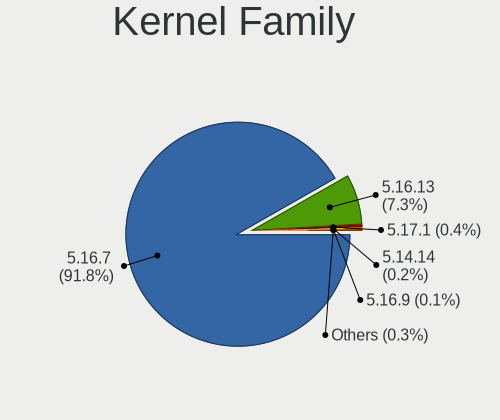
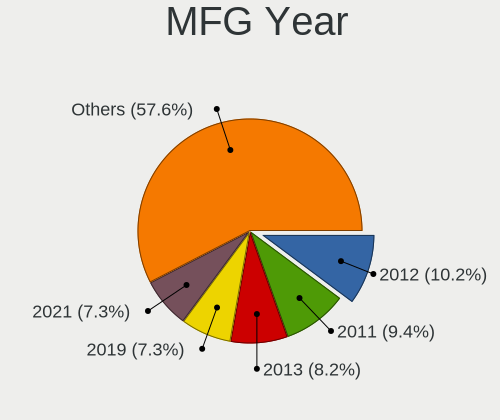
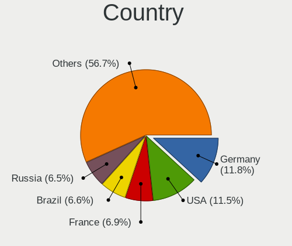
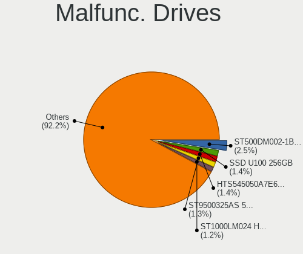
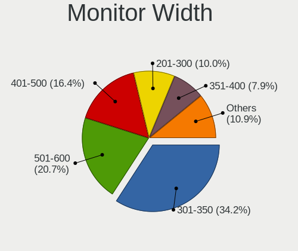
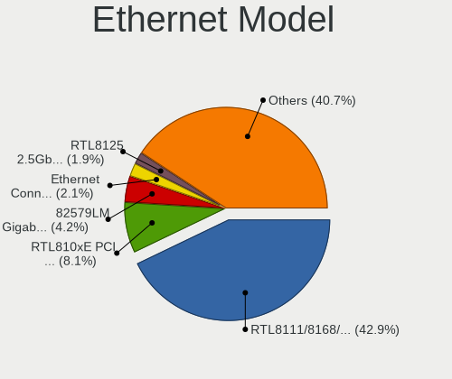
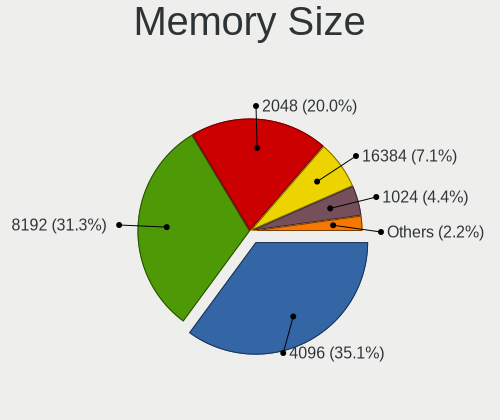
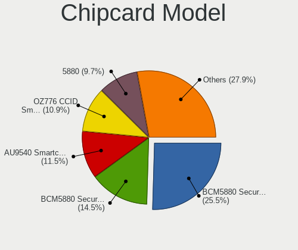
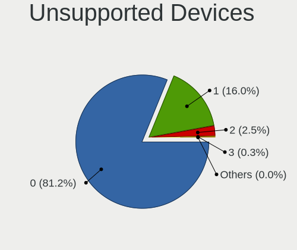

OpenMandriva 4.3 - Tested Hardware & Statistics
-----------------------------------------------

A project to collect tested hardware configurations for OpenMandriva 4.3.

Anyone can contribute to this report by the [hw-probe](https://github.com/linuxhw/hw-probe) tool:

    sudo -E hw-probe -all -upload

Please contribute! Especially if your hardware is rare.

This is a report for all computer types. See also reports for [desktops](/Dist/OpenMandriva_4.3/Desktop/README.md) and [notebooks](/Dist/OpenMandriva_4.3/Notebook/README.md).

Contents
--------

* [ Test Cases ](#test-cases)

* [ System ](#system)
  - [ Kernel                   ](#kernel)
  - [ Kernel Family            ](#kernel-family)
  - [ Kernel Major Ver.        ](#kernel-major-ver)
  - [ Arch                     ](#arch)
  - [ DE                       ](#de)
  - [ Display Server           ](#display-server)
  - [ Display Manager          ](#display-manager)
  - [ OS Lang                  ](#os-lang)
  - [ Boot Mode                ](#boot-mode)
  - [ Filesystem               ](#filesystem)
  - [ Part. scheme             ](#part-scheme)
  - [ Dual Boot with Linux/BSD ](#dual-boot-with-linuxbsd)
  - [ Dual Boot (Win)          ](#dual-boot-win)

* [ Board ](#board)
  - [ Vendor                   ](#vendor)
  - [ Model                    ](#model)
  - [ Model Family             ](#model-family)
  - [ MFG Year                 ](#mfg-year)
  - [ Form Factor              ](#form-factor)
  - [ Secure Boot              ](#secure-boot)
  - [ Coreboot                 ](#coreboot)
  - [ RAM Size                 ](#ram-size)
  - [ RAM Used                 ](#ram-used)
  - [ Total Drives             ](#total-drives)
  - [ Has CD-ROM               ](#has-cd-rom)
  - [ Has Ethernet             ](#has-ethernet)
  - [ Has WiFi                 ](#has-wifi)
  - [ Has Bluetooth            ](#has-bluetooth)

* [ Location ](#location)
  - [ Country                  ](#country)
  - [ City                     ](#city)

* [ Drives ](#drives)
  - [ Drive Vendor             ](#drive-vendor)
  - [ Drive Model              ](#drive-model)
  - [ HDD Vendor               ](#hdd-vendor)
  - [ SSD Vendor               ](#ssd-vendor)
  - [ Drive Kind               ](#drive-kind)
  - [ Drive Connector          ](#drive-connector)
  - [ Drive Size               ](#drive-size)
  - [ Space Total              ](#space-total)
  - [ Space Used               ](#space-used)
  - [ Malfunc. Drives          ](#malfunc-drives)
  - [ Malfunc. Drive Vendor    ](#malfunc-drive-vendor)
  - [ Malfunc. HDD Vendor      ](#malfunc-hdd-vendor)
  - [ Malfunc. Drive Kind      ](#malfunc-drive-kind)
  - [ Failed Drives            ](#failed-drives)
  - [ Failed Drive Vendor      ](#failed-drive-vendor)
  - [ Drive Status             ](#drive-status)

* [ Storage controller ](#storage-controller)
  - [ Storage Vendor           ](#storage-vendor)
  - [ Storage Model            ](#storage-model)
  - [ Storage Kind             ](#storage-kind)

* [ Processor ](#processor)
  - [ CPU Vendor               ](#cpu-vendor)
  - [ CPU Model                ](#cpu-model)
  - [ CPU Model Family         ](#cpu-model-family)
  - [ CPU Cores                ](#cpu-cores)
  - [ CPU Sockets              ](#cpu-sockets)
  - [ CPU Threads              ](#cpu-threads)
  - [ CPU Op-Modes             ](#cpu-op-modes)
  - [ CPU Microcode            ](#cpu-microcode)
  - [ CPU Microarch            ](#cpu-microarch)

* [ Graphics ](#graphics)
  - [ GPU Vendor               ](#gpu-vendor)
  - [ GPU Model                ](#gpu-model)
  - [ GPU Combo                ](#gpu-combo)
  - [ GPU Driver               ](#gpu-driver)
  - [ GPU Memory               ](#gpu-memory)

* [ Monitor ](#monitor)
  - [ Monitor Vendor           ](#monitor-vendor)
  - [ Monitor Model            ](#monitor-model)
  - [ Monitor Resolution       ](#monitor-resolution)
  - [ Monitor Diagonal         ](#monitor-diagonal)
  - [ Monitor Width            ](#monitor-width)
  - [ Aspect Ratio             ](#aspect-ratio)
  - [ Monitor Area             ](#monitor-area)
  - [ Pixel Density            ](#pixel-density)
  - [ Multiple Monitors        ](#multiple-monitors)

* [ Network ](#network)
  - [ Net Controller Vendor    ](#net-controller-vendor)
  - [ Net Controller Model     ](#net-controller-model)
  - [ Wireless Vendor          ](#wireless-vendor)
  - [ Wireless Model           ](#wireless-model)
  - [ Ethernet Vendor          ](#ethernet-vendor)
  - [ Ethernet Model           ](#ethernet-model)
  - [ Net Controller Kind      ](#net-controller-kind)
  - [ Used Controller          ](#used-controller)
  - [ NICs                     ](#nics)
  - [ IPv6                     ](#ipv6)

* [ Bluetooth ](#bluetooth)
  - [ Bluetooth Vendor         ](#bluetooth-vendor)
  - [ Bluetooth Model          ](#bluetooth-model)

* [ Sound ](#sound)
  - [ Sound Vendor             ](#sound-vendor)
  - [ Sound Model              ](#sound-model)

* [ Memory ](#memory)
  - [ Memory Vendor            ](#memory-vendor)
  - [ Memory Model             ](#memory-model)
  - [ Memory Kind              ](#memory-kind)
  - [ Memory Form Factor       ](#memory-form-factor)
  - [ Memory Size              ](#memory-size)
  - [ Memory Speed             ](#memory-speed)

* [ Printers & scanners ](#printers--scanners)
  - [ Printer Vendor           ](#printer-vendor)
  - [ Printer Model            ](#printer-model)
  - [ Scanner Vendor           ](#scanner-vendor)
  - [ Scanner Model            ](#scanner-model)

* [ Camera ](#camera)
  - [ Camera Vendor            ](#camera-vendor)
  - [ Camera Model             ](#camera-model)

* [ Security ](#security)
  - [ Fingerprint Vendor       ](#fingerprint-vendor)
  - [ Fingerprint Model        ](#fingerprint-model)
  - [ Chipcard Vendor          ](#chipcard-vendor)
  - [ Chipcard Model           ](#chipcard-model)

* [ Unsupported ](#unsupported)
  - [ Unsupported Devices      ](#unsupported-devices)
  - [ Unsupported Device Types ](#unsupported-device-types)

Test Cases
----------

Total: 3910

| Vendor        | Model                       | Form-Factor | Probe                                                      | Date         |
|---------------|-----------------------------|-------------|------------------------------------------------------------|--------------|
| ASUSTek       | M5A97 PLUS                  | Desktop     | [63820e3937](https://linux-hardware.org/?probe=63820e3937) | Dec 01, 2022 |
| Lenovo        | IdeaPad 100-15IBD 80QQ      | Notebook    | [929550dc41](https://linux-hardware.org/?probe=929550dc41) | Dec 01, 2022 |
| ASUSTek       | PRIME B250M-K               | Desktop     | [97a1793680](https://linux-hardware.org/?probe=97a1793680) | Dec 01, 2022 |
| ASUSTek       | P5K WS                      | Desktop     | [f3608476bf](https://linux-hardware.org/?probe=f3608476bf) | Dec 01, 2022 |
| Medion        | MS-7748                     | Desktop     | [0e92aa55ca](https://linux-hardware.org/?probe=0e92aa55ca) | Nov 30, 2022 |
| Lenovo        | ThinkPad T530 24297ZG       | Notebook    | [422f84a794](https://linux-hardware.org/?probe=422f84a794) | Nov 30, 2022 |
| ASUSTek       | Z170-E                      | Desktop     | [5e68d23175](https://linux-hardware.org/?probe=5e68d23175) | Nov 30, 2022 |
| Samsung       | 550XDA                      | Notebook    | [7614fde301](https://linux-hardware.org/?probe=7614fde301) | Nov 30, 2022 |
| Medion        | MS-7800                     | Desktop     | [a5658a6933](https://linux-hardware.org/?probe=a5658a6933) | Nov 30, 2022 |
| ASRock        | N68-S3 UCC                  | Desktop     | [1d20e4ba6d](https://linux-hardware.org/?probe=1d20e4ba6d) | Nov 30, 2022 |
| Dell          | 0YHMCJ A01                  | Server      | [77f946c99b](https://linux-hardware.org/?probe=77f946c99b) | Nov 30, 2022 |
| MACHINIST     | X99-D8-MAX V1.0             | Desktop     | [c2430965a1](https://linux-hardware.org/?probe=c2430965a1) | Nov 30, 2022 |
| ASUSTek       | VivoBook_ASUSLaptop E410... | Notebook    | [9505f905e8](https://linux-hardware.org/?probe=9505f905e8) | Nov 30, 2022 |
| Dell          | Inspiron 5423               | Notebook    | [db57850733](https://linux-hardware.org/?probe=db57850733) | Nov 29, 2022 |
| Lenovo        | IdeaPad 3 15ADA05 81W1      | Notebook    | [1a742c23df](https://linux-hardware.org/?probe=1a742c23df) | Nov 29, 2022 |
| Toshiba       | Satellite L40               | Notebook    | [fa36933936](https://linux-hardware.org/?probe=fa36933936) | Nov 29, 2022 |
| Apple         | MacBookPro12,1              | Notebook    | [f03f3a9325](https://linux-hardware.org/?probe=f03f3a9325) | Nov 29, 2022 |
| Dell          | Inspiron 15-3567            | Notebook    | [20219ca82a](https://linux-hardware.org/?probe=20219ca82a) | Nov 29, 2022 |
| HP            | 255 G7 Notebook PC          | Notebook    | [0bd83a29f4](https://linux-hardware.org/?probe=0bd83a29f4) | Nov 29, 2022 |
| ECS           | 945P/PL-A                   | Desktop     | [ff47651dd8](https://linux-hardware.org/?probe=ff47651dd8) | Nov 29, 2022 |
| Biostar       | H81MHV3 5.0                 | Desktop     | [d89a05dd31](https://linux-hardware.org/?probe=d89a05dd31) | Nov 29, 2022 |
| Gigabyte      | B450 AORUS M                | Desktop     | [d20243efed](https://linux-hardware.org/?probe=d20243efed) | Nov 28, 2022 |
| ASUSTek       | UX31E                       | Notebook    | [97c63f232d](https://linux-hardware.org/?probe=97c63f232d) | Nov 28, 2022 |
| Toshiba       | Satellite L875              | Notebook    | [2d5e211d72](https://linux-hardware.org/?probe=2d5e211d72) | Nov 28, 2022 |
| Toshiba       | PORTEGE Z30t-A              | Notebook    | [8af94993bd](https://linux-hardware.org/?probe=8af94993bd) | Nov 28, 2022 |
| Samsung       | 3570R/370R/470R/450R/510... | Notebook    | [51d2b67ca3](https://linux-hardware.org/?probe=51d2b67ca3) | Nov 28, 2022 |
| Gigabyte      | B360 AORUS GAMING 3 WIFI... | Desktop     | [e479f87a66](https://linux-hardware.org/?probe=e479f87a66) | Nov 28, 2022 |
| Medion        | E11201                      | Notebook    | [0838f9db75](https://linux-hardware.org/?probe=0838f9db75) | Nov 27, 2022 |
| Gateway       | M-1631U                     | Notebook    | [f0f0517dab](https://linux-hardware.org/?probe=f0f0517dab) | Nov 27, 2022 |
| Medion        | E2292                       | Convertible | [98818a6a22](https://linux-hardware.org/?probe=98818a6a22) | Nov 27, 2022 |
| ASRock        | B550M-ITX/ac                | Desktop     | [31f70fbb3e](https://linux-hardware.org/?probe=31f70fbb3e) | Nov 27, 2022 |
| ASUSTek       | PRIME X570-PRO              | Desktop     | [c218724cb4](https://linux-hardware.org/?probe=c218724cb4) | Nov 27, 2022 |
| MSI           | Z77MA-G45                   | Desktop     | [feb165c344](https://linux-hardware.org/?probe=feb165c344) | Nov 27, 2022 |
| ASRock        | A88M-G                      | Desktop     | [323199813d](https://linux-hardware.org/?probe=323199813d) | Nov 27, 2022 |
| Lenovo        | 3000 N500 42336DS           | Notebook    | [f3d917b782](https://linux-hardware.org/?probe=f3d917b782) | Nov 26, 2022 |
| MSI           | P55-CD53                    | Desktop     | [a602949484](https://linux-hardware.org/?probe=a602949484) | Nov 26, 2022 |
| ASUSTek       | PRIME H410M-R               | Desktop     | [b680eec959](https://linux-hardware.org/?probe=b680eec959) | Nov 26, 2022 |
| ASUSTek       | X550CL                      | Notebook    | [06c7fdf5c9](https://linux-hardware.org/?probe=06c7fdf5c9) | Nov 26, 2022 |
| Dell          | Latitude E6220              | Notebook    | [aa8d2d2fc7](https://linux-hardware.org/?probe=aa8d2d2fc7) | Nov 26, 2022 |
| HP            | 3397                        | Desktop     | [c943f7435d](https://linux-hardware.org/?probe=c943f7435d) | Nov 26, 2022 |
| Dell          | Inspiron MP061              | Notebook    | [d70d7496df](https://linux-hardware.org/?probe=d70d7496df) | Nov 26, 2022 |
| ASUSTek       | M4A88TD-V EVO/USB3          | Desktop     | [9419d2017e](https://linux-hardware.org/?probe=9419d2017e) | Nov 26, 2022 |
| Gigabyte      | G31M-ES2L                   | Desktop     | [1eb32c408c](https://linux-hardware.org/?probe=1eb32c408c) | Nov 26, 2022 |
| HP            | 0AECh D                     | Desktop     | [857616948b](https://linux-hardware.org/?probe=857616948b) | Nov 26, 2022 |
| Acer          | Aspire A315-42              | Notebook    | [3413fb7947](https://linux-hardware.org/?probe=3413fb7947) | Nov 26, 2022 |
| HP            | 1589                        | Desktop     | [077a89fb54](https://linux-hardware.org/?probe=077a89fb54) | Nov 26, 2022 |
| ASUSTek       | P8B75-M LX PLUS             | Desktop     | [7948a35f59](https://linux-hardware.org/?probe=7948a35f59) | Nov 25, 2022 |
| Acer          | NC-ES1-512-C3AH             | Notebook    | [0670f9ed15](https://linux-hardware.org/?probe=0670f9ed15) | Nov 25, 2022 |
| HP            | 2215                        | Desktop     | [0134898651](https://linux-hardware.org/?probe=0134898651) | Nov 25, 2022 |
| Lenovo        | B590 20208                  | Notebook    | [9f49ff06cf](https://linux-hardware.org/?probe=9f49ff06cf) | Nov 24, 2022 |
| Lenovo        | IdeaPad 3 15IML05 82BS      | Notebook    | [418849100f](https://linux-hardware.org/?probe=418849100f) | Nov 24, 2022 |
| HP            | 650                         | Notebook    | [15c69c43ca](https://linux-hardware.org/?probe=15c69c43ca) | Nov 24, 2022 |
| HP            | EliteBook 8560p             | Notebook    | [e7bf51183d](https://linux-hardware.org/?probe=e7bf51183d) | Nov 24, 2022 |
| Wistron       | ProLiant ML110 G6           | Desktop     | [7d448ab5cc](https://linux-hardware.org/?probe=7d448ab5cc) | Nov 24, 2022 |
| HP            | ProBook 430 G3              | Notebook    | [0fa29b61e3](https://linux-hardware.org/?probe=0fa29b61e3) | Nov 24, 2022 |
| HUAWEI        | NBLK-WAX9X                  | Notebook    | [600e3f0f09](https://linux-hardware.org/?probe=600e3f0f09) | Nov 24, 2022 |
| Samsung       | 300E5EV/300E4EV/270E5EV/... | Notebook    | [adcb4db30d](https://linux-hardware.org/?probe=adcb4db30d) | Nov 24, 2022 |
| Unknown       | Unknown                     | Notebook    | [9b50d75b30](https://linux-hardware.org/?probe=9b50d75b30) | Nov 24, 2022 |
| Foxconn       | 2A92                        | Desktop     | [e21715c047](https://linux-hardware.org/?probe=e21715c047) | Nov 24, 2022 |
| Supermicro    | PDSMi+                      | Desktop     | [3a70b82d42](https://linux-hardware.org/?probe=3a70b82d42) | Nov 24, 2022 |
| Intel         | B75                         | Desktop     | [a8932d4a21](https://linux-hardware.org/?probe=a8932d4a21) | Nov 24, 2022 |
| Lenovo        | ThinkPad T420 4180GH5       | Notebook    | [8dba4b2123](https://linux-hardware.org/?probe=8dba4b2123) | Nov 23, 2022 |
| Foxconn       | 2ADA                        | Desktop     | [3be30a3d31](https://linux-hardware.org/?probe=3be30a3d31) | Nov 23, 2022 |
| Wistron       | ProLiant ML110 G5           | Desktop     | [67cc68fbfe](https://linux-hardware.org/?probe=67cc68fbfe) | Nov 23, 2022 |
| HP            | 8582 01100                  | All in one  | [4977f9d91d](https://linux-hardware.org/?probe=4977f9d91d) | Nov 23, 2022 |
| Sony          | VPCEG16EG                   | Notebook    | [ee22559858](https://linux-hardware.org/?probe=ee22559858) | Nov 23, 2022 |
| Dell          | 0M863N A01                  | Desktop     | [ca7e5eab8d](https://linux-hardware.org/?probe=ca7e5eab8d) | Nov 23, 2022 |
| ASUSTek       | P5KPL-AM SE                 | Desktop     | [eca478ef1d](https://linux-hardware.org/?probe=eca478ef1d) | Nov 23, 2022 |
| HP            | Notebook                    | Notebook    | [616c071073](https://linux-hardware.org/?probe=616c071073) | Nov 23, 2022 |
| Apple         | MacBookPro12,1              | Notebook    | [063ffbb0e8](https://linux-hardware.org/?probe=063ffbb0e8) | Nov 23, 2022 |
| Lenovo        | IdeaPad U310 Touch          | Notebook    | [09beadc5ae](https://linux-hardware.org/?probe=09beadc5ae) | Nov 22, 2022 |
| Intel         | DG41TY AAE47335-302         | Desktop     | [ae2fb8d0b3](https://linux-hardware.org/?probe=ae2fb8d0b3) | Nov 22, 2022 |
| Intel         | powered classmate PC        | Notebook    | [d74f69f66a](https://linux-hardware.org/?probe=d74f69f66a) | Nov 22, 2022 |
| Lenovo        | ThinkPad R500 2716AZJ       | Notebook    | [ecf18761e4](https://linux-hardware.org/?probe=ecf18761e4) | Nov 22, 2022 |
| Dell          | Inspiron 3501               | Notebook    | [1c7b4c3780](https://linux-hardware.org/?probe=1c7b4c3780) | Nov 21, 2022 |
| Dell          | Latitude E6410              | Notebook    | [22585074f3](https://linux-hardware.org/?probe=22585074f3) | Nov 21, 2022 |
| HP            | 3399                        | Desktop     | [bce6df1ffb](https://linux-hardware.org/?probe=bce6df1ffb) | Nov 21, 2022 |
| ASUSTek       | F1A55-M LE                  | Desktop     | [f2120128c1](https://linux-hardware.org/?probe=f2120128c1) | Nov 21, 2022 |
| Gigabyte      | H61M-DS2 x.x                | Desktop     | [cd65013120](https://linux-hardware.org/?probe=cd65013120) | Nov 21, 2022 |
| ASRock        | B450M Steel Legend          | Desktop     | [4792cdbba2](https://linux-hardware.org/?probe=4792cdbba2) | Nov 21, 2022 |
| Lenovo        | 32E9 SDK0T76465 WIN 3422... | Desktop     | [ec30826806](https://linux-hardware.org/?probe=ec30826806) | Nov 21, 2022 |
| Pegatron      | NARRA5                      | Desktop     | [d8632e2872](https://linux-hardware.org/?probe=d8632e2872) | Nov 21, 2022 |
| ASRock        | P67 Extreme4                | Desktop     | [569fd8178d](https://linux-hardware.org/?probe=569fd8178d) | Nov 21, 2022 |
| ASUSTek       | PRIME Z690-P D4             | Desktop     | [049f06f11d](https://linux-hardware.org/?probe=049f06f11d) | Nov 21, 2022 |
| AZW           | SEi                         | Desktop     | [a8e813c483](https://linux-hardware.org/?probe=a8e813c483) | Nov 21, 2022 |
| Dell          | 00NNT0 A00                  | Desktop     | [c25787d8b9](https://linux-hardware.org/?probe=c25787d8b9) | Nov 20, 2022 |
| ASUSTek       | H81M-PLUS                   | Desktop     | [880e6565e8](https://linux-hardware.org/?probe=880e6565e8) | Nov 20, 2022 |
| Alienware     | M17xR3                      | Notebook    | [d472e55685](https://linux-hardware.org/?probe=d472e55685) | Nov 20, 2022 |
| Sony          | VPCEB2M1E                   | Notebook    | [eeefed51e4](https://linux-hardware.org/?probe=eeefed51e4) | Nov 20, 2022 |
| ASUSTek       | Z97-C                       | Desktop     | [733140c078](https://linux-hardware.org/?probe=733140c078) | Nov 20, 2022 |
| Apple         | MacBookAir4,2               | Notebook    | [7d3f0e5604](https://linux-hardware.org/?probe=7d3f0e5604) | Nov 20, 2022 |
| MSI           | PRO Z690-A WIFI             | Desktop     | [5b31194732](https://linux-hardware.org/?probe=5b31194732) | Nov 20, 2022 |
| Chuwi         | LapBook SE                  | Notebook    | [ecc56a3703](https://linux-hardware.org/?probe=ecc56a3703) | Nov 19, 2022 |
| HP            | EliteBook 840 G1            | Notebook    | [45a5881e61](https://linux-hardware.org/?probe=45a5881e61) | Nov 19, 2022 |
| Shuttle       | FS61                        | Desktop     | [7a940c8fa3](https://linux-hardware.org/?probe=7a940c8fa3) | Nov 19, 2022 |
| Lenovo        | S145-15API 81UT             | Notebook    | [fd832d05e2](https://linux-hardware.org/?probe=fd832d05e2) | Nov 19, 2022 |
| HP            | Pavilion g7                 | Notebook    | [fae1d08109](https://linux-hardware.org/?probe=fae1d08109) | Nov 19, 2022 |
| Pegatron      | 2A94h                       | Desktop     | [be99475703](https://linux-hardware.org/?probe=be99475703) | Nov 19, 2022 |
| HP            | Pavilion dm4                | Notebook    | [d90ac7b5c2](https://linux-hardware.org/?probe=d90ac7b5c2) | Nov 19, 2022 |
| ECS           | G41T-M7                     | Desktop     | [f97036df33](https://linux-hardware.org/?probe=f97036df33) | Nov 18, 2022 |
| Intel         | X99                         | Desktop     | [c95c1d173b](https://linux-hardware.org/?probe=c95c1d173b) | Nov 18, 2022 |
| TPV-INVENT... | 2AC6 A01                    | Desktop     | [04b3ba4242](https://linux-hardware.org/?probe=04b3ba4242) | Nov 18, 2022 |
| Gigabyte      | 970A-DS3P                   | Desktop     | [fc7b21bd04](https://linux-hardware.org/?probe=fc7b21bd04) | Nov 18, 2022 |
| Gigabyte      | A520M H                     | Desktop     | [c2ad29d3e8](https://linux-hardware.org/?probe=c2ad29d3e8) | Nov 18, 2022 |
| HP            | Notebook                    | Notebook    | [ded915d6cd](https://linux-hardware.org/?probe=ded915d6cd) | Nov 18, 2022 |
| Fujitsu Si... | D2364-A3 S26361-D2364-A3    | Desktop     | [62ce7f9a0b](https://linux-hardware.org/?probe=62ce7f9a0b) | Nov 18, 2022 |
| Huanan        | X99-8M-F V1.1               | Desktop     | [b1d1b0ad4c](https://linux-hardware.org/?probe=b1d1b0ad4c) | Nov 18, 2022 |
| HP            | Presario CQ43               | Notebook    | [0ed80872c0](https://linux-hardware.org/?probe=0ed80872c0) | Nov 18, 2022 |
| Acer          | Aspire one 1-431            | Notebook    | [c27978fdc4](https://linux-hardware.org/?probe=c27978fdc4) | Nov 18, 2022 |
| Acer          | Aspire 6930G                | Notebook    | [05ad62f97d](https://linux-hardware.org/?probe=05ad62f97d) | Nov 17, 2022 |
| Packard Be... | EasyNote TK81               | Notebook    | [c396423368](https://linux-hardware.org/?probe=c396423368) | Nov 17, 2022 |
| Lenovo        | IdeaPad L340-17IRH Gamin... | Notebook    | [dd25be7aef](https://linux-hardware.org/?probe=dd25be7aef) | Nov 17, 2022 |
| ASUSTek       | K54HR                       | Notebook    | [ba95174feb](https://linux-hardware.org/?probe=ba95174feb) | Nov 17, 2022 |
| Compaq        | 420                         | Notebook    | [07ab1c2b0f](https://linux-hardware.org/?probe=07ab1c2b0f) | Nov 17, 2022 |
| Dell          | 0FDT3J A03                  | Server      | [438f28559c](https://linux-hardware.org/?probe=438f28559c) | Nov 16, 2022 |
| ASUSTek       | P5KPL/1600                  | Desktop     | [24b13d1967](https://linux-hardware.org/?probe=24b13d1967) | Nov 16, 2022 |
| HP            | 843B                        | Desktop     | [373e5cc61d](https://linux-hardware.org/?probe=373e5cc61d) | Nov 16, 2022 |
| Intel         | H61                         | Desktop     | [faeac27433](https://linux-hardware.org/?probe=faeac27433) | Nov 16, 2022 |
| Medion        | MS-7728                     | Desktop     | [813d86814d](https://linux-hardware.org/?probe=813d86814d) | Nov 16, 2022 |
| MSI           | CR620                       | Notebook    | [4d90de18ca](https://linux-hardware.org/?probe=4d90de18ca) | Nov 16, 2022 |
| Acer          | Veriton N4630G              | Desktop     | [f4566a57a9](https://linux-hardware.org/?probe=f4566a57a9) | Nov 16, 2022 |
| Lenovo        | Legion 5 Pro 16ACH6H 82J... | Notebook    | [9c25ade74d](https://linux-hardware.org/?probe=9c25ade74d) | Nov 16, 2022 |
| Toshiba       | Satellite Pro U500          | Notebook    | [064a36a5bb](https://linux-hardware.org/?probe=064a36a5bb) | Nov 16, 2022 |
| Apple         | MacBookPro8,1               | Notebook    | [6f3ecf327d](https://linux-hardware.org/?probe=6f3ecf327d) | Nov 16, 2022 |
| ALDO          | C2016-BSWI-D2               | Desktop     | [0e4c4c6806](https://linux-hardware.org/?probe=0e4c4c6806) | Nov 16, 2022 |
| AZW           | Gemini M                    | Desktop     | [683123c4f5](https://linux-hardware.org/?probe=683123c4f5) | Nov 16, 2022 |
| HP            | EliteBook Folio 1040 G2     | Notebook    | [3f95d3f191](https://linux-hardware.org/?probe=3f95d3f191) | Nov 15, 2022 |
| LDLC          | SPC-N                       | Notebook    | [acec489419](https://linux-hardware.org/?probe=acec489419) | Nov 15, 2022 |
| ASUSTek       | H81M-A                      | Desktop     | [ff63827781](https://linux-hardware.org/?probe=ff63827781) | Nov 15, 2022 |
| Dell          | 0UR033 A00                  | Server      | [2ff8924b15](https://linux-hardware.org/?probe=2ff8924b15) | Nov 15, 2022 |
| ASRock        | B450M Steel Legend          | Desktop     | [6cb0948dfd](https://linux-hardware.org/?probe=6cb0948dfd) | Nov 15, 2022 |
| MSI           | H61M-P31/W8                 | Desktop     | [a7d3a01ab2](https://linux-hardware.org/?probe=a7d3a01ab2) | Nov 15, 2022 |
| ASUSTek       | N751JX                      | Notebook    | [cea52af467](https://linux-hardware.org/?probe=cea52af467) | Nov 14, 2022 |
| Lenovo        | ThinkPad T470s W10DG 20J... | Notebook    | [298f1bd357](https://linux-hardware.org/?probe=298f1bd357) | Nov 14, 2022 |
| HP            | 22F8                        | Desktop     | [754ebee9c8](https://linux-hardware.org/?probe=754ebee9c8) | Nov 14, 2022 |
| Lenovo        | G550 20023                  | Notebook    | [80be7e8e25](https://linux-hardware.org/?probe=80be7e8e25) | Nov 14, 2022 |
| Lenovo        | ThinkPad T470p 20J6CTO1W... | Notebook    | [4121297e16](https://linux-hardware.org/?probe=4121297e16) | Nov 14, 2022 |
| Sony          | SVE1411EGXB                 | Notebook    | [dafea482eb](https://linux-hardware.org/?probe=dafea482eb) | Nov 14, 2022 |
| ASUSTek       | P8Z77-V LX                  | Desktop     | [2d904e2be7](https://linux-hardware.org/?probe=2d904e2be7) | Nov 13, 2022 |
| Lenovo        | IdeaPad 320-15IAP 80XR      | Notebook    | [9506350a75](https://linux-hardware.org/?probe=9506350a75) | Nov 13, 2022 |
| Lenovo        | 0x36C4 SDK0K17763 WIN 18... | All in one  | [7a3f735fc0](https://linux-hardware.org/?probe=7a3f735fc0) | Nov 13, 2022 |
| Apple         | MacBookPro5,5               | Notebook    | [9ef06fcef1](https://linux-hardware.org/?probe=9ef06fcef1) | Nov 13, 2022 |
| HP            | 84FD                        | Desktop     | [6ee4b6828c](https://linux-hardware.org/?probe=6ee4b6828c) | Nov 13, 2022 |
| Deltron       | H81H3-M4                    | Desktop     | [49530f2e0b](https://linux-hardware.org/?probe=49530f2e0b) | Nov 13, 2022 |
| MSI           | H97 GUARD-PRO               | Desktop     | [3ea9d7a74a](https://linux-hardware.org/?probe=3ea9d7a74a) | Nov 13, 2022 |
| Gigabyte      | H87-HD3                     | Desktop     | [e5a8d4700d](https://linux-hardware.org/?probe=e5a8d4700d) | Nov 12, 2022 |
| ASRock        | B450M Pro4 R2.0             | Desktop     | [c5952a73e7](https://linux-hardware.org/?probe=c5952a73e7) | Nov 12, 2022 |
| ASUSTek       | H81M-K                      | Desktop     | [052f42f29a](https://linux-hardware.org/?probe=052f42f29a) | Nov 12, 2022 |
| Fujitsu       | LIFEBOOK E782               | Notebook    | [f6b2530682](https://linux-hardware.org/?probe=f6b2530682) | Nov 12, 2022 |
| HP            | ProBook 455 G2              | Notebook    | [1a5d0a1618](https://linux-hardware.org/?probe=1a5d0a1618) | Nov 12, 2022 |
| Dell          | Vostro 3300                 | Notebook    | [be3a3b081d](https://linux-hardware.org/?probe=be3a3b081d) | Nov 12, 2022 |
| Acer          | Aspire 7741                 | Notebook    | [d5166a002a](https://linux-hardware.org/?probe=d5166a002a) | Nov 11, 2022 |
| HP            | 250 G5 Notebook PC          | Notebook    | [d710968897](https://linux-hardware.org/?probe=d710968897) | Nov 11, 2022 |
| Toshiba       | Satellite C870-D7K          | Notebook    | [b2f60a1b4d](https://linux-hardware.org/?probe=b2f60a1b4d) | Nov 11, 2022 |
| ASUSTek       | UX31E                       | Notebook    | [fa27762189](https://linux-hardware.org/?probe=fa27762189) | Nov 11, 2022 |
| ASUSTek       | P5K SE/EPU                  | Desktop     | [d5e58b3718](https://linux-hardware.org/?probe=d5e58b3718) | Nov 11, 2022 |
| Gigabyte      | H61M-S1                     | Desktop     | [19dc931962](https://linux-hardware.org/?probe=19dc931962) | Nov 10, 2022 |
| MSI           | U270DX                      | Notebook    | [2a68a6ba02](https://linux-hardware.org/?probe=2a68a6ba02) | Nov 10, 2022 |
| ASRock        | B365M Pro4-F                | Desktop     | [aa006ea111](https://linux-hardware.org/?probe=aa006ea111) | Nov 10, 2022 |
| Gigabyte      | H61M-DS2 x.x                | Desktop     | [4488e0a71a](https://linux-hardware.org/?probe=4488e0a71a) | Nov 10, 2022 |
| Acer          | Nitro AN515-43              | Notebook    | [0e624570e1](https://linux-hardware.org/?probe=0e624570e1) | Nov 10, 2022 |
| Dell          | Inspiron N7010              | Notebook    | [8d43f2e3fc](https://linux-hardware.org/?probe=8d43f2e3fc) | Nov 10, 2022 |
| Lenovo        | Yoga 510-14ISK 80S7         | Convertible | [5a5633f611](https://linux-hardware.org/?probe=5a5633f611) | Nov 09, 2022 |
| Acer          | RS880M05                    | Desktop     | [cb216f090c](https://linux-hardware.org/?probe=cb216f090c) | Nov 09, 2022 |
| ASUSTek       | X553MA                      | Notebook    | [673c961915](https://linux-hardware.org/?probe=673c961915) | Nov 09, 2022 |
| Acer          | Aspire 5750G                | Notebook    | [8383f208a6](https://linux-hardware.org/?probe=8383f208a6) | Nov 09, 2022 |
| Fujitsu       | FMVXN4MN2Z                  | Notebook    | [7a08a94b1e](https://linux-hardware.org/?probe=7a08a94b1e) | Nov 09, 2022 |
| Fujitsu       | D3161-A1 S26361-D3161-A1    | Desktop     | [fb87099a0d](https://linux-hardware.org/?probe=fb87099a0d) | Nov 09, 2022 |
| Dell          | 0V52N7 A02                  | Server      | [3151a21ebf](https://linux-hardware.org/?probe=3151a21ebf) | Nov 09, 2022 |
| Unknown       | Unknown                     | Notebook    | [c46b9195f3](https://linux-hardware.org/?probe=c46b9195f3) | Nov 09, 2022 |
| Gigabyte      | GA-MA78GM-S2H               | Desktop     | [ac916f47fc](https://linux-hardware.org/?probe=ac916f47fc) | Nov 08, 2022 |
| ASUSTek       | P5E-VM SE                   | Desktop     | [a41a51330d](https://linux-hardware.org/?probe=a41a51330d) | Nov 08, 2022 |
| HP            | Pavilion dv2700             | Notebook    | [a8e36a1579](https://linux-hardware.org/?probe=a8e36a1579) | Nov 08, 2022 |
| Acer          | Aspire X1700                | Desktop     | [764516b8f0](https://linux-hardware.org/?probe=764516b8f0) | Nov 08, 2022 |
| Dell          | 0VD92X A00                  | Desktop     | [a22087073b](https://linux-hardware.org/?probe=a22087073b) | Nov 08, 2022 |
| Dell          | Latitude E6400              | Notebook    | [22ccbac81a](https://linux-hardware.org/?probe=22ccbac81a) | Nov 07, 2022 |
| HP            | Notebook                    | Notebook    | [0164126ac9](https://linux-hardware.org/?probe=0164126ac9) | Nov 07, 2022 |
| ASRock        | Z170 Extreme4               | Desktop     | [f0b56da15d](https://linux-hardware.org/?probe=f0b56da15d) | Nov 07, 2022 |
| HP            | ProBook 4530s               | Notebook    | [afb0629ea9](https://linux-hardware.org/?probe=afb0629ea9) | Nov 07, 2022 |
| MSI           | B450M MORTAR TITANIUM       | Desktop     | [b6768dd5b7](https://linux-hardware.org/?probe=b6768dd5b7) | Nov 07, 2022 |
| ASUSTek       | K53E                        | Notebook    | [07d6d01b99](https://linux-hardware.org/?probe=07d6d01b99) | Nov 06, 2022 |
| HP            | Notebook                    | Notebook    | [59b70f4c7c](https://linux-hardware.org/?probe=59b70f4c7c) | Nov 06, 2022 |
| Gigabyte      | Z68MA-D2H-B3                | Desktop     | [09c5b6e39e](https://linux-hardware.org/?probe=09c5b6e39e) | Nov 06, 2022 |
| Pegatron      | 2AE3                        | Desktop     | [19ae75aacc](https://linux-hardware.org/?probe=19ae75aacc) | Nov 06, 2022 |
| Lenovo        | G485 20136                  | Notebook    | [f8ee5082f8](https://linux-hardware.org/?probe=f8ee5082f8) | Nov 06, 2022 |
| ASRock        | 4CoreDual-SATA2             | Desktop     | [e1a81edea7](https://linux-hardware.org/?probe=e1a81edea7) | Nov 05, 2022 |
| MSI           | GF615M-P33                  | Desktop     | [8aec7634ab](https://linux-hardware.org/?probe=8aec7634ab) | Nov 05, 2022 |
| Acer          | TravelMate P259-G2-M        | Notebook    | [4a85f586b3](https://linux-hardware.org/?probe=4a85f586b3) | Nov 05, 2022 |
| Acer          | Aspire A717-71G             | Notebook    | [a6fa794196](https://linux-hardware.org/?probe=a6fa794196) | Nov 05, 2022 |
| ASUSTek       | K56CM                       | Notebook    | [c93289dc28](https://linux-hardware.org/?probe=c93289dc28) | Nov 05, 2022 |
| Samsung       | 300V3A/300V4A/300V5A/200... | Notebook    | [e2cadc512e](https://linux-hardware.org/?probe=e2cadc512e) | Nov 05, 2022 |
| Dell          | XPS 15 9530                 | Notebook    | [5ffd5ed23d](https://linux-hardware.org/?probe=5ffd5ed23d) | Nov 05, 2022 |
| HP            | 2820h                       | Desktop     | [6378a2e9c3](https://linux-hardware.org/?probe=6378a2e9c3) | Nov 05, 2022 |
| Toshiba       | Satellite C75D-B            | Notebook    | [c125fc089c](https://linux-hardware.org/?probe=c125fc089c) | Nov 05, 2022 |
| VS Company    | MCP61M                      | Desktop     | [ef6adc510d](https://linux-hardware.org/?probe=ef6adc510d) | Nov 05, 2022 |
| Lenovo        | ThinkPad L520 78596CG       | Notebook    | [094f09bcf8](https://linux-hardware.org/?probe=094f09bcf8) | Nov 04, 2022 |
| Toshiba       | Satellite Pro A200          | Notebook    | [09ae3b0b13](https://linux-hardware.org/?probe=09ae3b0b13) | Nov 04, 2022 |
| Lenovo        | ThinkPad L480 20LS001AMC    | Notebook    | [010fd86c32](https://linux-hardware.org/?probe=010fd86c32) | Nov 04, 2022 |
| Lenovo        | B50-45 80F0                 | Notebook    | [2d36803ec6](https://linux-hardware.org/?probe=2d36803ec6) | Nov 04, 2022 |
| ASUSTek       | H170I-PLUS D3               | Desktop     | [74df37995c](https://linux-hardware.org/?probe=74df37995c) | Nov 04, 2022 |
| ASUSTek       | K50IN                       | Notebook    | [8c069a1707](https://linux-hardware.org/?probe=8c069a1707) | Nov 03, 2022 |
| Packard Be... | EasyNote MZ45               | Notebook    | [93dada1577](https://linux-hardware.org/?probe=93dada1577) | Nov 03, 2022 |
| HP            | Stream Laptop 14-cb0XX      | Notebook    | [1d618807a7](https://linux-hardware.org/?probe=1d618807a7) | Nov 03, 2022 |
| ASUSTek       | PRIME B365M-K               | Desktop     | [e2e281d38d](https://linux-hardware.org/?probe=e2e281d38d) | Nov 03, 2022 |
| Fujitsu       | D3219-A1 S26361-D3219-A1    | Desktop     | [bdc77dbc53](https://linux-hardware.org/?probe=bdc77dbc53) | Nov 03, 2022 |
| Samsung       | 400B2B/400B2B               | Notebook    | [a909b4b203](https://linux-hardware.org/?probe=a909b4b203) | Nov 03, 2022 |
| ASUSTek       | VivoBook_ASUSLaptop TP40... | Convertible | [f9f727f7e5](https://linux-hardware.org/?probe=f9f727f7e5) | Nov 02, 2022 |
| HP            | ENVY m6                     | Notebook    | [9043724da5](https://linux-hardware.org/?probe=9043724da5) | Nov 02, 2022 |
| ASUSTek       | ASUS BR1100FKA BR1100FKA... | Convertible | [83a1fc191a](https://linux-hardware.org/?probe=83a1fc191a) | Nov 02, 2022 |
| Lenovo        | IdeaPad 110-15ACL 80TJ      | Notebook    | [0a79270558](https://linux-hardware.org/?probe=0a79270558) | Nov 02, 2022 |
| Panasonic     | CF-C1BWFBZ1M                | Notebook    | [18a81d5db2](https://linux-hardware.org/?probe=18a81d5db2) | Nov 02, 2022 |
| Acer          | Nitro AN515-57              | Notebook    | [44f768478e](https://linux-hardware.org/?probe=44f768478e) | Nov 02, 2022 |
| Acer          | Aspire X1430                | Desktop     | [f48a8d45d8](https://linux-hardware.org/?probe=f48a8d45d8) | Nov 01, 2022 |
| Toshiba       | Satellite C660              | Notebook    | [44c6e56cd9](https://linux-hardware.org/?probe=44c6e56cd9) | Nov 01, 2022 |
| Lenovo        | G50-80 80E5                 | Notebook    | [0470f02ccb](https://linux-hardware.org/?probe=0470f02ccb) | Nov 01, 2022 |
| ASUSTek       | S551LN                      | Notebook    | [67e15a659d](https://linux-hardware.org/?probe=67e15a659d) | Oct 31, 2022 |
| ASUSTek       | SABERTOOTH Z77              | Desktop     | [8b208b8383](https://linux-hardware.org/?probe=8b208b8383) | Oct 31, 2022 |
| Acer          | Extensa 5635Z               | Notebook    | [35ce596e08](https://linux-hardware.org/?probe=35ce596e08) | Oct 31, 2022 |
| ASUSTek       | M4A78 PLUS                  | Desktop     | [bac044cd22](https://linux-hardware.org/?probe=bac044cd22) | Oct 31, 2022 |
| Dell          | Latitude E5500              | Notebook    | [c64399793c](https://linux-hardware.org/?probe=c64399793c) | Oct 31, 2022 |
| ASUSTek       | PRIME B450M-A II            | Desktop     | [c23efa8caa](https://linux-hardware.org/?probe=c23efa8caa) | Oct 31, 2022 |
| Dell          | Latitude E6400              | Notebook    | [8f2639b285](https://linux-hardware.org/?probe=8f2639b285) | Oct 31, 2022 |
| Dell          | 0GXM1W A00                  | Desktop     | [598d815c17](https://linux-hardware.org/?probe=598d815c17) | Oct 31, 2022 |
| Acer          | Aspire E5-573G              | Notebook    | [acfa0d90d6](https://linux-hardware.org/?probe=acfa0d90d6) | Oct 31, 2022 |
| Pegatron      | IPPCR-SS                    | Desktop     | [9427da0212](https://linux-hardware.org/?probe=9427da0212) | Oct 31, 2022 |
| Intel         | powered classmate PC        | Notebook    | [5555da7553](https://linux-hardware.org/?probe=5555da7553) | Oct 31, 2022 |
| Gigabyte      | H410M S2H V3                | Desktop     | [202065a62d](https://linux-hardware.org/?probe=202065a62d) | Oct 30, 2022 |
| Gigabyte      | 970A-UD3P                   | Desktop     | [5f7d9d2a04](https://linux-hardware.org/?probe=5f7d9d2a04) | Oct 30, 2022 |
| Prestigio     | PSB133S01ZFP                | Notebook    | [e10becbd35](https://linux-hardware.org/?probe=e10becbd35) | Oct 30, 2022 |
| Dell          | Latitude E7240              | Notebook    | [7605a5bf1c](https://linux-hardware.org/?probe=7605a5bf1c) | Oct 30, 2022 |
| Apple         | Mac-F221BEC8                | Desktop     | [12b6232cdd](https://linux-hardware.org/?probe=12b6232cdd) | Oct 30, 2022 |
| ASUSTek       | X556UQK                     | Notebook    | [f8bdcbce4e](https://linux-hardware.org/?probe=f8bdcbce4e) | Oct 29, 2022 |
| Gigabyte      | Z690 AORUS MASTER           | Desktop     | [2a7d6b757b](https://linux-hardware.org/?probe=2a7d6b757b) | Oct 29, 2022 |
| Dell          | Studio 1737                 | Notebook    | [97f398804e](https://linux-hardware.org/?probe=97f398804e) | Oct 29, 2022 |
| HP            | Compaq 615                  | Notebook    | [ae90fa3742](https://linux-hardware.org/?probe=ae90fa3742) | Oct 29, 2022 |
| ASUSTek       | UX31E                       | Notebook    | [6e9cb9c0e0](https://linux-hardware.org/?probe=6e9cb9c0e0) | Oct 29, 2022 |
| MSI           | P45 Platinum                | Desktop     | [5507d45c35](https://linux-hardware.org/?probe=5507d45c35) | Oct 29, 2022 |
| Dell          | Inspiron 1525               | Notebook    | [ffb4369f83](https://linux-hardware.org/?probe=ffb4369f83) | Oct 29, 2022 |
| Dell          | XPS 15 9530                 | Notebook    | [fc7ef1ce9a](https://linux-hardware.org/?probe=fc7ef1ce9a) | Oct 29, 2022 |
| ASUSTek       | M5A78L-M LX PLUS            | Desktop     | [345683b134](https://linux-hardware.org/?probe=345683b134) | Oct 29, 2022 |
| ASRock        | H81M-ITX                    | Desktop     | [56f93814ea](https://linux-hardware.org/?probe=56f93814ea) | Oct 28, 2022 |
| Acer          | Aspire 5745                 | Notebook    | [2f79de6974](https://linux-hardware.org/?probe=2f79de6974) | Oct 28, 2022 |
| ASUSTek       | M5A87                       | Desktop     | [88e6b582c9](https://linux-hardware.org/?probe=88e6b582c9) | Oct 28, 2022 |
| Lenovo        | IdeaPad 5 Pro 14ACN6 82L... | Notebook    | [6b57390808](https://linux-hardware.org/?probe=6b57390808) | Oct 28, 2022 |
| Dell          | 0WMJ54 A01                  | Desktop     | [41e9e7aba7](https://linux-hardware.org/?probe=41e9e7aba7) | Oct 28, 2022 |
| HP            | Pavilion Laptop 15-cc0xx    | Notebook    | [0ca2ea7180](https://linux-hardware.org/?probe=0ca2ea7180) | Oct 28, 2022 |
| Unknown       | Unknown                     | Desktop     | [8d93ee0286](https://linux-hardware.org/?probe=8d93ee0286) | Oct 28, 2022 |
| ASUSTek       | P8B75-V                     | Desktop     | [ca5c26654a](https://linux-hardware.org/?probe=ca5c26654a) | Oct 27, 2022 |
| ASRock        | B550M-HDV                   | Desktop     | [4d5068a3be](https://linux-hardware.org/?probe=4d5068a3be) | Oct 27, 2022 |
| Acer          | Aspire 8730                 | Notebook    | [86bffd9523](https://linux-hardware.org/?probe=86bffd9523) | Oct 27, 2022 |
| Acer          | Aspire E3-112               | Notebook    | [fd34f66305](https://linux-hardware.org/?probe=fd34f66305) | Oct 26, 2022 |
| Acer          | Veriton M275                | Desktop     | [c4604d6f2a](https://linux-hardware.org/?probe=c4604d6f2a) | Oct 26, 2022 |
| Toshiba       | Satellite L45-B             | Notebook    | [e2f30e0f1e](https://linux-hardware.org/?probe=e2f30e0f1e) | Oct 26, 2022 |
| ASUSTek       | P8H67-M PRO                 | Desktop     | [b50585b578](https://linux-hardware.org/?probe=b50585b578) | Oct 26, 2022 |
| Dell          | 0WR7PY A03                  | Desktop     | [fa0daeab26](https://linux-hardware.org/?probe=fa0daeab26) | Oct 26, 2022 |
| Acer          | Veriton NBU                 | Desktop     | [7be04cd3ed](https://linux-hardware.org/?probe=7be04cd3ed) | Oct 25, 2022 |
| Gigabyte      | G41MT-S2PT                  | Desktop     | [2fb43f4be2](https://linux-hardware.org/?probe=2fb43f4be2) | Oct 25, 2022 |
| Acer          | Aspire ES1-571              | Notebook    | [f9f7926da2](https://linux-hardware.org/?probe=f9f7926da2) | Oct 25, 2022 |
| ASRock        | G41C-GS                     | Desktop     | [218d55e0ca](https://linux-hardware.org/?probe=218d55e0ca) | Oct 25, 2022 |
| ASUSTek       | P5Q3 DELUXE                 | Desktop     | [a25c84e8f1](https://linux-hardware.org/?probe=a25c84e8f1) | Oct 25, 2022 |
| Panasonic     | CFSX4-1                     | Notebook    | [2ddae6e0e1](https://linux-hardware.org/?probe=2ddae6e0e1) | Oct 25, 2022 |
| Lenovo        | IdeaPad 1 14ADA05 82GW      | Notebook    | [ede3bcd3f3](https://linux-hardware.org/?probe=ede3bcd3f3) | Oct 24, 2022 |
| Lenovo        | IdeaPad S145-15AST 81N3     | Notebook    | [bfa28dd791](https://linux-hardware.org/?probe=bfa28dd791) | Oct 24, 2022 |
| Dell          | 0GX297                      | Desktop     | [a047bbd7a0](https://linux-hardware.org/?probe=a047bbd7a0) | Oct 24, 2022 |
| ASRock        | N68-VS3 UCC                 | Desktop     | [82afa0e5bc](https://linux-hardware.org/?probe=82afa0e5bc) | Oct 24, 2022 |
| Dell          | Studio 1737                 | Notebook    | [d6e17c05b2](https://linux-hardware.org/?probe=d6e17c05b2) | Oct 24, 2022 |
| Lenovo        | G400s VILG1                 | Notebook    | [b7315785a1](https://linux-hardware.org/?probe=b7315785a1) | Oct 24, 2022 |
| ASUSTek       | A7U                         | Notebook    | [867f26dde1](https://linux-hardware.org/?probe=867f26dde1) | Oct 24, 2022 |
| Gigabyte      | H310M S2H x.x               | Desktop     | [cce2975614](https://linux-hardware.org/?probe=cce2975614) | Oct 24, 2022 |
| ASUSTek       | P5QL-E                      | Desktop     | [41810c587a](https://linux-hardware.org/?probe=41810c587a) | Oct 24, 2022 |
| Acer          | TravelMate B311-31          | Notebook    | [010dd1e876](https://linux-hardware.org/?probe=010dd1e876) | Oct 24, 2022 |
| Apple         | Mac-942B5BF58194151B        | All in one  | [683ac39f80](https://linux-hardware.org/?probe=683ac39f80) | Oct 24, 2022 |
| Packard Be... | EasyNote ENTE70BH           | Notebook    | [2135a5aed7](https://linux-hardware.org/?probe=2135a5aed7) | Oct 23, 2022 |
| MSI           | MPG X570 GAMING PLUS        | Desktop     | [e59cef718b](https://linux-hardware.org/?probe=e59cef718b) | Oct 23, 2022 |
| Acer          | WMCP78M                     | Desktop     | [f4e3945dea](https://linux-hardware.org/?probe=f4e3945dea) | Oct 23, 2022 |
| ASUSTek       | M5A99X EVO R2.0             | Desktop     | [5b61c1c241](https://linux-hardware.org/?probe=5b61c1c241) | Oct 23, 2022 |
| Lenovo        | ThinkPad X240 20AMS01M00    | Notebook    | [2f1c7b7716](https://linux-hardware.org/?probe=2f1c7b7716) | Oct 23, 2022 |
| ASRock        | B450M Pro4                  | Desktop     | [12b83ecfd4](https://linux-hardware.org/?probe=12b83ecfd4) | Oct 22, 2022 |
| Fujitsu       | LIFEBOOK AH532              | Notebook    | [d806b92948](https://linux-hardware.org/?probe=d806b92948) | Oct 22, 2022 |
| Dell          | 0HX555                      | Desktop     | [86339c4a3f](https://linux-hardware.org/?probe=86339c4a3f) | Oct 22, 2022 |
| Philco        | DTC-A55                     | Desktop     | [5c7d64ff3f](https://linux-hardware.org/?probe=5c7d64ff3f) | Oct 22, 2022 |
| Acer          | WG43M                       | Desktop     | [e520a7dfca](https://linux-hardware.org/?probe=e520a7dfca) | Oct 22, 2022 |
| Gigabyte      | GA-790FXTA-UD5              | Desktop     | [78218a5b63](https://linux-hardware.org/?probe=78218a5b63) | Oct 21, 2022 |
| Dell          | Precision M6800             | Notebook    | [9b909039ee](https://linux-hardware.org/?probe=9b909039ee) | Oct 21, 2022 |
| ZOTAC         | ZBOX-QCM7T3000/EN072080S... | Mini pc     | [612f0f6e06](https://linux-hardware.org/?probe=612f0f6e06) | Oct 21, 2022 |
| MSI           | H61M-P20                    | Desktop     | [a50648c486](https://linux-hardware.org/?probe=a50648c486) | Oct 21, 2022 |
| Lenovo        | ThinkPad T520 42434WU       | Notebook    | [d118d39c58](https://linux-hardware.org/?probe=d118d39c58) | Oct 21, 2022 |
| MSI           | GT70 0NC/GT70 0NC           | Notebook    | [592b788d62](https://linux-hardware.org/?probe=592b788d62) | Oct 20, 2022 |
| ASUSTek       | M5A78L-M PLUS/USB3          | Desktop     | [6c32002395](https://linux-hardware.org/?probe=6c32002395) | Oct 20, 2022 |
| Dell          | Latitude E5410              | Notebook    | [f3b5d196ef](https://linux-hardware.org/?probe=f3b5d196ef) | Oct 20, 2022 |
| ASRock        | H81 Pro BTC R2.0            | Desktop     | [2ead6c088f](https://linux-hardware.org/?probe=2ead6c088f) | Oct 20, 2022 |
| Sony          | SVE1513B1EW                 | Notebook    | [77ef0b542b](https://linux-hardware.org/?probe=77ef0b542b) | Oct 20, 2022 |
| Dell          | 0V52N7 A01                  | Server      | [c3990d0066](https://linux-hardware.org/?probe=c3990d0066) | Oct 19, 2022 |
| Acer          | Aspire E5-574               | Notebook    | [d9797d9fa7](https://linux-hardware.org/?probe=d9797d9fa7) | Oct 19, 2022 |
| Dell          | Inspiron 13-7359            | Notebook    | [239627f1d1](https://linux-hardware.org/?probe=239627f1d1) | Oct 19, 2022 |
| HP            | 1825                        | Desktop     | [e0a35f1d0f](https://linux-hardware.org/?probe=e0a35f1d0f) | Oct 19, 2022 |
| Samsung       | 550XDA                      | Notebook    | [fcfceeaf04](https://linux-hardware.org/?probe=fcfceeaf04) | Oct 19, 2022 |
| Dell          | 0M5DCD A00                  | Desktop     | [e14791bb51](https://linux-hardware.org/?probe=e14791bb51) | Oct 19, 2022 |
| HP            | 805D                        | Desktop     | [a70ef30fce](https://linux-hardware.org/?probe=a70ef30fce) | Oct 19, 2022 |
| MSI           | GE62 6QC                    | Notebook    | [92ac4fbaa6](https://linux-hardware.org/?probe=92ac4fbaa6) | Oct 19, 2022 |
| Intel         | DH61BF AAG81311-101         | Desktop     | [770d8bf876](https://linux-hardware.org/?probe=770d8bf876) | Oct 19, 2022 |
| ASUSTek       | A88XM-A                     | Desktop     | [9622704d8f](https://linux-hardware.org/?probe=9622704d8f) | Oct 18, 2022 |
| ASUSTek       | P5KPL-E                     | Desktop     | [2f1e1cbbf4](https://linux-hardware.org/?probe=2f1e1cbbf4) | Oct 18, 2022 |
| Lenovo        | G480                        | Notebook    | [984691a38d](https://linux-hardware.org/?probe=984691a38d) | Oct 18, 2022 |
| ASUSTek       | TUF Gaming B460-PLUS        | Desktop     | [5823a0c5d0](https://linux-hardware.org/?probe=5823a0c5d0) | Oct 18, 2022 |
| HP            | Unknown                     | Notebook    | [4a0df43034](https://linux-hardware.org/?probe=4a0df43034) | Oct 17, 2022 |
| Dell          | Latitude E6330              | Notebook    | [d4d6ca7ae9](https://linux-hardware.org/?probe=d4d6ca7ae9) | Oct 17, 2022 |
| Lenovo        | G50-70 20351                | Notebook    | [a1e9be5323](https://linux-hardware.org/?probe=a1e9be5323) | Oct 17, 2022 |
| ASUSTek       | PN41                        | Mini pc     | [29f6ba9612](https://linux-hardware.org/?probe=29f6ba9612) | Oct 17, 2022 |
| Dell          | 02YYK5 A01                  | Desktop     | [5872b35f8c](https://linux-hardware.org/?probe=5872b35f8c) | Oct 17, 2022 |
| ASUSTek       | PRIME B560M-K               | Desktop     | [8d9bc873e4](https://linux-hardware.org/?probe=8d9bc873e4) | Oct 17, 2022 |
| HP            | Pavilion Laptop 15-cs0xx... | Notebook    | [9e37b60507](https://linux-hardware.org/?probe=9e37b60507) | Oct 16, 2022 |
| Dell          | Latitude E6430              | Notebook    | [2e8f3bd664](https://linux-hardware.org/?probe=2e8f3bd664) | Oct 16, 2022 |
| ASRock        | Z87 Pro3                    | Desktop     | [364a0afaff](https://linux-hardware.org/?probe=364a0afaff) | Oct 16, 2022 |
| Dell          | 0XFWHV A00                  | Desktop     | [4a5716d169](https://linux-hardware.org/?probe=4a5716d169) | Oct 16, 2022 |
| Gigabyte      | F2A88XM-HD3P                | Desktop     | [b5c41a9fef](https://linux-hardware.org/?probe=b5c41a9fef) | Oct 16, 2022 |
| Dell          | Latitude E6420              | Notebook    | [913e2b1acd](https://linux-hardware.org/?probe=913e2b1acd) | Oct 15, 2022 |
| HP            | 1850                        | Desktop     | [eda9bb7861](https://linux-hardware.org/?probe=eda9bb7861) | Oct 15, 2022 |
| Lenovo        | ThinkPad L560 20F1000TJP    | Notebook    | [e9b7a4ffc2](https://linux-hardware.org/?probe=e9b7a4ffc2) | Oct 15, 2022 |
| Gigabyte      | H61M-D2H                    | Desktop     | [3c51ad7454](https://linux-hardware.org/?probe=3c51ad7454) | Oct 15, 2022 |
| Acer          | Aspire A515-44              | Notebook    | [a19fc69283](https://linux-hardware.org/?probe=a19fc69283) | Oct 15, 2022 |
| Intel         | DP45SG AAE27733-403         | Desktop     | [f391a78f4d](https://linux-hardware.org/?probe=f391a78f4d) | Oct 15, 2022 |
| LG Electro... | S460-G.BG31P1               | Notebook    | [a0b3b8e905](https://linux-hardware.org/?probe=a0b3b8e905) | Oct 15, 2022 |
| Dell          | Latitude 3340               | Notebook    | [d99dbe3b99](https://linux-hardware.org/?probe=d99dbe3b99) | Oct 14, 2022 |
| ASUSTek       | PRIME H510M-A               | Desktop     | [720d282dfe](https://linux-hardware.org/?probe=720d282dfe) | Oct 14, 2022 |
| ASUSTek       | UX31E                       | Notebook    | [bddc33ef5a](https://linux-hardware.org/?probe=bddc33ef5a) | Oct 14, 2022 |
| Gigabyte      | F2A55M-DS2                  | Desktop     | [1feb9942e8](https://linux-hardware.org/?probe=1feb9942e8) | Oct 14, 2022 |
| Packard Be... | EasyNote TJ66               | Notebook    | [e5f4bf84f8](https://linux-hardware.org/?probe=e5f4bf84f8) | Oct 14, 2022 |
| Compaq        | PRESARIOCQ18                | Notebook    | [5172032993](https://linux-hardware.org/?probe=5172032993) | Oct 14, 2022 |
| ASUSTek       | PRIME H410M-A               | Desktop     | [8dc5e6f530](https://linux-hardware.org/?probe=8dc5e6f530) | Oct 14, 2022 |
| Dell          | Latitude E5440              | Notebook    | [432aa93109](https://linux-hardware.org/?probe=432aa93109) | Oct 14, 2022 |
| Intel         | NUC8BEB J72693-306          | Mini pc     | [a9f67e3f57](https://linux-hardware.org/?probe=a9f67e3f57) | Oct 13, 2022 |
| Dell          | Inspiron 5551               | Notebook    | [64865d9bb5](https://linux-hardware.org/?probe=64865d9bb5) | Oct 13, 2022 |
| ASUSTek       | PRIME B450M-A II            | Desktop     | [6144d2247a](https://linux-hardware.org/?probe=6144d2247a) | Oct 13, 2022 |
| Dell          | Precision 7720              | Notebook    | [4cadd86832](https://linux-hardware.org/?probe=4cadd86832) | Oct 13, 2022 |
| Dell          | Studio 1555                 | Notebook    | [52104abe69](https://linux-hardware.org/?probe=52104abe69) | Oct 13, 2022 |
| HP            | Laptop 14-bw0xx             | Notebook    | [3a190d5718](https://linux-hardware.org/?probe=3a190d5718) | Oct 13, 2022 |
| Acer          | Aspire E5-573G              | Notebook    | [bccf0a4ebe](https://linux-hardware.org/?probe=bccf0a4ebe) | Oct 13, 2022 |
| Lenovo        | IdeaPad 330-15IKB 81FE      | Notebook    | [bb386c7d60](https://linux-hardware.org/?probe=bb386c7d60) | Oct 13, 2022 |
| Toshiba       | Satellite C855              | Notebook    | [65e0a41b8d](https://linux-hardware.org/?probe=65e0a41b8d) | Oct 13, 2022 |
| Itautec       | ST 4254 ST-4254 Padrao 0... | Desktop     | [48ee58de23](https://linux-hardware.org/?probe=48ee58de23) | Oct 13, 2022 |
| Acer          | Aspire 7250G                | Notebook    | [34966259d6](https://linux-hardware.org/?probe=34966259d6) | Oct 13, 2022 |
| HP            | G42                         | Notebook    | [fd42e3aedb](https://linux-hardware.org/?probe=fd42e3aedb) | Oct 12, 2022 |
| Dell          | XPS 15 9530                 | Notebook    | [ad2b1ab7b8](https://linux-hardware.org/?probe=ad2b1ab7b8) | Oct 12, 2022 |
| Star Labs     | StarLite                    | Notebook    | [627ad33197](https://linux-hardware.org/?probe=627ad33197) | Oct 12, 2022 |
| HP            | 1497                        | Desktop     | [ff6d690da4](https://linux-hardware.org/?probe=ff6d690da4) | Oct 12, 2022 |
| ASUSTek       | PRIME A320M-E               | Desktop     | [ff58ea3dc1](https://linux-hardware.org/?probe=ff58ea3dc1) | Oct 12, 2022 |
| ASUSTek       | PRIME H410M-A               | Desktop     | [dc990d0395](https://linux-hardware.org/?probe=dc990d0395) | Oct 12, 2022 |
| Dell          | Latitude E6440              | Notebook    | [3b13c28e46](https://linux-hardware.org/?probe=3b13c28e46) | Oct 12, 2022 |
| AMD           | A88                         | Desktop     | [1ee2502537](https://linux-hardware.org/?probe=1ee2502537) | Oct 12, 2022 |
| Pegatron      | IPM31G                      | Desktop     | [75d4fc0b55](https://linux-hardware.org/?probe=75d4fc0b55) | Oct 12, 2022 |
| Lenovo        | ThinkPad T440s 20ARS4PR0... | Notebook    | [18c02300b9](https://linux-hardware.org/?probe=18c02300b9) | Oct 11, 2022 |
| Dell          | 0T656F A01                  | Desktop     | [1680fa50c0](https://linux-hardware.org/?probe=1680fa50c0) | Oct 11, 2022 |
| HP            | 2171                        | Desktop     | [105af7e899](https://linux-hardware.org/?probe=105af7e899) | Oct 11, 2022 |
| Gigabyte      | B75M-D3H                    | Desktop     | [4bc40092b2](https://linux-hardware.org/?probe=4bc40092b2) | Oct 11, 2022 |
| Lenovo        | IdeaPad L340-15IRH Gamin... | Notebook    | [87cfe8ed2e](https://linux-hardware.org/?probe=87cfe8ed2e) | Oct 11, 2022 |
| Lenovo        | ThinkCentre M58 7359WES     | Desktop     | [1c00ee45c1](https://linux-hardware.org/?probe=1c00ee45c1) | Oct 11, 2022 |
| Dell          | Latitude E6540              | Notebook    | [d1b0bd16b5](https://linux-hardware.org/?probe=d1b0bd16b5) | Oct 11, 2022 |
| ASRock        | G41C-GS R2.0                | Desktop     | [92ab2501ea](https://linux-hardware.org/?probe=92ab2501ea) | Oct 11, 2022 |
| ASUSTek       | UX31E                       | Notebook    | [22cf469faa](https://linux-hardware.org/?probe=22cf469faa) | Oct 10, 2022 |
| Acer          | Aspire XC-230               | Desktop     | [d213bca85f](https://linux-hardware.org/?probe=d213bca85f) | Oct 10, 2022 |
| Lenovo        | IdeaPad 330-15IGM 81D1      | Notebook    | [792528e3b2](https://linux-hardware.org/?probe=792528e3b2) | Oct 10, 2022 |
| Gigabyte      | 945GM-S2                    | Desktop     | [3087d063e3](https://linux-hardware.org/?probe=3087d063e3) | Oct 10, 2022 |
| ASUSTek       | PRIME H410I-PLUS            | Desktop     | [10709dd95e](https://linux-hardware.org/?probe=10709dd95e) | Oct 10, 2022 |
| HP            | 829E                        | Mini pc     | [465ec7a2fe](https://linux-hardware.org/?probe=465ec7a2fe) | Oct 10, 2022 |
| Gigabyte      | F2A58M-HD2                  | Desktop     | [a219433035](https://linux-hardware.org/?probe=a219433035) | Oct 10, 2022 |
| AZW           | U59                         | Desktop     | [8300f61a93](https://linux-hardware.org/?probe=8300f61a93) | Oct 10, 2022 |
| HP            | 805D                        | Desktop     | [8938f51322](https://linux-hardware.org/?probe=8938f51322) | Oct 09, 2022 |
| Lenovo        | Dory CRB                    | Desktop     | [33ae78632a](https://linux-hardware.org/?probe=33ae78632a) | Oct 09, 2022 |
| Dell          | Latitude E6410              | Notebook    | [4f6730e0f2](https://linux-hardware.org/?probe=4f6730e0f2) | Oct 09, 2022 |
| Lenovo        | IdeaPad 5 14ARE05 81YM      | Notebook    | [3e7ef86329](https://linux-hardware.org/?probe=3e7ef86329) | Oct 09, 2022 |
| ASUSTek       | X550VB                      | Notebook    | [a7c1c1cb1b](https://linux-hardware.org/?probe=a7c1c1cb1b) | Oct 09, 2022 |
| Dell          | Inspiron N7010              | Notebook    | [8d58156239](https://linux-hardware.org/?probe=8d58156239) | Oct 09, 2022 |
| ASUSTek       | PRIME Z590-P                | Desktop     | [cf3661bb7c](https://linux-hardware.org/?probe=cf3661bb7c) | Oct 09, 2022 |
| Dell          | Inspiron 5558               | Notebook    | [8918b1b82e](https://linux-hardware.org/?probe=8918b1b82e) | Oct 09, 2022 |
| Chuwi         | RZBOX                       | Desktop     | [76b6d7cd78](https://linux-hardware.org/?probe=76b6d7cd78) | Oct 08, 2022 |
| HP            | Laptop 15-da0xxx            | Notebook    | [d172225c0b](https://linux-hardware.org/?probe=d172225c0b) | Oct 08, 2022 |
| MSI           | A55M-P33                    | Desktop     | [127b8f180e](https://linux-hardware.org/?probe=127b8f180e) | Oct 08, 2022 |
| Lenovo        | IdeaPad 3 15ADA05 81W1      | Notebook    | [3665682cc6](https://linux-hardware.org/?probe=3665682cc6) | Oct 08, 2022 |
| HP            | Laptop 15-ef1xxx            | Notebook    | [9d44a35e48](https://linux-hardware.org/?probe=9d44a35e48) | Oct 08, 2022 |
| ASRock        | M3N78D FX                   | Desktop     | [e40ba3988f](https://linux-hardware.org/?probe=e40ba3988f) | Oct 08, 2022 |
| Gigabyte      | B550M AORUS PRO-P           | Desktop     | [feb96964b1](https://linux-hardware.org/?probe=feb96964b1) | Oct 08, 2022 |
| Dell          | 0MN1TX A01                  | Desktop     | [a9faf44fe8](https://linux-hardware.org/?probe=a9faf44fe8) | Oct 07, 2022 |
| Fujitsu       | LIFEBOOK E736               | Notebook    | [3e7cc2c14a](https://linux-hardware.org/?probe=3e7cc2c14a) | Oct 07, 2022 |
| HP            | Laptop 15-da2xxx            | Notebook    | [b699753cc6](https://linux-hardware.org/?probe=b699753cc6) | Oct 07, 2022 |
| Dell          | Latitude E6400              | Notebook    | [509deb10b3](https://linux-hardware.org/?probe=509deb10b3) | Oct 07, 2022 |
| MSI           | H110M PRO-VH PLUS           | Desktop     | [9dc72dc357](https://linux-hardware.org/?probe=9dc72dc357) | Oct 07, 2022 |
| Lenovo        | IdeaPad 1 14ADA05 82GW      | Notebook    | [8061516838](https://linux-hardware.org/?probe=8061516838) | Oct 06, 2022 |
| Toshiba       | Satellite R830              | Notebook    | [0a5299f7e0](https://linux-hardware.org/?probe=0a5299f7e0) | Oct 06, 2022 |
| Lenovo        | MAHOBAY Win8 Pro DPK TPG    | Desktop     | [7a7bc387f4](https://linux-hardware.org/?probe=7a7bc387f4) | Oct 06, 2022 |
| Medion        | MS-7797                     | Desktop     | [9137d0eacf](https://linux-hardware.org/?probe=9137d0eacf) | Oct 06, 2022 |
| ASUSTek       | M2V-MX                      | Desktop     | [55b3f7f6b0](https://linux-hardware.org/?probe=55b3f7f6b0) | Oct 06, 2022 |
| HP            | 18E4                        | Desktop     | [d9deeda238](https://linux-hardware.org/?probe=d9deeda238) | Oct 05, 2022 |
| Positivo      | C14CR01                     | Notebook    | [7c0d0b2efd](https://linux-hardware.org/?probe=7c0d0b2efd) | Oct 05, 2022 |
| Lenovo        | IdeaPad 3 15ITL05 81X8      | Notebook    | [f9224c972e](https://linux-hardware.org/?probe=f9224c972e) | Oct 05, 2022 |
| HP            | Pavilion 17                 | Notebook    | [f7626421b2](https://linux-hardware.org/?probe=f7626421b2) | Oct 05, 2022 |
| Gigabyte      | H110M-S2PH-CF               | Desktop     | [580c13ac38](https://linux-hardware.org/?probe=580c13ac38) | Oct 05, 2022 |
| Acer          | Aspire 5250                 | Notebook    | [8a18115a5b](https://linux-hardware.org/?probe=8a18115a5b) | Oct 04, 2022 |
| Dell          | Inspiron 3442               | Notebook    | [612b4b36a1](https://linux-hardware.org/?probe=612b4b36a1) | Oct 04, 2022 |
| Dell          | 01TKCC A01                  | Desktop     | [65103a04c3](https://linux-hardware.org/?probe=65103a04c3) | Oct 04, 2022 |
| Lenovo        | IdeaPad 3 15ADA05 81W1      | Notebook    | [b8ad7a8464](https://linux-hardware.org/?probe=b8ad7a8464) | Oct 04, 2022 |
| Dell          | Latitude 3120               | Convertible | [60de9a1977](https://linux-hardware.org/?probe=60de9a1977) | Oct 04, 2022 |
| ASUSTek       | PRIME B450M-A II            | Desktop     | [89400b60b0](https://linux-hardware.org/?probe=89400b60b0) | Oct 04, 2022 |
| Acer          | Aspire E5-575G              | Notebook    | [5e60e8faae](https://linux-hardware.org/?probe=5e60e8faae) | Oct 04, 2022 |
| ASUSTek       | P5W DH Deluxe               | Desktop     | [8d5a649ba5](https://linux-hardware.org/?probe=8d5a649ba5) | Oct 03, 2022 |
| Intel         | H55                         | Desktop     | [73719c58ab](https://linux-hardware.org/?probe=73719c58ab) | Oct 03, 2022 |
| Dell          | Latitude E6420              | Notebook    | [cc0d33aedb](https://linux-hardware.org/?probe=cc0d33aedb) | Oct 03, 2022 |
| Acer          | TravelMate 5744             | Notebook    | [4817d4810d](https://linux-hardware.org/?probe=4817d4810d) | Oct 03, 2022 |
| Lenovo        | 3098 SDK0E50510 WIN         | Desktop     | [f6a6361e08](https://linux-hardware.org/?probe=f6a6361e08) | Oct 03, 2022 |
| Dell          | Latitude 3190 2-in-1        | Convertible | [36b32fe8c0](https://linux-hardware.org/?probe=36b32fe8c0) | Oct 03, 2022 |
| ASRock        | G41C-GS R2.0                | Desktop     | [c6e6708366](https://linux-hardware.org/?probe=c6e6708366) | Oct 03, 2022 |
| Gigabyte      | A320M-S2H-CF                | Desktop     | [019702e62b](https://linux-hardware.org/?probe=019702e62b) | Oct 03, 2022 |
| Dell          | XPS 15 9530                 | Notebook    | [abfab502a6](https://linux-hardware.org/?probe=abfab502a6) | Oct 02, 2022 |
| Lenovo        | ThinkCentre M58p 6234FB9    | Desktop     | [3c772e3e1d](https://linux-hardware.org/?probe=3c772e3e1d) | Oct 02, 2022 |
| ASUSTek       | UX303UB                     | Notebook    | [d67f04fc6e](https://linux-hardware.org/?probe=d67f04fc6e) | Oct 02, 2022 |
| Dell          | Inspiron 5559               | Notebook    | [47a7282318](https://linux-hardware.org/?probe=47a7282318) | Oct 02, 2022 |
| ASUSTek       | X550JX                      | Notebook    | [43694e5952](https://linux-hardware.org/?probe=43694e5952) | Oct 02, 2022 |
| Acer          | Aspire V3-571G              | Notebook    | [bfd8dc3c18](https://linux-hardware.org/?probe=bfd8dc3c18) | Oct 02, 2022 |
| MSI           | A75A-G35                    | Desktop     | [66b1d71092](https://linux-hardware.org/?probe=66b1d71092) | Oct 02, 2022 |
| Lenovo        | IdeaPad 1 14ADA05 82GW      | Notebook    | [516795a4a8](https://linux-hardware.org/?probe=516795a4a8) | Oct 02, 2022 |
| Biostar       | A75MG                       | Desktop     | [ba1785b4b6](https://linux-hardware.org/?probe=ba1785b4b6) | Oct 02, 2022 |
| MSI           | B75MA-E33                   | Desktop     | [a14df6d116](https://linux-hardware.org/?probe=a14df6d116) | Oct 02, 2022 |
| Lenovo        | ThinkCentre M91p 4518AU8    | Desktop     | [ce1567bb35](https://linux-hardware.org/?probe=ce1567bb35) | Oct 02, 2022 |
| ASUSTek       | ROG STRIX X570-F GAMING     | Desktop     | [d4f76a4236](https://linux-hardware.org/?probe=d4f76a4236) | Oct 01, 2022 |
| HP            | ProBook 450 G4              | Notebook    | [9c6340e585](https://linux-hardware.org/?probe=9c6340e585) | Oct 01, 2022 |
| Dell          | Inspiron 1545               | Notebook    | [ba72c7ee42](https://linux-hardware.org/?probe=ba72c7ee42) | Oct 01, 2022 |
| MSI           | MS-7235                     | Desktop     | [838e2c27f1](https://linux-hardware.org/?probe=838e2c27f1) | Oct 01, 2022 |
| Lenovo        | 3000 N200 0769B4G           | Notebook    | [947f124efc](https://linux-hardware.org/?probe=947f124efc) | Oct 01, 2022 |
| Lenovo        | 0x30F617AA NOK              | Desktop     | [bb13b87bd5](https://linux-hardware.org/?probe=bb13b87bd5) | Oct 01, 2022 |
| Lenovo        | IdeaPad 1 14ADA05 82GW      | Notebook    | [7ff2c5ad1c](https://linux-hardware.org/?probe=7ff2c5ad1c) | Oct 01, 2022 |
| Lenovo        | IdeaPad 1 14ADA05 82GW      | Notebook    | [a64cec6a4d](https://linux-hardware.org/?probe=a64cec6a4d) | Oct 01, 2022 |
| ASUSTek       | UX303UB                     | Notebook    | [e09f793c1a](https://linux-hardware.org/?probe=e09f793c1a) | Oct 01, 2022 |
| Lenovo        | IdeaPad 530S-14ARR 81H1     | Notebook    | [68b0c0ca1a](https://linux-hardware.org/?probe=68b0c0ca1a) | Oct 01, 2022 |
| MSI           | B350M PRO-VDH               | Desktop     | [1a0d8b695d](https://linux-hardware.org/?probe=1a0d8b695d) | Oct 01, 2022 |
| Lenovo        | 3098 NOK                    | Desktop     | [a46521af41](https://linux-hardware.org/?probe=a46521af41) | Oct 01, 2022 |
| Fujitsu       | D2990-A2 S26361-D2990-A2    | Desktop     | [982b143d73](https://linux-hardware.org/?probe=982b143d73) | Oct 01, 2022 |
| ASUSTek       | M5A78L-M LX                 | Desktop     | [d967f57569](https://linux-hardware.org/?probe=d967f57569) | Oct 01, 2022 |
| ASUSTek       | M5A87                       | Desktop     | [89ca067566](https://linux-hardware.org/?probe=89ca067566) | Oct 01, 2022 |
| Gigabyte      | GA-970A-D3                  | Desktop     | [8c24fa2271](https://linux-hardware.org/?probe=8c24fa2271) | Oct 01, 2022 |
| Gigabyte      | B360 AORUS GAMING 3-CF      | Desktop     | [87a1c21540](https://linux-hardware.org/?probe=87a1c21540) | Oct 01, 2022 |
| Sony          | VPCYB3V1E                   | Notebook    | [de50c8a304](https://linux-hardware.org/?probe=de50c8a304) | Oct 01, 2022 |
| Lenovo        | IdeaPad S145-15AST 81N3     | Notebook    | [f50a823779](https://linux-hardware.org/?probe=f50a823779) | Oct 01, 2022 |
| HP            | Laptop 15-bs0xx             | Notebook    | [646f4ffa8e](https://linux-hardware.org/?probe=646f4ffa8e) | Oct 01, 2022 |
| ASRock        | B450M Pro4-F                | Desktop     | [75b0aa3c75](https://linux-hardware.org/?probe=75b0aa3c75) | Sep 30, 2022 |
| Lenovo        | 0x36A017AA SDK0J40700 WI... | Desktop     | [a6b14fdcf3](https://linux-hardware.org/?probe=a6b14fdcf3) | Sep 30, 2022 |
| Dell          | Inspiron 11-3162            | Notebook    | [8cd15b2f0c](https://linux-hardware.org/?probe=8cd15b2f0c) | Sep 30, 2022 |
| Acer          | Batman A01                  | Desktop     | [f8ebe348e4](https://linux-hardware.org/?probe=f8ebe348e4) | Sep 30, 2022 |
| ASUSTek       | PRIME B450M-A               | Desktop     | [cfe1aba7e6](https://linux-hardware.org/?probe=cfe1aba7e6) | Sep 30, 2022 |
| ASUSTek       | P5KPL-AM EPU                | Desktop     | [66877298d4](https://linux-hardware.org/?probe=66877298d4) | Sep 30, 2022 |
| Dell          | Latitude E6520              | Notebook    | [04817b4ceb](https://linux-hardware.org/?probe=04817b4ceb) | Sep 30, 2022 |
| Lenovo        | G460 20041                  | Notebook    | [9018f40ad5](https://linux-hardware.org/?probe=9018f40ad5) | Sep 30, 2022 |
| Dell          | Latitude 3190 2-in-1        | Convertible | [11e4602764](https://linux-hardware.org/?probe=11e4602764) | Sep 30, 2022 |
| Dell          | Latitude 3310               | Notebook    | [3c4874fa51](https://linux-hardware.org/?probe=3c4874fa51) | Sep 30, 2022 |
| Lenovo        | ThinkBook 13s-IML 20RR      | Notebook    | [d153a4f97a](https://linux-hardware.org/?probe=d153a4f97a) | Sep 29, 2022 |
| Toshiba       | Satellite L505              | Notebook    | [3e91e2bfaf](https://linux-hardware.org/?probe=3e91e2bfaf) | Sep 29, 2022 |
| HP            | Laptop 14s-fq1xxx           | Notebook    | [3990ec6cb0](https://linux-hardware.org/?probe=3990ec6cb0) | Sep 29, 2022 |
| HP            | Compaq 6720s                | Notebook    | [ddb5163310](https://linux-hardware.org/?probe=ddb5163310) | Sep 29, 2022 |
| Apple         | MacBook7,1                  | Notebook    | [88d57c6319](https://linux-hardware.org/?probe=88d57c6319) | Sep 29, 2022 |
| Huanan        | X79 (INTEL Xeon E5/Corei... | Desktop     | [a40d59533c](https://linux-hardware.org/?probe=a40d59533c) | Sep 29, 2022 |
| Dell          | Inspiron 15-3552            | Notebook    | [9414d73ae0](https://linux-hardware.org/?probe=9414d73ae0) | Sep 29, 2022 |
| Acer          | Veriton M275                | Desktop     | [f871926a8e](https://linux-hardware.org/?probe=f871926a8e) | Sep 29, 2022 |
| Intel         | DQ67SW AAG12527-310         | Desktop     | [235930defb](https://linux-hardware.org/?probe=235930defb) | Sep 28, 2022 |
| Gigabyte      | Z87X-UD5H-CF                | Desktop     | [5a7ad7dba9](https://linux-hardware.org/?probe=5a7ad7dba9) | Sep 28, 2022 |
| Dell          | XPS 13 9360                 | Notebook    | [6f1ecca2f0](https://linux-hardware.org/?probe=6f1ecca2f0) | Sep 28, 2022 |
| ASUSTek       | M5A97 LE R2.0               | Desktop     | [372cdc3726](https://linux-hardware.org/?probe=372cdc3726) | Sep 28, 2022 |
| Dell          | Latitude 3310               | Notebook    | [c21a321dce](https://linux-hardware.org/?probe=c21a321dce) | Sep 28, 2022 |
| Dell          | Inspiron 5558               | Notebook    | [a42a4722f7](https://linux-hardware.org/?probe=a42a4722f7) | Sep 28, 2022 |
| Dell          | Latitude 3120               | Convertible | [2e9902fee0](https://linux-hardware.org/?probe=2e9902fee0) | Sep 28, 2022 |
| Dell          | Vostro 5391                 | Notebook    | [61a25cdb83](https://linux-hardware.org/?probe=61a25cdb83) | Sep 28, 2022 |
| Dell          | Latitude 3120               | Convertible | [932a938506](https://linux-hardware.org/?probe=932a938506) | Sep 28, 2022 |
| Dell          | Latitude 3190 2-in-1        | Convertible | [c3041b210f](https://linux-hardware.org/?probe=c3041b210f) | Sep 28, 2022 |
| Sony          | VPCEH1S1R                   | Notebook    | [5214bb023f](https://linux-hardware.org/?probe=5214bb023f) | Sep 27, 2022 |
| Dell          | Latitude 3300               | Notebook    | [365349d964](https://linux-hardware.org/?probe=365349d964) | Sep 27, 2022 |
| Dell          | Latitude 3190 2-in-1        | Convertible | [af23e43e99](https://linux-hardware.org/?probe=af23e43e99) | Sep 27, 2022 |
| Dell          | Latitude 3310               | Notebook    | [313ab64584](https://linux-hardware.org/?probe=313ab64584) | Sep 27, 2022 |
| Dell          | Latitude 3190 2-in-1        | Convertible | [d46d96565b](https://linux-hardware.org/?probe=d46d96565b) | Sep 27, 2022 |
| Dell          | Latitude 3190 2-in-1        | Convertible | [f5f99a7234](https://linux-hardware.org/?probe=f5f99a7234) | Sep 27, 2022 |
| Dell          | Latitude 3190 2-in-1        | Convertible | [7cea84adb2](https://linux-hardware.org/?probe=7cea84adb2) | Sep 27, 2022 |
| Lenovo        | IdeaPad Z580                | Notebook    | [a33ab40c8b](https://linux-hardware.org/?probe=a33ab40c8b) | Sep 27, 2022 |
| Dell          | Latitude 3120               | Convertible | [bc34bf4d73](https://linux-hardware.org/?probe=bc34bf4d73) | Sep 27, 2022 |
| ASUSTek       | PRIME Z690-P D4             | Desktop     | [3bafc34ffc](https://linux-hardware.org/?probe=3bafc34ffc) | Sep 27, 2022 |
| Packard Be... | EasyNote LS44SB             | Notebook    | [184a0768bd](https://linux-hardware.org/?probe=184a0768bd) | Sep 26, 2022 |
| Dell          | Latitude 3120               | Convertible | [56ac60a3dc](https://linux-hardware.org/?probe=56ac60a3dc) | Sep 26, 2022 |
| ASUSTek       | VivoBook_ASUSLaptop E210... | Notebook    | [898f9bf963](https://linux-hardware.org/?probe=898f9bf963) | Sep 26, 2022 |
| Dell          | Latitude 3120               | Convertible | [8736347f60](https://linux-hardware.org/?probe=8736347f60) | Sep 26, 2022 |
| Dell          | Latitude 3420               | Notebook    | [ee7c1fce66](https://linux-hardware.org/?probe=ee7c1fce66) | Sep 26, 2022 |
| Dell          | Latitude 3190 2-in-1        | Convertible | [9d1392e945](https://linux-hardware.org/?probe=9d1392e945) | Sep 26, 2022 |
| Dell          | Latitude 3310               | Notebook    | [0f1fb4687f](https://linux-hardware.org/?probe=0f1fb4687f) | Sep 26, 2022 |
| Dell          | Latitude 3190 2-in-1        | Convertible | [6ce0a09785](https://linux-hardware.org/?probe=6ce0a09785) | Sep 26, 2022 |
| Dell          | Latitude 3310               | Notebook    | [a6ce17cd6b](https://linux-hardware.org/?probe=a6ce17cd6b) | Sep 26, 2022 |
| Acer          | Aspire V5-471               | Notebook    | [66437a2187](https://linux-hardware.org/?probe=66437a2187) | Sep 26, 2022 |
| Dell          | Latitude 3310               | Notebook    | [87af9a8980](https://linux-hardware.org/?probe=87af9a8980) | Sep 26, 2022 |
| Dell          | Latitude 3120               | Convertible | [9458cffde8](https://linux-hardware.org/?probe=9458cffde8) | Sep 26, 2022 |
| Gigabyte      | B450 AORUS ELITE            | Desktop     | [8749a17d26](https://linux-hardware.org/?probe=8749a17d26) | Sep 25, 2022 |
| Intel         | NUC10i7FNB K61360-305       | Mini pc     | [a7aadaeed0](https://linux-hardware.org/?probe=a7aadaeed0) | Sep 25, 2022 |
| HP            | Laptop 17-by3xxx            | Notebook    | [41db205ec7](https://linux-hardware.org/?probe=41db205ec7) | Sep 25, 2022 |
| Lenovo        | ThinkPad SL500 27464DG      | Notebook    | [6c2b4ce4b1](https://linux-hardware.org/?probe=6c2b4ce4b1) | Sep 25, 2022 |
| ASUSTek       | CM1740                      | Desktop     | [6ebc913933](https://linux-hardware.org/?probe=6ebc913933) | Sep 25, 2022 |
| HP            | 250 G5 Notebook PC          | Notebook    | [6c6ae30eba](https://linux-hardware.org/?probe=6c6ae30eba) | Sep 24, 2022 |
| HP            | Pavilion 15                 | Notebook    | [32670a0451](https://linux-hardware.org/?probe=32670a0451) | Sep 24, 2022 |
| Dell          | 0NV0M7 A02                  | Desktop     | [02925c7220](https://linux-hardware.org/?probe=02925c7220) | Sep 24, 2022 |
| MSI           | Z390-A PRO                  | Desktop     | [e78a82387b](https://linux-hardware.org/?probe=e78a82387b) | Sep 24, 2022 |
| ASRock        | X300M-STX                   | Desktop     | [c354f2b293](https://linux-hardware.org/?probe=c354f2b293) | Sep 24, 2022 |
| Dell          | Inspiron 3721               | Notebook    | [7411a700cf](https://linux-hardware.org/?probe=7411a700cf) | Sep 24, 2022 |
| HP            | Laptop 17-cp0xxx            | Notebook    | [dafafa97a4](https://linux-hardware.org/?probe=dafafa97a4) | Sep 24, 2022 |
| Intel         | DG41WV AAE90316-103         | Desktop     | [425dd57672](https://linux-hardware.org/?probe=425dd57672) | Sep 24, 2022 |
| Fujitsu       | LIFEBOOK S760               | Notebook    | [ceda61113a](https://linux-hardware.org/?probe=ceda61113a) | Sep 23, 2022 |
| Dell          | 0M5DCD A00                  | Desktop     | [991137f04f](https://linux-hardware.org/?probe=991137f04f) | Sep 23, 2022 |
| Dell          | 0PTTT9 A00                  | Desktop     | [21bde061e9](https://linux-hardware.org/?probe=21bde061e9) | Sep 23, 2022 |
| Dell          | Latitude 3120               | Convertible | [5281ee08e1](https://linux-hardware.org/?probe=5281ee08e1) | Sep 23, 2022 |
| Dell          | Latitude 3310               | Notebook    | [4c5dc33267](https://linux-hardware.org/?probe=4c5dc33267) | Sep 23, 2022 |
| Dell          | Latitude 3190 2-in-1        | Convertible | [9c4d48864b](https://linux-hardware.org/?probe=9c4d48864b) | Sep 23, 2022 |
| Lenovo        | ThinkCentre Edge71 1578D... | Desktop     | [95dded89b8](https://linux-hardware.org/?probe=95dded89b8) | Sep 23, 2022 |
| Dell          | Latitude 3190 2-in-1        | Convertible | [443df1ca5c](https://linux-hardware.org/?probe=443df1ca5c) | Sep 23, 2022 |
| Dell          | Latitude 3190 2-in-1        | Convertible | [061ef6f153](https://linux-hardware.org/?probe=061ef6f153) | Sep 23, 2022 |
| ASUSTek       | PRIME B560M-A AC            | Desktop     | [a99682c38d](https://linux-hardware.org/?probe=a99682c38d) | Sep 23, 2022 |
| Dell          | Latitude 7480               | Notebook    | [e1a3ca1d32](https://linux-hardware.org/?probe=e1a3ca1d32) | Sep 22, 2022 |
| Lenovo        | IdeaPad 3 14ALC6 82KT       | Notebook    | [2b37d81d4c](https://linux-hardware.org/?probe=2b37d81d4c) | Sep 22, 2022 |
| HP            | ProBook 450 G1              | Notebook    | [2527dc6ea0](https://linux-hardware.org/?probe=2527dc6ea0) | Sep 22, 2022 |
| Acer          | Nitro AN515-31              | Notebook    | [9b451feb14](https://linux-hardware.org/?probe=9b451feb14) | Sep 22, 2022 |
| HP            | Compaq 15                   | Notebook    | [345fe48777](https://linux-hardware.org/?probe=345fe48777) | Sep 22, 2022 |
| Lenovo        | ThinkPad X200s 7470WWD      | Notebook    | [268aa65de3](https://linux-hardware.org/?probe=268aa65de3) | Sep 22, 2022 |
| ASUSTek       | K70AD                       | Notebook    | [49dff3ffb5](https://linux-hardware.org/?probe=49dff3ffb5) | Sep 22, 2022 |
| ASUSTek       | X441BA                      | Notebook    | [e542a68ddf](https://linux-hardware.org/?probe=e542a68ddf) | Sep 21, 2022 |
| Lenovo        | 30BB SDK0J40697 WIN 3305... | All in one  | [989f23b214](https://linux-hardware.org/?probe=989f23b214) | Sep 21, 2022 |
| MSI           | Z370 GAMING PRO CARBON      | Desktop     | [978c6dd9dd](https://linux-hardware.org/?probe=978c6dd9dd) | Sep 21, 2022 |
| HP            | 1998                        | Desktop     | [5148539ae1](https://linux-hardware.org/?probe=5148539ae1) | Sep 21, 2022 |
| Dell          | G5 5505                     | Notebook    | [82017aa2ae](https://linux-hardware.org/?probe=82017aa2ae) | Sep 21, 2022 |
| MACHINIST     | B75 PRO V1.0                | Desktop     | [752cb8efae](https://linux-hardware.org/?probe=752cb8efae) | Sep 21, 2022 |
| Acer          | Aspire A315-23              | Notebook    | [dd730980b1](https://linux-hardware.org/?probe=dd730980b1) | Sep 20, 2022 |
| Gigabyte      | H61M-S2PV                   | Desktop     | [a82f4ceccc](https://linux-hardware.org/?probe=a82f4ceccc) | Sep 20, 2022 |
| Lenovo        | 3728 SDK0R32862 WIN 3258... | Desktop     | [d78d85bde3](https://linux-hardware.org/?probe=d78d85bde3) | Sep 20, 2022 |
| HP            | Pavilion Gaming Laptop 1... | Notebook    | [8003baae8c](https://linux-hardware.org/?probe=8003baae8c) | Sep 19, 2022 |
| ASUSTek       | PN41                        | Mini pc     | [a2d230d217](https://linux-hardware.org/?probe=a2d230d217) | Sep 19, 2022 |
| Acer          | Nitro AN515-31              | Notebook    | [33e582251a](https://linux-hardware.org/?probe=33e582251a) | Sep 19, 2022 |
| Lenovo        | G50-80 80R0                 | Notebook    | [f04ed15344](https://linux-hardware.org/?probe=f04ed15344) | Sep 19, 2022 |
| Samsung       | R530/R730                   | Notebook    | [0d4e13e70f](https://linux-hardware.org/?probe=0d4e13e70f) | Sep 19, 2022 |
| Dell          | Latitude 3310               | Notebook    | [0e1784b38d](https://linux-hardware.org/?probe=0e1784b38d) | Sep 19, 2022 |
| Dell          | Latitude 3120               | Convertible | [983266d6ba](https://linux-hardware.org/?probe=983266d6ba) | Sep 19, 2022 |
| Dell          | Latitude 3120               | Convertible | [374de3c13c](https://linux-hardware.org/?probe=374de3c13c) | Sep 19, 2022 |
| Dell          | Latitude 3190 2-in-1        | Convertible | [bc2dd8505b](https://linux-hardware.org/?probe=bc2dd8505b) | Sep 19, 2022 |
| HP            | 2B34                        | Desktop     | [a9e82bbb40](https://linux-hardware.org/?probe=a9e82bbb40) | Sep 19, 2022 |
| Dell          | Latitude 3310               | Notebook    | [55332651e0](https://linux-hardware.org/?probe=55332651e0) | Sep 19, 2022 |
| Dell          | Latitude 3120               | Convertible | [e6b9b405e8](https://linux-hardware.org/?probe=e6b9b405e8) | Sep 19, 2022 |
| Dell          | Latitude 3190 2-in-1        | Convertible | [448ba707f6](https://linux-hardware.org/?probe=448ba707f6) | Sep 19, 2022 |
| Dell          | Latitude 3120               | Notebook    | [558e95141d](https://linux-hardware.org/?probe=558e95141d) | Sep 19, 2022 |
| Dell          | Latitude 3300               | Notebook    | [a2513a9849](https://linux-hardware.org/?probe=a2513a9849) | Sep 19, 2022 |
| HP            | Laptop 15-ef2xxx            | Notebook    | [c9ab60a094](https://linux-hardware.org/?probe=c9ab60a094) | Sep 19, 2022 |
| ASUSTek       | M5A88-V EVO                 | Desktop     | [9dc35eec1a](https://linux-hardware.org/?probe=9dc35eec1a) | Sep 19, 2022 |
| Lenovo        | ThinkPad T400 6474WPU       | Notebook    | [892c3fb361](https://linux-hardware.org/?probe=892c3fb361) | Sep 18, 2022 |
| NEC Comput... | PC-VK26MXZCE                | Notebook    | [db8f5e4181](https://linux-hardware.org/?probe=db8f5e4181) | Sep 18, 2022 |
| ASUSTek       | PRIME B550M-K               | Desktop     | [f5fb874e1e](https://linux-hardware.org/?probe=f5fb874e1e) | Sep 18, 2022 |
| HP            | 2B29                        | Desktop     | [391e407d29](https://linux-hardware.org/?probe=391e407d29) | Sep 18, 2022 |
| ASRock        | A75M-HVS                    | Desktop     | [7f906bad42](https://linux-hardware.org/?probe=7f906bad42) | Sep 18, 2022 |
| HP            | 843F                        | Desktop     | [7694ed2ffa](https://linux-hardware.org/?probe=7694ed2ffa) | Sep 18, 2022 |
| Lenovo        | ThinkPad T430 23501M2       | Notebook    | [b9503c9c28](https://linux-hardware.org/?probe=b9503c9c28) | Sep 18, 2022 |
| Lenovo        | IdeaPad L340-15API 81LW     | Notebook    | [65c4f113d8](https://linux-hardware.org/?probe=65c4f113d8) | Sep 18, 2022 |
| HP            | ProBook 6470b               | Notebook    | [3821322b95](https://linux-hardware.org/?probe=3821322b95) | Sep 18, 2022 |
| Acer          | Switch SA5-271P             | Tablet      | [c9900a8e2f](https://linux-hardware.org/?probe=c9900a8e2f) | Sep 17, 2022 |
| HP            | Notebook                    | Notebook    | [d29681d2ed](https://linux-hardware.org/?probe=d29681d2ed) | Sep 17, 2022 |
| Lenovo        | ThinkPad E570 20H5009NUS    | Notebook    | [c64258edc0](https://linux-hardware.org/?probe=c64258edc0) | Sep 17, 2022 |
| Toshiba       | TECRA S10                   | Notebook    | [602d81b7c5](https://linux-hardware.org/?probe=602d81b7c5) | Sep 17, 2022 |
| Toshiba       | Satellite P845T             | Notebook    | [0d5f5ac925](https://linux-hardware.org/?probe=0d5f5ac925) | Sep 17, 2022 |
| Gigabyte      | GA-78LMT-S2                 | Desktop     | [f75308c465](https://linux-hardware.org/?probe=f75308c465) | Sep 17, 2022 |
| HP            | Laptop 15-ef0xxx            | Notebook    | [19d0260ef6](https://linux-hardware.org/?probe=19d0260ef6) | Sep 17, 2022 |
| HP            | 255 G5 Notebook PC          | Notebook    | [6d8f7ffe97](https://linux-hardware.org/?probe=6d8f7ffe97) | Sep 17, 2022 |
| Apple         | MacBook6,1                  | Notebook    | [93b43e5bb5](https://linux-hardware.org/?probe=93b43e5bb5) | Sep 16, 2022 |
| Lenovo        | ThinkPad T420 4180A32       | Notebook    | [44841341fd](https://linux-hardware.org/?probe=44841341fd) | Sep 16, 2022 |
| Dell          | Latitude 3120               | Convertible | [e472e7fdde](https://linux-hardware.org/?probe=e472e7fdde) | Sep 16, 2022 |
| Dell          | Latitude 3190 2-in-1        | Convertible | [1ccce4a76a](https://linux-hardware.org/?probe=1ccce4a76a) | Sep 16, 2022 |
| Dell          | Latitude 3120               | Convertible | [e04ec1834f](https://linux-hardware.org/?probe=e04ec1834f) | Sep 16, 2022 |
| ASUSTek       | M5A97 LE R2.0               | Desktop     | [52fe410fe3](https://linux-hardware.org/?probe=52fe410fe3) | Sep 16, 2022 |
| Chuwi         | HeroBook Pro                | Notebook    | [9a7d178f1b](https://linux-hardware.org/?probe=9a7d178f1b) | Sep 15, 2022 |
| Lenovo        | IdeaPad Y570 20091          | Notebook    | [5e2681360e](https://linux-hardware.org/?probe=5e2681360e) | Sep 15, 2022 |
| Lenovo        | ThinkPad T530 2429F33       | Notebook    | [790a0f2a25](https://linux-hardware.org/?probe=790a0f2a25) | Sep 14, 2022 |
| Lenovo        | IdeaPad S145-15AST 81N3     | Notebook    | [b552f0482d](https://linux-hardware.org/?probe=b552f0482d) | Sep 14, 2022 |
| Dell          | Latitude E7470              | Notebook    | [9d15a7c8a2](https://linux-hardware.org/?probe=9d15a7c8a2) | Sep 14, 2022 |
| HP            | 1495                        | Desktop     | [462389df36](https://linux-hardware.org/?probe=462389df36) | Sep 14, 2022 |
| ASUSTek       | Maximus VIII RANGER         | Desktop     | [832824de54](https://linux-hardware.org/?probe=832824de54) | Sep 14, 2022 |
| Toshiba       | Satellite C660              | Notebook    | [39b26715f0](https://linux-hardware.org/?probe=39b26715f0) | Sep 14, 2022 |
| ASUSTek       | ProArt B550-CREATOR         | Desktop     | [6ee9d3e2c4](https://linux-hardware.org/?probe=6ee9d3e2c4) | Sep 14, 2022 |
| Dell          | Inspiron 5584               | Notebook    | [677d683644](https://linux-hardware.org/?probe=677d683644) | Sep 14, 2022 |
| Timi          | TM1612                      | Notebook    | [536fc04dcb](https://linux-hardware.org/?probe=536fc04dcb) | Sep 14, 2022 |
| Gigabyte      | F2A88X-D3H                  | Desktop     | [06d4572f5e](https://linux-hardware.org/?probe=06d4572f5e) | Sep 14, 2022 |
| ASUSTek       | H81M-A/BR                   | Desktop     | [daab24c8b6](https://linux-hardware.org/?probe=daab24c8b6) | Sep 14, 2022 |
| ASUSTek       | PRIME H310M-E R2.0          | Desktop     | [331a481ab0](https://linux-hardware.org/?probe=331a481ab0) | Sep 14, 2022 |
| Lenovo        | ThinkPad X230 2324GA1       | Notebook    | [c4e6cc1489](https://linux-hardware.org/?probe=c4e6cc1489) | Sep 14, 2022 |
| Toshiba       | Satellite L55-B             | Notebook    | [b593ff9e20](https://linux-hardware.org/?probe=b593ff9e20) | Sep 14, 2022 |
| HP            | Notebook                    | Notebook    | [963af7e07b](https://linux-hardware.org/?probe=963af7e07b) | Sep 13, 2022 |
| Gigabyte      | X570 AORUS PRO              | Desktop     | [7858c98403](https://linux-hardware.org/?probe=7858c98403) | Sep 13, 2022 |
| Dell          | Latitude 3120               | Convertible | [a8315e1147](https://linux-hardware.org/?probe=a8315e1147) | Sep 13, 2022 |
| Sun Micros... | ASSY,MOTHERBOARD,X4170 5... | Server      | [ea845ec5ea](https://linux-hardware.org/?probe=ea845ec5ea) | Sep 13, 2022 |
| Lenovo        | IdeaPad 1 14ADA05 82GW      | Notebook    | [e558fd5212](https://linux-hardware.org/?probe=e558fd5212) | Sep 13, 2022 |
| Medion        | E4251 MD61227               | Notebook    | [8b3475f65b](https://linux-hardware.org/?probe=8b3475f65b) | Sep 13, 2022 |
| MSI           | Z97 MPOWER                  | Desktop     | [a98aedda05](https://linux-hardware.org/?probe=a98aedda05) | Sep 13, 2022 |
| Compal        | NCL60/61                    | Notebook    | [f1f5499af8](https://linux-hardware.org/?probe=f1f5499af8) | Sep 12, 2022 |
| ASUSTek       | PRIME H310-PLUS             | Desktop     | [0937dcb89c](https://linux-hardware.org/?probe=0937dcb89c) | Sep 12, 2022 |
| ASRock        | X99 Taichi                  | Desktop     | [2eb979e980](https://linux-hardware.org/?probe=2eb979e980) | Sep 12, 2022 |
| Toshiba       | Satellite C655              | Notebook    | [16a4aa3cd8](https://linux-hardware.org/?probe=16a4aa3cd8) | Sep 12, 2022 |
| Dell          | 0H8052                      | Desktop     | [1ade497706](https://linux-hardware.org/?probe=1ade497706) | Sep 12, 2022 |
| Dell          | XPS 15 9530                 | Notebook    | [fbb3c09289](https://linux-hardware.org/?probe=fbb3c09289) | Sep 12, 2022 |
| Dell          | XPS 15 9530                 | Notebook    | [fccf3eb345](https://linux-hardware.org/?probe=fccf3eb345) | Sep 12, 2022 |
| Gigabyte      | EX58-UD3R                   | Desktop     | [e482e214bd](https://linux-hardware.org/?probe=e482e214bd) | Sep 12, 2022 |
| Shuttle       | XH310V2                     | Desktop     | [c99efae947](https://linux-hardware.org/?probe=c99efae947) | Sep 12, 2022 |
| MSI           | MAG Z390M MORTAR            | Desktop     | [175f37281b](https://linux-hardware.org/?probe=175f37281b) | Sep 12, 2022 |
| HP            | 158B                        | Desktop     | [ba2366e9ad](https://linux-hardware.org/?probe=ba2366e9ad) | Sep 12, 2022 |
| HP            | ProBook 440 G1              | Notebook    | [58b48039ce](https://linux-hardware.org/?probe=58b48039ce) | Sep 12, 2022 |
| ASRock        | B450M-HDV R4.0              | Desktop     | [73684f0e47](https://linux-hardware.org/?probe=73684f0e47) | Sep 12, 2022 |
| HP            | 304Bh                       | Desktop     | [0a7bcbdd9e](https://linux-hardware.org/?probe=0a7bcbdd9e) | Sep 11, 2022 |
| Microsoft     | Surface Pro 3               | Tablet      | [5d0092ffc1](https://linux-hardware.org/?probe=5d0092ffc1) | Sep 11, 2022 |
| ASUSTek       | UX31E                       | Notebook    | [910cdee832](https://linux-hardware.org/?probe=910cdee832) | Sep 11, 2022 |
| MSI           | B560M PRO                   | Desktop     | [6c43058545](https://linux-hardware.org/?probe=6c43058545) | Sep 11, 2022 |
| HP            | Notebook                    | Notebook    | [2984aef090](https://linux-hardware.org/?probe=2984aef090) | Sep 11, 2022 |
| ASUSTek       | K46CA                       | Notebook    | [9e730cbd6a](https://linux-hardware.org/?probe=9e730cbd6a) | Sep 11, 2022 |
| MSI           | 0A48                        | Desktop     | [2619140b48](https://linux-hardware.org/?probe=2619140b48) | Sep 10, 2022 |
| Dell          | 01TKCC A01                  | Desktop     | [6d032338c0](https://linux-hardware.org/?probe=6d032338c0) | Sep 10, 2022 |
| Gigabyte      | GB-BRR7H-4800               | Desktop     | [5fb806b2c8](https://linux-hardware.org/?probe=5fb806b2c8) | Sep 10, 2022 |
| Lenovo        | Unknown                     | Notebook    | [b5842ca017](https://linux-hardware.org/?probe=b5842ca017) | Sep 10, 2022 |
| ASUSTek       | P8B75-M LX                  | Desktop     | [0533bc0e86](https://linux-hardware.org/?probe=0533bc0e86) | Sep 10, 2022 |
| Dell          | 03NVJ6 A00                  | Desktop     | [ef8c1a9dee](https://linux-hardware.org/?probe=ef8c1a9dee) | Sep 10, 2022 |
| Samsung       | R530/R730/R540              | Notebook    | [72aea277e6](https://linux-hardware.org/?probe=72aea277e6) | Sep 10, 2022 |
| ASRock        | G41M-VS3                    | Desktop     | [021bcda428](https://linux-hardware.org/?probe=021bcda428) | Sep 10, 2022 |
| Lenovo        | ThinkPad L420 7829H86       | Notebook    | [406535e915](https://linux-hardware.org/?probe=406535e915) | Sep 10, 2022 |
| HP            | Pavilion g6                 | Notebook    | [0774a3c97d](https://linux-hardware.org/?probe=0774a3c97d) | Sep 10, 2022 |
| Gigabyte      | Z68AP-D3                    | Desktop     | [1ac8cbcc47](https://linux-hardware.org/?probe=1ac8cbcc47) | Sep 10, 2022 |
| LG Electro... | U560-G.BG31P1               | Notebook    | [741c3eddbe](https://linux-hardware.org/?probe=741c3eddbe) | Sep 10, 2022 |
| Dell          | 0J3C2F A00                  | Desktop     | [40c43aff10](https://linux-hardware.org/?probe=40c43aff10) | Sep 10, 2022 |
| Samsung       | SX60P                       | Notebook    | [1e0ea8e787](https://linux-hardware.org/?probe=1e0ea8e787) | Sep 09, 2022 |
| Apple         | Mac-F221BEC8                | Desktop     | [c0353e7c9e](https://linux-hardware.org/?probe=c0353e7c9e) | Sep 09, 2022 |
| ASUSTek       | TUF Gaming B460M-PLUS       | Desktop     | [cd84312899](https://linux-hardware.org/?probe=cd84312899) | Sep 09, 2022 |
| Dell          | 04075X A00                  | All in one  | [e2ff438b3c](https://linux-hardware.org/?probe=e2ff438b3c) | Sep 09, 2022 |
| Dell          | Precision 7560              | Notebook    | [3e2d1a120c](https://linux-hardware.org/?probe=3e2d1a120c) | Sep 09, 2022 |
| Dell          | Latitude E4300              | Notebook    | [634c1467f8](https://linux-hardware.org/?probe=634c1467f8) | Sep 09, 2022 |
| Dell          | Latitude 3120               | Convertible | [6b2b6b7aa9](https://linux-hardware.org/?probe=6b2b6b7aa9) | Sep 09, 2022 |
| ASUSTek       | ROG CROSSHAIR VIII HERO     | Desktop     | [36b349b529](https://linux-hardware.org/?probe=36b349b529) | Sep 09, 2022 |
| Acer          | Aspire 5738                 | Notebook    | [5c21c2acc6](https://linux-hardware.org/?probe=5c21c2acc6) | Sep 09, 2022 |
| Positivo      | H14BT58                     | Notebook    | [669a466b1c](https://linux-hardware.org/?probe=669a466b1c) | Sep 09, 2022 |
| Dell          | 0M5DCD A00                  | Desktop     | [1a5c8e32b7](https://linux-hardware.org/?probe=1a5c8e32b7) | Sep 09, 2022 |
| Lenovo        | IdeaPad S400 20195          | Notebook    | [6bd3292f42](https://linux-hardware.org/?probe=6bd3292f42) | Sep 08, 2022 |
| Dell          | Latitude 3190 2-in-1        | Convertible | [ee7071f4e7](https://linux-hardware.org/?probe=ee7071f4e7) | Sep 08, 2022 |
| Gigabyte      | A520M DS3H                  | Desktop     | [036c262ad4](https://linux-hardware.org/?probe=036c262ad4) | Sep 08, 2022 |
| Lenovo        | B5400 20278                 | Notebook    | [1c9d752f91](https://linux-hardware.org/?probe=1c9d752f91) | Sep 07, 2022 |
| HP            | Pavilion dv7                | Notebook    | [4a39ae67d5](https://linux-hardware.org/?probe=4a39ae67d5) | Sep 07, 2022 |
| Lenovo        | G580                        | Notebook    | [922ede2a50](https://linux-hardware.org/?probe=922ede2a50) | Sep 07, 2022 |
| ASRock        | Z170 Extreme4               | Desktop     | [70e3d85420](https://linux-hardware.org/?probe=70e3d85420) | Sep 07, 2022 |
| MSI           | IONA                        | Desktop     | [11d081dfc3](https://linux-hardware.org/?probe=11d081dfc3) | Sep 07, 2022 |
| Positivo      | POS-PQ45AU                  | Desktop     | [2770dcd81a](https://linux-hardware.org/?probe=2770dcd81a) | Sep 07, 2022 |
| Lenovo        | IdeaPad 3 15IIL05 81WE      | Notebook    | [22171cc2a6](https://linux-hardware.org/?probe=22171cc2a6) | Sep 07, 2022 |
| Unknown       | GSUO H61V10C                | Desktop     | [4eeb38bb0a](https://linux-hardware.org/?probe=4eeb38bb0a) | Sep 07, 2022 |
| Lenovo        | IdeaPad L340-15IRH Gamin... | Notebook    | [14f91e3a08](https://linux-hardware.org/?probe=14f91e3a08) | Sep 07, 2022 |
| Samsung       | 3570R/370R/470R/450R/510... | Notebook    | [cf398ae303](https://linux-hardware.org/?probe=cf398ae303) | Sep 07, 2022 |
| HP            | ProBook 430 G1              | Notebook    | [cca59cbb3c](https://linux-hardware.org/?probe=cca59cbb3c) | Sep 07, 2022 |
| Positivo      | Mobile                      | Notebook    | [1378222b07](https://linux-hardware.org/?probe=1378222b07) | Sep 07, 2022 |
| ASRock        | J3355B-ITX                  | Desktop     | [1cf7076b74](https://linux-hardware.org/?probe=1cf7076b74) | Sep 07, 2022 |
| Gigabyte      | VM900M                      | Desktop     | [c6eefaabf9](https://linux-hardware.org/?probe=c6eefaabf9) | Sep 07, 2022 |
| LG Electro... | A530-T.BE76P1               | Notebook    | [46161b573f](https://linux-hardware.org/?probe=46161b573f) | Sep 06, 2022 |
| Lenovo        | ThinkPad Edge E531 68856... | Notebook    | [498682ac13](https://linux-hardware.org/?probe=498682ac13) | Sep 06, 2022 |
| MSI           | A320M PRO-M2 V2             | Desktop     | [c211642362](https://linux-hardware.org/?probe=c211642362) | Sep 06, 2022 |
| ASUSTek       | P8H61-M LE/USB3             | Desktop     | [8a66fbdadd](https://linux-hardware.org/?probe=8a66fbdadd) | Sep 06, 2022 |
| Sony          | VPCSB3X9E                   | Notebook    | [03bd901e4f](https://linux-hardware.org/?probe=03bd901e4f) | Sep 06, 2022 |
| ECS           | GeForce 8000 series         | Desktop     | [7a60cea111](https://linux-hardware.org/?probe=7a60cea111) | Sep 06, 2022 |
| Lenovo        | ThinkPad T420 4236PNP       | Notebook    | [7c3dc0af20](https://linux-hardware.org/?probe=7c3dc0af20) | Sep 06, 2022 |
| Toshiba       | Satellite C75D-B            | Notebook    | [78e0cb1ca2](https://linux-hardware.org/?probe=78e0cb1ca2) | Sep 06, 2022 |
| Acer          | Aspire 5745                 | Notebook    | [39bc7728ac](https://linux-hardware.org/?probe=39bc7728ac) | Sep 06, 2022 |
| Lenovo        | B71-80 80RJ                 | Notebook    | [c16dc3a768](https://linux-hardware.org/?probe=c16dc3a768) | Sep 06, 2022 |
| Lenovo        | ThinkPad L440 20ASS11T00    | Notebook    | [526d97c730](https://linux-hardware.org/?probe=526d97c730) | Sep 06, 2022 |
| Gigabyte      | 970A-DS3P                   | Desktop     | [537708f71a](https://linux-hardware.org/?probe=537708f71a) | Sep 06, 2022 |
| HP            | Stream Laptop 14-cb0XX      | Notebook    | [6f848cd309](https://linux-hardware.org/?probe=6f848cd309) | Sep 06, 2022 |
| Dell          | Vostro 14-5480              | Notebook    | [fb3ae25db8](https://linux-hardware.org/?probe=fb3ae25db8) | Sep 06, 2022 |
| Dell          | Latitude E6220              | Notebook    | [af87786838](https://linux-hardware.org/?probe=af87786838) | Sep 05, 2022 |
| Lenovo        | ThinkPad T530 2429W4Y       | Notebook    | [572b46f025](https://linux-hardware.org/?probe=572b46f025) | Sep 05, 2022 |
| ASUSTek       | K53BY                       | Notebook    | [efbc2be1a7](https://linux-hardware.org/?probe=efbc2be1a7) | Sep 05, 2022 |
| HP            | ProBook 450 G1              | Notebook    | [d9a3103936](https://linux-hardware.org/?probe=d9a3103936) | Sep 05, 2022 |
| MSI           | B350M PRO-VDH               | Desktop     | [ac68238341](https://linux-hardware.org/?probe=ac68238341) | Sep 05, 2022 |
| Toshiba       | Satellite C55-A-157         | Notebook    | [483a0f4f49](https://linux-hardware.org/?probe=483a0f4f49) | Sep 05, 2022 |
| Fujitsu       | LIFEBOOK AH531              | Notebook    | [a783dcd3ca](https://linux-hardware.org/?probe=a783dcd3ca) | Sep 05, 2022 |
| Lenovo        | IdeaPad 330-15IKB 81DE      | Notebook    | [cb809c935a](https://linux-hardware.org/?probe=cb809c935a) | Sep 05, 2022 |
| HP            | 8076                        | Desktop     | [e6fa33cc02](https://linux-hardware.org/?probe=e6fa33cc02) | Sep 05, 2022 |
| ASRock        | B450 Pro4                   | Desktop     | [4d5b865aed](https://linux-hardware.org/?probe=4d5b865aed) | Sep 05, 2022 |
| Unknown       | Unknown                     | Desktop     | [e2115bf207](https://linux-hardware.org/?probe=e2115bf207) | Sep 05, 2022 |
| ASUSTek       | X45C                        | Notebook    | [7267b251b6](https://linux-hardware.org/?probe=7267b251b6) | Sep 05, 2022 |
| PCWare        | IPMH61R3                    | Desktop     | [1cbe0ee116](https://linux-hardware.org/?probe=1cbe0ee116) | Sep 04, 2022 |
| ASUSTek       | SABERTOOTH Z77              | Desktop     | [b36d7be7c1](https://linux-hardware.org/?probe=b36d7be7c1) | Sep 04, 2022 |
| HP            | 304Bh                       | Desktop     | [d395dd6c91](https://linux-hardware.org/?probe=d395dd6c91) | Sep 04, 2022 |
| HP            | ENVY x360 Convertible 15... | Convertible | [dcfbebc2dd](https://linux-hardware.org/?probe=dcfbebc2dd) | Sep 04, 2022 |
| Gigabyte      | H97N-WIFI                   | Desktop     | [fb64be85f1](https://linux-hardware.org/?probe=fb64be85f1) | Sep 04, 2022 |
| Apple         | MacBookPro8,1               | Notebook    | [113f737135](https://linux-hardware.org/?probe=113f737135) | Sep 04, 2022 |
| Dell          | Latitude E5430 non-vPro     | Notebook    | [96d17dc188](https://linux-hardware.org/?probe=96d17dc188) | Sep 04, 2022 |
| Dell          | 09KPNV A01                  | Desktop     | [b5cc00787f](https://linux-hardware.org/?probe=b5cc00787f) | Sep 04, 2022 |
| ASUSTek       | P5G41T-M LX2/GB             | Desktop     | [792cbc3418](https://linux-hardware.org/?probe=792cbc3418) | Sep 04, 2022 |
| ASUSTek       | X540LA                      | Notebook    | [3ba0635033](https://linux-hardware.org/?probe=3ba0635033) | Sep 04, 2022 |
| MSI           | MS-168B                     | Notebook    | [a0a6645eef](https://linux-hardware.org/?probe=a0a6645eef) | Sep 04, 2022 |
| Jumper        | EZbook                      | Notebook    | [d67fae436c](https://linux-hardware.org/?probe=d67fae436c) | Sep 04, 2022 |
| HP            | 8767 A                      | Desktop     | [33800541e3](https://linux-hardware.org/?probe=33800541e3) | Sep 04, 2022 |
| Lenovo        | IdeaPad 1 14ADA05 82GW      | Notebook    | [66724351c4](https://linux-hardware.org/?probe=66724351c4) | Sep 04, 2022 |
| ASUSTek       | VivoBook_ASUSLaptop X515... | Notebook    | [d7c3304983](https://linux-hardware.org/?probe=d7c3304983) | Sep 04, 2022 |
| Gigabyte      | B560 AORUS PRO AX           | Desktop     | [fbd2e39516](https://linux-hardware.org/?probe=fbd2e39516) | Sep 04, 2022 |
| ECS           | H61H-G11/7.0                | Desktop     | [790b93cbee](https://linux-hardware.org/?probe=790b93cbee) | Sep 03, 2022 |
| Samsung       | 300E5M/300E5L               | Notebook    | [3d542c8484](https://linux-hardware.org/?probe=3d542c8484) | Sep 03, 2022 |
| Sony          | VGN-FZ31Z                   | Notebook    | [b99831e9f4](https://linux-hardware.org/?probe=b99831e9f4) | Sep 03, 2022 |
| Acer          | Extensa 5635ZG              | Notebook    | [f79a7aaa6f](https://linux-hardware.org/?probe=f79a7aaa6f) | Sep 03, 2022 |
| HP            | Compaq Presario CQ60        | Notebook    | [c2251f33ef](https://linux-hardware.org/?probe=c2251f33ef) | Sep 03, 2022 |
| HP            | 620                         | Notebook    | [34002dc814](https://linux-hardware.org/?probe=34002dc814) | Sep 02, 2022 |
| Unknown       | Intel X79                   | Desktop     | [9e666e1530](https://linux-hardware.org/?probe=9e666e1530) | Sep 02, 2022 |
| ASUSTek       | UX31E                       | Notebook    | [21183dcf00](https://linux-hardware.org/?probe=21183dcf00) | Sep 02, 2022 |
| UMAX          | VisionBook 14Wr Plus        | Notebook    | [6a2cb26049](https://linux-hardware.org/?probe=6a2cb26049) | Sep 02, 2022 |
| Getac         | B300-X                      | Notebook    | [927b99c2e0](https://linux-hardware.org/?probe=927b99c2e0) | Sep 02, 2022 |
| Toshiba       | Satellite C660              | Notebook    | [448c7a24e2](https://linux-hardware.org/?probe=448c7a24e2) | Sep 02, 2022 |
| Dell          | Latitude 3120               | Notebook    | [8716f564d8](https://linux-hardware.org/?probe=8716f564d8) | Sep 02, 2022 |
| Dell          | Latitude 3120               | Convertible | [44a711d7ce](https://linux-hardware.org/?probe=44a711d7ce) | Sep 02, 2022 |
| Dell          | Latitude 3120               | Convertible | [cb976a52d2](https://linux-hardware.org/?probe=cb976a52d2) | Sep 02, 2022 |
| HP            | 8053                        | Desktop     | [2e48f3f13e](https://linux-hardware.org/?probe=2e48f3f13e) | Sep 02, 2022 |
| Dell          | 0TP412                      | Desktop     | [73ec9dcd98](https://linux-hardware.org/?probe=73ec9dcd98) | Sep 02, 2022 |
| HP            | Laptop 17-by4xxx            | Notebook    | [b9502cc4a9](https://linux-hardware.org/?probe=b9502cc4a9) | Sep 02, 2022 |
| Gigabyte      | 945GCM-S2L                  | Desktop     | [99613365f5](https://linux-hardware.org/?probe=99613365f5) | Sep 01, 2022 |
| HP            | Laptop 15-ef1xxx            | Notebook    | [d27c20dcf9](https://linux-hardware.org/?probe=d27c20dcf9) | Sep 01, 2022 |
| Packard Be... | DOT S                       | Notebook    | [b5b03f1cf7](https://linux-hardware.org/?probe=b5b03f1cf7) | Sep 01, 2022 |
| ASRock        | A320M-DVS R4.0              | Desktop     | [143e6e1816](https://linux-hardware.org/?probe=143e6e1816) | Sep 01, 2022 |
| HP            | ZBook 17 G2                 | Notebook    | [e2fc506c38](https://linux-hardware.org/?probe=e2fc506c38) | Sep 01, 2022 |
| Lenovo        | IdeaPad 1 14ADA05 82GW      | Notebook    | [8a7e7ce8ea](https://linux-hardware.org/?probe=8a7e7ce8ea) | Sep 01, 2022 |
| Dell          | Latitude 3190               | Notebook    | [d30269b33c](https://linux-hardware.org/?probe=d30269b33c) | Sep 01, 2022 |
| ASUSTek       | ZenBook UX425QA_UM425QA     | Notebook    | [c48154f5f4](https://linux-hardware.org/?probe=c48154f5f4) | Sep 01, 2022 |
| Foxconn       | 2ABF                        | Desktop     | [c9a801a4d2](https://linux-hardware.org/?probe=c9a801a4d2) | Sep 01, 2022 |
| Dell          | Latitude 3190 2-in-1        | Convertible | [7140822520](https://linux-hardware.org/?probe=7140822520) | Sep 01, 2022 |
| ASUSTek       | X550ZE                      | Notebook    | [187a6feadf](https://linux-hardware.org/?probe=187a6feadf) | Sep 01, 2022 |
| ASRock        | X99 Taichi                  | Desktop     | [4cd4bf6c89](https://linux-hardware.org/?probe=4cd4bf6c89) | Sep 01, 2022 |
| HP            | Laptop 14s-fq1xxx           | Notebook    | [1a173c5ea0](https://linux-hardware.org/?probe=1a173c5ea0) | Sep 01, 2022 |
| HP            | Pavilion g6                 | Notebook    | [cc725d880c](https://linux-hardware.org/?probe=cc725d880c) | Aug 31, 2022 |
| Apple         | MacBookPro9,2               | Notebook    | [3662302886](https://linux-hardware.org/?probe=3662302886) | Aug 31, 2022 |
| ASRock        | B550M-ITX/ac                | Desktop     | [7850c07cdc](https://linux-hardware.org/?probe=7850c07cdc) | Aug 31, 2022 |
| Dell          | Inspiron 15-3567            | Notebook    | [710d1e9a9b](https://linux-hardware.org/?probe=710d1e9a9b) | Aug 31, 2022 |
| MSI           | H510M-A PRO                 | Desktop     | [120400698e](https://linux-hardware.org/?probe=120400698e) | Aug 31, 2022 |
| Vorke         | V1 Plus                     | Desktop     | [0f36a3adcb](https://linux-hardware.org/?probe=0f36a3adcb) | Aug 31, 2022 |
| MSI           | Z97 GAMING 7                | Desktop     | [c9ebe69583](https://linux-hardware.org/?probe=c9ebe69583) | Aug 30, 2022 |
| ASRock        | N68C-S UCC                  | Desktop     | [f3389e42f8](https://linux-hardware.org/?probe=f3389e42f8) | Aug 30, 2022 |
| Gigabyte      | VM900M                      | Desktop     | [f446d835da](https://linux-hardware.org/?probe=f446d835da) | Aug 30, 2022 |
| Dell          | 0R230R A00                  | Desktop     | [0ea749e83c](https://linux-hardware.org/?probe=0ea749e83c) | Aug 30, 2022 |
| Dell          | Precision M6400             | Notebook    | [3cf32e24fa](https://linux-hardware.org/?probe=3cf32e24fa) | Aug 30, 2022 |
| HP            | 0A60h                       | Desktop     | [d801f7cb0c](https://linux-hardware.org/?probe=d801f7cb0c) | Aug 30, 2022 |
| MSI           | MAG X570S TOMAHAWK MAX W... | Desktop     | [33aaa7baf4](https://linux-hardware.org/?probe=33aaa7baf4) | Aug 29, 2022 |
| Lenovo        | ThinkCentre M91p 4518AU8    | Desktop     | [0099ab3432](https://linux-hardware.org/?probe=0099ab3432) | Aug 29, 2022 |
| Dell          | Latitude 3190 2-in-1        | Convertible | [536742931b](https://linux-hardware.org/?probe=536742931b) | Aug 29, 2022 |
| Dell          | Latitude 3300               | Notebook    | [bea8e53929](https://linux-hardware.org/?probe=bea8e53929) | Aug 29, 2022 |
| Apple         | MacBookPro5,5               | Notebook    | [97fdbc4a5b](https://linux-hardware.org/?probe=97fdbc4a5b) | Aug 29, 2022 |
| Lenovo        | ThinkCentre M58p 6234CL2    | Desktop     | [14449a705a](https://linux-hardware.org/?probe=14449a705a) | Aug 29, 2022 |
| Lenovo        | V14-ADA 82C6                | Notebook    | [ce25a77e25](https://linux-hardware.org/?probe=ce25a77e25) | Aug 29, 2022 |
| Lenovo        | IdeaPad 1 14ADA05 82GW      | Notebook    | [3b26a2ffe2](https://linux-hardware.org/?probe=3b26a2ffe2) | Aug 29, 2022 |
| IP3 Tech      | GB3B                        | Mini pc     | [99f7df96c2](https://linux-hardware.org/?probe=99f7df96c2) | Aug 29, 2022 |
| ASUSTek       | SABERTOOTH X58              | Desktop     | [efb40be4e1](https://linux-hardware.org/?probe=efb40be4e1) | Aug 28, 2022 |
| Lenovo        | IdeaPad 1 14ADA05 82GW      | Notebook    | [98ac365e3c](https://linux-hardware.org/?probe=98ac365e3c) | Aug 28, 2022 |
| Dell          | Studio 1735                 | Notebook    | [912f409b37](https://linux-hardware.org/?probe=912f409b37) | Aug 28, 2022 |
| ASUSTek       | A88XM-A                     | Desktop     | [d8a4e4d954](https://linux-hardware.org/?probe=d8a4e4d954) | Aug 28, 2022 |
| HP            | 620                         | Notebook    | [b16c60f4cf](https://linux-hardware.org/?probe=b16c60f4cf) | Aug 28, 2022 |
| Medion        | B460H6-EM                   | Desktop     | [91371e505d](https://linux-hardware.org/?probe=91371e505d) | Aug 28, 2022 |
| Acer          | AO722                       | Notebook    | [377ad8686f](https://linux-hardware.org/?probe=377ad8686f) | Aug 28, 2022 |
| Lenovo        | IdeaPad 1 14ADA05 82GW      | Notebook    | [ee07c7a93a](https://linux-hardware.org/?probe=ee07c7a93a) | Aug 27, 2022 |
| Gigabyte      | GA-MA78LMT-S2               | Desktop     | [a18db0fafd](https://linux-hardware.org/?probe=a18db0fafd) | Aug 27, 2022 |
| ASUSTek       | P8B WS                      | Desktop     | [5f89ab0d00](https://linux-hardware.org/?probe=5f89ab0d00) | Aug 27, 2022 |
| Fujitsu       | D3061-A1 S26361-D3061-A1    | Desktop     | [f74dc71ad8](https://linux-hardware.org/?probe=f74dc71ad8) | Aug 27, 2022 |
| ASUSTek       | ROG Zephyrus G15 GA503QR... | Notebook    | [d6c013a669](https://linux-hardware.org/?probe=d6c013a669) | Aug 27, 2022 |
| ASRock        | A320M-HDV R4.0              | Desktop     | [67712f11d9](https://linux-hardware.org/?probe=67712f11d9) | Aug 27, 2022 |
| ASUSTek       | PRIME Z390-A                | Desktop     | [459c7c1eee](https://linux-hardware.org/?probe=459c7c1eee) | Aug 27, 2022 |
| Lenovo        | IdeaPad S130-14IGM 81J2     | Notebook    | [1ea46f19be](https://linux-hardware.org/?probe=1ea46f19be) | Aug 27, 2022 |
| MSI           | G31TM-P21                   | Desktop     | [cf0bc232f5](https://linux-hardware.org/?probe=cf0bc232f5) | Aug 26, 2022 |
| ASRock        | FM2A68M-HD+                 | Desktop     | [22cc477cd2](https://linux-hardware.org/?probe=22cc477cd2) | Aug 26, 2022 |
| Apple         | Mac-CFF7D910A743CAAF iMa... | All in one  | [1b562e8768](https://linux-hardware.org/?probe=1b562e8768) | Aug 26, 2022 |
| MSI           | 760GM-P21                   | Desktop     | [7e45cde899](https://linux-hardware.org/?probe=7e45cde899) | Aug 26, 2022 |
| HP            | 1497                        | Desktop     | [82e518a338](https://linux-hardware.org/?probe=82e518a338) | Aug 26, 2022 |
| ASUSTek       | M5A78L LE                   | Desktop     | [e4a6425675](https://linux-hardware.org/?probe=e4a6425675) | Aug 26, 2022 |
| HP            | 15                          | Notebook    | [310d617e09](https://linux-hardware.org/?probe=310d617e09) | Aug 26, 2022 |
| Dell          | 06MC09 A00                  | Mini pc     | [71402e3c39](https://linux-hardware.org/?probe=71402e3c39) | Aug 26, 2022 |
| Dell          | 0RJ290                      | Desktop     | [ca82162ed5](https://linux-hardware.org/?probe=ca82162ed5) | Aug 25, 2022 |
| Acer          | Aspire XC-710 V:1.1         | Desktop     | [0b76e0f97d](https://linux-hardware.org/?probe=0b76e0f97d) | Aug 25, 2022 |
| Foxconn       | H61M/H61M-S                 | Desktop     | [18e7da32e9](https://linux-hardware.org/?probe=18e7da32e9) | Aug 25, 2022 |
| ASRock        | N68C-GS4 FX                 | Desktop     | [0462079328](https://linux-hardware.org/?probe=0462079328) | Aug 25, 2022 |
| Lenovo        | IdeaPad 110-15ISK 80UD      | Notebook    | [72888e9acb](https://linux-hardware.org/?probe=72888e9acb) | Aug 25, 2022 |
| ASUSTek       | PRIME B350M-A               | Desktop     | [1c98247f4c](https://linux-hardware.org/?probe=1c98247f4c) | Aug 25, 2022 |
| HP            | Laptop 14-dk0xxx            | Notebook    | [82da7782ec](https://linux-hardware.org/?probe=82da7782ec) | Aug 25, 2022 |
| HP            | 829A                        | Mini pc     | [76cb57e98d](https://linux-hardware.org/?probe=76cb57e98d) | Aug 25, 2022 |
| OEM           | A320                        | Desktop     | [4dffd629cf](https://linux-hardware.org/?probe=4dffd629cf) | Aug 25, 2022 |
| HP            | Laptop 15-dy1xxx            | Notebook    | [b201192ebb](https://linux-hardware.org/?probe=b201192ebb) | Aug 25, 2022 |
| Dell          | Latitude E5510              | Notebook    | [c237161d31](https://linux-hardware.org/?probe=c237161d31) | Aug 24, 2022 |
| ASUSTek       | TUF Gaming X570-PLUS        | Desktop     | [d1cae6aca8](https://linux-hardware.org/?probe=d1cae6aca8) | Aug 24, 2022 |
| HP            | 21D0                        | Desktop     | [1bd58d519c](https://linux-hardware.org/?probe=1bd58d519c) | Aug 24, 2022 |
| Lenovo        | ThinkPad T420 4180F75       | Notebook    | [f4a6e9705d](https://linux-hardware.org/?probe=f4a6e9705d) | Aug 24, 2022 |
| Lenovo        | IdeaPad 3 15ADA6 82KR       | Notebook    | [f20e68e820](https://linux-hardware.org/?probe=f20e68e820) | Aug 24, 2022 |
| Gigabyte      | Z68A-D3H-B3                 | Desktop     | [e75751c55b](https://linux-hardware.org/?probe=e75751c55b) | Aug 24, 2022 |
| ASUSTek       | TUF Gaming B450-PLUS II     | Desktop     | [7332174749](https://linux-hardware.org/?probe=7332174749) | Aug 24, 2022 |
| Gigabyte      | F2A68HM-H                   | Desktop     | [c824203d0a](https://linux-hardware.org/?probe=c824203d0a) | Aug 24, 2022 |
| Lenovo        | IdeaPad 320-15IAP 81A3      | Notebook    | [81b42d221d](https://linux-hardware.org/?probe=81b42d221d) | Aug 24, 2022 |
| Dell          | 08HPGT A01                  | Desktop     | [744f838dc2](https://linux-hardware.org/?probe=744f838dc2) | Aug 24, 2022 |
| Supermicro    | X10SDV-8C+-LN2F             | Server      | [a4ec1f93e5](https://linux-hardware.org/?probe=a4ec1f93e5) | Aug 23, 2022 |
| Acer          | Aspire A315-54K             | Notebook    | [685d6acc51](https://linux-hardware.org/?probe=685d6acc51) | Aug 23, 2022 |
| ICP / iEi     | B217 V1.0                   | Desktop     | [9b540ece9f](https://linux-hardware.org/?probe=9b540ece9f) | Aug 23, 2022 |
| Gigabyte      | B550M AORUS PRO-P           | Desktop     | [7dae220687](https://linux-hardware.org/?probe=7dae220687) | Aug 23, 2022 |
| Dell          | Latitude E5470              | Notebook    | [4cf5f4680f](https://linux-hardware.org/?probe=4cf5f4680f) | Aug 23, 2022 |
| HP            | 8158 A01                    | Mini pc     | [443d203df8](https://linux-hardware.org/?probe=443d203df8) | Aug 22, 2022 |
| Google        | Galtic                      | Notebook    | [f06baf315d](https://linux-hardware.org/?probe=f06baf315d) | Aug 22, 2022 |
| Dell          | 0YJPT1 A00                  | Desktop     | [1de0aeba8f](https://linux-hardware.org/?probe=1de0aeba8f) | Aug 22, 2022 |
| ASUSTek       | PRIME Z390-P                | Desktop     | [ca7534d4dc](https://linux-hardware.org/?probe=ca7534d4dc) | Aug 22, 2022 |
| Intel         | NUC11ATBC4 M53051-202       | Mini pc     | [6568854eef](https://linux-hardware.org/?probe=6568854eef) | Aug 22, 2022 |
| Acer          | Enduro EUN314-51WG          | Notebook    | [aa9ea3d520](https://linux-hardware.org/?probe=aa9ea3d520) | Aug 22, 2022 |
| Acer          | TravelMate 5760             | Notebook    | [3d9c208d81](https://linux-hardware.org/?probe=3d9c208d81) | Aug 22, 2022 |
| Dell          | Latitude 3300               | Notebook    | [e8b139ecad](https://linux-hardware.org/?probe=e8b139ecad) | Aug 22, 2022 |
| Dell          | Latitude 3310               | Notebook    | [dedda1b96c](https://linux-hardware.org/?probe=dedda1b96c) | Aug 22, 2022 |
| Acer          | TravelMate 5730             | Notebook    | [ec6fd6cddb](https://linux-hardware.org/?probe=ec6fd6cddb) | Aug 22, 2022 |
| ASUSTek       | M5A78L-M/USB3               | Desktop     | [fa5f1121d5](https://linux-hardware.org/?probe=fa5f1121d5) | Aug 22, 2022 |
| Lenovo        | 36FB SDK0L77769 WIN 3423... | All in one  | [c65b675fc8](https://linux-hardware.org/?probe=c65b675fc8) | Aug 22, 2022 |
| Intel         | H61                         | Desktop     | [f0a810114c](https://linux-hardware.org/?probe=f0a810114c) | Aug 22, 2022 |
| Lenovo        | IdeaPad 500S-14ISK 80Q3     | Notebook    | [fdbec5aab2](https://linux-hardware.org/?probe=fdbec5aab2) | Aug 22, 2022 |
| Fujitsu       | LIFEBOOK UH552              | Notebook    | [15a1f49654](https://linux-hardware.org/?probe=15a1f49654) | Aug 21, 2022 |
| Acer          | AO725                       | Notebook    | [5eed64f77d](https://linux-hardware.org/?probe=5eed64f77d) | Aug 21, 2022 |
| ASUSTek       | Z87-C                       | Desktop     | [8de83c544f](https://linux-hardware.org/?probe=8de83c544f) | Aug 21, 2022 |
| HP            | 1998                        | Desktop     | [69b6b04268](https://linux-hardware.org/?probe=69b6b04268) | Aug 21, 2022 |
| Lenovo        | ThinkPad X200 7458FZ3       | Notebook    | [232835b00b](https://linux-hardware.org/?probe=232835b00b) | Aug 21, 2022 |
| Acer          | Aspire E1-531               | Notebook    | [1292b2297f](https://linux-hardware.org/?probe=1292b2297f) | Aug 21, 2022 |
| ASRock        | N68C-S UCC                  | Desktop     | [bb19c0586c](https://linux-hardware.org/?probe=bb19c0586c) | Aug 20, 2022 |
| Gigabyte      | B365M DS3H WIFI             | Desktop     | [142e25352d](https://linux-hardware.org/?probe=142e25352d) | Aug 20, 2022 |
| ASUSTek       | PRIME B450M-A II            | Desktop     | [56a34e0816](https://linux-hardware.org/?probe=56a34e0816) | Aug 20, 2022 |
| ASUSTek       | P5KPL-SE                    | Desktop     | [2925e63a87](https://linux-hardware.org/?probe=2925e63a87) | Aug 20, 2022 |
| AZW           | MII-V                       | Desktop     | [59698f6b33](https://linux-hardware.org/?probe=59698f6b33) | Aug 20, 2022 |
| OEM           | Intel H81                   | Desktop     | [5e354c60d1](https://linux-hardware.org/?probe=5e354c60d1) | Aug 20, 2022 |
| HP            | Pavilion dv6                | Notebook    | [0aae35eb95](https://linux-hardware.org/?probe=0aae35eb95) | Aug 19, 2022 |
| ASUSTek       | P5KPL-VM                    | Desktop     | [803031cd3b](https://linux-hardware.org/?probe=803031cd3b) | Aug 19, 2022 |
| Dell          | XPS 13 9360                 | Notebook    | [74b0bedd54](https://linux-hardware.org/?probe=74b0bedd54) | Aug 19, 2022 |
| HP            | Stream Laptop 14-cb1xxx     | Notebook    | [c954da96ad](https://linux-hardware.org/?probe=c954da96ad) | Aug 18, 2022 |
| Intel         | NUC7i7BNB J31145-310        | Mini pc     | [d9f1c174b3](https://linux-hardware.org/?probe=d9f1c174b3) | Aug 18, 2022 |
| ASUSTek       | X75A1                       | Notebook    | [870fcf0f3c](https://linux-hardware.org/?probe=870fcf0f3c) | Aug 18, 2022 |
| Dell          | Latitude E5510              | Notebook    | [c7defb71d5](https://linux-hardware.org/?probe=c7defb71d5) | Aug 18, 2022 |
| Medion        | Akoya E6418 MD99620         | Notebook    | [6817b38103](https://linux-hardware.org/?probe=6817b38103) | Aug 18, 2022 |
| Acer          | Aspire A515-51G             | Notebook    | [d29438c201](https://linux-hardware.org/?probe=d29438c201) | Aug 18, 2022 |
| Gigabyte      | B450M S2H                   | Desktop     | [a0a7a845e3](https://linux-hardware.org/?probe=a0a7a845e3) | Aug 18, 2022 |
| Gigabyte      | P43-ES3G                    | Desktop     | [de6e02672c](https://linux-hardware.org/?probe=de6e02672c) | Aug 18, 2022 |
| Lenovo        | IdeaPad 3 14IGL05 81WH      | Notebook    | [d78fb85708](https://linux-hardware.org/?probe=d78fb85708) | Aug 18, 2022 |
| Positivo B... | S14SL03                     | Notebook    | [558f5a2f24](https://linux-hardware.org/?probe=558f5a2f24) | Aug 18, 2022 |
| ASUSTek       | PRIME Z390-A                | Desktop     | [859884934f](https://linux-hardware.org/?probe=859884934f) | Aug 17, 2022 |
| Acer          | MRS600M                     | Desktop     | [ec4c10d06e](https://linux-hardware.org/?probe=ec4c10d06e) | Aug 17, 2022 |
| ASUSTek       | PRIME B250-PRO              | Desktop     | [870d7102f5](https://linux-hardware.org/?probe=870d7102f5) | Aug 17, 2022 |
| Gigabyte      | H410M S2 V2                 | Desktop     | [944a99ea66](https://linux-hardware.org/?probe=944a99ea66) | Aug 17, 2022 |
| Acer          | Nitro AN515-31              | Notebook    | [471659ffff](https://linux-hardware.org/?probe=471659ffff) | Aug 17, 2022 |
| Dell          | Latitude 3380               | Notebook    | [a99b3cef26](https://linux-hardware.org/?probe=a99b3cef26) | Aug 17, 2022 |
| ASUSTek       | VivoBook 14_ASUS Laptop ... | Notebook    | [9bdceca056](https://linux-hardware.org/?probe=9bdceca056) | Aug 17, 2022 |
| ASUSTek       | N75SF                       | Notebook    | [3b6f89e145](https://linux-hardware.org/?probe=3b6f89e145) | Aug 17, 2022 |
| NEC Comput... | PC-LJ730MG6W                | Notebook    | [c0e6c7edb7](https://linux-hardware.org/?probe=c0e6c7edb7) | Aug 17, 2022 |
| Dell          | Latitude 3310               | Notebook    | [92f66bf3aa](https://linux-hardware.org/?probe=92f66bf3aa) | Aug 17, 2022 |
| Gigabyte      | H81M-S2PH                   | Desktop     | [c8f8e78df8](https://linux-hardware.org/?probe=c8f8e78df8) | Aug 17, 2022 |
| HP            | Pavilion Laptop 15-eh0xx... | Notebook    | [59080cc039](https://linux-hardware.org/?probe=59080cc039) | Aug 17, 2022 |
| ASUSTek       | Z550SA                      | Notebook    | [03ef043fd9](https://linux-hardware.org/?probe=03ef043fd9) | Aug 17, 2022 |
| Gigabyte      | B460M DS3H                  | Desktop     | [2b97e09efa](https://linux-hardware.org/?probe=2b97e09efa) | Aug 17, 2022 |
| HP            | Laptop 14s-fq1xxx           | Notebook    | [92c0a6fe2a](https://linux-hardware.org/?probe=92c0a6fe2a) | Aug 17, 2022 |
| Dell          | XPS 15 9530                 | Notebook    | [71f62cef7a](https://linux-hardware.org/?probe=71f62cef7a) | Aug 16, 2022 |
| Fujitsu       | LIFEBOOK AH531              | Notebook    | [a880d764be](https://linux-hardware.org/?probe=a880d764be) | Aug 16, 2022 |
| Fujitsu       | D3233-A1 S26361-D3233-A1    | Desktop     | [7b3d6b544c](https://linux-hardware.org/?probe=7b3d6b544c) | Aug 16, 2022 |
| Lenovo        | ThinkPad L412 0585A84       | Notebook    | [637fa23dca](https://linux-hardware.org/?probe=637fa23dca) | Aug 16, 2022 |
| Dell          | Latitude 3310               | Notebook    | [1694bfcea7](https://linux-hardware.org/?probe=1694bfcea7) | Aug 16, 2022 |
| Dell          | 0T656F A01                  | Desktop     | [ec4014a549](https://linux-hardware.org/?probe=ec4014a549) | Aug 16, 2022 |
| Acer          | Aspire ES1-532G             | Notebook    | [cf05c858ab](https://linux-hardware.org/?probe=cf05c858ab) | Aug 15, 2022 |
| Dell          | Latitude E6430              | Notebook    | [6c31827147](https://linux-hardware.org/?probe=6c31827147) | Aug 15, 2022 |
| Gigabyte      | B550 AORUS ELITE            | Desktop     | [08e3444b3c](https://linux-hardware.org/?probe=08e3444b3c) | Aug 15, 2022 |
| HP            | 2AE2                        | Desktop     | [1fd0bb70dc](https://linux-hardware.org/?probe=1fd0bb70dc) | Aug 15, 2022 |
| Dell          | Inspiron 1501               | Notebook    | [11b4c83b79](https://linux-hardware.org/?probe=11b4c83b79) | Aug 15, 2022 |
| Samsung       | NC210/NC110                 | Notebook    | [3dcdc1dc6a](https://linux-hardware.org/?probe=3dcdc1dc6a) | Aug 15, 2022 |
| Gigabyte      | P43-ES3G                    | Desktop     | [2b0691bddd](https://linux-hardware.org/?probe=2b0691bddd) | Aug 15, 2022 |
| Dell          | 0PC5F7 A03                  | Desktop     | [56ee42afe3](https://linux-hardware.org/?probe=56ee42afe3) | Aug 15, 2022 |
| Dell          | 0NC2VH A01                  | Desktop     | [170b178361](https://linux-hardware.org/?probe=170b178361) | Aug 15, 2022 |
| HP            | Pavilion Laptop 15-eh1xx... | Notebook    | [4b1440875b](https://linux-hardware.org/?probe=4b1440875b) | Aug 14, 2022 |
| ASUSTek       | X540LA                      | Notebook    | [15ffff65c0](https://linux-hardware.org/?probe=15ffff65c0) | Aug 14, 2022 |
| HP            | ProBook 4330s               | Notebook    | [62ff6ffc08](https://linux-hardware.org/?probe=62ff6ffc08) | Aug 14, 2022 |
| HP            | 18E7                        | Desktop     | [06374a6240](https://linux-hardware.org/?probe=06374a6240) | Aug 14, 2022 |
| ASRock        | 960GM-VGS3 FX               | Desktop     | [55c4e8059c](https://linux-hardware.org/?probe=55c4e8059c) | Aug 14, 2022 |
| MSI           | X570-A PRO                  | Desktop     | [30146876c6](https://linux-hardware.org/?probe=30146876c6) | Aug 14, 2022 |
| Acer          | Aspire A515-54G             | Notebook    | [e9c64a8a5c](https://linux-hardware.org/?probe=e9c64a8a5c) | Aug 14, 2022 |
| ASRock        | J3455-ITX                   | Desktop     | [4386fccad1](https://linux-hardware.org/?probe=4386fccad1) | Aug 14, 2022 |
| Acer          | Aspire VN7-571G             | Notebook    | [0d6dfdd6e0](https://linux-hardware.org/?probe=0d6dfdd6e0) | Aug 14, 2022 |
| HP            | Pavilion dv9500             | Notebook    | [fd3bd18049](https://linux-hardware.org/?probe=fd3bd18049) | Aug 14, 2022 |
| HP            | 829A                        | Mini pc     | [0e36f81a7b](https://linux-hardware.org/?probe=0e36f81a7b) | Aug 13, 2022 |
| Lenovo        | SHARKBAY NOK                | Desktop     | [ee169e47b3](https://linux-hardware.org/?probe=ee169e47b3) | Aug 13, 2022 |
| Toshiba       | Satellite P200              | Notebook    | [83fcabac55](https://linux-hardware.org/?probe=83fcabac55) | Aug 13, 2022 |
| Dell          | Vostro 1520                 | Notebook    | [9dab88f3ee](https://linux-hardware.org/?probe=9dab88f3ee) | Aug 13, 2022 |
| Positivo      | EC10IS1                     | Notebook    | [b66cd42f99](https://linux-hardware.org/?probe=b66cd42f99) | Aug 13, 2022 |
| Dell          | 08WKV3 A00                  | Desktop     | [4e57c20454](https://linux-hardware.org/?probe=4e57c20454) | Aug 13, 2022 |
| Lenovo        | ThinkCentre XXXX 739527G    | Desktop     | [ca5fe11e2c](https://linux-hardware.org/?probe=ca5fe11e2c) | Aug 13, 2022 |
| ASUSTek       | ROG STRIX B365-F GAMING     | Desktop     | [1ae946a847](https://linux-hardware.org/?probe=1ae946a847) | Aug 13, 2022 |
| Toshiba       | Satellite L500              | Notebook    | [0d58c17039](https://linux-hardware.org/?probe=0d58c17039) | Aug 13, 2022 |
| ASUSTek       | PRIME B450M-A II            | Desktop     | [fd41ccab04](https://linux-hardware.org/?probe=fd41ccab04) | Aug 13, 2022 |
| HP            | 1850                        | Desktop     | [33933e3e5d](https://linux-hardware.org/?probe=33933e3e5d) | Aug 12, 2022 |
| ASRock        | H61M-DGS                    | Desktop     | [50b7221c5a](https://linux-hardware.org/?probe=50b7221c5a) | Aug 12, 2022 |
| Positivo      | Mobile                      | Notebook    | [bddf3b59d4](https://linux-hardware.org/?probe=bddf3b59d4) | Aug 12, 2022 |
| ASUSTek       | PRIME B450M-A II            | Desktop     | [bc32ff70b7](https://linux-hardware.org/?probe=bc32ff70b7) | Aug 12, 2022 |
| Gigabyte      | EP35C-DS3R                  | Desktop     | [762d78160d](https://linux-hardware.org/?probe=762d78160d) | Aug 12, 2022 |
| ASUSTek       | ZenBook UX431DA_UM431DA     | Notebook    | [40814201a2](https://linux-hardware.org/?probe=40814201a2) | Aug 12, 2022 |
| Lenovo        | ThinkPad T61 64665DG        | Notebook    | [ff1be50f8c](https://linux-hardware.org/?probe=ff1be50f8c) | Aug 12, 2022 |
| Lenovo        | ThinkPad X201 3626HMG       | Notebook    | [1d08c103c7](https://linux-hardware.org/?probe=1d08c103c7) | Aug 12, 2022 |
| ASUSTek       | K73BR                       | Notebook    | [67f5d3f176](https://linux-hardware.org/?probe=67f5d3f176) | Aug 12, 2022 |
| Acer          | Aspire 4330 V1.22           | Notebook    | [dee8895134](https://linux-hardware.org/?probe=dee8895134) | Aug 12, 2022 |
| HP            | EliteBook 820 G3            | Notebook    | [c1b14847f1](https://linux-hardware.org/?probe=c1b14847f1) | Aug 12, 2022 |
| MSI           | A68HM-E33 V2                | Desktop     | [2f3db9cd91](https://linux-hardware.org/?probe=2f3db9cd91) | Aug 12, 2022 |
| Lenovo        | ThinkPad L470 20J4002FMX    | Notebook    | [d949d71a19](https://linux-hardware.org/?probe=d949d71a19) | Aug 12, 2022 |
| Lenovo        | Unknown                     | Notebook    | [79688945e1](https://linux-hardware.org/?probe=79688945e1) | Aug 11, 2022 |
| ASRock        | Z97M Pro4                   | Desktop     | [245d189a61](https://linux-hardware.org/?probe=245d189a61) | Aug 11, 2022 |
| Dell          | G5 5505                     | Notebook    | [cbbcb7c9a2](https://linux-hardware.org/?probe=cbbcb7c9a2) | Aug 11, 2022 |
| Dell          | Vostro 3401                 | Notebook    | [29f3354492](https://linux-hardware.org/?probe=29f3354492) | Aug 11, 2022 |
| MSI           | MPG Z390 GAMING PLUS        | Desktop     | [73bf30c596](https://linux-hardware.org/?probe=73bf30c596) | Aug 11, 2022 |
| Gigabyte      | P35-DS3L                    | Desktop     | [c765f5b81c](https://linux-hardware.org/?probe=c765f5b81c) | Aug 11, 2022 |
| Lenovo        | IdeaPad S145-14AST 81ST     | Notebook    | [cac00fb432](https://linux-hardware.org/?probe=cac00fb432) | Aug 11, 2022 |
| HP            | Pavilion dm3                | Notebook    | [7152a48ede](https://linux-hardware.org/?probe=7152a48ede) | Aug 10, 2022 |
| Lenovo        | IdeaPad 330-15IKB 81DE      | Notebook    | [cc51e49c51](https://linux-hardware.org/?probe=cc51e49c51) | Aug 10, 2022 |
| Foxconn       | 2ABF                        | Desktop     | [3b20387bcc](https://linux-hardware.org/?probe=3b20387bcc) | Aug 10, 2022 |
| HP            | 240 G3                      | Notebook    | [77225815d2](https://linux-hardware.org/?probe=77225815d2) | Aug 10, 2022 |
| ASRock        | H81M-DGS                    | Desktop     | [31bdc504d4](https://linux-hardware.org/?probe=31bdc504d4) | Aug 10, 2022 |
| Dell          | 07KY25 A00                  | Desktop     | [676025f81a](https://linux-hardware.org/?probe=676025f81a) | Aug 10, 2022 |
| ASUSTek       | TUF B360-PRO GAMING         | Desktop     | [62d813423e](https://linux-hardware.org/?probe=62d813423e) | Aug 10, 2022 |
| MSI           | X470 GAMING M7 AC           | Desktop     | [58947090d5](https://linux-hardware.org/?probe=58947090d5) | Aug 09, 2022 |
| eMachines     | Veriton V2110               | Desktop     | [3492540d77](https://linux-hardware.org/?probe=3492540d77) | Aug 09, 2022 |
| Lenovo        | 36ED SDK0M26027 WIN 3273... | All in one  | [6481787b51](https://linux-hardware.org/?probe=6481787b51) | Aug 09, 2022 |
| ASRock        | AB350 Pro4                  | Desktop     | [2df31a9fbf](https://linux-hardware.org/?probe=2df31a9fbf) | Aug 09, 2022 |
| Toshiba       | Satellite A300              | Notebook    | [4f83e69c06](https://linux-hardware.org/?probe=4f83e69c06) | Aug 09, 2022 |
| ASUSTek       | Z87-PRO                     | Desktop     | [89a77b442f](https://linux-hardware.org/?probe=89a77b442f) | Aug 09, 2022 |
| HP            | 630                         | Notebook    | [fc9bc69e9a](https://linux-hardware.org/?probe=fc9bc69e9a) | Aug 09, 2022 |
| Dell          | Latitude 3190 2-in-1        | Convertible | [0afee77b44](https://linux-hardware.org/?probe=0afee77b44) | Aug 09, 2022 |
| Gigabyte      | EP35-DS3P                   | Desktop     | [5c29aee903](https://linux-hardware.org/?probe=5c29aee903) | Aug 08, 2022 |
| ASUSTek       | VivoBook_ASUSLaptop X513... | Notebook    | [9d6be5eb68](https://linux-hardware.org/?probe=9d6be5eb68) | Aug 08, 2022 |
| ASUSTek       | AT3IONT-I DELUXE            | Desktop     | [642e31466d](https://linux-hardware.org/?probe=642e31466d) | Aug 08, 2022 |
| Dell          | 0782GW A01                  | Desktop     | [b3ebc3aed3](https://linux-hardware.org/?probe=b3ebc3aed3) | Aug 08, 2022 |
| Acer          | Nitro AN515-31              | Notebook    | [0dbab56588](https://linux-hardware.org/?probe=0dbab56588) | Aug 08, 2022 |
| HP            | 15                          | Notebook    | [ef66e0296e](https://linux-hardware.org/?probe=ef66e0296e) | Aug 08, 2022 |
| HP            | ProBook 430 G4              | Notebook    | [616a031820](https://linux-hardware.org/?probe=616a031820) | Aug 08, 2022 |
| Dell          | Latitude E7240              | Notebook    | [1f20b0f54b](https://linux-hardware.org/?probe=1f20b0f54b) | Aug 08, 2022 |
| HP            | 304Bh                       | Desktop     | [e1e3f301cb](https://linux-hardware.org/?probe=e1e3f301cb) | Aug 08, 2022 |
| Dell          | Latitude 3190 2-in-1        | Convertible | [362398e54e](https://linux-hardware.org/?probe=362398e54e) | Aug 08, 2022 |
| Dell          | Latitude E6420              | Notebook    | [3817e724ac](https://linux-hardware.org/?probe=3817e724ac) | Aug 08, 2022 |
| Intel         | H61                         | Desktop     | [eabc8be629](https://linux-hardware.org/?probe=eabc8be629) | Aug 08, 2022 |
| BESSTAR Te... | AB1                         | Mini pc     | [fc51f2c4b7](https://linux-hardware.org/?probe=fc51f2c4b7) | Aug 08, 2022 |
| Gigabyte      | H55M-UD2H                   | Desktop     | [4d6a861120](https://linux-hardware.org/?probe=4d6a861120) | Aug 07, 2022 |
| HP            | Compaq 15                   | Notebook    | [de4b6e0511](https://linux-hardware.org/?probe=de4b6e0511) | Aug 07, 2022 |
| ASUSTek       | SABERTOOTH Z77              | Desktop     | [95f444c24c](https://linux-hardware.org/?probe=95f444c24c) | Aug 07, 2022 |
| Gigabyte      | EP45-UD3R                   | Desktop     | [6c434341ce](https://linux-hardware.org/?probe=6c434341ce) | Aug 07, 2022 |
| ASUSTek       | M3A78 PRO                   | Desktop     | [0b63e92a55](https://linux-hardware.org/?probe=0b63e92a55) | Aug 07, 2022 |
| ASUSTek       | VivoBook_ASUSLaptop X421... | Notebook    | [f9850e0a1e](https://linux-hardware.org/?probe=f9850e0a1e) | Aug 07, 2022 |
| Timi          | RedmiBook Pro 15S           | Notebook    | [4e36acba35](https://linux-hardware.org/?probe=4e36acba35) | Aug 07, 2022 |
| Dell          | Latitude 3189               | Notebook    | [63c2818521](https://linux-hardware.org/?probe=63c2818521) | Aug 07, 2022 |
| HP            | Stream Laptop 14-ax0XX      | Notebook    | [810a9d1c2c](https://linux-hardware.org/?probe=810a9d1c2c) | Aug 07, 2022 |
| MSI           | GL75 Leopard 10SDK          | Notebook    | [bfceb8ba35](https://linux-hardware.org/?probe=bfceb8ba35) | Aug 07, 2022 |
| Lenovo        | IdeaPad S145-15IKB 81VD     | Notebook    | [f3a36d0f3a](https://linux-hardware.org/?probe=f3a36d0f3a) | Aug 07, 2022 |
| Acer          | Swift SF114-31              | Notebook    | [b1cba472dc](https://linux-hardware.org/?probe=b1cba472dc) | Aug 06, 2022 |
| HP            | 2215                        | Desktop     | [75304ada6c](https://linux-hardware.org/?probe=75304ada6c) | Aug 06, 2022 |
| Lenovo        | ThinkPad T430s 2356LNG      | Notebook    | [255560d675](https://linux-hardware.org/?probe=255560d675) | Aug 06, 2022 |
| ASUSTek       | X555LN                      | Notebook    | [77092711a0](https://linux-hardware.org/?probe=77092711a0) | Aug 06, 2022 |
| Toshiba       | STI 006998G                 | Desktop     | [3de3fa77fc](https://linux-hardware.org/?probe=3de3fa77fc) | Aug 06, 2022 |
| ASRock        | H110M-STX                   | Desktop     | [62b1924710](https://linux-hardware.org/?probe=62b1924710) | Aug 06, 2022 |
| Gigabyte      | A320M-H-CF                  | Desktop     | [4015089c1e](https://linux-hardware.org/?probe=4015089c1e) | Aug 06, 2022 |
| MSI           | 2A9C                        | Desktop     | [8913065613](https://linux-hardware.org/?probe=8913065613) | Aug 06, 2022 |
| Lenovo        | IdeaPad 100S-14IBR 80R9     | Notebook    | [6b1d79046a](https://linux-hardware.org/?probe=6b1d79046a) | Aug 06, 2022 |
| ASUSTek       | UX303UA                     | Notebook    | [73145490fa](https://linux-hardware.org/?probe=73145490fa) | Aug 06, 2022 |
| Dell          | 0NV0M7 A02                  | Desktop     | [dbf000aacd](https://linux-hardware.org/?probe=dbf000aacd) | Aug 06, 2022 |
| Gigabyte      | A520M S2H                   | Desktop     | [daa1f68f01](https://linux-hardware.org/?probe=daa1f68f01) | Aug 06, 2022 |
| MACHINIST     | X79 (INTEL Xeon E5/Corei... | Desktop     | [a722bef081](https://linux-hardware.org/?probe=a722bef081) | Aug 06, 2022 |
| ASUSTek       | TUF Gaming FX505DY_FX505... | Notebook    | [b9a68ae76c](https://linux-hardware.org/?probe=b9a68ae76c) | Aug 06, 2022 |
| MSI           | Z87-G43 GAMING              | Desktop     | [490239de9e](https://linux-hardware.org/?probe=490239de9e) | Aug 05, 2022 |
| Dell          | 0GY6Y8 A01                  | Desktop     | [1ad9e54625](https://linux-hardware.org/?probe=1ad9e54625) | Aug 05, 2022 |
| Supermicro    | X8DTL                       | Server      | [efb288164c](https://linux-hardware.org/?probe=efb288164c) | Aug 05, 2022 |
| ASUSTek       | M2N68-AM SE2                | Desktop     | [b68c110fde](https://linux-hardware.org/?probe=b68c110fde) | Aug 05, 2022 |
| Acer          | E1-510                      | Notebook    | [05ea3ff386](https://linux-hardware.org/?probe=05ea3ff386) | Aug 05, 2022 |
| ASRock        | A300M-STX                   | Desktop     | [f6b820d15f](https://linux-hardware.org/?probe=f6b820d15f) | Aug 05, 2022 |
| ASRock        | H270M-ITX/ac                | Desktop     | [273c214064](https://linux-hardware.org/?probe=273c214064) | Aug 05, 2022 |
| Dell          | Latitude 3190 2-in-1        | Convertible | [f52779262f](https://linux-hardware.org/?probe=f52779262f) | Aug 05, 2022 |
| Dell          | Latitude 3310               | Notebook    | [97ac18f196](https://linux-hardware.org/?probe=97ac18f196) | Aug 05, 2022 |
| Dell          | Latitude 3410               | Notebook    | [8181c3588f](https://linux-hardware.org/?probe=8181c3588f) | Aug 05, 2022 |
| Dell          | Precision M4700             | Notebook    | [25efd53898](https://linux-hardware.org/?probe=25efd53898) | Aug 05, 2022 |
| HP            | ProBook 6450b               | Notebook    | [699b27e34f](https://linux-hardware.org/?probe=699b27e34f) | Aug 05, 2022 |
| Dell          | 0KG317                      | Desktop     | [65c105e2be](https://linux-hardware.org/?probe=65c105e2be) | Aug 04, 2022 |
| ASUSTek       | A68HM-K                     | Desktop     | [d5d981cf7b](https://linux-hardware.org/?probe=d5d981cf7b) | Aug 04, 2022 |
| Lenovo        | ThinkPad X230 2325U9T       | Notebook    | [0f0e8ec24f](https://linux-hardware.org/?probe=0f0e8ec24f) | Aug 04, 2022 |
| ASUSTek       | H110M-K                     | Desktop     | [8c6442a868](https://linux-hardware.org/?probe=8c6442a868) | Aug 04, 2022 |
| ASUSTek       | VivoBook_ASUSLaptop X512... | Notebook    | [cdc1f14772](https://linux-hardware.org/?probe=cdc1f14772) | Aug 04, 2022 |
| Dell          | Latitude 3490               | Notebook    | [fa1c5f753f](https://linux-hardware.org/?probe=fa1c5f753f) | Aug 04, 2022 |
| Dell          | Latitude 3190 2-in-1        | Convertible | [1b51c25d37](https://linux-hardware.org/?probe=1b51c25d37) | Aug 04, 2022 |
| Dell          | Latitude 3310               | Notebook    | [9b9bed6ac6](https://linux-hardware.org/?probe=9b9bed6ac6) | Aug 04, 2022 |
| Dell          | Latitude 3190 2-in-1        | Convertible | [9a4f5806f8](https://linux-hardware.org/?probe=9a4f5806f8) | Aug 04, 2022 |
| Dell          | Latitude 3120               | Convertible | [d3e0c77946](https://linux-hardware.org/?probe=d3e0c77946) | Aug 04, 2022 |
| Intel         | NUC6i7KYB H90766-403        | Mini pc     | [fa04804b78](https://linux-hardware.org/?probe=fa04804b78) | Aug 04, 2022 |
| Dell          | Latitude 3190 2-in-1        | Convertible | [dabb21caca](https://linux-hardware.org/?probe=dabb21caca) | Aug 04, 2022 |
| Gigabyte      | GA-990FXA-UD3               | Desktop     | [7893ade7cb](https://linux-hardware.org/?probe=7893ade7cb) | Aug 04, 2022 |
| ASUSTek       | PRIME B350M-E               | Desktop     | [f9e07e62c2](https://linux-hardware.org/?probe=f9e07e62c2) | Aug 04, 2022 |
| Unknown       | Unknown                     | Desktop     | [0725792da0](https://linux-hardware.org/?probe=0725792da0) | Aug 04, 2022 |
| Dell          | System Inspiron N4110       | Notebook    | [22938e2e62](https://linux-hardware.org/?probe=22938e2e62) | Aug 03, 2022 |
| Gigabyte      | B360M GAMING HD             | Desktop     | [95e1eb0fcb](https://linux-hardware.org/?probe=95e1eb0fcb) | Aug 03, 2022 |
| Lenovo        | ThinkPad T530 2429W4Z       | Notebook    | [2d95f7cc7e](https://linux-hardware.org/?probe=2d95f7cc7e) | Aug 03, 2022 |
| ASUSTek       | ZenBook UX425QA_UM425QA     | Notebook    | [f1d5a6ab3f](https://linux-hardware.org/?probe=f1d5a6ab3f) | Aug 03, 2022 |
| Lenovo        | 3102                        | Desktop     | [73e0fee2bc](https://linux-hardware.org/?probe=73e0fee2bc) | Aug 03, 2022 |
| Lenovo        | ThinkPad SL510 28477NG      | Notebook    | [5ddf195177](https://linux-hardware.org/?probe=5ddf195177) | Aug 03, 2022 |
| Gigabyte      | Z170X-UD3-CF                | Desktop     | [450fee0496](https://linux-hardware.org/?probe=450fee0496) | Aug 03, 2022 |
| HP            | 2B29                        | Desktop     | [5fcf3a8320](https://linux-hardware.org/?probe=5fcf3a8320) | Aug 02, 2022 |
| ASUSTek       | PRIME B450M-A               | Desktop     | [97dba8f5e3](https://linux-hardware.org/?probe=97dba8f5e3) | Aug 02, 2022 |
| Apple         | Mac-FFE5EF870D7BA81A iMa... | All in one  | [f6f97a58c4](https://linux-hardware.org/?probe=f6f97a58c4) | Aug 02, 2022 |
| ASUSTek       | TUF Gaming B560M-PLUS       | Desktop     | [6b790e8a9b](https://linux-hardware.org/?probe=6b790e8a9b) | Aug 02, 2022 |
| Acer          | EM61SM/EM61PM               | Desktop     | [1a35a6d7dc](https://linux-hardware.org/?probe=1a35a6d7dc) | Aug 02, 2022 |
| Foxconn       | 2ABF                        | Desktop     | [4f1fca6662](https://linux-hardware.org/?probe=4f1fca6662) | Aug 02, 2022 |
| Dell          | Latitude E6430              | Notebook    | [15e26c7cc5](https://linux-hardware.org/?probe=15e26c7cc5) | Aug 02, 2022 |
| ASUSTek       | P8H67                       | Desktop     | [508b0275e3](https://linux-hardware.org/?probe=508b0275e3) | Aug 02, 2022 |
| Gigabyte      | H61M-S2PH                   | Desktop     | [31bd0a48c9](https://linux-hardware.org/?probe=31bd0a48c9) | Aug 02, 2022 |

...

See full list of test cases in the file [Test_Cases.md](</Dist/OpenMandriva_4.3/All/Test_Cases.md>).

System
------

Kernel
------

Version of the Linux kernel

| Version                       | Computers | Percent |
|-------------------------------|-----------|---------|
| 5.16.7-desktop-1omv4003       | 3751      | 96.4%   |
| 5.16.13-desktop-1omv4003      | 105       | 2.7%    |
| 5.17.1-desktop-2omv4050       | 17        | 0.44%   |
| 5.14.14-desktop-1omv4050      | 4         | 0.1%    |
| 5.16.5-desktop-2omv4003       | 3         | 0.08%   |
| 5.17.1-desktop-clang-2omv4050 | 2         | 0.05%   |
| 5.16.9-desktop-1omv4003       | 2         | 0.05%   |
| 5.16.3-desktop-2omv4050       | 2         | 0.05%   |
| 5.17.7-desktop-1omv4090       | 1         | 0.03%   |
| 5.16.9-desktop-1omv4050       | 1         | 0.03%   |
| 5.16.7-desktop-clang-1omv4003 | 1         | 0.03%   |
| 5.15.14-1-lts                 | 1         | 0.03%   |
| 5.10.14-desktop-1omv4002      | 1         | 0.03%   |

Kernel Family
-------------

Linux kernel without a distro release

| Version | Computers | Percent |
|---------|-----------|---------|
| 5.16.7  | 3752      | 96.43%  |
| 5.16.13 | 105       | 2.7%    |
| 5.17.1  | 19        | 0.49%   |
| 5.14.14 | 4         | 0.1%    |
| 5.16.9  | 3         | 0.08%   |
| 5.16.5  | 3         | 0.08%   |
| 5.16.3  | 2         | 0.05%   |
| 5.17.7  | 1         | 0.03%   |
| 5.15.14 | 1         | 0.03%   |
| 5.10.14 | 1         | 0.03%   |

Kernel Major Ver.
-----------------

Linux kernel major version

| Version | Computers | Percent |
|---------|-----------|---------|
| 5.16    | 3864      | 99.33%  |
| 5.17    | 20        | 0.51%   |
| 5.14    | 4         | 0.1%    |
| 5.15    | 1         | 0.03%   |
| 5.10    | 1         | 0.03%   |

Arch
----

OS architecture (x86_64, i586, etc.)

| Name   | Computers | Percent |
|--------|-----------|---------|
| x86_64 | 3890      | 100%    |

DE
--

Desktop Environment

| Name    | Computers | Percent |
|---------|-----------|---------|
| KDE5    | 3877      | 99.67%  |
| LXQt    | 7         | 0.18%   |
| Unknown | 6         | 0.15%   |

Display Server
--------------

X11 or Wayland

| Name    | Computers | Percent |
|---------|-----------|---------|
| X11     | 3865      | 99.36%  |
| Wayland | 25        | 0.64%   |

Display Manager
---------------

SDDM, LightDM, etc.

| Name | Computers | Percent |
|------|-----------|---------|
| SDDM | 3890      | 100%    |

OS Lang
-------

Language

| Lang  | Computers | Percent |
|-------|-----------|---------|
| en_US | 2218      | 57%     |
| de_DE | 348       | 8.94%   |
| ru_RU | 185       | 4.75%   |
| fr_FR | 181       | 4.65%   |
| pt_BR | 156       | 4.01%   |
| pl_PL | 107       | 2.75%   |
| it_IT | 103       | 2.65%   |
| en_GB | 78        | 2%      |
| es_ES | 76        | 1.95%   |
| es_AR | 38        | 0.98%   |
| de_AT | 38        | 0.98%   |
| cs_CZ | 37        | 0.95%   |
| es_MX | 31        | 0.8%    |
| en_IN | 24        | 0.62%   |
| tr_TR | 20        | 0.51%   |
| hu_HU | 20        | 0.51%   |
| en_CA | 19        | 0.49%   |
| pt_PT | 18        | 0.46%   |
| es_CO | 15        | 0.39%   |
| en_AU | 15        | 0.39%   |
| de_CH | 15        | 0.39%   |
| nl_NL | 14        | 0.36%   |
| fr_CA | 14        | 0.36%   |
| es_CL | 12        | 0.31%   |
| es_VE | 10        | 0.26%   |
| nl_BE | 9         | 0.23%   |
| fr_BE | 9         | 0.23%   |
| ru_UA | 8         | 0.21%   |
| es_PE | 7         | 0.18%   |
| da_DK | 6         | 0.15%   |
| nb_NO | 5         | 0.13%   |
| es_CR | 5         | 0.13%   |
| ro_RO | 4         | 0.1%    |
| fr_CH | 4         | 0.1%    |
| es_UY | 4         | 0.1%    |
| uk_UA | 3         | 0.08%   |
| es_SV | 3         | 0.08%   |
| es_EC | 3         | 0.08%   |
| en_ZA | 3         | 0.08%   |
| es_PY | 2         | 0.05%   |

Boot Mode
---------

EFI or BIOS

| Mode | Computers | Percent |
|------|-----------|---------|
| EFI  | 2047      | 52.62%  |
| BIOS | 1843      | 47.38%  |

Filesystem
----------

Type of filesystem

| Type     | Computers | Percent |
|----------|-----------|---------|
| Overlay  | 3256      | 83.68%  |
| Ext4     | 623       | 16.01%  |
| Xfs      | 4         | 0.1%    |
| F2fs     | 3         | 0.08%   |
| Btrfs    | 3         | 0.08%   |
| Reiserfs | 1         | 0.03%   |
| Jfs      | 1         | 0.03%   |

Part. scheme
------------

Scheme of partitioning

| Type    | Computers | Percent |
|---------|-----------|---------|
| GPT     | 2599      | 66.8%   |
| MBR     | 1276      | 32.79%  |
| Unknown | 16        | 0.41%   |

Dual Boot with Linux/BSD
------------------------

Hosting more than one Linux/BSD

| Dual boot | Computers | Percent |
|-----------|-----------|---------|
| Yes       | 2167      | 55.69%  |
| No        | 1724      | 44.31%  |

Dual Boot (Win)
---------------

Hosting Linux and Windows

| Dual boot | Computers | Percent |
|-----------|-----------|---------|
| No        | 1966      | 50.54%  |
| Yes       | 1924      | 49.46%  |

Board
-----

Vendor
------

Motherboard manufacturer

| Name                  | Computers | Percent |
|-----------------------|-----------|---------|
| ASUSTek Computer      | 616       | 15.84%  |
| Dell                  | 536       | 13.78%  |
| Hewlett-Packard       | 504       | 12.96%  |
| Lenovo                | 459       | 11.8%   |
| Gigabyte Technology   | 337       | 8.66%   |
| Acer                  | 251       | 6.45%   |
| MSI                   | 225       | 5.78%   |
| ASRock                | 167       | 4.29%   |
| Toshiba               | 93        | 2.39%   |
| Intel                 | 86        | 2.21%   |
| Fujitsu               | 62        | 1.59%   |
| Apple                 | 57        | 1.47%   |
| Sony                  | 41        | 1.05%   |
| Samsung Electronics   | 40        | 1.03%   |
| Positivo              | 26        | 0.67%   |
| Medion                | 25        | 0.64%   |
| Foxconn               | 24        | 0.62%   |
| Biostar               | 24        | 0.62%   |
| Packard Bell          | 22        | 0.57%   |
| Unknown               | 19        | 0.49%   |
| Pegatron              | 17        | 0.44%   |
| ECS                   | 12        | 0.31%   |
| AZW                   | 11        | 0.28%   |
| TUXEDO                | 10        | 0.26%   |
| Fujitsu Siemens       | 10        | 0.26%   |
| BESSTAR Tech          | 10        | 0.26%   |
| Alienware             | 10        | 0.26%   |
| HUAWEI                | 9         | 0.23%   |
| Philco                | 8         | 0.21%   |
| Chuwi                 | 8         | 0.21%   |
| Shuttle               | 7         | 0.18%   |
| LG Electronics        | 7         | 0.18%   |
| Compaq                | 7         | 0.18%   |
| Supermicro            | 6         | 0.15%   |
| Notebook              | 6         | 0.15%   |
| Gateway               | 6         | 0.15%   |
| eMachines             | 6         | 0.15%   |
| Microsoft             | 5         | 0.13%   |
| Positivo Bahia - VAIO | 4         | 0.1%    |
| MACHINIST             | 4         | 0.1%    |

Model
-----

Motherboard model

| Name                          | Computers | Percent |
|-------------------------------|-----------|---------|
| Dell Latitude 3120            | 48        | 1.23%   |
| ASUS All Series               | 36        | 0.93%   |
| Dell Latitude 3190 2-in-1     | 34        | 0.87%   |
| Unknown                       | 34        | 0.87%   |
| Dell Latitude 3310            | 29        | 0.75%   |
| Gigabyte H410M H V3           | 27        | 0.69%   |
| ASUS SABERTOOTH Z77           | 19        | 0.49%   |
| HP Notebook                   | 18        | 0.46%   |
| Dell OptiPlex 7010            | 14        | 0.36%   |
| Lenovo IdeaPad 1 14ADA05 82GW | 11        | 0.28%   |
| Intel H61                     | 9         | 0.23%   |
| HP Pavilion g6                | 9         | 0.23%   |
| Dell OptiPlex 780             | 9         | 0.23%   |
| Dell Latitude 3300            | 8         | 0.21%   |
| ASUS PRIME B450M-A II         | 8         | 0.21%   |
| HP Pavilion dv6               | 7         | 0.18%   |
| Dell XPS 15 9530              | 7         | 0.18%   |
| Dell OptiPlex 790             | 7         | 0.18%   |
| Dell Latitude E7450           | 7         | 0.18%   |
| ASUS UX31E                    | 7         | 0.18%   |
| Sony VGN-FZ31Z                | 6         | 0.15%   |
| Positivo Mobile               | 6         | 0.15%   |
| MSI MS-7C91                   | 6         | 0.15%   |
| MSI MS-7C37                   | 6         | 0.15%   |
| MSI MS-7A38                   | 6         | 0.15%   |
| MSI MS-7721                   | 6         | 0.15%   |
| HP Laptop 14-fq0xxx           | 6         | 0.15%   |
| HP EliteDesk 800 G1 SFF       | 6         | 0.15%   |
| HP Compaq Pro 6300 SFF        | 6         | 0.15%   |
| Gigabyte 970A-DS3P            | 6         | 0.15%   |
| Dell Precision M6800          | 6         | 0.15%   |
| Dell OptiPlex 9020            | 6         | 0.15%   |
| Dell OptiPlex 7020            | 6         | 0.15%   |
| Dell Latitude E7240           | 6         | 0.15%   |
| Dell Latitude E6430           | 6         | 0.15%   |
| Dell Latitude E6420           | 6         | 0.15%   |
| Dell Latitude 3189            | 6         | 0.15%   |
| ASUS ROG STRIX B550-F GAMING  | 6         | 0.15%   |
| Acer Aspire A515-51G          | 6         | 0.15%   |
| MSI MS-7C84                   | 5         | 0.13%   |

Model Family
------------

Motherboard model prefix

| Name                  | Computers | Percent |
|-----------------------|-----------|---------|
| Dell Latitude         | 263       | 6.76%   |
| Acer Aspire           | 171       | 4.4%    |
| Lenovo ThinkPad       | 144       | 3.7%    |
| Lenovo IdeaPad        | 121       | 3.11%   |
| Dell OptiPlex         | 94        | 2.42%   |
| HP Pavilion           | 93        | 2.39%   |
| Toshiba Satellite     | 77        | 1.98%   |
| ASUS PRIME            | 77        | 1.98%   |
| HP Compaq             | 75        | 1.93%   |
| Dell Inspiron         | 73        | 1.88%   |
| HP Laptop             | 56        | 1.44%   |
| Lenovo ThinkCentre    | 53        | 1.36%   |
| HP ProBook            | 46        | 1.18%   |
| ASUS VivoBook         | 40        | 1.03%   |
| ASUS All              | 36        | 0.93%   |
| ASUS TUF              | 35        | 0.9%    |
| ASUS ROG              | 34        | 0.87%   |
| Unknown               | 34        | 0.87%   |
| Gigabyte H410M        | 31        | 0.8%    |
| Dell Precision        | 30        | 0.77%   |
| HP EliteBook          | 28        | 0.72%   |
| HP EliteDesk          | 26        | 0.67%   |
| Fujitsu LIFEBOOK      | 26        | 0.67%   |
| Dell XPS              | 26        | 0.67%   |
| ASUS SABERTOOTH       | 25        | 0.64%   |
| HP ProDesk            | 23        | 0.59%   |
| Fujitsu ESPRIMO       | 22        | 0.57%   |
| Dell Vostro           | 22        | 0.57%   |
| Lenovo IdeaCentre     | 20        | 0.51%   |
| HP Notebook           | 18        | 0.46%   |
| Packard Bell EasyNote | 16        | 0.41%   |
| ASUS M5A78L-M         | 16        | 0.41%   |
| Acer Swift            | 13        | 0.33%   |
| Acer Nitro            | 13        | 0.33%   |
| Gigabyte B450M        | 12        | 0.31%   |
| Lenovo Yoga           | 11        | 0.28%   |
| Acer Extensa          | 11        | 0.28%   |
| Intel H61             | 10        | 0.26%   |
| HP ENVY               | 10        | 0.26%   |
| Gigabyte X570         | 10        | 0.26%   |

MFG Year
--------

Motherboard manufacture year

| Year    | Computers | Percent |
|---------|-----------|---------|
| 2012    | 385       | 9.9%    |
| 2011    | 347       | 8.92%   |
| 2021    | 317       | 8.15%   |
| 2019    | 313       | 8.05%   |
| 2013    | 310       | 7.97%   |
| 2020    | 303       | 7.79%   |
| 2018    | 272       | 6.99%   |
| 2014    | 262       | 6.74%   |
| 2010    | 254       | 6.53%   |
| 2016    | 204       | 5.24%   |
| 2017    | 193       | 4.96%   |
| 2015    | 184       | 4.73%   |
| 2009    | 175       | 4.5%    |
| 2008    | 170       | 4.37%   |
| 2007    | 115       | 2.96%   |
| 2006    | 51        | 1.31%   |
| 2022    | 26        | 0.67%   |
| 2005    | 5         | 0.13%   |
| Unknown | 4         | 0.1%    |

Form Factor
-----------

Physical design of the computer

| Name        | Computers | Percent |
|-------------|-----------|---------|
| Notebook    | 1833      | 47.12%  |
| Desktop     | 1792      | 46.07%  |
| Convertible | 118       | 3.03%   |
| All in one  | 61        | 1.57%   |
| Mini pc     | 60        | 1.54%   |
| Server      | 15        | 0.39%   |
| Tablet      | 11        | 0.28%   |

Secure Boot
-----------

Enabled or disabled

| State    | Computers | Percent |
|----------|-----------|---------|
| Disabled | 3890      | 100%    |

Coreboot
--------

Have coreboot on board

| Used | Computers | Percent |
|------|-----------|---------|
| No   | 3885      | 99.87%  |
| Yes  | 5         | 0.13%   |

RAM Size
--------

Total RAM memory

| Size in GB      | Computers | Percent |
|-----------------|-----------|---------|
| 4.01-8.0        | 1119      | 28.77%  |
| 3.01-4.0        | 998       | 25.66%  |
| 8.01-16.0       | 690       | 17.74%  |
| 16.01-24.0      | 572       | 14.7%   |
| 32.01-64.0      | 231       | 5.94%   |
| 1.01-2.0        | 124       | 3.19%   |
| 24.01-32.0      | 49        | 1.26%   |
| 64.01-256.0     | 48        | 1.23%   |
| 2.01-3.0        | 47        | 1.21%   |
| 0.51-1.0        | 9         | 0.23%   |
| More than 256.0 | 3         | 0.08%   |

RAM Used
--------

Used RAM memory

| Used GB   | Computers | Percent |
|-----------|-----------|---------|
| 1.01-2.0  | 2900      | 74.55%  |
| 0.51-1.0  | 617       | 15.86%  |
| 2.01-3.0  | 269       | 6.92%   |
| 0.01-0.5  | 52        | 1.34%   |
| 3.01-4.0  | 28        | 0.72%   |
| 4.01-8.0  | 15        | 0.39%   |
| 8.01-16.0 | 9         | 0.23%   |

Total Drives
------------

Number of drives on board

| Drives | Computers | Percent |
|--------|-----------|---------|
| 1      | 2273      | 58.43%  |
| 2      | 962       | 24.73%  |
| 3      | 307       | 7.89%   |
| 4      | 161       | 4.14%   |
| 0      | 71        | 1.83%   |
| 5      | 65        | 1.67%   |
| 6      | 25        | 0.64%   |
| 7      | 9         | 0.23%   |
| 8      | 6         | 0.15%   |
| 9      | 4         | 0.1%    |
| 12     | 3         | 0.08%   |
| 11     | 2         | 0.05%   |
| 15     | 1         | 0.03%   |
| 10     | 1         | 0.03%   |

Has CD-ROM
----------

Has CD-ROM on board

| Presented | Computers | Percent |
|-----------|-----------|---------|
| No        | 1970      | 50.64%  |
| Yes       | 1920      | 49.36%  |

Has Ethernet
------------

Has Ethernet on board

| Presented | Computers | Percent |
|-----------|-----------|---------|
| Yes       | 3479      | 89.43%  |
| No        | 411       | 10.57%  |

Has WiFi
--------

Has WiFi module

| Presented | Computers | Percent |
|-----------|-----------|---------|
| Yes       | 2677      | 68.82%  |
| No        | 1213      | 31.18%  |

Has Bluetooth
-------------

Has Bluetooth module

| Presented | Computers | Percent |
|-----------|-----------|---------|
| Yes       | 1989      | 51.13%  |
| No        | 1901      | 48.87%  |

Location
--------

Country
-------

Geographic location (country)

| Country     | Computers | Percent |
|-------------|-----------|---------|
| Germany     | 478       | 12.29%  |
| USA         | 455       | 11.7%   |
| Brazil      | 257       | 6.61%   |
| France      | 244       | 6.27%   |
| Russia      | 227       | 5.84%   |
| Netherlands | 191       | 4.91%   |
| Poland      | 187       | 4.81%   |
| Italy       | 160       | 4.11%   |
| UK          | 121       | 3.11%   |
| Spain       | 107       | 2.75%   |
| Canada      | 99        | 2.54%   |
| India       | 73        | 1.88%   |
| Australia   | 69        | 1.77%   |
| Mexico      | 66        | 1.7%    |
| Japan       | 52        | 1.34%   |
| Czechia     | 52        | 1.34%   |
| Austria     | 51        | 1.31%   |
| Indonesia   | 48        | 1.23%   |
| Argentina   | 48        | 1.23%   |
| Portugal    | 45        | 1.16%   |
| Ukraine     | 42        | 1.08%   |
| Turkey      | 40        | 1.03%   |
| Switzerland | 39        | 1%      |
| Romania     | 39        | 1%      |
| Sweden      | 37        | 0.95%   |
| Belgium     | 32        | 0.82%   |
| Hungary     | 31        | 0.8%    |
| Colombia    | 31        | 0.8%    |
| Slovakia    | 24        | 0.62%   |
| Serbia      | 24        | 0.62%   |
| Greece      | 22        | 0.57%   |
| Finland     | 20        | 0.51%   |
| Chile       | 20        | 0.51%   |
| China       | 19        | 0.49%   |
| Bulgaria    | 19        | 0.49%   |
| Peru        | 18        | 0.46%   |
| Egypt       | 18        | 0.46%   |
| Venezuela   | 16        | 0.41%   |
| Israel      | 16        | 0.41%   |
| Norway      | 15        | 0.39%   |

City
----

Geographic location (city)

| City           | Computers | Percent |
|----------------|-----------|---------|
| Schagen        | 137       | 3.52%   |
| Moscow         | 48        | 1.23%   |
| Sao Paulo      | 33        | 0.85%   |
| Berlin         | 32        | 0.82%   |
| Paris          | 30        | 0.77%   |
| Warsaw         | 27        | 0.69%   |
| Vienna         | 26        | 0.67%   |
| Milan          | 23        | 0.59%   |
| Gonikoppal     | 22        | 0.57%   |
| Sydney         | 20        | 0.51%   |
| Prague         | 19        | 0.49%   |
| Strzyzow       | 17        | 0.44%   |
| Munich         | 17        | 0.44%   |
| Mexico City    | 17        | 0.44%   |
| Istanbul       | 17        | 0.44%   |
| St Petersburg  | 16        | 0.41%   |
| Hamburg        | 16        | 0.41%   |
| Belgrade       | 15        | 0.39%   |
| Rio de Janeiro | 13        | 0.33%   |
| Lima           | 13        | 0.33%   |
| Jakarta        | 13        | 0.33%   |
| Rome           | 12        | 0.31%   |
| Madrid         | 12        | 0.31%   |
| Krakow         | 12        | 0.31%   |
| Cairo          | 12        | 0.31%   |
| Brisbane       | 12        | 0.31%   |
| Cascais        | 11        | 0.28%   |
| Bengaluru      | 11        | 0.28%   |
| Zagreb         | 10        | 0.26%   |
| Wroclaw        | 10        | 0.26%   |
| Montreal       | 10        | 0.26%   |
| Buenos Aires   | 10        | 0.26%   |
| San Jos      | 9         | 0.23%   |
| Montevideo     | 9         | 0.23%   |
| Kyiv           | 9         | 0.23%   |
| Helsinki       | 9         | 0.23%   |
| Dortmund       | 9         | 0.23%   |
| Curitiba       | 9         | 0.23%   |
| Barcelona      | 9         | 0.23%   |
| Athens         | 9         | 0.23%   |

Drives
------

Drive Vendor
------------

Hard drive vendors

| Vendor              | Computers | Drives | Percent |
|---------------------|-----------|--------|---------|
| WDC                 | 938       | 1121   | 16.72%  |
| Seagate             | 827       | 1000   | 14.74%  |
| Samsung Electronics | 729       | 867    | 12.99%  |
| Toshiba             | 388       | 410    | 6.91%   |
| Kingston            | 327       | 348    | 5.83%   |
| Crucial             | 256       | 295    | 4.56%   |
| SanDisk             | 236       | 261    | 4.21%   |
| Hitachi             | 223       | 231    | 3.97%   |
| Unknown             | 152       | 163    | 2.71%   |
| A-DATA Technology   | 140       | 148    | 2.5%    |
| SK hynix            | 134       | 138    | 2.39%   |
| HGST                | 100       | 110    | 1.78%   |
| Intel               | 66        | 71     | 1.18%   |
| China               | 63        | 69     | 1.12%   |
| Micron Technology   | 49        | 49     | 0.87%   |
| PNY                 | 40        | 47     | 0.71%   |
| Unknown             | 40        | 41     | 0.71%   |
| GOODRAM             | 39        | 41     | 0.7%    |
| Intenso             | 36        | 36     | 0.64%   |
| SPCC                | 35        | 38     | 0.62%   |
| LITEON              | 35        | 35     | 0.62%   |
| Patriot             | 33        | 35     | 0.59%   |
| KIOXIA              | 33        | 33     | 0.59%   |
| ASMT                | 31        | 34     | 0.55%   |
| Maxtor              | 29        | 33     | 0.52%   |
| JMicron Technology  | 27        | 28     | 0.48%   |
| Gigabyte Technology | 27        | 27     | 0.48%   |
| Apacer              | 27        | 28     | 0.48%   |
| Fujitsu             | 26        | 26     | 0.46%   |
| Apple               | 26        | 26     | 0.46%   |
| SSSTC               | 23        | 23     | 0.41%   |
| Netac               | 23        | 24     | 0.41%   |
| Corsair             | 23        | 24     | 0.41%   |
| OCZ                 | 22        | 22     | 0.39%   |
| Transcend           | 21        | 23     | 0.37%   |
| Phison              | 21        | 23     | 0.37%   |
| Hewlett-Packard     | 19        | 22     | 0.34%   |
| KingSpec            | 18        | 18     | 0.32%   |
| Silicon Motion      | 17        | 19     | 0.3%    |
| Team                | 14        | 14     | 0.25%   |

Drive Model
-----------

Hard drive models

| Model                              | Computers | Percent |
|------------------------------------|-----------|---------|
| Kingston SA400S37240G 240GB SSD    | 72        | 1.17%   |
| Seagate ST500DM002-1BD142 500GB    | 60        | 0.98%   |
| Seagate ST1000DM010-2EP102 1TB     | 51        | 0.83%   |
| Samsung SSD 860 EVO 500GB          | 42        | 0.68%   |
| Kingston SA400S37120G 120GB SSD    | 42        | 0.68%   |
| Samsung SSD 860 EVO 250GB          | 40        | 0.65%   |
| Unknown                            | 40        | 0.65%   |
| Samsung SSD 850 EVO 250GB          | 39        | 0.64%   |
| Kingston SA400S37480G 480GB SSD    | 39        | 0.64%   |
| Unknown SD/MMC/MS PRO 8GB          | 38        | 0.62%   |
| Toshiba MQ01ABF050 500GB           | 38        | 0.62%   |
| Crucial CT500MX500SSD1 500GB       | 38        | 0.62%   |
| Toshiba MQ01ABD100 1TB             | 36        | 0.59%   |
| WDC WD10EZEX-08WN4A0 1TB           | 35        | 0.57%   |
| Seagate ST1000LM024 HN-M101MBB 1TB | 33        | 0.54%   |
| Crucial CT240BX500SSD1 240GB       | 33        | 0.54%   |
| Seagate ST2000DM008-2FR102 2TB     | 32        | 0.52%   |
| Seagate ST1000LM035-1RK172 1TB     | 30        | 0.49%   |
| Toshiba DT01ACA100 1TB             | 29        | 0.47%   |
| Seagate ST500LT012-1DG142 500GB    | 28        | 0.46%   |
| WDC WDS240G2G0A-00JH30 240GB SSD   | 27        | 0.44%   |
| Toshiba MQ04ABF100 1TB             | 27        | 0.44%   |
| Kingston SV300S37A120G 120GB SSD   | 27        | 0.44%   |
| Crucial CT1000MX500SSD1 1TB        | 27        | 0.44%   |
| Toshiba DT01ACA050 500GB           | 26        | 0.42%   |
| Crucial CT480BX500SSD1 480GB       | 25        | 0.41%   |
| Samsung SSD 850 EVO 500GB          | 24        | 0.39%   |
| Seagate ST1000DM003-1ER162 1TB     | 23        | 0.37%   |
| SK hynix BC711 NVMe 128GB          | 22        | 0.36%   |
| Samsung SSD 970 EVO Plus 500GB     | 22        | 0.36%   |
| A-DATA SU750 256GB SSD             | 22        | 0.36%   |
| SanDisk SSD PLUS 240GB             | 20        | 0.33%   |
| Samsung SSD 970 EVO Plus 1TB       | 20        | 0.33%   |
| HGST HTS545050A7E680 500GB         | 20        | 0.33%   |
| WDC WDS500G2B0A-00SM50 500GB SSD   | 19        | 0.31%   |
| Seagate ST9500325AS 500GB          | 19        | 0.31%   |
| Toshiba HDWD110 1TB                | 18        | 0.29%   |
| Seagate ST2000DM001-1ER164 2TB     | 18        | 0.29%   |
| Seagate Expansion 1TB              | 18        | 0.29%   |
| SanDisk SDSSDA240G 240GB           | 18        | 0.29%   |

HDD Vendor
----------

Hard disk drive vendors

| Vendor              | Computers | Drives | Percent |
|---------------------|-----------|--------|---------|
| Seagate             | 814       | 978    | 31.76%  |
| WDC                 | 761       | 888    | 29.69%  |
| Toshiba             | 344       | 362    | 13.42%  |
| Hitachi             | 223       | 231    | 8.7%    |
| Samsung Electronics | 156       | 175    | 6.09%   |
| HGST                | 100       | 110    | 3.9%    |
| Unknown             | 39        | 39     | 1.52%   |
| Maxtor              | 27        | 31     | 1.05%   |
| Fujitsu             | 26        | 26     | 1.01%   |
| ASMT                | 17        | 20     | 0.66%   |
| Apple               | 14        | 14     | 0.55%   |
| WD MediaMax         | 4         | 5      | 0.16%   |
| ASMedia             | 4         | 4      | 0.16%   |
| SAGE                | 3         | 3      | 0.12%   |
| Magnetic Data       | 3         | 3      | 0.12%   |
| JMicron Technology  | 3         | 3      | 0.12%   |
| Intenso             | 3         | 3      | 0.12%   |
| IBM/Hitachi         | 3         | 3      | 0.12%   |
| Hewlett-Packard     | 3         | 3      | 0.12%   |
| HPE                 | 2         | 2      | 0.08%   |
| Unknown             | 2         | 2      | 0.08%   |
| USB                 | 1         | 1      | 0.04%   |
| RSH-339             | 1         | 1      | 0.04%   |
| Quantum             | 1         | 1      | 0.04%   |
| QC-FT-D             | 1         | 1      | 0.04%   |
| MARVELL             | 1         | 1      | 0.04%   |
| LaCie               | 1         | 1      | 0.04%   |
| Initio              | 1         | 1      | 0.04%   |
| Inateck             | 1         | 1      | 0.04%   |
| HGST HTS            | 1         | 1      | 0.04%   |
| ExcelStor           | 1         | 1      | 0.04%   |
| Config              | 1         | 1      | 0.04%   |
| China               | 1         | 1      | 0.04%   |

SSD Vendor
----------

Solid state drive vendors

| Vendor              | Computers | Drives | Percent |
|---------------------|-----------|--------|---------|
| Samsung Electronics | 404       | 448    | 18.99%  |
| Kingston            | 273       | 287    | 12.83%  |
| Crucial             | 219       | 250    | 10.3%   |
| SanDisk             | 208       | 228    | 9.78%   |
| WDC                 | 115       | 125    | 5.41%   |
| A-DATA Technology   | 108       | 109    | 5.08%   |
| China               | 62        | 68     | 2.91%   |
| GOODRAM             | 37        | 37     | 1.74%   |
| SK hynix            | 36        | 37     | 1.69%   |
| Micron Technology   | 36        | 36     | 1.69%   |
| PNY                 | 35        | 40     | 1.65%   |
| LITEON              | 32        | 32     | 1.5%    |
| Toshiba             | 30        | 31     | 1.41%   |
| Intenso             | 30        | 30     | 1.41%   |
| Patriot             | 29        | 31     | 1.36%   |
| Intel               | 28        | 29     | 1.32%   |
| SPCC                | 27        | 29     | 1.27%   |
| Apacer              | 25        | 25     | 1.18%   |
| Unknown             | 23        | 23     | 1.08%   |
| OCZ                 | 22        | 22     | 1.03%   |
| Netac               | 20        | 21     | 0.94%   |
| Transcend           | 19        | 20     | 0.89%   |
| JMicron Technology  | 19        | 20     | 0.89%   |
| KingSpec            | 18        | 18     | 0.85%   |
| Gigabyte Technology | 16        | 16     | 0.75%   |
| Team                | 14        | 14     | 0.66%   |
| LITEONIT            | 12        | 12     | 0.56%   |
| Hewlett-Packard     | 11        | 13     | 0.52%   |
| ASMT                | 11        | 11     | 0.52%   |
| Corsair             | 10        | 10     | 0.47%   |
| Apple               | 10        | 10     | 0.47%   |
| Lexar               | 8         | 8      | 0.38%   |
| KIOXIA-EXCERIA      | 8         | 8      | 0.38%   |
| KingFast            | 8         | 8      | 0.38%   |
| KingDian            | 7         | 7      | 0.33%   |
| Seagate             | 6         | 6      | 0.28%   |
| Leven               | 6         | 6      | 0.28%   |
| TCSUNBOW            | 5         | 5      | 0.24%   |
| XrayDisk            | 4         | 4      | 0.19%   |
| TO Exter            | 4         | 4      | 0.19%   |

Drive Kind
----------

HDD or SSD

| Kind    | Computers | Drives | Percent |
|---------|-----------|--------|---------|
| HDD     | 2178      | 2917   | 43.79%  |
| SSD     | 1814      | 2271   | 36.47%  |
| NVMe    | 789       | 906    | 15.86%  |
| MMC     | 138       | 146    | 2.77%   |
| Unknown | 55        | 67     | 1.11%   |

Drive Connector
---------------

SATA, SAS, NVMe, etc.

| Type | Computers | Drives | Percent |
|------|-----------|--------|---------|
| SATA | 3308      | 4960   | 73.64%  |
| NVMe | 781       | 891    | 17.39%  |
| SAS  | 265       | 310    | 5.9%    |
| MMC  | 138       | 146    | 3.07%   |

Drive Size
----------

Size of hard drive

| Size in TB | Computers | Drives | Percent |
|------------|-----------|--------|---------|
| 0.01-0.5   | 2639      | 3389   | 64.04%  |
| 0.51-1.0   | 1062      | 1283   | 25.77%  |
| 1.01-2.0   | 254       | 302    | 6.16%   |
| 2.01-3.0   | 54        | 62     | 1.31%   |
| 3.01-4.0   | 51        | 73     | 1.24%   |
| 4.01-10.0  | 51        | 69     | 1.24%   |
| 10.01-20.0 | 10        | 10     | 0.24%   |

Space Total
-----------

Amount of disk space available on the file system

| Size in GB     | Computers | Percent |
|----------------|-----------|---------|
| 1-20           | 2244      | 57.67%  |
| 101-250        | 525       | 13.49%  |
| 251-500        | 312       | 8.02%   |
| Unknown        | 308       | 7.92%   |
| 501-1000       | 161       | 4.14%   |
| 51-100         | 136       | 3.5%    |
| 21-50          | 134       | 3.44%   |
| 1001-2000      | 49        | 1.26%   |
| More than 3000 | 13        | 0.33%   |
| 2001-3000      | 9         | 0.23%   |

Space Used
----------

Amount of used disk space

| Used GB        | Computers | Percent |
|----------------|-----------|---------|
| 1-20           | 3307      | 85.01%  |
| Unknown        | 308       | 7.92%   |
| 101-250        | 73        | 1.88%   |
| 51-100         | 64        | 1.65%   |
| 21-50          | 62        | 1.59%   |
| 251-500        | 34        | 0.87%   |
| 501-1000       | 23        | 0.59%   |
| 1001-2000      | 13        | 0.33%   |
| More than 3000 | 3         | 0.08%   |
| 2001-3000      | 3         | 0.08%   |

Malfunc. Drives
---------------

Drive models with a malfunction

| Model                               | Computers | Drives | Percent |
|-------------------------------------|-----------|--------|---------|
| Seagate ST500DM002-1BD142 500GB     | 26        | 27     | 2.27%   |
| HGST HTS545050A7E680 500GB          | 16        | 16     | 1.4%    |
| Seagate ST1000LM024 HN-M101MBB 1TB  | 14        | 14     | 1.22%   |
| Seagate ST9500325AS 500GB           | 12        | 12     | 1.05%   |
| Toshiba MQ01ABF050 500GB            | 11        | 11     | 0.96%   |
| HGST HTS541010A9E680 1TB            | 10        | 10     | 0.87%   |
| Seagate ST9320325AS 320GB           | 9         | 9      | 0.79%   |
| Samsung Electronics HD322HJ 320GB   | 9         | 9      | 0.79%   |
| Kingston SV300S37A120G 120GB SSD    | 9         | 9      | 0.79%   |
| Hitachi HTS543232A7A384 320GB       | 9         | 9      | 0.79%   |
| WDC WDS240G2G0A-00JH30 240GB SSD    | 8         | 8      | 0.7%    |
| Seagate ST3500413AS 500GB           | 8         | 8      | 0.7%    |
| Seagate ST1000DM003-9YN162 1TB      | 8         | 8      | 0.7%    |
| Toshiba MQ01ABD050 500GB            | 7         | 7      | 0.61%   |
| Seagate ST500LT012-1DG142 500GB     | 7         | 7      | 0.61%   |
| Seagate ST1000LM035-1RK172 1TB      | 7         | 7      | 0.61%   |
| Seagate ST1000DM010-2EP102 1TB      | 7         | 7      | 0.61%   |
| SanDisk SSD U100 256GB              | 7         | 7      | 0.61%   |
| Hitachi HTS725032A7E630 320GB       | 7         | 7      | 0.61%   |
| HGST HTS721010A9E630 1TB            | 7         | 8      | 0.61%   |
| HGST HTS545050A7E380 500GB          | 7         | 7      | 0.61%   |
| Toshiba MQ01ABD100 1TB              | 6         | 6      | 0.52%   |
| Seagate ST500LM012 HN-M500MBB 500GB | 6         | 6      | 0.52%   |
| Seagate ST3500418AS 500GB           | 6         | 6      | 0.52%   |
| HGST HTS725050A7E630 500GB          | 6         | 6      | 0.52%   |
| Crucial CT240M500SSD1 240GB         | 6         | 6      | 0.52%   |
| WDC WD5000AADS-00S9B0 500GB         | 5         | 5      | 0.44%   |
| Seagate ST9250410AS 250GB           | 5         | 5      | 0.44%   |
| Seagate ST500LT012-9WS142 500GB     | 5         | 5      | 0.44%   |
| Seagate ST3320418AS 320GB           | 5         | 5      | 0.44%   |
| Seagate ST1000DM003-1SB102 1TB      | 5         | 5      | 0.44%   |
| Seagate ST1000DM003-1CH162 1TB      | 5         | 5      | 0.44%   |
| SanDisk SSD PLUS 480GB              | 5         | 5      | 0.44%   |
| SanDisk SSD PLUS 240GB              | 5         | 5      | 0.44%   |
| Samsung Electronics HD502HJ 500GB   | 5         | 5      | 0.44%   |
| Hitachi HTS547575A9E384 752GB       | 5         | 5      | 0.44%   |
| Hitachi HDS721050CLA362 500GB       | 5         | 5      | 0.44%   |
| GOODRAM SSD 120GB                   | 5         | 5      | 0.44%   |
| WDC WD5000AAKX-00ERMA0 500GB        | 4         | 4      | 0.35%   |
| WDC WD5000AAKS-00V1A0 500GB         | 4         | 4      | 0.35%   |

Malfunc. Drive Vendor
---------------------

Vendors of faulty drives

| Vendor              | Computers | Drives | Percent |
|---------------------|-----------|--------|---------|
| Seagate             | 294       | 315    | 26.51%  |
| WDC                 | 235       | 253    | 21.19%  |
| Hitachi             | 115       | 117    | 10.37%  |
| Toshiba             | 98        | 98     | 8.84%   |
| Samsung Electronics | 92        | 97     | 8.3%    |
| HGST                | 56        | 57     | 5.05%   |
| SanDisk             | 31        | 31     | 2.8%    |
| Kingston            | 26        | 26     | 2.34%   |
| Crucial             | 22        | 23     | 1.98%   |
| Maxtor              | 17        | 17     | 1.53%   |
| A-DATA Technology   | 15        | 15     | 1.35%   |
| Intel               | 11        | 11     | 0.99%   |
| Fujitsu             | 11        | 11     | 0.99%   |
| SK hynix            | 8         | 9      | 0.72%   |
| Micron Technology   | 8         | 8      | 0.72%   |
| China               | 7         | 7      | 0.63%   |
| GOODRAM             | 5         | 5      | 0.45%   |
| Apple               | 5         | 5      | 0.45%   |
| OCZ                 | 4         | 4      | 0.36%   |
| ASMT                | 4         | 4      | 0.36%   |
| LITEON              | 3         | 3      | 0.27%   |
| IBM/Hitachi         | 3         | 3      | 0.27%   |
| Transcend           | 2         | 2      | 0.18%   |
| SPCC                | 2         | 2      | 0.18%   |
| Patriot             | 2         | 2      | 0.18%   |
| KingSpec            | 2         | 2      | 0.18%   |
| Hewlett-Packard     | 2         | 2      | 0.18%   |
| Corsair             | 2         | 2      | 0.18%   |
| ASMedia             | 2         | 2      | 0.18%   |
| Unknown             | 2         | 2      | 0.18%   |
| WDC WDS2            | 1         | 1      | 0.09%   |
| WD MediaMax         | 1         | 1      | 0.09%   |
| Vaseky              | 1         | 1      | 0.09%   |
| TO Exter            | 1         | 1      | 0.09%   |
| TEXTORM             | 1         | 1      | 0.09%   |
| TCSUNBOW            | 1         | 1      | 0.09%   |
| RSH-339             | 1         | 1      | 0.09%   |
| PNY                 | 1         | 1      | 0.09%   |
| Neo                 | 1         | 1      | 0.09%   |
| Magnetic Data       | 1         | 1      | 0.09%   |

Malfunc. HDD Vendor
-------------------

Vendors of faulty HDD drives

| Vendor              | Computers | Drives | Percent |
|---------------------|-----------|--------|---------|
| Seagate             | 294       | 315    | 32.63%  |
| WDC                 | 223       | 239    | 24.75%  |
| Hitachi             | 115       | 117    | 12.76%  |
| Toshiba             | 95        | 95     | 10.54%  |
| Samsung Electronics | 75        | 79     | 8.32%   |
| HGST                | 56        | 57     | 6.22%   |
| Maxtor              | 17        | 17     | 1.89%   |
| Fujitsu             | 11        | 11     | 1.22%   |
| IBM/Hitachi         | 3         | 3      | 0.33%   |
| Apple               | 3         | 3      | 0.33%   |
| ASMedia             | 2         | 2      | 0.22%   |
| WD MediaMax         | 1         | 1      | 0.11%   |
| RSH-339             | 1         | 1      | 0.11%   |
| Magnetic Data       | 1         | 1      | 0.11%   |
| Initio              | 1         | 1      | 0.11%   |
| HPE                 | 1         | 1      | 0.11%   |
| ExcelStor           | 1         | 1      | 0.11%   |
| Unknown             | 1         | 1      | 0.11%   |

Malfunc. Drive Kind
-------------------

Kinds of faulty drives

| Kind    | Computers | Drives | Percent |
|---------|-----------|--------|---------|
| HDD     | 833       | 945    | 80.1%   |
| SSD     | 196       | 202    | 18.85%  |
| NVMe    | 10        | 10     | 0.96%   |
| Unknown | 1         | 1      | 0.1%    |

Failed Drives
-------------

Failed drive models

| Model                                            | Computers | Drives | Percent |
|--------------------------------------------------|-----------|--------|---------|
| Samsung Electronics HD103SJ 1TB                  | 3         | 3      | 7.89%   |
| Apple HDD HTS541010A9E662 1TB                    | 3         | 3      | 7.89%   |
| WDC WD3200BEVT-11ZCT0 320GB                      | 2         | 2      | 5.26%   |
| Toshiba MQ01ABD100 1TB                           | 2         | 2      | 5.26%   |
| WDC WD5000BEVT-22ZAT0 500GB                      | 1         | 1      | 2.63%   |
| WDC WD5000BEVT-22A0RT0 500GB                     | 1         | 1      | 2.63%   |
| WDC WD3200BEKT-60KA9T0 320GB                     | 1         | 1      | 2.63%   |
| WDC WD3200AAJS-60Z0A0 320GB                      | 1         | 1      | 2.63%   |
| WDC WD2500BEVT-60ZCT1 250GB                      | 1         | 1      | 2.63%   |
| WDC WD20EARS-00MVWB0 2TB                         | 1         | 1      | 2.63%   |
| WDC WD1600YS-23SHB0 160GB                        | 1         | 1      | 2.63%   |
| WDC WD1600BEVT-75A23T0 160GB                     | 1         | 1      | 2.63%   |
| WDC WD10JPVX-60JC3T0 1TB                         | 1         | 1      | 2.63%   |
| Toshiba MK3265GSXN 320GB                         | 1         | 1      | 2.63%   |
| Toshiba MK3256GSY 320GB                          | 1         | 1      | 2.63%   |
| Seagate STM31000528AS 1TB                        | 1         | 1      | 2.63%   |
| Seagate ST980811AS 80GB                          | 1         | 1      | 2.63%   |
| Seagate ST500LM012 HN-M500MBB 500GB              | 1         | 1      | 2.63%   |
| Seagate ST3250318AS 250GB                        | 1         | 1      | 2.63%   |
| Seagate ST3160215A 160GB                         | 1         | 1      | 2.63%   |
| Samsung Electronics SSD 980 500GB                | 1         | 1      | 2.63%   |
| Samsung Electronics MZ7TY128HDHP-000L1 128GB SSD | 1         | 1      | 2.63%   |
| Samsung Electronics HM160HI 160GB                | 1         | 1      | 2.63%   |
| Samsung Electronics HD502IJ 500GB                | 1         | 1      | 2.63%   |
| Samsung Electronics HD103UJ 1TB                  | 1         | 1      | 2.63%   |
| Intel SSDSA2BW160G3 160GB                        | 1         | 1      | 2.63%   |
| Hitachi HTS725050A7E630 500GB                    | 1         | 1      | 2.63%   |
| Hitachi HTS545050A7E380 500GB                    | 1         | 1      | 2.63%   |
| Hitachi HDS721010DLE630 1TB                      | 1         | 1      | 2.63%   |
| Hitachi HDP725050GLA360 500GB                    | 1         | 1      | 2.63%   |
| GOODRAM SSDPR-PX500-256-80 256GB                 | 1         | 1      | 2.63%   |
| Apple HDD HTS545050A7E362 500GB                  | 1         | 1      | 2.63%   |

Failed Drive Vendor
-------------------

Failed drive vendors

| Vendor              | Computers | Drives | Percent |
|---------------------|-----------|--------|---------|
| WDC                 | 11        | 11     | 28.95%  |
| Samsung Electronics | 8         | 8      | 21.05%  |
| Seagate             | 5         | 5      | 13.16%  |
| Toshiba             | 4         | 4      | 10.53%  |
| Hitachi             | 4         | 4      | 10.53%  |
| Apple               | 4         | 4      | 10.53%  |
| Intel               | 1         | 1      | 2.63%   |
| GOODRAM             | 1         | 1      | 2.63%   |

Drive Status
------------

Number of failed and malfunc. drives

| Status   | Computers | Drives | Percent |
|----------|-----------|--------|---------|
| Works    | 3077      | 4695   | 68.51%  |
| Malfunc  | 1017      | 1158   | 22.65%  |
| Detected | 360       | 416    | 8.02%   |
| Failed   | 37        | 38     | 0.82%   |

Storage controller
------------------

Storage Vendor
--------------

Storage controller vendors

| Vendor                           | Computers | Percent |
|----------------------------------|-----------|---------|
| Intel                            | 2731      | 58.06%  |
| AMD                              | 822       | 17.47%  |
| Samsung Electronics              | 229       | 4.87%   |
| SanDisk                          | 115       | 2.44%   |
| SK hynix                         | 91        | 1.93%   |
| Nvidia                           | 81        | 1.72%   |
| JMicron Technology               | 81        | 1.72%   |
| ASMedia Technology               | 73        | 1.55%   |
| Marvell Technology Group         | 64        | 1.36%   |
| Phison Electronics               | 61        | 1.3%    |
| Kingston Technology Company      | 58        | 1.23%   |
| Micron/Crucial Technology        | 40        | 0.85%   |
| Silicon Motion                   | 39        | 0.83%   |
| KIOXIA                           | 34        | 0.72%   |
| ADATA Technology                 | 29        | 0.62%   |
| Solid State Storage Technology   | 22        | 0.47%   |
| VIA Technologies                 | 20        | 0.43%   |
| Micron Technology                | 17        | 0.36%   |
| Toshiba America Info Systems     | 16        | 0.34%   |
| Realtek Semiconductor            | 16        | 0.34%   |
| Broadcom / LSI                   | 10        | 0.21%   |
| Union Memory (Shenzhen)          | 9         | 0.19%   |
| Seagate Technology               | 8         | 0.17%   |
| Lite-On Technology               | 6         | 0.13%   |
| Silicon Integrated Systems [SiS] | 5         | 0.11%   |
| Integrated Technology Express    | 5         | 0.11%   |
| LSI Logic / Symbios Logic        | 4         | 0.09%   |
| Shenzhen Longsys Electronics     | 3         | 0.06%   |
| Yangtze Memory Technologies      | 2         | 0.04%   |
| Silicon Image                    | 2         | 0.04%   |
| MAXIO Technology (Hangzhou)      | 2         | 0.04%   |
| Apple                            | 2         | 0.04%   |
| Adaptec                          | 2         | 0.04%   |
| OCZ Technology Group             | 1         | 0.02%   |
| Lite-On IT Corp. / Plextor       | 1         | 0.02%   |
| INNOGRIT                         | 1         | 0.02%   |
| Biwin Storage Technology         | 1         | 0.02%   |
| 3ware                            | 1         | 0.02%   |

Storage Model
-------------

Storage controller models

| Model                                                                                   | Computers | Percent |
|-----------------------------------------------------------------------------------------|-----------|---------|
| AMD FCH SATA Controller [AHCI mode]                                                     | 482       | 8.69%   |
| Intel 8 Series/C220 Series Chipset Family 6-port SATA Controller 1 [AHCI mode]          | 211       | 3.8%    |
| Intel 7 Series Chipset Family 6-port SATA Controller [AHCI mode]                        | 206       | 3.71%   |
| Intel Sunrise Point-LP SATA Controller [AHCI mode]                                      | 169       | 3.05%   |
| Intel 6 Series/C200 Series Chipset Family 6 port Mobile SATA AHCI Controller            | 134       | 2.42%   |
| AMD SB7x0/SB8x0/SB9x0 SATA Controller [AHCI mode]                                       | 131       | 2.36%   |
| Intel 82801 Mobile SATA Controller [RAID mode]                                          | 123       | 2.22%   |
| AMD SB7x0/SB8x0/SB9x0 IDE Controller                                                    | 115       | 2.07%   |
| Intel NM10/ICH7 Family SATA Controller [IDE mode]                                       | 111       | 2%      |
| Samsung NVMe SSD Controller SM981/PM981/PM983                                           | 110       | 1.98%   |
| Intel Celeron/Pentium Silver Processor SATA Controller                                  | 106       | 1.91%   |
| Intel 6 Series/C200 Series Chipset Family 6 port Desktop SATA AHCI Controller           | 106       | 1.91%   |
| AMD 400 Series Chipset SATA Controller                                                  | 101       | 1.82%   |
| Intel 82801IBM/IEM (ICH9M/ICH9M-E) 4 port SATA Controller [AHCI mode]                   | 100       | 1.8%    |
| Intel 7 Series/C210 Series Chipset Family 6-port SATA Controller [AHCI mode]            | 90        | 1.62%   |
| Intel Q170/Q150/B150/H170/H110/Z170/CM236 Chipset SATA Controller [AHCI Mode]           | 83        | 1.5%    |
| Intel 82801G (ICH7 Family) IDE Controller                                               | 76        | 1.37%   |
| Intel 200 Series PCH SATA controller [AHCI mode]                                        | 72        | 1.3%    |
| Samsung NVMe SSD Controller 980                                                         | 70        | 1.26%   |
| Intel 5 Series/3400 Series Chipset 4 port SATA AHCI Controller                          | 70        | 1.26%   |
| Intel Wildcat Point-LP SATA Controller [AHCI Mode]                                      | 68        | 1.23%   |
| Intel Cannon Lake PCH SATA AHCI Controller                                              | 67        | 1.21%   |
| Intel 500 Series Chipset Family SATA AHCI Controller                                    | 67        | 1.21%   |
| ASMedia ASM1062 Serial ATA Controller                                                   | 67        | 1.21%   |
| Intel 82801HM/HEM (ICH8M/ICH8M-E) IDE Controller                                        | 65        | 1.17%   |
| Intel 8 Series SATA Controller 1 [AHCI mode]                                            | 65        | 1.17%   |
| AMD 500 Series Chipset SATA Controller                                                  | 65        | 1.17%   |
| Intel 5 Series/3400 Series Chipset 6 port SATA AHCI Controller                          | 62        | 1.12%   |
| Intel SATA Controller [RAID mode]                                                       | 61        | 1.1%    |
| Intel Atom Processor E3800 Series SATA AHCI Controller                                  | 61        | 1.1%    |
| AMD SB7x0/SB8x0/SB9x0 SATA Controller [IDE mode]                                        | 58        | 1.05%   |
| Intel 6 Series/C200 Series Chipset Family Desktop SATA Controller (IDE mode, ports 4-5) | 56        | 1.01%   |
| Intel 6 Series/C200 Series Chipset Family Desktop SATA Controller (IDE mode, ports 0-3) | 56        | 1.01%   |
| Intel 82801HM/HEM (ICH8M/ICH8M-E) SATA Controller [AHCI mode]                           | 54        | 0.97%   |
| JMicron JMB363 SATA/IDE Controller                                                      | 52        | 0.94%   |
| SK hynix Gold P31/PC711 NVMe Solid State Drive                                          | 43        | 0.78%   |
| Intel Celeron N3350/Pentium N4200/Atom E3900 Series SATA AHCI Controller                | 39        | 0.7%    |
| Nvidia MCP61 SATA Controller                                                            | 36        | 0.65%   |
| AMD FCH SATA Controller D                                                               | 36        | 0.65%   |
| SanDisk WD Blue SN550 NVMe SSD                                                          | 35        | 0.63%   |

Storage Kind
------------

Kind of storage controller (IDE, SATA, NVMe, SAS, ...)

| Kind | Computers | Percent |
|------|-----------|---------|
| SATA | 2998      | 62.64%  |
| NVMe | 777       | 16.23%  |
| IDE  | 752       | 15.71%  |
| RAID | 244       | 5.1%    |
| SAS  | 8         | 0.17%   |
| SCSI | 7         | 0.15%   |

Processor
---------

CPU Vendor
----------

Processor vendors

| Vendor | Computers | Percent |
|--------|-----------|---------|
| Intel  | 2922      | 75.12%  |
| AMD    | 968       | 24.88%  |

CPU Model
---------

Processor models

| Model                                         | Computers | Percent |
|-----------------------------------------------|-----------|---------|
| Intel Pentium Silver N6000 @ 1.10GHz          | 54        | 1.39%   |
| Intel Core i5-10400 CPU @ 2.90GHz             | 40        | 1.03%   |
| Intel Core i5-8250U CPU @ 1.60GHz             | 31        | 0.8%    |
| Intel Core i5-3320M CPU @ 2.60GHz             | 31        | 0.8%    |
| Intel Core i5-8265U CPU @ 1.60GHz             | 30        | 0.77%   |
| Intel Core 2 Duo CPU E8400 @ 3.00GHz          | 30        | 0.77%   |
| Intel Pentium Silver N5030 CPU @ 1.10GHz      | 28        | 0.72%   |
| Intel Core i5-7200U CPU @ 2.50GHz             | 28        | 0.72%   |
| Intel Core i5-3210M CPU @ 2.50GHz             | 26        | 0.67%   |
| Intel Core i5-5200U CPU @ 2.20GHz             | 24        | 0.62%   |
| Intel Core i5-2400 CPU @ 3.10GHz              | 24        | 0.62%   |
| AMD Ryzen 5 3600 6-Core Processor             | 23        | 0.59%   |
| Intel Core i5-6300U CPU @ 2.40GHz             | 22        | 0.57%   |
| Intel Core i5-3570K CPU @ 3.40GHz             | 22        | 0.57%   |
| Intel Core i5-3470 CPU @ 3.20GHz              | 22        | 0.57%   |
| Intel Core i5-2520M CPU @ 2.50GHz             | 22        | 0.57%   |
| Intel Core 2 Quad CPU Q6600 @ 2.40GHz         | 22        | 0.57%   |
| AMD Ryzen 5 3500U with Radeon Vega Mobile Gfx | 22        | 0.57%   |
| Intel Core i5-4570 CPU @ 3.20GHz              | 21        | 0.54%   |
| AMD 3020e with Radeon Graphics                | 21        | 0.54%   |
| Intel Celeron CPU N3060 @ 1.60GHz             | 20        | 0.51%   |
| AMD FX-8350 Eight-Core Processor              | 20        | 0.51%   |
| Intel Core i5-2450M CPU @ 2.50GHz             | 19        | 0.49%   |
| Intel Celeron CPU N2840 @ 2.16GHz             | 19        | 0.49%   |
| AMD Ryzen 7 3700X 8-Core Processor            | 19        | 0.49%   |
| AMD Ryzen 5 5600G with Radeon Graphics        | 18        | 0.46%   |
| Intel Core i5-4590 CPU @ 3.30GHz              | 17        | 0.44%   |
| Intel Core i3-2120 CPU @ 3.30GHz              | 17        | 0.44%   |
| Intel Core i7-8700 CPU @ 3.20GHz              | 16        | 0.41%   |
| Intel Core i5-6200U CPU @ 2.30GHz             | 16        | 0.41%   |
| Intel Core i5-5300U CPU @ 2.30GHz             | 16        | 0.41%   |
| Intel Core i3-5005U CPU @ 2.00GHz             | 16        | 0.41%   |
| Intel Core i3-3220 CPU @ 3.30GHz              | 16        | 0.41%   |
| Intel Core i3-2100 CPU @ 3.10GHz              | 16        | 0.41%   |
| Intel Celeron N4020 CPU @ 1.10GHz             | 16        | 0.41%   |
| AMD Ryzen 7 5700U with Radeon Graphics        | 16        | 0.41%   |
| Intel Pentium Silver N5000 CPU @ 1.10GHz      | 15        | 0.39%   |
| Intel Core i7-3770 CPU @ 3.40GHz              | 15        | 0.39%   |
| Intel Core i7-2600 CPU @ 3.40GHz              | 15        | 0.39%   |
| Intel Core i5-4210U CPU @ 1.70GHz             | 15        | 0.39%   |

CPU Model Family
----------------

Processor model prefix

| Model                   | Computers | Percent |
|-------------------------|-----------|---------|
| Intel Core i5           | 922       | 23.7%   |
| Intel Core i3           | 423       | 10.87%  |
| Intel Core i7           | 398       | 10.23%  |
| Intel Celeron           | 286       | 7.35%   |
| Intel Core 2 Duo        | 216       | 5.55%   |
| AMD Ryzen 5             | 171       | 4.4%    |
| Intel Pentium           | 151       | 3.88%   |
| AMD Ryzen 7             | 126       | 3.24%   |
| Other                   | 114       | 2.93%   |
| Intel Pentium Silver    | 100       | 2.57%   |
| AMD FX                  | 77        | 1.98%   |
| Intel Xeon              | 73        | 1.88%   |
| Intel Pentium Dual-Core | 69        | 1.77%   |
| Intel Core 2 Quad       | 60        | 1.54%   |
| AMD Ryzen 3             | 60        | 1.54%   |
| AMD A8                  | 47        | 1.21%   |
| AMD A6                  | 40        | 1.03%   |
| AMD A4                  | 39        | 1%      |
| AMD A10                 | 35        | 0.9%    |
| AMD E1                  | 30        | 0.77%   |
| Intel Pentium Dual      | 29        | 0.75%   |
| AMD Athlon              | 29        | 0.75%   |
| AMD Phenom II X4        | 28        | 0.72%   |
| AMD Athlon II X2        | 27        | 0.69%   |
| Intel Core 2            | 26        | 0.67%   |
| AMD Ryzen 9             | 25        | 0.64%   |
| Intel Atom              | 24        | 0.62%   |
| AMD E                   | 24        | 0.62%   |
| AMD Athlon 64 X2        | 22        | 0.57%   |
| Intel Core i9           | 17        | 0.44%   |
| AMD E2                  | 14        | 0.36%   |
| AMD Ryzen 5 PRO         | 12        | 0.31%   |
| Intel Pentium Gold      | 10        | 0.26%   |
| Intel Genuine           | 10        | 0.26%   |
| AMD Sempron             | 10        | 0.26%   |
| AMD Athlon II X4        | 10        | 0.26%   |
| AMD C-60                | 9         | 0.23%   |
| AMD Athlon II X3        | 9         | 0.23%   |
| AMD Phenom              | 8         | 0.21%   |
| AMD Athlon X4           | 8         | 0.21%   |

CPU Cores
---------

Number of processor cores

| Number | Computers | Percent |
|--------|-----------|---------|
| 2      | 1989      | 51.13%  |
| 4      | 1233      | 31.7%   |
| 6      | 322       | 8.28%   |
| 8      | 175       | 4.5%    |
| 1      | 87        | 2.24%   |
| 3      | 34        | 0.87%   |
| 12     | 20        | 0.51%   |
| 16     | 15        | 0.39%   |
| 10     | 10        | 0.26%   |
| 14     | 2         | 0.05%   |
| 128    | 1         | 0.03%   |
| 44     | 1         | 0.03%   |
| 20     | 1         | 0.03%   |

CPU Sockets
-----------

Number of sockets

| Number | Computers | Percent |
|--------|-----------|---------|
| 1      | 3873      | 99.56%  |
| 2      | 17        | 0.44%   |

CPU Threads
-----------

Threads per core (Hyper-Threading)

| Number | Computers | Percent |
|--------|-----------|---------|
| 2      | 2116      | 54.4%   |
| 1      | 1764      | 45.35%  |
| 8      | 8         | 0.21%   |
| 4      | 2         | 0.05%   |

CPU Op-Modes
------------

CPU Operation Modes (32-bit, 64-bit)

| Op mode        | Computers | Percent |
|----------------|-----------|---------|
| 32-bit, 64-bit | 3888      | 99.95%  |
| Unknown        | 2         | 0.05%   |

CPU Microcode
-------------

Microcode number

| Number     | Computers | Percent |
|------------|-----------|---------|
| 0x206a7    | 326       | 8.38%   |
| 0x306a9    | 319       | 8.2%    |
| 0x306c3    | 256       | 6.58%   |
| 0x1067a    | 241       | 6.2%    |
| Unknown    | 104       | 2.67%   |
| 0x20655    | 100       | 2.57%   |
| 0x906ea    | 95        | 2.44%   |
| 0x506e3    | 90        | 2.31%   |
| 0x406e3    | 83        | 2.13%   |
| 0x306d4    | 80        | 2.06%   |
| 0x08108109 | 73        | 1.88%   |
| 0x806e9    | 72        | 1.85%   |
| 0x6fd      | 71        | 1.83%   |
| 0x40651    | 69        | 1.77%   |
| 0x906c0    | 66        | 1.7%    |
| 0x806ea    | 64        | 1.65%   |
| 0x706a8    | 64        | 1.65%   |
| 0x08701021 | 64        | 1.65%   |
| 0x906e9    | 62        | 1.59%   |
| 0x806ec    | 56        | 1.44%   |
| 0x30678    | 55        | 1.41%   |
| 0xa0655    | 49        | 1.26%   |
| 0x706a1    | 46        | 1.18%   |
| 0x10676    | 44        | 1.13%   |
| 0x6fb      | 40        | 1.03%   |
| 0x0a50000c | 40        | 1.03%   |
| 0x20652    | 39        | 1%      |
| 0x06001119 | 39        | 1%      |
| 0x010000c8 | 39        | 1%      |
| 0x506c9    | 38        | 0.98%   |
| 0xa0653    | 37        | 0.95%   |
| 0x706e5    | 34        | 0.87%   |
| 0x806c1    | 33        | 0.85%   |
| 0x406c4    | 33        | 0.85%   |
| 0x0800820d | 32        | 0.82%   |
| 0x106e5    | 29        | 0.75%   |
| 0x08600106 | 29        | 0.75%   |
| 0x07030105 | 28        | 0.72%   |
| 0x06006705 | 28        | 0.72%   |
| 0x06000822 | 27        | 0.69%   |

CPU Microarch
-------------

Microarchitecture

| Name             | Computers | Percent |
|------------------|-----------|---------|
| KabyLake         | 414       | 10.64%  |
| SandyBridge      | 340       | 8.74%   |
| Haswell          | 338       | 8.69%   |
| IvyBridge        | 331       | 8.51%   |
| Penryn           | 294       | 7.56%   |
| Skylake          | 182       | 4.68%   |
| Core             | 158       | 4.06%   |
| Westmere         | 150       | 3.86%   |
| Zen+             | 129       | 3.32%   |
| Zen 2            | 120       | 3.08%   |
| Silvermont       | 116       | 2.98%   |
| Piledriver       | 111       | 2.85%   |
| K10              | 110       | 2.83%   |
| Goldmont plus    | 110       | 2.83%   |
| CometLake        | 102       | 2.62%   |
| Broadwell        | 89        | 2.29%   |
| Zen 3            | 88        | 2.26%   |
| Zen              | 84        | 2.16%   |
| Tremont          | 66        | 1.7%    |
| Icelake          | 57        | 1.47%   |
| Excavator        | 54        | 1.39%   |
| Bobcat           | 49        | 1.26%   |
| K8 Hammer        | 45        | 1.16%   |
| Nehalem          | 44        | 1.13%   |
| Puma             | 41        | 1.05%   |
| Goldmont         | 39        | 1%      |
| Unknown          | 36        | 0.93%   |
| TigerLake        | 35        | 0.9%    |
| Steamroller      | 32        | 0.82%   |
| Jaguar           | 28        | 0.72%   |
| K10 Llano        | 26        | 0.67%   |
| Bonnell          | 21        | 0.54%   |
| NetBurst         | 15        | 0.39%   |
| Alderlake Hybrid | 15        | 0.39%   |
| Bulldozer        | 14        | 0.36%   |
| K8 & K10 hybrid  | 7         | 0.18%   |

Graphics
--------

GPU Vendor
----------

Vendors of graphics cards

| Vendor                           | Computers | Percent |
|----------------------------------|-----------|---------|
| Intel                            | 2178      | 50.72%  |
| Nvidia                           | 1050      | 24.45%  |
| AMD                              | 1049      | 24.43%  |
| Matrox Electronics Systems       | 7         | 0.16%   |
| Silicon Integrated Systems [SiS] | 4         | 0.09%   |
| VIA Technologies                 | 3         | 0.07%   |
| ASPEED Technology                | 2         | 0.05%   |
| ATI Technologies                 | 1         | 0.02%   |

GPU Model
---------

Graphics card models

| Model                                                                                    | Computers | Percent |
|------------------------------------------------------------------------------------------|-----------|---------|
| Intel 2nd Generation Core Processor Family Integrated Graphics Controller                | 265       | 6.03%   |
| Intel 3rd Gen Core processor Graphics Controller                                         | 177       | 4.03%   |
| AMD Picasso/Raven 2 [Radeon Vega Series / Radeon Vega Mobile Series]                     | 111       | 2.53%   |
| Intel Xeon E3-1200 v3/4th Gen Core Processor Integrated Graphics Controller              | 109       | 2.48%   |
| Intel Core Processor Integrated Graphics Controller                                      | 92        | 2.09%   |
| Intel Mobile 4 Series Chipset Integrated Graphics Controller                             | 79        | 1.8%    |
| Intel Skylake GT2 [HD Graphics 520]                                                      | 78        | 1.77%   |
| Intel Haswell-ULT Integrated Graphics Controller                                         | 69        | 1.57%   |
| Intel HD Graphics 620                                                                    | 68        | 1.55%   |
| Intel HD Graphics 5500                                                                   | 67        | 1.52%   |
| Intel JasperLake [UHD Graphics]                                                          | 66        | 1.5%    |
| Intel GeminiLake [UHD Graphics 600]                                                      | 66        | 1.5%    |
| Intel Xeon E3-1200 v2/3rd Gen Core processor Graphics Controller                         | 64        | 1.46%   |
| Intel Atom Processor Z36xxx/Z37xxx Series Graphics & Display                             | 64        | 1.46%   |
| Intel HD Graphics 530                                                                    | 60        | 1.36%   |
| Intel 4 Series Chipset Integrated Graphics Controller                                    | 59        | 1.34%   |
| AMD Ellesmere [Radeon RX 470/480/570/570X/580/580X/590]                                  | 57        | 1.3%    |
| Intel CometLake-S GT2 [UHD Graphics 630]                                                 | 55        | 1.25%   |
| Nvidia GK208B [GeForce GT 710]                                                           | 52        | 1.18%   |
| Intel UHD Graphics 620                                                                   | 51        | 1.16%   |
| Intel Atom/Celeron/Pentium Processor x5-E8000/J3xxx/N3xxx Integrated Graphics Controller | 51        | 1.16%   |
| AMD Cezanne [Radeon Vega Series / Radeon Vega Mobile Series]                             | 51        | 1.16%   |
| Intel 4th Gen Core Processor Integrated Graphics Controller                              | 49        | 1.11%   |
| Intel WhiskeyLake-U GT2 [UHD Graphics 620]                                               | 47        | 1.07%   |
| AMD Renoir                                                                               | 45        | 1.02%   |
| Intel GeminiLake [UHD Graphics 605]                                                      | 44        | 1%      |
| Intel CoffeeLake-S GT2 [UHD Graphics 630]                                                | 43        | 0.98%   |
| Intel Mobile GM965/GL960 Integrated Graphics Controller (secondary)                      | 41        | 0.93%   |
| Intel Mobile GM965/GL960 Integrated Graphics Controller (primary)                        | 41        | 0.93%   |
| Nvidia GP107 [GeForce GTX 1050 Ti]                                                       | 38        | 0.86%   |
| Intel HD Graphics 630                                                                    | 38        | 0.86%   |
| AMD Stoney [Radeon R2/R3/R4/R5 Graphics]                                                 | 33        | 0.75%   |
| Nvidia GT218 [GeForce 210]                                                               | 32        | 0.73%   |
| Intel 4th Generation Core Processor Family Integrated Graphics Controller                | 32        | 0.73%   |
| AMD Raven Ridge [Radeon Vega Series / Radeon Vega Mobile Series]                         | 31        | 0.71%   |
| Nvidia GK208B [GeForce GT 730]                                                           | 30        | 0.68%   |
| Intel HD Graphics 500                                                                    | 30        | 0.68%   |
| AMD Lucienne                                                                             | 28        | 0.64%   |
| Intel TigerLake-LP GT2 [Iris Xe Graphics]                                                | 27        | 0.61%   |
| Intel CoffeeLake-H GT2 [UHD Graphics 630]                                                | 26        | 0.59%   |

GPU Combo
---------

Combinations of graphics cards

| Name                    | Computers | Percent |
|-------------------------|-----------|---------|
| 1 x Intel               | 1793      | 46.09%  |
| 1 x AMD                 | 915       | 23.52%  |
| 1 x Nvidia              | 743       | 19.1%   |
| Intel + Nvidia          | 282       | 7.25%   |
| Intel + AMD             | 66        | 1.7%    |
| 2 x AMD                 | 51        | 1.31%   |
| AMD + Nvidia            | 17        | 0.44%   |
| 2 x Nvidia              | 6         | 0.15%   |
| 1 x Matrox              | 5         | 0.13%   |
| 1 x SiS                 | 4         | 0.1%    |
| 1 x VIA                 | 3         | 0.08%   |
| 1 x ASPEED              | 2         | 0.05%   |
| 3 x AMD                 | 1         | 0.03%   |
| 2 x Nvidia + 1 x Matrox | 1         | 0.03%   |
| Nvidia + Matrox         | 1         | 0.03%   |

GPU Driver
----------

Free vs proprietary

| Driver      | Computers | Percent |
|-------------|-----------|---------|
| Free        | 3790      | 97.43%  |
| Unknown     | 97        | 2.49%   |
| Proprietary | 3         | 0.08%   |

GPU Memory
----------

Total video memory

| Size in GB | Computers | Percent |
|------------|-----------|---------|
| Unknown    | 1929      | 49.59%  |
| 0.01-0.5   | 578       | 14.86%  |
| 1.01-2.0   | 520       | 13.37%  |
| 0.51-1.0   | 427       | 10.98%  |
| 3.01-4.0   | 192       | 4.94%   |
| 7.01-8.0   | 125       | 3.21%   |
| 5.01-6.0   | 66        | 1.7%    |
| 2.01-3.0   | 32        | 0.82%   |
| 8.01-16.0  | 17        | 0.44%   |
| 16.01-24.0 | 4         | 0.1%    |

Monitor
-------

Monitor Vendor
--------------

Monitor vendors

| Vendor                  | Computers | Percent |
|-------------------------|-----------|---------|
| Samsung Electronics     | 523       | 13.39%  |
| AU Optronics            | 431       | 11.03%  |
| LG Display              | 357       | 9.14%   |
| BOE                     | 298       | 7.63%   |
| Chimei Innolux          | 292       | 7.47%   |
| Goldstar                | 230       | 5.89%   |
| Dell                    | 203       | 5.2%    |
| Hewlett-Packard         | 196       | 5.02%   |
| Acer                    | 151       | 3.86%   |
| Philips                 | 134       | 3.43%   |
| AOC                     | 121       | 3.1%    |
| BenQ                    | 84        | 2.15%   |
| Lenovo                  | 79        | 2.02%   |
| Chi Mei Optoelectronics | 68        | 1.74%   |
| Ancor Communications    | 67        | 1.71%   |
| ViewSonic               | 56        | 1.43%   |
| Apple                   | 48        | 1.23%   |
| Iiyama                  | 36        | 0.92%   |
| Sharp                   | 32        | 0.82%   |
| Sony                    | 28        | 0.72%   |
| InfoVision              | 24        | 0.61%   |
| LG Philips              | 23        | 0.59%   |
| Eizo                    | 23        | 0.59%   |
| ASUSTek Computer        | 23        | 0.59%   |
| Toshiba                 | 18        | 0.46%   |
| NEC Computers           | 18        | 0.46%   |
| HannStar                | 16        | 0.41%   |
| Fujitsu Siemens         | 15        | 0.38%   |
| PANDA                   | 14        | 0.36%   |
| Panasonic               | 13        | 0.33%   |
| CPT                     | 12        | 0.31%   |
| Hitachi                 | 11        | 0.28%   |
| Unknown                 | 10        | 0.26%   |
| Sceptre Tech            | 10        | 0.26%   |
| ___                     | 9         | 0.23%   |
| TCL                     | 9         | 0.23%   |
| Vestel Elektronik       | 8         | 0.2%    |
| MSI                     | 8         | 0.2%    |
| Medion                  | 8         | 0.2%    |
| Vizio                   | 7         | 0.18%   |

Monitor Model
-------------

Monitor models

| Model                                                                    | Computers | Percent |
|--------------------------------------------------------------------------|-----------|---------|
| BOE LCD Monitor BOE093D 1366x768 256x144mm 11.6-inch                     | 33        | 0.84%   |
| Dell D1918H DEL2005 1366x768 410x230mm 18.5-inch                         | 22        | 0.56%   |
| Chimei Innolux LCD Monitor CMN15F5 1920x1080 344x193mm 15.5-inch         | 22        | 0.56%   |
| AU Optronics LCD Monitor AUO202D 1920x1080 293x165mm 13.2-inch           | 20        | 0.51%   |
| LG Display LCD Monitor LGD02DC 1366x768 344x194mm 15.5-inch              | 18        | 0.46%   |
| Samsung Electronics LCD Monitor SEC5441 1366x768 344x194mm 15.5-inch     | 16        | 0.41%   |
| Goldstar FULL HD GSM5B55 1920x1080 480x270mm 21.7-inch                   | 16        | 0.41%   |
| Chimei Innolux LCD Monitor CMN15DB 1366x768 344x193mm 15.5-inch          | 16        | 0.41%   |
| AU Optronics LCD Monitor AUO22EC 1366x768 344x193mm 15.5-inch            | 15        | 0.38%   |
| Philips 273PQPY PHLC096 1920x1080 597x336mm 27.0-inch                    | 14        | 0.35%   |
| LG Display LCD Monitor LGD033A 1366x768 344x194mm 15.5-inch              | 14        | 0.35%   |
| AU Optronics LCD Monitor AUO405C 1366x768 256x144mm 11.6-inch            | 14        | 0.35%   |
| Chi Mei Optoelectronics LCD Monitor CMO15A7 1366x768 344x193mm 15.5-inch | 13        | 0.33%   |
| AU Optronics LCD Monitor AUO723C 1366x768 309x173mm 13.9-inch            | 13        | 0.33%   |
| BOE LCD Monitor BOE0812 1920x1080 344x194mm 15.5-inch                    | 12        | 0.3%    |
| AU Optronics LCD Monitor AUO7E91 1366x768 256x144mm 11.6-inch            | 12        | 0.3%    |
| AU Optronics LCD Monitor AUO38ED 1920x1080 344x193mm 15.5-inch           | 12        | 0.3%    |
| AU Optronics LCD Monitor AUO21ED 1920x1080 344x193mm 15.5-inch           | 12        | 0.3%    |
| Goldstar LG ULTRAWIDE GSM59F1 2560x1080 670x280mm 28.6-inch              | 11        | 0.28%   |
| AU Optronics LCD Monitor AUO71EC 1366x768 344x193mm 15.5-inch            | 11        | 0.28%   |
| Samsung Electronics LCD Monitor SDC5441 1366x768 344x194mm 15.5-inch     | 10        | 0.25%   |
| Chimei Innolux LCD Monitor CMN15CA 1366x768 344x193mm 15.5-inch          | 10        | 0.25%   |
| Chimei Innolux LCD Monitor CMN14D6 1366x768 309x173mm 13.9-inch          | 10        | 0.25%   |
| BOE LCD Monitor BOE0744 1366x768 256x144mm 11.6-inch                     | 10        | 0.25%   |
| AU Optronics LCD Monitor AUO61ED 1920x1080 344x193mm 15.5-inch           | 10        | 0.25%   |
| AU Optronics LCD Monitor AUO106C 1366x768 276x155mm 12.5-inch            | 10        | 0.25%   |
| AOC 24P1X AOC2401 1920x1200 518x324mm 24.1-inch                          | 10        | 0.25%   |
| Samsung Electronics LCD Monitor SEC544B 1600x900 310x174mm 14.0-inch     | 9         | 0.23%   |
| Samsung Electronics C24F390 SAM0D2C 1920x1080 520x290mm 23.4-inch        | 9         | 0.23%   |
| Chimei Innolux LCD Monitor CMN15E7 1920x1080 344x193mm 15.5-inch         | 9         | 0.23%   |
| Vestel Elektronik 55UHD_LCD_TV VES3700 3840x2160 1872x1053mm 84.6-inch   | 8         | 0.2%    |
| Samsung Electronics C27F390 SAM0D32 1920x1080 598x336mm 27.0-inch        | 8         | 0.2%    |
| LG Display LCD Monitor LGD02D8 1366x768 277x156mm 12.5-inch              | 8         | 0.2%    |
| BOE LCD Monitor BOE097B 1366x768 256x144mm 11.6-inch                     | 8         | 0.2%    |
| BOE LCD Monitor BOE07B9 1920x1080 293x165mm 13.2-inch                    | 8         | 0.2%    |
| AU Optronics LCD Monitor AUO2E3C 1366x768 309x173mm 13.9-inch            | 8         | 0.2%    |
| AU Optronics LCD Monitor AUO23EC 1366x768 344x193mm 15.5-inch            | 8         | 0.2%    |
| AU Optronics LCD Monitor AUO213E 1600x900 309x174mm 14.0-inch            | 8         | 0.2%    |
| Sharp LCD Monitor SHP13F8 3200x1800 346x194mm 15.6-inch                  | 7         | 0.18%   |
| Philips PHL 243V7 PHLC155 1920x1080 527x296mm 23.8-inch                  | 7         | 0.18%   |

Monitor Resolution
------------------

Monitor screen resolution

| Resolution         | Computers | Percent |
|--------------------|-----------|---------|
| 1920x1080 (FHD)    | 1488      | 38.81%  |
| 1366x768 (WXGA)    | 1068      | 27.86%  |
| 3840x2160 (4K)     | 203       | 5.29%   |
| 1600x900 (HD+)     | 196       | 5.11%   |
| 1280x1024 (SXGA)   | 165       | 4.3%    |
| 2560x1440 (QHD)    | 124       | 3.23%   |
| 1440x900 (WXGA+)   | 117       | 3.05%   |
| 1680x1050 (WSXGA+) | 110       | 2.87%   |
| 1280x800 (WXGA)    | 98        | 2.56%   |
| 1920x1200 (WUXGA)  | 68        | 1.77%   |
| 1360x768           | 39        | 1.02%   |
| 3440x1440          | 25        | 0.65%   |
| 2560x1080          | 24        | 0.63%   |
| 1920x540           | 14        | 0.37%   |
| 1024x768 (XGA)     | 13        | 0.34%   |
| 3200x1800 (QHD+)   | 12        | 0.31%   |
| 2560x1600          | 11        | 0.29%   |
| 1600x1200          | 7         | 0.18%   |
| 2160x1440          | 6         | 0.16%   |
| 1280x720 (HD)      | 6         | 0.16%   |
| 2880x1800          | 4         | 0.1%    |
| 2288x1287          | 4         | 0.1%    |
| 1920x1280          | 4         | 0.1%    |
| 1280x960           | 4         | 0.1%    |
| 1024x600           | 4         | 0.1%    |
| 2736x1824          | 3         | 0.08%   |
| 2048x1152          | 3         | 0.08%   |
| 3840x1080          | 2         | 0.05%   |
| 2256x1504          | 2         | 0.05%   |
| 1680x945           | 2         | 0.05%   |
| 3840x2400          | 1         | 0.03%   |
| 3840x1600          | 1         | 0.03%   |
| 3840x1200          | 1         | 0.03%   |
| 3456x2160          | 1         | 0.03%   |
| 3200x2000          | 1         | 0.03%   |
| 1400x1050          | 1         | 0.03%   |
| 1280x768           | 1         | 0.03%   |
| Unknown            | 1         | 0.03%   |

Monitor Diagonal
----------------

Diagonal size in inches

| Inches  | Computers | Percent |
|---------|-----------|---------|
| 15      | 886       | 22.67%  |
| 13      | 339       | 8.67%   |
| 23      | 302       | 7.73%   |
| 21      | 290       | 7.42%   |
| 27      | 285       | 7.29%   |
| 17      | 266       | 6.81%   |
| 24      | 240       | 6.14%   |
| 14      | 218       | 5.58%   |
| 19      | 159       | 4.07%   |
| 11      | 137       | 3.51%   |
| 18      | 121       | 3.1%    |
| 31      | 96        | 2.46%   |
| 22      | 84        | 2.15%   |
| 12      | 83        | 2.12%   |
| 20      | 68        | 1.74%   |
| 84      | 43        | 1.1%    |
| 34      | 43        | 1.1%    |
| 32      | 27        | 0.69%   |
| Unknown | 23        | 0.59%   |
| 72      | 18        | 0.46%   |
| 54      | 18        | 0.46%   |
| 26      | 17        | 0.44%   |
| 25      | 15        | 0.38%   |
| 16      | 13        | 0.33%   |
| 65      | 12        | 0.31%   |
| 40      | 12        | 0.31%   |
| 52      | 10        | 0.26%   |
| 10      | 10        | 0.26%   |
| 48      | 7         | 0.18%   |
| 39      | 7         | 0.18%   |
| 33      | 6         | 0.15%   |
| 74      | 5         | 0.13%   |
| 43      | 5         | 0.13%   |
| 142     | 4         | 0.1%    |
| 47      | 4         | 0.1%    |
| 46      | 4         | 0.1%    |
| 35      | 4         | 0.1%    |
| 29      | 4         | 0.1%    |
| 28      | 4         | 0.1%    |
| 55      | 3         | 0.08%   |

Monitor Width
-------------

Physical width

| Width in mm    | Computers | Percent |
|----------------|-----------|---------|
| 301-350        | 1342      | 34.64%  |
| 501-600        | 804       | 20.75%  |
| 401-500        | 639       | 16.49%  |
| 201-300        | 395       | 10.2%   |
| 351-400        | 297       | 7.67%   |
| 601-700        | 128       | 3.3%    |
| 701-800        | 76        | 1.96%   |
| 1501-2000      | 66        | 1.7%    |
| 1001-1500      | 66        | 1.7%    |
| 801-900        | 27        | 0.7%    |
| Unknown        | 23        | 0.59%   |
| 901-1000       | 7         | 0.18%   |
| More than 2000 | 4         | 0.1%    |

Aspect Ratio
------------

Proportional relationship between the width and the height

| Ratio   | Computers | Percent |
|---------|-----------|---------|
| 16/9    | 3017      | 80.78%  |
| 16/10   | 436       | 11.67%  |
| 5/4     | 159       | 4.26%   |
| 21/9    | 47        | 1.26%   |
| 4/3     | 35        | 0.94%   |
| 3/2     | 26        | 0.7%    |
| 6/5     | 4         | 0.11%   |
| 1.00    | 4         | 0.11%   |
| 32/9    | 3         | 0.08%   |
| 1.96    | 2         | 0.05%   |
| 3.20    | 1         | 0.03%   |
| Unknown | 1         | 0.03%   |

Monitor Area
------------

Area in inch

| Area in inch | Computers | Percent |
|----------------|-----------|---------|
| 101-110        | 880       | 22.64%  |
| 201-250        | 736       | 18.93%  |
| 81-90          | 413       | 10.63%  |
| 151-200        | 318       | 8.18%   |
| 301-350        | 299       | 7.69%   |
| 141-150        | 186       | 4.79%   |
| 351-500        | 177       | 4.55%   |
| 71-80          | 152       | 3.91%   |
| 121-130        | 148       | 3.81%   |
| 51-60          | 137       | 3.52%   |
| More than 1000 | 123       | 3.16%   |
| 251-300        | 110       | 2.83%   |
| 61-70          | 74        | 1.9%    |
| 501-1000       | 47        | 1.21%   |
| 131-140        | 34        | 0.87%   |
| Unknown        | 23        | 0.59%   |
| 111-120        | 14        | 0.36%   |
| 41-50          | 10        | 0.26%   |
| 91-100         | 6         | 0.15%   |

Pixel Density
-------------

Pixels per inch

| Density       | Computers | Percent |
|---------------|-----------|---------|
| 51-100        | 1542      | 40.29%  |
| 101-120       | 1229      | 32.11%  |
| 121-160       | 765       | 19.99%  |
| 161-240       | 144       | 3.76%   |
| 1-50          | 102       | 2.67%   |
| Unknown       | 23        | 0.6%    |
| More than 240 | 22        | 0.57%   |

Multiple Monitors
-----------------

Total monitors connected

| Total | Computers | Percent |
|-------|-----------|---------|
| 1     | 3533      | 90.82%  |
| 2     | 288       | 7.4%    |
| 0     | 49        | 1.26%   |
| 3     | 18        | 0.46%   |
| 7     | 1         | 0.03%   |
| 4     | 1         | 0.03%   |

Network
-------

Net Controller Vendor
---------------------

Controller vendors

| Vendor                            | Computers | Percent |
|-----------------------------------|-----------|---------|
| Realtek Semiconductor             | 2282      | 40.4%   |
| Intel                             | 1629      | 28.84%  |
| Qualcomm Atheros                  | 725       | 12.83%  |
| Broadcom                          | 278       | 4.92%   |
| Ralink Technology                 | 86        | 1.52%   |
| Ralink                            | 78        | 1.38%   |
| Marvell Technology Group          | 73        | 1.29%   |
| Nvidia                            | 63        | 1.12%   |
| Broadcom Limited                  | 57        | 1.01%   |
| TP-Link                           | 47        | 0.83%   |
| MediaTek                          | 26        | 0.46%   |
| Samsung Electronics               | 22        | 0.39%   |
| Huawei Technologies               | 19        | 0.34%   |
| Qualcomm Atheros Communications   | 18        | 0.32%   |
| Dell                              | 18        | 0.32%   |
| Ericsson Business Mobile Networks | 16        | 0.28%   |
| JMicron Technology                | 15        | 0.27%   |
| D-Link System                     | 14        | 0.25%   |
| NetGear                           | 13        | 0.23%   |
| D-Link                            | 13        | 0.23%   |
| ASIX Electronics                  | 13        | 0.23%   |
| Motorola PCS                      | 12        | 0.21%   |
| VIA Technologies                  | 9         | 0.16%   |
| Sierra Wireless                   | 9         | 0.16%   |
| Aquantia                          | 8         | 0.14%   |
| Microsoft                         | 7         | 0.12%   |
| Hewlett-Packard                   | 7         | 0.12%   |
| Xiaomi                            | 6         | 0.11%   |
| ASUSTek Computer                  | 6         | 0.11%   |
| Silicon Integrated Systems [SiS]  | 5         | 0.09%   |
| Edimax Technology                 | 5         | 0.09%   |
| DisplayLink                       | 5         | 0.09%   |
| Belkin Components                 | 5         | 0.09%   |
| AVM                               | 5         | 0.09%   |
| OnePlus Technology (Shenzhen)     | 4         | 0.07%   |
| IMC Networks                      | 4         | 0.07%   |
| ZTE WCDMA Technologies MSM        | 3         | 0.05%   |
| Linksys                           | 3         | 0.05%   |
| Google                            | 3         | 0.05%   |
| T & A Mobile Phones               | 2         | 0.04%   |

Net Controller Model
--------------------

Controller models

| Model                                                             | Computers | Percent |
|-------------------------------------------------------------------|-----------|---------|
| Realtek RTL8111/8168/8411 PCI Express Gigabit Ethernet Controller | 1621      | 24.78%  |
| Realtek RTL810xE PCI Express Fast Ethernet controller             | 302       | 4.62%   |
| Intel 82579LM Gigabit Network Connection (Lewisville)             | 168       | 2.57%   |
| Realtek RTL8821CE 802.11ac PCIe Wireless Network Adapter          | 111       | 1.7%    |
| Qualcomm Atheros QCA9377 802.11ac Wireless Network Adapter        | 97        | 1.48%   |
| Qualcomm Atheros QCA9565 / AR9565 Wireless Network Adapter        | 92        | 1.41%   |
| Qualcomm Atheros AR9485 Wireless Network Adapter                  | 92        | 1.41%   |
| Intel Wi-Fi 6 AX200                                               | 92        | 1.41%   |
| Qualcomm Atheros AR9285 Wireless Network Adapter (PCI-Express)    | 91        | 1.39%   |
| Intel Wireless 8265 / 8275                                        | 90        | 1.38%   |
| Intel Wireless 7265                                               | 84        | 1.28%   |
| Intel Ethernet Connection I217-LM                                 | 73        | 1.12%   |
| Realtek RTL8125 2.5GbE Controller                                 | 67        | 1.02%   |
| Qualcomm Atheros QCA6174 802.11ac Wireless Network Adapter        | 66        | 1.01%   |
| Intel Centrino Advanced-N 6205 [Taylor Peak]                      | 66        | 1.01%   |
| Realtek RTL8188CE 802.11b/g/n WiFi Adapter                        | 63        | 0.96%   |
| Intel Wireless 3165                                               | 61        | 0.93%   |
| Intel Wireless 7260                                               | 60        | 0.92%   |
| Intel Wi-Fi 6 AX201 160MHz                                        | 59        | 0.9%    |
| Realtek RTL8153 Gigabit Ethernet Adapter                          | 58        | 0.89%   |
| Intel I211 Gigabit Network Connection                             | 55        | 0.84%   |
| Intel Dual Band Wireless-AC 3168NGW [Stone Peak]                  | 52        | 0.79%   |
| Intel 82579V Gigabit Network Connection                           | 52        | 0.79%   |
| Intel Wireless 8260                                               | 50        | 0.76%   |
| Intel Ethernet Connection (2) I219-V                              | 48        | 0.73%   |
| Broadcom BCM4313 802.11bgn Wireless Network Adapter               | 48        | 0.73%   |
| Realtek RTL8822CE 802.11ac PCIe Wireless Network Adapter          | 43        | 0.66%   |
| Qualcomm Atheros AR8151 v2.0 Gigabit Ethernet                     | 43        | 0.66%   |
| Intel Cannon Point-LP CNVi [Wireless-AC]                          | 43        | 0.66%   |
| Realtek RTL8723BE PCIe Wireless Network Adapter                   | 39        | 0.6%    |
| Intel Wireless 3160                                               | 39        | 0.6%    |
| Realtek RTL8188EUS 802.11n Wireless Network Adapter               | 36        | 0.55%   |
| Realtek RTL8188EE Wireless Network Adapter                        | 33        | 0.5%    |
| Qualcomm Atheros AR93xx Wireless Network Adapter                  | 32        | 0.49%   |
| Intel Ethernet Connection (7) I219-V                              | 32        | 0.49%   |
| Intel 82567LM-3 Gigabit Network Connection                        | 32        | 0.49%   |
| Ralink MT7601U Wireless Adapter                                   | 31        | 0.47%   |
| Nvidia MCP61 Ethernet                                             | 30        | 0.46%   |
| Realtek RTL-8100/8101L/8139 PCI Fast Ethernet Adapter             | 29        | 0.44%   |
| Intel Ethernet Controller I225-V                                  | 29        | 0.44%   |

Wireless Vendor
---------------

Wireless vendors

| Vendor                                | Computers | Percent |
|---------------------------------------|-----------|---------|
| Intel                                 | 1130      | 40.66%  |
| Qualcomm Atheros                      | 578       | 20.8%   |
| Realtek Semiconductor                 | 535       | 19.25%  |
| Broadcom                              | 169       | 6.08%   |
| Ralink Technology                     | 86        | 3.09%   |
| Ralink                                | 78        | 2.81%   |
| TP-Link                               | 33        | 1.19%   |
| MediaTek                              | 24        | 0.86%   |
| Broadcom Limited                      | 24        | 0.86%   |
| Qualcomm Atheros Communications       | 18        | 0.65%   |
| D-Link                                | 13        | 0.47%   |
| NetGear                               | 11        | 0.4%    |
| Dell                                  | 10        | 0.36%   |
| Sierra Wireless                       | 9         | 0.32%   |
| Microsoft                             | 7         | 0.25%   |
| D-Link System                         | 7         | 0.25%   |
| Hewlett-Packard                       | 6         | 0.22%   |
| ASUSTek Computer                      | 6         | 0.22%   |
| Edimax Technology                     | 5         | 0.18%   |
| AVM                                   | 5         | 0.18%   |
| Marvell Technology Group              | 4         | 0.14%   |
| IMC Networks                          | 4         | 0.14%   |
| Belkin Components                     | 4         | 0.14%   |
| Linksys                               | 3         | 0.11%   |
| Chu Yuen Enterprise                   | 2         | 0.07%   |
| ZyDAS                                 | 1         | 0.04%   |
| TRENDnet                              | 1         | 0.04%   |
| Sitecom Europe                        | 1         | 0.04%   |
| Qcom                                  | 1         | 0.04%   |
| Philips (or NXP)                      | 1         | 0.04%   |
| Logitec                               | 1         | 0.04%   |
| Guillemot                             | 1         | 0.04%   |
| 802.11g Adapter [Linksys WUSB54GC v3] | 1         | 0.04%   |

Wireless Model
--------------

Wireless models

| Model                                                          | Computers | Percent |
|----------------------------------------------------------------|-----------|---------|
| Realtek RTL8821CE 802.11ac PCIe Wireless Network Adapter       | 111       | 3.99%   |
| Qualcomm Atheros QCA9377 802.11ac Wireless Network Adapter     | 97        | 3.48%   |
| Qualcomm Atheros QCA9565 / AR9565 Wireless Network Adapter     | 92        | 3.3%    |
| Qualcomm Atheros AR9485 Wireless Network Adapter               | 92        | 3.3%    |
| Intel Wi-Fi 6 AX200                                            | 92        | 3.3%    |
| Qualcomm Atheros AR9285 Wireless Network Adapter (PCI-Express) | 91        | 3.27%   |
| Intel Wireless 8265 / 8275                                     | 90        | 3.23%   |
| Intel Wireless 7265                                            | 84        | 3.02%   |
| Qualcomm Atheros QCA6174 802.11ac Wireless Network Adapter     | 66        | 2.37%   |
| Intel Centrino Advanced-N 6205 [Taylor Peak]                   | 66        | 2.37%   |
| Realtek RTL8188CE 802.11b/g/n WiFi Adapter                     | 63        | 2.26%   |
| Intel Wireless 3165                                            | 61        | 2.19%   |
| Intel Wireless 7260                                            | 60        | 2.15%   |
| Intel Wi-Fi 6 AX201 160MHz                                     | 59        | 2.12%   |
| Intel Dual Band Wireless-AC 3168NGW [Stone Peak]               | 52        | 1.87%   |
| Intel Wireless 8260                                            | 50        | 1.8%    |
| Broadcom BCM4313 802.11bgn Wireless Network Adapter            | 48        | 1.72%   |
| Realtek RTL8822CE 802.11ac PCIe Wireless Network Adapter       | 43        | 1.54%   |
| Intel Cannon Point-LP CNVi [Wireless-AC]                       | 43        | 1.54%   |
| Realtek RTL8723BE PCIe Wireless Network Adapter                | 39        | 1.4%    |
| Intel Wireless 3160                                            | 39        | 1.4%    |
| Realtek RTL8188EUS 802.11n Wireless Network Adapter            | 36        | 1.29%   |
| Realtek RTL8188EE Wireless Network Adapter                     | 33        | 1.18%   |
| Qualcomm Atheros AR93xx Wireless Network Adapter               | 32        | 1.15%   |
| Ralink MT7601U Wireless Adapter                                | 31        | 1.11%   |
| Intel WiFi Link 5100                                           | 28        | 1.01%   |
| Intel Dual Band Wireless-AC 3165 Plus Bluetooth                | 27        | 0.97%   |
| Intel Centrino Wireless-N 2230                                 | 27        | 0.97%   |
| Intel Cannon Lake PCH CNVi WiFi                                | 25        | 0.9%    |
| Ralink RT3290 Wireless 802.11n 1T/1R PCIe                      | 24        | 0.86%   |
| Intel Wi-Fi 6 AX201                                            | 24        | 0.86%   |
| Intel PRO/Wireless 3945ABG [Golan] Network Connection          | 24        | 0.86%   |
| Intel Centrino Ultimate-N 6300                                 | 24        | 0.86%   |
| Qualcomm Atheros AR9462 Wireless Network Adapter               | 23        | 0.83%   |
| Intel PRO/Wireless 4965 AG or AGN [Kedron] Network Connection  | 23        | 0.83%   |
| Intel Wireless-AC 9260                                         | 22        | 0.79%   |
| Qualcomm Atheros AR928X Wireless Network Adapter (PCI-Express) | 20        | 0.72%   |
| Intel Centrino Wireless-N 1000 [Condor Peak]                   | 20        | 0.72%   |
| Intel Centrino Advanced-N 6200                                 | 19        | 0.68%   |
| Realtek RTL8723DE Wireless Network Adapter                     | 18        | 0.65%   |

Ethernet Vendor
---------------

Ethernet vendors

| Vendor                            | Computers | Percent |
|-----------------------------------|-----------|---------|
| Realtek Semiconductor             | 2074      | 57.06%  |
| Intel                             | 864       | 23.77%  |
| Qualcomm Atheros                  | 219       | 6.02%   |
| Broadcom                          | 152       | 4.18%   |
| Marvell Technology Group          | 69        | 1.9%    |
| Nvidia                            | 63        | 1.73%   |
| Broadcom Limited                  | 33        | 0.91%   |
| Samsung Electronics               | 22        | 0.61%   |
| JMicron Technology                | 15        | 0.41%   |
| TP-Link                           | 14        | 0.39%   |
| Huawei Technologies               | 14        | 0.39%   |
| ASIX Electronics                  | 13        | 0.36%   |
| VIA Technologies                  | 9         | 0.25%   |
| Aquantia                          | 8         | 0.22%   |
| Motorola PCS                      | 7         | 0.19%   |
| D-Link System                     | 7         | 0.19%   |
| Xiaomi                            | 6         | 0.17%   |
| Silicon Integrated Systems [SiS]  | 5         | 0.14%   |
| DisplayLink                       | 5         | 0.14%   |
| OnePlus Technology (Shenzhen)     | 4         | 0.11%   |
| ZTE WCDMA Technologies MSM        | 3         | 0.08%   |
| Google                            | 3         | 0.08%   |
| T & A Mobile Phones               | 2         | 0.06%   |
| Spreadtrum Communications         | 2         | 0.06%   |
| Qualcomm                          | 2         | 0.06%   |
| OPPO Electronics                  | 2         | 0.06%   |
| NetGear                           | 2         | 0.06%   |
| MediaTek                          | 2         | 0.06%   |
| ICS Advent                        | 2         | 0.06%   |
| HTC (High Tech Computer)          | 2         | 0.06%   |
| 3Com                              | 2         | 0.06%   |
| vivo                              | 1         | 0.03%   |
| Sundance Technology Inc / IC Plus | 1         | 0.03%   |
| Netchip Technology                | 1         | 0.03%   |
| Mellanox Technologies             | 1         | 0.03%   |
| Lenovo                            | 1         | 0.03%   |
| Emulex                            | 1         | 0.03%   |
| Belkin Components                 | 1         | 0.03%   |
| Adnaco Technology                 | 1         | 0.03%   |

Ethernet Model
--------------

Ethernet models

| Model                                                                          | Computers | Percent |
|--------------------------------------------------------------------------------|-----------|---------|
| Realtek RTL8111/8168/8411 PCI Express Gigabit Ethernet Controller              | 1621      | 43.66%  |
| Realtek RTL810xE PCI Express Fast Ethernet controller                          | 302       | 8.13%   |
| Intel 82579LM Gigabit Network Connection (Lewisville)                          | 168       | 4.52%   |
| Intel Ethernet Connection I217-LM                                              | 73        | 1.97%   |
| Realtek RTL8125 2.5GbE Controller                                              | 67        | 1.8%    |
| Realtek RTL8153 Gigabit Ethernet Adapter                                       | 58        | 1.56%   |
| Intel I211 Gigabit Network Connection                                          | 55        | 1.48%   |
| Intel 82579V Gigabit Network Connection                                        | 52        | 1.4%    |
| Intel Ethernet Connection (2) I219-V                                           | 48        | 1.29%   |
| Qualcomm Atheros AR8151 v2.0 Gigabit Ethernet                                  | 43        | 1.16%   |
| Intel Ethernet Connection (7) I219-V                                           | 32        | 0.86%   |
| Intel 82567LM-3 Gigabit Network Connection                                     | 32        | 0.86%   |
| Nvidia MCP61 Ethernet                                                          | 30        | 0.81%   |
| Realtek RTL-8100/8101L/8139 PCI Fast Ethernet Adapter                          | 29        | 0.78%   |
| Intel Ethernet Controller I225-V                                               | 29        | 0.78%   |
| Qualcomm Atheros AR8152 v2.0 Fast Ethernet                                     | 27        | 0.73%   |
| Intel Ethernet Connection I217-V                                               | 25        | 0.67%   |
| Intel Ethernet Connection I218-LM                                              | 22        | 0.59%   |
| Intel 82577LM Gigabit Network Connection                                       | 22        | 0.59%   |
| Intel Ethernet Connection (3) I218-LM                                          | 21        | 0.57%   |
| Samsung Galaxy series, misc. (tethering mode)                                  | 20        | 0.54%   |
| Qualcomm Atheros AR8131 Gigabit Ethernet                                       | 20        | 0.54%   |
| Intel Ethernet Connection I219-LM                                              | 20        | 0.54%   |
| Intel Ethernet Connection (2) I219-LM                                          | 20        | 0.54%   |
| Intel 82567LM Gigabit Network Connection                                       | 20        | 0.54%   |
| Broadcom NetLink BCM57780 Gigabit Ethernet PCIe                                | 20        | 0.54%   |
| Broadcom NetXtreme BCM5761 Gigabit Ethernet PCIe                               | 17        | 0.46%   |
| Qualcomm Atheros AR8121/AR8113/AR8114 Gigabit or Fast Ethernet                 | 16        | 0.43%   |
| Intel 82574L Gigabit Network Connection                                        | 15        | 0.4%    |
| Broadcom NetXtreme BCM57765 Gigabit Ethernet PCIe                              | 15        | 0.4%    |
| Qualcomm Atheros AR8161 Gigabit Ethernet                                       | 14        | 0.38%   |
| TP-Link UE300 10/100/1000 LAN (ethernet mode) [Realtek RTL8153]                | 13        | 0.35%   |
| Qualcomm Atheros QCA8171 Gigabit Ethernet                                      | 13        | 0.35%   |
| Qualcomm Atheros AR8162 Fast Ethernet                                          | 13        | 0.35%   |
| Nvidia MCP79 Ethernet                                                          | 13        | 0.35%   |
| Marvell Group Yukon Optima 88E8059 [PCIe Gigabit Ethernet Controller with AVB] | 13        | 0.35%   |
| JMicron JMC250 PCI Express Gigabit Ethernet Controller                         | 13        | 0.35%   |
| Intel Ethernet Connection (2) I218-V                                           | 13        | 0.35%   |
| Broadcom NetXtreme BCM5764M Gigabit Ethernet PCIe                              | 13        | 0.35%   |
| Broadcom NetLink BCM57785 Gigabit Ethernet PCIe                                | 13        | 0.35%   |

Net Controller Kind
-------------------

Ethernet, WiFi or modem

| Kind     | Computers | Percent |
|----------|-----------|---------|
| Ethernet | 3478      | 56.11%  |
| WiFi     | 2678      | 43.2%   |
| Modem    | 33        | 0.53%   |
| Unknown  | 10        | 0.16%   |

Used Controller
---------------

Currently used network controller

| Kind     | Computers | Percent |
|----------|-----------|---------|
| Ethernet | 2120      | 55.6%   |
| WiFi     | 1692      | 44.37%  |
| Unknown  | 1         | 0.03%   |

NICs
----

Total network controllers on board

| Total | Computers | Percent |
|-------|-----------|---------|
| 2     | 2018      | 51.88%  |
| 1     | 1770      | 45.5%   |
| 3     | 61        | 1.57%   |
| 0     | 34        | 0.87%   |
| 4     | 5         | 0.13%   |
| 10    | 1         | 0.03%   |
| 5     | 1         | 0.03%   |

IPv6
----

IPv6 vs IPv4

| Used | Computers | Percent |
|------|-----------|---------|
| No   | 2779      | 71.44%  |
| Yes  | 1111      | 28.56%  |

Bluetooth
---------

Bluetooth Vendor
----------------

Controller vendors

| Vendor                          | Computers | Percent |
|---------------------------------|-----------|---------|
| Intel                           | 850       | 42.42%  |
| Realtek Semiconductor           | 210       | 10.48%  |
| Qualcomm Atheros Communications | 183       | 9.13%   |
| Broadcom                        | 131       | 6.54%   |
| Cambridge Silicon Radio         | 127       | 6.34%   |
| Lite-On Technology              | 92        | 4.59%   |
| IMC Networks                    | 82        | 4.09%   |
| Foxconn / Hon Hai               | 59        | 2.94%   |
| Apple                           | 54        | 2.69%   |
| Dell                            | 42        | 2.1%    |
| Toshiba                         | 32        | 1.6%    |
| ASUSTek Computer                | 31        | 1.55%   |
| Hewlett-Packard                 | 26        | 1.3%    |
| Ralink                          | 24        | 1.2%    |
| Realtek                         | 7         | 0.35%   |
| Alps Electric                   | 7         | 0.35%   |
| Ralink Technology               | 6         | 0.3%    |
| MediaTek                        | 6         | 0.3%    |
| Marvell Semiconductor           | 4         | 0.2%    |
| Fujitsu                         | 3         | 0.15%   |
| Foxconn International           | 3         | 0.15%   |
| Edimax Technology               | 3         | 0.15%   |
| Askey Computer                  | 3         | 0.15%   |
| Unknown                         | 3         | 0.15%   |
| Unknown                         | 2         | 0.1%    |
| TP-Link                         | 2         | 0.1%    |
| Chicony Electronics             | 2         | 0.1%    |
| Belkin Components               | 2         | 0.1%    |
| USI                             | 1         | 0.05%   |
| Taiyo Yuden                     | 1         | 0.05%   |
| SINO WEALTH                     | 1         | 0.05%   |
| Primax Electronics              | 1         | 0.05%   |
| Opticis                         | 1         | 0.05%   |
| Integrated System Solution      | 1         | 0.05%   |
| Dynex                           | 1         | 0.05%   |
| D-Link System                   | 1         | 0.05%   |

Bluetooth Model
---------------

Controller models

| Model                                                                               | Computers | Percent |
|-------------------------------------------------------------------------------------|-----------|---------|
| Intel Bluetooth wireless interface                                                  | 386       | 19.26%  |
| Cambridge Silicon Radio Bluetooth Dongle (HCI mode)                                 | 127       | 6.34%   |
| Realtek Bluetooth Radio                                                             | 126       | 6.29%   |
| Intel AX201 Bluetooth                                                               | 116       | 5.79%   |
| Intel Bluetooth 9460/9560 Jefferson Peak (JfP)                                      | 112       | 5.59%   |
| Intel AX200 Bluetooth                                                               | 91        | 4.54%   |
| Qualcomm Atheros  Bluetooth Device                                                  | 73        | 3.64%   |
| Realtek  Bluetooth 4.2 Adapter                                                      | 65        | 3.24%   |
| Intel Wireless-AC 3168 Bluetooth                                                    | 49        | 2.45%   |
| Intel Centrino Bluetooth Wireless Transceiver                                       | 37        | 1.85%   |
| IMC Networks Bluetooth Radio                                                        | 36        | 1.8%    |
| Qualcomm Atheros QCA61x4 Bluetooth 4.0                                              | 35        | 1.75%   |
| Lite-On Qualcomm Atheros QCA9377 Bluetooth                                          | 31        | 1.55%   |
| Qualcomm Atheros AR3011 Bluetooth                                                   | 29        | 1.45%   |
| IMC Networks Bluetooth Device                                                       | 28        | 1.4%    |
| Lite-On Bluetooth Device                                                            | 27        | 1.35%   |
| Qualcomm Atheros AR3012 Bluetooth 4.0                                               | 26        | 1.3%    |
| Broadcom BCM20702 Bluetooth 4.0 [ThinkPad]                                          | 26        | 1.3%    |
| Ralink RT3290 Bluetooth                                                             | 24        | 1.2%    |
| Broadcom BCM2045B (BDC-2.1)                                                         | 23        | 1.15%   |
| Dell DW375 Bluetooth Module                                                         | 22        | 1.1%    |
| Intel Wireless-AC 9260 Bluetooth Adapter                                            | 21        | 1.05%   |
| Apple Bluetooth Host Controller                                                     | 21        | 1.05%   |
| Lite-On Atheros AR3012 Bluetooth                                                    | 20        | 1%      |
| Intel Centrino Advanced-N 6230 Bluetooth adapter                                    | 19        | 0.95%   |
| HP Broadcom 2070 Bluetooth Combo                                                    | 18        | 0.9%    |
| Intel AX210 Bluetooth                                                               | 17        | 0.85%   |
| Apple Bluetooth USB Host Controller                                                 | 16        | 0.8%    |
| Apple Built-in Bluetooth 2.0+EDR HCI                                                | 14        | 0.7%    |
| Foxconn / Hon Hai Bluetooth Device                                                  | 13        | 0.65%   |
| Realtek RTL8723B Bluetooth                                                          | 12        | 0.6%    |
| Foxconn / Hon Hai Foxconn T77H114 BCM2070 [Single-Chip Bluetooth 2.1 + EDR Adapter] | 12        | 0.6%    |
| Dell BCM20702A0 Bluetooth Module                                                    | 11        | 0.55%   |
| Qualcomm Atheros AR9462 Bluetooth                                                   | 10        | 0.5%    |
| Broadcom BCM20702A0 Bluetooth 4.0                                                   | 10        | 0.5%    |
| Toshiba RT Bluetooth Radio                                                          | 9         | 0.45%   |
| Broadcom BCM2045 Bluetooth                                                          | 9         | 0.45%   |
| ASUS Broadcom BCM20702A0 Bluetooth                                                  | 9         | 0.45%   |
| IMC Networks Atheros AR3012 Bluetooth 4.0 Adapter                                   | 8         | 0.4%    |
| HP Bluetooth 2.0 Interface [Broadcom BCM2045]                                       | 8         | 0.4%    |

Sound
-----

Sound Vendor
------------

Sound card vendors

| Vendor                                       | Computers | Percent |
|----------------------------------------------|-----------|---------|
| Intel                                        | 2843      | 54.84%  |
| AMD                                          | 1162      | 22.42%  |
| Nvidia                                       | 819       | 15.8%   |
| C-Media Electronics                          | 77        | 1.49%   |
| Creative Labs                                | 48        | 0.93%   |
| Logitech                                     | 33        | 0.64%   |
| Texas Instruments                            | 19        | 0.37%   |
| Creative Technology                          | 15        | 0.29%   |
| JMTek                                        | 14        | 0.27%   |
| Generalplus Technology                       | 11        | 0.21%   |
| ASUSTek Computer                             | 10        | 0.19%   |
| VIA Technologies                             | 7         | 0.14%   |
| GN Netcom                                    | 7         | 0.14%   |
| XMOS                                         | 5         | 0.1%    |
| Silicon Integrated Systems [SiS]             | 5         | 0.1%    |
| Tenx Technology                              | 4         | 0.08%   |
| Realtek Semiconductor                        | 4         | 0.08%   |
| Plantronics                                  | 4         | 0.08%   |
| Focusrite-Novation                           | 4         | 0.08%   |
| Blue Microphones                             | 4         | 0.08%   |
| Sony                                         | 3         | 0.06%   |
| Samson Technologies                          | 3         | 0.06%   |
| Razer USA                                    | 3         | 0.06%   |
| Kingston Technology                          | 3         | 0.06%   |
| Apple                                        | 3         | 0.06%   |
| Zoran Co. Personal Media Division (Nogatech) | 2         | 0.04%   |
| Trust                                        | 2         | 0.04%   |
| SteelSeries ApS                              | 2         | 0.04%   |
| ROCCAT                                       | 2         | 0.04%   |
| PreSonus Audio Electronics                   | 2         | 0.04%   |
| No brand                                     | 2         | 0.04%   |
| M-Audio                                      | 2         | 0.04%   |
| Lenovo                                       | 2         | 0.04%   |
| KTMicro                                      | 2         | 0.04%   |
| Hewlett-Packard                              | 2         | 0.04%   |
| GYROCOM C&C                                  | 2         | 0.04%   |
| FiiO Electronics Technology                  | 2         | 0.04%   |
| ESS Technology                               | 2         | 0.04%   |
| Dell                                         | 2         | 0.04%   |
| Corsair                                      | 2         | 0.04%   |

Sound Model
-----------

Sound card models

| Model                                                                                             | Computers | Percent |
|---------------------------------------------------------------------------------------------------|-----------|---------|
| Intel 7 Series/C216 Chipset Family High Definition Audio Controller                               | 340       | 5.48%   |
| Intel 6 Series/C200 Series Chipset Family High Definition Audio Controller                        | 313       | 5.05%   |
| AMD Family 17h/19h HD Audio Controller                                                            | 279       | 4.5%    |
| Intel 8 Series/C220 Series Chipset High Definition Audio Controller                               | 229       | 3.69%   |
| Intel Sunrise Point-LP HD Audio                                                                   | 215       | 3.47%   |
| AMD SBx00 Azalia (Intel HDA)                                                                      | 206       | 3.32%   |
| AMD FCH Azalia Controller                                                                         | 194       | 3.13%   |
| Intel Xeon E3-1200 v3/4th Gen Core Processor HD Audio Controller                                  | 180       | 2.9%    |
| Intel 5 Series/3400 Series Chipset High Definition Audio                                          | 164       | 2.65%   |
| Intel 82801I (ICH9 Family) HD Audio Controller                                                    | 156       | 2.52%   |
| AMD Raven/Raven2/Fenghuang HDMI/DP Audio Controller                                               | 138       | 2.23%   |
| Intel NM10/ICH7 Family High Definition Audio Controller                                           | 125       | 2.02%   |
| AMD Renoir Radeon High Definition Audio Controller                                                | 119       | 1.92%   |
| Intel Celeron/Pentium Silver Processor High Definition Audio                                      | 109       | 1.76%   |
| Intel 100 Series/C230 Series Chipset Family HD Audio Controller                                   | 104       | 1.68%   |
| Nvidia GK208 HDMI/DP Audio Controller                                                             | 101       | 1.63%   |
| Intel Cannon Lake PCH cAVS                                                                        | 100       | 1.61%   |
| AMD Starship/Matisse HD Audio Controller                                                          | 95        | 1.53%   |
| Intel 82801H (ICH8 Family) HD Audio Controller                                                    | 85        | 1.37%   |
| Nvidia GF108 High Definition Audio Controller                                                     | 84        | 1.36%   |
| Intel Broadwell-U Audio Controller                                                                | 84        | 1.36%   |
| Intel Wildcat Point-LP High Definition Audio Controller                                           | 82        | 1.32%   |
| Intel 200 Series PCH HD Audio                                                                     | 76        | 1.23%   |
| AMD Kabini HDMI/DP Audio                                                                          | 76        | 1.23%   |
| Nvidia GP107GL High Definition Audio Controller                                                   | 74        | 1.19%   |
| Intel Haswell-ULT HD Audio Controller                                                             | 70        | 1.13%   |
| Intel 8 Series HD Audio Controller                                                                | 70        | 1.13%   |
| Intel Jasper Lake HD Audio                                                                        | 66        | 1.06%   |
| Nvidia High Definition Audio Controller                                                           | 65        | 1.05%   |
| Intel Atom Processor Z36xxx/Z37xxx Series High Definition Audio Controller                        | 65        | 1.05%   |
| AMD Family 17h (Models 00h-0fh) HD Audio Controller                                               | 65        | 1.05%   |
| Intel 82801JI (ICH10 Family) HD Audio Controller                                                  | 60        | 0.97%   |
| Intel Cannon Point-LP High Definition Audio Controller                                            | 59        | 0.95%   |
| AMD Ellesmere HDMI Audio [Radeon RX 470/480 / 570/580/590]                                        | 58        | 0.94%   |
| AMD Oland/Hainan/Cape Verde/Pitcairn HDMI Audio [Radeon HD 7000 Series]                           | 56        | 0.9%    |
| AMD Family 15h (Models 60h-6fh) Audio Controller                                                  | 52        | 0.84%   |
| Intel Audio device                                                                                | 51        | 0.82%   |
| Intel Atom/Celeron/Pentium Processor x5-E8000/J3xxx/N3xxx Series High Definition Audio Controller | 48        | 0.77%   |
| AMD Cedar HDMI Audio [Radeon HD 5400/6300/7300 Series]                                            | 43        | 0.69%   |
| Nvidia GF119 HDMI Audio Controller                                                                | 41        | 0.66%   |

Memory
------

Memory Vendor
-------------

Memory module vendors

| Vendor              | Computers | Percent |
|---------------------|-----------|---------|
| Samsung Electronics | 849       | 18.34%  |
| SK hynix            | 728       | 15.73%  |
| Unknown             | 597       | 12.9%   |
| Kingston            | 584       | 12.62%  |
| Micron Technology   | 393       | 8.49%   |
| Crucial             | 234       | 5.06%   |
| Corsair             | 195       | 4.21%   |
| G.Skill             | 153       | 3.31%   |
| A-DATA Technology   | 110       | 2.38%   |
| Ramaxel Technology  | 94        | 2.03%   |
| Elpida              | 75        | 1.62%   |
| Unknown             | 61        | 1.32%   |
| Smart               | 59        | 1.27%   |
| Nanya Technology    | 59        | 1.27%   |
| Unknown (ABCD)      | 45        | 0.97%   |
| Patriot             | 42        | 0.91%   |
| Team                | 35        | 0.76%   |
| Goodram             | 19        | 0.41%   |
| Transcend           | 18        | 0.39%   |
| AMD                 | 17        | 0.37%   |
| Teikon              | 16        | 0.35%   |
| ASint Technology    | 12        | 0.26%   |
| CSX                 | 11        | 0.24%   |
| Apacer              | 11        | 0.24%   |
| Silicon Power       | 10        | 0.22%   |
| Qimonda             | 10        | 0.22%   |
| PNY                 | 8         | 0.17%   |
| Unifosa             | 7         | 0.15%   |
| Kingmax             | 7         | 0.15%   |
| GeIL                | 7         | 0.15%   |
| Smart Brazil        | 6         | 0.13%   |
| High Bridge         | 6         | 0.13%   |
| Goldkey             | 6         | 0.13%   |
| Avant               | 6         | 0.13%   |
| Toshiba             | 5         | 0.11%   |
| Multilaser          | 5         | 0.11%   |
| Sesame              | 4         | 0.09%   |
| OM Nanotech         | 4         | 0.09%   |
| Kllisre             | 4         | 0.09%   |
| KLEVV               | 4         | 0.09%   |

Memory Model
------------

Memory module models

| Model                                                            | Computers | Percent |
|------------------------------------------------------------------|-----------|---------|
| Unknown                                                          | 61        | 1.21%   |
| SK hynix RAM HMT451S6BFR8A-PB 4GB SODIMM DDR3 1600MT/s           | 53        | 1.05%   |
| Samsung RAM M471B5273DH0-CH9 4GB SODIMM DDR3 1334MT/s            | 49        | 0.97%   |
| Samsung RAM M471B5173QH0-YK0 4GB SODIMM DDR3 1600MT/s            | 49        | 0.97%   |
| Samsung RAM M471B5173DB0-YK0 4096MB SODIMM DDR3 1600MT/s         | 47        | 0.94%   |
| SK hynix RAM HCNNNBKMMLXR-NEE 1GB Row Of Chips LPDDR4 4267MT/s   | 44        | 0.88%   |
| SK hynix RAM HMT351S6CFR8C-PB 4GB SODIMM DDR3 1600MT/s           | 43        | 0.86%   |
| Unknown RAM Module 2GB SODIMM DDR2 667MT/s                       | 41        | 0.82%   |
| Samsung RAM M471B5173EB0-YK0 4GB SODIMM DDR3 1600MT/s            | 38        | 0.76%   |
| Unknown (ABCD) RAM 123456789012345678 2GB SODIMM LPDDR4 2400MT/s | 33        | 0.66%   |
| Unknown RAM Module 2GB DIMM DDR2 800MT/s                         | 30        | 0.6%    |
| Samsung RAM M471A5244CB0-CTD 4GB SODIMM DDR4 3266MT/s            | 30        | 0.6%    |
| SK hynix RAM HMA81GS6AFR8N-UH 8GB SODIMM DDR4 2667MT/s           | 29        | 0.58%   |
| Unknown RAM Module 4GB DIMM 1333MT/s                             | 28        | 0.56%   |
| Unknown RAM Module 2GB DIMM SDRAM                                | 28        | 0.56%   |
| SK hynix RAM HMT41GS6BFR8A-PB 8GB SODIMM DDR3 1600MT/s           | 28        | 0.56%   |
| Samsung RAM M471B5273CH0-CH9 4GB SODIMM DDR3 1334MT/s            | 26        | 0.52%   |
| Unknown RAM Module 2GB DIMM 800MT/s                              | 23        | 0.46%   |
| Samsung RAM M471A5244CB0-CWE 4096MB SODIMM DDR4 3200MT/s         | 23        | 0.46%   |
| SK hynix RAM HMT451S6AFR8A-PB 4GB SODIMM DDR3 1600MT/s           | 21        | 0.42%   |
| Unknown RAM Module 2GB SODIMM DDR2                               | 19        | 0.38%   |
| Unknown RAM Module 1GB SODIMM DDR2 667MT/s                       | 19        | 0.38%   |
| Samsung RAM M471A5244CB0-CRC 4GB SODIMM DDR4 2667MT/s            | 19        | 0.38%   |
| Samsung RAM M471B1G73DB0-YK0 8GB SODIMM DDR3 1600MT/s            | 18        | 0.36%   |
| Micron RAM 4ATF51264HZ-2G6E1 4GB SODIMM DDR4 2667MT/s            | 18        | 0.36%   |
| Micron RAM 0000000000-00000 8GB SODIMM DDR4 2400MT/s             | 18        | 0.36%   |
| Kingston RAM 9905403-559.A00LF 8GB DIMM DDR3 1600MT/s            | 18        | 0.36%   |
| Unknown RAM Module 4GB DIMM DDR3 1333MT/s                        | 17        | 0.34%   |
| SK hynix RAM HMT351S6BFR8C-H9 4GB SODIMM DDR3 1333MT/s           | 17        | 0.34%   |
| SK hynix RAM HMA851S6AFR6N-UH 4GB SODIMM DDR4 2667MT/s           | 17        | 0.34%   |
| Samsung RAM M471B5773DH0-CH9 2GB SODIMM DDR3 1600MT/s            | 17        | 0.34%   |
| Samsung RAM M471A1K43CB1-CRC 8GB SODIMM DDR4 2667MT/s            | 17        | 0.34%   |
| Samsung RAM M378B5173QH0-CK0 4096MB DIMM DDR3 1600MT/s           | 17        | 0.34%   |
| Micron RAM Module 8GB DIMM DDR4 2666MT/s                         | 17        | 0.34%   |
| Micron RAM 4ATF51264HZ-3G2J1 4GB SODIMM DDR4 3200MT/s            | 17        | 0.34%   |
| Unknown RAM Module 2GB DIMM DDR2 667MT/s                         | 16        | 0.32%   |
| Unknown RAM Module 2GB DIMM 1333MT/s                             | 16        | 0.32%   |
| SK hynix RAM HMT41GS6AFR8A-PB 8GB SODIMM DDR3 1600MT/s           | 16        | 0.32%   |
| SK hynix RAM 0000000000-00000 8GB SODIMM DDR4 2400MT/s           | 16        | 0.32%   |
| Corsair RAM CMK16GX4M2B3200C16 8GB DIMM DDR4 3600MT/s            | 16        | 0.32%   |

Memory Kind
-----------

Memory module kinds

| Kind    | Computers | Percent |
|---------|-----------|---------|
| DDR3    | 1746      | 44.5%   |
| DDR4    | 1318      | 33.59%  |
| DDR2    | 307       | 7.82%   |
| SDRAM   | 176       | 4.49%   |
| Unknown | 166       | 4.23%   |
| LPDDR4  | 136       | 3.47%   |
| LPDDR3  | 31        | 0.79%   |
| DDR     | 28        | 0.71%   |
| DRAM    | 11        | 0.28%   |
| DDR5    | 5         | 0.13%   |

Memory Form Factor
------------------

Physical design of the memory module

| Name         | Computers | Percent |
|--------------|-----------|---------|
| SODIMM       | 2022      | 52.23%  |
| DIMM         | 1696      | 43.81%  |
| Row Of Chips | 134       | 3.46%   |
| Chip         | 11        | 0.28%   |
| Unknown      | 4         | 0.1%    |
| RIMM         | 2         | 0.05%   |
| FB-DIMM      | 2         | 0.05%   |

Memory Size
-----------

Memory module size

| Size  | Computers | Percent |
|-------|-----------|---------|
| 4096  | 1617      | 37.29%  |
| 8192  | 1318      | 30.4%   |
| 2048  | 854       | 19.7%   |
| 16384 | 275       | 6.34%   |
| 1024  | 199       | 4.59%   |
| 32768 | 53        | 1.22%   |
| 512   | 19        | 0.44%   |
| 65536 | 1         | 0.02%   |

Memory Speed
------------

Memory module speed

| Speed   | Computers | Percent |
|---------|-----------|---------|
| 1600    | 1115      | 25.66%  |
| 1333    | 437       | 10.06%  |
| 2667    | 410       | 9.44%   |
| 3200    | 332       | 7.64%   |
| 2400    | 331       | 7.62%   |
| 1334    | 192       | 4.42%   |
| 800     | 165       | 3.8%    |
| 667     | 152       | 3.5%    |
| 2133    | 147       | 3.38%   |
| Unknown | 122       | 2.81%   |
| 3600    | 101       | 2.32%   |
| 1067    | 90        | 2.07%   |
| 1867    | 85        | 1.96%   |
| 4267    | 59        | 1.36%   |
| 2666    | 56        | 1.29%   |
| 1866    | 48        | 1.1%    |
| 1066    | 44        | 1.01%   |
| 2048    | 36        | 0.83%   |
| 4199    | 32        | 0.74%   |
| 533     | 32        | 0.74%   |
| 3266    | 30        | 0.69%   |
| 3400    | 26        | 0.6%    |
| 3000    | 26        | 0.6%    |
| 975     | 22        | 0.51%   |
| 1800    | 21        | 0.48%   |
| 400     | 21        | 0.48%   |
| 2933    | 17        | 0.39%   |
| 3866    | 15        | 0.35%   |
| 3733    | 14        | 0.32%   |
| 3466    | 13        | 0.3%    |
| 333     | 12        | 0.28%   |
| 8400    | 10        | 0.23%   |
| 2800    | 9         | 0.21%   |
| 4266    | 8         | 0.18%   |
| 3066    | 8         | 0.18%   |
| 1639    | 8         | 0.18%   |
| 49926   | 7         | 0.16%   |
| 3800    | 6         | 0.14%   |
| 2000    | 6         | 0.14%   |
| 1648    | 6         | 0.14%   |

Printers & scanners
-------------------

Printer Vendor
--------------

Printer device vendors

| Vendor                | Computers | Percent |
|-----------------------|-----------|---------|
| Hewlett-Packard       | 55        | 39.57%  |
| Brother Industries    | 32        | 23.02%  |
| Canon                 | 20        | 14.39%  |
| Samsung Electronics   | 11        | 7.91%   |
| Seiko Epson           | 8         | 5.76%   |
| Lexmark International | 5         | 3.6%    |
| Xerox                 | 2         | 1.44%   |
| Kyocera               | 2         | 1.44%   |
| Ricoh                 | 1         | 0.72%   |
| QinHeng Electronics   | 1         | 0.72%   |
| Prolific Technology   | 1         | 0.72%   |
| NXP Semiconductors    | 1         | 0.72%   |

Printer Model
-------------

Printer device models

| Model                                        | Computers | Percent |
|----------------------------------------------|-----------|---------|
| Brother DCP-7055W                            | 4         | 2.88%   |
| HP LaserJet 1010                             | 3         | 2.16%   |
| Seiko Epson ET-4760 Series                   | 2         | 1.44%   |
| Samsung SCX-3400 Series                      | 2         | 1.44%   |
| Samsung M2070 Series                         | 2         | 1.44%   |
| Samsung M2020 Series                         | 2         | 1.44%   |
| Samsung CLP-310 Color Laser Printer          | 2         | 1.44%   |
| HP LaserJet P1005                            | 2         | 1.44%   |
| HP LaserJet 1200                             | 2         | 1.44%   |
| HP LaserJet 1020                             | 2         | 1.44%   |
| HP LaserJet 1018                             | 2         | 1.44%   |
| HP Ink Tank Wireless 410 series              | 2         | 1.44%   |
| HP ENVY 4520 series                          | 2         | 1.44%   |
| HP ENVY 4500 series                          | 2         | 1.44%   |
| HP DeskJet 2700 series                       | 2         | 1.44%   |
| HP Deskjet 1050 J410                         | 2         | 1.44%   |
| Brother MFC-L2710DW series                   | 2         | 1.44%   |
| Brother MFC-J470DW                           | 2         | 1.44%   |
| Brother DCP-T310                             | 2         | 1.44%   |
| Xerox Phaser 6510                            | 1         | 0.72%   |
| Xerox Phaser 6010N                           | 1         | 0.72%   |
| Seiko Epson XP-2100 Series                   | 1         | 0.72%   |
| Seiko Epson ME 320/330 Series [Stylus SX125] | 1         | 0.72%   |
| Seiko Epson L365 Series                      | 1         | 0.72%   |
| Seiko Epson L3210 Series                     | 1         | 0.72%   |
| Seiko Epson L120 Series                      | 1         | 0.72%   |
| Seiko Epson ET-3750 Series                   | 1         | 0.72%   |
| Samsung ML-2850 Series                       | 1         | 0.72%   |
| Samsung M267x 287x Series                    | 1         | 0.72%   |
| Samsung CLP-325 Color Laser Printer          | 1         | 0.72%   |
| Ricoh SP 211                                 | 1         | 0.72%   |
| QinHeng CH340S                               | 1         | 0.72%   |
| Prolific PL2305 Parallel Port                | 1         | 0.72%   |
| NXP Semiconductors Printer-80                | 1         | 0.72%   |
| Lexmark International X364dn                 | 1         | 0.72%   |
| Lexmark International MS710                  | 1         | 0.72%   |
| Lexmark International MS431dn                | 1         | 0.72%   |
| Lexmark International CX410de                | 1         | 0.72%   |
| Lexmark International B2236dw                | 1         | 0.72%   |
| Kyocera ECOSYS P5021cdw                      | 1         | 0.72%   |

Scanner Vendor
--------------

Scanner device vendors

| Vendor          | Computers | Percent |
|-----------------|-----------|---------|
| Canon           | 13        | 68.42%  |
| Seiko Epson     | 3         | 15.79%  |
| Mustek Systems  | 2         | 10.53%  |
| Hewlett-Packard | 1         | 5.26%   |

Scanner Model
-------------

Scanner device models

| Model                                                    | Computers | Percent |
|----------------------------------------------------------|-----------|---------|
| Canon CanoScan LiDE 110                                  | 3         | 15.79%  |
| Seiko Epson GT-9300UF [Perfection 2400 PHOTO]            | 2         | 10.53%  |
| Canon CanoScan N670U/N676U/LiDE 20                       | 2         | 10.53%  |
| Canon CanoScan N1240U/LiDE 30                            | 2         | 10.53%  |
| Canon CanoScan LiDE 100                                  | 2         | 10.53%  |
| Seiko Epson GT-F500/GT-F550 [Perfection 2480/2580 PHOTO] | 1         | 5.26%   |
| Mustek Systems SNAPSCAN e22                              | 1         | 5.26%   |
| Mustek Systems ScanExpress 1200 CU                       | 1         | 5.26%   |
| HP ScanJet 2400c                                         | 1         | 5.26%   |
| Canon CanoScan LiDE 600F                                 | 1         | 5.26%   |
| Canon CanoScan LiDE 210                                  | 1         | 5.26%   |
| Canon CanoScan LiDE 120                                  | 1         | 5.26%   |
| Canon CanoScan 5200F                                     | 1         | 5.26%   |

Camera
------

Camera Vendor
-------------

Camera device vendors

| Vendor                                 | Computers | Percent |
|----------------------------------------|-----------|---------|
| Chicony Electronics                    | 448       | 21.95%  |
| Realtek Semiconductor                  | 241       | 11.81%  |
| Microdia                               | 225       | 11.02%  |
| IMC Networks                           | 121       | 5.93%   |
| Sunplus Innovation Technology          | 117       | 5.73%   |
| Acer                                   | 105       | 5.14%   |
| Logitech                               | 102       | 5%      |
| Suyin                                  | 78        | 3.82%   |
| Cheng Uei Precision Industry (Foxlink) | 76        | 3.72%   |
| Quanta                                 | 68        | 3.33%   |
| Syntek                                 | 56        | 2.74%   |
| Apple                                  | 46        | 2.25%   |
| Lite-On Technology                     | 45        | 2.2%    |
| Silicon Motion                         | 39        | 1.91%   |
| Ricoh                                  | 30        | 1.47%   |
| Alcor Micro                            | 28        | 1.37%   |
| Microsoft                              | 19        | 0.93%   |
| ALi                                    | 19        | 0.93%   |
| Importek                               | 15        | 0.73%   |
| Z-Star Microelectronics                | 14        | 0.69%   |
| Lenovo                                 | 13        | 0.64%   |
| Luxvisions Innotech Limited            | 11        | 0.54%   |
| Primax Electronics                     | 10        | 0.49%   |
| Sonix Technology                       | 9         | 0.44%   |
| Generalplus Technology                 | 9         | 0.44%   |
| Samsung Electronics                    | 6         | 0.29%   |
| Sunplus Technology                     | 5         | 0.24%   |
| KYE Systems (Mouse Systems)            | 5         | 0.24%   |
| Hewlett-Packard                        | 5         | 0.24%   |
| DigiTech                               | 5         | 0.24%   |
| Cubeternet                             | 5         | 0.24%   |
| Unknown                                | 4         | 0.2%    |
| Trust                                  | 4         | 0.2%    |
| GEMBIRD                                | 4         | 0.2%    |
| Aveo Technology                        | 4         | 0.2%    |
| ARC International                      | 4         | 0.2%    |
| Jieli Technology                       | 3         | 0.15%   |
| Pixart Imaging                         | 2         | 0.1%    |
| OmniVision Technologies                | 2         | 0.1%    |
| Novatek Microelectronics               | 2         | 0.1%    |

Camera Model
------------

Camera device models

| Model                                    | Computers | Percent |
|------------------------------------------|-----------|---------|
| Microdia Integrated_Webcam_HD            | 98        | 4.72%   |
| Chicony Integrated Camera                | 60        | 2.89%   |
| Realtek Integrated_Webcam_5M             | 59        | 2.84%   |
| Realtek Integrated_Webcam_HD             | 54        | 2.6%    |
| Sunplus Integrated_Webcam_HD             | 47        | 2.27%   |
| Chicony HD WebCam                        | 45        | 2.17%   |
| Syntek Integrated Camera                 | 27        | 1.3%    |
| Realtek USB Camera                       | 27        | 1.3%    |
| Microdia Integrated Webcam               | 27        | 1.3%    |
| Logitech Webcam C270                     | 26        | 1.25%   |
| IMC Networks USB2.0 HD UVC WebCam        | 24        | 1.16%   |
| Chicony USB 2.0 Camera                   | 24        | 1.16%   |
| IMC Networks Integrated Camera           | 22        | 1.06%   |
| IMC Networks USB2.0 VGA UVC WebCam       | 20        | 0.96%   |
| Chicony VGA WebCam                       | 20        | 0.96%   |
| Chicony TOSHIBA Web Camera - HD          | 20        | 0.96%   |
| Acer Integrated Camera                   | 20        | 0.96%   |
| Chicony USB2.0 VGA UVC WebCam            | 18        | 0.87%   |
| Microdia Integrated_Webcam_5M            | 17        | 0.82%   |
| Chicony Lenovo EasyCamera                | 17        | 0.82%   |
| Chicony FJ Camera                        | 17        | 0.82%   |
| Suyin Acer/HP Integrated Webcam [CN0314] | 16        | 0.77%   |
| Microdia USB 2.0 Camera                  | 16        | 0.77%   |
| Apple Built-in iSight                    | 16        | 0.77%   |
| Chicony HD User Facing                   | 15        | 0.72%   |
| Acer Lenovo EasyCamera                   | 15        | 0.72%   |
| Sunplus HD WebCam                        | 14        | 0.67%   |
| Lite-On Integrated Camera                | 14        | 0.67%   |
| Chicony HP TrueVision HD Camera          | 14        | 0.67%   |
| Realtek Lenovo EasyCamera                | 13        | 0.63%   |
| Realtek EasyCamera                       | 13        | 0.63%   |
| Quanta HP TrueVision HD Camera           | 13        | 0.63%   |
| Chicony HP Webcam                        | 13        | 0.63%   |
| Quanta HD User Facing                    | 12        | 0.58%   |
| Logitech HD Pro Webcam C920              | 12        | 0.58%   |
| Chicony USB2.0 HD UVC WebCam             | 12        | 0.58%   |
| Chicony HP TrueVision HD                 | 12        | 0.58%   |
| Chicony EasyCamera                       | 12        | 0.58%   |
| ALi Gateway Webcam                       | 12        | 0.58%   |
| Acer Lenovo Integrated Webcam            | 12        | 0.58%   |

Security
--------

Fingerprint Vendor
------------------

Fingerprint sensor vendors

| Vendor                     | Computers | Percent |
|----------------------------|-----------|---------|
| Validity Sensors           | 68        | 36.17%  |
| AuthenTec                  | 28        | 14.89%  |
| Upek                       | 21        | 11.17%  |
| Elan Microelectronics      | 18        | 9.57%   |
| Synaptics                  | 17        | 9.04%   |
| Shenzhen Goodix Technology | 15        | 7.98%   |
| LighTuning Technology      | 10        | 5.32%   |
| STMicroelectronics         | 8         | 4.26%   |
| Samsung Electronics        | 1         | 0.53%   |
| HOLTEK                     | 1         | 0.53%   |
| Focal-systems.Corp         | 1         | 0.53%   |

Fingerprint Model
-----------------

Fingerprint sensor models

| Model                                                       | Computers | Percent |
|-------------------------------------------------------------|-----------|---------|
| Upek Biometric Touchchip/Touchstrip Fingerprint Sensor      | 20        | 10.64%  |
| Validity Sensors VFS495 Fingerprint Reader                  | 17        | 9.04%   |
| Shenzhen Goodix  Fingerprint Device                         | 10        | 5.32%   |
| Elan ELAN:Fingerprint                                       | 10        | 5.32%   |
| STMicroelectronics Fingerprint Reader                       | 8         | 4.26%   |
| Elan ELAN:ARM-M4                                            | 8         | 4.26%   |
| Validity Sensors VFS491                                     | 7         | 3.72%   |
| AuthenTec AES2810                                           | 7         | 3.72%   |
| AuthenTec AES2501 Fingerprint Sensor                        | 7         | 3.72%   |
| Validity Sensors VFS7500 Touch Fingerprint Sensor           | 6         | 3.19%   |
| Validity Sensors Swipe Fingerprint Sensor                   | 6         | 3.19%   |
| Validity Sensors VFS5011 Fingerprint Reader                 | 5         | 2.66%   |
| Validity Sensors VFS 5011 fingerprint sensor                | 5         | 2.66%   |
| LighTuning EgisTec Touch Fingerprint Sensor                 | 5         | 2.66%   |
| AuthenTec Fingerprint Sensor                                | 5         | 2.66%   |
| AuthenTec AES1600                                           | 5         | 2.66%   |
| Unknown                                                     | 5         | 2.66%   |
| Validity Sensors VFS471 Fingerprint Reader                  | 4         | 2.13%   |
| Validity Sensors Fingerprint scanner                        | 4         | 2.13%   |
| Synaptics Prometheus MIS Touch Fingerprint Reader           | 4         | 2.13%   |
| Shenzhen Goodix Fingerprint Reader                          | 4         | 2.13%   |
| Validity Sensors VFS451 Fingerprint Reader                  | 3         | 1.6%    |
| Validity Sensors VFS301 Fingerprint Reader                  | 3         | 1.6%    |
| Validity Sensors Synaptics WBDI                             | 3         | 1.6%    |
| Synaptics  VFS7552 Touch Fingerprint Sensor with PurePrint  | 3         | 1.6%    |
| LighTuning ES603 Swipe Fingerprint Sensor                   | 3         | 1.6%    |
| AuthenTec AES2550 Fingerprint Sensor                        | 3         | 1.6%    |
| Validity Sensors VFS300 Fingerprint Reader                  | 2         | 1.06%   |
| Validity Sensors VFS7552 Touch Fingerprint Sensor           | 1         | 0.53%   |
| Validity Sensors VFS101 Fingerprint Reader                  | 1         | 0.53%   |
| Validity Sensors Synaptics VFS7552 Touch Fingerprint Sensor | 1         | 0.53%   |
| Upek TCS5B Fingerprint sensor                               | 1         | 0.53%   |
| Synaptics WBDI Device                                       | 1         | 0.53%   |
| Synaptics  WBDI                                             | 1         | 0.53%   |
| Synaptics  FS7604 Touch Fingerprint Sensor with PurePrint   | 1         | 0.53%   |
| Synaptics Metallica MOH Touch Fingerprint Reader            | 1         | 0.53%   |
| Synaptics Metallica MIS Touch Fingerprint Reader            | 1         | 0.53%   |
| Shenzhen Goodix FingerPrint                                 | 1         | 0.53%   |
| Samsung Fingerprint Sensor Device - 730B                    | 1         | 0.53%   |
| LighTuning Fingerprint Sensor                               | 1         | 0.53%   |

Chipcard Vendor
---------------

Chipcard module vendors

| Vendor                | Computers | Percent |
|-----------------------|-----------|---------|
| Broadcom              | 74        | 52.86%  |
| O2 Micro              | 17        | 12.14%  |
| Alcor Micro           | 16        | 11.43%  |
| Upek                  | 12        | 8.57%   |
| Lenovo                | 10        | 7.14%   |
| SCM Microsystems      | 3         | 2.14%   |
| Realtek Semiconductor | 3         | 2.14%   |
| Gemalto (was Gemplus) | 3         | 2.14%   |
| Cherry                | 1         | 0.71%   |
| BIT4ID                | 1         | 0.71%   |

Chipcard Model
--------------

Chipcard module models

| Model                                                                        | Computers | Percent |
|------------------------------------------------------------------------------|-----------|---------|
| Broadcom BCM5880 Secure Applications Processor                               | 35        | 25%     |
| Broadcom BCM5880 Secure Applications Processor with fingerprint swipe sensor | 22        | 15.71%  |
| O2 Micro OZ776 CCID Smartcard Reader                                         | 16        | 11.43%  |
| Alcor Micro AU9540 Smartcard Reader                                          | 15        | 10.71%  |
| Upek TouchChip Fingerprint Coprocessor (WBF advanced mode)                   | 12        | 8.57%   |
| Broadcom 5880                                                                | 11        | 7.86%   |
| Lenovo Integrated Smart Card Reader                                          | 10        | 7.14%   |
| Broadcom 58200                                                               | 5         | 3.57%   |
| Realtek Semiconductor Smart Card Reader Interface                            | 3         | 2.14%   |
| SCM Microsystems SCR3340 - ExpressCard54 Smart Card Reader                   | 2         | 1.43%   |
| Gemalto (was Gemplus) GemPC Twin SmartCard Reader                            | 2         | 1.43%   |
| SCM Microsystems CLOUD 2700 F Smart Card Reader                              | 1         | 0.71%   |
| O2 Micro Oz776 SmartCard Reader                                              | 1         | 0.71%   |
| Gemalto (was Gemplus) Compact Smart Card Reader Writer                       | 1         | 0.71%   |
| Cherry Smart Terminal XX44                                                   | 1         | 0.71%   |
| Broadcom BCM5880 Secure Applications Processor with fingerprint touch sensor | 1         | 0.71%   |
| BIT4ID miniLector EVO                                                        | 1         | 0.71%   |
| Alcor Micro EMV Smartcard Reader                                             | 1         | 0.71%   |

Unsupported
-----------

Unsupported Devices
-------------------

Total unsupported devices on board

| Total | Computers | Percent |
|-------|-----------|---------|
| 0     | 3220      | 82.78%  |
| 1     | 580       | 14.91%  |
| 2     | 79        | 2.03%   |
| 3     | 8         | 0.21%   |
| 7     | 1         | 0.03%   |
| 6     | 1         | 0.03%   |
| 4     | 1         | 0.03%   |

Unsupported Device Types
------------------------

Types of unsupported devices

| Type                     | Computers | Percent |
|--------------------------|-----------|---------|
| Fingerprint reader       | 188       | 24.9%   |
| Graphics card            | 141       | 18.68%  |
| Chipcard                 | 135       | 17.88%  |
| Net/wireless             | 72        | 9.54%   |
| Multimedia controller    | 72        | 9.54%   |
| Bluetooth                | 50        | 6.62%   |
| Storage                  | 23        | 3.05%   |
| Communication controller | 21        | 2.78%   |
| Camera                   | 18        | 2.38%   |
| Unassigned class         | 13        | 1.72%   |
| Network                  | 7         | 0.93%   |
| Sound                    | 4         | 0.53%   |
| Wireless                 | 3         | 0.4%    |
| Flash memory             | 3         | 0.4%    |
| Net/ethernet             | 2         | 0.26%   |
| Card reader              | 2         | 0.26%   |
| Storage/raid             | 1         | 0.13%   |

