OpenMandriva 5.0 - Tested Hardware & Statistics
-----------------------------------------------

A project to collect tested hardware configurations for OpenMandriva 5.0.

Anyone can contribute to this report by the [hw-probe](https://github.com/linuxhw/hw-probe) tool:

    sudo -E hw-probe -all -upload

Please contribute! Especially if your hardware is rare.

This is a report for all computer types. See also reports for [desktops](/Dist/OpenMandriva_5.0/Desktop/README.md) and [notebooks](/Dist/OpenMandriva_5.0/Notebook/README.md).

Contents
--------

* [ Test Cases ](#test-cases)

* [ System ](#system)
  - [ Kernel                   ](#kernel)
  - [ Kernel Family            ](#kernel-family)
  - [ Kernel Major Ver.        ](#kernel-major-ver)
  - [ Arch                     ](#arch)
  - [ DE                       ](#de)
  - [ Display Server           ](#display-server)
  - [ Display Manager          ](#display-manager)
  - [ OS Lang                  ](#os-lang)
  - [ Boot Mode                ](#boot-mode)
  - [ Filesystem               ](#filesystem)
  - [ Part. scheme             ](#part-scheme)
  - [ Dual Boot with Linux/BSD ](#dual-boot-with-linuxbsd)
  - [ Dual Boot (Win)          ](#dual-boot-win)

* [ Board ](#board)
  - [ Vendor                   ](#vendor)
  - [ Model                    ](#model)
  - [ Model Family             ](#model-family)
  - [ MFG Year                 ](#mfg-year)
  - [ Form Factor              ](#form-factor)
  - [ Secure Boot              ](#secure-boot)
  - [ Coreboot                 ](#coreboot)
  - [ RAM Size                 ](#ram-size)
  - [ RAM Used                 ](#ram-used)
  - [ Total Drives             ](#total-drives)
  - [ Has CD-ROM               ](#has-cd-rom)
  - [ Has Ethernet             ](#has-ethernet)
  - [ Has WiFi                 ](#has-wifi)
  - [ Has Bluetooth            ](#has-bluetooth)

* [ Location ](#location)
  - [ Country                  ](#country)
  - [ City                     ](#city)

* [ Drives ](#drives)
  - [ Drive Vendor             ](#drive-vendor)
  - [ Drive Model              ](#drive-model)
  - [ HDD Vendor               ](#hdd-vendor)
  - [ SSD Vendor               ](#ssd-vendor)
  - [ Drive Kind               ](#drive-kind)
  - [ Drive Connector          ](#drive-connector)
  - [ Drive Size               ](#drive-size)
  - [ Space Total              ](#space-total)
  - [ Space Used               ](#space-used)
  - [ Malfunc. Drives          ](#malfunc-drives)
  - [ Malfunc. Drive Vendor    ](#malfunc-drive-vendor)
  - [ Malfunc. HDD Vendor      ](#malfunc-hdd-vendor)
  - [ Malfunc. Drive Kind      ](#malfunc-drive-kind)
  - [ Failed Drives            ](#failed-drives)
  - [ Failed Drive Vendor      ](#failed-drive-vendor)
  - [ Drive Status             ](#drive-status)

* [ Storage controller ](#storage-controller)
  - [ Storage Vendor           ](#storage-vendor)
  - [ Storage Model            ](#storage-model)
  - [ Storage Kind             ](#storage-kind)

* [ Processor ](#processor)
  - [ CPU Vendor               ](#cpu-vendor)
  - [ CPU Model                ](#cpu-model)
  - [ CPU Model Family         ](#cpu-model-family)
  - [ CPU Cores                ](#cpu-cores)
  - [ CPU Sockets              ](#cpu-sockets)
  - [ CPU Threads              ](#cpu-threads)
  - [ CPU Op-Modes             ](#cpu-op-modes)
  - [ CPU Microcode            ](#cpu-microcode)
  - [ CPU Microarch            ](#cpu-microarch)

* [ Graphics ](#graphics)
  - [ GPU Vendor               ](#gpu-vendor)
  - [ GPU Model                ](#gpu-model)
  - [ GPU Combo                ](#gpu-combo)
  - [ GPU Driver               ](#gpu-driver)
  - [ GPU Memory               ](#gpu-memory)

* [ Monitor ](#monitor)
  - [ Monitor Vendor           ](#monitor-vendor)
  - [ Monitor Model            ](#monitor-model)
  - [ Monitor Resolution       ](#monitor-resolution)
  - [ Monitor Diagonal         ](#monitor-diagonal)
  - [ Monitor Width            ](#monitor-width)
  - [ Aspect Ratio             ](#aspect-ratio)
  - [ Monitor Area             ](#monitor-area)
  - [ Pixel Density            ](#pixel-density)
  - [ Multiple Monitors        ](#multiple-monitors)

* [ Network ](#network)
  - [ Net Controller Vendor    ](#net-controller-vendor)
  - [ Net Controller Model     ](#net-controller-model)
  - [ Wireless Vendor          ](#wireless-vendor)
  - [ Wireless Model           ](#wireless-model)
  - [ Ethernet Vendor          ](#ethernet-vendor)
  - [ Ethernet Model           ](#ethernet-model)
  - [ Net Controller Kind      ](#net-controller-kind)
  - [ Used Controller          ](#used-controller)
  - [ NICs                     ](#nics)
  - [ IPv6                     ](#ipv6)

* [ Bluetooth ](#bluetooth)
  - [ Bluetooth Vendor         ](#bluetooth-vendor)
  - [ Bluetooth Model          ](#bluetooth-model)

* [ Sound ](#sound)
  - [ Sound Vendor             ](#sound-vendor)
  - [ Sound Model              ](#sound-model)

* [ Memory ](#memory)
  - [ Memory Vendor            ](#memory-vendor)
  - [ Memory Model             ](#memory-model)
  - [ Memory Kind              ](#memory-kind)
  - [ Memory Form Factor       ](#memory-form-factor)
  - [ Memory Size              ](#memory-size)
  - [ Memory Speed             ](#memory-speed)

* [ Printers & scanners ](#printers--scanners)
  - [ Printer Vendor           ](#printer-vendor)
  - [ Printer Model            ](#printer-model)
  - [ Scanner Vendor           ](#scanner-vendor)
  - [ Scanner Model            ](#scanner-model)

* [ Camera ](#camera)
  - [ Camera Vendor            ](#camera-vendor)
  - [ Camera Model             ](#camera-model)

* [ Security ](#security)
  - [ Fingerprint Vendor       ](#fingerprint-vendor)
  - [ Fingerprint Model        ](#fingerprint-model)
  - [ Chipcard Vendor          ](#chipcard-vendor)
  - [ Chipcard Model           ](#chipcard-model)

* [ Unsupported ](#unsupported)
  - [ Unsupported Devices      ](#unsupported-devices)
  - [ Unsupported Device Types ](#unsupported-device-types)

Test Cases
----------

Total: 837

| Vendor        | Model                       | Form-Factor | Probe                                                      | Date         |
|---------------|-----------------------------|-------------|------------------------------------------------------------|--------------|
| ASUSTek       | ASUS EXPERTBOOK L2502CYA... | Notebook    | [03df260579](https://linux-hardware.org/?probe=03df260579) | May 09, 2024 |
| ASUSTek       | K52F                        | Notebook    | [f67d81858e](https://linux-hardware.org/?probe=f67d81858e) | May 09, 2024 |
| MSI           | PRO B650M-A WIFI            | Desktop     | [c5f27e5e7b](https://linux-hardware.org/?probe=c5f27e5e7b) | May 09, 2024 |
| Dell          | Inspiron N5040              | Notebook    | [5fae884a07](https://linux-hardware.org/?probe=5fae884a07) | May 08, 2024 |
| Sony          | VGN-Z51MG_B                 | Notebook    | [6e5ed9d5f6](https://linux-hardware.org/?probe=6e5ed9d5f6) | May 08, 2024 |
| Dell          | Inspiron 5420               | Notebook    | [24c2d41566](https://linux-hardware.org/?probe=24c2d41566) | May 08, 2024 |
| Fujitsu       | FMVNR1PE                    | Notebook    | [95504ca73e](https://linux-hardware.org/?probe=95504ca73e) | May 08, 2024 |
| ASUSTek       | PRIME A320M-E               | Desktop     | [d97bbebd45](https://linux-hardware.org/?probe=d97bbebd45) | May 07, 2024 |
| Lenovo        | XiaoXin-15IIL 2020 81YL     | Notebook    | [b95cda619a](https://linux-hardware.org/?probe=b95cda619a) | May 06, 2024 |
| MSI           | CR61 2M/CX61 2OC/CX61 2O... | Notebook    | [ae77241a92](https://linux-hardware.org/?probe=ae77241a92) | May 06, 2024 |
| HP            | EliteBook 820 G2            | Notebook    | [254af47954](https://linux-hardware.org/?probe=254af47954) | May 06, 2024 |
| HP            | 8299                        | Desktop     | [6024274be6](https://linux-hardware.org/?probe=6024274be6) | May 06, 2024 |
| Intel         | DG45ID AAE27729-312         | Desktop     | [9610cedb7b](https://linux-hardware.org/?probe=9610cedb7b) | May 05, 2024 |
| Lenovo        | V110-15IAP 80TG             | Notebook    | [2ba8347b04](https://linux-hardware.org/?probe=2ba8347b04) | May 05, 2024 |
| ASUSTek       | F5SL                        | Notebook    | [da423af0cb](https://linux-hardware.org/?probe=da423af0cb) | May 05, 2024 |
| HP            | 1850                        | Desktop     | [5bab4e9f9b](https://linux-hardware.org/?probe=5bab4e9f9b) | May 05, 2024 |
| Acer          | EQ45LM                      | Desktop     | [52563cbf82](https://linux-hardware.org/?probe=52563cbf82) | May 04, 2024 |
| MouseCompu... | H61MU-S01                   | Desktop     | [9ab7d4b6e9](https://linux-hardware.org/?probe=9ab7d4b6e9) | May 04, 2024 |
| Gigabyte      | GA-78LMT-S2                 | Desktop     | [6a9fd41a39](https://linux-hardware.org/?probe=6a9fd41a39) | May 04, 2024 |
| HP            | Notebook                    | Notebook    | [87f06569d7](https://linux-hardware.org/?probe=87f06569d7) | May 04, 2024 |
| Gigabyte      | 970A-DS3P                   | Desktop     | [0cf6542a99](https://linux-hardware.org/?probe=0cf6542a99) | May 04, 2024 |
| Unknown       | G41 A01                     | Desktop     | [537cc137bd](https://linux-hardware.org/?probe=537cc137bd) | May 04, 2024 |
| Centerm       | C92                         | Desktop     | [beaeac18bc](https://linux-hardware.org/?probe=beaeac18bc) | May 04, 2024 |
| Gigabyte      | B450M DS3H V2               | Desktop     | [87b5a4320e](https://linux-hardware.org/?probe=87b5a4320e) | May 03, 2024 |
| ASRock        | X300M-STX                   | Desktop     | [58d58080cd](https://linux-hardware.org/?probe=58d58080cd) | May 03, 2024 |
| Acer          | FIH57                       | Desktop     | [8e4b02facb](https://linux-hardware.org/?probe=8e4b02facb) | May 02, 2024 |
| ASUSTek       | X553MA                      | Notebook    | [0418112d2f](https://linux-hardware.org/?probe=0418112d2f) | May 02, 2024 |
| HP            | 2129                        | Desktop     | [3a5c2b8ae5](https://linux-hardware.org/?probe=3a5c2b8ae5) | May 02, 2024 |
| Acer          | EM61SM/EM61PM               | Desktop     | [3b2c0bd5f6](https://linux-hardware.org/?probe=3b2c0bd5f6) | May 01, 2024 |
| Dell          | 0KRC95 A00                  | Desktop     | [72ba135dda](https://linux-hardware.org/?probe=72ba135dda) | May 01, 2024 |
| Gigabyte      | H81M-HD3                    | Desktop     | [adcbc97b26](https://linux-hardware.org/?probe=adcbc97b26) | May 01, 2024 |
| MSI           | B450M MORTAR MAX            | Desktop     | [527f3123a6](https://linux-hardware.org/?probe=527f3123a6) | May 01, 2024 |
| Lenovo        | H410                        | Desktop     | [d16690b0c4](https://linux-hardware.org/?probe=d16690b0c4) | May 01, 2024 |
| Gigabyte      | B85M-D2V                    | Desktop     | [40ae77d112](https://linux-hardware.org/?probe=40ae77d112) | May 01, 2024 |
| ASUSTek       | VivoBook_ASUSLaptop X160... | Notebook    | [cee4dd63f5](https://linux-hardware.org/?probe=cee4dd63f5) | Apr 30, 2024 |
| Chuwi         | LapBook Air                 | Notebook    | [ee0775cfb7](https://linux-hardware.org/?probe=ee0775cfb7) | Apr 30, 2024 |
| MSI           | A68HM-E33                   | Desktop     | [abf75e8321](https://linux-hardware.org/?probe=abf75e8321) | Apr 29, 2024 |
| MSI           | PRO H610M-G DDR4            | Desktop     | [1492484deb](https://linux-hardware.org/?probe=1492484deb) | Apr 29, 2024 |
| Fujitsu       | D3433-S2 S26361-D3433-S2    | Desktop     | [ed1d2dac2d](https://linux-hardware.org/?probe=ed1d2dac2d) | Apr 28, 2024 |
| ASUSTek       | A8NE-FM                     | Desktop     | [dbabd85077](https://linux-hardware.org/?probe=dbabd85077) | Apr 28, 2024 |
| Dell          | 096JG8 A01                  | Desktop     | [5848ea3def](https://linux-hardware.org/?probe=5848ea3def) | Apr 27, 2024 |
| MSI           | PRO Z690-P DDR4             | Desktop     | [c43d04d511](https://linux-hardware.org/?probe=c43d04d511) | Apr 27, 2024 |
| Dell          | Inspiron 15 3511            | Notebook    | [48c356da20](https://linux-hardware.org/?probe=48c356da20) | Apr 25, 2024 |
| Dell          | Inspiron 15 3515            | Notebook    | [cd29a525ed](https://linux-hardware.org/?probe=cd29a525ed) | Apr 24, 2024 |
| Acer          | Revo M2-601 A01             | Desktop     | [54a18aaccb](https://linux-hardware.org/?probe=54a18aaccb) | Apr 24, 2024 |
| HP            | Laptop 15s-fq2xxx           | Notebook    | [06c81aed79](https://linux-hardware.org/?probe=06c81aed79) | Apr 23, 2024 |
| Dell          | Latitude E5550              | Notebook    | [2193ab1cfa](https://linux-hardware.org/?probe=2193ab1cfa) | Apr 23, 2024 |
| ASUSTek       | PRIME B550M-A               | Desktop     | [b662ccf901](https://linux-hardware.org/?probe=b662ccf901) | Apr 22, 2024 |
| Acer          | Aspire 4736 V1.04           | Other       | [e514221b1f](https://linux-hardware.org/?probe=e514221b1f) | Apr 22, 2024 |
| ASUSTek       | K93SM                       | Notebook    | [031f10fad0](https://linux-hardware.org/?probe=031f10fad0) | Apr 22, 2024 |
| ASUSTek       | M5A99X EVO                  | Desktop     | [afb6abad8d](https://linux-hardware.org/?probe=afb6abad8d) | Apr 21, 2024 |
| Acer          | TM8573                      | Notebook    | [9c3c528235](https://linux-hardware.org/?probe=9c3c528235) | Apr 21, 2024 |
| ASUSTek       | Amberine                    | Desktop     | [618eece8ca](https://linux-hardware.org/?probe=618eece8ca) | Apr 21, 2024 |
| HUAWEI        | BOHK-WAX9X                  | Notebook    | [b69304aa9b](https://linux-hardware.org/?probe=b69304aa9b) | Apr 21, 2024 |
| Dynabook      | P1-K2XP-TB                  | Tablet      | [a59b175278](https://linux-hardware.org/?probe=a59b175278) | Apr 21, 2024 |
| ASUSTek       | PRIME H410M-A               | Desktop     | [41da917e67](https://linux-hardware.org/?probe=41da917e67) | Apr 21, 2024 |
| ASUSTek       | Strix 15 GL503GE            | Notebook    | [efeb67efdf](https://linux-hardware.org/?probe=efeb67efdf) | Apr 19, 2024 |
| ASUSTek       | A88XM-E                     | Desktop     | [6ff101f38c](https://linux-hardware.org/?probe=6ff101f38c) | Apr 19, 2024 |
| Gigabyte      | H170M-D3H DDR3-CF           | Desktop     | [f7a78f85d8](https://linux-hardware.org/?probe=f7a78f85d8) | Apr 18, 2024 |
| HP            | 240 G8 Notebook PC          | Notebook    | [13af7544f2](https://linux-hardware.org/?probe=13af7544f2) | Apr 17, 2024 |
| Lenovo        | ThinkPad L560 20F2S0TB00    | Notebook    | [943647251c](https://linux-hardware.org/?probe=943647251c) | Apr 17, 2024 |
| Dell          | Latitude E5470              | Notebook    | [f286256e09](https://linux-hardware.org/?probe=f286256e09) | Apr 17, 2024 |
| ASUSTek       | X751LJ                      | Notebook    | [ee2d127680](https://linux-hardware.org/?probe=ee2d127680) | Apr 16, 2024 |
| ASUSTek       | P5N72-T PREMIUM             | Desktop     | [067b12dd29](https://linux-hardware.org/?probe=067b12dd29) | Apr 16, 2024 |
| Dell          | 0D28YY A03                  | Desktop     | [0332c27e2c](https://linux-hardware.org/?probe=0332c27e2c) | Apr 16, 2024 |
| Acer          | Aspire E1-572G              | Notebook    | [5428a93214](https://linux-hardware.org/?probe=5428a93214) | Apr 16, 2024 |
| ASUSTek       | P8H61-MX R2.0               | Desktop     | [53a06e22d4](https://linux-hardware.org/?probe=53a06e22d4) | Apr 16, 2024 |
| MSI           | H81M-E34                    | Desktop     | [61891eff16](https://linux-hardware.org/?probe=61891eff16) | Apr 15, 2024 |
| HP            | Laptop 15-ef0xxx            | Notebook    | [dbbb032e1b](https://linux-hardware.org/?probe=dbbb032e1b) | Apr 15, 2024 |
| HP            | 805D                        | Desktop     | [f3b0ef4a3b](https://linux-hardware.org/?probe=f3b0ef4a3b) | Apr 14, 2024 |
| Gigabyte      | H110M-DS2V-CF               | Desktop     | [40fe788bf0](https://linux-hardware.org/?probe=40fe788bf0) | Apr 14, 2024 |
| ASUSTek       | ROG STRIX B450-F GAMING     | Desktop     | [a829e68e1f](https://linux-hardware.org/?probe=a829e68e1f) | Apr 14, 2024 |
| Lenovo        | HASWELLREFRESHDT 3190005... | All in one  | [e3a19501c5](https://linux-hardware.org/?probe=e3a19501c5) | Apr 14, 2024 |
| MAXSUN        | MS-Terminator B760M D4 V... | Desktop     | [5a0687cb6d](https://linux-hardware.org/?probe=5a0687cb6d) | Apr 13, 2024 |
| Lenovo        | IdeaPad Slim 1-14AST-05 ... | Notebook    | [6c2703c57b](https://linux-hardware.org/?probe=6c2703c57b) | Apr 13, 2024 |
| ASRock        | H510M-HDV R2.0              | Desktop     | [5b213df28c](https://linux-hardware.org/?probe=5b213df28c) | Apr 12, 2024 |
| Gigabyte      | GA-970A-D3                  | Desktop     | [1a6e8ab59b](https://linux-hardware.org/?probe=1a6e8ab59b) | Apr 12, 2024 |
| Dell          | Inspiron 7720               | Notebook    | [3ceb371831](https://linux-hardware.org/?probe=3ceb371831) | Apr 09, 2024 |
| Dell          | 0XKD8M A02                  | All in one  | [ea00ec7c78](https://linux-hardware.org/?probe=ea00ec7c78) | Apr 09, 2024 |
| Lenovo        | ThinkPad T470 W10DG 20JN... | Notebook    | [1da57352b2](https://linux-hardware.org/?probe=1da57352b2) | Apr 08, 2024 |
| ASUSTek       | P5Q                         | Desktop     | [05d54173b4](https://linux-hardware.org/?probe=05d54173b4) | Apr 08, 2024 |
| ASUSTek       | P8H77-V                     | Desktop     | [721926ded3](https://linux-hardware.org/?probe=721926ded3) | Apr 08, 2024 |
| Lenovo        | IdeaPad 100-14IBY 80MH      | Notebook    | [113bdef0c9](https://linux-hardware.org/?probe=113bdef0c9) | Apr 08, 2024 |
| Info Quest... | GTN1402 4-64                | Notebook    | [057ad875b5](https://linux-hardware.org/?probe=057ad875b5) | Apr 08, 2024 |
| Daten Tecn... | DA75PRO                     | Desktop     | [aaf78d3f34](https://linux-hardware.org/?probe=aaf78d3f34) | Apr 07, 2024 |
| ASUSTek       | S550CB                      | Notebook    | [04013b8286](https://linux-hardware.org/?probe=04013b8286) | Apr 07, 2024 |
| HP            | 8054                        | Desktop     | [55c6935be9](https://linux-hardware.org/?probe=55c6935be9) | Apr 07, 2024 |
| Dell          | Inspiron 16 5635            | Notebook    | [0f0bacc25d](https://linux-hardware.org/?probe=0f0bacc25d) | Apr 06, 2024 |
| ASUSTek       | X550ZE                      | Notebook    | [ce16f4beb9](https://linux-hardware.org/?probe=ce16f4beb9) | Apr 06, 2024 |
| Lenovo        | B590 20208                  | Notebook    | [bcf0312d12](https://linux-hardware.org/?probe=bcf0312d12) | Apr 06, 2024 |
| Login Info... | LOG-M301H                   | Notebook    | [85373f9f2b](https://linux-hardware.org/?probe=85373f9f2b) | Apr 06, 2024 |
| Toshiba       | Satellite U500              | Notebook    | [4872d0c452](https://linux-hardware.org/?probe=4872d0c452) | Apr 06, 2024 |
| ASRock        | 970A-G                      | Desktop     | [e1e0f99df4](https://linux-hardware.org/?probe=e1e0f99df4) | Apr 06, 2024 |
| Gigabyte      | B85M-D3H                    | Desktop     | [69a0e2f77d](https://linux-hardware.org/?probe=69a0e2f77d) | Apr 06, 2024 |
| ASRock        | B150M Pro4                  | Desktop     | [75a5d3af57](https://linux-hardware.org/?probe=75a5d3af57) | Apr 06, 2024 |
| HP            | 8653 A                      | Desktop     | [1ab035c8c7](https://linux-hardware.org/?probe=1ab035c8c7) | Apr 06, 2024 |
| ASUSTek       | P5KPL-CM                    | Desktop     | [7fb2e983ef](https://linux-hardware.org/?probe=7fb2e983ef) | Apr 06, 2024 |
| Gigabyte      | GA-880GM-USB3               | Desktop     | [2ad3b3efa3](https://linux-hardware.org/?probe=2ad3b3efa3) | Apr 06, 2024 |
| Acer          | Aspire E5-571G              | Notebook    | [c43dd19a4d](https://linux-hardware.org/?probe=c43dd19a4d) | Apr 06, 2024 |
| Dell          | Latitude 7210 2-in-1        | Tablet      | [46837d0344](https://linux-hardware.org/?probe=46837d0344) | Apr 06, 2024 |
| HP            | 240 G6 Notebook PC          | Notebook    | [b946fe73c4](https://linux-hardware.org/?probe=b946fe73c4) | Apr 05, 2024 |
| Gigabyte      | B85M-HD3                    | Desktop     | [3d81eb0d82](https://linux-hardware.org/?probe=3d81eb0d82) | Apr 05, 2024 |
| ASUSTek       | PRIME Z590-P                | Desktop     | [9ef1b07dc2](https://linux-hardware.org/?probe=9ef1b07dc2) | Apr 05, 2024 |
| MSI           | Z590 PRO WIFI               | Desktop     | [b4b9cef6a6](https://linux-hardware.org/?probe=b4b9cef6a6) | Apr 05, 2024 |
| ASUSTek       | K53U                        | Notebook    | [bd1d2c95e9](https://linux-hardware.org/?probe=bd1d2c95e9) | Apr 05, 2024 |
| Lenovo        | ThinkPad W530 24476F1       | Notebook    | [14d694fe39](https://linux-hardware.org/?probe=14d694fe39) | Apr 05, 2024 |
| Lenovo        | IdeaPad 3 15ITL6 82H8       | Notebook    | [b30ba46617](https://linux-hardware.org/?probe=b30ba46617) | Apr 05, 2024 |
| HP            | EliteBook 840 G2            | Notebook    | [cb733ed3d2](https://linux-hardware.org/?probe=cb733ed3d2) | Apr 05, 2024 |
| ASUSTek       | PRIME X470-PRO              | Desktop     | [e16e4757cf](https://linux-hardware.org/?probe=e16e4757cf) | Apr 04, 2024 |
| MSI           | H310M PRO-VDH               | Desktop     | [98d131eacb](https://linux-hardware.org/?probe=98d131eacb) | Apr 04, 2024 |
| Dell          | Vostro 5468                 | Notebook    | [065b2c71f1](https://linux-hardware.org/?probe=065b2c71f1) | Apr 04, 2024 |
| ASUSTek       | K42F                        | Notebook    | [73ef819d0c](https://linux-hardware.org/?probe=73ef819d0c) | Apr 04, 2024 |
| ASUSTek       | PRIME H570-PLUS             | Desktop     | [69279a9792](https://linux-hardware.org/?probe=69279a9792) | Apr 04, 2024 |
| ASRock        | A520M Pro4                  | Desktop     | [dd6acd4be2](https://linux-hardware.org/?probe=dd6acd4be2) | Apr 04, 2024 |
| Toshiba       | Satellite S855D             | Notebook    | [5f79e80e44](https://linux-hardware.org/?probe=5f79e80e44) | Apr 03, 2024 |
| ASRock        | B450 Pro4 R2.0              | Desktop     | [60056839c9](https://linux-hardware.org/?probe=60056839c9) | Apr 03, 2024 |
| Gigabyte      | MFLP5IP-00                  | Desktop     | [aedb7d1450](https://linux-hardware.org/?probe=aedb7d1450) | Apr 03, 2024 |
| ASUSTek       | X751MJ                      | Notebook    | [cdb26bf7a8](https://linux-hardware.org/?probe=cdb26bf7a8) | Apr 03, 2024 |
| Gigabyte      | F2A68HM-H                   | Desktop     | [e9bf1ed29d](https://linux-hardware.org/?probe=e9bf1ed29d) | Apr 01, 2024 |
| ASUSTek       | PRIME A320I-K               | Desktop     | [463d13b7df](https://linux-hardware.org/?probe=463d13b7df) | Apr 01, 2024 |
| ASUSTek       | PRIME Z390M-PLUS            | Desktop     | [2f1c067d48](https://linux-hardware.org/?probe=2f1c067d48) | Apr 01, 2024 |
| ASUSTek       | CROSSHAIR V FORMULA-Z       | Desktop     | [939cfeb31e](https://linux-hardware.org/?probe=939cfeb31e) | Apr 01, 2024 |
| Apple         | Mac-FC02E91DDD3FA6A4 iMa... | All in one  | [11e0088072](https://linux-hardware.org/?probe=11e0088072) | Apr 01, 2024 |
| ASRock        | FM2A88X Extreme6+           | Desktop     | [1f8ed16982](https://linux-hardware.org/?probe=1f8ed16982) | Apr 01, 2024 |
| Gigabyte      | B250M-Gaming5-CF            | Desktop     | [47d0634e2a](https://linux-hardware.org/?probe=47d0634e2a) | Mar 31, 2024 |
| Dell          | Inspiron 15 3520            | Notebook    | [ceface0ac8](https://linux-hardware.org/?probe=ceface0ac8) | Mar 31, 2024 |
| MSI           | H310M PRO-M2                | Desktop     | [b2753ac794](https://linux-hardware.org/?probe=b2753ac794) | Mar 31, 2024 |
| ASUSTek       | PRIME H310M-D R2.0          | Desktop     | [b251cdc4d6](https://linux-hardware.org/?probe=b251cdc4d6) | Mar 31, 2024 |
| Google        | Blorb                       | Notebook    | [48c735d25a](https://linux-hardware.org/?probe=48c735d25a) | Mar 31, 2024 |
| MouseCompu... | B85H3-M4/2.0                | Desktop     | [0318e0dbfb](https://linux-hardware.org/?probe=0318e0dbfb) | Mar 31, 2024 |
| Acer          | Acadia V1.45                | Notebook    | [f126c80f18](https://linux-hardware.org/?probe=f126c80f18) | Mar 31, 2024 |
| Timi          | Redmi Book Pro 15 2022      | Notebook    | [67084fde52](https://linux-hardware.org/?probe=67084fde52) | Mar 31, 2024 |
| ASUSTek       | H81M-K                      | Desktop     | [483eaeb53c](https://linux-hardware.org/?probe=483eaeb53c) | Mar 30, 2024 |
| ASRock        | G31M-S                      | Desktop     | [7df654f75f](https://linux-hardware.org/?probe=7df654f75f) | Mar 30, 2024 |
| Gigabyte      | X570 I AORUS PRO WIFI       | Desktop     | [1fb5102d8c](https://linux-hardware.org/?probe=1fb5102d8c) | Mar 30, 2024 |
| Gigabyte      | H87-HD3                     | Desktop     | [2dc48c8319](https://linux-hardware.org/?probe=2dc48c8319) | Mar 30, 2024 |
| Gigabyte      | B450M DS3H V2               | Desktop     | [e239e5305b](https://linux-hardware.org/?probe=e239e5305b) | Mar 30, 2024 |
| HP            | Laptop 17-cp0xxx            | Notebook    | [ad835fa809](https://linux-hardware.org/?probe=ad835fa809) | Mar 30, 2024 |
| Dell          | 0GDG8Y A00                  | Desktop     | [70199cb1ec](https://linux-hardware.org/?probe=70199cb1ec) | Mar 29, 2024 |
| Metabox       | Alpha-V V158PNH             | Notebook    | [9d020b5c12](https://linux-hardware.org/?probe=9d020b5c12) | Mar 29, 2024 |
| Toshiba       | Satellite L700              | Notebook    | [d2073d2786](https://linux-hardware.org/?probe=d2073d2786) | Mar 29, 2024 |
| ASRock        | Z87 Extreme6                | Desktop     | [a7ffff15ff](https://linux-hardware.org/?probe=a7ffff15ff) | Mar 28, 2024 |
| Toshiba       | PORTEGE Z930                | Notebook    | [e1f25da3fd](https://linux-hardware.org/?probe=e1f25da3fd) | Mar 28, 2024 |
| HP            | EliteBook 840 14 inch G9... | Notebook    | [401fd1d912](https://linux-hardware.org/?probe=401fd1d912) | Mar 28, 2024 |
| Gigabyte      | GA-990X-Gaming SLI-CF       | Desktop     | [697b22a027](https://linux-hardware.org/?probe=697b22a027) | Mar 28, 2024 |
| Dell          | Inspiron 3521               | Notebook    | [64c0a44737](https://linux-hardware.org/?probe=64c0a44737) | Mar 27, 2024 |
| ASUSTek       | K46CM                       | Notebook    | [81723c2d41](https://linux-hardware.org/?probe=81723c2d41) | Mar 27, 2024 |
| Samsung       | 300E4C/300E5C/300E7C        | Notebook    | [448e52314e](https://linux-hardware.org/?probe=448e52314e) | Mar 26, 2024 |
| ASUSTek       | P8Z77-V LX                  | Desktop     | [af967ddbdc](https://linux-hardware.org/?probe=af967ddbdc) | Mar 26, 2024 |
| Dell          | 0JP3NX A01                  | Desktop     | [01246bca4d](https://linux-hardware.org/?probe=01246bca4d) | Mar 26, 2024 |
| HP            | 550                         | Notebook    | [2e06980f11](https://linux-hardware.org/?probe=2e06980f11) | Mar 26, 2024 |
| Acer          | Aspire 5610                 | Notebook    | [6f172dbbce](https://linux-hardware.org/?probe=6f172dbbce) | Mar 26, 2024 |
| ASUSTek       | P5K SE                      | Desktop     | [2391cf9f32](https://linux-hardware.org/?probe=2391cf9f32) | Mar 26, 2024 |
| HERBECON S... | HERBECON PRO                | All in one  | [bd9023e2a6](https://linux-hardware.org/?probe=bd9023e2a6) | Mar 25, 2024 |
| ASUSTek       | X541NA                      | Notebook    | [6d98c3288f](https://linux-hardware.org/?probe=6d98c3288f) | Mar 24, 2024 |
| ASUSTek       | X550CC                      | Notebook    | [5e519a6603](https://linux-hardware.org/?probe=5e519a6603) | Mar 24, 2024 |
| AFOX          | IH61-MA5                    | Desktop     | [a5418cfc92](https://linux-hardware.org/?probe=a5418cfc92) | Mar 24, 2024 |
| Dell          | G5 5505                     | Notebook    | [bbe548c3a5](https://linux-hardware.org/?probe=bbe548c3a5) | Mar 24, 2024 |
| ASUSTek       | F5RL                        | Notebook    | [6d1c82c10a](https://linux-hardware.org/?probe=6d1c82c10a) | Mar 24, 2024 |
| Fujitsu       | LIFEBOOK E734               | Notebook    | [1da01e0e94](https://linux-hardware.org/?probe=1da01e0e94) | Mar 24, 2024 |
| Apple         | MacBookPro9,2               | Notebook    | [fdfc1584b0](https://linux-hardware.org/?probe=fdfc1584b0) | Mar 23, 2024 |
| Acer          | Veriton M4620G v1.0         | Desktop     | [d6f6ee455f](https://linux-hardware.org/?probe=d6f6ee455f) | Mar 23, 2024 |
| Unknown       | Unknown                     | Desktop     | [52255354d1](https://linux-hardware.org/?probe=52255354d1) | Mar 21, 2024 |
| Dell          | 0K240Y A02                  | Desktop     | [8c345dca31](https://linux-hardware.org/?probe=8c345dca31) | Mar 21, 2024 |
| ASRock        | E35LM1                      | Desktop     | [d67fe2fd09](https://linux-hardware.org/?probe=d67fe2fd09) | Mar 21, 2024 |
| ASUSTek       | VivoBook_ASUSLaptop X712... | Notebook    | [ac91f9a09e](https://linux-hardware.org/?probe=ac91f9a09e) | Mar 20, 2024 |
| EVOO          | TEV-CE-141-2                | Notebook    | [610e0430fb](https://linux-hardware.org/?probe=610e0430fb) | Mar 20, 2024 |
| HP            | 15                          | Notebook    | [42f7c3330f](https://linux-hardware.org/?probe=42f7c3330f) | Mar 20, 2024 |
| ASUSTek       | X550LA                      | Notebook    | [0e6e1ad03f](https://linux-hardware.org/?probe=0e6e1ad03f) | Mar 19, 2024 |
| EVOO          | TEV-CE-141-2                | Notebook    | [1249a2e867](https://linux-hardware.org/?probe=1249a2e867) | Mar 19, 2024 |
| Lenovo        | 367D SDK0J40709 WIN         | Desktop     | [178bf2c5e4](https://linux-hardware.org/?probe=178bf2c5e4) | Mar 19, 2024 |
| Dell          | 0D6H9T A01                  | Desktop     | [c3691d0e66](https://linux-hardware.org/?probe=c3691d0e66) | Mar 19, 2024 |
| MSI           | MS-B0A21                    | Desktop     | [e4301d435b](https://linux-hardware.org/?probe=e4301d435b) | Mar 18, 2024 |
| NEC Comput... | PC-VK23LBZDU                | Notebook    | [24b87183b2](https://linux-hardware.org/?probe=24b87183b2) | Mar 16, 2024 |
| AZW           | SER V1.0                    | Mini pc     | [b6fa268336](https://linux-hardware.org/?probe=b6fa268336) | Mar 15, 2024 |
| Lenovo        | G50-30 80G0                 | Notebook    | [3c7f756761](https://linux-hardware.org/?probe=3c7f756761) | Mar 15, 2024 |
| ASUSTek       | K501UW                      | Notebook    | [b340853193](https://linux-hardware.org/?probe=b340853193) | Mar 14, 2024 |
| EVOO          | TEV-CE-141-2                | Notebook    | [9114f3455d](https://linux-hardware.org/?probe=9114f3455d) | Mar 14, 2024 |
| HP            | 650                         | Notebook    | [8968085c5a](https://linux-hardware.org/?probe=8968085c5a) | Mar 13, 2024 |
| Lenovo        | 3752 NOK                    | Desktop     | [346e8ecb30](https://linux-hardware.org/?probe=346e8ecb30) | Mar 13, 2024 |
| Lenovo        | 3176 SDK0K17763 WIN 1801... | Desktop     | [51143831ed](https://linux-hardware.org/?probe=51143831ed) | Mar 12, 2024 |
| HP            | Unknown                     | Notebook    | [cd14ad3a78](https://linux-hardware.org/?probe=cd14ad3a78) | Mar 11, 2024 |
| HP            | 2171                        | Desktop     | [83cba3a447](https://linux-hardware.org/?probe=83cba3a447) | Mar 11, 2024 |
| Dell          | Inspiron M5010              | Notebook    | [b5456dc305](https://linux-hardware.org/?probe=b5456dc305) | Mar 11, 2024 |
| ASUSTek       | PRIME B450M-A II            | Desktop     | [c37a273452](https://linux-hardware.org/?probe=c37a273452) | Mar 11, 2024 |
| ASUSTek       | H110M-K                     | Desktop     | [321f393354](https://linux-hardware.org/?probe=321f393354) | Mar 10, 2024 |
| Intel         | DG31PR AAE39516-300         | Desktop     | [787913150f](https://linux-hardware.org/?probe=787913150f) | Mar 10, 2024 |
| ASUSTek       | TUF Gaming X670E-PLUS WI... | Desktop     | [7bd68b9029](https://linux-hardware.org/?probe=7bd68b9029) | Mar 10, 2024 |
| ASUSTek       | TUF Gaming A520M-PLUS II    | Desktop     | [32f4bd1301](https://linux-hardware.org/?probe=32f4bd1301) | Mar 10, 2024 |
| Unknown       | Intel X79                   | Desktop     | [221191b973](https://linux-hardware.org/?probe=221191b973) | Mar 09, 2024 |
| Lenovo        | IdeaPad 100-15IBD 80QQ      | Notebook    | [45bd992a0b](https://linux-hardware.org/?probe=45bd992a0b) | Mar 09, 2024 |
| Login Info... | LOG-S14BW01-CD              | Notebook    | [7f65234175](https://linux-hardware.org/?probe=7f65234175) | Mar 08, 2024 |
| Dell          | Latitude E5550              | Notebook    | [4832591086](https://linux-hardware.org/?probe=4832591086) | Mar 08, 2024 |
| Gigabyte      | B75-D3V                     | Desktop     | [52cebe0303](https://linux-hardware.org/?probe=52cebe0303) | Mar 08, 2024 |
| ASUSTek       | P7P55D                      | Desktop     | [21057a4ccd](https://linux-hardware.org/?probe=21057a4ccd) | Mar 08, 2024 |
| HP            | 212B                        | Desktop     | [781ec8e8f8](https://linux-hardware.org/?probe=781ec8e8f8) | Mar 07, 2024 |
| HP            | 248 G1                      | Notebook    | [918afcb1a0](https://linux-hardware.org/?probe=918afcb1a0) | Mar 07, 2024 |
| Dell          | 0NC2VH A01                  | Desktop     | [3b3cdc41db](https://linux-hardware.org/?probe=3b3cdc41db) | Mar 07, 2024 |
| MSI           | B450 GAMING PRO CARBON A... | Desktop     | [a04cc41ec5](https://linux-hardware.org/?probe=a04cc41ec5) | Mar 07, 2024 |
| Lenovo        | ThinkPad T60 8744HDG        | Notebook    | [95634ccb20](https://linux-hardware.org/?probe=95634ccb20) | Mar 06, 2024 |
| eMachines     | Unknown                     | Notebook    | [419c39fa61](https://linux-hardware.org/?probe=419c39fa61) | Mar 06, 2024 |
| Biostar       | H310MHC2                    | Desktop     | [29b173907b](https://linux-hardware.org/?probe=29b173907b) | Mar 06, 2024 |
| MSI           | X570-A PRO                  | Desktop     | [551069870d](https://linux-hardware.org/?probe=551069870d) | Mar 05, 2024 |
| MSI           | B350 PC MATE                | Desktop     | [8e5587f137](https://linux-hardware.org/?probe=8e5587f137) | Mar 05, 2024 |
| HP            | Laptop 15s-eq1xxx           | Notebook    | [42b75630c2](https://linux-hardware.org/?probe=42b75630c2) | Mar 05, 2024 |
| Acer          | EQ45LM                      | Desktop     | [876c209627](https://linux-hardware.org/?probe=876c209627) | Mar 04, 2024 |
| ASUSTek       | PRIME B550M-A               | Desktop     | [406bdeb1e8](https://linux-hardware.org/?probe=406bdeb1e8) | Mar 04, 2024 |
| Pegatron      | BYT-X1                      | Desktop     | [2e817a0b80](https://linux-hardware.org/?probe=2e817a0b80) | Mar 03, 2024 |
| Toshiba       | Satellite C650              | Notebook    | [ee60747898](https://linux-hardware.org/?probe=ee60747898) | Mar 02, 2024 |
| ASUSTek       | P5Q                         | Desktop     | [93b54d8b77](https://linux-hardware.org/?probe=93b54d8b77) | Mar 02, 2024 |
| Razer         | Blade Pro                   | Notebook    | [e7958de2ad](https://linux-hardware.org/?probe=e7958de2ad) | Mar 02, 2024 |
| Fujitsu       | D3501-A1 S26361-D3501-A1    | Desktop     | [a87711bf87](https://linux-hardware.org/?probe=a87711bf87) | Mar 01, 2024 |
| Fujitsu       | D3432-A1 S26361-D3432-A1    | Desktop     | [cbc637aa6a](https://linux-hardware.org/?probe=cbc637aa6a) | Mar 01, 2024 |
| Lenovo        | 3642 SDK0J40700 WIN 3258... | Desktop     | [29c944d669](https://linux-hardware.org/?probe=29c944d669) | Feb 29, 2024 |
| Toshiba       | PORTEGE Z30-A               | Notebook    | [a685c7e5d5](https://linux-hardware.org/?probe=a685c7e5d5) | Feb 28, 2024 |
| ASUSTek       | P5LD2                       | Desktop     | [db694867b8](https://linux-hardware.org/?probe=db694867b8) | Feb 25, 2024 |
| ASUSTek       | VivoBook_ASUS Laptop E41... | Notebook    | [14a2b4f3ca](https://linux-hardware.org/?probe=14a2b4f3ca) | Feb 25, 2024 |
| ASUSTek       | A88XM-A                     | Desktop     | [0213a33c8b](https://linux-hardware.org/?probe=0213a33c8b) | Feb 25, 2024 |
| ASUSTek       | PRIME B450M-A II            | Desktop     | [2ee09e9d30](https://linux-hardware.org/?probe=2ee09e9d30) | Feb 24, 2024 |
| Dell          | 014GRG A03                  | Desktop     | [17454c7fbf](https://linux-hardware.org/?probe=17454c7fbf) | Feb 22, 2024 |
| ASUSTek       | TUF B450M-PRO GAMING        | Desktop     | [346ff4be29](https://linux-hardware.org/?probe=346ff4be29) | Feb 21, 2024 |
| ASUSTek       | G501JW                      | Notebook    | [fc8be1147a](https://linux-hardware.org/?probe=fc8be1147a) | Feb 21, 2024 |
| Gigabyte      | Z390 UD                     | Desktop     | [81ce4601b2](https://linux-hardware.org/?probe=81ce4601b2) | Feb 21, 2024 |
| ASUSTek       | M4N68T-M-LE-V2              | Desktop     | [5ff0972f57](https://linux-hardware.org/?probe=5ff0972f57) | Feb 20, 2024 |
| Acer          | EQ45LM                      | Desktop     | [295ed7c12d](https://linux-hardware.org/?probe=295ed7c12d) | Feb 19, 2024 |
| ASUSTek       | P5KPL-AM EPU                | Desktop     | [2049db8150](https://linux-hardware.org/?probe=2049db8150) | Feb 19, 2024 |
| ASUSTek       | PRIME Z390M-PLUS            | Desktop     | [522f55db74](https://linux-hardware.org/?probe=522f55db74) | Feb 18, 2024 |
| ASUSTek       | PRIME B450M-GAMING/BR       | Desktop     | [93992c9687](https://linux-hardware.org/?probe=93992c9687) | Feb 18, 2024 |
| ASUSTek       | TUF Gaming B760M-PLUS D4    | Desktop     | [f9c4c79116](https://linux-hardware.org/?probe=f9c4c79116) | Feb 18, 2024 |
| HP            | Compaq 610                  | Notebook    | [e32de41ce7](https://linux-hardware.org/?probe=e32de41ce7) | Feb 18, 2024 |
| ASUSTek       | PRIME X370-PRO              | Desktop     | [98c654fd9c](https://linux-hardware.org/?probe=98c654fd9c) | Feb 18, 2024 |
| ASRock        | 970 Pro3 R2.0               | Desktop     | [bb647c01d4](https://linux-hardware.org/?probe=bb647c01d4) | Feb 18, 2024 |
| HP            | 339B                        | Desktop     | [4f6aa657ef](https://linux-hardware.org/?probe=4f6aa657ef) | Feb 18, 2024 |
| Gigabyte      | Z690 AORUS PRO              | Desktop     | [6b11953f07](https://linux-hardware.org/?probe=6b11953f07) | Feb 18, 2024 |
| HP            | 2215                        | Desktop     | [dcdc271971](https://linux-hardware.org/?probe=dcdc271971) | Feb 18, 2024 |
| HP            | Compaq 6005 Pro SFF PC      | Desktop     | [16de46e6cf](https://linux-hardware.org/?probe=16de46e6cf) | Feb 18, 2024 |
| ASUSTek       | VivoBook 15_ASUS Laptop ... | Notebook    | [b4370c5953](https://linux-hardware.org/?probe=b4370c5953) | Feb 17, 2024 |
| ASUSTek       | X751MA                      | Notebook    | [9f7154507e](https://linux-hardware.org/?probe=9f7154507e) | Feb 17, 2024 |
| Dell          | Studio 1537                 | Notebook    | [9392cffcbe](https://linux-hardware.org/?probe=9392cffcbe) | Feb 17, 2024 |
| ASUSTek       | X750JB                      | Notebook    | [6280d27845](https://linux-hardware.org/?probe=6280d27845) | Feb 16, 2024 |
| Lenovo        | ThinkPad T60 1951BS9        | Notebook    | [ead853576a](https://linux-hardware.org/?probe=ead853576a) | Feb 16, 2024 |
| HP            | ProBook 640 G1              | Notebook    | [759b600f96](https://linux-hardware.org/?probe=759b600f96) | Feb 16, 2024 |
| ZOTAC         | ZBOXNANO-ID67/ID68/ID69     | Mini pc     | [158f61e9e2](https://linux-hardware.org/?probe=158f61e9e2) | Feb 16, 2024 |
| Google        | Morphius                    | Notebook    | [b12084d8b3](https://linux-hardware.org/?probe=b12084d8b3) | Feb 15, 2024 |
| HP            | Laptop 17-cn0xxx            | Notebook    | [7453a324f5](https://linux-hardware.org/?probe=7453a324f5) | Feb 15, 2024 |
| Gigabyte      | X470 AORUS ULTRA GAMING-... | Desktop     | [966e0998a7](https://linux-hardware.org/?probe=966e0998a7) | Feb 15, 2024 |
| Medion        | AXA                         | All in one  | [f87e76c452](https://linux-hardware.org/?probe=f87e76c452) | Feb 15, 2024 |
| ASUSTek       | 1015BXO                     | Notebook    | [51e861c84c](https://linux-hardware.org/?probe=51e861c84c) | Feb 15, 2024 |
| Gigabyte      | G41MT-ES2L                  | Desktop     | [60cdce8ae3](https://linux-hardware.org/?probe=60cdce8ae3) | Feb 14, 2024 |
| HP            | 8055                        | Desktop     | [c9502cd080](https://linux-hardware.org/?probe=c9502cd080) | Feb 13, 2024 |
| ASUSTek       | P5G41-M LE                  | Desktop     | [bb4aa86fa0](https://linux-hardware.org/?probe=bb4aa86fa0) | Feb 13, 2024 |
| Acer          | Aspire ES1-531              | Notebook    | [6ff8090f67](https://linux-hardware.org/?probe=6ff8090f67) | Feb 13, 2024 |
| Dell          | Inspiron 7720               | Notebook    | [d9409c4dec](https://linux-hardware.org/?probe=d9409c4dec) | Feb 12, 2024 |
| Acer          | Aspire 7739G                | Notebook    | [a817ec1ea1](https://linux-hardware.org/?probe=a817ec1ea1) | Feb 11, 2024 |
| ASUSTek       | P5G41-M LE                  | Desktop     | [16ea131211](https://linux-hardware.org/?probe=16ea131211) | Feb 10, 2024 |
| ASUSTek       | ROG STRIX Z370-I GAMING     | Desktop     | [437af6a442](https://linux-hardware.org/?probe=437af6a442) | Feb 10, 2024 |
| Sony          | VPCEH3P1E                   | Notebook    | [63d0520d0e](https://linux-hardware.org/?probe=63d0520d0e) | Feb 10, 2024 |
| HP            | Compaq CQ58                 | Notebook    | [be03210645](https://linux-hardware.org/?probe=be03210645) | Feb 09, 2024 |
| MSI           | B450 GAMING PLUS MAX        | Desktop     | [b60ad9d7c8](https://linux-hardware.org/?probe=b60ad9d7c8) | Feb 09, 2024 |
| ASUSTek       | SABERTOOTH X58              | Desktop     | [2eda41290c](https://linux-hardware.org/?probe=2eda41290c) | Feb 09, 2024 |
| Acer          | EQ45LM                      | Desktop     | [0f040d7ea3](https://linux-hardware.org/?probe=0f040d7ea3) | Feb 09, 2024 |
| Chuwi         | Hi10 X                      | Tablet      | [aad540b68a](https://linux-hardware.org/?probe=aad540b68a) | Feb 09, 2024 |
| HP            | 250 G7 Notebook PC          | Notebook    | [729d14272d](https://linux-hardware.org/?probe=729d14272d) | Feb 09, 2024 |
| ASUSTek       | VivoBook_ASUSLaptop E410... | Notebook    | [ab5ad71c2a](https://linux-hardware.org/?probe=ab5ad71c2a) | Feb 08, 2024 |
| Sony          | SVE14A25CFP                 | Notebook    | [82b1cf235d](https://linux-hardware.org/?probe=82b1cf235d) | Feb 08, 2024 |
| Supermicro    | X11SSV-Q                    | Server      | [470ef56159](https://linux-hardware.org/?probe=470ef56159) | Feb 07, 2024 |
| HP            | 3646h                       | Desktop     | [458c563fc1](https://linux-hardware.org/?probe=458c563fc1) | Feb 07, 2024 |
| Gigabyte      | F2A55M-S1                   | Desktop     | [527a67ba4f](https://linux-hardware.org/?probe=527a67ba4f) | Feb 07, 2024 |
| Lenovo        | IdeaPad 100-15IBY 80MJ      | Notebook    | [c96a13877b](https://linux-hardware.org/?probe=c96a13877b) | Feb 06, 2024 |
| HP            | Pavilion dv7                | Notebook    | [2d1b97ab8f](https://linux-hardware.org/?probe=2d1b97ab8f) | Feb 05, 2024 |
| Dell          | Latitude E7270              | Notebook    | [ff1a8893d9](https://linux-hardware.org/?probe=ff1a8893d9) | Feb 05, 2024 |
| ASUSTek       | ROG STRIX B550-F GAMING ... | Desktop     | [82733ca802](https://linux-hardware.org/?probe=82733ca802) | Feb 05, 2024 |
| Apple         | Mac-F2268DAE                | All in one  | [481c817555](https://linux-hardware.org/?probe=481c817555) | Feb 05, 2024 |
| Lenovo        | ThinkPad X13 Gen 2a 20XJ... | Notebook    | [d9db0185ec](https://linux-hardware.org/?probe=d9db0185ec) | Feb 05, 2024 |
| Dell          | G15 5515                    | Notebook    | [7eb4ec5f9b](https://linux-hardware.org/?probe=7eb4ec5f9b) | Feb 05, 2024 |
| MSI           | 2AE0                        | Desktop     | [dd1f107447](https://linux-hardware.org/?probe=dd1f107447) | Feb 04, 2024 |
| HP            | G62                         | Notebook    | [e4a53339ea](https://linux-hardware.org/?probe=e4a53339ea) | Feb 04, 2024 |
| HP            | ProBook 5320m               | Notebook    | [3be604f862](https://linux-hardware.org/?probe=3be604f862) | Feb 03, 2024 |
| Medion        | Z170H4-EA                   | Desktop     | [17c714c6b5](https://linux-hardware.org/?probe=17c714c6b5) | Feb 02, 2024 |
| HP            | 8055                        | Desktop     | [1eec2a37ce](https://linux-hardware.org/?probe=1eec2a37ce) | Feb 02, 2024 |
| Foxconn       | 2ADA                        | Desktop     | [e92639ba10](https://linux-hardware.org/?probe=e92639ba10) | Feb 02, 2024 |
| ASUSTek       | F2A85-M LE                  | Desktop     | [680ba020e2](https://linux-hardware.org/?probe=680ba020e2) | Feb 02, 2024 |
| ASRock        | H77 Pro4-M                  | Desktop     | [794e5341d9](https://linux-hardware.org/?probe=794e5341d9) | Feb 01, 2024 |
| ASRock        | A320M-HDV R4.0              | Desktop     | [9262af6ace](https://linux-hardware.org/?probe=9262af6ace) | Jan 31, 2024 |
| ASUSTek       | P8Z77-V LX                  | Desktop     | [011fd25549](https://linux-hardware.org/?probe=011fd25549) | Jan 31, 2024 |
| ASUSTek       | X540YA                      | Notebook    | [4e8d90738d](https://linux-hardware.org/?probe=4e8d90738d) | Jan 31, 2024 |
| Intel         | DH55PJ AAE93812-302         | Desktop     | [acc04ef6ef](https://linux-hardware.org/?probe=acc04ef6ef) | Jan 31, 2024 |
| Biostar       | H610MH                      | Desktop     | [fb0234d450](https://linux-hardware.org/?probe=fb0234d450) | Jan 31, 2024 |
| Lenovo        | IdeaPad 330-17IKB 81DM      | Notebook    | [3bba660f51](https://linux-hardware.org/?probe=3bba660f51) | Jan 31, 2024 |
| Biostar       | NF61S-M2A                   | Desktop     | [4b42e5cd37](https://linux-hardware.org/?probe=4b42e5cd37) | Jan 31, 2024 |
| Packard Be... | EasyNote ENLG71BM           | Notebook    | [ab713b894e](https://linux-hardware.org/?probe=ab713b894e) | Jan 31, 2024 |
| MSI           | PRO X670-P WIFI             | Desktop     | [2640847c88](https://linux-hardware.org/?probe=2640847c88) | Jan 31, 2024 |
| Dell          | 0FM586                      | Desktop     | [a66d080473](https://linux-hardware.org/?probe=a66d080473) | Jan 31, 2024 |
| Toshiba       | Portable PC                 | Notebook    | [5c293a3c24](https://linux-hardware.org/?probe=5c293a3c24) | Jan 30, 2024 |
| ARCELIK       | GNB 1150 B1 N2              | Notebook    | [eb35406b7e](https://linux-hardware.org/?probe=eb35406b7e) | Jan 29, 2024 |
| Acer          | Aspire 5720Z                | Notebook    | [2353edc7dd](https://linux-hardware.org/?probe=2353edc7dd) | Jan 29, 2024 |
| HP            | Pavilion Laptop 15t-eg00... | Notebook    | [fd0435f25b](https://linux-hardware.org/?probe=fd0435f25b) | Jan 29, 2024 |
| Acer          | Aspire 5750                 | Notebook    | [f05ba6ae6f](https://linux-hardware.org/?probe=f05ba6ae6f) | Jan 29, 2024 |
| Acer          | Aspire V5-471PG             | Notebook    | [621c9286da](https://linux-hardware.org/?probe=621c9286da) | Jan 28, 2024 |
| Dell          | Latitude 3510               | Notebook    | [0be0a86c59](https://linux-hardware.org/?probe=0be0a86c59) | Jan 28, 2024 |
| Acer          | Aspire TC-780               | Desktop     | [00c699c62c](https://linux-hardware.org/?probe=00c699c62c) | Jan 28, 2024 |
| ASRock        | B75M R2.0                   | Desktop     | [7a7e12dca2](https://linux-hardware.org/?probe=7a7e12dca2) | Jan 27, 2024 |
| Gigabyte      | H97-HD3                     | Desktop     | [92984a124e](https://linux-hardware.org/?probe=92984a124e) | Jan 27, 2024 |
| ASUSTek       | ROG Zephyrus M16 GU604VI... | Notebook    | [dd39831e6f](https://linux-hardware.org/?probe=dd39831e6f) | Jan 27, 2024 |
| Gigabyte      | H410M H V3                  | Desktop     | [018db3f12a](https://linux-hardware.org/?probe=018db3f12a) | Jan 26, 2024 |
| Gigabyte      | H470M K                     | Desktop     | [644982a46f](https://linux-hardware.org/?probe=644982a46f) | Jan 26, 2024 |
| Lenovo        | IdeaPad 100S-11IBY 80R2     | Notebook    | [01dd8556d5](https://linux-hardware.org/?probe=01dd8556d5) | Jan 26, 2024 |
| Acer          | Aspire ES1-531              | Notebook    | [7faffb7f83](https://linux-hardware.org/?probe=7faffb7f83) | Jan 25, 2024 |
| Gigabyte      | H81M-S1                     | Desktop     | [b727252ca9](https://linux-hardware.org/?probe=b727252ca9) | Jan 25, 2024 |
| HP            | Compaq 6730s                | Notebook    | [caa48b80fb](https://linux-hardware.org/?probe=caa48b80fb) | Jan 25, 2024 |
| Gigabyte      | EG41MF-US2H                 | Desktop     | [882d3605ed](https://linux-hardware.org/?probe=882d3605ed) | Jan 25, 2024 |
| Gigabyte      | GA-78LMT-S2P                | Desktop     | [066f355824](https://linux-hardware.org/?probe=066f355824) | Jan 25, 2024 |
| Acer          | Aspire ES1-572              | Notebook    | [10d96173cd](https://linux-hardware.org/?probe=10d96173cd) | Jan 25, 2024 |
| ASUSTek       | PRIME H510M-E               | Desktop     | [ea518cb09d](https://linux-hardware.org/?probe=ea518cb09d) | Jan 24, 2024 |
| HP            | ProBook 445 G8 Notebook ... | Notebook    | [057c708875](https://linux-hardware.org/?probe=057c708875) | Jan 24, 2024 |
| HP            | EliteBook 840 G3            | Notebook    | [eceea6fa49](https://linux-hardware.org/?probe=eceea6fa49) | Jan 24, 2024 |
| eMachines     | eME732Z                     | Notebook    | [fe3d184f11](https://linux-hardware.org/?probe=fe3d184f11) | Jan 24, 2024 |
| Toshiba       | Satellite C650              | Notebook    | [2fa418e377](https://linux-hardware.org/?probe=2fa418e377) | Jan 24, 2024 |
| ASRock        | B650M Pro RS                | Desktop     | [2d706981c5](https://linux-hardware.org/?probe=2d706981c5) | Jan 24, 2024 |
| Pegatron      | Benicia                     | Desktop     | [9a4be691fc](https://linux-hardware.org/?probe=9a4be691fc) | Jan 23, 2024 |
| Apple         | MacBookPro4,1               | Notebook    | [4c99b7a6ff](https://linux-hardware.org/?probe=4c99b7a6ff) | Jan 23, 2024 |
| HP            | Stream Laptop 14-ax0XX      | Notebook    | [16c6b944fb](https://linux-hardware.org/?probe=16c6b944fb) | Jan 23, 2024 |
| ASUSTek       | ROG CROSSHAIR VII HERO      | Desktop     | [f2919e84e4](https://linux-hardware.org/?probe=f2919e84e4) | Jan 22, 2024 |
| Lenovo        | ThinkPad T430 2347A81       | Notebook    | [7209687602](https://linux-hardware.org/?probe=7209687602) | Jan 22, 2024 |
| HP            | ProBook 450 G5              | Notebook    | [ea8cc27b1a](https://linux-hardware.org/?probe=ea8cc27b1a) | Jan 21, 2024 |
| Fujitsu       | LIFEBOOK A555/G             | Notebook    | [f87640231d](https://linux-hardware.org/?probe=f87640231d) | Jan 21, 2024 |
| HP            | 82B4                        | Desktop     | [0eca4196b3](https://linux-hardware.org/?probe=0eca4196b3) | Jan 21, 2024 |
| Lenovo        | IdeaPad 320-15IAP 80XR      | Notebook    | [af044c261f](https://linux-hardware.org/?probe=af044c261f) | Jan 20, 2024 |
| Acer          | Aspire 1810T                | Notebook    | [068454b849](https://linux-hardware.org/?probe=068454b849) | Jan 20, 2024 |
| ASRock        | FM2A85X-ITX                 | Desktop     | [30f6aa7ead](https://linux-hardware.org/?probe=30f6aa7ead) | Jan 20, 2024 |
| ASUSTek       | H81M-K                      | Desktop     | [5b51e88413](https://linux-hardware.org/?probe=5b51e88413) | Jan 20, 2024 |
| Apple         | MacBookPro3,1               | Notebook    | [057f8b6477](https://linux-hardware.org/?probe=057f8b6477) | Jan 20, 2024 |
| Dell          | 042P49 A01                  | Desktop     | [e164f495e7](https://linux-hardware.org/?probe=e164f495e7) | Jan 19, 2024 |
| Gigabyte      | B460 AORUS PRO AC           | Desktop     | [276a0b5785](https://linux-hardware.org/?probe=276a0b5785) | Jan 19, 2024 |
| Google        | Garg                        | Notebook    | [b0e91d1473](https://linux-hardware.org/?probe=b0e91d1473) | Jan 19, 2024 |
| HP            | 81B4 01                     | Desktop     | [967d9af55c](https://linux-hardware.org/?probe=967d9af55c) | Jan 19, 2024 |
| Lenovo        | 100e 2nd Gen 81M8           | Notebook    | [a4aa40979a](https://linux-hardware.org/?probe=a4aa40979a) | Jan 18, 2024 |
| Intel         | NUC11PABi7 K90104-305       | Mini pc     | [11f478f041](https://linux-hardware.org/?probe=11f478f041) | Jan 18, 2024 |
| Gigabyte      | H610M K DDR4                | Desktop     | [5c9e5ec7aa](https://linux-hardware.org/?probe=5c9e5ec7aa) | Jan 18, 2024 |
| ASUSTek       | TUF Gaming B460-PLUS        | Desktop     | [344b6767cd](https://linux-hardware.org/?probe=344b6767cd) | Jan 17, 2024 |
| MACHINIST     | E5-RS9 V1.11                | Desktop     | [2b48345368](https://linux-hardware.org/?probe=2b48345368) | Jan 17, 2024 |
| Gigabyte      | H61M-S2PV                   | Desktop     | [3baca805c4](https://linux-hardware.org/?probe=3baca805c4) | Jan 17, 2024 |
| EPoX Compu... | NF6100 + NF410 DDR2: MGF... | Desktop     | [ba08d6e05c](https://linux-hardware.org/?probe=ba08d6e05c) | Jan 17, 2024 |
| HP            | Laptop 15-dw3xxx            | Notebook    | [77766f1cc1](https://linux-hardware.org/?probe=77766f1cc1) | Jan 17, 2024 |
| MSI           | A68HM-E33 V2                | Desktop     | [da97b5c9f5](https://linux-hardware.org/?probe=da97b5c9f5) | Jan 17, 2024 |
| Lenovo        | ThinkPad X230 2330A17       | Notebook    | [589c4362a6](https://linux-hardware.org/?probe=589c4362a6) | Jan 16, 2024 |
| Gigabyte      | EP35-DS3                    | Desktop     | [18f8b43855](https://linux-hardware.org/?probe=18f8b43855) | Jan 16, 2024 |
| ASRock        | Z390 Taichi                 | Desktop     | [84a79a7e97](https://linux-hardware.org/?probe=84a79a7e97) | Jan 16, 2024 |
| Lenovo        | ThinkPad T470s W10DG 20J... | Notebook    | [f73401456d](https://linux-hardware.org/?probe=f73401456d) | Jan 16, 2024 |
| ASUSTek       | UN65U                       | Desktop     | [0c9b6c61f2](https://linux-hardware.org/?probe=0c9b6c61f2) | Jan 16, 2024 |
| Gigabyte      | H270M-D3H-CF                | Desktop     | [636ad953ab](https://linux-hardware.org/?probe=636ad953ab) | Jan 16, 2024 |
| Lenovo        | IdeaPad 110-14IBR 80T6      | Notebook    | [22802134b7](https://linux-hardware.org/?probe=22802134b7) | Jan 15, 2024 |
| Dell          | XPS 15 9510                 | Notebook    | [55cbe62073](https://linux-hardware.org/?probe=55cbe62073) | Jan 15, 2024 |
| Lenovo        | ThinkPad T450s 20BWS05V0... | Notebook    | [fffdee8af3](https://linux-hardware.org/?probe=fffdee8af3) | Jan 15, 2024 |
| ASRock        | H81M-VG4 R2.0               | Desktop     | [4854968095](https://linux-hardware.org/?probe=4854968095) | Jan 15, 2024 |
| ASUSTek       | M5A97 R2.0                  | Desktop     | [122b72e9f2](https://linux-hardware.org/?probe=122b72e9f2) | Jan 15, 2024 |
| HP            | Laptop 15-db0xxx            | Notebook    | [cb2cda915a](https://linux-hardware.org/?probe=cb2cda915a) | Jan 15, 2024 |
| ASUSTek       | VivoBook_ASUSLaptop M160... | Notebook    | [f35fb9dd1c](https://linux-hardware.org/?probe=f35fb9dd1c) | Jan 13, 2024 |
| TUXEDO        | Book BM15 Gen10             | Notebook    | [dcb4b6ab6a](https://linux-hardware.org/?probe=dcb4b6ab6a) | Jan 13, 2024 |
| Dell          | 0KC9NP A01                  | Desktop     | [71596d8f5f](https://linux-hardware.org/?probe=71596d8f5f) | Jan 12, 2024 |
| ASRock        | H110M-HDV                   | Desktop     | [5f7f485a15](https://linux-hardware.org/?probe=5f7f485a15) | Jan 12, 2024 |
| Gigabyte      | H310M M.2 x.x               | Desktop     | [f67cc2282f](https://linux-hardware.org/?probe=f67cc2282f) | Jan 12, 2024 |
| ASUSTek       | SABERTOOTH 990FX R2.0       | Desktop     | [febf87bf81](https://linux-hardware.org/?probe=febf87bf81) | Jan 11, 2024 |
| Dell          | Vostro 3401                 | Notebook    | [cd47812859](https://linux-hardware.org/?probe=cd47812859) | Jan 11, 2024 |
| GEEKOM        | Mini IT 8                   | Desktop     | [16b759767e](https://linux-hardware.org/?probe=16b759767e) | Jan 11, 2024 |
| Lenovo        | IdeaPad Pro 5 14APH8 83A... | Notebook    | [47ca371fcb](https://linux-hardware.org/?probe=47ca371fcb) | Jan 10, 2024 |
| MSI           | Z87I                        | Desktop     | [35114b37dd](https://linux-hardware.org/?probe=35114b37dd) | Jan 10, 2024 |
| Pegatron      | NARRA3                      | Desktop     | [08c60d9c7a](https://linux-hardware.org/?probe=08c60d9c7a) | Jan 10, 2024 |
| Toshiba       | Satellite C660              | Notebook    | [34eaf45d7f](https://linux-hardware.org/?probe=34eaf45d7f) | Jan 09, 2024 |
| ASUSTek       | P8P67 EVO                   | Desktop     | [d54cf27190](https://linux-hardware.org/?probe=d54cf27190) | Jan 09, 2024 |
| HP            | 2000                        | Notebook    | [d23f668910](https://linux-hardware.org/?probe=d23f668910) | Jan 09, 2024 |
| HP            | Compaq 610                  | Notebook    | [da1dd5ace4](https://linux-hardware.org/?probe=da1dd5ace4) | Jan 08, 2024 |
| Lenovo        | Yoga 9 14ITL5 82BG          | Convertible | [a100fae6e2](https://linux-hardware.org/?probe=a100fae6e2) | Jan 08, 2024 |
| Gigabyte      | GA-E350N-USB3               | Desktop     | [222f3e6908](https://linux-hardware.org/?probe=222f3e6908) | Jan 08, 2024 |
| ALDO          | C2016-BSWI-D2               | Desktop     | [1e3d4c2e55](https://linux-hardware.org/?probe=1e3d4c2e55) | Jan 08, 2024 |
| Lenovo        | G710 20252                  | Notebook    | [ec645bc6c5](https://linux-hardware.org/?probe=ec645bc6c5) | Jan 08, 2024 |
| Lenovo        | IdeaPad 3 14IIL05 81WD      | Notebook    | [9d534bf283](https://linux-hardware.org/?probe=9d534bf283) | Jan 07, 2024 |
| Lenovo        | IdeaPad 3 15ADA05 81W1      | Notebook    | [770f12c749](https://linux-hardware.org/?probe=770f12c749) | Jan 07, 2024 |
| HP            | 250 G3                      | Notebook    | [259acacdb3](https://linux-hardware.org/?probe=259acacdb3) | Jan 06, 2024 |
| Dell          | Inspiron 5515               | Notebook    | [6ff66dee9c](https://linux-hardware.org/?probe=6ff66dee9c) | Jan 06, 2024 |
| Toshiba       | Satellite L55D-B            | Notebook    | [e0358ccedc](https://linux-hardware.org/?probe=e0358ccedc) | Jan 06, 2024 |
| Apple         | Mac-031B6874CF7F642A iMa... | All in one  | [532aed7e45](https://linux-hardware.org/?probe=532aed7e45) | Jan 05, 2024 |
| ASUSTek       | A4320A6420                  | Desktop     | [5df0f2025e](https://linux-hardware.org/?probe=5df0f2025e) | Jan 04, 2024 |
| Acer          | Veriton N4620G              | Desktop     | [f438d41562](https://linux-hardware.org/?probe=f438d41562) | Jan 03, 2024 |
| Acer          | WMCP78M                     | Desktop     | [5e254245ae](https://linux-hardware.org/?probe=5e254245ae) | Jan 03, 2024 |
| Dell          | Precision 7710              | Notebook    | [a2b5f2de51](https://linux-hardware.org/?probe=a2b5f2de51) | Jan 02, 2024 |
| Acer          | Extensa 2540                | Notebook    | [0dd0c273c1](https://linux-hardware.org/?probe=0dd0c273c1) | Jan 02, 2024 |
| MSI           | Modern 14 B4MW              | Notebook    | [f1f1b527ce](https://linux-hardware.org/?probe=f1f1b527ce) | Jan 02, 2024 |
| ASUSTek       | P7P55D                      | Desktop     | [23a30b2497](https://linux-hardware.org/?probe=23a30b2497) | Jan 01, 2024 |
| Apple         | MacBookAir9,1               | Notebook    | [5a511e238e](https://linux-hardware.org/?probe=5a511e238e) | Jan 01, 2024 |
| ASUSTek       | X751LA                      | Notebook    | [089bb5bca9](https://linux-hardware.org/?probe=089bb5bca9) | Jan 01, 2024 |
| Dell          | Latitude E6500              | Notebook    | [8d7d1376fd](https://linux-hardware.org/?probe=8d7d1376fd) | Dec 31, 2023 |
| Info Quest... | GTN1402 4-64                | Notebook    | [c363bd26ad](https://linux-hardware.org/?probe=c363bd26ad) | Dec 31, 2023 |
| HP            | 8054                        | Desktop     | [5389720de6](https://linux-hardware.org/?probe=5389720de6) | Dec 31, 2023 |
| HP            | 339A                        | Desktop     | [f109c46a8a](https://linux-hardware.org/?probe=f109c46a8a) | Dec 31, 2023 |
| Dell          | 0GY6Y8 A02                  | Desktop     | [81e91658c9](https://linux-hardware.org/?probe=81e91658c9) | Dec 30, 2023 |
| HP            | Compaq 610                  | Notebook    | [d0849e0580](https://linux-hardware.org/?probe=d0849e0580) | Dec 30, 2023 |
| Intel         | Thurley                     | Desktop     | [2ad7d27607](https://linux-hardware.org/?probe=2ad7d27607) | Dec 29, 2023 |
| Lenovo        | B560                        | Notebook    | [1f8cf50933](https://linux-hardware.org/?probe=1f8cf50933) | Dec 29, 2023 |
| Lenovo        | Yoga 2 11 20332             | Notebook    | [04bb236111](https://linux-hardware.org/?probe=04bb236111) | Dec 29, 2023 |
| HP            | Laptop 15-da0xxx            | Notebook    | [4e00c088e8](https://linux-hardware.org/?probe=4e00c088e8) | Dec 29, 2023 |
| Notebook      | NS5x_NS7xAU                 | Notebook    | [d520b97118](https://linux-hardware.org/?probe=d520b97118) | Dec 29, 2023 |
| HP            | 3029h                       | Desktop     | [de537af4ba](https://linux-hardware.org/?probe=de537af4ba) | Dec 28, 2023 |
| Dell          | 0DF42J A00                  | Desktop     | [2b8f841667](https://linux-hardware.org/?probe=2b8f841667) | Dec 27, 2023 |
| eMachines     | MCP61PM-GM                  | Desktop     | [08b1aaf187](https://linux-hardware.org/?probe=08b1aaf187) | Dec 27, 2023 |
| Lenovo        | Annapurna CRB NO DPK        | Desktop     | [7d003c702a](https://linux-hardware.org/?probe=7d003c702a) | Dec 27, 2023 |
| ASUSTek       | P5K Premium                 | Desktop     | [b1c8bc2127](https://linux-hardware.org/?probe=b1c8bc2127) | Dec 26, 2023 |
| Medion        | Iron238G                    | All in one  | [702f3f3bc5](https://linux-hardware.org/?probe=702f3f3bc5) | Dec 26, 2023 |
| Gigabyte      | GA-880GM-UD2H               | Desktop     | [0516914d99](https://linux-hardware.org/?probe=0516914d99) | Dec 26, 2023 |
| Dell          | Inspiron 15 3515            | Notebook    | [6369debba7](https://linux-hardware.org/?probe=6369debba7) | Dec 26, 2023 |
| Fujitsu       | D3162-A1 S26361-D3162-A1    | Desktop     | [0535c48b0a](https://linux-hardware.org/?probe=0535c48b0a) | Dec 26, 2023 |
| Lenovo        | ThinkPad T61 7663DL1        | Notebook    | [b01632df81](https://linux-hardware.org/?probe=b01632df81) | Dec 26, 2023 |
| HP            | 15 Notebook PC              | Notebook    | [0b603c74cf](https://linux-hardware.org/?probe=0b603c74cf) | Dec 26, 2023 |
| HP            | 1495                        | Desktop     | [c8b50e17f9](https://linux-hardware.org/?probe=c8b50e17f9) | Dec 26, 2023 |
| Pegatron      | Eureka3                     | Desktop     | [0dfc8b6795](https://linux-hardware.org/?probe=0dfc8b6795) | Dec 25, 2023 |
| ASUSTek       | M5A97 R2.0                  | Desktop     | [5775a72a93](https://linux-hardware.org/?probe=5775a72a93) | Dec 25, 2023 |
| Lenovo        | MAHOBAY NOK                 | Desktop     | [f85a8a3b68](https://linux-hardware.org/?probe=f85a8a3b68) | Dec 25, 2023 |
| ASUSTek       | PRIME H410M-A               | Desktop     | [d6257b5255](https://linux-hardware.org/?probe=d6257b5255) | Dec 25, 2023 |
| Biostar       | A320MH                      | Desktop     | [0898691249](https://linux-hardware.org/?probe=0898691249) | Dec 24, 2023 |
| Lenovo        | ThinkCentre M81 5049RK4     | Desktop     | [9ea1bc22a1](https://linux-hardware.org/?probe=9ea1bc22a1) | Dec 24, 2023 |
| Intel         | H61                         | Desktop     | [a10f481c10](https://linux-hardware.org/?probe=a10f481c10) | Dec 24, 2023 |
| Acer          | Extensa 2519                | Notebook    | [29bc812d6d](https://linux-hardware.org/?probe=29bc812d6d) | Dec 23, 2023 |
| Dell          | 0WMJ54 A01                  | Desktop     | [ac0b6ab055](https://linux-hardware.org/?probe=ac0b6ab055) | Dec 23, 2023 |
| ASUSTek       | P7P55D-E                    | Desktop     | [dc2914021f](https://linux-hardware.org/?probe=dc2914021f) | Dec 23, 2023 |
| Acer          | Aspire A515-45              | Notebook    | [acab7c340a](https://linux-hardware.org/?probe=acab7c340a) | Dec 22, 2023 |
| Apple         | Mac-F226BEC8 PVT            | All in one  | [7b3f2a201c](https://linux-hardware.org/?probe=7b3f2a201c) | Dec 22, 2023 |
| Apple         | Mac-CFF7D910A743CAAF iMa... | All in one  | [61154d87f0](https://linux-hardware.org/?probe=61154d87f0) | Dec 22, 2023 |
| Dell          | System Vostro 3750          | Notebook    | [aa1fb5d9a6](https://linux-hardware.org/?probe=aa1fb5d9a6) | Dec 21, 2023 |
| HP            | 18E7                        | Desktop     | [71f34bba13](https://linux-hardware.org/?probe=71f34bba13) | Dec 21, 2023 |
| ASUSTek       | PRIME Z690-P                | Desktop     | [72187eb090](https://linux-hardware.org/?probe=72187eb090) | Dec 21, 2023 |
| Dell          | Latitude E6320              | Notebook    | [a1e4b48d85](https://linux-hardware.org/?probe=a1e4b48d85) | Dec 20, 2023 |
| Lenovo        | ThinkPad T480 20L6S01W00    | Notebook    | [c38a7a8ad4](https://linux-hardware.org/?probe=c38a7a8ad4) | Dec 20, 2023 |
| Intel         | H61                         | Desktop     | [01b739e240](https://linux-hardware.org/?probe=01b739e240) | Dec 20, 2023 |
| HP            | Stream Laptop 14-cb1xxx     | Notebook    | [e3dded7dc3](https://linux-hardware.org/?probe=e3dded7dc3) | Dec 20, 2023 |
| Dell          | Inspiron 1750               | Notebook    | [508bf60ff7](https://linux-hardware.org/?probe=508bf60ff7) | Dec 20, 2023 |
| Apple         | Mac-942B59F58194171B iMa... | All in one  | [322b96bdd0](https://linux-hardware.org/?probe=322b96bdd0) | Dec 20, 2023 |
| Dell          | Inspiron 1545               | Notebook    | [fc8665de21](https://linux-hardware.org/?probe=fc8665de21) | Dec 18, 2023 |
| Dell          | Precision 7530              | Notebook    | [6de510283f](https://linux-hardware.org/?probe=6de510283f) | Dec 18, 2023 |
| Gigabyte      | B450 GAMING X               | Desktop     | [28f3e414e2](https://linux-hardware.org/?probe=28f3e414e2) | Dec 17, 2023 |
| MSI           | MS-7255                     | Desktop     | [efdf3ede47](https://linux-hardware.org/?probe=efdf3ede47) | Dec 17, 2023 |
| Apple         | MacBookAir9,1               | Notebook    | [73f451cbe0](https://linux-hardware.org/?probe=73f451cbe0) | Dec 17, 2023 |
| ASUSTek       | K53SC                       | Notebook    | [4424929359](https://linux-hardware.org/?probe=4424929359) | Dec 17, 2023 |
| Dell          | 053CWD A00                  | Desktop     | [6cee8cbfd7](https://linux-hardware.org/?probe=6cee8cbfd7) | Dec 17, 2023 |
| Fujitsu       | LIFEBOOK U727               | Notebook    | [dceda9b2a1](https://linux-hardware.org/?probe=dceda9b2a1) | Dec 17, 2023 |
| ASUSTek       | ROG Zephyrus G14 GA402RJ... | Notebook    | [ead7baed80](https://linux-hardware.org/?probe=ead7baed80) | Dec 17, 2023 |
| ASUSTek       | S550CB                      | Notebook    | [20c9c415c9](https://linux-hardware.org/?probe=20c9c415c9) | Dec 17, 2023 |
| ASUSTek       | VivoBook_ASUSLaptop X160... | Notebook    | [ae7d12ef06](https://linux-hardware.org/?probe=ae7d12ef06) | Dec 17, 2023 |
| Gigabyte      | B75M-D3H                    | Desktop     | [f306ab4590](https://linux-hardware.org/?probe=f306ab4590) | Dec 17, 2023 |
| ASUSTek       | K61IC                       | Notebook    | [1442626988](https://linux-hardware.org/?probe=1442626988) | Dec 16, 2023 |
| Intel         | H81                         | Desktop     | [9aaa6b2ab6](https://linux-hardware.org/?probe=9aaa6b2ab6) | Dec 16, 2023 |
| Dell          | 0HD5W2 A01                  | Desktop     | [cf61f7b65b](https://linux-hardware.org/?probe=cf61f7b65b) | Dec 16, 2023 |
| ASUSTek       | VivoBook_ASUSLaptop K340... | Notebook    | [d34cfca6c8](https://linux-hardware.org/?probe=d34cfca6c8) | Dec 16, 2023 |
| MSI           | Modern 15 B5M               | Notebook    | [893ff177b3](https://linux-hardware.org/?probe=893ff177b3) | Dec 16, 2023 |
| HP            | 8653 A                      | Desktop     | [186fc771e8](https://linux-hardware.org/?probe=186fc771e8) | Dec 16, 2023 |
| AWOW          | Unknown                     | Notebook    | [7061726896](https://linux-hardware.org/?probe=7061726896) | Dec 16, 2023 |
| AZW           | GT-R                        | Notebook    | [205436106b](https://linux-hardware.org/?probe=205436106b) | Dec 16, 2023 |
| Dell          | Precision 7510              | Notebook    | [c70e7da2e8](https://linux-hardware.org/?probe=c70e7da2e8) | Dec 16, 2023 |
| ASUSTek       | PRIME B550-PLUS             | Desktop     | [45900bcfb2](https://linux-hardware.org/?probe=45900bcfb2) | Dec 16, 2023 |
| Dell          | Latitude E5410              | Notebook    | [ee4251c01c](https://linux-hardware.org/?probe=ee4251c01c) | Dec 15, 2023 |
| Lenovo        | ThinkBook 13s G2 ITL 20V... | Notebook    | [e03062f53d](https://linux-hardware.org/?probe=e03062f53d) | Dec 15, 2023 |
| Dell          | 0C27VV A02                  | Desktop     | [94560c4ce8](https://linux-hardware.org/?probe=94560c4ce8) | Dec 15, 2023 |
| Lenovo        | ThinkPad L330 34701V0       | Notebook    | [d418989434](https://linux-hardware.org/?probe=d418989434) | Dec 15, 2023 |
| AZW           | U55                         | Mini pc     | [0824d2f8fd](https://linux-hardware.org/?probe=0824d2f8fd) | Dec 15, 2023 |
| ASUSTek       | M4A78T-E                    | Desktop     | [f34b148b2e](https://linux-hardware.org/?probe=f34b148b2e) | Dec 14, 2023 |
| HP            | 1496                        | Desktop     | [a89ca6e62d](https://linux-hardware.org/?probe=a89ca6e62d) | Dec 14, 2023 |
| Medion        | E16401                      | Notebook    | [0c81bbcb2b](https://linux-hardware.org/?probe=0c81bbcb2b) | Dec 14, 2023 |
| Lenovo        | IdeaPad 320-17IKB 80XM      | Notebook    | [8374878f6a](https://linux-hardware.org/?probe=8374878f6a) | Dec 14, 2023 |
| ASUSTek       | P8H61                       | Desktop     | [00f636bb09](https://linux-hardware.org/?probe=00f636bb09) | Dec 14, 2023 |
| Acer          | Nitro AN517-54              | Notebook    | [c16cb0947e](https://linux-hardware.org/?probe=c16cb0947e) | Dec 14, 2023 |
| HP            | Laptop 17-by4xxx            | Notebook    | [bb89121e0c](https://linux-hardware.org/?probe=bb89121e0c) | Dec 14, 2023 |
| HP            | 212B                        | Desktop     | [18d100b09c](https://linux-hardware.org/?probe=18d100b09c) | Dec 14, 2023 |
| ASUSTek       | VivoBook_ASUSLaptop X521... | Notebook    | [9227c29b16](https://linux-hardware.org/?probe=9227c29b16) | Dec 14, 2023 |
| ASUSTek       | P9X79-E WS                  | Desktop     | [5dd7c998ce](https://linux-hardware.org/?probe=5dd7c998ce) | Dec 14, 2023 |
| HP            | Laptop 17-by4xxx            | Notebook    | [0c728e7b27](https://linux-hardware.org/?probe=0c728e7b27) | Dec 13, 2023 |
| Lenovo        | IdeaPad Gaming 3 15IHU6 ... | Notebook    | [bd8707be32](https://linux-hardware.org/?probe=bd8707be32) | Dec 13, 2023 |
| HP            | 18E4                        | Desktop     | [1dd0e805dc](https://linux-hardware.org/?probe=1dd0e805dc) | Dec 13, 2023 |
| Dell          | Latitude E5470              | Notebook    | [cc7982deb0](https://linux-hardware.org/?probe=cc7982deb0) | Dec 13, 2023 |
| Dell          | 0R790T A00                  | Desktop     | [8a72b2a4ce](https://linux-hardware.org/?probe=8a72b2a4ce) | Dec 13, 2023 |
| Dell          | Inspiron 1501               | Notebook    | [c4103f9e5c](https://linux-hardware.org/?probe=c4103f9e5c) | Dec 13, 2023 |
| Dell          | 0HN7XN A00                  | Desktop     | [c85fd96dcb](https://linux-hardware.org/?probe=c85fd96dcb) | Dec 13, 2023 |
| Fujitsu       | LIFEBOOK S792               | Notebook    | [811be0cce0](https://linux-hardware.org/?probe=811be0cce0) | Dec 13, 2023 |
| HP            | Stream x360 Convertible ... | Convertible | [edab80a2f1](https://linux-hardware.org/?probe=edab80a2f1) | Dec 12, 2023 |
| Lenovo        | Unknown                     | Desktop     | [d49ddc416f](https://linux-hardware.org/?probe=d49ddc416f) | Dec 12, 2023 |
| ASRock        | G41M-VS3                    | Desktop     | [894c4cf9fb](https://linux-hardware.org/?probe=894c4cf9fb) | Dec 12, 2023 |
| Unknown       | Unknown                     | Desktop     | [c9eae3e15f](https://linux-hardware.org/?probe=c9eae3e15f) | Dec 12, 2023 |
| ASUSTek       | P8H61-M LX R2.0             | Desktop     | [2a6159034b](https://linux-hardware.org/?probe=2a6159034b) | Dec 12, 2023 |
| MSI           | H61M-E33                    | Desktop     | [6123a79100](https://linux-hardware.org/?probe=6123a79100) | Dec 12, 2023 |
| Acer          | Aspire E5-576               | Notebook    | [72fc5247a6](https://linux-hardware.org/?probe=72fc5247a6) | Dec 12, 2023 |
| Lenovo        | Unknown                     | Convertible | [ca130417ca](https://linux-hardware.org/?probe=ca130417ca) | Dec 12, 2023 |
| Gigabyte      | B150M-D3H-CF                | Desktop     | [a46aa4d97c](https://linux-hardware.org/?probe=a46aa4d97c) | Dec 11, 2023 |
| Gigabyte      | X570 AORUS ELITE WIFI       | Desktop     | [0343e0a98e](https://linux-hardware.org/?probe=0343e0a98e) | Dec 11, 2023 |
| ASUSTek       | P8Z77-V LX                  | Desktop     | [9e23503add](https://linux-hardware.org/?probe=9e23503add) | Dec 11, 2023 |
| Acer          | Aspire E5-571G              | Notebook    | [30c8f1f622](https://linux-hardware.org/?probe=30c8f1f622) | Dec 11, 2023 |
| ASUSTek       | K54L                        | Notebook    | [a50a95f076](https://linux-hardware.org/?probe=a50a95f076) | Dec 11, 2023 |
| Dell          | Latitude 5590               | Notebook    | [ebdbfc1740](https://linux-hardware.org/?probe=ebdbfc1740) | Dec 11, 2023 |
| Acer          | Aspire ES1-512              | Notebook    | [40438b3cd0](https://linux-hardware.org/?probe=40438b3cd0) | Dec 11, 2023 |
| Intel         | DQ57TM AAE70931-402         | Desktop     | [fa57e6edd3](https://linux-hardware.org/?probe=fa57e6edd3) | Dec 10, 2023 |
| HP            | 3032h                       | Desktop     | [ca8902be00](https://linux-hardware.org/?probe=ca8902be00) | Dec 10, 2023 |
| Lenovo        | ThinkPad T410 2522V3S       | Notebook    | [7a6c259421](https://linux-hardware.org/?probe=7a6c259421) | Dec 10, 2023 |
| HP            | Laptop 14-bs0xx             | Notebook    | [f096c75cf9](https://linux-hardware.org/?probe=f096c75cf9) | Dec 10, 2023 |
| MSI           | 970A-G46                    | Desktop     | [86bd084c44](https://linux-hardware.org/?probe=86bd084c44) | Dec 10, 2023 |
| MSI           | B550-A PRO                  | Desktop     | [43b1cafae8](https://linux-hardware.org/?probe=43b1cafae8) | Dec 10, 2023 |
| ASUSTek       | B150M-A/M.2                 | Desktop     | [dd4ad4373b](https://linux-hardware.org/?probe=dd4ad4373b) | Dec 10, 2023 |
| HP            | Notebook                    | Notebook    | [19c87ca6c5](https://linux-hardware.org/?probe=19c87ca6c5) | Dec 10, 2023 |
| Lenovo        | IdeaPad Slim 5 16IRL8 82... | Notebook    | [1709e5c519](https://linux-hardware.org/?probe=1709e5c519) | Dec 10, 2023 |
| MSI           | PRO X670-P WIFI             | Desktop     | [be0d6f2f74](https://linux-hardware.org/?probe=be0d6f2f74) | Dec 10, 2023 |
| HP            | Laptop 15-bw0xx             | Notebook    | [69ebcd04b9](https://linux-hardware.org/?probe=69ebcd04b9) | Dec 10, 2023 |
| MSI           | Katana GF66 11UE            | Notebook    | [451c5731ae](https://linux-hardware.org/?probe=451c5731ae) | Dec 09, 2023 |
| HP            | 8433 11                     | Desktop     | [65bca719f6](https://linux-hardware.org/?probe=65bca719f6) | Dec 09, 2023 |
| HP            | G61                         | Notebook    | [ce104b5b73](https://linux-hardware.org/?probe=ce104b5b73) | Dec 09, 2023 |
| Lenovo        | IdeaPad S145-15API 81UT     | Notebook    | [0d57f82fc5](https://linux-hardware.org/?probe=0d57f82fc5) | Dec 09, 2023 |
| HP            | 0B4Ch D                     | Desktop     | [d129c3b01f](https://linux-hardware.org/?probe=d129c3b01f) | Dec 09, 2023 |
| Intel         | DH61CR AAG14064-204         | Desktop     | [a319465535](https://linux-hardware.org/?probe=a319465535) | Dec 09, 2023 |
| ASUSTek       | F1A55-M LE R2.0             | Desktop     | [83885aa02c](https://linux-hardware.org/?probe=83885aa02c) | Dec 09, 2023 |
| ASRock        | X570 Phantom Gaming 4       | Desktop     | [4202011d88](https://linux-hardware.org/?probe=4202011d88) | Dec 09, 2023 |
| HP            | Victus by Laptop 16-e1xx... | Notebook    | [9b973fc192](https://linux-hardware.org/?probe=9b973fc192) | Dec 08, 2023 |
| Dell          | Latitude 7490               | Notebook    | [13759c617a](https://linux-hardware.org/?probe=13759c617a) | Dec 08, 2023 |
| ASUSTek       | M5A78L-M PLUS/USB3          | Desktop     | [beb5466523](https://linux-hardware.org/?probe=beb5466523) | Dec 08, 2023 |
| Pegatron      | 3580                        | Desktop     | [580355d3da](https://linux-hardware.org/?probe=580355d3da) | Dec 08, 2023 |
| Dell          | 00V62H A00                  | Desktop     | [f26cee0fe0](https://linux-hardware.org/?probe=f26cee0fe0) | Dec 08, 2023 |
| HP            | ZBook 15v G5                | Notebook    | [96133249d0](https://linux-hardware.org/?probe=96133249d0) | Dec 08, 2023 |
| Adreamer      | Mybook PN1308P              | Notebook    | [e2dba2aff0](https://linux-hardware.org/?probe=e2dba2aff0) | Dec 08, 2023 |
| Intel         | DG965SS AAD41678-304        | Desktop     | [186a397074](https://linux-hardware.org/?probe=186a397074) | Dec 08, 2023 |
| Dell          | 02YYK5 A01                  | Desktop     | [1989264cba](https://linux-hardware.org/?probe=1989264cba) | Dec 08, 2023 |
| Dell          | 0CXTWJ A00                  | All in one  | [e3814da48d](https://linux-hardware.org/?probe=e3814da48d) | Dec 08, 2023 |
| Dell          | 0GM819                      | Desktop     | [5c9ffb0977](https://linux-hardware.org/?probe=5c9ffb0977) | Dec 07, 2023 |
| FIC           | K2MCP61P PCB                | Desktop     | [fe4889cc68](https://linux-hardware.org/?probe=fe4889cc68) | Dec 07, 2023 |
| Lenovo        | ThinkPad T430 23498Y3       | Notebook    | [5382654b9b](https://linux-hardware.org/?probe=5382654b9b) | Dec 07, 2023 |
| Lenovo        | ThinkPad T440 20B7S0N10F    | Notebook    | [350da642e5](https://linux-hardware.org/?probe=350da642e5) | Dec 07, 2023 |
| Dell          | Precision 3550              | Notebook    | [da173d0ccc](https://linux-hardware.org/?probe=da173d0ccc) | Dec 07, 2023 |
| ASUSTek       | VivoBook_ASUSLaptop X515... | Notebook    | [18d69df8d2](https://linux-hardware.org/?probe=18d69df8d2) | Dec 07, 2023 |
| AMI           | Intel                       | Desktop     | [d2e7be0ff3](https://linux-hardware.org/?probe=d2e7be0ff3) | Dec 07, 2023 |
| MSI           | B350M BAZOOKA               | Desktop     | [4b67bc0273](https://linux-hardware.org/?probe=4b67bc0273) | Dec 07, 2023 |
| Lenovo        | ThinkPad X1 Carbon 6th 2... | Notebook    | [3fce748548](https://linux-hardware.org/?probe=3fce748548) | Dec 06, 2023 |
| HP            | EliteBook 840 G1            | Notebook    | [923f26e8d8](https://linux-hardware.org/?probe=923f26e8d8) | Dec 06, 2023 |
| Dell          | 0YXT71 A03                  | Desktop     | [a3080a2577](https://linux-hardware.org/?probe=a3080a2577) | Dec 06, 2023 |
| MSI           | MAG X570S TORPEDO MAX       | Desktop     | [0ab3c62102](https://linux-hardware.org/?probe=0ab3c62102) | Dec 06, 2023 |
| Packard Be... | DOT S                       | Notebook    | [131c38200b](https://linux-hardware.org/?probe=131c38200b) | Dec 06, 2023 |
| ASUSTek       | PRIME B550M-A               | Desktop     | [9960314986](https://linux-hardware.org/?probe=9960314986) | Dec 06, 2023 |
| Dell          | Latitude E7440              | Notebook    | [6b3c7ea2b5](https://linux-hardware.org/?probe=6b3c7ea2b5) | Dec 06, 2023 |
| Dell          | Latitude 3330               | Notebook    | [843751ec33](https://linux-hardware.org/?probe=843751ec33) | Dec 06, 2023 |
| AMI           | Intel                       | Desktop     | [8649d088c6](https://linux-hardware.org/?probe=8649d088c6) | Dec 06, 2023 |
| Dell          | Latitude E5430 non-vPro     | Notebook    | [ee3494fa57](https://linux-hardware.org/?probe=ee3494fa57) | Dec 06, 2023 |
| ASUSTek       | N76VZ                       | Notebook    | [3d8844bc98](https://linux-hardware.org/?probe=3d8844bc98) | Dec 05, 2023 |
| ASUSTek       | PRIME B250-PLUS             | Desktop     | [8c397afeca](https://linux-hardware.org/?probe=8c397afeca) | Dec 05, 2023 |
| Lenovo        | ThinkPad E15 20RD003KMH     | Notebook    | [d54efc5833](https://linux-hardware.org/?probe=d54efc5833) | Dec 05, 2023 |
| MSI           | 2A9C                        | Desktop     | [2ae992c0d5](https://linux-hardware.org/?probe=2ae992c0d5) | Dec 05, 2023 |
| AZW           | SER V1.0                    | Mini pc     | [2cc0150e87](https://linux-hardware.org/?probe=2cc0150e87) | Dec 05, 2023 |
| HP            | 15                          | Notebook    | [561269f586](https://linux-hardware.org/?probe=561269f586) | Dec 05, 2023 |
| Gigabyte      | GA-970A-UD3                 | Desktop     | [08a2ed40a1](https://linux-hardware.org/?probe=08a2ed40a1) | Dec 05, 2023 |
| Lenovo        | ThinkCentre M81 0267A38     | Desktop     | [a9f041fc10](https://linux-hardware.org/?probe=a9f041fc10) | Dec 05, 2023 |
| Lenovo        | ThinkPad X390 20Q1S1WB00    | Notebook    | [ab1ae6521e](https://linux-hardware.org/?probe=ab1ae6521e) | Dec 05, 2023 |
| Fujitsu       | JIH61Y3                     | Desktop     | [8aa3f5fa84](https://linux-hardware.org/?probe=8aa3f5fa84) | Dec 05, 2023 |
| HP            | Laptop 15-dy2xxx            | Notebook    | [729837dc5c](https://linux-hardware.org/?probe=729837dc5c) | Dec 05, 2023 |
| Dell          | 0WMJ54 A01                  | Desktop     | [76f6609343](https://linux-hardware.org/?probe=76f6609343) | Dec 05, 2023 |
| Acer          | Aspire XC-704G              | Desktop     | [44c713b05d](https://linux-hardware.org/?probe=44c713b05d) | Dec 05, 2023 |
| HP            | ProBook 650 G1              | Notebook    | [b4b71ada44](https://linux-hardware.org/?probe=b4b71ada44) | Dec 04, 2023 |
| HP            | Pavilion 15                 | Notebook    | [15b5925773](https://linux-hardware.org/?probe=15b5925773) | Dec 04, 2023 |
| HP            | ProBook 4330s               | Notebook    | [48a060af86](https://linux-hardware.org/?probe=48a060af86) | Dec 04, 2023 |
| Lenovo        | ThinkPad L460 20FVS07C00    | Notebook    | [fd5a4dbeb9](https://linux-hardware.org/?probe=fd5a4dbeb9) | Dec 04, 2023 |
| Lenovo        | B50-50 80S2                 | Notebook    | [6150907e1e](https://linux-hardware.org/?probe=6150907e1e) | Dec 04, 2023 |
| HP            | OMEN by Laptop 16-b1xxx     | Notebook    | [9acc9cef23](https://linux-hardware.org/?probe=9acc9cef23) | Dec 04, 2023 |
| ASUSTek       | ROG STRIX B660-A GAMING ... | Desktop     | [d28a7f3ad6](https://linux-hardware.org/?probe=d28a7f3ad6) | Dec 04, 2023 |
| Toshiba       | Satellite A300              | Notebook    | [5817017508](https://linux-hardware.org/?probe=5817017508) | Dec 04, 2023 |
| ASUSTek       | Z87M-PLUS                   | Desktop     | [be471e354a](https://linux-hardware.org/?probe=be471e354a) | Dec 04, 2023 |
| Dell          | XPS 13 9350                 | Notebook    | [aec9f3cb3c](https://linux-hardware.org/?probe=aec9f3cb3c) | Dec 04, 2023 |
| Toshiba       | Satellite C855D             | Notebook    | [84e97d4578](https://linux-hardware.org/?probe=84e97d4578) | Dec 04, 2023 |
| ASUSTek       | P5P800-VM                   | Desktop     | [dff0c991af](https://linux-hardware.org/?probe=dff0c991af) | Dec 04, 2023 |
| HP            | 2B0A                        | All in one  | [94d8a9c118](https://linux-hardware.org/?probe=94d8a9c118) | Dec 04, 2023 |
| Lenovo        | 3178 SDK0J40700 WIN 3258... | Desktop     | [e215f304c3](https://linux-hardware.org/?probe=e215f304c3) | Dec 03, 2023 |
| HP            | ProBook 640 G1              | Notebook    | [287093ae53](https://linux-hardware.org/?probe=287093ae53) | Dec 03, 2023 |
| Dell          | Latitude D630               | Notebook    | [84a1008ee2](https://linux-hardware.org/?probe=84a1008ee2) | Dec 03, 2023 |
| ASUSTek       | K53SJ                       | Notebook    | [50979ecbd2](https://linux-hardware.org/?probe=50979ecbd2) | Dec 03, 2023 |
| Dell          | Latitude E6410              | Notebook    | [bae67b7a50](https://linux-hardware.org/?probe=bae67b7a50) | Dec 03, 2023 |
| HP            | 1998                        | Desktop     | [14cb2b69d2](https://linux-hardware.org/?probe=14cb2b69d2) | Dec 03, 2023 |
| Gigabyte      | H77-DS3H                    | Desktop     | [4c97431f16](https://linux-hardware.org/?probe=4c97431f16) | Dec 03, 2023 |
| HP            | ENVY m6                     | Notebook    | [3a3cde32ab](https://linux-hardware.org/?probe=3a3cde32ab) | Dec 03, 2023 |
| Dell          | 03NVJ6 A02                  | Desktop     | [7f9b2fa7e0](https://linux-hardware.org/?probe=7f9b2fa7e0) | Dec 03, 2023 |
| Lenovo        | ThinkPad E14 Gen 3 20Y70... | Notebook    | [e7c23bf6d5](https://linux-hardware.org/?probe=e7c23bf6d5) | Dec 03, 2023 |
| Medion        | E6214                       | Notebook    | [f5e38ac376](https://linux-hardware.org/?probe=f5e38ac376) | Dec 03, 2023 |
| HP            | ZBook 15 G2                 | Notebook    | [f60bc8a984](https://linux-hardware.org/?probe=f60bc8a984) | Dec 03, 2023 |
| Acer          | Aspire 8951G                | Notebook    | [f98b449dba](https://linux-hardware.org/?probe=f98b449dba) | Dec 03, 2023 |
| Dell          | 0C2XKD A01                  | Desktop     | [e946c07f76](https://linux-hardware.org/?probe=e946c07f76) | Dec 03, 2023 |
| Dell          | Inspiron 13-5378            | Notebook    | [0beeed51bc](https://linux-hardware.org/?probe=0beeed51bc) | Dec 03, 2023 |
| Lenovo        | ThinkPad T530 2429F37       | Notebook    | [7db847c98e](https://linux-hardware.org/?probe=7db847c98e) | Dec 03, 2023 |
| ASUSTek       | TUF B450M-PLUS GAMING       | Desktop     | [388cf45c84](https://linux-hardware.org/?probe=388cf45c84) | Dec 03, 2023 |
| Acer          | IPXHW-RL                    | Desktop     | [aa0f30e67f](https://linux-hardware.org/?probe=aa0f30e67f) | Dec 02, 2023 |
| HP            | 8299                        | Desktop     | [fb5b226159](https://linux-hardware.org/?probe=fb5b226159) | Dec 02, 2023 |
| HP            | Pavilion Gaming Laptop 1... | Notebook    | [13816c1292](https://linux-hardware.org/?probe=13816c1292) | Dec 02, 2023 |
| Lenovo        | ThinkPad X1 Carbon Gen 1... | Notebook    | [9d3a34c3da](https://linux-hardware.org/?probe=9d3a34c3da) | Dec 02, 2023 |
| Dell          | 07N90W A01                  | Desktop     | [53c34cdf7d](https://linux-hardware.org/?probe=53c34cdf7d) | Dec 02, 2023 |
| ASUSTek       | F3E                         | Notebook    | [26a960dd12](https://linux-hardware.org/?probe=26a960dd12) | Dec 02, 2023 |
| Dell          | Precision 5520              | Notebook    | [aa1a1feefc](https://linux-hardware.org/?probe=aa1a1feefc) | Dec 02, 2023 |
| Dell          | Latitude E6510              | Notebook    | [0c49353fa5](https://linux-hardware.org/?probe=0c49353fa5) | Dec 02, 2023 |
| MSI           | Modern 14 B5M               | Notebook    | [c22637e524](https://linux-hardware.org/?probe=c22637e524) | Dec 02, 2023 |
| Toshiba       | Satellite C650D             | Notebook    | [704507bfd5](https://linux-hardware.org/?probe=704507bfd5) | Dec 02, 2023 |
| ASUSTek       | VivoBook_ASUSLaptop E510... | Notebook    | [7ddcba051c](https://linux-hardware.org/?probe=7ddcba051c) | Dec 02, 2023 |
| MSI           | B350 GAMING PLUS            | Desktop     | [883665fb17](https://linux-hardware.org/?probe=883665fb17) | Dec 02, 2023 |
| HP            | Pavilion g7                 | Notebook    | [5c596e9e4f](https://linux-hardware.org/?probe=5c596e9e4f) | Dec 02, 2023 |
| ASUSTek       | ROG STRIX X570-E GAMING ... | Desktop     | [5ea999f7bc](https://linux-hardware.org/?probe=5ea999f7bc) | Dec 02, 2023 |
| ASUSTek       | VivoBook_ASUSLaptop X513... | Notebook    | [58a0ae4fcc](https://linux-hardware.org/?probe=58a0ae4fcc) | Dec 02, 2023 |
| Lenovo        | G585                        | Notebook    | [a62a35b461](https://linux-hardware.org/?probe=a62a35b461) | Dec 01, 2023 |
| HP            | Pavilion dv7                | Notebook    | [dc015f1023](https://linux-hardware.org/?probe=dc015f1023) | Dec 01, 2023 |
| Apple         | Mac-7DF2A3B5E5D671ED iMa... | All in one  | [4e3a656c43](https://linux-hardware.org/?probe=4e3a656c43) | Dec 01, 2023 |
| Gigabyte      | Z690 UD AX DDR4             | Desktop     | [00159f1b41](https://linux-hardware.org/?probe=00159f1b41) | Dec 01, 2023 |
| ASUSTek       | H97M-E                      | Desktop     | [9e60faee5f](https://linux-hardware.org/?probe=9e60faee5f) | Dec 01, 2023 |
| Lenovo        | IdeaPad 3 15IML05 82BS      | Notebook    | [32a0e568cc](https://linux-hardware.org/?probe=32a0e568cc) | Dec 01, 2023 |
| Acer          | Aspire A317-51K             | Notebook    | [aa5652abe0](https://linux-hardware.org/?probe=aa5652abe0) | Dec 01, 2023 |
| Intel         | H61 V1.5                    | Desktop     | [45487af3d7](https://linux-hardware.org/?probe=45487af3d7) | Dec 01, 2023 |
| Gigabyte      | GA-870A-UD3                 | Desktop     | [0ae66633bc](https://linux-hardware.org/?probe=0ae66633bc) | Dec 01, 2023 |
| ASUSTek       | ZenBook UX431DA_UM431DA     | Notebook    | [7eb86d01c5](https://linux-hardware.org/?probe=7eb86d01c5) | Dec 01, 2023 |
| Dell          | Inspiron 1545               | Notebook    | [7fbbf18938](https://linux-hardware.org/?probe=7fbbf18938) | Dec 01, 2023 |
| Lenovo        | ThinkPad T480s 20L7002CU... | Notebook    | [679acd4c7a](https://linux-hardware.org/?probe=679acd4c7a) | Dec 01, 2023 |
| Packard Be... | EasyNote LJ75               | Notebook    | [0f21e6cb39](https://linux-hardware.org/?probe=0f21e6cb39) | Dec 01, 2023 |
| Gigabyte      | B460M D3H                   | Desktop     | [b83f7a31ff](https://linux-hardware.org/?probe=b83f7a31ff) | Dec 01, 2023 |
| Acer          | Aspire 5732Z                | Notebook    | [f79a825fcd](https://linux-hardware.org/?probe=f79a825fcd) | Dec 01, 2023 |
| Dell          | Latitude E5410              | Notebook    | [074e7de8d8](https://linux-hardware.org/?probe=074e7de8d8) | Dec 01, 2023 |
| Acer          | Aspire A114-31              | Notebook    | [1eb938404f](https://linux-hardware.org/?probe=1eb938404f) | Dec 01, 2023 |
| HP            | Laptop 14-ck0xxx            | Notebook    | [40a0a394cc](https://linux-hardware.org/?probe=40a0a394cc) | Dec 01, 2023 |
| Dell          | Inspiron 5558               | Notebook    | [49c6f0b57f](https://linux-hardware.org/?probe=49c6f0b57f) | Dec 01, 2023 |
| Apple         | MacBookPro8,1               | Notebook    | [ad16e37b50](https://linux-hardware.org/?probe=ad16e37b50) | Dec 01, 2023 |
| Dell          | Latitude E6440              | Notebook    | [4459a634ca](https://linux-hardware.org/?probe=4459a634ca) | Dec 01, 2023 |
| ASRock        | H310CM-HDV/M.2              | Desktop     | [4b91971e62](https://linux-hardware.org/?probe=4b91971e62) | Dec 01, 2023 |
| Dell          | 014GRG A03                  | Desktop     | [581d6ec42f](https://linux-hardware.org/?probe=581d6ec42f) | Nov 30, 2023 |
| Toshiba       | Satellite L755              | Notebook    | [511b79d4dc](https://linux-hardware.org/?probe=511b79d4dc) | Nov 30, 2023 |
| ASUSTek       | M5A78L-M/USB3               | Desktop     | [aa1896b627](https://linux-hardware.org/?probe=aa1896b627) | Nov 30, 2023 |
| Dell          | Inspiron 15 3515            | Notebook    | [162854d649](https://linux-hardware.org/?probe=162854d649) | Nov 30, 2023 |
| Dell          | 0WK833                      | Desktop     | [f363206bab](https://linux-hardware.org/?probe=f363206bab) | Nov 30, 2023 |
| MSI           | A88X-G45 GAMING             | Desktop     | [c3ad03c61d](https://linux-hardware.org/?probe=c3ad03c61d) | Nov 30, 2023 |
| Gigabyte      | A320M-S2H-CF                | Desktop     | [5cfd0eb0f5](https://linux-hardware.org/?probe=5cfd0eb0f5) | Nov 30, 2023 |
| Acer          | Aspire V5-591G              | Notebook    | [fcb901f377](https://linux-hardware.org/?probe=fcb901f377) | Nov 30, 2023 |
| Acer          | Aspire A315-35              | Notebook    | [dad806dd8b](https://linux-hardware.org/?probe=dad806dd8b) | Nov 30, 2023 |
| HP            | 843B                        | Desktop     | [5a69492f49](https://linux-hardware.org/?probe=5a69492f49) | Nov 30, 2023 |
| ASRock        | B450 Pro4 R2.0              | Desktop     | [53fc7f6723](https://linux-hardware.org/?probe=53fc7f6723) | Nov 30, 2023 |
| Toshiba       | Satellite C660              | Notebook    | [03de11e5b3](https://linux-hardware.org/?probe=03de11e5b3) | Nov 30, 2023 |
| Acer          | TravelMate Spin B118-G2-... | Convertible | [013c0f7207](https://linux-hardware.org/?probe=013c0f7207) | Nov 30, 2023 |
| ASUSTek       | PRIME B550-PLUS AC-HES      | Desktop     | [4747b76126](https://linux-hardware.org/?probe=4747b76126) | Nov 30, 2023 |
| Toshiba       | Satellite C850-19D          | Notebook    | [cd9dbac72b](https://linux-hardware.org/?probe=cd9dbac72b) | Nov 30, 2023 |
| Gigabyte      | A320M-S2H-CF                | Desktop     | [01105932ac](https://linux-hardware.org/?probe=01105932ac) | Nov 30, 2023 |
| HP            | Laptop 15-bs1xx             | Notebook    | [e8f82bc03f](https://linux-hardware.org/?probe=e8f82bc03f) | Nov 29, 2023 |
| MSI           | B250M PRO-VD                | Desktop     | [e0dead14ab](https://linux-hardware.org/?probe=e0dead14ab) | Nov 29, 2023 |
| Lenovo        | IdeaPad 5 15ALC05 82LN      | Notebook    | [b682c56733](https://linux-hardware.org/?probe=b682c56733) | Nov 29, 2023 |
| eMachines     | eME440                      | Notebook    | [a622dddd66](https://linux-hardware.org/?probe=a622dddd66) | Nov 29, 2023 |
| Gigabyte      | GA-A55M-DS2                 | Desktop     | [bf1caf0dae](https://linux-hardware.org/?probe=bf1caf0dae) | Nov 29, 2023 |
| Dell          | 03PYWR A00                  | All in one  | [1dbfc80896](https://linux-hardware.org/?probe=1dbfc80896) | Nov 29, 2023 |
| HUAWEI        | NbDE-WXX9                   | Notebook    | [8fc5d22e76](https://linux-hardware.org/?probe=8fc5d22e76) | Nov 29, 2023 |
| HP            | 250 G7 Notebook PC          | Notebook    | [395fbd2b48](https://linux-hardware.org/?probe=395fbd2b48) | Nov 29, 2023 |
| HP            | Laptop 17-by3xxx            | Notebook    | [63860f689c](https://linux-hardware.org/?probe=63860f689c) | Nov 29, 2023 |
| Lenovo        | Legion 5 17ACH6H 82JY       | Notebook    | [685ce27fae](https://linux-hardware.org/?probe=685ce27fae) | Nov 29, 2023 |
| HP            | 8298                        | Desktop     | [f66cb29dd1](https://linux-hardware.org/?probe=f66cb29dd1) | Nov 29, 2023 |
| TUXEDO        | Book BA1510                 | Notebook    | [0c59322d62](https://linux-hardware.org/?probe=0c59322d62) | Nov 29, 2023 |
| Unknown       | N15                         | Desktop     | [a968ec315f](https://linux-hardware.org/?probe=a968ec315f) | Nov 29, 2023 |
| ASRock        | J3355M                      | Desktop     | [a767ff37ed](https://linux-hardware.org/?probe=a767ff37ed) | Nov 29, 2023 |
| ASUSTek       | PRIME A520M-K               | Desktop     | [cd63a4710a](https://linux-hardware.org/?probe=cd63a4710a) | Nov 29, 2023 |
| Lenovo        | 317E SDK0K17763 WIN 1801... | Desktop     | [8bc25c47be](https://linux-hardware.org/?probe=8bc25c47be) | Nov 29, 2023 |
| ASUSTek       | PRIME B350-PLUS             | Desktop     | [655dc71f64](https://linux-hardware.org/?probe=655dc71f64) | Nov 29, 2023 |
| HP            | Laptop 14s-fq0xxx           | Notebook    | [cc31cdf621](https://linux-hardware.org/?probe=cc31cdf621) | Nov 29, 2023 |
| HUAWEI        | RLEF-XX                     | Notebook    | [9b8fabda07](https://linux-hardware.org/?probe=9b8fabda07) | Nov 29, 2023 |
| Acer          | Aspire TC-885 V:1.1         | Desktop     | [a97b3bd106](https://linux-hardware.org/?probe=a97b3bd106) | Nov 29, 2023 |
| Acer          | TravelMate P614-51-G2       | Notebook    | [17c4552f25](https://linux-hardware.org/?probe=17c4552f25) | Nov 29, 2023 |
| HP            | 805D                        | Desktop     | [997f828456](https://linux-hardware.org/?probe=997f828456) | Nov 29, 2023 |
| MSI           | Z170A PC MATE               | Desktop     | [913553eac4](https://linux-hardware.org/?probe=913553eac4) | Nov 29, 2023 |
| Red Hat       | RHEL RHEL-9.2.0 PC          | Desktop     | [c70f79dd89](https://linux-hardware.org/?probe=c70f79dd89) | Nov 29, 2023 |
| Gigabyte      | H310M S2                    | Desktop     | [4cd53ef516](https://linux-hardware.org/?probe=4cd53ef516) | Nov 29, 2023 |
| Lenovo        | ThinkPad X201 3323BSG       | Notebook    | [e0ad13d1e8](https://linux-hardware.org/?probe=e0ad13d1e8) | Nov 29, 2023 |
| Fujitsu       | FMVNS6HE                    | Notebook    | [df459431eb](https://linux-hardware.org/?probe=df459431eb) | Nov 29, 2023 |
| Lenovo        | IdeaPad L340-15API 81LW     | Notebook    | [066daf7cac](https://linux-hardware.org/?probe=066daf7cac) | Nov 29, 2023 |
| LG Electro... | 17Z90Q-K.AAC7U1             | Notebook    | [6af16f3cbb](https://linux-hardware.org/?probe=6af16f3cbb) | Nov 29, 2023 |
| ASUSTek       | VivoBook_ASUSLaptop X513... | Notebook    | [7ca8c7adc5](https://linux-hardware.org/?probe=7ca8c7adc5) | Nov 29, 2023 |
| Founder       | Q87H3-AM V:1.0              | Desktop     | [56a7ef0f8a](https://linux-hardware.org/?probe=56a7ef0f8a) | Nov 29, 2023 |
| ASUSTek       | ROG STRIX Z390-I GAMING     | Desktop     | [bd474c263c](https://linux-hardware.org/?probe=bd474c263c) | Nov 29, 2023 |
| HP            | 8648                        | Desktop     | [f6804eecf5](https://linux-hardware.org/?probe=f6804eecf5) | Nov 29, 2023 |
| HP            | Compaq 6730s                | Notebook    | [ff2ae39e03](https://linux-hardware.org/?probe=ff2ae39e03) | Nov 29, 2023 |
| HP            | 8906 SMVB                   | Desktop     | [a94fe27744](https://linux-hardware.org/?probe=a94fe27744) | Nov 28, 2023 |
| MSI           | KA790GX                     | Desktop     | [5bc35f82f6](https://linux-hardware.org/?probe=5bc35f82f6) | Nov 28, 2023 |
| Lenovo        | ThinkPad R500 27148UG       | Notebook    | [546c56f7bb](https://linux-hardware.org/?probe=546c56f7bb) | Nov 28, 2023 |
| Gigabyte      | B450 AORUS ELITE            | Desktop     | [c93b09ccf3](https://linux-hardware.org/?probe=c93b09ccf3) | Nov 28, 2023 |
| Apple         | Mac-7DF2A3B5E5D671ED iMa... | All in one  | [0c21772cb7](https://linux-hardware.org/?probe=0c21772cb7) | Nov 28, 2023 |
| HP            | Compaq 610                  | Notebook    | [f0022a2c56](https://linux-hardware.org/?probe=f0022a2c56) | Nov 28, 2023 |
| ASUSTek       | VivoBook_ASUSLaptop M160... | Notebook    | [577a8fa908](https://linux-hardware.org/?probe=577a8fa908) | Nov 28, 2023 |
| Dell          | Inspiron 15 3515            | Notebook    | [20007eacdb](https://linux-hardware.org/?probe=20007eacdb) | Nov 28, 2023 |
| Dell          | Inspiron 15 3515            | Notebook    | [e41d34ea1c](https://linux-hardware.org/?probe=e41d34ea1c) | Nov 28, 2023 |
| Sony          | VPCEL1E1E                   | Notebook    | [9c88ceb0b0](https://linux-hardware.org/?probe=9c88ceb0b0) | Nov 28, 2023 |
| Unknown       | Unknown                     | Desktop     | [b4e8fd1ac2](https://linux-hardware.org/?probe=b4e8fd1ac2) | Nov 28, 2023 |
| Dell          | 0PGMR1 A00                  | All in one  | [aaca525c1a](https://linux-hardware.org/?probe=aaca525c1a) | Nov 28, 2023 |
| Dell          | 0HD5W2 A01                  | Desktop     | [2627da2538](https://linux-hardware.org/?probe=2627da2538) | Nov 28, 2023 |
| HP            | Pavilion Gaming Laptop 1... | Notebook    | [11d4048dc9](https://linux-hardware.org/?probe=11d4048dc9) | Nov 28, 2023 |
| HP            | 304Bh                       | Desktop     | [3cb20d232f](https://linux-hardware.org/?probe=3cb20d232f) | Nov 28, 2023 |
| ECS           | G31T-M9                     | Desktop     | [535a19c400](https://linux-hardware.org/?probe=535a19c400) | Nov 28, 2023 |
| Lenovo        | SDK0F82993 WIN              | Desktop     | [d9bc93a89f](https://linux-hardware.org/?probe=d9bc93a89f) | Nov 28, 2023 |
| Gigabyte      | 945GZM-S2                   | Desktop     | [0a673a3528](https://linux-hardware.org/?probe=0a673a3528) | Nov 28, 2023 |
| Dell          | 0T7D40 A01                  | Desktop     | [6c16a6716b](https://linux-hardware.org/?probe=6c16a6716b) | Nov 28, 2023 |
| Dell          | Latitude E5430 non-vPro     | Notebook    | [34f3153910](https://linux-hardware.org/?probe=34f3153910) | Nov 28, 2023 |
| HP            | Laptop 15-db1xxx            | Notebook    | [52a0c464fe](https://linux-hardware.org/?probe=52a0c464fe) | Nov 28, 2023 |
| Medion        | MS-7621                     | Desktop     | [18f32a871d](https://linux-hardware.org/?probe=18f32a871d) | Nov 28, 2023 |
| Samsung       | RV413/RV513                 | Notebook    | [42fb4ae911](https://linux-hardware.org/?probe=42fb4ae911) | Nov 28, 2023 |
| Acer          | Aspire E5-521G              | Notebook    | [d639f77bd9](https://linux-hardware.org/?probe=d639f77bd9) | Nov 28, 2023 |
| ASRock        | H81M-DGS R2.0               | Desktop     | [2196f5ec5e](https://linux-hardware.org/?probe=2196f5ec5e) | Nov 28, 2023 |
| Lenovo        | ThinkPad T540p 20BFS31F0... | Notebook    | [8db080dffe](https://linux-hardware.org/?probe=8db080dffe) | Nov 28, 2023 |
| Apple         | Mac-27ADBB7B4CEE8E61 iMa... | All in one  | [c056490536](https://linux-hardware.org/?probe=c056490536) | Nov 28, 2023 |
| Acer          | Aspire A315-57G             | Notebook    | [10678fbceb](https://linux-hardware.org/?probe=10678fbceb) | Nov 28, 2023 |
| Google        | Fleex                       | Notebook    | [0f905372c0](https://linux-hardware.org/?probe=0f905372c0) | Nov 28, 2023 |
| HP            | Laptop 15-dy2xxx            | Notebook    | [c56c2fcff2](https://linux-hardware.org/?probe=c56c2fcff2) | Nov 28, 2023 |
| ASUSTek       | ROG STRIX B550-A GAMING     | Desktop     | [2df2a6f5d8](https://linux-hardware.org/?probe=2df2a6f5d8) | Nov 28, 2023 |
| Dell          | 07KY25 A01                  | Desktop     | [f1905255d0](https://linux-hardware.org/?probe=f1905255d0) | Nov 28, 2023 |
| Dell          | 03NVJ6 A03                  | Desktop     | [2eae8e704b](https://linux-hardware.org/?probe=2eae8e704b) | Nov 28, 2023 |
| HUAWEI        | MACH-WX9                    | Notebook    | [a09dd535a7](https://linux-hardware.org/?probe=a09dd535a7) | Nov 28, 2023 |
| Lenovo        | ThinkPad X1 Carbon 34603... | Notebook    | [edb57fe6c8](https://linux-hardware.org/?probe=edb57fe6c8) | Nov 28, 2023 |
| HP            | Pavilion Notebook           | Notebook    | [39dd843280](https://linux-hardware.org/?probe=39dd843280) | Nov 28, 2023 |
| Lenovo        | Legion Y9000P IAH7H 82RF    | Notebook    | [b3bea8127f](https://linux-hardware.org/?probe=b3bea8127f) | Nov 27, 2023 |
| Apple         | MacBookPro10,1              | Notebook    | [3982dc173a](https://linux-hardware.org/?probe=3982dc173a) | Nov 27, 2023 |
| Machcreato... | 14X                         | Notebook    | [25e406809e](https://linux-hardware.org/?probe=25e406809e) | Nov 27, 2023 |
| ASUSTek       | K73SD                       | Notebook    | [cd71879827](https://linux-hardware.org/?probe=cd71879827) | Nov 27, 2023 |
| ZOTAC         | ZBOX-CI527/CI547NANO        | Mini pc     | [79a0fbae44](https://linux-hardware.org/?probe=79a0fbae44) | Nov 27, 2023 |
| Timi          | TM1701                      | Notebook    | [dfb21da820](https://linux-hardware.org/?probe=dfb21da820) | Nov 27, 2023 |
| ASUSTek       | Z170-A                      | Desktop     | [d4488776c4](https://linux-hardware.org/?probe=d4488776c4) | Nov 27, 2023 |
| ASUSTek       | CM1435                      | Desktop     | [deceba2322](https://linux-hardware.org/?probe=deceba2322) | Nov 27, 2023 |
| Dell          | Latitude 3350               | Notebook    | [395158b705](https://linux-hardware.org/?probe=395158b705) | Nov 27, 2023 |
| MSI           | CR620                       | Notebook    | [336d403e1b](https://linux-hardware.org/?probe=336d403e1b) | Nov 27, 2023 |
| Dell          | Inspiron 1012               | Notebook    | [ffe483f5fd](https://linux-hardware.org/?probe=ffe483f5fd) | Nov 27, 2023 |
| ASUSTek       | F2A85-M                     | Desktop     | [0c272521ab](https://linux-hardware.org/?probe=0c272521ab) | Nov 27, 2023 |
| Acer          | Veriton X2632G V:1.0        | Desktop     | [0c50fc3c6f](https://linux-hardware.org/?probe=0c50fc3c6f) | Nov 27, 2023 |
| Fujitsu       | D3222-A1 S26361-D3222-A1    | Desktop     | [a82d950345](https://linux-hardware.org/?probe=a82d950345) | Nov 27, 2023 |
| ASUSTek       | A68HM-PLUS                  | Desktop     | [d848c8ed0e](https://linux-hardware.org/?probe=d848c8ed0e) | Nov 27, 2023 |
| Intel         | NUC6i3SYB H81132-502        | Mini pc     | [2e92b0d236](https://linux-hardware.org/?probe=2e92b0d236) | Nov 27, 2023 |
| ASRock        | H61M-VG3                    | Desktop     | [8b7f6c2f5f](https://linux-hardware.org/?probe=8b7f6c2f5f) | Nov 27, 2023 |
| AZW           | GTR V01                     | Mini pc     | [36be46a799](https://linux-hardware.org/?probe=36be46a799) | Nov 27, 2023 |
| Foxconn       | H67MP-S/-V/H67MP            | Desktop     | [c5f3edc9d1](https://linux-hardware.org/?probe=c5f3edc9d1) | Nov 27, 2023 |
| ASUSTek       | PRIME X370-PRO              | Desktop     | [cd7362b85e](https://linux-hardware.org/?probe=cd7362b85e) | Nov 27, 2023 |
| HP            | ENVY x360 2-in-1 Laptop ... | Convertible | [e83a570bcd](https://linux-hardware.org/?probe=e83a570bcd) | Nov 27, 2023 |
| Dell          | 0F3KHR A00                  | Desktop     | [c744967be3](https://linux-hardware.org/?probe=c744967be3) | Nov 27, 2023 |
| HP            | 250 G6 Notebook PC          | Notebook    | [936970029f](https://linux-hardware.org/?probe=936970029f) | Nov 27, 2023 |
| ASUSTek       | PRIME A320M-K               | Desktop     | [ee22e39495](https://linux-hardware.org/?probe=ee22e39495) | Nov 27, 2023 |
| Gigabyte      | B75M-D3V                    | Desktop     | [142a3240d4](https://linux-hardware.org/?probe=142a3240d4) | Nov 27, 2023 |
| Foxconn       | 2ABF                        | Desktop     | [a5016a519f](https://linux-hardware.org/?probe=a5016a519f) | Nov 27, 2023 |
| ASUSTek       | H81M-K                      | Desktop     | [121db7e081](https://linux-hardware.org/?probe=121db7e081) | Nov 27, 2023 |
| TUXEDO        | Pulse 15 Gen1               | Notebook    | [02f1616520](https://linux-hardware.org/?probe=02f1616520) | Nov 27, 2023 |
| HP            | 8056                        | Desktop     | [9972a0e20f](https://linux-hardware.org/?probe=9972a0e20f) | Nov 27, 2023 |
| Lenovo        | ThinkPad E14 Gen 2 20TA0... | Notebook    | [0ddcbc9eb9](https://linux-hardware.org/?probe=0ddcbc9eb9) | Nov 27, 2023 |
| HP            | 8184 X4                     | Desktop     | [0813228fc1](https://linux-hardware.org/?probe=0813228fc1) | Nov 27, 2023 |
| Gigabyte      | G31M-ES2L                   | Desktop     | [f3e5b85b92](https://linux-hardware.org/?probe=f3e5b85b92) | Nov 27, 2023 |
| Apple         | Mac-F2268CC8                | All in one  | [042a42a235](https://linux-hardware.org/?probe=042a42a235) | Nov 27, 2023 |
| ASUSTek       | PRIME J4005I-C              | Desktop     | [23f26e0c45](https://linux-hardware.org/?probe=23f26e0c45) | Nov 27, 2023 |
| Samsung       | 910S3L/911S3L               | Notebook    | [5356e7f33b](https://linux-hardware.org/?probe=5356e7f33b) | Nov 27, 2023 |
| Lenovo        | ThinkPad T520 4242AU2       | Notebook    | [71ffabfcb1](https://linux-hardware.org/?probe=71ffabfcb1) | Nov 27, 2023 |
| Dell          | 00VTMF A01                  | Desktop     | [bb1a93e07b](https://linux-hardware.org/?probe=bb1a93e07b) | Nov 27, 2023 |
| HP            | 82F2 A01                    | Desktop     | [21ece36869](https://linux-hardware.org/?probe=21ece36869) | Nov 27, 2023 |
| HP            | 2AF7                        | Desktop     | [a366a85d8c](https://linux-hardware.org/?probe=a366a85d8c) | Nov 27, 2023 |
| Lenovo        | V340-17IWL 81RG             | Notebook    | [c2a7190ba8](https://linux-hardware.org/?probe=c2a7190ba8) | Nov 27, 2023 |
| SLIMBOOK      | PROX-AMD5                   | Notebook    | [be532e0503](https://linux-hardware.org/?probe=be532e0503) | Nov 27, 2023 |
| AZW           | MINI S 10                   | Desktop     | [c0fda6103a](https://linux-hardware.org/?probe=c0fda6103a) | Nov 26, 2023 |
| Dell          | 0YP806 A01                  | Desktop     | [078d014e70](https://linux-hardware.org/?probe=078d014e70) | Nov 26, 2023 |
| ASRock        | B550M-ITX/ac                | Desktop     | [c28cfb7cd7](https://linux-hardware.org/?probe=c28cfb7cd7) | Nov 26, 2023 |
| ASUSTek       | ASUS TUF Gaming F17 FX70... | Notebook    | [cb6d17a69a](https://linux-hardware.org/?probe=cb6d17a69a) | Nov 26, 2023 |
| HP            | 8704                        | Desktop     | [594422dbde](https://linux-hardware.org/?probe=594422dbde) | Nov 26, 2023 |
| HP            | 1497                        | Desktop     | [5922e57d93](https://linux-hardware.org/?probe=5922e57d93) | Nov 26, 2023 |
| HP            | Pavilion dv7                | Notebook    | [940ce7b8ed](https://linux-hardware.org/?probe=940ce7b8ed) | Nov 26, 2023 |
| HP            | Compaq Presario CQ60        | Notebook    | [acd145c278](https://linux-hardware.org/?probe=acd145c278) | Nov 26, 2023 |
| Gigabyte      | P55-US3L                    | Desktop     | [fdb0f32546](https://linux-hardware.org/?probe=fdb0f32546) | Nov 26, 2023 |
| Gigabyte      | G41M-ES2L                   | Desktop     | [f2856297d6](https://linux-hardware.org/?probe=f2856297d6) | Nov 26, 2023 |
| Shenzhen M... | F7BAA                       | Desktop     | [a48bfbc481](https://linux-hardware.org/?probe=a48bfbc481) | Nov 26, 2023 |
| Dell          | 0200DY A02                  | Desktop     | [7d5df62892](https://linux-hardware.org/?probe=7d5df62892) | Nov 26, 2023 |
| Dell          | XPS 13 9300                 | Notebook    | [68ba1c0162](https://linux-hardware.org/?probe=68ba1c0162) | Nov 26, 2023 |
| Lenovo        | IdeaPad 330S-15IKB 81F5     | Notebook    | [e552669069](https://linux-hardware.org/?probe=e552669069) | Nov 26, 2023 |
| MSI           | A68HM-E33 V2                | Desktop     | [9247159905](https://linux-hardware.org/?probe=9247159905) | Nov 26, 2023 |
| HP            | 0B54h D                     | Desktop     | [0fccef5d79](https://linux-hardware.org/?probe=0fccef5d79) | Nov 26, 2023 |
| Gigabyte      | B450M DS3H-CF               | Desktop     | [4552c13bb1](https://linux-hardware.org/?probe=4552c13bb1) | Nov 26, 2023 |
| Acer          | Veriton M290                | Desktop     | [30dd8ffe84](https://linux-hardware.org/?probe=30dd8ffe84) | Nov 26, 2023 |
| ASUSTek       | PRIME Z490-P                | Desktop     | [b25d830579](https://linux-hardware.org/?probe=b25d830579) | Nov 26, 2023 |
| ASUSTek       | PN64                        | Mini pc     | [a39cb80b48](https://linux-hardware.org/?probe=a39cb80b48) | Nov 26, 2023 |
| ASRock        | G41M-GS3                    | Desktop     | [0e679ecab4](https://linux-hardware.org/?probe=0e679ecab4) | Nov 26, 2023 |
| Philco        | 14H                         | Notebook    | [f4256fe390](https://linux-hardware.org/?probe=f4256fe390) | Nov 26, 2023 |
| HP            | 8055                        | Desktop     | [88122b7512](https://linux-hardware.org/?probe=88122b7512) | Nov 26, 2023 |
| Fujitsu       | D3120-A1 S26361-D3120-A1    | Desktop     | [d384af59f3](https://linux-hardware.org/?probe=d384af59f3) | Nov 26, 2023 |
| Huanan        | X99-BD4 V1.1, NALEX         | Desktop     | [751dbeae2c](https://linux-hardware.org/?probe=751dbeae2c) | Nov 26, 2023 |
| Acer          | Swift SF514-56T             | Notebook    | [687fc34fd5](https://linux-hardware.org/?probe=687fc34fd5) | Nov 26, 2023 |
| Lenovo        | IdeaPad 330S-15IKB 81F5     | Notebook    | [435a764eeb](https://linux-hardware.org/?probe=435a764eeb) | Nov 26, 2023 |
| Dell          | Inspiron 5770               | Notebook    | [c35b932f41](https://linux-hardware.org/?probe=c35b932f41) | Nov 26, 2023 |
| Medion        | MS-7728                     | Desktop     | [1e13c1a36d](https://linux-hardware.org/?probe=1e13c1a36d) | Nov 26, 2023 |
| Red Hat       | RHEL RHEL-9.2.0 PC          | Desktop     | [33dabf03ca](https://linux-hardware.org/?probe=33dabf03ca) | Nov 26, 2023 |
| Lenovo        | G580 20157                  | Notebook    | [f03f814b9c](https://linux-hardware.org/?probe=f03f814b9c) | Nov 26, 2023 |
| Lenovo        | G50-45 80E3                 | Notebook    | [6f475bfe64](https://linux-hardware.org/?probe=6f475bfe64) | Nov 26, 2023 |
| Gigabyte      | AB350-Gaming 3-CF           | Desktop     | [66dac22b5a](https://linux-hardware.org/?probe=66dac22b5a) | Nov 26, 2023 |
| Intel         | NUC7i3BNB J22859-313        | Mini pc     | [306a30802a](https://linux-hardware.org/?probe=306a30802a) | Nov 26, 2023 |
| HP            | 3397                        | Desktop     | [a846952acf](https://linux-hardware.org/?probe=a846952acf) | Nov 26, 2023 |
| MSI           | H310M PRO-VH PLUS           | Desktop     | [f21d57f728](https://linux-hardware.org/?probe=f21d57f728) | Nov 26, 2023 |
| Lenovo        | ThinkPad T15p Gen 1 20TM... | Notebook    | [c333f48b93](https://linux-hardware.org/?probe=c333f48b93) | Nov 26, 2023 |
| Acer          | Aspire X1920                | Desktop     | [c97acbf5df](https://linux-hardware.org/?probe=c97acbf5df) | Nov 26, 2023 |
| Biostar       | H61MLV2                     | Desktop     | [1e2b4c3878](https://linux-hardware.org/?probe=1e2b4c3878) | Nov 26, 2023 |
| Shenzhen M... | F7BSC                       | Mini pc     | [ea77c54dd3](https://linux-hardware.org/?probe=ea77c54dd3) | Nov 26, 2023 |
| ASUSTek       | PRIME A320M-K               | Desktop     | [aa7fb6a279](https://linux-hardware.org/?probe=aa7fb6a279) | Nov 26, 2023 |
| ASUSTek       | A55BM-E                     | Desktop     | [28fe1a1fe1](https://linux-hardware.org/?probe=28fe1a1fe1) | Nov 26, 2023 |
| Chuwi         | GemiBook Plus               | Notebook    | [6316398e5b](https://linux-hardware.org/?probe=6316398e5b) | Nov 26, 2023 |
| ASUSTek       | X75VC                       | Notebook    | [be2ff8350a](https://linux-hardware.org/?probe=be2ff8350a) | Nov 26, 2023 |
| Lenovo        | ThinkPad Edge E325 12973... | Notebook    | [0f165c67ac](https://linux-hardware.org/?probe=0f165c67ac) | Nov 26, 2023 |
| HP            | EliteBook 8570p             | Notebook    | [f31c8412d9](https://linux-hardware.org/?probe=f31c8412d9) | Nov 26, 2023 |
| HP            | 255 G8 Notebook PC          | Notebook    | [f889c15ce7](https://linux-hardware.org/?probe=f889c15ce7) | Nov 26, 2023 |
| Gigabyte      | B560M DS3H AC               | Desktop     | [906f471cf6](https://linux-hardware.org/?probe=906f471cf6) | Nov 26, 2023 |
| HP            | 339A                        | Desktop     | [5cad333081](https://linux-hardware.org/?probe=5cad333081) | Nov 26, 2023 |
| HP            | Pavilion dv6                | Notebook    | [2f757867e7](https://linux-hardware.org/?probe=2f757867e7) | Nov 26, 2023 |
| Acer          | Aspire S5-371               | Notebook    | [d3efa32b61](https://linux-hardware.org/?probe=d3efa32b61) | Nov 26, 2023 |
| HP            | Laptop 14-dk1xxx            | Notebook    | [eb3634e98f](https://linux-hardware.org/?probe=eb3634e98f) | Nov 26, 2023 |
| Dell          | Precision 7520              | Notebook    | [26c0a80c45](https://linux-hardware.org/?probe=26c0a80c45) | Nov 26, 2023 |
| Gigabyte      | Z370 HD3-CF                 | Desktop     | [4f4c868c9a](https://linux-hardware.org/?probe=4f4c868c9a) | Nov 26, 2023 |
| Unknown       | Unknown                     | Notebook    | [2b84a63677](https://linux-hardware.org/?probe=2b84a63677) | Nov 26, 2023 |
| Lenovo        | IdeaPad Y580                | Notebook    | [c17c868d52](https://linux-hardware.org/?probe=c17c868d52) | Nov 26, 2023 |
| ASUSTek       | PRIME B760M-A D4            | Desktop     | [ef4ad69c79](https://linux-hardware.org/?probe=ef4ad69c79) | Nov 26, 2023 |
| MSI           | H310M PRO-VDH PLUS          | Desktop     | [6cdf6e663e](https://linux-hardware.org/?probe=6cdf6e663e) | Nov 26, 2023 |
| Lenovo        | ThinkPad T450 20BUS20301    | Notebook    | [4d8f1df3d2](https://linux-hardware.org/?probe=4d8f1df3d2) | Nov 26, 2023 |
| Intel         | H61 V124A                   | Desktop     | [eaa125b476](https://linux-hardware.org/?probe=eaa125b476) | Nov 26, 2023 |
| Lenovo        | IdeaPad 3 15ITL05 81X8      | Notebook    | [721fac0123](https://linux-hardware.org/?probe=721fac0123) | Nov 26, 2023 |
| Lenovo        | ThinkPad T440p 20AN0069U... | Notebook    | [79c8961819](https://linux-hardware.org/?probe=79c8961819) | Nov 26, 2023 |
| Gigabyte      | AM1M-S2H                    | Desktop     | [c3bdc08988](https://linux-hardware.org/?probe=c3bdc08988) | Nov 26, 2023 |
| ASUSTek       | PRIME B550M-A               | Desktop     | [15da0b054a](https://linux-hardware.org/?probe=15da0b054a) | Nov 26, 2023 |
| ASUSTek       | ROG STRIX Z390-H GAMING     | Desktop     | [1f874b5293](https://linux-hardware.org/?probe=1f874b5293) | Nov 26, 2023 |
| ASRock        | FM2A88X Extreme6+           | Desktop     | [a3f4bbe816](https://linux-hardware.org/?probe=a3f4bbe816) | Nov 25, 2023 |
| Gigabyte      | Z390 GAMING X-CF            | Desktop     | [5c990c2d29](https://linux-hardware.org/?probe=5c990c2d29) | Nov 25, 2023 |
| Toshiba       | Satellite L55t-A            | Notebook    | [b037dccb20](https://linux-hardware.org/?probe=b037dccb20) | Nov 25, 2023 |
| Gigabyte      | B450 AORUS PRO-CF           | Desktop     | [af8e097b69](https://linux-hardware.org/?probe=af8e097b69) | Nov 25, 2023 |
| Lenovo        | ThinkPad X201 3680WFQ       | Notebook    | [3b6eaf2c6e](https://linux-hardware.org/?probe=3b6eaf2c6e) | Nov 25, 2023 |
| ASUSTek       | PRIME A520M-K               | Desktop     | [7514ce50b9](https://linux-hardware.org/?probe=7514ce50b9) | Nov 25, 2023 |
| Shenzhen M... | F7BSC                       | Mini pc     | [dcd0e12b1b](https://linux-hardware.org/?probe=dcd0e12b1b) | Nov 25, 2023 |
| Dell          | Precision M6700             | Notebook    | [1817097d25](https://linux-hardware.org/?probe=1817097d25) | Nov 25, 2023 |
| Dell          | Latitude 5511               | Notebook    | [254abd404f](https://linux-hardware.org/?probe=254abd404f) | Nov 25, 2023 |
| ASRock        | H470M-ITX/ac                | Desktop     | [5b558c30c8](https://linux-hardware.org/?probe=5b558c30c8) | Nov 25, 2023 |
| HP            | ProBook 5330m               | Notebook    | [74e3bacd14](https://linux-hardware.org/?probe=74e3bacd14) | Nov 25, 2023 |
| ASUSTek       | TUF B450M-PLUS GAMING       | Desktop     | [9c4c337fe9](https://linux-hardware.org/?probe=9c4c337fe9) | Nov 25, 2023 |
| Acer          | Aspire A515-52G             | Notebook    | [5b0ff6d81a](https://linux-hardware.org/?probe=5b0ff6d81a) | Nov 25, 2023 |
| Alienware     | x14                         | Notebook    | [af501023a5](https://linux-hardware.org/?probe=af501023a5) | Nov 25, 2023 |
| Packard Be... | EasyNote TS11HR             | Notebook    | [cf23a5df5b](https://linux-hardware.org/?probe=cf23a5df5b) | Nov 25, 2023 |
| ASRock        | FM2A88X Extreme6+           | Desktop     | [381486f3da](https://linux-hardware.org/?probe=381486f3da) | Nov 25, 2023 |
| MSI           | PRO B760M-P DDR4            | Desktop     | [462b5c65a7](https://linux-hardware.org/?probe=462b5c65a7) | Nov 25, 2023 |
| HP            | 339A                        | Desktop     | [35c70dde9e](https://linux-hardware.org/?probe=35c70dde9e) | Nov 25, 2023 |
| ASRock        | B550M-ITX/ac                | Desktop     | [fd893be7c7](https://linux-hardware.org/?probe=fd893be7c7) | Nov 25, 2023 |
| Dell          | OptiPlex 745                | Desktop     | [1abbad3f94](https://linux-hardware.org/?probe=1abbad3f94) | Nov 23, 2023 |
| Gigabyte      | B85M-HD3                    | Desktop     | [5992237ea5](https://linux-hardware.org/?probe=5992237ea5) | Nov 15, 2023 |
| MSI           | A520M PRO                   | Desktop     | [b83b272494](https://linux-hardware.org/?probe=b83b272494) | Nov 06, 2023 |

...

See full list of test cases in the file [Test_Cases.md](</Dist/OpenMandriva_5.0/All/Test_Cases.md>).

System
------

Kernel
------

Version of the Linux kernel

| Version                      | Computers | Percent |
|------------------------------|-----------|---------|
| 6.6.2-desktop-1omv2390       | 821       | 98.92%  |
| 6.6.1-desktop-1omv2390       | 5         | 0.6%    |
| 6.7.0-desktop-0.rc2.1omv2390 | 3         | 0.36%   |
| 6.6.0-desktop-1omv2390       | 1         | 0.12%   |

Kernel Family
-------------

Linux kernel without a distro release

| Version | Computers | Percent |
|---------|-----------|---------|
| 6.6.2   | 821       | 98.92%  |
| 6.6.1   | 5         | 0.6%    |
| 6.7.0   | 3         | 0.36%   |
| 6.6.0   | 1         | 0.12%   |

Kernel Major Ver.
-----------------

Linux kernel major version

| Version | Computers | Percent |
|---------|-----------|---------|
| 6.6     | 827       | 99.64%  |
| 6.7     | 3         | 0.36%   |

Arch
----

OS architecture (x86_64, i586, etc.)

| Name   | Computers | Percent |
|--------|-----------|---------|
| x86_64 | 830       | 100%    |

DE
--

Desktop Environment

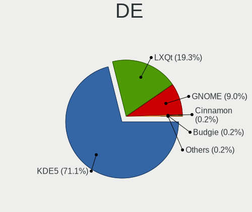

| Name     | Computers | Percent |
|----------|-----------|---------|
| KDE5     | 601       | 72.41%  |
| LXQt     | 147       | 17.71%  |
| GNOME    | 78        | 9.4%    |
| Cinnamon | 2         | 0.24%   |
| Unknown  | 2         | 0.24%   |

Display Server
--------------

X11 or Wayland

| Name    | Computers | Percent |
|---------|-----------|---------|
| Wayland | 809       | 97.47%  |
| X11     | 20        | 2.41%   |
| Unknown | 1         | 0.12%   |

Display Manager
---------------

SDDM, LightDM, etc.

| Name    | Computers | Percent |
|---------|-----------|---------|
| SDDM    | 751       | 90.48%  |
| GDM     | 78        | 9.4%    |
| LightDM | 1         | 0.12%   |

OS Lang
-------

Language

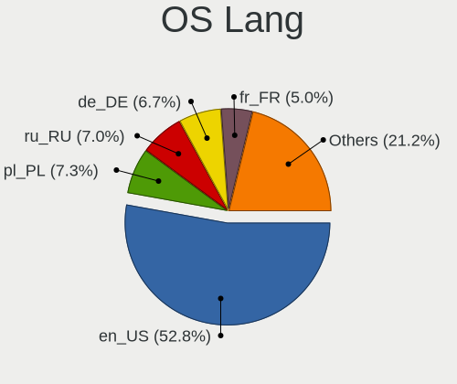

| Lang  | Computers | Percent |
|-------|-----------|---------|
| en_US | 437       | 52.65%  |
| de_DE | 60        | 7.23%   |
| ru_RU | 59        | 7.11%   |
| pl_PL | 55        | 6.63%   |
| fr_FR | 49        | 5.9%    |
| it_IT | 31        | 3.73%   |
| pt_BR | 21        | 2.53%   |
| es_ES | 19        | 2.29%   |
| en_GB | 17        | 2.05%   |
| cs_CZ | 10        | 1.2%    |
| en_CA | 8         | 0.96%   |
| es_AR | 6         | 0.72%   |
| ja_JP | 5         | 0.6%    |
| es_MX | 5         | 0.6%    |
| en_IN | 5         | 0.6%    |
| tr_TR | 4         | 0.48%   |
| hu_HU | 4         | 0.48%   |
| en_IL | 4         | 0.48%   |
| en_AU | 4         | 0.48%   |
| pt_PT | 3         | 0.36%   |
| en_NZ | 3         | 0.36%   |
| de_CH | 3         | 0.36%   |
| UTF-8 | 2         | 0.24%   |
| nb_NO | 2         | 0.24%   |
| fr_CA | 2         | 0.24%   |
| ro_RO | 1         | 0.12%   |
| nl_NL | 1         | 0.12%   |
| fr_BE | 1         | 0.12%   |
| es_VE | 1         | 0.12%   |
| es_EC | 1         | 0.12%   |
| es_DO | 1         | 0.12%   |
| es_CR | 1         | 0.12%   |
| es_BO | 1         | 0.12%   |
| en_SG | 1         | 0.12%   |
| en_NG | 1         | 0.12%   |
| en_HK | 1         | 0.12%   |
| de_AT | 1         | 0.12%   |

Boot Mode
---------

EFI or BIOS

| Mode | Computers | Percent |
|------|-----------|---------|
| EFI  | 498       | 60%     |
| BIOS | 332       | 40%     |

Filesystem
----------

Type of filesystem

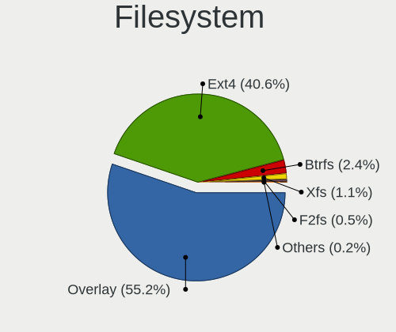

| Type    | Computers | Percent |
|---------|-----------|---------|
| Overlay | 486       | 58.55%  |
| Ext4    | 316       | 38.07%  |
| Btrfs   | 16        | 1.93%   |
| Xfs     | 8         | 0.96%   |
| F2fs    | 3         | 0.36%   |
| Ext3    | 1         | 0.12%   |

Part. scheme
------------

Scheme of partitioning

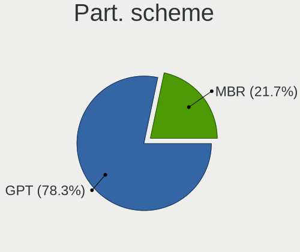

| Type | Computers | Percent |
|------|-----------|---------|
| GPT  | 650       | 78.31%  |
| MBR  | 180       | 21.69%  |

Dual Boot with Linux/BSD
------------------------

Hosting more than one Linux/BSD

| Dual boot | Computers | Percent |
|-----------|-----------|---------|
| Yes       | 445       | 53.61%  |
| No        | 385       | 46.39%  |

Dual Boot (Win)
---------------

Hosting Linux and Windows

| Dual boot | Computers | Percent |
|-----------|-----------|---------|
| No        | 489       | 58.92%  |
| Yes       | 341       | 41.08%  |

Board
-----

Vendor
------

Motherboard manufacturer

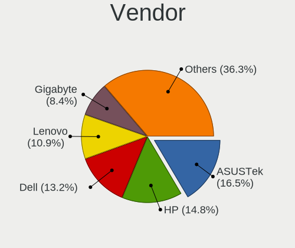

| Name                                 | Computers | Percent |
|--------------------------------------|-----------|---------|
| ASUSTek Computer                     | 152       | 18.31%  |
| Hewlett-Packard                      | 127       | 15.3%   |
| Dell                                 | 104       | 12.53%  |
| Lenovo                               | 89        | 10.72%  |
| Gigabyte Technology                  | 65        | 7.83%   |
| Acer                                 | 51        | 6.14%   |
| MSI                                  | 42        | 5.06%   |
| ASRock                               | 31        | 3.73%   |
| Toshiba                              | 17        | 2.05%   |
| Intel                                | 15        | 1.81%   |
| Apple                                | 15        | 1.81%   |
| Fujitsu                              | 13        | 1.57%   |
| Medion                               | 7         | 0.84%   |
| Unknown                              | 7         | 0.84%   |
| AZW                                  | 6         | 0.72%   |
| Pegatron                             | 5         | 0.6%    |
| Biostar                              | 5         | 0.6%    |
| Sony                                 | 4         | 0.48%   |
| Packard Bell                         | 4         | 0.48%   |
| HUAWEI                               | 4         | 0.48%   |
| eMachines                            | 4         | 0.48%   |
| TUXEDO                               | 3         | 0.36%   |
| Shenzhen Meigao Electronic Equipment | 3         | 0.36%   |
| Samsung Electronics                  | 3         | 0.36%   |
| Google                               | 3         | 0.36%   |
| Foxconn                              | 3         | 0.36%   |
| EVOO                                 | 3         | 0.36%   |
| Chuwi                                | 3         | 0.36%   |
| ZOTAC                                | 2         | 0.24%   |
| Timi                                 | 2         | 0.24%   |
| Red Hat                              | 2         | 0.24%   |
| MouseComputer                        | 2         | 0.24%   |
| Login Informatica                    | 2         | 0.24%   |
| Info Quest Technologies              | 2         | 0.24%   |
| AMI                                  | 2         | 0.24%   |
| Supermicro                           | 1         | 0.12%   |
| SLIMBOOK                             | 1         | 0.12%   |
| Razer                                | 1         | 0.12%   |
| Philco                               | 1         | 0.12%   |
| Notebook                             | 1         | 0.12%   |

Model
-----

Motherboard model

| Name                                              | Computers | Percent |
|---------------------------------------------------|-----------|---------|
| Unknown                                           | 12        | 1.45%   |
| Dell Inspiron 15 3515                             | 5         | 0.6%    |
| ASUS All Series                                   | 5         | 0.6%    |
| HP Compaq 610                                     | 4         | 0.48%   |
| Dell OptiPlex 9020                                | 4         | 0.48%   |
| Dell OptiPlex 780                                 | 4         | 0.48%   |
| ASUS PRIME B550M-A                                | 4         | 0.48%   |
| Acer Veriton L670G                                | 4         | 0.48%   |
| MSI MS-7721                                       | 3         | 0.36%   |
| HP Pavilion dv7                                   | 3         | 0.36%   |
| HP EliteDesk 800 G2 DM 35W                        | 3         | 0.36%   |
| EVOO TEV-CE-141-2                                 | 3         | 0.36%   |
| Dell OptiPlex 7040                                | 3         | 0.36%   |
| Dell OptiPlex 7010                                | 3         | 0.36%   |
| ASUS P8Z77-V LX                                   | 3         | 0.36%   |
| ASRock FM2A88X Extreme6+                          | 3         | 0.36%   |
| Toshiba Satellite C660                            | 2         | 0.24%   |
| Toshiba Satellite C650                            | 2         | 0.24%   |
| Shenzhen Meigao Electronic Equipment Venus series | 2         | 0.24%   |
| Red Hat KVM                                       | 2         | 0.24%   |
| MSI MS-7D67                                       | 2         | 0.24%   |
| MSI MS-7A34                                       | 2         | 0.24%   |
| Lenovo IdeaPad 330S-15IKB 81F5                    | 2         | 0.24%   |
| Intel H61                                         | 2         | 0.24%   |
| Info Quest GTN1402 4-64                           | 2         | 0.24%   |
| HP Z440 Workstation                               | 2         | 0.24%   |
| HP ProDesk 600 G2 SFF                             | 2         | 0.24%   |
| HP ProBook 640 G1                                 | 2         | 0.24%   |
| HP Pavilion Gaming Laptop 15-ec0xxx               | 2         | 0.24%   |
| HP Pavilion Desktop 590-p0xxx                     | 2         | 0.24%   |
| HP Notebook                                       | 2         | 0.24%   |
| HP Laptop 17-by4xxx                               | 2         | 0.24%   |
| HP Laptop 15-dy2xxx                               | 2         | 0.24%   |
| HP EliteDesk 800 G3 SFF                           | 2         | 0.24%   |
| HP EliteDesk 800 G2 SFF                           | 2         | 0.24%   |
| HP Compaq Pro 6300 MT                             | 2         | 0.24%   |
| HP Compaq 6730s                                   | 2         | 0.24%   |
| HP 250 G7 Notebook PC                             | 2         | 0.24%   |
| HP 15                                             | 2         | 0.24%   |
| Gigabyte B85M-HD3                                 | 2         | 0.24%   |

Model Family
------------

Motherboard model prefix

| Name                  | Computers | Percent |
|-----------------------|-----------|---------|
| Lenovo ThinkPad       | 35        | 4.22%   |
| Acer Aspire           | 33        | 3.98%   |
| Dell OptiPlex         | 31        | 3.73%   |
| ASUS PRIME            | 31        | 3.73%   |
| Dell Inspiron         | 30        | 3.61%   |
| Lenovo IdeaPad        | 23        | 2.77%   |
| Dell Latitude         | 23        | 2.77%   |
| HP Compaq             | 22        | 2.65%   |
| HP Laptop             | 20        | 2.41%   |
| HP Pavilion           | 15        | 1.81%   |
| Toshiba Satellite     | 14        | 1.69%   |
| ASUS VivoBook         | 14        | 1.69%   |
| HP EliteDesk          | 12        | 1.45%   |
| Unknown               | 12        | 1.45%   |
| ASUS ROG              | 11        | 1.33%   |
| HP ProBook            | 8         | 0.96%   |
| Dell Precision        | 8         | 0.96%   |
| Acer Veriton          | 8         | 0.96%   |
| ASUS TUF              | 7         | 0.84%   |
| HP EliteBook          | 6         | 0.72%   |
| HP ProDesk            | 5         | 0.6%    |
| Fujitsu ESPRIMO       | 5         | 0.6%    |
| ASUS All              | 5         | 0.6%    |
| Lenovo ThinkCentre    | 4         | 0.48%   |
| Intel H61             | 4         | 0.48%   |
| HP 250                | 4         | 0.48%   |
| Fujitsu LIFEBOOK      | 4         | 0.48%   |
| Dell XPS              | 4         | 0.48%   |
| Dell Vostro           | 4         | 0.48%   |
| Packard Bell EasyNote | 3         | 0.36%   |
| MSI MS-7721           | 3         | 0.36%   |
| MSI Modern            | 3         | 0.36%   |
| Lenovo IdeaCentre     | 3         | 0.36%   |
| HP Stream             | 3         | 0.36%   |
| HP 15                 | 3         | 0.36%   |
| Gigabyte B450M        | 3         | 0.36%   |
| Gigabyte B450         | 3         | 0.36%   |
| EVOO TEV-CE-141-2     | 3         | 0.36%   |
| ASUS P8Z77-V          | 3         | 0.36%   |
| ASRock FM2A88X        | 3         | 0.36%   |

MFG Year
--------

Motherboard manufacture year

| Year | Computers | Percent |
|------|-----------|---------|
| 2012 | 78        | 9.4%    |
| 2021 | 69        | 8.31%   |
| 2020 | 63        | 7.59%   |
| 2018 | 61        | 7.35%   |
| 2013 | 61        | 7.35%   |
| 2011 | 56        | 6.75%   |
| 2015 | 55        | 6.63%   |
| 2017 | 52        | 6.27%   |
| 2014 | 48        | 5.78%   |
| 2022 | 44        | 5.3%    |
| 2010 | 39        | 4.7%    |
| 2009 | 38        | 4.58%   |
| 2016 | 37        | 4.46%   |
| 2019 | 36        | 4.34%   |
| 2008 | 33        | 3.98%   |
| 2023 | 27        | 3.25%   |
| 2007 | 18        | 2.17%   |
| 2006 | 12        | 1.45%   |
| 2005 | 2         | 0.24%   |
| 2024 | 1         | 0.12%   |

Form Factor
-----------

Physical design of the computer

| Name        | Computers | Percent |
|-------------|-----------|---------|
| Desktop     | 410       | 49.4%   |
| Notebook    | 380       | 45.78%  |
| All in one  | 18        | 2.17%   |
| Mini pc     | 12        | 1.45%   |
| Convertible | 5         | 0.6%    |
| Tablet      | 3         | 0.36%   |
| Other       | 1         | 0.12%   |
| Server      | 1         | 0.12%   |

Secure Boot
-----------

Enabled or disabled

| State    | Computers | Percent |
|----------|-----------|---------|
| Disabled | 830       | 100%    |

Coreboot
--------

Have coreboot on board

| Used | Computers | Percent |
|------|-----------|---------|
| No   | 827       | 99.64%  |
| Yes  | 3         | 0.36%   |

RAM Size
--------

Total RAM memory

| Size in GB  | Computers | Percent |
|-------------|-----------|---------|
| 4.01-8.0    | 216       | 26.02%  |
| 3.01-4.0    | 179       | 21.57%  |
| 16.01-24.0  | 163       | 19.64%  |
| 8.01-16.0   | 156       | 18.8%   |
| 32.01-64.0  | 58        | 6.99%   |
| 1.01-2.0    | 28        | 3.37%   |
| 24.01-32.0  | 16        | 1.93%   |
| 2.01-3.0    | 10        | 1.2%    |
| 64.01-256.0 | 2         | 0.24%   |
| 0.51-1.0    | 2         | 0.24%   |

RAM Used
--------

Used RAM memory

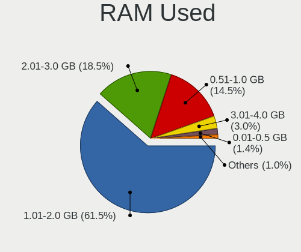

| Used GB   | Computers | Percent |
|-----------|-----------|---------|
| 1.01-2.0  | 522       | 62.82%  |
| 2.01-3.0  | 149       | 17.93%  |
| 0.51-1.0  | 120       | 14.44%  |
| 3.01-4.0  | 21        | 2.53%   |
| 0.01-0.5  | 14        | 1.68%   |
| 4.01-8.0  | 4         | 0.48%   |
| 8.01-16.0 | 1         | 0.12%   |

Total Drives
------------

Number of drives on board

| Drives | Computers | Percent |
|--------|-----------|---------|
| 1      | 485       | 58.43%  |
| 2      | 209       | 25.18%  |
| 3      | 76        | 9.16%   |
| 4      | 23        | 2.77%   |
| 0      | 12        | 1.45%   |
| 5      | 11        | 1.33%   |
| 6      | 8         | 0.96%   |
| 7      | 3         | 0.36%   |
| 13     | 1         | 0.12%   |
| 9      | 1         | 0.12%   |
| 8      | 1         | 0.12%   |

Has CD-ROM
----------

Has CD-ROM on board

| Presented | Computers | Percent |
|-----------|-----------|---------|
| No        | 442       | 53.25%  |
| Yes       | 388       | 46.75%  |

Has Ethernet
------------

Has Ethernet on board

| Presented | Computers | Percent |
|-----------|-----------|---------|
| Yes       | 733       | 88.31%  |
| No        | 97        | 11.69%  |

Has WiFi
--------

Has WiFi module

| Presented | Computers | Percent |
|-----------|-----------|---------|
| Yes       | 582       | 70.12%  |
| No        | 248       | 29.88%  |

Has Bluetooth
-------------

Has Bluetooth module

| Presented | Computers | Percent |
|-----------|-----------|---------|
| Yes       | 449       | 54.1%   |
| No        | 381       | 45.9%   |

Location
--------

Country
-------

Geographic location (country)

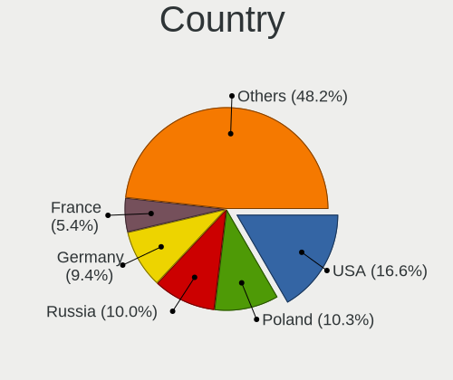

| Country     | Computers | Percent |
|-------------|-----------|---------|
| USA         | 142       | 17.11%  |
| Russia      | 82        | 9.88%   |
| Germany     | 82        | 9.88%   |
| Poland      | 71        | 8.55%   |
| France      | 51        | 6.14%   |
| Italy       | 41        | 4.94%   |
| Brazil      | 39        | 4.7%    |
| Spain       | 24        | 2.89%   |
| Canada      | 23        | 2.77%   |
| UK          | 22        | 2.65%   |
| Japan       | 18        | 2.17%   |
| Hungary     | 16        | 1.93%   |
| Czechia     | 16        | 1.93%   |
| Turkey      | 12        | 1.45%   |
| Romania     | 11        | 1.33%   |
| Australia   | 10        | 1.2%    |
| Sweden      | 8         | 0.96%   |
| Mexico      | 8         | 0.96%   |
| Indonesia   | 8         | 0.96%   |
| India       | 8         | 0.96%   |
| China       | 8         | 0.96%   |
| Belgium     | 8         | 0.96%   |
| Argentina   | 8         | 0.96%   |
| Norway      | 7         | 0.84%   |
| Netherlands | 7         | 0.84%   |
| Israel      | 6         | 0.72%   |
| Greece      | 6         | 0.72%   |
| Thailand    | 5         | 0.6%    |
| Switzerland | 4         | 0.48%   |
| Serbia      | 4         | 0.48%   |
| Portugal    | 4         | 0.48%   |
| Morocco     | 4         | 0.48%   |
| Belarus     | 4         | 0.48%   |
| Ukraine     | 3         | 0.36%   |
| Singapore   | 3         | 0.36%   |
| New Zealand | 3         | 0.36%   |
| Jamaica     | 3         | 0.36%   |
| Finland     | 3         | 0.36%   |
| Cyprus      | 3         | 0.36%   |
| Uruguay     | 2         | 0.24%   |

City
----

Geographic location (city)

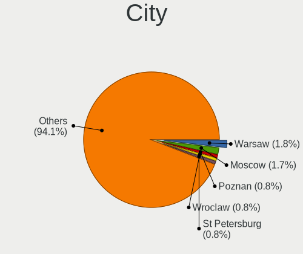

| City           | Computers | Percent |
|----------------|-----------|---------|
| Moscow         | 13        | 1.57%   |
| Warsaw         | 11        | 1.33%   |
| Prague         | 10        | 1.2%    |
| Paris          | 7         | 0.84%   |
| Rome           | 6         | 0.72%   |
| Citrus Heights | 6         | 0.72%   |
| Budapest       | 6         | 0.72%   |
| St Petersburg  | 5         | 0.6%    |
| Rio de Janeiro | 5         | 0.6%    |
| Poznan         | 5         | 0.6%    |
| Oliveira       | 5         | 0.6%    |
| Munich         | 5         | 0.6%    |
| Berlin         | 5         | 0.6%    |
| Wroclaw        | 4         | 0.48%   |
| Trgu Mure  | 4         | 0.48%   |
| Stuhr          | 4         | 0.48%   |
| Sao Paulo      | 4         | 0.48%   |
| Montreal       | 4         | 0.48%   |
| Milan          | 4         | 0.48%   |
| Leipzig        | 4         | 0.48%   |
| Krasnodar      | 4         | 0.48%   |
| Tucson         | 3         | 0.36%   |
| Toulouse       | 3         | 0.36%   |
| Tokyo          | 3         | 0.36%   |
| Tel Aviv       | 3         | 0.36%   |
| Sydney         | 3         | 0.36%   |
| Singapore      | 3         | 0.36%   |
| San Pedro      | 3         | 0.36%   |
| Samara         | 3         | 0.36%   |
| Novosibirsk    | 3         | 0.36%   |
| Nagoya         | 3         | 0.36%   |
| Madrid         | 3         | 0.36%   |
| Lublin         | 3         | 0.36%   |
| Limassol       | 3         | 0.36%   |
| Le Grau-du-Roi | 3         | 0.36%   |
| Krasnoyarsk    | 3         | 0.36%   |
| Krakow         | 3         | 0.36%   |
| Katowice       | 3         | 0.36%   |
| Hemet          | 3         | 0.36%   |
| Hanover        | 3         | 0.36%   |

Drives
------

Drive Vendor
------------

Hard drive vendors

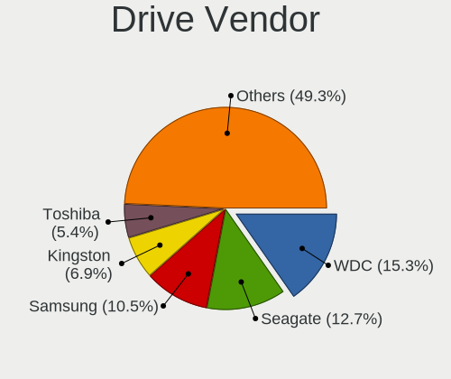

| Vendor                      | Computers | Drives | Percent |
|-----------------------------|-----------|--------|---------|
| WDC                         | 196       | 226    | 15.97%  |
| Seagate                     | 157       | 181    | 12.8%   |
| Samsung Electronics         | 125       | 149    | 10.19%  |
| Kingston                    | 96        | 103    | 7.82%   |
| Toshiba                     | 66        | 69     | 5.38%   |
| SanDisk                     | 51        | 55     | 4.16%   |
| Crucial                     | 44        | 48     | 3.59%   |
| Hitachi                     | 39        | 39     | 3.18%   |
| Unknown                     | 32        | 35     | 2.61%   |
| China                       | 28        | 29     | 2.28%   |
| Intel                       | 21        | 21     | 1.71%   |
| Unknown                     | 21        | 21     | 1.71%   |
| Micron Technology           | 20        | 22     | 1.63%   |
| SPCC                        | 19        | 22     | 1.55%   |
| A-DATA Technology           | 19        | 20     | 1.55%   |
| SK hynix                    | 18        | 19     | 1.47%   |
| GOODRAM                     | 18        | 19     | 1.47%   |
| JMicron Technology          | 16        | 16     | 1.3%    |
| Intenso                     | 16        | 16     | 1.3%    |
| HGST                        | 13        | 13     | 1.06%   |
| Patriot                     | 10        | 12     | 0.81%   |
| PNY                         | 8         | 9      | 0.65%   |
| ASMT                        | 7         | 8      | 0.57%   |
| Apple                       | 7         | 7      | 0.57%   |
| Silicon Motion              | 6         | 7      | 0.49%   |
| Lexar                       | 6         | 6      | 0.49%   |
| Maxtor                      | 5         | 5      | 0.41%   |
| Kingston Technology Company | 5         | 5      | 0.41%   |
| KingSpec                    | 5         | 5      | 0.41%   |
| HPQ                         | 5         | 5      | 0.41%   |
| Apacer                      | 5         | 5      | 0.41%   |
| Team                        | 4         | 4      | 0.33%   |
| Phison                      | 4         | 5      | 0.33%   |
| Netac                       | 4         | 4      | 0.33%   |
| MSI                         | 4         | 4      | 0.33%   |
| KIOXIA                      | 4         | 4      | 0.33%   |
| Hewlett-Packard             | 4         | 4      | 0.33%   |
| AMD                         | 4         | 4      | 0.33%   |
| UMIS                        | 3         | 3      | 0.24%   |
| Transcend                   | 3         | 3      | 0.24%   |

Drive Model
-----------

Hard drive models

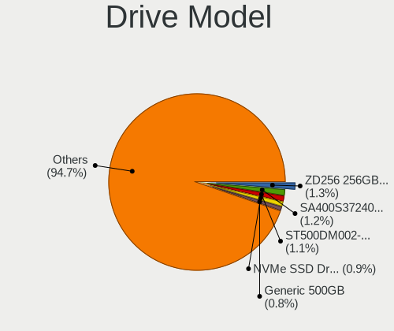

| Model                              | Computers | Percent |
|------------------------------------|-----------|---------|
| Unknown                            | 21        | 1.6%    |
| Kingston SA400S37240G 240GB SSD    | 18        | 1.37%   |
| Seagate ST500DM002-1BD142 500GB    | 16        | 1.22%   |
| SanDisk NVMe SSD Drive 1TB         | 14        | 1.07%   |
| Kingston SA400S37120G 120GB SSD    | 11        | 0.84%   |
| Unknown SD/MMC/MS PRO 128GB        | 10        | 0.76%   |
| Toshiba DT01ACA100 1TB             | 10        | 0.76%   |
| Kingston SA400S37480G 480GB SSD    | 10        | 0.76%   |
| JMicron Generic 320GB              | 10        | 0.76%   |
| Kingston SNVS500G 500GB            | 9         | 0.69%   |
| Toshiba MQ04ABF100 1TB             | 8         | 0.61%   |
| Seagate ST500LT012-1DG142 500GB    | 8         | 0.61%   |
| Seagate ST1000DM010-2EP102 1TB     | 7         | 0.53%   |
| WDC WD10EZEX-08WN4A0 1TB           | 6         | 0.46%   |
| Seagate ST2000DM001-1ER164 2TB     | 6         | 0.46%   |
| JMicron Tech 250GB                 | 6         | 0.46%   |
| SPCC Solid State Disk 256GB        | 5         | 0.38%   |
| Seagate ST1000LM035-1RK172 1TB     | 5         | 0.38%   |
| Seagate ST1000DM003-1ER162 1TB     | 5         | 0.38%   |
| HPQ BF450DASTK 450GB               | 5         | 0.38%   |
| Crucial CT275MX300SSD1 275GB       | 5         | 0.38%   |
| Crucial CT240BX500SSD1 240GB       | 5         | 0.38%   |
| ASMT 2115 128GB                    | 5         | 0.38%   |
| Toshiba MQ01ABF050 500GB           | 4         | 0.31%   |
| Toshiba MQ01ABD100 1TB             | 4         | 0.31%   |
| Toshiba HDWD130 3TB                | 4         | 0.31%   |
| SPCC Solid State Disk 512GB        | 4         | 0.31%   |
| Seagate ST9500325AS 500GB          | 4         | 0.31%   |
| Seagate ST2000DM008-2FR102 2TB     | 4         | 0.31%   |
| Seagate ST1000LM024 HN-M101MBB 1TB | 4         | 0.31%   |
| Seagate Expansion 2TB              | 4         | 0.31%   |
| Samsung SSD 980 1TB                | 4         | 0.31%   |
| Samsung SSD 870 QVO 1TB            | 4         | 0.31%   |
| Samsung SSD 860 QVO 1TB            | 4         | 0.31%   |
| Samsung SSD 860 EVO 250GB          | 4         | 0.31%   |
| Micron 2210_MTFDHBA512QFD 512GB    | 4         | 0.31%   |
| Kingston Company SNV2S1000G 1TB    | 4         | 0.31%   |
| Kingston SV300S37A120G 120GB SSD   | 4         | 0.31%   |
| Kingston SUV400S37120G 120GB SSD   | 4         | 0.31%   |
| Kingston SNV2S500G 500GB           | 4         | 0.31%   |

HDD Vendor
----------

Hard disk drive vendors

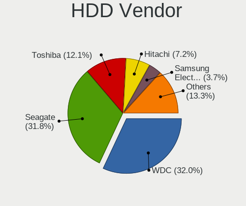

| Vendor              | Computers | Drives | Percent |
|---------------------|-----------|--------|---------|
| WDC                 | 156       | 177    | 32.43%  |
| Seagate             | 153       | 177    | 31.81%  |
| Toshiba             | 60        | 63     | 12.47%  |
| Hitachi             | 36        | 36     | 7.48%   |
| Samsung Electronics | 17        | 20     | 3.53%   |
| HGST                | 13        | 13     | 2.7%    |
| Unknown             | 10        | 10     | 2.08%   |
| JMicron Technology  | 10        | 10     | 2.08%   |
| Maxtor              | 5         | 5      | 1.04%   |
| HPQ                 | 5         | 5      | 1.04%   |
| TO Exter            | 3         | 3      | 0.62%   |
| Apple               | 3         | 3      | 0.62%   |
| SABRENT             | 2         | 3      | 0.42%   |
| Intenso             | 2         | 2      | 0.42%   |
| Fujitsu             | 2         | 2      | 0.42%   |
| WD MediaMax         | 1         | 1      | 0.21%   |
| KESU                | 1         | 1      | 0.21%   |
| Inateck             | 1         | 1      | 0.21%   |
| CIRAGO              | 1         | 1      | 0.21%   |

SSD Vendor
----------

Solid state drive vendors

| Vendor              | Computers | Drives | Percent |
|---------------------|-----------|--------|---------|
| Samsung Electronics | 65        | 76     | 14.67%  |
| Kingston            | 62        | 65     | 14%     |
| Crucial             | 32        | 35     | 7.22%   |
| SanDisk             | 28        | 30     | 6.32%   |
| China               | 28        | 29     | 6.32%   |
| WDC                 | 20        | 20     | 4.51%   |
| GOODRAM             | 16        | 17     | 3.61%   |
| SPCC                | 15        | 17     | 3.39%   |
| Intenso             | 12        | 12     | 2.71%   |
| Intel               | 12        | 12     | 2.71%   |
| A-DATA Technology   | 11        | 11     | 2.48%   |
| Micron Technology   | 9         | 11     | 2.03%   |
| Patriot             | 7         | 9      | 1.58%   |
| ASMT                | 7         | 8      | 1.58%   |
| Unknown             | 7         | 7      | 1.58%   |
| PNY                 | 5         | 6      | 1.13%   |
| KingSpec            | 5         | 5      | 1.13%   |
| Apacer              | 5         | 5      | 1.13%   |
| Hewlett-Packard     | 4         | 4      | 0.9%    |
| Transcend           | 3         | 3      | 0.68%   |
| SK hynix            | 3         | 3      | 0.68%   |
| OCZ                 | 3         | 3      | 0.68%   |
| LITEON              | 3         | 3      | 0.68%   |
| KingDian            | 3         | 4      | 0.68%   |
| Hitachi             | 3         | 3      | 0.68%   |
| Dogfish             | 3         | 3      | 0.68%   |
| AMD                 | 3         | 3      | 0.68%   |
| Verbatim            | 2         | 2      | 0.45%   |
| Toshiba             | 2         | 2      | 0.45%   |
| Smartbuy            | 2         | 2      | 0.45%   |
| RX7                 | 2         | 2      | 0.45%   |
| Reeinno             | 2         | 2      | 0.45%   |
| PNY USB             | 2         | 2      | 0.45%   |
| Phison              | 2         | 2      | 0.45%   |
| Netac               | 2         | 2      | 0.45%   |
| LITEONIT            | 2         | 2      | 0.45%   |
| KIOXIA-EXCERIA      | 2         | 2      | 0.45%   |
| KingFast            | 2         | 2      | 0.45%   |
| HS-SSD-E100         | 2         | 2      | 0.45%   |
| Hikvision           | 2         | 2      | 0.45%   |

Drive Kind
----------

HDD or SSD

| Kind    | Computers | Drives | Percent |
|---------|-----------|--------|---------|
| HDD     | 410       | 533    | 38.25%  |
| SSD     | 376       | 475    | 35.07%  |
| NVMe    | 238       | 285    | 22.2%   |
| MMC     | 32        | 36     | 2.99%   |
| Unknown | 16        | 18     | 1.49%   |

Drive Connector
---------------

SATA, SAS, NVMe, etc.

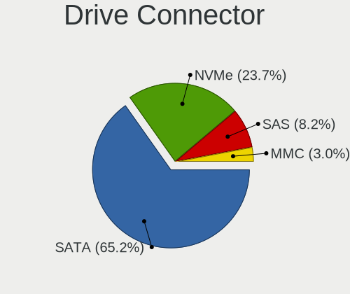

| Type | Computers | Drives | Percent |
|------|-----------|--------|---------|
| SATA | 634       | 921    | 64.3%   |
| NVMe | 237       | 280    | 24.04%  |
| SAS  | 83        | 110    | 8.42%   |
| MMC  | 32        | 36     | 3.25%   |

Drive Size
----------

Size of hard drive

| Size in TB | Computers | Drives | Percent |
|------------|-----------|--------|---------|
| 0.01-0.5   | 507       | 661    | 63.3%   |
| 0.51-1.0   | 214       | 246    | 26.72%  |
| 1.01-2.0   | 51        | 69     | 6.37%   |
| 3.01-4.0   | 10        | 13     | 1.25%   |
| 2.01-3.0   | 10        | 10     | 1.25%   |
| 4.01-10.0  | 6         | 6      | 0.75%   |
| 10.01-20.0 | 3         | 3      | 0.37%   |

Space Total
-----------

Amount of disk space available on the file system

| Size in GB     | Computers | Percent |
|----------------|-----------|---------|
| 1-20           | 320       | 38.55%  |
| 101-250        | 159       | 19.16%  |
| 251-500        | 106       | 12.77%  |
| 21-50          | 52        | 6.27%   |
| 501-1000       | 51        | 6.14%   |
| 51-100         | 51        | 6.14%   |
| Unknown        | 47        | 5.66%   |
| 1001-2000      | 30        | 3.61%   |
| More than 3000 | 9         | 1.08%   |
| 2001-3000      | 5         | 0.6%    |

Space Used
----------

Amount of used disk space

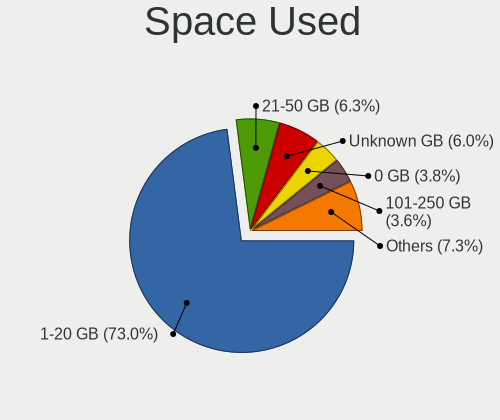

| Used GB        | Computers | Percent |
|----------------|-----------|---------|
| 1-20           | 613       | 73.86%  |
| Unknown        | 47        | 5.66%   |
| 21-50          | 44        | 5.3%    |
| 0              | 35        | 4.22%   |
| 101-250        | 31        | 3.73%   |
| 51-100         | 26        | 3.13%   |
| 251-500        | 18        | 2.17%   |
| 501-1000       | 7         | 0.84%   |
| 1001-2000      | 4         | 0.48%   |
| 2001-3000      | 3         | 0.36%   |
| More than 3000 | 2         | 0.24%   |

Malfunc. Drives
---------------

Drive models with a malfunction

| Model                                   | Computers | Drives | Percent |
|-----------------------------------------|-----------|--------|---------|
| Seagate ST500DM002-1BD142 500GB         | 5         | 5      | 2.39%   |
| Seagate ST9500325AS 500GB               | 4         | 4      | 1.91%   |
| Seagate ST500LT012-1DG142 500GB         | 4         | 4      | 1.91%   |
| Seagate ST1000LM024 HN-M101MBB 1TB      | 3         | 3      | 1.44%   |
| Crucial CT275MX300SSD1 275GB            | 3         | 3      | 1.44%   |
| WDC WD5000AAKX-60U6AA0 500GB            | 2         | 2      | 0.96%   |
| WDC WD5000AAKX-001CA0 500GB             | 2         | 2      | 0.96%   |
| WDC WD10EARS-22Y5B1 1TB                 | 2         | 2      | 0.96%   |
| WDC WD10EADS-00L5B1 1TB                 | 2         | 2      | 0.96%   |
| Toshiba MQ01ABD100 1TB                  | 2         | 2      | 0.96%   |
| Toshiba MQ01ABD050V 500GB               | 2         | 2      | 0.96%   |
| Toshiba MK3263GSX 320GB                 | 2         | 2      | 0.96%   |
| Toshiba DT01ACA100 1TB                  | 2         | 2      | 0.96%   |
| Seagate ST500LM012 HN-M500MBB 500GB     | 2         | 2      | 0.96%   |
| Seagate ST3500418AS 500GB               | 2         | 2      | 0.96%   |
| Seagate ST3320613AS 320GB               | 2         | 2      | 0.96%   |
| Seagate ST320LT007-9ZV142 320GB         | 2         | 2      | 0.96%   |
| Seagate ST2000DM001-1CH164 2TB          | 2         | 3      | 0.96%   |
| Seagate ST1000LM035-1RK172 1TB          | 2         | 2      | 0.96%   |
| Seagate ST1000DM003-1ER162 1TB          | 2         | 2      | 0.96%   |
| Samsung Electronics SSD 970 EVO 500GB   | 2         | 2      | 0.96%   |
| Samsung Electronics SP2504C 250GB       | 2         | 2      | 0.96%   |
| Samsung Electronics HD321KJ 320GB       | 2         | 2      | 0.96%   |
| Kingston SA400S37120G 120GB SSD         | 2         | 2      | 0.96%   |
| Kingston RBU-SNS8350DES3128GP 128GB SSD | 2         | 2      | 0.96%   |
| Hitachi HTS723232L9A360 320GB           | 2         | 2      | 0.96%   |
| Hitachi HTS545050B9A300 500GB           | 2         | 2      | 0.96%   |
| Hitachi HTS545032B9A300 320GB           | 2         | 2      | 0.96%   |
| Hitachi HDS721010CLA332 1TB             | 2         | 2      | 0.96%   |
| WDC WDS240G2G0B-00EPW0 240GB SSD        | 1         | 1      | 0.48%   |
| WDC WDS240G2G0A-00JH30 240GB SSD        | 1         | 1      | 0.48%   |
| WDC WDS120G2G0A-00JH30 120GB SSD        | 1         | 1      | 0.48%   |
| WDC WDS100T2G0A-00JH30 1TB SSD          | 1         | 1      | 0.48%   |
| WDC WD800JB-32JJC0 80GB                 | 1         | 1      | 0.48%   |
| WDC WD6401AALS-00L3B2 640GB             | 1         | 1      | 0.48%   |
| WDC WD6400BPVT-16HXZT1 640GB            | 1         | 1      | 0.48%   |
| WDC WD6400BEVT-22A0RT0 640GB            | 1         | 1      | 0.48%   |
| WDC WD6400AAKS-22A7B2 640GB             | 1         | 1      | 0.48%   |
| WDC WD5000LPVX-22V0TT0 500GB            | 1         | 1      | 0.48%   |
| WDC WD5000LPLX-08ZNTT0 500GB            | 1         | 1      | 0.48%   |

Malfunc. Drive Vendor
---------------------

Vendors of faulty drives

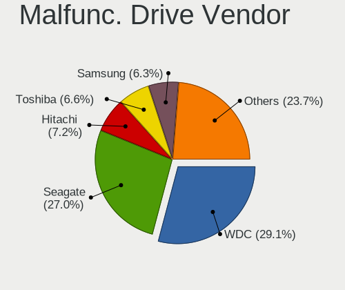

| Vendor              | Computers | Drives | Percent |
|---------------------|-----------|--------|---------|
| WDC                 | 58        | 62     | 28.71%  |
| Seagate             | 56        | 60     | 27.72%  |
| Hitachi             | 14        | 14     | 6.93%   |
| Toshiba             | 13        | 13     | 6.44%   |
| Samsung Electronics | 13        | 15     | 6.44%   |
| Kingston            | 7         | 7      | 3.47%   |
| HGST                | 5         | 5      | 2.48%   |
| Crucial             | 4         | 4      | 1.98%   |
| China               | 4         | 4      | 1.98%   |
| Maxtor              | 3         | 3      | 1.49%   |
| A-DATA Technology   | 3         | 3      | 1.49%   |
| SanDisk             | 2         | 2      | 0.99%   |
| Micron Technology   | 2         | 2      | 0.99%   |
| KingSpec            | 2         | 2      | 0.99%   |
| Intel               | 2         | 2      | 0.99%   |
| WD MediaMax         | 1         | 1      | 0.5%    |
| Transcend           | 1         | 1      | 0.5%    |
| Team                | 1         | 1      | 0.5%    |
| SPCC                | 1         | 1      | 0.5%    |
| Reeinno             | 1         | 1      | 0.5%    |
| OCZ                 | 1         | 1      | 0.5%    |
| LITEONIT            | 1         | 1      | 0.5%    |
| Lexar               | 1         | 1      | 0.5%    |
| JMicron Technology  | 1         | 1      | 0.5%    |
| HUSKY               | 1         | 1      | 0.5%    |
| Dogfish             | 1         | 1      | 0.5%    |
| Apple               | 1         | 1      | 0.5%    |
| AMD                 | 1         | 1      | 0.5%    |
| Unknown             | 1         | 1      | 0.5%    |

Malfunc. HDD Vendor
-------------------

Vendors of faulty HDD drives

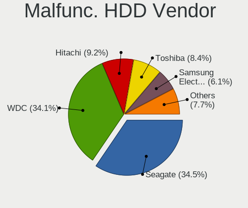

| Vendor              | Computers | Drives | Percent |
|---------------------|-----------|--------|---------|
| Seagate             | 56        | 60     | 35.67%  |
| WDC                 | 53        | 57     | 33.76%  |
| Hitachi             | 14        | 14     | 8.92%   |
| Toshiba             | 13        | 13     | 8.28%   |
| Samsung Electronics | 11        | 12     | 7.01%   |
| HGST                | 5         | 5      | 3.18%   |
| Maxtor              | 3         | 3      | 1.91%   |
| WD MediaMax         | 1         | 1      | 0.64%   |
| Apple               | 1         | 1      | 0.64%   |

Malfunc. Drive Kind
-------------------

Kinds of faulty drives

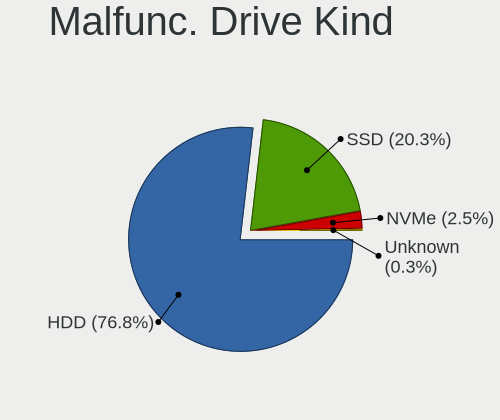

| Kind    | Computers | Drives | Percent |
|---------|-----------|--------|---------|
| HDD     | 151       | 166    | 76.65%  |
| SSD     | 40        | 40     | 20.3%   |
| NVMe    | 5         | 5      | 2.54%   |
| Unknown | 1         | 1      | 0.51%   |

Failed Drives
-------------

Failed drive models

| Model                           | Computers | Drives | Percent |
|---------------------------------|-----------|--------|---------|
| Toshiba DT01ACA100 1TB          | 1         | 1      | 50%     |
| Samsung Electronics HD103SJ 1TB | 1         | 1      | 50%     |

Failed Drive Vendor
-------------------

Failed drive vendors

| Vendor              | Computers | Drives | Percent |
|---------------------|-----------|--------|---------|
| Toshiba             | 1         | 1      | 50%     |
| Samsung Electronics | 1         | 1      | 50%     |

Drive Status
------------

Number of failed and malfunc. drives

| Status   | Computers | Drives | Percent |
|----------|-----------|--------|---------|
| Works    | 671       | 991    | 68.68%  |
| Malfunc  | 190       | 212    | 19.45%  |
| Detected | 114       | 142    | 11.67%  |
| Failed   | 2         | 2      | 0.2%    |

Storage controller
------------------

Storage Vendor
--------------

Storage controller vendors

| Vendor                                  | Computers | Percent |
|-----------------------------------------|-----------|---------|
| Intel                                   | 563       | 53.06%  |
| AMD                                     | 173       | 16.31%  |
| Samsung Electronics                     | 50        | 4.71%   |
| SanDisk                                 | 47        | 4.43%   |
| Kingston Technology Company             | 41        | 3.86%   |
| Phison Electronics                      | 22        | 2.07%   |
| ASMedia Technology                      | 21        | 1.98%   |
| SK hynix                                | 16        | 1.51%   |
| Nvidia                                  | 15        | 1.41%   |
| Silicon Motion                          | 14        | 1.32%   |
| JMicron Technology                      | 13        | 1.23%   |
| Micron/Crucial Technology               | 12        | 1.13%   |
| Micron Technology                       | 12        | 1.13%   |
| MAXIO Technology (Hangzhou)             | 11        | 1.04%   |
| Marvell Technology Group                | 11        | 1.04%   |
| KIOXIA                                  | 6         | 0.57%   |
| ADATA Technology                        | 6         | 0.57%   |
| Realtek Semiconductor                   | 4         | 0.38%   |
| Solid State Storage Technology          | 3         | 0.28%   |
| Shenzhen Longsys Electronics            | 3         | 0.28%   |
| Broadcom / LSI                          | 3         | 0.28%   |
| Apple                                   | 3         | 0.28%   |
| Union Memory (Shenzhen)                 | 2         | 0.19%   |
| Toshiba America Info Systems            | 2         | 0.19%   |
| Seagate Technology                      | 2         | 0.19%   |
| VIA Technologies                        | 1         | 0.09%   |
| Silicon Integrated Systems [SiS]        | 1         | 0.09%   |
| Silicon Image                           | 1         | 0.09%   |
| Shenzhen Unionmemory Information System | 1         | 0.09%   |
| Netac Technology                        | 1         | 0.09%   |
| Adaptec                                 | 1         | 0.09%   |

Storage Model
-------------

Storage controller models

| Model                                                                          | Computers | Percent |
|--------------------------------------------------------------------------------|-----------|---------|
| AMD FCH SATA Controller [AHCI mode]                                            | 99        | 8.09%   |
| Intel 8 Series/C220 Series Chipset Family 6-port SATA Controller 1 [AHCI mode] | 43        | 3.52%   |
| Intel Sunrise Point-LP SATA Controller [AHCI mode]                             | 40        | 3.27%   |
| Intel Q170/Q150/B150/H170/H110/Z170/CM236 Chipset SATA Controller [AHCI Mode]  | 30        | 2.45%   |
| Intel 7 Series Chipset Family 6-port SATA Controller [AHCI mode]               | 30        | 2.45%   |
| AMD SB7x0/SB8x0/SB9x0 SATA Controller [AHCI mode]                              | 26        | 2.13%   |
| Intel 6 Series/C200 Series Chipset Family 6 port Desktop SATA AHCI Controller  | 25        | 2.04%   |
| Intel 7 Series/C210 Series Chipset Family 6-port SATA Controller [AHCI mode]   | 22        | 1.8%    |
| AMD 400 Series Chipset SATA Controller                                         | 22        | 1.8%    |
| Intel Volume Management Device NVMe RAID Controller                            | 21        | 1.72%   |
| Intel NM10/ICH7 Family SATA Controller [IDE mode]                              | 21        | 1.72%   |
| Intel 200 Series PCH SATA controller [AHCI mode]                               | 21        | 1.72%   |
| Intel SATA Controller [RAID Mode]                                              | 18        | 1.47%   |
| Intel 82801 Mobile SATA Controller [RAID mode]                                 | 18        | 1.47%   |
| Intel 82801IBM/IEM (ICH9M/ICH9M-E) 4 port SATA Controller [AHCI mode]          | 17        | 1.39%   |
| Intel 82801G (ICH7 Family) IDE Controller                                      | 17        | 1.39%   |
| ASMedia ASM1061/ASM1062 Serial ATA Controller                                  | 17        | 1.39%   |
| Samsung NVMe SSD Controller SM981/PM981/PM983                                  | 16        | 1.31%   |
| Samsung NVMe SSD Controller 980 (DRAM-less)                                    | 16        | 1.31%   |
| Intel 6 Series/C200 Series Chipset Family 6 port Mobile SATA AHCI Controller   | 16        | 1.31%   |
| AMD 500 Series Chipset SATA Controller                                         | 16        | 1.31%   |
| Intel 5 Series/3400 Series Chipset 4 port SATA AHCI Controller                 | 15        | 1.23%   |
| AMD SB7x0/SB8x0/SB9x0 IDE Controller                                           | 15        | 1.23%   |
| Intel Wildcat Point-LP SATA Controller [AHCI Mode]                             | 14        | 1.14%   |
| Intel Cannon Lake PCH SATA AHCI Controller                                     | 14        | 1.14%   |
| Intel Celeron N3350/Pentium N4200/Atom E3900 Series SATA AHCI Controller       | 13        | 1.06%   |
| Samsung NVMe SSD Controller PM9A1/PM9A3/980PRO                                 | 12        | 0.98%   |
| Intel Tiger Lake-LP SATA Controller                                            | 12        | 0.98%   |
| Intel 82801HM/HEM (ICH8M/ICH8M-E) IDE Controller                               | 12        | 0.98%   |
| Silicon Motion SM2263EN/SM2263XT (DRAM-less) NVMe SSD Controllers              | 11        | 0.9%    |
| Intel Celeron/Pentium Silver Processor SATA Controller                         | 11        | 0.9%    |
| Intel Atom Processor E3800 Series SATA AHCI Controller                         | 11        | 0.9%    |
| Intel 8 Series SATA Controller 1 [AHCI mode]                                   | 11        | 0.9%    |
| AMD SB7x0/SB8x0/SB9x0 SATA Controller [IDE mode]                               | 11        | 0.9%    |
| Kingston Company NV1 NVMe SSD SM2263XT (DRAM-less)                             | 10        | 0.82%   |
| Intel 82801HM/HEM (ICH8M/ICH8M-E) SATA Controller [AHCI mode]                  | 10        | 0.82%   |
| Intel 5 Series/3400 Series Chipset 6 port SATA AHCI Controller                 | 10        | 0.82%   |
| SanDisk Ultra 3D / WD Blue SN550 NVMe SSD                                      | 9         | 0.74%   |
| MAXIO (Hangzhou) NVMe SSD Controller MAP1202 (DRAM-less)                       | 9         | 0.74%   |
| Intel Alder Lake-S PCH SATA Controller [AHCI Mode]                             | 9         | 0.74%   |

Storage Kind
------------

Kind of storage controller (IDE, SATA, NVMe, SAS, ...)

| Kind | Computers | Percent |
|------|-----------|---------|
| SATA | 627       | 59.83%  |
| NVMe | 236       | 22.52%  |
| IDE  | 120       | 11.45%  |
| RAID | 63        | 6.01%   |
| SAS  | 1         | 0.1%    |
| SCSI | 1         | 0.1%    |

Processor
---------

CPU Vendor
----------

Processor vendors

| Vendor | Computers | Percent |
|--------|-----------|---------|
| Intel  | 612       | 73.73%  |
| AMD    | 218       | 26.27%  |

CPU Model
---------

Processor models

| Model                                         | Computers | Percent |
|-----------------------------------------------|-----------|---------|
| Intel Core 2 Duo CPU E8400 @ 3.00GHz          | 9         | 1.08%   |
| Intel Core i5-3470 CPU @ 3.20GHz              | 8         | 0.96%   |
| AMD Ryzen 5 5600G with Radeon Graphics        | 8         | 0.96%   |
| Intel Core i7-6700 CPU @ 3.40GHz              | 7         | 0.84%   |
| Intel Core i5-8250U CPU @ 1.60GHz             | 7         | 0.84%   |
| Intel Core i5-4570 CPU @ 3.20GHz              | 7         | 0.84%   |
| Intel Celeron CPU N3350 @ 1.10GHz             | 7         | 0.84%   |
| Intel 11th Gen Core i5-1135G7 @ 2.40GHz       | 7         | 0.84%   |
| Intel Core i5-7400 CPU @ 3.00GHz              | 6         | 0.72%   |
| Intel Core i5-6500 CPU @ 3.20GHz              | 6         | 0.72%   |
| Intel Core i5-5200U CPU @ 2.20GHz             | 6         | 0.72%   |
| Intel Core i3-6100U CPU @ 2.30GHz             | 6         | 0.72%   |
| Intel Celeron N4020 CPU @ 1.10GHz             | 6         | 0.72%   |
| AMD Ryzen 5 3600 6-Core Processor             | 6         | 0.72%   |
| AMD Ryzen 5 3500U with Radeon Vega Mobile Gfx | 6         | 0.72%   |
| Intel Core i5-6300U CPU @ 2.40GHz             | 5         | 0.6%    |
| Intel Core i5-3337U CPU @ 1.80GHz             | 5         | 0.6%    |
| Intel Core i5-3320M CPU @ 2.60GHz             | 5         | 0.6%    |
| Intel Core 2 Duo CPU E7400 @ 2.80GHz          | 5         | 0.6%    |
| Intel 12th Gen Core i5-12500H                 | 5         | 0.6%    |
| AMD Ryzen 7 2700X Eight-Core Processor        | 5         | 0.6%    |
| AMD Ryzen 5 5500U with Radeon Graphics        | 5         | 0.6%    |
| AMD Ryzen 5 3450U with Radeon Vega Mobile Gfx | 5         | 0.6%    |
| AMD Ryzen 5 1600 Six-Core Processor           | 5         | 0.6%    |
| Intel Pentium Dual-Core CPU T4500 @ 2.30GHz   | 4         | 0.48%   |
| Intel Pentium CPU N3540 @ 2.16GHz             | 4         | 0.48%   |
| Intel Core i7-8700 CPU @ 3.20GHz              | 4         | 0.48%   |
| Intel Core i7-2600 CPU @ 3.40GHz              | 4         | 0.48%   |
| Intel Core i5-7500 CPU @ 3.40GHz              | 4         | 0.48%   |
| Intel Core i5-3210M CPU @ 2.50GHz             | 4         | 0.48%   |
| Intel Core i5-2400 CPU @ 3.10GHz              | 4         | 0.48%   |
| Intel Core i5-1035G1 CPU @ 1.00GHz            | 4         | 0.48%   |
| Intel Core i5-10210U CPU @ 1.60GHz            | 4         | 0.48%   |
| Intel Core i3-7100U CPU @ 2.40GHz             | 4         | 0.48%   |
| Intel Core i3-6006U CPU @ 2.00GHz             | 4         | 0.48%   |
| Intel Core i3-4170 CPU @ 3.70GHz              | 4         | 0.48%   |
| Intel Core i3-2310M CPU @ 2.10GHz             | 4         | 0.48%   |
| Intel Celeron CPU N3060 @ 1.60GHz             | 4         | 0.48%   |
| Intel Celeron CPU N2840 @ 2.16GHz             | 4         | 0.48%   |
| Intel 12th Gen Core i7-12700H                 | 4         | 0.48%   |

CPU Model Family
----------------

Processor model prefix

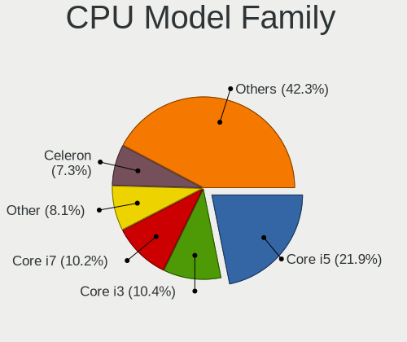

| Model                   | Computers | Percent |
|-------------------------|-----------|---------|
| Intel Core i5           | 171       | 20.6%   |
| Intel Core i3           | 88        | 10.6%   |
| Intel Core i7           | 82        | 9.88%   |
| Other                   | 67        | 8.07%   |
| Intel Celeron           | 64        | 7.71%   |
| AMD Ryzen 5             | 62        | 7.47%   |
| Intel Core 2 Duo        | 38        | 4.58%   |
| Intel Pentium           | 31        | 3.73%   |
| AMD Ryzen 7             | 24        | 2.89%   |
| Intel Pentium Dual-Core | 16        | 1.93%   |
| AMD A8                  | 16        | 1.93%   |
| Intel Xeon              | 15        | 1.81%   |
| AMD FX                  | 13        | 1.57%   |
| AMD Ryzen 9             | 11        | 1.33%   |
| AMD Ryzen 3             | 9         | 1.08%   |
| AMD Athlon              | 9         | 1.08%   |
| AMD A10                 | 9         | 1.08%   |
| Intel Core 2 Quad       | 8         | 0.96%   |
| Intel Pentium Gold      | 7         | 0.84%   |
| Intel Core 2            | 7         | 0.84%   |
| AMD E                   | 7         | 0.84%   |
| AMD A6                  | 7         | 0.84%   |
| Intel Pentium Dual      | 5         | 0.6%    |
| Intel Genuine           | 5         | 0.6%    |
| AMD Athlon 64 X2        | 5         | 0.6%    |
| AMD A4                  | 5         | 0.6%    |
| Intel Core i9           | 4         | 0.48%   |
| Intel Atom              | 4         | 0.48%   |
| AMD Phenom II X4        | 4         | 0.48%   |
| AMD Phenom II X2        | 4         | 0.48%   |
| Intel Pentium Silver    | 3         | 0.36%   |
| AMD Turion 64 X2 Mobile | 2         | 0.24%   |
| AMD Ryzen 3 PRO         | 2         | 0.24%   |
| AMD PRO A10             | 2         | 0.24%   |
| AMD Phenom II X6        | 2         | 0.24%   |
| AMD E2                  | 2         | 0.24%   |
| AMD E1                  | 2         | 0.24%   |
| AMD Athlon X4           | 2         | 0.24%   |
| AMD Athlon II Dual-Core | 2         | 0.24%   |
| AMD Athlon Dual Core    | 2         | 0.24%   |

CPU Cores
---------

Number of processor cores

| Number | Computers | Percent |
|--------|-----------|---------|
| 2      | 386       | 46.51%  |
| 4      | 271       | 32.65%  |
| 6      | 77        | 9.28%   |
| 8      | 43        | 5.18%   |
| 1      | 15        | 1.81%   |
| 12     | 12        | 1.45%   |
| 10     | 12        | 1.45%   |
| 14     | 7         | 0.84%   |
| 16     | 3         | 0.36%   |
| 3      | 3         | 0.36%   |
| 18     | 1         | 0.12%   |

CPU Sockets
-----------

Number of sockets

| Number | Computers | Percent |
|--------|-----------|---------|
| 1      | 827       | 99.64%  |
| 6      | 1         | 0.12%   |
| 4      | 1         | 0.12%   |
| 2      | 1         | 0.12%   |

CPU Threads
-----------

Threads per core (Hyper-Threading)

| Number | Computers | Percent |
|--------|-----------|---------|
| 2      | 481       | 57.95%  |
| 1      | 349       | 42.05%  |

CPU Op-Modes
------------

CPU Operation Modes (32-bit, 64-bit)

| Op mode        | Computers | Percent |
|----------------|-----------|---------|
| 32-bit, 64-bit | 830       | 100%    |

CPU Microcode
-------------

Microcode number

| Number     | Computers | Percent |
|------------|-----------|---------|
| Unknown    | 633       | 76.27%  |
| 0x08108109 | 20        | 2.41%   |
| 0x0a50000d | 10        | 1.2%    |
| 0x0a50000c | 9         | 1.08%   |
| 0x06003106 | 9         | 1.08%   |
| 0x06001119 | 9         | 1.08%   |
| 0x0800820d | 8         | 0.96%   |
| 0x0a50000f | 6         | 0.72%   |
| 0x08608103 | 6         | 0.72%   |
| 0x010000b6 | 6         | 0.72%   |
| 0x0a20120a | 5         | 0.6%    |
| 0x08701021 | 5         | 0.6%    |
| 0x08001138 | 5         | 0.6%    |
| 0x0700010b | 5         | 0.6%    |
| 0x06006705 | 5         | 0.6%    |
| 0x06001116 | 5         | 0.6%    |
| 0x08701030 | 4         | 0.48%   |
| 0x08108102 | 4         | 0.48%   |
| 0x07030105 | 4         | 0.48%   |
| 0x06000822 | 4         | 0.48%   |
| 0x05000028 | 4         | 0.48%   |
| 0x0a704104 | 3         | 0.36%   |
| 0x0a601206 | 3         | 0.36%   |
| 0x0a404102 | 3         | 0.36%   |
| 0x08101016 | 3         | 0.36%   |
| 0x05000101 | 3         | 0.36%   |
| 0x010000c8 | 3         | 0.36%   |
| 0x010000bf | 3         | 0.36%   |
| 0x0a601203 | 2         | 0.24%   |
| 0x08608102 | 2         | 0.24%   |
| 0x08600109 | 2         | 0.24%   |
| 0x08600106 | 2         | 0.24%   |
| 0x08600103 | 2         | 0.24%   |
| 0x0810100b | 2         | 0.24%   |
| 0x07030104 | 2         | 0.24%   |
| 0x0600611a | 2         | 0.24%   |
| 0x06000817 | 2         | 0.24%   |
| 0x06000613 | 2         | 0.24%   |
| 0x0500010d | 2         | 0.24%   |
| 0x03000027 | 2         | 0.24%   |

CPU Microarch
-------------

Microarchitecture

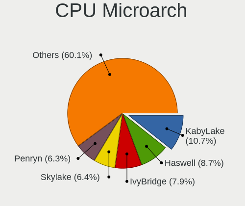

| Name             | Computers | Percent |
|------------------|-----------|---------|
| KabyLake         | 82        | 9.88%   |
| IvyBridge        | 70        | 8.43%   |
| Haswell          | 67        | 8.07%   |
| Penryn           | 57        | 6.87%   |
| Skylake          | 53        | 6.39%   |
| SandyBridge      | 46        | 5.54%   |
| Zen 3            | 34        | 4.1%    |
| Zen+             | 33        | 3.98%   |
| Alderlake Hybrid | 33        | 3.98%   |
| Westmere         | 29        | 3.49%   |
| Core             | 28        | 3.37%   |
| Silvermont       | 24        | 2.89%   |
| Unknown          | 22        | 2.65%   |
| TigerLake        | 21        | 2.53%   |
| Piledriver       | 21        | 2.53%   |
| K10              | 19        | 2.29%   |
| CometLake        | 19        | 2.29%   |
| Icelake          | 18        | 2.17%   |
| Zen 2            | 16        | 1.93%   |
| Broadwell        | 16        | 1.93%   |
| Goldmont plus    | 15        | 1.81%   |
| Zen              | 14        | 1.69%   |
| Goldmont         | 13        | 1.57%   |
| Steamroller      | 11        | 1.33%   |
| K8 Hammer        | 11        | 1.33%   |
| Bobcat           | 9         | 1.08%   |
| Nehalem          | 8         | 0.96%   |
| Puma             | 7         | 0.84%   |
| Excavator        | 7         | 0.84%   |
| Bulldozer        | 6         | 0.72%   |
| Tremont          | 5         | 0.6%    |
| Jaguar           | 5         | 0.6%    |
| K10 Llano        | 4         | 0.48%   |
| Gracemont        | 3         | 0.36%   |
| Bonnell          | 3         | 0.36%   |
| NetBurst         | 1         | 0.12%   |

Graphics
--------

GPU Vendor
----------

Vendors of graphics cards

| Vendor                               | Computers | Percent |
|--------------------------------------|-----------|---------|
| Intel                                | 469       | 50.81%  |
| AMD                                  | 228       | 24.7%   |
| Nvidia                               | 221       | 23.94%  |
| Red Hat                              | 2         | 0.22%   |
| NVidia / SGS Thomson (Joint Venture) | 2         | 0.22%   |
| ATI Technologies                     | 1         | 0.11%   |

GPU Model
---------

Graphics card models

| Model                                                                                    | Computers | Percent |
|------------------------------------------------------------------------------------------|-----------|---------|
| Intel 2nd Generation Core Processor Family Integrated Graphics Controller                | 38        | 4.03%   |
| Intel 3rd Gen Core processor Graphics Controller                                         | 33        | 3.5%    |
| AMD Picasso/Raven 2 [Radeon Vega Series / Radeon Vega Mobile Series]                     | 27        | 2.86%   |
| Intel Xeon E3-1200 v3/4th Gen Core Processor Integrated Graphics Controller              | 23        | 2.44%   |
| Intel HD Graphics 530                                                                    | 22        | 2.33%   |
| Intel Skylake GT2 [HD Graphics 520]                                                      | 21        | 2.22%   |
| Intel Core Processor Integrated Graphics Controller                                      | 20        | 2.12%   |
| Intel Xeon E3-1200 v2/3rd Gen Core processor Graphics Controller                         | 17        | 1.8%    |
| Intel HD Graphics 630                                                                    | 16        | 1.69%   |
| AMD Cezanne [Radeon Vega Series / Radeon Vega Mobile Series]                             | 16        | 1.69%   |
| Intel UHD Graphics 620                                                                   | 15        | 1.59%   |
| Intel 4 Series Chipset Integrated Graphics Controller                                    | 15        | 1.59%   |
| Intel TigerLake-LP GT2 [Iris Xe Graphics]                                                | 14        | 1.48%   |
| Intel HD Graphics 5500                                                                   | 14        | 1.48%   |
| Intel GeminiLake [UHD Graphics 600]                                                      | 14        | 1.48%   |
| Intel Atom Processor Z36xxx/Z37xxx Series Graphics & Display                             | 14        | 1.48%   |
| Intel Mobile 4 Series Chipset Integrated Graphics Controller                             | 13        | 1.38%   |
| Intel Haswell-ULT Integrated Graphics Controller                                         | 12        | 1.27%   |
| Intel 4th Gen Core Processor Integrated Graphics Controller                              | 12        | 1.27%   |
| Intel HD Graphics 620                                                                    | 10        | 1.06%   |
| Intel HD Graphics 500                                                                    | 10        | 1.06%   |
| Intel CoffeeLake-S GT2 [UHD Graphics 630]                                                | 10        | 1.06%   |
| Intel Atom/Celeron/Pentium Processor x5-E8000/J3xxx/N3xxx Integrated Graphics Controller | 10        | 1.06%   |
| Intel Alder Lake-P GT2 [Iris Xe Graphics]                                                | 10        | 1.06%   |
| Nvidia GT218 [GeForce 210]                                                               | 9         | 0.95%   |
| AMD Lucienne                                                                             | 9         | 0.95%   |
| AMD Kaveri [Radeon R7 Graphics]                                                          | 9         | 0.95%   |
| AMD Ellesmere [Radeon RX 470/480/570/570X/580/580X/590]                                  | 9         | 0.95%   |
| Nvidia GP107 [GeForce GTX 1050 Ti]                                                       | 7         | 0.74%   |
| Intel Tiger Lake-LP GT2 [UHD Graphics G4]                                                | 7         | 0.74%   |
| Intel Iris Plus Graphics G1 (Ice Lake)                                                   | 7         | 0.74%   |
| Intel CometLake-U GT2 [UHD Graphics]                                                     | 7         | 0.74%   |
| Nvidia GK208B [GeForce GT 710]                                                           | 6         | 0.64%   |
| Nvidia GF117M [GeForce 610M/710M/810M/820M / GT 620M/625M/630M/720M]                     | 6         | 0.64%   |
| Intel CometLake-S GT2 [UHD Graphics 630]                                                 | 6         | 0.64%   |
| AMD Renoir [Radeon RX Vega 6 (Ryzen 4000/5000 Mobile Series)]                            | 6         | 0.64%   |
| AMD Mullins [Radeon R4/R5 Graphics]                                                      | 6         | 0.64%   |
| Nvidia GM107 [GeForce GTX 750 Ti]                                                        | 5         | 0.53%   |
| Intel Mobile GME965/GLE960 Integrated Graphics Controller                                | 5         | 0.53%   |
| Intel JasperLake [UHD Graphics]                                                          | 5         | 0.53%   |

GPU Combo
---------

Combinations of graphics cards

| Name                                          | Computers | Percent |
|-----------------------------------------------|-----------|---------|
| 1 x Intel                                     | 347       | 41.81%  |
| 1 x AMD                                       | 197       | 23.73%  |
| 1 x Nvidia                                    | 137       | 16.51%  |
| Intel + Nvidia                                | 76        | 9.16%   |
| 2 x Intel                                     | 37        | 4.46%   |
| 2 x AMD                                       | 16        | 1.93%   |
| Intel + AMD                                   | 9         | 1.08%   |
| AMD + Nvidia                                  | 7         | 0.84%   |
| 1 x Red Hat                                   | 2         | 0.24%   |
| 1 x NVidia / SGS Thomson (Joint Venture)      | 1         | 0.12%   |
| Nvidia + NVidia / SGS Thomson (Joint Venture) | 1         | 0.12%   |

GPU Driver
----------

Free vs proprietary

| Driver      | Computers | Percent |
|-------------|-----------|---------|
| Free        | 807       | 97.23%  |
| Proprietary | 13        | 1.57%   |
| Unknown     | 10        | 1.2%    |

GPU Memory
----------

Total video memory

| Size in GB | Computers | Percent |
|------------|-----------|---------|
| Unknown    | 404       | 48.67%  |
| 1.01-2.0   | 114       | 13.73%  |
| 0.01-0.5   | 105       | 12.65%  |
| 0.51-1.0   | 85        | 10.24%  |
| 3.01-4.0   | 64        | 7.71%   |
| 7.01-8.0   | 18        | 2.17%   |
| 8.01-16.0  | 16        | 1.93%   |
| 5.01-6.0   | 13        | 1.57%   |
| 2.01-3.0   | 8         | 0.96%   |
| 16.01-24.0 | 2         | 0.24%   |
| 4.01-5.0   | 1         | 0.12%   |

Monitor
-------

Monitor Vendor
--------------

Monitor vendors

| Vendor                  | Computers | Percent |
|-------------------------|-----------|---------|
| Samsung Electronics     | 112       | 13.37%  |
| AU Optronics            | 99        | 11.81%  |
| Chimei Innolux          | 72        | 8.59%   |
| BOE                     | 60        | 7.16%   |
| LG Display              | 53        | 6.32%   |
| Hewlett-Packard         | 47        | 5.61%   |
| Goldstar                | 47        | 5.61%   |
| Dell                    | 44        | 5.25%   |
| AOC                     | 27        | 3.22%   |
| Philips                 | 26        | 3.1%    |
| Lenovo                  | 22        | 2.63%   |
| Acer                    | 22        | 2.63%   |
| Ancor Communications    | 20        | 2.39%   |
| Apple                   | 16        | 1.91%   |
| Chi Mei Optoelectronics | 15        | 1.79%   |
| ASUSTek Computer        | 12        | 1.43%   |
| Sharp                   | 10        | 1.19%   |
| Iiyama                  | 10        | 1.19%   |
| ViewSonic               | 9         | 1.07%   |
| NEC Computers           | 7         | 0.84%   |
| BenQ                    | 7         | 0.84%   |
| Sony                    | 6         | 0.72%   |
| LG Philips              | 6         | 0.72%   |
| PANDA                   | 4         | 0.48%   |
| HannStar                | 4         | 0.48%   |
| Unknown                 | 3         | 0.36%   |
| TMX                     | 3         | 0.36%   |
| Panasonic               | 3         | 0.36%   |
| HKC                     | 3         | 0.36%   |
| Eizo                    | 3         | 0.36%   |
| CSO                     | 3         | 0.36%   |
| ___                     | 2         | 0.24%   |
| Vestel Elektronik       | 2         | 0.24%   |
| Sceptre Tech            | 2         | 0.24%   |
| RTK                     | 2         | 0.24%   |
| RHT                     | 2         | 0.24%   |
| MSI                     | 2         | 0.24%   |
| LG Electronics          | 2         | 0.24%   |
| InnoLux Display         | 2         | 0.24%   |
| InfoVision              | 2         | 0.24%   |

Monitor Model
-------------

Monitor models

| Model                                                                    | Computers | Percent |
|--------------------------------------------------------------------------|-----------|---------|
| Goldstar FULL HD GSM5B55 1920x1080 480x270mm 21.7-inch                   | 7         | 0.83%   |
| Samsung Electronics LCD Monitor SEC5441 1366x768 344x194mm 15.5-inch     | 6         | 0.71%   |
| Samsung Electronics C24F390 SAM0D2C 1920x1080 521x293mm 23.5-inch        | 6         | 0.71%   |
| AU Optronics LCD Monitor AUO22EC 1366x768 344x193mm 15.5-inch            | 6         | 0.71%   |
| Samsung Electronics C27F390 SAM0D32 1920x1080 598x336mm 27.0-inch        | 5         | 0.59%   |
| Chimei Innolux LCD Monitor CMN1728 1600x900 382x215mm 17.3-inch          | 5         | 0.59%   |
| Chimei Innolux LCD Monitor CMN15F5 1920x1080 344x193mm 15.5-inch         | 5         | 0.59%   |
| Chimei Innolux LCD Monitor CMN15E5 1920x1080 344x193mm 15.5-inch         | 5         | 0.59%   |
| AU Optronics LCD Monitor AUO38ED 1920x1080 344x193mm 15.5-inch           | 5         | 0.59%   |
| AOC 27G2G3 AOC2702 1920x1080 598x336mm 27.0-inch                         | 5         | 0.59%   |
| LG Display LP156WH2-TLAA LGD0230 1366x768 344x194mm 15.5-inch            | 4         | 0.47%   |
| Goldstar E2250 GSM578D 1920x1080 477x268mm 21.5-inch                     | 4         | 0.47%   |
| Chimei Innolux LCD Monitor CMN15E7 1920x1080 344x193mm 15.5-inch         | 4         | 0.47%   |
| Chimei Innolux LCD Monitor CMN14C9 1920x1080 309x173mm 13.9-inch         | 4         | 0.47%   |
| AU Optronics LCD Monitor AUO26EC 1366x768 344x193mm 15.5-inch            | 4         | 0.47%   |
| LG Display LCD Monitor LGD02DC 1366x768 344x194mm 15.5-inch              | 3         | 0.36%   |
| Lenovo LEN E2002bA LEN60BB 1600x900 432x240mm 19.5-inch                  | 3         | 0.36%   |
| Hewlett-Packard w1907 HWP26A2 1440x900 408x255mm 18.9-inch               | 3         | 0.36%   |
| Goldstar Ultra HD GSM5B09 3840x2160 600x340mm 27.2-inch                  | 3         | 0.36%   |
| Goldstar Ultra HD GSM5B08 3840x2160 600x340mm 27.2-inch                  | 3         | 0.36%   |
| Chimei Innolux LCD Monitor CMN15DB 1366x768 344x193mm 15.5-inch          | 3         | 0.36%   |
| Chimei Innolux LCD Monitor CMN1482 1600x900 309x174mm 14.0-inch          | 3         | 0.36%   |
| Chi Mei Optoelectronics LCD Monitor CMO1592 1366x768 344x193mm 15.5-inch | 3         | 0.36%   |
| BOE LCD Monitor BOE06A4 1366x768 344x194mm 15.5-inch                     | 3         | 0.36%   |
| BOE LCD Monitor BOE05F3 1366x768 309x173mm 13.9-inch                     | 3         | 0.36%   |
| AU Optronics LCD Monitor AUO459D 1920x1200 344x215mm 16.0-inch           | 3         | 0.36%   |
| AU Optronics LCD Monitor AUO40EC 1366x768 344x193mm 15.5-inch            | 3         | 0.36%   |
| AU Optronics LCD Monitor AUO21ED 1920x1080 344x193mm 15.5-inch           | 3         | 0.36%   |
| Apple iMac APPA012 1920x1080 475x267mm 21.5-inch                         | 3         | 0.36%   |
| AOC G2460PG AOC2460 1920x1080 531x299mm 24.0-inch                        | 3         | 0.36%   |
| Vestel Elektronik 22W_LCD_TV VES3700 1920x540                            | 2         | 0.24%   |
| Samsung Electronics SMBX2331 SAM076E 1920x1080 509x286mm 23.0-inch       | 2         | 0.24%   |
| Samsung Electronics LS24C36x SAM7314 1920x1080 598x336mm 27.0-inch       | 2         | 0.24%   |
| Samsung Electronics LF24T35 SAM707D 1920x1080 528x297mm 23.9-inch        | 2         | 0.24%   |
| Samsung Electronics LCD Monitor SEC3150 1366x768 344x193mm 15.5-inch     | 2         | 0.24%   |
| Samsung Electronics LCD Monitor SEC3046 1366x768 344x193mm 15.5-inch     | 2         | 0.24%   |
| Samsung Electronics LCD Monitor SDC4C48 1920x1080 344x194mm 15.5-inch    | 2         | 0.24%   |
| Samsung Electronics LCD Monitor SDC4161 1920x1080 344x194mm 15.5-inch    | 2         | 0.24%   |
| RTK LCD Monitor RTK1D1A 1920x1080 1020x570mm 46.0-inch                   | 2         | 0.24%   |
| RHT QEMU Monitor RHT1234 2048x1152 325x203mm 15.1-inch                   | 2         | 0.24%   |

Monitor Resolution
------------------

Monitor screen resolution

| Resolution         | Computers | Percent |
|--------------------|-----------|---------|
| 1920x1080 (FHD)    | 364       | 44.07%  |
| 1366x768 (WXGA)    | 173       | 20.94%  |
| 3840x2160 (4K)     | 50        | 6.05%   |
| 1600x900 (HD+)     | 44        | 5.33%   |
| 1280x1024 (SXGA)   | 33        | 4%      |
| 1920x1200 (WUXGA)  | 30        | 3.63%   |
| 1680x1050 (WSXGA+) | 26        | 3.15%   |
| 1280x800 (WXGA)    | 22        | 2.66%   |
| 2560x1440 (QHD)    | 21        | 2.54%   |
| 1440x900 (WXGA+)   | 19        | 2.3%    |
| 2560x1600          | 8         | 0.97%   |
| 1360x768           | 5         | 0.61%   |
| 2560x1080          | 4         | 0.48%   |
| 1920x540           | 4         | 0.48%   |
| 1024x768 (XGA)     | 4         | 0.48%   |
| 2880x1800          | 3         | 0.36%   |
| 1024x600           | 3         | 0.36%   |
| 3440x1440          | 2         | 0.24%   |
| 2048x1152          | 2         | 0.24%   |
| 3840x2400          | 1         | 0.12%   |
| 3520x1080          | 1         | 0.12%   |
| 3200x2000          | 1         | 0.12%   |
| 3200x1800 (QHD+)   | 1         | 0.12%   |
| 3000x2000          | 1         | 0.12%   |
| 2288x1287          | 1         | 0.12%   |
| 1920x1280          | 1         | 0.12%   |
| 1600x1200          | 1         | 0.12%   |
| 1280x960           | 1         | 0.12%   |

Monitor Diagonal
----------------

Diagonal size in inches

| Inches  | Computers | Percent |
|---------|-----------|---------|
| 15      | 200       | 23.81%  |
| 27      | 70        | 8.33%   |
| 23      | 69        | 8.21%   |
| 24      | 64        | 7.62%   |
| 13      | 64        | 7.62%   |
| 21      | 63        | 7.5%    |
| 17      | 52        | 6.19%   |
| 14      | 45        | 5.36%   |
| 19      | 38        | 4.52%   |
| 18      | 25        | 2.98%   |
| 22      | 16        | 1.9%    |
| 20      | 15        | 1.79%   |
| Unknown | 13        | 1.55%   |
| 31      | 12        | 1.43%   |
| 16      | 12        | 1.43%   |
| 40      | 10        | 1.19%   |
| 84      | 9         | 1.07%   |
| 12      | 9         | 1.07%   |
| 11      | 7         | 0.83%   |
| 54      | 6         | 0.71%   |
| 72      | 4         | 0.48%   |
| 34      | 4         | 0.48%   |
| 37      | 3         | 0.36%   |
| 32      | 3         | 0.36%   |
| 25      | 3         | 0.36%   |
| 10      | 3         | 0.36%   |
| 52      | 2         | 0.24%   |
| 46      | 2         | 0.24%   |
| 29      | 2         | 0.24%   |
| 28      | 2         | 0.24%   |
| 26      | 2         | 0.24%   |
| 142     | 1         | 0.12%   |
| 85      | 1         | 0.12%   |
| 65      | 1         | 0.12%   |
| 64      | 1         | 0.12%   |
| 60      | 1         | 0.12%   |
| 57      | 1         | 0.12%   |
| 49      | 1         | 0.12%   |
| 48      | 1         | 0.12%   |
| 43      | 1         | 0.12%   |

Monitor Width
-------------

Physical width

| Width in mm    | Computers | Percent |
|----------------|-----------|---------|
| 301-350        | 297       | 35.61%  |
| 501-600        | 193       | 23.14%  |
| 401-500        | 144       | 17.27%  |
| 351-400        | 66        | 7.91%   |
| 201-300        | 47        | 5.64%   |
| 601-700        | 20        | 2.4%    |
| 1001-1500      | 16        | 1.92%   |
| 801-900        | 14        | 1.68%   |
| 1501-2000      | 14        | 1.68%   |
| Unknown        | 13        | 1.56%   |
| 701-800        | 7         | 0.84%   |
| 901-1000       | 2         | 0.24%   |
| More than 2000 | 1         | 0.12%   |

Aspect Ratio
------------

Proportional relationship between the width and the height

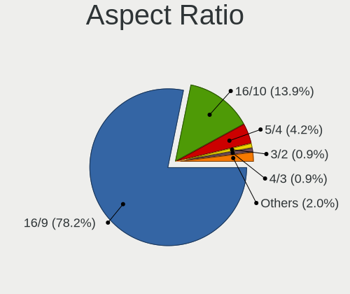

| Ratio   | Computers | Percent |
|---------|-----------|---------|
| 16/9    | 628       | 78.01%  |
| 16/10   | 114       | 14.16%  |
| 5/4     | 32        | 3.98%   |
| 4/3     | 8         | 0.99%   |
| 3/2     | 7         | 0.87%   |
| 21/9    | 6         | 0.75%   |
| Unknown | 6         | 0.75%   |
| 32/9    | 3         | 0.37%   |
| 1.00    | 1         | 0.12%   |

Monitor Area
------------

Area in inch

| Area in inch | Computers | Percent |
|----------------|-----------|---------|
| 101-110        | 200       | 23.87%  |
| 201-250        | 170       | 20.29%  |
| 81-90          | 86        | 10.26%  |
| 301-350        | 73        | 8.71%   |
| 151-200        | 72        | 8.59%   |
| 141-150        | 37        | 4.42%   |
| 121-130        | 31        | 3.7%    |
| More than 1000 | 28        | 3.34%   |
| 251-300        | 27        | 3.22%   |
| 71-80          | 23        | 2.74%   |
| 351-500        | 21        | 2.51%   |
| 501-1000       | 19        | 2.27%   |
| Unknown        | 13        | 1.55%   |
| 111-120        | 12        | 1.43%   |
| 61-70          | 8         | 0.95%   |
| 51-60          | 7         | 0.84%   |
| 131-140        | 7         | 0.84%   |
| 41-50          | 3         | 0.36%   |
| 91-100         | 1         | 0.12%   |

Pixel Density
-------------

Pixels per inch

| Density       | Computers | Percent |
|---------------|-----------|---------|
| 51-100        | 364       | 44.07%  |
| 101-120       | 242       | 29.3%   |
| 121-160       | 151       | 18.28%  |
| 161-240       | 31        | 3.75%   |
| 1-50          | 18        | 2.18%   |
| Unknown       | 13        | 1.57%   |
| More than 240 | 7         | 0.85%   |

Multiple Monitors
-----------------

Total monitors connected

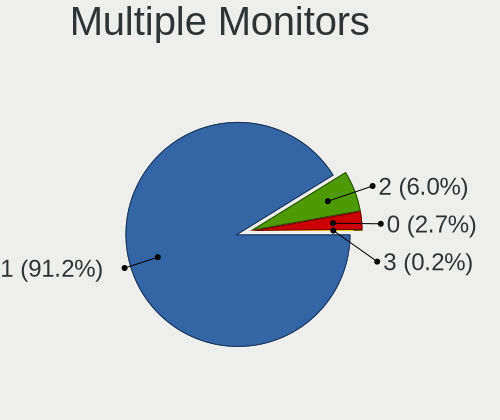

| Total | Computers | Percent |
|-------|-----------|---------|
| 1     | 759       | 91.45%  |
| 2     | 49        | 5.9%    |
| 0     | 20        | 2.41%   |
| 3     | 2         | 0.24%   |

Network
-------

Net Controller Vendor
---------------------

Controller vendors

| Vendor                           | Computers | Percent |
|----------------------------------|-----------|---------|
| Realtek Semiconductor            | 473       | 39.35%  |
| Intel                            | 346       | 28.79%  |
| Qualcomm Atheros                 | 143       | 11.9%   |
| Broadcom                         | 66        | 5.49%   |
| MediaTek                         | 20        | 1.66%   |
| Ralink Technology                | 18        | 1.5%    |
| Broadcom Limited                 | 18        | 1.5%    |
| Ralink                           | 17        | 1.41%   |
| TP-Link                          | 13        | 1.08%   |
| Marvell Technology Group         | 13        | 1.08%   |
| ASIX Electronics                 | 12        | 1%      |
| Nvidia                           | 11        | 0.92%   |
| Xiaomi                           | 4         | 0.33%   |
| NetGear                          | 4         | 0.33%   |
| Qualcomm Atheros Communications  | 3         | 0.25%   |
| Linksys                          | 3         | 0.25%   |
| Huawei Technologies              | 3         | 0.25%   |
| Belkin Components                | 3         | 0.25%   |
| ZTE WCDMA Technologies MSM       | 2         | 0.17%   |
| Sierra Wireless                  | 2         | 0.17%   |
| Samsung Electronics              | 2         | 0.17%   |
| JMicron Technology               | 2         | 0.17%   |
| ASUSTek Computer                 | 2         | 0.17%   |
| ZyXEL Communications             | 1         | 0.08%   |
| VIA Technologies                 | 1         | 0.08%   |
| Toshiba                          | 1         | 0.08%   |
| Silicon Integrated Systems [SiS] | 1         | 0.08%   |
| Senao                            | 1         | 0.08%   |
| PLANEX                           | 1         | 0.08%   |
| Padix (Rockfire)                 | 1         | 0.08%   |
| OPPO Electronics                 | 1         | 0.08%   |
| Motorola PCS                     | 1         | 0.08%   |
| Microsoft                        | 1         | 0.08%   |
| Interlogix.                      | 1         | 0.08%   |
| IMC Networks                     | 1         | 0.08%   |
| HMD Global                       | 1         | 0.08%   |
| Emtec                            | 1         | 0.08%   |
| Elecom                           | 1         | 0.08%   |
| Edimax Technology                | 1         | 0.08%   |
| DisplayLink                      | 1         | 0.08%   |

Net Controller Model
--------------------

Controller models

| Model                                                                  | Computers | Percent |
|------------------------------------------------------------------------|-----------|---------|
| Realtek RTL8111/8168/8211/8411 PCI Express Gigabit Ethernet Controller | 333       | 24.15%  |
| Realtek RTL810xE PCI Express Fast Ethernet controller                  | 49        | 3.55%   |
| Realtek RTL8821CE 802.11ac PCIe Wireless Network Adapter               | 34        | 2.47%   |
| Intel 82579LM Gigabit Network Connection (Lewisville)                  | 31        | 2.25%   |
| Qualcomm Atheros AR9285 Wireless Network Adapter (PCI-Express)         | 24        | 1.74%   |
| Intel Wi-Fi 6 AX200                                                    | 19        | 1.38%   |
| Realtek RTL8125 2.5GbE Controller                                      | 18        | 1.31%   |
| Qualcomm Atheros AR9485 Wireless Network Adapter                       | 18        | 1.31%   |
| Intel Wireless 7260                                                    | 18        | 1.31%   |
| Intel Ethernet Connection I217-LM                                      | 17        | 1.23%   |
| Intel Ethernet Connection (2) I219-LM                                  | 17        | 1.23%   |
| Qualcomm Atheros QCA9377 802.11ac Wireless Network Adapter             | 16        | 1.16%   |
| Intel Wireless 7265                                                    | 16        | 1.16%   |
| Intel I211 Gigabit Network Connection                                  | 16        | 1.16%   |
| Qualcomm Atheros QCA9565 / AR9565 Wireless Network Adapter             | 15        | 1.09%   |
| Intel Wireless 3165                                                    | 15        | 1.09%   |
| Intel Dual Band Wireless-AC 3168NGW [Stone Peak]                       | 14        | 1.02%   |
| Realtek RTL8822CE 802.11ac PCIe Wireless Network Adapter               | 13        | 0.94%   |
| Intel Wireless 8265 / 8275                                             | 13        | 0.94%   |
| Intel Wireless 8260                                                    | 13        | 0.94%   |
| Intel Alder Lake-P PCH CNVi WiFi                                       | 13        | 0.94%   |
| Intel Wi-Fi 6 AX201                                                    | 12        | 0.87%   |
| Intel Ethernet Connection (2) I219-V                                   | 12        | 0.87%   |
| Intel Centrino Advanced-N 6205 [Taylor Peak]                           | 12        | 0.87%   |
| ASIX AX88179 Gigabit Ethernet                                          | 11        | 0.8%    |
| Realtek RTL8723BE PCIe Wireless Network Adapter                        | 10        | 0.73%   |
| Realtek RTL8188EUS 802.11n Wireless Network Adapter                    | 10        | 0.73%   |
| Ralink MT7601U Wireless Adapter                                        | 10        | 0.73%   |
| Intel 82567LM-3 Gigabit Network Connection                             | 10        | 0.73%   |
| Realtek 802.11ac NIC                                                   | 9         | 0.65%   |
| Intel Wi-Fi 6E(802.11ax) AX210/AX1675* 2x2 [Typhoon Peak]              | 9         | 0.65%   |
| Broadcom BCM4313 802.11bgn Wireless Network Adapter                    | 9         | 0.65%   |
| Realtek RTL88x2bu [AC1200 Techkey]                                     | 8         | 0.58%   |
| Realtek RTL8188CE 802.11b/g/n WiFi Adapter                             | 8         | 0.58%   |
| Qualcomm Atheros AR8151 v2.0 Gigabit Ethernet                          | 8         | 0.58%   |
| Intel Ethernet Controller I225-V                                       | 8         | 0.58%   |
| Broadcom BCM43142 802.11b/g/n                                          | 8         | 0.58%   |
| Qualcomm Atheros QCA6174 802.11ac Wireless Network Adapter             | 7         | 0.51%   |
| Qualcomm Atheros AR8161 Gigabit Ethernet                               | 7         | 0.51%   |
| Qualcomm Atheros AR8121/AR8113/AR8114 Gigabit or Fast Ethernet         | 7         | 0.51%   |

Wireless Vendor
---------------

Wireless vendors

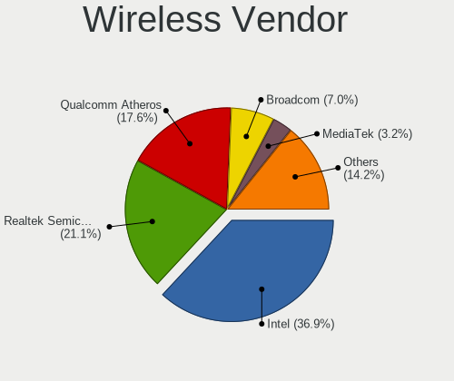

| Vendor                          | Computers | Percent |
|---------------------------------|-----------|---------|
| Intel                           | 225       | 37.5%   |
| Realtek Semiconductor           | 128       | 21.33%  |
| Qualcomm Atheros                | 108       | 18%     |
| Broadcom                        | 39        | 6.5%    |
| Ralink Technology               | 18        | 3%      |
| MediaTek                        | 18        | 3%      |
| Ralink                          | 17        | 2.83%   |
| Broadcom Limited                | 12        | 2%      |
| TP-Link                         | 11        | 1.83%   |
| NetGear                         | 4         | 0.67%   |
| Qualcomm Atheros Communications | 3         | 0.5%    |
| Belkin Components               | 3         | 0.5%    |
| Sierra Wireless                 | 2         | 0.33%   |
| ASUSTek Computer                | 2         | 0.33%   |
| ZyXEL Communications            | 1         | 0.17%   |
| Senao                           | 1         | 0.17%   |
| PLANEX                          | 1         | 0.17%   |
| Microsoft                       | 1         | 0.17%   |
| IMC Networks                    | 1         | 0.17%   |
| Elecom                          | 1         | 0.17%   |
| Edimax Technology               | 1         | 0.17%   |
| Dell                            | 1         | 0.17%   |
| D-Link System                   | 1         | 0.17%   |
| D-Link                          | 1         | 0.17%   |

Wireless Model
--------------

Wireless models

| Model                                                                   | Computers | Percent |
|-------------------------------------------------------------------------|-----------|---------|
| Realtek RTL8821CE 802.11ac PCIe Wireless Network Adapter                | 34        | 5.64%   |
| Qualcomm Atheros AR9285 Wireless Network Adapter (PCI-Express)          | 24        | 3.98%   |
| Intel Wi-Fi 6 AX200                                                     | 19        | 3.15%   |
| Qualcomm Atheros AR9485 Wireless Network Adapter                        | 18        | 2.99%   |
| Intel Wireless 7260                                                     | 18        | 2.99%   |
| Qualcomm Atheros QCA9377 802.11ac Wireless Network Adapter              | 16        | 2.65%   |
| Intel Wireless 7265                                                     | 16        | 2.65%   |
| Qualcomm Atheros QCA9565 / AR9565 Wireless Network Adapter              | 15        | 2.49%   |
| Intel Wireless 3165                                                     | 15        | 2.49%   |
| Intel Dual Band Wireless-AC 3168NGW [Stone Peak]                        | 14        | 2.32%   |
| Realtek RTL8822CE 802.11ac PCIe Wireless Network Adapter                | 13        | 2.16%   |
| Intel Wireless 8265 / 8275                                              | 13        | 2.16%   |
| Intel Wireless 8260                                                     | 13        | 2.16%   |
| Intel Alder Lake-P PCH CNVi WiFi                                        | 13        | 2.16%   |
| Intel Wi-Fi 6 AX201                                                     | 12        | 1.99%   |
| Intel Centrino Advanced-N 6205 [Taylor Peak]                            | 12        | 1.99%   |
| Realtek RTL8723BE PCIe Wireless Network Adapter                         | 10        | 1.66%   |
| Realtek RTL8188EUS 802.11n Wireless Network Adapter                     | 10        | 1.66%   |
| Ralink MT7601U Wireless Adapter                                         | 10        | 1.66%   |
| Realtek 802.11ac NIC                                                    | 9         | 1.49%   |
| Intel Wi-Fi 6E(802.11ax) AX210/AX1675* 2x2 [Typhoon Peak]               | 9         | 1.49%   |
| Broadcom BCM4313 802.11bgn Wireless Network Adapter                     | 9         | 1.49%   |
| Realtek RTL88x2bu [AC1200 Techkey]                                      | 8         | 1.33%   |
| Realtek RTL8188CE 802.11b/g/n WiFi Adapter                              | 8         | 1.33%   |
| Broadcom BCM43142 802.11b/g/n                                           | 8         | 1.33%   |
| Qualcomm Atheros QCA6174 802.11ac Wireless Network Adapter              | 7         | 1.16%   |
| MediaTek MT7922 802.11ax PCI Express Wireless Network Adapter           | 7         | 1.16%   |
| Ralink RT3290 Wireless 802.11n 1T/1R PCIe                               | 6         | 1%      |
| Qualcomm Atheros AR928X Wireless Network Adapter (PCI-Express)          | 6         | 1%      |
| Intel Ice Lake-LP PCH CNVi WiFi                                         | 6         | 1%      |
| Intel Comet Lake PCH-LP CNVi WiFi                                       | 6         | 1%      |
| Realtek RTL8723DE Wireless Network Adapter                              | 5         | 0.83%   |
| Qualcomm Atheros AR9462 Wireless Network Adapter                        | 5         | 0.83%   |
| Qualcomm Atheros AR9287 Wireless Network Adapter (PCI-Express)          | 5         | 0.83%   |
| Qualcomm Atheros AR242x / AR542x Wireless Network Adapter (PCI-Express) | 5         | 0.83%   |
| MediaTek MT7921K (RZ608) Wi-Fi 6E 80MHz                                 | 5         | 0.83%   |
| Intel Wi-Fi 5(802.11ac) Wireless-AC 9x6x [Thunder Peak]                 | 5         | 0.83%   |
| Broadcom Limited BCM4331 802.11a/b/g/n                                  | 5         | 0.83%   |
| Broadcom BCM4312 802.11b/g LP-PHY                                       | 5         | 0.83%   |
| TP-Link TL-WN722N v2/v3 [Realtek RTL8188EUS]                            | 4         | 0.66%   |

Ethernet Vendor
---------------

Ethernet vendors

| Vendor                           | Computers | Percent |
|----------------------------------|-----------|---------|
| Realtek Semiconductor            | 414       | 54.55%  |
| Intel                            | 195       | 25.69%  |
| Qualcomm Atheros                 | 47        | 6.19%   |
| Broadcom                         | 36        | 4.74%   |
| Marvell Technology Group         | 13        | 1.71%   |
| ASIX Electronics                 | 12        | 1.58%   |
| Nvidia                           | 11        | 1.45%   |
| Broadcom Limited                 | 6         | 0.79%   |
| Xiaomi                           | 4         | 0.53%   |
| Linksys                          | 3         | 0.4%    |
| ZTE WCDMA Technologies MSM       | 2         | 0.26%   |
| TP-Link                          | 2         | 0.26%   |
| Samsung Electronics              | 2         | 0.26%   |
| MediaTek                         | 2         | 0.26%   |
| JMicron Technology               | 2         | 0.26%   |
| VIA Technologies                 | 1         | 0.13%   |
| Silicon Integrated Systems [SiS] | 1         | 0.13%   |
| OPPO Electronics                 | 1         | 0.13%   |
| Huawei Technologies              | 1         | 0.13%   |
| HMD Global                       | 1         | 0.13%   |
| DisplayLink                      | 1         | 0.13%   |
| Attansic Technology              | 1         | 0.13%   |
| 3Com                             | 1         | 0.13%   |

Ethernet Model
--------------

Ethernet models

| Model                                                                  | Computers | Percent |
|------------------------------------------------------------------------|-----------|---------|
| Realtek RTL8111/8168/8211/8411 PCI Express Gigabit Ethernet Controller | 333       | 43.42%  |
| Realtek RTL810xE PCI Express Fast Ethernet controller                  | 49        | 6.39%   |
| Intel 82579LM Gigabit Network Connection (Lewisville)                  | 31        | 4.04%   |
| Realtek RTL8125 2.5GbE Controller                                      | 18        | 2.35%   |
| Intel Ethernet Connection I217-LM                                      | 17        | 2.22%   |
| Intel Ethernet Connection (2) I219-LM                                  | 17        | 2.22%   |
| Intel I211 Gigabit Network Connection                                  | 16        | 2.09%   |
| Intel Ethernet Connection (2) I219-V                                   | 12        | 1.56%   |
| ASIX AX88179 Gigabit Ethernet                                          | 11        | 1.43%   |
| Intel 82567LM-3 Gigabit Network Connection                             | 10        | 1.3%    |
| Qualcomm Atheros AR8151 v2.0 Gigabit Ethernet                          | 8         | 1.04%   |
| Intel Ethernet Controller I225-V                                       | 8         | 1.04%   |
| Qualcomm Atheros AR8161 Gigabit Ethernet                               | 7         | 0.91%   |
| Qualcomm Atheros AR8121/AR8113/AR8114 Gigabit or Fast Ethernet         | 7         | 0.91%   |
| Intel Ethernet Connection I219-LM                                      | 7         | 0.91%   |
| Intel Ethernet Connection (7) I219-V                                   | 7         | 0.91%   |
| Marvell Group 88E8042 PCI-E Fast Ethernet Controller                   | 6         | 0.78%   |
| Nvidia MCP61 Ethernet                                                  | 5         | 0.65%   |
| Intel Ethernet Connection (5) I219-LM                                  | 5         | 0.65%   |
| Intel Ethernet Connection (3) I218-LM                                  | 5         | 0.65%   |
| Intel 82577LM Gigabit Network Connection                               | 5         | 0.65%   |
| Broadcom NetXtreme BCM57766 Gigabit Ethernet PCIe                      | 5         | 0.65%   |
| Realtek RTL-8110SC/8169SC Gigabit Ethernet                             | 4         | 0.52%   |
| Realtek RTL-8100/8101L/8139 PCI Fast Ethernet Adapter                  | 4         | 0.52%   |
| Qualcomm Atheros AR8162 Fast Ethernet                                  | 4         | 0.52%   |
| Intel I210 Gigabit Network Connection                                  | 4         | 0.52%   |
| Intel Ethernet Connection I219-V                                       | 4         | 0.52%   |
| Intel Ethernet Connection I218-LM                                      | 4         | 0.52%   |
| Xiaomi Mi/Redmi series (RNDIS)                                         | 3         | 0.39%   |
| Qualcomm Atheros QCA8171 Gigabit Ethernet                              | 3         | 0.39%   |
| Qualcomm Atheros AR8152 v2.0 Fast Ethernet                             | 3         | 0.39%   |
| Qualcomm Atheros AR8152 v1.1 Fast Ethernet                             | 3         | 0.39%   |
| Qualcomm Atheros AR8131 Gigabit Ethernet                               | 3         | 0.39%   |
| Linksys Gigabit Ethernet Adapter                                       | 3         | 0.39%   |
| Intel Ethernet Connection I217-V                                       | 3         | 0.39%   |
| Intel Ethernet Connection (7) I219-LM                                  | 3         | 0.39%   |
| Intel Ethernet Connection (4) I219-V                                   | 3         | 0.39%   |
| Intel Ethernet Connection (4) I219-LM                                  | 3         | 0.39%   |
| Intel Ethernet Connection (2) I218-LM                                  | 3         | 0.39%   |
| Intel Ethernet Connection (11) I219-LM                                 | 3         | 0.39%   |

Net Controller Kind
-------------------

Ethernet, WiFi or modem

| Kind     | Computers | Percent |
|----------|-----------|---------|
| Ethernet | 731       | 55.34%  |
| WiFi     | 581       | 43.98%  |
| Unknown  | 5         | 0.38%   |
| Modem    | 4         | 0.3%    |

Used Controller
---------------

Currently used network controller

| Kind     | Computers | Percent |
|----------|-----------|---------|
| Ethernet | 425       | 52.28%  |
| WiFi     | 388       | 47.72%  |

NICs
----

Total network controllers on board

| Total | Computers | Percent |
|-------|-----------|---------|
| 2     | 414       | 49.88%  |
| 1     | 397       | 47.83%  |
| 0     | 10        | 1.2%    |
| 3     | 9         | 1.08%   |

IPv6
----

IPv6 vs IPv4

| Used | Computers | Percent |
|------|-----------|---------|
| No   | 555       | 66.87%  |
| Yes  | 275       | 33.13%  |

Bluetooth
---------

Bluetooth Vendor
----------------

Controller vendors

| Vendor                          | Computers | Percent |
|---------------------------------|-----------|---------|
| Intel                           | 187       | 41.46%  |
| Realtek Semiconductor           | 60        | 13.3%   |
| Cambridge Silicon Radio         | 35        | 7.76%   |
| Qualcomm Atheros Communications | 31        | 6.87%   |
| Broadcom                        | 25        | 5.54%   |
| IMC Networks                    | 19        | 4.21%   |
| Lite-On Technology              | 16        | 3.55%   |
| Apple                           | 13        | 2.88%   |
| Foxconn / Hon Hai               | 12        | 2.66%   |
| ASUSTek Computer                | 11        | 2.44%   |
| MediaTek                        | 7         | 1.55%   |
| Hewlett-Packard                 | 7         | 1.55%   |
| Ralink                          | 6         | 1.33%   |
| Dell                            | 6         | 1.33%   |
| Toshiba                         | 3         | 0.67%   |
| Foxconn International           | 3         | 0.67%   |
| TP-Link                         | 2         | 0.44%   |
| Chicony Electronics             | 2         | 0.44%   |
| Realtek                         | 1         | 0.22%   |
| Opticis                         | 1         | 0.22%   |
| Integrated System Solution      | 1         | 0.22%   |
| Belkin Components               | 1         | 0.22%   |
| Alps Electric                   | 1         | 0.22%   |
| Unknown                         | 1         | 0.22%   |

Bluetooth Model
---------------

Controller models

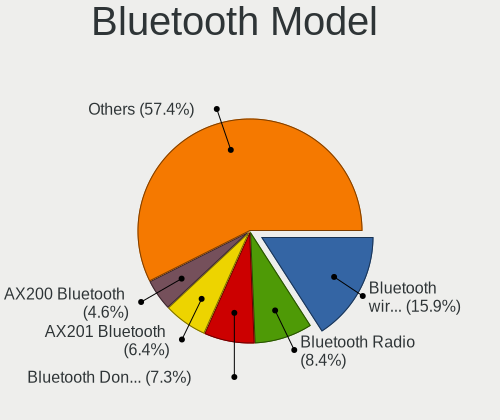

| Model                                               | Computers | Percent |
|-----------------------------------------------------|-----------|---------|
| Intel Bluetooth wireless interface                  | 52        | 11.53%  |
| Cambridge Silicon Radio Bluetooth Dongle (HCI mode) | 35        | 7.76%   |
| Realtek Bluetooth Radio                             | 32        | 7.1%    |
| Intel AX201 Bluetooth                               | 32        | 7.1%    |
| Intel Bluetooth Device                              | 23        | 5.1%    |
| Intel AX200 Bluetooth                               | 19        | 4.21%   |
| Realtek  Bluetooth 4.2 Adapter                      | 17        | 3.77%   |
| Qualcomm Atheros  Bluetooth Device                  | 17        | 3.77%   |
| Intel Bluetooth 9460/9560 Jefferson Peak (JfP)      | 17        | 3.77%   |
| Intel Wireless-AC 3168 Bluetooth                    | 14        | 3.1%    |
| Intel AX211 Bluetooth                               | 10        | 2.22%   |
| Realtek 802.11ac WLAN Adapter                       | 7         | 1.55%   |
| Qualcomm Atheros AR3011 Bluetooth                   | 7         | 1.55%   |
| MediaTek Wireless_Device                            | 7         | 1.55%   |
| Lite-On Atheros AR3012 Bluetooth                    | 7         | 1.55%   |
| Intel AX210 Bluetooth                               | 7         | 1.55%   |
| IMC Networks Bluetooth Device                       | 7         | 1.55%   |
| Ralink RT3290 Bluetooth                             | 6         | 1.33%   |
| Intel Centrino Bluetooth Wireless Transceiver       | 6         | 1.33%   |
| IMC Networks Bluetooth Radio                        | 6         | 1.33%   |
| Intel Wireless-AC 9260 Bluetooth Adapter            | 5         | 1.11%   |
| HP Broadcom 2070 Bluetooth Combo                    | 5         | 1.11%   |
| Apple Bluetooth USB Host Controller                 | 5         | 1.11%   |
| Foxconn / Hon Hai Wireless_Device                   | 4         | 0.89%   |
| Dell DW375 Bluetooth Module                         | 4         | 0.89%   |
| Broadcom BCM20702 Bluetooth 4.0 [ThinkPad]          | 4         | 0.89%   |
| Apple Bluetooth Host Controller                     | 4         | 0.89%   |
| Qualcomm Atheros QCA61x4 Bluetooth 4.0              | 3         | 0.67%   |
| Lite-On Qualcomm Atheros QCA9377 Bluetooth          | 3         | 0.67%   |
| Lite-On Bluetooth Device                            | 3         | 0.67%   |
| IMC Networks Wireless_Device                        | 3         | 0.67%   |
| Foxconn International BCM43142A0 Bluetooth module   | 3         | 0.67%   |
| Broadcom BCM2045B (BDC-2.1)                         | 3         | 0.67%   |
| Broadcom BCM2045B (BDC-2) [Bluetooth Controller]    | 3         | 0.67%   |
| ASUS Bluetooth Radio                                | 3         | 0.67%   |
| ASUS ASUS USB-BT500                                 | 3         | 0.67%   |
| TP-Link UB500 Adapter                               | 2         | 0.44%   |
| Realtek RTL8821A Bluetooth                          | 2         | 0.44%   |
| Realtek RTL8723B Bluetooth                          | 2         | 0.44%   |
| Qualcomm Atheros AR3012 Bluetooth 4.0               | 2         | 0.44%   |

Sound
-----

Sound Vendor
------------

Sound card vendors

| Vendor                                       | Computers | Percent |
|----------------------------------------------|-----------|---------|
| Intel                                        | 596       | 55.86%  |
| AMD                                          | 240       | 22.49%  |
| Nvidia                                       | 161       | 15.09%  |
| C-Media Electronics                          | 20        | 1.87%   |
| Creative Labs                                | 8         | 0.75%   |
| Generalplus Technology                       | 5         | 0.47%   |
| Logitech                                     | 3         | 0.28%   |
| ASUSTek Computer                             | 3         | 0.28%   |
| Apple                                        | 3         | 0.28%   |
| Tenx Technology                              | 2         | 0.19%   |
| Razer USA                                    | 2         | 0.19%   |
| Micro Star International                     | 2         | 0.19%   |
| Medeli Electronics                           | 2         | 0.19%   |
| Zoran Co. Personal Media Division (Nogatech) | 1         | 0.09%   |
| Yamaha                                       | 1         | 0.09%   |
| XMOS                                         | 1         | 0.09%   |
| VIA Technologies                             | 1         | 0.09%   |
| Silicon Integrated Systems [SiS]             | 1         | 0.09%   |
| Realtek Semiconductor                        | 1         | 0.09%   |
| Nordic Semiconductor ASA                     | 1         | 0.09%   |
| Microsoft                                    | 1         | 0.09%   |
| JMTek                                        | 1         | 0.09%   |
| Giga-Byte Technology                         | 1         | 0.09%   |
| FiiO Electronics Technology                  | 1         | 0.09%   |
| Ensoniq                                      | 1         | 0.09%   |
| Emotiva                                      | 1         | 0.09%   |
| EGO SYStems                                  | 1         | 0.09%   |
| Corsair                                      | 1         | 0.09%   |
| Cambridge Silicon Radio                      | 1         | 0.09%   |
| BY EDIFIER                                   | 1         | 0.09%   |
| BR25                                         | 1         | 0.09%   |
| ATI Technologies                             | 1         | 0.09%   |
| Unknown                                      | 1         | 0.09%   |

Sound Model
-----------

Sound card models

| Model                                                                                             | Computers | Percent |
|---------------------------------------------------------------------------------------------------|-----------|---------|
| AMD Family 17h/19h HD Audio Controller                                                            | 84        | 6.41%   |
| Intel 7 Series/C216 Chipset Family High Definition Audio Controller                               | 64        | 4.89%   |
| Intel 6 Series/C200 Series Chipset Family High Definition Audio Controller                        | 51        | 3.89%   |
| Intel 8 Series/C220 Series Chipset High Definition Audio Controller                               | 49        | 3.74%   |
| Intel Sunrise Point-LP HD Audio                                                                   | 47        | 3.59%   |
| AMD FCH Azalia Controller                                                                         | 42        | 3.21%   |
| AMD Renoir Radeon High Definition Audio Controller                                                | 40        | 3.05%   |
| AMD SBx00 Azalia (Intel HDA)                                                                      | 39        | 2.98%   |
| Intel Xeon E3-1200 v3/4th Gen Core Processor HD Audio Controller                                  | 37        | 2.82%   |
| Intel 100 Series/C230 Series Chipset Family HD Audio Controller                                   | 35        | 2.67%   |
| Intel 5 Series/3400 Series Chipset High Definition Audio                                          | 33        | 2.52%   |
| AMD Raven/Raven2/Fenghuang HDMI/DP Audio Controller                                               | 30        | 2.29%   |
| Intel NM10/ICH7 Family High Definition Audio Controller                                           | 26        | 1.98%   |
| Intel 82801I (ICH9 Family) HD Audio Controller                                                    | 24        | 1.83%   |
| Intel Tiger Lake-LP Smart Sound Technology Audio Controller                                       | 21        | 1.6%    |
| Intel 200 Series PCH HD Audio                                                                     | 21        | 1.6%    |
| Nvidia GK208 HDMI/DP Audio Controller                                                             | 18        | 1.37%   |
| AMD Navi 21/23 HDMI/DP Audio Controller                                                           | 18        | 1.37%   |
| Intel Cannon Lake PCH cAVS                                                                        | 16        | 1.22%   |
| Intel Alder Lake PCH-P High Definition Audio Controller                                           | 16        | 1.22%   |
| Intel Celeron/Pentium Silver Processor High Definition Audio                                      | 15        | 1.15%   |
| Intel Broadwell-U Audio Controller                                                                | 15        | 1.15%   |
| Intel 82801H (ICH8 Family) HD Audio Controller                                                    | 15        | 1.15%   |
| AMD Starship/Matisse HD Audio Controller                                                          | 15        | 1.15%   |
| Nvidia High Definition Audio Controller                                                           | 14        | 1.07%   |
| Nvidia GM107 High Definition Audio Controller [GeForce 940MX]                                     | 14        | 1.07%   |
| Nvidia GF108 High Definition Audio Controller                                                     | 14        | 1.07%   |
| Intel Wildcat Point-LP High Definition Audio Controller                                           | 14        | 1.07%   |
| Intel Celeron N3350/Pentium N4200/Atom E3900 Series Audio Cluster                                 | 13        | 0.99%   |
| Intel Atom Processor Z36xxx/Z37xxx Series High Definition Audio Controller                        | 13        | 0.99%   |
| AMD Oland/Hainan/Cape Verde/Pitcairn HDMI Audio [Radeon HD 7000 Series]                           | 13        | 0.99%   |
| AMD Family 17h (Models 00h-0fh) HD Audio Controller                                               | 13        | 0.99%   |
| Nvidia GP107GL High Definition Audio Controller                                                   | 12        | 0.92%   |
| Intel Haswell-ULT HD Audio Controller                                                             | 12        | 0.92%   |
| Intel 8 Series HD Audio Controller                                                                | 12        | 0.92%   |
| AMD Kaveri HDMI/DP Audio Controller                                                               | 11        | 0.84%   |
| AMD Kabini HDMI/DP Audio                                                                          | 11        | 0.84%   |
| Intel Atom/Celeron/Pentium Processor x5-E8000/J3xxx/N3xxx Series High Definition Audio Controller | 10        | 0.76%   |
| Intel 82801JD/DO (ICH10 Family) HD Audio Controller                                               | 10        | 0.76%   |
| AMD Baffin HDMI/DP Audio [Radeon RX 550 640SP / RX 560/560X]                                      | 10        | 0.76%   |

Memory
------

Memory Vendor
-------------

Memory module vendors

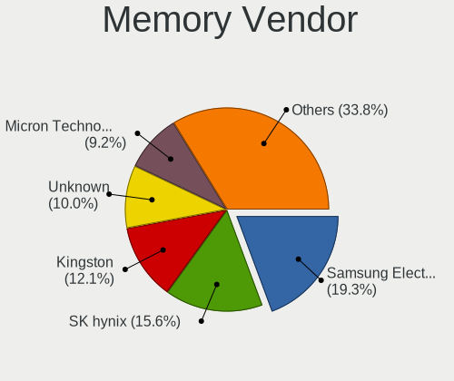

| Vendor                       | Computers | Percent |
|------------------------------|-----------|---------|
| Samsung Electronics          | 180       | 18.46%  |
| SK hynix                     | 141       | 14.46%  |
| Kingston                     | 125       | 12.82%  |
| Unknown                      | 99        | 10.15%  |
| Micron Technology            | 98        | 10.05%  |
| Crucial                      | 53        | 5.44%   |
| Corsair                      | 33        | 3.38%   |
| Nanya Technology             | 28        | 2.87%   |
| G.Skill                      | 27        | 2.77%   |
| A-DATA Technology            | 27        | 2.77%   |
| Elpida                       | 16        | 1.64%   |
| Unknown (ABCD)               | 12        | 1.23%   |
| Ramaxel Technology           | 12        | 1.23%   |
| Unknown                      | 11        | 1.13%   |
| Team                         | 10        | 1.03%   |
| AMD                          | 8         | 0.82%   |
| Patriot                      | 7         | 0.72%   |
| GOODRAM                      | 7         | 0.72%   |
| Transcend                    | 4         | 0.41%   |
| Timetec                      | 4         | 0.41%   |
| Silicon Power                | 4         | 0.41%   |
| SHARETRONIC                  | 4         | 0.41%   |
| Juhor                        | 4         | 0.41%   |
| Smart                        | 3         | 0.31%   |
| PNY                          | 3         | 0.31%   |
| Patriot Memory (PDP Systems) | 3         | 0.31%   |
| Multilaser                   | 3         | 0.31%   |
| Golden Empire                | 3         | 0.31%   |
| Wilk                         | 2         | 0.21%   |
| Red Hat                      | 2         | 0.21%   |
| Qimonda                      | 2         | 0.21%   |
| Essencore                    | 2         | 0.21%   |
| Avant                        | 2         | 0.21%   |
| ASint Technology             | 2         | 0.21%   |
| Unknown (89F7)               | 1         | 0.1%    |
| Unknown (268C)               | 1         | 0.1%    |
| Unknown (0x7FFF)             | 1         | 0.1%    |
| Unknown (0x0E9D)             | 1         | 0.1%    |
| Unknown (0x0B5E)             | 1         | 0.1%    |
| Unknown (0x0080)             | 1         | 0.1%    |

Memory Model
------------

Memory module models

| Model                                                            | Computers | Percent |
|------------------------------------------------------------------|-----------|---------|
| Unknown                                                          | 11        | 1.03%   |
| Samsung RAM M471B5173DB0-YK0 4GB SODIMM DDR3 1600MT/s            | 9         | 0.85%   |
| Samsung RAM M471A5244CB0-CWE 4GB SODIMM DDR4 3200MT/s            | 9         | 0.85%   |
| Unknown (ABCD) RAM 123456789012345678 2GB SODIMM LPDDR4 2400MT/s | 8         | 0.75%   |
| Samsung RAM M471B5773CHS-CH9 2048MB SODIMM DDR3 4199MT/s         | 8         | 0.75%   |
| Samsung RAM M471B5173QH0-YK0 4GB SODIMM DDR3 1600MT/s            | 7         | 0.66%   |
| Samsung RAM M471B5173EB0-YK0 4GB SODIMM DDR3 1600MT/s            | 7         | 0.66%   |
| Samsung RAM M471A5244CB0-CTD 4GB SODIMM DDR4 3266MT/s            | 7         | 0.66%   |
| Unknown RAM Module 2GB DIMM DDR2 800MT/s                         | 6         | 0.56%   |
| SK hynix RAM HMA81GS6DJR8N-XN 8192MB SODIMM DDR4 3200MT/s        | 6         | 0.56%   |
| Samsung RAM M471B5673FH0-CH9 2GB SODIMM DDR3 1334MT/s            | 6         | 0.56%   |
| Samsung RAM M471B5273DH0-CH9 4GB SODIMM DDR3 1334MT/s            | 6         | 0.56%   |
| Samsung RAM M471A1K43EB1-CWE 8GB SODIMM DDR4 3200MT/s            | 6         | 0.56%   |
| Micron RAM 8JTF51264AZ-1G6E1 4GB DIMM DDR3 1600MT/s              | 6         | 0.56%   |
| Unknown RAM Module 4GB DIMM 1333MT/s                             | 5         | 0.47%   |
| Unknown RAM Module 2GB DIMM SDRAM                                | 5         | 0.47%   |
| Unknown RAM Module 1GB DIMM                                      | 5         | 0.47%   |
| SK hynix RAM HMT451S6BFR8A-PB 4GB SODIMM DDR3 1600MT/s           | 5         | 0.47%   |
| Samsung RAM Module 8GB DIMM DDR4 2133MT/s                        | 5         | 0.47%   |
| Samsung RAM M471B1G73QH0-YK0 8GB SODIMM DDR3 1600MT/s            | 5         | 0.47%   |
| Samsung RAM M471A1K43CB1-CTD 8GB SODIMM DDR4 2667MT/s            | 5         | 0.47%   |
| Micron RAM 16ATF1G64HZ-2G1B1 8GB SODIMM DDR4 2133MT/s            | 5         | 0.47%   |
| Unknown RAM Module 8GB SODIMM DDR4 2667MT/s                      | 4         | 0.38%   |
| Unknown RAM Module 4GB DIMM DDR3 1333MT/s                        | 4         | 0.38%   |
| Unknown RAM Module 2GB DIMM 1333MT/s                             | 4         | 0.38%   |
| Unknown (ABCD) RAM 123456789012345678 4GB DIMM DDR4 2400MT/s     | 4         | 0.38%   |
| SK hynix RAM Module 4GB SODIMM DDR3 1600MT/s                     | 4         | 0.38%   |
| SK hynix RAM HMT41GS6BFR8A-PB 8GB SODIMM DDR3 1600MT/s           | 4         | 0.38%   |
| SK hynix RAM HMT351S6CFR8C-PB 4GB SODIMM DDR3 1600MT/s           | 4         | 0.38%   |
| SK hynix RAM HMA851S6AFR6N-UH 4GB SODIMM DDR4 2667MT/s           | 4         | 0.38%   |
| SK hynix RAM HMA81GS6AFR8N-UH 8GB SODIMM DDR4 2667MT/s           | 4         | 0.38%   |
| Samsung RAM M471A5244CB0-CWE 4GB Row Of Chips DDR4 3200MT/s      | 4         | 0.38%   |
| Samsung RAM M471A5244CB0-CRC 4GB SODIMM DDR4 2667MT/s            | 4         | 0.38%   |
| Samsung RAM M4 70T5663RZ3-CE6 2GB SODIMM DDR2 667MT/s            | 4         | 0.38%   |
| Samsung RAM M378B1G73EB0-CK0 8GB DIMM DDR3 1600MT/s              | 4         | 0.38%   |
| Samsung RAM K3LKBKB@BM-MGCP 2GB Row Of Chips LPDDR5 6400MT/s     | 4         | 0.38%   |
| Micron RAM 8ATF1G64HZ-3G2R1 8GB SODIMM DDR4 3200MT/s             | 4         | 0.38%   |
| Micron RAM 16HTF25664HY-800J1 2GB SODIMM DDR2 800MT/s            | 4         | 0.38%   |
| Kingston RAM KF3200C16D4/8GX 8192MB DIMM DDR4 3600MT/s           | 4         | 0.38%   |
| Juhor RAM JHD2666S1908JG 8GB SODIMM DDR4 2667MT/s                | 4         | 0.38%   |

Memory Kind
-----------

Memory module kinds

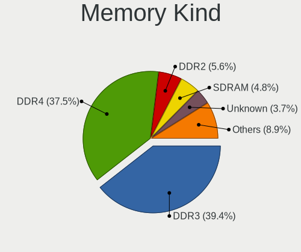

| Kind    | Computers | Percent |
|---------|-----------|---------|
| DDR3    | 332       | 39.29%  |
| DDR4    | 317       | 37.51%  |
| DDR2    | 46        | 5.44%   |
| SDRAM   | 43        | 5.09%   |
| LPDDR4  | 30        | 3.55%   |
| Unknown | 27        | 3.2%    |
| DDR5    | 19        | 2.25%   |
| DDR     | 12        | 1.42%   |
| LPDDR5  | 10        | 1.18%   |
| LPDDR3  | 5         | 0.59%   |
| RAM     | 2         | 0.24%   |
| DRAM    | 2         | 0.24%   |

Memory Form Factor
------------------

Physical design of the memory module

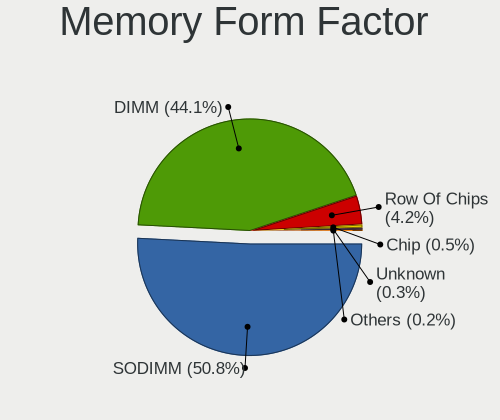

| Name         | Computers | Percent |
|--------------|-----------|---------|
| SODIMM       | 407       | 49.27%  |
| DIMM         | 378       | 45.76%  |
| Row Of Chips | 32        | 3.87%   |
| Chip         | 4         | 0.48%   |
| Unknown      | 4         | 0.48%   |
| RIMM         | 1         | 0.12%   |

Memory Size
-----------

Memory module size

| Size  | Computers | Percent |
|-------|-----------|---------|
| 8192  | 330       | 35.95%  |
| 4096  | 285       | 31.05%  |
| 2048  | 151       | 16.45%  |
| 16384 | 89        | 9.69%   |
| 1024  | 41        | 4.47%   |
| 32768 | 17        | 1.85%   |
| 512   | 3         | 0.33%   |
| 12536 | 1         | 0.11%   |
| 8     | 1         | 0.11%   |

Memory Speed
------------

Memory module speed

| Speed   | Computers | Percent |
|---------|-----------|---------|
| 1600    | 213       | 23.28%  |
| 3200    | 109       | 11.91%  |
| 2667    | 91        | 9.95%   |
| 1333    | 83        | 9.07%   |
| 2400    | 65        | 7.1%    |
| 2133    | 36        | 3.93%   |
| 1334    | 31        | 3.39%   |
| 800     | 29        | 3.17%   |
| 667     | 27        | 2.95%   |
| Unknown | 27        | 2.95%   |
| 3600    | 16        | 1.75%   |
| 2048    | 12        | 1.31%   |
| 1067    | 12        | 1.31%   |
| 4199    | 11        | 1.2%    |
| 6400    | 10        | 1.09%   |
| 3733    | 10        | 1.09%   |
| 3266    | 9         | 0.98%   |
| 4800    | 8         | 0.87%   |
| 1867    | 8         | 0.87%   |
| 1800    | 8         | 0.87%   |
| 3400    | 7         | 0.77%   |
| 2933    | 7         | 0.77%   |
| 2666    | 7         | 0.77%   |
| 4267    | 6         | 0.66%   |
| 1866    | 6         | 0.66%   |
| 5600    | 4         | 0.44%   |
| 5200    | 4         | 0.44%   |
| 3066    | 4         | 0.44%   |
| 1066    | 4         | 0.44%   |
| 400     | 4         | 0.44%   |
| 6000    | 3         | 0.33%   |
| 3866    | 3         | 0.33%   |
| 3800    | 3         | 0.33%   |
| 2200    | 3         | 0.33%   |
| 975     | 3         | 0.33%   |
| 4266    | 2         | 0.22%   |
| 3500    | 2         | 0.22%   |
| 3333    | 2         | 0.22%   |
| 3000    | 2         | 0.22%   |
| 1400    | 2         | 0.22%   |

Printers & scanners
-------------------

Printer Vendor
--------------

Printer device vendors

| Vendor              | Computers | Percent |
|---------------------|-----------|---------|
| Hewlett-Packard     | 9         | 37.5%   |
| Brother Industries  | 7         | 29.17%  |
| Canon               | 4         | 16.67%  |
| Seiko Epson         | 2         | 8.33%   |
| Samsung Electronics | 1         | 4.17%   |
| Prolific Technology | 1         | 4.17%   |

Printer Model
-------------

Printer device models

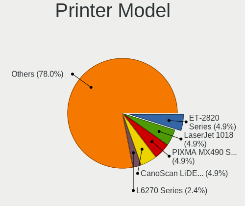

| Model                           | Computers | Percent |
|---------------------------------|-----------|---------|
| HP LaserJet 1018                | 2         | 8.33%   |
| Canon LiDE 300                  | 2         | 8.33%   |
| Seiko Epson ET-2820 Series      | 1         | 4.17%   |
| Seiko Epson ET-2710 Series      | 1         | 4.17%   |
| Samsung M2020 Series            | 1         | 4.17%   |
| Prolific PL2305 Parallel Port   | 1         | 4.17%   |
| HP LaserJet M402dn              | 1         | 4.17%   |
| HP Laser 107w                   | 1         | 4.17%   |
| HP DeskJet F4200 series         | 1         | 4.17%   |
| HP DeskJet 6940 series          | 1         | 4.17%   |
| HP DeskJet 4670 series          | 1         | 4.17%   |
| HP DeskJet 2700 series          | 1         | 4.17%   |
| HP DeskJet 2600 series          | 1         | 4.17%   |
| Canon PRO-100 series            | 1         | 4.17%   |
| Canon PIXMA MG3600 Series       | 1         | 4.17%   |
| Brother MFC-J480DW              | 1         | 4.17%   |
| Brother MFC-J1010DW             | 1         | 4.17%   |
| Brother HL-L2375DW series       | 1         | 4.17%   |
| Brother HL-2270DW Laser Printer | 1         | 4.17%   |
| Brother HL-2140 series          | 1         | 4.17%   |
| Brother DCP-L2510D series       | 1         | 4.17%   |
| Brother DCP-7010                | 1         | 4.17%   |

Scanner Vendor
--------------

Scanner device vendors

| Vendor | Computers | Percent |
|--------|-----------|---------|
| Canon  | 2         | 100%    |

Scanner Model
-------------

Scanner device models

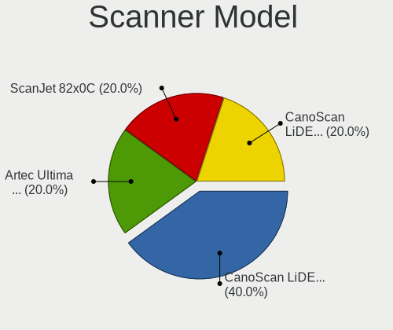

| Model                   | Computers | Percent |
|-------------------------|-----------|---------|
| Canon CanoScan LiDE 110 | 2         | 100%    |

Camera
------

Camera Vendor
-------------

Camera device vendors

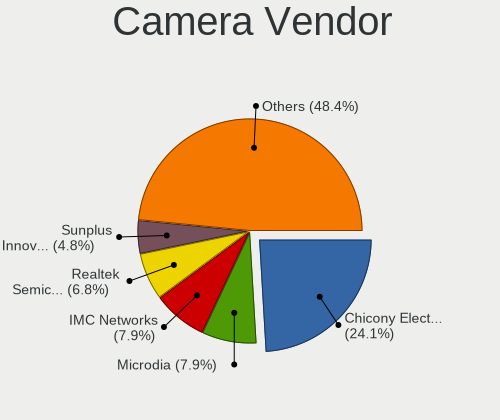

| Vendor                                 | Computers | Percent |
|----------------------------------------|-----------|---------|
| Chicony Electronics                    | 94        | 22.65%  |
| Microdia                               | 32        | 7.71%   |
| IMC Networks                           | 32        | 7.71%   |
| Realtek Semiconductor                  | 29        | 6.99%   |
| Logitech                               | 20        | 4.82%   |
| Cheng Uei Precision Industry (Foxlink) | 20        | 4.82%   |
| Bison Electronics                      | 20        | 4.82%   |
| Sunplus Innovation Technology          | 18        | 4.34%   |
| Apple                                  | 17        | 4.1%    |
| Suyin                                  | 16        | 3.86%   |
| Quanta                                 | 14        | 3.37%   |
| Syntek                                 | 13        | 3.13%   |
| Luxvisions Innotech Limited            | 12        | 2.89%   |
| Lite-On Technology                     | 8         | 1.93%   |
| Alcor Micro                            | 8         | 1.93%   |
| Sonix Technology                       | 6         | 1.45%   |
| Importek                               | 6         | 1.45%   |
| Acer                                   | 6         | 1.45%   |
| Ricoh                                  | 5         | 1.2%    |
| Microsoft                              | 4         | 0.96%   |
| Lenovo                                 | 4         | 0.96%   |
| Z-Star Microelectronics                | 2         | 0.48%   |
| SunplusIT                              | 2         | 0.48%   |
| Silicon Motion                         | 2         | 0.48%   |
| Samsung Electronics                    | 2         | 0.48%   |
| Linux Foundation                       | 2         | 0.48%   |
| icSpring                               | 2         | 0.48%   |
| eMeet                                  | 2         | 0.48%   |
| BUFFALO                                | 2         | 0.48%   |
| Sunplus Technology                     | 1         | 0.24%   |
| OPPO Electronics                       | 1         | 0.24%   |
| Novatek Microelectronics               | 1         | 0.24%   |
| Netchip Technology                     | 1         | 0.24%   |
| lihappe8                               | 1         | 0.24%   |
| Jieli Technology                       | 1         | 0.24%   |
| Genesys Logic                          | 1         | 0.24%   |
| Generalplus Technology                 | 1         | 0.24%   |
| GEMBIRD                                | 1         | 0.24%   |
| Foxconn / Hon Hai                      | 1         | 0.24%   |
| Cubeternet                             | 1         | 0.24%   |

Camera Model
------------

Camera device models

| Model                                                          | Computers | Percent |
|----------------------------------------------------------------|-----------|---------|
| Microdia Integrated_Webcam_HD                                  | 15        | 3.6%    |
| IMC Networks USB2.0 HD UVC WebCam                              | 10        | 2.4%    |
| Realtek Integrated_Webcam_HD                                   | 9         | 2.16%   |
| Chicony VGA WebCam                                             | 9         | 2.16%   |
| Chicony Integrated Camera                                      | 9         | 2.16%   |
| Syntek Integrated Camera                                       | 7         | 1.68%   |
| Realtek USB Camera                                             | 7         | 1.68%   |
| Chicony HD WebCam                                              | 7         | 1.68%   |
| Cheng Uei Precision Industry (Foxlink) HP TrueVision HD Camera | 7         | 1.68%   |
| Bison Integrated Camera                                        | 7         | 1.68%   |
| Logitech Webcam C270                                           | 6         | 1.44%   |
| Cheng Uei Precision Industry (Foxlink) HP Webcam               | 6         | 1.44%   |
| Apple FaceTime HD Camera (Built-in)                            | 6         | 1.44%   |
| Sunplus Integrated_Webcam_HD                                   | 5         | 1.2%    |
| Luxvisions Innotech Limited HP TrueVision HD Camera            | 5         | 1.2%    |
| Logitech HD Pro Webcam C920                                    | 5         | 1.2%    |
| IMC Networks Integrated Camera                                 | 5         | 1.2%    |
| Chicony HP TrueVision HD Camera                                | 5         | 1.2%    |
| Apple iPhone 5/5C/5S/6/SE/7/8/X                                | 5         | 1.2%    |
| Sonix USB2.0 HD UVC WebCam                                     | 4         | 0.96%   |
| Microdia Integrated Webcam                                     | 4         | 0.96%   |
| Lite-On Integrated Camera                                      | 4         | 0.96%   |
| Chicony HP TrueVision HD                                       | 4         | 0.96%   |
| Chicony HD User Facing                                         | 4         | 0.96%   |
| Chicony FJ Camera                                              | 4         | 0.96%   |
| Chicony CNF8243 Webcam                                         | 4         | 0.96%   |
| Apple Built-in iSight                                          | 4         | 0.96%   |
| Syntek Sonix 1.3MPixel USB 2.0 Camera                          | 3         | 0.72%   |
| Suyin Acer/HP Integrated Webcam [CN0314]                       | 3         | 0.72%   |
| Sunplus Dell E5570 integrated webcam                           | 3         | 0.72%   |
| Quanta HP Webcam                                               | 3         | 0.72%   |
| Quanta HP TrueVision HD Camera                                 | 3         | 0.72%   |
| Lite-On HP HD Webcam                                           | 3         | 0.72%   |
| Lenovo Integrated Webcam                                       | 3         | 0.72%   |
| Importek TOSHIBA Web Camera - HD                               | 3         | 0.72%   |
| Importek Laptop Integrated Webcam                              | 3         | 0.72%   |
| IMC Networks USB2.0 VGA UVC WebCam                             | 3         | 0.72%   |
| IMC Networks Lenovo EasyCamera                                 | 3         | 0.72%   |
| Chicony WebCam                                                 | 3         | 0.72%   |
| Chicony USB2.0 HD UVC WebCam                                   | 3         | 0.72%   |

Security
--------

Fingerprint Vendor
------------------

Fingerprint sensor vendors

| Vendor                             | Computers | Percent |
|------------------------------------|-----------|---------|
| Validity Sensors                   | 12        | 26.67%  |
| Shenzhen Goodix Technology         | 7         | 15.56%  |
| Synaptics                          | 6         | 13.33%  |
| Elan Microelectronics              | 5         | 11.11%  |
| STMicroelectronics                 | 4         | 8.89%   |
| LighTuning Technology              | 4         | 8.89%   |
| AuthenTec                          | 4         | 8.89%   |
| Upek                               | 2         | 4.44%   |
| Realtek USB2.0 Finger Print Bridge | 1         | 2.22%   |

Fingerprint Model
-----------------

Fingerprint sensor models

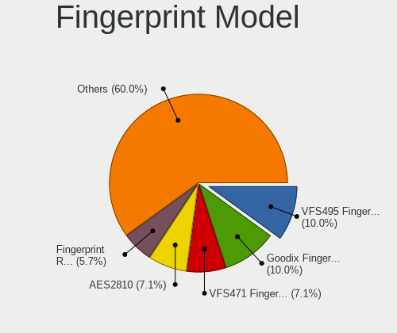

| Model                                                                      | Computers | Percent |
|----------------------------------------------------------------------------|-----------|---------|
| Shenzhen Goodix  FingerPrint Device                                        | 5         | 11.11%  |
| STMicroelectronics Fingerprint Reader                                      | 4         | 8.89%   |
| Validity Sensors VFS495 Fingerprint Reader                                 | 3         | 6.67%   |
| Synaptics Metallica MIS Touch Fingerprint Reader                           | 3         | 6.67%   |
| Elan ELAN:ARM-M4                                                           | 3         | 6.67%   |
| Upek Biometric Touchchip/Touchstrip Fingerprint Sensor                     | 2         | 4.44%   |
| LighTuning Fingerprint Reader                                              | 2         | 4.44%   |
| Elan ELAN:Fingerprint                                                      | 2         | 4.44%   |
| AuthenTec AES2810                                                          | 2         | 4.44%   |
| Validity Sensors VFS5011 Fingerprint Reader                                | 1         | 2.22%   |
| Validity Sensors VFS491                                                    | 1         | 2.22%   |
| Validity Sensors VFS471 Fingerprint Reader                                 | 1         | 2.22%   |
| Validity Sensors VFS101 Fingerprint Reader                                 | 1         | 2.22%   |
| Validity Sensors VFS Fingerprint sensor                                    | 1         | 2.22%   |
| Validity Sensors VFS 5011 fingerprint sensor                               | 1         | 2.22%   |
| Validity Sensors Synaptics VFS7552 Touch Fingerprint Sensor with PurePrint | 1         | 2.22%   |
| Validity Sensors Swipe Fingerprint Sensor                                  | 1         | 2.22%   |
| Validity Sensors Fingerprint scanner                                       | 1         | 2.22%   |
| Synaptics WBDI                                                             | 1         | 2.22%   |
| Synaptics Prometheus MIS Touch Fingerprint Reader                          | 1         | 2.22%   |
| Synaptics FS7604 Touch Fingerprint Sensor with PurePrint                   | 1         | 2.22%   |
| Shenzhen Goodix Fingerprint Reader                                         | 1         | 2.22%   |
| Shenzhen Goodix FingerPrint                                                | 1         | 2.22%   |
| Realtek USB2.0 Finger Print Bridge FocalTech Fingerprint Device            | 1         | 2.22%   |
| LighTuning Fingerprint Sensor                                              | 1         | 2.22%   |
| LighTuning ES603 Swipe Fingerprint Sensor                                  | 1         | 2.22%   |
| AuthenTec Fingerprint Sensor                                               | 1         | 2.22%   |
| AuthenTec AES1600                                                          | 1         | 2.22%   |

Chipcard Vendor
---------------

Chipcard module vendors

| Vendor                | Computers | Percent |
|-----------------------|-----------|---------|
| Broadcom              | 13        | 50%     |
| Upek                  | 4         | 15.38%  |
| O2 Micro              | 3         | 11.54%  |
| Alcor Micro           | 3         | 11.54%  |
| Lenovo                | 2         | 7.69%   |
| Gemalto (was Gemplus) | 1         | 3.85%   |

Chipcard Model
--------------

Chipcard module models

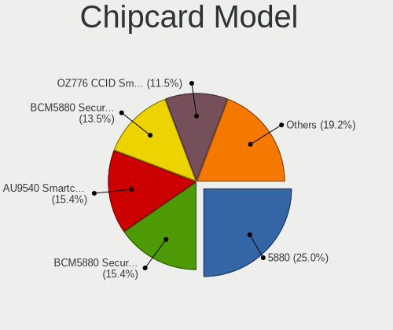

| Model                                                                        | Computers | Percent |
|------------------------------------------------------------------------------|-----------|---------|
| Broadcom 5880                                                                | 7         | 26.92%  |
| Upek TouchChip Fingerprint Coprocessor (WBF advanced mode)                   | 4         | 15.38%  |
| O2 Micro OZ776 CCID Smartcard Reader                                         | 3         | 11.54%  |
| Broadcom BCM5880 Secure Applications Processor                               | 3         | 11.54%  |
| Alcor Micro AU9540 Smartcard Reader                                          | 3         | 11.54%  |
| Lenovo Integrated Smart Card Reader                                          | 2         | 7.69%   |
| Broadcom BCM5880 Secure Applications Processor with fingerprint swipe sensor | 2         | 7.69%   |
| Gemalto (was Gemplus) GemPC Twin SmartCard Reader                            | 1         | 3.85%   |
| Broadcom 58200                                                               | 1         | 3.85%   |

Unsupported
-----------

Unsupported Devices
-------------------

Total unsupported devices on board

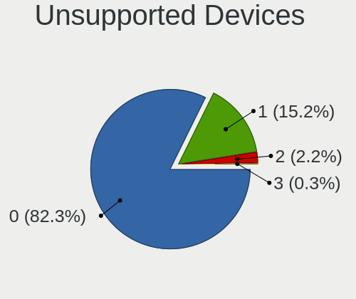

| Total | Computers | Percent |
|-------|-----------|---------|
| 0     | 690       | 83.13%  |
| 1     | 122       | 14.7%   |
| 2     | 17        | 2.05%   |
| 3     | 1         | 0.12%   |

Unsupported Device Types
------------------------

Types of unsupported devices

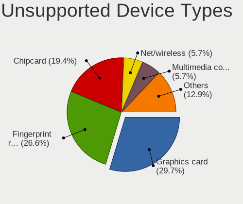

| Type                     | Computers | Percent |
|--------------------------|-----------|---------|
| Fingerprint reader       | 45        | 29.22%  |
| Graphics card            | 43        | 27.92%  |
| Chipcard                 | 25        | 16.23%  |
| Net/wireless             | 11        | 7.14%   |
| Multimedia controller    | 7         | 4.55%   |
| Bluetooth                | 7         | 4.55%   |
| Unassigned class         | 4         | 2.6%    |
| Sound                    | 3         | 1.95%   |
| Camera                   | 3         | 1.95%   |
| Communication controller | 2         | 1.3%    |
| Network                  | 1         | 0.65%   |
| Net/ethernet             | 1         | 0.65%   |
| Flash memory             | 1         | 0.65%   |
| Card reader              | 1         | 0.65%   |

