OpenMandriva 5.0 - Tested Hardware & Statistics (Desktops)
----------------------------------------------------------

A project to collect tested hardware configurations for OpenMandriva 5.0.

Anyone can contribute to this report by the [hw-probe](https://github.com/linuxhw/hw-probe) tool:

    sudo -E hw-probe -all -upload

Please contribute! Especially if your hardware is rare.

Contents
--------

* [ Test Cases ](#test-cases)

* [ System ](#system)
  - [ Kernel                   ](#kernel)
  - [ Kernel Family            ](#kernel-family)
  - [ Kernel Major Ver.        ](#kernel-major-ver)
  - [ Arch                     ](#arch)
  - [ DE                       ](#de)
  - [ Display Server           ](#display-server)
  - [ Display Manager          ](#display-manager)
  - [ OS Lang                  ](#os-lang)
  - [ Boot Mode                ](#boot-mode)
  - [ Filesystem               ](#filesystem)
  - [ Part. scheme             ](#part-scheme)
  - [ Dual Boot with Linux/BSD ](#dual-boot-with-linuxbsd)
  - [ Dual Boot (Win)          ](#dual-boot-win)

* [ Board ](#board)
  - [ Vendor                   ](#vendor)
  - [ Model                    ](#model)
  - [ Model Family             ](#model-family)
  - [ MFG Year                 ](#mfg-year)
  - [ Form Factor              ](#form-factor)
  - [ Secure Boot              ](#secure-boot)
  - [ Coreboot                 ](#coreboot)
  - [ RAM Size                 ](#ram-size)
  - [ RAM Used                 ](#ram-used)
  - [ Total Drives             ](#total-drives)
  - [ Has CD-ROM               ](#has-cd-rom)
  - [ Has Ethernet             ](#has-ethernet)
  - [ Has WiFi                 ](#has-wifi)
  - [ Has Bluetooth            ](#has-bluetooth)

* [ Location ](#location)
  - [ Country                  ](#country)
  - [ City                     ](#city)

* [ Drives ](#drives)
  - [ Drive Vendor             ](#drive-vendor)
  - [ Drive Model              ](#drive-model)
  - [ HDD Vendor               ](#hdd-vendor)
  - [ SSD Vendor               ](#ssd-vendor)
  - [ Drive Kind               ](#drive-kind)
  - [ Drive Connector          ](#drive-connector)
  - [ Drive Size               ](#drive-size)
  - [ Space Total              ](#space-total)
  - [ Space Used               ](#space-used)
  - [ Malfunc. Drives          ](#malfunc-drives)
  - [ Malfunc. Drive Vendor    ](#malfunc-drive-vendor)
  - [ Malfunc. HDD Vendor      ](#malfunc-hdd-vendor)
  - [ Malfunc. Drive Kind      ](#malfunc-drive-kind)
  - [ Failed Drives            ](#failed-drives)
  - [ Failed Drive Vendor      ](#failed-drive-vendor)
  - [ Drive Status             ](#drive-status)

* [ Storage controller ](#storage-controller)
  - [ Storage Vendor           ](#storage-vendor)
  - [ Storage Model            ](#storage-model)
  - [ Storage Kind             ](#storage-kind)

* [ Processor ](#processor)
  - [ CPU Vendor               ](#cpu-vendor)
  - [ CPU Model                ](#cpu-model)
  - [ CPU Model Family         ](#cpu-model-family)
  - [ CPU Cores                ](#cpu-cores)
  - [ CPU Sockets              ](#cpu-sockets)
  - [ CPU Threads              ](#cpu-threads)
  - [ CPU Op-Modes             ](#cpu-op-modes)
  - [ CPU Microcode            ](#cpu-microcode)
  - [ CPU Microarch            ](#cpu-microarch)

* [ Graphics ](#graphics)
  - [ GPU Vendor               ](#gpu-vendor)
  - [ GPU Model                ](#gpu-model)
  - [ GPU Combo                ](#gpu-combo)
  - [ GPU Driver               ](#gpu-driver)
  - [ GPU Memory               ](#gpu-memory)

* [ Monitor ](#monitor)
  - [ Monitor Vendor           ](#monitor-vendor)
  - [ Monitor Model            ](#monitor-model)
  - [ Monitor Resolution       ](#monitor-resolution)
  - [ Monitor Diagonal         ](#monitor-diagonal)
  - [ Monitor Width            ](#monitor-width)
  - [ Aspect Ratio             ](#aspect-ratio)
  - [ Monitor Area             ](#monitor-area)
  - [ Pixel Density            ](#pixel-density)
  - [ Multiple Monitors        ](#multiple-monitors)

* [ Network ](#network)
  - [ Net Controller Vendor    ](#net-controller-vendor)
  - [ Net Controller Model     ](#net-controller-model)
  - [ Wireless Vendor          ](#wireless-vendor)
  - [ Wireless Model           ](#wireless-model)
  - [ Ethernet Vendor          ](#ethernet-vendor)
  - [ Ethernet Model           ](#ethernet-model)
  - [ Net Controller Kind      ](#net-controller-kind)
  - [ Used Controller          ](#used-controller)
  - [ NICs                     ](#nics)
  - [ IPv6                     ](#ipv6)

* [ Bluetooth ](#bluetooth)
  - [ Bluetooth Vendor         ](#bluetooth-vendor)
  - [ Bluetooth Model          ](#bluetooth-model)

* [ Sound ](#sound)
  - [ Sound Vendor             ](#sound-vendor)
  - [ Sound Model              ](#sound-model)

* [ Memory ](#memory)
  - [ Memory Vendor            ](#memory-vendor)
  - [ Memory Model             ](#memory-model)
  - [ Memory Kind              ](#memory-kind)
  - [ Memory Form Factor       ](#memory-form-factor)
  - [ Memory Size              ](#memory-size)
  - [ Memory Speed             ](#memory-speed)

* [ Printers & scanners ](#printers--scanners)
  - [ Printer Vendor           ](#printer-vendor)
  - [ Printer Model            ](#printer-model)
  - [ Scanner Vendor           ](#scanner-vendor)
  - [ Scanner Model            ](#scanner-model)

* [ Camera ](#camera)
  - [ Camera Vendor            ](#camera-vendor)
  - [ Camera Model             ](#camera-model)

* [ Security ](#security)
  - [ Fingerprint Vendor       ](#fingerprint-vendor)
  - [ Fingerprint Model        ](#fingerprint-model)
  - [ Chipcard Vendor          ](#chipcard-vendor)
  - [ Chipcard Model           ](#chipcard-model)

* [ Unsupported ](#unsupported)
  - [ Unsupported Devices      ](#unsupported-devices)
  - [ Unsupported Device Types ](#unsupported-device-types)

Test Cases
----------

Total: 880

| Vendor        | Model                       | Probe                                                      | Date         |
|---------------|-----------------------------|------------------------------------------------------------|--------------|
| MSI           | B450 GAMING PRO CARBON A... | [8da20a34c6](https://linux-hardware.org/?probe=8da20a34c6) | Dec 21, 2025 |
| ASRock        | X570 Pro4                   | [394e9e17a5](https://linux-hardware.org/?probe=394e9e17a5) | Dec 17, 2025 |
| Lenovo        | 310B SDK0J40697 WIN 3305... | [e4302a942a](https://linux-hardware.org/?probe=e4302a942a) | Nov 27, 2025 |
| Gigabyte      | GA-78LMT-USB3               | [f03327917f](https://linux-hardware.org/?probe=f03327917f) | Nov 22, 2025 |
| Gigabyte      | B450 AORUS M                | [68804c6805](https://linux-hardware.org/?probe=68804c6805) | Nov 07, 2025 |
| PELADN        | WI-6                        | [3ca3fc9dc0](https://linux-hardware.org/?probe=3ca3fc9dc0) | Nov 02, 2025 |
| Gigabyte      | B450 I AORUS PRO WIFI-CF    | [5af760ac74](https://linux-hardware.org/?probe=5af760ac74) | Nov 01, 2025 |
| Gigabyte      | B560 DS3H AC-Y1             | [1722829ffe](https://linux-hardware.org/?probe=1722829ffe) | Nov 01, 2025 |
| Gigabyte      | H81M-S2PV                   | [0f9ca486d8](https://linux-hardware.org/?probe=0f9ca486d8) | Oct 12, 2025 |
| ASRock        | Z97 Pro4                    | [0b392dcca1](https://linux-hardware.org/?probe=0b392dcca1) | Oct 11, 2025 |
| Foxconn       | A74ML-K                     | [5ba1ce9138](https://linux-hardware.org/?probe=5ba1ce9138) | Sep 05, 2025 |
| ASUSTek       | TUF Gaming B460-PLUS        | [550eb1faba](https://linux-hardware.org/?probe=550eb1faba) | Sep 04, 2025 |
| HP            | 1495                        | [f1b76f8da8](https://linux-hardware.org/?probe=f1b76f8da8) | Sep 03, 2025 |
| Lenovo        | 31900058 STD                | [5493445241](https://linux-hardware.org/?probe=5493445241) | Aug 18, 2025 |
| ASUSTek       | TUF Gaming X670E-PLUS WI... | [3b87722daf](https://linux-hardware.org/?probe=3b87722daf) | Aug 17, 2025 |
| HP            | 3047h                       | [4330166a7a](https://linux-hardware.org/?probe=4330166a7a) | Aug 11, 2025 |
| ASRock        | B450 Gaming-ITX/ac          | [2ae73630cf](https://linux-hardware.org/?probe=2ae73630cf) | Aug 04, 2025 |
| Pegatron      | 2AE3                        | [47209c574e](https://linux-hardware.org/?probe=47209c574e) | Jun 14, 2025 |
| Lenovo        | 310B SDK0J40697 WIN 3305... | [a8dbc3685c](https://linux-hardware.org/?probe=a8dbc3685c) | May 23, 2025 |
| ASUSTek       | A68HM-PLUS                  | [3b101ab9ba](https://linux-hardware.org/?probe=3b101ab9ba) | May 15, 2025 |
| Lenovo        | ThinkCentre Edge 91Z 707... | [d36469c886](https://linux-hardware.org/?probe=d36469c886) | May 15, 2025 |
| ECS           | G31T-M9                     | [8bf715ef53](https://linux-hardware.org/?probe=8bf715ef53) | May 11, 2025 |
| Gigabyte      | GA-MA790XT-UD4P             | [d300f39acb](https://linux-hardware.org/?probe=d300f39acb) | May 07, 2025 |
| MSI           | A320M-A PRO                 | [ea9e940c38](https://linux-hardware.org/?probe=ea9e940c38) | May 04, 2025 |
| HP            | 304Ah                       | [698a59f5b7](https://linux-hardware.org/?probe=698a59f5b7) | May 04, 2025 |
| Gigabyte      | B560 DS3H AC-Y1             | [1e5e1a0253](https://linux-hardware.org/?probe=1e5e1a0253) | Apr 29, 2025 |
| Gigabyte      | B850M AORUS ELITE WIFI6E... | [06b51cc4f9](https://linux-hardware.org/?probe=06b51cc4f9) | Apr 26, 2025 |
| Dell          | 0M5WNK A00                  | [bbc42b51e1](https://linux-hardware.org/?probe=bbc42b51e1) | Apr 25, 2025 |
| Unknown       | Unknown                     | [c6db786f97](https://linux-hardware.org/?probe=c6db786f97) | Apr 20, 2025 |
| ASUSTek       | ROG STRIX X570-E GAMING     | [d79041778a](https://linux-hardware.org/?probe=d79041778a) | Apr 19, 2025 |
| HP            | 83F3                        | [eeab0e374d](https://linux-hardware.org/?probe=eeab0e374d) | Apr 15, 2025 |
| Lenovo        | 30C9 SDK0J40705 WIN 3425... | [3bc184eb0d](https://linux-hardware.org/?probe=3bc184eb0d) | Apr 13, 2025 |
| ASUSTek       | P5G41T-M LX2/GB/LPT         | [54c365a715](https://linux-hardware.org/?probe=54c365a715) | Apr 13, 2025 |
| Dell          | Precision Tower 5810        | [ba429f941e](https://linux-hardware.org/?probe=ba429f941e) | Apr 13, 2025 |
| Acer          | Aspire X3950                | [0b954993ad](https://linux-hardware.org/?probe=0b954993ad) | Apr 12, 2025 |
| HP            | 859B                        | [0c59964165](https://linux-hardware.org/?probe=0c59964165) | Apr 11, 2025 |
| Dell          | 0VRWRC A00                  | [5a34e22881](https://linux-hardware.org/?probe=5a34e22881) | Apr 10, 2025 |
| ASRock        | FM2A68M-DG3+                | [6aad7ab2b7](https://linux-hardware.org/?probe=6aad7ab2b7) | Apr 10, 2025 |
| Gigabyte      | B450 AORUS M                | [40c86e898a](https://linux-hardware.org/?probe=40c86e898a) | Apr 10, 2025 |
| Gigabyte      | H61M-DS2                    | [38804ea9e0](https://linux-hardware.org/?probe=38804ea9e0) | Apr 09, 2025 |
| HP            | 8055                        | [8c29caf120](https://linux-hardware.org/?probe=8c29caf120) | Apr 09, 2025 |
| HP            | 1495                        | [fd2279278a](https://linux-hardware.org/?probe=fd2279278a) | Apr 08, 2025 |
| MSI           | MAG A520M VECTOR WIFI       | [2df2189531](https://linux-hardware.org/?probe=2df2189531) | Apr 07, 2025 |
| Acer          | FIH57                       | [baccfd6996](https://linux-hardware.org/?probe=baccfd6996) | Apr 07, 2025 |
| ASUSTek       | ROG STRIX X570-E GAMING     | [a2de615200](https://linux-hardware.org/?probe=a2de615200) | Mar 31, 2025 |
| Fujitsu       | D3313-B1 S26361-D3313-B1    | [d97d9a1b4a](https://linux-hardware.org/?probe=d97d9a1b4a) | Mar 31, 2025 |
| Biostar       | B450MHP                     | [030861030c](https://linux-hardware.org/?probe=030861030c) | Mar 30, 2025 |
| ASUSTek       | ROG STRIX B450-F GAMING     | [23a7e30d1b](https://linux-hardware.org/?probe=23a7e30d1b) | Mar 30, 2025 |
| Gigabyte      | H170-HD3 DDR3-CF            | [a983398794](https://linux-hardware.org/?probe=a983398794) | Mar 29, 2025 |
| Lenovo        | NO DPK                      | [c25e426f0d](https://linux-hardware.org/?probe=c25e426f0d) | Mar 28, 2025 |
| MSI           | B450 TOMAHAWK               | [4c8f56d1fa](https://linux-hardware.org/?probe=4c8f56d1fa) | Mar 27, 2025 |
| HP            | 1998                        | [d279e2fb30](https://linux-hardware.org/?probe=d279e2fb30) | Mar 24, 2025 |
| HP            | 3648h                       | [018a816e4a](https://linux-hardware.org/?probe=018a816e4a) | Mar 22, 2025 |
| Unknown       | Unknown                     | [d877395d7c](https://linux-hardware.org/?probe=d877395d7c) | Mar 22, 2025 |
| Intel         | H81                         | [fa31b8045e](https://linux-hardware.org/?probe=fa31b8045e) | Mar 22, 2025 |
| Foxconn       | 2ABF                        | [bd9cac0775](https://linux-hardware.org/?probe=bd9cac0775) | Mar 19, 2025 |
| ASUSTek       | TUF Gaming X570-PLUS        | [7a6a5478cd](https://linux-hardware.org/?probe=7a6a5478cd) | Mar 17, 2025 |
| MSI           | 2AE0                        | [07a9f2a6bc](https://linux-hardware.org/?probe=07a9f2a6bc) | Mar 15, 2025 |
| ASUSTek       | ROG STRIX B450-F GAMING     | [a768ed4646](https://linux-hardware.org/?probe=a768ed4646) | Mar 15, 2025 |
| MSI           | MAG B650 TOMAHAWK WIFI      | [bf514895de](https://linux-hardware.org/?probe=bf514895de) | Mar 14, 2025 |
| ABIT          | KV8                         | [5c55e3b2c0](https://linux-hardware.org/?probe=5c55e3b2c0) | Mar 14, 2025 |
| Gigabyte      | P61-S3-B3                   | [bd438c67b1](https://linux-hardware.org/?probe=bd438c67b1) | Mar 14, 2025 |
| ASRock        | B450M Steel Legend          | [2cf8784182](https://linux-hardware.org/?probe=2cf8784182) | Mar 14, 2025 |
| Gigabyte      | EX58-UD3R                   | [4efabae78b](https://linux-hardware.org/?probe=4efabae78b) | Mar 14, 2025 |
| ASRock        | B550M Steel Legend          | [dc02459a55](https://linux-hardware.org/?probe=dc02459a55) | Mar 14, 2025 |
| Dell          | 0Y5DDC A00                  | [6c42b4fbac](https://linux-hardware.org/?probe=6c42b4fbac) | Mar 14, 2025 |
| MSI           | Z97 PC Mate                 | [090e852926](https://linux-hardware.org/?probe=090e852926) | Mar 14, 2025 |
| Dell          | 0HN7XN A00                  | [5cba1fb065](https://linux-hardware.org/?probe=5cba1fb065) | Mar 13, 2025 |
| MSI           | B450M PRO-VDH MAX           | [3d25990675](https://linux-hardware.org/?probe=3d25990675) | Mar 13, 2025 |
| PELADN        | WI-6                        | [0257e5a5b9](https://linux-hardware.org/?probe=0257e5a5b9) | Mar 13, 2025 |
| MSI           | X470 GAMING PRO CARBON      | [431fa4da20](https://linux-hardware.org/?probe=431fa4da20) | Mar 13, 2025 |
| ASRock        | B450M-HDV R4.0              | [67aa686838](https://linux-hardware.org/?probe=67aa686838) | Mar 12, 2025 |
| Dell          | 0D441T A01                  | [8a6e45f259](https://linux-hardware.org/?probe=8a6e45f259) | Mar 12, 2025 |
| ASRock        | B550M PG Riptide            | [f4eac257c6](https://linux-hardware.org/?probe=f4eac257c6) | Mar 12, 2025 |
| MSI           | B550M PRO-VDH WIFI          | [afabc18cce](https://linux-hardware.org/?probe=afabc18cce) | Mar 11, 2025 |
| Lenovo        | 36C5 SDK0J40700 WIN 3258... | [d48905b0b7](https://linux-hardware.org/?probe=d48905b0b7) | Mar 11, 2025 |
| MSI           | H61M-P31/W8                 | [62fb0bc459](https://linux-hardware.org/?probe=62fb0bc459) | Mar 10, 2025 |
| Dell          | 0XPDFK A01                  | [73597b1666](https://linux-hardware.org/?probe=73597b1666) | Mar 10, 2025 |
| Red Hat       | RHEL RHEL-9.4.0 PC          | [4d8e919125](https://linux-hardware.org/?probe=4d8e919125) | Mar 10, 2025 |
| Dell          | 0NW73C A00                  | [b01623d99e](https://linux-hardware.org/?probe=b01623d99e) | Mar 09, 2025 |
| ASUSTek       | M5A78L-M/USB3               | [375c2c6ad1](https://linux-hardware.org/?probe=375c2c6ad1) | Mar 09, 2025 |
| HP            | 1495                        | [8a7662aa0b](https://linux-hardware.org/?probe=8a7662aa0b) | Mar 09, 2025 |
| Dell          | 0T10XW A02                  | [a2f2a3637c](https://linux-hardware.org/?probe=a2f2a3637c) | Mar 08, 2025 |
| Dell          | 0F6X5P A00                  | [2af3e11ff8](https://linux-hardware.org/?probe=2af3e11ff8) | Mar 08, 2025 |
| T-bao         | MINI PC V1.0                | [84b3d9c81d](https://linux-hardware.org/?probe=84b3d9c81d) | Mar 07, 2025 |
| Dell          | 0NW73C A00                  | [3891b49777](https://linux-hardware.org/?probe=3891b49777) | Mar 07, 2025 |
| Dell          | 00V62H A01                  | [ceefdf2e2f](https://linux-hardware.org/?probe=ceefdf2e2f) | Mar 07, 2025 |
| Dell          | 0WMJ54 A01                  | [14abfa0c2f](https://linux-hardware.org/?probe=14abfa0c2f) | Mar 06, 2025 |
| ASRock        | 960GM-VGS3 FX               | [36c4ea1c4a](https://linux-hardware.org/?probe=36c4ea1c4a) | Mar 06, 2025 |
| MACHINIST     | H81M-PRO S1 V2.0            | [63b26580b4](https://linux-hardware.org/?probe=63b26580b4) | Mar 06, 2025 |
| Apple         | Mac-27AD2F918AE68F61 Mac... | [f35e3c7f7b](https://linux-hardware.org/?probe=f35e3c7f7b) | Mar 05, 2025 |
| Gigabyte      | GA-78LMT-USB3               | [400cdb002d](https://linux-hardware.org/?probe=400cdb002d) | Mar 05, 2025 |
| HP            | 09F0h                       | [0fed1d2b90](https://linux-hardware.org/?probe=0fed1d2b90) | Mar 05, 2025 |
| Shuttle       | DH610                       | [341add8075](https://linux-hardware.org/?probe=341add8075) | Mar 03, 2025 |
| HP            | 1495                        | [665204e7bd](https://linux-hardware.org/?probe=665204e7bd) | Mar 03, 2025 |
| ASUSTek       | ROG Maximus XII HERO        | [b68bda7d43](https://linux-hardware.org/?probe=b68bda7d43) | Mar 03, 2025 |
| Foxconn       | nT-A3000 series FAB         | [4e0ee24fee](https://linux-hardware.org/?probe=4e0ee24fee) | Mar 03, 2025 |
| Dell          | 0NW6H5 A00                  | [956c7ec2a3](https://linux-hardware.org/?probe=956c7ec2a3) | Mar 02, 2025 |
| MSI           | 760GM-P23                   | [90606c43cb](https://linux-hardware.org/?probe=90606c43cb) | Mar 02, 2025 |
| HP            | 8299                        | [3a96f98f4c](https://linux-hardware.org/?probe=3a96f98f4c) | Mar 01, 2025 |
| Intel         | DH55HC AAE70933-505         | [293a25155c](https://linux-hardware.org/?probe=293a25155c) | Mar 01, 2025 |
| Acer          | Predator G3600              | [976da598ed](https://linux-hardware.org/?probe=976da598ed) | Mar 01, 2025 |
| Gigabyte      | Z170N-WIFI-CF               | [179e156058](https://linux-hardware.org/?probe=179e156058) | Feb 28, 2025 |
| Dell          | 0NC2VH A01                  | [9387c7c9f8](https://linux-hardware.org/?probe=9387c7c9f8) | Feb 28, 2025 |
| ASUSTek       | P8B75-V                     | [c980365b7b](https://linux-hardware.org/?probe=c980365b7b) | Feb 28, 2025 |
| Intel         | X99-P4 V5.0                 | [f5bf50764c](https://linux-hardware.org/?probe=f5bf50764c) | Feb 27, 2025 |
| Lenovo        | 102F SDK0E50510 WIN         | [6dc48d06fe](https://linux-hardware.org/?probe=6dc48d06fe) | Feb 27, 2025 |
| ASUSTek       | PRIME B450M-A II            | [31ca9a8b35](https://linux-hardware.org/?probe=31ca9a8b35) | Feb 27, 2025 |
| HP            | 3397                        | [78cbbbd3c0](https://linux-hardware.org/?probe=78cbbbd3c0) | Feb 26, 2025 |
| MSI           | 760GMA-P34                  | [f07f49718c](https://linux-hardware.org/?probe=f07f49718c) | Feb 26, 2025 |
| ASUSTek       | M5A78L-M LX3                | [afd53d3885](https://linux-hardware.org/?probe=afd53d3885) | Feb 26, 2025 |
| MSI           | A520M-A PRO                 | [2d2d3536dd](https://linux-hardware.org/?probe=2d2d3536dd) | Feb 25, 2025 |
| Dell          | 0WG864                      | [4a066b745a](https://linux-hardware.org/?probe=4a066b745a) | Feb 25, 2025 |
| HP            | 158B                        | [07c6ee27b8](https://linux-hardware.org/?probe=07c6ee27b8) | Feb 23, 2025 |
| ASUSTek       | Z87-PRO                     | [509367c417](https://linux-hardware.org/?probe=509367c417) | Feb 23, 2025 |
| MSI           | A88XI AC                    | [03944c7b91](https://linux-hardware.org/?probe=03944c7b91) | Feb 23, 2025 |
| MSI           | 970A-G46                    | [284821685b](https://linux-hardware.org/?probe=284821685b) | Feb 23, 2025 |
| ASRock        | B450M-HDV R4.0              | [d4cb8cab69](https://linux-hardware.org/?probe=d4cb8cab69) | Feb 23, 2025 |
| Lenovo        | 310B SDK0J40697 WIN 3305... | [def662c96d](https://linux-hardware.org/?probe=def662c96d) | Feb 22, 2025 |
| HP            | 2B47                        | [942489e750](https://linux-hardware.org/?probe=942489e750) | Feb 22, 2025 |
| ASUSTek       | PRIME H510M-K R2.0          | [4d971602e9](https://linux-hardware.org/?probe=4d971602e9) | Feb 22, 2025 |
| Dell          | 0PC5F7 A00                  | [7b3e1174a2](https://linux-hardware.org/?probe=7b3e1174a2) | Feb 21, 2025 |
| Gigabyte      | B650M D3HP                  | [694466973b](https://linux-hardware.org/?probe=694466973b) | Feb 20, 2025 |
| ASUSTek       | PRIME B550M-A WIFI II       | [8d4a81c3dd](https://linux-hardware.org/?probe=8d4a81c3dd) | Feb 19, 2025 |
| ASRock        | B650 PG Lightning           | [784766b416](https://linux-hardware.org/?probe=784766b416) | Feb 17, 2025 |
| ASUSTek       | PRIME A520M-A               | [4e3e0d6cdd](https://linux-hardware.org/?probe=4e3e0d6cdd) | Feb 17, 2025 |
| Dell          | 06D7TR A01                  | [e056b25bd0](https://linux-hardware.org/?probe=e056b25bd0) | Feb 17, 2025 |
| ASRock        | H410M-HDV                   | [a60e462440](https://linux-hardware.org/?probe=a60e462440) | Feb 16, 2025 |
| Dell          | Inspiron 570                | [0b822c6a61](https://linux-hardware.org/?probe=0b822c6a61) | Feb 16, 2025 |
| MSI           | P31 Neo-F V2                | [85d80afbab](https://linux-hardware.org/?probe=85d80afbab) | Feb 16, 2025 |
| MSI           | H87-G41 PC Mate             | [92ad54a900](https://linux-hardware.org/?probe=92ad54a900) | Feb 13, 2025 |
| MSI           | H310M GAMING PLUS           | [1a0c277db5](https://linux-hardware.org/?probe=1a0c277db5) | Feb 12, 2025 |
| ASUSTek       | H97M-E                      | [1561eb7d91](https://linux-hardware.org/?probe=1561eb7d91) | Feb 12, 2025 |
| AZW           | MINI S 10                   | [ce558777e8](https://linux-hardware.org/?probe=ce558777e8) | Feb 10, 2025 |
| Dell          | 06X1TJ A00                  | [bffe257263](https://linux-hardware.org/?probe=bffe257263) | Feb 09, 2025 |
| ASRock        | A320M-HDV R3.0              | [25b748f589](https://linux-hardware.org/?probe=25b748f589) | Feb 09, 2025 |
| Biostar       | H61MLB                      | [cca3895d08](https://linux-hardware.org/?probe=cca3895d08) | Feb 09, 2025 |
| HP            | 3396                        | [69cdea76ee](https://linux-hardware.org/?probe=69cdea76ee) | Feb 08, 2025 |
| Intel         | Unknown                     | [34626d158d](https://linux-hardware.org/?probe=34626d158d) | Feb 08, 2025 |
| Gigabyte      | GA-78LMT-S2PV               | [b9f669eeea](https://linux-hardware.org/?probe=b9f669eeea) | Feb 08, 2025 |
| MSI           | P45-C51                     | [383fa2fef0](https://linux-hardware.org/?probe=383fa2fef0) | Feb 08, 2025 |
| ASUSTek       | P5KPL-AM                    | [3a247e4f15](https://linux-hardware.org/?probe=3a247e4f15) | Feb 08, 2025 |
| ASUSTek       | P5G41-M LE                  | [33e418c2a2](https://linux-hardware.org/?probe=33e418c2a2) | Feb 07, 2025 |
| Dell          | 0654JC A01                  | [ee15a50054](https://linux-hardware.org/?probe=ee15a50054) | Feb 07, 2025 |
| Lenovo        | 36C5 SDK0J40700 WIN 3258... | [3b576705ac](https://linux-hardware.org/?probe=3b576705ac) | Feb 06, 2025 |
| Biostar       | A520MT                      | [3925a78085](https://linux-hardware.org/?probe=3925a78085) | Feb 05, 2025 |
| ASUSTek       | TUF Gaming X670E-PLUS WI... | [cb61591c71](https://linux-hardware.org/?probe=cb61591c71) | Feb 05, 2025 |
| Red Hat       | RHEL RHEL-9.4.0 PC          | [8169d78354](https://linux-hardware.org/?probe=8169d78354) | Feb 05, 2025 |
| HP            | 8597                        | [23ca97b870](https://linux-hardware.org/?probe=23ca97b870) | Feb 05, 2025 |
| ASUSTek       | M5A78L-M LX3                | [575b093c18](https://linux-hardware.org/?probe=575b093c18) | Feb 04, 2025 |
| Dell          | 0MN1TX A03                  | [ecf3a8c045](https://linux-hardware.org/?probe=ecf3a8c045) | Feb 04, 2025 |
| Gigabyte      | P55-UD3L                    | [82ff2350c4](https://linux-hardware.org/?probe=82ff2350c4) | Feb 03, 2025 |
| Biostar       | B450MH                      | [6b4e6217e1](https://linux-hardware.org/?probe=6b4e6217e1) | Feb 03, 2025 |
| Fujitsu       | D3164-A1 S26361-D3164-A1    | [57156139f6](https://linux-hardware.org/?probe=57156139f6) | Feb 02, 2025 |
| Dell          | 0T7D40 A01                  | [056eeee0ba](https://linux-hardware.org/?probe=056eeee0ba) | Feb 02, 2025 |
| HP            | 1790                        | [d0eecdb2cf](https://linux-hardware.org/?probe=d0eecdb2cf) | Feb 01, 2025 |
| MSI           | MPG X570 GAMING EDGE WIF... | [1d692ec021](https://linux-hardware.org/?probe=1d692ec021) | Jan 31, 2025 |
| MSI           | MEG X570 UNIFY              | [a152ecd4e7](https://linux-hardware.org/?probe=a152ecd4e7) | Jan 31, 2025 |
| Red Hat       | RHEL RHEL-9.4.0 PC          | [d5e1c03bd1](https://linux-hardware.org/?probe=d5e1c03bd1) | Jan 29, 2025 |
| Alienware     | 0PGRP5 A00                  | [d3702e28fd](https://linux-hardware.org/?probe=d3702e28fd) | Jan 29, 2025 |
| ASUSTek       | Pro A520M-C II              | [bec9e471d9](https://linux-hardware.org/?probe=bec9e471d9) | Jan 29, 2025 |
| MSI           | 970A-G43 PLUS               | [e5cf893d6f](https://linux-hardware.org/?probe=e5cf893d6f) | Jan 29, 2025 |
| Intel         | X99H                        | [6e5de40583](https://linux-hardware.org/?probe=6e5de40583) | Jan 28, 2025 |
| ASUSTek       | Z13PE-D16 Series 60SB0CA... | [db5dbfa645](https://linux-hardware.org/?probe=db5dbfa645) | Jan 28, 2025 |
| Dell          | 00V62H A01                  | [5b51fd09f4](https://linux-hardware.org/?probe=5b51fd09f4) | Jan 27, 2025 |
| Gigabyte      | B550M AORUS ELITE           | [57901e7367](https://linux-hardware.org/?probe=57901e7367) | Jan 26, 2025 |
| HP            | 18E5                        | [83b831c9e4](https://linux-hardware.org/?probe=83b831c9e4) | Jan 26, 2025 |
| HP            | 805A                        | [245842d89b](https://linux-hardware.org/?probe=245842d89b) | Jan 26, 2025 |
| ASRock        | B450 Pro4 R2.0              | [0dcda20e7c](https://linux-hardware.org/?probe=0dcda20e7c) | Jan 25, 2025 |
| MSI           | B550-A PRO                  | [09bbcc10ff](https://linux-hardware.org/?probe=09bbcc10ff) | Jan 25, 2025 |
| Dell          | 0F6X5P A00                  | [95a1eef874](https://linux-hardware.org/?probe=95a1eef874) | Jan 25, 2025 |
| Lenovo        | MAHOBAY NO DPK              | [a01c37a6fb](https://linux-hardware.org/?probe=a01c37a6fb) | Jan 25, 2025 |
| Lenovo        | 1036 SDK0Q40104 WIN 3305... | [946a71f7c5](https://linux-hardware.org/?probe=946a71f7c5) | Jan 25, 2025 |
| ASRock        | B450M-HDV R4.0              | [52129e101d](https://linux-hardware.org/?probe=52129e101d) | Jan 25, 2025 |
| Lenovo        | 3098 SDK0E50510 WIN         | [d7c146b08b](https://linux-hardware.org/?probe=d7c146b08b) | Jan 24, 2025 |
| Gigabyte      | GA-78LMT-S2                 | [fa536652bf](https://linux-hardware.org/?probe=fa536652bf) | Jan 24, 2025 |
| ASRock        | A620M-HDV/M.2               | [3320b7fe3c](https://linux-hardware.org/?probe=3320b7fe3c) | Jan 24, 2025 |
| HP            | 18E7                        | [b6ea5d3b1c](https://linux-hardware.org/?probe=b6ea5d3b1c) | Jan 24, 2025 |
| ASUSTek       | M5A99X EVO R2.0             | [5dff808532](https://linux-hardware.org/?probe=5dff808532) | Jan 24, 2025 |
| Dell          | 0WMJ54 A01                  | [9cc53d44ea](https://linux-hardware.org/?probe=9cc53d44ea) | Jan 24, 2025 |
| ASUSTek       | ROG STRIX X570-F GAMING     | [39d2c06899](https://linux-hardware.org/?probe=39d2c06899) | Jan 23, 2025 |
| Lenovo        | 3111 SDK0J40697 WIN 3305... | [b5a0ab5811](https://linux-hardware.org/?probe=b5a0ab5811) | Jan 23, 2025 |
| Star Labs     | Byte                        | [fecc754767](https://linux-hardware.org/?probe=fecc754767) | Jan 23, 2025 |
| Lenovo        | ThinkCentre M55 8810AA5     | [3bad98af38](https://linux-hardware.org/?probe=3bad98af38) | Jan 23, 2025 |
| Dell          | 0215PR A02                  | [1baba0f78b](https://linux-hardware.org/?probe=1baba0f78b) | Jan 23, 2025 |
| ASUSTek       | TUF Gaming B550-PLUS        | [0f7a85057f](https://linux-hardware.org/?probe=0f7a85057f) | Jan 23, 2025 |
| ASUSTek       | H81M-A/BR                   | [26c743f238](https://linux-hardware.org/?probe=26c743f238) | Jan 22, 2025 |
| HP            | 1495                        | [5f3c89f0cf](https://linux-hardware.org/?probe=5f3c89f0cf) | Jan 22, 2025 |
| Gigabyte      | G31M-S2C                    | [1ce436ac27](https://linux-hardware.org/?probe=1ce436ac27) | Jan 22, 2025 |
| ASUSTek       | TUF Gaming B650-PLUS WIF... | [528c87b929](https://linux-hardware.org/?probe=528c87b929) | Jan 22, 2025 |
| MAXSUN        | MS-TZZ B660M                | [a2aec6e38a](https://linux-hardware.org/?probe=a2aec6e38a) | Jan 22, 2025 |
| Intel         | DH67BL AAG10189-207         | [3f172ad69b](https://linux-hardware.org/?probe=3f172ad69b) | Jan 22, 2025 |
| Gigabyte      | H81N                        | [edbcbf2d92](https://linux-hardware.org/?probe=edbcbf2d92) | Jan 22, 2025 |
| Dell          | 02M8NY A02                  | [824f34fb00](https://linux-hardware.org/?probe=824f34fb00) | Jan 21, 2025 |
| ASUSTek       | Z97M-PLUS                   | [dfd173b83d](https://linux-hardware.org/?probe=dfd173b83d) | Jan 21, 2025 |
| Dell          | 0WG864                      | [acbb90e2bb](https://linux-hardware.org/?probe=acbb90e2bb) | Jan 21, 2025 |
| Gigabyte      | B550 GAMING X V2            | [60758b4dae](https://linux-hardware.org/?probe=60758b4dae) | Jan 20, 2025 |
| Gigabyte      | H81N                        | [052bbd961d](https://linux-hardware.org/?probe=052bbd961d) | Jan 20, 2025 |
| HP            | 8265                        | [d8e410edf1](https://linux-hardware.org/?probe=d8e410edf1) | Jan 20, 2025 |
| ASUSTek       | P8Z77-V LK                  | [5e7157bbf0](https://linux-hardware.org/?probe=5e7157bbf0) | Jan 20, 2025 |
| Dell          | 04YP6J A02                  | [1fe4bc5a3d](https://linux-hardware.org/?probe=1fe4bc5a3d) | Jan 19, 2025 |
| ASUSTek       | TUF B450M-PRO GAMING        | [2ce52cac56](https://linux-hardware.org/?probe=2ce52cac56) | Jan 19, 2025 |
| MSI           | H55M-P31                    | [5f2c5f5d89](https://linux-hardware.org/?probe=5f2c5f5d89) | Jan 18, 2025 |
| Packard Be... | MCP73VT-PM                  | [45fa6ccea1](https://linux-hardware.org/?probe=45fa6ccea1) | Jan 18, 2025 |
| ASUSTek       | M5A99FX PRO R2.0            | [4b19e53385](https://linux-hardware.org/?probe=4b19e53385) | Jan 18, 2025 |
| Medion        | P2A4-EM                     | [055340b78e](https://linux-hardware.org/?probe=055340b78e) | Jan 18, 2025 |
| MSI           | X570-A PRO                  | [03a3026e2f](https://linux-hardware.org/?probe=03a3026e2f) | Jan 17, 2025 |
| Dell          | 0GRJJ9 A01                  | [023d8677ba](https://linux-hardware.org/?probe=023d8677ba) | Jan 17, 2025 |
| ASUSTek       | P5E-VM SE                   | [62a75a9fb4](https://linux-hardware.org/?probe=62a75a9fb4) | Jan 17, 2025 |
| ASUSTek       | ROG STRIX B650E-F GAMING... | [e82da30cc4](https://linux-hardware.org/?probe=e82da30cc4) | Jan 17, 2025 |
| MSI           | MPG Z390 GAMING PRO CARB... | [192333ae05](https://linux-hardware.org/?probe=192333ae05) | Jan 15, 2025 |
| ASUSTek       | H110M-A D3                  | [39c015ac03](https://linux-hardware.org/?probe=39c015ac03) | Jan 15, 2025 |
| Dell          | 0C27VV A03                  | [ffc6e38fda](https://linux-hardware.org/?probe=ffc6e38fda) | Jan 14, 2025 |
| Acer          | Veriton N2620G              | [f24d4dbfd0](https://linux-hardware.org/?probe=f24d4dbfd0) | Jan 14, 2025 |
| Gigabyte      | Z68X-UD3H-B3                | [b8135369a5](https://linux-hardware.org/?probe=b8135369a5) | Jan 13, 2025 |
| Gigabyte      | Z170X-Gaming 7              | [091c021112](https://linux-hardware.org/?probe=091c021112) | Jan 12, 2025 |
| HP            | 3047h                       | [dfe665e491](https://linux-hardware.org/?probe=dfe665e491) | Jan 12, 2025 |
| Gigabyte      | X570 AORUS XTREME           | [bf0c599b13](https://linux-hardware.org/?probe=bf0c599b13) | Jan 12, 2025 |
| Dell          | 0JP3NX A01                  | [c77c98ff9d](https://linux-hardware.org/?probe=c77c98ff9d) | Jan 12, 2025 |
| MSI           | MAG B550M MORTAR WIFI       | [c5a29d90ae](https://linux-hardware.org/?probe=c5a29d90ae) | Jan 12, 2025 |
| Intel         | D925XECV2 AAC83685-205      | [329eef4c80](https://linux-hardware.org/?probe=329eef4c80) | Jan 12, 2025 |
| AZW           | SEi                         | [9b8e0cd94b](https://linux-hardware.org/?probe=9b8e0cd94b) | Jan 12, 2025 |
| roda compu... | RK9                         | [041d6d164f](https://linux-hardware.org/?probe=041d6d164f) | Jan 11, 2025 |
| Gigabyte      | B450 AORUS M                | [6deb1a4a91](https://linux-hardware.org/?probe=6deb1a4a91) | Jan 11, 2025 |
| Gigabyte      | GA-78LMT-USB3               | [1f6a53ca00](https://linux-hardware.org/?probe=1f6a53ca00) | Jan 11, 2025 |
| Gigabyte      | G31M-ES2L                   | [f7634fbd96](https://linux-hardware.org/?probe=f7634fbd96) | Jan 10, 2025 |
| Shenzhen M... | AHWSA                       | [cc134ca5c1](https://linux-hardware.org/?probe=cc134ca5c1) | Jan 10, 2025 |
| Packard Be... | IPOWER G5800                | [4f6e169233](https://linux-hardware.org/?probe=4f6e169233) | Jan 10, 2025 |
| ASRock        | B550 Phantom Gaming 4/ac    | [539567d110](https://linux-hardware.org/?probe=539567d110) | Jan 10, 2025 |
| ASUSTek       | PRIME Z370-A                | [0f155a94b3](https://linux-hardware.org/?probe=0f155a94b3) | Jan 10, 2025 |
| ASUSTek       | Z77-A                       | [f937de81d9](https://linux-hardware.org/?probe=f937de81d9) | Jan 10, 2025 |
| Lenovo        | MAHOBAY NOK                 | [57bbc8e458](https://linux-hardware.org/?probe=57bbc8e458) | Jan 09, 2025 |
| ASUSTek       | SABERTOOTH 990FX R2.0       | [37a62f7bb8](https://linux-hardware.org/?probe=37a62f7bb8) | Jan 09, 2025 |
| Gigabyte      | GA-MA74GM-S2                | [847cb58de2](https://linux-hardware.org/?probe=847cb58de2) | Jan 09, 2025 |
| Gigabyte      | B450M S2H                   | [e7f4b93095](https://linux-hardware.org/?probe=e7f4b93095) | Jan 09, 2025 |
| MSI           | B450-A PRO MAX              | [69e74fe971](https://linux-hardware.org/?probe=69e74fe971) | Jan 09, 2025 |
| Red Hat       | RHEL RHEL-9.6.0 PC          | [a6df57b25a](https://linux-hardware.org/?probe=a6df57b25a) | Jan 09, 2025 |
| Lenovo        | NO DPK                      | [a85314ee64](https://linux-hardware.org/?probe=a85314ee64) | Jan 08, 2025 |
| HP            | 8433 11                     | [f2d7280973](https://linux-hardware.org/?probe=f2d7280973) | Jan 08, 2025 |
| Dell          | 0J8H4R A00                  | [0e80190c93](https://linux-hardware.org/?probe=0e80190c93) | Jan 08, 2025 |
| MSI           | Z170-A PRO                  | [93012206a6](https://linux-hardware.org/?probe=93012206a6) | Jan 08, 2025 |
| Gigabyte      | GA-970A-D3                  | [281d7eb611](https://linux-hardware.org/?probe=281d7eb611) | Jan 08, 2025 |
| HP            | 8055                        | [8a8ecc8959](https://linux-hardware.org/?probe=8a8ecc8959) | Jan 07, 2025 |
| Dell          | 0M863N A00                  | [2bc35d9374](https://linux-hardware.org/?probe=2bc35d9374) | Jan 07, 2025 |
| AZW           | MINI S 10                   | [7c0b6b43bc](https://linux-hardware.org/?probe=7c0b6b43bc) | Jan 07, 2025 |
| Gigabyte      | Z790 UD AX                  | [f9f3ed288a](https://linux-hardware.org/?probe=f9f3ed288a) | Jan 07, 2025 |
| ASUSTek       | PRIME B550M-K               | [ac391f903d](https://linux-hardware.org/?probe=ac391f903d) | Jan 07, 2025 |
| HP            | 8906 SMVB                   | [55255776af](https://linux-hardware.org/?probe=55255776af) | Jan 07, 2025 |
| ASUSTek       | H110M-A/M.2                 | [9abcffed1a](https://linux-hardware.org/?probe=9abcffed1a) | Jan 07, 2025 |
| ASUSTek       | K30BF_M32BF_A_F_K31BF_6     | [0b29006a62](https://linux-hardware.org/?probe=0b29006a62) | Jan 06, 2025 |
| MAXSUN        | MS-A86FX FS M.3             | [778b3689c2](https://linux-hardware.org/?probe=778b3689c2) | Jan 05, 2025 |
| MSI           | B450M MORTAR MAX            | [46e01ddb23](https://linux-hardware.org/?probe=46e01ddb23) | Jan 05, 2025 |
| Gigabyte      | B560M AORUS PRO             | [f43945b8dd](https://linux-hardware.org/?probe=f43945b8dd) | Jan 05, 2025 |
| Gigabyte      | 965GM-S2                    | [7d033b5974](https://linux-hardware.org/?probe=7d033b5974) | Jan 04, 2025 |
| HP            | 339A                        | [7fc68e979e](https://linux-hardware.org/?probe=7fc68e979e) | Jan 03, 2025 |
| Gigabyte      | B365M DS3H                  | [a49fde4df3](https://linux-hardware.org/?probe=a49fde4df3) | Jan 02, 2025 |
| Dell          | 02YYK5 A01                  | [97f04c0b58](https://linux-hardware.org/?probe=97f04c0b58) | Jan 01, 2025 |
| Dell          | 00V62H A01                  | [0133ba1278](https://linux-hardware.org/?probe=0133ba1278) | Jan 01, 2025 |
| Gigabyte      | H81M-S2PH                   | [8e18f9641a](https://linux-hardware.org/?probe=8e18f9641a) | Dec 31, 2024 |
| ASRock        | B450M-HDV R4.0              | [c996300bbf](https://linux-hardware.org/?probe=c996300bbf) | Dec 31, 2024 |
| Lenovo        | MAHOBAY                     | [3e28e8ad9e](https://linux-hardware.org/?probe=3e28e8ad9e) | Dec 31, 2024 |
| HP            | 8054                        | [c48b0d78c7](https://linux-hardware.org/?probe=c48b0d78c7) | Dec 30, 2024 |
| Gateway       | DX4860                      | [8fada96b83](https://linux-hardware.org/?probe=8fada96b83) | Dec 30, 2024 |
| ASRock        | H110M-ITX                   | [c76e007602](https://linux-hardware.org/?probe=c76e007602) | Dec 30, 2024 |
| Dell          | 0G261D A00                  | [8fb7d29eda](https://linux-hardware.org/?probe=8fb7d29eda) | Dec 30, 2024 |
| ASUSTek       | PRIME A320M-K               | [dae8bf9671](https://linux-hardware.org/?probe=dae8bf9671) | Dec 29, 2024 |
| HP            | 2B47                        | [1415963334](https://linux-hardware.org/?probe=1415963334) | Dec 28, 2024 |
| Gigabyte      | P55-UD3L                    | [1d3d66f3ac](https://linux-hardware.org/?probe=1d3d66f3ac) | Dec 27, 2024 |
| HP            | 212B                        | [0f306fdade](https://linux-hardware.org/?probe=0f306fdade) | Dec 26, 2024 |
| Dell          | 0GM819                      | [bb31438b8d](https://linux-hardware.org/?probe=bb31438b8d) | Dec 25, 2024 |
| ASUSTek       | M5A78L LE                   | [0705f8159c](https://linux-hardware.org/?probe=0705f8159c) | Dec 25, 2024 |
| Biostar       | H61MGC                      | [41e894b300](https://linux-hardware.org/?probe=41e894b300) | Dec 24, 2024 |
| ASUSTek       | GL10DH                      | [4d95f402c4](https://linux-hardware.org/?probe=4d95f402c4) | Dec 24, 2024 |
| Wistron       | ProLiant ML110 G6           | [1609625a37](https://linux-hardware.org/?probe=1609625a37) | Dec 24, 2024 |
| Acer          | RS780HVF                    | [bbc9e843db](https://linux-hardware.org/?probe=bbc9e843db) | Dec 23, 2024 |
| Lenovo        | Bantry CRB 31900002 WIN ... | [2a9d2d981b](https://linux-hardware.org/?probe=2a9d2d981b) | Dec 23, 2024 |
| Acer          | Extensa X2610G              | [b056768ca1](https://linux-hardware.org/?probe=b056768ca1) | Dec 23, 2024 |
| Intel         | X99-P4 V8.2                 | [a590e5197c](https://linux-hardware.org/?probe=a590e5197c) | Dec 21, 2024 |
| Gigabyte      | B560M DS3H                  | [f28c3f8b25](https://linux-hardware.org/?probe=f28c3f8b25) | Dec 20, 2024 |
| SZMZ          | B75-MS V1.0                 | [ab711506a2](https://linux-hardware.org/?probe=ab711506a2) | Dec 19, 2024 |
| Gigabyte      | Q87M-D2H                    | [b99f7b8080](https://linux-hardware.org/?probe=b99f7b8080) | Dec 18, 2024 |
| ASUSTek       | M4A79XTD EVO                | [94308b304f](https://linux-hardware.org/?probe=94308b304f) | Dec 18, 2024 |
| ASUSTek       | PRIME A320M-K               | [348937254f](https://linux-hardware.org/?probe=348937254f) | Dec 18, 2024 |
| Unknown       | Unknown                     | [deb145f9f9](https://linux-hardware.org/?probe=deb145f9f9) | Dec 18, 2024 |
| HP            | 83F2                        | [d6f68a1e91](https://linux-hardware.org/?probe=d6f68a1e91) | Dec 16, 2024 |
| MSI           | A320M-A PRO MAX             | [9c3b938ad7](https://linux-hardware.org/?probe=9c3b938ad7) | Dec 15, 2024 |
| Gigabyte      | B85M-D3H                    | [835a4f4d23](https://linux-hardware.org/?probe=835a4f4d23) | Dec 12, 2024 |
| MSI           | B550M-A PRO                 | [0ca583089a](https://linux-hardware.org/?probe=0ca583089a) | Dec 12, 2024 |
| MSI           | MS-7250                     | [2b89ec0eee](https://linux-hardware.org/?probe=2b89ec0eee) | Dec 09, 2024 |
| MSI           | X299 SLI PLUS               | [e487fc8054](https://linux-hardware.org/?probe=e487fc8054) | Dec 01, 2024 |
| ASUSTek       | P5G41-M LE                  | [d31490c125](https://linux-hardware.org/?probe=d31490c125) | Nov 28, 2024 |
| MSI           | MPG X570 GAMING PLUS        | [8bc7c644b4](https://linux-hardware.org/?probe=8bc7c644b4) | Nov 23, 2024 |
| ASRock Ind... | 4X4-8000 Series             | [0220306c05](https://linux-hardware.org/?probe=0220306c05) | Nov 23, 2024 |
| ASUSTek       | H110M-R                     | [852cf08f03](https://linux-hardware.org/?probe=852cf08f03) | Nov 23, 2024 |
| OEM           | X79-Turbo                   | [8e35c4675c](https://linux-hardware.org/?probe=8e35c4675c) | Nov 23, 2024 |
| Gigabyte      | M720-US3                    | [09009152d8](https://linux-hardware.org/?probe=09009152d8) | Nov 18, 2024 |
| ASRock        | H170 Pro4/D3                | [cd8e37a1c5](https://linux-hardware.org/?probe=cd8e37a1c5) | Nov 11, 2024 |
| Gigabyte      | B450M K-CF                  | [bad8781caa](https://linux-hardware.org/?probe=bad8781caa) | Nov 10, 2024 |
| Gigabyte      | AX370M-DS3H-CF              | [d80efa6fb0](https://linux-hardware.org/?probe=d80efa6fb0) | Nov 10, 2024 |
| ASRock        | N68C-S UCC                  | [181eb8f901](https://linux-hardware.org/?probe=181eb8f901) | Nov 08, 2024 |
| ASRock        | A520M Pro4                  | [c2076fe2ce](https://linux-hardware.org/?probe=c2076fe2ce) | Nov 08, 2024 |
| Dell          | 0WMJ54 A00                  | [7ad5566418](https://linux-hardware.org/?probe=7ad5566418) | Nov 08, 2024 |
| MSI           | MAG B550M MORTAR            | [c39a0e36fe](https://linux-hardware.org/?probe=c39a0e36fe) | Nov 04, 2024 |
| Gigabyte      | B450M DS3H V2               | [dddde83055](https://linux-hardware.org/?probe=dddde83055) | Nov 02, 2024 |
| Acer          | EM61SM/EM61PM               | [7dcd4deccd](https://linux-hardware.org/?probe=7dcd4deccd) | Nov 01, 2024 |
| Acer          | Veriton X6610G              | [3d2a3caadd](https://linux-hardware.org/?probe=3d2a3caadd) | Oct 31, 2024 |
| ASUSTek       | P6T DELUXE V2               | [038496f9e0](https://linux-hardware.org/?probe=038496f9e0) | Oct 28, 2024 |
| ASRock        | Z370 Pro4-IB                | [5d075536f8](https://linux-hardware.org/?probe=5d075536f8) | Oct 27, 2024 |
| Gigabyte      | Z390 GAMING X-CF            | [2d60c3fa69](https://linux-hardware.org/?probe=2d60c3fa69) | Oct 27, 2024 |
| Gigabyte      | EP31-DS3L                   | [28ab5fd5e9](https://linux-hardware.org/?probe=28ab5fd5e9) | Oct 26, 2024 |
| ASUSTek       | PRIME A320I-K               | [d7c1bb04df](https://linux-hardware.org/?probe=d7c1bb04df) | Oct 20, 2024 |
| ASUSTek       | A55BM-E                     | [48d05db7e4](https://linux-hardware.org/?probe=48d05db7e4) | Oct 20, 2024 |
| ASUSTek       | ROG STRIX B550-F GAMING     | [6767d35492](https://linux-hardware.org/?probe=6767d35492) | Oct 20, 2024 |
| HP            | 1905                        | [688122fc21](https://linux-hardware.org/?probe=688122fc21) | Oct 19, 2024 |
| HP            | 339A                        | [d5dbdecdd0](https://linux-hardware.org/?probe=d5dbdecdd0) | Oct 17, 2024 |
| Fujitsu       | D3162-A1 S26361-D3162-A1    | [1ca706b171](https://linux-hardware.org/?probe=1ca706b171) | Oct 15, 2024 |
| Gigabyte      | B650I AX                    | [be7d845a8d](https://linux-hardware.org/?probe=be7d845a8d) | Oct 12, 2024 |
| HP            | 8054                        | [95774e5362](https://linux-hardware.org/?probe=95774e5362) | Oct 12, 2024 |
| ASRock        | Z77 Pro3                    | [be3976b747](https://linux-hardware.org/?probe=be3976b747) | Oct 10, 2024 |
| Lenovo        | ThinkCentre M57 6069Y4H     | [fea31ccd67](https://linux-hardware.org/?probe=fea31ccd67) | Oct 10, 2024 |
| Lenovo        | 0B98401 WIN                 | [63f829198f](https://linux-hardware.org/?probe=63f829198f) | Oct 08, 2024 |
| Lenovo        | ThinkCentre M57 6069Y4H     | [3a12eafd87](https://linux-hardware.org/?probe=3a12eafd87) | Oct 07, 2024 |
| Gigabyte      | B360M DS3H                  | [0c7e673d03](https://linux-hardware.org/?probe=0c7e673d03) | Oct 07, 2024 |
| Gigabyte      | Z370 HD3P-CF                | [96b432256b](https://linux-hardware.org/?probe=96b432256b) | Oct 05, 2024 |
| DFI           | SD106                       | [0c28fd0268](https://linux-hardware.org/?probe=0c28fd0268) | Oct 04, 2024 |
| Acer          | FIH57                       | [b5f488ca02](https://linux-hardware.org/?probe=b5f488ca02) | Oct 02, 2024 |
| Gigabyte      | H170-HD3 DDR3-CF            | [921f2aac12](https://linux-hardware.org/?probe=921f2aac12) | Sep 28, 2024 |
| MSI           | P45-C51                     | [1e87c16a46](https://linux-hardware.org/?probe=1e87c16a46) | Sep 24, 2024 |
| ASUSTek       | P5G41T-M LX2/GB             | [199c1cb792](https://linux-hardware.org/?probe=199c1cb792) | Sep 23, 2024 |
| ASUSTek       | ROG STRIX Z390-E GAMING     | [2b4b738285](https://linux-hardware.org/?probe=2b4b738285) | Sep 23, 2024 |
| Gigabyte      | G31M-ES2L                   | [d621fa79d7](https://linux-hardware.org/?probe=d621fa79d7) | Sep 20, 2024 |
| Firebat_Co... | ZY-AK2PLUS                  | [65773994a2](https://linux-hardware.org/?probe=65773994a2) | Sep 18, 2024 |
| Gigabyte      | Z170X-Gaming 3              | [5d2671c2f6](https://linux-hardware.org/?probe=5d2671c2f6) | Sep 15, 2024 |
| Fujitsu       | D3513-A1 S26361-D3513-A1    | [a4c4092a6f](https://linux-hardware.org/?probe=a4c4092a6f) | Sep 13, 2024 |
| ASRock        | FM2A88M Extreme4+           | [ee49152981](https://linux-hardware.org/?probe=ee49152981) | Sep 09, 2024 |
| ASUSTek       | PRIME A320M-K               | [f5282e45ee](https://linux-hardware.org/?probe=f5282e45ee) | Sep 09, 2024 |
| MSI           | B450M PRO-VDH MAX           | [6b2d7ca861](https://linux-hardware.org/?probe=6b2d7ca861) | Sep 07, 2024 |
| Dell          | 018D1Y A00                  | [cf1677f7f7](https://linux-hardware.org/?probe=cf1677f7f7) | Sep 07, 2024 |
| Dell          | 0R230R A00                  | [3525ce2b96](https://linux-hardware.org/?probe=3525ce2b96) | Sep 06, 2024 |
| ASUSTek       | PRIME B550-PLUS             | [7e6092a977](https://linux-hardware.org/?probe=7e6092a977) | Sep 06, 2024 |
| Intel         | H61                         | [d7173c0b12](https://linux-hardware.org/?probe=d7173c0b12) | Sep 05, 2024 |
| Packard Be... | IMEDIA S3840                | [ba0ee15e44](https://linux-hardware.org/?probe=ba0ee15e44) | Sep 04, 2024 |
| Acer          | Aspire TC-875 V:1.0         | [8e531f4882](https://linux-hardware.org/?probe=8e531f4882) | Sep 03, 2024 |
| HP            | 1497                        | [f54853d48f](https://linux-hardware.org/?probe=f54853d48f) | Sep 01, 2024 |
| Dell          | 0HD5W2 A01                  | [30b7ef985d](https://linux-hardware.org/?probe=30b7ef985d) | Aug 30, 2024 |
| Lenovo        | 313C SDK0J40697 WIN 3305... | [ac60f3ecf3](https://linux-hardware.org/?probe=ac60f3ecf3) | Aug 26, 2024 |
| Dell          | 042P49 A02                  | [e4528b878c](https://linux-hardware.org/?probe=e4528b878c) | Aug 26, 2024 |
| ASUSTek       | ROG STRIX B550-F GAMING ... | [3a90d721bf](https://linux-hardware.org/?probe=3a90d721bf) | Aug 25, 2024 |
| Gigabyte      | X570 AORUS ELITE            | [c8330e7c0f](https://linux-hardware.org/?probe=c8330e7c0f) | Aug 23, 2024 |
| ASRock        | B85M-HDS                    | [82de0e3b0a](https://linux-hardware.org/?probe=82de0e3b0a) | Aug 23, 2024 |
| HP            | 18E4                        | [d92f2ebee9](https://linux-hardware.org/?probe=d92f2ebee9) | Aug 22, 2024 |
| ASUSTek       | TUF Gaming B550-PLUS        | [f3fd3bd856](https://linux-hardware.org/?probe=f3fd3bd856) | Aug 20, 2024 |
| ASUSTek       | D642MF                      | [30e5e46f4b](https://linux-hardware.org/?probe=30e5e46f4b) | Aug 19, 2024 |
| MSI           | B350M MORTAR ARCTIC         | [0fe457c6a4](https://linux-hardware.org/?probe=0fe457c6a4) | Aug 16, 2024 |
| Intel         | H81                         | [4ffb92b8e5](https://linux-hardware.org/?probe=4ffb92b8e5) | Aug 15, 2024 |
| HP            | 1998                        | [3cdfbce6b7](https://linux-hardware.org/?probe=3cdfbce6b7) | Aug 14, 2024 |
| Gigabyte      | EP35C-DS3R                  | [9854603e00](https://linux-hardware.org/?probe=9854603e00) | Aug 12, 2024 |
| ASRock        | H81 Pro BTC R2.0            | [1c832af752](https://linux-hardware.org/?probe=1c832af752) | Aug 12, 2024 |
| Gigabyte      | EG41MF-US2H                 | [703ff72f1d](https://linux-hardware.org/?probe=703ff72f1d) | Aug 12, 2024 |
| ASUSTek       | M5A78L-M/USB3               | [b38807dffb](https://linux-hardware.org/?probe=b38807dffb) | Aug 10, 2024 |
| ASRock        | H77 Pro4-M                  | [5b61f3dffc](https://linux-hardware.org/?probe=5b61f3dffc) | Aug 10, 2024 |
| ASUSTek       | M5A78L-M LE/USB3            | [90f8587ff4](https://linux-hardware.org/?probe=90f8587ff4) | Aug 09, 2024 |
| Gigabyte      | P55A-UD3                    | [8d8e6b5219](https://linux-hardware.org/?probe=8d8e6b5219) | Aug 09, 2024 |
| Foxconn       | 2A8C                        | [1dce202e4a](https://linux-hardware.org/?probe=1dce202e4a) | Aug 08, 2024 |
| ASUSTek       | H81M-K                      | [417f0bdccc](https://linux-hardware.org/?probe=417f0bdccc) | Aug 07, 2024 |
| Dell          | 0GY6Y8 A01                  | [7ae6be0f1e](https://linux-hardware.org/?probe=7ae6be0f1e) | Aug 06, 2024 |
| Intel         | JSL MRD                     | [3652164504](https://linux-hardware.org/?probe=3652164504) | Aug 06, 2024 |
| MSI           | MS-7235                     | [72c632bab9](https://linux-hardware.org/?probe=72c632bab9) | Aug 05, 2024 |
| MSI           | PRESTIGE X570 CREATION      | [c2b5e93b29](https://linux-hardware.org/?probe=c2b5e93b29) | Aug 05, 2024 |
| ASRock        | X570 Taichi Razer Editio... | [519a8e1780](https://linux-hardware.org/?probe=519a8e1780) | Aug 04, 2024 |
| Gigabyte      | Z97-HD3                     | [26f6cd5e45](https://linux-hardware.org/?probe=26f6cd5e45) | Aug 04, 2024 |
| Gigabyte      | F2A55M-DS2                  | [9b683f9ad3](https://linux-hardware.org/?probe=9b683f9ad3) | Aug 04, 2024 |
| Gigabyte      | Z87X-UD3H-CF                | [c54ee32bf7](https://linux-hardware.org/?probe=c54ee32bf7) | Aug 04, 2024 |
| Gigabyte      | GA-H110M-H-CF               | [fcfc6212cd](https://linux-hardware.org/?probe=fcfc6212cd) | Aug 04, 2024 |
| Fujitsu       | D3164-A1 S26361-D3164-A1    | [3529471433](https://linux-hardware.org/?probe=3529471433) | Aug 03, 2024 |
| MSI           | PRO B650M-A WIFI            | [170f7898e7](https://linux-hardware.org/?probe=170f7898e7) | Aug 03, 2024 |
| MSI           | H310M PRO-D                 | [4cf9553370](https://linux-hardware.org/?probe=4cf9553370) | Aug 02, 2024 |
| Intel         | DH61WW AAG23116-204         | [1c61147d91](https://linux-hardware.org/?probe=1c61147d91) | Aug 01, 2024 |
| ASUSTek       | PRIME Z390M-PLUS            | [338e3a6bf5](https://linux-hardware.org/?probe=338e3a6bf5) | Aug 01, 2024 |
| Gigabyte      | X570S AORUS ELITE AX        | [b03694ae0c](https://linux-hardware.org/?probe=b03694ae0c) | Aug 01, 2024 |
| Gigabyte      | MZAPLBP-00                  | [f1eff3cdc0](https://linux-hardware.org/?probe=f1eff3cdc0) | Aug 01, 2024 |
| Gigabyte      | H170-Gaming 3               | [e364531174](https://linux-hardware.org/?probe=e364531174) | Jul 31, 2024 |
| MSI           | MS-7093                     | [ce4d1dc712](https://linux-hardware.org/?probe=ce4d1dc712) | Jul 29, 2024 |
| ASUSTek       | H110M-D                     | [71029ad9d3](https://linux-hardware.org/?probe=71029ad9d3) | Jul 28, 2024 |
| Gigabyte      | B550 GAMING X V2            | [e0f75fffaf](https://linux-hardware.org/?probe=e0f75fffaf) | Jul 27, 2024 |
| MSI           | B350M PRO-VDH               | [0f95697403](https://linux-hardware.org/?probe=0f95697403) | Jul 25, 2024 |
| MSI           | B450M-A PRO MAX II          | [50bdc69d96](https://linux-hardware.org/?probe=50bdc69d96) | Jul 25, 2024 |
| MSI           | B85M-P33                    | [69883afb1e](https://linux-hardware.org/?probe=69883afb1e) | Jul 25, 2024 |
| TYAN Compu... | S5191                       | [0b5e3bafb8](https://linux-hardware.org/?probe=0b5e3bafb8) | Jul 24, 2024 |
| ASRock        | 970 Extreme3                | [f509a3c5a9](https://linux-hardware.org/?probe=f509a3c5a9) | Jul 23, 2024 |
| Gigabyte      | B150M-D3H-CF                | [b07abe2d37](https://linux-hardware.org/?probe=b07abe2d37) | Jul 23, 2024 |
| OEM           | B75 Ver:1.41                | [face0b323d](https://linux-hardware.org/?probe=face0b323d) | Jul 23, 2024 |
| HP            | 18E7                        | [fd11953bea](https://linux-hardware.org/?probe=fd11953bea) | Jul 23, 2024 |
| Gigabyte      | B85-D3V-A                   | [3a623faece](https://linux-hardware.org/?probe=3a623faece) | Jul 23, 2024 |
| Lenovo        | 3102 SDK0J40705 WIN 3425... | [f73b9ac9df](https://linux-hardware.org/?probe=f73b9ac9df) | Jul 22, 2024 |
| Unknown       | Unknown                     | [a39981a23c](https://linux-hardware.org/?probe=a39981a23c) | Jul 21, 2024 |
| Dell          | 0JP3NX A00                  | [f260580df5](https://linux-hardware.org/?probe=f260580df5) | Jul 21, 2024 |
| Gigabyte      | Z270X-UD3-CF                | [5886254d87](https://linux-hardware.org/?probe=5886254d87) | Jul 21, 2024 |
| HP            | 83EE                        | [3c6cbd6943](https://linux-hardware.org/?probe=3c6cbd6943) | Jul 17, 2024 |
| Acer          | FI946GZG                    | [6cf80479b6](https://linux-hardware.org/?probe=6cf80479b6) | Jul 16, 2024 |
| Lenovo        | 3716 SDK0T76463 WIN 3422... | [ba1b9e364a](https://linux-hardware.org/?probe=ba1b9e364a) | Jul 15, 2024 |
| ASUSTek       | P8Z68-V LX                  | [cea2e41904](https://linux-hardware.org/?probe=cea2e41904) | Jul 15, 2024 |
| Sapphire      | PI-AM3RS760G2               | [34be774c07](https://linux-hardware.org/?probe=34be774c07) | Jul 15, 2024 |
| Gigabyte      | P55A-UD3                    | [5d392f6fff](https://linux-hardware.org/?probe=5d392f6fff) | Jul 13, 2024 |
| Gigabyte      | GA-870A-UD3                 | [44f606eb68](https://linux-hardware.org/?probe=44f606eb68) | Jul 09, 2024 |
| ASUSTek       | PRIME B450-PLUS             | [61f8183abc](https://linux-hardware.org/?probe=61f8183abc) | Jul 08, 2024 |
| ASUSTek       | PRIME H410M-E               | [0b0d915254](https://linux-hardware.org/?probe=0b0d915254) | Jul 08, 2024 |
| Lenovo        | 3102 SDK0J40697 WIN 3305... | [bbd165776b](https://linux-hardware.org/?probe=bbd165776b) | Jul 07, 2024 |
| Gigabyte      | F2A88XM-D3H                 | [e000ecb4a7](https://linux-hardware.org/?probe=e000ecb4a7) | Jul 07, 2024 |
| ASRock        | A320M-HDV R3.0              | [42bd7d220b](https://linux-hardware.org/?probe=42bd7d220b) | Jul 07, 2024 |
| Dell          | 0CRH6C A02                  | [c983ea9227](https://linux-hardware.org/?probe=c983ea9227) | Jul 07, 2024 |
| Gigabyte      | MZBSWBP-00                  | [962c250436](https://linux-hardware.org/?probe=962c250436) | Jul 06, 2024 |
| ASUSTek       | B85M-K                      | [8e139cdbe5](https://linux-hardware.org/?probe=8e139cdbe5) | Jul 06, 2024 |
| ASRock        | Z790 PG Lightning           | [80c301b6f6](https://linux-hardware.org/?probe=80c301b6f6) | Jul 06, 2024 |
| Dell          | 0D441T A00                  | [f9ff9838a5](https://linux-hardware.org/?probe=f9ff9838a5) | Jul 06, 2024 |
| Dell          | 0WR7PY A02                  | [4f1e5cca7f](https://linux-hardware.org/?probe=4f1e5cca7f) | Jul 05, 2024 |
| MSI           | H87-G41 PC Mate             | [f8955d264a](https://linux-hardware.org/?probe=f8955d264a) | Jul 05, 2024 |
| Gigabyte      | 970A-D3P                    | [1aba817d5d](https://linux-hardware.org/?probe=1aba817d5d) | Jul 05, 2024 |
| Shenzhen M... | AHBAA OEM                   | [1976e0a587](https://linux-hardware.org/?probe=1976e0a587) | Jul 05, 2024 |
| MSI           | Indio                       | [ea5758d9fe](https://linux-hardware.org/?probe=ea5758d9fe) | Jul 05, 2024 |
| ASUSTek       | H110M-K                     | [91f540bb48](https://linux-hardware.org/?probe=91f540bb48) | Jul 05, 2024 |
| ASUSTek       | P8H61 PRO                   | [fa1250d324](https://linux-hardware.org/?probe=fa1250d324) | Jul 05, 2024 |
| Dell          | 0XC7MM A01                  | [1f31de5afd](https://linux-hardware.org/?probe=1f31de5afd) | Jul 04, 2024 |
| HP            | 8169                        | [c45572c08d](https://linux-hardware.org/?probe=c45572c08d) | Jul 04, 2024 |
| Unknown       | Unknown                     | [cc53303081](https://linux-hardware.org/?probe=cc53303081) | Jul 03, 2024 |
| ASUSTek       | H81M-PLUS                   | [ce1e7e565b](https://linux-hardware.org/?probe=ce1e7e565b) | Jul 03, 2024 |
| HP            | 0B54h D                     | [ddfbf7f597](https://linux-hardware.org/?probe=ddfbf7f597) | Jul 03, 2024 |
| ASUSTek       | H170-PRO                    | [4931bb2d2b](https://linux-hardware.org/?probe=4931bb2d2b) | Jul 02, 2024 |
| ASUSTek       | P5P43TD/USB3                | [89f6fd984f](https://linux-hardware.org/?probe=89f6fd984f) | Jul 01, 2024 |
| ASUSTek       | CS-B                        | [365939e38a](https://linux-hardware.org/?probe=365939e38a) | Jun 30, 2024 |
| Intel         | DQ965GF AAD41676-305        | [87f45fdd4f](https://linux-hardware.org/?probe=87f45fdd4f) | Jun 30, 2024 |
| Dell          | 0Y2MRG A00                  | [cab50448b9](https://linux-hardware.org/?probe=cab50448b9) | Jun 30, 2024 |
| Dell          | 0PU052                      | [6f7f59e0f8](https://linux-hardware.org/?probe=6f7f59e0f8) | Jun 27, 2024 |
| Dell          | 04Y8V0 A02                  | [0fc812d222](https://linux-hardware.org/?probe=0fc812d222) | Jun 27, 2024 |
| Gigabyte      | GA-MA790XT-UD4P             | [03dfe9e290](https://linux-hardware.org/?probe=03dfe9e290) | Jun 26, 2024 |
| MSI           | B450 GAMING PRO CARBON A... | [23590b5a8b](https://linux-hardware.org/?probe=23590b5a8b) | Jun 23, 2024 |
| Gigabyte      | GA-78LMT-S2PV               | [f5eace5b65](https://linux-hardware.org/?probe=f5eace5b65) | Jun 22, 2024 |
| HP            | 1496                        | [05cd12bc4d](https://linux-hardware.org/?probe=05cd12bc4d) | Jun 17, 2024 |
| MSI           | H61M-P20/W8                 | [eac1d8e94f](https://linux-hardware.org/?probe=eac1d8e94f) | Jun 17, 2024 |
| ASUSTek       | P8Z77-V LX                  | [d0f5698025](https://linux-hardware.org/?probe=d0f5698025) | Jun 16, 2024 |
| Unknown       | Unknown                     | [49bcc43bb3](https://linux-hardware.org/?probe=49bcc43bb3) | Jun 16, 2024 |
| MSI           | H110M PRO-VD                | [ba3dedbfbc](https://linux-hardware.org/?probe=ba3dedbfbc) | Jun 12, 2024 |
| MACHINIST     | E5-MR9A PRO V1.2            | [decba51c01](https://linux-hardware.org/?probe=decba51c01) | Jun 08, 2024 |
| Unknown       | G41 Series                  | [f9b4dbc607](https://linux-hardware.org/?probe=f9b4dbc607) | Jun 05, 2024 |
| Gigabyte      | B450 I AORUS PRO WIFI-CF    | [e94f8155f8](https://linux-hardware.org/?probe=e94f8155f8) | Jun 03, 2024 |
| Acer          | Veriton X2660G              | [5513cb5cb4](https://linux-hardware.org/?probe=5513cb5cb4) | Jun 03, 2024 |
| ASUSTek       | M5A78L-M LX3                | [9ce17e3dbf](https://linux-hardware.org/?probe=9ce17e3dbf) | Jun 02, 2024 |
| Intel         | H61                         | [4fd06e29f4](https://linux-hardware.org/?probe=4fd06e29f4) | Jun 02, 2024 |
| ASRock        | 960GM-VGS3 FX               | [238dab9e16](https://linux-hardware.org/?probe=238dab9e16) | Jun 01, 2024 |
| Acer          | Aspire TC-605               | [d713ebb2e5](https://linux-hardware.org/?probe=d713ebb2e5) | Jun 01, 2024 |
| Gigabyte      | F2A78M-HD2                  | [2ef2740e8e](https://linux-hardware.org/?probe=2ef2740e8e) | May 30, 2024 |
| Dell          | 0WMJ54 A01                  | [5066e01efe](https://linux-hardware.org/?probe=5066e01efe) | May 29, 2024 |
| Dell          | 0WMJ54 A01                  | [0313deb91f](https://linux-hardware.org/?probe=0313deb91f) | May 28, 2024 |
| Acer          | Aspire X1430                | [81afd0737e](https://linux-hardware.org/?probe=81afd0737e) | May 27, 2024 |
| Fujitsu       | D3009-A1 S26361-D3009-A1    | [fe8fd21c09](https://linux-hardware.org/?probe=fe8fd21c09) | May 27, 2024 |
| MSI           | PRO H610M-E DDR4            | [45ed7dced5](https://linux-hardware.org/?probe=45ed7dced5) | May 26, 2024 |
| Gigabyte      | H61M-S2PV                   | [f3a8d37051](https://linux-hardware.org/?probe=f3a8d37051) | May 26, 2024 |
| Biostar       | A58ML                       | [76f7150035](https://linux-hardware.org/?probe=76f7150035) | May 22, 2024 |
| ASRock        | B550M Steel Legend          | [8e8f62fc2c](https://linux-hardware.org/?probe=8e8f62fc2c) | May 20, 2024 |
| Gigabyte      | F2A68HM-DS2                 | [0c62b9f67c](https://linux-hardware.org/?probe=0c62b9f67c) | May 20, 2024 |
| Gigabyte      | Z170-HD3P-CF                | [3661609a9a](https://linux-hardware.org/?probe=3661609a9a) | May 18, 2024 |
| Supermicro    | X7DB8                       | [ae698b2086](https://linux-hardware.org/?probe=ae698b2086) | May 17, 2024 |
| Dell          | 0MN1TX A03                  | [54ecdd12b2](https://linux-hardware.org/?probe=54ecdd12b2) | May 13, 2024 |
| Radiant Sy... | P1230 FAB1                  | [0284fe839c](https://linux-hardware.org/?probe=0284fe839c) | May 12, 2024 |
| Lenovo        | MAHOBAY Win8 MM DPK IPG     | [3320c26914](https://linux-hardware.org/?probe=3320c26914) | May 12, 2024 |
| Fujitsu       | D3221-A1 S26361-D3221-A1    | [a01c9d654b](https://linux-hardware.org/?probe=a01c9d654b) | May 11, 2024 |
| ASUSTek       | M4A88TD-V EVO/USB3          | [7cbecfab77](https://linux-hardware.org/?probe=7cbecfab77) | May 10, 2024 |
| ASUSTek       | ROG STRIX Z370-F GAMING     | [53dc445161](https://linux-hardware.org/?probe=53dc445161) | May 10, 2024 |
| MSI           | PRO B650M-A WIFI            | [c5f27e5e7b](https://linux-hardware.org/?probe=c5f27e5e7b) | May 09, 2024 |
| ASUSTek       | PRIME A320M-E               | [d97bbebd45](https://linux-hardware.org/?probe=d97bbebd45) | May 07, 2024 |
| HP            | 8299                        | [6024274be6](https://linux-hardware.org/?probe=6024274be6) | May 06, 2024 |
| Intel         | DG45ID AAE27729-312         | [9610cedb7b](https://linux-hardware.org/?probe=9610cedb7b) | May 05, 2024 |
| HP            | 1850                        | [5bab4e9f9b](https://linux-hardware.org/?probe=5bab4e9f9b) | May 05, 2024 |
| Acer          | EQ45LM                      | [52563cbf82](https://linux-hardware.org/?probe=52563cbf82) | May 04, 2024 |
| MouseCompu... | H61MU-S01                   | [9ab7d4b6e9](https://linux-hardware.org/?probe=9ab7d4b6e9) | May 04, 2024 |
| Gigabyte      | GA-78LMT-S2                 | [6a9fd41a39](https://linux-hardware.org/?probe=6a9fd41a39) | May 04, 2024 |
| Gigabyte      | 970A-DS3P                   | [0cf6542a99](https://linux-hardware.org/?probe=0cf6542a99) | May 04, 2024 |
| Unknown       | G41 A01                     | [537cc137bd](https://linux-hardware.org/?probe=537cc137bd) | May 04, 2024 |
| Centerm       | C92                         | [beaeac18bc](https://linux-hardware.org/?probe=beaeac18bc) | May 04, 2024 |
| Gigabyte      | B450M DS3H V2               | [87b5a4320e](https://linux-hardware.org/?probe=87b5a4320e) | May 03, 2024 |
| ASRock        | X300M-STX                   | [58d58080cd](https://linux-hardware.org/?probe=58d58080cd) | May 03, 2024 |
| Acer          | FIH57                       | [8e4b02facb](https://linux-hardware.org/?probe=8e4b02facb) | May 02, 2024 |
| HP            | 2129                        | [3a5c2b8ae5](https://linux-hardware.org/?probe=3a5c2b8ae5) | May 02, 2024 |
| Acer          | EM61SM/EM61PM               | [3b2c0bd5f6](https://linux-hardware.org/?probe=3b2c0bd5f6) | May 01, 2024 |
| Dell          | 0KRC95 A00                  | [72ba135dda](https://linux-hardware.org/?probe=72ba135dda) | May 01, 2024 |
| Gigabyte      | H81M-HD3                    | [adcbc97b26](https://linux-hardware.org/?probe=adcbc97b26) | May 01, 2024 |
| MSI           | B450M MORTAR MAX            | [527f3123a6](https://linux-hardware.org/?probe=527f3123a6) | May 01, 2024 |
| Lenovo        | H410                        | [d16690b0c4](https://linux-hardware.org/?probe=d16690b0c4) | May 01, 2024 |
| Gigabyte      | B85M-D2V                    | [40ae77d112](https://linux-hardware.org/?probe=40ae77d112) | May 01, 2024 |
| MSI           | A68HM-E33                   | [abf75e8321](https://linux-hardware.org/?probe=abf75e8321) | Apr 29, 2024 |
| MSI           | PRO H610M-G DDR4            | [1492484deb](https://linux-hardware.org/?probe=1492484deb) | Apr 29, 2024 |
| Fujitsu       | D3433-S2 S26361-D3433-S2    | [ed1d2dac2d](https://linux-hardware.org/?probe=ed1d2dac2d) | Apr 28, 2024 |
| ASUSTek       | A8NE-FM                     | [dbabd85077](https://linux-hardware.org/?probe=dbabd85077) | Apr 28, 2024 |
| Dell          | 096JG8 A01                  | [5848ea3def](https://linux-hardware.org/?probe=5848ea3def) | Apr 27, 2024 |
| MSI           | PRO Z690-P DDR4             | [c43d04d511](https://linux-hardware.org/?probe=c43d04d511) | Apr 27, 2024 |
| Acer          | Revo M2-601 A01             | [54a18aaccb](https://linux-hardware.org/?probe=54a18aaccb) | Apr 24, 2024 |
| ASUSTek       | PRIME B550M-A               | [b662ccf901](https://linux-hardware.org/?probe=b662ccf901) | Apr 22, 2024 |
| ASUSTek       | M5A99X EVO                  | [afb6abad8d](https://linux-hardware.org/?probe=afb6abad8d) | Apr 21, 2024 |
| ASUSTek       | Amberine                    | [618eece8ca](https://linux-hardware.org/?probe=618eece8ca) | Apr 21, 2024 |
| ASUSTek       | PRIME H410M-A               | [41da917e67](https://linux-hardware.org/?probe=41da917e67) | Apr 21, 2024 |
| ASUSTek       | A88XM-E                     | [6ff101f38c](https://linux-hardware.org/?probe=6ff101f38c) | Apr 19, 2024 |
| Gigabyte      | H170M-D3H DDR3-CF           | [f7a78f85d8](https://linux-hardware.org/?probe=f7a78f85d8) | Apr 18, 2024 |
| ASUSTek       | P5N72-T PREMIUM             | [067b12dd29](https://linux-hardware.org/?probe=067b12dd29) | Apr 16, 2024 |
| Dell          | 0D28YY A03                  | [0332c27e2c](https://linux-hardware.org/?probe=0332c27e2c) | Apr 16, 2024 |
| ASUSTek       | P8H61-MX R2.0               | [53a06e22d4](https://linux-hardware.org/?probe=53a06e22d4) | Apr 16, 2024 |
| MSI           | H81M-E34                    | [61891eff16](https://linux-hardware.org/?probe=61891eff16) | Apr 15, 2024 |
| HP            | 805D                        | [f3b0ef4a3b](https://linux-hardware.org/?probe=f3b0ef4a3b) | Apr 14, 2024 |
| Gigabyte      | H110M-DS2V-CF               | [40fe788bf0](https://linux-hardware.org/?probe=40fe788bf0) | Apr 14, 2024 |
| ASUSTek       | ROG STRIX B450-F GAMING     | [a829e68e1f](https://linux-hardware.org/?probe=a829e68e1f) | Apr 14, 2024 |
| MAXSUN        | MS-Terminator B760M D4 V... | [5a0687cb6d](https://linux-hardware.org/?probe=5a0687cb6d) | Apr 13, 2024 |
| ASRock        | H510M-HDV R2.0              | [5b213df28c](https://linux-hardware.org/?probe=5b213df28c) | Apr 12, 2024 |
| Gigabyte      | GA-970A-D3                  | [1a6e8ab59b](https://linux-hardware.org/?probe=1a6e8ab59b) | Apr 12, 2024 |
| ASUSTek       | P5Q                         | [05d54173b4](https://linux-hardware.org/?probe=05d54173b4) | Apr 08, 2024 |
| ASUSTek       | P8H77-V                     | [721926ded3](https://linux-hardware.org/?probe=721926ded3) | Apr 08, 2024 |
| Daten Tecn... | DA75PRO                     | [aaf78d3f34](https://linux-hardware.org/?probe=aaf78d3f34) | Apr 07, 2024 |
| HP            | 8054                        | [55c6935be9](https://linux-hardware.org/?probe=55c6935be9) | Apr 07, 2024 |
| ASRock        | 970A-G                      | [e1e0f99df4](https://linux-hardware.org/?probe=e1e0f99df4) | Apr 06, 2024 |
| Gigabyte      | B85M-D3H                    | [69a0e2f77d](https://linux-hardware.org/?probe=69a0e2f77d) | Apr 06, 2024 |
| ASRock        | B150M Pro4                  | [75a5d3af57](https://linux-hardware.org/?probe=75a5d3af57) | Apr 06, 2024 |
| HP            | 8653 A                      | [1ab035c8c7](https://linux-hardware.org/?probe=1ab035c8c7) | Apr 06, 2024 |
| ASUSTek       | P5KPL-CM                    | [7fb2e983ef](https://linux-hardware.org/?probe=7fb2e983ef) | Apr 06, 2024 |
| Gigabyte      | GA-880GM-USB3               | [2ad3b3efa3](https://linux-hardware.org/?probe=2ad3b3efa3) | Apr 06, 2024 |
| Gigabyte      | B85M-HD3                    | [3d81eb0d82](https://linux-hardware.org/?probe=3d81eb0d82) | Apr 05, 2024 |
| ASUSTek       | PRIME Z590-P                | [9ef1b07dc2](https://linux-hardware.org/?probe=9ef1b07dc2) | Apr 05, 2024 |
| MSI           | Z590 PRO WIFI               | [b4b9cef6a6](https://linux-hardware.org/?probe=b4b9cef6a6) | Apr 05, 2024 |
| ASUSTek       | PRIME X470-PRO              | [e16e4757cf](https://linux-hardware.org/?probe=e16e4757cf) | Apr 04, 2024 |
| MSI           | H310M PRO-VDH               | [98d131eacb](https://linux-hardware.org/?probe=98d131eacb) | Apr 04, 2024 |
| ASUSTek       | PRIME H570-PLUS             | [69279a9792](https://linux-hardware.org/?probe=69279a9792) | Apr 04, 2024 |
| ASRock        | A520M Pro4                  | [dd6acd4be2](https://linux-hardware.org/?probe=dd6acd4be2) | Apr 04, 2024 |
| ASRock        | B450 Pro4 R2.0              | [60056839c9](https://linux-hardware.org/?probe=60056839c9) | Apr 03, 2024 |
| Gigabyte      | MFLP5IP-00                  | [aedb7d1450](https://linux-hardware.org/?probe=aedb7d1450) | Apr 03, 2024 |
| Gigabyte      | F2A68HM-H                   | [e9bf1ed29d](https://linux-hardware.org/?probe=e9bf1ed29d) | Apr 01, 2024 |
| ASUSTek       | PRIME A320I-K               | [463d13b7df](https://linux-hardware.org/?probe=463d13b7df) | Apr 01, 2024 |
| ASUSTek       | PRIME Z390M-PLUS            | [2f1c067d48](https://linux-hardware.org/?probe=2f1c067d48) | Apr 01, 2024 |
| ASUSTek       | CROSSHAIR V FORMULA-Z       | [939cfeb31e](https://linux-hardware.org/?probe=939cfeb31e) | Apr 01, 2024 |
| ASRock        | FM2A88X Extreme6+           | [1f8ed16982](https://linux-hardware.org/?probe=1f8ed16982) | Apr 01, 2024 |
| Gigabyte      | B250M-Gaming5-CF            | [47d0634e2a](https://linux-hardware.org/?probe=47d0634e2a) | Mar 31, 2024 |
| MSI           | H310M PRO-M2                | [b2753ac794](https://linux-hardware.org/?probe=b2753ac794) | Mar 31, 2024 |
| ASUSTek       | PRIME H310M-D R2.0          | [b251cdc4d6](https://linux-hardware.org/?probe=b251cdc4d6) | Mar 31, 2024 |
| MouseCompu... | B85H3-M4/2.0                | [0318e0dbfb](https://linux-hardware.org/?probe=0318e0dbfb) | Mar 31, 2024 |
| ASUSTek       | H81M-K                      | [483eaeb53c](https://linux-hardware.org/?probe=483eaeb53c) | Mar 30, 2024 |
| ASRock        | G31M-S                      | [7df654f75f](https://linux-hardware.org/?probe=7df654f75f) | Mar 30, 2024 |
| Gigabyte      | X570 I AORUS PRO WIFI       | [1fb5102d8c](https://linux-hardware.org/?probe=1fb5102d8c) | Mar 30, 2024 |
| Gigabyte      | H87-HD3                     | [2dc48c8319](https://linux-hardware.org/?probe=2dc48c8319) | Mar 30, 2024 |
| Gigabyte      | B450M DS3H V2               | [e239e5305b](https://linux-hardware.org/?probe=e239e5305b) | Mar 30, 2024 |
| Dell          | 0GDG8Y A00                  | [70199cb1ec](https://linux-hardware.org/?probe=70199cb1ec) | Mar 29, 2024 |
| ASRock        | Z87 Extreme6                | [a7ffff15ff](https://linux-hardware.org/?probe=a7ffff15ff) | Mar 28, 2024 |
| Gigabyte      | GA-990X-Gaming SLI-CF       | [697b22a027](https://linux-hardware.org/?probe=697b22a027) | Mar 28, 2024 |
| ASUSTek       | P8Z77-V LX                  | [af967ddbdc](https://linux-hardware.org/?probe=af967ddbdc) | Mar 26, 2024 |
| Dell          | 0JP3NX A01                  | [01246bca4d](https://linux-hardware.org/?probe=01246bca4d) | Mar 26, 2024 |
| ASUSTek       | P5K SE                      | [2391cf9f32](https://linux-hardware.org/?probe=2391cf9f32) | Mar 26, 2024 |
| AFOX          | IH61-MA5                    | [a5418cfc92](https://linux-hardware.org/?probe=a5418cfc92) | Mar 24, 2024 |
| Acer          | Veriton M4620G v1.0         | [d6f6ee455f](https://linux-hardware.org/?probe=d6f6ee455f) | Mar 23, 2024 |
| Unknown       | Unknown                     | [52255354d1](https://linux-hardware.org/?probe=52255354d1) | Mar 21, 2024 |
| Dell          | 0K240Y A02                  | [8c345dca31](https://linux-hardware.org/?probe=8c345dca31) | Mar 21, 2024 |
| ASRock        | E35LM1                      | [d67fe2fd09](https://linux-hardware.org/?probe=d67fe2fd09) | Mar 21, 2024 |
| Lenovo        | 367D SDK0J40709 WIN         | [178bf2c5e4](https://linux-hardware.org/?probe=178bf2c5e4) | Mar 19, 2024 |
| Dell          | 0D6H9T A01                  | [c3691d0e66](https://linux-hardware.org/?probe=c3691d0e66) | Mar 19, 2024 |
| MSI           | MS-B0A21                    | [e4301d435b](https://linux-hardware.org/?probe=e4301d435b) | Mar 18, 2024 |
| Lenovo        | 3752 NOK                    | [346e8ecb30](https://linux-hardware.org/?probe=346e8ecb30) | Mar 13, 2024 |
| Lenovo        | 3176 SDK0K17763 WIN 1801... | [51143831ed](https://linux-hardware.org/?probe=51143831ed) | Mar 12, 2024 |
| HP            | 2171                        | [83cba3a447](https://linux-hardware.org/?probe=83cba3a447) | Mar 11, 2024 |
| ASUSTek       | PRIME B450M-A II            | [c37a273452](https://linux-hardware.org/?probe=c37a273452) | Mar 11, 2024 |
| ASUSTek       | H110M-K                     | [321f393354](https://linux-hardware.org/?probe=321f393354) | Mar 10, 2024 |
| Intel         | DG31PR AAE39516-300         | [787913150f](https://linux-hardware.org/?probe=787913150f) | Mar 10, 2024 |
| ASUSTek       | TUF Gaming X670E-PLUS WI... | [7bd68b9029](https://linux-hardware.org/?probe=7bd68b9029) | Mar 10, 2024 |
| ASUSTek       | TUF Gaming A520M-PLUS II    | [32f4bd1301](https://linux-hardware.org/?probe=32f4bd1301) | Mar 10, 2024 |
| Unknown       | Intel X79                   | [221191b973](https://linux-hardware.org/?probe=221191b973) | Mar 09, 2024 |
| Gigabyte      | B75-D3V                     | [52cebe0303](https://linux-hardware.org/?probe=52cebe0303) | Mar 08, 2024 |
| ASUSTek       | P7P55D                      | [21057a4ccd](https://linux-hardware.org/?probe=21057a4ccd) | Mar 08, 2024 |
| HP            | 212B                        | [781ec8e8f8](https://linux-hardware.org/?probe=781ec8e8f8) | Mar 07, 2024 |
| Dell          | 0NC2VH A01                  | [3b3cdc41db](https://linux-hardware.org/?probe=3b3cdc41db) | Mar 07, 2024 |
| MSI           | B450 GAMING PRO CARBON A... | [a04cc41ec5](https://linux-hardware.org/?probe=a04cc41ec5) | Mar 07, 2024 |
| Biostar       | H310MHC2                    | [29b173907b](https://linux-hardware.org/?probe=29b173907b) | Mar 06, 2024 |
| MSI           | X570-A PRO                  | [551069870d](https://linux-hardware.org/?probe=551069870d) | Mar 05, 2024 |
| MSI           | B350 PC MATE                | [8e5587f137](https://linux-hardware.org/?probe=8e5587f137) | Mar 05, 2024 |
| Acer          | EQ45LM                      | [876c209627](https://linux-hardware.org/?probe=876c209627) | Mar 04, 2024 |
| ASUSTek       | PRIME B550M-A               | [406bdeb1e8](https://linux-hardware.org/?probe=406bdeb1e8) | Mar 04, 2024 |
| Pegatron      | BYT-X1                      | [2e817a0b80](https://linux-hardware.org/?probe=2e817a0b80) | Mar 03, 2024 |
| ASUSTek       | P5Q                         | [93b54d8b77](https://linux-hardware.org/?probe=93b54d8b77) | Mar 02, 2024 |
| Fujitsu       | D3501-A1 S26361-D3501-A1    | [a87711bf87](https://linux-hardware.org/?probe=a87711bf87) | Mar 01, 2024 |
| Fujitsu       | D3432-A1 S26361-D3432-A1    | [cbc637aa6a](https://linux-hardware.org/?probe=cbc637aa6a) | Mar 01, 2024 |
| Lenovo        | 3642 SDK0J40700 WIN 3258... | [29c944d669](https://linux-hardware.org/?probe=29c944d669) | Feb 29, 2024 |
| ASUSTek       | P5LD2                       | [db694867b8](https://linux-hardware.org/?probe=db694867b8) | Feb 25, 2024 |
| ASUSTek       | A88XM-A                     | [0213a33c8b](https://linux-hardware.org/?probe=0213a33c8b) | Feb 25, 2024 |
| ASUSTek       | PRIME B450M-A II            | [2ee09e9d30](https://linux-hardware.org/?probe=2ee09e9d30) | Feb 24, 2024 |
| Dell          | 014GRG A03                  | [17454c7fbf](https://linux-hardware.org/?probe=17454c7fbf) | Feb 22, 2024 |
| ASUSTek       | TUF B450M-PRO GAMING        | [346ff4be29](https://linux-hardware.org/?probe=346ff4be29) | Feb 21, 2024 |
| Gigabyte      | Z390 UD                     | [81ce4601b2](https://linux-hardware.org/?probe=81ce4601b2) | Feb 21, 2024 |
| ASUSTek       | M4N68T-M-LE-V2              | [5ff0972f57](https://linux-hardware.org/?probe=5ff0972f57) | Feb 20, 2024 |
| Acer          | EQ45LM                      | [295ed7c12d](https://linux-hardware.org/?probe=295ed7c12d) | Feb 19, 2024 |
| ASUSTek       | P5KPL-AM EPU                | [2049db8150](https://linux-hardware.org/?probe=2049db8150) | Feb 19, 2024 |
| ASUSTek       | PRIME Z390M-PLUS            | [522f55db74](https://linux-hardware.org/?probe=522f55db74) | Feb 18, 2024 |
| ASUSTek       | PRIME B450M-GAMING/BR       | [93992c9687](https://linux-hardware.org/?probe=93992c9687) | Feb 18, 2024 |
| ASUSTek       | TUF Gaming B760M-PLUS D4    | [f9c4c79116](https://linux-hardware.org/?probe=f9c4c79116) | Feb 18, 2024 |
| ASUSTek       | PRIME X370-PRO              | [98c654fd9c](https://linux-hardware.org/?probe=98c654fd9c) | Feb 18, 2024 |
| ASRock        | 970 Pro3 R2.0               | [bb647c01d4](https://linux-hardware.org/?probe=bb647c01d4) | Feb 18, 2024 |
| HP            | 339B                        | [4f6aa657ef](https://linux-hardware.org/?probe=4f6aa657ef) | Feb 18, 2024 |
| Gigabyte      | Z690 AORUS PRO              | [6b11953f07](https://linux-hardware.org/?probe=6b11953f07) | Feb 18, 2024 |
| HP            | 2215                        | [dcdc271971](https://linux-hardware.org/?probe=dcdc271971) | Feb 18, 2024 |
| HP            | Compaq 6005 Pro SFF PC      | [16de46e6cf](https://linux-hardware.org/?probe=16de46e6cf) | Feb 18, 2024 |
| Gigabyte      | X470 AORUS ULTRA GAMING-... | [966e0998a7](https://linux-hardware.org/?probe=966e0998a7) | Feb 15, 2024 |
| Gigabyte      | G41MT-ES2L                  | [60cdce8ae3](https://linux-hardware.org/?probe=60cdce8ae3) | Feb 14, 2024 |
| HP            | 8055                        | [c9502cd080](https://linux-hardware.org/?probe=c9502cd080) | Feb 13, 2024 |
| ASUSTek       | P5G41-M LE                  | [bb4aa86fa0](https://linux-hardware.org/?probe=bb4aa86fa0) | Feb 13, 2024 |
| ASUSTek       | P5G41-M LE                  | [16ea131211](https://linux-hardware.org/?probe=16ea131211) | Feb 10, 2024 |
| ASUSTek       | ROG STRIX Z370-I GAMING     | [437af6a442](https://linux-hardware.org/?probe=437af6a442) | Feb 10, 2024 |
| MSI           | B450 GAMING PLUS MAX        | [b60ad9d7c8](https://linux-hardware.org/?probe=b60ad9d7c8) | Feb 09, 2024 |
| ASUSTek       | SABERTOOTH X58              | [2eda41290c](https://linux-hardware.org/?probe=2eda41290c) | Feb 09, 2024 |
| Acer          | EQ45LM                      | [0f040d7ea3](https://linux-hardware.org/?probe=0f040d7ea3) | Feb 09, 2024 |
| HP            | 3646h                       | [458c563fc1](https://linux-hardware.org/?probe=458c563fc1) | Feb 07, 2024 |
| Gigabyte      | F2A55M-S1                   | [527a67ba4f](https://linux-hardware.org/?probe=527a67ba4f) | Feb 07, 2024 |
| ASUSTek       | ROG STRIX B550-F GAMING ... | [82733ca802](https://linux-hardware.org/?probe=82733ca802) | Feb 05, 2024 |
| MSI           | 2AE0                        | [dd1f107447](https://linux-hardware.org/?probe=dd1f107447) | Feb 04, 2024 |
| Medion        | Z170H4-EA                   | [17c714c6b5](https://linux-hardware.org/?probe=17c714c6b5) | Feb 02, 2024 |
| HP            | 8055                        | [1eec2a37ce](https://linux-hardware.org/?probe=1eec2a37ce) | Feb 02, 2024 |
| Foxconn       | 2ADA                        | [e92639ba10](https://linux-hardware.org/?probe=e92639ba10) | Feb 02, 2024 |
| ASUSTek       | F2A85-M LE                  | [680ba020e2](https://linux-hardware.org/?probe=680ba020e2) | Feb 02, 2024 |
| ASRock        | H77 Pro4-M                  | [794e5341d9](https://linux-hardware.org/?probe=794e5341d9) | Feb 01, 2024 |
| ASRock        | A320M-HDV R4.0              | [9262af6ace](https://linux-hardware.org/?probe=9262af6ace) | Jan 31, 2024 |
| ASUSTek       | P8Z77-V LX                  | [011fd25549](https://linux-hardware.org/?probe=011fd25549) | Jan 31, 2024 |
| Intel         | DH55PJ AAE93812-302         | [acc04ef6ef](https://linux-hardware.org/?probe=acc04ef6ef) | Jan 31, 2024 |
| Biostar       | H610MH                      | [fb0234d450](https://linux-hardware.org/?probe=fb0234d450) | Jan 31, 2024 |
| Biostar       | NF61S-M2A                   | [4b42e5cd37](https://linux-hardware.org/?probe=4b42e5cd37) | Jan 31, 2024 |
| MSI           | PRO X670-P WIFI             | [2640847c88](https://linux-hardware.org/?probe=2640847c88) | Jan 31, 2024 |
| Dell          | 0FM586                      | [a66d080473](https://linux-hardware.org/?probe=a66d080473) | Jan 31, 2024 |
| Acer          | Aspire TC-780               | [00c699c62c](https://linux-hardware.org/?probe=00c699c62c) | Jan 28, 2024 |
| ASRock        | B75M R2.0                   | [7a7e12dca2](https://linux-hardware.org/?probe=7a7e12dca2) | Jan 27, 2024 |
| Gigabyte      | H97-HD3                     | [92984a124e](https://linux-hardware.org/?probe=92984a124e) | Jan 27, 2024 |
| Gigabyte      | H410M H V3                  | [018db3f12a](https://linux-hardware.org/?probe=018db3f12a) | Jan 26, 2024 |
| Gigabyte      | H470M K                     | [644982a46f](https://linux-hardware.org/?probe=644982a46f) | Jan 26, 2024 |
| Gigabyte      | H81M-S1                     | [b727252ca9](https://linux-hardware.org/?probe=b727252ca9) | Jan 25, 2024 |
| Gigabyte      | EG41MF-US2H                 | [882d3605ed](https://linux-hardware.org/?probe=882d3605ed) | Jan 25, 2024 |
| Gigabyte      | GA-78LMT-S2P                | [066f355824](https://linux-hardware.org/?probe=066f355824) | Jan 25, 2024 |
| ASUSTek       | PRIME H510M-E               | [ea518cb09d](https://linux-hardware.org/?probe=ea518cb09d) | Jan 24, 2024 |
| ASRock        | B650M Pro RS                | [2d706981c5](https://linux-hardware.org/?probe=2d706981c5) | Jan 24, 2024 |
| Pegatron      | Benicia                     | [9a4be691fc](https://linux-hardware.org/?probe=9a4be691fc) | Jan 23, 2024 |
| ASUSTek       | ROG CROSSHAIR VII HERO      | [f2919e84e4](https://linux-hardware.org/?probe=f2919e84e4) | Jan 22, 2024 |
| HP            | 82B4                        | [0eca4196b3](https://linux-hardware.org/?probe=0eca4196b3) | Jan 21, 2024 |
| ASRock        | FM2A85X-ITX                 | [30f6aa7ead](https://linux-hardware.org/?probe=30f6aa7ead) | Jan 20, 2024 |
| ASUSTek       | H81M-K                      | [5b51e88413](https://linux-hardware.org/?probe=5b51e88413) | Jan 20, 2024 |
| Dell          | 042P49 A01                  | [e164f495e7](https://linux-hardware.org/?probe=e164f495e7) | Jan 19, 2024 |
| Gigabyte      | B460 AORUS PRO AC           | [276a0b5785](https://linux-hardware.org/?probe=276a0b5785) | Jan 19, 2024 |
| HP            | 81B4 01                     | [967d9af55c](https://linux-hardware.org/?probe=967d9af55c) | Jan 19, 2024 |
| Gigabyte      | H610M K DDR4                | [5c9e5ec7aa](https://linux-hardware.org/?probe=5c9e5ec7aa) | Jan 18, 2024 |
| ASUSTek       | TUF Gaming B460-PLUS        | [344b6767cd](https://linux-hardware.org/?probe=344b6767cd) | Jan 17, 2024 |
| MACHINIST     | E5-RS9 V1.11                | [2b48345368](https://linux-hardware.org/?probe=2b48345368) | Jan 17, 2024 |
| Gigabyte      | H61M-S2PV                   | [3baca805c4](https://linux-hardware.org/?probe=3baca805c4) | Jan 17, 2024 |
| EPoX Compu... | NF6100 + NF410 DDR2: MGF... | [ba08d6e05c](https://linux-hardware.org/?probe=ba08d6e05c) | Jan 17, 2024 |
| MSI           | A68HM-E33 V2                | [da97b5c9f5](https://linux-hardware.org/?probe=da97b5c9f5) | Jan 17, 2024 |
| Gigabyte      | EP35-DS3                    | [18f8b43855](https://linux-hardware.org/?probe=18f8b43855) | Jan 16, 2024 |
| ASRock        | Z390 Taichi                 | [84a79a7e97](https://linux-hardware.org/?probe=84a79a7e97) | Jan 16, 2024 |
| ASUSTek       | UN65U                       | [0c9b6c61f2](https://linux-hardware.org/?probe=0c9b6c61f2) | Jan 16, 2024 |
| Gigabyte      | H270M-D3H-CF                | [636ad953ab](https://linux-hardware.org/?probe=636ad953ab) | Jan 16, 2024 |
| ASRock        | H81M-VG4 R2.0               | [4854968095](https://linux-hardware.org/?probe=4854968095) | Jan 15, 2024 |
| ASUSTek       | M5A97 R2.0                  | [122b72e9f2](https://linux-hardware.org/?probe=122b72e9f2) | Jan 15, 2024 |
| Dell          | 0KC9NP A01                  | [71596d8f5f](https://linux-hardware.org/?probe=71596d8f5f) | Jan 12, 2024 |
| ASRock        | H110M-HDV                   | [5f7f485a15](https://linux-hardware.org/?probe=5f7f485a15) | Jan 12, 2024 |
| Gigabyte      | H310M M.2 x.x               | [f67cc2282f](https://linux-hardware.org/?probe=f67cc2282f) | Jan 12, 2024 |
| ASUSTek       | SABERTOOTH 990FX R2.0       | [febf87bf81](https://linux-hardware.org/?probe=febf87bf81) | Jan 11, 2024 |
| GEEKOM        | Mini IT 8                   | [16b759767e](https://linux-hardware.org/?probe=16b759767e) | Jan 11, 2024 |
| MSI           | Z87I                        | [35114b37dd](https://linux-hardware.org/?probe=35114b37dd) | Jan 10, 2024 |
| Pegatron      | NARRA3                      | [08c60d9c7a](https://linux-hardware.org/?probe=08c60d9c7a) | Jan 10, 2024 |
| ASUSTek       | P8P67 EVO                   | [d54cf27190](https://linux-hardware.org/?probe=d54cf27190) | Jan 09, 2024 |
| Gigabyte      | GA-E350N-USB3               | [222f3e6908](https://linux-hardware.org/?probe=222f3e6908) | Jan 08, 2024 |
| ALDO          | C2016-BSWI-D2               | [1e3d4c2e55](https://linux-hardware.org/?probe=1e3d4c2e55) | Jan 08, 2024 |
| ASUSTek       | A4320A6420                  | [5df0f2025e](https://linux-hardware.org/?probe=5df0f2025e) | Jan 04, 2024 |
| Acer          | Veriton N4620G              | [f438d41562](https://linux-hardware.org/?probe=f438d41562) | Jan 03, 2024 |
| Acer          | WMCP78M                     | [5e254245ae](https://linux-hardware.org/?probe=5e254245ae) | Jan 03, 2024 |
| ASUSTek       | P7P55D                      | [23a30b2497](https://linux-hardware.org/?probe=23a30b2497) | Jan 01, 2024 |
| HP            | 8054                        | [5389720de6](https://linux-hardware.org/?probe=5389720de6) | Dec 31, 2023 |
| HP            | 339A                        | [f109c46a8a](https://linux-hardware.org/?probe=f109c46a8a) | Dec 31, 2023 |
| Dell          | 0GY6Y8 A02                  | [81e91658c9](https://linux-hardware.org/?probe=81e91658c9) | Dec 30, 2023 |
| Intel         | Thurley                     | [2ad7d27607](https://linux-hardware.org/?probe=2ad7d27607) | Dec 29, 2023 |
| HP            | 3029h                       | [de537af4ba](https://linux-hardware.org/?probe=de537af4ba) | Dec 28, 2023 |
| Dell          | 0DF42J A00                  | [2b8f841667](https://linux-hardware.org/?probe=2b8f841667) | Dec 27, 2023 |
| eMachines     | MCP61PM-GM                  | [08b1aaf187](https://linux-hardware.org/?probe=08b1aaf187) | Dec 27, 2023 |
| Lenovo        | Annapurna CRB NO DPK        | [7d003c702a](https://linux-hardware.org/?probe=7d003c702a) | Dec 27, 2023 |
| ASUSTek       | P5K Premium                 | [b1c8bc2127](https://linux-hardware.org/?probe=b1c8bc2127) | Dec 26, 2023 |
| Gigabyte      | GA-880GM-UD2H               | [0516914d99](https://linux-hardware.org/?probe=0516914d99) | Dec 26, 2023 |
| Fujitsu       | D3162-A1 S26361-D3162-A1    | [0535c48b0a](https://linux-hardware.org/?probe=0535c48b0a) | Dec 26, 2023 |
| HP            | 1495                        | [c8b50e17f9](https://linux-hardware.org/?probe=c8b50e17f9) | Dec 26, 2023 |
| Pegatron      | Eureka3                     | [0dfc8b6795](https://linux-hardware.org/?probe=0dfc8b6795) | Dec 25, 2023 |
| ASUSTek       | M5A97 R2.0                  | [5775a72a93](https://linux-hardware.org/?probe=5775a72a93) | Dec 25, 2023 |
| Lenovo        | MAHOBAY NOK                 | [f85a8a3b68](https://linux-hardware.org/?probe=f85a8a3b68) | Dec 25, 2023 |
| ASUSTek       | PRIME H410M-A               | [d6257b5255](https://linux-hardware.org/?probe=d6257b5255) | Dec 25, 2023 |
| Biostar       | A320MH                      | [0898691249](https://linux-hardware.org/?probe=0898691249) | Dec 24, 2023 |
| Lenovo        | ThinkCentre M81 5049RK4     | [9ea1bc22a1](https://linux-hardware.org/?probe=9ea1bc22a1) | Dec 24, 2023 |
| Intel         | H61                         | [a10f481c10](https://linux-hardware.org/?probe=a10f481c10) | Dec 24, 2023 |
| Dell          | 0WMJ54 A01                  | [ac0b6ab055](https://linux-hardware.org/?probe=ac0b6ab055) | Dec 23, 2023 |
| ASUSTek       | P7P55D-E                    | [dc2914021f](https://linux-hardware.org/?probe=dc2914021f) | Dec 23, 2023 |
| HP            | 18E7                        | [71f34bba13](https://linux-hardware.org/?probe=71f34bba13) | Dec 21, 2023 |
| ASUSTek       | PRIME Z690-P                | [72187eb090](https://linux-hardware.org/?probe=72187eb090) | Dec 21, 2023 |
| Intel         | H61                         | [01b739e240](https://linux-hardware.org/?probe=01b739e240) | Dec 20, 2023 |
| Gigabyte      | B450 GAMING X               | [28f3e414e2](https://linux-hardware.org/?probe=28f3e414e2) | Dec 17, 2023 |
| MSI           | MS-7255                     | [efdf3ede47](https://linux-hardware.org/?probe=efdf3ede47) | Dec 17, 2023 |
| Dell          | 053CWD A00                  | [6cee8cbfd7](https://linux-hardware.org/?probe=6cee8cbfd7) | Dec 17, 2023 |
| Gigabyte      | B75M-D3H                    | [f306ab4590](https://linux-hardware.org/?probe=f306ab4590) | Dec 17, 2023 |
| Intel         | H81                         | [9aaa6b2ab6](https://linux-hardware.org/?probe=9aaa6b2ab6) | Dec 16, 2023 |
| Dell          | 0HD5W2 A01                  | [cf61f7b65b](https://linux-hardware.org/?probe=cf61f7b65b) | Dec 16, 2023 |
| HP            | 8653 A                      | [186fc771e8](https://linux-hardware.org/?probe=186fc771e8) | Dec 16, 2023 |
| ASUSTek       | PRIME B550-PLUS             | [45900bcfb2](https://linux-hardware.org/?probe=45900bcfb2) | Dec 16, 2023 |
| Dell          | 0C27VV A02                  | [94560c4ce8](https://linux-hardware.org/?probe=94560c4ce8) | Dec 15, 2023 |
| ASUSTek       | M4A78T-E                    | [f34b148b2e](https://linux-hardware.org/?probe=f34b148b2e) | Dec 14, 2023 |
| HP            | 1496                        | [a89ca6e62d](https://linux-hardware.org/?probe=a89ca6e62d) | Dec 14, 2023 |
| ASUSTek       | P8H61                       | [00f636bb09](https://linux-hardware.org/?probe=00f636bb09) | Dec 14, 2023 |
| HP            | 212B                        | [18d100b09c](https://linux-hardware.org/?probe=18d100b09c) | Dec 14, 2023 |
| ASUSTek       | P9X79-E WS                  | [5dd7c998ce](https://linux-hardware.org/?probe=5dd7c998ce) | Dec 14, 2023 |
| HP            | 18E4                        | [1dd0e805dc](https://linux-hardware.org/?probe=1dd0e805dc) | Dec 13, 2023 |
| Dell          | 0R790T A00                  | [8a72b2a4ce](https://linux-hardware.org/?probe=8a72b2a4ce) | Dec 13, 2023 |
| Dell          | 0HN7XN A00                  | [c85fd96dcb](https://linux-hardware.org/?probe=c85fd96dcb) | Dec 13, 2023 |
| Lenovo        | Unknown                     | [d49ddc416f](https://linux-hardware.org/?probe=d49ddc416f) | Dec 12, 2023 |
| ASRock        | G41M-VS3                    | [894c4cf9fb](https://linux-hardware.org/?probe=894c4cf9fb) | Dec 12, 2023 |
| Unknown       | Unknown                     | [c9eae3e15f](https://linux-hardware.org/?probe=c9eae3e15f) | Dec 12, 2023 |
| ASUSTek       | P8H61-M LX R2.0             | [2a6159034b](https://linux-hardware.org/?probe=2a6159034b) | Dec 12, 2023 |
| MSI           | H61M-E33                    | [6123a79100](https://linux-hardware.org/?probe=6123a79100) | Dec 12, 2023 |
| Gigabyte      | B150M-D3H-CF                | [a46aa4d97c](https://linux-hardware.org/?probe=a46aa4d97c) | Dec 11, 2023 |
| Gigabyte      | X570 AORUS ELITE WIFI       | [0343e0a98e](https://linux-hardware.org/?probe=0343e0a98e) | Dec 11, 2023 |
| ASUSTek       | P8Z77-V LX                  | [9e23503add](https://linux-hardware.org/?probe=9e23503add) | Dec 11, 2023 |
| Intel         | DQ57TM AAE70931-402         | [fa57e6edd3](https://linux-hardware.org/?probe=fa57e6edd3) | Dec 10, 2023 |
| HP            | 3032h                       | [ca8902be00](https://linux-hardware.org/?probe=ca8902be00) | Dec 10, 2023 |
| MSI           | 970A-G46                    | [86bd084c44](https://linux-hardware.org/?probe=86bd084c44) | Dec 10, 2023 |
| MSI           | B550-A PRO                  | [43b1cafae8](https://linux-hardware.org/?probe=43b1cafae8) | Dec 10, 2023 |
| ASUSTek       | B150M-A/M.2                 | [dd4ad4373b](https://linux-hardware.org/?probe=dd4ad4373b) | Dec 10, 2023 |
| MSI           | PRO X670-P WIFI             | [be0d6f2f74](https://linux-hardware.org/?probe=be0d6f2f74) | Dec 10, 2023 |
| HP            | 8433 11                     | [65bca719f6](https://linux-hardware.org/?probe=65bca719f6) | Dec 09, 2023 |
| HP            | 0B4Ch D                     | [d129c3b01f](https://linux-hardware.org/?probe=d129c3b01f) | Dec 09, 2023 |
| Intel         | DH61CR AAG14064-204         | [a319465535](https://linux-hardware.org/?probe=a319465535) | Dec 09, 2023 |
| ASUSTek       | F1A55-M LE R2.0             | [83885aa02c](https://linux-hardware.org/?probe=83885aa02c) | Dec 09, 2023 |
| ASRock        | X570 Phantom Gaming 4       | [4202011d88](https://linux-hardware.org/?probe=4202011d88) | Dec 09, 2023 |
| ASUSTek       | M5A78L-M PLUS/USB3          | [beb5466523](https://linux-hardware.org/?probe=beb5466523) | Dec 08, 2023 |
| Pegatron      | 3580                        | [580355d3da](https://linux-hardware.org/?probe=580355d3da) | Dec 08, 2023 |
| Dell          | 00V62H A00                  | [f26cee0fe0](https://linux-hardware.org/?probe=f26cee0fe0) | Dec 08, 2023 |
| Intel         | DG965SS AAD41678-304        | [186a397074](https://linux-hardware.org/?probe=186a397074) | Dec 08, 2023 |
| Dell          | 02YYK5 A01                  | [1989264cba](https://linux-hardware.org/?probe=1989264cba) | Dec 08, 2023 |
| Dell          | 0GM819                      | [5c9ffb0977](https://linux-hardware.org/?probe=5c9ffb0977) | Dec 07, 2023 |
| FIC           | K2MCP61P PCB                | [fe4889cc68](https://linux-hardware.org/?probe=fe4889cc68) | Dec 07, 2023 |
| AMI           | Intel                       | [d2e7be0ff3](https://linux-hardware.org/?probe=d2e7be0ff3) | Dec 07, 2023 |
| MSI           | B350M BAZOOKA               | [4b67bc0273](https://linux-hardware.org/?probe=4b67bc0273) | Dec 07, 2023 |
| Dell          | 0YXT71 A03                  | [a3080a2577](https://linux-hardware.org/?probe=a3080a2577) | Dec 06, 2023 |
| MSI           | MAG X570S TORPEDO MAX       | [0ab3c62102](https://linux-hardware.org/?probe=0ab3c62102) | Dec 06, 2023 |
| ASUSTek       | PRIME B550M-A               | [9960314986](https://linux-hardware.org/?probe=9960314986) | Dec 06, 2023 |
| AMI           | Intel                       | [8649d088c6](https://linux-hardware.org/?probe=8649d088c6) | Dec 06, 2023 |
| ASUSTek       | PRIME B250-PLUS             | [8c397afeca](https://linux-hardware.org/?probe=8c397afeca) | Dec 05, 2023 |
| MSI           | 2A9C                        | [2ae992c0d5](https://linux-hardware.org/?probe=2ae992c0d5) | Dec 05, 2023 |
| Gigabyte      | GA-970A-UD3                 | [08a2ed40a1](https://linux-hardware.org/?probe=08a2ed40a1) | Dec 05, 2023 |
| Lenovo        | ThinkCentre M81 0267A38     | [a9f041fc10](https://linux-hardware.org/?probe=a9f041fc10) | Dec 05, 2023 |
| Fujitsu       | JIH61Y3                     | [8aa3f5fa84](https://linux-hardware.org/?probe=8aa3f5fa84) | Dec 05, 2023 |
| Dell          | 0WMJ54 A01                  | [76f6609343](https://linux-hardware.org/?probe=76f6609343) | Dec 05, 2023 |
| Acer          | Aspire XC-704G              | [44c713b05d](https://linux-hardware.org/?probe=44c713b05d) | Dec 05, 2023 |
| ASUSTek       | ROG STRIX B660-A GAMING ... | [d28a7f3ad6](https://linux-hardware.org/?probe=d28a7f3ad6) | Dec 04, 2023 |
| ASUSTek       | Z87M-PLUS                   | [be471e354a](https://linux-hardware.org/?probe=be471e354a) | Dec 04, 2023 |
| ASUSTek       | P5P800-VM                   | [dff0c991af](https://linux-hardware.org/?probe=dff0c991af) | Dec 04, 2023 |
| Lenovo        | 3178 SDK0J40700 WIN 3258... | [e215f304c3](https://linux-hardware.org/?probe=e215f304c3) | Dec 03, 2023 |
| HP            | 1998                        | [14cb2b69d2](https://linux-hardware.org/?probe=14cb2b69d2) | Dec 03, 2023 |
| Gigabyte      | H77-DS3H                    | [4c97431f16](https://linux-hardware.org/?probe=4c97431f16) | Dec 03, 2023 |
| Dell          | 03NVJ6 A02                  | [7f9b2fa7e0](https://linux-hardware.org/?probe=7f9b2fa7e0) | Dec 03, 2023 |
| Dell          | 0C2XKD A01                  | [e946c07f76](https://linux-hardware.org/?probe=e946c07f76) | Dec 03, 2023 |
| ASUSTek       | TUF B450M-PLUS GAMING       | [388cf45c84](https://linux-hardware.org/?probe=388cf45c84) | Dec 03, 2023 |
| Acer          | IPXHW-RL                    | [aa0f30e67f](https://linux-hardware.org/?probe=aa0f30e67f) | Dec 02, 2023 |
| HP            | 8299                        | [fb5b226159](https://linux-hardware.org/?probe=fb5b226159) | Dec 02, 2023 |
| Dell          | 07N90W A01                  | [53c34cdf7d](https://linux-hardware.org/?probe=53c34cdf7d) | Dec 02, 2023 |
| MSI           | B350 GAMING PLUS            | [883665fb17](https://linux-hardware.org/?probe=883665fb17) | Dec 02, 2023 |
| ASUSTek       | ROG STRIX X570-E GAMING ... | [5ea999f7bc](https://linux-hardware.org/?probe=5ea999f7bc) | Dec 02, 2023 |
| Gigabyte      | Z690 UD AX DDR4             | [00159f1b41](https://linux-hardware.org/?probe=00159f1b41) | Dec 01, 2023 |
| ASUSTek       | H97M-E                      | [9e60faee5f](https://linux-hardware.org/?probe=9e60faee5f) | Dec 01, 2023 |
| Intel         | H61 V1.5                    | [45487af3d7](https://linux-hardware.org/?probe=45487af3d7) | Dec 01, 2023 |
| Gigabyte      | GA-870A-UD3                 | [0ae66633bc](https://linux-hardware.org/?probe=0ae66633bc) | Dec 01, 2023 |
| Gigabyte      | B460M D3H                   | [b83f7a31ff](https://linux-hardware.org/?probe=b83f7a31ff) | Dec 01, 2023 |
| ASRock        | H310CM-HDV/M.2              | [4b91971e62](https://linux-hardware.org/?probe=4b91971e62) | Dec 01, 2023 |
| Dell          | 014GRG A03                  | [581d6ec42f](https://linux-hardware.org/?probe=581d6ec42f) | Nov 30, 2023 |
| ASUSTek       | M5A78L-M/USB3               | [aa1896b627](https://linux-hardware.org/?probe=aa1896b627) | Nov 30, 2023 |
| Dell          | 0WK833                      | [f363206bab](https://linux-hardware.org/?probe=f363206bab) | Nov 30, 2023 |
| MSI           | A88X-G45 GAMING             | [c3ad03c61d](https://linux-hardware.org/?probe=c3ad03c61d) | Nov 30, 2023 |
| Gigabyte      | A320M-S2H-CF                | [5cfd0eb0f5](https://linux-hardware.org/?probe=5cfd0eb0f5) | Nov 30, 2023 |
| HP            | 843B                        | [5a69492f49](https://linux-hardware.org/?probe=5a69492f49) | Nov 30, 2023 |
| ASRock        | B450 Pro4 R2.0              | [53fc7f6723](https://linux-hardware.org/?probe=53fc7f6723) | Nov 30, 2023 |
| ASUSTek       | PRIME B550-PLUS AC-HES      | [4747b76126](https://linux-hardware.org/?probe=4747b76126) | Nov 30, 2023 |
| Gigabyte      | A320M-S2H-CF                | [01105932ac](https://linux-hardware.org/?probe=01105932ac) | Nov 30, 2023 |
| MSI           | B250M PRO-VD                | [e0dead14ab](https://linux-hardware.org/?probe=e0dead14ab) | Nov 29, 2023 |
| Gigabyte      | GA-A55M-DS2                 | [bf1caf0dae](https://linux-hardware.org/?probe=bf1caf0dae) | Nov 29, 2023 |
| HP            | 8298                        | [f66cb29dd1](https://linux-hardware.org/?probe=f66cb29dd1) | Nov 29, 2023 |
| Unknown       | N15                         | [a968ec315f](https://linux-hardware.org/?probe=a968ec315f) | Nov 29, 2023 |
| ASRock        | J3355M                      | [a767ff37ed](https://linux-hardware.org/?probe=a767ff37ed) | Nov 29, 2023 |
| ASUSTek       | PRIME A520M-K               | [cd63a4710a](https://linux-hardware.org/?probe=cd63a4710a) | Nov 29, 2023 |
| Lenovo        | 317E SDK0K17763 WIN 1801... | [8bc25c47be](https://linux-hardware.org/?probe=8bc25c47be) | Nov 29, 2023 |
| ASUSTek       | PRIME B350-PLUS             | [655dc71f64](https://linux-hardware.org/?probe=655dc71f64) | Nov 29, 2023 |
| Acer          | Aspire TC-885 V:1.1         | [a97b3bd106](https://linux-hardware.org/?probe=a97b3bd106) | Nov 29, 2023 |
| HP            | 805D                        | [997f828456](https://linux-hardware.org/?probe=997f828456) | Nov 29, 2023 |
| MSI           | Z170A PC MATE               | [913553eac4](https://linux-hardware.org/?probe=913553eac4) | Nov 29, 2023 |
| Red Hat       | RHEL RHEL-9.2.0 PC          | [c70f79dd89](https://linux-hardware.org/?probe=c70f79dd89) | Nov 29, 2023 |
| Gigabyte      | H310M S2                    | [4cd53ef516](https://linux-hardware.org/?probe=4cd53ef516) | Nov 29, 2023 |
| Founder       | Q87H3-AM V:1.0              | [56a7ef0f8a](https://linux-hardware.org/?probe=56a7ef0f8a) | Nov 29, 2023 |
| ASUSTek       | ROG STRIX Z390-I GAMING     | [bd474c263c](https://linux-hardware.org/?probe=bd474c263c) | Nov 29, 2023 |
| HP            | 8648                        | [f6804eecf5](https://linux-hardware.org/?probe=f6804eecf5) | Nov 29, 2023 |
| HP            | 8906 SMVB                   | [a94fe27744](https://linux-hardware.org/?probe=a94fe27744) | Nov 28, 2023 |
| MSI           | KA790GX                     | [5bc35f82f6](https://linux-hardware.org/?probe=5bc35f82f6) | Nov 28, 2023 |
| Gigabyte      | B450 AORUS ELITE            | [c93b09ccf3](https://linux-hardware.org/?probe=c93b09ccf3) | Nov 28, 2023 |
| Unknown       | Unknown                     | [b4e8fd1ac2](https://linux-hardware.org/?probe=b4e8fd1ac2) | Nov 28, 2023 |
| Dell          | 0HD5W2 A01                  | [2627da2538](https://linux-hardware.org/?probe=2627da2538) | Nov 28, 2023 |
| HP            | 304Bh                       | [3cb20d232f](https://linux-hardware.org/?probe=3cb20d232f) | Nov 28, 2023 |
| ECS           | G31T-M9                     | [535a19c400](https://linux-hardware.org/?probe=535a19c400) | Nov 28, 2023 |
| Lenovo        | SDK0F82993 WIN              | [d9bc93a89f](https://linux-hardware.org/?probe=d9bc93a89f) | Nov 28, 2023 |
| Gigabyte      | 945GZM-S2                   | [0a673a3528](https://linux-hardware.org/?probe=0a673a3528) | Nov 28, 2023 |
| Dell          | 0T7D40 A01                  | [6c16a6716b](https://linux-hardware.org/?probe=6c16a6716b) | Nov 28, 2023 |
| Medion        | MS-7621                     | [18f32a871d](https://linux-hardware.org/?probe=18f32a871d) | Nov 28, 2023 |
| ASRock        | H81M-DGS R2.0               | [2196f5ec5e](https://linux-hardware.org/?probe=2196f5ec5e) | Nov 28, 2023 |
| ASUSTek       | ROG STRIX B550-A GAMING     | [2df2a6f5d8](https://linux-hardware.org/?probe=2df2a6f5d8) | Nov 28, 2023 |
| Dell          | 07KY25 A01                  | [f1905255d0](https://linux-hardware.org/?probe=f1905255d0) | Nov 28, 2023 |
| Dell          | 03NVJ6 A03                  | [2eae8e704b](https://linux-hardware.org/?probe=2eae8e704b) | Nov 28, 2023 |
| ASUSTek       | Z170-A                      | [d4488776c4](https://linux-hardware.org/?probe=d4488776c4) | Nov 27, 2023 |
| ASUSTek       | CM1435                      | [deceba2322](https://linux-hardware.org/?probe=deceba2322) | Nov 27, 2023 |
| ASUSTek       | F2A85-M                     | [0c272521ab](https://linux-hardware.org/?probe=0c272521ab) | Nov 27, 2023 |
| Acer          | Veriton X2632G V:1.0        | [0c50fc3c6f](https://linux-hardware.org/?probe=0c50fc3c6f) | Nov 27, 2023 |
| Fujitsu       | D3222-A1 S26361-D3222-A1    | [a82d950345](https://linux-hardware.org/?probe=a82d950345) | Nov 27, 2023 |
| ASUSTek       | A68HM-PLUS                  | [d848c8ed0e](https://linux-hardware.org/?probe=d848c8ed0e) | Nov 27, 2023 |
| ASRock        | H61M-VG3                    | [8b7f6c2f5f](https://linux-hardware.org/?probe=8b7f6c2f5f) | Nov 27, 2023 |
| Foxconn       | H67MP-S/-V/H67MP            | [c5f3edc9d1](https://linux-hardware.org/?probe=c5f3edc9d1) | Nov 27, 2023 |
| ASUSTek       | PRIME X370-PRO              | [cd7362b85e](https://linux-hardware.org/?probe=cd7362b85e) | Nov 27, 2023 |
| Dell          | 0F3KHR A00                  | [c744967be3](https://linux-hardware.org/?probe=c744967be3) | Nov 27, 2023 |
| ASUSTek       | PRIME A320M-K               | [ee22e39495](https://linux-hardware.org/?probe=ee22e39495) | Nov 27, 2023 |
| Gigabyte      | B75M-D3V                    | [142a3240d4](https://linux-hardware.org/?probe=142a3240d4) | Nov 27, 2023 |
| Foxconn       | 2ABF                        | [a5016a519f](https://linux-hardware.org/?probe=a5016a519f) | Nov 27, 2023 |
| ASUSTek       | H81M-K                      | [121db7e081](https://linux-hardware.org/?probe=121db7e081) | Nov 27, 2023 |
| HP            | 8056                        | [9972a0e20f](https://linux-hardware.org/?probe=9972a0e20f) | Nov 27, 2023 |
| HP            | 8184 X4                     | [0813228fc1](https://linux-hardware.org/?probe=0813228fc1) | Nov 27, 2023 |
| Gigabyte      | G31M-ES2L                   | [f3e5b85b92](https://linux-hardware.org/?probe=f3e5b85b92) | Nov 27, 2023 |
| ASUSTek       | PRIME J4005I-C              | [23f26e0c45](https://linux-hardware.org/?probe=23f26e0c45) | Nov 27, 2023 |
| Dell          | 00VTMF A01                  | [bb1a93e07b](https://linux-hardware.org/?probe=bb1a93e07b) | Nov 27, 2023 |
| HP            | 82F2 A01                    | [21ece36869](https://linux-hardware.org/?probe=21ece36869) | Nov 27, 2023 |
| HP            | 2AF7                        | [a366a85d8c](https://linux-hardware.org/?probe=a366a85d8c) | Nov 27, 2023 |
| AZW           | MINI S 10                   | [c0fda6103a](https://linux-hardware.org/?probe=c0fda6103a) | Nov 26, 2023 |
| Dell          | 0YP806 A01                  | [078d014e70](https://linux-hardware.org/?probe=078d014e70) | Nov 26, 2023 |
| ASRock        | B550M-ITX/ac                | [c28cfb7cd7](https://linux-hardware.org/?probe=c28cfb7cd7) | Nov 26, 2023 |
| HP            | 8704                        | [594422dbde](https://linux-hardware.org/?probe=594422dbde) | Nov 26, 2023 |
| HP            | 1497                        | [5922e57d93](https://linux-hardware.org/?probe=5922e57d93) | Nov 26, 2023 |
| Gigabyte      | P55-US3L                    | [fdb0f32546](https://linux-hardware.org/?probe=fdb0f32546) | Nov 26, 2023 |
| Gigabyte      | G41M-ES2L                   | [f2856297d6](https://linux-hardware.org/?probe=f2856297d6) | Nov 26, 2023 |
| Shenzhen M... | F7BAA                       | [a48bfbc481](https://linux-hardware.org/?probe=a48bfbc481) | Nov 26, 2023 |
| Dell          | 0200DY A02                  | [7d5df62892](https://linux-hardware.org/?probe=7d5df62892) | Nov 26, 2023 |
| MSI           | A68HM-E33 V2                | [9247159905](https://linux-hardware.org/?probe=9247159905) | Nov 26, 2023 |
| HP            | 0B54h D                     | [0fccef5d79](https://linux-hardware.org/?probe=0fccef5d79) | Nov 26, 2023 |
| Gigabyte      | B450M DS3H-CF               | [4552c13bb1](https://linux-hardware.org/?probe=4552c13bb1) | Nov 26, 2023 |
| Acer          | Veriton M290                | [30dd8ffe84](https://linux-hardware.org/?probe=30dd8ffe84) | Nov 26, 2023 |
| ASUSTek       | PRIME Z490-P                | [b25d830579](https://linux-hardware.org/?probe=b25d830579) | Nov 26, 2023 |
| ASRock        | G41M-GS3                    | [0e679ecab4](https://linux-hardware.org/?probe=0e679ecab4) | Nov 26, 2023 |
| HP            | 8055                        | [88122b7512](https://linux-hardware.org/?probe=88122b7512) | Nov 26, 2023 |
| Fujitsu       | D3120-A1 S26361-D3120-A1    | [d384af59f3](https://linux-hardware.org/?probe=d384af59f3) | Nov 26, 2023 |
| Huanan        | X99-BD4 V1.1, NALEX         | [751dbeae2c](https://linux-hardware.org/?probe=751dbeae2c) | Nov 26, 2023 |
| Medion        | MS-7728                     | [1e13c1a36d](https://linux-hardware.org/?probe=1e13c1a36d) | Nov 26, 2023 |
| Red Hat       | RHEL RHEL-9.2.0 PC          | [33dabf03ca](https://linux-hardware.org/?probe=33dabf03ca) | Nov 26, 2023 |
| Gigabyte      | AB350-Gaming 3-CF           | [66dac22b5a](https://linux-hardware.org/?probe=66dac22b5a) | Nov 26, 2023 |
| HP            | 3397                        | [a846952acf](https://linux-hardware.org/?probe=a846952acf) | Nov 26, 2023 |
| MSI           | H310M PRO-VH PLUS           | [f21d57f728](https://linux-hardware.org/?probe=f21d57f728) | Nov 26, 2023 |
| Acer          | Aspire X1920                | [c97acbf5df](https://linux-hardware.org/?probe=c97acbf5df) | Nov 26, 2023 |
| Biostar       | H61MLV2                     | [1e2b4c3878](https://linux-hardware.org/?probe=1e2b4c3878) | Nov 26, 2023 |
| ASUSTek       | PRIME A320M-K               | [aa7fb6a279](https://linux-hardware.org/?probe=aa7fb6a279) | Nov 26, 2023 |
| ASUSTek       | A55BM-E                     | [28fe1a1fe1](https://linux-hardware.org/?probe=28fe1a1fe1) | Nov 26, 2023 |
| Gigabyte      | B560M DS3H AC               | [906f471cf6](https://linux-hardware.org/?probe=906f471cf6) | Nov 26, 2023 |
| HP            | 339A                        | [5cad333081](https://linux-hardware.org/?probe=5cad333081) | Nov 26, 2023 |
| Gigabyte      | Z370 HD3-CF                 | [4f4c868c9a](https://linux-hardware.org/?probe=4f4c868c9a) | Nov 26, 2023 |
| ASUSTek       | PRIME B760M-A D4            | [ef4ad69c79](https://linux-hardware.org/?probe=ef4ad69c79) | Nov 26, 2023 |
| MSI           | H310M PRO-VDH PLUS          | [6cdf6e663e](https://linux-hardware.org/?probe=6cdf6e663e) | Nov 26, 2023 |
| Intel         | H61 V124A                   | [eaa125b476](https://linux-hardware.org/?probe=eaa125b476) | Nov 26, 2023 |
| Gigabyte      | AM1M-S2H                    | [c3bdc08988](https://linux-hardware.org/?probe=c3bdc08988) | Nov 26, 2023 |
| ASUSTek       | PRIME B550M-A               | [15da0b054a](https://linux-hardware.org/?probe=15da0b054a) | Nov 26, 2023 |
| ASUSTek       | ROG STRIX Z390-H GAMING     | [1f874b5293](https://linux-hardware.org/?probe=1f874b5293) | Nov 26, 2023 |
| ASRock        | FM2A88X Extreme6+           | [a3f4bbe816](https://linux-hardware.org/?probe=a3f4bbe816) | Nov 25, 2023 |
| Gigabyte      | Z390 GAMING X-CF            | [5c990c2d29](https://linux-hardware.org/?probe=5c990c2d29) | Nov 25, 2023 |
| Gigabyte      | B450 AORUS PRO-CF           | [af8e097b69](https://linux-hardware.org/?probe=af8e097b69) | Nov 25, 2023 |
| ASUSTek       | PRIME A520M-K               | [7514ce50b9](https://linux-hardware.org/?probe=7514ce50b9) | Nov 25, 2023 |
| ASRock        | H470M-ITX/ac                | [5b558c30c8](https://linux-hardware.org/?probe=5b558c30c8) | Nov 25, 2023 |
| ASUSTek       | TUF B450M-PLUS GAMING       | [9c4c337fe9](https://linux-hardware.org/?probe=9c4c337fe9) | Nov 25, 2023 |
| ASRock        | FM2A88X Extreme6+           | [381486f3da](https://linux-hardware.org/?probe=381486f3da) | Nov 25, 2023 |
| MSI           | PRO B760M-P DDR4            | [462b5c65a7](https://linux-hardware.org/?probe=462b5c65a7) | Nov 25, 2023 |
| HP            | 339A                        | [35c70dde9e](https://linux-hardware.org/?probe=35c70dde9e) | Nov 25, 2023 |
| ASRock        | B550M-ITX/ac                | [fd893be7c7](https://linux-hardware.org/?probe=fd893be7c7) | Nov 25, 2023 |
| Dell          | OptiPlex 745                | [1abbad3f94](https://linux-hardware.org/?probe=1abbad3f94) | Nov 23, 2023 |
| Gigabyte      | B85M-HD3                    | [5992237ea5](https://linux-hardware.org/?probe=5992237ea5) | Nov 15, 2023 |
| MSI           | A520M PRO                   | [b83b272494](https://linux-hardware.org/?probe=b83b272494) | Nov 06, 2023 |

...

See full list of test cases in the file [Test_Cases.md](</Dist/OpenMandriva_5.0/Desktop/Test_Cases.md>).

System
------

Kernel
------

Version of the Linux kernel

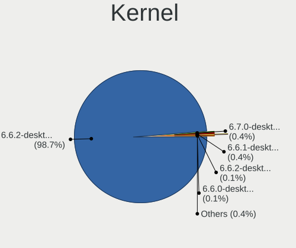

| Version                        | Desktops | Percent |
|--------------------------------|----------|---------|
| 6.6.2-desktop-1omv2390         | 836      | 98.7%   |
| 6.7.0-desktop-0.rc2.1omv2390   | 3        | 0.35%   |
| 6.6.1-desktop-1omv2390         | 3        | 0.35%   |
| 6.6.2-desktop-gcc-1omv2390     | 1        | 0.12%   |
| 6.6.0-desktop-1omv2390         | 1        | 0.12%   |
| 6.14.2-desktop-3omv2590        | 1        | 0.12%   |
| 5.16.13-desktop-clang-1omv4003 | 1        | 0.12%   |
| 5.16.13-desktop-1omv4003       | 1        | 0.12%   |

Kernel Family
-------------

Linux kernel without a distro release

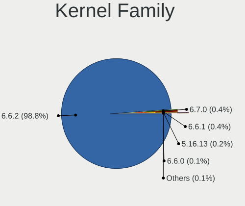

| Version | Desktops | Percent |
|---------|----------|---------|
| 6.6.2   | 837      | 98.82%  |
| 6.7.0   | 3        | 0.35%   |
| 6.6.1   | 3        | 0.35%   |
| 5.16.13 | 2        | 0.24%   |
| 6.6.0   | 1        | 0.12%   |
| 6.14.2  | 1        | 0.12%   |

Kernel Major Ver.
-----------------

Linux kernel major version

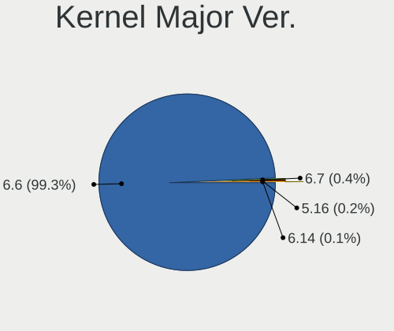

| Version | Desktops | Percent |
|---------|----------|---------|
| 6.6     | 841      | 99.29%  |
| 6.7     | 3        | 0.35%   |
| 5.16    | 2        | 0.24%   |
| 6.14    | 1        | 0.12%   |

Arch
----

OS architecture (x86_64, i586, etc.)

| Name   | Desktops | Percent |
|--------|----------|---------|
| x86_64 | 846      | 100%    |

DE
--

Desktop Environment

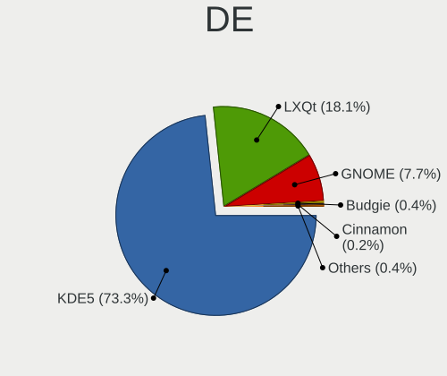

| Name     | Desktops | Percent |
|----------|----------|---------|
| KDE5     | 621      | 73.32%  |
| LXQt     | 153      | 18.06%  |
| GNOME    | 65       | 7.67%   |
| Budgie   | 3        | 0.35%   |
| Cinnamon | 2        | 0.24%   |
| XFCE     | 1        | 0.12%   |
| KDE6     | 1        | 0.12%   |
| Unknown  | 1        | 0.12%   |

Display Server
--------------

X11 or Wayland

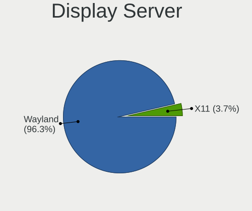

| Name    | Desktops | Percent |
|---------|----------|---------|
| Wayland | 816      | 96.34%  |
| X11     | 31       | 3.66%   |

Display Manager
---------------

SDDM, LightDM, etc.

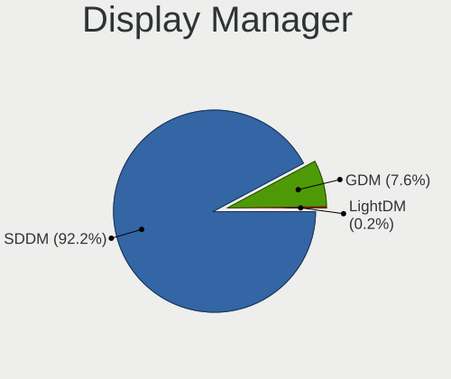

| Name    | Desktops | Percent |
|---------|----------|---------|
| SDDM    | 780      | 92.2%   |
| GDM     | 64       | 7.57%   |
| LightDM | 2        | 0.24%   |

OS Lang
-------

Language

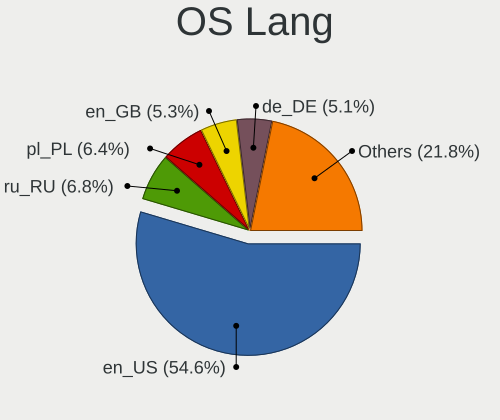

| Lang  | Desktops | Percent |
|-------|----------|---------|
| en_US | 463      | 54.6%   |
| ru_RU | 58       | 6.84%   |
| pl_PL | 54       | 6.37%   |
| en_GB | 45       | 5.31%   |
| de_DE | 43       | 5.07%   |
| fr_FR | 30       | 3.54%   |
| it_IT | 25       | 2.95%   |
| pt_BR | 16       | 1.89%   |
| es_ES | 13       | 1.53%   |
| en_AU | 13       | 1.53%   |
| en_CA | 12       | 1.42%   |
| fr_CA | 8        | 0.94%   |
| es_MX | 6        | 0.71%   |
| es_AR | 5        | 0.59%   |
| en_IN | 4        | 0.47%   |
| en_IL | 4        | 0.47%   |
| de_AT | 4        | 0.47%   |
| UTF-8 | 3        | 0.35%   |
| ru_UA | 3        | 0.35%   |
| ja_JP | 3        | 0.35%   |
| hu_HU | 3        | 0.35%   |
| en_ZA | 3        | 0.35%   |
| zh_TW | 2        | 0.24%   |
| ro_RO | 2        | 0.24%   |
| nl_NL | 2        | 0.24%   |
| nl_BE | 2        | 0.24%   |
| nb_NO | 2        | 0.24%   |
| es_CO | 2        | 0.24%   |
| en_SG | 2        | 0.24%   |
| de_CH | 2        | 0.24%   |
| cs_CZ | 2        | 0.24%   |
| uk_UA | 1        | 0.12%   |
| tr_TR | 1        | 0.12%   |
| pt_PT | 1        | 0.12%   |
| fr_CH | 1        | 0.12%   |
| fr_BE | 1        | 0.12%   |
| es_VE | 1        | 0.12%   |
| es_UY | 1        | 0.12%   |
| es_HN | 1        | 0.12%   |
| es_EC | 1        | 0.12%   |

Boot Mode
---------

EFI or BIOS

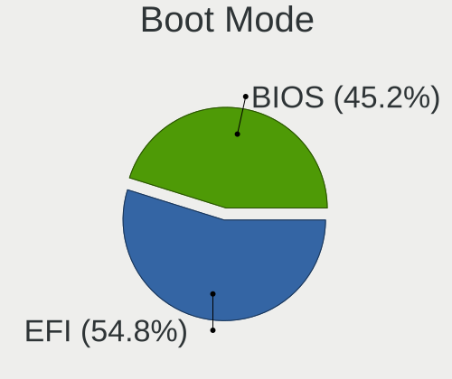

| Mode | Desktops | Percent |
|------|----------|---------|
| EFI  | 465      | 54.83%  |
| BIOS | 383      | 45.17%  |

Filesystem
----------

Type of filesystem

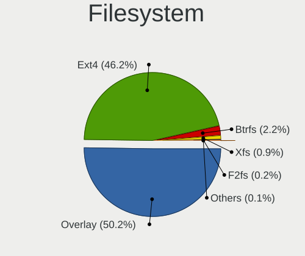

| Type    | Desktops | Percent |
|---------|----------|---------|
| Overlay | 427      | 50.24%  |
| Ext4    | 393      | 46.24%  |
| Btrfs   | 19       | 2.24%   |
| Xfs     | 8        | 0.94%   |
| F2fs    | 2        | 0.24%   |
| Ext3    | 1        | 0.12%   |

Part. scheme
------------

Scheme of partitioning

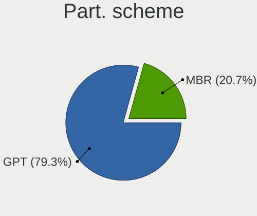

| Type | Desktops | Percent |
|------|----------|---------|
| GPT  | 671      | 79.31%  |
| MBR  | 175      | 20.69%  |

Dual Boot with Linux/BSD
------------------------

Hosting more than one Linux/BSD

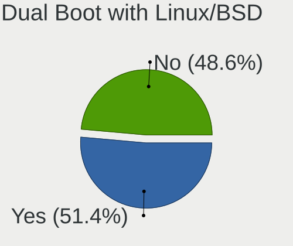

| Dual boot | Desktops | Percent |
|-----------|----------|---------|
| Yes       | 437      | 51.41%  |
| No        | 413      | 48.59%  |

Dual Boot (Win)
---------------

Hosting Linux and Windows

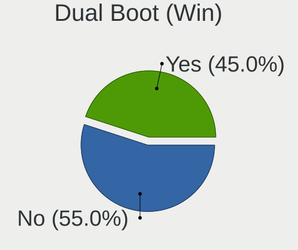

| Dual boot | Desktops | Percent |
|-----------|----------|---------|
| No        | 467      | 55.01%  |
| Yes       | 382      | 44.99%  |

Board
-----

Vendor
------

Motherboard manufacturer

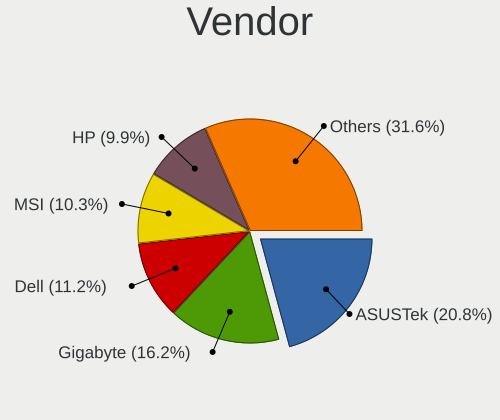

| Name                                 | Desktops | Percent |
|--------------------------------------|----------|---------|
| ASUSTek Computer                     | 176      | 20.8%   |
| Gigabyte Technology                  | 137      | 16.19%  |
| Dell                                 | 95       | 11.23%  |
| MSI                                  | 87       | 10.28%  |
| Hewlett-Packard                      | 84       | 9.93%   |
| ASRock                               | 63       | 7.45%   |
| Lenovo                               | 38       | 4.49%   |
| Acer                                 | 28       | 3.31%   |
| Intel                                | 26       | 3.07%   |
| Fujitsu                              | 14       | 1.65%   |
| Unknown                              | 13       | 1.54%   |
| Biostar                              | 11       | 1.3%    |
| Foxconn                              | 7        | 0.83%   |
| Red Hat                              | 6        | 0.71%   |
| Pegatron                             | 6        | 0.71%   |
| Medion                               | 4        | 0.47%   |
| AZW                                  | 4        | 0.47%   |
| Shenzhen Meigao Electronic Equipment | 3        | 0.35%   |
| Packard Bell                         | 3        | 0.35%   |
| MAXSUN                               | 3        | 0.35%   |
| MACHINIST                            | 3        | 0.35%   |
| OEM                                  | 2        | 0.24%   |
| MouseComputer                        | 2        | 0.24%   |
| AMI                                  | 2        | 0.24%   |
| Wistron                              | 1        | 0.12%   |
| TYAN Computer                        | 1        | 0.12%   |
| T-bao                                | 1        | 0.12%   |
| SZMZ                                 | 1        | 0.12%   |
| Supermicro                           | 1        | 0.12%   |
| Star Labs                            | 1        | 0.12%   |
| Shuttle                              | 1        | 0.12%   |
| roda computer                        | 1        | 0.12%   |
| Radiant Systems                      | 1        | 0.12%   |
| PELADN                               | 1        | 0.12%   |
| Lenovo Product                       | 1        | 0.12%   |
| Huanan                               | 1        | 0.12%   |
| GEEKOM                               | 1        | 0.12%   |
| Gateway                              | 1        | 0.12%   |
| Founder                              | 1        | 0.12%   |
| Firebat_Computer                     | 1        | 0.12%   |

Model
-----

Motherboard model

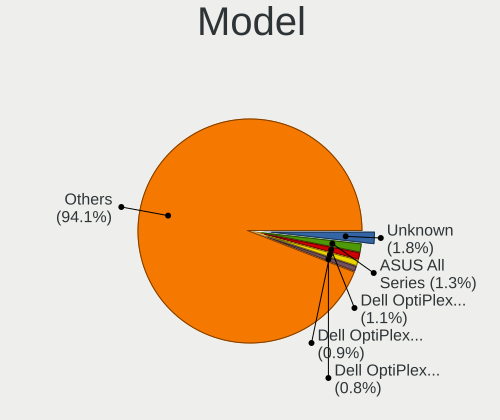

| Name                          | Desktops | Percent |
|-------------------------------|----------|---------|
| Unknown                       | 15       | 1.77%   |
| ASUS All Series               | 11       | 1.3%    |
| Dell OptiPlex 9020            | 9        | 1.06%   |
| Dell OptiPlex 3020            | 8        | 0.95%   |
| Dell OptiPlex 7010            | 7        | 0.83%   |
| Red Hat KVM                   | 6        | 0.71%   |
| HP EliteDesk 800 G2 DM 35W    | 5        | 0.59%   |
| Dell OptiPlex 780             | 5        | 0.59%   |
| ASUS PRIME A320M-K            | 5        | 0.59%   |
| MSI MS-7C37                   | 4        | 0.47%   |
| Intel H61                     | 4        | 0.47%   |
| HP Compaq 8200 Elite SFF PC   | 4        | 0.47%   |
| Dell OptiPlex 7040            | 4        | 0.47%   |
| ASUS PRIME B550M-A            | 4        | 0.47%   |
| ASUS P8Z77-V LX               | 4        | 0.47%   |
| ASRock B450M-HDV R4.0         | 4        | 0.47%   |
| Acer Veriton L670G            | 4        | 0.47%   |
| MSI MS-7B85                   | 3        | 0.35%   |
| MSI MS-7A38                   | 3        | 0.35%   |
| MSI MS-7721                   | 3        | 0.35%   |
| Intel H81                     | 3        | 0.35%   |
| HP Z440 Workstation           | 3        | 0.35%   |
| HP Pavilion Desktop 590-p0xxx | 3        | 0.35%   |
| HP EliteDesk 800 G3 SFF       | 3        | 0.35%   |
| HP EliteDesk 800 G2 SFF       | 3        | 0.35%   |
| HP Compaq Pro 6300 MT         | 3        | 0.35%   |
| Gigabyte GA-78LMT-USB3        | 3        | 0.35%   |
| Gigabyte G31M-ES2L            | 3        | 0.35%   |
| Gigabyte B450M DS3H V2        | 3        | 0.35%   |
| Dell OptiPlex 755             | 3        | 0.35%   |
| Dell OptiPlex 5040            | 3        | 0.35%   |
| Dell OptiPlex 3050            | 3        | 0.35%   |
| Dell OptiPlex 3010            | 3        | 0.35%   |
| AZW MINI S                    | 3        | 0.35%   |
| ASUS ROG STRIX B450-F GAMING  | 3        | 0.35%   |
| ASUS PRIME Z390M-PLUS         | 3        | 0.35%   |
| ASUS PRIME B450M-A II         | 3        | 0.35%   |
| ASUS P5G41-M LE               | 3        | 0.35%   |
| ASUS M5A78L-M/USB3            | 3        | 0.35%   |
| ASUS M5A78L-M LX3             | 3        | 0.35%   |

Model Family
------------

Motherboard model prefix

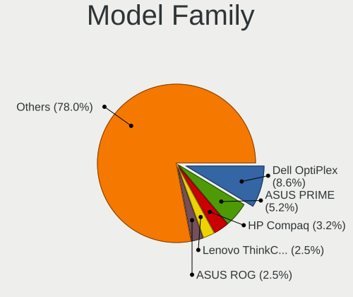

| Name                   | Desktops | Percent |
|------------------------|----------|---------|
| Dell OptiPlex          | 73       | 8.63%   |
| ASUS PRIME             | 44       | 5.2%    |
| HP Compaq              | 27       | 3.19%   |
| Lenovo ThinkCentre     | 21       | 2.48%   |
| ASUS ROG               | 21       | 2.48%   |
| HP EliteDesk           | 20       | 2.36%   |
| Unknown                | 15       | 1.77%   |
| HP ProDesk             | 13       | 1.54%   |
| ASUS TUF               | 13       | 1.54%   |
| Acer Aspire            | 12       | 1.42%   |
| ASUS All               | 11       | 1.3%    |
| Acer Veriton           | 11       | 1.3%    |
| Fujitsu ESPRIMO        | 10       | 1.18%   |
| ASUS M5A78L-M          | 8        | 0.95%   |
| HP Pavilion            | 7        | 0.83%   |
| Gigabyte B450          | 7        | 0.83%   |
| Dell Precision         | 7        | 0.83%   |
| Red Hat KVM            | 6        | 0.71%   |
| Lenovo IdeaCentre      | 6        | 0.71%   |
| Intel H61              | 6        | 0.71%   |
| Dell Inspiron          | 6        | 0.71%   |
| Gigabyte B450M         | 5        | 0.59%   |
| ASUS P8Z77-V           | 5        | 0.59%   |
| MSI MS-7C37            | 4        | 0.47%   |
| Gigabyte X570          | 4        | 0.47%   |
| ASRock B450M-HDV       | 4        | 0.47%   |
| ASRock B450            | 4        | 0.47%   |
| MSI MS-7B85            | 3        | 0.35%   |
| MSI MS-7A38            | 3        | 0.35%   |
| MSI MS-7721            | 3        | 0.35%   |
| Intel H81              | 3        | 0.35%   |
| HP Z440                | 3        | 0.35%   |
| Gigabyte Z390          | 3        | 0.35%   |
| Gigabyte GA-78LMT-USB3 | 3        | 0.35%   |
| Gigabyte G31M-ES2L     | 3        | 0.35%   |
| Gigabyte B560M         | 3        | 0.35%   |
| Dell XPS               | 3        | 0.35%   |
| Dell Vostro            | 3        | 0.35%   |
| AZW MINI               | 3        | 0.35%   |
| ASUS SABERTOOTH        | 3        | 0.35%   |

MFG Year
--------

Motherboard manufacture year

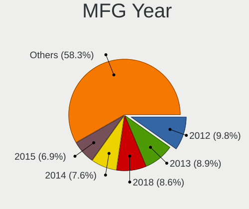

| Year | Desktops | Percent |
|------|----------|---------|
| 2012 | 83       | 9.81%   |
| 2013 | 75       | 8.87%   |
| 2018 | 73       | 8.63%   |
| 2014 | 64       | 7.57%   |
| 2015 | 58       | 6.86%   |
| 2011 | 56       | 6.62%   |
| 2020 | 54       | 6.38%   |
| 2009 | 51       | 6.03%   |
| 2017 | 47       | 5.56%   |
| 2021 | 42       | 4.96%   |
| 2019 | 39       | 4.61%   |
| 2023 | 36       | 4.26%   |
| 2022 | 32       | 3.78%   |
| 2010 | 32       | 3.78%   |
| 2016 | 30       | 3.55%   |
| 2008 | 30       | 3.55%   |
| 2007 | 15       | 1.77%   |
| 2006 | 14       | 1.65%   |
| 2024 | 10       | 1.18%   |
| 2005 | 4        | 0.47%   |
| 2004 | 1        | 0.12%   |

Form Factor
-----------

Physical design of the computer

| Name    | Desktops | Percent |
|---------|----------|---------|
| Desktop | 846      | 100%    |

Secure Boot
-----------

Enabled or disabled

| State    | Desktops | Percent |
|----------|----------|---------|
| Disabled | 846      | 100%    |

Coreboot
--------

Have coreboot on board

| Used | Desktops | Percent |
|------|----------|---------|
| No   | 845      | 99.88%  |
| Yes  | 1        | 0.12%   |

RAM Size
--------

Total RAM memory

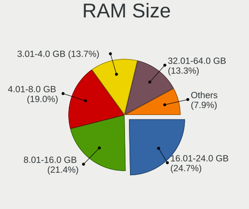

| Size in GB      | Desktops | Percent |
|-----------------|----------|---------|
| 16.01-24.0      | 209      | 24.68%  |
| 8.01-16.0       | 181      | 21.37%  |
| 4.01-8.0        | 161      | 19.01%  |
| 3.01-4.0        | 116      | 13.7%   |
| 32.01-64.0      | 113      | 13.34%  |
| 64.01-256.0     | 24       | 2.83%   |
| 24.01-32.0      | 21       | 2.48%   |
| 1.01-2.0        | 12       | 1.42%   |
| 2.01-3.0        | 8        | 0.94%   |
| More than 256.0 | 1        | 0.12%   |
| 0.51-1.0        | 1        | 0.12%   |

RAM Used
--------

Used RAM memory

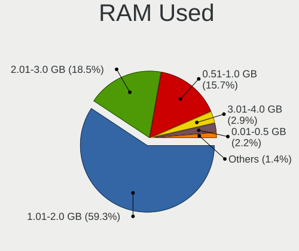

| Used GB   | Desktops | Percent |
|-----------|----------|---------|
| 1.01-2.0  | 510      | 59.3%   |
| 2.01-3.0  | 159      | 18.49%  |
| 0.51-1.0  | 135      | 15.7%   |
| 3.01-4.0  | 25       | 2.91%   |
| 0.01-0.5  | 19       | 2.21%   |
| 4.01-8.0  | 11       | 1.28%   |
| 8.01-16.0 | 1        | 0.12%   |

Total Drives
------------

Number of drives on board

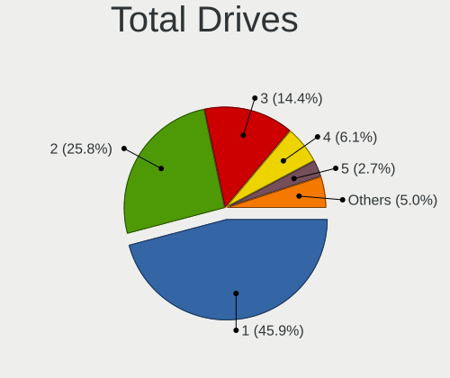

| Drives | Desktops | Percent |
|--------|----------|---------|
| 1      | 391      | 45.89%  |
| 2      | 220      | 25.82%  |
| 3      | 123      | 14.44%  |
| 4      | 52       | 6.1%    |
| 5      | 23       | 2.7%    |
| 0      | 21       | 2.46%   |
| 6      | 11       | 1.29%   |
| 7      | 6        | 0.7%    |
| 9      | 3        | 0.35%   |
| 13     | 1        | 0.12%   |
| 8      | 1        | 0.12%   |

Has CD-ROM
----------

Has CD-ROM on board

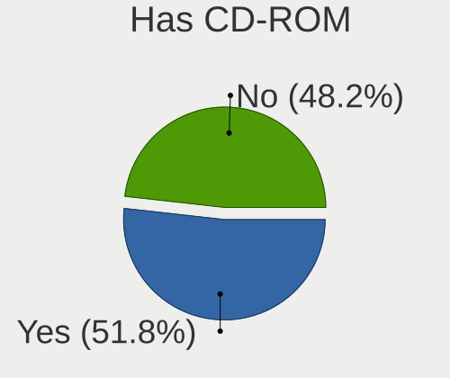

| Presented | Desktops | Percent |
|-----------|----------|---------|
| Yes       | 439      | 51.77%  |
| No        | 409      | 48.23%  |

Has Ethernet
------------

Has Ethernet on board

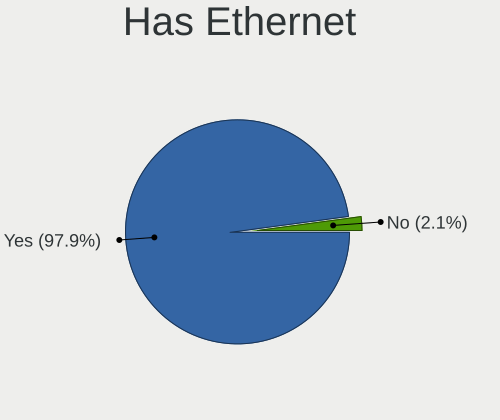

| Presented | Desktops | Percent |
|-----------|----------|---------|
| Yes       | 828      | 97.87%  |
| No        | 18       | 2.13%   |

Has WiFi
--------

Has WiFi module

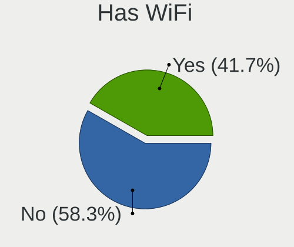

| Presented | Desktops | Percent |
|-----------|----------|---------|
| No        | 494      | 58.25%  |
| Yes       | 354      | 41.75%  |

Has Bluetooth
-------------

Has Bluetooth module

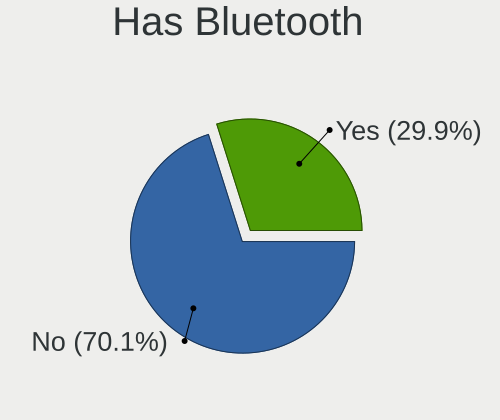

| Presented | Desktops | Percent |
|-----------|----------|---------|
| No        | 594      | 70.13%  |
| Yes       | 253      | 29.87%  |

Location
--------

Country
-------

Geographic location (country)

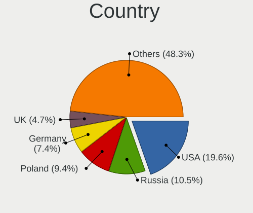

| Country      | Desktops | Percent |
|--------------|----------|---------|
| USA          | 166      | 19.6%   |
| Russia       | 89       | 10.51%  |
| Poland       | 80       | 9.45%   |
| Germany      | 63       | 7.44%   |
| UK           | 40       | 4.72%   |
| France       | 38       | 4.49%   |
| Italy        | 37       | 4.37%   |
| Canada       | 31       | 3.66%   |
| Brazil       | 29       | 3.42%   |
| Australia    | 21       | 2.48%   |
| Spain        | 15       | 1.77%   |
| Sweden       | 13       | 1.53%   |
| Romania      | 12       | 1.42%   |
| Hungary      | 12       | 1.42%   |
| Argentina    | 11       | 1.3%    |
| Mexico       | 9        | 1.06%   |
| China        | 9        | 1.06%   |
| Japan        | 8        | 0.94%   |
| New Zealand  | 7        | 0.83%   |
| Greece       | 7        | 0.83%   |
| Belgium      | 7        | 0.83%   |
| Ukraine      | 6        | 0.71%   |
| Philippines  | 6        | 0.71%   |
| Netherlands  | 6        | 0.71%   |
| Kazakhstan   | 6        | 0.71%   |
| Israel       | 6        | 0.71%   |
| Indonesia    | 6        | 0.71%   |
| Turkey       | 5        | 0.59%   |
| South Africa | 5        | 0.59%   |
| Serbia       | 5        | 0.59%   |
| Portugal     | 5        | 0.59%   |
| Malaysia     | 5        | 0.59%   |
| India        | 5        | 0.59%   |
| Switzerland  | 4        | 0.47%   |
| Czechia      | 4        | 0.47%   |
| Croatia      | 4        | 0.47%   |
| Uruguay      | 3        | 0.35%   |
| Thailand     | 3        | 0.35%   |
| Taiwan       | 3        | 0.35%   |
| South Korea  | 3        | 0.35%   |

City
----

Geographic location (city)

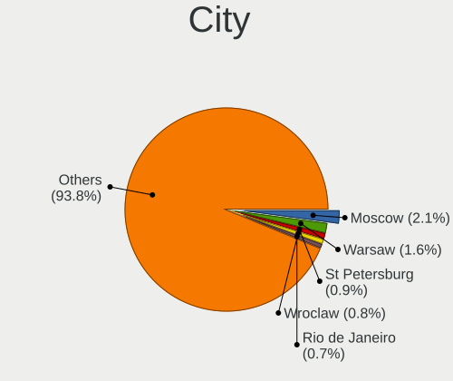

| City           | Desktops | Percent |
|----------------|----------|---------|
| Moscow         | 18       | 2.11%   |
| Warsaw         | 14       | 1.64%   |
| St Petersburg  | 8        | 0.94%   |
| Wroclaw        | 7        | 0.82%   |
| Rio de Janeiro | 6        | 0.7%    |
| Citrus Heights | 6        | 0.7%    |
| Berlin         | 6        | 0.7%    |
| Tucson         | 5        | 0.59%   |
| Toulouse       | 5        | 0.59%   |
| Sydney         | 5        | 0.59%   |
| Rome           | 5        | 0.59%   |
| Manchester     | 5        | 0.59%   |
| Brisbane       | 5        | 0.59%   |
| Almaty         | 5        | 0.59%   |
| Ulyanovsk      | 4        | 0.47%   |
| Tel Aviv       | 4        | 0.47%   |
| Târgu Mureş  | 4        | 0.47%   |
| Rostov-on-Don  | 4        | 0.47%   |
| Novosibirsk    | 4        | 0.47%   |
| Montreal       | 4        | 0.47%   |
| London         | 4        | 0.47%   |
| Lisbon         | 4        | 0.47%   |
| Kronberg       | 4        | 0.47%   |
| Krasnodar      | 4        | 0.47%   |
| Christchurch   | 4        | 0.47%   |
| Buenos Aires   | 4        | 0.47%   |
| Singapore      | 3        | 0.35%   |
| Sao Paulo      | 3        | 0.35%   |
| Santiago       | 3        | 0.35%   |
| Poznan         | 3        | 0.35%   |
| Paris          | 3        | 0.35%   |
| Padova         | 3        | 0.35%   |
| Novi Sad       | 3        | 0.35%   |
| Munich         | 3        | 0.35%   |
| Milan          | 3        | 0.35%   |
| Melbourne      | 3        | 0.35%   |
| Marseille      | 3        | 0.35%   |
| Madrid         | 3        | 0.35%   |
| Kuala Lumpur   | 3        | 0.35%   |
| Krakow         | 3        | 0.35%   |

Drives
------

Drive Vendor
------------

Hard drive vendors

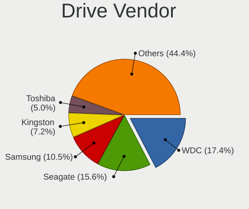

| Vendor                      | Desktops | Drives | Percent |
|-----------------------------|----------|--------|---------|
| WDC                         | 252      | 314    | 17.38%  |
| Seagate                     | 226      | 294    | 15.59%  |
| Samsung Electronics         | 152      | 189    | 10.48%  |
| Kingston                    | 104      | 115    | 7.17%   |
| Toshiba                     | 72       | 83     | 4.97%   |
| Crucial                     | 63       | 69     | 4.34%   |
| SanDisk                     | 50       | 56     | 3.45%   |
| Hitachi                     | 46       | 52     | 3.17%   |
| China                       | 31       | 34     | 2.14%   |
| A-DATA Technology           | 31       | 38     | 2.14%   |
| Intel                       | 27       | 28     | 1.86%   |
| GOODRAM                     | 24       | 25     | 1.66%   |
| SPCC                        | 22       | 26     | 1.52%   |
| Patriot                     | 22       | 25     | 1.52%   |
| Intenso                     | 21       | 23     | 1.45%   |
| Unknown                     | 19       | 19     | 1.31%   |
| HGST                        | 15       | 15     | 1.03%   |
| PNY                         | 14       | 17     | 0.97%   |
| JMicron Technology          | 13       | 13     | 0.9%    |
| SK hynix                    | 11       | 12     | 0.76%   |
| Team                        | 9        | 9      | 0.62%   |
| Maxtor                      | 9        | 9      | 0.62%   |
| Unknown                     | 8        | 8      | 0.55%   |
| Transcend                   | 7        | 8      | 0.48%   |
| Netac                       | 7        | 8      | 0.48%   |
| Micron Technology           | 7        | 8      | 0.48%   |
| ASMT                        | 7        | 8      | 0.48%   |
| OCZ                         | 6        | 6      | 0.41%   |
| Lexar                       | 6        | 6      | 0.41%   |
| Kingston Technology Company | 6        | 6      | 0.41%   |
| Apacer                      | 6        | 6      | 0.41%   |
| HPQ                         | 5        | 5      | 0.34%   |
| Fujitsu                     | 5        | 15     | 0.34%   |
| Smartbuy                    | 4        | 4      | 0.28%   |
| Silicon Motion              | 4        | 6      | 0.28%   |
| Phison                      | 4        | 5      | 0.28%   |
| MSI                         | 4        | 7      | 0.28%   |
| KingFast                    | 4        | 4      | 0.28%   |
| KingDian                    | 4        | 5      | 0.28%   |
| Gigabyte Technology         | 4        | 4      | 0.28%   |

Drive Model
-----------

Hard drive models

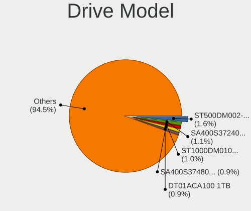

| Model                            | Desktops | Percent |
|----------------------------------|----------|---------|
| Seagate ST500DM002-1BD142 500GB  | 26       | 1.62%   |
| Kingston SA400S37240G 240GB SSD  | 18       | 1.12%   |
| Seagate ST1000DM010-2EP102 1TB   | 16       | 1%      |
| Kingston SA400S37480G 480GB SSD  | 15       | 0.93%   |
| Toshiba DT01ACA100 1TB           | 14       | 0.87%   |
| Kingston SA400S37120G 120GB SSD  | 12       | 0.75%   |
| WDC WD10EZEX-08WN4A0 1TB         | 11       | 0.68%   |
| Seagate ST3500418AS 500GB        | 11       | 0.68%   |
| Toshiba DT01ACA050 500GB         | 10       | 0.62%   |
| Unknown SD/MMC/MS PRO 2GB        | 9        | 0.56%   |
| Crucial CT240BX500SSD1 240GB     | 9        | 0.56%   |
| Seagate ST2000DM001-1ER164 2TB   | 8        | 0.5%    |
| Seagate ST1000DM003-1ER162 1TB   | 8        | 0.5%    |
| SanDisk NVMe SSD Drive 1TB       | 8        | 0.5%    |
| Unknown                          | 8        | 0.5%    |
| Seagate ST2000DM008-2FR102 2TB   | 7        | 0.44%   |
| Samsung SSD 980 1TB              | 7        | 0.44%   |
| Samsung SSD 870 EVO 500GB        | 7        | 0.44%   |
| Crucial CT120BX500SSD1 120GB     | 7        | 0.44%   |
| SanDisk SSD PLUS 240GB           | 6        | 0.37%   |
| Samsung SSD 860 EVO 250GB        | 6        | 0.37%   |
| Samsung SSD 850 EVO 250GB        | 6        | 0.37%   |
| Kingston Company SNV2S1000G 1TB  | 6        | 0.37%   |
| Kingston SUV400S37120G 120GB SSD | 6        | 0.37%   |
| JMicron Tech 250GB               | 6        | 0.37%   |
| JMicron Generic 320GB            | 6        | 0.37%   |
| China SATA SSD 240GB             | 6        | 0.37%   |
| WDC WDS500G2B0A-00SM50 500GB     | 5        | 0.31%   |
| WDC WD5000AAKX-001CA0 500GB      | 5        | 0.31%   |
| WDC WD10EZEX-22MFCA0 1TB         | 5        | 0.31%   |
| Toshiba HDWD130 3TB              | 5        | 0.31%   |
| Toshiba HDWD110 1TB              | 5        | 0.31%   |
| Seagate ST3500413AS 500GB        | 5        | 0.31%   |
| Seagate ST2000DM001-1CH164 2TB   | 5        | 0.31%   |
| Seagate ST1000DM003-1CH162 1TB   | 5        | 0.31%   |
| Kingston SNV2S500G 500GB         | 5        | 0.31%   |
| HPQ BF450DASTK 450GB             | 5        | 0.31%   |
| Hitachi HDS721010CLA332 1TB      | 5        | 0.31%   |
| Crucial CT500MX500SSD1 500GB     | 5        | 0.31%   |
| Crucial CT1000MX500SSD1 1TB      | 5        | 0.31%   |

HDD Vendor
----------

Hard disk drive vendors

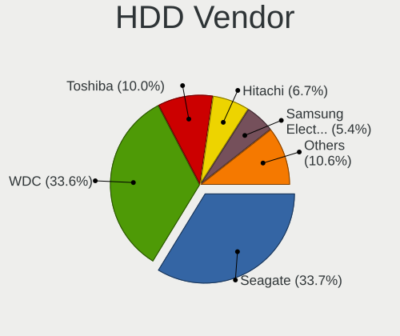

| Vendor              | Desktops | Drives | Percent |
|---------------------|----------|--------|---------|
| Seagate             | 220      | 283    | 33.74%  |
| WDC                 | 219      | 258    | 33.59%  |
| Toshiba             | 65       | 76     | 9.97%   |
| Hitachi             | 44       | 50     | 6.75%   |
| Samsung Electronics | 35       | 43     | 5.37%   |
| HGST                | 15       | 15     | 2.3%    |
| Unknown             | 10       | 10     | 1.53%   |
| Maxtor              | 9        | 9      | 1.38%   |
| JMicron Technology  | 6        | 6      | 0.92%   |
| HPQ                 | 5        | 5      | 0.77%   |
| Intenso             | 4        | 4      | 0.61%   |
| Fujitsu             | 4        | 14     | 0.61%   |
| WD MediaMax         | 2        | 2      | 0.31%   |
| TO Exter            | 2        | 2      | 0.31%   |
| Inateck             | 2        | 2      | 0.31%   |
| USB3.0              | 1        | 1      | 0.15%   |
| StoreJet            | 1        | 1      | 0.15%   |
| MaxDigital          | 1        | 1      | 0.15%   |
| KESU                | 1        | 1      | 0.15%   |
| HGST HTS            | 1        | 1      | 0.15%   |
| Hewlett-Packard     | 1        | 1      | 0.15%   |
| CIRAGO              | 1        | 1      | 0.15%   |
| ASMT                | 1        | 1      | 0.15%   |
| ASMedia             | 1        | 1      | 0.15%   |
| Apple               | 1        | 1      | 0.15%   |

SSD Vendor
----------

Solid state drive vendors

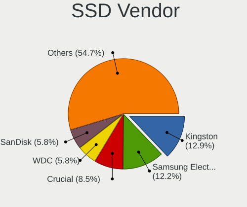

| Vendor              | Desktops | Drives | Percent |
|---------------------|----------|--------|---------|
| Kingston            | 73       | 77     | 12.92%  |
| Samsung Electronics | 69       | 78     | 12.21%  |
| Crucial             | 48       | 52     | 8.5%    |
| WDC                 | 33       | 33     | 5.84%   |
| SanDisk             | 33       | 37     | 5.84%   |
| China               | 31       | 34     | 5.49%   |
| GOODRAM             | 23       | 24     | 4.07%   |
| A-DATA Technology   | 19       | 21     | 3.36%   |
| Intenso             | 18       | 19     | 3.19%   |
| Intel               | 18       | 18     | 3.19%   |
| SPCC                | 16       | 19     | 2.83%   |
| Patriot             | 16       | 19     | 2.83%   |
| PNY                 | 12       | 14     | 2.12%   |
| Unknown             | 8        | 8      | 1.42%   |
| Transcend           | 7        | 8      | 1.24%   |
| Team                | 7        | 7      | 1.24%   |
| OCZ                 | 6        | 6      | 1.06%   |
| Netac               | 6        | 7      | 1.06%   |
| Micron Technology   | 6        | 7      | 1.06%   |
| ASMT                | 6        | 7      | 1.06%   |
| Apacer              | 6        | 6      | 1.06%   |
| SK hynix            | 5        | 5      | 0.88%   |
| Toshiba             | 4        | 4      | 0.71%   |
| KingFast            | 4        | 4      | 0.71%   |
| KingDian            | 4        | 5      | 0.71%   |
| Gigabyte Technology | 4        | 4      | 0.71%   |
| DEXP                | 4        | 5      | 0.71%   |
| Vaseky              | 3        | 3      | 0.53%   |
| Smartbuy            | 3        | 3      | 0.53%   |
| LITEON              | 3        | 3      | 0.53%   |
| KIOXIA-EXCERIA      | 3        | 3      | 0.53%   |
| KingSpec            | 3        | 4      | 0.53%   |
| AMD                 | 3        | 3      | 0.53%   |
| T-FORCE             | 2        | 2      | 0.35%   |
| Reeinno             | 2        | 2      | 0.35%   |
| PNY USB             | 2        | 2      | 0.35%   |
| LITEONIT            | 2        | 2      | 0.35%   |
| Inland              | 2        | 2      | 0.35%   |
| Hitachi             | 2        | 2      | 0.35%   |
| Fanxiang            | 2        | 2      | 0.35%   |

Drive Kind
----------

HDD or SSD

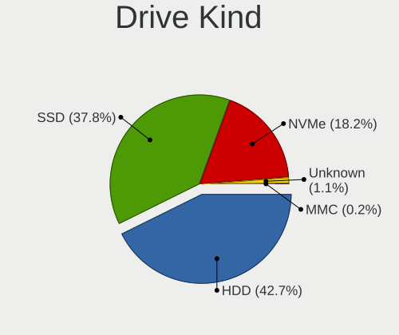

| Kind    | Desktops | Drives | Percent |
|---------|----------|--------|---------|
| HDD     | 511      | 789    | 42.69%  |
| SSD     | 453      | 610    | 37.84%  |
| NVMe    | 218      | 292    | 18.21%  |
| Unknown | 13       | 15     | 1.09%   |
| MMC     | 2        | 2      | 0.17%   |

Drive Connector
---------------

SATA, SAS, NVMe, etc.

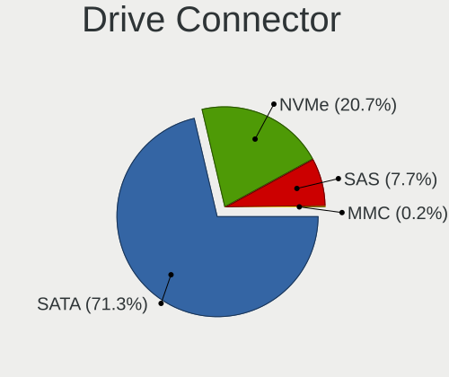

| Type | Desktops | Drives | Percent |
|------|----------|--------|---------|
| SATA | 737      | 1314   | 71.35%  |
| NVMe | 214      | 284    | 20.72%  |
| SAS  | 80       | 108    | 7.74%   |
| MMC  | 2        | 2      | 0.19%   |

Drive Size
----------

Size of hard drive

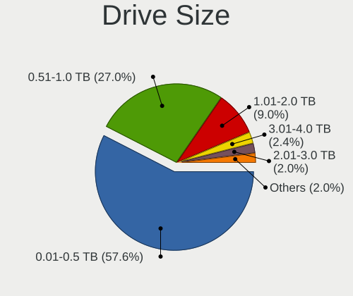

| Size in TB | Desktops | Drives | Percent |
|------------|----------|--------|---------|
| 0.01-0.5   | 579      | 872    | 57.55%  |
| 0.51-1.0   | 272      | 333    | 27.04%  |
| 1.01-2.0   | 91       | 113    | 9.05%   |
| 3.01-4.0   | 24       | 31     | 2.39%   |
| 2.01-3.0   | 20       | 25     | 1.99%   |
| 4.01-10.0  | 14       | 18     | 1.39%   |
| 10.01-20.0 | 6        | 7      | 0.6%    |

Space Total
-----------

Amount of disk space available on the file system

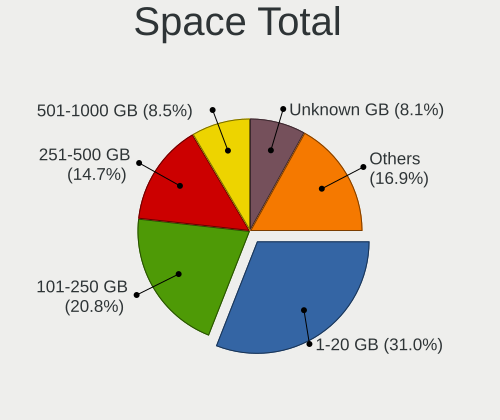

| Size in GB     | Desktops | Percent |
|----------------|----------|---------|
| 1-20           | 265      | 30.96%  |
| 101-250        | 178      | 20.79%  |
| 251-500        | 126      | 14.72%  |
| 501-1000       | 73       | 8.53%   |
| Unknown        | 69       | 8.06%   |
| 51-100         | 43       | 5.02%   |
| 1001-2000      | 38       | 4.44%   |
| 21-50          | 37       | 4.32%   |
| More than 3000 | 19       | 2.22%   |
| 2001-3000      | 8        | 0.93%   |

Space Used
----------

Amount of used disk space

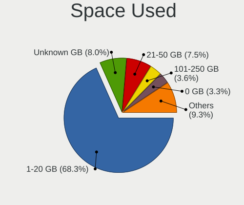

| Used GB        | Desktops | Percent |
|----------------|----------|---------|
| 1-20           | 587      | 68.34%  |
| Unknown        | 69       | 8.03%   |
| 21-50          | 64       | 7.45%   |
| 101-250        | 31       | 3.61%   |
| 0              | 28       | 3.26%   |
| 51-100         | 25       | 2.91%   |
| 251-500        | 23       | 2.68%   |
| More than 3000 | 10       | 1.16%   |
| 501-1000       | 10       | 1.16%   |
| 1001-2000      | 9        | 1.05%   |
| 2001-3000      | 3        | 0.35%   |

Malfunc. Drives
---------------

Drive models with a malfunction

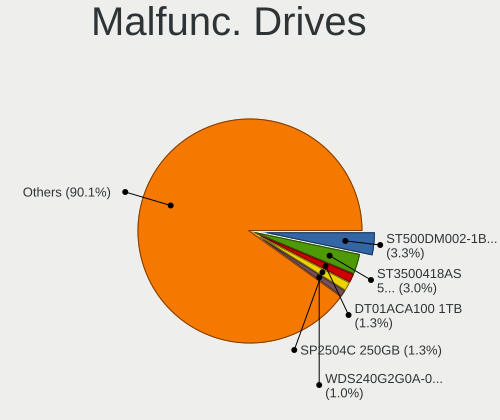

| Model                                 | Desktops | Drives | Percent |
|---------------------------------------|----------|--------|---------|
| Seagate ST500DM002-1BD142 500GB       | 10       | 10     | 3.3%    |
| Seagate ST3500418AS 500GB             | 9        | 10     | 2.97%   |
| Toshiba DT01ACA100 1TB                | 4        | 4      | 1.32%   |
| Samsung Electronics SP2504C 250GB     | 4        | 4      | 1.32%   |
| WDC WDS240G2G0A-00JH30 240GB SSD      | 3        | 3      | 0.99%   |
| WDC WD5000AAKX-001CA0 500GB           | 3        | 3      | 0.99%   |
| Samsung Electronics HD753LJ 752GB     | 3        | 3      | 0.99%   |
| Hitachi HDS721010CLA332 1TB           | 3        | 3      | 0.99%   |
| HGST HTS721010A9E630 1TB              | 3        | 3      | 0.99%   |
| WDC WD5000AAKX-60U6AA0 500GB          | 2        | 2      | 0.66%   |
| WDC WD3200BPVT-80JJ5T0 320GB          | 2        | 2      | 0.66%   |
| WDC WD3200BEKT-60V5T1 320GB           | 2        | 2      | 0.66%   |
| WDC WD3200AAKS-00L9A0 320GB           | 2        | 2      | 0.66%   |
| WDC WD20EARX-00PASB0 2TB              | 2        | 2      | 0.66%   |
| WDC WD10EZEX-22RKKA0 1TB              | 2        | 2      | 0.66%   |
| WDC WD10EZEX-08WN4A0 1TB              | 2        | 2      | 0.66%   |
| WDC WD10EZEX-00WN4A0 1TB              | 2        | 2      | 0.66%   |
| WDC WD10EARS-22Y5B1 1TB               | 2        | 3      | 0.66%   |
| WDC WD10EARS-00Y5B1 1TB               | 2        | 2      | 0.66%   |
| WDC WD10EADS-00L5B1 1TB               | 2        | 2      | 0.66%   |
| Toshiba MQ01ABD050V 500GB             | 2        | 2      | 0.66%   |
| Seagate ST9500325AS 500GB             | 2        | 2      | 0.66%   |
| Seagate ST380815AS 80GB               | 2        | 2      | 0.66%   |
| Seagate ST3750528AS 752GB             | 2        | 2      | 0.66%   |
| Seagate ST3320613AS 320GB             | 2        | 3      | 0.66%   |
| Seagate ST3250620AS 250GB             | 2        | 2      | 0.66%   |
| Seagate ST2000DX001-1CM164 2TB        | 2        | 2      | 0.66%   |
| Seagate ST2000DM001-1CH164 2TB        | 2        | 3      | 0.66%   |
| Seagate ST1000DM010-2EP102 1TB        | 2        | 2      | 0.66%   |
| Seagate ST1000DM003-9YN162 1TB        | 2        | 2      | 0.66%   |
| Seagate ST1000DM003-1ER162 1TB        | 2        | 2      | 0.66%   |
| SanDisk SSD PLUS 240GB                | 2        | 2      | 0.66%   |
| Samsung Electronics SSD 970 EVO 500GB | 2        | 2      | 0.66%   |
| Samsung Electronics HD502IJ 500GB     | 2        | 2      | 0.66%   |
| Samsung Electronics HD322HJ 320GB     | 2        | 2      | 0.66%   |
| Samsung Electronics HD321KJ 320GB     | 2        | 3      | 0.66%   |
| Kingston SA400S37240G 240GB SSD       | 2        | 2      | 0.66%   |
| Kingston SA400S37120G 120GB SSD       | 2        | 2      | 0.66%   |
| Hitachi HTS541612J9SA00 120GB         | 2        | 2      | 0.66%   |
| Hitachi HDS721050DLE630 500GB         | 2        | 2      | 0.66%   |

Malfunc. Drive Vendor
---------------------

Vendors of faulty drives

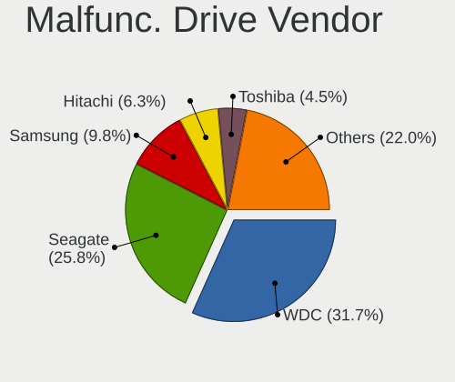

| Vendor              | Desktops | Drives | Percent |
|---------------------|----------|--------|---------|
| WDC                 | 91       | 99     | 31.71%  |
| Seagate             | 74       | 88     | 25.78%  |
| Samsung Electronics | 28       | 33     | 9.76%   |
| Hitachi             | 18       | 19     | 6.27%   |
| Toshiba             | 13       | 13     | 4.53%   |
| HGST                | 9        | 9      | 3.14%   |
| Kingston            | 8        | 8      | 2.79%   |
| A-DATA Technology   | 6        | 6      | 2.09%   |
| Maxtor              | 5        | 5      | 1.74%   |
| SanDisk             | 4        | 4      | 1.39%   |
| Intel               | 4        | 4      | 1.39%   |
| Crucial             | 3        | 3      | 1.05%   |
| China               | 3        | 3      | 1.05%   |
| SK hynix            | 2        | 2      | 0.7%    |
| Micron Technology   | 2        | 3      | 0.7%    |
| Fujitsu             | 2        | 2      | 0.7%    |
| XPG                 | 1        | 1      | 0.35%   |
| WD MediaMax         | 1        | 1      | 0.35%   |
| Unknown             | 1        | 1      | 0.35%   |
| StoreJet            | 1        | 1      | 0.35%   |
| SPCC                | 1        | 1      | 0.35%   |
| Saichi              | 1        | 1      | 0.35%   |
| Reeinno             | 1        | 1      | 0.35%   |
| Patriot             | 1        | 1      | 0.35%   |
| Intenso             | 1        | 1      | 0.35%   |
| HUSKY               | 1        | 1      | 0.35%   |
| GOODRAM             | 1        | 1      | 0.35%   |
| DEXP                | 1        | 1      | 0.35%   |
| Corsair             | 1        | 1      | 0.35%   |
| Apple               | 1        | 1      | 0.35%   |
| AMD                 | 1        | 1      | 0.35%   |

Malfunc. HDD Vendor
-------------------

Vendors of faulty HDD drives

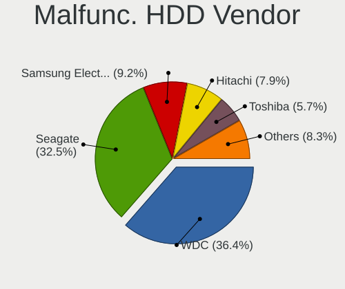

| Vendor              | Desktops | Drives | Percent |
|---------------------|----------|--------|---------|
| WDC                 | 83       | 90     | 36.4%   |
| Seagate             | 74       | 88     | 32.46%  |
| Samsung Electronics | 21       | 25     | 9.21%   |
| Hitachi             | 18       | 19     | 7.89%   |
| Toshiba             | 13       | 13     | 5.7%    |
| HGST                | 9        | 9      | 3.95%   |
| Maxtor              | 5        | 5      | 2.19%   |
| WD MediaMax         | 1        | 1      | 0.44%   |
| Unknown             | 1        | 1      | 0.44%   |
| StoreJet            | 1        | 1      | 0.44%   |
| Fujitsu             | 1        | 1      | 0.44%   |
| Apple               | 1        | 1      | 0.44%   |

Malfunc. Drive Kind
-------------------

Kinds of faulty drives

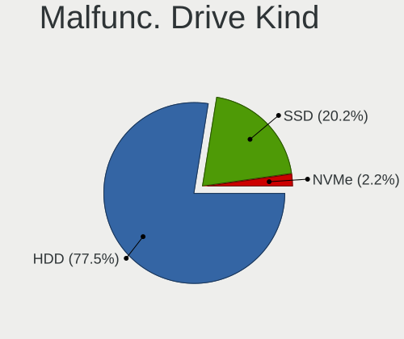

| Kind | Desktops | Drives | Percent |
|------|----------|--------|---------|
| HDD  | 207      | 254    | 77.53%  |
| SSD  | 54       | 56     | 20.22%  |
| NVMe | 6        | 6      | 2.25%   |

Failed Drives
-------------

Failed drive models

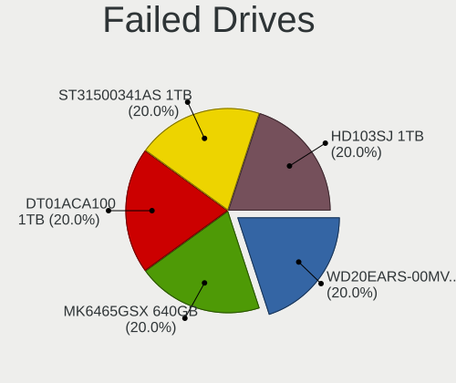

| Model                           | Desktops | Drives | Percent |
|---------------------------------|----------|--------|---------|
| WDC WD20EARS-00MVWB0 2TB        | 1        | 1      | 20%     |
| Toshiba MK6465GSX 640GB         | 1        | 1      | 20%     |
| Toshiba DT01ACA100 1TB          | 1        | 1      | 20%     |
| Seagate ST31500341AS 1TB        | 1        | 1      | 20%     |
| Samsung Electronics HD103SJ 1TB | 1        | 1      | 20%     |

Failed Drive Vendor
-------------------

Failed drive vendors

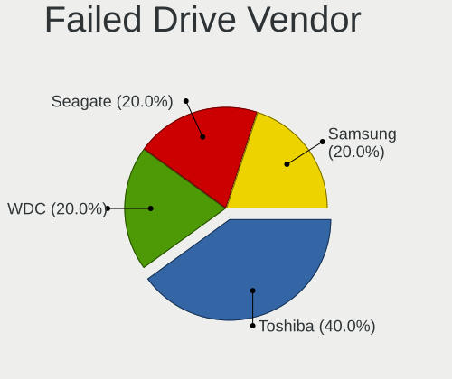

| Vendor              | Desktops | Drives | Percent |
|---------------------|----------|--------|---------|
| Toshiba             | 2        | 2      | 40%     |
| WDC                 | 1        | 1      | 20%     |
| Seagate             | 1        | 1      | 20%     |
| Samsung Electronics | 1        | 1      | 20%     |

Drive Status
------------

Number of failed and malfunc. drives

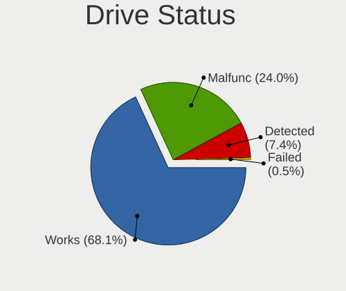

| Status   | Desktops | Drives | Percent |
|----------|----------|--------|---------|
| Works    | 716      | 1287   | 68.13%  |
| Malfunc  | 252      | 316    | 23.98%  |
| Detected | 78       | 100    | 7.42%   |
| Failed   | 5        | 5      | 0.48%   |

Storage controller
------------------

Storage Vendor
--------------

Storage controller vendors

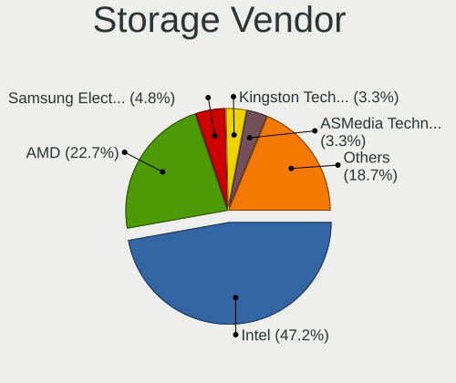

| Vendor                        | Desktops | Percent |
|-------------------------------|----------|---------|
| Intel                         | 554      | 47.19%  |
| AMD                           | 266      | 22.66%  |
| Samsung Electronics           | 56       | 4.77%   |
| Kingston Technology Company   | 39       | 3.32%   |
| ASMedia Technology            | 39       | 3.32%   |
| SanDisk                       | 37       | 3.15%   |
| JMicron Technology            | 25       | 2.13%   |
| Phison Electronics            | 22       | 1.87%   |
| Marvell Technology Group      | 18       | 1.53%   |
| Nvidia                        | 16       | 1.36%   |
| Silicon Motion                | 15       | 1.28%   |
| Micron/Crucial Technology     | 13       | 1.11%   |
| MAXIO Technology (Hangzhou)   | 12       | 1.02%   |
| ADATA Technology              | 11       | 0.94%   |
| Realtek Semiconductor         | 8        | 0.68%   |
| SK hynix                      | 7        | 0.6%    |
| Micron Technology             | 5        | 0.43%   |
| Broadcom / LSI                | 5        | 0.43%   |
| Adaptec                       | 5        | 0.43%   |
| Seagate Technology            | 4        | 0.34%   |
| VIA Technologies              | 3        | 0.26%   |
| Shenzhen Longsys Electronics  | 3        | 0.26%   |
| KIOXIA                        | 3        | 0.26%   |
| Toshiba America Info Systems  | 2        | 0.17%   |
| Solidigm                      | 2        | 0.17%   |
| TenaFe                        | 1        | 0.09%   |
| Silicon Image                 | 1        | 0.09%   |
| Integrated Technology Express | 1        | 0.09%   |
| Hosin Global Electronics      | 1        | 0.09%   |

Storage Model
-------------

Storage controller models

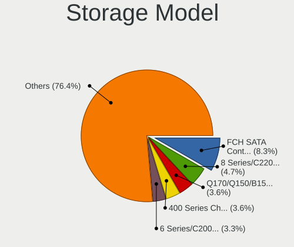

| Model                                                                                   | Desktops | Percent |
|-----------------------------------------------------------------------------------------|----------|---------|
| AMD FCH SATA Controller [AHCI mode]                                                     | 119      | 8.3%    |
| Intel 8 Series/C220 Series Chipset Family 6-port SATA Controller 1 [AHCI mode]          | 68       | 4.75%   |
| Intel Q170/Q150/B150/H170/H110/Z170/CM236 Chipset SATA Controller [AHCI Mode]           | 52       | 3.63%   |
| AMD 400 Series Chipset SATA Controller                                                  | 52       | 3.63%   |
| Intel 6 Series/C200 Series Chipset Family 6 port Desktop SATA AHCI Controller           | 47       | 3.28%   |
| Intel 200 Series PCH SATA controller [AHCI mode]                                        | 42       | 2.93%   |
| AMD 500 Series Chipset SATA Controller                                                  | 42       | 2.93%   |
| Intel 7 Series/C210 Series Chipset Family 6-port SATA Controller [AHCI mode]            | 40       | 2.79%   |
| AMD SB7x0/SB8x0/SB9x0 IDE Controller                                                    | 39       | 2.72%   |
| Intel SATA Controller [RAID mode]                                                       | 36       | 2.51%   |
| Intel NM10/ICH7 Family SATA Controller [IDE mode]                                       | 35       | 2.44%   |
| AMD SB7x0/SB8x0/SB9x0 SATA Controller [AHCI mode]                                       | 35       | 2.44%   |
| ASMedia ASM1061/ASM1062 Serial ATA Controller                                           | 33       | 2.3%    |
| Intel Cannon Lake PCH SATA AHCI Controller                                              | 28       | 1.95%   |
| AMD SB7x0/SB8x0/SB9x0 SATA Controller [IDE mode]                                        | 27       | 1.88%   |
| Samsung NVMe SSD Controller SM981/PM981/PM983                                           | 24       | 1.67%   |
| Intel 82801G (ICH7 Family) IDE Controller                                               | 24       | 1.67%   |
| Intel 6 Series/C200 Series Chipset Family Desktop SATA Controller (IDE mode, ports 4-5) | 17       | 1.19%   |
| Intel 6 Series/C200 Series Chipset Family Desktop SATA Controller (IDE mode, ports 0-3) | 17       | 1.19%   |
| AMD 600 Series Chipset SATA Controller                                                  | 15       | 1.05%   |
| AMD A320 Chipset SATA Controller [AHCI mode]                                            | 14       | 0.98%   |
| Silicon Motion SM2263EN/SM2263XT (DRAM-less) NVMe SSD Controllers                       | 13       | 0.91%   |
| Samsung NVMe SSD Controller 980 (DRAM-less)                                             | 13       | 0.91%   |
| JMicron JMB363 SATA/IDE Controller                                                      | 13       | 0.91%   |
| Intel 5 Series/3400 Series Chipset 4 port SATA IDE Controller                           | 13       | 0.91%   |
| Intel 5 Series/3400 Series Chipset 2 port SATA IDE Controller                           | 13       | 0.91%   |
| Intel 82801JD/DO (ICH10 Family) SATA AHCI Controller                                    | 12       | 0.84%   |
| Samsung NVMe SSD Controller PM9A1/PM9A3/980PRO                                          | 11       | 0.77%   |
| MAXIO (Hangzhou) NVMe SSD Controller MAP1202 (DRAM-less)                                | 11       | 0.77%   |
| Intel Alder Lake-S PCH SATA Controller [AHCI Mode]                                      | 11       | 0.77%   |
| Intel Alder Lake-N SATA AHCI Controller                                                 | 11       | 0.77%   |
| Intel 5 Series/3400 Series Chipset 6 port SATA AHCI Controller                          | 11       | 0.77%   |
| Intel 400 Series Chipset Family SATA AHCI Controller                                    | 11       | 0.77%   |
| AMD FCH IDE Controller                                                                  | 11       | 0.77%   |
| Intel 82801IR/IO/IH (ICH9R/DO/DH) 6 port SATA Controller [AHCI mode]                    | 10       | 0.7%    |
| AMD 300 Series Chipset SATA Controller                                                  | 10       | 0.7%    |
| Kingston Company KC3000/FURY Renegade NVMe SSD [E18]                                    | 9        | 0.63%   |
| Intel 500 Series Chipset Family SATA AHCI Controller                                    | 9        | 0.63%   |
| SanDisk Ultra 3D / WD PC SN530, IX SN530, Blue SN550 NVMe SSD (DRAM-less)               | 8        | 0.56%   |
| Micron/Crucial P2 [Nick P2] / P3 / P3 Plus NVMe PCIe SSD (DRAM-less)                    | 8        | 0.56%   |

Storage Kind
------------

Kind of storage controller (IDE, SATA, NVMe, SAS, ...)

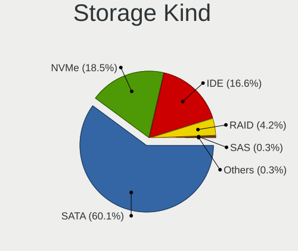

| Kind | Desktops | Percent |
|------|----------|---------|
| SATA | 688      | 60.09%  |
| NVMe | 212      | 18.52%  |
| IDE  | 190      | 16.59%  |
| RAID | 48       | 4.19%   |
| SAS  | 4        | 0.35%   |
| SCSI | 3        | 0.26%   |

Processor
---------

CPU Vendor
----------

Processor vendors

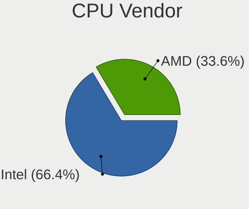

| Vendor | Desktops | Percent |
|--------|----------|---------|
| Intel  | 562      | 66.43%  |
| AMD    | 284      | 33.57%  |

CPU Model
---------

Processor models

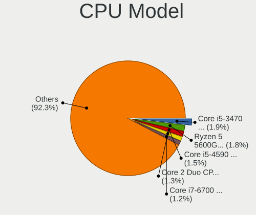

| Model                                       | Desktops | Percent |
|---------------------------------------------|----------|---------|
| Intel Core i5-3470 CPU @ 3.20GHz            | 16       | 1.89%   |
| AMD Ryzen 5 5600G with Radeon Graphics      | 15       | 1.77%   |
| Intel Core i5-4590 CPU @ 3.30GHz            | 13       | 1.54%   |
| Intel Core 2 Duo CPU E8400 @ 3.00GHz        | 11       | 1.3%    |
| Intel Core i7-6700 CPU @ 3.40GHz            | 10       | 1.18%   |
| Intel Core i5-2400 CPU @ 3.10GHz            | 10       | 1.18%   |
| Intel Core i5-7400 CPU @ 3.00GHz            | 9        | 1.06%   |
| Intel Core i5-6500 CPU @ 3.20GHz            | 9        | 1.06%   |
| Intel Core i5-4570 CPU @ 3.20GHz            | 9        | 1.06%   |
| AMD Ryzen 5 3600 6-Core Processor           | 9        | 1.06%   |
| Intel Core i7-8700 CPU @ 3.20GHz            | 8        | 0.95%   |
| AMD Ryzen 7 2700X Eight-Core Processor      | 8        | 0.95%   |
| AMD Ryzen 5 1600 Six-Core Processor         | 8        | 0.95%   |
| AMD Ryzen 7 5700X 8-Core Processor          | 7        | 0.83%   |
| AMD Ryzen 5 5600X 6-Core Processor          | 7        | 0.83%   |
| AMD Ryzen 5 5500                            | 7        | 0.83%   |
| Intel N100                                  | 6        | 0.71%   |
| Intel Core i7-7700 CPU @ 3.60GHz            | 6        | 0.71%   |
| Intel Core i7-2600 CPU @ 3.40GHz            | 6        | 0.71%   |
| Intel Core i5-8400 CPU @ 2.80GHz            | 6        | 0.71%   |
| Intel Core i5-7500 CPU @ 3.40GHz            | 6        | 0.71%   |
| Intel Core i5-6500T CPU @ 2.50GHz           | 6        | 0.71%   |
| Intel Core i5-6400 CPU @ 2.70GHz            | 6        | 0.71%   |
| Intel Core i5-4460 CPU @ 3.20GHz            | 6        | 0.71%   |
| Intel Core i5-3570 CPU @ 3.40GHz            | 6        | 0.71%   |
| Intel Core i3-4170 CPU @ 3.70GHz            | 6        | 0.71%   |
| Intel Core i3-3220 CPU @ 3.30GHz            | 6        | 0.71%   |
| Intel Core i3-2120 CPU @ 3.30GHz            | 6        | 0.71%   |
| Intel Core 2 Duo CPU E7400 @ 2.80GHz        | 6        | 0.71%   |
| AMD Ryzen 7 5700G with Radeon Graphics      | 6        | 0.71%   |
| AMD Ryzen 5 3400G with Radeon Vega Graphics | 6        | 0.71%   |
| AMD Ryzen 3 2200G with Radeon Vega Graphics | 6        | 0.71%   |
| AMD FX-6300 Six-Core Processor              | 6        | 0.71%   |
| Intel Core i7-9700 CPU @ 3.00GHz            | 5        | 0.59%   |
| Intel Core i7-4770 CPU @ 3.40GHz            | 5        | 0.59%   |
| Intel Core i7-3770 CPU @ 3.40GHz            | 5        | 0.59%   |
| Intel Core i5 CPU 650 @ 3.20GHz             | 5        | 0.59%   |
| Intel Core i3-2100 CPU @ 3.10GHz            | 5        | 0.59%   |
| Intel Core i3-10100 CPU @ 3.60GHz           | 5        | 0.59%   |
| Intel Core i3 CPU 540 @ 3.07GHz             | 5        | 0.59%   |

CPU Model Family
----------------

Processor model prefix

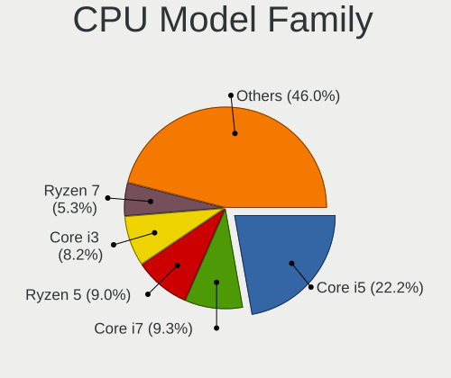

| Model                   | Desktops | Percent |
|-------------------------|----------|---------|
| Intel Core i5           | 188      | 22.22%  |
| Intel Core i7           | 79       | 9.34%   |
| AMD Ryzen 5             | 76       | 8.98%   |
| Intel Core i3           | 69       | 8.16%   |
| AMD Ryzen 7             | 45       | 5.32%   |
| Intel Xeon              | 39       | 4.61%   |
| Other                   | 37       | 4.37%   |
| AMD FX                  | 34       | 4.02%   |
| Intel Core 2 Duo        | 33       | 3.9%    |
| Intel Celeron           | 29       | 3.43%   |
| Intel Pentium           | 27       | 3.19%   |
| Intel Core 2 Quad       | 18       | 2.13%   |
| AMD Ryzen 9             | 16       | 1.89%   |
| Intel Pentium Dual-Core | 13       | 1.54%   |
| AMD A8                  | 13       | 1.54%   |
| AMD A10                 | 12       | 1.42%   |
| AMD Ryzen 3             | 11       | 1.3%    |
| AMD Athlon              | 9        | 1.06%   |
| Intel Core 2            | 8        | 0.95%   |
| AMD A4                  | 8        | 0.95%   |
| AMD Athlon 64 X2        | 7        | 0.83%   |
| Intel Core i9           | 6        | 0.71%   |
| AMD Phenom II X4        | 6        | 0.71%   |
| Intel Pentium Gold      | 5        | 0.59%   |
| AMD Athlon 64           | 5        | 0.59%   |
| Intel Pentium 4         | 4        | 0.47%   |
| AMD PRO A10             | 4        | 0.47%   |
| AMD Phenom II X6        | 4        | 0.47%   |
| AMD Phenom II X2        | 4        | 0.47%   |
| AMD E                   | 4        | 0.47%   |
| AMD Athlon II X2        | 4        | 0.47%   |
| Intel Pentium Dual      | 3        | 0.35%   |
| AMD Ryzen 3 PRO         | 3        | 0.35%   |
| AMD Athlon X4           | 3        | 0.35%   |
| AMD Athlon II X4        | 3        | 0.35%   |
| AMD A6                  | 3        | 0.35%   |
| AMD Phenom              | 2        | 0.24%   |
| AMD Athlon Dual Core    | 2        | 0.24%   |
| Intel Pentium Silver    | 1        | 0.12%   |
| Intel Pentium D         | 1        | 0.12%   |

CPU Cores
---------

Number of processor cores

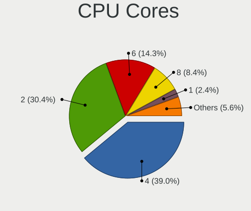

| Number | Desktops | Percent |
|--------|----------|---------|
| 4      | 330      | 39.01%  |
| 2      | 257      | 30.38%  |
| 6      | 121      | 14.3%   |
| 8      | 71       | 8.39%   |
| 1      | 20       | 2.36%   |
| 12     | 15       | 1.77%   |
| 10     | 9        | 1.06%   |
| 3      | 9        | 1.06%   |
| 16     | 6        | 0.71%   |
| 14     | 4        | 0.47%   |
| 112    | 1        | 0.12%   |
| 24     | 1        | 0.12%   |
| 20     | 1        | 0.12%   |
| 18     | 1        | 0.12%   |

CPU Sockets
-----------

Number of sockets

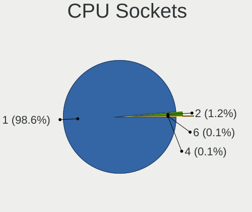

| Number | Desktops | Percent |
|--------|----------|---------|
| 1      | 834      | 98.58%  |
| 2      | 10       | 1.18%   |
| 6      | 1        | 0.12%   |
| 4      | 1        | 0.12%   |

CPU Threads
-----------

Threads per core (Hyper-Threading)

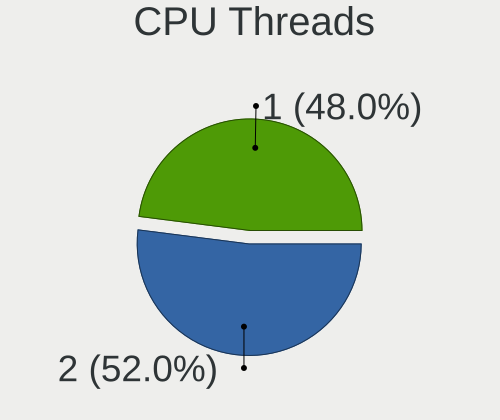

| Number | Desktops | Percent |
|--------|----------|---------|
| 2      | 440      | 52.01%  |
| 1      | 406      | 47.99%  |

CPU Op-Modes
------------

CPU Operation Modes (32-bit, 64-bit)

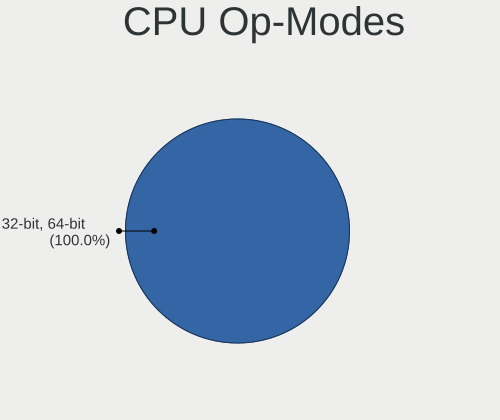

| Op mode        | Desktops | Percent |
|----------------|----------|---------|
| 32-bit, 64-bit | 846      | 100%    |

CPU Microcode
-------------

Microcode number

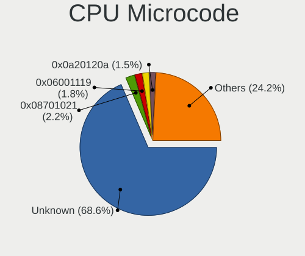

| Number     | Desktops | Percent |
|------------|----------|---------|
| Unknown    | 580      | 68.56%  |
| 0x08701021 | 19       | 2.25%   |
| 0x06001119 | 15       | 1.77%   |
| 0x0800820d | 14       | 1.65%   |
| 0x0a20120a | 13       | 1.54%   |
| 0x08108109 | 13       | 1.54%   |
| 0x06003106 | 13       | 1.54%   |
| 0x06000822 | 11       | 1.3%    |
| 0x0a50000f | 10       | 1.18%   |
| 0x0a50000c | 10       | 1.18%   |
| 0x0a601206 | 8        | 0.95%   |
| 0x0a50000d | 8        | 0.95%   |
| 0x08101016 | 8        | 0.95%   |
| 0x08001138 | 7        | 0.83%   |
| 0x0600081c | 7        | 0.83%   |
| 0x010000b6 | 6        | 0.71%   |
| 0x0a20120e | 5        | 0.59%   |
| 0x08701030 | 5        | 0.59%   |
| 0x010000c8 | 5        | 0.59%   |
| 0x010000bf | 5        | 0.59%   |
| 0x0a20102b | 4        | 0.47%   |
| 0x08600106 | 4        | 0.47%   |
| 0x0810100b | 4        | 0.47%   |
| 0x0600611a | 4        | 0.47%   |
| 0x06000817 | 4        | 0.47%   |
| 0x0a601209 | 3        | 0.35%   |
| 0x0a201210 | 3        | 0.35%   |
| 0x0700010b | 3        | 0.35%   |
| 0x06001116 | 3        | 0.35%   |
| 0x06000629 | 3        | 0.35%   |
| 0x06000626 | 3        | 0.35%   |
| 0x0a705206 | 2        | 0.24%   |
| 0x0a601203 | 2        | 0.24%   |
| 0x0a500011 | 2        | 0.24%   |
| 0x0a201016 | 2        | 0.24%   |
| 0x08600109 | 2        | 0.24%   |
| 0x08001137 | 2        | 0.24%   |
| 0x06003109 | 2        | 0.24%   |
| 0x06003104 | 2        | 0.24%   |
| 0x0600063d | 2        | 0.24%   |

CPU Microarch
-------------

Microarchitecture

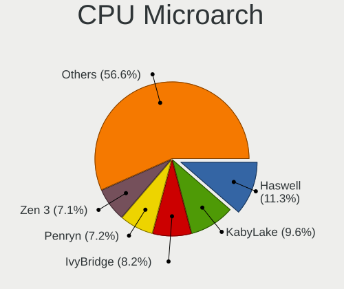

| Name             | Desktops | Percent |
|------------------|----------|---------|
| Haswell          | 96       | 11.35%  |
| KabyLake         | 81       | 9.57%   |
| IvyBridge        | 69       | 8.16%   |
| Penryn           | 61       | 7.21%   |
| Zen 3            | 60       | 7.09%   |
| Skylake          | 58       | 6.86%   |
| SandyBridge      | 49       | 5.79%   |
| Piledriver       | 41       | 4.85%   |
| Zen 2            | 33       | 3.9%    |
| Zen+             | 27       | 3.19%   |
| K10              | 25       | 2.96%   |
| Zen              | 23       | 2.72%   |
| CometLake        | 23       | 2.72%   |
| Core             | 22       | 2.6%    |
| Westmere         | 21       | 2.48%   |
| Alderlake Hybrid | 19       | 2.25%   |
| Unknown          | 18       | 2.13%   |
| Steamroller      | 17       | 2.01%   |
| Nehalem          | 14       | 1.65%   |
| K8 Hammer        | 14       | 1.65%   |
| Bulldozer        | 12       | 1.42%   |
| Gracemont        | 11       | 1.3%    |
| Icelake          | 8        | 0.95%   |
| Silvermont       | 7        | 0.83%   |
| Broadwell        | 6        | 0.71%   |
| NetBurst         | 5        | 0.59%   |
| Bobcat           | 5        | 0.59%   |
| Excavator        | 4        | 0.47%   |
| Tremont          | 3        | 0.35%   |
| Jaguar           | 3        | 0.35%   |
| Goldmont plus    | 3        | 0.35%   |
| Goldmont         | 3        | 0.35%   |
| K10 Llano        | 2        | 0.24%   |
| Sapphire Rapids  | 1        | 0.12%   |
| Puma             | 1        | 0.12%   |
| Bonnell          | 1        | 0.12%   |

Graphics
--------

GPU Vendor
----------

Vendors of graphics cards

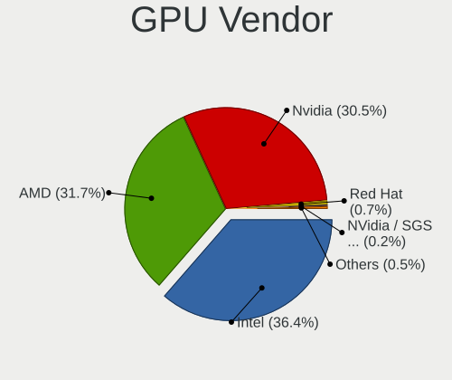

| Vendor                                       | Desktops | Percent |
|----------------------------------------------|----------|---------|
| Intel                                        | 320      | 36.41%  |
| AMD                                          | 279      | 31.74%  |
| Nvidia                                       | 268      | 30.49%  |
| Red Hat                                      | 6        | 0.68%   |
| NVidia / SGS Thomson (Joint Venture)         | 2        | 0.23%   |
| XGI Technology (eXtreme Graphics Innovation) | 1        | 0.11%   |
| Matrox Electronics Systems                   | 1        | 0.11%   |
| ATI Technologies                             | 1        | 0.11%   |
| ASPEED Technology                            | 1        | 0.11%   |

GPU Model
---------

Graphics card models

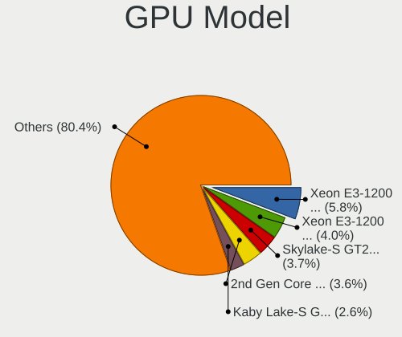

| Model                                                                       | Desktops | Percent |
|-----------------------------------------------------------------------------|----------|---------|
| Intel Xeon E3-1200 v3/4th Gen Core Processor Integrated Graphics Controller | 52       | 5.8%    |
| Intel Xeon E3-1200 v2/3rd Gen Core processor Graphics Controller            | 36       | 4.02%   |
| Intel Skylake-S GT2 [HD Graphics 530]                                       | 33       | 3.68%   |
| Intel 2nd Generation Core Processor Family Integrated Graphics Controller   | 32       | 3.57%   |
| Intel Kaby Lake-S GT2 [HD Graphics 630]                                     | 23       | 2.57%   |
| Intel CoffeeLake-S GT2 [UHD Graphics 630]                                   | 23       | 2.57%   |
| Intel 4 Series Chipset Integrated Graphics Controller                       | 23       | 2.57%   |
| AMD Cezanne [Radeon Vega Series / Radeon Vega Mobile Series]                | 20       | 2.23%   |
| AMD Ellesmere [Radeon RX 470/480/570/570X/580/580X/590]                     | 19       | 2.12%   |
| AMD Kaveri [Radeon R7 Graphics]                                             | 15       | 1.67%   |
| Nvidia GT218 [GeForce 210]                                                  | 14       | 1.56%   |
| Nvidia GP107 [GeForce GTX 1050 Ti]                                          | 14       | 1.56%   |
| Nvidia GK208B [GeForce GT 710]                                              | 14       | 1.56%   |
| AMD Navi 23 [Radeon RX 6600/6600 XT/6600M]                                  | 13       | 1.45%   |
| AMD Raven Ridge [Radeon Vega Series / Radeon Vega Mobile Series]            | 12       | 1.34%   |
| AMD Picasso/Raven 2 [Radeon Vega Series / Radeon Vega Mobile Series]        | 12       | 1.34%   |
| AMD Lexa PRO [Radeon 540/540X/550/550X / RX 540X/550/550X]                  | 12       | 1.34%   |
| Intel Alder Lake-N [UHD Graphics]                                           | 11       | 1.23%   |
| Nvidia GM107 [GeForce GTX 750 Ti]                                           | 9        | 1%      |
| Nvidia GK208B [GeForce GT 730]                                              | 9        | 1%      |
| Intel CometLake-S GT2 [UHD Graphics 630]                                    | 9        | 1%      |
| Intel 4th Generation Core Processor Family Integrated Graphics Controller   | 9        | 1%      |
| AMD Navi 24 [Radeon RX 6400/6500 XT/6500M]                                  | 9        | 1%      |
| Nvidia GP108 [GeForce GT 1030]                                              | 8        | 0.89%   |
| AMD Raphael                                                                 | 8        | 0.89%   |
| Nvidia TU116 [GeForce GTX 1660 Ti]                                          | 7        | 0.78%   |
| Nvidia GP106 [GeForce GTX 1060 6GB]                                         | 7        | 0.78%   |
| Nvidia GP106 [GeForce GTX 1060 3GB]                                         | 7        | 0.78%   |
| AMD Oland PRO [Radeon R7 240/340 / Radeon 520]                              | 7        | 0.78%   |
| AMD Navi 31 [Radeon RX 7900 XT/7900 XTX/7900 GRE/7900M]                     | 7        | 0.78%   |
| AMD Cedar [Radeon HD 5000/6000/7350/8350 Series]                            | 7        | 0.78%   |
| AMD Baffin [Radeon RX 460/560D / Pro 450/455/460/555/555X/560/560X]         | 7        | 0.78%   |
| Red Hat Virtio 1.0 GPU                                                      | 6        | 0.67%   |
| Nvidia GM206 [GeForce GTX 960]                                              | 6        | 0.67%   |
| Nvidia GF119 [GeForce GT 520]                                               | 6        | 0.67%   |
| Nvidia GA106 [GeForce RTX 3060 Lite Hash Rate]                              | 6        | 0.67%   |
| AMD Navi 32 [Radeon RX 7700 XT / 7800 XT]                                   | 6        | 0.67%   |
| AMD Navi 22 [Radeon RX 6700/6700 XT/6750 XT / 6800M/6850M XT]               | 6        | 0.67%   |
| Nvidia TU117 [GeForce GTX 1650]                                             | 5        | 0.56%   |
| Nvidia TU116 [GeForce GTX 1660 SUPER]                                       | 5        | 0.56%   |

GPU Combo
---------

Combinations of graphics cards

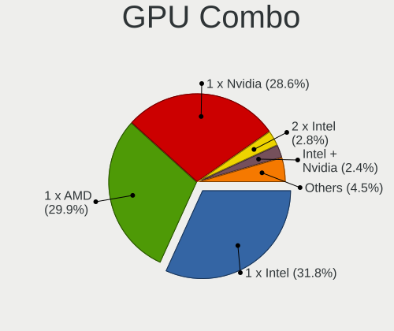

| Name                                          | Desktops | Percent |
|-----------------------------------------------|----------|---------|
| 1 x Intel                                     | 269      | 31.8%   |
| 1 x AMD                                       | 253      | 29.91%  |
| 1 x Nvidia                                    | 242      | 28.61%  |
| 2 x Intel                                     | 24       | 2.84%   |
| Intel + Nvidia                                | 20       | 2.36%   |
| 2 x AMD                                       | 15       | 1.77%   |
| Intel + AMD                                   | 7        | 0.83%   |
| 1 x Red Hat                                   | 6        | 0.71%   |
| AMD + Nvidia                                  | 5        | 0.59%   |
| 1 x XGI                                       | 1        | 0.12%   |
| 1 x NVidia / SGS Thomson (Joint Venture)      | 1        | 0.12%   |
| Nvidia + NVidia / SGS Thomson (Joint Venture) | 1        | 0.12%   |
| 1 x Matrox                                    | 1        | 0.12%   |
| 1 x ASPEED                                    | 1        | 0.12%   |

GPU Driver
----------

Free vs proprietary

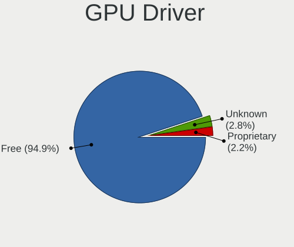

| Driver      | Desktops | Percent |
|-------------|----------|---------|
| Free        | 808      | 94.95%  |
| Unknown     | 24       | 2.82%   |
| Proprietary | 19       | 2.23%   |

GPU Memory
----------

Total video memory

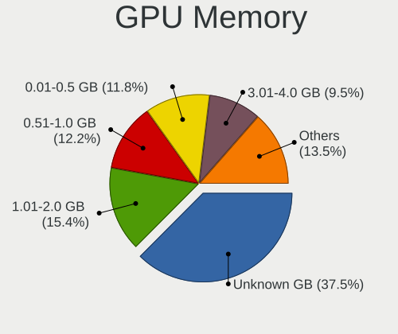

| Size in GB | Desktops | Percent |
|------------|----------|---------|
| Unknown    | 318      | 37.46%  |
| 1.01-2.0   | 131      | 15.43%  |
| 0.51-1.0   | 104      | 12.25%  |
| 0.01-0.5   | 100      | 11.78%  |
| 3.01-4.0   | 81       | 9.54%   |
| 7.01-8.0   | 49       | 5.77%   |
| 5.01-6.0   | 27       | 3.18%   |
| 8.01-16.0  | 25       | 2.94%   |
| 2.01-3.0   | 8        | 0.94%   |
| 16.01-24.0 | 5        | 0.59%   |
| 4.01-5.0   | 1        | 0.12%   |

Monitor
-------

Monitor Vendor
--------------

Monitor vendors

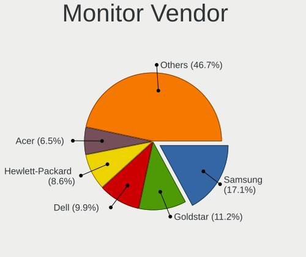

| Vendor               | Desktops | Percent |
|----------------------|----------|---------|
| Samsung Electronics  | 143      | 17.11%  |
| Goldstar             | 94       | 11.24%  |
| Dell                 | 83       | 9.93%   |
| Hewlett-Packard      | 72       | 8.61%   |
| Acer                 | 54       | 6.46%   |
| Philips              | 46       | 5.5%    |
| AOC                  | 45       | 5.38%   |
| Ancor Communications | 34       | 4.07%   |
| BenQ                 | 25       | 2.99%   |
| Lenovo               | 22       | 2.63%   |
| ASUSTek Computer     | 21       | 2.51%   |
| Iiyama               | 19       | 2.27%   |
| ViewSonic            | 16       | 1.91%   |
| Sony                 | 14       | 1.67%   |
| Sceptre Tech         | 7        | 0.84%   |
| NEC Computers        | 7        | 0.84%   |
| RHT                  | 6        | 0.72%   |
| MSI                  | 6        | 0.72%   |
| Fujitsu Siemens      | 5        | 0.6%    |
| Eizo                 | 5        | 0.6%    |
| Packard Bell         | 4        | 0.48%   |
| SKY                  | 3        | 0.36%   |
| Sharp                | 3        | 0.36%   |
| SAC                  | 3        | 0.36%   |
| LG Electronics       | 3        | 0.36%   |
| HUAWEI               | 3        | 0.36%   |
| HannStar             | 3        | 0.36%   |
| GDH                  | 3        | 0.36%   |
| Gateway              | 3        | 0.36%   |
| Unknown              | 3        | 0.36%   |
| Vizio                | 2        | 0.24%   |
| Vestel Elektronik    | 2        | 0.24%   |
| Unknown (XXX)        | 2        | 0.24%   |
| Unknown              | 2        | 0.24%   |
| STD                  | 2        | 0.24%   |
| SKG                  | 2        | 0.24%   |
| RTK                  | 2        | 0.24%   |
| PRI                  | 2        | 0.24%   |
| Pioneer              | 2        | 0.24%   |
| Panasonic            | 2        | 0.24%   |

Monitor Model
-------------

Monitor models

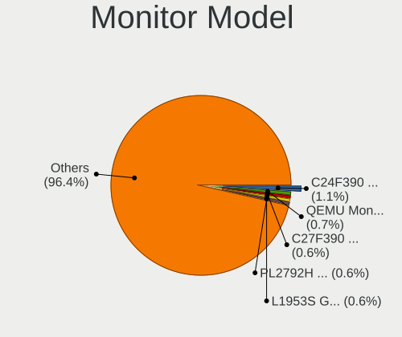

| Model                                                                 | Desktops | Percent |
|-----------------------------------------------------------------------|----------|---------|
| Samsung Electronics C24F390 SAM0D2C 1920x1080 521x293mm 23.5-inch     | 9        | 1.07%   |
| RHT QEMU Monitor RHT1234 2048x1152 325x203mm 15.1-inch                | 6        | 0.71%   |
| Samsung Electronics C27F390 SAM0D32 1920x1080 598x336mm 27.0-inch     | 5        | 0.59%   |
| Iiyama PL2792H IVM664F 1920x1080 598x336mm 27.0-inch                  | 5        | 0.59%   |
| Goldstar L1953S GSM4B3E 1280x1024 376x301mm 19.0-inch                 | 5        | 0.59%   |
| Goldstar FULL HD GSM5B55 1920x1080 480x270mm 21.7-inch                | 5        | 0.59%   |
| AOC 27G2G4 AOC2702 1920x1080 598x336mm 27.0-inch                      | 5        | 0.59%   |
| Sceptre Tech Sceptre F24 SPT09AB 1920x1080 530x290mm 23.8-inch        | 4        | 0.47%   |
| Samsung Electronics LF24T35 SAM707D 1920x1080 528x297mm 23.9-inch     | 4        | 0.47%   |
| Samsung Electronics LCD Monitor SAM0659 1920x1080                     | 4        | 0.47%   |
| Philips PHL 223V5 PHLC0CF 1920x1080 477x268mm 21.5-inch               | 4        | 0.47%   |
| Goldstar E2250 GSM578D 1920x1080 477x268mm 21.5-inch                  | 4        | 0.47%   |
| Dell U2412M DELA07A 1920x1200 518x324mm 24.1-inch                     | 4        | 0.47%   |
| AOC G2460 AOC2460 1920x1080 531x299mm 24.0-inch                       | 4        | 0.47%   |
| Philips PHL 273V7 PHLC156 1920x1080 598x336mm 27.0-inch               | 3        | 0.36%   |
| Lenovo LT2252p Wide LEN0A0C 1680x1050 474x296mm 22.0-inch             | 3        | 0.36%   |
| Hewlett-Packard w1907 HWP26A2 1440x900 408x255mm 18.9-inch            | 3        | 0.36%   |
| Hewlett-Packard 24y HPN3504 1920x1080 528x297mm 23.9-inch             | 3        | 0.36%   |
| Goldstar W2243 GSM56FE 1920x1080 477x269mm 21.6-inch                  | 3        | 0.36%   |
| Goldstar W1942 GSM4B6F 1440x900 408x255mm 18.9-inch                   | 3        | 0.36%   |
| GDH TV PHILCO GDH0030 1920x540                                        | 3        | 0.36%   |
| Dell E196FP DELA015 1280x1024 338x270mm 17.0-inch                     | 3        | 0.36%   |
| AOC 24B1W1 AOC2401 1920x1080 527x296mm 23.8-inch                      | 3        | 0.36%   |
| AOC 2250W AOC2250 1920x1080 477x268mm 21.5-inch                       | 3        | 0.36%   |
| Ancor Communications ASUS VS228 ACI22FD 1920x1080 476x268mm 21.5-inch | 3        | 0.36%   |
| Unknown                                                               | 3        | 0.36%   |
| ViewSonic VX2453 Series VSC0C28 1920x1080 520x290mm 23.4-inch         | 2        | 0.24%   |
| ViewSonic VA2216w-2 VSC2920 1680x1050 495x291mm 22.6-inch             | 2        | 0.24%   |
| Vestel Elektronik 40UHD_LCD_TV VES3700 3840x2160 880x500mm 39.8-inch  | 2        | 0.24%   |
| Unknown (XXX) Beyo TV XXX9615 3840x2160 1210x680mm 54.6-inch          | 2        | 0.24%   |
| STD HDMI TV STD00C7 1920x1080 698x392mm 31.5-inch                     | 2        | 0.24%   |
| Sony SDM-S75D/F/N SNY3900 1280x1024 338x270mm 17.0-inch               | 2        | 0.24%   |
| Sony SDM-HS95P SNY2600 1280x1024 376x301mm 19.0-inch                  | 2        | 0.24%   |
| Samsung Electronics U28E590 SAM0C4D 3840x2160 607x345mm 27.5-inch     | 2        | 0.24%   |
| Samsung Electronics SyncMaster SAM0091 1600x1200 432x324mm 21.3-inch  | 2        | 0.24%   |
| Samsung Electronics SMBX2331 SAM076E 1920x1080 509x286mm 23.0-inch    | 2        | 0.24%   |
| Samsung Electronics SMB1930N SAM0632 1366x768 410x230mm 18.5-inch     | 2        | 0.24%   |
| Samsung Electronics S24F350 SAM0D20 1920x1080 521x293mm 23.5-inch     | 2        | 0.24%   |
| Samsung Electronics S24D300 SAM0B43 1920x1080 531x299mm 24.0-inch     | 2        | 0.24%   |
| Samsung Electronics S22E450 SAM0C7C 1680x1050 473x291mm 21.9-inch     | 2        | 0.24%   |

Monitor Resolution
------------------

Monitor screen resolution

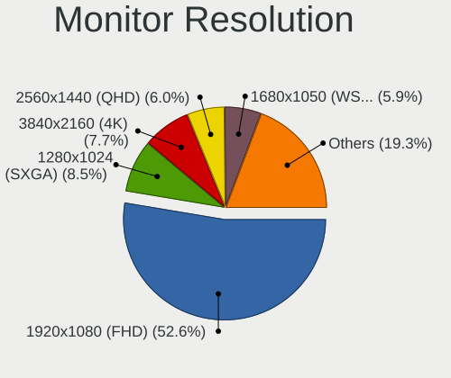

| Resolution         | Desktops | Percent |
|--------------------|----------|---------|
| 1920x1080 (FHD)    | 429      | 52.64%  |
| 1280x1024 (SXGA)   | 69       | 8.47%   |
| 3840x2160 (4K)     | 63       | 7.73%   |
| 2560x1440 (QHD)    | 49       | 6.01%   |
| 1680x1050 (WSXGA+) | 48       | 5.89%   |
| 1440x900 (WXGA+)   | 30       | 3.68%   |
| 1366x768 (WXGA)    | 30       | 3.68%   |
| 1920x1200 (WUXGA)  | 24       | 2.94%   |
| 1600x900 (HD+)     | 22       | 2.7%    |
| 3440x1440          | 8        | 0.98%   |
| 1360x768           | 7        | 0.86%   |
| 2560x1397          | 6        | 0.74%   |
| 2560x1080          | 6        | 0.74%   |
| 1600x1200          | 6        | 0.74%   |
| 1024x768 (XGA)     | 6        | 0.74%   |
| 1920x540           | 5        | 0.61%   |
| 3840x1600          | 2        | 0.25%   |
| 3840x1080          | 1        | 0.12%   |
| 3520x1080          | 1        | 0.12%   |
| 2288x1287          | 1        | 0.12%   |
| 1280x960           | 1        | 0.12%   |
| Unknown            | 1        | 0.12%   |

Monitor Diagonal
----------------

Diagonal size in inches

| Inches  | Desktops | Percent |
|---------|----------|---------|
| 23      | 116      | 13.89%  |
| 24      | 115      | 13.77%  |
| 27      | 111      | 13.29%  |
| 21      | 102      | 12.22%  |
| 19      | 70       | 8.38%   |
| 18      | 38       | 4.55%   |
| 31      | 36       | 4.31%   |
| 17      | 32       | 3.83%   |
| 22      | 30       | 3.59%   |
| 20      | 28       | 3.35%   |
| Unknown | 27       | 3.23%   |
| 40      | 14       | 1.68%   |
| 84      | 12       | 1.44%   |
| 54      | 12       | 1.44%   |
| 32      | 12       | 1.44%   |
| 29      | 9        | 1.08%   |
| 34      | 8        | 0.96%   |
| 72      | 7        | 0.84%   |
| 25      | 6        | 0.72%   |
| 15      | 5        | 0.6%    |
| 52      | 3        | 0.36%   |
| 48      | 3        | 0.36%   |
| 46      | 3        | 0.36%   |
| 42      | 3        | 0.36%   |
| 37      | 3        | 0.36%   |
| 36      | 3        | 0.36%   |
| 28      | 3        | 0.36%   |
| 26      | 3        | 0.36%   |
| 60      | 2        | 0.24%   |
| 49      | 2        | 0.24%   |
| 43      | 2        | 0.24%   |
| 41      | 2        | 0.24%   |
| 35      | 2        | 0.24%   |
| 13      | 2        | 0.24%   |
| 142     | 1        | 0.12%   |
| 85      | 1        | 0.12%   |
| 65      | 1        | 0.12%   |
| 64      | 1        | 0.12%   |
| 63      | 1        | 0.12%   |
| 39      | 1        | 0.12%   |

Monitor Width
-------------

Physical width

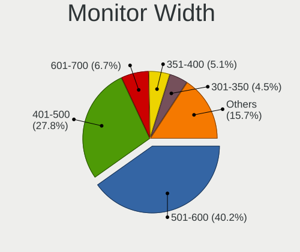

| Width in mm    | Desktops | Percent |
|----------------|----------|---------|
| 501-600        | 332      | 40.19%  |
| 401-500        | 230      | 27.85%  |
| 601-700        | 55       | 6.66%   |
| 351-400        | 42       | 5.08%   |
| 301-350        | 37       | 4.48%   |
| 1001-1500      | 28       | 3.39%   |
| Unknown        | 27       | 3.27%   |
| 701-800        | 24       | 2.91%   |
| 1501-2000      | 20       | 2.42%   |
| 801-900        | 19       | 2.3%    |
| 901-1000       | 8        | 0.97%   |
| 201-300        | 3        | 0.36%   |
| More than 2000 | 1        | 0.12%   |

Aspect Ratio
------------

Proportional relationship between the width and the height

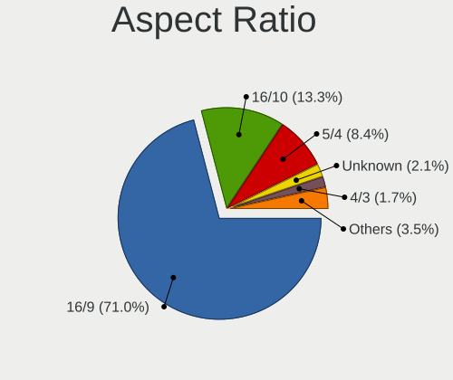

| Ratio   | Desktops | Percent |
|---------|----------|---------|
| 16/9    | 574      | 70.95%  |
| 16/10   | 108      | 13.35%  |
| 5/4     | 68       | 8.41%   |
| Unknown | 17       | 2.1%    |
| 4/3     | 14       | 1.73%   |
| 21/9    | 14       | 1.73%   |
| 3/2     | 9        | 1.11%   |
| 32/9    | 3        | 0.37%   |
| 6/5     | 1        | 0.12%   |
| 1.00    | 1        | 0.12%   |

Monitor Area
------------

Area in inch²

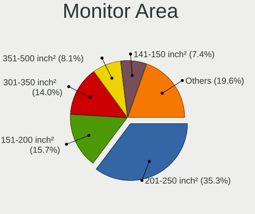

| Area in inch² | Desktops | Percent |
|----------------|----------|---------|
| 201-250        | 292      | 35.27%  |
| 151-200        | 130      | 15.7%   |
| 301-350        | 116      | 14.01%  |
| 351-500        | 67       | 8.09%   |
| 141-150        | 61       | 7.37%   |
| 251-300        | 47       | 5.68%   |
| More than 1000 | 45       | 5.43%   |
| 501-1000       | 33       | 3.99%   |
| Unknown        | 27       | 3.26%   |
| 81-90          | 3        | 0.36%   |
| 111-120        | 3        | 0.36%   |
| 101-110        | 2        | 0.24%   |
| 71-80          | 1        | 0.12%   |
| 131-140        | 1        | 0.12%   |

Pixel Density
-------------

Pixels per inch

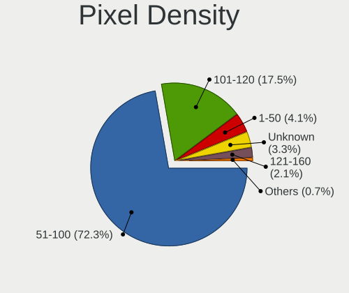

| Density | Desktops | Percent |
|---------|----------|---------|
| 51-100  | 586      | 72.26%  |
| 101-120 | 142      | 17.51%  |
| 1-50    | 33       | 4.07%   |
| Unknown | 27       | 3.33%   |
| 121-160 | 17       | 2.1%    |
| 161-240 | 6        | 0.74%   |

Multiple Monitors
-----------------

Total monitors connected

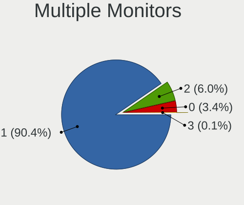

| Total | Desktops | Percent |
|-------|----------|---------|
| 1     | 767      | 90.45%  |
| 2     | 51       | 6.01%   |
| 0     | 29       | 3.42%   |
| 3     | 1        | 0.12%   |

Network
-------

Net Controller Vendor
---------------------

Controller vendors

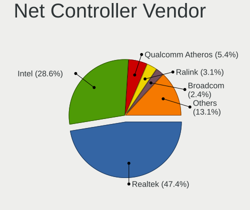

| Vendor                          | Desktops | Percent |
|---------------------------------|----------|---------|
| Realtek Semiconductor           | 542      | 47.42%  |
| Intel                           | 327      | 28.61%  |
| Qualcomm Atheros                | 62       | 5.42%   |
| Ralink Technology               | 35       | 3.06%   |
| Broadcom                        | 27       | 2.36%   |
| TP-Link                         | 26       | 2.27%   |
| MediaTek                        | 18       | 1.57%   |
| Ralink                          | 15       | 1.31%   |
| Nvidia                          | 11       | 0.96%   |
| D-Link                          | 7        | 0.61%   |
| Marvell Technology Group        | 6        | 0.52%   |
| Broadcom Limited                | 6        | 0.52%   |
| Qualcomm Atheros Communications | 5        | 0.44%   |
| ASIX Electronics                | 5        | 0.44%   |
| Belkin Components               | 4        | 0.35%   |
| Xiaomi                          | 3        | 0.26%   |
| VIA Technologies                | 3        | 0.26%   |
| Samsung Electronics             | 3        | 0.26%   |
| NetGear                         | 3        | 0.26%   |
| Aquantia                        | 3        | 0.26%   |
| OPPO Electronics                | 2        | 0.17%   |
| Microsoft                       | 2        | 0.17%   |
| Huawei Technologies             | 2        | 0.17%   |
| D-Link System                   | 2        | 0.17%   |
| ASUSTek Computer                | 2        | 0.17%   |
| 3Com                            | 2        | 0.17%   |
| ZyXEL Communications            | 1        | 0.09%   |
| ZTE WCDMA Technologies MSM      | 1        | 0.09%   |
| U.S. Robotics                   | 1        | 0.09%   |
| Senao                           | 1        | 0.09%   |
| RedOctane                       | 1        | 0.09%   |
| Pulse-Eight                     | 1        | 0.09%   |
| Padix (Rockfire)                | 1        | 0.09%   |
| Motorola PCS                    | 1        | 0.09%   |
| Microchip Technology            | 1        | 0.09%   |
| Interlogix.                     | 1        | 0.09%   |
| IMC Networks                    | 1        | 0.09%   |
| ICS Advent                      | 1        | 0.09%   |
| HMD Global                      | 1        | 0.09%   |
| Guillemot                       | 1        | 0.09%   |

Net Controller Model
--------------------

Controller models

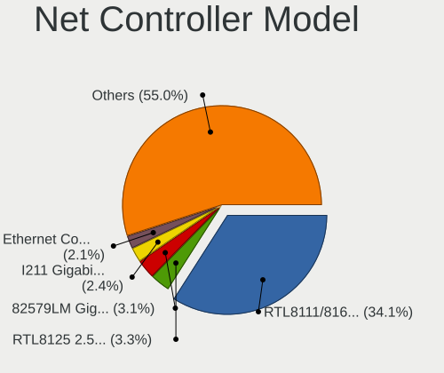

| Model                                                                  | Desktops | Percent |
|------------------------------------------------------------------------|----------|---------|
| Realtek RTL8111/8168/8211/8411 PCI Express Gigabit Ethernet Controller | 436      | 34.06%  |
| Realtek RTL8125 2.5GbE Controller                                      | 42       | 3.28%   |
| Intel 82579LM Gigabit Network Connection (Lewisville)                  | 40       | 3.13%   |
| Intel I211 Gigabit Network Connection                                  | 31       | 2.42%   |
| Intel Ethernet Connection I217-LM                                      | 27       | 2.11%   |
| Intel Ethernet Connection (2) I219-V                                   | 24       | 1.88%   |
| Intel Ethernet Connection (2) I219-LM                                  | 24       | 1.88%   |
| Realtek RTL810xE PCI Express Fast Ethernet controller                  | 19       | 1.48%   |
| Intel Wi-Fi 6 AX200                                                    | 18       | 1.41%   |
| Ralink MT7601U Wireless Adapter                                        | 17       | 1.33%   |
| Intel Wi-Fi 6E(802.11ax) AX210/AX1675* 2x2 [Typhoon Peak]              | 16       | 1.25%   |
| Realtek RTL8821CE 802.11ac PCIe Wireless Network Adapter               | 15       | 1.17%   |
| Intel Dual Band Wireless-AC 3168NGW [Stone Peak]                       | 15       | 1.17%   |
| Intel 82567LM-3 Gigabit Network Connection                             | 15       | 1.17%   |
| Realtek RTL8188EUS 802.11n Wireless Network Adapter                    | 14       | 1.09%   |
| Realtek 802.11ac NIC                                                   | 13       | 1.02%   |
| Intel Ethernet Controller I225-V                                       | 12       | 0.94%   |
| Intel Ethernet Connection (7) I219-V                                   | 12       | 0.94%   |
| Intel Wireless 7260                                                    | 10       | 0.78%   |
| Intel Wi-Fi 5(802.11ac) Wireless-AC 9x6x [Thunder Peak]                | 9        | 0.7%    |
| Intel 82579V Gigabit Network Connection                                | 9        | 0.7%    |
| Realtek RTL88x2bu [AC1200 Techkey]                                     | 8        | 0.63%   |
| Realtek RTL-8100/8101L/8139 PCI Fast Ethernet Adapter                  | 8        | 0.63%   |
| Intel Wireless 7265                                                    | 8        | 0.63%   |
| Ralink RT5370 Wireless Adapter                                         | 7        | 0.55%   |
| Qualcomm Atheros AR8121/AR8113/AR8114 Gigabit or Fast Ethernet         | 7        | 0.55%   |
| MediaTek MT7921K (RZ608) Wi-Fi 6E 80MHz                                | 7        | 0.55%   |
| Intel Ethernet Connection (5) I219-LM                                  | 7        | 0.55%   |
| Realtek RTL8169 PCI Gigabit Ethernet Controller                        | 6        | 0.47%   |
| Ralink RT2870/RT3070 Wireless Adapter                                  | 6        | 0.47%   |
| Qualcomm Atheros QCA8171 Gigabit Ethernet                              | 6        | 0.47%   |
| Qualcomm Atheros AR9485 Wireless Network Adapter                       | 6        | 0.47%   |
| Nvidia MCP61 Ethernet                                                  | 6        | 0.47%   |
| MediaTek MT7922 802.11ax PCI Express Wireless Network Adapter          | 6        | 0.47%   |
| Intel 82578DM Gigabit Network Connection                               | 6        | 0.47%   |
| Intel 82574L Gigabit Network Connection                                | 6        | 0.47%   |
| TP-Link TL-WN821N v5/v6 [RTL8192EU]                                    | 5        | 0.39%   |
| TP-Link TL-WN722N v2/v3 [Realtek RTL8188EUS]                           | 5        | 0.39%   |
| Realtek RTL8192EU 802.11b/g/n WLAN Adapter                             | 5        | 0.39%   |
| Realtek RTL-8110SC/8169SC Gigabit Ethernet                             | 5        | 0.39%   |

Wireless Vendor
---------------

Wireless vendors

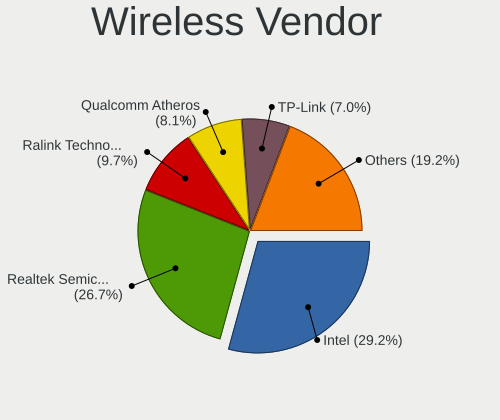

| Vendor                                | Desktops | Percent |
|---------------------------------------|----------|---------|
| Intel                                 | 105      | 29.25%  |
| Realtek Semiconductor                 | 96       | 26.74%  |
| Ralink Technology                     | 35       | 9.75%   |
| Qualcomm Atheros                      | 29       | 8.08%   |
| TP-Link                               | 25       | 6.96%   |
| MediaTek                              | 18       | 5.01%   |
| Ralink                                | 15       | 4.18%   |
| D-Link                                | 7        | 1.95%   |
| Broadcom                              | 6        | 1.67%   |
| Qualcomm Atheros Communications       | 5        | 1.39%   |
| Belkin Components                     | 4        | 1.11%   |
| NetGear                               | 3        | 0.84%   |
| Microsoft                             | 2        | 0.56%   |
| ASUSTek Computer                      | 2        | 0.56%   |
| ZyXEL Communications                  | 1        | 0.28%   |
| Senao                                 | 1        | 0.28%   |
| IMC Networks                          | 1        | 0.28%   |
| Guillemot                             | 1        | 0.28%   |
| D-Link System                         | 1        | 0.28%   |
| Broadcom Limited                      | 1        | 0.28%   |
| 802.11g Adapter [Linksys WUSB54GC v3] | 1        | 0.28%   |

Wireless Model
--------------

Wireless models

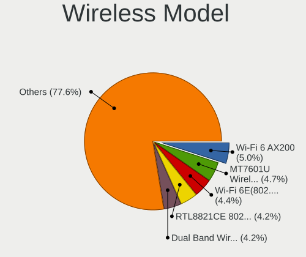

| Model                                                          | Desktops | Percent |
|----------------------------------------------------------------|----------|---------|
| Intel Wi-Fi 6 AX200                                            | 18       | 4.99%   |
| Ralink MT7601U Wireless Adapter                                | 17       | 4.71%   |
| Intel Wi-Fi 6E(802.11ax) AX210/AX1675* 2x2 [Typhoon Peak]      | 16       | 4.43%   |
| Realtek RTL8821CE 802.11ac PCIe Wireless Network Adapter       | 15       | 4.16%   |
| Intel Dual Band Wireless-AC 3168NGW [Stone Peak]               | 15       | 4.16%   |
| Realtek RTL8188EUS 802.11n Wireless Network Adapter            | 14       | 3.88%   |
| Realtek 802.11ac NIC                                           | 13       | 3.6%    |
| Intel Wireless 7260                                            | 10       | 2.77%   |
| Intel Wi-Fi 5(802.11ac) Wireless-AC 9x6x [Thunder Peak]        | 9        | 2.49%   |
| Realtek RTL88x2bu [AC1200 Techkey]                             | 8        | 2.22%   |
| Intel Wireless 7265                                            | 8        | 2.22%   |
| Ralink RT5370 Wireless Adapter                                 | 7        | 1.94%   |
| MediaTek MT7921K (RZ608) Wi-Fi 6E 80MHz                        | 7        | 1.94%   |
| Ralink RT2870/RT3070 Wireless Adapter                          | 6        | 1.66%   |
| Qualcomm Atheros AR9485 Wireless Network Adapter               | 6        | 1.66%   |
| MediaTek MT7922 802.11ax PCI Express Wireless Network Adapter  | 6        | 1.66%   |
| TP-Link TL-WN821N v5/v6 [RTL8192EU]                            | 5        | 1.39%   |
| TP-Link TL-WN722N v2/v3 [Realtek RTL8188EUS]                   | 5        | 1.39%   |
| Realtek RTL8192EU 802.11b/g/n WLAN Adapter                     | 5        | 1.39%   |
| Ralink RT3062 Wireless 802.11n 2T/2R                           | 5        | 1.39%   |
| Qualcomm Atheros QCA9565 / AR9565 Wireless Network Adapter     | 5        | 1.39%   |
| Qualcomm Atheros AR9271 802.11n                                | 5        | 1.39%   |
| Intel Wireless 3165                                            | 5        | 1.39%   |
| Realtek RTL8188FTV 802.11b/g/n 1T1R 2.4G WLAN Adapter          | 4        | 1.11%   |
| Qualcomm Atheros AR9462 Wireless Network Adapter               | 4        | 1.11%   |
| Intel Cannon Lake PCH CNVi WiFi                                | 4        | 1.11%   |
| TP-Link TL-WN823N v2/v3 [Realtek RTL8192EU]                    | 3        | 0.83%   |
| TP-Link Archer T3U [Realtek RTL8812BU]                         | 3        | 0.83%   |
| TP-Link 802.11ac NIC                                           | 3        | 0.83%   |
| Realtek RTL8822CE 802.11ac PCIe Wireless Network Adapter       | 3        | 0.83%   |
| Realtek RTL8821AE 802.11ac PCIe Wireless Network Adapter       | 3        | 0.83%   |
| Realtek RTL8723BE PCIe Wireless Network Adapter                | 3        | 0.83%   |
| Realtek RTL8192EE PCIe Wireless Network Adapter                | 3        | 0.83%   |
| Realtek RTL8192CU 802.11n WLAN Adapter                         | 3        | 0.83%   |
| Realtek RTL8188EE Wireless Network Adapter                     | 3        | 0.83%   |
| Ralink RT3090 Wireless 802.11n 1T/1R PCIe                      | 3        | 0.83%   |
| Qualcomm Atheros AR9285 Wireless Network Adapter (PCI-Express) | 3        | 0.83%   |
| Qualcomm Atheros AR922X Wireless Network Adapter               | 3        | 0.83%   |
| Intel Wireless 8265 / 8275                                     | 3        | 0.83%   |
| Intel Wireless 8260                                            | 3        | 0.83%   |

Ethernet Vendor
---------------

Ethernet vendors

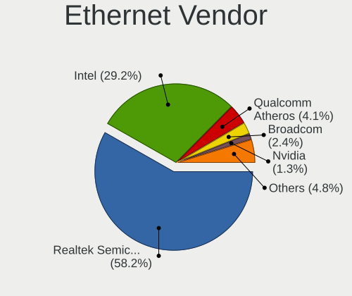

| Vendor                   | Desktops | Percent |
|--------------------------|----------|---------|
| Realtek Semiconductor    | 510      | 58.22%  |
| Intel                    | 256      | 29.22%  |
| Qualcomm Atheros         | 36       | 4.11%   |
| Broadcom                 | 21       | 2.4%    |
| Nvidia                   | 11       | 1.26%   |
| Marvell Technology Group | 6        | 0.68%   |
| Broadcom Limited         | 5        | 0.57%   |
| ASIX Electronics         | 5        | 0.57%   |
| Xiaomi                   | 3        | 0.34%   |
| VIA Technologies         | 3        | 0.34%   |
| Samsung Electronics      | 3        | 0.34%   |
| Aquantia                 | 3        | 0.34%   |
| OPPO Electronics         | 2        | 0.23%   |
| Huawei Technologies      | 2        | 0.23%   |
| 3Com                     | 2        | 0.23%   |
| TP-Link                  | 1        | 0.11%   |
| Motorola PCS             | 1        | 0.11%   |
| ICS Advent               | 1        | 0.11%   |
| HMD Global               | 1        | 0.11%   |
| Google                   | 1        | 0.11%   |
| DisplayLink              | 1        | 0.11%   |
| D-Link System            | 1        | 0.11%   |
| American Megatrends      | 1        | 0.11%   |

Ethernet Model
--------------

Ethernet models

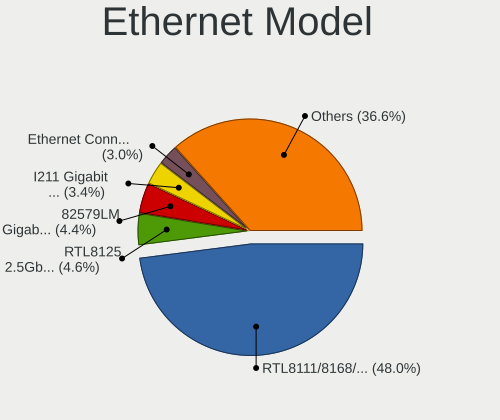

| Model                                                                  | Desktops | Percent |
|------------------------------------------------------------------------|----------|---------|
| Realtek RTL8111/8168/8211/8411 PCI Express Gigabit Ethernet Controller | 436      | 47.96%  |
| Realtek RTL8125 2.5GbE Controller                                      | 42       | 4.62%   |
| Intel 82579LM Gigabit Network Connection (Lewisville)                  | 40       | 4.4%    |
| Intel I211 Gigabit Network Connection                                  | 31       | 3.41%   |
| Intel Ethernet Connection I217-LM                                      | 27       | 2.97%   |
| Intel Ethernet Connection (2) I219-V                                   | 24       | 2.64%   |
| Intel Ethernet Connection (2) I219-LM                                  | 24       | 2.64%   |
| Realtek RTL810xE PCI Express Fast Ethernet controller                  | 19       | 2.09%   |
| Intel 82567LM-3 Gigabit Network Connection                             | 15       | 1.65%   |
| Intel Ethernet Controller I225-V                                       | 12       | 1.32%   |
| Intel Ethernet Connection (7) I219-V                                   | 12       | 1.32%   |
| Intel 82579V Gigabit Network Connection                                | 9        | 0.99%   |
| Realtek RTL-8100/8101L/8139 PCI Fast Ethernet Adapter                  | 8        | 0.88%   |
| Qualcomm Atheros AR8121/AR8113/AR8114 Gigabit or Fast Ethernet         | 7        | 0.77%   |
| Intel Ethernet Connection (5) I219-LM                                  | 7        | 0.77%   |
| Realtek RTL8169 PCI Gigabit Ethernet Controller                        | 6        | 0.66%   |
| Qualcomm Atheros QCA8171 Gigabit Ethernet                              | 6        | 0.66%   |
| Nvidia MCP61 Ethernet                                                  | 6        | 0.66%   |
| Intel 82578DM Gigabit Network Connection                               | 6        | 0.66%   |
| Intel 82574L Gigabit Network Connection                                | 6        | 0.66%   |
| Realtek RTL-8110SC/8169SC Gigabit Ethernet                             | 5        | 0.55%   |
| Qualcomm Atheros AR8151 v2.0 Gigabit Ethernet                          | 5        | 0.55%   |
| Intel I210 Gigabit Network Connection                                  | 5        | 0.55%   |
| Intel Ethernet Connection (2) I218-LM                                  | 5        | 0.55%   |
| Intel 82566DM-2 Gigabit Network Connection                             | 5        | 0.55%   |
| ASIX AX88179 Gigabit Ethernet                                          | 5        | 0.55%   |
| Qualcomm Atheros AR8161 Gigabit Ethernet                               | 4        | 0.44%   |
| Qualcomm Atheros AR8152 v2.0 Fast Ethernet                             | 4        | 0.44%   |
| Marvell Group 88E8056 PCI-E Gigabit Ethernet Controller                | 4        | 0.44%   |
| Intel Ethernet Connection I217-V                                       | 4        | 0.44%   |
| Broadcom NetXtreme BCM5761 Gigabit Ethernet PCIe                       | 4        | 0.44%   |
| Realtek RTL8153 Gigabit Ethernet Adapter                               | 3        | 0.33%   |
| Realtek RTL8111/8168/8411 PCI Express Gigabit Ethernet Controller      | 3        | 0.33%   |
| Qualcomm Atheros Killer E2400 Gigabit Ethernet Controller              | 3        | 0.33%   |
| Intel Ethernet Connection (7) I219-LM                                  | 3        | 0.33%   |
| Intel Ethernet Connection (17) I219-V                                  | 3        | 0.33%   |
| Intel 82578DC Gigabit Network Connection                               | 3        | 0.33%   |
| Broadcom NetXtreme BCM5764M Gigabit Ethernet PCIe                      | 3        | 0.33%   |
| Broadcom NetXtreme BCM5762 Gigabit Ethernet PCIe                       | 3        | 0.33%   |
| Broadcom NetXtreme BCM5754 Gigabit Ethernet PCI Express                | 3        | 0.33%   |

Net Controller Kind
-------------------

Ethernet, WiFi or modem

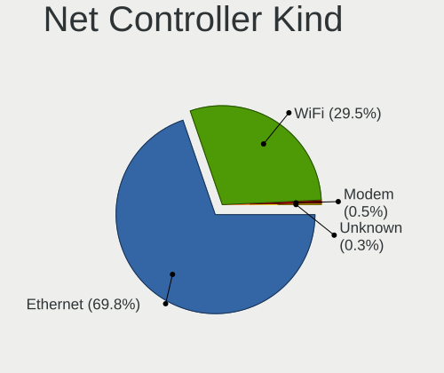

| Kind     | Desktops | Percent |
|----------|----------|---------|
| Ethernet | 828      | 69.76%  |
| WiFi     | 350      | 29.49%  |
| Modem    | 6        | 0.51%   |
| Unknown  | 3        | 0.25%   |

Used Controller
---------------

Currently used network controller

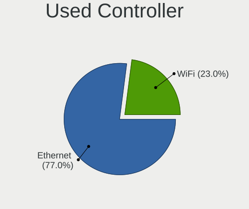

| Kind     | Desktops | Percent |
|----------|----------|---------|
| Ethernet | 641      | 77.04%  |
| WiFi     | 191      | 22.96%  |

NICs
----

Total network controllers on board

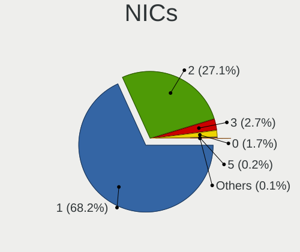

| Total | Desktops | Percent |
|-------|----------|---------|
| 1     | 577      | 68.2%   |
| 2     | 229      | 27.07%  |
| 3     | 23       | 2.72%   |
| 0     | 14       | 1.65%   |
| 5     | 2        | 0.24%   |
| 6     | 1        | 0.12%   |

IPv6
----

IPv6 vs IPv4

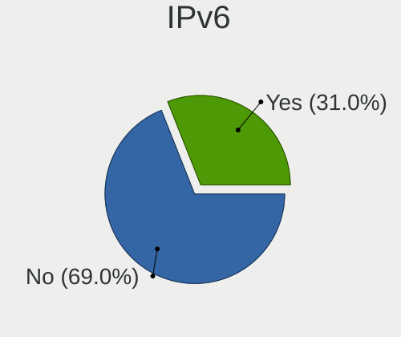

| Used | Desktops | Percent |
|------|----------|---------|
| No   | 585      | 68.99%  |
| Yes  | 263      | 31.01%  |

Bluetooth
---------

Bluetooth Vendor
----------------

Controller vendors

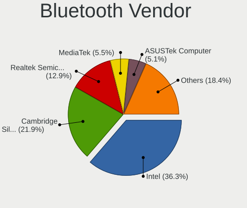

| Vendor                          | Desktops | Percent |
|---------------------------------|----------|---------|
| Intel                           | 93       | 36.33%  |
| Cambridge Silicon Radio         | 56       | 21.88%  |
| Realtek Semiconductor           | 33       | 12.89%  |
| MediaTek                        | 14       | 5.47%   |
| ASUSTek Computer                | 13       | 5.08%   |
| IMC Networks                    | 10       | 3.91%   |
| TP-Link                         | 8        | 3.13%   |
| Broadcom                        | 8        | 3.13%   |
| Qualcomm Atheros Communications | 7        | 2.73%   |
| Lite-On Technology              | 3        | 1.17%   |
| Realtek                         | 2        | 0.78%   |
| Apple                           | 2        | 0.78%   |
| Actions                         | 2        | 0.78%   |
| Unknown                         | 2        | 0.78%   |
| Ralink                          | 1        | 0.39%   |
| Integrated System Solution      | 1        | 0.39%   |
| Foxconn / Hon Hai               | 1        | 0.39%   |

Bluetooth Model
---------------

Controller models

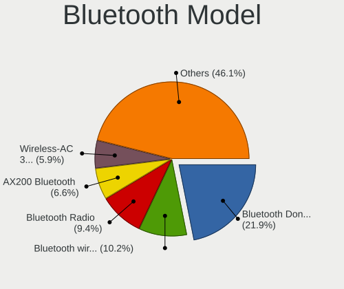

| Model                                               | Desktops | Percent |
|-----------------------------------------------------|----------|---------|
| Cambridge Silicon Radio Bluetooth Dongle (HCI mode) | 56       | 21.88%  |
| Intel Bluetooth wireless interface                  | 26       | 10.16%  |
| Realtek Bluetooth Radio                             | 24       | 9.38%   |
| Intel AX200 Bluetooth                               | 17       | 6.64%   |
| Intel Wireless-AC 3168 Bluetooth                    | 15       | 5.86%   |
| MediaTek Wireless_Device                            | 14       | 5.47%   |
| Intel AX210 Bluetooth                               | 12       | 4.69%   |
| Intel Wireless-AC 9260 Bluetooth Adapter            | 9        | 3.52%   |
| TP-Link TP-T@- UB500 Adapter                        | 8        | 3.13%   |
| Intel AX201 Bluetooth                               | 7        | 2.73%   |
| Intel Bluetooth 9460/9560 Jefferson Peak (JfP)      | 6        | 2.34%   |
| IMC Networks Bluetooth Radio                        | 6        | 2.34%   |
| Realtek  Bluetooth 4.2 Adapter                      | 4        | 1.56%   |
| ASUS Broadcom BCM20702A0 Bluetooth                  | 4        | 1.56%   |
| ASUS ASUS USB-BT500                                 | 4        | 1.56%   |
| Realtek Bluetooth 5.3 Radio                         | 3        | 1.17%   |
| Qualcomm Atheros  Bluetooth Device                  | 3        | 1.17%   |
| Broadcom BCM20702A0 Bluetooth 4.0                   | 3        | 1.17%   |
| ASUS Bluetooth Radio                                | 3        | 1.17%   |
| Realtek Bluetooth Radio                             | 2        | 0.78%   |
| Qualcomm Atheros AR3011 Bluetooth                   | 2        | 0.78%   |
| Lite-On Bluetooth Device                            | 2        | 0.78%   |
| IMC Networks Wireless_Device                        | 2        | 0.78%   |
| IMC Networks Bluetooth Device                       | 2        | 0.78%   |
| Broadcom Bluetooth 3.0 Device                       | 2        | 0.78%   |
| Actions general adapter                             | 2        | 0.78%   |
| Unknown                                             | 2        | 0.78%   |
| Realtek RTL8821A Bluetooth                          | 1        | 0.39%   |
| Realtek RTL8723B Bluetooth                          | 1        | 0.39%   |
| Ralink RT3290 Bluetooth                             | 1        | 0.39%   |
| Qualcomm Atheros Bluetooth USB Host Controller      | 1        | 0.39%   |
| Qualcomm Atheros AR3012 Bluetooth 4.0               | 1        | 0.39%   |
| Lite-On Atheros AR3012 Bluetooth                    | 1        | 0.39%   |
| Intel Bluetooth Device                              | 1        | 0.39%   |
| Integrated System Solution Bluetooth Device         | 1        | 0.39%   |
| Foxconn / Hon Hai Wireless_Device                   | 1        | 0.39%   |
| Broadcom HP Bluethunder                             | 1        | 0.39%   |
| Broadcom Bluetooth 2.1 Device                       | 1        | 0.39%   |
| Broadcom BCM43142 Bluetooth 4.0                     | 1        | 0.39%   |
| ASUS Bluetooth Device                               | 1        | 0.39%   |

Sound
-----

Sound Vendor
------------

Sound card vendors

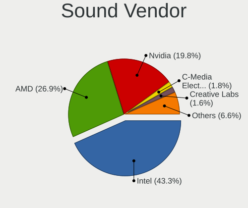

| Vendor                                       | Desktops | Percent |
|----------------------------------------------|----------|---------|
| Intel                                        | 534      | 43.34%  |
| AMD                                          | 331      | 26.87%  |
| Nvidia                                       | 244      | 19.81%  |
| C-Media Electronics                          | 22       | 1.79%   |
| Creative Labs                                | 20       | 1.62%   |
| Zoran Co. Personal Media Division (Nogatech) | 7        | 0.57%   |
| Logitech                                     | 6        | 0.49%   |
| Tenx Technology                              | 5        | 0.41%   |
| JMTek                                        | 4        | 0.32%   |
| ASUSTek Computer                             | 4        | 0.32%   |
| VIA Technologies                             | 3        | 0.24%   |
| Texas Instruments                            | 3        | 0.24%   |
| Razer USA                                    | 3        | 0.24%   |
| Micro Star International                     | 3        | 0.24%   |
| Generalplus Technology                       | 3        | 0.24%   |
| Creative Technology                          | 3        | 0.24%   |
| Corsair                                      | 3        | 0.24%   |
| Medeli Electronics                           | 2        | 0.16%   |
| Jieli Technology                             | 2        | 0.16%   |
| GN Netcom                                    | 2        | 0.16%   |
| Ensoniq                                      | 2        | 0.16%   |
| Unknown                                      | 2        | 0.16%   |
| ZOOM                                         | 1        | 0.08%   |
| Yamaha                                       | 1        | 0.08%   |
| XMOS                                         | 1        | 0.08%   |
| TTGK Technology                              | 1        | 0.08%   |
| Synaptics                                    | 1        | 0.08%   |
| Samson Technologies                          | 1        | 0.08%   |
| RODE Microphones                             | 1        | 0.08%   |
| Plantronics                                  | 1        | 0.08%   |
| MV-SILICON                                   | 1        | 0.08%   |
| Megawin Technology                           | 1        | 0.08%   |
| Mackie Designs                               | 1        | 0.08%   |
| Kingston Technology                          | 1        | 0.08%   |
| HECATE G4 TE GAMING HEADSET                  | 1        | 0.08%   |
| Goldvish                                     | 1        | 0.08%   |
| Giga-Byte Technology                         | 1        | 0.08%   |
| FiiO Electronics Technology                  | 1        | 0.08%   |
| Endorfy Solum Mic                            | 1        | 0.08%   |
| eMPIA Technology                             | 1        | 0.08%   |

Sound Model
-----------

Sound card models

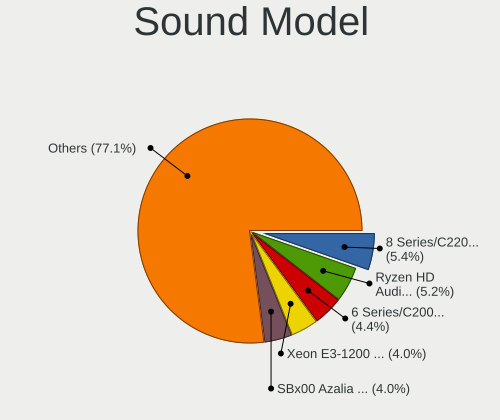

| Model                                                                      | Desktops | Percent |
|----------------------------------------------------------------------------|----------|---------|
| Intel 8 Series/C220 Series Chipset High Definition Audio Controller        | 81       | 5.36%   |
| AMD Ryzen HD Audio Controller                                              | 78       | 5.16%   |
| Intel 6 Series/C200 Series Chipset Family High Definition Audio Controller | 66       | 4.37%   |
| Intel Xeon E3-1200 v3/4th Gen Core Processor HD Audio Controller           | 61       | 4.03%   |
| AMD SBx00 Azalia (Intel HDA)                                               | 61       | 4.03%   |
| Intel 100 Series/C230 Series Chipset Family HD Audio Controller            | 56       | 3.7%    |
| AMD Starship/Matisse HD Audio Controller                                   | 52       | 3.44%   |
| Intel 7 Series/C216 Chipset Family High Definition Audio Controller        | 47       | 3.11%   |
| Intel 200 Series PCH HD Audio                                              | 43       | 2.84%   |
| AMD FCH Azalia Controller                                                  | 42       | 2.78%   |
| AMD Renoir/Cezanne HDMI/DP Audio Controller                                | 37       | 2.45%   |
| Intel NM10/ICH7 Family High Definition Audio Controller                    | 33       | 2.18%   |
| AMD Navi 21/23 HDMI/DP Audio Controller                                    | 33       | 2.18%   |
| Nvidia GK208 HDMI/DP Audio Controller                                      | 30       | 1.98%   |
| Intel Cannon Lake PCH cAVS                                                 | 29       | 1.92%   |
| Intel 5 Series/3400 Series Chipset High Definition Audio                   | 26       | 1.72%   |
| AMD Raven/Raven2/Fenghuang HDMI/DP Audio Controller                        | 24       | 1.59%   |
| AMD Family 17h (Models 00h-0fh) HD Audio Controller                        | 23       | 1.52%   |
| AMD Baffin HDMI/DP Audio [Radeon RX 550 640SP / RX 560/560X]               | 23       | 1.52%   |
| Nvidia GM107 High Definition Audio Controller [GeForce 940MX]              | 22       | 1.46%   |
| AMD Oland/Hainan/Cape Verde/Pitcairn HDMI Audio [Radeon HD 7000 Series]    | 21       | 1.39%   |
| AMD Ellesmere HDMI Audio [Radeon RX 470/480 / 570/580/590]                 | 20       | 1.32%   |
| Nvidia TU116 High Definition Audio Controller                              | 19       | 1.26%   |
| Nvidia High Definition Audio Controller                                    | 18       | 1.19%   |
| Nvidia GP107GL High Definition Audio Controller                            | 18       | 1.19%   |
| Intel 82801JI (ICH10 Family) HD Audio Controller                           | 16       | 1.06%   |
| Nvidia GP106 High Definition Audio Controller                              | 15       | 0.99%   |
| Nvidia GF119 HDMI Audio Controller                                         | 15       | 0.99%   |
| Intel 82801JD/DO (ICH10 Family) HD Audio Controller                        | 15       | 0.99%   |
| AMD Kaveri HDMI/DP Audio Controller                                        | 15       | 0.99%   |
| AMD Navi 31 HDMI/DP Audio                                                  | 14       | 0.93%   |
| Intel 82801I (ICH9 Family) HD Audio Controller                             | 13       | 0.86%   |
| Nvidia GF108 High Definition Audio Controller                              | 12       | 0.79%   |
| AMD Trinity HDMI Audio Controller                                          | 12       | 0.79%   |
| Intel Comet Lake PCH-V cAVS                                                | 11       | 0.73%   |
| Intel Alder Lake-N PCH High Definition Audio Controller                    | 11       | 0.73%   |
| AMD Radeon High Definition Audio Controller                                | 11       | 0.73%   |
| Nvidia GK104 HDMI Audio Controller                                         | 10       | 0.66%   |
| Intel Alder Lake-S HD Audio Controller                                     | 10       | 0.66%   |
| Intel C610/X99 series chipset HD Audio Controller                          | 9        | 0.6%    |

Memory
------

Memory Vendor
-------------

Memory module vendors

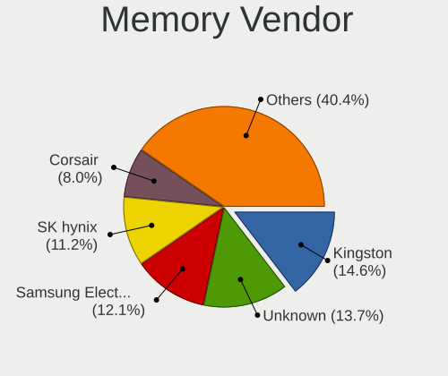

| Vendor                                  | Desktops | Percent |
|-----------------------------------------|----------|---------|
| Kingston                                | 146      | 14.6%   |
| Unknown                                 | 137      | 13.7%   |
| Samsung Electronics                     | 121      | 12.1%   |
| SK hynix                                | 112      | 11.2%   |
| Corsair                                 | 80       | 8%      |
| Crucial                                 | 65       | 6.5%    |
| Micron Technology                       | 61       | 6.1%    |
| G.Skill                                 | 53       | 5.3%    |
| Unknown                                 | 23       | 2.3%    |
| Nanya Technology                        | 21       | 2.1%    |
| A-DATA Technology                       | 17       | 1.7%    |
| Team                                    | 15       | 1.5%    |
| Ramaxel Technology                      | 15       | 1.5%    |
| Patriot                                 | 14       | 1.4%    |
| Transcend                               | 10       | 1%      |
| GOODRAM                                 | 8        | 0.8%    |
| Elpida                                  | 8        | 0.8%    |
| AMD                                     | 8        | 0.8%    |
| Red Hat                                 | 6        | 0.6%    |
| Silicon Power                           | 5        | 0.5%    |
| Unknown (0x0E9D)                        | 4        | 0.4%    |
| PNY                                     | 4        | 0.4%    |
| Patriot Memory (PDP Systems)            | 3        | 0.3%    |
| Golden Empire                           | 3        | 0.3%    |
| Apacer                                  | 3        | 0.3%    |
| Wilk                                    | 2        | 0.2%    |
| Unknown (ABCD)                          | 2        | 0.2%    |
| Unifosa                                 | 2        | 0.2%    |
| Teikon                                  | 2        | 0.2%    |
| Silicon Power Computer & Communications | 2        | 0.2%    |
| Qimonda                                 | 2        | 0.2%    |
| Kingmax                                 | 2        | 0.2%    |
| GeIL                                    | 2        | 0.2%    |
| Essencore                               | 2        | 0.2%    |
| Avant                                   | 2        | 0.2%    |
| Wilk Elektronik                         | 1        | 0.1%    |
| Unknown (89F7)                          | 1        | 0.1%    |
| Unknown (0x7FFF)                        | 1        | 0.1%    |
| Unknown (0x0B45)                        | 1        | 0.1%    |
| Toshiba                                 | 1        | 0.1%    |

Memory Model
------------

Memory module models

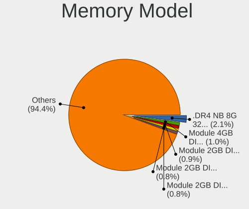

| Model                                                              | Desktops | Percent |
|--------------------------------------------------------------------|----------|---------|
| Unknown                                                            | 23       | 2.09%   |
| Unknown RAM Module 4GB DIMM 1333MT/s                               | 11       | 1%      |
| Unknown RAM Module 2GB DIMM 1333MT/s                               | 10       | 0.91%   |
| Unknown RAM Module 2GB DIMM DDR2 800MT/s                           | 9        | 0.82%   |
| Unknown RAM Module 2GB DIMM 800MT/s                                | 9        | 0.82%   |
| Micron RAM 8JTF51264AZ-1G6E1 4GB DIMM DDR3 1600MT/s                | 9        | 0.82%   |
| Unknown RAM Module 2GB DIMM SDRAM                                  | 8        | 0.73%   |
| Kingston RAM KHX1600C9D3/4GX 4GB DIMM DDR3 1867MT/s                | 8        | 0.73%   |
| Unknown RAM Module 4GB DIMM DDR3 1333MT/s                          | 7        | 0.63%   |
| Unknown RAM Module 1GB DIMM                                        | 7        | 0.63%   |
| SK hynix RAM HMT351U6EFR8C-PB 4GB DIMM DDR3 1600MT/s               | 7        | 0.63%   |
| G.Skill RAM F4-3200C16-8GIS 8GB DIMM DDR4 3600MT/s                 | 7        | 0.63%   |
| Samsung RAM Module 8GB DIMM DDR4 2133MT/s                          | 6        | 0.54%   |
| Unknown RAM Module 8GB DIMM DDR3 1600MT/s                          | 5        | 0.45%   |
| Unknown RAM Module 8GB DIMM 1600MT/s                               | 5        | 0.45%   |
| Unknown RAM Module 8GB DIMM 1333MT/s                               | 5        | 0.45%   |
| Unknown RAM Module 4GB DIMM 1600MT/s                               | 5        | 0.45%   |
| Team RAM TEAMGROUP-UD4-3200 8GB DIMM DDR4 3733MT/s                 | 5        | 0.45%   |
| SK hynix RAM HMT451U6BFR8C-PB 4GB DIMM DDR3 1600MT/s               | 5        | 0.45%   |
| SK hynix RAM HMT451U6BFR8A-PB 4GB DIMM DDR3 1600MT/s               | 5        | 0.45%   |
| SK hynix RAM HMT351U6CFR8C-PB 4GB DIMM DDR3 1800MT/s               | 5        | 0.45%   |
| SK hynix RAM HMA81GU6AFR8N-UH 8GB DIMM DDR4 2400MT/s               | 5        | 0.45%   |
| Samsung RAM M378B5773DH0-CH9 2GB DIMM DDR3 1333MT/s                | 5        | 0.45%   |
| Samsung RAM M378B5773CH0-CH9 2GB DIMM DDR3 1867MT/s                | 5        | 0.45%   |
| Samsung RAM M378B5173DB0-CK0 4096MB DIMM DDR3 1600MT/s             | 5        | 0.45%   |
| Kingston RAM KHX2666C16/8G 8GiB DIMM DDR4 3466MT/s                 | 5        | 0.45%   |
| Kingston RAM KF3200C16D4/8GX 8GiB DIMM DDR4 3600MT/s               | 5        | 0.45%   |
| Kingston RAM KF3200C16D4/16GX 16GB DIMM DDR4 3733MT/s              | 5        | 0.45%   |
| Unknown RAM Module 8GB DIMM DDR3 1333MT/s                          | 4        | 0.36%   |
| Unknown RAM Module 4GB DIMM SDRAM                                  | 4        | 0.36%   |
| Unknown RAM Module 4GB DIMM DDR3 1600MT/s                          | 4        | 0.36%   |
| Unknown RAM Module 4GB DIMM 1066MT/s                               | 4        | 0.36%   |
| Unknown RAM Module 4GB DIMM                                        | 4        | 0.36%   |
| Unknown RAM Module 2GB DIMM DDR3 1333MT/s                          | 4        | 0.36%   |
| Unknown (0x0E9D) RAM KINSOTIN16GB2666MHZ 16GB SODIMM DDR4 2667MT/s | 4        | 0.36%   |
| SK hynix RAM HMT451U6AFR8C-PB 4GB DIMM DDR3 1600MT/s               | 4        | 0.36%   |
| SK hynix RAM HMT325U6CFR8C-PB 2GB DIMM DDR3 1600MT/s               | 4        | 0.36%   |
| SK hynix RAM HMA81GU6CJR8N-VK 8GB DIMM DDR4 2667MT/s               | 4        | 0.36%   |
| Samsung RAM M4 70T5663RZ3-CE6 2GB SODIMM DDR 667MT/s               | 4        | 0.36%   |
| Samsung RAM M378B1G73EB0-CK0 8GB DIMM DDR3 1600MT/s                | 4        | 0.36%   |

Memory Kind
-----------

Memory module kinds

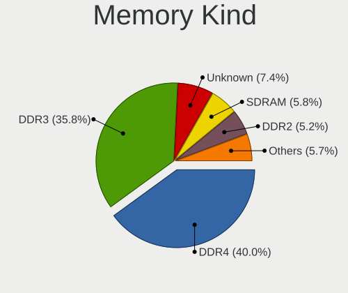

| Kind         | Desktops | Percent |
|--------------|----------|---------|
| DDR4         | 344      | 40%     |
| DDR3         | 308      | 35.81%  |
| Unknown      | 64       | 7.44%   |
| SDRAM        | 50       | 5.81%   |
| DDR2         | 45       | 5.23%   |
| DDR5         | 23       | 2.67%   |
| DDR          | 11       | 1.28%   |
| RAM          | 6        | 0.7%    |
| LPDDR4       | 4        | 0.47%   |
| DRAM         | 3        | 0.35%   |
| HBM2         | 1        | 0.12%   |
| DDR2 FB-DIMM | 1        | 0.12%   |

Memory Form Factor
------------------

Physical design of the memory module

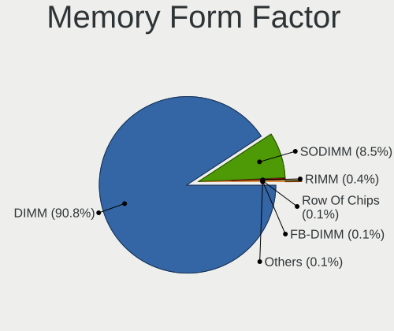

| Name         | Desktops | Percent |
|--------------|----------|---------|
| DIMM         | 758      | 90.78%  |
| SODIMM       | 71       | 8.5%    |
| RIMM         | 3        | 0.36%   |
| Row Of Chips | 1        | 0.12%   |
| FB-DIMM      | 1        | 0.12%   |
| Die          | 1        | 0.12%   |

Memory Size
-----------

Memory module size

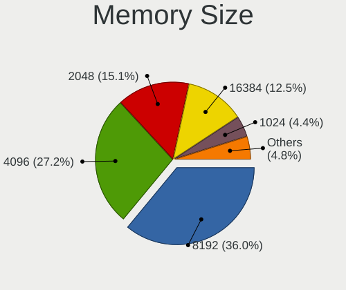

| Size  | Desktops | Percent |
|-------|----------|---------|
| 8192  | 335      | 35.98%  |
| 4096  | 253      | 27.18%  |
| 2048  | 141      | 15.15%  |
| 16384 | 116      | 12.46%  |
| 1024  | 41       | 4.4%    |
| 32768 | 38       | 4.08%   |
| 512   | 5        | 0.54%   |
| 49152 | 1        | 0.11%   |
| 12536 | 1        | 0.11%   |

Memory Speed
------------

Memory module speed

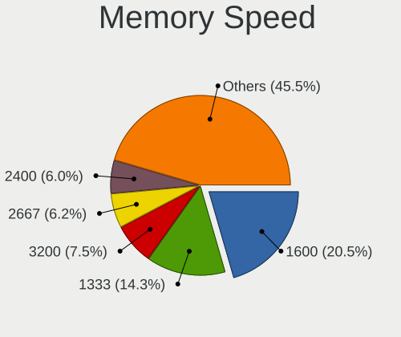

| Speed   | Desktops | Percent |
|---------|----------|---------|
| 1600    | 195      | 20.53%  |
| 1333    | 136      | 14.32%  |
| 3200    | 71       | 7.47%   |
| 2667    | 59       | 6.21%   |
| 2400    | 57       | 6%      |
| 3600    | 50       | 5.26%   |
| 2133    | 43       | 4.53%   |
| 800     | 37       | 3.89%   |
| Unknown | 34       | 3.58%   |
| 667     | 25       | 2.63%   |
| 3733    | 16       | 1.68%   |
| 1800    | 16       | 1.68%   |
| 2666    | 15       | 1.58%   |
| 1867    | 15       | 1.58%   |
| 3000    | 14       | 1.47%   |
| 3400    | 13       | 1.37%   |
| 4000    | 11       | 1.16%   |
| 1866    | 11       | 1.16%   |
| 6000    | 7        | 0.74%   |
| 3800    | 7        | 0.74%   |
| 3466    | 6        | 0.63%   |
| 3266    | 6        | 0.63%   |
| 3066    | 6        | 0.63%   |
| 2933    | 6        | 0.63%   |
| 2000    | 6        | 0.63%   |
| 5200    | 5        | 0.53%   |
| 1066    | 5        | 0.53%   |
| 400     | 5        | 0.53%   |
| 333     | 5        | 0.53%   |
| 5600    | 4        | 0.42%   |
| 2048    | 4        | 0.42%   |
| 1648    | 4        | 0.42%   |
| 1067    | 4        | 0.42%   |
| 3933    | 3        | 0.32%   |
| 3500    | 3        | 0.32%   |
| 2800    | 3        | 0.32%   |
| 2200    | 3        | 0.32%   |
| 1334    | 3        | 0.32%   |
| 8400    | 2        | 0.21%   |
| 6400    | 2        | 0.21%   |

Printers & scanners
-------------------

Printer Vendor
--------------

Printer device vendors

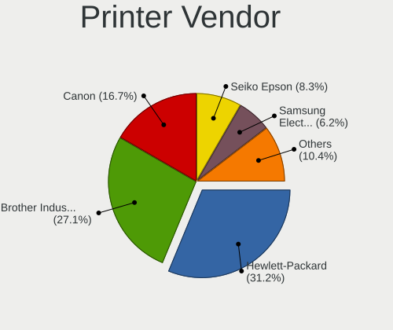

| Vendor              | Desktops | Percent |
|---------------------|----------|---------|
| Hewlett-Packard     | 15       | 31.25%  |
| Brother Industries  | 13       | 27.08%  |
| Canon               | 8        | 16.67%  |
| Seiko Epson         | 4        | 8.33%   |
| Samsung Electronics | 3        | 6.25%   |
| Xerox               | 1        | 2.08%   |
| Prolific Technology | 1        | 2.08%   |
| Pantum              | 1        | 2.08%   |
| Kyocera             | 1        | 2.08%   |
| Apple               | 1        | 2.08%   |

Printer Model
-------------

Printer device models

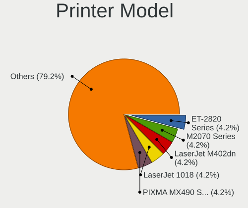

| Model                           | Desktops | Percent |
|---------------------------------|----------|---------|
| Seiko Epson ET-2820 Series      | 2        | 4.17%   |
| Samsung M2070 Series            | 2        | 4.17%   |
| HP LaserJet M402dn              | 2        | 4.17%   |
| HP LaserJet 1018                | 2        | 4.17%   |
| Canon PIXMA MX490 Series        | 2        | 4.17%   |
| Canon LiDE 300                  | 2        | 4.17%   |
| Xerox Phaser 3010               | 1        | 2.08%   |
| Seiko Epson L6270 Series        | 1        | 2.08%   |
| Seiko Epson ET-2710 Series      | 1        | 2.08%   |
| Samsung ML-2850 Series          | 1        | 2.08%   |
| Prolific PL2305 Parallel Port   | 1        | 2.08%   |
| Pantum M7100DN series           | 1        | 2.08%   |
| Kyocera FS-1116MFP              | 1        | 2.08%   |
| HP Officejet Pro 6230           | 1        | 2.08%   |
| HP Ink Tank 310 series          | 1        | 2.08%   |
| HP HP Laser 107w                | 1        | 2.08%   |
| HP ENVY 4520 series             | 1        | 2.08%   |
| HP DeskJet F4200 series         | 1        | 2.08%   |
| HP DeskJet 6940 series          | 1        | 2.08%   |
| HP DeskJet 4670 series          | 1        | 2.08%   |
| HP DeskJet 3700 series          | 1        | 2.08%   |
| HP DeskJet 2700 series          | 1        | 2.08%   |
| HP DeskJet 2600 series          | 1        | 2.08%   |
| HP Deskjet 1050 J410            | 1        | 2.08%   |
| Canon TS6400 series             | 1        | 2.08%   |
| Canon Pro9000II series          | 1        | 2.08%   |
| Canon PRO-100 series            | 1        | 2.08%   |
| Canon PIXMA MG3600 Series       | 1        | 2.08%   |
| Brother PT-1500PC               | 1        | 2.08%   |
| Brother Printer                 | 1        | 2.08%   |
| Brother MFC-J497DW              | 1        | 2.08%   |
| Brother MFC-J480DW              | 1        | 2.08%   |
| Brother MFC-J470DW              | 1        | 2.08%   |
| Brother MFC-J1010DW             | 1        | 2.08%   |
| Brother HL-L2375DW series       | 1        | 2.08%   |
| Brother HL-2270DW Laser Printer | 1        | 2.08%   |
| Brother HL-2140 series          | 1        | 2.08%   |
| Brother HL-2030 Laser Printer   | 1        | 2.08%   |
| Brother HL-1110 series          | 1        | 2.08%   |
| Brother DCP-L2510D series       | 1        | 2.08%   |

Scanner Vendor
--------------

Scanner device vendors

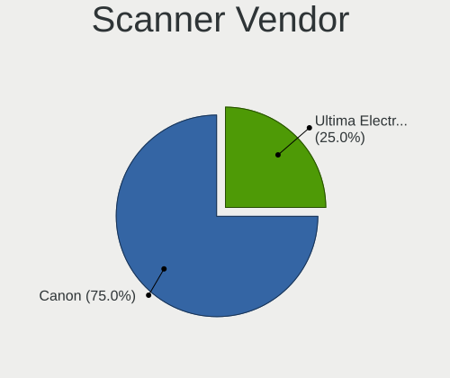

| Vendor             | Desktops | Percent |
|--------------------|----------|---------|
| Canon              | 3        | 75%     |
| Ultima Electronics | 1        | 25%     |

Scanner Model
-------------

Scanner device models

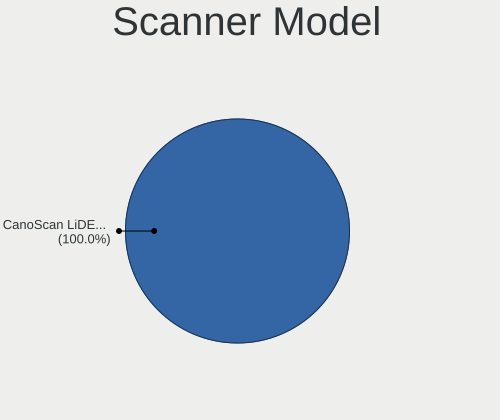

| Model                                                                                 | Desktops | Percent |
|---------------------------------------------------------------------------------------|----------|---------|
| Canon CanoScan LiDE 110                                                               | 2        | 50%     |
| Ultima Artec Ultima 2000 (GT6801 based)/Lifetec LT9385/ScanMagic 1200 UB Plus Scanner | 1        | 25%     |
| Canon CanoScan LiDE 210                                                               | 1        | 25%     |

Camera
------

Camera Vendor
-------------

Camera device vendors

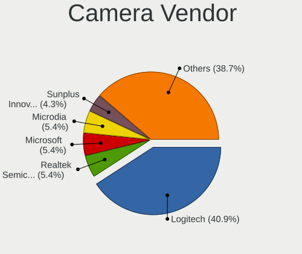

| Vendor                        | Desktops | Percent |
|-------------------------------|----------|---------|
| Logitech                      | 38       | 40.86%  |
| Realtek Semiconductor         | 5        | 5.38%   |
| Microsoft                     | 5        | 5.38%   |
| Microdia                      | 5        | 5.38%   |
| Sunplus Innovation Technology | 4        | 4.3%    |
| MacroSilicon                  | 3        | 3.23%   |
| eMeet                         | 3        | 3.23%   |
| Chicony Electronics           | 3        | 3.23%   |
| Z-Star Microelectronics       | 2        | 2.15%   |
| Samsung Electronics           | 2        | 2.15%   |
| Linux Foundation              | 2        | 2.15%   |
| Lenovo                        | 2        | 2.15%   |
| Jieli Technology              | 2        | 2.15%   |
| Generalplus Technology        | 2        | 2.15%   |
| GEMBIRD                       | 2        | 2.15%   |
| webcam                        | 1        | 1.08%   |
| WaveRider Communications      | 1        | 1.08%   |
| Unknown                       | 1        | 1.08%   |
| Solid Year                    | 1        | 1.08%   |
| Novatek Microelectronics      | 1        | 1.08%   |
| Netchip Technology            | 1        | 1.08%   |
| Magic Control Technology      | 1        | 1.08%   |
| KYE Systems (Mouse Systems)   | 1        | 1.08%   |
| Cubeternet                    | 1        | 1.08%   |
| Creative Technology           | 1        | 1.08%   |
| Aveo Technology               | 1        | 1.08%   |
| Asuscom Network               | 1        | 1.08%   |
| Alcor Micro                   | 1        | 1.08%   |

Camera Model
------------

Camera device models

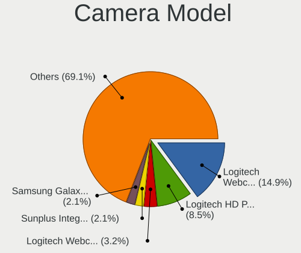

| Model                                         | Desktops | Percent |
|-----------------------------------------------|----------|---------|
| Logitech Webcam C270                          | 14       | 14.89%  |
| Logitech HD Pro Webcam C920                   | 8        | 8.51%   |
| Logitech Webcam C310                          | 3        | 3.19%   |
| Sunplus Integrated Camera                     | 2        | 2.13%   |
| Samsung Galaxy series, misc. (MTP mode)       | 2        | 2.13%   |
| Realtek USB Camera                            | 2        | 2.13%   |
| Microsoft LifeCam VX-5000                     | 2        | 2.13%   |
| Microdia Integrated Camera                    | 2        | 2.13%   |
| MacroSilicon USB Video                        | 2        | 2.13%   |
| Logitech CrystalCam                           | 2        | 2.13%   |
| Linux Foundation EEM Gadget                   | 2        | 2.13%   |
| Jieli USB PHY 2.0                             | 2        | 2.13%   |
| Z-Star Lenovo ThinkCentre Web Camera          | 1        | 1.06%   |
| Z-Star Integrated Camera                      | 1        | 1.06%   |
| webcam webcam                                 | 1        | 1.06%   |
| WaveRider USB 2.0 Camera                      | 1        | 1.06%   |
| Unknown HD camera                             | 1        | 1.06%   |
| Sunplus Full HD webcam                        | 1        | 1.06%   |
| Sunplus Aukey-PC-LM1E Camera                  | 1        | 1.06%   |
| Solid Year MyLife webcam                      | 1        | 1.06%   |
| Realtek Webcam                                | 1        | 1.06%   |
| Realtek Lanseyaoji                            | 1        | 1.06%   |
| Realtek FULL HD 1080P Webcam                  | 1        | 1.06%   |
| Novatek HP High Definition 2MP Webcam         | 1        | 1.06%   |
| Netchip Nuroum V11                            | 1        | 1.06%   |
| Microsoft Xbox NUI Camera                     | 1        | 1.06%   |
| Microsoft LifeCam VX-700                      | 1        | 1.06%   |
| Microsoft LifeCam Cinema                      | 1        | 1.06%   |
| Microdia Sonix USB 2.0 Camera                 | 1        | 1.06%   |
| Microdia PC Camera (SN9C325)                  | 1        | 1.06%   |
| Microdia CyberTrack H7                        | 1        | 1.06%   |
| Microdia ACR010 USB Webcam                    | 1        | 1.06%   |
| Magic Control j5 WebCam JVCU435               | 1        | 1.06%   |
| MacroSilicon MS210x Video Grabber [EasierCAP] | 1        | 1.06%   |
| Logitech Webcam C200                          | 1        | 1.06%   |
| Logitech Webcam C170                          | 1        | 1.06%   |
| Logitech Webcam C110                          | 1        | 1.06%   |
| Logitech StreamCam                            | 1        | 1.06%   |
| Logitech QuickCam Pro for Notebooks           | 1        | 1.06%   |
| Logitech QuickCam Pro 9000                    | 1        | 1.06%   |

Security
--------

Fingerprint Vendor
------------------

Fingerprint sensor vendors

Zero info for selected period =(

Fingerprint Model
-----------------

Fingerprint sensor models

Zero info for selected period =(

Chipcard Vendor
---------------

Chipcard module vendors

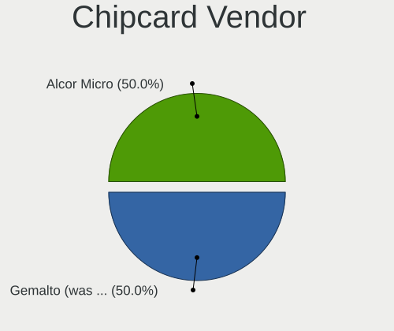

| Vendor                | Desktops | Percent |
|-----------------------|----------|---------|
| Gemalto (was Gemplus) | 1        | 50%     |
| Alcor Micro           | 1        | 50%     |

Chipcard Model
--------------

Chipcard module models

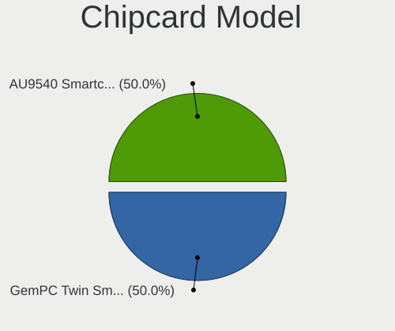

| Model                                             | Desktops | Percent |
|---------------------------------------------------|----------|---------|
| Gemalto (was Gemplus) GemPC Twin SmartCard Reader | 1        | 50%     |
| Alcor Micro AU9540 Smartcard Reader               | 1        | 50%     |

Unsupported
-----------

Unsupported Devices
-------------------

Total unsupported devices on board

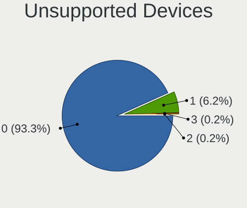

| Total | Desktops | Percent |
|-------|----------|---------|
| 0     | 792      | 93.29%  |
| 1     | 53       | 6.24%   |
| 3     | 2        | 0.24%   |
| 2     | 2        | 0.24%   |

Unsupported Device Types
------------------------

Types of unsupported devices

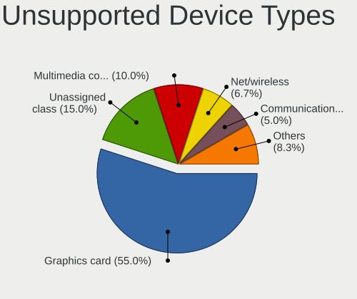

| Type                     | Desktops | Percent |
|--------------------------|----------|---------|
| Graphics card            | 33       | 55%     |
| Unassigned class         | 9        | 15%     |
| Multimedia controller    | 6        | 10%     |
| Net/wireless             | 4        | 6.67%   |
| Communication controller | 3        | 5%      |
| Chipcard                 | 2        | 3.33%   |
| Network                  | 1        | 1.67%   |
| Camera                   | 1        | 1.67%   |
| Bluetooth                | 1        | 1.67%   |

