OpenMandriva 5.0 - Tested Hardware & Statistics (Desktops)
----------------------------------------------------------

A project to collect tested hardware configurations for OpenMandriva 5.0.

Anyone can contribute to this report by the [hw-probe](https://github.com/linuxhw/hw-probe) tool:

    sudo -E hw-probe -all -upload

Please contribute! Especially if your hardware is rare.

Contents
--------

* [ Test Cases ](#test-cases)

* [ System ](#system)
  - [ Kernel                   ](#kernel)
  - [ Kernel Family            ](#kernel-family)
  - [ Kernel Major Ver.        ](#kernel-major-ver)
  - [ Arch                     ](#arch)
  - [ DE                       ](#de)
  - [ Display Server           ](#display-server)
  - [ Display Manager          ](#display-manager)
  - [ OS Lang                  ](#os-lang)
  - [ Boot Mode                ](#boot-mode)
  - [ Filesystem               ](#filesystem)
  - [ Part. scheme             ](#part-scheme)
  - [ Dual Boot with Linux/BSD ](#dual-boot-with-linuxbsd)
  - [ Dual Boot (Win)          ](#dual-boot-win)

* [ Board ](#board)
  - [ Vendor                   ](#vendor)
  - [ Model                    ](#model)
  - [ Model Family             ](#model-family)
  - [ MFG Year                 ](#mfg-year)
  - [ Form Factor              ](#form-factor)
  - [ Secure Boot              ](#secure-boot)
  - [ Coreboot                 ](#coreboot)
  - [ RAM Size                 ](#ram-size)
  - [ RAM Used                 ](#ram-used)
  - [ Total Drives             ](#total-drives)
  - [ Has CD-ROM               ](#has-cd-rom)
  - [ Has Ethernet             ](#has-ethernet)
  - [ Has WiFi                 ](#has-wifi)
  - [ Has Bluetooth            ](#has-bluetooth)

* [ Location ](#location)
  - [ Country                  ](#country)
  - [ City                     ](#city)

* [ Drives ](#drives)
  - [ Drive Vendor             ](#drive-vendor)
  - [ Drive Model              ](#drive-model)
  - [ HDD Vendor               ](#hdd-vendor)
  - [ SSD Vendor               ](#ssd-vendor)
  - [ Drive Kind               ](#drive-kind)
  - [ Drive Connector          ](#drive-connector)
  - [ Drive Size               ](#drive-size)
  - [ Space Total              ](#space-total)
  - [ Space Used               ](#space-used)
  - [ Malfunc. Drives          ](#malfunc-drives)
  - [ Malfunc. Drive Vendor    ](#malfunc-drive-vendor)
  - [ Malfunc. HDD Vendor      ](#malfunc-hdd-vendor)
  - [ Malfunc. Drive Kind      ](#malfunc-drive-kind)
  - [ Failed Drives            ](#failed-drives)
  - [ Failed Drive Vendor      ](#failed-drive-vendor)
  - [ Drive Status             ](#drive-status)

* [ Storage controller ](#storage-controller)
  - [ Storage Vendor           ](#storage-vendor)
  - [ Storage Model            ](#storage-model)
  - [ Storage Kind             ](#storage-kind)

* [ Processor ](#processor)
  - [ CPU Vendor               ](#cpu-vendor)
  - [ CPU Model                ](#cpu-model)
  - [ CPU Model Family         ](#cpu-model-family)
  - [ CPU Cores                ](#cpu-cores)
  - [ CPU Sockets              ](#cpu-sockets)
  - [ CPU Threads              ](#cpu-threads)
  - [ CPU Op-Modes             ](#cpu-op-modes)
  - [ CPU Microcode            ](#cpu-microcode)
  - [ CPU Microarch            ](#cpu-microarch)

* [ Graphics ](#graphics)
  - [ GPU Vendor               ](#gpu-vendor)
  - [ GPU Model                ](#gpu-model)
  - [ GPU Combo                ](#gpu-combo)
  - [ GPU Driver               ](#gpu-driver)
  - [ GPU Memory               ](#gpu-memory)

* [ Monitor ](#monitor)
  - [ Monitor Vendor           ](#monitor-vendor)
  - [ Monitor Model            ](#monitor-model)
  - [ Monitor Resolution       ](#monitor-resolution)
  - [ Monitor Diagonal         ](#monitor-diagonal)
  - [ Monitor Width            ](#monitor-width)
  - [ Aspect Ratio             ](#aspect-ratio)
  - [ Monitor Area             ](#monitor-area)
  - [ Pixel Density            ](#pixel-density)
  - [ Multiple Monitors        ](#multiple-monitors)

* [ Network ](#network)
  - [ Net Controller Vendor    ](#net-controller-vendor)
  - [ Net Controller Model     ](#net-controller-model)
  - [ Wireless Vendor          ](#wireless-vendor)
  - [ Wireless Model           ](#wireless-model)
  - [ Ethernet Vendor          ](#ethernet-vendor)
  - [ Ethernet Model           ](#ethernet-model)
  - [ Net Controller Kind      ](#net-controller-kind)
  - [ Used Controller          ](#used-controller)
  - [ NICs                     ](#nics)
  - [ IPv6                     ](#ipv6)

* [ Bluetooth ](#bluetooth)
  - [ Bluetooth Vendor         ](#bluetooth-vendor)
  - [ Bluetooth Model          ](#bluetooth-model)

* [ Sound ](#sound)
  - [ Sound Vendor             ](#sound-vendor)
  - [ Sound Model              ](#sound-model)

* [ Memory ](#memory)
  - [ Memory Vendor            ](#memory-vendor)
  - [ Memory Model             ](#memory-model)
  - [ Memory Kind              ](#memory-kind)
  - [ Memory Form Factor       ](#memory-form-factor)
  - [ Memory Size              ](#memory-size)
  - [ Memory Speed             ](#memory-speed)

* [ Printers & scanners ](#printers--scanners)
  - [ Printer Vendor           ](#printer-vendor)
  - [ Printer Model            ](#printer-model)
  - [ Scanner Vendor           ](#scanner-vendor)
  - [ Scanner Model            ](#scanner-model)

* [ Camera ](#camera)
  - [ Camera Vendor            ](#camera-vendor)
  - [ Camera Model             ](#camera-model)

* [ Security ](#security)
  - [ Fingerprint Vendor       ](#fingerprint-vendor)
  - [ Fingerprint Model        ](#fingerprint-model)
  - [ Chipcard Vendor          ](#chipcard-vendor)
  - [ Chipcard Model           ](#chipcard-model)

* [ Unsupported ](#unsupported)
  - [ Unsupported Devices      ](#unsupported-devices)
  - [ Unsupported Device Types ](#unsupported-device-types)

Test Cases
----------

Total: 266

| Vendor        | Model                       | Probe                                                      | Date         |
|---------------|-----------------------------|------------------------------------------------------------|--------------|
| Medion        | Z170H4-EA                   | [17c714c6b5](https://linux-hardware.org/?probe=17c714c6b5) | Feb 02, 2024 |
| HP            | 8055                        | [1eec2a37ce](https://linux-hardware.org/?probe=1eec2a37ce) | Feb 02, 2024 |
| Foxconn       | 2ADA                        | [e92639ba10](https://linux-hardware.org/?probe=e92639ba10) | Feb 02, 2024 |
| ASUSTek       | F2A85-M LE                  | [680ba020e2](https://linux-hardware.org/?probe=680ba020e2) | Feb 02, 2024 |
| ASRock        | H77 Pro4-M                  | [794e5341d9](https://linux-hardware.org/?probe=794e5341d9) | Feb 01, 2024 |
| ASRock        | A320M-HDV R4.0              | [9262af6ace](https://linux-hardware.org/?probe=9262af6ace) | Jan 31, 2024 |
| ASUSTek       | P8Z77-V LX                  | [011fd25549](https://linux-hardware.org/?probe=011fd25549) | Jan 31, 2024 |
| Intel         | DH55PJ AAE93812-302         | [acc04ef6ef](https://linux-hardware.org/?probe=acc04ef6ef) | Jan 31, 2024 |
| Biostar       | H610MH                      | [fb0234d450](https://linux-hardware.org/?probe=fb0234d450) | Jan 31, 2024 |
| Biostar       | NF61S-M2A                   | [4b42e5cd37](https://linux-hardware.org/?probe=4b42e5cd37) | Jan 31, 2024 |
| MSI           | PRO X670-P WIFI             | [2640847c88](https://linux-hardware.org/?probe=2640847c88) | Jan 31, 2024 |
| Dell          | 0FM586                      | [a66d080473](https://linux-hardware.org/?probe=a66d080473) | Jan 31, 2024 |
| Acer          | Aspire TC-780               | [00c699c62c](https://linux-hardware.org/?probe=00c699c62c) | Jan 28, 2024 |
| ASRock        | B75M R2.0                   | [7a7e12dca2](https://linux-hardware.org/?probe=7a7e12dca2) | Jan 27, 2024 |
| Gigabyte      | H97-HD3                     | [92984a124e](https://linux-hardware.org/?probe=92984a124e) | Jan 27, 2024 |
| Gigabyte      | H410M H V3                  | [018db3f12a](https://linux-hardware.org/?probe=018db3f12a) | Jan 26, 2024 |
| Gigabyte      | H470M K                     | [644982a46f](https://linux-hardware.org/?probe=644982a46f) | Jan 26, 2024 |
| Gigabyte      | H81M-S1                     | [b727252ca9](https://linux-hardware.org/?probe=b727252ca9) | Jan 25, 2024 |
| Gigabyte      | EG41MF-US2H                 | [882d3605ed](https://linux-hardware.org/?probe=882d3605ed) | Jan 25, 2024 |
| Gigabyte      | GA-78LMT-S2P                | [066f355824](https://linux-hardware.org/?probe=066f355824) | Jan 25, 2024 |
| ASUSTek       | PRIME H510M-E               | [ea518cb09d](https://linux-hardware.org/?probe=ea518cb09d) | Jan 24, 2024 |
| ASRock        | B650M Pro RS                | [2d706981c5](https://linux-hardware.org/?probe=2d706981c5) | Jan 24, 2024 |
| Pegatron      | Benicia                     | [9a4be691fc](https://linux-hardware.org/?probe=9a4be691fc) | Jan 23, 2024 |
| ASUSTek       | ROG CROSSHAIR VII HERO      | [f2919e84e4](https://linux-hardware.org/?probe=f2919e84e4) | Jan 22, 2024 |
| HP            | 82B4                        | [0eca4196b3](https://linux-hardware.org/?probe=0eca4196b3) | Jan 21, 2024 |
| ASRock        | FM2A85X-ITX                 | [30f6aa7ead](https://linux-hardware.org/?probe=30f6aa7ead) | Jan 20, 2024 |
| ASUSTek       | H81M-K                      | [5b51e88413](https://linux-hardware.org/?probe=5b51e88413) | Jan 20, 2024 |
| Dell          | 042P49 A01                  | [e164f495e7](https://linux-hardware.org/?probe=e164f495e7) | Jan 19, 2024 |
| Gigabyte      | B460 AORUS PRO AC           | [276a0b5785](https://linux-hardware.org/?probe=276a0b5785) | Jan 19, 2024 |
| HP            | 81B4 01                     | [967d9af55c](https://linux-hardware.org/?probe=967d9af55c) | Jan 19, 2024 |
| Gigabyte      | H610M K DDR4                | [5c9e5ec7aa](https://linux-hardware.org/?probe=5c9e5ec7aa) | Jan 18, 2024 |
| ASUSTek       | TUF Gaming B460-PLUS        | [344b6767cd](https://linux-hardware.org/?probe=344b6767cd) | Jan 17, 2024 |
| MACHINIST     | E5-RS9 V1.11                | [2b48345368](https://linux-hardware.org/?probe=2b48345368) | Jan 17, 2024 |
| Gigabyte      | H61M-S2PV                   | [3baca805c4](https://linux-hardware.org/?probe=3baca805c4) | Jan 17, 2024 |
| EPoX Compu... | NF6100 + NF410 DDR2: MGF... | [ba08d6e05c](https://linux-hardware.org/?probe=ba08d6e05c) | Jan 17, 2024 |
| MSI           | A68HM-E33 V2                | [da97b5c9f5](https://linux-hardware.org/?probe=da97b5c9f5) | Jan 17, 2024 |
| Gigabyte      | EP35-DS3                    | [18f8b43855](https://linux-hardware.org/?probe=18f8b43855) | Jan 16, 2024 |
| ASRock        | Z390 Taichi                 | [84a79a7e97](https://linux-hardware.org/?probe=84a79a7e97) | Jan 16, 2024 |
| ASUSTek       | UN65U                       | [0c9b6c61f2](https://linux-hardware.org/?probe=0c9b6c61f2) | Jan 16, 2024 |
| Gigabyte      | H270M-D3H-CF                | [636ad953ab](https://linux-hardware.org/?probe=636ad953ab) | Jan 16, 2024 |
| ASRock        | H81M-VG4 R2.0               | [4854968095](https://linux-hardware.org/?probe=4854968095) | Jan 15, 2024 |
| ASUSTek       | M5A97 R2.0                  | [122b72e9f2](https://linux-hardware.org/?probe=122b72e9f2) | Jan 15, 2024 |
| Dell          | 0KC9NP A01                  | [71596d8f5f](https://linux-hardware.org/?probe=71596d8f5f) | Jan 12, 2024 |
| ASRock        | H110M-HDV                   | [5f7f485a15](https://linux-hardware.org/?probe=5f7f485a15) | Jan 12, 2024 |
| Gigabyte      | H310M M.2 x.x               | [f67cc2282f](https://linux-hardware.org/?probe=f67cc2282f) | Jan 12, 2024 |
| ASUSTek       | SABERTOOTH 990FX R2.0       | [febf87bf81](https://linux-hardware.org/?probe=febf87bf81) | Jan 11, 2024 |
| GEEKOM        | Mini IT 8                   | [16b759767e](https://linux-hardware.org/?probe=16b759767e) | Jan 11, 2024 |
| MSI           | Z87I                        | [35114b37dd](https://linux-hardware.org/?probe=35114b37dd) | Jan 10, 2024 |
| Pegatron      | NARRA3                      | [08c60d9c7a](https://linux-hardware.org/?probe=08c60d9c7a) | Jan 10, 2024 |
| ASUSTek       | P8P67 EVO                   | [d54cf27190](https://linux-hardware.org/?probe=d54cf27190) | Jan 09, 2024 |
| Gigabyte      | GA-E350N-USB3               | [222f3e6908](https://linux-hardware.org/?probe=222f3e6908) | Jan 08, 2024 |
| ALDO          | C2016-BSWI-D2               | [1e3d4c2e55](https://linux-hardware.org/?probe=1e3d4c2e55) | Jan 08, 2024 |
| ASUSTek       | A4320A6420                  | [5df0f2025e](https://linux-hardware.org/?probe=5df0f2025e) | Jan 04, 2024 |
| Acer          | Veriton N4620G              | [f438d41562](https://linux-hardware.org/?probe=f438d41562) | Jan 03, 2024 |
| Acer          | WMCP78M                     | [5e254245ae](https://linux-hardware.org/?probe=5e254245ae) | Jan 03, 2024 |
| ASUSTek       | P7P55D                      | [23a30b2497](https://linux-hardware.org/?probe=23a30b2497) | Jan 01, 2024 |
| HP            | 8054                        | [5389720de6](https://linux-hardware.org/?probe=5389720de6) | Dec 31, 2023 |
| HP            | 339A                        | [f109c46a8a](https://linux-hardware.org/?probe=f109c46a8a) | Dec 31, 2023 |
| Dell          | 0GY6Y8 A02                  | [81e91658c9](https://linux-hardware.org/?probe=81e91658c9) | Dec 30, 2023 |
| Intel         | Thurley                     | [2ad7d27607](https://linux-hardware.org/?probe=2ad7d27607) | Dec 29, 2023 |
| HP            | 3029h                       | [de537af4ba](https://linux-hardware.org/?probe=de537af4ba) | Dec 28, 2023 |
| Dell          | 0DF42J A00                  | [2b8f841667](https://linux-hardware.org/?probe=2b8f841667) | Dec 27, 2023 |
| eMachines     | MCP61PM-GM                  | [08b1aaf187](https://linux-hardware.org/?probe=08b1aaf187) | Dec 27, 2023 |
| Lenovo        | Annapurna CRB NO DPK        | [7d003c702a](https://linux-hardware.org/?probe=7d003c702a) | Dec 27, 2023 |
| ASUSTek       | P5K Premium                 | [b1c8bc2127](https://linux-hardware.org/?probe=b1c8bc2127) | Dec 26, 2023 |
| Gigabyte      | GA-880GM-UD2H               | [0516914d99](https://linux-hardware.org/?probe=0516914d99) | Dec 26, 2023 |
| Fujitsu       | D3162-A1 S26361-D3162-A1    | [0535c48b0a](https://linux-hardware.org/?probe=0535c48b0a) | Dec 26, 2023 |
| HP            | 1495                        | [c8b50e17f9](https://linux-hardware.org/?probe=c8b50e17f9) | Dec 26, 2023 |
| Pegatron      | Eureka3                     | [0dfc8b6795](https://linux-hardware.org/?probe=0dfc8b6795) | Dec 25, 2023 |
| ASUSTek       | M5A97 R2.0                  | [5775a72a93](https://linux-hardware.org/?probe=5775a72a93) | Dec 25, 2023 |
| Lenovo        | MAHOBAY NOK                 | [f85a8a3b68](https://linux-hardware.org/?probe=f85a8a3b68) | Dec 25, 2023 |
| ASUSTek       | PRIME H410M-A               | [d6257b5255](https://linux-hardware.org/?probe=d6257b5255) | Dec 25, 2023 |
| Biostar       | A320MH                      | [0898691249](https://linux-hardware.org/?probe=0898691249) | Dec 24, 2023 |
| Lenovo        | ThinkCentre M81 5049RK4     | [9ea1bc22a1](https://linux-hardware.org/?probe=9ea1bc22a1) | Dec 24, 2023 |
| Intel         | H61                         | [a10f481c10](https://linux-hardware.org/?probe=a10f481c10) | Dec 24, 2023 |
| Dell          | 0WMJ54 A01                  | [ac0b6ab055](https://linux-hardware.org/?probe=ac0b6ab055) | Dec 23, 2023 |
| ASUSTek       | P7P55D-E                    | [dc2914021f](https://linux-hardware.org/?probe=dc2914021f) | Dec 23, 2023 |
| HP            | 18E7                        | [71f34bba13](https://linux-hardware.org/?probe=71f34bba13) | Dec 21, 2023 |
| ASUSTek       | PRIME Z690-P                | [72187eb090](https://linux-hardware.org/?probe=72187eb090) | Dec 21, 2023 |
| Intel         | H61                         | [01b739e240](https://linux-hardware.org/?probe=01b739e240) | Dec 20, 2023 |
| Gigabyte      | B450 GAMING X               | [28f3e414e2](https://linux-hardware.org/?probe=28f3e414e2) | Dec 17, 2023 |
| MSI           | MS-7255                     | [efdf3ede47](https://linux-hardware.org/?probe=efdf3ede47) | Dec 17, 2023 |
| Dell          | 053CWD A00                  | [6cee8cbfd7](https://linux-hardware.org/?probe=6cee8cbfd7) | Dec 17, 2023 |
| Gigabyte      | B75M-D3H                    | [f306ab4590](https://linux-hardware.org/?probe=f306ab4590) | Dec 17, 2023 |
| Intel         | H81                         | [9aaa6b2ab6](https://linux-hardware.org/?probe=9aaa6b2ab6) | Dec 16, 2023 |
| Dell          | 0HD5W2 A01                  | [cf61f7b65b](https://linux-hardware.org/?probe=cf61f7b65b) | Dec 16, 2023 |
| HP            | 8653 A                      | [186fc771e8](https://linux-hardware.org/?probe=186fc771e8) | Dec 16, 2023 |
| ASUSTek       | PRIME B550-PLUS             | [45900bcfb2](https://linux-hardware.org/?probe=45900bcfb2) | Dec 16, 2023 |
| Dell          | 0C27VV A02                  | [94560c4ce8](https://linux-hardware.org/?probe=94560c4ce8) | Dec 15, 2023 |
| ASUSTek       | M4A78T-E                    | [f34b148b2e](https://linux-hardware.org/?probe=f34b148b2e) | Dec 14, 2023 |
| HP            | 1496                        | [a89ca6e62d](https://linux-hardware.org/?probe=a89ca6e62d) | Dec 14, 2023 |
| ASUSTek       | P8H61                       | [00f636bb09](https://linux-hardware.org/?probe=00f636bb09) | Dec 14, 2023 |
| HP            | 212B                        | [18d100b09c](https://linux-hardware.org/?probe=18d100b09c) | Dec 14, 2023 |
| ASUSTek       | P9X79-E WS                  | [5dd7c998ce](https://linux-hardware.org/?probe=5dd7c998ce) | Dec 14, 2023 |
| HP            | 18E4                        | [1dd0e805dc](https://linux-hardware.org/?probe=1dd0e805dc) | Dec 13, 2023 |
| Dell          | 0R790T A00                  | [8a72b2a4ce](https://linux-hardware.org/?probe=8a72b2a4ce) | Dec 13, 2023 |
| Dell          | 0HN7XN A00                  | [c85fd96dcb](https://linux-hardware.org/?probe=c85fd96dcb) | Dec 13, 2023 |
| Lenovo        | Unknown                     | [d49ddc416f](https://linux-hardware.org/?probe=d49ddc416f) | Dec 12, 2023 |
| ASRock        | G41M-VS3                    | [894c4cf9fb](https://linux-hardware.org/?probe=894c4cf9fb) | Dec 12, 2023 |
| Unknown       | Unknown                     | [c9eae3e15f](https://linux-hardware.org/?probe=c9eae3e15f) | Dec 12, 2023 |
| ASUSTek       | P8H61-M LX R2.0             | [2a6159034b](https://linux-hardware.org/?probe=2a6159034b) | Dec 12, 2023 |
| MSI           | H61M-E33                    | [6123a79100](https://linux-hardware.org/?probe=6123a79100) | Dec 12, 2023 |
| Gigabyte      | B150M-D3H-CF                | [a46aa4d97c](https://linux-hardware.org/?probe=a46aa4d97c) | Dec 11, 2023 |
| Gigabyte      | X570 AORUS ELITE WIFI       | [0343e0a98e](https://linux-hardware.org/?probe=0343e0a98e) | Dec 11, 2023 |
| ASUSTek       | P8Z77-V LX                  | [9e23503add](https://linux-hardware.org/?probe=9e23503add) | Dec 11, 2023 |
| Intel         | DQ57TM AAE70931-402         | [fa57e6edd3](https://linux-hardware.org/?probe=fa57e6edd3) | Dec 10, 2023 |
| HP            | 3032h                       | [ca8902be00](https://linux-hardware.org/?probe=ca8902be00) | Dec 10, 2023 |
| MSI           | 970A-G46                    | [86bd084c44](https://linux-hardware.org/?probe=86bd084c44) | Dec 10, 2023 |
| MSI           | B550-A PRO                  | [43b1cafae8](https://linux-hardware.org/?probe=43b1cafae8) | Dec 10, 2023 |
| ASUSTek       | B150M-A/M.2                 | [dd4ad4373b](https://linux-hardware.org/?probe=dd4ad4373b) | Dec 10, 2023 |
| MSI           | PRO X670-P WIFI             | [be0d6f2f74](https://linux-hardware.org/?probe=be0d6f2f74) | Dec 10, 2023 |
| HP            | 8433 11                     | [65bca719f6](https://linux-hardware.org/?probe=65bca719f6) | Dec 09, 2023 |
| HP            | 0B4Ch D                     | [d129c3b01f](https://linux-hardware.org/?probe=d129c3b01f) | Dec 09, 2023 |
| Intel         | DH61CR AAG14064-204         | [a319465535](https://linux-hardware.org/?probe=a319465535) | Dec 09, 2023 |
| ASUSTek       | F1A55-M LE R2.0             | [83885aa02c](https://linux-hardware.org/?probe=83885aa02c) | Dec 09, 2023 |
| ASRock        | X570 Phantom Gaming 4       | [4202011d88](https://linux-hardware.org/?probe=4202011d88) | Dec 09, 2023 |
| ASUSTek       | M5A78L-M PLUS/USB3          | [beb5466523](https://linux-hardware.org/?probe=beb5466523) | Dec 08, 2023 |
| Pegatron      | 3580                        | [580355d3da](https://linux-hardware.org/?probe=580355d3da) | Dec 08, 2023 |
| Dell          | 00V62H A00                  | [f26cee0fe0](https://linux-hardware.org/?probe=f26cee0fe0) | Dec 08, 2023 |
| Intel         | DG965SS AAD41678-304        | [186a397074](https://linux-hardware.org/?probe=186a397074) | Dec 08, 2023 |
| Dell          | 02YYK5 A01                  | [1989264cba](https://linux-hardware.org/?probe=1989264cba) | Dec 08, 2023 |
| Dell          | 0GM819                      | [5c9ffb0977](https://linux-hardware.org/?probe=5c9ffb0977) | Dec 07, 2023 |
| FIC           | K2MCP61P PCB                | [fe4889cc68](https://linux-hardware.org/?probe=fe4889cc68) | Dec 07, 2023 |
| AMI           | Intel                       | [d2e7be0ff3](https://linux-hardware.org/?probe=d2e7be0ff3) | Dec 07, 2023 |
| MSI           | B350M BAZOOKA               | [4b67bc0273](https://linux-hardware.org/?probe=4b67bc0273) | Dec 07, 2023 |
| Dell          | 0YXT71 A03                  | [a3080a2577](https://linux-hardware.org/?probe=a3080a2577) | Dec 06, 2023 |
| MSI           | MAG X570S TORPEDO MAX       | [0ab3c62102](https://linux-hardware.org/?probe=0ab3c62102) | Dec 06, 2023 |
| ASUSTek       | PRIME B550M-A               | [9960314986](https://linux-hardware.org/?probe=9960314986) | Dec 06, 2023 |
| AMI           | Intel                       | [8649d088c6](https://linux-hardware.org/?probe=8649d088c6) | Dec 06, 2023 |
| ASUSTek       | PRIME B250-PLUS             | [8c397afeca](https://linux-hardware.org/?probe=8c397afeca) | Dec 05, 2023 |
| MSI           | 2A9C                        | [2ae992c0d5](https://linux-hardware.org/?probe=2ae992c0d5) | Dec 05, 2023 |
| Gigabyte      | GA-970A-UD3                 | [08a2ed40a1](https://linux-hardware.org/?probe=08a2ed40a1) | Dec 05, 2023 |
| Lenovo        | ThinkCentre M81 0267A38     | [a9f041fc10](https://linux-hardware.org/?probe=a9f041fc10) | Dec 05, 2023 |
| Fujitsu       | JIH61Y3                     | [8aa3f5fa84](https://linux-hardware.org/?probe=8aa3f5fa84) | Dec 05, 2023 |
| Dell          | 0WMJ54 A01                  | [76f6609343](https://linux-hardware.org/?probe=76f6609343) | Dec 05, 2023 |
| Acer          | Aspire XC-704G              | [44c713b05d](https://linux-hardware.org/?probe=44c713b05d) | Dec 05, 2023 |
| ASUSTek       | ROG STRIX B660-A GAMING ... | [d28a7f3ad6](https://linux-hardware.org/?probe=d28a7f3ad6) | Dec 04, 2023 |
| ASUSTek       | Z87M-PLUS                   | [be471e354a](https://linux-hardware.org/?probe=be471e354a) | Dec 04, 2023 |
| ASUSTek       | P5P800-VM                   | [dff0c991af](https://linux-hardware.org/?probe=dff0c991af) | Dec 04, 2023 |
| Lenovo        | 3178 SDK0J40700 WIN 3258... | [e215f304c3](https://linux-hardware.org/?probe=e215f304c3) | Dec 03, 2023 |
| HP            | 1998                        | [14cb2b69d2](https://linux-hardware.org/?probe=14cb2b69d2) | Dec 03, 2023 |
| Gigabyte      | H77-DS3H                    | [4c97431f16](https://linux-hardware.org/?probe=4c97431f16) | Dec 03, 2023 |
| Dell          | 03NVJ6 A02                  | [7f9b2fa7e0](https://linux-hardware.org/?probe=7f9b2fa7e0) | Dec 03, 2023 |
| Dell          | 0C2XKD A01                  | [e946c07f76](https://linux-hardware.org/?probe=e946c07f76) | Dec 03, 2023 |
| ASUSTek       | TUF B450M-PLUS GAMING       | [388cf45c84](https://linux-hardware.org/?probe=388cf45c84) | Dec 03, 2023 |
| Acer          | IPXHW-RL                    | [aa0f30e67f](https://linux-hardware.org/?probe=aa0f30e67f) | Dec 02, 2023 |
| HP            | 8299                        | [fb5b226159](https://linux-hardware.org/?probe=fb5b226159) | Dec 02, 2023 |
| Dell          | 07N90W A01                  | [53c34cdf7d](https://linux-hardware.org/?probe=53c34cdf7d) | Dec 02, 2023 |
| MSI           | B350 GAMING PLUS            | [883665fb17](https://linux-hardware.org/?probe=883665fb17) | Dec 02, 2023 |
| ASUSTek       | ROG STRIX X570-E GAMING ... | [5ea999f7bc](https://linux-hardware.org/?probe=5ea999f7bc) | Dec 02, 2023 |
| Gigabyte      | Z690 UD AX DDR4             | [00159f1b41](https://linux-hardware.org/?probe=00159f1b41) | Dec 01, 2023 |
| ASUSTek       | H97M-E                      | [9e60faee5f](https://linux-hardware.org/?probe=9e60faee5f) | Dec 01, 2023 |
| Intel         | H61 V1.5                    | [45487af3d7](https://linux-hardware.org/?probe=45487af3d7) | Dec 01, 2023 |
| Gigabyte      | GA-870A-UD3                 | [0ae66633bc](https://linux-hardware.org/?probe=0ae66633bc) | Dec 01, 2023 |
| Gigabyte      | B460M D3H                   | [b83f7a31ff](https://linux-hardware.org/?probe=b83f7a31ff) | Dec 01, 2023 |
| ASRock        | H310CM-HDV/M.2              | [4b91971e62](https://linux-hardware.org/?probe=4b91971e62) | Dec 01, 2023 |
| Dell          | 014GRG A03                  | [581d6ec42f](https://linux-hardware.org/?probe=581d6ec42f) | Nov 30, 2023 |
| ASUSTek       | M5A78L-M/USB3               | [aa1896b627](https://linux-hardware.org/?probe=aa1896b627) | Nov 30, 2023 |
| Dell          | 0WK833                      | [f363206bab](https://linux-hardware.org/?probe=f363206bab) | Nov 30, 2023 |
| MSI           | A88X-G45 GAMING             | [c3ad03c61d](https://linux-hardware.org/?probe=c3ad03c61d) | Nov 30, 2023 |
| Gigabyte      | A320M-S2H-CF                | [5cfd0eb0f5](https://linux-hardware.org/?probe=5cfd0eb0f5) | Nov 30, 2023 |
| HP            | 843B                        | [5a69492f49](https://linux-hardware.org/?probe=5a69492f49) | Nov 30, 2023 |
| ASRock        | B450 Pro4 R2.0              | [53fc7f6723](https://linux-hardware.org/?probe=53fc7f6723) | Nov 30, 2023 |
| ASUSTek       | PRIME B550-PLUS AC-HES      | [4747b76126](https://linux-hardware.org/?probe=4747b76126) | Nov 30, 2023 |
| Gigabyte      | A320M-S2H-CF                | [01105932ac](https://linux-hardware.org/?probe=01105932ac) | Nov 30, 2023 |
| MSI           | B250M PRO-VD                | [e0dead14ab](https://linux-hardware.org/?probe=e0dead14ab) | Nov 29, 2023 |
| Gigabyte      | GA-A55M-DS2                 | [bf1caf0dae](https://linux-hardware.org/?probe=bf1caf0dae) | Nov 29, 2023 |
| HP            | 8298                        | [f66cb29dd1](https://linux-hardware.org/?probe=f66cb29dd1) | Nov 29, 2023 |
| Unknown       | N15                         | [a968ec315f](https://linux-hardware.org/?probe=a968ec315f) | Nov 29, 2023 |
| ASRock        | J3355M                      | [a767ff37ed](https://linux-hardware.org/?probe=a767ff37ed) | Nov 29, 2023 |
| ASUSTek       | PRIME A520M-K               | [cd63a4710a](https://linux-hardware.org/?probe=cd63a4710a) | Nov 29, 2023 |
| Lenovo        | 317E SDK0K17763 WIN 1801... | [8bc25c47be](https://linux-hardware.org/?probe=8bc25c47be) | Nov 29, 2023 |
| ASUSTek       | PRIME B350-PLUS             | [655dc71f64](https://linux-hardware.org/?probe=655dc71f64) | Nov 29, 2023 |
| Acer          | Aspire TC-885 V:1.1         | [a97b3bd106](https://linux-hardware.org/?probe=a97b3bd106) | Nov 29, 2023 |
| HP            | 805D                        | [997f828456](https://linux-hardware.org/?probe=997f828456) | Nov 29, 2023 |
| MSI           | Z170A PC MATE               | [913553eac4](https://linux-hardware.org/?probe=913553eac4) | Nov 29, 2023 |
| Red Hat       | RHEL RHEL-9.2.0 PC          | [c70f79dd89](https://linux-hardware.org/?probe=c70f79dd89) | Nov 29, 2023 |
| Gigabyte      | H310M S2                    | [4cd53ef516](https://linux-hardware.org/?probe=4cd53ef516) | Nov 29, 2023 |
| Founder       | Q87H3-AM V:1.0              | [56a7ef0f8a](https://linux-hardware.org/?probe=56a7ef0f8a) | Nov 29, 2023 |
| ASUSTek       | ROG STRIX Z390-I GAMING     | [bd474c263c](https://linux-hardware.org/?probe=bd474c263c) | Nov 29, 2023 |
| HP            | 8648                        | [f6804eecf5](https://linux-hardware.org/?probe=f6804eecf5) | Nov 29, 2023 |
| HP            | 8906 SMVB                   | [a94fe27744](https://linux-hardware.org/?probe=a94fe27744) | Nov 28, 2023 |
| MSI           | KA790GX                     | [5bc35f82f6](https://linux-hardware.org/?probe=5bc35f82f6) | Nov 28, 2023 |
| Gigabyte      | B450 AORUS ELITE            | [c93b09ccf3](https://linux-hardware.org/?probe=c93b09ccf3) | Nov 28, 2023 |
| Unknown       | Unknown                     | [b4e8fd1ac2](https://linux-hardware.org/?probe=b4e8fd1ac2) | Nov 28, 2023 |
| Dell          | 0HD5W2 A01                  | [2627da2538](https://linux-hardware.org/?probe=2627da2538) | Nov 28, 2023 |
| HP            | 304Bh                       | [3cb20d232f](https://linux-hardware.org/?probe=3cb20d232f) | Nov 28, 2023 |
| ECS           | G31T-M9                     | [535a19c400](https://linux-hardware.org/?probe=535a19c400) | Nov 28, 2023 |
| Lenovo        | SDK0F82993 WIN              | [d9bc93a89f](https://linux-hardware.org/?probe=d9bc93a89f) | Nov 28, 2023 |
| Gigabyte      | 945GZM-S2                   | [0a673a3528](https://linux-hardware.org/?probe=0a673a3528) | Nov 28, 2023 |
| Dell          | 0T7D40 A01                  | [6c16a6716b](https://linux-hardware.org/?probe=6c16a6716b) | Nov 28, 2023 |
| Medion        | MS-7621                     | [18f32a871d](https://linux-hardware.org/?probe=18f32a871d) | Nov 28, 2023 |
| ASRock        | H81M-DGS R2.0               | [2196f5ec5e](https://linux-hardware.org/?probe=2196f5ec5e) | Nov 28, 2023 |
| ASUSTek       | ROG STRIX B550-A GAMING     | [2df2a6f5d8](https://linux-hardware.org/?probe=2df2a6f5d8) | Nov 28, 2023 |
| Dell          | 07KY25 A01                  | [f1905255d0](https://linux-hardware.org/?probe=f1905255d0) | Nov 28, 2023 |
| Dell          | 03NVJ6 A03                  | [2eae8e704b](https://linux-hardware.org/?probe=2eae8e704b) | Nov 28, 2023 |
| ASUSTek       | Z170-A                      | [d4488776c4](https://linux-hardware.org/?probe=d4488776c4) | Nov 27, 2023 |
| ASUSTek       | CM1435                      | [deceba2322](https://linux-hardware.org/?probe=deceba2322) | Nov 27, 2023 |
| ASUSTek       | F2A85-M                     | [0c272521ab](https://linux-hardware.org/?probe=0c272521ab) | Nov 27, 2023 |
| Acer          | Veriton X2632G V:1.0        | [0c50fc3c6f](https://linux-hardware.org/?probe=0c50fc3c6f) | Nov 27, 2023 |
| Fujitsu       | D3222-A1 S26361-D3222-A1    | [a82d950345](https://linux-hardware.org/?probe=a82d950345) | Nov 27, 2023 |
| ASUSTek       | A68HM-PLUS                  | [d848c8ed0e](https://linux-hardware.org/?probe=d848c8ed0e) | Nov 27, 2023 |
| ASRock        | H61M-VG3                    | [8b7f6c2f5f](https://linux-hardware.org/?probe=8b7f6c2f5f) | Nov 27, 2023 |
| Foxconn       | H67MP-S/-V/H67MP            | [c5f3edc9d1](https://linux-hardware.org/?probe=c5f3edc9d1) | Nov 27, 2023 |
| ASUSTek       | PRIME X370-PRO              | [cd7362b85e](https://linux-hardware.org/?probe=cd7362b85e) | Nov 27, 2023 |
| Dell          | 0F3KHR A00                  | [c744967be3](https://linux-hardware.org/?probe=c744967be3) | Nov 27, 2023 |
| ASUSTek       | PRIME A320M-K               | [ee22e39495](https://linux-hardware.org/?probe=ee22e39495) | Nov 27, 2023 |
| Gigabyte      | B75M-D3V                    | [142a3240d4](https://linux-hardware.org/?probe=142a3240d4) | Nov 27, 2023 |
| Foxconn       | 2ABF                        | [a5016a519f](https://linux-hardware.org/?probe=a5016a519f) | Nov 27, 2023 |
| ASUSTek       | H81M-K                      | [121db7e081](https://linux-hardware.org/?probe=121db7e081) | Nov 27, 2023 |
| HP            | 8056                        | [9972a0e20f](https://linux-hardware.org/?probe=9972a0e20f) | Nov 27, 2023 |
| HP            | 8184 X4                     | [0813228fc1](https://linux-hardware.org/?probe=0813228fc1) | Nov 27, 2023 |
| Gigabyte      | G31M-ES2L                   | [f3e5b85b92](https://linux-hardware.org/?probe=f3e5b85b92) | Nov 27, 2023 |
| ASUSTek       | PRIME J4005I-C              | [23f26e0c45](https://linux-hardware.org/?probe=23f26e0c45) | Nov 27, 2023 |
| Dell          | 00VTMF A01                  | [bb1a93e07b](https://linux-hardware.org/?probe=bb1a93e07b) | Nov 27, 2023 |
| HP            | 82F2 A01                    | [21ece36869](https://linux-hardware.org/?probe=21ece36869) | Nov 27, 2023 |
| HP            | 2AF7                        | [a366a85d8c](https://linux-hardware.org/?probe=a366a85d8c) | Nov 27, 2023 |
| AZW           | MINI S 10                   | [c0fda6103a](https://linux-hardware.org/?probe=c0fda6103a) | Nov 26, 2023 |
| Dell          | 0YP806 A01                  | [078d014e70](https://linux-hardware.org/?probe=078d014e70) | Nov 26, 2023 |
| ASRock        | B550M-ITX/ac                | [c28cfb7cd7](https://linux-hardware.org/?probe=c28cfb7cd7) | Nov 26, 2023 |
| HP            | 8704                        | [594422dbde](https://linux-hardware.org/?probe=594422dbde) | Nov 26, 2023 |
| HP            | 1497                        | [5922e57d93](https://linux-hardware.org/?probe=5922e57d93) | Nov 26, 2023 |
| Gigabyte      | P55-US3L                    | [fdb0f32546](https://linux-hardware.org/?probe=fdb0f32546) | Nov 26, 2023 |
| Gigabyte      | G41M-ES2L                   | [f2856297d6](https://linux-hardware.org/?probe=f2856297d6) | Nov 26, 2023 |
| Shenzhen M... | F7BAA                       | [a48bfbc481](https://linux-hardware.org/?probe=a48bfbc481) | Nov 26, 2023 |
| Dell          | 0200DY A02                  | [7d5df62892](https://linux-hardware.org/?probe=7d5df62892) | Nov 26, 2023 |
| MSI           | A68HM-E33 V2                | [9247159905](https://linux-hardware.org/?probe=9247159905) | Nov 26, 2023 |
| HP            | 0B54h D                     | [0fccef5d79](https://linux-hardware.org/?probe=0fccef5d79) | Nov 26, 2023 |
| Gigabyte      | B450M DS3H-CF               | [4552c13bb1](https://linux-hardware.org/?probe=4552c13bb1) | Nov 26, 2023 |
| Acer          | Veriton M290                | [30dd8ffe84](https://linux-hardware.org/?probe=30dd8ffe84) | Nov 26, 2023 |
| ASUSTek       | PRIME Z490-P                | [b25d830579](https://linux-hardware.org/?probe=b25d830579) | Nov 26, 2023 |
| ASRock        | G41M-GS3                    | [0e679ecab4](https://linux-hardware.org/?probe=0e679ecab4) | Nov 26, 2023 |
| HP            | 8055                        | [88122b7512](https://linux-hardware.org/?probe=88122b7512) | Nov 26, 2023 |
| Fujitsu       | D3120-A1 S26361-D3120-A1    | [d384af59f3](https://linux-hardware.org/?probe=d384af59f3) | Nov 26, 2023 |
| Huanan        | X99-BD4 V1.1, NALEX         | [751dbeae2c](https://linux-hardware.org/?probe=751dbeae2c) | Nov 26, 2023 |
| Medion        | MS-7728                     | [1e13c1a36d](https://linux-hardware.org/?probe=1e13c1a36d) | Nov 26, 2023 |
| Red Hat       | RHEL RHEL-9.2.0 PC          | [33dabf03ca](https://linux-hardware.org/?probe=33dabf03ca) | Nov 26, 2023 |
| Gigabyte      | AB350-Gaming 3-CF           | [66dac22b5a](https://linux-hardware.org/?probe=66dac22b5a) | Nov 26, 2023 |
| HP            | 3397                        | [a846952acf](https://linux-hardware.org/?probe=a846952acf) | Nov 26, 2023 |
| MSI           | H310M PRO-VH PLUS           | [f21d57f728](https://linux-hardware.org/?probe=f21d57f728) | Nov 26, 2023 |
| Acer          | Aspire X1920                | [c97acbf5df](https://linux-hardware.org/?probe=c97acbf5df) | Nov 26, 2023 |
| Biostar       | H61MLV2                     | [1e2b4c3878](https://linux-hardware.org/?probe=1e2b4c3878) | Nov 26, 2023 |
| ASUSTek       | PRIME A320M-K               | [aa7fb6a279](https://linux-hardware.org/?probe=aa7fb6a279) | Nov 26, 2023 |
| ASUSTek       | A55BM-E                     | [28fe1a1fe1](https://linux-hardware.org/?probe=28fe1a1fe1) | Nov 26, 2023 |
| Gigabyte      | B560M DS3H AC               | [906f471cf6](https://linux-hardware.org/?probe=906f471cf6) | Nov 26, 2023 |
| HP            | 339A                        | [5cad333081](https://linux-hardware.org/?probe=5cad333081) | Nov 26, 2023 |
| Gigabyte      | Z370 HD3-CF                 | [4f4c868c9a](https://linux-hardware.org/?probe=4f4c868c9a) | Nov 26, 2023 |
| ASUSTek       | PRIME B760M-A D4            | [ef4ad69c79](https://linux-hardware.org/?probe=ef4ad69c79) | Nov 26, 2023 |
| MSI           | H310M PRO-VDH PLUS          | [6cdf6e663e](https://linux-hardware.org/?probe=6cdf6e663e) | Nov 26, 2023 |
| Intel         | H61 V124A                   | [eaa125b476](https://linux-hardware.org/?probe=eaa125b476) | Nov 26, 2023 |
| Gigabyte      | AM1M-S2H                    | [c3bdc08988](https://linux-hardware.org/?probe=c3bdc08988) | Nov 26, 2023 |
| ASUSTek       | PRIME B550M-A               | [15da0b054a](https://linux-hardware.org/?probe=15da0b054a) | Nov 26, 2023 |
| ASUSTek       | ROG STRIX Z390-H GAMING     | [1f874b5293](https://linux-hardware.org/?probe=1f874b5293) | Nov 26, 2023 |
| ASRock        | FM2A88X Extreme6+           | [a3f4bbe816](https://linux-hardware.org/?probe=a3f4bbe816) | Nov 25, 2023 |
| Gigabyte      | Z390 GAMING X-CF            | [5c990c2d29](https://linux-hardware.org/?probe=5c990c2d29) | Nov 25, 2023 |
| Gigabyte      | B450 AORUS PRO-CF           | [af8e097b69](https://linux-hardware.org/?probe=af8e097b69) | Nov 25, 2023 |
| ASUSTek       | PRIME A520M-K               | [7514ce50b9](https://linux-hardware.org/?probe=7514ce50b9) | Nov 25, 2023 |
| ASRock        | H470M-ITX/ac                | [5b558c30c8](https://linux-hardware.org/?probe=5b558c30c8) | Nov 25, 2023 |
| ASUSTek       | TUF B450M-PLUS GAMING       | [9c4c337fe9](https://linux-hardware.org/?probe=9c4c337fe9) | Nov 25, 2023 |
| ASRock        | FM2A88X Extreme6+           | [381486f3da](https://linux-hardware.org/?probe=381486f3da) | Nov 25, 2023 |
| MSI           | PRO B760M-P DDR4            | [462b5c65a7](https://linux-hardware.org/?probe=462b5c65a7) | Nov 25, 2023 |
| HP            | 339A                        | [35c70dde9e](https://linux-hardware.org/?probe=35c70dde9e) | Nov 25, 2023 |
| ASRock        | B550M-ITX/ac                | [fd893be7c7](https://linux-hardware.org/?probe=fd893be7c7) | Nov 25, 2023 |
| Dell          | OptiPlex 745                | [1abbad3f94](https://linux-hardware.org/?probe=1abbad3f94) | Nov 23, 2023 |
| Gigabyte      | B85M-HD3                    | [5992237ea5](https://linux-hardware.org/?probe=5992237ea5) | Nov 15, 2023 |
| MSI           | A520M PRO                   | [b83b272494](https://linux-hardware.org/?probe=b83b272494) | Nov 06, 2023 |

System
------

Kernel
------

Version of the Linux kernel

| Version                      | Desktops | Percent |
|------------------------------|----------|---------|
| 6.6.2-desktop-1omv2390       | 261      | 98.12%  |
| 6.6.1-desktop-1omv2390       | 3        | 1.13%   |
| 6.7.0-desktop-0.rc2.1omv2390 | 1        | 0.38%   |
| 6.6.0-desktop-1omv2390       | 1        | 0.38%   |

Kernel Family
-------------

Linux kernel without a distro release

| Version | Desktops | Percent |
|---------|----------|---------|
| 6.6.2   | 261      | 98.12%  |
| 6.6.1   | 3        | 1.13%   |
| 6.7.0   | 1        | 0.38%   |
| 6.6.0   | 1        | 0.38%   |

Kernel Major Ver.
-----------------

Linux kernel major version

| Version | Desktops | Percent |
|---------|----------|---------|
| 6.6     | 265      | 99.62%  |
| 6.7     | 1        | 0.38%   |

Arch
----

OS architecture (x86_64, i586, etc.)

| Name   | Desktops | Percent |
|--------|----------|---------|
| x86_64 | 266      | 100%    |

DE
--

Desktop Environment

| Name     | Desktops | Percent |
|----------|----------|---------|
| KDE5     | 207      | 77.82%  |
| LXQt     | 33       | 12.41%  |
| GNOME    | 24       | 9.02%   |
| Cinnamon | 2        | 0.75%   |

Display Server
--------------

X11 or Wayland

| Name    | Desktops | Percent |
|---------|----------|---------|
| Wayland | 262      | 98.5%   |
| X11     | 4        | 1.5%    |

Display Manager
---------------

SDDM, LightDM, etc.

| Name | Desktops | Percent |
|------|----------|---------|
| SDDM | 242      | 90.98%  |
| GDM  | 24       | 9.02%   |

OS Lang
-------

Language

| Lang  | Desktops | Percent |
|-------|----------|---------|
| en_US | 148      | 55.64%  |
| ru_RU | 24       | 9.02%   |
| de_DE | 21       | 7.89%   |
| pl_PL | 14       | 5.26%   |
| it_IT | 12       | 4.51%   |
| es_ES | 7        | 2.63%   |
| en_GB | 6        | 2.26%   |
| fr_FR | 4        | 1.5%    |
| es_AR | 4        | 1.5%    |
| pt_BR | 3        | 1.13%   |
| en_CA | 3        | 1.13%   |
| es_MX | 2        | 0.75%   |
| en_AU | 2        | 0.75%   |
| UTF-8 | 1        | 0.38%   |
| tr_TR | 1        | 0.38%   |
| ro_RO | 1        | 0.38%   |
| pt_PT | 1        | 0.38%   |
| nl_NL | 1        | 0.38%   |
| nb_NO | 1        | 0.38%   |
| ja_JP | 1        | 0.38%   |
| fr_CA | 1        | 0.38%   |
| fr_BE | 1        | 0.38%   |
| es_VE | 1        | 0.38%   |
| es_DO | 1        | 0.38%   |
| es_CR | 1        | 0.38%   |
| en_NZ | 1        | 0.38%   |
| en_IN | 1        | 0.38%   |
| en_IL | 1        | 0.38%   |
| de_AT | 1        | 0.38%   |

Boot Mode
---------

EFI or BIOS

| Mode | Desktops | Percent |
|------|----------|---------|
| EFI  | 141      | 53.01%  |
| BIOS | 125      | 46.99%  |

Filesystem
----------

Type of filesystem

| Type    | Desktops | Percent |
|---------|----------|---------|
| Overlay | 158      | 59.4%   |
| Ext4    | 102      | 38.35%  |
| Btrfs   | 4        | 1.5%    |
| Xfs     | 2        | 0.75%   |

Part. scheme
------------

Scheme of partitioning

| Type | Desktops | Percent |
|------|----------|---------|
| GPT  | 200      | 75.19%  |
| MBR  | 66       | 24.81%  |

Dual Boot with Linux/BSD
------------------------

Hosting more than one Linux/BSD

| Dual boot | Desktops | Percent |
|-----------|----------|---------|
| Yes       | 156      | 58.65%  |
| No        | 110      | 41.35%  |

Dual Boot (Win)
---------------

Hosting Linux and Windows

| Dual boot | Desktops | Percent |
|-----------|----------|---------|
| No        | 144      | 54.14%  |
| Yes       | 122      | 45.86%  |

Board
-----

Vendor
------

Motherboard manufacturer

| Name                                 | Desktops | Percent |
|--------------------------------------|----------|---------|
| ASUSTek Computer                     | 56       | 21.05%  |
| Gigabyte Technology                  | 41       | 15.41%  |
| Hewlett-Packard                      | 34       | 12.78%  |
| Dell                                 | 30       | 11.28%  |
| MSI                                  | 21       | 7.89%   |
| ASRock                               | 21       | 7.89%   |
| Intel                                | 10       | 3.76%   |
| Acer                                 | 9        | 3.38%   |
| Lenovo                               | 7        | 2.63%   |
| Pegatron                             | 4        | 1.5%    |
| Fujitsu                              | 4        | 1.5%    |
| Biostar                              | 4        | 1.5%    |
| Medion                               | 3        | 1.13%   |
| Foxconn                              | 3        | 1.13%   |
| Unknown                              | 3        | 1.13%   |
| Red Hat                              | 2        | 0.75%   |
| AMI                                  | 2        | 0.75%   |
| Shenzhen Meigao Electronic Equipment | 1        | 0.38%   |
| MACHINIST                            | 1        | 0.38%   |
| Lenovo Product                       | 1        | 0.38%   |
| Huanan                               | 1        | 0.38%   |
| GEEKOM                               | 1        | 0.38%   |
| Founder                              | 1        | 0.38%   |
| FIC                                  | 1        | 0.38%   |
| EPoX Computer                        | 1        | 0.38%   |
| eMachines                            | 1        | 0.38%   |
| ECS                                  | 1        | 0.38%   |
| AZW                                  | 1        | 0.38%   |
| ALDO                                 | 1        | 0.38%   |

Model
-----

Motherboard model

| Name                                       | Desktops | Percent |
|--------------------------------------------|----------|---------|
| Dell OptiPlex 780                          | 4        | 1.5%    |
| ASUS All Series                            | 4        | 1.5%    |
| Unknown                                    | 4        | 1.5%    |
| Dell OptiPlex 9020                         | 3        | 1.13%   |
| Red Hat KVM                                | 2        | 0.75%   |
| MSI MS-7D67                                | 2        | 0.75%   |
| MSI MS-7721                                | 2        | 0.75%   |
| Intel H61                                  | 2        | 0.75%   |
| HP Pavilion Desktop 590-p0xxx              | 2        | 0.75%   |
| HP EliteDesk 800 G2 DM 35W                 | 2        | 0.75%   |
| HP Compaq Pro 6300 MT                      | 2        | 0.75%   |
| Gigabyte A320M-S2H                         | 2        | 0.75%   |
| Dell OptiPlex 745                          | 2        | 0.75%   |
| Dell OptiPlex 7040                         | 2        | 0.75%   |
| Dell OptiPlex 7010                         | 2        | 0.75%   |
| Dell OptiPlex 5040                         | 2        | 0.75%   |
| Dell OptiPlex 3020                         | 2        | 0.75%   |
| ASUS TUF B450M-PLUS GAMING                 | 2        | 0.75%   |
| ASUS PRIME B550M-A                         | 2        | 0.75%   |
| ASUS PRIME A520M-K                         | 2        | 0.75%   |
| ASUS PRIME A320M-K                         | 2        | 0.75%   |
| ASUS P8Z77-V LX                            | 2        | 0.75%   |
| ASUS M5A97 R2.0                            | 2        | 0.75%   |
| ASRock FM2A88X Extreme6+                   | 2        | 0.75%   |
| AMI Intel                                  | 2        | 0.75%   |
| Shenzhen Meigao Electronic Equipment HX99G | 1        | 0.38%   |
| Pegatron VC903AA-ABF p6145fr               | 1        | 0.38%   |
| Pegatron FL349AA-ABH SR5612NL              | 1        | 0.38%   |
| Pegatron FK821AA-ABA a6632f                | 1        | 0.38%   |
| Pegatron 305-5139cn                        | 1        | 0.38%   |
| MSI Pro 3130 Microtower PC                 | 1        | 0.38%   |
| MSI MS-7E02                                | 1        | 0.38%   |
| MSI MS-7D54                                | 1        | 0.38%   |
| MSI MS-7D14                                | 1        | 0.38%   |
| MSI MS-7C56                                | 1        | 0.38%   |
| MSI MS-7C13                                | 1        | 0.38%   |
| MSI MS-7C09                                | 1        | 0.38%   |
| MSI MS-7A74                                | 1        | 0.38%   |
| MSI MS-7A38                                | 1        | 0.38%   |
| MSI MS-7A34                                | 1        | 0.38%   |

Model Family
------------

Motherboard model prefix

| Name                                       | Desktops | Percent |
|--------------------------------------------|----------|---------|
| Dell OptiPlex                              | 24       | 9.02%   |
| ASUS PRIME                                 | 17       | 6.39%   |
| HP Compaq                                  | 10       | 3.76%   |
| HP EliteDesk                               | 8        | 3.01%   |
| ASUS ROG                                   | 6        | 2.26%   |
| HP Pavilion                                | 5        | 1.88%   |
| Acer Aspire                                | 5        | 1.88%   |
| Lenovo ThinkCentre                         | 4        | 1.5%    |
| Intel H61                                  | 4        | 1.5%    |
| ASUS All                                   | 4        | 1.5%    |
| Unknown                                    | 4        | 1.5%    |
| HP ProDesk                                 | 3        | 1.13%   |
| Gigabyte B450                              | 3        | 1.13%   |
| Fujitsu ESPRIMO                            | 3        | 1.13%   |
| Dell Inspiron                              | 3        | 1.13%   |
| ASUS TUF                                   | 3        | 1.13%   |
| Acer Veriton                               | 3        | 1.13%   |
| Red Hat KVM                                | 2        | 0.75%   |
| MSI MS-7D67                                | 2        | 0.75%   |
| MSI MS-7721                                | 2        | 0.75%   |
| Lenovo IdeaCentre                          | 2        | 0.75%   |
| Gigabyte H310M                             | 2        | 0.75%   |
| Gigabyte A320M-S2H                         | 2        | 0.75%   |
| Foxconn Pro                                | 2        | 0.75%   |
| Dell Vostro                                | 2        | 0.75%   |
| ASUS P8Z77-V                               | 2        | 0.75%   |
| ASUS M5A97                                 | 2        | 0.75%   |
| ASUS M5A78L-M                              | 2        | 0.75%   |
| ASUS F2A85-M                               | 2        | 0.75%   |
| ASRock FM2A88X                             | 2        | 0.75%   |
| AMI Intel                                  | 2        | 0.75%   |
| Shenzhen Meigao Electronic Equipment HX99G | 1        | 0.38%   |
| Pegatron VC903AA-ABF                       | 1        | 0.38%   |
| Pegatron FL349AA-ABH                       | 1        | 0.38%   |
| Pegatron FK821AA-ABA                       | 1        | 0.38%   |
| Pegatron 305-5139cn                        | 1        | 0.38%   |
| MSI Pro                                    | 1        | 0.38%   |
| MSI MS-7E02                                | 1        | 0.38%   |
| MSI MS-7D54                                | 1        | 0.38%   |
| MSI MS-7D14                                | 1        | 0.38%   |

MFG Year
--------

Motherboard manufacture year

| Year | Desktops | Percent |
|------|----------|---------|
| 2012 | 30       | 11.28%  |
| 2013 | 22       | 8.27%   |
| 2018 | 21       | 7.89%   |
| 2017 | 20       | 7.52%   |
| 2015 | 19       | 7.14%   |
| 2020 | 18       | 6.77%   |
| 2021 | 17       | 6.39%   |
| 2011 | 17       | 6.39%   |
| 2014 | 15       | 5.64%   |
| 2009 | 15       | 5.64%   |
| 2010 | 13       | 4.89%   |
| 2022 | 12       | 4.51%   |
| 2016 | 12       | 4.51%   |
| 2023 | 8        | 3.01%   |
| 2019 | 8        | 3.01%   |
| 2007 | 7        | 2.63%   |
| 2008 | 6        | 2.26%   |
| 2006 | 6        | 2.26%   |

Form Factor
-----------

Physical design of the computer

| Name    | Desktops | Percent |
|---------|----------|---------|
| Desktop | 266      | 100%    |

Secure Boot
-----------

Enabled or disabled

| State    | Desktops | Percent |
|----------|----------|---------|
| Disabled | 266      | 100%    |

Coreboot
--------

Have coreboot on board

| Used | Desktops | Percent |
|------|----------|---------|
| No   | 266      | 100%    |

RAM Size
--------

Total RAM memory

| Size in GB | Desktops | Percent |
|------------|----------|---------|
| 4.01-8.0   | 67       | 25.19%  |
| 16.01-24.0 | 65       | 24.44%  |
| 8.01-16.0  | 58       | 21.8%   |
| 3.01-4.0   | 38       | 14.29%  |
| 32.01-64.0 | 24       | 9.02%   |
| 24.01-32.0 | 7        | 2.63%   |
| 1.01-2.0   | 6        | 2.26%   |
| 0.51-1.0   | 1        | 0.38%   |

RAM Used
--------

Used RAM memory

| Used GB  | Desktops | Percent |
|----------|----------|---------|
| 1.01-2.0 | 170      | 63.91%  |
| 2.01-3.0 | 50       | 18.8%   |
| 0.51-1.0 | 36       | 13.53%  |
| 0.01-0.5 | 5        | 1.88%   |
| 4.01-8.0 | 3        | 1.13%   |
| 3.01-4.0 | 2        | 0.75%   |

Total Drives
------------

Number of drives on board

| Drives | Desktops | Percent |
|--------|----------|---------|
| 1      | 122      | 45.86%  |
| 2      | 72       | 27.07%  |
| 3      | 43       | 16.17%  |
| 4      | 12       | 4.51%   |
| 0      | 7        | 2.63%   |
| 6      | 3        | 1.13%   |
| 5      | 3        | 1.13%   |
| 7      | 2        | 0.75%   |
| 9      | 1        | 0.38%   |
| 8      | 1        | 0.38%   |

Has CD-ROM
----------

Has CD-ROM on board

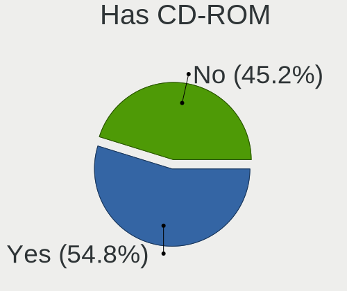

| Presented | Desktops | Percent |
|-----------|----------|---------|
| Yes       | 139      | 52.26%  |
| No        | 127      | 47.74%  |

Has Ethernet
------------

Has Ethernet on board

| Presented | Desktops | Percent |
|-----------|----------|---------|
| Yes       | 258      | 96.99%  |
| No        | 8        | 3.01%   |

Has WiFi
--------

Has WiFi module

| Presented | Desktops | Percent |
|-----------|----------|---------|
| No        | 153      | 57.52%  |
| Yes       | 113      | 42.48%  |

Has Bluetooth
-------------

Has Bluetooth module

| Presented | Desktops | Percent |
|-----------|----------|---------|
| No        | 192      | 72.18%  |
| Yes       | 74       | 27.82%  |

Location
--------

Country
-------

Geographic location (country)

| Country      | Desktops | Percent |
|--------------|----------|---------|
| USA          | 53       | 19.92%  |
| Russia       | 33       | 12.41%  |
| Germany      | 27       | 10.15%  |
| Poland       | 20       | 7.52%   |
| Italy        | 15       | 5.64%   |
| UK           | 9        | 3.38%   |
| Canada       | 9        | 3.38%   |
| Brazil       | 9        | 3.38%   |
| Spain        | 8        | 3.01%   |
| Hungary      | 6        | 2.26%   |
| France       | 6        | 2.26%   |
| Australia    | 5        | 1.88%   |
| Sweden       | 4        | 1.5%    |
| Romania      | 4        | 1.5%    |
| Japan        | 4        | 1.5%    |
| China        | 4        | 1.5%    |
| Turkey       | 3        | 1.13%   |
| Israel       | 3        | 1.13%   |
| Greece       | 3        | 1.13%   |
| Belgium      | 3        | 1.13%   |
| Argentina    | 3        | 1.13%   |
| Ukraine      | 2        | 0.75%   |
| Thailand     | 2        | 0.75%   |
| Serbia       | 2        | 0.75%   |
| Peru         | 2        | 0.75%   |
| Netherlands  | 2        | 0.75%   |
| Mexico       | 2        | 0.75%   |
| India        | 2        | 0.75%   |
| Czechia      | 2        | 0.75%   |
| Venezuela    | 1        | 0.38%   |
| Uruguay      | 1        | 0.38%   |
| Taiwan       | 1        | 0.38%   |
| South Africa | 1        | 0.38%   |
| Slovenia     | 1        | 0.38%   |
| Saudi Arabia | 1        | 0.38%   |
| Portugal     | 1        | 0.38%   |
| Philippines  | 1        | 0.38%   |
| Norway       | 1        | 0.38%   |
| New Zealand  | 1        | 0.38%   |
| Morocco      | 1        | 0.38%   |

City
----

Geographic location (city)

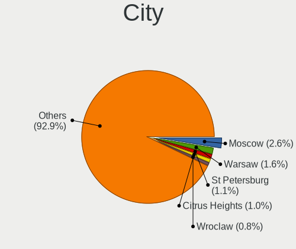

| City            | Desktops | Percent |
|-----------------|----------|---------|
| Moscow          | 8        | 3.01%   |
| Citrus Heights  | 6        | 2.26%   |
| St Petersburg   | 3        | 1.13%   |
| Rome            | 3        | 1.13%   |
| Hemet           | 3        | 1.13%   |
| Wiesloch        | 2        | 0.75%   |
| Warsaw          | 2        | 0.75%   |
| Ulyanovsk       | 2        | 0.75%   |
| Tucson          | 2        | 0.75%   |
| Sao Paulo       | 2        | 0.75%   |
| Rio de Janeiro  | 2        | 0.75%   |
| Novosibirsk     | 2        | 0.75%   |
| Munich          | 2        | 0.75%   |
| Miercurea-Ciuc  | 2        | 0.75%   |
| Lima            | 2        | 0.75%   |
| Krasnodar       | 2        | 0.75%   |
| Krakow          | 2        | 0.75%   |
| Jacksonville    | 2        | 0.75%   |
| Hickory         | 2        | 0.75%   |
| Greater Sudbury | 2        | 0.75%   |
| Denver          | 2        | 0.75%   |
| Delhi           | 2        | 0.75%   |
| Dallas          | 2        | 0.75%   |
| Canberra        | 2        | 0.75%   |
| Buenos Aires    | 2        | 0.75%   |
| Budapest        | 2        | 0.75%   |
| Brisbane        | 2        | 0.75%   |
| Bologna         | 2        | 0.75%   |
| Berlin          | 2        | 0.75%   |
| Barcelona       | 2        | 0.75%   |
| Zwartewaal      | 1        | 0.38%   |
| Zelenograd      | 1        | 0.38%   |
| Zelenodolsk     | 1        | 0.38%   |
| Zbraslav        | 1        | 0.38%   |
| Zalaegerszeg    | 1        | 0.38%   |
| Zabrze          | 1        | 0.38%   |
| Yuyao           | 1        | 0.38%   |
| Yeysk           | 1        | 0.38%   |
| Yakutsk         | 1        | 0.38%   |
| Wuhan           | 1        | 0.38%   |

Drives
------

Drive Vendor
------------

Hard drive vendors

| Vendor              | Desktops | Drives | Percent |
|---------------------|----------|--------|---------|
| WDC                 | 74       | 88     | 16.59%  |
| Seagate             | 61       | 77     | 13.68%  |
| Kingston            | 46       | 50     | 10.31%  |
| Samsung Electronics | 37       | 45     | 8.3%    |
| Toshiba             | 29       | 30     | 6.5%    |
| Hitachi             | 17       | 17     | 3.81%   |
| Crucial             | 17       | 18     | 3.81%   |
| SanDisk             | 15       | 16     | 3.36%   |
| China               | 12       | 13     | 2.69%   |
| A-DATA Technology   | 10       | 11     | 2.24%   |
| GOODRAM             | 9        | 9      | 2.02%   |
| Unknown             | 7        | 7      | 1.57%   |
| SPCC                | 7        | 10     | 1.57%   |
| Intenso             | 6        | 6      | 1.35%   |
| Intel               | 6        | 6      | 1.35%   |
| JMicron Technology  | 5        | 5      | 1.12%   |
| HPQ                 | 5        | 5      | 1.12%   |
| PNY                 | 4        | 5      | 0.9%    |
| Apacer              | 4        | 4      | 0.9%    |
| Smartbuy            | 3        | 3      | 0.67%   |
| SK hynix            | 3        | 3      | 0.67%   |
| Patriot             | 3        | 3      | 0.67%   |
| Micron Technology   | 3        | 3      | 0.67%   |
| Team                | 2        | 2      | 0.45%   |
| PNY USB             | 2        | 2      | 0.45%   |
| Netac               | 2        | 2      | 0.45%   |
| MSI                 | 2        | 2      | 0.45%   |
| LITEON              | 2        | 2      | 0.45%   |
| KIOXIA              | 2        | 2      | 0.45%   |
| KingFast            | 2        | 2      | 0.45%   |
| HGST                | 2        | 2      | 0.45%   |
| Fanxiang            | 2        | 2      | 0.45%   |
| Dogfish             | 2        | 2      | 0.45%   |
| ASMT                | 2        | 2      | 0.45%   |
| AMD                 | 2        | 2      | 0.45%   |
| Unknown             | 2        | 2      | 0.45%   |
| XrayDisk            | 1        | 2      | 0.22%   |
| Western             | 1        | 1      | 0.22%   |
| WD MediaMax         | 1        | 1      | 0.22%   |
| WALRAM              | 1        | 1      | 0.22%   |

Drive Model
-----------

Hard drive models

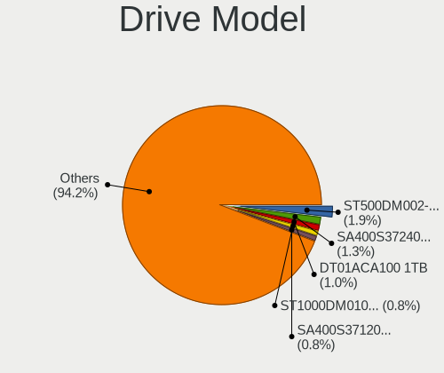

| Model                            | Desktops | Percent |
|----------------------------------|----------|---------|
| Seagate ST500DM002-1BD142 500GB  | 9        | 1.84%   |
| Kingston SA400S37240G 240GB SSD  | 9        | 1.84%   |
| Toshiba DT01ACA100 1TB           | 8        | 1.64%   |
| Kingston SA400S37120G 120GB SSD  | 8        | 1.64%   |
| Unknown SD/MMC/MS PRO 256GB      | 5        | 1.02%   |
| HPQ BF450DASTK 450GB             | 5        | 1.02%   |
| Toshiba HDWD130 3TB              | 4        | 0.82%   |
| Seagate ST2000DM001-1ER164 2TB   | 4        | 0.82%   |
| Seagate ST1000DM003-1ER162 1TB   | 4        | 0.82%   |
| SanDisk NVMe SSD Drive 1TB       | 4        | 0.82%   |
| WDC WDS500G2B0A-00SM50 500GB SSD | 3        | 0.61%   |
| WDC WD10EZEX-08WN4A0 1TB         | 3        | 0.61%   |
| WDC WD10EZEX-00BBHA0 1TB         | 3        | 0.61%   |
| SPCC Solid State Disk 256GB      | 3        | 0.61%   |
| Seagate ST2000DM008-2FR102 2TB   | 3        | 0.61%   |
| Seagate ST1000DM010-2EP102 1TB   | 3        | 0.61%   |
| SanDisk NVMe SSD Drive 500GB     | 3        | 0.61%   |
| Kingston SUV400S37120G 120GB SSD | 3        | 0.61%   |
| Kingston SA400S37480G 480GB SSD  | 3        | 0.61%   |
| JMicron Generic 8GB              | 3        | 0.61%   |
| Hitachi HTS545025B9SA00 250GB    | 3        | 0.61%   |
| Crucial CT1000MX500SSD1 1TB      | 3        | 0.61%   |
| WDC WD5000AAKX-60U6AA0 500GB     | 2        | 0.41%   |
| WDC WD5000AAKX-08U6AA0 500GB     | 2        | 0.41%   |
| WDC WD15EARS-00MVWB0 1TB         | 2        | 0.41%   |
| WDC WD10PURX-64E5EY0 1TB         | 2        | 0.41%   |
| WDC WD10EZEX-60ZF5A0 1TB         | 2        | 0.41%   |
| WDC WD10EZEX-00WN4A0 1TB         | 2        | 0.41%   |
| Unknown NVMe SSD Drive 512GB     | 2        | 0.41%   |
| Toshiba MQ04ABF100 1TB           | 2        | 0.41%   |
| Toshiba MQ01ABD050V 500GB        | 2        | 0.41%   |
| Toshiba DT01ACA050 500GB         | 2        | 0.41%   |
| SPCC Solid State Disk 512GB      | 2        | 0.41%   |
| SPCC Solid State Disk 128GB      | 2        | 0.41%   |
| Smartbuy SSD 256GB               | 2        | 0.41%   |
| Seagate ST500LT012-1DG142 500GB  | 2        | 0.41%   |
| Seagate ST3500413AS 500GB        | 2        | 0.41%   |
| Seagate ST3160815AS 160GB        | 2        | 0.41%   |
| Seagate ST2000DM001-1CH164 2TB   | 2        | 0.41%   |
| Seagate ST1000DM003-9YN162 1TB   | 2        | 0.41%   |

HDD Vendor
----------

Hard disk drive vendors

| Vendor              | Desktops | Drives | Percent |
|---------------------|----------|--------|---------|
| WDC                 | 63       | 72     | 32.14%  |
| Seagate             | 59       | 75     | 30.1%   |
| Toshiba             | 26       | 27     | 13.27%  |
| Hitachi             | 17       | 17     | 8.67%   |
| Samsung Electronics | 7        | 8      | 3.57%   |
| Unknown             | 5        | 5      | 2.55%   |
| HPQ                 | 5        | 5      | 2.55%   |
| JMicron Technology  | 3        | 3      | 1.53%   |
| HGST                | 2        | 2      | 1.02%   |
| WD MediaMax         | 1        | 1      | 0.51%   |
| TO Exter            | 1        | 1      | 0.51%   |
| Maxtor              | 1        | 1      | 0.51%   |
| KESU                | 1        | 1      | 0.51%   |
| Intenso             | 1        | 1      | 0.51%   |
| Inateck             | 1        | 1      | 0.51%   |
| Fujitsu             | 1        | 1      | 0.51%   |
| CIRAGO              | 1        | 1      | 0.51%   |
| Apple               | 1        | 1      | 0.51%   |

SSD Vendor
----------

Solid state drive vendors

| Vendor              | Desktops | Drives | Percent |
|---------------------|----------|--------|---------|
| Kingston            | 34       | 36     | 19.21%  |
| Samsung Electronics | 20       | 23     | 11.3%   |
| Crucial             | 13       | 14     | 7.34%   |
| China               | 12       | 13     | 6.78%   |
| WDC                 | 9        | 9      | 5.08%   |
| GOODRAM             | 9        | 9      | 5.08%   |
| SPCC                | 7        | 9      | 3.95%   |
| SanDisk             | 6        | 6      | 3.39%   |
| A-DATA Technology   | 6        | 6      | 3.39%   |
| Intenso             | 5        | 5      | 2.82%   |
| PNY                 | 4        | 5      | 2.26%   |
| Apacer              | 4        | 4      | 2.26%   |
| Smartbuy            | 2        | 2      | 1.13%   |
| PNY USB             | 2        | 2      | 1.13%   |
| Micron Technology   | 2        | 2      | 1.13%   |
| LITEON              | 2        | 2      | 1.13%   |
| KingFast            | 2        | 2      | 1.13%   |
| Intel               | 2        | 2      | 1.13%   |
| Fanxiang            | 2        | 2      | 1.13%   |
| Dogfish             | 2        | 2      | 1.13%   |
| ASMT                | 2        | 2      | 1.13%   |
| AMD                 | 2        | 2      | 1.13%   |
| Unknown             | 2        | 2      | 1.13%   |
| XrayDisk            | 1        | 2      | 0.56%   |
| Western             | 1        | 1      | 0.56%   |
| Verbatim            | 1        | 1      | 0.56%   |
| Vaseky              | 1        | 1      | 0.56%   |
| USB3.0              | 1        | 1      | 0.56%   |
| TSA                 | 1        | 1      | 0.56%   |
| Toshiba             | 1        | 1      | 0.56%   |
| tecmiyo             | 1        | 1      | 0.56%   |
| TCSUNBOW            | 1        | 1      | 0.56%   |
| SK hynix            | 1        | 1      | 0.56%   |
| Reeinno             | 1        | 1      | 0.56%   |
| Qumo                | 1        | 1      | 0.56%   |
| Patriot             | 1        | 1      | 0.56%   |
| OCZ                 | 1        | 1      | 0.56%   |
| Netac               | 1        | 1      | 0.56%   |
| MSI                 | 1        | 1      | 0.56%   |
| LITEONIT            | 1        | 1      | 0.56%   |

Drive Kind
----------

HDD or SSD

| Kind    | Desktops | Drives | Percent |
|---------|----------|--------|---------|
| HDD     | 155      | 223    | 42.58%  |
| SSD     | 140      | 189    | 38.46%  |
| NVMe    | 65       | 84     | 17.86%  |
| Unknown | 3        | 3      | 0.82%   |
| MMC     | 1        | 1      | 0.27%   |

Drive Connector
---------------

SATA, SAS, NVMe, etc.

| Type | Desktops | Drives | Percent |
|------|----------|--------|---------|
| SATA | 230      | 380    | 69.91%  |
| NVMe | 64       | 82     | 19.45%  |
| SAS  | 34       | 37     | 10.33%  |
| MMC  | 1        | 1      | 0.3%    |

Drive Size
----------

Size of hard drive

| Size in TB | Desktops | Drives | Percent |
|------------|----------|--------|---------|
| 0.01-0.5   | 183      | 264    | 59.22%  |
| 0.51-1.0   | 84       | 97     | 27.18%  |
| 1.01-2.0   | 25       | 32     | 8.09%   |
| 2.01-3.0   | 7        | 7      | 2.27%   |
| 3.01-4.0   | 5        | 7      | 1.62%   |
| 4.01-10.0  | 3        | 3      | 0.97%   |
| 10.01-20.0 | 2        | 2      | 0.65%   |

Space Total
-----------

Amount of disk space available on the file system

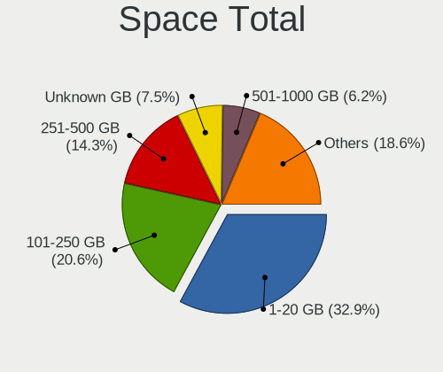

| Size in GB     | Desktops | Percent |
|----------------|----------|---------|
| 1-20           | 103      | 38.72%  |
| 101-250        | 44       | 16.54%  |
| 251-500        | 36       | 13.53%  |
| Unknown        | 22       | 8.27%   |
| 21-50          | 20       | 7.52%   |
| 51-100         | 15       | 5.64%   |
| 1001-2000      | 12       | 4.51%   |
| 501-1000       | 7        | 2.63%   |
| More than 3000 | 5        | 1.88%   |
| 2001-3000      | 2        | 0.75%   |

Space Used
----------

Amount of used disk space

| Used GB        | Desktops | Percent |
|----------------|----------|---------|
| 1-20           | 188      | 70.68%  |
| Unknown        | 22       | 8.27%   |
| 21-50          | 16       | 6.02%   |
| 101-250        | 10       | 3.76%   |
| 51-100         | 9        | 3.38%   |
| 0              | 8        | 3.01%   |
| 251-500        | 6        | 2.26%   |
| 501-1000       | 3        | 1.13%   |
| 2001-3000      | 2        | 0.75%   |
| More than 3000 | 1        | 0.38%   |
| 1001-2000      | 1        | 0.38%   |

Malfunc. Drives
---------------

Drive models with a malfunction

| Model                            | Desktops | Drives | Percent |
|----------------------------------|----------|--------|---------|
| Seagate ST500DM002-1BD142 500GB  | 5        | 5      | 6.33%   |
| WDC WD5000AAKX-60U6AA0 500GB     | 2        | 2      | 2.53%   |
| Seagate ST2000DM001-1CH164 2TB   | 2        | 3      | 2.53%   |
| Seagate ST1000DM003-1ER162 1TB   | 2        | 2      | 2.53%   |
| Hitachi HDS721010CLA332 1TB      | 2        | 2      | 2.53%   |
| Crucial CT275MX300SSD1 275GB     | 2        | 2      | 2.53%   |
| WDC WDS240G2G0A-00JH30 240GB SSD | 1        | 1      | 1.27%   |
| WDC WDS120G2G0A-00JH30 120GB SSD | 1        | 1      | 1.27%   |
| WDC WD800JB-32JJC0 80GB          | 1        | 1      | 1.27%   |
| WDC WD6401AALS-00L3B2 640GB      | 1        | 1      | 1.27%   |
| WDC WD5000AAKX-221CA1 500GB      | 1        | 1      | 1.27%   |
| WDC WD5000AAKX-08U6AA0 500GB     | 1        | 1      | 1.27%   |
| WDC WD5000AAKX-083CA1 500GB      | 1        | 1      | 1.27%   |
| WDC WD5000AAKX-07U6AA1 500GB     | 1        | 1      | 1.27%   |
| WDC WD5000AAKX-00ERMA0 500GB     | 1        | 1      | 1.27%   |
| WDC WD5000AAKX-001CA0 500GB      | 1        | 1      | 1.27%   |
| WDC WD3200AAKS-61L9A0 320GB      | 1        | 1      | 1.27%   |
| WDC WD3200AAJS-56M0A0 320GB      | 1        | 1      | 1.27%   |
| WDC WD2500YS-01SHB1 256GB        | 1        | 1      | 1.27%   |
| WDC WD20EFRX-68AX9N0 2TB         | 1        | 1      | 1.27%   |
| WDC WD20EARX-00PASB0 2TB         | 1        | 1      | 1.27%   |
| WDC WD1600AAJS-60B4A0 160GB      | 1        | 1      | 1.27%   |
| WDC WD15EARS-00Z5B1 1TB          | 1        | 1      | 1.27%   |
| WDC WD1200BEVS-60UST0 120GB      | 1        | 1      | 1.27%   |
| WDC WD10EZEX-60ZF5A0 1TB         | 1        | 1      | 1.27%   |
| WDC WD10EARS-00Y5B1 1TB          | 1        | 1      | 1.27%   |
| WDC WD10EADS-00L5B1 1TB          | 1        | 1      | 1.27%   |
| WDC WD1001FALS-40Y6A0 1TB        | 1        | 1      | 1.27%   |
| WDC WD Green 2.5 480GB SSD       | 1        | 1      | 1.27%   |
| WD MediaMax WL500GSA1672B 500GB  | 1        | 1      | 1.27%   |
| Toshiba MQ04ABF100 1TB           | 1        | 1      | 1.27%   |
| Toshiba MQ01ABD050V 500GB        | 1        | 1      | 1.27%   |
| Toshiba MK3263GSX 320GB          | 1        | 1      | 1.27%   |
| Toshiba DT01ACA100 1TB           | 1        | 1      | 1.27%   |
| SPCC Solid State Disk 128GB      | 1        | 1      | 1.27%   |
| Seagate ST9500325AS 500GB        | 1        | 1      | 1.27%   |
| Seagate ST500LT012-1DG142 500GB  | 1        | 1      | 1.27%   |
| Seagate ST3500631NS 500GB        | 1        | 1      | 1.27%   |
| Seagate ST3500418AS 500GB        | 1        | 1      | 1.27%   |
| Seagate ST3500413AS 500GB        | 1        | 1      | 1.27%   |

Malfunc. Drive Vendor
---------------------

Vendors of faulty drives

| Vendor              | Desktops | Drives | Percent |
|---------------------|----------|--------|---------|
| WDC                 | 22       | 25     | 29.33%  |
| Seagate             | 21       | 23     | 28%     |
| Hitachi             | 6        | 6      | 8%      |
| Samsung Electronics | 5        | 5      | 6.67%   |
| Toshiba             | 4        | 4      | 5.33%   |
| Kingston            | 3        | 3      | 4%      |
| HGST                | 2        | 2      | 2.67%   |
| Crucial             | 2        | 2      | 2.67%   |
| China               | 2        | 2      | 2.67%   |
| A-DATA Technology   | 2        | 2      | 2.67%   |
| WD MediaMax         | 1        | 1      | 1.33%   |
| SPCC                | 1        | 1      | 1.33%   |
| SanDisk             | 1        | 1      | 1.33%   |
| Maxtor              | 1        | 1      | 1.33%   |
| Apple               | 1        | 1      | 1.33%   |
| AMD                 | 1        | 1      | 1.33%   |

Malfunc. HDD Vendor
-------------------

Vendors of faulty HDD drives

| Vendor              | Desktops | Drives | Percent |
|---------------------|----------|--------|---------|
| Seagate             | 21       | 23     | 35%     |
| WDC                 | 19       | 22     | 31.67%  |
| Hitachi             | 6        | 6      | 10%     |
| Samsung Electronics | 5        | 5      | 8.33%   |
| Toshiba             | 4        | 4      | 6.67%   |
| HGST                | 2        | 2      | 3.33%   |
| WD MediaMax         | 1        | 1      | 1.67%   |
| Maxtor              | 1        | 1      | 1.67%   |
| Apple               | 1        | 1      | 1.67%   |

Malfunc. Drive Kind
-------------------

Kinds of faulty drives

| Kind | Desktops | Drives | Percent |
|------|----------|--------|---------|
| HDD  | 56       | 65     | 78.87%  |
| SSD  | 14       | 14     | 19.72%  |
| NVMe | 1        | 1      | 1.41%   |

Failed Drives
-------------

Failed drive models

| Model                           | Desktops | Drives | Percent |
|---------------------------------|----------|--------|---------|
| Samsung Electronics HD103SJ 1TB | 1        | 1      | 100%    |

Failed Drive Vendor
-------------------

Failed drive vendors

| Vendor              | Desktops | Drives | Percent |
|---------------------|----------|--------|---------|
| Samsung Electronics | 1        | 1      | 100%    |

Drive Status
------------

Number of failed and malfunc. drives

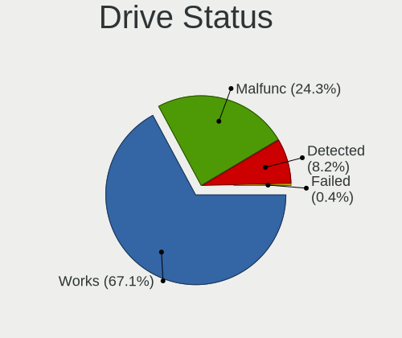

| Status   | Desktops | Drives | Percent |
|----------|----------|--------|---------|
| Works    | 227      | 386    | 69.42%  |
| Malfunc  | 69       | 80     | 21.1%   |
| Detected | 30       | 33     | 9.17%   |
| Failed   | 1        | 1      | 0.31%   |

Storage controller
------------------

Storage Vendor
--------------

Storage controller vendors

| Vendor                       | Desktops | Percent |
|------------------------------|----------|---------|
| Intel                        | 183      | 50.83%  |
| AMD                          | 70       | 19.44%  |
| Sandisk                      | 14       | 3.89%   |
| Samsung Electronics          | 13       | 3.61%   |
| Kingston Technology Company  | 13       | 3.61%   |
| ASMedia Technology           | 11       | 3.06%   |
| Nvidia                       | 8        | 2.22%   |
| JMicron Technology           | 8        | 2.22%   |
| Phison Electronics           | 6        | 1.67%   |
| Marvell Technology Group     | 5        | 1.39%   |
| Micron/Crucial Technology    | 4        | 1.11%   |
| MAXIO Technology (Hangzhou)  | 4        | 1.11%   |
| Silicon Motion               | 3        | 0.83%   |
| KIOXIA                       | 3        | 0.83%   |
| SK hynix                     | 2        | 0.56%   |
| Realtek Semiconductor        | 2        | 0.56%   |
| Broadcom / LSI               | 2        | 0.56%   |
| ADATA Technology             | 2        | 0.56%   |
| VIA Technologies             | 1        | 0.28%   |
| Toshiba America Info Systems | 1        | 0.28%   |
| Silicon Image                | 1        | 0.28%   |
| Shenzhen Longsys Electronics | 1        | 0.28%   |
| Seagate Technology           | 1        | 0.28%   |
| Micron Technology            | 1        | 0.28%   |
| Adaptec                      | 1        | 0.28%   |

Storage Model
-------------

Storage controller models

| Model                                                                                   | Desktops | Percent |
|-----------------------------------------------------------------------------------------|----------|---------|
| AMD FCH SATA Controller [AHCI mode]                                                     | 35       | 7.99%   |
| Intel 8 Series/C220 Series Chipset Family 6-port SATA Controller 1 [AHCI mode]          | 21       | 4.79%   |
| Intel 6 Series/C200 Series Chipset Family 6 port Desktop SATA AHCI Controller           | 20       | 4.57%   |
| Intel Q170/Q150/B150/H170/H110/Z170/CM236 Chipset SATA Controller [AHCI Mode]           | 17       | 3.88%   |
| Intel 7 Series/C210 Series Chipset Family 6-port SATA Controller [AHCI mode]            | 13       | 2.97%   |
| Intel 200 Series PCH SATA controller [AHCI mode]                                        | 13       | 2.97%   |
| Intel NM10/ICH7 Family SATA Controller [IDE mode]                                       | 11       | 2.51%   |
| AMD 500 Series Chipset SATA Controller                                                  | 11       | 2.51%   |
| Intel SATA Controller [RAID mode]                                                       | 10       | 2.28%   |
| ASMedia ASM1061/ASM1062 Serial ATA Controller                                           | 10       | 2.28%   |
| AMD SB7x0/SB8x0/SB9x0 IDE Controller                                                    | 9        | 2.05%   |
| AMD 400 Series Chipset SATA Controller                                                  | 9        | 2.05%   |
| Intel Cannon Lake PCH SATA AHCI Controller                                              | 8        | 1.83%   |
| AMD SB7x0/SB8x0/SB9x0 SATA Controller [IDE mode]                                        | 8        | 1.83%   |
| AMD SB7x0/SB8x0/SB9x0 SATA Controller [AHCI mode]                                       | 7        | 1.6%    |
| JMicron JMB363 SATA/IDE Controller                                                      | 6        | 1.37%   |
| Intel 82801G (ICH7 Family) IDE Controller                                               | 6        | 1.37%   |
| Intel 5 Series/3400 Series Chipset 4 port SATA IDE Controller                           | 6        | 1.37%   |
| Intel 5 Series/3400 Series Chipset 2 port SATA IDE Controller                           | 6        | 1.37%   |
| Intel 400 Series Chipset Family SATA AHCI Controller                                    | 6        | 1.37%   |
| AMD FCH SATA Controller D                                                               | 6        | 1.37%   |
| Samsung NVMe SSD Controller SM981/PM981/PM983                                           | 5        | 1.14%   |
| Intel Comet Lake SATA AHCI Controller                                                   | 5        | 1.14%   |
| Intel Alder Lake-S PCH SATA Controller [AHCI Mode]                                      | 5        | 1.14%   |
| Intel 6 Series/C200 Series Chipset Family Desktop SATA Controller (IDE mode, ports 4-5) | 5        | 1.14%   |
| Intel 6 Series/C200 Series Chipset Family Desktop SATA Controller (IDE mode, ports 0-3) | 5        | 1.14%   |
| AMD 300 Series Chipset SATA Controller                                                  | 5        | 1.14%   |
| Samsung NVMe SSD Controller PM9A1/PM9A3/980PRO                                          | 4        | 0.91%   |
| Nvidia MCP61 SATA Controller                                                            | 4        | 0.91%   |
| Nvidia MCP61 IDE                                                                        | 4        | 0.91%   |
| MAXIO (Hangzhou) NVMe SSD Controller MAP1202 (DRAM-less)                                | 4        | 0.91%   |
| Intel 82801IR/IO/IH (ICH9R/DO/DH) 6 port SATA Controller [AHCI mode]                    | 4        | 0.91%   |
| AMD FCH IDE Controller                                                                  | 4        | 0.91%   |
| Kingston Company A2000 NVMe SSD SM2263EN                                                | 3        | 0.68%   |
| Intel Volume Management Device NVMe RAID Controller                                     | 3        | 0.68%   |
| Intel Celeron/Pentium Silver Processor SATA Controller                                  | 3        | 0.68%   |
| Intel 82801JD/DO (ICH10 Family) SATA AHCI Controller                                    | 3        | 0.68%   |
| Intel 500 Series Chipset Family SATA AHCI Controller                                    | 3        | 0.68%   |
| AMD 600 Series Chipset SATA Controller                                                  | 3        | 0.68%   |
| Silicon Motion SM2263EN/SM2263XT (DRAM-less) NVMe SSD Controllers                       | 2        | 0.46%   |

Storage Kind
------------

Kind of storage controller (IDE, SATA, NVMe, SAS, ...)

| Kind | Desktops | Percent |
|------|----------|---------|
| SATA | 212      | 60.57%  |
| NVMe | 64       | 18.29%  |
| IDE  | 58       | 16.57%  |
| RAID | 15       | 4.29%   |
| SCSI | 1        | 0.29%   |

Processor
---------

CPU Vendor
----------

Processor vendors

| Vendor | Desktops | Percent |
|--------|----------|---------|
| Intel  | 187      | 70.3%   |
| AMD    | 79       | 29.7%   |

CPU Model
---------

Processor models

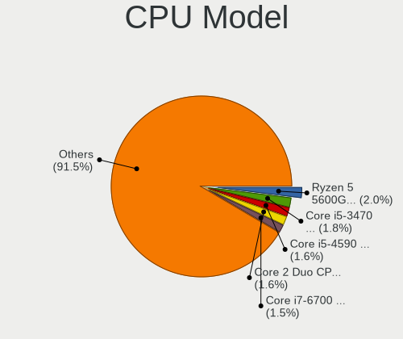

| Model                                       | Desktops | Percent |
|---------------------------------------------|----------|---------|
| Intel Core i5-4570 CPU @ 3.20GHz            | 6        | 2.26%   |
| Intel Core i5-3470 CPU @ 3.20GHz            | 6        | 2.26%   |
| Intel Core 2 Duo CPU E8400 @ 3.00GHz        | 6        | 2.26%   |
| Intel Core i7-6700 CPU @ 3.40GHz            | 5        | 1.88%   |
| Intel Core i7-8700 CPU @ 3.20GHz            | 4        | 1.5%    |
| Intel Core i5-7400 CPU @ 3.00GHz            | 4        | 1.5%    |
| Intel Core i5-6500 CPU @ 3.20GHz            | 4        | 1.5%    |
| AMD Ryzen 5 5600G with Radeon Graphics      | 4        | 1.5%    |
| Intel Core i5-4590 CPU @ 3.30GHz            | 3        | 1.13%   |
| Intel Core i3-3220 CPU @ 3.30GHz            | 3        | 1.13%   |
| Intel Core i3-2100 CPU @ 3.10GHz            | 3        | 1.13%   |
| Intel Core i3-10100 CPU @ 3.60GHz           | 3        | 1.13%   |
| AMD Ryzen 7 5700X 8-Core Processor          | 3        | 1.13%   |
| AMD Ryzen 7 2700X Eight-Core Processor      | 3        | 1.13%   |
| AMD Ryzen 5 1600 Six-Core Processor         | 3        | 1.13%   |
| Intel Pentium Gold G5400 CPU @ 3.70GHz      | 2        | 0.75%   |
| Intel Pentium Dual-Core CPU E5200 @ 2.50GHz | 2        | 0.75%   |
| Intel Pentium CPU G645 @ 2.90GHz            | 2        | 0.75%   |
| Intel Pentium CPU G3260 @ 3.30GHz           | 2        | 0.75%   |
| Intel Core i9-9900K CPU @ 3.60GHz           | 2        | 0.75%   |
| Intel Core i7-7700 CPU @ 3.60GHz            | 2        | 0.75%   |
| Intel Core i7-3770 CPU @ 3.40GHz            | 2        | 0.75%   |
| Intel Core i7-2600 CPU @ 3.40GHz            | 2        | 0.75%   |
| Intel Core i7 CPU 860 @ 2.80GHz             | 2        | 0.75%   |
| Intel Core i5-7500 CPU @ 3.40GHz            | 2        | 0.75%   |
| Intel Core i5-6500T CPU @ 2.50GHz           | 2        | 0.75%   |
| Intel Core i5-3570 CPU @ 3.40GHz            | 2        | 0.75%   |
| Intel Core i5-2400 CPU @ 3.10GHz            | 2        | 0.75%   |
| Intel Core i5-10400 CPU @ 2.90GHz           | 2        | 0.75%   |
| Intel Core i5 CPU 750 @ 2.67GHz             | 2        | 0.75%   |
| Intel Core i5 CPU 650 @ 3.20GHz             | 2        | 0.75%   |
| Intel Core i3-9100F CPU @ 3.60GHz           | 2        | 0.75%   |
| Intel Core i3-4170 CPU @ 3.70GHz            | 2        | 0.75%   |
| Intel Core 2 Quad CPU Q6600 @ 2.40GHz       | 2        | 0.75%   |
| Intel Core 2 Duo CPU E8200 @ 2.66GHz        | 2        | 0.75%   |
| Intel Core 2 Duo CPU E7500 @ 2.93GHz        | 2        | 0.75%   |
| Intel 13th Gen Core i5-13500                | 2        | 0.75%   |
| Intel 12th Gen Core i3-12100F               | 2        | 0.75%   |
| AMD Ryzen 7 7700 8-Core Processor           | 2        | 0.75%   |
| AMD Ryzen 5 5500                            | 2        | 0.75%   |

CPU Model Family
----------------

Processor model prefix

| Model                   | Desktops | Percent |
|-------------------------|----------|---------|
| Intel Core i5           | 58       | 21.8%   |
| Intel Core i7           | 27       | 10.15%  |
| Intel Core i3           | 23       | 8.65%   |
| AMD Ryzen 5             | 18       | 6.77%   |
| Intel Celeron           | 14       | 5.26%   |
| Intel Xeon              | 11       | 4.14%   |
| Intel Pentium           | 11       | 4.14%   |
| Intel Core 2 Duo        | 10       | 3.76%   |
| Other                   | 9        | 3.38%   |
| AMD Ryzen 7             | 9        | 3.38%   |
| AMD FX                  | 8        | 3.01%   |
| Intel Pentium Dual-Core | 6        | 2.26%   |
| AMD Athlon              | 5        | 1.88%   |
| AMD A8                  | 5        | 1.88%   |
| AMD A10                 | 5        | 1.88%   |
| Intel Core i9           | 4        | 1.5%    |
| Intel Core 2 Quad       | 4        | 1.5%    |
| AMD Ryzen 9             | 4        | 1.5%    |
| AMD Ryzen 3             | 4        | 1.5%    |
| Intel Pentium Gold      | 3        | 1.13%   |
| AMD Phenom II X4        | 3        | 1.13%   |
| AMD Athlon 64 X2        | 3        | 1.13%   |
| Intel Pentium Dual      | 2        | 0.75%   |
| Intel Core 2            | 2        | 0.75%   |
| AMD Athlon Dual Core    | 2        | 0.75%   |
| AMD A6                  | 2        | 0.75%   |
| AMD A4                  | 2        | 0.75%   |
| Intel Pentium Silver    | 1        | 0.38%   |
| Intel Pentium 4         | 1        | 0.38%   |
| Intel Genuine           | 1        | 0.38%   |
| AMD Ryzen 7 PRO         | 1        | 0.38%   |
| AMD Ryzen 3 PRO         | 1        | 0.38%   |
| AMD PRO A10             | 1        | 0.38%   |
| AMD Phenom II X2        | 1        | 0.38%   |
| AMD E                   | 1        | 0.38%   |
| AMD Athlon X4           | 1        | 0.38%   |
| AMD Athlon II X4        | 1        | 0.38%   |
| AMD Athlon II X2        | 1        | 0.38%   |
| AMD Athlon 64           | 1        | 0.38%   |

CPU Cores
---------

Number of processor cores

| Number | Desktops | Percent |
|--------|----------|---------|
| 4      | 110      | 41.35%  |
| 2      | 92       | 34.59%  |
| 6      | 29       | 10.9%   |
| 8      | 18       | 6.77%   |
| 10     | 5        | 1.88%   |
| 1      | 4        | 1.5%    |
| 12     | 3        | 1.13%   |
| 3      | 3        | 1.13%   |
| 16     | 1        | 0.38%   |
| 14     | 1        | 0.38%   |

CPU Sockets
-----------

Number of sockets

| Number | Desktops | Percent |
|--------|----------|---------|
| 1      | 263      | 98.87%  |
| 6      | 1        | 0.38%   |
| 4      | 1        | 0.38%   |
| 2      | 1        | 0.38%   |

CPU Threads
-----------

Threads per core (Hyper-Threading)

| Number | Desktops | Percent |
|--------|----------|---------|
| 2      | 136      | 51.13%  |
| 1      | 130      | 48.87%  |

CPU Op-Modes
------------

CPU Operation Modes (32-bit, 64-bit)

| Op mode        | Desktops | Percent |
|----------------|----------|---------|
| 32-bit, 64-bit | 266      | 100%    |

CPU Microcode
-------------

Microcode number

| Number     | Desktops | Percent |
|------------|----------|---------|
| Unknown    | 198      | 74.44%  |
| 0x08108109 | 5        | 1.88%   |
| 0x06001119 | 5        | 1.88%   |
| 0x0a50000d | 4        | 1.5%    |
| 0x0a20120a | 4        | 1.5%    |
| 0x0800820d | 4        | 1.5%    |
| 0x0a50000c | 3        | 1.13%   |
| 0x08701030 | 3        | 1.13%   |
| 0x08001138 | 3        | 1.13%   |
| 0x06003106 | 3        | 1.13%   |
| 0x06001116 | 3        | 1.13%   |
| 0x0a601206 | 2        | 0.75%   |
| 0x0810100b | 2        | 0.75%   |
| 0x06000822 | 2        | 0.75%   |
| 0x06000613 | 2        | 0.75%   |
| 0x03000027 | 2        | 0.75%   |
| 0x010000b6 | 2        | 0.75%   |
| 0x0a601203 | 1        | 0.38%   |
| 0x0a50000f | 1        | 0.38%   |
| 0x0a404102 | 1        | 0.38%   |
| 0x0a20120e | 1        | 0.38%   |
| 0x08701021 | 1        | 0.38%   |
| 0x08600109 | 1        | 0.38%   |
| 0x08101016 | 1        | 0.38%   |
| 0x08001129 | 1        | 0.38%   |
| 0x07030105 | 1        | 0.38%   |
| 0x0700010b | 1        | 0.38%   |
| 0x0600611a | 1        | 0.38%   |
| 0x06003104 | 1        | 0.38%   |
| 0x0600081c | 1        | 0.38%   |
| 0x0600063d | 1        | 0.38%   |
| 0x06000637 | 1        | 0.38%   |
| 0x06000629 | 1        | 0.38%   |
| 0x05000028 | 1        | 0.38%   |
| 0x010000c8 | 1        | 0.38%   |
| 0x010000c6 | 1        | 0.38%   |

CPU Microarch
-------------

Microarchitecture

| Name             | Desktops | Percent |
|------------------|----------|---------|
| IvyBridge        | 27       | 10.15%  |
| Haswell          | 27       | 10.15%  |
| KabyLake         | 25       | 9.4%    |
| Penryn           | 20       | 7.52%   |
| Skylake          | 19       | 7.14%   |
| SandyBridge      | 16       | 6.02%   |
| Zen 3            | 14       | 5.26%   |
| CometLake        | 13       | 4.89%   |
| Piledriver       | 11       | 4.14%   |
| Zen+             | 9        | 3.38%   |
| Zen              | 8        | 3.01%   |
| K10              | 7        | 2.63%   |
| Core             | 7        | 2.63%   |
| Alderlake Hybrid | 7        | 2.63%   |
| Westmere         | 6        | 2.26%   |
| K8 Hammer        | 6        | 2.26%   |
| Zen 2            | 5        | 1.88%   |
| Nehalem          | 5        | 1.88%   |
| Bulldozer        | 5        | 1.88%   |
| Unknown          | 5        | 1.88%   |
| Steamroller      | 4        | 1.5%    |
| Goldmont plus    | 3        | 1.13%   |
| Tremont          | 2        | 0.75%   |
| Silvermont       | 2        | 0.75%   |
| K10 Llano        | 2        | 0.75%   |
| Goldmont         | 2        | 0.75%   |
| Broadwell        | 2        | 0.75%   |
| Puma             | 1        | 0.38%   |
| NetBurst         | 1        | 0.38%   |
| Jaguar           | 1        | 0.38%   |
| Icelake          | 1        | 0.38%   |
| Gracemont        | 1        | 0.38%   |
| Excavator        | 1        | 0.38%   |
| Bobcat           | 1        | 0.38%   |

Graphics
--------

GPU Vendor
----------

Vendors of graphics cards

| Vendor                               | Desktops | Percent |
|--------------------------------------|----------|---------|
| Intel                                | 114      | 41.3%   |
| Nvidia                               | 83       | 30.07%  |
| AMD                                  | 74       | 26.81%  |
| Red Hat                              | 2        | 0.72%   |
| NVidia / SGS Thomson (Joint Venture) | 2        | 0.72%   |
| ATI Technologies                     | 1        | 0.36%   |

GPU Model
---------

Graphics card models

| Model                                                                       | Desktops | Percent |
|-----------------------------------------------------------------------------|----------|---------|
| Intel Xeon E3-1200 v3/4th Gen Core Processor Integrated Graphics Controller | 17       | 6.07%   |
| Intel Xeon E3-1200 v2/3rd Gen Core processor Graphics Controller            | 17       | 6.07%   |
| Intel HD Graphics 530                                                       | 13       | 4.64%   |
| Intel 2nd Generation Core Processor Family Integrated Graphics Controller   | 12       | 4.29%   |
| Intel 4 Series Chipset Integrated Graphics Controller                       | 9        | 3.21%   |
| Nvidia GT218 [GeForce 210]                                                  | 7        | 2.5%    |
| Intel HD Graphics 630                                                       | 7        | 2.5%    |
| Intel CometLake-S GT2 [UHD Graphics 630]                                    | 6        | 2.14%   |
| Nvidia GP107 [GeForce GTX 1050 Ti]                                          | 5        | 1.79%   |
| Nvidia GK208B [GeForce GT 710]                                              | 5        | 1.79%   |
| AMD Picasso/Raven 2 [Radeon Vega Series / Radeon Vega Mobile Series]        | 5        | 1.79%   |
| AMD Navi 23 [Radeon RX 6600/6600 XT/6600M]                                  | 5        | 1.79%   |
| AMD Ellesmere [Radeon RX 470/480/570/570X/580/580X/590]                     | 5        | 1.79%   |
| AMD Cezanne [Radeon Vega Series / Radeon Vega Mobile Series]                | 5        | 1.79%   |
| Nvidia GP106 [GeForce GTX 1060 3GB]                                         | 4        | 1.43%   |
| Nvidia GM206 [GeForce GTX 960]                                              | 4        | 1.43%   |
| Intel CoffeeLake-S GT2 [UHD Graphics 630]                                   | 4        | 1.43%   |
| AMD Cedar [Radeon HD 5000/6000/7350/8350 Series]                            | 4        | 1.43%   |
| Nvidia GM107 [GeForce GTX 750]                                              | 3        | 1.07%   |
| Nvidia GA106 [GeForce RTX 3060 Lite Hash Rate]                              | 3        | 1.07%   |
| Nvidia G92 [GeForce 9800 GT]                                                | 3        | 1.07%   |
| AMD Raven Ridge [Radeon Vega Series / Radeon Vega Mobile Series]            | 3        | 1.07%   |
| AMD Oland PRO [Radeon R7 240/340 / Radeon 520]                              | 3        | 1.07%   |
| AMD Navi 22 [Radeon RX 6700/6700 XT/6750 XT / 6800M/6850M XT]               | 3        | 1.07%   |
| AMD Kaveri [Radeon R7 Graphics]                                             | 3        | 1.07%   |
| AMD Cape Verde XT [Radeon HD 7770/8760 / R7 250X]                           | 3        | 1.07%   |
| AMD Baffin [Radeon RX 460/560D / Pro 450/455/460/555/555X/560/560X]         | 3        | 1.07%   |
| Red Hat Virtio 1.0 GPU                                                      | 2        | 0.71%   |
| Nvidia GP106 [GeForce GTX 1060 6GB]                                         | 2        | 0.71%   |
| Nvidia GM107 [GeForce GTX 750 Ti]                                           | 2        | 0.71%   |
| Nvidia GK208B [GeForce GT 730]                                              | 2        | 0.71%   |
| Nvidia GK208B [GeForce GT 720]                                              | 2        | 0.71%   |
| Nvidia GK208 [GeForce GT 630 Rev. 2]                                        | 2        | 0.71%   |
| Nvidia GK107 [GeForce GTX 650]                                              | 2        | 0.71%   |
| Nvidia GF119 [GeForce GT 520]                                               | 2        | 0.71%   |
| Nvidia G98 [GeForce 8400 GS Rev. 2]                                         | 2        | 0.71%   |
| Nvidia G96C [GeForce 9500 GT]                                               | 2        | 0.71%   |
| NVidia / SGS Thomson (Joint Venture) Riva128                                | 2        | 0.71%   |
| Intel JasperLake [UHD Graphics]                                             | 2        | 0.71%   |
| Intel HD Graphics 500                                                       | 2        | 0.71%   |

GPU Combo
---------

Combinations of graphics cards

| Name                                          | Desktops | Percent |
|-----------------------------------------------|----------|---------|
| 1 x Intel                                     | 99       | 37.22%  |
| 1 x Nvidia                                    | 75       | 28.2%   |
| 1 x AMD                                       | 67       | 25.19%  |
| 2 x Intel                                     | 8        | 3.01%   |
| Intel + Nvidia                                | 5        | 1.88%   |
| 2 x AMD                                       | 4        | 1.5%    |
| 1 x Red Hat                                   | 2        | 0.75%   |
| Intel + AMD                                   | 2        | 0.75%   |
| AMD + Nvidia                                  | 2        | 0.75%   |
| 1 x NVidia / SGS Thomson (Joint Venture)      | 1        | 0.38%   |
| Nvidia + NVidia / SGS Thomson (Joint Venture) | 1        | 0.38%   |

GPU Driver
----------

Free vs proprietary

| Driver      | Desktops | Percent |
|-------------|----------|---------|
| Free        | 259      | 97.37%  |
| Unknown     | 5        | 1.88%   |
| Proprietary | 2        | 0.75%   |

GPU Memory
----------

Total video memory

| Size in GB | Desktops | Percent |
|------------|----------|---------|
| Unknown    | 115      | 43.23%  |
| 1.01-2.0   | 38       | 14.29%  |
| 0.51-1.0   | 36       | 13.53%  |
| 0.01-0.5   | 30       | 11.28%  |
| 3.01-4.0   | 19       | 7.14%   |
| 7.01-8.0   | 9        | 3.38%   |
| 8.01-16.0  | 8        | 3.01%   |
| 5.01-6.0   | 7        | 2.63%   |
| 2.01-3.0   | 4        | 1.5%    |

Monitor
-------

Monitor Vendor
--------------

Monitor vendors

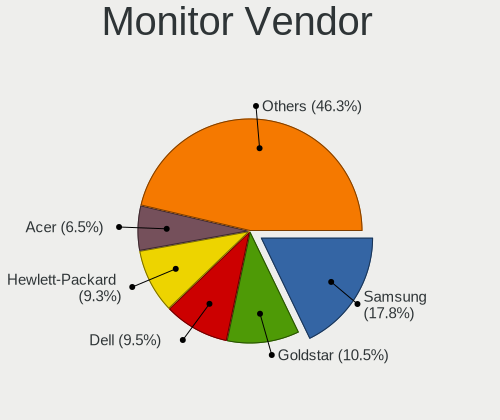

| Vendor               | Desktops | Percent |
|----------------------|----------|---------|
| Samsung Electronics  | 43       | 17.13%  |
| Hewlett-Packard      | 29       | 11.55%  |
| Dell                 | 24       | 9.56%   |
| Goldstar             | 23       | 9.16%   |
| Philips              | 18       | 7.17%   |
| Acer                 | 17       | 6.77%   |
| AOC                  | 16       | 6.37%   |
| Ancor Communications | 11       | 4.38%   |
| Iiyama               | 7        | 2.79%   |
| ASUSTek Computer     | 7        | 2.79%   |
| NEC Computers        | 6        | 2.39%   |
| Lenovo               | 6        | 2.39%   |
| Sony                 | 5        | 1.99%   |
| BenQ                 | 5        | 1.99%   |
| ViewSonic            | 3        | 1.2%    |
| Unknown              | 2        | 0.8%    |
| Sharp                | 2        | 0.8%    |
| RTK                  | 2        | 0.8%    |
| RHT                  | 2        | 0.8%    |
| HannStar             | 2        | 0.8%    |
| GDH                  | 2        | 0.8%    |
| Fujitsu Siemens      | 2        | 0.8%    |
| Denver               | 2        | 0.8%    |
| ___                  | 1        | 0.4%    |
| Wacom                | 1        | 0.4%    |
| Vizio                | 1        | 0.4%    |
| Sceptre Tech         | 1        | 0.4%    |
| Pioneer              | 1        | 0.4%    |
| OEM                  | 1        | 0.4%    |
| LG Electronics       | 1        | 0.4%    |
| JCH                  | 1        | 0.4%    |
| HKK                  | 1        | 0.4%    |
| ELSA                 | 1        | 0.4%    |
| Elgato               | 1        | 0.4%    |
| Element              | 1        | 0.4%    |
| Eizo                 | 1        | 0.4%    |
| AVX                  | 1        | 0.4%    |
| Arnos Instruments    | 1        | 0.4%    |

Monitor Model
-------------

Monitor models

| Model                                                                 | Desktops | Percent |
|-----------------------------------------------------------------------|----------|---------|
| AOC 27G2G8 AOC2702 1920x1080 598x336mm 27.0-inch                      | 5        | 1.98%   |
| Goldstar FULL HD GSM5B55 1920x1080 480x270mm 21.7-inch                | 4        | 1.59%   |
| Samsung Electronics C27F390 SAM0D32 1920x1080 598x336mm 27.0-inch     | 3        | 1.19%   |
| Samsung Electronics SMBX2331 SAM076E 1920x1080 509x286mm 23.0-inch    | 2        | 0.79%   |
| Samsung Electronics LF24T35 SAM707D 1920x1080 528x297mm 23.9-inch     | 2        | 0.79%   |
| RTK LCD Monitor RTK1D1A 1920x1080 1020x570mm 46.0-inch                | 2        | 0.79%   |
| RHT QEMU Monitor RHT1234 2048x1152 325x203mm 15.1-inch                | 2        | 0.79%   |
| Philips PHL 223V5 PHLC0CF 1920x1080 477x268mm 21.5-inch               | 2        | 0.79%   |
| Hewlett-Packard 24yh HPN3504 1920x1080 528x297mm 23.9-inch            | 2        | 0.79%   |
| Goldstar W2252 GSM567D 1680x1050 474x296mm 22.0-inch                  | 2        | 0.79%   |
| Goldstar W2243 GSM56FE 1920x1080 477x268mm 21.5-inch                  | 2        | 0.79%   |
| Goldstar W1943 GSM4BAD 1360x768 406x229mm 18.4-inch                   | 2        | 0.79%   |
| Goldstar Ultra HD GSM5B09 3840x2160 600x340mm 27.2-inch               | 2        | 0.79%   |
| GDH Digital TV GDH0030 1920x540                                       | 2        | 0.79%   |
| Dell P2312H DEL4077 1920x1080 510x287mm 23.0-inch                     | 2        | 0.79%   |
| Dell P2312H DEL4076 1920x1080 510x287mm 23.0-inch                     | 2        | 0.79%   |
| Dell P2219H DELA115 1920x1080 476x267mm 21.5-inch                     | 2        | 0.79%   |
| AOC 2460 AOC2460 1920x1080 531x299mm 24.0-inch                        | 2        | 0.79%   |
| Ancor Communications MW201 ACI20B1 1680x1050 433x270mm 20.1-inch      | 2        | 0.79%   |
| Ancor Communications ASUS VS247 ACI249A 1920x1080 521x293mm 23.5-inch | 2        | 0.79%   |
| Acer G246HL ACR02FF 1920x1080 531x299mm 24.0-inch                     | 2        | 0.79%   |
| ___ LCD TV ___0101 1920x1080                                          | 1        | 0.4%    |
| Wacom DTI-520 WAC1013 1024x768 311x234mm 15.3-inch                    | 1        | 0.4%    |
| Vizio VO37LFHDTV10A VIZ0043 1920x1080 820x460mm 37.0-inch             | 1        | 0.4%    |
| ViewSonic VA2447-FHD VSC303B 1920x1080 527x296mm 23.8-inch            | 1        | 0.4%    |
| ViewSonic VA2216w-2 VSC2920 1680x1050 495x291mm 22.6-inch             | 1        | 0.4%    |
| ViewSonic VA2012wSERIES VSC6A1C 1680x1050 433x271mm 20.1-inch         | 1        | 0.4%    |
| Unknown LCD TV 0101 1920x1080 1600x900mm 72.3-inch                    | 1        | 0.4%    |
| Unknown LCD Monitor FFFF 2288x1287 2550x2550mm 142.0-inch             | 1        | 0.4%    |
| Sony TV SNYDB01 1920x1080                                             | 1        | 0.4%    |
| Sony TV SNY4402 1360x768                                              | 1        | 0.4%    |
| Sony TV *00 SNY3F05 3840x2160 1218x685mm 55.0-inch                    | 1        | 0.4%    |
| Sony SDM-P232W SNY01D0 1920x1200 495x309mm 23.0-inch                  | 1        | 0.4%    |
| Sony CPD-E220E SNY1770 1600x1200 312x234mm 15.4-inch                  | 1        | 0.4%    |
| Sharp LCD SHP0FFC 1600x1200                                           | 1        | 0.4%    |
| Sharp HDMI SHP1054 1920x1080 820x460mm 37.0-inch                      | 1        | 0.4%    |
| Sceptre Tech Sceptre P30 SPT0BCC 2560x1080 690x291mm 29.5-inch        | 1        | 0.4%    |
| Samsung Electronics U32J59x SAM0F52 3840x2160 697x392mm 31.5-inch     | 1        | 0.4%    |
| Samsung Electronics U28E590 SAM0C4D 3840x2160 607x345mm 27.5-inch     | 1        | 0.4%    |
| Samsung Electronics T27C350 SAM0AC3 1920x1080 598x336mm 27.0-inch     | 1        | 0.4%    |

Monitor Resolution
------------------

Monitor screen resolution

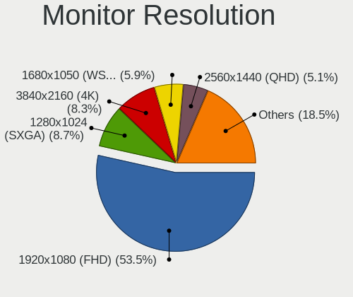

| Resolution         | Desktops | Percent |
|--------------------|----------|---------|
| 1920x1080 (FHD)    | 139      | 55.82%  |
| 3840x2160 (4K)     | 27       | 10.84%  |
| 1280x1024 (SXGA)   | 22       | 8.84%   |
| 1680x1050 (WSXGA+) | 13       | 5.22%   |
| 1366x768 (WXGA)    | 10       | 4.02%   |
| 2560x1440 (QHD)    | 8        | 3.21%   |
| 1440x900 (WXGA+)   | 7        | 2.81%   |
| 1920x1200 (WUXGA)  | 5        | 2.01%   |
| 1600x900 (HD+)     | 4        | 1.61%   |
| 2560x1080          | 3        | 1.2%    |
| 1360x768           | 3        | 1.2%    |
| 2048x1152          | 2        | 0.8%    |
| 1024x768 (XGA)     | 2        | 0.8%    |
| 3440x1440          | 1        | 0.4%    |
| 2288x1287          | 1        | 0.4%    |
| 1920x540           | 1        | 0.4%    |
| 1600x1200          | 1        | 0.4%    |

Monitor Diagonal
----------------

Diagonal size in inches

| Inches  | Desktops | Percent |
|---------|----------|---------|
| 24      | 40       | 15.94%  |
| 27      | 38       | 15.14%  |
| 21      | 38       | 15.14%  |
| 23      | 35       | 13.94%  |
| 19      | 19       | 7.57%   |
| 18      | 11       | 4.38%   |
| 17      | 9        | 3.59%   |
| 22      | 8        | 3.19%   |
| 20      | 7        | 2.79%   |
| 84      | 5        | 1.99%   |
| 40      | 5        | 1.99%   |
| 31      | 5        | 1.99%   |
| Unknown | 4        | 1.59%   |
| 72      | 3        | 1.2%    |
| 52      | 2        | 0.8%    |
| 46      | 2        | 0.8%    |
| 34      | 2        | 0.8%    |
| 29      | 2        | 0.8%    |
| 28      | 2        | 0.8%    |
| 25      | 2        | 0.8%    |
| 15      | 2        | 0.8%    |
| 142     | 1        | 0.4%    |
| 85      | 1        | 0.4%    |
| 60      | 1        | 0.4%    |
| 49      | 1        | 0.4%    |
| 48      | 1        | 0.4%    |
| 43      | 1        | 0.4%    |
| 41      | 1        | 0.4%    |
| 37      | 1        | 0.4%    |
| 32      | 1        | 0.4%    |
| 13      | 1        | 0.4%    |

Monitor Width
-------------

Physical width

| Width in mm    | Desktops | Percent |
|----------------|----------|---------|
| 501-600        | 108      | 43.37%  |
| 401-500        | 76       | 30.52%  |
| 351-400        | 11       | 4.42%   |
| 301-350        | 11       | 4.42%   |
| 601-700        | 10       | 4.02%   |
| 1501-2000      | 9        | 3.61%   |
| 1001-1500      | 7        | 2.81%   |
| 801-900        | 6        | 2.41%   |
| Unknown        | 4        | 1.61%   |
| 701-800        | 3        | 1.2%    |
| 901-1000       | 2        | 0.8%    |
| More than 2000 | 1        | 0.4%    |
| 201-300        | 1        | 0.4%    |

Aspect Ratio
------------

Proportional relationship between the width and the height

| Ratio   | Desktops | Percent |
|---------|----------|---------|
| 16/9    | 180      | 73.47%  |
| 16/10   | 30       | 12.24%  |
| 5/4     | 20       | 8.16%   |
| 4/3     | 4        | 1.63%   |
| 21/9    | 4        | 1.63%   |
| 3/2     | 3        | 1.22%   |
| Unknown | 2        | 0.82%   |
| 32/9    | 1        | 0.41%   |
| 1.00    | 1        | 0.41%   |

Monitor Area
------------

Area in inch

| Area in inch | Desktops | Percent |
|----------------|----------|---------|
| 201-250        | 99       | 39.44%  |
| 301-350        | 40       | 15.94%  |
| 151-200        | 38       | 15.14%  |
| 141-150        | 19       | 7.57%   |
| More than 1000 | 14       | 5.58%   |
| 251-300        | 13       | 5.18%   |
| 501-1000       | 11       | 4.38%   |
| 351-500        | 10       | 3.98%   |
| Unknown        | 4        | 1.59%   |
| 111-120        | 2        | 0.8%    |
| 81-90          | 1        | 0.4%    |

Pixel Density
-------------

Pixels per inch

| Density | Desktops | Percent |
|---------|----------|---------|
| 51-100  | 182      | 73.39%  |
| 101-120 | 46       | 18.55%  |
| 1-50    | 11       | 4.44%   |
| Unknown | 4        | 1.61%   |
| 121-160 | 3        | 1.21%   |
| 161-240 | 2        | 0.81%   |

Multiple Monitors
-----------------

Total monitors connected

| Total | Desktops | Percent |
|-------|----------|---------|
| 1     | 249      | 93.61%  |
| 0     | 10       | 3.76%   |
| 2     | 7        | 2.63%   |

Network
-------

Net Controller Vendor
---------------------

Controller vendors

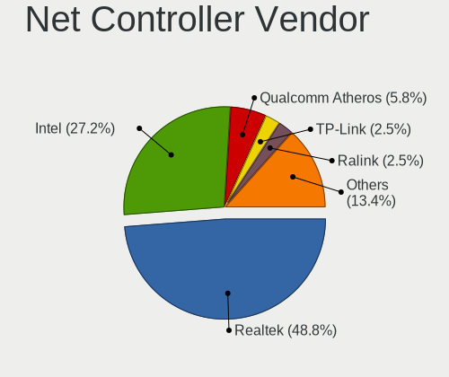

| Vendor                          | Desktops | Percent |
|---------------------------------|----------|---------|
| Realtek Semiconductor           | 174      | 48.74%  |
| Intel                           | 99       | 27.73%  |
| Qualcomm Atheros                | 19       | 5.32%   |
| Broadcom                        | 11       | 3.08%   |
| TP-Link                         | 8        | 2.24%   |
| Ralink Technology               | 7        | 1.96%   |
| Ralink                          | 7        | 1.96%   |
| Nvidia                          | 6        | 1.68%   |
| Xiaomi                          | 3        | 0.84%   |
| MediaTek                        | 3        | 0.84%   |
| NetGear                         | 2        | 0.56%   |
| Belkin Components               | 2        | 0.56%   |
| VIA Technologies                | 1        | 0.28%   |
| Qualcomm Atheros Communications | 1        | 0.28%   |
| Padix (Rockfire)                | 1        | 0.28%   |
| Motorola PCS                    | 1        | 0.28%   |
| Microsoft                       | 1        | 0.28%   |
| Marvell Technology Group        | 1        | 0.28%   |
| Interlogix.                     | 1        | 0.28%   |
| IMC Networks                    | 1        | 0.28%   |
| Huawei Technologies             | 1        | 0.28%   |
| HMD Global                      | 1        | 0.28%   |
| Emtec                           | 1        | 0.28%   |
| DisplayLink                     | 1        | 0.28%   |
| Broadcom Limited                | 1        | 0.28%   |
| ASUSTek Computer                | 1        | 0.28%   |
| ASIX Electronics                | 1        | 0.28%   |
| 3Com                            | 1        | 0.28%   |

Net Controller Model
--------------------

Controller models

| Model                                                                  | Desktops | Percent |
|------------------------------------------------------------------------|----------|---------|
| Realtek RTL8111/8168/8211/8411 PCI Express Gigabit Ethernet Controller | 143      | 36.2%   |
| Intel 82579LM Gigabit Network Connection (Lewisville)                  | 14       | 3.54%   |
| Intel Ethernet Connection I217-LM                                      | 9        | 2.28%   |
| Realtek RTL8188EUS 802.11n Wireless Network Adapter                    | 8        | 2.03%   |
| Realtek RTL8125 2.5GbE Controller                                      | 8        | 2.03%   |
| Realtek RTL8821CE 802.11ac PCIe Wireless Network Adapter               | 7        | 1.77%   |
| Intel I211 Gigabit Network Connection                                  | 7        | 1.77%   |
| Intel Ethernet Connection (2) I219-V                                   | 7        | 1.77%   |
| Intel Ethernet Connection (2) I219-LM                                  | 7        | 1.77%   |
| Intel Dual Band Wireless-AC 3168NGW [Stone Peak]                       | 6        | 1.52%   |
| Realtek RTL810xE PCI Express Fast Ethernet controller                  | 5        | 1.27%   |
| Realtek 802.11ac NIC                                                   | 5        | 1.27%   |
| Intel 82567LM-3 Gigabit Network Connection                             | 5        | 1.27%   |
| Ralink MT7601U Wireless Adapter                                        | 4        | 1.01%   |
| Nvidia MCP61 Ethernet                                                  | 4        | 1.01%   |
| Intel Wireless 7265                                                    | 4        | 1.01%   |
| Intel Ethernet Connection (7) I219-V                                   | 4        | 1.01%   |
| TP-Link TL-WN722N v2/v3 [Realtek RTL8188EUS]                           | 3        | 0.76%   |
| Realtek RTL88x2bu [AC1200 Techkey]                                     | 3        | 0.76%   |
| Realtek RTL-8110SC/8169SC Gigabit Ethernet                             | 3        | 0.76%   |
| Qualcomm Atheros QCA9565 / AR9565 Wireless Network Adapter             | 3        | 0.76%   |
| Intel Wi-Fi 5(802.11ac) Wireless-AC 9x6x [Thunder Peak]                | 3        | 0.76%   |
| Intel Ethernet Controller I225-V                                       | 3        | 0.76%   |
| Intel Ethernet Connection (5) I219-LM                                  | 3        | 0.76%   |
| Intel 82578DM Gigabit Network Connection                               | 3        | 0.76%   |
| Broadcom NetXtreme BCM5754 Gigabit Ethernet PCI Express                | 3        | 0.76%   |
| Xiaomi Mi/Redmi series (RNDIS)                                         | 2        | 0.51%   |
| TP-Link TL-WN821N v5/v6 [RTL8192EU]                                    | 2        | 0.51%   |
| Realtek RTL8822CE 802.11ac PCIe Wireless Network Adapter               | 2        | 0.51%   |
| Realtek RTL8192CU 802.11n WLAN Adapter                                 | 2        | 0.51%   |
| Realtek RTL8188FTV 802.11b/g/n 1T1R 2.4G WLAN Adapter                  | 2        | 0.51%   |
| Realtek RTL-8100/8101L/8139 PCI Fast Ethernet Adapter                  | 2        | 0.51%   |
| Ralink RT2870/RT3070 Wireless Adapter                                  | 2        | 0.51%   |
| Ralink RT3090 Wireless 802.11n 1T/1R PCIe                              | 2        | 0.51%   |
| Qualcomm Atheros QCA8171 Gigabit Ethernet                              | 2        | 0.51%   |
| Qualcomm Atheros AR9485 Wireless Network Adapter                       | 2        | 0.51%   |
| Qualcomm Atheros AR8152 v2.0 Fast Ethernet                             | 2        | 0.51%   |
| Qualcomm Atheros AR8151 v2.0 Gigabit Ethernet                          | 2        | 0.51%   |
| MediaTek MT7922 802.11ax PCI Express Wireless Network Adapter          | 2        | 0.51%   |
| Intel Wireless 7260                                                    | 2        | 0.51%   |

Wireless Vendor
---------------

Wireless vendors

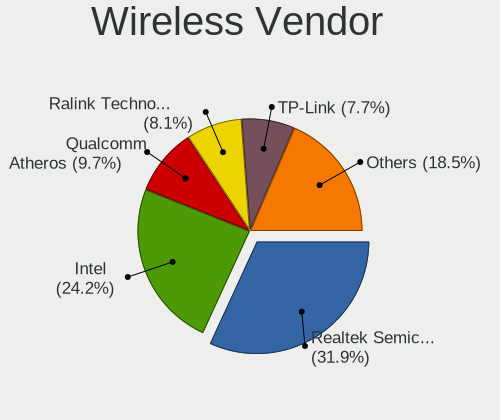

| Vendor                          | Desktops | Percent |
|---------------------------------|----------|---------|
| Realtek Semiconductor           | 37       | 32.46%  |
| Intel                           | 30       | 26.32%  |
| Qualcomm Atheros                | 10       | 8.77%   |
| TP-Link                         | 8        | 7.02%   |
| Ralink Technology               | 7        | 6.14%   |
| Ralink                          | 7        | 6.14%   |
| Broadcom                        | 4        | 3.51%   |
| MediaTek                        | 3        | 2.63%   |
| NetGear                         | 2        | 1.75%   |
| Belkin Components               | 2        | 1.75%   |
| Qualcomm Atheros Communications | 1        | 0.88%   |
| Microsoft                       | 1        | 0.88%   |
| IMC Networks                    | 1        | 0.88%   |
| ASUSTek Computer                | 1        | 0.88%   |

Wireless Model
--------------

Wireless models

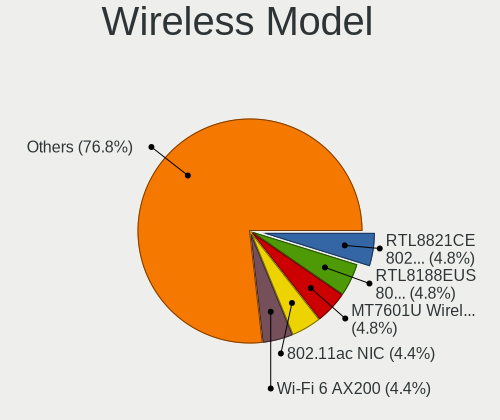

| Model                                                         | Desktops | Percent |
|---------------------------------------------------------------|----------|---------|
| Realtek RTL8188EUS 802.11n Wireless Network Adapter           | 8        | 6.9%    |
| Realtek RTL8821CE 802.11ac PCIe Wireless Network Adapter      | 7        | 6.03%   |
| Intel Dual Band Wireless-AC 3168NGW [Stone Peak]              | 6        | 5.17%   |
| Realtek 802.11ac NIC                                          | 5        | 4.31%   |
| Ralink MT7601U Wireless Adapter                               | 4        | 3.45%   |
| Intel Wireless 7265                                           | 4        | 3.45%   |
| TP-Link TL-WN722N v2/v3 [Realtek RTL8188EUS]                  | 3        | 2.59%   |
| Realtek RTL88x2bu [AC1200 Techkey]                            | 3        | 2.59%   |
| Qualcomm Atheros QCA9565 / AR9565 Wireless Network Adapter    | 3        | 2.59%   |
| Intel Wi-Fi 5(802.11ac) Wireless-AC 9x6x [Thunder Peak]       | 3        | 2.59%   |
| TP-Link TL-WN821N v5/v6 [RTL8192EU]                           | 2        | 1.72%   |
| Realtek RTL8822CE 802.11ac PCIe Wireless Network Adapter      | 2        | 1.72%   |
| Realtek RTL8192CU 802.11n WLAN Adapter                        | 2        | 1.72%   |
| Realtek RTL8188FTV 802.11b/g/n 1T1R 2.4G WLAN Adapter         | 2        | 1.72%   |
| Ralink RT2870/RT3070 Wireless Adapter                         | 2        | 1.72%   |
| Ralink RT3090 Wireless 802.11n 1T/1R PCIe                     | 2        | 1.72%   |
| Qualcomm Atheros AR9485 Wireless Network Adapter              | 2        | 1.72%   |
| MediaTek MT7922 802.11ax PCI Express Wireless Network Adapter | 2        | 1.72%   |
| Intel Wireless 7260                                           | 2        | 1.72%   |
| Intel Wi-Fi 6E(802.11ax) AX210/AX1675* 2x2 [Typhoon Peak]     | 2        | 1.72%   |
| Intel Wi-Fi 6 AX200                                           | 2        | 1.72%   |
| Intel Cannon Lake PCH CNVi WiFi                               | 2        | 1.72%   |
| Intel Alder Lake-S PCH CNVi WiFi                              | 2        | 1.72%   |
| Broadcom BCM4360 802.11ac Dual Band Wireless Network Adapter  | 2        | 1.72%   |
| TP-Link TL-WN823N v2/v3 [Realtek RTL8192EU]                   | 1        | 0.86%   |
| TP-Link Archer T4U ver.3                                      | 1        | 0.86%   |
| TP-Link AC600 wireless Realtek RTL8811AU [Archer T2U Nano]    | 1        | 0.86%   |
| Realtek RTL8822BE 802.11a/b/g/n/ac WiFi adapter               | 1        | 0.86%   |
| Realtek RTL8821AE 802.11ac PCIe Wireless Network Adapter      | 1        | 0.86%   |
| Realtek RTL8723BU 802.11b/g/n WLAN Adapter                    | 1        | 0.86%   |
| Realtek RTL8723BE PCIe Wireless Network Adapter               | 1        | 0.86%   |
| Realtek RTL8192EU 802.11b/g/n WLAN Adapter                    | 1        | 0.86%   |
| Realtek RTL8192EE PCIe Wireless Network Adapter               | 1        | 0.86%   |
| Realtek RTL8191SEvB Wireless LAN Controller                   | 1        | 0.86%   |
| Realtek RTL8188SU 802.11n WLAN Adapter                        | 1        | 0.86%   |
| Realtek RTL8187 Wireless Adapter                              | 1        | 0.86%   |
| Realtek 802.11n WLAN Adapter                                  | 1        | 0.86%   |
| Ralink RT5572 Wireless Adapter                                | 1        | 0.86%   |
| Ralink RT5390R 802.11bgn PCIe Wireless Network Adapter        | 1        | 0.86%   |
| Ralink RT3290 Wireless 802.11n 1T/1R PCIe                     | 1        | 0.86%   |

Ethernet Vendor
---------------

Ethernet vendors

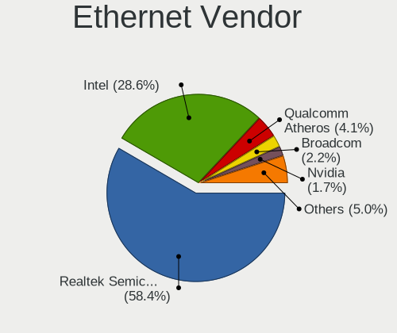

| Vendor                   | Desktops | Percent |
|--------------------------|----------|---------|
| Realtek Semiconductor    | 161      | 59.41%  |
| Intel                    | 76       | 28.04%  |
| Qualcomm Atheros         | 10       | 3.69%   |
| Broadcom                 | 7        | 2.58%   |
| Nvidia                   | 6        | 2.21%   |
| Xiaomi                   | 3        | 1.11%   |
| VIA Technologies         | 1        | 0.37%   |
| Marvell Technology Group | 1        | 0.37%   |
| Huawei Technologies      | 1        | 0.37%   |
| HMD Global               | 1        | 0.37%   |
| DisplayLink              | 1        | 0.37%   |
| Broadcom Limited         | 1        | 0.37%   |
| ASIX Electronics         | 1        | 0.37%   |
| 3Com                     | 1        | 0.37%   |

Ethernet Model
--------------

Ethernet models

| Model                                                                  | Desktops | Percent |
|------------------------------------------------------------------------|----------|---------|
| Realtek RTL8111/8168/8211/8411 PCI Express Gigabit Ethernet Controller | 143      | 52%     |
| Intel 82579LM Gigabit Network Connection (Lewisville)                  | 14       | 5.09%   |
| Intel Ethernet Connection I217-LM                                      | 9        | 3.27%   |
| Realtek RTL8125 2.5GbE Controller                                      | 8        | 2.91%   |
| Intel I211 Gigabit Network Connection                                  | 7        | 2.55%   |
| Intel Ethernet Connection (2) I219-V                                   | 7        | 2.55%   |
| Intel Ethernet Connection (2) I219-LM                                  | 7        | 2.55%   |
| Realtek RTL810xE PCI Express Fast Ethernet controller                  | 5        | 1.82%   |
| Intel 82567LM-3 Gigabit Network Connection                             | 5        | 1.82%   |
| Nvidia MCP61 Ethernet                                                  | 4        | 1.45%   |
| Intel Ethernet Connection (7) I219-V                                   | 4        | 1.45%   |
| Realtek RTL-8110SC/8169SC Gigabit Ethernet                             | 3        | 1.09%   |
| Intel Ethernet Controller I225-V                                       | 3        | 1.09%   |
| Intel Ethernet Connection (5) I219-LM                                  | 3        | 1.09%   |
| Intel 82578DM Gigabit Network Connection                               | 3        | 1.09%   |
| Broadcom NetXtreme BCM5754 Gigabit Ethernet PCI Express                | 3        | 1.09%   |
| Xiaomi Mi/Redmi series (RNDIS)                                         | 2        | 0.73%   |
| Realtek RTL-8100/8101L/8139 PCI Fast Ethernet Adapter                  | 2        | 0.73%   |
| Qualcomm Atheros QCA8171 Gigabit Ethernet                              | 2        | 0.73%   |
| Qualcomm Atheros AR8152 v2.0 Fast Ethernet                             | 2        | 0.73%   |
| Qualcomm Atheros AR8151 v2.0 Gigabit Ethernet                          | 2        | 0.73%   |
| Intel Ethernet Connection (12) I219-V                                  | 2        | 0.73%   |
| Intel 82579V Gigabit Network Connection                                | 2        | 0.73%   |
| Broadcom NetXtreme BCM5764M Gigabit Ethernet PCIe                      | 2        | 0.73%   |
| Xiaomi Mi/Redmi series (RNDIS + ADB)                                   | 1        | 0.36%   |
| VIA VT6102/VT6103 [Rhine-II]                                           | 1        | 0.36%   |
| Realtek USB 10/100/1G/2.5G LAN                                         | 1        | 0.36%   |
| Realtek RTL8153 Gigabit Ethernet Adapter                               | 1        | 0.36%   |
| Realtek RTL8111/8168/8411 PCI Express Gigabit Ethernet Controller      | 1        | 0.36%   |
| Qualcomm Atheros Killer E2400 Gigabit Ethernet Controller              | 1        | 0.36%   |
| Qualcomm Atheros Killer E220x Gigabit Ethernet Controller              | 1        | 0.36%   |
| Qualcomm Atheros Attansic L2 Fast Ethernet                             | 1        | 0.36%   |
| Qualcomm Atheros AR8121/AR8113/AR8114 Gigabit or Fast Ethernet         | 1        | 0.36%   |
| Nvidia MCP77 Ethernet                                                  | 1        | 0.36%   |
| Nvidia MCP51 Ethernet Controller                                       | 1        | 0.36%   |
| Marvell Group 88E8056 PCI-E Gigabit Ethernet Controller                | 1        | 0.36%   |
| Intel I210 Gigabit Network Connection                                  | 1        | 0.36%   |
| Intel Ethernet Controller I226-V                                       | 1        | 0.36%   |
| Intel Ethernet Connection (6) I219-V                                   | 1        | 0.36%   |
| Intel Ethernet Connection (2) I218-LM                                  | 1        | 0.36%   |

Net Controller Kind
-------------------

Ethernet, WiFi or modem

| Kind     | Desktops | Percent |
|----------|----------|---------|
| Ethernet | 258      | 68.98%  |
| WiFi     | 112      | 29.95%  |
| Unknown  | 3        | 0.8%    |
| Modem    | 1        | 0.27%   |

Used Controller
---------------

Currently used network controller

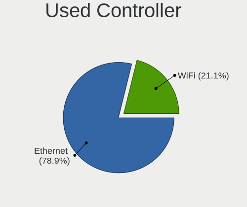

| Kind     | Desktops | Percent |
|----------|----------|---------|
| Ethernet | 202      | 77.39%  |
| WiFi     | 59       | 22.61%  |

NICs
----

Total network controllers on board

| Total | Desktops | Percent |
|-------|----------|---------|
| 1     | 187      | 70.3%   |
| 2     | 70       | 26.32%  |
| 0     | 5        | 1.88%   |
| 3     | 4        | 1.5%    |

IPv6
----

IPv6 vs IPv4

| Used | Desktops | Percent |
|------|----------|---------|
| No   | 172      | 64.66%  |
| Yes  | 94       | 35.34%  |

Bluetooth
---------

Bluetooth Vendor
----------------

Controller vendors

| Vendor                          | Desktops | Percent |
|---------------------------------|----------|---------|
| Intel                           | 27       | 36%     |
| Cambridge Silicon Radio         | 19       | 25.33%  |
| Realtek Semiconductor           | 8        | 10.67%  |
| ASUSTek Computer                | 6        | 8%      |
| Qualcomm Atheros Communications | 3        | 4%      |
| IMC Networks                    | 3        | 4%      |
| MediaTek                        | 2        | 2.67%   |
| Broadcom                        | 2        | 2.67%   |
| TP-Link                         | 1        | 1.33%   |
| Ralink                          | 1        | 1.33%   |
| Lite-On Technology              | 1        | 1.33%   |
| Integrated System Solution      | 1        | 1.33%   |
| Apple                           | 1        | 1.33%   |

Bluetooth Model
---------------

Controller models

| Model                                               | Desktops | Percent |
|-----------------------------------------------------|----------|---------|
| Cambridge Silicon Radio Bluetooth Dongle (HCI mode) | 19       | 25.33%  |
| Intel Bluetooth wireless interface                  | 9        | 12%     |
| Intel Wireless-AC 3168 Bluetooth                    | 6        | 8%      |
| Realtek Bluetooth Radio                             | 4        | 5.33%   |
| Realtek  Bluetooth 4.2 Adapter                      | 3        | 4%      |
| Qualcomm Atheros  Bluetooth Device                  | 3        | 4%      |
| Intel Wireless-AC 9260 Bluetooth Adapter            | 3        | 4%      |
| Intel Bluetooth 9460/9560 Jefferson Peak (JfP)      | 3        | 4%      |
| Intel AX201 Bluetooth                               | 3        | 4%      |
| MediaTek Wireless_Device                            | 2        | 2.67%   |
| Intel AX200 Bluetooth                               | 2        | 2.67%   |
| IMC Networks Bluetooth Radio                        | 2        | 2.67%   |
| ASUS Broadcom BCM20702A0 Bluetooth                  | 2        | 2.67%   |
| ASUS Bluetooth Radio                                | 2        | 2.67%   |
| TP-Link UB500 Adapter                               | 1        | 1.33%   |
| Realtek RTL8723B Bluetooth                          | 1        | 1.33%   |
| Ralink RT3290 Bluetooth                             | 1        | 1.33%   |
| Lite-On Bluetooth Device                            | 1        | 1.33%   |
| Intel Bluetooth Device                              | 1        | 1.33%   |
| Integrated System Solution Bluetooth Device         | 1        | 1.33%   |
| IMC Networks Bluetooth Device                       | 1        | 1.33%   |
| Broadcom Bluetooth 3.0 Device                       | 1        | 1.33%   |
| Broadcom Bluetooth 2.1 Device                       | 1        | 1.33%   |
| ASUS Bluetooth Adapter                              | 1        | 1.33%   |
| ASUS ASUS USB-BT500                                 | 1        | 1.33%   |
| Apple Bluetooth Host Controller                     | 1        | 1.33%   |

Sound
-----

Sound Vendor
------------

Sound card vendors

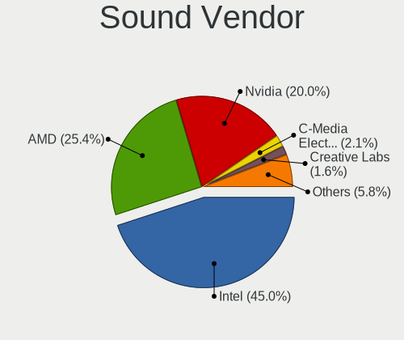

| Vendor                      | Desktops | Percent |
|-----------------------------|----------|---------|
| Intel                       | 179      | 47.73%  |
| AMD                         | 87       | 23.2%   |
| Nvidia                      | 73       | 19.47%  |
| C-Media Electronics         | 10       | 2.67%   |
| Creative Labs               | 5        | 1.33%   |
| Tenx Technology             | 2        | 0.53%   |
| Razer USA                   | 2        | 0.53%   |
| Micro Star International    | 2        | 0.53%   |
| Logitech                    | 2        | 0.53%   |
| Generalplus Technology      | 2        | 0.53%   |
| ASUSTek Computer            | 2        | 0.53%   |
| XMOS                        | 1        | 0.27%   |
| VIA Technologies            | 1        | 0.27%   |
| Medeli Electronics          | 1        | 0.27%   |
| JMTek                       | 1        | 0.27%   |
| FiiO Electronics Technology | 1        | 0.27%   |
| Ensoniq                     | 1        | 0.27%   |
| Corsair                     | 1        | 0.27%   |
| ATI Technologies            | 1        | 0.27%   |
| Unknown                     | 1        | 0.27%   |

Sound Model
-----------

Sound card models

| Model                                                                      | Desktops | Percent |
|----------------------------------------------------------------------------|----------|---------|
| Intel 6 Series/C200 Series Chipset Family High Definition Audio Controller | 25       | 5.53%   |
| Intel 8 Series/C220 Series Chipset High Definition Audio Controller        | 24       | 5.31%   |
| AMD Family 17h/19h HD Audio Controller                                     | 21       | 4.65%   |
| Intel 100 Series/C230 Series Chipset Family HD Audio Controller            | 19       | 4.2%    |
| Intel Xeon E3-1200 v3/4th Gen Core Processor HD Audio Controller           | 18       | 3.98%   |
| Intel 7 Series/C216 Chipset Family High Definition Audio Controller        | 17       | 3.76%   |
| AMD FCH Azalia Controller                                                  | 16       | 3.54%   |
| AMD SBx00 Azalia (Intel HDA)                                               | 15       | 3.32%   |
| Intel 200 Series PCH HD Audio                                              | 14       | 3.1%    |
| Nvidia GK208 HDMI/DP Audio Controller                                      | 11       | 2.43%   |
| Intel NM10/ICH7 Family High Definition Audio Controller                    | 10       | 2.21%   |
| Nvidia High Definition Audio Controller                                    | 9        | 1.99%   |
| AMD Renoir Radeon High Definition Audio Controller                         | 9        | 1.99%   |
| AMD Oland/Hainan/Cape Verde/Pitcairn HDMI Audio [Radeon HD 7000 Series]    | 9        | 1.99%   |
| AMD Navi 21/23 HDMI/DP Audio Controller                                    | 9        | 1.99%   |
| Intel 5 Series/3400 Series Chipset High Definition Audio                   | 8        | 1.77%   |
| AMD Starship/Matisse HD Audio Controller                                   | 8        | 1.77%   |
| AMD Raven/Raven2/Fenghuang HDMI/DP Audio Controller                        | 8        | 1.77%   |
| Intel Cannon Lake PCH cAVS                                                 | 7        | 1.55%   |
| AMD Family 17h (Models 00h-0fh) HD Audio Controller                        | 7        | 1.55%   |
| Nvidia GP107GL High Definition Audio Controller                            | 6        | 1.33%   |
| Nvidia GP106 High Definition Audio Controller                              | 6        | 1.33%   |
| Nvidia GM107 High Definition Audio Controller [GeForce 940MX]              | 6        | 1.33%   |
| Intel Comet Lake PCH-V cAVS                                                | 6        | 1.33%   |
| Nvidia TU116 High Definition Audio Controller                              | 5        | 1.11%   |
| Nvidia GM206 High Definition Audio Controller                              | 5        | 1.11%   |
| Nvidia GF119 HDMI Audio Controller                                         | 5        | 1.11%   |
| Intel Comet Lake PCH cAVS                                                  | 5        | 1.11%   |
| Intel 82801JD/DO (ICH10 Family) HD Audio Controller                        | 5        | 1.11%   |
| Intel 82801I (ICH9 Family) HD Audio Controller                             | 5        | 1.11%   |
| AMD Trinity HDMI Audio Controller                                          | 5        | 1.11%   |
| AMD Ellesmere HDMI Audio [Radeon RX 470/480 / 570/580/590]                 | 5        | 1.11%   |
| Nvidia MCP61 High Definition Audio                                         | 4        | 0.88%   |
| Intel Alder Lake-S HD Audio Controller                                     | 4        | 0.88%   |
| Intel 82801JI (ICH10 Family) HD Audio Controller                           | 4        | 0.88%   |
| AMD Kaveri HDMI/DP Audio Controller                                        | 4        | 0.88%   |
| AMD Baffin HDMI/DP Audio [Radeon RX 550 640SP / RX 560/560X]               | 4        | 0.88%   |
| Nvidia GK107 HDMI Audio Controller                                         | 3        | 0.66%   |
| Nvidia GA106 High Definition Audio Controller                              | 3        | 0.66%   |
| Intel Celeron/Pentium Silver Processor High Definition Audio               | 3        | 0.66%   |

Memory
------

Memory Vendor
-------------

Memory module vendors

| Vendor                       | Desktops | Percent |
|------------------------------|----------|---------|
| Kingston                     | 53       | 16.67%  |
| SK hynix                     | 40       | 12.58%  |
| Unknown                      | 38       | 11.95%  |
| Samsung Electronics          | 31       | 9.75%   |
| Crucial                      | 25       | 7.86%   |
| Micron Technology            | 22       | 6.92%   |
| Corsair                      | 17       | 5.35%   |
| G.Skill                      | 16       | 5.03%   |
| Nanya Technology             | 11       | 3.46%   |
| A-DATA Technology            | 10       | 3.14%   |
| Ramaxel Technology           | 6        | 1.89%   |
| Team                         | 5        | 1.57%   |
| Patriot                      | 4        | 1.26%   |
| AMD                          | 4        | 1.26%   |
| Unknown                      | 4        | 1.26%   |
| Silicon Power                | 3        | 0.94%   |
| GOODRAM                      | 3        | 0.94%   |
| Wilk                         | 2        | 0.63%   |
| Unknown (ABCD)               | 2        | 0.63%   |
| Red Hat                      | 2        | 0.63%   |
| Patriot Memory (PDP Systems) | 2        | 0.63%   |
| Golden Empire                | 2        | 0.63%   |
| Unknown (89F7)               | 1        | 0.31%   |
| Transcend                    | 1        | 0.31%   |
| Toshiba                      | 1        | 0.31%   |
| Teclast                      | 1        | 0.31%   |
| TakeMS                       | 1        | 0.31%   |
| Swissbit                     | 1        | 0.31%   |
| Qimonda                      | 1        | 0.31%   |
| PUSKILL                      | 1        | 0.31%   |
| PNY                          | 1        | 0.31%   |
| OCZ                          | 1        | 0.31%   |
| Kingmax                      | 1        | 0.31%   |
| KingFast                     | 1        | 0.31%   |
| Elpida                       | 1        | 0.31%   |
| Avant                        | 1        | 0.31%   |
| Ankowall                     | 1        | 0.31%   |
| A Force                      | 1        | 0.31%   |

Memory Model
------------

Memory module models

| Model                                                          | Desktops | Percent |
|----------------------------------------------------------------|----------|---------|
| Micron RAM 8JTF51264AZ-1G6E1 4GB DIMM DDR3 1600MT/s            | 6        | 1.66%   |
| Unknown                                                        | 4        | 1.1%    |
| Unknown RAM Module 4GB DIMM DDR3 1333MT/s                      | 3        | 0.83%   |
| Unknown RAM Module 4GB DIMM 1333MT/s                           | 3        | 0.83%   |
| Unknown RAM Module 2GB DIMM SDRAM                              | 3        | 0.83%   |
| Unknown RAM Module 2GB DIMM 1333MT/s                           | 3        | 0.83%   |
| Unknown RAM Module 1GB DIMM                                    | 3        | 0.83%   |
| Team RAM TEAMGROUP-UD4-3200 16GB DIMM DDR4 3733MT/s            | 3        | 0.83%   |
| SK hynix RAM HMA851U6AFR6N-UH 4GB DIMM DDR4 2400MT/s           | 3        | 0.83%   |
| Samsung RAM Module 8GB DIMM DDR4 2133MT/s                      | 3        | 0.83%   |
| Samsung RAM M378B5773DH0-CH9 2GB DIMM DDR3 1333MT/s            | 3        | 0.83%   |
| Unknown RAM Module 4GB DIMM DDR3 1600MT/s                      | 2        | 0.55%   |
| Unknown RAM Module 4GB DIMM DDR 1333MT/s                       | 2        | 0.55%   |
| Unknown RAM Module 2GB DIMM DDR 1333MT/s                       | 2        | 0.55%   |
| Unknown RAM Module 2GB DIMM 800MT/s                            | 2        | 0.55%   |
| Unknown (ABCD) RAM 123456789012345678 2GB DIMM LPDDR4 2400MT/s | 2        | 0.55%   |
| SK hynix RAM Module 4GB DIMM DDR3 1600MT/s                     | 2        | 0.55%   |
| SK hynix RAM HMT451U6BFR8C-PB 4GB DIMM DDR3 1600MT/s           | 2        | 0.55%   |
| SK hynix RAM HMT351U6EFR8C-PB 4096MB DIMM DDR3 1800MT/s        | 2        | 0.55%   |
| SK hynix RAM HMT325U6CFR8C-PB 2GB DIMM DDR3 1600MT/s           | 2        | 0.55%   |
| Samsung RAM Module 2GB DIMM DDR3 1333MT/s                      | 2        | 0.55%   |
| Samsung RAM M378B5673FH0-CH9 2GB DIMM DDR3 1600MT/s            | 2        | 0.55%   |
| Samsung RAM M378B5273DH0-CK0 4GB DIMM DDR3 2200MT/s            | 2        | 0.55%   |
| Samsung RAM M378B5173QH0-CK0 4GB DIMM DDR3 1600MT/s            | 2        | 0.55%   |
| Samsung RAM M378B1G73EB0-CK0 8GB DIMM DDR3 1600MT/s            | 2        | 0.55%   |
| Ramaxel RAM RMR5030MN68F9F1600 4GB DIMM DDR3 1600MT/s          | 2        | 0.55%   |
| Ramaxel RAM RMR5030ME68F9F1600 4GB DIMM DDR3 1600MT/s          | 2        | 0.55%   |
| Ramaxel RAM RMR5030EF68F9W1600 4GB DIMM DDR3 1600MT/s          | 2        | 0.55%   |
| Nanya RAM NT2GC64B88B0NF-CG 2GB DIMM DDR3 1333MT/s             | 2        | 0.55%   |
| Micron RAM 16JTF25664AZ-1G4G1 2GB DIMM 1400MT/s                | 2        | 0.55%   |
| Kingston RAM KHX1600C9D3/4GX 4GB DIMM DDR3 1600MT/s            | 2        | 0.55%   |
| Kingston RAM 9905471-009.A00LF 4GB DIMM DDR3 1600MT/s          | 2        | 0.55%   |
| Kingston RAM 9905458-009.A00LF 2GB DIMM DDR3 1600MT/s          | 2        | 0.55%   |
| Golden Empire RAM CL4-4-4DDR2-800 1GB DIMM DDR2 800MT/s        | 2        | 0.55%   |
| G.Skill RAM F4-3200C16-8GVKB 8GB DIMM DDR4 3866MT/s            | 2        | 0.55%   |
| G.Skill RAM F4-3200C16-8GIS 8GB DIMM DDR4 3200MT/s             | 2        | 0.55%   |
| Crucial RAM BLS8G3D1609DS1S00. 8GB DIMM DDR3 1800MT/s          | 2        | 0.55%   |
| Crucial RAM BLS4G3D1609DS1S00. 4GB DIMM DDR3 1600MT/s          | 2        | 0.55%   |
| Corsair RAM CMK8GX4M1A2400C16 8GB DIMM DDR4 3066MT/s           | 2        | 0.55%   |
| Corsair RAM CMK32GX5M2D6000Z36 16GB DIMM DDR5 6000MT/s         | 2        | 0.55%   |

Memory Kind
-----------

Memory module kinds

| Kind    | Desktops | Percent |
|---------|----------|---------|
| DDR3    | 105      | 39.33%  |
| DDR4    | 104      | 38.95%  |
| Unknown | 16       | 5.99%   |
| SDRAM   | 15       | 5.62%   |
| DDR2    | 11       | 4.12%   |
| DDR     | 6        | 2.25%   |
| DDR5    | 5        | 1.87%   |
| RAM     | 2        | 0.75%   |
| LPDDR4  | 2        | 0.75%   |
| DRAM    | 1        | 0.37%   |

Memory Form Factor
------------------

Physical design of the memory module

| Name   | Desktops | Percent |
|--------|----------|---------|
| DIMM   | 244      | 93.49%  |
| SODIMM | 17       | 6.51%   |

Memory Size
-----------

Memory module size

| Size  | Desktops | Percent |
|-------|----------|---------|
| 8192  | 104      | 34.9%   |
| 4096  | 92       | 30.87%  |
| 2048  | 47       | 15.77%  |
| 16384 | 30       | 10.07%  |
| 1024  | 15       | 5.03%   |
| 32768 | 7        | 2.35%   |
| 512   | 2        | 0.67%   |
| 12536 | 1        | 0.34%   |

Memory Speed
------------

Memory module speed

| Speed   | Desktops | Percent |
|---------|----------|---------|
| 1600    | 67       | 22.41%  |
| 1333    | 41       | 13.71%  |
| 2400    | 26       | 8.7%    |
| 3200    | 24       | 8.03%   |
| 2667    | 18       | 6.02%   |
| Unknown | 13       | 4.35%   |
| 2133    | 12       | 4.01%   |
| 800     | 10       | 3.34%   |
| 667     | 9        | 3.01%   |
| 3600    | 8        | 2.68%   |
| 2933    | 6        | 2.01%   |
| 2666    | 6        | 2.01%   |
| 3733    | 5        | 1.67%   |
| 1800    | 5        | 1.67%   |
| 6000    | 3        | 1%      |
| 3400    | 3        | 1%      |
| 3066    | 3        | 1%      |
| 1866    | 3        | 1%      |
| 1400    | 3        | 1%      |
| 1334    | 3        | 1%      |
| 3866    | 2        | 0.67%   |
| 3266    | 2        | 0.67%   |
| 2200    | 2        | 0.67%   |
| 2048    | 2        | 0.67%   |
| 1867    | 2        | 0.67%   |
| 1066    | 2        | 0.67%   |
| 5200    | 1        | 0.33%   |
| 4800    | 1        | 0.33%   |
| 4533    | 1        | 0.33%   |
| 3534    | 1        | 0.33%   |
| 3533    | 1        | 0.33%   |
| 3500    | 1        | 0.33%   |
| 3466    | 1        | 0.33%   |
| 3133    | 1        | 0.33%   |
| 3000    | 1        | 0.33%   |
| 2747    | 1        | 0.33%   |
| 2733    | 1        | 0.33%   |
| 2472    | 1        | 0.33%   |
| 2000    | 1        | 0.33%   |
| 1648    | 1        | 0.33%   |

Printers & scanners
-------------------

Printer Vendor
--------------

Printer device vendors

| Vendor              | Desktops | Percent |
|---------------------|----------|---------|
| Hewlett-Packard     | 4        | 30.77%  |
| Canon               | 3        | 23.08%  |
| Brother Industries  | 3        | 23.08%  |
| Seiko Epson         | 2        | 15.38%  |
| Prolific Technology | 1        | 7.69%   |

Printer Model
-------------

Printer device models

| Model                           | Desktops | Percent |
|---------------------------------|----------|---------|
| HP LaserJet 1018                | 2        | 15.38%  |
| Canon CanoScan LiDE 300         | 2        | 15.38%  |
| Seiko Epson L3150 Series        | 1        | 7.69%   |
| Seiko Epson ET-2820 Series      | 1        | 7.69%   |
| Prolific PL2305 Parallel Port   | 1        | 7.69%   |
| HP DeskJet F4200 series         | 1        | 7.69%   |
| HP DeskJet 4670 series          | 1        | 7.69%   |
| Canon PIXMA MG3600 Series       | 1        | 7.69%   |
| Brother MFC-J1010DW             | 1        | 7.69%   |
| Brother HL-2270DW Laser Printer | 1        | 7.69%   |
| Brother HL-2140 series          | 1        | 7.69%   |

Scanner Vendor
--------------

Scanner device vendors

| Vendor | Desktops | Percent |
|--------|----------|---------|
| Canon  | 2        | 100%    |

Scanner Model
-------------

Scanner device models

| Model                   | Desktops | Percent |
|-------------------------|----------|---------|
| Canon CanoScan LiDE 110 | 2        | 100%    |

Camera
------

Camera Vendor
-------------

Camera device vendors

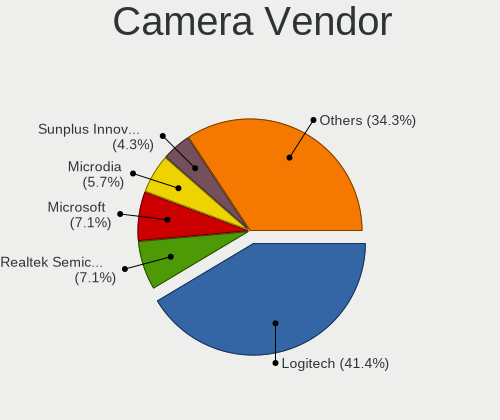

| Vendor                        | Desktops | Percent |
|-------------------------------|----------|---------|
| Logitech                      | 12       | 36.36%  |
| Sunplus Innovation Technology | 3        | 9.09%   |
| Chicony Electronics           | 3        | 9.09%   |
| Microsoft                     | 2        | 6.06%   |
| Microdia                      | 2        | 6.06%   |
| Linux Foundation              | 2        | 6.06%   |
| Z-Star Microelectronics       | 1        | 3.03%   |
| Samsung Electronics           | 1        | 3.03%   |
| Realtek Semiconductor         | 1        | 3.03%   |
| Netchip Technology            | 1        | 3.03%   |
| Lenovo                        | 1        | 3.03%   |
| GEMBIRD                       | 1        | 3.03%   |
| eMeet                         | 1        | 3.03%   |
| Creative Technology           | 1        | 3.03%   |
| Alcor Micro                   | 1        | 3.03%   |

Camera Model
------------

Camera device models

| Model                                      | Desktops | Percent |
|--------------------------------------------|----------|---------|
| Logitech Webcam C270                       | 4        | 12.12%  |
| Logitech Webcam C310                       | 2        | 6.06%   |
| Logitech HD Pro Webcam C920                | 2        | 6.06%   |
| Linux Foundation EEM Gadget                | 2        | 6.06%   |
| Z-Star Lenovo ThinkCentre Web Camera       | 1        | 3.03%   |
| Sunplus USB Camera                         | 1        | 3.03%   |
| Sunplus Full HD webcam                     | 1        | 3.03%   |
| Sunplus FHD Camera Microphone              | 1        | 3.03%   |
| Samsung Galaxy series, misc. (MTP mode)    | 1        | 3.03%   |
| Realtek Webcam                             | 1        | 3.03%   |
| Netchip Nuroum V11                         | 1        | 3.03%   |
| Microsoft LifeCam VX-700                   | 1        | 3.03%   |
| Microsoft LifeCam VX-5000                  | 1        | 3.03%   |
| Microdia Sonix USB 2.0 Camera              | 1        | 3.03%   |
| Microdia Integrated Camera                 | 1        | 3.03%   |
| Logitech StreamCam                         | 1        | 3.03%   |
| Logitech QuickCam Communicate Deluxe/S7500 | 1        | 3.03%   |
| Logitech CrystalCam                        | 1        | 3.03%   |
| Logitech BRIO Ultra HD Webcam              | 1        | 3.03%   |
| Lenovo Lenovo 500 RGB Camera               | 1        | 3.03%   |
| GEMBIRD USB2.0 PC CAMERA                   | 1        | 3.03%   |
| eMeet HD Webcam C970L                      | 1        | 3.03%   |
| Creative Live! Cam Optia                   | 1        | 3.03%   |
| Chicony WebCam                             | 1        | 3.03%   |
| Chicony USB2.0 HD UVC WebCam               | 1        | 3.03%   |
| Chicony HP WebCam                          | 1        | 3.03%   |
| Alcor Micro 1080P-Webcam                   | 1        | 3.03%   |

Security
--------

Fingerprint Vendor
------------------

Fingerprint sensor vendors

Zero info for selected period =(

Fingerprint Model
-----------------

Fingerprint sensor models

Zero info for selected period =(

Chipcard Vendor
---------------

Chipcard module vendors

Zero info for selected period =(

Chipcard Model
--------------

Chipcard module models

Zero info for selected period =(

Unsupported
-----------

Unsupported Devices
-------------------

Total unsupported devices on board

| Total | Desktops | Percent |
|-------|----------|---------|
| 0     | 248      | 93.23%  |
| 1     | 18       | 6.77%   |

Unsupported Device Types
------------------------

Types of unsupported devices

| Type                     | Desktops | Percent |
|--------------------------|----------|---------|
| Graphics card            | 11       | 61.11%  |
| Multimedia controller    | 2        | 11.11%  |
| Unassigned class         | 1        | 5.56%   |
| Network                  | 1        | 5.56%   |
| Net/wireless             | 1        | 5.56%   |
| Communication controller | 1        | 5.56%   |
| Bluetooth                | 1        | 5.56%   |

