OpenMandriva 5.0 - Tested Hardware & Statistics (Notebooks)
-----------------------------------------------------------

A project to collect tested hardware configurations for OpenMandriva 5.0.

Anyone can contribute to this report by the [hw-probe](https://github.com/linuxhw/hw-probe) tool:

    sudo -E hw-probe -all -upload

Please contribute! Especially if your hardware is rare.

Contents
--------

* [ Test Cases ](#test-cases)

* [ System ](#system)
  - [ Kernel                   ](#kernel)
  - [ Kernel Family            ](#kernel-family)
  - [ Kernel Major Ver.        ](#kernel-major-ver)
  - [ Arch                     ](#arch)
  - [ DE                       ](#de)
  - [ Display Server           ](#display-server)
  - [ Display Manager          ](#display-manager)
  - [ OS Lang                  ](#os-lang)
  - [ Boot Mode                ](#boot-mode)
  - [ Filesystem               ](#filesystem)
  - [ Part. scheme             ](#part-scheme)
  - [ Dual Boot with Linux/BSD ](#dual-boot-with-linuxbsd)
  - [ Dual Boot (Win)          ](#dual-boot-win)

* [ Board ](#board)
  - [ Vendor                   ](#vendor)
  - [ Model                    ](#model)
  - [ Model Family             ](#model-family)
  - [ MFG Year                 ](#mfg-year)
  - [ Form Factor              ](#form-factor)
  - [ Secure Boot              ](#secure-boot)
  - [ Coreboot                 ](#coreboot)
  - [ RAM Size                 ](#ram-size)
  - [ RAM Used                 ](#ram-used)
  - [ Total Drives             ](#total-drives)
  - [ Has CD-ROM               ](#has-cd-rom)
  - [ Has Ethernet             ](#has-ethernet)
  - [ Has WiFi                 ](#has-wifi)
  - [ Has Bluetooth            ](#has-bluetooth)

* [ Location ](#location)
  - [ Country                  ](#country)
  - [ City                     ](#city)

* [ Drives ](#drives)
  - [ Drive Vendor             ](#drive-vendor)
  - [ Drive Model              ](#drive-model)
  - [ HDD Vendor               ](#hdd-vendor)
  - [ SSD Vendor               ](#ssd-vendor)
  - [ Drive Kind               ](#drive-kind)
  - [ Drive Connector          ](#drive-connector)
  - [ Drive Size               ](#drive-size)
  - [ Space Total              ](#space-total)
  - [ Space Used               ](#space-used)
  - [ Malfunc. Drives          ](#malfunc-drives)
  - [ Malfunc. Drive Vendor    ](#malfunc-drive-vendor)
  - [ Malfunc. HDD Vendor      ](#malfunc-hdd-vendor)
  - [ Malfunc. Drive Kind      ](#malfunc-drive-kind)
  - [ Failed Drives            ](#failed-drives)
  - [ Failed Drive Vendor      ](#failed-drive-vendor)
  - [ Drive Status             ](#drive-status)

* [ Storage controller ](#storage-controller)
  - [ Storage Vendor           ](#storage-vendor)
  - [ Storage Model            ](#storage-model)
  - [ Storage Kind             ](#storage-kind)

* [ Processor ](#processor)
  - [ CPU Vendor               ](#cpu-vendor)
  - [ CPU Model                ](#cpu-model)
  - [ CPU Model Family         ](#cpu-model-family)
  - [ CPU Cores                ](#cpu-cores)
  - [ CPU Sockets              ](#cpu-sockets)
  - [ CPU Threads              ](#cpu-threads)
  - [ CPU Op-Modes             ](#cpu-op-modes)
  - [ CPU Microcode            ](#cpu-microcode)
  - [ CPU Microarch            ](#cpu-microarch)

* [ Graphics ](#graphics)
  - [ GPU Vendor               ](#gpu-vendor)
  - [ GPU Model                ](#gpu-model)
  - [ GPU Combo                ](#gpu-combo)
  - [ GPU Driver               ](#gpu-driver)
  - [ GPU Memory               ](#gpu-memory)

* [ Monitor ](#monitor)
  - [ Monitor Vendor           ](#monitor-vendor)
  - [ Monitor Model            ](#monitor-model)
  - [ Monitor Resolution       ](#monitor-resolution)
  - [ Monitor Diagonal         ](#monitor-diagonal)
  - [ Monitor Width            ](#monitor-width)
  - [ Aspect Ratio             ](#aspect-ratio)
  - [ Monitor Area             ](#monitor-area)
  - [ Pixel Density            ](#pixel-density)
  - [ Multiple Monitors        ](#multiple-monitors)

* [ Network ](#network)
  - [ Net Controller Vendor    ](#net-controller-vendor)
  - [ Net Controller Model     ](#net-controller-model)
  - [ Wireless Vendor          ](#wireless-vendor)
  - [ Wireless Model           ](#wireless-model)
  - [ Ethernet Vendor          ](#ethernet-vendor)
  - [ Ethernet Model           ](#ethernet-model)
  - [ Net Controller Kind      ](#net-controller-kind)
  - [ Used Controller          ](#used-controller)
  - [ NICs                     ](#nics)
  - [ IPv6                     ](#ipv6)

* [ Bluetooth ](#bluetooth)
  - [ Bluetooth Vendor         ](#bluetooth-vendor)
  - [ Bluetooth Model          ](#bluetooth-model)

* [ Sound ](#sound)
  - [ Sound Vendor             ](#sound-vendor)
  - [ Sound Model              ](#sound-model)

* [ Memory ](#memory)
  - [ Memory Vendor            ](#memory-vendor)
  - [ Memory Model             ](#memory-model)
  - [ Memory Kind              ](#memory-kind)
  - [ Memory Form Factor       ](#memory-form-factor)
  - [ Memory Size              ](#memory-size)
  - [ Memory Speed             ](#memory-speed)

* [ Printers & scanners ](#printers--scanners)
  - [ Printer Vendor           ](#printer-vendor)
  - [ Printer Model            ](#printer-model)
  - [ Scanner Vendor           ](#scanner-vendor)
  - [ Scanner Model            ](#scanner-model)

* [ Camera ](#camera)
  - [ Camera Vendor            ](#camera-vendor)
  - [ Camera Model             ](#camera-model)

* [ Security ](#security)
  - [ Fingerprint Vendor       ](#fingerprint-vendor)
  - [ Fingerprint Model        ](#fingerprint-model)
  - [ Chipcard Vendor          ](#chipcard-vendor)
  - [ Chipcard Model           ](#chipcard-model)

* [ Unsupported ](#unsupported)
  - [ Unsupported Devices      ](#unsupported-devices)
  - [ Unsupported Device Types ](#unsupported-device-types)

Test Cases
----------

Total: 1057

| Vendor        | Model                       | Probe                                                      | Date         |
|---------------|-----------------------------|------------------------------------------------------------|--------------|
| Google        | Candy                       | [cecd9e87aa](https://linux-hardware.org/?probe=cecd9e87aa) | Jan 02, 2026 |
| Lenovo        | ThinkPad T470 20HES0QL00    | [5b0e1cd590](https://linux-hardware.org/?probe=5b0e1cd590) | Dec 31, 2025 |
| Samsung       | 500R4K/500R5H/5400RK/501... | [7b5c617f4f](https://linux-hardware.org/?probe=7b5c617f4f) | Dec 30, 2025 |
| Google        | Candy                       | [4e367db3a2](https://linux-hardware.org/?probe=4e367db3a2) | Dec 22, 2025 |
| Dell          | Latitude 3570               | [41b2cba7dd](https://linux-hardware.org/?probe=41b2cba7dd) | Dec 09, 2025 |
| Lenovo        | ThinkPad P53 20QN001YUS     | [04ff75abf1](https://linux-hardware.org/?probe=04ff75abf1) | Dec 07, 2025 |
| Packard Be... | EasyNote TE11HC             | [dcd1f8ec65](https://linux-hardware.org/?probe=dcd1f8ec65) | Dec 01, 2025 |
| HP            | Pavilion Notebook           | [b82bac9ce3](https://linux-hardware.org/?probe=b82bac9ce3) | Nov 23, 2025 |
| Dell          | Latitude E6410              | [3aa870d787](https://linux-hardware.org/?probe=3aa870d787) | Nov 03, 2025 |
| Google        | Candy                       | [0d070e9cdc](https://linux-hardware.org/?probe=0d070e9cdc) | Nov 03, 2025 |
| Unknown       | AX15                        | [117665891c](https://linux-hardware.org/?probe=117665891c) | Oct 30, 2025 |
| Toshiba       | PORTEGE Z30-C               | [5649272fd6](https://linux-hardware.org/?probe=5649272fd6) | Oct 12, 2025 |
| Apple         | MacBookPro3,1               | [52901a1cdf](https://linux-hardware.org/?probe=52901a1cdf) | Oct 10, 2025 |
| Toshiba       | Satellite L655              | [586043bd8d](https://linux-hardware.org/?probe=586043bd8d) | Oct 10, 2025 |
| Samsung       | 370E5L/371B5L               | [e11e6bde3a](https://linux-hardware.org/?probe=e11e6bde3a) | Sep 30, 2025 |
| Dell          | Inspiron 5758               | [ca4fc516c1](https://linux-hardware.org/?probe=ca4fc516c1) | Sep 23, 2025 |
| ASUSTek       | X551MA                      | [e0fb6c59d6](https://linux-hardware.org/?probe=e0fb6c59d6) | Sep 22, 2025 |
| ASUSTek       | VivoBook_ASUSLaptop E410... | [f29c7bb3eb](https://linux-hardware.org/?probe=f29c7bb3eb) | Sep 21, 2025 |
| Google        | Candy                       | [ebc549c163](https://linux-hardware.org/?probe=ebc549c163) | Sep 20, 2025 |
| Dell          | Latitude 3190               | [571f119a19](https://linux-hardware.org/?probe=571f119a19) | Sep 15, 2025 |
| Dell          | Latitude 5520               | [b5a470cbe7](https://linux-hardware.org/?probe=b5a470cbe7) | Sep 05, 2025 |
| HP            | ProBook 4540s               | [298fc7b496](https://linux-hardware.org/?probe=298fc7b496) | Sep 01, 2025 |
| System76      | Oryx Pro                    | [35d691c26a](https://linux-hardware.org/?probe=35d691c26a) | Sep 01, 2025 |
| HP            | ProBook 4540s               | [ad3183412e](https://linux-hardware.org/?probe=ad3183412e) | Sep 01, 2025 |
| HP            | ZBook 15 G4                 | [0baf2be9a2](https://linux-hardware.org/?probe=0baf2be9a2) | Aug 31, 2025 |
| HP            | ZBook 15 G4                 | [3f0af59e26](https://linux-hardware.org/?probe=3f0af59e26) | Aug 31, 2025 |
| HP            | ProBook 645 G1              | [df47d66ba8](https://linux-hardware.org/?probe=df47d66ba8) | Aug 27, 2025 |
| HP            | Notebook                    | [d6373b79ba](https://linux-hardware.org/?probe=d6373b79ba) | Aug 21, 2025 |
| MSI           | GL62 7QF                    | [4582736a5a](https://linux-hardware.org/?probe=4582736a5a) | Aug 20, 2025 |
| HP            | Pavilion dv7                | [4d9e24fc79](https://linux-hardware.org/?probe=4d9e24fc79) | Aug 12, 2025 |
| ZTE           | CT321                       | [c0ab4d82bf](https://linux-hardware.org/?probe=c0ab4d82bf) | Aug 09, 2025 |
| Lenovo        | B560 43308LG                | [21e11ad627](https://linux-hardware.org/?probe=21e11ad627) | Jul 13, 2025 |
| ASUSTek       | K61IC                       | [da20b3bf57](https://linux-hardware.org/?probe=da20b3bf57) | Jul 12, 2025 |
| HP            | EliteBook 840 G3            | [586e7bc0db](https://linux-hardware.org/?probe=586e7bc0db) | Jul 09, 2025 |
| ASUSTek       | X550VX                      | [0de110f287](https://linux-hardware.org/?probe=0de110f287) | Jul 03, 2025 |
| Google        | Candy                       | [114592abbc](https://linux-hardware.org/?probe=114592abbc) | Jul 01, 2025 |
| Lenovo        | ThinkPad T440p 20AWS36U0... | [9c24d1e5af](https://linux-hardware.org/?probe=9c24d1e5af) | Jun 29, 2025 |
| Toshiba       | Satellite L70-B             | [7e3c176dae](https://linux-hardware.org/?probe=7e3c176dae) | Jun 28, 2025 |
| ASUSTek       | X556UJ                      | [0292dddf1f](https://linux-hardware.org/?probe=0292dddf1f) | Jun 22, 2025 |
| Toshiba       | Satellite A665              | [1e9f1976f6](https://linux-hardware.org/?probe=1e9f1976f6) | Jun 15, 2025 |
| Samsung       | 305V4A/305V5A               | [01e8d7ac4f](https://linux-hardware.org/?probe=01e8d7ac4f) | Jun 14, 2025 |
| HP            | Laptop 15-ef1xxx            | [ffa4e8d5f4](https://linux-hardware.org/?probe=ffa4e8d5f4) | Jun 03, 2025 |
| Medion        | Akoya S4220 MD99820         | [bf54060cd4](https://linux-hardware.org/?probe=bf54060cd4) | Jun 02, 2025 |
| Lenovo        | ThinkPad T530 2429W4Z       | [1abadb23e5](https://linux-hardware.org/?probe=1abadb23e5) | May 30, 2025 |
| Lenovo        | ThinkPad T570 W10DG 20JX... | [30077f314d](https://linux-hardware.org/?probe=30077f314d) | May 30, 2025 |
| Samsung       | R430/R480/R440              | [9dfbe091c3](https://linux-hardware.org/?probe=9dfbe091c3) | May 28, 2025 |
| Lenovo        | Legion 5 15ARH05 82B5       | [9ebdc98e04](https://linux-hardware.org/?probe=9ebdc98e04) | May 27, 2025 |
| Fujitsu       | LIFEBOOK E751               | [63862a05a4](https://linux-hardware.org/?probe=63862a05a4) | May 23, 2025 |
| Dell          | Vostro 1015                 | [0db3a28443](https://linux-hardware.org/?probe=0db3a28443) | May 15, 2025 |
| Dell          | Latitude 7480               | [0ae0308412](https://linux-hardware.org/?probe=0ae0308412) | May 09, 2025 |
| ASUSTek       | E202SA                      | [425064df68](https://linux-hardware.org/?probe=425064df68) | May 09, 2025 |
| HP            | Notebook                    | [6435d8f06d](https://linux-hardware.org/?probe=6435d8f06d) | May 02, 2025 |
| Dell          | Inspiron 7472               | [70b70877bf](https://linux-hardware.org/?probe=70b70877bf) | May 01, 2025 |
| Google        | Candy                       | [42c23c9a7d](https://linux-hardware.org/?probe=42c23c9a7d) | May 01, 2025 |
| Dell          | Studio 1537                 | [eb575ed2c5](https://linux-hardware.org/?probe=eb575ed2c5) | Apr 29, 2025 |
| Acer          | AOD270                      | [b8cefbefaf](https://linux-hardware.org/?probe=b8cefbefaf) | Apr 29, 2025 |
| Lenovo        | ThinkPad Helix 36984SU      | [52cb1d1d47](https://linux-hardware.org/?probe=52cb1d1d47) | Apr 29, 2025 |
| Unknown       | AX15                        | [6261221261](https://linux-hardware.org/?probe=6261221261) | Apr 28, 2025 |
| Dell          | Latitude 7390               | [9b8e7cd001](https://linux-hardware.org/?probe=9b8e7cd001) | Apr 23, 2025 |
| Acer          | Aspire E5-573               | [24d1203a04](https://linux-hardware.org/?probe=24d1203a04) | Apr 23, 2025 |
| Lenovo        | G560 0679                   | [bcf1a2197f](https://linux-hardware.org/?probe=bcf1a2197f) | Apr 22, 2025 |
| Dell          | Latitude 5490               | [1ab07975b9](https://linux-hardware.org/?probe=1ab07975b9) | Apr 21, 2025 |
| Dell          | Inspiron 5537               | [ba132294fd](https://linux-hardware.org/?probe=ba132294fd) | Apr 21, 2025 |
| Sony          | VJPF11C11N                  | [f5d611280a](https://linux-hardware.org/?probe=f5d611280a) | Apr 21, 2025 |
| Lenovo        | ThinkPad X230 2320HQU       | [9632cf98db](https://linux-hardware.org/?probe=9632cf98db) | Apr 21, 2025 |
| Sony          | VGN-CS118E                  | [55efc2f4ab](https://linux-hardware.org/?probe=55efc2f4ab) | Apr 20, 2025 |
| Acer          | Nitro AN515-51              | [bcf3095b61](https://linux-hardware.org/?probe=bcf3095b61) | Apr 18, 2025 |
| HP            | EliteBook 745 G2            | [abbacf957c](https://linux-hardware.org/?probe=abbacf957c) | Apr 18, 2025 |
| Dell          | System XPS L702X            | [c7f78326fc](https://linux-hardware.org/?probe=c7f78326fc) | Apr 18, 2025 |
| Lenovo        | G470 20078                  | [484df2c993](https://linux-hardware.org/?probe=484df2c993) | Apr 18, 2025 |
| Lenovo        | ThinkPad T60 200743G        | [3ebe51bfeb](https://linux-hardware.org/?probe=3ebe51bfeb) | Apr 17, 2025 |
| ASUSTek       | VivoBook_ASUSLaptop E410... | [56228f1c6c](https://linux-hardware.org/?probe=56228f1c6c) | Apr 17, 2025 |
| Lenovo        | ThinkPad W510 4391WMM       | [9d92f683bf](https://linux-hardware.org/?probe=9d92f683bf) | Apr 16, 2025 |
| Acer          | Nitro AN515-55              | [87687855ea](https://linux-hardware.org/?probe=87687855ea) | Apr 16, 2025 |
| Fujitsu       | LIFEBOOK T5010              | [f08b507af1](https://linux-hardware.org/?probe=f08b507af1) | Apr 15, 2025 |
| ASUSTek       | VivoBook_ASUSLaptop E410... | [181084e505](https://linux-hardware.org/?probe=181084e505) | Apr 15, 2025 |
| Acer          | Aspire 4736                 | [49da7e22ed](https://linux-hardware.org/?probe=49da7e22ed) | Apr 14, 2025 |
| Lenovo        | ThinkPad X230 23253A2       | [fdb76e0fe8](https://linux-hardware.org/?probe=fdb76e0fe8) | Apr 14, 2025 |
| Lenovo        | ThinkBook 16p Gen 4 21J8    | [a683218a5b](https://linux-hardware.org/?probe=a683218a5b) | Apr 13, 2025 |
| HUAWEI        | WRT-WX9                     | [da4eb8bdbd](https://linux-hardware.org/?probe=da4eb8bdbd) | Apr 13, 2025 |
| Acer          | Aspire 5740                 | [b5949a7634](https://linux-hardware.org/?probe=b5949a7634) | Apr 13, 2025 |
| Framework     | Laptop 16 (AMD Ryzen 704... | [0ef26df416](https://linux-hardware.org/?probe=0ef26df416) | Apr 13, 2025 |
| Framework     | Laptop 16 (AMD Ryzen 704... | [a77415de93](https://linux-hardware.org/?probe=a77415de93) | Apr 13, 2025 |
| Dell          | Precision 5530              | [c9656048e3](https://linux-hardware.org/?probe=c9656048e3) | Apr 12, 2025 |
| HP            | EliteBook 6930p             | [a71d5cea4a](https://linux-hardware.org/?probe=a71d5cea4a) | Apr 12, 2025 |
| HP            | Pavilion Sleekbook 15 PC    | [37da7378e6](https://linux-hardware.org/?probe=37da7378e6) | Apr 11, 2025 |
| Lenovo        | ThinkPad T440 20B6CTO1WW    | [8067575721](https://linux-hardware.org/?probe=8067575721) | Apr 10, 2025 |
| HP            | Pavilion Notebook           | [de9900f597](https://linux-hardware.org/?probe=de9900f597) | Apr 10, 2025 |
| Lenovo        | IdeaPad 330-15AST 81D6      | [31266b328c](https://linux-hardware.org/?probe=31266b328c) | Apr 09, 2025 |
| Dell          | Latitude E7470              | [fa751c71ec](https://linux-hardware.org/?probe=fa751c71ec) | Apr 09, 2025 |
| Lenovo        | ThinkPad X230 23259H1       | [13a9a32b7d](https://linux-hardware.org/?probe=13a9a32b7d) | Apr 08, 2025 |
| Acer          | Aspire A315-51              | [ead8d2f084](https://linux-hardware.org/?probe=ead8d2f084) | Apr 08, 2025 |
| Acer          | Aspire 7750G                | [1a43a491bb](https://linux-hardware.org/?probe=1a43a491bb) | Apr 05, 2025 |
| HP            | 250 G3                      | [6f25cdebef](https://linux-hardware.org/?probe=6f25cdebef) | Apr 05, 2025 |
| Lenovo        | IdeaPad Y560                | [cd283ddce7](https://linux-hardware.org/?probe=cd283ddce7) | Apr 05, 2025 |
| HP            | Stream Laptop 14-ax0XX      | [5bebf73d1b](https://linux-hardware.org/?probe=5bebf73d1b) | Apr 04, 2025 |
| Dell          | Inspiron 5555               | [04c3daaa5c](https://linux-hardware.org/?probe=04c3daaa5c) | Apr 04, 2025 |
| Dell          | Precision 5530              | [5bdd3116b0](https://linux-hardware.org/?probe=5bdd3116b0) | Apr 04, 2025 |
| ASUSTek       | S551LN                      | [dc1b5ccf47](https://linux-hardware.org/?probe=dc1b5ccf47) | Apr 03, 2025 |
| HP            | ProBook 650 G1              | [7cef8c30b8](https://linux-hardware.org/?probe=7cef8c30b8) | Apr 02, 2025 |
| ASUSTek       | K53E                        | [097ca65f87](https://linux-hardware.org/?probe=097ca65f87) | Apr 02, 2025 |
| eMachines     | eME528                      | [fd5bb81dea](https://linux-hardware.org/?probe=fd5bb81dea) | Apr 01, 2025 |
| Philco        | 14H                         | [c44af7d46f](https://linux-hardware.org/?probe=c44af7d46f) | Apr 01, 2025 |
| Lenovo        | ThinkPad SL510 28477EG      | [1f721415d7](https://linux-hardware.org/?probe=1f721415d7) | Mar 31, 2025 |
| ASUSTek       | X550LA                      | [a3c281add4](https://linux-hardware.org/?probe=a3c281add4) | Mar 31, 2025 |
| Dell          | Inspiron 5559               | [fd393a62a1](https://linux-hardware.org/?probe=fd393a62a1) | Mar 30, 2025 |
| Dell          | Latitude E6430              | [8eb49a6406](https://linux-hardware.org/?probe=8eb49a6406) | Mar 30, 2025 |
| ASUSTek       | TUF Gaming FX505DD_FX505... | [19dcdb88cd](https://linux-hardware.org/?probe=19dcdb88cd) | Mar 30, 2025 |
| Lenovo        | ThinkPad T440s 20ARS24H0... | [24aa9bae19](https://linux-hardware.org/?probe=24aa9bae19) | Mar 30, 2025 |
| HP            | Pavilion 14                 | [a9d21edec0](https://linux-hardware.org/?probe=a9d21edec0) | Mar 29, 2025 |
| ASUSTek       | E402NA                      | [7101207131](https://linux-hardware.org/?probe=7101207131) | Mar 29, 2025 |
| Dell          | Latitude 7280               | [76692f8fde](https://linux-hardware.org/?probe=76692f8fde) | Mar 29, 2025 |
| Dell          | Inspiron 5593               | [4b3d241d8c](https://linux-hardware.org/?probe=4b3d241d8c) | Mar 29, 2025 |
| ASUSTek       | X555YI                      | [526cdf169e](https://linux-hardware.org/?probe=526cdf169e) | Mar 28, 2025 |
| HP            | Pavilion dv6700             | [8a14d56c45](https://linux-hardware.org/?probe=8a14d56c45) | Mar 27, 2025 |
| HP            | ProBook 4535s               | [ed56fd1e3c](https://linux-hardware.org/?probe=ed56fd1e3c) | Mar 26, 2025 |
| eMachines     | Rhine V1.45                 | [aa9cf09cd5](https://linux-hardware.org/?probe=aa9cf09cd5) | Mar 26, 2025 |
| HP            | Laptop 14-dq3xxx            | [5335cbfd0c](https://linux-hardware.org/?probe=5335cbfd0c) | Mar 25, 2025 |
| PC Special... | DefianceV 17 QHD I9         | [5e3d96ac81](https://linux-hardware.org/?probe=5e3d96ac81) | Mar 24, 2025 |
| Lenovo        | ThinkBook 15 G2 ITL 20VE    | [44cd77e7e2](https://linux-hardware.org/?probe=44cd77e7e2) | Mar 24, 2025 |
| Lenovo        | ThinkPad T570 W10DG 20JX... | [d548e11251](https://linux-hardware.org/?probe=d548e11251) | Mar 24, 2025 |
| Acer          | Aspire A515-54              | [45ccd4e420](https://linux-hardware.org/?probe=45ccd4e420) | Mar 22, 2025 |
| MSI           | GF65 Thin 9SEXR             | [f6434e30df](https://linux-hardware.org/?probe=f6434e30df) | Mar 21, 2025 |
| Lenovo        | Z50-75 80EC                 | [610fffd295](https://linux-hardware.org/?probe=610fffd295) | Mar 21, 2025 |
| Apple         | MacBookAir4,1               | [49e7448751](https://linux-hardware.org/?probe=49e7448751) | Mar 21, 2025 |
| Dell          | Latitude 7390               | [0afa05f27d](https://linux-hardware.org/?probe=0afa05f27d) | Mar 21, 2025 |
| HP            | 240 G6 Notebook PC          | [ef1321a24d](https://linux-hardware.org/?probe=ef1321a24d) | Mar 20, 2025 |
| Lenovo        | ThinkPad L480 20LTS20200    | [1ea8b45899](https://linux-hardware.org/?probe=1ea8b45899) | Mar 20, 2025 |
| HP            | EliteBook 840 G2            | [ad0e18a518](https://linux-hardware.org/?probe=ad0e18a518) | Mar 19, 2025 |
| Dell          | Inspiron 5567               | [943ea5dce4](https://linux-hardware.org/?probe=943ea5dce4) | Mar 19, 2025 |
| HP            | Pavilion Gaming Laptop 1... | [e0092e693c](https://linux-hardware.org/?probe=e0092e693c) | Mar 18, 2025 |
| Lenovo        | ThinkPad T420 4236R05       | [42fa6581c3](https://linux-hardware.org/?probe=42fa6581c3) | Mar 18, 2025 |
| ASUSTek       | K75DE                       | [2702a95e76](https://linux-hardware.org/?probe=2702a95e76) | Mar 17, 2025 |
| Dell          | XPS 13 9360                 | [8d0d1290e2](https://linux-hardware.org/?probe=8d0d1290e2) | Mar 16, 2025 |
| Apple         | MacBookAir4,1               | [6d9ee47887](https://linux-hardware.org/?probe=6d9ee47887) | Mar 16, 2025 |
| Google        | Peppy                       | [27a812891f](https://linux-hardware.org/?probe=27a812891f) | Mar 15, 2025 |
| Apple         | MacBookPro3,1               | [ed31898370](https://linux-hardware.org/?probe=ed31898370) | Mar 14, 2025 |
| ASUSTek       | X542UAR                     | [caf7744fda](https://linux-hardware.org/?probe=caf7744fda) | Mar 14, 2025 |
| Samsung       | 500R4K/500R5H/5400RK/501... | [83efbabbc3](https://linux-hardware.org/?probe=83efbabbc3) | Mar 14, 2025 |
| Dell          | Precision 5530              | [e60fdba4b6](https://linux-hardware.org/?probe=e60fdba4b6) | Mar 14, 2025 |
| Lenovo        | IdeaPad Y580                | [0a3dd7f05d](https://linux-hardware.org/?probe=0a3dd7f05d) | Mar 14, 2025 |
| Google        | Candy                       | [007112d460](https://linux-hardware.org/?probe=007112d460) | Mar 14, 2025 |
| Dell          | Latitude E6440              | [958145b8c6](https://linux-hardware.org/?probe=958145b8c6) | Mar 14, 2025 |
| Dell          | Studio 1735                 | [e8e334b1b7](https://linux-hardware.org/?probe=e8e334b1b7) | Mar 14, 2025 |
| Dell          | Inspiron 5758               | [e8b8eb993b](https://linux-hardware.org/?probe=e8b8eb993b) | Mar 14, 2025 |
| Toshiba       | PORTEGE Z30-C               | [3ef6e2cd63](https://linux-hardware.org/?probe=3ef6e2cd63) | Mar 14, 2025 |
| Dell          | Inspiron 5770               | [c9174c4cbe](https://linux-hardware.org/?probe=c9174c4cbe) | Mar 14, 2025 |
| Dell          | Vostro 1700                 | [6bc77a0c6b](https://linux-hardware.org/?probe=6bc77a0c6b) | Mar 14, 2025 |
| Lenovo        | ThinkPad T480s 20L8S1AP0... | [71a4fc23ea](https://linux-hardware.org/?probe=71a4fc23ea) | Mar 14, 2025 |
| Framework     | Laptop 16 (AMD Ryzen 704... | [dc996acbbd](https://linux-hardware.org/?probe=dc996acbbd) | Mar 14, 2025 |
| HP            | EliteBook 830 G6            | [68755ed95c](https://linux-hardware.org/?probe=68755ed95c) | Mar 14, 2025 |
| Lenovo        | ThinkPad T420 4236DM9       | [f128752cab](https://linux-hardware.org/?probe=f128752cab) | Mar 13, 2025 |
| Toshiba       | Satellite C660D             | [65278f0c1c](https://linux-hardware.org/?probe=65278f0c1c) | Mar 13, 2025 |
| Toshiba       | Satellite C55-B             | [5c5411dc9a](https://linux-hardware.org/?probe=5c5411dc9a) | Mar 13, 2025 |
| Dell          | Latitude 3420               | [601f680489](https://linux-hardware.org/?probe=601f680489) | Mar 12, 2025 |
| Lenovo        | Legion 5 17ACH6H 82JY       | [124ee5a8bd](https://linux-hardware.org/?probe=124ee5a8bd) | Mar 12, 2025 |
| Dell          | Latitude E5530 non-vPro     | [4e6035a5c0](https://linux-hardware.org/?probe=4e6035a5c0) | Mar 12, 2025 |
| HP            | Laptop 15-ef1xxx            | [5650bf1c44](https://linux-hardware.org/?probe=5650bf1c44) | Mar 11, 2025 |
| Lenovo        | IdeaPad 3 14ADA05 81W0      | [debbf78dfb](https://linux-hardware.org/?probe=debbf78dfb) | Mar 11, 2025 |
| Lenovo        | IdeaPad 3 17ABA7 82RQ       | [d573db02cc](https://linux-hardware.org/?probe=d573db02cc) | Mar 11, 2025 |
| Lenovo        | G50-30 80G0                 | [5beecf308b](https://linux-hardware.org/?probe=5beecf308b) | Mar 10, 2025 |
| Lenovo        | ThinkPad T430 2349GZG       | [49d2237d68](https://linux-hardware.org/?probe=49d2237d68) | Mar 10, 2025 |
| Dell          | Precision M4500             | [224d104a84](https://linux-hardware.org/?probe=224d104a84) | Mar 10, 2025 |
| HP            | Laptop 14-dq1xxx            | [329aeaa7f4](https://linux-hardware.org/?probe=329aeaa7f4) | Mar 10, 2025 |
| Dell          | Inspiron 3542               | [27228d5d9f](https://linux-hardware.org/?probe=27228d5d9f) | Mar 10, 2025 |
| Dell          | Latitude 7390               | [5cd0ea9051](https://linux-hardware.org/?probe=5cd0ea9051) | Mar 09, 2025 |
| Dell          | Latitude 7490               | [a7db136eb8](https://linux-hardware.org/?probe=a7db136eb8) | Mar 09, 2025 |
| Lenovo        | Z50-70 20354                | [71dd710d94](https://linux-hardware.org/?probe=71dd710d94) | Mar 09, 2025 |
| HP            | EliteBook Folio 9480m       | [a710cd06fa](https://linux-hardware.org/?probe=a710cd06fa) | Mar 09, 2025 |
| Lenovo        | ThinkPad L13 Gen 2 20VJS... | [ae14427227](https://linux-hardware.org/?probe=ae14427227) | Mar 09, 2025 |
| Lenovo        | ThinkPad T15 Gen 2i 20W4... | [b6d1ab3191](https://linux-hardware.org/?probe=b6d1ab3191) | Mar 08, 2025 |
| Lenovo        | ThinkPad X270 20HMS22B00    | [a3bbd444d9](https://linux-hardware.org/?probe=a3bbd444d9) | Mar 08, 2025 |
| HP            | Stream 11 Pro G4 EE         | [0fd5cf6496](https://linux-hardware.org/?probe=0fd5cf6496) | Mar 08, 2025 |
| HP            | ProBook 630 G8 Notebook ... | [681948dfd9](https://linux-hardware.org/?probe=681948dfd9) | Mar 07, 2025 |
| Dell          | Latitude 5420               | [0461c4b639](https://linux-hardware.org/?probe=0461c4b639) | Mar 07, 2025 |
| Framework     | Laptop 16 (AMD Ryzen 704... | [ea31a71bd7](https://linux-hardware.org/?probe=ea31a71bd7) | Mar 07, 2025 |
| Framework     | Laptop 16 (AMD Ryzen 704... | [6ffa70f689](https://linux-hardware.org/?probe=6ffa70f689) | Mar 06, 2025 |
| Framework     | Laptop 16 (AMD Ryzen 704... | [4421555a72](https://linux-hardware.org/?probe=4421555a72) | Mar 06, 2025 |
| Framework     | Laptop 16 (AMD Ryzen 704... | [b854238f41](https://linux-hardware.org/?probe=b854238f41) | Mar 06, 2025 |
| Lenovo        | ThinkPad P50 20EQS4XN00     | [fb1c2bf7ae](https://linux-hardware.org/?probe=fb1c2bf7ae) | Mar 06, 2025 |
| HP            | Laptop 15-fc0xxx            | [2cad0d8605](https://linux-hardware.org/?probe=2cad0d8605) | Mar 06, 2025 |
| Dell          | Latitude E7450              | [71099e60c0](https://linux-hardware.org/?probe=71099e60c0) | Mar 06, 2025 |
| Lenovo        | ThinkPad T500 2241VCM       | [3349c6304f](https://linux-hardware.org/?probe=3349c6304f) | Mar 06, 2025 |
| Sony          | VPCEJ3M1E                   | [5f11cef80e](https://linux-hardware.org/?probe=5f11cef80e) | Mar 05, 2025 |
| Lenovo        | G40-70 20369                | [0054a03579](https://linux-hardware.org/?probe=0054a03579) | Mar 05, 2025 |
| Lenovo        | ThinkPad X230 Tablet 343... | [dd72cdebe9](https://linux-hardware.org/?probe=dd72cdebe9) | Mar 05, 2025 |
| MSI           | Cyborg 15 A12VE             | [ea0a7f1f33](https://linux-hardware.org/?probe=ea0a7f1f33) | Mar 05, 2025 |
| HP            | Pavilion dv7                | [bd3ee4e9c5](https://linux-hardware.org/?probe=bd3ee4e9c5) | Mar 04, 2025 |
| Lenovo        | ThinkPad W701 25002EG       | [aaea685128](https://linux-hardware.org/?probe=aaea685128) | Mar 04, 2025 |
| Lenovo        | G50-45 80E3                 | [3d48f68353](https://linux-hardware.org/?probe=3d48f68353) | Mar 04, 2025 |
| Framework     | Laptop                      | [ac118f3b8e](https://linux-hardware.org/?probe=ac118f3b8e) | Mar 04, 2025 |
| Dell          | Vostro 5568                 | [fa31eefea5](https://linux-hardware.org/?probe=fa31eefea5) | Mar 03, 2025 |
| HP            | Laptop 15-dy1xxx            | [d14b1ae395](https://linux-hardware.org/?probe=d14b1ae395) | Mar 03, 2025 |
| ASUSTek       | ASUS TUF Gaming A15 FA50... | [920cd514e1](https://linux-hardware.org/?probe=920cd514e1) | Mar 03, 2025 |
| Sony          | SVE14121CLB                 | [cd6f00d395](https://linux-hardware.org/?probe=cd6f00d395) | Mar 03, 2025 |
| Dell          | Precision 5510              | [33d96a54d2](https://linux-hardware.org/?probe=33d96a54d2) | Mar 03, 2025 |
| Acer          | Aspire 5332                 | [8ab155a4d1](https://linux-hardware.org/?probe=8ab155a4d1) | Mar 02, 2025 |
| Lenovo        | ThinkPad T510 4384VTK       | [70809013d0](https://linux-hardware.org/?probe=70809013d0) | Mar 02, 2025 |
| Lenovo        | ThinkPad X230 2325T55       | [8e9c2cca18](https://linux-hardware.org/?probe=8e9c2cca18) | Mar 01, 2025 |
| Lenovo        | ThinkPad W510 4389RG1       | [1379151859](https://linux-hardware.org/?probe=1379151859) | Mar 01, 2025 |
| Lenovo        | ThinkPad P53 20QN001YUS     | [5ba15917dc](https://linux-hardware.org/?probe=5ba15917dc) | Mar 01, 2025 |
| HP            | ProBook 4540s               | [b889a63c39](https://linux-hardware.org/?probe=b889a63c39) | Mar 01, 2025 |
| AZW           | SEi                         | [f01f8b01e6](https://linux-hardware.org/?probe=f01f8b01e6) | Mar 01, 2025 |
| Framework     | Laptop (12th Gen Intel C... | [5b8a62907a](https://linux-hardware.org/?probe=5b8a62907a) | Mar 01, 2025 |
| HP            | 250 G7 Notebook PC          | [38936d84ee](https://linux-hardware.org/?probe=38936d84ee) | Feb 28, 2025 |
| HP            | ZBook 15 G4                 | [72db0166fe](https://linux-hardware.org/?probe=72db0166fe) | Feb 28, 2025 |
| HP            | ZBook 15 G4                 | [43a853b24a](https://linux-hardware.org/?probe=43a853b24a) | Feb 28, 2025 |
| ASUSTek       | X555LAB                     | [991acc35fa](https://linux-hardware.org/?probe=991acc35fa) | Feb 28, 2025 |
| Lenovo        | ThinkPad T500 2089W2V       | [66298398da](https://linux-hardware.org/?probe=66298398da) | Feb 28, 2025 |
| Lenovo        | ThinkPad X230 2320HNU       | [756bf8b742](https://linux-hardware.org/?probe=756bf8b742) | Feb 27, 2025 |
| Compal        | QAL30                       | [f1c81e2147](https://linux-hardware.org/?probe=f1c81e2147) | Feb 27, 2025 |
| HP            | Pavilion Notebook           | [1459f5f117](https://linux-hardware.org/?probe=1459f5f117) | Feb 27, 2025 |
| HP            | Notebook                    | [34a27d94df](https://linux-hardware.org/?probe=34a27d94df) | Feb 27, 2025 |
| Toshiba       | Satellite Pro L550          | [dd509ed0f6](https://linux-hardware.org/?probe=dd509ed0f6) | Feb 26, 2025 |
| Google        | Fleex                       | [2e7011c27f](https://linux-hardware.org/?probe=2e7011c27f) | Feb 26, 2025 |
| Dell          | Latitude E6410              | [66d9a71075](https://linux-hardware.org/?probe=66d9a71075) | Feb 25, 2025 |
| ASUSTek       | X555LAB                     | [ce6d19b03d](https://linux-hardware.org/?probe=ce6d19b03d) | Feb 24, 2025 |
| Acer          | Aspire E1-570               | [5f5da26612](https://linux-hardware.org/?probe=5f5da26612) | Feb 24, 2025 |
| Framework     | Laptop                      | [aae5c2be19](https://linux-hardware.org/?probe=aae5c2be19) | Feb 24, 2025 |
| Acer          | Aspire E5-575               | [8525c8bf68](https://linux-hardware.org/?probe=8525c8bf68) | Feb 23, 2025 |
| HP            | TouchSmart tm2              | [04d239f832](https://linux-hardware.org/?probe=04d239f832) | Feb 23, 2025 |
| ASUSTek       | X541UAK                     | [48578f6f6b](https://linux-hardware.org/?probe=48578f6f6b) | Feb 22, 2025 |
| Sony          | VPCF115FM                   | [45a2034462](https://linux-hardware.org/?probe=45a2034462) | Feb 22, 2025 |
| Dell          | Precision M6800             | [52c006b72a](https://linux-hardware.org/?probe=52c006b72a) | Feb 22, 2025 |
| Dell          | Latitude E6410              | [ea03b0e188](https://linux-hardware.org/?probe=ea03b0e188) | Feb 22, 2025 |
| Unknown       | Unknown                     | [1755870cb9](https://linux-hardware.org/?probe=1755870cb9) | Feb 21, 2025 |
| Samsung       | 300E4C/300E5C/300E7C        | [68c0490e00](https://linux-hardware.org/?probe=68c0490e00) | Feb 21, 2025 |
| System76      | Darter Pro                  | [1527db6ee4](https://linux-hardware.org/?probe=1527db6ee4) | Feb 21, 2025 |
| Framework     | Laptop                      | [b59c6f720a](https://linux-hardware.org/?probe=b59c6f720a) | Feb 20, 2025 |
| AMI           | Intel                       | [3ad28761b9](https://linux-hardware.org/?probe=3ad28761b9) | Feb 19, 2025 |
| Fujitsu       | LIFEBOOK S752               | [da4f9ad83b](https://linux-hardware.org/?probe=da4f9ad83b) | Feb 19, 2025 |
| HP            | ProBook 450 G8 Notebook ... | [5f4c1c3dfd](https://linux-hardware.org/?probe=5f4c1c3dfd) | Feb 18, 2025 |
| Apple         | MacBookAir4,2               | [0c2bb3175a](https://linux-hardware.org/?probe=0c2bb3175a) | Feb 18, 2025 |
| Dell          | Inspiron 1545               | [a4d9ac5dbd](https://linux-hardware.org/?probe=a4d9ac5dbd) | Feb 17, 2025 |
| Dell          | Latitude E7240              | [35edb9b7e1](https://linux-hardware.org/?probe=35edb9b7e1) | Feb 17, 2025 |
| Lenovo        | Legion 5 15IMH6 82NL        | [627d3a0243](https://linux-hardware.org/?probe=627d3a0243) | Feb 16, 2025 |
| ASUSTek       | X71Q                        | [c3a140fbc4](https://linux-hardware.org/?probe=c3a140fbc4) | Feb 15, 2025 |
| Dell          | Inspiron 5515               | [6d1333f892](https://linux-hardware.org/?probe=6d1333f892) | Feb 15, 2025 |
| HP            | Laptop 15-dw0xxx            | [f10f61dbe4](https://linux-hardware.org/?probe=f10f61dbe4) | Feb 15, 2025 |
| Dell          | Latitude 3570               | [cc888fd383](https://linux-hardware.org/?probe=cc888fd383) | Feb 14, 2025 |
| Dell          | Precision 5540              | [cc905ba0d1](https://linux-hardware.org/?probe=cc905ba0d1) | Feb 13, 2025 |
| Dell          | Latitude 7212 Rugged Ext... | [12bababdb6](https://linux-hardware.org/?probe=12bababdb6) | Feb 13, 2025 |
| Dell          | Vostro 3550                 | [7348a49aa6](https://linux-hardware.org/?probe=7348a49aa6) | Feb 13, 2025 |
| Dell          | Latitude 3550               | [5e373e4be0](https://linux-hardware.org/?probe=5e373e4be0) | Feb 13, 2025 |
| Acer          | Nitro AN515-57              | [aa8d4f46af](https://linux-hardware.org/?probe=aa8d4f46af) | Feb 12, 2025 |
| Google        | Auron_Paine                 | [df8c2426d6](https://linux-hardware.org/?probe=df8c2426d6) | Feb 12, 2025 |
| HP            | Stream Laptop 11-ak0xxx     | [ce3211bba3](https://linux-hardware.org/?probe=ce3211bba3) | Feb 12, 2025 |
| Toshiba       | Satellite A505              | [7186f9ab71](https://linux-hardware.org/?probe=7186f9ab71) | Feb 12, 2025 |
| Framework     | Laptop (12th Gen Intel C... | [98f5968e5c](https://linux-hardware.org/?probe=98f5968e5c) | Feb 11, 2025 |
| Framework     | Laptop (12th Gen Intel C... | [3061e75744](https://linux-hardware.org/?probe=3061e75744) | Feb 11, 2025 |
| ASUSTek       | X551MA                      | [61f83f9fa2](https://linux-hardware.org/?probe=61f83f9fa2) | Feb 11, 2025 |
| Dell          | System Inspiron N7110       | [685258b272](https://linux-hardware.org/?probe=685258b272) | Feb 11, 2025 |
| Lenovo        | ThinkPad T480s 20L8002WM... | [d10f281335](https://linux-hardware.org/?probe=d10f281335) | Feb 11, 2025 |
| Dell          | Inspiron 5558               | [bb38222a89](https://linux-hardware.org/?probe=bb38222a89) | Feb 11, 2025 |
| HP            | EliteBook 840 G3            | [afe5de09ba](https://linux-hardware.org/?probe=afe5de09ba) | Feb 10, 2025 |
| Lenovo        | G50-45 80E3                 | [0ed5783d8b](https://linux-hardware.org/?probe=0ed5783d8b) | Feb 10, 2025 |
| HP            | ProBook 4540s               | [231f77fecd](https://linux-hardware.org/?probe=231f77fecd) | Feb 09, 2025 |
| Dell          | Latitude E5470              | [8f6a6c742d](https://linux-hardware.org/?probe=8f6a6c742d) | Feb 09, 2025 |
| HP            | Laptop 15s-eq2xxx           | [730eba3fea](https://linux-hardware.org/?probe=730eba3fea) | Feb 09, 2025 |
| Apple         | MacBookAir7,2               | [8f6a24b6b8](https://linux-hardware.org/?probe=8f6a24b6b8) | Feb 08, 2025 |
| Framework     | Laptop                      | [8754344131](https://linux-hardware.org/?probe=8754344131) | Feb 07, 2025 |
| Dell          | Latitude E6440              | [327f416f49](https://linux-hardware.org/?probe=327f416f49) | Feb 07, 2025 |
| Google        | Kled                        | [8ef83f91c7](https://linux-hardware.org/?probe=8ef83f91c7) | Feb 07, 2025 |
| Lenovo        | ThinkPad T440p 20AN0033R... | [465cfa476b](https://linux-hardware.org/?probe=465cfa476b) | Feb 07, 2025 |
| Apple         | MacBookPro9,2               | [27c0941957](https://linux-hardware.org/?probe=27c0941957) | Feb 07, 2025 |
| Dell          | Inspiron 13-7378            | [9a02a13218](https://linux-hardware.org/?probe=9a02a13218) | Feb 07, 2025 |
| Lenovo        | ThinkPad L430 24653P2       | [d94ec8ae04](https://linux-hardware.org/?probe=d94ec8ae04) | Feb 07, 2025 |
| Lenovo        | ThinkPad L480 20LTS84S00    | [f9a2d027a7](https://linux-hardware.org/?probe=f9a2d027a7) | Feb 06, 2025 |
| Lenovo        | ThinkPad T410 253725G       | [719236c364](https://linux-hardware.org/?probe=719236c364) | Feb 06, 2025 |
| Dell          | Latitude 6430U              | [4bc1d1234f](https://linux-hardware.org/?probe=4bc1d1234f) | Feb 06, 2025 |
| ASUSTek       | X550VC                      | [95d7407ff1](https://linux-hardware.org/?probe=95d7407ff1) | Feb 06, 2025 |
| System76      | Pangolin                    | [4484f53262](https://linux-hardware.org/?probe=4484f53262) | Feb 06, 2025 |
| Acer          | Aspire 5250                 | [736498b7e7](https://linux-hardware.org/?probe=736498b7e7) | Feb 06, 2025 |
| Lenovo        | ThinkPad L15 Gen 2 20X30... | [67940ab1ed](https://linux-hardware.org/?probe=67940ab1ed) | Feb 06, 2025 |
| HP            | EliteBook 2540p             | [c000ce2e88](https://linux-hardware.org/?probe=c000ce2e88) | Feb 05, 2025 |
| Lenovo        | ThinkPad T420 4236PK1       | [72d33c34c6](https://linux-hardware.org/?probe=72d33c34c6) | Feb 05, 2025 |
| Acer          | AOD260                      | [ed22334a13](https://linux-hardware.org/?probe=ed22334a13) | Feb 05, 2025 |
| HP            | Pavilion Gaming Laptop 1... | [b82f93bfb3](https://linux-hardware.org/?probe=b82f93bfb3) | Feb 05, 2025 |
| Dell          | Latitude 3380               | [23ffe6e1e6](https://linux-hardware.org/?probe=23ffe6e1e6) | Feb 05, 2025 |
| ASUSTek       | VivoBook_ASUSLaptop E410... | [8f17ccaa3a](https://linux-hardware.org/?probe=8f17ccaa3a) | Feb 05, 2025 |
| Lenovo        | ThinkPad L15 Gen 3 21C4S... | [5f6b9bad9a](https://linux-hardware.org/?probe=5f6b9bad9a) | Feb 05, 2025 |
| Apple         | MacBookPro11,3              | [d326bf0c59](https://linux-hardware.org/?probe=d326bf0c59) | Feb 05, 2025 |
| Acer          | Aspire 5250                 | [e586ca9b46](https://linux-hardware.org/?probe=e586ca9b46) | Feb 04, 2025 |
| HP            | EliteBook 850 G3            | [11694d3a78](https://linux-hardware.org/?probe=11694d3a78) | Feb 04, 2025 |
| Aqarius       | Aquarius NE505              | [753d8e04e2](https://linux-hardware.org/?probe=753d8e04e2) | Feb 03, 2025 |
| HP            | ProBook 4710s               | [d374bf8e9d](https://linux-hardware.org/?probe=d374bf8e9d) | Feb 03, 2025 |
| Lenovo        | ThinkPad T580 20L9001AUS    | [0b5753354f](https://linux-hardware.org/?probe=0b5753354f) | Feb 03, 2025 |
| Dell          | XPS 13 9350                 | [0084fc2144](https://linux-hardware.org/?probe=0084fc2144) | Feb 03, 2025 |
| Lenovo        | Legion Slim 5 14APH8 82Y... | [f50628c1f3](https://linux-hardware.org/?probe=f50628c1f3) | Feb 03, 2025 |
| Lenovo        | ThinkPad T470 20HES0QL00    | [cc9a796436](https://linux-hardware.org/?probe=cc9a796436) | Feb 03, 2025 |
| HP            | EliteBook 840 G3            | [67715084e6](https://linux-hardware.org/?probe=67715084e6) | Feb 02, 2025 |
| Lenovo        | ThinkPad T480 20L6S5FF0V    | [243ff6a4f8](https://linux-hardware.org/?probe=243ff6a4f8) | Feb 02, 2025 |
| HP            | Laptop 15-fd0xxx            | [5ffce40d9e](https://linux-hardware.org/?probe=5ffce40d9e) | Feb 02, 2025 |
| Dell          | Latitude E6420              | [25341e3e0d](https://linux-hardware.org/?probe=25341e3e0d) | Feb 02, 2025 |
| Lenovo        | ThinkPad X200 7459L61       | [dd72ac9e4f](https://linux-hardware.org/?probe=dd72ac9e4f) | Feb 02, 2025 |
| Lenovo        | ThinkPad X250 20CLS4PA00    | [819abfd00c](https://linux-hardware.org/?probe=819abfd00c) | Feb 01, 2025 |
| GPD           | G1621-02                    | [fee4323d35](https://linux-hardware.org/?probe=fee4323d35) | Feb 01, 2025 |
| ASUSTek       | ASUS TUF Gaming A17 FA70... | [07a0a97c70](https://linux-hardware.org/?probe=07a0a97c70) | Jan 31, 2025 |
| HP            | ProBook 6470b               | [87ac4b43bf](https://linux-hardware.org/?probe=87ac4b43bf) | Jan 31, 2025 |
| HP            | ProBook 4440s               | [d9e21d83a4](https://linux-hardware.org/?probe=d9e21d83a4) | Jan 30, 2025 |
| Lenovo        | ThinkPad X200 7454A22       | [37108d4875](https://linux-hardware.org/?probe=37108d4875) | Jan 30, 2025 |
| Toshiba       | Satellite P55t-A            | [c01f4891f7](https://linux-hardware.org/?probe=c01f4891f7) | Jan 29, 2025 |
| Dell          | Precision 5530              | [fec2e6bf45](https://linux-hardware.org/?probe=fec2e6bf45) | Jan 29, 2025 |
| Packard Be... | EasyNote LM86               | [ae6eff9e7d](https://linux-hardware.org/?probe=ae6eff9e7d) | Jan 29, 2025 |
| Dell          | Latitude E6510              | [23271d88fd](https://linux-hardware.org/?probe=23271d88fd) | Jan 28, 2025 |
| Lenovo        | IdeaPad S400 VIUS3          | [521e8d8d1e](https://linux-hardware.org/?probe=521e8d8d1e) | Jan 28, 2025 |
| Lenovo        | Legion 5 15ACH6A 82NW       | [dc7da8be63](https://linux-hardware.org/?probe=dc7da8be63) | Jan 28, 2025 |
| Lenovo        | B570e HuronRiver Platfor... | [6199c5e8ac](https://linux-hardware.org/?probe=6199c5e8ac) | Jan 28, 2025 |
| Dell          | Inspiron N7010              | [9c316f2a58](https://linux-hardware.org/?probe=9c316f2a58) | Jan 28, 2025 |
| Medion        | WIM2210                     | [b5a672f019](https://linux-hardware.org/?probe=b5a672f019) | Jan 27, 2025 |
| Acer          | Aspire 7750G                | [13162bdfd2](https://linux-hardware.org/?probe=13162bdfd2) | Jan 26, 2025 |
| ASUSTek       | N552VX                      | [1da930ff32](https://linux-hardware.org/?probe=1da930ff32) | Jan 26, 2025 |
| Dell          | Inspiron 5559               | [f78110d80b](https://linux-hardware.org/?probe=f78110d80b) | Jan 26, 2025 |
| Acer          | Aspire 4810T                | [de1b9e0ba4](https://linux-hardware.org/?probe=de1b9e0ba4) | Jan 25, 2025 |
| HP            | Victus by Gaming Laptop ... | [0a48d7d79f](https://linux-hardware.org/?probe=0a48d7d79f) | Jan 25, 2025 |
| Dell          | Latitude 5520               | [eb9480a298](https://linux-hardware.org/?probe=eb9480a298) | Jan 25, 2025 |
| HP            | EliteBook 840 G1            | [5b090df065](https://linux-hardware.org/?probe=5b090df065) | Jan 25, 2025 |
| Lenovo        | ThinkPad T440s 20AQ006HU... | [ef84fc5a27](https://linux-hardware.org/?probe=ef84fc5a27) | Jan 25, 2025 |
| Framework     | Laptop (12th Gen Intel C... | [11582cb20f](https://linux-hardware.org/?probe=11582cb20f) | Jan 24, 2025 |
| Toshiba       | Satellite L655              | [ad37b67f87](https://linux-hardware.org/?probe=ad37b67f87) | Jan 24, 2025 |
| Acer          | Swift SF313-52              | [fbebcc3bf6](https://linux-hardware.org/?probe=fbebcc3bf6) | Jan 24, 2025 |
| Dell          | Latitude 7390               | [501d15ab14](https://linux-hardware.org/?probe=501d15ab14) | Jan 24, 2025 |
| Apple         | MacBookPro10,1              | [2b8f2b954f](https://linux-hardware.org/?probe=2b8f2b954f) | Jan 24, 2025 |
| ASUSTek       | G551VW                      | [a7fe92aced](https://linux-hardware.org/?probe=a7fe92aced) | Jan 24, 2025 |
| Sony          | VPCEB3J1E                   | [fb1057a91d](https://linux-hardware.org/?probe=fb1057a91d) | Jan 24, 2025 |
| Toshiba       | Satellite C650D             | [43acf3c6bd](https://linux-hardware.org/?probe=43acf3c6bd) | Jan 24, 2025 |
| HP            | ProBook 11 G1               | [49783a164f](https://linux-hardware.org/?probe=49783a164f) | Jan 24, 2025 |
| HP            | Pavilion dv2                | [af2c15f456](https://linux-hardware.org/?probe=af2c15f456) | Jan 23, 2025 |
| Apple         | MacBookPro9,2               | [96060ce3cd](https://linux-hardware.org/?probe=96060ce3cd) | Jan 23, 2025 |
| Framework     | Laptop 13 (AMD Ryzen 704... | [57dd7fbbef](https://linux-hardware.org/?probe=57dd7fbbef) | Jan 23, 2025 |
| Acer          | Aspire 5315                 | [29db7bc0a4](https://linux-hardware.org/?probe=29db7bc0a4) | Jan 23, 2025 |
| Lenovo        | IdeaPad 1 15IGL7 82V7       | [3cdc3325eb](https://linux-hardware.org/?probe=3cdc3325eb) | Jan 22, 2025 |
| HP            | Laptop 15-ef0xxx            | [5b11b5cf5f](https://linux-hardware.org/?probe=5b11b5cf5f) | Jan 22, 2025 |
| Sony          | VPCEH11FX                   | [d031a19af7](https://linux-hardware.org/?probe=d031a19af7) | Jan 22, 2025 |
| Toshiba       | Satellite L70-B             | [37803605ed](https://linux-hardware.org/?probe=37803605ed) | Jan 22, 2025 |
| ASUSTek       | ASUS TUF Gaming F15 FX50... | [1d1c830af6](https://linux-hardware.org/?probe=1d1c830af6) | Jan 22, 2025 |
| HP            | ZBook 15 G5                 | [949e24640f](https://linux-hardware.org/?probe=949e24640f) | Jan 22, 2025 |
| Apple         | MacBookPro9,2               | [b6721b4670](https://linux-hardware.org/?probe=b6721b4670) | Jan 22, 2025 |
| Lenovo        | Legion Y540-15IRH 81SX      | [6025f6387d](https://linux-hardware.org/?probe=6025f6387d) | Jan 22, 2025 |
| Acer          | Aspire A515-45              | [f18e809121](https://linux-hardware.org/?probe=f18e809121) | Jan 21, 2025 |
| Lenovo        | ThinkPad T510 4349WKP       | [eea7a3de75](https://linux-hardware.org/?probe=eea7a3de75) | Jan 21, 2025 |
| Framework     | Laptop 16 (AMD Ryzen 704... | [6959956c53](https://linux-hardware.org/?probe=6959956c53) | Jan 21, 2025 |
| Dell          | Precision 5510              | [b5034fa74a](https://linux-hardware.org/?probe=b5034fa74a) | Jan 21, 2025 |
| Apple         | MacBook5,1                  | [b907b2776a](https://linux-hardware.org/?probe=b907b2776a) | Jan 21, 2025 |
| ASUSTek       | GL753VE                     | [c81d7bcc5d](https://linux-hardware.org/?probe=c81d7bcc5d) | Jan 21, 2025 |
| HP            | ProBook 650 G5              | [5fd6c59875](https://linux-hardware.org/?probe=5fd6c59875) | Jan 21, 2025 |
| System76      | Oryx Pro                    | [238f730663](https://linux-hardware.org/?probe=238f730663) | Jan 20, 2025 |
| Lenovo        | G50-70 20351                | [57dfb93bef](https://linux-hardware.org/?probe=57dfb93bef) | Jan 20, 2025 |
| ASUSTek       | X550CA                      | [4de718fc8b](https://linux-hardware.org/?probe=4de718fc8b) | Jan 20, 2025 |
| HP            | Pavilion dm4                | [2ebe59e79a](https://linux-hardware.org/?probe=2ebe59e79a) | Jan 20, 2025 |
| Lenovo        | ThinkPad X250 20CL001GUK    | [53cad7ab37](https://linux-hardware.org/?probe=53cad7ab37) | Jan 20, 2025 |
| HP            | Pavilion g7                 | [d98a99e254](https://linux-hardware.org/?probe=d98a99e254) | Jan 20, 2025 |
| MSI           | GP62MVR 7RF                 | [80e631d481](https://linux-hardware.org/?probe=80e631d481) | Jan 19, 2025 |
| Lenovo        | ThinkPad E550 20DFS00L00    | [45d276c4b6](https://linux-hardware.org/?probe=45d276c4b6) | Jan 19, 2025 |
| Razer         | Blade 15 Mid 2019-Base      | [1b96831315](https://linux-hardware.org/?probe=1b96831315) | Jan 19, 2025 |
| Framework     | Laptop (13th Gen Intel C... | [2912c2587c](https://linux-hardware.org/?probe=2912c2587c) | Jan 19, 2025 |
| Dell          | Inspiron 5459               | [c0e344409d](https://linux-hardware.org/?probe=c0e344409d) | Jan 18, 2025 |
| Lenovo        | ThinkPad P14s Gen 2i 20V... | [9747a97135](https://linux-hardware.org/?probe=9747a97135) | Jan 18, 2025 |
| Dell          | Latitude E6410              | [3f00a77f93](https://linux-hardware.org/?probe=3f00a77f93) | Jan 18, 2025 |
| HP            | EliteBook 855 G7 Noteboo... | [3a0f108055](https://linux-hardware.org/?probe=3a0f108055) | Jan 18, 2025 |
| Lenovo        | ThinkPad T440p 20AW004LU... | [e1a4bba9f9](https://linux-hardware.org/?probe=e1a4bba9f9) | Jan 18, 2025 |
| Unknown       | Unknown                     | [269073530a](https://linux-hardware.org/?probe=269073530a) | Jan 18, 2025 |
| Lenovo        | ThinkPad X1 Nano Gen 1 2... | [f038ca45a5](https://linux-hardware.org/?probe=f038ca45a5) | Jan 18, 2025 |
| HP            | Pavilion g6                 | [14cb303394](https://linux-hardware.org/?probe=14cb303394) | Jan 17, 2025 |
| Google        | Fleex                       | [612ed6d623](https://linux-hardware.org/?probe=612ed6d623) | Jan 17, 2025 |
| HP            | Pavilion 17                 | [ea5e6f4790](https://linux-hardware.org/?probe=ea5e6f4790) | Jan 17, 2025 |
| HP            | Pavilion Laptop 15-cs3xx... | [0909c7d0c0](https://linux-hardware.org/?probe=0909c7d0c0) | Jan 17, 2025 |
| MSI           | GL62 7QF                    | [8dd4276f75](https://linux-hardware.org/?probe=8dd4276f75) | Jan 16, 2025 |
| HP            | Laptop 17-cp2xxx            | [0a50c23790](https://linux-hardware.org/?probe=0a50c23790) | Jan 16, 2025 |
| Fujitsu       | CELSIUS H710                | [f22914f29a](https://linux-hardware.org/?probe=f22914f29a) | Jan 16, 2025 |
| Apple         | MacBook7,1                  | [79f5ece0e2](https://linux-hardware.org/?probe=79f5ece0e2) | Jan 16, 2025 |
| Dell          | Inspiron 1545               | [1394c71dcb](https://linux-hardware.org/?probe=1394c71dcb) | Jan 16, 2025 |
| Lenovo        | ThinkPad E15 Gen 3 20YG0... | [4262b01c5f](https://linux-hardware.org/?probe=4262b01c5f) | Jan 16, 2025 |
| Lenovo        | ThinkPad T470s 20HGS0WA0... | [99104cf283](https://linux-hardware.org/?probe=99104cf283) | Jan 15, 2025 |
| Apple         | MacBookAir5,1               | [4c1eb59fff](https://linux-hardware.org/?probe=4c1eb59fff) | Jan 15, 2025 |
| ASUSTek       | PU301LA                     | [5fffa7ba53](https://linux-hardware.org/?probe=5fffa7ba53) | Jan 15, 2025 |
| Dell          | Inspiron 3501               | [7c36829ffc](https://linux-hardware.org/?probe=7c36829ffc) | Jan 15, 2025 |
| Lenovo        | ThinkPad P52 20M9S0AQ00     | [72287711e5](https://linux-hardware.org/?probe=72287711e5) | Jan 15, 2025 |
| HP            | ProBook 650 G3              | [a11d932adb](https://linux-hardware.org/?probe=a11d932adb) | Jan 15, 2025 |
| Dell          | Inspiron 3501               | [f3346aa580](https://linux-hardware.org/?probe=f3346aa580) | Jan 15, 2025 |
| Alienware     | m17 R5 AMD                  | [a782bc1ba9](https://linux-hardware.org/?probe=a782bc1ba9) | Jan 14, 2025 |
| HP            | Laptop 17-cn0xxx            | [5ccf557107](https://linux-hardware.org/?probe=5ccf557107) | Jan 14, 2025 |
| Lenovo        | ThinkPad T470 20HES6HC00    | [749c36f647](https://linux-hardware.org/?probe=749c36f647) | Jan 14, 2025 |
| Lenovo        | ThinkPad T490s 20NX003AU... | [c62bb35140](https://linux-hardware.org/?probe=c62bb35140) | Jan 14, 2025 |
| Lenovo        | Yoga 510-14ISK 80UK         | [86c8247161](https://linux-hardware.org/?probe=86c8247161) | Jan 14, 2025 |
| ASUSTek       | ASUS TUF Gaming F17 FX70... | [1025ae52fa](https://linux-hardware.org/?probe=1025ae52fa) | Jan 14, 2025 |
| Lenovo        | ThinkPad T440s 20AR005SM... | [744df4c801](https://linux-hardware.org/?probe=744df4c801) | Jan 14, 2025 |
| Dell          | Inspiron 3501               | [127d177267](https://linux-hardware.org/?probe=127d177267) | Jan 13, 2025 |
| HP            | Notebook                    | [2868d65fb3](https://linux-hardware.org/?probe=2868d65fb3) | Jan 13, 2025 |
| HP            | 15 Notebook PC              | [63d831f4ce](https://linux-hardware.org/?probe=63d831f4ce) | Jan 13, 2025 |
| HP            | EliteBook 840 G2            | [2671785364](https://linux-hardware.org/?probe=2671785364) | Jan 13, 2025 |
| Dell          | G15 5530                    | [5d892c18d6](https://linux-hardware.org/?probe=5d892c18d6) | Jan 12, 2025 |
| Lenovo        | ThinkPad X220 Tablet 429... | [51a57a69f9](https://linux-hardware.org/?probe=51a57a69f9) | Jan 12, 2025 |
| HP            | EliteBook 2570p             | [2b435b8b15](https://linux-hardware.org/?probe=2b435b8b15) | Jan 11, 2025 |
| Apple         | MacBookPro9,2               | [b5f607b3a0](https://linux-hardware.org/?probe=b5f607b3a0) | Jan 11, 2025 |
| ASUSTek       | N751JK                      | [2da19c5b19](https://linux-hardware.org/?probe=2da19c5b19) | Jan 11, 2025 |
| Dell          | G15 Special Edition 5521    | [0d2e590119](https://linux-hardware.org/?probe=0d2e590119) | Jan 11, 2025 |
| Dell          | Inspiron 15-3567            | [1db6314b12](https://linux-hardware.org/?probe=1db6314b12) | Jan 11, 2025 |
| Lenovo        | ThinkPad X201 Tablet 309... | [b1e93d4473](https://linux-hardware.org/?probe=b1e93d4473) | Jan 11, 2025 |
| Lenovo        | XiaoXin-15IIL 2020 81YL     | [45938a7404](https://linux-hardware.org/?probe=45938a7404) | Jan 11, 2025 |
| ASUSTek       | N56VV                       | [59127d723d](https://linux-hardware.org/?probe=59127d723d) | Jan 10, 2025 |
| Lenovo        | IdeaPad C340-14API 81N6     | [33df4a61e5](https://linux-hardware.org/?probe=33df4a61e5) | Jan 10, 2025 |
| Lenovo        | IdeaPad 130-15IKB 81H7      | [60ef3ad584](https://linux-hardware.org/?probe=60ef3ad584) | Jan 10, 2025 |
| ASUSTek       | G551JW                      | [81b651a7fc](https://linux-hardware.org/?probe=81b651a7fc) | Jan 10, 2025 |
| ASUSTek       | X202E                       | [76bcc7332a](https://linux-hardware.org/?probe=76bcc7332a) | Jan 10, 2025 |
| HP            | ProBook 4520s               | [a799190fdc](https://linux-hardware.org/?probe=a799190fdc) | Jan 09, 2025 |
| Toshiba       | TECRA Z50-A                 | [b5e4d0f289](https://linux-hardware.org/?probe=b5e4d0f289) | Jan 09, 2025 |
| Lenovo        | LOQ 15IRH8 82XV             | [0ea81c2eaf](https://linux-hardware.org/?probe=0ea81c2eaf) | Jan 09, 2025 |
| Lenovo        | IdeaPad 330S-15ARR 81FB     | [490b50b49a](https://linux-hardware.org/?probe=490b50b49a) | Jan 09, 2025 |
| Gigabyte      | Sabre 15                    | [c966a13686](https://linux-hardware.org/?probe=c966a13686) | Jan 09, 2025 |
| Lenovo        | V15 G2 ITL 82KB             | [76e591e87a](https://linux-hardware.org/?probe=76e591e87a) | Jan 09, 2025 |
| Lenovo        | ThinkPad T430 2349HNU       | [d45874014f](https://linux-hardware.org/?probe=d45874014f) | Jan 09, 2025 |
| Dell          | Latitude E7450              | [d499909fda](https://linux-hardware.org/?probe=d499909fda) | Jan 08, 2025 |
| Dell          | Latitude E5440              | [e901ff0541](https://linux-hardware.org/?probe=e901ff0541) | Jan 08, 2025 |
| HP            | EliteBook 840 G3            | [4ac12ff5d6](https://linux-hardware.org/?probe=4ac12ff5d6) | Jan 08, 2025 |
| Lenovo        | ThinkPad P50s 20FL000KUS    | [21c74f0505](https://linux-hardware.org/?probe=21c74f0505) | Jan 08, 2025 |
| ASUSTek       | K53SJ                       | [7f85baed8f](https://linux-hardware.org/?probe=7f85baed8f) | Jan 08, 2025 |
| ASUSTek       | Vivobook Go E1504FA_E150... | [f629eb9f0f](https://linux-hardware.org/?probe=f629eb9f0f) | Jan 07, 2025 |
| MSI           | GF63 Thin 9SCX              | [cb696e1300](https://linux-hardware.org/?probe=cb696e1300) | Jan 07, 2025 |
| ASUSTek       | VivoBook_ASUSLaptop X512... | [675f22edd2](https://linux-hardware.org/?probe=675f22edd2) | Jan 07, 2025 |
| Dell          | Latitude E7470              | [9b0f378dd5](https://linux-hardware.org/?probe=9b0f378dd5) | Jan 07, 2025 |
| HP            | Laptop 14-bs0xx             | [51e9659c85](https://linux-hardware.org/?probe=51e9659c85) | Jan 07, 2025 |
| Unknown       | Unknown                     | [1f2020e962](https://linux-hardware.org/?probe=1f2020e962) | Jan 07, 2025 |
| Lenovo        | ThinkPad T510 43142MU       | [f19e9b2f0c](https://linux-hardware.org/?probe=f19e9b2f0c) | Jan 07, 2025 |
| Dell          | Latitude 5300               | [9aee2bb153](https://linux-hardware.org/?probe=9aee2bb153) | Jan 07, 2025 |
| HP            | Pavilion Laptop 15-eh0xx... | [2bd8bee4f1](https://linux-hardware.org/?probe=2bd8bee4f1) | Jan 07, 2025 |
| Lenovo        | Yoga 500-14IBD 80N4         | [5fe71802dd](https://linux-hardware.org/?probe=5fe71802dd) | Jan 06, 2025 |
| ASUSTek       | VivoBook_ASUSLaptop E410... | [7b12164813](https://linux-hardware.org/?probe=7b12164813) | Jan 06, 2025 |
| MSI           | Katana 17 B12UCR            | [9a04090ded](https://linux-hardware.org/?probe=9a04090ded) | Jan 06, 2025 |
| Dell          | Latitude 7390               | [ca0c827c18](https://linux-hardware.org/?probe=ca0c827c18) | Jan 01, 2025 |
| Lenovo        | IdeaCentre A700 10050       | [e7f468af21](https://linux-hardware.org/?probe=e7f468af21) | Jan 01, 2025 |
| Dell          | Latitude E7470              | [b4c31f2860](https://linux-hardware.org/?probe=b4c31f2860) | Jan 01, 2025 |
| Dell          | Latitude 7390               | [1328b0b059](https://linux-hardware.org/?probe=1328b0b059) | Jan 01, 2025 |
| Toshiba       | Satellite L300              | [3104c13f02](https://linux-hardware.org/?probe=3104c13f02) | Dec 31, 2024 |
| Lenovo        | G470 20078                  | [9d15c84512](https://linux-hardware.org/?probe=9d15c84512) | Dec 31, 2024 |
| Lenovo        | B560 43308LG                | [e4f739103a](https://linux-hardware.org/?probe=e4f739103a) | Dec 31, 2024 |
| Lenovo        | G460 20041                  | [f5b6aed89d](https://linux-hardware.org/?probe=f5b6aed89d) | Dec 31, 2024 |
| HP            | Victus by Gaming Laptop ... | [9dd96b42dd](https://linux-hardware.org/?probe=9dd96b42dd) | Dec 31, 2024 |
| Acer          | Aspire E1-571G              | [a589ad91b5](https://linux-hardware.org/?probe=a589ad91b5) | Dec 30, 2024 |
| Apple         | MacBookAir6,1               | [3421670edf](https://linux-hardware.org/?probe=3421670edf) | Dec 29, 2024 |
| HP            | Compaq 610                  | [af961e1650](https://linux-hardware.org/?probe=af961e1650) | Dec 29, 2024 |
| ASUSTek       | S300CA                      | [7225fa5b22](https://linux-hardware.org/?probe=7225fa5b22) | Dec 27, 2024 |
| Acer          | Aspire A315-34              | [c8bcfc6c53](https://linux-hardware.org/?probe=c8bcfc6c53) | Dec 27, 2024 |
| HP            | ProBook 440 G5              | [eb07190046](https://linux-hardware.org/?probe=eb07190046) | Dec 27, 2024 |
| Apple         | MacBookPro9,2               | [c289d2b95b](https://linux-hardware.org/?probe=c289d2b95b) | Dec 25, 2024 |
| Chuwi         | FreeBook                    | [91ad67a5f0](https://linux-hardware.org/?probe=91ad67a5f0) | Dec 25, 2024 |
| Acer          | Aspire E1-531               | [2d5eef0754](https://linux-hardware.org/?probe=2d5eef0754) | Dec 24, 2024 |
| ASUSTek       | S301LA                      | [eeecff1e67](https://linux-hardware.org/?probe=eeecff1e67) | Dec 24, 2024 |
| Dell          | Inspiron 5570               | [3d94539bde](https://linux-hardware.org/?probe=3d94539bde) | Dec 23, 2024 |
| Positivo      | W940TU                      | [b5cb158e93](https://linux-hardware.org/?probe=b5cb158e93) | Dec 23, 2024 |
| Gigabyte      | AERO 17 XD                  | [c40df5f781](https://linux-hardware.org/?probe=c40df5f781) | Dec 23, 2024 |
| Toshiba       | Satellite L855              | [6c895d905f](https://linux-hardware.org/?probe=6c895d905f) | Dec 23, 2024 |
| HP            | Victus by Gaming Laptop ... | [aa520e1fb6](https://linux-hardware.org/?probe=aa520e1fb6) | Dec 22, 2024 |
| Lenovo        | ThinkPad P70 20ESS03100     | [14939efad3](https://linux-hardware.org/?probe=14939efad3) | Dec 21, 2024 |
| MSI           | Modern 14 B5M               | [3cd6bb8b87](https://linux-hardware.org/?probe=3cd6bb8b87) | Dec 21, 2024 |
| Dell          | Latitude E7440              | [f9518bb970](https://linux-hardware.org/?probe=f9518bb970) | Dec 21, 2024 |
| HP            | EliteBook 2530p             | [883099a4db](https://linux-hardware.org/?probe=883099a4db) | Dec 21, 2024 |
| ASUSTek       | X555QA                      | [9d4e896d0e](https://linux-hardware.org/?probe=9d4e896d0e) | Dec 21, 2024 |
| Fujitsu       | LIFEBOOK U727               | [b10ff0a543](https://linux-hardware.org/?probe=b10ff0a543) | Dec 21, 2024 |
| Dell          | Inspiron 16 5625            | [5a95719cdd](https://linux-hardware.org/?probe=5a95719cdd) | Dec 20, 2024 |
| Acer          | Aspire A515-51              | [7784c8e1a1](https://linux-hardware.org/?probe=7784c8e1a1) | Dec 20, 2024 |
| Lenovo        | Yoga 510-14ISK 80UK         | [4fa862c4fc](https://linux-hardware.org/?probe=4fa862c4fc) | Dec 20, 2024 |
| Toshiba       | Satellite Radius P55W-B     | [2d39b0942b](https://linux-hardware.org/?probe=2d39b0942b) | Dec 20, 2024 |
| Fujitsu       | LIFEBOOK A512               | [258065d3b9](https://linux-hardware.org/?probe=258065d3b9) | Dec 19, 2024 |
| Apple         | MacBookPro5,5               | [b1518e567c](https://linux-hardware.org/?probe=b1518e567c) | Dec 19, 2024 |
| Alienware     | m15 R3                      | [2fc2e09f62](https://linux-hardware.org/?probe=2fc2e09f62) | Dec 19, 2024 |
| Lenovo        | ThinkPad L15 Gen 1 20U8S... | [07d669f90a](https://linux-hardware.org/?probe=07d669f90a) | Dec 18, 2024 |
| Lenovo        | ThinkPad E15 20RD005HUS     | [eadc7945cf](https://linux-hardware.org/?probe=eadc7945cf) | Dec 17, 2024 |
| Lenovo        | IdeaPad Y580                | [9cbbd96a18](https://linux-hardware.org/?probe=9cbbd96a18) | Dec 17, 2024 |
| ASUSTek       | E202SA                      | [b4fe788f4e](https://linux-hardware.org/?probe=b4fe788f4e) | Dec 17, 2024 |
| HP            | Laptop 14-ck0xxx            | [eee288c125](https://linux-hardware.org/?probe=eee288c125) | Dec 17, 2024 |
| Dell          | Inspiron 3558               | [d2b0dd8e1c](https://linux-hardware.org/?probe=d2b0dd8e1c) | Dec 15, 2024 |
| ASUSTek       | VivoBook_ASUSLaptop M650... | [ec437ee8c1](https://linux-hardware.org/?probe=ec437ee8c1) | Dec 14, 2024 |
| HP            | ProBook 6465b               | [1400aefef7](https://linux-hardware.org/?probe=1400aefef7) | Dec 14, 2024 |
| Toshiba       | Satellite A665              | [521cf2ae84](https://linux-hardware.org/?probe=521cf2ae84) | Dec 13, 2024 |
| Google        | Auron_Paine                 | [58c2386219](https://linux-hardware.org/?probe=58c2386219) | Dec 13, 2024 |
| Dell          | Latitude 5490               | [d182902293](https://linux-hardware.org/?probe=d182902293) | Dec 12, 2024 |
| HP            | ProBook 630 G8 Notebook ... | [f9d8eff9f1](https://linux-hardware.org/?probe=f9d8eff9f1) | Dec 12, 2024 |
| Dell          | Latitude E6410              | [4fcefa5df1](https://linux-hardware.org/?probe=4fcefa5df1) | Dec 12, 2024 |
| Dell          | Inspiron 15 3515            | [c8c7a8be17](https://linux-hardware.org/?probe=c8c7a8be17) | Dec 11, 2024 |
| Acer          | Aspire 5742G                | [68197dc5f1](https://linux-hardware.org/?probe=68197dc5f1) | Dec 11, 2024 |
| Lenovo        | G50-80 80E5                 | [e3ff832ae6](https://linux-hardware.org/?probe=e3ff832ae6) | Dec 11, 2024 |
| ASUSTek       | UX310UA                     | [dbceea77c6](https://linux-hardware.org/?probe=dbceea77c6) | Dec 09, 2024 |
| HP            | EliteBook 745 G2            | [1f59ed692a](https://linux-hardware.org/?probe=1f59ed692a) | Dec 08, 2024 |
| HP            | ZBook 15v G5                | [0d4d759913](https://linux-hardware.org/?probe=0d4d759913) | Dec 03, 2024 |
| HP            | Laptop 15s-eq2xxx           | [82f639c84a](https://linux-hardware.org/?probe=82f639c84a) | Dec 02, 2024 |
| Apple         | MacBookPro12,1              | [fbf43a5c4b](https://linux-hardware.org/?probe=fbf43a5c4b) | Nov 27, 2024 |
| Dell          | Inspiron 5555               | [1f517d20a4](https://linux-hardware.org/?probe=1f517d20a4) | Nov 27, 2024 |
| Notebook      | NJ50_70CU                   | [2dd8e2f64c](https://linux-hardware.org/?probe=2dd8e2f64c) | Nov 26, 2024 |
| Packard Be... | EasyNote ML65               | [f73a0dc2f2](https://linux-hardware.org/?probe=f73a0dc2f2) | Nov 26, 2024 |
| Dell          | Vostro 3500                 | [723a673611](https://linux-hardware.org/?probe=723a673611) | Nov 24, 2024 |
| Apple         | MacBookPro12,1              | [e6abfbffff](https://linux-hardware.org/?probe=e6abfbffff) | Nov 23, 2024 |
| Notebook      | W54_55SU1,SUW               | [068d865846](https://linux-hardware.org/?probe=068d865846) | Nov 23, 2024 |
| Samsung       | R430/R480/R440              | [c1d927ad2a](https://linux-hardware.org/?probe=c1d927ad2a) | Nov 23, 2024 |
| HP            | ProBook 6450b               | [1dbb3a5dd9](https://linux-hardware.org/?probe=1dbb3a5dd9) | Nov 21, 2024 |
| Lenovo        | S21e-20 80M4                | [7279b1f142](https://linux-hardware.org/?probe=7279b1f142) | Nov 20, 2024 |
| HP            | Stream Laptop 14-ax0XX      | [d3dfd10c89](https://linux-hardware.org/?probe=d3dfd10c89) | Nov 20, 2024 |
| HP            | ProBook 440 G8 Notebook ... | [2e716d168e](https://linux-hardware.org/?probe=2e716d168e) | Nov 19, 2024 |
| Dell          | Latitude E6330              | [8cac9a5ccf](https://linux-hardware.org/?probe=8cac9a5ccf) | Nov 18, 2024 |
| Lenovo        | V110-15IAP 80TG             | [a3506f3769](https://linux-hardware.org/?probe=a3506f3769) | Nov 17, 2024 |
| HP            | Laptop 15s-eq2xxx           | [216996b5a7](https://linux-hardware.org/?probe=216996b5a7) | Nov 17, 2024 |
| Lenovo        | IdeaPad 100-15IBY 80MJ      | [dc304a3d45](https://linux-hardware.org/?probe=dc304a3d45) | Nov 13, 2024 |
| MSI           | Alpha 15 A3DDK              | [93abeb5a68](https://linux-hardware.org/?probe=93abeb5a68) | Nov 13, 2024 |
| HP            | ProBook 650 G1              | [518c5deaeb](https://linux-hardware.org/?probe=518c5deaeb) | Nov 12, 2024 |
| HP            | 620                         | [3dc033a422](https://linux-hardware.org/?probe=3dc033a422) | Nov 10, 2024 |
| Sony          | VGN-Z51MG_B                 | [704fd4df01](https://linux-hardware.org/?probe=704fd4df01) | Nov 10, 2024 |
| Lenovo        | IdeaPad S145-15API 81V7     | [c76a75684d](https://linux-hardware.org/?probe=c76a75684d) | Nov 04, 2024 |
| HP            | 250 G3                      | [fc5662e85b](https://linux-hardware.org/?probe=fc5662e85b) | Oct 30, 2024 |
| ASUSTek       | X751SA                      | [ba225badc6](https://linux-hardware.org/?probe=ba225badc6) | Oct 28, 2024 |
| Dell          | Latitude E6400              | [8b0298d633](https://linux-hardware.org/?probe=8b0298d633) | Oct 25, 2024 |
| Medion        | Akoya E6416                 | [6133307265](https://linux-hardware.org/?probe=6133307265) | Oct 23, 2024 |
| Lenovo        | G50-45 80E3                 | [739251e483](https://linux-hardware.org/?probe=739251e483) | Oct 23, 2024 |
| Lenovo        | IdeaPad 5 15ITL05 82FG      | [c31e6ce172](https://linux-hardware.org/?probe=c31e6ce172) | Oct 20, 2024 |
| Notebook      | NLx0AU                      | [ebe93631f0](https://linux-hardware.org/?probe=ebe93631f0) | Oct 19, 2024 |
| Lenovo        | ThinkPad X230 2325YF3       | [b10ade1b28](https://linux-hardware.org/?probe=b10ade1b28) | Oct 19, 2024 |
| HP            | Laptop 15s-eq2xxx           | [8b9eedec8c](https://linux-hardware.org/?probe=8b9eedec8c) | Oct 19, 2024 |
| ASUSTek       | 1015BXO                     | [1d51d39382](https://linux-hardware.org/?probe=1d51d39382) | Oct 18, 2024 |
| Dell          | XPS 13 9360                 | [cb4c412377](https://linux-hardware.org/?probe=cb4c412377) | Oct 18, 2024 |
| HP            | 15                          | [8ce1183eef](https://linux-hardware.org/?probe=8ce1183eef) | Oct 16, 2024 |
| HP            | Laptop 15s-fq2xxx           | [aabcb268e2](https://linux-hardware.org/?probe=aabcb268e2) | Oct 15, 2024 |
| Dell          | XPS 13 9350                 | [c0e281dbe2](https://linux-hardware.org/?probe=c0e281dbe2) | Oct 12, 2024 |
| Fujitsu       | LIFEBOOK S935               | [6af4bf3596](https://linux-hardware.org/?probe=6af4bf3596) | Oct 12, 2024 |
| Dell          | Latitude E4310              | [8dd49df323](https://linux-hardware.org/?probe=8dd49df323) | Oct 12, 2024 |
| Lenovo        | ThinkPad L512 4444PL4       | [2df5620570](https://linux-hardware.org/?probe=2df5620570) | Oct 12, 2024 |
| Sony          | VPCYB3V1E                   | [9f6c0c9049](https://linux-hardware.org/?probe=9f6c0c9049) | Oct 11, 2024 |
| Dell          | Latitude 7490               | [6c12af1af5](https://linux-hardware.org/?probe=6c12af1af5) | Oct 10, 2024 |
| Dell          | Latitude E5550              | [9ecfbdf292](https://linux-hardware.org/?probe=9ecfbdf292) | Oct 10, 2024 |
| Dell          | Latitude 7480               | [4e73c26d11](https://linux-hardware.org/?probe=4e73c26d11) | Oct 09, 2024 |
| Dell          | Inspiron 16 5635            | [b5303d6183](https://linux-hardware.org/?probe=b5303d6183) | Oct 09, 2024 |
| Lenovo        | B590 20208                  | [222fec2b14](https://linux-hardware.org/?probe=222fec2b14) | Oct 09, 2024 |
| Acer          | Aspire E1-571G              | [de906b612e](https://linux-hardware.org/?probe=de906b612e) | Oct 09, 2024 |
| Acer          | Aspire A315-51              | [a47f152b4c](https://linux-hardware.org/?probe=a47f152b4c) | Oct 06, 2024 |
| Lenovo        | G505s 20255                 | [25a86e8df8](https://linux-hardware.org/?probe=25a86e8df8) | Oct 05, 2024 |
| MSI           | GE72 6QD                    | [e02d28ed86](https://linux-hardware.org/?probe=e02d28ed86) | Oct 01, 2024 |
| Packard Be... | EasyNote TE11HC             | [1d743c6864](https://linux-hardware.org/?probe=1d743c6864) | Sep 29, 2024 |
| Chuwi         | HeroBook Pro                | [5761f2cb8a](https://linux-hardware.org/?probe=5761f2cb8a) | Sep 29, 2024 |
| Lenovo        | IdeaPad 320-15AST 80XV      | [ce8d519cf9](https://linux-hardware.org/?probe=ce8d519cf9) | Sep 29, 2024 |
| Samsung       | 750XED                      | [f1cbdee67a](https://linux-hardware.org/?probe=f1cbdee67a) | Sep 26, 2024 |
| Samsung       | 750XED                      | [a39a7e8d42](https://linux-hardware.org/?probe=a39a7e8d42) | Sep 26, 2024 |
| Fujitsu       | LIFEBOOK E544               | [85259c21ce](https://linux-hardware.org/?probe=85259c21ce) | Sep 25, 2024 |
| HP            | EliteBook 2530p             | [83d8252d87](https://linux-hardware.org/?probe=83d8252d87) | Sep 25, 2024 |
| HP            | 255 15.6 inch G9 Noteboo... | [506cc233e6](https://linux-hardware.org/?probe=506cc233e6) | Sep 25, 2024 |
| Toshiba       | Satellite C640              | [e3a9b659d6](https://linux-hardware.org/?probe=e3a9b659d6) | Sep 19, 2024 |
| ASUSTek       | K54C                        | [45499be17a](https://linux-hardware.org/?probe=45499be17a) | Sep 17, 2024 |
| Dell          | Inspiron 3520               | [f5cdd77427](https://linux-hardware.org/?probe=f5cdd77427) | Sep 17, 2024 |
| Notebook      | N9x0TC                      | [04ca3f6994](https://linux-hardware.org/?probe=04ca3f6994) | Sep 14, 2024 |
| Toshiba       | Satellite C650              | [94c01ae81b](https://linux-hardware.org/?probe=94c01ae81b) | Sep 13, 2024 |
| Dell          | Inspiron 1564               | [8286467b9a](https://linux-hardware.org/?probe=8286467b9a) | Sep 13, 2024 |
| HP            | Laptop 15-da0xxx            | [4924216d62](https://linux-hardware.org/?probe=4924216d62) | Sep 08, 2024 |
| Dell          | Latitude E6500              | [612bf0fd19](https://linux-hardware.org/?probe=612bf0fd19) | Sep 07, 2024 |
| HP            | ProBook 440 G8 Notebook ... | [228aee06a5](https://linux-hardware.org/?probe=228aee06a5) | Sep 07, 2024 |
| Dell          | System XPS L502X            | [e540019a47](https://linux-hardware.org/?probe=e540019a47) | Sep 07, 2024 |
| Dell          | Latitude XT3                | [656dbe59fa](https://linux-hardware.org/?probe=656dbe59fa) | Sep 06, 2024 |
| Lenovo        | V110-15ISK 80TL             | [f5f29f5f34](https://linux-hardware.org/?probe=f5f29f5f34) | Sep 06, 2024 |
| ASUSTek       | X542UAR                     | [e77501a0d8](https://linux-hardware.org/?probe=e77501a0d8) | Sep 05, 2024 |
| ASUSTek       | E402NA                      | [85cb162b6c](https://linux-hardware.org/?probe=85cb162b6c) | Sep 05, 2024 |
| Dell          | Latitude 5490               | [8275528116](https://linux-hardware.org/?probe=8275528116) | Sep 04, 2024 |
| ASUSTek       | VivoBook_ASUSLaptop X513... | [962ff6cda0](https://linux-hardware.org/?probe=962ff6cda0) | Sep 04, 2024 |
| Dell          | Latitude E6430              | [cccf040d91](https://linux-hardware.org/?probe=cccf040d91) | Sep 03, 2024 |
| Sony          | VGN-FE41M                   | [926ef7abaa](https://linux-hardware.org/?probe=926ef7abaa) | Sep 03, 2024 |
| Acer          | Mammoth                     | [ccafd3b2e7](https://linux-hardware.org/?probe=ccafd3b2e7) | Sep 03, 2024 |
| IGEL Techn... | M340C                       | [ee497a27e1](https://linux-hardware.org/?probe=ee497a27e1) | Sep 02, 2024 |
| HP            | Compaq 610                  | [878252e1da](https://linux-hardware.org/?probe=878252e1da) | Sep 02, 2024 |
| Dell          | Latitude E6430              | [2b967d8a22](https://linux-hardware.org/?probe=2b967d8a22) | Aug 29, 2024 |
| Lenovo        | IdeaPad 100-15IBY 80MJ      | [c3e7f8694f](https://linux-hardware.org/?probe=c3e7f8694f) | Aug 28, 2024 |
| HP            | EliteBook 820 G1            | [30017cb3bf](https://linux-hardware.org/?probe=30017cb3bf) | Aug 27, 2024 |
| Dell          | XPS 13 9350                 | [864b12c25d](https://linux-hardware.org/?probe=864b12c25d) | Aug 26, 2024 |
| HP            | 250 G3                      | [4b1cd9dccd](https://linux-hardware.org/?probe=4b1cd9dccd) | Aug 25, 2024 |
| Dell          | Inspiron 3542               | [3219622668](https://linux-hardware.org/?probe=3219622668) | Aug 24, 2024 |
| MSI           | Modern 14 B11MO             | [544d70d8aa](https://linux-hardware.org/?probe=544d70d8aa) | Aug 23, 2024 |
| ASUSTek       | VivoBook_ASUSLaptop X532... | [0c816ddf94](https://linux-hardware.org/?probe=0c816ddf94) | Aug 18, 2024 |
| Intelbras     | S41ILx                      | [554c02c4dc](https://linux-hardware.org/?probe=554c02c4dc) | Aug 17, 2024 |
| Dell          | Latitude D630               | [38c235a5eb](https://linux-hardware.org/?probe=38c235a5eb) | Aug 15, 2024 |
| Lenovo        | Legion 5 17ACH6H 82JY       | [eaf1b08e39](https://linux-hardware.org/?probe=eaf1b08e39) | Aug 14, 2024 |
| Lenovo        | Yoga 2 11 20332             | [e5294e9fc7](https://linux-hardware.org/?probe=e5294e9fc7) | Aug 14, 2024 |
| Acer          | Extensa 5620                | [d596ba355a](https://linux-hardware.org/?probe=d596ba355a) | Aug 14, 2024 |
| ASUSTek       | N73JQ                       | [f8ff89cfe2](https://linux-hardware.org/?probe=f8ff89cfe2) | Aug 14, 2024 |
| Unknown       | AX15                        | [a1e4c8a90e](https://linux-hardware.org/?probe=a1e4c8a90e) | Aug 13, 2024 |
| HP            | ProBook 645 G1              | [c403b6b4e3](https://linux-hardware.org/?probe=c403b6b4e3) | Aug 11, 2024 |
| HP            | EliteBook 820 G1            | [f099993d51](https://linux-hardware.org/?probe=f099993d51) | Aug 10, 2024 |
| ASUSTek       | K45VM                       | [bb8ec693eb](https://linux-hardware.org/?probe=bb8ec693eb) | Aug 10, 2024 |
| Lenovo        | ThinkPad T14 Gen 1 20UES... | [1f82e3ac63](https://linux-hardware.org/?probe=1f82e3ac63) | Aug 09, 2024 |
| Dell          | Latitude D630               | [f6500899bb](https://linux-hardware.org/?probe=f6500899bb) | Aug 09, 2024 |
| TUXEDO        | InfinityBook S 15/17 Gen... | [b18a4cf0df](https://linux-hardware.org/?probe=b18a4cf0df) | Aug 08, 2024 |
| Lenovo        | ThinkPad E580 20KS001JMZ    | [8f39a4a627](https://linux-hardware.org/?probe=8f39a4a627) | Aug 08, 2024 |
| ASUSTek       | VivoBook_ASUSLaptop K660... | [dec64aa3c8](https://linux-hardware.org/?probe=dec64aa3c8) | Aug 08, 2024 |
| HP            | Compaq 435                  | [4911c70481](https://linux-hardware.org/?probe=4911c70481) | Aug 08, 2024 |
| HP            | Pavilion Notebook           | [2598092484](https://linux-hardware.org/?probe=2598092484) | Aug 06, 2024 |
| ASUSTek       | G750JX                      | [294a1b6c54](https://linux-hardware.org/?probe=294a1b6c54) | Aug 06, 2024 |
| Lenovo        | ThinkPad T440p 20AWS0FP0... | [d0a091005f](https://linux-hardware.org/?probe=d0a091005f) | Aug 05, 2024 |
| HP            | Pavilion 15                 | [a402c52e8a](https://linux-hardware.org/?probe=a402c52e8a) | Aug 05, 2024 |
| Lenovo        | Y520-15IKBN 80WK            | [f1cba8afd6](https://linux-hardware.org/?probe=f1cba8afd6) | Aug 04, 2024 |
| ASUSTek       | X540YA                      | [a9978c3d2f](https://linux-hardware.org/?probe=a9978c3d2f) | Aug 04, 2024 |
| HP            | Pavilion Notebook           | [5762943352](https://linux-hardware.org/?probe=5762943352) | Aug 04, 2024 |
| Dell          | Inspiron N5110              | [7d1f67623f](https://linux-hardware.org/?probe=7d1f67623f) | Aug 04, 2024 |
| Acer          | Swift SFE16-42              | [5b43725e83](https://linux-hardware.org/?probe=5b43725e83) | Aug 04, 2024 |
| HP            | EliteBook 2760p             | [a6b3404a6b](https://linux-hardware.org/?probe=a6b3404a6b) | Aug 02, 2024 |
| Dell          | Inspiron 16 5635            | [6802baeeb0](https://linux-hardware.org/?probe=6802baeeb0) | Aug 01, 2024 |
| HP            | EliteBook 2560p             | [fc39b26e41](https://linux-hardware.org/?probe=fc39b26e41) | Jul 30, 2024 |
| Lenovo        | ThinkPad T490 20N3SDJ900    | [7cf2b9b342](https://linux-hardware.org/?probe=7cf2b9b342) | Jul 27, 2024 |
| Apple         | MacBookPro7,1               | [e21c24fc7d](https://linux-hardware.org/?probe=e21c24fc7d) | Jul 24, 2024 |
| Acer          | Aspire 7520                 | [9f8dce58cf](https://linux-hardware.org/?probe=9f8dce58cf) | Jul 23, 2024 |
| ASUSTek       | X202EP                      | [35016ffa4d](https://linux-hardware.org/?probe=35016ffa4d) | Jul 23, 2024 |
| HP            | 655                         | [618a21abd4](https://linux-hardware.org/?probe=618a21abd4) | Jul 23, 2024 |
| TUXEDO        | Polaris 17 AMD Gen1         | [15acc1578e](https://linux-hardware.org/?probe=15acc1578e) | Jul 23, 2024 |
| Lenovo        | IdeaPad 5 Pro 14ACN6 82L... | [718307a092](https://linux-hardware.org/?probe=718307a092) | Jul 23, 2024 |
| HP            | Stream Laptop 11-ah0XX      | [36aa7bebb3](https://linux-hardware.org/?probe=36aa7bebb3) | Jul 22, 2024 |
| HP            | Laptop 15-db0xxx            | [d5cb14685b](https://linux-hardware.org/?probe=d5cb14685b) | Jul 22, 2024 |
| Dell          | Inspiron 1525               | [15d3d2eec8](https://linux-hardware.org/?probe=15d3d2eec8) | Jul 22, 2024 |
| Lenovo        | IdeaPadFlex 15D 20334       | [03f3583282](https://linux-hardware.org/?probe=03f3583282) | Jul 20, 2024 |
| Sony          | VPCF13E8E                   | [1529d3e692](https://linux-hardware.org/?probe=1529d3e692) | Jul 15, 2024 |
| Apple         | MacBookPro11,5              | [a9570cfc3c](https://linux-hardware.org/?probe=a9570cfc3c) | Jul 14, 2024 |
| HP            | EliteBook 8460p             | [4e901ea893](https://linux-hardware.org/?probe=4e901ea893) | Jul 13, 2024 |
| LG Electro... | 15Z90RT-K.AD7AA1            | [794af27264](https://linux-hardware.org/?probe=794af27264) | Jul 12, 2024 |
| Dell          | XPS 15 7590                 | [08d6f2654e](https://linux-hardware.org/?probe=08d6f2654e) | Jul 11, 2024 |
| Dell          | Latitude 7480               | [7bd2a14f0d](https://linux-hardware.org/?probe=7bd2a14f0d) | Jul 11, 2024 |
| Dell          | Latitude E5420m             | [b80de93f0c](https://linux-hardware.org/?probe=b80de93f0c) | Jul 10, 2024 |
| ASUSTek       | VivoBook_ASUSLaptop X415... | [fe84196254](https://linux-hardware.org/?probe=fe84196254) | Jul 09, 2024 |
| ASUSTek       | K53E                        | [e21e0aa40b](https://linux-hardware.org/?probe=e21e0aa40b) | Jul 09, 2024 |
| HP            | Pavilion g6                 | [4db5f7d684](https://linux-hardware.org/?probe=4db5f7d684) | Jul 07, 2024 |
| Samsung       | R530/R730                   | [99950e102d](https://linux-hardware.org/?probe=99950e102d) | Jul 07, 2024 |
| Toshiba       | dynabook R732/G             | [192a335e2c](https://linux-hardware.org/?probe=192a335e2c) | Jul 07, 2024 |
| Dell          | Vostro 1440                 | [a029d2f77a](https://linux-hardware.org/?probe=a029d2f77a) | Jul 06, 2024 |
| ASUSTek       | VivoBook_ASUSLaptop X160... | [9fb2474a87](https://linux-hardware.org/?probe=9fb2474a87) | Jul 06, 2024 |
| Apple         | MacBookAir5,1               | [b624cf2897](https://linux-hardware.org/?probe=b624cf2897) | Jul 06, 2024 |
| HP            | Pavilion Gaming Laptop 1... | [433636d39f](https://linux-hardware.org/?probe=433636d39f) | Jul 05, 2024 |
| Unknown       | AX15                        | [3a5f2116ea](https://linux-hardware.org/?probe=3a5f2116ea) | Jul 05, 2024 |
| Dell          | Latitude E7440              | [399463e9be](https://linux-hardware.org/?probe=399463e9be) | Jul 05, 2024 |
| HP            | ZBook 17 G2                 | [10a9a60fa9](https://linux-hardware.org/?probe=10a9a60fa9) | Jul 05, 2024 |
| Lenovo        | IdeaPad 1 15IGL7 82V7       | [4a99e60c98](https://linux-hardware.org/?probe=4a99e60c98) | Jul 03, 2024 |
| HONOR         | BMH-WCX9                    | [c65e3cfe46](https://linux-hardware.org/?probe=c65e3cfe46) | Jul 01, 2024 |
| MSI           | Katana GF76 11UD            | [d0fb82a417](https://linux-hardware.org/?probe=d0fb82a417) | Jun 29, 2024 |
| HP            | Notebook                    | [6b9de4c63e](https://linux-hardware.org/?probe=6b9de4c63e) | Jun 28, 2024 |
| ASUSTek       | VivoBook 15_ASUS Laptop ... | [cd22af7447](https://linux-hardware.org/?probe=cd22af7447) | Jun 27, 2024 |
| HP            | Pavilion TS Sleekbook 14    | [7c1ced2ba0](https://linux-hardware.org/?probe=7c1ced2ba0) | Jun 26, 2024 |
| Acer          | Aspire A515-57              | [501b8c2adf](https://linux-hardware.org/?probe=501b8c2adf) | Jun 25, 2024 |
| Lenovo        | Yoga 2 11 20332             | [db616c264c](https://linux-hardware.org/?probe=db616c264c) | Jun 24, 2024 |
| Lenovo        | Yoga 2 11 20332             | [907724a6b8](https://linux-hardware.org/?probe=907724a6b8) | Jun 23, 2024 |
| Acer          | Aspire A315-24P             | [df46750bd5](https://linux-hardware.org/?probe=df46750bd5) | Jun 22, 2024 |
| Apple         | MacBookAir6,2               | [f8fee02319](https://linux-hardware.org/?probe=f8fee02319) | Jun 19, 2024 |
| Acer          | E1-510                      | [343e5c72cc](https://linux-hardware.org/?probe=343e5c72cc) | Jun 16, 2024 |
| Gateway       | NV55C                       | [e9b0a7ca19](https://linux-hardware.org/?probe=e9b0a7ca19) | Jun 15, 2024 |
| Samsung       | 355V4C/355V4X/355V5C/355... | [68ddaa3af6](https://linux-hardware.org/?probe=68ddaa3af6) | Jun 15, 2024 |
| Lenovo        | B70-80 80MR                 | [18443a9202](https://linux-hardware.org/?probe=18443a9202) | Jun 15, 2024 |
| MSI           | Prestige 13Evo A13M         | [2f8db2a270](https://linux-hardware.org/?probe=2f8db2a270) | Jun 15, 2024 |
| OEM           | Unknown                     | [2f8c9f87bf](https://linux-hardware.org/?probe=2f8c9f87bf) | Jun 14, 2024 |
| Dell          | XPS MXC062                  | [392fee9a7f](https://linux-hardware.org/?probe=392fee9a7f) | Jun 13, 2024 |
| Dell          | Latitude E5540              | [ab2e8754ae](https://linux-hardware.org/?probe=ab2e8754ae) | Jun 10, 2024 |
| Acer          | Aspire S3-391               | [bed64fd65b](https://linux-hardware.org/?probe=bed64fd65b) | Jun 09, 2024 |
| Dell          | Studio 1737                 | [ee78c70cff](https://linux-hardware.org/?probe=ee78c70cff) | Jun 08, 2024 |
| Dell          | Latitude E5430 non-vPro     | [e2b3f11050](https://linux-hardware.org/?probe=e2b3f11050) | Jun 08, 2024 |
| Samsung       | 300E5M/300E5L               | [5e6bd04fcf](https://linux-hardware.org/?probe=5e6bd04fcf) | Jun 08, 2024 |
| ASUSTek       | VivoBook_ASUSLaptop X515... | [7a0d825a97](https://linux-hardware.org/?probe=7a0d825a97) | Jun 06, 2024 |
| ASUSTek       | VivoBook_ASUSLaptop X515... | [f69d76acb4](https://linux-hardware.org/?probe=f69d76acb4) | Jun 04, 2024 |
| BANGHO        | MAX G0101                   | [53888f2f02](https://linux-hardware.org/?probe=53888f2f02) | Jun 04, 2024 |
| HP            | Notebook                    | [1750cc295c](https://linux-hardware.org/?probe=1750cc295c) | Jun 02, 2024 |
| Lenovo        | V15 G3 ABA 82TV             | [9a81dbfcdc](https://linux-hardware.org/?probe=9a81dbfcdc) | Jun 02, 2024 |
| Dell          | Latitude 5410               | [3be3c2795b](https://linux-hardware.org/?probe=3be3c2795b) | Jun 01, 2024 |
| Lenovo        | ThinkPad T420 4180MNU       | [b72268abc6](https://linux-hardware.org/?probe=b72268abc6) | Jun 01, 2024 |
| Dell          | Inspiron 5537               | [6512fb497d](https://linux-hardware.org/?probe=6512fb497d) | Jun 01, 2024 |
| Samsung       | 950XED                      | [a91669df28](https://linux-hardware.org/?probe=a91669df28) | Jun 01, 2024 |
| Dynabook      | Satellite Pro C50-G-10M     | [333ff84280](https://linux-hardware.org/?probe=333ff84280) | May 31, 2024 |
| MSI           | GL62 7QF                    | [6f855b016c](https://linux-hardware.org/?probe=6f855b016c) | May 31, 2024 |
| Apple         | MacBookPro10,1              | [6794e896ee](https://linux-hardware.org/?probe=6794e896ee) | May 30, 2024 |
| HP            | EliteBook 2560p             | [53781364b3](https://linux-hardware.org/?probe=53781364b3) | May 28, 2024 |
| ASUSTek       | K55VM                       | [46dd037e60](https://linux-hardware.org/?probe=46dd037e60) | May 20, 2024 |
| HP            | Stream Laptop 14-ds0xxx     | [0ca5fbf86f](https://linux-hardware.org/?probe=0ca5fbf86f) | May 20, 2024 |
| Toshiba       | Satellite C660D             | [b5c4ff6e0a](https://linux-hardware.org/?probe=b5c4ff6e0a) | May 19, 2024 |
| HP            | Compaq 6730b (KR975UA#AB... | [0179ccdf0d](https://linux-hardware.org/?probe=0179ccdf0d) | May 16, 2024 |
| HP            | 245 G8 Notebook PC          | [7bd85ac075](https://linux-hardware.org/?probe=7bd85ac075) | May 14, 2024 |
| Acer          | Aspire ES1-523              | [77f81d745d](https://linux-hardware.org/?probe=77f81d745d) | May 13, 2024 |
| Sony          | SVE1511G1EB                 | [203f8f98e2](https://linux-hardware.org/?probe=203f8f98e2) | May 11, 2024 |
| Lenovo        | ThinkPad T460 20FMS3YT01    | [379d2d4ab3](https://linux-hardware.org/?probe=379d2d4ab3) | May 10, 2024 |
| ASUSTek       | ASUS EXPERTBOOK L2502CYA... | [03df260579](https://linux-hardware.org/?probe=03df260579) | May 09, 2024 |
| ASUSTek       | K52F                        | [f67d81858e](https://linux-hardware.org/?probe=f67d81858e) | May 09, 2024 |
| Dell          | Inspiron N5040              | [5fae884a07](https://linux-hardware.org/?probe=5fae884a07) | May 08, 2024 |
| Sony          | VGN-Z51MG_B                 | [6e5ed9d5f6](https://linux-hardware.org/?probe=6e5ed9d5f6) | May 08, 2024 |
| Dell          | Inspiron 5420               | [24c2d41566](https://linux-hardware.org/?probe=24c2d41566) | May 08, 2024 |
| Fujitsu       | FMVNR1PE                    | [95504ca73e](https://linux-hardware.org/?probe=95504ca73e) | May 08, 2024 |
| Lenovo        | XiaoXin-15IIL 2020 81YL     | [b95cda619a](https://linux-hardware.org/?probe=b95cda619a) | May 06, 2024 |
| MSI           | CR61 2M/CX61 2OC/CX61 2O... | [ae77241a92](https://linux-hardware.org/?probe=ae77241a92) | May 06, 2024 |
| HP            | EliteBook 820 G2            | [254af47954](https://linux-hardware.org/?probe=254af47954) | May 06, 2024 |
| Lenovo        | V110-15IAP 80TG             | [2ba8347b04](https://linux-hardware.org/?probe=2ba8347b04) | May 05, 2024 |
| ASUSTek       | F5SL                        | [da423af0cb](https://linux-hardware.org/?probe=da423af0cb) | May 05, 2024 |
| HP            | Notebook                    | [87f06569d7](https://linux-hardware.org/?probe=87f06569d7) | May 04, 2024 |
| ASUSTek       | X553MA                      | [0418112d2f](https://linux-hardware.org/?probe=0418112d2f) | May 02, 2024 |
| ASUSTek       | VivoBook_ASUSLaptop X160... | [cee4dd63f5](https://linux-hardware.org/?probe=cee4dd63f5) | Apr 30, 2024 |
| Chuwi         | LapBook Air                 | [ee0775cfb7](https://linux-hardware.org/?probe=ee0775cfb7) | Apr 30, 2024 |
| Dell          | Inspiron 15 3511            | [48c356da20](https://linux-hardware.org/?probe=48c356da20) | Apr 25, 2024 |
| Dell          | Inspiron 15 3515            | [cd29a525ed](https://linux-hardware.org/?probe=cd29a525ed) | Apr 24, 2024 |
| HP            | Laptop 15s-fq2xxx           | [06c81aed79](https://linux-hardware.org/?probe=06c81aed79) | Apr 23, 2024 |
| Dell          | Latitude E5550              | [2193ab1cfa](https://linux-hardware.org/?probe=2193ab1cfa) | Apr 23, 2024 |
| ASUSTek       | K93SM                       | [031f10fad0](https://linux-hardware.org/?probe=031f10fad0) | Apr 22, 2024 |
| Acer          | TM8573                      | [9c3c528235](https://linux-hardware.org/?probe=9c3c528235) | Apr 21, 2024 |
| HUAWEI        | BOHK-WAX9X                  | [b69304aa9b](https://linux-hardware.org/?probe=b69304aa9b) | Apr 21, 2024 |
| ASUSTek       | Strix 15 GL503GE            | [efeb67efdf](https://linux-hardware.org/?probe=efeb67efdf) | Apr 19, 2024 |
| HP            | 240 G8 Notebook PC          | [13af7544f2](https://linux-hardware.org/?probe=13af7544f2) | Apr 17, 2024 |
| Lenovo        | ThinkPad L560 20F2S0TB00    | [943647251c](https://linux-hardware.org/?probe=943647251c) | Apr 17, 2024 |
| Dell          | Latitude E5470              | [f286256e09](https://linux-hardware.org/?probe=f286256e09) | Apr 17, 2024 |
| ASUSTek       | X751LJ                      | [ee2d127680](https://linux-hardware.org/?probe=ee2d127680) | Apr 16, 2024 |
| Acer          | Aspire E1-572G              | [5428a93214](https://linux-hardware.org/?probe=5428a93214) | Apr 16, 2024 |
| HP            | Laptop 15-ef0xxx            | [dbbb032e1b](https://linux-hardware.org/?probe=dbbb032e1b) | Apr 15, 2024 |
| Lenovo        | IdeaPad Slim 1-14AST-05 ... | [6c2703c57b](https://linux-hardware.org/?probe=6c2703c57b) | Apr 13, 2024 |
| Dell          | Inspiron 7720               | [3ceb371831](https://linux-hardware.org/?probe=3ceb371831) | Apr 09, 2024 |
| Lenovo        | ThinkPad T470 W10DG 20JN... | [1da57352b2](https://linux-hardware.org/?probe=1da57352b2) | Apr 08, 2024 |
| Lenovo        | IdeaPad 100-14IBY 80MH      | [113bdef0c9](https://linux-hardware.org/?probe=113bdef0c9) | Apr 08, 2024 |
| Info Quest... | GTN1402 4-64                | [057ad875b5](https://linux-hardware.org/?probe=057ad875b5) | Apr 08, 2024 |
| ASUSTek       | S550CB                      | [04013b8286](https://linux-hardware.org/?probe=04013b8286) | Apr 07, 2024 |
| Dell          | Inspiron 16 5635            | [0f0bacc25d](https://linux-hardware.org/?probe=0f0bacc25d) | Apr 06, 2024 |
| ASUSTek       | X550ZE                      | [ce16f4beb9](https://linux-hardware.org/?probe=ce16f4beb9) | Apr 06, 2024 |
| Lenovo        | B590 20208                  | [bcf0312d12](https://linux-hardware.org/?probe=bcf0312d12) | Apr 06, 2024 |
| Login Info... | LOG-M301H                   | [85373f9f2b](https://linux-hardware.org/?probe=85373f9f2b) | Apr 06, 2024 |
| Toshiba       | Satellite U500              | [4872d0c452](https://linux-hardware.org/?probe=4872d0c452) | Apr 06, 2024 |
| Acer          | Aspire E5-571G              | [c43dd19a4d](https://linux-hardware.org/?probe=c43dd19a4d) | Apr 06, 2024 |
| HP            | 240 G6 Notebook PC          | [b946fe73c4](https://linux-hardware.org/?probe=b946fe73c4) | Apr 05, 2024 |
| ASUSTek       | K53U                        | [bd1d2c95e9](https://linux-hardware.org/?probe=bd1d2c95e9) | Apr 05, 2024 |
| Lenovo        | ThinkPad W530 24476F1       | [14d694fe39](https://linux-hardware.org/?probe=14d694fe39) | Apr 05, 2024 |
| Lenovo        | IdeaPad 3 15ITL6 82H8       | [b30ba46617](https://linux-hardware.org/?probe=b30ba46617) | Apr 05, 2024 |
| HP            | EliteBook 840 G2            | [cb733ed3d2](https://linux-hardware.org/?probe=cb733ed3d2) | Apr 05, 2024 |
| Dell          | Vostro 5468                 | [065b2c71f1](https://linux-hardware.org/?probe=065b2c71f1) | Apr 04, 2024 |
| ASUSTek       | K42F                        | [73ef819d0c](https://linux-hardware.org/?probe=73ef819d0c) | Apr 04, 2024 |
| Toshiba       | Satellite S855D             | [5f79e80e44](https://linux-hardware.org/?probe=5f79e80e44) | Apr 03, 2024 |
| ASUSTek       | X751MJ                      | [cdb26bf7a8](https://linux-hardware.org/?probe=cdb26bf7a8) | Apr 03, 2024 |
| Dell          | Inspiron 15 3520            | [ceface0ac8](https://linux-hardware.org/?probe=ceface0ac8) | Mar 31, 2024 |
| Google        | Blorb                       | [48c735d25a](https://linux-hardware.org/?probe=48c735d25a) | Mar 31, 2024 |
| Acer          | Acadia V1.45                | [f126c80f18](https://linux-hardware.org/?probe=f126c80f18) | Mar 31, 2024 |
| Timi          | Redmi Book Pro 15 2022      | [67084fde52](https://linux-hardware.org/?probe=67084fde52) | Mar 31, 2024 |
| HP            | Laptop 17-cp0xxx            | [ad835fa809](https://linux-hardware.org/?probe=ad835fa809) | Mar 30, 2024 |
| Metabox       | Alpha-V V158PNH             | [9d020b5c12](https://linux-hardware.org/?probe=9d020b5c12) | Mar 29, 2024 |
| Toshiba       | Satellite L700              | [d2073d2786](https://linux-hardware.org/?probe=d2073d2786) | Mar 29, 2024 |
| Toshiba       | PORTEGE Z930                | [e1f25da3fd](https://linux-hardware.org/?probe=e1f25da3fd) | Mar 28, 2024 |
| HP            | EliteBook 840 14 inch G9... | [401fd1d912](https://linux-hardware.org/?probe=401fd1d912) | Mar 28, 2024 |
| Dell          | Inspiron 3521               | [64c0a44737](https://linux-hardware.org/?probe=64c0a44737) | Mar 27, 2024 |
| ASUSTek       | K46CM                       | [81723c2d41](https://linux-hardware.org/?probe=81723c2d41) | Mar 27, 2024 |
| Samsung       | 300E4C/300E5C/300E7C        | [448e52314e](https://linux-hardware.org/?probe=448e52314e) | Mar 26, 2024 |
| HP            | 550                         | [2e06980f11](https://linux-hardware.org/?probe=2e06980f11) | Mar 26, 2024 |
| Acer          | Aspire 5610                 | [6f172dbbce](https://linux-hardware.org/?probe=6f172dbbce) | Mar 26, 2024 |
| ASUSTek       | X541NA                      | [6d98c3288f](https://linux-hardware.org/?probe=6d98c3288f) | Mar 24, 2024 |
| ASUSTek       | X550CC                      | [5e519a6603](https://linux-hardware.org/?probe=5e519a6603) | Mar 24, 2024 |
| Dell          | G5 5505                     | [bbe548c3a5](https://linux-hardware.org/?probe=bbe548c3a5) | Mar 24, 2024 |
| ASUSTek       | F5RL                        | [6d1c82c10a](https://linux-hardware.org/?probe=6d1c82c10a) | Mar 24, 2024 |
| Fujitsu       | LIFEBOOK E734               | [1da01e0e94](https://linux-hardware.org/?probe=1da01e0e94) | Mar 24, 2024 |
| Apple         | MacBookPro9,2               | [fdfc1584b0](https://linux-hardware.org/?probe=fdfc1584b0) | Mar 23, 2024 |
| ASUSTek       | VivoBook_ASUSLaptop X712... | [ac91f9a09e](https://linux-hardware.org/?probe=ac91f9a09e) | Mar 20, 2024 |
| EVOO          | TEV-CE-141-2                | [610e0430fb](https://linux-hardware.org/?probe=610e0430fb) | Mar 20, 2024 |
| HP            | 15                          | [42f7c3330f](https://linux-hardware.org/?probe=42f7c3330f) | Mar 20, 2024 |
| ASUSTek       | X550LA                      | [0e6e1ad03f](https://linux-hardware.org/?probe=0e6e1ad03f) | Mar 19, 2024 |
| EVOO          | TEV-CE-141-2                | [1249a2e867](https://linux-hardware.org/?probe=1249a2e867) | Mar 19, 2024 |
| NEC Comput... | PC-VK23LBZDU                | [24b87183b2](https://linux-hardware.org/?probe=24b87183b2) | Mar 16, 2024 |
| Lenovo        | G50-30 80G0                 | [3c7f756761](https://linux-hardware.org/?probe=3c7f756761) | Mar 15, 2024 |
| ASUSTek       | K501UW                      | [b340853193](https://linux-hardware.org/?probe=b340853193) | Mar 14, 2024 |
| EVOO          | TEV-CE-141-2                | [9114f3455d](https://linux-hardware.org/?probe=9114f3455d) | Mar 14, 2024 |
| HP            | 650                         | [8968085c5a](https://linux-hardware.org/?probe=8968085c5a) | Mar 13, 2024 |
| HP            | Unknown                     | [cd14ad3a78](https://linux-hardware.org/?probe=cd14ad3a78) | Mar 11, 2024 |
| Dell          | Inspiron M5010              | [b5456dc305](https://linux-hardware.org/?probe=b5456dc305) | Mar 11, 2024 |
| Lenovo        | IdeaPad 100-15IBD 80QQ      | [45bd992a0b](https://linux-hardware.org/?probe=45bd992a0b) | Mar 09, 2024 |
| Login Info... | LOG-S14BW01-CD              | [7f65234175](https://linux-hardware.org/?probe=7f65234175) | Mar 08, 2024 |
| Dell          | Latitude E5550              | [4832591086](https://linux-hardware.org/?probe=4832591086) | Mar 08, 2024 |
| HP            | 248 G1                      | [918afcb1a0](https://linux-hardware.org/?probe=918afcb1a0) | Mar 07, 2024 |
| Lenovo        | ThinkPad T60 8744HDG        | [95634ccb20](https://linux-hardware.org/?probe=95634ccb20) | Mar 06, 2024 |
| eMachines     | Unknown                     | [419c39fa61](https://linux-hardware.org/?probe=419c39fa61) | Mar 06, 2024 |
| HP            | Laptop 15s-eq1xxx           | [42b75630c2](https://linux-hardware.org/?probe=42b75630c2) | Mar 05, 2024 |
| Toshiba       | Satellite C650              | [ee60747898](https://linux-hardware.org/?probe=ee60747898) | Mar 02, 2024 |
| Razer         | Blade Pro                   | [e7958de2ad](https://linux-hardware.org/?probe=e7958de2ad) | Mar 02, 2024 |
| Toshiba       | PORTEGE Z30-A               | [a685c7e5d5](https://linux-hardware.org/?probe=a685c7e5d5) | Feb 28, 2024 |
| ASUSTek       | VivoBook_ASUS Laptop E41... | [14a2b4f3ca](https://linux-hardware.org/?probe=14a2b4f3ca) | Feb 25, 2024 |
| ASUSTek       | G501JW                      | [fc8be1147a](https://linux-hardware.org/?probe=fc8be1147a) | Feb 21, 2024 |
| HP            | Compaq 610                  | [e32de41ce7](https://linux-hardware.org/?probe=e32de41ce7) | Feb 18, 2024 |
| ASUSTek       | VivoBook 15_ASUS Laptop ... | [b4370c5953](https://linux-hardware.org/?probe=b4370c5953) | Feb 17, 2024 |
| ASUSTek       | X751MA                      | [9f7154507e](https://linux-hardware.org/?probe=9f7154507e) | Feb 17, 2024 |
| Dell          | Studio 1537                 | [9392cffcbe](https://linux-hardware.org/?probe=9392cffcbe) | Feb 17, 2024 |
| ASUSTek       | X750JB                      | [6280d27845](https://linux-hardware.org/?probe=6280d27845) | Feb 16, 2024 |
| Lenovo        | ThinkPad T60 1951BS9        | [ead853576a](https://linux-hardware.org/?probe=ead853576a) | Feb 16, 2024 |
| HP            | ProBook 640 G1              | [759b600f96](https://linux-hardware.org/?probe=759b600f96) | Feb 16, 2024 |
| Google        | Morphius                    | [b12084d8b3](https://linux-hardware.org/?probe=b12084d8b3) | Feb 15, 2024 |
| HP            | Laptop 17-cn0xxx            | [7453a324f5](https://linux-hardware.org/?probe=7453a324f5) | Feb 15, 2024 |
| ASUSTek       | 1015BXO                     | [51e861c84c](https://linux-hardware.org/?probe=51e861c84c) | Feb 15, 2024 |
| Acer          | Aspire ES1-531              | [6ff8090f67](https://linux-hardware.org/?probe=6ff8090f67) | Feb 13, 2024 |
| Dell          | Inspiron 7720               | [d9409c4dec](https://linux-hardware.org/?probe=d9409c4dec) | Feb 12, 2024 |
| Acer          | Aspire 7739G                | [a817ec1ea1](https://linux-hardware.org/?probe=a817ec1ea1) | Feb 11, 2024 |
| Sony          | VPCEH3P1E                   | [63d0520d0e](https://linux-hardware.org/?probe=63d0520d0e) | Feb 10, 2024 |
| HP            | Compaq CQ58                 | [be03210645](https://linux-hardware.org/?probe=be03210645) | Feb 09, 2024 |
| HP            | 250 G7 Notebook PC          | [729d14272d](https://linux-hardware.org/?probe=729d14272d) | Feb 09, 2024 |
| ASUSTek       | VivoBook_ASUSLaptop E410... | [ab5ad71c2a](https://linux-hardware.org/?probe=ab5ad71c2a) | Feb 08, 2024 |
| Sony          | SVE14A25CFP                 | [82b1cf235d](https://linux-hardware.org/?probe=82b1cf235d) | Feb 08, 2024 |
| Lenovo        | IdeaPad 100-15IBY 80MJ      | [c96a13877b](https://linux-hardware.org/?probe=c96a13877b) | Feb 06, 2024 |
| HP            | Pavilion dv7                | [2d1b97ab8f](https://linux-hardware.org/?probe=2d1b97ab8f) | Feb 05, 2024 |
| Dell          | Latitude E7270              | [ff1a8893d9](https://linux-hardware.org/?probe=ff1a8893d9) | Feb 05, 2024 |
| Lenovo        | ThinkPad X13 Gen 2a 20XJ... | [d9db0185ec](https://linux-hardware.org/?probe=d9db0185ec) | Feb 05, 2024 |
| Dell          | G15 5515                    | [7eb4ec5f9b](https://linux-hardware.org/?probe=7eb4ec5f9b) | Feb 05, 2024 |
| HP            | G62                         | [e4a53339ea](https://linux-hardware.org/?probe=e4a53339ea) | Feb 04, 2024 |
| HP            | ProBook 5320m               | [3be604f862](https://linux-hardware.org/?probe=3be604f862) | Feb 03, 2024 |
| ASUSTek       | X540YA                      | [4e8d90738d](https://linux-hardware.org/?probe=4e8d90738d) | Jan 31, 2024 |
| Lenovo        | IdeaPad 330-17IKB 81DM      | [3bba660f51](https://linux-hardware.org/?probe=3bba660f51) | Jan 31, 2024 |
| Packard Be... | EasyNote ENLG71BM           | [ab713b894e](https://linux-hardware.org/?probe=ab713b894e) | Jan 31, 2024 |
| Toshiba       | Portable PC                 | [5c293a3c24](https://linux-hardware.org/?probe=5c293a3c24) | Jan 30, 2024 |
| ARCELIK       | GNB 1150 B1 N2              | [eb35406b7e](https://linux-hardware.org/?probe=eb35406b7e) | Jan 29, 2024 |
| Acer          | Aspire 5720Z                | [2353edc7dd](https://linux-hardware.org/?probe=2353edc7dd) | Jan 29, 2024 |
| HP            | Pavilion Laptop 15t-eg00... | [fd0435f25b](https://linux-hardware.org/?probe=fd0435f25b) | Jan 29, 2024 |
| Acer          | Aspire 5750                 | [f05ba6ae6f](https://linux-hardware.org/?probe=f05ba6ae6f) | Jan 29, 2024 |
| Acer          | Aspire V5-471PG             | [621c9286da](https://linux-hardware.org/?probe=621c9286da) | Jan 28, 2024 |
| Dell          | Latitude 3510               | [0be0a86c59](https://linux-hardware.org/?probe=0be0a86c59) | Jan 28, 2024 |
| ASUSTek       | ROG Zephyrus M16 GU604VI... | [dd39831e6f](https://linux-hardware.org/?probe=dd39831e6f) | Jan 27, 2024 |
| Lenovo        | IdeaPad 100S-11IBY 80R2     | [01dd8556d5](https://linux-hardware.org/?probe=01dd8556d5) | Jan 26, 2024 |
| Acer          | Aspire ES1-531              | [7faffb7f83](https://linux-hardware.org/?probe=7faffb7f83) | Jan 25, 2024 |
| HP            | Compaq 6730s                | [caa48b80fb](https://linux-hardware.org/?probe=caa48b80fb) | Jan 25, 2024 |
| Acer          | Aspire ES1-572              | [10d96173cd](https://linux-hardware.org/?probe=10d96173cd) | Jan 25, 2024 |
| HP            | ProBook 445 G8 Notebook ... | [057c708875](https://linux-hardware.org/?probe=057c708875) | Jan 24, 2024 |
| HP            | EliteBook 840 G3            | [eceea6fa49](https://linux-hardware.org/?probe=eceea6fa49) | Jan 24, 2024 |
| eMachines     | eME732Z                     | [fe3d184f11](https://linux-hardware.org/?probe=fe3d184f11) | Jan 24, 2024 |
| Toshiba       | Satellite C650              | [2fa418e377](https://linux-hardware.org/?probe=2fa418e377) | Jan 24, 2024 |
| Apple         | MacBookPro4,1               | [4c99b7a6ff](https://linux-hardware.org/?probe=4c99b7a6ff) | Jan 23, 2024 |
| HP            | Stream Laptop 14-ax0XX      | [16c6b944fb](https://linux-hardware.org/?probe=16c6b944fb) | Jan 23, 2024 |
| Lenovo        | ThinkPad T430 2347A81       | [7209687602](https://linux-hardware.org/?probe=7209687602) | Jan 22, 2024 |
| HP            | ProBook 450 G5              | [ea8cc27b1a](https://linux-hardware.org/?probe=ea8cc27b1a) | Jan 21, 2024 |
| Fujitsu       | LIFEBOOK A555/G             | [f87640231d](https://linux-hardware.org/?probe=f87640231d) | Jan 21, 2024 |
| Lenovo        | IdeaPad 320-15IAP 80XR      | [af044c261f](https://linux-hardware.org/?probe=af044c261f) | Jan 20, 2024 |
| Acer          | Aspire 1810T                | [068454b849](https://linux-hardware.org/?probe=068454b849) | Jan 20, 2024 |
| Apple         | MacBookPro3,1               | [057f8b6477](https://linux-hardware.org/?probe=057f8b6477) | Jan 20, 2024 |
| Google        | Garg                        | [b0e91d1473](https://linux-hardware.org/?probe=b0e91d1473) | Jan 19, 2024 |
| Lenovo        | 100e 2nd Gen 81M8           | [a4aa40979a](https://linux-hardware.org/?probe=a4aa40979a) | Jan 18, 2024 |
| HP            | Laptop 15-dw3xxx            | [77766f1cc1](https://linux-hardware.org/?probe=77766f1cc1) | Jan 17, 2024 |
| Lenovo        | ThinkPad X230 2330A17       | [589c4362a6](https://linux-hardware.org/?probe=589c4362a6) | Jan 16, 2024 |
| Lenovo        | ThinkPad T470s W10DG 20J... | [f73401456d](https://linux-hardware.org/?probe=f73401456d) | Jan 16, 2024 |
| Lenovo        | IdeaPad 110-14IBR 80T6      | [22802134b7](https://linux-hardware.org/?probe=22802134b7) | Jan 15, 2024 |
| Dell          | XPS 15 9510                 | [55cbe62073](https://linux-hardware.org/?probe=55cbe62073) | Jan 15, 2024 |
| Lenovo        | ThinkPad T450s 20BWS05V0... | [fffdee8af3](https://linux-hardware.org/?probe=fffdee8af3) | Jan 15, 2024 |
| HP            | Laptop 15-db0xxx            | [cb2cda915a](https://linux-hardware.org/?probe=cb2cda915a) | Jan 15, 2024 |
| ASUSTek       | VivoBook_ASUSLaptop M160... | [f35fb9dd1c](https://linux-hardware.org/?probe=f35fb9dd1c) | Jan 13, 2024 |
| TUXEDO        | Book BM15 Gen10             | [dcb4b6ab6a](https://linux-hardware.org/?probe=dcb4b6ab6a) | Jan 13, 2024 |
| Dell          | Vostro 3401                 | [cd47812859](https://linux-hardware.org/?probe=cd47812859) | Jan 11, 2024 |
| Lenovo        | IdeaPad Pro 5 14APH8 83A... | [47ca371fcb](https://linux-hardware.org/?probe=47ca371fcb) | Jan 10, 2024 |
| Toshiba       | Satellite C660              | [34eaf45d7f](https://linux-hardware.org/?probe=34eaf45d7f) | Jan 09, 2024 |
| HP            | 2000                        | [d23f668910](https://linux-hardware.org/?probe=d23f668910) | Jan 09, 2024 |
| HP            | Compaq 610                  | [da1dd5ace4](https://linux-hardware.org/?probe=da1dd5ace4) | Jan 08, 2024 |
| Lenovo        | G710 20252                  | [ec645bc6c5](https://linux-hardware.org/?probe=ec645bc6c5) | Jan 08, 2024 |
| Lenovo        | IdeaPad 3 14IIL05 81WD      | [9d534bf283](https://linux-hardware.org/?probe=9d534bf283) | Jan 07, 2024 |
| Lenovo        | IdeaPad 3 15ADA05 81W1      | [770f12c749](https://linux-hardware.org/?probe=770f12c749) | Jan 07, 2024 |
| HP            | 250 G3                      | [259acacdb3](https://linux-hardware.org/?probe=259acacdb3) | Jan 06, 2024 |
| Dell          | Inspiron 5515               | [6ff66dee9c](https://linux-hardware.org/?probe=6ff66dee9c) | Jan 06, 2024 |
| Toshiba       | Satellite L55D-B            | [e0358ccedc](https://linux-hardware.org/?probe=e0358ccedc) | Jan 06, 2024 |
| Dell          | Precision 7710              | [a2b5f2de51](https://linux-hardware.org/?probe=a2b5f2de51) | Jan 02, 2024 |
| Acer          | Extensa 2540                | [0dd0c273c1](https://linux-hardware.org/?probe=0dd0c273c1) | Jan 02, 2024 |
| MSI           | Modern 14 B4MW              | [f1f1b527ce](https://linux-hardware.org/?probe=f1f1b527ce) | Jan 02, 2024 |
| Apple         | MacBookAir9,1               | [5a511e238e](https://linux-hardware.org/?probe=5a511e238e) | Jan 01, 2024 |
| ASUSTek       | X751LA                      | [089bb5bca9](https://linux-hardware.org/?probe=089bb5bca9) | Jan 01, 2024 |
| Dell          | Latitude E6500              | [8d7d1376fd](https://linux-hardware.org/?probe=8d7d1376fd) | Dec 31, 2023 |
| Info Quest... | GTN1402 4-64                | [c363bd26ad](https://linux-hardware.org/?probe=c363bd26ad) | Dec 31, 2023 |
| HP            | Compaq 610                  | [d0849e0580](https://linux-hardware.org/?probe=d0849e0580) | Dec 30, 2023 |
| Lenovo        | B560                        | [1f8cf50933](https://linux-hardware.org/?probe=1f8cf50933) | Dec 29, 2023 |
| Lenovo        | Yoga 2 11 20332             | [04bb236111](https://linux-hardware.org/?probe=04bb236111) | Dec 29, 2023 |
| HP            | Laptop 15-da0xxx            | [4e00c088e8](https://linux-hardware.org/?probe=4e00c088e8) | Dec 29, 2023 |
| Notebook      | NS5x_NS7xAU                 | [d520b97118](https://linux-hardware.org/?probe=d520b97118) | Dec 29, 2023 |
| Dell          | Inspiron 15 3515            | [6369debba7](https://linux-hardware.org/?probe=6369debba7) | Dec 26, 2023 |
| Lenovo        | ThinkPad T61 7663DL1        | [b01632df81](https://linux-hardware.org/?probe=b01632df81) | Dec 26, 2023 |
| HP            | 15 Notebook PC              | [0b603c74cf](https://linux-hardware.org/?probe=0b603c74cf) | Dec 26, 2023 |
| Acer          | Extensa 2519                | [29bc812d6d](https://linux-hardware.org/?probe=29bc812d6d) | Dec 23, 2023 |
| Acer          | Aspire A515-45              | [acab7c340a](https://linux-hardware.org/?probe=acab7c340a) | Dec 22, 2023 |
| Dell          | System Vostro 3750          | [aa1fb5d9a6](https://linux-hardware.org/?probe=aa1fb5d9a6) | Dec 21, 2023 |
| Dell          | Latitude E6320              | [a1e4b48d85](https://linux-hardware.org/?probe=a1e4b48d85) | Dec 20, 2023 |
| Lenovo        | ThinkPad T480 20L6S01W00    | [c38a7a8ad4](https://linux-hardware.org/?probe=c38a7a8ad4) | Dec 20, 2023 |
| HP            | Stream Laptop 14-cb1xxx     | [e3dded7dc3](https://linux-hardware.org/?probe=e3dded7dc3) | Dec 20, 2023 |
| Dell          | Inspiron 1750               | [508bf60ff7](https://linux-hardware.org/?probe=508bf60ff7) | Dec 20, 2023 |
| Dell          | Inspiron 1545               | [fc8665de21](https://linux-hardware.org/?probe=fc8665de21) | Dec 18, 2023 |
| Dell          | Precision 7530              | [6de510283f](https://linux-hardware.org/?probe=6de510283f) | Dec 18, 2023 |
| Apple         | MacBookAir9,1               | [73f451cbe0](https://linux-hardware.org/?probe=73f451cbe0) | Dec 17, 2023 |
| ASUSTek       | K53SC                       | [4424929359](https://linux-hardware.org/?probe=4424929359) | Dec 17, 2023 |
| Fujitsu       | LIFEBOOK U727               | [dceda9b2a1](https://linux-hardware.org/?probe=dceda9b2a1) | Dec 17, 2023 |
| ASUSTek       | ROG Zephyrus G14 GA402RJ... | [ead7baed80](https://linux-hardware.org/?probe=ead7baed80) | Dec 17, 2023 |
| ASUSTek       | S550CB                      | [20c9c415c9](https://linux-hardware.org/?probe=20c9c415c9) | Dec 17, 2023 |
| ASUSTek       | VivoBook_ASUSLaptop X160... | [ae7d12ef06](https://linux-hardware.org/?probe=ae7d12ef06) | Dec 17, 2023 |
| ASUSTek       | K61IC                       | [1442626988](https://linux-hardware.org/?probe=1442626988) | Dec 16, 2023 |
| ASUSTek       | VivoBook_ASUSLaptop K340... | [d34cfca6c8](https://linux-hardware.org/?probe=d34cfca6c8) | Dec 16, 2023 |
| MSI           | Modern 15 B5M               | [893ff177b3](https://linux-hardware.org/?probe=893ff177b3) | Dec 16, 2023 |
| AWOW          | Unknown                     | [7061726896](https://linux-hardware.org/?probe=7061726896) | Dec 16, 2023 |
| AZW           | GT-R                        | [205436106b](https://linux-hardware.org/?probe=205436106b) | Dec 16, 2023 |
| Dell          | Precision 7510              | [c70e7da2e8](https://linux-hardware.org/?probe=c70e7da2e8) | Dec 16, 2023 |
| Dell          | Latitude E5410              | [ee4251c01c](https://linux-hardware.org/?probe=ee4251c01c) | Dec 15, 2023 |
| Lenovo        | ThinkBook 13s G2 ITL 20V... | [e03062f53d](https://linux-hardware.org/?probe=e03062f53d) | Dec 15, 2023 |
| Lenovo        | ThinkPad L330 34701V0       | [d418989434](https://linux-hardware.org/?probe=d418989434) | Dec 15, 2023 |
| Medion        | E16401                      | [0c81bbcb2b](https://linux-hardware.org/?probe=0c81bbcb2b) | Dec 14, 2023 |
| Lenovo        | IdeaPad 320-17IKB 80XM      | [8374878f6a](https://linux-hardware.org/?probe=8374878f6a) | Dec 14, 2023 |
| Acer          | Nitro AN517-54              | [c16cb0947e](https://linux-hardware.org/?probe=c16cb0947e) | Dec 14, 2023 |
| HP            | Laptop 17-by4xxx            | [bb89121e0c](https://linux-hardware.org/?probe=bb89121e0c) | Dec 14, 2023 |
| ASUSTek       | VivoBook_ASUSLaptop X521... | [9227c29b16](https://linux-hardware.org/?probe=9227c29b16) | Dec 14, 2023 |
| HP            | Laptop 17-by4xxx            | [0c728e7b27](https://linux-hardware.org/?probe=0c728e7b27) | Dec 13, 2023 |
| Lenovo        | IdeaPad Gaming 3 15IHU6 ... | [bd8707be32](https://linux-hardware.org/?probe=bd8707be32) | Dec 13, 2023 |
| Dell          | Latitude E5470              | [cc7982deb0](https://linux-hardware.org/?probe=cc7982deb0) | Dec 13, 2023 |
| Dell          | Inspiron 1501               | [c4103f9e5c](https://linux-hardware.org/?probe=c4103f9e5c) | Dec 13, 2023 |
| Fujitsu       | LIFEBOOK S792               | [811be0cce0](https://linux-hardware.org/?probe=811be0cce0) | Dec 13, 2023 |
| Acer          | Aspire E5-576               | [72fc5247a6](https://linux-hardware.org/?probe=72fc5247a6) | Dec 12, 2023 |
| Acer          | Aspire E5-571G              | [30c8f1f622](https://linux-hardware.org/?probe=30c8f1f622) | Dec 11, 2023 |
| ASUSTek       | K54L                        | [a50a95f076](https://linux-hardware.org/?probe=a50a95f076) | Dec 11, 2023 |
| Dell          | Latitude 5590               | [ebdbfc1740](https://linux-hardware.org/?probe=ebdbfc1740) | Dec 11, 2023 |
| Acer          | Aspire ES1-512              | [40438b3cd0](https://linux-hardware.org/?probe=40438b3cd0) | Dec 11, 2023 |
| Lenovo        | ThinkPad T410 2522V3S       | [7a6c259421](https://linux-hardware.org/?probe=7a6c259421) | Dec 10, 2023 |
| HP            | Laptop 14-bs0xx             | [f096c75cf9](https://linux-hardware.org/?probe=f096c75cf9) | Dec 10, 2023 |
| HP            | Notebook                    | [19c87ca6c5](https://linux-hardware.org/?probe=19c87ca6c5) | Dec 10, 2023 |
| Lenovo        | IdeaPad Slim 5 16IRL8 82... | [1709e5c519](https://linux-hardware.org/?probe=1709e5c519) | Dec 10, 2023 |
| HP            | Laptop 15-bw0xx             | [69ebcd04b9](https://linux-hardware.org/?probe=69ebcd04b9) | Dec 10, 2023 |
| MSI           | Katana GF66 11UE            | [451c5731ae](https://linux-hardware.org/?probe=451c5731ae) | Dec 09, 2023 |
| HP            | G61                         | [ce104b5b73](https://linux-hardware.org/?probe=ce104b5b73) | Dec 09, 2023 |
| Lenovo        | IdeaPad S145-15API 81UT     | [0d57f82fc5](https://linux-hardware.org/?probe=0d57f82fc5) | Dec 09, 2023 |
| HP            | Victus by Laptop 16-e1xx... | [9b973fc192](https://linux-hardware.org/?probe=9b973fc192) | Dec 08, 2023 |
| Dell          | Latitude 7490               | [13759c617a](https://linux-hardware.org/?probe=13759c617a) | Dec 08, 2023 |
| HP            | ZBook 15v G5                | [96133249d0](https://linux-hardware.org/?probe=96133249d0) | Dec 08, 2023 |
| Adreamer      | Mybook PN1308P              | [e2dba2aff0](https://linux-hardware.org/?probe=e2dba2aff0) | Dec 08, 2023 |
| Lenovo        | ThinkPad T430 23498Y3       | [5382654b9b](https://linux-hardware.org/?probe=5382654b9b) | Dec 07, 2023 |
| Lenovo        | ThinkPad T440 20B7S0N10F    | [350da642e5](https://linux-hardware.org/?probe=350da642e5) | Dec 07, 2023 |
| Dell          | Precision 3550              | [da173d0ccc](https://linux-hardware.org/?probe=da173d0ccc) | Dec 07, 2023 |
| ASUSTek       | VivoBook_ASUSLaptop X515... | [18d69df8d2](https://linux-hardware.org/?probe=18d69df8d2) | Dec 07, 2023 |
| Lenovo        | ThinkPad X1 Carbon 6th 2... | [3fce748548](https://linux-hardware.org/?probe=3fce748548) | Dec 06, 2023 |
| HP            | EliteBook 840 G1            | [923f26e8d8](https://linux-hardware.org/?probe=923f26e8d8) | Dec 06, 2023 |
| Packard Be... | DOT S                       | [131c38200b](https://linux-hardware.org/?probe=131c38200b) | Dec 06, 2023 |
| Dell          | Latitude E7440              | [6b3c7ea2b5](https://linux-hardware.org/?probe=6b3c7ea2b5) | Dec 06, 2023 |
| Dell          | Latitude 3330               | [843751ec33](https://linux-hardware.org/?probe=843751ec33) | Dec 06, 2023 |
| Dell          | Latitude E5430 non-vPro     | [ee3494fa57](https://linux-hardware.org/?probe=ee3494fa57) | Dec 06, 2023 |
| ASUSTek       | N76VZ                       | [3d8844bc98](https://linux-hardware.org/?probe=3d8844bc98) | Dec 05, 2023 |
| Lenovo        | ThinkPad E15 20RD003KMH     | [d54efc5833](https://linux-hardware.org/?probe=d54efc5833) | Dec 05, 2023 |
| HP            | 15                          | [561269f586](https://linux-hardware.org/?probe=561269f586) | Dec 05, 2023 |
| Lenovo        | ThinkPad X390 20Q1S1WB00    | [ab1ae6521e](https://linux-hardware.org/?probe=ab1ae6521e) | Dec 05, 2023 |
| HP            | Laptop 15-dy2xxx            | [729837dc5c](https://linux-hardware.org/?probe=729837dc5c) | Dec 05, 2023 |
| HP            | ProBook 650 G1              | [b4b71ada44](https://linux-hardware.org/?probe=b4b71ada44) | Dec 04, 2023 |
| HP            | Pavilion 15                 | [15b5925773](https://linux-hardware.org/?probe=15b5925773) | Dec 04, 2023 |
| HP            | ProBook 4330s               | [48a060af86](https://linux-hardware.org/?probe=48a060af86) | Dec 04, 2023 |
| Lenovo        | ThinkPad L460 20FVS07C00    | [fd5a4dbeb9](https://linux-hardware.org/?probe=fd5a4dbeb9) | Dec 04, 2023 |
| Lenovo        | B50-50 80S2                 | [6150907e1e](https://linux-hardware.org/?probe=6150907e1e) | Dec 04, 2023 |
| HP            | OMEN by Laptop 16-b1xxx     | [9acc9cef23](https://linux-hardware.org/?probe=9acc9cef23) | Dec 04, 2023 |
| Toshiba       | Satellite A300              | [5817017508](https://linux-hardware.org/?probe=5817017508) | Dec 04, 2023 |
| Dell          | XPS 13 9350                 | [aec9f3cb3c](https://linux-hardware.org/?probe=aec9f3cb3c) | Dec 04, 2023 |
| Toshiba       | Satellite C855D             | [84e97d4578](https://linux-hardware.org/?probe=84e97d4578) | Dec 04, 2023 |
| HP            | ProBook 640 G1              | [287093ae53](https://linux-hardware.org/?probe=287093ae53) | Dec 03, 2023 |
| Dell          | Latitude D630               | [84a1008ee2](https://linux-hardware.org/?probe=84a1008ee2) | Dec 03, 2023 |
| ASUSTek       | K53SJ                       | [50979ecbd2](https://linux-hardware.org/?probe=50979ecbd2) | Dec 03, 2023 |
| Dell          | Latitude E6410              | [bae67b7a50](https://linux-hardware.org/?probe=bae67b7a50) | Dec 03, 2023 |
| HP            | ENVY m6                     | [3a3cde32ab](https://linux-hardware.org/?probe=3a3cde32ab) | Dec 03, 2023 |
| Lenovo        | ThinkPad E14 Gen 3 20Y70... | [e7c23bf6d5](https://linux-hardware.org/?probe=e7c23bf6d5) | Dec 03, 2023 |
| Medion        | E6214                       | [f5e38ac376](https://linux-hardware.org/?probe=f5e38ac376) | Dec 03, 2023 |
| HP            | ZBook 15 G2                 | [f60bc8a984](https://linux-hardware.org/?probe=f60bc8a984) | Dec 03, 2023 |
| Acer          | Aspire 8951G                | [f98b449dba](https://linux-hardware.org/?probe=f98b449dba) | Dec 03, 2023 |
| Dell          | Inspiron 13-5378            | [0beeed51bc](https://linux-hardware.org/?probe=0beeed51bc) | Dec 03, 2023 |
| Lenovo        | ThinkPad T530 2429F37       | [7db847c98e](https://linux-hardware.org/?probe=7db847c98e) | Dec 03, 2023 |
| HP            | Pavilion Gaming Laptop 1... | [13816c1292](https://linux-hardware.org/?probe=13816c1292) | Dec 02, 2023 |
| Lenovo        | ThinkPad X1 Carbon Gen 1... | [9d3a34c3da](https://linux-hardware.org/?probe=9d3a34c3da) | Dec 02, 2023 |
| ASUSTek       | F3E                         | [26a960dd12](https://linux-hardware.org/?probe=26a960dd12) | Dec 02, 2023 |
| Dell          | Precision 5520              | [aa1a1feefc](https://linux-hardware.org/?probe=aa1a1feefc) | Dec 02, 2023 |
| Dell          | Latitude E6510              | [0c49353fa5](https://linux-hardware.org/?probe=0c49353fa5) | Dec 02, 2023 |
| MSI           | Modern 14 B5M               | [c22637e524](https://linux-hardware.org/?probe=c22637e524) | Dec 02, 2023 |
| Toshiba       | Satellite C650D             | [704507bfd5](https://linux-hardware.org/?probe=704507bfd5) | Dec 02, 2023 |
| ASUSTek       | VivoBook_ASUSLaptop E510... | [7ddcba051c](https://linux-hardware.org/?probe=7ddcba051c) | Dec 02, 2023 |
| HP            | Pavilion g7                 | [5c596e9e4f](https://linux-hardware.org/?probe=5c596e9e4f) | Dec 02, 2023 |
| ASUSTek       | VivoBook_ASUSLaptop X513... | [58a0ae4fcc](https://linux-hardware.org/?probe=58a0ae4fcc) | Dec 02, 2023 |
| Lenovo        | G585                        | [a62a35b461](https://linux-hardware.org/?probe=a62a35b461) | Dec 01, 2023 |
| HP            | Pavilion dv7                | [dc015f1023](https://linux-hardware.org/?probe=dc015f1023) | Dec 01, 2023 |
| Lenovo        | IdeaPad 3 15IML05 82BS      | [32a0e568cc](https://linux-hardware.org/?probe=32a0e568cc) | Dec 01, 2023 |
| Acer          | Aspire A317-51K             | [aa5652abe0](https://linux-hardware.org/?probe=aa5652abe0) | Dec 01, 2023 |
| ASUSTek       | ZenBook UX431DA_UM431DA     | [7eb86d01c5](https://linux-hardware.org/?probe=7eb86d01c5) | Dec 01, 2023 |
| Dell          | Inspiron 1545               | [7fbbf18938](https://linux-hardware.org/?probe=7fbbf18938) | Dec 01, 2023 |
| Lenovo        | ThinkPad T480s 20L7002CU... | [679acd4c7a](https://linux-hardware.org/?probe=679acd4c7a) | Dec 01, 2023 |
| Packard Be... | EasyNote LJ75               | [0f21e6cb39](https://linux-hardware.org/?probe=0f21e6cb39) | Dec 01, 2023 |
| Acer          | Aspire 5732Z                | [f79a825fcd](https://linux-hardware.org/?probe=f79a825fcd) | Dec 01, 2023 |
| Dell          | Latitude E5410              | [074e7de8d8](https://linux-hardware.org/?probe=074e7de8d8) | Dec 01, 2023 |
| Acer          | Aspire A114-31              | [1eb938404f](https://linux-hardware.org/?probe=1eb938404f) | Dec 01, 2023 |
| HP            | Laptop 14-ck0xxx            | [40a0a394cc](https://linux-hardware.org/?probe=40a0a394cc) | Dec 01, 2023 |
| Dell          | Inspiron 5558               | [49c6f0b57f](https://linux-hardware.org/?probe=49c6f0b57f) | Dec 01, 2023 |
| Apple         | MacBookPro8,1               | [ad16e37b50](https://linux-hardware.org/?probe=ad16e37b50) | Dec 01, 2023 |
| Dell          | Latitude E6440              | [4459a634ca](https://linux-hardware.org/?probe=4459a634ca) | Dec 01, 2023 |
| Toshiba       | Satellite L755              | [511b79d4dc](https://linux-hardware.org/?probe=511b79d4dc) | Nov 30, 2023 |
| Dell          | Inspiron 15 3515            | [162854d649](https://linux-hardware.org/?probe=162854d649) | Nov 30, 2023 |
| Acer          | Aspire V5-591G              | [fcb901f377](https://linux-hardware.org/?probe=fcb901f377) | Nov 30, 2023 |
| Acer          | Aspire A315-35              | [dad806dd8b](https://linux-hardware.org/?probe=dad806dd8b) | Nov 30, 2023 |
| Toshiba       | Satellite C660              | [03de11e5b3](https://linux-hardware.org/?probe=03de11e5b3) | Nov 30, 2023 |
| Toshiba       | Satellite C850-19D          | [cd9dbac72b](https://linux-hardware.org/?probe=cd9dbac72b) | Nov 30, 2023 |
| HP            | Laptop 15-bs1xx             | [e8f82bc03f](https://linux-hardware.org/?probe=e8f82bc03f) | Nov 29, 2023 |
| Lenovo        | IdeaPad 5 15ALC05 82LN      | [b682c56733](https://linux-hardware.org/?probe=b682c56733) | Nov 29, 2023 |
| eMachines     | eME440                      | [a622dddd66](https://linux-hardware.org/?probe=a622dddd66) | Nov 29, 2023 |
| HUAWEI        | NbDE-WXX9                   | [8fc5d22e76](https://linux-hardware.org/?probe=8fc5d22e76) | Nov 29, 2023 |
| HP            | 250 G7 Notebook PC          | [395fbd2b48](https://linux-hardware.org/?probe=395fbd2b48) | Nov 29, 2023 |
| HP            | Laptop 17-by3xxx            | [63860f689c](https://linux-hardware.org/?probe=63860f689c) | Nov 29, 2023 |
| Lenovo        | Legion 5 17ACH6H 82JY       | [685ce27fae](https://linux-hardware.org/?probe=685ce27fae) | Nov 29, 2023 |
| TUXEDO        | Book BA1510                 | [0c59322d62](https://linux-hardware.org/?probe=0c59322d62) | Nov 29, 2023 |
| HP            | Laptop 14s-fq0xxx           | [cc31cdf621](https://linux-hardware.org/?probe=cc31cdf621) | Nov 29, 2023 |
| HUAWEI        | RLEF-XX                     | [9b8fabda07](https://linux-hardware.org/?probe=9b8fabda07) | Nov 29, 2023 |
| Acer          | TravelMate P614-51-G2       | [17c4552f25](https://linux-hardware.org/?probe=17c4552f25) | Nov 29, 2023 |
| Lenovo        | ThinkPad X201 3323BSG       | [e0ad13d1e8](https://linux-hardware.org/?probe=e0ad13d1e8) | Nov 29, 2023 |
| Fujitsu       | FMVNS6HE                    | [df459431eb](https://linux-hardware.org/?probe=df459431eb) | Nov 29, 2023 |
| Lenovo        | IdeaPad L340-15API 81LW     | [066daf7cac](https://linux-hardware.org/?probe=066daf7cac) | Nov 29, 2023 |
| LG Electro... | 17Z90Q-K.AAC7U1             | [6af16f3cbb](https://linux-hardware.org/?probe=6af16f3cbb) | Nov 29, 2023 |
| ASUSTek       | VivoBook_ASUSLaptop X513... | [7ca8c7adc5](https://linux-hardware.org/?probe=7ca8c7adc5) | Nov 29, 2023 |
| HP            | Compaq 6730s                | [ff2ae39e03](https://linux-hardware.org/?probe=ff2ae39e03) | Nov 29, 2023 |
| Lenovo        | ThinkPad R500 27148UG       | [546c56f7bb](https://linux-hardware.org/?probe=546c56f7bb) | Nov 28, 2023 |
| HP            | Compaq 610                  | [f0022a2c56](https://linux-hardware.org/?probe=f0022a2c56) | Nov 28, 2023 |
| ASUSTek       | VivoBook_ASUSLaptop M160... | [577a8fa908](https://linux-hardware.org/?probe=577a8fa908) | Nov 28, 2023 |
| Dell          | Inspiron 15 3515            | [20007eacdb](https://linux-hardware.org/?probe=20007eacdb) | Nov 28, 2023 |
| Dell          | Inspiron 15 3515            | [e41d34ea1c](https://linux-hardware.org/?probe=e41d34ea1c) | Nov 28, 2023 |
| Sony          | VPCEL1E1E                   | [9c88ceb0b0](https://linux-hardware.org/?probe=9c88ceb0b0) | Nov 28, 2023 |
| HP            | Pavilion Gaming Laptop 1... | [11d4048dc9](https://linux-hardware.org/?probe=11d4048dc9) | Nov 28, 2023 |
| Dell          | Latitude E5430 non-vPro     | [34f3153910](https://linux-hardware.org/?probe=34f3153910) | Nov 28, 2023 |
| HP            | Laptop 15-db1xxx            | [52a0c464fe](https://linux-hardware.org/?probe=52a0c464fe) | Nov 28, 2023 |
| Samsung       | RV413/RV513                 | [42fb4ae911](https://linux-hardware.org/?probe=42fb4ae911) | Nov 28, 2023 |
| Acer          | Aspire E5-521G              | [d639f77bd9](https://linux-hardware.org/?probe=d639f77bd9) | Nov 28, 2023 |

...

See full list of test cases in the file [Test_Cases.md](</Dist/OpenMandriva_5.0/Notebook/Test_Cases.md>).

System
------

Kernel
------

Version of the Linux kernel

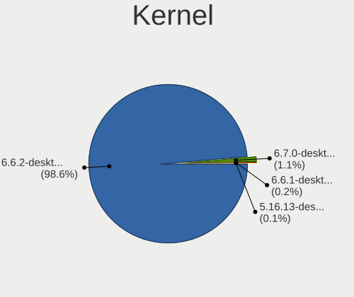

| Version                      | Notebooks | Percent |
|------------------------------|-----------|---------|
| 6.6.2-desktop-1omv2390       | 990       | 98.61%  |
| 6.7.0-desktop-0.rc2.1omv2390 | 11        | 1.1%    |
| 6.6.1-desktop-1omv2390       | 2         | 0.2%    |
| 5.16.13-desktop-1omv4003     | 1         | 0.1%    |

Kernel Family
-------------

Linux kernel without a distro release

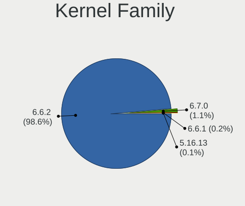

| Version | Notebooks | Percent |
|---------|-----------|---------|
| 6.6.2   | 990       | 98.61%  |
| 6.7.0   | 11        | 1.1%    |
| 6.6.1   | 2         | 0.2%    |
| 5.16.13 | 1         | 0.1%    |

Kernel Major Ver.
-----------------

Linux kernel major version

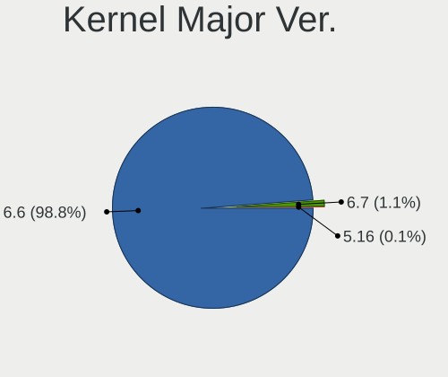

| Version | Notebooks | Percent |
|---------|-----------|---------|
| 6.6     | 992       | 98.8%   |
| 6.7     | 11        | 1.1%    |
| 5.16    | 1         | 0.1%    |

Arch
----

OS architecture (x86_64, i586, etc.)

| Name   | Notebooks | Percent |
|--------|-----------|---------|
| x86_64 | 1004      | 100%    |

DE
--

Desktop Environment

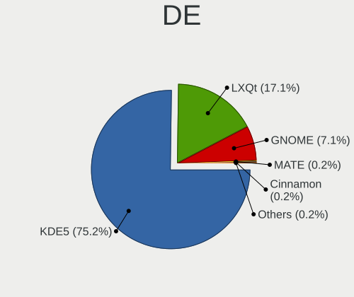

| Name     | Notebooks | Percent |
|----------|-----------|---------|
| KDE5     | 756       | 75.22%  |
| LXQt     | 172       | 17.11%  |
| GNOME    | 71        | 7.06%   |
| MATE     | 2         | 0.2%    |
| Cinnamon | 2         | 0.2%    |
| Unknown  | 2         | 0.2%    |

Display Server
--------------

X11 or Wayland

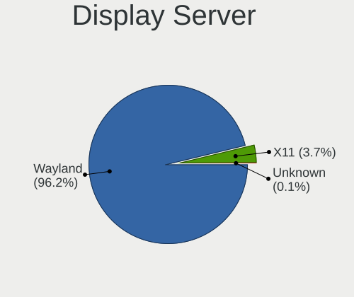

| Name    | Notebooks | Percent |
|---------|-----------|---------|
| Wayland | 967       | 96.22%  |
| X11     | 37        | 3.68%   |
| Unknown | 1         | 0.1%    |

Display Manager
---------------

SDDM, LightDM, etc.

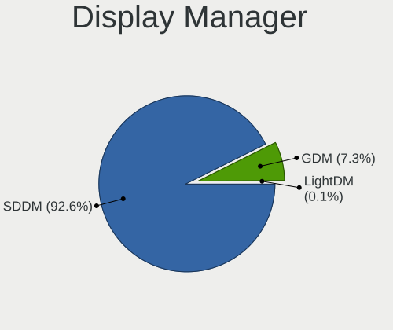

| Name    | Notebooks | Percent |
|---------|-----------|---------|
| SDDM    | 930       | 92.63%  |
| GDM     | 73        | 7.27%   |
| LightDM | 1         | 0.1%    |

OS Lang
-------

Language

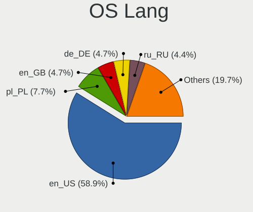

| Lang  | Notebooks | Percent |
|-------|-----------|---------|
| en_US | 593       | 58.89%  |
| pl_PL | 78        | 7.75%   |
| en_GB | 47        | 4.67%   |
| de_DE | 47        | 4.67%   |
| ru_RU | 44        | 4.37%   |
| fr_FR | 44        | 4.37%   |
| pt_BR | 18        | 1.79%   |
| it_IT | 18        | 1.79%   |
| es_ES | 16        | 1.59%   |
| en_CA | 12        | 1.19%   |
| cs_CZ | 12        | 1.19%   |
| hu_HU | 8         | 0.79%   |
| es_MX | 8         | 0.79%   |
| en_AU | 8         | 0.79%   |
| es_AR | 6         | 0.6%    |
| tr_TR | 5         | 0.5%    |
| en_IN | 5         | 0.5%    |
| pt_PT | 3         | 0.3%    |
| ja_JP | 3         | 0.3%    |
| es_CO | 3         | 0.3%    |
| en_NZ | 3         | 0.3%    |
| en_DK | 3         | 0.3%    |
| es_CL | 2         | 0.2%    |
| en_SG | 2         | 0.2%    |
| en_PH | 2         | 0.2%    |
| de_CH | 2         | 0.2%    |
| UTF-8 | 1         | 0.1%    |
| ro_RO | 1         | 0.1%    |
| nl_BE | 1         | 0.1%    |
| it_CH | 1         | 0.1%    |
| fr_CH | 1         | 0.1%    |
| es_DO | 1         | 0.1%    |
| es_BO | 1         | 0.1%    |
| en_ZA | 1         | 0.1%    |
| en_NG | 1         | 0.1%    |
| en_IL | 1         | 0.1%    |
| en_IE | 1         | 0.1%    |
| en_HK | 1         | 0.1%    |
| de_AT | 1         | 0.1%    |
| da_DK | 1         | 0.1%    |

Boot Mode
---------

EFI or BIOS

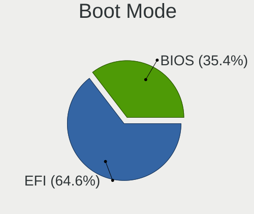

| Mode | Notebooks | Percent |
|------|-----------|---------|
| EFI  | 649       | 64.58%  |
| BIOS | 356       | 35.42%  |

Filesystem
----------

Type of filesystem

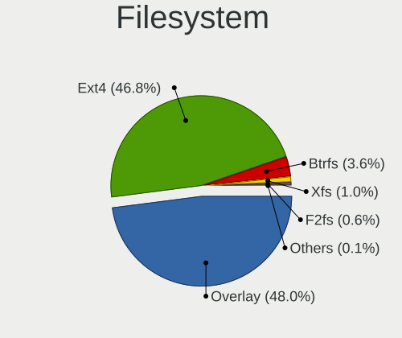

| Type    | Notebooks | Percent |
|---------|-----------|---------|
| Overlay | 483       | 47.96%  |
| Ext4    | 471       | 46.77%  |
| Btrfs   | 36        | 3.57%   |
| Xfs     | 10        | 0.99%   |
| F2fs    | 6         | 0.6%    |
| Ext2    | 1         | 0.1%    |

Part. scheme
------------

Scheme of partitioning

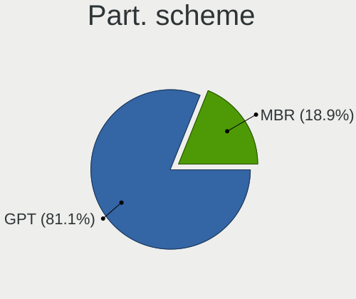

| Type | Notebooks | Percent |
|------|-----------|---------|
| GPT  | 815       | 81.09%  |
| MBR  | 190       | 18.91%  |

Dual Boot with Linux/BSD
------------------------

Hosting more than one Linux/BSD

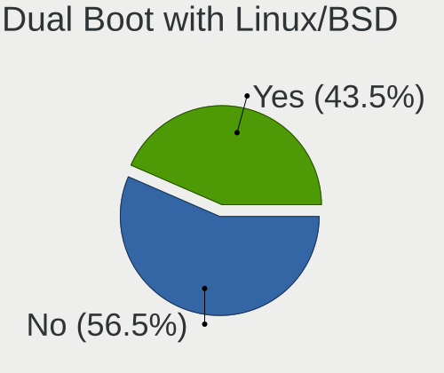

| Dual boot | Notebooks | Percent |
|-----------|-----------|---------|
| No        | 572       | 56.52%  |
| Yes       | 440       | 43.48%  |

Dual Boot (Win)
---------------

Hosting Linux and Windows

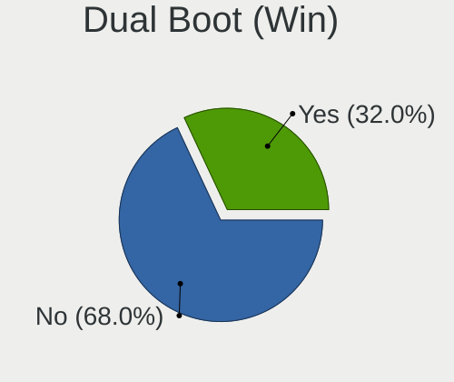

| Dual boot | Notebooks | Percent |
|-----------|-----------|---------|
| No        | 685       | 68.02%  |
| Yes       | 322       | 31.98%  |

Board
-----

Vendor
------

Motherboard manufacturer

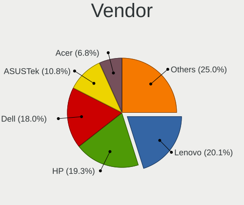

| Name                    | Notebooks | Percent |
|-------------------------|-----------|---------|
| Lenovo                  | 202       | 20.12%  |
| Hewlett-Packard         | 194       | 19.32%  |
| Dell                    | 181       | 18.03%  |
| ASUSTek Computer        | 108       | 10.76%  |
| Acer                    | 68        | 6.77%   |
| Toshiba                 | 38        | 3.78%   |
| Apple                   | 30        | 2.99%   |
| MSI                     | 18        | 1.79%   |
| Framework               | 18        | 1.79%   |
| Sony                    | 15        | 1.49%   |
| Samsung Electronics     | 14        | 1.39%   |
| Google                  | 14        | 1.39%   |
| Fujitsu                 | 14        | 1.39%   |
| Packard Bell            | 8         | 0.8%    |
| Unknown                 | 7         | 0.7%    |
| TUXEDO                  | 5         | 0.5%    |
| Notebook                | 5         | 0.5%    |
| Medion                  | 5         | 0.5%    |
| HUAWEI                  | 5         | 0.5%    |
| eMachines               | 5         | 0.5%    |
| Chuwi                   | 4         | 0.4%    |
| System76                | 3         | 0.3%    |
| EVOO                    | 3         | 0.3%    |
| Alienware               | 3         | 0.3%    |
| Timi                    | 2         | 0.2%    |
| Razer                   | 2         | 0.2%    |
| Philco                  | 2         | 0.2%    |
| Login Informatica       | 2         | 0.2%    |
| LG Electronics          | 2         | 0.2%    |
| Info Quest Technologies | 2         | 0.2%    |
| Gigabyte Technology     | 2         | 0.2%    |
| AZW                     | 2         | 0.2%    |
| ZTE                     | 1         | 0.1%    |
| SLIMBOOK                | 1         | 0.1%    |
| Positivo                | 1         | 0.1%    |
| PC Specialist           | 1         | 0.1%    |
| OEM                     | 1         | 0.1%    |
| NEC Computers           | 1         | 0.1%    |
| Metabox                 | 1         | 0.1%    |
| Machcreator             | 1         | 0.1%    |

Model
-----

Motherboard model

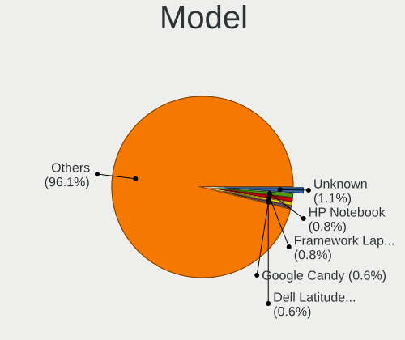

| Name                                        | Notebooks | Percent |
|---------------------------------------------|-----------|---------|
| Unknown                                     | 11        | 1.1%    |
| HP Notebook                                 | 8         | 0.8%    |
| Framework Laptop 16 (AMD Ryzen 7040 Series) | 8         | 0.8%    |
| Google Candy                                | 6         | 0.6%    |
| Dell Latitude E6410                         | 6         | 0.6%    |
| Dell Latitude 7390                          | 6         | 0.6%    |
| Dell Inspiron 15 3515                       | 6         | 0.6%    |
| Apple MacBookPro9,2                         | 6         | 0.6%    |
| HP Pavilion Notebook                        | 5         | 0.5%    |
| Lenovo Yoga 2 11 20332                      | 4         | 0.4%    |
| Lenovo G50-45 80E3                          | 4         | 0.4%    |
| HP Pavilion dv7                             | 4         | 0.4%    |
| HP Laptop 15s-eq2xxx                        | 4         | 0.4%    |
| HP EliteBook 840 G3                         | 4         | 0.4%    |
| HP Compaq 610                               | 4         | 0.4%    |
| HP 250 G3                                   | 4         | 0.4%    |
| Framework Laptop (12th Gen Intel Core)      | 4         | 0.4%    |
| Framework Laptop                            | 4         | 0.4%    |
| Dell XPS 13 9350                            | 4         | 0.4%    |
| Dell Precision 5530                         | 4         | 0.4%    |
| Dell Inspiron 1545                          | 4         | 0.4%    |
| ASUS VivoBook_ASUSLaptop E410KA_E410KA      | 4         | 0.4%    |
| Toshiba Satellite C650                      | 3         | 0.3%    |
| Lenovo IdeaPad Y580                         | 3         | 0.3%    |
| Lenovo IdeaPad 100-15IBY 80MJ               | 3         | 0.3%    |
| HP Stream Laptop 14-ax0XX                   | 3         | 0.3%    |
| HP ProBook 650 G1                           | 3         | 0.3%    |
| HP EliteBook 840 G2                         | 3         | 0.3%    |
| HP 250 G7 Notebook PC                       | 3         | 0.3%    |
| EVOO TEV-CE-141-2                           | 3         | 0.3%    |
| Dell Latitude E7470                         | 3         | 0.3%    |
| Dell Latitude E7440                         | 3         | 0.3%    |
| Dell Latitude E6440                         | 3         | 0.3%    |
| Dell Latitude E6430                         | 3         | 0.3%    |
| Dell Latitude E5550                         | 3         | 0.3%    |
| Dell Latitude E5470                         | 3         | 0.3%    |
| Dell Latitude D630                          | 3         | 0.3%    |
| Dell Latitude 7490                          | 3         | 0.3%    |
| Dell Latitude 5490                          | 3         | 0.3%    |
| Dell Inspiron 3501                          | 3         | 0.3%    |

Model Family
------------

Motherboard model prefix

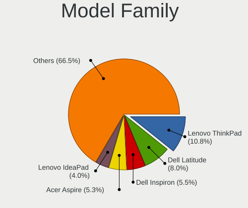

| Name                  | Notebooks | Percent |
|-----------------------|-----------|---------|
| Lenovo ThinkPad       | 108       | 10.76%  |
| Dell Latitude         | 80        | 7.97%   |
| Dell Inspiron         | 55        | 5.48%   |
| Acer Aspire           | 53        | 5.28%   |
| Lenovo IdeaPad        | 40        | 3.98%   |
| HP Laptop             | 40        | 3.98%   |
| Toshiba Satellite     | 32        | 3.19%   |
| HP Pavilion           | 31        | 3.09%   |
| HP ProBook            | 29        | 2.89%   |
| HP EliteBook          | 29        | 2.89%   |
| ASUS VivoBook         | 28        | 2.79%   |
| Framework Laptop      | 18        | 1.79%   |
| Dell Precision        | 16        | 1.59%   |
| Fujitsu LIFEBOOK      | 11        | 1.1%    |
| Unknown               | 11        | 1.1%    |
| HP Compaq             | 10        | 1%      |
| Dell XPS              | 10        | 1%      |
| Lenovo Legion         | 8         | 0.8%    |
| HP Stream             | 8         | 0.8%    |
| HP Notebook           | 8         | 0.8%    |
| HP 250                | 8         | 0.8%    |
| Dell Vostro           | 8         | 0.8%    |
| Packard Bell EasyNote | 7         | 0.7%    |
| Lenovo Yoga           | 7         | 0.7%    |
| HP ZBook              | 6         | 0.6%    |
| Google Candy          | 6         | 0.6%    |
| ASUS ASUS             | 6         | 0.6%    |
| Apple MacBookPro9     | 6         | 0.6%    |
| MSI Modern            | 4         | 0.4%    |
| Lenovo G50-45         | 4         | 0.4%    |
| HP Victus             | 4         | 0.4%    |
| HP 15                 | 4         | 0.4%    |
| Dell System           | 4         | 0.4%    |
| Dell Studio           | 4         | 0.4%    |
| Acer Nitro            | 4         | 0.4%    |
| Toshiba PORTEGE       | 3         | 0.3%    |
| MSI Katana            | 3         | 0.3%    |
| Lenovo ThinkBook      | 3         | 0.3%    |
| EVOO TEV-CE-141-2     | 3         | 0.3%    |
| Dell G15              | 3         | 0.3%    |

MFG Year
--------

Motherboard manufacture year

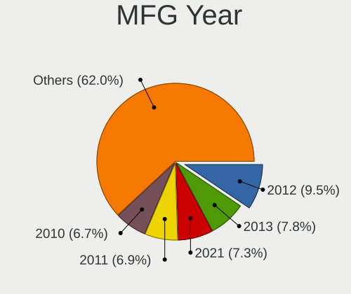

| Year | Notebooks | Percent |
|------|-----------|---------|
| 2012 | 95        | 9.46%   |
| 2013 | 78        | 7.77%   |
| 2021 | 73        | 7.27%   |
| 2011 | 69        | 6.87%   |
| 2010 | 67        | 6.67%   |
| 2015 | 63        | 6.27%   |
| 2020 | 62        | 6.18%   |
| 2016 | 59        | 5.88%   |
| 2014 | 59        | 5.88%   |
| 2017 | 57        | 5.68%   |
| 2019 | 56        | 5.58%   |
| 2022 | 54        | 5.38%   |
| 2018 | 54        | 5.38%   |
| 2008 | 46        | 4.58%   |
| 2009 | 35        | 3.49%   |
| 2023 | 32        | 3.19%   |
| 2007 | 19        | 1.89%   |
| 2024 | 18        | 1.79%   |
| 2006 | 8         | 0.8%    |

Form Factor
-----------

Physical design of the computer

| Name     | Notebooks | Percent |
|----------|-----------|---------|
| Notebook | 1004      | 100%    |

Secure Boot
-----------

Enabled or disabled

| State    | Notebooks | Percent |
|----------|-----------|---------|
| Disabled | 1004      | 100%    |

Coreboot
--------

Have coreboot on board

| Used | Notebooks | Percent |
|------|-----------|---------|
| No   | 990       | 98.61%  |
| Yes  | 14        | 1.39%   |

RAM Size
--------

Total RAM memory

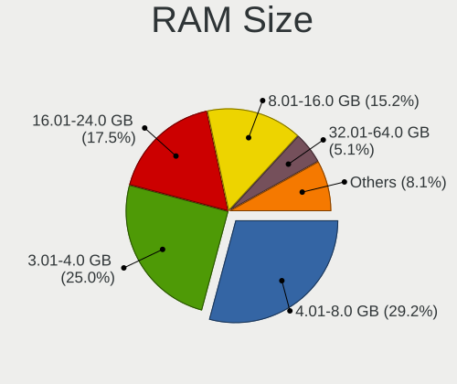

| Size in GB  | Notebooks | Percent |
|-------------|-----------|---------|
| 4.01-8.0    | 293       | 29.15%  |
| 3.01-4.0    | 251       | 24.98%  |
| 16.01-24.0  | 176       | 17.51%  |
| 8.01-16.0   | 153       | 15.22%  |
| 32.01-64.0  | 51        | 5.07%   |
| 1.01-2.0    | 38        | 3.78%   |
| 2.01-3.0    | 16        | 1.59%   |
| 24.01-32.0  | 15        | 1.49%   |
| 64.01-256.0 | 10        | 1%      |
| 0.51-1.0    | 2         | 0.2%    |

RAM Used
--------

Used RAM memory

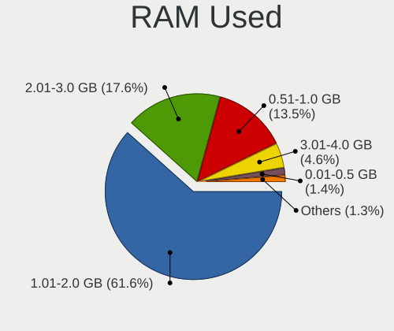

| Used GB   | Notebooks | Percent |
|-----------|-----------|---------|
| 1.01-2.0  | 633       | 61.64%  |
| 2.01-3.0  | 181       | 17.62%  |
| 0.51-1.0  | 139       | 13.53%  |
| 3.01-4.0  | 47        | 4.58%   |
| 0.01-0.5  | 14        | 1.36%   |
| 4.01-8.0  | 10        | 0.97%   |
| 8.01-16.0 | 3         | 0.29%   |

Total Drives
------------

Number of drives on board

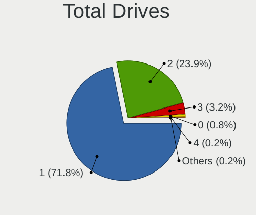

| Drives | Notebooks | Percent |
|--------|-----------|---------|
| 1      | 724       | 71.75%  |
| 2      | 241       | 23.89%  |
| 3      | 32        | 3.17%   |
| 0      | 8         | 0.79%   |
| 4      | 2         | 0.2%    |
| 13     | 1         | 0.1%    |
| 5      | 1         | 0.1%    |

Has CD-ROM
----------

Has CD-ROM on board

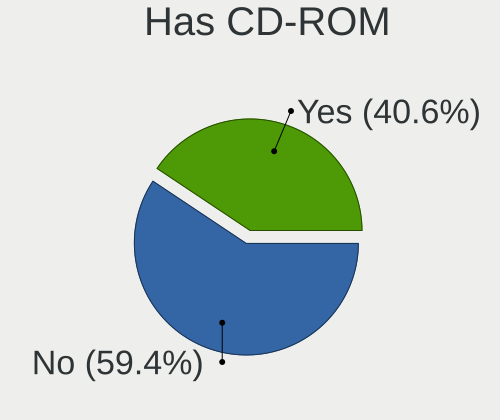

| Presented | Notebooks | Percent |
|-----------|-----------|---------|
| No        | 596       | 59.36%  |
| Yes       | 408       | 40.64%  |

Has Ethernet
------------

Has Ethernet on board

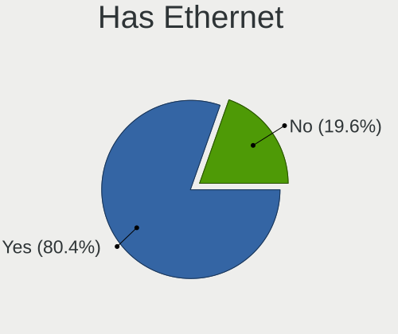

| Presented | Notebooks | Percent |
|-----------|-----------|---------|
| Yes       | 807       | 80.38%  |
| No        | 197       | 19.62%  |

Has WiFi
--------

Has WiFi module

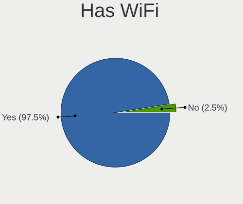

| Presented | Notebooks | Percent |
|-----------|-----------|---------|
| Yes       | 979       | 97.51%  |
| No        | 25        | 2.49%   |

Has Bluetooth
-------------

Has Bluetooth module

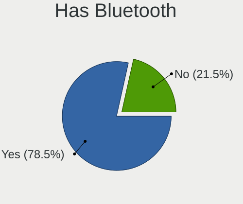

| Presented | Notebooks | Percent |
|-----------|-----------|---------|
| Yes       | 788       | 78.49%  |
| No        | 216       | 21.51%  |

Location
--------

Country
-------

Geographic location (country)

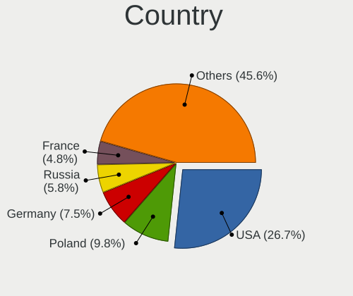

| Country     | Notebooks | Percent |
|-------------|-----------|---------|
| USA         | 268       | 26.67%  |
| Poland      | 98        | 9.75%   |
| Germany     | 75        | 7.46%   |
| Russia      | 58        | 5.77%   |
| France      | 48        | 4.78%   |
| Brazil      | 40        | 3.98%   |
| UK          | 32        | 3.18%   |
| Italy       | 30        | 2.99%   |
| Canada      | 27        | 2.69%   |
| Spain       | 20        | 1.99%   |
| Indonesia   | 15        | 1.49%   |
| Hungary     | 15        | 1.49%   |
| Czechia     | 15        | 1.49%   |
| Japan       | 14        | 1.39%   |
| Australia   | 14        | 1.39%   |
| Mexico      | 13        | 1.29%   |
| India       | 12        | 1.19%   |
| Turkey      | 10        | 1%      |
| Argentina   | 10        | 1%      |
| Cyprus      | 9         | 0.9%    |
| Belgium     | 9         | 0.9%    |
| Norway      | 8         | 0.8%    |
| Netherlands | 8         | 0.8%    |
| Switzerland | 7         | 0.7%    |
| Malaysia    | 7         | 0.7%    |
| Greece      | 7         | 0.7%    |
| Chile       | 7         | 0.7%    |
| Sweden      | 6         | 0.6%    |
| Portugal    | 6         | 0.6%    |
| Denmark     | 6         | 0.6%    |
| Austria     | 6         | 0.6%    |
| Finland     | 5         | 0.5%    |
| Costa Rica  | 5         | 0.5%    |
| China       | 5         | 0.5%    |
| Slovakia    | 4         | 0.4%    |
| Romania     | 4         | 0.4%    |
| Philippines | 4         | 0.4%    |
| New Zealand | 4         | 0.4%    |
| Iran        | 4         | 0.4%    |
| Vietnam     | 3         | 0.3%    |

City
----

Geographic location (city)

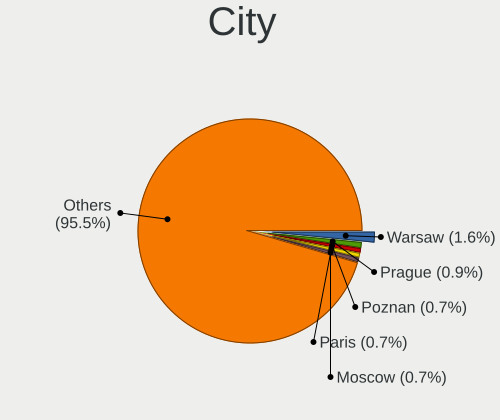

| City           | Notebooks | Percent |
|----------------|-----------|---------|
| Warsaw         | 16        | 1.57%   |
| Prague         | 9         | 0.88%   |
| Poznan         | 7         | 0.69%   |
| Paris          | 7         | 0.69%   |
| Moscow         | 7         | 0.69%   |
| Salt Lake City | 6         | 0.59%   |
| Saint Johns    | 6         | 0.59%   |
| Oliveira       | 6         | 0.59%   |
| Milan          | 6         | 0.59%   |
| Dali           | 6         | 0.59%   |
| Budapest       | 6         | 0.59%   |
| Topeka         | 5         | 0.49%   |
| Katowice       | 5         | 0.49%   |
| Buenos Aires   | 5         | 0.49%   |
| Adelaide       | 5         | 0.49%   |
| Wroclaw        | 4         | 0.39%   |
| Vienna         | 4         | 0.39%   |
| St Petersburg  | 4         | 0.39%   |
| Rome           | 4         | 0.39%   |
| Rochester      | 4         | 0.39%   |
| New York       | 4         | 0.39%   |
| Munich         | 4         | 0.39%   |
| Montreal       | 4         | 0.39%   |
| Montclair      | 4         | 0.39%   |
| Kielce         | 4         | 0.39%   |
| Brisbane       | 4         | 0.39%   |
| Birmingham     | 4         | 0.39%   |
| Yekaterinburg  | 3         | 0.29%   |
| Voronezh       | 3         | 0.29%   |
| Toronto        | 3         | 0.29%   |
| Tokyo          | 3         | 0.29%   |
| Sydney         | 3         | 0.29%   |
| Stuhr          | 3         | 0.29%   |
| St Albans      | 3         | 0.29%   |
| Sao Paulo      | 3         | 0.29%   |
| San Pedro      | 3         | 0.29%   |
| San José      | 3         | 0.29%   |
| Puck           | 3         | 0.29%   |
| Phoenix        | 3         | 0.29%   |
| Novosibirsk    | 3         | 0.29%   |

Drives
------

Drive Vendor
------------

Hard drive vendors

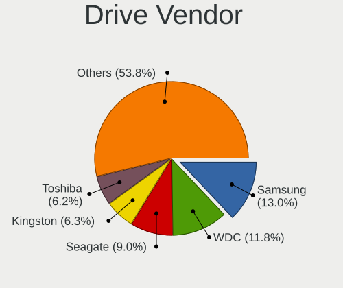

| Vendor                      | Notebooks | Drives | Percent |
|-----------------------------|-----------|--------|---------|
| Samsung Electronics         | 159       | 184    | 12.96%  |
| WDC                         | 145       | 153    | 11.82%  |
| Seagate                     | 110       | 116    | 8.96%   |
| Kingston                    | 77        | 78     | 6.28%   |
| Toshiba                     | 76        | 81     | 6.19%   |
| SanDisk                     | 69        | 81     | 5.62%   |
| Unknown                     | 48        | 56     | 3.91%   |
| Hitachi                     | 37        | 37     | 3.02%   |
| Crucial                     | 34        | 36     | 2.77%   |
| Intel                       | 32        | 34     | 2.61%   |
| Micron Technology           | 31        | 36     | 2.53%   |
| SK hynix                    | 28        | 33     | 2.28%   |
| HGST                        | 24        | 27     | 1.96%   |
| Unknown                     | 23        | 23     | 1.87%   |
| China                       | 21        | 22     | 1.71%   |
| A-DATA Technology           | 21        | 24     | 1.71%   |
| SPCC                        | 19        | 19     | 1.55%   |
| JMicron Technology          | 19        | 19     | 1.55%   |
| Apple                       | 17        | 17     | 1.39%   |
| KIOXIA                      | 15        | 15     | 1.22%   |
| PNY                         | 11        | 12     | 0.9%    |
| Intenso                     | 11        | 12     | 0.9%    |
| GOODRAM                     | 11        | 14     | 0.9%    |
| Patriot                     | 10        | 10     | 0.81%   |
| Team                        | 9         | 9      | 0.73%   |
| Lexar                       | 8         | 9      | 0.65%   |
| KingSpec                    | 8         | 8      | 0.65%   |
| Kingston Technology Company | 7         | 7      | 0.57%   |
| SSSTC                       | 5         | 5      | 0.41%   |
| Hewlett-Packard             | 5         | 5      | 0.41%   |
| Transcend                   | 4         | 5      | 0.33%   |
| Silicon Motion              | 4         | 4      | 0.33%   |
| Gigabyte Technology         | 4         | 4      | 0.33%   |
| Fujitsu                     | 4         | 5      | 0.33%   |
| Fanxiang                    | 4         | 4      | 0.33%   |
| Verbatim                    | 3         | 4      | 0.24%   |
| USB3.0                      | 3         | 3      | 0.24%   |
| UMIS                        | 3         | 3      | 0.24%   |
| T-FORCE                     | 3         | 3      | 0.24%   |
| SABRENT                     | 3         | 4      | 0.24%   |

Drive Model
-----------

Hard drive models

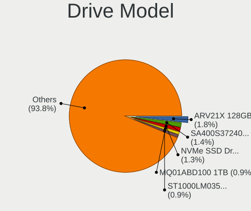

| Model                              | Notebooks | Percent |
|------------------------------------|-----------|---------|
| Unknown                            | 23        | 1.82%   |
| Kingston SA400S37240G 240GB SSD    | 18        | 1.42%   |
| SanDisk NVMe SSD Drive 1TB         | 16        | 1.26%   |
| Toshiba MQ01ABD100 1TB             | 11        | 0.87%   |
| Seagate ST1000LM035-1RK172 1TB     | 11        | 0.87%   |
| JMicron Generic 320GB              | 11        | 0.87%   |
| Seagate ST500LT012-1DG142 500GB    | 10        | 0.79%   |
| Seagate ST1000LM024 HN-M101MBB 1TB | 10        | 0.79%   |
| Toshiba MQ04ABF100 1TB             | 8         | 0.63%   |
| Toshiba MQ01ABF050 500GB           | 8         | 0.63%   |
| JMicron Tech 250GB                 | 8         | 0.63%   |
| HGST HTS545050A7E680 500GB         | 8         | 0.63%   |
| Kingston SNVS500G 500GB            | 7         | 0.55%   |
| Unknown HAG2e  16GB                | 6         | 0.47%   |
| SPCC Solid State Disk 512GB        | 6         | 0.47%   |
| SanDisk NVMe SSD Drive 4TB         | 6         | 0.47%   |
| SanDisk NVMe SSD Drive 2TB         | 6         | 0.47%   |
| Samsung SSD 860 EVO 500GB          | 6         | 0.47%   |
| Samsung MZVKW512HMJP-000L7 512GB   | 6         | 0.47%   |
| Unknown SD/MMC/MS PRO 2GB          | 5         | 0.4%    |
| Seagate ST9500420AS 500GB          | 5         | 0.4%    |
| Seagate ST9500325AS 500GB          | 5         | 0.4%    |
| Seagate ST9320423AS 320GB          | 5         | 0.4%    |
| SanDisk NVMe SSD Drive 512GB       | 5         | 0.4%    |
| Samsung SSD 850 EVO 250GB          | 5         | 0.4%    |
| Kingston SV300S37A120G 120GB SSD   | 5         | 0.4%    |
| Kingston SA400S37480G 480GB SSD    | 5         | 0.4%    |
| Kingston SA400S37120G 120GB SSD    | 5         | 0.4%    |
| Hitachi HTS543232A7A384 320GB      | 5         | 0.4%    |
| WDC WD10SPZX-24Z10 1TB             | 4         | 0.32%   |
| Unknown MMC64G  64GB               | 4         | 0.32%   |
| Toshiba MQ01ABD075 752GB           | 4         | 0.32%   |
| SPCC M.2 PCIe SSD 512GB            | 4         | 0.32%   |
| Seagate ST500LT032-1E9142 500GB    | 4         | 0.32%   |
| Seagate ST2000LM007-1R8174 2TB     | 4         | 0.32%   |
| Seagate ST1000LM049-2GH172 1TB     | 4         | 0.32%   |
| Samsung SSD 980 PRO 1TB            | 4         | 0.32%   |
| Samsung SSD 870 EVO 1TB            | 4         | 0.32%   |
| PNY CS900 240GB SSD                | 4         | 0.32%   |
| Patriot M.2 P300 512GB             | 4         | 0.32%   |

HDD Vendor
----------

Hard disk drive vendors

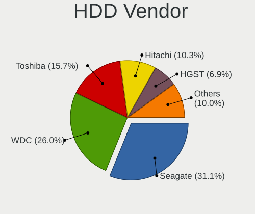

| Vendor              | Notebooks | Drives | Percent |
|---------------------|-----------|--------|---------|
| Seagate             | 109       | 115    | 31.14%  |
| WDC                 | 91        | 95     | 26%     |
| Toshiba             | 55        | 59     | 15.71%  |
| Hitachi             | 36        | 36     | 10.29%  |
| HGST                | 24        | 27     | 6.86%   |
| JMicron Technology  | 11        | 11     | 3.14%   |
| Unknown             | 5         | 5      | 1.43%   |
| Fujitsu             | 4         | 5      | 1.14%   |
| USB3.0              | 3         | 3      | 0.86%   |
| Samsung Electronics | 3         | 3      | 0.86%   |
| SSK                 | 2         | 2      | 0.57%   |
| Apple               | 2         | 2      | 0.57%   |
| USB                 | 1         | 1      | 0.29%   |
| TO Exter            | 1         | 1      | 0.29%   |
| JetFlash            | 1         | 1      | 0.29%   |
| External            | 1         | 1      | 0.29%   |
| ASMT                | 1         | 1      | 0.29%   |

SSD Vendor
----------

Solid state drive vendors

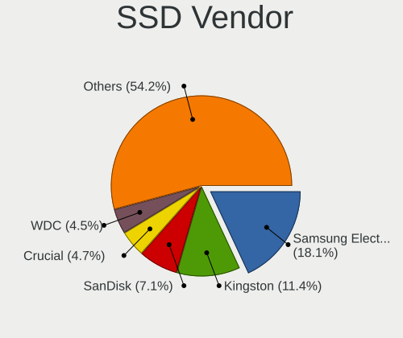

| Vendor              | Notebooks | Drives | Percent |
|---------------------|-----------|--------|---------|
| Samsung Electronics | 84        | 94     | 18.06%  |
| Kingston            | 53        | 54     | 11.4%   |
| SanDisk             | 33        | 35     | 7.1%    |
| Crucial             | 22        | 24     | 4.73%   |
| WDC                 | 21        | 21     | 4.52%   |
| China               | 21        | 22     | 4.52%   |
| SPCC                | 16        | 16     | 3.44%   |
| A-DATA Technology   | 16        | 18     | 3.44%   |
| Micron Technology   | 13        | 16     | 2.8%    |
| Intel               | 13        | 13     | 2.8%    |
| Apple               | 13        | 13     | 2.8%    |
| Toshiba             | 10        | 11     | 2.15%   |
| PNY                 | 10        | 11     | 2.15%   |
| Intenso             | 10        | 11     | 2.15%   |
| GOODRAM             | 10        | 13     | 2.15%   |
| KingSpec            | 8         | 8      | 1.72%   |
| Team                | 7         | 7      | 1.51%   |
| Patriot             | 5         | 5      | 1.08%   |
| Hewlett-Packard     | 5         | 5      | 1.08%   |
| Transcend           | 4         | 5      | 0.86%   |
| Lexar               | 4         | 5      | 0.86%   |
| Fanxiang            | 4         | 4      | 0.86%   |
| Unknown             | 4         | 4      | 0.86%   |
| SK hynix            | 3         | 3      | 0.65%   |
| SABRENT             | 3         | 4      | 0.65%   |
| LITEONIT            | 3         | 3      | 0.65%   |
| Apacer              | 3         | 3      | 0.65%   |
| Verbatim            | 2         | 3      | 0.43%   |
| T-FORCE             | 2         | 2      | 0.43%   |
| SPCC M.2            | 2         | 2      | 0.43%   |
| RX7                 | 2         | 2      | 0.43%   |
| Plextor             | 2         | 2      | 0.43%   |
| Netac               | 2         | 2      | 0.43%   |
| HS-SSD-E100         | 2         | 2      | 0.43%   |
| Gigabyte Technology | 2         | 2      | 0.43%   |
| FORESEE             | 2         | 2      | 0.43%   |
| Digma               | 2         | 2      | 0.43%   |
| DEXP                | 2         | 3      | 0.43%   |
| Dahua               | 2         | 3      | 0.43%   |
| BHT                 | 2         | 2      | 0.43%   |

Drive Kind
----------

HDD or SSD

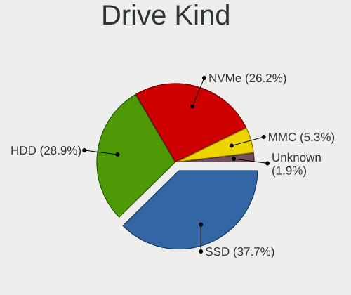

| Kind    | Notebooks | Drives | Percent |
|---------|-----------|--------|---------|
| SSD     | 438       | 500    | 37.66%  |
| HDD     | 336       | 368    | 28.89%  |
| NVMe    | 305       | 363    | 26.23%  |
| MMC     | 62        | 73     | 5.33%   |
| Unknown | 22        | 25     | 1.89%   |

Drive Connector
---------------

SATA, SAS, NVMe, etc.

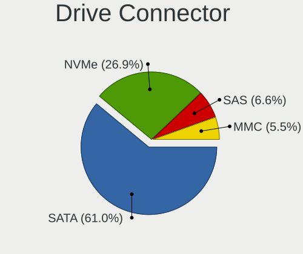

| Type | Notebooks | Drives | Percent |
|------|-----------|--------|---------|
| SATA | 692       | 800    | 61.02%  |
| NVMe | 305       | 357    | 26.9%   |
| SAS  | 75        | 99     | 6.61%   |
| MMC  | 62        | 73     | 5.47%   |

Drive Size
----------

Size of hard drive

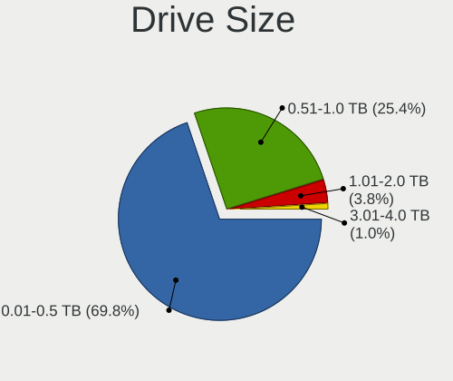

| Size in TB | Notebooks | Drives | Percent |
|------------|-----------|--------|---------|
| 0.01-0.5   | 539       | 603    | 69.82%  |
| 0.51-1.0   | 196       | 216    | 25.39%  |
| 1.01-2.0   | 29        | 39     | 3.76%   |
| 3.01-4.0   | 8         | 10     | 1.04%   |

Space Total
-----------

Amount of disk space available on the file system

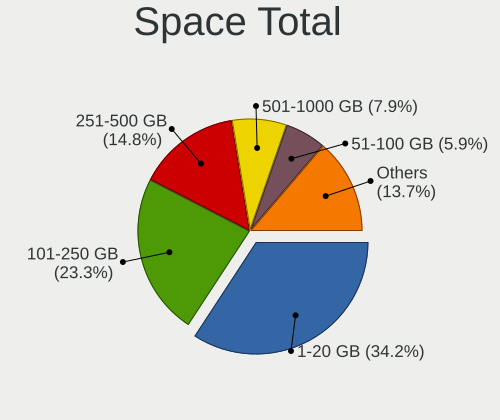

| Size in GB     | Notebooks | Percent |
|----------------|-----------|---------|
| 1-20           | 346       | 34.22%  |
| 101-250        | 236       | 23.34%  |
| 251-500        | 150       | 14.84%  |
| 501-1000       | 80        | 7.91%   |
| 51-100         | 60        | 5.93%   |
| Unknown        | 56        | 5.54%   |
| 21-50          | 46        | 4.55%   |
| 1001-2000      | 24        | 2.37%   |
| More than 3000 | 8         | 0.79%   |
| 2001-3000      | 5         | 0.49%   |

Space Used
----------

Amount of used disk space

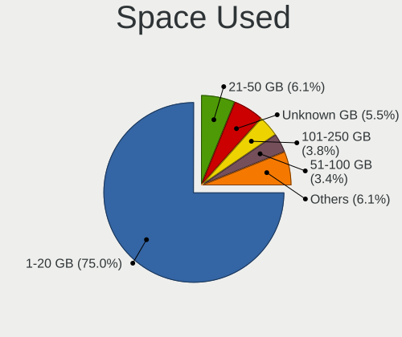

| Used GB        | Notebooks | Percent |
|----------------|-----------|---------|
| 1-20           | 763       | 75.02%  |
| 21-50          | 62        | 6.1%    |
| Unknown        | 56        | 5.51%   |
| 101-250        | 39        | 3.83%   |
| 51-100         | 35        | 3.44%   |
| 0              | 34        | 3.34%   |
| 251-500        | 12        | 1.18%   |
| 501-1000       | 11        | 1.08%   |
| 1001-2000      | 4         | 0.39%   |
| More than 3000 | 1         | 0.1%    |

Malfunc. Drives
---------------

Drive models with a malfunction

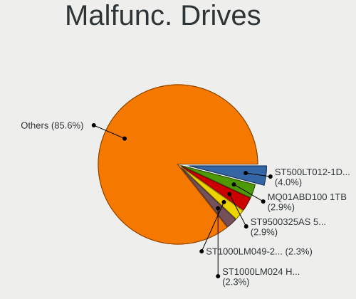

| Model                                      | Notebooks | Drives | Percent |
|--------------------------------------------|-----------|--------|---------|
| Seagate ST500LT012-1DG142 500GB            | 7         | 7      | 4.02%   |
| Toshiba MQ01ABD100 1TB                     | 5         | 5      | 2.87%   |
| Seagate ST9500325AS 500GB                  | 5         | 6      | 2.87%   |
| Seagate ST1000LM049-2GH172 1TB             | 4         | 4      | 2.3%    |
| Seagate ST1000LM024 HN-M101MBB 1TB         | 4         | 4      | 2.3%    |
| HGST HTS545050A7E680 500GB                 | 4         | 4      | 2.3%    |
| WDC WD6400BEVT-22A0RT0 640GB               | 3         | 3      | 1.72%   |
| Seagate ST9320325AS 320GB                  | 3         | 3      | 1.72%   |
| Hitachi HTS545032B9A300 320GB              | 3         | 3      | 1.72%   |
| HGST HTS541010A9E680 1TB                   | 3         | 5      | 1.72%   |
| WDC WD5000LPVX-22V0TT0 500GB               | 2         | 2      | 1.15%   |
| WDC WD5000LPCX-24VHAT0 500GB               | 2         | 2      | 1.15%   |
| WDC WD2500BEVT-60ZCT1 250GB                | 2         | 2      | 1.15%   |
| Toshiba MK3265GSX 320GB                    | 2         | 2      | 1.15%   |
| Seagate ST9500420AS 500GB                  | 2         | 2      | 1.15%   |
| Seagate ST500LT012-9WS142 500GB            | 2         | 2      | 1.15%   |
| Seagate ST1000LM035-1RK172 1TB             | 2         | 3      | 1.15%   |
| Seagate ST1000LM014-1EJ164 1TB             | 2         | 2      | 1.15%   |
| Samsung Electronics MZVLQ512HBLU-00B 512GB | 2         | 2      | 1.15%   |
| Hitachi HTS725050A9A364 500GB              | 2         | 2      | 1.15%   |
| Hitachi HTS547575A9E384 752GB              | 2         | 2      | 1.15%   |
| Hitachi HTS545050B9A300 500GB              | 2         | 2      | 1.15%   |
| Hitachi HTS542516K9SA00 160GB              | 2         | 2      | 1.15%   |
| HGST HTS725050A7E630 500GB                 | 2         | 2      | 1.15%   |
| HGST HTS545050A7E380 500GB                 | 2         | 2      | 1.15%   |
| WDC WDS480G2G0B-00EPW0 480GB SSD           | 1         | 1      | 0.57%   |
| WDC WDS240G2G0A-00JH30 240GB SSD           | 1         | 1      | 0.57%   |
| WDC WDS100T2G0A-00JH30 1TB SSD             | 1         | 1      | 0.57%   |
| WDC WD7500BPKT-75PK4T0 752GB               | 1         | 1      | 0.57%   |
| WDC WD6400BPVT-16HXZT1 640GB               | 1         | 1      | 0.57%   |
| WDC WD5000LPLX-08ZNTT0 500GB               | 1         | 1      | 0.57%   |
| WDC WD5000BEVT-75A0RT0 500GB               | 1         | 1      | 0.57%   |
| WDC WD3200BUDT-62DOBRY 320GB               | 1         | 1      | 0.57%   |
| WDC WD3200BPVT-80JJ5T0 320GB               | 1         | 1      | 0.57%   |
| WDC WD3200BEVT-75A23T0 320GB               | 1         | 1      | 0.57%   |
| WDC WD3200BEKT-75PVMT1 320GB               | 1         | 1      | 0.57%   |
| WDC WD3200BEKT-08PVMT1 320GB               | 1         | 1      | 0.57%   |
| WDC WD2500BEVT-22ZCT0 250GB                | 1         | 1      | 0.57%   |
| WDC WD2500BEVT-22A23T0 250GB               | 1         | 1      | 0.57%   |
| WDC WD1600BEVT-75A23T0 160GB               | 1         | 1      | 0.57%   |

Malfunc. Drive Vendor
---------------------

Vendors of faulty drives

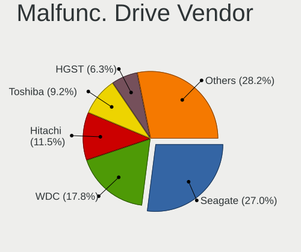

| Vendor              | Notebooks | Drives | Percent |
|---------------------|-----------|--------|---------|
| Seagate             | 47        | 49     | 27.01%  |
| WDC                 | 31        | 31     | 17.82%  |
| Hitachi             | 20        | 20     | 11.49%  |
| Toshiba             | 16        | 16     | 9.2%    |
| HGST                | 11        | 13     | 6.32%   |
| Samsung Electronics | 9         | 9      | 5.17%   |
| Kingston            | 8         | 8      | 4.6%    |
| Crucial             | 4         | 4      | 2.3%    |
| Transcend           | 2         | 3      | 1.15%   |
| SPCC                | 2         | 2      | 1.15%   |
| SanDisk             | 2         | 2      | 1.15%   |
| KingSpec            | 2         | 2      | 1.15%   |
| Intel               | 2         | 2      | 1.15%   |
| Fujitsu             | 2         | 2      | 1.15%   |
| Team                | 1         | 1      | 0.57%   |
| SuperSSpeed         | 1         | 1      | 0.57%   |
| SSSTC               | 1         | 1      | 0.57%   |
| SK hynix            | 1         | 1      | 0.57%   |
| POLION              | 1         | 1      | 0.57%   |
| OCZ                 | 1         | 1      | 0.57%   |
| Netac               | 1         | 1      | 0.57%   |
| LITEONIT            | 1         | 1      | 0.57%   |
| Lexar               | 1         | 1      | 0.57%   |
| JMicron Technology  | 1         | 1      | 0.57%   |
| IMP-SSD3            | 1         | 1      | 0.57%   |
| Dogfish             | 1         | 1      | 0.57%   |
| China               | 1         | 1      | 0.57%   |
| BAITITON            | 1         | 1      | 0.57%   |
| A-DATA Technology   | 1         | 1      | 0.57%   |
| Unknown             | 1         | 1      | 0.57%   |

Malfunc. HDD Vendor
-------------------

Vendors of faulty HDD drives

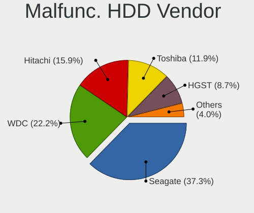

| Vendor              | Notebooks | Drives | Percent |
|---------------------|-----------|--------|---------|
| Seagate             | 47        | 49     | 37.3%   |
| WDC                 | 28        | 28     | 22.22%  |
| Hitachi             | 20        | 20     | 15.87%  |
| Toshiba             | 15        | 15     | 11.9%   |
| HGST                | 11        | 13     | 8.73%   |
| Samsung Electronics | 3         | 3      | 2.38%   |
| Fujitsu             | 2         | 2      | 1.59%   |

Malfunc. Drive Kind
-------------------

Kinds of faulty drives

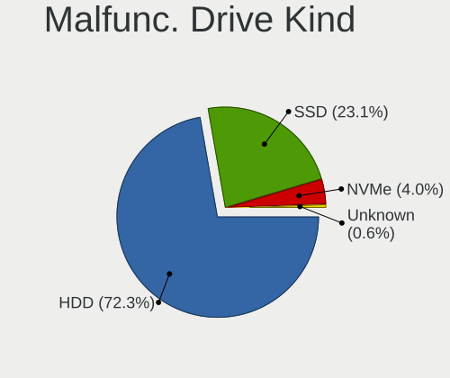

| Kind    | Notebooks | Drives | Percent |
|---------|-----------|--------|---------|
| HDD     | 125       | 130    | 72.25%  |
| SSD     | 40        | 41     | 23.12%  |
| NVMe    | 7         | 7      | 4.05%   |
| Unknown | 1         | 1      | 0.58%   |

Failed Drives
-------------

Failed drive models

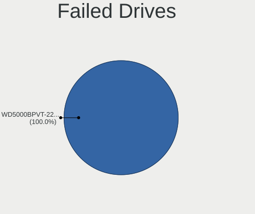

| Model                        | Notebooks | Drives | Percent |
|------------------------------|-----------|--------|---------|
| WDC WD5000BPVT-22HXZT1 500GB | 1         | 1      | 100%    |

Failed Drive Vendor
-------------------

Failed drive vendors

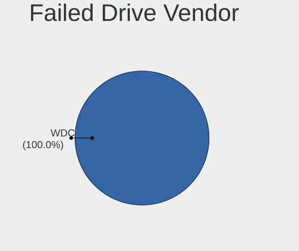

| Vendor | Notebooks | Drives | Percent |
|--------|-----------|--------|---------|
| WDC    | 1         | 1      | 100%    |

Drive Status
------------

Number of failed and malfunc. drives

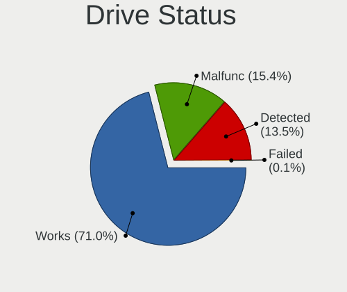

| Status   | Notebooks | Drives | Percent |
|----------|-----------|--------|---------|
| Works    | 790       | 956    | 71.04%  |
| Malfunc  | 171       | 179    | 15.38%  |
| Detected | 150       | 193    | 13.49%  |
| Failed   | 1         | 1      | 0.09%   |

Storage controller
------------------

Storage Vendor
--------------

Storage controller vendors

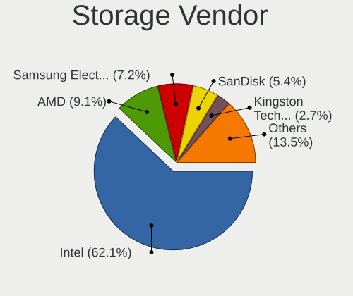

| Vendor                                  | Notebooks | Percent |
|-----------------------------------------|-----------|---------|
| Intel                                   | 707       | 62.07%  |
| AMD                                     | 104       | 9.13%   |
| Samsung Electronics                     | 82        | 7.2%    |
| SanDisk                                 | 61        | 5.36%   |
| Kingston Technology Company             | 31        | 2.72%   |
| SK hynix                                | 25        | 2.19%   |
| Micron Technology                       | 20        | 1.76%   |
| Phison Electronics                      | 16        | 1.4%    |
| KIOXIA                                  | 16        | 1.4%    |
| Toshiba America Info Systems            | 10        | 0.88%   |
| Micron/Crucial Technology               | 10        | 0.88%   |
| Silicon Motion                          | 9         | 0.79%   |
| Realtek Semiconductor                   | 7         | 0.61%   |
| Nvidia                                  | 7         | 0.61%   |
| MAXIO Technology (Hangzhou)             | 6         | 0.53%   |
| ADATA Technology                        | 6         | 0.53%   |
| Solid State Storage Technology          | 4         | 0.35%   |
| Union Memory (Shenzhen)                 | 2         | 0.18%   |
| Silicon Integrated Systems [SiS]        | 2         | 0.18%   |
| Shenzhen Longsys Electronics            | 2         | 0.18%   |
| Apple                                   | 2         | 0.18%   |
| Solidigm                                | 1         | 0.09%   |
| Silicon Image                           | 1         | 0.09%   |
| Shenzhen Unionmemory Information System | 1         | 0.09%   |
| Seagate Technology                      | 1         | 0.09%   |
| Netac Technology                        | 1         | 0.09%   |
| Marvell Technology Group                | 1         | 0.09%   |
| Lite-On IT Corp. / Plextor              | 1         | 0.09%   |
| Lenovo                                  | 1         | 0.09%   |
| ASMedia Technology                      | 1         | 0.09%   |
| Unknown                                 | 1         | 0.09%   |

Storage Model
-------------

Storage controller models

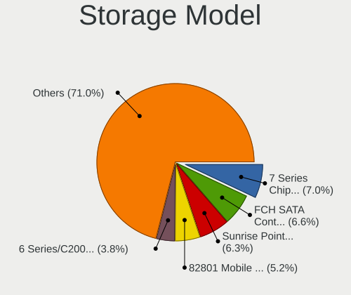

| Model                                                                            | Notebooks | Percent |
|----------------------------------------------------------------------------------|-----------|---------|
| Intel 7 Series Chipset Family 6-port SATA Controller [AHCI mode]                 | 86        | 7.01%   |
| AMD FCH SATA Controller [AHCI mode]                                              | 81        | 6.61%   |
| Intel Sunrise Point-LP SATA Controller [AHCI mode]                               | 77        | 6.28%   |
| Intel 82801 Mobile SATA Controller [RAID mode]                                   | 64        | 5.22%   |
| Intel 6 Series/C200 Series Chipset Family 6 port Mobile SATA AHCI Controller     | 47        | 3.83%   |
| Intel 82801IBM/IEM (ICH9M/ICH9M-E) 4 port SATA Controller [AHCI mode]            | 39        | 3.18%   |
| Intel 8 Series SATA Controller 1 [AHCI mode]                                     | 37        | 3.02%   |
| Intel 5 Series/3400 Series Chipset 4 port SATA AHCI Controller                   | 33        | 2.69%   |
| Intel Wildcat Point-LP SATA Controller [AHCI Mode]                               | 31        | 2.53%   |
| Intel Volume Management Device NVMe RAID Controller                              | 29        | 2.37%   |
| Intel 8 Series/C220 Series Chipset Family 6-port SATA Controller 1 [AHCI mode]   | 27        | 2.2%    |
| Samsung NVMe SSD Controller 980 (DRAM-less)                                      | 24        | 1.96%   |
| Intel 5 Series/3400 Series Chipset 6 port SATA AHCI Controller                   | 22        | 1.79%   |
| Samsung NVMe SSD Controller SM981/PM981/PM983                                    | 21        | 1.71%   |
| Intel 82801HM/HEM (ICH8M/ICH8M-E) IDE Controller                                 | 21        | 1.71%   |
| Intel Atom Processor E3800 Series SATA AHCI Controller                           | 20        | 1.63%   |
| Intel Tiger Lake-LP SATA Controller                                              | 19        | 1.55%   |
| AMD SB7x0/SB8x0/SB9x0 SATA Controller [AHCI mode]                                | 19        | 1.55%   |
| Intel Celeron/Pentium Silver Processor SATA Controller                           | 17        | 1.39%   |
| Samsung NVMe SSD Controller PM9A1/PM9A3/980PRO                                   | 16        | 1.31%   |
| Intel 82801HM/HEM (ICH8M/ICH8M-E) SATA Controller [AHCI mode]                    | 16        | 1.31%   |
| Intel HM170/QM170 Chipset SATA Controller [AHCI Mode]                            | 15        | 1.22%   |
| Intel Cannon Lake Mobile PCH SATA AHCI Controller                                | 15        | 1.22%   |
| Samsung NVMe SSD Controller SM961/PM961/SM963                                    | 12        | 0.98%   |
| Intel Celeron N3350/Pentium N4200/Atom E3900 Series SATA AHCI Controller         | 12        | 0.98%   |
| SK hynix Gold P31/BC711/PC711 NVMe Solid State Drive                             | 11        | 0.9%    |
| KIOXIA NVMe SSD Controller BG4 (DRAM-less)                                       | 11        | 0.9%    |
| Sandisk PC SN740 NVMe SSD (DRAM-less)                                            | 10        | 0.82%   |
| Intel Atom/Celeron/Pentium Processor x5-E8000/J3xxx/N3xxx Series SATA Controller | 10        | 0.82%   |
| Sandisk WD Black SN850X NVMe SSD                                                 | 9         | 0.73%   |
| SanDisk Ultra 3D / WD PC SN530, IX SN530, Blue SN550 NVMe SSD (DRAM-less)        | 9         | 0.73%   |
| Intel Comet Lake SATA AHCI Controller                                            | 9         | 0.73%   |
| Intel 82801IBM/IEM (ICH9M/ICH9M-E) 2 port SATA Controller [IDE mode]             | 8         | 0.65%   |
| Intel 82801HM/HEM (ICH8M/ICH8M-E) SATA Controller [IDE mode]                     | 8         | 0.65%   |
| SanDisk WD SN560/SN740/SN770/SN5000 NVMe SSD                                     | 7         | 0.57%   |
| Realtek RTS5765DL NVMe SSD Controller (DRAM-less)                                | 7         | 0.57%   |
| Micron/Crucial P2 [Nick P2] / P3 / P3 Plus NVMe PCIe SSD (DRAM-less)             | 7         | 0.57%   |
| Kingston Company NV1 NVMe SSD [SM2263XT] (DRAM-less)                             | 7         | 0.57%   |
| Intel NM10/ICH7 Family SATA Controller [AHCI mode]                               | 7         | 0.57%   |
| Silicon Motion SM2263EN/SM2263XT (DRAM-less) NVMe SSD Controllers                | 6         | 0.49%   |

Storage Kind
------------

Kind of storage controller (IDE, SATA, NVMe, SAS, ...)

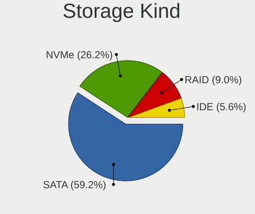

| Kind | Notebooks | Percent |
|------|-----------|---------|
| SATA | 690       | 59.23%  |
| NVMe | 305       | 26.18%  |
| RAID | 105       | 9.01%   |
| IDE  | 65        | 5.58%   |

Processor
---------

CPU Vendor
----------

Processor vendors

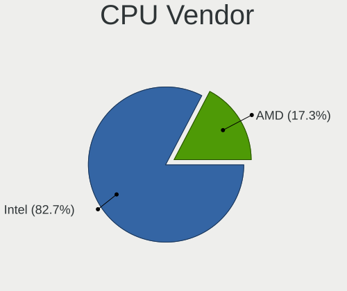

| Vendor | Notebooks | Percent |
|--------|-----------|---------|
| Intel  | 830       | 82.67%  |
| AMD    | 174       | 17.33%  |

CPU Model
---------

Processor models

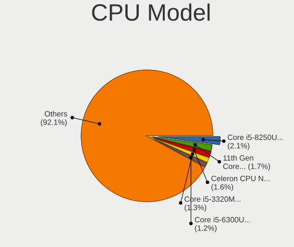

| Model                                         | Notebooks | Percent |
|-----------------------------------------------|-----------|---------|
| Intel Core i5-8250U CPU @ 1.60GHz             | 21        | 2.09%   |
| Intel 11th Gen Core i5-1135G7 @ 2.40GHz       | 17        | 1.69%   |
| Intel Celeron CPU N2840 @ 2.16GHz             | 16        | 1.59%   |
| Intel Core i5-3320M CPU @ 2.60GHz             | 13        | 1.29%   |
| Intel Core i5-6300U CPU @ 2.40GHz             | 12        | 1.2%    |
| Intel Core i5-6200U CPU @ 2.30GHz             | 12        | 1.2%    |
| Intel Core i5-3210M CPU @ 2.50GHz             | 12        | 1.2%    |
| AMD Ryzen 5 5500U with Radeon Graphics        | 12        | 1.2%    |
| Intel Core i5-5200U CPU @ 2.20GHz             | 10        | 1%      |
| Intel Core i3 CPU M 370 @ 2.40GHz             | 10        | 1%      |
| Intel 11th Gen Core i7-1165G7 @ 2.80GHz       | 9         | 0.9%    |
| AMD Ryzen 5 3500U with Radeon Vega Mobile Gfx | 9         | 0.9%    |
| Intel Core i7-6500U CPU @ 2.50GHz             | 8         | 0.8%    |
| Intel Core i5-4200U CPU @ 1.60GHz             | 8         | 0.8%    |
| Intel Core i5-10210U CPU @ 1.60GHz            | 8         | 0.8%    |
| Intel Core i5 CPU M 520 @ 2.40GHz             | 8         | 0.8%    |
| Intel Core i3-6006U CPU @ 2.00GHz             | 8         | 0.8%    |
| Intel Celeron CPU N3350 @ 1.10GHz             | 8         | 0.8%    |
| Intel Core i7-4600U CPU @ 2.10GHz             | 7         | 0.7%    |
| Intel Core i5-4300U CPU @ 1.90GHz             | 7         | 0.7%    |
| Intel Core i5-4210U CPU @ 1.70GHz             | 7         | 0.7%    |
| Intel Core i5-2520M CPU @ 2.50GHz             | 7         | 0.7%    |
| Intel Core i5 CPU M 460 @ 2.53GHz             | 7         | 0.7%    |
| Intel Celeron N4020 CPU @ 1.10GHz             | 7         | 0.7%    |
| Intel 11th Gen Core i3-1115G4 @ 3.00GHz       | 7         | 0.7%    |
| AMD Ryzen 9 7940HS w/ Radeon 780M Graphics    | 7         | 0.7%    |
| Intel Pentium Silver N6000 @ 1.10GHz          | 6         | 0.6%    |
| Intel Pentium CPU N3540 @ 2.16GHz             | 6         | 0.6%    |
| Intel Core i7-8550U CPU @ 1.80GHz             | 6         | 0.6%    |
| Intel Core i7-3630QM CPU @ 2.40GHz            | 6         | 0.6%    |
| Intel Core i7-3520M CPU @ 2.90GHz             | 6         | 0.6%    |
| Intel Core i5-5300U CPU @ 2.30GHz             | 6         | 0.6%    |
| Intel Core i5-3230M CPU @ 2.60GHz             | 6         | 0.6%    |
| Intel Core i5-2450M CPU @ 2.50GHz             | 6         | 0.6%    |
| Intel Core i3-6100U CPU @ 2.30GHz             | 6         | 0.6%    |
| Intel Core i3-5005U CPU @ 2.00GHz             | 6         | 0.6%    |
| Intel Core i3 CPU M 380 @ 2.53GHz             | 6         | 0.6%    |
| Intel Core 2 Duo CPU P8600 @ 2.40GHz          | 6         | 0.6%    |
| Intel Core 2 Duo CPU P8400 @ 2.26GHz          | 6         | 0.6%    |
| Intel Celeron N4000 CPU @ 1.10GHz             | 6         | 0.6%    |

CPU Model Family
----------------

Processor model prefix

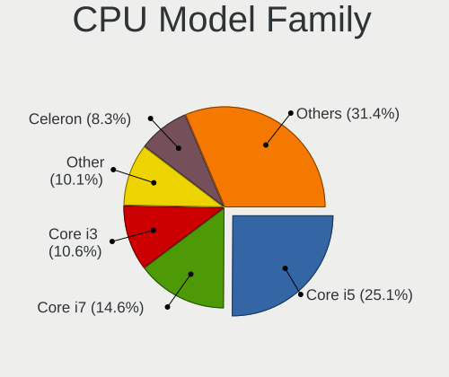

| Model                                | Notebooks | Percent |
|--------------------------------------|-----------|---------|
| Intel Core i5                        | 252       | 25.1%   |
| Intel Core i7                        | 147       | 14.64%  |
| Intel Core i3                        | 106       | 10.56%  |
| Other                                | 101       | 10.06%  |
| Intel Celeron                        | 83        | 8.27%   |
| AMD Ryzen 5                          | 49        | 4.88%   |
| Intel Core 2 Duo                     | 47        | 4.68%   |
| Intel Pentium                        | 32        | 3.19%   |
| AMD Ryzen 7                          | 26        | 2.59%   |
| Intel Pentium Silver                 | 12        | 1.2%    |
| Intel Pentium Dual                   | 11        | 1.1%    |
| AMD A8                               | 11        | 1.1%    |
| AMD Ryzen 3                          | 10        | 1%      |
| Intel Pentium Dual-Core              | 9         | 0.9%    |
| AMD Ryzen 9                          | 9         | 0.9%    |
| AMD E                                | 9         | 0.9%    |
| AMD A6                               | 9         | 0.9%    |
| Intel Atom                           | 8         | 0.8%    |
| AMD A10                              | 8         | 0.8%    |
| Intel Xeon                           | 7         | 0.7%    |
| Intel Genuine                        | 7         | 0.7%    |
| Intel Core 2                         | 6         | 0.6%    |
| AMD A4                               | 6         | 0.6%    |
| Intel Pentium Gold                   | 4         | 0.4%    |
| AMD Athlon                           | 4         | 0.4%    |
| AMD Turion 64 X2 Mobile              | 3         | 0.3%    |
| AMD E2                               | 3         | 0.3%    |
| AMD E1                               | 3         | 0.3%    |
| Intel Celeron Dual-Core              | 2         | 0.2%    |
| AMD Ryzen 5 PRO                      | 2         | 0.2%    |
| AMD Athlon II Dual-Core              | 2         | 0.2%    |
| Intel Core i9                        | 1         | 0.1%    |
| Intel Core 2 Solo                    | 1         | 0.1%    |
| AMD V140                             | 1         | 0.1%    |
| AMD V120                             | 1         | 0.1%    |
| AMD Turion II Ultra Dual-Core Mobile | 1         | 0.1%    |
| AMD Turion II Dual-Core              | 1         | 0.1%    |
| AMD Turion II                        | 1         | 0.1%    |
| AMD Ryzen 7 PRO                      | 1         | 0.1%    |
| AMD Phenom II                        | 1         | 0.1%    |

CPU Cores
---------

Number of processor cores

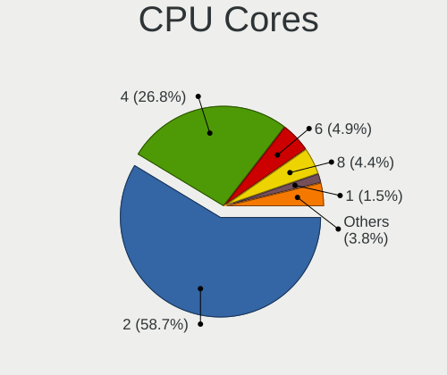

| Number | Notebooks | Percent |
|--------|-----------|---------|
| 2      | 589       | 58.67%  |
| 4      | 269       | 26.79%  |
| 6      | 49        | 4.88%   |
| 8      | 44        | 4.38%   |
| 1      | 15        | 1.49%   |
| 12     | 14        | 1.39%   |
| 14     | 13        | 1.29%   |
| 10     | 9         | 0.9%    |
| 24     | 1         | 0.1%    |
| 3      | 1         | 0.1%    |

CPU Sockets
-----------

Number of sockets

| Number | Notebooks | Percent |
|--------|-----------|---------|
| 1      | 1004      | 100%    |

CPU Threads
-----------

Threads per core (Hyper-Threading)

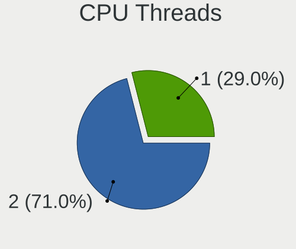

| Number | Notebooks | Percent |
|--------|-----------|---------|
| 2      | 713       | 71.02%  |
| 1      | 291       | 28.98%  |

CPU Op-Modes
------------

CPU Operation Modes (32-bit, 64-bit)

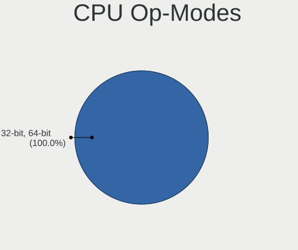

| Op mode        | Notebooks | Percent |
|----------------|-----------|---------|
| 32-bit, 64-bit | 1004      | 100%    |

CPU Microcode
-------------

Microcode number

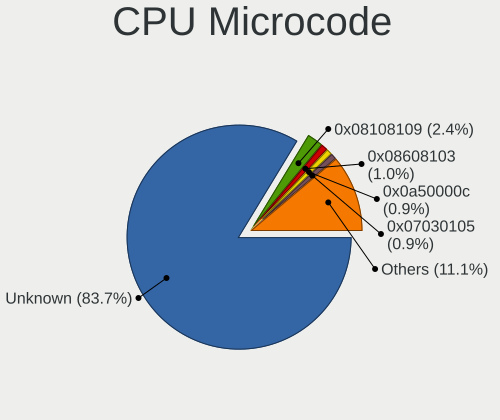

| Number     | Notebooks | Percent |
|------------|-----------|---------|
| Unknown    | 841       | 83.68%  |
| 0x08108109 | 24        | 2.39%   |
| 0x08608103 | 10        | 1%      |
| 0x0a50000c | 9         | 0.9%    |
| 0x07030105 | 9         | 0.9%    |
| 0x06006705 | 8         | 0.8%    |
| 0x0a704107 | 7         | 0.7%    |
| 0x0a50000f | 6         | 0.6%    |
| 0x05000101 | 6         | 0.6%    |
| 0x08108102 | 5         | 0.5%    |
| 0x0a704103 | 4         | 0.4%    |
| 0x0a50000d | 4         | 0.4%    |
| 0x0a404102 | 4         | 0.4%    |
| 0x08a00006 | 4         | 0.4%    |
| 0x08600106 | 4         | 0.4%    |
| 0x05000028 | 4         | 0.4%    |
| 0x010000b6 | 4         | 0.4%    |
| 0x08608102 | 3         | 0.3%    |
| 0x0860010c | 3         | 0.3%    |
| 0x0700010b | 3         | 0.3%    |
| 0x06006110 | 3         | 0.3%    |
| 0x06003106 | 3         | 0.3%    |
| 0x0500010d | 3         | 0.3%    |
| 0x0a704104 | 2         | 0.2%    |
| 0x08608104 | 2         | 0.2%    |
| 0x08600104 | 2         | 0.2%    |
| 0x08600103 | 2         | 0.2%    |
| 0x07030104 | 2         | 0.2%    |
| 0x06001119 | 2         | 0.2%    |
| 0x06001116 | 2         | 0.2%    |
| 0x20655    | 1         | 0.1%    |
| 0x0a705205 | 1         | 0.1%    |
| 0x0a404107 | 1         | 0.1%    |
| 0x08608107 | 1         | 0.1%    |
| 0x08200103 | 1         | 0.1%    |
| 0x0810810d | 1         | 0.1%    |
| 0x0810100b | 1         | 0.1%    |
| 0x07030106 | 1         | 0.1%    |
| 0x07000110 | 1         | 0.1%    |
| 0x0600611a | 1         | 0.1%    |

CPU Microarch
-------------

Microarchitecture

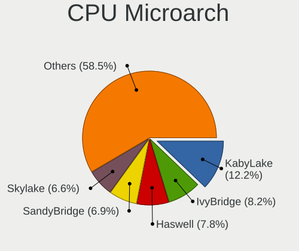

| Name             | Notebooks | Percent |
|------------------|-----------|---------|
| KabyLake         | 122       | 12.15%  |
| IvyBridge        | 82        | 8.17%   |
| Haswell          | 78        | 7.77%   |
| SandyBridge      | 69        | 6.87%   |
| Skylake          | 66        | 6.57%   |
| Westmere         | 63        | 6.27%   |
| Silvermont       | 47        | 4.68%   |
| Penryn           | 47        | 4.68%   |
| TigerLake        | 45        | 4.48%   |
| Core             | 41        | 4.08%   |
| Unknown          | 41        | 4.08%   |
| Alderlake Hybrid | 39        | 3.88%   |
| Broadwell        | 38        | 3.78%   |
| Zen+             | 31        | 3.09%   |
| IceLake          | 25        | 2.49%   |
| Goldmont plus    | 24        | 2.39%   |
| Zen 3            | 19        | 1.89%   |
| Goldmont         | 13        | 1.29%   |
| Excavator        | 13        | 1.29%   |
| Bobcat           | 13        | 1.29%   |
| Puma             | 12        | 1.2%    |
| Zen 2            | 11        | 1.1%    |
| K10              | 9         | 0.9%    |
| Tremont          | 8         | 0.8%    |
| Piledriver       | 7         | 0.7%    |
| Bonnell          | 7         | 0.7%    |
| CometLake        | 6         | 0.6%    |
| K10 Llano        | 5         | 0.5%    |
| Gracemont        | 5         | 0.5%    |
| Steamroller      | 4         | 0.4%    |
| K8 Hammer        | 4         | 0.4%    |
| Jaguar           | 4         | 0.4%    |
| Zen              | 3         | 0.3%    |
| Nehalem          | 3         | 0.3%    |

Graphics
--------

GPU Vendor
----------

Vendors of graphics cards

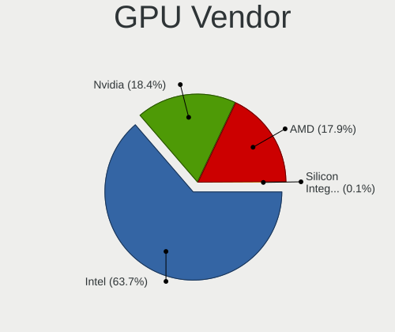

| Vendor                           | Notebooks | Percent |
|----------------------------------|-----------|---------|
| Intel                            | 766       | 63.67%  |
| Nvidia                           | 221       | 18.37%  |
| AMD                              | 215       | 17.87%  |
| Silicon Integrated Systems [SiS] | 1         | 0.08%   |

GPU Model
---------

Graphics card models

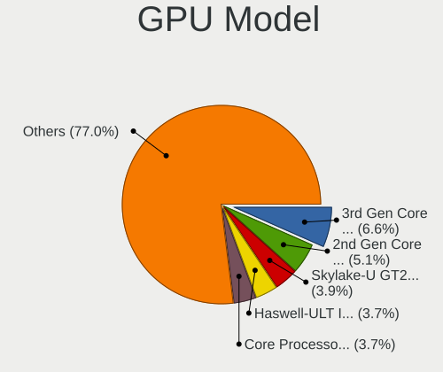

| Model                                                                                    | Notebooks | Percent |
|------------------------------------------------------------------------------------------|-----------|---------|
| Intel 3rd Gen Core processor Graphics Controller                                         | 82        | 6.61%   |
| Intel 2nd Generation Core Processor Family Integrated Graphics Controller                | 63        | 5.08%   |
| Intel Skylake-U GT2 [HD Graphics 520]                                                    | 49        | 3.95%   |
| Intel Haswell-ULT Integrated Graphics Controller                                         | 46        | 3.71%   |
| Intel Core Processor Integrated Graphics Controller                                      | 46        | 3.71%   |
| Intel Mobile 4 Series Chipset Integrated Graphics Controller                             | 41        | 3.3%    |
| Intel Kaby Lake-R GT2 [UHD Graphics 620]                                                 | 40        | 3.22%   |
| Intel Atom Processor Z36xxx/Z37xxx Series Graphics & Display                             | 33        | 2.66%   |
| AMD Picasso/Raven 2 [Radeon Vega Series / Radeon Vega Mobile Series]                     | 33        | 2.66%   |
| Intel Broadwell-U GT2 [HD Graphics 5500]                                                 | 32        | 2.58%   |
| Intel TigerLake-LP GT2 [Iris Xe Graphics]                                                | 31        | 2.5%    |
| Intel 4th Gen Core Processor Integrated Graphics Controller                              | 27        | 2.18%   |
| Intel Kaby Lake-U GT2 [HD Graphics 620]                                                  | 22        | 1.77%   |
| Intel GeminiLake [UHD Graphics 600]                                                      | 18        | 1.45%   |
| Intel Alder Lake-P GT2 [Iris Xe Graphics]                                                | 16        | 1.29%   |
| AMD Lucienne                                                                             | 16        | 1.29%   |
| Intel Atom/Celeron/Pentium Processor x5-E8000/J3xxx/N3xxx Integrated Graphics Controller | 14        | 1.13%   |
| Intel Tiger Lake-LP GT2 [UHD Graphics G4]                                                | 13        | 1.05%   |
| Intel Mobile GM965/GL960 Integrated Graphics Controller (secondary)                      | 13        | 1.05%   |
| Intel Mobile GM965/GL960 Integrated Graphics Controller (primary)                        | 13        | 1.05%   |
| Intel CometLake-U GT2 [UHD Graphics]                                                     | 13        | 1.05%   |
| AMD Phoenix1                                                                             | 13        | 1.05%   |
| Intel CoffeeLake-H GT2 [UHD Graphics 630]                                                | 12        | 0.97%   |
| Nvidia GF117M [GeForce 610M/710M/810M/820M / GT 620M/625M/630M/720M]                     | 11        | 0.89%   |
| Intel WhiskeyLake-U GT2 [UHD Graphics 620]                                               | 11        | 0.89%   |
| Intel Skylake-H GT2 [HD Graphics 530]                                                    | 11        | 0.89%   |
| Intel Kaby Lake-H GT2 [HD Graphics 630]                                                  | 11        | 0.89%   |
| AMD Renoir [Radeon Vega Series / Radeon Vega Mobile Series]                              | 11        | 0.89%   |
| Intel Iris Plus Graphics G1 (Ice Lake)                                                   | 10        | 0.81%   |
| Intel Apollo Lake GT1 [HD Graphics 500]                                                  | 10        | 0.81%   |
| AMD Cezanne [Radeon Vega Series / Radeon Vega Mobile Series]                             | 10        | 0.81%   |
| AMD Sun XT [Radeon HD 8670A/8670M/8690M / R5 M330 / M430 / Radeon 520 Mobile]            | 9         | 0.73%   |
| Nvidia GT218M [NVS 3100M]                                                                | 8         | 0.64%   |
| Nvidia GK208BM [GeForce 920M]                                                            | 8         | 0.64%   |
| Intel TigerLake-H GT1 [UHD Graphics]                                                     | 8         | 0.64%   |
| Intel Raptor Lake-P [Iris Xe Graphics]                                                   | 8         | 0.64%   |
| Intel JasperLake [UHD Graphics]                                                          | 8         | 0.64%   |
| AMD Stoney [Radeon R2/R3/R4/R5 Graphics]                                                 | 8         | 0.64%   |
| AMD Mullins [Radeon R4/R5 Graphics]                                                      | 8         | 0.64%   |
| AMD Barcelo                                                                              | 8         | 0.64%   |

GPU Combo
---------

Combinations of graphics cards

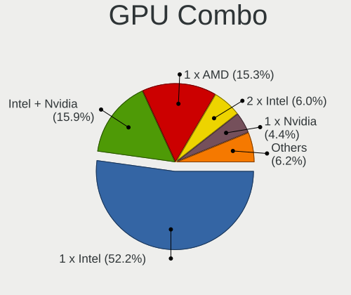

| Name           | Notebooks | Percent |
|----------------|-----------|---------|
| 1 x Intel      | 524       | 52.19%  |
| Intel + Nvidia | 160       | 15.94%  |
| 1 x AMD        | 154       | 15.34%  |
| 2 x Intel      | 60        | 5.98%   |
| 1 x Nvidia     | 44        | 4.38%   |
| 2 x AMD        | 24        | 2.39%   |
| Intel + AMD    | 21        | 2.09%   |
| AMD + Nvidia   | 16        | 1.59%   |
| 1 x SiS        | 1         | 0.1%    |

GPU Driver
----------

Free vs proprietary

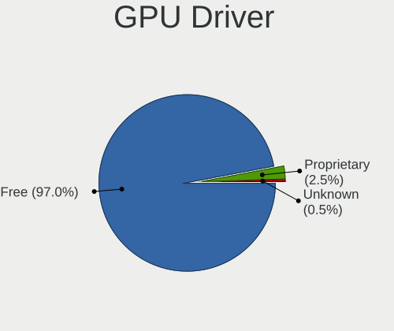

| Driver      | Notebooks | Percent |
|-------------|-----------|---------|
| Free        | 976       | 97.02%  |
| Proprietary | 25        | 2.49%   |
| Unknown     | 5         | 0.5%    |

GPU Memory
----------

Total video memory

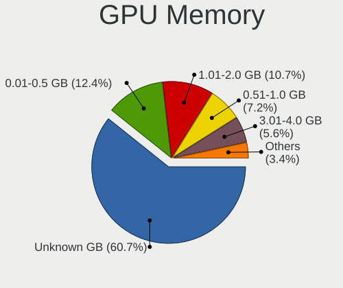

| Size in GB | Notebooks | Percent |
|------------|-----------|---------|
| Unknown    | 611       | 60.74%  |
| 0.01-0.5   | 125       | 12.43%  |
| 1.01-2.0   | 108       | 10.74%  |
| 0.51-1.0   | 72        | 7.16%   |
| 3.01-4.0   | 56        | 5.57%   |
| 7.01-8.0   | 14        | 1.39%   |
| 5.01-6.0   | 13        | 1.29%   |
| 2.01-3.0   | 5         | 0.5%    |
| 16.01-24.0 | 1         | 0.1%    |
| 8.01-16.0  | 1         | 0.1%    |

Monitor
-------

Monitor Vendor
--------------

Monitor vendors

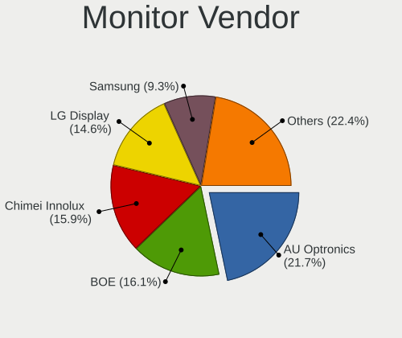

| Vendor                  | Notebooks | Percent |
|-------------------------|-----------|---------|
| AU Optronics            | 231       | 21.73%  |
| BOE                     | 171       | 16.09%  |
| Chimei Innolux          | 169       | 15.9%   |
| LG Display              | 155       | 14.58%  |
| Samsung Electronics     | 99        | 9.31%   |
| Chi Mei Optoelectronics | 32        | 3.01%   |
| Apple                   | 31        | 2.92%   |
| Lenovo                  | 30        | 2.82%   |
| Sharp                   | 26        | 2.45%   |
| Dell                    | 16        | 1.51%   |
| LG Philips              | 12        | 1.13%   |
| Goldstar                | 11        | 1.03%   |
| Hewlett-Packard         | 8         | 0.75%   |
| AOC                     | 7         | 0.66%   |
| PANDA                   | 6         | 0.56%   |
| InfoVision              | 5         | 0.47%   |
| ONN                     | 4         | 0.38%   |
| InnoLux Display         | 4         | 0.38%   |
| TMX                     | 3         | 0.28%   |
| Philips                 | 3         | 0.28%   |
| Panasonic               | 3         | 0.28%   |
| CSO                     | 3         | 0.28%   |
| Ancor Communications    | 3         | 0.28%   |
| Acer                    | 3         | 0.28%   |
| Toshiba                 | 2         | 0.19%   |
| Sony                    | 2         | 0.19%   |
| CPT                     | 2         | 0.19%   |
| ___                     | 1         | 0.09%   |
| WST                     | 1         | 0.09%   |
| ViewSonic               | 1         | 0.09%   |
| Vestel Elektronik       | 1         | 0.09%   |
| Unknown (XXX)           | 1         | 0.09%   |
| Unknown                 | 1         | 0.09%   |
| TGL                     | 1         | 0.09%   |
| TFT                     | 1         | 0.09%   |
| RPL                     | 1         | 0.09%   |
| NEC Computers           | 1         | 0.09%   |
| MTD                     | 1         | 0.09%   |
| MStar                   | 1         | 0.09%   |
| Mitsubishi              | 1         | 0.09%   |

Monitor Model
-------------

Monitor models

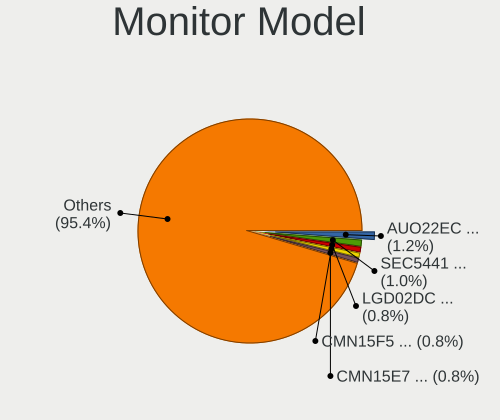

| Model                                                                    | Notebooks | Percent |
|--------------------------------------------------------------------------|-----------|---------|
| AU Optronics LCD Monitor AUO22EC 1366x768 344x193mm 15.5-inch            | 13        | 1.22%   |
| Samsung Electronics LCD Monitor SEC5441 1280x800 331x207mm 15.4-inch     | 11        | 1.03%   |
| LG Display LCD Monitor LGD02DC 1366x768 344x194mm 15.5-inch              | 9         | 0.84%   |
| Chimei Innolux LCD Monitor CMN15F5 1920x1080 344x193mm 15.5-inch         | 8         | 0.75%   |
| Chimei Innolux LCD Monitor CMN15E7 1920x1080 344x193mm 15.5-inch         | 8         | 0.75%   |
| BOE LCD Monitor BOE0BC9 2560x1600 345x215mm 16.0-inch                    | 8         | 0.75%   |
| BOE LCD Monitor BOE095F 2256x1504 285x190mm 13.5-inch                    | 8         | 0.75%   |
| AU Optronics LCD Monitor AUO26EC 1366x768 344x193mm 15.5-inch            | 8         | 0.75%   |
| AU Optronics LCD Monitor AUO21ED 1920x1080 344x193mm 15.5-inch           | 8         | 0.75%   |
| Chi Mei Optoelectronics LCD Monitor CMO1592 1366x768 344x193mm 15.5-inch | 7         | 0.66%   |
| AU Optronics LCD Monitor AUO38ED 1920x1080 344x193mm 15.5-inch           | 7         | 0.66%   |
| Lenovo LCD Monitor LEN40B1 1600x900 345x194mm 15.6-inch                  | 6         | 0.56%   |
| Chimei Innolux LCD Monitor CMN15E5 1920x1080 344x193mm 15.5-inch         | 6         | 0.56%   |
| Chimei Innolux LCD Monitor CMN15D2 1920x1080 344x193mm 15.5-inch         | 6         | 0.56%   |
| Chimei Innolux LCD Monitor CMN1382 1920x1080 293x165mm 13.2-inch         | 6         | 0.56%   |
| BOE LCD Monitor BOE068C 1366x768 256x144mm 11.6-inch                     | 6         | 0.56%   |
| LG Display LP156WH2-TLAA LGD0230 1366x768 344x194mm 15.5-inch            | 5         | 0.47%   |
| LG Display LCD Monitor LGD0468 1366x768 344x194mm 15.5-inch              | 5         | 0.47%   |
| Chimei Innolux LCD Monitor CMN1728 1600x900 382x215mm 17.3-inch          | 5         | 0.47%   |
| Chimei Innolux LCD Monitor CMN15DB 1366x768 344x193mm 15.5-inch          | 5         | 0.47%   |
| Chimei Innolux LCD Monitor CMN15C4 1920x1080 344x193mm 15.5-inch         | 5         | 0.47%   |
| Chimei Innolux LCD Monitor CMN153B 1920x1080 344x193mm 15.5-inch         | 5         | 0.47%   |
| Chimei Innolux LCD Monitor CMN14C9 1920x1080 309x173mm 13.9-inch         | 5         | 0.47%   |
| Chi Mei Optoelectronics LCD Monitor CMO15A7 1366x768 344x193mm 15.5-inch | 5         | 0.47%   |
| BOE LCD Monitor BOE06A4 1366x768 344x194mm 15.5-inch                     | 5         | 0.47%   |
| BOE LCD Monitor BOE0696 1366x768 309x173mm 13.9-inch                     | 5         | 0.47%   |
| AU Optronics LCD Monitor AUO8174 1280x800 331x207mm 15.4-inch            | 5         | 0.47%   |
| AU Optronics LCD Monitor AUO45EC 1366x768 344x193mm 15.5-inch            | 5         | 0.47%   |
| AU Optronics LCD Monitor AUO243D 1920x1080 309x173mm 13.9-inch           | 5         | 0.47%   |
| AU Optronics LCD Monitor AUO205C 1366x768 256x144mm 11.6-inch            | 5         | 0.47%   |
| Sharp LCD Monitor SHP149A 1920x1080 344x194mm 15.5-inch                  | 4         | 0.38%   |
| Samsung Electronics LCD Monitor SEC5541 1366x768 344x193mm 15.5-inch     | 4         | 0.38%   |
| ONN ONA18HO015 ONN0101 1920x1080 698x393mm 31.5-inch                     | 4         | 0.38%   |
| LG Display LCD Monitor LGD033A 1366x768 344x194mm 15.5-inch              | 4         | 0.38%   |
| LG Display LCD Monitor LGD02E9 1366x768 309x174mm 14.0-inch              | 4         | 0.38%   |
| Chimei Innolux LCD Monitor CMN15C6 1366x768 344x193mm 15.5-inch          | 4         | 0.38%   |
| Chimei Innolux LCD Monitor CMN14C4 1366x768 309x173mm 13.9-inch          | 4         | 0.38%   |
| BOE LCD Monitor BOE0B56 1920x1080 309x174mm 14.0-inch                    | 4         | 0.38%   |
| BOE LCD Monitor BOE0AF7 1920x1080 344x194mm 15.5-inch                    | 4         | 0.38%   |
| BOE LCD Monitor BOE08D7 1920x1080 309x174mm 14.0-inch                    | 4         | 0.38%   |

Monitor Resolution
------------------

Monitor screen resolution

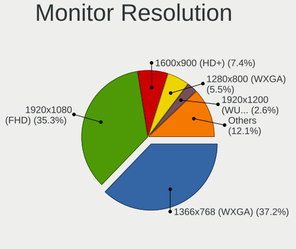

| Resolution         | Notebooks | Percent |
|--------------------|-----------|---------|
| 1366x768 (WXGA)    | 388       | 37.2%   |
| 1920x1080 (FHD)    | 368       | 35.28%  |
| 1600x900 (HD+)     | 77        | 7.38%   |
| 1280x800 (WXGA)    | 57        | 5.47%   |
| 1920x1200 (WUXGA)  | 27        | 2.59%   |
| 2560x1600          | 20        | 1.92%   |
| 1440x900 (WXGA+)   | 19        | 1.82%   |
| 3840x2160 (4K)     | 18        | 1.73%   |
| 2560x1440 (QHD)    | 14        | 1.34%   |
| 2256x1504          | 11        | 1.05%   |
| 2880x1800          | 8         | 0.77%   |
| 1680x1050 (WSXGA+) | 7         | 0.67%   |
| 1024x600           | 5         | 0.48%   |
| 3200x1800 (QHD+)   | 3         | 0.29%   |
| 2560x1080          | 3         | 0.29%   |
| 1280x1024 (SXGA)   | 3         | 0.29%   |
| 3840x2400          | 2         | 0.19%   |
| 3440x1440          | 2         | 0.19%   |
| 3200x2000          | 2         | 0.19%   |
| 3000x2000          | 1         | 0.1%    |
| 2880x1620          | 1         | 0.1%    |
| 2240x1400          | 1         | 0.1%    |
| 2160x1440          | 1         | 0.1%    |
| 2160x1350          | 1         | 0.1%    |
| 1920x540           | 1         | 0.1%    |
| 1400x1050          | 1         | 0.1%    |
| 1360x768           | 1         | 0.1%    |
| 1024x768 (XGA)     | 1         | 0.1%    |

Monitor Diagonal
----------------

Diagonal size in inches

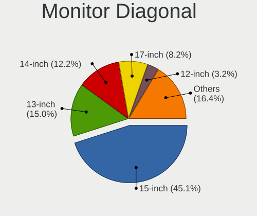

| Inches  | Notebooks | Percent |
|---------|-----------|---------|
| 15      | 479       | 45.06%  |
| 13      | 159       | 14.96%  |
| 14      | 130       | 12.23%  |
| 17      | 87        | 8.18%   |
| 12      | 34        | 3.2%    |
| 11      | 34        | 3.2%    |
| 16      | 31        | 2.92%   |
| 24      | 17        | 1.6%    |
| 27      | 14        | 1.32%   |
| 23      | 12        | 1.13%   |
| 19      | 11        | 1.03%   |
| 21      | 9         | 0.85%   |
| 18      | 8         | 0.75%   |
| 31      | 7         | 0.66%   |
| 34      | 5         | 0.47%   |
| 22      | 5         | 0.47%   |
| 10      | 5         | 0.47%   |
| Unknown | 3         | 0.28%   |
| 84      | 2         | 0.19%   |
| 86      | 1         | 0.09%   |
| 72      | 1         | 0.09%   |
| 63      | 1         | 0.09%   |
| 54      | 1         | 0.09%   |
| 52      | 1         | 0.09%   |
| 40      | 1         | 0.09%   |
| 39      | 1         | 0.09%   |
| 32      | 1         | 0.09%   |
| 30      | 1         | 0.09%   |
| 25      | 1         | 0.09%   |
| 20      | 1         | 0.09%   |

Monitor Width
-------------

Physical width

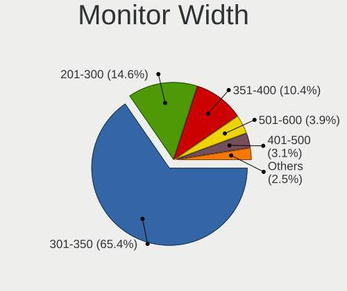

| Width in mm | Notebooks | Percent |
|-------------|-----------|---------|
| 301-350     | 696       | 65.41%  |
| 201-300     | 155       | 14.57%  |
| 351-400     | 111       | 10.43%  |
| 501-600     | 42        | 3.95%   |
| 401-500     | 33        | 3.1%    |
| 601-700     | 9         | 0.85%   |
| 701-800     | 6         | 0.56%   |
| 1001-1500   | 4         | 0.38%   |
| 1501-2000   | 3         | 0.28%   |
| Unknown     | 3         | 0.28%   |
| 801-900     | 2         | 0.19%   |

Aspect Ratio
------------

Proportional relationship between the width and the height

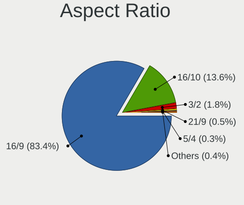

| Ratio | Notebooks | Percent |
|-------|-----------|---------|
| 16/9  | 840       | 83.42%  |
| 16/10 | 137       | 13.6%   |
| 3/2   | 18        | 1.79%   |
| 21/9  | 5         | 0.5%    |
| 5/4   | 3         | 0.3%    |
| 4/3   | 2         | 0.2%    |
| 32/9  | 1         | 0.1%    |
| 0.56  | 1         | 0.1%    |

Monitor Area
------------

Area in inch²

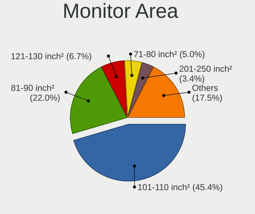

| Area in inch² | Notebooks | Percent |
|----------------|-----------|---------|
| 101-110        | 483       | 45.44%  |
| 81-90          | 234       | 22.01%  |
| 121-130        | 71        | 6.68%   |
| 71-80          | 53        | 4.99%   |
| 201-250        | 36        | 3.39%   |
| 61-70          | 34        | 3.2%    |
| 51-60          | 34        | 3.2%    |
| 111-120        | 27        | 2.54%   |
| 131-140        | 16        | 1.51%   |
| 151-200        | 15        | 1.41%   |
| 351-500        | 14        | 1.32%   |
| 301-350        | 14        | 1.32%   |
| More than 1000 | 7         | 0.66%   |
| 141-150        | 7         | 0.66%   |
| 251-300        | 6         | 0.56%   |
| 41-50          | 5         | 0.47%   |
| Unknown        | 3         | 0.28%   |
| 501-1000       | 2         | 0.19%   |
| 91-100         | 2         | 0.19%   |

Pixel Density
-------------

Pixels per inch

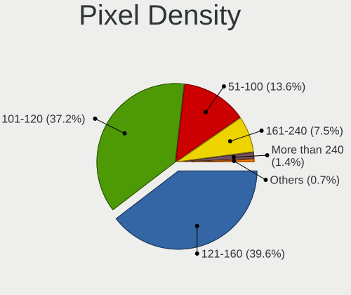

| Density       | Notebooks | Percent |
|---------------|-----------|---------|
| 121-160       | 417       | 39.6%   |
| 101-120       | 392       | 37.23%  |
| 51-100        | 143       | 13.58%  |
| 161-240       | 79        | 7.5%    |
| More than 240 | 15        | 1.42%   |
| 1-50          | 4         | 0.38%   |
| Unknown       | 3         | 0.28%   |

Multiple Monitors
-----------------

Total monitors connected

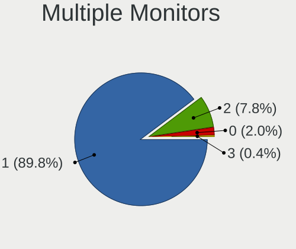

| Total | Notebooks | Percent |
|-------|-----------|---------|
| 1     | 904       | 89.77%  |
| 2     | 79        | 7.85%   |
| 0     | 20        | 1.99%   |
| 3     | 4         | 0.4%    |

Network
-------

Net Controller Vendor
---------------------

Controller vendors

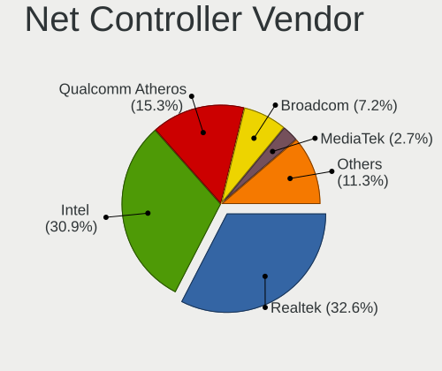

| Vendor                            | Notebooks | Percent |
|-----------------------------------|-----------|---------|
| Realtek Semiconductor             | 502       | 32.58%  |
| Intel                             | 476       | 30.89%  |
| Qualcomm Atheros                  | 236       | 15.31%  |
| Broadcom                          | 111       | 7.2%    |
| MediaTek                          | 42        | 2.73%   |
| Broadcom Limited                  | 33        | 2.14%   |
| Marvell Technology Group          | 20        | 1.3%    |
| Ralink                            | 18        | 1.17%   |
| ASIX Electronics                  | 16        | 1.04%   |
| TP-Link                           | 8         | 0.52%   |
| Sierra Wireless                   | 7         | 0.45%   |
| Shenzhen Goodix Technology        | 7         | 0.45%   |
| Ralink Technology                 | 7         | 0.45%   |
| Dell                              | 7         | 0.45%   |
| Samsung Electronics               | 5         | 0.32%   |
| Nvidia                            | 5         | 0.32%   |
| Linksys                           | 3         | 0.19%   |
| Lenovo                            | 3         | 0.19%   |
| JMicron Technology                | 3         | 0.19%   |
| Huawei Technologies               | 3         | 0.19%   |
| Ericsson Business Mobile Networks | 3         | 0.19%   |
| Xiaomi                            | 2         | 0.13%   |
| Silicon Integrated Systems [SiS]  | 2         | 0.13%   |
| Qualcomm                          | 2         | 0.13%   |
| Hewlett-Packard                   | 2         | 0.13%   |
| Edimax Technology                 | 2         | 0.13%   |
| ZyXEL Communications              | 1         | 0.06%   |
| ZTE WCDMA Technologies MSM        | 1         | 0.06%   |
| U-Blox                            | 1         | 0.06%   |
| Toshiba                           | 1         | 0.06%   |
| Spreadtrum Communications         | 1         | 0.06%   |
| Raspberry Pi                      | 1         | 0.06%   |
| Qualcomm Atheros Communications   | 1         | 0.06%   |
| PLANEX                            | 1         | 0.06%   |
| OPPO Electronics                  | 1         | 0.06%   |
| NetGear                           | 1         | 0.06%   |
| Espressif                         | 1         | 0.06%   |
| Elecom                            | 1         | 0.06%   |
| D-Link                            | 1         | 0.06%   |
| Belkin Components                 | 1         | 0.06%   |

Net Controller Model
--------------------

Controller models

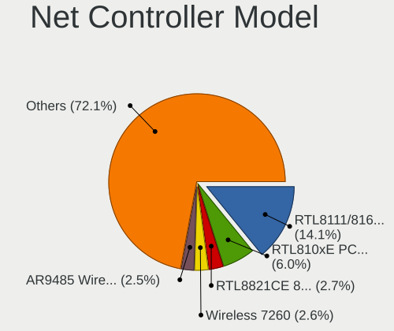

| Model                                                                   | Notebooks | Percent |
|-------------------------------------------------------------------------|-----------|---------|
| Realtek RTL8111/8168/8211/8411 PCI Express Gigabit Ethernet Controller  | 265       | 14.13%  |
| Realtek RTL810xE PCI Express Fast Ethernet controller                   | 113       | 6.03%   |
| Realtek RTL8821CE 802.11ac PCIe Wireless Network Adapter                | 51        | 2.72%   |
| Intel Wireless 7260                                                     | 49        | 2.61%   |
| Qualcomm Atheros AR9485 Wireless Network Adapter                        | 46        | 2.45%   |
| Intel 82579LM Gigabit Network Connection (Lewisville)                   | 42        | 2.24%   |
| Intel Wireless 8265 / 8275                                              | 41        | 2.19%   |
| Intel Centrino Advanced-N 6205 [Taylor Peak]                            | 37        | 1.97%   |
| Qualcomm Atheros AR9285 Wireless Network Adapter (PCI-Express)          | 35        | 1.87%   |
| Qualcomm Atheros QCA9377 802.11ac Wireless Network Adapter              | 33        | 1.76%   |
| Intel Wireless 8260                                                     | 33        | 1.76%   |
| Broadcom BCM4313 802.11bgn Wireless Network Adapter                     | 29        | 1.55%   |
| Realtek RTL8822CE 802.11ac PCIe Wireless Network Adapter                | 26        | 1.39%   |
| Intel Wi-Fi 6 AX201                                                     | 26        | 1.39%   |
| Realtek RTL8723BE PCIe Wireless Network Adapter                         | 24        | 1.28%   |
| Qualcomm Atheros QCA9565 / AR9565 Wireless Network Adapter              | 24        | 1.28%   |
| Intel Wireless 7265                                                     | 24        | 1.28%   |
| Intel Wi-Fi 6 AX200                                                     | 23        | 1.23%   |
| Intel 82577LM Gigabit Network Connection                                | 22        | 1.17%   |
| Intel Alder Lake-P PCH CNVi WiFi                                        | 21        | 1.12%   |
| Intel Ethernet Connection I219-LM                                       | 19        | 1.01%   |
| Qualcomm Atheros QCA6174 802.11ac Wireless Network Adapter              | 18        | 0.96%   |
| Intel Ethernet Connection (4) I219-LM                                   | 18        | 0.96%   |
| Realtek RTL8153 Gigabit Ethernet Adapter                                | 17        | 0.91%   |
| MediaTek MT7922 802.11ax PCI Express Wireless Network Adapter           | 17        | 0.91%   |
| Intel Ethernet Connection I218-LM                                       | 17        | 0.91%   |
| MediaTek MT7921 802.11ax PCIe Wireless Network Adapter [Filogic 330]    | 16        | 0.85%   |
| Intel Wireless 3165                                                     | 16        | 0.85%   |
| Intel Wireless 3160                                                     | 15        | 0.8%    |
| Intel Centrino Advanced-N 6200                                          | 15        | 0.8%    |
| ASIX AX88179 Gigabit Ethernet                                           | 15        | 0.8%    |
| Realtek RTL8188CE 802.11b/g/n WiFi Adapter                              | 14        | 0.75%   |
| Intel Wi-Fi 6E(802.11ax) AX210/AX1675* 2x2 [Typhoon Peak]               | 13        | 0.69%   |
| Intel Ethernet Connection I217-LM                                       | 13        | 0.69%   |
| Intel Ethernet Connection (3) I218-LM                                   | 13        | 0.69%   |
| Qualcomm Atheros AR8151 v2.0 Gigabit Ethernet                           | 12        | 0.64%   |
| Qualcomm Atheros AR242x / AR542x Wireless Network Adapter (PCI-Express) | 12        | 0.64%   |
| Intel 82567LM Gigabit Network Connection                                | 12        | 0.64%   |
| Intel Centrino Ultimate-N 6300                                          | 11        | 0.59%   |
| Broadcom BCM43142 802.11b/g/n                                           | 11        | 0.59%   |

Wireless Vendor
---------------

Wireless vendors

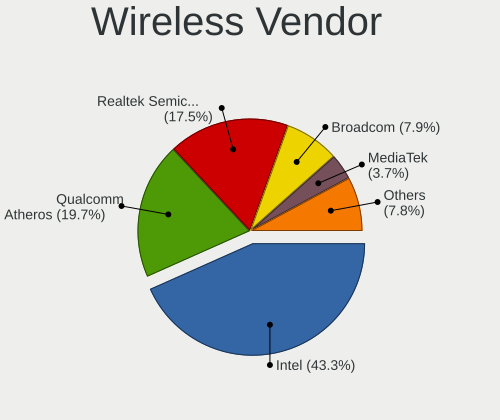

| Vendor                          | Notebooks | Percent |
|---------------------------------|-----------|---------|
| Intel                           | 442       | 43.33%  |
| Qualcomm Atheros                | 201       | 19.71%  |
| Realtek Semiconductor           | 178       | 17.45%  |
| Broadcom                        | 81        | 7.94%   |
| MediaTek                        | 38        | 3.73%   |
| Broadcom Limited                | 24        | 2.35%   |
| Ralink                          | 18        | 1.76%   |
| TP-Link                         | 7         | 0.69%   |
| Sierra Wireless                 | 7         | 0.69%   |
| Ralink Technology               | 7         | 0.69%   |
| Dell                            | 5         | 0.49%   |
| Edimax Technology               | 2         | 0.2%    |
| ZyXEL Communications            | 1         | 0.1%    |
| Samsung Electronics             | 1         | 0.1%    |
| Qualcomm Atheros Communications | 1         | 0.1%    |
| Qualcomm                        | 1         | 0.1%    |
| PLANEX                          | 1         | 0.1%    |
| NetGear                         | 1         | 0.1%    |
| Elecom                          | 1         | 0.1%    |
| D-Link                          | 1         | 0.1%    |
| Belkin Components               | 1         | 0.1%    |
| ASUSTek Computer                | 1         | 0.1%    |

Wireless Model
--------------

Wireless models

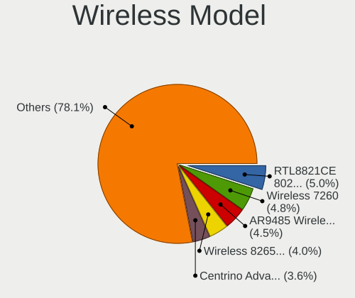

| Model                                                                   | Notebooks | Percent |
|-------------------------------------------------------------------------|-----------|---------|
| Realtek RTL8821CE 802.11ac PCIe Wireless Network Adapter                | 51        | 5%      |
| Intel Wireless 7260                                                     | 49        | 4.8%    |
| Qualcomm Atheros AR9485 Wireless Network Adapter                        | 46        | 4.51%   |
| Intel Wireless 8265 / 8275                                              | 41        | 4.02%   |
| Intel Centrino Advanced-N 6205 [Taylor Peak]                            | 37        | 3.62%   |
| Qualcomm Atheros AR9285 Wireless Network Adapter (PCI-Express)          | 35        | 3.43%   |
| Qualcomm Atheros QCA9377 802.11ac Wireless Network Adapter              | 33        | 3.23%   |
| Intel Wireless 8260                                                     | 33        | 3.23%   |
| Broadcom BCM4313 802.11bgn Wireless Network Adapter                     | 29        | 2.84%   |
| Realtek RTL8822CE 802.11ac PCIe Wireless Network Adapter                | 26        | 2.55%   |
| Intel Wi-Fi 6 AX201                                                     | 26        | 2.55%   |
| Realtek RTL8723BE PCIe Wireless Network Adapter                         | 24        | 2.35%   |
| Qualcomm Atheros QCA9565 / AR9565 Wireless Network Adapter              | 24        | 2.35%   |
| Intel Wireless 7265                                                     | 24        | 2.35%   |
| Intel Wi-Fi 6 AX200                                                     | 23        | 2.25%   |
| Qualcomm Atheros QCA6174 802.11ac Wireless Network Adapter              | 18        | 1.76%   |
| MediaTek MT7922 802.11ax PCI Express Wireless Network Adapter           | 16        | 1.57%   |
| MediaTek MT7921 802.11ax PCIe Wireless Network Adapter [Filogic 330]    | 16        | 1.57%   |
| Intel Wireless 3165                                                     | 16        | 1.57%   |
| Intel Wireless 3160                                                     | 15        | 1.47%   |
| Intel Centrino Advanced-N 6200                                          | 15        | 1.47%   |
| Realtek RTL8188CE 802.11b/g/n WiFi Adapter                              | 14        | 1.37%   |
| Intel Wi-Fi 6E(802.11ax) AX210/AX1675* 2x2 [Typhoon Peak]               | 13        | 1.27%   |
| Qualcomm Atheros AR242x / AR542x Wireless Network Adapter (PCI-Express) | 12        | 1.18%   |
| Intel Centrino Ultimate-N 6300                                          | 11        | 1.08%   |
| Intel Alder Lake-P PCH CNVi WiFi                                        | 11        | 1.08%   |
| Broadcom BCM43142 802.11b/g/n                                           | 11        | 1.08%   |
| Qualcomm Atheros AR9287 Wireless Network Adapter (PCI-Express)          | 10        | 0.98%   |
| Intel Comet Lake PCH-LP CNVi WiFi                                       | 10        | 0.98%   |
| Intel Cannon Lake PCH CNVi WiFi                                         | 10        | 0.98%   |
| Broadcom Limited BCM4312 802.11b/g LP-PHY                               | 10        | 0.98%   |
| Realtek RTL8723DE Wireless Network Adapter                              | 9         | 0.88%   |
| Realtek RTL8188EE Wireless Network Adapter                              | 9         | 0.88%   |
| Qualcomm Atheros AR9462 Wireless Network Adapter                        | 9         | 0.88%   |
| Qualcomm Atheros AR928X Wireless Network Adapter (PCI-Express)          | 9         | 0.88%   |
| Intel Dual Band Wireless-AC 3168NGW [Stone Peak]                        | 9         | 0.88%   |
| Ralink RT3290 Wireless 802.11n 1T/1R PCIe                               | 8         | 0.78%   |
| Intel WiFi Link 5100                                                    | 8         | 0.78%   |
| Intel PRO/Wireless 5100 AGN [Shiloh] Network Connection                 | 8         | 0.78%   |
| Intel Ice Lake-LP PCH CNVi WiFi                                         | 8         | 0.78%   |

Ethernet Vendor
---------------

Ethernet vendors

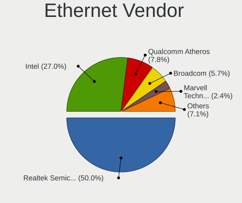

| Vendor                           | Notebooks | Percent |
|----------------------------------|-----------|---------|
| Realtek Semiconductor            | 415       | 50%     |
| Intel                            | 224       | 26.99%  |
| Qualcomm Atheros                 | 65        | 7.83%   |
| Broadcom                         | 47        | 5.66%   |
| Marvell Technology Group         | 20        | 2.41%   |
| ASIX Electronics                 | 16        | 1.93%   |
| Broadcom Limited                 | 9         | 1.08%   |
| Nvidia                           | 5         | 0.6%    |
| Samsung Electronics              | 4         | 0.48%   |
| MediaTek                         | 4         | 0.48%   |
| Linksys                          | 3         | 0.36%   |
| Lenovo                           | 3         | 0.36%   |
| JMicron Technology               | 3         | 0.36%   |
| Xiaomi                           | 2         | 0.24%   |
| Silicon Integrated Systems [SiS] | 2         | 0.24%   |
| ZTE WCDMA Technologies MSM       | 1         | 0.12%   |
| TP-Link                          | 1         | 0.12%   |
| Spreadtrum Communications        | 1         | 0.12%   |
| Qualcomm                         | 1         | 0.12%   |
| OPPO Electronics                 | 1         | 0.12%   |
| Huawei Technologies              | 1         | 0.12%   |
| Hewlett-Packard                  | 1         | 0.12%   |
| Attansic Technology              | 1         | 0.12%   |

Ethernet Model
--------------

Ethernet models

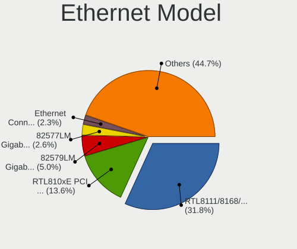

| Model                                                                  | Notebooks | Percent |
|------------------------------------------------------------------------|-----------|---------|
| Realtek RTL8111/8168/8211/8411 PCI Express Gigabit Ethernet Controller | 265       | 31.81%  |
| Realtek RTL810xE PCI Express Fast Ethernet controller                  | 113       | 13.57%  |
| Intel 82579LM Gigabit Network Connection (Lewisville)                  | 42        | 5.04%   |
| Intel 82577LM Gigabit Network Connection                               | 22        | 2.64%   |
| Intel Ethernet Connection I219-LM                                      | 19        | 2.28%   |
| Intel Ethernet Connection (4) I219-LM                                  | 18        | 2.16%   |
| Realtek RTL8153 Gigabit Ethernet Adapter                               | 17        | 2.04%   |
| Intel Ethernet Connection I218-LM                                      | 17        | 2.04%   |
| ASIX AX88179 Gigabit Ethernet                                          | 15        | 1.8%    |
| Intel Ethernet Connection I217-LM                                      | 13        | 1.56%   |
| Intel Ethernet Connection (3) I218-LM                                  | 13        | 1.56%   |
| Qualcomm Atheros AR8151 v2.0 Gigabit Ethernet                          | 12        | 1.44%   |
| Intel 82567LM Gigabit Network Connection                               | 12        | 1.44%   |
| Qualcomm Atheros AR8161 Gigabit Ethernet                               | 10        | 1.2%    |
| Intel Alder Lake-P PCH CNVi WiFi                                       | 10        | 1.2%    |
| Qualcomm Atheros AR8152 v1.1 Fast Ethernet                             | 9         | 1.08%   |
| Qualcomm Atheros AR8131 Gigabit Ethernet                               | 8         | 0.96%   |
| Marvell Group 88E8040 PCI-E Fast Ethernet Controller                   | 8         | 0.96%   |
| Realtek USB 10/100/1G/2.5 LAN                                          | 7         | 0.84%   |
| Broadcom NetXtreme BCM57765 Gigabit Ethernet PCIe                      | 7         | 0.84%   |
| Broadcom NetLink BCM57785 Gigabit Ethernet PCIe                        | 7         | 0.84%   |
| Qualcomm Atheros AR8162 Fast Ethernet                                  | 6         | 0.72%   |
| Marvell Group 88E8042 PCI-E Fast Ethernet Controller                   | 6         | 0.72%   |
| Intel Ethernet Connection (4) I219-V                                   | 6         | 0.72%   |
| Intel Ethernet Connection (2) I219-LM                                  | 6         | 0.72%   |
| Broadcom Limited NetLink BCM57780 Gigabit Ethernet PCIe                | 6         | 0.72%   |
| Realtek Killer E2600 GbE Controller                                    | 5         | 0.6%    |
| Qualcomm Atheros QCA8171 Gigabit Ethernet                              | 5         | 0.6%    |
| Qualcomm Atheros AR8152 v2.0 Fast Ethernet                             | 5         | 0.6%    |
| Intel Ethernet Connection I219-V                                       | 5         | 0.6%    |
| Intel Ethernet Connection (6) I219-LM                                  | 5         | 0.6%    |
| Broadcom NetXtreme BCM57786 Gigabit Ethernet PCIe                      | 5         | 0.6%    |
| Realtek RTL8152 Fast Ethernet Adapter                                  | 4         | 0.48%   |
| Realtek RTL8125 2.5GbE Controller                                      | 4         | 0.48%   |
| Intel Ethernet Connection I217-V                                       | 4         | 0.48%   |
| Intel Ethernet Connection (7) I219-LM                                  | 4         | 0.48%   |
| Intel 82579V Gigabit Network Connection                                | 4         | 0.48%   |
| Broadcom NetXtreme BCM5761 Gigabit Ethernet PCIe                       | 4         | 0.48%   |
| Broadcom NetLink BCM5787M Gigabit Ethernet PCI Express                 | 4         | 0.48%   |
| Broadcom NetLink BCM5784M Gigabit Ethernet PCIe                        | 4         | 0.48%   |

Net Controller Kind
-------------------

Ethernet, WiFi or modem

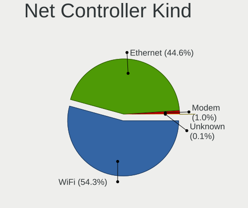

| Kind     | Notebooks | Percent |
|----------|-----------|---------|
| WiFi     | 980       | 54.26%  |
| Ethernet | 806       | 44.63%  |
| Modem    | 18        | 1%      |
| Unknown  | 2         | 0.11%   |

Used Controller
---------------

Currently used network controller

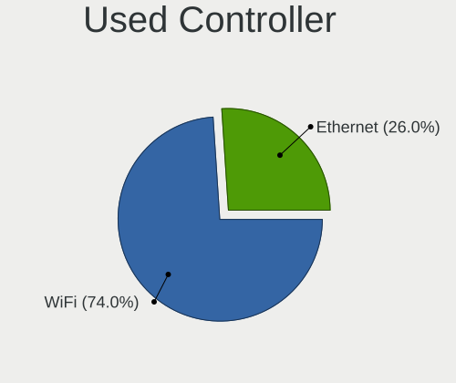

| Kind     | Notebooks | Percent |
|----------|-----------|---------|
| WiFi     | 727       | 73.96%  |
| Ethernet | 256       | 26.04%  |

NICs
----

Total network controllers on board

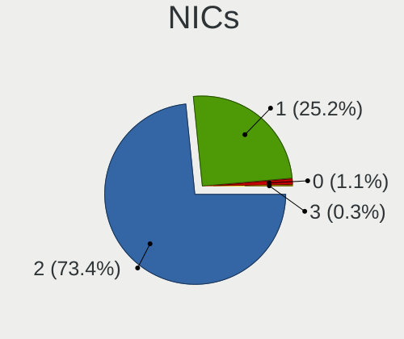

| Total | Notebooks | Percent |
|-------|-----------|---------|
| 2     | 737       | 73.41%  |
| 1     | 253       | 25.2%   |
| 0     | 11        | 1.1%    |
| 3     | 3         | 0.3%    |

IPv6
----

IPv6 vs IPv4

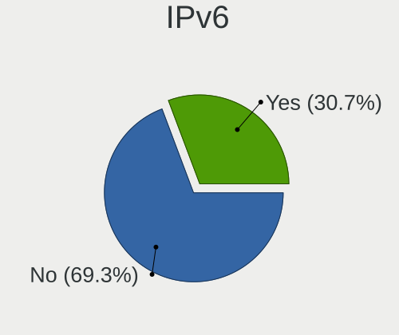

| Used | Notebooks | Percent |
|------|-----------|---------|
| No   | 699       | 69.28%  |
| Yes  | 310       | 30.72%  |

Bluetooth
---------

Bluetooth Vendor
----------------

Controller vendors

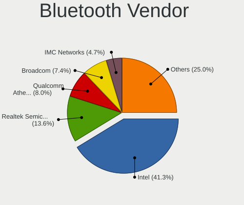

| Vendor                          | Notebooks | Percent |
|---------------------------------|-----------|---------|
| Intel                           | 327       | 41.29%  |
| Realtek Semiconductor           | 108       | 13.64%  |
| Qualcomm Atheros Communications | 63        | 7.95%   |
| Broadcom                        | 59        | 7.45%   |
| IMC Networks                    | 37        | 4.67%   |
| Foxconn / Hon Hai               | 36        | 4.55%   |
| Lite-On Technology              | 31        | 3.91%   |
| Apple                           | 28        | 3.54%   |
| Dell                            | 19        | 2.4%    |
| Hewlett-Packard                 | 18        | 2.27%   |
| MediaTek                        | 13        | 1.64%   |
| Cambridge Silicon Radio         | 10        | 1.26%   |
| Toshiba                         | 8         | 1.01%   |
| Ralink                          | 8         | 1.01%   |
| Foxconn International           | 7         | 0.88%   |
| Chicony Electronics             | 4         | 0.51%   |
| ASUSTek Computer                | 4         | 0.51%   |
| Alps Electric                   | 3         | 0.38%   |
| Realtek                         | 2         | 0.25%   |
| USI                             | 1         | 0.13%   |
| TP-Link                         | 1         | 0.13%   |
| Ralink Technology               | 1         | 0.13%   |
| Opticis                         | 1         | 0.13%   |
| Fujitsu                         | 1         | 0.13%   |
| Dynex                           | 1         | 0.13%   |
| Belkin Components               | 1         | 0.13%   |

Bluetooth Model
---------------

Controller models

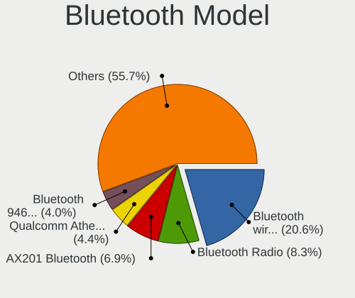

| Model                                               | Notebooks | Percent |
|-----------------------------------------------------|-----------|---------|
| Intel Bluetooth wireless interface                  | 163       | 20.58%  |
| Realtek Bluetooth Radio                             | 66        | 8.33%   |
| Intel AX201 Bluetooth                               | 55        | 6.94%   |
| Qualcomm Atheros  Bluetooth Device                  | 35        | 4.42%   |
| Intel Bluetooth 9460/9560 Jefferson Peak (JfP)      | 32        | 4.04%   |
| Realtek  Bluetooth 4.2 Adapter                      | 30        | 3.79%   |
| Intel AX200 Bluetooth                               | 23        | 2.9%    |
| IMC Networks Bluetooth Radio                        | 15        | 1.89%   |
| MediaTek Wireless_Device                            | 13        | 1.64%   |
| Intel Bluetooth Device                              | 13        | 1.64%   |
| Intel AX210 Bluetooth                               | 13        | 1.64%   |
| HP Broadcom 2070 Bluetooth Combo                    | 13        | 1.64%   |
| Broadcom BCM20702 Bluetooth 4.0 [ThinkPad]          | 13        | 1.64%   |
| Broadcom BCM2045B (BDC-2.1)                         | 13        | 1.64%   |
| Apple Bluetooth Host Controller                     | 12        | 1.52%   |
| Qualcomm Atheros AR3011 Bluetooth                   | 11        | 1.39%   |
| Dell DW375 Bluetooth Module                         | 11        | 1.39%   |
| Intel Centrino Bluetooth Wireless Transceiver       | 10        | 1.26%   |
| Cambridge Silicon Radio Bluetooth Dongle (HCI mode) | 10        | 1.26%   |
| Intel Wireless-AC 3168 Bluetooth                    | 9         | 1.14%   |
| Foxconn / Hon Hai Bluetooth Device                  | 9         | 1.14%   |
| Apple Bluetooth USB Host Controller                 | 9         | 1.14%   |
| Ralink RT3290 Bluetooth                             | 8         | 1.01%   |
| Lite-On Qualcomm Atheros QCA9377 Bluetooth          | 8         | 1.01%   |
| Lite-On Atheros AR3012 Bluetooth                    | 8         | 1.01%   |
| IMC Networks Wireless_Device                        | 8         | 1.01%   |
| Realtek RTL8723B Bluetooth                          | 7         | 0.88%   |
| Qualcomm Atheros AR3012 Bluetooth 4.0               | 7         | 0.88%   |
| IMC Networks Bluetooth Device                       | 7         | 0.88%   |
| Foxconn International BCM43142A0 Bluetooth module   | 7         | 0.88%   |
| Foxconn / Hon Hai Wireless_Device                   | 6         | 0.76%   |
| Qualcomm Atheros QCA61x4 Bluetooth 4.0              | 5         | 0.63%   |
| Intel Wireless-AC 9260 Bluetooth Adapter            | 5         | 0.63%   |
| IMC Networks Atheros AR3012 Bluetooth 4.0 Adapter   | 5         | 0.63%   |
| HP Bluetooth 2.0 Interface [Broadcom BCM2045]       | 5         | 0.63%   |
| Dell BCM20702A0 Bluetooth Module                    | 5         | 0.63%   |
| Apple Built-in Bluetooth 2.0+EDR HCI                | 5         | 0.63%   |
| Realtek RTL8821A Bluetooth                          | 4         | 0.51%   |
| Lite-On Wireless_Device                             | 4         | 0.51%   |
| Lite-On Bluetooth Device                            | 4         | 0.51%   |

Sound
-----

Sound Vendor
------------

Sound card vendors

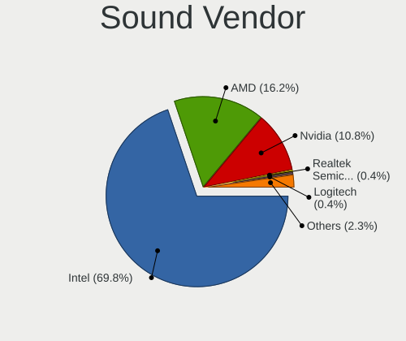

| Vendor                           | Notebooks | Percent |
|----------------------------------|-----------|---------|
| Intel                            | 822       | 69.84%  |
| AMD                              | 191       | 16.23%  |
| Nvidia                           | 127       | 10.79%  |
| Realtek Semiconductor            | 5         | 0.42%   |
| Logitech                         | 5         | 0.42%   |
| C-Media Electronics              | 4         | 0.34%   |
| Generalplus Technology           | 3         | 0.25%   |
| BEHRINGER International          | 3         | 0.25%   |
| Silicon Integrated Systems [SiS] | 2         | 0.17%   |
| Microsoft                        | 2         | 0.17%   |
| GN Netcom                        | 2         | 0.17%   |
| Apple                            | 2         | 0.17%   |
| Texas Instruments                | 1         | 0.08%   |
| Synaptics                        | 1         | 0.08%   |
| Plantronics                      | 1         | 0.08%   |
| Nordic Semiconductor ASA         | 1         | 0.08%   |
| Lenovo                           | 1         | 0.08%   |
| KORG                             | 1         | 0.08%   |
| Hewlett-Packard                  | 1         | 0.08%   |
| EGO SYStems                      | 1         | 0.08%   |
| ASUSTek Computer                 | 1         | 0.08%   |

Sound Model
-----------

Sound card models

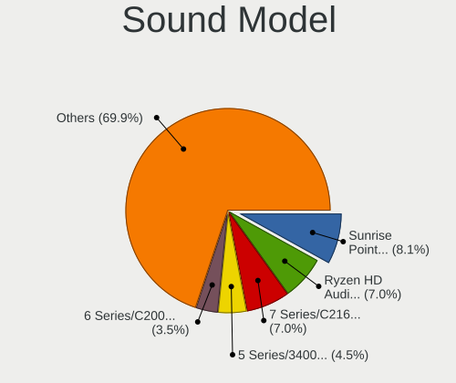

| Model                                                                                             | Notebooks | Percent |
|---------------------------------------------------------------------------------------------------|-----------|---------|
| Intel Sunrise Point-LP HD Audio                                                                   | 117       | 8.06%   |
| AMD Ryzen HD Audio Controller                                                                     | 102       | 7.02%   |
| Intel 7 Series/C216 Chipset Family High Definition Audio Controller                               | 101       | 6.96%   |
| Intel 5 Series/3400 Series Chipset High Definition Audio                                          | 66        | 4.55%   |
| Intel 6 Series/C200 Series Chipset Family High Definition Audio Controller                        | 51        | 3.51%   |
| Intel 82801I (ICH9 Family) HD Audio Controller                                                    | 50        | 3.44%   |
| Intel Haswell-ULT HD Audio Controller                                                             | 46        | 3.17%   |
| Intel 8 Series HD Audio Controller                                                                | 46        | 3.17%   |
| Intel Tiger Lake-LP Smart Sound Technology Audio Controller                                       | 45        | 3.1%    |
| AMD Renoir/Cezanne HDMI/DP Audio Controller                                                       | 39        | 2.69%   |
| Intel Wildcat Point-LP High Definition Audio Controller                                           | 38        | 2.62%   |
| Intel Broadwell-U Audio Controller                                                                | 38        | 2.62%   |
| AMD FCH Azalia Controller                                                                         | 35        | 2.41%   |
| Intel Atom Processor Z36xxx/Z37xxx Series High Definition Audio Controller                        | 32        | 2.2%    |
| Intel 8 Series/C220 Series Chipset High Definition Audio Controller                               | 32        | 2.2%    |
| AMD Raven/Raven2/Fenghuang HDMI/DP Audio Controller                                               | 30        | 2.07%   |
| Intel Alder Lake PCH-P High Definition Audio Controller                                           | 29        | 2%      |
| Intel Xeon E3-1200 v3/4th Gen Core Processor HD Audio Controller                                  | 26        | 1.79%   |
| Intel Celeron/Pentium Silver Processor High Definition Audio                                      | 24        | 1.65%   |
| Intel 82801H (ICH8 Family) HD Audio Controller                                                    | 24        | 1.65%   |
| AMD Radeon High Definition Audio Controller                                                       | 23        | 1.58%   |
| AMD SBx00 Azalia (Intel HDA)                                                                      | 22        | 1.52%   |
| AMD Kabini HDMI/DP Audio                                                                          | 21        | 1.45%   |
| Intel Cannon Lake PCH cAVS                                                                        | 20        | 1.38%   |
| Nvidia GF108 High Definition Audio Controller                                                     | 17        | 1.17%   |
| Intel Ice Lake-LP Smart Sound Technology Audio Controller                                         | 17        | 1.17%   |
| Intel Atom/Celeron/Pentium Processor x5-E8000/J3xxx/N3xxx Series High Definition Audio Controller | 14        | 0.96%   |
| Intel 100 Series/C230 Series Chipset Family HD Audio Controller                                   | 14        | 0.96%   |
| Intel NM10/ICH7 Family High Definition Audio Controller                                           | 13        | 0.9%    |
| Intel Comet Lake PCH-LP cAVS                                                                      | 13        | 0.9%    |
| Intel Celeron N3350/Pentium N4200/Atom E3900 Series Audio Cluster                                 | 13        | 0.9%    |
| AMD Family 15h (Models 60h-6fh) Audio Controller                                                  | 13        | 0.9%    |
| Intel CM238 HD Audio Controller                                                                   | 12        | 0.83%   |
| Intel Cannon Point-LP High Definition Audio Controller                                            | 12        | 0.83%   |
| Nvidia TU107 GeForce GTX 1650 High Definition Audio Controller                                    | 10        | 0.69%   |
| Nvidia High Definition Audio Controller                                                           | 10        | 0.69%   |
| Intel Raptor Lake-P/U/H cAVS                                                                      | 10        | 0.69%   |
| AMD Wrestler HDMI Audio                                                                           | 10        | 0.69%   |
| Nvidia GP107GL High Definition Audio Controller                                                   | 9         | 0.62%   |
| Nvidia GK208 HDMI/DP Audio Controller                                                             | 9         | 0.62%   |

Memory
------

Memory Vendor
-------------

Memory module vendors

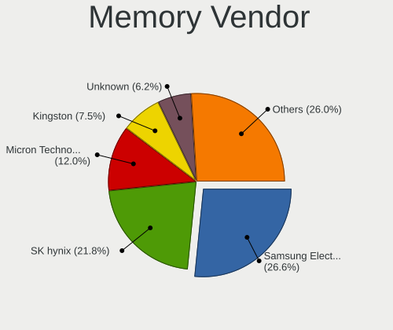

| Vendor                 | Notebooks | Percent |
|------------------------|-----------|---------|
| Samsung Electronics    | 315       | 26.58%  |
| SK hynix               | 258       | 21.77%  |
| Micron Technology      | 142       | 11.98%  |
| Kingston               | 89        | 7.51%   |
| Unknown                | 73        | 6.16%   |
| Crucial                | 49        | 4.14%   |
| Elpida                 | 33        | 2.78%   |
| A-DATA Technology      | 32        | 2.7%    |
| Nanya Technology       | 26        | 2.19%   |
| Ramaxel Technology     | 23        | 1.94%   |
| Corsair                | 16        | 1.35%   |
| Unknown (ABCD)         | 11        | 0.93%   |
| Smart                  | 11        | 0.93%   |
| G.Skill                | 10        | 0.84%   |
| Unknown                | 10        | 0.84%   |
| Timetec                | 9         | 0.76%   |
| Team                   | 6         | 0.51%   |
| SHARETRONIC            | 5         | 0.42%   |
| PNY                    | 4         | 0.34%   |
| Patriot                | 4         | 0.34%   |
| Juhor                  | 4         | 0.34%   |
| GOODRAM                | 4         | 0.34%   |
| ASint Technology       | 4         | 0.34%   |
| Apacer                 | 4         | 0.34%   |
| Unknown (0x0E9D)       | 3         | 0.25%   |
| Unknown (0000000080CE) | 2         | 0.17%   |
| Teikon                 | 2         | 0.17%   |
| Silicon Power          | 2         | 0.17%   |
| Qimonda                | 2         | 0.17%   |
| Multilaser             | 2         | 0.17%   |
| ff                     | 2         | 0.17%   |
| Avant                  | 2         | 0.17%   |
| AMD                    | 2         | 0.17%   |
| 4ea5                   | 2         | 0.17%   |
| Wilk                   | 1         | 0.08%   |
| Unknown (768A)         | 1         | 0.08%   |
| Unknown (268C)         | 1         | 0.08%   |
| Unknown (0x0CB9)       | 1         | 0.08%   |
| Unknown (0x0B5E)       | 1         | 0.08%   |
| Transcend              | 1         | 0.08%   |

Memory Model
------------

Memory module models

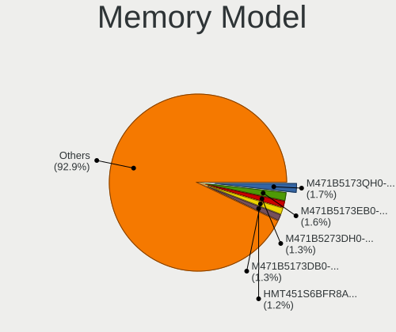

| Model                                                            | Notebooks | Percent |
|------------------------------------------------------------------|-----------|---------|
| Samsung RAM M471B5173QH0-YK0 4GB SODIMM DDR3 1600MT/s            | 22        | 1.74%   |
| Samsung RAM M471B5173EB0-YK0 4GB SODIMM DDR3 1600MT/s            | 20        | 1.59%   |
| Samsung RAM M471B5273DH0-CH9 4GB SODIMM DDR3 1600MT/s            | 16        | 1.27%   |
| Samsung RAM M471B5173DB0-YK0 4GB SODIMM DDR3 1600MT/s            | 16        | 1.27%   |
| SK hynix RAM HMT451S6BFR8A-PB 4GB SODIMM DDR3 1600MT/s           | 15        | 1.19%   |
| SK hynix RAM HMA81GS6AFR8N-UH 8GB SODIMM DDR4 2667MT/s           | 14        | 1.11%   |
| Samsung RAM M471B5773CHS-CH9 2GB SODIMM DDR3 4199MT/s            | 14        | 1.11%   |
| Samsung RAM M471B1G73QH0-YK0 8GB SODIMM DDR3 1600MT/s            | 12        | 0.95%   |
| SK hynix RAM HMT425S6AFR6A-PB 2GB SODIMM DDR3 3200MT/s           | 11        | 0.87%   |
| Unknown (ABCD) RAM 123456789012345678 2GB SODIMM LPDDR4 2400MT/s | 10        | 0.79%   |
| Samsung RAM M471A5244CB0-CWE 4GB SODIMM DDR4 3200MT/s            | 10        | 0.79%   |
| Unknown                                                          | 10        | 0.79%   |
| Samsung RAM M471B5273CH0-CH9 4GB SODIMM DDR3 1334MT/s            | 9         | 0.71%   |
| Samsung RAM M471B1G73DB0-YK0 8GB SODIMM DDR3 1600MT/s            | 9         | 0.71%   |
| Samsung RAM M471A5244CB0-CTD 4GB SODIMM DDR4 3266MT/s            | 9         | 0.71%   |
| Crucial RAM CT102464BF160B.C16 8GB SODIMM DDR3 1600MT/s          | 9         | 0.71%   |
| SK hynix RAM HMT41GS6BFR8A-PB 8GB SODIMM DDR3 2667MT/s           | 8         | 0.63%   |
| SK hynix RAM HMAA1GS6CJR6N-XN 8GB SODIMM DDR4 3200MT/s           | 8         | 0.63%   |
| SK hynix RAM HMA81GS6DJR8N-XN 8GB SODIMM DDR4 3200MT/s           | 8         | 0.63%   |
| Samsung RAM M471B5673FH0-CH9 2048MB SODIMM DDR3 1600MT/s         | 8         | 0.63%   |
| Samsung RAM M471A1K43EB1-CWE 8GB SODIMM DDR4 3200MT/s            | 8         | 0.63%   |
| Samsung RAM M471A1G44AB0-CWE 8GiB SODIMM DDR4 3200MT/s           | 8         | 0.63%   |
| Unknown RAM Module 4GB SODIMM DDR3                               | 7         | 0.56%   |
| SK hynix RAM HYMP125S64CP8-S6 2GB SODIMM DDR2 975MT/s            | 7         | 0.56%   |
| SK hynix RAM HMT451S6AFR8A-PB 4GB SODIMM DDR3 1600MT/s           | 7         | 0.56%   |
| SK hynix RAM HMT41GS6BFR8A-PB 8GB SODIMM DDR3 1600MT/s           | 7         | 0.56%   |
| SK hynix RAM HMA41GS6AFR8N-TF 8GB SODIMM DDR4 2667MT/s           | 7         | 0.56%   |
| Samsung RAM M471A5244CB0-CRC 4GB SODIMM DDR4 2667MT/s            | 7         | 0.56%   |
| Samsung RAM M471A2K43CB1-CTD 16GB SODIMM DDR4 8400MT/s           | 7         | 0.56%   |
| Samsung RAM M471A1K43CB1-CRC 8GB SODIMM DDR4 8400MT/s            | 7         | 0.56%   |
| Samsung RAM M471A1K43BB1-CRC 8GB SODIMM DDR4 2667MT/s            | 7         | 0.56%   |
| Samsung RAM M4 70T5663QZ3-CF7 2GB SODIMM DDR2 2048MT/s           | 7         | 0.56%   |
| SK hynix RAM Module 4GB SODIMM DDR3 1600MT/s                     | 6         | 0.48%   |
| SK hynix RAM HMT351S6CFR8C-PB 4GB SODIMM DDR3 1600MT/s           | 6         | 0.48%   |
| SK hynix RAM HMT351S6CFR8C-PB 4096MB SODIMM DDR3 1600MT/s        | 6         | 0.48%   |
| SK hynix RAM HMT351S6CFR8C-H9 4GB SODIMM DDR3 1333MT/s           | 6         | 0.48%   |
| SK hynix RAM HMT351S6BFR8C-H9 4GB SODIMM DDR3 1333MT/s           | 6         | 0.48%   |
| SK hynix RAM HMA851S6AFR6N-UH 4GB SODIMM DDR4 2667MT/s           | 6         | 0.48%   |
| Micron RAM 8KTF51264HZ-1G6E1 4GB SODIMM DDR3 1600MT/s            | 6         | 0.48%   |
| Elpida RAM EBJ41UF8BCS0-DJ-F 4GB SODIMM DDR3 1334MT/s            | 6         | 0.48%   |

Memory Kind
-----------

Memory module kinds

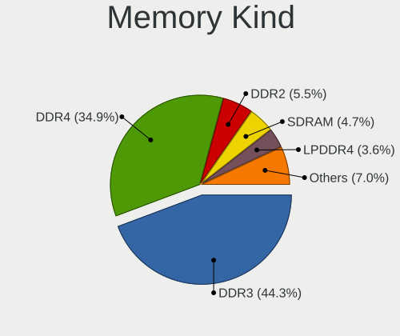

| Kind    | Notebooks | Percent |
|---------|-----------|---------|
| DDR3    | 458       | 44.29%  |
| DDR4    | 361       | 34.91%  |
| DDR2    | 57        | 5.51%   |
| SDRAM   | 49        | 4.74%   |
| LPDDR4  | 37        | 3.58%   |
| DDR5    | 27        | 2.61%   |
| LPDDR5  | 21        | 2.03%   |
| LPDDR3  | 12        | 1.16%   |
| Unknown | 6         | 0.58%   |
| DDR     | 4         | 0.39%   |
| DRAM    | 2         | 0.19%   |

Memory Form Factor
------------------

Physical design of the memory module

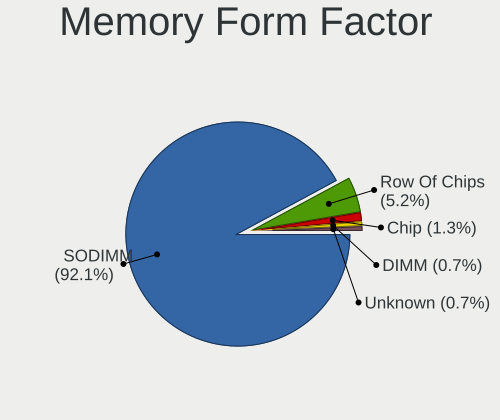

| Name         | Notebooks | Percent |
|--------------|-----------|---------|
| SODIMM       | 925       | 92.13%  |
| Row Of Chips | 52        | 5.18%   |
| Chip         | 13        | 1.29%   |
| DIMM         | 7         | 0.7%    |
| Unknown      | 7         | 0.7%    |

Memory Size
-----------

Memory module size

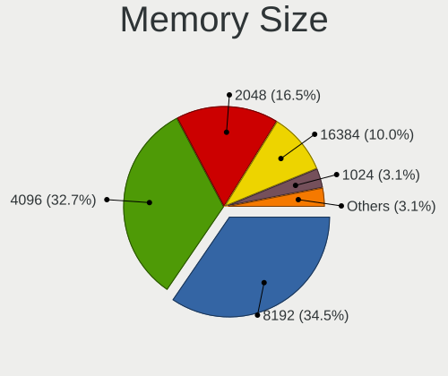

| Size  | Notebooks | Percent |
|-------|-----------|---------|
| 8192  | 384       | 34.53%  |
| 4096  | 364       | 32.73%  |
| 2048  | 184       | 16.55%  |
| 16384 | 111       | 9.98%   |
| 1024  | 35        | 3.15%   |
| 32768 | 32        | 2.88%   |
| 3072  | 1         | 0.09%   |
| 8     | 1         | 0.09%   |

Memory Speed
------------

Memory module speed

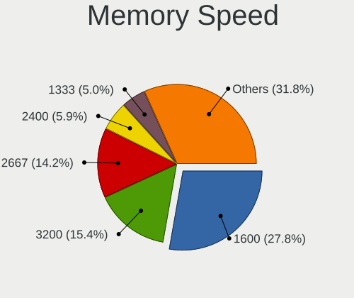

| Speed   | Notebooks | Percent |
|---------|-----------|---------|
| 1600    | 313       | 27.77%  |
| 3200    | 173       | 15.35%  |
| 2667    | 160       | 14.2%   |
| 2400    | 67        | 5.94%   |
| 1333    | 56        | 4.97%   |
| 1334    | 54        | 4.79%   |
| 2133    | 37        | 3.28%   |
| 4199    | 30        | 2.66%   |
| 1067    | 27        | 2.4%    |
| 667     | 24        | 2.13%   |
| 800     | 22        | 1.95%   |
| Unknown | 22        | 1.95%   |
| 5600    | 17        | 1.51%   |
| 2048    | 17        | 1.51%   |
| 6400    | 16        | 1.42%   |
| 8400    | 15        | 1.33%   |
| 1867    | 13        | 1.15%   |
| 975     | 10        | 0.89%   |
| 4800    | 9         | 0.8%    |
| 4267    | 9         | 0.8%    |
| 3266    | 9         | 0.8%    |
| 1066    | 6         | 0.53%   |
| 533     | 6         | 0.53%   |
| 5500    | 3         | 0.27%   |
| 4266    | 3         | 0.27%   |
| 3733    | 2         | 0.18%   |
| 2933    | 2         | 0.18%   |
| 12800   | 1         | 0.09%   |
| 7500    | 1         | 0.09%   |
| 5200    | 1         | 0.09%   |
| 1866    | 1         | 0.09%   |
| 1639    | 1         | 0.09%   |

Printers & scanners
-------------------

Printer Vendor
--------------

Printer device vendors

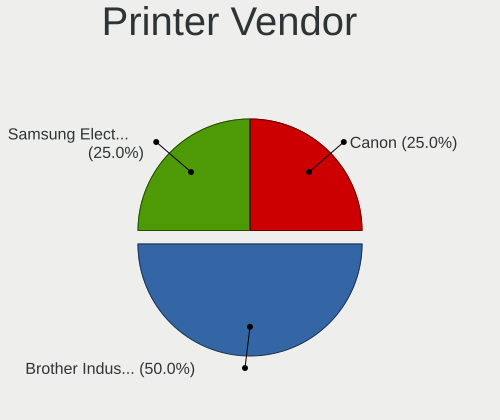

| Vendor              | Notebooks | Percent |
|---------------------|-----------|---------|
| Brother Industries  | 2         | 50%     |
| Samsung Electronics | 1         | 25%     |
| Canon               | 1         | 25%     |

Printer Model
-------------

Printer device models

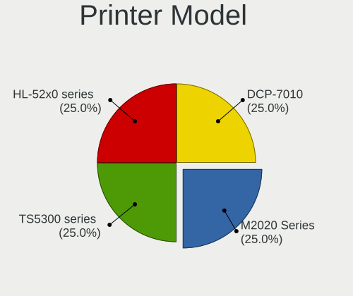

| Model                  | Notebooks | Percent |
|------------------------|-----------|---------|
| Samsung M2020 Series   | 1         | 25%     |
| Canon TS5300 series    | 1         | 25%     |
| Brother HL-52x0 series | 1         | 25%     |
| Brother DCP-7010       | 1         | 25%     |

Scanner Vendor
--------------

Scanner device vendors

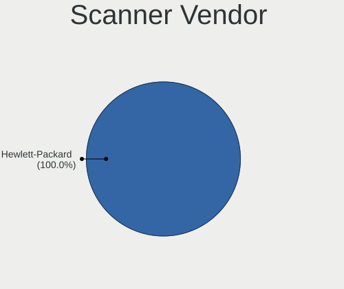

| Vendor          | Notebooks | Percent |
|-----------------|-----------|---------|
| Hewlett-Packard | 1         | 100%    |

Scanner Model
-------------

Scanner device models

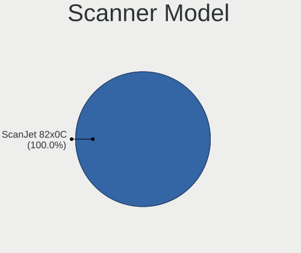

| Model            | Notebooks | Percent |
|------------------|-----------|---------|
| HP ScanJet 82x0C | 1         | 100%    |

Camera
------

Camera Vendor
-------------

Camera device vendors

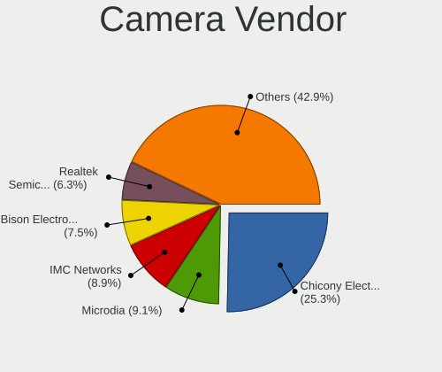

| Vendor                                 | Notebooks | Percent |
|----------------------------------------|-----------|---------|
| Chicony Electronics                    | 220       | 25.32%  |
| Microdia                               | 79        | 9.09%   |
| IMC Networks                           | 77        | 8.86%   |
| Bison Electronics                      | 65        | 7.48%   |
| Realtek Semiconductor                  | 55        | 6.33%   |
| Sunplus Innovation Technology          | 47        | 5.41%   |
| Cheng Uei Precision Industry (Foxlink) | 45        | 5.18%   |
| Suyin                                  | 44        | 5.06%   |
| Quanta                                 | 37        | 4.26%   |
| Apple                                  | 26        | 2.99%   |
| Syntek                                 | 24        | 2.76%   |
| Luxvisions Innotech Limited            | 21        | 2.42%   |
| Lite-On Technology                     | 19        | 2.19%   |
| Alcor Micro                            | 16        | 1.84%   |
| Ricoh                                  | 15        | 1.73%   |
| Lenovo                                 | 12        | 1.38%   |
| Importek                               | 11        | 1.27%   |
| Sonix Technology                       | 10        | 1.15%   |
| Silicon Motion                         | 8         | 0.92%   |
| Logitech                               | 6         | 0.69%   |
| SunplusIT                              | 4         | 0.46%   |
| Z-Star Microelectronics                | 3         | 0.35%   |
| Primax Electronics                     | 3         | 0.35%   |
| Acer                                   | 3         | 0.35%   |
| icSpring                               | 2         | 0.23%   |
| BUFFALO                                | 2         | 0.23%   |
| ALi                                    | 2         | 0.23%   |
| Sunplus Technology                     | 1         | 0.12%   |
| ShineTech                              | 1         | 0.12%   |
| OPPO Electronics                       | 1         | 0.12%   |
| OmniVision Technologies                | 1         | 0.12%   |
| MacroSilicon                           | 1         | 0.12%   |
| lihappe8                               | 1         | 0.12%   |
| Intel                                  | 1         | 0.12%   |
| Google                                 | 1         | 0.12%   |
| Genesys Logic                          | 1         | 0.12%   |
| Foxconn / Hon Hai                      | 1         | 0.12%   |
| DigiTech                               | 1         | 0.12%   |
| Cubeternet                             | 1         | 0.12%   |
| Unknown                                | 1         | 0.12%   |

Camera Model
------------

Camera device models

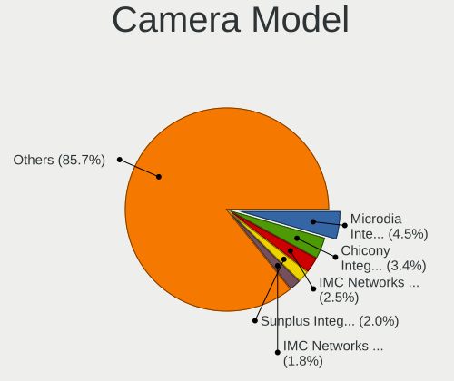

| Model                                                          | Notebooks | Percent |
|----------------------------------------------------------------|-----------|---------|
| Microdia Integrated_Webcam_HD                                  | 39        | 4.48%   |
| Chicony Integrated Camera                                      | 30        | 3.45%   |
| IMC Networks USB2.0 HD UVC WebCam                              | 22        | 2.53%   |
| Sunplus Integrated_Webcam_HD                                   | 17        | 1.95%   |
| IMC Networks Integrated Camera                                 | 16        | 1.84%   |
| Chicony HD WebCam                                              | 16        | 1.84%   |
| Bison Integrated Camera                                        | 16        | 1.84%   |
| Syntek Integrated Camera                                       | 13        | 1.49%   |
| Realtek USB Camera                                             | 12        | 1.38%   |
| Chicony HP Truevision HD camera                                | 12        | 1.38%   |
| Realtek Integrated_Webcam_HD                                   | 11        | 1.26%   |
| Cheng Uei Precision Industry (Foxlink) HP Webcam               | 11        | 1.26%   |
| Microdia Integrated Webcam                                     | 10        | 1.15%   |
| Chicony VGA Webcam                                             | 10        | 1.15%   |
| Chicony HP Truevision HD                                       | 10        | 1.15%   |
| Suyin Integrated_Webcam_HD                                     | 9         | 1.03%   |
| Luxvisions Innotech Limited HP TrueVision HD Camera            | 9         | 1.03%   |
| Chicony USB2.0 VGA UVC WebCam                                  | 9         | 1.03%   |
| Chicony FJ Camera                                              | 9         | 1.03%   |
| Cheng Uei Precision Industry (Foxlink) HP TrueVision HD Camera | 9         | 1.03%   |
| Quanta HP TrueVision HD Camera                                 | 8         | 0.92%   |
| IMC Networks USB2.0 VGA UVC WebCam                             | 8         | 0.92%   |
| Bison Lenovo Integrated Webcam                                 | 8         | 0.92%   |
| Bison Lenovo EasyCamera                                        | 8         | 0.92%   |
| Bison HD Webcam                                                | 8         | 0.92%   |
| Sonix USB2.0 HD UVC WebCam                                     | 7         | 0.8%    |
| Microdia Integrated Webcam HD                                  | 7         | 0.8%    |
| IMC Networks Lenovo EasyCamera                                 | 7         | 0.8%    |
| Chicony USB2.0 HD UVC WebCam                                   | 7         | 0.8%    |
| Chicony HP HD Camera                                           | 7         | 0.8%    |
| Apple FaceTime HD Camera                                       | 7         | 0.8%    |
| Realtek Integrated Webcam                                      | 6         | 0.69%   |
| Lite-On Integrated Camera                                      | 6         | 0.69%   |
| Lenovo Integrated Webcam [R5U877]                              | 6         | 0.69%   |
| Importek Laptop Integrated Webcam                              | 6         | 0.69%   |
| IMC Networks USB2.0 UVC HD Webcam                              | 6         | 0.69%   |
| Chicony Integrated Camera (1280x720@30)                        | 6         | 0.69%   |
| Bison BisonCam,NB Pro                                          | 6         | 0.69%   |
| Apple Built-in iSight                                          | 6         | 0.69%   |
| Syntek Lenovo EasyCamera                                       | 5         | 0.57%   |

Security
--------

Fingerprint Vendor
------------------

Fingerprint sensor vendors

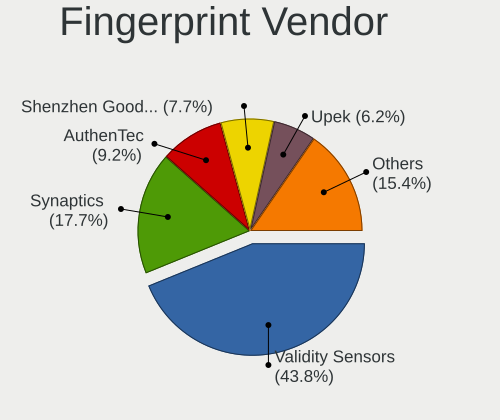

| Vendor                             | Notebooks | Percent |
|------------------------------------|-----------|---------|
| Validity Sensors                   | 57        | 43.85%  |
| Synaptics                          | 23        | 17.69%  |
| AuthenTec                          | 12        | 9.23%   |
| Shenzhen Goodix Technology         | 10        | 7.69%   |
| Upek                               | 8         | 6.15%   |
| Elan Microelectronics              | 7         | 5.38%   |
| LighTuning Technology              | 6         | 4.62%   |
| STMicroelectronics                 | 5         | 3.85%   |
| Realtek USB2.0 Finger Print Bridge | 2         | 1.54%   |

Fingerprint Model
-----------------

Fingerprint sensor models

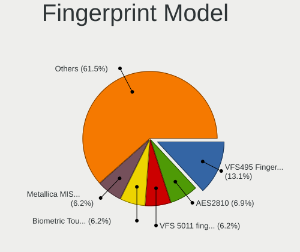

| Model                                                                      | Notebooks | Percent |
|----------------------------------------------------------------------------|-----------|---------|
| Validity Sensors VFS495 Fingerprint Reader                                 | 17        | 13.08%  |
| AuthenTec AES2810                                                          | 9         | 6.92%   |
| Validity Sensors VFS 5011 fingerprint sensor                               | 8         | 6.15%   |
| Upek Biometric Touchchip/Touchstrip Fingerprint Sensor                     | 8         | 6.15%   |
| Synaptics Metallica MIS Touch Fingerprint Reader                           | 8         | 6.15%   |
| Shenzhen Goodix  FingerPrint Device                                        | 7         | 5.38%   |
| Validity Sensors VFS491                                                    | 6         | 4.62%   |
| Validity Sensors VFS471 Fingerprint Reader                                 | 6         | 4.62%   |
| Synaptics Prometheus MIS Touch Fingerprint Reader                          | 6         | 4.62%   |
| STMicroelectronics Fingerprint Reader                                      | 5         | 3.85%   |
| Validity Sensors VFS5011 Fingerprint Reader                                | 4         | 3.08%   |
| Elan ELAN:ARM-M4                                                           | 4         | 3.08%   |
| Synaptics FS7604 Touch Fingerprint Sensor with PurePrint                   | 3         | 2.31%   |
| LighTuning Fingerprint Reader                                              | 3         | 2.31%   |
| Elan ELAN:Fingerprint                                                      | 3         | 2.31%   |
| Validity Sensors VFS451 Fingerprint Reader                                 | 2         | 1.54%   |
| Validity Sensors VFS Fingerprint sensor                                    | 2         | 1.54%   |
| Validity Sensors Synaptics WBDI                                            | 2         | 1.54%   |
| Validity Sensors Synaptics VFS7552 Touch Fingerprint Sensor with PurePrint | 2         | 1.54%   |
| Validity Sensors Swipe Fingerprint Sensor                                  | 2         | 1.54%   |
| Validity Sensors Fingerprint scanner                                       | 2         | 1.54%   |
| Synaptics Fingerprint reader [HP G6]                                       | 2         | 1.54%   |
| Shenzhen Goodix Fingerprint Reader                                         | 2         | 1.54%   |
| Realtek USB2.0 Finger Print Bridge FocalTech Fingerprint Device            | 2         | 1.54%   |
| LighTuning ES603 Swipe Fingerprint Sensor                                  | 2         | 1.54%   |
| Validity Sensors VFS7552 Touch Fingerprint Sensor                          | 1         | 0.77%   |
| Validity Sensors VFS7500 Touch Fingerprint Sensor                          | 1         | 0.77%   |
| Validity Sensors VFS301 Fingerprint Reader                                 | 1         | 0.77%   |
| Validity Sensors VFS101 Fingerprint Reader                                 | 1         | 0.77%   |
| Synaptics WBDI Device                                                      | 1         | 0.77%   |
| Synaptics WBDI                                                             | 1         | 0.77%   |
| Synaptics Prometheus Fingerprint Reader                                    | 1         | 0.77%   |
| Synaptics Metallica MOH Touch Fingerprint Reader                           | 1         | 0.77%   |
| Shenzhen Goodix FingerPrint                                                | 1         | 0.77%   |
| LighTuning EgisTec Touch Fingerprint Sensor                                | 1         | 0.77%   |
| AuthenTec Fingerprint Sensor                                               | 1         | 0.77%   |
| AuthenTec AES2550 Fingerprint Sensor                                       | 1         | 0.77%   |
| AuthenTec AES2501 Fingerprint Sensor                                       | 1         | 0.77%   |

Chipcard Vendor
---------------

Chipcard module vendors

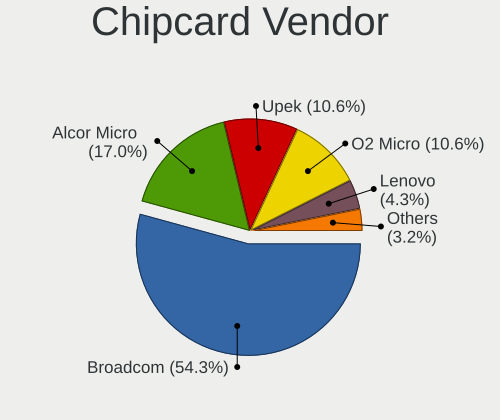

| Vendor                | Notebooks | Percent |
|-----------------------|-----------|---------|
| Broadcom              | 51        | 54.26%  |
| Alcor Micro           | 16        | 17.02%  |
| Upek                  | 10        | 10.64%  |
| O2 Micro              | 10        | 10.64%  |
| Lenovo                | 4         | 4.26%   |
| SCM Microsystems      | 2         | 2.13%   |
| Gemalto (was Gemplus) | 1         | 1.06%   |

Chipcard Model
--------------

Chipcard module models

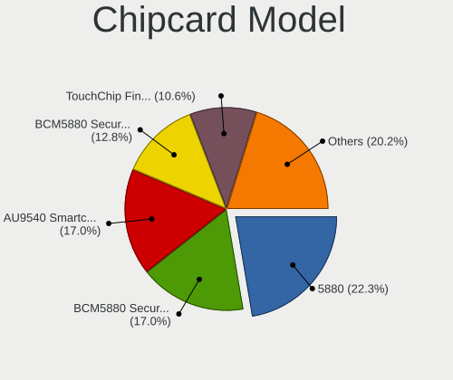

| Model                                                                        | Notebooks | Percent |
|------------------------------------------------------------------------------|-----------|---------|
| Broadcom 5880                                                                | 21        | 22.34%  |
| Broadcom BCM5880 Secure Applications Processor                               | 16        | 17.02%  |
| Alcor Micro AU9540 Smartcard Reader                                          | 16        | 17.02%  |
| Broadcom BCM5880 Secure Applications Processor with fingerprint swipe sensor | 12        | 12.77%  |
| Upek TouchChip Fingerprint Coprocessor (WBF advanced mode)                   | 10        | 10.64%  |
| O2 Micro OZ776 CCID Smartcard Reader                                         | 10        | 10.64%  |
| Lenovo Integrated Smart Card Reader                                          | 4         | 4.26%   |
| SCM Microsystems SCR3340 - ExpressCard54 Smart Card Reader                   | 2         | 2.13%   |
| Broadcom 58200                                                               | 2         | 2.13%   |
| Gemalto (was Gemplus) GemPC Twin SmartCard Reader                            | 1         | 1.06%   |

Unsupported
-----------

Unsupported Devices
-------------------

Total unsupported devices on board

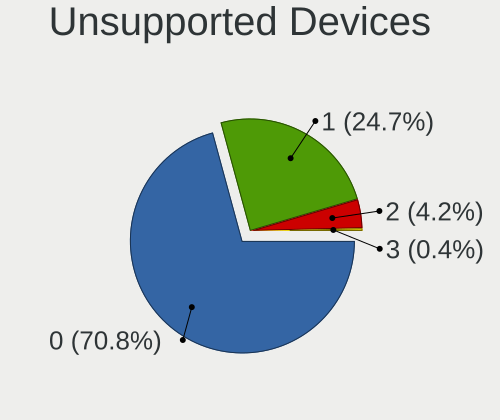

| Total | Notebooks | Percent |
|-------|-----------|---------|
| 0     | 712       | 70.78%  |
| 1     | 248       | 24.65%  |
| 2     | 42        | 4.17%   |
| 3     | 4         | 0.4%    |

Unsupported Device Types
------------------------

Types of unsupported devices

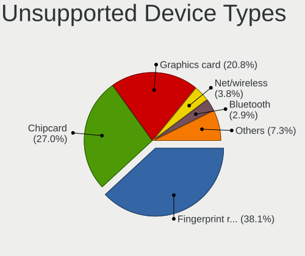

| Type                  | Notebooks | Percent |
|-----------------------|-----------|---------|
| Fingerprint reader    | 130       | 38.12%  |
| Chipcard              | 92        | 26.98%  |
| Graphics card         | 71        | 20.82%  |
| Net/wireless          | 13        | 3.81%   |
| Bluetooth             | 10        | 2.93%   |
| Multimedia controller | 8         | 2.35%   |
| Storage               | 5         | 1.47%   |
| Camera                | 4         | 1.17%   |
| Net/ethernet          | 3         | 0.88%   |
| Sound                 | 2         | 0.59%   |
| Card reader           | 2         | 0.59%   |
| Flash memory          | 1         | 0.29%   |

