OpenMandriva 5.0 - Tested Hardware & Statistics (Notebooks)
-----------------------------------------------------------

A project to collect tested hardware configurations for OpenMandriva 5.0.

Anyone can contribute to this report by the [hw-probe](https://github.com/linuxhw/hw-probe) tool:

    sudo -E hw-probe -all -upload

Please contribute! Especially if your hardware is rare.

Contents
--------

* [ Test Cases ](#test-cases)

* [ System ](#system)
  - [ Kernel                   ](#kernel)
  - [ Kernel Family            ](#kernel-family)
  - [ Kernel Major Ver.        ](#kernel-major-ver)
  - [ Arch                     ](#arch)
  - [ DE                       ](#de)
  - [ Display Server           ](#display-server)
  - [ Display Manager          ](#display-manager)
  - [ OS Lang                  ](#os-lang)
  - [ Boot Mode                ](#boot-mode)
  - [ Filesystem               ](#filesystem)
  - [ Part. scheme             ](#part-scheme)
  - [ Dual Boot with Linux/BSD ](#dual-boot-with-linuxbsd)
  - [ Dual Boot (Win)          ](#dual-boot-win)

* [ Board ](#board)
  - [ Vendor                   ](#vendor)
  - [ Model                    ](#model)
  - [ Model Family             ](#model-family)
  - [ MFG Year                 ](#mfg-year)
  - [ Form Factor              ](#form-factor)
  - [ Secure Boot              ](#secure-boot)
  - [ Coreboot                 ](#coreboot)
  - [ RAM Size                 ](#ram-size)
  - [ RAM Used                 ](#ram-used)
  - [ Total Drives             ](#total-drives)
  - [ Has CD-ROM               ](#has-cd-rom)
  - [ Has Ethernet             ](#has-ethernet)
  - [ Has WiFi                 ](#has-wifi)
  - [ Has Bluetooth            ](#has-bluetooth)

* [ Location ](#location)
  - [ Country                  ](#country)
  - [ City                     ](#city)

* [ Drives ](#drives)
  - [ Drive Vendor             ](#drive-vendor)
  - [ Drive Model              ](#drive-model)
  - [ HDD Vendor               ](#hdd-vendor)
  - [ SSD Vendor               ](#ssd-vendor)
  - [ Drive Kind               ](#drive-kind)
  - [ Drive Connector          ](#drive-connector)
  - [ Drive Size               ](#drive-size)
  - [ Space Total              ](#space-total)
  - [ Space Used               ](#space-used)
  - [ Malfunc. Drives          ](#malfunc-drives)
  - [ Malfunc. Drive Vendor    ](#malfunc-drive-vendor)
  - [ Malfunc. HDD Vendor      ](#malfunc-hdd-vendor)
  - [ Malfunc. Drive Kind      ](#malfunc-drive-kind)
  - [ Failed Drives            ](#failed-drives)
  - [ Failed Drive Vendor      ](#failed-drive-vendor)
  - [ Drive Status             ](#drive-status)

* [ Storage controller ](#storage-controller)
  - [ Storage Vendor           ](#storage-vendor)
  - [ Storage Model            ](#storage-model)
  - [ Storage Kind             ](#storage-kind)

* [ Processor ](#processor)
  - [ CPU Vendor               ](#cpu-vendor)
  - [ CPU Model                ](#cpu-model)
  - [ CPU Model Family         ](#cpu-model-family)
  - [ CPU Cores                ](#cpu-cores)
  - [ CPU Sockets              ](#cpu-sockets)
  - [ CPU Threads              ](#cpu-threads)
  - [ CPU Op-Modes             ](#cpu-op-modes)
  - [ CPU Microcode            ](#cpu-microcode)
  - [ CPU Microarch            ](#cpu-microarch)

* [ Graphics ](#graphics)
  - [ GPU Vendor               ](#gpu-vendor)
  - [ GPU Model                ](#gpu-model)
  - [ GPU Combo                ](#gpu-combo)
  - [ GPU Driver               ](#gpu-driver)
  - [ GPU Memory               ](#gpu-memory)

* [ Monitor ](#monitor)
  - [ Monitor Vendor           ](#monitor-vendor)
  - [ Monitor Model            ](#monitor-model)
  - [ Monitor Resolution       ](#monitor-resolution)
  - [ Monitor Diagonal         ](#monitor-diagonal)
  - [ Monitor Width            ](#monitor-width)
  - [ Aspect Ratio             ](#aspect-ratio)
  - [ Monitor Area             ](#monitor-area)
  - [ Pixel Density            ](#pixel-density)
  - [ Multiple Monitors        ](#multiple-monitors)

* [ Network ](#network)
  - [ Net Controller Vendor    ](#net-controller-vendor)
  - [ Net Controller Model     ](#net-controller-model)
  - [ Wireless Vendor          ](#wireless-vendor)
  - [ Wireless Model           ](#wireless-model)
  - [ Ethernet Vendor          ](#ethernet-vendor)
  - [ Ethernet Model           ](#ethernet-model)
  - [ Net Controller Kind      ](#net-controller-kind)
  - [ Used Controller          ](#used-controller)
  - [ NICs                     ](#nics)
  - [ IPv6                     ](#ipv6)

* [ Bluetooth ](#bluetooth)
  - [ Bluetooth Vendor         ](#bluetooth-vendor)
  - [ Bluetooth Model          ](#bluetooth-model)

* [ Sound ](#sound)
  - [ Sound Vendor             ](#sound-vendor)
  - [ Sound Model              ](#sound-model)

* [ Memory ](#memory)
  - [ Memory Vendor            ](#memory-vendor)
  - [ Memory Model             ](#memory-model)
  - [ Memory Kind              ](#memory-kind)
  - [ Memory Form Factor       ](#memory-form-factor)
  - [ Memory Size              ](#memory-size)
  - [ Memory Speed             ](#memory-speed)

* [ Printers & scanners ](#printers--scanners)
  - [ Printer Vendor           ](#printer-vendor)
  - [ Printer Model            ](#printer-model)
  - [ Scanner Vendor           ](#scanner-vendor)
  - [ Scanner Model            ](#scanner-model)

* [ Camera ](#camera)
  - [ Camera Vendor            ](#camera-vendor)
  - [ Camera Model             ](#camera-model)

* [ Security ](#security)
  - [ Fingerprint Vendor       ](#fingerprint-vendor)
  - [ Fingerprint Model        ](#fingerprint-model)
  - [ Chipcard Vendor          ](#chipcard-vendor)
  - [ Chipcard Model           ](#chipcard-model)

* [ Unsupported ](#unsupported)
  - [ Unsupported Devices      ](#unsupported-devices)
  - [ Unsupported Device Types ](#unsupported-device-types)

Test Cases
----------

Total: 630

| Vendor        | Model                       | Probe                                                      | Date         |
|---------------|-----------------------------|------------------------------------------------------------|--------------|
| ASUSTek       | VivoBook_ASUSLaptop E410... | [7b12164813](https://linux-hardware.org/?probe=7b12164813) | Jan 06, 2025 |
| MSI           | Katana 17 B12UCR            | [9a04090ded](https://linux-hardware.org/?probe=9a04090ded) | Jan 06, 2025 |
| Dell          | Latitude 7390               | [ca0c827c18](https://linux-hardware.org/?probe=ca0c827c18) | Jan 01, 2025 |
| Lenovo        | IdeaCentre A700 10050       | [e7f468af21](https://linux-hardware.org/?probe=e7f468af21) | Jan 01, 2025 |
| Dell          | Latitude E7470              | [b4c31f2860](https://linux-hardware.org/?probe=b4c31f2860) | Jan 01, 2025 |
| Dell          | Latitude 7390               | [1328b0b059](https://linux-hardware.org/?probe=1328b0b059) | Jan 01, 2025 |
| Toshiba       | Satellite L300              | [3104c13f02](https://linux-hardware.org/?probe=3104c13f02) | Dec 31, 2024 |
| Lenovo        | G470 20078                  | [9d15c84512](https://linux-hardware.org/?probe=9d15c84512) | Dec 31, 2024 |
| Lenovo        | B560 43308LG                | [e4f739103a](https://linux-hardware.org/?probe=e4f739103a) | Dec 31, 2024 |
| Lenovo        | G460 20041                  | [f5b6aed89d](https://linux-hardware.org/?probe=f5b6aed89d) | Dec 31, 2024 |
| HP            | Victus by Gaming Laptop ... | [9dd96b42dd](https://linux-hardware.org/?probe=9dd96b42dd) | Dec 31, 2024 |
| Acer          | Aspire E1-571G              | [a589ad91b5](https://linux-hardware.org/?probe=a589ad91b5) | Dec 30, 2024 |
| Apple         | MacBookAir6,1               | [3421670edf](https://linux-hardware.org/?probe=3421670edf) | Dec 29, 2024 |
| HP            | Compaq 610                  | [af961e1650](https://linux-hardware.org/?probe=af961e1650) | Dec 29, 2024 |
| ASUSTek       | S300CA                      | [7225fa5b22](https://linux-hardware.org/?probe=7225fa5b22) | Dec 27, 2024 |
| Acer          | Aspire A315-34              | [c8bcfc6c53](https://linux-hardware.org/?probe=c8bcfc6c53) | Dec 27, 2024 |
| HP            | ProBook 440 G5              | [eb07190046](https://linux-hardware.org/?probe=eb07190046) | Dec 27, 2024 |
| Apple         | MacBookPro9,2               | [c289d2b95b](https://linux-hardware.org/?probe=c289d2b95b) | Dec 25, 2024 |
| Chuwi         | FreeBook                    | [91ad67a5f0](https://linux-hardware.org/?probe=91ad67a5f0) | Dec 25, 2024 |
| Acer          | Aspire E1-531               | [2d5eef0754](https://linux-hardware.org/?probe=2d5eef0754) | Dec 24, 2024 |
| ASUSTek       | S301LA                      | [eeecff1e67](https://linux-hardware.org/?probe=eeecff1e67) | Dec 24, 2024 |
| Dell          | Inspiron 5570               | [3d94539bde](https://linux-hardware.org/?probe=3d94539bde) | Dec 23, 2024 |
| Positivo      | W940TU                      | [b5cb158e93](https://linux-hardware.org/?probe=b5cb158e93) | Dec 23, 2024 |
| Gigabyte      | AERO 17 XD                  | [c40df5f781](https://linux-hardware.org/?probe=c40df5f781) | Dec 23, 2024 |
| Toshiba       | Satellite L855              | [6c895d905f](https://linux-hardware.org/?probe=6c895d905f) | Dec 23, 2024 |
| HP            | Victus by Gaming Laptop ... | [aa520e1fb6](https://linux-hardware.org/?probe=aa520e1fb6) | Dec 22, 2024 |
| Lenovo        | ThinkPad P70 20ESS03100     | [14939efad3](https://linux-hardware.org/?probe=14939efad3) | Dec 21, 2024 |
| MSI           | Modern 14 B5M               | [3cd6bb8b87](https://linux-hardware.org/?probe=3cd6bb8b87) | Dec 21, 2024 |
| Dell          | Latitude E7440              | [f9518bb970](https://linux-hardware.org/?probe=f9518bb970) | Dec 21, 2024 |
| HP            | EliteBook 2530p             | [883099a4db](https://linux-hardware.org/?probe=883099a4db) | Dec 21, 2024 |
| ASUSTek       | X555QA                      | [9d4e896d0e](https://linux-hardware.org/?probe=9d4e896d0e) | Dec 21, 2024 |
| Fujitsu       | LIFEBOOK U727               | [b10ff0a543](https://linux-hardware.org/?probe=b10ff0a543) | Dec 21, 2024 |
| Dell          | Inspiron 16 5625            | [5a95719cdd](https://linux-hardware.org/?probe=5a95719cdd) | Dec 20, 2024 |
| Acer          | Aspire A515-51              | [7784c8e1a1](https://linux-hardware.org/?probe=7784c8e1a1) | Dec 20, 2024 |
| Lenovo        | Yoga 510-14ISK 80UK         | [4fa862c4fc](https://linux-hardware.org/?probe=4fa862c4fc) | Dec 20, 2024 |
| Toshiba       | Satellite Radius P55W-B     | [2d39b0942b](https://linux-hardware.org/?probe=2d39b0942b) | Dec 20, 2024 |
| Fujitsu       | LIFEBOOK A512               | [258065d3b9](https://linux-hardware.org/?probe=258065d3b9) | Dec 19, 2024 |
| Apple         | MacBookPro5,5               | [b1518e567c](https://linux-hardware.org/?probe=b1518e567c) | Dec 19, 2024 |
| Alienware     | m15 R3                      | [2fc2e09f62](https://linux-hardware.org/?probe=2fc2e09f62) | Dec 19, 2024 |
| Lenovo        | ThinkPad L15 Gen 1 20U8S... | [07d669f90a](https://linux-hardware.org/?probe=07d669f90a) | Dec 18, 2024 |
| Lenovo        | ThinkPad E15 20RD005HUS     | [eadc7945cf](https://linux-hardware.org/?probe=eadc7945cf) | Dec 17, 2024 |
| Lenovo        | IdeaPad Y580                | [9cbbd96a18](https://linux-hardware.org/?probe=9cbbd96a18) | Dec 17, 2024 |
| ASUSTek       | E202SA                      | [b4fe788f4e](https://linux-hardware.org/?probe=b4fe788f4e) | Dec 17, 2024 |
| HP            | Laptop 14-ck0xxx            | [eee288c125](https://linux-hardware.org/?probe=eee288c125) | Dec 17, 2024 |
| Dell          | Inspiron 3558               | [d2b0dd8e1c](https://linux-hardware.org/?probe=d2b0dd8e1c) | Dec 15, 2024 |
| ASUSTek       | VivoBook_ASUSLaptop M650... | [ec437ee8c1](https://linux-hardware.org/?probe=ec437ee8c1) | Dec 14, 2024 |
| HP            | ProBook 6465b               | [1400aefef7](https://linux-hardware.org/?probe=1400aefef7) | Dec 14, 2024 |
| Toshiba       | Satellite A665              | [521cf2ae84](https://linux-hardware.org/?probe=521cf2ae84) | Dec 13, 2024 |
| Google        | Auron_Paine                 | [58c2386219](https://linux-hardware.org/?probe=58c2386219) | Dec 13, 2024 |
| Dell          | Latitude 5490               | [d182902293](https://linux-hardware.org/?probe=d182902293) | Dec 12, 2024 |
| HP            | ProBook 630 G8 Notebook ... | [f9d8eff9f1](https://linux-hardware.org/?probe=f9d8eff9f1) | Dec 12, 2024 |
| Dell          | Latitude E6410              | [4fcefa5df1](https://linux-hardware.org/?probe=4fcefa5df1) | Dec 12, 2024 |
| Dell          | Inspiron 15 3515            | [c8c7a8be17](https://linux-hardware.org/?probe=c8c7a8be17) | Dec 11, 2024 |
| Acer          | Aspire 5742G                | [68197dc5f1](https://linux-hardware.org/?probe=68197dc5f1) | Dec 11, 2024 |
| Lenovo        | G50-80 80E5                 | [e3ff832ae6](https://linux-hardware.org/?probe=e3ff832ae6) | Dec 11, 2024 |
| ASUSTek       | UX310UA                     | [dbceea77c6](https://linux-hardware.org/?probe=dbceea77c6) | Dec 09, 2024 |
| HP            | EliteBook 745 G2            | [1f59ed692a](https://linux-hardware.org/?probe=1f59ed692a) | Dec 08, 2024 |
| HP            | ZBook 15v G5                | [0d4d759913](https://linux-hardware.org/?probe=0d4d759913) | Dec 03, 2024 |
| HP            | Laptop 15s-eq2xxx           | [82f639c84a](https://linux-hardware.org/?probe=82f639c84a) | Dec 02, 2024 |
| Apple         | MacBookPro12,1              | [fbf43a5c4b](https://linux-hardware.org/?probe=fbf43a5c4b) | Nov 27, 2024 |
| Dell          | Inspiron 5555               | [1f517d20a4](https://linux-hardware.org/?probe=1f517d20a4) | Nov 27, 2024 |
| Notebook      | NJ50_70CU                   | [2dd8e2f64c](https://linux-hardware.org/?probe=2dd8e2f64c) | Nov 26, 2024 |
| Packard Be... | EasyNote ML65               | [f73a0dc2f2](https://linux-hardware.org/?probe=f73a0dc2f2) | Nov 26, 2024 |
| Dell          | Vostro 3500                 | [723a673611](https://linux-hardware.org/?probe=723a673611) | Nov 24, 2024 |
| Apple         | MacBookPro12,1              | [e6abfbffff](https://linux-hardware.org/?probe=e6abfbffff) | Nov 23, 2024 |
| Notebook      | W54_55SU1,SUW               | [068d865846](https://linux-hardware.org/?probe=068d865846) | Nov 23, 2024 |
| Samsung       | R430/R480/R440              | [c1d927ad2a](https://linux-hardware.org/?probe=c1d927ad2a) | Nov 23, 2024 |
| HP            | ProBook 6450b               | [1dbb3a5dd9](https://linux-hardware.org/?probe=1dbb3a5dd9) | Nov 21, 2024 |
| Lenovo        | S21e-20 80M4                | [7279b1f142](https://linux-hardware.org/?probe=7279b1f142) | Nov 20, 2024 |
| HP            | Stream Laptop 14-ax0XX      | [d3dfd10c89](https://linux-hardware.org/?probe=d3dfd10c89) | Nov 20, 2024 |
| HP            | ProBook 440 G8 Notebook ... | [2e716d168e](https://linux-hardware.org/?probe=2e716d168e) | Nov 19, 2024 |
| Dell          | Latitude E6330              | [8cac9a5ccf](https://linux-hardware.org/?probe=8cac9a5ccf) | Nov 18, 2024 |
| Lenovo        | V110-15IAP 80TG             | [a3506f3769](https://linux-hardware.org/?probe=a3506f3769) | Nov 17, 2024 |
| HP            | Laptop 15s-eq2xxx           | [216996b5a7](https://linux-hardware.org/?probe=216996b5a7) | Nov 17, 2024 |
| Lenovo        | IdeaPad 100-15IBY 80MJ      | [dc304a3d45](https://linux-hardware.org/?probe=dc304a3d45) | Nov 13, 2024 |
| MSI           | Alpha 15 A3DDK              | [93abeb5a68](https://linux-hardware.org/?probe=93abeb5a68) | Nov 13, 2024 |
| HP            | ProBook 650 G1              | [518c5deaeb](https://linux-hardware.org/?probe=518c5deaeb) | Nov 12, 2024 |
| HP            | 620                         | [3dc033a422](https://linux-hardware.org/?probe=3dc033a422) | Nov 10, 2024 |
| Sony          | VGN-Z51MG_B                 | [704fd4df01](https://linux-hardware.org/?probe=704fd4df01) | Nov 10, 2024 |
| Lenovo        | IdeaPad S145-15API 81V7     | [c76a75684d](https://linux-hardware.org/?probe=c76a75684d) | Nov 04, 2024 |
| HP            | 250 G3                      | [fc5662e85b](https://linux-hardware.org/?probe=fc5662e85b) | Oct 30, 2024 |
| ASUSTek       | X751SA                      | [ba225badc6](https://linux-hardware.org/?probe=ba225badc6) | Oct 28, 2024 |
| Dell          | Latitude E6400              | [8b0298d633](https://linux-hardware.org/?probe=8b0298d633) | Oct 25, 2024 |
| Medion        | Akoya E6416                 | [6133307265](https://linux-hardware.org/?probe=6133307265) | Oct 23, 2024 |
| Lenovo        | G50-45 80E3                 | [739251e483](https://linux-hardware.org/?probe=739251e483) | Oct 23, 2024 |
| Lenovo        | IdeaPad 5 15ITL05 82FG      | [c31e6ce172](https://linux-hardware.org/?probe=c31e6ce172) | Oct 20, 2024 |
| Notebook      | NLx0AU                      | [ebe93631f0](https://linux-hardware.org/?probe=ebe93631f0) | Oct 19, 2024 |
| Lenovo        | ThinkPad X230 2325YF3       | [b10ade1b28](https://linux-hardware.org/?probe=b10ade1b28) | Oct 19, 2024 |
| HP            | Laptop 15s-eq2xxx           | [8b9eedec8c](https://linux-hardware.org/?probe=8b9eedec8c) | Oct 19, 2024 |
| ASUSTek       | 1015BXO                     | [1d51d39382](https://linux-hardware.org/?probe=1d51d39382) | Oct 18, 2024 |
| Dell          | XPS 13 9360                 | [cb4c412377](https://linux-hardware.org/?probe=cb4c412377) | Oct 18, 2024 |
| HP            | 15                          | [8ce1183eef](https://linux-hardware.org/?probe=8ce1183eef) | Oct 16, 2024 |
| HP            | Laptop 15s-fq2xxx           | [aabcb268e2](https://linux-hardware.org/?probe=aabcb268e2) | Oct 15, 2024 |
| Dell          | XPS 13 9350                 | [c0e281dbe2](https://linux-hardware.org/?probe=c0e281dbe2) | Oct 12, 2024 |
| Fujitsu       | LIFEBOOK S935               | [6af4bf3596](https://linux-hardware.org/?probe=6af4bf3596) | Oct 12, 2024 |
| Dell          | Latitude E4310              | [8dd49df323](https://linux-hardware.org/?probe=8dd49df323) | Oct 12, 2024 |
| Lenovo        | ThinkPad L512 4444PL4       | [2df5620570](https://linux-hardware.org/?probe=2df5620570) | Oct 12, 2024 |
| Sony          | VPCYB3V1E                   | [9f6c0c9049](https://linux-hardware.org/?probe=9f6c0c9049) | Oct 11, 2024 |
| Dell          | Latitude 7490               | [6c12af1af5](https://linux-hardware.org/?probe=6c12af1af5) | Oct 10, 2024 |
| Dell          | Latitude E5550              | [9ecfbdf292](https://linux-hardware.org/?probe=9ecfbdf292) | Oct 10, 2024 |
| Dell          | Latitude 7480               | [4e73c26d11](https://linux-hardware.org/?probe=4e73c26d11) | Oct 09, 2024 |
| Dell          | Inspiron 16 5635            | [b5303d6183](https://linux-hardware.org/?probe=b5303d6183) | Oct 09, 2024 |
| Lenovo        | B590 20208                  | [222fec2b14](https://linux-hardware.org/?probe=222fec2b14) | Oct 09, 2024 |
| Acer          | Aspire E1-571G              | [de906b612e](https://linux-hardware.org/?probe=de906b612e) | Oct 09, 2024 |
| Acer          | Aspire A315-51              | [a47f152b4c](https://linux-hardware.org/?probe=a47f152b4c) | Oct 06, 2024 |
| Lenovo        | G505s 20255                 | [25a86e8df8](https://linux-hardware.org/?probe=25a86e8df8) | Oct 05, 2024 |
| MSI           | GE72 6QD                    | [e02d28ed86](https://linux-hardware.org/?probe=e02d28ed86) | Oct 01, 2024 |
| Packard Be... | EasyNote TE11HC             | [1d743c6864](https://linux-hardware.org/?probe=1d743c6864) | Sep 29, 2024 |
| Chuwi         | HeroBook Pro                | [5761f2cb8a](https://linux-hardware.org/?probe=5761f2cb8a) | Sep 29, 2024 |
| Lenovo        | IdeaPad 320-15AST 80XV      | [ce8d519cf9](https://linux-hardware.org/?probe=ce8d519cf9) | Sep 29, 2024 |
| Samsung       | 750XED                      | [f1cbdee67a](https://linux-hardware.org/?probe=f1cbdee67a) | Sep 26, 2024 |
| Samsung       | 750XED                      | [a39a7e8d42](https://linux-hardware.org/?probe=a39a7e8d42) | Sep 26, 2024 |
| Fujitsu       | LIFEBOOK E544               | [85259c21ce](https://linux-hardware.org/?probe=85259c21ce) | Sep 25, 2024 |
| HP            | EliteBook 2530p             | [83d8252d87](https://linux-hardware.org/?probe=83d8252d87) | Sep 25, 2024 |
| HP            | 255 15.6 inch G9 Noteboo... | [506cc233e6](https://linux-hardware.org/?probe=506cc233e6) | Sep 25, 2024 |
| Toshiba       | Satellite C640              | [e3a9b659d6](https://linux-hardware.org/?probe=e3a9b659d6) | Sep 19, 2024 |
| ASUSTek       | K54C                        | [45499be17a](https://linux-hardware.org/?probe=45499be17a) | Sep 17, 2024 |
| Dell          | Inspiron 3520               | [f5cdd77427](https://linux-hardware.org/?probe=f5cdd77427) | Sep 17, 2024 |
| Notebook      | N9x0TC                      | [04ca3f6994](https://linux-hardware.org/?probe=04ca3f6994) | Sep 14, 2024 |
| Toshiba       | Satellite C650              | [94c01ae81b](https://linux-hardware.org/?probe=94c01ae81b) | Sep 13, 2024 |
| Dell          | Inspiron 1564               | [8286467b9a](https://linux-hardware.org/?probe=8286467b9a) | Sep 13, 2024 |
| HP            | Laptop 15-da0xxx            | [4924216d62](https://linux-hardware.org/?probe=4924216d62) | Sep 08, 2024 |
| Dell          | Latitude E6500              | [612bf0fd19](https://linux-hardware.org/?probe=612bf0fd19) | Sep 07, 2024 |
| HP            | ProBook 440 G8 Notebook ... | [228aee06a5](https://linux-hardware.org/?probe=228aee06a5) | Sep 07, 2024 |
| Dell          | System XPS L502X            | [e540019a47](https://linux-hardware.org/?probe=e540019a47) | Sep 07, 2024 |
| Dell          | Latitude XT3                | [656dbe59fa](https://linux-hardware.org/?probe=656dbe59fa) | Sep 06, 2024 |
| Lenovo        | V110-15ISK 80TL             | [f5f29f5f34](https://linux-hardware.org/?probe=f5f29f5f34) | Sep 06, 2024 |
| ASUSTek       | X542UAR                     | [e77501a0d8](https://linux-hardware.org/?probe=e77501a0d8) | Sep 05, 2024 |
| ASUSTek       | E402NA                      | [85cb162b6c](https://linux-hardware.org/?probe=85cb162b6c) | Sep 05, 2024 |
| Dell          | Latitude 5490               | [8275528116](https://linux-hardware.org/?probe=8275528116) | Sep 04, 2024 |
| ASUSTek       | VivoBook_ASUSLaptop X513... | [962ff6cda0](https://linux-hardware.org/?probe=962ff6cda0) | Sep 04, 2024 |
| Dell          | Latitude E6430              | [cccf040d91](https://linux-hardware.org/?probe=cccf040d91) | Sep 03, 2024 |
| Sony          | VGN-FE41M                   | [926ef7abaa](https://linux-hardware.org/?probe=926ef7abaa) | Sep 03, 2024 |
| Acer          | Mammoth                     | [ccafd3b2e7](https://linux-hardware.org/?probe=ccafd3b2e7) | Sep 03, 2024 |
| IGEL Techn... | M340C                       | [ee497a27e1](https://linux-hardware.org/?probe=ee497a27e1) | Sep 02, 2024 |
| HP            | Compaq 610                  | [878252e1da](https://linux-hardware.org/?probe=878252e1da) | Sep 02, 2024 |
| Dell          | Latitude E6430              | [2b967d8a22](https://linux-hardware.org/?probe=2b967d8a22) | Aug 29, 2024 |
| Lenovo        | IdeaPad 100-15IBY 80MJ      | [c3e7f8694f](https://linux-hardware.org/?probe=c3e7f8694f) | Aug 28, 2024 |
| HP            | EliteBook 820 G1            | [30017cb3bf](https://linux-hardware.org/?probe=30017cb3bf) | Aug 27, 2024 |
| Dell          | XPS 13 9350                 | [864b12c25d](https://linux-hardware.org/?probe=864b12c25d) | Aug 26, 2024 |
| HP            | 250 G3                      | [4b1cd9dccd](https://linux-hardware.org/?probe=4b1cd9dccd) | Aug 25, 2024 |
| Dell          | Inspiron 3542               | [3219622668](https://linux-hardware.org/?probe=3219622668) | Aug 24, 2024 |
| MSI           | Modern 14 B11MO             | [544d70d8aa](https://linux-hardware.org/?probe=544d70d8aa) | Aug 23, 2024 |
| ASUSTek       | VivoBook_ASUSLaptop X532... | [0c816ddf94](https://linux-hardware.org/?probe=0c816ddf94) | Aug 18, 2024 |
| Intelbras     | S41ILx                      | [554c02c4dc](https://linux-hardware.org/?probe=554c02c4dc) | Aug 17, 2024 |
| Dell          | Latitude D630               | [38c235a5eb](https://linux-hardware.org/?probe=38c235a5eb) | Aug 15, 2024 |
| Lenovo        | Legion 5 17ACH6H 82JY       | [eaf1b08e39](https://linux-hardware.org/?probe=eaf1b08e39) | Aug 14, 2024 |
| Lenovo        | Yoga 2 11 20332             | [e5294e9fc7](https://linux-hardware.org/?probe=e5294e9fc7) | Aug 14, 2024 |
| Acer          | Extensa 5620                | [d596ba355a](https://linux-hardware.org/?probe=d596ba355a) | Aug 14, 2024 |
| ASUSTek       | N73JQ                       | [f8ff89cfe2](https://linux-hardware.org/?probe=f8ff89cfe2) | Aug 14, 2024 |
| Unknown       | AX15                        | [a1e4c8a90e](https://linux-hardware.org/?probe=a1e4c8a90e) | Aug 13, 2024 |
| HP            | ProBook 645 G1              | [c403b6b4e3](https://linux-hardware.org/?probe=c403b6b4e3) | Aug 11, 2024 |
| HP            | EliteBook 820 G1            | [f099993d51](https://linux-hardware.org/?probe=f099993d51) | Aug 10, 2024 |
| ASUSTek       | K45VM                       | [bb8ec693eb](https://linux-hardware.org/?probe=bb8ec693eb) | Aug 10, 2024 |
| Lenovo        | ThinkPad T14 Gen 1 20UES... | [1f82e3ac63](https://linux-hardware.org/?probe=1f82e3ac63) | Aug 09, 2024 |
| Dell          | Latitude D630               | [f6500899bb](https://linux-hardware.org/?probe=f6500899bb) | Aug 09, 2024 |
| TUXEDO        | InfinityBook S 15/17 Gen... | [b18a4cf0df](https://linux-hardware.org/?probe=b18a4cf0df) | Aug 08, 2024 |
| Lenovo        | ThinkPad E580 20KS001JMZ    | [8f39a4a627](https://linux-hardware.org/?probe=8f39a4a627) | Aug 08, 2024 |
| ASUSTek       | VivoBook_ASUSLaptop K660... | [dec64aa3c8](https://linux-hardware.org/?probe=dec64aa3c8) | Aug 08, 2024 |
| HP            | Compaq 435                  | [4911c70481](https://linux-hardware.org/?probe=4911c70481) | Aug 08, 2024 |
| HP            | Pavilion Notebook           | [2598092484](https://linux-hardware.org/?probe=2598092484) | Aug 06, 2024 |
| ASUSTek       | G750JX                      | [294a1b6c54](https://linux-hardware.org/?probe=294a1b6c54) | Aug 06, 2024 |
| Lenovo        | ThinkPad T440p 20AWS0FP0... | [d0a091005f](https://linux-hardware.org/?probe=d0a091005f) | Aug 05, 2024 |
| HP            | Pavilion 15                 | [a402c52e8a](https://linux-hardware.org/?probe=a402c52e8a) | Aug 05, 2024 |
| Lenovo        | Y520-15IKBN 80WK            | [f1cba8afd6](https://linux-hardware.org/?probe=f1cba8afd6) | Aug 04, 2024 |
| ASUSTek       | X540YA                      | [a9978c3d2f](https://linux-hardware.org/?probe=a9978c3d2f) | Aug 04, 2024 |
| HP            | Pavilion Notebook           | [5762943352](https://linux-hardware.org/?probe=5762943352) | Aug 04, 2024 |
| Dell          | Inspiron N5110              | [7d1f67623f](https://linux-hardware.org/?probe=7d1f67623f) | Aug 04, 2024 |
| Acer          | Swift SFE16-42              | [5b43725e83](https://linux-hardware.org/?probe=5b43725e83) | Aug 04, 2024 |
| HP            | EliteBook 2760p             | [a6b3404a6b](https://linux-hardware.org/?probe=a6b3404a6b) | Aug 02, 2024 |
| Dell          | Inspiron 16 5635            | [6802baeeb0](https://linux-hardware.org/?probe=6802baeeb0) | Aug 01, 2024 |
| HP            | EliteBook 2560p             | [fc39b26e41](https://linux-hardware.org/?probe=fc39b26e41) | Jul 30, 2024 |
| Lenovo        | ThinkPad T490 20N3SDJ900    | [7cf2b9b342](https://linux-hardware.org/?probe=7cf2b9b342) | Jul 27, 2024 |
| Apple         | MacBookPro7,1               | [e21c24fc7d](https://linux-hardware.org/?probe=e21c24fc7d) | Jul 24, 2024 |
| Acer          | Aspire 7520                 | [9f8dce58cf](https://linux-hardware.org/?probe=9f8dce58cf) | Jul 23, 2024 |
| ASUSTek       | X202EP                      | [35016ffa4d](https://linux-hardware.org/?probe=35016ffa4d) | Jul 23, 2024 |
| HP            | 655                         | [618a21abd4](https://linux-hardware.org/?probe=618a21abd4) | Jul 23, 2024 |
| TUXEDO        | Polaris 17 AMD Gen1         | [15acc1578e](https://linux-hardware.org/?probe=15acc1578e) | Jul 23, 2024 |
| Lenovo        | IdeaPad 5 Pro 14ACN6 82L... | [718307a092](https://linux-hardware.org/?probe=718307a092) | Jul 23, 2024 |
| HP            | Stream Laptop 11-ah0XX      | [36aa7bebb3](https://linux-hardware.org/?probe=36aa7bebb3) | Jul 22, 2024 |
| HP            | Laptop 15-db0xxx            | [d5cb14685b](https://linux-hardware.org/?probe=d5cb14685b) | Jul 22, 2024 |
| Dell          | Inspiron 1525               | [15d3d2eec8](https://linux-hardware.org/?probe=15d3d2eec8) | Jul 22, 2024 |
| Lenovo        | IdeaPadFlex 15D 20334       | [03f3583282](https://linux-hardware.org/?probe=03f3583282) | Jul 20, 2024 |
| Sony          | VPCF13E8E                   | [1529d3e692](https://linux-hardware.org/?probe=1529d3e692) | Jul 15, 2024 |
| Apple         | MacBookPro11,5              | [a9570cfc3c](https://linux-hardware.org/?probe=a9570cfc3c) | Jul 14, 2024 |
| HP            | EliteBook 8460p             | [4e901ea893](https://linux-hardware.org/?probe=4e901ea893) | Jul 13, 2024 |
| LG Electro... | 15Z90RT-K.AD7AA1            | [794af27264](https://linux-hardware.org/?probe=794af27264) | Jul 12, 2024 |
| Dell          | XPS 15 7590                 | [08d6f2654e](https://linux-hardware.org/?probe=08d6f2654e) | Jul 11, 2024 |
| Dell          | Latitude 7480               | [7bd2a14f0d](https://linux-hardware.org/?probe=7bd2a14f0d) | Jul 11, 2024 |
| Dell          | Latitude E5420m             | [b80de93f0c](https://linux-hardware.org/?probe=b80de93f0c) | Jul 10, 2024 |
| ASUSTek       | VivoBook_ASUSLaptop X415... | [fe84196254](https://linux-hardware.org/?probe=fe84196254) | Jul 09, 2024 |
| ASUSTek       | K53E                        | [e21e0aa40b](https://linux-hardware.org/?probe=e21e0aa40b) | Jul 09, 2024 |
| HP            | Pavilion g6                 | [4db5f7d684](https://linux-hardware.org/?probe=4db5f7d684) | Jul 07, 2024 |
| Samsung       | R530/R730                   | [99950e102d](https://linux-hardware.org/?probe=99950e102d) | Jul 07, 2024 |
| Toshiba       | dynabook R732/G             | [192a335e2c](https://linux-hardware.org/?probe=192a335e2c) | Jul 07, 2024 |
| Dell          | Vostro 1440                 | [a029d2f77a](https://linux-hardware.org/?probe=a029d2f77a) | Jul 06, 2024 |
| ASUSTek       | VivoBook_ASUSLaptop X160... | [9fb2474a87](https://linux-hardware.org/?probe=9fb2474a87) | Jul 06, 2024 |
| Apple         | MacBookAir5,1               | [b624cf2897](https://linux-hardware.org/?probe=b624cf2897) | Jul 06, 2024 |
| HP            | Pavilion Gaming Laptop 1... | [433636d39f](https://linux-hardware.org/?probe=433636d39f) | Jul 05, 2024 |
| Unknown       | AX15                        | [3a5f2116ea](https://linux-hardware.org/?probe=3a5f2116ea) | Jul 05, 2024 |
| Dell          | Latitude E7440              | [399463e9be](https://linux-hardware.org/?probe=399463e9be) | Jul 05, 2024 |
| HP            | ZBook 17 G2                 | [10a9a60fa9](https://linux-hardware.org/?probe=10a9a60fa9) | Jul 05, 2024 |
| Lenovo        | IdeaPad 1 15IGL7 82V7       | [4a99e60c98](https://linux-hardware.org/?probe=4a99e60c98) | Jul 03, 2024 |
| HONOR         | BMH-WCX9                    | [c65e3cfe46](https://linux-hardware.org/?probe=c65e3cfe46) | Jul 01, 2024 |
| MSI           | Katana GF76 11UD            | [d0fb82a417](https://linux-hardware.org/?probe=d0fb82a417) | Jun 29, 2024 |
| HP            | Notebook                    | [6b9de4c63e](https://linux-hardware.org/?probe=6b9de4c63e) | Jun 28, 2024 |
| ASUSTek       | VivoBook 15_ASUS Laptop ... | [cd22af7447](https://linux-hardware.org/?probe=cd22af7447) | Jun 27, 2024 |
| HP            | Pavilion TS Sleekbook 14    | [7c1ced2ba0](https://linux-hardware.org/?probe=7c1ced2ba0) | Jun 26, 2024 |
| Acer          | Aspire A515-57              | [501b8c2adf](https://linux-hardware.org/?probe=501b8c2adf) | Jun 25, 2024 |
| Lenovo        | Yoga 2 11 20332             | [db616c264c](https://linux-hardware.org/?probe=db616c264c) | Jun 24, 2024 |
| Lenovo        | Yoga 2 11 20332             | [907724a6b8](https://linux-hardware.org/?probe=907724a6b8) | Jun 23, 2024 |
| Acer          | Aspire A315-24P             | [df46750bd5](https://linux-hardware.org/?probe=df46750bd5) | Jun 22, 2024 |
| Apple         | MacBookAir6,2               | [f8fee02319](https://linux-hardware.org/?probe=f8fee02319) | Jun 19, 2024 |
| Acer          | E1-510                      | [343e5c72cc](https://linux-hardware.org/?probe=343e5c72cc) | Jun 16, 2024 |
| Gateway       | NV55C                       | [e9b0a7ca19](https://linux-hardware.org/?probe=e9b0a7ca19) | Jun 15, 2024 |
| Samsung       | 355V4C/355V4X/355V5C/355... | [68ddaa3af6](https://linux-hardware.org/?probe=68ddaa3af6) | Jun 15, 2024 |
| Lenovo        | B70-80 80MR                 | [18443a9202](https://linux-hardware.org/?probe=18443a9202) | Jun 15, 2024 |
| MSI           | Prestige 13Evo A13M         | [2f8db2a270](https://linux-hardware.org/?probe=2f8db2a270) | Jun 15, 2024 |
| OEM           | Unknown                     | [2f8c9f87bf](https://linux-hardware.org/?probe=2f8c9f87bf) | Jun 14, 2024 |
| Dell          | XPS MXC062                  | [392fee9a7f](https://linux-hardware.org/?probe=392fee9a7f) | Jun 13, 2024 |
| Dell          | Latitude E5540              | [ab2e8754ae](https://linux-hardware.org/?probe=ab2e8754ae) | Jun 10, 2024 |
| Acer          | Aspire S3-391               | [bed64fd65b](https://linux-hardware.org/?probe=bed64fd65b) | Jun 09, 2024 |
| Dell          | Studio 1737                 | [ee78c70cff](https://linux-hardware.org/?probe=ee78c70cff) | Jun 08, 2024 |
| Dell          | Latitude E5430 non-vPro     | [e2b3f11050](https://linux-hardware.org/?probe=e2b3f11050) | Jun 08, 2024 |
| Samsung       | 300E5M/300E5L               | [5e6bd04fcf](https://linux-hardware.org/?probe=5e6bd04fcf) | Jun 08, 2024 |
| ASUSTek       | VivoBook_ASUSLaptop X515... | [7a0d825a97](https://linux-hardware.org/?probe=7a0d825a97) | Jun 06, 2024 |
| ASUSTek       | VivoBook_ASUSLaptop X515... | [f69d76acb4](https://linux-hardware.org/?probe=f69d76acb4) | Jun 04, 2024 |
| BANGHO        | MAX G0101                   | [53888f2f02](https://linux-hardware.org/?probe=53888f2f02) | Jun 04, 2024 |
| HP            | Notebook                    | [1750cc295c](https://linux-hardware.org/?probe=1750cc295c) | Jun 02, 2024 |
| Lenovo        | V15 G3 ABA 82TV             | [9a81dbfcdc](https://linux-hardware.org/?probe=9a81dbfcdc) | Jun 02, 2024 |
| Dell          | Latitude 5410               | [3be3c2795b](https://linux-hardware.org/?probe=3be3c2795b) | Jun 01, 2024 |
| Lenovo        | ThinkPad T420 4180MNU       | [b72268abc6](https://linux-hardware.org/?probe=b72268abc6) | Jun 01, 2024 |
| Dell          | Inspiron 5537               | [6512fb497d](https://linux-hardware.org/?probe=6512fb497d) | Jun 01, 2024 |
| Samsung       | 950XED                      | [a91669df28](https://linux-hardware.org/?probe=a91669df28) | Jun 01, 2024 |
| Dynabook      | Satellite Pro C50-G-10M     | [333ff84280](https://linux-hardware.org/?probe=333ff84280) | May 31, 2024 |
| MSI           | GL62 7QF                    | [6f855b016c](https://linux-hardware.org/?probe=6f855b016c) | May 31, 2024 |
| Apple         | MacBookPro10,1              | [6794e896ee](https://linux-hardware.org/?probe=6794e896ee) | May 30, 2024 |
| HP            | EliteBook 2560p             | [53781364b3](https://linux-hardware.org/?probe=53781364b3) | May 28, 2024 |
| ASUSTek       | K55VM                       | [46dd037e60](https://linux-hardware.org/?probe=46dd037e60) | May 20, 2024 |
| HP            | Stream Laptop 14-ds0xxx     | [0ca5fbf86f](https://linux-hardware.org/?probe=0ca5fbf86f) | May 20, 2024 |
| Toshiba       | Satellite C660D             | [b5c4ff6e0a](https://linux-hardware.org/?probe=b5c4ff6e0a) | May 19, 2024 |
| HP            | Compaq 6730b (KR975UA#AB... | [0179ccdf0d](https://linux-hardware.org/?probe=0179ccdf0d) | May 16, 2024 |
| HP            | 245 G8 Notebook PC          | [7bd85ac075](https://linux-hardware.org/?probe=7bd85ac075) | May 14, 2024 |
| Acer          | Aspire ES1-523              | [77f81d745d](https://linux-hardware.org/?probe=77f81d745d) | May 13, 2024 |
| Sony          | SVE1511G1EB                 | [203f8f98e2](https://linux-hardware.org/?probe=203f8f98e2) | May 11, 2024 |
| Lenovo        | ThinkPad T460 20FMS3YT01    | [379d2d4ab3](https://linux-hardware.org/?probe=379d2d4ab3) | May 10, 2024 |
| ASUSTek       | ASUS EXPERTBOOK L2502CYA... | [03df260579](https://linux-hardware.org/?probe=03df260579) | May 09, 2024 |
| ASUSTek       | K52F                        | [f67d81858e](https://linux-hardware.org/?probe=f67d81858e) | May 09, 2024 |
| Dell          | Inspiron N5040              | [5fae884a07](https://linux-hardware.org/?probe=5fae884a07) | May 08, 2024 |
| Sony          | VGN-Z51MG_B                 | [6e5ed9d5f6](https://linux-hardware.org/?probe=6e5ed9d5f6) | May 08, 2024 |
| Dell          | Inspiron 5420               | [24c2d41566](https://linux-hardware.org/?probe=24c2d41566) | May 08, 2024 |
| Fujitsu       | FMVNR1PE                    | [95504ca73e](https://linux-hardware.org/?probe=95504ca73e) | May 08, 2024 |
| Lenovo        | XiaoXin-15IIL 2020 81YL     | [b95cda619a](https://linux-hardware.org/?probe=b95cda619a) | May 06, 2024 |
| MSI           | CR61 2M/CX61 2OC/CX61 2O... | [ae77241a92](https://linux-hardware.org/?probe=ae77241a92) | May 06, 2024 |
| HP            | EliteBook 820 G2            | [254af47954](https://linux-hardware.org/?probe=254af47954) | May 06, 2024 |
| Lenovo        | V110-15IAP 80TG             | [2ba8347b04](https://linux-hardware.org/?probe=2ba8347b04) | May 05, 2024 |
| ASUSTek       | F5SL                        | [da423af0cb](https://linux-hardware.org/?probe=da423af0cb) | May 05, 2024 |
| HP            | Notebook                    | [87f06569d7](https://linux-hardware.org/?probe=87f06569d7) | May 04, 2024 |
| ASUSTek       | X553MA                      | [0418112d2f](https://linux-hardware.org/?probe=0418112d2f) | May 02, 2024 |
| ASUSTek       | VivoBook_ASUSLaptop X160... | [cee4dd63f5](https://linux-hardware.org/?probe=cee4dd63f5) | Apr 30, 2024 |
| Chuwi         | LapBook Air                 | [ee0775cfb7](https://linux-hardware.org/?probe=ee0775cfb7) | Apr 30, 2024 |
| Dell          | Inspiron 15 3511            | [48c356da20](https://linux-hardware.org/?probe=48c356da20) | Apr 25, 2024 |
| Dell          | Inspiron 15 3515            | [cd29a525ed](https://linux-hardware.org/?probe=cd29a525ed) | Apr 24, 2024 |
| HP            | Laptop 15s-fq2xxx           | [06c81aed79](https://linux-hardware.org/?probe=06c81aed79) | Apr 23, 2024 |
| Dell          | Latitude E5550              | [2193ab1cfa](https://linux-hardware.org/?probe=2193ab1cfa) | Apr 23, 2024 |
| ASUSTek       | K93SM                       | [031f10fad0](https://linux-hardware.org/?probe=031f10fad0) | Apr 22, 2024 |
| Acer          | TM8573                      | [9c3c528235](https://linux-hardware.org/?probe=9c3c528235) | Apr 21, 2024 |
| HUAWEI        | BOHK-WAX9X                  | [b69304aa9b](https://linux-hardware.org/?probe=b69304aa9b) | Apr 21, 2024 |
| ASUSTek       | Strix 15 GL503GE            | [efeb67efdf](https://linux-hardware.org/?probe=efeb67efdf) | Apr 19, 2024 |
| HP            | 240 G8 Notebook PC          | [13af7544f2](https://linux-hardware.org/?probe=13af7544f2) | Apr 17, 2024 |
| Lenovo        | ThinkPad L560 20F2S0TB00    | [943647251c](https://linux-hardware.org/?probe=943647251c) | Apr 17, 2024 |
| Dell          | Latitude E5470              | [f286256e09](https://linux-hardware.org/?probe=f286256e09) | Apr 17, 2024 |
| ASUSTek       | X751LJ                      | [ee2d127680](https://linux-hardware.org/?probe=ee2d127680) | Apr 16, 2024 |
| Acer          | Aspire E1-572G              | [5428a93214](https://linux-hardware.org/?probe=5428a93214) | Apr 16, 2024 |
| HP            | Laptop 15-ef0xxx            | [dbbb032e1b](https://linux-hardware.org/?probe=dbbb032e1b) | Apr 15, 2024 |
| Lenovo        | IdeaPad Slim 1-14AST-05 ... | [6c2703c57b](https://linux-hardware.org/?probe=6c2703c57b) | Apr 13, 2024 |
| Dell          | Inspiron 7720               | [3ceb371831](https://linux-hardware.org/?probe=3ceb371831) | Apr 09, 2024 |
| Lenovo        | ThinkPad T470 W10DG 20JN... | [1da57352b2](https://linux-hardware.org/?probe=1da57352b2) | Apr 08, 2024 |
| Lenovo        | IdeaPad 100-14IBY 80MH      | [113bdef0c9](https://linux-hardware.org/?probe=113bdef0c9) | Apr 08, 2024 |
| Info Quest... | GTN1402 4-64                | [057ad875b5](https://linux-hardware.org/?probe=057ad875b5) | Apr 08, 2024 |
| ASUSTek       | S550CB                      | [04013b8286](https://linux-hardware.org/?probe=04013b8286) | Apr 07, 2024 |
| Dell          | Inspiron 16 5635            | [0f0bacc25d](https://linux-hardware.org/?probe=0f0bacc25d) | Apr 06, 2024 |
| ASUSTek       | X550ZE                      | [ce16f4beb9](https://linux-hardware.org/?probe=ce16f4beb9) | Apr 06, 2024 |
| Lenovo        | B590 20208                  | [bcf0312d12](https://linux-hardware.org/?probe=bcf0312d12) | Apr 06, 2024 |
| Login Info... | LOG-M301H                   | [85373f9f2b](https://linux-hardware.org/?probe=85373f9f2b) | Apr 06, 2024 |
| Toshiba       | Satellite U500              | [4872d0c452](https://linux-hardware.org/?probe=4872d0c452) | Apr 06, 2024 |
| Acer          | Aspire E5-571G              | [c43dd19a4d](https://linux-hardware.org/?probe=c43dd19a4d) | Apr 06, 2024 |
| HP            | 240 G6 Notebook PC          | [b946fe73c4](https://linux-hardware.org/?probe=b946fe73c4) | Apr 05, 2024 |
| ASUSTek       | K53U                        | [bd1d2c95e9](https://linux-hardware.org/?probe=bd1d2c95e9) | Apr 05, 2024 |
| Lenovo        | ThinkPad W530 24476F1       | [14d694fe39](https://linux-hardware.org/?probe=14d694fe39) | Apr 05, 2024 |
| Lenovo        | IdeaPad 3 15ITL6 82H8       | [b30ba46617](https://linux-hardware.org/?probe=b30ba46617) | Apr 05, 2024 |
| HP            | EliteBook 840 G2            | [cb733ed3d2](https://linux-hardware.org/?probe=cb733ed3d2) | Apr 05, 2024 |
| Dell          | Vostro 5468                 | [065b2c71f1](https://linux-hardware.org/?probe=065b2c71f1) | Apr 04, 2024 |
| ASUSTek       | K42F                        | [73ef819d0c](https://linux-hardware.org/?probe=73ef819d0c) | Apr 04, 2024 |
| Toshiba       | Satellite S855D             | [5f79e80e44](https://linux-hardware.org/?probe=5f79e80e44) | Apr 03, 2024 |
| ASUSTek       | X751MJ                      | [cdb26bf7a8](https://linux-hardware.org/?probe=cdb26bf7a8) | Apr 03, 2024 |
| Dell          | Inspiron 15 3520            | [ceface0ac8](https://linux-hardware.org/?probe=ceface0ac8) | Mar 31, 2024 |
| Google        | Blorb                       | [48c735d25a](https://linux-hardware.org/?probe=48c735d25a) | Mar 31, 2024 |
| Acer          | Acadia V1.45                | [f126c80f18](https://linux-hardware.org/?probe=f126c80f18) | Mar 31, 2024 |
| Timi          | Redmi Book Pro 15 2022      | [67084fde52](https://linux-hardware.org/?probe=67084fde52) | Mar 31, 2024 |
| HP            | Laptop 17-cp0xxx            | [ad835fa809](https://linux-hardware.org/?probe=ad835fa809) | Mar 30, 2024 |
| Metabox       | Alpha-V V158PNH             | [9d020b5c12](https://linux-hardware.org/?probe=9d020b5c12) | Mar 29, 2024 |
| Toshiba       | Satellite L700              | [d2073d2786](https://linux-hardware.org/?probe=d2073d2786) | Mar 29, 2024 |
| Toshiba       | PORTEGE Z930                | [e1f25da3fd](https://linux-hardware.org/?probe=e1f25da3fd) | Mar 28, 2024 |
| HP            | EliteBook 840 14 inch G9... | [401fd1d912](https://linux-hardware.org/?probe=401fd1d912) | Mar 28, 2024 |
| Dell          | Inspiron 3521               | [64c0a44737](https://linux-hardware.org/?probe=64c0a44737) | Mar 27, 2024 |
| ASUSTek       | K46CM                       | [81723c2d41](https://linux-hardware.org/?probe=81723c2d41) | Mar 27, 2024 |
| Samsung       | 300E4C/300E5C/300E7C        | [448e52314e](https://linux-hardware.org/?probe=448e52314e) | Mar 26, 2024 |
| HP            | 550                         | [2e06980f11](https://linux-hardware.org/?probe=2e06980f11) | Mar 26, 2024 |
| Acer          | Aspire 5610                 | [6f172dbbce](https://linux-hardware.org/?probe=6f172dbbce) | Mar 26, 2024 |
| ASUSTek       | X541NA                      | [6d98c3288f](https://linux-hardware.org/?probe=6d98c3288f) | Mar 24, 2024 |
| ASUSTek       | X550CC                      | [5e519a6603](https://linux-hardware.org/?probe=5e519a6603) | Mar 24, 2024 |
| Dell          | G5 5505                     | [bbe548c3a5](https://linux-hardware.org/?probe=bbe548c3a5) | Mar 24, 2024 |
| ASUSTek       | F5RL                        | [6d1c82c10a](https://linux-hardware.org/?probe=6d1c82c10a) | Mar 24, 2024 |
| Fujitsu       | LIFEBOOK E734               | [1da01e0e94](https://linux-hardware.org/?probe=1da01e0e94) | Mar 24, 2024 |
| Apple         | MacBookPro9,2               | [fdfc1584b0](https://linux-hardware.org/?probe=fdfc1584b0) | Mar 23, 2024 |
| ASUSTek       | VivoBook_ASUSLaptop X712... | [ac91f9a09e](https://linux-hardware.org/?probe=ac91f9a09e) | Mar 20, 2024 |
| EVOO          | TEV-CE-141-2                | [610e0430fb](https://linux-hardware.org/?probe=610e0430fb) | Mar 20, 2024 |
| HP            | 15                          | [42f7c3330f](https://linux-hardware.org/?probe=42f7c3330f) | Mar 20, 2024 |
| ASUSTek       | X550LA                      | [0e6e1ad03f](https://linux-hardware.org/?probe=0e6e1ad03f) | Mar 19, 2024 |
| EVOO          | TEV-CE-141-2                | [1249a2e867](https://linux-hardware.org/?probe=1249a2e867) | Mar 19, 2024 |
| NEC Comput... | PC-VK23LBZDU                | [24b87183b2](https://linux-hardware.org/?probe=24b87183b2) | Mar 16, 2024 |
| Lenovo        | G50-30 80G0                 | [3c7f756761](https://linux-hardware.org/?probe=3c7f756761) | Mar 15, 2024 |
| ASUSTek       | K501UW                      | [b340853193](https://linux-hardware.org/?probe=b340853193) | Mar 14, 2024 |
| EVOO          | TEV-CE-141-2                | [9114f3455d](https://linux-hardware.org/?probe=9114f3455d) | Mar 14, 2024 |
| HP            | 650                         | [8968085c5a](https://linux-hardware.org/?probe=8968085c5a) | Mar 13, 2024 |
| HP            | Unknown                     | [cd14ad3a78](https://linux-hardware.org/?probe=cd14ad3a78) | Mar 11, 2024 |
| Dell          | Inspiron M5010              | [b5456dc305](https://linux-hardware.org/?probe=b5456dc305) | Mar 11, 2024 |
| Lenovo        | IdeaPad 100-15IBD 80QQ      | [45bd992a0b](https://linux-hardware.org/?probe=45bd992a0b) | Mar 09, 2024 |
| Login Info... | LOG-S14BW01-CD              | [7f65234175](https://linux-hardware.org/?probe=7f65234175) | Mar 08, 2024 |
| Dell          | Latitude E5550              | [4832591086](https://linux-hardware.org/?probe=4832591086) | Mar 08, 2024 |
| HP            | 248 G1                      | [918afcb1a0](https://linux-hardware.org/?probe=918afcb1a0) | Mar 07, 2024 |
| Lenovo        | ThinkPad T60 8744HDG        | [95634ccb20](https://linux-hardware.org/?probe=95634ccb20) | Mar 06, 2024 |
| eMachines     | Unknown                     | [419c39fa61](https://linux-hardware.org/?probe=419c39fa61) | Mar 06, 2024 |
| HP            | Laptop 15s-eq1xxx           | [42b75630c2](https://linux-hardware.org/?probe=42b75630c2) | Mar 05, 2024 |
| Toshiba       | Satellite C650              | [ee60747898](https://linux-hardware.org/?probe=ee60747898) | Mar 02, 2024 |
| Razer         | Blade Pro                   | [e7958de2ad](https://linux-hardware.org/?probe=e7958de2ad) | Mar 02, 2024 |
| Toshiba       | PORTEGE Z30-A               | [a685c7e5d5](https://linux-hardware.org/?probe=a685c7e5d5) | Feb 28, 2024 |
| ASUSTek       | VivoBook_ASUS Laptop E41... | [14a2b4f3ca](https://linux-hardware.org/?probe=14a2b4f3ca) | Feb 25, 2024 |
| ASUSTek       | G501JW                      | [fc8be1147a](https://linux-hardware.org/?probe=fc8be1147a) | Feb 21, 2024 |
| HP            | Compaq 610                  | [e32de41ce7](https://linux-hardware.org/?probe=e32de41ce7) | Feb 18, 2024 |
| ASUSTek       | VivoBook 15_ASUS Laptop ... | [b4370c5953](https://linux-hardware.org/?probe=b4370c5953) | Feb 17, 2024 |
| ASUSTek       | X751MA                      | [9f7154507e](https://linux-hardware.org/?probe=9f7154507e) | Feb 17, 2024 |
| Dell          | Studio 1537                 | [9392cffcbe](https://linux-hardware.org/?probe=9392cffcbe) | Feb 17, 2024 |
| ASUSTek       | X750JB                      | [6280d27845](https://linux-hardware.org/?probe=6280d27845) | Feb 16, 2024 |
| Lenovo        | ThinkPad T60 1951BS9        | [ead853576a](https://linux-hardware.org/?probe=ead853576a) | Feb 16, 2024 |
| HP            | ProBook 640 G1              | [759b600f96](https://linux-hardware.org/?probe=759b600f96) | Feb 16, 2024 |
| Google        | Morphius                    | [b12084d8b3](https://linux-hardware.org/?probe=b12084d8b3) | Feb 15, 2024 |
| HP            | Laptop 17-cn0xxx            | [7453a324f5](https://linux-hardware.org/?probe=7453a324f5) | Feb 15, 2024 |
| ASUSTek       | 1015BXO                     | [51e861c84c](https://linux-hardware.org/?probe=51e861c84c) | Feb 15, 2024 |
| Acer          | Aspire ES1-531              | [6ff8090f67](https://linux-hardware.org/?probe=6ff8090f67) | Feb 13, 2024 |
| Dell          | Inspiron 7720               | [d9409c4dec](https://linux-hardware.org/?probe=d9409c4dec) | Feb 12, 2024 |
| Acer          | Aspire 7739G                | [a817ec1ea1](https://linux-hardware.org/?probe=a817ec1ea1) | Feb 11, 2024 |
| Sony          | VPCEH3P1E                   | [63d0520d0e](https://linux-hardware.org/?probe=63d0520d0e) | Feb 10, 2024 |
| HP            | Compaq CQ58                 | [be03210645](https://linux-hardware.org/?probe=be03210645) | Feb 09, 2024 |
| HP            | 250 G7 Notebook PC          | [729d14272d](https://linux-hardware.org/?probe=729d14272d) | Feb 09, 2024 |
| ASUSTek       | VivoBook_ASUSLaptop E410... | [ab5ad71c2a](https://linux-hardware.org/?probe=ab5ad71c2a) | Feb 08, 2024 |
| Sony          | SVE14A25CFP                 | [82b1cf235d](https://linux-hardware.org/?probe=82b1cf235d) | Feb 08, 2024 |
| Lenovo        | IdeaPad 100-15IBY 80MJ      | [c96a13877b](https://linux-hardware.org/?probe=c96a13877b) | Feb 06, 2024 |
| HP            | Pavilion dv7                | [2d1b97ab8f](https://linux-hardware.org/?probe=2d1b97ab8f) | Feb 05, 2024 |
| Dell          | Latitude E7270              | [ff1a8893d9](https://linux-hardware.org/?probe=ff1a8893d9) | Feb 05, 2024 |
| Lenovo        | ThinkPad X13 Gen 2a 20XJ... | [d9db0185ec](https://linux-hardware.org/?probe=d9db0185ec) | Feb 05, 2024 |
| Dell          | G15 5515                    | [7eb4ec5f9b](https://linux-hardware.org/?probe=7eb4ec5f9b) | Feb 05, 2024 |
| HP            | G62                         | [e4a53339ea](https://linux-hardware.org/?probe=e4a53339ea) | Feb 04, 2024 |
| HP            | ProBook 5320m               | [3be604f862](https://linux-hardware.org/?probe=3be604f862) | Feb 03, 2024 |
| ASUSTek       | X540YA                      | [4e8d90738d](https://linux-hardware.org/?probe=4e8d90738d) | Jan 31, 2024 |
| Lenovo        | IdeaPad 330-17IKB 81DM      | [3bba660f51](https://linux-hardware.org/?probe=3bba660f51) | Jan 31, 2024 |
| Packard Be... | EasyNote ENLG71BM           | [ab713b894e](https://linux-hardware.org/?probe=ab713b894e) | Jan 31, 2024 |
| Toshiba       | Portable PC                 | [5c293a3c24](https://linux-hardware.org/?probe=5c293a3c24) | Jan 30, 2024 |
| ARCELIK       | GNB 1150 B1 N2              | [eb35406b7e](https://linux-hardware.org/?probe=eb35406b7e) | Jan 29, 2024 |
| Acer          | Aspire 5720Z                | [2353edc7dd](https://linux-hardware.org/?probe=2353edc7dd) | Jan 29, 2024 |
| HP            | Pavilion Laptop 15t-eg00... | [fd0435f25b](https://linux-hardware.org/?probe=fd0435f25b) | Jan 29, 2024 |
| Acer          | Aspire 5750                 | [f05ba6ae6f](https://linux-hardware.org/?probe=f05ba6ae6f) | Jan 29, 2024 |
| Acer          | Aspire V5-471PG             | [621c9286da](https://linux-hardware.org/?probe=621c9286da) | Jan 28, 2024 |
| Dell          | Latitude 3510               | [0be0a86c59](https://linux-hardware.org/?probe=0be0a86c59) | Jan 28, 2024 |
| ASUSTek       | ROG Zephyrus M16 GU604VI... | [dd39831e6f](https://linux-hardware.org/?probe=dd39831e6f) | Jan 27, 2024 |
| Lenovo        | IdeaPad 100S-11IBY 80R2     | [01dd8556d5](https://linux-hardware.org/?probe=01dd8556d5) | Jan 26, 2024 |
| Acer          | Aspire ES1-531              | [7faffb7f83](https://linux-hardware.org/?probe=7faffb7f83) | Jan 25, 2024 |
| HP            | Compaq 6730s                | [caa48b80fb](https://linux-hardware.org/?probe=caa48b80fb) | Jan 25, 2024 |
| Acer          | Aspire ES1-572              | [10d96173cd](https://linux-hardware.org/?probe=10d96173cd) | Jan 25, 2024 |
| HP            | ProBook 445 G8 Notebook ... | [057c708875](https://linux-hardware.org/?probe=057c708875) | Jan 24, 2024 |
| HP            | EliteBook 840 G3            | [eceea6fa49](https://linux-hardware.org/?probe=eceea6fa49) | Jan 24, 2024 |
| eMachines     | eME732Z                     | [fe3d184f11](https://linux-hardware.org/?probe=fe3d184f11) | Jan 24, 2024 |
| Toshiba       | Satellite C650              | [2fa418e377](https://linux-hardware.org/?probe=2fa418e377) | Jan 24, 2024 |
| Apple         | MacBookPro4,1               | [4c99b7a6ff](https://linux-hardware.org/?probe=4c99b7a6ff) | Jan 23, 2024 |
| HP            | Stream Laptop 14-ax0XX      | [16c6b944fb](https://linux-hardware.org/?probe=16c6b944fb) | Jan 23, 2024 |
| Lenovo        | ThinkPad T430 2347A81       | [7209687602](https://linux-hardware.org/?probe=7209687602) | Jan 22, 2024 |
| HP            | ProBook 450 G5              | [ea8cc27b1a](https://linux-hardware.org/?probe=ea8cc27b1a) | Jan 21, 2024 |
| Fujitsu       | LIFEBOOK A555/G             | [f87640231d](https://linux-hardware.org/?probe=f87640231d) | Jan 21, 2024 |
| Lenovo        | IdeaPad 320-15IAP 80XR      | [af044c261f](https://linux-hardware.org/?probe=af044c261f) | Jan 20, 2024 |
| Acer          | Aspire 1810T                | [068454b849](https://linux-hardware.org/?probe=068454b849) | Jan 20, 2024 |
| Apple         | MacBookPro3,1               | [057f8b6477](https://linux-hardware.org/?probe=057f8b6477) | Jan 20, 2024 |
| Google        | Garg                        | [b0e91d1473](https://linux-hardware.org/?probe=b0e91d1473) | Jan 19, 2024 |
| Lenovo        | 100e 2nd Gen 81M8           | [a4aa40979a](https://linux-hardware.org/?probe=a4aa40979a) | Jan 18, 2024 |
| HP            | Laptop 15-dw3xxx            | [77766f1cc1](https://linux-hardware.org/?probe=77766f1cc1) | Jan 17, 2024 |
| Lenovo        | ThinkPad X230 2330A17       | [589c4362a6](https://linux-hardware.org/?probe=589c4362a6) | Jan 16, 2024 |
| Lenovo        | ThinkPad T470s W10DG 20J... | [f73401456d](https://linux-hardware.org/?probe=f73401456d) | Jan 16, 2024 |
| Lenovo        | IdeaPad 110-14IBR 80T6      | [22802134b7](https://linux-hardware.org/?probe=22802134b7) | Jan 15, 2024 |
| Dell          | XPS 15 9510                 | [55cbe62073](https://linux-hardware.org/?probe=55cbe62073) | Jan 15, 2024 |
| Lenovo        | ThinkPad T450s 20BWS05V0... | [fffdee8af3](https://linux-hardware.org/?probe=fffdee8af3) | Jan 15, 2024 |
| HP            | Laptop 15-db0xxx            | [cb2cda915a](https://linux-hardware.org/?probe=cb2cda915a) | Jan 15, 2024 |
| ASUSTek       | VivoBook_ASUSLaptop M160... | [f35fb9dd1c](https://linux-hardware.org/?probe=f35fb9dd1c) | Jan 13, 2024 |
| TUXEDO        | Book BM15 Gen10             | [dcb4b6ab6a](https://linux-hardware.org/?probe=dcb4b6ab6a) | Jan 13, 2024 |
| Dell          | Vostro 3401                 | [cd47812859](https://linux-hardware.org/?probe=cd47812859) | Jan 11, 2024 |
| Lenovo        | IdeaPad Pro 5 14APH8 83A... | [47ca371fcb](https://linux-hardware.org/?probe=47ca371fcb) | Jan 10, 2024 |
| Toshiba       | Satellite C660              | [34eaf45d7f](https://linux-hardware.org/?probe=34eaf45d7f) | Jan 09, 2024 |
| HP            | 2000                        | [d23f668910](https://linux-hardware.org/?probe=d23f668910) | Jan 09, 2024 |
| HP            | Compaq 610                  | [da1dd5ace4](https://linux-hardware.org/?probe=da1dd5ace4) | Jan 08, 2024 |
| Lenovo        | G710 20252                  | [ec645bc6c5](https://linux-hardware.org/?probe=ec645bc6c5) | Jan 08, 2024 |
| Lenovo        | IdeaPad 3 14IIL05 81WD      | [9d534bf283](https://linux-hardware.org/?probe=9d534bf283) | Jan 07, 2024 |
| Lenovo        | IdeaPad 3 15ADA05 81W1      | [770f12c749](https://linux-hardware.org/?probe=770f12c749) | Jan 07, 2024 |
| HP            | 250 G3                      | [259acacdb3](https://linux-hardware.org/?probe=259acacdb3) | Jan 06, 2024 |
| Dell          | Inspiron 5515               | [6ff66dee9c](https://linux-hardware.org/?probe=6ff66dee9c) | Jan 06, 2024 |
| Toshiba       | Satellite L55D-B            | [e0358ccedc](https://linux-hardware.org/?probe=e0358ccedc) | Jan 06, 2024 |
| Dell          | Precision 7710              | [a2b5f2de51](https://linux-hardware.org/?probe=a2b5f2de51) | Jan 02, 2024 |
| Acer          | Extensa 2540                | [0dd0c273c1](https://linux-hardware.org/?probe=0dd0c273c1) | Jan 02, 2024 |
| MSI           | Modern 14 B4MW              | [f1f1b527ce](https://linux-hardware.org/?probe=f1f1b527ce) | Jan 02, 2024 |
| Apple         | MacBookAir9,1               | [5a511e238e](https://linux-hardware.org/?probe=5a511e238e) | Jan 01, 2024 |
| ASUSTek       | X751LA                      | [089bb5bca9](https://linux-hardware.org/?probe=089bb5bca9) | Jan 01, 2024 |
| Dell          | Latitude E6500              | [8d7d1376fd](https://linux-hardware.org/?probe=8d7d1376fd) | Dec 31, 2023 |
| Info Quest... | GTN1402 4-64                | [c363bd26ad](https://linux-hardware.org/?probe=c363bd26ad) | Dec 31, 2023 |
| HP            | Compaq 610                  | [d0849e0580](https://linux-hardware.org/?probe=d0849e0580) | Dec 30, 2023 |
| Lenovo        | B560                        | [1f8cf50933](https://linux-hardware.org/?probe=1f8cf50933) | Dec 29, 2023 |
| Lenovo        | Yoga 2 11 20332             | [04bb236111](https://linux-hardware.org/?probe=04bb236111) | Dec 29, 2023 |
| HP            | Laptop 15-da0xxx            | [4e00c088e8](https://linux-hardware.org/?probe=4e00c088e8) | Dec 29, 2023 |
| Notebook      | NS5x_NS7xAU                 | [d520b97118](https://linux-hardware.org/?probe=d520b97118) | Dec 29, 2023 |
| Dell          | Inspiron 15 3515            | [6369debba7](https://linux-hardware.org/?probe=6369debba7) | Dec 26, 2023 |
| Lenovo        | ThinkPad T61 7663DL1        | [b01632df81](https://linux-hardware.org/?probe=b01632df81) | Dec 26, 2023 |
| HP            | 15 Notebook PC              | [0b603c74cf](https://linux-hardware.org/?probe=0b603c74cf) | Dec 26, 2023 |
| Acer          | Extensa 2519                | [29bc812d6d](https://linux-hardware.org/?probe=29bc812d6d) | Dec 23, 2023 |
| Acer          | Aspire A515-45              | [acab7c340a](https://linux-hardware.org/?probe=acab7c340a) | Dec 22, 2023 |
| Dell          | System Vostro 3750          | [aa1fb5d9a6](https://linux-hardware.org/?probe=aa1fb5d9a6) | Dec 21, 2023 |
| Dell          | Latitude E6320              | [a1e4b48d85](https://linux-hardware.org/?probe=a1e4b48d85) | Dec 20, 2023 |
| Lenovo        | ThinkPad T480 20L6S01W00    | [c38a7a8ad4](https://linux-hardware.org/?probe=c38a7a8ad4) | Dec 20, 2023 |
| HP            | Stream Laptop 14-cb1xxx     | [e3dded7dc3](https://linux-hardware.org/?probe=e3dded7dc3) | Dec 20, 2023 |
| Dell          | Inspiron 1750               | [508bf60ff7](https://linux-hardware.org/?probe=508bf60ff7) | Dec 20, 2023 |
| Dell          | Inspiron 1545               | [fc8665de21](https://linux-hardware.org/?probe=fc8665de21) | Dec 18, 2023 |
| Dell          | Precision 7530              | [6de510283f](https://linux-hardware.org/?probe=6de510283f) | Dec 18, 2023 |
| Apple         | MacBookAir9,1               | [73f451cbe0](https://linux-hardware.org/?probe=73f451cbe0) | Dec 17, 2023 |
| ASUSTek       | K53SC                       | [4424929359](https://linux-hardware.org/?probe=4424929359) | Dec 17, 2023 |
| Fujitsu       | LIFEBOOK U727               | [dceda9b2a1](https://linux-hardware.org/?probe=dceda9b2a1) | Dec 17, 2023 |
| ASUSTek       | ROG Zephyrus G14 GA402RJ... | [ead7baed80](https://linux-hardware.org/?probe=ead7baed80) | Dec 17, 2023 |
| ASUSTek       | S550CB                      | [20c9c415c9](https://linux-hardware.org/?probe=20c9c415c9) | Dec 17, 2023 |
| ASUSTek       | VivoBook_ASUSLaptop X160... | [ae7d12ef06](https://linux-hardware.org/?probe=ae7d12ef06) | Dec 17, 2023 |
| ASUSTek       | K61IC                       | [1442626988](https://linux-hardware.org/?probe=1442626988) | Dec 16, 2023 |
| ASUSTek       | VivoBook_ASUSLaptop K340... | [d34cfca6c8](https://linux-hardware.org/?probe=d34cfca6c8) | Dec 16, 2023 |
| MSI           | Modern 15 B5M               | [893ff177b3](https://linux-hardware.org/?probe=893ff177b3) | Dec 16, 2023 |
| AWOW          | Unknown                     | [7061726896](https://linux-hardware.org/?probe=7061726896) | Dec 16, 2023 |
| AZW           | GT-R                        | [205436106b](https://linux-hardware.org/?probe=205436106b) | Dec 16, 2023 |
| Dell          | Precision 7510              | [c70e7da2e8](https://linux-hardware.org/?probe=c70e7da2e8) | Dec 16, 2023 |
| Dell          | Latitude E5410              | [ee4251c01c](https://linux-hardware.org/?probe=ee4251c01c) | Dec 15, 2023 |
| Lenovo        | ThinkBook 13s G2 ITL 20V... | [e03062f53d](https://linux-hardware.org/?probe=e03062f53d) | Dec 15, 2023 |
| Lenovo        | ThinkPad L330 34701V0       | [d418989434](https://linux-hardware.org/?probe=d418989434) | Dec 15, 2023 |
| Medion        | E16401                      | [0c81bbcb2b](https://linux-hardware.org/?probe=0c81bbcb2b) | Dec 14, 2023 |
| Lenovo        | IdeaPad 320-17IKB 80XM      | [8374878f6a](https://linux-hardware.org/?probe=8374878f6a) | Dec 14, 2023 |
| Acer          | Nitro AN517-54              | [c16cb0947e](https://linux-hardware.org/?probe=c16cb0947e) | Dec 14, 2023 |
| HP            | Laptop 17-by4xxx            | [bb89121e0c](https://linux-hardware.org/?probe=bb89121e0c) | Dec 14, 2023 |
| ASUSTek       | VivoBook_ASUSLaptop X521... | [9227c29b16](https://linux-hardware.org/?probe=9227c29b16) | Dec 14, 2023 |
| HP            | Laptop 17-by4xxx            | [0c728e7b27](https://linux-hardware.org/?probe=0c728e7b27) | Dec 13, 2023 |
| Lenovo        | IdeaPad Gaming 3 15IHU6 ... | [bd8707be32](https://linux-hardware.org/?probe=bd8707be32) | Dec 13, 2023 |
| Dell          | Latitude E5470              | [cc7982deb0](https://linux-hardware.org/?probe=cc7982deb0) | Dec 13, 2023 |
| Dell          | Inspiron 1501               | [c4103f9e5c](https://linux-hardware.org/?probe=c4103f9e5c) | Dec 13, 2023 |
| Fujitsu       | LIFEBOOK S792               | [811be0cce0](https://linux-hardware.org/?probe=811be0cce0) | Dec 13, 2023 |
| Acer          | Aspire E5-576               | [72fc5247a6](https://linux-hardware.org/?probe=72fc5247a6) | Dec 12, 2023 |
| Acer          | Aspire E5-571G              | [30c8f1f622](https://linux-hardware.org/?probe=30c8f1f622) | Dec 11, 2023 |
| ASUSTek       | K54L                        | [a50a95f076](https://linux-hardware.org/?probe=a50a95f076) | Dec 11, 2023 |
| Dell          | Latitude 5590               | [ebdbfc1740](https://linux-hardware.org/?probe=ebdbfc1740) | Dec 11, 2023 |
| Acer          | Aspire ES1-512              | [40438b3cd0](https://linux-hardware.org/?probe=40438b3cd0) | Dec 11, 2023 |
| Lenovo        | ThinkPad T410 2522V3S       | [7a6c259421](https://linux-hardware.org/?probe=7a6c259421) | Dec 10, 2023 |
| HP            | Laptop 14-bs0xx             | [f096c75cf9](https://linux-hardware.org/?probe=f096c75cf9) | Dec 10, 2023 |
| HP            | Notebook                    | [19c87ca6c5](https://linux-hardware.org/?probe=19c87ca6c5) | Dec 10, 2023 |
| Lenovo        | IdeaPad Slim 5 16IRL8 82... | [1709e5c519](https://linux-hardware.org/?probe=1709e5c519) | Dec 10, 2023 |
| HP            | Laptop 15-bw0xx             | [69ebcd04b9](https://linux-hardware.org/?probe=69ebcd04b9) | Dec 10, 2023 |
| MSI           | Katana GF66 11UE            | [451c5731ae](https://linux-hardware.org/?probe=451c5731ae) | Dec 09, 2023 |
| HP            | G61                         | [ce104b5b73](https://linux-hardware.org/?probe=ce104b5b73) | Dec 09, 2023 |
| Lenovo        | IdeaPad S145-15API 81UT     | [0d57f82fc5](https://linux-hardware.org/?probe=0d57f82fc5) | Dec 09, 2023 |
| HP            | Victus by Laptop 16-e1xx... | [9b973fc192](https://linux-hardware.org/?probe=9b973fc192) | Dec 08, 2023 |
| Dell          | Latitude 7490               | [13759c617a](https://linux-hardware.org/?probe=13759c617a) | Dec 08, 2023 |
| HP            | ZBook 15v G5                | [96133249d0](https://linux-hardware.org/?probe=96133249d0) | Dec 08, 2023 |
| Adreamer      | Mybook PN1308P              | [e2dba2aff0](https://linux-hardware.org/?probe=e2dba2aff0) | Dec 08, 2023 |
| Lenovo        | ThinkPad T430 23498Y3       | [5382654b9b](https://linux-hardware.org/?probe=5382654b9b) | Dec 07, 2023 |
| Lenovo        | ThinkPad T440 20B7S0N10F    | [350da642e5](https://linux-hardware.org/?probe=350da642e5) | Dec 07, 2023 |
| Dell          | Precision 3550              | [da173d0ccc](https://linux-hardware.org/?probe=da173d0ccc) | Dec 07, 2023 |
| ASUSTek       | VivoBook_ASUSLaptop X515... | [18d69df8d2](https://linux-hardware.org/?probe=18d69df8d2) | Dec 07, 2023 |
| Lenovo        | ThinkPad X1 Carbon 6th 2... | [3fce748548](https://linux-hardware.org/?probe=3fce748548) | Dec 06, 2023 |
| HP            | EliteBook 840 G1            | [923f26e8d8](https://linux-hardware.org/?probe=923f26e8d8) | Dec 06, 2023 |
| Packard Be... | DOT S                       | [131c38200b](https://linux-hardware.org/?probe=131c38200b) | Dec 06, 2023 |
| Dell          | Latitude E7440              | [6b3c7ea2b5](https://linux-hardware.org/?probe=6b3c7ea2b5) | Dec 06, 2023 |
| Dell          | Latitude 3330               | [843751ec33](https://linux-hardware.org/?probe=843751ec33) | Dec 06, 2023 |
| Dell          | Latitude E5430 non-vPro     | [ee3494fa57](https://linux-hardware.org/?probe=ee3494fa57) | Dec 06, 2023 |
| ASUSTek       | N76VZ                       | [3d8844bc98](https://linux-hardware.org/?probe=3d8844bc98) | Dec 05, 2023 |
| Lenovo        | ThinkPad E15 20RD003KMH     | [d54efc5833](https://linux-hardware.org/?probe=d54efc5833) | Dec 05, 2023 |
| HP            | 15                          | [561269f586](https://linux-hardware.org/?probe=561269f586) | Dec 05, 2023 |
| Lenovo        | ThinkPad X390 20Q1S1WB00    | [ab1ae6521e](https://linux-hardware.org/?probe=ab1ae6521e) | Dec 05, 2023 |
| HP            | Laptop 15-dy2xxx            | [729837dc5c](https://linux-hardware.org/?probe=729837dc5c) | Dec 05, 2023 |
| HP            | ProBook 650 G1              | [b4b71ada44](https://linux-hardware.org/?probe=b4b71ada44) | Dec 04, 2023 |
| HP            | Pavilion 15                 | [15b5925773](https://linux-hardware.org/?probe=15b5925773) | Dec 04, 2023 |
| HP            | ProBook 4330s               | [48a060af86](https://linux-hardware.org/?probe=48a060af86) | Dec 04, 2023 |
| Lenovo        | ThinkPad L460 20FVS07C00    | [fd5a4dbeb9](https://linux-hardware.org/?probe=fd5a4dbeb9) | Dec 04, 2023 |
| Lenovo        | B50-50 80S2                 | [6150907e1e](https://linux-hardware.org/?probe=6150907e1e) | Dec 04, 2023 |
| HP            | OMEN by Laptop 16-b1xxx     | [9acc9cef23](https://linux-hardware.org/?probe=9acc9cef23) | Dec 04, 2023 |
| Toshiba       | Satellite A300              | [5817017508](https://linux-hardware.org/?probe=5817017508) | Dec 04, 2023 |
| Dell          | XPS 13 9350                 | [aec9f3cb3c](https://linux-hardware.org/?probe=aec9f3cb3c) | Dec 04, 2023 |
| Toshiba       | Satellite C855D             | [84e97d4578](https://linux-hardware.org/?probe=84e97d4578) | Dec 04, 2023 |
| HP            | ProBook 640 G1              | [287093ae53](https://linux-hardware.org/?probe=287093ae53) | Dec 03, 2023 |
| Dell          | Latitude D630               | [84a1008ee2](https://linux-hardware.org/?probe=84a1008ee2) | Dec 03, 2023 |
| ASUSTek       | K53SJ                       | [50979ecbd2](https://linux-hardware.org/?probe=50979ecbd2) | Dec 03, 2023 |
| Dell          | Latitude E6410              | [bae67b7a50](https://linux-hardware.org/?probe=bae67b7a50) | Dec 03, 2023 |
| HP            | ENVY m6                     | [3a3cde32ab](https://linux-hardware.org/?probe=3a3cde32ab) | Dec 03, 2023 |
| Lenovo        | ThinkPad E14 Gen 3 20Y70... | [e7c23bf6d5](https://linux-hardware.org/?probe=e7c23bf6d5) | Dec 03, 2023 |
| Medion        | E6214                       | [f5e38ac376](https://linux-hardware.org/?probe=f5e38ac376) | Dec 03, 2023 |
| HP            | ZBook 15 G2                 | [f60bc8a984](https://linux-hardware.org/?probe=f60bc8a984) | Dec 03, 2023 |
| Acer          | Aspire 8951G                | [f98b449dba](https://linux-hardware.org/?probe=f98b449dba) | Dec 03, 2023 |
| Dell          | Inspiron 13-5378            | [0beeed51bc](https://linux-hardware.org/?probe=0beeed51bc) | Dec 03, 2023 |
| Lenovo        | ThinkPad T530 2429F37       | [7db847c98e](https://linux-hardware.org/?probe=7db847c98e) | Dec 03, 2023 |
| HP            | Pavilion Gaming Laptop 1... | [13816c1292](https://linux-hardware.org/?probe=13816c1292) | Dec 02, 2023 |
| Lenovo        | ThinkPad X1 Carbon Gen 1... | [9d3a34c3da](https://linux-hardware.org/?probe=9d3a34c3da) | Dec 02, 2023 |
| ASUSTek       | F3E                         | [26a960dd12](https://linux-hardware.org/?probe=26a960dd12) | Dec 02, 2023 |
| Dell          | Precision 5520              | [aa1a1feefc](https://linux-hardware.org/?probe=aa1a1feefc) | Dec 02, 2023 |
| Dell          | Latitude E6510              | [0c49353fa5](https://linux-hardware.org/?probe=0c49353fa5) | Dec 02, 2023 |
| MSI           | Modern 14 B5M               | [c22637e524](https://linux-hardware.org/?probe=c22637e524) | Dec 02, 2023 |
| Toshiba       | Satellite C650D             | [704507bfd5](https://linux-hardware.org/?probe=704507bfd5) | Dec 02, 2023 |
| ASUSTek       | VivoBook_ASUSLaptop E510... | [7ddcba051c](https://linux-hardware.org/?probe=7ddcba051c) | Dec 02, 2023 |
| HP            | Pavilion g7                 | [5c596e9e4f](https://linux-hardware.org/?probe=5c596e9e4f) | Dec 02, 2023 |
| ASUSTek       | VivoBook_ASUSLaptop X513... | [58a0ae4fcc](https://linux-hardware.org/?probe=58a0ae4fcc) | Dec 02, 2023 |
| Lenovo        | G585                        | [a62a35b461](https://linux-hardware.org/?probe=a62a35b461) | Dec 01, 2023 |
| HP            | Pavilion dv7                | [dc015f1023](https://linux-hardware.org/?probe=dc015f1023) | Dec 01, 2023 |
| Lenovo        | IdeaPad 3 15IML05 82BS      | [32a0e568cc](https://linux-hardware.org/?probe=32a0e568cc) | Dec 01, 2023 |
| Acer          | Aspire A317-51K             | [aa5652abe0](https://linux-hardware.org/?probe=aa5652abe0) | Dec 01, 2023 |
| ASUSTek       | ZenBook UX431DA_UM431DA     | [7eb86d01c5](https://linux-hardware.org/?probe=7eb86d01c5) | Dec 01, 2023 |
| Dell          | Inspiron 1545               | [7fbbf18938](https://linux-hardware.org/?probe=7fbbf18938) | Dec 01, 2023 |
| Lenovo        | ThinkPad T480s 20L7002CU... | [679acd4c7a](https://linux-hardware.org/?probe=679acd4c7a) | Dec 01, 2023 |
| Packard Be... | EasyNote LJ75               | [0f21e6cb39](https://linux-hardware.org/?probe=0f21e6cb39) | Dec 01, 2023 |
| Acer          | Aspire 5732Z                | [f79a825fcd](https://linux-hardware.org/?probe=f79a825fcd) | Dec 01, 2023 |
| Dell          | Latitude E5410              | [074e7de8d8](https://linux-hardware.org/?probe=074e7de8d8) | Dec 01, 2023 |
| Acer          | Aspire A114-31              | [1eb938404f](https://linux-hardware.org/?probe=1eb938404f) | Dec 01, 2023 |
| HP            | Laptop 14-ck0xxx            | [40a0a394cc](https://linux-hardware.org/?probe=40a0a394cc) | Dec 01, 2023 |
| Dell          | Inspiron 5558               | [49c6f0b57f](https://linux-hardware.org/?probe=49c6f0b57f) | Dec 01, 2023 |
| Apple         | MacBookPro8,1               | [ad16e37b50](https://linux-hardware.org/?probe=ad16e37b50) | Dec 01, 2023 |
| Dell          | Latitude E6440              | [4459a634ca](https://linux-hardware.org/?probe=4459a634ca) | Dec 01, 2023 |
| Toshiba       | Satellite L755              | [511b79d4dc](https://linux-hardware.org/?probe=511b79d4dc) | Nov 30, 2023 |
| Dell          | Inspiron 15 3515            | [162854d649](https://linux-hardware.org/?probe=162854d649) | Nov 30, 2023 |
| Acer          | Aspire V5-591G              | [fcb901f377](https://linux-hardware.org/?probe=fcb901f377) | Nov 30, 2023 |
| Acer          | Aspire A315-35              | [dad806dd8b](https://linux-hardware.org/?probe=dad806dd8b) | Nov 30, 2023 |
| Toshiba       | Satellite C660              | [03de11e5b3](https://linux-hardware.org/?probe=03de11e5b3) | Nov 30, 2023 |
| Toshiba       | Satellite C850-19D          | [cd9dbac72b](https://linux-hardware.org/?probe=cd9dbac72b) | Nov 30, 2023 |
| HP            | Laptop 15-bs1xx             | [e8f82bc03f](https://linux-hardware.org/?probe=e8f82bc03f) | Nov 29, 2023 |
| Lenovo        | IdeaPad 5 15ALC05 82LN      | [b682c56733](https://linux-hardware.org/?probe=b682c56733) | Nov 29, 2023 |
| eMachines     | eME440                      | [a622dddd66](https://linux-hardware.org/?probe=a622dddd66) | Nov 29, 2023 |
| HUAWEI        | NbDE-WXX9                   | [8fc5d22e76](https://linux-hardware.org/?probe=8fc5d22e76) | Nov 29, 2023 |
| HP            | 250 G7 Notebook PC          | [395fbd2b48](https://linux-hardware.org/?probe=395fbd2b48) | Nov 29, 2023 |
| HP            | Laptop 17-by3xxx            | [63860f689c](https://linux-hardware.org/?probe=63860f689c) | Nov 29, 2023 |
| Lenovo        | Legion 5 17ACH6H 82JY       | [685ce27fae](https://linux-hardware.org/?probe=685ce27fae) | Nov 29, 2023 |
| TUXEDO        | Book BA1510                 | [0c59322d62](https://linux-hardware.org/?probe=0c59322d62) | Nov 29, 2023 |
| HP            | Laptop 14s-fq0xxx           | [cc31cdf621](https://linux-hardware.org/?probe=cc31cdf621) | Nov 29, 2023 |
| HUAWEI        | RLEF-XX                     | [9b8fabda07](https://linux-hardware.org/?probe=9b8fabda07) | Nov 29, 2023 |
| Acer          | TravelMate P614-51-G2       | [17c4552f25](https://linux-hardware.org/?probe=17c4552f25) | Nov 29, 2023 |
| Lenovo        | ThinkPad X201 3323BSG       | [e0ad13d1e8](https://linux-hardware.org/?probe=e0ad13d1e8) | Nov 29, 2023 |
| Fujitsu       | FMVNS6HE                    | [df459431eb](https://linux-hardware.org/?probe=df459431eb) | Nov 29, 2023 |
| Lenovo        | IdeaPad L340-15API 81LW     | [066daf7cac](https://linux-hardware.org/?probe=066daf7cac) | Nov 29, 2023 |
| LG Electro... | 17Z90Q-K.AAC7U1             | [6af16f3cbb](https://linux-hardware.org/?probe=6af16f3cbb) | Nov 29, 2023 |
| ASUSTek       | VivoBook_ASUSLaptop X513... | [7ca8c7adc5](https://linux-hardware.org/?probe=7ca8c7adc5) | Nov 29, 2023 |
| HP            | Compaq 6730s                | [ff2ae39e03](https://linux-hardware.org/?probe=ff2ae39e03) | Nov 29, 2023 |
| Lenovo        | ThinkPad R500 27148UG       | [546c56f7bb](https://linux-hardware.org/?probe=546c56f7bb) | Nov 28, 2023 |
| HP            | Compaq 610                  | [f0022a2c56](https://linux-hardware.org/?probe=f0022a2c56) | Nov 28, 2023 |
| ASUSTek       | VivoBook_ASUSLaptop M160... | [577a8fa908](https://linux-hardware.org/?probe=577a8fa908) | Nov 28, 2023 |
| Dell          | Inspiron 15 3515            | [20007eacdb](https://linux-hardware.org/?probe=20007eacdb) | Nov 28, 2023 |
| Dell          | Inspiron 15 3515            | [e41d34ea1c](https://linux-hardware.org/?probe=e41d34ea1c) | Nov 28, 2023 |
| Sony          | VPCEL1E1E                   | [9c88ceb0b0](https://linux-hardware.org/?probe=9c88ceb0b0) | Nov 28, 2023 |
| HP            | Pavilion Gaming Laptop 1... | [11d4048dc9](https://linux-hardware.org/?probe=11d4048dc9) | Nov 28, 2023 |
| Dell          | Latitude E5430 non-vPro     | [34f3153910](https://linux-hardware.org/?probe=34f3153910) | Nov 28, 2023 |
| HP            | Laptop 15-db1xxx            | [52a0c464fe](https://linux-hardware.org/?probe=52a0c464fe) | Nov 28, 2023 |
| Samsung       | RV413/RV513                 | [42fb4ae911](https://linux-hardware.org/?probe=42fb4ae911) | Nov 28, 2023 |
| Acer          | Aspire E5-521G              | [d639f77bd9](https://linux-hardware.org/?probe=d639f77bd9) | Nov 28, 2023 |
| Lenovo        | ThinkPad T540p 20BFS31F0... | [8db080dffe](https://linux-hardware.org/?probe=8db080dffe) | Nov 28, 2023 |
| Acer          | Aspire A315-57G             | [10678fbceb](https://linux-hardware.org/?probe=10678fbceb) | Nov 28, 2023 |
| Google        | Fleex                       | [0f905372c0](https://linux-hardware.org/?probe=0f905372c0) | Nov 28, 2023 |
| HP            | Laptop 15-dy2xxx            | [c56c2fcff2](https://linux-hardware.org/?probe=c56c2fcff2) | Nov 28, 2023 |
| HUAWEI        | MACH-WX9                    | [a09dd535a7](https://linux-hardware.org/?probe=a09dd535a7) | Nov 28, 2023 |
| Lenovo        | ThinkPad X1 Carbon 34603... | [edb57fe6c8](https://linux-hardware.org/?probe=edb57fe6c8) | Nov 28, 2023 |
| HP            | Pavilion Notebook           | [39dd843280](https://linux-hardware.org/?probe=39dd843280) | Nov 28, 2023 |
| Lenovo        | Legion Y9000P IAH7H 82RF    | [b3bea8127f](https://linux-hardware.org/?probe=b3bea8127f) | Nov 27, 2023 |
| Apple         | MacBookPro10,1              | [3982dc173a](https://linux-hardware.org/?probe=3982dc173a) | Nov 27, 2023 |
| Machcreato... | 14X                         | [25e406809e](https://linux-hardware.org/?probe=25e406809e) | Nov 27, 2023 |
| ASUSTek       | K73SD                       | [cd71879827](https://linux-hardware.org/?probe=cd71879827) | Nov 27, 2023 |
| Timi          | TM1701                      | [dfb21da820](https://linux-hardware.org/?probe=dfb21da820) | Nov 27, 2023 |
| Dell          | Latitude 3350               | [395158b705](https://linux-hardware.org/?probe=395158b705) | Nov 27, 2023 |
| MSI           | CR620                       | [336d403e1b](https://linux-hardware.org/?probe=336d403e1b) | Nov 27, 2023 |
| Dell          | Inspiron 1012               | [ffe483f5fd](https://linux-hardware.org/?probe=ffe483f5fd) | Nov 27, 2023 |
| HP            | 250 G6 Notebook PC          | [936970029f](https://linux-hardware.org/?probe=936970029f) | Nov 27, 2023 |
| TUXEDO        | Pulse 15 Gen1               | [02f1616520](https://linux-hardware.org/?probe=02f1616520) | Nov 27, 2023 |
| Lenovo        | ThinkPad E14 Gen 2 20TA0... | [0ddcbc9eb9](https://linux-hardware.org/?probe=0ddcbc9eb9) | Nov 27, 2023 |
| Samsung       | 910S3L/911S3L               | [5356e7f33b](https://linux-hardware.org/?probe=5356e7f33b) | Nov 27, 2023 |
| Lenovo        | ThinkPad T520 4242AU2       | [71ffabfcb1](https://linux-hardware.org/?probe=71ffabfcb1) | Nov 27, 2023 |
| Lenovo        | V340-17IWL 81RG             | [c2a7190ba8](https://linux-hardware.org/?probe=c2a7190ba8) | Nov 27, 2023 |
| SLIMBOOK      | PROX-AMD5                   | [be532e0503](https://linux-hardware.org/?probe=be532e0503) | Nov 27, 2023 |
| ASUSTek       | ASUS TUF Gaming F17 FX70... | [cb6d17a69a](https://linux-hardware.org/?probe=cb6d17a69a) | Nov 26, 2023 |
| HP            | Pavilion dv7                | [940ce7b8ed](https://linux-hardware.org/?probe=940ce7b8ed) | Nov 26, 2023 |
| HP            | Compaq Presario CQ60        | [acd145c278](https://linux-hardware.org/?probe=acd145c278) | Nov 26, 2023 |
| Dell          | XPS 13 9300                 | [68ba1c0162](https://linux-hardware.org/?probe=68ba1c0162) | Nov 26, 2023 |
| Lenovo        | IdeaPad 330S-15IKB 81F5     | [e552669069](https://linux-hardware.org/?probe=e552669069) | Nov 26, 2023 |
| Philco        | 14H                         | [f4256fe390](https://linux-hardware.org/?probe=f4256fe390) | Nov 26, 2023 |
| Acer          | Swift SF514-56T             | [687fc34fd5](https://linux-hardware.org/?probe=687fc34fd5) | Nov 26, 2023 |
| Lenovo        | IdeaPad 330S-15IKB 81F5     | [435a764eeb](https://linux-hardware.org/?probe=435a764eeb) | Nov 26, 2023 |
| Dell          | Inspiron 5770               | [c35b932f41](https://linux-hardware.org/?probe=c35b932f41) | Nov 26, 2023 |
| Lenovo        | G580 20157                  | [f03f814b9c](https://linux-hardware.org/?probe=f03f814b9c) | Nov 26, 2023 |
| Lenovo        | G50-45 80E3                 | [6f475bfe64](https://linux-hardware.org/?probe=6f475bfe64) | Nov 26, 2023 |
| Lenovo        | ThinkPad T15p Gen 1 20TM... | [c333f48b93](https://linux-hardware.org/?probe=c333f48b93) | Nov 26, 2023 |
| Chuwi         | GemiBook Plus               | [6316398e5b](https://linux-hardware.org/?probe=6316398e5b) | Nov 26, 2023 |
| ASUSTek       | X75VC                       | [be2ff8350a](https://linux-hardware.org/?probe=be2ff8350a) | Nov 26, 2023 |
| Lenovo        | ThinkPad Edge E325 12973... | [0f165c67ac](https://linux-hardware.org/?probe=0f165c67ac) | Nov 26, 2023 |
| HP            | EliteBook 8570p             | [f31c8412d9](https://linux-hardware.org/?probe=f31c8412d9) | Nov 26, 2023 |
| HP            | 255 G8 Notebook PC          | [f889c15ce7](https://linux-hardware.org/?probe=f889c15ce7) | Nov 26, 2023 |
| HP            | Pavilion dv6                | [2f757867e7](https://linux-hardware.org/?probe=2f757867e7) | Nov 26, 2023 |
| Acer          | Aspire S5-371               | [d3efa32b61](https://linux-hardware.org/?probe=d3efa32b61) | Nov 26, 2023 |
| HP            | Laptop 14-dk1xxx            | [eb3634e98f](https://linux-hardware.org/?probe=eb3634e98f) | Nov 26, 2023 |
| Dell          | Precision 7520              | [26c0a80c45](https://linux-hardware.org/?probe=26c0a80c45) | Nov 26, 2023 |
| Unknown       | Unknown                     | [2b84a63677](https://linux-hardware.org/?probe=2b84a63677) | Nov 26, 2023 |
| Lenovo        | IdeaPad Y580                | [c17c868d52](https://linux-hardware.org/?probe=c17c868d52) | Nov 26, 2023 |
| Lenovo        | ThinkPad T450 20BUS20301    | [4d8f1df3d2](https://linux-hardware.org/?probe=4d8f1df3d2) | Nov 26, 2023 |
| Lenovo        | IdeaPad 3 15ITL05 81X8      | [721fac0123](https://linux-hardware.org/?probe=721fac0123) | Nov 26, 2023 |
| Lenovo        | ThinkPad T440p 20AN0069U... | [79c8961819](https://linux-hardware.org/?probe=79c8961819) | Nov 26, 2023 |
| Toshiba       | Satellite L55t-A            | [b037dccb20](https://linux-hardware.org/?probe=b037dccb20) | Nov 25, 2023 |
| Lenovo        | ThinkPad X201 3680WFQ       | [3b6eaf2c6e](https://linux-hardware.org/?probe=3b6eaf2c6e) | Nov 25, 2023 |
| Dell          | Precision M6700             | [1817097d25](https://linux-hardware.org/?probe=1817097d25) | Nov 25, 2023 |
| Dell          | Latitude 5511               | [254abd404f](https://linux-hardware.org/?probe=254abd404f) | Nov 25, 2023 |
| HP            | ProBook 5330m               | [74e3bacd14](https://linux-hardware.org/?probe=74e3bacd14) | Nov 25, 2023 |
| Acer          | Aspire A515-52G             | [5b0ff6d81a](https://linux-hardware.org/?probe=5b0ff6d81a) | Nov 25, 2023 |
| Alienware     | x14                         | [af501023a5](https://linux-hardware.org/?probe=af501023a5) | Nov 25, 2023 |
| Packard Be... | EasyNote TS11HR             | [cf23a5df5b](https://linux-hardware.org/?probe=cf23a5df5b) | Nov 25, 2023 |

...

See full list of test cases in the file [Test_Cases.md](</Dist/OpenMandriva_5.0/Notebook/Test_Cases.md>).

System
------

Kernel
------

Version of the Linux kernel

| Version                      | Notebooks | Percent |
|------------------------------|-----------|---------|
| 6.6.2-desktop-1omv2390       | 608       | 99.18%  |
| 6.7.0-desktop-0.rc2.1omv2390 | 2         | 0.33%   |
| 6.6.1-desktop-1omv2390       | 2         | 0.33%   |
| 5.16.13-desktop-1omv4003     | 1         | 0.16%   |

Kernel Family
-------------

Linux kernel without a distro release

| Version | Notebooks | Percent |
|---------|-----------|---------|
| 6.6.2   | 608       | 99.18%  |
| 6.7.0   | 2         | 0.33%   |
| 6.6.1   | 2         | 0.33%   |
| 5.16.13 | 1         | 0.16%   |

Kernel Major Ver.
-----------------

Linux kernel major version

| Version | Notebooks | Percent |
|---------|-----------|---------|
| 6.6     | 610       | 99.51%  |
| 6.7     | 2         | 0.33%   |
| 5.16    | 1         | 0.16%   |

Arch
----

OS architecture (x86_64, i586, etc.)

| Name   | Notebooks | Percent |
|--------|-----------|---------|
| x86_64 | 613       | 100%    |

DE
--

Desktop Environment

| Name    | Notebooks | Percent |
|---------|-----------|---------|
| KDE5    | 433       | 70.64%  |
| LXQt    | 121       | 19.74%  |
| GNOME   | 57        | 9.3%    |
| MATE    | 1         | 0.16%   |
| Unknown | 1         | 0.16%   |

Display Server
--------------

X11 or Wayland

| Name    | Notebooks | Percent |
|---------|-----------|---------|
| Wayland | 598       | 97.55%  |
| X11     | 14        | 2.28%   |
| Unknown | 1         | 0.16%   |

Display Manager
---------------

SDDM, LightDM, etc.

| Name | Notebooks | Percent |
|------|-----------|---------|
| SDDM | 555       | 90.54%  |
| GDM  | 58        | 9.46%   |

OS Lang
-------

Language

| Lang  | Notebooks | Percent |
|-------|-----------|---------|
| en_US | 324       | 52.68%  |
| pl_PL | 53        | 8.62%   |
| de_DE | 43        | 6.99%   |
| ru_RU | 37        | 6.02%   |
| fr_FR | 36        | 5.85%   |
| en_GB | 19        | 3.09%   |
| it_IT | 17        | 2.76%   |
| pt_BR | 15        | 2.44%   |
| cs_CZ | 11        | 1.79%   |
| es_ES | 10        | 1.63%   |
| tr_TR | 5         | 0.81%   |
| hu_HU | 5         | 0.81%   |
| es_MX | 5         | 0.81%   |
| es_AR | 4         | 0.65%   |
| pt_PT | 3         | 0.49%   |
| ja_JP | 3         | 0.49%   |
| en_IN | 3         | 0.49%   |
| en_CA | 3         | 0.49%   |
| en_AU | 3         | 0.49%   |
| en_NZ | 2         | 0.33%   |
| de_CH | 2         | 0.33%   |
| UTF-8 | 1         | 0.16%   |
| fr_CH | 1         | 0.16%   |
| es_DO | 1         | 0.16%   |
| es_CO | 1         | 0.16%   |
| es_CL | 1         | 0.16%   |
| es_BO | 1         | 0.16%   |
| en_NG | 1         | 0.16%   |
| en_IL | 1         | 0.16%   |
| en_IE | 1         | 0.16%   |
| en_HK | 1         | 0.16%   |
| de_AT | 1         | 0.16%   |
| da_DK | 1         | 0.16%   |

Boot Mode
---------

EFI or BIOS

| Mode | Notebooks | Percent |
|------|-----------|---------|
| EFI  | 391       | 63.78%  |
| BIOS | 222       | 36.22%  |

Filesystem
----------

Type of filesystem

| Type    | Notebooks | Percent |
|---------|-----------|---------|
| Overlay | 346       | 56.26%  |
| Ext4    | 239       | 38.86%  |
| Btrfs   | 17        | 2.76%   |
| Xfs     | 8         | 1.3%    |
| F2fs    | 4         | 0.65%   |
| Ext2    | 1         | 0.16%   |

Part. scheme
------------

Scheme of partitioning

| Type | Notebooks | Percent |
|------|-----------|---------|
| GPT  | 480       | 78.18%  |
| MBR  | 134       | 21.82%  |

Dual Boot with Linux/BSD
------------------------

Hosting more than one Linux/BSD

| Dual boot | Notebooks | Percent |
|-----------|-----------|---------|
| No        | 308       | 50.08%  |
| Yes       | 307       | 49.92%  |

Dual Boot (Win)
---------------

Hosting Linux and Windows

| Dual boot | Notebooks | Percent |
|-----------|-----------|---------|
| No        | 377       | 61.4%   |
| Yes       | 237       | 38.6%   |

Board
-----

Vendor
------

Motherboard manufacturer

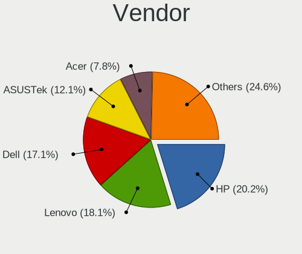

| Name                    | Notebooks | Percent |
|-------------------------|-----------|---------|
| Hewlett-Packard         | 124       | 20.23%  |
| Lenovo                  | 111       | 18.11%  |
| Dell                    | 105       | 17.13%  |
| ASUSTek Computer        | 74        | 12.07%  |
| Acer                    | 48        | 7.83%   |
| Toshiba                 | 25        | 4.08%   |
| Apple                   | 16        | 2.61%   |
| MSI                     | 13        | 2.12%   |
| Samsung Electronics     | 10        | 1.63%   |
| Fujitsu                 | 10        | 1.63%   |
| Sony                    | 8         | 1.31%   |
| Packard Bell            | 6         | 0.98%   |
| TUXEDO                  | 5         | 0.82%   |
| Notebook                | 5         | 0.82%   |
| HUAWEI                  | 4         | 0.65%   |
| Google                  | 4         | 0.65%   |
| Chuwi                   | 4         | 0.65%   |
| Medion                  | 3         | 0.49%   |
| EVOO                    | 3         | 0.49%   |
| eMachines               | 3         | 0.49%   |
| Unknown                 | 3         | 0.49%   |
| Timi                    | 2         | 0.33%   |
| Login Informatica       | 2         | 0.33%   |
| LG Electronics          | 2         | 0.33%   |
| Info Quest Technologies | 2         | 0.33%   |
| Alienware               | 2         | 0.33%   |
| SLIMBOOK                | 1         | 0.16%   |
| Razer                   | 1         | 0.16%   |
| Positivo                | 1         | 0.16%   |
| Philco                  | 1         | 0.16%   |
| OEM                     | 1         | 0.16%   |
| NEC Computers           | 1         | 0.16%   |
| Metabox                 | 1         | 0.16%   |
| Machcreator             | 1         | 0.16%   |
| Intelbras               | 1         | 0.16%   |
| IGEL Technology         | 1         | 0.16%   |
| HONOR                   | 1         | 0.16%   |
| Gigabyte Technology     | 1         | 0.16%   |
| Gateway                 | 1         | 0.16%   |
| Dynabook                | 1         | 0.16%   |

Model
-----

Motherboard model

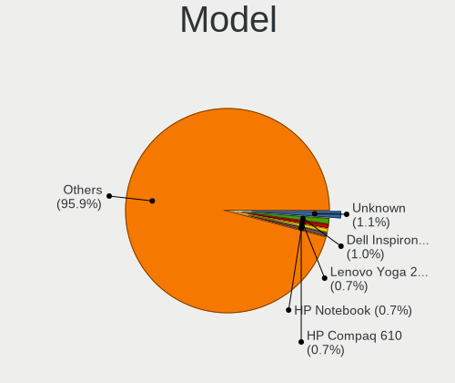

| Name                                   | Notebooks | Percent |
|----------------------------------------|-----------|---------|
| Unknown                                | 7         | 1.14%   |
| Dell Inspiron 15 3515                  | 6         | 0.98%   |
| Lenovo Yoga 2 11 20332                 | 4         | 0.65%   |
| HP Notebook                            | 4         | 0.65%   |
| HP Compaq 610                          | 4         | 0.65%   |
| Toshiba Satellite C650                 | 3         | 0.49%   |
| Lenovo IdeaPad 100-15IBY 80MJ          | 3         | 0.49%   |
| HP Pavilion Notebook                   | 3         | 0.49%   |
| HP Pavilion dv7                        | 3         | 0.49%   |
| HP Laptop 15s-eq2xxx                   | 3         | 0.49%   |
| HP 250 G3                              | 3         | 0.49%   |
| EVOO TEV-CE-141-2                      | 3         | 0.49%   |
| Dell XPS 13 9350                       | 3         | 0.49%   |
| Dell Latitude E7440                    | 3         | 0.49%   |
| Dell Latitude E5550                    | 3         | 0.49%   |
| Dell Latitude D630                     | 3         | 0.49%   |
| ASUS VivoBook_ASUSLaptop X513EA_K513EA | 3         | 0.49%   |
| Toshiba Satellite C660                 | 2         | 0.33%   |
| Samsung 750XED                         | 2         | 0.33%   |
| Lenovo Legion 5 17ACH6H 82JY           | 2         | 0.33%   |
| Lenovo IdeaPad Y580                    | 2         | 0.33%   |
| Lenovo IdeaPad 330S-15IKB 81F5         | 2         | 0.33%   |
| Lenovo G50-45 80E3                     | 2         | 0.33%   |
| Info Quest GTN1402 4-64                | 2         | 0.33%   |
| HP Stream Laptop 14-ax0XX              | 2         | 0.33%   |
| HP ProBook 650 G1                      | 2         | 0.33%   |
| HP ProBook 640 G1                      | 2         | 0.33%   |
| HP ProBook 440 G8 Notebook PC          | 2         | 0.33%   |
| HP Pavilion Gaming Laptop 15-ec0xxx    | 2         | 0.33%   |
| HP Pavilion 15                         | 2         | 0.33%   |
| HP Laptop 17-by4xxx                    | 2         | 0.33%   |
| HP Laptop 15s-fq2xxx                   | 2         | 0.33%   |
| HP Laptop 15-dy2xxx                    | 2         | 0.33%   |
| HP Laptop 15-db0xxx                    | 2         | 0.33%   |
| HP Laptop 15-da0xxx                    | 2         | 0.33%   |
| HP Laptop 14-ck0xxx                    | 2         | 0.33%   |
| HP EliteBook 820 G1                    | 2         | 0.33%   |
| HP EliteBook 2560p                     | 2         | 0.33%   |
| HP EliteBook 2530p                     | 2         | 0.33%   |
| HP Compaq 6730s                        | 2         | 0.33%   |

Model Family
------------

Motherboard model prefix

| Name                  | Notebooks | Percent |
|-----------------------|-----------|---------|
| Lenovo ThinkPad       | 46        | 7.5%    |
| Dell Latitude         | 46        | 7.5%    |
| Acer Aspire           | 39        | 6.36%   |
| Dell Inspiron         | 34        | 5.55%   |
| Lenovo IdeaPad        | 31        | 5.06%   |
| HP Laptop             | 27        | 4.4%    |
| ASUS VivoBook         | 23        | 3.75%   |
| Toshiba Satellite     | 21        | 3.43%   |
| HP ProBook            | 16        | 2.61%   |
| HP Pavilion           | 16        | 2.61%   |
| HP EliteBook          | 15        | 2.45%   |
| HP Compaq             | 10        | 1.63%   |
| Fujitsu LIFEBOOK      | 8         | 1.31%   |
| Dell XPS              | 8         | 1.31%   |
| Dell Precision        | 7         | 1.14%   |
| Unknown               | 7         | 1.14%   |
| HP 250                | 6         | 0.98%   |
| Packard Bell EasyNote | 5         | 0.82%   |
| Lenovo Yoga           | 5         | 0.82%   |
| HP Stream             | 5         | 0.82%   |
| MSI Modern            | 4         | 0.65%   |
| HP Notebook           | 4         | 0.65%   |
| Dell Vostro           | 4         | 0.65%   |
| MSI Katana            | 3         | 0.49%   |
| Lenovo Legion         | 3         | 0.49%   |
| HP ZBook              | 3         | 0.49%   |
| HP Victus             | 3         | 0.49%   |
| HP 15                 | 3         | 0.49%   |
| EVOO TEV-CE-141-2     | 3         | 0.49%   |
| Acer Extensa          | 3         | 0.49%   |
| TUXEDO Book           | 2         | 0.33%   |
| Toshiba PORTEGE       | 2         | 0.33%   |
| Samsung 750XED        | 2         | 0.33%   |
| Lenovo G50-45         | 2         | 0.33%   |
| Lenovo B560           | 2         | 0.33%   |
| Info Quest GTN1402    | 2         | 0.33%   |
| HP 255                | 2         | 0.33%   |
| HP 240                | 2         | 0.33%   |
| Dell System           | 2         | 0.33%   |
| Dell Studio           | 2         | 0.33%   |

MFG Year
--------

Motherboard manufacture year

| Year | Notebooks | Percent |
|------|-----------|---------|
| 2012 | 59        | 9.62%   |
| 2021 | 50        | 8.16%   |
| 2013 | 49        | 7.99%   |
| 2020 | 45        | 7.34%   |
| 2011 | 45        | 7.34%   |
| 2010 | 39        | 6.36%   |
| 2017 | 38        | 6.2%    |
| 2015 | 37        | 6.04%   |
| 2014 | 36        | 5.87%   |
| 2022 | 35        | 5.71%   |
| 2019 | 31        | 5.06%   |
| 2018 | 30        | 4.89%   |
| 2016 | 30        | 4.89%   |
| 2008 | 29        | 4.73%   |
| 2023 | 19        | 3.1%    |
| 2009 | 18        | 2.94%   |
| 2007 | 14        | 2.28%   |
| 2006 | 6         | 0.98%   |
| 2024 | 3         | 0.49%   |

Form Factor
-----------

Physical design of the computer

| Name     | Notebooks | Percent |
|----------|-----------|---------|
| Notebook | 613       | 100%    |

Secure Boot
-----------

Enabled or disabled

| State    | Notebooks | Percent |
|----------|-----------|---------|
| Disabled | 613       | 100%    |

Coreboot
--------

Have coreboot on board

| Used | Notebooks | Percent |
|------|-----------|---------|
| No   | 609       | 99.35%  |
| Yes  | 4         | 0.65%   |

RAM Size
--------

Total RAM memory

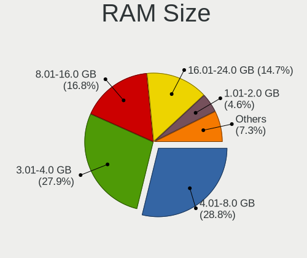

| Size in GB  | Notebooks | Percent |
|-------------|-----------|---------|
| 4.01-8.0    | 177       | 28.83%  |
| 3.01-4.0    | 171       | 27.85%  |
| 8.01-16.0   | 103       | 16.78%  |
| 16.01-24.0  | 90        | 14.66%  |
| 1.01-2.0    | 28        | 4.56%   |
| 32.01-64.0  | 19        | 3.09%   |
| 2.01-3.0    | 11        | 1.79%   |
| 24.01-32.0  | 9         | 1.47%   |
| 64.01-256.0 | 5         | 0.81%   |
| 0.51-1.0    | 1         | 0.16%   |

RAM Used
--------

Used RAM memory

| Used GB   | Notebooks | Percent |
|-----------|-----------|---------|
| 1.01-2.0  | 398       | 64.3%   |
| 2.01-3.0  | 107       | 17.29%  |
| 0.51-1.0  | 77        | 12.44%  |
| 3.01-4.0  | 25        | 4.04%   |
| 0.01-0.5  | 6         | 0.97%   |
| 4.01-8.0  | 5         | 0.81%   |
| 8.01-16.0 | 1         | 0.16%   |

Total Drives
------------

Number of drives on board

| Drives | Notebooks | Percent |
|--------|-----------|---------|
| 1      | 431       | 70.31%  |
| 2      | 148       | 24.14%  |
| 3      | 23        | 3.75%   |
| 0      | 7         | 1.14%   |
| 4      | 2         | 0.33%   |
| 13     | 1         | 0.16%   |
| 5      | 1         | 0.16%   |

Has CD-ROM
----------

Has CD-ROM on board

| Presented | Notebooks | Percent |
|-----------|-----------|---------|
| No        | 357       | 58.24%  |
| Yes       | 256       | 41.76%  |

Has Ethernet
------------

Has Ethernet on board

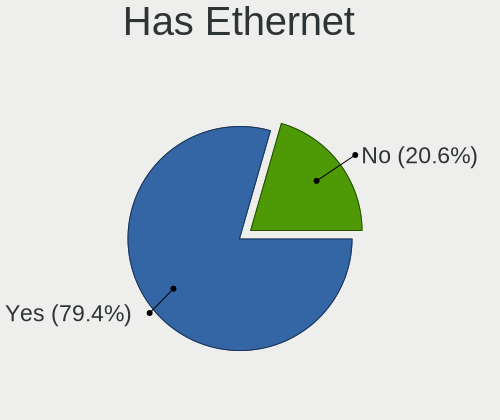

| Presented | Notebooks | Percent |
|-----------|-----------|---------|
| Yes       | 487       | 79.45%  |
| No        | 126       | 20.55%  |

Has WiFi
--------

Has WiFi module

| Presented | Notebooks | Percent |
|-----------|-----------|---------|
| Yes       | 599       | 97.72%  |
| No        | 14        | 2.28%   |

Has Bluetooth
-------------

Has Bluetooth module

| Presented | Notebooks | Percent |
|-----------|-----------|---------|
| Yes       | 480       | 78.3%   |
| No        | 133       | 21.7%   |

Location
--------

Country
-------

Geographic location (country)

| Country     | Notebooks | Percent |
|-------------|-----------|---------|
| USA         | 105       | 17.13%  |
| Poland      | 68        | 11.09%  |
| Germany     | 62        | 10.11%  |
| Russia      | 48        | 7.83%   |
| France      | 35        | 5.71%   |
| Brazil      | 29        | 4.73%   |
| Italy       | 25        | 4.08%   |
| UK          | 17        | 2.77%   |
| Spain       | 17        | 2.77%   |
| Canada      | 13        | 2.12%   |
| Indonesia   | 12        | 1.96%   |
| Czechia     | 12        | 1.96%   |
| Japan       | 11        | 1.79%   |
| Hungary     | 11        | 1.79%   |
| Turkey      | 10        | 1.63%   |
| Cyprus      | 9         | 1.47%   |
| Mexico      | 8         | 1.31%   |
| Switzerland | 7         | 1.14%   |
| Norway      | 6         | 0.98%   |
| Netherlands | 6         | 0.98%   |
| Greece      | 6         | 0.98%   |
| Belgium     | 6         | 0.98%   |
| India       | 5         | 0.82%   |
| Australia   | 5         | 0.82%   |
| Argentina   | 5         | 0.82%   |
| Slovakia    | 4         | 0.65%   |
| Portugal    | 4         | 0.65%   |
| Iran        | 4         | 0.65%   |
| China       | 4         | 0.65%   |
| New Zealand | 3         | 0.49%   |
| Malaysia    | 3         | 0.49%   |
| Austria     | 3         | 0.49%   |
| Vietnam     | 2         | 0.33%   |
| Ukraine     | 2         | 0.33%   |
| Thailand    | 2         | 0.33%   |
| Romania     | 2         | 0.33%   |
| Morocco     | 2         | 0.33%   |
| Lithuania   | 2         | 0.33%   |
| Jamaica     | 2         | 0.33%   |
| Hong Kong   | 2         | 0.33%   |

City
----

Geographic location (city)

| City           | Notebooks | Percent |
|----------------|-----------|---------|
| Warsaw         | 12        | 1.95%   |
| Prague         | 8         | 1.3%    |
| Poznan         | 7         | 1.14%   |
| Paris          | 6         | 0.97%   |
| Oliveira       | 6         | 0.97%   |
| Dali           | 6         | 0.97%   |
| Moscow         | 5         | 0.81%   |
| Budapest       | 5         | 0.81%   |
| Wroclaw        | 4         | 0.65%   |
| Topeka         | 4         | 0.65%   |
| Rome           | 4         | 0.65%   |
| Rochester      | 4         | 0.65%   |
| Milan          | 4         | 0.65%   |
| Katowice       | 4         | 0.65%   |
| Voronezh       | 3         | 0.49%   |
| Stuhr          | 3         | 0.49%   |
| St Albans      | 3         | 0.49%   |
| San Pedro      | 3         | 0.49%   |
| Novosibirsk    | 3         | 0.49%   |
| Munich         | 3         | 0.49%   |
| Montreal       | 3         | 0.49%   |
| Limassol       | 3         | 0.49%   |
| Hanover        | 3         | 0.49%   |
| rd           | 3         | 0.49%   |
| Dsseldorf    | 3         | 0.49%   |
| Chelyabinsk    | 3         | 0.49%   |
| Berlin         | 3         | 0.49%   |
| Ankara         | 3         | 0.49%   |
| Zielona Gra  | 2         | 0.32%   |
| Zacatecas City | 2         | 0.32%   |
| Yekaterinburg  | 2         | 0.32%   |
| Wuppertal      | 2         | 0.32%   |
| Vienna         | 2         | 0.32%   |
| Valencia       | 2         | 0.32%   |
| Uberlingen     | 2         | 0.32%   |
| Tomsk          | 2         | 0.32%   |
| Tokyo          | 2         | 0.32%   |
| Tehran         | 2         | 0.32%   |
| Tampa          | 2         | 0.32%   |
| Sydney         | 2         | 0.32%   |

Drives
------

Drive Vendor
------------

Hard drive vendors

| Vendor                      | Notebooks | Drives | Percent |
|-----------------------------|-----------|--------|---------|
| WDC                         | 99        | 102    | 13.03%  |
| Samsung Electronics         | 90        | 105    | 11.84%  |
| Seagate                     | 71        | 73     | 9.34%   |
| Kingston                    | 47        | 47     | 6.18%   |
| Toshiba                     | 44        | 46     | 5.79%   |
| SanDisk                     | 40        | 43     | 5.26%   |
| Unknown                     | 27        | 29     | 3.55%   |
| Micron Technology           | 22        | 26     | 2.89%   |
| Hitachi                     | 21        | 21     | 2.76%   |
| Crucial                     | 18        | 18     | 2.37%   |
| Unknown                     | 18        | 18     | 2.37%   |
| JMicron Technology          | 17        | 17     | 2.24%   |
| SK hynix                    | 16        | 18     | 2.11%   |
| Intel                       | 15        | 15     | 1.97%   |
| China                       | 13        | 13     | 1.71%   |
| SPCC                        | 12        | 12     | 1.58%   |
| HGST                        | 12        | 13     | 1.58%   |
| Intenso                     | 11        | 12     | 1.45%   |
| A-DATA Technology           | 11        | 12     | 1.45%   |
| GOODRAM                     | 9         | 10     | 1.18%   |
| Apple                       | 9         | 9      | 1.18%   |
| KIOXIA                      | 7         | 7      | 0.92%   |
| PNY                         | 6         | 6      | 0.79%   |
| KingSpec                    | 6         | 6      | 0.79%   |
| SSSTC                       | 5         | 5      | 0.66%   |
| Lexar                       | 5         | 5      | 0.66%   |
| Kingston Technology Company | 5         | 5      | 0.66%   |
| UMIS                        | 3         | 3      | 0.39%   |
| Transcend                   | 3         | 3      | 0.39%   |
| Team                        | 3         | 3      | 0.39%   |
| T-FORCE                     | 3         | 3      | 0.39%   |
| Patriot                     | 3         | 3      | 0.39%   |
| MSI                         | 3         | 3      | 0.39%   |
| Hewlett-Packard             | 3         | 3      | 0.39%   |
| Gigabyte Technology         | 3         | 3      | 0.39%   |
| FORESEE                     | 3         | 3      | 0.39%   |
| Apacer                      | 3         | 3      | 0.39%   |
| WALRAM                      | 2         | 2      | 0.26%   |
| Verbatim                    | 2         | 2      | 0.26%   |
| SPCC M.2                    | 2         | 2      | 0.26%   |

Drive Model
-----------

Hard drive models

| Model                               | Notebooks | Percent |
|-------------------------------------|-----------|---------|
| Unknown                             | 18        | 2.32%   |
| SanDisk NVMe SSD Drive 1TB          | 12        | 1.54%   |
| JMicron Generic 500GB               | 10        | 1.29%   |
| Kingston SA400S37240G 240GB SSD     | 9         | 1.16%   |
| Toshiba MQ04ABF100 1TB              | 8         | 1.03%   |
| Seagate ST1000LM024 HN-M101MBB 1TB  | 8         | 1.03%   |
| Toshiba MQ01ABD100 1TB              | 7         | 0.9%    |
| Seagate ST500LT012-1DG142 500GB     | 7         | 0.9%    |
| Kingston SNVS500G 500GB             | 7         | 0.9%    |
| JMicron Tech 250GB                  | 7         | 0.9%    |
| Seagate ST1000LM035-1RK172 1TB      | 5         | 0.64%   |
| Unknown SD/MMC/MS PRO 128GB         | 4         | 0.51%   |
| Seagate ST9500325AS 500GB           | 4         | 0.51%   |
| Seagate ST500LT032-1E9142 500GB     | 4         | 0.51%   |
| Micron 2210_MTFDHBA512QFD 512GB     | 4         | 0.51%   |
| Intenso SSD 128GB                   | 4         | 0.51%   |
| HGST HTS545050A7E680 500GB          | 4         | 0.51%   |
| WDC WDS240G2G0A-00JH30 240GB SSD    | 3         | 0.39%   |
| WDC WD5000LPVX-22V0TT0 500GB        | 3         | 0.39%   |
| WDC WD5000LPCX-24VHAT0 500GB        | 3         | 0.39%   |
| WDC WD10SPZX-24Z10 1TB              | 3         | 0.39%   |
| Toshiba MQ01ABF050 500GB            | 3         | 0.39%   |
| Seagate ST9320423AS 320GB           | 3         | 0.39%   |
| Seagate ST500LM012 HN-M500MBB 500GB | 3         | 0.39%   |
| Seagate ST2000LM007-1R8174 2TB      | 3         | 0.39%   |
| SanDisk SD7SB3Q-256G-1006 256GB SSD | 3         | 0.39%   |
| SanDisk NVMe SSD Drive 512GB        | 3         | 0.39%   |
| Samsung SSD 870 QVO 1TB             | 3         | 0.39%   |
| Kingston Company SNV2S1000G 1TB     | 3         | 0.39%   |
| Kingston SA400S37960G 960GB SSD     | 3         | 0.39%   |
| Kingston SA400S37120G 120GB SSD     | 3         | 0.39%   |
| Hitachi HTS545032B9A300 320GB       | 3         | 0.39%   |
| Hitachi HTS543232A7A384 320GB       | 3         | 0.39%   |
| Crucial CT480BX500SSD1 480GB        | 3         | 0.39%   |
| Apple SSD SM0128G 121GB             | 3         | 0.39%   |
| WDC WDS100T3X0C-00SJG0 1TB          | 2         | 0.26%   |
| WDC WDS100T2G0A-00JH30 1TB SSD      | 2         | 0.26%   |
| WDC WDS100T2B0A-00SM50 1TB SSD      | 2         | 0.26%   |
| WDC WD7500BPVX-16JC3T3 752GB        | 2         | 0.26%   |
| WDC WD6400BEVT-22A0RT0 640GB        | 2         | 0.26%   |

HDD Vendor
----------

Hard disk drive vendors

| Vendor              | Notebooks | Drives | Percent |
|---------------------|-----------|--------|---------|
| WDC                 | 70        | 72     | 29.79%  |
| Seagate             | 70        | 72     | 29.79%  |
| Toshiba             | 37        | 39     | 15.74%  |
| Hitachi             | 20        | 20     | 8.51%   |
| HGST                | 12        | 13     | 5.11%   |
| JMicron Technology  | 10        | 10     | 4.26%   |
| Unknown             | 4         | 4      | 1.7%    |
| Samsung Electronics | 2         | 2      | 0.85%   |
| SABRENT             | 2         | 3      | 0.85%   |
| Fujitsu             | 2         | 2      | 0.85%   |
| ASMT                | 2         | 2      | 0.85%   |
| USB                 | 1         | 1      | 0.43%   |
| TO Exter            | 1         | 1      | 0.43%   |
| External            | 1         | 1      | 0.43%   |
| Apple               | 1         | 1      | 0.43%   |

SSD Vendor
----------

Solid state drive vendors

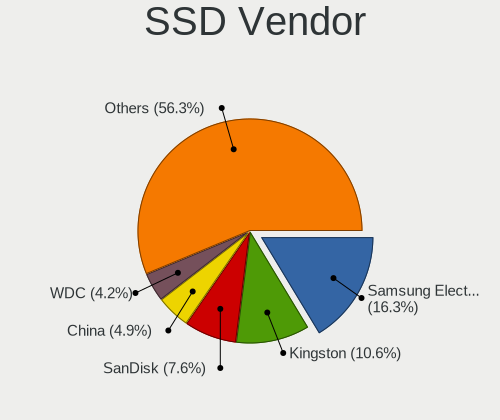

| Vendor              | Notebooks | Drives | Percent |
|---------------------|-----------|--------|---------|
| Samsung Electronics | 43        | 47     | 16.35%  |
| Kingston            | 28        | 28     | 10.65%  |
| SanDisk             | 20        | 21     | 7.6%    |
| China               | 13        | 13     | 4.94%   |
| WDC                 | 11        | 11     | 4.18%   |
| Intenso             | 10        | 11     | 3.8%    |
| Crucial             | 10        | 10     | 3.8%    |
| SPCC                | 9         | 9      | 3.42%   |
| A-DATA Technology   | 9         | 10     | 3.42%   |
| GOODRAM             | 8         | 9      | 3.04%   |
| Micron Technology   | 7         | 9      | 2.66%   |
| KingSpec            | 6         | 6      | 2.28%   |
| Intel               | 6         | 6      | 2.28%   |
| Apple               | 6         | 6      | 2.28%   |
| PNY                 | 5         | 5      | 1.9%    |
| Unknown             | 4         | 4      | 1.52%   |
| Transcend           | 3         | 3      | 1.14%   |
| Patriot             | 3         | 3      | 1.14%   |
| Hewlett-Packard     | 3         | 3      | 1.14%   |
| Apacer              | 3         | 3      | 1.14%   |
| Verbatim            | 2         | 2      | 0.76%   |
| Toshiba             | 2         | 2      | 0.76%   |
| T-FORCE             | 2         | 2      | 0.76%   |
| SPCC M.2            | 2         | 2      | 0.76%   |
| RX7                 | 2         | 2      | 0.76%   |
| LITEONIT            | 2         | 2      | 0.76%   |
| HS-SSD-E100         | 2         | 2      | 0.76%   |
| FORESEE             | 2         | 2      | 0.76%   |
| Digma               | 2         | 2      | 0.76%   |
| Dahua               | 2         | 3      | 0.76%   |
| USB3.0              | 1         | 1      | 0.38%   |
| TwinMOS             | 1         | 1      | 0.38%   |
| Team                | 1         | 1      | 0.38%   |
| SSSTC               | 1         | 1      | 0.38%   |
| SK hynix            | 1         | 1      | 0.38%   |
| POLION              | 1         | 1      | 0.38%   |
| Plextor             | 1         | 1      | 0.38%   |
| Phison              | 1         | 1      | 0.38%   |
| OCZ                 | 1         | 1      | 0.38%   |
| Netac               | 1         | 1      | 0.38%   |

Drive Kind
----------

HDD or SSD

| Kind    | Notebooks | Drives | Percent |
|---------|-----------|--------|---------|
| SSD     | 251       | 275    | 34.91%  |
| HDD     | 225       | 243    | 31.29%  |
| NVMe    | 189       | 223    | 26.29%  |
| MMC     | 37        | 41     | 5.15%   |
| Unknown | 17        | 19     | 2.36%   |

Drive Connector
---------------

SATA, SAS, NVMe, etc.

| Type | Notebooks | Drives | Percent |
|------|-----------|--------|---------|
| SATA | 414       | 468    | 59.57%  |
| NVMe | 188       | 214    | 27.05%  |
| SAS  | 56        | 78     | 8.06%   |
| MMC  | 37        | 41     | 5.32%   |

Drive Size
----------

Size of hard drive

| Size in TB | Notebooks | Drives | Percent |
|------------|-----------|--------|---------|
| 0.01-0.5   | 327       | 358    | 69.13%  |
| 0.51-1.0   | 125       | 136    | 26.43%  |
| 1.01-2.0   | 17        | 19     | 3.59%   |
| 3.01-4.0   | 3         | 4      | 0.63%   |
| 10.01-20.0 | 1         | 1      | 0.21%   |

Space Total
-----------

Amount of disk space available on the file system

| Size in GB     | Notebooks | Percent |
|----------------|-----------|---------|
| 1-20           | 239       | 38.8%   |
| 101-250        | 134       | 21.75%  |
| 251-500        | 76        | 12.34%  |
| 501-1000       | 40        | 6.49%   |
| 51-100         | 39        | 6.33%   |
| 21-50          | 37        | 6.01%   |
| Unknown        | 32        | 5.19%   |
| 1001-2000      | 13        | 2.11%   |
| More than 3000 | 3         | 0.49%   |
| 2001-3000      | 3         | 0.49%   |

Space Used
----------

Amount of used disk space

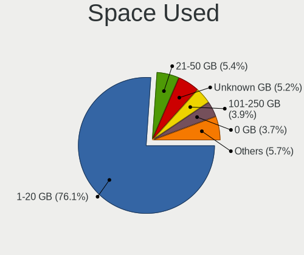

| Used GB   | Notebooks | Percent |
|-----------|-----------|---------|
| 1-20      | 468       | 76.1%   |
| 21-50     | 33        | 5.37%   |
| Unknown   | 32        | 5.2%    |
| 101-250   | 24        | 3.9%    |
| 0         | 23        | 3.74%   |
| 51-100    | 19        | 3.09%   |
| 251-500   | 8         | 1.3%    |
| 501-1000  | 6         | 0.98%   |
| 1001-2000 | 2         | 0.33%   |

Malfunc. Drives
---------------

Drive models with a malfunction

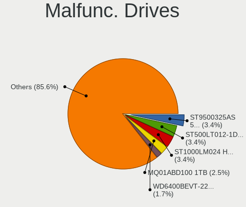

| Model                                      | Notebooks | Drives | Percent |
|--------------------------------------------|-----------|--------|---------|
| Seagate ST9500325AS 500GB                  | 4         | 4      | 3.39%   |
| Seagate ST500LT012-1DG142 500GB            | 4         | 4      | 3.39%   |
| Seagate ST1000LM024 HN-M101MBB 1TB         | 4         | 4      | 3.39%   |
| Toshiba MQ01ABD100 1TB                     | 3         | 3      | 2.54%   |
| WDC WD6400BEVT-22A0RT0 640GB               | 2         | 2      | 1.69%   |
| WDC WD5000LPVX-22V0TT0 500GB               | 2         | 2      | 1.69%   |
| WDC WD5000LPCX-24VHAT0 500GB               | 2         | 2      | 1.69%   |
| WDC WD2500BEVT-60ZCT1 250GB                | 2         | 2      | 1.69%   |
| Seagate ST9320325AS 320GB                  | 2         | 2      | 1.69%   |
| Seagate ST1000LM035-1RK172 1TB             | 2         | 2      | 1.69%   |
| Seagate ST1000LM014-1EJ164 1TB             | 2         | 2      | 1.69%   |
| Samsung Electronics MZVLQ512HBLU-00B 512GB | 2         | 2      | 1.69%   |
| Hitachi HTS545050B9A300 500GB              | 2         | 2      | 1.69%   |
| Hitachi HTS545032B9A300 320GB              | 2         | 2      | 1.69%   |
| HGST HTS545050A7E680 500GB                 | 2         | 2      | 1.69%   |
| HGST HTS545050A7E380 500GB                 | 2         | 2      | 1.69%   |
| WDC WDS240G2G0A-00JH30 240GB SSD           | 1         | 1      | 0.85%   |
| WDC WDS100T2G0A-00JH30 1TB SSD             | 1         | 1      | 0.85%   |
| WDC WD7500BPKT-75PK4T0 752GB               | 1         | 1      | 0.85%   |
| WDC WD6400BPVT-16HXZT1 640GB               | 1         | 1      | 0.85%   |
| WDC WD5000LPLX-08ZNTT0 500GB               | 1         | 1      | 0.85%   |
| WDC WD5000BEVT-75A0RT0 500GB               | 1         | 1      | 0.85%   |
| WDC WD3200BPVT-80JJ5T0 320GB               | 1         | 1      | 0.85%   |
| WDC WD3200BEVT-75A23T0 320GB               | 1         | 1      | 0.85%   |
| WDC WD3200BEKT-75PVMT1 320GB               | 1         | 1      | 0.85%   |
| WDC WD3200BEKT-08PVMT1 320GB               | 1         | 1      | 0.85%   |
| WDC WD2500BEVT-22ZCT0 250GB                | 1         | 1      | 0.85%   |
| WDC WD2500BEVT-22A23T0 250GB               | 1         | 1      | 0.85%   |
| WDC WD1600BEVT-75A23T0 160GB               | 1         | 1      | 0.85%   |
| WDC WD1600BEKT-60F3T1 160GB                | 1         | 1      | 0.85%   |
| WDC WD10SPZX-60Z10T0 1TB                   | 1         | 1      | 0.85%   |
| WDC WD10JPVX-60JC3T0 1TB                   | 1         | 1      | 0.85%   |
| WDC WD10JPVT-60A1YT0 1TB                   | 1         | 1      | 0.85%   |
| Transcend TS128GMTS800 128GB SSD           | 1         | 1      | 0.85%   |
| Transcend TS128GMTS430S 128GB SSD          | 1         | 1      | 0.85%   |
| Toshiba MQ04ABF100 1TB                     | 1         | 1      | 0.85%   |
| Toshiba MQ01ABF050 500GB                   | 1         | 1      | 0.85%   |
| Toshiba MK3276GSX 320GB                    | 1         | 1      | 0.85%   |
| Toshiba MK3265GSXN 320GB                   | 1         | 1      | 0.85%   |
| Toshiba MK3265GSX 320GB                    | 1         | 1      | 0.85%   |

Malfunc. Drive Vendor
---------------------

Vendors of faulty drives

| Vendor              | Notebooks | Drives | Percent |
|---------------------|-----------|--------|---------|
| Seagate             | 30        | 30     | 25.42%  |
| WDC                 | 25        | 25     | 21.19%  |
| Toshiba             | 12        | 12     | 10.17%  |
| Hitachi             | 12        | 12     | 10.17%  |
| Samsung Electronics | 5         | 5      | 4.24%   |
| Kingston            | 5         | 5      | 4.24%   |
| HGST                | 5         | 6      | 4.24%   |
| Crucial             | 3         | 3      | 2.54%   |
| Transcend           | 2         | 2      | 1.69%   |
| SanDisk             | 2         | 2      | 1.69%   |
| KingSpec            | 2         | 2      | 1.69%   |
| Team                | 1         | 1      | 0.85%   |
| SSSTC               | 1         | 1      | 0.85%   |
| SPCC                | 1         | 1      | 0.85%   |
| SK hynix            | 1         | 1      | 0.85%   |
| POLION              | 1         | 1      | 0.85%   |
| OCZ                 | 1         | 1      | 0.85%   |
| Netac               | 1         | 1      | 0.85%   |
| LITEONIT            | 1         | 1      | 0.85%   |
| Lexar               | 1         | 1      | 0.85%   |
| JMicron Technology  | 1         | 1      | 0.85%   |
| Intel               | 1         | 1      | 0.85%   |
| Fujitsu             | 1         | 1      | 0.85%   |
| Dogfish             | 1         | 1      | 0.85%   |
| China               | 1         | 1      | 0.85%   |
| Unknown             | 1         | 1      | 0.85%   |

Malfunc. HDD Vendor
-------------------

Vendors of faulty HDD drives

| Vendor              | Notebooks | Drives | Percent |
|---------------------|-----------|--------|---------|
| Seagate             | 30        | 30     | 35.29%  |
| WDC                 | 23        | 23     | 27.06%  |
| Toshiba             | 12        | 12     | 14.12%  |
| Hitachi             | 12        | 12     | 14.12%  |
| HGST                | 5         | 6      | 5.88%   |
| Samsung Electronics | 2         | 2      | 2.35%   |
| Fujitsu             | 1         | 1      | 1.18%   |

Malfunc. Drive Kind
-------------------

Kinds of faulty drives

| Kind    | Notebooks | Drives | Percent |
|---------|-----------|--------|---------|
| HDD     | 84        | 86     | 71.79%  |
| SSD     | 27        | 27     | 23.08%  |
| NVMe    | 5         | 5      | 4.27%   |
| Unknown | 1         | 1      | 0.85%   |

Failed Drives
-------------

Failed drive models

| Model                        | Notebooks | Drives | Percent |
|------------------------------|-----------|--------|---------|
| WDC WD5000BPVT-22HXZT1 500GB | 1         | 1      | 100%    |

Failed Drive Vendor
-------------------

Failed drive vendors

| Vendor | Notebooks | Drives | Percent |
|--------|-----------|--------|---------|
| WDC    | 1         | 1      | 100%    |

Drive Status
------------

Number of failed and malfunc. drives

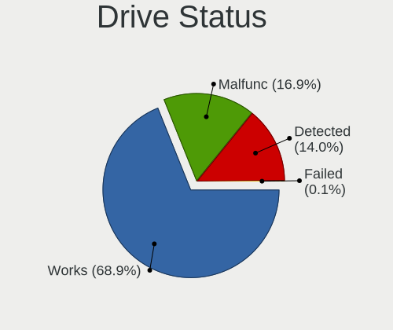

| Status   | Notebooks | Drives | Percent |
|----------|-----------|--------|---------|
| Works    | 468       | 561    | 68.92%  |
| Malfunc  | 115       | 119    | 16.94%  |
| Detected | 95        | 120    | 13.99%  |
| Failed   | 1         | 1      | 0.15%   |

Storage controller
------------------

Storage Vendor
--------------

Storage controller vendors

| Vendor                                  | Notebooks | Percent |
|-----------------------------------------|-----------|---------|
| Intel                                   | 429       | 60.42%  |
| AMD                                     | 73        | 10.28%  |
| Samsung Electronics                     | 49        | 6.9%    |
| SanDisk                                 | 32        | 4.51%   |
| Kingston Technology Company             | 24        | 3.38%   |
| Micron Technology                       | 16        | 2.25%   |
| SK hynix                                | 15        | 2.11%   |
| Phison Electronics                      | 15        | 2.11%   |
| Micron/Crucial Technology               | 7         | 0.99%   |
| Toshiba America Info Systems            | 6         | 0.85%   |
| Silicon Motion                          | 6         | 0.85%   |
| KIOXIA                                  | 6         | 0.85%   |
| Nvidia                                  | 5         | 0.7%    |
| Solid State Storage Technology          | 4         | 0.56%   |
| MAXIO Technology (Hangzhou)             | 4         | 0.56%   |
| ADATA Technology                        | 3         | 0.42%   |
| Union Memory (Shenzhen)                 | 2         | 0.28%   |
| Silicon Integrated Systems [SiS]        | 2         | 0.28%   |
| Shenzhen Longsys Electronics            | 2         | 0.28%   |
| Apple                                   | 2         | 0.28%   |
| Solidigm                                | 1         | 0.14%   |
| Shenzhen Unionmemory Information System | 1         | 0.14%   |
| Seagate Technology                      | 1         | 0.14%   |
| Realtek Semiconductor                   | 1         | 0.14%   |
| Netac Technology                        | 1         | 0.14%   |
| Marvell Technology Group                | 1         | 0.14%   |
| ASMedia Technology                      | 1         | 0.14%   |
| Unknown                                 | 1         | 0.14%   |

Storage Model
-------------

Storage controller models

| Model                                                                            | Notebooks | Percent |
|----------------------------------------------------------------------------------|-----------|---------|
| AMD FCH SATA Controller [AHCI mode]                                              | 56        | 7.28%   |
| Intel 7 Series Chipset Family 6-port SATA Controller [AHCI mode]                 | 51        | 6.63%   |
| Intel Sunrise Point-LP SATA Controller [AHCI mode]                               | 48        | 6.24%   |
| Intel 82801 Mobile SATA Controller [RAID mode]                                   | 35        | 4.55%   |
| Intel 6 Series/C200 Series Chipset Family 6 port Mobile SATA AHCI Controller     | 27        | 3.51%   |
| Intel 5 Series/3400 Series Chipset 4 port SATA AHCI Controller                   | 25        | 3.25%   |
| Intel 82801IBM/IEM (ICH9M/ICH9M-E) 4 port SATA Controller [AHCI mode]            | 24        | 3.12%   |
| Intel Volume Management Device NVMe RAID Controller                              | 21        | 2.73%   |
| Intel Wildcat Point-LP SATA Controller [AHCI Mode]                               | 18        | 2.34%   |
| Intel 8 Series/C220 Series Chipset Family 6-port SATA Controller 1 [AHCI mode]   | 18        | 2.34%   |
| Samsung NVMe SSD Controller 980 (DRAM-less)                                      | 17        | 2.21%   |
| Intel 82801HM/HEM (ICH8M/ICH8M-E) IDE Controller                                 | 15        | 1.95%   |
| Intel 8 Series SATA Controller 1 [AHCI mode]                                     | 15        | 1.95%   |
| Intel Atom Processor E3800 Series SATA AHCI Controller                           | 14        | 1.82%   |
| AMD SB7x0/SB8x0/SB9x0 SATA Controller [AHCI mode]                                | 14        | 1.82%   |
| Samsung NVMe SSD Controller SM981/PM981/PM983                                    | 13        | 1.69%   |
| Samsung NVMe SSD Controller PM9A1/PM9A3/980PRO                                   | 13        | 1.69%   |
| Intel Tiger Lake-LP SATA Controller                                              | 13        | 1.69%   |
| Intel Celeron/Pentium Silver Processor SATA Controller                           | 12        | 1.56%   |
| Intel Celeron N3350/Pentium N4200/Atom E3900 Series SATA AHCI Controller         | 12        | 1.56%   |
| Intel 82801HM/HEM (ICH8M/ICH8M-E) SATA Controller [AHCI mode]                    | 10        | 1.3%    |
| Intel 5 Series/3400 Series Chipset 6 port SATA AHCI Controller                   | 10        | 1.3%    |
| Kingston Company NV1 NVMe SSD [SM2263XT] (DRAM-less)                             | 7         | 0.91%   |
| Intel Comet Lake SATA AHCI Controller                                            | 7         | 0.91%   |
| Intel Atom/Celeron/Pentium Processor x5-E8000/J3xxx/N3xxx Series SATA Controller | 7         | 0.91%   |
| SK hynix Gold P31/BC711/PC711 NVMe Solid State Drive                             | 6         | 0.78%   |
| Intel 82801HM/HEM (ICH8M/ICH8M-E) SATA Controller [IDE mode]                     | 6         | 0.78%   |
| SanDisk Ultra 3D / WD PC SN530, IX SN530, Blue SN550 NVMe SSD (DRAM-less)        | 5         | 0.65%   |
| SanDisk Extreme Pro / WD Black SN750 / PC SN730 / Red SN700 NVMe SSD             | 5         | 0.65%   |
| Phison PS5013-E13 PCIe3 NVMe Controller (DRAM-less)                              | 5         | 0.65%   |
| Micron/Crucial P2 [Nick P2] / P3 / P3 Plus NVMe PCIe SSD (DRAM-less)             | 5         | 0.65%   |
| Micron 2210 NVMe SSD [Cobain]                                                    | 5         | 0.65%   |
| Intel HM170/QM170 Chipset SATA Controller [AHCI Mode]                            | 5         | 0.65%   |
| Intel 7 Series Chipset Family 4-port SATA Controller [IDE mode]                  | 5         | 0.65%   |
| Intel 7 Series Chipset Family 2-port SATA Controller [IDE mode]                  | 5         | 0.65%   |
| Toshiba America Info Systems XG6 NVMe SSD Controller                             | 4         | 0.52%   |
| Silicon Motion SM2263EN/SM2263XT (DRAM-less) NVMe SSD Controllers                | 4         | 0.52%   |
| SanDisk WD Black SN770 / PC SN740 256GB / PC SN560 (DRAM-less) NVMe SSD          | 4         | 0.52%   |
| Samsung S4LN058A01[SSUBX] AHCI SSD Controller (Apple slot)                       | 4         | 0.52%   |
| Samsung NVMe SSD Controller SM961/PM961/SM963                                    | 4         | 0.52%   |

Storage Kind
------------

Kind of storage controller (IDE, SATA, NVMe, SAS, ...)

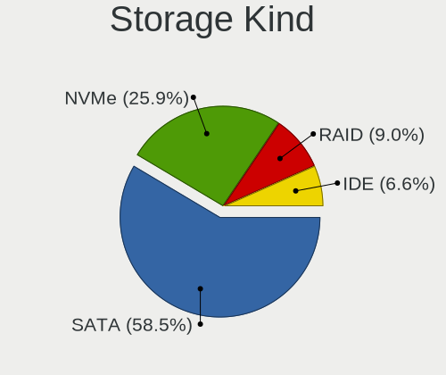

| Kind | Notebooks | Percent |
|------|-----------|---------|
| SATA | 425       | 58.54%  |
| NVMe | 188       | 25.9%   |
| RAID | 65        | 8.95%   |
| IDE  | 48        | 6.61%   |

Processor
---------

CPU Vendor
----------

Processor vendors

| Vendor | Notebooks | Percent |
|--------|-----------|---------|
| Intel  | 495       | 80.75%  |
| AMD    | 118       | 19.25%  |

CPU Model
---------

Processor models

| Model                                         | Notebooks | Percent |
|-----------------------------------------------|-----------|---------|
| Intel Core i5-8250U CPU @ 1.60GHz             | 12        | 1.96%   |
| Intel 11th Gen Core i5-1135G7 @ 2.40GHz       | 11        | 1.79%   |
| Intel Core i5-6300U CPU @ 2.40GHz             | 8         | 1.31%   |
| Intel Celeron CPU N2840 @ 2.16GHz             | 8         | 1.31%   |
| AMD Ryzen 5 5500U with Radeon Graphics        | 8         | 1.31%   |
| AMD Ryzen 5 3500U with Radeon Vega Mobile Gfx | 8         | 1.31%   |
| Intel Core i5-3320M CPU @ 2.60GHz             | 7         | 1.14%   |
| Intel Core i3 CPU M 380 @ 2.53GHz             | 7         | 1.14%   |
| Intel Celeron CPU N3350 @ 1.10GHz             | 7         | 1.14%   |
| Intel Core i5-6200U CPU @ 2.30GHz             | 6         | 0.98%   |
| Intel Core i5-5200U CPU @ 2.20GHz             | 6         | 0.98%   |
| Intel Core i5-4200U CPU @ 1.60GHz             | 6         | 0.98%   |
| Intel Core i5-3210M CPU @ 2.50GHz             | 6         | 0.98%   |
| Intel Core i5-10210U CPU @ 1.60GHz            | 6         | 0.98%   |
| Intel Celeron N4020 CPU @ 1.10GHz             | 6         | 0.98%   |
| AMD Ryzen 5 3450U with Radeon Vega Mobile Gfx | 6         | 0.98%   |
| Intel Pentium Dual-Core CPU T4500 @ 2.30GHz   | 5         | 0.82%   |
| Intel Core i7-3610QM CPU @ 2.30GHz            | 5         | 0.82%   |
| Intel Core i5 CPU M 460 @ 2.53GHz             | 5         | 0.82%   |
| Intel Core i3-6100U CPU @ 2.30GHz             | 5         | 0.82%   |
| Intel Core i3-6006U CPU @ 2.00GHz             | 5         | 0.82%   |
| Intel Core i3 CPU M 370 @ 2.40GHz             | 5         | 0.82%   |
| Intel Celeron N4000 CPU @ 1.10GHz             | 5         | 0.82%   |
| Intel 12th Gen Core i5-12500H                 | 5         | 0.82%   |
| Intel 11th Gen Core i3-1115G4 @ 3.00GHz       | 5         | 0.82%   |
| Intel Pentium CPU N3540 @ 2.16GHz             | 4         | 0.65%   |
| Intel Pentium CPU N3520 @ 2.16GHz             | 4         | 0.65%   |
| Intel Pentium CPU B960 @ 2.20GHz              | 4         | 0.65%   |
| Intel Core i7-8550U CPU @ 1.80GHz             | 4         | 0.65%   |
| Intel Core i7-3630QM CPU @ 2.40GHz            | 4         | 0.65%   |
| Intel Core i5-3337U CPU @ 1.80GHz             | 4         | 0.65%   |
| Intel Core i5-3230M CPU @ 2.60GHz             | 4         | 0.65%   |
| Intel Core i5-1035G1 CPU @ 1.00GHz            | 4         | 0.65%   |
| Intel Core i5 CPU M 520 @ 2.40GHz             | 4         | 0.65%   |
| Intel Core i3-2310M CPU @ 2.10GHz             | 4         | 0.65%   |
| Intel Core i3 CPU M 350 @ 2.27GHz             | 4         | 0.65%   |
| Intel Core i3 CPU M 330 @ 2.13GHz             | 4         | 0.65%   |
| Intel Core 2 Duo CPU P8600 @ 2.40GHz          | 4         | 0.65%   |
| Intel Celeron CPU N3050 @ 1.60GHz             | 4         | 0.65%   |
| Intel 12th Gen Core i7-12700H                 | 4         | 0.65%   |

CPU Model Family
----------------

Processor model prefix

| Model                   | Notebooks | Percent |
|-------------------------|-----------|---------|
| Intel Core i5           | 137       | 22.35%  |
| Intel Core i3           | 74        | 12.07%  |
| Intel Core i7           | 71        | 11.58%  |
| Other                   | 67        | 10.93%  |
| Intel Celeron           | 60        | 9.79%   |
| AMD Ryzen 5             | 34        | 5.55%   |
| Intel Core 2 Duo        | 29        | 4.73%   |
| Intel Pentium           | 24        | 3.92%   |
| AMD Ryzen 7             | 18        | 2.94%   |
| Intel Pentium Dual-Core | 8         | 1.31%   |
| AMD A6                  | 8         | 1.31%   |
| AMD E                   | 7         | 1.14%   |
| Intel Pentium Silver    | 6         | 0.98%   |
| AMD Ryzen 3             | 6         | 0.98%   |
| AMD A10                 | 6         | 0.98%   |
| Intel Pentium Dual      | 5         | 0.82%   |
| Intel Genuine           | 5         | 0.82%   |
| Intel Core 2            | 5         | 0.82%   |
| AMD A8                  | 5         | 0.82%   |
| AMD A4                  | 5         | 0.82%   |
| Intel Atom              | 4         | 0.65%   |
| AMD Turion 64 X2 Mobile | 3         | 0.49%   |
| AMD E1                  | 3         | 0.49%   |
| AMD Athlon              | 3         | 0.49%   |
| Intel Pentium Gold      | 2         | 0.33%   |
| AMD Ryzen 9             | 2         | 0.33%   |
| AMD E2                  | 2         | 0.33%   |
| AMD Athlon II Dual-Core | 2         | 0.33%   |
| Intel Xeon              | 1         | 0.16%   |
| Intel Core 2 Solo       | 1         | 0.16%   |
| Intel Celeron Dual-Core | 1         | 0.16%   |
| AMD V140                | 1         | 0.16%   |
| AMD V120                | 1         | 0.16%   |
| AMD Turion II Dual-Core | 1         | 0.16%   |
| AMD Turion II           | 1         | 0.16%   |
| AMD Ryzen 7 PRO         | 1         | 0.16%   |
| AMD Ryzen 5 PRO         | 1         | 0.16%   |
| AMD Phenom II           | 1         | 0.16%   |
| AMD GX                  | 1         | 0.16%   |
| AMD C-50                | 1         | 0.16%   |

CPU Cores
---------

Number of processor cores

| Number | Notebooks | Percent |
|--------|-----------|---------|
| 2      | 363       | 59.22%  |
| 4      | 161       | 26.26%  |
| 8      | 26        | 4.24%   |
| 6      | 25        | 4.08%   |
| 12     | 12        | 1.96%   |
| 1      | 10        | 1.63%   |
| 14     | 7         | 1.14%   |
| 10     | 7         | 1.14%   |
| 24     | 1         | 0.16%   |
| 3      | 1         | 0.16%   |

CPU Sockets
-----------

Number of sockets

| Number | Notebooks | Percent |
|--------|-----------|---------|
| 1      | 613       | 100%    |

CPU Threads
-----------

Threads per core (Hyper-Threading)

| Number | Notebooks | Percent |
|--------|-----------|---------|
| 2      | 409       | 66.72%  |
| 1      | 204       | 33.28%  |

CPU Op-Modes
------------

CPU Operation Modes (32-bit, 64-bit)

| Op mode        | Notebooks | Percent |
|----------------|-----------|---------|
| 32-bit, 64-bit | 613       | 100%    |

CPU Microcode
-------------

Microcode number

| Number     | Notebooks | Percent |
|------------|-----------|---------|
| Unknown    | 504       | 82.08%  |
| 0x08108109 | 18        | 2.93%   |
| 0x08608103 | 7         | 1.14%   |
| 0x06006705 | 7         | 1.14%   |
| 0x0a50000f | 5         | 0.81%   |
| 0x0a50000c | 5         | 0.81%   |
| 0x07030105 | 5         | 0.81%   |
| 0x0a50000d | 4         | 0.65%   |
| 0x0a404102 | 4         | 0.65%   |
| 0x08108102 | 4         | 0.65%   |
| 0x05000101 | 4         | 0.65%   |
| 0x08600106 | 3         | 0.49%   |
| 0x0700010b | 3         | 0.49%   |
| 0x0500010d | 3         | 0.49%   |
| 0x05000028 | 3         | 0.49%   |
| 0x010000b6 | 3         | 0.49%   |
| 0x08608104 | 2         | 0.33%   |
| 0x08608102 | 2         | 0.33%   |
| 0x08600103 | 2         | 0.33%   |
| 0x07030104 | 2         | 0.33%   |
| 0x06003106 | 2         | 0.33%   |
| 0x06001119 | 2         | 0.33%   |
| 0x06001116 | 2         | 0.33%   |
| 0x20655    | 1         | 0.16%   |
| 0x0a705205 | 1         | 0.16%   |
| 0x0a704104 | 1         | 0.16%   |
| 0x0a704103 | 1         | 0.16%   |
| 0x08a00006 | 1         | 0.16%   |
| 0x08608107 | 1         | 0.16%   |
| 0x0860010c | 1         | 0.16%   |
| 0x08600104 | 1         | 0.16%   |
| 0x08200103 | 1         | 0.16%   |
| 0x0810810d | 1         | 0.16%   |
| 0x07030106 | 1         | 0.16%   |
| 0x0600611a | 1         | 0.16%   |
| 0x06006110 | 1         | 0.16%   |
| 0x0600111f | 1         | 0.16%   |
| 0x03000027 | 1         | 0.16%   |
| 0x0300000f | 1         | 0.16%   |
| 0x010000c8 | 1         | 0.16%   |

CPU Microarch
-------------

Microarchitecture

| Name             | Notebooks | Percent |
|------------------|-----------|---------|
| KabyLake         | 64        | 10.44%  |
| IvyBridge        | 49        | 7.99%   |
| Haswell          | 43        | 7.01%   |
| SandyBridge      | 41        | 6.69%   |
| Westmere         | 40        | 6.53%   |
| Skylake          | 34        | 5.55%   |
| Silvermont       | 31        | 5.06%   |
| Penryn           | 30        | 4.89%   |
| Alderlake Hybrid | 29        | 4.73%   |
| Core             | 27        | 4.4%    |
| TigerLake        | 26        | 4.24%   |
| Zen+             | 24        | 3.92%   |
| Broadwell        | 22        | 3.59%   |
| Unknown          | 20        | 3.26%   |
| Goldmont plus    | 17        | 2.77%   |
| IceLake          | 16        | 2.61%   |
| Zen 3            | 14        | 2.28%   |
| Goldmont         | 12        | 1.96%   |
| Bobcat           | 10        | 1.63%   |
| Excavator        | 9         | 1.47%   |
| Puma             | 8         | 1.31%   |
| Zen 2            | 7         | 1.14%   |
| K10              | 7         | 1.14%   |
| Piledriver       | 6         | 0.98%   |
| Gracemont        | 4         | 0.65%   |
| CometLake        | 4         | 0.65%   |
| Tremont          | 3         | 0.49%   |
| K8 Hammer        | 3         | 0.49%   |
| K10 Llano        | 3         | 0.49%   |
| Jaguar           | 3         | 0.49%   |
| Bonnell          | 3         | 0.49%   |
| Zen              | 2         | 0.33%   |
| Steamroller      | 2         | 0.33%   |

Graphics
--------

GPU Vendor
----------

Vendors of graphics cards

| Vendor                           | Notebooks | Percent |
|----------------------------------|-----------|---------|
| Intel                            | 460       | 63.1%   |
| AMD                              | 139       | 19.07%  |
| Nvidia                           | 129       | 17.7%   |
| Silicon Integrated Systems [SiS] | 1         | 0.14%   |

GPU Model
---------

Graphics card models

| Model                                                                                    | Notebooks | Percent |
|------------------------------------------------------------------------------------------|-----------|---------|
| Intel 3rd Gen Core processor Graphics Controller                                         | 48        | 6.42%   |
| Intel 2nd Generation Core Processor Family Integrated Graphics Controller                | 37        | 4.95%   |
| Intel Core Processor Integrated Graphics Controller                                      | 34        | 4.55%   |
| Intel Skylake GT2 [HD Graphics 520]                                                      | 26        | 3.48%   |
| AMD Picasso/Raven 2 [Radeon Vega Series / Radeon Vega Mobile Series]                     | 26        | 3.48%   |
| Intel UHD Graphics 620                                                                   | 25        | 3.34%   |
| Intel Mobile 4 Series Chipset Integrated Graphics Controller                             | 24        | 3.21%   |
| Intel Haswell-ULT Integrated Graphics Controller                                         | 23        | 3.07%   |
| Intel Atom Processor Z36xxx/Z37xxx Series Graphics & Display                             | 21        | 2.81%   |
| Intel HD Graphics 5500                                                                   | 18        | 2.41%   |
| Intel TigerLake-LP GT2 [Iris Xe Graphics]                                                | 17        | 2.27%   |
| Intel 4th Gen Core Processor Integrated Graphics Controller                              | 17        | 2.27%   |
| Intel GeminiLake [UHD Graphics 600]                                                      | 14        | 1.87%   |
| Intel HD Graphics 620                                                                    | 12        | 1.6%    |
| AMD Lucienne                                                                             | 12        | 1.6%    |
| Intel CometLake-U GT2 [UHD Graphics]                                                     | 11        | 1.47%   |
| Intel Alder Lake-P GT2 [Iris Xe Graphics]                                                | 11        | 1.47%   |
| Intel Atom/Celeron/Pentium Processor x5-E8000/J3xxx/N3xxx Integrated Graphics Controller | 10        | 1.34%   |
| Nvidia GF117M [GeForce 610M/710M/810M/820M / GT 620M/625M/630M/720M]                     | 9         | 1.2%    |
| Intel Tiger Lake-LP GT2 [UHD Graphics G4]                                                | 9         | 1.2%    |
| Intel HD Graphics 500                                                                    | 9         | 1.2%    |
| Intel Mobile GM965/GL960 Integrated Graphics Controller (secondary)                      | 8         | 1.07%   |
| Intel Mobile GM965/GL960 Integrated Graphics Controller (primary)                        | 8         | 1.07%   |
| Intel Iris Plus Graphics G1 (Ice Lake)                                                   | 7         | 0.94%   |
| AMD Sun XT [Radeon HD 8670A/8670M/8690M / R5 M330 / M430 / Radeon 520 Mobile]            | 7         | 0.94%   |
| AMD Stoney [Radeon R2/R3/R4/R5 Graphics]                                                 | 7         | 0.94%   |
| AMD Renoir [Radeon Vega Series / Radeon Vega Mobile Series]                              | 7         | 0.94%   |
| AMD Barcelo                                                                              | 7         | 0.94%   |
| AMD Cezanne [Radeon Vega Series / Radeon Vega Mobile Series]                             | 6         | 0.8%    |
| Intel TigerLake-H GT1 [UHD Graphics]                                                     | 5         | 0.67%   |
| Intel Raptor Lake-P [Iris Xe Graphics]                                                   | 5         | 0.67%   |
| Intel Mobile GME965/GLE960 Integrated Graphics Controller                                | 5         | 0.67%   |
| Intel HD Graphics 530                                                                    | 5         | 0.67%   |
| Intel Alder Lake-UP3 GT2 [Iris Xe Graphics]                                              | 5         | 0.67%   |
| AMD RS880M [Mobility Radeon HD 4225/4250]                                                | 5         | 0.67%   |
| AMD Mullins [Radeon R4/R5 Graphics]                                                      | 5         | 0.67%   |
| Nvidia TU117M [GeForce GTX 1650 Mobile / Max-Q]                                          | 4         | 0.53%   |
| Nvidia GM107M [GeForce GTX 960M]                                                         | 4         | 0.53%   |
| Nvidia GK208BM [GeForce 920M]                                                            | 4         | 0.53%   |
| Nvidia GF108M [GeForce GT 620M/630M/635M/640M LE]                                        | 4         | 0.53%   |

GPU Combo
---------

Combinations of graphics cards

| Name           | Notebooks | Percent |
|----------------|-----------|---------|
| 1 x Intel      | 317       | 51.71%  |
| 1 x AMD        | 108       | 17.62%  |
| Intel + Nvidia | 94        | 15.33%  |
| 2 x Intel      | 38        | 6.2%    |
| 1 x Nvidia     | 24        | 3.92%   |
| Intel + AMD    | 11        | 1.79%   |
| 2 x AMD        | 10        | 1.63%   |
| AMD + Nvidia   | 10        | 1.63%   |
| 1 x SiS        | 1         | 0.16%   |

GPU Driver
----------

Free vs proprietary

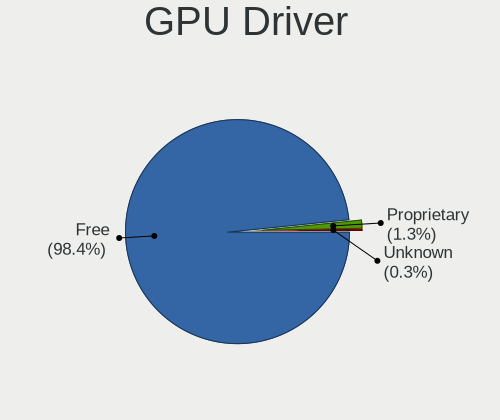

| Driver      | Notebooks | Percent |
|-------------|-----------|---------|
| Free        | 603       | 98.37%  |
| Proprietary | 8         | 1.31%   |
| Unknown     | 2         | 0.33%   |

GPU Memory
----------

Total video memory

| Size in GB | Notebooks | Percent |
|------------|-----------|---------|
| Unknown    | 372       | 60.49%  |
| 0.01-0.5   | 82        | 13.33%  |
| 1.01-2.0   | 75        | 12.2%   |
| 0.51-1.0   | 44        | 7.15%   |
| 3.01-4.0   | 27        | 4.39%   |
| 5.01-6.0   | 7         | 1.14%   |
| 7.01-8.0   | 4         | 0.65%   |
| 2.01-3.0   | 3         | 0.49%   |
| 16.01-24.0 | 1         | 0.16%   |

Monitor
-------

Monitor Vendor
--------------

Monitor vendors

| Vendor                  | Notebooks | Percent |
|-------------------------|-----------|---------|
| AU Optronics            | 152       | 23.53%  |
| Chimei Innolux          | 100       | 15.48%  |
| BOE                     | 99        | 15.33%  |
| LG Display              | 92        | 14.24%  |
| Samsung Electronics     | 60        | 9.29%   |
| Chi Mei Optoelectronics | 22        | 3.41%   |
| Apple                   | 17        | 2.63%   |
| Lenovo                  | 16        | 2.48%   |
| Sharp                   | 13        | 2.01%   |
| LG Philips              | 10        | 1.55%   |
| Dell                    | 7         | 1.08%   |
| Goldstar                | 6         | 0.93%   |
| InnoLux Display         | 4         | 0.62%   |
| Hewlett-Packard         | 4         | 0.62%   |
| TMX                     | 3         | 0.46%   |
| Philips                 | 3         | 0.46%   |
| PANDA                   | 3         | 0.46%   |
| Panasonic               | 3         | 0.46%   |
| CSO                     | 3         | 0.46%   |
| AOC                     | 3         | 0.46%   |
| Toshiba                 | 2         | 0.31%   |
| InfoVision              | 2         | 0.31%   |
| Ancor Communications    | 2         | 0.31%   |
| ___                     | 1         | 0.15%   |
| ViewSonic               | 1         | 0.15%   |
| Vestel Elektronik       | 1         | 0.15%   |
| Unknown (XXX)           | 1         | 0.15%   |
| Unknown                 | 1         | 0.15%   |
| TGL                     | 1         | 0.15%   |
| TFT                     | 1         | 0.15%   |
| Sony                    | 1         | 0.15%   |
| ONN                     | 1         | 0.15%   |
| NEC Computers           | 1         | 0.15%   |
| MTD                     | 1         | 0.15%   |
| Mitsubishi              | 1         | 0.15%   |
| KDC                     | 1         | 0.15%   |
| JDI                     | 1         | 0.15%   |
| IBM                     | 1         | 0.15%   |
| HKC                     | 1         | 0.15%   |
| HannStar                | 1         | 0.15%   |

Monitor Model
-------------

Monitor models

| Model                                                                    | Notebooks | Percent |
|--------------------------------------------------------------------------|-----------|---------|
| AU Optronics LCD Monitor AUO22EC 1366x768 344x193mm 15.5-inch            | 10        | 1.54%   |
| Samsung Electronics LCD Monitor SEC5441 1280x800 286x179mm 13.3-inch     | 8         | 1.23%   |
| LG Display LCD Monitor LGD02DC 1366x768 344x194mm 15.5-inch              | 7         | 1.08%   |
| Chimei Innolux LCD Monitor CMN15E7 1920x1080 344x193mm 15.5-inch         | 7         | 1.08%   |
| Chimei Innolux LCD Monitor CMN15F5 1920x1080 344x193mm 15.5-inch         | 6         | 0.92%   |
| AU Optronics LCD Monitor AUO26EC 1366x768 344x193mm 15.5-inch            | 6         | 0.92%   |
| LG Display LP156WH2-TLAA LGD0230 1366x768 344x194mm 15.5-inch            | 5         | 0.77%   |
| Chimei Innolux LCD Monitor CMN1728 1600x900 382x215mm 17.3-inch          | 5         | 0.77%   |
| Chimei Innolux LCD Monitor CMN15E5 1920x1080 344x193mm 15.5-inch         | 5         | 0.77%   |
| BOE LCD Monitor BOE06A4 1366x768 344x194mm 15.5-inch                     | 5         | 0.77%   |
| AU Optronics LCD Monitor AUO38ED 1920x1080 344x193mm 15.5-inch           | 5         | 0.77%   |
| AU Optronics LCD Monitor AUO21ED 1920x1080 344x193mm 15.5-inch           | 5         | 0.77%   |
| AU Optronics LCD Monitor AUO205C 1366x768 256x144mm 11.6-inch            | 5         | 0.77%   |
| Chimei Innolux LCD Monitor CMN15DB 1366x768 344x193mm 15.5-inch          | 4         | 0.62%   |
| Chimei Innolux LCD Monitor CMN14C9 1920x1080 309x173mm 13.9-inch         | 4         | 0.62%   |
| Chi Mei Optoelectronics LCD Monitor CMO1592 1366x768 350x190mm 15.7-inch | 4         | 0.62%   |
| BOE LCD Monitor BOE08D7 1920x1080 309x174mm 14.0-inch                    | 4         | 0.62%   |
| Samsung Electronics S24C36x SAM7314 1920x1080 521x293mm 23.5-inch        | 3         | 0.46%   |
| Samsung Electronics LCD Monitor SEC5541 1366x768 344x193mm 15.5-inch     | 3         | 0.46%   |
| Samsung Electronics LCD Monitor SDC4161 1920x1080 344x194mm 15.5-inch    | 3         | 0.46%   |
| LG Display LCD Monitor LGD046B 1366x768 344x194mm 15.5-inch              | 3         | 0.46%   |
| LG Display LCD Monitor LGD0468 1366x768 344x194mm 15.5-inch              | 3         | 0.46%   |
| LG Display LCD Monitor LGD033A 1366x768 340x190mm 15.3-inch              | 3         | 0.46%   |
| Lenovo LEN E2002bA LEN60BB 1600x900 432x240mm 19.5-inch                  | 3         | 0.46%   |
| Chimei Innolux LCD Monitor CMN15DC 1366x768 344x193mm 15.5-inch          | 3         | 0.46%   |
| Chimei Innolux LCD Monitor CMN1482 1600x900 309x174mm 14.0-inch          | 3         | 0.46%   |
| Chi Mei Optoelectronics LCD Monitor CMO15A7 1366x768 344x193mm 15.5-inch | 3         | 0.46%   |
| BOE LCD Monitor BOE0AF7 1920x1080 344x194mm 15.5-inch                    | 3         | 0.46%   |
| BOE LCD Monitor BOE06A5 1366x768 344x194mm 15.5-inch                     | 3         | 0.46%   |
| BOE LCD Monitor BOE0696 1366x768 309x173mm 13.9-inch                     | 3         | 0.46%   |
| BOE LCD Monitor BOE05F3 1366x768 309x173mm 13.9-inch                     | 3         | 0.46%   |
| AU Optronics LCD Monitor AUO8174 1280x800 331x207mm 15.4-inch            | 3         | 0.46%   |
| AU Optronics LCD Monitor AUO459D 1920x1200 344x215mm 16.0-inch           | 3         | 0.46%   |
| AU Optronics LCD Monitor AUO40EC 1366x768 344x193mm 15.5-inch            | 3         | 0.46%   |
| AU Optronics LCD Monitor AUO333D 1920x1080 309x174mm 14.0-inch           | 3         | 0.46%   |
| Sharp LQ156M1JW01 SHP14C3 1920x1080 344x194mm 15.5-inch                  | 2         | 0.31%   |
| Sharp LCD Monitor SHP144A 3200x1800 294x165mm 13.3-inch                  | 2         | 0.31%   |
| Sharp LCD Monitor SHP1449 1920x1080 294x165mm 13.3-inch                  | 2         | 0.31%   |
| Samsung Electronics LCD Monitor SEC3157 1280x800 303x190mm 14.1-inch     | 2         | 0.31%   |
| Samsung Electronics LCD Monitor SEC3150 1366x768 344x193mm 15.5-inch     | 2         | 0.31%   |

Monitor Resolution
------------------

Monitor screen resolution

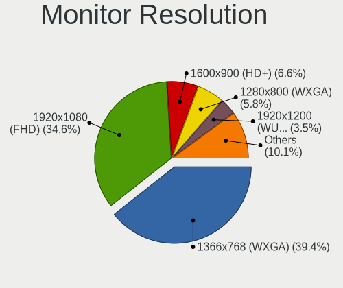

| Resolution         | Notebooks | Percent |
|--------------------|-----------|---------|
| 1366x768 (WXGA)    | 250       | 39.37%  |
| 1920x1080 (FHD)    | 220       | 34.65%  |
| 1600x900 (HD+)     | 42        | 6.61%   |
| 1280x800 (WXGA)    | 37        | 5.83%   |
| 1920x1200 (WUXGA)  | 22        | 3.46%   |
| 2560x1600          | 11        | 1.73%   |
| 1440x900 (WXGA+)   | 9         | 1.42%   |
| 3840x2160 (4K)     | 8         | 1.26%   |
| 2560x1440 (QHD)    | 8         | 1.26%   |
| 2880x1800          | 5         | 0.79%   |
| 1680x1050 (WSXGA+) | 3         | 0.47%   |
| 1024x600           | 3         | 0.47%   |
| 3840x2400          | 2         | 0.31%   |
| 3200x2000          | 2         | 0.31%   |
| 3200x1800 (QHD+)   | 2         | 0.31%   |
| 1280x1024 (SXGA)   | 2         | 0.31%   |
| 3440x1440          | 1         | 0.16%   |
| 3000x2000          | 1         | 0.16%   |
| 2880x1620          | 1         | 0.16%   |
| 2560x1080          | 1         | 0.16%   |
| 2256x1504          | 1         | 0.16%   |
| 2240x1400          | 1         | 0.16%   |
| 1920x540           | 1         | 0.16%   |
| 1360x768           | 1         | 0.16%   |
| 1024x768 (XGA)     | 1         | 0.16%   |

Monitor Diagonal
----------------

Diagonal size in inches

| Inches  | Notebooks | Percent |
|---------|-----------|---------|
| 15      | 301       | 46.38%  |
| 13      | 99        | 15.25%  |
| 14      | 79        | 12.17%  |
| 17      | 56        | 8.63%   |
| 16      | 18        | 2.77%   |
| 12      | 16        | 2.47%   |
| 11      | 14        | 2.16%   |
| 24      | 11        | 1.69%   |
| 27      | 9         | 1.39%   |
| 23      | 7         | 1.08%   |
| 19      | 7         | 1.08%   |
| 21      | 5         | 0.77%   |
| 18      | 5         | 0.77%   |
| 31      | 4         | 0.62%   |
| 10      | 3         | 0.46%   |
| Unknown | 3         | 0.46%   |
| 34      | 2         | 0.31%   |
| 22      | 2         | 0.31%   |
| 86      | 1         | 0.15%   |
| 84      | 1         | 0.15%   |
| 72      | 1         | 0.15%   |
| 54      | 1         | 0.15%   |
| 40      | 1         | 0.15%   |
| 39      | 1         | 0.15%   |
| 32      | 1         | 0.15%   |
| 30      | 1         | 0.15%   |

Monitor Width
-------------

Physical width

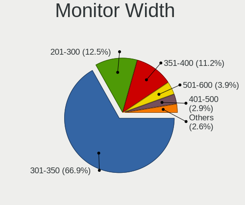

| Width in mm | Notebooks | Percent |
|-------------|-----------|---------|
| 301-350     | 434       | 66.87%  |
| 201-300     | 81        | 12.48%  |
| 351-400     | 73        | 11.25%  |
| 501-600     | 25        | 3.85%   |
| 401-500     | 19        | 2.93%   |
| 601-700     | 5         | 0.77%   |
| 701-800     | 3         | 0.46%   |
| Unknown     | 3         | 0.46%   |
| 801-900     | 2         | 0.31%   |
| 1501-2000   | 2         | 0.31%   |
| 1001-1500   | 2         | 0.31%   |

Aspect Ratio
------------

Proportional relationship between the width and the height

| Ratio | Notebooks | Percent |
|-------|-----------|---------|
| 16/9  | 513       | 83.96%  |
| 16/10 | 85        | 13.91%  |
| 3/2   | 6         | 0.98%   |
| 5/4   | 2         | 0.33%   |
| 21/9  | 2         | 0.33%   |
| 4/3   | 1         | 0.16%   |
| 32/9  | 1         | 0.16%   |
| 0.56  | 1         | 0.16%   |

Monitor Area
------------

Area in inch

| Area in inch | Notebooks | Percent |
|----------------|-----------|---------|
| 101-110        | 304       | 46.84%  |
| 81-90          | 140       | 21.57%  |
| 121-130        | 46        | 7.09%   |
| 71-80          | 37        | 5.7%    |
| 201-250        | 20        | 3.08%   |
| 61-70          | 16        | 2.47%   |
| 111-120        | 15        | 2.31%   |
| 51-60          | 14        | 2.16%   |
| 131-140        | 10        | 1.54%   |
| 301-350        | 9         | 1.39%   |
| 151-200        | 9         | 1.39%   |
| 351-500        | 8         | 1.23%   |
| 141-150        | 5         | 0.77%   |
| More than 1000 | 4         | 0.62%   |
| 41-50          | 3         | 0.46%   |
| 251-300        | 3         | 0.46%   |
| Unknown        | 3         | 0.46%   |
| 501-1000       | 2         | 0.31%   |
| 91-100         | 1         | 0.15%   |

Pixel Density
-------------

Pixels per inch

| Density       | Notebooks | Percent |
|---------------|-----------|---------|
| 101-120       | 259       | 40.41%  |
| 121-160       | 239       | 37.29%  |
| 51-100        | 91        | 14.2%   |
| 161-240       | 38        | 5.93%   |
| More than 240 | 9         | 1.4%    |
| Unknown       | 3         | 0.47%   |
| 1-50          | 2         | 0.31%   |

Multiple Monitors
-----------------

Total monitors connected

| Total | Notebooks | Percent |
|-------|-----------|---------|
| 1     | 552       | 89.9%   |
| 2     | 48        | 7.82%   |
| 0     | 12        | 1.95%   |
| 3     | 2         | 0.33%   |

Network
-------

Net Controller Vendor
---------------------

Controller vendors

| Vendor                           | Notebooks | Percent |
|----------------------------------|-----------|---------|
| Realtek Semiconductor            | 311       | 32.57%  |
| Intel                            | 264       | 27.64%  |
| Qualcomm Atheros                 | 160       | 16.75%  |
| Broadcom                         | 78        | 8.17%   |
| MediaTek                         | 24        | 2.51%   |
| Broadcom Limited                 | 23        | 2.41%   |
| ASIX Electronics                 | 14        | 1.47%   |
| Marvell Technology Group         | 13        | 1.36%   |
| Ralink                           | 12        | 1.26%   |
| Ralink Technology                | 7         | 0.73%   |
| Dell                             | 7         | 0.73%   |
| Sierra Wireless                  | 5         | 0.52%   |
| TP-Link                          | 3         | 0.31%   |
| Nvidia                           | 3         | 0.31%   |
| Linksys                          | 3         | 0.31%   |
| Huawei Technologies              | 3         | 0.31%   |
| Silicon Integrated Systems [SiS] | 2         | 0.21%   |
| Samsung Electronics              | 2         | 0.21%   |
| Lenovo                           | 2         | 0.21%   |
| JMicron Technology               | 2         | 0.21%   |
| ZyXEL Communications             | 1         | 0.1%    |
| ZTE WCDMA Technologies MSM       | 1         | 0.1%    |
| Xiaomi                           | 1         | 0.1%    |
| TP-Link Corporation Limited.     | 1         | 0.1%    |
| Toshiba                          | 1         | 0.1%    |
| Spreadtrum Communications        | 1         | 0.1%    |
| Qualcomm Atheros Communications  | 1         | 0.1%    |
| Qualcomm                         | 1         | 0.1%    |
| PLANEX                           | 1         | 0.1%    |
| OPPO Electronics                 | 1         | 0.1%    |
| NetGear                          | 1         | 0.1%    |
| Hewlett-Packard                  | 1         | 0.1%    |
| Elecom                           | 1         | 0.1%    |
| Edimax Technology                | 1         | 0.1%    |
| Belkin Components                | 1         | 0.1%    |
| Attansic Technology              | 1         | 0.1%    |
| ASUSTek Computer                 | 1         | 0.1%    |

Net Controller Model
--------------------

Controller models

| Model                                                                   | Notebooks | Percent |
|-------------------------------------------------------------------------|-----------|---------|
| Realtek RTL8111/8168/8211/8411 PCI Express Gigabit Ethernet Controller  | 169       | 14.85%  |
| Realtek RTL810xE PCI Express Fast Ethernet controller                   | 71        | 6.24%   |
| Realtek RTL8821CE 802.11ac PCIe Wireless Network Adapter                | 36        | 3.16%   |
| Qualcomm Atheros AR9485 Wireless Network Adapter                        | 31        | 2.72%   |
| Qualcomm Atheros AR9285 Wireless Network Adapter (PCI-Express)          | 30        | 2.64%   |
| Qualcomm Atheros QCA9377 802.11ac Wireless Network Adapter              | 25        | 2.2%    |
| Intel Wireless 7260                                                     | 23        | 2.02%   |
| Intel 82579LM Gigabit Network Connection (Lewisville)                   | 23        | 2.02%   |
| Intel Centrino Advanced-N 6205 [Taylor Peak]                            | 21        | 1.85%   |
| Broadcom BCM4313 802.11bgn Wireless Network Adapter                     | 19        | 1.67%   |
| Intel Wireless 8265 / 8275                                              | 18        | 1.58%   |
| Intel Alder Lake-P PCH CNVi WiFi                                        | 18        | 1.58%   |
| Realtek RTL8822CE 802.11ac PCIe Wireless Network Adapter                | 17        | 1.49%   |
| Intel Wi-Fi 6 AX200                                                     | 17        | 1.49%   |
| Realtek RTL8723BE PCIe Wireless Network Adapter                         | 16        | 1.41%   |
| Intel Wireless 8260                                                     | 16        | 1.41%   |
| Qualcomm Atheros QCA9565 / AR9565 Wireless Network Adapter              | 15        | 1.32%   |
| Intel Wi-Fi 6 AX201                                                     | 15        | 1.32%   |
| Intel Wireless 7265                                                     | 13        | 1.14%   |
| ASIX AX88179 Gigabit Ethernet                                           | 13        | 1.14%   |
| Realtek RTL8188CE 802.11b/g/n WiFi Adapter                              | 10        | 0.88%   |
| Qualcomm Atheros QCA6174 802.11ac Wireless Network Adapter              | 10        | 0.88%   |
| MediaTek MT7921 802.11ax PCI Express Wireless Network Adapter           | 10        | 0.88%   |
| Intel Wireless 3165                                                     | 10        | 0.88%   |
| Broadcom BCM43142 802.11b/g/n                                           | 10        | 0.88%   |
| Intel Ethernet Connection I219-LM                                       | 9         | 0.79%   |
| Qualcomm Atheros AR8161 Gigabit Ethernet                                | 8         | 0.7%    |
| Qualcomm Atheros AR8151 v2.0 Gigabit Ethernet                           | 8         | 0.7%    |
| Qualcomm Atheros AR242x / AR542x Wireless Network Adapter (PCI-Express) | 8         | 0.7%    |
| Intel Wireless 3160                                                     | 8         | 0.7%    |
| Intel Ethernet Connection I218-LM                                       | 8         | 0.7%    |
| Intel Ethernet Connection I217-LM                                       | 8         | 0.7%    |
| Intel Ethernet Connection (4) I219-LM                                   | 8         | 0.7%    |
| Intel Comet Lake PCH-LP CNVi WiFi                                       | 8         | 0.7%    |
| Realtek RTL8723DE Wireless Network Adapter                              | 7         | 0.62%   |
| Ralink RT3290 Wireless 802.11n 1T/1R PCIe                               | 7         | 0.62%   |
| MediaTek MT7922 802.11ax PCI Express Wireless Network Adapter           | 7         | 0.62%   |
| Intel Ethernet Connection (3) I218-LM                                   | 7         | 0.62%   |
| Intel Centrino Advanced-N 6200                                          | 7         | 0.62%   |
| Intel 82577LM Gigabit Network Connection                                | 7         | 0.62%   |

Wireless Vendor
---------------

Wireless vendors

| Vendor                          | Notebooks | Percent |
|---------------------------------|-----------|---------|
| Intel                           | 246       | 39.17%  |
| Qualcomm Atheros                | 135       | 21.5%   |
| Realtek Semiconductor           | 116       | 18.47%  |
| Broadcom                        | 55        | 8.76%   |
| MediaTek                        | 18        | 2.87%   |
| Broadcom Limited                | 16        | 2.55%   |
| Ralink                          | 12        | 1.91%   |
| Ralink Technology               | 7         | 1.11%   |
| Sierra Wireless                 | 5         | 0.8%    |
| Dell                            | 5         | 0.8%    |
| TP-Link                         | 3         | 0.48%   |
| ZyXEL Communications            | 1         | 0.16%   |
| Samsung Electronics             | 1         | 0.16%   |
| Qualcomm Atheros Communications | 1         | 0.16%   |
| Qualcomm                        | 1         | 0.16%   |
| PLANEX                          | 1         | 0.16%   |
| NetGear                         | 1         | 0.16%   |
| Elecom                          | 1         | 0.16%   |
| Edimax Technology               | 1         | 0.16%   |
| Belkin Components               | 1         | 0.16%   |
| ASUSTek Computer                | 1         | 0.16%   |

Wireless Model
--------------

Wireless models

| Model                                                                   | Notebooks | Percent |
|-------------------------------------------------------------------------|-----------|---------|
| Realtek RTL8821CE 802.11ac PCIe Wireless Network Adapter                | 36        | 5.72%   |
| Qualcomm Atheros AR9485 Wireless Network Adapter                        | 31        | 4.93%   |
| Qualcomm Atheros AR9285 Wireless Network Adapter (PCI-Express)          | 30        | 4.77%   |
| Qualcomm Atheros QCA9377 802.11ac Wireless Network Adapter              | 25        | 3.97%   |
| Intel Wireless 7260                                                     | 23        | 3.66%   |
| Intel Centrino Advanced-N 6205 [Taylor Peak]                            | 21        | 3.34%   |
| Broadcom BCM4313 802.11bgn Wireless Network Adapter                     | 19        | 3.02%   |
| Intel Wireless 8265 / 8275                                              | 18        | 2.86%   |
| Intel Alder Lake-P PCH CNVi WiFi                                        | 18        | 2.86%   |
| Realtek RTL8822CE 802.11ac PCIe Wireless Network Adapter                | 17        | 2.7%    |
| Intel Wi-Fi 6 AX200                                                     | 17        | 2.7%    |
| Realtek RTL8723BE PCIe Wireless Network Adapter                         | 16        | 2.54%   |
| Intel Wireless 8260                                                     | 16        | 2.54%   |
| Qualcomm Atheros QCA9565 / AR9565 Wireless Network Adapter              | 15        | 2.38%   |
| Intel Wi-Fi 6 AX201                                                     | 15        | 2.38%   |
| Intel Wireless 7265                                                     | 13        | 2.07%   |
| Realtek RTL8188CE 802.11b/g/n WiFi Adapter                              | 10        | 1.59%   |
| Qualcomm Atheros QCA6174 802.11ac Wireless Network Adapter              | 10        | 1.59%   |
| MediaTek MT7921 802.11ax PCI Express Wireless Network Adapter           | 10        | 1.59%   |
| Intel Wireless 3165                                                     | 10        | 1.59%   |
| Broadcom BCM43142 802.11b/g/n                                           | 10        | 1.59%   |
| Qualcomm Atheros AR242x / AR542x Wireless Network Adapter (PCI-Express) | 8         | 1.27%   |
| Intel Wireless 3160                                                     | 8         | 1.27%   |
| Intel Comet Lake PCH-LP CNVi WiFi                                       | 8         | 1.27%   |
| Realtek RTL8723DE Wireless Network Adapter                              | 7         | 1.11%   |
| Ralink RT3290 Wireless 802.11n 1T/1R PCIe                               | 7         | 1.11%   |
| Intel Centrino Advanced-N 6200                                          | 7         | 1.11%   |
| Intel PRO/Wireless 3945ABG [Golan] Network Connection                   | 6         | 0.95%   |
| Intel Ice Lake-LP PCH CNVi WiFi                                         | 6         | 0.95%   |
| Intel Dual Band Wireless-AC 3168NGW [Stone Peak]                        | 6         | 0.95%   |
| Broadcom Limited BCM4312 802.11b/g LP-PHY                               | 6         | 0.95%   |
| Broadcom BCM4312 802.11b/g LP-PHY                                       | 6         | 0.95%   |
| Ralink MT7601U Wireless Adapter                                         | 5         | 0.79%   |
| Qualcomm Atheros AR9287 Wireless Network Adapter (PCI-Express)          | 5         | 0.79%   |
| Intel WiFi Link 5100                                                    | 5         | 0.79%   |
| Intel Raptor Lake PCH CNVi WiFi                                         | 5         | 0.79%   |
| Intel Centrino Wireless-N 2230                                          | 5         | 0.79%   |
| Broadcom Limited BCM4313 802.11bgn Wireless Network Adapter             | 5         | 0.79%   |
| Realtek RTL8822BE 802.11a/b/g/n/ac WiFi adapter                         | 4         | 0.64%   |
| Realtek RTL8821AE 802.11ac PCIe Wireless Network Adapter                | 4         | 0.64%   |

Ethernet Vendor
---------------

Ethernet vendors

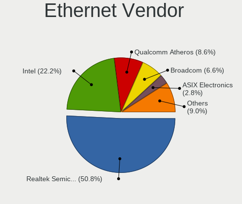

| Vendor                           | Notebooks | Percent |
|----------------------------------|-----------|---------|
| Realtek Semiconductor            | 254       | 50.8%   |
| Intel                            | 111       | 22.2%   |
| Qualcomm Atheros                 | 43        | 8.6%    |
| Broadcom                         | 33        | 6.6%    |
| ASIX Electronics                 | 14        | 2.8%    |
| Marvell Technology Group         | 13        | 2.6%    |
| Broadcom Limited                 | 7         | 1.4%    |
| MediaTek                         | 6         | 1.2%    |
| Nvidia                           | 3         | 0.6%    |
| Linksys                          | 3         | 0.6%    |
| Silicon Integrated Systems [SiS] | 2         | 0.4%    |
| Lenovo                           | 2         | 0.4%    |
| JMicron Technology               | 2         | 0.4%    |
| ZTE WCDMA Technologies MSM       | 1         | 0.2%    |
| Xiaomi                           | 1         | 0.2%    |
| TP-Link Corporation Limited.     | 1         | 0.2%    |
| Spreadtrum Communications        | 1         | 0.2%    |
| OPPO Electronics                 | 1         | 0.2%    |
| Huawei Technologies              | 1         | 0.2%    |
| Attansic Technology              | 1         | 0.2%    |

Ethernet Model
--------------

Ethernet models

| Model                                                                  | Notebooks | Percent |
|------------------------------------------------------------------------|-----------|---------|
| Realtek RTL8111/8168/8211/8411 PCI Express Gigabit Ethernet Controller | 169       | 33.8%   |
| Realtek RTL810xE PCI Express Fast Ethernet controller                  | 71        | 14.2%   |
| Intel 82579LM Gigabit Network Connection (Lewisville)                  | 23        | 4.6%    |
| ASIX AX88179 Gigabit Ethernet                                          | 13        | 2.6%    |
| Intel Ethernet Connection I219-LM                                      | 9         | 1.8%    |
| Qualcomm Atheros AR8161 Gigabit Ethernet                               | 8         | 1.6%    |
| Qualcomm Atheros AR8151 v2.0 Gigabit Ethernet                          | 8         | 1.6%    |
| Intel Ethernet Connection I218-LM                                      | 8         | 1.6%    |
| Intel Ethernet Connection I217-LM                                      | 8         | 1.6%    |
| Intel Ethernet Connection (4) I219-LM                                  | 8         | 1.6%    |
| Intel Ethernet Connection (3) I218-LM                                  | 7         | 1.4%    |
| Intel 82577LM Gigabit Network Connection                               | 7         | 1.4%    |
| Qualcomm Atheros AR8131 Gigabit Ethernet                               | 6         | 1.2%    |
| Marvell Group 88E8042 PCI-E Fast Ethernet Controller                   | 6         | 1.2%    |
| Intel 82567LM Gigabit Network Connection                               | 6         | 1.2%    |
| Broadcom NetLink BCM57785 Gigabit Ethernet PCIe                        | 6         | 1.2%    |
| Realtek RTL8153 Gigabit Ethernet Adapter                               | 5         | 1%      |
| Qualcomm Atheros AR8162 Fast Ethernet                                  | 5         | 1%      |
| Qualcomm Atheros AR8152 v1.1 Fast Ethernet                             | 5         | 1%      |
| Marvell Group 88E8040 PCI-E Fast Ethernet Controller                   | 5         | 1%      |
| Broadcom Limited NetLink BCM57780 Gigabit Ethernet PCIe                | 5         | 1%      |
| Realtek RTL8152 Fast Ethernet Adapter                                  | 3         | 0.6%    |
| MediaTek MT7922 802.11ax PCI Express Wireless Network Adapter          | 3         | 0.6%    |
| MediaTek Infinix SMART 5                                               | 3         | 0.6%    |
| Linksys Gigabit Ethernet Adapter                                       | 3         | 0.6%    |
| Intel Ethernet Connection I219-V                                       | 3         | 0.6%    |
| Intel Ethernet Connection I217-V                                       | 3         | 0.6%    |
| Intel Ethernet Connection (2) I219-LM                                  | 3         | 0.6%    |
| Broadcom NetXtreme BCM57786 Gigabit Ethernet PCIe                      | 3         | 0.6%    |
| Broadcom NetXtreme BCM57765 Gigabit Ethernet PCIe                      | 3         | 0.6%    |
| Broadcom NetXtreme BCM5761 Gigabit Ethernet PCIe                       | 3         | 0.6%    |
| Broadcom NetXtreme BCM5755M Gigabit Ethernet PCI Express               | 3         | 0.6%    |
| Broadcom NetLink BCM5787M Gigabit Ethernet PCI Express                 | 3         | 0.6%    |
| Silicon Integrated Systems [SiS] 191 Gigabit Ethernet Adapter          | 2         | 0.4%    |
| Realtek RTL8125 2.5GbE Controller                                      | 2         | 0.4%    |
| Realtek Killer E2600 GbE Controller                                    | 2         | 0.4%    |
| Qualcomm Atheros QCA8172 Fast Ethernet                                 | 2         | 0.4%    |
| Qualcomm Atheros QCA8171 Gigabit Ethernet                              | 2         | 0.4%    |
| Qualcomm Atheros AR8152 v2.0 Fast Ethernet                             | 2         | 0.4%    |
| JMicron JMC250 PCI Express Gigabit Ethernet Controller                 | 2         | 0.4%    |

Net Controller Kind
-------------------

Ethernet, WiFi or modem

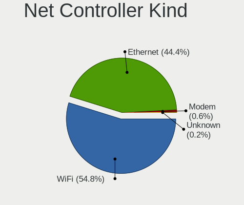

| Kind     | Notebooks | Percent |
|----------|-----------|---------|
| WiFi     | 599       | 54.8%   |
| Ethernet | 485       | 44.37%  |
| Modem    | 7         | 0.64%   |
| Unknown  | 2         | 0.18%   |

Used Controller
---------------

Currently used network controller

| Kind     | Notebooks | Percent |
|----------|-----------|---------|
| WiFi     | 449       | 74.71%  |
| Ethernet | 152       | 25.29%  |

NICs
----

Total network controllers on board

| Total | Notebooks | Percent |
|-------|-----------|---------|
| 2     | 447       | 72.92%  |
| 1     | 154       | 25.12%  |
| 0     | 9         | 1.47%   |
| 3     | 3         | 0.49%   |

IPv6
----

IPv6 vs IPv4

| Used | Notebooks | Percent |
|------|-----------|---------|
| No   | 414       | 67.54%  |
| Yes  | 199       | 32.46%  |

Bluetooth
---------

Bluetooth Vendor
----------------

Controller vendors

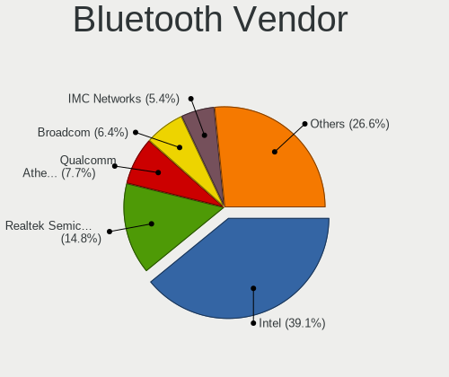

| Vendor                          | Notebooks | Percent |
|---------------------------------|-----------|---------|
| Intel                           | 188       | 39.09%  |
| Realtek Semiconductor           | 71        | 14.76%  |
| Qualcomm Atheros Communications | 37        | 7.69%   |
| Broadcom                        | 31        | 6.44%   |
| IMC Networks                    | 26        | 5.41%   |
| Foxconn / Hon Hai               | 24        | 4.99%   |
| Lite-On Technology              | 22        | 4.57%   |
| Apple                           | 14        | 2.91%   |
| Hewlett-Packard                 | 13        | 2.7%    |
| Dell                            | 11        | 2.29%   |
| Cambridge Silicon Radio         | 9         | 1.87%   |
| Ralink                          | 7         | 1.46%   |
| Foxconn International           | 7         | 1.46%   |
| Toshiba                         | 4         | 0.83%   |
| Chicony Electronics             | 4         | 0.83%   |
| ASUSTek Computer                | 4         | 0.83%   |
| MediaTek                        | 3         | 0.62%   |
| Alps Electric                   | 2         | 0.42%   |
| USI                             | 1         | 0.21%   |
| Realtek                         | 1         | 0.21%   |
| Opticis                         | 1         | 0.21%   |
| Belkin Components               | 1         | 0.21%   |

Bluetooth Model
---------------

Controller models

| Model                                               | Notebooks | Percent |
|-----------------------------------------------------|-----------|---------|
| Intel Bluetooth wireless interface                  | 84        | 17.46%  |
| Realtek Bluetooth Radio                             | 39        | 8.11%   |
| Intel AX201 Bluetooth                               | 37        | 7.69%   |
| Realtek  Bluetooth 4.2 Adapter                      | 22        | 4.57%   |
| Qualcomm Atheros  Bluetooth Device                  | 19        | 3.95%   |
| Intel Bluetooth 9460/9560 Jefferson Peak (JfP)      | 19        | 3.95%   |
| Intel AX200 Bluetooth                               | 17        | 3.53%   |
| Intel AX211 Bluetooth                               | 12        | 2.49%   |
| IMC Networks Bluetooth Radio                        | 11        | 2.29%   |
| HP Broadcom 2070 Bluetooth Combo                    | 9         | 1.87%   |
| Cambridge Silicon Radio Bluetooth Dongle (HCI mode) | 9         | 1.87%   |
| Intel Centrino Bluetooth Wireless Transceiver       | 8         | 1.66%   |
| Apple Bluetooth Host Controller                     | 8         | 1.66%   |
| Ralink RT3290 Bluetooth                             | 7         | 1.46%   |
| Qualcomm Atheros AR3011 Bluetooth                   | 7         | 1.46%   |
| Lite-On Qualcomm Atheros QCA9377 Bluetooth          | 7         | 1.46%   |
| Lite-On Atheros AR3012 Bluetooth                    | 7         | 1.46%   |
| IMC Networks Bluetooth Device                       | 7         | 1.46%   |
| Foxconn International BCM43142A0 Bluetooth module   | 7         | 1.46%   |
| Intel Wireless-AC 3168 Bluetooth                    | 6         | 1.25%   |
| Dell DW375 Bluetooth Module                         | 6         | 1.25%   |
| Realtek 802.11ac WLAN Adapter                       | 5         | 1.04%   |
| Qualcomm Atheros QCA61x4 Bluetooth 4.0              | 5         | 1.04%   |
| Foxconn / Hon Hai Wireless_Device                   | 5         | 1.04%   |
| Foxconn / Hon Hai Bluetooth Device                  | 5         | 1.04%   |
| IMC Networks Wireless_Device                        | 4         | 0.83%   |
| HP Bluetooth 2.0 Interface [Broadcom BCM2045]       | 4         | 0.83%   |
| Chicony Bluetooth (RTL8723BE)                       | 4         | 0.83%   |
| Broadcom HP Portable Bumble Bee                     | 4         | 0.83%   |
| Broadcom BCM20702 Bluetooth 4.0 [ThinkPad]          | 4         | 0.83%   |
| Broadcom BCM2070 Bluetooth 2.1 + EDR                | 4         | 0.83%   |
| Broadcom BCM2045B (BDC-2.1)                         | 4         | 0.83%   |
| Apple Bluetooth USB Host Controller                 | 4         | 0.83%   |
| Realtek RTL8821A Bluetooth                          | 3         | 0.62%   |
| Qualcomm Atheros AR3012 Bluetooth 4.0               | 3         | 0.62%   |
| MediaTek Wireless_Device                            | 3         | 0.62%   |
| Lite-On Wireless_Device                             | 3         | 0.62%   |
| Intel Centrino Advanced-N 6230 Bluetooth adapter    | 3         | 0.62%   |
| IMC Networks Atheros AR3012 Bluetooth 4.0 Adapter   | 3         | 0.62%   |
| Foxconn / Hon Hai MediaTek MT7921 Bluetooth         | 3         | 0.62%   |

Sound
-----

Sound Vendor
------------

Sound card vendors

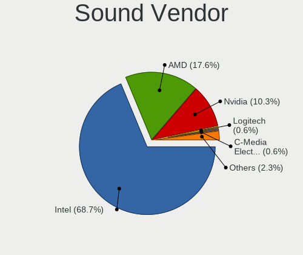

| Vendor                           | Notebooks | Percent |
|----------------------------------|-----------|---------|
| Intel                            | 488       | 68.73%  |
| AMD                              | 125       | 17.61%  |
| Nvidia                           | 73        | 10.28%  |
| Logitech                         | 4         | 0.56%   |
| C-Media Electronics              | 4         | 0.56%   |
| Generalplus Technology           | 3         | 0.42%   |
| Silicon Integrated Systems [SiS] | 2         | 0.28%   |
| Realtek Semiconductor            | 2         | 0.28%   |
| Apple                            | 2         | 0.28%   |
| Plantronics                      | 1         | 0.14%   |
| Nordic Semiconductor ASA         | 1         | 0.14%   |
| Microsoft                        | 1         | 0.14%   |
| Lenovo                           | 1         | 0.14%   |
| GN Netcom                        | 1         | 0.14%   |
| EGO SYStems                      | 1         | 0.14%   |
| ASUSTek Computer                 | 1         | 0.14%   |

Sound Model
-----------

Sound card models

| Model                                                                                             | Notebooks | Percent |
|---------------------------------------------------------------------------------------------------|-----------|---------|
| Intel Sunrise Point-LP HD Audio                                                                   | 66        | 7.52%   |
| AMD Family 17h/19h/1ah HD Audio Controller                                                        | 66        | 7.52%   |
| Intel 7 Series/C216 Chipset Family High Definition Audio Controller                               | 61        | 6.95%   |
| Intel 5 Series/3400 Series Chipset High Definition Audio                                          | 40        | 4.56%   |
| Intel 82801I (ICH9 Family) HD Audio Controller                                                    | 30        | 3.42%   |
| Intel 6 Series/C200 Series Chipset Family High Definition Audio Controller                        | 29        | 3.3%    |
| AMD Renoir Radeon High Definition Audio Controller                                                | 29        | 3.3%    |
| Intel Tiger Lake-LP Smart Sound Technology Audio Controller                                       | 26        | 2.96%   |
| AMD FCH Azalia Controller                                                                         | 25        | 2.85%   |
| Intel Haswell-ULT HD Audio Controller                                                             | 23        | 2.62%   |
| Intel 8 Series HD Audio Controller                                                                | 23        | 2.62%   |
| AMD Raven/Raven2/Fenghuang HDMI/DP Audio Controller                                               | 23        | 2.62%   |
| Intel Wildcat Point-LP High Definition Audio Controller                                           | 22        | 2.51%   |
| Intel Broadwell-U Audio Controller                                                                | 22        | 2.51%   |
| Intel Alder Lake PCH-P High Definition Audio Controller                                           | 22        | 2.51%   |
| Intel Atom Processor Z36xxx/Z37xxx Series High Definition Audio Controller                        | 20        | 2.28%   |
| Intel 8 Series/C220 Series Chipset High Definition Audio Controller                               | 20        | 2.28%   |
| Intel Celeron/Pentium Silver Processor High Definition Audio                                      | 17        | 1.94%   |
| Intel Xeon E3-1200 v3/4th Gen Core Processor HD Audio Controller                                  | 16        | 1.82%   |
| Intel 82801H (ICH8 Family) HD Audio Controller                                                    | 16        | 1.82%   |
| AMD SBx00 Azalia (Intel HDA)                                                                      | 16        | 1.82%   |
| Nvidia GF108 High Definition Audio Controller                                                     | 14        | 1.59%   |
| AMD Kabini HDMI/DP Audio                                                                          | 13        | 1.48%   |
| Intel Celeron N3350/Pentium N4200/Atom E3900 Series Audio Cluster                                 | 12        | 1.37%   |
| Intel Ice Lake-LP Smart Sound Technology Audio Controller                                         | 11        | 1.25%   |
| Intel Comet Lake PCH-LP cAVS                                                                      | 11        | 1.25%   |
| Intel Atom/Celeron/Pentium Processor x5-E8000/J3xxx/N3xxx Series High Definition Audio Controller | 10        | 1.14%   |
| AMD Wrestler HDMI Audio                                                                           | 10        | 1.14%   |
| AMD Family 15h (Models 60h-6fh) Audio Controller                                                  | 9         | 1.03%   |
| Intel NM10/ICH7 Family High Definition Audio Controller                                           | 8         | 0.91%   |
| AMD Rembrandt Radeon High Definition Audio Controller                                             | 8         | 0.91%   |
| AMD High Definition Audio Controller                                                              | 7         | 0.8%    |
| Nvidia GK107 HDMI Audio Controller                                                                | 6         | 0.68%   |
| Nvidia GA107 High Definition Audio Controller                                                     | 6         | 0.68%   |
| Intel Raptor Lake-P/U/H cAVS                                                                      | 6         | 0.68%   |
| Intel Cannon Lake PCH cAVS                                                                        | 6         | 0.68%   |
| Intel 100 Series/C230 Series Chipset Family HD Audio Controller                                   | 6         | 0.68%   |
| AMD Trinity HDMI Audio Controller                                                                 | 6         | 0.68%   |
| Nvidia High Definition Audio Controller                                                           | 5         | 0.57%   |
| Nvidia GK208 HDMI/DP Audio Controller                                                             | 5         | 0.57%   |

Memory
------

Memory Vendor
-------------

Memory module vendors

| Vendor                 | Notebooks | Percent |
|------------------------|-----------|---------|
| Samsung Electronics    | 200       | 27.66%  |
| SK hynix               | 140       | 19.36%  |
| Micron Technology      | 89        | 12.31%  |
| Kingston               | 55        | 7.61%   |
| Unknown                | 49        | 6.78%   |
| Crucial                | 23        | 3.18%   |
| Elpida                 | 22        | 3.04%   |
| Nanya Technology       | 21        | 2.9%    |
| A-DATA Technology      | 14        | 1.94%   |
| Ramaxel Technology     | 12        | 1.66%   |
| Unknown (ABCD)         | 9         | 1.24%   |
| Corsair                | 9         | 1.24%   |
| Timetec                | 7         | 0.97%   |
| Smart                  | 7         | 0.97%   |
| Unknown                | 7         | 0.97%   |
| SHARETRONIC            | 5         | 0.69%   |
| Patriot                | 4         | 0.55%   |
| Juhor                  | 4         | 0.55%   |
| G.Skill                | 4         | 0.55%   |
| ASint Technology       | 4         | 0.55%   |
| PNY                    | 3         | 0.41%   |
| Apacer                 | 3         | 0.41%   |
| Unknown (0x0E9D)       | 2         | 0.28%   |
| Unknown (0000000080CE) | 2         | 0.28%   |
| Team                   | 2         | 0.28%   |
| Silicon Power          | 2         | 0.28%   |
| Multilaser             | 2         | 0.28%   |
| GOODRAM                | 2         | 0.28%   |
| AMD                    | 2         | 0.28%   |
| Wilk                   | 1         | 0.14%   |
| Unknown (268C)         | 1         | 0.14%   |
| Unknown (0x0CB9)       | 1         | 0.14%   |
| Unknown (0x0B5E)       | 1         | 0.14%   |
| Transcend              | 1         | 0.14%   |
| Smart Brazil           | 1         | 0.14%   |
| Qumo                   | 1         | 0.14%   |
| Qimonda                | 1         | 0.14%   |
| PSC                    | 1         | 0.14%   |
| Magnum Tech            | 1         | 0.14%   |
| KingTiger              | 1         | 0.14%   |

Memory Model
------------

Memory module models

| Model                                                            | Notebooks | Percent |
|------------------------------------------------------------------|-----------|---------|
| Samsung RAM M471B5273DH0-CH9 4GB SODIMM DDR3 1334MT/s            | 13        | 1.69%   |
| Samsung RAM M471B5173QH0-YK0 4GB SODIMM DDR3 1600MT/s            | 13        | 1.69%   |
| Samsung RAM M471B5173DB0-YK0 4GB SODIMM DDR3 1600MT/s            | 11        | 1.43%   |
| Samsung RAM M471B5173EB0-YK0 4GB SODIMM DDR3 1600MT/s            | 10        | 1.3%    |
| Samsung RAM M471A5244CB0-CWE 4096MB SODIMM DDR4 3200MT/s         | 9         | 1.17%   |
| Unknown (ABCD) RAM 123456789012345678 2GB SODIMM LPDDR3 2400MT/s | 8         | 1.04%   |
| SK hynix RAM HMT451S6BFR8A-PB 4096MB SODIMM DDR3 1600MT/s        | 8         | 1.04%   |
| SK hynix RAM HMA81GS6DJR8N-XN 8GB SODIMM DDR4 3200MT/s           | 8         | 1.04%   |
| Samsung RAM M471B5773CHS-CH9 2GB SODIMM DDR3 4199MT/s            | 8         | 1.04%   |
| Samsung RAM M471A5244CB0-CTD 4GB SODIMM DDR4 3266MT/s            | 8         | 1.04%   |
| Samsung RAM M471B5673FH0-CH9 2GB SODIMM DDR3 1334MT/s            | 7         | 0.91%   |
| Samsung RAM M471B1G73QH0-YK0 8GB SODIMM DDR3 1600MT/s            | 7         | 0.91%   |
| Samsung RAM M471A1K43EB1-CWE 8GB SODIMM DDR4 3200MT/s            | 7         | 0.91%   |
| Unknown                                                          | 7         | 0.91%   |
| SK hynix RAM HMA81GS6AFR8N-UH 8GB SODIMM DDR4 2667MT/s           | 6         | 0.78%   |
| Samsung RAM M471A5244CB0-CRC 4GB SODIMM DDR4 2667MT/s            | 6         | 0.78%   |
| Samsung RAM M471A1G44AB0-CWE 8GB SODIMM DDR4 3200MT/s            | 6         | 0.78%   |
| Samsung RAM M4 70T5663QZ3-CF7 2GB SODIMM DDR2 2048MT/s           | 6         | 0.78%   |
| SK hynix RAM HMT41GS6BFR8A-PB 8GB SODIMM DDR3 1600MT/s           | 5         | 0.65%   |
| SK hynix RAM HMT351S6CFR8C-PB 4GB SODIMM DDR3 1600MT/s           | 5         | 0.65%   |
| SK hynix RAM HMT351S6CFR8C-H9 4GB SODIMM DDR3 1333MT/s           | 5         | 0.65%   |
| Samsung RAM M471A1G44BB0-CWE 8GB SODIMM DDR4 3200MT/s            | 5         | 0.65%   |
| Samsung RAM K3LKBKB@BM-MGCP 2GB Row Of Chips LPDDR5 6400MT/s     | 5         | 0.65%   |
| Unknown RAM Module 8GB SODIMM DDR4 2667MT/s                      | 4         | 0.52%   |
| Unknown RAM Module 8GB SODIMM DDR3 1600MT/s                      | 4         | 0.52%   |
| SK hynix RAM HYMP125S64CP8-S6 2048MB SODIMM DDR2 975MT/s         | 4         | 0.52%   |
| SK hynix RAM HMT451S6AFR8A-PB 4GB SODIMM DDR3 1600MT/s           | 4         | 0.52%   |
| SK hynix RAM HMT351S6BFR8C-H9 4GB SODIMM DDR3 1333MT/s           | 4         | 0.52%   |
| SK hynix RAM HMT325S6BFR8C-H9 2048MB SODIMM DDR3 1600MT/s        | 4         | 0.52%   |
| SK hynix RAM HMA851S6AFR6N-UH 4GB SODIMM DDR4 2667MT/s           | 4         | 0.52%   |
| SK hynix RAM HMA81GS6CJR8N-VK 8GB SODIMM DDR4 2667MT/s           | 4         | 0.52%   |
| SK hynix RAM HMA41GS6AFR8N-TF 8GB SODIMM DDR4 2667MT/s           | 4         | 0.52%   |
| Samsung RAM M471B5273DH0-CK0 4GB SODIMM DDR3 2400MT/s            | 4         | 0.52%   |
| Samsung RAM M471B5273CH0-CH9 4GB SODIMM DDR3 1334MT/s            | 4         | 0.52%   |
| Samsung RAM M471A1K43CB1-CTD 8GB SODIMM DDR4 2667MT/s            | 4         | 0.52%   |
| Samsung RAM M471A1K43BB1-CRC 8GB SODIMM DDR4 2667MT/s            | 4         | 0.52%   |
| Nanya RAM NT8GA64D88CX3S-JR 8GB SODIMM DDR4 3200MT/s             | 4         | 0.52%   |
| Nanya RAM NT4GC64B8HB0NS-CG 4GB SODIMM DDR3 1334MT/s             | 4         | 0.52%   |
| Micron RAM 4MT425664FZ61-49 2GB SODIMM DDR3 1333MT/s             | 4         | 0.52%   |
| Micron RAM 16KTF1G64HZ-1G6E1 8GB SODIMM DDR3 1600MT/s            | 4         | 0.52%   |

Memory Kind
-----------

Memory module kinds

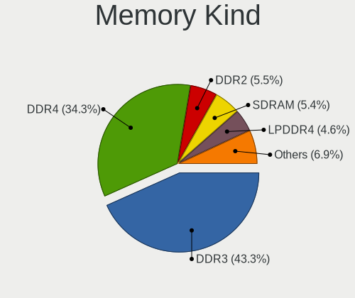

| Kind    | Notebooks | Percent |
|---------|-----------|---------|
| DDR3    | 275       | 43.31%  |
| DDR4    | 218       | 34.33%  |
| DDR2    | 35        | 5.51%   |
| SDRAM   | 34        | 5.35%   |
| LPDDR4  | 29        | 4.57%   |
| LPDDR5  | 16        | 2.52%   |
| DDR5    | 12        | 1.89%   |
| LPDDR3  | 7         | 1.1%    |
| DDR     | 4         | 0.63%   |
| Unknown | 3         | 0.47%   |
| DRAM    | 2         | 0.31%   |

Memory Form Factor
------------------

Physical design of the memory module

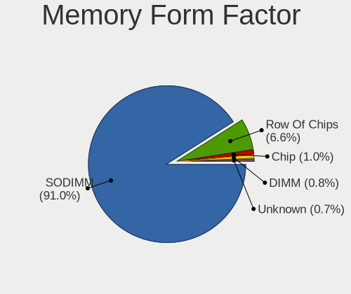

| Name         | Notebooks | Percent |
|--------------|-----------|---------|
| SODIMM       | 555       | 90.98%  |
| Row Of Chips | 40        | 6.56%   |
| Chip         | 6         | 0.98%   |
| DIMM         | 5         | 0.82%   |
| Unknown      | 4         | 0.66%   |

Memory Size
-----------

Memory module size

| Size  | Notebooks | Percent |
|-------|-----------|---------|
| 8192  | 237       | 35.16%  |
| 4096  | 222       | 32.94%  |
| 2048  | 121       | 17.95%  |
| 16384 | 58        | 8.61%   |
| 1024  | 24        | 3.56%   |
| 32768 | 10        | 1.48%   |
| 3072  | 1         | 0.15%   |
| 8     | 1         | 0.15%   |

Memory Speed
------------

Memory module speed

| Speed   | Notebooks | Percent |
|---------|-----------|---------|
| 1600    | 171       | 24.89%  |
| 3200    | 104       | 15.14%  |
| 2667    | 88        | 12.81%  |
| 1334    | 48        | 6.99%   |
| 2400    | 46        | 6.7%    |
| 1333    | 41        | 5.97%   |
| 2133    | 19        | 2.77%   |
| 4199    | 17        | 2.47%   |
| 1067    | 17        | 2.47%   |
| 800     | 17        | 2.47%   |
| 6400    | 15        | 2.18%   |
| 2048    | 15        | 2.18%   |
| 667     | 14        | 2.04%   |
| Unknown | 14        | 2.04%   |
| 1867    | 10        | 1.46%   |
| 3266    | 8         | 1.16%   |
| 4800    | 7         | 1.02%   |
| 4267    | 6         | 0.87%   |
| 975     | 6         | 0.87%   |
| 5600    | 4         | 0.58%   |
| 8400    | 3         | 0.44%   |
| 4266    | 3         | 0.44%   |
| 1066    | 3         | 0.44%   |
| 533     | 3         | 0.44%   |
| 3733    | 2         | 0.29%   |
| 2933    | 2         | 0.29%   |
| 7500    | 1         | 0.15%   |
| 5200    | 1         | 0.15%   |
| 1866    | 1         | 0.15%   |
| 1639    | 1         | 0.15%   |

Printers & scanners
-------------------

Printer Vendor
--------------

Printer device vendors

| Vendor              | Notebooks | Percent |
|---------------------|-----------|---------|
| Samsung Electronics | 1         | 33.33%  |
| Canon               | 1         | 33.33%  |
| Brother Industries  | 1         | 33.33%  |

Printer Model
-------------

Printer device models

| Model                | Notebooks | Percent |
|----------------------|-----------|---------|
| Samsung M2020 Series | 1         | 33.33%  |
| Canon TS5300 series  | 1         | 33.33%  |
| Brother DCP-7010     | 1         | 33.33%  |

Scanner Vendor
--------------

Scanner device vendors

| Vendor          | Notebooks | Percent |
|-----------------|-----------|---------|
| Hewlett-Packard | 1         | 100%    |

Scanner Model
-------------

Scanner device models

| Model            | Notebooks | Percent |
|------------------|-----------|---------|
| HP ScanJet 82x0C | 1         | 100%    |

Camera
------

Camera Vendor
-------------

Camera device vendors

| Vendor                                 | Notebooks | Percent |
|----------------------------------------|-----------|---------|
| Chicony Electronics                    | 147       | 27.63%  |
| IMC Networks                           | 50        | 9.4%    |
| Microdia                               | 46        | 8.65%   |
| Realtek Semiconductor                  | 34        | 6.39%   |
| Cheng Uei Precision Industry (Foxlink) | 29        | 5.45%   |
| Sunplus Innovation Technology          | 28        | 5.26%   |
| Bison Electronics                      | 27        | 5.08%   |
| Quanta                                 | 21        | 3.95%   |
| Suyin                                  | 18        | 3.38%   |
| Syntek                                 | 17        | 3.2%    |
| Luxvisions Innotech Limited            | 14        | 2.63%   |
| Apple                                  | 14        | 2.63%   |
| Lite-On Technology                     | 11        | 2.07%   |
| Acer                                   | 11        | 2.07%   |
| Ricoh                                  | 10        | 1.88%   |
| Alcor Micro                            | 10        | 1.88%   |
| Sonix Technology                       | 8         | 1.5%    |
| Importek                               | 7         | 1.32%   |
| SunplusIT                              | 4         | 0.75%   |
| Silicon Motion                         | 4         | 0.75%   |
| Z-Star Microelectronics                | 3         | 0.56%   |
| Lenovo                                 | 3         | 0.56%   |
| Logitech                               | 2         | 0.38%   |
| icSpring                               | 2         | 0.38%   |
| BUFFALO                                | 2         | 0.38%   |
| Sunplus Technology                     | 1         | 0.19%   |
| Primax Electronics                     | 1         | 0.19%   |
| OPPO Electronics                       | 1         | 0.19%   |
| lihappe8                               | 1         | 0.19%   |
| Genesys Logic                          | 1         | 0.19%   |
| Foxconn / Hon Hai                      | 1         | 0.19%   |
| DigiTech                               | 1         | 0.19%   |
| Cubeternet                             | 1         | 0.19%   |
| ALi                                    | 1         | 0.19%   |
| Unknown                                | 1         | 0.19%   |

Camera Model
------------

Camera device models

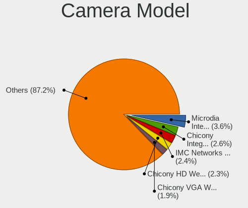

| Model                                                          | Notebooks | Percent |
|----------------------------------------------------------------|-----------|---------|
| Microdia Integrated_Webcam_HD                                  | 19        | 3.57%   |
| Chicony Integrated Camera                                      | 14        | 2.63%   |
| IMC Networks USB2.0 HD UVC WebCam                              | 13        | 2.44%   |
| Chicony HD WebCam                                              | 12        | 2.26%   |
| Chicony VGA Webcam                                             | 10        | 1.88%   |
| Syntek Integrated Camera                                       | 9         | 1.69%   |
| IMC Networks Integrated Camera                                 | 9         | 1.69%   |
| Cheng Uei Precision Industry (Foxlink) HP TrueVision HD Camera | 9         | 1.69%   |
| Sunplus Integrated_Webcam_HD                                   | 8         | 1.5%    |
| Realtek Integrated_Webcam_HD                                   | 8         | 1.5%    |
| Chicony HP TrueVision HD Camera                                | 8         | 1.5%    |
| Cheng Uei Precision Industry (Foxlink) HP Webcam               | 8         | 1.5%    |
| Bison Integrated Camera                                        | 8         | 1.5%    |
| Realtek USB Camera                                             | 7         | 1.32%   |
| Microdia Integrated Webcam                                     | 7         | 1.32%   |
| IMC Networks USB2.0 VGA UVC WebCam                             | 7         | 1.32%   |
| Chicony HP Truevision HD                                       | 7         | 1.32%   |
| Chicony FJ Camera                                              | 7         | 1.32%   |
| Bison HD Webcam                                                | 7         | 1.32%   |
| Luxvisions Innotech Limited HP TrueVision HD Camera            | 6         | 1.13%   |
| Chicony USB2.0 VGA UVC WebCam                                  | 6         | 1.13%   |
| Bison Lenovo Integrated Webcam                                 | 6         | 1.13%   |
| Sonix USB2.0 HD UVC WebCam                                     | 5         | 0.94%   |
| Quanta HP TrueVision HD Camera                                 | 5         | 0.94%   |
| Microdia Integrated Webcam HD                                  | 5         | 0.94%   |
| IMC Networks Lenovo EasyCamera                                 | 5         | 0.94%   |
| Chicony USB2.0 HD UVC WebCam                                   | 5         | 0.94%   |
| Apple iPhone 5/5C/5S/6/SE/7/8/X/XR                             | 5         | 0.94%   |
| Acer BisonCam,NB Pro                                           | 5         | 0.94%   |
| Syntek Lenovo EasyCamera                                       | 4         | 0.75%   |
| Sunplus Lenovo EasyCamera                                      | 4         | 0.75%   |
| Sunplus HD WebCam                                              | 4         | 0.75%   |
| Sunplus Dell E5570 integrated webcam                           | 4         | 0.75%   |
| Lite-On Integrated Camera                                      | 4         | 0.75%   |
| Importek Laptop Integrated Webcam                              | 4         | 0.75%   |
| IMC Networks UVC VGA Webcam                                    | 4         | 0.75%   |
| Chicony Integrated HP HD Webcam                                | 4         | 0.75%   |
| Chicony HP Webcam                                              | 4         | 0.75%   |
| Chicony HD User Facing                                         | 4         | 0.75%   |
| Chicony CNF9055 Toshiba Webcam                                 | 4         | 0.75%   |

Security
--------

Fingerprint Vendor
------------------

Fingerprint sensor vendors

| Vendor                             | Notebooks | Percent |
|------------------------------------|-----------|---------|
| Validity Sensors                   | 23        | 35.38%  |
| Synaptics                          | 9         | 13.85%  |
| Shenzhen Goodix Technology         | 9         | 13.85%  |
| AuthenTec                          | 6         | 9.23%   |
| Elan Microelectronics              | 5         | 7.69%   |
| STMicroelectronics                 | 4         | 6.15%   |
| LighTuning Technology              | 4         | 6.15%   |
| Upek                               | 3         | 4.62%   |
| Realtek USB2.0 Finger Print Bridge | 2         | 3.08%   |

Fingerprint Model
-----------------

Fingerprint sensor models

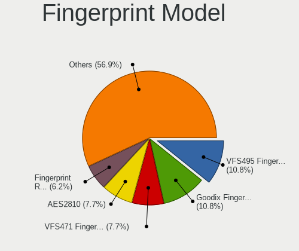

| Model                                                                      | Notebooks | Percent |
|----------------------------------------------------------------------------|-----------|---------|
| Validity Sensors VFS495 Fingerprint Reader                                 | 7         | 10.77%  |
| Shenzhen Goodix  FingerPrint Device                                        | 7         | 10.77%  |
| Validity Sensors VFS471 Fingerprint Reader                                 | 5         | 7.69%   |
| AuthenTec AES2810                                                          | 5         | 7.69%   |
| STMicroelectronics Fingerprint Reader                                      | 4         | 6.15%   |
| Upek Biometric Touchchip/Touchstrip Fingerprint Sensor                     | 3         | 4.62%   |
| Synaptics Metallica MIS Touch Fingerprint Reader                           | 3         | 4.62%   |
| LighTuning Fingerprint Reader                                              | 3         | 4.62%   |
| Elan ELAN:ARM-M4                                                           | 3         | 4.62%   |
| Validity Sensors VFS 5011 fingerprint sensor                               | 2         | 3.08%   |
| Validity Sensors Swipe Fingerprint Sensor                                  | 2         | 3.08%   |
| Synaptics FS7604 Touch Fingerprint Sensor with PurePrint                   | 2         | 3.08%   |
| Realtek USB2.0 Finger Print Bridge FocalTech Fingerprint Device            | 2         | 3.08%   |
| Elan ELAN:Fingerprint                                                      | 2         | 3.08%   |
| Validity Sensors VFS5011 Fingerprint Reader                                | 1         | 1.54%   |
| Validity Sensors VFS491                                                    | 1         | 1.54%   |
| Validity Sensors VFS451 Fingerprint Reader                                 | 1         | 1.54%   |
| Validity Sensors VFS101 Fingerprint Reader                                 | 1         | 1.54%   |
| Validity Sensors VFS Fingerprint sensor                                    | 1         | 1.54%   |
| Validity Sensors Synaptics VFS7552 Touch Fingerprint Sensor with PurePrint | 1         | 1.54%   |
| Validity Sensors Fingerprint scanner                                       | 1         | 1.54%   |
| Synaptics WBDI                                                             | 1         | 1.54%   |
| Synaptics Prometheus MIS Touch Fingerprint Reader                          | 1         | 1.54%   |
| Synaptics Prometheus Fingerprint Reader                                    | 1         | 1.54%   |
| Synaptics Metallica MOH Touch Fingerprint Reader                           | 1         | 1.54%   |
| Shenzhen Goodix Fingerprint Reader                                         | 1         | 1.54%   |
| Shenzhen Goodix FingerPrint                                                | 1         | 1.54%   |
| LighTuning ES603 Swipe Fingerprint Sensor                                  | 1         | 1.54%   |
| AuthenTec Fingerprint Sensor                                               | 1         | 1.54%   |

Chipcard Vendor
---------------

Chipcard module vendors

| Vendor                | Notebooks | Percent |
|-----------------------|-----------|---------|
| Broadcom              | 29        | 56.86%  |
| Alcor Micro           | 7         | 13.73%  |
| O2 Micro              | 6         | 11.76%  |
| Upek                  | 4         | 7.84%   |
| SCM Microsystems      | 2         | 3.92%   |
| Lenovo                | 2         | 3.92%   |
| Gemalto (was Gemplus) | 1         | 1.96%   |

Chipcard Model
--------------

Chipcard module models

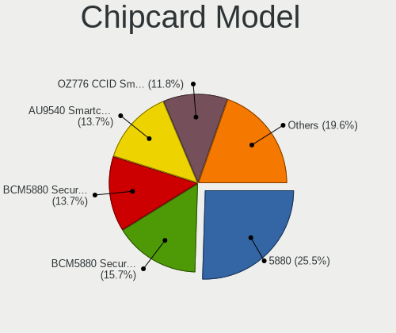

| Model                                                                        | Notebooks | Percent |
|------------------------------------------------------------------------------|-----------|---------|
| Broadcom 5880                                                                | 13        | 25.49%  |
| Broadcom BCM5880 Secure Applications Processor with fingerprint swipe sensor | 8         | 15.69%  |
| Broadcom BCM5880 Secure Applications Processor                               | 7         | 13.73%  |
| Alcor Micro AU9540 Smartcard Reader                                          | 7         | 13.73%  |
| O2 Micro OZ776 CCID Smartcard Reader                                         | 6         | 11.76%  |
| Upek TouchChip Fingerprint Coprocessor (WBF advanced mode)                   | 4         | 7.84%   |
| SCM Microsystems SCR3340 - ExpressCard54 Smart Card Reader                   | 2         | 3.92%   |
| Lenovo Integrated Smart Card Reader                                          | 2         | 3.92%   |
| Gemalto (was Gemplus) GemPC Twin SmartCard Reader                            | 1         | 1.96%   |
| Broadcom 58200                                                               | 1         | 1.96%   |

Unsupported
-----------

Unsupported Devices
-------------------

Total unsupported devices on board

| Total | Notebooks | Percent |
|-------|-----------|---------|
| 0     | 446       | 72.76%  |
| 1     | 139       | 22.68%  |
| 2     | 25        | 4.08%   |
| 3     | 3         | 0.49%   |

Unsupported Device Types
------------------------

Types of unsupported devices

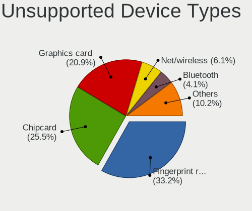

| Type                  | Notebooks | Percent |
|-----------------------|-----------|---------|
| Fingerprint reader    | 65        | 33.16%  |
| Chipcard              | 50        | 25.51%  |
| Graphics card         | 41        | 20.92%  |
| Net/wireless          | 12        | 6.12%   |
| Bluetooth             | 8         | 4.08%   |
| Multimedia controller | 7         | 3.57%   |
| Storage               | 3         | 1.53%   |
| Camera                | 3         | 1.53%   |
| Sound                 | 2         | 1.02%   |
| Net/ethernet          | 2         | 1.02%   |
| Card reader           | 2         | 1.02%   |
| Flash memory          | 1         | 0.51%   |

