OpenMandriva 5.0 - Tested Hardware & Statistics (Notebooks)
-----------------------------------------------------------

A project to collect tested hardware configurations for OpenMandriva 5.0.

Anyone can contribute to this report by the [hw-probe](https://github.com/linuxhw/hw-probe) tool:

    sudo -E hw-probe -all -upload

Please contribute! Especially if your hardware is rare.

Contents
--------

* [ Test Cases ](#test-cases)

* [ System ](#system)
  - [ Kernel                   ](#kernel)
  - [ Kernel Family            ](#kernel-family)
  - [ Kernel Major Ver.        ](#kernel-major-ver)
  - [ Arch                     ](#arch)
  - [ DE                       ](#de)
  - [ Display Server           ](#display-server)
  - [ Display Manager          ](#display-manager)
  - [ OS Lang                  ](#os-lang)
  - [ Boot Mode                ](#boot-mode)
  - [ Filesystem               ](#filesystem)
  - [ Part. scheme             ](#part-scheme)
  - [ Dual Boot with Linux/BSD ](#dual-boot-with-linuxbsd)
  - [ Dual Boot (Win)          ](#dual-boot-win)

* [ Board ](#board)
  - [ Vendor                   ](#vendor)
  - [ Model                    ](#model)
  - [ Model Family             ](#model-family)
  - [ MFG Year                 ](#mfg-year)
  - [ Form Factor              ](#form-factor)
  - [ Secure Boot              ](#secure-boot)
  - [ Coreboot                 ](#coreboot)
  - [ RAM Size                 ](#ram-size)
  - [ RAM Used                 ](#ram-used)
  - [ Total Drives             ](#total-drives)
  - [ Has CD-ROM               ](#has-cd-rom)
  - [ Has Ethernet             ](#has-ethernet)
  - [ Has WiFi                 ](#has-wifi)
  - [ Has Bluetooth            ](#has-bluetooth)

* [ Location ](#location)
  - [ Country                  ](#country)
  - [ City                     ](#city)

* [ Drives ](#drives)
  - [ Drive Vendor             ](#drive-vendor)
  - [ Drive Model              ](#drive-model)
  - [ HDD Vendor               ](#hdd-vendor)
  - [ SSD Vendor               ](#ssd-vendor)
  - [ Drive Kind               ](#drive-kind)
  - [ Drive Connector          ](#drive-connector)
  - [ Drive Size               ](#drive-size)
  - [ Space Total              ](#space-total)
  - [ Space Used               ](#space-used)
  - [ Malfunc. Drives          ](#malfunc-drives)
  - [ Malfunc. Drive Vendor    ](#malfunc-drive-vendor)
  - [ Malfunc. HDD Vendor      ](#malfunc-hdd-vendor)
  - [ Malfunc. Drive Kind      ](#malfunc-drive-kind)
  - [ Failed Drives            ](#failed-drives)
  - [ Failed Drive Vendor      ](#failed-drive-vendor)
  - [ Drive Status             ](#drive-status)

* [ Storage controller ](#storage-controller)
  - [ Storage Vendor           ](#storage-vendor)
  - [ Storage Model            ](#storage-model)
  - [ Storage Kind             ](#storage-kind)

* [ Processor ](#processor)
  - [ CPU Vendor               ](#cpu-vendor)
  - [ CPU Model                ](#cpu-model)
  - [ CPU Model Family         ](#cpu-model-family)
  - [ CPU Cores                ](#cpu-cores)
  - [ CPU Sockets              ](#cpu-sockets)
  - [ CPU Threads              ](#cpu-threads)
  - [ CPU Op-Modes             ](#cpu-op-modes)
  - [ CPU Microcode            ](#cpu-microcode)
  - [ CPU Microarch            ](#cpu-microarch)

* [ Graphics ](#graphics)
  - [ GPU Vendor               ](#gpu-vendor)
  - [ GPU Model                ](#gpu-model)
  - [ GPU Combo                ](#gpu-combo)
  - [ GPU Driver               ](#gpu-driver)
  - [ GPU Memory               ](#gpu-memory)

* [ Monitor ](#monitor)
  - [ Monitor Vendor           ](#monitor-vendor)
  - [ Monitor Model            ](#monitor-model)
  - [ Monitor Resolution       ](#monitor-resolution)
  - [ Monitor Diagonal         ](#monitor-diagonal)
  - [ Monitor Width            ](#monitor-width)
  - [ Aspect Ratio             ](#aspect-ratio)
  - [ Monitor Area             ](#monitor-area)
  - [ Pixel Density            ](#pixel-density)
  - [ Multiple Monitors        ](#multiple-monitors)

* [ Network ](#network)
  - [ Net Controller Vendor    ](#net-controller-vendor)
  - [ Net Controller Model     ](#net-controller-model)
  - [ Wireless Vendor          ](#wireless-vendor)
  - [ Wireless Model           ](#wireless-model)
  - [ Ethernet Vendor          ](#ethernet-vendor)
  - [ Ethernet Model           ](#ethernet-model)
  - [ Net Controller Kind      ](#net-controller-kind)
  - [ Used Controller          ](#used-controller)
  - [ NICs                     ](#nics)
  - [ IPv6                     ](#ipv6)

* [ Bluetooth ](#bluetooth)
  - [ Bluetooth Vendor         ](#bluetooth-vendor)
  - [ Bluetooth Model          ](#bluetooth-model)

* [ Sound ](#sound)
  - [ Sound Vendor             ](#sound-vendor)
  - [ Sound Model              ](#sound-model)

* [ Memory ](#memory)
  - [ Memory Vendor            ](#memory-vendor)
  - [ Memory Model             ](#memory-model)
  - [ Memory Kind              ](#memory-kind)
  - [ Memory Form Factor       ](#memory-form-factor)
  - [ Memory Size              ](#memory-size)
  - [ Memory Speed             ](#memory-speed)

* [ Printers & scanners ](#printers--scanners)
  - [ Printer Vendor           ](#printer-vendor)
  - [ Printer Model            ](#printer-model)
  - [ Scanner Vendor           ](#scanner-vendor)
  - [ Scanner Model            ](#scanner-model)

* [ Camera ](#camera)
  - [ Camera Vendor            ](#camera-vendor)
  - [ Camera Model             ](#camera-model)

* [ Security ](#security)
  - [ Fingerprint Vendor       ](#fingerprint-vendor)
  - [ Fingerprint Model        ](#fingerprint-model)
  - [ Chipcard Vendor          ](#chipcard-vendor)
  - [ Chipcard Model           ](#chipcard-model)

* [ Unsupported ](#unsupported)
  - [ Unsupported Devices      ](#unsupported-devices)
  - [ Unsupported Device Types ](#unsupported-device-types)

Test Cases
----------

Total: 265

| Vendor        | Model                       | Probe                                                      | Date         |
|---------------|-----------------------------|------------------------------------------------------------|--------------|
| ASUSTek       | X540YA                      | [4e8d90738d](https://linux-hardware.org/?probe=4e8d90738d) | Jan 31, 2024 |
| Lenovo        | IdeaPad 330-17IKB 81DM      | [3bba660f51](https://linux-hardware.org/?probe=3bba660f51) | Jan 31, 2024 |
| Packard Be... | EasyNote ENLG71BM           | [ab713b894e](https://linux-hardware.org/?probe=ab713b894e) | Jan 31, 2024 |
| Toshiba       | Portable PC                 | [5c293a3c24](https://linux-hardware.org/?probe=5c293a3c24) | Jan 30, 2024 |
| ARCELIK       | GNB 1150 B1 N2 V1.0         | [eb35406b7e](https://linux-hardware.org/?probe=eb35406b7e) | Jan 29, 2024 |
| Acer          | Aspire 5720Z                | [2353edc7dd](https://linux-hardware.org/?probe=2353edc7dd) | Jan 29, 2024 |
| HP            | Pavilion Laptop 15t-eg00... | [fd0435f25b](https://linux-hardware.org/?probe=fd0435f25b) | Jan 29, 2024 |
| Acer          | Aspire 5750                 | [f05ba6ae6f](https://linux-hardware.org/?probe=f05ba6ae6f) | Jan 29, 2024 |
| Acer          | Aspire V5-471PG             | [621c9286da](https://linux-hardware.org/?probe=621c9286da) | Jan 28, 2024 |
| Dell          | Latitude 3510               | [0be0a86c59](https://linux-hardware.org/?probe=0be0a86c59) | Jan 28, 2024 |
| ASUSTek       | ROG Zephyrus M16 GU604VI... | [dd39831e6f](https://linux-hardware.org/?probe=dd39831e6f) | Jan 27, 2024 |
| Lenovo        | IdeaPad 100S-11IBY 80R2     | [01dd8556d5](https://linux-hardware.org/?probe=01dd8556d5) | Jan 26, 2024 |
| Acer          | Aspire ES1-531              | [7faffb7f83](https://linux-hardware.org/?probe=7faffb7f83) | Jan 25, 2024 |
| HP            | Compaq 6730s                | [caa48b80fb](https://linux-hardware.org/?probe=caa48b80fb) | Jan 25, 2024 |
| Acer          | Aspire ES1-572              | [10d96173cd](https://linux-hardware.org/?probe=10d96173cd) | Jan 25, 2024 |
| HP            | ProBook 445 G8 Notebook ... | [057c708875](https://linux-hardware.org/?probe=057c708875) | Jan 24, 2024 |
| HP            | EliteBook 840 G3            | [eceea6fa49](https://linux-hardware.org/?probe=eceea6fa49) | Jan 24, 2024 |
| eMachines     | eME732Z                     | [fe3d184f11](https://linux-hardware.org/?probe=fe3d184f11) | Jan 24, 2024 |
| Toshiba       | Satellite C650              | [2fa418e377](https://linux-hardware.org/?probe=2fa418e377) | Jan 24, 2024 |
| Apple         | MacBookPro4,1               | [4c99b7a6ff](https://linux-hardware.org/?probe=4c99b7a6ff) | Jan 23, 2024 |
| HP            | Stream Laptop 14-ax0XX      | [16c6b944fb](https://linux-hardware.org/?probe=16c6b944fb) | Jan 23, 2024 |
| Lenovo        | ThinkPad T430 2347A81       | [7209687602](https://linux-hardware.org/?probe=7209687602) | Jan 22, 2024 |
| HP            | ProBook 450 G5              | [ea8cc27b1a](https://linux-hardware.org/?probe=ea8cc27b1a) | Jan 21, 2024 |
| Fujitsu       | LIFEBOOK A555/G             | [f87640231d](https://linux-hardware.org/?probe=f87640231d) | Jan 21, 2024 |
| Lenovo        | IdeaPad 320-15IAP 80XR      | [af044c261f](https://linux-hardware.org/?probe=af044c261f) | Jan 20, 2024 |
| Acer          | Aspire 1810T                | [068454b849](https://linux-hardware.org/?probe=068454b849) | Jan 20, 2024 |
| Apple         | MacBookPro3,1               | [057f8b6477](https://linux-hardware.org/?probe=057f8b6477) | Jan 20, 2024 |
| Google        | Garg                        | [b0e91d1473](https://linux-hardware.org/?probe=b0e91d1473) | Jan 19, 2024 |
| Lenovo        | 100e 2nd Gen 81M8           | [a4aa40979a](https://linux-hardware.org/?probe=a4aa40979a) | Jan 18, 2024 |
| HP            | Laptop 15-dw3xxx            | [77766f1cc1](https://linux-hardware.org/?probe=77766f1cc1) | Jan 17, 2024 |
| Lenovo        | ThinkPad X230 2330A17       | [589c4362a6](https://linux-hardware.org/?probe=589c4362a6) | Jan 16, 2024 |
| Lenovo        | ThinkPad T470s W10DG 20J... | [f73401456d](https://linux-hardware.org/?probe=f73401456d) | Jan 16, 2024 |
| Lenovo        | IdeaPad 110-14IBR 80T6      | [22802134b7](https://linux-hardware.org/?probe=22802134b7) | Jan 15, 2024 |
| Dell          | XPS 15 9510                 | [55cbe62073](https://linux-hardware.org/?probe=55cbe62073) | Jan 15, 2024 |
| Lenovo        | ThinkPad T450s 20BWS05V0... | [fffdee8af3](https://linux-hardware.org/?probe=fffdee8af3) | Jan 15, 2024 |
| HP            | Laptop 15-db0xxx            | [cb2cda915a](https://linux-hardware.org/?probe=cb2cda915a) | Jan 15, 2024 |
| ASUSTek       | VivoBook_ASUSLaptop M160... | [f35fb9dd1c](https://linux-hardware.org/?probe=f35fb9dd1c) | Jan 13, 2024 |
| TUXEDO        | Book BM15 Gen10             | [dcb4b6ab6a](https://linux-hardware.org/?probe=dcb4b6ab6a) | Jan 13, 2024 |
| Dell          | Vostro 3401                 | [cd47812859](https://linux-hardware.org/?probe=cd47812859) | Jan 11, 2024 |
| Lenovo        | IdeaPad Pro 5 14APH8 83A... | [47ca371fcb](https://linux-hardware.org/?probe=47ca371fcb) | Jan 10, 2024 |
| Toshiba       | Satellite C660              | [34eaf45d7f](https://linux-hardware.org/?probe=34eaf45d7f) | Jan 09, 2024 |
| HP            | 2000                        | [d23f668910](https://linux-hardware.org/?probe=d23f668910) | Jan 09, 2024 |
| HP            | Compaq 610                  | [da1dd5ace4](https://linux-hardware.org/?probe=da1dd5ace4) | Jan 08, 2024 |
| Lenovo        | G710 20252                  | [ec645bc6c5](https://linux-hardware.org/?probe=ec645bc6c5) | Jan 08, 2024 |
| Lenovo        | IdeaPad 3 14IIL05 81WD      | [9d534bf283](https://linux-hardware.org/?probe=9d534bf283) | Jan 07, 2024 |
| Lenovo        | IdeaPad 3 15ADA05 81W1      | [770f12c749](https://linux-hardware.org/?probe=770f12c749) | Jan 07, 2024 |
| HP            | 250 G3                      | [259acacdb3](https://linux-hardware.org/?probe=259acacdb3) | Jan 06, 2024 |
| Dell          | Inspiron 5515               | [6ff66dee9c](https://linux-hardware.org/?probe=6ff66dee9c) | Jan 06, 2024 |
| Toshiba       | Satellite L55D-B            | [e0358ccedc](https://linux-hardware.org/?probe=e0358ccedc) | Jan 06, 2024 |
| Dell          | Precision 7710              | [a2b5f2de51](https://linux-hardware.org/?probe=a2b5f2de51) | Jan 02, 2024 |
| Acer          | Extensa 2540                | [0dd0c273c1](https://linux-hardware.org/?probe=0dd0c273c1) | Jan 02, 2024 |
| MSI           | Modern 14 B4MW              | [f1f1b527ce](https://linux-hardware.org/?probe=f1f1b527ce) | Jan 02, 2024 |
| Apple         | MacBookAir9,1               | [5a511e238e](https://linux-hardware.org/?probe=5a511e238e) | Jan 01, 2024 |
| ASUSTek       | X751LA                      | [089bb5bca9](https://linux-hardware.org/?probe=089bb5bca9) | Jan 01, 2024 |
| Dell          | Latitude E6500              | [8d7d1376fd](https://linux-hardware.org/?probe=8d7d1376fd) | Dec 31, 2023 |
| Info Quest... | GTN1402 4-64                | [c363bd26ad](https://linux-hardware.org/?probe=c363bd26ad) | Dec 31, 2023 |
| HP            | Compaq 610                  | [d0849e0580](https://linux-hardware.org/?probe=d0849e0580) | Dec 30, 2023 |
| Lenovo        | B560                        | [1f8cf50933](https://linux-hardware.org/?probe=1f8cf50933) | Dec 29, 2023 |
| Lenovo        | Yoga 2 11 20332             | [04bb236111](https://linux-hardware.org/?probe=04bb236111) | Dec 29, 2023 |
| HP            | Laptop 15-da0xxx            | [4e00c088e8](https://linux-hardware.org/?probe=4e00c088e8) | Dec 29, 2023 |
| Notebook      | NS5x_NS7xAU                 | [d520b97118](https://linux-hardware.org/?probe=d520b97118) | Dec 29, 2023 |
| Dell          | Inspiron 15 3515            | [6369debba7](https://linux-hardware.org/?probe=6369debba7) | Dec 26, 2023 |
| Lenovo        | ThinkPad T61 7663DL1        | [b01632df81](https://linux-hardware.org/?probe=b01632df81) | Dec 26, 2023 |
| HP            | 15 Notebook PC              | [0b603c74cf](https://linux-hardware.org/?probe=0b603c74cf) | Dec 26, 2023 |
| Acer          | Extensa 2519                | [29bc812d6d](https://linux-hardware.org/?probe=29bc812d6d) | Dec 23, 2023 |
| Acer          | Aspire A515-45              | [acab7c340a](https://linux-hardware.org/?probe=acab7c340a) | Dec 22, 2023 |
| Dell          | System Vostro 3750          | [aa1fb5d9a6](https://linux-hardware.org/?probe=aa1fb5d9a6) | Dec 21, 2023 |
| Dell          | Latitude E6320              | [a1e4b48d85](https://linux-hardware.org/?probe=a1e4b48d85) | Dec 20, 2023 |
| Lenovo        | ThinkPad T480 20L6S01W00    | [c38a7a8ad4](https://linux-hardware.org/?probe=c38a7a8ad4) | Dec 20, 2023 |
| HP            | Stream Laptop 14-cb1xxx     | [e3dded7dc3](https://linux-hardware.org/?probe=e3dded7dc3) | Dec 20, 2023 |
| Dell          | Inspiron 1750               | [508bf60ff7](https://linux-hardware.org/?probe=508bf60ff7) | Dec 20, 2023 |
| Dell          | Inspiron 1545               | [fc8665de21](https://linux-hardware.org/?probe=fc8665de21) | Dec 18, 2023 |
| Dell          | Precision 7530              | [6de510283f](https://linux-hardware.org/?probe=6de510283f) | Dec 18, 2023 |
| Apple         | MacBookAir9,1               | [73f451cbe0](https://linux-hardware.org/?probe=73f451cbe0) | Dec 17, 2023 |
| ASUSTek       | K53SC                       | [4424929359](https://linux-hardware.org/?probe=4424929359) | Dec 17, 2023 |
| Fujitsu       | LIFEBOOK U727               | [dceda9b2a1](https://linux-hardware.org/?probe=dceda9b2a1) | Dec 17, 2023 |
| ASUSTek       | ROG Zephyrus G14 GA402RJ... | [ead7baed80](https://linux-hardware.org/?probe=ead7baed80) | Dec 17, 2023 |
| ASUSTek       | S550CB                      | [20c9c415c9](https://linux-hardware.org/?probe=20c9c415c9) | Dec 17, 2023 |
| ASUSTek       | VivoBook_ASUSLaptop X160... | [ae7d12ef06](https://linux-hardware.org/?probe=ae7d12ef06) | Dec 17, 2023 |
| ASUSTek       | K61IC                       | [1442626988](https://linux-hardware.org/?probe=1442626988) | Dec 16, 2023 |
| ASUSTek       | VivoBook_ASUSLaptop K340... | [d34cfca6c8](https://linux-hardware.org/?probe=d34cfca6c8) | Dec 16, 2023 |
| MSI           | Modern 15 B5M               | [893ff177b3](https://linux-hardware.org/?probe=893ff177b3) | Dec 16, 2023 |
| AWOW          | Unknown                     | [7061726896](https://linux-hardware.org/?probe=7061726896) | Dec 16, 2023 |
| AZW           | GT-R                        | [205436106b](https://linux-hardware.org/?probe=205436106b) | Dec 16, 2023 |
| Dell          | Precision 7510              | [c70e7da2e8](https://linux-hardware.org/?probe=c70e7da2e8) | Dec 16, 2023 |
| Dell          | Latitude E5410              | [ee4251c01c](https://linux-hardware.org/?probe=ee4251c01c) | Dec 15, 2023 |
| Lenovo        | ThinkBook 13s G2 ITL 20V... | [e03062f53d](https://linux-hardware.org/?probe=e03062f53d) | Dec 15, 2023 |
| Lenovo        | ThinkPad L330 34701V0       | [d418989434](https://linux-hardware.org/?probe=d418989434) | Dec 15, 2023 |
| Medion        | E16401                      | [0c81bbcb2b](https://linux-hardware.org/?probe=0c81bbcb2b) | Dec 14, 2023 |
| Lenovo        | IdeaPad 320-17IKB 80XM      | [8374878f6a](https://linux-hardware.org/?probe=8374878f6a) | Dec 14, 2023 |
| Acer          | Nitro AN517-54              | [c16cb0947e](https://linux-hardware.org/?probe=c16cb0947e) | Dec 14, 2023 |
| HP            | Laptop 17-by4xxx            | [bb89121e0c](https://linux-hardware.org/?probe=bb89121e0c) | Dec 14, 2023 |
| ASUSTek       | VivoBook_ASUSLaptop X521... | [9227c29b16](https://linux-hardware.org/?probe=9227c29b16) | Dec 14, 2023 |
| HP            | Laptop 17-by4xxx            | [0c728e7b27](https://linux-hardware.org/?probe=0c728e7b27) | Dec 13, 2023 |
| Lenovo        | IdeaPad Gaming 3 15IHU6 ... | [bd8707be32](https://linux-hardware.org/?probe=bd8707be32) | Dec 13, 2023 |
| Dell          | Latitude E5470              | [cc7982deb0](https://linux-hardware.org/?probe=cc7982deb0) | Dec 13, 2023 |
| Dell          | Inspiron 1501               | [c4103f9e5c](https://linux-hardware.org/?probe=c4103f9e5c) | Dec 13, 2023 |
| Fujitsu       | LIFEBOOK S792               | [811be0cce0](https://linux-hardware.org/?probe=811be0cce0) | Dec 13, 2023 |
| Acer          | Aspire E5-576               | [72fc5247a6](https://linux-hardware.org/?probe=72fc5247a6) | Dec 12, 2023 |
| Acer          | Aspire E5-571G              | [30c8f1f622](https://linux-hardware.org/?probe=30c8f1f622) | Dec 11, 2023 |
| ASUSTek       | K54L                        | [a50a95f076](https://linux-hardware.org/?probe=a50a95f076) | Dec 11, 2023 |
| Dell          | Latitude 5590               | [ebdbfc1740](https://linux-hardware.org/?probe=ebdbfc1740) | Dec 11, 2023 |
| Acer          | Aspire ES1-512              | [40438b3cd0](https://linux-hardware.org/?probe=40438b3cd0) | Dec 11, 2023 |
| Lenovo        | ThinkPad T410 2522V3S       | [7a6c259421](https://linux-hardware.org/?probe=7a6c259421) | Dec 10, 2023 |
| HP            | Laptop 14-bs0xx             | [f096c75cf9](https://linux-hardware.org/?probe=f096c75cf9) | Dec 10, 2023 |
| HP            | Notebook                    | [19c87ca6c5](https://linux-hardware.org/?probe=19c87ca6c5) | Dec 10, 2023 |
| Lenovo        | IdeaPad Slim 5 16IRL8 82... | [1709e5c519](https://linux-hardware.org/?probe=1709e5c519) | Dec 10, 2023 |
| HP            | Laptop 15-bw0xx             | [69ebcd04b9](https://linux-hardware.org/?probe=69ebcd04b9) | Dec 10, 2023 |
| MSI           | Katana GF66 11UE            | [451c5731ae](https://linux-hardware.org/?probe=451c5731ae) | Dec 09, 2023 |
| HP            | G61                         | [ce104b5b73](https://linux-hardware.org/?probe=ce104b5b73) | Dec 09, 2023 |
| Lenovo        | IdeaPad S145-15API 81UT     | [0d57f82fc5](https://linux-hardware.org/?probe=0d57f82fc5) | Dec 09, 2023 |
| HP            | Victus by Laptop 16-e1xx... | [9b973fc192](https://linux-hardware.org/?probe=9b973fc192) | Dec 08, 2023 |
| Dell          | Latitude 7490               | [13759c617a](https://linux-hardware.org/?probe=13759c617a) | Dec 08, 2023 |
| HP            | ZBook 15v G5                | [96133249d0](https://linux-hardware.org/?probe=96133249d0) | Dec 08, 2023 |
| Adreamer      | Mybook PN1308P              | [e2dba2aff0](https://linux-hardware.org/?probe=e2dba2aff0) | Dec 08, 2023 |
| Lenovo        | ThinkPad T430 23498Y3       | [5382654b9b](https://linux-hardware.org/?probe=5382654b9b) | Dec 07, 2023 |
| Lenovo        | ThinkPad T440 20B7S0N10F    | [350da642e5](https://linux-hardware.org/?probe=350da642e5) | Dec 07, 2023 |
| Dell          | Precision 3550              | [da173d0ccc](https://linux-hardware.org/?probe=da173d0ccc) | Dec 07, 2023 |
| ASUSTek       | VivoBook_ASUSLaptop X515... | [18d69df8d2](https://linux-hardware.org/?probe=18d69df8d2) | Dec 07, 2023 |
| Lenovo        | ThinkPad X1 Carbon 6th 2... | [3fce748548](https://linux-hardware.org/?probe=3fce748548) | Dec 06, 2023 |
| HP            | EliteBook 840 G1            | [923f26e8d8](https://linux-hardware.org/?probe=923f26e8d8) | Dec 06, 2023 |
| Packard Be... | DOT S                       | [131c38200b](https://linux-hardware.org/?probe=131c38200b) | Dec 06, 2023 |
| Dell          | Latitude E7440              | [6b3c7ea2b5](https://linux-hardware.org/?probe=6b3c7ea2b5) | Dec 06, 2023 |
| Dell          | Latitude 3330               | [843751ec33](https://linux-hardware.org/?probe=843751ec33) | Dec 06, 2023 |
| Dell          | Latitude E5430 non-vPro     | [ee3494fa57](https://linux-hardware.org/?probe=ee3494fa57) | Dec 06, 2023 |
| ASUSTek       | N76VZ                       | [3d8844bc98](https://linux-hardware.org/?probe=3d8844bc98) | Dec 05, 2023 |
| Lenovo        | ThinkPad E15 20RD003KMH     | [d54efc5833](https://linux-hardware.org/?probe=d54efc5833) | Dec 05, 2023 |
| HP            | 15                          | [561269f586](https://linux-hardware.org/?probe=561269f586) | Dec 05, 2023 |
| Lenovo        | ThinkPad X390 20Q1S1WB00    | [ab1ae6521e](https://linux-hardware.org/?probe=ab1ae6521e) | Dec 05, 2023 |
| HP            | Laptop 15-dy2xxx            | [729837dc5c](https://linux-hardware.org/?probe=729837dc5c) | Dec 05, 2023 |
| HP            | ProBook 650 G1              | [b4b71ada44](https://linux-hardware.org/?probe=b4b71ada44) | Dec 04, 2023 |
| HP            | Pavilion 15                 | [15b5925773](https://linux-hardware.org/?probe=15b5925773) | Dec 04, 2023 |
| HP            | ProBook 4330s               | [48a060af86](https://linux-hardware.org/?probe=48a060af86) | Dec 04, 2023 |
| Lenovo        | ThinkPad L460 20FVS07C00    | [fd5a4dbeb9](https://linux-hardware.org/?probe=fd5a4dbeb9) | Dec 04, 2023 |
| Lenovo        | B50-50 80S2                 | [6150907e1e](https://linux-hardware.org/?probe=6150907e1e) | Dec 04, 2023 |
| HP            | OMEN by Laptop 16-b1xxx     | [9acc9cef23](https://linux-hardware.org/?probe=9acc9cef23) | Dec 04, 2023 |
| Toshiba       | Satellite A300              | [5817017508](https://linux-hardware.org/?probe=5817017508) | Dec 04, 2023 |
| Dell          | XPS 13 9350                 | [aec9f3cb3c](https://linux-hardware.org/?probe=aec9f3cb3c) | Dec 04, 2023 |
| Toshiba       | Satellite C855D             | [84e97d4578](https://linux-hardware.org/?probe=84e97d4578) | Dec 04, 2023 |
| HP            | ProBook 640 G1              | [287093ae53](https://linux-hardware.org/?probe=287093ae53) | Dec 03, 2023 |
| Dell          | Latitude D630               | [84a1008ee2](https://linux-hardware.org/?probe=84a1008ee2) | Dec 03, 2023 |
| ASUSTek       | K53SJ                       | [50979ecbd2](https://linux-hardware.org/?probe=50979ecbd2) | Dec 03, 2023 |
| Dell          | Latitude E6410              | [bae67b7a50](https://linux-hardware.org/?probe=bae67b7a50) | Dec 03, 2023 |
| HP            | ENVY m6                     | [3a3cde32ab](https://linux-hardware.org/?probe=3a3cde32ab) | Dec 03, 2023 |
| Lenovo        | ThinkPad E14 Gen 3 20Y70... | [e7c23bf6d5](https://linux-hardware.org/?probe=e7c23bf6d5) | Dec 03, 2023 |
| Medion        | E6214                       | [f5e38ac376](https://linux-hardware.org/?probe=f5e38ac376) | Dec 03, 2023 |
| HP            | ZBook 15 G2                 | [f60bc8a984](https://linux-hardware.org/?probe=f60bc8a984) | Dec 03, 2023 |
| Acer          | Aspire 8951G                | [f98b449dba](https://linux-hardware.org/?probe=f98b449dba) | Dec 03, 2023 |
| Dell          | Inspiron 13-5378            | [0beeed51bc](https://linux-hardware.org/?probe=0beeed51bc) | Dec 03, 2023 |
| Lenovo        | ThinkPad T530 2429F37       | [7db847c98e](https://linux-hardware.org/?probe=7db847c98e) | Dec 03, 2023 |
| HP            | Pavilion Gaming Laptop 1... | [13816c1292](https://linux-hardware.org/?probe=13816c1292) | Dec 02, 2023 |
| Lenovo        | ThinkPad X1 Carbon Gen 1... | [9d3a34c3da](https://linux-hardware.org/?probe=9d3a34c3da) | Dec 02, 2023 |
| ASUSTek       | F3E                         | [26a960dd12](https://linux-hardware.org/?probe=26a960dd12) | Dec 02, 2023 |
| Dell          | Precision 5520              | [aa1a1feefc](https://linux-hardware.org/?probe=aa1a1feefc) | Dec 02, 2023 |
| Dell          | Latitude E6510              | [0c49353fa5](https://linux-hardware.org/?probe=0c49353fa5) | Dec 02, 2023 |
| MSI           | Modern 14 B5M               | [c22637e524](https://linux-hardware.org/?probe=c22637e524) | Dec 02, 2023 |
| Toshiba       | Satellite C650D             | [704507bfd5](https://linux-hardware.org/?probe=704507bfd5) | Dec 02, 2023 |
| ASUSTek       | VivoBook_ASUSLaptop E510... | [7ddcba051c](https://linux-hardware.org/?probe=7ddcba051c) | Dec 02, 2023 |
| HP            | Pavilion g7                 | [5c596e9e4f](https://linux-hardware.org/?probe=5c596e9e4f) | Dec 02, 2023 |
| ASUSTek       | VivoBook_ASUSLaptop X513... | [58a0ae4fcc](https://linux-hardware.org/?probe=58a0ae4fcc) | Dec 02, 2023 |
| Lenovo        | G585                        | [a62a35b461](https://linux-hardware.org/?probe=a62a35b461) | Dec 01, 2023 |
| HP            | Pavilion dv7                | [dc015f1023](https://linux-hardware.org/?probe=dc015f1023) | Dec 01, 2023 |
| Lenovo        | IdeaPad 3 15IML05 82BS      | [32a0e568cc](https://linux-hardware.org/?probe=32a0e568cc) | Dec 01, 2023 |
| Acer          | Aspire A317-51K             | [aa5652abe0](https://linux-hardware.org/?probe=aa5652abe0) | Dec 01, 2023 |
| ASUSTek       | ZenBook UX431DA_UM431DA     | [7eb86d01c5](https://linux-hardware.org/?probe=7eb86d01c5) | Dec 01, 2023 |
| Dell          | Inspiron 1545               | [7fbbf18938](https://linux-hardware.org/?probe=7fbbf18938) | Dec 01, 2023 |
| Lenovo        | ThinkPad T480s 20L7002CU... | [679acd4c7a](https://linux-hardware.org/?probe=679acd4c7a) | Dec 01, 2023 |
| Packard Be... | EasyNote LJ75               | [0f21e6cb39](https://linux-hardware.org/?probe=0f21e6cb39) | Dec 01, 2023 |
| Acer          | Aspire 5732Z                | [f79a825fcd](https://linux-hardware.org/?probe=f79a825fcd) | Dec 01, 2023 |
| Dell          | Latitude E5410              | [074e7de8d8](https://linux-hardware.org/?probe=074e7de8d8) | Dec 01, 2023 |
| Acer          | Aspire A114-31              | [1eb938404f](https://linux-hardware.org/?probe=1eb938404f) | Dec 01, 2023 |
| HP            | Laptop 14-ck0xxx            | [40a0a394cc](https://linux-hardware.org/?probe=40a0a394cc) | Dec 01, 2023 |
| Dell          | Inspiron 5558               | [49c6f0b57f](https://linux-hardware.org/?probe=49c6f0b57f) | Dec 01, 2023 |
| Apple         | MacBookPro8,1               | [ad16e37b50](https://linux-hardware.org/?probe=ad16e37b50) | Dec 01, 2023 |
| Dell          | Latitude E6440              | [4459a634ca](https://linux-hardware.org/?probe=4459a634ca) | Dec 01, 2023 |
| Toshiba       | Satellite L755              | [511b79d4dc](https://linux-hardware.org/?probe=511b79d4dc) | Nov 30, 2023 |
| Dell          | Inspiron 15 3515            | [162854d649](https://linux-hardware.org/?probe=162854d649) | Nov 30, 2023 |
| Acer          | Aspire V5-591G              | [fcb901f377](https://linux-hardware.org/?probe=fcb901f377) | Nov 30, 2023 |
| Acer          | Aspire A315-35              | [dad806dd8b](https://linux-hardware.org/?probe=dad806dd8b) | Nov 30, 2023 |
| Toshiba       | Satellite C660              | [03de11e5b3](https://linux-hardware.org/?probe=03de11e5b3) | Nov 30, 2023 |
| Toshiba       | Satellite C850-19D          | [cd9dbac72b](https://linux-hardware.org/?probe=cd9dbac72b) | Nov 30, 2023 |
| HP            | Laptop 15-bs1xx             | [e8f82bc03f](https://linux-hardware.org/?probe=e8f82bc03f) | Nov 29, 2023 |
| Lenovo        | IdeaPad 5 15ALC05 82LN      | [b682c56733](https://linux-hardware.org/?probe=b682c56733) | Nov 29, 2023 |
| eMachines     | eME440                      | [a622dddd66](https://linux-hardware.org/?probe=a622dddd66) | Nov 29, 2023 |
| HUAWEI        | NbDE-WXX9                   | [8fc5d22e76](https://linux-hardware.org/?probe=8fc5d22e76) | Nov 29, 2023 |
| HP            | 250 G7 Notebook PC          | [395fbd2b48](https://linux-hardware.org/?probe=395fbd2b48) | Nov 29, 2023 |
| HP            | Laptop 17-by3xxx            | [63860f689c](https://linux-hardware.org/?probe=63860f689c) | Nov 29, 2023 |
| Lenovo        | Legion 5 17ACH6H 82JY       | [685ce27fae](https://linux-hardware.org/?probe=685ce27fae) | Nov 29, 2023 |
| TUXEDO        | Book BA1510                 | [0c59322d62](https://linux-hardware.org/?probe=0c59322d62) | Nov 29, 2023 |
| HP            | Laptop 14s-fq0xxx           | [cc31cdf621](https://linux-hardware.org/?probe=cc31cdf621) | Nov 29, 2023 |
| HUAWEI        | RLEF-XX                     | [9b8fabda07](https://linux-hardware.org/?probe=9b8fabda07) | Nov 29, 2023 |
| Acer          | TravelMate P614-51-G2       | [17c4552f25](https://linux-hardware.org/?probe=17c4552f25) | Nov 29, 2023 |
| Lenovo        | ThinkPad X201 3323BSG       | [e0ad13d1e8](https://linux-hardware.org/?probe=e0ad13d1e8) | Nov 29, 2023 |
| Fujitsu       | FMVNS6HE                    | [df459431eb](https://linux-hardware.org/?probe=df459431eb) | Nov 29, 2023 |
| Lenovo        | IdeaPad L340-15API 81LW     | [066daf7cac](https://linux-hardware.org/?probe=066daf7cac) | Nov 29, 2023 |
| LG Electro... | 17Z90Q-K.AAC7U1             | [6af16f3cbb](https://linux-hardware.org/?probe=6af16f3cbb) | Nov 29, 2023 |
| ASUSTek       | VivoBook_ASUSLaptop X513... | [7ca8c7adc5](https://linux-hardware.org/?probe=7ca8c7adc5) | Nov 29, 2023 |
| HP            | Compaq 6730s                | [ff2ae39e03](https://linux-hardware.org/?probe=ff2ae39e03) | Nov 29, 2023 |
| Lenovo        | ThinkPad R500 27148UG       | [546c56f7bb](https://linux-hardware.org/?probe=546c56f7bb) | Nov 28, 2023 |
| HP            | Compaq 610                  | [f0022a2c56](https://linux-hardware.org/?probe=f0022a2c56) | Nov 28, 2023 |
| ASUSTek       | VivoBook_ASUSLaptop M160... | [577a8fa908](https://linux-hardware.org/?probe=577a8fa908) | Nov 28, 2023 |
| Dell          | Inspiron 15 3515            | [20007eacdb](https://linux-hardware.org/?probe=20007eacdb) | Nov 28, 2023 |
| Dell          | Inspiron 15 3515            | [e41d34ea1c](https://linux-hardware.org/?probe=e41d34ea1c) | Nov 28, 2023 |
| Sony          | VPCEL1E1E                   | [9c88ceb0b0](https://linux-hardware.org/?probe=9c88ceb0b0) | Nov 28, 2023 |
| HP            | Pavilion Gaming Laptop 1... | [11d4048dc9](https://linux-hardware.org/?probe=11d4048dc9) | Nov 28, 2023 |
| Dell          | Latitude E5430 non-vPro     | [34f3153910](https://linux-hardware.org/?probe=34f3153910) | Nov 28, 2023 |
| HP            | Laptop 15-db1xxx            | [52a0c464fe](https://linux-hardware.org/?probe=52a0c464fe) | Nov 28, 2023 |
| Samsung       | RV413/RV513                 | [42fb4ae911](https://linux-hardware.org/?probe=42fb4ae911) | Nov 28, 2023 |
| Acer          | Aspire E5-521G              | [d639f77bd9](https://linux-hardware.org/?probe=d639f77bd9) | Nov 28, 2023 |
| Lenovo        | ThinkPad T540p 20BFS31F0... | [8db080dffe](https://linux-hardware.org/?probe=8db080dffe) | Nov 28, 2023 |
| Acer          | Aspire A315-57G             | [10678fbceb](https://linux-hardware.org/?probe=10678fbceb) | Nov 28, 2023 |
| Google        | Fleex                       | [0f905372c0](https://linux-hardware.org/?probe=0f905372c0) | Nov 28, 2023 |
| HP            | Laptop 15-dy2xxx            | [c56c2fcff2](https://linux-hardware.org/?probe=c56c2fcff2) | Nov 28, 2023 |
| HUAWEI        | MACH-WX9                    | [a09dd535a7](https://linux-hardware.org/?probe=a09dd535a7) | Nov 28, 2023 |
| Lenovo        | ThinkPad X1 Carbon 34603... | [edb57fe6c8](https://linux-hardware.org/?probe=edb57fe6c8) | Nov 28, 2023 |
| HP            | Pavilion Notebook           | [39dd843280](https://linux-hardware.org/?probe=39dd843280) | Nov 28, 2023 |
| Lenovo        | Legion Y9000P IAH7H 82RF    | [b3bea8127f](https://linux-hardware.org/?probe=b3bea8127f) | Nov 27, 2023 |
| Apple         | MacBookPro10,1              | [3982dc173a](https://linux-hardware.org/?probe=3982dc173a) | Nov 27, 2023 |
| Machcreato... | 14X                         | [25e406809e](https://linux-hardware.org/?probe=25e406809e) | Nov 27, 2023 |
| ASUSTek       | K73SD                       | [cd71879827](https://linux-hardware.org/?probe=cd71879827) | Nov 27, 2023 |
| Timi          | TM1701                      | [dfb21da820](https://linux-hardware.org/?probe=dfb21da820) | Nov 27, 2023 |
| Dell          | Latitude 3350               | [395158b705](https://linux-hardware.org/?probe=395158b705) | Nov 27, 2023 |
| MSI           | CR620                       | [336d403e1b](https://linux-hardware.org/?probe=336d403e1b) | Nov 27, 2023 |
| Dell          | Inspiron 1012               | [ffe483f5fd](https://linux-hardware.org/?probe=ffe483f5fd) | Nov 27, 2023 |
| HP            | 250 G6 Notebook PC          | [936970029f](https://linux-hardware.org/?probe=936970029f) | Nov 27, 2023 |
| TUXEDO        | Pulse 15 Gen1               | [02f1616520](https://linux-hardware.org/?probe=02f1616520) | Nov 27, 2023 |
| Lenovo        | ThinkPad E14 Gen 2 20TA0... | [0ddcbc9eb9](https://linux-hardware.org/?probe=0ddcbc9eb9) | Nov 27, 2023 |
| Samsung       | 910S3L/911S3L               | [5356e7f33b](https://linux-hardware.org/?probe=5356e7f33b) | Nov 27, 2023 |
| Lenovo        | ThinkPad T520 4242AU2       | [71ffabfcb1](https://linux-hardware.org/?probe=71ffabfcb1) | Nov 27, 2023 |
| Lenovo        | V340-17IWL 81RG             | [c2a7190ba8](https://linux-hardware.org/?probe=c2a7190ba8) | Nov 27, 2023 |
| SLIMBOOK      | PROX-AMD5                   | [be532e0503](https://linux-hardware.org/?probe=be532e0503) | Nov 27, 2023 |
| ASUSTek       | ASUS TUF Gaming F17 FX70... | [cb6d17a69a](https://linux-hardware.org/?probe=cb6d17a69a) | Nov 26, 2023 |
| HP            | Pavilion dv7                | [940ce7b8ed](https://linux-hardware.org/?probe=940ce7b8ed) | Nov 26, 2023 |
| HP            | Compaq Presario CQ60        | [acd145c278](https://linux-hardware.org/?probe=acd145c278) | Nov 26, 2023 |
| Dell          | XPS 13 9300                 | [68ba1c0162](https://linux-hardware.org/?probe=68ba1c0162) | Nov 26, 2023 |
| Lenovo        | IdeaPad 330S-15IKB 81F5     | [e552669069](https://linux-hardware.org/?probe=e552669069) | Nov 26, 2023 |
| Philco        | 14H                         | [f4256fe390](https://linux-hardware.org/?probe=f4256fe390) | Nov 26, 2023 |
| Acer          | Swift SF514-56T             | [687fc34fd5](https://linux-hardware.org/?probe=687fc34fd5) | Nov 26, 2023 |
| Lenovo        | IdeaPad 330S-15IKB 81F5     | [435a764eeb](https://linux-hardware.org/?probe=435a764eeb) | Nov 26, 2023 |
| Dell          | Inspiron 5770               | [c35b932f41](https://linux-hardware.org/?probe=c35b932f41) | Nov 26, 2023 |
| Lenovo        | G580 20157                  | [f03f814b9c](https://linux-hardware.org/?probe=f03f814b9c) | Nov 26, 2023 |
| Lenovo        | G50-45 80E3                 | [6f475bfe64](https://linux-hardware.org/?probe=6f475bfe64) | Nov 26, 2023 |
| Lenovo        | ThinkPad T15p Gen 1 20TM... | [c333f48b93](https://linux-hardware.org/?probe=c333f48b93) | Nov 26, 2023 |
| Chuwi         | GemiBook Plus               | [6316398e5b](https://linux-hardware.org/?probe=6316398e5b) | Nov 26, 2023 |
| ASUSTek       | X75VC                       | [be2ff8350a](https://linux-hardware.org/?probe=be2ff8350a) | Nov 26, 2023 |
| Lenovo        | ThinkPad Edge E325 12973... | [0f165c67ac](https://linux-hardware.org/?probe=0f165c67ac) | Nov 26, 2023 |
| HP            | EliteBook 8570p             | [f31c8412d9](https://linux-hardware.org/?probe=f31c8412d9) | Nov 26, 2023 |
| HP            | 255 G8 Notebook PC          | [f889c15ce7](https://linux-hardware.org/?probe=f889c15ce7) | Nov 26, 2023 |
| HP            | Pavilion dv6                | [2f757867e7](https://linux-hardware.org/?probe=2f757867e7) | Nov 26, 2023 |
| Acer          | Aspire S5-371               | [d3efa32b61](https://linux-hardware.org/?probe=d3efa32b61) | Nov 26, 2023 |
| HP            | Laptop 14-dk1xxx            | [eb3634e98f](https://linux-hardware.org/?probe=eb3634e98f) | Nov 26, 2023 |
| Dell          | Precision 7520              | [26c0a80c45](https://linux-hardware.org/?probe=26c0a80c45) | Nov 26, 2023 |
| Unknown       | Unknown                     | [2b84a63677](https://linux-hardware.org/?probe=2b84a63677) | Nov 26, 2023 |
| Lenovo        | IdeaPad Y580                | [c17c868d52](https://linux-hardware.org/?probe=c17c868d52) | Nov 26, 2023 |
| Lenovo        | ThinkPad T450 20BUS20301    | [4d8f1df3d2](https://linux-hardware.org/?probe=4d8f1df3d2) | Nov 26, 2023 |
| Lenovo        | IdeaPad 3 15ITL05 81X8      | [721fac0123](https://linux-hardware.org/?probe=721fac0123) | Nov 26, 2023 |
| Lenovo        | ThinkPad T440p 20AN0069U... | [79c8961819](https://linux-hardware.org/?probe=79c8961819) | Nov 26, 2023 |
| Toshiba       | Satellite L55t-A            | [b037dccb20](https://linux-hardware.org/?probe=b037dccb20) | Nov 25, 2023 |
| Lenovo        | ThinkPad X201 3680WFQ       | [3b6eaf2c6e](https://linux-hardware.org/?probe=3b6eaf2c6e) | Nov 25, 2023 |
| Dell          | Precision M6700             | [1817097d25](https://linux-hardware.org/?probe=1817097d25) | Nov 25, 2023 |
| Dell          | Latitude 5511               | [254abd404f](https://linux-hardware.org/?probe=254abd404f) | Nov 25, 2023 |
| HP            | ProBook 5330m               | [74e3bacd14](https://linux-hardware.org/?probe=74e3bacd14) | Nov 25, 2023 |
| Acer          | Aspire A515-52G             | [5b0ff6d81a](https://linux-hardware.org/?probe=5b0ff6d81a) | Nov 25, 2023 |
| Alienware     | x14                         | [af501023a5](https://linux-hardware.org/?probe=af501023a5) | Nov 25, 2023 |
| Packard Be... | EasyNote TS11HR             | [cf23a5df5b](https://linux-hardware.org/?probe=cf23a5df5b) | Nov 25, 2023 |

System
------

Kernel
------

Version of the Linux kernel

| Version                      | Notebooks | Percent |
|------------------------------|-----------|---------|
| 6.6.2-desktop-1omv2390       | 259       | 98.85%  |
| 6.6.1-desktop-1omv2390       | 2         | 0.76%   |
| 6.7.0-desktop-0.rc2.1omv2390 | 1         | 0.38%   |

Kernel Family
-------------

Linux kernel without a distro release

| Version | Notebooks | Percent |
|---------|-----------|---------|
| 6.6.2   | 259       | 98.85%  |
| 6.6.1   | 2         | 0.76%   |
| 6.7.0   | 1         | 0.38%   |

Kernel Major Ver.
-----------------

Linux kernel major version

| Version | Notebooks | Percent |
|---------|-----------|---------|
| 6.6     | 261       | 99.62%  |
| 6.7     | 1         | 0.38%   |

Arch
----

OS architecture (x86_64, i586, etc.)

| Name   | Notebooks | Percent |
|--------|-----------|---------|
| x86_64 | 262       | 100%    |

DE
--

Desktop Environment

| Name    | Notebooks | Percent |
|---------|-----------|---------|
| KDE5    | 189       | 72.14%  |
| LXQt    | 39        | 14.89%  |
| GNOME   | 33        | 12.6%   |
| Unknown | 1         | 0.38%   |

Display Server
--------------

X11 or Wayland

| Name    | Notebooks | Percent |
|---------|-----------|---------|
| Wayland | 255       | 97.33%  |
| X11     | 6         | 2.29%   |
| Unknown | 1         | 0.38%   |

Display Manager
---------------

SDDM, LightDM, etc.

| Name | Notebooks | Percent |
|------|-----------|---------|
| SDDM | 229       | 87.4%   |
| GDM  | 33        | 12.6%   |

OS Lang
-------

Language

| Lang  | Notebooks | Percent |
|-------|-----------|---------|
| en_US | 136       | 51.91%  |
| de_DE | 21        | 8.02%   |
| pl_PL | 20        | 7.63%   |
| ru_RU | 18        | 6.87%   |
| fr_FR | 16        | 6.11%   |
| it_IT | 10        | 3.82%   |
| es_ES | 7         | 2.67%   |
| cs_CZ | 7         | 2.67%   |
| pt_BR | 6         | 2.29%   |
| en_GB | 5         | 1.91%   |
| hu_HU | 3         | 1.15%   |
| tr_TR | 2         | 0.76%   |
| de_CH | 2         | 0.76%   |
| UTF-8 | 1         | 0.38%   |
| pt_PT | 1         | 0.38%   |
| ja_JP | 1         | 0.38%   |
| es_MX | 1         | 0.38%   |
| en_NZ | 1         | 0.38%   |
| en_NG | 1         | 0.38%   |
| en_IN | 1         | 0.38%   |
| en_IL | 1         | 0.38%   |
| en_HK | 1         | 0.38%   |

Boot Mode
---------

EFI or BIOS

| Mode | Notebooks | Percent |
|------|-----------|---------|
| EFI  | 174       | 66.41%  |
| BIOS | 88        | 33.59%  |

Filesystem
----------

Type of filesystem

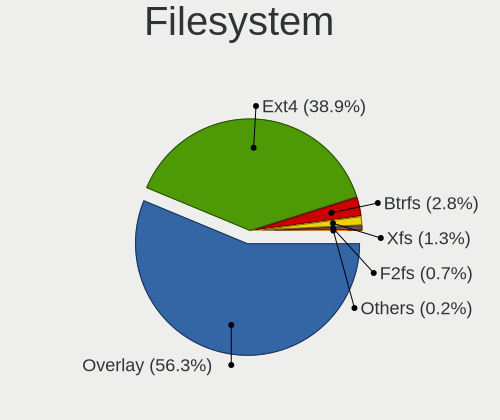

| Type    | Notebooks | Percent |
|---------|-----------|---------|
| Overlay | 157       | 59.92%  |
| Ext4    | 96        | 36.64%  |
| Btrfs   | 6         | 2.29%   |
| Xfs     | 3         | 1.15%   |

Part. scheme
------------

Scheme of partitioning

| Type | Notebooks | Percent |
|------|-----------|---------|
| GPT  | 208       | 79.39%  |
| MBR  | 54        | 20.61%  |

Dual Boot with Linux/BSD
------------------------

Hosting more than one Linux/BSD

| Dual boot | Notebooks | Percent |
|-----------|-----------|---------|
| Yes       | 142       | 54.2%   |
| No        | 120       | 45.8%   |

Dual Boot (Win)
---------------

Hosting Linux and Windows

| Dual boot | Notebooks | Percent |
|-----------|-----------|---------|
| No        | 158       | 60.31%  |
| Yes       | 104       | 39.69%  |

Board
-----

Vendor
------

Motherboard manufacturer

| Name                    | Notebooks | Percent |
|-------------------------|-----------|---------|
| Lenovo                  | 59        | 22.52%  |
| Hewlett-Packard         | 55        | 20.99%  |
| Dell                    | 42        | 16.03%  |
| Acer                    | 25        | 9.54%   |
| ASUSTek Computer        | 24        | 9.16%   |
| Toshiba                 | 11        | 4.2%    |
| MSI                     | 5         | 1.91%   |
| Apple                   | 5         | 1.91%   |
| Packard Bell            | 4         | 1.53%   |
| Fujitsu                 | 4         | 1.53%   |
| TUXEDO                  | 3         | 1.15%   |
| HUAWEI                  | 3         | 1.15%   |
| Samsung Electronics     | 2         | 0.76%   |
| Medion                  | 2         | 0.76%   |
| eMachines               | 2         | 0.76%   |
| Timi                    | 1         | 0.38%   |
| Sony                    | 1         | 0.38%   |
| SLIMBOOK                | 1         | 0.38%   |
| Philco                  | 1         | 0.38%   |
| Notebook                | 1         | 0.38%   |
| Machcreator             | 1         | 0.38%   |
| LG Electronics          | 1         | 0.38%   |
| Info Quest Technologies | 1         | 0.38%   |
| Google                  | 1         | 0.38%   |
| Chuwi                   | 1         | 0.38%   |
| AZW                     | 1         | 0.38%   |
| AWOW                    | 1         | 0.38%   |
| ARCELIK                 | 1         | 0.38%   |
| Alienware               | 1         | 0.38%   |
| Adreamer                | 1         | 0.38%   |
| Unknown                 | 1         | 0.38%   |

Model
-----

Motherboard model

| Name                                   | Notebooks | Percent |
|----------------------------------------|-----------|---------|
| Dell Inspiron 15 3515                  | 4         | 1.53%   |
| HP Compaq 610                          | 3         | 1.15%   |
| Toshiba Satellite C660                 | 2         | 0.76%   |
| Lenovo IdeaPad 330S-15IKB 81F5         | 2         | 0.76%   |
| HP Pavilion Gaming Laptop 15-ec0xxx    | 2         | 0.76%   |
| HP Pavilion dv7                        | 2         | 0.76%   |
| HP Laptop 17-by4xxx                    | 2         | 0.76%   |
| HP Laptop 15-dy2xxx                    | 2         | 0.76%   |
| HP Compaq 6730s                        | 2         | 0.76%   |
| Dell Latitude E5430 non-vPro           | 2         | 0.76%   |
| Dell Latitude E5410                    | 2         | 0.76%   |
| Dell Inspiron 1545                     | 2         | 0.76%   |
| ASUS VivoBook_ASUSLaptop X513EA_K513EA | 2         | 0.76%   |
| Apple MacBookAir9,1                    | 2         | 0.76%   |
| Unknown                                | 2         | 0.76%   |
| TUXEDO Pulse 15 Gen1                   | 1         | 0.38%   |
| TUXEDO Book BM15 Gen10                 | 1         | 0.38%   |
| TUXEDO Book BA1510                     | 1         | 0.38%   |
| Toshiba Satellite L755                 | 1         | 0.38%   |
| Toshiba Satellite L55t-A               | 1         | 0.38%   |
| Toshiba Satellite L55D-B               | 1         | 0.38%   |
| Toshiba Satellite C855D                | 1         | 0.38%   |
| Toshiba Satellite C850-19D             | 1         | 0.38%   |
| Toshiba Satellite C650D                | 1         | 0.38%   |
| Toshiba Satellite C650                 | 1         | 0.38%   |
| Toshiba Satellite A300                 | 1         | 0.38%   |
| Toshiba Portable PC                    | 1         | 0.38%   |
| Timi TM1701                            | 1         | 0.38%   |
| Sony VPCEL1E1E                         | 1         | 0.38%   |
| SLIMBOOK PROX-AMD5                     | 1         | 0.38%   |
| Samsung RV413/RV513                    | 1         | 0.38%   |
| Samsung 910S3L/911S3L                  | 1         | 0.38%   |
| Philco 14H                             | 1         | 0.38%   |
| Packard Bell EasyNote TS11HR           | 1         | 0.38%   |
| Packard Bell EasyNote LJ75             | 1         | 0.38%   |
| Packard Bell EasyNote ENLG71BM         | 1         | 0.38%   |
| Packard Bell DOT S                     | 1         | 0.38%   |
| Notebook NS5x_NS7xAU                   | 1         | 0.38%   |
| MSI Modern 15 B5M                      | 1         | 0.38%   |
| MSI Modern 14 B5M                      | 1         | 0.38%   |

Model Family
------------

Motherboard model prefix

| Name                  | Notebooks | Percent |
|-----------------------|-----------|---------|
| Lenovo ThinkPad       | 29        | 11.07%  |
| Acer Aspire           | 20        | 7.63%   |
| Lenovo IdeaPad        | 18        | 6.87%   |
| Dell Latitude         | 18        | 6.87%   |
| HP Laptop             | 15        | 5.73%   |
| Dell Inspiron         | 12        | 4.58%   |
| Toshiba Satellite     | 10        | 3.82%   |
| HP Pavilion           | 9         | 3.44%   |
| ASUS VivoBook         | 9         | 3.44%   |
| Dell Precision        | 7         | 2.67%   |
| HP ProBook            | 6         | 2.29%   |
| HP Compaq             | 6         | 2.29%   |
| Packard Bell EasyNote | 3         | 1.15%   |
| MSI Modern            | 3         | 1.15%   |
| HP EliteBook          | 3         | 1.15%   |
| HP 250                | 3         | 1.15%   |
| Fujitsu LIFEBOOK      | 3         | 1.15%   |
| Dell XPS              | 3         | 1.15%   |
| TUXEDO Book           | 2         | 0.76%   |
| Lenovo Legion         | 2         | 0.76%   |
| HP ZBook              | 2         | 0.76%   |
| HP Stream             | 2         | 0.76%   |
| HP 15                 | 2         | 0.76%   |
| ASUS ROG              | 2         | 0.76%   |
| Apple MacBookAir9     | 2         | 0.76%   |
| Acer Extensa          | 2         | 0.76%   |
| Unknown               | 2         | 0.76%   |
| TUXEDO Pulse          | 1         | 0.38%   |
| Toshiba Portable      | 1         | 0.38%   |
| Timi TM1701           | 1         | 0.38%   |
| Sony VPCEL1E1E        | 1         | 0.38%   |
| SLIMBOOK PROX-AMD5    | 1         | 0.38%   |
| Samsung RV413         | 1         | 0.38%   |
| Samsung 910S3L        | 1         | 0.38%   |
| Philco 14H            | 1         | 0.38%   |
| Packard Bell DOT      | 1         | 0.38%   |
| Notebook NS5x         | 1         | 0.38%   |
| MSI Katana            | 1         | 0.38%   |
| MSI CR620             | 1         | 0.38%   |
| Medion E6214          | 1         | 0.38%   |

MFG Year
--------

Motherboard manufacture year

| Year | Notebooks | Percent |
|------|-----------|---------|
| 2021 | 25        | 9.54%   |
| 2020 | 24        | 9.16%   |
| 2012 | 20        | 7.63%   |
| 2011 | 20        | 7.63%   |
| 2022 | 18        | 6.87%   |
| 2018 | 18        | 6.87%   |
| 2013 | 17        | 6.49%   |
| 2017 | 16        | 6.11%   |
| 2010 | 14        | 5.34%   |
| 2019 | 13        | 4.96%   |
| 2015 | 13        | 4.96%   |
| 2014 | 13        | 4.96%   |
| 2008 | 13        | 4.96%   |
| 2009 | 11        | 4.2%    |
| 2016 | 10        | 3.82%   |
| 2023 | 9         | 3.44%   |
| 2007 | 7         | 2.67%   |
| 2006 | 1         | 0.38%   |

Form Factor
-----------

Physical design of the computer

| Name     | Notebooks | Percent |
|----------|-----------|---------|
| Notebook | 262       | 100%    |

Secure Boot
-----------

Enabled or disabled

| State    | Notebooks | Percent |
|----------|-----------|---------|
| Disabled | 262       | 100%    |

Coreboot
--------

Have coreboot on board

| Used | Notebooks | Percent |
|------|-----------|---------|
| No   | 261       | 99.62%  |
| Yes  | 1         | 0.38%   |

RAM Size
--------

Total RAM memory

| Size in GB  | Notebooks | Percent |
|-------------|-----------|---------|
| 4.01-8.0    | 76        | 29.01%  |
| 3.01-4.0    | 61        | 23.28%  |
| 8.01-16.0   | 48        | 18.32%  |
| 16.01-24.0  | 41        | 15.65%  |
| 1.01-2.0    | 13        | 4.96%   |
| 32.01-64.0  | 9         | 3.44%   |
| 2.01-3.0    | 8         | 3.05%   |
| 24.01-32.0  | 5         | 1.91%   |
| 64.01-256.0 | 1         | 0.38%   |

RAM Used
--------

Used RAM memory

| Used GB   | Notebooks | Percent |
|-----------|-----------|---------|
| 1.01-2.0  | 174       | 66.41%  |
| 2.01-3.0  | 44        | 16.79%  |
| 0.51-1.0  | 28        | 10.69%  |
| 3.01-4.0  | 11        | 4.2%    |
| 0.01-0.5  | 3         | 1.15%   |
| 4.01-8.0  | 1         | 0.38%   |
| 8.01-16.0 | 1         | 0.38%   |

Total Drives
------------

Number of drives on board

| Drives | Notebooks | Percent |
|--------|-----------|---------|
| 1      | 173       | 66.03%  |
| 2      | 75        | 28.63%  |
| 3      | 10        | 3.82%   |
| 4      | 2         | 0.76%   |
| 13     | 1         | 0.38%   |
| 0      | 1         | 0.38%   |

Has CD-ROM
----------

Has CD-ROM on board

| Presented | Notebooks | Percent |
|-----------|-----------|---------|
| No        | 158       | 60.31%  |
| Yes       | 104       | 39.69%  |

Has Ethernet
------------

Has Ethernet on board

| Presented | Notebooks | Percent |
|-----------|-----------|---------|
| Yes       | 204       | 77.86%  |
| No        | 58        | 22.14%  |

Has WiFi
--------

Has WiFi module

| Presented | Notebooks | Percent |
|-----------|-----------|---------|
| Yes       | 260       | 99.24%  |
| No        | 2         | 0.76%   |

Has Bluetooth
-------------

Has Bluetooth module

| Presented | Notebooks | Percent |
|-----------|-----------|---------|
| Yes       | 208       | 79.39%  |
| No        | 54        | 20.61%  |

Location
--------

Country
-------

Geographic location (country)

| Country             | Notebooks | Percent |
|---------------------|-----------|---------|
| USA                 | 53        | 20.23%  |
| Germany             | 28        | 10.69%  |
| Russia              | 25        | 9.54%   |
| Poland              | 23        | 8.78%   |
| Italy               | 14        | 5.34%   |
| France              | 14        | 5.34%   |
| Brazil              | 12        | 4.58%   |
| Spain               | 9         | 3.44%   |
| Czechia             | 9         | 3.44%   |
| Turkey              | 6         | 2.29%   |
| Hungary             | 6         | 2.29%   |
| UK                  | 5         | 1.91%   |
| Japan               | 5         | 1.91%   |
| Norway              | 4         | 1.53%   |
| Netherlands         | 4         | 1.53%   |
| Canada              | 4         | 1.53%   |
| Switzerland         | 3         | 1.15%   |
| Indonesia           | 3         | 1.15%   |
| Thailand            | 2         | 0.76%   |
| Romania             | 2         | 0.76%   |
| Mexico              | 2         | 0.76%   |
| Malaysia            | 2         | 0.76%   |
| Lithuania           | 2         | 0.76%   |
| India               | 2         | 0.76%   |
| Cyprus              | 2         | 0.76%   |
| Ukraine             | 1         | 0.38%   |
| Trinidad and Tobago | 1         | 0.38%   |
| Sudan               | 1         | 0.38%   |
| Slovakia            | 1         | 0.38%   |
| Singapore           | 1         | 0.38%   |
| Serbia              | 1         | 0.38%   |
| Portugal            | 1         | 0.38%   |
| Palestine           | 1         | 0.38%   |
| Nigeria             | 1         | 0.38%   |
| New Zealand         | 1         | 0.38%   |
| Israel              | 1         | 0.38%   |
| Grenada             | 1         | 0.38%   |
| Greece              | 1         | 0.38%   |
| Egypt               | 1         | 0.38%   |
| Costa Rica          | 1         | 0.38%   |

City
----

Geographic location (city)

| City           | Notebooks | Percent |
|----------------|-----------|---------|
| Prague         | 5         | 1.91%   |
| Warsaw         | 4         | 1.53%   |
| Oliveira       | 4         | 1.53%   |
| Stuhr          | 3         | 1.15%   |
| Paris          | 3         | 1.15%   |
| Milan          | 3         | 1.15%   |
| Budapest       | 3         | 1.15%   |
| Wroclaw        | 2         | 0.76%   |
| Voronezh       | 2         | 0.76%   |
| Uberlingen     | 2         | 0.76%   |
| St Petersburg  | 2         | 0.76%   |
| Sao Paulo      | 2         | 0.76%   |
| Poznan         | 2         | 0.76%   |
| Munich         | 2         | 0.76%   |
| Lublin         | 2         | 0.76%   |
| Limassol       | 2         | 0.76%   |
| Le Grau-du-Roi | 2         | 0.76%   |
| Kraszew        | 2         | 0.76%   |
| Krasnoyarsk    | 2         | 0.76%   |
| Hot Springs    | 2         | 0.76%   |
| Hanover        | 2         | 0.76%   |
| Glen Burnie    | 2         | 0.76%   |
| rd           | 2         | 0.76%   |
| Barnaul        | 2         | 0.76%   |
| Ankara         | 2         | 0.76%   |
| Zweidlen-Dorf  | 1         | 0.38%   |
| Zurich         | 1         | 0.38%   |
| Zofingen       | 1         | 0.38%   |
| Zielona Gra  | 1         | 0.38%   |
| Zambrw       | 1         | 0.38%   |
| Ypsilanti      | 1         | 0.38%   |
| Yoshkar-Ola    | 1         | 0.38%   |
| Woodbridge     | 1         | 0.38%   |
| Walhain        | 1         | 0.38%   |
| Volgograd      | 1         | 0.38%   |
| Vilnius        | 1         | 0.38%   |
| Vilhena        | 1         | 0.38%   |
| Vienna         | 1         | 0.38%   |
| Valencia       | 1         | 0.38%   |
| Ulm            | 1         | 0.38%   |

Drives
------

Drive Vendor
------------

Hard drive vendors

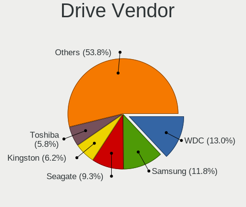

| Vendor                      | Notebooks | Drives | Percent |
|-----------------------------|-----------|--------|---------|
| WDC                         | 50        | 50     | 14.53%  |
| Samsung Electronics         | 44        | 52     | 12.79%  |
| Seagate                     | 23        | 23     | 6.69%   |
| SanDisk                     | 22        | 23     | 6.4%    |
| Toshiba                     | 18        | 18     | 5.23%   |
| Kingston                    | 15        | 15     | 4.36%   |
| Unknown                     | 12        | 14     | 3.49%   |
| Crucial                     | 12        | 12     | 3.49%   |
| SK hynix                    | 10        | 10     | 2.91%   |
| Micron Technology           | 10        | 12     | 2.91%   |
| Hitachi                     | 10        | 10     | 2.91%   |
| SPCC                        | 9         | 9      | 2.62%   |
| JMicron Technology          | 7         | 7      | 2.03%   |
| Intel                       | 7         | 7      | 2.03%   |
| HGST                        | 7         | 7      | 2.03%   |
| Unknown                     | 6         | 6      | 1.74%   |
| China                       | 5         | 5      | 1.45%   |
| Intenso                     | 4         | 4      | 1.16%   |
| UMIS                        | 3         | 3      | 0.87%   |
| SSSTC                       | 3         | 3      | 0.87%   |
| Lexar                       | 3         | 3      | 0.87%   |
| Kingston Technology Company | 3         | 3      | 0.87%   |
| Apple                       | 3         | 3      | 0.87%   |
| A-DATA Technology           | 3         | 3      | 0.87%   |
| Transcend                   | 2         | 2      | 0.58%   |
| Team                        | 2         | 2      | 0.58%   |
| Silicon Motion              | 2         | 2      | 0.58%   |
| SABRENT                     | 2         | 3      | 0.58%   |
| MSI                         | 2         | 2      | 0.58%   |
| Hewlett-Packard             | 2         | 2      | 0.58%   |
| GOODRAM                     | 2         | 2      | 0.58%   |
| Gigabyte Technology         | 2         | 2      | 0.58%   |
| Dahua                       | 2         | 3      | 0.58%   |
| WALRAM                      | 1         | 1      | 0.29%   |
| Verbatim                    | 1         | 1      | 0.29%   |
| USB                         | 1         | 1      | 0.29%   |
| TwinMOS                     | 1         | 1      | 0.29%   |
| TO Exter                    | 1         | 1      | 0.29%   |
| T-FORCE                     | 1         | 1      | 0.29%   |
| SSK                         | 1         | 1      | 0.29%   |

Drive Model
-----------

Hard drive models

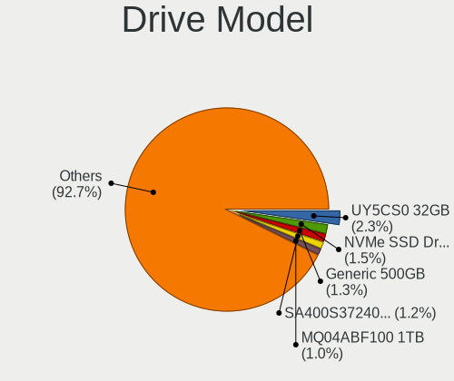

| Model                               | Notebooks | Percent |
|-------------------------------------|-----------|---------|
| SanDisk NVMe SSD Drive 1TB          | 7         | 1.99%   |
| Toshiba MQ04ABF100 1TB              | 6         | 1.71%   |
| Unknown                             | 6         | 1.71%   |
| JMicron Generic 8GB                 | 5         | 1.42%   |
| SPCC M.2 PCIe SSD 512GB             | 3         | 0.85%   |
| Samsung SSD 870 QVO 1TB             | 3         | 0.85%   |
| Kingston Company SNV2S1000G 1TB     | 3         | 0.85%   |
| Kingston SNVS500G 500GB             | 3         | 0.85%   |
| Kingston SA400S37240G 240GB SSD     | 3         | 0.85%   |
| Hitachi HTS545032B9A300 320GB       | 3         | 0.85%   |
| WDC WDS100T3X0C-00SJG0 1TB          | 2         | 0.57%   |
| WDC WD7500BPVX-16JC3T3 752GB        | 2         | 0.57%   |
| WDC WD5000LPCX-21VHAT0 500GB        | 2         | 0.57%   |
| WDC WD5000BPKT-75PK4T0 500GB        | 2         | 0.57%   |
| WDC WD3200BPVT-80JJ5T0 320GB        | 2         | 0.57%   |
| WDC WD10SPZX-24Z10 1TB              | 2         | 0.57%   |
| Unknown SD/MMC/MS PRO 256GB         | 2         | 0.57%   |
| Toshiba MQ01ABD100 1TB              | 2         | 0.57%   |
| Toshiba MQ01ABD075 752GB            | 2         | 0.57%   |
| SPCC Solid State Disk 512GB         | 2         | 0.57%   |
| SPCC Solid State Disk 256GB         | 2         | 0.57%   |
| Seagate ST9500325AS 500GB           | 2         | 0.57%   |
| Seagate ST9320423AS 320GB           | 2         | 0.57%   |
| Seagate ST500LT012-1DG142 500GB     | 2         | 0.57%   |
| Seagate ST500LM012 HN-M500MBB 500GB | 2         | 0.57%   |
| SanDisk SSD PLUS 480GB              | 2         | 0.57%   |
| SanDisk NVMe SSD Drive 512GB        | 2         | 0.57%   |
| Samsung SSD 860 EVO M.2 250GB       | 2         | 0.57%   |
| Samsung MZALQ512HBLU-00BL2 512GB    | 2         | 0.57%   |
| SABRENT Disk 500GB                  | 2         | 0.57%   |
| Micron 2210_MTFDHBA512QFD 512GB     | 2         | 0.57%   |
| JMicron Tech 250GB                  | 2         | 0.57%   |
| Hitachi HTS545050B9A300 500GB       | 2         | 0.57%   |
| Hitachi HTS543232A7A384 320GB       | 2         | 0.57%   |
| HGST HTS545050A7E680 500GB          | 2         | 0.57%   |
| Dahua C800 2.5 inch SATA 512GB SSD  | 2         | 0.57%   |
| Crucial CT480BX500SSD1 480GB        | 2         | 0.57%   |
| Crucial CT1000P2SSD8 1TB            | 2         | 0.57%   |
| China SSD 512GB                     | 2         | 0.57%   |
| Apple SSD AP0256N 256GB             | 2         | 0.57%   |

HDD Vendor
----------

Hard disk drive vendors

| Vendor             | Notebooks | Drives | Percent |
|--------------------|-----------|--------|---------|
| WDC                | 34        | 34     | 34%     |
| Seagate            | 22        | 22     | 22%     |
| Toshiba            | 16        | 16     | 16%     |
| Hitachi            | 10        | 10     | 10%     |
| HGST               | 7         | 7      | 7%      |
| JMicron Technology | 5         | 5      | 5%      |
| Unknown            | 2         | 2      | 2%      |
| TO Exter           | 1         | 1      | 1%      |
| SSK                | 1         | 1      | 1%      |
| Fujitsu            | 1         | 1      | 1%      |
| External           | 1         | 1      | 1%      |

SSD Vendor
----------

Solid state drive vendors

| Vendor              | Notebooks | Drives | Percent |
|---------------------|-----------|--------|---------|
| Samsung Electronics | 25        | 28     | 21.74%  |
| SanDisk             | 13        | 13     | 11.3%   |
| Kingston            | 8         | 8      | 6.96%   |
| SPCC                | 6         | 6      | 5.22%   |
| Crucial             | 6         | 6      | 5.22%   |
| China               | 5         | 5      | 4.35%   |
| Micron Technology   | 4         | 6      | 3.48%   |
| WDC                 | 3         | 3      | 2.61%   |
| Intenso             | 3         | 3      | 2.61%   |
| Intel               | 3         | 3      | 2.61%   |
| Transcend           | 2         | 2      | 1.74%   |
| SABRENT             | 2         | 3      | 1.74%   |
| Hewlett-Packard     | 2         | 2      | 1.74%   |
| Dahua               | 2         | 3      | 1.74%   |
| A-DATA Technology   | 2         | 2      | 1.74%   |
| Verbatim            | 1         | 1      | 0.87%   |
| USB                 | 1         | 1      | 0.87%   |
| TwinMOS             | 1         | 1      | 0.87%   |
| Team                | 1         | 1      | 0.87%   |
| T-FORCE             | 1         | 1      | 0.87%   |
| SPCC M.2            | 1         | 1      | 0.87%   |
| SK hynix            | 1         | 1      | 0.87%   |
| RX7                 | 1         | 1      | 0.87%   |
| PNY                 | 1         | 1      | 0.87%   |
| OCZ                 | 1         | 1      | 0.87%   |
| LITEONIT            | 1         | 1      | 0.87%   |
| LITEON              | 1         | 1      | 0.87%   |
| Lexar               | 1         | 1      | 0.87%   |
| KIOXIA-EXCERIA      | 1         | 1      | 0.87%   |
| KingSpec            | 1         | 1      | 0.87%   |
| HS-SSD-E100         | 1         | 1      | 0.87%   |
| GOODRAM             | 1         | 1      | 0.87%   |
| G521S               | 1         | 1      | 0.87%   |
| FORESEE             | 1         | 1      | 0.87%   |
| Emtec               | 1         | 1      | 0.87%   |
| Drevo               | 1         | 1      | 0.87%   |
| Dogfish             | 1         | 1      | 0.87%   |
| Digma               | 1         | 1      | 0.87%   |
| DEXP                | 1         | 1      | 0.87%   |
| BAITITON            | 1         | 1      | 0.87%   |

Drive Kind
----------

HDD or SSD

| Kind    | Notebooks | Drives | Percent |
|---------|-----------|--------|---------|
| SSD     | 107       | 122    | 33.33%  |
| NVMe    | 97        | 113    | 30.22%  |
| HDD     | 97        | 100    | 30.22%  |
| MMC     | 14        | 17     | 4.36%   |
| Unknown | 6         | 7      | 1.87%   |

Drive Connector
---------------

SATA, SAS, NVMe, etc.

| Type | Notebooks | Drives | Percent |
|------|-----------|--------|---------|
| SATA | 171       | 194    | 55.88%  |
| NVMe | 96        | 107    | 31.37%  |
| SAS  | 25        | 41     | 8.17%   |
| MMC  | 14        | 17     | 4.58%   |

Drive Size
----------

Size of hard drive

| Size in TB | Notebooks | Drives | Percent |
|------------|-----------|--------|---------|
| 0.01-0.5   | 140       | 155    | 69.65%  |
| 0.51-1.0   | 57        | 61     | 28.36%  |
| 1.01-2.0   | 3         | 4      | 1.49%   |
| 3.01-4.0   | 1         | 2      | 0.5%    |

Space Total
-----------

Amount of disk space available on the file system

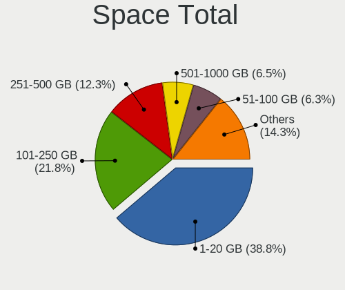

| Size in GB     | Notebooks | Percent |
|----------------|-----------|---------|
| 1-20           | 107       | 40.84%  |
| 101-250        | 50        | 19.08%  |
| 251-500        | 32        | 12.21%  |
| 501-1000       | 19        | 7.25%   |
| 51-100         | 18        | 6.87%   |
| Unknown        | 15        | 5.73%   |
| 21-50          | 12        | 4.58%   |
| 1001-2000      | 7         | 2.67%   |
| More than 3000 | 1         | 0.38%   |
| 2001-3000      | 1         | 0.38%   |

Space Used
----------

Amount of used disk space

| Used GB  | Notebooks | Percent |
|----------|-----------|---------|
| 1-20     | 199       | 75.95%  |
| Unknown  | 15        | 5.73%   |
| 21-50    | 12        | 4.58%   |
| 51-100   | 10        | 3.82%   |
| 0        | 9         | 3.44%   |
| 101-250  | 8         | 3.05%   |
| 251-500  | 5         | 1.91%   |
| 501-1000 | 4         | 1.53%   |

Malfunc. Drives
---------------

Drive models with a malfunction

| Model                                 | Notebooks | Drives | Percent |
|---------------------------------------|-----------|--------|---------|
| Seagate ST9500325AS 500GB             | 2         | 2      | 4.17%   |
| Seagate ST500LT012-1DG142 500GB       | 2         | 2      | 4.17%   |
| Hitachi HTS545050B9A300 500GB         | 2         | 2      | 4.17%   |
| Hitachi HTS545032B9A300 320GB         | 2         | 2      | 4.17%   |
| WDC WDS100T2G0A-00JH30 1TB SSD        | 1         | 1      | 2.08%   |
| WDC WD5000LPVX-22V0TT0 500GB          | 1         | 1      | 2.08%   |
| WDC WD5000LPCX-24VHAT0 500GB          | 1         | 1      | 2.08%   |
| WDC WD3200BPVT-80JJ5T0 320GB          | 1         | 1      | 2.08%   |
| WDC WD3200BEVT-75A23T0 320GB          | 1         | 1      | 2.08%   |
| WDC WD3200BEKT-08PVMT1 320GB          | 1         | 1      | 2.08%   |
| WDC WD2500BEVT-60ZCT1 250GB           | 1         | 1      | 2.08%   |
| WDC WD2500BEVT-22ZCT0 250GB           | 1         | 1      | 2.08%   |
| WDC WD2500BEVT-22A23T0 250GB          | 1         | 1      | 2.08%   |
| WDC WD1600BEVT-75A23T0 160GB          | 1         | 1      | 2.08%   |
| WDC WD1600BEKT-60F3T1 160GB           | 1         | 1      | 2.08%   |
| WDC WD10JPVT-60A1YT0 1TB              | 1         | 1      | 2.08%   |
| Transcend TS128GMTS430S 128GB SSD     | 1         | 1      | 2.08%   |
| Toshiba MQ01ABD100 1TB                | 1         | 1      | 2.08%   |
| Toshiba MK3276GSX 320GB               | 1         | 1      | 2.08%   |
| Toshiba MK3265GSX 320GB               | 1         | 1      | 2.08%   |
| Team TM8FPD001T 1TB                   | 1         | 1      | 2.08%   |
| Seagate ST9500423AS 500GB             | 1         | 1      | 2.08%   |
| Seagate ST9500420AS 500GB             | 1         | 1      | 2.08%   |
| Seagate ST9320325AS 320GB             | 1         | 1      | 2.08%   |
| Seagate ST9100821AS 100GB             | 1         | 1      | 2.08%   |
| Seagate ST500LM012 HN-M500MBB 500GB   | 1         | 1      | 2.08%   |
| Seagate ST500LM000-SSHD-8GB           | 1         | 1      | 2.08%   |
| Seagate ST320LT007-9ZV142 320GB       | 1         | 1      | 2.08%   |
| Seagate ST1000LM035-1RK172 1TB        | 1         | 1      | 2.08%   |
| Seagate ST1000LM024 HN-M101MBB 1TB    | 1         | 1      | 2.08%   |
| SanDisk SSD PLUS 480GB                | 1         | 1      | 2.08%   |
| OCZ AGILITY3 120GB SSD                | 1         | 1      | 2.08%   |
| LITEONIT LCM-128M3S 2.5 7mm 128GB SSD | 1         | 1      | 2.08%   |
| Lexar SSD NS100 1TB                   | 1         | 1      | 2.08%   |
| Kingston SA400S37480G 480GB SSD       | 1         | 1      | 2.08%   |
| JMicron Technology Tech 250GB         | 1         | 1      | 2.08%   |
| Intel MEMPEK1J016GAL 16GB             | 1         | 1      | 2.08%   |
| Hitachi HTS723232L9A360 320GB         | 1         | 1      | 2.08%   |
| HGST HTS545050A7E680 500GB            | 1         | 1      | 2.08%   |
| HGST HTS545050A7E380 500GB            | 1         | 1      | 2.08%   |

Malfunc. Drive Vendor
---------------------

Vendors of faulty drives

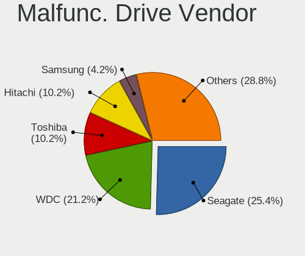

| Vendor             | Notebooks | Drives | Percent |
|--------------------|-----------|--------|---------|
| Seagate            | 13        | 13     | 27.08%  |
| WDC                | 12        | 12     | 25%     |
| Hitachi            | 5         | 5      | 10.42%  |
| Toshiba            | 3         | 3      | 6.25%   |
| HGST               | 3         | 3      | 6.25%   |
| Transcend          | 1         | 1      | 2.08%   |
| Team               | 1         | 1      | 2.08%   |
| SanDisk            | 1         | 1      | 2.08%   |
| OCZ                | 1         | 1      | 2.08%   |
| LITEONIT           | 1         | 1      | 2.08%   |
| Lexar              | 1         | 1      | 2.08%   |
| Kingston           | 1         | 1      | 2.08%   |
| JMicron Technology | 1         | 1      | 2.08%   |
| Intel              | 1         | 1      | 2.08%   |
| Dogfish            | 1         | 1      | 2.08%   |
| Crucial            | 1         | 1      | 2.08%   |
| China              | 1         | 1      | 2.08%   |

Malfunc. HDD Vendor
-------------------

Vendors of faulty HDD drives

| Vendor  | Notebooks | Drives | Percent |
|---------|-----------|--------|---------|
| Seagate | 13        | 13     | 37.14%  |
| WDC     | 11        | 11     | 31.43%  |
| Hitachi | 5         | 5      | 14.29%  |
| Toshiba | 3         | 3      | 8.57%   |
| HGST    | 3         | 3      | 8.57%   |

Malfunc. Drive Kind
-------------------

Kinds of faulty drives

| Kind    | Notebooks | Drives | Percent |
|---------|-----------|--------|---------|
| HDD     | 35        | 35     | 72.92%  |
| SSD     | 10        | 10     | 20.83%  |
| NVMe    | 2         | 2      | 4.17%   |
| Unknown | 1         | 1      | 2.08%   |

Failed Drives
-------------

Failed drive models

Zero info for selected period =(

Failed Drive Vendor
-------------------

Failed drive vendors

Zero info for selected period =(

Drive Status
------------

Number of failed and malfunc. drives

| Status   | Notebooks | Drives | Percent |
|----------|-----------|--------|---------|
| Works    | 207       | 251    | 69.93%  |
| Malfunc  | 46        | 48     | 15.54%  |
| Detected | 43        | 60     | 14.53%  |

Storage controller
------------------

Storage Vendor
--------------

Storage controller vendors

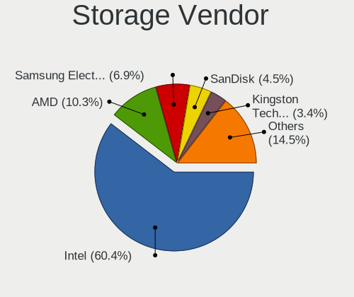

| Vendor                                  | Notebooks | Percent |
|-----------------------------------------|-----------|---------|
| Intel                                   | 178       | 55.97%  |
| AMD                                     | 35        | 11.01%  |
| SanDisk                                 | 20        | 6.29%   |
| Samsung Electronics                     | 20        | 6.29%   |
| Kingston Technology Company             | 10        | 3.14%   |
| SK hynix                                | 9         | 2.83%   |
| Phison Electronics                      | 9         | 2.83%   |
| Micron/Crucial Technology               | 6         | 1.89%   |
| Micron Technology                       | 6         | 1.89%   |
| Silicon Motion                          | 5         | 1.57%   |
| Solid State Storage Technology          | 3         | 0.94%   |
| MAXIO Technology (Hangzhou)             | 3         | 0.94%   |
| Union Memory (Shenzhen)                 | 2         | 0.63%   |
| Apple                                   | 2         | 0.63%   |
| ADATA Technology                        | 2         | 0.63%   |
| Toshiba America Info Systems            | 1         | 0.31%   |
| Shenzhen Unionmemory Information System | 1         | 0.31%   |
| Seagate Technology                      | 1         | 0.31%   |
| Realtek Semiconductor                   | 1         | 0.31%   |
| Nvidia                                  | 1         | 0.31%   |
| Netac Technology                        | 1         | 0.31%   |
| KIOXIA                                  | 1         | 0.31%   |
| ASMedia Technology                      | 1         | 0.31%   |

Storage Model
-------------

Storage controller models

| Model                                                                            | Notebooks | Percent |
|----------------------------------------------------------------------------------|-----------|---------|
| AMD FCH SATA Controller [AHCI mode]                                              | 27        | 7.94%   |
| Intel Sunrise Point-LP SATA Controller [AHCI mode]                               | 26        | 7.65%   |
| Intel 7 Series Chipset Family 6-port SATA Controller [AHCI mode]                 | 17        | 5%      |
| Intel 82801 Mobile SATA Controller [RAID mode]                                   | 14        | 4.12%   |
| Intel Volume Management Device NVMe RAID Controller                              | 13        | 3.82%   |
| Intel 82801IBM/IEM (ICH9M/ICH9M-E) 4 port SATA Controller [AHCI mode]            | 12        | 3.53%   |
| Intel 6 Series/C200 Series Chipset Family 6 port Mobile SATA AHCI Controller     | 12        | 3.53%   |
| Samsung NVMe SSD Controller 980 (DRAM-less)                                      | 10        | 2.94%   |
| Intel 5 Series/3400 Series Chipset 4 port SATA AHCI Controller                   | 9         | 2.65%   |
| Intel Tiger Lake-LP SATA Controller                                              | 8         | 2.35%   |
| Intel 82801HM/HEM (ICH8M/ICH8M-E) IDE Controller                                 | 8         | 2.35%   |
| Intel 8 Series/C220 Series Chipset Family 6-port SATA Controller 1 [AHCI mode]   | 7         | 2.06%   |
| AMD SB7x0/SB8x0/SB9x0 SATA Controller [AHCI mode]                                | 7         | 2.06%   |
| Intel Wildcat Point-LP SATA Controller [AHCI Mode]                               | 6         | 1.76%   |
| Intel 82801HM/HEM (ICH8M/ICH8M-E) SATA Controller [AHCI mode]                    | 6         | 1.76%   |
| Samsung NVMe SSD Controller SM981/PM981/PM983                                    | 5         | 1.47%   |
| Samsung NVMe SSD Controller PM9A1/PM9A3/980PRO                                   | 4         | 1.18%   |
| Micron/Crucial P2 [Nick P2] / P3 / P3 Plus NVMe PCIe SSD (DRAM-less)             | 4         | 1.18%   |
| Intel Celeron N3350/Pentium N4200/Atom E3900 Series SATA AHCI Controller         | 4         | 1.18%   |
| Intel Atom/Celeron/Pentium Processor x5-E8000/J3xxx/N3xxx Series SATA Controller | 4         | 1.18%   |
| Intel Atom Processor E3800 Series SATA AHCI Controller                           | 4         | 1.18%   |
| Intel 8 Series SATA Controller 1 [AHCI mode]                                     | 4         | 1.18%   |
| Intel 5 Series/3400 Series Chipset 6 port SATA AHCI Controller                   | 4         | 1.18%   |
| SK hynix BC511 NVMe SSD                                                          | 3         | 0.88%   |
| Silicon Motion SM2263EN/SM2263XT (DRAM-less) NVMe SSD Controllers                | 3         | 0.88%   |
| SanDisk Ultra 3D / WD Blue SN550 NVMe SSD                                        | 3         | 0.88%   |
| SanDisk Extreme Pro / WD Black SN750 / PC SN730 / Red SN700 NVMe SSD             | 3         | 0.88%   |
| MAXIO (Hangzhou) NVMe SSD Controller MAP1202 (DRAM-less)                         | 3         | 0.88%   |
| Kingston Company NV1 NVMe SSD SM2263XT (DRAM-less)                               | 3         | 0.88%   |
| Intel NM10/ICH7 Family SATA Controller [AHCI mode]                               | 3         | 0.88%   |
| Intel Comet Lake SATA AHCI Controller                                            | 3         | 0.88%   |
| Intel 82801HM/HEM (ICH8M/ICH8M-E) SATA Controller [IDE mode]                     | 3         | 0.88%   |
| Intel 7 Series Chipset Family 4-port SATA Controller [IDE mode]                  | 3         | 0.88%   |
| Intel 7 Series Chipset Family 2-port SATA Controller [IDE mode]                  | 3         | 0.88%   |
| Solid State Storage CL1-3D256-Q11 NVMe SSD M.2                                   | 2         | 0.59%   |
| SK hynix BC501 NVMe Solid State Drive                                            | 2         | 0.59%   |
| Silicon Motion Non-Volatile memory controller                                    | 2         | 0.59%   |
| SanDisk WD PC SN810 / Black SN850 NVMe SSD                                       | 2         | 0.59%   |
| SanDisk WD PC SN540 / Green SN350 NVMe SSD 1 TB (DRAM-less)                      | 2         | 0.59%   |
| SanDisk WD Blue SN500 / PC SN520 x2 M.2 2280 NVMe SSD                            | 2         | 0.59%   |

Storage Kind
------------

Kind of storage controller (IDE, SATA, NVMe, SAS, ...)

| Kind | Notebooks | Percent |
|------|-----------|---------|
| SATA | 178       | 55.28%  |
| NVMe | 96        | 29.81%  |
| RAID | 32        | 9.94%   |
| IDE  | 16        | 4.97%   |

Processor
---------

CPU Vendor
----------

Processor vendors

| Vendor | Notebooks | Percent |
|--------|-----------|---------|
| Intel  | 207       | 79.01%  |
| AMD    | 55        | 20.99%  |

CPU Model
---------

Processor models

| Model                                         | Notebooks | Percent |
|-----------------------------------------------|-----------|---------|
| Intel Core i5-8250U CPU @ 1.60GHz             | 6         | 2.29%   |
| Intel Core i5-3320M CPU @ 2.60GHz             | 5         | 1.91%   |
| Intel 11th Gen Core i5-1135G7 @ 2.40GHz       | 5         | 1.91%   |
| Intel Core i5-3337U CPU @ 1.80GHz             | 4         | 1.53%   |
| Intel Core i5-10210U CPU @ 1.60GHz            | 4         | 1.53%   |
| Intel 12th Gen Core i5-12500H                 | 4         | 1.53%   |
| AMD Ryzen 5 3500U with Radeon Vega Mobile Gfx | 4         | 1.53%   |
| AMD Ryzen 5 3450U with Radeon Vega Mobile Gfx | 4         | 1.53%   |
| Intel Pentium Dual-Core CPU T4500 @ 2.30GHz   | 3         | 1.15%   |
| Intel Pentium CPU P6100 @ 2.00GHz             | 3         | 1.15%   |
| Intel Core i7-8550U CPU @ 1.80GHz             | 3         | 1.15%   |
| Intel Core i7-3610QM CPU @ 2.30GHz            | 3         | 1.15%   |
| Intel Core i5-6300U CPU @ 2.40GHz             | 3         | 1.15%   |
| Intel Core i5-5200U CPU @ 2.20GHz             | 3         | 1.15%   |
| Intel Core i3-7020U CPU @ 2.30GHz             | 3         | 1.15%   |
| Intel Core i3-2310M CPU @ 2.10GHz             | 3         | 1.15%   |
| Intel Core i3 CPU M 370 @ 2.40GHz             | 3         | 1.15%   |
| Intel Celeron N4020 CPU @ 1.10GHz             | 3         | 1.15%   |
| Intel Celeron CPU N3060 @ 1.60GHz             | 3         | 1.15%   |
| Intel 12th Gen Core i7-12700H                 | 3         | 1.15%   |
| Intel 11th Gen Core i7-1165G7 @ 2.80GHz       | 3         | 1.15%   |
| Intel 11th Gen Core i3-1115G4 @ 3.00GHz       | 3         | 1.15%   |
| AMD Ryzen 7 5700U with Radeon Graphics        | 3         | 1.15%   |
| AMD Ryzen 5 5500U with Radeon Graphics        | 3         | 1.15%   |
| AMD Ryzen 5 3550H with Radeon Vega Mobile Gfx | 3         | 1.15%   |
| Intel Pentium Silver N6000 @ 1.10GHz          | 2         | 0.76%   |
| Intel Pentium CPU N4200 @ 1.10GHz             | 2         | 0.76%   |
| Intel Genuine CPU T1500 @ 1.86GHz             | 2         | 0.76%   |
| Intel Core i7-8750H CPU @ 2.20GHz             | 2         | 0.76%   |
| Intel Core i7-8650U CPU @ 1.90GHz             | 2         | 0.76%   |
| Intel Core i7-6820HQ CPU @ 2.70GHz            | 2         | 0.76%   |
| Intel Core i7-6500U CPU @ 2.50GHz             | 2         | 0.76%   |
| Intel Core i7-10850H CPU @ 2.70GHz            | 2         | 0.76%   |
| Intel Core i5-6200U CPU @ 2.30GHz             | 2         | 0.76%   |
| Intel Core i5-4310M CPU @ 2.70GHz             | 2         | 0.76%   |
| Intel Core i5-4300U CPU @ 1.90GHz             | 2         | 0.76%   |
| Intel Core i5-3230M CPU @ 2.60GHz             | 2         | 0.76%   |
| Intel Core i5-3210M CPU @ 2.50GHz             | 2         | 0.76%   |
| Intel Core i5-2410M CPU @ 2.30GHz             | 2         | 0.76%   |
| Intel Core i5-1035G1 CPU @ 1.00GHz            | 2         | 0.76%   |

CPU Model Family
----------------

Processor model prefix

| Model                   | Notebooks | Percent |
|-------------------------|-----------|---------|
| Intel Core i5           | 55        | 20.99%  |
| Other                   | 33        | 12.6%   |
| Intel Core i3           | 32        | 12.21%  |
| Intel Core i7           | 30        | 11.45%  |
| Intel Celeron           | 23        | 8.78%   |
| AMD Ryzen 5             | 17        | 6.49%   |
| Intel Core 2 Duo        | 10        | 3.82%   |
| Intel Pentium           | 8         | 3.05%   |
| AMD Ryzen 7             | 7         | 2.67%   |
| Intel Pentium Dual-Core | 5         | 1.91%   |
| AMD A6                  | 5         | 1.91%   |
| Intel Atom              | 4         | 1.53%   |
| AMD E                   | 4         | 1.53%   |
| Intel Genuine           | 3         | 1.15%   |
| AMD Ryzen 3             | 3         | 1.15%   |
| AMD A8                  | 3         | 1.15%   |
| Intel Pentium Silver    | 2         | 0.76%   |
| Intel Pentium Dual      | 2         | 0.76%   |
| AMD Ryzen 9             | 2         | 0.76%   |
| AMD E2                  | 2         | 0.76%   |
| AMD Athlon II Dual-Core | 2         | 0.76%   |
| AMD Athlon              | 2         | 0.76%   |
| AMD A4                  | 2         | 0.76%   |
| Intel Pentium Gold      | 1         | 0.38%   |
| Intel Core 2 Solo       | 1         | 0.38%   |
| AMD V140                | 1         | 0.38%   |
| AMD V120                | 1         | 0.38%   |
| AMD Turion 64 X2 Mobile | 1         | 0.38%   |
| AMD E1                  | 1         | 0.38%   |

CPU Cores
---------

Number of processor cores

| Number | Notebooks | Percent |
|--------|-----------|---------|
| 2      | 143       | 54.58%  |
| 4      | 77        | 29.39%  |
| 8      | 11        | 4.2%    |
| 6      | 11        | 4.2%    |
| 12     | 7         | 2.67%   |
| 1      | 7         | 2.67%   |
| 14     | 5         | 1.91%   |
| 10     | 1         | 0.38%   |

CPU Sockets
-----------

Number of sockets

| Number | Notebooks | Percent |
|--------|-----------|---------|
| 1      | 262       | 100%    |

CPU Threads
-----------

Threads per core (Hyper-Threading)

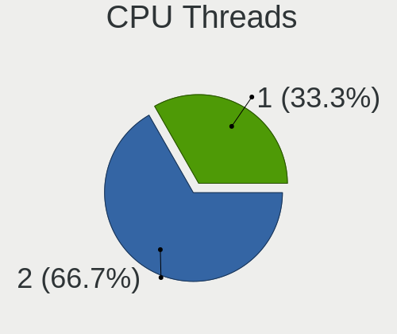

| Number | Notebooks | Percent |
|--------|-----------|---------|
| 2      | 176       | 67.18%  |
| 1      | 86        | 32.82%  |

CPU Op-Modes
------------

CPU Operation Modes (32-bit, 64-bit)

| Op mode        | Notebooks | Percent |
|----------------|-----------|---------|
| 32-bit, 64-bit | 262       | 100%    |

CPU Microcode
-------------

Microcode number

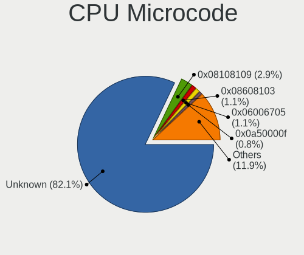

| Number     | Notebooks | Percent |
|------------|-----------|---------|
| Unknown    | 211       | 80.53%  |
| 0x08108109 | 11        | 4.2%    |
| 0x08608103 | 5         | 1.91%   |
| 0x08108102 | 3         | 1.15%   |
| 0x0a50000d | 2         | 0.76%   |
| 0x0a404102 | 2         | 0.76%   |
| 0x08608102 | 2         | 0.76%   |
| 0x07030105 | 2         | 0.76%   |
| 0x07030104 | 2         | 0.76%   |
| 0x0700010b | 2         | 0.76%   |
| 0x06006705 | 2         | 0.76%   |
| 0x0500010d | 2         | 0.76%   |
| 0x05000101 | 2         | 0.76%   |
| 0x010000b6 | 2         | 0.76%   |
| 0x0a704104 | 1         | 0.38%   |
| 0x0a704103 | 1         | 0.38%   |
| 0x0a50000f | 1         | 0.38%   |
| 0x0a50000c | 1         | 0.38%   |
| 0x08600104 | 1         | 0.38%   |
| 0x08600103 | 1         | 0.38%   |
| 0x08200103 | 1         | 0.38%   |
| 0x07030106 | 1         | 0.38%   |
| 0x06001116 | 1         | 0.38%   |
| 0x05000028 | 1         | 0.38%   |
| 0x0300000f | 1         | 0.38%   |
| 0x00000000 | 1         | 0.38%   |

CPU Microarch
-------------

Microarchitecture

| Name             | Notebooks | Percent |
|------------------|-----------|---------|
| KabyLake         | 33        | 12.6%   |
| IvyBridge        | 22        | 8.4%    |
| TigerLake        | 15        | 5.73%   |
| Skylake          | 15        | 5.73%   |
| SandyBridge      | 15        | 5.73%   |
| Zen+             | 14        | 5.34%   |
| Westmere         | 14        | 5.34%   |
| Alderlake Hybrid | 13        | 4.96%   |
| Penryn           | 12        | 4.58%   |
| Haswell          | 12        | 4.58%   |
| Silvermont       | 11        | 4.2%    |
| Core             | 11        | 4.2%    |
| Unknown          | 11        | 4.2%    |
| Icelake          | 10        | 3.82%   |
| Broadwell        | 6         | 2.29%   |
| Puma             | 5         | 1.91%   |
| Goldmont plus    | 5         | 1.91%   |
| Bobcat           | 5         | 1.91%   |
| Zen 3            | 4         | 1.53%   |
| K10              | 4         | 1.53%   |
| Goldmont         | 4         | 1.53%   |
| CometLake        | 3         | 1.15%   |
| Bonnell          | 3         | 1.15%   |
| Zen 2            | 2         | 0.76%   |
| Zen              | 2         | 0.76%   |
| Tremont          | 2         | 0.76%   |
| K10 Llano        | 2         | 0.76%   |
| Jaguar           | 2         | 0.76%   |
| Excavator        | 2         | 0.76%   |
| Piledriver       | 1         | 0.38%   |
| K8 Hammer        | 1         | 0.38%   |
| Gracemont        | 1         | 0.38%   |

Graphics
--------

GPU Vendor
----------

Vendors of graphics cards

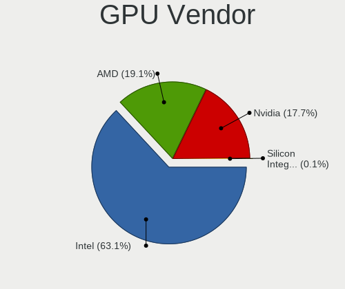

| Vendor | Notebooks | Percent |
|--------|-----------|---------|
| Intel  | 192       | 61.94%  |
| AMD    | 62        | 20%     |
| Nvidia | 56        | 18.06%  |

GPU Model
---------

Graphics card models

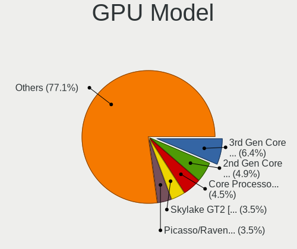

| Model                                                                                    | Notebooks | Percent |
|------------------------------------------------------------------------------------------|-----------|---------|
| Intel 3rd Gen Core processor Graphics Controller                                         | 21        | 6.6%    |
| AMD Picasso/Raven 2 [Radeon Vega Series / Radeon Vega Mobile Series]                     | 16        | 5.03%   |
| Intel UHD Graphics 620                                                                   | 14        | 4.4%    |
| Intel 2nd Generation Core Processor Family Integrated Graphics Controller                | 14        | 4.4%    |
| Intel Skylake GT2 [HD Graphics 520]                                                      | 11        | 3.46%   |
| Intel Core Processor Integrated Graphics Controller                                      | 11        | 3.46%   |
| Intel TigerLake-LP GT2 [Iris Xe Graphics]                                                | 10        | 3.14%   |
| Intel Mobile 4 Series Chipset Integrated Graphics Controller                             | 10        | 3.14%   |
| Intel Alder Lake-P GT2 [Iris Xe Graphics]                                                | 9         | 2.83%   |
| Intel 4th Gen Core Processor Integrated Graphics Controller                              | 7         | 2.2%    |
| AMD Lucienne                                                                             | 7         | 2.2%    |
| Intel HD Graphics 620                                                                    | 6         | 1.89%   |
| Intel HD Graphics 5500                                                                   | 6         | 1.89%   |
| Intel CometLake-U GT2 [UHD Graphics]                                                     | 6         | 1.89%   |
| Intel Atom Processor Z36xxx/Z37xxx Series Graphics & Display                             | 6         | 1.89%   |
| Intel Tiger Lake-LP GT2 [UHD Graphics G4]                                                | 5         | 1.57%   |
| Intel Haswell-ULT Integrated Graphics Controller                                         | 5         | 1.57%   |
| Intel GeminiLake [UHD Graphics 600]                                                      | 5         | 1.57%   |
| Intel Atom/Celeron/Pentium Processor x5-E8000/J3xxx/N3xxx Integrated Graphics Controller | 5         | 1.57%   |
| Nvidia GF117M [GeForce 610M/710M/810M/820M / GT 620M/625M/630M/720M]                     | 4         | 1.26%   |
| Intel Iris Plus Graphics G1 (Ice Lake)                                                   | 4         | 1.26%   |
| AMD Mullins [Radeon R4/R5 Graphics]                                                      | 4         | 1.26%   |
| Nvidia TU117M [GeForce GTX 1650 Mobile / Max-Q]                                          | 3         | 0.94%   |
| Nvidia GA106M [GeForce RTX 3060 Mobile / Max-Q]                                          | 3         | 0.94%   |
| Intel WhiskeyLake-U GT2 [UHD Graphics 620]                                               | 3         | 0.94%   |
| Intel TigerLake-H GT1 [UHD Graphics]                                                     | 3         | 0.94%   |
| Intel Mobile GME965/GLE960 Integrated Graphics Controller                                | 3         | 0.94%   |
| Intel Mobile GM965/GL960 Integrated Graphics Controller (secondary)                      | 3         | 0.94%   |
| Intel Mobile GM965/GL960 Integrated Graphics Controller (primary)                        | 3         | 0.94%   |
| Intel HD Graphics 530                                                                    | 3         | 0.94%   |
| Intel CometLake-H GT2 [UHD Graphics]                                                     | 3         | 0.94%   |
| AMD Wrestler [Radeon HD 6310]                                                            | 3         | 0.94%   |
| AMD Sun XT [Radeon HD 8670A/8670M/8690M / R5 M330 / M430 / Radeon 520 Mobile]            | 3         | 0.94%   |
| AMD RS880M [Mobility Radeon HD 4225/4250]                                                | 3         | 0.94%   |
| Nvidia GT218M [NVS 3100M]                                                                | 2         | 0.63%   |
| Nvidia GP108M [GeForce MX150]                                                            | 2         | 0.63%   |
| Nvidia GP107M [GeForce GTX 1050 3 GB Max-Q]                                              | 2         | 0.63%   |
| Nvidia GM107GLM [Quadro M1200 Mobile]                                                    | 2         | 0.63%   |
| Nvidia GF119M [GeForce 610M]                                                             | 2         | 0.63%   |
| Nvidia GF108M [GeForce GT 525M]                                                          | 2         | 0.63%   |

GPU Combo
---------

Combinations of graphics cards

| Name           | Notebooks | Percent |
|----------------|-----------|---------|
| 1 x Intel      | 131       | 50%     |
| 1 x AMD        | 50        | 19.08%  |
| Intel + Nvidia | 41        | 15.65%  |
| 2 x Intel      | 17        | 6.49%   |
| 1 x Nvidia     | 11        | 4.2%    |
| 2 x AMD        | 5         | 1.91%   |
| AMD + Nvidia   | 4         | 1.53%   |
| Intel + AMD    | 3         | 1.15%   |

GPU Driver
----------

Free vs proprietary

| Driver      | Notebooks | Percent |
|-------------|-----------|---------|
| Free        | 256       | 97.71%  |
| Proprietary | 5         | 1.91%   |
| Unknown     | 1         | 0.38%   |

GPU Memory
----------

Total video memory

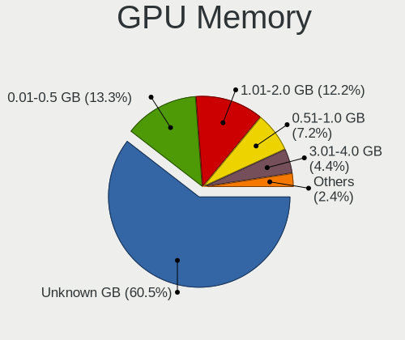

| Size in GB | Notebooks | Percent |
|------------|-----------|---------|
| Unknown    | 154       | 58.78%  |
| 1.01-2.0   | 38        | 14.5%   |
| 0.01-0.5   | 33        | 12.6%   |
| 3.01-4.0   | 15        | 5.73%   |
| 0.51-1.0   | 15        | 5.73%   |
| 7.01-8.0   | 2         | 0.76%   |
| 5.01-6.0   | 2         | 0.76%   |
| 2.01-3.0   | 2         | 0.76%   |
| 16.01-24.0 | 1         | 0.38%   |

Monitor
-------

Monitor Vendor
--------------

Monitor vendors

| Vendor                  | Notebooks | Percent |
|-------------------------|-----------|---------|
| AU Optronics            | 71        | 25.27%  |
| Chimei Innolux          | 46        | 16.37%  |
| BOE                     | 40        | 14.23%  |
| LG Display              | 38        | 13.52%  |
| Samsung Electronics     | 26        | 9.25%   |
| Lenovo                  | 11        | 3.91%   |
| Sharp                   | 6         | 2.14%   |
| Chi Mei Optoelectronics | 6         | 2.14%   |
| Apple                   | 6         | 2.14%   |
| Goldstar                | 4         | 1.42%   |
| LG Philips              | 3         | 1.07%   |
| Hewlett-Packard         | 3         | 1.07%   |
| Dell                    | 3         | 1.07%   |
| CSO                     | 3         | 1.07%   |
| TMX                     | 2         | 0.71%   |
| ___                     | 1         | 0.36%   |
| ViewSonic               | 1         | 0.36%   |
| Unknown                 | 1         | 0.36%   |
| TFT                     | 1         | 0.36%   |
| Philips                 | 1         | 0.36%   |
| PANDA                   | 1         | 0.36%   |
| Panasonic               | 1         | 0.36%   |
| NEC Computers           | 1         | 0.36%   |
| KDC                     | 1         | 0.36%   |
| JDI                     | 1         | 0.36%   |
| InnoLux Display         | 1         | 0.36%   |
| InfoVision              | 1         | 0.36%   |
| Ancor Communications    | 1         | 0.36%   |

Monitor Model
-------------

Monitor models

| Model                                                                 | Notebooks | Percent |
|-----------------------------------------------------------------------|-----------|---------|
| Samsung Electronics LCD Monitor SEC5441 1366x768 344x194mm 15.5-inch  | 5         | 1.77%   |
| Chimei Innolux LCD Monitor CMN15F5 1920x1080 344x193mm 15.5-inch      | 4         | 1.41%   |
| Chimei Innolux LCD Monitor CMN15E7 1920x1080 344x193mm 15.5-inch      | 4         | 1.41%   |
| Chimei Innolux LCD Monitor CMN15E5 1920x1080 344x193mm 15.5-inch      | 4         | 1.41%   |
| AU Optronics LCD Monitor AUO26EC 1366x768 344x193mm 15.5-inch         | 4         | 1.41%   |
| AU Optronics LCD Monitor AUO22EC 1366x768 344x193mm 15.5-inch         | 4         | 1.41%   |
| LG Display LP156WH2-TLAA LGD0230 1366x768 344x194mm 15.5-inch         | 3         | 1.06%   |
| LG Display LCD Monitor LGD02DC 1366x768 344x194mm 15.5-inch           | 3         | 1.06%   |
| Lenovo LEN E2002bA LEN60BB 1600x900 432x240mm 19.5-inch               | 3         | 1.06%   |
| BOE LCD Monitor BOE06A4 1366x768 344x194mm 15.5-inch                  | 3         | 1.06%   |
| AU Optronics LCD Monitor AUO38ED 1920x1080 344x193mm 15.5-inch        | 3         | 1.06%   |
| Samsung Electronics LCD Monitor SEC3150 1366x768 344x193mm 15.5-inch  | 2         | 0.71%   |
| Samsung Electronics LCD Monitor SEC3046 1366x768 344x193mm 15.5-inch  | 2         | 0.71%   |
| Samsung Electronics LCD Monitor SDC4161 1920x1080 344x194mm 15.5-inch | 2         | 0.71%   |
| LG Display LCD Monitor LGD039F 1366x768 345x194mm 15.6-inch           | 2         | 0.71%   |
| LG Display LCD Monitor LGD033A 1366x768 344x194mm 15.5-inch           | 2         | 0.71%   |
| Lenovo LCD Monitor LEN4011 1280x800 261x163mm 12.1-inch               | 2         | 0.71%   |
| Chimei Innolux LCD Monitor CMN1728 1600x900 382x215mm 17.3-inch       | 2         | 0.71%   |
| Chimei Innolux LCD Monitor CMN15E8 1920x1080 344x193mm 15.5-inch      | 2         | 0.71%   |
| Chimei Innolux LCD Monitor CMN15DB 1366x768 344x193mm 15.5-inch       | 2         | 0.71%   |
| Chimei Innolux LCD Monitor CMN1482 1600x900 309x174mm 14.0-inch       | 2         | 0.71%   |
| BOE LCD Monitor BOE08D7 1920x1080 309x174mm 14.0-inch                 | 2         | 0.71%   |
| BOE LCD Monitor BOE0812 1920x1080 344x194mm 15.5-inch                 | 2         | 0.71%   |
| BOE LCD Monitor BOE05F3 1366x768 309x173mm 13.9-inch                  | 2         | 0.71%   |
| AU Optronics LCD Monitor AUO459D 1920x1200 344x215mm 16.0-inch        | 2         | 0.71%   |
| AU Optronics LCD Monitor AUO40EC 1366x768 344x193mm 15.5-inch         | 2         | 0.71%   |
| AU Optronics LCD Monitor AUO32EC 1366x768 344x193mm 15.5-inch         | 2         | 0.71%   |
| AU Optronics LCD Monitor AUO2E3C 1366x768 309x173mm 13.9-inch         | 2         | 0.71%   |
| AU Optronics LCD Monitor AUO243D 1920x1080 309x173mm 13.9-inch        | 2         | 0.71%   |
| AU Optronics LCD Monitor AUO21ED 1920x1080 344x193mm 15.5-inch        | 2         | 0.71%   |
| AU Optronics LCD Monitor AUO219E 1600x900 382x214mm 17.2-inch         | 2         | 0.71%   |
| AU Optronics LCD Monitor AUO205C 1366x768 256x144mm 11.6-inch         | 2         | 0.71%   |
| Apple Color LCD APPA041 2560x1600 286x179mm 13.3-inch                 | 2         | 0.71%   |
| Apple Cinema HD APP9223 1920x1200 495x310mm 23.0-inch                 | 2         | 0.71%   |
| ___ LCDTV16 ___9000 1360x768                                          | 1         | 0.35%   |
| ViewSonic VX2453 Series VSC0C28 1920x1080 520x290mm 23.4-inch         | 1         | 0.35%   |
| Unknown LCD TV 9000 1360x768 1600x900mm 72.3-inch                     | 1         | 0.35%   |
| TMX TL160ADMP03-0 TMX1603 2560x1600 345x215mm 16.0-inch               | 1         | 0.35%   |
| TMX TL140ADXP01 TMX1481 2560x1600 301x188mm 14.0-inch                 | 1         | 0.35%   |
| TFT 348.71385610 TFT3393 1920x1080                                    | 1         | 0.35%   |

Monitor Resolution
------------------

Monitor screen resolution

| Resolution         | Notebooks | Percent |
|--------------------|-----------|---------|
| 1366x768 (WXGA)    | 100       | 35.84%  |
| 1920x1080 (FHD)    | 97        | 34.77%  |
| 1600x900 (HD+)     | 25        | 8.96%   |
| 1920x1200 (WUXGA)  | 14        | 5.02%   |
| 1280x800 (WXGA)    | 13        | 4.66%   |
| 2560x1600          | 8         | 2.87%   |
| 2560x1440 (QHD)    | 5         | 1.79%   |
| 1440x900 (WXGA+)   | 4         | 1.43%   |
| 2880x1800          | 3         | 1.08%   |
| 1024x600           | 2         | 0.72%   |
| 3840x2400          | 1         | 0.36%   |
| 3840x2160 (4K)     | 1         | 0.36%   |
| 3200x1800 (QHD+)   | 1         | 0.36%   |
| 3000x2000          | 1         | 0.36%   |
| 2560x1080          | 1         | 0.36%   |
| 1920x540           | 1         | 0.36%   |
| 1680x1050 (WSXGA+) | 1         | 0.36%   |
| 1360x768           | 1         | 0.36%   |

Monitor Diagonal
----------------

Diagonal size in inches

| Inches  | Notebooks | Percent |
|---------|-----------|---------|
| 15      | 137       | 48.41%  |
| 13      | 40        | 14.13%  |
| 14      | 31        | 10.95%  |
| 17      | 25        | 8.83%   |
| 16      | 10        | 3.53%   |
| 24      | 6         | 2.12%   |
| 23      | 5         | 1.77%   |
| 11      | 5         | 1.77%   |
| 27      | 4         | 1.41%   |
| 19      | 4         | 1.41%   |
| 12      | 4         | 1.41%   |
| Unknown | 3         | 1.06%   |
| 21      | 2         | 0.71%   |
| 10      | 2         | 0.71%   |
| 72      | 1         | 0.35%   |
| 40      | 1         | 0.35%   |
| 34      | 1         | 0.35%   |
| 22      | 1         | 0.35%   |
| 18      | 1         | 0.35%   |

Monitor Width
-------------

Physical width

| Width in mm | Notebooks | Percent |
|-------------|-----------|---------|
| 301-350     | 190       | 67.14%  |
| 351-400     | 34        | 12.01%  |
| 201-300     | 30        | 10.6%   |
| 501-600     | 13        | 4.59%   |
| 401-500     | 10        | 3.53%   |
| Unknown     | 3         | 1.06%   |
| 801-900     | 1         | 0.35%   |
| 701-800     | 1         | 0.35%   |
| 1501-2000   | 1         | 0.35%   |

Aspect Ratio
------------

Proportional relationship between the width and the height

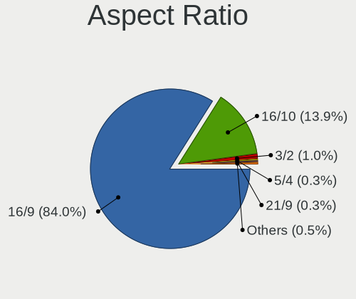

| Ratio | Notebooks | Percent |
|-------|-----------|---------|
| 16/9  | 221       | 83.71%  |
| 16/10 | 38        | 14.39%  |
| 3/2   | 3         | 1.14%   |
| 32/9  | 1         | 0.38%   |
| 21/9  | 1         | 0.38%   |

Monitor Area
------------

Area in inch

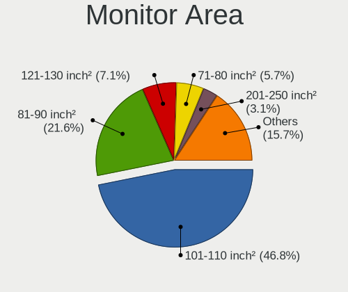

| Area in inch | Notebooks | Percent |
|----------------|-----------|---------|
| 101-110        | 139       | 49.12%  |
| 81-90          | 54        | 19.08%  |
| 121-130        | 21        | 7.42%   |
| 71-80          | 17        | 6.01%   |
| 201-250        | 11        | 3.89%   |
| 111-120        | 8         | 2.83%   |
| 51-60          | 5         | 1.77%   |
| 151-200        | 5         | 1.77%   |
| 61-70          | 4         | 1.41%   |
| 301-350        | 4         | 1.41%   |
| 131-140        | 4         | 1.41%   |
| Unknown        | 3         | 1.06%   |
| 41-50          | 2         | 0.71%   |
| 251-300        | 2         | 0.71%   |
| More than 1000 | 1         | 0.35%   |
| 351-500        | 1         | 0.35%   |
| 141-150        | 1         | 0.35%   |
| 501-1000       | 1         | 0.35%   |

Pixel Density
-------------

Pixels per inch

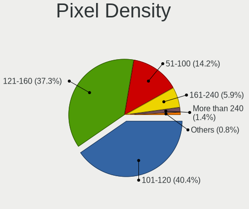

| Density       | Notebooks | Percent |
|---------------|-----------|---------|
| 101-120       | 111       | 39.78%  |
| 121-160       | 105       | 37.63%  |
| 51-100        | 37        | 13.26%  |
| 161-240       | 17        | 6.09%   |
| More than 240 | 5         | 1.79%   |
| Unknown       | 3         | 1.08%   |
| 1-50          | 1         | 0.36%   |

Multiple Monitors
-----------------

Total monitors connected

| Total | Notebooks | Percent |
|-------|-----------|---------|
| 1     | 235       | 89.69%  |
| 2     | 23        | 8.78%   |
| 3     | 2         | 0.76%   |
| 0     | 2         | 0.76%   |

Network
-------

Net Controller Vendor
---------------------

Controller vendors

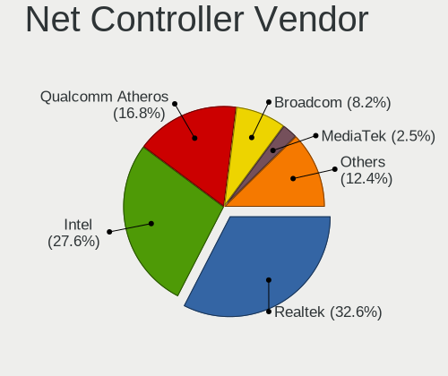

| Vendor                     | Notebooks | Percent |
|----------------------------|-----------|---------|
| Intel                      | 124       | 31.08%  |
| Realtek Semiconductor      | 123       | 30.83%  |
| Qualcomm Atheros           | 66        | 16.54%  |
| Broadcom                   | 31        | 7.77%   |
| MediaTek                   | 10        | 2.51%   |
| Broadcom Limited           | 9         | 2.26%   |
| Marvell Technology Group   | 8         | 2.01%   |
| ASIX Electronics           | 7         | 1.75%   |
| Ralink                     | 6         | 1.5%    |
| Ralink Technology          | 3         | 0.75%   |
| ZyXEL Communications       | 1         | 0.25%   |
| ZTE WCDMA Technologies MSM | 1         | 0.25%   |
| TP-Link                    | 1         | 0.25%   |
| Sierra Wireless            | 1         | 0.25%   |
| Samsung Electronics        | 1         | 0.25%   |
| PLANEX                     | 1         | 0.25%   |
| NetGear                    | 1         | 0.25%   |
| Huawei Technologies        | 1         | 0.25%   |
| Edimax Technology          | 1         | 0.25%   |
| Dell                       | 1         | 0.25%   |
| Belkin Components          | 1         | 0.25%   |
| ASUSTek Computer           | 1         | 0.25%   |

Net Controller Model
--------------------

Controller models

| Model                                                                  | Notebooks | Percent |
|------------------------------------------------------------------------|-----------|---------|
| Realtek RTL8111/8168/8211/8411 PCI Express Gigabit Ethernet Controller | 75        | 15.63%  |
| Realtek RTL810xE PCI Express Fast Ethernet controller                  | 26        | 5.42%   |
| Realtek RTL8821CE 802.11ac PCIe Wireless Network Adapter               | 14        | 2.92%   |
| Qualcomm Atheros AR9285 Wireless Network Adapter (PCI-Express)         | 14        | 2.92%   |
| Qualcomm Atheros QCA9377 802.11ac Wireless Network Adapter             | 12        | 2.5%    |
| Intel Wireless 8265 / 8275                                             | 11        | 2.29%   |
| Intel Centrino Advanced-N 6205 [Taylor Peak]                           | 11        | 2.29%   |
| Intel 82579LM Gigabit Network Connection (Lewisville)                  | 11        | 2.29%   |
| Intel Wi-Fi 6 AX201                                                    | 10        | 2.08%   |
| Intel Wireless 7260                                                    | 9         | 1.88%   |
| Intel Alder Lake-P PCH CNVi WiFi                                       | 9         | 1.88%   |
| Intel Wi-Fi 6 AX200                                                    | 8         | 1.67%   |
| Broadcom BCM4313 802.11bgn Wireless Network Adapter                    | 8         | 1.67%   |
| Realtek RTL8822CE 802.11ac PCIe Wireless Network Adapter               | 7         | 1.46%   |
| Intel Wireless 8260                                                    | 7         | 1.46%   |
| Realtek RTL8188CE 802.11b/g/n WiFi Adapter                             | 6         | 1.25%   |
| Qualcomm Atheros QCA6174 802.11ac Wireless Network Adapter             | 6         | 1.25%   |
| Intel Ethernet Connection I217-LM                                      | 6         | 1.25%   |
| Broadcom BCM43142 802.11b/g/n                                          | 6         | 1.25%   |
| ASIX AX88179 Gigabit Ethernet                                          | 6         | 1.25%   |
| Qualcomm Atheros AR9485 Wireless Network Adapter                       | 5         | 1.04%   |
| Qualcomm Atheros AR8151 v2.0 Gigabit Ethernet                          | 5         | 1.04%   |
| Marvell Group 88E8042 PCI-E Fast Ethernet Controller                   | 5         | 1.04%   |
| Intel Comet Lake PCH-LP CNVi WiFi                                      | 5         | 1.04%   |
| Intel 82577LM Gigabit Network Connection                               | 5         | 1.04%   |
| Realtek RTL8723DE Wireless Network Adapter                             | 4         | 0.83%   |
| Realtek RTL8723BE PCIe Wireless Network Adapter                        | 4         | 0.83%   |
| Ralink RT3290 Wireless 802.11n 1T/1R PCIe                              | 4         | 0.83%   |
| Qualcomm Atheros QCA9565 / AR9565 Wireless Network Adapter             | 4         | 0.83%   |
| Qualcomm Atheros AR8161 Gigabit Ethernet                               | 4         | 0.83%   |
| Intel Wireless 7265                                                    | 4         | 0.83%   |
| Intel Ice Lake-LP PCH CNVi WiFi                                        | 4         | 0.83%   |
| Intel Ethernet Connection I219-LM                                      | 4         | 0.83%   |
| Intel Dual Band Wireless-AC 3168NGW [Stone Peak]                       | 4         | 0.83%   |
| Broadcom BCM4312 802.11b/g LP-PHY                                      | 4         | 0.83%   |
| Qualcomm Atheros AR928X Wireless Network Adapter (PCI-Express)         | 3         | 0.63%   |
| Qualcomm Atheros AR8131 Gigabit Ethernet                               | 3         | 0.63%   |
| MediaTek MT7922 802.11ax PCI Express Wireless Network Adapter          | 3         | 0.63%   |
| MediaTek MT7921 802.11ax PCI Express Wireless Network Adapter          | 3         | 0.63%   |
| Intel Wireless 3165                                                    | 3         | 0.63%   |

Wireless Vendor
---------------

Wireless vendors

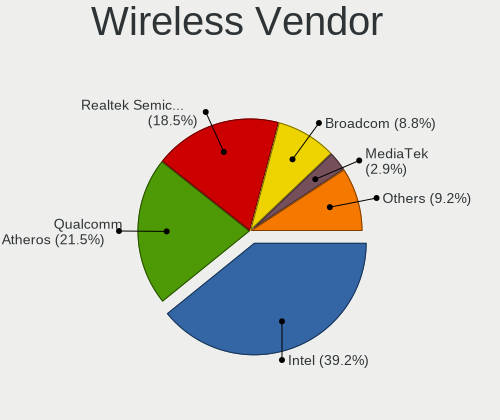

| Vendor                | Notebooks | Percent |
|-----------------------|-----------|---------|
| Intel                 | 116       | 42.96%  |
| Qualcomm Atheros      | 52        | 19.26%  |
| Realtek Semiconductor | 45        | 16.67%  |
| Broadcom              | 25        | 9.26%   |
| MediaTek              | 8         | 2.96%   |
| Ralink                | 6         | 2.22%   |
| Broadcom Limited      | 6         | 2.22%   |
| Ralink Technology     | 3         | 1.11%   |
| ZyXEL Communications  | 1         | 0.37%   |
| TP-Link               | 1         | 0.37%   |
| Sierra Wireless       | 1         | 0.37%   |
| PLANEX                | 1         | 0.37%   |
| NetGear               | 1         | 0.37%   |
| Edimax Technology     | 1         | 0.37%   |
| Dell                  | 1         | 0.37%   |
| Belkin Components     | 1         | 0.37%   |
| ASUSTek Computer      | 1         | 0.37%   |

Wireless Model
--------------

Wireless models

| Model                                                                   | Notebooks | Percent |
|-------------------------------------------------------------------------|-----------|---------|
| Realtek RTL8821CE 802.11ac PCIe Wireless Network Adapter                | 14        | 5.19%   |
| Qualcomm Atheros AR9285 Wireless Network Adapter (PCI-Express)          | 14        | 5.19%   |
| Qualcomm Atheros QCA9377 802.11ac Wireless Network Adapter              | 12        | 4.44%   |
| Intel Wireless 8265 / 8275                                              | 11        | 4.07%   |
| Intel Centrino Advanced-N 6205 [Taylor Peak]                            | 11        | 4.07%   |
| Intel Wi-Fi 6 AX201                                                     | 10        | 3.7%    |
| Intel Wireless 7260                                                     | 9         | 3.33%   |
| Intel Alder Lake-P PCH CNVi WiFi                                        | 9         | 3.33%   |
| Intel Wi-Fi 6 AX200                                                     | 8         | 2.96%   |
| Broadcom BCM4313 802.11bgn Wireless Network Adapter                     | 8         | 2.96%   |
| Realtek RTL8822CE 802.11ac PCIe Wireless Network Adapter                | 7         | 2.59%   |
| Intel Wireless 8260                                                     | 7         | 2.59%   |
| Realtek RTL8188CE 802.11b/g/n WiFi Adapter                              | 6         | 2.22%   |
| Qualcomm Atheros QCA6174 802.11ac Wireless Network Adapter              | 6         | 2.22%   |
| Broadcom BCM43142 802.11b/g/n                                           | 6         | 2.22%   |
| Qualcomm Atheros AR9485 Wireless Network Adapter                        | 5         | 1.85%   |
| Intel Comet Lake PCH-LP CNVi WiFi                                       | 5         | 1.85%   |
| Realtek RTL8723DE Wireless Network Adapter                              | 4         | 1.48%   |
| Realtek RTL8723BE PCIe Wireless Network Adapter                         | 4         | 1.48%   |
| Ralink RT3290 Wireless 802.11n 1T/1R PCIe                               | 4         | 1.48%   |
| Qualcomm Atheros QCA9565 / AR9565 Wireless Network Adapter              | 4         | 1.48%   |
| Intel Wireless 7265                                                     | 4         | 1.48%   |
| Intel Ice Lake-LP PCH CNVi WiFi                                         | 4         | 1.48%   |
| Intel Dual Band Wireless-AC 3168NGW [Stone Peak]                        | 4         | 1.48%   |
| Broadcom BCM4312 802.11b/g LP-PHY                                       | 4         | 1.48%   |
| Qualcomm Atheros AR928X Wireless Network Adapter (PCI-Express)          | 3         | 1.11%   |
| MediaTek MT7922 802.11ax PCI Express Wireless Network Adapter           | 3         | 1.11%   |
| MediaTek MT7921 802.11ax PCI Express Wireless Network Adapter           | 3         | 1.11%   |
| Intel Wireless 3165                                                     | 3         | 1.11%   |
| Intel Tiger Lake PCH CNVi WiFi                                          | 3         | 1.11%   |
| Broadcom Limited BCM4312 802.11b/g LP-PHY                               | 3         | 1.11%   |
| Realtek RTL8852BE PCIe 802.11ax Wireless Network Controller             | 2         | 0.74%   |
| Realtek RTL8822BE 802.11a/b/g/n/ac WiFi adapter                         | 2         | 0.74%   |
| Realtek RTL8188EE Wireless Network Adapter                              | 2         | 0.74%   |
| Ralink MT7601U Wireless Adapter                                         | 2         | 0.74%   |
| Qualcomm Atheros AR9462 Wireless Network Adapter                        | 2         | 0.74%   |
| Qualcomm Atheros AR9287 Wireless Network Adapter (PCI-Express)          | 2         | 0.74%   |
| Qualcomm Atheros AR242x / AR542x Wireless Network Adapter (PCI-Express) | 2         | 0.74%   |
| MediaTek MT7921K (RZ608) Wi-Fi 6E 80MHz                                 | 2         | 0.74%   |
| Intel WiFi Link 5100                                                    | 2         | 0.74%   |

Ethernet Vendor
---------------

Ethernet vendors

| Vendor                     | Notebooks | Percent |
|----------------------------|-----------|---------|
| Realtek Semiconductor      | 104       | 50.24%  |
| Intel                      | 50        | 24.15%  |
| Qualcomm Atheros           | 19        | 9.18%   |
| Broadcom                   | 12        | 5.8%    |
| Marvell Technology Group   | 8         | 3.86%   |
| ASIX Electronics           | 7         | 3.38%   |
| Broadcom Limited           | 3         | 1.45%   |
| MediaTek                   | 2         | 0.97%   |
| ZTE WCDMA Technologies MSM | 1         | 0.48%   |
| Samsung Electronics        | 1         | 0.48%   |

Ethernet Model
--------------

Ethernet models

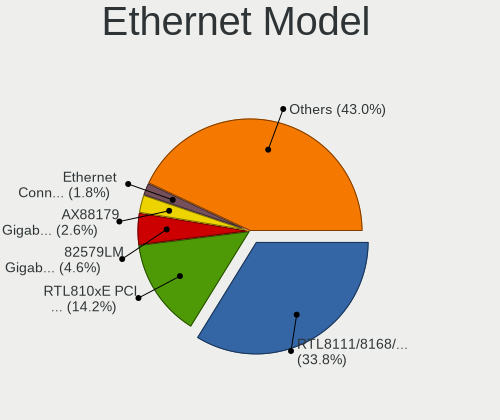

| Model                                                                  | Notebooks | Percent |
|------------------------------------------------------------------------|-----------|---------|
| Realtek RTL8111/8168/8211/8411 PCI Express Gigabit Ethernet Controller | 75        | 36.23%  |
| Realtek RTL810xE PCI Express Fast Ethernet controller                  | 26        | 12.56%  |
| Intel 82579LM Gigabit Network Connection (Lewisville)                  | 11        | 5.31%   |
| Intel Ethernet Connection I217-LM                                      | 6         | 2.9%    |
| ASIX AX88179 Gigabit Ethernet                                          | 6         | 2.9%    |
| Qualcomm Atheros AR8151 v2.0 Gigabit Ethernet                          | 5         | 2.42%   |
| Marvell Group 88E8042 PCI-E Fast Ethernet Controller                   | 5         | 2.42%   |
| Intel 82577LM Gigabit Network Connection                               | 5         | 2.42%   |
| Qualcomm Atheros AR8161 Gigabit Ethernet                               | 4         | 1.93%   |
| Intel Ethernet Connection I219-LM                                      | 4         | 1.93%   |
| Qualcomm Atheros AR8131 Gigabit Ethernet                               | 3         | 1.45%   |
| Intel Ethernet Connection I218-LM                                      | 3         | 1.45%   |
| Intel Ethernet Connection (4) I219-LM                                  | 3         | 1.45%   |
| Broadcom Limited NetLink BCM57780 Gigabit Ethernet PCIe                | 3         | 1.45%   |
| Qualcomm Atheros AR8162 Fast Ethernet                                  | 2         | 0.97%   |
| Qualcomm Atheros AR8152 v1.1 Fast Ethernet                             | 2         | 0.97%   |
| MediaTek File-CD Gadget                                                | 2         | 0.97%   |
| Marvell Group 88E8040 PCI-E Fast Ethernet Controller                   | 2         | 0.97%   |
| Intel Ethernet Connection (7) I219-LM                                  | 2         | 0.97%   |
| Intel Ethernet Connection (4) I219-V                                   | 2         | 0.97%   |
| Intel Ethernet Connection (3) I218-LM                                  | 2         | 0.97%   |
| Intel Ethernet Connection (11) I219-LM                                 | 2         | 0.97%   |
| Broadcom NetXtreme BCM5761e Gigabit Ethernet PCIe                      | 2         | 0.97%   |
| Broadcom NetXtreme BCM5761 Gigabit Ethernet PCIe                       | 2         | 0.97%   |
| Broadcom NetLink BCM5787M Gigabit Ethernet PCI Express                 | 2         | 0.97%   |
| Broadcom NetLink BCM57785 Gigabit Ethernet PCIe                        | 2         | 0.97%   |
| ZTE WCDMA MSM ZTE WCDMA MSM                                            | 1         | 0.48%   |
| Samsung GT-I9070 (network tethering, USB debugging enabled)            | 1         | 0.48%   |
| Realtek RTL8153 Gigabit Ethernet Adapter                               | 1         | 0.48%   |
| Realtek RTL8152 Fast Ethernet Adapter                                  | 1         | 0.48%   |
| Realtek Killer E2600 GbE Controller                                    | 1         | 0.48%   |
| Qualcomm Atheros QCA8172 Fast Ethernet                                 | 1         | 0.48%   |
| Qualcomm Atheros Attansic L1 Gigabit Ethernet                          | 1         | 0.48%   |
| Qualcomm Atheros AR8132 Fast Ethernet                                  | 1         | 0.48%   |
| Marvell Group 88E8058 PCI-E Gigabit Ethernet Controller                | 1         | 0.48%   |
| Intel Ethernet Connection I219-V                                       | 1         | 0.48%   |
| Intel Ethernet Connection (6) I219-V                                   | 1         | 0.48%   |
| Intel Ethernet Connection (6) I219-LM                                  | 1         | 0.48%   |
| Intel Ethernet Connection (5) I219-LM                                  | 1         | 0.48%   |
| Intel Ethernet Connection (2) I219-LM                                  | 1         | 0.48%   |

Net Controller Kind
-------------------

Ethernet, WiFi or modem

| Kind     | Notebooks | Percent |
|----------|-----------|---------|
| WiFi     | 260       | 55.91%  |
| Ethernet | 202       | 43.44%  |
| Unknown  | 2         | 0.43%   |
| Modem    | 1         | 0.22%   |

Used Controller
---------------

Currently used network controller

| Kind     | Notebooks | Percent |
|----------|-----------|---------|
| WiFi     | 191       | 74.9%   |
| Ethernet | 64        | 25.1%   |

NICs
----

Total network controllers on board

| Total | Notebooks | Percent |
|-------|-----------|---------|
| 2     | 194       | 74.05%  |
| 1     | 63        | 24.05%  |
| 0     | 4         | 1.53%   |
| 3     | 1         | 0.38%   |

IPv6
----

IPv6 vs IPv4

| Used | Notebooks | Percent |
|------|-----------|---------|
| No   | 183       | 69.85%  |
| Yes  | 79        | 30.15%  |

Bluetooth
---------

Bluetooth Vendor
----------------

Controller vendors

| Vendor                          | Notebooks | Percent |
|---------------------------------|-----------|---------|
| Intel                           | 89        | 42.58%  |
| Realtek Semiconductor           | 32        | 15.31%  |
| Qualcomm Atheros Communications | 19        | 9.09%   |
| Broadcom                        | 15        | 7.18%   |
| Lite-On Technology              | 10        | 4.78%   |
| IMC Networks                    | 8         | 3.83%   |
| Foxconn / Hon Hai               | 7         | 3.35%   |
| Dell                            | 6         | 2.87%   |
| Hewlett-Packard                 | 5         | 2.39%   |
| Ralink                          | 4         | 1.91%   |
| Toshiba                         | 3         | 1.44%   |
| Apple                           | 3         | 1.44%   |
| MediaTek                        | 2         | 0.96%   |
| Foxconn International           | 2         | 0.96%   |
| Cambridge Silicon Radio         | 2         | 0.96%   |
| Belkin Components               | 1         | 0.48%   |
| ASUSTek Computer                | 1         | 0.48%   |

Bluetooth Model
---------------

Controller models

| Model                                               | Notebooks | Percent |
|-----------------------------------------------------|-----------|---------|
| Intel Bluetooth wireless interface                  | 32        | 15.31%  |
| Intel AX201 Bluetooth                               | 21        | 10.05%  |
| Realtek Bluetooth Radio                             | 20        | 9.57%   |
| Intel Bluetooth 9460/9560 Jefferson Peak (JfP)      | 12        | 5.74%   |
| Realtek  Bluetooth 4.2 Adapter                      | 11        | 5.26%   |
| Qualcomm Atheros  Bluetooth Device                  | 11        | 5.26%   |
| Intel Bluetooth Device                              | 9         | 4.31%   |
| Intel AX200 Bluetooth                               | 8         | 3.83%   |
| Qualcomm Atheros AR3011 Bluetooth                   | 5         | 2.39%   |
| Ralink RT3290 Bluetooth                             | 4         | 1.91%   |
| Lite-On Atheros AR3012 Bluetooth                    | 4         | 1.91%   |
| Intel Wireless-AC 3168 Bluetooth                    | 4         | 1.91%   |
| HP Broadcom 2070 Bluetooth Combo                    | 4         | 1.91%   |
| Dell DW375 Bluetooth Module                         | 4         | 1.91%   |
| Lite-On Qualcomm Atheros QCA9377 Bluetooth          | 3         | 1.44%   |
| IMC Networks Wireless_Device                        | 3         | 1.44%   |
| Broadcom BCM20702 Bluetooth 4.0 [ThinkPad]          | 3         | 1.44%   |
| Broadcom BCM2045B (BDC-2.1)                         | 3         | 1.44%   |
| Qualcomm Atheros QCA61x4 Bluetooth 4.0              | 2         | 0.96%   |
| MediaTek Wireless_Device                            | 2         | 0.96%   |
| IMC Networks Bluetooth Radio                        | 2         | 0.96%   |
| IMC Networks Bluetooth Device                       | 2         | 0.96%   |
| Foxconn International BCM43142A0 Bluetooth module   | 2         | 0.96%   |
| Foxconn / Hon Hai Wireless_Device                   | 2         | 0.96%   |
| Foxconn / Hon Hai Bluetooth Device                  | 2         | 0.96%   |
| Dell BCM20702A0 Bluetooth Module                    | 2         | 0.96%   |
| Cambridge Silicon Radio Bluetooth Dongle (HCI mode) | 2         | 0.96%   |
| Broadcom BCM43142A0 Bluetooth 4.0                   | 2         | 0.96%   |
| Apple Bluetooth Host Controller                     | 2         | 0.96%   |
| Toshiba Integrated Bluetooth HCI                    | 1         | 0.48%   |
| Toshiba Integrated Bluetooth (Taiyo Yuden)          | 1         | 0.48%   |
| Toshiba BCM43142A0                                  | 1         | 0.48%   |
| Realtek RTL8723B Bluetooth                          | 1         | 0.48%   |
| Qualcomm Atheros Bluetooth                          | 1         | 0.48%   |
| Lite-On Wireless_Device                             | 1         | 0.48%   |
| Lite-On Bluetooth Device                            | 1         | 0.48%   |
| Lite-On BCM43142A0                                  | 1         | 0.48%   |
| Intel Wireless-AC 9260 Bluetooth Adapter            | 1         | 0.48%   |
| Intel Centrino Bluetooth Wireless Transceiver       | 1         | 0.48%   |
| Intel AX210 Bluetooth                               | 1         | 0.48%   |

Sound
-----

Sound Vendor
------------

Sound card vendors

| Vendor                   | Notebooks | Percent |
|--------------------------|-----------|---------|
| Intel                    | 205       | 68.33%  |
| AMD                      | 58        | 19.33%  |
| Nvidia                   | 28        | 9.33%   |
| C-Media Electronics      | 3         | 1%      |
| Apple                    | 2         | 0.67%   |
| Realtek Semiconductor    | 1         | 0.33%   |
| Nordic Semiconductor ASA | 1         | 0.33%   |
| Logitech                 | 1         | 0.33%   |
| Generalplus Technology   | 1         | 0.33%   |

Sound Model
-----------

Sound card models

| Model                                                                                             | Notebooks | Percent |
|---------------------------------------------------------------------------------------------------|-----------|---------|
| AMD Family 17h/19h HD Audio Controller                                                            | 33        | 8.99%   |
| Intel Sunrise Point-LP HD Audio                                                                   | 32        | 8.72%   |
| Intel 7 Series/C216 Chipset Family High Definition Audio Controller                               | 23        | 6.27%   |
| Intel Tiger Lake-LP Smart Sound Technology Audio Controller                                       | 15        | 4.09%   |
| Intel 6 Series/C200 Series Chipset Family High Definition Audio Controller                        | 14        | 3.81%   |
| Intel 5 Series/3400 Series Chipset High Definition Audio                                          | 14        | 3.81%   |
| AMD Raven/Raven2/Fenghuang HDMI/DP Audio Controller                                               | 14        | 3.81%   |
| Intel 82801I (ICH9 Family) HD Audio Controller                                                    | 13        | 3.54%   |
| AMD Renoir Radeon High Definition Audio Controller                                                | 12        | 3.27%   |
| AMD FCH Azalia Controller                                                                         | 12        | 3.27%   |
| Intel Alder Lake PCH-P High Definition Audio Controller                                           | 10        | 2.72%   |
| Intel 82801H (ICH8 Family) HD Audio Controller                                                    | 9         | 2.45%   |
| AMD SBx00 Azalia (Intel HDA)                                                                      | 8         | 2.18%   |
| Intel 8 Series/C220 Series Chipset High Definition Audio Controller                               | 7         | 1.91%   |
| AMD Kabini HDMI/DP Audio                                                                          | 7         | 1.91%   |
| Intel Xeon E3-1200 v3/4th Gen Core Processor HD Audio Controller                                  | 6         | 1.63%   |
| Intel Wildcat Point-LP High Definition Audio Controller                                           | 6         | 1.63%   |
| Intel Comet Lake PCH-LP cAVS                                                                      | 6         | 1.63%   |
| Intel Broadwell-U Audio Controller                                                                | 6         | 1.63%   |
| Intel Ice Lake-LP Smart Sound Technology Audio Controller                                         | 5         | 1.36%   |
| Intel Haswell-ULT HD Audio Controller                                                             | 5         | 1.36%   |
| Intel Celeron/Pentium Silver Processor High Definition Audio                                      | 5         | 1.36%   |
| Intel Atom/Celeron/Pentium Processor x5-E8000/J3xxx/N3xxx Series High Definition Audio Controller | 5         | 1.36%   |
| Intel Atom Processor Z36xxx/Z37xxx Series High Definition Audio Controller                        | 5         | 1.36%   |
| Intel 8 Series HD Audio Controller                                                                | 5         | 1.36%   |
| AMD Wrestler HDMI Audio                                                                           | 5         | 1.36%   |
| Intel Celeron N3350/Pentium N4200/Atom E3900 Series Audio Cluster                                 | 4         | 1.09%   |
| AMD Rembrandt Radeon High Definition Audio Controller                                             | 4         | 1.09%   |
| Nvidia TU107 GeForce GTX 1650 High Definition Audio Controller                                    | 3         | 0.82%   |
| Nvidia High Definition Audio Controller                                                           | 3         | 0.82%   |
| Nvidia GP107GL High Definition Audio Controller                                                   | 3         | 0.82%   |
| Nvidia GK107 HDMI Audio Controller                                                                | 3         | 0.82%   |
| Nvidia GA106 High Definition Audio Controller                                                     | 3         | 0.82%   |
| Nvidia Audio device                                                                               | 3         | 0.82%   |
| Intel Tiger Lake-H HD Audio Controller                                                            | 3         | 0.82%   |
| Intel Raptor Lake-P/U/H cAVS                                                                      | 3         | 0.82%   |
| Intel NM10/ICH7 Family High Definition Audio Controller                                           | 3         | 0.82%   |
| Intel Comet Lake PCH cAVS                                                                         | 3         | 0.82%   |
| Intel Cannon Point-LP High Definition Audio Controller                                            | 3         | 0.82%   |
| Intel 100 Series/C230 Series Chipset Family HD Audio Controller                                   | 3         | 0.82%   |

Memory
------

Memory Vendor
-------------

Memory module vendors

| Vendor              | Notebooks | Percent |
|---------------------|-----------|---------|
| Samsung Electronics | 89        | 28.08%  |
| SK hynix            | 59        | 18.61%  |
| Micron Technology   | 50        | 15.77%  |
| Kingston            | 23        | 7.26%   |
| Unknown             | 17        | 5.36%   |
| Elpida              | 12        | 3.79%   |
| A-DATA Technology   | 10        | 3.15%   |
| Nanya Technology    | 9         | 2.84%   |
| Crucial             | 9         | 2.84%   |
| Juhor               | 4         | 1.26%   |
| G.Skill             | 4         | 1.26%   |
| Unknown (ABCD)      | 3         | 0.95%   |
| Timetec             | 3         | 0.95%   |
| Ramaxel Technology  | 3         | 0.95%   |
| SHARETRONIC         | 2         | 0.63%   |
| Patriot             | 2         | 0.63%   |
| Unknown (268C)      | 1         | 0.32%   |
| Unknown (0x0B5E)    | 1         | 0.32%   |
| Transcend           | 1         | 0.32%   |
| Team                | 1         | 0.32%   |
| Smart               | 1         | 0.32%   |
| Silicon Power       | 1         | 0.32%   |
| PSC                 | 1         | 0.32%   |
| PNY                 | 1         | 0.32%   |
| Innodisk            | 1         | 0.32%   |
| Hikvision           | 1         | 0.32%   |
| GOODRAM             | 1         | 0.32%   |
| CSX                 | 1         | 0.32%   |
| Corsair             | 1         | 0.32%   |
| Centon              | 1         | 0.32%   |
| ASint Technology    | 1         | 0.32%   |
| Apacer              | 1         | 0.32%   |
| AMD                 | 1         | 0.32%   |
| Unknown             | 1         | 0.32%   |

Memory Model
------------

Memory module models

| Model                                                               | Notebooks | Percent |
|---------------------------------------------------------------------|-----------|---------|
| Samsung RAM M471B5173QH0-YK0 4096MB SODIMM DDR3 1600MT/s            | 7         | 2.06%   |
| Samsung RAM M471B5773CHS-CH9 2048MB SODIMM DDR3 4199MT/s            | 6         | 1.76%   |
| Samsung RAM M471B5273DH0-CH9 4GB SODIMM DDR3 1334MT/s               | 6         | 1.76%   |
| Samsung RAM M471A5244CB0-CTD 4096MB SODIMM DDR4 3266MT/s            | 6         | 1.76%   |
| SK hynix RAM HMA81GS6DJR8N-XN 8GB SODIMM DDR4 3200MT/s              | 5         | 1.47%   |
| Samsung RAM M471A5244CB0-CWE 4GB SODIMM DDR4 3200MT/s               | 5         | 1.47%   |
| Samsung RAM M471A1K43EB1-CWE 8GB SODIMM DDR4 3200MT/s               | 5         | 1.47%   |
| Unknown RAM Module 8GB SODIMM DDR4 2667MT/s                         | 4         | 1.18%   |
| Samsung RAM M471B5673FH0-CH9 2GB SODIMM DDR3 1334MT/s               | 4         | 1.18%   |
| Samsung RAM M471B5173EB0-YK0 4GB SODIMM DDR3 1600MT/s               | 4         | 1.18%   |
| Samsung RAM M471A5244CB0-CRC 4GB SODIMM DDR4 2667MT/s               | 4         | 1.18%   |
| Samsung RAM M471A1K43CB1-CTD 8GB SODIMM DDR4 2667MT/s               | 4         | 1.18%   |
| Juhor RAM JHD2666S1908JG 8GB SODIMM DDR4 2667MT/s                   | 4         | 1.18%   |
| Unknown (ABCD) RAM 123456789012345678 2048MB SODIMM LPDDR4 2400MT/s | 3         | 0.88%   |
| SK hynix RAM HMT451S6AFR8A-PB 4GB SODIMM DDR3 1600MT/s              | 3         | 0.88%   |
| SK hynix RAM HMAA1GS6CJR6N-XN 8GB SODIMM DDR4 3200MT/s              | 3         | 0.88%   |
| SK hynix RAM HMA851S6AFR6N-UH 4GB SODIMM DDR4 2667MT/s              | 3         | 0.88%   |
| Samsung RAM M471B5273CH0-CH9 4GB SODIMM DDR3 1334MT/s               | 3         | 0.88%   |
| Samsung RAM M471B5173DB0-YK0 4GB SODIMM DDR3 1600MT/s               | 3         | 0.88%   |
| Samsung RAM M471B2873FHS-CH9 1GB SODIMM DDR3 1334MT/s               | 3         | 0.88%   |
| Samsung RAM M471B1G73QH0-YK0 8GB SODIMM DDR3 1600MT/s               | 3         | 0.88%   |
| Samsung RAM M471A1G44AB0-CWE 8GB SODIMM DDR4 3200MT/s               | 3         | 0.88%   |
| Samsung RAM K3LKBKB@BM-MGCP 2GB Row Of Chips LPDDR5 6400MT/s        | 3         | 0.88%   |
| Micron RAM MTC4C10163S1SC48BA1 8GB SODIMM DDR5 4800MT/s             | 3         | 0.88%   |
| Micron RAM 4ATF51264HZ-2G6E1 4GB SODIMM DDR4 2667MT/s               | 3         | 0.88%   |
| Micron RAM 16KTF1G64HZ-1G6E1 8GB SODIMM DDR3 1600MT/s               | 3         | 0.88%   |
| Micron RAM 16HTF25664HY-800J1 2GB SODIMM DDR2                       | 3         | 0.88%   |
| Micron RAM 16ATF1G64HZ-2G1B1 8GB SODIMM DDR4 2133MT/s               | 3         | 0.88%   |
| Elpida RAM EBJ41UF8BCS0-DJ-F 4GB SODIMM DDR3 1334MT/s               | 3         | 0.88%   |
| Unknown RAM Module 8GB SODIMM DDR3 1600MT/s                         | 2         | 0.59%   |
| SK hynix RAM Module 2GB SODIMM DDR3 1333MT/s                        | 2         | 0.59%   |
| SK hynix RAM HMT451S6MFR8C-PB 4GB SODIMM DDR3 1600MT/s              | 2         | 0.59%   |
| SK hynix RAM HMT451S6BFR8A-PB 4GB SODIMM DDR3 1600MT/s              | 2         | 0.59%   |
| SK hynix RAM HMT425S6AFR6A-PB 2GB SODIMM DDR3 3200MT/s              | 2         | 0.59%   |
| SK hynix RAM HMT41GS6BFR8A-PB 8GB SODIMM DDR3 1600MT/s              | 2         | 0.59%   |
| SK hynix RAM HMT351S6CFR8C-PB 4GB SODIMM DDR3 1600MT/s              | 2         | 0.59%   |
| SK hynix RAM HMT351S6CFR8C-H9 4GB SODIMM DDR3 1333MT/s              | 2         | 0.59%   |
| SK hynix RAM HMT351S6BFR8C-H9 4GB SODIMM DDR3 1333MT/s              | 2         | 0.59%   |
| SK hynix RAM HMA81GS6AFR8N-UH 8GB SODIMM DDR4 2667MT/s              | 2         | 0.59%   |
| SK hynix RAM HMA41GS6AFR8N-TF 8GB SODIMM DDR4 2667MT/s              | 2         | 0.59%   |

Memory Kind
-----------

Memory module kinds

| Kind    | Notebooks | Percent |
|---------|-----------|---------|
| DDR3    | 105       | 38.46%  |
| DDR4    | 100       | 36.63%  |
| SDRAM   | 18        | 6.59%   |
| LPDDR4  | 14        | 5.13%   |
| DDR2    | 13        | 4.76%   |
| LPDDR5  | 8         | 2.93%   |
| DDR5    | 7         | 2.56%   |
| LPDDR3  | 4         | 1.47%   |
| DDR     | 2         | 0.73%   |
| DRAM    | 1         | 0.37%   |
| Unknown | 1         | 0.37%   |

Memory Form Factor
------------------

Physical design of the memory module

| Name         | Notebooks | Percent |
|--------------|-----------|---------|
| SODIMM       | 234       | 88.97%  |
| Row Of Chips | 22        | 8.37%   |
| Chip         | 3         | 1.14%   |
| DIMM         | 2         | 0.76%   |
| Unknown      | 2         | 0.76%   |

Memory Size
-----------

Memory module size

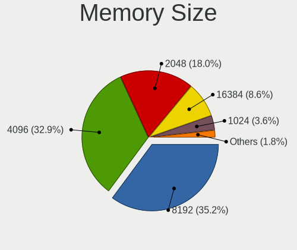

| Size  | Notebooks | Percent |
|-------|-----------|---------|
| 8192  | 109       | 37.33%  |
| 4096  | 91        | 31.16%  |
| 2048  | 54        | 18.49%  |
| 16384 | 25        | 8.56%   |
| 1024  | 10        | 3.42%   |
| 32768 | 3         | 1.03%   |

Memory Speed
------------

Memory module speed

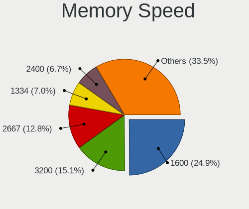

| Speed   | Notebooks | Percent |
|---------|-----------|---------|
| 1600    | 71        | 23.83%  |
| 3200    | 47        | 15.77%  |
| 2667    | 45        | 15.1%   |
| 1334    | 20        | 6.71%   |
| 2400    | 19        | 6.38%   |
| 1333    | 13        | 4.36%   |
| 2048    | 9         | 3.02%   |
| 800     | 9         | 3.02%   |
| 6400    | 8         | 2.68%   |
| 4199    | 8         | 2.68%   |
| 2133    | 7         | 2.35%   |
| 667     | 7         | 2.35%   |
| 3266    | 6         | 2.01%   |
| 1067    | 6         | 2.01%   |
| 4800    | 5         | 1.68%   |
| 4267    | 4         | 1.34%   |
| 3733    | 2         | 0.67%   |
| 2933    | 2         | 0.67%   |
| 1867    | 2         | 0.67%   |
| 975     | 2         | 0.67%   |
| 8400    | 1         | 0.34%   |
| 5600    | 1         | 0.34%   |
| 5200    | 1         | 0.34%   |
| 1639    | 1         | 0.34%   |
| 533     | 1         | 0.34%   |
| Unknown | 1         | 0.34%   |

Printers & scanners
-------------------

Printer Vendor
--------------

Printer device vendors

| Vendor              | Notebooks | Percent |
|---------------------|-----------|---------|
| Samsung Electronics | 1         | 50%     |
| Brother Industries  | 1         | 50%     |

Printer Model
-------------

Printer device models

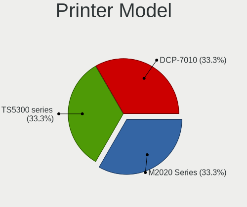

| Model                | Notebooks | Percent |
|----------------------|-----------|---------|
| Samsung M2020 Series | 1         | 50%     |
| Brother DCP-7010     | 1         | 50%     |

Scanner Vendor
--------------

Scanner device vendors

Zero info for selected period =(

Scanner Model
-------------

Scanner device models

Zero info for selected period =(

Camera
------

Camera Vendor
-------------

Camera device vendors

| Vendor                                 | Notebooks | Percent |
|----------------------------------------|-----------|---------|
| Chicony Electronics                    | 62        | 26.84%  |
| Microdia                               | 18        | 7.79%   |
| IMC Networks                           | 18        | 7.79%   |
| Cheng Uei Precision Industry (Foxlink) | 15        | 6.49%   |
| Bison Electronics                      | 15        | 6.49%   |
| Quanta                                 | 13        | 5.63%   |
| Sunplus Innovation Technology          | 11        | 4.76%   |
| Suyin                                  | 10        | 4.33%   |
| Realtek Semiconductor                  | 9         | 3.9%    |
| Apple                                  | 8         | 3.46%   |
| Syntek                                 | 7         | 3.03%   |
| Lite-On Technology                     | 7         | 3.03%   |
| Luxvisions Innotech Limited            | 6         | 2.6%    |
| Acer                                   | 5         | 2.16%   |
| Importek                               | 4         | 1.73%   |
| Sonix Technology                       | 3         | 1.3%    |
| Lenovo                                 | 3         | 1.3%    |
| Alcor Micro                            | 3         | 1.3%    |
| Silicon Motion                         | 2         | 0.87%   |
| Ricoh                                  | 2         | 0.87%   |
| BUFFALO                                | 2         | 0.87%   |
| USB Camera                             | 1         | 0.43%   |
| Sunplus Technology                     | 1         | 0.43%   |
| OPPO Electronics                       | 1         | 0.43%   |
| Logitech                               | 1         | 0.43%   |
| Genesys Logic                          | 1         | 0.43%   |
| Cubeternet                             | 1         | 0.43%   |
| ALi                                    | 1         | 0.43%   |
| Unknown                                | 1         | 0.43%   |

Camera Model
------------

Camera device models

| Model                                                          | Notebooks | Percent |
|----------------------------------------------------------------|-----------|---------|
| Microdia Integrated_Webcam_HD                                  | 9         | 3.9%    |
| Chicony HD WebCam                                              | 8         | 3.46%   |
| IMC Networks USB2.0 HD UVC WebCam                              | 7         | 3.03%   |
| Chicony VGA Webcam                                             | 7         | 3.03%   |
| Chicony Integrated Camera                                      | 6         | 2.6%    |
| Cheng Uei Precision Industry (Foxlink) HP Webcam               | 6         | 2.6%    |
| Syntek Integrated Camera                                       | 5         | 2.16%   |
| Sunplus Integrated_Webcam_HD                                   | 5         | 2.16%   |
| Realtek Integrated_Webcam_HD                                   | 5         | 2.16%   |
| Cheng Uei Precision Industry (Foxlink) HP TrueVision HD Camera | 5         | 2.16%   |
| Bison Integrated Camera                                        | 5         | 2.16%   |
| Apple iPhone 5/5C/5S/6/SE/7/8/X/XR                             | 5         | 2.16%   |
| Microdia Integrated Webcam                                     | 4         | 1.73%   |
| Lite-On Integrated Camera                                      | 4         | 1.73%   |
| Bison Lenovo Integrated Webcam                                 | 4         | 1.73%   |
| Quanta HP Webcam                                               | 3         | 1.3%    |
| Quanta HP TrueVision HD Camera                                 | 3         | 1.3%    |
| Lenovo Integrated Webcam                                       | 3         | 1.3%    |
| IMC Networks Integrated Camera                                 | 3         | 1.3%    |
| Chicony HP TrueVision HD Camera                                | 3         | 1.3%    |
| Chicony HD User Facing                                         | 3         | 1.3%    |
| Chicony FJ Camera                                              | 3         | 1.3%    |
| Chicony CNF8243 Webcam                                         | 3         | 1.3%    |
| Suyin HP TrueVision HD                                         | 2         | 0.87%   |
| Suyin Acer/HP Integrated Webcam [CN0314]                       | 2         | 0.87%   |
| Sonix USB2.0 HD UVC WebCam                                     | 2         | 0.87%   |
| Realtek Integrated Webcam                                      | 2         | 0.87%   |
| Quanta HP Wide Vision HD Camera                                | 2         | 0.87%   |
| Microdia Integrated_Webcam_1.3M                                | 2         | 0.87%   |
| Luxvisions Innotech Limited HP TrueVision HD Camera            | 2         | 0.87%   |
| Lite-On HP HD Webcam                                           | 2         | 0.87%   |
| Importek TOSHIBA Web Camera - HD                               | 2         | 0.87%   |
| Importek Laptop Integrated Webcam                              | 2         | 0.87%   |
| IMC Networks Lenovo EasyCamera                                 | 2         | 0.87%   |
| Chicony WebCam                                                 | 2         | 0.87%   |
| Chicony USB2.0 Camera                                          | 2         | 0.87%   |
| Chicony Integrated HP HD Webcam                                | 2         | 0.87%   |
| Chicony Integrated Camera (1280x720@30)                        | 2         | 0.87%   |
| Chicony HP Truevision HD                                       | 2         | 0.87%   |
| Chicony EasyCamera                                             | 2         | 0.87%   |

Security
--------

Fingerprint Vendor
------------------

Fingerprint sensor vendors

| Vendor                             | Notebooks | Percent |
|------------------------------------|-----------|---------|
| Validity Sensors                   | 9         | 30%     |
| Shenzhen Goodix Technology         | 5         | 16.67%  |
| Synaptics                          | 4         | 13.33%  |
| Elan Microelectronics              | 4         | 13.33%  |
| STMicroelectronics                 | 2         | 6.67%   |
| LighTuning Technology              | 2         | 6.67%   |
| AuthenTec                          | 2         | 6.67%   |
| Upek                               | 1         | 3.33%   |
| Realtek USB2.0 Finger Print Bridge | 1         | 3.33%   |

Fingerprint Model
-----------------

Fingerprint sensor models

| Model                                                                      | Notebooks | Percent |
|----------------------------------------------------------------------------|-----------|---------|
| Synaptics Metallica MIS Touch Fingerprint Reader                           | 3         | 10%     |
| Shenzhen Goodix  FingerPrint Device                                        | 3         | 10%     |
| Validity Sensors VFS495 Fingerprint Reader                                 | 2         | 6.67%   |
| STMicroelectronics Fingerprint Reader                                      | 2         | 6.67%   |
| LighTuning Fingerprint Reader                                              | 2         | 6.67%   |
| Elan ELAN:Fingerprint                                                      | 2         | 6.67%   |
| Elan ELAN:ARM-M4                                                           | 2         | 6.67%   |
| AuthenTec AES2810                                                          | 2         | 6.67%   |
| Validity Sensors VFS5011 Fingerprint Reader                                | 1         | 3.33%   |
| Validity Sensors VFS491                                                    | 1         | 3.33%   |
| Validity Sensors VFS471 Fingerprint Reader                                 | 1         | 3.33%   |
| Validity Sensors VFS101 Fingerprint Reader                                 | 1         | 3.33%   |
| Validity Sensors VFS 5011 fingerprint sensor                               | 1         | 3.33%   |
| Validity Sensors Synaptics VFS7552 Touch Fingerprint Sensor with PurePrint | 1         | 3.33%   |
| Validity Sensors Fingerprint scanner                                       | 1         | 3.33%   |
| Upek Biometric Touchchip/Touchstrip Fingerprint Sensor                     | 1         | 3.33%   |
| Synaptics Prometheus MIS Touch Fingerprint Reader                          | 1         | 3.33%   |
| Shenzhen Goodix Fingerprint Reader                                         | 1         | 3.33%   |
| Shenzhen Goodix FingerPrint                                                | 1         | 3.33%   |
| Realtek USB2.0 Finger Print Bridge FocalTech Fingerprint Device            | 1         | 3.33%   |

Chipcard Vendor
---------------

Chipcard module vendors

| Vendor      | Notebooks | Percent |
|-------------|-----------|---------|
| Broadcom    | 11        | 57.89%  |
| Upek        | 3         | 15.79%  |
| Lenovo      | 2         | 10.53%  |
| Alcor Micro | 2         | 10.53%  |
| O2 Micro    | 1         | 5.26%   |

Chipcard Model
--------------

Chipcard module models

| Model                                                                        | Notebooks | Percent |
|------------------------------------------------------------------------------|-----------|---------|
| Broadcom 5880                                                                | 6         | 31.58%  |
| Upek TouchChip Fingerprint Coprocessor (WBF advanced mode)                   | 3         | 15.79%  |
| Broadcom BCM5880 Secure Applications Processor                               | 3         | 15.79%  |
| Lenovo Integrated Smart Card Reader                                          | 2         | 10.53%  |
| Alcor Micro AU9540 Smartcard Reader                                          | 2         | 10.53%  |
| O2 Micro OZ776 CCID Smartcard Reader                                         | 1         | 5.26%   |
| Broadcom BCM5880 Secure Applications Processor with fingerprint swipe sensor | 1         | 5.26%   |
| Broadcom 58200                                                               | 1         | 5.26%   |

Unsupported
-----------

Unsupported Devices
-------------------

Total unsupported devices on board

| Total | Notebooks | Percent |
|-------|-----------|---------|
| 0     | 186       | 70.99%  |
| 1     | 67        | 25.57%  |
| 2     | 9         | 3.44%   |

Unsupported Device Types
------------------------

Types of unsupported devices

| Type                  | Notebooks | Percent |
|-----------------------|-----------|---------|
| Fingerprint reader    | 30        | 35.71%  |
| Graphics card         | 21        | 25%     |
| Chipcard              | 18        | 21.43%  |
| Net/wireless          | 6         | 7.14%   |
| Bluetooth             | 4         | 4.76%   |
| Sound                 | 2         | 2.38%   |
| Net/ethernet          | 1         | 1.19%   |
| Multimedia controller | 1         | 1.19%   |
| Camera                | 1         | 1.19%   |

