OpenMandriva 5.0 - Tested Hardware & Statistics
-----------------------------------------------

A project to collect tested hardware configurations for OpenMandriva 5.0.

Anyone can contribute to this report by the [hw-probe](https://github.com/linuxhw/hw-probe) tool:

    sudo -E hw-probe -all -upload

Please contribute! Especially if your hardware is rare.

This is a report for all computer types. See also reports for [desktops](/Dist/OpenMandriva_5.0/Desktop/README.md) and [notebooks](/Dist/OpenMandriva_5.0/Notebook/README.md).

Contents
--------

* [ Test Cases ](#test-cases)

* [ System ](#system)
  - [ Kernel                   ](#kernel)
  - [ Kernel Family            ](#kernel-family)
  - [ Kernel Major Ver.        ](#kernel-major-ver)
  - [ Arch                     ](#arch)
  - [ DE                       ](#de)
  - [ Display Server           ](#display-server)
  - [ Display Manager          ](#display-manager)
  - [ OS Lang                  ](#os-lang)
  - [ Boot Mode                ](#boot-mode)
  - [ Filesystem               ](#filesystem)
  - [ Part. scheme             ](#part-scheme)
  - [ Dual Boot with Linux/BSD ](#dual-boot-with-linuxbsd)
  - [ Dual Boot (Win)          ](#dual-boot-win)

* [ Board ](#board)
  - [ Vendor                   ](#vendor)
  - [ Model                    ](#model)
  - [ Model Family             ](#model-family)
  - [ MFG Year                 ](#mfg-year)
  - [ Form Factor              ](#form-factor)
  - [ Secure Boot              ](#secure-boot)
  - [ Coreboot                 ](#coreboot)
  - [ RAM Size                 ](#ram-size)
  - [ RAM Used                 ](#ram-used)
  - [ Total Drives             ](#total-drives)
  - [ Has CD-ROM               ](#has-cd-rom)
  - [ Has Ethernet             ](#has-ethernet)
  - [ Has WiFi                 ](#has-wifi)
  - [ Has Bluetooth            ](#has-bluetooth)

* [ Location ](#location)
  - [ Country                  ](#country)
  - [ City                     ](#city)

* [ Drives ](#drives)
  - [ Drive Vendor             ](#drive-vendor)
  - [ Drive Model              ](#drive-model)
  - [ HDD Vendor               ](#hdd-vendor)
  - [ SSD Vendor               ](#ssd-vendor)
  - [ Drive Kind               ](#drive-kind)
  - [ Drive Connector          ](#drive-connector)
  - [ Drive Size               ](#drive-size)
  - [ Space Total              ](#space-total)
  - [ Space Used               ](#space-used)
  - [ Malfunc. Drives          ](#malfunc-drives)
  - [ Malfunc. Drive Vendor    ](#malfunc-drive-vendor)
  - [ Malfunc. HDD Vendor      ](#malfunc-hdd-vendor)
  - [ Malfunc. Drive Kind      ](#malfunc-drive-kind)
  - [ Failed Drives            ](#failed-drives)
  - [ Failed Drive Vendor      ](#failed-drive-vendor)
  - [ Drive Status             ](#drive-status)

* [ Storage controller ](#storage-controller)
  - [ Storage Vendor           ](#storage-vendor)
  - [ Storage Model            ](#storage-model)
  - [ Storage Kind             ](#storage-kind)

* [ Processor ](#processor)
  - [ CPU Vendor               ](#cpu-vendor)
  - [ CPU Model                ](#cpu-model)
  - [ CPU Model Family         ](#cpu-model-family)
  - [ CPU Cores                ](#cpu-cores)
  - [ CPU Sockets              ](#cpu-sockets)
  - [ CPU Threads              ](#cpu-threads)
  - [ CPU Op-Modes             ](#cpu-op-modes)
  - [ CPU Microcode            ](#cpu-microcode)
  - [ CPU Microarch            ](#cpu-microarch)

* [ Graphics ](#graphics)
  - [ GPU Vendor               ](#gpu-vendor)
  - [ GPU Model                ](#gpu-model)
  - [ GPU Combo                ](#gpu-combo)
  - [ GPU Driver               ](#gpu-driver)
  - [ GPU Memory               ](#gpu-memory)

* [ Monitor ](#monitor)
  - [ Monitor Vendor           ](#monitor-vendor)
  - [ Monitor Model            ](#monitor-model)
  - [ Monitor Resolution       ](#monitor-resolution)
  - [ Monitor Diagonal         ](#monitor-diagonal)
  - [ Monitor Width            ](#monitor-width)
  - [ Aspect Ratio             ](#aspect-ratio)
  - [ Monitor Area             ](#monitor-area)
  - [ Pixel Density            ](#pixel-density)
  - [ Multiple Monitors        ](#multiple-monitors)

* [ Network ](#network)
  - [ Net Controller Vendor    ](#net-controller-vendor)
  - [ Net Controller Model     ](#net-controller-model)
  - [ Wireless Vendor          ](#wireless-vendor)
  - [ Wireless Model           ](#wireless-model)
  - [ Ethernet Vendor          ](#ethernet-vendor)
  - [ Ethernet Model           ](#ethernet-model)
  - [ Net Controller Kind      ](#net-controller-kind)
  - [ Used Controller          ](#used-controller)
  - [ NICs                     ](#nics)
  - [ IPv6                     ](#ipv6)

* [ Bluetooth ](#bluetooth)
  - [ Bluetooth Vendor         ](#bluetooth-vendor)
  - [ Bluetooth Model          ](#bluetooth-model)

* [ Sound ](#sound)
  - [ Sound Vendor             ](#sound-vendor)
  - [ Sound Model              ](#sound-model)

* [ Memory ](#memory)
  - [ Memory Vendor            ](#memory-vendor)
  - [ Memory Model             ](#memory-model)
  - [ Memory Kind              ](#memory-kind)
  - [ Memory Form Factor       ](#memory-form-factor)
  - [ Memory Size              ](#memory-size)
  - [ Memory Speed             ](#memory-speed)

* [ Printers & scanners ](#printers--scanners)
  - [ Printer Vendor           ](#printer-vendor)
  - [ Printer Model            ](#printer-model)
  - [ Scanner Vendor           ](#scanner-vendor)
  - [ Scanner Model            ](#scanner-model)

* [ Camera ](#camera)
  - [ Camera Vendor            ](#camera-vendor)
  - [ Camera Model             ](#camera-model)

* [ Security ](#security)
  - [ Fingerprint Vendor       ](#fingerprint-vendor)
  - [ Fingerprint Model        ](#fingerprint-model)
  - [ Chipcard Vendor          ](#chipcard-vendor)
  - [ Chipcard Model           ](#chipcard-model)

* [ Unsupported ](#unsupported)
  - [ Unsupported Devices      ](#unsupported-devices)
  - [ Unsupported Device Types ](#unsupported-device-types)

Test Cases
----------

Total: 2071

| Vendor        | Model                       | Form-Factor | Probe                                                      | Date         |
|---------------|-----------------------------|-------------|------------------------------------------------------------|--------------|
| Google        | Candy                       | Notebook    | [cecd9e87aa](https://linux-hardware.org/?probe=cecd9e87aa) | Jan 02, 2026 |
| Lenovo        | ThinkPad T470 20HES0QL00    | Notebook    | [5b0e1cd590](https://linux-hardware.org/?probe=5b0e1cd590) | Dec 31, 2025 |
| Samsung       | 500R4K/500R5H/5400RK/501... | Notebook    | [7b5c617f4f](https://linux-hardware.org/?probe=7b5c617f4f) | Dec 30, 2025 |
| Google        | Candy                       | Notebook    | [4e367db3a2](https://linux-hardware.org/?probe=4e367db3a2) | Dec 22, 2025 |
| MSI           | B450 GAMING PRO CARBON A... | Desktop     | [8da20a34c6](https://linux-hardware.org/?probe=8da20a34c6) | Dec 21, 2025 |
| ASRock        | X570 Pro4                   | Desktop     | [394e9e17a5](https://linux-hardware.org/?probe=394e9e17a5) | Dec 17, 2025 |
| Dell          | Latitude 3570               | Notebook    | [41b2cba7dd](https://linux-hardware.org/?probe=41b2cba7dd) | Dec 09, 2025 |
| Lenovo        | ThinkPad P53 20QN001YUS     | Notebook    | [04ff75abf1](https://linux-hardware.org/?probe=04ff75abf1) | Dec 07, 2025 |
| Packard Be... | EasyNote TE11HC             | Notebook    | [dcd1f8ec65](https://linux-hardware.org/?probe=dcd1f8ec65) | Dec 01, 2025 |
| Lenovo        | 310B SDK0J40697 WIN 3305... | Desktop     | [e4302a942a](https://linux-hardware.org/?probe=e4302a942a) | Nov 27, 2025 |
| HP            | Pavilion Notebook           | Notebook    | [b82bac9ce3](https://linux-hardware.org/?probe=b82bac9ce3) | Nov 23, 2025 |
| Gigabyte      | GA-78LMT-USB3               | Desktop     | [f03327917f](https://linux-hardware.org/?probe=f03327917f) | Nov 22, 2025 |
| Gigabyte      | B450 AORUS M                | Desktop     | [68804c6805](https://linux-hardware.org/?probe=68804c6805) | Nov 07, 2025 |
| Dell          | Latitude E6410              | Notebook    | [3aa870d787](https://linux-hardware.org/?probe=3aa870d787) | Nov 03, 2025 |
| Google        | Candy                       | Notebook    | [0d070e9cdc](https://linux-hardware.org/?probe=0d070e9cdc) | Nov 03, 2025 |
| PELADN        | WI-6                        | Desktop     | [3ca3fc9dc0](https://linux-hardware.org/?probe=3ca3fc9dc0) | Nov 02, 2025 |
| Gigabyte      | B450 I AORUS PRO WIFI-CF    | Desktop     | [5af760ac74](https://linux-hardware.org/?probe=5af760ac74) | Nov 01, 2025 |
| Gigabyte      | B560 DS3H AC-Y1             | Desktop     | [1722829ffe](https://linux-hardware.org/?probe=1722829ffe) | Nov 01, 2025 |
| Unknown       | AX15                        | Notebook    | [117665891c](https://linux-hardware.org/?probe=117665891c) | Oct 30, 2025 |
| Apple         | Mac-942B59F58194171B iMa... | All in one  | [997f0707b2](https://linux-hardware.org/?probe=997f0707b2) | Oct 16, 2025 |
| Toshiba       | PORTEGE Z30-C               | Notebook    | [5649272fd6](https://linux-hardware.org/?probe=5649272fd6) | Oct 12, 2025 |
| Gigabyte      | H81M-S2PV                   | Desktop     | [0f9ca486d8](https://linux-hardware.org/?probe=0f9ca486d8) | Oct 12, 2025 |
| ASRock        | Z97 Pro4                    | Desktop     | [0b392dcca1](https://linux-hardware.org/?probe=0b392dcca1) | Oct 11, 2025 |
| Apple         | MacBookPro3,1               | Notebook    | [52901a1cdf](https://linux-hardware.org/?probe=52901a1cdf) | Oct 10, 2025 |
| Toshiba       | Satellite L655              | Notebook    | [586043bd8d](https://linux-hardware.org/?probe=586043bd8d) | Oct 10, 2025 |
| Samsung       | 370E5L/371B5L               | Notebook    | [e11e6bde3a](https://linux-hardware.org/?probe=e11e6bde3a) | Sep 30, 2025 |
| Dell          | Inspiron 5758               | Notebook    | [ca4fc516c1](https://linux-hardware.org/?probe=ca4fc516c1) | Sep 23, 2025 |
| ASUSTek       | X551MA                      | Notebook    | [e0fb6c59d6](https://linux-hardware.org/?probe=e0fb6c59d6) | Sep 22, 2025 |
| ASUSTek       | VivoBook_ASUSLaptop E410... | Notebook    | [f29c7bb3eb](https://linux-hardware.org/?probe=f29c7bb3eb) | Sep 21, 2025 |
| Google        | Candy                       | Notebook    | [ebc549c163](https://linux-hardware.org/?probe=ebc549c163) | Sep 20, 2025 |
| Dell          | Latitude 3190               | Notebook    | [571f119a19](https://linux-hardware.org/?probe=571f119a19) | Sep 15, 2025 |
| Foxconn       | A74ML-K                     | Desktop     | [5ba1ce9138](https://linux-hardware.org/?probe=5ba1ce9138) | Sep 05, 2025 |
| Dell          | Latitude 5520               | Notebook    | [b5a470cbe7](https://linux-hardware.org/?probe=b5a470cbe7) | Sep 05, 2025 |
| ASUSTek       | TUF Gaming B460-PLUS        | Desktop     | [550eb1faba](https://linux-hardware.org/?probe=550eb1faba) | Sep 04, 2025 |
| HP            | 1495                        | Desktop     | [f1b76f8da8](https://linux-hardware.org/?probe=f1b76f8da8) | Sep 03, 2025 |
| HP            | ProBook 4540s               | Notebook    | [298fc7b496](https://linux-hardware.org/?probe=298fc7b496) | Sep 01, 2025 |
| System76      | Oryx Pro                    | Notebook    | [35d691c26a](https://linux-hardware.org/?probe=35d691c26a) | Sep 01, 2025 |
| HP            | ProBook 4540s               | Notebook    | [ad3183412e](https://linux-hardware.org/?probe=ad3183412e) | Sep 01, 2025 |
| HP            | ZBook 15 G4                 | Notebook    | [0baf2be9a2](https://linux-hardware.org/?probe=0baf2be9a2) | Aug 31, 2025 |
| HP            | ZBook 15 G4                 | Notebook    | [3f0af59e26](https://linux-hardware.org/?probe=3f0af59e26) | Aug 31, 2025 |
| HP            | ProBook 645 G1              | Notebook    | [df47d66ba8](https://linux-hardware.org/?probe=df47d66ba8) | Aug 27, 2025 |
| Intel         | NUC6CAYB J23203-408         | Mini pc     | [999ba4d72e](https://linux-hardware.org/?probe=999ba4d72e) | Aug 24, 2025 |
| HP            | Notebook                    | Notebook    | [d6373b79ba](https://linux-hardware.org/?probe=d6373b79ba) | Aug 21, 2025 |
| MSI           | GL62 7QF                    | Notebook    | [4582736a5a](https://linux-hardware.org/?probe=4582736a5a) | Aug 20, 2025 |
| Lenovo        | 31900058 STD                | Desktop     | [5493445241](https://linux-hardware.org/?probe=5493445241) | Aug 18, 2025 |
| ASUSTek       | TUF Gaming X670E-PLUS WI... | Desktop     | [3b87722daf](https://linux-hardware.org/?probe=3b87722daf) | Aug 17, 2025 |
| HP            | Pavilion dv7                | Notebook    | [4d9e24fc79](https://linux-hardware.org/?probe=4d9e24fc79) | Aug 12, 2025 |
| HP            | 3047h                       | Desktop     | [4330166a7a](https://linux-hardware.org/?probe=4330166a7a) | Aug 11, 2025 |
| ZTE           | CT321                       | Notebook    | [c0ab4d82bf](https://linux-hardware.org/?probe=c0ab4d82bf) | Aug 09, 2025 |
| Dell          | 0D90HM A00                  | All in one  | [2a57f05650](https://linux-hardware.org/?probe=2a57f05650) | Aug 08, 2025 |
| ASRock        | B450 Gaming-ITX/ac          | Desktop     | [2ae73630cf](https://linux-hardware.org/?probe=2ae73630cf) | Aug 04, 2025 |
| Lenovo        | B560 43308LG                | Notebook    | [21e11ad627](https://linux-hardware.org/?probe=21e11ad627) | Jul 13, 2025 |
| ASUSTek       | K61IC                       | Notebook    | [da20b3bf57](https://linux-hardware.org/?probe=da20b3bf57) | Jul 12, 2025 |
| HP            | EliteBook 840 G3            | Notebook    | [586e7bc0db](https://linux-hardware.org/?probe=586e7bc0db) | Jul 09, 2025 |
| ASUSTek       | X550VX                      | Notebook    | [0de110f287](https://linux-hardware.org/?probe=0de110f287) | Jul 03, 2025 |
| Google        | Candy                       | Notebook    | [114592abbc](https://linux-hardware.org/?probe=114592abbc) | Jul 01, 2025 |
| Lenovo        | ThinkPad T440p 20AWS36U0... | Notebook    | [9c24d1e5af](https://linux-hardware.org/?probe=9c24d1e5af) | Jun 29, 2025 |
| Toshiba       | Satellite L70-B             | Notebook    | [7e3c176dae](https://linux-hardware.org/?probe=7e3c176dae) | Jun 28, 2025 |
| ASUSTek       | X556UJ                      | Notebook    | [0292dddf1f](https://linux-hardware.org/?probe=0292dddf1f) | Jun 22, 2025 |
| Toshiba       | Satellite A665              | Notebook    | [1e9f1976f6](https://linux-hardware.org/?probe=1e9f1976f6) | Jun 15, 2025 |
| Pegatron      | 2AE3                        | Desktop     | [47209c574e](https://linux-hardware.org/?probe=47209c574e) | Jun 14, 2025 |
| Samsung       | 305V4A/305V5A               | Notebook    | [01e8d7ac4f](https://linux-hardware.org/?probe=01e8d7ac4f) | Jun 14, 2025 |
| Google        | Teemo                       | Mini pc     | [9f8ef0fe04](https://linux-hardware.org/?probe=9f8ef0fe04) | Jun 11, 2025 |
| HP            | Laptop 15-ef1xxx            | Notebook    | [ffa4e8d5f4](https://linux-hardware.org/?probe=ffa4e8d5f4) | Jun 03, 2025 |
| Medion        | Akoya S4220 MD99820         | Notebook    | [bf54060cd4](https://linux-hardware.org/?probe=bf54060cd4) | Jun 02, 2025 |
| Lenovo        | ThinkPad T530 2429W4Z       | Notebook    | [1abadb23e5](https://linux-hardware.org/?probe=1abadb23e5) | May 30, 2025 |
| Lenovo        | ThinkPad T570 W10DG 20JX... | Notebook    | [30077f314d](https://linux-hardware.org/?probe=30077f314d) | May 30, 2025 |
| Samsung       | R430/R480/R440              | Notebook    | [9dfbe091c3](https://linux-hardware.org/?probe=9dfbe091c3) | May 28, 2025 |
| Lenovo        | Legion 5 15ARH05 82B5       | Notebook    | [9ebdc98e04](https://linux-hardware.org/?probe=9ebdc98e04) | May 27, 2025 |
| Lenovo        | Yoga 730-13IKB 81CT         | Convertible | [376a59914c](https://linux-hardware.org/?probe=376a59914c) | May 26, 2025 |
| Lenovo        | 310B SDK0J40697 WIN 3305... | Desktop     | [a8dbc3685c](https://linux-hardware.org/?probe=a8dbc3685c) | May 23, 2025 |
| Fujitsu       | LIFEBOOK E751               | Notebook    | [63862a05a4](https://linux-hardware.org/?probe=63862a05a4) | May 23, 2025 |
| ASUSTek       | A68HM-PLUS                  | Desktop     | [3b101ab9ba](https://linux-hardware.org/?probe=3b101ab9ba) | May 15, 2025 |
| Dell          | Vostro 1015                 | Notebook    | [0db3a28443](https://linux-hardware.org/?probe=0db3a28443) | May 15, 2025 |
| Lenovo        | ThinkCentre Edge 91Z 707... | Desktop     | [d36469c886](https://linux-hardware.org/?probe=d36469c886) | May 15, 2025 |
| ECS           | G31T-M9                     | Desktop     | [8bf715ef53](https://linux-hardware.org/?probe=8bf715ef53) | May 11, 2025 |
| Dell          | Latitude 7480               | Notebook    | [0ae0308412](https://linux-hardware.org/?probe=0ae0308412) | May 09, 2025 |
| ASUSTek       | E202SA                      | Notebook    | [425064df68](https://linux-hardware.org/?probe=425064df68) | May 09, 2025 |
| Gigabyte      | GA-MA790XT-UD4P             | Desktop     | [d300f39acb](https://linux-hardware.org/?probe=d300f39acb) | May 07, 2025 |
| MSI           | A320M-A PRO                 | Desktop     | [ea9e940c38](https://linux-hardware.org/?probe=ea9e940c38) | May 04, 2025 |
| HP            | 304Ah                       | Desktop     | [698a59f5b7](https://linux-hardware.org/?probe=698a59f5b7) | May 04, 2025 |
| HP            | Notebook                    | Notebook    | [6435d8f06d](https://linux-hardware.org/?probe=6435d8f06d) | May 02, 2025 |
| Dell          | Inspiron 7472               | Notebook    | [70b70877bf](https://linux-hardware.org/?probe=70b70877bf) | May 01, 2025 |
| Google        | Candy                       | Notebook    | [42c23c9a7d](https://linux-hardware.org/?probe=42c23c9a7d) | May 01, 2025 |
| Gigabyte      | B560 DS3H AC-Y1             | Desktop     | [1e5e1a0253](https://linux-hardware.org/?probe=1e5e1a0253) | Apr 29, 2025 |
| Dell          | Studio 1537                 | Notebook    | [eb575ed2c5](https://linux-hardware.org/?probe=eb575ed2c5) | Apr 29, 2025 |
| Acer          | AOD270                      | Notebook    | [b8cefbefaf](https://linux-hardware.org/?probe=b8cefbefaf) | Apr 29, 2025 |
| Lenovo        | ThinkPad Helix 36984SU      | Notebook    | [52cb1d1d47](https://linux-hardware.org/?probe=52cb1d1d47) | Apr 29, 2025 |
| Unknown       | AX15                        | Notebook    | [6261221261](https://linux-hardware.org/?probe=6261221261) | Apr 28, 2025 |
| Gigabyte      | B850M AORUS ELITE WIFI6E... | Desktop     | [06b51cc4f9](https://linux-hardware.org/?probe=06b51cc4f9) | Apr 26, 2025 |
| Dell          | 0M5WNK A00                  | Desktop     | [bbc42b51e1](https://linux-hardware.org/?probe=bbc42b51e1) | Apr 25, 2025 |
| Dell          | Latitude 7390               | Notebook    | [9b8e7cd001](https://linux-hardware.org/?probe=9b8e7cd001) | Apr 23, 2025 |
| Acer          | Aspire E5-573               | Notebook    | [24d1203a04](https://linux-hardware.org/?probe=24d1203a04) | Apr 23, 2025 |
| Lenovo        | G560 0679                   | Notebook    | [bcf1a2197f](https://linux-hardware.org/?probe=bcf1a2197f) | Apr 22, 2025 |
| Dell          | Latitude 5490               | Notebook    | [1ab07975b9](https://linux-hardware.org/?probe=1ab07975b9) | Apr 21, 2025 |
| Dell          | Inspiron 5537               | Notebook    | [ba132294fd](https://linux-hardware.org/?probe=ba132294fd) | Apr 21, 2025 |
| Sony          | VJPF11C11N                  | Notebook    | [f5d611280a](https://linux-hardware.org/?probe=f5d611280a) | Apr 21, 2025 |
| Lenovo        | ThinkPad X230 2320HQU       | Notebook    | [9632cf98db](https://linux-hardware.org/?probe=9632cf98db) | Apr 21, 2025 |
| Unknown       | Unknown                     | Desktop     | [c6db786f97](https://linux-hardware.org/?probe=c6db786f97) | Apr 20, 2025 |
| Sony          | VGN-CS118E                  | Notebook    | [55efc2f4ab](https://linux-hardware.org/?probe=55efc2f4ab) | Apr 20, 2025 |
| ASUSTek       | ROG STRIX X570-E GAMING     | Desktop     | [d79041778a](https://linux-hardware.org/?probe=d79041778a) | Apr 19, 2025 |
| Acer          | Nitro AN515-51              | Notebook    | [bcf3095b61](https://linux-hardware.org/?probe=bcf3095b61) | Apr 18, 2025 |
| HP            | EliteBook 745 G2            | Notebook    | [abbacf957c](https://linux-hardware.org/?probe=abbacf957c) | Apr 18, 2025 |
| Dell          | System XPS L702X            | Notebook    | [c7f78326fc](https://linux-hardware.org/?probe=c7f78326fc) | Apr 18, 2025 |
| Lenovo        | G470 20078                  | Notebook    | [484df2c993](https://linux-hardware.org/?probe=484df2c993) | Apr 18, 2025 |
| Lenovo        | ThinkPad T60 200743G        | Notebook    | [3ebe51bfeb](https://linux-hardware.org/?probe=3ebe51bfeb) | Apr 17, 2025 |
| ASUSTek       | VivoBook_ASUSLaptop E410... | Notebook    | [56228f1c6c](https://linux-hardware.org/?probe=56228f1c6c) | Apr 17, 2025 |
| Lenovo        | ThinkPad W510 4391WMM       | Notebook    | [9d92f683bf](https://linux-hardware.org/?probe=9d92f683bf) | Apr 16, 2025 |
| Acer          | Nitro AN515-55              | Notebook    | [87687855ea](https://linux-hardware.org/?probe=87687855ea) | Apr 16, 2025 |
| Fujitsu       | LIFEBOOK T5010              | Notebook    | [f08b507af1](https://linux-hardware.org/?probe=f08b507af1) | Apr 15, 2025 |
| HP            | 83F3                        | Desktop     | [eeab0e374d](https://linux-hardware.org/?probe=eeab0e374d) | Apr 15, 2025 |
| ASUSTek       | VivoBook_ASUSLaptop E410... | Notebook    | [181084e505](https://linux-hardware.org/?probe=181084e505) | Apr 15, 2025 |
| Acer          | Aspire 4736                 | Notebook    | [49da7e22ed](https://linux-hardware.org/?probe=49da7e22ed) | Apr 14, 2025 |
| Lenovo        | ThinkPad X230 23253A2       | Notebook    | [fdb76e0fe8](https://linux-hardware.org/?probe=fdb76e0fe8) | Apr 14, 2025 |
| Lenovo        | 30C9 SDK0J40705 WIN 3425... | Desktop     | [3bc184eb0d](https://linux-hardware.org/?probe=3bc184eb0d) | Apr 13, 2025 |
| ASUSTek       | P5G41T-M LX2/GB/LPT         | Desktop     | [54c365a715](https://linux-hardware.org/?probe=54c365a715) | Apr 13, 2025 |
| Lenovo        | ThinkBook 16p Gen 4 21J8    | Notebook    | [a683218a5b](https://linux-hardware.org/?probe=a683218a5b) | Apr 13, 2025 |
| HUAWEI        | WRT-WX9                     | Notebook    | [da4eb8bdbd](https://linux-hardware.org/?probe=da4eb8bdbd) | Apr 13, 2025 |
| Dell          | Precision Tower 5810        | Desktop     | [ba429f941e](https://linux-hardware.org/?probe=ba429f941e) | Apr 13, 2025 |
| Acer          | Aspire 5740                 | Notebook    | [b5949a7634](https://linux-hardware.org/?probe=b5949a7634) | Apr 13, 2025 |
| Framework     | Laptop 16 (AMD Ryzen 704... | Notebook    | [0ef26df416](https://linux-hardware.org/?probe=0ef26df416) | Apr 13, 2025 |
| Framework     | Laptop 16 (AMD Ryzen 704... | Notebook    | [a77415de93](https://linux-hardware.org/?probe=a77415de93) | Apr 13, 2025 |
| Dell          | Precision 5530              | Notebook    | [c9656048e3](https://linux-hardware.org/?probe=c9656048e3) | Apr 12, 2025 |
| HP            | EliteBook 6930p             | Notebook    | [a71d5cea4a](https://linux-hardware.org/?probe=a71d5cea4a) | Apr 12, 2025 |
| Acer          | Aspire X3950                | Desktop     | [0b954993ad](https://linux-hardware.org/?probe=0b954993ad) | Apr 12, 2025 |
| HP            | Pavilion Sleekbook 15 PC    | Notebook    | [37da7378e6](https://linux-hardware.org/?probe=37da7378e6) | Apr 11, 2025 |
| HP            | 859B                        | Desktop     | [0c59964165](https://linux-hardware.org/?probe=0c59964165) | Apr 11, 2025 |
| Dell          | 0VRWRC A00                  | Desktop     | [5a34e22881](https://linux-hardware.org/?probe=5a34e22881) | Apr 10, 2025 |
| Lenovo        | ThinkPad T440 20B6CTO1WW    | Notebook    | [8067575721](https://linux-hardware.org/?probe=8067575721) | Apr 10, 2025 |
| ASRock        | FM2A68M-DG3+                | Desktop     | [6aad7ab2b7](https://linux-hardware.org/?probe=6aad7ab2b7) | Apr 10, 2025 |
| Gigabyte      | B450 AORUS M                | Desktop     | [40c86e898a](https://linux-hardware.org/?probe=40c86e898a) | Apr 10, 2025 |
| HP            | Pavilion Notebook           | Notebook    | [de9900f597](https://linux-hardware.org/?probe=de9900f597) | Apr 10, 2025 |
| Lenovo        | IdeaPadFlex 5 14ABR8 82X... | Convertible | [79a900d4d6](https://linux-hardware.org/?probe=79a900d4d6) | Apr 09, 2025 |
| Gigabyte      | H61M-DS2                    | Desktop     | [38804ea9e0](https://linux-hardware.org/?probe=38804ea9e0) | Apr 09, 2025 |
| Lenovo        | IdeaPad 330-15AST 81D6      | Notebook    | [31266b328c](https://linux-hardware.org/?probe=31266b328c) | Apr 09, 2025 |
| Dell          | Latitude E7470              | Notebook    | [fa751c71ec](https://linux-hardware.org/?probe=fa751c71ec) | Apr 09, 2025 |
| HP            | 8055                        | Desktop     | [8c29caf120](https://linux-hardware.org/?probe=8c29caf120) | Apr 09, 2025 |
| HP            | 1495                        | Desktop     | [fd2279278a](https://linux-hardware.org/?probe=fd2279278a) | Apr 08, 2025 |
| Lenovo        | ThinkPad X230 23259H1       | Notebook    | [13a9a32b7d](https://linux-hardware.org/?probe=13a9a32b7d) | Apr 08, 2025 |
| Acer          | Aspire A315-51              | Notebook    | [ead8d2f084](https://linux-hardware.org/?probe=ead8d2f084) | Apr 08, 2025 |
| Apple         | Mac-031AEE4D24BFF0B1 Mac... | Mini pc     | [e20f78d3ec](https://linux-hardware.org/?probe=e20f78d3ec) | Apr 08, 2025 |
| MSI           | MAG A520M VECTOR WIFI       | Desktop     | [2df2189531](https://linux-hardware.org/?probe=2df2189531) | Apr 07, 2025 |
| Acer          | FIH57                       | Desktop     | [baccfd6996](https://linux-hardware.org/?probe=baccfd6996) | Apr 07, 2025 |
| Acer          | Aspire 7750G                | Notebook    | [1a43a491bb](https://linux-hardware.org/?probe=1a43a491bb) | Apr 05, 2025 |
| HP            | 250 G3                      | Notebook    | [6f25cdebef](https://linux-hardware.org/?probe=6f25cdebef) | Apr 05, 2025 |
| Lenovo        | IdeaPad Y560                | Notebook    | [cd283ddce7](https://linux-hardware.org/?probe=cd283ddce7) | Apr 05, 2025 |
| HP            | Stream Laptop 14-ax0XX      | Notebook    | [5bebf73d1b](https://linux-hardware.org/?probe=5bebf73d1b) | Apr 04, 2025 |
| Dell          | Inspiron 5555               | Notebook    | [04c3daaa5c](https://linux-hardware.org/?probe=04c3daaa5c) | Apr 04, 2025 |
| Dell          | Precision 5530              | Notebook    | [5bdd3116b0](https://linux-hardware.org/?probe=5bdd3116b0) | Apr 04, 2025 |
| ASUSTek       | S551LN                      | Notebook    | [dc1b5ccf47](https://linux-hardware.org/?probe=dc1b5ccf47) | Apr 03, 2025 |
| HP            | ProBook 650 G1              | Notebook    | [7cef8c30b8](https://linux-hardware.org/?probe=7cef8c30b8) | Apr 02, 2025 |
| ASUSTek       | K53E                        | Notebook    | [097ca65f87](https://linux-hardware.org/?probe=097ca65f87) | Apr 02, 2025 |
| eMachines     | eME528                      | Notebook    | [fd5bb81dea](https://linux-hardware.org/?probe=fd5bb81dea) | Apr 01, 2025 |
| Philco        | 14H                         | Notebook    | [c44af7d46f](https://linux-hardware.org/?probe=c44af7d46f) | Apr 01, 2025 |
| ASUSTek       | ROG STRIX X570-E GAMING     | Desktop     | [a2de615200](https://linux-hardware.org/?probe=a2de615200) | Mar 31, 2025 |
| Fujitsu       | D3313-B1 S26361-D3313-B1    | Desktop     | [d97d9a1b4a](https://linux-hardware.org/?probe=d97d9a1b4a) | Mar 31, 2025 |
| Lenovo        | ThinkPad SL510 28477EG      | Notebook    | [1f721415d7](https://linux-hardware.org/?probe=1f721415d7) | Mar 31, 2025 |
| ASUSTek       | X550LA                      | Notebook    | [a3c281add4](https://linux-hardware.org/?probe=a3c281add4) | Mar 31, 2025 |
| Dell          | Inspiron 5559               | Notebook    | [fd393a62a1](https://linux-hardware.org/?probe=fd393a62a1) | Mar 30, 2025 |
| Biostar       | B450MHP                     | Desktop     | [030861030c](https://linux-hardware.org/?probe=030861030c) | Mar 30, 2025 |
| Dell          | Latitude E6430              | Notebook    | [8eb49a6406](https://linux-hardware.org/?probe=8eb49a6406) | Mar 30, 2025 |
| ASUSTek       | TUF Gaming FX505DD_FX505... | Notebook    | [19dcdb88cd](https://linux-hardware.org/?probe=19dcdb88cd) | Mar 30, 2025 |
| ASUSTek       | ROG STRIX B450-F GAMING     | Desktop     | [23a7e30d1b](https://linux-hardware.org/?probe=23a7e30d1b) | Mar 30, 2025 |
| Lenovo        | ThinkPad T440s 20ARS24H0... | Notebook    | [24aa9bae19](https://linux-hardware.org/?probe=24aa9bae19) | Mar 30, 2025 |
| Gigabyte      | H170-HD3 DDR3-CF            | Desktop     | [a983398794](https://linux-hardware.org/?probe=a983398794) | Mar 29, 2025 |
| HP            | Pavilion 14                 | Notebook    | [a9d21edec0](https://linux-hardware.org/?probe=a9d21edec0) | Mar 29, 2025 |
| ASUSTek       | E402NA                      | Notebook    | [7101207131](https://linux-hardware.org/?probe=7101207131) | Mar 29, 2025 |
| Dell          | Latitude 7280               | Notebook    | [76692f8fde](https://linux-hardware.org/?probe=76692f8fde) | Mar 29, 2025 |
| Dell          | Inspiron 5593               | Notebook    | [4b3d241d8c](https://linux-hardware.org/?probe=4b3d241d8c) | Mar 29, 2025 |
| Lenovo        | NO DPK                      | Desktop     | [c25e426f0d](https://linux-hardware.org/?probe=c25e426f0d) | Mar 28, 2025 |
| ASUSTek       | X555YI                      | Notebook    | [526cdf169e](https://linux-hardware.org/?probe=526cdf169e) | Mar 28, 2025 |
| MSI           | B450 TOMAHAWK               | Desktop     | [4c8f56d1fa](https://linux-hardware.org/?probe=4c8f56d1fa) | Mar 27, 2025 |
| HP            | Pavilion dv6700             | Notebook    | [8a14d56c45](https://linux-hardware.org/?probe=8a14d56c45) | Mar 27, 2025 |
| HP            | ProBook 4535s               | Notebook    | [ed56fd1e3c](https://linux-hardware.org/?probe=ed56fd1e3c) | Mar 26, 2025 |
| eMachines     | Rhine V1.45                 | Notebook    | [aa9cf09cd5](https://linux-hardware.org/?probe=aa9cf09cd5) | Mar 26, 2025 |
| HP            | Laptop 14-dq3xxx            | Notebook    | [5335cbfd0c](https://linux-hardware.org/?probe=5335cbfd0c) | Mar 25, 2025 |
| PC Special... | DefianceV 17 QHD I9         | Notebook    | [5e3d96ac81](https://linux-hardware.org/?probe=5e3d96ac81) | Mar 24, 2025 |
| Lenovo        | ThinkBook 15 G2 ITL 20VE    | Notebook    | [44cd77e7e2](https://linux-hardware.org/?probe=44cd77e7e2) | Mar 24, 2025 |
| AZW           | U55                         | Mini pc     | [c88b5442a1](https://linux-hardware.org/?probe=c88b5442a1) | Mar 24, 2025 |
| Lenovo        | ThinkPad T570 W10DG 20JX... | Notebook    | [d548e11251](https://linux-hardware.org/?probe=d548e11251) | Mar 24, 2025 |
| HP            | 1998                        | Desktop     | [d279e2fb30](https://linux-hardware.org/?probe=d279e2fb30) | Mar 24, 2025 |
| Lenovo        | Legion Go 8APU1 83E1        | Tablet      | [8e5141639f](https://linux-hardware.org/?probe=8e5141639f) | Mar 23, 2025 |
| HP            | 3648h                       | Desktop     | [018a816e4a](https://linux-hardware.org/?probe=018a816e4a) | Mar 22, 2025 |
| Unknown       | Unknown                     | Desktop     | [d877395d7c](https://linux-hardware.org/?probe=d877395d7c) | Mar 22, 2025 |
| HP            | 8158 A01                    | Mini pc     | [980f45ccb8](https://linux-hardware.org/?probe=980f45ccb8) | Mar 22, 2025 |
| Intel         | H81                         | Desktop     | [fa31b8045e](https://linux-hardware.org/?probe=fa31b8045e) | Mar 22, 2025 |
| Acer          | Aspire A515-54              | Notebook    | [45ccd4e420](https://linux-hardware.org/?probe=45ccd4e420) | Mar 22, 2025 |
| MSI           | GF65 Thin 9SEXR             | Notebook    | [f6434e30df](https://linux-hardware.org/?probe=f6434e30df) | Mar 21, 2025 |
| Lenovo        | Z50-75 80EC                 | Notebook    | [610fffd295](https://linux-hardware.org/?probe=610fffd295) | Mar 21, 2025 |
| Apple         | MacBookAir4,1               | Notebook    | [49e7448751](https://linux-hardware.org/?probe=49e7448751) | Mar 21, 2025 |
| Dell          | Latitude 7390               | Notebook    | [0afa05f27d](https://linux-hardware.org/?probe=0afa05f27d) | Mar 21, 2025 |
| HP            | 240 G6 Notebook PC          | Notebook    | [ef1321a24d](https://linux-hardware.org/?probe=ef1321a24d) | Mar 20, 2025 |
| Apple         | Mac-35C5E08120C7EEAF Mac... | Mini pc     | [8c31aa2ff0](https://linux-hardware.org/?probe=8c31aa2ff0) | Mar 20, 2025 |
| Lenovo        | ThinkPad L480 20LTS20200    | Notebook    | [1ea8b45899](https://linux-hardware.org/?probe=1ea8b45899) | Mar 20, 2025 |
| Intel         | NUC10i7FNB K61360-303       | Mini pc     | [abad6118af](https://linux-hardware.org/?probe=abad6118af) | Mar 19, 2025 |
| HP            | EliteBook 840 G2            | Notebook    | [ad0e18a518](https://linux-hardware.org/?probe=ad0e18a518) | Mar 19, 2025 |
| Foxconn       | 2ABF                        | Desktop     | [bd9cac0775](https://linux-hardware.org/?probe=bd9cac0775) | Mar 19, 2025 |
| Dell          | Inspiron 5567               | Notebook    | [943ea5dce4](https://linux-hardware.org/?probe=943ea5dce4) | Mar 19, 2025 |
| HP            | Pavilion Gaming Laptop 1... | Notebook    | [e0092e693c](https://linux-hardware.org/?probe=e0092e693c) | Mar 18, 2025 |
| Lenovo        | ThinkPad T420 4236R05       | Notebook    | [42fa6581c3](https://linux-hardware.org/?probe=42fa6581c3) | Mar 18, 2025 |
| ASUSTek       | TUF Gaming X570-PLUS        | Desktop     | [7a6a5478cd](https://linux-hardware.org/?probe=7a6a5478cd) | Mar 17, 2025 |
| ASUSTek       | K75DE                       | Notebook    | [2702a95e76](https://linux-hardware.org/?probe=2702a95e76) | Mar 17, 2025 |
| HP            | 8267 A01                    | Mini pc     | [95256a109e](https://linux-hardware.org/?probe=95256a109e) | Mar 17, 2025 |
| Dell          | XPS 13 9360                 | Notebook    | [8d0d1290e2](https://linux-hardware.org/?probe=8d0d1290e2) | Mar 16, 2025 |
| Apple         | MacBookAir4,1               | Notebook    | [6d9ee47887](https://linux-hardware.org/?probe=6d9ee47887) | Mar 16, 2025 |
| HP            | 8158 A01                    | Mini pc     | [c115605237](https://linux-hardware.org/?probe=c115605237) | Mar 16, 2025 |
| MSI           | 2AE0                        | Desktop     | [07a9f2a6bc](https://linux-hardware.org/?probe=07a9f2a6bc) | Mar 15, 2025 |
| Google        | Peppy                       | Notebook    | [27a812891f](https://linux-hardware.org/?probe=27a812891f) | Mar 15, 2025 |
| ASUSTek       | ROG STRIX B450-F GAMING     | Desktop     | [a768ed4646](https://linux-hardware.org/?probe=a768ed4646) | Mar 15, 2025 |
| Apple         | MacBookPro3,1               | Notebook    | [ed31898370](https://linux-hardware.org/?probe=ed31898370) | Mar 14, 2025 |
| ASUSTek       | X542UAR                     | Notebook    | [caf7744fda](https://linux-hardware.org/?probe=caf7744fda) | Mar 14, 2025 |
| HP            | 8158 A01                    | Mini pc     | [89cffb11d4](https://linux-hardware.org/?probe=89cffb11d4) | Mar 14, 2025 |
| Samsung       | 500R4K/500R5H/5400RK/501... | Notebook    | [83efbabbc3](https://linux-hardware.org/?probe=83efbabbc3) | Mar 14, 2025 |
| Dell          | Precision 5530              | Notebook    | [e60fdba4b6](https://linux-hardware.org/?probe=e60fdba4b6) | Mar 14, 2025 |
| MSI           | MAG B650 TOMAHAWK WIFI      | Desktop     | [bf514895de](https://linux-hardware.org/?probe=bf514895de) | Mar 14, 2025 |
| Lenovo        | IdeaPad Y580                | Notebook    | [0a3dd7f05d](https://linux-hardware.org/?probe=0a3dd7f05d) | Mar 14, 2025 |
| ABIT          | KV8                         | Desktop     | [5c55e3b2c0](https://linux-hardware.org/?probe=5c55e3b2c0) | Mar 14, 2025 |
| Google        | Candy                       | Notebook    | [007112d460](https://linux-hardware.org/?probe=007112d460) | Mar 14, 2025 |
| Gigabyte      | P61-S3-B3                   | Desktop     | [bd438c67b1](https://linux-hardware.org/?probe=bd438c67b1) | Mar 14, 2025 |
| Dell          | Latitude E6440              | Notebook    | [958145b8c6](https://linux-hardware.org/?probe=958145b8c6) | Mar 14, 2025 |
| Dell          | Studio 1735                 | Notebook    | [e8e334b1b7](https://linux-hardware.org/?probe=e8e334b1b7) | Mar 14, 2025 |
| ASRock        | B450M Steel Legend          | Desktop     | [2cf8784182](https://linux-hardware.org/?probe=2cf8784182) | Mar 14, 2025 |
| Gigabyte      | EX58-UD3R                   | Desktop     | [4efabae78b](https://linux-hardware.org/?probe=4efabae78b) | Mar 14, 2025 |
| Dell          | Inspiron 5758               | Notebook    | [e8b8eb993b](https://linux-hardware.org/?probe=e8b8eb993b) | Mar 14, 2025 |
| ASRock        | B550M Steel Legend          | Desktop     | [dc02459a55](https://linux-hardware.org/?probe=dc02459a55) | Mar 14, 2025 |
| Toshiba       | PORTEGE Z30-C               | Notebook    | [3ef6e2cd63](https://linux-hardware.org/?probe=3ef6e2cd63) | Mar 14, 2025 |
| Dell          | 0Y5DDC A00                  | Desktop     | [6c42b4fbac](https://linux-hardware.org/?probe=6c42b4fbac) | Mar 14, 2025 |
| Dell          | Inspiron 5770               | Notebook    | [c9174c4cbe](https://linux-hardware.org/?probe=c9174c4cbe) | Mar 14, 2025 |
| Dell          | Vostro 1700                 | Notebook    | [6bc77a0c6b](https://linux-hardware.org/?probe=6bc77a0c6b) | Mar 14, 2025 |
| Lenovo        | ThinkPad T480s 20L8S1AP0... | Notebook    | [71a4fc23ea](https://linux-hardware.org/?probe=71a4fc23ea) | Mar 14, 2025 |
| Framework     | Laptop 16 (AMD Ryzen 704... | Notebook    | [dc996acbbd](https://linux-hardware.org/?probe=dc996acbbd) | Mar 14, 2025 |
| HP            | EliteBook 830 G6            | Notebook    | [68755ed95c](https://linux-hardware.org/?probe=68755ed95c) | Mar 14, 2025 |
| MSI           | Z97 PC Mate                 | Desktop     | [090e852926](https://linux-hardware.org/?probe=090e852926) | Mar 14, 2025 |
| Lenovo        | ThinkPad T420 4236DM9       | Notebook    | [f128752cab](https://linux-hardware.org/?probe=f128752cab) | Mar 13, 2025 |
| Dell          | 0HN7XN A00                  | Desktop     | [5cba1fb065](https://linux-hardware.org/?probe=5cba1fb065) | Mar 13, 2025 |
| MSI           | B450M PRO-VDH MAX           | Desktop     | [3d25990675](https://linux-hardware.org/?probe=3d25990675) | Mar 13, 2025 |
| Toshiba       | Satellite C660D             | Notebook    | [65278f0c1c](https://linux-hardware.org/?probe=65278f0c1c) | Mar 13, 2025 |
| PELADN        | WI-6                        | Desktop     | [0257e5a5b9](https://linux-hardware.org/?probe=0257e5a5b9) | Mar 13, 2025 |
| Toshiba       | Satellite C55-B             | Notebook    | [5c5411dc9a](https://linux-hardware.org/?probe=5c5411dc9a) | Mar 13, 2025 |
| MSI           | X470 GAMING PRO CARBON      | Desktop     | [431fa4da20](https://linux-hardware.org/?probe=431fa4da20) | Mar 13, 2025 |
| ASRock        | B450M-HDV R4.0              | Desktop     | [67aa686838](https://linux-hardware.org/?probe=67aa686838) | Mar 12, 2025 |
| Dell          | Latitude 3420               | Notebook    | [601f680489](https://linux-hardware.org/?probe=601f680489) | Mar 12, 2025 |
| Lenovo        | Legion 5 17ACH6H 82JY       | Notebook    | [124ee5a8bd](https://linux-hardware.org/?probe=124ee5a8bd) | Mar 12, 2025 |
| Dell          | Latitude E5530 non-vPro     | Notebook    | [4e6035a5c0](https://linux-hardware.org/?probe=4e6035a5c0) | Mar 12, 2025 |
| Dell          | 0D441T A01                  | Desktop     | [8a6e45f259](https://linux-hardware.org/?probe=8a6e45f259) | Mar 12, 2025 |
| ASRock        | B550M PG Riptide            | Desktop     | [f4eac257c6](https://linux-hardware.org/?probe=f4eac257c6) | Mar 12, 2025 |
| MSI           | B550M PRO-VDH WIFI          | Desktop     | [afabc18cce](https://linux-hardware.org/?probe=afabc18cce) | Mar 11, 2025 |
| HP            | Laptop 15-ef1xxx            | Notebook    | [5650bf1c44](https://linux-hardware.org/?probe=5650bf1c44) | Mar 11, 2025 |
| Lenovo        | IdeaPad 3 14ADA05 81W0      | Notebook    | [debbf78dfb](https://linux-hardware.org/?probe=debbf78dfb) | Mar 11, 2025 |
| Lenovo        | IdeaPad 3 17ABA7 82RQ       | Notebook    | [d573db02cc](https://linux-hardware.org/?probe=d573db02cc) | Mar 11, 2025 |
| Apple         | Mac-F2268DC8                | All in one  | [8f55e55fa5](https://linux-hardware.org/?probe=8f55e55fa5) | Mar 11, 2025 |
| Microsoft     | Surface Go 4                | Tablet      | [d43b94ec90](https://linux-hardware.org/?probe=d43b94ec90) | Mar 11, 2025 |
| Lenovo        | 36C5 SDK0J40700 WIN 3258... | Desktop     | [d48905b0b7](https://linux-hardware.org/?probe=d48905b0b7) | Mar 11, 2025 |
| Microsoft     | Surface Go                  | Tablet      | [c2e9298b0f](https://linux-hardware.org/?probe=c2e9298b0f) | Mar 10, 2025 |
| Lenovo        | G50-30 80G0                 | Notebook    | [5beecf308b](https://linux-hardware.org/?probe=5beecf308b) | Mar 10, 2025 |
| MSI           | H61M-P31/W8                 | Desktop     | [62fb0bc459](https://linux-hardware.org/?probe=62fb0bc459) | Mar 10, 2025 |
| Lenovo        | ThinkPad T430 2349GZG       | Notebook    | [49d2237d68](https://linux-hardware.org/?probe=49d2237d68) | Mar 10, 2025 |
| Dell          | Precision M4500             | Notebook    | [224d104a84](https://linux-hardware.org/?probe=224d104a84) | Mar 10, 2025 |
| HP            | Laptop 14-dq1xxx            | Notebook    | [329aeaa7f4](https://linux-hardware.org/?probe=329aeaa7f4) | Mar 10, 2025 |
| Dell          | 0XPDFK A01                  | Desktop     | [73597b1666](https://linux-hardware.org/?probe=73597b1666) | Mar 10, 2025 |
| Red Hat       | RHEL RHEL-9.4.0 PC          | Desktop     | [4d8e919125](https://linux-hardware.org/?probe=4d8e919125) | Mar 10, 2025 |
| Dell          | Inspiron 3542               | Notebook    | [27228d5d9f](https://linux-hardware.org/?probe=27228d5d9f) | Mar 10, 2025 |
| Dell          | Latitude 7390               | Notebook    | [5cd0ea9051](https://linux-hardware.org/?probe=5cd0ea9051) | Mar 09, 2025 |
| Dell          | 0NW73C A00                  | Desktop     | [b01623d99e](https://linux-hardware.org/?probe=b01623d99e) | Mar 09, 2025 |
| ASUSTek       | M5A78L-M/USB3               | Desktop     | [375c2c6ad1](https://linux-hardware.org/?probe=375c2c6ad1) | Mar 09, 2025 |
| Dell          | Latitude 7490               | Notebook    | [a7db136eb8](https://linux-hardware.org/?probe=a7db136eb8) | Mar 09, 2025 |
| HP            | 1495                        | Desktop     | [8a7662aa0b](https://linux-hardware.org/?probe=8a7662aa0b) | Mar 09, 2025 |
| Lenovo        | Z50-70 20354                | Notebook    | [71dd710d94](https://linux-hardware.org/?probe=71dd710d94) | Mar 09, 2025 |
| HP            | EliteBook Folio 9480m       | Notebook    | [a710cd06fa](https://linux-hardware.org/?probe=a710cd06fa) | Mar 09, 2025 |
| Lenovo        | ThinkPad L13 Gen 2 20VJS... | Notebook    | [ae14427227](https://linux-hardware.org/?probe=ae14427227) | Mar 09, 2025 |
| Dell          | 0T10XW A02                  | Desktop     | [a2f2a3637c](https://linux-hardware.org/?probe=a2f2a3637c) | Mar 08, 2025 |
| Lenovo        | ThinkPad T15 Gen 2i 20W4... | Notebook    | [b6d1ab3191](https://linux-hardware.org/?probe=b6d1ab3191) | Mar 08, 2025 |
| Lenovo        | ThinkPad X270 20HMS22B00    | Notebook    | [a3bbd444d9](https://linux-hardware.org/?probe=a3bbd444d9) | Mar 08, 2025 |
| Dell          | 0F6X5P A00                  | Desktop     | [2af3e11ff8](https://linux-hardware.org/?probe=2af3e11ff8) | Mar 08, 2025 |
| HP            | Stream 11 Pro G4 EE         | Notebook    | [0fd5cf6496](https://linux-hardware.org/?probe=0fd5cf6496) | Mar 08, 2025 |
| HP            | ProBook 630 G8 Notebook ... | Notebook    | [681948dfd9](https://linux-hardware.org/?probe=681948dfd9) | Mar 07, 2025 |
| T-bao         | MINI PC V1.0                | Desktop     | [84b3d9c81d](https://linux-hardware.org/?probe=84b3d9c81d) | Mar 07, 2025 |
| Dell          | 0NW73C A00                  | Desktop     | [3891b49777](https://linux-hardware.org/?probe=3891b49777) | Mar 07, 2025 |
| Dell          | Latitude 5420               | Notebook    | [0461c4b639](https://linux-hardware.org/?probe=0461c4b639) | Mar 07, 2025 |
| Dell          | 00V62H A01                  | Desktop     | [ceefdf2e2f](https://linux-hardware.org/?probe=ceefdf2e2f) | Mar 07, 2025 |
| Framework     | Laptop 16 (AMD Ryzen 704... | Notebook    | [ea31a71bd7](https://linux-hardware.org/?probe=ea31a71bd7) | Mar 07, 2025 |
| Framework     | Laptop 16 (AMD Ryzen 704... | Notebook    | [6ffa70f689](https://linux-hardware.org/?probe=6ffa70f689) | Mar 06, 2025 |
| Framework     | Laptop 16 (AMD Ryzen 704... | Notebook    | [4421555a72](https://linux-hardware.org/?probe=4421555a72) | Mar 06, 2025 |
| Dell          | 0WMJ54 A01                  | Desktop     | [14abfa0c2f](https://linux-hardware.org/?probe=14abfa0c2f) | Mar 06, 2025 |
| ASRock        | 960GM-VGS3 FX               | Desktop     | [36c4ea1c4a](https://linux-hardware.org/?probe=36c4ea1c4a) | Mar 06, 2025 |
| MACHINIST     | H81M-PRO S1 V2.0            | Desktop     | [63b26580b4](https://linux-hardware.org/?probe=63b26580b4) | Mar 06, 2025 |
| Framework     | Laptop 16 (AMD Ryzen 704... | Notebook    | [b854238f41](https://linux-hardware.org/?probe=b854238f41) | Mar 06, 2025 |
| Lenovo        | ThinkPad P50 20EQS4XN00     | Notebook    | [fb1c2bf7ae](https://linux-hardware.org/?probe=fb1c2bf7ae) | Mar 06, 2025 |
| HP            | Laptop 15-fc0xxx            | Notebook    | [2cad0d8605](https://linux-hardware.org/?probe=2cad0d8605) | Mar 06, 2025 |
| Dell          | Latitude E7450              | Notebook    | [71099e60c0](https://linux-hardware.org/?probe=71099e60c0) | Mar 06, 2025 |
| Lenovo        | ThinkPad T500 2241VCM       | Notebook    | [3349c6304f](https://linux-hardware.org/?probe=3349c6304f) | Mar 06, 2025 |
| Apple         | Mac-27AD2F918AE68F61 Mac... | Desktop     | [f35e3c7f7b](https://linux-hardware.org/?probe=f35e3c7f7b) | Mar 05, 2025 |
| Sony          | VPCEJ3M1E                   | Notebook    | [5f11cef80e](https://linux-hardware.org/?probe=5f11cef80e) | Mar 05, 2025 |
| Lenovo        | G40-70 20369                | Notebook    | [0054a03579](https://linux-hardware.org/?probe=0054a03579) | Mar 05, 2025 |
| Gigabyte      | GA-78LMT-USB3               | Desktop     | [400cdb002d](https://linux-hardware.org/?probe=400cdb002d) | Mar 05, 2025 |
| Lenovo        | ThinkPad X230 Tablet 343... | Notebook    | [dd72cdebe9](https://linux-hardware.org/?probe=dd72cdebe9) | Mar 05, 2025 |
| MSI           | Cyborg 15 A12VE             | Notebook    | [ea0a7f1f33](https://linux-hardware.org/?probe=ea0a7f1f33) | Mar 05, 2025 |
| HP            | 09F0h                       | Desktop     | [0fed1d2b90](https://linux-hardware.org/?probe=0fed1d2b90) | Mar 05, 2025 |
| HP            | Pavilion dv7                | Notebook    | [bd3ee4e9c5](https://linux-hardware.org/?probe=bd3ee4e9c5) | Mar 04, 2025 |
| Lenovo        | ThinkPad W701 25002EG       | Notebook    | [aaea685128](https://linux-hardware.org/?probe=aaea685128) | Mar 04, 2025 |
| Lenovo        | G50-45 80E3                 | Notebook    | [3d48f68353](https://linux-hardware.org/?probe=3d48f68353) | Mar 04, 2025 |
| Framework     | Laptop                      | Notebook    | [ac118f3b8e](https://linux-hardware.org/?probe=ac118f3b8e) | Mar 04, 2025 |
| Shuttle       | DH610                       | Desktop     | [341add8075](https://linux-hardware.org/?probe=341add8075) | Mar 03, 2025 |
| Intel         | BayTrail M FAB3             | All in one  | [3431f16b2c](https://linux-hardware.org/?probe=3431f16b2c) | Mar 03, 2025 |
| Dell          | Vostro 5568                 | Notebook    | [fa31eefea5](https://linux-hardware.org/?probe=fa31eefea5) | Mar 03, 2025 |
| HP            | 1495                        | Desktop     | [665204e7bd](https://linux-hardware.org/?probe=665204e7bd) | Mar 03, 2025 |
| ASUSTek       | ROG Maximus XII HERO        | Desktop     | [b68bda7d43](https://linux-hardware.org/?probe=b68bda7d43) | Mar 03, 2025 |
| Foxconn       | nT-A3000 series FAB         | Desktop     | [4e0ee24fee](https://linux-hardware.org/?probe=4e0ee24fee) | Mar 03, 2025 |
| HP            | Laptop 15-dy1xxx            | Notebook    | [d14b1ae395](https://linux-hardware.org/?probe=d14b1ae395) | Mar 03, 2025 |
| ASUSTek       | ASUS TUF Gaming A15 FA50... | Notebook    | [920cd514e1](https://linux-hardware.org/?probe=920cd514e1) | Mar 03, 2025 |
| Sony          | SVE14121CLB                 | Notebook    | [cd6f00d395](https://linux-hardware.org/?probe=cd6f00d395) | Mar 03, 2025 |
| Apple         | Mac-942B59F58194171B iMa... | All in one  | [0d8c237a0d](https://linux-hardware.org/?probe=0d8c237a0d) | Mar 03, 2025 |
| Dell          | Precision 5510              | Notebook    | [33d96a54d2](https://linux-hardware.org/?probe=33d96a54d2) | Mar 03, 2025 |
| Acer          | Aspire 5332                 | Notebook    | [8ab155a4d1](https://linux-hardware.org/?probe=8ab155a4d1) | Mar 02, 2025 |
| Lenovo        | ThinkPad T510 4384VTK       | Notebook    | [70809013d0](https://linux-hardware.org/?probe=70809013d0) | Mar 02, 2025 |
| Dell          | 0NW6H5 A00                  | Desktop     | [956c7ec2a3](https://linux-hardware.org/?probe=956c7ec2a3) | Mar 02, 2025 |
| MSI           | 760GM-P23                   | Desktop     | [90606c43cb](https://linux-hardware.org/?probe=90606c43cb) | Mar 02, 2025 |
| Lenovo        | ThinkPad X230 2325T55       | Notebook    | [8e9c2cca18](https://linux-hardware.org/?probe=8e9c2cca18) | Mar 01, 2025 |
| Lenovo        | ThinkPad W510 4389RG1       | Notebook    | [1379151859](https://linux-hardware.org/?probe=1379151859) | Mar 01, 2025 |
| HP            | ENVY x360 m6 Convertible    | Convertible | [216c4d71c5](https://linux-hardware.org/?probe=216c4d71c5) | Mar 01, 2025 |
| Lenovo        | ThinkPad P53 20QN001YUS     | Notebook    | [5ba15917dc](https://linux-hardware.org/?probe=5ba15917dc) | Mar 01, 2025 |
| HP            | ProBook 4540s               | Notebook    | [b889a63c39](https://linux-hardware.org/?probe=b889a63c39) | Mar 01, 2025 |
| AZW           | SEi                         | Notebook    | [f01f8b01e6](https://linux-hardware.org/?probe=f01f8b01e6) | Mar 01, 2025 |
| HP            | 8299                        | Desktop     | [3a96f98f4c](https://linux-hardware.org/?probe=3a96f98f4c) | Mar 01, 2025 |
| Dell          | 03PYWR A00                  | All in one  | [434b6647c2](https://linux-hardware.org/?probe=434b6647c2) | Mar 01, 2025 |
| Intel         | DH55HC AAE70933-505         | Desktop     | [293a25155c](https://linux-hardware.org/?probe=293a25155c) | Mar 01, 2025 |
| Framework     | Laptop (12th Gen Intel C... | Notebook    | [5b8a62907a](https://linux-hardware.org/?probe=5b8a62907a) | Mar 01, 2025 |
| Acer          | Predator G3600              | Desktop     | [976da598ed](https://linux-hardware.org/?probe=976da598ed) | Mar 01, 2025 |
| Gigabyte      | Z170N-WIFI-CF               | Desktop     | [179e156058](https://linux-hardware.org/?probe=179e156058) | Feb 28, 2025 |
| HP            | 250 G7 Notebook PC          | Notebook    | [38936d84ee](https://linux-hardware.org/?probe=38936d84ee) | Feb 28, 2025 |
| Dell          | 0NC2VH A01                  | Desktop     | [9387c7c9f8](https://linux-hardware.org/?probe=9387c7c9f8) | Feb 28, 2025 |
| HP            | ZBook 15 G4                 | Notebook    | [72db0166fe](https://linux-hardware.org/?probe=72db0166fe) | Feb 28, 2025 |
| HP            | ZBook 15 G4                 | Notebook    | [43a853b24a](https://linux-hardware.org/?probe=43a853b24a) | Feb 28, 2025 |
| ASUSTek       | X555LAB                     | Notebook    | [991acc35fa](https://linux-hardware.org/?probe=991acc35fa) | Feb 28, 2025 |
| Lenovo        | ThinkPad T500 2089W2V       | Notebook    | [66298398da](https://linux-hardware.org/?probe=66298398da) | Feb 28, 2025 |
| ASUSTek       | P8B75-V                     | Desktop     | [c980365b7b](https://linux-hardware.org/?probe=c980365b7b) | Feb 28, 2025 |
| Lenovo        | ThinkPad X230 2320HNU       | Notebook    | [756bf8b742](https://linux-hardware.org/?probe=756bf8b742) | Feb 27, 2025 |
| Intel         | X99-P4 V5.0                 | Desktop     | [f5bf50764c](https://linux-hardware.org/?probe=f5bf50764c) | Feb 27, 2025 |
| Lenovo        | 102F SDK0E50510 WIN         | Desktop     | [6dc48d06fe](https://linux-hardware.org/?probe=6dc48d06fe) | Feb 27, 2025 |
| Compal        | QAL30                       | Notebook    | [f1c81e2147](https://linux-hardware.org/?probe=f1c81e2147) | Feb 27, 2025 |
| HP            | Pavilion Notebook           | Notebook    | [1459f5f117](https://linux-hardware.org/?probe=1459f5f117) | Feb 27, 2025 |
| ASUSTek       | PRIME B450M-A II            | Desktop     | [31ca9a8b35](https://linux-hardware.org/?probe=31ca9a8b35) | Feb 27, 2025 |
| HP            | Notebook                    | Notebook    | [34a27d94df](https://linux-hardware.org/?probe=34a27d94df) | Feb 27, 2025 |
| HP            | 3397                        | Desktop     | [78cbbbd3c0](https://linux-hardware.org/?probe=78cbbbd3c0) | Feb 26, 2025 |
| MSI           | 760GMA-P34                  | Desktop     | [f07f49718c](https://linux-hardware.org/?probe=f07f49718c) | Feb 26, 2025 |
| Toshiba       | Satellite Pro L550          | Notebook    | [dd509ed0f6](https://linux-hardware.org/?probe=dd509ed0f6) | Feb 26, 2025 |
| ASUSTek       | M5A78L-M LX3                | Desktop     | [afd53d3885](https://linux-hardware.org/?probe=afd53d3885) | Feb 26, 2025 |
| Google        | Fleex                       | Notebook    | [2e7011c27f](https://linux-hardware.org/?probe=2e7011c27f) | Feb 26, 2025 |
| Dell          | Latitude E6410              | Notebook    | [66d9a71075](https://linux-hardware.org/?probe=66d9a71075) | Feb 25, 2025 |
| MSI           | A520M-A PRO                 | Desktop     | [2d2d3536dd](https://linux-hardware.org/?probe=2d2d3536dd) | Feb 25, 2025 |
| Dell          | 0WG864                      | Desktop     | [4a066b745a](https://linux-hardware.org/?probe=4a066b745a) | Feb 25, 2025 |
| ASUSTek       | X555LAB                     | Notebook    | [ce6d19b03d](https://linux-hardware.org/?probe=ce6d19b03d) | Feb 24, 2025 |
| Acer          | Aspire E1-570               | Notebook    | [5f5da26612](https://linux-hardware.org/?probe=5f5da26612) | Feb 24, 2025 |
| Microsoft     | Surface Book                | Tablet      | [f9ce2c9177](https://linux-hardware.org/?probe=f9ce2c9177) | Feb 24, 2025 |
| Framework     | Laptop                      | Notebook    | [aae5c2be19](https://linux-hardware.org/?probe=aae5c2be19) | Feb 24, 2025 |
| HP            | 158B                        | Desktop     | [07c6ee27b8](https://linux-hardware.org/?probe=07c6ee27b8) | Feb 23, 2025 |
| Acer          | Aspire E5-575               | Notebook    | [8525c8bf68](https://linux-hardware.org/?probe=8525c8bf68) | Feb 23, 2025 |
| HP            | TouchSmart tm2              | Notebook    | [04d239f832](https://linux-hardware.org/?probe=04d239f832) | Feb 23, 2025 |
| ASUSTek       | Z87-PRO                     | Desktop     | [509367c417](https://linux-hardware.org/?probe=509367c417) | Feb 23, 2025 |
| MSI           | A88XI AC                    | Desktop     | [03944c7b91](https://linux-hardware.org/?probe=03944c7b91) | Feb 23, 2025 |
| MSI           | 970A-G46                    | Desktop     | [284821685b](https://linux-hardware.org/?probe=284821685b) | Feb 23, 2025 |
| ASRock        | B450M-HDV R4.0              | Desktop     | [d4cb8cab69](https://linux-hardware.org/?probe=d4cb8cab69) | Feb 23, 2025 |
| Lenovo        | 310B SDK0J40697 WIN 3305... | Desktop     | [def662c96d](https://linux-hardware.org/?probe=def662c96d) | Feb 22, 2025 |
| ASUSTek       | X541UAK                     | Notebook    | [48578f6f6b](https://linux-hardware.org/?probe=48578f6f6b) | Feb 22, 2025 |
| Sony          | VPCF115FM                   | Notebook    | [45a2034462](https://linux-hardware.org/?probe=45a2034462) | Feb 22, 2025 |
| Dell          | Precision M6800             | Notebook    | [52c006b72a](https://linux-hardware.org/?probe=52c006b72a) | Feb 22, 2025 |
| HP            | 2B47                        | Desktop     | [942489e750](https://linux-hardware.org/?probe=942489e750) | Feb 22, 2025 |
| ASUSTek       | PRIME H510M-K R2.0          | Desktop     | [4d971602e9](https://linux-hardware.org/?probe=4d971602e9) | Feb 22, 2025 |
| Dell          | Latitude E6410              | Notebook    | [ea03b0e188](https://linux-hardware.org/?probe=ea03b0e188) | Feb 22, 2025 |
| Unknown       | Unknown                     | Notebook    | [1755870cb9](https://linux-hardware.org/?probe=1755870cb9) | Feb 21, 2025 |
| Dell          | 0PC5F7 A00                  | Desktop     | [7b3e1174a2](https://linux-hardware.org/?probe=7b3e1174a2) | Feb 21, 2025 |
| Samsung       | 300E4C/300E5C/300E7C        | Notebook    | [68c0490e00](https://linux-hardware.org/?probe=68c0490e00) | Feb 21, 2025 |
| System76      | Darter Pro                  | Notebook    | [1527db6ee4](https://linux-hardware.org/?probe=1527db6ee4) | Feb 21, 2025 |
| Framework     | Laptop                      | Notebook    | [b59c6f720a](https://linux-hardware.org/?probe=b59c6f720a) | Feb 20, 2025 |
| Gigabyte      | B650M D3HP                  | Desktop     | [694466973b](https://linux-hardware.org/?probe=694466973b) | Feb 20, 2025 |
| AZW           | EQ                          | Mini pc     | [e44f5a8954](https://linux-hardware.org/?probe=e44f5a8954) | Feb 19, 2025 |
| AMI           | Intel                       | Notebook    | [3ad28761b9](https://linux-hardware.org/?probe=3ad28761b9) | Feb 19, 2025 |
| Fujitsu       | LIFEBOOK S752               | Notebook    | [da4f9ad83b](https://linux-hardware.org/?probe=da4f9ad83b) | Feb 19, 2025 |
| ASUSTek       | PRIME B550M-A WIFI II       | Desktop     | [8d4a81c3dd](https://linux-hardware.org/?probe=8d4a81c3dd) | Feb 19, 2025 |
| ASUSTek       | Q324UAK                     | Convertible | [6aa62bf05e](https://linux-hardware.org/?probe=6aa62bf05e) | Feb 19, 2025 |
| HP            | ProBook 450 G8 Notebook ... | Notebook    | [5f4c1c3dfd](https://linux-hardware.org/?probe=5f4c1c3dfd) | Feb 18, 2025 |
| Apple         | MacBookAir4,2               | Notebook    | [0c2bb3175a](https://linux-hardware.org/?probe=0c2bb3175a) | Feb 18, 2025 |
| HP            | Pavilion x360 Convertibl... | Convertible | [948501316e](https://linux-hardware.org/?probe=948501316e) | Feb 18, 2025 |
| ASRock        | B650 PG Lightning           | Desktop     | [784766b416](https://linux-hardware.org/?probe=784766b416) | Feb 17, 2025 |
| ASUSTek       | PRIME A520M-A               | Desktop     | [4e3e0d6cdd](https://linux-hardware.org/?probe=4e3e0d6cdd) | Feb 17, 2025 |
| Dell          | Inspiron 1545               | Notebook    | [a4d9ac5dbd](https://linux-hardware.org/?probe=a4d9ac5dbd) | Feb 17, 2025 |
| Dell          | Latitude E7240              | Notebook    | [35edb9b7e1](https://linux-hardware.org/?probe=35edb9b7e1) | Feb 17, 2025 |
| Dell          | 06D7TR A01                  | Desktop     | [e056b25bd0](https://linux-hardware.org/?probe=e056b25bd0) | Feb 17, 2025 |
| Lenovo        | Legion 5 15IMH6 82NL        | Notebook    | [627d3a0243](https://linux-hardware.org/?probe=627d3a0243) | Feb 16, 2025 |
| Apple         | Mac-4B682C642B45593E iMa... | All in one  | [1e7438baca](https://linux-hardware.org/?probe=1e7438baca) | Feb 16, 2025 |
| ASRock        | H410M-HDV                   | Desktop     | [a60e462440](https://linux-hardware.org/?probe=a60e462440) | Feb 16, 2025 |
| Dell          | Inspiron 570                | Desktop     | [0b822c6a61](https://linux-hardware.org/?probe=0b822c6a61) | Feb 16, 2025 |
| Dell          | Inspiron 14 7420 2-in-1     | Convertible | [724efa4c75](https://linux-hardware.org/?probe=724efa4c75) | Feb 16, 2025 |
| MSI           | P31 Neo-F V2                | Desktop     | [85d80afbab](https://linux-hardware.org/?probe=85d80afbab) | Feb 16, 2025 |
| ASUSTek       | X71Q                        | Notebook    | [c3a140fbc4](https://linux-hardware.org/?probe=c3a140fbc4) | Feb 15, 2025 |
| Dell          | Inspiron 5515               | Notebook    | [6d1333f892](https://linux-hardware.org/?probe=6d1333f892) | Feb 15, 2025 |
| HP            | Laptop 15-dw0xxx            | Notebook    | [f10f61dbe4](https://linux-hardware.org/?probe=f10f61dbe4) | Feb 15, 2025 |
| Dell          | Latitude 3570               | Notebook    | [cc888fd383](https://linux-hardware.org/?probe=cc888fd383) | Feb 14, 2025 |
| Dell          | Precision 5540              | Notebook    | [cc905ba0d1](https://linux-hardware.org/?probe=cc905ba0d1) | Feb 13, 2025 |
| Dell          | Latitude 7212 Rugged Ext... | Notebook    | [12bababdb6](https://linux-hardware.org/?probe=12bababdb6) | Feb 13, 2025 |
| MSI           | H87-G41 PC Mate             | Desktop     | [92ad54a900](https://linux-hardware.org/?probe=92ad54a900) | Feb 13, 2025 |
| Dell          | Vostro 3550                 | Notebook    | [7348a49aa6](https://linux-hardware.org/?probe=7348a49aa6) | Feb 13, 2025 |
| Dell          | Latitude 3550               | Notebook    | [5e373e4be0](https://linux-hardware.org/?probe=5e373e4be0) | Feb 13, 2025 |
| Acer          | Nitro AN515-57              | Notebook    | [aa8d4f46af](https://linux-hardware.org/?probe=aa8d4f46af) | Feb 12, 2025 |
| Google        | Auron_Paine                 | Notebook    | [df8c2426d6](https://linux-hardware.org/?probe=df8c2426d6) | Feb 12, 2025 |
| MSI           | H310M GAMING PLUS           | Desktop     | [1a0c277db5](https://linux-hardware.org/?probe=1a0c277db5) | Feb 12, 2025 |
| HP            | Stream Laptop 11-ak0xxx     | Notebook    | [ce3211bba3](https://linux-hardware.org/?probe=ce3211bba3) | Feb 12, 2025 |
| Toshiba       | Satellite A505              | Notebook    | [7186f9ab71](https://linux-hardware.org/?probe=7186f9ab71) | Feb 12, 2025 |
| ASUSTek       | H97M-E                      | Desktop     | [1561eb7d91](https://linux-hardware.org/?probe=1561eb7d91) | Feb 12, 2025 |
| Framework     | Laptop (12th Gen Intel C... | Notebook    | [98f5968e5c](https://linux-hardware.org/?probe=98f5968e5c) | Feb 11, 2025 |
| Framework     | Laptop (12th Gen Intel C... | Notebook    | [3061e75744](https://linux-hardware.org/?probe=3061e75744) | Feb 11, 2025 |
| ASUSTek       | X551MA                      | Notebook    | [61f83f9fa2](https://linux-hardware.org/?probe=61f83f9fa2) | Feb 11, 2025 |
| Dell          | System Inspiron N7110       | Notebook    | [685258b272](https://linux-hardware.org/?probe=685258b272) | Feb 11, 2025 |
| Lenovo        | ThinkPad T480s 20L8002WM... | Notebook    | [d10f281335](https://linux-hardware.org/?probe=d10f281335) | Feb 11, 2025 |
| Dell          | Inspiron 5558               | Notebook    | [bb38222a89](https://linux-hardware.org/?probe=bb38222a89) | Feb 11, 2025 |
| HP            | EliteBook 840 G3            | Notebook    | [afe5de09ba](https://linux-hardware.org/?probe=afe5de09ba) | Feb 10, 2025 |
| Lenovo        | G50-45 80E3                 | Notebook    | [0ed5783d8b](https://linux-hardware.org/?probe=0ed5783d8b) | Feb 10, 2025 |
| AZW           | MINI S 10                   | Desktop     | [ce558777e8](https://linux-hardware.org/?probe=ce558777e8) | Feb 10, 2025 |
| HP            | ProBook 4540s               | Notebook    | [231f77fecd](https://linux-hardware.org/?probe=231f77fecd) | Feb 09, 2025 |
| Dell          | Latitude E5470              | Notebook    | [8f6a6c742d](https://linux-hardware.org/?probe=8f6a6c742d) | Feb 09, 2025 |
| HP            | Laptop 15s-eq2xxx           | Notebook    | [730eba3fea](https://linux-hardware.org/?probe=730eba3fea) | Feb 09, 2025 |
| Dell          | 06X1TJ A00                  | Desktop     | [bffe257263](https://linux-hardware.org/?probe=bffe257263) | Feb 09, 2025 |
| ASRock        | A320M-HDV R3.0              | Desktop     | [25b748f589](https://linux-hardware.org/?probe=25b748f589) | Feb 09, 2025 |
| HP            | 8158 A01                    | Mini pc     | [1011d883ce](https://linux-hardware.org/?probe=1011d883ce) | Feb 09, 2025 |
| Biostar       | H61MLB                      | Desktop     | [cca3895d08](https://linux-hardware.org/?probe=cca3895d08) | Feb 09, 2025 |
| HP            | 3396                        | Desktop     | [69cdea76ee](https://linux-hardware.org/?probe=69cdea76ee) | Feb 08, 2025 |
| Intel         | Unknown                     | Desktop     | [34626d158d](https://linux-hardware.org/?probe=34626d158d) | Feb 08, 2025 |
| Gigabyte      | GA-78LMT-S2PV               | Desktop     | [b9f669eeea](https://linux-hardware.org/?probe=b9f669eeea) | Feb 08, 2025 |
| MSI           | P45-C51                     | Desktop     | [383fa2fef0](https://linux-hardware.org/?probe=383fa2fef0) | Feb 08, 2025 |
| ASUSTek       | P5KPL-AM                    | Desktop     | [3a247e4f15](https://linux-hardware.org/?probe=3a247e4f15) | Feb 08, 2025 |
| Apple         | MacBookAir7,2               | Notebook    | [8f6a24b6b8](https://linux-hardware.org/?probe=8f6a24b6b8) | Feb 08, 2025 |
| Framework     | Laptop                      | Notebook    | [8754344131](https://linux-hardware.org/?probe=8754344131) | Feb 07, 2025 |
| Dell          | Latitude E6440              | Notebook    | [327f416f49](https://linux-hardware.org/?probe=327f416f49) | Feb 07, 2025 |
| ASUSTek       | P5G41-M LE                  | Desktop     | [33e418c2a2](https://linux-hardware.org/?probe=33e418c2a2) | Feb 07, 2025 |
| Google        | Kled                        | Notebook    | [8ef83f91c7](https://linux-hardware.org/?probe=8ef83f91c7) | Feb 07, 2025 |
| Lenovo        | ThinkPad T440p 20AN0033R... | Notebook    | [465cfa476b](https://linux-hardware.org/?probe=465cfa476b) | Feb 07, 2025 |
| Dell          | 0654JC A01                  | Desktop     | [ee15a50054](https://linux-hardware.org/?probe=ee15a50054) | Feb 07, 2025 |
| Apple         | MacBookPro9,2               | Notebook    | [27c0941957](https://linux-hardware.org/?probe=27c0941957) | Feb 07, 2025 |
| Fujitsu       | LIFEBOOK T726               | Convertible | [965cbcd1bc](https://linux-hardware.org/?probe=965cbcd1bc) | Feb 07, 2025 |
| Dell          | Inspiron 13-7378            | Notebook    | [9a02a13218](https://linux-hardware.org/?probe=9a02a13218) | Feb 07, 2025 |
| Lenovo        | ThinkPad L430 24653P2       | Notebook    | [d94ec8ae04](https://linux-hardware.org/?probe=d94ec8ae04) | Feb 07, 2025 |
| Lenovo        | ThinkPad L480 20LTS84S00    | Notebook    | [f9a2d027a7](https://linux-hardware.org/?probe=f9a2d027a7) | Feb 06, 2025 |
| Lenovo        | ThinkPad T410 253725G       | Notebook    | [719236c364](https://linux-hardware.org/?probe=719236c364) | Feb 06, 2025 |
| Apple         | Mac-B809C3757DA9BB8D iMa... | All in one  | [bb3cfae47b](https://linux-hardware.org/?probe=bb3cfae47b) | Feb 06, 2025 |
| Dell          | Latitude 6430U              | Notebook    | [4bc1d1234f](https://linux-hardware.org/?probe=4bc1d1234f) | Feb 06, 2025 |
| ASUSTek       | X550VC                      | Notebook    | [95d7407ff1](https://linux-hardware.org/?probe=95d7407ff1) | Feb 06, 2025 |
| System76      | Pangolin                    | Notebook    | [4484f53262](https://linux-hardware.org/?probe=4484f53262) | Feb 06, 2025 |
| Acer          | Aspire 5250                 | Notebook    | [736498b7e7](https://linux-hardware.org/?probe=736498b7e7) | Feb 06, 2025 |
| Lenovo        | ThinkPad L15 Gen 2 20X30... | Notebook    | [67940ab1ed](https://linux-hardware.org/?probe=67940ab1ed) | Feb 06, 2025 |
| Lenovo        | 36C5 SDK0J40700 WIN 3258... | Desktop     | [3b576705ac](https://linux-hardware.org/?probe=3b576705ac) | Feb 06, 2025 |
| HP            | EliteBook 2540p             | Notebook    | [c000ce2e88](https://linux-hardware.org/?probe=c000ce2e88) | Feb 05, 2025 |
| Apple         | Mac-8ED6AF5B48C039E1 Mac... | Mini pc     | [c9481093f6](https://linux-hardware.org/?probe=c9481093f6) | Feb 05, 2025 |
| Lenovo        | ThinkPad T420 4236PK1       | Notebook    | [72d33c34c6](https://linux-hardware.org/?probe=72d33c34c6) | Feb 05, 2025 |
| BANGHO        | AIO                         | All in one  | [1cb946bb47](https://linux-hardware.org/?probe=1cb946bb47) | Feb 05, 2025 |
| Biostar       | A520MT                      | Desktop     | [3925a78085](https://linux-hardware.org/?probe=3925a78085) | Feb 05, 2025 |
| Acer          | AOD260                      | Notebook    | [ed22334a13](https://linux-hardware.org/?probe=ed22334a13) | Feb 05, 2025 |
| ASUSTek       | TUF Gaming X670E-PLUS WI... | Desktop     | [cb61591c71](https://linux-hardware.org/?probe=cb61591c71) | Feb 05, 2025 |
| HP            | Pavilion Gaming Laptop 1... | Notebook    | [b82f93bfb3](https://linux-hardware.org/?probe=b82f93bfb3) | Feb 05, 2025 |
| Red Hat       | RHEL RHEL-9.4.0 PC          | Desktop     | [8169d78354](https://linux-hardware.org/?probe=8169d78354) | Feb 05, 2025 |
| Dell          | Latitude 3380               | Notebook    | [23ffe6e1e6](https://linux-hardware.org/?probe=23ffe6e1e6) | Feb 05, 2025 |
| ASUSTek       | VivoBook_ASUSLaptop E410... | Notebook    | [8f17ccaa3a](https://linux-hardware.org/?probe=8f17ccaa3a) | Feb 05, 2025 |
| Lenovo        | ThinkPad L15 Gen 3 21C4S... | Notebook    | [5f6b9bad9a](https://linux-hardware.org/?probe=5f6b9bad9a) | Feb 05, 2025 |
| HP            | 8597                        | Desktop     | [23ca97b870](https://linux-hardware.org/?probe=23ca97b870) | Feb 05, 2025 |
| Apple         | MacBookPro11,3              | Notebook    | [d326bf0c59](https://linux-hardware.org/?probe=d326bf0c59) | Feb 05, 2025 |
| Acer          | Aspire 5250                 | Notebook    | [e586ca9b46](https://linux-hardware.org/?probe=e586ca9b46) | Feb 04, 2025 |
| ASUSTek       | M5A78L-M LX3                | Desktop     | [575b093c18](https://linux-hardware.org/?probe=575b093c18) | Feb 04, 2025 |
| AZW           | SER V01                     | Mini pc     | [bae32f75ff](https://linux-hardware.org/?probe=bae32f75ff) | Feb 04, 2025 |
| Dell          | 0MN1TX A03                  | Desktop     | [ecf3a8c045](https://linux-hardware.org/?probe=ecf3a8c045) | Feb 04, 2025 |
| HP            | EliteBook 850 G3            | Notebook    | [11694d3a78](https://linux-hardware.org/?probe=11694d3a78) | Feb 04, 2025 |
| Aqarius       | Aquarius NE505              | Notebook    | [753d8e04e2](https://linux-hardware.org/?probe=753d8e04e2) | Feb 03, 2025 |
| Gigabyte      | P55-UD3L                    | Desktop     | [82ff2350c4](https://linux-hardware.org/?probe=82ff2350c4) | Feb 03, 2025 |
| HP            | ProBook 4710s               | Notebook    | [d374bf8e9d](https://linux-hardware.org/?probe=d374bf8e9d) | Feb 03, 2025 |
| Lenovo        | ThinkPad T580 20L9001AUS    | Notebook    | [0b5753354f](https://linux-hardware.org/?probe=0b5753354f) | Feb 03, 2025 |
| Dell          | XPS 13 9350                 | Notebook    | [0084fc2144](https://linux-hardware.org/?probe=0084fc2144) | Feb 03, 2025 |
| Biostar       | B450MH                      | Desktop     | [6b4e6217e1](https://linux-hardware.org/?probe=6b4e6217e1) | Feb 03, 2025 |
| Lenovo        | Legion Slim 5 14APH8 82Y... | Notebook    | [f50628c1f3](https://linux-hardware.org/?probe=f50628c1f3) | Feb 03, 2025 |
| Lenovo        | ThinkPad T470 20HES0QL00    | Notebook    | [cc9a796436](https://linux-hardware.org/?probe=cc9a796436) | Feb 03, 2025 |
| HP            | EliteBook 840 G3            | Notebook    | [67715084e6](https://linux-hardware.org/?probe=67715084e6) | Feb 02, 2025 |
| Fujitsu       | D3164-A1 S26361-D3164-A1    | Desktop     | [57156139f6](https://linux-hardware.org/?probe=57156139f6) | Feb 02, 2025 |
| Dell          | 0T7D40 A01                  | Desktop     | [056eeee0ba](https://linux-hardware.org/?probe=056eeee0ba) | Feb 02, 2025 |
| Lenovo        | ThinkPad T480 20L6S5FF0V    | Notebook    | [243ff6a4f8](https://linux-hardware.org/?probe=243ff6a4f8) | Feb 02, 2025 |
| HP            | Laptop 15-fd0xxx            | Notebook    | [5ffce40d9e](https://linux-hardware.org/?probe=5ffce40d9e) | Feb 02, 2025 |
| Dell          | Latitude E6420              | Notebook    | [25341e3e0d](https://linux-hardware.org/?probe=25341e3e0d) | Feb 02, 2025 |
| Lenovo        | ThinkPad X200 7459L61       | Notebook    | [dd72ac9e4f](https://linux-hardware.org/?probe=dd72ac9e4f) | Feb 02, 2025 |
| Lenovo        | ThinkPad X250 20CLS4PA00    | Notebook    | [819abfd00c](https://linux-hardware.org/?probe=819abfd00c) | Feb 01, 2025 |
| HP            | 894F                        | Mini pc     | [0dc1f5e05d](https://linux-hardware.org/?probe=0dc1f5e05d) | Feb 01, 2025 |
| HP            | 1790                        | Desktop     | [d0eecdb2cf](https://linux-hardware.org/?probe=d0eecdb2cf) | Feb 01, 2025 |
| GPD           | G1621-02                    | Notebook    | [fee4323d35](https://linux-hardware.org/?probe=fee4323d35) | Feb 01, 2025 |
| MSI           | MPG X570 GAMING EDGE WIF... | Desktop     | [1d692ec021](https://linux-hardware.org/?probe=1d692ec021) | Jan 31, 2025 |
| ASUSTek       | ASUS TUF Gaming A17 FA70... | Notebook    | [07a0a97c70](https://linux-hardware.org/?probe=07a0a97c70) | Jan 31, 2025 |
| HP            | ProBook 6470b               | Notebook    | [87ac4b43bf](https://linux-hardware.org/?probe=87ac4b43bf) | Jan 31, 2025 |
| MSI           | MEG X570 UNIFY              | Desktop     | [a152ecd4e7](https://linux-hardware.org/?probe=a152ecd4e7) | Jan 31, 2025 |
| HP            | ProBook 4440s               | Notebook    | [d9e21d83a4](https://linux-hardware.org/?probe=d9e21d83a4) | Jan 30, 2025 |
| Lenovo        | ThinkPad X200 7454A22       | Notebook    | [37108d4875](https://linux-hardware.org/?probe=37108d4875) | Jan 30, 2025 |
| Toshiba       | Satellite P55t-A            | Notebook    | [c01f4891f7](https://linux-hardware.org/?probe=c01f4891f7) | Jan 29, 2025 |
| Red Hat       | RHEL RHEL-9.4.0 PC          | Desktop     | [d5e1c03bd1](https://linux-hardware.org/?probe=d5e1c03bd1) | Jan 29, 2025 |
| Dell          | Precision 5530              | Notebook    | [fec2e6bf45](https://linux-hardware.org/?probe=fec2e6bf45) | Jan 29, 2025 |
| Alienware     | 0PGRP5 A00                  | Desktop     | [d3702e28fd](https://linux-hardware.org/?probe=d3702e28fd) | Jan 29, 2025 |
| Packard Be... | EasyNote LM86               | Notebook    | [ae6eff9e7d](https://linux-hardware.org/?probe=ae6eff9e7d) | Jan 29, 2025 |
| ASUSTek       | Pro A520M-C II              | Desktop     | [bec9e471d9](https://linux-hardware.org/?probe=bec9e471d9) | Jan 29, 2025 |
| MSI           | 970A-G43 PLUS               | Desktop     | [e5cf893d6f](https://linux-hardware.org/?probe=e5cf893d6f) | Jan 29, 2025 |
| Dell          | Latitude E6510              | Notebook    | [23271d88fd](https://linux-hardware.org/?probe=23271d88fd) | Jan 28, 2025 |
| Lenovo        | IdeaPad S400 VIUS3          | Notebook    | [521e8d8d1e](https://linux-hardware.org/?probe=521e8d8d1e) | Jan 28, 2025 |
| Apple         | Mac-F65AE981FFA204ED Mac... | Mini pc     | [15b1ae0dc4](https://linux-hardware.org/?probe=15b1ae0dc4) | Jan 28, 2025 |
| Lenovo        | Legion 5 15ACH6A 82NW       | Notebook    | [dc7da8be63](https://linux-hardware.org/?probe=dc7da8be63) | Jan 28, 2025 |
| Lenovo        | B570e HuronRiver Platfor... | Notebook    | [6199c5e8ac](https://linux-hardware.org/?probe=6199c5e8ac) | Jan 28, 2025 |
| Intel         | X99H                        | Desktop     | [6e5de40583](https://linux-hardware.org/?probe=6e5de40583) | Jan 28, 2025 |
| ASUSTek       | Z13PE-D16 Series 60SB0CA... | Desktop     | [db5dbfa645](https://linux-hardware.org/?probe=db5dbfa645) | Jan 28, 2025 |
| Dell          | Inspiron N7010              | Notebook    | [9c316f2a58](https://linux-hardware.org/?probe=9c316f2a58) | Jan 28, 2025 |
| Medion        | WIM2210                     | Notebook    | [b5a672f019](https://linux-hardware.org/?probe=b5a672f019) | Jan 27, 2025 |
| Dell          | 00V62H A01                  | Desktop     | [5b51fd09f4](https://linux-hardware.org/?probe=5b51fd09f4) | Jan 27, 2025 |
| Acer          | Aspire 7750G                | Notebook    | [13162bdfd2](https://linux-hardware.org/?probe=13162bdfd2) | Jan 26, 2025 |
| ASUSTek       | N552VX                      | Notebook    | [1da930ff32](https://linux-hardware.org/?probe=1da930ff32) | Jan 26, 2025 |
| Dell          | Inspiron 5559               | Notebook    | [f78110d80b](https://linux-hardware.org/?probe=f78110d80b) | Jan 26, 2025 |
| Gigabyte      | B550M AORUS ELITE           | Desktop     | [57901e7367](https://linux-hardware.org/?probe=57901e7367) | Jan 26, 2025 |
| HP            | 18E5                        | Desktop     | [83b831c9e4](https://linux-hardware.org/?probe=83b831c9e4) | Jan 26, 2025 |
| HP            | 805A                        | Desktop     | [245842d89b](https://linux-hardware.org/?probe=245842d89b) | Jan 26, 2025 |
| HP            | ENVY x360 Convertible 15... | Convertible | [50850e41e5](https://linux-hardware.org/?probe=50850e41e5) | Jan 25, 2025 |
| Acer          | Aspire 4810T                | Notebook    | [de1b9e0ba4](https://linux-hardware.org/?probe=de1b9e0ba4) | Jan 25, 2025 |
| ASRock        | B450 Pro4 R2.0              | Desktop     | [0dcda20e7c](https://linux-hardware.org/?probe=0dcda20e7c) | Jan 25, 2025 |
| MSI           | B550-A PRO                  | Desktop     | [09bbcc10ff](https://linux-hardware.org/?probe=09bbcc10ff) | Jan 25, 2025 |
| HP            | Victus by Gaming Laptop ... | Notebook    | [0a48d7d79f](https://linux-hardware.org/?probe=0a48d7d79f) | Jan 25, 2025 |
| Dell          | 0F6X5P A00                  | Desktop     | [95a1eef874](https://linux-hardware.org/?probe=95a1eef874) | Jan 25, 2025 |
| Lenovo        | MAHOBAY NO DPK              | Desktop     | [a01c37a6fb](https://linux-hardware.org/?probe=a01c37a6fb) | Jan 25, 2025 |
| Dell          | Latitude 5520               | Notebook    | [eb9480a298](https://linux-hardware.org/?probe=eb9480a298) | Jan 25, 2025 |
| Lenovo        | 1036 SDK0Q40104 WIN 3305... | Desktop     | [946a71f7c5](https://linux-hardware.org/?probe=946a71f7c5) | Jan 25, 2025 |
| HP            | EliteBook 840 G1            | Notebook    | [5b090df065](https://linux-hardware.org/?probe=5b090df065) | Jan 25, 2025 |
| ASRock        | B450M-HDV R4.0              | Desktop     | [52129e101d](https://linux-hardware.org/?probe=52129e101d) | Jan 25, 2025 |
| HP            | ENVY x360 Convertible 15... | Convertible | [81a08c52e8](https://linux-hardware.org/?probe=81a08c52e8) | Jan 25, 2025 |
| Lenovo        | ThinkPad T440s 20AQ006HU... | Notebook    | [ef84fc5a27](https://linux-hardware.org/?probe=ef84fc5a27) | Jan 25, 2025 |
| Intel         | NUC5i5RYB H40999-502        | Mini pc     | [decbf2916e](https://linux-hardware.org/?probe=decbf2916e) | Jan 24, 2025 |
| Framework     | Laptop (12th Gen Intel C... | Notebook    | [11582cb20f](https://linux-hardware.org/?probe=11582cb20f) | Jan 24, 2025 |
| Toshiba       | Satellite L655              | Notebook    | [ad37b67f87](https://linux-hardware.org/?probe=ad37b67f87) | Jan 24, 2025 |
| Acer          | Swift SF313-52              | Notebook    | [fbebcc3bf6](https://linux-hardware.org/?probe=fbebcc3bf6) | Jan 24, 2025 |
| Dell          | Latitude 7390               | Notebook    | [501d15ab14](https://linux-hardware.org/?probe=501d15ab14) | Jan 24, 2025 |
| Lenovo        | 3098 SDK0E50510 WIN         | Desktop     | [d7c146b08b](https://linux-hardware.org/?probe=d7c146b08b) | Jan 24, 2025 |
| Gigabyte      | GA-78LMT-S2                 | Desktop     | [fa536652bf](https://linux-hardware.org/?probe=fa536652bf) | Jan 24, 2025 |
| ASRock        | A620M-HDV/M.2               | Desktop     | [3320b7fe3c](https://linux-hardware.org/?probe=3320b7fe3c) | Jan 24, 2025 |
| Apple         | MacBookPro10,1              | Notebook    | [2b8f2b954f](https://linux-hardware.org/?probe=2b8f2b954f) | Jan 24, 2025 |
| HP            | 18E7                        | Desktop     | [b6ea5d3b1c](https://linux-hardware.org/?probe=b6ea5d3b1c) | Jan 24, 2025 |
| Acer          | Switch SW312-31             | Tablet      | [5744472d5e](https://linux-hardware.org/?probe=5744472d5e) | Jan 24, 2025 |
| ASUSTek       | G551VW                      | Notebook    | [a7fe92aced](https://linux-hardware.org/?probe=a7fe92aced) | Jan 24, 2025 |
| Sony          | VPCEB3J1E                   | Notebook    | [fb1057a91d](https://linux-hardware.org/?probe=fb1057a91d) | Jan 24, 2025 |
| ASUSTek       | M5A99X EVO R2.0             | Desktop     | [5dff808532](https://linux-hardware.org/?probe=5dff808532) | Jan 24, 2025 |
| Toshiba       | Satellite C650D             | Notebook    | [43acf3c6bd](https://linux-hardware.org/?probe=43acf3c6bd) | Jan 24, 2025 |
| HP            | ProBook 11 G1               | Notebook    | [49783a164f](https://linux-hardware.org/?probe=49783a164f) | Jan 24, 2025 |
| Dell          | 0WMJ54 A01                  | Desktop     | [9cc53d44ea](https://linux-hardware.org/?probe=9cc53d44ea) | Jan 24, 2025 |
| Microsoft     | Surface Pro 2               | Tablet      | [eb3dff15d0](https://linux-hardware.org/?probe=eb3dff15d0) | Jan 24, 2025 |
| ASUSTek       | ROG STRIX X570-F GAMING     | Desktop     | [39d2c06899](https://linux-hardware.org/?probe=39d2c06899) | Jan 23, 2025 |
| Lenovo        | 3130 SDK0J40697 WIN 3305... | Mini pc     | [9bc2ca667f](https://linux-hardware.org/?probe=9bc2ca667f) | Jan 23, 2025 |
| HP            | Pavilion dv2                | Notebook    | [af2c15f456](https://linux-hardware.org/?probe=af2c15f456) | Jan 23, 2025 |
| Lenovo        | 3111 SDK0J40697 WIN 3305... | Desktop     | [b5a0ab5811](https://linux-hardware.org/?probe=b5a0ab5811) | Jan 23, 2025 |
| Star Labs     | Byte                        | Desktop     | [fecc754767](https://linux-hardware.org/?probe=fecc754767) | Jan 23, 2025 |
| Lenovo        | ThinkCentre M55 8810AA5     | Desktop     | [3bad98af38](https://linux-hardware.org/?probe=3bad98af38) | Jan 23, 2025 |
| Apple         | MacBookPro9,2               | Notebook    | [96060ce3cd](https://linux-hardware.org/?probe=96060ce3cd) | Jan 23, 2025 |
| Dell          | 0215PR A02                  | Desktop     | [1baba0f78b](https://linux-hardware.org/?probe=1baba0f78b) | Jan 23, 2025 |
| Framework     | Laptop 13 (AMD Ryzen 704... | Notebook    | [57dd7fbbef](https://linux-hardware.org/?probe=57dd7fbbef) | Jan 23, 2025 |
| Acer          | Aspire 5315                 | Notebook    | [29db7bc0a4](https://linux-hardware.org/?probe=29db7bc0a4) | Jan 23, 2025 |
| ASUSTek       | TUF Gaming B550-PLUS        | Desktop     | [0f7a85057f](https://linux-hardware.org/?probe=0f7a85057f) | Jan 23, 2025 |
| Lenovo        | IdeaPad 1 15IGL7 82V7       | Notebook    | [3cdc3325eb](https://linux-hardware.org/?probe=3cdc3325eb) | Jan 22, 2025 |
| HP            | Laptop 15-ef0xxx            | Notebook    | [5b11b5cf5f](https://linux-hardware.org/?probe=5b11b5cf5f) | Jan 22, 2025 |
| Sony          | VPCEH11FX                   | Notebook    | [d031a19af7](https://linux-hardware.org/?probe=d031a19af7) | Jan 22, 2025 |
| Toshiba       | Satellite L70-B             | Notebook    | [37803605ed](https://linux-hardware.org/?probe=37803605ed) | Jan 22, 2025 |
| Fujitsu       | D3169-A1 S26361-D3169-A1... | Server      | [dda2ebfe33](https://linux-hardware.org/?probe=dda2ebfe33) | Jan 22, 2025 |
| ASUSTek       | H81M-A/BR                   | Desktop     | [26c743f238](https://linux-hardware.org/?probe=26c743f238) | Jan 22, 2025 |
| HP            | 1495                        | Desktop     | [5f3c89f0cf](https://linux-hardware.org/?probe=5f3c89f0cf) | Jan 22, 2025 |
| Gigabyte      | G31M-S2C                    | Desktop     | [1ce436ac27](https://linux-hardware.org/?probe=1ce436ac27) | Jan 22, 2025 |
| ASUSTek       | ASUS TUF Gaming F15 FX50... | Notebook    | [1d1c830af6](https://linux-hardware.org/?probe=1d1c830af6) | Jan 22, 2025 |
| HP            | ZBook 15 G5                 | Notebook    | [949e24640f](https://linux-hardware.org/?probe=949e24640f) | Jan 22, 2025 |
| ASUSTek       | TUF Gaming B650-PLUS WIF... | Desktop     | [528c87b929](https://linux-hardware.org/?probe=528c87b929) | Jan 22, 2025 |
| MAXSUN        | MS-TZZ B660M                | Desktop     | [a2aec6e38a](https://linux-hardware.org/?probe=a2aec6e38a) | Jan 22, 2025 |
| Intel         | DH67BL AAG10189-207         | Desktop     | [3f172ad69b](https://linux-hardware.org/?probe=3f172ad69b) | Jan 22, 2025 |
| Gigabyte      | H81N                        | Desktop     | [edbcbf2d92](https://linux-hardware.org/?probe=edbcbf2d92) | Jan 22, 2025 |
| Apple         | MacBookPro9,2               | Notebook    | [b6721b4670](https://linux-hardware.org/?probe=b6721b4670) | Jan 22, 2025 |
| Lenovo        | Legion Y540-15IRH 81SX      | Notebook    | [6025f6387d](https://linux-hardware.org/?probe=6025f6387d) | Jan 22, 2025 |
| Acer          | Aspire A515-45              | Notebook    | [f18e809121](https://linux-hardware.org/?probe=f18e809121) | Jan 21, 2025 |
| Lenovo        | ThinkPad T510 4349WKP       | Notebook    | [eea7a3de75](https://linux-hardware.org/?probe=eea7a3de75) | Jan 21, 2025 |
| Framework     | Laptop 16 (AMD Ryzen 704... | Notebook    | [6959956c53](https://linux-hardware.org/?probe=6959956c53) | Jan 21, 2025 |
| Lenovo        | ThinkPad X390 Yoga 20NNS... | Convertible | [5b13161c6c](https://linux-hardware.org/?probe=5b13161c6c) | Jan 21, 2025 |
| Dell          | 02M8NY A02                  | Desktop     | [824f34fb00](https://linux-hardware.org/?probe=824f34fb00) | Jan 21, 2025 |
| Dell          | Precision 5510              | Notebook    | [b5034fa74a](https://linux-hardware.org/?probe=b5034fa74a) | Jan 21, 2025 |
| ASUSTek       | Z97M-PLUS                   | Desktop     | [dfd173b83d](https://linux-hardware.org/?probe=dfd173b83d) | Jan 21, 2025 |
| Quanta        | QL5A TBD                    | Other       | [6847157fda](https://linux-hardware.org/?probe=6847157fda) | Jan 21, 2025 |
| Dell          | 0WG864                      | Desktop     | [acbb90e2bb](https://linux-hardware.org/?probe=acbb90e2bb) | Jan 21, 2025 |
| Apple         | MacBook5,1                  | Notebook    | [b907b2776a](https://linux-hardware.org/?probe=b907b2776a) | Jan 21, 2025 |
| ASUSTek       | GL753VE                     | Notebook    | [c81d7bcc5d](https://linux-hardware.org/?probe=c81d7bcc5d) | Jan 21, 2025 |
| HP            | ProBook 650 G5              | Notebook    | [5fd6c59875](https://linux-hardware.org/?probe=5fd6c59875) | Jan 21, 2025 |
| System76      | Oryx Pro                    | Notebook    | [238f730663](https://linux-hardware.org/?probe=238f730663) | Jan 20, 2025 |
| Gigabyte      | B550 GAMING X V2            | Desktop     | [60758b4dae](https://linux-hardware.org/?probe=60758b4dae) | Jan 20, 2025 |
| Gigabyte      | H81N                        | Desktop     | [052bbd961d](https://linux-hardware.org/?probe=052bbd961d) | Jan 20, 2025 |
| HP            | 8265                        | Desktop     | [d8e410edf1](https://linux-hardware.org/?probe=d8e410edf1) | Jan 20, 2025 |
| Lenovo        | G50-70 20351                | Notebook    | [57dfb93bef](https://linux-hardware.org/?probe=57dfb93bef) | Jan 20, 2025 |
| ASUSTek       | X550CA                      | Notebook    | [4de718fc8b](https://linux-hardware.org/?probe=4de718fc8b) | Jan 20, 2025 |
| Lenovo        | ThinkPad X1 Yoga 3rd 20L... | Convertible | [3b4c108fee](https://linux-hardware.org/?probe=3b4c108fee) | Jan 20, 2025 |
| HP            | Pavilion dm4                | Notebook    | [2ebe59e79a](https://linux-hardware.org/?probe=2ebe59e79a) | Jan 20, 2025 |
| Lenovo        | ThinkPad X250 20CL001GUK    | Notebook    | [53cad7ab37](https://linux-hardware.org/?probe=53cad7ab37) | Jan 20, 2025 |
| ASUSTek       | P8Z77-V LK                  | Desktop     | [5e7157bbf0](https://linux-hardware.org/?probe=5e7157bbf0) | Jan 20, 2025 |
| HP            | Pavilion g7                 | Notebook    | [d98a99e254](https://linux-hardware.org/?probe=d98a99e254) | Jan 20, 2025 |
| Dell          | 04YP6J A02                  | Desktop     | [1fe4bc5a3d](https://linux-hardware.org/?probe=1fe4bc5a3d) | Jan 19, 2025 |
| MSI           | GP62MVR 7RF                 | Notebook    | [80e631d481](https://linux-hardware.org/?probe=80e631d481) | Jan 19, 2025 |
| ASUSTek       | TUF B450M-PRO GAMING        | Desktop     | [2ce52cac56](https://linux-hardware.org/?probe=2ce52cac56) | Jan 19, 2025 |
| Lenovo        | ThinkPad E550 20DFS00L00    | Notebook    | [45d276c4b6](https://linux-hardware.org/?probe=45d276c4b6) | Jan 19, 2025 |
| Razer         | Blade 15 Mid 2019-Base      | Notebook    | [1b96831315](https://linux-hardware.org/?probe=1b96831315) | Jan 19, 2025 |
| Framework     | Laptop (13th Gen Intel C... | Notebook    | [2912c2587c](https://linux-hardware.org/?probe=2912c2587c) | Jan 19, 2025 |
| Dell          | Inspiron 5459               | Notebook    | [c0e344409d](https://linux-hardware.org/?probe=c0e344409d) | Jan 18, 2025 |
| MSI           | H55M-P31                    | Desktop     | [5f2c5f5d89](https://linux-hardware.org/?probe=5f2c5f5d89) | Jan 18, 2025 |
| ASUSTek       | UX360UAK                    | Convertible | [f2ce1d5f0a](https://linux-hardware.org/?probe=f2ce1d5f0a) | Jan 18, 2025 |
| Lenovo        | ThinkPad P14s Gen 2i 20V... | Notebook    | [9747a97135](https://linux-hardware.org/?probe=9747a97135) | Jan 18, 2025 |
| Dell          | Latitude E6410              | Notebook    | [3f00a77f93](https://linux-hardware.org/?probe=3f00a77f93) | Jan 18, 2025 |
| Packard Be... | MCP73VT-PM                  | Desktop     | [45fa6ccea1](https://linux-hardware.org/?probe=45fa6ccea1) | Jan 18, 2025 |
| HP            | EliteBook 855 G7 Noteboo... | Notebook    | [3a0f108055](https://linux-hardware.org/?probe=3a0f108055) | Jan 18, 2025 |
| Lenovo        | ThinkPad T440p 20AW004LU... | Notebook    | [e1a4bba9f9](https://linux-hardware.org/?probe=e1a4bba9f9) | Jan 18, 2025 |
| ASUSTek       | M5A99FX PRO R2.0            | Desktop     | [4b19e53385](https://linux-hardware.org/?probe=4b19e53385) | Jan 18, 2025 |
| Unknown       | Unknown                     | Notebook    | [269073530a](https://linux-hardware.org/?probe=269073530a) | Jan 18, 2025 |
| Lenovo        | ThinkPad X1 Nano Gen 1 2... | Notebook    | [f038ca45a5](https://linux-hardware.org/?probe=f038ca45a5) | Jan 18, 2025 |
| Medion        | P2A4-EM                     | Desktop     | [055340b78e](https://linux-hardware.org/?probe=055340b78e) | Jan 18, 2025 |
| MSI           | X570-A PRO                  | Desktop     | [03a3026e2f](https://linux-hardware.org/?probe=03a3026e2f) | Jan 17, 2025 |
| HP            | Pavilion g6                 | Notebook    | [14cb303394](https://linux-hardware.org/?probe=14cb303394) | Jan 17, 2025 |
| Dell          | 0GRJJ9 A01                  | Desktop     | [023d8677ba](https://linux-hardware.org/?probe=023d8677ba) | Jan 17, 2025 |
| Google        | Fleex                       | Notebook    | [612ed6d623](https://linux-hardware.org/?probe=612ed6d623) | Jan 17, 2025 |
| HP            | Pavilion 17                 | Notebook    | [ea5e6f4790](https://linux-hardware.org/?probe=ea5e6f4790) | Jan 17, 2025 |
| HP            | Pavilion Laptop 15-cs3xx... | Notebook    | [0909c7d0c0](https://linux-hardware.org/?probe=0909c7d0c0) | Jan 17, 2025 |
| ASUSTek       | P5E-VM SE                   | Desktop     | [62a75a9fb4](https://linux-hardware.org/?probe=62a75a9fb4) | Jan 17, 2025 |
| ZOTAC         | ZBOX-AD06                   | Mini pc     | [910b120d80](https://linux-hardware.org/?probe=910b120d80) | Jan 17, 2025 |
| ASUSTek       | ROG STRIX B650E-F GAMING... | Desktop     | [e82da30cc4](https://linux-hardware.org/?probe=e82da30cc4) | Jan 17, 2025 |
| MSI           | GL62 7QF                    | Notebook    | [8dd4276f75](https://linux-hardware.org/?probe=8dd4276f75) | Jan 16, 2025 |
| HP            | Laptop 17-cp2xxx            | Notebook    | [0a50c23790](https://linux-hardware.org/?probe=0a50c23790) | Jan 16, 2025 |
| Fujitsu       | CELSIUS H710                | Notebook    | [f22914f29a](https://linux-hardware.org/?probe=f22914f29a) | Jan 16, 2025 |
| Apple         | MacBook7,1                  | Notebook    | [79f5ece0e2](https://linux-hardware.org/?probe=79f5ece0e2) | Jan 16, 2025 |
| Dell          | Inspiron 1545               | Notebook    | [1394c71dcb](https://linux-hardware.org/?probe=1394c71dcb) | Jan 16, 2025 |
| Lenovo        | ThinkPad E15 Gen 3 20YG0... | Notebook    | [4262b01c5f](https://linux-hardware.org/?probe=4262b01c5f) | Jan 16, 2025 |
| Lenovo        | ThinkPad T470s 20HGS0WA0... | Notebook    | [99104cf283](https://linux-hardware.org/?probe=99104cf283) | Jan 15, 2025 |
| Apple         | MacBookAir5,1               | Notebook    | [4c1eb59fff](https://linux-hardware.org/?probe=4c1eb59fff) | Jan 15, 2025 |
| MSI           | MPG Z390 GAMING PRO CARB... | Desktop     | [192333ae05](https://linux-hardware.org/?probe=192333ae05) | Jan 15, 2025 |
| ASUSTek       | PU301LA                     | Notebook    | [5fffa7ba53](https://linux-hardware.org/?probe=5fffa7ba53) | Jan 15, 2025 |
| ASUSTek       | H110M-A D3                  | Desktop     | [39c015ac03](https://linux-hardware.org/?probe=39c015ac03) | Jan 15, 2025 |
| Dell          | Inspiron 3501               | Notebook    | [7c36829ffc](https://linux-hardware.org/?probe=7c36829ffc) | Jan 15, 2025 |
| Lenovo        | ThinkPad P52 20M9S0AQ00     | Notebook    | [72287711e5](https://linux-hardware.org/?probe=72287711e5) | Jan 15, 2025 |
| HP            | ProBook 650 G3              | Notebook    | [a11d932adb](https://linux-hardware.org/?probe=a11d932adb) | Jan 15, 2025 |
| Dell          | 0D90HM A00                  | All in one  | [c12987d146](https://linux-hardware.org/?probe=c12987d146) | Jan 15, 2025 |
| Dell          | Inspiron 3501               | Notebook    | [f3346aa580](https://linux-hardware.org/?probe=f3346aa580) | Jan 15, 2025 |
| Alienware     | m17 R5 AMD                  | Notebook    | [a782bc1ba9](https://linux-hardware.org/?probe=a782bc1ba9) | Jan 14, 2025 |
| HP            | Laptop 17-cn0xxx            | Notebook    | [5ccf557107](https://linux-hardware.org/?probe=5ccf557107) | Jan 14, 2025 |
| Lenovo        | ThinkPad T470 20HES6HC00    | Notebook    | [749c36f647](https://linux-hardware.org/?probe=749c36f647) | Jan 14, 2025 |
| Dell          | 0C27VV A03                  | Desktop     | [ffc6e38fda](https://linux-hardware.org/?probe=ffc6e38fda) | Jan 14, 2025 |
| Lenovo        | ThinkPad T490s 20NX003AU... | Notebook    | [c62bb35140](https://linux-hardware.org/?probe=c62bb35140) | Jan 14, 2025 |
| Lenovo        | Yoga 510-14ISK 80UK         | Notebook    | [86c8247161](https://linux-hardware.org/?probe=86c8247161) | Jan 14, 2025 |
| ASUSTek       | ASUS TUF Gaming F17 FX70... | Notebook    | [1025ae52fa](https://linux-hardware.org/?probe=1025ae52fa) | Jan 14, 2025 |
| Acer          | Veriton N2620G              | Desktop     | [f24d4dbfd0](https://linux-hardware.org/?probe=f24d4dbfd0) | Jan 14, 2025 |
| Lenovo        | ThinkPad T440s 20AR005SM... | Notebook    | [744df4c801](https://linux-hardware.org/?probe=744df4c801) | Jan 14, 2025 |
| Dell          | Inspiron 3501               | Notebook    | [127d177267](https://linux-hardware.org/?probe=127d177267) | Jan 13, 2025 |
| HP            | Notebook                    | Notebook    | [2868d65fb3](https://linux-hardware.org/?probe=2868d65fb3) | Jan 13, 2025 |
| HP            | 15 Notebook PC              | Notebook    | [63d831f4ce](https://linux-hardware.org/?probe=63d831f4ce) | Jan 13, 2025 |
| Gigabyte      | Z68X-UD3H-B3                | Desktop     | [b8135369a5](https://linux-hardware.org/?probe=b8135369a5) | Jan 13, 2025 |
| Intel         | NUC8i7HVB J68196-504        | Mini pc     | [4dee187c2e](https://linux-hardware.org/?probe=4dee187c2e) | Jan 13, 2025 |
| HP            | EliteBook 840 G2            | Notebook    | [2671785364](https://linux-hardware.org/?probe=2671785364) | Jan 13, 2025 |
| Gigabyte      | Z170X-Gaming 7              | Desktop     | [091c021112](https://linux-hardware.org/?probe=091c021112) | Jan 12, 2025 |
| HP            | 3047h                       | Desktop     | [dfe665e491](https://linux-hardware.org/?probe=dfe665e491) | Jan 12, 2025 |
| Gigabyte      | X570 AORUS XTREME           | Desktop     | [bf0c599b13](https://linux-hardware.org/?probe=bf0c599b13) | Jan 12, 2025 |
| Dell          | 0JP3NX A01                  | Desktop     | [c77c98ff9d](https://linux-hardware.org/?probe=c77c98ff9d) | Jan 12, 2025 |
| MSI           | MAG B550M MORTAR WIFI       | Desktop     | [c5a29d90ae](https://linux-hardware.org/?probe=c5a29d90ae) | Jan 12, 2025 |
| Intel         | D925XECV2 AAC83685-205      | Desktop     | [329eef4c80](https://linux-hardware.org/?probe=329eef4c80) | Jan 12, 2025 |
| Apple         | Mac-F2268CC8                | All in one  | [91f9493326](https://linux-hardware.org/?probe=91f9493326) | Jan 12, 2025 |
| AZW           | SEi                         | Desktop     | [9b8e0cd94b](https://linux-hardware.org/?probe=9b8e0cd94b) | Jan 12, 2025 |
| Dell          | G15 5530                    | Notebook    | [5d892c18d6](https://linux-hardware.org/?probe=5d892c18d6) | Jan 12, 2025 |
| Lenovo        | ThinkPad X220 Tablet 429... | Notebook    | [51a57a69f9](https://linux-hardware.org/?probe=51a57a69f9) | Jan 12, 2025 |
| HP            | EliteBook 2570p             | Notebook    | [2b435b8b15](https://linux-hardware.org/?probe=2b435b8b15) | Jan 11, 2025 |
| Apple         | MacBookPro9,2               | Notebook    | [b5f607b3a0](https://linux-hardware.org/?probe=b5f607b3a0) | Jan 11, 2025 |
| ASUSTek       | N751JK                      | Notebook    | [2da19c5b19](https://linux-hardware.org/?probe=2da19c5b19) | Jan 11, 2025 |
| Dell          | G15 Special Edition 5521    | Notebook    | [0d2e590119](https://linux-hardware.org/?probe=0d2e590119) | Jan 11, 2025 |
| Dell          | Inspiron 15-3567            | Notebook    | [1db6314b12](https://linux-hardware.org/?probe=1db6314b12) | Jan 11, 2025 |
| roda compu... | RK9                         | Desktop     | [041d6d164f](https://linux-hardware.org/?probe=041d6d164f) | Jan 11, 2025 |
| Lenovo        | ThinkPad X201 Tablet 309... | Notebook    | [b1e93d4473](https://linux-hardware.org/?probe=b1e93d4473) | Jan 11, 2025 |
| Gigabyte      | B450 AORUS M                | Desktop     | [6deb1a4a91](https://linux-hardware.org/?probe=6deb1a4a91) | Jan 11, 2025 |
| Lenovo        | XiaoXin-15IIL 2020 81YL     | Notebook    | [45938a7404](https://linux-hardware.org/?probe=45938a7404) | Jan 11, 2025 |
| Gigabyte      | GA-78LMT-USB3               | Desktop     | [1f6a53ca00](https://linux-hardware.org/?probe=1f6a53ca00) | Jan 11, 2025 |
| ASUSTek       | N56VV                       | Notebook    | [59127d723d](https://linux-hardware.org/?probe=59127d723d) | Jan 10, 2025 |
| Gigabyte      | G31M-ES2L                   | Desktop     | [f7634fbd96](https://linux-hardware.org/?probe=f7634fbd96) | Jan 10, 2025 |
| Shenzhen M... | AHWSA                       | Desktop     | [cc134ca5c1](https://linux-hardware.org/?probe=cc134ca5c1) | Jan 10, 2025 |
| Lenovo        | IdeaPad C340-14API 81N6     | Notebook    | [33df4a61e5](https://linux-hardware.org/?probe=33df4a61e5) | Jan 10, 2025 |
| Lenovo        | IdeaPad 130-15IKB 81H7      | Notebook    | [60ef3ad584](https://linux-hardware.org/?probe=60ef3ad584) | Jan 10, 2025 |
| AZW           | SER V2.0                    | Mini pc     | [e5acaa960a](https://linux-hardware.org/?probe=e5acaa960a) | Jan 10, 2025 |
| Packard Be... | IPOWER G5800                | Desktop     | [4f6e169233](https://linux-hardware.org/?probe=4f6e169233) | Jan 10, 2025 |
| ASUSTek       | G551JW                      | Notebook    | [81b651a7fc](https://linux-hardware.org/?probe=81b651a7fc) | Jan 10, 2025 |
| ASRock        | B550 Phantom Gaming 4/ac    | Desktop     | [539567d110](https://linux-hardware.org/?probe=539567d110) | Jan 10, 2025 |
| ASUSTek       | PRIME Z370-A                | Desktop     | [0f155a94b3](https://linux-hardware.org/?probe=0f155a94b3) | Jan 10, 2025 |
| ASUSTek       | Z77-A                       | Desktop     | [f937de81d9](https://linux-hardware.org/?probe=f937de81d9) | Jan 10, 2025 |
| ASUSTek       | X202E                       | Notebook    | [76bcc7332a](https://linux-hardware.org/?probe=76bcc7332a) | Jan 10, 2025 |
| Lenovo        | MAHOBAY NOK                 | Desktop     | [57bbc8e458](https://linux-hardware.org/?probe=57bbc8e458) | Jan 09, 2025 |
| HP            | ProBook 4520s               | Notebook    | [a799190fdc](https://linux-hardware.org/?probe=a799190fdc) | Jan 09, 2025 |
| ASUSTek       | SABERTOOTH 990FX R2.0       | Desktop     | [37a62f7bb8](https://linux-hardware.org/?probe=37a62f7bb8) | Jan 09, 2025 |
| Microsoft     | Surface Pro 2               | Tablet      | [804e438cf6](https://linux-hardware.org/?probe=804e438cf6) | Jan 09, 2025 |
| Gigabyte      | GA-MA74GM-S2                | Desktop     | [847cb58de2](https://linux-hardware.org/?probe=847cb58de2) | Jan 09, 2025 |
| Toshiba       | TECRA Z50-A                 | Notebook    | [b5e4d0f289](https://linux-hardware.org/?probe=b5e4d0f289) | Jan 09, 2025 |
| Lenovo        | LOQ 15IRH8 82XV             | Notebook    | [0ea81c2eaf](https://linux-hardware.org/?probe=0ea81c2eaf) | Jan 09, 2025 |
| Lenovo        | IdeaPad 330S-15ARR 81FB     | Notebook    | [490b50b49a](https://linux-hardware.org/?probe=490b50b49a) | Jan 09, 2025 |
| Gigabyte      | Sabre 15                    | Notebook    | [c966a13686](https://linux-hardware.org/?probe=c966a13686) | Jan 09, 2025 |
| Gigabyte      | B450M S2H                   | Desktop     | [e7f4b93095](https://linux-hardware.org/?probe=e7f4b93095) | Jan 09, 2025 |
| MSI           | B450-A PRO MAX              | Desktop     | [69e74fe971](https://linux-hardware.org/?probe=69e74fe971) | Jan 09, 2025 |
| Red Hat       | RHEL RHEL-9.6.0 PC          | Desktop     | [a6df57b25a](https://linux-hardware.org/?probe=a6df57b25a) | Jan 09, 2025 |
| Lenovo        | V15 G2 ITL 82KB             | Notebook    | [76e591e87a](https://linux-hardware.org/?probe=76e591e87a) | Jan 09, 2025 |
| Lenovo        | ThinkPad T430 2349HNU       | Notebook    | [d45874014f](https://linux-hardware.org/?probe=d45874014f) | Jan 09, 2025 |
| Dell          | Latitude E7450              | Notebook    | [d499909fda](https://linux-hardware.org/?probe=d499909fda) | Jan 08, 2025 |
| Lenovo        | NO DPK                      | Desktop     | [a85314ee64](https://linux-hardware.org/?probe=a85314ee64) | Jan 08, 2025 |
| HP            | 8433 11                     | Desktop     | [f2d7280973](https://linux-hardware.org/?probe=f2d7280973) | Jan 08, 2025 |
| Dell          | 0J8H4R A00                  | Desktop     | [0e80190c93](https://linux-hardware.org/?probe=0e80190c93) | Jan 08, 2025 |
| MSI           | Z170-A PRO                  | Desktop     | [93012206a6](https://linux-hardware.org/?probe=93012206a6) | Jan 08, 2025 |
| Lenovo        | IdeaPadFlex 3 11IGL05 82... | Convertible | [098f2217b1](https://linux-hardware.org/?probe=098f2217b1) | Jan 08, 2025 |
| Dell          | Latitude E5440              | Notebook    | [e901ff0541](https://linux-hardware.org/?probe=e901ff0541) | Jan 08, 2025 |
| HP            | EliteBook 840 G3            | Notebook    | [4ac12ff5d6](https://linux-hardware.org/?probe=4ac12ff5d6) | Jan 08, 2025 |
| Lenovo        | ThinkPad P50s 20FL000KUS    | Notebook    | [21c74f0505](https://linux-hardware.org/?probe=21c74f0505) | Jan 08, 2025 |
| ASUSTek       | K53SJ                       | Notebook    | [7f85baed8f](https://linux-hardware.org/?probe=7f85baed8f) | Jan 08, 2025 |
| Gigabyte      | GA-970A-D3                  | Desktop     | [281d7eb611](https://linux-hardware.org/?probe=281d7eb611) | Jan 08, 2025 |
| HP            | 8055                        | Desktop     | [8a8ecc8959](https://linux-hardware.org/?probe=8a8ecc8959) | Jan 07, 2025 |
| ASUSTek       | Vivobook Go E1504FA_E150... | Notebook    | [f629eb9f0f](https://linux-hardware.org/?probe=f629eb9f0f) | Jan 07, 2025 |
| MSI           | GF63 Thin 9SCX              | Notebook    | [cb696e1300](https://linux-hardware.org/?probe=cb696e1300) | Jan 07, 2025 |
| ASUSTek       | VivoBook_ASUSLaptop X512... | Notebook    | [675f22edd2](https://linux-hardware.org/?probe=675f22edd2) | Jan 07, 2025 |
| Dell          | 0M863N A00                  | Desktop     | [2bc35d9374](https://linux-hardware.org/?probe=2bc35d9374) | Jan 07, 2025 |
| AZW           | MINI S 10                   | Desktop     | [7c0b6b43bc](https://linux-hardware.org/?probe=7c0b6b43bc) | Jan 07, 2025 |
| Lenovo        | Yoga C740-15IML 81TD        | Convertible | [74b13fb0f2](https://linux-hardware.org/?probe=74b13fb0f2) | Jan 07, 2025 |
| Gigabyte      | Z790 UD AX                  | Desktop     | [f9f3ed288a](https://linux-hardware.org/?probe=f9f3ed288a) | Jan 07, 2025 |
| Dell          | Latitude E7470              | Notebook    | [9b0f378dd5](https://linux-hardware.org/?probe=9b0f378dd5) | Jan 07, 2025 |
| HP            | Laptop 14-bs0xx             | Notebook    | [51e9659c85](https://linux-hardware.org/?probe=51e9659c85) | Jan 07, 2025 |
| Unknown       | Unknown                     | Notebook    | [1f2020e962](https://linux-hardware.org/?probe=1f2020e962) | Jan 07, 2025 |
| Lenovo        | ThinkPad T510 43142MU       | Notebook    | [f19e9b2f0c](https://linux-hardware.org/?probe=f19e9b2f0c) | Jan 07, 2025 |
| Dell          | Latitude 5300               | Notebook    | [9aee2bb153](https://linux-hardware.org/?probe=9aee2bb153) | Jan 07, 2025 |
| ASUSTek       | PRIME B550M-K               | Desktop     | [ac391f903d](https://linux-hardware.org/?probe=ac391f903d) | Jan 07, 2025 |
| HP            | 8906 SMVB                   | Desktop     | [55255776af](https://linux-hardware.org/?probe=55255776af) | Jan 07, 2025 |
| ASUSTek       | H110M-A/M.2                 | Desktop     | [9abcffed1a](https://linux-hardware.org/?probe=9abcffed1a) | Jan 07, 2025 |
| HP            | Pavilion Laptop 15-eh0xx... | Notebook    | [2bd8bee4f1](https://linux-hardware.org/?probe=2bd8bee4f1) | Jan 07, 2025 |
| Lenovo        | Yoga 500-14IBD 80N4         | Notebook    | [5fe71802dd](https://linux-hardware.org/?probe=5fe71802dd) | Jan 06, 2025 |
| ASUSTek       | VivoBook_ASUSLaptop E410... | Notebook    | [7b12164813](https://linux-hardware.org/?probe=7b12164813) | Jan 06, 2025 |
| MSI           | Katana 17 B12UCR            | Notebook    | [9a04090ded](https://linux-hardware.org/?probe=9a04090ded) | Jan 06, 2025 |
| ASUSTek       | K30BF_M32BF_A_F_K31BF_6     | Desktop     | [0b29006a62](https://linux-hardware.org/?probe=0b29006a62) | Jan 06, 2025 |
| MAXSUN        | MS-A86FX FS M.3             | Desktop     | [778b3689c2](https://linux-hardware.org/?probe=778b3689c2) | Jan 05, 2025 |
| MSI           | B450M MORTAR MAX            | Desktop     | [46e01ddb23](https://linux-hardware.org/?probe=46e01ddb23) | Jan 05, 2025 |
| Gigabyte      | B560M AORUS PRO             | Desktop     | [f43945b8dd](https://linux-hardware.org/?probe=f43945b8dd) | Jan 05, 2025 |
| Dell          | 01Y1CJ A00                  | Mini pc     | [79856fbf5b](https://linux-hardware.org/?probe=79856fbf5b) | Jan 05, 2025 |
| Gigabyte      | 965GM-S2                    | Desktop     | [7d033b5974](https://linux-hardware.org/?probe=7d033b5974) | Jan 04, 2025 |
| HP            | 339A                        | Desktop     | [7fc68e979e](https://linux-hardware.org/?probe=7fc68e979e) | Jan 03, 2025 |
| Gigabyte      | B365M DS3H                  | Desktop     | [a49fde4df3](https://linux-hardware.org/?probe=a49fde4df3) | Jan 02, 2025 |
| Dell          | Latitude 7390               | Notebook    | [ca0c827c18](https://linux-hardware.org/?probe=ca0c827c18) | Jan 01, 2025 |
| Lenovo        | IdeaCentre A700 10050       | Notebook    | [e7f468af21](https://linux-hardware.org/?probe=e7f468af21) | Jan 01, 2025 |
| Dell          | 02YYK5 A01                  | Desktop     | [97f04c0b58](https://linux-hardware.org/?probe=97f04c0b58) | Jan 01, 2025 |
| Dell          | Latitude E7470              | Notebook    | [b4c31f2860](https://linux-hardware.org/?probe=b4c31f2860) | Jan 01, 2025 |
| Dell          | 00V62H A01                  | Desktop     | [0133ba1278](https://linux-hardware.org/?probe=0133ba1278) | Jan 01, 2025 |
| Dell          | Latitude 7390               | Notebook    | [1328b0b059](https://linux-hardware.org/?probe=1328b0b059) | Jan 01, 2025 |
| Gigabyte      | H81M-S2PH                   | Desktop     | [8e18f9641a](https://linux-hardware.org/?probe=8e18f9641a) | Dec 31, 2024 |
| ASRock        | B450M-HDV R4.0              | Desktop     | [c996300bbf](https://linux-hardware.org/?probe=c996300bbf) | Dec 31, 2024 |
| Toshiba       | Satellite L300              | Notebook    | [3104c13f02](https://linux-hardware.org/?probe=3104c13f02) | Dec 31, 2024 |
| Lenovo        | MAHOBAY                     | Desktop     | [3e28e8ad9e](https://linux-hardware.org/?probe=3e28e8ad9e) | Dec 31, 2024 |
| Lenovo        | G470 20078                  | Notebook    | [9d15c84512](https://linux-hardware.org/?probe=9d15c84512) | Dec 31, 2024 |
| Lenovo        | B560 43308LG                | Notebook    | [e4f739103a](https://linux-hardware.org/?probe=e4f739103a) | Dec 31, 2024 |
| Lenovo        | G460 20041                  | Notebook    | [f5b6aed89d](https://linux-hardware.org/?probe=f5b6aed89d) | Dec 31, 2024 |
| HP            | Victus by Gaming Laptop ... | Notebook    | [9dd96b42dd](https://linux-hardware.org/?probe=9dd96b42dd) | Dec 31, 2024 |
| Acer          | Aspire E1-571G              | Notebook    | [a589ad91b5](https://linux-hardware.org/?probe=a589ad91b5) | Dec 30, 2024 |
| HP            | 8054                        | Desktop     | [c48b0d78c7](https://linux-hardware.org/?probe=c48b0d78c7) | Dec 30, 2024 |
| Gateway       | DX4860                      | Desktop     | [8fada96b83](https://linux-hardware.org/?probe=8fada96b83) | Dec 30, 2024 |
| ASRock        | H110M-ITX                   | Desktop     | [c76e007602](https://linux-hardware.org/?probe=c76e007602) | Dec 30, 2024 |
| Dell          | 0G261D A00                  | Desktop     | [8fb7d29eda](https://linux-hardware.org/?probe=8fb7d29eda) | Dec 30, 2024 |
| HP            | Pavilion x360 Convertibl... | Convertible | [f9daa89a03](https://linux-hardware.org/?probe=f9daa89a03) | Dec 30, 2024 |
| Apple         | MacBookAir6,1               | Notebook    | [3421670edf](https://linux-hardware.org/?probe=3421670edf) | Dec 29, 2024 |
| ASUSTek       | PRIME A320M-K               | Desktop     | [dae8bf9671](https://linux-hardware.org/?probe=dae8bf9671) | Dec 29, 2024 |
| HP            | Compaq 610                  | Notebook    | [af961e1650](https://linux-hardware.org/?probe=af961e1650) | Dec 29, 2024 |
| HP            | 2B47                        | Desktop     | [1415963334](https://linux-hardware.org/?probe=1415963334) | Dec 28, 2024 |
| ASUSTek       | S300CA                      | Notebook    | [7225fa5b22](https://linux-hardware.org/?probe=7225fa5b22) | Dec 27, 2024 |
| Gigabyte      | P55-UD3L                    | Desktop     | [1d3d66f3ac](https://linux-hardware.org/?probe=1d3d66f3ac) | Dec 27, 2024 |
| Acer          | Aspire A315-34              | Notebook    | [c8bcfc6c53](https://linux-hardware.org/?probe=c8bcfc6c53) | Dec 27, 2024 |
| HP            | ProBook 440 G5              | Notebook    | [eb07190046](https://linux-hardware.org/?probe=eb07190046) | Dec 27, 2024 |
| HP            | 212B                        | Desktop     | [0f306fdade](https://linux-hardware.org/?probe=0f306fdade) | Dec 26, 2024 |
| HP            | 8267 A01                    | Mini pc     | [3962382133](https://linux-hardware.org/?probe=3962382133) | Dec 25, 2024 |
| Dell          | 0GM819                      | Desktop     | [bb31438b8d](https://linux-hardware.org/?probe=bb31438b8d) | Dec 25, 2024 |
| ASUSTek       | M5A78L LE                   | Desktop     | [0705f8159c](https://linux-hardware.org/?probe=0705f8159c) | Dec 25, 2024 |
| Apple         | MacBookPro9,2               | Notebook    | [c289d2b95b](https://linux-hardware.org/?probe=c289d2b95b) | Dec 25, 2024 |
| Chuwi         | FreeBook                    | Notebook    | [91ad67a5f0](https://linux-hardware.org/?probe=91ad67a5f0) | Dec 25, 2024 |
| Lenovo        | 330B NOK                    | Mini pc     | [c7923dd9ce](https://linux-hardware.org/?probe=c7923dd9ce) | Dec 24, 2024 |
| Biostar       | H61MGC                      | Desktop     | [41e894b300](https://linux-hardware.org/?probe=41e894b300) | Dec 24, 2024 |
| ASUSTek       | GL10DH                      | Desktop     | [4d95f402c4](https://linux-hardware.org/?probe=4d95f402c4) | Dec 24, 2024 |
| Acer          | Aspire E1-531               | Notebook    | [2d5eef0754](https://linux-hardware.org/?probe=2d5eef0754) | Dec 24, 2024 |
| ASUSTek       | S301LA                      | Notebook    | [eeecff1e67](https://linux-hardware.org/?probe=eeecff1e67) | Dec 24, 2024 |
| AZW           | SER V01                     | Mini pc     | [8532cd0283](https://linux-hardware.org/?probe=8532cd0283) | Dec 24, 2024 |
| Wistron       | ProLiant ML110 G6           | Desktop     | [1609625a37](https://linux-hardware.org/?probe=1609625a37) | Dec 24, 2024 |
| Acer          | RS780HVF                    | Desktop     | [bbc9e843db](https://linux-hardware.org/?probe=bbc9e843db) | Dec 23, 2024 |
| Dell          | Inspiron 5570               | Notebook    | [3d94539bde](https://linux-hardware.org/?probe=3d94539bde) | Dec 23, 2024 |
| Positivo      | W940TU                      | Notebook    | [b5cb158e93](https://linux-hardware.org/?probe=b5cb158e93) | Dec 23, 2024 |
| Lenovo        | Bantry CRB 31900002 WIN ... | Desktop     | [2a9d2d981b](https://linux-hardware.org/?probe=2a9d2d981b) | Dec 23, 2024 |
| Acer          | Extensa X2610G              | Desktop     | [b056768ca1](https://linux-hardware.org/?probe=b056768ca1) | Dec 23, 2024 |
| Gigabyte      | AERO 17 XD                  | Notebook    | [c40df5f781](https://linux-hardware.org/?probe=c40df5f781) | Dec 23, 2024 |
| Toshiba       | Satellite L855              | Notebook    | [6c895d905f](https://linux-hardware.org/?probe=6c895d905f) | Dec 23, 2024 |
| ASUSTek       | PN40                        | Mini pc     | [3605503634](https://linux-hardware.org/?probe=3605503634) | Dec 22, 2024 |
| HP            | Victus by Gaming Laptop ... | Notebook    | [aa520e1fb6](https://linux-hardware.org/?probe=aa520e1fb6) | Dec 22, 2024 |
| Apple         | Mac-F226BEC8 PVT            | All in one  | [ea79248920](https://linux-hardware.org/?probe=ea79248920) | Dec 22, 2024 |
| Lenovo        | ThinkPad P70 20ESS03100     | Notebook    | [14939efad3](https://linux-hardware.org/?probe=14939efad3) | Dec 21, 2024 |
| MSI           | Modern 14 B5M               | Notebook    | [3cd6bb8b87](https://linux-hardware.org/?probe=3cd6bb8b87) | Dec 21, 2024 |
| Intel         | X99-P4 V8.2                 | Desktop     | [a590e5197c](https://linux-hardware.org/?probe=a590e5197c) | Dec 21, 2024 |
| Dell          | Latitude E7440              | Notebook    | [f9518bb970](https://linux-hardware.org/?probe=f9518bb970) | Dec 21, 2024 |
| HP            | EliteBook 2530p             | Notebook    | [883099a4db](https://linux-hardware.org/?probe=883099a4db) | Dec 21, 2024 |
| ASUSTek       | X555QA                      | Notebook    | [9d4e896d0e](https://linux-hardware.org/?probe=9d4e896d0e) | Dec 21, 2024 |
| Fujitsu       | LIFEBOOK U727               | Notebook    | [b10ff0a543](https://linux-hardware.org/?probe=b10ff0a543) | Dec 21, 2024 |
| Dell          | Inspiron 16 5625            | Notebook    | [5a95719cdd](https://linux-hardware.org/?probe=5a95719cdd) | Dec 20, 2024 |
| Acer          | Aspire A515-51              | Notebook    | [7784c8e1a1](https://linux-hardware.org/?probe=7784c8e1a1) | Dec 20, 2024 |
| Gigabyte      | B560M DS3H                  | Desktop     | [f28c3f8b25](https://linux-hardware.org/?probe=f28c3f8b25) | Dec 20, 2024 |
| Lenovo        | Yoga 510-14ISK 80UK         | Notebook    | [4fa862c4fc](https://linux-hardware.org/?probe=4fa862c4fc) | Dec 20, 2024 |
| Toshiba       | Satellite Radius P55W-B     | Notebook    | [2d39b0942b](https://linux-hardware.org/?probe=2d39b0942b) | Dec 20, 2024 |
| Fujitsu       | LIFEBOOK A512               | Notebook    | [258065d3b9](https://linux-hardware.org/?probe=258065d3b9) | Dec 19, 2024 |
| Apple         | MacBookPro5,5               | Notebook    | [b1518e567c](https://linux-hardware.org/?probe=b1518e567c) | Dec 19, 2024 |
| SZMZ          | B75-MS V1.0                 | Desktop     | [ab711506a2](https://linux-hardware.org/?probe=ab711506a2) | Dec 19, 2024 |
| Acer          | Spin SP513-53N              | Convertible | [6a294f74e1](https://linux-hardware.org/?probe=6a294f74e1) | Dec 19, 2024 |
| Alienware     | m15 R3                      | Notebook    | [2fc2e09f62](https://linux-hardware.org/?probe=2fc2e09f62) | Dec 19, 2024 |
| Gigabyte      | Q87M-D2H                    | Desktop     | [b99f7b8080](https://linux-hardware.org/?probe=b99f7b8080) | Dec 18, 2024 |
| Apple         | Mac-F4238CC8 PVT            | All in one  | [3743326c9a](https://linux-hardware.org/?probe=3743326c9a) | Dec 18, 2024 |
| ASUSTek       | M4A79XTD EVO                | Desktop     | [94308b304f](https://linux-hardware.org/?probe=94308b304f) | Dec 18, 2024 |
| ASUSTek       | PRIME A320M-K               | Desktop     | [348937254f](https://linux-hardware.org/?probe=348937254f) | Dec 18, 2024 |
| Lenovo        | ThinkPad L15 Gen 1 20U8S... | Notebook    | [07d669f90a](https://linux-hardware.org/?probe=07d669f90a) | Dec 18, 2024 |
| HP            | 829E                        | Mini pc     | [c1dab94853](https://linux-hardware.org/?probe=c1dab94853) | Dec 18, 2024 |
| Unknown       | Unknown                     | Desktop     | [deb145f9f9](https://linux-hardware.org/?probe=deb145f9f9) | Dec 18, 2024 |
| Lenovo        | ThinkPad E15 20RD005HUS     | Notebook    | [eadc7945cf](https://linux-hardware.org/?probe=eadc7945cf) | Dec 17, 2024 |
| Lenovo        | IdeaPad Y580                | Notebook    | [9cbbd96a18](https://linux-hardware.org/?probe=9cbbd96a18) | Dec 17, 2024 |
| ASUSTek       | E202SA                      | Notebook    | [b4fe788f4e](https://linux-hardware.org/?probe=b4fe788f4e) | Dec 17, 2024 |
| HP            | Laptop 14-ck0xxx            | Notebook    | [eee288c125](https://linux-hardware.org/?probe=eee288c125) | Dec 17, 2024 |
| HP            | 83F2                        | Desktop     | [d6f68a1e91](https://linux-hardware.org/?probe=d6f68a1e91) | Dec 16, 2024 |
| MSI           | A320M-A PRO MAX             | Desktop     | [9c3b938ad7](https://linux-hardware.org/?probe=9c3b938ad7) | Dec 15, 2024 |
| Dell          | Inspiron 3558               | Notebook    | [d2b0dd8e1c](https://linux-hardware.org/?probe=d2b0dd8e1c) | Dec 15, 2024 |
| ASUSTek       | VivoBook_ASUSLaptop M650... | Notebook    | [ec437ee8c1](https://linux-hardware.org/?probe=ec437ee8c1) | Dec 14, 2024 |
| HP            | ProBook 6465b               | Notebook    | [1400aefef7](https://linux-hardware.org/?probe=1400aefef7) | Dec 14, 2024 |
| Toshiba       | Satellite A665              | Notebook    | [521cf2ae84](https://linux-hardware.org/?probe=521cf2ae84) | Dec 13, 2024 |
| Google        | Auron_Paine                 | Notebook    | [58c2386219](https://linux-hardware.org/?probe=58c2386219) | Dec 13, 2024 |
| Dell          | Latitude 5490               | Notebook    | [d182902293](https://linux-hardware.org/?probe=d182902293) | Dec 12, 2024 |
| Gigabyte      | B85M-D3H                    | Desktop     | [835a4f4d23](https://linux-hardware.org/?probe=835a4f4d23) | Dec 12, 2024 |
| HP            | ProBook 630 G8 Notebook ... | Notebook    | [f9d8eff9f1](https://linux-hardware.org/?probe=f9d8eff9f1) | Dec 12, 2024 |
| Dell          | Latitude E6410              | Notebook    | [4fcefa5df1](https://linux-hardware.org/?probe=4fcefa5df1) | Dec 12, 2024 |
| MSI           | B550M-A PRO                 | Desktop     | [0ca583089a](https://linux-hardware.org/?probe=0ca583089a) | Dec 12, 2024 |
| Dell          | Inspiron 15 3515            | Notebook    | [c8c7a8be17](https://linux-hardware.org/?probe=c8c7a8be17) | Dec 11, 2024 |
| Acer          | Aspire 5742G                | Notebook    | [68197dc5f1](https://linux-hardware.org/?probe=68197dc5f1) | Dec 11, 2024 |
| Lenovo        | G50-80 80E5                 | Notebook    | [e3ff832ae6](https://linux-hardware.org/?probe=e3ff832ae6) | Dec 11, 2024 |
| ASUSTek       | UX310UA                     | Notebook    | [dbceea77c6](https://linux-hardware.org/?probe=dbceea77c6) | Dec 09, 2024 |
| MSI           | MS-7250                     | Desktop     | [2b89ec0eee](https://linux-hardware.org/?probe=2b89ec0eee) | Dec 09, 2024 |
| HP            | EliteBook 745 G2            | Notebook    | [1f59ed692a](https://linux-hardware.org/?probe=1f59ed692a) | Dec 08, 2024 |
| HP            | ZBook 15v G5                | Notebook    | [0d4d759913](https://linux-hardware.org/?probe=0d4d759913) | Dec 03, 2024 |
| HP            | Laptop 15s-eq2xxx           | Notebook    | [82f639c84a](https://linux-hardware.org/?probe=82f639c84a) | Dec 02, 2024 |
| MSI           | X299 SLI PLUS               | Desktop     | [e487fc8054](https://linux-hardware.org/?probe=e487fc8054) | Dec 01, 2024 |
| Dell          | XPS 13 7390 2-in-1          | Convertible | [4ee3001417](https://linux-hardware.org/?probe=4ee3001417) | Nov 30, 2024 |
| ASUSTek       | P5G41-M LE                  | Desktop     | [d31490c125](https://linux-hardware.org/?probe=d31490c125) | Nov 28, 2024 |
| Apple         | Mac-031B6874CF7F642A iMa... | All in one  | [181b2838e5](https://linux-hardware.org/?probe=181b2838e5) | Nov 27, 2024 |
| Apple         | MacBookPro12,1              | Notebook    | [fbf43a5c4b](https://linux-hardware.org/?probe=fbf43a5c4b) | Nov 27, 2024 |
| Dell          | Inspiron 5555               | Notebook    | [1f517d20a4](https://linux-hardware.org/?probe=1f517d20a4) | Nov 27, 2024 |
| Notebook      | NJ50_70CU                   | Notebook    | [2dd8e2f64c](https://linux-hardware.org/?probe=2dd8e2f64c) | Nov 26, 2024 |
| Packard Be... | EasyNote ML65               | Notebook    | [f73a0dc2f2](https://linux-hardware.org/?probe=f73a0dc2f2) | Nov 26, 2024 |
| Dell          | Vostro 3500                 | Notebook    | [723a673611](https://linux-hardware.org/?probe=723a673611) | Nov 24, 2024 |
| MSI           | MPG X570 GAMING PLUS        | Desktop     | [8bc7c644b4](https://linux-hardware.org/?probe=8bc7c644b4) | Nov 23, 2024 |
| Apple         | MacBookPro12,1              | Notebook    | [e6abfbffff](https://linux-hardware.org/?probe=e6abfbffff) | Nov 23, 2024 |
| ASRock Ind... | 4X4-8000 Series             | Desktop     | [0220306c05](https://linux-hardware.org/?probe=0220306c05) | Nov 23, 2024 |
| ASUSTek       | H110M-R                     | Desktop     | [852cf08f03](https://linux-hardware.org/?probe=852cf08f03) | Nov 23, 2024 |
| Notebook      | W54_55SU1,SUW               | Notebook    | [068d865846](https://linux-hardware.org/?probe=068d865846) | Nov 23, 2024 |
| Samsung       | R430/R480/R440              | Notebook    | [c1d927ad2a](https://linux-hardware.org/?probe=c1d927ad2a) | Nov 23, 2024 |
| OEM           | X79-Turbo                   | Desktop     | [8e35c4675c](https://linux-hardware.org/?probe=8e35c4675c) | Nov 23, 2024 |
| Lenovo        | Yoga 7 16IAH7 82UF          | Convertible | [e39dd7f77a](https://linux-hardware.org/?probe=e39dd7f77a) | Nov 22, 2024 |
| HP            | ProBook 6450b               | Notebook    | [1dbb3a5dd9](https://linux-hardware.org/?probe=1dbb3a5dd9) | Nov 21, 2024 |
| Intel         | S3420GPV E80883-108         | Server      | [d735382568](https://linux-hardware.org/?probe=d735382568) | Nov 20, 2024 |
| Lenovo        | S21e-20 80M4                | Notebook    | [7279b1f142](https://linux-hardware.org/?probe=7279b1f142) | Nov 20, 2024 |
| HP            | Stream Laptop 14-ax0XX      | Notebook    | [d3dfd10c89](https://linux-hardware.org/?probe=d3dfd10c89) | Nov 20, 2024 |
| HP            | ProBook 440 G8 Notebook ... | Notebook    | [2e716d168e](https://linux-hardware.org/?probe=2e716d168e) | Nov 19, 2024 |
| Dell          | Latitude E6330              | Notebook    | [8cac9a5ccf](https://linux-hardware.org/?probe=8cac9a5ccf) | Nov 18, 2024 |
| Gigabyte      | M720-US3                    | Desktop     | [09009152d8](https://linux-hardware.org/?probe=09009152d8) | Nov 18, 2024 |
| Lenovo        | V110-15IAP 80TG             | Notebook    | [a3506f3769](https://linux-hardware.org/?probe=a3506f3769) | Nov 17, 2024 |
| HP            | Laptop 15s-eq2xxx           | Notebook    | [216996b5a7](https://linux-hardware.org/?probe=216996b5a7) | Nov 17, 2024 |
| Apple         | Mac-942B59F58194171B iMa... | All in one  | [8aa6854223](https://linux-hardware.org/?probe=8aa6854223) | Nov 17, 2024 |
| Lenovo        | IdeaPad 100-15IBY 80MJ      | Notebook    | [dc304a3d45](https://linux-hardware.org/?probe=dc304a3d45) | Nov 13, 2024 |
| MSI           | Alpha 15 A3DDK              | Notebook    | [93abeb5a68](https://linux-hardware.org/?probe=93abeb5a68) | Nov 13, 2024 |
| HP            | ProBook 650 G1              | Notebook    | [518c5deaeb](https://linux-hardware.org/?probe=518c5deaeb) | Nov 12, 2024 |
| ASRock        | H170 Pro4/D3                | Desktop     | [cd8e37a1c5](https://linux-hardware.org/?probe=cd8e37a1c5) | Nov 11, 2024 |
| HP            | 620                         | Notebook    | [3dc033a422](https://linux-hardware.org/?probe=3dc033a422) | Nov 10, 2024 |
| Gigabyte      | B450M K-CF                  | Desktop     | [bad8781caa](https://linux-hardware.org/?probe=bad8781caa) | Nov 10, 2024 |
| Sony          | VGN-Z51MG_B                 | Notebook    | [704fd4df01](https://linux-hardware.org/?probe=704fd4df01) | Nov 10, 2024 |
| Gigabyte      | AX370M-DS3H-CF              | Desktop     | [d80efa6fb0](https://linux-hardware.org/?probe=d80efa6fb0) | Nov 10, 2024 |
| ASRock        | N68C-S UCC                  | Desktop     | [181eb8f901](https://linux-hardware.org/?probe=181eb8f901) | Nov 08, 2024 |
| ASRock        | A520M Pro4                  | Desktop     | [c2076fe2ce](https://linux-hardware.org/?probe=c2076fe2ce) | Nov 08, 2024 |
| Dell          | 0WMJ54 A00                  | Desktop     | [7ad5566418](https://linux-hardware.org/?probe=7ad5566418) | Nov 08, 2024 |
| ASUSTek       | PN52                        | Mini pc     | [eeda86b023](https://linux-hardware.org/?probe=eeda86b023) | Nov 06, 2024 |
| Lenovo        | IdeaPad S145-15API 81V7     | Notebook    | [c76a75684d](https://linux-hardware.org/?probe=c76a75684d) | Nov 04, 2024 |
| MSI           | MAG B550M MORTAR            | Desktop     | [c39a0e36fe](https://linux-hardware.org/?probe=c39a0e36fe) | Nov 04, 2024 |
| Gigabyte      | B450M DS3H V2               | Desktop     | [dddde83055](https://linux-hardware.org/?probe=dddde83055) | Nov 02, 2024 |
| Acer          | EM61SM/EM61PM               | Desktop     | [7dcd4deccd](https://linux-hardware.org/?probe=7dcd4deccd) | Nov 01, 2024 |
| Acer          | Veriton X6610G              | Desktop     | [3d2a3caadd](https://linux-hardware.org/?probe=3d2a3caadd) | Oct 31, 2024 |
| HP            | 250 G3                      | Notebook    | [fc5662e85b](https://linux-hardware.org/?probe=fc5662e85b) | Oct 30, 2024 |
| ASUSTek       | P6T DELUXE V2               | Desktop     | [038496f9e0](https://linux-hardware.org/?probe=038496f9e0) | Oct 28, 2024 |
| ASUSTek       | X751SA                      | Notebook    | [ba225badc6](https://linux-hardware.org/?probe=ba225badc6) | Oct 28, 2024 |
| ASRock        | Z370 Pro4-IB                | Desktop     | [5d075536f8](https://linux-hardware.org/?probe=5d075536f8) | Oct 27, 2024 |
| Gigabyte      | Z390 GAMING X-CF            | Desktop     | [2d60c3fa69](https://linux-hardware.org/?probe=2d60c3fa69) | Oct 27, 2024 |
| Gigabyte      | EP31-DS3L                   | Desktop     | [28ab5fd5e9](https://linux-hardware.org/?probe=28ab5fd5e9) | Oct 26, 2024 |
| Dell          | Latitude E6400              | Notebook    | [8b0298d633](https://linux-hardware.org/?probe=8b0298d633) | Oct 25, 2024 |
| Medion        | Akoya E6416                 | Notebook    | [6133307265](https://linux-hardware.org/?probe=6133307265) | Oct 23, 2024 |
| Lenovo        | G50-45 80E3                 | Notebook    | [739251e483](https://linux-hardware.org/?probe=739251e483) | Oct 23, 2024 |
| Lenovo        | IdeaPad 5 15ITL05 82FG      | Notebook    | [c31e6ce172](https://linux-hardware.org/?probe=c31e6ce172) | Oct 20, 2024 |
| ASUSTek       | PRIME A320I-K               | Desktop     | [d7c1bb04df](https://linux-hardware.org/?probe=d7c1bb04df) | Oct 20, 2024 |
| ASUSTek       | A55BM-E                     | Desktop     | [48d05db7e4](https://linux-hardware.org/?probe=48d05db7e4) | Oct 20, 2024 |
| ASUSTek       | ROG STRIX B550-F GAMING     | Desktop     | [6767d35492](https://linux-hardware.org/?probe=6767d35492) | Oct 20, 2024 |
| Notebook      | NLx0AU                      | Notebook    | [ebe93631f0](https://linux-hardware.org/?probe=ebe93631f0) | Oct 19, 2024 |
| Lenovo        | ThinkPad X230 2325YF3       | Notebook    | [b10ade1b28](https://linux-hardware.org/?probe=b10ade1b28) | Oct 19, 2024 |
| HP            | 1905                        | Desktop     | [688122fc21](https://linux-hardware.org/?probe=688122fc21) | Oct 19, 2024 |
| HP            | Laptop 15s-eq2xxx           | Notebook    | [8b9eedec8c](https://linux-hardware.org/?probe=8b9eedec8c) | Oct 19, 2024 |
| ASUSTek       | 1015BXO                     | Notebook    | [1d51d39382](https://linux-hardware.org/?probe=1d51d39382) | Oct 18, 2024 |
| Dell          | XPS 13 9360                 | Notebook    | [cb4c412377](https://linux-hardware.org/?probe=cb4c412377) | Oct 18, 2024 |
| HP            | 339A                        | Desktop     | [d5dbdecdd0](https://linux-hardware.org/?probe=d5dbdecdd0) | Oct 17, 2024 |
| HP            | 15                          | Notebook    | [8ce1183eef](https://linux-hardware.org/?probe=8ce1183eef) | Oct 16, 2024 |
| HP            | Laptop 15s-fq2xxx           | Notebook    | [aabcb268e2](https://linux-hardware.org/?probe=aabcb268e2) | Oct 15, 2024 |
| Fujitsu       | D3162-A1 S26361-D3162-A1    | Desktop     | [1ca706b171](https://linux-hardware.org/?probe=1ca706b171) | Oct 15, 2024 |
| Dell          | XPS 13 9350                 | Notebook    | [c0e281dbe2](https://linux-hardware.org/?probe=c0e281dbe2) | Oct 12, 2024 |
| Gigabyte      | B650I AX                    | Desktop     | [be7d845a8d](https://linux-hardware.org/?probe=be7d845a8d) | Oct 12, 2024 |
| Fujitsu       | LIFEBOOK S935               | Notebook    | [6af4bf3596](https://linux-hardware.org/?probe=6af4bf3596) | Oct 12, 2024 |
| Dell          | Latitude E4310              | Notebook    | [8dd49df323](https://linux-hardware.org/?probe=8dd49df323) | Oct 12, 2024 |
| Lenovo        | ThinkPad L512 4444PL4       | Notebook    | [2df5620570](https://linux-hardware.org/?probe=2df5620570) | Oct 12, 2024 |
| HP            | 8054                        | Desktop     | [95774e5362](https://linux-hardware.org/?probe=95774e5362) | Oct 12, 2024 |
| Sony          | VPCYB3V1E                   | Notebook    | [9f6c0c9049](https://linux-hardware.org/?probe=9f6c0c9049) | Oct 11, 2024 |
| Dell          | Latitude 7490               | Notebook    | [6c12af1af5](https://linux-hardware.org/?probe=6c12af1af5) | Oct 10, 2024 |
| ASRock        | Z77 Pro3                    | Desktop     | [be3976b747](https://linux-hardware.org/?probe=be3976b747) | Oct 10, 2024 |
| Dell          | Latitude E5550              | Notebook    | [9ecfbdf292](https://linux-hardware.org/?probe=9ecfbdf292) | Oct 10, 2024 |
| Lenovo        | ThinkCentre M57 6069Y4H     | Desktop     | [fea31ccd67](https://linux-hardware.org/?probe=fea31ccd67) | Oct 10, 2024 |
| Dell          | Latitude 7480               | Notebook    | [4e73c26d11](https://linux-hardware.org/?probe=4e73c26d11) | Oct 09, 2024 |
| Dell          | Inspiron 16 5635            | Notebook    | [b5303d6183](https://linux-hardware.org/?probe=b5303d6183) | Oct 09, 2024 |
| Lenovo        | B590 20208                  | Notebook    | [222fec2b14](https://linux-hardware.org/?probe=222fec2b14) | Oct 09, 2024 |
| Acer          | Aspire E1-571G              | Notebook    | [de906b612e](https://linux-hardware.org/?probe=de906b612e) | Oct 09, 2024 |
| Lenovo        | 0B98401 WIN                 | Desktop     | [63f829198f](https://linux-hardware.org/?probe=63f829198f) | Oct 08, 2024 |
| Lenovo        | ThinkCentre M57 6069Y4H     | Desktop     | [3a12eafd87](https://linux-hardware.org/?probe=3a12eafd87) | Oct 07, 2024 |
| Gigabyte      | B360M DS3H                  | Desktop     | [0c7e673d03](https://linux-hardware.org/?probe=0c7e673d03) | Oct 07, 2024 |
| Acer          | Aspire A315-51              | Notebook    | [a47f152b4c](https://linux-hardware.org/?probe=a47f152b4c) | Oct 06, 2024 |
| Gigabyte      | Z370 HD3P-CF                | Desktop     | [96b432256b](https://linux-hardware.org/?probe=96b432256b) | Oct 05, 2024 |
| Lenovo        | G505s 20255                 | Notebook    | [25a86e8df8](https://linux-hardware.org/?probe=25a86e8df8) | Oct 05, 2024 |
| Intel         | NUC5i7RYB H73774-104        | Mini pc     | [b0208f8eaa](https://linux-hardware.org/?probe=b0208f8eaa) | Oct 04, 2024 |
| Lenovo        | SKYBAY SDK0J40700 WIN 32... | All in one  | [ebc24b54ab](https://linux-hardware.org/?probe=ebc24b54ab) | Oct 04, 2024 |
| DFI           | SD106                       | Desktop     | [0c28fd0268](https://linux-hardware.org/?probe=0c28fd0268) | Oct 04, 2024 |
| Acer          | FIH57                       | Desktop     | [b5f488ca02](https://linux-hardware.org/?probe=b5f488ca02) | Oct 02, 2024 |
| MSI           | GE72 6QD                    | Notebook    | [e02d28ed86](https://linux-hardware.org/?probe=e02d28ed86) | Oct 01, 2024 |
| Packard Be... | EasyNote TE11HC             | Notebook    | [1d743c6864](https://linux-hardware.org/?probe=1d743c6864) | Sep 29, 2024 |
| Chuwi         | HeroBook Pro                | Notebook    | [5761f2cb8a](https://linux-hardware.org/?probe=5761f2cb8a) | Sep 29, 2024 |
| Lenovo        | IdeaPad 320-15AST 80XV      | Notebook    | [ce8d519cf9](https://linux-hardware.org/?probe=ce8d519cf9) | Sep 29, 2024 |
| Gigabyte      | H170-HD3 DDR3-CF            | Desktop     | [921f2aac12](https://linux-hardware.org/?probe=921f2aac12) | Sep 28, 2024 |
| Samsung       | 750XED                      | Notebook    | [f1cbdee67a](https://linux-hardware.org/?probe=f1cbdee67a) | Sep 26, 2024 |
| Samsung       | 750XED                      | Notebook    | [a39a7e8d42](https://linux-hardware.org/?probe=a39a7e8d42) | Sep 26, 2024 |
| Fujitsu       | LIFEBOOK E544               | Notebook    | [85259c21ce](https://linux-hardware.org/?probe=85259c21ce) | Sep 25, 2024 |
| HP            | EliteBook 2530p             | Notebook    | [83d8252d87](https://linux-hardware.org/?probe=83d8252d87) | Sep 25, 2024 |
| HP            | 255 15.6 inch G9 Noteboo... | Notebook    | [506cc233e6](https://linux-hardware.org/?probe=506cc233e6) | Sep 25, 2024 |
| MSI           | P45-C51                     | Desktop     | [1e87c16a46](https://linux-hardware.org/?probe=1e87c16a46) | Sep 24, 2024 |
| ASUSTek       | P5G41T-M LX2/GB             | Desktop     | [199c1cb792](https://linux-hardware.org/?probe=199c1cb792) | Sep 23, 2024 |
| ASUSTek       | ROG STRIX Z390-E GAMING     | Desktop     | [2b4b738285](https://linux-hardware.org/?probe=2b4b738285) | Sep 23, 2024 |
| Gigabyte      | G31M-ES2L                   | Desktop     | [d621fa79d7](https://linux-hardware.org/?probe=d621fa79d7) | Sep 20, 2024 |
| Toshiba       | Satellite C640              | Notebook    | [e3a9b659d6](https://linux-hardware.org/?probe=e3a9b659d6) | Sep 19, 2024 |
| Microsoft     | Surface Go 3                | Tablet      | [9ce8300019](https://linux-hardware.org/?probe=9ce8300019) | Sep 19, 2024 |
| Firebat_Co... | ZY-AK2PLUS                  | Desktop     | [65773994a2](https://linux-hardware.org/?probe=65773994a2) | Sep 18, 2024 |
| ASUSTek       | K54C                        | Notebook    | [45499be17a](https://linux-hardware.org/?probe=45499be17a) | Sep 17, 2024 |
| Dell          | Inspiron 3520               | Notebook    | [f5cdd77427](https://linux-hardware.org/?probe=f5cdd77427) | Sep 17, 2024 |
| Apple         | Mac-77F17D7DA9285301 iMa... | All in one  | [d8bf06a273](https://linux-hardware.org/?probe=d8bf06a273) | Sep 16, 2024 |
| Gigabyte      | Z170X-Gaming 3              | Desktop     | [5d2671c2f6](https://linux-hardware.org/?probe=5d2671c2f6) | Sep 15, 2024 |
| Notebook      | N9x0TC                      | Notebook    | [04ca3f6994](https://linux-hardware.org/?probe=04ca3f6994) | Sep 14, 2024 |
| Toshiba       | Satellite C650              | Notebook    | [94c01ae81b](https://linux-hardware.org/?probe=94c01ae81b) | Sep 13, 2024 |
| Fujitsu       | D3513-A1 S26361-D3513-A1    | Desktop     | [a4c4092a6f](https://linux-hardware.org/?probe=a4c4092a6f) | Sep 13, 2024 |
| Dell          | Inspiron 1564               | Notebook    | [8286467b9a](https://linux-hardware.org/?probe=8286467b9a) | Sep 13, 2024 |
| ASRock        | FM2A88M Extreme4+           | Desktop     | [ee49152981](https://linux-hardware.org/?probe=ee49152981) | Sep 09, 2024 |
| ASUSTek       | PRIME A320M-K               | Desktop     | [f5282e45ee](https://linux-hardware.org/?probe=f5282e45ee) | Sep 09, 2024 |
| Apple         | Mac-031AEE4D24BFF0B1 Mac... | Mini pc     | [2ee92d59cb](https://linux-hardware.org/?probe=2ee92d59cb) | Sep 09, 2024 |
| HP            | Laptop 15-da0xxx            | Notebook    | [4924216d62](https://linux-hardware.org/?probe=4924216d62) | Sep 08, 2024 |
| Dell          | Latitude E6500              | Notebook    | [612bf0fd19](https://linux-hardware.org/?probe=612bf0fd19) | Sep 07, 2024 |
| MSI           | B450M PRO-VDH MAX           | Desktop     | [6b2d7ca861](https://linux-hardware.org/?probe=6b2d7ca861) | Sep 07, 2024 |
| HP            | ProBook 440 G8 Notebook ... | Notebook    | [228aee06a5](https://linux-hardware.org/?probe=228aee06a5) | Sep 07, 2024 |
| HP            | 8267 A01                    | Mini pc     | [141a3314e8](https://linux-hardware.org/?probe=141a3314e8) | Sep 07, 2024 |
| Dell          | 018D1Y A00                  | Desktop     | [cf1677f7f7](https://linux-hardware.org/?probe=cf1677f7f7) | Sep 07, 2024 |
| Dell          | System XPS L502X            | Notebook    | [e540019a47](https://linux-hardware.org/?probe=e540019a47) | Sep 07, 2024 |
| Dell          | Latitude XT3                | Notebook    | [656dbe59fa](https://linux-hardware.org/?probe=656dbe59fa) | Sep 06, 2024 |
| Dell          | 0R230R A00                  | Desktop     | [3525ce2b96](https://linux-hardware.org/?probe=3525ce2b96) | Sep 06, 2024 |
| Lenovo        | V110-15ISK 80TL             | Notebook    | [f5f29f5f34](https://linux-hardware.org/?probe=f5f29f5f34) | Sep 06, 2024 |
| ASUSTek       | PRIME B550-PLUS             | Desktop     | [7e6092a977](https://linux-hardware.org/?probe=7e6092a977) | Sep 06, 2024 |
| ASUSTek       | X542UAR                     | Notebook    | [e77501a0d8](https://linux-hardware.org/?probe=e77501a0d8) | Sep 05, 2024 |
| Intel         | H61                         | Desktop     | [d7173c0b12](https://linux-hardware.org/?probe=d7173c0b12) | Sep 05, 2024 |
| ASUSTek       | E402NA                      | Notebook    | [85cb162b6c](https://linux-hardware.org/?probe=85cb162b6c) | Sep 05, 2024 |
| Packard Be... | IMEDIA S3840                | Desktop     | [ba0ee15e44](https://linux-hardware.org/?probe=ba0ee15e44) | Sep 04, 2024 |
| Dell          | Latitude 5490               | Notebook    | [8275528116](https://linux-hardware.org/?probe=8275528116) | Sep 04, 2024 |
| ASUSTek       | VivoBook_ASUSLaptop X513... | Notebook    | [962ff6cda0](https://linux-hardware.org/?probe=962ff6cda0) | Sep 04, 2024 |
| Acer          | Aspire TC-875 V:1.0         | Desktop     | [8e531f4882](https://linux-hardware.org/?probe=8e531f4882) | Sep 03, 2024 |
| Dell          | Latitude E6430              | Notebook    | [cccf040d91](https://linux-hardware.org/?probe=cccf040d91) | Sep 03, 2024 |
| Sony          | VGN-FE41M                   | Notebook    | [926ef7abaa](https://linux-hardware.org/?probe=926ef7abaa) | Sep 03, 2024 |
| Acer          | Mammoth                     | Notebook    | [ccafd3b2e7](https://linux-hardware.org/?probe=ccafd3b2e7) | Sep 03, 2024 |
| IGEL Techn... | M340C                       | Notebook    | [ee497a27e1](https://linux-hardware.org/?probe=ee497a27e1) | Sep 02, 2024 |
| HP            | Compaq 610                  | Notebook    | [878252e1da](https://linux-hardware.org/?probe=878252e1da) | Sep 02, 2024 |
| HP            | 1497                        | Desktop     | [f54853d48f](https://linux-hardware.org/?probe=f54853d48f) | Sep 01, 2024 |
| Dell          | 0HD5W2 A01                  | Desktop     | [30b7ef985d](https://linux-hardware.org/?probe=30b7ef985d) | Aug 30, 2024 |
| Dell          | Latitude E6430              | Notebook    | [2b967d8a22](https://linux-hardware.org/?probe=2b967d8a22) | Aug 29, 2024 |
| Lenovo        | IdeaPad 100-15IBY 80MJ      | Notebook    | [c3e7f8694f](https://linux-hardware.org/?probe=c3e7f8694f) | Aug 28, 2024 |
| HP            | EliteBook 820 G1            | Notebook    | [30017cb3bf](https://linux-hardware.org/?probe=30017cb3bf) | Aug 27, 2024 |
| Dell          | XPS 13 9350                 | Notebook    | [864b12c25d](https://linux-hardware.org/?probe=864b12c25d) | Aug 26, 2024 |
| Lenovo        | 313C SDK0J40697 WIN 3305... | Desktop     | [ac60f3ecf3](https://linux-hardware.org/?probe=ac60f3ecf3) | Aug 26, 2024 |
| Dell          | 042P49 A02                  | Desktop     | [e4528b878c](https://linux-hardware.org/?probe=e4528b878c) | Aug 26, 2024 |
| HP            | 250 G3                      | Notebook    | [4b1cd9dccd](https://linux-hardware.org/?probe=4b1cd9dccd) | Aug 25, 2024 |
| ASUSTek       | ROG STRIX B550-F GAMING ... | Desktop     | [3a90d721bf](https://linux-hardware.org/?probe=3a90d721bf) | Aug 25, 2024 |
| Dell          | Inspiron 3542               | Notebook    | [3219622668](https://linux-hardware.org/?probe=3219622668) | Aug 24, 2024 |
| Gigabyte      | X570 AORUS ELITE            | Desktop     | [c8330e7c0f](https://linux-hardware.org/?probe=c8330e7c0f) | Aug 23, 2024 |
| ASRock        | B85M-HDS                    | Desktop     | [82de0e3b0a](https://linux-hardware.org/?probe=82de0e3b0a) | Aug 23, 2024 |
| MSI           | Modern 14 B11MO             | Notebook    | [544d70d8aa](https://linux-hardware.org/?probe=544d70d8aa) | Aug 23, 2024 |
| HP            | 18E4                        | Desktop     | [d92f2ebee9](https://linux-hardware.org/?probe=d92f2ebee9) | Aug 22, 2024 |
| ASUSTek       | TUF Gaming B550-PLUS        | Desktop     | [f3fd3bd856](https://linux-hardware.org/?probe=f3fd3bd856) | Aug 20, 2024 |
| ASUSTek       | D642MF                      | Desktop     | [30e5e46f4b](https://linux-hardware.org/?probe=30e5e46f4b) | Aug 19, 2024 |
| ASUSTek       | VivoBook_ASUSLaptop X532... | Notebook    | [0c816ddf94](https://linux-hardware.org/?probe=0c816ddf94) | Aug 18, 2024 |

...

See full list of test cases in the file [Test_Cases.md](</Dist/OpenMandriva_5.0/All/Test_Cases.md>).

System
------

Kernel
------

Version of the Linux kernel

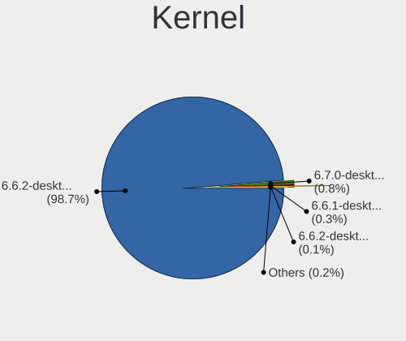

| Version                        | Computers | Percent |
|--------------------------------|-----------|---------|
| 6.6.2-desktop-1omv2390         | 1953      | 98.69%  |
| 6.7.0-desktop-0.rc2.1omv2390   | 15        | 0.76%   |
| 6.6.1-desktop-1omv2390         | 5         | 0.25%   |
| 5.16.13-desktop-1omv4003       | 2         | 0.1%    |
| 6.6.2-desktop-gcc-1omv2390     | 1         | 0.05%   |
| 6.6.0-desktop-1omv2390         | 1         | 0.05%   |
| 6.14.2-desktop-3omv2590        | 1         | 0.05%   |
| 5.16.13-desktop-clang-1omv4003 | 1         | 0.05%   |

Kernel Family
-------------

Linux kernel without a distro release

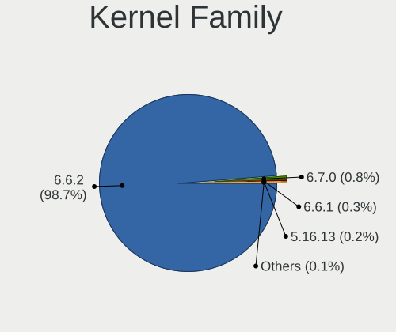

| Version | Computers | Percent |
|---------|-----------|---------|
| 6.6.2   | 1954      | 98.74%  |
| 6.7.0   | 15        | 0.76%   |
| 6.6.1   | 5         | 0.25%   |
| 5.16.13 | 3         | 0.15%   |
| 6.6.0   | 1         | 0.05%   |
| 6.14.2  | 1         | 0.05%   |

Kernel Major Ver.
-----------------

Linux kernel major version

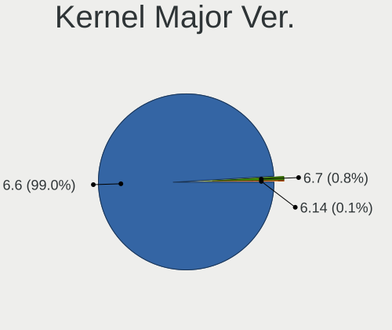

| Version | Computers | Percent |
|---------|-----------|---------|
| 6.6     | 1960      | 99.04%  |
| 6.7     | 15        | 0.76%   |
| 5.16    | 3         | 0.15%   |
| 6.14    | 1         | 0.05%   |

Arch
----

OS architecture (x86_64, i586, etc.)

| Name   | Computers | Percent |
|--------|-----------|---------|
| x86_64 | 1978      | 100%    |

DE
--

Desktop Environment

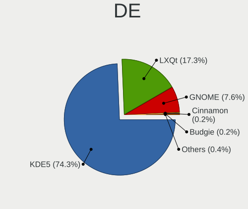

| Name     | Computers | Percent |
|----------|-----------|---------|
| KDE5     | 1472      | 74.34%  |
| LXQt     | 343       | 17.32%  |
| GNOME    | 150       | 7.58%   |
| Cinnamon | 4         | 0.2%    |
| Budgie   | 4         | 0.2%    |
| Unknown  | 3         | 0.15%   |
| MATE     | 2         | 0.1%    |
| XFCE     | 1         | 0.05%   |
| KDE6     | 1         | 0.05%   |

Display Server
--------------

X11 or Wayland

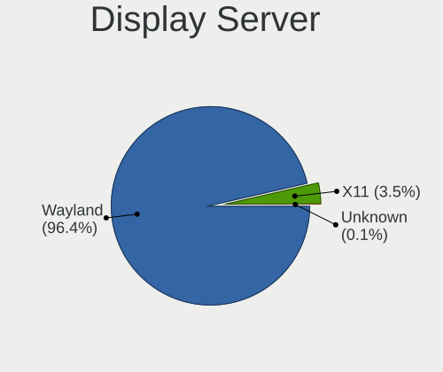

| Name    | Computers | Percent |
|---------|-----------|---------|
| Wayland | 1909      | 96.41%  |
| X11     | 70        | 3.54%   |
| Unknown | 1         | 0.05%   |

Display Manager
---------------

SDDM, LightDM, etc.

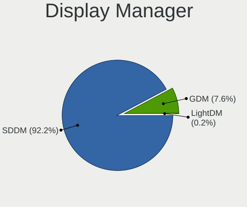

| Name    | Computers | Percent |
|---------|-----------|---------|
| SDDM    | 1824      | 92.21%  |
| GDM     | 151       | 7.63%   |
| LightDM | 3         | 0.15%   |

OS Lang
-------

Language

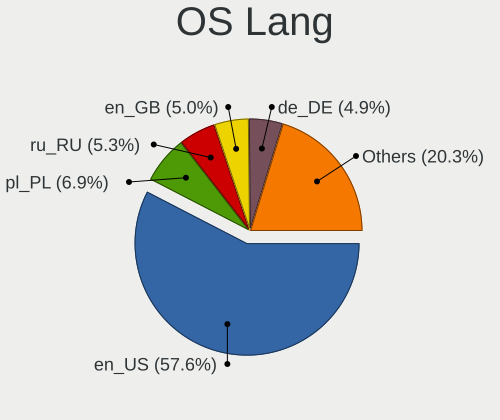

| Lang  | Computers | Percent |
|-------|-----------|---------|
| en_US | 1142      | 57.59%  |
| pl_PL | 137       | 6.91%   |
| ru_RU | 106       | 5.35%   |
| en_GB | 99        | 4.99%   |
| de_DE | 97        | 4.89%   |
| fr_FR | 79        | 3.98%   |
| it_IT | 46        | 2.32%   |
| pt_BR | 35        | 1.77%   |
| es_ES | 31        | 1.56%   |
| en_CA | 27        | 1.36%   |
| en_AU | 23        | 1.16%   |
| es_MX | 14        | 0.71%   |
| cs_CZ | 14        | 0.71%   |
| hu_HU | 11        | 0.55%   |
| es_AR | 11        | 0.55%   |
| en_IN | 11        | 0.55%   |
| fr_CA | 8         | 0.4%    |
| tr_TR | 6         | 0.3%    |
| ja_JP | 6         | 0.3%    |
| es_CO | 5         | 0.25%   |
| en_IL | 5         | 0.25%   |
| de_AT | 5         | 0.25%   |
| UTF-8 | 4         | 0.2%    |
| pt_PT | 4         | 0.2%    |
| en_ZA | 4         | 0.2%    |
| en_SG | 4         | 0.2%    |
| en_NZ | 4         | 0.2%    |
| de_CH | 4         | 0.2%    |
| ru_UA | 3         | 0.15%   |
| ro_RO | 3         | 0.15%   |
| nl_NL | 3         | 0.15%   |
| nl_BE | 3         | 0.15%   |
| en_DK | 3         | 0.15%   |
| zh_TW | 2         | 0.1%    |
| nb_NO | 2         | 0.1%    |
| fr_CH | 2         | 0.1%    |
| es_DO | 2         | 0.1%    |
| es_CL | 2         | 0.1%    |
| en_PH | 2         | 0.1%    |
| uk_UA | 1         | 0.05%   |

Boot Mode
---------

EFI or BIOS

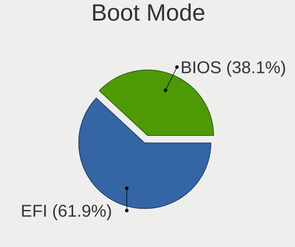

| Mode | Computers | Percent |
|------|-----------|---------|
| EFI  | 1227      | 61.94%  |
| BIOS | 754       | 38.06%  |

Filesystem
----------

Type of filesystem

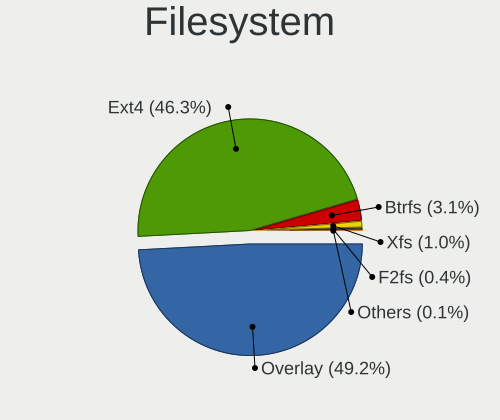

| Type    | Computers | Percent |
|---------|-----------|---------|
| Overlay | 976       | 49.17%  |
| Ext4    | 919       | 46.3%   |
| Btrfs   | 61        | 3.07%   |
| Xfs     | 19        | 0.96%   |
| F2fs    | 8         | 0.4%    |
| Ext3    | 1         | 0.05%   |
| Ext2    | 1         | 0.05%   |

Part. scheme
------------

Scheme of partitioning

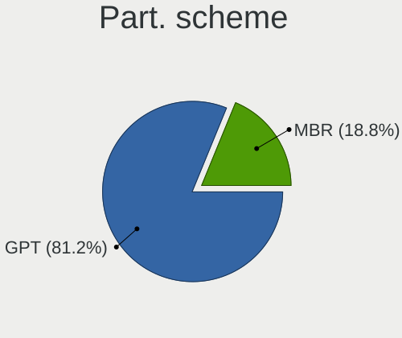

| Type | Computers | Percent |
|------|-----------|---------|
| GPT  | 1607      | 81.2%   |
| MBR  | 372       | 18.8%   |

Dual Boot with Linux/BSD
------------------------

Hosting more than one Linux/BSD

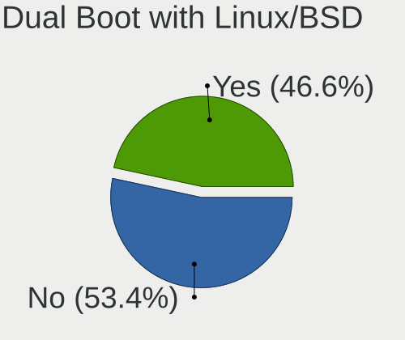

| Dual boot | Computers | Percent |
|-----------|-----------|---------|
| No        | 1062      | 53.37%  |
| Yes       | 928       | 46.63%  |

Dual Boot (Win)
---------------

Hosting Linux and Windows

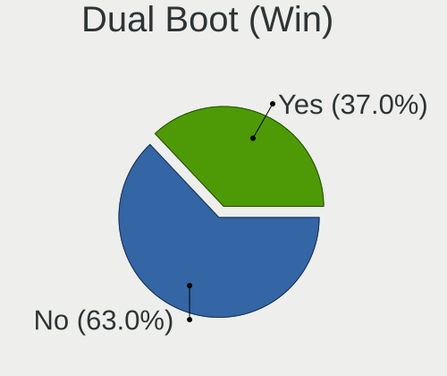

| Dual boot | Computers | Percent |
|-----------|-----------|---------|
| No        | 1249      | 62.95%  |
| Yes       | 735       | 37.05%  |

Board
-----

Vendor
------

Motherboard manufacturer

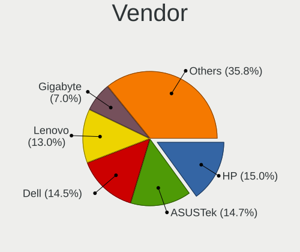

| Name                                 | Computers | Percent |
|--------------------------------------|-----------|---------|
| Hewlett-Packard                      | 297       | 15.02%  |
| ASUSTek Computer                     | 290       | 14.66%  |
| Dell                                 | 286       | 14.46%  |
| Lenovo                               | 257       | 12.99%  |
| Gigabyte Technology                  | 139       | 7.03%   |
| MSI                                  | 106       | 5.36%   |
| Acer                                 | 101       | 5.11%   |
| ASRock                               | 63        | 3.19%   |
| Apple                                | 55        | 2.78%   |
| Toshiba                              | 38        | 1.92%   |
| Intel                                | 37        | 1.87%   |
| Fujitsu                              | 30        | 1.52%   |
| Unknown                              | 20        | 1.01%   |
| Framework                            | 18        | 0.91%   |
| Sony                                 | 15        | 0.76%   |
| Samsung Electronics                  | 15        | 0.76%   |
| Google                               | 15        | 0.76%   |
| AZW                                  | 14        | 0.71%   |
| Packard Bell                         | 11        | 0.56%   |
| Medion                               | 11        | 0.56%   |
| Biostar                              | 11        | 0.56%   |
| Microsoft                            | 7         | 0.35%   |
| Foxconn                              | 7         | 0.35%   |
| Red Hat                              | 6         | 0.3%    |
| Pegatron                             | 6         | 0.3%    |
| eMachines                            | 6         | 0.3%    |
| TUXEDO                               | 5         | 0.25%   |
| Shenzhen Meigao Electronic Equipment | 5         | 0.25%   |
| Notebook                             | 5         | 0.25%   |
| HUAWEI                               | 5         | 0.25%   |
| Chuwi                                | 5         | 0.25%   |
| Alienware                            | 4         | 0.2%    |
| ZOTAC                                | 3         | 0.15%   |
| System76                             | 3         | 0.15%   |
| Supermicro                           | 3         | 0.15%   |
| OEM                                  | 3         | 0.15%   |
| MAXSUN                               | 3         | 0.15%   |
| MACHINIST                            | 3         | 0.15%   |
| EVOO                                 | 3         | 0.15%   |
| AMI                                  | 3         | 0.15%   |

Model
-----

Motherboard model

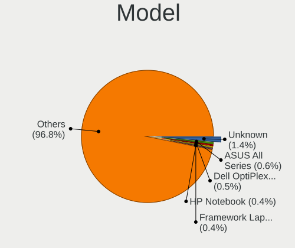

| Name                                        | Computers | Percent |
|---------------------------------------------|-----------|---------|
| Unknown                                     | 27        | 1.37%   |
| ASUS All Series                             | 11        | 0.56%   |
| Dell OptiPlex 9020                          | 9         | 0.46%   |
| HP Notebook                                 | 8         | 0.4%    |
| Framework Laptop 16 (AMD Ryzen 7040 Series) | 8         | 0.4%    |
| Dell OptiPlex 3020                          | 8         | 0.4%    |
| Dell OptiPlex 7010                          | 7         | 0.35%   |
| Red Hat KVM                                 | 6         | 0.3%    |
| Google Candy                                | 6         | 0.3%    |
| Dell Latitude E6410                         | 6         | 0.3%    |
| Dell Latitude 7390                          | 6         | 0.3%    |
| Dell Inspiron 15 3515                       | 6         | 0.3%    |
| Apple MacBookPro9,2                         | 6         | 0.3%    |
| HP Pavilion Notebook                        | 5         | 0.25%   |
| HP EliteDesk 800 G2 DM 35W                  | 5         | 0.25%   |
| Dell OptiPlex 780                           | 5         | 0.25%   |
| AZW SER                                     | 5         | 0.25%   |
| ASUS PRIME A320M-K                          | 5         | 0.25%   |
| MSI MS-7C37                                 | 4         | 0.2%    |
| Lenovo Yoga 2 11 20332                      | 4         | 0.2%    |
| Lenovo G50-45 80E3                          | 4         | 0.2%    |
| Intel H61                                   | 4         | 0.2%    |
| HP t630 Thin Client                         | 4         | 0.2%    |
| HP Pavilion dv7                             | 4         | 0.2%    |
| HP Laptop 15s-eq2xxx                        | 4         | 0.2%    |
| HP EliteBook 840 G3                         | 4         | 0.2%    |
| HP Compaq 8200 Elite SFF PC                 | 4         | 0.2%    |
| HP Compaq 610                               | 4         | 0.2%    |
| HP 250 G3                                   | 4         | 0.2%    |
| Framework Laptop (12th Gen Intel Core)      | 4         | 0.2%    |
| Framework Laptop                            | 4         | 0.2%    |
| Dell XPS 13 9350                            | 4         | 0.2%    |
| Dell Precision 5530                         | 4         | 0.2%    |
| Dell OptiPlex 7040                          | 4         | 0.2%    |
| Dell Inspiron 1545                          | 4         | 0.2%    |
| ASUS VivoBook_ASUSLaptop E410KA_E410KA      | 4         | 0.2%    |
| ASUS PRIME B550M-A                          | 4         | 0.2%    |
| ASUS P8Z77-V LX                             | 4         | 0.2%    |
| ASRock B450M-HDV R4.0                       | 4         | 0.2%    |
| Apple iMac12,2                              | 4         | 0.2%    |

Model Family
------------

Motherboard model prefix

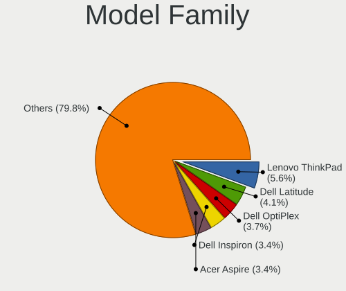

| Name                  | Computers | Percent |
|-----------------------|-----------|---------|
| Lenovo ThinkPad       | 111       | 5.61%   |
| Dell Latitude         | 81        | 4.1%    |
| Dell OptiPlex         | 73        | 3.69%   |
| Dell Inspiron         | 68        | 3.44%   |
| Acer Aspire           | 67        | 3.39%   |
| ASUS PRIME            | 44        | 2.22%   |
| Lenovo IdeaPad        | 40        | 2.02%   |
| HP Pavilion           | 40        | 2.02%   |
| HP Laptop             | 40        | 2.02%   |
| HP Compaq             | 37        | 1.87%   |
| Toshiba Satellite     | 32        | 1.62%   |
| HP ProBook            | 29        | 1.47%   |
| HP EliteBook          | 29        | 1.47%   |
| ASUS VivoBook         | 28        | 1.42%   |
| Unknown               | 27        | 1.37%   |
| Lenovo ThinkCentre    | 23        | 1.16%   |
| Dell Precision        | 23        | 1.16%   |
| ASUS ROG              | 23        | 1.16%   |
| HP EliteDesk          | 20        | 1.01%   |
| Framework Laptop      | 18        | 0.91%   |
| HP ProDesk            | 14        | 0.71%   |
| Dell XPS              | 14        | 0.71%   |
| ASUS TUF              | 14        | 0.71%   |
| Lenovo Yoga           | 12        | 0.61%   |
| Fujitsu LIFEBOOK      | 12        | 0.61%   |
| Dell Vostro           | 11        | 0.56%   |
| ASUS All              | 11        | 0.56%   |
| Acer Veriton          | 11        | 0.56%   |
| Lenovo Legion         | 10        | 0.51%   |
| Fujitsu ESPRIMO       | 10        | 0.51%   |
| HP Stream             | 9         | 0.46%   |
| HP Notebook           | 8         | 0.4%    |
| HP 250                | 8         | 0.4%    |
| ASUS M5A78L-M         | 8         | 0.4%    |
| Packard Bell EasyNote | 7         | 0.35%   |
| Microsoft Surface     | 7         | 0.35%   |
| Lenovo IdeaCentre     | 7         | 0.35%   |
| Gigabyte B450         | 7         | 0.35%   |
| Red Hat KVM           | 6         | 0.3%    |
| Intel H61             | 6         | 0.3%    |

MFG Year
--------

Motherboard manufacture year

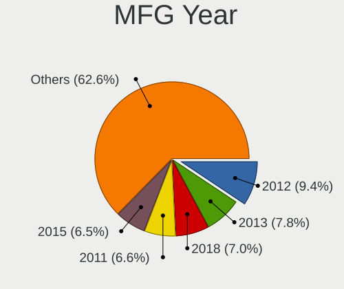

| Year | Computers | Percent |
|------|-----------|---------|
| 2012 | 185       | 9.35%   |
| 2013 | 155       | 7.84%   |
| 2018 | 139       | 7.03%   |
| 2011 | 131       | 6.62%   |
| 2015 | 129       | 6.52%   |
| 2014 | 129       | 6.52%   |
| 2021 | 125       | 6.32%   |
| 2020 | 125       | 6.32%   |
| 2017 | 111       | 5.61%   |
| 2019 | 107       | 5.41%   |
| 2016 | 102       | 5.16%   |
| 2010 | 101       | 5.11%   |
| 2022 | 98        | 4.95%   |
| 2009 | 91        | 4.6%    |
| 2008 | 79        | 3.99%   |
| 2023 | 78        | 3.94%   |
| 2007 | 35        | 1.77%   |
| 2024 | 30        | 1.52%   |
| 2006 | 22        | 1.11%   |
| 2005 | 4         | 0.2%    |
| 2025 | 1         | 0.05%   |
| 2004 | 1         | 0.05%   |

Form Factor
-----------

Physical design of the computer

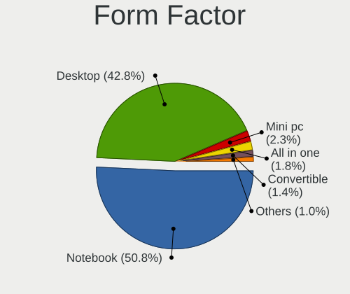

| Name        | Computers | Percent |
|-------------|-----------|---------|
| Notebook    | 1004      | 50.76%  |
| Desktop     | 846       | 42.77%  |
| Mini pc     | 45        | 2.28%   |
| All in one  | 36        | 1.82%   |
| Convertible | 27        | 1.37%   |
| Tablet      | 13        | 0.66%   |
| Server      | 5         | 0.25%   |
| Other       | 2         | 0.1%    |

Secure Boot
-----------

Enabled or disabled

| State    | Computers | Percent |
|----------|-----------|---------|
| Disabled | 1978      | 100%    |

Coreboot
--------

Have coreboot on board

| Used | Computers | Percent |
|------|-----------|---------|
| No   | 1962      | 99.19%  |
| Yes  | 16        | 0.81%   |

RAM Size
--------

Total RAM memory

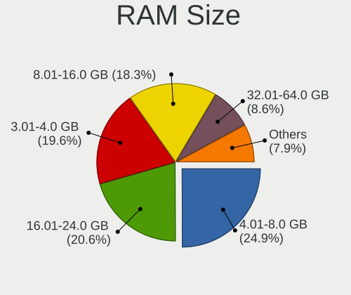

| Size in GB      | Computers | Percent |
|-----------------|-----------|---------|
| 4.01-8.0        | 494       | 24.95%  |
| 16.01-24.0      | 408       | 20.61%  |
| 3.01-4.0        | 389       | 19.65%  |
| 8.01-16.0       | 363       | 18.33%  |
| 32.01-64.0      | 170       | 8.59%   |
| 1.01-2.0        | 53        | 2.68%   |
| 24.01-32.0      | 38        | 1.92%   |
| 64.01-256.0     | 36        | 1.82%   |
| 2.01-3.0        | 25        | 1.26%   |
| 0.51-1.0        | 3         | 0.15%   |
| More than 256.0 | 1         | 0.05%   |

RAM Used
--------

Used RAM memory

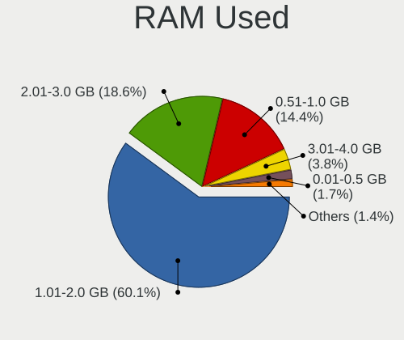

| Used GB   | Computers | Percent |
|-----------|-----------|---------|
| 1.01-2.0  | 1212      | 60.09%  |
| 2.01-3.0  | 375       | 18.59%  |
| 0.51-1.0  | 291       | 14.43%  |
| 3.01-4.0  | 77        | 3.82%   |
| 0.01-0.5  | 34        | 1.69%   |
| 4.01-8.0  | 24        | 1.19%   |
| 8.01-16.0 | 4         | 0.2%    |

Total Drives
------------

Number of drives on board

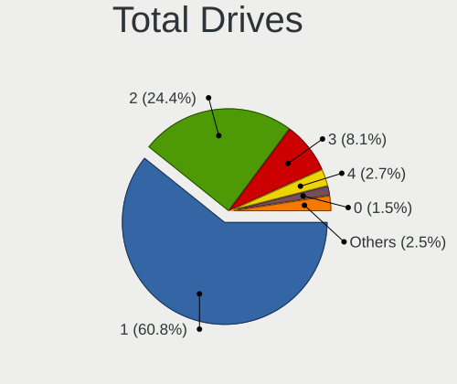

| Drives | Computers | Percent |
|--------|-----------|---------|
| 1      | 1209      | 60.75%  |
| 2      | 486       | 24.42%  |
| 3      | 162       | 8.14%   |
| 4      | 54        | 2.71%   |
| 0      | 30        | 1.51%   |
| 5      | 24        | 1.21%   |
| 6      | 11        | 0.55%   |
| 7      | 6         | 0.3%    |
| 9      | 3         | 0.15%   |
| 13     | 2         | 0.1%    |
| 14     | 1         | 0.05%   |
| 11     | 1         | 0.05%   |
| 8      | 1         | 0.05%   |

Has CD-ROM
----------

Has CD-ROM on board

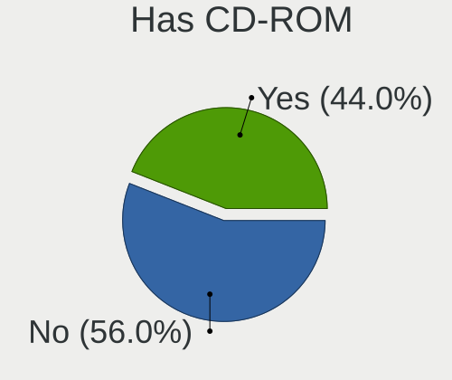

| Presented | Computers | Percent |
|-----------|-----------|---------|
| No        | 1108      | 55.96%  |
| Yes       | 872       | 44.04%  |

Has Ethernet
------------

Has Ethernet on board

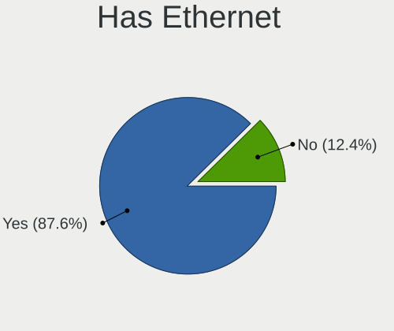

| Presented | Computers | Percent |
|-----------|-----------|---------|
| Yes       | 1733      | 87.61%  |
| No        | 245       | 12.39%  |

Has WiFi
--------

Has WiFi module

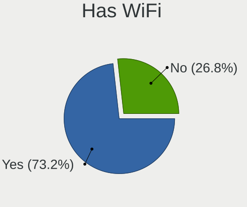

| Presented | Computers | Percent |
|-----------|-----------|---------|
| Yes       | 1450      | 73.23%  |
| No        | 530       | 26.77%  |

Has Bluetooth
-------------

Has Bluetooth module

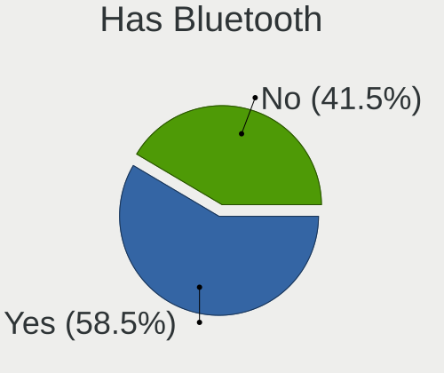

| Presented | Computers | Percent |
|-----------|-----------|---------|
| Yes       | 1158      | 58.51%  |
| No        | 821       | 41.49%  |

Location
--------

Country
-------

Geographic location (country)

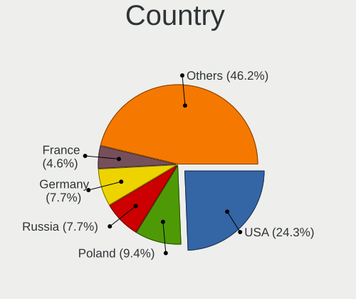

| Country      | Computers | Percent |
|--------------|-----------|---------|
| USA          | 482       | 24.34%  |
| Poland       | 187       | 9.44%   |
| Russia       | 152       | 7.68%   |
| Germany      | 152       | 7.68%   |
| France       | 92        | 4.65%   |
| UK           | 77        | 3.89%   |
| Italy        | 70        | 3.54%   |
| Brazil       | 70        | 3.54%   |
| Canada       | 64        | 3.23%   |
| Australia    | 42        | 2.12%   |
| Spain        | 39        | 1.97%   |
| Hungary      | 27        | 1.36%   |
| Japan        | 23        | 1.16%   |
| Mexico       | 22        | 1.11%   |
| Indonesia    | 22        | 1.11%   |
| Argentina    | 22        | 1.11%   |
| Sweden       | 21        | 1.06%   |
| India        | 21        | 1.06%   |
| Czechia      | 20        | 1.01%   |
| Netherlands  | 17        | 0.86%   |
| Belgium      | 17        | 0.86%   |
| Romania      | 16        | 0.81%   |
| Turkey       | 15        | 0.76%   |
| Greece       | 15        | 0.76%   |
| China        | 14        | 0.71%   |
| Switzerland  | 12        | 0.61%   |
| Malaysia     | 12        | 0.61%   |
| Portugal     | 11        | 0.56%   |
| New Zealand  | 11        | 0.56%   |
| Philippines  | 10        | 0.51%   |
| Norway       | 10        | 0.51%   |
| Chile        | 10        | 0.51%   |
| Austria      | 10        | 0.51%   |
| Cyprus       | 9         | 0.45%   |
| Ukraine      | 8         | 0.4%    |
| South Africa | 8         | 0.4%    |
| Kazakhstan   | 7         | 0.35%   |
| Israel       | 7         | 0.35%   |
| Denmark      | 7         | 0.35%   |
| Thailand     | 6         | 0.3%    |

City
----

Geographic location (city)

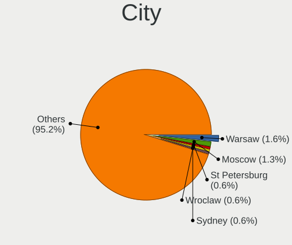

| City           | Computers | Percent |
|----------------|-----------|---------|
| Warsaw         | 33        | 1.65%   |
| Moscow         | 26        | 1.3%    |
| St Petersburg  | 13        | 0.65%   |
| Wroclaw        | 12        | 0.6%    |
| Sydney         | 12        | 0.6%    |
| Prague         | 11        | 0.55%   |
| Poznan         | 11        | 0.55%   |
| Paris          | 11        | 0.55%   |
| Milan          | 10        | 0.5%    |
| Adelaide       | 10        | 0.5%    |
| Rome           | 9         | 0.45%   |
| Montreal       | 9         | 0.45%   |
| Buenos Aires   | 9         | 0.45%   |
| Budapest       | 9         | 0.45%   |
| Brisbane       | 9         | 0.45%   |
| Berlin         | 9         | 0.45%   |
| Munich         | 8         | 0.4%    |
| Rio de Janeiro | 7         | 0.35%   |
| Novosibirsk    | 7         | 0.35%   |
| Krasnodar      | 7         | 0.35%   |
| Vienna         | 6         | 0.3%    |
| Toulouse       | 6         | 0.3%    |
| Sao Paulo      | 6         | 0.3%    |
| Salt Lake City | 6         | 0.3%    |
| Saint Johns    | 6         | 0.3%    |
| Oliveira       | 6         | 0.3%    |
| Melbourne      | 6         | 0.3%    |
| London         | 6         | 0.3%    |
| Katowice       | 6         | 0.3%    |
| Heemskerk      | 6         | 0.3%    |
| Denver         | 6         | 0.3%    |
| Dali           | 6         | 0.3%    |
| Citrus Heights | 6         | 0.3%    |
| Chelyabinsk    | 6         | 0.3%    |
| Barcelona      | 6         | 0.3%    |
| Yekaterinburg  | 5         | 0.25%   |
| Tucson         | 5         | 0.25%   |
| Toronto        | 5         | 0.25%   |
| Topeka         | 5         | 0.25%   |
| Tel Aviv       | 5         | 0.25%   |

Drives
------

Drive Vendor
------------

Hard drive vendors

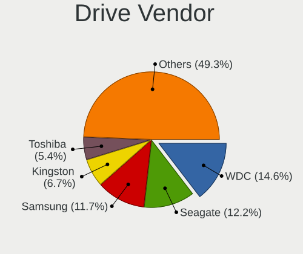

| Vendor                      | Computers | Drives | Percent |
|-----------------------------|-----------|--------|---------|
| WDC                         | 414       | 494    | 14.6%   |
| Seagate                     | 345       | 420    | 12.17%  |
| Samsung Electronics         | 332       | 396    | 11.71%  |
| Kingston                    | 191       | 203    | 6.74%   |
| Toshiba                     | 154       | 170    | 5.43%   |
| SanDisk                     | 125       | 143    | 4.41%   |
| Crucial                     | 103       | 113    | 3.63%   |
| Hitachi                     | 86        | 92     | 3.03%   |
| Unknown                     | 75        | 85     | 2.65%   |
| Intel                       | 62        | 66     | 2.19%   |
| China                       | 55        | 60     | 1.94%   |
| A-DATA Technology           | 55        | 66     | 1.94%   |
| SPCC                        | 46        | 50     | 1.62%   |
| SK hynix                    | 43        | 49     | 1.52%   |
| Micron Technology           | 40        | 46     | 1.41%   |
| HGST                        | 40        | 43     | 1.41%   |
| Unknown                     | 36        | 36     | 1.27%   |
| GOODRAM                     | 35        | 39     | 1.23%   |
| Patriot                     | 34        | 37     | 1.2%    |
| JMicron Technology          | 33        | 33     | 1.16%   |
| Intenso                     | 33        | 36     | 1.16%   |
| Apple                       | 27        | 28     | 0.95%   |
| PNY                         | 25        | 29     | 0.88%   |
| KIOXIA                      | 20        | 20     | 0.71%   |
| Team                        | 18        | 18     | 0.63%   |
| Lexar                       | 14        | 15     | 0.49%   |
| Kingston Technology Company | 14        | 14     | 0.49%   |
| Transcend                   | 11        | 13     | 0.39%   |
| Netac                       | 11        | 12     | 0.39%   |
| KingSpec                    | 11        | 12     | 0.39%   |
| Phison                      | 10        | 12     | 0.35%   |
| Maxtor                      | 10        | 10     | 0.35%   |
| Hewlett-Packard             | 10        | 18     | 0.35%   |
| Fujitsu                     | 10        | 22     | 0.35%   |
| ASMT                        | 10        | 11     | 0.35%   |
| Silicon Motion              | 9         | 11     | 0.32%   |
| Fanxiang                    | 9         | 10     | 0.32%   |
| Apacer                      | 9         | 9      | 0.32%   |
| LITEONIT                    | 8         | 8      | 0.28%   |
| Gigabyte Technology         | 8         | 8      | 0.28%   |

Drive Model
-----------

Hard drive models

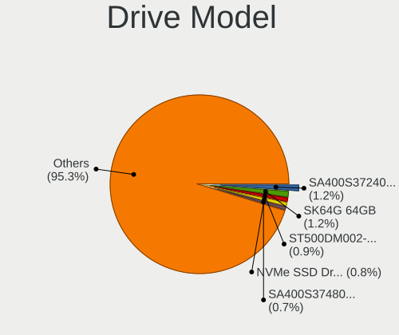

| Model                              | Computers | Percent |
|------------------------------------|-----------|---------|
| Kingston SA400S37240G 240GB SSD    | 36        | 1.18%   |
| Unknown                            | 36        | 1.18%   |
| Seagate ST500DM002-1BD142 500GB    | 26        | 0.86%   |
| SanDisk NVMe SSD Drive 1TB         | 24        | 0.79%   |
| Kingston SA400S37480G 480GB SSD    | 21        | 0.69%   |
| Kingston SA400S37120G 120GB SSD    | 18        | 0.59%   |
| Seagate ST1000DM010-2EP102 1TB     | 17        | 0.56%   |
| JMicron Generic 320GB              | 17        | 0.56%   |
| Unknown SD/MMC/MS PRO 2GB          | 15        | 0.49%   |
| Seagate ST1000LM035-1RK172 1TB     | 15        | 0.49%   |
| JMicron Tech 250GB                 | 15        | 0.49%   |
| Toshiba DT01ACA100 1TB             | 14        | 0.46%   |
| Toshiba MQ04ABF100 1TB             | 12        | 0.39%   |
| Toshiba MQ01ABF050 500GB           | 12        | 0.39%   |
| Toshiba MQ01ABD100 1TB             | 12        | 0.39%   |
| Seagate ST500LT012-1DG142 500GB    | 12        | 0.39%   |
| Seagate ST1000LM024 HN-M101MBB 1TB | 12        | 0.39%   |
| Kingston SNVS500G 500GB            | 12        | 0.39%   |
| Crucial CT240BX500SSD1 240GB       | 12        | 0.39%   |
| WDC WD10EZEX-08WN4A0 1TB           | 11        | 0.36%   |
| SPCC Solid State Disk 512GB        | 11        | 0.36%   |
| Seagate ST3500418AS 500GB          | 11        | 0.36%   |
| Samsung SSD 850 EVO 250GB          | 11        | 0.36%   |
| Toshiba DT01ACA050 500GB           | 10        | 0.33%   |
| Samsung SSD 870 EVO 500GB          | 10        | 0.33%   |
| Samsung SSD 860 EVO 500GB          | 10        | 0.33%   |
| Kingston Company SNV2S1000G 1TB    | 10        | 0.33%   |
| Crucial CT500MX500SSD1 500GB       | 10        | 0.33%   |
| Samsung SSD 980 1TB                | 9         | 0.3%    |
| Samsung SSD 860 EVO 250GB          | 9         | 0.3%    |
| Crucial CT1000MX500SSD1 1TB        | 9         | 0.3%    |
| WDC WDS500G2B0A-00SM50 500GB       | 8         | 0.26%   |
| Seagate ST9500325AS 500GB          | 8         | 0.26%   |
| Seagate ST2000DM001-1ER164 2TB     | 8         | 0.26%   |
| Seagate ST1000DM003-1ER162 1TB     | 8         | 0.26%   |
| SanDisk NVMe SSD Drive 2TB         | 8         | 0.26%   |
| Samsung SSD 870 EVO 1TB            | 8         | 0.26%   |
| Samsung SSD 850 EVO 500GB          | 8         | 0.26%   |
| Kingston SV300S37A120G 120GB SSD   | 8         | 0.26%   |
| Intenso SSD 128GB                  | 8         | 0.26%   |

HDD Vendor
----------

Hard disk drive vendors

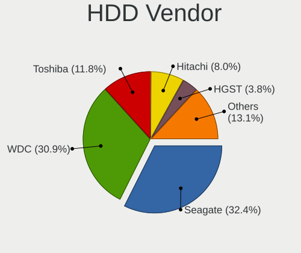

| Vendor              | Computers | Drives | Percent |
|---------------------|-----------|--------|---------|
| Seagate             | 337       | 407    | 32.4%   |
| WDC                 | 321       | 373    | 30.87%  |
| Toshiba             | 123       | 138    | 11.83%  |
| Hitachi             | 83        | 89     | 7.98%   |
| HGST                | 40        | 43     | 3.85%   |
| Samsung Electronics | 38        | 46     | 3.65%   |
| JMicron Technology  | 17        | 17     | 1.63%   |
| Unknown             | 16        | 16     | 1.54%   |
| Apple               | 11        | 11     | 1.06%   |
| Maxtor              | 9         | 9      | 0.87%   |
| Fujitsu             | 9         | 21     | 0.87%   |
| Intenso             | 5         | 5      | 0.48%   |
| HPQ                 | 5         | 5      | 0.48%   |
| USB3.0              | 4         | 4      | 0.38%   |
| TO Exter            | 3         | 3      | 0.29%   |
| WD MediaMax         | 2         | 2      | 0.19%   |
| SSK                 | 2         | 2      | 0.19%   |
| Inateck             | 2         | 2      | 0.19%   |
| Hewlett-Packard     | 2         | 10     | 0.19%   |
| ASMT                | 2         | 2      | 0.19%   |
| USB                 | 1         | 1      | 0.1%    |
| StoreJet            | 1         | 1      | 0.1%    |
| MaxDigital          | 1         | 1      | 0.1%    |
| KESU                | 1         | 1      | 0.1%    |
| JetFlash            | 1         | 1      | 0.1%    |
| HGST HTS            | 1         | 1      | 0.1%    |
| External            | 1         | 1      | 0.1%    |
| CIRAGO              | 1         | 1      | 0.1%    |
| ASMedia             | 1         | 1      | 0.1%    |

SSD Vendor
----------

Solid state drive vendors

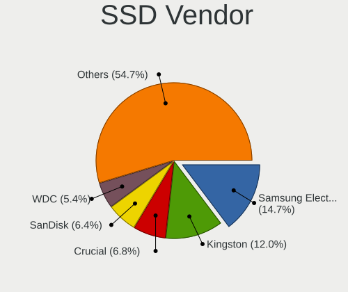

| Vendor              | Computers | Drives | Percent |
|---------------------|-----------|--------|---------|
| Samsung Electronics | 160       | 181    | 14.75%  |
| Kingston            | 130       | 135    | 11.98%  |
| Crucial             | 74        | 82     | 6.82%   |
| SanDisk             | 69        | 75     | 6.36%   |
| WDC                 | 59        | 59     | 5.44%   |
| China               | 55        | 60     | 5.07%   |
| A-DATA Technology   | 38        | 43     | 3.5%    |
| SPCC                | 37        | 40     | 3.41%   |
| GOODRAM             | 33        | 37     | 3.04%   |
| Intel               | 31        | 31     | 2.86%   |
| Intenso             | 28        | 30     | 2.58%   |
| PNY                 | 22        | 25     | 2.03%   |
| Patriot             | 21        | 24     | 1.94%   |
| Micron Technology   | 20        | 24     | 1.84%   |
| Toshiba             | 14        | 15     | 1.29%   |
| Team                | 14        | 14     | 1.29%   |
| Apple               | 14        | 14     | 1.29%   |
| Unknown             | 14        | 14     | 1.29%   |
| Transcend           | 11        | 13     | 1.01%   |
| KingSpec            | 11        | 12     | 1.01%   |
| SK hynix            | 10        | 10     | 0.92%   |
| Apacer              | 9         | 9      | 0.83%   |
| Netac               | 8         | 9      | 0.74%   |
| LITEONIT            | 8         | 8      | 0.74%   |
| ASMT                | 8         | 9      | 0.74%   |
| OCZ                 | 7         | 7      | 0.65%   |
| Hewlett-Packard     | 7         | 7      | 0.65%   |
| Fanxiang            | 7         | 7      | 0.65%   |
| DEXP                | 7         | 9      | 0.65%   |
| Gigabyte Technology | 6         | 6      | 0.55%   |
| LITEON              | 5         | 5      | 0.46%   |
| Lexar               | 5         | 6      | 0.46%   |
| KingDian            | 5         | 6      | 0.46%   |
| T-FORCE             | 4         | 4      | 0.37%   |
| SABRENT             | 4         | 5      | 0.37%   |
| KIOXIA-EXCERIA      | 4         | 4      | 0.37%   |
| KingFast            | 4         | 4      | 0.37%   |
| AMD                 | 4         | 4      | 0.37%   |
| Verbatim            | 3         | 4      | 0.28%   |
| Vaseky              | 3         | 3      | 0.28%   |

Drive Kind
----------

HDD or SSD

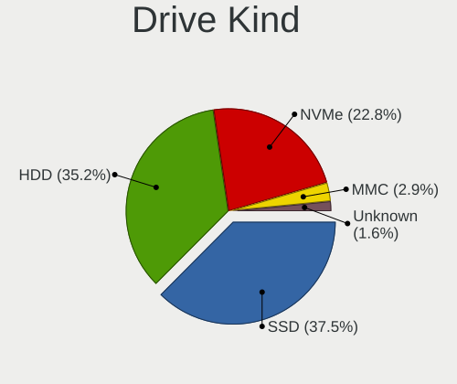

| Kind    | Computers | Drives | Percent |
|---------|-----------|--------|---------|
| SSD     | 940       | 1171   | 37.47%  |
| HDD     | 883       | 1214   | 35.19%  |
| NVMe    | 573       | 711    | 22.84%  |
| MMC     | 74        | 88     | 2.95%   |
| Unknown | 39        | 44     | 1.55%   |

Drive Connector
---------------

SATA, SAS, NVMe, etc.

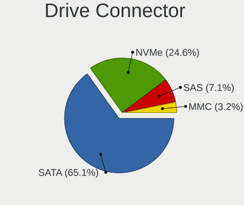

| Type | Computers | Drives | Percent |
|------|-----------|--------|---------|
| SATA | 1507      | 2226   | 65.13%  |
| NVMe | 569       | 697    | 24.59%  |
| SAS  | 164       | 217    | 7.09%   |
| MMC  | 74        | 88     | 3.2%    |

Drive Size
----------

Size of hard drive

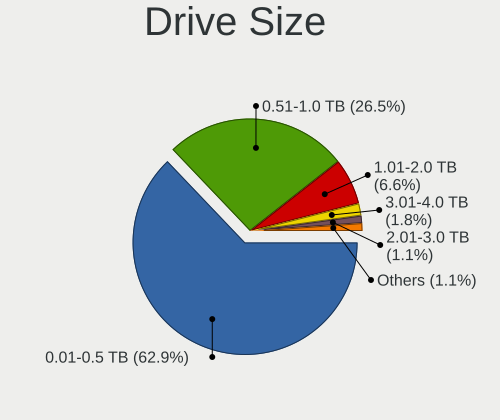

| Size in TB | Computers | Drives | Percent |
|------------|-----------|--------|---------|
| 0.01-0.5   | 1174      | 1549   | 62.88%  |
| 0.51-1.0   | 495       | 578    | 26.51%  |
| 1.01-2.0   | 124       | 156    | 6.64%   |
| 3.01-4.0   | 33        | 51     | 1.77%   |
| 2.01-3.0   | 20        | 25     | 1.07%   |
| 4.01-10.0  | 15        | 19     | 0.8%    |
| 10.01-20.0 | 6         | 7      | 0.32%   |

Space Total
-----------

Amount of disk space available on the file system

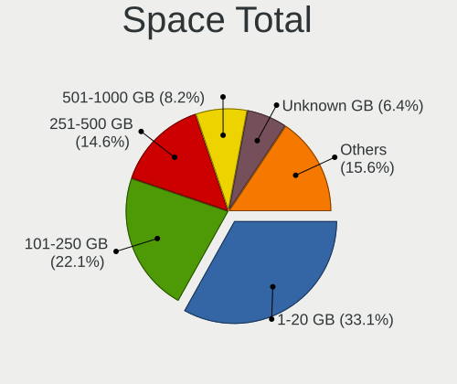

| Size in GB     | Computers | Percent |
|----------------|-----------|---------|
| 1-20           | 661       | 33.12%  |
| 101-250        | 441       | 22.09%  |
| 251-500        | 291       | 14.58%  |
| 501-1000       | 163       | 8.17%   |
| Unknown        | 128       | 6.41%   |
| 51-100         | 109       | 5.46%   |
| 21-50          | 86        | 4.31%   |
| 1001-2000      | 74        | 3.71%   |
| More than 3000 | 28        | 1.4%    |
| 2001-3000      | 15        | 0.75%   |

Space Used
----------

Amount of used disk space

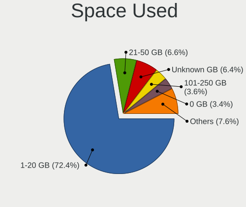

| Used GB        | Computers | Percent |
|----------------|-----------|---------|
| 1-20           | 1451      | 72.37%  |
| 21-50          | 133       | 6.63%   |
| Unknown        | 128       | 6.38%   |
| 101-250        | 73        | 3.64%   |
| 0              | 68        | 3.39%   |
| 51-100         | 64        | 3.19%   |
| 251-500        | 36        | 1.8%    |
| 501-1000       | 23        | 1.15%   |
| 1001-2000      | 14        | 0.7%    |
| More than 3000 | 11        | 0.55%   |
| 2001-3000      | 4         | 0.2%    |

Malfunc. Drives
---------------

Drive models with a malfunction

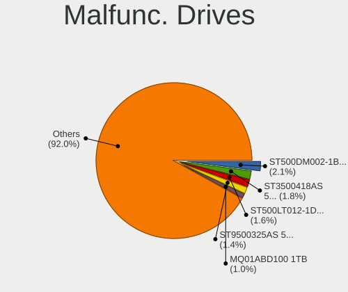

| Model                                   | Computers | Drives | Percent |
|-----------------------------------------|-----------|--------|---------|
| Seagate ST500DM002-1BD142 500GB         | 10        | 10     | 2.05%   |
| Seagate ST3500418AS 500GB               | 9         | 10     | 1.85%   |
| Seagate ST500LT012-1DG142 500GB         | 8         | 8      | 1.64%   |
| Seagate ST9500325AS 500GB               | 7         | 8      | 1.44%   |
| Toshiba MQ01ABD100 1TB                  | 5         | 5      | 1.03%   |
| WDC WDS240G2G0A-00JH30 240GB SSD        | 4         | 4      | 0.82%   |
| Toshiba DT01ACA100 1TB                  | 4         | 4      | 0.82%   |
| Seagate ST9320325AS 320GB               | 4         | 5      | 0.82%   |
| Seagate ST1000LM049-2GH172 1TB          | 4         | 4      | 0.82%   |
| Seagate ST1000LM024 HN-M101MBB 1TB      | 4         | 4      | 0.82%   |
| Samsung Electronics SP2504C 250GB       | 4         | 4      | 0.82%   |
| HGST HTS725050A7E630 500GB              | 4         | 4      | 0.82%   |
| HGST HTS545050A7E680 500GB              | 4         | 4      | 0.82%   |
| HGST HTS541010A9E680 1TB                | 4         | 6      | 0.82%   |
| WDC WD6400BEVT-22A0RT0 640GB            | 3         | 3      | 0.62%   |
| WDC WD5000AAKX-001CA0 500GB             | 3         | 3      | 0.62%   |
| WDC WD3200BPVT-80JJ5T0 320GB            | 3         | 3      | 0.62%   |
| Seagate ST9500420AS 500GB               | 3         | 3      | 0.62%   |
| Samsung Electronics HD753LJ 752GB       | 3         | 3      | 0.62%   |
| Kingston SA400S37240G 240GB SSD         | 3         | 3      | 0.62%   |
| Kingston SA400S37120G 120GB SSD         | 3         | 3      | 0.62%   |
| Kingston RBU-SNS8350DES3128GP 128GB SSD | 3         | 3      | 0.62%   |
| Hitachi HTS545032B9A300 320GB           | 3         | 3      | 0.62%   |
| Hitachi HDS721010CLA332 1TB             | 3         | 3      | 0.62%   |
| HGST HTS721010A9E630 1TB                | 3         | 3      | 0.62%   |
| HGST HTS545050A7E380 500GB              | 3         | 3      | 0.62%   |
| Crucial CT275MX300SSD1 275GB            | 3         | 3      | 0.62%   |
| WDC WDS480G2G0B-00EPW0 480GB SSD        | 2         | 2      | 0.41%   |
| WDC WD5000LPVX-22V0TT0 500GB            | 2         | 2      | 0.41%   |
| WDC WD5000LPCX-24VHAT0 500GB            | 2         | 2      | 0.41%   |
| WDC WD5000AAKX-60U6AA0 500GB            | 2         | 2      | 0.41%   |
| WDC WD5000AAKX-00ERMA0 500GB            | 2         | 2      | 0.41%   |
| WDC WD3200BEKT-60V5T1 320GB             | 2         | 2      | 0.41%   |
| WDC WD3200AAKS-00L9A0 320GB             | 2         | 2      | 0.41%   |
| WDC WD2500BEVT-60ZCT1 250GB             | 2         | 2      | 0.41%   |
| WDC WD20EARX-00PASB0 2TB                | 2         | 2      | 0.41%   |
| WDC WD10JPVT-60A1YT0 1TB                | 2         | 2      | 0.41%   |
| WDC WD10EZEX-22RKKA0 1TB                | 2         | 2      | 0.41%   |
| WDC WD10EZEX-08WN4A0 1TB                | 2         | 2      | 0.41%   |
| WDC WD10EZEX-00WN4A0 1TB                | 2         | 2      | 0.41%   |

Malfunc. Drive Vendor
---------------------

Vendors of faulty drives

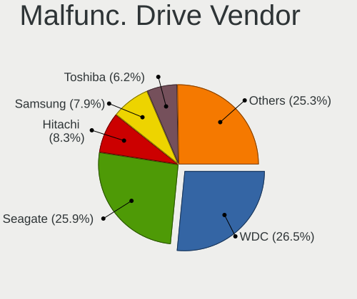

| Vendor              | Computers | Drives | Percent |
|---------------------|-----------|--------|---------|
| WDC                 | 125       | 133    | 26.54%  |
| Seagate             | 122       | 138    | 25.9%   |
| Hitachi             | 39        | 40     | 8.28%   |
| Samsung Electronics | 37        | 42     | 7.86%   |
| Toshiba             | 29        | 29     | 6.16%   |
| HGST                | 20        | 22     | 4.25%   |
| Kingston            | 18        | 18     | 3.82%   |
| Crucial             | 7         | 7      | 1.49%   |
| A-DATA Technology   | 7         | 7      | 1.49%   |
| SanDisk             | 6         | 6      | 1.27%   |
| Intel               | 6         | 6      | 1.27%   |
| Maxtor              | 5         | 5      | 1.06%   |
| SK hynix            | 4         | 4      | 0.85%   |
| Fujitsu             | 4         | 4      | 0.85%   |
| China               | 4         | 4      | 0.85%   |
| SPCC                | 3         | 3      | 0.64%   |
| Transcend           | 2         | 3      | 0.42%   |
| Micron Technology   | 2         | 3      | 0.42%   |
| KingSpec            | 2         | 2      | 0.42%   |
| HP Phison           | 2         | 2      | 0.42%   |
| XPG                 | 1         | 1      | 0.21%   |
| WD MediaMax         | 1         | 1      | 0.21%   |
| Unknown             | 1         | 1      | 0.21%   |
| Team                | 1         | 1      | 0.21%   |
| SuperSSpeed         | 1         | 1      | 0.21%   |
| StoreJet            | 1         | 1      | 0.21%   |
| SSSTC               | 1         | 1      | 0.21%   |
| Saichi              | 1         | 1      | 0.21%   |
| Reeinno             | 1         | 1      | 0.21%   |
| POLION              | 1         | 1      | 0.21%   |
| Patriot             | 1         | 1      | 0.21%   |
| OCZ                 | 1         | 1      | 0.21%   |
| Netac               | 1         | 1      | 0.21%   |
| LITEONIT            | 1         | 1      | 0.21%   |
| Lexar               | 1         | 1      | 0.21%   |
| JMicron Technology  | 1         | 1      | 0.21%   |
| Intenso             | 1         | 1      | 0.21%   |
| IMP-SSD3            | 1         | 1      | 0.21%   |
| HUSKY               | 1         | 1      | 0.21%   |
| GOODRAM             | 1         | 1      | 0.21%   |

Malfunc. HDD Vendor
-------------------

Vendors of faulty HDD drives

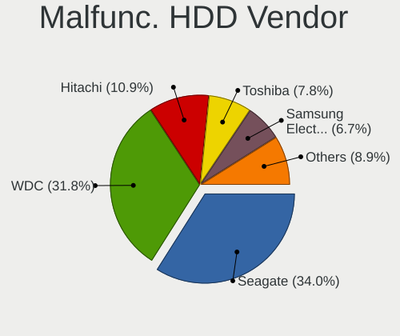

| Vendor              | Computers | Drives | Percent |
|---------------------|-----------|--------|---------|
| Seagate             | 122       | 138    | 33.98%  |
| WDC                 | 114       | 121    | 31.75%  |
| Hitachi             | 39        | 40     | 10.86%  |
| Toshiba             | 28        | 28     | 7.8%    |
| Samsung Electronics | 24        | 28     | 6.69%   |
| HGST                | 20        | 22     | 5.57%   |
| Maxtor              | 5         | 5      | 1.39%   |
| Fujitsu             | 3         | 3      | 0.84%   |
| WD MediaMax         | 1         | 1      | 0.28%   |
| Unknown             | 1         | 1      | 0.28%   |
| StoreJet            | 1         | 1      | 0.28%   |
| Apple               | 1         | 1      | 0.28%   |

Malfunc. Drive Kind
-------------------

Kinds of faulty drives

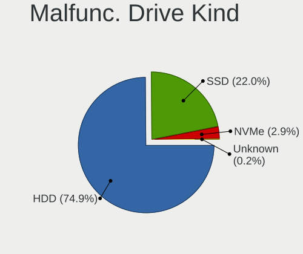

| Kind    | Computers | Drives | Percent |
|---------|-----------|--------|---------|
| HDD     | 337       | 389    | 74.89%  |
| SSD     | 99        | 102    | 22%     |
| NVMe    | 13        | 13     | 2.89%   |
| Unknown | 1         | 1      | 0.22%   |

Failed Drives
-------------

Failed drive models

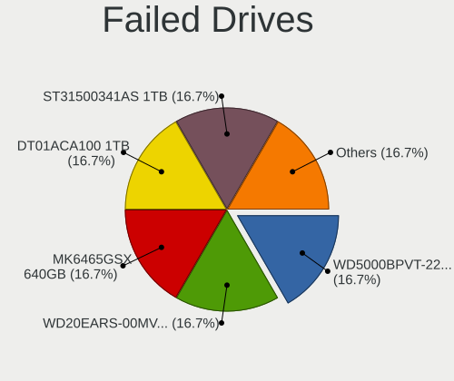

| Model                           | Computers | Drives | Percent |
|---------------------------------|-----------|--------|---------|
| WDC WD5000BPVT-22HXZT1 500GB    | 1         | 1      | 16.67%  |
| WDC WD20EARS-00MVWB0 2TB        | 1         | 1      | 16.67%  |
| Toshiba MK6465GSX 640GB         | 1         | 1      | 16.67%  |
| Toshiba DT01ACA100 1TB          | 1         | 1      | 16.67%  |
| Seagate ST31500341AS 1TB        | 1         | 1      | 16.67%  |
| Samsung Electronics HD103SJ 1TB | 1         | 1      | 16.67%  |

Failed Drive Vendor
-------------------

Failed drive vendors

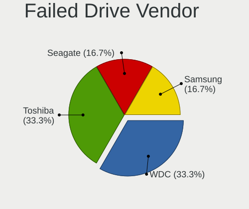

| Vendor              | Computers | Drives | Percent |
|---------------------|-----------|--------|---------|
| WDC                 | 2         | 2      | 33.33%  |
| Toshiba             | 2         | 2      | 33.33%  |
| Seagate             | 1         | 1      | 16.67%  |
| Samsung Electronics | 1         | 1      | 16.67%  |

Drive Status
------------

Number of failed and malfunc. drives

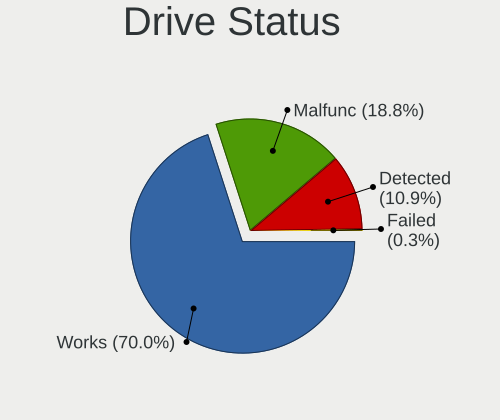

| Status   | Computers | Drives | Percent |
|----------|-----------|--------|---------|
| Works    | 1615      | 2396   | 70.03%  |
| Malfunc  | 433       | 505    | 18.78%  |
| Detected | 252       | 321    | 10.93%  |
| Failed   | 6         | 6      | 0.26%   |

Storage controller
------------------

Storage Vendor
--------------

Storage controller vendors

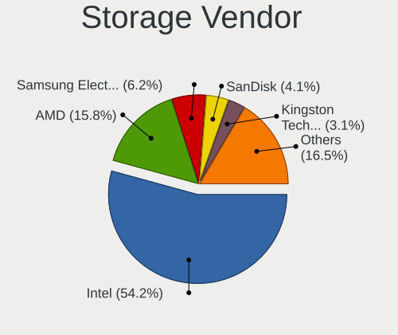

| Vendor                                  | Computers | Percent |
|-----------------------------------------|-----------|---------|
| Intel                                   | 1335      | 54.25%  |
| AMD                                     | 389       | 15.81%  |
| Samsung Electronics                     | 153       | 6.22%   |
| SanDisk                                 | 102       | 4.14%   |
| Kingston Technology Company             | 77        | 3.13%   |
| Phison Electronics                      | 41        | 1.67%   |
| ASMedia Technology                      | 40        | 1.63%   |
| SK hynix                                | 34        | 1.38%   |
| Silicon Motion                          | 28        | 1.14%   |
| Nvidia                                  | 26        | 1.06%   |
| Micron Technology                       | 26        | 1.06%   |
| Micron/Crucial Technology               | 25        | 1.02%   |
| JMicron Technology                      | 25        | 1.02%   |
| KIOXIA                                  | 23        | 0.93%   |
| MAXIO Technology (Hangzhou)             | 21        | 0.85%   |
| Marvell Technology Group                | 19        | 0.77%   |
| ADATA Technology                        | 17        | 0.69%   |
| Realtek Semiconductor                   | 15        | 0.61%   |
| Toshiba America Info Systems            | 14        | 0.57%   |
| Broadcom / LSI                          | 6         | 0.24%   |
| Shenzhen Longsys Electronics            | 5         | 0.2%    |
| Seagate Technology                      | 5         | 0.2%    |
| Adaptec                                 | 5         | 0.2%    |
| Solid State Storage Technology          | 4         | 0.16%   |
| VIA Technologies                        | 3         | 0.12%   |
| Union Memory (Shenzhen)                 | 3         | 0.12%   |
| Solidigm                                | 3         | 0.12%   |
| Apple                                   | 3         | 0.12%   |
| Silicon Integrated Systems [SiS]        | 2         | 0.08%   |
| Silicon Image                           | 2         | 0.08%   |
| Shenzhen Unionmemory Information System | 2         | 0.08%   |
| TenaFe                                  | 1         | 0.04%   |
| Netac Technology                        | 1         | 0.04%   |
| Lite-On IT Corp. / Plextor              | 1         | 0.04%   |
| Lenovo                                  | 1         | 0.04%   |
| Integrated Technology Express           | 1         | 0.04%   |
| Hosin Global Electronics                | 1         | 0.04%   |
| Hewlett-Packard                         | 1         | 0.04%   |
| Unknown                                 | 1         | 0.04%   |

Storage Model
-------------

Storage controller models

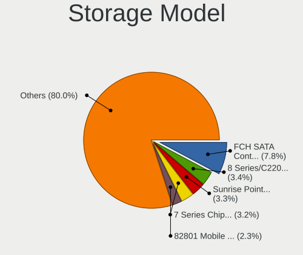

| Model                                                                                   | Computers | Percent |
|-----------------------------------------------------------------------------------------|-----------|---------|
| AMD FCH SATA Controller [AHCI mode]                                                     | 219       | 7.77%   |
| Intel 8 Series/C220 Series Chipset Family 6-port SATA Controller 1 [AHCI mode]          | 97        | 3.44%   |
| Intel Sunrise Point-LP SATA Controller [AHCI mode]                                      | 93        | 3.3%    |
| Intel 7 Series Chipset Family 6-port SATA Controller [AHCI mode]                        | 89        | 3.16%   |
| Intel 82801 Mobile SATA Controller [RAID mode]                                          | 66        | 2.34%   |
| Intel Q170/Q150/B150/H170/H110/Z170/CM236 Chipset SATA Controller [AHCI Mode]           | 61        | 2.17%   |
| AMD SB7x0/SB8x0/SB9x0 SATA Controller [AHCI mode]                                       | 54        | 1.92%   |
| Intel 6 Series/C200 Series Chipset Family 6 port Desktop SATA AHCI Controller           | 52        | 1.85%   |
| AMD 400 Series Chipset SATA Controller                                                  | 52        | 1.85%   |
| Intel 6 Series/C200 Series Chipset Family 6 port Mobile SATA AHCI Controller            | 48        | 1.7%    |
| Samsung NVMe SSD Controller SM981/PM981/PM983                                           | 47        | 1.67%   |
| Intel 7 Series/C210 Series Chipset Family 6-port SATA Controller [AHCI mode]            | 43        | 1.53%   |
| Intel 200 Series PCH SATA controller [AHCI mode]                                        | 43        | 1.53%   |
| Intel 82801IBM/IEM (ICH9M/ICH9M-E) 4 port SATA Controller [AHCI mode]                   | 42        | 1.49%   |
| Intel 8 Series SATA Controller 1 [AHCI mode]                                            | 42        | 1.49%   |
| AMD 500 Series Chipset SATA Controller                                                  | 42        | 1.49%   |
| Intel SATA Controller [RAID mode]                                                       | 41        | 1.46%   |
| Samsung NVMe SSD Controller 980 (DRAM-less)                                             | 40        | 1.42%   |
| AMD SB7x0/SB8x0/SB9x0 IDE Controller                                                    | 40        | 1.42%   |
| Intel Wildcat Point-LP SATA Controller [AHCI Mode]                                      | 37        | 1.31%   |
| Intel Volume Management Device NVMe RAID Controller                                     | 37        | 1.31%   |
| Intel NM10/ICH7 Family SATA Controller [IDE mode]                                       | 35        | 1.24%   |
| Intel 5 Series/3400 Series Chipset 6 port SATA AHCI Controller                          | 35        | 1.24%   |
| ASMedia ASM1061/ASM1062 Serial ATA Controller                                           | 34        | 1.21%   |
| Intel 5 Series/3400 Series Chipset 4 port SATA AHCI Controller                          | 33        | 1.17%   |
| Samsung NVMe SSD Controller PM9A1/PM9A3/980PRO                                          | 30        | 1.06%   |
| Intel Cannon Lake PCH SATA AHCI Controller                                              | 29        | 1.03%   |
| Intel 82801G (ICH7 Family) IDE Controller                                               | 28        | 0.99%   |
| Intel Celeron/Pentium Silver Processor SATA Controller                                  | 27        | 0.96%   |
| AMD SB7x0/SB8x0/SB9x0 SATA Controller [IDE mode]                                        | 27        | 0.96%   |
| Intel 82801HM/HEM (ICH8M/ICH8M-E) IDE Controller                                        | 24        | 0.85%   |
| Silicon Motion SM2263EN/SM2263XT (DRAM-less) NVMe SSD Controllers                       | 23        | 0.82%   |
| Intel Atom Processor E3800 Series SATA AHCI Controller                                  | 23        | 0.82%   |
| Samsung NVMe SSD Controller SM961/PM961/SM963                                           | 20        | 0.71%   |
| Intel Tiger Lake-LP SATA Controller                                                     | 20        | 0.71%   |
| SanDisk Ultra 3D / WD PC SN530, IX SN530, Blue SN550 NVMe SSD (DRAM-less)               | 19        | 0.67%   |
| MAXIO (Hangzhou) NVMe SSD Controller MAP1202 (DRAM-less)                                | 19        | 0.67%   |
| Intel 82801HM/HEM (ICH8M/ICH8M-E) SATA Controller [AHCI mode]                           | 19        | 0.67%   |
| Intel Comet Lake SATA AHCI Controller                                                   | 18        | 0.64%   |
| Intel 6 Series/C200 Series Chipset Family Desktop SATA Controller (IDE mode, ports 4-5) | 18        | 0.64%   |

Storage Kind
------------

Kind of storage controller (IDE, SATA, NVMe, SAS, ...)

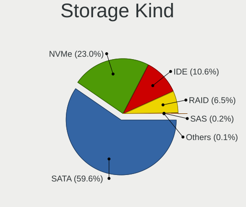

| Kind | Computers | Percent |
|------|-----------|---------|
| SATA | 1467      | 59.59%  |
| NVMe | 567       | 23.03%  |
| IDE  | 262       | 10.64%  |
| RAID | 159       | 6.46%   |
| SAS  | 4         | 0.16%   |
| SCSI | 3         | 0.12%   |

Processor
---------

CPU Vendor
----------

Processor vendors

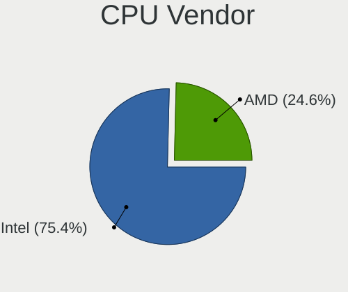

| Vendor | Computers | Percent |
|--------|-----------|---------|
| Intel  | 1491      | 75.38%  |
| AMD    | 487       | 24.62%  |

CPU Model
---------

Processor models

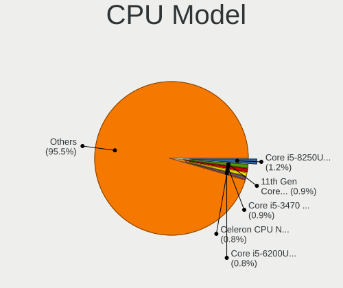

| Model                                         | Computers | Percent |
|-----------------------------------------------|-----------|---------|
| Intel Core i5-8250U CPU @ 1.60GHz             | 23        | 1.16%   |
| Intel 11th Gen Core i5-1135G7 @ 2.40GHz       | 18        | 0.91%   |
| Intel Core i5-3470 CPU @ 3.20GHz              | 17        | 0.86%   |
| Intel Celeron CPU N2840 @ 2.16GHz             | 16        | 0.81%   |
| Intel Core i5-6200U CPU @ 2.30GHz             | 15        | 0.76%   |
| AMD Ryzen 5 5600G with Radeon Graphics        | 15        | 0.76%   |
| Intel Core i5-3210M CPU @ 2.50GHz             | 14        | 0.71%   |
| Intel Core i5-6300U CPU @ 2.40GHz             | 13        | 0.66%   |
| Intel Core i5-4590 CPU @ 3.30GHz              | 13        | 0.66%   |
| Intel Core i5-3320M CPU @ 2.60GHz             | 13        | 0.66%   |
| AMD Ryzen 5 5500U with Radeon Graphics        | 13        | 0.66%   |
| Intel 11th Gen Core i7-1165G7 @ 2.80GHz       | 12        | 0.61%   |
| Intel Core i7-6700 CPU @ 3.40GHz              | 11        | 0.56%   |
| Intel Core i5-5200U CPU @ 2.20GHz             | 11        | 0.56%   |
| Intel Core i5-4200U CPU @ 1.60GHz             | 11        | 0.56%   |
| Intel Core i5-2400 CPU @ 3.10GHz              | 11        | 0.56%   |
| Intel Core 2 Duo CPU E8400 @ 3.00GHz          | 11        | 0.56%   |
| Intel Core i5-7400 CPU @ 3.00GHz              | 10        | 0.51%   |
| Intel Core i3 CPU M 370 @ 2.40GHz             | 10        | 0.51%   |
| Intel Core i5-6500 CPU @ 3.20GHz              | 9         | 0.46%   |
| Intel Core i5-4570 CPU @ 3.20GHz              | 9         | 0.46%   |
| Intel Core i3-6100U CPU @ 2.30GHz             | 9         | 0.46%   |
| Intel Celeron CPU N3350 @ 1.10GHz             | 9         | 0.46%   |
| AMD Ryzen 9 7940HS w/ Radeon 780M Graphics    | 9         | 0.46%   |
| AMD Ryzen 5 3600 6-Core Processor             | 9         | 0.46%   |
| AMD Ryzen 5 3500U with Radeon Vega Mobile Gfx | 9         | 0.46%   |
| Intel N100                                    | 8         | 0.4%    |
| Intel Core i7-8700 CPU @ 3.20GHz              | 8         | 0.4%    |
| Intel Core i7-6500U CPU @ 2.50GHz             | 8         | 0.4%    |
| Intel Core i5-10210U CPU @ 1.60GHz            | 8         | 0.4%    |
| Intel Core i5 CPU M 520 @ 2.40GHz             | 8         | 0.4%    |
| Intel Core i3-6006U CPU @ 2.00GHz             | 8         | 0.4%    |
| Intel Celeron CPU N3050 @ 1.60GHz             | 8         | 0.4%    |
| AMD Ryzen 7 2700X Eight-Core Processor        | 8         | 0.4%    |
| AMD Ryzen 5 1600 Six-Core Processor           | 8         | 0.4%    |
| Intel Core i7-8550U CPU @ 1.80GHz             | 7         | 0.35%   |
| Intel Core i7-4600U CPU @ 2.10GHz             | 7         | 0.35%   |
| Intel Core i7-2600 CPU @ 3.40GHz              | 7         | 0.35%   |
| Intel Core i5-7200U CPU @ 2.50GHz             | 7         | 0.35%   |
| Intel Core i5-4300U CPU @ 1.90GHz             | 7         | 0.35%   |

CPU Model Family
----------------

Processor model prefix

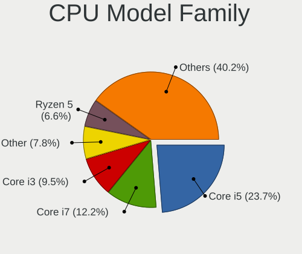

| Model                   | Computers | Percent |
|-------------------------|-----------|---------|
| Intel Core i5           | 469       | 23.71%  |
| Intel Core i7           | 241       | 12.18%  |
| Intel Core i3           | 188       | 9.5%    |
| Other                   | 154       | 7.79%   |
| AMD Ryzen 5             | 131       | 6.62%   |
| Intel Celeron           | 123       | 6.22%   |
| Intel Core 2 Duo        | 87        | 4.4%    |
| AMD Ryzen 7             | 77        | 3.89%   |
| Intel Pentium           | 62        | 3.13%   |
| Intel Xeon              | 50        | 2.53%   |
| AMD FX                  | 35        | 1.77%   |
| AMD Ryzen 9             | 28        | 1.42%   |
| AMD A8                  | 26        | 1.31%   |
| Intel Pentium Dual-Core | 23        | 1.16%   |
| AMD Ryzen 3             | 22        | 1.11%   |
| AMD A10                 | 20        | 1.01%   |
| Intel Core 2 Quad       | 18        | 0.91%   |
| Intel Pentium Silver    | 14        | 0.71%   |
| Intel Pentium Dual      | 14        | 0.71%   |
| Intel Core 2            | 14        | 0.71%   |
| AMD A4                  | 14        | 0.71%   |
| AMD E                   | 13        | 0.66%   |
| AMD Athlon              | 13        | 0.66%   |
| AMD A6                  | 12        | 0.61%   |
| Intel Pentium Gold      | 9         | 0.46%   |
| Intel Atom              | 9         | 0.46%   |
| Intel Genuine           | 8         | 0.4%    |
| Intel Core i9           | 7         | 0.35%   |
| AMD Athlon 64 X2        | 7         | 0.35%   |
| AMD Phenom II X4        | 6         | 0.3%    |
| AMD Embedded            | 6         | 0.3%    |
| AMD E1                  | 5         | 0.25%   |
| AMD Athlon 64           | 5         | 0.25%   |
| Intel Pentium 4         | 4         | 0.2%    |
| AMD Ryzen 5 PRO         | 4         | 0.2%    |
| AMD PRO A10             | 4         | 0.2%    |
| AMD Phenom II X6        | 4         | 0.2%    |
| AMD Phenom II X2        | 4         | 0.2%    |
| AMD E2                  | 4         | 0.2%    |
| AMD Athlon II X2        | 4         | 0.2%    |

CPU Cores
---------

Number of processor cores

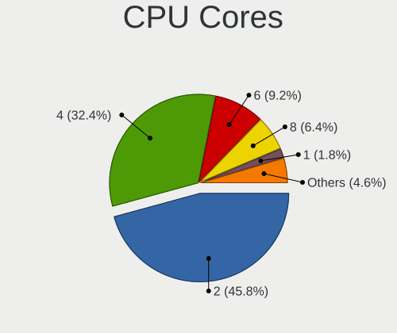

| Number | Computers | Percent |
|--------|-----------|---------|
| 2      | 905       | 45.75%  |
| 4      | 640       | 32.36%  |
| 6      | 181       | 9.15%   |
| 8      | 126       | 6.37%   |
| 1      | 35        | 1.77%   |
| 12     | 30        | 1.52%   |
| 10     | 21        | 1.06%   |
| 14     | 18        | 0.91%   |
| 3      | 10        | 0.51%   |
| 16     | 6         | 0.3%    |
| 24     | 2         | 0.1%    |
| 112    | 1         | 0.05%   |
| 28     | 1         | 0.05%   |
| 20     | 1         | 0.05%   |
| 18     | 1         | 0.05%   |

CPU Sockets
-----------

Number of sockets

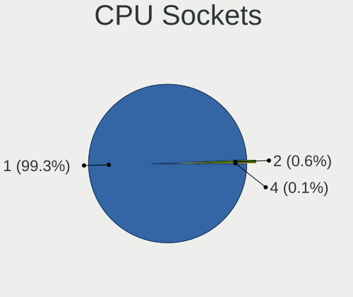

| Number | Computers | Percent |
|--------|-----------|---------|
| 1      | 1964      | 99.29%  |
| 2      | 12        | 0.61%   |
| 6      | 1         | 0.05%   |
| 4      | 1         | 0.05%   |

CPU Threads
-----------

Threads per core (Hyper-Threading)

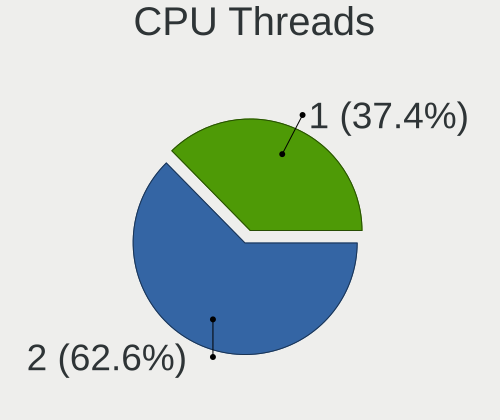

| Number | Computers | Percent |
|--------|-----------|---------|
| 2      | 1239      | 62.64%  |
| 1      | 739       | 37.36%  |

CPU Op-Modes
------------

CPU Operation Modes (32-bit, 64-bit)

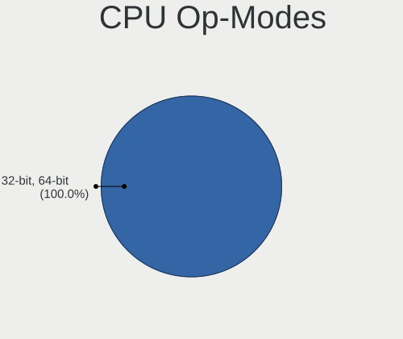

| Op mode        | Computers | Percent |
|----------------|-----------|---------|
| 32-bit, 64-bit | 1978      | 100%    |

CPU Microcode
-------------

Microcode number

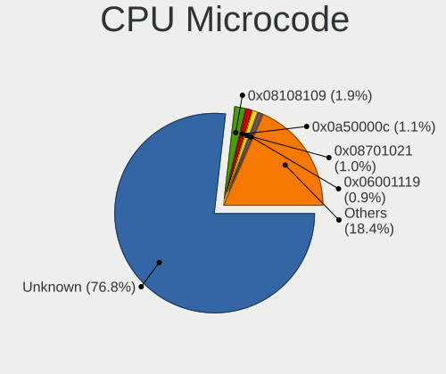

| Number     | Computers | Percent |
|------------|-----------|---------|
| Unknown    | 1520      | 76.81%  |
| 0x08108109 | 37        | 1.87%   |
| 0x0a50000c | 21        | 1.06%   |
| 0x08701021 | 19        | 0.96%   |
| 0x06001119 | 17        | 0.86%   |
| 0x0a50000f | 16        | 0.81%   |
| 0x06003106 | 16        | 0.81%   |
| 0x0a50000d | 14        | 0.71%   |
| 0x0800820d | 14        | 0.71%   |
| 0x0a20120a | 13        | 0.66%   |
| 0x07030105 | 12        | 0.61%   |
| 0x08608103 | 11        | 0.56%   |
| 0x08600106 | 11        | 0.56%   |
| 0x06000822 | 11        | 0.56%   |
| 0x06006705 | 10        | 0.51%   |
| 0x010000b6 | 10        | 0.51%   |
| 0x0a601206 | 8         | 0.4%    |
| 0x08101016 | 8         | 0.4%    |
| 0x0600611a | 8         | 0.4%    |
| 0x05000101 | 8         | 0.4%    |
| 0x0a704107 | 7         | 0.35%   |
| 0x08001138 | 7         | 0.35%   |
| 0x0700010b | 7         | 0.35%   |
| 0x0600081c | 7         | 0.35%   |
| 0x0a404102 | 6         | 0.3%    |
| 0x08108102 | 6         | 0.3%    |
| 0x0810100b | 6         | 0.3%    |
| 0x05000028 | 6         | 0.3%    |
| 0x010000c8 | 6         | 0.3%    |
| 0x0a704104 | 5         | 0.25%   |
| 0x0a20120e | 5         | 0.25%   |
| 0x08701030 | 5         | 0.25%   |
| 0x06001116 | 5         | 0.25%   |
| 0x0500010d | 5         | 0.25%   |
| 0x010000bf | 5         | 0.25%   |
| 0x0a704103 | 4         | 0.2%    |
| 0x0a20102b | 4         | 0.2%    |
| 0x08a00006 | 4         | 0.2%    |
| 0x08600109 | 4         | 0.2%    |
| 0x06000817 | 4         | 0.2%    |

CPU Microarch
-------------

Microarchitecture

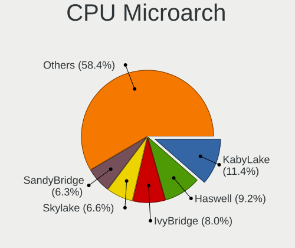

| Name             | Computers | Percent |
|------------------|-----------|---------|
| KabyLake         | 226       | 11.43%  |
| Haswell          | 182       | 9.2%    |
| IvyBridge        | 159       | 8.04%   |
| Skylake          | 131       | 6.62%   |
| SandyBridge      | 124       | 6.27%   |
| Penryn           | 115       | 5.81%   |
| Westmere         | 85        | 4.3%    |
| Zen 3            | 84        | 4.25%   |
| Alderlake Hybrid | 66        | 3.34%   |
| Core             | 65        | 3.29%   |
| Unknown          | 65        | 3.29%   |
| Zen+             | 59        | 2.98%   |
| Silvermont       | 57        | 2.88%   |
| TigerLake        | 50        | 2.53%   |
| Zen 2            | 49        | 2.48%   |
| Broadwell        | 49        | 2.48%   |
| Piledriver       | 48        | 2.43%   |
| K10              | 34        | 1.72%   |
| IceLake          | 34        | 1.72%   |
| Goldmont plus    | 34        | 1.72%   |
| CometLake        | 31        | 1.57%   |
| Zen              | 27        | 1.37%   |
| Excavator        | 24        | 1.21%   |
| Steamroller      | 21        | 1.06%   |
| Nehalem          | 19        | 0.96%   |
| Bobcat           | 19        | 0.96%   |
| K8 Hammer        | 18        | 0.91%   |
| Goldmont         | 18        | 0.91%   |
| Gracemont        | 17        | 0.86%   |
| Puma             | 15        | 0.76%   |
| Tremont          | 12        | 0.61%   |
| Bulldozer        | 12        | 0.61%   |
| Jaguar           | 8         | 0.4%    |
| Bonnell          | 8         | 0.4%    |
| K10 Llano        | 7         | 0.35%   |
| NetBurst         | 5         | 0.25%   |
| Sapphire Rapids  | 1         | 0.05%   |

Graphics
--------

GPU Vendor
----------

Vendors of graphics cards

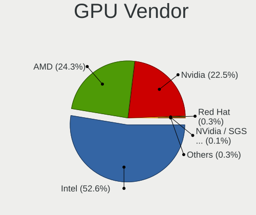

| Vendor                                       | Computers | Percent |
|----------------------------------------------|-----------|---------|
| Intel                                        | 1167      | 52.61%  |
| AMD                                          | 539       | 24.3%   |
| Nvidia                                       | 498       | 22.45%  |
| Red Hat                                      | 6         | 0.27%   |
| NVidia / SGS Thomson (Joint Venture)         | 2         | 0.09%   |
| Matrox Electronics Systems                   | 2         | 0.09%   |
| XGI Technology (eXtreme Graphics Innovation) | 1         | 0.05%   |
| Silicon Integrated Systems [SiS]             | 1         | 0.05%   |
| ATI Technologies                             | 1         | 0.05%   |
| ASPEED Technology                            | 1         | 0.05%   |

GPU Model
---------

Graphics card models

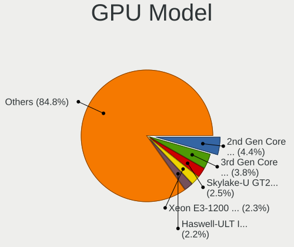

| Model                                                                                    | Computers | Percent |
|------------------------------------------------------------------------------------------|-----------|---------|
| Intel 2nd Generation Core Processor Family Integrated Graphics Controller                | 101       | 4.44%   |
| Intel 3rd Gen Core processor Graphics Controller                                         | 86        | 3.78%   |
| Intel Skylake-U GT2 [HD Graphics 520]                                                    | 56        | 2.46%   |
| Intel Xeon E3-1200 v3/4th Gen Core Processor Integrated Graphics Controller              | 52        | 2.29%   |
| Intel Haswell-ULT Integrated Graphics Controller                                         | 51        | 2.24%   |
| Intel Core Processor Integrated Graphics Controller                                      | 51        | 2.24%   |
| AMD Picasso/Raven 2 [Radeon Vega Series / Radeon Vega Mobile Series]                     | 46        | 2.02%   |
| Intel Kaby Lake-R GT2 [UHD Graphics 620]                                                 | 45        | 1.98%   |
| Intel Mobile 4 Series Chipset Integrated Graphics Controller                             | 43        | 1.89%   |
| Intel Xeon E3-1200 v2/3rd Gen Core processor Graphics Controller                         | 37        | 1.63%   |
| Intel TigerLake-LP GT2 [Iris Xe Graphics]                                                | 36        | 1.58%   |
| Intel Atom Processor Z36xxx/Z37xxx Series Graphics & Display                             | 36        | 1.58%   |
| Intel Broadwell-U GT2 [HD Graphics 5500]                                                 | 35        | 1.54%   |
| AMD Cezanne [Radeon Vega Series / Radeon Vega Mobile Series]                             | 34        | 1.49%   |
| Intel Skylake-S GT2 [HD Graphics 530]                                                    | 33        | 1.45%   |
| Intel Kaby Lake-U GT2 [HD Graphics 620]                                                  | 29        | 1.27%   |
| Intel 4th Gen Core Processor Integrated Graphics Controller                              | 27        | 1.19%   |
| Intel GeminiLake [UHD Graphics 600]                                                      | 26        | 1.14%   |
| Intel Kaby Lake-S GT2 [HD Graphics 630]                                                  | 24        | 1.05%   |
| Intel CoffeeLake-S GT2 [UHD Graphics 630]                                                | 24        | 1.05%   |
| Intel 4 Series Chipset Integrated Graphics Controller                                    | 23        | 1.01%   |
| Intel Atom/Celeron/Pentium Processor x5-E8000/J3xxx/N3xxx Integrated Graphics Controller | 21        | 0.92%   |
| AMD Renoir [Radeon Vega Series / Radeon Vega Mobile Series]                              | 20        | 0.88%   |
| AMD Ellesmere [Radeon RX 470/480/570/570X/580/580X/590]                                  | 19        | 0.84%   |
| AMD Phoenix1                                                                             | 18        | 0.79%   |
| AMD Lucienne                                                                             | 18        | 0.79%   |
| Intel Alder Lake-P GT2 [Iris Xe Graphics]                                                | 17        | 0.75%   |
| Intel Alder Lake-N [UHD Graphics]                                                        | 17        | 0.75%   |
| Intel CometLake-U GT2 [UHD Graphics]                                                     | 16        | 0.7%    |
| AMD Kaveri [Radeon R7 Graphics]                                                          | 15        | 0.66%   |
| Nvidia GT218 [GeForce 210]                                                               | 14        | 0.62%   |
| Nvidia GP107 [GeForce GTX 1050 Ti]                                                       | 14        | 0.62%   |
| Nvidia GK208B [GeForce GT 710]                                                           | 14        | 0.62%   |
| Intel Apollo Lake GT1 [HD Graphics 500]                                                  | 14        | 0.62%   |
| AMD Raven Ridge [Radeon Vega Series / Radeon Vega Mobile Series]                         | 14        | 0.62%   |
| AMD Navi 23 [Radeon RX 6600/6600 XT/6600M]                                               | 14        | 0.62%   |
| Intel WhiskeyLake-U GT2 [UHD Graphics 620]                                               | 13        | 0.57%   |
| Intel Tiger Lake-LP GT2 [UHD Graphics G4]                                                | 13        | 0.57%   |
| Intel Mobile GM965/GL960 Integrated Graphics Controller (secondary)                      | 13        | 0.57%   |
| Intel Mobile GM965/GL960 Integrated Graphics Controller (primary)                        | 13        | 0.57%   |

GPU Combo
---------

Combinations of graphics cards

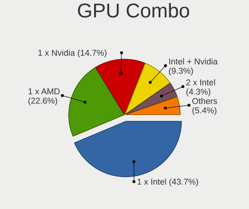

| Name                                          | Computers | Percent |
|-----------------------------------------------|-----------|---------|
| 1 x Intel                                     | 864       | 43.68%  |
| 1 x AMD                                       | 447       | 22.6%   |
| 1 x Nvidia                                    | 291       | 14.71%  |
| Intel + Nvidia                                | 184       | 9.3%    |
| 2 x Intel                                     | 86        | 4.35%   |
| 2 x AMD                                       | 40        | 2.02%   |
| Intel + AMD                                   | 32        | 1.62%   |
| AMD + Nvidia                                  | 21        | 1.06%   |
| 1 x Red Hat                                   | 6         | 0.3%    |
| 1 x Matrox                                    | 2         | 0.1%    |
| 1 x XGI                                       | 1         | 0.05%   |
| 1 x SiS                                       | 1         | 0.05%   |
| 1 x NVidia / SGS Thomson (Joint Venture)      | 1         | 0.05%   |
| Nvidia + NVidia / SGS Thomson (Joint Venture) | 1         | 0.05%   |
| 1 x ASPEED                                    | 1         | 0.05%   |

GPU Driver
----------

Free vs proprietary

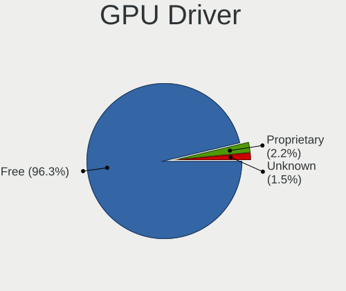

| Driver      | Computers | Percent |
|-------------|-----------|---------|
| Free        | 1911      | 96.27%  |
| Proprietary | 44        | 2.22%   |
| Unknown     | 30        | 1.51%   |

GPU Memory
----------

Total video memory

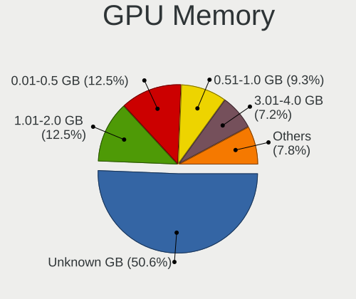

| Size in GB | Computers | Percent |
|------------|-----------|---------|
| Unknown    | 1004      | 50.63%  |
| 1.01-2.0   | 248       | 12.51%  |
| 0.01-0.5   | 248       | 12.51%  |
| 0.51-1.0   | 185       | 9.33%   |
| 3.01-4.0   | 143       | 7.21%   |
| 7.01-8.0   | 64        | 3.23%   |
| 5.01-6.0   | 41        | 2.07%   |
| 8.01-16.0  | 27        | 1.36%   |
| 2.01-3.0   | 16        | 0.81%   |
| 16.01-24.0 | 6         | 0.3%    |
| 4.01-5.0   | 1         | 0.05%   |

Monitor
-------

Monitor Vendor
--------------

Monitor vendors

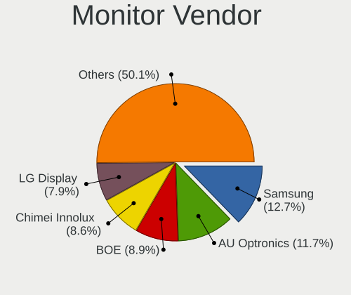

| Vendor                  | Computers | Percent |
|-------------------------|-----------|---------|
| Samsung Electronics     | 258       | 12.75%  |
| AU Optronics            | 237       | 11.71%  |
| BOE                     | 180       | 8.89%   |
| Chimei Innolux          | 175       | 8.65%   |
| LG Display              | 159       | 7.86%   |
| Goldstar                | 112       | 5.53%   |
| Dell                    | 111       | 5.48%   |
| Hewlett-Packard         | 85        | 4.2%    |
| Acer                    | 60        | 2.96%   |
| AOC                     | 58        | 2.87%   |
| Lenovo                  | 56        | 2.77%   |
| Apple                   | 50        | 2.47%   |
| Philips                 | 49        | 2.42%   |
| Ancor Communications    | 37        | 1.83%   |
| Sharp                   | 33        | 1.63%   |
| Chi Mei Optoelectronics | 33        | 1.63%   |
| BenQ                    | 27        | 1.33%   |
| ASUSTek Computer        | 22        | 1.09%   |
| Iiyama                  | 20        | 0.99%   |
| ViewSonic               | 18        | 0.89%   |
| Sony                    | 16        | 0.79%   |
| LG Philips              | 13        | 0.64%   |
| NEC Computers           | 9         | 0.44%   |
| Sceptre Tech            | 8         | 0.4%    |
| PANDA                   | 8         | 0.4%    |
| Panasonic               | 8         | 0.4%    |
| MSI                     | 7         | 0.35%   |
| RHT                     | 6         | 0.3%    |
| InfoVision              | 6         | 0.3%    |
| Fujitsu Siemens         | 6         | 0.3%    |
| ONN                     | 5         | 0.25%   |
| Eizo                    | 5         | 0.25%   |
| Packard Bell            | 4         | 0.2%    |
| InnoLux Display         | 4         | 0.2%    |
| HannStar                | 4         | 0.2%    |
| CSO                     | 4         | 0.2%    |
| Vizio                   | 3         | 0.15%   |
| Vestel Elektronik       | 3         | 0.15%   |
| Unknown (XXX)           | 3         | 0.15%   |
| Unknown                 | 3         | 0.15%   |

Monitor Model
-------------

Monitor models

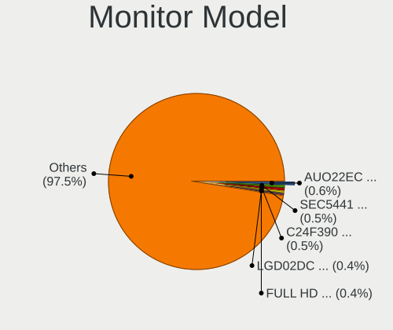

| Model                                                                    | Computers | Percent |
|--------------------------------------------------------------------------|-----------|---------|
| AU Optronics LCD Monitor AUO22EC 1366x768 344x193mm 15.5-inch            | 13        | 0.64%   |
| Samsung Electronics LCD Monitor SEC5441 1280x800 331x207mm 15.4-inch     | 11        | 0.54%   |
| Samsung Electronics C24F390 SAM0D2C 1920x1080 521x293mm 23.5-inch        | 10        | 0.49%   |
| LG Display LCD Monitor LGD02DC 1366x768 344x194mm 15.5-inch              | 9         | 0.44%   |
| Goldstar FULL HD GSM5B55 1920x1080 480x270mm 21.7-inch                   | 8         | 0.39%   |
| Chimei Innolux LCD Monitor CMN15F5 1920x1080 344x193mm 15.5-inch         | 8         | 0.39%   |
| Chimei Innolux LCD Monitor CMN15E7 1920x1080 344x193mm 15.5-inch         | 8         | 0.39%   |
| BOE LCD Monitor BOE0BC9 2560x1600 345x215mm 16.0-inch                    | 8         | 0.39%   |
| BOE LCD Monitor BOE095F 2256x1504 285x190mm 13.5-inch                    | 8         | 0.39%   |
| AU Optronics LCD Monitor AUO26EC 1366x768 344x193mm 15.5-inch            | 8         | 0.39%   |
| AU Optronics LCD Monitor AUO21ED 1920x1080 344x193mm 15.5-inch           | 8         | 0.39%   |
| Samsung Electronics C27F390 SAM0D32 1920x1080 598x336mm 27.0-inch        | 7         | 0.34%   |
| Chi Mei Optoelectronics LCD Monitor CMO1592 1366x768 344x193mm 15.5-inch | 7         | 0.34%   |
| AU Optronics LCD Monitor AUO38ED 1920x1080 344x193mm 15.5-inch           | 7         | 0.34%   |
| RHT QEMU Monitor RHT1234 2048x1152 325x203mm 15.1-inch                   | 6         | 0.29%   |
| LG Display LP156WH2-TLAA LGD0230 1366x768 344x194mm 15.5-inch            | 6         | 0.29%   |
| Lenovo LCD Monitor LEN40B1 1600x900 345x194mm 15.6-inch                  | 6         | 0.29%   |
| Chimei Innolux LCD Monitor CMN15E5 1920x1080 344x193mm 15.5-inch         | 6         | 0.29%   |
| Chimei Innolux LCD Monitor CMN15D2 1920x1080 344x193mm 15.5-inch         | 6         | 0.29%   |
| Chimei Innolux LCD Monitor CMN1382 1920x1080 293x165mm 13.2-inch         | 6         | 0.29%   |
| BOE LCD Monitor BOE068C 1366x768 256x144mm 11.6-inch                     | 6         | 0.29%   |
| Samsung Electronics LCD Monitor SAM0659 1920x1080                        | 5         | 0.25%   |
| ONN ONA18HO015 ONN0101 1920x1080 698x393mm 31.5-inch                     | 5         | 0.25%   |
| LG Display LCD Monitor LGD0468 1366x768 344x194mm 15.5-inch              | 5         | 0.25%   |
| Iiyama PL2792H IVM664F 1920x1080 598x336mm 27.0-inch                     | 5         | 0.25%   |
| Goldstar L1953S GSM4B3E 1280x1024 376x301mm 19.0-inch                    | 5         | 0.25%   |
| Chimei Innolux LCD Monitor CMN1728 1600x900 382x215mm 17.3-inch          | 5         | 0.25%   |
| Chimei Innolux LCD Monitor CMN15DB 1366x768 344x193mm 15.5-inch          | 5         | 0.25%   |
| Chimei Innolux LCD Monitor CMN15C4 1920x1080 344x193mm 15.5-inch         | 5         | 0.25%   |
| Chimei Innolux LCD Monitor CMN153B 1920x1080 344x193mm 15.5-inch         | 5         | 0.25%   |
| Chimei Innolux LCD Monitor CMN14C9 1920x1080 309x173mm 13.9-inch         | 5         | 0.25%   |
| Chi Mei Optoelectronics LCD Monitor CMO15A7 1366x768 344x193mm 15.5-inch | 5         | 0.25%   |
| BOE LCD Monitor BOE06A4 1366x768 344x194mm 15.5-inch                     | 5         | 0.25%   |
| BOE LCD Monitor BOE0696 1366x768 309x173mm 13.9-inch                     | 5         | 0.25%   |
| AU Optronics LCD Monitor AUO8174 1280x800 331x207mm 15.4-inch            | 5         | 0.25%   |
| AU Optronics LCD Monitor AUO45EC 1366x768 344x193mm 15.5-inch            | 5         | 0.25%   |
| AU Optronics LCD Monitor AUO243D 1920x1080 309x173mm 13.9-inch           | 5         | 0.25%   |
| AU Optronics LCD Monitor AUO205C 1366x768 256x144mm 11.6-inch            | 5         | 0.25%   |
| AOC G2460 AOC2460 1920x1080 531x299mm 24.0-inch                          | 5         | 0.25%   |
| AOC 27G2G4 AOC2702 1920x1080 598x336mm 27.0-inch                         | 5         | 0.25%   |

Monitor Resolution
------------------

Monitor screen resolution

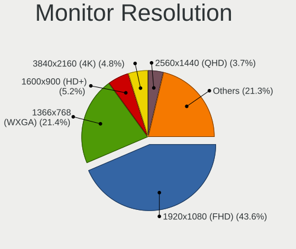

| Resolution         | Computers | Percent |
|--------------------|-----------|---------|
| 1920x1080 (FHD)    | 863       | 43.59%  |
| 1366x768 (WXGA)    | 424       | 21.41%  |
| 1600x900 (HD+)     | 102       | 5.15%   |
| 3840x2160 (4K)     | 96        | 4.85%   |
| 2560x1440 (QHD)    | 74        | 3.74%   |
| 1280x1024 (SXGA)   | 73        | 3.69%   |
| 1680x1050 (WSXGA+) | 58        | 2.93%   |
| 1280x800 (WXGA)    | 58        | 2.93%   |
| 1920x1200 (WUXGA)  | 55        | 2.78%   |
| 1440x900 (WXGA+)   | 52        | 2.63%   |
| 2560x1600          | 21        | 1.06%   |
| 2256x1504          | 11        | 0.56%   |
| 3440x1440          | 10        | 0.51%   |
| 2560x1080          | 9         | 0.45%   |
| 2880x1800          | 8         | 0.4%    |
| 1360x768           | 8         | 0.4%    |
| 1024x768 (XGA)     | 7         | 0.35%   |
| 2560x1397          | 6         | 0.3%    |
| 1920x540           | 6         | 0.3%    |
| 1600x1200          | 6         | 0.3%    |
| 1024x600           | 5         | 0.25%   |
| 3840x2400          | 4         | 0.2%    |
| 3200x1800 (QHD+)   | 4         | 0.2%    |
| 1920x1280          | 3         | 0.15%   |
| 3840x1600          | 2         | 0.1%    |
| 3200x2000          | 2         | 0.1%    |
| Unknown            | 2         | 0.1%    |
| 3840x1080          | 1         | 0.05%   |
| 3520x1080          | 1         | 0.05%   |
| 3000x2000          | 1         | 0.05%   |
| 2880x1620          | 1         | 0.05%   |
| 2288x1287          | 1         | 0.05%   |
| 2240x1400          | 1         | 0.05%   |
| 2160x1440          | 1         | 0.05%   |
| 2160x1350          | 1         | 0.05%   |
| 1800x1200          | 1         | 0.05%   |
| 1400x1050          | 1         | 0.05%   |
| 1280x960           | 1         | 0.05%   |

Monitor Diagonal
----------------

Diagonal size in inches

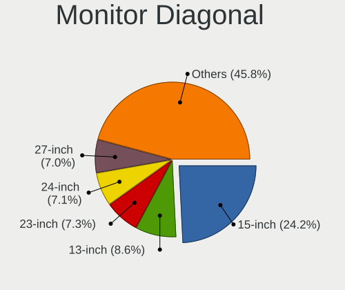

| Inches  | Computers | Percent |
|---------|-----------|---------|
| 15      | 490       | 24.22%  |
| 13      | 174       | 8.6%    |
| 23      | 148       | 7.32%   |
| 24      | 143       | 7.07%   |
| 27      | 141       | 6.97%   |
| 14      | 140       | 6.92%   |
| 21      | 121       | 5.98%   |
| 17      | 119       | 5.88%   |
| 19      | 84        | 4.15%   |
| 31      | 50        | 2.47%   |
| 18      | 47        | 2.32%   |
| 11      | 38        | 1.88%   |
| 12      | 37        | 1.83%   |
| 22      | 35        | 1.73%   |
| 20      | 34        | 1.68%   |
| 16      | 32        | 1.58%   |
| Unknown | 32        | 1.58%   |
| 40      | 18        | 0.89%   |
| 84      | 16        | 0.79%   |
| 32      | 15        | 0.74%   |
| 54      | 13        | 0.64%   |
| 34      | 13        | 0.64%   |
| 29      | 9         | 0.44%   |
| 72      | 8         | 0.4%    |
| 10      | 8         | 0.4%    |
| 25      | 7         | 0.35%   |
| 52      | 4         | 0.2%    |
| 37      | 4         | 0.2%    |
| 63      | 3         | 0.15%   |
| 60      | 3         | 0.15%   |
| 48      | 3         | 0.15%   |
| 46      | 3         | 0.15%   |
| 42      | 3         | 0.15%   |
| 36      | 3         | 0.15%   |
| 28      | 3         | 0.15%   |
| 26      | 3         | 0.15%   |
| 49      | 2         | 0.1%    |
| 43      | 2         | 0.1%    |
| 41      | 2         | 0.1%    |
| 39      | 2         | 0.1%    |

Monitor Width
-------------

Physical width

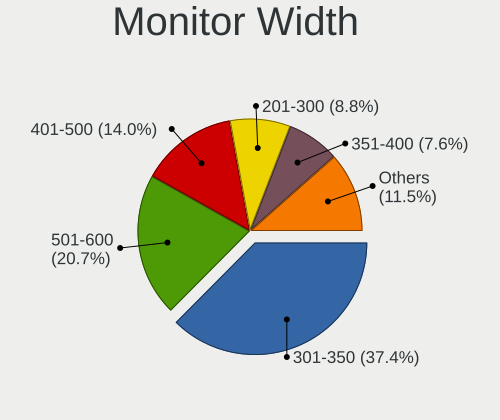

| Width in mm    | Computers | Percent |
|----------------|-----------|---------|
| 301-350        | 753       | 37.44%  |
| 501-600        | 416       | 20.69%  |
| 401-500        | 281       | 13.97%  |
| 201-300        | 176       | 8.75%   |
| 351-400        | 153       | 7.61%   |
| 601-700        | 73        | 3.63%   |
| 1001-1500      | 35        | 1.74%   |
| 701-800        | 32        | 1.59%   |
| Unknown        | 32        | 1.59%   |
| 801-900        | 25        | 1.24%   |
| 1501-2000      | 25        | 1.24%   |
| 901-1000       | 8         | 0.4%    |
| More than 2000 | 1         | 0.05%   |
| 101-200        | 1         | 0.05%   |

Aspect Ratio
------------

Proportional relationship between the width and the height

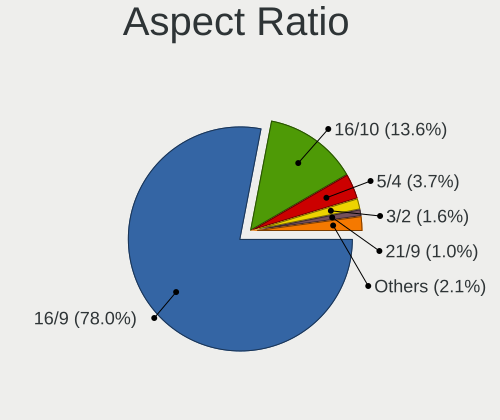

| Ratio   | Computers | Percent |
|---------|-----------|---------|
| 16/9    | 1512      | 78.02%  |
| 16/10   | 264       | 13.62%  |
| 5/4     | 71        | 3.66%   |
| 3/2     | 31        | 1.6%    |
| 21/9    | 19        | 0.98%   |
| Unknown | 17        | 0.88%   |
| 4/3     | 16        | 0.83%   |
| 32/9    | 4         | 0.21%   |
| 6/5     | 1         | 0.05%   |
| 1.00    | 1         | 0.05%   |
| 0.63    | 1         | 0.05%   |
| 0.56    | 1         | 0.05%   |

Monitor Area
------------

Area in inch²

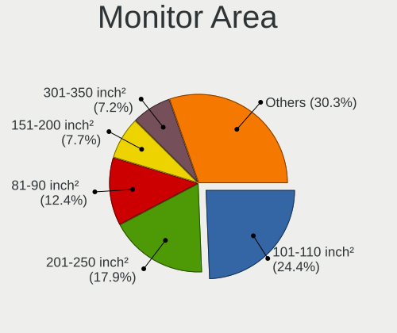

| Area in inch² | Computers | Percent |
|----------------|-----------|---------|
| 101-110        | 491       | 24.37%  |
| 201-250        | 361       | 17.92%  |
| 81-90          | 250       | 12.41%  |
| 151-200        | 156       | 7.74%   |
| 301-350        | 146       | 7.25%   |
| 351-500        | 90        | 4.47%   |
| 121-130        | 71        | 3.52%   |
| 141-150        | 68        | 3.37%   |
| 71-80          | 64        | 3.18%   |
| 251-300        | 58        | 2.88%   |
| More than 1000 | 57        | 2.83%   |
| 51-60          | 40        | 1.99%   |
| 501-1000       | 39        | 1.94%   |
| 61-70          | 35        | 1.74%   |
| Unknown        | 32        | 1.59%   |
| 111-120        | 31        | 1.54%   |
| 131-140        | 17        | 0.84%   |
| 41-50          | 6         | 0.3%    |
| 91-100         | 2         | 0.1%    |
| 1-40           | 1         | 0.05%   |

Pixel Density
-------------

Pixels per inch

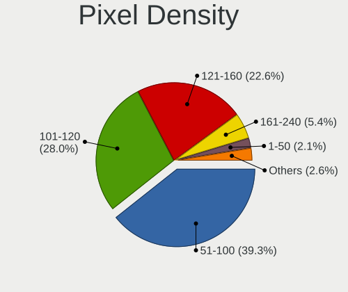

| Density       | Computers | Percent |
|---------------|-----------|---------|
| 51-100        | 781       | 39.33%  |
| 101-120       | 557       | 28.05%  |
| 121-160       | 448       | 22.56%  |
| 161-240       | 107       | 5.39%   |
| 1-50          | 41        | 2.06%   |
| Unknown       | 32        | 1.61%   |
| More than 240 | 20        | 1.01%   |

Multiple Monitors
-----------------

Total monitors connected

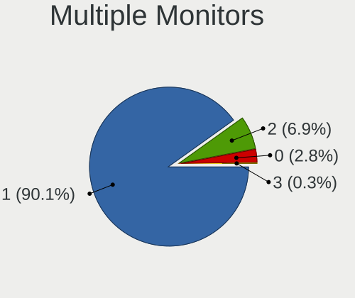

| Total | Computers | Percent |
|-------|-----------|---------|
| 1     | 1787      | 90.12%  |
| 2     | 136       | 6.86%   |
| 0     | 55        | 2.77%   |
| 3     | 5         | 0.25%   |

Network
-------

Net Controller Vendor
---------------------

Controller vendors

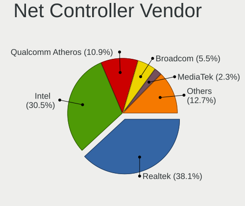

| Vendor                            | Computers | Percent |
|-----------------------------------|-----------|---------|
| Realtek Semiconductor             | 1097      | 38.13%  |
| Intel                             | 877       | 30.48%  |
| Qualcomm Atheros                  | 315       | 10.95%  |
| Broadcom                          | 159       | 5.53%   |
| MediaTek                          | 65        | 2.26%   |
| Broadcom Limited                  | 45        | 1.56%   |
| Ralink Technology                 | 43        | 1.49%   |
| Ralink                            | 35        | 1.22%   |
| TP-Link                           | 34        | 1.18%   |
| Marvell Technology Group          | 30        | 1.04%   |
| ASIX Electronics                  | 25        | 0.87%   |
| Nvidia                            | 19        | 0.66%   |
| Samsung Electronics               | 9         | 0.31%   |
| D-Link                            | 8         | 0.28%   |
| Sierra Wireless                   | 7         | 0.24%   |
| Shenzhen Goodix Technology        | 7         | 0.24%   |
| Dell                              | 7         | 0.24%   |
| Xiaomi                            | 6         | 0.21%   |
| Qualcomm Atheros Communications   | 6         | 0.21%   |
| Huawei Technologies               | 5         | 0.17%   |
| Belkin Components                 | 5         | 0.17%   |
| NetGear                           | 4         | 0.14%   |
| VIA Technologies                  | 3         | 0.1%    |
| OPPO Electronics                  | 3         | 0.1%    |
| Linksys                           | 3         | 0.1%    |
| Lenovo                            | 3         | 0.1%    |
| JMicron Technology                | 3         | 0.1%    |
| Ericsson Business Mobile Networks | 3         | 0.1%    |
| ASUSTek Computer                  | 3         | 0.1%    |
| Aquantia                          | 3         | 0.1%    |
| ZyXEL Communications              | 2         | 0.07%   |
| ZTE WCDMA Technologies MSM        | 2         | 0.07%   |
| Silicon Integrated Systems [SiS]  | 2         | 0.07%   |
| Qualcomm                          | 2         | 0.07%   |
| Microsoft                         | 2         | 0.07%   |
| Hewlett-Packard                   | 2         | 0.07%   |
| Google                            | 2         | 0.07%   |
| Edimax Technology                 | 2         | 0.07%   |
| D-Link System                     | 2         | 0.07%   |
| 3Com                              | 2         | 0.07%   |

Net Controller Model
--------------------

Controller models

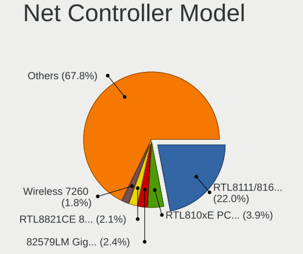

| Model                                                                  | Computers | Percent |
|------------------------------------------------------------------------|-----------|---------|
| Realtek RTL8111/8168/8211/8411 PCI Express Gigabit Ethernet Controller | 744       | 22.01%  |
| Realtek RTL810xE PCI Express Fast Ethernet controller                  | 133       | 3.93%   |
| Intel 82579LM Gigabit Network Connection (Lewisville)                  | 82        | 2.43%   |
| Realtek RTL8821CE 802.11ac PCIe Wireless Network Adapter               | 70        | 2.07%   |
| Intel Wireless 7260                                                    | 60        | 1.78%   |
| Qualcomm Atheros AR9485 Wireless Network Adapter                       | 53        | 1.57%   |
| Realtek RTL8125 2.5GbE Controller                                      | 50        | 1.48%   |
| Intel Wi-Fi 6 AX200                                                    | 50        | 1.48%   |
| Intel Wireless 8265 / 8275                                             | 48        | 1.42%   |
| Intel Wireless 8260                                                    | 42        | 1.24%   |
| Intel Wireless 7265                                                    | 40        | 1.18%   |
| Intel Ethernet Connection I217-LM                                      | 40        | 1.18%   |
| Qualcomm Atheros AR9285 Wireless Network Adapter (PCI-Express)         | 38        | 1.12%   |
| Intel Centrino Advanced-N 6205 [Taylor Peak]                           | 37        | 1.09%   |
| Qualcomm Atheros QCA9377 802.11ac Wireless Network Adapter             | 36        | 1.07%   |
| Intel Wi-Fi 6E(802.11ax) AX210/AX1675* 2x2 [Typhoon Peak]              | 35        | 1.04%   |
| Qualcomm Atheros QCA9565 / AR9565 Wireless Network Adapter             | 32        | 0.95%   |
| Intel Ethernet Connection (2) I219-LM                                  | 32        | 0.95%   |
| Intel I211 Gigabit Network Connection                                  | 31        | 0.92%   |
| Realtek RTL8822CE 802.11ac PCIe Wireless Network Adapter               | 30        | 0.89%   |
| Intel Wi-Fi 6 AX201                                                    | 30        | 0.89%   |
| Broadcom BCM4313 802.11bgn Wireless Network Adapter                    | 29        | 0.86%   |
| Intel Dual Band Wireless-AC 3168NGW [Stone Peak]                       | 28        | 0.83%   |
| Realtek RTL8723BE PCIe Wireless Network Adapter                        | 27        | 0.8%    |
| Intel Wireless 3165                                                    | 26        | 0.77%   |
| MediaTek MT7922 802.11ax PCI Express Wireless Network Adapter          | 24        | 0.71%   |
| Intel Ethernet Connection (2) I219-V                                   | 24        | 0.71%   |
| ASIX AX88179 Gigabit Ethernet                                          | 24        | 0.71%   |
| Intel Alder Lake-P PCH CNVi WiFi                                       | 23        | 0.68%   |
| Ralink MT7601U Wireless Adapter                                        | 22        | 0.65%   |
| Intel 82577LM Gigabit Network Connection                               | 22        | 0.65%   |
| Realtek RTL8153 Gigabit Ethernet Adapter                               | 21        | 0.62%   |
| Intel Ethernet Connection I219-LM                                      | 21        | 0.62%   |
| Qualcomm Atheros QCA6174 802.11ac Wireless Network Adapter             | 20        | 0.59%   |
| Realtek RTL8188EUS 802.11n Wireless Network Adapter                    | 19        | 0.56%   |
| MediaTek MT7921 802.11ax PCIe Wireless Network Adapter [Filogic 330]   | 19        | 0.56%   |
| Intel Ethernet Connection (4) I219-LM                                  | 19        | 0.56%   |
| Intel Wireless 3160                                                    | 18        | 0.53%   |
| Qualcomm Atheros AR8151 v2.0 Gigabit Ethernet                          | 17        | 0.5%    |
| Intel Ethernet Connection I218-LM                                      | 17        | 0.5%    |

Wireless Vendor
---------------

Wireless vendors

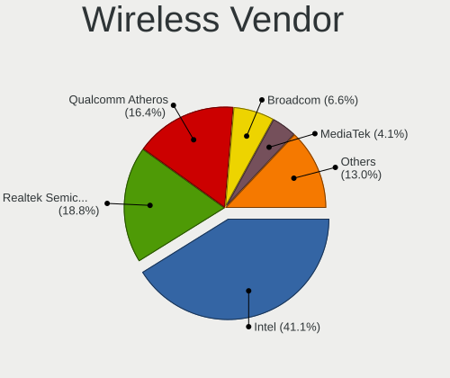

| Vendor                                | Computers | Percent |
|---------------------------------------|-----------|---------|
| Intel                                 | 616       | 41.15%  |
| Realtek Semiconductor                 | 281       | 18.77%  |
| Qualcomm Atheros                      | 246       | 16.43%  |
| Broadcom                              | 99        | 6.61%   |
| MediaTek                              | 61        | 4.07%   |
| Ralink Technology                     | 43        | 2.87%   |
| Ralink                                | 35        | 2.34%   |
| TP-Link                               | 32        | 2.14%   |
| Broadcom Limited                      | 30        | 2%      |
| D-Link                                | 8         | 0.53%   |
| Sierra Wireless                       | 7         | 0.47%   |
| Qualcomm Atheros Communications       | 6         | 0.4%    |
| Dell                                  | 5         | 0.33%   |
| Belkin Components                     | 5         | 0.33%   |
| NetGear                               | 4         | 0.27%   |
| ASUSTek Computer                      | 3         | 0.2%    |
| ZyXEL Communications                  | 2         | 0.13%   |
| Microsoft                             | 2         | 0.13%   |
| Edimax Technology                     | 2         | 0.13%   |
| Senao                                 | 1         | 0.07%   |
| Samsung Electronics                   | 1         | 0.07%   |
| Qualcomm                              | 1         | 0.07%   |
| PLANEX                                | 1         | 0.07%   |
| Marvell Technology Group              | 1         | 0.07%   |
| IMC Networks                          | 1         | 0.07%   |
| Guillemot                             | 1         | 0.07%   |
| Elecom                                | 1         | 0.07%   |
| D-Link System                         | 1         | 0.07%   |
| 802.11g Adapter [Linksys WUSB54GC v3] | 1         | 0.07%   |

Wireless Model
--------------

Wireless models

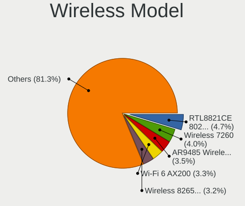

| Model                                                                   | Computers | Percent |
|-------------------------------------------------------------------------|-----------|---------|
| Realtek RTL8821CE 802.11ac PCIe Wireless Network Adapter                | 70        | 4.67%   |
| Intel Wireless 7260                                                     | 60        | 4%      |
| Qualcomm Atheros AR9485 Wireless Network Adapter                        | 53        | 3.53%   |
| Intel Wi-Fi 6 AX200                                                     | 50        | 3.33%   |
| Intel Wireless 8265 / 8275                                              | 48        | 3.2%    |
| Intel Wireless 8260                                                     | 42        | 2.8%    |
| Intel Wireless 7265                                                     | 40        | 2.67%   |
| Qualcomm Atheros AR9285 Wireless Network Adapter (PCI-Express)          | 38        | 2.53%   |
| Intel Centrino Advanced-N 6205 [Taylor Peak]                            | 37        | 2.47%   |
| Qualcomm Atheros QCA9377 802.11ac Wireless Network Adapter              | 36        | 2.4%    |
| Intel Wi-Fi 6E(802.11ax) AX210/AX1675* 2x2 [Typhoon Peak]               | 35        | 2.33%   |
| Qualcomm Atheros QCA9565 / AR9565 Wireless Network Adapter              | 32        | 2.13%   |
| Realtek RTL8822CE 802.11ac PCIe Wireless Network Adapter                | 30        | 2%      |
| Intel Wi-Fi 6 AX201                                                     | 30        | 2%      |
| Broadcom BCM4313 802.11bgn Wireless Network Adapter                     | 29        | 1.93%   |
| Intel Dual Band Wireless-AC 3168NGW [Stone Peak]                        | 28        | 1.87%   |
| Realtek RTL8723BE PCIe Wireless Network Adapter                         | 27        | 1.8%    |
| Intel Wireless 3165                                                     | 26        | 1.73%   |
| MediaTek MT7922 802.11ax PCI Express Wireless Network Adapter           | 23        | 1.53%   |
| Ralink MT7601U Wireless Adapter                                         | 22        | 1.47%   |
| Qualcomm Atheros QCA6174 802.11ac Wireless Network Adapter              | 20        | 1.33%   |
| Realtek RTL8188EUS 802.11n Wireless Network Adapter                     | 19        | 1.27%   |
| MediaTek MT7921 802.11ax PCIe Wireless Network Adapter [Filogic 330]    | 19        | 1.27%   |
| Intel Wireless 3160                                                     | 18        | 1.2%    |
| Realtek RTL8188CE 802.11b/g/n WiFi Adapter                              | 15        | 1%      |
| Realtek 802.11ac NIC                                                    | 15        | 1%      |
| Intel Wi-Fi 5(802.11ac) Wireless-AC 9x6x [Thunder Peak]                 | 15        | 1%      |
| Intel Centrino Advanced-N 6200                                          | 15        | 1%      |
| Qualcomm Atheros AR9462 Wireless Network Adapter                        | 14        | 0.93%   |
| Intel Cannon Lake PCH CNVi WiFi                                         | 14        | 0.93%   |
| Qualcomm Atheros AR928X Wireless Network Adapter (PCI-Express)          | 13        | 0.87%   |
| MediaTek MT7921K (RZ608) Wi-Fi 6E 80MHz                                 | 13        | 0.87%   |
| Intel Comet Lake PCH-LP CNVi WiFi                                       | 13        | 0.87%   |
| Intel Alder Lake-P PCH CNVi WiFi                                        | 13        | 0.87%   |
| Realtek RTL8188EE Wireless Network Adapter                              | 12        | 0.8%    |
| Qualcomm Atheros AR9287 Wireless Network Adapter (PCI-Express)          | 12        | 0.8%    |
| Qualcomm Atheros AR242x / AR542x Wireless Network Adapter (PCI-Express) | 12        | 0.8%    |
| Broadcom BCM43142 802.11b/g/n                                           | 12        | 0.8%    |
| Intel Centrino Ultimate-N 6300                                          | 11        | 0.73%   |
| Broadcom BCM4331 802.11a/b/g/n                                          | 11        | 0.73%   |

Ethernet Vendor
---------------

Ethernet vendors

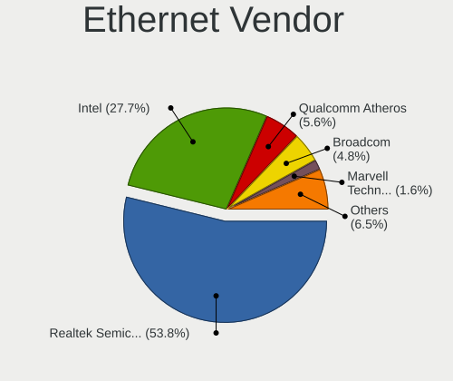

| Vendor                           | Computers | Percent |
|----------------------------------|-----------|---------|
| Realtek Semiconductor            | 973       | 53.82%  |
| Intel                            | 501       | 27.71%  |
| Qualcomm Atheros                 | 102       | 5.64%   |
| Broadcom                         | 86        | 4.76%   |
| Marvell Technology Group         | 29        | 1.6%    |
| ASIX Electronics                 | 25        | 1.38%   |
| Nvidia                           | 19        | 1.05%   |
| Broadcom Limited                 | 15        | 0.83%   |
| Samsung Electronics              | 8         | 0.44%   |
| Xiaomi                           | 6         | 0.33%   |
| MediaTek                         | 4         | 0.22%   |
| VIA Technologies                 | 3         | 0.17%   |
| OPPO Electronics                 | 3         | 0.17%   |
| Linksys                          | 3         | 0.17%   |
| Lenovo                           | 3         | 0.17%   |
| JMicron Technology               | 3         | 0.17%   |
| Huawei Technologies              | 3         | 0.17%   |
| Aquantia                         | 3         | 0.17%   |
| TP-Link                          | 2         | 0.11%   |
| Silicon Integrated Systems [SiS] | 2         | 0.11%   |
| Google                           | 2         | 0.11%   |
| 3Com                             | 2         | 0.11%   |
| ZTE WCDMA Technologies MSM       | 1         | 0.06%   |
| Spreadtrum Communications        | 1         | 0.06%   |
| Qualcomm                         | 1         | 0.06%   |
| Motorola PCS                     | 1         | 0.06%   |
| ICS Advent                       | 1         | 0.06%   |
| HMD Global                       | 1         | 0.06%   |
| Hewlett-Packard                  | 1         | 0.06%   |
| DisplayLink                      | 1         | 0.06%   |
| D-Link System                    | 1         | 0.06%   |
| Attansic Technology              | 1         | 0.06%   |
| American Megatrends              | 1         | 0.06%   |

Ethernet Model
--------------

Ethernet models

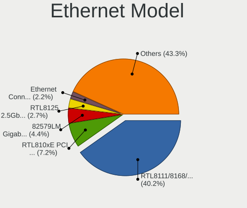

| Model                                                                  | Computers | Percent |
|------------------------------------------------------------------------|-----------|---------|
| Realtek RTL8111/8168/8211/8411 PCI Express Gigabit Ethernet Controller | 744       | 40.24%  |
| Realtek RTL810xE PCI Express Fast Ethernet controller                  | 133       | 7.19%   |
| Intel 82579LM Gigabit Network Connection (Lewisville)                  | 82        | 4.43%   |
| Realtek RTL8125 2.5GbE Controller                                      | 50        | 2.7%    |
| Intel Ethernet Connection I217-LM                                      | 40        | 2.16%   |
| Intel Ethernet Connection (2) I219-LM                                  | 32        | 1.73%   |
| Intel I211 Gigabit Network Connection                                  | 31        | 1.68%   |
| Intel Ethernet Connection (2) I219-V                                   | 24        | 1.3%    |
| ASIX AX88179 Gigabit Ethernet                                          | 24        | 1.3%    |
| Intel 82577LM Gigabit Network Connection                               | 22        | 1.19%   |
| Realtek RTL8153 Gigabit Ethernet Adapter                               | 21        | 1.14%   |
| Intel Ethernet Connection I219-LM                                      | 21        | 1.14%   |
| Intel Ethernet Connection (4) I219-LM                                  | 19        | 1.03%   |
| Qualcomm Atheros AR8151 v2.0 Gigabit Ethernet                          | 17        | 0.92%   |
| Intel Ethernet Connection I218-LM                                      | 17        | 0.92%   |
| Intel 82567LM-3 Gigabit Network Connection                             | 15        | 0.81%   |
| Qualcomm Atheros AR8161 Gigabit Ethernet                               | 14        | 0.76%   |
| Intel Ethernet Controller I225-V                                       | 14        | 0.76%   |
| Intel Ethernet Connection (7) I219-V                                   | 13        | 0.7%    |
| Intel Ethernet Connection (3) I218-LM                                  | 13        | 0.7%    |
| Intel 82579V Gigabit Network Connection                                | 13        | 0.7%    |
| Intel 82567LM Gigabit Network Connection                               | 12        | 0.65%   |
| Broadcom NetXtreme BCM57766 Gigabit Ethernet PCIe                      | 12        | 0.65%   |
| Broadcom NetXtreme BCM57765 Gigabit Ethernet PCIe                      | 12        | 0.65%   |
| Qualcomm Atheros QCA8171 Gigabit Ethernet                              | 11        | 0.59%   |
| Qualcomm Atheros AR8131 Gigabit Ethernet                               | 10        | 0.54%   |
| Intel Alder Lake-P PCH CNVi WiFi                                       | 10        | 0.54%   |
| Realtek USB 10/100/1G/2.5 LAN                                          | 9         | 0.49%   |
| Qualcomm Atheros AR8152 v2.0 Fast Ethernet                             | 9         | 0.49%   |
| Qualcomm Atheros AR8152 v1.1 Fast Ethernet                             | 9         | 0.49%   |
| Intel I210 Gigabit Network Connection                                  | 9         | 0.49%   |
| Intel Ethernet Connection (5) I219-LM                                  | 9         | 0.49%   |
| Realtek RTL-8100/8101L/8139 PCI Fast Ethernet Adapter                  | 8         | 0.43%   |
| Qualcomm Atheros AR8121/AR8113/AR8114 Gigabit or Fast Ethernet         | 8         | 0.43%   |
| Marvell Group 88E8040 PCI-E Fast Ethernet Controller                   | 8         | 0.43%   |
| Intel Ethernet Connection I217-V                                       | 8         | 0.43%   |
| Broadcom NetXtreme BCM5761 Gigabit Ethernet PCIe                       | 8         | 0.43%   |
| Intel Ethernet Connection (7) I219-LM                                  | 7         | 0.38%   |
| Intel Ethernet Connection (4) I219-V                                   | 7         | 0.38%   |
| Intel 82578DM Gigabit Network Connection                               | 7         | 0.38%   |

Net Controller Kind
-------------------

Ethernet, WiFi or modem

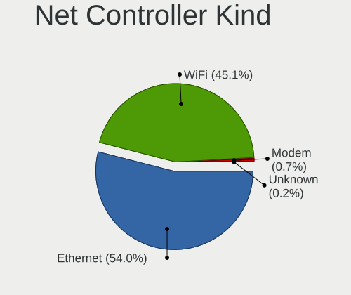

| Kind     | Computers | Percent |
|----------|-----------|---------|
| Ethernet | 1732      | 53.99%  |
| WiFi     | 1447      | 45.11%  |
| Modem    | 24        | 0.75%   |
| Unknown  | 5         | 0.16%   |

Used Controller
---------------

Currently used network controller

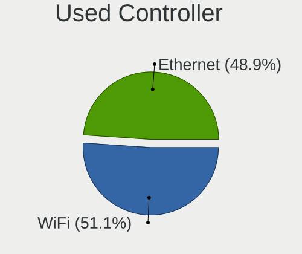

| Kind     | Computers | Percent |
|----------|-----------|---------|
| WiFi     | 989       | 51.06%  |
| Ethernet | 948       | 48.94%  |

NICs
----

Total network controllers on board

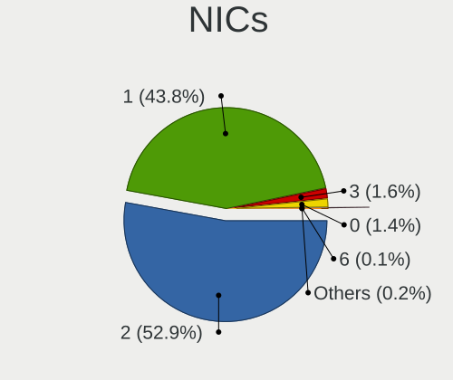

| Total | Computers | Percent |
|-------|-----------|---------|
| 2     | 1046      | 52.88%  |
| 1     | 867       | 43.83%  |
| 3     | 32        | 1.62%   |
| 0     | 28        | 1.42%   |
| 6     | 2         | 0.1%    |
| 5     | 2         | 0.1%    |
| 4     | 1         | 0.05%   |

IPv6
----

IPv6 vs IPv4

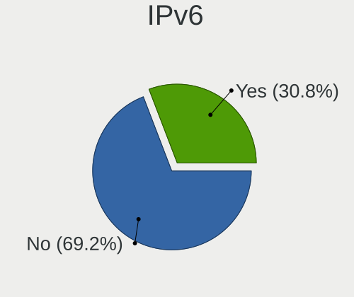

| Used | Computers | Percent |
|------|-----------|---------|
| No   | 1374      | 69.18%  |
| Yes  | 612       | 30.82%  |

Bluetooth
---------

Bluetooth Vendor
----------------

Controller vendors

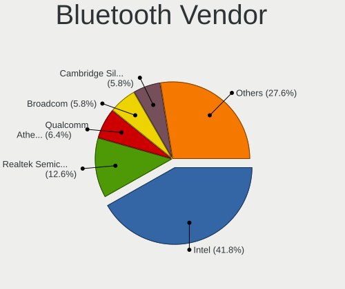

| Vendor                          | Computers | Percent |
|---------------------------------|-----------|---------|
| Intel                           | 487       | 41.8%   |
| Realtek Semiconductor           | 147       | 12.62%  |
| Qualcomm Atheros Communications | 75        | 6.44%   |
| Broadcom                        | 68        | 5.84%   |
| Cambridge Silicon Radio         | 67        | 5.75%   |
| Apple                           | 53        | 4.55%   |
| IMC Networks                    | 49        | 4.21%   |
| Foxconn / Hon Hai               | 39        | 3.35%   |
| Lite-On Technology              | 35        | 3%      |
| MediaTek                        | 30        | 2.58%   |
| Dell                            | 19        | 1.63%   |
| Hewlett-Packard                 | 18        | 1.55%   |
| ASUSTek Computer                | 17        | 1.46%   |
| TP-Link                         | 9         | 0.77%   |
| Ralink                          | 9         | 0.77%   |
| Toshiba                         | 8         | 0.69%   |
| Foxconn International           | 7         | 0.6%    |
| Realtek                         | 4         | 0.34%   |
| Marvell Semiconductor           | 4         | 0.34%   |
| Chicony Electronics             | 4         | 0.34%   |
| Alps Electric                   | 3         | 0.26%   |
| Actions                         | 2         | 0.17%   |
| Unknown                         | 2         | 0.17%   |
| USI                             | 1         | 0.09%   |
| Ralink Technology               | 1         | 0.09%   |
| Qcom                            | 1         | 0.09%   |
| Opticis                         | 1         | 0.09%   |
| Micro Star International        | 1         | 0.09%   |
| Integrated System Solution      | 1         | 0.09%   |
| Fujitsu                         | 1         | 0.09%   |
| Dynex                           | 1         | 0.09%   |
| Belkin Components               | 1         | 0.09%   |

Bluetooth Model
---------------

Controller models

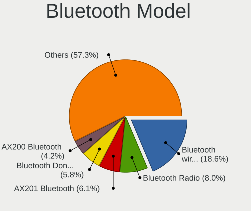

| Model                                               | Computers | Percent |
|-----------------------------------------------------|-----------|---------|
| Intel Bluetooth wireless interface                  | 217       | 18.63%  |
| Realtek Bluetooth Radio                             | 93        | 7.98%   |
| Intel AX201 Bluetooth                               | 71        | 6.09%   |
| Cambridge Silicon Radio Bluetooth Dongle (HCI mode) | 67        | 5.75%   |
| Intel AX200 Bluetooth                               | 49        | 4.21%   |
| Intel Bluetooth 9460/9560 Jefferson Peak (JfP)      | 43        | 3.69%   |
| Qualcomm Atheros  Bluetooth Device                  | 42        | 3.61%   |
| Realtek  Bluetooth 4.2 Adapter                      | 36        | 3.09%   |
| Intel AX210 Bluetooth                               | 31        | 2.66%   |
| MediaTek Wireless_Device                            | 30        | 2.58%   |
| Intel Wireless-AC 3168 Bluetooth                    | 28        | 2.4%    |
| IMC Networks Bluetooth Radio                        | 21        | 1.8%    |
| Apple Bluetooth USB Host Controller                 | 20        | 1.72%   |
| Intel Bluetooth Device                              | 18        | 1.55%   |
| Apple Bluetooth Host Controller                     | 16        | 1.37%   |
| Intel Wireless-AC 9260 Bluetooth Adapter            | 15        | 1.29%   |
| Qualcomm Atheros AR3011 Bluetooth                   | 13        | 1.12%   |
| HP Broadcom 2070 Bluetooth Combo                    | 13        | 1.12%   |
| Broadcom BCM20702 Bluetooth 4.0 [ThinkPad]          | 13        | 1.12%   |
| Broadcom BCM2045B (BDC-2.1)                         | 13        | 1.12%   |
| Apple Built-in Bluetooth 2.0+EDR HCI                | 12        | 1.03%   |
| Intel Centrino Bluetooth Wireless Transceiver       | 11        | 0.94%   |
| IMC Networks Bluetooth Device                       | 11        | 0.94%   |
| Dell DW375 Bluetooth Module                         | 11        | 0.94%   |
| IMC Networks Wireless_Device                        | 10        | 0.86%   |
| TP-Link TP-T@- UB500 Adapter                        | 9         | 0.77%   |
| Ralink RT3290 Bluetooth                             | 9         | 0.77%   |
| Lite-On Atheros AR3012 Bluetooth                    | 9         | 0.77%   |
| Foxconn / Hon Hai Bluetooth Device                  | 9         | 0.77%   |
| Realtek RTL8723B Bluetooth                          | 8         | 0.69%   |
| Qualcomm Atheros AR3012 Bluetooth 4.0               | 8         | 0.69%   |
| Lite-On Qualcomm Atheros QCA9377 Bluetooth          | 8         | 0.69%   |
| Foxconn / Hon Hai Wireless_Device                   | 8         | 0.69%   |
| Lite-On Bluetooth Device                            | 7         | 0.6%    |
| Foxconn International BCM43142A0 Bluetooth module   | 7         | 0.6%    |
| Qualcomm Atheros QCA61x4 Bluetooth 4.0              | 6         | 0.52%   |
| ASUS ASUS USB-BT500                                 | 6         | 0.52%   |
| Realtek RTL8821A Bluetooth                          | 5         | 0.43%   |
| IMC Networks Atheros AR3012 Bluetooth 4.0 Adapter   | 5         | 0.43%   |
| HP Bluetooth 2.0 Interface [Broadcom BCM2045]       | 5         | 0.43%   |

Sound
-----

Sound Vendor
------------

Sound card vendors

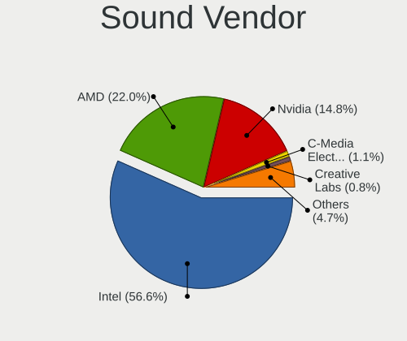

| Vendor                                       | Computers | Percent |
|----------------------------------------------|-----------|---------|
| Intel                                        | 1449      | 56.65%  |
| AMD                                          | 562       | 21.97%  |
| Nvidia                                       | 378       | 14.78%  |
| C-Media Electronics                          | 28        | 1.09%   |
| Creative Labs                                | 20        | 0.78%   |
| Logitech                                     | 11        | 0.43%   |
| Zoran Co. Personal Media Division (Nogatech) | 7         | 0.27%   |
| GN Netcom                                    | 6         | 0.23%   |
| Generalplus Technology                       | 6         | 0.23%   |
| Tenx Technology                              | 5         | 0.2%    |
| Realtek Semiconductor                        | 5         | 0.2%    |
| JMTek                                        | 5         | 0.2%    |
| ASUSTek Computer                             | 5         | 0.2%    |
| Texas Instruments                            | 4         | 0.16%   |
| BEHRINGER International                      | 4         | 0.16%   |
| VIA Technologies                             | 3         | 0.12%   |
| Razer USA                                    | 3         | 0.12%   |
| Micro Star International                     | 3         | 0.12%   |
| Creative Technology                          | 3         | 0.12%   |
| Corsair                                      | 3         | 0.12%   |
| Apple                                        | 3         | 0.12%   |
| Synaptics                                    | 2         | 0.08%   |
| Silicon Integrated Systems [SiS]             | 2         | 0.08%   |
| Plantronics                                  | 2         | 0.08%   |
| Microsoft                                    | 2         | 0.08%   |
| Medeli Electronics                           | 2         | 0.08%   |
| Jieli Technology                             | 2         | 0.08%   |
| Hewlett-Packard                              | 2         | 0.08%   |
| Ensoniq                                      | 2         | 0.08%   |
| Unknown                                      | 2         | 0.08%   |
| ZOOM                                         | 1         | 0.04%   |
| Yamaha                                       | 1         | 0.04%   |
| XMOS                                         | 1         | 0.04%   |
| TTGK Technology                              | 1         | 0.04%   |
| Samson Technologies                          | 1         | 0.04%   |
| RODE Microphones                             | 1         | 0.04%   |
| Nordic Semiconductor ASA                     | 1         | 0.04%   |
| MV-SILICON                                   | 1         | 0.04%   |
| Megawin Technology                           | 1         | 0.04%   |
| Mackie Designs                               | 1         | 0.04%   |

Sound Model
-----------

Sound card models

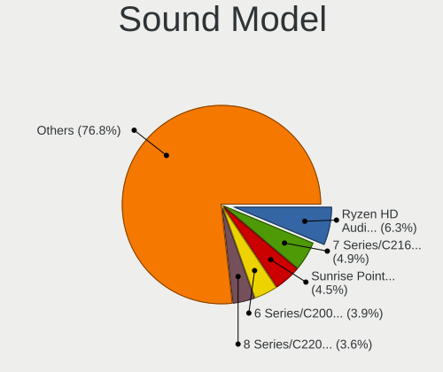

| Model                                                                                             | Computers | Percent |
|---------------------------------------------------------------------------------------------------|-----------|---------|
| AMD Ryzen HD Audio Controller                                                                     | 198       | 6.28%   |
| Intel 7 Series/C216 Chipset Family High Definition Audio Controller                               | 154       | 4.88%   |
| Intel Sunrise Point-LP HD Audio                                                                   | 141       | 4.47%   |
| Intel 6 Series/C200 Series Chipset Family High Definition Audio Controller                        | 124       | 3.93%   |
| Intel 8 Series/C220 Series Chipset High Definition Audio Controller                               | 115       | 3.65%   |
| Intel 5 Series/3400 Series Chipset High Definition Audio                                          | 94        | 2.98%   |
| Intel Xeon E3-1200 v3/4th Gen Core Processor HD Audio Controller                                  | 88        | 2.79%   |
| AMD Renoir/Cezanne HDMI/DP Audio Controller                                                       | 88        | 2.79%   |
| AMD SBx00 Azalia (Intel HDA)                                                                      | 83        | 2.63%   |
| AMD FCH Azalia Controller                                                                         | 81        | 2.57%   |
| Intel 100 Series/C230 Series Chipset Family HD Audio Controller                                   | 73        | 2.32%   |
| Intel 82801I (ICH9 Family) HD Audio Controller                                                    | 65        | 2.06%   |
| AMD Raven/Raven2/Fenghuang HDMI/DP Audio Controller                                               | 56        | 1.78%   |
| AMD Starship/Matisse HD Audio Controller                                                          | 52        | 1.65%   |
| Intel Haswell-ULT HD Audio Controller                                                             | 51        | 1.62%   |
| Intel 8 Series HD Audio Controller                                                                | 51        | 1.62%   |
| Intel Tiger Lake-LP Smart Sound Technology Audio Controller                                       | 50        | 1.59%   |
| Intel Cannon Lake PCH cAVS                                                                        | 49        | 1.55%   |
| Intel NM10/ICH7 Family High Definition Audio Controller                                           | 46        | 1.46%   |
| Intel Broadwell-U Audio Controller                                                                | 44        | 1.4%    |
| Intel 200 Series PCH HD Audio                                                                     | 44        | 1.4%    |
| Intel Wildcat Point-LP High Definition Audio Controller                                           | 43        | 1.36%   |
| Nvidia GK208 HDMI/DP Audio Controller                                                             | 40        | 1.27%   |
| AMD Radeon High Definition Audio Controller                                                       | 38        | 1.21%   |
| AMD Navi 21/23 HDMI/DP Audio Controller                                                           | 37        | 1.17%   |
| Intel Atom Processor Z36xxx/Z37xxx Series High Definition Audio Controller                        | 35        | 1.11%   |
| Intel Celeron/Pentium Silver Processor High Definition Audio                                      | 34        | 1.08%   |
| Intel 82801H (ICH8 Family) HD Audio Controller                                                    | 34        | 1.08%   |
| Intel Alder Lake PCH-P High Definition Audio Controller                                           | 33        | 1.05%   |
| AMD Kabini HDMI/DP Audio                                                                          | 32        | 1.01%   |
| Nvidia GF108 High Definition Audio Controller                                                     | 29        | 0.92%   |
| Nvidia High Definition Audio Controller                                                           | 28        | 0.89%   |
| Nvidia GM107 High Definition Audio Controller [GeForce 940MX]                                     | 28        | 0.89%   |
| Nvidia GP107GL High Definition Audio Controller                                                   | 27        | 0.86%   |
| AMD Oland/Hainan/Cape Verde/Pitcairn HDMI Audio [Radeon HD 7000 Series]                           | 24        | 0.76%   |
| AMD Baffin HDMI/DP Audio [Radeon RX 550 640SP / RX 560/560X]                                      | 24        | 0.76%   |
| AMD Family 17h (Models 00h-0fh) HD Audio Controller                                               | 23        | 0.73%   |
| AMD Family 15h (Models 60h-6fh) Audio Controller                                                  | 23        | 0.73%   |
| Nvidia TU116 High Definition Audio Controller                                                     | 21        | 0.67%   |
| Intel Atom/Celeron/Pentium Processor x5-E8000/J3xxx/N3xxx Series High Definition Audio Controller | 21        | 0.67%   |

Memory
------

Memory Vendor
-------------

Memory module vendors

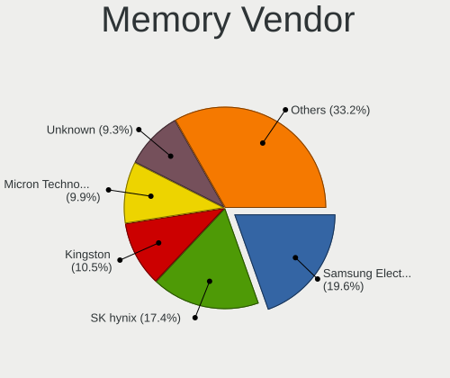

| Vendor                                  | Computers | Percent |
|-----------------------------------------|-----------|---------|
| Samsung Electronics                     | 456       | 19.58%  |
| SK hynix                                | 406       | 17.43%  |
| Kingston                                | 245       | 10.52%  |
| Micron Technology                       | 231       | 9.92%   |
| Unknown                                 | 217       | 9.32%   |
| Crucial                                 | 131       | 5.62%   |
| Corsair                                 | 97        | 4.16%   |
| G.Skill                                 | 64        | 2.75%   |
| A-DATA Technology                       | 52        | 2.23%   |
| Nanya Technology                        | 49        | 2.1%    |
| Elpida                                  | 48        | 2.06%   |
| Ramaxel Technology                      | 40        | 1.72%   |
| Unknown                                 | 34        | 1.46%   |
| Team                                    | 22        | 0.94%   |
| Patriot                                 | 18        | 0.77%   |
| Unknown (ABCD)                          | 16        | 0.69%   |
| Transcend                               | 12        | 0.52%   |
| Smart                                   | 12        | 0.52%   |
| GOODRAM                                 | 12        | 0.52%   |
| AMD                                     | 11        | 0.47%   |
| Timetec                                 | 10        | 0.43%   |
| PNY                                     | 8         | 0.34%   |
| Unknown (0x0E9D)                        | 7         | 0.3%    |
| Silicon Power                           | 7         | 0.3%    |
| Apacer                                  | 7         | 0.3%    |
| SHARETRONIC                             | 6         | 0.26%   |
| Red Hat                                 | 6         | 0.26%   |
| Juhor                                   | 5         | 0.21%   |
| Teikon                                  | 4         | 0.17%   |
| Qimonda                                 | 4         | 0.17%   |
| Avant                                   | 4         | 0.17%   |
| ASint Technology                        | 4         | 0.17%   |
| Wilk                                    | 3         | 0.13%   |
| Patriot Memory (PDP Systems)            | 3         | 0.13%   |
| Multilaser                              | 3         | 0.13%   |
| Golden Empire                           | 3         | 0.13%   |
| Unknown (0000000080CE)                  | 2         | 0.09%   |
| Unifosa                                 | 2         | 0.09%   |
| Toshiba                                 | 2         | 0.09%   |
| Silicon Power Computer & Communications | 2         | 0.09%   |

Memory Model
------------

Memory module models

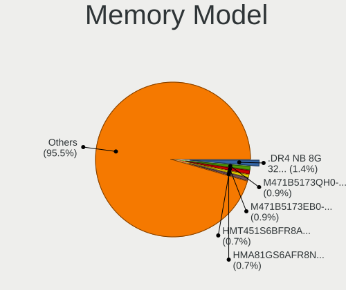

| Model                                                              | Computers | Percent |
|--------------------------------------------------------------------|-----------|---------|
| Unknown                                                            | 34        | 1.35%   |
| Samsung RAM M471B5173QH0-YK0 4GB SODIMM DDR3 1600MT/s              | 22        | 0.88%   |
| Samsung RAM M471B5173EB0-YK0 4GB SODIMM DDR3 1600MT/s              | 22        | 0.88%   |
| SK hynix RAM HMT451S6BFR8A-PB 4GB SODIMM DDR3 1600MT/s             | 17        | 0.68%   |
| SK hynix RAM HMA81GS6AFR8N-UH 8GB SODIMM DDR4 2667MT/s             | 17        | 0.68%   |
| Samsung RAM M471B5273DH0-CH9 4GB SODIMM DDR3 1600MT/s              | 16        | 0.64%   |
| Samsung RAM M471B5173DB0-YK0 4GB SODIMM DDR3 1600MT/s              | 16        | 0.64%   |
| Samsung RAM M471B5773CHS-CH9 2GB SODIMM DDR3 4199MT/s              | 14        | 0.56%   |
| Samsung RAM M471B1G73QH0-YK0 8GB SODIMM DDR3 1600MT/s              | 13        | 0.52%   |
| Unknown RAM Module 4GB DIMM 1333MT/s                               | 11        | 0.44%   |
| Unknown (ABCD) RAM 123456789012345678 2GB SODIMM LPDDR4 2400MT/s   | 11        | 0.44%   |
| SK hynix RAM HMT425S6AFR6A-PB 2GB SODIMM DDR3 3200MT/s             | 11        | 0.44%   |
| SK hynix RAM HMT41GS6BFR8A-PB 8GB SODIMM DDR3 2667MT/s             | 11        | 0.44%   |
| Samsung RAM M471A5244CB0-CWE 4GB SODIMM DDR4 3200MT/s              | 11        | 0.44%   |
| Samsung RAM M471A5244CB0-CTD 4GB SODIMM DDR4 3266MT/s              | 11        | 0.44%   |
| Crucial RAM CT102464BF160B.C16 8GB SODIMM DDR3 1600MT/s            | 11        | 0.44%   |
| Unknown RAM Module 2GB DIMM 1333MT/s                               | 10        | 0.4%    |
| Micron RAM 4ATF51264HZ-2G6E1 4GB SODIMM DDR4 2667MT/s              | 10        | 0.4%    |
| Unknown RAM Module 2GB DIMM SDRAM                                  | 9         | 0.36%   |
| Unknown RAM Module 2GB DIMM DDR2 800MT/s                           | 9         | 0.36%   |
| Unknown RAM Module 2GB DIMM 800MT/s                                | 9         | 0.36%   |
| SK hynix RAM HMA81GS6DJR8N-XN 8GB SODIMM DDR4 3200MT/s             | 9         | 0.36%   |
| Samsung RAM M471B5273CH0-CH9 4GB SODIMM DDR3 1334MT/s              | 9         | 0.36%   |
| Samsung RAM M471B1G73DB0-YK0 8GB SODIMM DDR3 1600MT/s              | 9         | 0.36%   |
| Samsung RAM M471A1K43CB1-CRC 8GB SODIMM DDR4 8400MT/s              | 9         | 0.36%   |
| Micron RAM 8JTF51264AZ-1G6E1 4GB DIMM DDR3 1600MT/s                | 9         | 0.36%   |
| SK hynix RAM Module 4GB SODIMM DDR3 1600MT/s                       | 8         | 0.32%   |
| SK hynix RAM HMT451S6AFR8A-PB 4GB SODIMM DDR3 1600MT/s             | 8         | 0.32%   |
| SK hynix RAM HMT41GS6BFR8A-PB 8GB SODIMM DDR3 1600MT/s             | 8         | 0.32%   |
| SK hynix RAM HMT351S6CFR8C-PB 4GB SODIMM DDR3 1600MT/s             | 8         | 0.32%   |
| SK hynix RAM HMAA1GS6CJR6N-XN 8GB SODIMM DDR4 3200MT/s             | 8         | 0.32%   |
| SK hynix RAM HMA41GS6AFR8N-TF 8GB SODIMM DDR4 2667MT/s             | 8         | 0.32%   |
| Samsung RAM M471B5673FH0-CH9 2048MB SODIMM DDR3 1600MT/s           | 8         | 0.32%   |
| Samsung RAM M471A1K43EB1-CWE 8GB SODIMM DDR4 3200MT/s              | 8         | 0.32%   |
| Samsung RAM M471A1G44AB0-CWE 8GiB SODIMM DDR4 3200MT/s             | 8         | 0.32%   |
| Kingston RAM KHX1600C9D3/4GX 4GB DIMM DDR3 1867MT/s                | 8         | 0.32%   |
| Unknown RAM Module 4GB SODIMM DDR3                                 | 7         | 0.28%   |
| Unknown RAM Module 4GB DIMM DDR3 1333MT/s                          | 7         | 0.28%   |
| Unknown RAM Module 1GB DIMM                                        | 7         | 0.28%   |
| Unknown (0x0E9D) RAM KINSOTIN16GB2666MHZ 16GB SODIMM DDR4 2667MT/s | 7         | 0.28%   |

Memory Kind
-----------

Memory module kinds

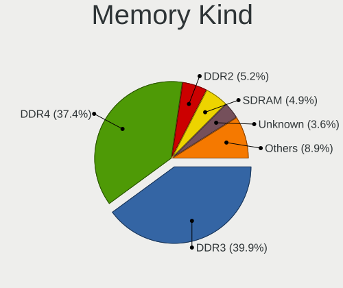

| Kind         | Computers | Percent |
|--------------|-----------|---------|
| DDR3         | 808       | 39.94%  |
| DDR4         | 756       | 37.37%  |
| DDR2         | 106       | 5.24%   |
| SDRAM        | 100       | 4.94%   |
| Unknown      | 72        | 3.56%   |
| DDR5         | 55        | 2.72%   |
| LPDDR4       | 50        | 2.47%   |
| LPDDR5       | 26        | 1.29%   |
| LPDDR3       | 22        | 1.09%   |
| DDR          | 15        | 0.74%   |
| RAM          | 6         | 0.3%    |
| DRAM         | 5         | 0.25%   |
| HBM2         | 1         | 0.05%   |
| DDR2 FB-DIMM | 1         | 0.05%   |

Memory Form Factor
------------------

Physical design of the memory module

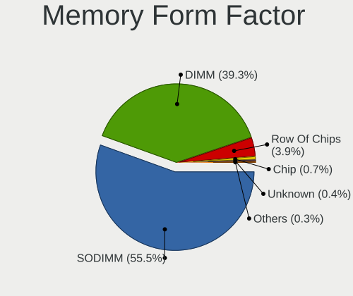

| Name         | Computers | Percent |
|--------------|-----------|---------|
| SODIMM       | 1092      | 55.52%  |
| DIMM         | 773       | 39.3%   |
| Row Of Chips | 76        | 3.86%   |
| Chip         | 13        | 0.66%   |
| Unknown      | 7         | 0.36%   |
| RIMM         | 3         | 0.15%   |
| FB-DIMM      | 2         | 0.1%    |
| Die          | 1         | 0.05%   |

Memory Size
-----------

Memory module size

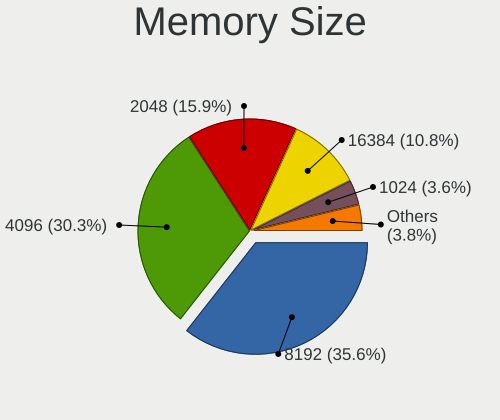

| Size  | Computers | Percent |
|-------|-----------|---------|
| 8192  | 777       | 35.59%  |
| 4096  | 661       | 30.28%  |
| 2048  | 347       | 15.9%   |
| 16384 | 236       | 10.81%  |
| 1024  | 79        | 3.62%   |
| 32768 | 74        | 3.39%   |
| 512   | 5         | 0.23%   |
| 49152 | 1         | 0.05%   |
| 12536 | 1         | 0.05%   |
| 3072  | 1         | 0.05%   |
| 8     | 1         | 0.05%   |

Memory Speed
------------

Memory module speed

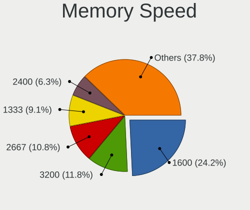

| Speed   | Computers | Percent |
|---------|-----------|---------|
| 1600    | 535       | 24.24%  |
| 3200    | 261       | 11.83%  |
| 2667    | 239       | 10.83%  |
| 1333    | 200       | 9.06%   |
| 2400    | 138       | 6.25%   |
| 2133    | 87        | 3.94%   |
| 800     | 62        | 2.81%   |
| 1334    | 57        | 2.58%   |
| Unknown | 57        | 2.58%   |
| 667     | 51        | 2.31%   |
| 3600    | 50        | 2.27%   |
| 1067    | 36        | 1.63%   |
| 1867    | 35        | 1.59%   |
| 4199    | 30        | 1.36%   |
| 5600    | 23        | 1.04%   |
| 6400    | 21        | 0.95%   |
| 2048    | 21        | 0.95%   |
| 3733    | 19        | 0.86%   |
| 8400    | 17        | 0.77%   |
| 3266    | 17        | 0.77%   |
| 1800    | 16        | 0.72%   |
| 2666    | 15        | 0.68%   |
| 4800    | 14        | 0.63%   |
| 4267    | 14        | 0.63%   |
| 3000    | 14        | 0.63%   |
| 3400    | 13        | 0.59%   |
| 1866    | 12        | 0.54%   |
| 4000    | 11        | 0.5%    |
| 1066    | 11        | 0.5%    |
| 975     | 10        | 0.45%   |
| 2933    | 8         | 0.36%   |
| 533     | 8         | 0.36%   |
| 6000    | 7         | 0.32%   |
| 3800    | 7         | 0.32%   |
| 5200    | 6         | 0.27%   |
| 3466    | 6         | 0.27%   |
| 3066    | 6         | 0.27%   |
| 2000    | 6         | 0.27%   |
| 400     | 5         | 0.23%   |
| 333     | 5         | 0.23%   |

Printers & scanners
-------------------

Printer Vendor
--------------

Printer device vendors

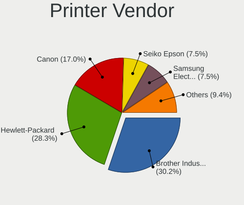

| Vendor              | Computers | Percent |
|---------------------|-----------|---------|
| Brother Industries  | 16        | 30.19%  |
| Hewlett-Packard     | 15        | 28.3%   |
| Canon               | 9         | 16.98%  |
| Seiko Epson         | 4         | 7.55%   |
| Samsung Electronics | 4         | 7.55%   |
| Xerox               | 1         | 1.89%   |
| Prolific Technology | 1         | 1.89%   |
| Pantum              | 1         | 1.89%   |
| Kyocera             | 1         | 1.89%   |
| Apple               | 1         | 1.89%   |

Printer Model
-------------

Printer device models

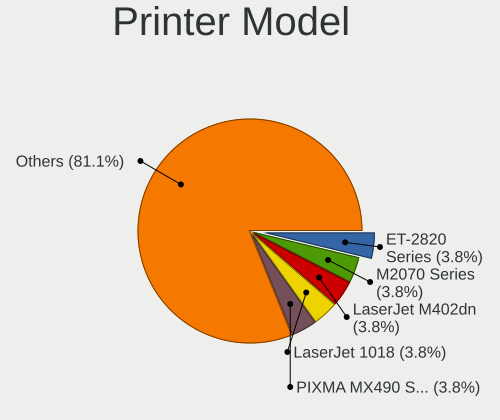

| Model                           | Computers | Percent |
|---------------------------------|-----------|---------|
| Seiko Epson ET-2820 Series      | 2         | 3.77%   |
| Samsung M2070 Series            | 2         | 3.77%   |
| HP LaserJet M402dn              | 2         | 3.77%   |
| HP LaserJet 1018                | 2         | 3.77%   |
| Canon PIXMA MX490 Series        | 2         | 3.77%   |
| Canon LiDE 300                  | 2         | 3.77%   |
| Xerox Phaser 3010               | 1         | 1.89%   |
| Seiko Epson L6270 Series        | 1         | 1.89%   |
| Seiko Epson ET-2710 Series      | 1         | 1.89%   |
| Samsung ML-2850 Series          | 1         | 1.89%   |
| Samsung M2020 Series            | 1         | 1.89%   |
| Prolific PL2305 Parallel Port   | 1         | 1.89%   |
| Pantum M7100DN series           | 1         | 1.89%   |
| Kyocera FS-1116MFP              | 1         | 1.89%   |
| HP Officejet Pro 6230           | 1         | 1.89%   |
| HP Ink Tank 310 series          | 1         | 1.89%   |
| HP HP Laser 107w                | 1         | 1.89%   |
| HP ENVY 4520 series             | 1         | 1.89%   |
| HP DeskJet F4200 series         | 1         | 1.89%   |
| HP DeskJet 6940 series          | 1         | 1.89%   |
| HP DeskJet 4670 series          | 1         | 1.89%   |
| HP DeskJet 3700 series          | 1         | 1.89%   |
| HP DeskJet 2700 series          | 1         | 1.89%   |
| HP DeskJet 2600 series          | 1         | 1.89%   |
| HP Deskjet 1050 J410            | 1         | 1.89%   |
| Canon TS6400 series             | 1         | 1.89%   |
| Canon TS5300 series             | 1         | 1.89%   |
| Canon Pro9000II series          | 1         | 1.89%   |
| Canon PRO-100 series            | 1         | 1.89%   |
| Canon PIXMA MG3600 Series       | 1         | 1.89%   |
| Brother PT-1500PC               | 1         | 1.89%   |
| Brother Printer                 | 1         | 1.89%   |
| Brother MFC-J497DW              | 1         | 1.89%   |
| Brother MFC-J480DW              | 1         | 1.89%   |
| Brother MFC-J470DW              | 1         | 1.89%   |
| Brother MFC-J1010DW             | 1         | 1.89%   |
| Brother HL-L2375DW series       | 1         | 1.89%   |
| Brother HL-52x0 series          | 1         | 1.89%   |
| Brother HL-2270DW Laser Printer | 1         | 1.89%   |
| Brother HL-2140 series          | 1         | 1.89%   |

Scanner Vendor
--------------

Scanner device vendors

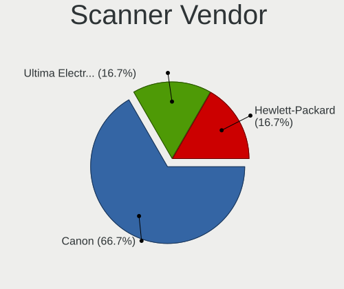

| Vendor             | Computers | Percent |
|--------------------|-----------|---------|
| Canon              | 4         | 66.67%  |
| Ultima Electronics | 1         | 16.67%  |
| Hewlett-Packard    | 1         | 16.67%  |

Scanner Model
-------------

Scanner device models

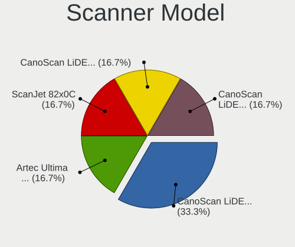

| Model                                                                                 | Computers | Percent |
|---------------------------------------------------------------------------------------|-----------|---------|
| Canon CanoScan LiDE 110                                                               | 2         | 33.33%  |
| Ultima Artec Ultima 2000 (GT6801 based)/Lifetec LT9385/ScanMagic 1200 UB Plus Scanner | 1         | 16.67%  |
| HP ScanJet 82x0C                                                                      | 1         | 16.67%  |
| Canon CanoScan LiDE 210                                                               | 1         | 16.67%  |
| Canon CanoScan LiDE 100                                                               | 1         | 16.67%  |

Camera
------

Camera Vendor
-------------

Camera device vendors

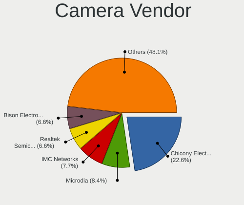

| Vendor                                 | Computers | Percent |
|----------------------------------------|-----------|---------|
| Chicony Electronics                    | 233       | 22.64%  |
| Microdia                               | 86        | 8.36%   |
| IMC Networks                           | 79        | 7.68%   |
| Realtek Semiconductor                  | 68        | 6.61%   |
| Bison Electronics                      | 68        | 6.61%   |
| Sunplus Innovation Technology          | 51        | 4.96%   |
| Cheng Uei Precision Industry (Foxlink) | 48        | 4.66%   |
| Suyin                                  | 47        | 4.57%   |
| Logitech                               | 44        | 4.28%   |
| Apple                                  | 44        | 4.28%   |
| Quanta                                 | 39        | 3.79%   |
| Syntek                                 | 28        | 2.72%   |
| Luxvisions Innotech Limited            | 25        | 2.43%   |
| Lite-On Technology                     | 19        | 1.85%   |
| Alcor Micro                            | 18        | 1.75%   |
| Ricoh                                  | 15        | 1.46%   |
| Lenovo                                 | 14        | 1.36%   |
| Sonix Technology                       | 11        | 1.07%   |
| Importek                               | 11        | 1.07%   |
| Silicon Motion                         | 8         | 0.78%   |
| Microsoft                              | 8         | 0.78%   |
| Z-Star Microelectronics                | 5         | 0.49%   |
| SunplusIT                              | 5         | 0.49%   |
| MacroSilicon                           | 4         | 0.39%   |
| Acer                                   | 4         | 0.39%   |
| Primax Electronics                     | 3         | 0.29%   |
| eMeet                                  | 3         | 0.29%   |
| Samsung Electronics                    | 2         | 0.19%   |
| Linux Foundation                       | 2         | 0.19%   |
| Jieli Technology                       | 2         | 0.19%   |
| icSpring                               | 2         | 0.19%   |
| Generalplus Technology                 | 2         | 0.19%   |
| GEMBIRD                                | 2         | 0.19%   |
| Cubeternet                             | 2         | 0.19%   |
| BUFFALO                                | 2         | 0.19%   |
| ALi                                    | 2         | 0.19%   |
| webcam                                 | 1         | 0.1%    |
| WaveRider Communications               | 1         | 0.1%    |
| Unknown                                | 1         | 0.1%    |
| Sunplus Technology                     | 1         | 0.1%    |

Camera Model
------------

Camera device models

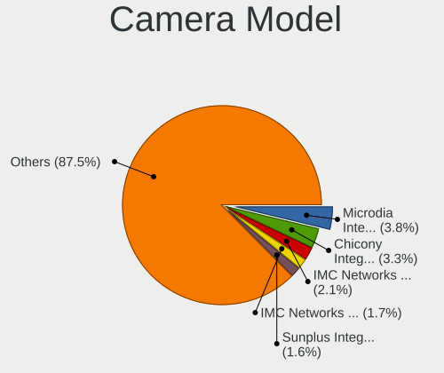

| Model                                                          | Computers | Percent |
|----------------------------------------------------------------|-----------|---------|
| Microdia Integrated_Webcam_HD                                  | 39        | 3.76%   |
| Chicony Integrated Camera                                      | 34        | 3.28%   |
| IMC Networks USB2.0 HD UVC WebCam                              | 22        | 2.12%   |
| IMC Networks Integrated Camera                                 | 18        | 1.74%   |
| Sunplus Integrated_Webcam_HD                                   | 17        | 1.64%   |
| Bison Integrated Camera                                        | 17        | 1.64%   |
| Syntek Integrated Camera                                       | 16        | 1.54%   |
| Realtek Integrated_Webcam_HD                                   | 16        | 1.54%   |
| Chicony HD WebCam                                              | 16        | 1.54%   |
| Apple FaceTime HD Camera (Built-in)                            | 16        | 1.54%   |
| Logitech Webcam C270                                           | 15        | 1.45%   |
| Realtek USB Camera                                             | 14        | 1.35%   |
| Apple Built-in iSight                                          | 13        | 1.25%   |
| Chicony HP Truevision HD camera                                | 12        | 1.16%   |
| Cheng Uei Precision Industry (Foxlink) HP Webcam               | 11        | 1.06%   |
| Microdia Integrated Webcam                                     | 10        | 0.97%   |
| Chicony VGA Webcam                                             | 10        | 0.97%   |
| Chicony HP Truevision HD                                       | 10        | 0.97%   |
| Chicony FJ Camera                                              | 10        | 0.97%   |
| Suyin Integrated_Webcam_HD                                     | 9         | 0.87%   |
| Luxvisions Innotech Limited HP TrueVision HD Camera            | 9         | 0.87%   |
| Logitech HD Pro Webcam C920                                    | 9         | 0.87%   |
| Chicony USB2.0 VGA UVC WebCam                                  | 9         | 0.87%   |
| Chicony USB2.0 HD UVC WebCam                                   | 9         | 0.87%   |
| Cheng Uei Precision Industry (Foxlink) HP TrueVision HD Camera | 9         | 0.87%   |
| Quanta HP TrueVision HD Camera                                 | 8         | 0.77%   |
| IMC Networks USB2.0 VGA UVC WebCam                             | 8         | 0.77%   |
| Bison Lenovo Integrated Webcam                                 | 8         | 0.77%   |
| Bison Lenovo EasyCamera                                        | 8         | 0.77%   |
| Bison HD Webcam                                                | 8         | 0.77%   |
| Sonix USB2.0 HD UVC WebCam                                     | 7         | 0.68%   |
| Microdia Integrated Webcam HD                                  | 7         | 0.68%   |
| IMC Networks Lenovo EasyCamera                                 | 7         | 0.68%   |
| Chicony HP Webcam                                              | 7         | 0.68%   |
| Chicony HP HD Camera                                           | 7         | 0.68%   |
| Apple FaceTime HD Camera                                       | 7         | 0.68%   |
| Suyin Acer/HP Integrated Webcam [CN0314]                       | 6         | 0.58%   |
| Realtek Integrated Webcam                                      | 6         | 0.58%   |
| Lite-On Integrated Camera                                      | 6         | 0.58%   |
| Lenovo Integrated Webcam [R5U877]                              | 6         | 0.58%   |

Security
--------

Fingerprint Vendor
------------------

Fingerprint sensor vendors

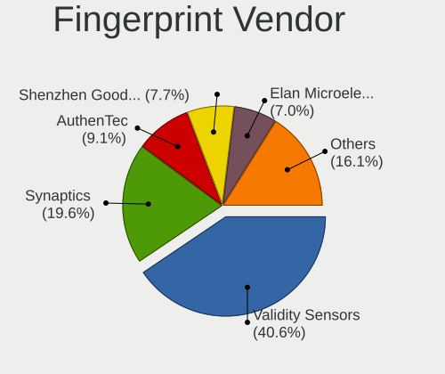

| Vendor                             | Computers | Percent |
|------------------------------------|-----------|---------|
| Validity Sensors                   | 58        | 40.56%  |
| Synaptics                          | 28        | 19.58%  |
| AuthenTec                          | 13        | 9.09%   |
| Shenzhen Goodix Technology         | 11        | 7.69%   |
| Elan Microelectronics              | 10        | 6.99%   |
| Upek                               | 8         | 5.59%   |
| LighTuning Technology              | 7         | 4.9%    |
| STMicroelectronics                 | 5         | 3.5%    |
| Realtek USB2.0 Finger Print Bridge | 2         | 1.4%    |
| Samsung Electronics                | 1         | 0.7%    |

Fingerprint Model
-----------------

Fingerprint sensor models

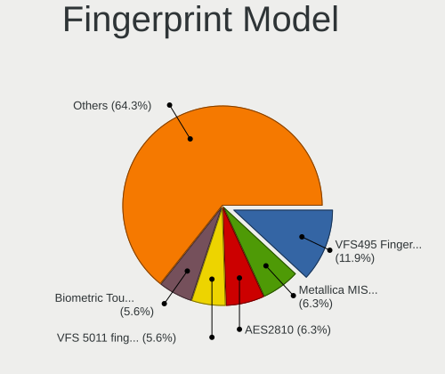

| Model                                                                      | Computers | Percent |
|----------------------------------------------------------------------------|-----------|---------|
| Validity Sensors VFS495 Fingerprint Reader                                 | 17        | 11.89%  |
| Synaptics Metallica MIS Touch Fingerprint Reader                           | 9         | 6.29%   |
| AuthenTec AES2810                                                          | 9         | 6.29%   |
| Validity Sensors VFS 5011 fingerprint sensor                               | 8         | 5.59%   |
| Upek Biometric Touchchip/Touchstrip Fingerprint Sensor                     | 8         | 5.59%   |
| Synaptics Prometheus MIS Touch Fingerprint Reader                          | 7         | 4.9%    |
| Shenzhen Goodix  FingerPrint Device                                        | 7         | 4.9%    |
| Validity Sensors VFS491                                                    | 6         | 4.2%    |
| Validity Sensors VFS471 Fingerprint Reader                                 | 6         | 4.2%    |
| Elan ELAN:Fingerprint                                                      | 6         | 4.2%    |
| Validity Sensors VFS5011 Fingerprint Reader                                | 5         | 3.5%    |
| STMicroelectronics Fingerprint Reader                                      | 5         | 3.5%    |
| Elan ELAN:ARM-M4                                                           | 4         | 2.8%    |
| Synaptics WBDI                                                             | 3         | 2.1%    |
| Synaptics FS7604 Touch Fingerprint Sensor with PurePrint                   | 3         | 2.1%    |
| Shenzhen Goodix Fingerprint Reader                                         | 3         | 2.1%    |
| LighTuning Fingerprint Reader                                              | 3         | 2.1%    |
| Validity Sensors VFS451 Fingerprint Reader                                 | 2         | 1.4%    |
| Validity Sensors VFS Fingerprint sensor                                    | 2         | 1.4%    |
| Validity Sensors Synaptics WBDI                                            | 2         | 1.4%    |
| Validity Sensors Synaptics VFS7552 Touch Fingerprint Sensor with PurePrint | 2         | 1.4%    |
| Validity Sensors Swipe Fingerprint Sensor                                  | 2         | 1.4%    |
| Validity Sensors Fingerprint scanner                                       | 2         | 1.4%    |
| Synaptics Fingerprint reader [HP G6]                                       | 2         | 1.4%    |
| Realtek USB2.0 Finger Print Bridge FocalTech Fingerprint Device            | 2         | 1.4%    |
| LighTuning ES603 Swipe Fingerprint Sensor                                  | 2         | 1.4%    |
| Validity Sensors VFS7552 Touch Fingerprint Sensor                          | 1         | 0.7%    |
| Validity Sensors VFS7500 Touch Fingerprint Sensor                          | 1         | 0.7%    |
| Validity Sensors VFS301 Fingerprint Reader                                 | 1         | 0.7%    |
| Validity Sensors VFS101 Fingerprint Reader                                 | 1         | 0.7%    |
| Synaptics WBDI Device                                                      | 1         | 0.7%    |
| Synaptics  WBDI                                                            | 1         | 0.7%    |
| Synaptics Prometheus Fingerprint Reader                                    | 1         | 0.7%    |
| Synaptics Metallica MOH Touch Fingerprint Reader                           | 1         | 0.7%    |
| Shenzhen Goodix FingerPrint                                                | 1         | 0.7%    |
| Samsung Fingerprint Sensor Device - 730B                                   | 1         | 0.7%    |
| LighTuning Fingerprint Sensor                                              | 1         | 0.7%    |
| LighTuning EgisTec Touch Fingerprint Sensor                                | 1         | 0.7%    |
| AuthenTec Fingerprint Sensor                                               | 1         | 0.7%    |
| AuthenTec AES2550 Fingerprint Sensor                                       | 1         | 0.7%    |

Chipcard Vendor
---------------

Chipcard module vendors

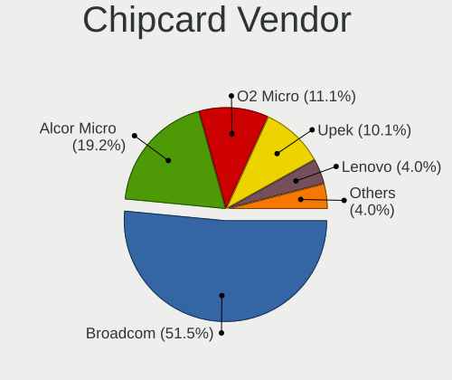

| Vendor                | Computers | Percent |
|-----------------------|-----------|---------|
| Broadcom              | 51        | 51.52%  |
| Alcor Micro           | 19        | 19.19%  |
| O2 Micro              | 11        | 11.11%  |
| Upek                  | 10        | 10.1%   |
| Lenovo                | 4         | 4.04%   |
| SCM Microsystems      | 2         | 2.02%   |
| Gemalto (was Gemplus) | 2         | 2.02%   |

Chipcard Model
--------------

Chipcard module models

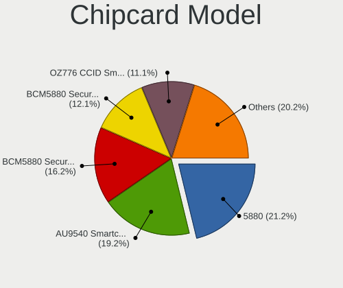

| Model                                                                        | Computers | Percent |
|------------------------------------------------------------------------------|-----------|---------|
| Broadcom 5880                                                                | 21        | 21.21%  |
| Alcor Micro AU9540 Smartcard Reader                                          | 19        | 19.19%  |
| Broadcom BCM5880 Secure Applications Processor                               | 16        | 16.16%  |
| Broadcom BCM5880 Secure Applications Processor with fingerprint swipe sensor | 12        | 12.12%  |
| O2 Micro OZ776 CCID Smartcard Reader                                         | 11        | 11.11%  |
| Upek TouchChip Fingerprint Coprocessor (WBF advanced mode)                   | 10        | 10.1%   |
| Lenovo Integrated Smart Card Reader                                          | 4         | 4.04%   |
| SCM Microsystems SCR3340 - ExpressCard54 Smart Card Reader                   | 2         | 2.02%   |
| Gemalto (was Gemplus) GemPC Twin SmartCard Reader                            | 2         | 2.02%   |
| Broadcom 58200                                                               | 2         | 2.02%   |

Unsupported
-----------

Unsupported Devices
-------------------

Total unsupported devices on board

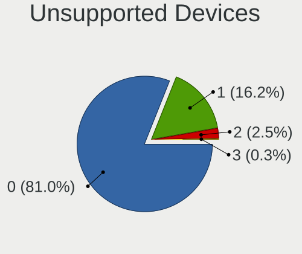

| Total | Computers | Percent |
|-------|-----------|---------|
| 0     | 1607      | 81.04%  |
| 1     | 321       | 16.19%  |
| 2     | 49        | 2.47%   |
| 3     | 6         | 0.3%    |

Unsupported Device Types
------------------------

Types of unsupported devices

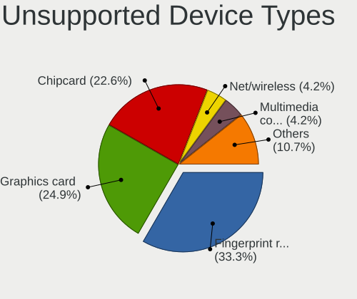

| Type                     | Computers | Percent |
|--------------------------|-----------|---------|
| Fingerprint reader       | 143       | 33.33%  |
| Graphics card            | 107       | 24.94%  |
| Chipcard                 | 97        | 22.61%  |
| Net/wireless             | 18        | 4.2%    |
| Multimedia controller    | 18        | 4.2%    |
| Bluetooth                | 11        | 2.56%   |
| Unassigned class         | 10        | 2.33%   |
| Storage                  | 5         | 1.17%   |
| Communication controller | 5         | 1.17%   |
| Camera                   | 5         | 1.17%   |
| Sound                    | 3         | 0.7%    |
| Net/ethernet             | 3         | 0.7%    |
| Card reader              | 2         | 0.47%   |
| Network                  | 1         | 0.23%   |
| Flash memory             | 1         | 0.23%   |

