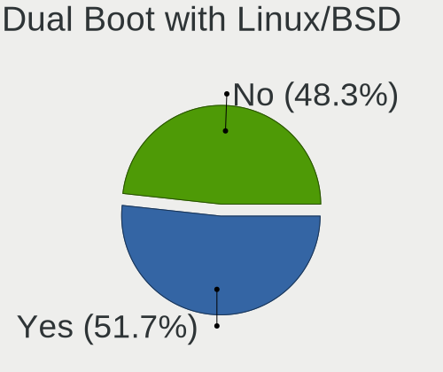
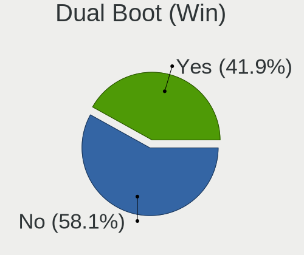
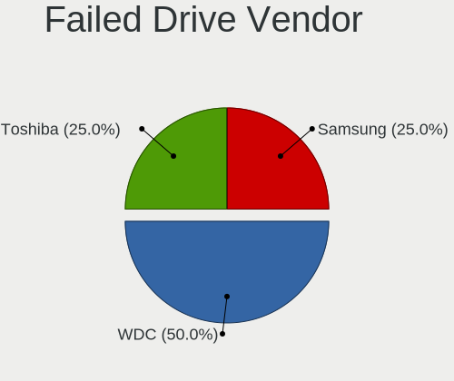
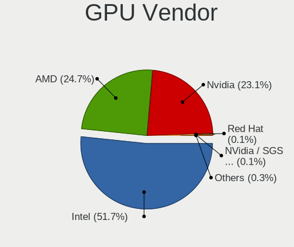
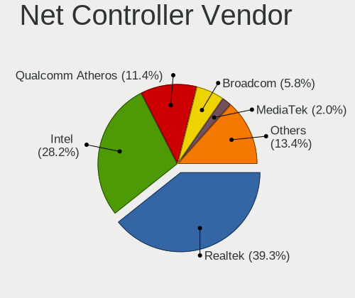
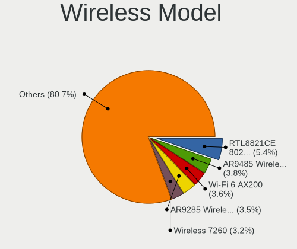
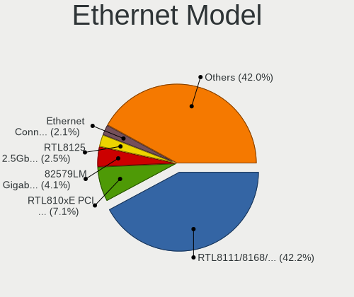
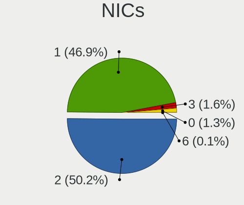
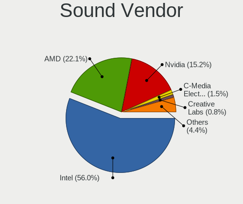

OpenMandriva 5.0 - Tested Hardware & Statistics
-----------------------------------------------

A project to collect tested hardware configurations for OpenMandriva 5.0.

Anyone can contribute to this report by the [hw-probe](https://github.com/linuxhw/hw-probe) tool:

    sudo -E hw-probe -all -upload

Please contribute! Especially if your hardware is rare.

This is a report for all computer types. See also reports for [desktops](/Dist/OpenMandriva_5.0/Desktop/README.md) and [notebooks](/Dist/OpenMandriva_5.0/Notebook/README.md).

Contents
--------

* [ Test Cases ](#test-cases)

* [ System ](#system)
  - [ Kernel                   ](#kernel)
  - [ Kernel Family            ](#kernel-family)
  - [ Kernel Major Ver.        ](#kernel-major-ver)
  - [ Arch                     ](#arch)
  - [ DE                       ](#de)
  - [ Display Server           ](#display-server)
  - [ Display Manager          ](#display-manager)
  - [ OS Lang                  ](#os-lang)
  - [ Boot Mode                ](#boot-mode)
  - [ Filesystem               ](#filesystem)
  - [ Part. scheme             ](#part-scheme)
  - [ Dual Boot with Linux/BSD ](#dual-boot-with-linuxbsd)
  - [ Dual Boot (Win)          ](#dual-boot-win)

* [ Board ](#board)
  - [ Vendor                   ](#vendor)
  - [ Model                    ](#model)
  - [ Model Family             ](#model-family)
  - [ MFG Year                 ](#mfg-year)
  - [ Form Factor              ](#form-factor)
  - [ Secure Boot              ](#secure-boot)
  - [ Coreboot                 ](#coreboot)
  - [ RAM Size                 ](#ram-size)
  - [ RAM Used                 ](#ram-used)
  - [ Total Drives             ](#total-drives)
  - [ Has CD-ROM               ](#has-cd-rom)
  - [ Has Ethernet             ](#has-ethernet)
  - [ Has WiFi                 ](#has-wifi)
  - [ Has Bluetooth            ](#has-bluetooth)

* [ Location ](#location)
  - [ Country                  ](#country)
  - [ City                     ](#city)

* [ Drives ](#drives)
  - [ Drive Vendor             ](#drive-vendor)
  - [ Drive Model              ](#drive-model)
  - [ HDD Vendor               ](#hdd-vendor)
  - [ SSD Vendor               ](#ssd-vendor)
  - [ Drive Kind               ](#drive-kind)
  - [ Drive Connector          ](#drive-connector)
  - [ Drive Size               ](#drive-size)
  - [ Space Total              ](#space-total)
  - [ Space Used               ](#space-used)
  - [ Malfunc. Drives          ](#malfunc-drives)
  - [ Malfunc. Drive Vendor    ](#malfunc-drive-vendor)
  - [ Malfunc. HDD Vendor      ](#malfunc-hdd-vendor)
  - [ Malfunc. Drive Kind      ](#malfunc-drive-kind)
  - [ Failed Drives            ](#failed-drives)
  - [ Failed Drive Vendor      ](#failed-drive-vendor)
  - [ Drive Status             ](#drive-status)

* [ Storage controller ](#storage-controller)
  - [ Storage Vendor           ](#storage-vendor)
  - [ Storage Model            ](#storage-model)
  - [ Storage Kind             ](#storage-kind)

* [ Processor ](#processor)
  - [ CPU Vendor               ](#cpu-vendor)
  - [ CPU Model                ](#cpu-model)
  - [ CPU Model Family         ](#cpu-model-family)
  - [ CPU Cores                ](#cpu-cores)
  - [ CPU Sockets              ](#cpu-sockets)
  - [ CPU Threads              ](#cpu-threads)
  - [ CPU Op-Modes             ](#cpu-op-modes)
  - [ CPU Microcode            ](#cpu-microcode)
  - [ CPU Microarch            ](#cpu-microarch)

* [ Graphics ](#graphics)
  - [ GPU Vendor               ](#gpu-vendor)
  - [ GPU Model                ](#gpu-model)
  - [ GPU Combo                ](#gpu-combo)
  - [ GPU Driver               ](#gpu-driver)
  - [ GPU Memory               ](#gpu-memory)

* [ Monitor ](#monitor)
  - [ Monitor Vendor           ](#monitor-vendor)
  - [ Monitor Model            ](#monitor-model)
  - [ Monitor Resolution       ](#monitor-resolution)
  - [ Monitor Diagonal         ](#monitor-diagonal)
  - [ Monitor Width            ](#monitor-width)
  - [ Aspect Ratio             ](#aspect-ratio)
  - [ Monitor Area             ](#monitor-area)
  - [ Pixel Density            ](#pixel-density)
  - [ Multiple Monitors        ](#multiple-monitors)

* [ Network ](#network)
  - [ Net Controller Vendor    ](#net-controller-vendor)
  - [ Net Controller Model     ](#net-controller-model)
  - [ Wireless Vendor          ](#wireless-vendor)
  - [ Wireless Model           ](#wireless-model)
  - [ Ethernet Vendor          ](#ethernet-vendor)
  - [ Ethernet Model           ](#ethernet-model)
  - [ Net Controller Kind      ](#net-controller-kind)
  - [ Used Controller          ](#used-controller)
  - [ NICs                     ](#nics)
  - [ IPv6                     ](#ipv6)

* [ Bluetooth ](#bluetooth)
  - [ Bluetooth Vendor         ](#bluetooth-vendor)
  - [ Bluetooth Model          ](#bluetooth-model)

* [ Sound ](#sound)
  - [ Sound Vendor             ](#sound-vendor)
  - [ Sound Model              ](#sound-model)

* [ Memory ](#memory)
  - [ Memory Vendor            ](#memory-vendor)
  - [ Memory Model             ](#memory-model)
  - [ Memory Kind              ](#memory-kind)
  - [ Memory Form Factor       ](#memory-form-factor)
  - [ Memory Size              ](#memory-size)
  - [ Memory Speed             ](#memory-speed)

* [ Printers & scanners ](#printers--scanners)
  - [ Printer Vendor           ](#printer-vendor)
  - [ Printer Model            ](#printer-model)
  - [ Scanner Vendor           ](#scanner-vendor)
  - [ Scanner Model            ](#scanner-model)

* [ Camera ](#camera)
  - [ Camera Vendor            ](#camera-vendor)
  - [ Camera Model             ](#camera-model)

* [ Security ](#security)
  - [ Fingerprint Vendor       ](#fingerprint-vendor)
  - [ Fingerprint Model        ](#fingerprint-model)
  - [ Chipcard Vendor          ](#chipcard-vendor)
  - [ Chipcard Model           ](#chipcard-model)

* [ Unsupported ](#unsupported)
  - [ Unsupported Devices      ](#unsupported-devices)
  - [ Unsupported Device Types ](#unsupported-device-types)

Test Cases
----------

Total: 1340

| Vendor        | Model                       | Form-Factor | Probe                                                      | Date         |
|---------------|-----------------------------|-------------|------------------------------------------------------------|--------------|
| ASUSTek       | VivoBook_ASUSLaptop E410... | Notebook    | [7b12164813](https://linux-hardware.org/?probe=7b12164813) | Jan 06, 2025 |
| MSI           | Katana 17 B12UCR            | Notebook    | [9a04090ded](https://linux-hardware.org/?probe=9a04090ded) | Jan 06, 2025 |
| ASUSTek       | K30BF_M32BF_A_F_K31BF_6     | Desktop     | [0b29006a62](https://linux-hardware.org/?probe=0b29006a62) | Jan 06, 2025 |
| MAXSUN        | MS-A86FX FS M.3             | Desktop     | [778b3689c2](https://linux-hardware.org/?probe=778b3689c2) | Jan 05, 2025 |
| MSI           | B450M MORTAR MAX            | Desktop     | [46e01ddb23](https://linux-hardware.org/?probe=46e01ddb23) | Jan 05, 2025 |
| Gigabyte      | B560M AORUS PRO             | Desktop     | [f43945b8dd](https://linux-hardware.org/?probe=f43945b8dd) | Jan 05, 2025 |
| Dell          | 01Y1CJ A00                  | Mini pc     | [79856fbf5b](https://linux-hardware.org/?probe=79856fbf5b) | Jan 05, 2025 |
| Gigabyte      | 965GM-S2                    | Desktop     | [7d033b5974](https://linux-hardware.org/?probe=7d033b5974) | Jan 04, 2025 |
| HP            | 339A                        | Desktop     | [7fc68e979e](https://linux-hardware.org/?probe=7fc68e979e) | Jan 03, 2025 |
| Gigabyte      | B365M DS3H                  | Desktop     | [a49fde4df3](https://linux-hardware.org/?probe=a49fde4df3) | Jan 02, 2025 |
| Dell          | Latitude 7390               | Notebook    | [ca0c827c18](https://linux-hardware.org/?probe=ca0c827c18) | Jan 01, 2025 |
| Lenovo        | IdeaCentre A700 10050       | Notebook    | [e7f468af21](https://linux-hardware.org/?probe=e7f468af21) | Jan 01, 2025 |
| Dell          | 02YYK5 A01                  | Desktop     | [97f04c0b58](https://linux-hardware.org/?probe=97f04c0b58) | Jan 01, 2025 |
| Dell          | Latitude E7470              | Notebook    | [b4c31f2860](https://linux-hardware.org/?probe=b4c31f2860) | Jan 01, 2025 |
| Dell          | 00V62H A01                  | Desktop     | [0133ba1278](https://linux-hardware.org/?probe=0133ba1278) | Jan 01, 2025 |
| Dell          | Latitude 7390               | Notebook    | [1328b0b059](https://linux-hardware.org/?probe=1328b0b059) | Jan 01, 2025 |
| Gigabyte      | H81M-S2PH                   | Desktop     | [8e18f9641a](https://linux-hardware.org/?probe=8e18f9641a) | Dec 31, 2024 |
| ASRock        | B450M-HDV R4.0              | Desktop     | [c996300bbf](https://linux-hardware.org/?probe=c996300bbf) | Dec 31, 2024 |
| Toshiba       | Satellite L300              | Notebook    | [3104c13f02](https://linux-hardware.org/?probe=3104c13f02) | Dec 31, 2024 |
| Lenovo        | MAHOBAY                     | Desktop     | [3e28e8ad9e](https://linux-hardware.org/?probe=3e28e8ad9e) | Dec 31, 2024 |
| Lenovo        | G470 20078                  | Notebook    | [9d15c84512](https://linux-hardware.org/?probe=9d15c84512) | Dec 31, 2024 |
| Lenovo        | B560 43308LG                | Notebook    | [e4f739103a](https://linux-hardware.org/?probe=e4f739103a) | Dec 31, 2024 |
| Lenovo        | G460 20041                  | Notebook    | [f5b6aed89d](https://linux-hardware.org/?probe=f5b6aed89d) | Dec 31, 2024 |
| HP            | Victus by Gaming Laptop ... | Notebook    | [9dd96b42dd](https://linux-hardware.org/?probe=9dd96b42dd) | Dec 31, 2024 |
| Acer          | Aspire E1-571G              | Notebook    | [a589ad91b5](https://linux-hardware.org/?probe=a589ad91b5) | Dec 30, 2024 |
| HP            | 8054                        | Desktop     | [c48b0d78c7](https://linux-hardware.org/?probe=c48b0d78c7) | Dec 30, 2024 |
| Gateway       | DX4860                      | Desktop     | [8fada96b83](https://linux-hardware.org/?probe=8fada96b83) | Dec 30, 2024 |
| ASRock        | H110M-ITX                   | Desktop     | [c76e007602](https://linux-hardware.org/?probe=c76e007602) | Dec 30, 2024 |
| Dell          | 0G261D A00                  | Desktop     | [8fb7d29eda](https://linux-hardware.org/?probe=8fb7d29eda) | Dec 30, 2024 |
| HP            | Pavilion x360 Convertibl... | Convertible | [f9daa89a03](https://linux-hardware.org/?probe=f9daa89a03) | Dec 30, 2024 |
| Apple         | MacBookAir6,1               | Notebook    | [3421670edf](https://linux-hardware.org/?probe=3421670edf) | Dec 29, 2024 |
| ASUSTek       | PRIME A320M-K               | Desktop     | [dae8bf9671](https://linux-hardware.org/?probe=dae8bf9671) | Dec 29, 2024 |
| HP            | Compaq 610                  | Notebook    | [af961e1650](https://linux-hardware.org/?probe=af961e1650) | Dec 29, 2024 |
| HP            | 2B47                        | Desktop     | [1415963334](https://linux-hardware.org/?probe=1415963334) | Dec 28, 2024 |
| ASUSTek       | S300CA                      | Notebook    | [7225fa5b22](https://linux-hardware.org/?probe=7225fa5b22) | Dec 27, 2024 |
| Gigabyte      | P55-UD3L                    | Desktop     | [1d3d66f3ac](https://linux-hardware.org/?probe=1d3d66f3ac) | Dec 27, 2024 |
| Acer          | Aspire A315-34              | Notebook    | [c8bcfc6c53](https://linux-hardware.org/?probe=c8bcfc6c53) | Dec 27, 2024 |
| HP            | ProBook 440 G5              | Notebook    | [eb07190046](https://linux-hardware.org/?probe=eb07190046) | Dec 27, 2024 |
| HP            | 212B                        | Desktop     | [0f306fdade](https://linux-hardware.org/?probe=0f306fdade) | Dec 26, 2024 |
| HP            | 8267 A01                    | Mini pc     | [3962382133](https://linux-hardware.org/?probe=3962382133) | Dec 25, 2024 |
| Dell          | 0GM819                      | Desktop     | [bb31438b8d](https://linux-hardware.org/?probe=bb31438b8d) | Dec 25, 2024 |
| ASUSTek       | M5A78L LE                   | Desktop     | [0705f8159c](https://linux-hardware.org/?probe=0705f8159c) | Dec 25, 2024 |
| Apple         | MacBookPro9,2               | Notebook    | [c289d2b95b](https://linux-hardware.org/?probe=c289d2b95b) | Dec 25, 2024 |
| Chuwi         | FreeBook                    | Notebook    | [91ad67a5f0](https://linux-hardware.org/?probe=91ad67a5f0) | Dec 25, 2024 |
| Lenovo        | 330B NOK                    | Mini pc     | [c7923dd9ce](https://linux-hardware.org/?probe=c7923dd9ce) | Dec 24, 2024 |
| Biostar       | H61MGC                      | Desktop     | [41e894b300](https://linux-hardware.org/?probe=41e894b300) | Dec 24, 2024 |
| ASUSTek       | GL10DH                      | Desktop     | [4d95f402c4](https://linux-hardware.org/?probe=4d95f402c4) | Dec 24, 2024 |
| Acer          | Aspire E1-531               | Notebook    | [2d5eef0754](https://linux-hardware.org/?probe=2d5eef0754) | Dec 24, 2024 |
| ASUSTek       | S301LA                      | Notebook    | [eeecff1e67](https://linux-hardware.org/?probe=eeecff1e67) | Dec 24, 2024 |
| AZW           | SER V01                     | Mini pc     | [8532cd0283](https://linux-hardware.org/?probe=8532cd0283) | Dec 24, 2024 |
| Wistron       | ProLiant ML110 G6           | Desktop     | [1609625a37](https://linux-hardware.org/?probe=1609625a37) | Dec 24, 2024 |
| Acer          | RS780HVF                    | Desktop     | [bbc9e843db](https://linux-hardware.org/?probe=bbc9e843db) | Dec 23, 2024 |
| Dell          | Inspiron 5570               | Notebook    | [3d94539bde](https://linux-hardware.org/?probe=3d94539bde) | Dec 23, 2024 |
| Positivo      | W940TU                      | Notebook    | [b5cb158e93](https://linux-hardware.org/?probe=b5cb158e93) | Dec 23, 2024 |
| Lenovo        | Bantry CRB 31900002 WIN ... | Desktop     | [2a9d2d981b](https://linux-hardware.org/?probe=2a9d2d981b) | Dec 23, 2024 |
| Acer          | Extensa X2610G              | Desktop     | [b056768ca1](https://linux-hardware.org/?probe=b056768ca1) | Dec 23, 2024 |
| Gigabyte      | AERO 17 XD                  | Notebook    | [c40df5f781](https://linux-hardware.org/?probe=c40df5f781) | Dec 23, 2024 |
| Toshiba       | Satellite L855              | Notebook    | [6c895d905f](https://linux-hardware.org/?probe=6c895d905f) | Dec 23, 2024 |
| ASUSTek       | PN40                        | Mini pc     | [3605503634](https://linux-hardware.org/?probe=3605503634) | Dec 22, 2024 |
| HP            | Victus by Gaming Laptop ... | Notebook    | [aa520e1fb6](https://linux-hardware.org/?probe=aa520e1fb6) | Dec 22, 2024 |
| Apple         | Mac-F226BEC8 PVT            | All in one  | [ea79248920](https://linux-hardware.org/?probe=ea79248920) | Dec 22, 2024 |
| Lenovo        | ThinkPad P70 20ESS03100     | Notebook    | [14939efad3](https://linux-hardware.org/?probe=14939efad3) | Dec 21, 2024 |
| MSI           | Modern 14 B5M               | Notebook    | [3cd6bb8b87](https://linux-hardware.org/?probe=3cd6bb8b87) | Dec 21, 2024 |
| Intel         | X99-P4 V8.2                 | Desktop     | [a590e5197c](https://linux-hardware.org/?probe=a590e5197c) | Dec 21, 2024 |
| Dell          | Latitude E7440              | Notebook    | [f9518bb970](https://linux-hardware.org/?probe=f9518bb970) | Dec 21, 2024 |
| HP            | EliteBook 2530p             | Notebook    | [883099a4db](https://linux-hardware.org/?probe=883099a4db) | Dec 21, 2024 |
| ASUSTek       | X555QA                      | Notebook    | [9d4e896d0e](https://linux-hardware.org/?probe=9d4e896d0e) | Dec 21, 2024 |
| Fujitsu       | LIFEBOOK U727               | Notebook    | [b10ff0a543](https://linux-hardware.org/?probe=b10ff0a543) | Dec 21, 2024 |
| Dell          | Inspiron 16 5625            | Notebook    | [5a95719cdd](https://linux-hardware.org/?probe=5a95719cdd) | Dec 20, 2024 |
| Acer          | Aspire A515-51              | Notebook    | [7784c8e1a1](https://linux-hardware.org/?probe=7784c8e1a1) | Dec 20, 2024 |
| Gigabyte      | B560M DS3H                  | Desktop     | [f28c3f8b25](https://linux-hardware.org/?probe=f28c3f8b25) | Dec 20, 2024 |
| Lenovo        | Yoga 510-14ISK 80UK         | Notebook    | [4fa862c4fc](https://linux-hardware.org/?probe=4fa862c4fc) | Dec 20, 2024 |
| Toshiba       | Satellite Radius P55W-B     | Notebook    | [2d39b0942b](https://linux-hardware.org/?probe=2d39b0942b) | Dec 20, 2024 |
| Fujitsu       | LIFEBOOK A512               | Notebook    | [258065d3b9](https://linux-hardware.org/?probe=258065d3b9) | Dec 19, 2024 |
| Apple         | MacBookPro5,5               | Notebook    | [b1518e567c](https://linux-hardware.org/?probe=b1518e567c) | Dec 19, 2024 |
| SZMZ          | B75-MS V1.0                 | Desktop     | [ab711506a2](https://linux-hardware.org/?probe=ab711506a2) | Dec 19, 2024 |
| Acer          | Spin SP513-53N              | Convertible | [6a294f74e1](https://linux-hardware.org/?probe=6a294f74e1) | Dec 19, 2024 |
| Alienware     | m15 R3                      | Notebook    | [2fc2e09f62](https://linux-hardware.org/?probe=2fc2e09f62) | Dec 19, 2024 |
| Gigabyte      | Q87M-D2H                    | Desktop     | [b99f7b8080](https://linux-hardware.org/?probe=b99f7b8080) | Dec 18, 2024 |
| Apple         | Mac-F4238CC8 PVT            | All in one  | [3743326c9a](https://linux-hardware.org/?probe=3743326c9a) | Dec 18, 2024 |
| ASUSTek       | M4A79XTD EVO                | Desktop     | [94308b304f](https://linux-hardware.org/?probe=94308b304f) | Dec 18, 2024 |
| ASUSTek       | PRIME A320M-K               | Desktop     | [348937254f](https://linux-hardware.org/?probe=348937254f) | Dec 18, 2024 |
| Lenovo        | ThinkPad L15 Gen 1 20U8S... | Notebook    | [07d669f90a](https://linux-hardware.org/?probe=07d669f90a) | Dec 18, 2024 |
| HP            | 829E                        | Mini pc     | [c1dab94853](https://linux-hardware.org/?probe=c1dab94853) | Dec 18, 2024 |
| Unknown       | Unknown                     | Desktop     | [deb145f9f9](https://linux-hardware.org/?probe=deb145f9f9) | Dec 18, 2024 |
| Lenovo        | ThinkPad E15 20RD005HUS     | Notebook    | [eadc7945cf](https://linux-hardware.org/?probe=eadc7945cf) | Dec 17, 2024 |
| Lenovo        | IdeaPad Y580                | Notebook    | [9cbbd96a18](https://linux-hardware.org/?probe=9cbbd96a18) | Dec 17, 2024 |
| ASUSTek       | E202SA                      | Notebook    | [b4fe788f4e](https://linux-hardware.org/?probe=b4fe788f4e) | Dec 17, 2024 |
| HP            | Laptop 14-ck0xxx            | Notebook    | [eee288c125](https://linux-hardware.org/?probe=eee288c125) | Dec 17, 2024 |
| HP            | 83F2                        | Desktop     | [d6f68a1e91](https://linux-hardware.org/?probe=d6f68a1e91) | Dec 16, 2024 |
| MSI           | A320M-A PRO MAX             | Desktop     | [9c3b938ad7](https://linux-hardware.org/?probe=9c3b938ad7) | Dec 15, 2024 |
| Dell          | Inspiron 3558               | Notebook    | [d2b0dd8e1c](https://linux-hardware.org/?probe=d2b0dd8e1c) | Dec 15, 2024 |
| ASUSTek       | VivoBook_ASUSLaptop M650... | Notebook    | [ec437ee8c1](https://linux-hardware.org/?probe=ec437ee8c1) | Dec 14, 2024 |
| HP            | ProBook 6465b               | Notebook    | [1400aefef7](https://linux-hardware.org/?probe=1400aefef7) | Dec 14, 2024 |
| Toshiba       | Satellite A665              | Notebook    | [521cf2ae84](https://linux-hardware.org/?probe=521cf2ae84) | Dec 13, 2024 |
| Google        | Auron_Paine                 | Notebook    | [58c2386219](https://linux-hardware.org/?probe=58c2386219) | Dec 13, 2024 |
| Dell          | Latitude 5490               | Notebook    | [d182902293](https://linux-hardware.org/?probe=d182902293) | Dec 12, 2024 |
| Gigabyte      | B85M-D3H                    | Desktop     | [835a4f4d23](https://linux-hardware.org/?probe=835a4f4d23) | Dec 12, 2024 |
| HP            | ProBook 630 G8 Notebook ... | Notebook    | [f9d8eff9f1](https://linux-hardware.org/?probe=f9d8eff9f1) | Dec 12, 2024 |
| Dell          | Latitude E6410              | Notebook    | [4fcefa5df1](https://linux-hardware.org/?probe=4fcefa5df1) | Dec 12, 2024 |
| MSI           | B550M-A PRO                 | Desktop     | [0ca583089a](https://linux-hardware.org/?probe=0ca583089a) | Dec 12, 2024 |
| Dell          | Inspiron 15 3515            | Notebook    | [c8c7a8be17](https://linux-hardware.org/?probe=c8c7a8be17) | Dec 11, 2024 |
| Acer          | Aspire 5742G                | Notebook    | [68197dc5f1](https://linux-hardware.org/?probe=68197dc5f1) | Dec 11, 2024 |
| Lenovo        | G50-80 80E5                 | Notebook    | [e3ff832ae6](https://linux-hardware.org/?probe=e3ff832ae6) | Dec 11, 2024 |
| ASUSTek       | UX310UA                     | Notebook    | [dbceea77c6](https://linux-hardware.org/?probe=dbceea77c6) | Dec 09, 2024 |
| MSI           | MS-7250                     | Desktop     | [2b89ec0eee](https://linux-hardware.org/?probe=2b89ec0eee) | Dec 09, 2024 |
| HP            | EliteBook 745 G2            | Notebook    | [1f59ed692a](https://linux-hardware.org/?probe=1f59ed692a) | Dec 08, 2024 |
| HP            | ZBook 15v G5                | Notebook    | [0d4d759913](https://linux-hardware.org/?probe=0d4d759913) | Dec 03, 2024 |
| HP            | Laptop 15s-eq2xxx           | Notebook    | [82f639c84a](https://linux-hardware.org/?probe=82f639c84a) | Dec 02, 2024 |
| MSI           | X299 SLI PLUS               | Desktop     | [e487fc8054](https://linux-hardware.org/?probe=e487fc8054) | Dec 01, 2024 |
| Dell          | XPS 13 7390 2-in-1          | Convertible | [4ee3001417](https://linux-hardware.org/?probe=4ee3001417) | Nov 30, 2024 |
| ASUSTek       | P5G41-M LE                  | Desktop     | [d31490c125](https://linux-hardware.org/?probe=d31490c125) | Nov 28, 2024 |
| Apple         | Mac-031B6874CF7F642A iMa... | All in one  | [181b2838e5](https://linux-hardware.org/?probe=181b2838e5) | Nov 27, 2024 |
| Apple         | MacBookPro12,1              | Notebook    | [fbf43a5c4b](https://linux-hardware.org/?probe=fbf43a5c4b) | Nov 27, 2024 |
| Dell          | Inspiron 5555               | Notebook    | [1f517d20a4](https://linux-hardware.org/?probe=1f517d20a4) | Nov 27, 2024 |
| Notebook      | NJ50_70CU                   | Notebook    | [2dd8e2f64c](https://linux-hardware.org/?probe=2dd8e2f64c) | Nov 26, 2024 |
| Packard Be... | EasyNote ML65               | Notebook    | [f73a0dc2f2](https://linux-hardware.org/?probe=f73a0dc2f2) | Nov 26, 2024 |
| Dell          | Vostro 3500                 | Notebook    | [723a673611](https://linux-hardware.org/?probe=723a673611) | Nov 24, 2024 |
| MSI           | MPG X570 GAMING PLUS        | Desktop     | [8bc7c644b4](https://linux-hardware.org/?probe=8bc7c644b4) | Nov 23, 2024 |
| Apple         | MacBookPro12,1              | Notebook    | [e6abfbffff](https://linux-hardware.org/?probe=e6abfbffff) | Nov 23, 2024 |
| ASRock Ind... | 4X4-8000 Series             | Desktop     | [0220306c05](https://linux-hardware.org/?probe=0220306c05) | Nov 23, 2024 |
| ASUSTek       | H110M-R                     | Desktop     | [852cf08f03](https://linux-hardware.org/?probe=852cf08f03) | Nov 23, 2024 |
| Notebook      | W54_55SU1,SUW               | Notebook    | [068d865846](https://linux-hardware.org/?probe=068d865846) | Nov 23, 2024 |
| Samsung       | R430/R480/R440              | Notebook    | [c1d927ad2a](https://linux-hardware.org/?probe=c1d927ad2a) | Nov 23, 2024 |
| OEM           | X79-Turbo                   | Desktop     | [8e35c4675c](https://linux-hardware.org/?probe=8e35c4675c) | Nov 23, 2024 |
| Lenovo        | Yoga 7 16IAH7 82UF          | Convertible | [e39dd7f77a](https://linux-hardware.org/?probe=e39dd7f77a) | Nov 22, 2024 |
| HP            | ProBook 6450b               | Notebook    | [1dbb3a5dd9](https://linux-hardware.org/?probe=1dbb3a5dd9) | Nov 21, 2024 |
| Intel         | S3420GPV E80883-108         | Server      | [d735382568](https://linux-hardware.org/?probe=d735382568) | Nov 20, 2024 |
| Lenovo        | S21e-20 80M4                | Notebook    | [7279b1f142](https://linux-hardware.org/?probe=7279b1f142) | Nov 20, 2024 |
| HP            | Stream Laptop 14-ax0XX      | Notebook    | [d3dfd10c89](https://linux-hardware.org/?probe=d3dfd10c89) | Nov 20, 2024 |
| HP            | ProBook 440 G8 Notebook ... | Notebook    | [2e716d168e](https://linux-hardware.org/?probe=2e716d168e) | Nov 19, 2024 |
| Dell          | Latitude E6330              | Notebook    | [8cac9a5ccf](https://linux-hardware.org/?probe=8cac9a5ccf) | Nov 18, 2024 |
| Gigabyte      | M720-US3                    | Desktop     | [09009152d8](https://linux-hardware.org/?probe=09009152d8) | Nov 18, 2024 |
| Lenovo        | V110-15IAP 80TG             | Notebook    | [a3506f3769](https://linux-hardware.org/?probe=a3506f3769) | Nov 17, 2024 |
| HP            | Laptop 15s-eq2xxx           | Notebook    | [216996b5a7](https://linux-hardware.org/?probe=216996b5a7) | Nov 17, 2024 |
| Apple         | Mac-942B59F58194171B iMa... | All in one  | [8aa6854223](https://linux-hardware.org/?probe=8aa6854223) | Nov 17, 2024 |
| Lenovo        | IdeaPad 100-15IBY 80MJ      | Notebook    | [dc304a3d45](https://linux-hardware.org/?probe=dc304a3d45) | Nov 13, 2024 |
| MSI           | Alpha 15 A3DDK              | Notebook    | [93abeb5a68](https://linux-hardware.org/?probe=93abeb5a68) | Nov 13, 2024 |
| HP            | ProBook 650 G1              | Notebook    | [518c5deaeb](https://linux-hardware.org/?probe=518c5deaeb) | Nov 12, 2024 |
| ASRock        | H170 Pro4/D3                | Desktop     | [cd8e37a1c5](https://linux-hardware.org/?probe=cd8e37a1c5) | Nov 11, 2024 |
| HP            | 620                         | Notebook    | [3dc033a422](https://linux-hardware.org/?probe=3dc033a422) | Nov 10, 2024 |
| Gigabyte      | B450M K-CF                  | Desktop     | [bad8781caa](https://linux-hardware.org/?probe=bad8781caa) | Nov 10, 2024 |
| Sony          | VGN-Z51MG_B                 | Notebook    | [704fd4df01](https://linux-hardware.org/?probe=704fd4df01) | Nov 10, 2024 |
| Gigabyte      | AX370M-DS3H-CF              | Desktop     | [d80efa6fb0](https://linux-hardware.org/?probe=d80efa6fb0) | Nov 10, 2024 |
| ASRock        | N68C-S UCC                  | Desktop     | [181eb8f901](https://linux-hardware.org/?probe=181eb8f901) | Nov 08, 2024 |
| ASRock        | A520M Pro4                  | Desktop     | [c2076fe2ce](https://linux-hardware.org/?probe=c2076fe2ce) | Nov 08, 2024 |
| Dell          | 0WMJ54 A00                  | Desktop     | [7ad5566418](https://linux-hardware.org/?probe=7ad5566418) | Nov 08, 2024 |
| ASUSTek       | PN52                        | Mini pc     | [eeda86b023](https://linux-hardware.org/?probe=eeda86b023) | Nov 06, 2024 |
| Lenovo        | IdeaPad S145-15API 81V7     | Notebook    | [c76a75684d](https://linux-hardware.org/?probe=c76a75684d) | Nov 04, 2024 |
| MSI           | MAG B550M MORTAR            | Desktop     | [c39a0e36fe](https://linux-hardware.org/?probe=c39a0e36fe) | Nov 04, 2024 |
| Gigabyte      | B450M DS3H V2               | Desktop     | [dddde83055](https://linux-hardware.org/?probe=dddde83055) | Nov 02, 2024 |
| Acer          | EM61SM/EM61PM               | Desktop     | [7dcd4deccd](https://linux-hardware.org/?probe=7dcd4deccd) | Nov 01, 2024 |
| Acer          | Veriton X6610G              | Desktop     | [3d2a3caadd](https://linux-hardware.org/?probe=3d2a3caadd) | Oct 31, 2024 |
| HP            | 250 G3                      | Notebook    | [fc5662e85b](https://linux-hardware.org/?probe=fc5662e85b) | Oct 30, 2024 |
| ASUSTek       | P6T DELUXE V2               | Desktop     | [038496f9e0](https://linux-hardware.org/?probe=038496f9e0) | Oct 28, 2024 |
| ASUSTek       | X751SA                      | Notebook    | [ba225badc6](https://linux-hardware.org/?probe=ba225badc6) | Oct 28, 2024 |
| ASRock        | Z370 Pro4-IB                | Desktop     | [5d075536f8](https://linux-hardware.org/?probe=5d075536f8) | Oct 27, 2024 |
| Gigabyte      | Z390 GAMING X-CF            | Desktop     | [2d60c3fa69](https://linux-hardware.org/?probe=2d60c3fa69) | Oct 27, 2024 |
| Gigabyte      | EP31-DS3L                   | Desktop     | [28ab5fd5e9](https://linux-hardware.org/?probe=28ab5fd5e9) | Oct 26, 2024 |
| Dell          | Latitude E6400              | Notebook    | [8b0298d633](https://linux-hardware.org/?probe=8b0298d633) | Oct 25, 2024 |
| Medion        | Akoya E6416                 | Notebook    | [6133307265](https://linux-hardware.org/?probe=6133307265) | Oct 23, 2024 |
| Lenovo        | G50-45 80E3                 | Notebook    | [739251e483](https://linux-hardware.org/?probe=739251e483) | Oct 23, 2024 |
| Lenovo        | IdeaPad 5 15ITL05 82FG      | Notebook    | [c31e6ce172](https://linux-hardware.org/?probe=c31e6ce172) | Oct 20, 2024 |
| ASUSTek       | PRIME A320I-K               | Desktop     | [d7c1bb04df](https://linux-hardware.org/?probe=d7c1bb04df) | Oct 20, 2024 |
| ASUSTek       | A55BM-E                     | Desktop     | [48d05db7e4](https://linux-hardware.org/?probe=48d05db7e4) | Oct 20, 2024 |
| ASUSTek       | ROG STRIX B550-F GAMING     | Desktop     | [6767d35492](https://linux-hardware.org/?probe=6767d35492) | Oct 20, 2024 |
| Notebook      | NLx0AU                      | Notebook    | [ebe93631f0](https://linux-hardware.org/?probe=ebe93631f0) | Oct 19, 2024 |
| Lenovo        | ThinkPad X230 2325YF3       | Notebook    | [b10ade1b28](https://linux-hardware.org/?probe=b10ade1b28) | Oct 19, 2024 |
| HP            | 1905                        | Desktop     | [688122fc21](https://linux-hardware.org/?probe=688122fc21) | Oct 19, 2024 |
| HP            | Laptop 15s-eq2xxx           | Notebook    | [8b9eedec8c](https://linux-hardware.org/?probe=8b9eedec8c) | Oct 19, 2024 |
| ASUSTek       | 1015BXO                     | Notebook    | [1d51d39382](https://linux-hardware.org/?probe=1d51d39382) | Oct 18, 2024 |
| Dell          | XPS 13 9360                 | Notebook    | [cb4c412377](https://linux-hardware.org/?probe=cb4c412377) | Oct 18, 2024 |
| HP            | 339A                        | Desktop     | [d5dbdecdd0](https://linux-hardware.org/?probe=d5dbdecdd0) | Oct 17, 2024 |
| HP            | 15                          | Notebook    | [8ce1183eef](https://linux-hardware.org/?probe=8ce1183eef) | Oct 16, 2024 |
| HP            | Laptop 15s-fq2xxx           | Notebook    | [aabcb268e2](https://linux-hardware.org/?probe=aabcb268e2) | Oct 15, 2024 |
| Fujitsu       | D3162-A1 S26361-D3162-A1    | Desktop     | [1ca706b171](https://linux-hardware.org/?probe=1ca706b171) | Oct 15, 2024 |
| Dell          | XPS 13 9350                 | Notebook    | [c0e281dbe2](https://linux-hardware.org/?probe=c0e281dbe2) | Oct 12, 2024 |
| Gigabyte      | B650I AX                    | Desktop     | [be7d845a8d](https://linux-hardware.org/?probe=be7d845a8d) | Oct 12, 2024 |
| Fujitsu       | LIFEBOOK S935               | Notebook    | [6af4bf3596](https://linux-hardware.org/?probe=6af4bf3596) | Oct 12, 2024 |
| Dell          | Latitude E4310              | Notebook    | [8dd49df323](https://linux-hardware.org/?probe=8dd49df323) | Oct 12, 2024 |
| Lenovo        | ThinkPad L512 4444PL4       | Notebook    | [2df5620570](https://linux-hardware.org/?probe=2df5620570) | Oct 12, 2024 |
| HP            | 8054                        | Desktop     | [95774e5362](https://linux-hardware.org/?probe=95774e5362) | Oct 12, 2024 |
| Sony          | VPCYB3V1E                   | Notebook    | [9f6c0c9049](https://linux-hardware.org/?probe=9f6c0c9049) | Oct 11, 2024 |
| Dell          | Latitude 7490               | Notebook    | [6c12af1af5](https://linux-hardware.org/?probe=6c12af1af5) | Oct 10, 2024 |
| ASRock        | Z77 Pro3                    | Desktop     | [be3976b747](https://linux-hardware.org/?probe=be3976b747) | Oct 10, 2024 |
| Dell          | Latitude E5550              | Notebook    | [9ecfbdf292](https://linux-hardware.org/?probe=9ecfbdf292) | Oct 10, 2024 |
| Lenovo        | ThinkCentre M57 6069Y4H     | Desktop     | [fea31ccd67](https://linux-hardware.org/?probe=fea31ccd67) | Oct 10, 2024 |
| Dell          | Latitude 7480               | Notebook    | [4e73c26d11](https://linux-hardware.org/?probe=4e73c26d11) | Oct 09, 2024 |
| Dell          | Inspiron 16 5635            | Notebook    | [b5303d6183](https://linux-hardware.org/?probe=b5303d6183) | Oct 09, 2024 |
| Lenovo        | B590 20208                  | Notebook    | [222fec2b14](https://linux-hardware.org/?probe=222fec2b14) | Oct 09, 2024 |
| Acer          | Aspire E1-571G              | Notebook    | [de906b612e](https://linux-hardware.org/?probe=de906b612e) | Oct 09, 2024 |
| Lenovo        | 0B98401 WIN                 | Desktop     | [63f829198f](https://linux-hardware.org/?probe=63f829198f) | Oct 08, 2024 |
| Lenovo        | ThinkCentre M57 6069Y4H     | Desktop     | [3a12eafd87](https://linux-hardware.org/?probe=3a12eafd87) | Oct 07, 2024 |
| Gigabyte      | B360M DS3H                  | Desktop     | [0c7e673d03](https://linux-hardware.org/?probe=0c7e673d03) | Oct 07, 2024 |
| Acer          | Aspire A315-51              | Notebook    | [a47f152b4c](https://linux-hardware.org/?probe=a47f152b4c) | Oct 06, 2024 |
| Gigabyte      | Z370 HD3P-CF                | Desktop     | [96b432256b](https://linux-hardware.org/?probe=96b432256b) | Oct 05, 2024 |
| Lenovo        | G505s 20255                 | Notebook    | [25a86e8df8](https://linux-hardware.org/?probe=25a86e8df8) | Oct 05, 2024 |
| Intel         | NUC5i7RYB H73774-104        | Mini pc     | [b0208f8eaa](https://linux-hardware.org/?probe=b0208f8eaa) | Oct 04, 2024 |
| Lenovo        | SKYBAY SDK0J40700 WIN 32... | All in one  | [ebc24b54ab](https://linux-hardware.org/?probe=ebc24b54ab) | Oct 04, 2024 |
| DFI           | SD106                       | Desktop     | [0c28fd0268](https://linux-hardware.org/?probe=0c28fd0268) | Oct 04, 2024 |
| Acer          | FIH57                       | Desktop     | [b5f488ca02](https://linux-hardware.org/?probe=b5f488ca02) | Oct 02, 2024 |
| MSI           | GE72 6QD                    | Notebook    | [e02d28ed86](https://linux-hardware.org/?probe=e02d28ed86) | Oct 01, 2024 |
| Packard Be... | EasyNote TE11HC             | Notebook    | [1d743c6864](https://linux-hardware.org/?probe=1d743c6864) | Sep 29, 2024 |
| Chuwi         | HeroBook Pro                | Notebook    | [5761f2cb8a](https://linux-hardware.org/?probe=5761f2cb8a) | Sep 29, 2024 |
| Lenovo        | IdeaPad 320-15AST 80XV      | Notebook    | [ce8d519cf9](https://linux-hardware.org/?probe=ce8d519cf9) | Sep 29, 2024 |
| Gigabyte      | H170-HD3 DDR3-CF            | Desktop     | [921f2aac12](https://linux-hardware.org/?probe=921f2aac12) | Sep 28, 2024 |
| Samsung       | 750XED                      | Notebook    | [f1cbdee67a](https://linux-hardware.org/?probe=f1cbdee67a) | Sep 26, 2024 |
| Samsung       | 750XED                      | Notebook    | [a39a7e8d42](https://linux-hardware.org/?probe=a39a7e8d42) | Sep 26, 2024 |
| Fujitsu       | LIFEBOOK E544               | Notebook    | [85259c21ce](https://linux-hardware.org/?probe=85259c21ce) | Sep 25, 2024 |
| HP            | EliteBook 2530p             | Notebook    | [83d8252d87](https://linux-hardware.org/?probe=83d8252d87) | Sep 25, 2024 |
| HP            | 255 15.6 inch G9 Noteboo... | Notebook    | [506cc233e6](https://linux-hardware.org/?probe=506cc233e6) | Sep 25, 2024 |
| MSI           | P45-C51                     | Desktop     | [1e87c16a46](https://linux-hardware.org/?probe=1e87c16a46) | Sep 24, 2024 |
| ASUSTek       | P5G41T-M LX2/GB             | Desktop     | [199c1cb792](https://linux-hardware.org/?probe=199c1cb792) | Sep 23, 2024 |
| ASUSTek       | ROG STRIX Z390-E GAMING     | Desktop     | [2b4b738285](https://linux-hardware.org/?probe=2b4b738285) | Sep 23, 2024 |
| Gigabyte      | G31M-ES2L                   | Desktop     | [d621fa79d7](https://linux-hardware.org/?probe=d621fa79d7) | Sep 20, 2024 |
| Toshiba       | Satellite C640              | Notebook    | [e3a9b659d6](https://linux-hardware.org/?probe=e3a9b659d6) | Sep 19, 2024 |
| Microsoft     | Surface Go 3                | Tablet      | [9ce8300019](https://linux-hardware.org/?probe=9ce8300019) | Sep 19, 2024 |
| Firebat_Co... | ZY-AK2PLUS                  | Desktop     | [65773994a2](https://linux-hardware.org/?probe=65773994a2) | Sep 18, 2024 |
| ASUSTek       | K54C                        | Notebook    | [45499be17a](https://linux-hardware.org/?probe=45499be17a) | Sep 17, 2024 |
| Dell          | Inspiron 3520               | Notebook    | [f5cdd77427](https://linux-hardware.org/?probe=f5cdd77427) | Sep 17, 2024 |
| Apple         | Mac-77F17D7DA9285301 iMa... | All in one  | [d8bf06a273](https://linux-hardware.org/?probe=d8bf06a273) | Sep 16, 2024 |
| Gigabyte      | Z170X-Gaming 3              | Desktop     | [5d2671c2f6](https://linux-hardware.org/?probe=5d2671c2f6) | Sep 15, 2024 |
| Notebook      | N9x0TC                      | Notebook    | [04ca3f6994](https://linux-hardware.org/?probe=04ca3f6994) | Sep 14, 2024 |
| Toshiba       | Satellite C650              | Notebook    | [94c01ae81b](https://linux-hardware.org/?probe=94c01ae81b) | Sep 13, 2024 |
| Fujitsu       | D3513-A1 S26361-D3513-A1    | Desktop     | [a4c4092a6f](https://linux-hardware.org/?probe=a4c4092a6f) | Sep 13, 2024 |
| Dell          | Inspiron 1564               | Notebook    | [8286467b9a](https://linux-hardware.org/?probe=8286467b9a) | Sep 13, 2024 |
| ASRock        | FM2A88M Extreme4+           | Desktop     | [ee49152981](https://linux-hardware.org/?probe=ee49152981) | Sep 09, 2024 |
| ASUSTek       | PRIME A320M-K               | Desktop     | [f5282e45ee](https://linux-hardware.org/?probe=f5282e45ee) | Sep 09, 2024 |
| Apple         | Mac-031AEE4D24BFF0B1 Mac... | Mini pc     | [2ee92d59cb](https://linux-hardware.org/?probe=2ee92d59cb) | Sep 09, 2024 |
| HP            | Laptop 15-da0xxx            | Notebook    | [4924216d62](https://linux-hardware.org/?probe=4924216d62) | Sep 08, 2024 |
| Dell          | Latitude E6500              | Notebook    | [612bf0fd19](https://linux-hardware.org/?probe=612bf0fd19) | Sep 07, 2024 |
| MSI           | B450M PRO-VDH MAX           | Desktop     | [6b2d7ca861](https://linux-hardware.org/?probe=6b2d7ca861) | Sep 07, 2024 |
| HP            | ProBook 440 G8 Notebook ... | Notebook    | [228aee06a5](https://linux-hardware.org/?probe=228aee06a5) | Sep 07, 2024 |
| HP            | 8267 A01                    | Mini pc     | [141a3314e8](https://linux-hardware.org/?probe=141a3314e8) | Sep 07, 2024 |
| Dell          | 018D1Y A00                  | Desktop     | [cf1677f7f7](https://linux-hardware.org/?probe=cf1677f7f7) | Sep 07, 2024 |
| Dell          | System XPS L502X            | Notebook    | [e540019a47](https://linux-hardware.org/?probe=e540019a47) | Sep 07, 2024 |
| Dell          | Latitude XT3                | Notebook    | [656dbe59fa](https://linux-hardware.org/?probe=656dbe59fa) | Sep 06, 2024 |
| Dell          | 0R230R A00                  | Desktop     | [3525ce2b96](https://linux-hardware.org/?probe=3525ce2b96) | Sep 06, 2024 |
| Lenovo        | V110-15ISK 80TL             | Notebook    | [f5f29f5f34](https://linux-hardware.org/?probe=f5f29f5f34) | Sep 06, 2024 |
| ASUSTek       | PRIME B550-PLUS             | Desktop     | [7e6092a977](https://linux-hardware.org/?probe=7e6092a977) | Sep 06, 2024 |
| ASUSTek       | X542UAR                     | Notebook    | [e77501a0d8](https://linux-hardware.org/?probe=e77501a0d8) | Sep 05, 2024 |
| Intel         | H61                         | Desktop     | [d7173c0b12](https://linux-hardware.org/?probe=d7173c0b12) | Sep 05, 2024 |
| ASUSTek       | E402NA                      | Notebook    | [85cb162b6c](https://linux-hardware.org/?probe=85cb162b6c) | Sep 05, 2024 |
| Packard Be... | IMEDIA S3840                | Desktop     | [ba0ee15e44](https://linux-hardware.org/?probe=ba0ee15e44) | Sep 04, 2024 |
| Dell          | Latitude 5490               | Notebook    | [8275528116](https://linux-hardware.org/?probe=8275528116) | Sep 04, 2024 |
| ASUSTek       | VivoBook_ASUSLaptop X513... | Notebook    | [962ff6cda0](https://linux-hardware.org/?probe=962ff6cda0) | Sep 04, 2024 |
| Acer          | Aspire TC-875 V:1.0         | Desktop     | [8e531f4882](https://linux-hardware.org/?probe=8e531f4882) | Sep 03, 2024 |
| Dell          | Latitude E6430              | Notebook    | [cccf040d91](https://linux-hardware.org/?probe=cccf040d91) | Sep 03, 2024 |
| Sony          | VGN-FE41M                   | Notebook    | [926ef7abaa](https://linux-hardware.org/?probe=926ef7abaa) | Sep 03, 2024 |
| Acer          | Mammoth                     | Notebook    | [ccafd3b2e7](https://linux-hardware.org/?probe=ccafd3b2e7) | Sep 03, 2024 |
| IGEL Techn... | M340C                       | Notebook    | [ee497a27e1](https://linux-hardware.org/?probe=ee497a27e1) | Sep 02, 2024 |
| HP            | Compaq 610                  | Notebook    | [878252e1da](https://linux-hardware.org/?probe=878252e1da) | Sep 02, 2024 |
| HP            | 1497                        | Desktop     | [f54853d48f](https://linux-hardware.org/?probe=f54853d48f) | Sep 01, 2024 |
| Dell          | 0HD5W2 A01                  | Desktop     | [30b7ef985d](https://linux-hardware.org/?probe=30b7ef985d) | Aug 30, 2024 |
| Dell          | Latitude E6430              | Notebook    | [2b967d8a22](https://linux-hardware.org/?probe=2b967d8a22) | Aug 29, 2024 |
| Lenovo        | IdeaPad 100-15IBY 80MJ      | Notebook    | [c3e7f8694f](https://linux-hardware.org/?probe=c3e7f8694f) | Aug 28, 2024 |
| HP            | EliteBook 820 G1            | Notebook    | [30017cb3bf](https://linux-hardware.org/?probe=30017cb3bf) | Aug 27, 2024 |
| Dell          | XPS 13 9350                 | Notebook    | [864b12c25d](https://linux-hardware.org/?probe=864b12c25d) | Aug 26, 2024 |
| Lenovo        | 313C SDK0J40697 WIN 3305... | Desktop     | [ac60f3ecf3](https://linux-hardware.org/?probe=ac60f3ecf3) | Aug 26, 2024 |
| Dell          | 042P49 A02                  | Desktop     | [e4528b878c](https://linux-hardware.org/?probe=e4528b878c) | Aug 26, 2024 |
| HP            | 250 G3                      | Notebook    | [4b1cd9dccd](https://linux-hardware.org/?probe=4b1cd9dccd) | Aug 25, 2024 |
| ASUSTek       | ROG STRIX B550-F GAMING ... | Desktop     | [3a90d721bf](https://linux-hardware.org/?probe=3a90d721bf) | Aug 25, 2024 |
| Dell          | Inspiron 3542               | Notebook    | [3219622668](https://linux-hardware.org/?probe=3219622668) | Aug 24, 2024 |
| Gigabyte      | X570 AORUS ELITE            | Desktop     | [c8330e7c0f](https://linux-hardware.org/?probe=c8330e7c0f) | Aug 23, 2024 |
| ASRock        | B85M-HDS                    | Desktop     | [82de0e3b0a](https://linux-hardware.org/?probe=82de0e3b0a) | Aug 23, 2024 |
| MSI           | Modern 14 B11MO             | Notebook    | [544d70d8aa](https://linux-hardware.org/?probe=544d70d8aa) | Aug 23, 2024 |
| HP            | 18E4                        | Desktop     | [d92f2ebee9](https://linux-hardware.org/?probe=d92f2ebee9) | Aug 22, 2024 |
| ASUSTek       | TUF Gaming B550-PLUS        | Desktop     | [f3fd3bd856](https://linux-hardware.org/?probe=f3fd3bd856) | Aug 20, 2024 |
| ASUSTek       | D642MF                      | Desktop     | [30e5e46f4b](https://linux-hardware.org/?probe=30e5e46f4b) | Aug 19, 2024 |
| ASUSTek       | VivoBook_ASUSLaptop X532... | Notebook    | [0c816ddf94](https://linux-hardware.org/?probe=0c816ddf94) | Aug 18, 2024 |
| ASUSTek       | PN50                        | Mini pc     | [4c31eda489](https://linux-hardware.org/?probe=4c31eda489) | Aug 18, 2024 |
| Intelbras     | S41ILx                      | Notebook    | [554c02c4dc](https://linux-hardware.org/?probe=554c02c4dc) | Aug 17, 2024 |
| MSI           | B350M MORTAR ARCTIC         | Desktop     | [0fe457c6a4](https://linux-hardware.org/?probe=0fe457c6a4) | Aug 16, 2024 |
| Samsung       | 730QDA                      | Convertible | [599aa8f524](https://linux-hardware.org/?probe=599aa8f524) | Aug 16, 2024 |
| Intel         | H81                         | Desktop     | [4ffb92b8e5](https://linux-hardware.org/?probe=4ffb92b8e5) | Aug 15, 2024 |
| Dell          | Latitude D630               | Notebook    | [38c235a5eb](https://linux-hardware.org/?probe=38c235a5eb) | Aug 15, 2024 |
| HP            | 1998                        | Desktop     | [3cdfbce6b7](https://linux-hardware.org/?probe=3cdfbce6b7) | Aug 14, 2024 |
| Lenovo        | Legion 5 17ACH6H 82JY       | Notebook    | [eaf1b08e39](https://linux-hardware.org/?probe=eaf1b08e39) | Aug 14, 2024 |
| Lenovo        | Yoga 2 11 20332             | Notebook    | [e5294e9fc7](https://linux-hardware.org/?probe=e5294e9fc7) | Aug 14, 2024 |
| Acer          | Extensa 5620                | Notebook    | [d596ba355a](https://linux-hardware.org/?probe=d596ba355a) | Aug 14, 2024 |
| ASUSTek       | N73JQ                       | Notebook    | [f8ff89cfe2](https://linux-hardware.org/?probe=f8ff89cfe2) | Aug 14, 2024 |
| Unknown       | AX15                        | Notebook    | [a1e4c8a90e](https://linux-hardware.org/?probe=a1e4c8a90e) | Aug 13, 2024 |
| Gigabyte      | EP35C-DS3R                  | Desktop     | [9854603e00](https://linux-hardware.org/?probe=9854603e00) | Aug 12, 2024 |
| ASRock        | H81 Pro BTC R2.0            | Desktop     | [1c832af752](https://linux-hardware.org/?probe=1c832af752) | Aug 12, 2024 |
| Gigabyte      | EG41MF-US2H                 | Desktop     | [703ff72f1d](https://linux-hardware.org/?probe=703ff72f1d) | Aug 12, 2024 |
| HP            | ProBook 645 G1              | Notebook    | [c403b6b4e3](https://linux-hardware.org/?probe=c403b6b4e3) | Aug 11, 2024 |
| ASUSTek       | M5A78L-M/USB3               | Desktop     | [b38807dffb](https://linux-hardware.org/?probe=b38807dffb) | Aug 10, 2024 |
| HP            | EliteBook 820 G1            | Notebook    | [f099993d51](https://linux-hardware.org/?probe=f099993d51) | Aug 10, 2024 |
| ASUSTek       | K45VM                       | Notebook    | [bb8ec693eb](https://linux-hardware.org/?probe=bb8ec693eb) | Aug 10, 2024 |
| ASRock        | H77 Pro4-M                  | Desktop     | [5b61f3dffc](https://linux-hardware.org/?probe=5b61f3dffc) | Aug 10, 2024 |
| Lenovo        | ThinkPad T14 Gen 1 20UES... | Notebook    | [1f82e3ac63](https://linux-hardware.org/?probe=1f82e3ac63) | Aug 09, 2024 |
| Dell          | Latitude D630               | Notebook    | [f6500899bb](https://linux-hardware.org/?probe=f6500899bb) | Aug 09, 2024 |
| HP            | Spectre x360 Convertible... | Convertible | [1ea5641441](https://linux-hardware.org/?probe=1ea5641441) | Aug 09, 2024 |
| ASUSTek       | M5A78L-M LE/USB3            | Desktop     | [90f8587ff4](https://linux-hardware.org/?probe=90f8587ff4) | Aug 09, 2024 |
| Gigabyte      | P55A-UD3                    | Desktop     | [8d8e6b5219](https://linux-hardware.org/?probe=8d8e6b5219) | Aug 09, 2024 |
| TUXEDO        | InfinityBook S 15/17 Gen... | Notebook    | [b18a4cf0df](https://linux-hardware.org/?probe=b18a4cf0df) | Aug 08, 2024 |
| Lenovo        | ThinkPad E580 20KS001JMZ    | Notebook    | [8f39a4a627](https://linux-hardware.org/?probe=8f39a4a627) | Aug 08, 2024 |
| Foxconn       | 2A8C                        | Desktop     | [1dce202e4a](https://linux-hardware.org/?probe=1dce202e4a) | Aug 08, 2024 |
| ASUSTek       | VivoBook_ASUSLaptop K660... | Notebook    | [dec64aa3c8](https://linux-hardware.org/?probe=dec64aa3c8) | Aug 08, 2024 |
| HP            | Compaq 435                  | Notebook    | [4911c70481](https://linux-hardware.org/?probe=4911c70481) | Aug 08, 2024 |
| ASUSTek       | H81M-K                      | Desktop     | [417f0bdccc](https://linux-hardware.org/?probe=417f0bdccc) | Aug 07, 2024 |
| Dell          | 0GY6Y8 A01                  | Desktop     | [7ae6be0f1e](https://linux-hardware.org/?probe=7ae6be0f1e) | Aug 06, 2024 |
| HP            | Pavilion Notebook           | Notebook    | [2598092484](https://linux-hardware.org/?probe=2598092484) | Aug 06, 2024 |
| ASUSTek       | G750JX                      | Notebook    | [294a1b6c54](https://linux-hardware.org/?probe=294a1b6c54) | Aug 06, 2024 |
| Intel         | JSL MRD                     | Desktop     | [3652164504](https://linux-hardware.org/?probe=3652164504) | Aug 06, 2024 |
| Lenovo        | ThinkPad T440p 20AWS0FP0... | Notebook    | [d0a091005f](https://linux-hardware.org/?probe=d0a091005f) | Aug 05, 2024 |
| MSI           | MS-7235                     | Desktop     | [72c632bab9](https://linux-hardware.org/?probe=72c632bab9) | Aug 05, 2024 |
| HP            | Pavilion 15                 | Notebook    | [a402c52e8a](https://linux-hardware.org/?probe=a402c52e8a) | Aug 05, 2024 |
| MSI           | PRESTIGE X570 CREATION      | Desktop     | [c2b5e93b29](https://linux-hardware.org/?probe=c2b5e93b29) | Aug 05, 2024 |
| ASRock        | X570 Taichi Razer Editio... | Desktop     | [519a8e1780](https://linux-hardware.org/?probe=519a8e1780) | Aug 04, 2024 |
| Lenovo        | Y520-15IKBN 80WK            | Notebook    | [f1cba8afd6](https://linux-hardware.org/?probe=f1cba8afd6) | Aug 04, 2024 |
| Gigabyte      | Z97-HD3                     | Desktop     | [26f6cd5e45](https://linux-hardware.org/?probe=26f6cd5e45) | Aug 04, 2024 |
| ASUSTek       | X540YA                      | Notebook    | [a9978c3d2f](https://linux-hardware.org/?probe=a9978c3d2f) | Aug 04, 2024 |
| HP            | Pavilion Notebook           | Notebook    | [5762943352](https://linux-hardware.org/?probe=5762943352) | Aug 04, 2024 |
| Dell          | Inspiron N5110              | Notebook    | [7d1f67623f](https://linux-hardware.org/?probe=7d1f67623f) | Aug 04, 2024 |
| Gigabyte      | F2A55M-DS2                  | Desktop     | [9b683f9ad3](https://linux-hardware.org/?probe=9b683f9ad3) | Aug 04, 2024 |
| Gigabyte      | Z87X-UD3H-CF                | Desktop     | [c54ee32bf7](https://linux-hardware.org/?probe=c54ee32bf7) | Aug 04, 2024 |
| Acer          | Swift SFE16-42              | Notebook    | [5b43725e83](https://linux-hardware.org/?probe=5b43725e83) | Aug 04, 2024 |
| Lenovo        | ThinkPad 11e Yoga Gen 6 ... | Convertible | [382a44fba9](https://linux-hardware.org/?probe=382a44fba9) | Aug 04, 2024 |
| Gigabyte      | GA-H110M-H-CF               | Desktop     | [fcfc6212cd](https://linux-hardware.org/?probe=fcfc6212cd) | Aug 04, 2024 |
| Fujitsu       | D3164-A1 S26361-D3164-A1    | Desktop     | [3529471433](https://linux-hardware.org/?probe=3529471433) | Aug 03, 2024 |
| MSI           | PRO B650M-A WIFI            | Desktop     | [170f7898e7](https://linux-hardware.org/?probe=170f7898e7) | Aug 03, 2024 |
| HP            | EliteBook 2760p             | Notebook    | [a6b3404a6b](https://linux-hardware.org/?probe=a6b3404a6b) | Aug 02, 2024 |
| MSI           | H310M PRO-D                 | Desktop     | [4cf9553370](https://linux-hardware.org/?probe=4cf9553370) | Aug 02, 2024 |
| Intel         | DH61WW AAG23116-204         | Desktop     | [1c61147d91](https://linux-hardware.org/?probe=1c61147d91) | Aug 01, 2024 |
| Dell          | Inspiron 16 5635            | Notebook    | [6802baeeb0](https://linux-hardware.org/?probe=6802baeeb0) | Aug 01, 2024 |
| ASUSTek       | PRIME Z390M-PLUS            | Desktop     | [338e3a6bf5](https://linux-hardware.org/?probe=338e3a6bf5) | Aug 01, 2024 |
| Gigabyte      | X570S AORUS ELITE AX        | Desktop     | [b03694ae0c](https://linux-hardware.org/?probe=b03694ae0c) | Aug 01, 2024 |
| Gigabyte      | MZAPLBP-00                  | Desktop     | [f1eff3cdc0](https://linux-hardware.org/?probe=f1eff3cdc0) | Aug 01, 2024 |
| Gigabyte      | H170-Gaming 3               | Desktop     | [e364531174](https://linux-hardware.org/?probe=e364531174) | Jul 31, 2024 |
| HP            | EliteBook 2560p             | Notebook    | [fc39b26e41](https://linux-hardware.org/?probe=fc39b26e41) | Jul 30, 2024 |
| MSI           | MS-7093                     | Desktop     | [ce4d1dc712](https://linux-hardware.org/?probe=ce4d1dc712) | Jul 29, 2024 |
| ASUSTek       | H110M-D                     | Desktop     | [71029ad9d3](https://linux-hardware.org/?probe=71029ad9d3) | Jul 28, 2024 |
| Supermicro    | X10DAL-i                    | Server      | [10569c0337](https://linux-hardware.org/?probe=10569c0337) | Jul 27, 2024 |
| Gigabyte      | B550 GAMING X V2            | Desktop     | [e0f75fffaf](https://linux-hardware.org/?probe=e0f75fffaf) | Jul 27, 2024 |
| Lenovo        | ThinkPad T490 20N3SDJ900    | Notebook    | [7cf2b9b342](https://linux-hardware.org/?probe=7cf2b9b342) | Jul 27, 2024 |
| MSI           | B350M PRO-VDH               | Desktop     | [0f95697403](https://linux-hardware.org/?probe=0f95697403) | Jul 25, 2024 |
| MSI           | B450M-A PRO MAX II          | Desktop     | [50bdc69d96](https://linux-hardware.org/?probe=50bdc69d96) | Jul 25, 2024 |
| MSI           | B85M-P33                    | Desktop     | [69883afb1e](https://linux-hardware.org/?probe=69883afb1e) | Jul 25, 2024 |
| Apple         | MacBookPro7,1               | Notebook    | [e21c24fc7d](https://linux-hardware.org/?probe=e21c24fc7d) | Jul 24, 2024 |
| TYAN Compu... | S5191                       | Desktop     | [0b5e3bafb8](https://linux-hardware.org/?probe=0b5e3bafb8) | Jul 24, 2024 |
| Acer          | Aspire 7520                 | Notebook    | [9f8dce58cf](https://linux-hardware.org/?probe=9f8dce58cf) | Jul 23, 2024 |
| ASRock        | 970 Extreme3                | Desktop     | [f509a3c5a9](https://linux-hardware.org/?probe=f509a3c5a9) | Jul 23, 2024 |
| ASUSTek       | X202EP                      | Notebook    | [35016ffa4d](https://linux-hardware.org/?probe=35016ffa4d) | Jul 23, 2024 |
| Gigabyte      | B150M-D3H-CF                | Desktop     | [b07abe2d37](https://linux-hardware.org/?probe=b07abe2d37) | Jul 23, 2024 |
| OEM           | B75 Ver:1.41                | Desktop     | [face0b323d](https://linux-hardware.org/?probe=face0b323d) | Jul 23, 2024 |
| HP            | 655                         | Notebook    | [618a21abd4](https://linux-hardware.org/?probe=618a21abd4) | Jul 23, 2024 |
| TUXEDO        | Polaris 17 AMD Gen1         | Notebook    | [15acc1578e](https://linux-hardware.org/?probe=15acc1578e) | Jul 23, 2024 |
| HP            | 18E7                        | Desktop     | [fd11953bea](https://linux-hardware.org/?probe=fd11953bea) | Jul 23, 2024 |
| Gigabyte      | B85-D3V-A                   | Desktop     | [3a623faece](https://linux-hardware.org/?probe=3a623faece) | Jul 23, 2024 |
| Lenovo        | IdeaPad 5 Pro 14ACN6 82L... | Notebook    | [718307a092](https://linux-hardware.org/?probe=718307a092) | Jul 23, 2024 |
| HP            | Stream Laptop 11-ah0XX      | Notebook    | [36aa7bebb3](https://linux-hardware.org/?probe=36aa7bebb3) | Jul 22, 2024 |
| HP            | Laptop 15-db0xxx            | Notebook    | [d5cb14685b](https://linux-hardware.org/?probe=d5cb14685b) | Jul 22, 2024 |
| Lenovo        | Aptio CRB SDK0J40706 WIN... | Mini pc     | [4958e51e8b](https://linux-hardware.org/?probe=4958e51e8b) | Jul 22, 2024 |
| Lenovo        | 3102 SDK0J40705 WIN 3425... | Desktop     | [f73b9ac9df](https://linux-hardware.org/?probe=f73b9ac9df) | Jul 22, 2024 |
| Dell          | Inspiron 1525               | Notebook    | [15d3d2eec8](https://linux-hardware.org/?probe=15d3d2eec8) | Jul 22, 2024 |
| Unknown       | Unknown                     | Desktop     | [a39981a23c](https://linux-hardware.org/?probe=a39981a23c) | Jul 21, 2024 |
| Dell          | 0JP3NX A00                  | Desktop     | [f260580df5](https://linux-hardware.org/?probe=f260580df5) | Jul 21, 2024 |
| Gigabyte      | Z270X-UD3-CF                | Desktop     | [5886254d87](https://linux-hardware.org/?probe=5886254d87) | Jul 21, 2024 |
| Lenovo        | IdeaPadFlex 15D 20334       | Notebook    | [03f3583282](https://linux-hardware.org/?probe=03f3583282) | Jul 20, 2024 |
| Lenovo        | Yoga 9 14IRP8 83B1          | Convertible | [8dd0a7f169](https://linux-hardware.org/?probe=8dd0a7f169) | Jul 20, 2024 |
| HP            | 83EE                        | Desktop     | [3c6cbd6943](https://linux-hardware.org/?probe=3c6cbd6943) | Jul 17, 2024 |
| Acer          | FI946GZG                    | Desktop     | [6cf80479b6](https://linux-hardware.org/?probe=6cf80479b6) | Jul 16, 2024 |
| Lenovo        | 3716 SDK0T76463 WIN 3422... | Desktop     | [ba1b9e364a](https://linux-hardware.org/?probe=ba1b9e364a) | Jul 15, 2024 |
| ASUSTek       | P8Z68-V LX                  | Desktop     | [cea2e41904](https://linux-hardware.org/?probe=cea2e41904) | Jul 15, 2024 |
| Sapphire      | PI-AM3RS760G2               | Desktop     | [34be774c07](https://linux-hardware.org/?probe=34be774c07) | Jul 15, 2024 |
| Sony          | VPCF13E8E                   | Notebook    | [1529d3e692](https://linux-hardware.org/?probe=1529d3e692) | Jul 15, 2024 |
| Apple         | MacBookPro11,5              | Notebook    | [a9570cfc3c](https://linux-hardware.org/?probe=a9570cfc3c) | Jul 14, 2024 |
| Gigabyte      | P55A-UD3                    | Desktop     | [5d392f6fff](https://linux-hardware.org/?probe=5d392f6fff) | Jul 13, 2024 |
| HP            | EliteBook 8460p             | Notebook    | [4e901ea893](https://linux-hardware.org/?probe=4e901ea893) | Jul 13, 2024 |
| LG Electro... | 15Z90RT-K.AD7AA1            | Notebook    | [794af27264](https://linux-hardware.org/?probe=794af27264) | Jul 12, 2024 |
| Dell          | XPS 15 7590                 | Notebook    | [08d6f2654e](https://linux-hardware.org/?probe=08d6f2654e) | Jul 11, 2024 |
| Dell          | Latitude 7480               | Notebook    | [7bd2a14f0d](https://linux-hardware.org/?probe=7bd2a14f0d) | Jul 11, 2024 |
| Dell          | Latitude E5420m             | Notebook    | [b80de93f0c](https://linux-hardware.org/?probe=b80de93f0c) | Jul 10, 2024 |
| Gigabyte      | GA-870A-UD3                 | Desktop     | [44f606eb68](https://linux-hardware.org/?probe=44f606eb68) | Jul 09, 2024 |
| ASUSTek       | VivoBook_ASUSLaptop X415... | Notebook    | [fe84196254](https://linux-hardware.org/?probe=fe84196254) | Jul 09, 2024 |
| ASUSTek       | K53E                        | Notebook    | [e21e0aa40b](https://linux-hardware.org/?probe=e21e0aa40b) | Jul 09, 2024 |
| ASUSTek       | PRIME B450-PLUS             | Desktop     | [61f8183abc](https://linux-hardware.org/?probe=61f8183abc) | Jul 08, 2024 |
| ASUSTek       | PRIME H410M-E               | Desktop     | [0b0d915254](https://linux-hardware.org/?probe=0b0d915254) | Jul 08, 2024 |
| HP            | Pavilion g6                 | Notebook    | [4db5f7d684](https://linux-hardware.org/?probe=4db5f7d684) | Jul 07, 2024 |
| Lenovo        | 3102 SDK0J40697 WIN 3305... | Desktop     | [bbd165776b](https://linux-hardware.org/?probe=bbd165776b) | Jul 07, 2024 |
| Gigabyte      | F2A88XM-D3H                 | Desktop     | [e000ecb4a7](https://linux-hardware.org/?probe=e000ecb4a7) | Jul 07, 2024 |
| ASRock        | A320M-HDV R3.0              | Desktop     | [42bd7d220b](https://linux-hardware.org/?probe=42bd7d220b) | Jul 07, 2024 |
| Samsung       | R530/R730                   | Notebook    | [99950e102d](https://linux-hardware.org/?probe=99950e102d) | Jul 07, 2024 |
| Dell          | 0CRH6C A02                  | Desktop     | [c983ea9227](https://linux-hardware.org/?probe=c983ea9227) | Jul 07, 2024 |
| Toshiba       | dynabook R732/G             | Notebook    | [192a335e2c](https://linux-hardware.org/?probe=192a335e2c) | Jul 07, 2024 |
| Gigabyte      | MZBSWBP-00                  | Desktop     | [962c250436](https://linux-hardware.org/?probe=962c250436) | Jul 06, 2024 |
| ASUSTek       | B85M-K                      | Desktop     | [8e139cdbe5](https://linux-hardware.org/?probe=8e139cdbe5) | Jul 06, 2024 |
| Dell          | Vostro 1440                 | Notebook    | [a029d2f77a](https://linux-hardware.org/?probe=a029d2f77a) | Jul 06, 2024 |
| Microsoft     | Surface Pro 2               | Tablet      | [3868a7e736](https://linux-hardware.org/?probe=3868a7e736) | Jul 06, 2024 |
| ASUSTek       | VivoBook_ASUSLaptop X160... | Notebook    | [9fb2474a87](https://linux-hardware.org/?probe=9fb2474a87) | Jul 06, 2024 |
| ASRock        | Z790 PG Lightning           | Desktop     | [80c301b6f6](https://linux-hardware.org/?probe=80c301b6f6) | Jul 06, 2024 |
| Apple         | MacBookAir5,1               | Notebook    | [b624cf2897](https://linux-hardware.org/?probe=b624cf2897) | Jul 06, 2024 |
| Dell          | 0D441T A00                  | Desktop     | [f9ff9838a5](https://linux-hardware.org/?probe=f9ff9838a5) | Jul 06, 2024 |
| Dell          | 0WR7PY A02                  | Desktop     | [4f1e5cca7f](https://linux-hardware.org/?probe=4f1e5cca7f) | Jul 05, 2024 |
| MSI           | H87-G41 PC Mate             | Desktop     | [f8955d264a](https://linux-hardware.org/?probe=f8955d264a) | Jul 05, 2024 |
| Gigabyte      | 970A-D3P                    | Desktop     | [1aba817d5d](https://linux-hardware.org/?probe=1aba817d5d) | Jul 05, 2024 |
| HP            | Pavilion Gaming Laptop 1... | Notebook    | [433636d39f](https://linux-hardware.org/?probe=433636d39f) | Jul 05, 2024 |
| Shenzhen M... | AHBAA OEM                   | Desktop     | [1976e0a587](https://linux-hardware.org/?probe=1976e0a587) | Jul 05, 2024 |
| Unknown       | AX15                        | Notebook    | [3a5f2116ea](https://linux-hardware.org/?probe=3a5f2116ea) | Jul 05, 2024 |
| Dell          | Latitude E7440              | Notebook    | [399463e9be](https://linux-hardware.org/?probe=399463e9be) | Jul 05, 2024 |
| MSI           | Indio                       | Desktop     | [ea5758d9fe](https://linux-hardware.org/?probe=ea5758d9fe) | Jul 05, 2024 |
| ASUSTek       | H110M-K                     | Desktop     | [91f540bb48](https://linux-hardware.org/?probe=91f540bb48) | Jul 05, 2024 |
| HP            | ZBook 17 G2                 | Notebook    | [10a9a60fa9](https://linux-hardware.org/?probe=10a9a60fa9) | Jul 05, 2024 |
| ASUSTek       | P8H61 PRO                   | Desktop     | [fa1250d324](https://linux-hardware.org/?probe=fa1250d324) | Jul 05, 2024 |
| Dell          | 0XC7MM A01                  | Desktop     | [1f31de5afd](https://linux-hardware.org/?probe=1f31de5afd) | Jul 04, 2024 |
| HP            | 8169                        | Desktop     | [c45572c08d](https://linux-hardware.org/?probe=c45572c08d) | Jul 04, 2024 |
| Lenovo        | IdeaPad 1 15IGL7 82V7       | Notebook    | [4a99e60c98](https://linux-hardware.org/?probe=4a99e60c98) | Jul 03, 2024 |
| Unknown       | Unknown                     | Desktop     | [cc53303081](https://linux-hardware.org/?probe=cc53303081) | Jul 03, 2024 |
| ASUSTek       | H81M-PLUS                   | Desktop     | [ce1e7e565b](https://linux-hardware.org/?probe=ce1e7e565b) | Jul 03, 2024 |
| HP            | 0B54h D                     | Desktop     | [ddfbf7f597](https://linux-hardware.org/?probe=ddfbf7f597) | Jul 03, 2024 |
| ASUSTek       | H170-PRO                    | Desktop     | [4931bb2d2b](https://linux-hardware.org/?probe=4931bb2d2b) | Jul 02, 2024 |
| HONOR         | BMH-WCX9                    | Notebook    | [c65e3cfe46](https://linux-hardware.org/?probe=c65e3cfe46) | Jul 01, 2024 |
| ASUSTek       | P5P43TD/USB3                | Desktop     | [89f6fd984f](https://linux-hardware.org/?probe=89f6fd984f) | Jul 01, 2024 |
| ASUSTek       | CS-B                        | Desktop     | [365939e38a](https://linux-hardware.org/?probe=365939e38a) | Jun 30, 2024 |
| Intel         | DQ965GF AAD41676-305        | Desktop     | [87f45fdd4f](https://linux-hardware.org/?probe=87f45fdd4f) | Jun 30, 2024 |
| Dell          | 0Y2MRG A00                  | Desktop     | [cab50448b9](https://linux-hardware.org/?probe=cab50448b9) | Jun 30, 2024 |
| MSI           | Katana GF76 11UD            | Notebook    | [d0fb82a417](https://linux-hardware.org/?probe=d0fb82a417) | Jun 29, 2024 |
| Acer          | Aspire C24-865              | All in one  | [08963ec448](https://linux-hardware.org/?probe=08963ec448) | Jun 28, 2024 |
| HP            | Notebook                    | Notebook    | [6b9de4c63e](https://linux-hardware.org/?probe=6b9de4c63e) | Jun 28, 2024 |
| Dell          | 0PU052                      | Desktop     | [6f7f59e0f8](https://linux-hardware.org/?probe=6f7f59e0f8) | Jun 27, 2024 |
| ASUSTek       | VivoBook 15_ASUS Laptop ... | Notebook    | [cd22af7447](https://linux-hardware.org/?probe=cd22af7447) | Jun 27, 2024 |
| Dell          | 04Y8V0 A02                  | Desktop     | [0fc812d222](https://linux-hardware.org/?probe=0fc812d222) | Jun 27, 2024 |
| Gigabyte      | GA-MA790XT-UD4P             | Desktop     | [03dfe9e290](https://linux-hardware.org/?probe=03dfe9e290) | Jun 26, 2024 |
| HP            | Pavilion TS Sleekbook 14    | Notebook    | [7c1ced2ba0](https://linux-hardware.org/?probe=7c1ced2ba0) | Jun 26, 2024 |
| Acer          | Aspire A515-57              | Notebook    | [501b8c2adf](https://linux-hardware.org/?probe=501b8c2adf) | Jun 25, 2024 |
| Lenovo        | Yoga 2 11 20332             | Notebook    | [db616c264c](https://linux-hardware.org/?probe=db616c264c) | Jun 24, 2024 |
| SHIFT         | SHIFT13mi                   | Tablet      | [32c50e42e3](https://linux-hardware.org/?probe=32c50e42e3) | Jun 23, 2024 |
| MSI           | B450 GAMING PRO CARBON A... | Desktop     | [23590b5a8b](https://linux-hardware.org/?probe=23590b5a8b) | Jun 23, 2024 |
| Lenovo        | Yoga 2 11 20332             | Notebook    | [907724a6b8](https://linux-hardware.org/?probe=907724a6b8) | Jun 23, 2024 |
| Acer          | Aspire A315-24P             | Notebook    | [df46750bd5](https://linux-hardware.org/?probe=df46750bd5) | Jun 22, 2024 |
| Gigabyte      | GA-78LMT-S2PV               | Desktop     | [f5eace5b65](https://linux-hardware.org/?probe=f5eace5b65) | Jun 22, 2024 |
| Apple         | MacBookAir6,2               | Notebook    | [f8fee02319](https://linux-hardware.org/?probe=f8fee02319) | Jun 19, 2024 |
| HP            | 1496                        | Desktop     | [05cd12bc4d](https://linux-hardware.org/?probe=05cd12bc4d) | Jun 17, 2024 |
| MSI           | H61M-P20/W8                 | Desktop     | [eac1d8e94f](https://linux-hardware.org/?probe=eac1d8e94f) | Jun 17, 2024 |
| Acer          | E1-510                      | Notebook    | [343e5c72cc](https://linux-hardware.org/?probe=343e5c72cc) | Jun 16, 2024 |
| ASUSTek       | P8Z77-V LX                  | Desktop     | [d0f5698025](https://linux-hardware.org/?probe=d0f5698025) | Jun 16, 2024 |
| Unknown       | Unknown                     | Desktop     | [49bcc43bb3](https://linux-hardware.org/?probe=49bcc43bb3) | Jun 16, 2024 |
| Gateway       | NV55C                       | Notebook    | [e9b0a7ca19](https://linux-hardware.org/?probe=e9b0a7ca19) | Jun 15, 2024 |
| Samsung       | 355V4C/355V4X/355V5C/355... | Notebook    | [68ddaa3af6](https://linux-hardware.org/?probe=68ddaa3af6) | Jun 15, 2024 |
| Lenovo        | B70-80 80MR                 | Notebook    | [18443a9202](https://linux-hardware.org/?probe=18443a9202) | Jun 15, 2024 |
| MSI           | Prestige 13Evo A13M         | Notebook    | [2f8db2a270](https://linux-hardware.org/?probe=2f8db2a270) | Jun 15, 2024 |
| OEM           | Unknown                     | Notebook    | [2f8c9f87bf](https://linux-hardware.org/?probe=2f8c9f87bf) | Jun 14, 2024 |
| Dell          | XPS MXC062                  | Notebook    | [392fee9a7f](https://linux-hardware.org/?probe=392fee9a7f) | Jun 13, 2024 |
| HP            | ProLiant DL380 G5           | Server      | [a72e4deef3](https://linux-hardware.org/?probe=a72e4deef3) | Jun 13, 2024 |
| MSI           | H110M PRO-VD                | Desktop     | [ba3dedbfbc](https://linux-hardware.org/?probe=ba3dedbfbc) | Jun 12, 2024 |
| Dell          | Latitude E5540              | Notebook    | [ab2e8754ae](https://linux-hardware.org/?probe=ab2e8754ae) | Jun 10, 2024 |
| Acer          | Aspire S3-391               | Notebook    | [bed64fd65b](https://linux-hardware.org/?probe=bed64fd65b) | Jun 09, 2024 |
| Dell          | Studio 1737                 | Notebook    | [ee78c70cff](https://linux-hardware.org/?probe=ee78c70cff) | Jun 08, 2024 |
| Dell          | Latitude E5430 non-vPro     | Notebook    | [e2b3f11050](https://linux-hardware.org/?probe=e2b3f11050) | Jun 08, 2024 |
| Samsung       | 300E5M/300E5L               | Notebook    | [5e6bd04fcf](https://linux-hardware.org/?probe=5e6bd04fcf) | Jun 08, 2024 |
| MACHINIST     | E5-MR9A PRO V1.2            | Desktop     | [decba51c01](https://linux-hardware.org/?probe=decba51c01) | Jun 08, 2024 |
| ASUSTek       | VivoBook_ASUSLaptop X515... | Notebook    | [7a0d825a97](https://linux-hardware.org/?probe=7a0d825a97) | Jun 06, 2024 |
| Unknown       | G41 Series                  | Desktop     | [f9b4dbc607](https://linux-hardware.org/?probe=f9b4dbc607) | Jun 05, 2024 |
| ASUSTek       | VivoBook_ASUSLaptop X515... | Notebook    | [f69d76acb4](https://linux-hardware.org/?probe=f69d76acb4) | Jun 04, 2024 |
| BANGHO        | MAX G0101                   | Notebook    | [53888f2f02](https://linux-hardware.org/?probe=53888f2f02) | Jun 04, 2024 |
| Gigabyte      | B450 I AORUS PRO WIFI-CF    | Desktop     | [e94f8155f8](https://linux-hardware.org/?probe=e94f8155f8) | Jun 03, 2024 |
| Acer          | Veriton X2660G              | Desktop     | [5513cb5cb4](https://linux-hardware.org/?probe=5513cb5cb4) | Jun 03, 2024 |
| HP            | Notebook                    | Notebook    | [1750cc295c](https://linux-hardware.org/?probe=1750cc295c) | Jun 02, 2024 |
| Lenovo        | V15 G3 ABA 82TV             | Notebook    | [9a81dbfcdc](https://linux-hardware.org/?probe=9a81dbfcdc) | Jun 02, 2024 |
| ASUSTek       | M5A78L-M LX3                | Desktop     | [9ce17e3dbf](https://linux-hardware.org/?probe=9ce17e3dbf) | Jun 02, 2024 |
| Intel         | H61                         | Desktop     | [4fd06e29f4](https://linux-hardware.org/?probe=4fd06e29f4) | Jun 02, 2024 |
| Dell          | Latitude 5410               | Notebook    | [3be3c2795b](https://linux-hardware.org/?probe=3be3c2795b) | Jun 01, 2024 |
| ASRock        | 960GM-VGS3 FX               | Desktop     | [238dab9e16](https://linux-hardware.org/?probe=238dab9e16) | Jun 01, 2024 |
| Lenovo        | ThinkPad T420 4180MNU       | Notebook    | [b72268abc6](https://linux-hardware.org/?probe=b72268abc6) | Jun 01, 2024 |
| Dell          | Inspiron 5537               | Notebook    | [6512fb497d](https://linux-hardware.org/?probe=6512fb497d) | Jun 01, 2024 |
| MSI           | MS-AE3111 10                | All in one  | [ebbf660191](https://linux-hardware.org/?probe=ebbf660191) | Jun 01, 2024 |
| Acer          | Aspire TC-605               | Desktop     | [d713ebb2e5](https://linux-hardware.org/?probe=d713ebb2e5) | Jun 01, 2024 |
| Samsung       | 950XED                      | Notebook    | [a91669df28](https://linux-hardware.org/?probe=a91669df28) | Jun 01, 2024 |
| Dynabook      | Satellite Pro C50-G-10M     | Notebook    | [333ff84280](https://linux-hardware.org/?probe=333ff84280) | May 31, 2024 |
| MSI           | GL62 7QF                    | Notebook    | [6f855b016c](https://linux-hardware.org/?probe=6f855b016c) | May 31, 2024 |
| Gigabyte      | F2A78M-HD2                  | Desktop     | [2ef2740e8e](https://linux-hardware.org/?probe=2ef2740e8e) | May 30, 2024 |
| Apple         | MacBookPro10,1              | Notebook    | [6794e896ee](https://linux-hardware.org/?probe=6794e896ee) | May 30, 2024 |
| Dell          | 0WMJ54 A01                  | Desktop     | [5066e01efe](https://linux-hardware.org/?probe=5066e01efe) | May 29, 2024 |
| Dell          | 0WMJ54 A01                  | Desktop     | [0313deb91f](https://linux-hardware.org/?probe=0313deb91f) | May 28, 2024 |
| HP            | EliteBook 2560p             | Notebook    | [53781364b3](https://linux-hardware.org/?probe=53781364b3) | May 28, 2024 |
| Acer          | Aspire X1430                | Desktop     | [81afd0737e](https://linux-hardware.org/?probe=81afd0737e) | May 27, 2024 |
| Fujitsu       | D3009-A1 S26361-D3009-A1    | Desktop     | [fe8fd21c09](https://linux-hardware.org/?probe=fe8fd21c09) | May 27, 2024 |
| Intel         | NUC5i5RYB H40999-503        | Mini pc     | [0ba13e317d](https://linux-hardware.org/?probe=0ba13e317d) | May 27, 2024 |
| MSI           | PRO H610M-E DDR4            | Desktop     | [45ed7dced5](https://linux-hardware.org/?probe=45ed7dced5) | May 26, 2024 |
| Gigabyte      | H61M-S2PV                   | Desktop     | [f3a8d37051](https://linux-hardware.org/?probe=f3a8d37051) | May 26, 2024 |
| Lenovo        | 330B NOK                    | Mini pc     | [0b776d8853](https://linux-hardware.org/?probe=0b776d8853) | May 26, 2024 |
| Biostar       | A58ML                       | Desktop     | [76f7150035](https://linux-hardware.org/?probe=76f7150035) | May 22, 2024 |
| HP            | 8924 1100                   | All in one  | [f926911dcf](https://linux-hardware.org/?probe=f926911dcf) | May 22, 2024 |
| ASUSTek       | K55VM                       | Notebook    | [46dd037e60](https://linux-hardware.org/?probe=46dd037e60) | May 20, 2024 |
| ASRock        | B550M Steel Legend          | Desktop     | [8e8f62fc2c](https://linux-hardware.org/?probe=8e8f62fc2c) | May 20, 2024 |
| HP            | Stream Laptop 14-ds0xxx     | Notebook    | [0ca5fbf86f](https://linux-hardware.org/?probe=0ca5fbf86f) | May 20, 2024 |
| Gigabyte      | F2A68HM-DS2                 | Desktop     | [0c62b9f67c](https://linux-hardware.org/?probe=0c62b9f67c) | May 20, 2024 |
| Toshiba       | Satellite C660D             | Notebook    | [b5c4ff6e0a](https://linux-hardware.org/?probe=b5c4ff6e0a) | May 19, 2024 |
| BESSTAR Te... | GB7                         | Mini pc     | [097078df1d](https://linux-hardware.org/?probe=097078df1d) | May 19, 2024 |
| Gigabyte      | Z170-HD3P-CF                | Desktop     | [3661609a9a](https://linux-hardware.org/?probe=3661609a9a) | May 18, 2024 |
| Supermicro    | X7DB8                       | Desktop     | [ae698b2086](https://linux-hardware.org/?probe=ae698b2086) | May 17, 2024 |
| HP            | Compaq 6730b (KR975UA#AB... | Notebook    | [0179ccdf0d](https://linux-hardware.org/?probe=0179ccdf0d) | May 16, 2024 |
| HP            | 245 G8 Notebook PC          | Notebook    | [7bd85ac075](https://linux-hardware.org/?probe=7bd85ac075) | May 14, 2024 |
| Dell          | 0MN1TX A03                  | Desktop     | [54ecdd12b2](https://linux-hardware.org/?probe=54ecdd12b2) | May 13, 2024 |
| Acer          | Aspire ES1-523              | Notebook    | [77f81d745d](https://linux-hardware.org/?probe=77f81d745d) | May 13, 2024 |
| Radiant Sy... | P1230 FAB1                  | Desktop     | [0284fe839c](https://linux-hardware.org/?probe=0284fe839c) | May 12, 2024 |
| Lenovo        | MAHOBAY Win8 MM DPK IPG     | Desktop     | [3320c26914](https://linux-hardware.org/?probe=3320c26914) | May 12, 2024 |
| Sony          | SVE1511G1EB                 | Notebook    | [203f8f98e2](https://linux-hardware.org/?probe=203f8f98e2) | May 11, 2024 |
| Fujitsu       | D3221-A1 S26361-D3221-A1    | Desktop     | [a01c9d654b](https://linux-hardware.org/?probe=a01c9d654b) | May 11, 2024 |
| Lenovo        | ThinkPad T460 20FMS3YT01    | Notebook    | [379d2d4ab3](https://linux-hardware.org/?probe=379d2d4ab3) | May 10, 2024 |
| ASUSTek       | M4A88TD-V EVO/USB3          | Desktop     | [7cbecfab77](https://linux-hardware.org/?probe=7cbecfab77) | May 10, 2024 |
| ASUSTek       | ROG STRIX Z370-F GAMING     | Desktop     | [53dc445161](https://linux-hardware.org/?probe=53dc445161) | May 10, 2024 |
| ASUSTek       | ASUS EXPERTBOOK L2502CYA... | Notebook    | [03df260579](https://linux-hardware.org/?probe=03df260579) | May 09, 2024 |
| ASUSTek       | K52F                        | Notebook    | [f67d81858e](https://linux-hardware.org/?probe=f67d81858e) | May 09, 2024 |
| MSI           | PRO B650M-A WIFI            | Desktop     | [c5f27e5e7b](https://linux-hardware.org/?probe=c5f27e5e7b) | May 09, 2024 |
| Dell          | Inspiron N5040              | Notebook    | [5fae884a07](https://linux-hardware.org/?probe=5fae884a07) | May 08, 2024 |
| Sony          | VGN-Z51MG_B                 | Notebook    | [6e5ed9d5f6](https://linux-hardware.org/?probe=6e5ed9d5f6) | May 08, 2024 |
| Dell          | Inspiron 5420               | Notebook    | [24c2d41566](https://linux-hardware.org/?probe=24c2d41566) | May 08, 2024 |
| Fujitsu       | FMVNR1PE                    | Notebook    | [95504ca73e](https://linux-hardware.org/?probe=95504ca73e) | May 08, 2024 |
| ASUSTek       | PRIME A320M-E               | Desktop     | [d97bbebd45](https://linux-hardware.org/?probe=d97bbebd45) | May 07, 2024 |
| Lenovo        | XiaoXin-15IIL 2020 81YL     | Notebook    | [b95cda619a](https://linux-hardware.org/?probe=b95cda619a) | May 06, 2024 |
| MSI           | CR61 2M/CX61 2OC/CX61 2O... | Notebook    | [ae77241a92](https://linux-hardware.org/?probe=ae77241a92) | May 06, 2024 |
| HP            | EliteBook 820 G2            | Notebook    | [254af47954](https://linux-hardware.org/?probe=254af47954) | May 06, 2024 |
| HP            | 8299                        | Desktop     | [6024274be6](https://linux-hardware.org/?probe=6024274be6) | May 06, 2024 |
| Intel         | DG45ID AAE27729-312         | Desktop     | [9610cedb7b](https://linux-hardware.org/?probe=9610cedb7b) | May 05, 2024 |
| Lenovo        | V110-15IAP 80TG             | Notebook    | [2ba8347b04](https://linux-hardware.org/?probe=2ba8347b04) | May 05, 2024 |
| ASUSTek       | F5SL                        | Notebook    | [da423af0cb](https://linux-hardware.org/?probe=da423af0cb) | May 05, 2024 |
| HP            | 1850                        | Desktop     | [5bab4e9f9b](https://linux-hardware.org/?probe=5bab4e9f9b) | May 05, 2024 |
| Acer          | EQ45LM                      | Desktop     | [52563cbf82](https://linux-hardware.org/?probe=52563cbf82) | May 04, 2024 |
| MouseCompu... | H61MU-S01                   | Desktop     | [9ab7d4b6e9](https://linux-hardware.org/?probe=9ab7d4b6e9) | May 04, 2024 |
| Gigabyte      | GA-78LMT-S2                 | Desktop     | [6a9fd41a39](https://linux-hardware.org/?probe=6a9fd41a39) | May 04, 2024 |
| HP            | Notebook                    | Notebook    | [87f06569d7](https://linux-hardware.org/?probe=87f06569d7) | May 04, 2024 |
| Gigabyte      | 970A-DS3P                   | Desktop     | [0cf6542a99](https://linux-hardware.org/?probe=0cf6542a99) | May 04, 2024 |
| Unknown       | G41 A01                     | Desktop     | [537cc137bd](https://linux-hardware.org/?probe=537cc137bd) | May 04, 2024 |
| Centerm       | C92                         | Desktop     | [beaeac18bc](https://linux-hardware.org/?probe=beaeac18bc) | May 04, 2024 |
| Gigabyte      | B450M DS3H V2               | Desktop     | [87b5a4320e](https://linux-hardware.org/?probe=87b5a4320e) | May 03, 2024 |
| ASRock        | X300M-STX                   | Desktop     | [58d58080cd](https://linux-hardware.org/?probe=58d58080cd) | May 03, 2024 |
| Acer          | FIH57                       | Desktop     | [8e4b02facb](https://linux-hardware.org/?probe=8e4b02facb) | May 02, 2024 |
| ASUSTek       | X553MA                      | Notebook    | [0418112d2f](https://linux-hardware.org/?probe=0418112d2f) | May 02, 2024 |
| HP            | 2129                        | Desktop     | [3a5c2b8ae5](https://linux-hardware.org/?probe=3a5c2b8ae5) | May 02, 2024 |
| Acer          | EM61SM/EM61PM               | Desktop     | [3b2c0bd5f6](https://linux-hardware.org/?probe=3b2c0bd5f6) | May 01, 2024 |
| Dell          | 0KRC95 A00                  | Desktop     | [72ba135dda](https://linux-hardware.org/?probe=72ba135dda) | May 01, 2024 |
| Gigabyte      | H81M-HD3                    | Desktop     | [adcbc97b26](https://linux-hardware.org/?probe=adcbc97b26) | May 01, 2024 |
| MSI           | B450M MORTAR MAX            | Desktop     | [527f3123a6](https://linux-hardware.org/?probe=527f3123a6) | May 01, 2024 |
| Lenovo        | H410                        | Desktop     | [d16690b0c4](https://linux-hardware.org/?probe=d16690b0c4) | May 01, 2024 |
| Gigabyte      | B85M-D2V                    | Desktop     | [40ae77d112](https://linux-hardware.org/?probe=40ae77d112) | May 01, 2024 |
| ASUSTek       | VivoBook_ASUSLaptop X160... | Notebook    | [cee4dd63f5](https://linux-hardware.org/?probe=cee4dd63f5) | Apr 30, 2024 |
| Chuwi         | LapBook Air                 | Notebook    | [ee0775cfb7](https://linux-hardware.org/?probe=ee0775cfb7) | Apr 30, 2024 |
| MSI           | A68HM-E33                   | Desktop     | [abf75e8321](https://linux-hardware.org/?probe=abf75e8321) | Apr 29, 2024 |
| MSI           | PRO H610M-G DDR4            | Desktop     | [1492484deb](https://linux-hardware.org/?probe=1492484deb) | Apr 29, 2024 |
| Fujitsu       | D3433-S2 S26361-D3433-S2    | Desktop     | [ed1d2dac2d](https://linux-hardware.org/?probe=ed1d2dac2d) | Apr 28, 2024 |
| ASUSTek       | A8NE-FM                     | Desktop     | [dbabd85077](https://linux-hardware.org/?probe=dbabd85077) | Apr 28, 2024 |
| Dell          | 096JG8 A01                  | Desktop     | [5848ea3def](https://linux-hardware.org/?probe=5848ea3def) | Apr 27, 2024 |
| MSI           | PRO Z690-P DDR4             | Desktop     | [c43d04d511](https://linux-hardware.org/?probe=c43d04d511) | Apr 27, 2024 |
| Dell          | Inspiron 15 3511            | Notebook    | [48c356da20](https://linux-hardware.org/?probe=48c356da20) | Apr 25, 2024 |
| Dell          | Inspiron 15 3515            | Notebook    | [cd29a525ed](https://linux-hardware.org/?probe=cd29a525ed) | Apr 24, 2024 |
| Acer          | Revo M2-601 A01             | Desktop     | [54a18aaccb](https://linux-hardware.org/?probe=54a18aaccb) | Apr 24, 2024 |
| HP            | Laptop 15s-fq2xxx           | Notebook    | [06c81aed79](https://linux-hardware.org/?probe=06c81aed79) | Apr 23, 2024 |
| Dell          | Latitude E5550              | Notebook    | [2193ab1cfa](https://linux-hardware.org/?probe=2193ab1cfa) | Apr 23, 2024 |
| ASUSTek       | PRIME B550M-A               | Desktop     | [b662ccf901](https://linux-hardware.org/?probe=b662ccf901) | Apr 22, 2024 |
| Acer          | Aspire 4736 V1.04           | Other       | [e514221b1f](https://linux-hardware.org/?probe=e514221b1f) | Apr 22, 2024 |
| ASUSTek       | K93SM                       | Notebook    | [031f10fad0](https://linux-hardware.org/?probe=031f10fad0) | Apr 22, 2024 |
| ASUSTek       | M5A99X EVO                  | Desktop     | [afb6abad8d](https://linux-hardware.org/?probe=afb6abad8d) | Apr 21, 2024 |
| Acer          | TM8573                      | Notebook    | [9c3c528235](https://linux-hardware.org/?probe=9c3c528235) | Apr 21, 2024 |
| ASUSTek       | Amberine                    | Desktop     | [618eece8ca](https://linux-hardware.org/?probe=618eece8ca) | Apr 21, 2024 |
| HUAWEI        | BOHK-WAX9X                  | Notebook    | [b69304aa9b](https://linux-hardware.org/?probe=b69304aa9b) | Apr 21, 2024 |
| Dynabook      | P1-K2XP-TB                  | Tablet      | [a59b175278](https://linux-hardware.org/?probe=a59b175278) | Apr 21, 2024 |
| ASUSTek       | PRIME H410M-A               | Desktop     | [41da917e67](https://linux-hardware.org/?probe=41da917e67) | Apr 21, 2024 |
| ASUSTek       | Strix 15 GL503GE            | Notebook    | [efeb67efdf](https://linux-hardware.org/?probe=efeb67efdf) | Apr 19, 2024 |
| ASUSTek       | A88XM-E                     | Desktop     | [6ff101f38c](https://linux-hardware.org/?probe=6ff101f38c) | Apr 19, 2024 |
| Gigabyte      | H170M-D3H DDR3-CF           | Desktop     | [f7a78f85d8](https://linux-hardware.org/?probe=f7a78f85d8) | Apr 18, 2024 |
| HP            | 240 G8 Notebook PC          | Notebook    | [13af7544f2](https://linux-hardware.org/?probe=13af7544f2) | Apr 17, 2024 |
| Lenovo        | ThinkPad L560 20F2S0TB00    | Notebook    | [943647251c](https://linux-hardware.org/?probe=943647251c) | Apr 17, 2024 |
| Dell          | Latitude E5470              | Notebook    | [f286256e09](https://linux-hardware.org/?probe=f286256e09) | Apr 17, 2024 |
| ASUSTek       | X751LJ                      | Notebook    | [ee2d127680](https://linux-hardware.org/?probe=ee2d127680) | Apr 16, 2024 |
| ASUSTek       | P5N72-T PREMIUM             | Desktop     | [067b12dd29](https://linux-hardware.org/?probe=067b12dd29) | Apr 16, 2024 |
| Dell          | 0D28YY A03                  | Desktop     | [0332c27e2c](https://linux-hardware.org/?probe=0332c27e2c) | Apr 16, 2024 |
| Acer          | Aspire E1-572G              | Notebook    | [5428a93214](https://linux-hardware.org/?probe=5428a93214) | Apr 16, 2024 |
| ASUSTek       | P8H61-MX R2.0               | Desktop     | [53a06e22d4](https://linux-hardware.org/?probe=53a06e22d4) | Apr 16, 2024 |
| MSI           | H81M-E34                    | Desktop     | [61891eff16](https://linux-hardware.org/?probe=61891eff16) | Apr 15, 2024 |
| HP            | Laptop 15-ef0xxx            | Notebook    | [dbbb032e1b](https://linux-hardware.org/?probe=dbbb032e1b) | Apr 15, 2024 |
| HP            | 805D                        | Desktop     | [f3b0ef4a3b](https://linux-hardware.org/?probe=f3b0ef4a3b) | Apr 14, 2024 |
| Gigabyte      | H110M-DS2V-CF               | Desktop     | [40fe788bf0](https://linux-hardware.org/?probe=40fe788bf0) | Apr 14, 2024 |
| ASUSTek       | ROG STRIX B450-F GAMING     | Desktop     | [a829e68e1f](https://linux-hardware.org/?probe=a829e68e1f) | Apr 14, 2024 |
| Lenovo        | HASWELLREFRESHDT 3190005... | All in one  | [e3a19501c5](https://linux-hardware.org/?probe=e3a19501c5) | Apr 14, 2024 |
| MAXSUN        | MS-Terminator B760M D4 V... | Desktop     | [5a0687cb6d](https://linux-hardware.org/?probe=5a0687cb6d) | Apr 13, 2024 |
| Lenovo        | IdeaPad Slim 1-14AST-05 ... | Notebook    | [6c2703c57b](https://linux-hardware.org/?probe=6c2703c57b) | Apr 13, 2024 |
| ASRock        | H510M-HDV R2.0              | Desktop     | [5b213df28c](https://linux-hardware.org/?probe=5b213df28c) | Apr 12, 2024 |
| Gigabyte      | GA-970A-D3                  | Desktop     | [1a6e8ab59b](https://linux-hardware.org/?probe=1a6e8ab59b) | Apr 12, 2024 |
| Dell          | Inspiron 7720               | Notebook    | [3ceb371831](https://linux-hardware.org/?probe=3ceb371831) | Apr 09, 2024 |
| Dell          | 0XKD8M A02                  | All in one  | [ea00ec7c78](https://linux-hardware.org/?probe=ea00ec7c78) | Apr 09, 2024 |
| Lenovo        | ThinkPad T470 W10DG 20JN... | Notebook    | [1da57352b2](https://linux-hardware.org/?probe=1da57352b2) | Apr 08, 2024 |
| ASUSTek       | P5Q                         | Desktop     | [05d54173b4](https://linux-hardware.org/?probe=05d54173b4) | Apr 08, 2024 |
| ASUSTek       | P8H77-V                     | Desktop     | [721926ded3](https://linux-hardware.org/?probe=721926ded3) | Apr 08, 2024 |
| Lenovo        | IdeaPad 100-14IBY 80MH      | Notebook    | [113bdef0c9](https://linux-hardware.org/?probe=113bdef0c9) | Apr 08, 2024 |
| Info Quest... | GTN1402 4-64                | Notebook    | [057ad875b5](https://linux-hardware.org/?probe=057ad875b5) | Apr 08, 2024 |
| Daten Tecn... | DA75PRO                     | Desktop     | [aaf78d3f34](https://linux-hardware.org/?probe=aaf78d3f34) | Apr 07, 2024 |
| ASUSTek       | S550CB                      | Notebook    | [04013b8286](https://linux-hardware.org/?probe=04013b8286) | Apr 07, 2024 |
| HP            | 8054                        | Desktop     | [55c6935be9](https://linux-hardware.org/?probe=55c6935be9) | Apr 07, 2024 |
| Dell          | Inspiron 16 5635            | Notebook    | [0f0bacc25d](https://linux-hardware.org/?probe=0f0bacc25d) | Apr 06, 2024 |
| ASUSTek       | X550ZE                      | Notebook    | [ce16f4beb9](https://linux-hardware.org/?probe=ce16f4beb9) | Apr 06, 2024 |
| Lenovo        | B590 20208                  | Notebook    | [bcf0312d12](https://linux-hardware.org/?probe=bcf0312d12) | Apr 06, 2024 |
| Login Info... | LOG-M301H                   | Notebook    | [85373f9f2b](https://linux-hardware.org/?probe=85373f9f2b) | Apr 06, 2024 |
| Toshiba       | Satellite U500              | Notebook    | [4872d0c452](https://linux-hardware.org/?probe=4872d0c452) | Apr 06, 2024 |
| ASRock        | 970A-G                      | Desktop     | [e1e0f99df4](https://linux-hardware.org/?probe=e1e0f99df4) | Apr 06, 2024 |
| Gigabyte      | B85M-D3H                    | Desktop     | [69a0e2f77d](https://linux-hardware.org/?probe=69a0e2f77d) | Apr 06, 2024 |
| ASRock        | B150M Pro4                  | Desktop     | [75a5d3af57](https://linux-hardware.org/?probe=75a5d3af57) | Apr 06, 2024 |
| HP            | 8653 A                      | Desktop     | [1ab035c8c7](https://linux-hardware.org/?probe=1ab035c8c7) | Apr 06, 2024 |
| ASUSTek       | P5KPL-CM                    | Desktop     | [7fb2e983ef](https://linux-hardware.org/?probe=7fb2e983ef) | Apr 06, 2024 |
| Gigabyte      | GA-880GM-USB3               | Desktop     | [2ad3b3efa3](https://linux-hardware.org/?probe=2ad3b3efa3) | Apr 06, 2024 |
| Acer          | Aspire E5-571G              | Notebook    | [c43dd19a4d](https://linux-hardware.org/?probe=c43dd19a4d) | Apr 06, 2024 |
| Dell          | Latitude 7210 2-in-1        | Tablet      | [46837d0344](https://linux-hardware.org/?probe=46837d0344) | Apr 06, 2024 |
| HP            | 240 G6 Notebook PC          | Notebook    | [b946fe73c4](https://linux-hardware.org/?probe=b946fe73c4) | Apr 05, 2024 |
| Gigabyte      | B85M-HD3                    | Desktop     | [3d81eb0d82](https://linux-hardware.org/?probe=3d81eb0d82) | Apr 05, 2024 |
| ASUSTek       | PRIME Z590-P                | Desktop     | [9ef1b07dc2](https://linux-hardware.org/?probe=9ef1b07dc2) | Apr 05, 2024 |
| MSI           | Z590 PRO WIFI               | Desktop     | [b4b9cef6a6](https://linux-hardware.org/?probe=b4b9cef6a6) | Apr 05, 2024 |
| ASUSTek       | K53U                        | Notebook    | [bd1d2c95e9](https://linux-hardware.org/?probe=bd1d2c95e9) | Apr 05, 2024 |
| Lenovo        | ThinkPad W530 24476F1       | Notebook    | [14d694fe39](https://linux-hardware.org/?probe=14d694fe39) | Apr 05, 2024 |
| Lenovo        | IdeaPad 3 15ITL6 82H8       | Notebook    | [b30ba46617](https://linux-hardware.org/?probe=b30ba46617) | Apr 05, 2024 |
| HP            | EliteBook 840 G2            | Notebook    | [cb733ed3d2](https://linux-hardware.org/?probe=cb733ed3d2) | Apr 05, 2024 |
| ASUSTek       | PRIME X470-PRO              | Desktop     | [e16e4757cf](https://linux-hardware.org/?probe=e16e4757cf) | Apr 04, 2024 |
| MSI           | H310M PRO-VDH               | Desktop     | [98d131eacb](https://linux-hardware.org/?probe=98d131eacb) | Apr 04, 2024 |
| Dell          | Vostro 5468                 | Notebook    | [065b2c71f1](https://linux-hardware.org/?probe=065b2c71f1) | Apr 04, 2024 |
| ASUSTek       | K42F                        | Notebook    | [73ef819d0c](https://linux-hardware.org/?probe=73ef819d0c) | Apr 04, 2024 |
| ASUSTek       | PRIME H570-PLUS             | Desktop     | [69279a9792](https://linux-hardware.org/?probe=69279a9792) | Apr 04, 2024 |
| ASRock        | A520M Pro4                  | Desktop     | [dd6acd4be2](https://linux-hardware.org/?probe=dd6acd4be2) | Apr 04, 2024 |
| Toshiba       | Satellite S855D             | Notebook    | [5f79e80e44](https://linux-hardware.org/?probe=5f79e80e44) | Apr 03, 2024 |
| ASRock        | B450 Pro4 R2.0              | Desktop     | [60056839c9](https://linux-hardware.org/?probe=60056839c9) | Apr 03, 2024 |
| Gigabyte      | MFLP5IP-00                  | Desktop     | [aedb7d1450](https://linux-hardware.org/?probe=aedb7d1450) | Apr 03, 2024 |
| ASUSTek       | X751MJ                      | Notebook    | [cdb26bf7a8](https://linux-hardware.org/?probe=cdb26bf7a8) | Apr 03, 2024 |
| Gigabyte      | F2A68HM-H                   | Desktop     | [e9bf1ed29d](https://linux-hardware.org/?probe=e9bf1ed29d) | Apr 01, 2024 |
| ASUSTek       | PRIME A320I-K               | Desktop     | [463d13b7df](https://linux-hardware.org/?probe=463d13b7df) | Apr 01, 2024 |
| ASUSTek       | PRIME Z390M-PLUS            | Desktop     | [2f1c067d48](https://linux-hardware.org/?probe=2f1c067d48) | Apr 01, 2024 |
| ASUSTek       | CROSSHAIR V FORMULA-Z       | Desktop     | [939cfeb31e](https://linux-hardware.org/?probe=939cfeb31e) | Apr 01, 2024 |
| Apple         | Mac-FC02E91DDD3FA6A4 iMa... | All in one  | [11e0088072](https://linux-hardware.org/?probe=11e0088072) | Apr 01, 2024 |
| ASRock        | FM2A88X Extreme6+           | Desktop     | [1f8ed16982](https://linux-hardware.org/?probe=1f8ed16982) | Apr 01, 2024 |
| Gigabyte      | B250M-Gaming5-CF            | Desktop     | [47d0634e2a](https://linux-hardware.org/?probe=47d0634e2a) | Mar 31, 2024 |
| Dell          | Inspiron 15 3520            | Notebook    | [ceface0ac8](https://linux-hardware.org/?probe=ceface0ac8) | Mar 31, 2024 |
| MSI           | H310M PRO-M2                | Desktop     | [b2753ac794](https://linux-hardware.org/?probe=b2753ac794) | Mar 31, 2024 |
| ASUSTek       | PRIME H310M-D R2.0          | Desktop     | [b251cdc4d6](https://linux-hardware.org/?probe=b251cdc4d6) | Mar 31, 2024 |
| Google        | Blorb                       | Notebook    | [48c735d25a](https://linux-hardware.org/?probe=48c735d25a) | Mar 31, 2024 |
| MouseCompu... | B85H3-M4/2.0                | Desktop     | [0318e0dbfb](https://linux-hardware.org/?probe=0318e0dbfb) | Mar 31, 2024 |
| Acer          | Acadia V1.45                | Notebook    | [f126c80f18](https://linux-hardware.org/?probe=f126c80f18) | Mar 31, 2024 |
| Timi          | Redmi Book Pro 15 2022      | Notebook    | [67084fde52](https://linux-hardware.org/?probe=67084fde52) | Mar 31, 2024 |
| ASUSTek       | H81M-K                      | Desktop     | [483eaeb53c](https://linux-hardware.org/?probe=483eaeb53c) | Mar 30, 2024 |
| ASRock        | G31M-S                      | Desktop     | [7df654f75f](https://linux-hardware.org/?probe=7df654f75f) | Mar 30, 2024 |
| Gigabyte      | X570 I AORUS PRO WIFI       | Desktop     | [1fb5102d8c](https://linux-hardware.org/?probe=1fb5102d8c) | Mar 30, 2024 |
| Gigabyte      | H87-HD3                     | Desktop     | [2dc48c8319](https://linux-hardware.org/?probe=2dc48c8319) | Mar 30, 2024 |
| Gigabyte      | B450M DS3H V2               | Desktop     | [e239e5305b](https://linux-hardware.org/?probe=e239e5305b) | Mar 30, 2024 |
| HP            | Laptop 17-cp0xxx            | Notebook    | [ad835fa809](https://linux-hardware.org/?probe=ad835fa809) | Mar 30, 2024 |
| Dell          | 0GDG8Y A00                  | Desktop     | [70199cb1ec](https://linux-hardware.org/?probe=70199cb1ec) | Mar 29, 2024 |
| Metabox       | Alpha-V V158PNH             | Notebook    | [9d020b5c12](https://linux-hardware.org/?probe=9d020b5c12) | Mar 29, 2024 |
| Toshiba       | Satellite L700              | Notebook    | [d2073d2786](https://linux-hardware.org/?probe=d2073d2786) | Mar 29, 2024 |
| ASRock        | Z87 Extreme6                | Desktop     | [a7ffff15ff](https://linux-hardware.org/?probe=a7ffff15ff) | Mar 28, 2024 |
| Toshiba       | PORTEGE Z930                | Notebook    | [e1f25da3fd](https://linux-hardware.org/?probe=e1f25da3fd) | Mar 28, 2024 |
| HP            | EliteBook 840 14 inch G9... | Notebook    | [401fd1d912](https://linux-hardware.org/?probe=401fd1d912) | Mar 28, 2024 |
| Gigabyte      | GA-990X-Gaming SLI-CF       | Desktop     | [697b22a027](https://linux-hardware.org/?probe=697b22a027) | Mar 28, 2024 |
| Dell          | Inspiron 3521               | Notebook    | [64c0a44737](https://linux-hardware.org/?probe=64c0a44737) | Mar 27, 2024 |
| ASUSTek       | K46CM                       | Notebook    | [81723c2d41](https://linux-hardware.org/?probe=81723c2d41) | Mar 27, 2024 |
| Samsung       | 300E4C/300E5C/300E7C        | Notebook    | [448e52314e](https://linux-hardware.org/?probe=448e52314e) | Mar 26, 2024 |
| ASUSTek       | P8Z77-V LX                  | Desktop     | [af967ddbdc](https://linux-hardware.org/?probe=af967ddbdc) | Mar 26, 2024 |
| Dell          | 0JP3NX A01                  | Desktop     | [01246bca4d](https://linux-hardware.org/?probe=01246bca4d) | Mar 26, 2024 |
| HP            | 550                         | Notebook    | [2e06980f11](https://linux-hardware.org/?probe=2e06980f11) | Mar 26, 2024 |
| Acer          | Aspire 5610                 | Notebook    | [6f172dbbce](https://linux-hardware.org/?probe=6f172dbbce) | Mar 26, 2024 |
| ASUSTek       | P5K SE                      | Desktop     | [2391cf9f32](https://linux-hardware.org/?probe=2391cf9f32) | Mar 26, 2024 |
| HERBECON S... | HERBECON PRO                | All in one  | [bd9023e2a6](https://linux-hardware.org/?probe=bd9023e2a6) | Mar 25, 2024 |
| ASUSTek       | X541NA                      | Notebook    | [6d98c3288f](https://linux-hardware.org/?probe=6d98c3288f) | Mar 24, 2024 |
| ASUSTek       | X550CC                      | Notebook    | [5e519a6603](https://linux-hardware.org/?probe=5e519a6603) | Mar 24, 2024 |
| AFOX          | IH61-MA5                    | Desktop     | [a5418cfc92](https://linux-hardware.org/?probe=a5418cfc92) | Mar 24, 2024 |
| Dell          | G5 5505                     | Notebook    | [bbe548c3a5](https://linux-hardware.org/?probe=bbe548c3a5) | Mar 24, 2024 |
| ASUSTek       | F5RL                        | Notebook    | [6d1c82c10a](https://linux-hardware.org/?probe=6d1c82c10a) | Mar 24, 2024 |
| Fujitsu       | LIFEBOOK E734               | Notebook    | [1da01e0e94](https://linux-hardware.org/?probe=1da01e0e94) | Mar 24, 2024 |
| Apple         | MacBookPro9,2               | Notebook    | [fdfc1584b0](https://linux-hardware.org/?probe=fdfc1584b0) | Mar 23, 2024 |
| Acer          | Veriton M4620G v1.0         | Desktop     | [d6f6ee455f](https://linux-hardware.org/?probe=d6f6ee455f) | Mar 23, 2024 |
| Unknown       | Unknown                     | Desktop     | [52255354d1](https://linux-hardware.org/?probe=52255354d1) | Mar 21, 2024 |
| Dell          | 0K240Y A02                  | Desktop     | [8c345dca31](https://linux-hardware.org/?probe=8c345dca31) | Mar 21, 2024 |
| ASRock        | E35LM1                      | Desktop     | [d67fe2fd09](https://linux-hardware.org/?probe=d67fe2fd09) | Mar 21, 2024 |
| ASUSTek       | VivoBook_ASUSLaptop X712... | Notebook    | [ac91f9a09e](https://linux-hardware.org/?probe=ac91f9a09e) | Mar 20, 2024 |
| EVOO          | TEV-CE-141-2                | Notebook    | [610e0430fb](https://linux-hardware.org/?probe=610e0430fb) | Mar 20, 2024 |
| HP            | 15                          | Notebook    | [42f7c3330f](https://linux-hardware.org/?probe=42f7c3330f) | Mar 20, 2024 |
| ASUSTek       | X550LA                      | Notebook    | [0e6e1ad03f](https://linux-hardware.org/?probe=0e6e1ad03f) | Mar 19, 2024 |
| EVOO          | TEV-CE-141-2                | Notebook    | [1249a2e867](https://linux-hardware.org/?probe=1249a2e867) | Mar 19, 2024 |
| Lenovo        | 367D SDK0J40709 WIN         | Desktop     | [178bf2c5e4](https://linux-hardware.org/?probe=178bf2c5e4) | Mar 19, 2024 |
| Dell          | 0D6H9T A01                  | Desktop     | [c3691d0e66](https://linux-hardware.org/?probe=c3691d0e66) | Mar 19, 2024 |
| MSI           | MS-B0A21                    | Desktop     | [e4301d435b](https://linux-hardware.org/?probe=e4301d435b) | Mar 18, 2024 |
| NEC Comput... | PC-VK23LBZDU                | Notebook    | [24b87183b2](https://linux-hardware.org/?probe=24b87183b2) | Mar 16, 2024 |
| AZW           | SER V1.0                    | Mini pc     | [b6fa268336](https://linux-hardware.org/?probe=b6fa268336) | Mar 15, 2024 |
| Lenovo        | G50-30 80G0                 | Notebook    | [3c7f756761](https://linux-hardware.org/?probe=3c7f756761) | Mar 15, 2024 |
| ASUSTek       | K501UW                      | Notebook    | [b340853193](https://linux-hardware.org/?probe=b340853193) | Mar 14, 2024 |
| EVOO          | TEV-CE-141-2                | Notebook    | [9114f3455d](https://linux-hardware.org/?probe=9114f3455d) | Mar 14, 2024 |
| HP            | 650                         | Notebook    | [8968085c5a](https://linux-hardware.org/?probe=8968085c5a) | Mar 13, 2024 |
| Lenovo        | 3752 NOK                    | Desktop     | [346e8ecb30](https://linux-hardware.org/?probe=346e8ecb30) | Mar 13, 2024 |
| Lenovo        | 3176 SDK0K17763 WIN 1801... | Desktop     | [51143831ed](https://linux-hardware.org/?probe=51143831ed) | Mar 12, 2024 |
| HP            | Unknown                     | Notebook    | [cd14ad3a78](https://linux-hardware.org/?probe=cd14ad3a78) | Mar 11, 2024 |
| HP            | 2171                        | Desktop     | [83cba3a447](https://linux-hardware.org/?probe=83cba3a447) | Mar 11, 2024 |
| Dell          | Inspiron M5010              | Notebook    | [b5456dc305](https://linux-hardware.org/?probe=b5456dc305) | Mar 11, 2024 |
| ASUSTek       | PRIME B450M-A II            | Desktop     | [c37a273452](https://linux-hardware.org/?probe=c37a273452) | Mar 11, 2024 |
| ASUSTek       | H110M-K                     | Desktop     | [321f393354](https://linux-hardware.org/?probe=321f393354) | Mar 10, 2024 |
| Intel         | DG31PR AAE39516-300         | Desktop     | [787913150f](https://linux-hardware.org/?probe=787913150f) | Mar 10, 2024 |
| ASUSTek       | TUF Gaming X670E-PLUS WI... | Desktop     | [7bd68b9029](https://linux-hardware.org/?probe=7bd68b9029) | Mar 10, 2024 |
| ASUSTek       | TUF Gaming A520M-PLUS II    | Desktop     | [32f4bd1301](https://linux-hardware.org/?probe=32f4bd1301) | Mar 10, 2024 |
| Unknown       | Intel X79                   | Desktop     | [221191b973](https://linux-hardware.org/?probe=221191b973) | Mar 09, 2024 |
| Lenovo        | IdeaPad 100-15IBD 80QQ      | Notebook    | [45bd992a0b](https://linux-hardware.org/?probe=45bd992a0b) | Mar 09, 2024 |
| Login Info... | LOG-S14BW01-CD              | Notebook    | [7f65234175](https://linux-hardware.org/?probe=7f65234175) | Mar 08, 2024 |
| Dell          | Latitude E5550              | Notebook    | [4832591086](https://linux-hardware.org/?probe=4832591086) | Mar 08, 2024 |
| Gigabyte      | B75-D3V                     | Desktop     | [52cebe0303](https://linux-hardware.org/?probe=52cebe0303) | Mar 08, 2024 |
| ASUSTek       | P7P55D                      | Desktop     | [21057a4ccd](https://linux-hardware.org/?probe=21057a4ccd) | Mar 08, 2024 |
| HP            | 212B                        | Desktop     | [781ec8e8f8](https://linux-hardware.org/?probe=781ec8e8f8) | Mar 07, 2024 |
| HP            | 248 G1                      | Notebook    | [918afcb1a0](https://linux-hardware.org/?probe=918afcb1a0) | Mar 07, 2024 |
| Dell          | 0NC2VH A01                  | Desktop     | [3b3cdc41db](https://linux-hardware.org/?probe=3b3cdc41db) | Mar 07, 2024 |
| MSI           | B450 GAMING PRO CARBON A... | Desktop     | [a04cc41ec5](https://linux-hardware.org/?probe=a04cc41ec5) | Mar 07, 2024 |
| Lenovo        | ThinkPad T60 8744HDG        | Notebook    | [95634ccb20](https://linux-hardware.org/?probe=95634ccb20) | Mar 06, 2024 |
| eMachines     | Unknown                     | Notebook    | [419c39fa61](https://linux-hardware.org/?probe=419c39fa61) | Mar 06, 2024 |
| Biostar       | H310MHC2                    | Desktop     | [29b173907b](https://linux-hardware.org/?probe=29b173907b) | Mar 06, 2024 |
| MSI           | X570-A PRO                  | Desktop     | [551069870d](https://linux-hardware.org/?probe=551069870d) | Mar 05, 2024 |
| MSI           | B350 PC MATE                | Desktop     | [8e5587f137](https://linux-hardware.org/?probe=8e5587f137) | Mar 05, 2024 |
| HP            | Laptop 15s-eq1xxx           | Notebook    | [42b75630c2](https://linux-hardware.org/?probe=42b75630c2) | Mar 05, 2024 |
| Acer          | EQ45LM                      | Desktop     | [876c209627](https://linux-hardware.org/?probe=876c209627) | Mar 04, 2024 |
| ASUSTek       | PRIME B550M-A               | Desktop     | [406bdeb1e8](https://linux-hardware.org/?probe=406bdeb1e8) | Mar 04, 2024 |
| Pegatron      | BYT-X1                      | Desktop     | [2e817a0b80](https://linux-hardware.org/?probe=2e817a0b80) | Mar 03, 2024 |
| Toshiba       | Satellite C650              | Notebook    | [ee60747898](https://linux-hardware.org/?probe=ee60747898) | Mar 02, 2024 |
| ASUSTek       | P5Q                         | Desktop     | [93b54d8b77](https://linux-hardware.org/?probe=93b54d8b77) | Mar 02, 2024 |
| Razer         | Blade Pro                   | Notebook    | [e7958de2ad](https://linux-hardware.org/?probe=e7958de2ad) | Mar 02, 2024 |
| Fujitsu       | D3501-A1 S26361-D3501-A1    | Desktop     | [a87711bf87](https://linux-hardware.org/?probe=a87711bf87) | Mar 01, 2024 |
| Fujitsu       | D3432-A1 S26361-D3432-A1    | Desktop     | [cbc637aa6a](https://linux-hardware.org/?probe=cbc637aa6a) | Mar 01, 2024 |
| Lenovo        | 3642 SDK0J40700 WIN 3258... | Desktop     | [29c944d669](https://linux-hardware.org/?probe=29c944d669) | Feb 29, 2024 |
| Toshiba       | PORTEGE Z30-A               | Notebook    | [a685c7e5d5](https://linux-hardware.org/?probe=a685c7e5d5) | Feb 28, 2024 |
| ASUSTek       | P5LD2                       | Desktop     | [db694867b8](https://linux-hardware.org/?probe=db694867b8) | Feb 25, 2024 |
| ASUSTek       | VivoBook_ASUS Laptop E41... | Notebook    | [14a2b4f3ca](https://linux-hardware.org/?probe=14a2b4f3ca) | Feb 25, 2024 |
| ASUSTek       | A88XM-A                     | Desktop     | [0213a33c8b](https://linux-hardware.org/?probe=0213a33c8b) | Feb 25, 2024 |
| ASUSTek       | PRIME B450M-A II            | Desktop     | [2ee09e9d30](https://linux-hardware.org/?probe=2ee09e9d30) | Feb 24, 2024 |
| Dell          | 014GRG A03                  | Desktop     | [17454c7fbf](https://linux-hardware.org/?probe=17454c7fbf) | Feb 22, 2024 |
| ASUSTek       | TUF B450M-PRO GAMING        | Desktop     | [346ff4be29](https://linux-hardware.org/?probe=346ff4be29) | Feb 21, 2024 |
| ASUSTek       | G501JW                      | Notebook    | [fc8be1147a](https://linux-hardware.org/?probe=fc8be1147a) | Feb 21, 2024 |
| Gigabyte      | Z390 UD                     | Desktop     | [81ce4601b2](https://linux-hardware.org/?probe=81ce4601b2) | Feb 21, 2024 |
| ASUSTek       | M4N68T-M-LE-V2              | Desktop     | [5ff0972f57](https://linux-hardware.org/?probe=5ff0972f57) | Feb 20, 2024 |
| Acer          | EQ45LM                      | Desktop     | [295ed7c12d](https://linux-hardware.org/?probe=295ed7c12d) | Feb 19, 2024 |
| ASUSTek       | P5KPL-AM EPU                | Desktop     | [2049db8150](https://linux-hardware.org/?probe=2049db8150) | Feb 19, 2024 |
| ASUSTek       | PRIME Z390M-PLUS            | Desktop     | [522f55db74](https://linux-hardware.org/?probe=522f55db74) | Feb 18, 2024 |
| ASUSTek       | PRIME B450M-GAMING/BR       | Desktop     | [93992c9687](https://linux-hardware.org/?probe=93992c9687) | Feb 18, 2024 |
| ASUSTek       | TUF Gaming B760M-PLUS D4    | Desktop     | [f9c4c79116](https://linux-hardware.org/?probe=f9c4c79116) | Feb 18, 2024 |
| HP            | Compaq 610                  | Notebook    | [e32de41ce7](https://linux-hardware.org/?probe=e32de41ce7) | Feb 18, 2024 |
| ASUSTek       | PRIME X370-PRO              | Desktop     | [98c654fd9c](https://linux-hardware.org/?probe=98c654fd9c) | Feb 18, 2024 |
| ASRock        | 970 Pro3 R2.0               | Desktop     | [bb647c01d4](https://linux-hardware.org/?probe=bb647c01d4) | Feb 18, 2024 |
| HP            | 339B                        | Desktop     | [4f6aa657ef](https://linux-hardware.org/?probe=4f6aa657ef) | Feb 18, 2024 |
| Gigabyte      | Z690 AORUS PRO              | Desktop     | [6b11953f07](https://linux-hardware.org/?probe=6b11953f07) | Feb 18, 2024 |
| HP            | 2215                        | Desktop     | [dcdc271971](https://linux-hardware.org/?probe=dcdc271971) | Feb 18, 2024 |
| HP            | Compaq 6005 Pro SFF PC      | Desktop     | [16de46e6cf](https://linux-hardware.org/?probe=16de46e6cf) | Feb 18, 2024 |
| ASUSTek       | VivoBook 15_ASUS Laptop ... | Notebook    | [b4370c5953](https://linux-hardware.org/?probe=b4370c5953) | Feb 17, 2024 |
| ASUSTek       | X751MA                      | Notebook    | [9f7154507e](https://linux-hardware.org/?probe=9f7154507e) | Feb 17, 2024 |
| Dell          | Studio 1537                 | Notebook    | [9392cffcbe](https://linux-hardware.org/?probe=9392cffcbe) | Feb 17, 2024 |
| ASUSTek       | X750JB                      | Notebook    | [6280d27845](https://linux-hardware.org/?probe=6280d27845) | Feb 16, 2024 |
| Lenovo        | ThinkPad T60 1951BS9        | Notebook    | [ead853576a](https://linux-hardware.org/?probe=ead853576a) | Feb 16, 2024 |
| HP            | ProBook 640 G1              | Notebook    | [759b600f96](https://linux-hardware.org/?probe=759b600f96) | Feb 16, 2024 |
| ZOTAC         | ZBOXNANO-ID67/ID68/ID69     | Mini pc     | [158f61e9e2](https://linux-hardware.org/?probe=158f61e9e2) | Feb 16, 2024 |
| Google        | Morphius                    | Notebook    | [b12084d8b3](https://linux-hardware.org/?probe=b12084d8b3) | Feb 15, 2024 |
| HP            | Laptop 17-cn0xxx            | Notebook    | [7453a324f5](https://linux-hardware.org/?probe=7453a324f5) | Feb 15, 2024 |
| Gigabyte      | X470 AORUS ULTRA GAMING-... | Desktop     | [966e0998a7](https://linux-hardware.org/?probe=966e0998a7) | Feb 15, 2024 |
| Medion        | AXA                         | All in one  | [f87e76c452](https://linux-hardware.org/?probe=f87e76c452) | Feb 15, 2024 |
| ASUSTek       | 1015BXO                     | Notebook    | [51e861c84c](https://linux-hardware.org/?probe=51e861c84c) | Feb 15, 2024 |
| Gigabyte      | G41MT-ES2L                  | Desktop     | [60cdce8ae3](https://linux-hardware.org/?probe=60cdce8ae3) | Feb 14, 2024 |
| HP            | 8055                        | Desktop     | [c9502cd080](https://linux-hardware.org/?probe=c9502cd080) | Feb 13, 2024 |
| ASUSTek       | P5G41-M LE                  | Desktop     | [bb4aa86fa0](https://linux-hardware.org/?probe=bb4aa86fa0) | Feb 13, 2024 |
| Acer          | Aspire ES1-531              | Notebook    | [6ff8090f67](https://linux-hardware.org/?probe=6ff8090f67) | Feb 13, 2024 |
| Dell          | Inspiron 7720               | Notebook    | [d9409c4dec](https://linux-hardware.org/?probe=d9409c4dec) | Feb 12, 2024 |
| Acer          | Aspire 7739G                | Notebook    | [a817ec1ea1](https://linux-hardware.org/?probe=a817ec1ea1) | Feb 11, 2024 |
| ASUSTek       | P5G41-M LE                  | Desktop     | [16ea131211](https://linux-hardware.org/?probe=16ea131211) | Feb 10, 2024 |
| ASUSTek       | ROG STRIX Z370-I GAMING     | Desktop     | [437af6a442](https://linux-hardware.org/?probe=437af6a442) | Feb 10, 2024 |
| Sony          | VPCEH3P1E                   | Notebook    | [63d0520d0e](https://linux-hardware.org/?probe=63d0520d0e) | Feb 10, 2024 |
| HP            | Compaq CQ58                 | Notebook    | [be03210645](https://linux-hardware.org/?probe=be03210645) | Feb 09, 2024 |
| MSI           | B450 GAMING PLUS MAX        | Desktop     | [b60ad9d7c8](https://linux-hardware.org/?probe=b60ad9d7c8) | Feb 09, 2024 |
| ASUSTek       | SABERTOOTH X58              | Desktop     | [2eda41290c](https://linux-hardware.org/?probe=2eda41290c) | Feb 09, 2024 |
| Acer          | EQ45LM                      | Desktop     | [0f040d7ea3](https://linux-hardware.org/?probe=0f040d7ea3) | Feb 09, 2024 |
| Chuwi         | Hi10 X                      | Tablet      | [aad540b68a](https://linux-hardware.org/?probe=aad540b68a) | Feb 09, 2024 |
| HP            | 250 G7 Notebook PC          | Notebook    | [729d14272d](https://linux-hardware.org/?probe=729d14272d) | Feb 09, 2024 |
| ASUSTek       | VivoBook_ASUSLaptop E410... | Notebook    | [ab5ad71c2a](https://linux-hardware.org/?probe=ab5ad71c2a) | Feb 08, 2024 |
| Sony          | SVE14A25CFP                 | Notebook    | [82b1cf235d](https://linux-hardware.org/?probe=82b1cf235d) | Feb 08, 2024 |
| Supermicro    | X11SSV-Q                    | Server      | [470ef56159](https://linux-hardware.org/?probe=470ef56159) | Feb 07, 2024 |
| HP            | 3646h                       | Desktop     | [458c563fc1](https://linux-hardware.org/?probe=458c563fc1) | Feb 07, 2024 |
| Gigabyte      | F2A55M-S1                   | Desktop     | [527a67ba4f](https://linux-hardware.org/?probe=527a67ba4f) | Feb 07, 2024 |
| Lenovo        | IdeaPad 100-15IBY 80MJ      | Notebook    | [c96a13877b](https://linux-hardware.org/?probe=c96a13877b) | Feb 06, 2024 |
| HP            | Pavilion dv7                | Notebook    | [2d1b97ab8f](https://linux-hardware.org/?probe=2d1b97ab8f) | Feb 05, 2024 |
| Dell          | Latitude E7270              | Notebook    | [ff1a8893d9](https://linux-hardware.org/?probe=ff1a8893d9) | Feb 05, 2024 |
| ASUSTek       | ROG STRIX B550-F GAMING ... | Desktop     | [82733ca802](https://linux-hardware.org/?probe=82733ca802) | Feb 05, 2024 |
| Apple         | Mac-F2268DAE                | All in one  | [481c817555](https://linux-hardware.org/?probe=481c817555) | Feb 05, 2024 |
| Lenovo        | ThinkPad X13 Gen 2a 20XJ... | Notebook    | [d9db0185ec](https://linux-hardware.org/?probe=d9db0185ec) | Feb 05, 2024 |
| Dell          | G15 5515                    | Notebook    | [7eb4ec5f9b](https://linux-hardware.org/?probe=7eb4ec5f9b) | Feb 05, 2024 |
| MSI           | 2AE0                        | Desktop     | [dd1f107447](https://linux-hardware.org/?probe=dd1f107447) | Feb 04, 2024 |
| HP            | G62                         | Notebook    | [e4a53339ea](https://linux-hardware.org/?probe=e4a53339ea) | Feb 04, 2024 |
| HP            | ProBook 5320m               | Notebook    | [3be604f862](https://linux-hardware.org/?probe=3be604f862) | Feb 03, 2024 |
| Medion        | Z170H4-EA                   | Desktop     | [17c714c6b5](https://linux-hardware.org/?probe=17c714c6b5) | Feb 02, 2024 |
| HP            | 8055                        | Desktop     | [1eec2a37ce](https://linux-hardware.org/?probe=1eec2a37ce) | Feb 02, 2024 |
| Foxconn       | 2ADA                        | Desktop     | [e92639ba10](https://linux-hardware.org/?probe=e92639ba10) | Feb 02, 2024 |
| ASUSTek       | F2A85-M LE                  | Desktop     | [680ba020e2](https://linux-hardware.org/?probe=680ba020e2) | Feb 02, 2024 |
| ASRock        | H77 Pro4-M                  | Desktop     | [794e5341d9](https://linux-hardware.org/?probe=794e5341d9) | Feb 01, 2024 |
| ASRock        | A320M-HDV R4.0              | Desktop     | [9262af6ace](https://linux-hardware.org/?probe=9262af6ace) | Jan 31, 2024 |
| ASUSTek       | P8Z77-V LX                  | Desktop     | [011fd25549](https://linux-hardware.org/?probe=011fd25549) | Jan 31, 2024 |
| ASUSTek       | X540YA                      | Notebook    | [4e8d90738d](https://linux-hardware.org/?probe=4e8d90738d) | Jan 31, 2024 |
| Intel         | DH55PJ AAE93812-302         | Desktop     | [acc04ef6ef](https://linux-hardware.org/?probe=acc04ef6ef) | Jan 31, 2024 |
| Biostar       | H610MH                      | Desktop     | [fb0234d450](https://linux-hardware.org/?probe=fb0234d450) | Jan 31, 2024 |
| Lenovo        | IdeaPad 330-17IKB 81DM      | Notebook    | [3bba660f51](https://linux-hardware.org/?probe=3bba660f51) | Jan 31, 2024 |
| Biostar       | NF61S-M2A                   | Desktop     | [4b42e5cd37](https://linux-hardware.org/?probe=4b42e5cd37) | Jan 31, 2024 |
| Packard Be... | EasyNote ENLG71BM           | Notebook    | [ab713b894e](https://linux-hardware.org/?probe=ab713b894e) | Jan 31, 2024 |
| MSI           | PRO X670-P WIFI             | Desktop     | [2640847c88](https://linux-hardware.org/?probe=2640847c88) | Jan 31, 2024 |
| Dell          | 0FM586                      | Desktop     | [a66d080473](https://linux-hardware.org/?probe=a66d080473) | Jan 31, 2024 |
| Toshiba       | Portable PC                 | Notebook    | [5c293a3c24](https://linux-hardware.org/?probe=5c293a3c24) | Jan 30, 2024 |
| ARCELIK       | GNB 1150 B1 N2              | Notebook    | [eb35406b7e](https://linux-hardware.org/?probe=eb35406b7e) | Jan 29, 2024 |
| Acer          | Aspire 5720Z                | Notebook    | [2353edc7dd](https://linux-hardware.org/?probe=2353edc7dd) | Jan 29, 2024 |
| HP            | Pavilion Laptop 15t-eg00... | Notebook    | [fd0435f25b](https://linux-hardware.org/?probe=fd0435f25b) | Jan 29, 2024 |
| Acer          | Aspire 5750                 | Notebook    | [f05ba6ae6f](https://linux-hardware.org/?probe=f05ba6ae6f) | Jan 29, 2024 |
| Acer          | Aspire V5-471PG             | Notebook    | [621c9286da](https://linux-hardware.org/?probe=621c9286da) | Jan 28, 2024 |
| Dell          | Latitude 3510               | Notebook    | [0be0a86c59](https://linux-hardware.org/?probe=0be0a86c59) | Jan 28, 2024 |
| Acer          | Aspire TC-780               | Desktop     | [00c699c62c](https://linux-hardware.org/?probe=00c699c62c) | Jan 28, 2024 |
| ASRock        | B75M R2.0                   | Desktop     | [7a7e12dca2](https://linux-hardware.org/?probe=7a7e12dca2) | Jan 27, 2024 |
| Gigabyte      | H97-HD3                     | Desktop     | [92984a124e](https://linux-hardware.org/?probe=92984a124e) | Jan 27, 2024 |
| ASUSTek       | ROG Zephyrus M16 GU604VI... | Notebook    | [dd39831e6f](https://linux-hardware.org/?probe=dd39831e6f) | Jan 27, 2024 |
| Gigabyte      | H410M H V3                  | Desktop     | [018db3f12a](https://linux-hardware.org/?probe=018db3f12a) | Jan 26, 2024 |
| Gigabyte      | H470M K                     | Desktop     | [644982a46f](https://linux-hardware.org/?probe=644982a46f) | Jan 26, 2024 |
| Lenovo        | IdeaPad 100S-11IBY 80R2     | Notebook    | [01dd8556d5](https://linux-hardware.org/?probe=01dd8556d5) | Jan 26, 2024 |
| Acer          | Aspire ES1-531              | Notebook    | [7faffb7f83](https://linux-hardware.org/?probe=7faffb7f83) | Jan 25, 2024 |
| Gigabyte      | H81M-S1                     | Desktop     | [b727252ca9](https://linux-hardware.org/?probe=b727252ca9) | Jan 25, 2024 |
| HP            | Compaq 6730s                | Notebook    | [caa48b80fb](https://linux-hardware.org/?probe=caa48b80fb) | Jan 25, 2024 |
| Gigabyte      | EG41MF-US2H                 | Desktop     | [882d3605ed](https://linux-hardware.org/?probe=882d3605ed) | Jan 25, 2024 |
| Gigabyte      | GA-78LMT-S2P                | Desktop     | [066f355824](https://linux-hardware.org/?probe=066f355824) | Jan 25, 2024 |
| Acer          | Aspire ES1-572              | Notebook    | [10d96173cd](https://linux-hardware.org/?probe=10d96173cd) | Jan 25, 2024 |
| ASUSTek       | PRIME H510M-E               | Desktop     | [ea518cb09d](https://linux-hardware.org/?probe=ea518cb09d) | Jan 24, 2024 |
| HP            | ProBook 445 G8 Notebook ... | Notebook    | [057c708875](https://linux-hardware.org/?probe=057c708875) | Jan 24, 2024 |
| HP            | EliteBook 840 G3            | Notebook    | [eceea6fa49](https://linux-hardware.org/?probe=eceea6fa49) | Jan 24, 2024 |
| eMachines     | eME732Z                     | Notebook    | [fe3d184f11](https://linux-hardware.org/?probe=fe3d184f11) | Jan 24, 2024 |
| Toshiba       | Satellite C650              | Notebook    | [2fa418e377](https://linux-hardware.org/?probe=2fa418e377) | Jan 24, 2024 |
| ASRock        | B650M Pro RS                | Desktop     | [2d706981c5](https://linux-hardware.org/?probe=2d706981c5) | Jan 24, 2024 |
| Pegatron      | Benicia                     | Desktop     | [9a4be691fc](https://linux-hardware.org/?probe=9a4be691fc) | Jan 23, 2024 |
| Apple         | MacBookPro4,1               | Notebook    | [4c99b7a6ff](https://linux-hardware.org/?probe=4c99b7a6ff) | Jan 23, 2024 |
| HP            | Stream Laptop 14-ax0XX      | Notebook    | [16c6b944fb](https://linux-hardware.org/?probe=16c6b944fb) | Jan 23, 2024 |
| ASUSTek       | ROG CROSSHAIR VII HERO      | Desktop     | [f2919e84e4](https://linux-hardware.org/?probe=f2919e84e4) | Jan 22, 2024 |
| Lenovo        | ThinkPad T430 2347A81       | Notebook    | [7209687602](https://linux-hardware.org/?probe=7209687602) | Jan 22, 2024 |
| HP            | ProBook 450 G5              | Notebook    | [ea8cc27b1a](https://linux-hardware.org/?probe=ea8cc27b1a) | Jan 21, 2024 |
| Fujitsu       | LIFEBOOK A555/G             | Notebook    | [f87640231d](https://linux-hardware.org/?probe=f87640231d) | Jan 21, 2024 |
| HP            | 82B4                        | Desktop     | [0eca4196b3](https://linux-hardware.org/?probe=0eca4196b3) | Jan 21, 2024 |
| Lenovo        | IdeaPad 320-15IAP 80XR      | Notebook    | [af044c261f](https://linux-hardware.org/?probe=af044c261f) | Jan 20, 2024 |
| Acer          | Aspire 1810T                | Notebook    | [068454b849](https://linux-hardware.org/?probe=068454b849) | Jan 20, 2024 |
| ASRock        | FM2A85X-ITX                 | Desktop     | [30f6aa7ead](https://linux-hardware.org/?probe=30f6aa7ead) | Jan 20, 2024 |
| ASUSTek       | H81M-K                      | Desktop     | [5b51e88413](https://linux-hardware.org/?probe=5b51e88413) | Jan 20, 2024 |
| Apple         | MacBookPro3,1               | Notebook    | [057f8b6477](https://linux-hardware.org/?probe=057f8b6477) | Jan 20, 2024 |
| Dell          | 042P49 A01                  | Desktop     | [e164f495e7](https://linux-hardware.org/?probe=e164f495e7) | Jan 19, 2024 |
| Gigabyte      | B460 AORUS PRO AC           | Desktop     | [276a0b5785](https://linux-hardware.org/?probe=276a0b5785) | Jan 19, 2024 |
| Google        | Garg                        | Notebook    | [b0e91d1473](https://linux-hardware.org/?probe=b0e91d1473) | Jan 19, 2024 |
| HP            | 81B4 01                     | Desktop     | [967d9af55c](https://linux-hardware.org/?probe=967d9af55c) | Jan 19, 2024 |
| Lenovo        | 100e 2nd Gen 81M8           | Notebook    | [a4aa40979a](https://linux-hardware.org/?probe=a4aa40979a) | Jan 18, 2024 |
| Intel         | NUC11PABi7 K90104-305       | Mini pc     | [11f478f041](https://linux-hardware.org/?probe=11f478f041) | Jan 18, 2024 |
| Gigabyte      | H610M K DDR4                | Desktop     | [5c9e5ec7aa](https://linux-hardware.org/?probe=5c9e5ec7aa) | Jan 18, 2024 |
| ASUSTek       | TUF Gaming B460-PLUS        | Desktop     | [344b6767cd](https://linux-hardware.org/?probe=344b6767cd) | Jan 17, 2024 |
| MACHINIST     | E5-RS9 V1.11                | Desktop     | [2b48345368](https://linux-hardware.org/?probe=2b48345368) | Jan 17, 2024 |
| Gigabyte      | H61M-S2PV                   | Desktop     | [3baca805c4](https://linux-hardware.org/?probe=3baca805c4) | Jan 17, 2024 |
| EPoX Compu... | NF6100 + NF410 DDR2: MGF... | Desktop     | [ba08d6e05c](https://linux-hardware.org/?probe=ba08d6e05c) | Jan 17, 2024 |
| HP            | Laptop 15-dw3xxx            | Notebook    | [77766f1cc1](https://linux-hardware.org/?probe=77766f1cc1) | Jan 17, 2024 |
| MSI           | A68HM-E33 V2                | Desktop     | [da97b5c9f5](https://linux-hardware.org/?probe=da97b5c9f5) | Jan 17, 2024 |
| Lenovo        | ThinkPad X230 2330A17       | Notebook    | [589c4362a6](https://linux-hardware.org/?probe=589c4362a6) | Jan 16, 2024 |
| Gigabyte      | EP35-DS3                    | Desktop     | [18f8b43855](https://linux-hardware.org/?probe=18f8b43855) | Jan 16, 2024 |
| ASRock        | Z390 Taichi                 | Desktop     | [84a79a7e97](https://linux-hardware.org/?probe=84a79a7e97) | Jan 16, 2024 |
| Lenovo        | ThinkPad T470s W10DG 20J... | Notebook    | [f73401456d](https://linux-hardware.org/?probe=f73401456d) | Jan 16, 2024 |
| ASUSTek       | UN65U                       | Desktop     | [0c9b6c61f2](https://linux-hardware.org/?probe=0c9b6c61f2) | Jan 16, 2024 |
| Gigabyte      | H270M-D3H-CF                | Desktop     | [636ad953ab](https://linux-hardware.org/?probe=636ad953ab) | Jan 16, 2024 |
| Lenovo        | IdeaPad 110-14IBR 80T6      | Notebook    | [22802134b7](https://linux-hardware.org/?probe=22802134b7) | Jan 15, 2024 |
| Dell          | XPS 15 9510                 | Notebook    | [55cbe62073](https://linux-hardware.org/?probe=55cbe62073) | Jan 15, 2024 |
| Lenovo        | ThinkPad T450s 20BWS05V0... | Notebook    | [fffdee8af3](https://linux-hardware.org/?probe=fffdee8af3) | Jan 15, 2024 |
| ASRock        | H81M-VG4 R2.0               | Desktop     | [4854968095](https://linux-hardware.org/?probe=4854968095) | Jan 15, 2024 |
| ASUSTek       | M5A97 R2.0                  | Desktop     | [122b72e9f2](https://linux-hardware.org/?probe=122b72e9f2) | Jan 15, 2024 |
| HP            | Laptop 15-db0xxx            | Notebook    | [cb2cda915a](https://linux-hardware.org/?probe=cb2cda915a) | Jan 15, 2024 |
| ASUSTek       | VivoBook_ASUSLaptop M160... | Notebook    | [f35fb9dd1c](https://linux-hardware.org/?probe=f35fb9dd1c) | Jan 13, 2024 |
| TUXEDO        | Book BM15 Gen10             | Notebook    | [dcb4b6ab6a](https://linux-hardware.org/?probe=dcb4b6ab6a) | Jan 13, 2024 |
| Dell          | 0KC9NP A01                  | Desktop     | [71596d8f5f](https://linux-hardware.org/?probe=71596d8f5f) | Jan 12, 2024 |
| ASRock        | H110M-HDV                   | Desktop     | [5f7f485a15](https://linux-hardware.org/?probe=5f7f485a15) | Jan 12, 2024 |
| Gigabyte      | H310M M.2 x.x               | Desktop     | [f67cc2282f](https://linux-hardware.org/?probe=f67cc2282f) | Jan 12, 2024 |
| ASUSTek       | SABERTOOTH 990FX R2.0       | Desktop     | [febf87bf81](https://linux-hardware.org/?probe=febf87bf81) | Jan 11, 2024 |
| Dell          | Vostro 3401                 | Notebook    | [cd47812859](https://linux-hardware.org/?probe=cd47812859) | Jan 11, 2024 |
| GEEKOM        | Mini IT 8                   | Desktop     | [16b759767e](https://linux-hardware.org/?probe=16b759767e) | Jan 11, 2024 |
| Lenovo        | IdeaPad Pro 5 14APH8 83A... | Notebook    | [47ca371fcb](https://linux-hardware.org/?probe=47ca371fcb) | Jan 10, 2024 |
| MSI           | Z87I                        | Desktop     | [35114b37dd](https://linux-hardware.org/?probe=35114b37dd) | Jan 10, 2024 |
| Pegatron      | NARRA3                      | Desktop     | [08c60d9c7a](https://linux-hardware.org/?probe=08c60d9c7a) | Jan 10, 2024 |
| Toshiba       | Satellite C660              | Notebook    | [34eaf45d7f](https://linux-hardware.org/?probe=34eaf45d7f) | Jan 09, 2024 |
| ASUSTek       | P8P67 EVO                   | Desktop     | [d54cf27190](https://linux-hardware.org/?probe=d54cf27190) | Jan 09, 2024 |
| HP            | 2000                        | Notebook    | [d23f668910](https://linux-hardware.org/?probe=d23f668910) | Jan 09, 2024 |
| HP            | Compaq 610                  | Notebook    | [da1dd5ace4](https://linux-hardware.org/?probe=da1dd5ace4) | Jan 08, 2024 |
| Lenovo        | Yoga 9 14ITL5 82BG          | Convertible | [a100fae6e2](https://linux-hardware.org/?probe=a100fae6e2) | Jan 08, 2024 |
| Gigabyte      | GA-E350N-USB3               | Desktop     | [222f3e6908](https://linux-hardware.org/?probe=222f3e6908) | Jan 08, 2024 |
| ALDO          | C2016-BSWI-D2               | Desktop     | [1e3d4c2e55](https://linux-hardware.org/?probe=1e3d4c2e55) | Jan 08, 2024 |
| Lenovo        | G710 20252                  | Notebook    | [ec645bc6c5](https://linux-hardware.org/?probe=ec645bc6c5) | Jan 08, 2024 |
| Lenovo        | IdeaPad 3 14IIL05 81WD      | Notebook    | [9d534bf283](https://linux-hardware.org/?probe=9d534bf283) | Jan 07, 2024 |
| Lenovo        | IdeaPad 3 15ADA05 81W1      | Notebook    | [770f12c749](https://linux-hardware.org/?probe=770f12c749) | Jan 07, 2024 |
| HP            | 250 G3                      | Notebook    | [259acacdb3](https://linux-hardware.org/?probe=259acacdb3) | Jan 06, 2024 |
| Dell          | Inspiron 5515               | Notebook    | [6ff66dee9c](https://linux-hardware.org/?probe=6ff66dee9c) | Jan 06, 2024 |
| Toshiba       | Satellite L55D-B            | Notebook    | [e0358ccedc](https://linux-hardware.org/?probe=e0358ccedc) | Jan 06, 2024 |
| Apple         | Mac-031B6874CF7F642A iMa... | All in one  | [532aed7e45](https://linux-hardware.org/?probe=532aed7e45) | Jan 05, 2024 |
| ASUSTek       | A4320A6420                  | Desktop     | [5df0f2025e](https://linux-hardware.org/?probe=5df0f2025e) | Jan 04, 2024 |
| Acer          | Veriton N4620G              | Desktop     | [f438d41562](https://linux-hardware.org/?probe=f438d41562) | Jan 03, 2024 |
| Acer          | WMCP78M                     | Desktop     | [5e254245ae](https://linux-hardware.org/?probe=5e254245ae) | Jan 03, 2024 |
| Dell          | Precision 7710              | Notebook    | [a2b5f2de51](https://linux-hardware.org/?probe=a2b5f2de51) | Jan 02, 2024 |
| Acer          | Extensa 2540                | Notebook    | [0dd0c273c1](https://linux-hardware.org/?probe=0dd0c273c1) | Jan 02, 2024 |
| MSI           | Modern 14 B4MW              | Notebook    | [f1f1b527ce](https://linux-hardware.org/?probe=f1f1b527ce) | Jan 02, 2024 |
| ASUSTek       | P7P55D                      | Desktop     | [23a30b2497](https://linux-hardware.org/?probe=23a30b2497) | Jan 01, 2024 |
| Apple         | MacBookAir9,1               | Notebook    | [5a511e238e](https://linux-hardware.org/?probe=5a511e238e) | Jan 01, 2024 |
| ASUSTek       | X751LA                      | Notebook    | [089bb5bca9](https://linux-hardware.org/?probe=089bb5bca9) | Jan 01, 2024 |
| Dell          | Latitude E6500              | Notebook    | [8d7d1376fd](https://linux-hardware.org/?probe=8d7d1376fd) | Dec 31, 2023 |
| Info Quest... | GTN1402 4-64                | Notebook    | [c363bd26ad](https://linux-hardware.org/?probe=c363bd26ad) | Dec 31, 2023 |
| HP            | 8054                        | Desktop     | [5389720de6](https://linux-hardware.org/?probe=5389720de6) | Dec 31, 2023 |
| HP            | 339A                        | Desktop     | [f109c46a8a](https://linux-hardware.org/?probe=f109c46a8a) | Dec 31, 2023 |
| Dell          | 0GY6Y8 A02                  | Desktop     | [81e91658c9](https://linux-hardware.org/?probe=81e91658c9) | Dec 30, 2023 |
| HP            | Compaq 610                  | Notebook    | [d0849e0580](https://linux-hardware.org/?probe=d0849e0580) | Dec 30, 2023 |
| Intel         | Thurley                     | Desktop     | [2ad7d27607](https://linux-hardware.org/?probe=2ad7d27607) | Dec 29, 2023 |
| Lenovo        | B560                        | Notebook    | [1f8cf50933](https://linux-hardware.org/?probe=1f8cf50933) | Dec 29, 2023 |
| Lenovo        | Yoga 2 11 20332             | Notebook    | [04bb236111](https://linux-hardware.org/?probe=04bb236111) | Dec 29, 2023 |
| HP            | Laptop 15-da0xxx            | Notebook    | [4e00c088e8](https://linux-hardware.org/?probe=4e00c088e8) | Dec 29, 2023 |
| Notebook      | NS5x_NS7xAU                 | Notebook    | [d520b97118](https://linux-hardware.org/?probe=d520b97118) | Dec 29, 2023 |
| HP            | 3029h                       | Desktop     | [de537af4ba](https://linux-hardware.org/?probe=de537af4ba) | Dec 28, 2023 |
| Dell          | 0DF42J A00                  | Desktop     | [2b8f841667](https://linux-hardware.org/?probe=2b8f841667) | Dec 27, 2023 |
| eMachines     | MCP61PM-GM                  | Desktop     | [08b1aaf187](https://linux-hardware.org/?probe=08b1aaf187) | Dec 27, 2023 |
| Lenovo        | Annapurna CRB NO DPK        | Desktop     | [7d003c702a](https://linux-hardware.org/?probe=7d003c702a) | Dec 27, 2023 |
| ASUSTek       | P5K Premium                 | Desktop     | [b1c8bc2127](https://linux-hardware.org/?probe=b1c8bc2127) | Dec 26, 2023 |
| Medion        | Iron238G                    | All in one  | [702f3f3bc5](https://linux-hardware.org/?probe=702f3f3bc5) | Dec 26, 2023 |
| Gigabyte      | GA-880GM-UD2H               | Desktop     | [0516914d99](https://linux-hardware.org/?probe=0516914d99) | Dec 26, 2023 |
| Dell          | Inspiron 15 3515            | Notebook    | [6369debba7](https://linux-hardware.org/?probe=6369debba7) | Dec 26, 2023 |
| Fujitsu       | D3162-A1 S26361-D3162-A1    | Desktop     | [0535c48b0a](https://linux-hardware.org/?probe=0535c48b0a) | Dec 26, 2023 |
| Lenovo        | ThinkPad T61 7663DL1        | Notebook    | [b01632df81](https://linux-hardware.org/?probe=b01632df81) | Dec 26, 2023 |
| HP            | 15 Notebook PC              | Notebook    | [0b603c74cf](https://linux-hardware.org/?probe=0b603c74cf) | Dec 26, 2023 |
| HP            | 1495                        | Desktop     | [c8b50e17f9](https://linux-hardware.org/?probe=c8b50e17f9) | Dec 26, 2023 |
| Pegatron      | Eureka3                     | Desktop     | [0dfc8b6795](https://linux-hardware.org/?probe=0dfc8b6795) | Dec 25, 2023 |
| ASUSTek       | M5A97 R2.0                  | Desktop     | [5775a72a93](https://linux-hardware.org/?probe=5775a72a93) | Dec 25, 2023 |
| Lenovo        | MAHOBAY NOK                 | Desktop     | [f85a8a3b68](https://linux-hardware.org/?probe=f85a8a3b68) | Dec 25, 2023 |
| ASUSTek       | PRIME H410M-A               | Desktop     | [d6257b5255](https://linux-hardware.org/?probe=d6257b5255) | Dec 25, 2023 |
| Biostar       | A320MH                      | Desktop     | [0898691249](https://linux-hardware.org/?probe=0898691249) | Dec 24, 2023 |
| Lenovo        | ThinkCentre M81 5049RK4     | Desktop     | [9ea1bc22a1](https://linux-hardware.org/?probe=9ea1bc22a1) | Dec 24, 2023 |
| Intel         | H61                         | Desktop     | [a10f481c10](https://linux-hardware.org/?probe=a10f481c10) | Dec 24, 2023 |
| Acer          | Extensa 2519                | Notebook    | [29bc812d6d](https://linux-hardware.org/?probe=29bc812d6d) | Dec 23, 2023 |
| Dell          | 0WMJ54 A01                  | Desktop     | [ac0b6ab055](https://linux-hardware.org/?probe=ac0b6ab055) | Dec 23, 2023 |
| ASUSTek       | P7P55D-E                    | Desktop     | [dc2914021f](https://linux-hardware.org/?probe=dc2914021f) | Dec 23, 2023 |
| Acer          | Aspire A515-45              | Notebook    | [acab7c340a](https://linux-hardware.org/?probe=acab7c340a) | Dec 22, 2023 |
| Apple         | Mac-F226BEC8 PVT            | All in one  | [7b3f2a201c](https://linux-hardware.org/?probe=7b3f2a201c) | Dec 22, 2023 |
| Apple         | Mac-CFF7D910A743CAAF iMa... | All in one  | [61154d87f0](https://linux-hardware.org/?probe=61154d87f0) | Dec 22, 2023 |
| Dell          | System Vostro 3750          | Notebook    | [aa1fb5d9a6](https://linux-hardware.org/?probe=aa1fb5d9a6) | Dec 21, 2023 |
| HP            | 18E7                        | Desktop     | [71f34bba13](https://linux-hardware.org/?probe=71f34bba13) | Dec 21, 2023 |
| ASUSTek       | PRIME Z690-P                | Desktop     | [72187eb090](https://linux-hardware.org/?probe=72187eb090) | Dec 21, 2023 |
| Dell          | Latitude E6320              | Notebook    | [a1e4b48d85](https://linux-hardware.org/?probe=a1e4b48d85) | Dec 20, 2023 |
| Lenovo        | ThinkPad T480 20L6S01W00    | Notebook    | [c38a7a8ad4](https://linux-hardware.org/?probe=c38a7a8ad4) | Dec 20, 2023 |
| Intel         | H61                         | Desktop     | [01b739e240](https://linux-hardware.org/?probe=01b739e240) | Dec 20, 2023 |
| HP            | Stream Laptop 14-cb1xxx     | Notebook    | [e3dded7dc3](https://linux-hardware.org/?probe=e3dded7dc3) | Dec 20, 2023 |
| Dell          | Inspiron 1750               | Notebook    | [508bf60ff7](https://linux-hardware.org/?probe=508bf60ff7) | Dec 20, 2023 |
| Apple         | Mac-942B59F58194171B iMa... | All in one  | [322b96bdd0](https://linux-hardware.org/?probe=322b96bdd0) | Dec 20, 2023 |
| Dell          | Inspiron 1545               | Notebook    | [fc8665de21](https://linux-hardware.org/?probe=fc8665de21) | Dec 18, 2023 |
| Dell          | Precision 7530              | Notebook    | [6de510283f](https://linux-hardware.org/?probe=6de510283f) | Dec 18, 2023 |
| Gigabyte      | B450 GAMING X               | Desktop     | [28f3e414e2](https://linux-hardware.org/?probe=28f3e414e2) | Dec 17, 2023 |
| MSI           | MS-7255                     | Desktop     | [efdf3ede47](https://linux-hardware.org/?probe=efdf3ede47) | Dec 17, 2023 |
| Apple         | MacBookAir9,1               | Notebook    | [73f451cbe0](https://linux-hardware.org/?probe=73f451cbe0) | Dec 17, 2023 |
| ASUSTek       | K53SC                       | Notebook    | [4424929359](https://linux-hardware.org/?probe=4424929359) | Dec 17, 2023 |
| Dell          | 053CWD A00                  | Desktop     | [6cee8cbfd7](https://linux-hardware.org/?probe=6cee8cbfd7) | Dec 17, 2023 |
| Fujitsu       | LIFEBOOK U727               | Notebook    | [dceda9b2a1](https://linux-hardware.org/?probe=dceda9b2a1) | Dec 17, 2023 |
| ASUSTek       | ROG Zephyrus G14 GA402RJ... | Notebook    | [ead7baed80](https://linux-hardware.org/?probe=ead7baed80) | Dec 17, 2023 |
| ASUSTek       | S550CB                      | Notebook    | [20c9c415c9](https://linux-hardware.org/?probe=20c9c415c9) | Dec 17, 2023 |
| ASUSTek       | VivoBook_ASUSLaptop X160... | Notebook    | [ae7d12ef06](https://linux-hardware.org/?probe=ae7d12ef06) | Dec 17, 2023 |
| Gigabyte      | B75M-D3H                    | Desktop     | [f306ab4590](https://linux-hardware.org/?probe=f306ab4590) | Dec 17, 2023 |
| ASUSTek       | K61IC                       | Notebook    | [1442626988](https://linux-hardware.org/?probe=1442626988) | Dec 16, 2023 |
| Intel         | H81                         | Desktop     | [9aaa6b2ab6](https://linux-hardware.org/?probe=9aaa6b2ab6) | Dec 16, 2023 |
| Dell          | 0HD5W2 A01                  | Desktop     | [cf61f7b65b](https://linux-hardware.org/?probe=cf61f7b65b) | Dec 16, 2023 |
| ASUSTek       | VivoBook_ASUSLaptop K340... | Notebook    | [d34cfca6c8](https://linux-hardware.org/?probe=d34cfca6c8) | Dec 16, 2023 |
| MSI           | Modern 15 B5M               | Notebook    | [893ff177b3](https://linux-hardware.org/?probe=893ff177b3) | Dec 16, 2023 |
| HP            | 8653 A                      | Desktop     | [186fc771e8](https://linux-hardware.org/?probe=186fc771e8) | Dec 16, 2023 |
| AWOW          | Unknown                     | Notebook    | [7061726896](https://linux-hardware.org/?probe=7061726896) | Dec 16, 2023 |
| AZW           | GT-R                        | Notebook    | [205436106b](https://linux-hardware.org/?probe=205436106b) | Dec 16, 2023 |
| Dell          | Precision 7510              | Notebook    | [c70e7da2e8](https://linux-hardware.org/?probe=c70e7da2e8) | Dec 16, 2023 |
| ASUSTek       | PRIME B550-PLUS             | Desktop     | [45900bcfb2](https://linux-hardware.org/?probe=45900bcfb2) | Dec 16, 2023 |
| Dell          | Latitude E5410              | Notebook    | [ee4251c01c](https://linux-hardware.org/?probe=ee4251c01c) | Dec 15, 2023 |
| Lenovo        | ThinkBook 13s G2 ITL 20V... | Notebook    | [e03062f53d](https://linux-hardware.org/?probe=e03062f53d) | Dec 15, 2023 |
| Dell          | 0C27VV A02                  | Desktop     | [94560c4ce8](https://linux-hardware.org/?probe=94560c4ce8) | Dec 15, 2023 |
| Lenovo        | ThinkPad L330 34701V0       | Notebook    | [d418989434](https://linux-hardware.org/?probe=d418989434) | Dec 15, 2023 |
| AZW           | U55                         | Mini pc     | [0824d2f8fd](https://linux-hardware.org/?probe=0824d2f8fd) | Dec 15, 2023 |
| ASUSTek       | M4A78T-E                    | Desktop     | [f34b148b2e](https://linux-hardware.org/?probe=f34b148b2e) | Dec 14, 2023 |
| HP            | 1496                        | Desktop     | [a89ca6e62d](https://linux-hardware.org/?probe=a89ca6e62d) | Dec 14, 2023 |
| Medion        | E16401                      | Notebook    | [0c81bbcb2b](https://linux-hardware.org/?probe=0c81bbcb2b) | Dec 14, 2023 |
| Lenovo        | IdeaPad 320-17IKB 80XM      | Notebook    | [8374878f6a](https://linux-hardware.org/?probe=8374878f6a) | Dec 14, 2023 |
| ASUSTek       | P8H61                       | Desktop     | [00f636bb09](https://linux-hardware.org/?probe=00f636bb09) | Dec 14, 2023 |
| Acer          | Nitro AN517-54              | Notebook    | [c16cb0947e](https://linux-hardware.org/?probe=c16cb0947e) | Dec 14, 2023 |
| HP            | Laptop 17-by4xxx            | Notebook    | [bb89121e0c](https://linux-hardware.org/?probe=bb89121e0c) | Dec 14, 2023 |
| HP            | 212B                        | Desktop     | [18d100b09c](https://linux-hardware.org/?probe=18d100b09c) | Dec 14, 2023 |
| ASUSTek       | VivoBook_ASUSLaptop X521... | Notebook    | [9227c29b16](https://linux-hardware.org/?probe=9227c29b16) | Dec 14, 2023 |
| ASUSTek       | P9X79-E WS                  | Desktop     | [5dd7c998ce](https://linux-hardware.org/?probe=5dd7c998ce) | Dec 14, 2023 |
| HP            | Laptop 17-by4xxx            | Notebook    | [0c728e7b27](https://linux-hardware.org/?probe=0c728e7b27) | Dec 13, 2023 |
| Lenovo        | IdeaPad Gaming 3 15IHU6 ... | Notebook    | [bd8707be32](https://linux-hardware.org/?probe=bd8707be32) | Dec 13, 2023 |
| HP            | 18E4                        | Desktop     | [1dd0e805dc](https://linux-hardware.org/?probe=1dd0e805dc) | Dec 13, 2023 |
| Dell          | Latitude E5470              | Notebook    | [cc7982deb0](https://linux-hardware.org/?probe=cc7982deb0) | Dec 13, 2023 |
| Dell          | 0R790T A00                  | Desktop     | [8a72b2a4ce](https://linux-hardware.org/?probe=8a72b2a4ce) | Dec 13, 2023 |
| Dell          | Inspiron 1501               | Notebook    | [c4103f9e5c](https://linux-hardware.org/?probe=c4103f9e5c) | Dec 13, 2023 |
| Dell          | 0HN7XN A00                  | Desktop     | [c85fd96dcb](https://linux-hardware.org/?probe=c85fd96dcb) | Dec 13, 2023 |
| Fujitsu       | LIFEBOOK S792               | Notebook    | [811be0cce0](https://linux-hardware.org/?probe=811be0cce0) | Dec 13, 2023 |
| HP            | Stream x360 Convertible ... | Convertible | [edab80a2f1](https://linux-hardware.org/?probe=edab80a2f1) | Dec 12, 2023 |
| Lenovo        | Unknown                     | Desktop     | [d49ddc416f](https://linux-hardware.org/?probe=d49ddc416f) | Dec 12, 2023 |
| ASRock        | G41M-VS3                    | Desktop     | [894c4cf9fb](https://linux-hardware.org/?probe=894c4cf9fb) | Dec 12, 2023 |
| Unknown       | Unknown                     | Desktop     | [c9eae3e15f](https://linux-hardware.org/?probe=c9eae3e15f) | Dec 12, 2023 |
| ASUSTek       | P8H61-M LX R2.0             | Desktop     | [2a6159034b](https://linux-hardware.org/?probe=2a6159034b) | Dec 12, 2023 |
| MSI           | H61M-E33                    | Desktop     | [6123a79100](https://linux-hardware.org/?probe=6123a79100) | Dec 12, 2023 |
| Acer          | Aspire E5-576               | Notebook    | [72fc5247a6](https://linux-hardware.org/?probe=72fc5247a6) | Dec 12, 2023 |
| Lenovo        | Unknown                     | Convertible | [ca130417ca](https://linux-hardware.org/?probe=ca130417ca) | Dec 12, 2023 |
| Gigabyte      | B150M-D3H-CF                | Desktop     | [a46aa4d97c](https://linux-hardware.org/?probe=a46aa4d97c) | Dec 11, 2023 |
| Gigabyte      | X570 AORUS ELITE WIFI       | Desktop     | [0343e0a98e](https://linux-hardware.org/?probe=0343e0a98e) | Dec 11, 2023 |
| ASUSTek       | P8Z77-V LX                  | Desktop     | [9e23503add](https://linux-hardware.org/?probe=9e23503add) | Dec 11, 2023 |
| Acer          | Aspire E5-571G              | Notebook    | [30c8f1f622](https://linux-hardware.org/?probe=30c8f1f622) | Dec 11, 2023 |
| ASUSTek       | K54L                        | Notebook    | [a50a95f076](https://linux-hardware.org/?probe=a50a95f076) | Dec 11, 2023 |
| Dell          | Latitude 5590               | Notebook    | [ebdbfc1740](https://linux-hardware.org/?probe=ebdbfc1740) | Dec 11, 2023 |
| Acer          | Aspire ES1-512              | Notebook    | [40438b3cd0](https://linux-hardware.org/?probe=40438b3cd0) | Dec 11, 2023 |
| Intel         | DQ57TM AAE70931-402         | Desktop     | [fa57e6edd3](https://linux-hardware.org/?probe=fa57e6edd3) | Dec 10, 2023 |
| HP            | 3032h                       | Desktop     | [ca8902be00](https://linux-hardware.org/?probe=ca8902be00) | Dec 10, 2023 |

...

See full list of test cases in the file [Test_Cases.md](</Dist/OpenMandriva_5.0/All/Test_Cases.md>).

System
------

Kernel
------

Version of the Linux kernel

| Version                        | Computers | Percent |
|--------------------------------|-----------|---------|
| 6.6.2-desktop-1omv2390         | 1290      | 98.93%  |
| 6.6.1-desktop-1omv2390         | 5         | 0.38%   |
| 6.7.0-desktop-0.rc2.1omv2390   | 4         | 0.31%   |
| 5.16.13-desktop-1omv4003       | 2         | 0.15%   |
| 6.6.2-desktop-gcc-1omv2390     | 1         | 0.08%   |
| 6.6.0-desktop-1omv2390         | 1         | 0.08%   |
| 5.16.13-desktop-clang-1omv4003 | 1         | 0.08%   |

Kernel Family
-------------

Linux kernel without a distro release

| Version | Computers | Percent |
|---------|-----------|---------|
| 6.6.2   | 1291      | 99%     |
| 6.6.1   | 5         | 0.38%   |
| 6.7.0   | 4         | 0.31%   |
| 5.16.13 | 3         | 0.23%   |
| 6.6.0   | 1         | 0.08%   |

Kernel Major Ver.
-----------------

Linux kernel major version

| Version | Computers | Percent |
|---------|-----------|---------|
| 6.6     | 1297      | 99.46%  |
| 6.7     | 4         | 0.31%   |
| 5.16    | 3         | 0.23%   |

Arch
----

OS architecture (x86_64, i586, etc.)

| Name   | Computers | Percent |
|--------|-----------|---------|
| x86_64 | 1304      | 100%    |

DE
--

Desktop Environment

| Name     | Computers | Percent |
|----------|-----------|---------|
| KDE5     | 927       | 71.09%  |
| LXQt     | 252       | 19.33%  |
| GNOME    | 118       | 9.05%   |
| Cinnamon | 2         | 0.15%   |
| Budgie   | 2         | 0.15%   |
| Unknown  | 2         | 0.15%   |
| MATE     | 1         | 0.08%   |

Display Server
--------------

X11 or Wayland

| Name    | Computers | Percent |
|---------|-----------|---------|
| Wayland | 1268      | 97.24%  |
| X11     | 35        | 2.68%   |
| Unknown | 1         | 0.08%   |

Display Manager
---------------

SDDM, LightDM, etc.

| Name    | Computers | Percent |
|---------|-----------|---------|
| SDDM    | 1184      | 90.8%   |
| GDM     | 119       | 9.13%   |
| LightDM | 1         | 0.08%   |

OS Lang
-------

Language

| Lang  | Computers | Percent |
|-------|-----------|---------|
| en_US | 690       | 52.83%  |
| pl_PL | 95        | 7.27%   |
| ru_RU | 91        | 6.97%   |
| de_DE | 88        | 6.74%   |
| fr_FR | 65        | 4.98%   |
| it_IT | 43        | 3.29%   |
| en_GB | 40        | 3.06%   |
| pt_BR | 28        | 2.14%   |
| es_ES | 23        | 1.76%   |
| cs_CZ | 13        | 1%      |
| es_MX | 11        | 0.84%   |
| en_CA | 11        | 0.84%   |
| en_AU | 10        | 0.77%   |
| es_AR | 9         | 0.69%   |
| en_IN | 9         | 0.69%   |
| hu_HU | 8         | 0.61%   |
| fr_CA | 7         | 0.54%   |
| tr_TR | 6         | 0.46%   |
| ja_JP | 6         | 0.46%   |
| en_IL | 5         | 0.38%   |
| de_AT | 5         | 0.38%   |
| pt_PT | 4         | 0.31%   |
| de_CH | 4         | 0.31%   |
| UTF-8 | 3         | 0.23%   |
| en_NZ | 3         | 0.23%   |
| ru_UA | 2         | 0.15%   |
| nl_NL | 2         | 0.15%   |
| nl_BE | 2         | 0.15%   |
| nb_NO | 2         | 0.15%   |
| fr_CH | 2         | 0.15%   |
| es_DO | 2         | 0.15%   |
| es_CO | 2         | 0.15%   |
| en_ZA | 2         | 0.15%   |
| ro_RO | 1         | 0.08%   |
| fr_BE | 1         | 0.08%   |
| es_VE | 1         | 0.08%   |
| es_HN | 1         | 0.08%   |
| es_EC | 1         | 0.08%   |
| es_CR | 1         | 0.08%   |
| es_CL | 1         | 0.08%   |

Boot Mode
---------

EFI or BIOS

| Mode | Computers | Percent |
|------|-----------|---------|
| EFI  | 781       | 59.89%  |
| BIOS | 523       | 40.11%  |

Filesystem
----------

Type of filesystem

| Type    | Computers | Percent |
|---------|-----------|---------|
| Overlay | 722       | 55.24%  |
| Ext4    | 531       | 40.63%  |
| Btrfs   | 32        | 2.45%   |
| Xfs     | 14        | 1.07%   |
| F2fs    | 6         | 0.46%   |
| Ext3    | 1         | 0.08%   |
| Ext2    | 1         | 0.08%   |

Part. scheme
------------

Scheme of partitioning

| Type | Computers | Percent |
|------|-----------|---------|
| GPT  | 1022      | 78.31%  |
| MBR  | 283       | 21.69%  |

Dual Boot with Linux/BSD
------------------------

Hosting more than one Linux/BSD

| Dual boot | Computers | Percent |
|-----------|-----------|---------|
| Yes       | 676       | 51.72%  |
| No        | 631       | 48.28%  |

Dual Boot (Win)
---------------

Hosting Linux and Windows

| Dual boot | Computers | Percent |
|-----------|-----------|---------|
| No        | 759       | 58.07%  |
| Yes       | 548       | 41.93%  |

Board
-----

Vendor
------

Motherboard manufacturer

| Name                                 | Computers | Percent |
|--------------------------------------|-----------|---------|
| ASUSTek Computer                     | 215       | 16.49%  |
| Hewlett-Packard                      | 193       | 14.8%   |
| Dell                                 | 172       | 13.19%  |
| Lenovo                               | 142       | 10.89%  |
| Gigabyte Technology                  | 109       | 8.36%   |
| Acer                                 | 77        | 5.9%    |
| MSI                                  | 73        | 5.6%    |
| ASRock                               | 47        | 3.6%    |
| Apple                                | 30        | 2.3%    |
| Toshiba                              | 25        | 1.92%   |
| Intel                                | 25        | 1.92%   |
| Fujitsu                              | 22        | 1.69%   |
| Unknown                              | 14        | 1.07%   |
| Samsung Electronics                  | 11        | 0.84%   |
| Sony                                 | 8         | 0.61%   |
| Medion                               | 8         | 0.61%   |
| Packard Bell                         | 7         | 0.54%   |
| Biostar                              | 7         | 0.54%   |
| AZW                                  | 7         | 0.54%   |
| TUXEDO                               | 5         | 0.38%   |
| Pegatron                             | 5         | 0.38%   |
| Notebook                             | 5         | 0.38%   |
| Chuwi                                | 5         | 0.38%   |
| Shenzhen Meigao Electronic Equipment | 4         | 0.31%   |
| HUAWEI                               | 4         | 0.31%   |
| Google                               | 4         | 0.31%   |
| Foxconn                              | 4         | 0.31%   |
| eMachines                            | 4         | 0.31%   |
| Supermicro                           | 3         | 0.23%   |
| OEM                                  | 3         | 0.23%   |
| EVOO                                 | 3         | 0.23%   |
| ZOTAC                                | 2         | 0.15%   |
| Timi                                 | 2         | 0.15%   |
| Red Hat                              | 2         | 0.15%   |
| MouseComputer                        | 2         | 0.15%   |
| Microsoft                            | 2         | 0.15%   |
| MAXSUN                               | 2         | 0.15%   |
| MACHINIST                            | 2         | 0.15%   |
| Login Informatica                    | 2         | 0.15%   |
| LG Electronics                       | 2         | 0.15%   |

Model
-----

Motherboard model

| Name                                   | Computers | Percent |
|----------------------------------------|-----------|---------|
| Unknown                                | 20        | 1.53%   |
| ASUS All Series                        | 8         | 0.61%   |
| Dell OptiPlex 7010                     | 6         | 0.46%   |
| Dell Inspiron 15 3515                  | 6         | 0.46%   |
| Dell OptiPlex 9020                     | 5         | 0.38%   |
| Dell OptiPlex 3020                     | 5         | 0.38%   |
| ASUS PRIME A320M-K                     | 5         | 0.38%   |
| Lenovo Yoga 2 11 20332                 | 4         | 0.31%   |
| Intel H61                              | 4         | 0.31%   |
| HP Notebook                            | 4         | 0.31%   |
| HP Compaq 610                          | 4         | 0.31%   |
| Dell OptiPlex 780                      | 4         | 0.31%   |
| Dell OptiPlex 7040                     | 4         | 0.31%   |
| ASUS PRIME B550M-A                     | 4         | 0.31%   |
| ASUS P8Z77-V LX                        | 4         | 0.31%   |
| Acer Veriton L670G                     | 4         | 0.31%   |
| Toshiba Satellite C650                 | 3         | 0.23%   |
| MSI MS-7A38                            | 3         | 0.23%   |
| MSI MS-7721                            | 3         | 0.23%   |
| Lenovo IdeaPad 100-15IBY 80MJ          | 3         | 0.23%   |
| HP Z440 Workstation                    | 3         | 0.23%   |
| HP Pavilion Notebook                   | 3         | 0.23%   |
| HP Pavilion dv7                        | 3         | 0.23%   |
| HP Laptop 15s-eq2xxx                   | 3         | 0.23%   |
| HP EliteDesk 800 G2 SFF                | 3         | 0.23%   |
| HP EliteDesk 800 G2 DM 35W             | 3         | 0.23%   |
| HP Compaq Pro 6300 MT                  | 3         | 0.23%   |
| HP 250 G3                              | 3         | 0.23%   |
| Gigabyte B450M DS3H V2                 | 3         | 0.23%   |
| EVOO TEV-CE-141-2                      | 3         | 0.23%   |
| Dell XPS 13 9350                       | 3         | 0.23%   |
| Dell OptiPlex 755                      | 3         | 0.23%   |
| Dell Latitude E7440                    | 3         | 0.23%   |
| Dell Latitude E5550                    | 3         | 0.23%   |
| Dell Latitude D630                     | 3         | 0.23%   |
| AZW SER                                | 3         | 0.23%   |
| ASUS VivoBook_ASUSLaptop X513EA_K513EA | 3         | 0.23%   |
| ASUS PRIME Z390M-PLUS                  | 3         | 0.23%   |
| ASUS P5G41-M LE                        | 3         | 0.23%   |
| ASRock FM2A88X Extreme6+               | 3         | 0.23%   |

Model Family
------------

Motherboard model prefix

| Name                  | Computers | Percent |
|-----------------------|-----------|---------|
| Acer Aspire           | 52        | 3.99%   |
| Dell OptiPlex         | 48        | 3.68%   |
| Lenovo ThinkPad       | 47        | 3.6%    |
| Dell Latitude         | 47        | 3.6%    |
| Dell Inspiron         | 43        | 3.3%    |
| ASUS PRIME            | 38        | 2.91%   |
| Lenovo IdeaPad        | 31        | 2.38%   |
| HP Laptop             | 27        | 2.07%   |
| HP Compaq             | 27        | 2.07%   |
| ASUS VivoBook         | 23        | 1.76%   |
| HP Pavilion           | 22        | 1.69%   |
| Toshiba Satellite     | 21        | 1.61%   |
| Unknown               | 20        | 1.53%   |
| HP ProBook            | 16        | 1.23%   |
| ASUS ROG              | 16        | 1.23%   |
| HP EliteBook          | 15        | 1.15%   |
| HP EliteDesk          | 14        | 1.07%   |
| Lenovo ThinkCentre    | 12        | 0.92%   |
| HP ProDesk            | 10        | 0.77%   |
| Dell XPS              | 10        | 0.77%   |
| Dell Precision        | 10        | 0.77%   |
| Acer Veriton          | 10        | 0.77%   |
| Fujitsu ESPRIMO       | 9         | 0.69%   |
| Lenovo Yoga           | 8         | 0.61%   |
| Fujitsu LIFEBOOK      | 8         | 0.61%   |
| ASUS TUF              | 8         | 0.61%   |
| ASUS All              | 8         | 0.61%   |
| Dell Vostro           | 7         | 0.54%   |
| Intel H61             | 6         | 0.46%   |
| HP Stream             | 6         | 0.46%   |
| HP 250                | 6         | 0.46%   |
| Packard Bell EasyNote | 5         | 0.38%   |
| Lenovo IdeaCentre     | 5         | 0.38%   |
| Gigabyte B450M        | 5         | 0.38%   |
| ASUS M5A78L-M         | 5         | 0.38%   |
| MSI Modern            | 4         | 0.31%   |
| Lenovo Legion         | 4         | 0.31%   |
| HP Notebook           | 4         | 0.31%   |
| Gigabyte B450         | 4         | 0.31%   |
| ASUS P8Z77-V          | 4         | 0.31%   |

MFG Year
--------

Motherboard manufacture year

| Year | Computers | Percent |
|------|-----------|---------|
| 2012 | 119       | 9.13%   |
| 2013 | 105       | 8.05%   |
| 2021 | 93        | 7.13%   |
| 2018 | 93        | 7.13%   |
| 2020 | 90        | 6.9%    |
| 2011 | 86        | 6.6%    |
| 2014 | 85        | 6.52%   |
| 2017 | 84        | 6.44%   |
| 2015 | 84        | 6.44%   |
| 2010 | 68        | 5.21%   |
| 2022 | 66        | 5.06%   |
| 2016 | 60        | 4.6%    |
| 2019 | 56        | 4.29%   |
| 2009 | 55        | 4.22%   |
| 2008 | 54        | 4.14%   |
| 2023 | 48        | 3.68%   |
| 2007 | 29        | 2.22%   |
| 2006 | 17        | 1.3%    |
| 2024 | 9         | 0.69%   |
| 2005 | 3         | 0.23%   |

Form Factor
-----------

Physical design of the computer

| Name        | Computers | Percent |
|-------------|-----------|---------|
| Desktop     | 615       | 47.16%  |
| Notebook    | 613       | 47.01%  |
| Mini pc     | 26        | 1.99%   |
| All in one  | 26        | 1.99%   |
| Convertible | 13        | 1%      |
| Tablet      | 6         | 0.46%   |
| Server      | 4         | 0.31%   |
| Other       | 1         | 0.08%   |

Secure Boot
-----------

Enabled or disabled

| State    | Computers | Percent |
|----------|-----------|---------|
| Disabled | 1304      | 100%    |

Coreboot
--------

Have coreboot on board

| Used | Computers | Percent |
|------|-----------|---------|
| No   | 1300      | 99.69%  |
| Yes  | 4         | 0.31%   |

RAM Size
--------

Total RAM memory

| Size in GB  | Computers | Percent |
|-------------|-----------|---------|
| 4.01-8.0    | 324       | 24.81%  |
| 3.01-4.0    | 280       | 21.44%  |
| 8.01-16.0   | 256       | 19.6%   |
| 16.01-24.0  | 251       | 19.22%  |
| 32.01-64.0  | 93        | 7.12%   |
| 1.01-2.0    | 40        | 3.06%   |
| 24.01-32.0  | 27        | 2.07%   |
| 64.01-256.0 | 17        | 1.3%    |
| 2.01-3.0    | 16        | 1.23%   |
| 0.51-1.0    | 2         | 0.15%   |

RAM Used
--------

Used RAM memory

| Used GB   | Computers | Percent |
|-----------|-----------|---------|
| 1.01-2.0  | 809       | 61.52%  |
| 2.01-3.0  | 243       | 18.48%  |
| 0.51-1.0  | 191       | 14.52%  |
| 3.01-4.0  | 40        | 3.04%   |
| 0.01-0.5  | 19        | 1.44%   |
| 4.01-8.0  | 12        | 0.91%   |
| 8.01-16.0 | 1         | 0.08%   |

Total Drives
------------

Number of drives on board

| Drives | Computers | Percent |
|--------|-----------|---------|
| 1      | 778       | 59.53%  |
| 2      | 313       | 23.95%  |
| 3      | 119       | 9.1%    |
| 4      | 38        | 2.91%   |
| 0      | 20        | 1.53%   |
| 5      | 17        | 1.3%    |
| 6      | 9         | 0.69%   |
| 7      | 6         | 0.46%   |
| 9      | 3         | 0.23%   |
| 13     | 2         | 0.15%   |
| 11     | 1         | 0.08%   |
| 8      | 1         | 0.08%   |

Has CD-ROM
----------

Has CD-ROM on board

| Presented | Computers | Percent |
|-----------|-----------|---------|
| No        | 694       | 53.14%  |
| Yes       | 612       | 46.86%  |

Has Ethernet
------------

Has Ethernet on board

| Presented | Computers | Percent |
|-----------|-----------|---------|
| Yes       | 1151      | 88.27%  |
| No        | 153       | 11.73%  |

Has WiFi
--------

Has WiFi module

| Presented | Computers | Percent |
|-----------|-----------|---------|
| Yes       | 916       | 70.14%  |
| No        | 390       | 29.86%  |

Has Bluetooth
-------------

Has Bluetooth module

| Presented | Computers | Percent |
|-----------|-----------|---------|
| Yes       | 721       | 55.29%  |
| No        | 583       | 44.71%  |

Location
--------

Country
-------

Geographic location (country)

| Country      | Computers | Percent |
|--------------|-----------|---------|
| USA          | 217       | 16.64%  |
| Poland       | 134       | 10.28%  |
| Russia       | 131       | 10.05%  |
| Germany      | 122       | 9.36%   |
| France       | 71        | 5.44%   |
| Italy        | 60        | 4.6%    |
| Brazil       | 53        | 4.06%   |
| UK           | 42        | 3.22%   |
| Canada       | 40        | 3.07%   |
| Spain        | 33        | 2.53%   |
| Hungary      | 21        | 1.61%   |
| Australia    | 21        | 1.61%   |
| Japan        | 20        | 1.53%   |
| Indonesia    | 18        | 1.38%   |
| Czechia      | 17        | 1.3%    |
| Mexico       | 15        | 1.15%   |
| Turkey       | 14        | 1.07%   |
| Argentina    | 14        | 1.07%   |
| Romania      | 13        | 1%      |
| Netherlands  | 13        | 1%      |
| India        | 13        | 1%      |
| China        | 13        | 1%      |
| Belgium      | 13        | 1%      |
| Greece       | 12        | 0.92%   |
| Switzerland  | 11        | 0.84%   |
| Sweden       | 10        | 0.77%   |
| Cyprus       | 9         | 0.69%   |
| Norway       | 8         | 0.61%   |
| New Zealand  | 7         | 0.54%   |
| Israel       | 7         | 0.54%   |
| Ukraine      | 6         | 0.46%   |
| Thailand     | 6         | 0.46%   |
| Slovakia     | 6         | 0.46%   |
| Malaysia     | 6         | 0.46%   |
| Austria      | 6         | 0.46%   |
| Portugal     | 5         | 0.38%   |
| Iran         | 5         | 0.38%   |
| South Africa | 4         | 0.31%   |
| Singapore    | 4         | 0.31%   |
| Serbia       | 4         | 0.31%   |

City
----

Geographic location (city)

| City           | Computers | Percent |
|----------------|-----------|---------|
| Warsaw         | 24        | 1.83%   |
| Moscow         | 22        | 1.68%   |
| Poznan         | 11        | 0.84%   |
| Wroclaw        | 10        | 0.76%   |
| St Petersburg  | 10        | 0.76%   |
| Prague         | 10        | 0.76%   |
| Paris          | 9         | 0.69%   |
| Sydney         | 8         | 0.61%   |
| Rome           | 8         | 0.61%   |
| Montreal       | 8         | 0.61%   |
| Milan          | 8         | 0.61%   |
| Berlin         | 8         | 0.61%   |
| Novosibirsk    | 7         | 0.53%   |
| Budapest       | 7         | 0.53%   |
| Rio de Janeiro | 6         | 0.46%   |
| Oliveira       | 6         | 0.46%   |
| Munich         | 6         | 0.46%   |
| Heemskerk      | 6         | 0.46%   |
| Dali           | 6         | 0.46%   |
| Citrus Heights | 6         | 0.46%   |
| Toulouse       | 5         | 0.38%   |
| Tel Aviv       | 5         | 0.38%   |
| Sao Paulo      | 5         | 0.38%   |
| Rochester      | 5         | 0.38%   |
| Krasnodar      | 5         | 0.38%   |
| Katowice       | 5         | 0.38%   |
| Chelyabinsk    | 5         | 0.38%   |
| Barcelona      | 5         | 0.38%   |
| Tucson         | 4         | 0.31%   |
| Topeka         | 4         | 0.31%   |
| Trgu Mure  | 4         | 0.31%   |
| Stuhr          | 4         | 0.31%   |
| Singapore      | 4         | 0.31%   |
| Rostov-on-Don  | 4         | 0.31%   |
| Madrid         | 4         | 0.31%   |
| Leipzig        | 4         | 0.31%   |
| Krasnoyarsk    | 4         | 0.31%   |
| Hanover        | 4         | 0.31%   |
| Dallas         | 4         | 0.31%   |
| Christchurch   | 4         | 0.31%   |

Drives
------

Drive Vendor
------------

Hard drive vendors

| Vendor                      | Computers | Drives | Percent |
|-----------------------------|-----------|--------|---------|
| WDC                         | 294       | 341    | 15.3%   |
| Seagate                     | 244       | 302    | 12.7%   |
| Samsung Electronics         | 201       | 236    | 10.46%  |
| Kingston                    | 132       | 140    | 6.87%   |
| Toshiba                     | 104       | 112    | 5.41%   |
| SanDisk                     | 81        | 89     | 4.21%   |
| Crucial                     | 64        | 70     | 3.33%   |
| Hitachi                     | 57        | 61     | 2.97%   |
| Unknown                     | 49        | 52     | 2.55%   |
| China                       | 43        | 45     | 2.24%   |
| A-DATA Technology           | 37        | 40     | 1.93%   |
| Intel                       | 35        | 35     | 1.82%   |
| SPCC                        | 31        | 35     | 1.61%   |
| Intenso                     | 29        | 32     | 1.51%   |
| GOODRAM                     | 29        | 31     | 1.51%   |
| JMicron Technology          | 28        | 28     | 1.46%   |
| Micron Technology           | 27        | 32     | 1.4%    |
| Unknown                     | 27        | 27     | 1.4%    |
| SK hynix                    | 25        | 28     | 1.3%    |
| Patriot                     | 23        | 25     | 1.2%    |
| HGST                        | 22        | 23     | 1.14%   |
| PNY                         | 15        | 16     | 0.78%   |
| Apple                       | 15        | 15     | 0.78%   |
| KIOXIA                      | 12        | 12     | 0.62%   |
| Lexar                       | 10        | 10     | 0.52%   |
| Kingston Technology Company | 10        | 10     | 0.52%   |
| Netac                       | 8         | 8      | 0.42%   |
| KingSpec                    | 8         | 8      | 0.42%   |
| Apacer                      | 8         | 8      | 0.42%   |
| Transcend                   | 7         | 7      | 0.36%   |
| Team                        | 7         | 7      | 0.36%   |
| Silicon Motion              | 7         | 9      | 0.36%   |
| Phison                      | 7         | 8      | 0.36%   |
| Maxtor                      | 7         | 7      | 0.36%   |
| Hewlett-Packard             | 7         | 15     | 0.36%   |
| ASMT                        | 7         | 8      | 0.36%   |
| MSI                         | 6         | 6      | 0.31%   |
| Fujitsu                     | 6         | 16     | 0.31%   |
| Fanxiang                    | 6         | 7      | 0.31%   |
| Corsair                     | 6         | 6      | 0.31%   |

Drive Model
-----------

Hard drive models

| Model                               | Computers | Percent |
|-------------------------------------|-----------|---------|
| Unknown                             | 27        | 1.31%   |
| Kingston SA400S37240G 240GB SSD     | 24        | 1.17%   |
| Seagate ST500DM002-1BD142 500GB     | 22        | 1.07%   |
| SanDisk NVMe SSD Drive 1TB          | 19        | 0.92%   |
| JMicron Generic 500GB               | 16        | 0.78%   |
| Kingston SA400S37120G 120GB SSD     | 14        | 0.68%   |
| Unknown SD/MMC/MS PRO 128GB         | 13        | 0.63%   |
| Toshiba MQ04ABF100 1TB              | 12        | 0.58%   |
| Toshiba DT01ACA100 1TB              | 12        | 0.58%   |
| Kingston SNVS500G 500GB             | 11        | 0.54%   |
| Kingston SA400S37480G 480GB SSD     | 11        | 0.54%   |
| JMicron Tech 250GB                  | 11        | 0.54%   |
| Seagate ST1000LM024 HN-M101MBB 1TB  | 10        | 0.49%   |
| Seagate ST1000DM010-2EP102 1TB      | 10        | 0.49%   |
| Seagate ST500LT012-1DG142 500GB     | 9         | 0.44%   |
| Crucial CT240BX500SSD1 240GB        | 9         | 0.44%   |
| Toshiba DT01ACA050 500GB            | 8         | 0.39%   |
| Seagate ST3500418AS 500GB           | 8         | 0.39%   |
| WDC WD10EZEX-08WN4A0 1TB            | 7         | 0.34%   |
| Toshiba MQ01ABD100 1TB              | 7         | 0.34%   |
| Seagate ST1000LM035-1RK172 1TB      | 7         | 0.34%   |
| Samsung SSD 860 QVO 1TB             | 7         | 0.34%   |
| Kingston Company SNV2S1000G 1TB     | 7         | 0.34%   |
| Intenso SSD 128GB                   | 7         | 0.34%   |
| Toshiba MQ01ABF050 500GB            | 6         | 0.29%   |
| SPCC Solid State Disk 512GB         | 6         | 0.29%   |
| SPCC Solid State Disk 256GB         | 6         | 0.29%   |
| Seagate ST9500325AS 500GB           | 6         | 0.29%   |
| Seagate ST2000DM008-2FR102 2TB      | 6         | 0.29%   |
| Seagate ST2000DM001-1ER164 2TB      | 6         | 0.29%   |
| Seagate ST1000DM003-1ER162 1TB      | 6         | 0.29%   |
| Samsung SSD 870 EVO 500GB           | 6         | 0.29%   |
| Samsung SSD 860 EVO 250GB           | 6         | 0.29%   |
| WDC WDS240G2G0A-00JH30 240GB SSD    | 5         | 0.24%   |
| WDC WD10EZEX-22MFCA0 1TB            | 5         | 0.24%   |
| Unknown NVMe SSD Drive 512GB        | 5         | 0.24%   |
| Seagate ST500LM012 HN-M500MBB 500GB | 5         | 0.24%   |
| Seagate Expansion 1TB               | 5         | 0.24%   |
| SanDisk SSD PLUS 240GB              | 5         | 0.24%   |
| SanDisk NVMe SSD Drive 512GB        | 5         | 0.24%   |

HDD Vendor
----------

Hard disk drive vendors

| Vendor              | Computers | Drives | Percent |
|---------------------|-----------|--------|---------|
| WDC                 | 241       | 273    | 31.96%  |
| Seagate             | 240       | 293    | 31.83%  |
| Toshiba             | 91        | 99     | 12.07%  |
| Hitachi             | 54        | 58     | 7.16%   |
| Samsung Electronics | 28        | 33     | 3.71%   |
| HGST                | 22        | 23     | 2.92%   |
| JMicron Technology  | 17        | 17     | 2.25%   |
| Unknown             | 14        | 14     | 1.86%   |
| Maxtor              | 6         | 6      | 0.8%    |
| ASMT                | 6         | 7      | 0.8%    |
| Apple               | 6         | 6      | 0.8%    |
| HPQ                 | 5         | 5      | 0.66%   |
| Fujitsu             | 5         | 15     | 0.66%   |
| TO Exter            | 3         | 3      | 0.4%    |
| SABRENT             | 3         | 4      | 0.4%    |
| Intenso             | 2         | 2      | 0.27%   |
| Hewlett-Packard     | 2         | 10     | 0.27%   |
| WD MediaMax         | 1         | 1      | 0.13%   |
| USB                 | 1         | 1      | 0.13%   |
| StoreJet            | 1         | 1      | 0.13%   |
| MaxDigital          | 1         | 1      | 0.13%   |
| KESU                | 1         | 1      | 0.13%   |
| Inateck             | 1         | 1      | 0.13%   |
| HGST HTS            | 1         | 1      | 0.13%   |
| External            | 1         | 1      | 0.13%   |
| CIRAGO              | 1         | 1      | 0.13%   |

SSD Vendor
----------

Solid state drive vendors

| Vendor              | Computers | Drives | Percent |
|---------------------|-----------|--------|---------|
| Samsung Electronics | 95        | 104    | 13.44%  |
| Kingston            | 86        | 89     | 12.16%  |
| Crucial             | 48        | 53     | 6.79%   |
| SanDisk             | 45        | 49     | 6.36%   |
| China               | 43        | 45     | 6.08%   |
| WDC                 | 31        | 31     | 4.38%   |
| GOODRAM             | 27        | 29     | 3.82%   |
| A-DATA Technology   | 27        | 29     | 3.82%   |
| SPCC                | 26        | 29     | 3.68%   |
| Intenso             | 25        | 27     | 3.54%   |
| Intel               | 19        | 19     | 2.69%   |
| Patriot             | 16        | 18     | 2.26%   |
| PNY                 | 12        | 13     | 1.7%    |
| Micron Technology   | 11        | 14     | 1.56%   |
| Unknown             | 11        | 11     | 1.56%   |
| KingSpec            | 8         | 8      | 1.13%   |
| Apacer              | 8         | 8      | 1.13%   |
| Transcend           | 7         | 7      | 0.99%   |
| Apple               | 6         | 6      | 0.85%   |
| OCZ                 | 5         | 5      | 0.71%   |
| Netac               | 5         | 5      | 0.71%   |
| DEXP                | 5         | 6      | 0.71%   |
| Toshiba             | 4         | 4      | 0.57%   |
| SK hynix            | 4         | 4      | 0.57%   |
| LITEONIT            | 4         | 4      | 0.57%   |
| KIOXIA-EXCERIA      | 4         | 4      | 0.57%   |
| KingDian            | 4         | 5      | 0.57%   |
| Hewlett-Packard     | 4         | 4      | 0.57%   |
| Fanxiang            | 4         | 4      | 0.57%   |
| Verbatim            | 3         | 3      | 0.42%   |
| Vaseky              | 3         | 3      | 0.42%   |
| Team                | 3         | 3      | 0.42%   |
| Phison              | 3         | 3      | 0.42%   |
| LITEON              | 3         | 3      | 0.42%   |
| KingFast            | 3         | 3      | 0.42%   |
| Inland              | 3         | 3      | 0.42%   |
| Hitachi             | 3         | 3      | 0.42%   |
| Gigabyte Technology | 3         | 3      | 0.42%   |
| Dogfish             | 3         | 3      | 0.42%   |
| AMD                 | 3         | 3      | 0.42%   |

Drive Kind
----------

HDD or SSD

| Kind    | Computers | Drives | Percent |
|---------|-----------|--------|---------|
| HDD     | 635       | 877    | 37.75%  |
| SSD     | 602       | 749    | 35.79%  |
| NVMe    | 369       | 444    | 21.94%  |
| MMC     | 46        | 51     | 2.73%   |
| Unknown | 30        | 34     | 1.78%   |

Drive Connector
---------------

SATA, SAS, NVMe, etc.

| Type | Computers | Drives | Percent |
|------|-----------|--------|---------|
| SATA | 1006      | 1500   | 65.2%   |
| NVMe | 365       | 431    | 23.66%  |
| SAS  | 126       | 173    | 8.17%   |
| MMC  | 46        | 51     | 2.98%   |

Drive Size
----------

Size of hard drive

| Size in TB | Computers | Drives | Percent |
|------------|-----------|--------|---------|
| 0.01-0.5   | 788       | 1062   | 62.24%  |
| 0.51-1.0   | 346       | 405    | 27.33%  |
| 1.01-2.0   | 83        | 102    | 6.56%   |
| 3.01-4.0   | 18        | 22     | 1.42%   |
| 2.01-3.0   | 17        | 19     | 1.34%   |
| 4.01-10.0  | 8         | 10     | 0.63%   |
| 10.01-20.0 | 6         | 6      | 0.47%   |

Space Total
-----------

Amount of disk space available on the file system

| Size in GB     | Computers | Percent |
|----------------|-----------|---------|
| 1-20           | 477       | 36.41%  |
| 101-250        | 276       | 21.07%  |
| 251-500        | 171       | 13.05%  |
| 501-1000       | 82        | 6.26%   |
| Unknown        | 79        | 6.03%   |
| 51-100         | 78        | 5.95%   |
| 21-50          | 74        | 5.65%   |
| 1001-2000      | 48        | 3.66%   |
| More than 3000 | 17        | 1.3%    |
| 2001-3000      | 8         | 0.61%   |

Space Used
----------

Amount of used disk space

| Used GB        | Computers | Percent |
|----------------|-----------|---------|
| 1-20           | 958       | 72.96%  |
| 21-50          | 83        | 6.32%   |
| Unknown        | 79        | 6.02%   |
| 0              | 50        | 3.81%   |
| 101-250        | 47        | 3.58%   |
| 51-100         | 36        | 2.74%   |
| 251-500        | 27        | 2.06%   |
| 501-1000       | 14        | 1.07%   |
| 1001-2000      | 10        | 0.76%   |
| More than 3000 | 6         | 0.46%   |
| 2001-3000      | 3         | 0.23%   |

Malfunc. Drives
---------------

Drive models with a malfunction

| Model                                 | Computers | Drives | Percent |
|---------------------------------------|-----------|--------|---------|
| Seagate ST500DM002-1BD142 500GB       | 9         | 9      | 2.61%   |
| Seagate ST9500325AS 500GB             | 6         | 6      | 1.74%   |
| Seagate ST3500418AS 500GB             | 6         | 7      | 1.74%   |
| Seagate ST500LT012-1DG142 500GB       | 5         | 5      | 1.45%   |
| Seagate ST1000LM024 HN-M101MBB 1TB    | 4         | 4      | 1.16%   |
| WDC WDS240G2G0A-00JH30 240GB SSD      | 3         | 3      | 0.87%   |
| WDC WD5000AAKX-001CA0 500GB           | 3         | 3      | 0.87%   |
| WDC WD3200BPVT-80JJ5T0 320GB          | 3         | 3      | 0.87%   |
| Toshiba MQ01ABD100 1TB                | 3         | 3      | 0.87%   |
| Toshiba DT01ACA100 1TB                | 3         | 3      | 0.87%   |
| Seagate ST9320325AS 320GB             | 3         | 4      | 0.87%   |
| Samsung Electronics SP2504C 250GB     | 3         | 3      | 0.87%   |
| Hitachi HDS721010CLA332 1TB           | 3         | 3      | 0.87%   |
| HGST HTS545050A7E380 500GB            | 3         | 3      | 0.87%   |
| Crucial CT275MX300SSD1 275GB          | 3         | 3      | 0.87%   |
| WDC WD6400BEVT-22A0RT0 640GB          | 2         | 2      | 0.58%   |
| WDC WD5000LPVX-22V0TT0 500GB          | 2         | 2      | 0.58%   |
| WDC WD5000LPCX-24VHAT0 500GB          | 2         | 2      | 0.58%   |
| WDC WD5000AAKX-60U6AA0 500GB          | 2         | 2      | 0.58%   |
| WDC WD3200AAKS-00L9A0 320GB           | 2         | 2      | 0.58%   |
| WDC WD2500BEVT-60ZCT1 250GB           | 2         | 2      | 0.58%   |
| WDC WD10JPVT-60A1YT0 1TB              | 2         | 2      | 0.58%   |
| WDC WD10EARS-22Y5B1 1TB               | 2         | 2      | 0.58%   |
| WDC WD10EARS-00Y5B1 1TB               | 2         | 2      | 0.58%   |
| WDC WD10EADS-00L5B1 1TB               | 2         | 2      | 0.58%   |
| Toshiba MQ04ABF100 1TB                | 2         | 2      | 0.58%   |
| Toshiba MQ01ABD050V 500GB             | 2         | 2      | 0.58%   |
| Toshiba MK3263GSX 320GB               | 2         | 2      | 0.58%   |
| SPCC Solid State Disk 128GB           | 2         | 2      | 0.58%   |
| Seagate ST500LM012 HN-M500MBB 500GB   | 2         | 2      | 0.58%   |
| Seagate ST380815AS 80GB               | 2         | 2      | 0.58%   |
| Seagate ST3320613AS 320GB             | 2         | 3      | 0.58%   |
| Seagate ST3250620AS 250GB             | 2         | 2      | 0.58%   |
| Seagate ST320LT007-9ZV142 320GB       | 2         | 2      | 0.58%   |
| Seagate ST2000DM001-1CH164 2TB        | 2         | 3      | 0.58%   |
| Seagate ST1000LM035-1RK172 1TB        | 2         | 2      | 0.58%   |
| Seagate ST1000LM014-1EJ164 1TB        | 2         | 2      | 0.58%   |
| Seagate ST1000DM003-1ER162 1TB        | 2         | 2      | 0.58%   |
| SanDisk SSD PLUS 240GB                | 2         | 2      | 0.58%   |
| Samsung Electronics SSD 970 EVO 500GB | 2         | 2      | 0.58%   |

Malfunc. Drive Vendor
---------------------

Vendors of faulty drives

| Vendor              | Computers | Drives | Percent |
|---------------------|-----------|--------|---------|
| WDC                 | 97        | 102    | 29.13%  |
| Seagate             | 90        | 102    | 27.03%  |
| Hitachi             | 24        | 24     | 7.21%   |
| Toshiba             | 22        | 22     | 6.61%   |
| Samsung Electronics | 21        | 24     | 6.31%   |
| Kingston            | 10        | 10     | 3%      |
| HGST                | 10        | 11     | 3%      |
| Crucial             | 6         | 6      | 1.8%    |
| SanDisk             | 5         | 5      | 1.5%    |
| Maxtor              | 4         | 4      | 1.2%    |
| China               | 4         | 4      | 1.2%    |
| A-DATA Technology   | 4         | 4      | 1.2%    |
| Intel               | 3         | 3      | 0.9%    |
| Fujitsu             | 3         | 3      | 0.9%    |
| Transcend           | 2         | 2      | 0.6%    |
| SPCC                | 2         | 2      | 0.6%    |
| SK hynix            | 2         | 2      | 0.6%    |
| Micron Technology   | 2         | 3      | 0.6%    |
| KingSpec            | 2         | 2      | 0.6%    |
| WD MediaMax         | 1         | 1      | 0.3%    |
| Unknown             | 1         | 1      | 0.3%    |
| Team                | 1         | 1      | 0.3%    |
| StoreJet            | 1         | 1      | 0.3%    |
| SSSTC               | 1         | 1      | 0.3%    |
| Saichi              | 1         | 1      | 0.3%    |
| Reeinno             | 1         | 1      | 0.3%    |
| POLION              | 1         | 1      | 0.3%    |
| Patriot             | 1         | 1      | 0.3%    |
| OCZ                 | 1         | 1      | 0.3%    |
| Netac               | 1         | 1      | 0.3%    |
| LITEONIT            | 1         | 1      | 0.3%    |
| Lexar               | 1         | 1      | 0.3%    |
| JMicron Technology  | 1         | 1      | 0.3%    |
| Intenso             | 1         | 1      | 0.3%    |
| HUSKY               | 1         | 1      | 0.3%    |
| Dogfish             | 1         | 1      | 0.3%    |
| Apple               | 1         | 1      | 0.3%    |
| AMD                 | 1         | 1      | 0.3%    |
| Unknown             | 1         | 1      | 0.3%    |

Malfunc. HDD Vendor
-------------------

Vendors of faulty HDD drives

| Vendor              | Computers | Drives | Percent |
|---------------------|-----------|--------|---------|
| Seagate             | 90        | 102    | 34.48%  |
| WDC                 | 89        | 94     | 34.1%   |
| Hitachi             | 24        | 24     | 9.2%    |
| Toshiba             | 22        | 22     | 8.43%   |
| Samsung Electronics | 16        | 18     | 6.13%   |
| HGST                | 10        | 11     | 3.83%   |
| Maxtor              | 4         | 4      | 1.53%   |
| Fujitsu             | 2         | 2      | 0.77%   |
| WD MediaMax         | 1         | 1      | 0.38%   |
| Unknown             | 1         | 1      | 0.38%   |
| StoreJet            | 1         | 1      | 0.38%   |
| Apple               | 1         | 1      | 0.38%   |

Malfunc. Drive Kind
-------------------

Kinds of faulty drives

| Kind    | Computers | Drives | Percent |
|---------|-----------|--------|---------|
| HDD     | 242       | 281    | 76.83%  |
| SSD     | 64        | 65     | 20.32%  |
| NVMe    | 8         | 8      | 2.54%   |
| Unknown | 1         | 1      | 0.32%   |

Failed Drives
-------------

Failed drive models

| Model                           | Computers | Drives | Percent |
|---------------------------------|-----------|--------|---------|
| WDC WD5000BPVT-22HXZT1 500GB    | 1         | 1      | 25%     |
| WDC WD20EARS-00MVWB0 2TB        | 1         | 1      | 25%     |
| Toshiba DT01ACA100 1TB          | 1         | 1      | 25%     |
| Samsung Electronics HD103SJ 1TB | 1         | 1      | 25%     |

Failed Drive Vendor
-------------------

Failed drive vendors

| Vendor              | Computers | Drives | Percent |
|---------------------|-----------|--------|---------|
| WDC                 | 2         | 2      | 50%     |
| Toshiba             | 1         | 1      | 25%     |
| Samsung Electronics | 1         | 1      | 25%     |

Drive Status
------------

Number of failed and malfunc. drives

| Status   | Computers | Drives | Percent |
|----------|-----------|--------|---------|
| Works    | 1055      | 1576   | 68.64%  |
| Malfunc  | 304       | 355    | 19.78%  |
| Detected | 174       | 220    | 11.32%  |
| Failed   | 4         | 4      | 0.26%   |

Storage controller
------------------

Storage Vendor
--------------

Storage controller vendors

| Vendor                                  | Computers | Percent |
|-----------------------------------------|-----------|---------|
| Intel                                   | 889       | 54.01%  |
| AMD                                     | 262       | 15.92%  |
| Samsung Electronics                     | 87        | 5.29%   |
| SanDisk                                 | 65        | 3.95%   |
| Kingston Technology Company             | 59        | 3.58%   |
| Phison Electronics                      | 32        | 1.94%   |
| ASMedia Technology                      | 29        | 1.76%   |
| SK hynix                                | 22        | 1.34%   |
| JMicron Technology                      | 22        | 1.34%   |
| Silicon Motion                          | 21        | 1.28%   |
| Nvidia                                  | 21        | 1.28%   |
| Micron Technology                       | 19        | 1.15%   |
| Marvell Technology Group                | 17        | 1.03%   |
| MAXIO Technology (Hangzhou)             | 16        | 0.97%   |
| Micron/Crucial Technology               | 14        | 0.85%   |
| KIOXIA                                  | 13        | 0.79%   |
| Toshiba America Info Systems            | 8         | 0.49%   |
| ADATA Technology                        | 8         | 0.49%   |
| Realtek Semiconductor                   | 5         | 0.3%    |
| Solid State Storage Technology          | 4         | 0.24%   |
| Shenzhen Longsys Electronics            | 4         | 0.24%   |
| Adaptec                                 | 4         | 0.24%   |
| Seagate Technology                      | 3         | 0.18%   |
| Broadcom / LSI                          | 3         | 0.18%   |
| Apple                                   | 3         | 0.18%   |
| VIA Technologies                        | 2         | 0.12%   |
| Union Memory (Shenzhen)                 | 2         | 0.12%   |
| Silicon Integrated Systems [SiS]        | 2         | 0.12%   |
| Shenzhen Unionmemory Information System | 2         | 0.12%   |
| TenaFe                                  | 1         | 0.06%   |
| Solidigm                                | 1         | 0.06%   |
| Silicon Image                           | 1         | 0.06%   |
| Netac Technology                        | 1         | 0.06%   |
| Integrated Technology Express           | 1         | 0.06%   |
| Hosin Global Electronics                | 1         | 0.06%   |
| Hewlett-Packard                         | 1         | 0.06%   |
| Unknown                                 | 1         | 0.06%   |

Storage Model
-------------

Storage controller models

| Model                                                                          | Computers | Percent |
|--------------------------------------------------------------------------------|-----------|---------|
| AMD FCH SATA Controller [AHCI mode]                                            | 151       | 7.97%   |
| Intel 8 Series/C220 Series Chipset Family 6-port SATA Controller 1 [AHCI mode] | 71        | 3.75%   |
| Intel Sunrise Point-LP SATA Controller [AHCI mode]                             | 59        | 3.11%   |
| Intel 7 Series Chipset Family 6-port SATA Controller [AHCI mode]               | 52        | 2.74%   |
| Intel Q170/Q150/B150/H170/H110/Z170/CM236 Chipset SATA Controller [AHCI Mode]  | 48        | 2.53%   |
| Intel 6 Series/C200 Series Chipset Family 6 port Desktop SATA AHCI Controller  | 42        | 2.22%   |
| Intel 82801 Mobile SATA Controller [RAID mode]                                 | 35        | 1.85%   |
| AMD SB7x0/SB8x0/SB9x0 SATA Controller [AHCI mode]                              | 35        | 1.85%   |
| Intel 7 Series/C210 Series Chipset Family 6-port SATA Controller [AHCI mode]   | 33        | 1.74%   |
| Intel 200 Series PCH SATA controller [AHCI mode]                               | 32        | 1.69%   |
| AMD 400 Series Chipset SATA Controller                                         | 32        | 1.69%   |
| Intel NM10/ICH7 Family SATA Controller [IDE mode]                              | 28        | 1.48%   |
| Samsung NVMe SSD Controller SM981/PM981/PM983                                  | 27        | 1.42%   |
| Intel SATA Controller [RAID mode]                                              | 27        | 1.42%   |
| Intel 6 Series/C200 Series Chipset Family 6 port Mobile SATA AHCI Controller   | 27        | 1.42%   |
| Samsung NVMe SSD Controller 980 (DRAM-less)                                    | 26        | 1.37%   |
| Intel Volume Management Device NVMe RAID Controller                            | 26        | 1.37%   |
| AMD SB7x0/SB8x0/SB9x0 IDE Controller                                           | 26        | 1.37%   |
| AMD 500 Series Chipset SATA Controller                                         | 26        | 1.37%   |
| Intel 82801IBM/IEM (ICH9M/ICH9M-E) 4 port SATA Controller [AHCI mode]          | 25        | 1.32%   |
| Intel 5 Series/3400 Series Chipset 4 port SATA AHCI Controller                 | 25        | 1.32%   |
| ASMedia ASM1061/ASM1062 Serial ATA Controller                                  | 24        | 1.27%   |
| Intel Cannon Lake PCH SATA AHCI Controller                                     | 23        | 1.21%   |
| Intel Wildcat Point-LP SATA Controller [AHCI Mode]                             | 22        | 1.16%   |
| Intel 82801G (ICH7 Family) IDE Controller                                      | 22        | 1.16%   |
| Intel Celeron/Pentium Silver Processor SATA Controller                         | 21        | 1.11%   |
| Samsung NVMe SSD Controller PM9A1/PM9A3/980PRO                                 | 20        | 1.06%   |
| Intel 5 Series/3400 Series Chipset 6 port SATA AHCI Controller                 | 19        | 1%      |
| Silicon Motion SM2263EN/SM2263XT (DRAM-less) NVMe SSD Controllers              | 18        | 0.95%   |
| Intel 82801HM/HEM (ICH8M/ICH8M-E) IDE Controller                               | 18        | 0.95%   |
| AMD SB7x0/SB8x0/SB9x0 SATA Controller [IDE mode]                               | 18        | 0.95%   |
| Intel 8 Series SATA Controller 1 [AHCI mode]                                   | 17        | 0.9%    |
| Intel Atom Processor E3800 Series SATA AHCI Controller                         | 16        | 0.84%   |
| Intel Celeron N3350/Pentium N4200/Atom E3900 Series SATA AHCI Controller       | 15        | 0.79%   |
| SanDisk Ultra 3D / WD PC SN530, IX SN530, Blue SN550 NVMe SSD (DRAM-less)      | 14        | 0.74%   |
| MAXIO (Hangzhou) NVMe SSD Controller MAP1202 (DRAM-less)                       | 14        | 0.74%   |
| Intel Tiger Lake-LP SATA Controller                                            | 14        | 0.74%   |
| Intel 82801HM/HEM (ICH8M/ICH8M-E) SATA Controller [AHCI mode]                  | 13        | 0.69%   |
| Intel 5 Series/3400 Series Chipset 4 port SATA IDE Controller                  | 13        | 0.69%   |
| Intel 5 Series/3400 Series Chipset 2 port SATA IDE Controller                  | 13        | 0.69%   |

Storage Kind
------------

Kind of storage controller (IDE, SATA, NVMe, SAS, ...)

| Kind | Computers | Percent |
|------|-----------|---------|
| SATA | 977       | 59.65%  |
| NVMe | 363       | 22.16%  |
| IDE  | 194       | 11.84%  |
| RAID | 100       | 6.11%   |
| SAS  | 2         | 0.12%   |
| SCSI | 2         | 0.12%   |

Processor
---------

CPU Vendor
----------

Processor vendors

| Vendor | Computers | Percent |
|--------|-----------|---------|
| Intel  | 975       | 74.77%  |
| AMD    | 329       | 25.23%  |

CPU Model
---------

Processor models

| Model                                         | Computers | Percent |
|-----------------------------------------------|-----------|---------|
| Intel Core i5-8250U CPU @ 1.60GHz             | 13        | 1%      |
| Intel Core i5-3470 CPU @ 3.20GHz              | 12        | 0.92%   |
| Intel 11th Gen Core i5-1135G7 @ 2.40GHz       | 12        | 0.92%   |
| AMD Ryzen 5 5600G with Radeon Graphics        | 12        | 0.92%   |
| Intel Core i7-6700 CPU @ 3.40GHz              | 10        | 0.77%   |
| Intel Core i5-4590 CPU @ 3.30GHz              | 10        | 0.77%   |
| Intel Core 2 Duo CPU E8400 @ 3.00GHz          | 10        | 0.77%   |
| Intel Core i5-7400 CPU @ 3.00GHz              | 9         | 0.69%   |
| Intel Core i5-4570 CPU @ 3.20GHz              | 9         | 0.69%   |
| AMD Ryzen 5 5500U with Radeon Graphics        | 9         | 0.69%   |
| Intel Core i5-6500 CPU @ 3.20GHz              | 8         | 0.61%   |
| Intel Core i5-6300U CPU @ 2.40GHz             | 8         | 0.61%   |
| Intel Core i5-6200U CPU @ 2.30GHz             | 8         | 0.61%   |
| Intel Celeron CPU N3350 @ 1.10GHz             | 8         | 0.61%   |
| Intel Celeron CPU N2840 @ 2.16GHz             | 8         | 0.61%   |
| AMD Ryzen 5 3600 6-Core Processor             | 8         | 0.61%   |
| AMD Ryzen 5 3500U with Radeon Vega Mobile Gfx | 8         | 0.61%   |
| Intel Core i5-5200U CPU @ 2.20GHz             | 7         | 0.54%   |
| Intel Core i5-4200U CPU @ 1.60GHz             | 7         | 0.54%   |
| Intel Core i5-3320M CPU @ 2.60GHz             | 7         | 0.54%   |
| Intel Core i5-3210M CPU @ 2.50GHz             | 7         | 0.54%   |
| Intel Core i3-6100U CPU @ 2.30GHz             | 7         | 0.54%   |
| Intel Core i3 CPU M 380 @ 2.53GHz             | 7         | 0.54%   |
| Intel Core i7-8700 CPU @ 3.20GHz              | 6         | 0.46%   |
| Intel Core i5-10210U CPU @ 1.60GHz            | 6         | 0.46%   |
| Intel Core 2 Duo CPU E7400 @ 2.80GHz          | 6         | 0.46%   |
| Intel Celeron N4020 CPU @ 1.10GHz             | 6         | 0.46%   |
| Intel Celeron CPU N3050 @ 1.60GHz             | 6         | 0.46%   |
| Intel 11th Gen Core i7-1165G7 @ 2.80GHz       | 6         | 0.46%   |
| AMD Ryzen 5 3450U with Radeon Vega Mobile Gfx | 6         | 0.46%   |
| Intel Pentium Dual-Core CPU T4500 @ 2.30GHz   | 5         | 0.38%   |
| Intel N100                                    | 5         | 0.38%   |
| Intel Core i7-3610QM CPU @ 2.30GHz            | 5         | 0.38%   |
| Intel Core i7-2600 CPU @ 3.40GHz              | 5         | 0.38%   |
| Intel Core i5-8400 CPU @ 2.80GHz              | 5         | 0.38%   |
| Intel Core i5-7500 CPU @ 3.40GHz              | 5         | 0.38%   |
| Intel Core i5-6400 CPU @ 2.70GHz              | 5         | 0.38%   |
| Intel Core i5-3337U CPU @ 1.80GHz             | 5         | 0.38%   |
| Intel Core i5-2400 CPU @ 3.10GHz              | 5         | 0.38%   |
| Intel Core i5 CPU M 460 @ 2.53GHz             | 5         | 0.38%   |

CPU Model Family
----------------

Processor model prefix

| Model                   | Computers | Percent |
|-------------------------|-----------|---------|
| Intel Core i5           | 285       | 21.86%  |
| Intel Core i3           | 135       | 10.35%  |
| Intel Core i7           | 133       | 10.2%   |
| Other                   | 105       | 8.05%   |
| Intel Celeron           | 95        | 7.29%   |
| AMD Ryzen 5             | 89        | 6.83%   |
| Intel Core 2 Duo        | 63        | 4.83%   |
| Intel Pentium           | 49        | 3.76%   |
| AMD Ryzen 7             | 45        | 3.45%   |
| Intel Xeon              | 29        | 2.22%   |
| Intel Pentium Dual-Core | 19        | 1.46%   |
| AMD A8                  | 19        | 1.46%   |
| AMD FX                  | 18        | 1.38%   |
| AMD Ryzen 3             | 16        | 1.23%   |
| AMD A10                 | 16        | 1.23%   |
| Intel Core 2 Quad       | 13        | 1%      |
| AMD Ryzen 9             | 13        | 1%      |
| Intel Core 2            | 12        | 0.92%   |
| AMD A4                  | 12        | 0.92%   |
| AMD Athlon              | 11        | 0.84%   |
| AMD A6                  | 11        | 0.84%   |
| AMD E                   | 10        | 0.77%   |
| Intel Pentium Dual      | 8         | 0.61%   |
| Intel Pentium Silver    | 7         | 0.54%   |
| Intel Pentium Gold      | 7         | 0.54%   |
| AMD Athlon 64 X2        | 7         | 0.54%   |
| Intel Genuine           | 6         | 0.46%   |
| Intel Core i9           | 5         | 0.38%   |
| Intel Atom              | 5         | 0.38%   |
| AMD Phenom II X4        | 5         | 0.38%   |
| AMD Phenom II X2        | 4         | 0.31%   |
| AMD E1                  | 4         | 0.31%   |
| AMD Turion 64 X2 Mobile | 3         | 0.23%   |
| AMD Ryzen 3 PRO         | 3         | 0.23%   |
| AMD Phenom II X6        | 3         | 0.23%   |
| AMD Athlon II X4        | 3         | 0.23%   |
| AMD Athlon II X2        | 3         | 0.23%   |
| AMD Athlon 64           | 3         | 0.23%   |
| AMD Ryzen 7 PRO         | 2         | 0.15%   |
| AMD PRO A10             | 2         | 0.15%   |

CPU Cores
---------

Number of processor cores

| Number | Computers | Percent |
|--------|-----------|---------|
| 2      | 605       | 46.4%   |
| 4      | 421       | 32.29%  |
| 6      | 121       | 9.28%   |
| 8      | 76        | 5.83%   |
| 1      | 23        | 1.76%   |
| 12     | 21        | 1.61%   |
| 10     | 16        | 1.23%   |
| 14     | 11        | 0.84%   |
| 3      | 4         | 0.31%   |
| 16     | 3         | 0.23%   |
| 28     | 1         | 0.08%   |
| 24     | 1         | 0.08%   |
| 18     | 1         | 0.08%   |

CPU Sockets
-----------

Number of sockets

| Number | Computers | Percent |
|--------|-----------|---------|
| 1      | 1297      | 99.46%  |
| 2      | 5         | 0.38%   |
| 6      | 1         | 0.08%   |
| 4      | 1         | 0.08%   |

CPU Threads
-----------

Threads per core (Hyper-Threading)

| Number | Computers | Percent |
|--------|-----------|---------|
| 2      | 762       | 58.44%  |
| 1      | 542       | 41.56%  |

CPU Op-Modes
------------

CPU Operation Modes (32-bit, 64-bit)

| Op mode        | Computers | Percent |
|----------------|-----------|---------|
| 32-bit, 64-bit | 1304      | 100%    |

CPU Microcode
-------------

Microcode number

| Number     | Computers | Percent |
|------------|-----------|---------|
| Unknown    | 999       | 76.55%  |
| 0x08108109 | 25        | 1.92%   |
| 0x06001119 | 16        | 1.23%   |
| 0x0a50000c | 15        | 1.15%   |
| 0x06003106 | 15        | 1.15%   |
| 0x0a50000f | 12        | 0.92%   |
| 0x0a50000d | 12        | 0.92%   |
| 0x08701021 | 11        | 0.84%   |
| 0x0800820d | 10        | 0.77%   |
| 0x06006705 | 9         | 0.69%   |
| 0x0a20120a | 8         | 0.61%   |
| 0x08608103 | 8         | 0.61%   |
| 0x010000b6 | 8         | 0.61%   |
| 0x08600106 | 7         | 0.54%   |
| 0x08101016 | 7         | 0.54%   |
| 0x07030105 | 7         | 0.54%   |
| 0x08001138 | 6         | 0.46%   |
| 0x0700010b | 6         | 0.46%   |
| 0x06000822 | 6         | 0.46%   |
| 0x010000c8 | 6         | 0.46%   |
| 0x0a404102 | 5         | 0.38%   |
| 0x08108102 | 5         | 0.38%   |
| 0x06001116 | 5         | 0.38%   |
| 0x05000101 | 5         | 0.38%   |
| 0x05000028 | 5         | 0.38%   |
| 0x0a601206 | 4         | 0.31%   |
| 0x08701030 | 4         | 0.31%   |
| 0x010000bf | 4         | 0.31%   |
| 0x0a704104 | 3         | 0.23%   |
| 0x08608104 | 3         | 0.23%   |
| 0x08600109 | 3         | 0.23%   |
| 0x08600103 | 3         | 0.23%   |
| 0x0810100b | 3         | 0.23%   |
| 0x0600611a | 3         | 0.23%   |
| 0x06000817 | 3         | 0.23%   |
| 0x0500010d | 3         | 0.23%   |
| 0x03000027 | 3         | 0.23%   |
| 0x0a601203 | 2         | 0.15%   |
| 0x0a20120e | 2         | 0.15%   |
| 0x0a20102b | 2         | 0.15%   |

CPU Microarch
-------------

Microarchitecture

| Name             | Computers | Percent |
|------------------|-----------|---------|
| KabyLake         | 139       | 10.66%  |
| Haswell          | 113       | 8.67%   |
| IvyBridge        | 103       | 7.9%    |
| Skylake          | 83        | 6.37%   |
| Penryn           | 82        | 6.29%   |
| SandyBridge      | 79        | 6.06%   |
| Westmere         | 56        | 4.29%   |
| Zen 3            | 54        | 4.14%   |
| Alderlake Hybrid | 50        | 3.83%   |
| Core             | 48        | 3.68%   |
| Zen+             | 42        | 3.22%   |
| Silvermont       | 39        | 2.99%   |
| Piledriver       | 34        | 2.61%   |
| Unknown          | 34        | 2.61%   |
| Zen 2            | 31        | 2.38%   |
| TigerLake        | 30        | 2.3%    |
| Broadwell        | 30        | 2.3%    |
| K10              | 28        | 2.15%   |
| Goldmont plus    | 26        | 1.99%   |
| IceLake          | 23        | 1.76%   |
| CometLake        | 23        | 1.76%   |
| Zen              | 20        | 1.53%   |
| Steamroller      | 17        | 1.3%    |
| K8 Hammer        | 15        | 1.15%   |
| Goldmont         | 15        | 1.15%   |
| Excavator        | 14        | 1.07%   |
| Bobcat           | 13        | 1%      |
| Nehalem          | 12        | 0.92%   |
| Puma             | 10        | 0.77%   |
| Gracemont        | 10        | 0.77%   |
| Tremont          | 7         | 0.54%   |
| Bulldozer        | 7         | 0.54%   |
| Jaguar           | 6         | 0.46%   |
| K10 Llano        | 5         | 0.38%   |
| Bonnell          | 4         | 0.31%   |
| NetBurst         | 2         | 0.15%   |

Graphics
--------

GPU Vendor
----------

Vendors of graphics cards

| Vendor                                       | Computers | Percent |
|----------------------------------------------|-----------|---------|
| Intel                                        | 748       | 51.66%  |
| AMD                                          | 358       | 24.72%  |
| Nvidia                                       | 334       | 23.07%  |
| Red Hat                                      | 2         | 0.14%   |
| NVidia / SGS Thomson (Joint Venture)         | 2         | 0.14%   |
| XGI Technology (eXtreme Graphics Innovation) | 1         | 0.07%   |
| Silicon Integrated Systems [SiS]             | 1         | 0.07%   |
| Matrox Electronics Systems                   | 1         | 0.07%   |
| ATI Technologies                             | 1         | 0.07%   |

GPU Model
---------

Graphics card models

| Model                                                                                    | Computers | Percent |
|------------------------------------------------------------------------------------------|-----------|---------|
| Intel 2nd Generation Core Processor Family Integrated Graphics Controller                | 63        | 4.25%   |
| Intel 3rd Gen Core processor Graphics Controller                                         | 50        | 3.37%   |
| Intel Core Processor Integrated Graphics Controller                                      | 37        | 2.5%    |
| Intel Xeon E3-1200 v3/4th Gen Core Processor Integrated Graphics Controller              | 36        | 2.43%   |
| AMD Picasso/Raven 2 [Radeon Vega Series / Radeon Vega Mobile Series]                     | 34        | 2.29%   |
| Intel HD Graphics 530                                                                    | 32        | 2.16%   |
| Intel Skylake GT2 [HD Graphics 520]                                                      | 30        | 2.02%   |
| Intel UHD Graphics 620                                                                   | 27        | 1.82%   |
| Intel Haswell-ULT Integrated Graphics Controller                                         | 25        | 1.69%   |
| Intel Xeon E3-1200 v2/3rd Gen Core processor Graphics Controller                         | 24        | 1.62%   |
| Intel Mobile 4 Series Chipset Integrated Graphics Controller                             | 24        | 1.62%   |
| Intel Atom Processor Z36xxx/Z37xxx Series Graphics & Display                             | 23        | 1.55%   |
| AMD Cezanne [Radeon Vega Series / Radeon Vega Mobile Series]                             | 23        | 1.55%   |
| Intel GeminiLake [UHD Graphics 600]                                                      | 22        | 1.48%   |
| Intel TigerLake-LP GT2 [Iris Xe Graphics]                                                | 21        | 1.42%   |
| Intel HD Graphics 630                                                                    | 21        | 1.42%   |
| Intel HD Graphics 5500                                                                   | 20        | 1.35%   |
| Intel CoffeeLake-S GT2 [UHD Graphics 630]                                                | 19        | 1.28%   |
| Intel 4 Series Chipset Integrated Graphics Controller                                    | 19        | 1.28%   |
| Intel HD Graphics 620                                                                    | 17        | 1.15%   |
| Intel 4th Gen Core Processor Integrated Graphics Controller                              | 17        | 1.15%   |
| Intel Atom/Celeron/Pentium Processor x5-E8000/J3xxx/N3xxx Integrated Graphics Controller | 16        | 1.08%   |
| AMD Lucienne                                                                             | 14        | 0.94%   |
| AMD Renoir [Radeon Vega Series / Radeon Vega Mobile Series]                              | 13        | 0.88%   |
| AMD Kaveri [Radeon R7 Graphics]                                                          | 13        | 0.88%   |
| AMD Ellesmere [Radeon RX 470/480/570/570X/580/580X/590]                                  | 13        | 0.88%   |
| Nvidia GT218 [GeForce 210]                                                               | 12        | 0.81%   |
| Intel HD Graphics 500                                                                    | 12        | 0.81%   |
| Intel CometLake-U GT2 [UHD Graphics]                                                     | 12        | 0.81%   |
| Intel Alder Lake-P GT2 [Iris Xe Graphics]                                                | 12        | 0.81%   |
| Intel Alder Lake-N [UHD Graphics]                                                        | 10        | 0.67%   |
| AMD Stoney [Radeon R2/R3/R4/R5 Graphics]                                                 | 10        | 0.67%   |
| AMD Raven Ridge [Radeon Vega Series / Radeon Vega Mobile Series]                         | 10        | 0.67%   |
| AMD Lexa PRO [Radeon 540/540X/550/550X / RX 540X/550/550X]                               | 10        | 0.67%   |
| Nvidia GP107 [GeForce GTX 1050 Ti]                                                       | 9         | 0.61%   |
| Nvidia GM107 [GeForce GTX 750 Ti]                                                        | 9         | 0.61%   |
| Nvidia GK208B [GeForce GT 710]                                                           | 9         | 0.61%   |
| Nvidia GF117M [GeForce 610M/710M/810M/820M / GT 620M/625M/630M/720M]                     | 9         | 0.61%   |
| Intel Tiger Lake-LP GT2 [UHD Graphics G4]                                                | 9         | 0.61%   |
| Intel Mobile GM965/GL960 Integrated Graphics Controller (secondary)                      | 8         | 0.54%   |

GPU Combo
---------

Combinations of graphics cards

| Name                                          | Computers | Percent |
|-----------------------------------------------|-----------|---------|
| 1 x Intel                                     | 562       | 43.1%   |
| 1 x AMD                                       | 305       | 23.39%  |
| 1 x Nvidia                                    | 207       | 15.87%  |
| Intel + Nvidia                                | 111       | 8.51%   |
| 2 x Intel                                     | 58        | 4.45%   |
| 2 x AMD                                       | 23        | 1.76%   |
| Intel + AMD                                   | 17        | 1.3%    |
| AMD + Nvidia                                  | 14        | 1.07%   |
| 1 x Red Hat                                   | 2         | 0.15%   |
| 1 x XGI                                       | 1         | 0.08%   |
| 1 x SiS                                       | 1         | 0.08%   |
| 1 x NVidia / SGS Thomson (Joint Venture)      | 1         | 0.08%   |
| Nvidia + NVidia / SGS Thomson (Joint Venture) | 1         | 0.08%   |
| 1 x Matrox                                    | 1         | 0.08%   |

GPU Driver
----------

Free vs proprietary

| Driver      | Computers | Percent |
|-------------|-----------|---------|
| Free        | 1271      | 97.39%  |
| Proprietary | 18        | 1.38%   |
| Unknown     | 16        | 1.23%   |

GPU Memory
----------

Total video memory

| Size in GB | Computers | Percent |
|------------|-----------|---------|
| Unknown    | 653       | 50%     |
| 0.01-0.5   | 175       | 13.4%   |
| 1.01-2.0   | 172       | 13.17%  |
| 0.51-1.0   | 129       | 9.88%   |
| 3.01-4.0   | 87        | 6.66%   |
| 7.01-8.0   | 30        | 2.3%    |
| 5.01-6.0   | 26        | 1.99%   |
| 8.01-16.0  | 17        | 1.3%    |
| 2.01-3.0   | 13        | 1%      |
| 16.01-24.0 | 3         | 0.23%   |
| 4.01-5.0   | 1         | 0.08%   |

Monitor
-------

Monitor Vendor
--------------

Monitor vendors

| Vendor                  | Computers | Percent |
|-------------------------|-----------|---------|
| Samsung Electronics     | 176       | 13.33%  |
| AU Optronics            | 156       | 11.82%  |
| BOE                     | 103       | 7.8%    |
| Chimei Innolux          | 102       | 7.73%   |
| LG Display              | 93        | 7.05%   |
| Goldstar                | 74        | 5.61%   |
| Dell                    | 70        | 5.3%    |
| Hewlett-Packard         | 62        | 4.7%    |
| Acer                    | 42        | 3.18%   |
| Philips                 | 37        | 2.8%    |
| Lenovo                  | 36        | 2.73%   |
| AOC                     | 36        | 2.73%   |
| Apple                   | 30        | 2.27%   |
| Ancor Communications    | 30        | 2.27%   |
| Chi Mei Optoelectronics | 23        | 1.74%   |
| Sharp                   | 18        | 1.36%   |
| Iiyama                  | 17        | 1.29%   |
| BenQ                    | 16        | 1.21%   |
| ASUSTek Computer        | 16        | 1.21%   |
| ViewSonic               | 15        | 1.14%   |
| Sony                    | 12        | 0.91%   |
| LG Philips              | 10        | 0.76%   |
| NEC Computers           | 8         | 0.61%   |
| PANDA                   | 5         | 0.38%   |
| Panasonic               | 5         | 0.38%   |
| Fujitsu Siemens         | 5         | 0.38%   |
| Sceptre Tech            | 4         | 0.3%    |
| MSI                     | 4         | 0.3%    |
| InnoLux Display         | 4         | 0.3%    |
| HannStar                | 4         | 0.3%    |
| Eizo                    | 4         | 0.3%    |
| CSO                     | 4         | 0.3%    |
| Unknown                 | 3         | 0.23%   |
| Toshiba                 | 3         | 0.23%   |
| TMX                     | 3         | 0.23%   |
| SKY                     | 3         | 0.23%   |
| Packard Bell            | 3         | 0.23%   |
| HKC                     | 3         | 0.23%   |
| GDH                     | 3         | 0.23%   |
| Gateway                 | 3         | 0.23%   |

Monitor Model
-------------

Monitor models

| Model                                                                    | Computers | Percent |
|--------------------------------------------------------------------------|-----------|---------|
| AU Optronics LCD Monitor AUO22EC 1366x768 344x193mm 15.5-inch            | 10        | 0.75%   |
| Samsung Electronics LCD Monitor SEC5441 1280x800 286x179mm 13.3-inch     | 8         | 0.6%    |
| Samsung Electronics C24F390 SAM0D2C 1920x1080 521x293mm 23.5-inch        | 8         | 0.6%    |
| LG Display LCD Monitor LGD02DC 1366x768 344x194mm 15.5-inch              | 7         | 0.53%   |
| Goldstar FULL HD GSM5B55 1920x1080 480x270mm 21.7-inch                   | 7         | 0.53%   |
| Chimei Innolux LCD Monitor CMN15E7 1920x1080 344x193mm 15.5-inch         | 7         | 0.53%   |
| Chimei Innolux LCD Monitor CMN15F5 1920x1080 344x193mm 15.5-inch         | 6         | 0.45%   |
| AU Optronics LCD Monitor AUO26EC 1366x768 344x193mm 15.5-inch            | 6         | 0.45%   |
| Samsung Electronics C27F390 SAM0D32 1920x1080 600x340mm 27.2-inch        | 5         | 0.38%   |
| LG Display LP156WH2-TLAA LGD0230 1366x768 344x194mm 15.5-inch            | 5         | 0.38%   |
| Chimei Innolux LCD Monitor CMN1728 1600x900 382x215mm 17.3-inch          | 5         | 0.38%   |
| Chimei Innolux LCD Monitor CMN15E5 1920x1080 344x193mm 15.5-inch         | 5         | 0.38%   |
| BOE LCD Monitor BOE06A4 1366x768 344x194mm 15.5-inch                     | 5         | 0.38%   |
| AU Optronics LCD Monitor AUO38ED 1920x1080 344x193mm 15.5-inch           | 5         | 0.38%   |
| AU Optronics LCD Monitor AUO21ED 1920x1080 344x193mm 15.5-inch           | 5         | 0.38%   |
| AU Optronics LCD Monitor AUO205C 1366x768 256x144mm 11.6-inch            | 5         | 0.38%   |
| AOC Q27G2WG4 AOC2702 2560x1440 597x336mm 27.0-inch                       | 5         | 0.38%   |
| AOC 2460G4 AOC2460 1920x1080 531x299mm 24.0-inch                         | 5         | 0.38%   |
| Iiyama PL2792H IVM664F 1920x1080 598x336mm 27.0-inch                     | 4         | 0.3%    |
| Goldstar E2250 GSM578D 1920x1080 477x268mm 21.5-inch                     | 4         | 0.3%    |
| Chimei Innolux LCD Monitor CMN15DB 1366x768 344x193mm 15.5-inch          | 4         | 0.3%    |
| Chimei Innolux LCD Monitor CMN14C9 1920x1080 309x173mm 13.9-inch         | 4         | 0.3%    |
| Chi Mei Optoelectronics LCD Monitor CMO1592 1366x768 350x190mm 15.7-inch | 4         | 0.3%    |
| BOE LCD Monitor BOE08D7 1920x1080 309x174mm 14.0-inch                    | 4         | 0.3%    |
| ViewSonic VX2453 Series VSC0C28 1920x1080 520x290mm 23.4-inch            | 3         | 0.23%   |
| Samsung Electronics S24C36x SAM7314 1920x1080 521x293mm 23.5-inch        | 3         | 0.23%   |
| Samsung Electronics LCD Monitor SEC5541 1366x768 344x193mm 15.5-inch     | 3         | 0.23%   |
| Samsung Electronics LCD Monitor SDC4161 1920x1080 344x194mm 15.5-inch    | 3         | 0.23%   |
| Philips PHL 223V5 PHLC0CF 1920x1080 480x270mm 21.7-inch                  | 3         | 0.23%   |
| LG Display LCD Monitor LGD046B 1366x768 344x194mm 15.5-inch              | 3         | 0.23%   |
| LG Display LCD Monitor LGD0468 1366x768 344x194mm 15.5-inch              | 3         | 0.23%   |
| LG Display LCD Monitor LGD033A 1366x768 340x190mm 15.3-inch              | 3         | 0.23%   |
| Lenovo LEN E2002bA LEN60BB 1600x900 432x240mm 19.5-inch                  | 3         | 0.23%   |
| Hewlett-Packard w1907 HWP26A2 1440x900 408x255mm 18.9-inch               | 3         | 0.23%   |
| Goldstar Ultra HD GSM5B09 3840x2160 600x340mm 27.2-inch                  | 3         | 0.23%   |
| Goldstar Ultra HD GSM5B08 3840x2160 600x340mm 27.2-inch                  | 3         | 0.23%   |
| Goldstar L1953S GSM4B3E 1280x1024 338x270mm 17.0-inch                    | 3         | 0.23%   |
| GDH TV PHILCO GDH0030 1920x540                                           | 3         | 0.23%   |
| Dell U2412M DELA079 1920x1200 518x324mm 24.1-inch                        | 3         | 0.23%   |
| Dell E196FP DELA015 1280x1024 338x270mm 17.0-inch                        | 3         | 0.23%   |

Monitor Resolution
------------------

Monitor screen resolution

| Resolution         | Computers | Percent |
|--------------------|-----------|---------|
| 1920x1080 (FHD)    | 573       | 44.21%  |
| 1366x768 (WXGA)    | 279       | 21.53%  |
| 3840x2160 (4K)     | 68        | 5.25%   |
| 1600x900 (HD+)     | 59        | 4.55%   |
| 1280x1024 (SXGA)   | 53        | 4.09%   |
| 2560x1440 (QHD)    | 45        | 3.47%   |
| 1920x1200 (WUXGA)  | 42        | 3.24%   |
| 1680x1050 (WSXGA+) | 41        | 3.16%   |
| 1280x800 (WXGA)    | 37        | 2.85%   |
| 1440x900 (WXGA+)   | 29        | 2.24%   |
| 2560x1600          | 12        | 0.93%   |
| 2560x1080          | 6         | 0.46%   |
| 1360x768           | 6         | 0.46%   |
| 2880x1800          | 5         | 0.39%   |
| 1920x540           | 5         | 0.39%   |
| 1024x768 (XGA)     | 5         | 0.39%   |
| 3840x2400          | 4         | 0.31%   |
| 3440x1440          | 4         | 0.31%   |
| 1600x1200          | 4         | 0.31%   |
| 1024x600           | 3         | 0.23%   |
| 3200x2000          | 2         | 0.15%   |
| 3200x1800 (QHD+)   | 2         | 0.15%   |
| 2048x1152          | 2         | 0.15%   |
| 1920x1280          | 2         | 0.15%   |
| 3840x1600          | 1         | 0.08%   |
| 3520x1080          | 1         | 0.08%   |
| 3000x2000          | 1         | 0.08%   |
| 2880x1620          | 1         | 0.08%   |
| 2288x1287          | 1         | 0.08%   |
| 2256x1504          | 1         | 0.08%   |
| 2240x1400          | 1         | 0.08%   |
| 1280x960           | 1         | 0.08%   |

Monitor Diagonal
----------------

Diagonal size in inches

| Inches  | Computers | Percent |
|---------|-----------|---------|
| 15      | 305       | 23.05%  |
| 13      | 108       | 8.16%   |
| 23      | 107       | 8.09%   |
| 27      | 103       | 7.79%   |
| 24      | 99        | 7.48%   |
| 21      | 90        | 6.8%    |
| 14      | 84        | 6.35%   |
| 17      | 81        | 6.12%   |
| 19      | 58        | 4.38%   |
| 18      | 32        | 2.42%   |
| 31      | 30        | 2.27%   |
| 22      | 25        | 1.89%   |
| 20      | 25        | 1.89%   |
| Unknown | 20        | 1.51%   |
| 16      | 19        | 1.44%   |
| 12      | 18        | 1.36%   |
| 11      | 17        | 1.28%   |
| 84      | 13        | 0.98%   |
| 40      | 12        | 0.91%   |
| 54      | 10        | 0.76%   |
| 32      | 10        | 0.76%   |
| 72      | 6         | 0.45%   |
| 34      | 6         | 0.45%   |
| 10      | 4         | 0.3%    |
| 52      | 3         | 0.23%   |
| 46      | 3         | 0.23%   |
| 37      | 3         | 0.23%   |
| 36      | 3         | 0.23%   |
| 29      | 3         | 0.23%   |
| 26      | 3         | 0.23%   |
| 25      | 3         | 0.23%   |
| 60      | 2         | 0.15%   |
| 49      | 2         | 0.15%   |
| 39      | 2         | 0.15%   |
| 28      | 2         | 0.15%   |
| 142     | 1         | 0.08%   |
| 86      | 1         | 0.08%   |
| 85      | 1         | 0.08%   |
| 65      | 1         | 0.08%   |
| 64      | 1         | 0.08%   |

Monitor Width
-------------

Physical width

| Width in mm    | Computers | Percent |
|----------------|-----------|---------|
| 301-350        | 471       | 35.87%  |
| 501-600        | 297       | 22.62%  |
| 401-500        | 204       | 15.54%  |
| 351-400        | 99        | 7.54%   |
| 201-300        | 94        | 7.16%   |
| 601-700        | 42        | 3.2%    |
| 1001-1500      | 25        | 1.9%    |
| 701-800        | 20        | 1.52%   |
| 1501-2000      | 20        | 1.52%   |
| Unknown        | 20        | 1.52%   |
| 801-900        | 16        | 1.22%   |
| 901-1000       | 4         | 0.3%    |
| More than 2000 | 1         | 0.08%   |

Aspect Ratio
------------

Proportional relationship between the width and the height

| Ratio   | Computers | Percent |
|---------|-----------|---------|
| 16/9    | 993       | 78.19%  |
| 16/10   | 176       | 13.86%  |
| 5/4     | 53        | 4.17%   |
| 3/2     | 12        | 0.94%   |
| 4/3     | 11        | 0.87%   |
| 21/9    | 10        | 0.79%   |
| Unknown | 9         | 0.71%   |
| 32/9    | 4         | 0.31%   |
| 1.00    | 1         | 0.08%   |
| 0.56    | 1         | 0.08%   |

Monitor Area
------------

Area in inch

| Area in inch | Computers | Percent |
|----------------|-----------|---------|
| 101-110        | 306       | 23.22%  |
| 201-250        | 260       | 19.73%  |
| 81-90          | 149       | 11.31%  |
| 301-350        | 108       | 8.19%   |
| 151-200        | 107       | 8.12%   |
| 141-150        | 54        | 4.1%    |
| 351-500        | 50        | 3.79%   |
| 121-130        | 46        | 3.49%   |
| 71-80          | 43        | 3.26%   |
| More than 1000 | 42        | 3.19%   |
| 251-300        | 39        | 2.96%   |
| 501-1000       | 27        | 2.05%   |
| Unknown        | 20        | 1.52%   |
| 51-60          | 18        | 1.37%   |
| 111-120        | 18        | 1.37%   |
| 61-70          | 17        | 1.29%   |
| 131-140        | 10        | 0.76%   |
| 41-50          | 3         | 0.23%   |
| 91-100         | 1         | 0.08%   |

Pixel Density
-------------

Pixels per inch

| Density       | Computers | Percent |
|---------------|-----------|---------|
| 51-100        | 556       | 42.74%  |
| 101-120       | 370       | 28.44%  |
| 121-160       | 256       | 19.68%  |
| 161-240       | 57        | 4.38%   |
| 1-50          | 30        | 2.31%   |
| Unknown       | 20        | 1.54%   |
| More than 240 | 12        | 0.92%   |

Multiple Monitors
-----------------

Total monitors connected

| Total | Computers | Percent |
|-------|-----------|---------|
| 1     | 1191      | 91.19%  |
| 2     | 78        | 5.97%   |
| 0     | 35        | 2.68%   |
| 3     | 2         | 0.15%   |

Network
-------

Net Controller Vendor
---------------------

Controller vendors

| Vendor                           | Computers | Percent |
|----------------------------------|-----------|---------|
| Realtek Semiconductor            | 743       | 39.29%  |
| Intel                            | 533       | 28.19%  |
| Qualcomm Atheros                 | 216       | 11.42%  |
| Broadcom                         | 109       | 5.76%   |
| MediaTek                         | 37        | 1.96%   |
| Broadcom Limited                 | 31        | 1.64%   |
| Ralink Technology                | 28        | 1.48%   |
| Ralink                           | 26        | 1.37%   |
| TP-Link                          | 23        | 1.22%   |
| Marvell Technology Group         | 22        | 1.16%   |
| ASIX Electronics                 | 19        | 1%      |
| Nvidia                           | 15        | 0.79%   |
| Dell                             | 7         | 0.37%   |
| Xiaomi                           | 5         | 0.26%   |
| Sierra Wireless                  | 5         | 0.26%   |
| Qualcomm Atheros Communications  | 5         | 0.26%   |
| Huawei Technologies              | 5         | 0.26%   |
| Samsung Electronics              | 4         | 0.21%   |
| NetGear                          | 4         | 0.21%   |
| D-Link                           | 4         | 0.21%   |
| OPPO Electronics                 | 3         | 0.16%   |
| Linksys                          | 3         | 0.16%   |
| Belkin Components                | 3         | 0.16%   |
| ZyXEL Communications             | 2         | 0.11%   |
| ZTE WCDMA Technologies MSM       | 2         | 0.11%   |
| VIA Technologies                 | 2         | 0.11%   |
| Silicon Integrated Systems [SiS] | 2         | 0.11%   |
| Lenovo                           | 2         | 0.11%   |
| JMicron Technology               | 2         | 0.11%   |
| D-Link System                    | 2         | 0.11%   |
| ASUSTek Computer                 | 2         | 0.11%   |
| U.S. Robotics                    | 1         | 0.05%   |
| TP-Link Corporation Limited.     | 1         | 0.05%   |
| Toshiba                          | 1         | 0.05%   |
| Spreadtrum Communications        | 1         | 0.05%   |
| Senao                            | 1         | 0.05%   |
| RedOctane                        | 1         | 0.05%   |
| Qualcomm                         | 1         | 0.05%   |
| PLANEX                           | 1         | 0.05%   |
| Padix (Rockfire)                 | 1         | 0.05%   |

Net Controller Model
--------------------

Controller models

| Model                                                                  | Computers | Percent |
|------------------------------------------------------------------------|-----------|---------|
| Realtek RTL8111/8168/8211/8411 PCI Express Gigabit Ethernet Controller | 514       | 23.5%   |
| Realtek RTL810xE PCI Express Fast Ethernet controller                  | 87        | 3.98%   |
| Realtek RTL8821CE 802.11ac PCIe Wireless Network Adapter               | 51        | 2.33%   |
| Intel 82579LM Gigabit Network Connection (Lewisville)                  | 50        | 2.29%   |
| Qualcomm Atheros AR9485 Wireless Network Adapter                       | 36        | 1.65%   |
| Intel Wi-Fi 6 AX200                                                    | 34        | 1.55%   |
| Qualcomm Atheros AR9285 Wireless Network Adapter (PCI-Express)         | 33        | 1.51%   |
| Realtek RTL8125 2.5GbE Controller                                      | 30        | 1.37%   |
| Intel Wireless 7260                                                    | 30        | 1.37%   |
| Qualcomm Atheros QCA9377 802.11ac Wireless Network Adapter             | 28        | 1.28%   |
| Intel Ethernet Connection I217-LM                                      | 26        | 1.19%   |
| Intel Wireless 7265                                                    | 23        | 1.05%   |
| Intel Ethernet Connection (2) I219-LM                                  | 23        | 1.05%   |
| Intel I211 Gigabit Network Connection                                  | 22        | 1.01%   |
| Realtek RTL8822CE 802.11ac PCIe Wireless Network Adapter               | 21        | 0.96%   |
| Qualcomm Atheros QCA9565 / AR9565 Wireless Network Adapter             | 21        | 0.96%   |
| Intel Wireless 8265 / 8275                                             | 21        | 0.96%   |
| Intel Centrino Advanced-N 6205 [Taylor Peak]                           | 21        | 0.96%   |
| Realtek RTL8723BE PCIe Wireless Network Adapter                        | 19        | 0.87%   |
| Intel Dual Band Wireless-AC 3168NGW [Stone Peak]                       | 19        | 0.87%   |
| Intel Alder Lake-P PCH CNVi WiFi                                       | 19        | 0.87%   |
| Broadcom BCM4313 802.11bgn Wireless Network Adapter                    | 19        | 0.87%   |
| Intel Wi-Fi 6 AX201                                                    | 18        | 0.82%   |
| Intel Ethernet Connection (2) I219-V                                   | 18        | 0.82%   |
| ASIX AX88179 Gigabit Ethernet                                          | 18        | 0.82%   |
| Ralink MT7601U Wireless Adapter                                        | 17        | 0.78%   |
| Intel Wireless 8260                                                    | 17        | 0.78%   |
| Intel Wireless 3165                                                    | 17        | 0.78%   |
| Realtek RTL8188EUS 802.11n Wireless Network Adapter                    | 14        | 0.64%   |
| Intel Wi-Fi 6E(802.11ax) AX210/AX1675* 2x2 [Typhoon Peak]              | 14        | 0.64%   |
| Intel Ethernet Controller I225-V                                       | 13        | 0.59%   |
| Realtek 802.11ac NIC                                                   | 12        | 0.55%   |
| Intel 82567LM-3 Gigabit Network Connection                             | 12        | 0.55%   |
| Realtek RTL8188CE 802.11b/g/n WiFi Adapter                             | 11        | 0.5%    |
| Qualcomm Atheros AR8161 Gigabit Ethernet                               | 11        | 0.5%    |
| Qualcomm Atheros AR8151 v2.0 Gigabit Ethernet                          | 11        | 0.5%    |
| MediaTek MT7922 802.11ax PCI Express Wireless Network Adapter          | 11        | 0.5%    |
| Qualcomm Atheros QCA6174 802.11ac Wireless Network Adapter             | 10        | 0.46%   |
| MediaTek MT7921 802.11ax PCI Express Wireless Network Adapter          | 10        | 0.46%   |
| Intel Wireless 3160                                                    | 10        | 0.46%   |

Wireless Vendor
---------------

Wireless vendors

| Vendor                          | Computers | Percent |
|---------------------------------|-----------|---------|
| Intel                           | 350       | 36.92%  |
| Realtek Semiconductor           | 200       | 21.1%   |
| Qualcomm Atheros                | 167       | 17.62%  |
| Broadcom                        | 66        | 6.96%   |
| MediaTek                        | 30        | 3.16%   |
| Ralink Technology               | 28        | 2.95%   |
| Ralink                          | 26        | 2.74%   |
| TP-Link                         | 22        | 2.32%   |
| Broadcom Limited                | 20        | 2.11%   |
| Sierra Wireless                 | 5         | 0.53%   |
| Qualcomm Atheros Communications | 5         | 0.53%   |
| Dell                            | 5         | 0.53%   |
| NetGear                         | 4         | 0.42%   |
| D-Link                          | 4         | 0.42%   |
| Belkin Components               | 3         | 0.32%   |
| ZyXEL Communications            | 2         | 0.21%   |
| ASUSTek Computer                | 2         | 0.21%   |
| Senao                           | 1         | 0.11%   |
| Samsung Electronics             | 1         | 0.11%   |
| Qualcomm                        | 1         | 0.11%   |
| PLANEX                          | 1         | 0.11%   |
| Microsoft                       | 1         | 0.11%   |
| IMC Networks                    | 1         | 0.11%   |
| Elecom                          | 1         | 0.11%   |
| Edimax Technology               | 1         | 0.11%   |
| D-Link System                   | 1         | 0.11%   |

Wireless Model
--------------

Wireless models

| Model                                                                   | Computers | Percent |
|-------------------------------------------------------------------------|-----------|---------|
| Realtek RTL8821CE 802.11ac PCIe Wireless Network Adapter                | 51        | 5.36%   |
| Qualcomm Atheros AR9485 Wireless Network Adapter                        | 36        | 3.79%   |
| Intel Wi-Fi 6 AX200                                                     | 34        | 3.58%   |
| Qualcomm Atheros AR9285 Wireless Network Adapter (PCI-Express)          | 33        | 3.47%   |
| Intel Wireless 7260                                                     | 30        | 3.15%   |
| Qualcomm Atheros QCA9377 802.11ac Wireless Network Adapter              | 28        | 2.94%   |
| Intel Wireless 7265                                                     | 23        | 2.42%   |
| Realtek RTL8822CE 802.11ac PCIe Wireless Network Adapter                | 21        | 2.21%   |
| Qualcomm Atheros QCA9565 / AR9565 Wireless Network Adapter              | 21        | 2.21%   |
| Intel Wireless 8265 / 8275                                              | 21        | 2.21%   |
| Intel Centrino Advanced-N 6205 [Taylor Peak]                            | 21        | 2.21%   |
| Realtek RTL8723BE PCIe Wireless Network Adapter                         | 19        | 2%      |
| Intel Dual Band Wireless-AC 3168NGW [Stone Peak]                        | 19        | 2%      |
| Intel Alder Lake-P PCH CNVi WiFi                                        | 19        | 2%      |
| Broadcom BCM4313 802.11bgn Wireless Network Adapter                     | 19        | 2%      |
| Intel Wi-Fi 6 AX201                                                     | 18        | 1.89%   |
| Ralink MT7601U Wireless Adapter                                         | 17        | 1.79%   |
| Intel Wireless 8260                                                     | 17        | 1.79%   |
| Intel Wireless 3165                                                     | 17        | 1.79%   |
| Realtek RTL8188EUS 802.11n Wireless Network Adapter                     | 14        | 1.47%   |
| Intel Wi-Fi 6E(802.11ax) AX210/AX1675* 2x2 [Typhoon Peak]               | 14        | 1.47%   |
| Realtek 802.11ac NIC                                                    | 12        | 1.26%   |
| Realtek RTL8188CE 802.11b/g/n WiFi Adapter                              | 11        | 1.16%   |
| Qualcomm Atheros QCA6174 802.11ac Wireless Network Adapter              | 10        | 1.05%   |
| MediaTek MT7921 802.11ax PCI Express Wireless Network Adapter           | 10        | 1.05%   |
| Intel Wireless 3160                                                     | 10        | 1.05%   |
| Broadcom BCM43142 802.11b/g/n                                           | 10        | 1.05%   |
| MediaTek MT7921K (RZ608) Wi-Fi 6E 80MHz                                 | 9         | 0.95%   |
| Intel Comet Lake PCH-LP CNVi WiFi                                       | 9         | 0.95%   |
| Realtek RTL88x2bu [AC1200 Techkey]                                      | 8         | 0.84%   |
| Ralink RT3290 Wireless 802.11n 1T/1R PCIe                               | 8         | 0.84%   |
| Qualcomm Atheros AR242x / AR542x Wireless Network Adapter (PCI-Express) | 8         | 0.84%   |
| Intel Wi-Fi 5(802.11ac) Wireless-AC 9x6x [Thunder Peak]                 | 8         | 0.84%   |
| Realtek RTL8821AE 802.11ac PCIe Wireless Network Adapter                | 7         | 0.74%   |
| Realtek RTL8723DE Wireless Network Adapter                              | 7         | 0.74%   |
| Qualcomm Atheros AR9287 Wireless Network Adapter (PCI-Express)          | 7         | 0.74%   |
| MediaTek MT7922 802.11ax PCI Express Wireless Network Adapter           | 7         | 0.74%   |
| Intel WiFi Link 5100                                                    | 7         | 0.74%   |
| Intel Raptor Lake PCH CNVi WiFi                                         | 7         | 0.74%   |
| Intel Ice Lake-LP PCH CNVi WiFi                                         | 7         | 0.74%   |

Ethernet Vendor
---------------

Ethernet vendors

| Vendor                           | Computers | Percent |
|----------------------------------|-----------|---------|
| Realtek Semiconductor            | 657       | 54.7%   |
| Intel                            | 306       | 25.48%  |
| Qualcomm Atheros                 | 70        | 5.83%   |
| Broadcom                         | 57        | 4.75%   |
| Marvell Technology Group         | 22        | 1.83%   |
| ASIX Electronics                 | 19        | 1.58%   |
| Nvidia                           | 15        | 1.25%   |
| Broadcom Limited                 | 11        | 0.92%   |
| MediaTek                         | 7         | 0.58%   |
| Xiaomi                           | 5         | 0.42%   |
| OPPO Electronics                 | 3         | 0.25%   |
| Linksys                          | 3         | 0.25%   |
| Huawei Technologies              | 3         | 0.25%   |
| VIA Technologies                 | 2         | 0.17%   |
| Silicon Integrated Systems [SiS] | 2         | 0.17%   |
| Samsung Electronics              | 2         | 0.17%   |
| Lenovo                           | 2         | 0.17%   |
| JMicron Technology               | 2         | 0.17%   |
| ZTE WCDMA Technologies MSM       | 1         | 0.08%   |
| TP-Link Corporation Limited.     | 1         | 0.08%   |
| TP-Link                          | 1         | 0.08%   |
| Spreadtrum Communications        | 1         | 0.08%   |
| Motorola PCS                     | 1         | 0.08%   |
| ICS Advent                       | 1         | 0.08%   |
| HMD Global                       | 1         | 0.08%   |
| Google                           | 1         | 0.08%   |
| DisplayLink                      | 1         | 0.08%   |
| D-Link System                    | 1         | 0.08%   |
| Attansic Technology              | 1         | 0.08%   |
| Aquantia                         | 1         | 0.08%   |
| 3Com                             | 1         | 0.08%   |

Ethernet Model
--------------

Ethernet models

| Model                                                                  | Computers | Percent |
|------------------------------------------------------------------------|-----------|---------|
| Realtek RTL8111/8168/8211/8411 PCI Express Gigabit Ethernet Controller | 514       | 42.17%  |
| Realtek RTL810xE PCI Express Fast Ethernet controller                  | 87        | 7.14%   |
| Intel 82579LM Gigabit Network Connection (Lewisville)                  | 50        | 4.1%    |
| Realtek RTL8125 2.5GbE Controller                                      | 30        | 2.46%   |
| Intel Ethernet Connection I217-LM                                      | 26        | 2.13%   |
| Intel Ethernet Connection (2) I219-LM                                  | 23        | 1.89%   |
| Intel I211 Gigabit Network Connection                                  | 22        | 1.8%    |
| Intel Ethernet Connection (2) I219-V                                   | 18        | 1.48%   |
| ASIX AX88179 Gigabit Ethernet                                          | 18        | 1.48%   |
| Intel Ethernet Controller I225-V                                       | 13        | 1.07%   |
| Intel 82567LM-3 Gigabit Network Connection                             | 12        | 0.98%   |
| Qualcomm Atheros AR8161 Gigabit Ethernet                               | 11        | 0.9%    |
| Qualcomm Atheros AR8151 v2.0 Gigabit Ethernet                          | 11        | 0.9%    |
| Intel Ethernet Connection I219-LM                                      | 10        | 0.82%   |
| Intel Ethernet Connection (7) I219-V                                   | 9         | 0.74%   |
| Qualcomm Atheros AR8121/AR8113/AR8114 Gigabit or Fast Ethernet         | 8         | 0.66%   |
| Intel Ethernet Connection I218-LM                                      | 8         | 0.66%   |
| Intel Ethernet Connection (4) I219-LM                                  | 8         | 0.66%   |
| Realtek RTL8153 Gigabit Ethernet Adapter                               | 7         | 0.57%   |
| Qualcomm Atheros AR8131 Gigabit Ethernet                               | 7         | 0.57%   |
| Intel Ethernet Connection (3) I218-LM                                  | 7         | 0.57%   |
| Intel 82579V Gigabit Network Connection                                | 7         | 0.57%   |
| Intel 82577LM Gigabit Network Connection                               | 7         | 0.57%   |
| Broadcom NetXtreme BCM57766 Gigabit Ethernet PCIe                      | 7         | 0.57%   |
| Realtek RTL-8100/8101L/8139 PCI Fast Ethernet Adapter                  | 6         | 0.49%   |
| Qualcomm Atheros QCA8171 Gigabit Ethernet                              | 6         | 0.49%   |
| Nvidia MCP61 Ethernet                                                  | 6         | 0.49%   |
| Marvell Group 88E8042 PCI-E Fast Ethernet Controller                   | 6         | 0.49%   |
| Intel Ethernet Connection I217-V                                       | 6         | 0.49%   |
| Intel Ethernet Connection (5) I219-LM                                  | 6         | 0.49%   |
| Intel 82574L Gigabit Network Connection                                | 6         | 0.49%   |
| Intel 82567LM Gigabit Network Connection                               | 6         | 0.49%   |
| Broadcom NetXtreme BCM5764M Gigabit Ethernet PCIe                      | 6         | 0.49%   |
| Broadcom NetLink BCM57785 Gigabit Ethernet PCIe                        | 6         | 0.49%   |
| Realtek RTL-8110SC/8169SC Gigabit Ethernet                             | 5         | 0.41%   |
| Qualcomm Atheros AR8162 Fast Ethernet                                  | 5         | 0.41%   |
| Qualcomm Atheros AR8152 v1.1 Fast Ethernet                             | 5         | 0.41%   |
| Marvell Group 88E8040 PCI-E Fast Ethernet Controller                   | 5         | 0.41%   |
| Intel I210 Gigabit Network Connection                                  | 5         | 0.41%   |
| Intel 82578DM Gigabit Network Connection                               | 5         | 0.41%   |

Net Controller Kind
-------------------

Ethernet, WiFi or modem

| Kind     | Computers | Percent |
|----------|-----------|---------|
| Ethernet | 1149      | 55.27%  |
| WiFi     | 914       | 43.96%  |
| Modem    | 11        | 0.53%   |
| Unknown  | 5         | 0.24%   |

Used Controller
---------------

Currently used network controller

| Kind     | Computers | Percent |
|----------|-----------|---------|
| Ethernet | 667       | 52.03%  |
| WiFi     | 615       | 47.97%  |

NICs
----

Total network controllers on board

| Total | Computers | Percent |
|-------|-----------|---------|
| 2     | 654       | 50.15%  |
| 1     | 611       | 46.86%  |
| 3     | 21        | 1.61%   |
| 0     | 17        | 1.3%    |
| 6     | 1         | 0.08%   |

IPv6
----

IPv6 vs IPv4

| Used | Computers | Percent |
|------|-----------|---------|
| No   | 889       | 68.12%  |
| Yes  | 416       | 31.88%  |

Bluetooth
---------

Bluetooth Vendor
----------------

Controller vendors

| Vendor                          | Computers | Percent |
|---------------------------------|-----------|---------|
| Intel                           | 284       | 39.28%  |
| Realtek Semiconductor           | 102       | 14.11%  |
| Cambridge Silicon Radio         | 53        | 7.33%   |
| Qualcomm Atheros Communications | 45        | 6.22%   |
| Broadcom                        | 38        | 5.26%   |
| IMC Networks                    | 34        | 4.7%    |
| Apple                           | 28        | 3.87%   |
| Foxconn / Hon Hai               | 25        | 3.46%   |
| Lite-On Technology              | 24        | 3.32%   |
| ASUSTek Computer                | 14        | 1.94%   |
| MediaTek                        | 13        | 1.8%    |
| Hewlett-Packard                 | 13        | 1.8%    |
| Dell                            | 11        | 1.52%   |
| Ralink                          | 8         | 1.11%   |
| Foxconn International           | 7         | 0.97%   |
| Toshiba                         | 4         | 0.55%   |
| Chicony Electronics             | 4         | 0.55%   |
| Realtek                         | 3         | 0.41%   |
| TP-Link                         | 2         | 0.28%   |
| Alps Electric                   | 2         | 0.28%   |
| Actions                         | 2         | 0.28%   |
| USI                             | 1         | 0.14%   |
| Opticis                         | 1         | 0.14%   |
| Micro Star International        | 1         | 0.14%   |
| Marvell Semiconductor           | 1         | 0.14%   |
| Integrated System Solution      | 1         | 0.14%   |
| Belkin Components               | 1         | 0.14%   |
| Unknown                         | 1         | 0.14%   |

Bluetooth Model
---------------

Controller models

| Model                                               | Computers | Percent |
|-----------------------------------------------------|-----------|---------|
| Intel Bluetooth wireless interface                  | 115       | 15.91%  |
| Realtek Bluetooth Radio                             | 61        | 8.44%   |
| Cambridge Silicon Radio Bluetooth Dongle (HCI mode) | 53        | 7.33%   |
| Intel AX201 Bluetooth                               | 46        | 6.36%   |
| Intel AX200 Bluetooth                               | 33        | 4.56%   |
| Realtek  Bluetooth 4.2 Adapter                      | 26        | 3.6%    |
| Intel Bluetooth 9460/9560 Jefferson Peak (JfP)      | 25        | 3.46%   |
| Qualcomm Atheros  Bluetooth Device                  | 24        | 3.32%   |
| Intel Wireless-AC 3168 Bluetooth                    | 19        | 2.63%   |
| Intel AX211 Bluetooth                               | 16        | 2.21%   |
| IMC Networks Bluetooth Radio                        | 15        | 2.07%   |
| MediaTek Wireless_Device                            | 13        | 1.8%    |
| Intel AX210 Bluetooth                               | 11        | 1.52%   |
| IMC Networks Bluetooth Device                       | 11        | 1.52%   |
| Apple Bluetooth USB Host Controller                 | 10        | 1.38%   |
| Apple Bluetooth Host Controller                     | 10        | 1.38%   |
| Qualcomm Atheros AR3011 Bluetooth                   | 9         | 1.24%   |
| HP Broadcom 2070 Bluetooth Combo                    | 9         | 1.24%   |
| Ralink RT3290 Bluetooth                             | 8         | 1.11%   |
| Lite-On Atheros AR3012 Bluetooth                    | 8         | 1.11%   |
| Intel Wireless-AC 9260 Bluetooth Adapter            | 8         | 1.11%   |
| Intel Centrino Bluetooth Wireless Transceiver       | 8         | 1.11%   |
| Lite-On Qualcomm Atheros QCA9377 Bluetooth          | 7         | 0.97%   |
| Foxconn International BCM43142A0 Bluetooth module   | 7         | 0.97%   |
| Realtek 802.11ac WLAN Adapter                       | 6         | 0.83%   |
| Foxconn / Hon Hai Wireless_Device                   | 6         | 0.83%   |
| Dell DW375 Bluetooth Module                         | 6         | 0.83%   |
| Qualcomm Atheros QCA61x4 Bluetooth 4.0              | 5         | 0.69%   |
| Foxconn / Hon Hai Bluetooth Device                  | 5         | 0.69%   |
| ASUS ASUS USB-BT500                                 | 5         | 0.69%   |
| Realtek RTL8821A Bluetooth                          | 4         | 0.55%   |
| Qualcomm Atheros AR3012 Bluetooth 4.0               | 4         | 0.55%   |
| IMC Networks Wireless_Device                        | 4         | 0.55%   |
| HP Bluetooth 2.0 Interface [Broadcom BCM2045]       | 4         | 0.55%   |
| Chicony Bluetooth (RTL8723BE)                       | 4         | 0.55%   |
| Broadcom HP Portable Bumble Bee                     | 4         | 0.55%   |
| Broadcom BCM20702A0 Bluetooth 4.0                   | 4         | 0.55%   |
| Broadcom BCM20702 Bluetooth 4.0 [ThinkPad]          | 4         | 0.55%   |
| Broadcom BCM2070 Bluetooth 2.1 + EDR                | 4         | 0.55%   |
| Broadcom BCM2045B (BDC-2.1)                         | 4         | 0.55%   |

Sound
-----

Sound Vendor
------------

Sound card vendors

| Vendor                                       | Computers | Percent |
|----------------------------------------------|-----------|---------|
| Intel                                        | 945       | 55.98%  |
| AMD                                          | 373       | 22.1%   |
| Nvidia                                       | 256       | 15.17%  |
| C-Media Electronics                          | 25        | 1.48%   |
| Creative Labs                                | 14        | 0.83%   |
| Logitech                                     | 8         | 0.47%   |
| Zoran Co. Personal Media Division (Nogatech) | 6         | 0.36%   |
| Generalplus Technology                       | 6         | 0.36%   |
| ASUSTek Computer                             | 4         | 0.24%   |
| Texas Instruments                            | 3         | 0.18%   |
| Tenx Technology                              | 3         | 0.18%   |
| GN Netcom                                    | 3         | 0.18%   |
| Apple                                        | 3         | 0.18%   |
| VIA Technologies                             | 2         | 0.12%   |
| Silicon Integrated Systems [SiS]             | 2         | 0.12%   |
| Realtek Semiconductor                        | 2         | 0.12%   |
| Razer USA                                    | 2         | 0.12%   |
| Plantronics                                  | 2         | 0.12%   |
| Micro Star International                     | 2         | 0.12%   |
| Medeli Electronics                           | 2         | 0.12%   |
| Jieli Technology                             | 2         | 0.12%   |
| Ensoniq                                      | 2         | 0.12%   |
| Creative Technology                          | 2         | 0.12%   |
| Yamaha                                       | 1         | 0.06%   |
| XMOS                                         | 1         | 0.06%   |
| Nordic Semiconductor ASA                     | 1         | 0.06%   |
| Microsoft                                    | 1         | 0.06%   |
| Megawin Technology                           | 1         | 0.06%   |
| Lenovo                                       | 1         | 0.06%   |
| JMTek                                        | 1         | 0.06%   |
| Giga-Byte Technology                         | 1         | 0.06%   |
| Formosa Industrial Computing                 | 1         | 0.06%   |
| FiiO Electronics Technology                  | 1         | 0.06%   |
| eMPIA Technology                             | 1         | 0.06%   |
| Emotiva                                      | 1         | 0.06%   |
| EGO SYStems                                  | 1         | 0.06%   |
| Dell                                         | 1         | 0.06%   |
| Corsair                                      | 1         | 0.06%   |
| Cambridge Silicon Radio                      | 1         | 0.06%   |
| BY EDIFIER                                   | 1         | 0.06%   |

Sound Model
-----------

Sound card models

| Model                                                                                             | Computers | Percent |
|---------------------------------------------------------------------------------------------------|-----------|---------|
| AMD Family 17h/19h/1ah HD Audio Controller                                                        | 130       | 6.29%   |
| Intel 7 Series/C216 Chipset Family High Definition Audio Controller                               | 100       | 4.84%   |
| Intel 8 Series/C220 Series Chipset High Definition Audio Controller                               | 81        | 3.92%   |
| Intel Sunrise Point-LP HD Audio                                                                   | 80        | 3.87%   |
| Intel 6 Series/C200 Series Chipset Family High Definition Audio Controller                        | 79        | 3.82%   |
| AMD Renoir Radeon High Definition Audio Controller                                                | 64        | 3.09%   |
| AMD FCH Azalia Controller                                                                         | 63        | 3.05%   |
| Intel 5 Series/3400 Series Chipset High Definition Audio                                          | 60        | 2.9%    |
| Intel Xeon E3-1200 v3/4th Gen Core Processor HD Audio Controller                                  | 58        | 2.8%    |
| Intel 100 Series/C230 Series Chipset Family HD Audio Controller                                   | 55        | 2.66%   |
| AMD SBx00 Azalia (Intel HDA)                                                                      | 54        | 2.61%   |
| Intel 82801I (ICH9 Family) HD Audio Controller                                                    | 42        | 2.03%   |
| AMD Raven/Raven2/Fenghuang HDMI/DP Audio Controller                                               | 41        | 1.98%   |
| Intel NM10/ICH7 Family High Definition Audio Controller                                           | 34        | 1.64%   |
| Intel 200 Series PCH HD Audio                                                                     | 33        | 1.6%    |
| Intel Tiger Lake-LP Smart Sound Technology Audio Controller                                       | 30        | 1.45%   |
| Nvidia GK208 HDMI/DP Audio Controller                                                             | 28        | 1.35%   |
| Intel Cannon Lake PCH cAVS                                                                        | 28        | 1.35%   |
| AMD Starship/Matisse HD Audio Controller                                                          | 27        | 1.31%   |
| Intel Celeron/Pentium Silver Processor High Definition Audio                                      | 26        | 1.26%   |
| Intel Broadwell-U Audio Controller                                                                | 26        | 1.26%   |
| Intel Wildcat Point-LP High Definition Audio Controller                                           | 25        | 1.21%   |
| Intel Haswell-ULT HD Audio Controller                                                             | 25        | 1.21%   |
| Intel Alder Lake PCH-P High Definition Audio Controller                                           | 25        | 1.21%   |
| Intel 8 Series HD Audio Controller                                                                | 25        | 1.21%   |
| Intel 82801H (ICH8 Family) HD Audio Controller                                                    | 24        | 1.16%   |
| Nvidia GF108 High Definition Audio Controller                                                     | 22        | 1.06%   |
| Intel Atom Processor Z36xxx/Z37xxx Series High Definition Audio Controller                        | 22        | 1.06%   |
| Nvidia High Definition Audio Controller                                                           | 21        | 1.02%   |
| Nvidia GM107 High Definition Audio Controller [GeForce 940MX]                                     | 20        | 0.97%   |
| AMD Navi 21/23 HDMI/DP Audio Controller                                                           | 20        | 0.97%   |
| AMD Baffin HDMI/DP Audio [Radeon RX 550 640SP / RX 560/560X]                                      | 19        | 0.92%   |
| AMD Trinity HDMI Audio Controller                                                                 | 18        | 0.87%   |
| AMD Oland/Hainan/Cape Verde/Pitcairn HDMI Audio [Radeon HD 7000 Series]                           | 17        | 0.82%   |
| AMD Kabini HDMI/DP Audio                                                                          | 17        | 0.82%   |
| Nvidia TU116 High Definition Audio Controller                                                     | 16        | 0.77%   |
| Intel Atom/Celeron/Pentium Processor x5-E8000/J3xxx/N3xxx Series High Definition Audio Controller | 16        | 0.77%   |
| AMD Rembrandt Radeon High Definition Audio Controller                                             | 16        | 0.77%   |
| AMD Family 17h (Models 00h-0fh) HD Audio Controller                                               | 16        | 0.77%   |
| Nvidia GP107GL High Definition Audio Controller                                                   | 15        | 0.73%   |

Memory
------

Memory Vendor
-------------

Memory module vendors

| Vendor                       | Computers | Percent |
|------------------------------|-----------|---------|
| Samsung Electronics          | 296       | 19.35%  |
| SK hynix                     | 239       | 15.62%  |
| Kingston                     | 185       | 12.09%  |
| Unknown                      | 153       | 10%     |
| Micron Technology            | 140       | 9.15%   |
| Crucial                      | 82        | 5.36%   |
| Corsair                      | 57        | 3.73%   |
| Nanya Technology             | 40        | 2.61%   |
| G.Skill                      | 38        | 2.48%   |
| A-DATA Technology            | 31        | 2.03%   |
| Elpida                       | 29        | 1.9%    |
| Ramaxel Technology           | 24        | 1.57%   |
| Unknown                      | 19        | 1.24%   |
| Team                         | 15        | 0.98%   |
| Unknown (ABCD)               | 14        | 0.92%   |
| Patriot                      | 14        | 0.92%   |
| AMD                          | 11        | 0.72%   |
| GOODRAM                      | 10        | 0.65%   |
| Timetec                      | 8         | 0.52%   |
| Smart                        | 8         | 0.52%   |
| Transcend                    | 7         | 0.46%   |
| Unknown (0x0E9D)             | 6         | 0.39%   |
| Silicon Power                | 6         | 0.39%   |
| SHARETRONIC                  | 6         | 0.39%   |
| PNY                          | 5         | 0.33%   |
| Juhor                        | 5         | 0.33%   |
| Apacer                       | 5         | 0.33%   |
| ASint Technology             | 4         | 0.26%   |
| Wilk                         | 3         | 0.2%    |
| Qimonda                      | 3         | 0.2%    |
| Patriot Memory (PDP Systems) | 3         | 0.2%    |
| Multilaser                   | 3         | 0.2%    |
| Golden Empire                | 3         | 0.2%    |
| Unknown (0000000080CE)       | 2         | 0.13%   |
| Unifosa                      | 2         | 0.13%   |
| Teikon                       | 2         | 0.13%   |
| Red Hat                      | 2         | 0.13%   |
| Qumo                         | 2         | 0.13%   |
| Kingmax                      | 2         | 0.13%   |
| Hikvision                    | 2         | 0.13%   |

Memory Model
------------

Memory module models

| Model                                                              | Computers | Percent |
|--------------------------------------------------------------------|-----------|---------|
| Unknown                                                            | 19        | 1.14%   |
| Samsung RAM M471B5273DH0-CH9 4GB SODIMM DDR3 1334MT/s              | 13        | 0.78%   |
| Samsung RAM M471B5173QH0-YK0 4GB SODIMM DDR3 1600MT/s              | 13        | 0.78%   |
| Samsung RAM M471B5173EB0-YK0 4GB SODIMM DDR3 1600MT/s              | 11        | 0.66%   |
| Samsung RAM M471B5173DB0-YK0 4GB SODIMM DDR3 1600MT/s              | 11        | 0.66%   |
| Unknown RAM Module 4GB DIMM 1333MT/s                               | 9         | 0.54%   |
| Unknown (ABCD) RAM 123456789012345678 2GB SODIMM LPDDR3 2400MT/s   | 9         | 0.54%   |
| SK hynix RAM HMT451S6BFR8A-PB 4096MB SODIMM DDR3 1600MT/s          | 9         | 0.54%   |
| SK hynix RAM HMA81GS6DJR8N-XN 8GB SODIMM DDR4 3200MT/s             | 9         | 0.54%   |
| Samsung RAM M471A5244CB0-CWE 4096MB SODIMM DDR4 3200MT/s           | 9         | 0.54%   |
| Unknown RAM Module 2GB DIMM 1333MT/s                               | 8         | 0.48%   |
| SK hynix RAM HMA81GS6AFR8N-UH 8GB SODIMM DDR4 2667MT/s             | 8         | 0.48%   |
| Samsung RAM M471B5773CHS-CH9 2GB SODIMM DDR3 4199MT/s              | 8         | 0.48%   |
| Samsung RAM M471B1G73QH0-YK0 8GB SODIMM DDR3 1600MT/s              | 8         | 0.48%   |
| Samsung RAM M471A5244CB0-CTD 4GB SODIMM DDR4 3266MT/s              | 8         | 0.48%   |
| Unknown RAM Module 2GB DIMM DDR2 800MT/s                           | 7         | 0.42%   |
| SK hynix RAM HMT41GS6BFR8A-PB 8GB SODIMM DDR3 1600MT/s             | 7         | 0.42%   |
| Samsung RAM M471B5673FH0-CH9 2GB SODIMM DDR3 1334MT/s              | 7         | 0.42%   |
| Samsung RAM M471A1K43EB1-CWE 8GB SODIMM DDR4 3200MT/s              | 7         | 0.42%   |
| Micron RAM 8JTF51264AZ-1G6E1 4GB DIMM 1600MT/s                     | 7         | 0.42%   |
| G.Skill RAM F4-3200C16-8GIS 8GB DIMM DDR4 3200MT/s                 | 7         | 0.42%   |
| Unknown RAM Module 2GB DIMM SDRAM                                  | 6         | 0.36%   |
| Unknown RAM Module 2GB DIMM 800MT/s                                | 6         | 0.36%   |
| Unknown RAM Module 1GB DIMM                                        | 6         | 0.36%   |
| Unknown (0x0E9D) RAM KINSOTIN16GB2666MHZ 16GB SODIMM DDR4 2667MT/s | 6         | 0.36%   |
| SK hynix RAM HMT351S6CFR8C-PB 4GB SODIMM DDR3 1600MT/s             | 6         | 0.36%   |
| Samsung RAM Module 8GB DIMM DDR4 2133MT/s                          | 6         | 0.36%   |
| Samsung RAM M471A5244CB0-CRC 4GB SODIMM DDR4 2667MT/s              | 6         | 0.36%   |
| Samsung RAM M471A1G44AB0-CWE 8GB SODIMM DDR4 3200MT/s              | 6         | 0.36%   |
| Samsung RAM M4 70T5663QZ3-CF7 2GB SODIMM DDR2 2048MT/s             | 6         | 0.36%   |
| Unknown RAM Module 8GB SODIMM DDR3 1600MT/s                        | 5         | 0.3%    |
| Unknown (ABCD) RAM 123456789012345678 2GB DIMM DDR3 2400MT/s       | 5         | 0.3%    |
| SK hynix RAM Module 4GB SODIMM DDR3 1600MT/s                       | 5         | 0.3%    |
| SK hynix RAM HMT351U6EFR8C-PB 4GB DIMM DDR3 1600MT/s               | 5         | 0.3%    |
| SK hynix RAM HMT351S6CFR8C-H9 4GB SODIMM DDR3 1333MT/s             | 5         | 0.3%    |
| SK hynix RAM HMA851S6AFR6N-UH 4GB SODIMM DDR4 2667MT/s             | 5         | 0.3%    |
| SK hynix RAM HMA41GS6AFR8N-TF 8GB SODIMM DDR4 2667MT/s             | 5         | 0.3%    |
| Samsung RAM M471A1K43CB1-CTD 8GB SODIMM DDR4 2667MT/s              | 5         | 0.3%    |
| Samsung RAM M471A1G44BB0-CWE 8GB SODIMM DDR4 3200MT/s              | 5         | 0.3%    |
| Samsung RAM K3LKBKB@BM-MGCP 2GB Row Of Chips LPDDR5 6400MT/s       | 5         | 0.3%    |

Memory Kind
-----------

Memory module kinds

| Kind    | Computers | Percent |
|---------|-----------|---------|
| DDR3    | 525       | 39.41%  |
| DDR4    | 500       | 37.54%  |
| DDR2    | 75        | 5.63%   |
| SDRAM   | 64        | 4.8%    |
| Unknown | 49        | 3.68%   |
| LPDDR4  | 41        | 3.08%   |
| DDR5    | 27        | 2.03%   |
| LPDDR5  | 19        | 1.43%   |
| DDR     | 15        | 1.13%   |
| LPDDR3  | 11        | 0.83%   |
| DRAM    | 4         | 0.3%    |
| RAM     | 2         | 0.15%   |

Memory Form Factor
------------------

Physical design of the memory module

| Name         | Computers | Percent |
|--------------|-----------|---------|
| SODIMM       | 657       | 50.81%  |
| DIMM         | 570       | 44.08%  |
| Row Of Chips | 54        | 4.18%   |
| Chip         | 6         | 0.46%   |
| Unknown      | 4         | 0.31%   |
| RIMM         | 1         | 0.08%   |
| FB-DIMM      | 1         | 0.08%   |

Memory Size
-----------

Memory module size

| Size  | Computers | Percent |
|-------|-----------|---------|
| 8192  | 518       | 35.9%   |
| 4096  | 444       | 30.77%  |
| 2048  | 241       | 16.7%   |
| 16384 | 140       | 9.7%    |
| 1024  | 60        | 4.16%   |
| 32768 | 32        | 2.22%   |
| 512   | 4         | 0.28%   |
| 49152 | 1         | 0.07%   |
| 12536 | 1         | 0.07%   |
| 3072  | 1         | 0.07%   |
| 8     | 1         | 0.07%   |

Memory Speed
------------

Memory module speed

| Speed   | Computers | Percent |
|---------|-----------|---------|
| 1600    | 331       | 22.73%  |
| 3200    | 171       | 11.74%  |
| 1333    | 142       | 9.75%   |
| 2667    | 141       | 9.68%   |
| 2400    | 102       | 7.01%   |
| 2133    | 55        | 3.78%   |
| 1334    | 51        | 3.5%    |
| 800     | 48        | 3.3%    |
| 667     | 40        | 2.75%   |
| Unknown | 39        | 2.68%   |
| 3600    | 25        | 1.72%   |
| 1067    | 22        | 1.51%   |
| 1867    | 19        | 1.3%    |
| 6400    | 18        | 1.24%   |
| 4199    | 17        | 1.17%   |
| 2048    | 17        | 1.17%   |
| 1800    | 13        | 0.89%   |
| 3733    | 12        | 0.82%   |
| 3266    | 12        | 0.82%   |
| 3400    | 11        | 0.76%   |
| 4267    | 10        | 0.69%   |
| 2666    | 10        | 0.69%   |
| 1866    | 10        | 0.69%   |
| 5600    | 9         | 0.62%   |
| 4800    | 9         | 0.62%   |
| 3000    | 9         | 0.62%   |
| 2933    | 9         | 0.62%   |
| 1066    | 8         | 0.55%   |
| 975     | 6         | 0.41%   |
| 5200    | 5         | 0.34%   |
| 4000    | 5         | 0.34%   |
| 3800    | 5         | 0.34%   |
| 3466    | 5         | 0.34%   |
| 3066    | 4         | 0.27%   |
| 400     | 4         | 0.27%   |
| 333     | 4         | 0.27%   |
| 8400    | 3         | 0.21%   |
| 6000    | 3         | 0.21%   |
| 4266    | 3         | 0.21%   |
| 3500    | 3         | 0.21%   |

Printers & scanners
-------------------

Printer Vendor
--------------

Printer device vendors

| Vendor              | Computers | Percent |
|---------------------|-----------|---------|
| Hewlett-Packard     | 12        | 29.27%  |
| Brother Industries  | 10        | 24.39%  |
| Canon               | 9         | 21.95%  |
| Seiko Epson         | 4         | 9.76%   |
| Samsung Electronics | 2         | 4.88%   |
| Prolific Technology | 1         | 2.44%   |
| Pantum              | 1         | 2.44%   |
| Kyocera             | 1         | 2.44%   |
| Apple               | 1         | 2.44%   |

Printer Model
-------------

Printer device models

| Model                              | Computers | Percent |
|------------------------------------|-----------|---------|
| Seiko Epson ET-2820 Series         | 2         | 4.88%   |
| HP LaserJet 1018                   | 2         | 4.88%   |
| Canon PIXMA MX490 Series           | 2         | 4.88%   |
| Canon CanoScan LiDE 300            | 2         | 4.88%   |
| Seiko Epson L6270 Series           | 1         | 2.44%   |
| Seiko Epson L3150 Series           | 1         | 2.44%   |
| Samsung M2070 Series               | 1         | 2.44%   |
| Samsung M2020 Series               | 1         | 2.44%   |
| Prolific PL2305 Parallel Port      | 1         | 2.44%   |
| Pantum M7100DN series              | 1         | 2.44%   |
| Kyocera FS-1116MFP                 | 1         | 2.44%   |
| HP LaserJet M402dn                 | 1         | 2.44%   |
| HP HP Laser 107w                   | 1         | 2.44%   |
| HP ENVY 4520 series                | 1         | 2.44%   |
| HP DeskJet F4200 series            | 1         | 2.44%   |
| HP DeskJet 6940 series             | 1         | 2.44%   |
| HP DeskJet 4670 series             | 1         | 2.44%   |
| HP DeskJet 3700 series             | 1         | 2.44%   |
| HP DeskJet 2700 series             | 1         | 2.44%   |
| HP DeskJet 2620 All-in-One Printer | 1         | 2.44%   |
| HP Deskjet 1050 J410               | 1         | 2.44%   |
| Canon TS6400 series                | 1         | 2.44%   |
| Canon TS5300 series                | 1         | 2.44%   |
| Canon Pro9000II series             | 1         | 2.44%   |
| Canon PRO-100 series               | 1         | 2.44%   |
| Canon PIXMA MG3600 Series          | 1         | 2.44%   |
| Brother MFC-J480DW                 | 1         | 2.44%   |
| Brother MFC-J1010DW                | 1         | 2.44%   |
| Brother HL-L2375DW series          | 1         | 2.44%   |
| Brother HL-2270DW Laser Printer    | 1         | 2.44%   |
| Brother HL-2140 series             | 1         | 2.44%   |
| Brother HL-1110 series             | 1         | 2.44%   |
| Brother DCP-L2510D series          | 1         | 2.44%   |
| Brother DCP-7030                   | 1         | 2.44%   |
| Brother DCP-7010                   | 1         | 2.44%   |
| Brother DCP-1610W                  | 1         | 2.44%   |
| Apple Gamesir-G3v 1.00             | 1         | 2.44%   |

Scanner Vendor
--------------

Scanner device vendors

| Vendor             | Computers | Percent |
|--------------------|-----------|---------|
| Canon              | 3         | 60%     |
| Ultima Electronics | 1         | 20%     |
| Hewlett-Packard    | 1         | 20%     |

Scanner Model
-------------

Scanner device models

| Model                                                                                 | Computers | Percent |
|---------------------------------------------------------------------------------------|-----------|---------|
| Canon CanoScan LiDE 110                                                               | 2         | 40%     |
| Ultima Artec Ultima 2000 (GT6801 based)/Lifetec LT9385/ScanMagic 1200 UB Plus Scanner | 1         | 20%     |
| HP ScanJet 82x0C                                                                      | 1         | 20%     |
| Canon CanoScan LiDE 210                                                               | 1         | 20%     |

Camera
------

Camera Vendor
-------------

Camera device vendors

| Vendor                                 | Computers | Percent |
|----------------------------------------|-----------|---------|
| Chicony Electronics                    | 155       | 24.07%  |
| Microdia                               | 51        | 7.92%   |
| IMC Networks                           | 51        | 7.92%   |
| Realtek Semiconductor                  | 44        | 6.83%   |
| Sunplus Innovation Technology          | 31        | 4.81%   |
| Logitech                               | 31        | 4.81%   |
| Cheng Uei Precision Industry (Foxlink) | 30        | 4.66%   |
| Bison Electronics                      | 30        | 4.66%   |
| Apple                                  | 26        | 4.04%   |
| Quanta                                 | 22        | 3.42%   |
| Suyin                                  | 21        | 3.26%   |
| Syntek                                 | 20        | 3.11%   |
| Luxvisions Innotech Limited            | 17        | 2.64%   |
| Lite-On Technology                     | 11        | 1.71%   |
| Alcor Micro                            | 11        | 1.71%   |
| Acer                                   | 11        | 1.71%   |
| Ricoh                                  | 10        | 1.55%   |
| Sonix Technology                       | 9         | 1.4%    |
| Importek                               | 7         | 1.09%   |
| Microsoft                              | 6         | 0.93%   |
| SunplusIT                              | 5         | 0.78%   |
| Lenovo                                 | 5         | 0.78%   |
| Z-Star Microelectronics                | 4         | 0.62%   |
| Silicon Motion                         | 4         | 0.62%   |
| Samsung Electronics                    | 2         | 0.31%   |
| Linux Foundation                       | 2         | 0.31%   |
| Jieli Technology                       | 2         | 0.31%   |
| icSpring                               | 2         | 0.31%   |
| GEMBIRD                                | 2         | 0.31%   |
| eMeet                                  | 2         | 0.31%   |
| Cubeternet                             | 2         | 0.31%   |
| BUFFALO                                | 2         | 0.31%   |
| Sunplus Technology                     | 1         | 0.16%   |
| Shenzhen Kingcome Optoelectronic       | 1         | 0.16%   |
| Primax Electronics                     | 1         | 0.16%   |
| OPPO Electronics                       | 1         | 0.16%   |
| Novatek Microelectronics               | 1         | 0.16%   |
| Netchip Technology                     | 1         | 0.16%   |
| lihappe8                               | 1         | 0.16%   |
| Genesys Logic                          | 1         | 0.16%   |

Camera Model
------------

Camera device models

| Model                                                          | Computers | Percent |
|----------------------------------------------------------------|-----------|---------|
| Microdia Integrated_Webcam_HD                                  | 19        | 2.93%   |
| Chicony Integrated Camera                                      | 16        | 2.47%   |
| IMC Networks USB2.0 HD UVC WebCam                              | 13        | 2.01%   |
| Chicony HD WebCam                                              | 12        | 1.85%   |
| Syntek Integrated Camera                                       | 11        | 1.7%    |
| Realtek Integrated_Webcam_HD                                   | 11        | 1.7%    |
| IMC Networks Integrated Camera                                 | 10        | 1.54%   |
| Chicony VGA Webcam                                             | 10        | 1.54%   |
| Apple FaceTime HD Camera (Built-in)                            | 10        | 1.54%   |
| Realtek USB Camera                                             | 9         | 1.39%   |
| Logitech Webcam C270                                           | 9         | 1.39%   |
| Cheng Uei Precision Industry (Foxlink) HP TrueVision HD Camera | 9         | 1.39%   |
| Sunplus Integrated_Webcam_HD                                   | 8         | 1.23%   |
| Chicony HP TrueVision HD Camera                                | 8         | 1.23%   |
| Cheng Uei Precision Industry (Foxlink) HP Webcam               | 8         | 1.23%   |
| Bison Integrated Camera                                        | 8         | 1.23%   |
| Apple Built-in iSight                                          | 8         | 1.23%   |
| Microdia Integrated Webcam                                     | 7         | 1.08%   |
| Logitech HD Pro Webcam C920                                    | 7         | 1.08%   |
| IMC Networks USB2.0 VGA UVC WebCam                             | 7         | 1.08%   |
| Chicony HP Truevision HD                                       | 7         | 1.08%   |
| Chicony FJ Camera                                              | 7         | 1.08%   |
| Bison HD Webcam                                                | 7         | 1.08%   |
| Luxvisions Innotech Limited HP TrueVision HD Camera            | 6         | 0.93%   |
| Chicony USB2.0 VGA UVC WebCam                                  | 6         | 0.93%   |
| Chicony USB2.0 HD UVC WebCam                                   | 6         | 0.93%   |
| Chicony HP Webcam                                              | 6         | 0.93%   |
| Bison Lenovo Integrated Webcam                                 | 6         | 0.93%   |
| Sonix USB2.0 HD UVC WebCam                                     | 5         | 0.77%   |
| Quanta HP TrueVision HD Camera                                 | 5         | 0.77%   |
| Microdia Integrated Webcam HD                                  | 5         | 0.77%   |
| IMC Networks Lenovo EasyCamera                                 | 5         | 0.77%   |
| Chicony HD User Facing                                         | 5         | 0.77%   |
| Apple iPhone 5/5C/5S/6/SE/7/8/X/XR                             | 5         | 0.77%   |
| Acer BisonCam,NB Pro                                           | 5         | 0.77%   |
| Syntek Lenovo EasyCamera                                       | 4         | 0.62%   |
| Suyin Acer/HP Integrated Webcam [CN0314]                       | 4         | 0.62%   |
| Sunplus Lenovo EasyCamera                                      | 4         | 0.62%   |
| Sunplus HD WebCam                                              | 4         | 0.62%   |
| Sunplus Dell E5570 integrated webcam                           | 4         | 0.62%   |

Security
--------

Fingerprint Vendor
------------------

Fingerprint sensor vendors

| Vendor                             | Computers | Percent |
|------------------------------------|-----------|---------|
| Validity Sensors                   | 23        | 32.86%  |
| Synaptics                          | 10        | 14.29%  |
| Shenzhen Goodix Technology         | 9         | 12.86%  |
| AuthenTec                          | 7         | 10%     |
| Elan Microelectronics              | 6         | 8.57%   |
| LighTuning Technology              | 5         | 7.14%   |
| STMicroelectronics                 | 4         | 5.71%   |
| Upek                               | 3         | 4.29%   |
| Realtek USB2.0 Finger Print Bridge | 2         | 2.86%   |
| Samsung Electronics                | 1         | 1.43%   |

Fingerprint Model
-----------------

Fingerprint sensor models

| Model                                                                      | Computers | Percent |
|----------------------------------------------------------------------------|-----------|---------|
| Validity Sensors VFS495 Fingerprint Reader                                 | 7         | 10%     |
| Shenzhen Goodix  FingerPrint Device                                        | 7         | 10%     |
| Validity Sensors VFS471 Fingerprint Reader                                 | 5         | 7.14%   |
| AuthenTec AES2810                                                          | 5         | 7.14%   |
| STMicroelectronics Fingerprint Reader                                      | 4         | 5.71%   |
| Upek Biometric Touchchip/Touchstrip Fingerprint Sensor                     | 3         | 4.29%   |
| Synaptics Metallica MIS Touch Fingerprint Reader                           | 3         | 4.29%   |
| LighTuning Fingerprint Reader                                              | 3         | 4.29%   |
| Elan ELAN:ARM-M4                                                           | 3         | 4.29%   |
| Validity Sensors VFS 5011 fingerprint sensor                               | 2         | 2.86%   |
| Validity Sensors Swipe Fingerprint Sensor                                  | 2         | 2.86%   |
| Synaptics WBDI                                                             | 2         | 2.86%   |
| Synaptics FS7604 Touch Fingerprint Sensor with PurePrint                   | 2         | 2.86%   |
| Realtek USB2.0 Finger Print Bridge FocalTech Fingerprint Device            | 2         | 2.86%   |
| Elan ELAN:Fingerprint                                                      | 2         | 2.86%   |
| Validity Sensors VFS5011 Fingerprint Reader                                | 1         | 1.43%   |
| Validity Sensors VFS491                                                    | 1         | 1.43%   |
| Validity Sensors VFS451 Fingerprint Reader                                 | 1         | 1.43%   |
| Validity Sensors VFS101 Fingerprint Reader                                 | 1         | 1.43%   |
| Validity Sensors VFS Fingerprint sensor                                    | 1         | 1.43%   |
| Validity Sensors Synaptics VFS7552 Touch Fingerprint Sensor with PurePrint | 1         | 1.43%   |
| Validity Sensors Fingerprint scanner                                       | 1         | 1.43%   |
| Synaptics Prometheus MIS Touch Fingerprint Reader                          | 1         | 1.43%   |
| Synaptics Prometheus Fingerprint Reader                                    | 1         | 1.43%   |
| Synaptics Metallica MOH Touch Fingerprint Reader                           | 1         | 1.43%   |
| Shenzhen Goodix Fingerprint Reader                                         | 1         | 1.43%   |
| Shenzhen Goodix FingerPrint                                                | 1         | 1.43%   |
| Samsung Fingerprint Sensor Device - 730B                                   | 1         | 1.43%   |
| LighTuning Fingerprint Sensor                                              | 1         | 1.43%   |
| LighTuning ES603 Swipe Fingerprint Sensor                                  | 1         | 1.43%   |
| Elan WBF Fingerprint Sensor                                                | 1         | 1.43%   |
| AuthenTec Fingerprint Sensor                                               | 1         | 1.43%   |
| AuthenTec AES1600                                                          | 1         | 1.43%   |

Chipcard Vendor
---------------

Chipcard module vendors

| Vendor                | Computers | Percent |
|-----------------------|-----------|---------|
| Broadcom              | 29        | 55.77%  |
| Alcor Micro           | 8         | 15.38%  |
| O2 Micro              | 6         | 11.54%  |
| Upek                  | 4         | 7.69%   |
| SCM Microsystems      | 2         | 3.85%   |
| Lenovo                | 2         | 3.85%   |
| Gemalto (was Gemplus) | 1         | 1.92%   |

Chipcard Model
--------------

Chipcard module models

| Model                                                                        | Computers | Percent |
|------------------------------------------------------------------------------|-----------|---------|
| Broadcom 5880                                                                | 13        | 25%     |
| Broadcom BCM5880 Secure Applications Processor with fingerprint swipe sensor | 8         | 15.38%  |
| Alcor Micro AU9540 Smartcard Reader                                          | 8         | 15.38%  |
| Broadcom BCM5880 Secure Applications Processor                               | 7         | 13.46%  |
| O2 Micro OZ776 CCID Smartcard Reader                                         | 6         | 11.54%  |
| Upek TouchChip Fingerprint Coprocessor (WBF advanced mode)                   | 4         | 7.69%   |
| SCM Microsystems SCR3340 - ExpressCard54 Smart Card Reader                   | 2         | 3.85%   |
| Lenovo Integrated Smart Card Reader                                          | 2         | 3.85%   |
| Gemalto (was Gemplus) GemPC Twin SmartCard Reader                            | 1         | 1.92%   |
| Broadcom 58200                                                               | 1         | 1.92%   |

Unsupported
-----------

Unsupported Devices
-------------------

Total unsupported devices on board

| Total | Computers | Percent |
|-------|-----------|---------|
| 0     | 1074      | 82.3%   |
| 1     | 198       | 15.17%  |
| 2     | 29        | 2.22%   |
| 3     | 4         | 0.31%   |

Unsupported Device Types
------------------------

Types of unsupported devices

| Type                     | Computers | Percent |
|--------------------------|-----------|---------|
| Graphics card            | 78        | 29.66%  |
| Fingerprint reader       | 70        | 26.62%  |
| Chipcard                 | 51        | 19.39%  |
| Net/wireless             | 15        | 5.7%    |
| Multimedia controller    | 15        | 5.7%    |
| Bluetooth                | 9         | 3.42%   |
| Unassigned class         | 6         | 2.28%   |
| Camera                   | 4         | 1.52%   |
| Storage                  | 3         | 1.14%   |
| Sound                    | 3         | 1.14%   |
| Communication controller | 3         | 1.14%   |
| Net/ethernet             | 2         | 0.76%   |
| Card reader              | 2         | 0.76%   |
| Network                  | 1         | 0.38%   |
| Flash memory             | 1         | 0.38%   |

