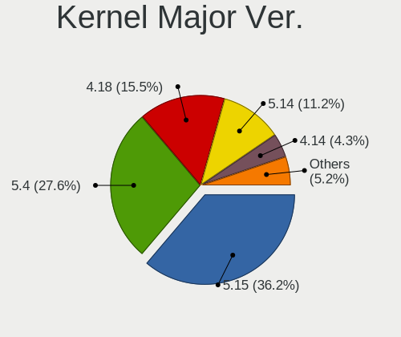
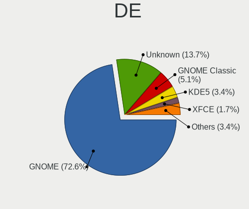
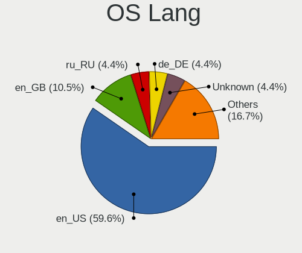
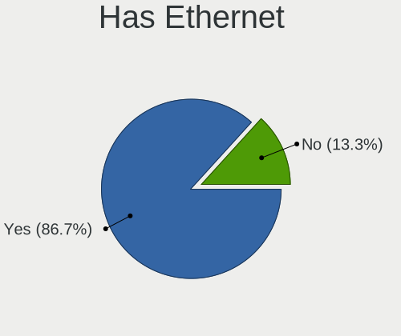
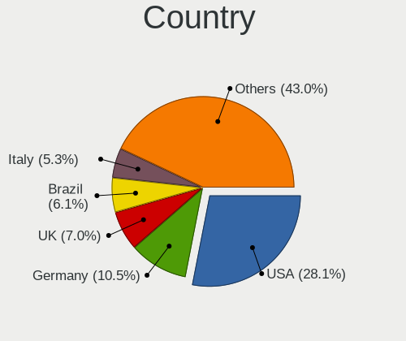
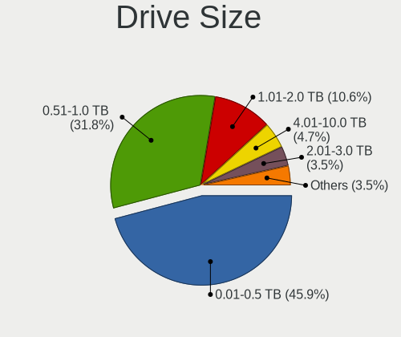
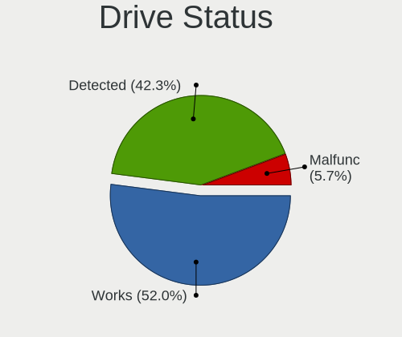
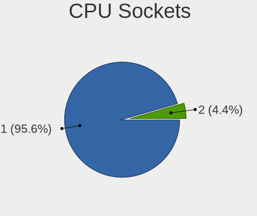
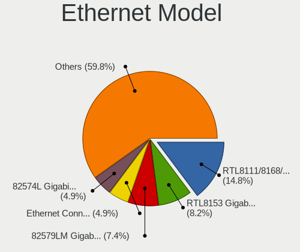

Oracle Linux - Tested Hardware & Statistics
-------------------------------------------

A project to collect tested hardware configurations for Oracle Linux.

Anyone can contribute to this report by the [hw-probe](https://github.com/linuxhw/hw-probe) tool:

    sudo -E hw-probe -all -upload

Please contribute! Especially if your hardware is rare.

This is a report for all computer types. See also reports for [desktops](/Dist/Oracle_Linux/Desktop/README.md) and [notebooks](/Dist/Oracle_Linux/Notebook/README.md).

Contents
--------

* [ Test Cases ](#test-cases)

* [ System ](#system)
  - [ OS                       ](#os)
  - [ OS Family                ](#os-family)
  - [ Kernel                   ](#kernel)
  - [ Kernel Family            ](#kernel-family)
  - [ Kernel Major Ver.        ](#kernel-major-ver)
  - [ Arch                     ](#arch)
  - [ DE                       ](#de)
  - [ Display Server           ](#display-server)
  - [ Display Manager          ](#display-manager)
  - [ OS Lang                  ](#os-lang)
  - [ Boot Mode                ](#boot-mode)
  - [ Filesystem               ](#filesystem)
  - [ Part. scheme             ](#part-scheme)
  - [ Dual Boot with Linux/BSD ](#dual-boot-with-linuxbsd)
  - [ Dual Boot (Win)          ](#dual-boot-win)

* [ Board ](#board)
  - [ Vendor                   ](#vendor)
  - [ Model                    ](#model)
  - [ Model Family             ](#model-family)
  - [ MFG Year                 ](#mfg-year)
  - [ Form Factor              ](#form-factor)
  - [ Secure Boot              ](#secure-boot)
  - [ Coreboot                 ](#coreboot)
  - [ RAM Size                 ](#ram-size)
  - [ RAM Used                 ](#ram-used)
  - [ Total Drives             ](#total-drives)
  - [ Has CD-ROM               ](#has-cd-rom)
  - [ Has Ethernet             ](#has-ethernet)
  - [ Has WiFi                 ](#has-wifi)
  - [ Has Bluetooth            ](#has-bluetooth)

* [ Location ](#location)
  - [ Country                  ](#country)
  - [ City                     ](#city)

* [ Drives ](#drives)
  - [ Drive Vendor             ](#drive-vendor)
  - [ Drive Model              ](#drive-model)
  - [ HDD Vendor               ](#hdd-vendor)
  - [ SSD Vendor               ](#ssd-vendor)
  - [ Drive Kind               ](#drive-kind)
  - [ Drive Connector          ](#drive-connector)
  - [ Drive Size               ](#drive-size)
  - [ Space Total              ](#space-total)
  - [ Space Used               ](#space-used)
  - [ Malfunc. Drives          ](#malfunc-drives)
  - [ Malfunc. Drive Vendor    ](#malfunc-drive-vendor)
  - [ Malfunc. HDD Vendor      ](#malfunc-hdd-vendor)
  - [ Malfunc. Drive Kind      ](#malfunc-drive-kind)
  - [ Failed Drives            ](#failed-drives)
  - [ Failed Drive Vendor      ](#failed-drive-vendor)
  - [ Drive Status             ](#drive-status)

* [ Storage controller ](#storage-controller)
  - [ Storage Vendor           ](#storage-vendor)
  - [ Storage Model            ](#storage-model)
  - [ Storage Kind             ](#storage-kind)

* [ Processor ](#processor)
  - [ CPU Vendor               ](#cpu-vendor)
  - [ CPU Model                ](#cpu-model)
  - [ CPU Model Family         ](#cpu-model-family)
  - [ CPU Cores                ](#cpu-cores)
  - [ CPU Sockets              ](#cpu-sockets)
  - [ CPU Threads              ](#cpu-threads)
  - [ CPU Op-Modes             ](#cpu-op-modes)
  - [ CPU Microcode            ](#cpu-microcode)
  - [ CPU Microarch            ](#cpu-microarch)

* [ Graphics ](#graphics)
  - [ GPU Vendor               ](#gpu-vendor)
  - [ GPU Model                ](#gpu-model)
  - [ GPU Combo                ](#gpu-combo)
  - [ GPU Driver               ](#gpu-driver)
  - [ GPU Memory               ](#gpu-memory)

* [ Monitor ](#monitor)
  - [ Monitor Vendor           ](#monitor-vendor)
  - [ Monitor Model            ](#monitor-model)
  - [ Monitor Resolution       ](#monitor-resolution)
  - [ Monitor Diagonal         ](#monitor-diagonal)
  - [ Monitor Width            ](#monitor-width)
  - [ Aspect Ratio             ](#aspect-ratio)
  - [ Monitor Area             ](#monitor-area)
  - [ Pixel Density            ](#pixel-density)
  - [ Multiple Monitors        ](#multiple-monitors)

* [ Network ](#network)
  - [ Net Controller Vendor    ](#net-controller-vendor)
  - [ Net Controller Model     ](#net-controller-model)
  - [ Wireless Vendor          ](#wireless-vendor)
  - [ Wireless Model           ](#wireless-model)
  - [ Ethernet Vendor          ](#ethernet-vendor)
  - [ Ethernet Model           ](#ethernet-model)
  - [ Net Controller Kind      ](#net-controller-kind)
  - [ Used Controller          ](#used-controller)
  - [ NICs                     ](#nics)
  - [ IPv6                     ](#ipv6)

* [ Bluetooth ](#bluetooth)
  - [ Bluetooth Vendor         ](#bluetooth-vendor)
  - [ Bluetooth Model          ](#bluetooth-model)

* [ Sound ](#sound)
  - [ Sound Vendor             ](#sound-vendor)
  - [ Sound Model              ](#sound-model)

* [ Memory ](#memory)
  - [ Memory Vendor            ](#memory-vendor)
  - [ Memory Model             ](#memory-model)
  - [ Memory Kind              ](#memory-kind)
  - [ Memory Form Factor       ](#memory-form-factor)
  - [ Memory Size              ](#memory-size)
  - [ Memory Speed             ](#memory-speed)

* [ Printers & scanners ](#printers--scanners)
  - [ Printer Vendor           ](#printer-vendor)
  - [ Printer Model            ](#printer-model)
  - [ Scanner Vendor           ](#scanner-vendor)
  - [ Scanner Model            ](#scanner-model)

* [ Camera ](#camera)
  - [ Camera Vendor            ](#camera-vendor)
  - [ Camera Model             ](#camera-model)

* [ Security ](#security)
  - [ Fingerprint Vendor       ](#fingerprint-vendor)
  - [ Fingerprint Model        ](#fingerprint-model)
  - [ Chipcard Vendor          ](#chipcard-vendor)
  - [ Chipcard Model           ](#chipcard-model)

* [ Unsupported ](#unsupported)
  - [ Unsupported Devices      ](#unsupported-devices)
  - [ Unsupported Device Types ](#unsupported-device-types)

Test Cases
----------

Total: 128

| Vendor     | Model                       | Form-Factor | Probe                                                      | Date         |
|------------|-----------------------------|-------------|------------------------------------------------------------|--------------|
| Lenovo     | ThinkPad Yoga 370 20JJS0... | Convertible | [3ae3d26304](https://linux-hardware.org/?probe=3ae3d26304) | Jan 21, 2024 |
| Lenovo     | ThinkPad Yoga 370 20JJS0... | Convertible | [b244483cc6](https://linux-hardware.org/?probe=b244483cc6) | Jan 20, 2024 |
| Dell       | Latitude 7430               | Notebook    | [153f1a144c](https://linux-hardware.org/?probe=153f1a144c) | Jan 19, 2024 |
| Dell       | Latitude 7430               | Notebook    | [a05210eeb4](https://linux-hardware.org/?probe=a05210eeb4) | Jan 19, 2024 |
| Lenovo     | ThinkPad T490 20N3S3XR00    | Notebook    | [63ec999c70](https://linux-hardware.org/?probe=63ec999c70) | Jan 16, 2024 |
| ASRock     | B760M-STX                   | Desktop     | [1648b583d6](https://linux-hardware.org/?probe=1648b583d6) | Jan 10, 2024 |
| Lenovo     | ThinkPad W520 42844DG       | Notebook    | [52cd813233](https://linux-hardware.org/?probe=52cd813233) | Dec 20, 2023 |
| HP         | ZBook Fury 15.6 inch G8 ... | Notebook    | [58ad170a68](https://linux-hardware.org/?probe=58ad170a68) | Dec 10, 2023 |
| Dell       | XPS 15 9570                 | Notebook    | [35a10a1ae2](https://linux-hardware.org/?probe=35a10a1ae2) | Dec 10, 2023 |
| ASUSTek    | G15CF                       | Desktop     | [c2b88beb62](https://linux-hardware.org/?probe=c2b88beb62) | Dec 02, 2023 |
| Toshiba    | TECRA R950                  | Notebook    | [8ab7278f60](https://linux-hardware.org/?probe=8ab7278f60) | Dec 01, 2023 |
| Toshiba    | TECRA R950                  | Notebook    | [9634f68cab](https://linux-hardware.org/?probe=9634f68cab) | Dec 01, 2023 |
| ASRock     | B550M Steel Legend          | Desktop     | [9cb8304240](https://linux-hardware.org/?probe=9cb8304240) | Nov 24, 2023 |
| ASRock     | B550M Steel Legend          | Desktop     | [8cfb18380e](https://linux-hardware.org/?probe=8cfb18380e) | Nov 24, 2023 |
| Dell       | XPS 15 9570                 | Notebook    | [7728d0ab4b](https://linux-hardware.org/?probe=7728d0ab4b) | Nov 22, 2023 |
| HP         | EliteBook 840 G4            | Notebook    | [7d2d46e750](https://linux-hardware.org/?probe=7d2d46e750) | Nov 17, 2023 |
| Lenovo     | Legion Y540-15IRH 81SX      | Notebook    | [1da691596b](https://linux-hardware.org/?probe=1da691596b) | Nov 06, 2023 |
| Lenovo     | Legion Y540-15IRH 81SX      | Notebook    | [d385d4714c](https://linux-hardware.org/?probe=d385d4714c) | Nov 06, 2023 |
| Dell       | Precision 5550              | Notebook    | [033e294199](https://linux-hardware.org/?probe=033e294199) | Nov 03, 2023 |
| HP         | 240 G8 Notebook PC          | Notebook    | [0a98dcd952](https://linux-hardware.org/?probe=0a98dcd952) | Oct 11, 2023 |
| ASUSTek    | SABERTOOTH 990FX R3.0       | Desktop     | [b63af8760f](https://linux-hardware.org/?probe=b63af8760f) | Oct 03, 2023 |
| ASUSTek    | SABERTOOTH 990FX R3.0       | Desktop     | [5ac9728fe0](https://linux-hardware.org/?probe=5ac9728fe0) | Oct 01, 2023 |
| HP         | 240 G8 Notebook PC          | Notebook    | [6fec1bd640](https://linux-hardware.org/?probe=6fec1bd640) | Sep 11, 2023 |
| Dell       | Latitude 7440               | Notebook    | [47f28d7b00](https://linux-hardware.org/?probe=47f28d7b00) | Sep 04, 2023 |
| Dell       | Latitude 7440               | Notebook    | [27b2ae9d5b](https://linux-hardware.org/?probe=27b2ae9d5b) | Sep 04, 2023 |
| HP         | Pavilion x360 Convertibl... | Convertible | [913e1fef64](https://linux-hardware.org/?probe=913e1fef64) | Aug 23, 2023 |
| Intel      | NUC13ANBi5 N13061-202       | Mini pc     | [0a0fee9565](https://linux-hardware.org/?probe=0a0fee9565) | Aug 17, 2023 |
| HP         | ZBook Fury 16 G9 Mobile ... | Notebook    | [4b7e25150a](https://linux-hardware.org/?probe=4b7e25150a) | Aug 15, 2023 |
| MSI        | P65 Creator 8RE             | Notebook    | [853567f156](https://linux-hardware.org/?probe=853567f156) | Aug 06, 2023 |
| MSI        | P65 Creator 8RE             | Notebook    | [f26344a920](https://linux-hardware.org/?probe=f26344a920) | Aug 05, 2023 |
| Cisco      | WAVE-694-K9 A0              | Desktop     | [26b9c3adb7](https://linux-hardware.org/?probe=26b9c3adb7) | Jun 27, 2023 |
| ASRock     | Z68 Extreme3 Gen3           | Desktop     | [7849965aa1](https://linux-hardware.org/?probe=7849965aa1) | Jun 11, 2023 |
| Dell       | Latitude 7430               | Notebook    | [299e6897d2](https://linux-hardware.org/?probe=299e6897d2) | Jun 05, 2023 |
| Supermicro | X8DTU                       | Server      | [2e1d03c7da](https://linux-hardware.org/?probe=2e1d03c7da) | Jun 01, 2023 |
| Intel      | NUC12WSBi5 M46425-303       | Mini pc     | [e3dca941cf](https://linux-hardware.org/?probe=e3dca941cf) | May 28, 2023 |
| Intel      | NUC12WSBi5 M46425-303       | Mini pc     | [9327ef1887](https://linux-hardware.org/?probe=9327ef1887) | May 27, 2023 |
| Lenovo     | ThinkPad T490 20N3S3XR00    | Notebook    | [0f80e19e5b](https://linux-hardware.org/?probe=0f80e19e5b) | May 23, 2023 |
| Lenovo     | ThinkPad W541 20EGS1PL00    | Notebook    | [751cc5dbc7](https://linux-hardware.org/?probe=751cc5dbc7) | May 22, 2023 |
| HP         | 1589                        | Desktop     | [c905464231](https://linux-hardware.org/?probe=c905464231) | May 11, 2023 |
| ASUSTek    | ZenBook UX425EA_UX425EA     | Notebook    | [9be6e0f395](https://linux-hardware.org/?probe=9be6e0f395) | Apr 18, 2023 |
| Gigabyte   | H81M-S2PV                   | Desktop     | [ac856abadc](https://linux-hardware.org/?probe=ac856abadc) | Mar 21, 2023 |
| Intel      | NUC6CAYB J23203-406         | Mini pc     | [65bb9a17dd](https://linux-hardware.org/?probe=65bb9a17dd) | Feb 04, 2023 |
| HP         | Laptop 17-cp0xxx            | Notebook    | [e87b8175b1](https://linux-hardware.org/?probe=e87b8175b1) | Jan 27, 2023 |
| HP         | Laptop 17-cp0xxx            | Notebook    | [70019cbdbf](https://linux-hardware.org/?probe=70019cbdbf) | Jan 25, 2023 |
| Google     | Lick                        | Notebook    | [d792b79719](https://linux-hardware.org/?probe=d792b79719) | Jan 12, 2023 |
| Intel      | NUC12WSBi7 M46422-303       | Mini pc     | [3ddd96770b](https://linux-hardware.org/?probe=3ddd96770b) | Dec 24, 2022 |
| Intel      | NUC12WSBi7 M46422-303       | Mini pc     | [8f10e15f9a](https://linux-hardware.org/?probe=8f10e15f9a) | Dec 24, 2022 |
| Panasonic  | CF-53AAG54FM                | Notebook    | [cf7f652846](https://linux-hardware.org/?probe=cf7f652846) | Dec 21, 2022 |
| Lenovo     | ThinkPad T470 20HES0E71M    | Notebook    | [85fc801717](https://linux-hardware.org/?probe=85fc801717) | Dec 05, 2022 |
| ASUSTek    | PRIME B560M-A AC            | Desktop     | [d4cc718e46](https://linux-hardware.org/?probe=d4cc718e46) | Nov 29, 2022 |
| Lenovo     | ThinkPad P70 20ESS04S00     | Notebook    | [01b85c4c2a](https://linux-hardware.org/?probe=01b85c4c2a) | Nov 10, 2022 |
| Lenovo     | ThinkPad T470 20HES21434    | Notebook    | [39ff1846e3](https://linux-hardware.org/?probe=39ff1846e3) | Oct 23, 2022 |
| Fujitsu    | D2759 S26361-D2759-A13 W... | Server      | [c4c0b53877](https://linux-hardware.org/?probe=c4c0b53877) | Oct 23, 2022 |
| Dynabook   | PORTEGE X40-G               | Notebook    | [fc68a9cdbf](https://linux-hardware.org/?probe=fc68a9cdbf) | Oct 03, 2022 |
| Dell       | 0DC48C A02                  | Desktop     | [9292e820c5](https://linux-hardware.org/?probe=9292e820c5) | Sep 27, 2022 |
| HP         | EliteBook 840 G5            | Notebook    | [2709daf415](https://linux-hardware.org/?probe=2709daf415) | Sep 13, 2022 |
| ASUSTek    | H81M-A                      | Desktop     | [a37e952875](https://linux-hardware.org/?probe=a37e952875) | Sep 04, 2022 |
| Lenovo     | Legion 5 15IMH05 82AU       | Notebook    | [bd4737dfcf](https://linux-hardware.org/?probe=bd4737dfcf) | Aug 18, 2022 |
| Dell       | Inspiron 5502               | Notebook    | [28dcf01e88](https://linux-hardware.org/?probe=28dcf01e88) | Aug 03, 2022 |
| Dell       | 073Y7Y A00                  | Desktop     | [3bed97b23e](https://linux-hardware.org/?probe=3bed97b23e) | Jul 21, 2022 |
| Lenovo     | Legion 5 15IMH05 82AU       | Notebook    | [3dddb3aac3](https://linux-hardware.org/?probe=3dddb3aac3) | Jul 20, 2022 |
| MSI        | Z77A-G43                    | Desktop     | [909e3e3c2e](https://linux-hardware.org/?probe=909e3e3c2e) | Jun 29, 2022 |
| ASUSTek    | P8H67                       | Desktop     | [b194dad4cf](https://linux-hardware.org/?probe=b194dad4cf) | Jun 25, 2022 |
| Lenovo     | ThinkPad P70 20ESS04S00     | Notebook    | [fc29967bed](https://linux-hardware.org/?probe=fc29967bed) | Jun 17, 2022 |
| HP         | Compaq 6730b                | Notebook    | [dd94c9145b](https://linux-hardware.org/?probe=dd94c9145b) | Jun 11, 2022 |
| Lenovo     | ThinkPad T410 2518A37       | Notebook    | [04e81b8b3f](https://linux-hardware.org/?probe=04e81b8b3f) | Jun 04, 2022 |
| Lenovo     | ThinkPad T430s 2355C33      | Notebook    | [33de2bbd12](https://linux-hardware.org/?probe=33de2bbd12) | May 31, 2022 |
| Lenovo     | ThinkPad T430s 2355C33      | Notebook    | [4eab57bebf](https://linux-hardware.org/?probe=4eab57bebf) | May 30, 2022 |
| Dell       | Precision M4600             | Notebook    | [0ac2adfe5a](https://linux-hardware.org/?probe=0ac2adfe5a) | Apr 21, 2022 |
| Dell       | Precision M4800             | Notebook    | [fb13b19803](https://linux-hardware.org/?probe=fb13b19803) | Apr 21, 2022 |
| Lenovo     | ThinkPad P50s 20FL000MUS    | Notebook    | [99fbb4446c](https://linux-hardware.org/?probe=99fbb4446c) | Apr 16, 2022 |
| Dell       | 0C522T A03                  | Desktop     | [3dc84dc8ff](https://linux-hardware.org/?probe=3dc84dc8ff) | Mar 24, 2022 |
| Lenovo     | ThinkPad X1 Extreme 2nd ... | Notebook    | [b708e920f3](https://linux-hardware.org/?probe=b708e920f3) | Mar 21, 2022 |
| Lenovo     | ThinkPad T450 20BUS14900    | Notebook    | [bd60aae97a](https://linux-hardware.org/?probe=bd60aae97a) | Mar 11, 2022 |
| Lenovo     | ThinkPad T480 20L5A07TAU    | Notebook    | [755854f7d4](https://linux-hardware.org/?probe=755854f7d4) | Mar 11, 2022 |
| Lenovo     | ThinkPad X280 20KES4H34G    | Notebook    | [2b8a4f4664](https://linux-hardware.org/?probe=2b8a4f4664) | Mar 10, 2022 |
| Dell       | Latitude 7420               | Notebook    | [af5f1055fe](https://linux-hardware.org/?probe=af5f1055fe) | Mar 10, 2022 |
| HP         | ProBook 445 G6              | Notebook    | [88d8b32328](https://linux-hardware.org/?probe=88d8b32328) | Jan 26, 2022 |
| Lenovo     | ThinkPad X390 Yoga 20NQS... | Convertible | [8219e32fef](https://linux-hardware.org/?probe=8219e32fef) | Dec 22, 2021 |
| Lenovo     | ThinkPad T450 20BUS14900    | Notebook    | [44c8e11f02](https://linux-hardware.org/?probe=44c8e11f02) | Dec 22, 2021 |
| Lenovo     | IdeaPad 300-15ISK 80RS      | Notebook    | [1c9ca21f4e](https://linux-hardware.org/?probe=1c9ca21f4e) | Dec 10, 2021 |
| Dell       | Latitude 7410               | Notebook    | [3efa87284e](https://linux-hardware.org/?probe=3efa87284e) | Nov 18, 2021 |
| Dell       | Latitude E6420              | Notebook    | [b809392380](https://linux-hardware.org/?probe=b809392380) | Oct 08, 2021 |
| Lenovo     | IdeaPad C340-14IWL 81RL     | Convertible | [cf3c570b7a](https://linux-hardware.org/?probe=cf3c570b7a) | Sep 27, 2021 |
| Dell       | Latitude 7410               | Notebook    | [8f1a1a4798](https://linux-hardware.org/?probe=8f1a1a4798) | Sep 06, 2021 |
| Dell       | Latitude 7410               | Notebook    | [b03a0e0152](https://linux-hardware.org/?probe=b03a0e0152) | Sep 06, 2021 |
| Lenovo     | Legion 5 15IMH05 82AU       | Notebook    | [7b393c5790](https://linux-hardware.org/?probe=7b393c5790) | Aug 21, 2021 |
| Lenovo     | Legion 5 15IMH05 82AU       | Notebook    | [394c99adc8](https://linux-hardware.org/?probe=394c99adc8) | Aug 19, 2021 |
| Dell       | Inspiron 3542               | Notebook    | [0909599e9c](https://linux-hardware.org/?probe=0909599e9c) | Aug 11, 2021 |
| Lenovo     | Legion 5 15IMH05 82AU       | Notebook    | [ba7afba1a6](https://linux-hardware.org/?probe=ba7afba1a6) | Jul 08, 2021 |
| Lenovo     | ThinkPad L490 20Q5CTO1WW    | Notebook    | [0225c17d79](https://linux-hardware.org/?probe=0225c17d79) | Jul 02, 2021 |
| Lenovo     | Legion 5 15IMH05 82AU       | Notebook    | [505b82b2de](https://linux-hardware.org/?probe=505b82b2de) | Jun 06, 2021 |
| Lenovo     | Legion 5 15IMH05 82AU       | Notebook    | [75b2ef5126](https://linux-hardware.org/?probe=75b2ef5126) | May 13, 2021 |
| Lenovo     | Legion 5 15IMH05 82AU       | Notebook    | [734a4fbc56](https://linux-hardware.org/?probe=734a4fbc56) | May 09, 2021 |
| Gigabyte   | Z490 AORUS ELITE AC         | Desktop     | [978ae6f2cb](https://linux-hardware.org/?probe=978ae6f2cb) | May 02, 2021 |
| ASUSTek    | UX305FA                     | Notebook    | [0bf50fba2d](https://linux-hardware.org/?probe=0bf50fba2d) | Mar 15, 2021 |
| Lenovo     | IdeaPad Slim 1-14AST-05 ... | Notebook    | [ff355a9bb1](https://linux-hardware.org/?probe=ff355a9bb1) | Mar 11, 2021 |
| Gigabyte   | X99-Designare EX-CF         | Desktop     | [5195396549](https://linux-hardware.org/?probe=5195396549) | Mar 06, 2021 |
| Lenovo     | IdeaPad Slim 1-14AST-05 ... | Notebook    | [9f67379954](https://linux-hardware.org/?probe=9f67379954) | Mar 04, 2021 |
| Lenovo     | ThinkPad L490 20Q5CTO1WW    | Notebook    | [db0f24aee5](https://linux-hardware.org/?probe=db0f24aee5) | Mar 01, 2021 |
| Dell       | Latitude 7410               | Notebook    | [5b725b01aa](https://linux-hardware.org/?probe=5b725b01aa) | Feb 26, 2021 |
| Lenovo     | Legion 5 15IMH05 82AU       | Notebook    | [835e8cad03](https://linux-hardware.org/?probe=835e8cad03) | Feb 25, 2021 |
| Dell       | Latitude 7410               | Notebook    | [430ac9fa0c](https://linux-hardware.org/?probe=430ac9fa0c) | Feb 24, 2021 |
| Lenovo     | ThinkPad T490 20N3S77600    | Notebook    | [26e61c39f2](https://linux-hardware.org/?probe=26e61c39f2) | Feb 24, 2021 |
| Dell       | Latitude 7410               | Notebook    | [7aeb2cc674](https://linux-hardware.org/?probe=7aeb2cc674) | Feb 22, 2021 |
| Lenovo     | IdeaPad Slim 1-14AST-05 ... | Notebook    | [8af2c8d83c](https://linux-hardware.org/?probe=8af2c8d83c) | Feb 05, 2021 |
| ASUSTek    | G11CD                       | Desktop     | [13961e12a8](https://linux-hardware.org/?probe=13961e12a8) | Feb 01, 2021 |
| HP         | 158B                        | Desktop     | [5e6b9531d7](https://linux-hardware.org/?probe=5e6b9531d7) | Feb 01, 2021 |
| Dell       | PowerEdge FC630             | Desktop     | [bcd33a41f0](https://linux-hardware.org/?probe=bcd33a41f0) | Jan 25, 2021 |
| Gigabyte   | X470 AORUS ULTRA GAMING-... | Desktop     | [71628a95b6](https://linux-hardware.org/?probe=71628a95b6) | Jan 13, 2021 |
| Lenovo     | IdeaPad Slim 1-14AST-05 ... | Notebook    | [7ea3c87bfe](https://linux-hardware.org/?probe=7ea3c87bfe) | Jan 06, 2021 |
| Foxconn    | 2ADA                        | Desktop     | [809e03aea5](https://linux-hardware.org/?probe=809e03aea5) | Dec 24, 2020 |
| ASUSTek    | G11CD                       | Desktop     | [d9d0f8fdf2](https://linux-hardware.org/?probe=d9d0f8fdf2) | Dec 20, 2020 |
| Standard   | BW Series                   | Notebook    | [1f6cf82ba8](https://linux-hardware.org/?probe=1f6cf82ba8) | Jun 13, 2020 |
| Apple      | Mac-35C5E08120C7EEAF Mac... | Mini pc     | [109e02e0f2](https://linux-hardware.org/?probe=109e02e0f2) | Jun 07, 2020 |
| Apple      | Mac-35C5E08120C7EEAF Mac... | Mini pc     | [2d385b9cb0](https://linux-hardware.org/?probe=2d385b9cb0) | Jun 07, 2020 |
| HP         | Notebook                    | Notebook    | [e3c242a846](https://linux-hardware.org/?probe=e3c242a846) | May 24, 2020 |
| Lenovo     | ThinkPad L490 20Q5CTO1WW    | Notebook    | [d8b2c132c1](https://linux-hardware.org/?probe=d8b2c132c1) | Apr 09, 2020 |
| HP         | ZBook 15                    | Notebook    | [4723616d8c](https://linux-hardware.org/?probe=4723616d8c) | Apr 09, 2020 |
| Lenovo     | ThinkPad L490 20Q5CTO1WW    | Notebook    | [1acbabb197](https://linux-hardware.org/?probe=1acbabb197) | Apr 06, 2020 |
| Lenovo     | ThinkPad T480 20L6S56Y2X    | Notebook    | [5343997520](https://linux-hardware.org/?probe=5343997520) | Feb 23, 2020 |
| Dell       | 0C96W1 A01                  | Desktop     | [b5c14107bb](https://linux-hardware.org/?probe=b5c14107bb) | Feb 12, 2020 |
| ASUSTek    | X510UR                      | Notebook    | [914b9fbe64](https://linux-hardware.org/?probe=914b9fbe64) | Feb 04, 2020 |
| ASUSTek    | X510UR                      | Notebook    | [014d5ef0c8](https://linux-hardware.org/?probe=014d5ef0c8) | Jan 28, 2020 |
| ASUSTek    | X510UR                      | Notebook    | [9d05b420d4](https://linux-hardware.org/?probe=9d05b420d4) | Jan 28, 2020 |
| Lenovo     | ThinkPad L540 20AVCTO1WW    | Notebook    | [8c1dba9d6e](https://linux-hardware.org/?probe=8c1dba9d6e) | Sep 10, 2019 |
| HPE        | ProLiant BL460c Gen10       | Server      | [9e91d0ed19](https://linux-hardware.org/?probe=9e91d0ed19) | Jun 14, 2019 |
| Lenovo     | ThinkPad T480 20L6S56Y2X    | Notebook    | [f012a475eb](https://linux-hardware.org/?probe=f012a475eb) | Apr 11, 2019 |

System
------

OS
--

Installed operating systems

| Name             | Computers | Percent |
|------------------|-----------|---------|
| Oracle Linux 8.5 | 13        | 13.54%  |
| Oracle Linux 8.3 | 12        | 12.5%   |
| Oracle Linux 9.2 | 10        | 10.42%  |
| Oracle Linux 8.8 | 7         | 7.29%   |
| Oracle Linux 8.4 | 7         | 7.29%   |
| Oracle Linux 9.3 | 6         | 6.25%   |
| Oracle Linux 8.6 | 6         | 6.25%   |
| Oracle Linux 9.1 | 5         | 5.21%   |
| Oracle Linux 9.0 | 5         | 5.21%   |
| Oracle Linux 8.7 | 5         | 5.21%   |
| Oracle Linux 7.9 | 4         | 4.17%   |
| Oracle Linux 8.9 | 3         | 3.13%   |
| Oracle Linux 8.1 | 3         | 3.13%   |
| Oracle Linux 7.7 | 3         | 3.13%   |
| Oracle Linux 8.2 | 2         | 2.08%   |
| Oracle Linux 7.8 | 2         | 2.08%   |
| Oracle Linux 7.6 | 2         | 2.08%   |
| Oracle Linux 7.4 | 1         | 1.04%   |

OS Family
---------

OS without a version

| Name         | Computers | Percent |
|--------------|-----------|---------|
| Oracle Linux | 88        | 100%    |

Kernel
------

Version of the Linux kernel

| Version                           | Computers | Percent |
|-----------------------------------|-----------|---------|
| 5.4.17-2102.202.5.el8uek.x86_64   | 3         | 2.88%   |
| 5.4.17-2036.103.3.1.el8uek.x86_64 | 3         | 2.88%   |
| 5.15.0-200.131.27.el9uek.x86_64   | 3         | 2.88%   |
| 5.15.0-2.52.3.el9uek.x86_64       | 3         | 2.88%   |
| 5.15.0-101.103.2.1.el9uek.x86_64  | 3         | 2.88%   |
| 5.15.0-100.96.32.el8uek.x86_64    | 3         | 2.88%   |
| 4.18.0-348.12.2.el8_5.x86_64      | 3         | 2.88%   |
| 5.4.17-2136.313.6.el8uek.x86_64   | 2         | 1.92%   |
| 5.4.17-2136.304.4.3.el8uek.x86_64 | 2         | 1.92%   |
| 5.4.17-2136.300.7.el8uek.x86_64   | 2         | 1.92%   |
| 5.4.17-2102.205.7.3.el8uek.x86_64 | 2         | 1.92%   |
| 5.4.17-2102.200.13.el8uek.x86_64  | 2         | 1.92%   |
| 5.4.17-2036.102.0.2.el8uek.x86_64 | 2         | 1.92%   |
| 5.4.17-2036.101.2.el8uek.x86_64   | 2         | 1.92%   |
| 5.15.0-5.76.5.1.el9uek.x86_64     | 2         | 1.92%   |
| 5.15.0-200.131.27.el8uek.x86_64   | 2         | 1.92%   |
| 5.15.0-200.131.27.1.el8uek.x86_64 | 2         | 1.92%   |
| 5.15.0-106.131.4.el9uek.x86_64    | 2         | 1.92%   |
| 5.15.0-103.114.4.el8uek.x86_64    | 2         | 1.92%   |
| 4.18.0-240.15.1.el8_3.x86_64      | 2         | 1.92%   |
| 4.18.0-193.1.2.el8_2.x86_64       | 2         | 1.92%   |
| 4.18.0-147.3.1.el8_1.x86_64       | 2         | 1.92%   |
| 5.4.17-2136.326.6.el8uek.x86_64   | 1         | 0.96%   |
| 5.4.17-2136.318.7.2.el8uek.x86_64 | 1         | 0.96%   |
| 5.4.17-2136.312.3.4.el7uek.x86_64 | 1         | 0.96%   |
| 5.4.17-2136.310.7.el8uek.x86_64   | 1         | 0.96%   |
| 5.4.17-2136.310.7.1.el8uek.x86_64 | 1         | 0.96%   |
| 5.4.17-2136.309.4.el8uek.x86_64   | 1         | 0.96%   |
| 5.4.17-2136.308.9.el8uek.x86_64   | 1         | 0.96%   |
| 5.4.17-2136.308.9.el7uek.x86_64   | 1         | 0.96%   |
| 5.4.17-2136.307.3.1.el8uek.x86_64 | 1         | 0.96%   |
| 5.4.17-2136.306.1.3.el8uek.x86_64 | 1         | 0.96%   |
| 5.4.17-2136.305.5.4.el8uek.x86_64 | 1         | 0.96%   |
| 5.4.17-2136.305.5.3.el8uek.x86_64 | 1         | 0.96%   |
| 5.4.17-2136.305.5.2.el8uek.x86_64 | 1         | 0.96%   |
| 5.4.17-2136.301.1.4.el8uek.x86_64 | 1         | 0.96%   |
| 5.4.17-2102.204.4.4.el8uek.x86_64 | 1         | 0.96%   |
| 5.4.17-2102.204.4.2.el8uek.x86_64 | 1         | 0.96%   |
| 5.4.17-2102.201.3.el8uek.x86_64   | 1         | 0.96%   |
| 5.4.17-2036.104.4.el8uek.x86_64   | 1         | 0.96%   |

Kernel Family
-------------

Linux kernel without a distro release

| Version | Computers | Percent |
|---------|-----------|---------|
| 5.4.17  | 30        | 33.33%  |
| 5.15.0  | 30        | 33.33%  |
| 4.18.0  | 13        | 14.44%  |
| 4.14.35 | 5         | 5.56%   |
| 5.14.0  | 4         | 4.44%   |
| 3.10.0  | 3         | 3.33%   |
| 5.4.11  | 1         | 1.11%   |
| 5.15.2  | 1         | 1.11%   |
| 5.14.1  | 1         | 1.11%   |
| 5.11.1  | 1         | 1.11%   |
| 4.1.12  | 1         | 1.11%   |

Kernel Major Ver.
-----------------

Linux kernel major version

| Version | Computers | Percent |
|---------|-----------|---------|
| 5.4     | 31        | 34.44%  |
| 5.15    | 31        | 34.44%  |
| 4.18    | 13        | 14.44%  |
| 5.14    | 5         | 5.56%   |
| 4.14    | 5         | 5.56%   |
| 3.10    | 3         | 3.33%   |
| 5.11    | 1         | 1.11%   |
| 4.1     | 1         | 1.11%   |

Arch
----

OS architecture (x86_64, i586, etc.)

| Name   | Computers | Percent |
|--------|-----------|---------|
| x86_64 | 88        | 100%    |

DE
--

Desktop Environment

| Name          | Computers | Percent |
|---------------|-----------|---------|
| GNOME         | 68        | 73.91%  |
| Unknown       | 10        | 10.87%  |
| GNOME Classic | 5         | 5.43%   |
| KDE5          | 3         | 3.26%   |
| XFCE          | 2         | 2.17%   |
| MATE          | 2         | 2.17%   |
| KDE4          | 2         | 2.17%   |

Display Server
--------------

X11 or Wayland

| Name    | Computers | Percent |
|---------|-----------|---------|
| Wayland | 48        | 52.75%  |
| X11     | 34        | 37.36%  |
| Unknown | 7         | 7.69%   |
| Web     | 1         | 1.1%    |
| Tty     | 1         | 1.1%    |

Display Manager
---------------

SDDM, LightDM, etc.

| Name    | Computers | Percent |
|---------|-----------|---------|
| GDM     | 46        | 51.11%  |
| Unknown | 40        | 44.44%  |
| SDDM    | 3         | 3.33%   |
| TDM     | 1         | 1.11%   |

OS Lang
-------

Language

| Lang       | Computers | Percent |
|------------|-----------|---------|
| en_US      | 56        | 62.92%  |
| en_GB      | 11        | 12.36%  |
| de_DE      | 4         | 4.49%   |
| Unknown    | 4         | 4.49%   |
| pl_PL      | 3         | 3.37%   |
| en_AU      | 3         | 3.37%   |
| it_IT      | 2         | 2.25%   |
| en_IN      | 2         | 2.25%   |
| zh_HK      | 1         | 1.12%   |
| ru_RU      | 1         | 1.12%   |
| pt_BR      | 1         | 1.12%   |
| en_US.UTF8 | 1         | 1.12%   |

Boot Mode
---------

EFI or BIOS

| Mode | Computers | Percent |
|------|-----------|---------|
| EFI  | 54        | 60.67%  |
| BIOS | 35        | 39.33%  |

Filesystem
----------

Type of filesystem

| Type    | Computers | Percent |
|---------|-----------|---------|
| Xfs     | 78        | 86.67%  |
| Ext4    | 9         | 10%     |
| Unknown | 2         | 2.22%   |
| Zfs     | 1         | 1.11%   |

Part. scheme
------------

Scheme of partitioning

| Type    | Computers | Percent |
|---------|-----------|---------|
| GPT     | 42        | 46.67%  |
| Unknown | 34        | 37.78%  |
| MBR     | 14        | 15.56%  |

Dual Boot with Linux/BSD
------------------------

Hosting more than one Linux/BSD

| Dual boot | Computers | Percent |
|-----------|-----------|---------|
| No        | 83        | 93.26%  |
| Yes       | 6         | 6.74%   |

Dual Boot (Win)
---------------

Hosting Linux and Windows

| Dual boot | Computers | Percent |
|-----------|-----------|---------|
| No        | 80        | 89.89%  |
| Yes       | 9         | 10.11%  |

Board
-----

Vendor
------

Motherboard manufacturer

| Name                | Computers | Percent |
|---------------------|-----------|---------|
| Lenovo              | 24        | 27.27%  |
| Dell                | 17        | 19.32%  |
| Hewlett-Packard     | 13        | 14.77%  |
| ASUSTek Computer    | 10        | 11.36%  |
| Intel               | 4         | 4.55%   |
| Gigabyte Technology | 4         | 4.55%   |
| ASRock              | 3         | 3.41%   |
| MSI                 | 2         | 2.27%   |
| Toshiba             | 1         | 1.14%   |
| Supermicro          | 1         | 1.14%   |
| Standard            | 1         | 1.14%   |
| Panasonic           | 1         | 1.14%   |
| HPE                 | 1         | 1.14%   |
| Google              | 1         | 1.14%   |
| Fujitsu             | 1         | 1.14%   |
| Foxconn             | 1         | 1.14%   |
| Dynabook            | 1         | 1.14%   |
| Cisco               | 1         | 1.14%   |
| Apple               | 1         | 1.14%   |

Model
-----

Motherboard model

| Name                                             | Computers | Percent |
|--------------------------------------------------|-----------|---------|
| Lenovo ThinkPad T450 20BUS14900                  | 2         | 2.27%   |
| Dell Latitude 7430                               | 2         | 2.27%   |
| ASUS X510UR                                      | 2         | 2.27%   |
| Toshiba TECRA R950                               | 1         | 1.14%   |
| Supermicro X8DTU                                 | 1         | 1.14%   |
| Standard BW Series                               | 1         | 1.14%   |
| Panasonic CF-53AAG54FM                           | 1         | 1.14%   |
| MSI P65 Creator 8RE                              | 1         | 1.14%   |
| MSI MS-7758                                      | 1         | 1.14%   |
| Lenovo ThinkPad Yoga 370 20JJS0A44R              | 1         | 1.14%   |
| Lenovo ThinkPad X390 Yoga 20NQS2SF00             | 1         | 1.14%   |
| Lenovo ThinkPad X280 20KES4H34G                  | 1         | 1.14%   |
| Lenovo ThinkPad X1 Extreme 2nd 20QWS1R800        | 1         | 1.14%   |
| Lenovo ThinkPad W541 20EGS1PL00                  | 1         | 1.14%   |
| Lenovo ThinkPad W520 42844DG                     | 1         | 1.14%   |
| Lenovo ThinkPad T490 20N3S77600                  | 1         | 1.14%   |
| Lenovo ThinkPad T490 20N3S3XR00                  | 1         | 1.14%   |
| Lenovo ThinkPad T480 20L6S56Y2X                  | 1         | 1.14%   |
| Lenovo ThinkPad T480 20L5A07TAU                  | 1         | 1.14%   |
| Lenovo ThinkPad T470 20HES21434                  | 1         | 1.14%   |
| Lenovo ThinkPad T470 20HES0E71M                  | 1         | 1.14%   |
| Lenovo ThinkPad T430s 2355C33                    | 1         | 1.14%   |
| Lenovo ThinkPad P70 20ESS04S00                   | 1         | 1.14%   |
| Lenovo ThinkPad P50s 20FL000MUS                  | 1         | 1.14%   |
| Lenovo ThinkPad L540 20AVCTO1WW                  | 1         | 1.14%   |
| Lenovo ThinkPad L490 20Q5CTO1WW                  | 1         | 1.14%   |
| Lenovo Legion Y540-15IRH 81SX                    | 1         | 1.14%   |
| Lenovo Legion 5 15IMH05 82AU                     | 1         | 1.14%   |
| Lenovo IdeaPad Slim 1-14AST-05 81VS              | 1         | 1.14%   |
| Lenovo IdeaPad C340-14IWL 81RL                   | 1         | 1.14%   |
| Lenovo IdeaPad 300-15ISK 80RS                    | 1         | 1.14%   |
| Intel NUC6CAYH                                   | 1         | 1.14%   |
| Intel NUC13ANHi5                                 | 1         | 1.14%   |
| Intel NUC12WSHi7                                 | 1         | 1.14%   |
| Intel NUC12WSHi5                                 | 1         | 1.14%   |
| HPE ProLiant BL460c Gen10                        | 1         | 1.14%   |
| HP ZBook Fury 16 G9 Mobile Workstation PC        | 1         | 1.14%   |
| HP ZBook Fury 15.6 inch G8 Mobile Workstation PC | 1         | 1.14%   |
| HP ZBook 15                                      | 1         | 1.14%   |
| HP Z820 Workstation                              | 1         | 1.14%   |

Model Family
------------

Motherboard model prefix

| Name                   | Computers | Percent |
|------------------------|-----------|---------|
| Lenovo ThinkPad        | 19        | 21.59%  |
| Dell Latitude          | 6         | 6.82%   |
| Dell OptiPlex          | 4         | 4.55%   |
| Lenovo IdeaPad         | 3         | 3.41%   |
| HP ZBook               | 3         | 3.41%   |
| Dell Precision         | 3         | 3.41%   |
| Lenovo Legion          | 2         | 2.27%   |
| HP EliteBook           | 2         | 2.27%   |
| Dell Inspiron          | 2         | 2.27%   |
| ASUS X510UR            | 2         | 2.27%   |
| Toshiba TECRA          | 1         | 1.14%   |
| Supermicro X8DTU       | 1         | 1.14%   |
| Standard BW            | 1         | 1.14%   |
| Panasonic CF-53AAG54FM | 1         | 1.14%   |
| MSI P65                | 1         | 1.14%   |
| MSI MS-7758            | 1         | 1.14%   |
| Intel NUC6CAYH         | 1         | 1.14%   |
| Intel NUC13ANHi5       | 1         | 1.14%   |
| Intel NUC12WSHi7       | 1         | 1.14%   |
| Intel NUC12WSHi5       | 1         | 1.14%   |
| HPE ProLiant           | 1         | 1.14%   |
| HP Z820                | 1         | 1.14%   |
| HP Z420                | 1         | 1.14%   |
| HP ProBook             | 1         | 1.14%   |
| HP Pavilion            | 1         | 1.14%   |
| HP Notebook            | 1         | 1.14%   |
| HP Laptop              | 1         | 1.14%   |
| HP Compaq              | 1         | 1.14%   |
| HP 240                 | 1         | 1.14%   |
| Google Lick            | 1         | 1.14%   |
| Gigabyte Z490          | 1         | 1.14%   |
| Gigabyte X99-Designare | 1         | 1.14%   |
| Gigabyte X470          | 1         | 1.14%   |
| Gigabyte H81M-S2PV     | 1         | 1.14%   |
| Fujitsu PRIMERGY       | 1         | 1.14%   |
| Foxconn p6-2400el      | 1         | 1.14%   |
| Dynabook PORTEGE       | 1         | 1.14%   |
| Dell XPS               | 1         | 1.14%   |
| Dell PowerEdge         | 1         | 1.14%   |
| Cisco WAVE-694-K9      | 1         | 1.14%   |

MFG Year
--------

Motherboard manufacture year

| Year | Computers | Percent |
|------|-----------|---------|
| 2019 | 11        | 12.5%   |
| 2020 | 9         | 10.23%  |
| 2018 | 9         | 10.23%  |
| 2022 | 8         | 9.09%   |
| 2012 | 7         | 7.95%   |
| 2021 | 6         | 6.82%   |
| 2017 | 6         | 6.82%   |
| 2016 | 6         | 6.82%   |
| 2014 | 5         | 5.68%   |
| 2011 | 5         | 5.68%   |
| 2015 | 4         | 4.55%   |
| 2013 | 4         | 4.55%   |
| 2023 | 3         | 3.41%   |
| 2010 | 3         | 3.41%   |
| 2009 | 1         | 1.14%   |
| 2008 | 1         | 1.14%   |

Form Factor
-----------

Physical design of the computer

| Name        | Computers | Percent |
|-------------|-----------|---------|
| Notebook    | 53        | 60.23%  |
| Desktop     | 23        | 26.14%  |
| Mini pc     | 5         | 5.68%   |
| Convertible | 4         | 4.55%   |
| Server      | 3         | 3.41%   |

Secure Boot
-----------

Enabled or disabled

| State    | Computers | Percent |
|----------|-----------|---------|
| Disabled | 73        | 82.02%  |
| Enabled  | 16        | 17.98%  |

Coreboot
--------

Have coreboot on board

| Used | Computers | Percent |
|------|-----------|---------|
| No   | 87        | 98.86%  |
| Yes  | 1         | 1.14%   |

RAM Size
--------

Total RAM memory

| Size in GB      | Computers | Percent |
|-----------------|-----------|---------|
| 8.01-16.0       | 26        | 29.21%  |
| 32.01-64.0      | 20        | 22.47%  |
| 4.01-8.0        | 13        | 14.61%  |
| 64.01-256.0     | 10        | 11.24%  |
| 16.01-24.0      | 7         | 7.87%   |
| 3.01-4.0        | 6         | 6.74%   |
| 24.01-32.0      | 5         | 5.62%   |
| More than 256.0 | 1         | 1.12%   |
| 1.01-2.0        | 1         | 1.12%   |

RAM Used
--------

Used RAM memory

| Used GB     | Computers | Percent |
|-------------|-----------|---------|
| 4.01-8.0    | 28        | 28.57%  |
| 2.01-3.0    | 23        | 23.47%  |
| 3.01-4.0    | 18        | 18.37%  |
| 8.01-16.0   | 11        | 11.22%  |
| 1.01-2.0    | 10        | 10.2%   |
| 0.51-1.0    | 3         | 3.06%   |
| 32.01-64.0  | 1         | 1.02%   |
| 24.01-32.0  | 1         | 1.02%   |
| 64.01-256.0 | 1         | 1.02%   |
| 16.01-24.0  | 1         | 1.02%   |
| 0.01-0.5    | 1         | 1.02%   |

Total Drives
------------

Number of drives on board

| Drives | Computers | Percent |
|--------|-----------|---------|
| 1      | 66        | 73.33%  |
| 2      | 15        | 16.67%  |
| 3      | 5         | 5.56%   |
| 4      | 2         | 2.22%   |
| 6      | 1         | 1.11%   |
| 5      | 1         | 1.11%   |

Has CD-ROM
----------

Has CD-ROM on board

| Presented | Computers | Percent |
|-----------|-----------|---------|
| No        | 71        | 80.68%  |
| Yes       | 17        | 19.32%  |

Has Ethernet
------------

Has Ethernet on board

| Presented | Computers | Percent |
|-----------|-----------|---------|
| Yes       | 76        | 86.36%  |
| No        | 12        | 13.64%  |

Has WiFi
--------

Has WiFi module

| Presented | Computers | Percent |
|-----------|-----------|---------|
| Yes       | 70        | 79.55%  |
| No        | 18        | 20.45%  |

Has Bluetooth
-------------

Has Bluetooth module

| Presented | Computers | Percent |
|-----------|-----------|---------|
| Yes       | 57        | 63.33%  |
| No        | 33        | 36.67%  |

Location
--------

Country
-------

Geographic location (country)

| Country     | Computers | Percent |
|-------------|-----------|---------|
| USA         | 27        | 30.34%  |
| Germany     | 11        | 12.36%  |
| UK          | 6         | 6.74%   |
| Poland      | 5         | 5.62%   |
| Brazil      | 4         | 4.49%   |
| Australia   | 4         | 4.49%   |
| Netherlands | 3         | 3.37%   |
| Italy       | 3         | 3.37%   |
| India       | 3         | 3.37%   |
| Finland     | 3         | 3.37%   |
| Spain       | 2         | 2.25%   |
| Russia      | 2         | 2.25%   |
| Romania     | 2         | 2.25%   |
| Yemen       | 1         | 1.12%   |
| Turkey      | 1         | 1.12%   |
| Sweden      | 1         | 1.12%   |
| Slovakia    | 1         | 1.12%   |
| Peru        | 1         | 1.12%   |
| Pakistan    | 1         | 1.12%   |
| Nigeria     | 1         | 1.12%   |
| Latvia      | 1         | 1.12%   |
| Kazakhstan  | 1         | 1.12%   |
| Hungary     | 1         | 1.12%   |
| Hong Kong   | 1         | 1.12%   |
| Bulgaria    | 1         | 1.12%   |
| Bolivia     | 1         | 1.12%   |
| Argentina   | 1         | 1.12%   |

City
----

Geographic location (city)

| City               | Computers | Percent |
|--------------------|-----------|---------|
| San Diego          | 3         | 3.16%   |
| Helsinki           | 3         | 3.16%   |
| Warsaw             | 2         | 2.11%   |
| Siegen             | 2         | 2.11%   |
| Seattle            | 2         | 2.11%   |
| Sao Paulo          | 2         | 2.11%   |
| Colorado Springs   | 2         | 2.11%   |
| Bucharest          | 2         | 2.11%   |
| Berlin             | 2         | 2.11%   |
| Bengaluru          | 2         | 2.11%   |
| Amsterdam          | 2         | 2.11%   |
| Zavar              | 1         | 1.05%   |
| West Linn          | 1         | 1.05%   |
| Weaverville        | 1         | 1.05%   |
| Veliky Novgorod    | 1         | 1.05%   |
| Valmiera           | 1         | 1.05%   |
| Utrecht            | 1         | 1.05%   |
| Turner             | 1         | 1.05%   |
| Sydney             | 1         | 1.05%   |
| Stuttgart          | 1         | 1.05%   |
| Stockholm          | 1         | 1.05%   |
| Sofia              | 1         | 1.05%   |
| Shrewsbury         | 1         | 1.05%   |
| Sao Caetano do Sul | 1         | 1.05%   |
| Santa Cruz         | 1         | 1.05%   |
| Sanaa              | 1         | 1.05%   |
| San Francisco      | 1         | 1.05%   |
| Rocklin            | 1         | 1.05%   |
| Riverside          | 1         | 1.05%   |
| Richfield          | 1         | 1.05%   |
| Redwood City       | 1         | 1.05%   |
| Reading            | 1         | 1.05%   |
| Port Saint Lucie   | 1         | 1.05%   |
| Pleven             | 1         | 1.05%   |
| Petersberg         | 1         | 1.05%   |
| Perugia            | 1         | 1.05%   |
| Parker             | 1         | 1.05%   |
| Ngau Wu Tok        | 1         | 1.05%   |
| Neunkirchen        | 1         | 1.05%   |
| Nagercoil          | 1         | 1.05%   |

Drives
------

Drive Vendor
------------

Hard drive vendors

| Vendor                      | Computers | Drives | Percent |
|-----------------------------|-----------|--------|---------|
| Samsung Electronics         | 28        | 38     | 25%     |
| Seagate                     | 12        | 50     | 10.71%  |
| SanDisk                     | 10        | 13     | 8.93%   |
| WDC                         | 8         | 9      | 7.14%   |
| Unknown                     | 5         | 8      | 4.46%   |
| Intel                       | 5         | 5      | 4.46%   |
| Toshiba                     | 4         | 4      | 3.57%   |
| SK hynix                    | 4         | 4      | 3.57%   |
| Kingston                    | 4         | 11     | 3.57%   |
| Crucial                     | 4         | 5      | 3.57%   |
| Phison Electronics          | 3         | 4      | 2.68%   |
| Micron/Crucial Technology   | 3         | 4      | 2.68%   |
| Micron Technology           | 3         | 6      | 2.68%   |
| HGST                        | 3         | 6      | 2.68%   |
| Hewlett-Packard             | 2         | 2      | 1.79%   |
| Union Memory (Shenzhen)     | 1         | 2      | 0.89%   |
| Transcend                   | 1         | 1      | 0.89%   |
| Realtek Semiconductor       | 1         | 1      | 0.89%   |
| Phison                      | 1         | 1      | 0.89%   |
| Lite-On                     | 1         | 1      | 0.89%   |
| Lenovo                      | 1         | 1      | 0.89%   |
| KIOXIA                      | 1         | 1      | 0.89%   |
| Kingston Technology Company | 1         | 1      | 0.89%   |
| KingFast                    | 1         | 1      | 0.89%   |
| JMicron Technology          | 1         | 1      | 0.89%   |
| HPE                         | 1         | 1      | 0.89%   |
| GOODRAM                     | 1         | 1      | 0.89%   |
| Fujitsu                     | 1         | 1      | 0.89%   |
| Apple                       | 1         | 1      | 0.89%   |

Drive Model
-----------

Hard drive models

| Model                                             | Computers | Percent |
|---------------------------------------------------|-----------|---------|
| Samsung NVMe SSD Controller SM981/PM981/PM983 1TB | 3         | 2.48%   |
| Unknown SD/MMC/MS PRO 256GB                       | 2         | 1.65%   |
| Seagate ST2000DM008-2FR102 2TB                    | 2         | 1.65%   |
| SanDisk SSD PLUS 1000GB                           | 2         | 1.65%   |
| Samsung SSD PM830 2.5 7mm 256GB                   | 2         | 1.65%   |
| Samsung MZVLB512HAJQ-000L7 512GB                  | 2         | 1.65%   |
| Samsung MZ7LN512HMJP-000L7 512GB SSD              | 2         | 1.65%   |
| Phison E12 NVMe Controller 1TB                    | 2         | 1.65%   |
| Micron/Crucial P2 NVMe PCIe SSD 1TB               | 2         | 1.65%   |
| Kingston SA400S37240G 240GB SSD                   | 2         | 1.65%   |
| Intel SSD 660P Series 1024GB                      | 2         | 1.65%   |
| Crucial CT500MX500SSD1 500GB                      | 2         | 1.65%   |
| WDC WDS500G2B0A-00SM50 500GB SSD                  | 1         | 0.83%   |
| WDC WDS250G2B0A-00SM50 250GB SSD                  | 1         | 0.83%   |
| WDC WDS200T2G0A-00JH30 2TB SSD                    | 1         | 0.83%   |
| WDC WD3200BEKT-08PVMT1 320GB                      | 1         | 0.83%   |
| WDC WD1600YS-23SHB0 160GB                         | 1         | 0.83%   |
| WDC WD10SPZX-60Z10T1 1TB                          | 1         | 0.83%   |
| WDC WD10JPCX-24UE4T0 1TB                          | 1         | 0.83%   |
| WDC WD10EZEX-60M2NA0 1TB                          | 1         | 0.83%   |
| Unknown MMC64G  64GB                              | 1         | 0.83%   |
| Unknown MMC Card  256GB                           | 1         | 0.83%   |
| Unknown MMC Card  1TB                             | 1         | 0.83%   |
| Union Memory (Shenzhen) NVMe SSD Drive 128GB      | 1         | 0.83%   |
| Transcend TS2TMTE250H 2TB                         | 1         | 0.83%   |
| Toshiba THNSNJ512GCSU 512GB SSD                   | 1         | 0.83%   |
| Toshiba NVMe SSD Drive 512GB                      | 1         | 0.83%   |
| Toshiba MG04ACA200E 2TB                           | 1         | 0.83%   |
| Toshiba DT01ACA050 500GB                          | 1         | 0.83%   |
| SK hynix SKHynix_HFS256GD9TNG-L3A0B 256GB         | 1         | 0.83%   |
| SK hynix PC801 NVMe 512GB                         | 1         | 0.83%   |
| SK hynix BC901 NVMe 512GB                         | 1         | 0.83%   |
| SK hynix BC501 NVMe Solid State Drive 512GB       | 1         | 0.83%   |
| Seagate ST9750420AS 752GB                         | 1         | 0.83%   |
| Seagate ST8000VN004-2M2101 8TB                    | 1         | 0.83%   |
| Seagate ST3750528AS 752GB                         | 1         | 0.83%   |
| Seagate ST3500414CS 500GB                         | 1         | 0.83%   |
| Seagate ST2000NX0253 2TB                          | 1         | 0.83%   |
| Seagate ST2000DM001-1ER164 2TB                    | 1         | 0.83%   |
| Seagate ST1000VX000-1ES162 1TB                    | 1         | 0.83%   |

HDD Vendor
----------

Hard disk drive vendors

| Vendor              | Computers | Drives | Percent |
|---------------------|-----------|--------|---------|
| Seagate             | 12        | 50     | 41.38%  |
| WDC                 | 5         | 6      | 17.24%  |
| HGST                | 3         | 6      | 10.34%  |
| Unknown             | 2         | 4      | 6.9%    |
| Toshiba             | 2         | 2      | 6.9%    |
| Samsung Electronics | 2         | 2      | 6.9%    |
| JMicron Technology  | 1         | 1      | 3.45%   |
| Fujitsu             | 1         | 1      | 3.45%   |
| Apple               | 1         | 1      | 3.45%   |

SSD Vendor
----------

Solid state drive vendors

| Vendor              | Computers | Drives | Percent |
|---------------------|-----------|--------|---------|
| Samsung Electronics | 15        | 21     | 41.67%  |
| SanDisk             | 6         | 8      | 16.67%  |
| WDC                 | 3         | 3      | 8.33%   |
| Kingston            | 3         | 4      | 8.33%   |
| Crucial             | 3         | 4      | 8.33%   |
| Hewlett-Packard     | 2         | 2      | 5.56%   |
| Toshiba             | 1         | 1      | 2.78%   |
| Intel               | 1         | 1      | 2.78%   |
| HPE                 | 1         | 1      | 2.78%   |
| GOODRAM             | 1         | 1      | 2.78%   |

Drive Kind
----------

HDD or SSD

| Kind    | Computers | Drives | Percent |
|---------|-----------|--------|---------|
| NVMe    | 43        | 60     | 40.19%  |
| SSD     | 34        | 46     | 31.78%  |
| HDD     | 26        | 73     | 24.3%   |
| MMC     | 3         | 4      | 2.8%    |
| Unknown | 1         | 1      | 0.93%   |

Drive Connector
---------------

SATA, SAS, NVMe, etc.

| Type | Computers | Drives | Percent |
|------|-----------|--------|---------|
| SATA | 51        | 113    | 50.5%   |
| NVMe | 43        | 60     | 42.57%  |
| SAS  | 4         | 7      | 3.96%   |
| MMC  | 3         | 4      | 2.97%   |

Drive Size
----------

Size of hard drive

| Size in TB | Computers | Drives | Percent |
|------------|-----------|--------|---------|
| 0.01-0.5   | 29        | 40     | 49.15%  |
| 0.51-1.0   | 22        | 32     | 37.29%  |
| 1.01-2.0   | 7         | 45     | 11.86%  |
| 4.01-10.0  | 1         | 2      | 1.69%   |

Space Total
-----------

Amount of disk space available on the file system

| Size in GB     | Computers | Percent |
|----------------|-----------|---------|
| 251-500        | 25        | 27.78%  |
| 101-250        | 17        | 18.89%  |
| 501-1000       | 15        | 16.67%  |
| 1-20           | 9         | 10%     |
| Unknown        | 7         | 7.78%   |
| 1001-2000      | 6         | 6.67%   |
| 51-100         | 5         | 5.56%   |
| 2001-3000      | 3         | 3.33%   |
| 21-50          | 2         | 2.22%   |
| More than 3000 | 1         | 1.11%   |

Space Used
----------

Amount of used disk space

| Used GB        | Computers | Percent |
|----------------|-----------|---------|
| 1-20           | 32        | 34.78%  |
| 21-50          | 20        | 21.74%  |
| 51-100         | 14        | 15.22%  |
| 101-250        | 10        | 10.87%  |
| Unknown        | 7         | 7.61%   |
| 251-500        | 5         | 5.43%   |
| 501-1000       | 2         | 2.17%   |
| More than 3000 | 1         | 1.09%   |
| 1001-2000      | 1         | 1.09%   |

Malfunc. Drives
---------------

Drive models with a malfunction

| Model                                            | Computers | Drives | Percent |
|--------------------------------------------------|-----------|--------|---------|
| Seagate ST9750420AS 752GB                        | 1         | 1      | 20%     |
| Seagate ST1000LM024 HN-M101MBB 1TB               | 1         | 1      | 20%     |
| Samsung Electronics MZNLH128HBHQ-000H1 128GB SSD | 1         | 2      | 20%     |
| Samsung Electronics HD753LJ 752GB                | 1         | 1      | 20%     |
| Hewlett-Packard SSD S700 120GB                   | 1         | 1      | 20%     |

Malfunc. Drive Vendor
---------------------

Vendors of faulty drives

| Vendor              | Computers | Drives | Percent |
|---------------------|-----------|--------|---------|
| Seagate             | 2         | 2      | 40%     |
| Samsung Electronics | 2         | 3      | 40%     |
| Hewlett-Packard     | 1         | 1      | 20%     |

Malfunc. HDD Vendor
-------------------

Vendors of faulty HDD drives

| Vendor              | Computers | Drives | Percent |
|---------------------|-----------|--------|---------|
| Seagate             | 2         | 2      | 66.67%  |
| Samsung Electronics | 1         | 1      | 33.33%  |

Malfunc. Drive Kind
-------------------

Kinds of faulty drives

| Kind | Computers | Drives | Percent |
|------|-----------|--------|---------|
| HDD  | 3         | 3      | 60%     |
| SSD  | 2         | 3      | 40%     |

Failed Drives
-------------

Failed drive models

Zero info for selected period =(

Failed Drive Vendor
-------------------

Failed drive vendors

Zero info for selected period =(

Drive Status
------------

Number of failed and malfunc. drives

| Status   | Computers | Drives | Percent |
|----------|-----------|--------|---------|
| Works    | 48        | 100    | 51.06%  |
| Detected | 41        | 78     | 43.62%  |
| Malfunc  | 5         | 6      | 5.32%   |

Storage controller
------------------

Storage Vendor
--------------

Storage controller vendors

| Vendor                       | Computers | Percent |
|------------------------------|-----------|---------|
| Intel                        | 57        | 51.82%  |
| Samsung Electronics          | 13        | 11.82%  |
| AMD                          | 7         | 6.36%   |
| SK hynix                     | 4         | 3.64%   |
| SanDisk                      | 4         | 3.64%   |
| Phison Electronics           | 4         | 3.64%   |
| Micron/Crucial Technology    | 4         | 3.64%   |
| Micron Technology            | 3         | 2.73%   |
| Broadcom / LSI               | 3         | 2.73%   |
| Kingston Technology Company  | 2         | 1.82%   |
| VIA Technologies             | 1         | 0.91%   |
| Union Memory (Shenzhen)      | 1         | 0.91%   |
| Transcend                    | 1         | 0.91%   |
| Toshiba America Info Systems | 1         | 0.91%   |
| Realtek Semiconductor        | 1         | 0.91%   |
| Lite-On Technology           | 1         | 0.91%   |
| Lenovo                       | 1         | 0.91%   |
| KIOXIA                       | 1         | 0.91%   |
| Adaptec                      | 1         | 0.91%   |

Storage Model
-------------

Storage controller models

| Model                                                                                   | Computers | Percent |
|-----------------------------------------------------------------------------------------|-----------|---------|
| Samsung NVMe SSD Controller SM981/PM981/PM983                                           | 9         | 7.2%    |
| Intel Sunrise Point-LP SATA Controller [AHCI mode]                                      | 5         | 4%      |
| Intel 8 Series/C220 Series Chipset Family 6-port SATA Controller 1 [AHCI mode]          | 5         | 4%      |
| AMD FCH SATA Controller [AHCI mode]                                                     | 5         | 4%      |
| Phison E12 NVMe Controller                                                              | 3         | 2.4%    |
| Micron/Crucial P2 [Nick P2] / P3 / P3 Plus NVMe PCIe SSD (DRAM-less)                    | 3         | 2.4%    |
| Intel Wildcat Point-LP SATA Controller [AHCI Mode]                                      | 3         | 2.4%    |
| Intel Volume Management Device NVMe RAID Controller                                     | 3         | 2.4%    |
| Intel SATA Controller [RAID Mode]                                                       | 3         | 2.4%    |
| Intel 82801 Mobile SATA Controller [RAID mode]                                          | 3         | 2.4%    |
| Samsung NVMe SSD Controller SM961/PM961/SM963                                           | 2         | 1.6%    |
| Samsung NVMe SSD Controller PM9A1/PM9A3/980PRO                                          | 2         | 1.6%    |
| Intel SSD 660P Series                                                                   | 2         | 1.6%    |
| Intel Q170/Q150/B150/H170/H110/Z170/CM236 Chipset SATA Controller [AHCI Mode]           | 2         | 1.6%    |
| Intel Cannon Lake Mobile PCH SATA AHCI Controller                                       | 2         | 1.6%    |
| Intel C610/X99 series chipset sSATA Controller [AHCI mode]                              | 2         | 1.6%    |
| Intel C610/X99 series chipset 6-Port SATA Controller [AHCI mode]                        | 2         | 1.6%    |
| Intel C602 chipset 4-Port SATA Storage Control Unit                                     | 2         | 1.6%    |
| Intel C600/X79 series chipset IDE-r Controller                                          | 2         | 1.6%    |
| Intel Alder Lake-S PCH SATA Controller [AHCI Mode]                                      | 2         | 1.6%    |
| Intel Alder Lake-P SATA AHCI Controller                                                 | 2         | 1.6%    |
| Intel 8 Series SATA Controller 1 [AHCI mode]                                            | 2         | 1.6%    |
| Intel 6 Series/C200 Series Chipset Family Desktop SATA Controller (IDE mode, ports 4-5) | 2         | 1.6%    |
| Intel 6 Series/C200 Series Chipset Family Desktop SATA Controller (IDE mode, ports 0-3) | 2         | 1.6%    |
| Intel 6 Series/C200 Series Chipset Family 6 port Mobile SATA AHCI Controller            | 2         | 1.6%    |
| Intel 500 Series Chipset Family SATA AHCI Controller                                    | 2         | 1.6%    |
| VIA VT6415 PATA IDE Host Controller                                                     | 1         | 0.8%    |
| Union Memory (Shenzhen) AM610 PCIe 3.0 x2 NVMe SSD 128GB, 256GB                         | 1         | 0.8%    |
| Transcend NVMe PCIe SSD 250H                                                            | 1         | 0.8%    |
| Toshiba America Info Systems XG5 NVMe SSD Controller                                    | 1         | 0.8%    |
| SK hynix Platinum P41/PC801 NVMe Solid State Drive                                      | 1         | 0.8%    |
| SK hynix PC601 NVMe Solid State Drive                                                   | 1         | 0.8%    |
| SK hynix BC901 NVMe Solid State Drive (DRAM-less)                                       | 1         | 0.8%    |
| SK hynix BC501 NVMe Solid State Drive                                                   | 1         | 0.8%    |
| Sandisk WD Blue SN580 NVMe SSD (DRAM-less)                                              | 1         | 0.8%    |
| SanDisk Ultra 3D / WD Blue SN570 NVMe SSD (DRAM-less)                                   | 1         | 0.8%    |
| Sandisk PC SN740 NVMe SSD (DRAM-less)                                                   | 1         | 0.8%    |
| SanDisk Extreme Pro / WD Black 2018/SN750/PC SN720 NVMe SSD                             | 1         | 0.8%    |
| Realtek RTS5762 NVMe SSD Controller                                                     | 1         | 0.8%    |
| Phison E16 PCIe4 NVMe Controller                                                        | 1         | 0.8%    |

Storage Kind
------------

Kind of storage controller (IDE, SATA, NVMe, SAS, ...)

| Kind | Computers | Percent |
|------|-----------|---------|
| SATA | 50        | 43.86%  |
| NVMe | 43        | 37.72%  |
| RAID | 10        | 8.77%   |
| IDE  | 7         | 6.14%   |
| SAS  | 3         | 2.63%   |
| SCSI | 1         | 0.88%   |

Processor
---------

CPU Vendor
----------

Processor vendors

| Vendor | Computers | Percent |
|--------|-----------|---------|
| Intel  | 81        | 92.05%  |
| AMD    | 7         | 7.95%   |

CPU Model
---------

Processor models

| Model                                   | Computers | Percent |
|-----------------------------------------|-----------|---------|
| Intel Core i7-8665U CPU @ 1.90GHz       | 3         | 3.41%   |
| Intel Core i7-7500U CPU @ 2.70GHz       | 3         | 3.41%   |
| Intel Core i5-7300U CPU @ 2.60GHz       | 3         | 3.41%   |
| Intel 11th Gen Core i7-1165G7 @ 2.80GHz | 3         | 3.41%   |
| Intel Core i7-8750H CPU @ 2.20GHz       | 2         | 2.27%   |
| Intel Core i7-6500U CPU @ 2.50GHz       | 2         | 2.27%   |
| Intel Core i7-10610U CPU @ 1.80GHz      | 2         | 2.27%   |
| Intel Core i5-8350U CPU @ 1.70GHz       | 2         | 2.27%   |
| Intel Core i5-5300U CPU @ 2.30GHz       | 2         | 2.27%   |
| Intel Celeron N4020 CPU @ 1.10GHz       | 2         | 2.27%   |
| Intel 12th Gen Core i7-1270P            | 2         | 2.27%   |
| Intel Xeon Silver 4114 CPU @ 2.20GHz    | 1         | 1.14%   |
| Intel Xeon CPU X3450 @ 2.67GHz          | 1         | 1.14%   |
| Intel Xeon CPU X3430 @ 2.40GHz          | 1         | 1.14%   |
| Intel Xeon CPU E5649 @ 2.53GHz          | 1         | 1.14%   |
| Intel Xeon CPU E5-2680 v2 @ 2.80GHz     | 1         | 1.14%   |
| Intel Xeon CPU E5-2650 v2 @ 2.60GHz     | 1         | 1.14%   |
| Intel Xeon CPU E5-2620 v4 @ 2.10GHz     | 1         | 1.14%   |
| Intel Processor 5Y10 CPU @ 0.80GHz      | 1         | 1.14%   |
| Intel Pentium CPU G3240 @ 3.10GHz       | 1         | 1.14%   |
| Intel Pentium CPU G2020 @ 2.90GHz       | 1         | 1.14%   |
| Intel Core i9-9880H CPU @ 2.30GHz       | 1         | 1.14%   |
| Intel Core i9-10900K CPU @ 3.70GHz      | 1         | 1.14%   |
| Intel Core i7-8700 CPU @ 3.20GHz        | 1         | 1.14%   |
| Intel Core i7-8650U CPU @ 1.90GHz       | 1         | 1.14%   |
| Intel Core i7-8565U CPU @ 1.80GHz       | 1         | 1.14%   |
| Intel Core i7-8550U CPU @ 1.80GHz       | 1         | 1.14%   |
| Intel Core i7-6820HQ CPU @ 2.70GHz      | 1         | 1.14%   |
| Intel Core i7-6800K CPU @ 3.40GHz       | 1         | 1.14%   |
| Intel Core i7-6700 CPU @ 3.40GHz        | 1         | 1.14%   |
| Intel Core i7-4940MX CPU @ 3.10GHz      | 1         | 1.14%   |
| Intel Core i7-4910MQ CPU @ 2.90GHz      | 1         | 1.14%   |
| Intel Core i7-4800MQ CPU @ 2.70GHz      | 1         | 1.14%   |
| Intel Core i7-3770 CPU @ 3.40GHz        | 1         | 1.14%   |
| Intel Core i7-2860QM CPU @ 2.50GHz      | 1         | 1.14%   |
| Intel Core i7-2760QM CPU @ 2.40GHz      | 1         | 1.14%   |
| Intel Core i7-2630QM CPU @ 2.00GHz      | 1         | 1.14%   |
| Intel Core i7-2600 CPU @ 3.40GHz        | 1         | 1.14%   |
| Intel Core i7-10850H CPU @ 2.70GHz      | 1         | 1.14%   |
| Intel Core i7-10750H CPU @ 2.60GHz      | 1         | 1.14%   |

CPU Model Family
----------------

Processor model prefix

| Model             | Computers | Percent |
|-------------------|-----------|---------|
| Intel Core i7     | 30        | 34.09%  |
| Other             | 17        | 19.32%  |
| Intel Core i5     | 17        | 19.32%  |
| Intel Xeon        | 6         | 6.82%   |
| Intel Celeron     | 4         | 4.55%   |
| Intel Pentium     | 2         | 2.27%   |
| Intel Core i9     | 2         | 2.27%   |
| Intel Core i3     | 2         | 2.27%   |
| AMD Ryzen 7       | 2         | 2.27%   |
| Intel Xeon Silver | 1         | 1.14%   |
| Intel Core 2 Duo  | 1         | 1.14%   |
| AMD Ryzen 7 PRO   | 1         | 1.14%   |
| AMD Ryzen 5       | 1         | 1.14%   |
| AMD FX            | 1         | 1.14%   |
| AMD A8            | 1         | 1.14%   |

CPU Cores
---------

Number of processor cores

| Number | Computers | Percent |
|--------|-----------|---------|
| 4      | 32        | 36.36%  |
| 2      | 26        | 29.55%  |
| 6      | 8         | 9.09%   |
| 12     | 7         | 7.95%   |
| 8      | 5         | 5.68%   |
| 16     | 4         | 4.55%   |
| 10     | 3         | 3.41%   |
| 20     | 1         | 1.14%   |
| 14     | 1         | 1.14%   |
| 1      | 1         | 1.14%   |

CPU Sockets
-----------

Number of sockets

| Number | Computers | Percent |
|--------|-----------|---------|
| 1      | 84        | 95.45%  |
| 2      | 4         | 4.55%   |

CPU Threads
-----------

Threads per core (Hyper-Threading)

| Number | Computers | Percent |
|--------|-----------|---------|
| 2      | 72        | 81.82%  |
| 1      | 16        | 18.18%  |

CPU Op-Modes
------------

CPU Operation Modes (32-bit, 64-bit)

| Op mode        | Computers | Percent |
|----------------|-----------|---------|
| 32-bit, 64-bit | 87        | 97.75%  |
| Unknown        | 2         | 2.25%   |

CPU Microcode
-------------

Microcode number

| Number     | Computers | Percent |
|------------|-----------|---------|
| Unknown    | 8         | 8.89%   |
| 0x806ec    | 7         | 7.78%   |
| 0x306c3    | 6         | 6.67%   |
| 0x206a7    | 6         | 6.67%   |
| 0x906a3    | 4         | 4.44%   |
| 0x806ea    | 4         | 4.44%   |
| 0x806c1    | 4         | 4.44%   |
| 0x306a9    | 4         | 4.44%   |
| 0x906ea    | 3         | 3.33%   |
| 0x806e9    | 3         | 3.33%   |
| 0x306d4    | 3         | 3.33%   |
| 0xb06a2    | 2         | 2.22%   |
| 0xa0655    | 2         | 2.22%   |
| 0xa0652    | 2         | 2.22%   |
| 0x906ed    | 2         | 2.22%   |
| 0x90672    | 2         | 2.22%   |
| 0x706a8    | 2         | 2.22%   |
| 0x506e3    | 2         | 2.22%   |
| 0x406e3    | 2         | 2.22%   |
| 0x40651    | 2         | 2.22%   |
| 0x306e4    | 2         | 2.22%   |
| 0x106e5    | 2         | 2.22%   |
| 0xb06f2    | 1         | 1.11%   |
| 0xa0653    | 1         | 1.11%   |
| 0x806d1    | 1         | 1.11%   |
| 0x506c9    | 1         | 1.11%   |
| 0x50654    | 1         | 1.11%   |
| 0x406f1    | 1         | 1.11%   |
| 0x406c4    | 1         | 1.11%   |
| 0x206c2    | 1         | 1.11%   |
| 0x20655    | 1         | 1.11%   |
| 0x10676    | 1         | 1.11%   |
| 0x0a50000c | 1         | 1.11%   |
| 0x08608103 | 1         | 1.11%   |
| 0x0810100b | 1         | 1.11%   |
| 0x0800820d | 1         | 1.11%   |
| 0x07030105 | 1         | 1.11%   |
| 0x06006705 | 1         | 1.11%   |

CPU Microarch
-------------

Microarchitecture

| Name             | Computers | Percent |
|------------------|-----------|---------|
| KabyLake         | 22        | 25%     |
| Haswell          | 8         | 9.09%   |
| SandyBridge      | 6         | 6.82%   |
| IvyBridge        | 6         | 6.82%   |
| Alderlake Hybrid | 6         | 6.82%   |
| Skylake          | 5         | 5.68%   |
| CometLake        | 5         | 5.68%   |
| Broadwell        | 5         | 5.68%   |
| Unknown          | 5         | 5.68%   |
| TigerLake        | 4         | 4.55%   |
| Westmere         | 2         | 2.27%   |
| Nehalem          | 2         | 2.27%   |
| Goldmont plus    | 2         | 2.27%   |
| Zen+             | 1         | 1.14%   |
| Zen 3            | 1         | 1.14%   |
| Zen              | 1         | 1.14%   |
| Silvermont       | 1         | 1.14%   |
| Puma             | 1         | 1.14%   |
| Piledriver       | 1         | 1.14%   |
| Penryn           | 1         | 1.14%   |
| Icelake          | 1         | 1.14%   |
| Goldmont         | 1         | 1.14%   |
| Excavator        | 1         | 1.14%   |

Graphics
--------

GPU Vendor
----------

Vendors of graphics cards

| Vendor                     | Computers | Percent |
|----------------------------|-----------|---------|
| Intel                      | 63        | 58.33%  |
| Nvidia                     | 30        | 27.78%  |
| AMD                        | 11        | 10.19%  |
| Matrox Electronics Systems | 4         | 3.7%    |

GPU Model
---------

Graphics card models

| Model                                                                       | Computers | Percent |
|-----------------------------------------------------------------------------|-----------|---------|
| Intel HD Graphics 620                                                       | 6         | 5.56%   |
| Intel WhiskeyLake-U GT2 [UHD Graphics 620]                                  | 5         | 4.63%   |
| Intel UHD Graphics 620                                                      | 4         | 3.7%    |
| Intel TigerLake-LP GT2 [Iris Xe Graphics]                                   | 4         | 3.7%    |
| Intel Alder Lake-P GT2 [Iris Xe Graphics]                                   | 4         | 3.7%    |
| Intel 4th Gen Core Processor Integrated Graphics Controller                 | 4         | 3.7%    |
| Intel CometLake-S GT2 [UHD Graphics 630]                                    | 3         | 2.78%   |
| Intel 2nd Generation Core Processor Family Integrated Graphics Controller   | 3         | 2.78%   |
| Nvidia TU117M [GeForce GTX 1650 Mobile / Max-Q]                             | 2         | 1.85%   |
| Nvidia GM108M [GeForce 930MX]                                               | 2         | 1.85%   |
| Nvidia GF117M [GeForce 610M/710M/810M/820M / GT 620M/625M/630M/720M]        | 2         | 1.85%   |
| Intel Xeon E3-1200 v3/4th Gen Core Processor Integrated Graphics Controller | 2         | 1.85%   |
| Intel Skylake GT2 [HD Graphics 520]                                         | 2         | 1.85%   |
| Intel HD Graphics 5500                                                      | 2         | 1.85%   |
| Intel Haswell-ULT Integrated Graphics Controller                            | 2         | 1.85%   |
| Intel GeminiLake [UHD Graphics 600]                                         | 2         | 1.85%   |
| Intel CometLake-U GT2 [UHD Graphics]                                        | 2         | 1.85%   |
| Intel CometLake-H GT2 [UHD Graphics]                                        | 2         | 1.85%   |
| Intel CoffeeLake-H GT2 [UHD Graphics 630]                                   | 2         | 1.85%   |
| Intel 3rd Gen Core processor Graphics Controller                            | 2         | 1.85%   |
| Nvidia TU117GLM [T1200 Laptop GPU]                                          | 1         | 0.93%   |
| Nvidia TU117GLM [Quadro T2000 Mobile / Max-Q]                               | 1         | 0.93%   |
| Nvidia TU116 [GeForce GTX 1650 SUPER]                                       | 1         | 0.93%   |
| Nvidia TU106M [GeForce RTX 2060 Mobile]                                     | 1         | 0.93%   |
| Nvidia GP107M [GeForce MX350]                                               | 1         | 0.93%   |
| Nvidia GP107M [GeForce GTX 1050 Ti Mobile]                                  | 1         | 0.93%   |
| Nvidia GP107 [GeForce GTX 1050]                                             | 1         | 0.93%   |
| Nvidia GP106M [GeForce GTX 1060 Mobile]                                     | 1         | 0.93%   |
| Nvidia GP106 [GeForce GTX 1060 6GB]                                         | 1         | 0.93%   |
| Nvidia GM204GLM [Quadro M4000M]                                             | 1         | 0.93%   |
| Nvidia GM204 [GeForce GTX 980]                                              | 1         | 0.93%   |
| Nvidia GM108GLM [Quadro K620M / Quadro M500M]                               | 1         | 0.93%   |
| Nvidia GK208GLM [Quadro K610M]                                              | 1         | 0.93%   |
| Nvidia GK208B [GeForce GT 710]                                              | 1         | 0.93%   |
| Nvidia GK110GL [Quadro K6000]                                               | 1         | 0.93%   |
| Nvidia GK107GLM [Quadro K1100M]                                             | 1         | 0.93%   |
| Nvidia GK107GL [Quadro K2000]                                               | 1         | 0.93%   |
| Nvidia GF119M [NVS 4200M]                                                   | 1         | 0.93%   |
| Nvidia GF110GL [Tesla C2050 / C2075]                                        | 1         | 0.93%   |
| Nvidia GA107GLM [RTX A1000 Laptop GPU]                                      | 1         | 0.93%   |

GPU Combo
---------

Combinations of graphics cards

| Name           | Computers | Percent |
|----------------|-----------|---------|
| 1 x Intel      | 43        | 48.31%  |
| 1 x Nvidia     | 15        | 16.85%  |
| Intel + Nvidia | 14        | 15.73%  |
| 1 x AMD        | 6         | 6.74%   |
| 1 x Matrox     | 4         | 4.49%   |
| Intel + AMD    | 3         | 3.37%   |
| Other          | 2         | 2.25%   |
| AMD + Nvidia   | 2         | 2.25%   |

GPU Driver
----------

Free vs proprietary

| Driver      | Computers | Percent |
|-------------|-----------|---------|
| Free        | 72        | 80%     |
| Unknown     | 11        | 12.22%  |
| Proprietary | 7         | 7.78%   |

GPU Memory
----------

Total video memory

| Size in GB | Computers | Percent |
|------------|-----------|---------|
| Unknown    | 56        | 62.92%  |
| 3.01-4.0   | 12        | 13.48%  |
| 1.01-2.0   | 12        | 13.48%  |
| 0.51-1.0   | 3         | 3.37%   |
| 0.01-0.5   | 3         | 3.37%   |
| 5.01-6.0   | 2         | 2.25%   |
| 8.01-16.0  | 1         | 1.12%   |

Monitor
-------

Monitor Vendor
--------------

Monitor vendors

| Vendor               | Computers | Percent |
|----------------------|-----------|---------|
| AU Optronics         | 14        | 13.33%  |
| Chimei Innolux       | 12        | 11.43%  |
| Samsung Electronics  | 11        | 10.48%  |
| Dell                 | 11        | 10.48%  |
| LG Display           | 10        | 9.52%   |
| BOE                  | 8         | 7.62%   |
| Lenovo               | 5         | 4.76%   |
| BenQ                 | 4         | 3.81%   |
| ViewSonic            | 3         | 2.86%   |
| InfoVision           | 3         | 2.86%   |
| Hewlett-Packard      | 3         | 2.86%   |
| Acer                 | 3         | 2.86%   |
| Sharp                | 2         | 1.9%    |
| ASUSTek Computer     | 2         | 1.9%    |
| Vizio                | 1         | 0.95%   |
| Viotek               | 1         | 0.95%   |
| Sony                 | 1         | 0.95%   |
| Sceptre Tech         | 1         | 0.95%   |
| SAC                  | 1         | 0.95%   |
| Panasonic            | 1         | 0.95%   |
| Packard Bell         | 1         | 0.95%   |
| Goldstar             | 1         | 0.95%   |
| GameMax              | 1         | 0.95%   |
| Fujitsu Siemens      | 1         | 0.95%   |
| Element              | 1         | 0.95%   |
| Eizo                 | 1         | 0.95%   |
| BOE Technology Group | 1         | 0.95%   |
| Ancor Communications | 1         | 0.95%   |

Monitor Model
-------------

Monitor models

| Model                                                                 | Computers | Percent |
|-----------------------------------------------------------------------|-----------|---------|
| Chimei Innolux LCD Monitor CMN14D4 1920x1080 309x173mm 13.9-inch      | 3         | 2.7%    |
| LG Display LCD Monitor LGD0573 1920x1080 344x194mm 15.5-inch          | 2         | 1.8%    |
| InfoVision LCD Monitor IVO057D 1920x1080 309x174mm 14.0-inch          | 2         | 1.8%    |
| Dell U2718Q DELA0E9 3840x2160 609x349mm 27.6-inch                     | 2         | 1.8%    |
| Dell P2722H DEL4240 1920x1080 600x340mm 27.2-inch                     | 2         | 1.8%    |
| Chimei Innolux LCD Monitor CMN15E8 1920x1080 344x193mm 15.5-inch      | 2         | 1.8%    |
| Chimei Innolux LCD Monitor CMN15C3 1920x1080 344x193mm 15.5-inch      | 2         | 1.8%    |
| BenQ GL2760 BNQ78D5 1920x1080 598x336mm 27.0-inch                     | 2         | 1.8%    |
| AU Optronics LCD Monitor AUO303E 1600x900 309x174mm 14.0-inch         | 2         | 1.8%    |
| AU Optronics LCD Monitor AUO243D 1920x1080 309x173mm 13.9-inch        | 2         | 1.8%    |
| Acer SA230 ACR057E 1920x1080 509x286mm 23.0-inch                      | 2         | 1.8%    |
| Vizio V405-H9 VIZ1039 3840x2160 878x485mm 39.5-inch                   | 1         | 0.9%    |
| Viotek SUW49C VTK4900 3840x1080 1196x336mm 48.9-inch                  | 1         | 0.9%    |
| ViewSonic VX2776 Series VSC3E32 1920x1080 598x336mm 27.0-inch         | 1         | 0.9%    |
| ViewSonic VX2433wm VSC3822 1920x1080 520x290mm 23.4-inch              | 1         | 0.9%    |
| ViewSonic VG2439 Series VSCD22B 1920x1080 521x293mm 23.5-inch         | 1         | 0.9%    |
| Sony TV SNY4502 1920x1080                                             | 1         | 0.9%    |
| Sharp LCD Monitor SHP14D0 3840x2400 336x210mm 15.6-inch               | 1         | 0.9%    |
| Sharp LCD Monitor SHP148D 3840x2160 344x194mm 15.5-inch               | 1         | 0.9%    |
| Sceptre Tech Sceptre P30 SPT0BCC 2560x1080 690x291mm 29.5-inch        | 1         | 0.9%    |
| Samsung Electronics SyncMaster SAM0564 1360x768 410x230mm 18.5-inch   | 1         | 0.9%    |
| Samsung Electronics SyncMaster SAM021E 1680x1050 433x271mm 20.1-inch  | 1         | 0.9%    |
| Samsung Electronics SAMTRON STN0022 1280x1024 380x300mm 19.1-inch     | 1         | 0.9%    |
| Samsung Electronics S32B80P SAM71F1 3840x2160 700x400mm 31.7-inch     | 1         | 0.9%    |
| Samsung Electronics S27H65x SAM0E1D 1920x1080 598x336mm 27.0-inch     | 1         | 0.9%    |
| Samsung Electronics S27D391 SAM0B89 1920x1080 598x336mm 27.0-inch     | 1         | 0.9%    |
| Samsung Electronics S27D391 SAM0B88 1920x1080 598x336mm 27.0-inch     | 1         | 0.9%    |
| Samsung Electronics S24F350 SAM0D20 1920x1080 521x293mm 23.5-inch     | 1         | 0.9%    |
| Samsung Electronics S24E650 SAM0CB8 1920x1080 521x293mm 23.5-inch     | 1         | 0.9%    |
| Samsung Electronics S22F350 SAM0D1A 1920x1080 477x268mm 21.5-inch     | 1         | 0.9%    |
| Samsung Electronics LCD Monitor SDC5344 1920x1080 344x194mm 15.5-inch | 1         | 0.9%    |
| Samsung Electronics LCD Monitor SDC3256 1920x1080 382x215mm 17.3-inch | 1         | 0.9%    |
| Samsung Electronics LCD Monitor S24C650                               | 1         | 0.9%    |
| Samsung Electronics C32R50x SAM7000 1920x1080 698x393mm 31.5-inch     | 1         | 0.9%    |
| Samsung Electronics C32HG7x SAM0E14 2560x1440 697x392mm 31.5-inch     | 1         | 0.9%    |
| SAC LED MONITOR SAC952D 1920x1080 480x270mm 21.7-inch                 | 1         | 0.9%    |
| Panasonic TV MEIA296 3840x2160 698x392mm 31.5-inch                    | 1         | 0.9%    |
| Packard Bell Viseo223DX PKB037A 1920x1080 477x268mm 21.5-inch         | 1         | 0.9%    |
| LG Display LCD Monitor LGD0628 1920x1080 309x174mm 14.0-inch          | 1         | 0.9%    |
| LG Display LCD Monitor LGD0609 1920x1080 309x174mm 14.0-inch          | 1         | 0.9%    |

Monitor Resolution
------------------

Monitor screen resolution

| Resolution         | Computers | Percent |
|--------------------|-----------|---------|
| 1920x1080 (FHD)    | 49        | 55.06%  |
| 3840x2160 (4K)     | 9         | 10.11%  |
| 1366x768 (WXGA)    | 6         | 6.74%   |
| 1600x900 (HD+)     | 5         | 5.62%   |
| 1920x1200 (WUXGA)  | 4         | 4.49%   |
| 1680x1050 (WSXGA+) | 3         | 3.37%   |
| 1280x1024 (SXGA)   | 3         | 3.37%   |
| 2560x1440 (QHD)    | 2         | 2.25%   |
| 3840x2400          | 1         | 1.12%   |
| 3840x1200          | 1         | 1.12%   |
| 3840x1080          | 1         | 1.12%   |
| 2560x1080          | 1         | 1.12%   |
| 1920x540           | 1         | 1.12%   |
| 1360x768           | 1         | 1.12%   |
| 1280x800 (WXGA)    | 1         | 1.12%   |
| Unknown            | 1         | 1.12%   |

Monitor Diagonal
----------------

Diagonal size in inches

| Inches  | Computers | Percent |
|---------|-----------|---------|
| 15      | 21        | 19.63%  |
| 14      | 14        | 13.08%  |
| 27      | 12        | 11.21%  |
| 13      | 12        | 11.21%  |
| 24      | 9         | 8.41%   |
| 23      | 6         | 5.61%   |
| 21      | 5         | 4.67%   |
| 31      | 4         | 3.74%   |
| Unknown | 4         | 3.74%   |
| 38      | 2         | 1.87%   |
| 22      | 2         | 1.87%   |
| 19      | 2         | 1.87%   |
| 17      | 2         | 1.87%   |
| 84      | 1         | 0.93%   |
| 72      | 1         | 0.93%   |
| 69      | 1         | 0.93%   |
| 48      | 1         | 0.93%   |
| 32      | 1         | 0.93%   |
| 29      | 1         | 0.93%   |
| 25      | 1         | 0.93%   |
| 20      | 1         | 0.93%   |
| 18      | 1         | 0.93%   |
| 16      | 1         | 0.93%   |
| 12      | 1         | 0.93%   |
| 11      | 1         | 0.93%   |

Monitor Width
-------------

Physical width

| Width in mm | Computers | Percent |
|-------------|-----------|---------|
| 301-350     | 45        | 43.69%  |
| 501-600     | 25        | 24.27%  |
| 401-500     | 8         | 7.77%   |
| 601-700     | 6         | 5.83%   |
| 201-300     | 5         | 4.85%   |
| Unknown     | 4         | 3.88%   |
| 351-400     | 3         | 2.91%   |
| 1501-2000   | 3         | 2.91%   |
| 801-900     | 2         | 1.94%   |
| 701-800     | 1         | 0.97%   |
| 1001-1500   | 1         | 0.97%   |

Aspect Ratio
------------

Proportional relationship between the width and the height

| Ratio   | Computers | Percent |
|---------|-----------|---------|
| 16/9    | 67        | 79.76%  |
| 16/10   | 9         | 10.71%  |
| 5/4     | 3         | 3.57%   |
| 32/9    | 2         | 2.38%   |
| Unknown | 2         | 2.38%   |
| 21/9    | 1         | 1.19%   |

Monitor Area
------------

Area in inch

| Area in inch | Computers | Percent |
|----------------|-----------|---------|
| 81-90          | 23        | 22.12%  |
| 101-110        | 21        | 20.19%  |
| 201-250        | 17        | 16.35%  |
| 301-350        | 13        | 12.5%   |
| 351-500        | 5         | 4.81%   |
| 151-200        | 4         | 3.85%   |
| Unknown        | 4         | 3.85%   |
| More than 1000 | 3         | 2.88%   |
| 71-80          | 3         | 2.88%   |
| 501-1000       | 3         | 2.88%   |
| 251-300        | 2         | 1.92%   |
| 121-130        | 2         | 1.92%   |
| 61-70          | 1         | 0.96%   |
| 51-60          | 1         | 0.96%   |
| 141-150        | 1         | 0.96%   |
| 111-120        | 1         | 0.96%   |

Pixel Density
-------------

Pixels per inch

| Density       | Computers | Percent |
|---------------|-----------|---------|
| 121-160       | 40        | 40.4%   |
| 51-100        | 32        | 32.32%  |
| 101-120       | 14        | 14.14%  |
| 161-240       | 6         | 6.06%   |
| Unknown       | 4         | 4.04%   |
| More than 240 | 2         | 2.02%   |
| 1-50          | 1         | 1.01%   |

Multiple Monitors
-----------------

Total monitors connected

| Total | Computers | Percent |
|-------|-----------|---------|
| 1     | 48        | 53.33%  |
| 2     | 20        | 22.22%  |
| 0     | 13        | 14.44%  |
| 3     | 8         | 8.89%   |
| 4     | 1         | 1.11%   |

Network
-------

Net Controller Vendor
---------------------

Controller vendors

| Vendor                            | Computers | Percent |
|-----------------------------------|-----------|---------|
| Intel                             | 69        | 52.67%  |
| Realtek Semiconductor             | 33        | 25.19%  |
| Qualcomm Atheros                  | 5         | 3.82%   |
| Broadcom                          | 5         | 3.82%   |
| Lenovo                            | 4         | 3.05%   |
| Samsung Electronics               | 2         | 1.53%   |
| Broadcom Limited                  | 2         | 1.53%   |
| ASIX Electronics                  | 2         | 1.53%   |
| Ralink Technology                 | 1         | 0.76%   |
| QLogic                            | 1         | 0.76%   |
| NetGear                           | 1         | 0.76%   |
| Mellanox Technologies             | 1         | 0.76%   |
| Fibocom                           | 1         | 0.76%   |
| Ericsson Business Mobile Networks | 1         | 0.76%   |
| Edimax Technology                 | 1         | 0.76%   |
| DisplayLink                       | 1         | 0.76%   |
| ASUSTek Computer                  | 1         | 0.76%   |

Net Controller Model
--------------------

Controller models

| Model                                                                  | Computers | Percent |
|------------------------------------------------------------------------|-----------|---------|
| Realtek RTL8111/8168/8211/8411 PCI Express Gigabit Ethernet Controller | 14        | 8.14%   |
| Intel Wireless 8265 / 8275                                             | 10        | 5.81%   |
| Realtek RTL8153 Gigabit Ethernet Adapter                               | 8         | 4.65%   |
| Intel 82579LM Gigabit Network Connection (Lewisville)                  | 8         | 4.65%   |
| Intel Ethernet Connection (4) I219-LM                                  | 6         | 3.49%   |
| Realtek RTL8125 2.5GbE Controller                                      | 4         | 2.33%   |
| Intel Wireless 8260                                                    | 4         | 2.33%   |
| Intel Ethernet Connection (6) I219-LM                                  | 4         | 2.33%   |
| Intel Alder Lake-P PCH CNVi WiFi                                       | 4         | 2.33%   |
| Lenovo ThinkPad TBT 3 Dock                                             | 3         | 1.74%   |
| Intel Wireless 7265                                                    | 3         | 1.74%   |
| Intel Wireless 7260                                                    | 3         | 1.74%   |
| Intel Wi-Fi 6 AX201                                                    | 3         | 1.74%   |
| Intel I211 Gigabit Network Connection                                  | 3         | 1.74%   |
| Intel Ethernet Connection I217-LM                                      | 3         | 1.74%   |
| Intel Comet Lake PCH CNVi WiFi                                         | 3         | 1.74%   |
| Intel Centrino Advanced-N 6205 [Taylor Peak]                           | 3         | 1.74%   |
| Intel Cannon Point-LP CNVi [Wireless-AC]                               | 3         | 1.74%   |
| Intel 82574L Gigabit Network Connection                                | 3         | 1.74%   |
| Samsung Galaxy series, misc. (tethering mode)                          | 2         | 1.16%   |
| Realtek RTL8821CE 802.11ac PCIe Wireless Network Adapter               | 2         | 1.16%   |
| Realtek RTL8152 Fast Ethernet Adapter                                  | 2         | 1.16%   |
| Realtek RTL810xE PCI Express Fast Ethernet controller                  | 2         | 1.16%   |
| Qualcomm Atheros QCA9377 802.11ac Wireless Network Adapter             | 2         | 1.16%   |
| Intel Wi-Fi 6E(802.11ax) AX210/AX1675* 2x2 [Typhoon Peak]              | 2         | 1.16%   |
| Intel Tiger Lake PCH CNVi WiFi                                         | 2         | 1.16%   |
| Intel Raptor Lake PCH CNVi WiFi                                        | 2         | 1.16%   |
| Intel Ethernet Controller I225-V                                       | 2         | 1.16%   |
| Intel Ethernet Connection (7) I219-LM                                  | 2         | 1.16%   |
| Intel Ethernet Connection (4) I219-V                                   | 2         | 1.16%   |
| Intel Ethernet Connection (3) I218-LM                                  | 2         | 1.16%   |
| Intel Ethernet Connection (14) I219-V                                  | 2         | 1.16%   |
| Intel Comet Lake PCH-LP CNVi WiFi                                      | 2         | 1.16%   |
| Intel Centrino Ultimate-N 6300                                         | 2         | 1.16%   |
| Intel Cannon Lake PCH CNVi WiFi                                        | 2         | 1.16%   |
| Intel Alder Lake-S PCH CNVi WiFi                                       | 2         | 1.16%   |
| ASIX AX88179 Gigabit Ethernet                                          | 2         | 1.16%   |
| Realtek RTL88x2bu [AC1200 Techkey]                                     | 1         | 0.58%   |
| Realtek RTL8822BE 802.11a/b/g/n/ac WiFi adapter                        | 1         | 0.58%   |
| Realtek RTL8821AE 802.11ac PCIe Wireless Network Adapter               | 1         | 0.58%   |

Wireless Vendor
---------------

Wireless vendors

| Vendor                | Computers | Percent |
|-----------------------|-----------|---------|
| Intel                 | 57        | 75%     |
| Realtek Semiconductor | 7         | 9.21%   |
| Qualcomm Atheros      | 5         | 6.58%   |
| Ralink Technology     | 1         | 1.32%   |
| NetGear               | 1         | 1.32%   |
| Fibocom               | 1         | 1.32%   |
| Edimax Technology     | 1         | 1.32%   |
| Broadcom Limited      | 1         | 1.32%   |
| Broadcom              | 1         | 1.32%   |
| ASUSTek Computer      | 1         | 1.32%   |

Wireless Model
--------------

Wireless models

| Model                                                                | Computers | Percent |
|----------------------------------------------------------------------|-----------|---------|
| Intel Wireless 8265 / 8275                                           | 10        | 13.16%  |
| Intel Wireless 8260                                                  | 4         | 5.26%   |
| Intel Alder Lake-P PCH CNVi WiFi                                     | 4         | 5.26%   |
| Intel Wireless 7265                                                  | 3         | 3.95%   |
| Intel Wireless 7260                                                  | 3         | 3.95%   |
| Intel Wi-Fi 6 AX201                                                  | 3         | 3.95%   |
| Intel Comet Lake PCH CNVi WiFi                                       | 3         | 3.95%   |
| Intel Centrino Advanced-N 6205 [Taylor Peak]                         | 3         | 3.95%   |
| Intel Cannon Point-LP CNVi [Wireless-AC]                             | 3         | 3.95%   |
| Realtek RTL8821CE 802.11ac PCIe Wireless Network Adapter             | 2         | 2.63%   |
| Qualcomm Atheros QCA9377 802.11ac Wireless Network Adapter           | 2         | 2.63%   |
| Intel Wi-Fi 6E(802.11ax) AX210/AX1675* 2x2 [Typhoon Peak]            | 2         | 2.63%   |
| Intel Tiger Lake PCH CNVi WiFi                                       | 2         | 2.63%   |
| Intel Raptor Lake PCH CNVi WiFi                                      | 2         | 2.63%   |
| Intel Comet Lake PCH-LP CNVi WiFi                                    | 2         | 2.63%   |
| Intel Centrino Ultimate-N 6300                                       | 2         | 2.63%   |
| Intel Cannon Lake PCH CNVi WiFi                                      | 2         | 2.63%   |
| Intel Alder Lake-S PCH CNVi WiFi                                     | 2         | 2.63%   |
| Realtek RTL88x2bu [AC1200 Techkey]                                   | 1         | 1.32%   |
| Realtek RTL8822BE 802.11a/b/g/n/ac WiFi adapter                      | 1         | 1.32%   |
| Realtek RTL8821AE 802.11ac PCIe Wireless Network Adapter             | 1         | 1.32%   |
| Realtek RTL8192CE PCIe Wireless Network Adapter                      | 1         | 1.32%   |
| Realtek RTL8188EE Wireless Network Adapter                           | 1         | 1.32%   |
| Ralink MT7601U Wireless Adapter                                      | 1         | 1.32%   |
| Qualcomm Atheros QCA9565 / AR9565 Wireless Network Adapter           | 1         | 1.32%   |
| Qualcomm Atheros QCA6174 802.11ac Wireless Network Adapter           | 1         | 1.32%   |
| Qualcomm Atheros AR9287 Wireless Network Adapter (PCI-Express)       | 1         | 1.32%   |
| NetGear WNA1100 Wireless-N 150 [Atheros AR9271]                      | 1         | 1.32%   |
| Intel Wi-Fi 6 AX200                                                  | 1         | 1.32%   |
| Intel Wi-Fi 5(802.11ac) Wireless-AC 9x6x [Thunder Peak]              | 1         | 1.32%   |
| Intel PRO/Wireless 5100 AGN [Shiloh] Network Connection              | 1         | 1.32%   |
| Intel Gemini Lake PCH CNVi WiFi                                      | 1         | 1.32%   |
| Intel Dual Band Wireless-AC 3168NGW [Stone Peak]                     | 1         | 1.32%   |
| Intel Dual Band Wireless-AC 3165 Plus Bluetooth                      | 1         | 1.32%   |
| Intel Centrino Advanced-N 6235                                       | 1         | 1.32%   |
| Fibocom L830-EB-00 LTE WWAN Modem                                    | 1         | 1.32%   |
| Edimax EW-7811Un 802.11n Wireless Adapter [Realtek RTL8188CUS]       | 1         | 1.32%   |
| Broadcom Limited BCM4360 802.11ac Dual Band Wireless Network Adapter | 1         | 1.32%   |
| Broadcom BCM43142 802.11b/g/n                                        | 1         | 1.32%   |
| ASUS N10 Nano 802.11n Network Adapter [Realtek RTL8192CU]            | 1         | 1.32%   |

Ethernet Vendor
---------------

Ethernet vendors

| Vendor                | Computers | Percent |
|-----------------------|-----------|---------|
| Intel                 | 46        | 50.55%  |
| Realtek Semiconductor | 29        | 31.87%  |
| Lenovo                | 4         | 4.4%    |
| Broadcom              | 4         | 4.4%    |
| Samsung Electronics   | 2         | 2.2%    |
| ASIX Electronics      | 2         | 2.2%    |
| QLogic                | 1         | 1.1%    |
| Mellanox Technologies | 1         | 1.1%    |
| DisplayLink           | 1         | 1.1%    |
| Broadcom Limited      | 1         | 1.1%    |

Ethernet Model
--------------

Ethernet models

| Model                                                                  | Computers | Percent |
|------------------------------------------------------------------------|-----------|---------|
| Realtek RTL8111/8168/8211/8411 PCI Express Gigabit Ethernet Controller | 14        | 14.74%  |
| Realtek RTL8153 Gigabit Ethernet Adapter                               | 8         | 8.42%   |
| Intel 82579LM Gigabit Network Connection (Lewisville)                  | 8         | 8.42%   |
| Intel Ethernet Connection (4) I219-LM                                  | 6         | 6.32%   |
| Realtek RTL8125 2.5GbE Controller                                      | 4         | 4.21%   |
| Intel Ethernet Connection (6) I219-LM                                  | 4         | 4.21%   |
| Lenovo ThinkPad TBT 3 Dock                                             | 3         | 3.16%   |
| Intel I211 Gigabit Network Connection                                  | 3         | 3.16%   |
| Intel Ethernet Connection I217-LM                                      | 3         | 3.16%   |
| Intel 82574L Gigabit Network Connection                                | 3         | 3.16%   |
| Samsung Galaxy series, misc. (tethering mode)                          | 2         | 2.11%   |
| Realtek RTL8152 Fast Ethernet Adapter                                  | 2         | 2.11%   |
| Realtek RTL810xE PCI Express Fast Ethernet controller                  | 2         | 2.11%   |
| Intel Ethernet Controller I225-V                                       | 2         | 2.11%   |
| Intel Ethernet Connection (7) I219-LM                                  | 2         | 2.11%   |
| Intel Ethernet Connection (4) I219-V                                   | 2         | 2.11%   |
| Intel Ethernet Connection (3) I218-LM                                  | 2         | 2.11%   |
| Intel Ethernet Connection (14) I219-V                                  | 2         | 2.11%   |
| ASIX AX88179 Gigabit Ethernet                                          | 2         | 2.11%   |
| QLogic FastLinQ QL41000 Series 10/25/40/50GbE Controller               | 1         | 1.05%   |
| Mellanox MT27500 Family [ConnectX-3]                                   | 1         | 1.05%   |
| Lenovo ThinkPad TBT3 LAN                                               | 1         | 1.05%   |
| Intel Ethernet Controller I226-V                                       | 1         | 1.05%   |
| Intel Ethernet Connection I219-V                                       | 1         | 1.05%   |
| Intel Ethernet Connection I217-V                                       | 1         | 1.05%   |
| Intel Ethernet Connection (2) I219-LM                                  | 1         | 1.05%   |
| Intel Ethernet Connection (2) I218-V                                   | 1         | 1.05%   |
| Intel Ethernet Connection (17) I219-V                                  | 1         | 1.05%   |
| Intel Ethernet Connection (17) I219-LM                                 | 1         | 1.05%   |
| Intel Ethernet Connection (14) I219-LM                                 | 1         | 1.05%   |
| Intel 82599 10 Gigabit Dual Port Backplane Connection                  | 1         | 1.05%   |
| Intel 82578DM Gigabit Network Connection                               | 1         | 1.05%   |
| Intel 82576 Gigabit Network Connection                                 | 1         | 1.05%   |
| Intel 82571EB Gigabit Ethernet Controller                              | 1         | 1.05%   |
| DisplayLink Dell Universal Dock D6000                                  | 1         | 1.05%   |
| Broadcom NetXtreme II BCM57810 10 Gigabit Ethernet                     | 1         | 1.05%   |
| Broadcom NetXtreme BCM57766 Gigabit Ethernet PCIe                      | 1         | 1.05%   |
| Broadcom NetXtreme BCM5752 Gigabit Ethernet PCI Express                | 1         | 1.05%   |
| Broadcom Limited NetLink BCM5787M Gigabit Ethernet PCI Express         | 1         | 1.05%   |
| Broadcom BCM57840 NetXtreme II 10/20-Gigabit Ethernet                  | 1         | 1.05%   |

Net Controller Kind
-------------------

Ethernet, WiFi or modem

| Kind     | Computers | Percent |
|----------|-----------|---------|
| Ethernet | 76        | 51.7%   |
| WiFi     | 70        | 47.62%  |
| Modem    | 1         | 0.68%   |

Used Controller
---------------

Currently used network controller

| Kind     | Computers | Percent |
|----------|-----------|---------|
| Ethernet | 49        | 54.44%  |
| WiFi     | 41        | 45.56%  |

NICs
----

Total network controllers on board

| Total | Computers | Percent |
|-------|-----------|---------|
| 2     | 55        | 62.5%   |
| 1     | 29        | 32.95%  |
| 4     | 2         | 2.27%   |
| 6     | 1         | 1.14%   |
| 3     | 1         | 1.14%   |

IPv6
----

IPv6 vs IPv4

| Used | Computers | Percent |
|------|-----------|---------|
| No   | 70        | 76.09%  |
| Yes  | 22        | 23.91%  |

Bluetooth
---------

Bluetooth Vendor
----------------

Controller vendors

| Vendor                          | Computers | Percent |
|---------------------------------|-----------|---------|
| Intel                           | 43        | 74.14%  |
| Qualcomm Atheros Communications | 4         | 6.9%    |
| Realtek Semiconductor           | 3         | 5.17%   |
| Broadcom                        | 3         | 5.17%   |
| ASUSTek Computer                | 2         | 3.45%   |
| IMC Networks                    | 1         | 1.72%   |
| Apple                           | 1         | 1.72%   |
| Alps Electric                   | 1         | 1.72%   |

Bluetooth Model
---------------

Controller models

| Model                                          | Computers | Percent |
|------------------------------------------------|-----------|---------|
| Intel Bluetooth wireless interface             | 15        | 25.86%  |
| Intel Bluetooth 9460/9560 Jefferson Peak (JfP) | 8         | 13.79%  |
| Intel AX201 Bluetooth                          | 8         | 13.79%  |
| Intel Bluetooth Device                         | 7         | 12.07%  |
| Realtek  Bluetooth 4.2 Adapter                 | 2         | 3.45%   |
| Qualcomm Atheros  Bluetooth Device             | 2         | 3.45%   |
| Intel AX210 Bluetooth                          | 2         | 3.45%   |
| ASUS Broadcom BCM20702A0 Bluetooth             | 2         | 3.45%   |
| Realtek Bluetooth Radio                        | 1         | 1.72%   |
| Qualcomm Atheros QCA61x4 Bluetooth 4.0         | 1         | 1.72%   |
| Qualcomm Atheros AR9462 Bluetooth              | 1         | 1.72%   |
| Intel Wireless-AC 9260 Bluetooth Adapter       | 1         | 1.72%   |
| Intel Wireless-AC 3168 Bluetooth               | 1         | 1.72%   |
| Intel Centrino Bluetooth Wireless Transceiver  | 1         | 1.72%   |
| IMC Networks Bluetooth Radio                   | 1         | 1.72%   |
| Broadcom BCM43142A0 Bluetooth 4.0              | 1         | 1.72%   |
| Broadcom BCM20702A0 Bluetooth 4.0              | 1         | 1.72%   |
| Broadcom BCM20702 Bluetooth 4.0 [ThinkPad]     | 1         | 1.72%   |
| Apple Bluetooth Host Controller                | 1         | 1.72%   |
| Alps Electric UGTZ4 Bluetooth                  | 1         | 1.72%   |

Sound
-----

Sound Vendor
------------

Sound card vendors

| Vendor                 | Computers | Percent |
|------------------------|-----------|---------|
| Intel                  | 75        | 58.59%  |
| Nvidia                 | 21        | 16.41%  |
| AMD                    | 11        | 8.59%   |
| Lenovo                 | 6         | 4.69%   |
| GN Netcom              | 5         | 3.91%   |
| C-Media Electronics    | 2         | 1.56%   |
| Unknown                | 1         | 0.78%   |
| TEAC                   | 1         | 0.78%   |
| RME                    | 1         | 0.78%   |
| Realtek Semiconductor  | 1         | 0.78%   |
| Plantronics            | 1         | 0.78%   |
| M-Audio                | 1         | 0.78%   |
| JMTek                  | 1         | 0.78%   |
| AKAI Professional M.I. | 1         | 0.78%   |

Sound Model
-----------

Sound card models

| Model                                                                      | Computers | Percent |
|----------------------------------------------------------------------------|-----------|---------|
| Intel Sunrise Point-LP HD Audio                                            | 12        | 8.28%   |
| Intel 6 Series/C200 Series Chipset Family High Definition Audio Controller | 7         | 4.83%   |
| Intel 8 Series/C220 Series Chipset High Definition Audio Controller        | 6         | 4.14%   |
| Intel Xeon E3-1200 v3/4th Gen Core Processor HD Audio Controller           | 5         | 3.45%   |
| Intel Cannon Point-LP High Definition Audio Controller                     | 5         | 3.45%   |
| Intel Cannon Lake PCH cAVS                                                 | 5         | 3.45%   |
| Intel Tiger Lake-LP Smart Sound Technology Audio Controller                | 4         | 2.76%   |
| Intel Alder Lake PCH-P High Definition Audio Controller                    | 4         | 2.76%   |
| Nvidia TU107 GeForce GTX 1650 High Definition Audio Controller             | 3         | 2.07%   |
| Lenovo ThinkPad Thunderbolt 3 Dock USB Audio                               | 3         | 2.07%   |
| Intel Wildcat Point-LP High Definition Audio Controller                    | 3         | 2.07%   |
| Intel Comet Lake PCH cAVS                                                  | 3         | 2.07%   |
| Intel Broadwell-U Audio Controller                                         | 3         | 2.07%   |
| Intel Alder Lake-S HD Audio Controller                                     | 3         | 2.07%   |
| Intel 7 Series/C216 Chipset Family High Definition Audio Controller        | 3         | 2.07%   |
| AMD Family 17h/19h HD Audio Controller                                     | 3         | 2.07%   |
| Nvidia GP106 High Definition Audio Controller                              | 2         | 1.38%   |
| Nvidia GM204 High Definition Audio Controller                              | 2         | 1.38%   |
| Nvidia GK208 HDMI/DP Audio Controller                                      | 2         | 1.38%   |
| Nvidia GK107 HDMI Audio Controller                                         | 2         | 1.38%   |
| Nvidia Audio device                                                        | 2         | 1.38%   |
| Lenovo ThinkPad Dock USB Audio                                             | 2         | 1.38%   |
| Intel Smart Sound Technology (SST) Audio Controller                        | 2         | 1.38%   |
| Intel Raptor Lake-P/U/H cAVS                                               | 2         | 1.38%   |
| Intel Haswell-ULT HD Audio Controller                                      | 2         | 1.38%   |
| Intel Comet Lake PCH-LP cAVS                                               | 2         | 1.38%   |
| Intel Celeron/Pentium Silver Processor High Definition Audio               | 2         | 1.38%   |
| Intel C600/X79 series chipset High Definition Audio Controller             | 2         | 1.38%   |
| Intel 8 Series HD Audio Controller                                         | 2         | 1.38%   |
| Intel 100 Series/C230 Series Chipset Family HD Audio Controller            | 2         | 1.38%   |
| GN Netcom Jabra EVOLVE LINK                                                | 2         | 1.38%   |
| AMD Turks HDMI Audio [Radeon HD 6500/6600 / 6700M Series]                  | 2         | 1.38%   |
| AMD Renoir Radeon High Definition Audio Controller                         | 2         | 1.38%   |
| Unknown Definitive Sym1                                                    | 1         | 0.69%   |
| TEAC US-2x2                                                                | 1         | 0.69%   |
| RME ADI-2 DAC (51060020)                                                   | 1         | 0.69%   |
| Realtek Semiconductor USB Audio                                            | 1         | 0.69%   |
| Plantronics BT600                                                          | 1         | 0.69%   |
| Nvidia TU116 High Definition Audio Controller                              | 1         | 0.69%   |
| Nvidia TU106 High Definition Audio Controller                              | 1         | 0.69%   |

Memory
------

Memory Vendor
-------------

Memory module vendors

| Vendor                                  | Computers | Percent |
|-----------------------------------------|-----------|---------|
| Samsung Electronics                     | 12        | 20.34%  |
| Micron Technology                       | 11        | 18.64%  |
| SK hynix                                | 10        | 16.95%  |
| Kingston                                | 5         | 8.47%   |
| Unknown                                 | 3         | 5.08%   |
| Crucial                                 | 3         | 5.08%   |
| Corsair                                 | 3         | 5.08%   |
| Unknown                                 | 3         | 5.08%   |
| Avant                                   | 2         | 3.39%   |
| Unknown (0x0C26)                        | 1         | 1.69%   |
| Unigen                                  | 1         | 1.69%   |
| Smart                                   | 1         | 1.69%   |
| Silicon Power Computer & Communications | 1         | 1.69%   |
| Nanya Technology                        | 1         | 1.69%   |
| HPE                                     | 1         | 1.69%   |
| 4ea5                                    | 1         | 1.69%   |

Memory Model
------------

Memory module models

| Model                                                          | Computers | Percent |
|----------------------------------------------------------------|-----------|---------|
| Samsung RAM M471B1G73DB0-YK0 8GB SODIMM DDR3 1600MT/s          | 3         | 4.69%   |
| Unknown                                                        | 3         | 4.69%   |
| Micron RAM 4ATS1G64HZ-2G6E1 8GB SODIMM DDR4 2667MT/s           | 2         | 3.13%   |
| Unknown RAM Module 8GB SODIMM DDR4 2400MT/s                    | 1         | 1.56%   |
| Unknown RAM Module 4GB DIMM DDR3 800MT/s                       | 1         | 1.56%   |
| Unknown RAM Module 32GB SODIMM DDR4 2667MT/s                   | 1         | 1.56%   |
| Unknown (0x0C26) RAM TIMETEC-UD4-3200 32GB DIMM DDR4 3200MT/s  | 1         | 1.56%   |
| Unigen RAM Module 4GB DIMM DDR3 1333MT/s                       | 1         | 1.56%   |
| Smart RAM SMS4TDC3C0K0446SCG 4096MB SODIMM DDR4 2667MT/s       | 1         | 1.56%   |
| SK hynix RAM Module 32GB SODIMM DDR4 3200MT/s                  | 1         | 1.56%   |
| SK hynix RAM HMT41GS6BFR8A-PB 8GB SODIMM DDR3 1600MT/s         | 1         | 1.56%   |
| SK hynix RAM HMT31GR7BFR4A-H9 8192MB DIMM 1333MT/s             | 1         | 1.56%   |
| SK hynix RAM HMAA1GS6CMR8N-VK 8GB Row Of Chips DDR4 2667MT/s   | 1         | 1.56%   |
| SK hynix RAM HMA851S6CJR6N-VK 4GB Row Of Chips DDR4 1866MT/s   | 1         | 1.56%   |
| SK hynix RAM HMA82GS6DJR8N-XN 16GB SODIMM DDR4 3200MT/s        | 1         | 1.56%   |
| SK hynix RAM HMA82GS6AFR8N-UH 16GB SODIMM DDR4 2667MT/s        | 1         | 1.56%   |
| SK hynix RAM HMA81GS6DJR8N-XN 8GB SODIMM DDR4 3200MT/s         | 1         | 1.56%   |
| SK hynix RAM HMA81GS6CJR8N-VK 8GB SODIMM DDR4 2667MT/s         | 1         | 1.56%   |
| SK hynix RAM HMA81GS6AFR8N-UH 8GB SODIMM DDR4 2667MT/s         | 1         | 1.56%   |
| SK hynix RAM H9HCNNNBKUMLXR-NEE 2GB LPDDR4 2400MT/s            | 1         | 1.56%   |
| Silicon Power & RAM Module 16GB SODIMM DDR4 2667MT/s           | 1         | 1.56%   |
| Samsung RAM Module 8GB SODIMM DDR5 4800MT/s                    | 1         | 1.56%   |
| Samsung RAM M471B5173DB0-YK0 4GB SODIMM DDR3 1600MT/s          | 1         | 1.56%   |
| Samsung RAM M471A4G43MB1-CTD 32GB SODIMM DDR4 2667MT/s         | 1         | 1.56%   |
| Samsung RAM M471A2K43DB1-CTD 16GB SODIMM DDR4 2667MT/s         | 1         | 1.56%   |
| Samsung RAM M471A2K43CB1-CRC 16GB SODIMM DDR4 2667MT/s         | 1         | 1.56%   |
| Samsung RAM M471A1K43DB1-CWE 8GB SODIMM DDR4 3200MT/s          | 1         | 1.56%   |
| Samsung RAM M471A1K43DB1-CTD 8GB SODIMM DDR4 2667MT/s          | 1         | 1.56%   |
| Samsung RAM M393B2G70BH0-YH9 16GB DIMM DDR3 1333MT/s           | 1         | 1.56%   |
| Samsung RAM M393B2G70BH0-CK0 16384MB DIMM DDR3 1600MT/s        | 1         | 1.56%   |
| Nanya RAM NT8GA64D88AX3S-HR 8GB SODIMM DDR4 2667MT/s           | 1         | 1.56%   |
| Micron RAM Module 32GB SODIMM DDR4 2667MT/s                    | 1         | 1.56%   |
| Micron RAM Module 16384MB SODIMM DDR4 2400MT/s                 | 1         | 1.56%   |
| Micron RAM 8ATF1G64AZ-2G3H1 8GB DIMM DDR4 2448MT/s             | 1         | 1.56%   |
| Micron RAM 8ATF1G64AZ-2G3E1 8GB DIMM DDR4 2400MT/s             | 1         | 1.56%   |
| Micron RAM 8ATF1G64AZ-2G3B1 8GB DIMM DDR4 2448MT/s             | 1         | 1.56%   |
| Micron RAM 53E2G32D4NQ-046 4096MB Row Of Chips LPDDR4 4267MT/s | 1         | 1.56%   |
| Micron RAM 4ATF51264HZ-2G6E1 4GB SODIMM DDR4 2667MT/s          | 1         | 1.56%   |
| Micron RAM 4ATF1G64AZ-3G2F1 8192MB DIMM DDR4 3200MT/s          | 1         | 1.56%   |
| Micron RAM 18ASF2G72PDZ-2G3B1 16GB DIMM DDR4 2400MT/s          | 1         | 1.56%   |

Memory Kind
-----------

Memory module kinds

| Kind   | Computers | Percent |
|--------|-----------|---------|
| DDR4   | 33        | 61.11%  |
| DDR3   | 15        | 27.78%  |
| LPDDR5 | 3         | 5.56%   |
| LPDDR4 | 2         | 3.7%    |
| DDR5   | 1         | 1.85%   |

Memory Form Factor
------------------

Physical design of the memory module

| Name         | Computers | Percent |
|--------------|-----------|---------|
| SODIMM       | 34        | 62.96%  |
| DIMM         | 13        | 24.07%  |
| Row Of Chips | 6         | 11.11%  |
| Unknown      | 1         | 1.85%   |

Memory Size
-----------

Memory module size

| Size  | Computers | Percent |
|-------|-----------|---------|
| 8192  | 21        | 36.84%  |
| 16384 | 16        | 28.07%  |
| 4096  | 11        | 19.3%   |
| 32768 | 6         | 10.53%  |
| 2048  | 2         | 3.51%   |
| 1024  | 1         | 1.75%   |

Memory Speed
------------

Memory module speed

| Speed | Computers | Percent |
|-------|-----------|---------|
| 2667  | 15        | 26.32%  |
| 3200  | 10        | 17.54%  |
| 1600  | 8         | 14.04%  |
| 1333  | 7         | 12.28%  |
| 2400  | 6         | 10.53%  |
| 6400  | 3         | 5.26%   |
| 4800  | 1         | 1.75%   |
| 4267  | 1         | 1.75%   |
| 3466  | 1         | 1.75%   |
| 2666  | 1         | 1.75%   |
| 2448  | 1         | 1.75%   |
| 2133  | 1         | 1.75%   |
| 1866  | 1         | 1.75%   |
| 800   | 1         | 1.75%   |

Printers & scanners
-------------------

Printer Vendor
--------------

Printer device vendors

| Vendor              | Computers | Percent |
|---------------------|-----------|---------|
| Samsung Electronics | 1         | 100%    |

Printer Model
-------------

Printer device models

| Model                  | Computers | Percent |
|------------------------|-----------|---------|
| Samsung ML-1660 Series | 1         | 100%    |

Scanner Vendor
--------------

Scanner device vendors

| Vendor | Computers | Percent |
|--------|-----------|---------|
| Canon  | 1         | 100%    |

Scanner Model
-------------

Scanner device models

| Model                   | Computers | Percent |
|-------------------------|-----------|---------|
| Canon CanoScan LiDE 120 | 1         | 100%    |

Camera
------

Camera Vendor
-------------

Camera device vendors

| Vendor                                 | Computers | Percent |
|----------------------------------------|-----------|---------|
| Chicony Electronics                    | 13        | 23.64%  |
| IMC Networks                           | 7         | 12.73%  |
| Logitech                               | 6         | 10.91%  |
| Realtek Semiconductor                  | 5         | 9.09%   |
| Microdia                               | 4         | 7.27%   |
| Suyin                                  | 3         | 5.45%   |
| Lite-On Technology                     | 3         | 5.45%   |
| Cheng Uei Precision Industry (Foxlink) | 3         | 5.45%   |
| Quanta                                 | 2         | 3.64%   |
| Luxvisions Innotech Limited            | 2         | 3.64%   |
| Apple                                  | 2         | 3.64%   |
| Acer                                   | 2         | 3.64%   |
| Samsung Electronics                    | 1         | 1.82%   |
| OPPO Electronics                       | 1         | 1.82%   |
| Microsoft                              | 1         | 1.82%   |

Camera Model
------------

Camera device models

| Model                                                           | Computers | Percent |
|-----------------------------------------------------------------|-----------|---------|
| Chicony Integrated Camera                                       | 7         | 12.5%   |
| IMC Networks Integrated Camera                                  | 3         | 5.36%   |
| Realtek Integrated_Webcam_HD                                    | 2         | 3.57%   |
| Realtek Integrated_Webcam_FHD                                   | 2         | 3.57%   |
| Microdia Webcam Vitade AF                                       | 2         | 3.57%   |
| Microdia Integrated_Webcam_HD                                   | 2         | 3.57%   |
| Lite-On Integrated Camera                                       | 2         | 3.57%   |
| IMC Networks VGA UVC WebCam                                     | 2         | 3.57%   |
| Chicony Integrated Camera (1280x720@30)                         | 2         | 3.57%   |
| Apple iPhone 5/5C/5S/6/SE/7/8/X/XR                              | 2         | 3.57%   |
| Acer SunplusIT Integrated Camera                                | 2         | 3.57%   |
| Suyin Integrated_Webcam_HD                                      | 1         | 1.79%   |
| Suyin HP Truevision HD                                          | 1         | 1.79%   |
| Suyin Asus Integrated Webcam                                    | 1         | 1.79%   |
| Samsung Galaxy series, misc. (MTP mode)                         | 1         | 1.79%   |
| Realtek EasyCamera                                              | 1         | 1.79%   |
| Quanta HP Webcam                                                | 1         | 1.79%   |
| Quanta HP HD Camera                                             | 1         | 1.79%   |
| OPPO WAIPIO-MTP _SN:2B7F7E2C                                    | 1         | 1.79%   |
| Microsoft LifeCam HD-3000                                       | 1         | 1.79%   |
| Luxvisions Innotech Limited HP 5MP Camera                       | 1         | 1.79%   |
| Luxvisions Innotech Limited EasyCamera 1M                       | 1         | 1.79%   |
| Logitech Webcam C925e                                           | 1         | 1.79%   |
| Logitech Webcam C920-C                                          | 1         | 1.79%   |
| Logitech Webcam C270                                            | 1         | 1.79%   |
| Logitech HD Webcam C615                                         | 1         | 1.79%   |
| Logitech HD Webcam C510                                         | 1         | 1.79%   |
| Logitech BRIO Ultra HD Webcam                                   | 1         | 1.79%   |
| Lite-On HP HD Camera                                            | 1         | 1.79%   |
| IMC Networks USB2.0 HD UVC WebCam                               | 1         | 1.79%   |
| IMC Networks SunplusIT Integrated Camera                        | 1         | 1.79%   |
| Chicony TOSHIBA Web Camera - HD                                 | 1         | 1.79%   |
| Chicony TOSHIBA Web Camera - FHD                                | 1         | 1.79%   |
| Chicony ThinkPad T490 Webcam                                    | 1         | 1.79%   |
| Chicony Lenovo Integrated Camera (0.3MP)                        | 1         | 1.79%   |
| Chicony Integrated IR Camera                                    | 1         | 1.79%   |
| Cheng Uei Precision Industry (Foxlink) HP Wide Vision HD Camera | 1         | 1.79%   |
| Cheng Uei Precision Industry (Foxlink) HP True Vision HD Camera | 1         | 1.79%   |
| Cheng Uei Precision Industry (Foxlink) HP HD Camera             | 1         | 1.79%   |

Security
--------

Fingerprint Vendor
------------------

Fingerprint sensor vendors

| Vendor                     | Computers | Percent |
|----------------------------|-----------|---------|
| Validity Sensors           | 10        | 41.67%  |
| Synaptics                  | 9         | 37.5%   |
| Shenzhen Goodix Technology | 2         | 8.33%   |
| Upek                       | 1         | 4.17%   |
| Elan Microelectronics      | 1         | 4.17%   |
| AuthenTec                  | 1         | 4.17%   |

Fingerprint Model
-----------------

Fingerprint sensor models

| Model                                                                      | Computers | Percent |
|----------------------------------------------------------------------------|-----------|---------|
| Validity Sensors VFS 5011 fingerprint sensor                               | 3         | 12.5%   |
| Validity Sensors Synaptics WBDI                                            | 3         | 12.5%   |
| Synaptics Prometheus MIS Touch Fingerprint Reader                          | 3         | 12.5%   |
| Synaptics Metallica MIS Touch Fingerprint Reader                           | 3         | 12.5%   |
| Validity Sensors Synaptics VFS7552 Touch Fingerprint Sensor with PurePrint | 2         | 8.33%   |
| Synaptics FS7604 Touch Fingerprint Sensor with PurePrint                   | 2         | 8.33%   |
| Validity Sensors VFS7500 Touch Fingerprint Sensor                          | 1         | 4.17%   |
| Validity Sensors VFS495 Fingerprint Reader                                 | 1         | 4.17%   |
| Upek Biometric Touchchip/Touchstrip Fingerprint Sensor                     | 1         | 4.17%   |
| Synaptics WBDI                                                             | 1         | 4.17%   |
| Shenzhen Goodix Fingerprint Reader                                         | 1         | 4.17%   |
| Shenzhen Goodix FingerPrint                                                | 1         | 4.17%   |
| Elan ELAN:Fingerprint                                                      | 1         | 4.17%   |
| AuthenTec Fingerprint Sensor                                               | 1         | 4.17%   |

Chipcard Vendor
---------------

Chipcard module vendors

| Vendor      | Computers | Percent |
|-------------|-----------|---------|
| Broadcom    | 8         | 72.73%  |
| Alcor Micro | 2         | 18.18%  |
| Lenovo      | 1         | 9.09%   |

Chipcard Model
--------------

Chipcard module models

| Model                                          | Computers | Percent |
|------------------------------------------------|-----------|---------|
| Broadcom 58200                                 | 5         | 45.45%  |
| Broadcom BCM5880 Secure Applications Processor | 3         | 27.27%  |
| Alcor Micro AU9540 Smartcard Reader            | 2         | 18.18%  |
| Lenovo Integrated Smart Card Reader            | 1         | 9.09%   |

Unsupported
-----------

Unsupported Devices
-------------------

Total unsupported devices on board

| Total | Computers | Percent |
|-------|-----------|---------|
| 0     | 37        | 40.66%  |
| 1     | 34        | 37.36%  |
| 2     | 14        | 15.38%  |
| 3     | 5         | 5.49%   |
| 7     | 1         | 1.1%    |

Unsupported Device Types
------------------------

Types of unsupported devices

| Type                     | Computers | Percent |
|--------------------------|-----------|---------|
| Fingerprint reader       | 24        | 31.58%  |
| Graphics card            | 14        | 18.42%  |
| Net/wireless             | 12        | 15.79%  |
| Chipcard                 | 9         | 11.84%  |
| Unassigned class         | 3         | 3.95%   |
| Communication controller | 3         | 3.95%   |
| Card reader              | 3         | 3.95%   |
| Bluetooth                | 3         | 3.95%   |
| Storage                  | 2         | 2.63%   |
| Sound                    | 2         | 2.63%   |
| Multimedia controller    | 1         | 1.32%   |

