Oracle Linux - Tested Hardware & Statistics (Desktops)
------------------------------------------------------

A project to collect tested hardware configurations for Oracle Linux.

Anyone can contribute to this report by the [hw-probe](https://github.com/linuxhw/hw-probe) tool:

    sudo -E hw-probe -all -upload

Please contribute! Especially if your hardware is rare.

Contents
--------

* [ Test Cases ](#test-cases)

* [ System ](#system)
  - [ OS                       ](#os)
  - [ OS Family                ](#os-family)
  - [ Kernel                   ](#kernel)
  - [ Kernel Family            ](#kernel-family)
  - [ Kernel Major Ver.        ](#kernel-major-ver)
  - [ Arch                     ](#arch)
  - [ DE                       ](#de)
  - [ Display Server           ](#display-server)
  - [ Display Manager          ](#display-manager)
  - [ OS Lang                  ](#os-lang)
  - [ Boot Mode                ](#boot-mode)
  - [ Filesystem               ](#filesystem)
  - [ Part. scheme             ](#part-scheme)
  - [ Dual Boot with Linux/BSD ](#dual-boot-with-linuxbsd)
  - [ Dual Boot (Win)          ](#dual-boot-win)

* [ Board ](#board)
  - [ Vendor                   ](#vendor)
  - [ Model                    ](#model)
  - [ Model Family             ](#model-family)
  - [ MFG Year                 ](#mfg-year)
  - [ Form Factor              ](#form-factor)
  - [ Secure Boot              ](#secure-boot)
  - [ Coreboot                 ](#coreboot)
  - [ RAM Size                 ](#ram-size)
  - [ RAM Used                 ](#ram-used)
  - [ Total Drives             ](#total-drives)
  - [ Has CD-ROM               ](#has-cd-rom)
  - [ Has Ethernet             ](#has-ethernet)
  - [ Has WiFi                 ](#has-wifi)
  - [ Has Bluetooth            ](#has-bluetooth)

* [ Location ](#location)
  - [ Country                  ](#country)
  - [ City                     ](#city)

* [ Drives ](#drives)
  - [ Drive Vendor             ](#drive-vendor)
  - [ Drive Model              ](#drive-model)
  - [ HDD Vendor               ](#hdd-vendor)
  - [ SSD Vendor               ](#ssd-vendor)
  - [ Drive Kind               ](#drive-kind)
  - [ Drive Connector          ](#drive-connector)
  - [ Drive Size               ](#drive-size)
  - [ Space Total              ](#space-total)
  - [ Space Used               ](#space-used)
  - [ Malfunc. Drives          ](#malfunc-drives)
  - [ Malfunc. Drive Vendor    ](#malfunc-drive-vendor)
  - [ Malfunc. HDD Vendor      ](#malfunc-hdd-vendor)
  - [ Malfunc. Drive Kind      ](#malfunc-drive-kind)
  - [ Failed Drives            ](#failed-drives)
  - [ Failed Drive Vendor      ](#failed-drive-vendor)
  - [ Drive Status             ](#drive-status)

* [ Storage controller ](#storage-controller)
  - [ Storage Vendor           ](#storage-vendor)
  - [ Storage Model            ](#storage-model)
  - [ Storage Kind             ](#storage-kind)

* [ Processor ](#processor)
  - [ CPU Vendor               ](#cpu-vendor)
  - [ CPU Model                ](#cpu-model)
  - [ CPU Model Family         ](#cpu-model-family)
  - [ CPU Cores                ](#cpu-cores)
  - [ CPU Sockets              ](#cpu-sockets)
  - [ CPU Threads              ](#cpu-threads)
  - [ CPU Op-Modes             ](#cpu-op-modes)
  - [ CPU Microcode            ](#cpu-microcode)
  - [ CPU Microarch            ](#cpu-microarch)

* [ Graphics ](#graphics)
  - [ GPU Vendor               ](#gpu-vendor)
  - [ GPU Model                ](#gpu-model)
  - [ GPU Combo                ](#gpu-combo)
  - [ GPU Driver               ](#gpu-driver)
  - [ GPU Memory               ](#gpu-memory)

* [ Monitor ](#monitor)
  - [ Monitor Vendor           ](#monitor-vendor)
  - [ Monitor Model            ](#monitor-model)
  - [ Monitor Resolution       ](#monitor-resolution)
  - [ Monitor Diagonal         ](#monitor-diagonal)
  - [ Monitor Width            ](#monitor-width)
  - [ Aspect Ratio             ](#aspect-ratio)
  - [ Monitor Area             ](#monitor-area)
  - [ Pixel Density            ](#pixel-density)
  - [ Multiple Monitors        ](#multiple-monitors)

* [ Network ](#network)
  - [ Net Controller Vendor    ](#net-controller-vendor)
  - [ Net Controller Model     ](#net-controller-model)
  - [ Wireless Vendor          ](#wireless-vendor)
  - [ Wireless Model           ](#wireless-model)
  - [ Ethernet Vendor          ](#ethernet-vendor)
  - [ Ethernet Model           ](#ethernet-model)
  - [ Net Controller Kind      ](#net-controller-kind)
  - [ Used Controller          ](#used-controller)
  - [ NICs                     ](#nics)
  - [ IPv6                     ](#ipv6)

* [ Bluetooth ](#bluetooth)
  - [ Bluetooth Vendor         ](#bluetooth-vendor)
  - [ Bluetooth Model          ](#bluetooth-model)

* [ Sound ](#sound)
  - [ Sound Vendor             ](#sound-vendor)
  - [ Sound Model              ](#sound-model)

* [ Memory ](#memory)
  - [ Memory Vendor            ](#memory-vendor)
  - [ Memory Model             ](#memory-model)
  - [ Memory Kind              ](#memory-kind)
  - [ Memory Form Factor       ](#memory-form-factor)
  - [ Memory Size              ](#memory-size)
  - [ Memory Speed             ](#memory-speed)

* [ Printers & scanners ](#printers--scanners)
  - [ Printer Vendor           ](#printer-vendor)
  - [ Printer Model            ](#printer-model)
  - [ Scanner Vendor           ](#scanner-vendor)
  - [ Scanner Model            ](#scanner-model)

* [ Camera ](#camera)
  - [ Camera Vendor            ](#camera-vendor)
  - [ Camera Model             ](#camera-model)

* [ Security ](#security)
  - [ Fingerprint Vendor       ](#fingerprint-vendor)
  - [ Fingerprint Model        ](#fingerprint-model)
  - [ Chipcard Vendor          ](#chipcard-vendor)
  - [ Chipcard Model           ](#chipcard-model)

* [ Unsupported ](#unsupported)
  - [ Unsupported Devices      ](#unsupported-devices)
  - [ Unsupported Device Types ](#unsupported-device-types)

Test Cases
----------

Total: 12

| Vendor   | Model                       | Probe                                                      | Date         |
|----------|-----------------------------|------------------------------------------------------------|--------------|
| MSI      | Z77A-G43                    | [909e3e3c2e](https://linux-hardware.org/?probe=909e3e3c2e) | Jun 29, 2022 |
| ASUSTek  | P8H67                       | [b194dad4cf](https://linux-hardware.org/?probe=b194dad4cf) | Jun 25, 2022 |
| Dell     | 0C522T A03                  | [3dc84dc8ff](https://linux-hardware.org/?probe=3dc84dc8ff) | Mar 24, 2022 |
| Gigabyte | Z490 AORUS ELITE AC         | [978ae6f2cb](https://linux-hardware.org/?probe=978ae6f2cb) | May 02, 2021 |
| Gigabyte | X99-Designare EX-CF         | [5195396549](https://linux-hardware.org/?probe=5195396549) | Mar 06, 2021 |
| ASUSTek  | G11CD                       | [13961e12a8](https://linux-hardware.org/?probe=13961e12a8) | Feb 01, 2021 |
| HP       | 158B                        | [5e6b9531d7](https://linux-hardware.org/?probe=5e6b9531d7) | Feb 01, 2021 |
| Dell     | PowerEdge FC630             | [bcd33a41f0](https://linux-hardware.org/?probe=bcd33a41f0) | Jan 25, 2021 |
| Gigabyte | X470 AORUS ULTRA GAMING-... | [71628a95b6](https://linux-hardware.org/?probe=71628a95b6) | Jan 13, 2021 |
| Foxconn  | 2ADA                        | [809e03aea5](https://linux-hardware.org/?probe=809e03aea5) | Dec 24, 2020 |
| ASUSTek  | G11CD                       | [d9d0f8fdf2](https://linux-hardware.org/?probe=d9d0f8fdf2) | Dec 20, 2020 |
| Dell     | 0C96W1 A01                  | [b5c14107bb](https://linux-hardware.org/?probe=b5c14107bb) | Feb 12, 2020 |

System
------

OS
--

Installed operating systems

| Name             | Desktops | Percent |
|------------------|----------|---------|
| Oracle Linux 8.3 | 6        | 54.55%  |
| Oracle Linux 8.6 | 2        | 18.18%  |
| Oracle Linux 8.4 | 1        | 9.09%   |
| Oracle Linux 7.7 | 1        | 9.09%   |
| Oracle Linux 7.4 | 1        | 9.09%   |

OS Family
---------

OS without a version

| Name         | Desktops | Percent |
|--------------|----------|---------|
| Oracle Linux | 11       | 100%    |

Kernel
------

Version of the Linux kernel

| Version                           | Desktops | Percent |
|-----------------------------------|----------|---------|
| 5.4.17-2036.102.0.2.el8uek.x86_64 | 2        | 16.67%  |
| 5.4.17-2036.101.2.el8uek.x86_64   | 2        | 16.67%  |
| 5.4.17-2136.308.9.el8uek.x86_64   | 1        | 8.33%   |
| 5.4.17-2136.307.3.1.el8uek.x86_64 | 1        | 8.33%   |
| 5.4.17-2102.202.5.el8uek.x86_64   | 1        | 8.33%   |
| 5.4.17-2102.200.13.el8uek.x86_64  | 1        | 8.33%   |
| 5.4.17-2036.100.6.1.el8uek.x86_64 | 1        | 8.33%   |
| 5.4.11-1.el7.elrepo.x86_64        | 1        | 8.33%   |
| 4.18.0-240.15.1.el8_3.x86_64      | 1        | 8.33%   |
| 3.10.0-693.11.6.el7.x86_64        | 1        | 8.33%   |

Kernel Family
-------------

Linux kernel without a distro release

| Version | Desktops | Percent |
|---------|----------|---------|
| 5.4.17  | 8        | 72.73%  |
| 5.4.11  | 1        | 9.09%   |
| 4.18.0  | 1        | 9.09%   |
| 3.10.0  | 1        | 9.09%   |

Kernel Major Ver.
-----------------

Linux kernel major version

| Version | Desktops | Percent |
|---------|----------|---------|
| 5.4     | 9        | 81.82%  |
| 4.18    | 1        | 9.09%   |
| 3.10    | 1        | 9.09%   |

Arch
----

OS architecture (x86_64, i586, etc.)

| Name   | Desktops | Percent |
|--------|----------|---------|
| x86_64 | 11       | 100%    |

DE
--

Desktop Environment

| Name          | Desktops | Percent |
|---------------|----------|---------|
| GNOME         | 7        | 63.64%  |
| Unknown       | 3        | 27.27%  |
| GNOME Classic | 1        | 9.09%   |

Display Server
--------------

X11 or Wayland

| Name    | Desktops | Percent |
|---------|----------|---------|
| Wayland | 7        | 63.64%  |
| X11     | 2        | 18.18%  |
| Unknown | 2        | 18.18%  |

Display Manager
---------------

SDDM, LightDM, etc.

| Name    | Desktops | Percent |
|---------|----------|---------|
| Unknown | 9        | 81.82%  |
| TDM     | 1        | 9.09%   |
| GDM     | 1        | 9.09%   |

OS Lang
-------

Language

| Lang       | Desktops | Percent |
|------------|----------|---------|
| en_US      | 4        | 36.36%  |
| ru_RU      | 1        | 9.09%   |
| it_IT      | 1        | 9.09%   |
| en_US.UTF8 | 1        | 9.09%   |
| en_IN      | 1        | 9.09%   |
| en_GB      | 1        | 9.09%   |
| de_DE      | 1        | 9.09%   |
| Unknown    | 1        | 9.09%   |

Boot Mode
---------

EFI or BIOS

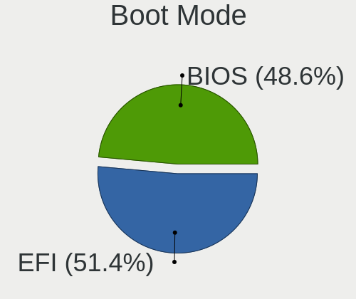

| Mode | Desktops | Percent |
|------|----------|---------|
| BIOS | 6        | 54.55%  |
| EFI  | 5        | 45.45%  |

Filesystem
----------

Type of filesystem

| Type | Desktops | Percent |
|------|----------|---------|
| Xfs  | 9        | 81.82%  |
| Ext4 | 2        | 18.18%  |

Part. scheme
------------

Scheme of partitioning

| Type    | Desktops | Percent |
|---------|----------|---------|
| Unknown | 7        | 63.64%  |
| MBR     | 3        | 27.27%  |
| GPT     | 1        | 9.09%   |

Dual Boot with Linux/BSD
------------------------

Hosting more than one Linux/BSD

| Dual boot | Desktops | Percent |
|-----------|----------|---------|
| No        | 10       | 90.91%  |
| Yes       | 1        | 9.09%   |

Dual Boot (Win)
---------------

Hosting Linux and Windows

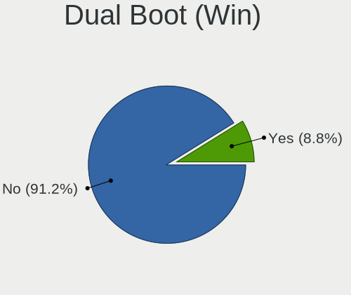

| Dual boot | Desktops | Percent |
|-----------|----------|---------|
| No        | 11       | 100%    |

Board
-----

Vendor
------

Motherboard manufacturer

| Name                | Desktops | Percent |
|---------------------|----------|---------|
| Gigabyte Technology | 3        | 27.27%  |
| Dell                | 3        | 27.27%  |
| ASUSTek Computer    | 2        | 18.18%  |
| MSI                 | 1        | 9.09%   |
| Hewlett-Packard     | 1        | 9.09%   |
| Foxconn             | 1        | 9.09%   |

Model
-----

Motherboard model

| Name                             | Desktops | Percent |
|----------------------------------|----------|---------|
| MSI MS-7758                      | 1        | 9.09%   |
| HP Z820 Workstation              | 1        | 9.09%   |
| Gigabyte Z490 AORUS ELITE AC     | 1        | 9.09%   |
| Gigabyte X99-Designare EX-CF     | 1        | 9.09%   |
| Gigabyte X470 AORUS ULTRA GAMING | 1        | 9.09%   |
| Foxconn p6-2400el                | 1        | 9.09%   |
| Dell PowerEdge FC630             | 1        | 9.09%   |
| Dell OptiPlex 980                | 1        | 9.09%   |
| Dell OptiPlex 7060               | 1        | 9.09%   |
| ASUS P8H67                       | 1        | 9.09%   |
| ASUS G11CD                       | 1        | 9.09%   |

Model Family
------------

Motherboard model prefix

| Name                   | Desktops | Percent |
|------------------------|----------|---------|
| Dell OptiPlex          | 2        | 18.18%  |
| MSI MS-7758            | 1        | 9.09%   |
| HP Z820                | 1        | 9.09%   |
| Gigabyte Z490          | 1        | 9.09%   |
| Gigabyte X99-Designare | 1        | 9.09%   |
| Gigabyte X470          | 1        | 9.09%   |
| Foxconn p6-2400el      | 1        | 9.09%   |
| Dell PowerEdge         | 1        | 9.09%   |
| ASUS P8H67             | 1        | 9.09%   |
| ASUS G11CD             | 1        | 9.09%   |

MFG Year
--------

Motherboard manufacture year

| Year | Desktops | Percent |
|------|----------|---------|
| 2018 | 3        | 27.27%  |
| 2012 | 3        | 27.27%  |
| 2016 | 2        | 18.18%  |
| 2010 | 2        | 18.18%  |
| 2020 | 1        | 9.09%   |

Form Factor
-----------

Physical design of the computer

| Name    | Desktops | Percent |
|---------|----------|---------|
| Desktop | 11       | 100%    |

Secure Boot
-----------

Enabled or disabled

| State    | Desktops | Percent |
|----------|----------|---------|
| Disabled | 11       | 100%    |

Coreboot
--------

Have coreboot on board

| Used | Desktops | Percent |
|------|----------|---------|
| No   | 11       | 100%    |

RAM Size
--------

Total RAM memory

| Size in GB      | Desktops | Percent |
|-----------------|----------|---------|
| 4.01-8.0        | 2        | 18.18%  |
| 64.01-256.0     | 2        | 18.18%  |
| 8.01-16.0       | 2        | 18.18%  |
| More than 256.0 | 1        | 9.09%   |
| 32.01-64.0      | 1        | 9.09%   |
| 24.01-32.0      | 1        | 9.09%   |
| 16.01-24.0      | 1        | 9.09%   |
| 1.01-2.0        | 1        | 9.09%   |

RAM Used
--------

Used RAM memory

| Used GB    | Desktops | Percent |
|------------|----------|---------|
| 2.01-3.0   | 4        | 33.33%  |
| 4.01-8.0   | 3        | 25%     |
| 3.01-4.0   | 1        | 8.33%   |
| 16.01-24.0 | 1        | 8.33%   |
| 1.01-2.0   | 1        | 8.33%   |
| 8.01-16.0  | 1        | 8.33%   |
| 0.01-0.5   | 1        | 8.33%   |

Total Drives
------------

Number of drives on board

| Drives | Desktops | Percent |
|--------|----------|---------|
| 1      | 5        | 45.45%  |
| 3      | 2        | 18.18%  |
| 2      | 2        | 18.18%  |
| 5      | 1        | 9.09%   |
| 4      | 1        | 9.09%   |

Has CD-ROM
----------

Has CD-ROM on board

| Presented | Desktops | Percent |
|-----------|----------|---------|
| No        | 6        | 54.55%  |
| Yes       | 5        | 45.45%  |

Has Ethernet
------------

Has Ethernet on board

| Presented | Desktops | Percent |
|-----------|----------|---------|
| Yes       | 10       | 90.91%  |
| No        | 1        | 9.09%   |

Has WiFi
--------

Has WiFi module

| Presented | Desktops | Percent |
|-----------|----------|---------|
| No        | 7        | 63.64%  |
| Yes       | 4        | 36.36%  |

Has Bluetooth
-------------

Has Bluetooth module

| Presented | Desktops | Percent |
|-----------|----------|---------|
| No        | 7        | 63.64%  |
| Yes       | 4        | 36.36%  |

Location
--------

Country
-------

Geographic location (country)

| Country   | Desktops | Percent |
|-----------|----------|---------|
| Germany   | 3        | 27.27%  |
| Russia    | 2        | 18.18%  |
| USA       | 1        | 9.09%   |
| UK        | 1        | 9.09%   |
| Romania   | 1        | 9.09%   |
| Italy     | 1        | 9.09%   |
| India     | 1        | 9.09%   |
| Australia | 1        | 9.09%   |

City
----

Geographic location (city)

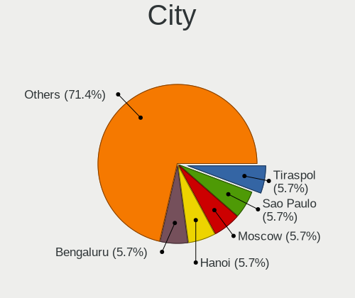

| City            | Desktops | Percent |
|-----------------|----------|---------|
| Weaverville     | 1        | 8.33%   |
| Veliky Novgorod | 1        | 8.33%   |
| Reading         | 1        | 8.33%   |
| Neunkirchen     | 1        | 8.33%   |
| Moscow          | 1        | 8.33%   |
| Langgons        | 1        | 8.33%   |
| Bucharest       | 1        | 8.33%   |
| Berlin          | 1        | 8.33%   |
| Bengaluru       | 1        | 8.33%   |
| Asheville       | 1        | 8.33%   |
| Albairate       | 1        | 8.33%   |
| Adelaide        | 1        | 8.33%   |

Drives
------

Drive Vendor
------------

Hard drive vendors

| Vendor              | Desktops | Drives | Percent |
|---------------------|----------|--------|---------|
| Seagate             | 6        | 44     | 37.5%   |
| WDC                 | 2        | 2      | 12.5%   |
| Toshiba             | 2        | 2      | 12.5%   |
| Samsung Electronics | 2        | 3      | 12.5%   |
| Phison              | 1        | 1      | 6.25%   |
| Kingston            | 1        | 2      | 6.25%   |
| Hewlett-Packard     | 1        | 1      | 6.25%   |
| Crucial             | 1        | 1      | 6.25%   |

Drive Model
-----------

Hard drive models

| Model                            | Desktops | Percent |
|----------------------------------|----------|---------|
| Seagate ST2000DM008-2FR102 2TB   | 2        | 10%     |
| WDC WDS500G2B0A-00SM50 500GB SSD | 1        | 5%      |
| WDC WD10EZEX-60M2NA0 1TB         | 1        | 5%      |
| Toshiba NVMe SSD Drive 512GB     | 1        | 5%      |
| Toshiba MG04ACA200E 2TB          | 1        | 5%      |
| Seagate ST8000VN004-2M2101 8TB   | 1        | 5%      |
| Seagate ST3750528AS 752GB        | 1        | 5%      |
| Seagate ST3500414CS 500GB        | 1        | 5%      |
| Seagate ST2000NX0253 2TB         | 1        | 5%      |
| Seagate ST1000NX0423 1TB         | 1        | 5%      |
| Seagate ST1000LM010-9YH146 1TB   | 1        | 5%      |
| Samsung SSD PM830 2.5 7mm 256GB  | 1        | 5%      |
| Samsung SSD 960 EVO 250GB        | 1        | 5%      |
| Samsung HD502IJ 500GB            | 1        | 5%      |
| Phison NVMe SSD Drive 1TB        | 1        | 5%      |
| Kingston SUV400S37240G 240GB SSD | 1        | 5%      |
| Kingston SA400S37240G 240GB SSD  | 1        | 5%      |
| HP SSD S700 120GB                | 1        | 5%      |
| Crucial CT500MX500SSD1 500GB     | 1        | 5%      |

HDD Vendor
----------

Hard disk drive vendors

| Vendor              | Desktops | Drives | Percent |
|---------------------|----------|--------|---------|
| Seagate             | 6        | 44     | 66.67%  |
| WDC                 | 1        | 1      | 11.11%  |
| Toshiba             | 1        | 1      | 11.11%  |
| Samsung Electronics | 1        | 1      | 11.11%  |

SSD Vendor
----------

Solid state drive vendors

| Vendor              | Desktops | Drives | Percent |
|---------------------|----------|--------|---------|
| WDC                 | 1        | 1      | 20%     |
| Samsung Electronics | 1        | 1      | 20%     |
| Kingston            | 1        | 2      | 20%     |
| Hewlett-Packard     | 1        | 1      | 20%     |
| Crucial             | 1        | 1      | 20%     |

Drive Kind
----------

HDD or SSD

| Kind | Desktops | Drives | Percent |
|------|----------|--------|---------|
| HDD  | 8        | 47     | 50%     |
| SSD  | 5        | 6      | 31.25%  |
| NVMe | 3        | 3      | 18.75%  |

Drive Connector
---------------

SATA, SAS, NVMe, etc.

| Type | Desktops | Drives | Percent |
|------|----------|--------|---------|
| SATA | 11       | 53     | 78.57%  |
| NVMe | 3        | 3      | 21.43%  |

Drive Size
----------

Size of hard drive

| Size in TB | Desktops | Drives | Percent |
|------------|----------|--------|---------|
| 0.01-0.5   | 6        | 8      | 42.86%  |
| 1.01-2.0   | 4        | 38     | 28.57%  |
| 0.51-1.0   | 3        | 5      | 21.43%  |
| 4.01-10.0  | 1        | 2      | 7.14%   |

Space Total
-----------

Amount of disk space available on the file system

| Size in GB     | Desktops | Percent |
|----------------|----------|---------|
| 251-500        | 3        | 27.27%  |
| 1001-2000      | 2        | 18.18%  |
| More than 3000 | 1        | 9.09%   |
| 21-50          | 1        | 9.09%   |
| 2001-3000      | 1        | 9.09%   |
| 101-250        | 1        | 9.09%   |
| 501-1000       | 1        | 9.09%   |
| Unknown        | 1        | 9.09%   |

Space Used
----------

Amount of used disk space

| Used GB        | Desktops | Percent |
|----------------|----------|---------|
| 21-50          | 4        | 36.36%  |
| 101-250        | 3        | 27.27%  |
| 1-20           | 2        | 18.18%  |
| More than 3000 | 1        | 9.09%   |
| Unknown        | 1        | 9.09%   |

Malfunc. Drives
---------------

Drive models with a malfunction

| Model                          | Desktops | Drives | Percent |
|--------------------------------|----------|--------|---------|
| Hewlett-Packard SSD S700 120GB | 1        | 1      | 100%    |

Malfunc. Drive Vendor
---------------------

Vendors of faulty drives

| Vendor          | Desktops | Drives | Percent |
|-----------------|----------|--------|---------|
| Hewlett-Packard | 1        | 1      | 100%    |

Malfunc. HDD Vendor
-------------------

Vendors of faulty HDD drives

Zero info for selected period =(

Malfunc. Drive Kind
-------------------

Kinds of faulty drives

| Kind | Desktops | Drives | Percent |
|------|----------|--------|---------|
| SSD  | 1        | 1      | 100%    |

Failed Drives
-------------

Failed drive models

Zero info for selected period =(

Failed Drive Vendor
-------------------

Failed drive vendors

Zero info for selected period =(

Drive Status
------------

Number of failed and malfunc. drives

| Status   | Desktops | Drives | Percent |
|----------|----------|--------|---------|
| Detected | 7        | 15     | 63.64%  |
| Works    | 3        | 40     | 27.27%  |
| Malfunc  | 1        | 1      | 9.09%   |

Storage controller
------------------

Storage Vendor
--------------

Storage controller vendors

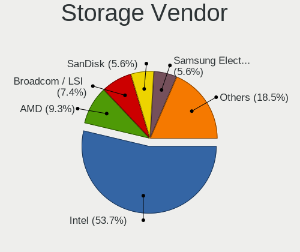

| Vendor                       | Desktops | Percent |
|------------------------------|----------|---------|
| Intel                        | 10       | 58.82%  |
| Broadcom / LSI               | 2        | 11.76%  |
| VIA Technologies             | 1        | 5.88%   |
| Toshiba America Info Systems | 1        | 5.88%   |
| Samsung Electronics          | 1        | 5.88%   |
| Phison Electronics           | 1        | 5.88%   |
| AMD                          | 1        | 5.88%   |

Storage Model
-------------

Storage controller models

| Model                                                                                   | Desktops | Percent |
|-----------------------------------------------------------------------------------------|----------|---------|
| Intel C610/X99 series chipset sSATA Controller [AHCI mode]                              | 2        | 8.7%    |
| Intel C610/X99 series chipset 6-Port SATA Controller [AHCI mode]                        | 2        | 8.7%    |
| VIA VT6415 PATA IDE Host Controller                                                     | 1        | 4.35%   |
| Toshiba America Info Systems Toshiba America Info Non-Volatile memory controller        | 1        | 4.35%   |
| Samsung NVMe SSD Controller SM961/PM961/SM963                                           | 1        | 4.35%   |
| Phison E12 NVMe Controller                                                              | 1        | 4.35%   |
| Intel SATA Controller [RAID mode]                                                       | 1        | 4.35%   |
| Intel Q170/Q150/B150/H170/H110/Z170/CM236 Chipset SATA Controller [AHCI Mode]           | 1        | 4.35%   |
| Intel Comet Lake SATA AHCI Controller                                                   | 1        | 4.35%   |
| Intel Cannon Lake PCH SATA AHCI Controller                                              | 1        | 4.35%   |
| Intel C602 chipset 4-Port SATA Storage Control Unit                                     | 1        | 4.35%   |
| Intel C600/X79 series chipset SATA RAID Controller                                      | 1        | 4.35%   |
| Intel C600/X79 series chipset IDE-r Controller                                          | 1        | 4.35%   |
| Intel 7 Series/C210 Series Chipset Family 6-port SATA Controller [AHCI mode]            | 1        | 4.35%   |
| Intel 6 Series/C200 Series Chipset Family Desktop SATA Controller (IDE mode, ports 4-5) | 1        | 4.35%   |
| Intel 6 Series/C200 Series Chipset Family Desktop SATA Controller (IDE mode, ports 0-3) | 1        | 4.35%   |
| Intel 6 Series/C200 Series Chipset Family 6 port Desktop SATA AHCI Controller           | 1        | 4.35%   |
| Broadcom / LSI SAS2308 PCI-Express Fusion-MPT SAS-2                                     | 1        | 4.35%   |
| Broadcom / LSI MegaRAID SAS-3 3108 [Invader]                                            | 1        | 4.35%   |
| AMD FCH SATA Controller [AHCI mode]                                                     | 1        | 4.35%   |
| AMD 400 Series Chipset SATA Controller                                                  | 1        | 4.35%   |

Storage Kind
------------

Kind of storage controller (IDE, SATA, NVMe, SAS, ...)

| Kind | Desktops | Percent |
|------|----------|---------|
| SATA | 8        | 47.06%  |
| RAID | 3        | 17.65%  |
| NVMe | 3        | 17.65%  |
| IDE  | 2        | 11.76%  |
| SAS  | 1        | 5.88%   |

Processor
---------

CPU Vendor
----------

Processor vendors

| Vendor | Desktops | Percent |
|--------|----------|---------|
| Intel  | 10       | 90.91%  |
| AMD    | 1        | 9.09%   |

CPU Model
---------

Processor models

| Model                                  | Desktops | Percent |
|----------------------------------------|----------|---------|
| Intel Xeon CPU E5-2650 v2 @ 2.60GHz    | 1        | 9.09%   |
| Intel Xeon CPU E5-2620 v4 @ 2.10GHz    | 1        | 9.09%   |
| Intel Pentium CPU G2020 @ 2.90GHz      | 1        | 9.09%   |
| Intel Core i9-10900K CPU @ 3.70GHz     | 1        | 9.09%   |
| Intel Core i7-8700 CPU @ 3.20GHz       | 1        | 9.09%   |
| Intel Core i7-6800K CPU @ 3.40GHz      | 1        | 9.09%   |
| Intel Core i7-6700 CPU @ 3.40GHz       | 1        | 9.09%   |
| Intel Core i7-3770 CPU @ 3.40GHz       | 1        | 9.09%   |
| Intel Core i7-2600 CPU @ 3.40GHz       | 1        | 9.09%   |
| Intel Core i3 CPU 550 @ 3.20GHz        | 1        | 9.09%   |
| AMD Ryzen 7 2700X Eight-Core Processor | 1        | 9.09%   |

CPU Model Family
----------------

Processor model prefix

| Model         | Desktops | Percent |
|---------------|----------|---------|
| Intel Core i7 | 5        | 45.45%  |
| Intel Xeon    | 2        | 18.18%  |
| Intel Pentium | 1        | 9.09%   |
| Intel Core i9 | 1        | 9.09%   |
| Intel Core i3 | 1        | 9.09%   |
| AMD Ryzen 7   | 1        | 9.09%   |

CPU Cores
---------

Number of processor cores

| Number | Desktops | Percent |
|--------|----------|---------|
| 4      | 3        | 27.27%  |
| 16     | 2        | 18.18%  |
| 6      | 2        | 18.18%  |
| 2      | 2        | 18.18%  |
| 10     | 1        | 9.09%   |
| 8      | 1        | 9.09%   |

CPU Sockets
-----------

Number of sockets

| Number | Desktops | Percent |
|--------|----------|---------|
| 1      | 9        | 81.82%  |
| 2      | 2        | 18.18%  |

CPU Threads
-----------

Threads per core (Hyper-Threading)

| Number | Desktops | Percent |
|--------|----------|---------|
| 2      | 10       | 90.91%  |
| 1      | 1        | 9.09%   |

CPU Op-Modes
------------

CPU Operation Modes (32-bit, 64-bit)

| Op mode        | Desktops | Percent |
|----------------|----------|---------|
| 32-bit, 64-bit | 11       | 100%    |

CPU Microcode
-------------

Microcode number

| Number     | Desktops | Percent |
|------------|----------|---------|
| 0x306a9    | 2        | 18.18%  |
| 0xa0655    | 1        | 9.09%   |
| 0x906ea    | 1        | 9.09%   |
| 0x506e3    | 1        | 9.09%   |
| 0x406f1    | 1        | 9.09%   |
| 0x306e4    | 1        | 9.09%   |
| 0x206a7    | 1        | 9.09%   |
| 0x20655    | 1        | 9.09%   |
| 0x0800820d | 1        | 9.09%   |
| Unknown    | 1        | 9.09%   |

CPU Microarch
-------------

Microarchitecture

| Name        | Desktops | Percent |
|-------------|----------|---------|
| IvyBridge   | 3        | 27.27%  |
| Broadwell   | 2        | 18.18%  |
| Zen+        | 1        | 9.09%   |
| Westmere    | 1        | 9.09%   |
| Skylake     | 1        | 9.09%   |
| SandyBridge | 1        | 9.09%   |
| KabyLake    | 1        | 9.09%   |
| CometLake   | 1        | 9.09%   |

Graphics
--------

GPU Vendor
----------

Vendors of graphics cards

| Vendor                     | Desktops | Percent |
|----------------------------|----------|---------|
| Nvidia                     | 6        | 50%     |
| Intel                      | 4        | 33.33%  |
| Matrox Electronics Systems | 1        | 8.33%   |
| AMD                        | 1        | 8.33%   |

GPU Model
---------

Graphics card models

| Model                                                            | Desktops | Percent |
|------------------------------------------------------------------|----------|---------|
| Nvidia TU116 [GeForce GTX 1650 SUPER]                            | 1        | 8.33%   |
| Nvidia GP107 [GeForce GTX 1050]                                  | 1        | 8.33%   |
| Nvidia GP106 [GeForce GTX 1060 6GB]                              | 1        | 8.33%   |
| Nvidia GM204 [GeForce GTX 980]                                   | 1        | 8.33%   |
| Nvidia GK110GL [Quadro K6000]                                    | 1        | 8.33%   |
| Nvidia G98 [GeForce 8400 GS Rev. 2]                              | 1        | 8.33%   |
| Matrox Electronics Systems G200eR2                               | 1        | 8.33%   |
| Intel Xeon E3-1200 v2/3rd Gen Core processor Graphics Controller | 1        | 8.33%   |
| Intel Core Processor Integrated Graphics Controller              | 1        | 8.33%   |
| Intel CometLake-S GT2 [UHD Graphics 630]                         | 1        | 8.33%   |
| Intel CoffeeLake-S GT2 [UHD Graphics 630]                        | 1        | 8.33%   |
| AMD Turks [Radeon HD 7600 Series]                                | 1        | 8.33%   |

GPU Combo
---------

Combinations of graphics cards

| Name       | Desktops | Percent |
|------------|----------|---------|
| 1 x Nvidia | 6        | 54.55%  |
| 1 x Intel  | 3        | 27.27%  |
| 1 x Matrox | 1        | 9.09%   |
| 1 x AMD    | 1        | 9.09%   |

GPU Driver
----------

Free vs proprietary

| Driver      | Desktops | Percent |
|-------------|----------|---------|
| Free        | 9        | 81.82%  |
| Proprietary | 1        | 9.09%   |
| Unknown     | 1        | 9.09%   |

GPU Memory
----------

Total video memory

| Size in GB | Desktops | Percent |
|------------|----------|---------|
| Unknown    | 5        | 45.45%  |
| 3.01-4.0   | 3        | 27.27%  |
| 5.01-6.0   | 1        | 9.09%   |
| 1.01-2.0   | 1        | 9.09%   |
| 8.01-16.0  | 1        | 9.09%   |

Monitor
-------

Monitor Vendor
--------------

Monitor vendors

| Vendor              | Desktops | Percent |
|---------------------|----------|---------|
| Samsung Electronics | 3        | 27.27%  |
| Hewlett-Packard     | 2        | 18.18%  |
| Dell                | 2        | 18.18%  |
| SAC                 | 1        | 9.09%   |
| Goldstar            | 1        | 9.09%   |
| Eizo                | 1        | 9.09%   |
| BenQ                | 1        | 9.09%   |

Monitor Model
-------------

Monitor models

| Model                                                               | Desktops | Percent |
|---------------------------------------------------------------------|----------|---------|
| Samsung Electronics SyncMaster SAM0564 1360x768 410x230mm 18.5-inch | 1        | 8.33%   |
| Samsung Electronics S27D391 SAM0B89 1920x1080 600x340mm 27.2-inch   | 1        | 8.33%   |
| Samsung Electronics S27D391 SAM0B88 1920x1080 598x336mm 27.0-inch   | 1        | 8.33%   |
| Samsung Electronics LCD Monitor S24C650                             | 1        | 8.33%   |
| SAC LED MONITOR SAC952D 1920x1080 480x270mm 21.7-inch               | 1        | 8.33%   |
| Hewlett-Packard Z24i HWP309E 1920x1200 518x324mm 24.1-inch          | 1        | 8.33%   |
| Hewlett-Packard E273q HPN3474 2560x1440 597x336mm 27.0-inch         | 1        | 8.33%   |
| Goldstar E2240 GSM57A3 1920x1080 477x268mm 21.5-inch                | 1        | 8.33%   |
| Eizo EV2460 ENC3129 1920x1080 528x297mm 23.9-inch                   | 1        | 8.33%   |
| Dell LCD Monitor U2415 3840x1200                                    | 1        | 8.33%   |
| Dell IDRAC DEL0001 1280x1024                                        | 1        | 8.33%   |
| BenQ GW2480 BNQ78E7 1920x1080 527x296mm 23.8-inch                   | 1        | 8.33%   |

Monitor Resolution
------------------

Monitor screen resolution

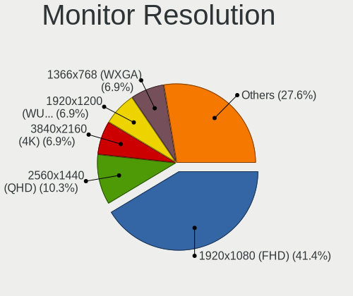

| Resolution        | Desktops | Percent |
|-------------------|----------|---------|
| 1920x1080 (FHD)   | 5        | 45.45%  |
| 3840x1200         | 1        | 9.09%   |
| 2560x1440 (QHD)   | 1        | 9.09%   |
| 1920x1200 (WUXGA) | 1        | 9.09%   |
| 1360x768          | 1        | 9.09%   |
| 1280x1024 (SXGA)  | 1        | 9.09%   |
| Unknown           | 1        | 9.09%   |

Monitor Diagonal
----------------

Diagonal size in inches

| Inches  | Desktops | Percent |
|---------|----------|---------|
| 27      | 2        | 20%     |
| 24      | 2        | 20%     |
| 21      | 2        | 20%     |
| Unknown | 2        | 20%     |
| 23      | 1        | 10%     |
| 18      | 1        | 10%     |

Monitor Width
-------------

Physical width

| Width in mm | Desktops | Percent |
|-------------|----------|---------|
| 501-600     | 5        | 50%     |
| 401-500     | 3        | 30%     |
| Unknown     | 2        | 20%     |

Aspect Ratio
------------

Proportional relationship between the width and the height

| Ratio   | Desktops | Percent |
|---------|----------|---------|
| 16/9    | 7        | 70%     |
| 5/4     | 1        | 10%     |
| 16/10   | 1        | 10%     |
| Unknown | 1        | 10%     |

Monitor Area
------------

Area in inch²

| Area in inch² | Desktops | Percent |
|----------------|----------|---------|
| 201-250        | 4        | 40%     |
| 301-350        | 2        | 20%     |
| Unknown        | 2        | 20%     |
| 251-300        | 1        | 10%     |
| 141-150        | 1        | 10%     |

Pixel Density
-------------

Pixels per inch

| Density | Desktops | Percent |
|---------|----------|---------|
| 51-100  | 5        | 50%     |
| 101-120 | 3        | 30%     |
| Unknown | 2        | 20%     |

Multiple Monitors
-----------------

Total monitors connected

| Total | Desktops | Percent |
|-------|----------|---------|
| 1     | 9        | 81.82%  |
| 2     | 2        | 18.18%  |

Network
-------

Net Controller Vendor
---------------------

Controller vendors

| Vendor                | Desktops | Percent |
|-----------------------|----------|---------|
| Intel                 | 6        | 46.15%  |
| Realtek Semiconductor | 5        | 38.46%  |
| Qualcomm Atheros      | 1        | 7.69%   |
| Broadcom              | 1        | 7.69%   |

Net Controller Model
--------------------

Controller models

| Model                                                             | Desktops | Percent |
|-------------------------------------------------------------------|----------|---------|
| Realtek RTL8111/8168/8411 PCI Express Gigabit Ethernet Controller | 3        | 18.75%  |
| Intel I211 Gigabit Network Connection                             | 2        | 12.5%   |
| Realtek RTL8821AE 802.11ac PCIe Wireless Network Adapter          | 1        | 6.25%   |
| Realtek RTL8125 2.5GbE Controller                                 | 1        | 6.25%   |
| Qualcomm Atheros AR9287 Wireless Network Adapter (PCI-Express)    | 1        | 6.25%   |
| Intel Wireless 8260                                               | 1        | 6.25%   |
| Intel Ethernet Connection (7) I219-LM                             | 1        | 6.25%   |
| Intel Ethernet Connection (2) I218-V                              | 1        | 6.25%   |
| Intel Comet Lake PCH CNVi WiFi                                    | 1        | 6.25%   |
| Intel 82579LM Gigabit Network Connection (Lewisville)             | 1        | 6.25%   |
| Intel 82578DM Gigabit Network Connection                          | 1        | 6.25%   |
| Intel 82574L Gigabit Network Connection                           | 1        | 6.25%   |
| Broadcom NetXtreme II BCM57810 10 Gigabit Ethernet                | 1        | 6.25%   |

Wireless Vendor
---------------

Wireless vendors

| Vendor                | Desktops | Percent |
|-----------------------|----------|---------|
| Intel                 | 2        | 50%     |
| Realtek Semiconductor | 1        | 25%     |
| Qualcomm Atheros      | 1        | 25%     |

Wireless Model
--------------

Wireless models

| Model                                                          | Desktops | Percent |
|----------------------------------------------------------------|----------|---------|
| Realtek RTL8821AE 802.11ac PCIe Wireless Network Adapter       | 1        | 25%     |
| Qualcomm Atheros AR9287 Wireless Network Adapter (PCI-Express) | 1        | 25%     |
| Intel Wireless 8260                                            | 1        | 25%     |
| Intel Comet Lake PCH CNVi WiFi                                 | 1        | 25%     |

Ethernet Vendor
---------------

Ethernet vendors

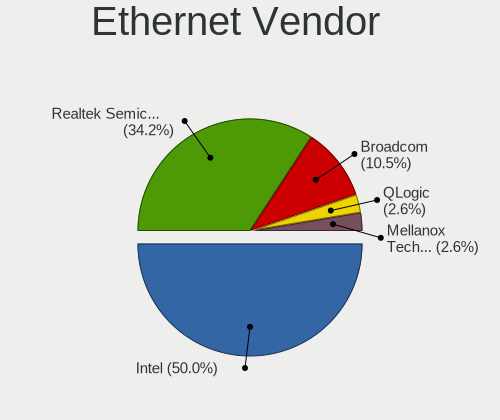

| Vendor                | Desktops | Percent |
|-----------------------|----------|---------|
| Intel                 | 5        | 50%     |
| Realtek Semiconductor | 4        | 40%     |
| Broadcom              | 1        | 10%     |

Ethernet Model
--------------

Ethernet models

| Model                                                             | Desktops | Percent |
|-------------------------------------------------------------------|----------|---------|
| Realtek RTL8111/8168/8411 PCI Express Gigabit Ethernet Controller | 3        | 25%     |
| Intel I211 Gigabit Network Connection                             | 2        | 16.67%  |
| Realtek RTL8125 2.5GbE Controller                                 | 1        | 8.33%   |
| Intel Ethernet Connection (7) I219-LM                             | 1        | 8.33%   |
| Intel Ethernet Connection (2) I218-V                              | 1        | 8.33%   |
| Intel 82579LM Gigabit Network Connection (Lewisville)             | 1        | 8.33%   |
| Intel 82578DM Gigabit Network Connection                          | 1        | 8.33%   |
| Intel 82574L Gigabit Network Connection                           | 1        | 8.33%   |
| Broadcom NetXtreme II BCM57810 10 Gigabit Ethernet                | 1        | 8.33%   |

Net Controller Kind
-------------------

Ethernet, WiFi or modem

| Kind     | Desktops | Percent |
|----------|----------|---------|
| Ethernet | 10       | 71.43%  |
| WiFi     | 4        | 28.57%  |

Used Controller
---------------

Currently used network controller

| Kind     | Desktops | Percent |
|----------|----------|---------|
| Ethernet | 10       | 90.91%  |
| WiFi     | 1        | 9.09%   |

NICs
----

Total network controllers on board

| Total | Desktops | Percent |
|-------|----------|---------|
| 1     | 6        | 54.55%  |
| 2     | 4        | 36.36%  |
| 3     | 1        | 9.09%   |

IPv6
----

IPv6 vs IPv4

| Used | Desktops | Percent |
|------|----------|---------|
| No   | 11       | 100%    |

Bluetooth
---------

Bluetooth Vendor
----------------

Controller vendors

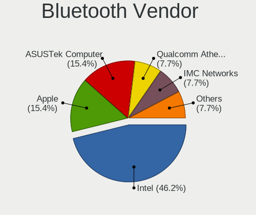

| Vendor           | Desktops | Percent |
|------------------|----------|---------|
| Intel            | 2        | 40%     |
| IMC Networks     | 1        | 20%     |
| Broadcom         | 1        | 20%     |
| ASUSTek Computer | 1        | 20%     |

Bluetooth Model
---------------

Controller models

| Model                                          | Desktops | Percent |
|------------------------------------------------|----------|---------|
| Intel Bluetooth wireless interface             | 1        | 20%     |
| Intel Bluetooth 9460/9560 Jefferson Peak (JfP) | 1        | 20%     |
| IMC Networks Bluetooth Radio                   | 1        | 20%     |
| Broadcom BCM20702A0 Bluetooth 4.0              | 1        | 20%     |
| ASUS Broadcom BCM20702A0 Bluetooth             | 1        | 20%     |

Sound
-----

Sound Vendor
------------

Sound card vendors

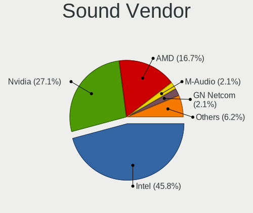

| Vendor | Desktops | Percent |
|--------|----------|---------|
| Intel  | 8        | 53.33%  |
| Nvidia | 5        | 33.33%  |
| AMD    | 2        | 13.33%  |

Sound Model
-----------

Sound card models

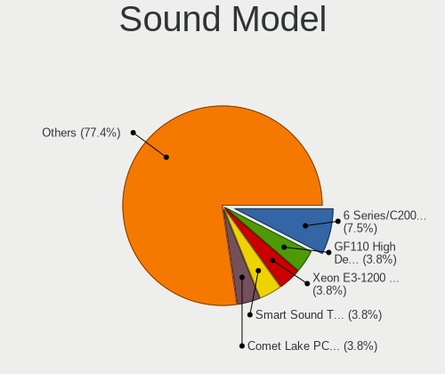

| Model                                                                      | Desktops | Percent |
|----------------------------------------------------------------------------|----------|---------|
| Intel 6 Series/C200 Series Chipset Family High Definition Audio Controller | 2        | 13.33%  |
| Nvidia TU116 High Definition Audio Controller                              | 1        | 6.67%   |
| Nvidia GP107GL High Definition Audio Controller                            | 1        | 6.67%   |
| Nvidia GP106 High Definition Audio Controller                              | 1        | 6.67%   |
| Nvidia GM204 High Definition Audio Controller                              | 1        | 6.67%   |
| Nvidia GK110 High Definition Audio Controller                              | 1        | 6.67%   |
| Intel Comet Lake PCH cAVS                                                  | 1        | 6.67%   |
| Intel Cannon Lake PCH cAVS                                                 | 1        | 6.67%   |
| Intel C600/X79 series chipset High Definition Audio Controller             | 1        | 6.67%   |
| Intel 7 Series/C216 Chipset Family High Definition Audio Controller        | 1        | 6.67%   |
| Intel 5 Series/3400 Series Chipset High Definition Audio                   | 1        | 6.67%   |
| Intel 100 Series/C230 Series Chipset Family HD Audio Controller            | 1        | 6.67%   |
| AMD Turks HDMI Audio [Radeon HD 6500/6600 / 6700M Series]                  | 1        | 6.67%   |
| AMD Family 17h (Models 00h-0fh) HD Audio Controller                        | 1        | 6.67%   |

Memory
------

Memory Vendor
-------------

Memory module vendors

| Vendor            | Desktops | Percent |
|-------------------|----------|---------|
| Kingston          | 2        | 50%     |
| Micron Technology | 1        | 25%     |
| Crucial           | 1        | 25%     |

Memory Model
------------

Memory module models

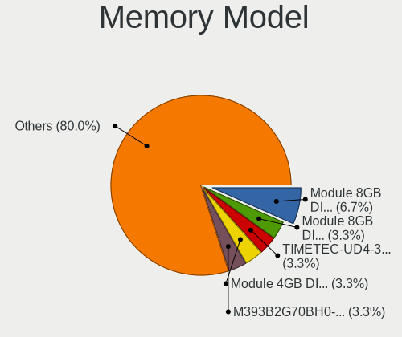

| Model                                                     | Desktops | Percent |
|-----------------------------------------------------------|----------|---------|
| Micron RAM 18ASF2G72PDZ-2G3B1 16GB DIMM DDR4 2400MT/s     | 1        | 20%     |
| Kingston RAM KTW149-ELF 1GB DIMM DDR3 1333MT/s            | 1        | 20%     |
| Kingston RAM 9905471-006.A00LF 4GB DIMM DDR3 1333MT/s     | 1        | 20%     |
| Kingston RAM 9905403-892.A00LF 8GB DIMM DDR3 1333MT/s     | 1        | 20%     |
| Crucial RAM BLE8G4D34AEEAK.K8FB 8192MB DIMM DDR4 3466MT/s | 1        | 20%     |

Memory Kind
-----------

Memory module kinds

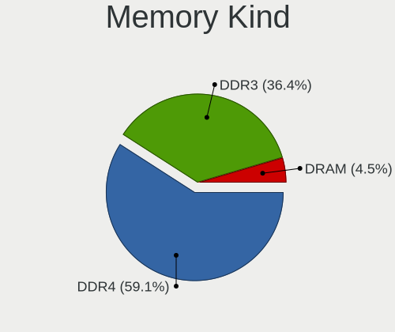

| Kind | Desktops | Percent |
|------|----------|---------|
| DDR4 | 2        | 50%     |
| DDR3 | 2        | 50%     |

Memory Form Factor
------------------

Physical design of the memory module

| Name | Desktops | Percent |
|------|----------|---------|
| DIMM | 4        | 100%    |

Memory Size
-----------

Memory module size

| Size  | Desktops | Percent |
|-------|----------|---------|
| 8192  | 2        | 40%     |
| 16384 | 1        | 20%     |
| 4096  | 1        | 20%     |
| 1024  | 1        | 20%     |

Memory Speed
------------

Memory module speed

| Speed | Desktops | Percent |
|-------|----------|---------|
| 1333  | 2        | 50%     |
| 3466  | 1        | 25%     |
| 2400  | 1        | 25%     |

Printers & scanners
-------------------

Printer Vendor
--------------

Printer device vendors

| Vendor              | Desktops | Percent |
|---------------------|----------|---------|
| Samsung Electronics | 1        | 100%    |

Printer Model
-------------

Printer device models

| Model                  | Desktops | Percent |
|------------------------|----------|---------|
| Samsung ML-1660 Series | 1        | 100%    |

Scanner Vendor
--------------

Scanner device vendors

Zero info for selected period =(

Scanner Model
-------------

Scanner device models

Zero info for selected period =(

Camera
------

Camera Vendor
-------------

Camera device vendors

| Vendor   | Desktops | Percent |
|----------|----------|---------|
| Microdia | 1        | 100%    |

Camera Model
------------

Camera device models

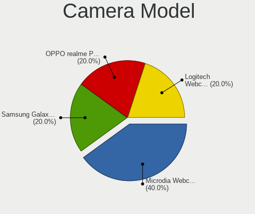

| Model                     | Desktops | Percent |
|---------------------------|----------|---------|
| Microdia Webcam Vitade AF | 1        | 100%    |

Security
--------

Fingerprint Vendor
------------------

Fingerprint sensor vendors

Zero info for selected period =(

Fingerprint Model
-----------------

Fingerprint sensor models

Zero info for selected period =(

Chipcard Vendor
---------------

Chipcard module vendors

Zero info for selected period =(

Chipcard Model
--------------

Chipcard module models

Zero info for selected period =(

Unsupported
-----------

Unsupported Devices
-------------------

Total unsupported devices on board

| Total | Desktops | Percent |
|-------|----------|---------|
| 0     | 7        | 63.64%  |
| 2     | 3        | 27.27%  |
| 1     | 1        | 9.09%   |

Unsupported Device Types
------------------------

Types of unsupported devices

| Type                     | Desktops | Percent |
|--------------------------|----------|---------|
| Unassigned class         | 2        | 33.33%  |
| Net/wireless             | 1        | 16.67%  |
| Graphics card            | 1        | 16.67%  |
| Communication controller | 1        | 16.67%  |
| Bluetooth                | 1        | 16.67%  |

