Oracle Linux - Tested Hardware & Statistics (Notebooks)
-------------------------------------------------------

A project to collect tested hardware configurations for Oracle Linux.

Anyone can contribute to this report by the [hw-probe](https://github.com/linuxhw/hw-probe) tool:

    sudo -E hw-probe -all -upload

Please contribute! Especially if your hardware is rare.

Contents
--------

* [ Test Cases ](#test-cases)

* [ System ](#system)
  - [ OS                       ](#os)
  - [ OS Family                ](#os-family)
  - [ Kernel                   ](#kernel)
  - [ Kernel Family            ](#kernel-family)
  - [ Kernel Major Ver.        ](#kernel-major-ver)
  - [ Arch                     ](#arch)
  - [ DE                       ](#de)
  - [ Display Server           ](#display-server)
  - [ Display Manager          ](#display-manager)
  - [ OS Lang                  ](#os-lang)
  - [ Boot Mode                ](#boot-mode)
  - [ Filesystem               ](#filesystem)
  - [ Part. scheme             ](#part-scheme)
  - [ Dual Boot with Linux/BSD ](#dual-boot-with-linuxbsd)
  - [ Dual Boot (Win)          ](#dual-boot-win)

* [ Board ](#board)
  - [ Vendor                   ](#vendor)
  - [ Model                    ](#model)
  - [ Model Family             ](#model-family)
  - [ MFG Year                 ](#mfg-year)
  - [ Form Factor              ](#form-factor)
  - [ Secure Boot              ](#secure-boot)
  - [ Coreboot                 ](#coreboot)
  - [ RAM Size                 ](#ram-size)
  - [ RAM Used                 ](#ram-used)
  - [ Total Drives             ](#total-drives)
  - [ Has CD-ROM               ](#has-cd-rom)
  - [ Has Ethernet             ](#has-ethernet)
  - [ Has WiFi                 ](#has-wifi)
  - [ Has Bluetooth            ](#has-bluetooth)

* [ Location ](#location)
  - [ Country                  ](#country)
  - [ City                     ](#city)

* [ Drives ](#drives)
  - [ Drive Vendor             ](#drive-vendor)
  - [ Drive Model              ](#drive-model)
  - [ HDD Vendor               ](#hdd-vendor)
  - [ SSD Vendor               ](#ssd-vendor)
  - [ Drive Kind               ](#drive-kind)
  - [ Drive Connector          ](#drive-connector)
  - [ Drive Size               ](#drive-size)
  - [ Space Total              ](#space-total)
  - [ Space Used               ](#space-used)
  - [ Malfunc. Drives          ](#malfunc-drives)
  - [ Malfunc. Drive Vendor    ](#malfunc-drive-vendor)
  - [ Malfunc. HDD Vendor      ](#malfunc-hdd-vendor)
  - [ Malfunc. Drive Kind      ](#malfunc-drive-kind)
  - [ Failed Drives            ](#failed-drives)
  - [ Failed Drive Vendor      ](#failed-drive-vendor)
  - [ Drive Status             ](#drive-status)

* [ Storage controller ](#storage-controller)
  - [ Storage Vendor           ](#storage-vendor)
  - [ Storage Model            ](#storage-model)
  - [ Storage Kind             ](#storage-kind)

* [ Processor ](#processor)
  - [ CPU Vendor               ](#cpu-vendor)
  - [ CPU Model                ](#cpu-model)
  - [ CPU Model Family         ](#cpu-model-family)
  - [ CPU Cores                ](#cpu-cores)
  - [ CPU Sockets              ](#cpu-sockets)
  - [ CPU Threads              ](#cpu-threads)
  - [ CPU Op-Modes             ](#cpu-op-modes)
  - [ CPU Microcode            ](#cpu-microcode)
  - [ CPU Microarch            ](#cpu-microarch)

* [ Graphics ](#graphics)
  - [ GPU Vendor               ](#gpu-vendor)
  - [ GPU Model                ](#gpu-model)
  - [ GPU Combo                ](#gpu-combo)
  - [ GPU Driver               ](#gpu-driver)
  - [ GPU Memory               ](#gpu-memory)

* [ Monitor ](#monitor)
  - [ Monitor Vendor           ](#monitor-vendor)
  - [ Monitor Model            ](#monitor-model)
  - [ Monitor Resolution       ](#monitor-resolution)
  - [ Monitor Diagonal         ](#monitor-diagonal)
  - [ Monitor Width            ](#monitor-width)
  - [ Aspect Ratio             ](#aspect-ratio)
  - [ Monitor Area             ](#monitor-area)
  - [ Pixel Density            ](#pixel-density)
  - [ Multiple Monitors        ](#multiple-monitors)

* [ Network ](#network)
  - [ Net Controller Vendor    ](#net-controller-vendor)
  - [ Net Controller Model     ](#net-controller-model)
  - [ Wireless Vendor          ](#wireless-vendor)
  - [ Wireless Model           ](#wireless-model)
  - [ Ethernet Vendor          ](#ethernet-vendor)
  - [ Ethernet Model           ](#ethernet-model)
  - [ Net Controller Kind      ](#net-controller-kind)
  - [ Used Controller          ](#used-controller)
  - [ NICs                     ](#nics)
  - [ IPv6                     ](#ipv6)

* [ Bluetooth ](#bluetooth)
  - [ Bluetooth Vendor         ](#bluetooth-vendor)
  - [ Bluetooth Model          ](#bluetooth-model)

* [ Sound ](#sound)
  - [ Sound Vendor             ](#sound-vendor)
  - [ Sound Model              ](#sound-model)

* [ Memory ](#memory)
  - [ Memory Vendor            ](#memory-vendor)
  - [ Memory Model             ](#memory-model)
  - [ Memory Kind              ](#memory-kind)
  - [ Memory Form Factor       ](#memory-form-factor)
  - [ Memory Size              ](#memory-size)
  - [ Memory Speed             ](#memory-speed)

* [ Printers & scanners ](#printers--scanners)
  - [ Printer Vendor           ](#printer-vendor)
  - [ Printer Model            ](#printer-model)
  - [ Scanner Vendor           ](#scanner-vendor)
  - [ Scanner Model            ](#scanner-model)

* [ Camera ](#camera)
  - [ Camera Vendor            ](#camera-vendor)
  - [ Camera Model             ](#camera-model)

* [ Security ](#security)
  - [ Fingerprint Vendor       ](#fingerprint-vendor)
  - [ Fingerprint Model        ](#fingerprint-model)
  - [ Chipcard Vendor          ](#chipcard-vendor)
  - [ Chipcard Model           ](#chipcard-model)

* [ Unsupported ](#unsupported)
  - [ Unsupported Devices      ](#unsupported-devices)
  - [ Unsupported Device Types ](#unsupported-device-types)

Test Cases
----------

Total: 111

| Vendor    | Model                       | Probe                                                      | Date         |
|-----------|-----------------------------|------------------------------------------------------------|--------------|
| Dell      | Latitude 7450               | [7b8f028721](https://linux-hardware.org/?probe=7b8f028721) | Oct 09, 2025 |
| Toshiba   | Satellite P55t-A            | [627cb9e248](https://linux-hardware.org/?probe=627cb9e248) | Apr 05, 2025 |
| HP        | Laptop 17-cp0xxx            | [f589c668ce](https://linux-hardware.org/?probe=f589c668ce) | Mar 22, 2025 |
| Dell      | Latitude 7440               | [1465f06bab](https://linux-hardware.org/?probe=1465f06bab) | Mar 07, 2025 |
| HP        | ZBook Power 16 inch G11 ... | [9a8e9d2dad](https://linux-hardware.org/?probe=9a8e9d2dad) | Feb 20, 2025 |
| HP        | EliteBook 840 14 inch G1... | [61742aff4d](https://linux-hardware.org/?probe=61742aff4d) | Jan 27, 2025 |
| Dell      | Latitude 7450               | [41b698bba3](https://linux-hardware.org/?probe=41b698bba3) | Dec 28, 2024 |
| Dell      | Latitude 7450               | [43d05fa82d](https://linux-hardware.org/?probe=43d05fa82d) | Dec 23, 2024 |
| HP        | EliteBook 850 G1            | [0a6449c5f0](https://linux-hardware.org/?probe=0a6449c5f0) | Nov 27, 2024 |
| HP        | ZBook Fury 15.6 inch G8 ... | [9ba889ebcc](https://linux-hardware.org/?probe=9ba889ebcc) | Nov 18, 2024 |
| Alienware | m18 R2                      | [9f13ae9091](https://linux-hardware.org/?probe=9f13ae9091) | Sep 21, 2024 |
| Lenovo    | IdeaPad 3 14IIL05 81WD      | [27e651550b](https://linux-hardware.org/?probe=27e651550b) | Jun 30, 2024 |
| Dell      | Inspiron 3421               | [821d5d1169](https://linux-hardware.org/?probe=821d5d1169) | Jun 21, 2024 |
| Fujitsu   | LIFEBOOK E449               | [a9a0c13323](https://linux-hardware.org/?probe=a9a0c13323) | Jun 13, 2024 |
| Dell      | Inspiron 3421               | [67986b7795](https://linux-hardware.org/?probe=67986b7795) | May 23, 2024 |
| Fujitsu   | LIFEBOOK E449               | [956d6540d5](https://linux-hardware.org/?probe=956d6540d5) | May 23, 2024 |
| Lenovo    | ThinkPad P16s Gen 1 21BT... | [97c2387841](https://linux-hardware.org/?probe=97c2387841) | Apr 12, 2024 |
| Lenovo    | ThinkPad P16s Gen 1 21BT... | [e47633811b](https://linux-hardware.org/?probe=e47633811b) | Apr 12, 2024 |
| ASUSTek   | X541SA                      | [23ea4a0287](https://linux-hardware.org/?probe=23ea4a0287) | Apr 09, 2024 |
| ASUSTek   | X541SA                      | [0f5bd53c6f](https://linux-hardware.org/?probe=0f5bd53c6f) | Apr 08, 2024 |
| ASUSTek   | X541SA                      | [b3f083db5c](https://linux-hardware.org/?probe=b3f083db5c) | Apr 06, 2024 |
| HP        | EliteBook 640 14 inch G1... | [90a116696c](https://linux-hardware.org/?probe=90a116696c) | Mar 24, 2024 |
| Lenovo    | ThinkBook 15-IIL 20SM       | [692db635b4](https://linux-hardware.org/?probe=692db635b4) | Mar 23, 2024 |
| HP        | ZBook Fury 15.6 inch G8 ... | [b27420dd64](https://linux-hardware.org/?probe=b27420dd64) | Feb 21, 2024 |
| Dell      | Latitude 7420               | [30e1dc7b9f](https://linux-hardware.org/?probe=30e1dc7b9f) | Feb 13, 2024 |
| Dell      | Latitude 7430               | [153f1a144c](https://linux-hardware.org/?probe=153f1a144c) | Jan 19, 2024 |
| Dell      | Latitude 7430               | [a05210eeb4](https://linux-hardware.org/?probe=a05210eeb4) | Jan 19, 2024 |
| Lenovo    | ThinkPad T490 20N3S3XR00    | [63ec999c70](https://linux-hardware.org/?probe=63ec999c70) | Jan 16, 2024 |
| Lenovo    | ThinkPad W520 42844DG       | [52cd813233](https://linux-hardware.org/?probe=52cd813233) | Dec 20, 2023 |
| HP        | ZBook Fury 15.6 inch G8 ... | [58ad170a68](https://linux-hardware.org/?probe=58ad170a68) | Dec 10, 2023 |
| Dell      | XPS 15 9570                 | [35a10a1ae2](https://linux-hardware.org/?probe=35a10a1ae2) | Dec 10, 2023 |
| Toshiba   | TECRA R950                  | [8ab7278f60](https://linux-hardware.org/?probe=8ab7278f60) | Dec 01, 2023 |
| Toshiba   | TECRA R950                  | [9634f68cab](https://linux-hardware.org/?probe=9634f68cab) | Dec 01, 2023 |
| Dell      | XPS 15 9570                 | [7728d0ab4b](https://linux-hardware.org/?probe=7728d0ab4b) | Nov 22, 2023 |
| HP        | EliteBook 840 G4            | [7d2d46e750](https://linux-hardware.org/?probe=7d2d46e750) | Nov 17, 2023 |
| Lenovo    | Legion Y540-15IRH 81SX      | [1da691596b](https://linux-hardware.org/?probe=1da691596b) | Nov 06, 2023 |
| Lenovo    | Legion Y540-15IRH 81SX      | [d385d4714c](https://linux-hardware.org/?probe=d385d4714c) | Nov 06, 2023 |
| Dell      | Precision 5550              | [033e294199](https://linux-hardware.org/?probe=033e294199) | Nov 03, 2023 |
| HP        | 240 G8 Notebook PC          | [0a98dcd952](https://linux-hardware.org/?probe=0a98dcd952) | Oct 11, 2023 |
| HP        | 240 G8 Notebook PC          | [6fec1bd640](https://linux-hardware.org/?probe=6fec1bd640) | Sep 11, 2023 |
| Dell      | Latitude 7440               | [47f28d7b00](https://linux-hardware.org/?probe=47f28d7b00) | Sep 04, 2023 |
| Dell      | Latitude 7440               | [27b2ae9d5b](https://linux-hardware.org/?probe=27b2ae9d5b) | Sep 04, 2023 |
| HP        | ZBook Fury 16 G9 Mobile ... | [4b7e25150a](https://linux-hardware.org/?probe=4b7e25150a) | Aug 15, 2023 |
| MSI       | P65 Creator 8RE             | [853567f156](https://linux-hardware.org/?probe=853567f156) | Aug 06, 2023 |
| MSI       | P65 Creator 8RE             | [f26344a920](https://linux-hardware.org/?probe=f26344a920) | Aug 05, 2023 |
| Dell      | Latitude 7430               | [299e6897d2](https://linux-hardware.org/?probe=299e6897d2) | Jun 05, 2023 |
| Lenovo    | ThinkPad T490 20N3S3XR00    | [0f80e19e5b](https://linux-hardware.org/?probe=0f80e19e5b) | May 23, 2023 |
| Lenovo    | ThinkPad W541 20EGS1PL00    | [751cc5dbc7](https://linux-hardware.org/?probe=751cc5dbc7) | May 22, 2023 |
| ASUSTek   | ZenBook UX425EA_UX425EA     | [9be6e0f395](https://linux-hardware.org/?probe=9be6e0f395) | Apr 18, 2023 |
| HP        | Laptop 17-cp0xxx            | [e87b8175b1](https://linux-hardware.org/?probe=e87b8175b1) | Jan 27, 2023 |
| HP        | Laptop 17-cp0xxx            | [70019cbdbf](https://linux-hardware.org/?probe=70019cbdbf) | Jan 25, 2023 |
| Google    | Lick                        | [d792b79719](https://linux-hardware.org/?probe=d792b79719) | Jan 12, 2023 |
| Panasonic | CF-53AAG54FM                | [cf7f652846](https://linux-hardware.org/?probe=cf7f652846) | Dec 21, 2022 |
| Lenovo    | ThinkPad T470 20HES0E71M    | [85fc801717](https://linux-hardware.org/?probe=85fc801717) | Dec 05, 2022 |
| Lenovo    | ThinkPad P70 20ESS04S00     | [01b85c4c2a](https://linux-hardware.org/?probe=01b85c4c2a) | Nov 10, 2022 |
| Lenovo    | ThinkPad T470 20HES21434    | [39ff1846e3](https://linux-hardware.org/?probe=39ff1846e3) | Oct 23, 2022 |
| Dynabook  | PORTEGE X40-G               | [fc68a9cdbf](https://linux-hardware.org/?probe=fc68a9cdbf) | Oct 03, 2022 |
| HP        | EliteBook 840 G5            | [2709daf415](https://linux-hardware.org/?probe=2709daf415) | Sep 13, 2022 |
| Lenovo    | Legion 5 15IMH05 82AU       | [bd4737dfcf](https://linux-hardware.org/?probe=bd4737dfcf) | Aug 18, 2022 |
| Dell      | Inspiron 5502               | [28dcf01e88](https://linux-hardware.org/?probe=28dcf01e88) | Aug 03, 2022 |
| Lenovo    | Legion 5 15IMH05 82AU       | [3dddb3aac3](https://linux-hardware.org/?probe=3dddb3aac3) | Jul 20, 2022 |
| Lenovo    | ThinkPad P70 20ESS04S00     | [fc29967bed](https://linux-hardware.org/?probe=fc29967bed) | Jun 17, 2022 |
| HP        | Compaq 6730b                | [dd94c9145b](https://linux-hardware.org/?probe=dd94c9145b) | Jun 11, 2022 |
| Lenovo    | ThinkPad T410 2518A37       | [04e81b8b3f](https://linux-hardware.org/?probe=04e81b8b3f) | Jun 04, 2022 |
| Lenovo    | ThinkPad T430s 2355C33      | [33de2bbd12](https://linux-hardware.org/?probe=33de2bbd12) | May 31, 2022 |
| Lenovo    | ThinkPad T430s 2355C33      | [4eab57bebf](https://linux-hardware.org/?probe=4eab57bebf) | May 30, 2022 |
| Dell      | Precision M4600             | [0ac2adfe5a](https://linux-hardware.org/?probe=0ac2adfe5a) | Apr 21, 2022 |
| Dell      | Precision M4800             | [fb13b19803](https://linux-hardware.org/?probe=fb13b19803) | Apr 21, 2022 |
| Lenovo    | ThinkPad P50s 20FL000MUS    | [99fbb4446c](https://linux-hardware.org/?probe=99fbb4446c) | Apr 16, 2022 |
| Lenovo    | ThinkPad X1 Extreme 2nd ... | [b708e920f3](https://linux-hardware.org/?probe=b708e920f3) | Mar 21, 2022 |
| Lenovo    | ThinkPad T450 20BUS14900    | [bd60aae97a](https://linux-hardware.org/?probe=bd60aae97a) | Mar 11, 2022 |
| Lenovo    | ThinkPad T480 20L5A07TAU    | [755854f7d4](https://linux-hardware.org/?probe=755854f7d4) | Mar 11, 2022 |
| Lenovo    | ThinkPad X280 20KES4H34G    | [2b8a4f4664](https://linux-hardware.org/?probe=2b8a4f4664) | Mar 10, 2022 |
| Dell      | Latitude 7420               | [af5f1055fe](https://linux-hardware.org/?probe=af5f1055fe) | Mar 10, 2022 |
| HP        | ProBook 445 G6              | [88d8b32328](https://linux-hardware.org/?probe=88d8b32328) | Jan 26, 2022 |
| Lenovo    | ThinkPad T450 20BUS14900    | [44c8e11f02](https://linux-hardware.org/?probe=44c8e11f02) | Dec 22, 2021 |
| Lenovo    | IdeaPad 300-15ISK 80RS      | [1c9ca21f4e](https://linux-hardware.org/?probe=1c9ca21f4e) | Dec 10, 2021 |
| Dell      | Latitude 7410               | [3efa87284e](https://linux-hardware.org/?probe=3efa87284e) | Nov 18, 2021 |
| Dell      | Latitude E6420              | [b809392380](https://linux-hardware.org/?probe=b809392380) | Oct 08, 2021 |
| Dell      | Latitude 7410               | [8f1a1a4798](https://linux-hardware.org/?probe=8f1a1a4798) | Sep 06, 2021 |
| Dell      | Latitude 7410               | [b03a0e0152](https://linux-hardware.org/?probe=b03a0e0152) | Sep 06, 2021 |
| Lenovo    | Legion 5 15IMH05 82AU       | [7b393c5790](https://linux-hardware.org/?probe=7b393c5790) | Aug 21, 2021 |
| Lenovo    | Legion 5 15IMH05 82AU       | [394c99adc8](https://linux-hardware.org/?probe=394c99adc8) | Aug 19, 2021 |
| Dell      | Inspiron 3542               | [0909599e9c](https://linux-hardware.org/?probe=0909599e9c) | Aug 11, 2021 |
| Lenovo    | Legion 5 15IMH05 82AU       | [ba7afba1a6](https://linux-hardware.org/?probe=ba7afba1a6) | Jul 08, 2021 |
| Lenovo    | ThinkPad L490 20Q5CTO1WW    | [0225c17d79](https://linux-hardware.org/?probe=0225c17d79) | Jul 02, 2021 |
| Lenovo    | Legion 5 15IMH05 82AU       | [505b82b2de](https://linux-hardware.org/?probe=505b82b2de) | Jun 06, 2021 |
| Lenovo    | Legion 5 15IMH05 82AU       | [75b2ef5126](https://linux-hardware.org/?probe=75b2ef5126) | May 13, 2021 |
| Lenovo    | Legion 5 15IMH05 82AU       | [734a4fbc56](https://linux-hardware.org/?probe=734a4fbc56) | May 09, 2021 |
| ASUSTek   | UX305FA                     | [0bf50fba2d](https://linux-hardware.org/?probe=0bf50fba2d) | Mar 15, 2021 |
| Lenovo    | IdeaPad Slim 1-14AST-05 ... | [ff355a9bb1](https://linux-hardware.org/?probe=ff355a9bb1) | Mar 11, 2021 |
| Lenovo    | IdeaPad Slim 1-14AST-05 ... | [9f67379954](https://linux-hardware.org/?probe=9f67379954) | Mar 04, 2021 |
| Lenovo    | ThinkPad L490 20Q5CTO1WW    | [db0f24aee5](https://linux-hardware.org/?probe=db0f24aee5) | Mar 01, 2021 |
| Dell      | Latitude 7410               | [5b725b01aa](https://linux-hardware.org/?probe=5b725b01aa) | Feb 26, 2021 |
| Lenovo    | Legion 5 15IMH05 82AU       | [835e8cad03](https://linux-hardware.org/?probe=835e8cad03) | Feb 25, 2021 |
| Dell      | Latitude 7410               | [430ac9fa0c](https://linux-hardware.org/?probe=430ac9fa0c) | Feb 24, 2021 |
| Lenovo    | ThinkPad T490 20N3S77600    | [26e61c39f2](https://linux-hardware.org/?probe=26e61c39f2) | Feb 24, 2021 |
| Dell      | Latitude 7410               | [7aeb2cc674](https://linux-hardware.org/?probe=7aeb2cc674) | Feb 22, 2021 |
| Lenovo    | IdeaPad Slim 1-14AST-05 ... | [8af2c8d83c](https://linux-hardware.org/?probe=8af2c8d83c) | Feb 05, 2021 |
| Lenovo    | IdeaPad Slim 1-14AST-05 ... | [7ea3c87bfe](https://linux-hardware.org/?probe=7ea3c87bfe) | Jan 06, 2021 |
| Standard  | BW Series                   | [1f6cf82ba8](https://linux-hardware.org/?probe=1f6cf82ba8) | Jun 13, 2020 |
| HP        | Notebook                    | [e3c242a846](https://linux-hardware.org/?probe=e3c242a846) | May 24, 2020 |
| Lenovo    | ThinkPad L490 20Q5CTO1WW    | [d8b2c132c1](https://linux-hardware.org/?probe=d8b2c132c1) | Apr 09, 2020 |
| HP        | ZBook 15                    | [4723616d8c](https://linux-hardware.org/?probe=4723616d8c) | Apr 09, 2020 |
| Lenovo    | ThinkPad L490 20Q5CTO1WW    | [1acbabb197](https://linux-hardware.org/?probe=1acbabb197) | Apr 06, 2020 |
| Lenovo    | ThinkPad T480 20L6S56Y2X    | [5343997520](https://linux-hardware.org/?probe=5343997520) | Feb 23, 2020 |
| ASUSTek   | X510UR                      | [914b9fbe64](https://linux-hardware.org/?probe=914b9fbe64) | Feb 04, 2020 |
| ASUSTek   | X510UR                      | [014d5ef0c8](https://linux-hardware.org/?probe=014d5ef0c8) | Jan 28, 2020 |
| ASUSTek   | X510UR                      | [9d05b420d4](https://linux-hardware.org/?probe=9d05b420d4) | Jan 28, 2020 |
| Lenovo    | ThinkPad L540 20AVCTO1WW    | [8c1dba9d6e](https://linux-hardware.org/?probe=8c1dba9d6e) | Sep 10, 2019 |
| Lenovo    | ThinkPad T480 20L6S56Y2X    | [f012a475eb](https://linux-hardware.org/?probe=f012a475eb) | Apr 11, 2019 |

System
------

OS
--

Installed operating systems

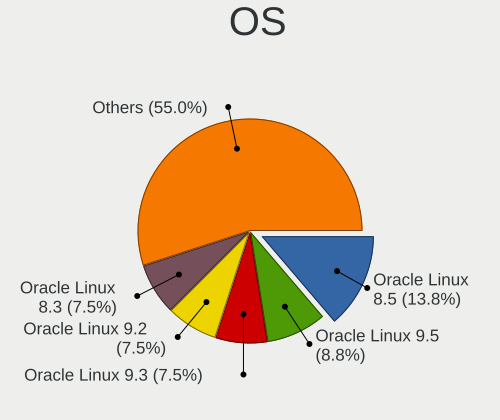

| Name             | Notebooks | Percent |
|------------------|-----------|---------|
| Oracle Linux 8.5 | 11        | 13.75%  |
| Oracle Linux 9.5 | 7         | 8.75%   |
| Oracle Linux 9.3 | 6         | 7.5%    |
| Oracle Linux 9.2 | 6         | 7.5%    |
| Oracle Linux 8.3 | 6         | 7.5%    |
| Oracle Linux 9.4 | 5         | 6.25%   |
| Oracle Linux 8.9 | 5         | 6.25%   |
| Oracle Linux 8.8 | 5         | 6.25%   |
| Oracle Linux 8.4 | 5         | 6.25%   |
| Oracle Linux 7.9 | 4         | 5%      |
| Oracle Linux 9.1 | 3         | 3.75%   |
| Oracle Linux 9.0 | 3         | 3.75%   |
| Oracle Linux 8.1 | 3         | 3.75%   |
| Oracle Linux 8.7 | 2         | 2.5%    |
| Oracle Linux 8.6 | 2         | 2.5%    |
| Oracle Linux 7.8 | 2         | 2.5%    |
| Oracle Linux 7.7 | 2         | 2.5%    |
| Oracle Linux 9.6 | 1         | 1.25%   |
| Oracle Linux 8.2 | 1         | 1.25%   |
| Oracle Linux 7.6 | 1         | 1.25%   |

OS Family
---------

OS without a version

| Name         | Notebooks | Percent |
|--------------|-----------|---------|
| Oracle Linux | 68        | 100%    |

Kernel
------

Version of the Linux kernel

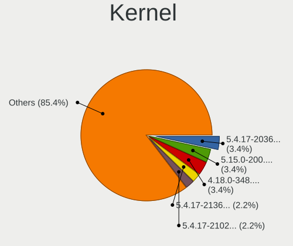

| Version                           | Notebooks | Percent |
|-----------------------------------|-----------|---------|
| 5.4.17-2036.103.3.1.el8uek.x86_64 | 3         | 3.37%   |
| 5.15.0-200.131.27.el9uek.x86_64   | 3         | 3.37%   |
| 4.18.0-348.12.2.el8_5.x86_64      | 3         | 3.37%   |
| 5.4.17-2136.304.4.3.el8uek.x86_64 | 2         | 2.25%   |
| 5.4.17-2102.202.5.el8uek.x86_64   | 2         | 2.25%   |
| 5.15.0-206.153.7.el9uek.x86_64    | 2         | 2.25%   |
| 5.15.0-206.153.7.1.el9uek.x86_64  | 2         | 2.25%   |
| 5.15.0-200.131.27.el8uek.x86_64   | 2         | 2.25%   |
| 5.15.0-200.131.27.1.el8uek.x86_64 | 2         | 2.25%   |
| 5.15.0-2.52.3.el9uek.x86_64       | 2         | 2.25%   |
| 5.15.0-106.131.4.el9uek.x86_64    | 2         | 2.25%   |
| 5.15.0-100.96.32.el8uek.x86_64    | 2         | 2.25%   |
| 4.18.0-147.3.1.el8_1.x86_64       | 2         | 2.25%   |
| 6.12.0-103.40.4.3.el9uek.x86_64   | 1         | 1.12%   |
| 6.11.0-0.el9ueknext.x86_64        | 1         | 1.12%   |
| 5.4.17-2136.326.6.el8uek.x86_64   | 1         | 1.12%   |
| 5.4.17-2136.318.7.2.el8uek.x86_64 | 1         | 1.12%   |
| 5.4.17-2136.312.3.4.el7uek.x86_64 | 1         | 1.12%   |
| 5.4.17-2136.310.7.el8uek.x86_64   | 1         | 1.12%   |
| 5.4.17-2136.309.4.el8uek.x86_64   | 1         | 1.12%   |
| 5.4.17-2136.308.9.el7uek.x86_64   | 1         | 1.12%   |
| 5.4.17-2136.306.1.3.el8uek.x86_64 | 1         | 1.12%   |
| 5.4.17-2136.305.5.4.el8uek.x86_64 | 1         | 1.12%   |
| 5.4.17-2136.305.5.3.el8uek.x86_64 | 1         | 1.12%   |
| 5.4.17-2136.305.5.2.el8uek.x86_64 | 1         | 1.12%   |
| 5.4.17-2136.301.1.4.el8uek.x86_64 | 1         | 1.12%   |
| 5.4.17-2136.300.7.el8uek.x86_64   | 1         | 1.12%   |
| 5.4.17-2102.205.7.3.el8uek.x86_64 | 1         | 1.12%   |
| 5.4.17-2102.204.4.4.el8uek.x86_64 | 1         | 1.12%   |
| 5.4.17-2102.204.4.2.el8uek.x86_64 | 1         | 1.12%   |
| 5.4.17-2102.201.3.el8uek.x86_64   | 1         | 1.12%   |
| 5.4.17-2102.200.13.el8uek.x86_64  | 1         | 1.12%   |
| 5.4.17-2036.104.4.el8uek.x86_64   | 1         | 1.12%   |
| 5.4.17-2011.0.7.el8uek.x86_64     | 1         | 1.12%   |
| 5.15.2-1.el8.elrepo.x86_64        | 1         | 1.12%   |
| 5.15.0-5.76.5.1.el9uek.x86_64     | 1         | 1.12%   |
| 5.15.0-306.177.4.el9uek.x86_64    | 1         | 1.12%   |
| 5.15.0-304.171.4.3.el9uek.x86_64  | 1         | 1.12%   |
| 5.15.0-302.167.6.el9uek.x86_64    | 1         | 1.12%   |
| 5.15.0-302.167.6.1.el9uek.x86_64  | 1         | 1.12%   |

Kernel Family
-------------

Linux kernel without a distro release

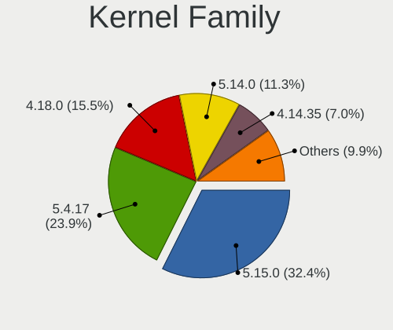

| Version | Notebooks | Percent |
|---------|-----------|---------|
| 5.15.0  | 23        | 32.39%  |
| 5.4.17  | 17        | 23.94%  |
| 4.18.0  | 11        | 15.49%  |
| 5.14.0  | 8         | 11.27%  |
| 4.14.35 | 5         | 7.04%   |
| 6.12.0  | 1         | 1.41%   |
| 6.11.0  | 1         | 1.41%   |
| 5.15.2  | 1         | 1.41%   |
| 5.14.1  | 1         | 1.41%   |
| 5.11.1  | 1         | 1.41%   |
| 4.1.12  | 1         | 1.41%   |
| 3.10.0  | 1         | 1.41%   |

Kernel Major Ver.
-----------------

Linux kernel major version

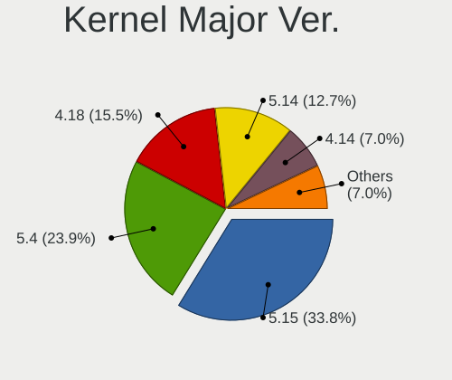

| Version | Notebooks | Percent |
|---------|-----------|---------|
| 5.15    | 24        | 33.8%   |
| 5.4     | 17        | 23.94%  |
| 4.18    | 11        | 15.49%  |
| 5.14    | 9         | 12.68%  |
| 4.14    | 5         | 7.04%   |
| 6.12    | 1         | 1.41%   |
| 6.11    | 1         | 1.41%   |
| 5.11    | 1         | 1.41%   |
| 4.1     | 1         | 1.41%   |
| 3.10    | 1         | 1.41%   |

Arch
----

OS architecture (x86_64, i586, etc.)

| Name   | Notebooks | Percent |
|--------|-----------|---------|
| x86_64 | 68        | 100%    |

DE
--

Desktop Environment

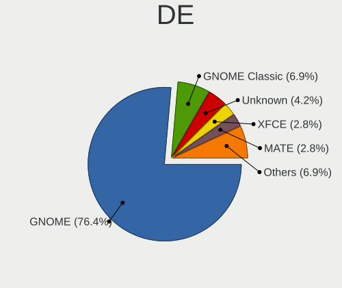

| Name          | Notebooks | Percent |
|---------------|-----------|---------|
| GNOME         | 55        | 76.39%  |
| GNOME Classic | 5         | 6.94%   |
| Unknown       | 3         | 4.17%   |
| XFCE          | 2         | 2.78%   |
| MATE          | 2         | 2.78%   |
| KDE5          | 2         | 2.78%   |
| KDE4          | 2         | 2.78%   |
| X-Cinnamon    | 1         | 1.39%   |

Display Server
--------------

X11 or Wayland

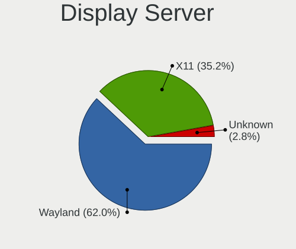

| Name    | Notebooks | Percent |
|---------|-----------|---------|
| Wayland | 44        | 61.97%  |
| X11     | 25        | 35.21%  |
| Unknown | 2         | 2.82%   |

Display Manager
---------------

SDDM, LightDM, etc.

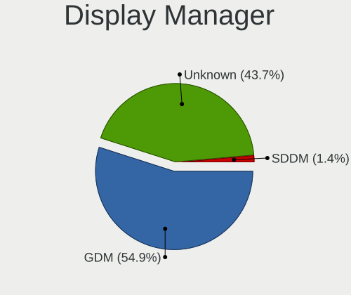

| Name    | Notebooks | Percent |
|---------|-----------|---------|
| GDM     | 39        | 54.93%  |
| Unknown | 31        | 43.66%  |
| SDDM    | 1         | 1.41%   |

OS Lang
-------

Language

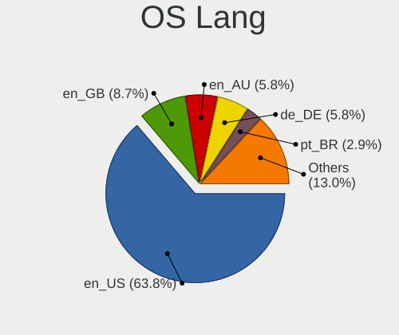

| Lang    | Notebooks | Percent |
|---------|-----------|---------|
| en_US   | 44        | 63.77%  |
| en_GB   | 6         | 8.7%    |
| en_AU   | 4         | 5.8%    |
| de_DE   | 4         | 5.8%    |
| pt_BR   | 2         | 2.9%    |
| pl_PL   | 2         | 2.9%    |
| Unknown | 2         | 2.9%    |
| zh_HK   | 1         | 1.45%   |
| it_IT   | 1         | 1.45%   |
| es_CO   | 1         | 1.45%   |
| en_IN   | 1         | 1.45%   |
| en_DE   | 1         | 1.45%   |

Boot Mode
---------

EFI or BIOS

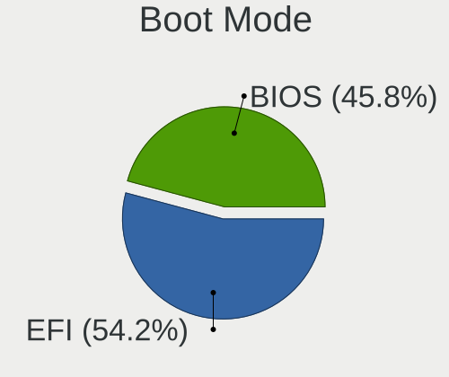

| Mode | Notebooks | Percent |
|------|-----------|---------|
| EFI  | 48        | 69.57%  |
| BIOS | 21        | 30.43%  |

Filesystem
----------

Type of filesystem

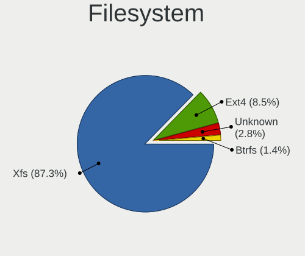

| Type    | Notebooks | Percent |
|---------|-----------|---------|
| Xfs     | 62        | 87.32%  |
| Ext4    | 6         | 8.45%   |
| Unknown | 2         | 2.82%   |
| Btrfs   | 1         | 1.41%   |

Part. scheme
------------

Scheme of partitioning

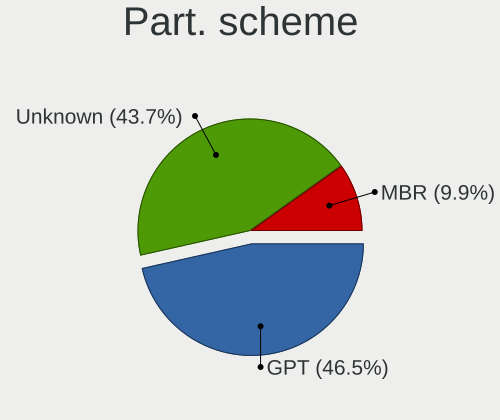

| Type    | Notebooks | Percent |
|---------|-----------|---------|
| GPT     | 33        | 46.48%  |
| Unknown | 31        | 43.66%  |
| MBR     | 7         | 9.86%   |

Dual Boot with Linux/BSD
------------------------

Hosting more than one Linux/BSD

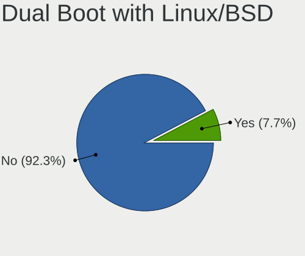

| Dual boot | Notebooks | Percent |
|-----------|-----------|---------|
| No        | 65        | 94.2%   |
| Yes       | 4         | 5.8%    |

Dual Boot (Win)
---------------

Hosting Linux and Windows

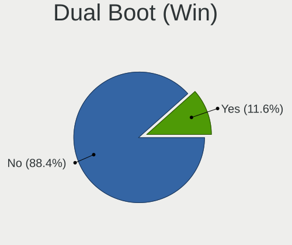

| Dual boot | Notebooks | Percent |
|-----------|-----------|---------|
| No        | 61        | 88.41%  |
| Yes       | 8         | 11.59%  |

Board
-----

Vendor
------

Motherboard manufacturer

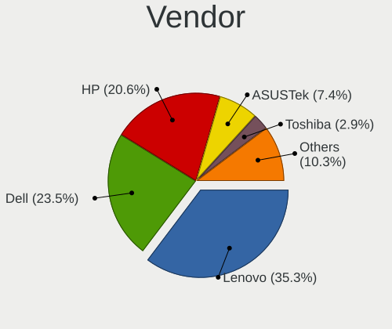

| Name             | Notebooks | Percent |
|------------------|-----------|---------|
| Lenovo           | 24        | 35.29%  |
| Dell             | 16        | 23.53%  |
| Hewlett-Packard  | 14        | 20.59%  |
| ASUSTek Computer | 5         | 7.35%   |
| Toshiba          | 2         | 2.94%   |
| Standard         | 1         | 1.47%   |
| Panasonic        | 1         | 1.47%   |
| MSI              | 1         | 1.47%   |
| Google           | 1         | 1.47%   |
| Fujitsu          | 1         | 1.47%   |
| Dynabook         | 1         | 1.47%   |
| Alienware        | 1         | 1.47%   |

Model
-----

Motherboard model

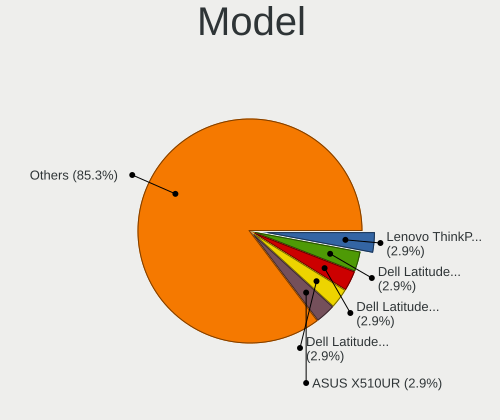

| Name                                               | Notebooks | Percent |
|----------------------------------------------------|-----------|---------|
| Lenovo ThinkPad T450 20BUS14900                    | 2         | 2.94%   |
| Dell Latitude 7450                                 | 2         | 2.94%   |
| Dell Latitude 7430                                 | 2         | 2.94%   |
| Dell Latitude 7420                                 | 2         | 2.94%   |
| ASUS X510UR                                        | 2         | 2.94%   |
| Toshiba TECRA R950                                 | 1         | 1.47%   |
| Toshiba Satellite P55t-A                           | 1         | 1.47%   |
| Standard BW Series                                 | 1         | 1.47%   |
| Panasonic CF-53AAG54FM                             | 1         | 1.47%   |
| MSI P65 Creator 8RE                                | 1         | 1.47%   |
| Lenovo ThinkPad X280 20KES4H34G                    | 1         | 1.47%   |
| Lenovo ThinkPad X1 Extreme 2nd 20QWS1R800          | 1         | 1.47%   |
| Lenovo ThinkPad W541 20EGS1PL00                    | 1         | 1.47%   |
| Lenovo ThinkPad W520 42844DG                       | 1         | 1.47%   |
| Lenovo ThinkPad T490 20N3S77600                    | 1         | 1.47%   |
| Lenovo ThinkPad T490 20N3S3XR00                    | 1         | 1.47%   |
| Lenovo ThinkPad T480 20L6S56Y2X                    | 1         | 1.47%   |
| Lenovo ThinkPad T480 20L5A07TAU                    | 1         | 1.47%   |
| Lenovo ThinkPad T470 20HES21434                    | 1         | 1.47%   |
| Lenovo ThinkPad T470 20HES0E71M                    | 1         | 1.47%   |
| Lenovo ThinkPad T430s 2355C33                      | 1         | 1.47%   |
| Lenovo ThinkPad P70 20ESS04S00                     | 1         | 1.47%   |
| Lenovo ThinkPad P50s 20FL000MUS                    | 1         | 1.47%   |
| Lenovo ThinkPad P16s Gen 1 21BTS0FR00              | 1         | 1.47%   |
| Lenovo ThinkPad L540 20AVCTO1WW                    | 1         | 1.47%   |
| Lenovo ThinkPad L490 20Q5CTO1WW                    | 1         | 1.47%   |
| Lenovo ThinkBook 15-IIL 20SM                       | 1         | 1.47%   |
| Lenovo Legion Y540-15IRH 81SX                      | 1         | 1.47%   |
| Lenovo Legion 5 15IMH05 82AU                       | 1         | 1.47%   |
| Lenovo IdeaPad Slim 1-14AST-05 81VS                | 1         | 1.47%   |
| Lenovo IdeaPad 300-15ISK 80RS                      | 1         | 1.47%   |
| Lenovo IdeaPad 3 14IIL05 81WD                      | 1         | 1.47%   |
| HP ZBook Power 16 inch G11 A Mobile Workstation PC | 1         | 1.47%   |
| HP ZBook Fury 16 G9 Mobile Workstation PC          | 1         | 1.47%   |
| HP ZBook Fury 15.6 inch G8 Mobile Workstation PC   | 1         | 1.47%   |
| HP ZBook 15                                        | 1         | 1.47%   |
| HP ProBook 445 G6                                  | 1         | 1.47%   |
| HP Notebook                                        | 1         | 1.47%   |
| HP Laptop 17-cp0xxx                                | 1         | 1.47%   |
| HP EliteBook 850 G1                                | 1         | 1.47%   |

Model Family
------------

Motherboard model prefix

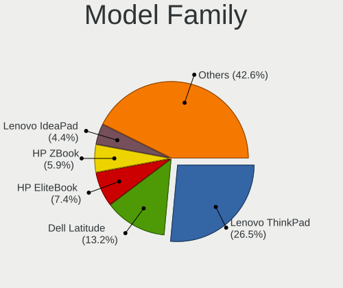

| Name                   | Notebooks | Percent |
|------------------------|-----------|---------|
| Lenovo ThinkPad        | 18        | 26.47%  |
| Dell Latitude          | 9         | 13.24%  |
| HP EliteBook           | 5         | 7.35%   |
| HP ZBook               | 4         | 5.88%   |
| Lenovo IdeaPad         | 3         | 4.41%   |
| Dell Precision         | 3         | 4.41%   |
| Dell Inspiron          | 3         | 4.41%   |
| Lenovo Legion          | 2         | 2.94%   |
| ASUS X510UR            | 2         | 2.94%   |
| Toshiba TECRA          | 1         | 1.47%   |
| Toshiba Satellite      | 1         | 1.47%   |
| Standard BW            | 1         | 1.47%   |
| Panasonic CF-53AAG54FM | 1         | 1.47%   |
| MSI P65                | 1         | 1.47%   |
| Lenovo ThinkBook       | 1         | 1.47%   |
| HP ProBook             | 1         | 1.47%   |
| HP Notebook            | 1         | 1.47%   |
| HP Laptop              | 1         | 1.47%   |
| HP Compaq              | 1         | 1.47%   |
| HP 240                 | 1         | 1.47%   |
| Google Lick            | 1         | 1.47%   |
| Fujitsu LIFEBOOK       | 1         | 1.47%   |
| Dynabook PORTEGE       | 1         | 1.47%   |
| Dell XPS               | 1         | 1.47%   |
| ASUS ZenBook           | 1         | 1.47%   |
| ASUS X541SA            | 1         | 1.47%   |
| ASUS UX305FA           | 1         | 1.47%   |
| Alienware m18          | 1         | 1.47%   |

MFG Year
--------

Motherboard manufacture year

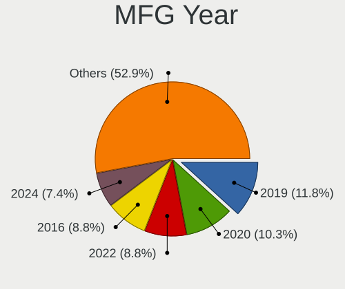

| Year | Notebooks | Percent |
|------|-----------|---------|
| 2019 | 8         | 11.76%  |
| 2020 | 7         | 10.29%  |
| 2022 | 6         | 8.82%   |
| 2016 | 6         | 8.82%   |
| 2024 | 5         | 7.35%   |
| 2018 | 5         | 7.35%   |
| 2017 | 5         | 7.35%   |
| 2014 | 5         | 7.35%   |
| 2013 | 4         | 5.88%   |
| 2012 | 4         | 5.88%   |
| 2011 | 4         | 5.88%   |
| 2021 | 3         | 4.41%   |
| 2015 | 3         | 4.41%   |
| 2023 | 2         | 2.94%   |
| 2008 | 1         | 1.47%   |

Form Factor
-----------

Physical design of the computer

| Name     | Notebooks | Percent |
|----------|-----------|---------|
| Notebook | 68        | 100%    |

Secure Boot
-----------

Enabled or disabled

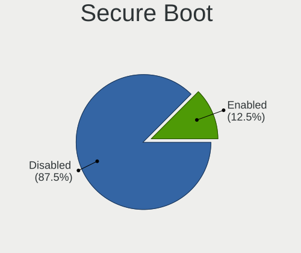

| State    | Notebooks | Percent |
|----------|-----------|---------|
| Disabled | 57        | 82.61%  |
| Enabled  | 12        | 17.39%  |

Coreboot
--------

Have coreboot on board

| Used | Notebooks | Percent |
|------|-----------|---------|
| No   | 67        | 98.53%  |
| Yes  | 1         | 1.47%   |

RAM Size
--------

Total RAM memory

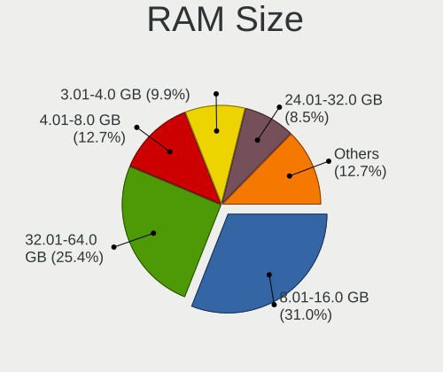

| Size in GB  | Notebooks | Percent |
|-------------|-----------|---------|
| 8.01-16.0   | 22        | 30.99%  |
| 32.01-64.0  | 18        | 25.35%  |
| 4.01-8.0    | 9         | 12.68%  |
| 3.01-4.0    | 7         | 9.86%   |
| 24.01-32.0  | 6         | 8.45%   |
| 16.01-24.0  | 5         | 7.04%   |
| 64.01-256.0 | 4         | 5.63%   |

RAM Used
--------

Used RAM memory

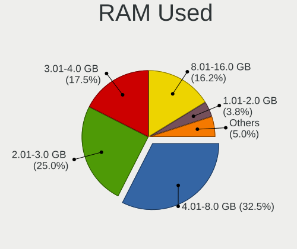

| Used GB    | Notebooks | Percent |
|------------|-----------|---------|
| 4.01-8.0   | 26        | 32.5%   |
| 2.01-3.0   | 20        | 25%     |
| 3.01-4.0   | 14        | 17.5%   |
| 8.01-16.0  | 13        | 16.25%  |
| 1.01-2.0   | 3         | 3.75%   |
| 32.01-64.0 | 2         | 2.5%    |
| 24.01-32.0 | 1         | 1.25%   |
| 0.51-1.0   | 1         | 1.25%   |

Total Drives
------------

Number of drives on board

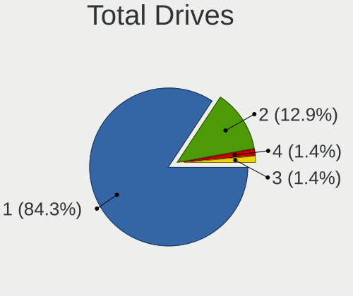

| Drives | Notebooks | Percent |
|--------|-----------|---------|
| 1      | 59        | 84.29%  |
| 2      | 9         | 12.86%  |
| 4      | 1         | 1.43%   |
| 3      | 1         | 1.43%   |

Has CD-ROM
----------

Has CD-ROM on board

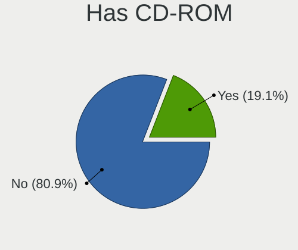

| Presented | Notebooks | Percent |
|-----------|-----------|---------|
| No        | 55        | 80.88%  |
| Yes       | 13        | 19.12%  |

Has Ethernet
------------

Has Ethernet on board

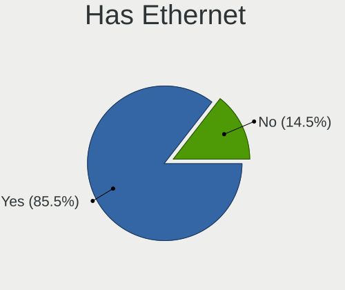

| Presented | Notebooks | Percent |
|-----------|-----------|---------|
| Yes       | 59        | 85.51%  |
| No        | 10        | 14.49%  |

Has WiFi
--------

Has WiFi module

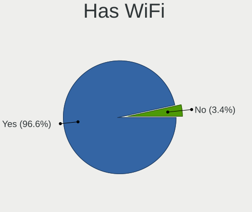

| Presented | Notebooks | Percent |
|-----------|-----------|---------|
| Yes       | 64        | 94.12%  |
| No        | 4         | 5.88%   |

Has Bluetooth
-------------

Has Bluetooth module

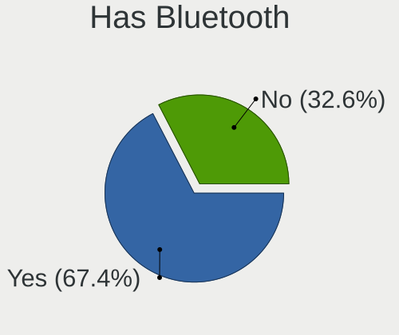

| Presented | Notebooks | Percent |
|-----------|-----------|---------|
| Yes       | 52        | 74.29%  |
| No        | 18        | 25.71%  |

Location
--------

Country
-------

Geographic location (country)

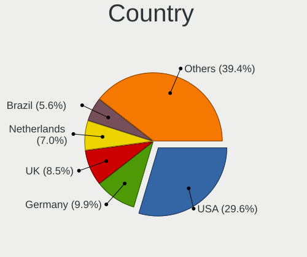

| Country     | Notebooks | Percent |
|-------------|-----------|---------|
| USA         | 21        | 29.58%  |
| Germany     | 7         | 9.86%   |
| UK          | 6         | 8.45%   |
| Netherlands | 5         | 7.04%   |
| Brazil      | 4         | 5.63%   |
| Australia   | 4         | 5.63%   |
| Poland      | 3         | 4.23%   |
| Italy       | 3         | 4.23%   |
| Finland     | 2         | 2.82%   |
| Yemen       | 1         | 1.41%   |
| Turkey      | 1         | 1.41%   |
| Sweden      | 1         | 1.41%   |
| Spain       | 1         | 1.41%   |
| Romania     | 1         | 1.41%   |
| Peru        | 1         | 1.41%   |
| Pakistan    | 1         | 1.41%   |
| Latvia      | 1         | 1.41%   |
| India       | 1         | 1.41%   |
| Hungary     | 1         | 1.41%   |
| Hong Kong   | 1         | 1.41%   |
| France      | 1         | 1.41%   |
| Colombia    | 1         | 1.41%   |
| Chile       | 1         | 1.41%   |
| Bulgaria    | 1         | 1.41%   |
| Argentina   | 1         | 1.41%   |

City
----

Geographic location (city)

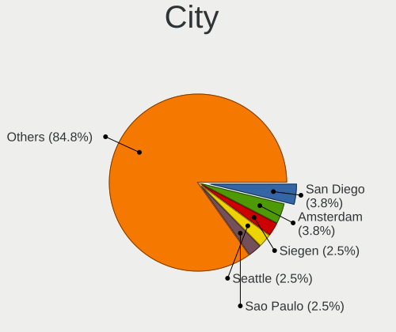

| City                | Notebooks | Percent |
|---------------------|-----------|---------|
| San Diego           | 3         | 3.8%    |
| Amsterdam           | 3         | 3.8%    |
| Siegen              | 2         | 2.53%   |
| Seattle             | 2         | 2.53%   |
| Sao Paulo           | 2         | 2.53%   |
| London              | 2         | 2.53%   |
| Helsinki            | 2         | 2.53%   |
| West Linn           | 1         | 1.27%   |
| Warsaw              | 1         | 1.27%   |
| Volendam            | 1         | 1.27%   |
| Utrecht             | 1         | 1.27%   |
| Sydney              | 1         | 1.27%   |
| Stockholm           | 1         | 1.27%   |
| Sofia               | 1         | 1.27%   |
| Shrewsbury          | 1         | 1.27%   |
| Sao Caetano do Sul  | 1         | 1.27%   |
| Santiago            | 1         | 1.27%   |
| Sanaa               | 1         | 1.27%   |
| San Jose            | 1         | 1.27%   |
| Rocklin             | 1         | 1.27%   |
| Riga                | 1         | 1.27%   |
| Richfield           | 1         | 1.27%   |
| Redwood City        | 1         | 1.27%   |
| Port Saint Lucie    | 1         | 1.27%   |
| Pleven              | 1         | 1.27%   |
| Perth               | 1         | 1.27%   |
| Ngau Wu Tok         | 1         | 1.27%   |
| Nagercoil           | 1         | 1.27%   |
| Montigny-en-Gohelle | 1         | 1.27%   |
| Milano              | 1         | 1.27%   |
| Milan               | 1         | 1.27%   |
| Melbourne           | 1         | 1.27%   |
| Medellín           | 1         | 1.27%   |
| Maple Valley        | 1         | 1.27%   |
| Madrid              | 1         | 1.27%   |
| Lynnwood            | 1         | 1.27%   |
| Ludwigsburg         | 1         | 1.27%   |
| Lohmar              | 1         | 1.27%   |
| Lima                | 1         | 1.27%   |
| Las Vegas           | 1         | 1.27%   |

Drives
------

Drive Vendor
------------

Hard drive vendors

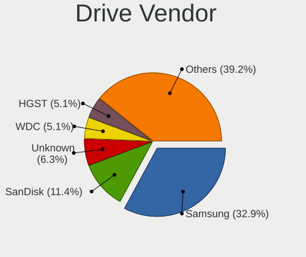

| Vendor                      | Notebooks | Drives | Percent |
|-----------------------------|-----------|--------|---------|
| Samsung Electronics         | 26        | 36     | 32.91%  |
| SanDisk                     | 9         | 11     | 11.39%  |
| Unknown                     | 5         | 8      | 6.33%   |
| WDC                         | 4         | 4      | 5.06%   |
| HGST                        | 4         | 7      | 5.06%   |
| SK hynix                    | 3         | 4      | 3.8%    |
| Seagate                     | 3         | 3      | 3.8%    |
| Micron Technology           | 3         | 6      | 3.8%    |
| KIOXIA                      | 3         | 4      | 3.8%    |
| Toshiba                     | 2         | 2      | 2.53%   |
| Phison Electronics          | 2         | 3      | 2.53%   |
| Micron/Crucial Technology   | 2         | 3      | 2.53%   |
| Kingston Technology Company | 2         | 2      | 2.53%   |
| XrayDisk                    | 1         | 2      | 1.27%   |
| Union Memory (Shenzhen)     | 1         | 2      | 1.27%   |
| Lite-On                     | 1         | 1      | 1.27%   |
| Lenovo                      | 1         | 1      | 1.27%   |
| Kingston                    | 1         | 7      | 1.27%   |
| KingFast                    | 1         | 1      | 1.27%   |
| JMicron Technology          | 1         | 1      | 1.27%   |
| Intel                       | 1         | 1      | 1.27%   |
| Fujitsu                     | 1         | 1      | 1.27%   |
| Emtec                       | 1         | 1      | 1.27%   |
| Crucial                     | 1         | 2      | 1.27%   |

Drive Model
-----------

Hard drive models

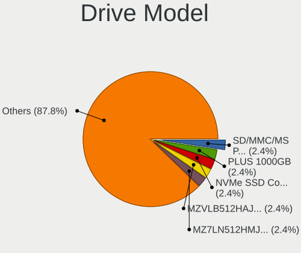

| Model                                             | Notebooks | Percent |
|---------------------------------------------------|-----------|---------|
| Unknown SD/MMC/MS PRO 2GB                         | 2         | 2.44%   |
| SanDisk SSD PLUS 1000GB                           | 2         | 2.44%   |
| Samsung NVMe SSD Controller SM981/PM981/PM983 1TB | 2         | 2.44%   |
| Samsung MZVLB512HAJQ-000L7 512GB                  | 2         | 2.44%   |
| Samsung MZ7LN512HMJP-000L7 512GB SSD              | 2         | 2.44%   |
| Kingston Company SNV2S1000G 1TB                   | 2         | 2.44%   |
| HGST HTS541010A9E680 1TB                          | 2         | 2.44%   |
| XrayDisk 480GB SSD                                | 1         | 1.22%   |
| WDC WDS250G2B0A-00SM50 250GB SSD                  | 1         | 1.22%   |
| WDC WDS200T2G0A-00JH30 2TB SSD                    | 1         | 1.22%   |
| WDC WD10SPZX-60Z10T1 1TB                          | 1         | 1.22%   |
| WDC WD10JPCX-24UE4T0 1TB                          | 1         | 1.22%   |
| Unknown MMC64G  64GB                              | 1         | 1.22%   |
| Unknown MMC Card  256GB                           | 1         | 1.22%   |
| Unknown MMC Card  1TB                             | 1         | 1.22%   |
| Union Memory (Shenzhen) NVMe SSD Drive 128GB      | 1         | 1.22%   |
| Toshiba THNSNJ512GCSU 512GB SSD                   | 1         | 1.22%   |
| Toshiba MQ01ABD100 1TB                            | 1         | 1.22%   |
| SK hynix PVC10 512GB                              | 1         | 1.22%   |
| SK hynix BC901 NVMe 512GB                         | 1         | 1.22%   |
| SK hynix BC501 NVMe Solid State Drive 512GB       | 1         | 1.22%   |
| Seagate ST9750420AS 752GB                         | 1         | 1.22%   |
| Seagate ST1000LM024 HN-M101MBB 1TB                | 1         | 1.22%   |
| Seagate BUP Slim BK 2TB                           | 1         | 1.22%   |
| Sandisk WD PC SN740 SDDPNQD-256G-1006 256GB       | 1         | 1.22%   |
| SanDisk SDSSDH3512G 512GB                         | 1         | 1.22%   |
| SanDisk SD9SN8W-256G-1016 256GB SSD               | 1         | 1.22%   |
| SanDisk SD7SN3Q256G1002 256GB SSD                 | 1         | 1.22%   |
| SanDisk SD6SB1M-256G-1006 256GB SSD               | 1         | 1.22%   |
| Sandisk PC SN740 NVMe WD 512GB                    | 1         | 1.22%   |
| SanDisk NVMe SSD Drive 512GB                      | 1         | 1.22%   |
| Samsung SSD SM841N 2.5 7mm 512GB                  | 1         | 1.22%   |
| Samsung SSD PM830 2.5 7mm 256GB                   | 1         | 1.22%   |
| Samsung SSD 870 EVO 500GB                         | 1         | 1.22%   |
| Samsung SSD 860 PRO 256GB                         | 1         | 1.22%   |
| Samsung SSD 860 EVO 500GB                         | 1         | 1.22%   |
| Samsung SSD 850 PRO 256GB                         | 1         | 1.22%   |
| Samsung Portable SSD T5 1TB                       | 1         | 1.22%   |
| Samsung PM9C1a 512GB                              | 1         | 1.22%   |
| Samsung PM9A1 NVMe 512GB                          | 1         | 1.22%   |

HDD Vendor
----------

Hard disk drive vendors

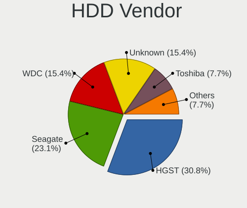

| Vendor  | Notebooks | Drives | Percent |
|---------|-----------|--------|---------|
| HGST    | 4         | 7      | 30.77%  |
| Seagate | 3         | 3      | 23.08%  |
| WDC     | 2         | 2      | 15.38%  |
| Unknown | 2         | 4      | 15.38%  |
| Toshiba | 1         | 1      | 7.69%   |
| Fujitsu | 1         | 1      | 7.69%   |

SSD Vendor
----------

Solid state drive vendors

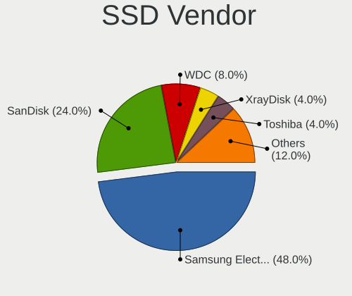

| Vendor              | Notebooks | Drives | Percent |
|---------------------|-----------|--------|---------|
| Samsung Electronics | 12        | 17     | 48%     |
| SanDisk             | 6         | 7      | 24%     |
| WDC                 | 2         | 2      | 8%      |
| XrayDisk            | 1         | 2      | 4%      |
| Toshiba             | 1         | 1      | 4%      |
| JMicron Technology  | 1         | 1      | 4%      |
| Emtec               | 1         | 1      | 4%      |
| Crucial             | 1         | 2      | 4%      |

Drive Kind
----------

HDD or SSD

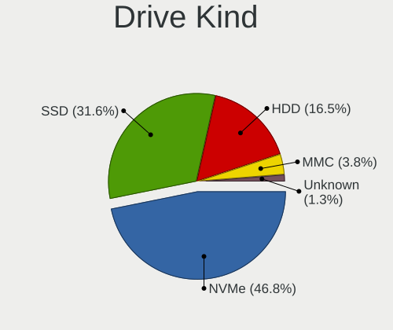

| Kind    | Notebooks | Drives | Percent |
|---------|-----------|--------|---------|
| NVMe    | 37        | 57     | 46.84%  |
| SSD     | 25        | 33     | 31.65%  |
| HDD     | 13        | 18     | 16.46%  |
| MMC     | 3         | 4      | 3.8%    |
| Unknown | 1         | 1      | 1.27%   |

Drive Connector
---------------

SATA, SAS, NVMe, etc.

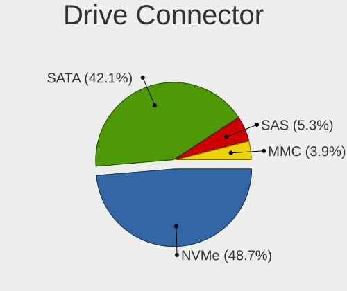

| Type | Notebooks | Drives | Percent |
|------|-----------|--------|---------|
| NVMe | 37        | 57     | 48.68%  |
| SATA | 32        | 45     | 42.11%  |
| SAS  | 4         | 7      | 5.26%   |
| MMC  | 3         | 4      | 3.95%   |

Drive Size
----------

Size of hard drive

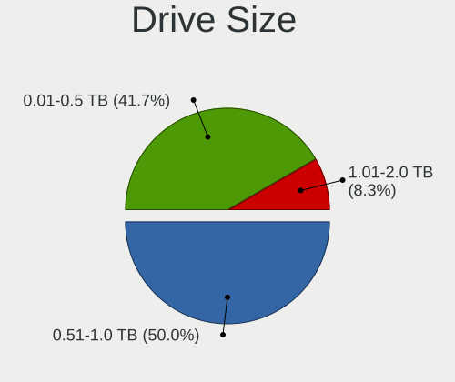

| Size in TB | Notebooks | Drives | Percent |
|------------|-----------|--------|---------|
| 0.51-1.0   | 18        | 25     | 50%     |
| 0.01-0.5   | 15        | 23     | 41.67%  |
| 1.01-2.0   | 3         | 3      | 8.33%   |

Space Total
-----------

Amount of disk space available on the file system

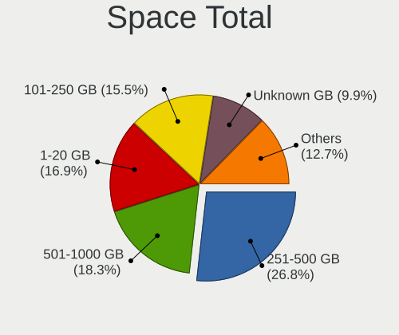

| Size in GB | Notebooks | Percent |
|------------|-----------|---------|
| 251-500    | 19        | 26.76%  |
| 501-1000   | 13        | 18.31%  |
| 1-20       | 12        | 16.9%   |
| 101-250    | 11        | 15.49%  |
| Unknown    | 7         | 9.86%   |
| 1001-2000  | 3         | 4.23%   |
| 51-100     | 3         | 4.23%   |
| 2001-3000  | 2         | 2.82%   |
| 21-50      | 1         | 1.41%   |

Space Used
----------

Amount of used disk space

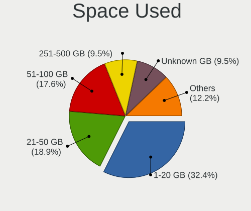

| Used GB   | Notebooks | Percent |
|-----------|-----------|---------|
| 1-20      | 24        | 32.43%  |
| 21-50     | 14        | 18.92%  |
| 51-100    | 13        | 17.57%  |
| 251-500   | 7         | 9.46%   |
| Unknown   | 7         | 9.46%   |
| 101-250   | 6         | 8.11%   |
| 501-1000  | 2         | 2.7%    |
| 1001-2000 | 1         | 1.35%   |

Malfunc. Drives
---------------

Drive models with a malfunction

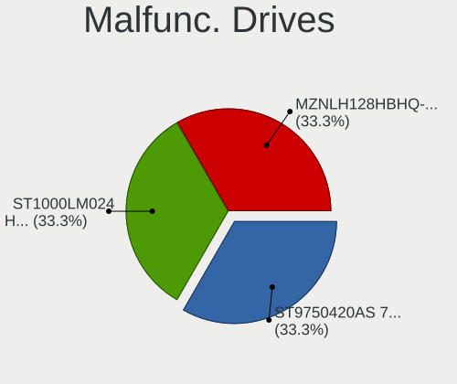

| Model                                            | Notebooks | Drives | Percent |
|--------------------------------------------------|-----------|--------|---------|
| Seagate ST9750420AS 752GB                        | 1         | 1      | 33.33%  |
| Seagate ST1000LM024 HN-M101MBB 1TB               | 1         | 1      | 33.33%  |
| Samsung Electronics MZNLH128HBHQ-000H1 128GB SSD | 1         | 2      | 33.33%  |

Malfunc. Drive Vendor
---------------------

Vendors of faulty drives

| Vendor              | Notebooks | Drives | Percent |
|---------------------|-----------|--------|---------|
| Seagate             | 2         | 2      | 66.67%  |
| Samsung Electronics | 1         | 2      | 33.33%  |

Malfunc. HDD Vendor
-------------------

Vendors of faulty HDD drives

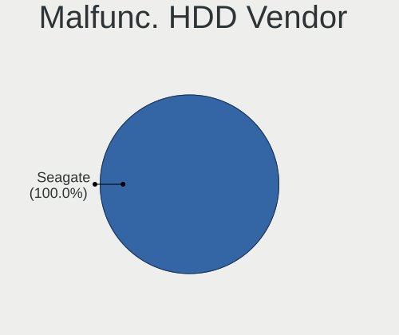

| Vendor  | Notebooks | Drives | Percent |
|---------|-----------|--------|---------|
| Seagate | 2         | 2      | 100%    |

Malfunc. Drive Kind
-------------------

Kinds of faulty drives

| Kind | Notebooks | Drives | Percent |
|------|-----------|--------|---------|
| HDD  | 2         | 2      | 66.67%  |
| SSD  | 1         | 2      | 33.33%  |

Failed Drives
-------------

Failed drive models

Zero info for selected period =(

Failed Drive Vendor
-------------------

Failed drive vendors

Zero info for selected period =(

Drive Status
------------

Number of failed and malfunc. drives

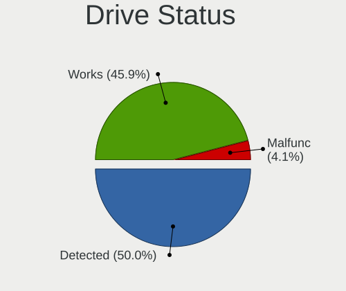

| Status   | Notebooks | Drives | Percent |
|----------|-----------|--------|---------|
| Detected | 37        | 59     | 50%     |
| Works    | 34        | 50     | 45.95%  |
| Malfunc  | 3         | 4      | 4.05%   |

Storage controller
------------------

Storage Vendor
--------------

Storage controller vendors

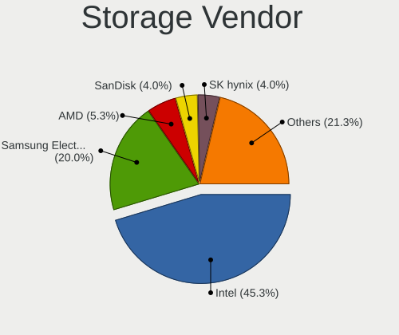

| Vendor                      | Notebooks | Percent |
|-----------------------------|-----------|---------|
| Intel                       | 34        | 45.33%  |
| Samsung Electronics         | 15        | 20%     |
| AMD                         | 4         | 5.33%   |
| SK hynix                    | 3         | 4%      |
| SanDisk                     | 3         | 4%      |
| Micron Technology           | 3         | 4%      |
| KIOXIA                      | 3         | 4%      |
| Kingston Technology Company | 3         | 4%      |
| Phison Electronics          | 2         | 2.67%   |
| Micron/Crucial Technology   | 2         | 2.67%   |
| Union Memory (Shenzhen)     | 1         | 1.33%   |
| Lite-On Technology          | 1         | 1.33%   |
| Lenovo                      | 1         | 1.33%   |

Storage Model
-------------

Storage controller models

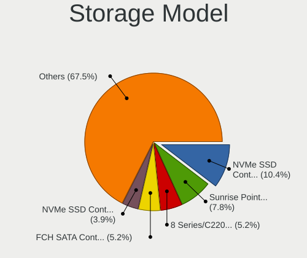

| Model                                                                            | Notebooks | Percent |
|----------------------------------------------------------------------------------|-----------|---------|
| Samsung NVMe SSD Controller SM981/PM981/PM983                                    | 8         | 10.39%  |
| Intel Sunrise Point-LP SATA Controller [AHCI mode]                               | 6         | 7.79%   |
| Intel 8 Series/C220 Series Chipset Family 6-port SATA Controller 1 [AHCI mode]   | 4         | 5.19%   |
| AMD FCH SATA Controller [AHCI mode]                                              | 4         | 5.19%   |
| Samsung NVMe SSD Controller PM9A1/PM9A3/980PRO                                   | 3         | 3.9%    |
| Intel Wildcat Point-LP SATA Controller [AHCI Mode]                               | 3         | 3.9%    |
| Intel 82801 Mobile SATA Controller [RAID mode]                                   | 3         | 3.9%    |
| Kingston Company NV2 NVMe SSD [SM2267XT] (DRAM-less)                             | 2         | 2.6%    |
| Intel Ice Lake-LP SATA Controller [AHCI mode]                                    | 2         | 2.6%    |
| Intel Cannon Lake Mobile PCH SATA AHCI Controller                                | 2         | 2.6%    |
| Intel Atom/Celeron/Pentium Processor x5-E8000/J3xxx/N3xxx Series SATA Controller | 2         | 2.6%    |
| Intel 8 Series SATA Controller 1 [AHCI mode]                                     | 2         | 2.6%    |
| Intel 7 Series Chipset Family 6-port SATA Controller [AHCI mode]                 | 2         | 2.6%    |
| Intel 6 Series/C200 Series Chipset Family 6 port Mobile SATA AHCI Controller     | 2         | 2.6%    |
| Union Memory (Shenzhen) AM610 PCIe 3.0 x2 NVMe SSD 128GB, 256GB                  | 1         | 1.3%    |
| SK hynix PVC10 NVMe Solid State Drive (DRAM-less)                                | 1         | 1.3%    |
| SK hynix BC901 NVMe Solid State Drive (DRAM-less)                                | 1         | 1.3%    |
| SK hynix BC501 NVMe Solid State Drive                                            | 1         | 1.3%    |
| SanDisk WD SN560/SN740/SN770/SN5000 NVMe SSD                                     | 1         | 1.3%    |
| Sandisk PC SN740 NVMe SSD (DRAM-less)                                            | 1         | 1.3%    |
| SanDisk Extreme Pro / WD Black 2018/SN750/PC SN720 NVMe SSD                      | 1         | 1.3%    |
| Samsung NVMe SSD Controller SM961/PM961/SM963                                    | 1         | 1.3%    |
| Samsung NVMe SSD Controller PM9C1a (DRAM-less)                                   | 1         | 1.3%    |
| Samsung NVMe SSD Controller PM9B1 (DRAM-less)                                    | 1         | 1.3%    |
| Samsung NVMe SSD Controller 980 (DRAM-less)                                      | 1         | 1.3%    |
| Phison E16 PCIe4 NVMe Controller                                                 | 1         | 1.3%    |
| Phison E12 NVMe Controller                                                       | 1         | 1.3%    |
| Micron/Crucial P5 NVMe PCIe SSD[SlashP5]                                         | 1         | 1.3%    |
| Micron/Crucial P2 [Nick P2] / P3 / P3 Plus NVMe PCIe SSD (DRAM-less)             | 1         | 1.3%    |
| Micron 2550 NVMe SSD (DRAM-less)                                                 | 1         | 1.3%    |
| Micron 2300 NVMe SSD [Santana]                                                   | 1         | 1.3%    |
| Micron 2200S NVMe SSD [Cassandra]                                                | 1         | 1.3%    |
| Lite-On CA5-8D512 NVMe SSD                                                       | 1         | 1.3%    |
| Lenovo LENSE30512GMSP34MEAT3TA                                                   | 1         | 1.3%    |
| KIOXIA NVMe SSD Controller XG8                                                   | 1         | 1.3%    |
| KIOXIA NVMe SSD Controller BG5 (DRAM-less)                                       | 1         | 1.3%    |
| KIOXIA NVMe SSD Controller BG4 (DRAM-less)                                       | 1         | 1.3%    |
| Kingston Company A2000 NVMe SSD [SM2263EN]                                       | 1         | 1.3%    |
| Intel Volume Management Device NVMe RAID Controller                              | 1         | 1.3%    |
| Intel SSD 660P Series                                                            | 1         | 1.3%    |

Storage Kind
------------

Kind of storage controller (IDE, SATA, NVMe, SAS, ...)

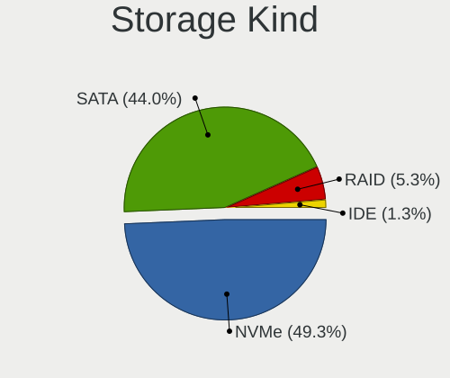

| Kind | Notebooks | Percent |
|------|-----------|---------|
| NVMe | 37        | 49.33%  |
| SATA | 33        | 44%     |
| RAID | 4         | 5.33%   |
| IDE  | 1         | 1.33%   |

Processor
---------

CPU Vendor
----------

Processor vendors

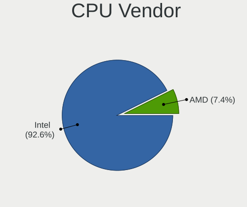

| Vendor | Notebooks | Percent |
|--------|-----------|---------|
| Intel  | 63        | 92.65%  |
| AMD    | 5         | 7.35%   |

CPU Model
---------

Processor models

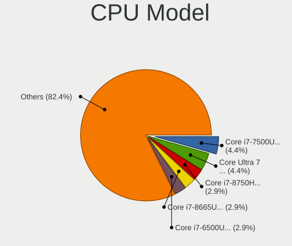

| Model                                   | Notebooks | Percent |
|-----------------------------------------|-----------|---------|
| Intel Core Ultra 7 165H                 | 3         | 4.41%   |
| Intel Core i7-7500U CPU @ 2.70GHz       | 3         | 4.41%   |
| Intel Core i7-8750H CPU @ 2.20GHz       | 2         | 2.94%   |
| Intel Core i7-8665U CPU @ 1.90GHz       | 2         | 2.94%   |
| Intel Core i7-6500U CPU @ 2.50GHz       | 2         | 2.94%   |
| Intel Core i7-10610U CPU @ 1.80GHz      | 2         | 2.94%   |
| Intel Core i5-8350U CPU @ 1.70GHz       | 2         | 2.94%   |
| Intel Core i5-7300U CPU @ 2.60GHz       | 2         | 2.94%   |
| Intel Core i5-5300U CPU @ 2.30GHz       | 2         | 2.94%   |
| Intel Celeron N4020 CPU @ 1.10GHz       | 2         | 2.94%   |
| Intel 12th Gen Core i7-1270P            | 2         | 2.94%   |
| Intel 11th Gen Core i7-1185G7 @ 3.00GHz | 2         | 2.94%   |
| Intel 11th Gen Core i7-1165G7 @ 2.80GHz | 2         | 2.94%   |
| Intel Processor 5Y10 CPU @ 0.80GHz      | 1         | 1.47%   |
| Intel Pentium CPU N3710 @ 1.60GHz       | 1         | 1.47%   |
| Intel Core i9-9880H CPU @ 2.30GHz       | 1         | 1.47%   |
| Intel Core i9-14900HX                   | 1         | 1.47%   |
| Intel Core i7-8650U CPU @ 1.90GHz       | 1         | 1.47%   |
| Intel Core i7-8550U CPU @ 1.80GHz       | 1         | 1.47%   |
| Intel Core i7-6820HQ CPU @ 2.70GHz      | 1         | 1.47%   |
| Intel Core i7-4940MX CPU @ 3.10GHz      | 1         | 1.47%   |
| Intel Core i7-4910MQ CPU @ 2.90GHz      | 1         | 1.47%   |
| Intel Core i7-4800MQ CPU @ 2.70GHz      | 1         | 1.47%   |
| Intel Core i7-4700MQ CPU @ 2.40GHz      | 1         | 1.47%   |
| Intel Core i7-4600U CPU @ 2.10GHz       | 1         | 1.47%   |
| Intel Core i7-2860QM CPU @ 2.50GHz      | 1         | 1.47%   |
| Intel Core i7-2760QM CPU @ 2.40GHz      | 1         | 1.47%   |
| Intel Core i7-2630QM CPU @ 2.00GHz      | 1         | 1.47%   |
| Intel Core i7-10850H CPU @ 2.70GHz      | 1         | 1.47%   |
| Intel Core i7-10750H CPU @ 2.60GHz      | 1         | 1.47%   |
| Intel Core i5-9300HF CPU @ 2.40GHz      | 1         | 1.47%   |
| Intel Core i5-8365U CPU @ 1.60GHz       | 1         | 1.47%   |
| Intel Core i5-4210U CPU @ 1.70GHz       | 1         | 1.47%   |
| Intel Core i5-4210M CPU @ 2.60GHz       | 1         | 1.47%   |
| Intel Core i5-3340M CPU @ 2.70GHz       | 1         | 1.47%   |
| Intel Core i5-3337U CPU @ 1.80GHz       | 1         | 1.47%   |
| Intel Core i5-3320M CPU @ 2.60GHz       | 1         | 1.47%   |
| Intel Core i5-2520M CPU @ 2.50GHz       | 1         | 1.47%   |
| Intel Core i5-1035G1 CPU @ 1.00GHz      | 1         | 1.47%   |
| Intel Core i3-8130U CPU @ 2.20GHz       | 1         | 1.47%   |

CPU Model Family
----------------

Processor model prefix

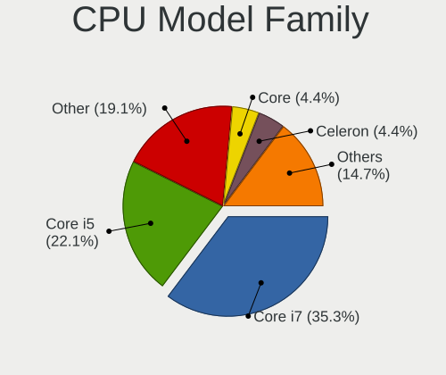

| Model            | Notebooks | Percent |
|------------------|-----------|---------|
| Intel Core i7    | 24        | 35.29%  |
| Intel Core i5    | 15        | 22.06%  |
| Other            | 13        | 19.12%  |
| Intel Core       | 3         | 4.41%   |
| Intel Celeron    | 3         | 4.41%   |
| Intel Core i9    | 2         | 2.94%   |
| Intel Core i3    | 2         | 2.94%   |
| Intel Pentium    | 1         | 1.47%   |
| Intel Core 2 Duo | 1         | 1.47%   |
| AMD Ryzen 9      | 1         | 1.47%   |
| AMD Ryzen 7 PRO  | 1         | 1.47%   |
| AMD Ryzen 7      | 1         | 1.47%   |
| AMD A8           | 1         | 1.47%   |

CPU Cores
---------

Number of processor cores

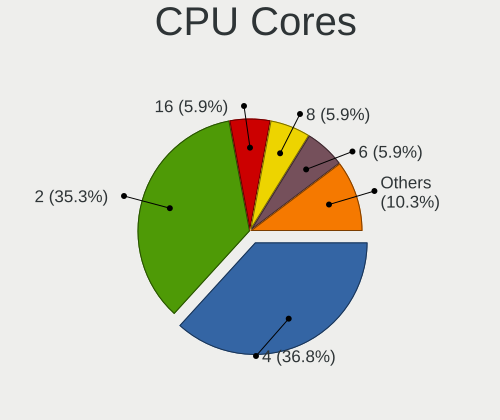

| Number | Notebooks | Percent |
|--------|-----------|---------|
| 4      | 25        | 36.76%  |
| 2      | 24        | 35.29%  |
| 16     | 4         | 5.88%   |
| 8      | 4         | 5.88%   |
| 6      | 4         | 5.88%   |
| 12     | 3         | 4.41%   |
| 24     | 1         | 1.47%   |
| 14     | 1         | 1.47%   |
| 10     | 1         | 1.47%   |
| 1      | 1         | 1.47%   |

CPU Sockets
-----------

Number of sockets

| Number | Notebooks | Percent |
|--------|-----------|---------|
| 1      | 68        | 100%    |

CPU Threads
-----------

Threads per core (Hyper-Threading)

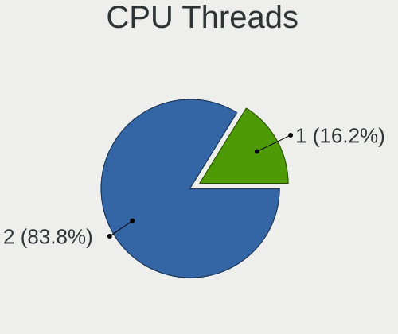

| Number | Notebooks | Percent |
|--------|-----------|---------|
| 2      | 57        | 83.82%  |
| 1      | 11        | 16.18%  |

CPU Op-Modes
------------

CPU Operation Modes (32-bit, 64-bit)

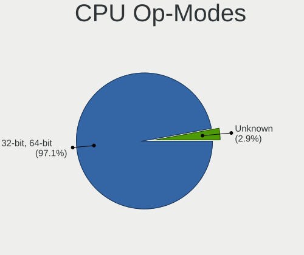

| Op mode        | Notebooks | Percent |
|----------------|-----------|---------|
| 32-bit, 64-bit | 67        | 97.1%   |
| Unknown        | 2         | 2.9%    |

CPU Microcode
-------------

Microcode number

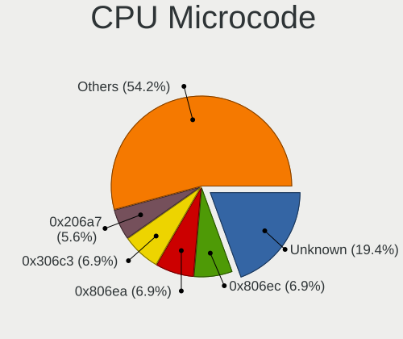

| Number     | Notebooks | Percent |
|------------|-----------|---------|
| Unknown    | 14        | 19.44%  |
| 0x806ec    | 5         | 6.94%   |
| 0x806ea    | 5         | 6.94%   |
| 0x306c3    | 5         | 6.94%   |
| 0x206a7    | 4         | 5.56%   |
| 0x806e9    | 3         | 4.17%   |
| 0x806c1    | 3         | 4.17%   |
| 0x306d4    | 3         | 4.17%   |
| 0x306a9    | 3         | 4.17%   |
| 0xa0652    | 2         | 2.78%   |
| 0x906ed    | 2         | 2.78%   |
| 0x906ea    | 2         | 2.78%   |
| 0x906a3    | 2         | 2.78%   |
| 0x706a8    | 2         | 2.78%   |
| 0x406e3    | 2         | 2.78%   |
| 0x406c4    | 2         | 2.78%   |
| 0x40651    | 2         | 2.78%   |
| 0xb06a2    | 1         | 1.39%   |
| 0x90672    | 1         | 1.39%   |
| 0x806d1    | 1         | 1.39%   |
| 0x706e5    | 1         | 1.39%   |
| 0x506e3    | 1         | 1.39%   |
| 0x10676    | 1         | 1.39%   |
| 0x08608108 | 1         | 1.39%   |
| 0x08608103 | 1         | 1.39%   |
| 0x0810100b | 1         | 1.39%   |
| 0x07030105 | 1         | 1.39%   |
| 0x06006705 | 1         | 1.39%   |

CPU Microarch
-------------

Microarchitecture

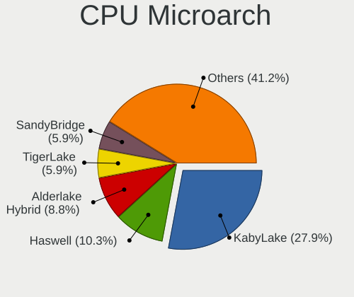

| Name              | Notebooks | Percent |
|-------------------|-----------|---------|
| KabyLake          | 19        | 27.94%  |
| Haswell           | 7         | 10.29%  |
| Alderlake Hybrid  | 6         | 8.82%   |
| TigerLake         | 4         | 5.88%   |
| SandyBridge       | 4         | 5.88%   |
| Skylake           | 3         | 4.41%   |
| Meteorlake Hybrid | 3         | 4.41%   |
| IvyBridge         | 3         | 4.41%   |
| Icelake           | 3         | 4.41%   |
| Broadwell         | 3         | 4.41%   |
| Unknown           | 3         | 4.41%   |
| Silvermont        | 2         | 2.94%   |
| Goldmont plus     | 2         | 2.94%   |
| CometLake         | 2         | 2.94%   |
| Zen               | 1         | 1.47%   |
| Puma              | 1         | 1.47%   |
| Penryn            | 1         | 1.47%   |
| Excavator         | 1         | 1.47%   |

Graphics
--------

GPU Vendor
----------

Vendors of graphics cards

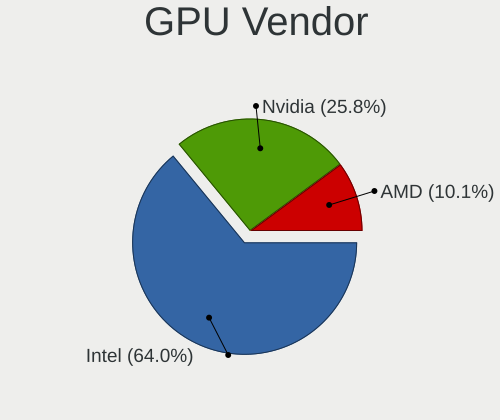

| Vendor | Notebooks | Percent |
|--------|-----------|---------|
| Intel  | 57        | 64.04%  |
| Nvidia | 23        | 25.84%  |
| AMD    | 9         | 10.11%  |

GPU Model
---------

Graphics card models

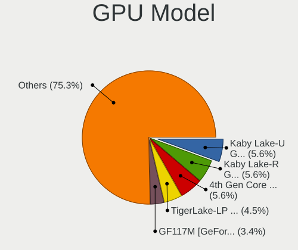

| Model                                                                                    | Notebooks | Percent |
|------------------------------------------------------------------------------------------|-----------|---------|
| Intel Kaby Lake-U GT2 [HD Graphics 620]                                                  | 5         | 5.62%   |
| Intel Kaby Lake-R GT2 [UHD Graphics 620]                                                 | 5         | 5.62%   |
| Intel 4th Gen Core Processor Integrated Graphics Controller                              | 5         | 5.62%   |
| Intel TigerLake-LP GT2 [Iris Xe Graphics]                                                | 4         | 4.49%   |
| Nvidia GF117M [GeForce 610M/710M/810M/820M / GT 620M/625M/630M/720M]                     | 3         | 3.37%   |
| Intel WhiskeyLake-U GT2 [UHD Graphics 620]                                               | 3         | 3.37%   |
| Intel Meteor Lake-P [Intel Arc Graphics]                                                 | 3         | 3.37%   |
| Intel Alder Lake-P GT2 [Iris Xe Graphics]                                                | 3         | 3.37%   |
| Intel 3rd Gen Core processor Graphics Controller                                         | 3         | 3.37%   |
| Nvidia TU117M [GeForce GTX 1650 Mobile / Max-Q]                                          | 2         | 2.25%   |
| Nvidia GM108M [GeForce 930MX]                                                            | 2         | 2.25%   |
| Intel Skylake-U GT2 [HD Graphics 520]                                                    | 2         | 2.25%   |
| Intel Iris Plus Graphics G1 (Ice Lake)                                                   | 2         | 2.25%   |
| Intel Haswell-ULT Integrated Graphics Controller                                         | 2         | 2.25%   |
| Intel GeminiLake [UHD Graphics 600]                                                      | 2         | 2.25%   |
| Intel CometLake-U GT2 [UHD Graphics]                                                     | 2         | 2.25%   |
| Intel CometLake-H GT2 [UHD Graphics]                                                     | 2         | 2.25%   |
| Intel CoffeeLake-H GT2 [UHD Graphics 630]                                                | 2         | 2.25%   |
| Intel Broadwell-U GT2 [HD Graphics 5500]                                                 | 2         | 2.25%   |
| Intel Atom/Celeron/Pentium Processor x5-E8000/J3xxx/N3xxx Integrated Graphics Controller | 2         | 2.25%   |
| Intel 2nd Generation Core Processor Family Integrated Graphics Controller                | 2         | 2.25%   |
| Nvidia TU117GLM [T550 Laptop GPU]                                                        | 1         | 1.12%   |
| Nvidia TU117GLM [T1200 Laptop GPU]                                                       | 1         | 1.12%   |
| Nvidia TU117GLM [Quadro T2000 Mobile / Max-Q]                                            | 1         | 1.12%   |
| Nvidia TU106M [GeForce RTX 2060 Mobile]                                                  | 1         | 1.12%   |
| Nvidia GP107M [GeForce MX350]                                                            | 1         | 1.12%   |
| Nvidia GP107M [GeForce GTX 1050 Ti Mobile]                                               | 1         | 1.12%   |
| Nvidia GP106M [GeForce GTX 1060 Mobile]                                                  | 1         | 1.12%   |
| Nvidia GM204GLM [Quadro M4000M]                                                          | 1         | 1.12%   |
| Nvidia GM108GLM [Quadro K620M / Quadro M500M]                                            | 1         | 1.12%   |
| Nvidia GK208M [GeForce GT 740M]                                                          | 1         | 1.12%   |
| Nvidia GK208GLM [Quadro K610M]                                                           | 1         | 1.12%   |
| Nvidia GK107GLM [Quadro K1100M]                                                          | 1         | 1.12%   |
| Nvidia GF119M [NVS 4200M]                                                                | 1         | 1.12%   |
| Nvidia GA107GLM [RTX A1000 Laptop GPU]                                                   | 1         | 1.12%   |
| Nvidia AD107GLM [RTX 2000 Ada Generation Laptop GPU]                                     | 1         | 1.12%   |
| Nvidia AD103M / GN21-X11 [GeForce RTX 4090 Laptop GPU]                                   | 1         | 1.12%   |
| Intel TigerLake-H GT1 [UHD Graphics]                                                     | 1         | 1.12%   |
| Intel Raptor Lake-S UHD Graphics                                                         | 1         | 1.12%   |
| Intel Raptor Lake-P [UHD Graphics]                                                       | 1         | 1.12%   |

GPU Combo
---------

Combinations of graphics cards

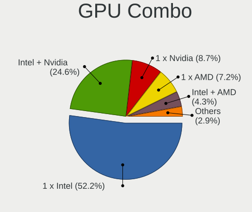

| Name           | Notebooks | Percent |
|----------------|-----------|---------|
| 1 x Intel      | 36        | 52.17%  |
| Intel + Nvidia | 17        | 24.64%  |
| 1 x Nvidia     | 6         | 8.7%    |
| 1 x AMD        | 5         | 7.25%   |
| Intel + AMD    | 3         | 4.35%   |
| Other          | 1         | 1.45%   |
| AMD + Nvidia   | 1         | 1.45%   |

GPU Driver
----------

Free vs proprietary

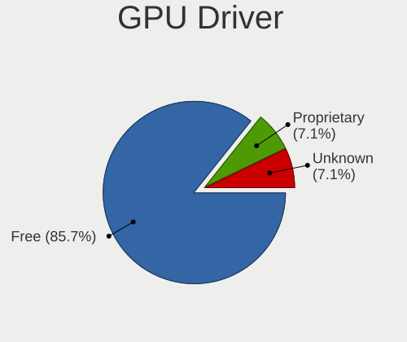

| Driver      | Notebooks | Percent |
|-------------|-----------|---------|
| Free        | 60        | 85.71%  |
| Proprietary | 5         | 7.14%   |
| Unknown     | 5         | 7.14%   |

GPU Memory
----------

Total video memory

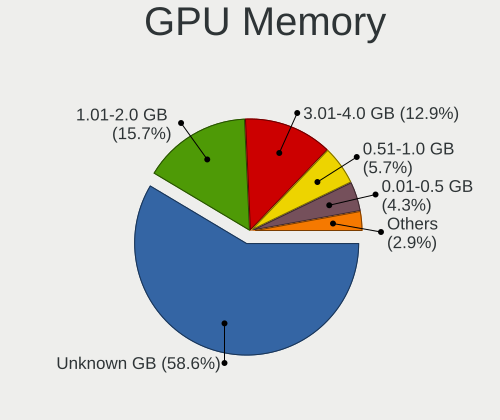

| Size in GB | Notebooks | Percent |
|------------|-----------|---------|
| Unknown    | 41        | 58.57%  |
| 1.01-2.0   | 11        | 15.71%  |
| 3.01-4.0   | 9         | 12.86%  |
| 0.51-1.0   | 4         | 5.71%   |
| 0.01-0.5   | 3         | 4.29%   |
| 7.01-8.0   | 1         | 1.43%   |
| 5.01-6.0   | 1         | 1.43%   |

Monitor
-------

Monitor Vendor
--------------

Monitor vendors

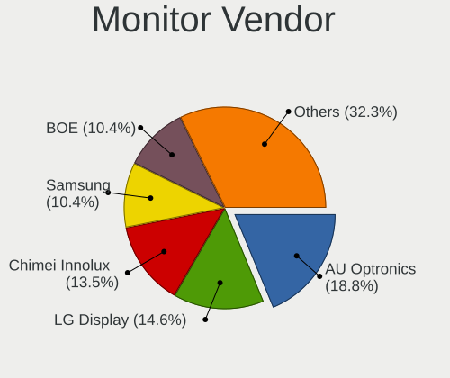

| Vendor               | Notebooks | Percent |
|----------------------|-----------|---------|
| AU Optronics         | 18        | 18.75%  |
| LG Display           | 14        | 14.58%  |
| Chimei Innolux       | 13        | 13.54%  |
| Samsung Electronics  | 10        | 10.42%  |
| BOE                  | 10        | 10.42%  |
| Dell                 | 7         | 7.29%   |
| Lenovo               | 5         | 5.21%   |
| ViewSonic            | 3         | 3.13%   |
| InfoVision           | 3         | 3.13%   |
| BenQ                 | 3         | 3.13%   |
| Sharp                | 2         | 2.08%   |
| Goldstar             | 2         | 2.08%   |
| Acer                 | 2         | 2.08%   |
| Sceptre Tech         | 1         | 1.04%   |
| BOE Technology Group | 1         | 1.04%   |
| ASUSTek Computer     | 1         | 1.04%   |
| Ancor Communications | 1         | 1.04%   |

Monitor Model
-------------

Monitor models

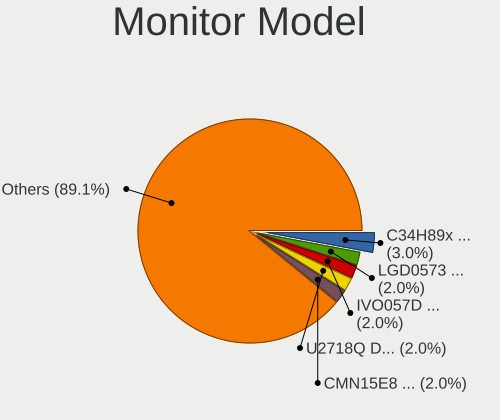

| Model                                                                 | Notebooks | Percent |
|-----------------------------------------------------------------------|-----------|---------|
| Samsung Electronics C34H89x SAM0E26 3440x1440 797x333mm 34.0-inch     | 3         | 2.97%   |
| LG Display LCD Monitor LGD0573 1920x1080 344x194mm 15.5-inch          | 2         | 1.98%   |
| InfoVision LCD Monitor IVO057D 1920x1080 309x174mm 14.0-inch          | 2         | 1.98%   |
| Dell U2718Q DELA0E9 3840x2160 609x349mm 27.6-inch                     | 2         | 1.98%   |
| Chimei Innolux LCD Monitor CMN15E8 1920x1080 344x193mm 15.5-inch      | 2         | 1.98%   |
| Chimei Innolux LCD Monitor CMN15C3 1920x1080 344x193mm 15.5-inch      | 2         | 1.98%   |
| Chimei Innolux LCD Monitor CMN14D4 1920x1080 309x173mm 13.9-inch      | 2         | 1.98%   |
| BOE LCD Monitor BOE0B13 1920x1200 302x188mm 14.0-inch                 | 2         | 1.98%   |
| BenQ GL2760 BNQ78D5 1920x1080 598x336mm 27.0-inch                     | 2         | 1.98%   |
| AU Optronics LCD Monitor AUO303E 1600x900 309x174mm 14.0-inch         | 2         | 1.98%   |
| AU Optronics LCD Monitor AUO243D 1920x1080 309x173mm 13.9-inch        | 2         | 1.98%   |
| Acer SA230 ACR057E 1920x1080 509x286mm 23.0-inch                      | 2         | 1.98%   |
| ViewSonic VX2776 Series VSC3E32 1920x1080 598x336mm 27.0-inch         | 1         | 0.99%   |
| ViewSonic VX2433wm VSC3822 1920x1080 520x290mm 23.4-inch              | 1         | 0.99%   |
| ViewSonic VG2439 SERIES VSCD22B 1920x1080 521x293mm 23.5-inch         | 1         | 0.99%   |
| Sharp LCD Monitor SHP14D0 3840x2400 336x210mm 15.6-inch               | 1         | 0.99%   |
| Sharp LCD Monitor SHP148D 3840x2160 344x194mm 15.5-inch               | 1         | 0.99%   |
| Sceptre Tech Sceptre P30 SPT0BCC 2560x1080 690x291mm 29.5-inch        | 1         | 0.99%   |
| Samsung Electronics SyncMaster SAM021E 1680x1050 433x271mm 20.1-inch  | 1         | 0.99%   |
| Samsung Electronics SAMTRON STN0022 1280x1024 376x301mm 19.0-inch     | 1         | 0.99%   |
| Samsung Electronics S34C65xU SAM73FE 3440x1440 798x334mm 34.1-inch    | 1         | 0.99%   |
| Samsung Electronics S27H65x SAM0E1D 1920x1080 598x336mm 27.0-inch     | 1         | 0.99%   |
| Samsung Electronics S24E650 SAM0CB8 1920x1080 521x293mm 23.5-inch     | 1         | 0.99%   |
| Samsung Electronics LS34A650U SAM7144 3440x1440 798x334mm 34.1-inch   | 1         | 0.99%   |
| Samsung Electronics LCD Monitor SDC5344 1920x1080 344x194mm 15.5-inch | 1         | 0.99%   |
| Samsung Electronics LCD Monitor SDC3256 1920x1080 382x215mm 17.3-inch | 1         | 0.99%   |
| Samsung Electronics C32R50x SAM7000 1920x1080 698x393mm 31.5-inch     | 1         | 0.99%   |
| Samsung Electronics C32HG7x SAM0E14 2560x1440 697x392mm 31.5-inch     | 1         | 0.99%   |
| LG Display LCD Monitor LGD075D 1920x1200 302x188mm 14.0-inch          | 1         | 0.99%   |
| LG Display LCD Monitor LGD074A 2560x1600 388x242mm 18.0-inch          | 1         | 0.99%   |
| LG Display LCD Monitor LGD0725 1920x1080 309x174mm 14.0-inch          | 1         | 0.99%   |
| LG Display LCD Monitor LGD0628 1920x1080 309x174mm 14.0-inch          | 1         | 0.99%   |
| LG Display LCD Monitor LGD0609 1920x1080 309x174mm 14.0-inch          | 1         | 0.99%   |
| LG Display LCD Monitor LGD05B6 1920x1080 309x174mm 14.0-inch          | 1         | 0.99%   |
| LG Display LCD Monitor LGD04BD 1366x768 344x194mm 15.5-inch           | 1         | 0.99%   |
| LG Display LCD Monitor LGD047C 1366x768 310x174mm 14.0-inch           | 1         | 0.99%   |
| LG Display LCD Monitor LGD0456 1366x768 344x194mm 15.5-inch           | 1         | 0.99%   |
| LG Display LCD Monitor LGD03B7 1366x768 309x174mm 14.0-inch           | 1         | 0.99%   |
| LG Display LCD Monitor LGD02DF 1600x900 310x174mm 14.0-inch           | 1         | 0.99%   |
| LG Display LCD Monitor LGD02D9 1920x1080 344x194mm 15.5-inch          | 1         | 0.99%   |

Monitor Resolution
------------------

Monitor screen resolution

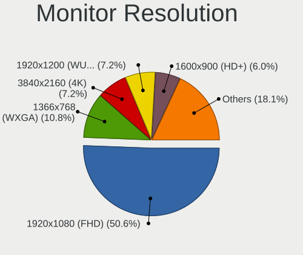

| Resolution         | Notebooks | Percent |
|--------------------|-----------|---------|
| 1920x1080 (FHD)    | 42        | 50.6%   |
| 1366x768 (WXGA)    | 9         | 10.84%  |
| 3840x2160 (4K)     | 6         | 7.23%   |
| 1920x1200 (WUXGA)  | 6         | 7.23%   |
| 1600x900 (HD+)     | 5         | 6.02%   |
| 3440x1440          | 4         | 4.82%   |
| 2560x1600          | 2         | 2.41%   |
| 1680x1050 (WSXGA+) | 2         | 2.41%   |
| 3840x2400          | 1         | 1.2%    |
| 3840x1600          | 1         | 1.2%    |
| 2880x1920          | 1         | 1.2%    |
| 2560x1440 (QHD)    | 1         | 1.2%    |
| 2560x1080          | 1         | 1.2%    |
| 1280x800 (WXGA)    | 1         | 1.2%    |
| 1280x1024 (SXGA)   | 1         | 1.2%    |

Monitor Diagonal
----------------

Diagonal size in inches

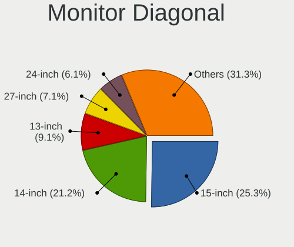

| Inches  | Notebooks | Percent |
|---------|-----------|---------|
| 15      | 25        | 25.25%  |
| 14      | 21        | 21.21%  |
| 13      | 9         | 9.09%   |
| 27      | 7         | 7.07%   |
| 24      | 6         | 6.06%   |
| 34      | 4         | 4.04%   |
| 31      | 4         | 4.04%   |
| 23      | 4         | 4.04%   |
| 16      | 3         | 3.03%   |
| 38      | 2         | 2.02%   |
| 32      | 2         | 2.02%   |
| 17      | 2         | 2.02%   |
| 37      | 1         | 1.01%   |
| 29      | 1         | 1.01%   |
| 22      | 1         | 1.01%   |
| 21      | 1         | 1.01%   |
| 20      | 1         | 1.01%   |
| 19      | 1         | 1.01%   |
| 18      | 1         | 1.01%   |
| 12      | 1         | 1.01%   |
| 11      | 1         | 1.01%   |
| Unknown | 1         | 1.01%   |

Monitor Width
-------------

Physical width

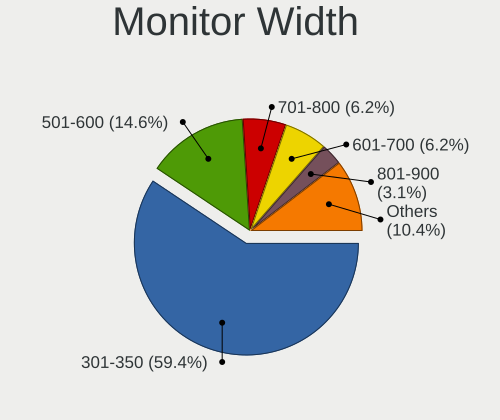

| Width in mm | Notebooks | Percent |
|-------------|-----------|---------|
| 301-350     | 57        | 59.38%  |
| 501-600     | 14        | 14.58%  |
| 701-800     | 6         | 6.25%   |
| 601-700     | 6         | 6.25%   |
| 801-900     | 3         | 3.13%   |
| 401-500     | 3         | 3.13%   |
| 351-400     | 3         | 3.13%   |
| 201-300     | 3         | 3.13%   |
| Unknown     | 1         | 1.04%   |

Aspect Ratio
------------

Proportional relationship between the width and the height

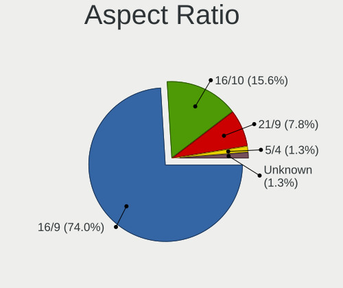

| Ratio   | Notebooks | Percent |
|---------|-----------|---------|
| 16/9    | 57        | 74.03%  |
| 16/10   | 12        | 15.58%  |
| 21/9    | 6         | 7.79%   |
| 5/4     | 1         | 1.3%    |
| Unknown | 1         | 1.3%    |

Monitor Area
------------

Area in inch²

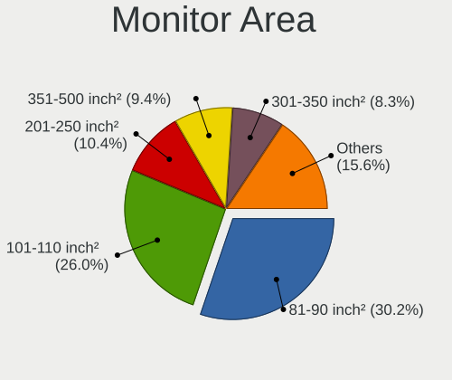

| Area in inch² | Notebooks | Percent |
|----------------|-----------|---------|
| 81-90          | 29        | 30.21%  |
| 101-110        | 25        | 26.04%  |
| 201-250        | 10        | 10.42%  |
| 351-500        | 9         | 9.38%   |
| 301-350        | 8         | 8.33%   |
| 111-120        | 3         | 3.13%   |
| 501-1000       | 3         | 3.13%   |
| 151-200        | 2         | 2.08%   |
| 121-130        | 2         | 2.08%   |
| 71-80          | 1         | 1.04%   |
| 61-70          | 1         | 1.04%   |
| 51-60          | 1         | 1.04%   |
| 141-150        | 1         | 1.04%   |
| Unknown        | 1         | 1.04%   |

Pixel Density
-------------

Pixels per inch

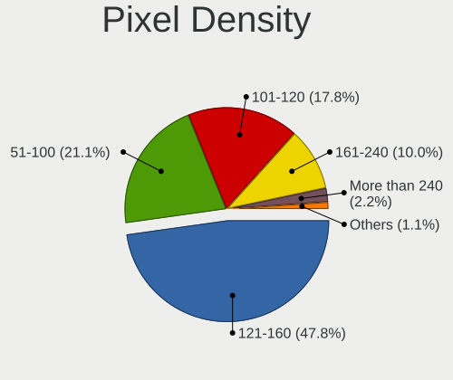

| Density       | Notebooks | Percent |
|---------------|-----------|---------|
| 121-160       | 43        | 47.78%  |
| 51-100        | 19        | 21.11%  |
| 101-120       | 16        | 17.78%  |
| 161-240       | 9         | 10%     |
| More than 240 | 2         | 2.22%   |
| Unknown       | 1         | 1.11%   |

Multiple Monitors
-----------------

Total monitors connected

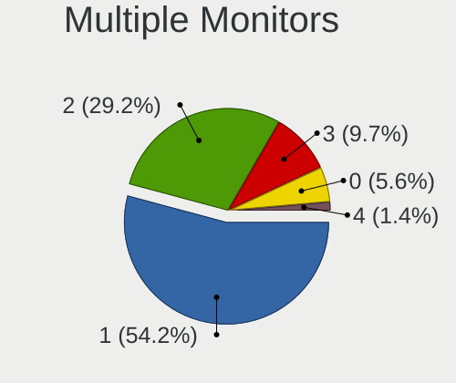

| Total | Notebooks | Percent |
|-------|-----------|---------|
| 1     | 39        | 54.17%  |
| 2     | 21        | 29.17%  |
| 3     | 7         | 9.72%   |
| 0     | 4         | 5.56%   |
| 4     | 1         | 1.39%   |

Network
-------

Net Controller Vendor
---------------------

Controller vendors

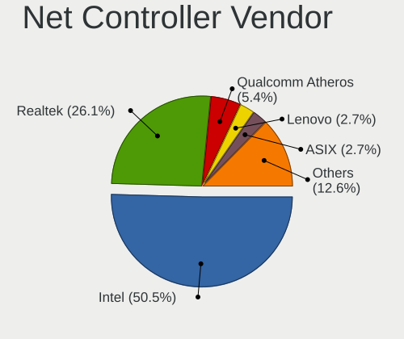

| Vendor                            | Notebooks | Percent |
|-----------------------------------|-----------|---------|
| Intel                             | 56        | 50.45%  |
| Realtek Semiconductor             | 29        | 26.13%  |
| Qualcomm Atheros                  | 6         | 5.41%   |
| Lenovo                            | 3         | 2.7%    |
| ASIX Electronics                  | 3         | 2.7%    |
| Samsung Electronics               | 2         | 1.8%    |
| Sierra Wireless                   | 1         | 0.9%    |
| Shenzhen Goodix Technology        | 1         | 0.9%    |
| Realtek                           | 1         | 0.9%    |
| Ralink Technology                 | 1         | 0.9%    |
| NetGear                           | 1         | 0.9%    |
| Huawei Technologies               | 1         | 0.9%    |
| Fibocom                           | 1         | 0.9%    |
| Ericsson Business Mobile Networks | 1         | 0.9%    |
| Edimax Technology                 | 1         | 0.9%    |
| DisplayLink                       | 1         | 0.9%    |
| Broadcom Limited                  | 1         | 0.9%    |
| Broadcom                          | 1         | 0.9%    |

Net Controller Model
--------------------

Controller models

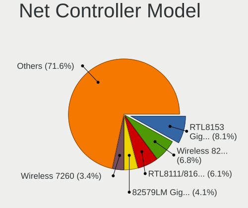

| Model                                                                  | Notebooks | Percent |
|------------------------------------------------------------------------|-----------|---------|
| Realtek RTL8153 Gigabit Ethernet Adapter                               | 12        | 8.11%   |
| Intel Wireless 8265 / 8275                                             | 10        | 6.76%   |
| Realtek RTL8111/8168/8211/8411 PCI Express Gigabit Ethernet Controller | 9         | 6.08%   |
| Intel 82579LM Gigabit Network Connection (Lewisville)                  | 6         | 4.05%   |
| Intel Wireless 7260                                                    | 5         | 3.38%   |
| Intel Ethernet Connection (4) I219-LM                                  | 5         | 3.38%   |
| Realtek RTL810xE PCI Express Fast Ethernet controller                  | 4         | 2.7%    |
| Realtek RTL8152 Fast Ethernet Adapter                                  | 3         | 2.03%   |
| Intel Wireless 7265                                                    | 3         | 2.03%   |
| Intel Wi-Fi 7(802.11be) AX1775*/AX1790*/BE20*/BE401/BE1750* 2x2        | 3         | 2.03%   |
| Intel Wi-Fi 6 AX201                                                    | 3         | 2.03%   |
| Intel Ethernet Connection I217-LM                                      | 3         | 2.03%   |
| Intel Ethernet Connection (6) I219-LM                                  | 3         | 2.03%   |
| Intel Ethernet Connection (4) I219-V                                   | 3         | 2.03%   |
| Intel Centrino Advanced-N 6205 [Taylor Peak]                           | 3         | 2.03%   |
| Intel Alder Lake-P PCH CNVi WiFi                                       | 3         | 2.03%   |
| ASIX AX88179 Gigabit Ethernet                                          | 3         | 2.03%   |
| Samsung Galaxy series, misc. (tethering mode)                          | 2         | 1.35%   |
| Realtek RTL8821CE 802.11ac PCIe Wireless Network Adapter               | 2         | 1.35%   |
| Qualcomm Atheros QCA9565 / AR9565 Wireless Network Adapter             | 2         | 1.35%   |
| Qualcomm Atheros QCA9377 802.11ac Wireless Network Adapter             | 2         | 1.35%   |
| Lenovo ThinkPad TBT 3 Dock                                             | 2         | 1.35%   |
| Intel Wireless 8260                                                    | 2         | 1.35%   |
| Intel Raptor Lake PCH CNVi WiFi                                        | 2         | 1.35%   |
| Intel Ice Lake-LP PCH CNVi WiFi                                        | 2         | 1.35%   |
| Intel Ethernet Connection (3) I218-LM                                  | 2         | 1.35%   |
| Intel Comet Lake PCH-LP CNVi WiFi                                      | 2         | 1.35%   |
| Intel Comet Lake PCH CNVi WiFi                                         | 2         | 1.35%   |
| Intel Centrino Ultimate-N 6300                                         | 2         | 1.35%   |
| Intel Cannon Point-LP CNVi [Wireless-AC]                               | 2         | 1.35%   |
| Intel Cannon Lake PCH CNVi WiFi                                        | 2         | 1.35%   |
| Sierra Wireless EM7455                                                 | 1         | 0.68%   |
| Shenzhen Goodix Fingerprint Reader                                     | 1         | 0.68%   |
| Realtek USB 10/100/1000 LAN                                            | 1         | 0.68%   |
| Realtek RTL88x2bu [AC1200 Techkey]                                     | 1         | 0.68%   |
| Realtek RTL8852CE PCIe 802.11ax Wireless Network Controller            | 1         | 0.68%   |
| Realtek RTL8822BE 802.11a/b/g/n/ac WiFi adapter                        | 1         | 0.68%   |
| Realtek RTL8723BE PCIe Wireless Network Adapter                        | 1         | 0.68%   |
| Realtek RTL8188EE Wireless Network Adapter                             | 1         | 0.68%   |
| Realtek Killer E5000 5GbE Controller                                   | 1         | 0.68%   |

Wireless Vendor
---------------

Wireless vendors

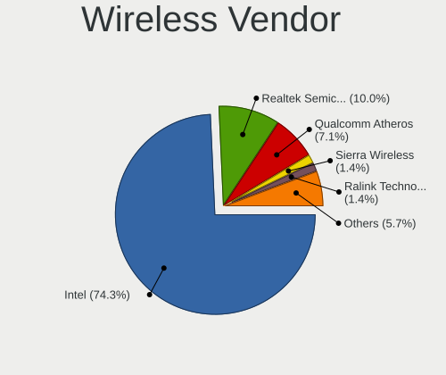

| Vendor                | Notebooks | Percent |
|-----------------------|-----------|---------|
| Intel                 | 52        | 74.29%  |
| Realtek Semiconductor | 7         | 10%     |
| Qualcomm Atheros      | 5         | 7.14%   |
| Sierra Wireless       | 1         | 1.43%   |
| Ralink Technology     | 1         | 1.43%   |
| NetGear               | 1         | 1.43%   |
| Fibocom               | 1         | 1.43%   |
| Edimax Technology     | 1         | 1.43%   |
| Broadcom              | 1         | 1.43%   |

Wireless Model
--------------

Wireless models

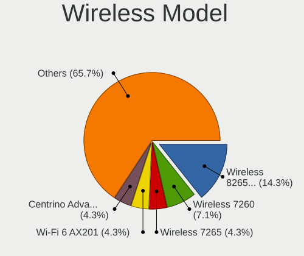

| Model                                                           | Notebooks | Percent |
|-----------------------------------------------------------------|-----------|---------|
| Intel Wireless 8265 / 8275                                      | 10        | 14.29%  |
| Intel Wireless 7260                                             | 5         | 7.14%   |
| Intel Wireless 7265                                             | 3         | 4.29%   |
| Intel Wi-Fi 6 AX201                                             | 3         | 4.29%   |
| Intel Centrino Advanced-N 6205 [Taylor Peak]                    | 3         | 4.29%   |
| Realtek RTL8821CE 802.11ac PCIe Wireless Network Adapter        | 2         | 2.86%   |
| Qualcomm Atheros QCA9565 / AR9565 Wireless Network Adapter      | 2         | 2.86%   |
| Qualcomm Atheros QCA9377 802.11ac Wireless Network Adapter      | 2         | 2.86%   |
| Intel Wireless 8260                                             | 2         | 2.86%   |
| Intel Wi-Fi 7(802.11be) AX1775*/AX1790*/BE20*/BE401/BE1750* 2x2 | 2         | 2.86%   |
| Intel Raptor Lake PCH CNVi WiFi                                 | 2         | 2.86%   |
| Intel Ice Lake-LP PCH CNVi WiFi                                 | 2         | 2.86%   |
| Intel Comet Lake PCH-LP CNVi WiFi                               | 2         | 2.86%   |
| Intel Comet Lake PCH CNVi WiFi                                  | 2         | 2.86%   |
| Intel Centrino Ultimate-N 6300                                  | 2         | 2.86%   |
| Intel Cannon Point-LP CNVi [Wireless-AC]                        | 2         | 2.86%   |
| Intel Cannon Lake PCH CNVi WiFi                                 | 2         | 2.86%   |
| Intel Alder Lake-P PCH CNVi WiFi                                | 2         | 2.86%   |
| Sierra Wireless EM7455                                          | 1         | 1.43%   |
| Realtek RTL88x2bu [AC1200 Techkey]                              | 1         | 1.43%   |
| Realtek RTL8852CE PCIe 802.11ax Wireless Network Controller     | 1         | 1.43%   |
| Realtek RTL8822BE 802.11a/b/g/n/ac WiFi adapter                 | 1         | 1.43%   |
| Realtek RTL8723BE PCIe Wireless Network Adapter                 | 1         | 1.43%   |
| Realtek RTL8188EE Wireless Network Adapter                      | 1         | 1.43%   |
| Ralink MT7601U Wireless Adapter                                 | 1         | 1.43%   |
| Qualcomm Atheros QCA6174 802.11ac Wireless Network Adapter      | 1         | 1.43%   |
| NetGear WNA1100 Wireless-N 150 [Atheros AR9271]                 | 1         | 1.43%   |
| Intel Wi-Fi 6E(802.11ax) AX210/AX1675* 2x2 [Typhoon Peak]       | 1         | 1.43%   |
| Intel Wi-Fi 6 AX200                                             | 1         | 1.43%   |
| Intel Wi-Fi 5(802.11ac) Wireless-AC 9x6x [Thunder Peak]         | 1         | 1.43%   |
| Intel Tiger Lake PCH CNVi WiFi                                  | 1         | 1.43%   |
| Intel PRO/Wireless 5100 AGN [Shiloh] Network Connection         | 1         | 1.43%   |
| Intel Meteor Lake PCH CNVi WiFi                                 | 1         | 1.43%   |
| Intel Gemini Lake PCH CNVi WiFi                                 | 1         | 1.43%   |
| Intel Centrino Advanced-N 6235                                  | 1         | 1.43%   |
| Fibocom L830-EB-00 LTE WWAN Modem                               | 1         | 1.43%   |
| Edimax EW-7811Un 802.11n Wireless Adapter [Realtek RTL8188CUS]  | 1         | 1.43%   |
| Broadcom BCM43142 802.11b/g/n                                   | 1         | 1.43%   |

Ethernet Vendor
---------------

Ethernet vendors

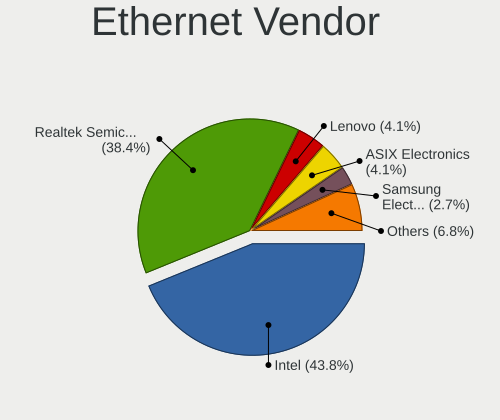

| Vendor                | Notebooks | Percent |
|-----------------------|-----------|---------|
| Intel                 | 32        | 43.84%  |
| Realtek Semiconductor | 28        | 38.36%  |
| Lenovo                | 3         | 4.11%   |
| ASIX Electronics      | 3         | 4.11%   |
| Samsung Electronics   | 2         | 2.74%   |
| Realtek               | 1         | 1.37%   |
| Qualcomm Atheros      | 1         | 1.37%   |
| Huawei Technologies   | 1         | 1.37%   |
| DisplayLink           | 1         | 1.37%   |
| Broadcom Limited      | 1         | 1.37%   |

Ethernet Model
--------------

Ethernet models

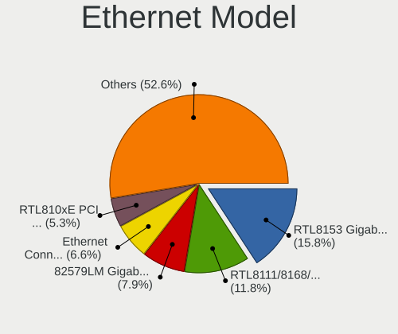

| Model                                                                  | Notebooks | Percent |
|------------------------------------------------------------------------|-----------|---------|
| Realtek RTL8153 Gigabit Ethernet Adapter                               | 12        | 15.79%  |
| Realtek RTL8111/8168/8211/8411 PCI Express Gigabit Ethernet Controller | 9         | 11.84%  |
| Intel 82579LM Gigabit Network Connection (Lewisville)                  | 6         | 7.89%   |
| Intel Ethernet Connection (4) I219-LM                                  | 5         | 6.58%   |
| Realtek RTL810xE PCI Express Fast Ethernet controller                  | 4         | 5.26%   |
| Realtek RTL8152 Fast Ethernet Adapter                                  | 3         | 3.95%   |
| Intel Ethernet Connection I217-LM                                      | 3         | 3.95%   |
| Intel Ethernet Connection (6) I219-LM                                  | 3         | 3.95%   |
| Intel Ethernet Connection (4) I219-V                                   | 3         | 3.95%   |
| ASIX AX88179 Gigabit Ethernet                                          | 3         | 3.95%   |
| Samsung Galaxy series, misc. (tethering mode)                          | 2         | 2.63%   |
| Lenovo ThinkPad TBT 3 Dock                                             | 2         | 2.63%   |
| Intel Ethernet Connection (3) I218-LM                                  | 2         | 2.63%   |
| Realtek USB 10/100/1000 LAN                                            | 1         | 1.32%   |
| Realtek Killer E5000 5GbE Controller                                   | 1         | 1.32%   |
| Qualcomm Atheros QCA8171 Gigabit Ethernet                              | 1         | 1.32%   |
| Lenovo ThinkPad TBT3 LAN                                               | 1         | 1.32%   |
| Intel Wi-Fi 7(802.11be) AX1775*/AX1790*/BE20*/BE401/BE1750* 2x2        | 1         | 1.32%   |
| Intel Ethernet Connection I219-V                                       | 1         | 1.32%   |
| Intel Ethernet Connection I218-LM                                      | 1         | 1.32%   |
| Intel Ethernet Connection I217-V                                       | 1         | 1.32%   |
| Intel Ethernet Connection (7) I219-LM                                  | 1         | 1.32%   |
| Intel Ethernet Connection (2) I219-LM                                  | 1         | 1.32%   |
| Intel Ethernet Connection (17) I219-V                                  | 1         | 1.32%   |
| Intel Ethernet Connection (16) I219-V                                  | 1         | 1.32%   |
| Intel Ethernet Connection (16) I219-LM                                 | 1         | 1.32%   |
| Intel Ethernet Connection (14) I219-V                                  | 1         | 1.32%   |
| Intel Alder Lake-S PCH CNVi WiFi                                       | 1         | 1.32%   |
| Intel Alder Lake-P PCH CNVi WiFi                                       | 1         | 1.32%   |
| Huawei Mobile                                                          | 1         | 1.32%   |
| DisplayLink Dell Universal Dock D6000                                  | 1         | 1.32%   |
| Broadcom Limited NetLink BCM5787M Gigabit Ethernet PCI Express         | 1         | 1.32%   |

Net Controller Kind
-------------------

Ethernet, WiFi or modem

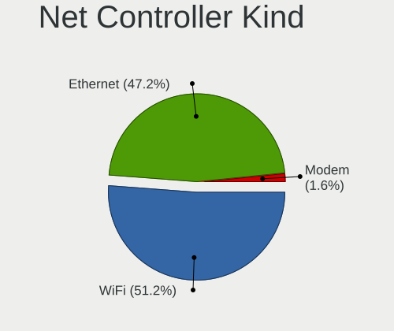

| Kind     | Notebooks | Percent |
|----------|-----------|---------|
| WiFi     | 64        | 51.2%   |
| Ethernet | 59        | 47.2%   |
| Modem    | 2         | 1.6%    |

Used Controller
---------------

Currently used network controller

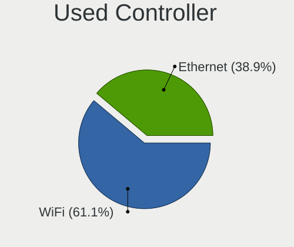

| Kind     | Notebooks | Percent |
|----------|-----------|---------|
| WiFi     | 44        | 61.11%  |
| Ethernet | 28        | 38.89%  |

NICs
----

Total network controllers on board

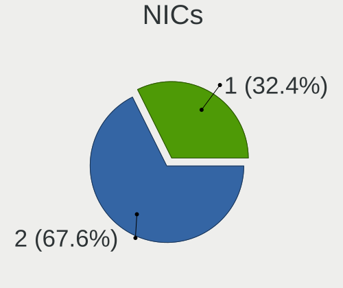

| Total | Notebooks | Percent |
|-------|-----------|---------|
| 2     | 46        | 67.65%  |
| 1     | 22        | 32.35%  |

IPv6
----

IPv6 vs IPv4

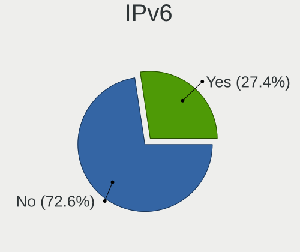

| Used | Notebooks | Percent |
|------|-----------|---------|
| No   | 53        | 72.6%   |
| Yes  | 20        | 27.4%   |

Bluetooth
---------

Bluetooth Vendor
----------------

Controller vendors

| Vendor                          | Notebooks | Percent |
|---------------------------------|-----------|---------|
| Intel                           | 39        | 75%     |
| Realtek Semiconductor           | 5         | 9.62%   |
| Qualcomm Atheros Communications | 5         | 9.62%   |
| Broadcom                        | 2         | 3.85%   |
| Alps Electric                   | 1         | 1.92%   |

Bluetooth Model
---------------

Controller models

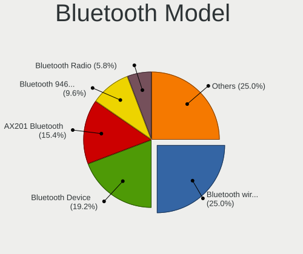

| Model                                          | Notebooks | Percent |
|------------------------------------------------|-----------|---------|
| Intel Bluetooth wireless interface             | 13        | 25%     |
| Intel Bluetooth Device                         | 10        | 19.23%  |
| Intel AX201 Bluetooth                          | 8         | 15.38%  |
| Intel Bluetooth 9460/9560 Jefferson Peak (JfP) | 5         | 9.62%   |
| Realtek Bluetooth Radio                        | 3         | 5.77%   |
| Realtek  Bluetooth 4.2 Adapter                 | 2         | 3.85%   |
| Qualcomm Atheros  Bluetooth Device             | 2         | 3.85%   |
| Qualcomm Atheros AR9462 Bluetooth              | 2         | 3.85%   |
| Qualcomm Atheros QCA61x4 Bluetooth 4.0         | 1         | 1.92%   |
| Intel Wireless-AC 9260 Bluetooth Adapter       | 1         | 1.92%   |
| Intel Centrino Bluetooth Wireless Transceiver  | 1         | 1.92%   |
| Intel AX210 Bluetooth                          | 1         | 1.92%   |
| Broadcom BCM43142A0 Bluetooth 4.0              | 1         | 1.92%   |
| Broadcom BCM20702 Bluetooth 4.0 [ThinkPad]     | 1         | 1.92%   |
| Alps Electric UGTZ4 Bluetooth                  | 1         | 1.92%   |

Sound
-----

Sound Vendor
------------

Sound card vendors

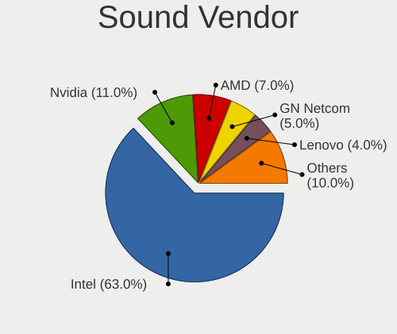

| Vendor                | Notebooks | Percent |
|-----------------------|-----------|---------|
| Intel                 | 63        | 63%     |
| Nvidia                | 11        | 11%     |
| AMD                   | 7         | 7%      |
| GN Netcom             | 5         | 5%      |
| Lenovo                | 4         | 4%      |
| Plantronics           | 2         | 2%      |
| C-Media Electronics   | 2         | 2%      |
| Unknown               | 1         | 1%      |
| TEAC                  | 1         | 1%      |
| RME                   | 1         | 1%      |
| Realtek Semiconductor | 1         | 1%      |
| JMTek                 | 1         | 1%      |
| Creative Technology   | 1         | 1%      |

Sound Model
-----------

Sound card models

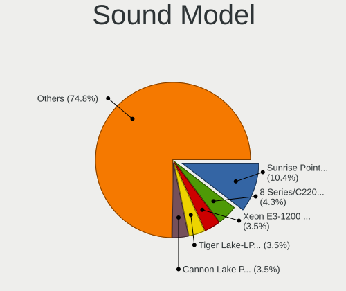

| Model                                                                                             | Notebooks | Percent |
|---------------------------------------------------------------------------------------------------|-----------|---------|
| Intel Sunrise Point-LP HD Audio                                                                   | 12        | 10.43%  |
| Intel 8 Series/C220 Series Chipset High Definition Audio Controller                               | 5         | 4.35%   |
| Intel Xeon E3-1200 v3/4th Gen Core Processor HD Audio Controller                                  | 4         | 3.48%   |
| Intel Tiger Lake-LP Smart Sound Technology Audio Controller                                       | 4         | 3.48%   |
| Intel Cannon Lake PCH cAVS                                                                        | 4         | 3.48%   |
| Intel 6 Series/C200 Series Chipset Family High Definition Audio Controller                        | 4         | 3.48%   |
| Nvidia TU107 GeForce GTX 1650 High Definition Audio Controller                                    | 3         | 2.61%   |
| Intel Wildcat Point-LP High Definition Audio Controller                                           | 3         | 2.61%   |
| Intel Meteor Lake-P HD Audio Controller                                                           | 3         | 2.61%   |
| Intel Cannon Point-LP High Definition Audio Controller                                            | 3         | 2.61%   |
| Intel Broadwell-U Audio Controller                                                                | 3         | 2.61%   |
| Intel Alder Lake PCH-P High Definition Audio Controller                                           | 3         | 2.61%   |
| Intel 7 Series/C216 Chipset Family High Definition Audio Controller                               | 3         | 2.61%   |
| AMD Ryzen HD Audio Controller                                                                     | 3         | 2.61%   |
| Lenovo ThinkPad Thunderbolt 3 Dock USB Audio                                                      | 2         | 1.74%   |
| Intel Raptor Lake-P/U/H cAVS                                                                      | 2         | 1.74%   |
| Intel Ice Lake-LP Smart Sound Technology Audio Controller                                         | 2         | 1.74%   |
| Intel Haswell-ULT HD Audio Controller                                                             | 2         | 1.74%   |
| Intel Comet Lake PCH-LP cAVS                                                                      | 2         | 1.74%   |
| Intel Comet Lake PCH cAVS                                                                         | 2         | 1.74%   |
| Intel Celeron/Pentium Silver Processor High Definition Audio                                      | 2         | 1.74%   |
| Intel Atom/Celeron/Pentium Processor x5-E8000/J3xxx/N3xxx Series High Definition Audio Controller | 2         | 1.74%   |
| Intel 8 Series HD Audio Controller                                                                | 2         | 1.74%   |
| Unknown Definitive Sym1                                                                           | 1         | 0.87%   |
| TEAC US-2x2                                                                                       | 1         | 0.87%   |
| RME ADI-2 DAC (51120366)                                                                          | 1         | 0.87%   |
| Realtek Semiconductor USB Audio                                                                   | 1         | 0.87%   |
| Plantronics Poly BT700                                                                            | 1         | 0.87%   |
| Plantronics BT600                                                                                 | 1         | 0.87%   |
| Nvidia TU106 High Definition Audio Controller                                                     | 1         | 0.87%   |
| Nvidia GP106 High Definition Audio Controller                                                     | 1         | 0.87%   |
| Nvidia GM204 High Definition Audio Controller                                                     | 1         | 0.87%   |
| Nvidia GK208 HDMI/DP Audio Controller                                                             | 1         | 0.87%   |
| Nvidia GK107 HDMI Audio Controller                                                                | 1         | 0.87%   |
| Nvidia GF119 HDMI Audio Controller                                                                | 1         | 0.87%   |
| Nvidia GA107 High Definition Audio Controller                                                     | 1         | 0.87%   |
| Nvidia AD103 High Definition Audio Controller                                                     | 1         | 0.87%   |
| Lenovo ThinkPad Thunderbolt 3 Dock Audio                                                          | 1         | 0.87%   |
| Lenovo ThinkPad Dock USB Audio                                                                    | 1         | 0.87%   |
| JMTek USB PnP Audio Device                                                                        | 1         | 0.87%   |

Memory
------

Memory Vendor
-------------

Memory module vendors

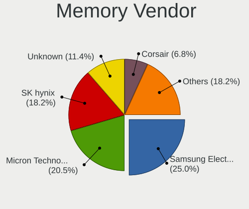

| Vendor              | Notebooks | Percent |
|---------------------|-----------|---------|
| Samsung Electronics | 11        | 25%     |
| Micron Technology   | 9         | 20.45%  |
| SK hynix            | 8         | 18.18%  |
| Unknown             | 5         | 11.36%  |
| Corsair             | 3         | 6.82%   |
| Unknown             | 2         | 4.55%   |
| Kingston            | 2         | 4.55%   |
| Nanya Technology    | 1         | 2.27%   |
| Crucial             | 1         | 2.27%   |
| Avant               | 1         | 2.27%   |
| 4ea5                | 1         | 2.27%   |

Memory Model
------------

Memory module models

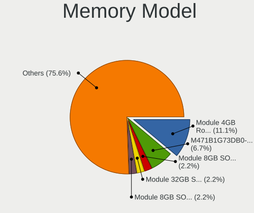

| Model                                                        | Notebooks | Percent |
|--------------------------------------------------------------|-----------|---------|
| Unknown                                                      | 5         | 11.11%  |
| Samsung RAM M471B1G73DB0-YK0 8GB SODIMM DDR3 1600MT/s        | 3         | 6.67%   |
| Unknown RAM Module 8GB SODIMM DDR4 2400MT/s                  | 1         | 2.22%   |
| Unknown RAM Module 32GB SODIMM DDR4 2667MT/s                 | 1         | 2.22%   |
| SK hynix RAM Module 32GB SODIMM DDR4 3200MT/s                | 1         | 2.22%   |
| SK hynix RAM Module 16GB SODIMM DDR4 3200MT/s                | 1         | 2.22%   |
| SK hynix RAM HMT41GS6BFR8A-PB 8GB SODIMM DDR3 2667MT/s       | 1         | 2.22%   |
| SK hynix RAM HMAA1GS6CMR8N-VK 8GB Row Of Chips DDR4 2667MT/s | 1         | 2.22%   |
| SK hynix RAM HMA851S6CJR6N-VK 4GB Row Of Chips DDR4 1866MT/s | 1         | 2.22%   |
| SK hynix RAM HMA82GS6DJR8N-XN 16GB SODIMM DDR4 3200MT/s      | 1         | 2.22%   |
| SK hynix RAM HMA81GS6CJR8N-VK 8GB SODIMM DDR4 2667MT/s       | 1         | 2.22%   |
| SK hynix RAM HMA81GS6AFR8N-UH 8GB SODIMM DDR4 2667MT/s       | 1         | 2.22%   |
| SK hynix RAM H9HCNNNBKUMLXR-NEE 2GB LPDDR4 2400MT/s          | 1         | 2.22%   |
| Samsung RAM Module 8GB SODIMM DDR5 4800MT/s                  | 1         | 2.22%   |
| Samsung RAM Module 32GB SODIMM DDR5 5600MT/s                 | 1         | 2.22%   |
| Samsung RAM M471B5173DB0-YK0 4GB SODIMM DDR3 1600MT/s        | 1         | 2.22%   |
| Samsung RAM M471A4G43MB1-CTD 32GB SODIMM DDR4 2667MT/s       | 1         | 2.22%   |
| Samsung RAM M471A2K43DB1-CTD 16GB SODIMM DDR4 2667MT/s       | 1         | 2.22%   |
| Samsung RAM M471A2K43CB1-CRC 16GB SODIMM DDR4 2667MT/s       | 1         | 2.22%   |
| Samsung RAM M471A1K43DB1-CWE 8GB SODIMM DDR4 3200MT/s        | 1         | 2.22%   |
| Samsung RAM M471A1K43DB1-CTD 8GB SODIMM DDR4 2667MT/s        | 1         | 2.22%   |
| Nanya RAM NT8GA64D88AX3S-HR 8GB SODIMM DDR4 2667MT/s         | 1         | 2.22%   |
| Micron RAM MTC16C2085S1SC56BD1 32GB SODIMM DDR5 5600MT/s     | 1         | 2.22%   |
| Micron RAM Module 32GB SODIMM DDR4 2667MT/s                  | 1         | 2.22%   |
| Micron RAM Module 16384MB SODIMM DDR4 2400MT/s               | 1         | 2.22%   |
| Micron RAM 8ATF2G64HZ-3G2E1 16GB SODIMM DDR4 3200MT/s        | 1         | 2.22%   |
| Micron RAM 8ATF1G64HZ-2G6E1 8GB SODIMM DDR4 2667MT/s         | 1         | 2.22%   |
| Micron RAM 53E2G32D4NQ-046 4GB Row Of Chips LPDDR4 4267MT/s  | 1         | 2.22%   |
| Micron RAM 4ATS1G64HZ-2G6E1 8GB SODIMM DDR4 2667MT/s         | 1         | 2.22%   |
| Micron RAM 16JTF1G64HZ-1G4D1 8GB SODIMM DDR3 1333MT/s        | 1         | 2.22%   |
| Micron RAM 16ATF2G64HZ-2G1A1 16GB SODIMM DDR4 2133MT/s       | 1         | 2.22%   |
| Kingston RAM KX830D-ELC 4GB SODIMM DDR3 1334MT/s             | 1         | 2.22%   |
| Kingston RAM KN2M64-ETB 8GB SODIMM DDR3 1600MT/s             | 1         | 2.22%   |
| Crucial RAM CT32G4SFD8266.C16FF 32GB SODIMM DDR4 2667MT/s    | 1         | 2.22%   |
| Corsair RAM CMSX32GX4M2A2666C18 16GB SODIMM DDR4 2667MT/s    | 1         | 2.22%   |
| Corsair RAM CMSX32GX4M2A2400C16 16GB SODIMM DDR4 2400MT/s    | 1         | 2.22%   |
| Corsair RAM CMSX16GX4M1A3200C22 16GB SODIMM DDR4 3200MT/s    | 1         | 2.22%   |
| Avant RAM H6451U66G1600G 4096MB SODIMM DDR3 1600MT/s         | 1         | 2.22%   |
| 4ea5 RAM H9HCNNNBKUMLXR-NEE 2GB LPDDR4 2400MT/s              | 1         | 2.22%   |

Memory Kind
-----------

Memory module kinds

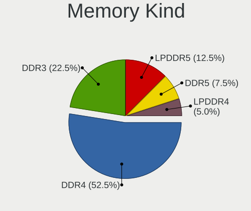

| Kind   | Notebooks | Percent |
|--------|-----------|---------|
| DDR4   | 21        | 52.5%   |
| DDR3   | 9         | 22.5%   |
| LPDDR5 | 5         | 12.5%   |
| DDR5   | 3         | 7.5%    |
| LPDDR4 | 2         | 5%      |

Memory Form Factor
------------------

Physical design of the memory module

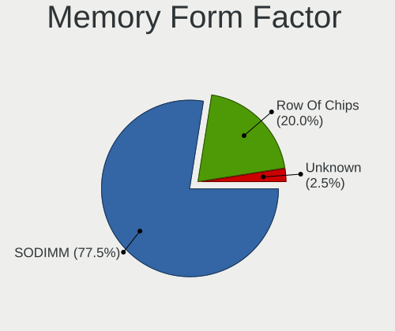

| Name         | Notebooks | Percent |
|--------------|-----------|---------|
| SODIMM       | 31        | 77.5%   |
| Row Of Chips | 8         | 20%     |
| Unknown      | 1         | 2.5%    |

Memory Size
-----------

Memory module size

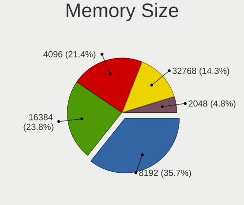

| Size  | Notebooks | Percent |
|-------|-----------|---------|
| 8192  | 15        | 35.71%  |
| 16384 | 10        | 23.81%  |
| 4096  | 9         | 21.43%  |
| 32768 | 6         | 14.29%  |
| 2048  | 2         | 4.76%   |

Memory Speed
------------

Memory module speed

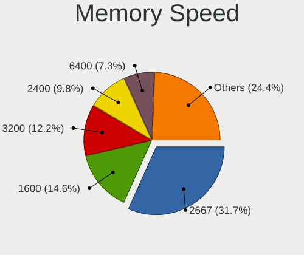

| Speed | Notebooks | Percent |
|-------|-----------|---------|
| 2667  | 13        | 31.71%  |
| 1600  | 6         | 14.63%  |
| 3200  | 5         | 12.2%   |
| 2400  | 4         | 9.76%   |
| 6400  | 3         | 7.32%   |
| 7467  | 2         | 4.88%   |
| 5600  | 2         | 4.88%   |
| 4800  | 1         | 2.44%   |
| 4267  | 1         | 2.44%   |
| 2133  | 1         | 2.44%   |
| 1866  | 1         | 2.44%   |
| 1334  | 1         | 2.44%   |
| 1333  | 1         | 2.44%   |

Printers & scanners
-------------------

Printer Vendor
--------------

Printer device vendors

Zero info for selected period =(

Printer Model
-------------

Printer device models

Zero info for selected period =(

Scanner Vendor
--------------

Scanner device vendors

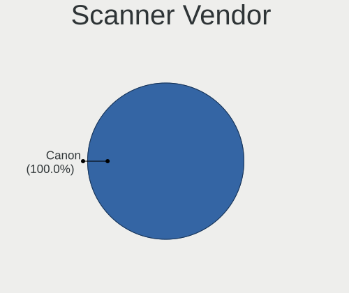

| Vendor | Notebooks | Percent |
|--------|-----------|---------|
| Canon  | 1         | 100%    |

Scanner Model
-------------

Scanner device models

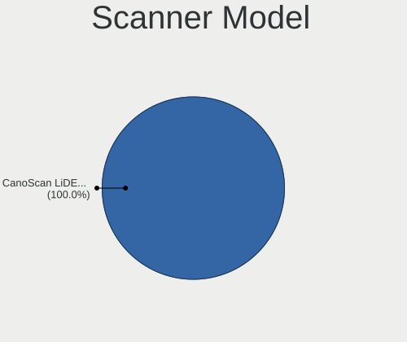

| Model                   | Notebooks | Percent |
|-------------------------|-----------|---------|
| Canon CanoScan LiDE 120 | 1         | 100%    |

Camera
------

Camera Vendor
-------------

Camera device vendors

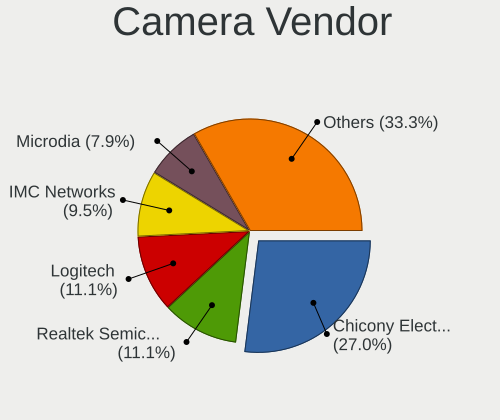

| Vendor                                 | Notebooks | Percent |
|----------------------------------------|-----------|---------|
| Chicony Electronics                    | 17        | 26.98%  |
| Realtek Semiconductor                  | 7         | 11.11%  |
| Logitech                               | 7         | 11.11%  |
| IMC Networks                           | 6         | 9.52%   |
| Microdia                               | 5         | 7.94%   |
| Suyin                                  | 3         | 4.76%   |
| Quanta                                 | 3         | 4.76%   |
| Luxvisions Innotech Limited            | 3         | 4.76%   |
| Lite-On Technology                     | 3         | 4.76%   |
| Cheng Uei Precision Industry (Foxlink) | 3         | 4.76%   |
| Bison Electronics                      | 3         | 4.76%   |
| Microsoft                              | 1         | 1.59%   |
| Generalplus Technology                 | 1         | 1.59%   |
| Apple                                  | 1         | 1.59%   |

Camera Model
------------

Camera device models

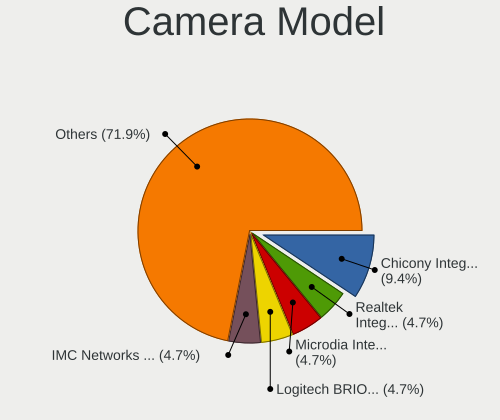

| Model                                                           | Notebooks | Percent |
|-----------------------------------------------------------------|-----------|---------|
| Chicony Integrated Camera                                       | 6         | 9.38%   |
| Realtek Integrated_Webcam_FHD                                   | 3         | 4.69%   |
| Microdia Integrated_Webcam_HD                                   | 3         | 4.69%   |
| Logitech BRIO Ultra HD Webcam                                   | 3         | 4.69%   |
| IMC Networks Integrated Camera                                  | 3         | 4.69%   |
| Realtek Integrated_Webcam_HD                                    | 2         | 3.13%   |
| Quanta HP HD Camera                                             | 2         | 3.13%   |
| Lite-On Integrated Camera                                       | 2         | 3.13%   |
| IMC Networks VGA UVC WebCam                                     | 2         | 3.13%   |
| Chicony TOSHIBA Web Camera - HD                                 | 2         | 3.13%   |
| Chicony Integrated Camera (1280x720@30)                         | 2         | 3.13%   |
| Bison SunplusIT Integrated Camera                               | 2         | 3.13%   |
| Suyin Integrated_Webcam_HD                                      | 1         | 1.56%   |
| Suyin HP Truevision HD                                          | 1         | 1.56%   |
| Suyin Asus Integrated Webcam                                    | 1         | 1.56%   |
| Realtek USB Camera                                              | 1         | 1.56%   |
| Realtek EasyCamera                                              | 1         | 1.56%   |
| Quanta HP Webcam                                                | 1         | 1.56%   |
| Microsoft LifeCam HD-3000                                       | 1         | 1.56%   |
| Microdia Webcam Vitade AF                                       | 1         | 1.56%   |
| Microdia Dell Laptop Integrated Webcam HD                       | 1         | 1.56%   |
| Luxvisions Innotech Limited Integrated RGB Camera               | 1         | 1.56%   |
| Luxvisions Innotech Limited HP 5MP Camera                       | 1         | 1.56%   |
| Luxvisions Innotech Limited EasyCamera 1M                       | 1         | 1.56%   |
| Logitech Webcam C920-C                                          | 1         | 1.56%   |
| Logitech Logitech Webcam C925e                                  | 1         | 1.56%   |
| Logitech HD Webcam C615                                         | 1         | 1.56%   |
| Logitech HD Webcam C510                                         | 1         | 1.56%   |
| Lite-On HP HD Camera                                            | 1         | 1.56%   |
| IMC Networks USB2.0 HD UVC WebCam                               | 1         | 1.56%   |
| Generalplus GENERAL WEBCAM                                      | 1         | 1.56%   |
| Chicony USB2.0 VGA UVC WebCam                                   | 1         | 1.56%   |
| Chicony TOSHIBA Web Camera - FHD                                | 1         | 1.56%   |
| Chicony ThinkPad T490 Webcam                                    | 1         | 1.56%   |
| Chicony Lenovo Integrated Camera (0.3MP)                        | 1         | 1.56%   |
| Chicony Integrated IR Camera                                    | 1         | 1.56%   |
| Chicony HP HD Webcam                                            | 1         | 1.56%   |
| Chicony HP 5MP Camera                                           | 1         | 1.56%   |
| Chicony FJ Camera                                               | 1         | 1.56%   |
| Cheng Uei Precision Industry (Foxlink) HP True Vision HD Camera | 1         | 1.56%   |

Security
--------

Fingerprint Vendor
------------------

Fingerprint sensor vendors

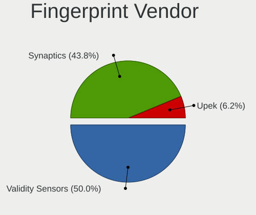

| Vendor                     | Notebooks | Percent |
|----------------------------|-----------|---------|
| Validity Sensors           | 10        | 43.48%  |
| Synaptics                  | 9         | 39.13%  |
| Upek                       | 1         | 4.35%   |
| Shenzhen Goodix Technology | 1         | 4.35%   |
| Elan Microelectronics      | 1         | 4.35%   |
| AuthenTec                  | 1         | 4.35%   |

Fingerprint Model
-----------------

Fingerprint sensor models

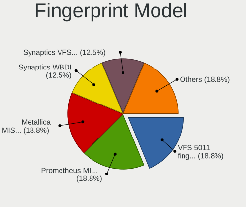

| Model                                                                      | Notebooks | Percent |
|----------------------------------------------------------------------------|-----------|---------|
| Validity Sensors VFS 5011 fingerprint sensor                               | 3         | 13.04%  |
| Synaptics Prometheus MIS Touch Fingerprint Reader                          | 3         | 13.04%  |
| Synaptics Metallica MIS Touch Fingerprint Reader                           | 3         | 13.04%  |
| Validity Sensors VFS495 Fingerprint Reader                                 | 2         | 8.7%    |
| Validity Sensors Synaptics WBDI                                            | 2         | 8.7%    |
| Validity Sensors Synaptics VFS7552 Touch Fingerprint Sensor with PurePrint | 2         | 8.7%    |
| Synaptics FS7604 Touch Fingerprint Sensor with PurePrint                   | 2         | 8.7%    |
| Validity Sensors VFS7500 Touch Fingerprint Sensor                          | 1         | 4.35%   |
| Upek Biometric Touchchip/Touchstrip Fingerprint Sensor                     | 1         | 4.35%   |
| Synaptics WBDI                                                             | 1         | 4.35%   |
| Shenzhen Goodix FingerPrint                                                | 1         | 4.35%   |
| Elan ELAN:Fingerprint                                                      | 1         | 4.35%   |
| AuthenTec Fingerprint Sensor                                               | 1         | 4.35%   |

Chipcard Vendor
---------------

Chipcard module vendors

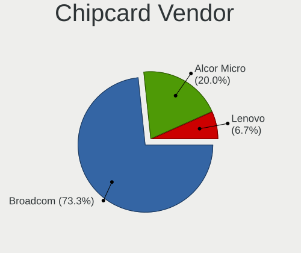

| Vendor      | Notebooks | Percent |
|-------------|-----------|---------|
| Broadcom    | 11        | 73.33%  |
| Alcor Micro | 3         | 20%     |
| Lenovo      | 1         | 6.67%   |

Chipcard Model
--------------

Chipcard module models

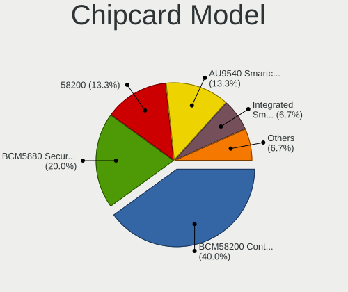

| Model                                                                       | Notebooks | Percent |
|-----------------------------------------------------------------------------|-----------|---------|
| Broadcom BCM58200 ControlVault 3 (FingerPrint sensor + Contacted SmartCard) | 6         | 40%     |
| Broadcom BCM5880 Secure Applications Processor                              | 3         | 20%     |
| Broadcom 58200                                                              | 2         | 13.33%  |
| Alcor Micro AU9540 Smartcard Reader                                         | 2         | 13.33%  |
| Lenovo Integrated Smart Card Reader                                         | 1         | 6.67%   |
| Alcor Micro Watchdata W 1981                                                | 1         | 6.67%   |

Unsupported
-----------

Unsupported Devices
-------------------

Total unsupported devices on board

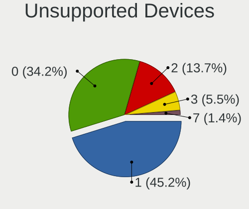

| Total | Notebooks | Percent |
|-------|-----------|---------|
| 1     | 33        | 45.21%  |
| 0     | 25        | 34.25%  |
| 2     | 10        | 13.7%   |
| 3     | 4         | 5.48%   |
| 7     | 1         | 1.37%   |

Unsupported Device Types
------------------------

Types of unsupported devices

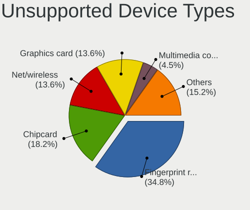

| Type                     | Notebooks | Percent |
|--------------------------|-----------|---------|
| Fingerprint reader       | 23        | 34.85%  |
| Chipcard                 | 12        | 18.18%  |
| Net/wireless             | 9         | 13.64%  |
| Graphics card            | 9         | 13.64%  |
| Multimedia controller    | 3         | 4.55%   |
| Storage                  | 2         | 3.03%   |
| Sound                    | 2         | 3.03%   |
| Card reader              | 2         | 3.03%   |
| Bluetooth                | 2         | 3.03%   |
| Net/ethernet             | 1         | 1.52%   |
| Communication controller | 1         | 1.52%   |

