Oracle Linux - Tested Hardware & Statistics (Notebooks)
-------------------------------------------------------

A project to collect tested hardware configurations for Oracle Linux.

Anyone can contribute to this report by the [hw-probe](https://github.com/linuxhw/hw-probe) tool:

    sudo -E hw-probe -all -upload

Please contribute! Especially if your hardware is rare.

Contents
--------

* [ Test Cases ](#test-cases)

* [ System ](#system)
  - [ OS                       ](#os)
  - [ OS Family                ](#os-family)
  - [ Kernel                   ](#kernel)
  - [ Kernel Family            ](#kernel-family)
  - [ Kernel Major Ver.        ](#kernel-major-ver)
  - [ Arch                     ](#arch)
  - [ DE                       ](#de)
  - [ Display Server           ](#display-server)
  - [ Display Manager          ](#display-manager)
  - [ OS Lang                  ](#os-lang)
  - [ Boot Mode                ](#boot-mode)
  - [ Filesystem               ](#filesystem)
  - [ Part. scheme             ](#part-scheme)
  - [ Dual Boot with Linux/BSD ](#dual-boot-with-linuxbsd)
  - [ Dual Boot (Win)          ](#dual-boot-win)

* [ Board ](#board)
  - [ Vendor                   ](#vendor)
  - [ Model                    ](#model)
  - [ Model Family             ](#model-family)
  - [ MFG Year                 ](#mfg-year)
  - [ Form Factor              ](#form-factor)
  - [ Secure Boot              ](#secure-boot)
  - [ Coreboot                 ](#coreboot)
  - [ RAM Size                 ](#ram-size)
  - [ RAM Used                 ](#ram-used)
  - [ Total Drives             ](#total-drives)
  - [ Has CD-ROM               ](#has-cd-rom)
  - [ Has Ethernet             ](#has-ethernet)
  - [ Has WiFi                 ](#has-wifi)
  - [ Has Bluetooth            ](#has-bluetooth)

* [ Location ](#location)
  - [ Country                  ](#country)
  - [ City                     ](#city)

* [ Drives ](#drives)
  - [ Drive Vendor             ](#drive-vendor)
  - [ Drive Model              ](#drive-model)
  - [ HDD Vendor               ](#hdd-vendor)
  - [ SSD Vendor               ](#ssd-vendor)
  - [ Drive Kind               ](#drive-kind)
  - [ Drive Connector          ](#drive-connector)
  - [ Drive Size               ](#drive-size)
  - [ Space Total              ](#space-total)
  - [ Space Used               ](#space-used)
  - [ Malfunc. Drives          ](#malfunc-drives)
  - [ Malfunc. Drive Vendor    ](#malfunc-drive-vendor)
  - [ Malfunc. HDD Vendor      ](#malfunc-hdd-vendor)
  - [ Malfunc. Drive Kind      ](#malfunc-drive-kind)
  - [ Failed Drives            ](#failed-drives)
  - [ Failed Drive Vendor      ](#failed-drive-vendor)
  - [ Drive Status             ](#drive-status)

* [ Storage controller ](#storage-controller)
  - [ Storage Vendor           ](#storage-vendor)
  - [ Storage Model            ](#storage-model)
  - [ Storage Kind             ](#storage-kind)

* [ Processor ](#processor)
  - [ CPU Vendor               ](#cpu-vendor)
  - [ CPU Model                ](#cpu-model)
  - [ CPU Model Family         ](#cpu-model-family)
  - [ CPU Cores                ](#cpu-cores)
  - [ CPU Sockets              ](#cpu-sockets)
  - [ CPU Threads              ](#cpu-threads)
  - [ CPU Op-Modes             ](#cpu-op-modes)
  - [ CPU Microcode            ](#cpu-microcode)
  - [ CPU Microarch            ](#cpu-microarch)

* [ Graphics ](#graphics)
  - [ GPU Vendor               ](#gpu-vendor)
  - [ GPU Model                ](#gpu-model)
  - [ GPU Combo                ](#gpu-combo)
  - [ GPU Driver               ](#gpu-driver)
  - [ GPU Memory               ](#gpu-memory)

* [ Monitor ](#monitor)
  - [ Monitor Vendor           ](#monitor-vendor)
  - [ Monitor Model            ](#monitor-model)
  - [ Monitor Resolution       ](#monitor-resolution)
  - [ Monitor Diagonal         ](#monitor-diagonal)
  - [ Monitor Width            ](#monitor-width)
  - [ Aspect Ratio             ](#aspect-ratio)
  - [ Monitor Area             ](#monitor-area)
  - [ Pixel Density            ](#pixel-density)
  - [ Multiple Monitors        ](#multiple-monitors)

* [ Network ](#network)
  - [ Net Controller Vendor    ](#net-controller-vendor)
  - [ Net Controller Model     ](#net-controller-model)
  - [ Wireless Vendor          ](#wireless-vendor)
  - [ Wireless Model           ](#wireless-model)
  - [ Ethernet Vendor          ](#ethernet-vendor)
  - [ Ethernet Model           ](#ethernet-model)
  - [ Net Controller Kind      ](#net-controller-kind)
  - [ Used Controller          ](#used-controller)
  - [ NICs                     ](#nics)
  - [ IPv6                     ](#ipv6)

* [ Bluetooth ](#bluetooth)
  - [ Bluetooth Vendor         ](#bluetooth-vendor)
  - [ Bluetooth Model          ](#bluetooth-model)

* [ Sound ](#sound)
  - [ Sound Vendor             ](#sound-vendor)
  - [ Sound Model              ](#sound-model)

* [ Memory ](#memory)
  - [ Memory Vendor            ](#memory-vendor)
  - [ Memory Model             ](#memory-model)
  - [ Memory Kind              ](#memory-kind)
  - [ Memory Form Factor       ](#memory-form-factor)
  - [ Memory Size              ](#memory-size)
  - [ Memory Speed             ](#memory-speed)

* [ Printers & scanners ](#printers--scanners)
  - [ Printer Vendor           ](#printer-vendor)
  - [ Printer Model            ](#printer-model)
  - [ Scanner Vendor           ](#scanner-vendor)
  - [ Scanner Model            ](#scanner-model)

* [ Camera ](#camera)
  - [ Camera Vendor            ](#camera-vendor)
  - [ Camera Model             ](#camera-model)

* [ Security ](#security)
  - [ Fingerprint Vendor       ](#fingerprint-vendor)
  - [ Fingerprint Model        ](#fingerprint-model)
  - [ Chipcard Vendor          ](#chipcard-vendor)
  - [ Chipcard Model           ](#chipcard-model)

* [ Unsupported ](#unsupported)
  - [ Unsupported Devices      ](#unsupported-devices)
  - [ Unsupported Device Types ](#unsupported-device-types)

Test Cases
----------

Total: 71

| Vendor    | Model                       | Probe                                                      | Date         |
|-----------|-----------------------------|------------------------------------------------------------|--------------|
| Dell      | Latitude 7440               | [47f28d7b00](https://linux-hardware.org/?probe=47f28d7b00) | Sep 04, 2023 |
| Dell      | Latitude 7440               | [27b2ae9d5b](https://linux-hardware.org/?probe=27b2ae9d5b) | Sep 04, 2023 |
| HP        | ZBook Fury 16 G9 Mobile ... | [4b7e25150a](https://linux-hardware.org/?probe=4b7e25150a) | Aug 15, 2023 |
| MSI       | P65 Creator 8RE             | [853567f156](https://linux-hardware.org/?probe=853567f156) | Aug 06, 2023 |
| MSI       | P65 Creator 8RE             | [f26344a920](https://linux-hardware.org/?probe=f26344a920) | Aug 05, 2023 |
| Dell      | Latitude 7430               | [299e6897d2](https://linux-hardware.org/?probe=299e6897d2) | Jun 05, 2023 |
| Lenovo    | ThinkPad T490 20N3S3XR00    | [0f80e19e5b](https://linux-hardware.org/?probe=0f80e19e5b) | May 23, 2023 |
| Lenovo    | ThinkPad W541 20EGS1PL00    | [751cc5dbc7](https://linux-hardware.org/?probe=751cc5dbc7) | May 22, 2023 |
| ASUSTek   | ZenBook UX425EA_UX425EA     | [9be6e0f395](https://linux-hardware.org/?probe=9be6e0f395) | Apr 18, 2023 |
| HP        | Laptop 17-cp0xxx            | [e87b8175b1](https://linux-hardware.org/?probe=e87b8175b1) | Jan 27, 2023 |
| HP        | Laptop 17-cp0xxx            | [70019cbdbf](https://linux-hardware.org/?probe=70019cbdbf) | Jan 25, 2023 |
| Google    | Lick                        | [d792b79719](https://linux-hardware.org/?probe=d792b79719) | Jan 12, 2023 |
| Panasonic | CF-53AAG54FM                | [cf7f652846](https://linux-hardware.org/?probe=cf7f652846) | Dec 21, 2022 |
| Lenovo    | ThinkPad T470 20HES0E71M    | [85fc801717](https://linux-hardware.org/?probe=85fc801717) | Dec 05, 2022 |
| Lenovo    | ThinkPad P70 20ESS04S00     | [01b85c4c2a](https://linux-hardware.org/?probe=01b85c4c2a) | Nov 10, 2022 |
| Lenovo    | ThinkPad T470 20HES21434    | [39ff1846e3](https://linux-hardware.org/?probe=39ff1846e3) | Oct 23, 2022 |
| Dynabook  | PORTEGE X40-G               | [fc68a9cdbf](https://linux-hardware.org/?probe=fc68a9cdbf) | Oct 03, 2022 |
| HP        | EliteBook 840 G5            | [2709daf415](https://linux-hardware.org/?probe=2709daf415) | Sep 13, 2022 |
| Lenovo    | Legion 5 15IMH05 82AU       | [bd4737dfcf](https://linux-hardware.org/?probe=bd4737dfcf) | Aug 18, 2022 |
| Dell      | Inspiron 5502               | [28dcf01e88](https://linux-hardware.org/?probe=28dcf01e88) | Aug 03, 2022 |
| Lenovo    | Legion 5 15IMH05 82AU       | [3dddb3aac3](https://linux-hardware.org/?probe=3dddb3aac3) | Jul 20, 2022 |
| Lenovo    | ThinkPad P70 20ESS04S00     | [fc29967bed](https://linux-hardware.org/?probe=fc29967bed) | Jun 17, 2022 |
| HP        | Compaq 6730b                | [dd94c9145b](https://linux-hardware.org/?probe=dd94c9145b) | Jun 11, 2022 |
| Lenovo    | ThinkPad T410 2518A37       | [04e81b8b3f](https://linux-hardware.org/?probe=04e81b8b3f) | Jun 04, 2022 |
| Lenovo    | ThinkPad T430s 2355C33      | [33de2bbd12](https://linux-hardware.org/?probe=33de2bbd12) | May 31, 2022 |
| Lenovo    | ThinkPad T430s 2355C33      | [4eab57bebf](https://linux-hardware.org/?probe=4eab57bebf) | May 30, 2022 |
| Dell      | Precision M4600             | [0ac2adfe5a](https://linux-hardware.org/?probe=0ac2adfe5a) | Apr 21, 2022 |
| Dell      | Precision M4800             | [fb13b19803](https://linux-hardware.org/?probe=fb13b19803) | Apr 21, 2022 |
| Lenovo    | ThinkPad P50s 20FL000MUS    | [99fbb4446c](https://linux-hardware.org/?probe=99fbb4446c) | Apr 16, 2022 |
| Lenovo    | ThinkPad X1 Extreme 2nd ... | [b708e920f3](https://linux-hardware.org/?probe=b708e920f3) | Mar 21, 2022 |
| Lenovo    | ThinkPad T450 20BUS14900    | [bd60aae97a](https://linux-hardware.org/?probe=bd60aae97a) | Mar 11, 2022 |
| Lenovo    | ThinkPad T480 20L5A07TAU    | [755854f7d4](https://linux-hardware.org/?probe=755854f7d4) | Mar 11, 2022 |
| Lenovo    | ThinkPad X280 20KES4H34G    | [2b8a4f4664](https://linux-hardware.org/?probe=2b8a4f4664) | Mar 10, 2022 |
| Dell      | Latitude 7420               | [af5f1055fe](https://linux-hardware.org/?probe=af5f1055fe) | Mar 10, 2022 |
| HP        | ProBook 445 G6              | [88d8b32328](https://linux-hardware.org/?probe=88d8b32328) | Jan 26, 2022 |
| Lenovo    | ThinkPad T450 20BUS14900    | [44c8e11f02](https://linux-hardware.org/?probe=44c8e11f02) | Dec 22, 2021 |
| Lenovo    | IdeaPad 300-15ISK 80RS      | [1c9ca21f4e](https://linux-hardware.org/?probe=1c9ca21f4e) | Dec 10, 2021 |
| Dell      | Latitude 7410               | [3efa87284e](https://linux-hardware.org/?probe=3efa87284e) | Nov 18, 2021 |
| Dell      | Latitude E6420              | [b809392380](https://linux-hardware.org/?probe=b809392380) | Oct 08, 2021 |
| Dell      | Latitude 7410               | [8f1a1a4798](https://linux-hardware.org/?probe=8f1a1a4798) | Sep 06, 2021 |
| Dell      | Latitude 7410               | [b03a0e0152](https://linux-hardware.org/?probe=b03a0e0152) | Sep 06, 2021 |
| Lenovo    | Legion 5 15IMH05 82AU       | [7b393c5790](https://linux-hardware.org/?probe=7b393c5790) | Aug 21, 2021 |
| Lenovo    | Legion 5 15IMH05 82AU       | [394c99adc8](https://linux-hardware.org/?probe=394c99adc8) | Aug 19, 2021 |
| Dell      | Inspiron 3542               | [0909599e9c](https://linux-hardware.org/?probe=0909599e9c) | Aug 11, 2021 |
| Lenovo    | Legion 5 15IMH05 82AU       | [ba7afba1a6](https://linux-hardware.org/?probe=ba7afba1a6) | Jul 08, 2021 |
| Lenovo    | ThinkPad L490 20Q5CTO1WW    | [0225c17d79](https://linux-hardware.org/?probe=0225c17d79) | Jul 02, 2021 |
| Lenovo    | Legion 5 15IMH05 82AU       | [505b82b2de](https://linux-hardware.org/?probe=505b82b2de) | Jun 06, 2021 |
| Lenovo    | Legion 5 15IMH05 82AU       | [75b2ef5126](https://linux-hardware.org/?probe=75b2ef5126) | May 13, 2021 |
| Lenovo    | Legion 5 15IMH05 82AU       | [734a4fbc56](https://linux-hardware.org/?probe=734a4fbc56) | May 09, 2021 |
| ASUSTek   | UX305FA                     | [0bf50fba2d](https://linux-hardware.org/?probe=0bf50fba2d) | Mar 15, 2021 |
| Lenovo    | IdeaPad Slim 1-14AST-05 ... | [ff355a9bb1](https://linux-hardware.org/?probe=ff355a9bb1) | Mar 11, 2021 |
| Lenovo    | IdeaPad Slim 1-14AST-05 ... | [9f67379954](https://linux-hardware.org/?probe=9f67379954) | Mar 04, 2021 |
| Lenovo    | ThinkPad L490 20Q5CTO1WW    | [db0f24aee5](https://linux-hardware.org/?probe=db0f24aee5) | Mar 01, 2021 |
| Dell      | Latitude 7410               | [5b725b01aa](https://linux-hardware.org/?probe=5b725b01aa) | Feb 26, 2021 |
| Lenovo    | Legion 5 15IMH05 82AU       | [835e8cad03](https://linux-hardware.org/?probe=835e8cad03) | Feb 25, 2021 |
| Dell      | Latitude 7410               | [430ac9fa0c](https://linux-hardware.org/?probe=430ac9fa0c) | Feb 24, 2021 |
| Lenovo    | ThinkPad T490 20N3S77600    | [26e61c39f2](https://linux-hardware.org/?probe=26e61c39f2) | Feb 24, 2021 |
| Dell      | Latitude 7410               | [7aeb2cc674](https://linux-hardware.org/?probe=7aeb2cc674) | Feb 22, 2021 |
| Lenovo    | IdeaPad Slim 1-14AST-05 ... | [8af2c8d83c](https://linux-hardware.org/?probe=8af2c8d83c) | Feb 05, 2021 |
| Lenovo    | IdeaPad Slim 1-14AST-05 ... | [7ea3c87bfe](https://linux-hardware.org/?probe=7ea3c87bfe) | Jan 06, 2021 |
| Standard  | BW Series                   | [1f6cf82ba8](https://linux-hardware.org/?probe=1f6cf82ba8) | Jun 13, 2020 |
| HP        | Notebook                    | [e3c242a846](https://linux-hardware.org/?probe=e3c242a846) | May 24, 2020 |
| Lenovo    | ThinkPad L490 20Q5CTO1WW    | [d8b2c132c1](https://linux-hardware.org/?probe=d8b2c132c1) | Apr 09, 2020 |
| HP        | ZBook 15                    | [4723616d8c](https://linux-hardware.org/?probe=4723616d8c) | Apr 09, 2020 |
| Lenovo    | ThinkPad L490 20Q5CTO1WW    | [1acbabb197](https://linux-hardware.org/?probe=1acbabb197) | Apr 06, 2020 |
| Lenovo    | ThinkPad T480 20L6S56Y2X    | [5343997520](https://linux-hardware.org/?probe=5343997520) | Feb 23, 2020 |
| ASUSTek   | X510UR                      | [914b9fbe64](https://linux-hardware.org/?probe=914b9fbe64) | Feb 04, 2020 |
| ASUSTek   | X510UR                      | [014d5ef0c8](https://linux-hardware.org/?probe=014d5ef0c8) | Jan 28, 2020 |
| ASUSTek   | X510UR                      | [9d05b420d4](https://linux-hardware.org/?probe=9d05b420d4) | Jan 28, 2020 |
| Lenovo    | ThinkPad L540 20AVCTO1WW    | [8c1dba9d6e](https://linux-hardware.org/?probe=8c1dba9d6e) | Sep 10, 2019 |
| Lenovo    | ThinkPad T480 20L6S56Y2X    | [f012a475eb](https://linux-hardware.org/?probe=f012a475eb) | Apr 11, 2019 |

System
------

OS
--

Installed operating systems

| Name             | Notebooks | Percent |
|------------------|-----------|---------|
| Oracle Linux 8.5 | 11        | 21.57%  |
| Oracle Linux 8.3 | 6         | 11.76%  |
| Oracle Linux 8.4 | 5         | 9.8%    |
| Oracle Linux 7.9 | 4         | 7.84%   |
| Oracle Linux 9.2 | 3         | 5.88%   |
| Oracle Linux 9.1 | 3         | 5.88%   |
| Oracle Linux 9.0 | 3         | 5.88%   |
| Oracle Linux 8.8 | 3         | 5.88%   |
| Oracle Linux 8.1 | 3         | 5.88%   |
| Oracle Linux 8.7 | 2         | 3.92%   |
| Oracle Linux 8.6 | 2         | 3.92%   |
| Oracle Linux 7.8 | 2         | 3.92%   |
| Oracle Linux 7.7 | 2         | 3.92%   |
| Oracle Linux 8.2 | 1         | 1.96%   |
| Oracle Linux 7.6 | 1         | 1.96%   |

OS Family
---------

OS without a version

| Name         | Notebooks | Percent |
|--------------|-----------|---------|
| Oracle Linux | 44        | 100%    |

Kernel
------

Version of the Linux kernel

| Version                           | Notebooks | Percent |
|-----------------------------------|-----------|---------|
| 5.4.17-2036.103.3.1.el8uek.x86_64 | 3         | 5.36%   |
| 4.18.0-348.12.2.el8_5.x86_64      | 3         | 5.36%   |
| 5.4.17-2136.304.4.3.el8uek.x86_64 | 2         | 3.57%   |
| 5.4.17-2102.202.5.el8uek.x86_64   | 2         | 3.57%   |
| 5.15.0-2.52.3.el9uek.x86_64       | 2         | 3.57%   |
| 5.15.0-100.96.32.el8uek.x86_64    | 2         | 3.57%   |
| 4.18.0-147.3.1.el8_1.x86_64       | 2         | 3.57%   |
| 5.4.17-2136.318.7.2.el8uek.x86_64 | 1         | 1.79%   |
| 5.4.17-2136.312.3.4.el7uek.x86_64 | 1         | 1.79%   |
| 5.4.17-2136.310.7.el8uek.x86_64   | 1         | 1.79%   |
| 5.4.17-2136.309.4.el8uek.x86_64   | 1         | 1.79%   |
| 5.4.17-2136.308.9.el7uek.x86_64   | 1         | 1.79%   |
| 5.4.17-2136.306.1.3.el8uek.x86_64 | 1         | 1.79%   |
| 5.4.17-2136.305.5.4.el8uek.x86_64 | 1         | 1.79%   |
| 5.4.17-2136.305.5.3.el8uek.x86_64 | 1         | 1.79%   |
| 5.4.17-2136.305.5.2.el8uek.x86_64 | 1         | 1.79%   |
| 5.4.17-2136.301.1.4.el8uek.x86_64 | 1         | 1.79%   |
| 5.4.17-2136.300.7.el8uek.x86_64   | 1         | 1.79%   |
| 5.4.17-2102.205.7.3.el8uek.x86_64 | 1         | 1.79%   |
| 5.4.17-2102.204.4.4.el8uek.x86_64 | 1         | 1.79%   |
| 5.4.17-2102.204.4.2.el8uek.x86_64 | 1         | 1.79%   |
| 5.4.17-2102.201.3.el8uek.x86_64   | 1         | 1.79%   |
| 5.4.17-2102.200.13.el8uek.x86_64  | 1         | 1.79%   |
| 5.4.17-2036.104.4.el8uek.x86_64   | 1         | 1.79%   |
| 5.4.17-2011.0.7.el8uek.x86_64     | 1         | 1.79%   |
| 5.15.2-1.el8.elrepo.x86_64        | 1         | 1.79%   |
| 5.15.0-5.76.5.1.el9uek.x86_64     | 1         | 1.79%   |
| 5.15.0-101.103.2.1.el9uek.x86_64  | 1         | 1.79%   |
| 5.15.0-101.103.2.1.el8uek.x86_64  | 1         | 1.79%   |
| 5.15.0-100.76.15.el9uek.x86_64    | 1         | 1.79%   |
| 5.15.0-0.30.20.1.el9uek.x86_64    | 1         | 1.79%   |
| 5.14.1-1.el8.elrepo.x86_64        | 1         | 1.79%   |
| 5.14.0-70.13.1.0.3.el9_0.x86_64   | 1         | 1.79%   |
| 5.14.0-284.25.1.0.1.el9_2.x86_64  | 1         | 1.79%   |
| 5.14.0-284.11.1.el9_2.x86_64      | 1         | 1.79%   |
| 5.11.1-1.el8.elrepo.x86_64        | 1         | 1.79%   |
| 4.18.0-425.3.1.el8.x86_64         | 1         | 1.79%   |
| 4.18.0-240.15.1.el8_3.x86_64      | 1         | 1.79%   |
| 4.18.0-240.10.1.el8_3.x86_64      | 1         | 1.79%   |
| 4.18.0-193.1.2.el8_2.x86_64       | 1         | 1.79%   |

Kernel Family
-------------

Linux kernel without a distro release

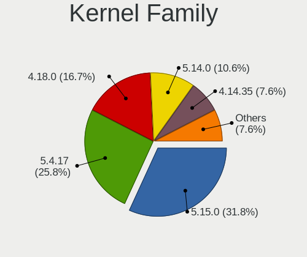

| Version | Notebooks | Percent |
|---------|-----------|---------|
| 5.4.17  | 16        | 34.78%  |
| 5.15.0  | 9         | 19.57%  |
| 4.18.0  | 8         | 17.39%  |
| 4.14.35 | 5         | 10.87%  |
| 5.14.0  | 3         | 6.52%   |
| 5.15.2  | 1         | 2.17%   |
| 5.14.1  | 1         | 2.17%   |
| 5.11.1  | 1         | 2.17%   |
| 4.1.12  | 1         | 2.17%   |
| 3.10.0  | 1         | 2.17%   |

Kernel Major Ver.
-----------------

Linux kernel major version

| Version | Notebooks | Percent |
|---------|-----------|---------|
| 5.4     | 16        | 34.78%  |
| 5.15    | 10        | 21.74%  |
| 4.18    | 8         | 17.39%  |
| 4.14    | 5         | 10.87%  |
| 5.14    | 4         | 8.7%    |
| 5.11    | 1         | 2.17%   |
| 4.1     | 1         | 2.17%   |
| 3.10    | 1         | 2.17%   |

Arch
----

OS architecture (x86_64, i586, etc.)

| Name   | Notebooks | Percent |
|--------|-----------|---------|
| x86_64 | 44        | 100%    |

DE
--

Desktop Environment

| Name          | Notebooks | Percent |
|---------------|-----------|---------|
| GNOME         | 36        | 75%     |
| Unknown       | 3         | 6.25%   |
| XFCE          | 2         | 4.17%   |
| MATE          | 2         | 4.17%   |
| KDE4          | 2         | 4.17%   |
| GNOME Classic | 2         | 4.17%   |
| KDE5          | 1         | 2.08%   |

Display Server
--------------

X11 or Wayland

| Name    | Notebooks | Percent |
|---------|-----------|---------|
| Wayland | 26        | 56.52%  |
| X11     | 18        | 39.13%  |
| Unknown | 2         | 4.35%   |

Display Manager
---------------

SDDM, LightDM, etc.

| Name    | Notebooks | Percent |
|---------|-----------|---------|
| GDM     | 25        | 54.35%  |
| Unknown | 20        | 43.48%  |
| SDDM    | 1         | 2.17%   |

OS Lang
-------

Language

| Lang    | Notebooks | Percent |
|---------|-----------|---------|
| en_US   | 30        | 66.67%  |
| en_GB   | 3         | 6.67%   |
| en_AU   | 3         | 6.67%   |
| de_DE   | 3         | 6.67%   |
| Unknown | 2         | 4.44%   |
| zh_HK   | 1         | 2.22%   |
| pt_BR   | 1         | 2.22%   |
| pl_PL   | 1         | 2.22%   |
| en_IN   | 1         | 2.22%   |

Boot Mode
---------

EFI or BIOS

| Mode | Notebooks | Percent |
|------|-----------|---------|
| EFI  | 28        | 62.22%  |
| BIOS | 17        | 37.78%  |

Filesystem
----------

Type of filesystem

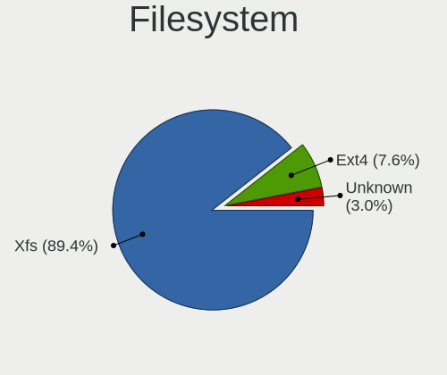

| Type    | Notebooks | Percent |
|---------|-----------|---------|
| Xfs     | 40        | 86.96%  |
| Ext4    | 4         | 8.7%    |
| Unknown | 2         | 4.35%   |

Part. scheme
------------

Scheme of partitioning

| Type    | Notebooks | Percent |
|---------|-----------|---------|
| GPT     | 20        | 43.48%  |
| Unknown | 20        | 43.48%  |
| MBR     | 6         | 13.04%  |

Dual Boot with Linux/BSD
------------------------

Hosting more than one Linux/BSD

| Dual boot | Notebooks | Percent |
|-----------|-----------|---------|
| No        | 41        | 91.11%  |
| Yes       | 4         | 8.89%   |

Dual Boot (Win)
---------------

Hosting Linux and Windows

| Dual boot | Notebooks | Percent |
|-----------|-----------|---------|
| No        | 42        | 95.45%  |
| Yes       | 2         | 4.55%   |

Board
-----

Vendor
------

Motherboard manufacturer

| Name             | Notebooks | Percent |
|------------------|-----------|---------|
| Lenovo           | 19        | 43.18%  |
| Dell             | 9         | 20.45%  |
| Hewlett-Packard  | 7         | 15.91%  |
| ASUSTek Computer | 4         | 9.09%   |
| Standard         | 1         | 2.27%   |
| Panasonic        | 1         | 2.27%   |
| MSI              | 1         | 2.27%   |
| Google           | 1         | 2.27%   |
| Dynabook         | 1         | 2.27%   |

Model
-----

Motherboard model

| Name                                      | Notebooks | Percent |
|-------------------------------------------|-----------|---------|
| Lenovo ThinkPad T450 20BUS14900           | 2         | 4.55%   |
| ASUS X510UR                               | 2         | 4.55%   |
| Standard BW Series                        | 1         | 2.27%   |
| Panasonic CF-53AAG54FM                    | 1         | 2.27%   |
| MSI P65 Creator 8RE                       | 1         | 2.27%   |
| Lenovo ThinkPad X280 20KES4H34G           | 1         | 2.27%   |
| Lenovo ThinkPad X1 Extreme 2nd 20QWS1R800 | 1         | 2.27%   |
| Lenovo ThinkPad W541 20EGS1PL00           | 1         | 2.27%   |
| Lenovo ThinkPad T490 20N3S77600           | 1         | 2.27%   |
| Lenovo ThinkPad T490 20N3S3XR00           | 1         | 2.27%   |
| Lenovo ThinkPad T480 20L6S56Y2X           | 1         | 2.27%   |
| Lenovo ThinkPad T480 20L5A07TAU           | 1         | 2.27%   |
| Lenovo ThinkPad T470 20HES21434           | 1         | 2.27%   |
| Lenovo ThinkPad T470 20HES0E71M           | 1         | 2.27%   |
| Lenovo ThinkPad T430s 2355C33             | 1         | 2.27%   |
| Lenovo ThinkPad P70 20ESS04S00            | 1         | 2.27%   |
| Lenovo ThinkPad P50s 20FL000MUS           | 1         | 2.27%   |
| Lenovo ThinkPad L540 20AVCTO1WW           | 1         | 2.27%   |
| Lenovo ThinkPad L490 20Q5CTO1WW           | 1         | 2.27%   |
| Lenovo Legion 5 15IMH05 82AU              | 1         | 2.27%   |
| Lenovo IdeaPad Slim 1-14AST-05 81VS       | 1         | 2.27%   |
| Lenovo IdeaPad 300-15ISK 80RS             | 1         | 2.27%   |
| HP ZBook Fury 16 G9 Mobile Workstation PC | 1         | 2.27%   |
| HP ZBook 15                               | 1         | 2.27%   |
| HP ProBook 445 G6                         | 1         | 2.27%   |
| HP Notebook                               | 1         | 2.27%   |
| HP Laptop 17-cp0xxx                       | 1         | 2.27%   |
| HP EliteBook 840 G5                       | 1         | 2.27%   |
| HP Compaq 6730b                           | 1         | 2.27%   |
| Google Lick                               | 1         | 2.27%   |
| Dynabook PORTEGE X40-G                    | 1         | 2.27%   |
| Dell Precision M4800                      | 1         | 2.27%   |
| Dell Precision M4600                      | 1         | 2.27%   |
| Dell Latitude E6420                       | 1         | 2.27%   |
| Dell Latitude 7440                        | 1         | 2.27%   |
| Dell Latitude 7430                        | 1         | 2.27%   |
| Dell Latitude 7420                        | 1         | 2.27%   |
| Dell Latitude 7410                        | 1         | 2.27%   |
| Dell Inspiron 5502                        | 1         | 2.27%   |
| Dell Inspiron 3542                        | 1         | 2.27%   |

Model Family
------------

Motherboard model prefix

| Name                   | Notebooks | Percent |
|------------------------|-----------|---------|
| Lenovo ThinkPad        | 16        | 36.36%  |
| Dell Latitude          | 5         | 11.36%  |
| Lenovo IdeaPad         | 2         | 4.55%   |
| HP ZBook               | 2         | 4.55%   |
| Dell Precision         | 2         | 4.55%   |
| Dell Inspiron          | 2         | 4.55%   |
| ASUS X510UR            | 2         | 4.55%   |
| Standard BW            | 1         | 2.27%   |
| Panasonic CF-53AAG54FM | 1         | 2.27%   |
| MSI P65                | 1         | 2.27%   |
| Lenovo Legion          | 1         | 2.27%   |
| HP ProBook             | 1         | 2.27%   |
| HP Notebook            | 1         | 2.27%   |
| HP Laptop              | 1         | 2.27%   |
| HP EliteBook           | 1         | 2.27%   |
| HP Compaq              | 1         | 2.27%   |
| Google Lick            | 1         | 2.27%   |
| Dynabook PORTEGE       | 1         | 2.27%   |
| ASUS ZenBook           | 1         | 2.27%   |
| ASUS UX305FA           | 1         | 2.27%   |

MFG Year
--------

Motherboard manufacture year

| Year | Notebooks | Percent |
|------|-----------|---------|
| 2019 | 7         | 15.91%  |
| 2020 | 5         | 11.36%  |
| 2014 | 5         | 11.36%  |
| 2018 | 4         | 9.09%   |
| 2017 | 4         | 9.09%   |
| 2016 | 4         | 9.09%   |
| 2022 | 3         | 6.82%   |
| 2011 | 3         | 6.82%   |
| 2021 | 2         | 4.55%   |
| 2015 | 2         | 4.55%   |
| 2013 | 2         | 4.55%   |
| 2023 | 1         | 2.27%   |
| 2012 | 1         | 2.27%   |
| 2008 | 1         | 2.27%   |

Form Factor
-----------

Physical design of the computer

| Name     | Notebooks | Percent |
|----------|-----------|---------|
| Notebook | 44        | 100%    |

Secure Boot
-----------

Enabled or disabled

| State    | Notebooks | Percent |
|----------|-----------|---------|
| Disabled | 37        | 82.22%  |
| Enabled  | 8         | 17.78%  |

Coreboot
--------

Have coreboot on board

| Used | Notebooks | Percent |
|------|-----------|---------|
| No   | 43        | 97.73%  |
| Yes  | 1         | 2.27%   |

RAM Size
--------

Total RAM memory

| Size in GB  | Notebooks | Percent |
|-------------|-----------|---------|
| 32.01-64.0  | 14        | 31.11%  |
| 8.01-16.0   | 14        | 31.11%  |
| 4.01-8.0    | 6         | 13.33%  |
| 3.01-4.0    | 5         | 11.11%  |
| 16.01-24.0  | 4         | 8.89%   |
| 64.01-256.0 | 2         | 4.44%   |

RAM Used
--------

Used RAM memory

| Used GB    | Notebooks | Percent |
|------------|-----------|---------|
| 4.01-8.0   | 19        | 37.25%  |
| 2.01-3.0   | 12        | 23.53%  |
| 3.01-4.0   | 9         | 17.65%  |
| 8.01-16.0  | 7         | 13.73%  |
| 1.01-2.0   | 2         | 3.92%   |
| 24.01-32.0 | 1         | 1.96%   |
| 0.51-1.0   | 1         | 1.96%   |

Total Drives
------------

Number of drives on board

| Drives | Notebooks | Percent |
|--------|-----------|---------|
| 1      | 37        | 82.22%  |
| 2      | 6         | 13.33%  |
| 4      | 1         | 2.22%   |
| 3      | 1         | 2.22%   |

Has CD-ROM
----------

Has CD-ROM on board

| Presented | Notebooks | Percent |
|-----------|-----------|---------|
| No        | 35        | 79.55%  |
| Yes       | 9         | 20.45%  |

Has Ethernet
------------

Has Ethernet on board

| Presented | Notebooks | Percent |
|-----------|-----------|---------|
| Yes       | 35        | 79.55%  |
| No        | 9         | 20.45%  |

Has WiFi
--------

Has WiFi module

| Presented | Notebooks | Percent |
|-----------|-----------|---------|
| Yes       | 43        | 97.73%  |
| No        | 1         | 2.27%   |

Has Bluetooth
-------------

Has Bluetooth module

| Presented | Notebooks | Percent |
|-----------|-----------|---------|
| Yes       | 30        | 66.67%  |
| No        | 15        | 33.33%  |

Location
--------

Country
-------

Geographic location (country)

| Country     | Notebooks | Percent |
|-------------|-----------|---------|
| USA         | 16        | 35.56%  |
| Germany     | 4         | 8.89%   |
| UK          | 3         | 6.67%   |
| Netherlands | 3         | 6.67%   |
| Brazil      | 3         | 6.67%   |
| Australia   | 3         | 6.67%   |
| Poland      | 2         | 4.44%   |
| Yemen       | 1         | 2.22%   |
| Turkey      | 1         | 2.22%   |
| Sweden      | 1         | 2.22%   |
| Romania     | 1         | 2.22%   |
| Pakistan    | 1         | 2.22%   |
| India       | 1         | 2.22%   |
| Hungary     | 1         | 2.22%   |
| Hong Kong   | 1         | 2.22%   |
| Finland     | 1         | 2.22%   |
| Bulgaria    | 1         | 2.22%   |
| Argentina   | 1         | 2.22%   |

City
----

Geographic location (city)

| City               | Notebooks | Percent |
|--------------------|-----------|---------|
| San Diego          | 3         | 6.12%   |
| Siegen             | 2         | 4.08%   |
| Seattle            | 2         | 4.08%   |
| Amsterdam          | 2         | 4.08%   |
| Utrecht            | 1         | 2.04%   |
| Sydney             | 1         | 2.04%   |
| Stockholm          | 1         | 2.04%   |
| Sofia              | 1         | 2.04%   |
| Shrewsbury         | 1         | 2.04%   |
| Sao Paulo          | 1         | 2.04%   |
| Sao Caetano do Sul | 1         | 2.04%   |
| Sanaa              | 1         | 2.04%   |
| Rocklin            | 1         | 2.04%   |
| Redwood City       | 1         | 2.04%   |
| Port Saint Lucie   | 1         | 2.04%   |
| Pleven             | 1         | 2.04%   |
| Ngau Wu Tok        | 1         | 2.04%   |
| Nagercoil          | 1         | 2.04%   |
| Melbourne          | 1         | 2.04%   |
| Maple Valley       | 1         | 2.04%   |
| Lynnwood           | 1         | 2.04%   |
| Ludwigsburg        | 1         | 2.04%   |
| London             | 1         | 2.04%   |
| Las Vegas          | 1         | 2.04%   |
| Katowice           | 1         | 2.04%   |
| Karachi            | 1         | 2.04%   |
| Helsinki           | 1         | 2.04%   |
| Greven             | 1         | 2.04%   |
| Fremont            | 1         | 2.04%   |
| Evansville         | 1         | 2.04%   |
| Ercsi              | 1         | 2.04%   |
| Elko               | 1         | 2.04%   |
| Drochtersen        | 1         | 2.04%   |
| Dallas             | 1         | 2.04%   |
| Colorado Springs   | 1         | 2.04%   |
| Chicago            | 1         | 2.04%   |
| Castelar           | 1         | 2.04%   |
| Canberra           | 1         | 2.04%   |
| Campinas           | 1         | 2.04%   |
| Bydgoszcz          | 1         | 2.04%   |

Drives
------

Drive Vendor
------------

Hard drive vendors

| Vendor                    | Notebooks | Drives | Percent |
|---------------------------|-----------|--------|---------|
| Samsung Electronics       | 17        | 22     | 32.08%  |
| SanDisk                   | 7         | 8      | 13.21%  |
| Unknown                   | 4         | 6      | 7.55%   |
| WDC                       | 3         | 3      | 5.66%   |
| Seagate                   | 3         | 3      | 5.66%   |
| HGST                      | 3         | 6      | 5.66%   |
| Phison Electronics        | 2         | 2      | 3.77%   |
| Micron Technology         | 2         | 5      | 3.77%   |
| Union Memory (Shenzhen)   | 1         | 2      | 1.89%   |
| Toshiba                   | 1         | 1      | 1.89%   |
| SK hynix                  | 1         | 1      | 1.89%   |
| Micron/Crucial Technology | 1         | 1      | 1.89%   |
| Lite-On                   | 1         | 1      | 1.89%   |
| Lenovo                    | 1         | 1      | 1.89%   |
| KIOXIA                    | 1         | 1      | 1.89%   |
| Kingston                  | 1         | 7      | 1.89%   |
| JMicron Technology        | 1         | 1      | 1.89%   |
| Intel                     | 1         | 1      | 1.89%   |
| Fujitsu                   | 1         | 1      | 1.89%   |
| Crucial                   | 1         | 2      | 1.89%   |

Drive Model
-----------

Hard drive models

| Model                                        | Notebooks | Percent |
|----------------------------------------------|-----------|---------|
| SanDisk SSD PLUS 1000GB                      | 2         | 3.7%    |
| Samsung MZVLB512HAJQ-000L7 512GB             | 2         | 3.7%    |
| Samsung MZ7LN512HMJP-000L7 512GB SSD         | 2         | 3.7%    |
| WDC WDS250G2B0A-00SM50 250GB SSD             | 1         | 1.85%   |
| WDC WD10SPZX-60Z10T1 1TB                     | 1         | 1.85%   |
| WDC WD10JPCX-24UE4T0 1TB                     | 1         | 1.85%   |
| Unknown SD/MMC/MS PRO 1GB                    | 1         | 1.85%   |
| Unknown MMC64G  64GB                         | 1         | 1.85%   |
| Unknown MMC Card  256GB                      | 1         | 1.85%   |
| Unknown MMC Card  1TB                        | 1         | 1.85%   |
| Union Memory (Shenzhen) NVMe SSD Drive 128GB | 1         | 1.85%   |
| Toshiba THNSNJ512GCSU 512GB SSD              | 1         | 1.85%   |
| SK hynix BC901 NVMe 512GB                    | 1         | 1.85%   |
| Seagate ST9750420AS 752GB                    | 1         | 1.85%   |
| Seagate ST1000LM024 HN-M101MBB 1TB           | 1         | 1.85%   |
| Seagate BUP Slim BK 1TB                      | 1         | 1.85%   |
| SanDisk SDSSDH3512G 512GB                    | 1         | 1.85%   |
| SanDisk SD7SN3Q256G1002 256GB SSD            | 1         | 1.85%   |
| SanDisk SD6SB1M-256G-1006 256GB SSD          | 1         | 1.85%   |
| Sandisk PC SN740 NVMe WD 512GB               | 1         | 1.85%   |
| SanDisk NVMe SSD Drive 512GB                 | 1         | 1.85%   |
| Samsung SSD SM841N 2.5 7mm 512GB             | 1         | 1.85%   |
| Samsung SSD PM830 2.5 7mm 256GB              | 1         | 1.85%   |
| Samsung SSD 850 PRO 256GB                    | 1         | 1.85%   |
| Samsung PM9A1 NVMe 512GB                     | 1         | 1.85%   |
| Samsung NVMe SSD Drive 512GB                 | 1         | 1.85%   |
| Samsung NVMe SSD Drive 1TB                   | 1         | 1.85%   |
| Samsung MZVLW256HEHP-000L7 256GB             | 1         | 1.85%   |
| Samsung MZVLB1T0HBLR-000L7 1TB               | 1         | 1.85%   |
| Samsung MZVLB1T0HALR-000H1 1TB               | 1         | 1.85%   |
| Samsung MZVL2512HCJQ-00BH1 512GB             | 1         | 1.85%   |
| Samsung MZNLN512HCJH-000L1 512GB SSD         | 1         | 1.85%   |
| Samsung MZ7LN512HCHP-000L1 512GB SSD         | 1         | 1.85%   |
| Samsung MZ7LN256HCHP-000L7 256GB SSD         | 1         | 1.85%   |
| Phison E16 PCIe4 NVMe Controller 1TB         | 1         | 1.85%   |
| Phison E12 NVMe Controller 256GB             | 1         | 1.85%   |
| Micron/Crucial P2 NVMe PCIe SSD 1TB          | 1         | 1.85%   |
| Micron NVMe SSD Drive 256GB                  | 1         | 1.85%   |
| Micron 2300_MTFDHBA256TDV 256GB              | 1         | 1.85%   |
| Micron 2200S NVMe 256GB                      | 1         | 1.85%   |

HDD Vendor
----------

Hard disk drive vendors

| Vendor             | Notebooks | Drives | Percent |
|--------------------|-----------|--------|---------|
| Seagate            | 3         | 3      | 27.27%  |
| HGST               | 3         | 6      | 27.27%  |
| WDC                | 2         | 2      | 18.18%  |
| Unknown            | 1         | 3      | 9.09%   |
| JMicron Technology | 1         | 1      | 9.09%   |
| Fujitsu            | 1         | 1      | 9.09%   |

SSD Vendor
----------

Solid state drive vendors

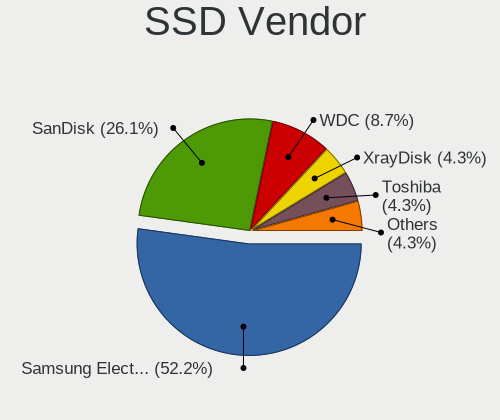

| Vendor              | Notebooks | Drives | Percent |
|---------------------|-----------|--------|---------|
| Samsung Electronics | 8         | 11     | 50%     |
| SanDisk             | 5         | 5      | 31.25%  |
| WDC                 | 1         | 1      | 6.25%   |
| Toshiba             | 1         | 1      | 6.25%   |
| Crucial             | 1         | 2      | 6.25%   |

Drive Kind
----------

HDD or SSD

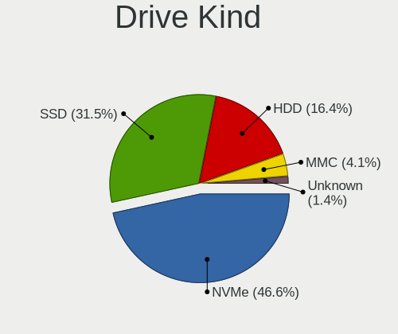

| Kind | Notebooks | Drives | Percent |
|------|-----------|--------|---------|
| NVMe | 22        | 36     | 43.14%  |
| SSD  | 16        | 20     | 31.37%  |
| HDD  | 10        | 16     | 19.61%  |
| MMC  | 3         | 3      | 5.88%   |

Drive Connector
---------------

SATA, SAS, NVMe, etc.

| Type | Notebooks | Drives | Percent |
|------|-----------|--------|---------|
| SATA | 23        | 31     | 46%     |
| NVMe | 22        | 36     | 44%     |
| MMC  | 3         | 3      | 6%      |
| SAS  | 2         | 5      | 4%      |

Drive Size
----------

Size of hard drive

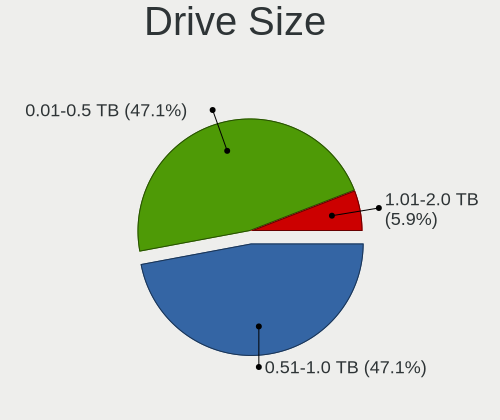

| Size in TB | Notebooks | Drives | Percent |
|------------|-----------|--------|---------|
| 0.51-1.0   | 15        | 22     | 57.69%  |
| 0.01-0.5   | 11        | 14     | 42.31%  |

Space Total
-----------

Amount of disk space available on the file system

| Size in GB | Notebooks | Percent |
|------------|-----------|---------|
| 251-500    | 12        | 26.67%  |
| 101-250    | 8         | 17.78%  |
| 1-20       | 7         | 15.56%  |
| 501-1000   | 7         | 15.56%  |
| Unknown    | 6         | 13.33%  |
| 51-100     | 3         | 6.67%   |
| 2001-3000  | 2         | 4.44%   |

Space Used
----------

Amount of used disk space

| Used GB   | Notebooks | Percent |
|-----------|-----------|---------|
| 1-20      | 17        | 36.17%  |
| 51-100    | 8         | 17.02%  |
| 21-50     | 7         | 14.89%  |
| Unknown   | 6         | 12.77%  |
| 251-500   | 4         | 8.51%   |
| 101-250   | 2         | 4.26%   |
| 501-1000  | 2         | 4.26%   |
| 1001-2000 | 1         | 2.13%   |

Malfunc. Drives
---------------

Drive models with a malfunction

| Model                              | Notebooks | Drives | Percent |
|------------------------------------|-----------|--------|---------|
| Seagate ST9750420AS 752GB          | 1         | 1      | 50%     |
| Seagate ST1000LM024 HN-M101MBB 1TB | 1         | 1      | 50%     |

Malfunc. Drive Vendor
---------------------

Vendors of faulty drives

| Vendor  | Notebooks | Drives | Percent |
|---------|-----------|--------|---------|
| Seagate | 2         | 2      | 100%    |

Malfunc. HDD Vendor
-------------------

Vendors of faulty HDD drives

| Vendor  | Notebooks | Drives | Percent |
|---------|-----------|--------|---------|
| Seagate | 2         | 2      | 100%    |

Malfunc. Drive Kind
-------------------

Kinds of faulty drives

| Kind | Notebooks | Drives | Percent |
|------|-----------|--------|---------|
| HDD  | 2         | 2      | 100%    |

Failed Drives
-------------

Failed drive models

Zero info for selected period =(

Failed Drive Vendor
-------------------

Failed drive vendors

Zero info for selected period =(

Drive Status
------------

Number of failed and malfunc. drives

| Status   | Notebooks | Drives | Percent |
|----------|-----------|--------|---------|
| Detected | 24        | 43     | 50%     |
| Works    | 22        | 30     | 45.83%  |
| Malfunc  | 2         | 2      | 4.17%   |

Storage controller
------------------

Storage Vendor
--------------

Storage controller vendors

| Vendor                      | Notebooks | Percent |
|-----------------------------|-----------|---------|
| Intel                       | 21        | 44.68%  |
| Samsung Electronics         | 9         | 19.15%  |
| AMD                         | 4         | 8.51%   |
| SanDisk                     | 2         | 4.26%   |
| Phison Electronics          | 2         | 4.26%   |
| Micron Technology           | 2         | 4.26%   |
| Union Memory (Shenzhen)     | 1         | 2.13%   |
| SK hynix                    | 1         | 2.13%   |
| Micron/Crucial Technology   | 1         | 2.13%   |
| Lite-On Technology          | 1         | 2.13%   |
| Lenovo                      | 1         | 2.13%   |
| KIOXIA                      | 1         | 2.13%   |
| Kingston Technology Company | 1         | 2.13%   |

Storage Model
-------------

Storage controller models

| Model                                                                            | Notebooks | Percent |
|----------------------------------------------------------------------------------|-----------|---------|
| Samsung NVMe SSD Controller SM981/PM981/PM983                                    | 6         | 12.5%   |
| Intel Sunrise Point-LP SATA Controller [AHCI mode]                               | 4         | 8.33%   |
| AMD FCH SATA Controller [AHCI mode]                                              | 4         | 8.33%   |
| Intel Wildcat Point-LP SATA Controller [AHCI Mode]                               | 3         | 6.25%   |
| Intel 82801 Mobile SATA Controller [RAID mode]                                   | 3         | 6.25%   |
| Intel 8 Series/C220 Series Chipset Family 6-port SATA Controller 1 [AHCI mode]   | 3         | 6.25%   |
| Samsung NVMe SSD Controller PM9A1/PM9A3/980PRO                                   | 2         | 4.17%   |
| Union Memory (Shenzhen) AM610 PCIe 3.0 NVMe SSD 128GB                            | 1         | 2.08%   |
| SK hynix BC901 NVMe Solid State Drive (DRAM-less)                                | 1         | 2.08%   |
| SanDisk WD Black 2018/SN750 / PC SN720 NVMe SSD                                  | 1         | 2.08%   |
| Sandisk PC SN740 NVMe SSD (DRAM-less)                                            | 1         | 2.08%   |
| Samsung NVMe SSD Controller SM961/PM961/SM963                                    | 1         | 2.08%   |
| Phison E16 PCIe4 NVMe Controller                                                 | 1         | 2.08%   |
| Phison E12 NVMe Controller                                                       | 1         | 2.08%   |
| Micron/Crucial P2 [Nick P2] / P3 / P3 Plus NVMe PCIe SSD (DRAM-less)             | 1         | 2.08%   |
| Micron 2300 NVMe SSD [Santana]                                                   | 1         | 2.08%   |
| Micron 2200S NVMe SSD [Cassandra]                                                | 1         | 2.08%   |
| Lite-On Non-Volatile memory controller                                           | 1         | 2.08%   |
| Lenovo LENSE30512GMSP34MEAT3TA                                                   | 1         | 2.08%   |
| KIOXIA NVMe SSD Controller BG4 (DRAM-less)                                       | 1         | 2.08%   |
| Kingston Company A2000 NVMe SSD                                                  | 1         | 2.08%   |
| Intel Volume Management Device NVMe RAID Controller                              | 1         | 2.08%   |
| Intel SSD 660P Series                                                            | 1         | 2.08%   |
| Intel Q170/Q150/B150/H170/H110/Z170/CM236 Chipset SATA Controller [AHCI Mode]    | 1         | 2.08%   |
| Intel Atom/Celeron/Pentium Processor x5-E8000/J3xxx/N3xxx Series SATA Controller | 1         | 2.08%   |
| Intel 82801IBM/IEM (ICH9M/ICH9M-E) 4 port SATA Controller [AHCI mode]            | 1         | 2.08%   |
| Intel 8 Series SATA Controller 1 [AHCI mode]                                     | 1         | 2.08%   |
| Intel 7 Series Chipset Family 6-port SATA Controller [AHCI mode]                 | 1         | 2.08%   |
| Intel 6 Series/C200 Series Chipset Family 6 port Mobile SATA AHCI Controller     | 1         | 2.08%   |
| Intel 400 Series Chipset Family SATA AHCI Controller                             | 1         | 2.08%   |

Storage Kind
------------

Kind of storage controller (IDE, SATA, NVMe, SAS, ...)

| Kind | Notebooks | Percent |
|------|-----------|---------|
| NVMe | 22        | 46.81%  |
| SATA | 21        | 44.68%  |
| RAID | 4         | 8.51%   |

Processor
---------

CPU Vendor
----------

Processor vendors

| Vendor | Notebooks | Percent |
|--------|-----------|---------|
| Intel  | 40        | 90.91%  |
| AMD    | 4         | 9.09%   |

CPU Model
---------

Processor models

| Model                                           | Notebooks | Percent |
|-------------------------------------------------|-----------|---------|
| Intel Core i7-8665U CPU @ 1.90GHz               | 2         | 4.55%   |
| Intel Core i7-7500U CPU @ 2.70GHz               | 2         | 4.55%   |
| Intel Core i7-6500U CPU @ 2.50GHz               | 2         | 4.55%   |
| Intel Core i7-10610U CPU @ 1.80GHz              | 2         | 4.55%   |
| Intel Core i5-8350U CPU @ 1.70GHz               | 2         | 4.55%   |
| Intel Core i5-7300U CPU @ 2.60GHz               | 2         | 4.55%   |
| Intel Core i5-5300U CPU @ 2.30GHz               | 2         | 4.55%   |
| Intel 11th Gen Core i7-1165G7 @ 2.80GHz         | 2         | 4.55%   |
| Intel Processor 5Y10 CPU @ 0.80GHz              | 1         | 2.27%   |
| Intel Core i9-9880H CPU @ 2.30GHz               | 1         | 2.27%   |
| Intel Core i7-8750H CPU @ 2.20GHz               | 1         | 2.27%   |
| Intel Core i7-8650U CPU @ 1.90GHz               | 1         | 2.27%   |
| Intel Core i7-8550U CPU @ 1.80GHz               | 1         | 2.27%   |
| Intel Core i7-6820HQ CPU @ 2.70GHz              | 1         | 2.27%   |
| Intel Core i7-4940MX CPU @ 3.10GHz              | 1         | 2.27%   |
| Intel Core i7-4910MQ CPU @ 2.90GHz              | 1         | 2.27%   |
| Intel Core i7-4800MQ CPU @ 2.70GHz              | 1         | 2.27%   |
| Intel Core i7-2860QM CPU @ 2.50GHz              | 1         | 2.27%   |
| Intel Core i7-2760QM CPU @ 2.40GHz              | 1         | 2.27%   |
| Intel Core i7-10750H CPU @ 2.60GHz              | 1         | 2.27%   |
| Intel Core i5-8365U CPU @ 1.60GHz               | 1         | 2.27%   |
| Intel Core i5-4210U CPU @ 1.70GHz               | 1         | 2.27%   |
| Intel Core i5-4210M CPU @ 2.60GHz               | 1         | 2.27%   |
| Intel Core i5-3320M CPU @ 2.60GHz               | 1         | 2.27%   |
| Intel Core i5-2520M CPU @ 2.50GHz               | 1         | 2.27%   |
| Intel Core 2 Duo CPU P8400 @ 2.26GHz            | 1         | 2.27%   |
| Intel Celeron N4020 CPU @ 1.10GHz               | 1         | 2.27%   |
| Intel Celeron CPU N3010 @ 1.04GHz               | 1         | 2.27%   |
| Intel 13th Gen Core i7-1370P                    | 1         | 2.27%   |
| Intel 12th Gen Core i7-12800HX                  | 1         | 2.27%   |
| Intel 12th Gen Core i7-1270P                    | 1         | 2.27%   |
| Intel 11th Gen Core i7-1185G7 @ 3.00GHz         | 1         | 2.27%   |
| AMD Ryzen 7 PRO 2700U w/ Radeon Vega Mobile Gfx | 1         | 2.27%   |
| AMD Ryzen 7 5700U with Radeon Graphics          | 1         | 2.27%   |
| AMD A9-9420e RADEON R5, 5 COMPUTE CORES 2C+3G   | 1         | 2.27%   |
| AMD A8-7410 APU with AMD Radeon R5 Graphics     | 1         | 2.27%   |

CPU Model Family
----------------

Processor model prefix

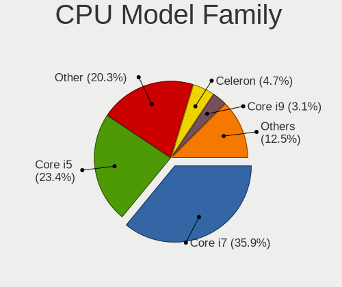

| Model            | Notebooks | Percent |
|------------------|-----------|---------|
| Intel Core i7    | 18        | 40.91%  |
| Intel Core i5    | 11        | 25%     |
| Other            | 8         | 18.18%  |
| Intel Celeron    | 2         | 4.55%   |
| Intel Core i9    | 1         | 2.27%   |
| Intel Core 2 Duo | 1         | 2.27%   |
| AMD Ryzen 7 PRO  | 1         | 2.27%   |
| AMD Ryzen 7      | 1         | 2.27%   |
| AMD A8           | 1         | 2.27%   |

CPU Cores
---------

Number of processor cores

| Number | Notebooks | Percent |
|--------|-----------|---------|
| 4      | 19        | 43.18%  |
| 2      | 17        | 38.64%  |
| 8      | 2         | 4.55%   |
| 6      | 2         | 4.55%   |
| 16     | 1         | 2.27%   |
| 14     | 1         | 2.27%   |
| 12     | 1         | 2.27%   |
| 1      | 1         | 2.27%   |

CPU Sockets
-----------

Number of sockets

| Number | Notebooks | Percent |
|--------|-----------|---------|
| 1      | 44        | 100%    |

CPU Threads
-----------

Threads per core (Hyper-Threading)

| Number | Notebooks | Percent |
|--------|-----------|---------|
| 2      | 37        | 84.09%  |
| 1      | 7         | 15.91%  |

CPU Op-Modes
------------

CPU Operation Modes (32-bit, 64-bit)

| Op mode        | Notebooks | Percent |
|----------------|-----------|---------|
| 32-bit, 64-bit | 43        | 95.56%  |
| Unknown        | 2         | 4.44%   |

CPU Microcode
-------------

Microcode number

| Number     | Notebooks | Percent |
|------------|-----------|---------|
| 0x806ec    | 5         | 11.36%  |
| 0x806ea    | 4         | 9.09%   |
| 0x306c3    | 4         | 9.09%   |
| 0x806c1    | 3         | 6.82%   |
| 0x306d4    | 3         | 6.82%   |
| 0x206a7    | 3         | 6.82%   |
| 0x806e9    | 2         | 4.55%   |
| 0x406e3    | 2         | 4.55%   |
| Unknown    | 2         | 4.55%   |
| 0xb06a2    | 1         | 2.27%   |
| 0xa0652    | 1         | 2.27%   |
| 0x906ed    | 1         | 2.27%   |
| 0x906ea    | 1         | 2.27%   |
| 0x906a3    | 1         | 2.27%   |
| 0x90672    | 1         | 2.27%   |
| 0x706a8    | 1         | 2.27%   |
| 0x506e3    | 1         | 2.27%   |
| 0x406c4    | 1         | 2.27%   |
| 0x40651    | 1         | 2.27%   |
| 0x306a9    | 1         | 2.27%   |
| 0x10676    | 1         | 2.27%   |
| 0x08608103 | 1         | 2.27%   |
| 0x0810100b | 1         | 2.27%   |
| 0x07030105 | 1         | 2.27%   |
| 0x06006705 | 1         | 2.27%   |

CPU Microarch
-------------

Microarchitecture

| Name             | Notebooks | Percent |
|------------------|-----------|---------|
| KabyLake         | 15        | 34.09%  |
| Haswell          | 5         | 11.36%  |
| TigerLake        | 3         | 6.82%   |
| Skylake          | 3         | 6.82%   |
| SandyBridge      | 3         | 6.82%   |
| Broadwell        | 3         | 6.82%   |
| Alderlake Hybrid | 2         | 4.55%   |
| Unknown          | 2         | 4.55%   |
| Zen              | 1         | 2.27%   |
| Silvermont       | 1         | 2.27%   |
| Puma             | 1         | 2.27%   |
| Penryn           | 1         | 2.27%   |
| IvyBridge        | 1         | 2.27%   |
| Goldmont plus    | 1         | 2.27%   |
| Excavator        | 1         | 2.27%   |
| CometLake        | 1         | 2.27%   |

Graphics
--------

GPU Vendor
----------

Vendors of graphics cards

| Vendor | Notebooks | Percent |
|--------|-----------|---------|
| Intel  | 35        | 61.4%   |
| Nvidia | 14        | 24.56%  |
| AMD    | 8         | 14.04%  |

GPU Model
---------

Graphics card models

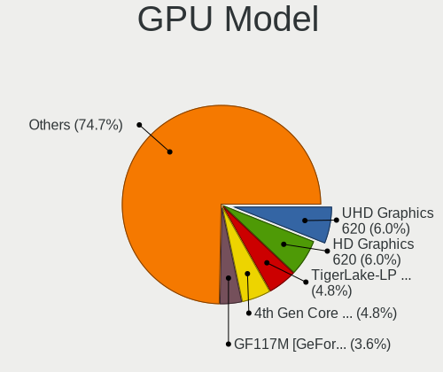

| Model                                                                                    | Notebooks | Percent |
|------------------------------------------------------------------------------------------|-----------|---------|
| Intel UHD Graphics 620                                                                   | 4         | 7.02%   |
| Intel HD Graphics 620                                                                    | 4         | 7.02%   |
| Intel 4th Gen Core Processor Integrated Graphics Controller                              | 4         | 7.02%   |
| Intel WhiskeyLake-U GT2 [UHD Graphics 620]                                               | 3         | 5.26%   |
| Intel TigerLake-LP GT2 [Iris Xe Graphics]                                                | 3         | 5.26%   |
| Nvidia GM108M [GeForce 930MX]                                                            | 2         | 3.51%   |
| Nvidia GF117M [GeForce 610M/710M/810M/820M / GT 620M/625M/630M/720M]                     | 2         | 3.51%   |
| Intel Skylake GT2 [HD Graphics 520]                                                      | 2         | 3.51%   |
| Intel HD Graphics 5500                                                                   | 2         | 3.51%   |
| Intel CometLake-U GT2 [UHD Graphics]                                                     | 2         | 3.51%   |
| Nvidia TU117M [GeForce GTX 1650 Mobile / Max-Q]                                          | 1         | 1.75%   |
| Nvidia TU117M                                                                            | 1         | 1.75%   |
| Nvidia GP107M [GeForce MX350]                                                            | 1         | 1.75%   |
| Nvidia GP106M [GeForce GTX 1060 Mobile]                                                  | 1         | 1.75%   |
| Nvidia GM204GLM [Quadro M4000M]                                                          | 1         | 1.75%   |
| Nvidia GM108GLM [Quadro K620M / Quadro M500M]                                            | 1         | 1.75%   |
| Nvidia GK208GLM [Quadro K610M]                                                           | 1         | 1.75%   |
| Nvidia GK107GLM [Quadro K1100M]                                                          | 1         | 1.75%   |
| Nvidia GF119M [NVS 4200M]                                                                | 1         | 1.75%   |
| Nvidia GA107GLM [RTX A1000 Laptop GPU]                                                   | 1         | 1.75%   |
| Intel Raptor Lake-P [Iris Xe Graphics]                                                   | 1         | 1.75%   |
| Intel Mobile 4 Series Chipset Integrated Graphics Controller                             | 1         | 1.75%   |
| Intel HD Graphics 5300                                                                   | 1         | 1.75%   |
| Intel Haswell-ULT Integrated Graphics Controller                                         | 1         | 1.75%   |
| Intel GeminiLake [UHD Graphics 600]                                                      | 1         | 1.75%   |
| Intel CometLake-H GT2 [UHD Graphics]                                                     | 1         | 1.75%   |
| Intel CoffeeLake-H GT2 [UHD Graphics 630]                                                | 1         | 1.75%   |
| Intel Atom/Celeron/Pentium Processor x5-E8000/J3xxx/N3xxx Integrated Graphics Controller | 1         | 1.75%   |
| Intel Alder Lake-P Integrated Graphics Controller                                        | 1         | 1.75%   |
| Intel 3rd Gen Core processor Graphics Controller                                         | 1         | 1.75%   |
| Intel 2nd Generation Core Processor Family Integrated Graphics Controller                | 1         | 1.75%   |
| AMD Whistler [Radeon HD 6730M/6770M/7690M XT]                                            | 1         | 1.75%   |
| AMD Venus XT [Radeon HD 8870M / R9 M270X/M370X]                                          | 1         | 1.75%   |
| AMD Sun XT [Radeon HD 8670A/8670M/8690M / R5 M330 / M430 / Radeon 520 Mobile]            | 1         | 1.75%   |
| AMD Stoney [Radeon R2/R3/R4/R5 Graphics]                                                 | 1         | 1.75%   |
| AMD Raven Ridge [Radeon Vega Series / Radeon Vega Mobile Series]                         | 1         | 1.75%   |
| AMD Mullins [Radeon R4/R5 Graphics]                                                      | 1         | 1.75%   |
| AMD Lucienne                                                                             | 1         | 1.75%   |
| AMD Lexa PRO [Radeon 540/540X/550/550X / RX 540X/550/550X]                               | 1         | 1.75%   |

GPU Combo
---------

Combinations of graphics cards

| Name           | Notebooks | Percent |
|----------------|-----------|---------|
| 1 x Intel      | 21        | 46.67%  |
| Intel + Nvidia | 10        | 22.22%  |
| 1 x Nvidia     | 5         | 11.11%  |
| 1 x AMD        | 5         | 11.11%  |
| Intel + AMD    | 3         | 6.67%   |
| Other          | 1         | 2.22%   |

GPU Driver
----------

Free vs proprietary

| Driver      | Notebooks | Percent |
|-------------|-----------|---------|
| Free        | 39        | 84.78%  |
| Proprietary | 4         | 8.7%    |
| Unknown     | 3         | 6.52%   |

GPU Memory
----------

Total video memory

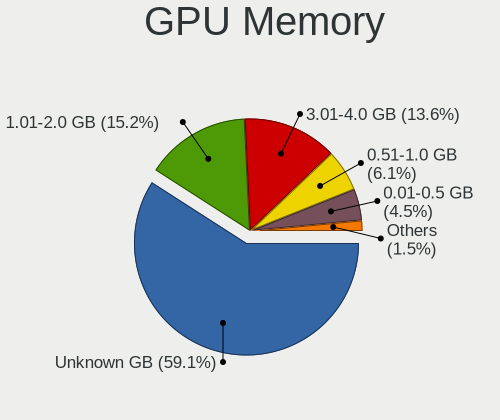

| Size in GB | Notebooks | Percent |
|------------|-----------|---------|
| Unknown    | 23        | 51.11%  |
| 1.01-2.0   | 10        | 22.22%  |
| 3.01-4.0   | 6         | 13.33%  |
| 0.51-1.0   | 3         | 6.67%   |
| 0.01-0.5   | 3         | 6.67%   |

Monitor
-------

Monitor Vendor
--------------

Monitor vendors

| Vendor               | Notebooks | Percent |
|----------------------|-----------|---------|
| AU Optronics         | 13        | 20%     |
| LG Display           | 9         | 13.85%  |
| Chimei Innolux       | 8         | 12.31%  |
| Samsung Electronics  | 6         | 9.23%   |
| BOE                  | 6         | 9.23%   |
| Lenovo               | 4         | 6.15%   |
| Dell                 | 4         | 6.15%   |
| ViewSonic            | 3         | 4.62%   |
| InfoVision           | 3         | 4.62%   |
| BenQ                 | 3         | 4.62%   |
| Acer                 | 2         | 3.08%   |
| Sceptre Tech         | 1         | 1.54%   |
| BOE Technology Group | 1         | 1.54%   |
| ASUSTek Computer     | 1         | 1.54%   |
| Ancor Communications | 1         | 1.54%   |

Monitor Model
-------------

Monitor models

| Model                                                                 | Notebooks | Percent |
|-----------------------------------------------------------------------|-----------|---------|
| LG Display LCD Monitor LGD0573 1920x1080 344x194mm 15.5-inch          | 2         | 2.94%   |
| InfoVision LCD Monitor IVO057D 1920x1080 309x174mm 14.0-inch          | 2         | 2.94%   |
| Dell U2718Q DELA0E9 3840x2160 609x349mm 27.6-inch                     | 2         | 2.94%   |
| Chimei Innolux LCD Monitor CMN15E8 1920x1080 344x193mm 15.5-inch      | 2         | 2.94%   |
| Chimei Innolux LCD Monitor CMN15C3 1920x1080 344x193mm 15.5-inch      | 2         | 2.94%   |
| Chimei Innolux LCD Monitor CMN14D4 1920x1080 309x173mm 13.9-inch      | 2         | 2.94%   |
| BenQ GL2760 BNQ78D5 1920x1080 598x336mm 27.0-inch                     | 2         | 2.94%   |
| AU Optronics LCD Monitor AUO303E 1600x900 309x174mm 14.0-inch         | 2         | 2.94%   |
| AU Optronics LCD Monitor AUO243D 1920x1080 310x170mm 13.9-inch        | 2         | 2.94%   |
| Acer SA230 ACR057E 1920x1080 509x286mm 23.0-inch                      | 2         | 2.94%   |
| ViewSonic VX2776 Series VSC3E32 1920x1080 598x336mm 27.0-inch         | 1         | 1.47%   |
| ViewSonic VX2433wm VSC3822 1920x1080 520x290mm 23.4-inch              | 1         | 1.47%   |
| ViewSonic VG2439 Series VSCD22B 1920x1080 521x293mm 23.5-inch         | 1         | 1.47%   |
| Sceptre Tech Sceptre P30 SPT0BCC 2560x1080 690x290mm 29.5-inch        | 1         | 1.47%   |
| Samsung Electronics SyncMaster SAM021E 1680x1050 433x271mm 20.1-inch  | 1         | 1.47%   |
| Samsung Electronics SAMTRON STN0022 1280x1024 380x300mm 19.1-inch     | 1         | 1.47%   |
| Samsung Electronics S27H65x SAM0E1D 1920x1080 598x336mm 27.0-inch     | 1         | 1.47%   |
| Samsung Electronics S24E650 SAM0CB8 1920x1080 521x293mm 23.5-inch     | 1         | 1.47%   |
| Samsung Electronics LCD Monitor SDC5344 1920x1080 344x194mm 15.5-inch | 1         | 1.47%   |
| Samsung Electronics LCD Monitor SDC3256 1920x1080 382x215mm 17.3-inch | 1         | 1.47%   |
| Samsung Electronics C32HG7x SAM0E14 2560x1440 697x392mm 31.5-inch     | 1         | 1.47%   |
| LG Display LCD Monitor LGD0628 1920x1080 309x174mm 14.0-inch          | 1         | 1.47%   |
| LG Display LCD Monitor LGD0609 1920x1080 309x174mm 14.0-inch          | 1         | 1.47%   |
| LG Display LCD Monitor LGD04BD 1366x768 344x194mm 15.5-inch           | 1         | 1.47%   |
| LG Display LCD Monitor LGD047C 1366x768 310x174mm 14.0-inch           | 1         | 1.47%   |
| LG Display LCD Monitor LGD0456 1366x768 344x194mm 15.5-inch           | 1         | 1.47%   |
| LG Display LCD Monitor LGD02DF 1600x900 310x174mm 14.0-inch           | 1         | 1.47%   |
| LG Display LCD Monitor LGD02D9 1920x1080 344x194mm 15.5-inch          | 1         | 1.47%   |
| Lenovo T24i-10 LEN61A6 1920x1080 527x296mm 23.8-inch                  | 1         | 1.47%   |
| Lenovo LEN T2424pA LEN60C8 1920x1080 527x296mm 23.8-inch              | 1         | 1.47%   |
| Lenovo LEN T2254pC LEN60CC 1680x1050 474x296mm 22.0-inch              | 1         | 1.47%   |
| Lenovo LEN P27u-10 LEN61B0 3840x2160 597x336mm 27.0-inch              | 1         | 1.47%   |
| InfoVision LCD Monitor IVO048E 1366x768 256x144mm 11.6-inch           | 1         | 1.47%   |
| Dell S3221QS DELD105 3840x2160 697x392mm 31.5-inch                    | 1         | 1.47%   |
| Dell P2722H DEL4240 1920x1080 598x336mm 27.0-inch                     | 1         | 1.47%   |
| Dell P2719H DEL4184 1920x1080 598x336mm 27.0-inch                     | 1         | 1.47%   |
| Dell P2414H DELA09C 1920x1080 527x297mm 23.8-inch                     | 1         | 1.47%   |
| Chimei Innolux LCD Monitor CMN14E8 1920x1080 309x173mm 13.9-inch      | 1         | 1.47%   |
| Chimei Innolux LCD Monitor CMN14D5 1920x1080 309x173mm 13.9-inch      | 1         | 1.47%   |
| BOE Technology Group LCD Monitor 1920x1080                            | 1         | 1.47%   |

Monitor Resolution
------------------

Monitor screen resolution

| Resolution         | Notebooks | Percent |
|--------------------|-----------|---------|
| 1920x1080 (FHD)    | 33        | 62.26%  |
| 1366x768 (WXGA)    | 5         | 9.43%   |
| 1600x900 (HD+)     | 4         | 7.55%   |
| 3840x2160 (4K)     | 3         | 5.66%   |
| 1920x1200 (WUXGA)  | 2         | 3.77%   |
| 1680x1050 (WSXGA+) | 2         | 3.77%   |
| 2560x1440 (QHD)    | 1         | 1.89%   |
| 2560x1080          | 1         | 1.89%   |
| 1280x800 (WXGA)    | 1         | 1.89%   |
| 1280x1024 (SXGA)   | 1         | 1.89%   |

Monitor Diagonal
----------------

Diagonal size in inches

| Inches  | Notebooks | Percent |
|---------|-----------|---------|
| 15      | 16        | 24.24%  |
| 14      | 13        | 19.7%   |
| 27      | 8         | 12.12%  |
| 13      | 7         | 10.61%  |
| 24      | 4         | 6.06%   |
| 23      | 4         | 6.06%   |
| 38      | 2         | 3.03%   |
| 31      | 2         | 3.03%   |
| 17      | 2         | 3.03%   |
| 29      | 1         | 1.52%   |
| 22      | 1         | 1.52%   |
| 20      | 1         | 1.52%   |
| 19      | 1         | 1.52%   |
| 16      | 1         | 1.52%   |
| 12      | 1         | 1.52%   |
| 11      | 1         | 1.52%   |
| Unknown | 1         | 1.52%   |

Monitor Width
-------------

Physical width

| Width in mm | Notebooks | Percent |
|-------------|-----------|---------|
| 301-350     | 36        | 56.25%  |
| 501-600     | 15        | 23.44%  |
| 601-700     | 3         | 4.69%   |
| 201-300     | 3         | 4.69%   |
| 801-900     | 2         | 3.13%   |
| 401-500     | 2         | 3.13%   |
| 351-400     | 2         | 3.13%   |
| Unknown     | 1         | 1.56%   |

Aspect Ratio
------------

Proportional relationship between the width and the height

| Ratio   | Notebooks | Percent |
|---------|-----------|---------|
| 16/9    | 41        | 83.67%  |
| 16/10   | 5         | 10.2%   |
| 5/4     | 1         | 2.04%   |
| 21/9    | 1         | 2.04%   |
| Unknown | 1         | 2.04%   |

Monitor Area
------------

Area in inch

| Area in inch | Notebooks | Percent |
|----------------|-----------|---------|
| 81-90          | 19        | 29.23%  |
| 101-110        | 16        | 24.62%  |
| 301-350        | 9         | 13.85%  |
| 201-250        | 8         | 12.31%  |
| 351-500        | 2         | 3.08%   |
| 151-200        | 2         | 3.08%   |
| 121-130        | 2         | 3.08%   |
| 501-1000       | 2         | 3.08%   |
| 71-80          | 1         | 1.54%   |
| 61-70          | 1         | 1.54%   |
| 51-60          | 1         | 1.54%   |
| 111-120        | 1         | 1.54%   |
| Unknown        | 1         | 1.54%   |

Pixel Density
-------------

Pixels per inch

| Density | Notebooks | Percent |
|---------|-----------|---------|
| 121-160 | 33        | 55%     |
| 51-100  | 16        | 26.67%  |
| 101-120 | 6         | 10%     |
| 161-240 | 4         | 6.67%   |
| Unknown | 1         | 1.67%   |

Multiple Monitors
-----------------

Total monitors connected

| Total | Notebooks | Percent |
|-------|-----------|---------|
| 1     | 24        | 53.33%  |
| 2     | 12        | 26.67%  |
| 3     | 5         | 11.11%  |
| 0     | 3         | 6.67%   |
| 4     | 1         | 2.22%   |

Network
-------

Net Controller Vendor
---------------------

Controller vendors

| Vendor                | Notebooks | Percent |
|-----------------------|-----------|---------|
| Intel                 | 37        | 57.81%  |
| Realtek Semiconductor | 14        | 21.88%  |
| Qualcomm Atheros      | 3         | 4.69%   |
| Lenovo                | 3         | 4.69%   |
| Samsung Electronics   | 1         | 1.56%   |
| Ralink Technology     | 1         | 1.56%   |
| NetGear               | 1         | 1.56%   |
| Fibocom               | 1         | 1.56%   |
| Broadcom Limited      | 1         | 1.56%   |
| Broadcom              | 1         | 1.56%   |
| ASIX Electronics      | 1         | 1.56%   |

Net Controller Model
--------------------

Controller models

| Model                                                             | Notebooks | Percent |
|-------------------------------------------------------------------|-----------|---------|
| Intel Wireless 8265 / 8275                                        | 8         | 9.09%   |
| Realtek RTL8153 Gigabit Ethernet Adapter                          | 5         | 5.68%   |
| Realtek RTL8111/8168/8411 PCI Express Gigabit Ethernet Controller | 5         | 5.68%   |
| Intel Ethernet Connection (4) I219-LM                             | 5         | 5.68%   |
| Intel 82579LM Gigabit Network Connection (Lewisville)             | 4         | 4.55%   |
| Intel Wireless 7265                                               | 3         | 3.41%   |
| Intel Wireless 7260                                               | 3         | 3.41%   |
| Intel Ethernet Connection I217-LM                                 | 3         | 3.41%   |
| Intel Ethernet Connection (6) I219-LM                             | 3         | 3.41%   |
| Intel Centrino Advanced-N 6205 [Taylor Peak]                      | 3         | 3.41%   |
| Realtek RTL810xE PCI Express Fast Ethernet controller             | 2         | 2.27%   |
| Qualcomm Atheros QCA9377 802.11ac Wireless Network Adapter        | 2         | 2.27%   |
| Lenovo ThinkPad TBT 3 Dock                                        | 2         | 2.27%   |
| Intel Wireless 8260                                               | 2         | 2.27%   |
| Intel Wi-Fi 6 AX201                                               | 2         | 2.27%   |
| Intel Ethernet Connection (3) I218-LM                             | 2         | 2.27%   |
| Intel Comet Lake PCH-LP CNVi WiFi                                 | 2         | 2.27%   |
| Intel Cannon Point-LP CNVi [Wireless-AC]                          | 2         | 2.27%   |
| Samsung Galaxy series, misc. (tethering mode)                     | 1         | 1.14%   |
| Realtek RTL88x2bu [AC1200 Techkey]                                | 1         | 1.14%   |
| Realtek RTL8822BE 802.11a/b/g/n/ac WiFi adapter                   | 1         | 1.14%   |
| Realtek RTL8821CE 802.11ac PCIe Wireless Network Adapter          | 1         | 1.14%   |
| Realtek RTL8188EE Wireless Network Adapter                        | 1         | 1.14%   |
| Ralink MT7601U Wireless Adapter                                   | 1         | 1.14%   |
| Qualcomm Atheros QCA9565 / AR9565 Wireless Network Adapter        | 1         | 1.14%   |
| NetGear WNA1100 Wireless-N 150 [Atheros AR9271]                   | 1         | 1.14%   |
| Lenovo ThinkPad TBT3 LAN                                          | 1         | 1.14%   |
| Intel Wireless-AC 9260                                            | 1         | 1.14%   |
| Intel Wi-Fi 6 AX210/AX211/AX411 160MHz                            | 1         | 1.14%   |
| Intel Wi-Fi 6 AX200                                               | 1         | 1.14%   |
| Intel Raptor Lake PCH CNVi WiFi                                   | 1         | 1.14%   |
| Intel PRO/Wireless 5100 AGN [Shiloh] Network Connection           | 1         | 1.14%   |
| Intel Gemini Lake PCH CNVi WiFi                                   | 1         | 1.14%   |
| Intel Ethernet Connection I219-V                                  | 1         | 1.14%   |
| Intel Ethernet Connection I217-V                                  | 1         | 1.14%   |
| Intel Ethernet Connection (7) I219-LM                             | 1         | 1.14%   |
| Intel Ethernet Connection (4) I219-V                              | 1         | 1.14%   |
| Intel Ethernet Connection (2) I219-LM                             | 1         | 1.14%   |
| Intel Ethernet Connection (17) I219-V                             | 1         | 1.14%   |
| Intel Comet Lake PCH CNVi WiFi                                    | 1         | 1.14%   |

Wireless Vendor
---------------

Wireless vendors

| Vendor                | Notebooks | Percent |
|-----------------------|-----------|---------|
| Intel                 | 36        | 76.6%   |
| Realtek Semiconductor | 4         | 8.51%   |
| Qualcomm Atheros      | 3         | 6.38%   |
| Ralink Technology     | 1         | 2.13%   |
| NetGear               | 1         | 2.13%   |
| Fibocom               | 1         | 2.13%   |
| Broadcom              | 1         | 2.13%   |

Wireless Model
--------------

Wireless models

| Model                                                      | Notebooks | Percent |
|------------------------------------------------------------|-----------|---------|
| Intel Wireless 8265 / 8275                                 | 8         | 17.02%  |
| Intel Wireless 7265                                        | 3         | 6.38%   |
| Intel Wireless 7260                                        | 3         | 6.38%   |
| Intel Centrino Advanced-N 6205 [Taylor Peak]               | 3         | 6.38%   |
| Qualcomm Atheros QCA9377 802.11ac Wireless Network Adapter | 2         | 4.26%   |
| Intel Wireless 8260                                        | 2         | 4.26%   |
| Intel Wi-Fi 6 AX201                                        | 2         | 4.26%   |
| Intel Comet Lake PCH-LP CNVi WiFi                          | 2         | 4.26%   |
| Intel Cannon Point-LP CNVi [Wireless-AC]                   | 2         | 4.26%   |
| Realtek RTL88x2bu [AC1200 Techkey]                         | 1         | 2.13%   |
| Realtek RTL8822BE 802.11a/b/g/n/ac WiFi adapter            | 1         | 2.13%   |
| Realtek RTL8821CE 802.11ac PCIe Wireless Network Adapter   | 1         | 2.13%   |
| Realtek RTL8188EE Wireless Network Adapter                 | 1         | 2.13%   |
| Ralink MT7601U Wireless Adapter                            | 1         | 2.13%   |
| Qualcomm Atheros QCA9565 / AR9565 Wireless Network Adapter | 1         | 2.13%   |
| NetGear WNA1100 Wireless-N 150 [Atheros AR9271]            | 1         | 2.13%   |
| Intel Wireless-AC 9260                                     | 1         | 2.13%   |
| Intel Wi-Fi 6 AX210/AX211/AX411 160MHz                     | 1         | 2.13%   |
| Intel Wi-Fi 6 AX200                                        | 1         | 2.13%   |
| Intel Raptor Lake PCH CNVi WiFi                            | 1         | 2.13%   |
| Intel PRO/Wireless 5100 AGN [Shiloh] Network Connection    | 1         | 2.13%   |
| Intel Gemini Lake PCH CNVi WiFi                            | 1         | 2.13%   |
| Intel Comet Lake PCH CNVi WiFi                             | 1         | 2.13%   |
| Intel Centrino Ultimate-N 6300                             | 1         | 2.13%   |
| Intel Cannon Lake PCH CNVi WiFi                            | 1         | 2.13%   |
| Intel Alder Lake-S PCH CNVi WiFi                           | 1         | 2.13%   |
| Intel Alder Lake-P PCH CNVi WiFi                           | 1         | 2.13%   |
| Fibocom L830-EB-00 LTE WWAN Modem                          | 1         | 2.13%   |
| Broadcom BCM43142 802.11b/g/n                              | 1         | 2.13%   |

Ethernet Vendor
---------------

Ethernet vendors

| Vendor                | Notebooks | Percent |
|-----------------------|-----------|---------|
| Intel                 | 23        | 56.1%   |
| Realtek Semiconductor | 12        | 29.27%  |
| Lenovo                | 3         | 7.32%   |
| Samsung Electronics   | 1         | 2.44%   |
| Broadcom Limited      | 1         | 2.44%   |
| ASIX Electronics      | 1         | 2.44%   |

Ethernet Model
--------------

Ethernet models

| Model                                                             | Notebooks | Percent |
|-------------------------------------------------------------------|-----------|---------|
| Realtek RTL8153 Gigabit Ethernet Adapter                          | 5         | 12.2%   |
| Realtek RTL8111/8168/8411 PCI Express Gigabit Ethernet Controller | 5         | 12.2%   |
| Intel Ethernet Connection (4) I219-LM                             | 5         | 12.2%   |
| Intel 82579LM Gigabit Network Connection (Lewisville)             | 4         | 9.76%   |
| Intel Ethernet Connection I217-LM                                 | 3         | 7.32%   |
| Intel Ethernet Connection (6) I219-LM                             | 3         | 7.32%   |
| Realtek RTL810xE PCI Express Fast Ethernet controller             | 2         | 4.88%   |
| Lenovo ThinkPad TBT 3 Dock                                        | 2         | 4.88%   |
| Intel Ethernet Connection (3) I218-LM                             | 2         | 4.88%   |
| Samsung Galaxy series, misc. (tethering mode)                     | 1         | 2.44%   |
| Lenovo ThinkPad TBT3 LAN                                          | 1         | 2.44%   |
| Intel Ethernet Connection I219-V                                  | 1         | 2.44%   |
| Intel Ethernet Connection I217-V                                  | 1         | 2.44%   |
| Intel Ethernet Connection (7) I219-LM                             | 1         | 2.44%   |
| Intel Ethernet Connection (4) I219-V                              | 1         | 2.44%   |
| Intel Ethernet Connection (2) I219-LM                             | 1         | 2.44%   |
| Intel Ethernet Connection (17) I219-V                             | 1         | 2.44%   |
| Broadcom Limited NetLink BCM5787M Gigabit Ethernet PCI Express    | 1         | 2.44%   |
| ASIX AX88179 Gigabit Ethernet                                     | 1         | 2.44%   |

Net Controller Kind
-------------------

Ethernet, WiFi or modem

| Kind     | Notebooks | Percent |
|----------|-----------|---------|
| WiFi     | 43        | 55.13%  |
| Ethernet | 35        | 44.87%  |

Used Controller
---------------

Currently used network controller

| Kind     | Notebooks | Percent |
|----------|-----------|---------|
| WiFi     | 30        | 65.22%  |
| Ethernet | 16        | 34.78%  |

NICs
----

Total network controllers on board

| Total | Notebooks | Percent |
|-------|-----------|---------|
| 2     | 30        | 68.18%  |
| 1     | 14        | 31.82%  |

IPv6
----

IPv6 vs IPv4

| Used | Notebooks | Percent |
|------|-----------|---------|
| No   | 34        | 70.83%  |
| Yes  | 14        | 29.17%  |

Bluetooth
---------

Bluetooth Vendor
----------------

Controller vendors

| Vendor                          | Notebooks | Percent |
|---------------------------------|-----------|---------|
| Intel                           | 22        | 73.33%  |
| Qualcomm Atheros Communications | 3         | 10%     |
| Realtek Semiconductor           | 2         | 6.67%   |
| Broadcom                        | 2         | 6.67%   |
| Alps Electric                   | 1         | 3.33%   |

Bluetooth Model
---------------

Controller models

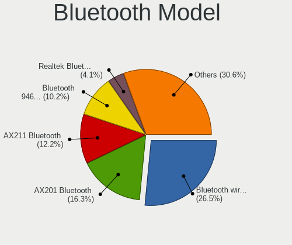

| Model                                          | Notebooks | Percent |
|------------------------------------------------|-----------|---------|
| Intel Bluetooth wireless interface             | 10        | 33.33%  |
| Intel AX201 Bluetooth                          | 4         | 13.33%  |
| Intel Bluetooth Device                         | 3         | 10%     |
| Intel Bluetooth 9460/9560 Jefferson Peak (JfP) | 3         | 10%     |
| Qualcomm Atheros  Bluetooth Device             | 2         | 6.67%   |
| Realtek  Bluetooth 4.2 Adapter                 | 1         | 3.33%   |
| Realtek Bluetooth Radio                        | 1         | 3.33%   |
| Qualcomm Atheros AR9462 Bluetooth              | 1         | 3.33%   |
| Intel Wireless-AC 9260 Bluetooth Adapter       | 1         | 3.33%   |
| Intel AX210 Bluetooth                          | 1         | 3.33%   |
| Broadcom BCM43142A0 Bluetooth 4.0              | 1         | 3.33%   |
| Broadcom BCM20702 Bluetooth 4.0 [ThinkPad]     | 1         | 3.33%   |
| Alps Electric UGTZ4 Bluetooth                  | 1         | 3.33%   |

Sound
-----

Sound Vendor
------------

Sound card vendors

| Vendor              | Notebooks | Percent |
|---------------------|-----------|---------|
| Intel               | 40        | 61.54%  |
| Nvidia              | 8         | 12.31%  |
| AMD                 | 6         | 9.23%   |
| Lenovo              | 4         | 6.15%   |
| GN Netcom           | 4         | 6.15%   |
| Unknown             | 1         | 1.54%   |
| TEAC                | 1         | 1.54%   |
| C-Media Electronics | 1         | 1.54%   |

Sound Model
-----------

Sound card models

| Model                                                                                             | Notebooks | Percent |
|---------------------------------------------------------------------------------------------------|-----------|---------|
| Intel Sunrise Point-LP HD Audio                                                                   | 10        | 13.16%  |
| Intel 8 Series/C220 Series Chipset High Definition Audio Controller                               | 4         | 5.26%   |
| Intel Xeon E3-1200 v3/4th Gen Core Processor HD Audio Controller                                  | 3         | 3.95%   |
| Intel Wildcat Point-LP High Definition Audio Controller                                           | 3         | 3.95%   |
| Intel Tiger Lake-LP Smart Sound Technology Audio Controller                                       | 3         | 3.95%   |
| Intel Cannon Point-LP High Definition Audio Controller                                            | 3         | 3.95%   |
| Intel Broadwell-U Audio Controller                                                                | 3         | 3.95%   |
| Intel 6 Series/C200 Series Chipset Family High Definition Audio Controller                        | 3         | 3.95%   |
| Nvidia TU107 GeForce GTX 1650 High Definition Audio Controller                                    | 2         | 2.63%   |
| Lenovo ThinkPad Thunderbolt 3 Dock USB Audio                                                      | 2         | 2.63%   |
| Intel Comet Lake PCH-LP cAVS                                                                      | 2         | 2.63%   |
| Intel Cannon Lake PCH cAVS                                                                        | 2         | 2.63%   |
| AMD Family 17h/19h HD Audio Controller                                                            | 2         | 2.63%   |
| Unknown Definitive Sym1                                                                           | 1         | 1.32%   |
| TEAC US-2x2                                                                                       | 1         | 1.32%   |
| Nvidia GP106 High Definition Audio Controller                                                     | 1         | 1.32%   |
| Nvidia GM204 High Definition Audio Controller                                                     | 1         | 1.32%   |
| Nvidia GK208 HDMI/DP Audio Controller                                                             | 1         | 1.32%   |
| Nvidia GK107 HDMI Audio Controller                                                                | 1         | 1.32%   |
| Nvidia GF119 HDMI Audio Controller                                                                | 1         | 1.32%   |
| Nvidia Audio device                                                                               | 1         | 1.32%   |
| Lenovo ThinkPad Thunderbolt 3 Dock Audio                                                          | 1         | 1.32%   |
| Lenovo ThinkPad Dock USB Audio                                                                    | 1         | 1.32%   |
| Intel Raptor Lake-P/U/H cAVS                                                                      | 1         | 1.32%   |
| Intel Haswell-ULT HD Audio Controller                                                             | 1         | 1.32%   |
| Intel Comet Lake PCH cAVS                                                                         | 1         | 1.32%   |
| Intel Celeron/Pentium Silver Processor High Definition Audio                                      | 1         | 1.32%   |
| Intel Atom/Celeron/Pentium Processor x5-E8000/J3xxx/N3xxx Series High Definition Audio Controller | 1         | 1.32%   |
| Intel Alder Lake-S HD Audio Controller                                                            | 1         | 1.32%   |
| Intel Alder Lake PCH-P High Definition Audio Controller                                           | 1         | 1.32%   |
| Intel 82801I (ICH9 Family) HD Audio Controller                                                    | 1         | 1.32%   |
| Intel 8 Series HD Audio Controller                                                                | 1         | 1.32%   |
| Intel 7 Series/C216 Chipset Family High Definition Audio Controller                               | 1         | 1.32%   |
| Intel 100 Series/C230 Series Chipset Family HD Audio Controller                                   | 1         | 1.32%   |
| GN Netcom Jabra SPEAK 510                                                                         | 1         | 1.32%   |
| GN Netcom Jabra PRO 9460                                                                          | 1         | 1.32%   |
| GN Netcom Jabra Link 370                                                                          | 1         | 1.32%   |
| GN Netcom Jabra EVOLVE LINK                                                                       | 1         | 1.32%   |
| C-Media Electronics Blue Snowball                                                                 | 1         | 1.32%   |
| AMD Turks HDMI Audio [Radeon HD 6500/6600 / 6700M Series]                                         | 1         | 1.32%   |

Memory
------

Memory Vendor
-------------

Memory module vendors

| Vendor              | Notebooks | Percent |
|---------------------|-----------|---------|
| Samsung Electronics | 9         | 31.03%  |
| SK hynix            | 5         | 17.24%  |
| Micron Technology   | 5         | 17.24%  |
| Unknown             | 2         | 6.9%    |
| Kingston            | 2         | 6.9%    |
| Unknown             | 2         | 6.9%    |
| Crucial             | 1         | 3.45%   |
| Corsair             | 1         | 3.45%   |
| Avant               | 1         | 3.45%   |
| 4ea5                | 1         | 3.45%   |

Memory Model
------------

Memory module models

| Model                                                           | Notebooks | Percent |
|-----------------------------------------------------------------|-----------|---------|
| Samsung RAM M471B1G73DB0-YK0 8GB SODIMM DDR3 1600MT/s           | 3         | 10%     |
| Unknown                                                         | 2         | 6.67%   |
| Unknown RAM Module 8GB SODIMM DDR4 2400MT/s                     | 1         | 3.33%   |
| Unknown RAM Module 32GB SODIMM DDR4 2667MT/s                    | 1         | 3.33%   |
| SK hynix RAM HMT41GS6BFR8A-PB 8192MB SODIMM DDR3 1600MT/s       | 1         | 3.33%   |
| SK hynix RAM HMAA1GS6CMR8N-VK 8192MB Row Of Chips DDR4 2667MT/s | 1         | 3.33%   |
| SK hynix RAM HMA851S6CJR6N-VK 4GB Row Of Chips DDR4 1866MT/s    | 1         | 3.33%   |
| SK hynix RAM HMA81GS6CJR8N-VK 8GB SODIMM DDR4 2667MT/s          | 1         | 3.33%   |
| SK hynix RAM HMA81GS6AFR8N-UH 8GB SODIMM DDR4 2667MT/s          | 1         | 3.33%   |
| SK hynix RAM H9HCNNNBKUMLXR-NEE 2GB LPDDR4 2400MT/s             | 1         | 3.33%   |
| Samsung RAM Module 8GB SODIMM DDR5 4800MT/s                     | 1         | 3.33%   |
| Samsung RAM M471B5173DB0-YK0 4GB SODIMM DDR3 1600MT/s           | 1         | 3.33%   |
| Samsung RAM M471A4G43MB1-CTD 32GB SODIMM DDR4 2667MT/s          | 1         | 3.33%   |
| Samsung RAM M471A2K43DB1-CTD 16GB SODIMM DDR4 2667MT/s          | 1         | 3.33%   |
| Samsung RAM M471A2K43CB1-CRC 16GB SODIMM DDR4 2667MT/s          | 1         | 3.33%   |
| Samsung RAM M471A1K43DB1-CWE 8GB SODIMM DDR4 3200MT/s           | 1         | 3.33%   |
| Micron RAM Module 16384MB SODIMM DDR4 2400MT/s                  | 1         | 3.33%   |
| Micron RAM 53E2G32D4NQ-046 4GB Row Of Chips LPDDR4 4267MT/s     | 1         | 3.33%   |
| Micron RAM 4ATS1G64HZ-2G6E1 8GB SODIMM DDR4 2667MT/s            | 1         | 3.33%   |
| Micron RAM 16JTF1G64HZ-1G4D1 8GB SODIMM DDR3 1333MT/s           | 1         | 3.33%   |
| Micron RAM 16ATF2G64HZ-2G1A1 16GB SODIMM DDR4 2133MT/s          | 1         | 3.33%   |
| Kingston RAM KX830D-ELC 4GB SODIMM DDR3 1333MT/s                | 1         | 3.33%   |
| Kingston RAM KN2M64-ETB 8GB SODIMM DDR3 1600MT/s                | 1         | 3.33%   |
| Crucial RAM CT32G4SFD8266.C16FF 32GB SODIMM DDR4 2667MT/s       | 1         | 3.33%   |
| Corsair RAM CMSX32GX4M2A2666C18 16GB SODIMM DDR4 2667MT/s       | 1         | 3.33%   |
| Avant RAM H6451U66G1600G 4096MB SODIMM DDR3 1600MT/s            | 1         | 3.33%   |
| 4ea5 RAM H9HCNNNBKUMLXR-NEE 2GB LPDDR4 2400MT/s                 | 1         | 3.33%   |

Memory Kind
-----------

Memory module kinds

| Kind   | Notebooks | Percent |
|--------|-----------|---------|
| DDR4   | 13        | 48.15%  |
| DDR3   | 9         | 33.33%  |
| LPDDR5 | 2         | 7.41%   |
| LPDDR4 | 2         | 7.41%   |
| DDR5   | 1         | 3.7%    |

Memory Form Factor
------------------

Physical design of the memory module

| Name         | Notebooks | Percent |
|--------------|-----------|---------|
| SODIMM       | 21        | 77.78%  |
| Row Of Chips | 5         | 18.52%  |
| Unknown      | 1         | 3.7%    |

Memory Size
-----------

Memory module size

| Size  | Notebooks | Percent |
|-------|-----------|---------|
| 8192  | 12        | 42.86%  |
| 4096  | 7         | 25%     |
| 16384 | 5         | 17.86%  |
| 32768 | 3         | 10.71%  |
| 2048  | 1         | 3.57%   |

Memory Speed
------------

Memory module speed

| Speed | Notebooks | Percent |
|-------|-----------|---------|
| 2667  | 8         | 29.63%  |
| 1600  | 7         | 25.93%  |
| 2400  | 3         | 11.11%  |
| 6400  | 2         | 7.41%   |
| 1333  | 2         | 7.41%   |
| 4800  | 1         | 3.7%    |
| 4267  | 1         | 3.7%    |
| 3200  | 1         | 3.7%    |
| 2133  | 1         | 3.7%    |
| 1866  | 1         | 3.7%    |

Printers & scanners
-------------------

Printer Vendor
--------------

Printer device vendors

Zero info for selected period =(

Printer Model
-------------

Printer device models

Zero info for selected period =(

Scanner Vendor
--------------

Scanner device vendors

| Vendor | Notebooks | Percent |
|--------|-----------|---------|
| Canon  | 1         | 100%    |

Scanner Model
-------------

Scanner device models

| Model                   | Notebooks | Percent |
|-------------------------|-----------|---------|
| Canon CanoScan LiDE 120 | 1         | 100%    |

Camera
------

Camera Vendor
-------------

Camera device vendors

| Vendor                                 | Notebooks | Percent |
|----------------------------------------|-----------|---------|
| Chicony Electronics                    | 9         | 25.71%  |
| IMC Networks                           | 5         | 14.29%  |
| Realtek Semiconductor                  | 4         | 11.43%  |
| Logitech                               | 4         | 11.43%  |
| Suyin                                  | 3         | 8.57%   |
| Lite-On Technology                     | 3         | 8.57%   |
| Luxvisions Innotech Limited            | 2         | 5.71%   |
| Bison Electronics                      | 2         | 5.71%   |
| Microsoft                              | 1         | 2.86%   |
| Microdia                               | 1         | 2.86%   |
| Cheng Uei Precision Industry (Foxlink) | 1         | 2.86%   |

Camera Model
------------

Camera device models

| Model                                                           | Notebooks | Percent |
|-----------------------------------------------------------------|-----------|---------|
| Chicony Integrated Camera                                       | 5         | 13.89%  |
| Realtek Integrated_Webcam_HD                                    | 2         | 5.56%   |
| Lite-On Integrated Camera                                       | 2         | 5.56%   |
| IMC Networks VGA UVC WebCam                                     | 2         | 5.56%   |
| IMC Networks Integrated Camera                                  | 2         | 5.56%   |
| Chicony Integrated Camera (1280x720@30)                         | 2         | 5.56%   |
| Bison SunplusIT Integrated Camera                               | 2         | 5.56%   |
| Suyin Integrated_Webcam_HD                                      | 1         | 2.78%   |
| Suyin HP Truevision HD                                          | 1         | 2.78%   |
| Suyin Asus Integrated Webcam                                    | 1         | 2.78%   |
| Realtek Integrated_Webcam_FHD                                   | 1         | 2.78%   |
| Realtek EasyCamera                                              | 1         | 2.78%   |
| Microsoft LifeCam HD-3000                                       | 1         | 2.78%   |
| Microdia Webcam Vitade AF                                       | 1         | 2.78%   |
| Luxvisions Innotech Limited HP 5MP Camera                       | 1         | 2.78%   |
| Luxvisions Innotech Limited EasyCamera 1M                       | 1         | 2.78%   |
| Logitech Webcam C925e                                           | 1         | 2.78%   |
| Logitech Webcam C920-C                                          | 1         | 2.78%   |
| Logitech HD Webcam C615                                         | 1         | 2.78%   |
| Logitech BRIO Ultra HD Webcam                                   | 1         | 2.78%   |
| Lite-On HP HD Camera                                            | 1         | 2.78%   |
| IMC Networks USB2.0 HD UVC WebCam                               | 1         | 2.78%   |
| Chicony TOSHIBA Web Camera - HD                                 | 1         | 2.78%   |
| Chicony ThinkPad T490 Webcam                                    | 1         | 2.78%   |
| Chicony Integrated IR Camera                                    | 1         | 2.78%   |
| Cheng Uei Precision Industry (Foxlink) HP True Vision HD Camera | 1         | 2.78%   |

Security
--------

Fingerprint Vendor
------------------

Fingerprint sensor vendors

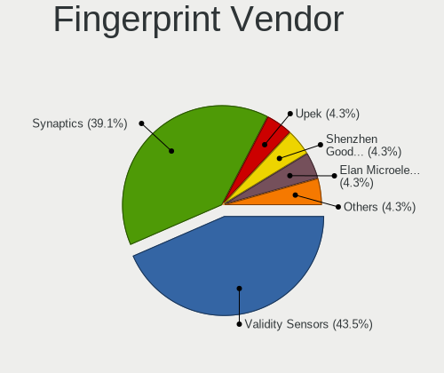

| Vendor                | Notebooks | Percent |
|-----------------------|-----------|---------|
| Validity Sensors      | 8         | 44.44%  |
| Synaptics             | 8         | 44.44%  |
| Upek                  | 1         | 5.56%   |
| Elan Microelectronics | 1         | 5.56%   |

Fingerprint Model
-----------------

Fingerprint sensor models

| Model                                                                      | Notebooks | Percent |
|----------------------------------------------------------------------------|-----------|---------|
| Validity Sensors VFS 5011 fingerprint sensor                               | 3         | 16.67%  |
| Synaptics Prometheus MIS Touch Fingerprint Reader                          | 3         | 16.67%  |
| Synaptics Metallica MIS Touch Fingerprint Reader                           | 3         | 16.67%  |
| Validity Sensors Synaptics WBDI                                            | 2         | 11.11%  |
| Validity Sensors Synaptics VFS7552 Touch Fingerprint Sensor with PurePrint | 2         | 11.11%  |
| Validity Sensors VFS7500 Touch Fingerprint Sensor                          | 1         | 5.56%   |
| Upek Biometric Touchchip/Touchstrip Fingerprint Sensor                     | 1         | 5.56%   |
| Synaptics WBDI                                                             | 1         | 5.56%   |
| Synaptics FS7604 Touch Fingerprint Sensor with PurePrint                   | 1         | 5.56%   |
| Elan ELAN:Fingerprint                                                      | 1         | 5.56%   |

Chipcard Vendor
---------------

Chipcard module vendors

| Vendor      | Notebooks | Percent |
|-------------|-----------|---------|
| Broadcom    | 7         | 77.78%  |
| Alcor Micro | 2         | 22.22%  |

Chipcard Model
--------------

Chipcard module models

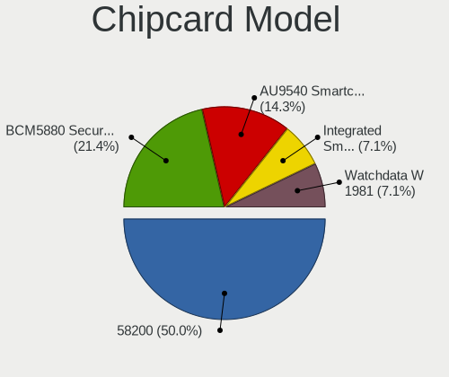

| Model                                          | Notebooks | Percent |
|------------------------------------------------|-----------|---------|
| Broadcom 58200                                 | 4         | 44.44%  |
| Broadcom BCM5880 Secure Applications Processor | 3         | 33.33%  |
| Alcor Micro AU9540 Smartcard Reader            | 2         | 22.22%  |

Unsupported
-----------

Unsupported Devices
-------------------

Total unsupported devices on board

| Total | Notebooks | Percent |
|-------|-----------|---------|
| 1     | 20        | 43.48%  |
| 0     | 17        | 36.96%  |
| 2     | 7         | 15.22%  |
| 7     | 1         | 2.17%   |
| 3     | 1         | 2.17%   |

Unsupported Device Types
------------------------

Types of unsupported devices

| Type                     | Notebooks | Percent |
|--------------------------|-----------|---------|
| Fingerprint reader       | 18        | 45%     |
| Chipcard                 | 7         | 17.5%   |
| Graphics card            | 4         | 10%     |
| Net/wireless             | 3         | 7.5%    |
| Storage                  | 2         | 5%      |
| Card reader              | 2         | 5%      |
| Sound                    | 1         | 2.5%    |
| Multimedia controller    | 1         | 2.5%    |
| Communication controller | 1         | 2.5%    |
| Bluetooth                | 1         | 2.5%    |

