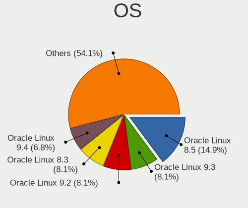
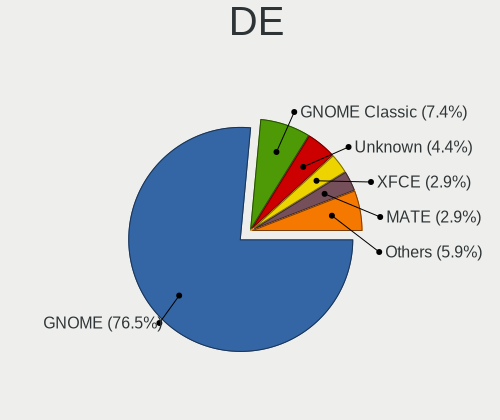
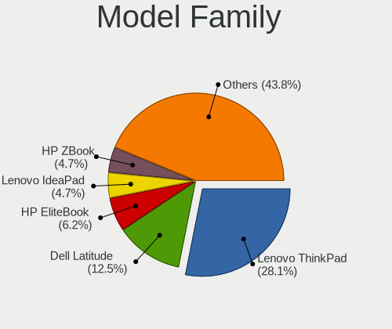
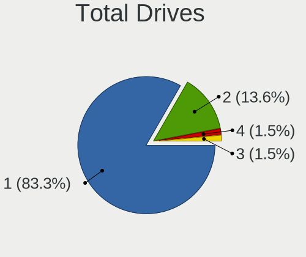
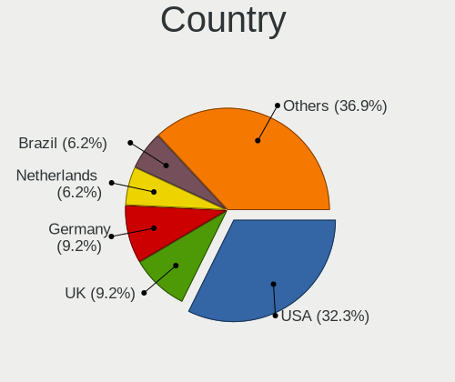
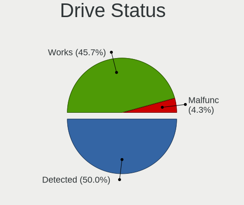
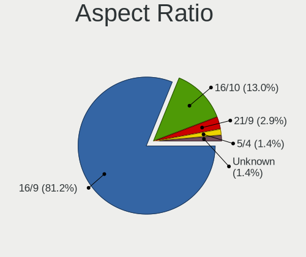
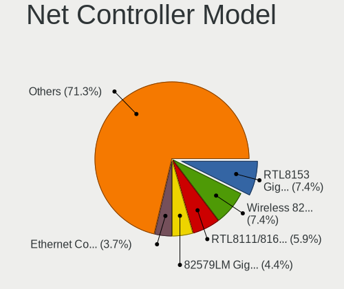
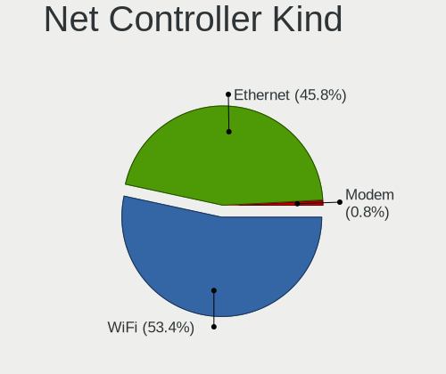
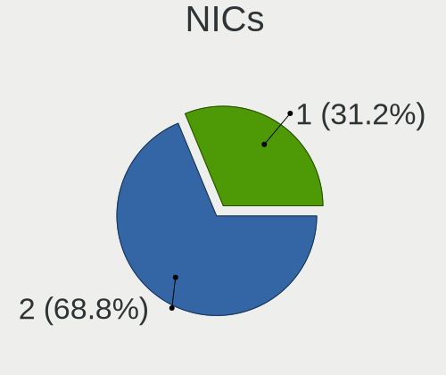

Oracle Linux - Tested Hardware & Statistics (Notebooks)
-------------------------------------------------------

A project to collect tested hardware configurations for Oracle Linux.

Anyone can contribute to this report by the [hw-probe](https://github.com/linuxhw/hw-probe) tool:

    sudo -E hw-probe -all -upload

Please contribute! Especially if your hardware is rare.

Contents
--------

* [ Test Cases ](#test-cases)

* [ System ](#system)
  - [ OS                       ](#os)
  - [ OS Family                ](#os-family)
  - [ Kernel                   ](#kernel)
  - [ Kernel Family            ](#kernel-family)
  - [ Kernel Major Ver.        ](#kernel-major-ver)
  - [ Arch                     ](#arch)
  - [ DE                       ](#de)
  - [ Display Server           ](#display-server)
  - [ Display Manager          ](#display-manager)
  - [ OS Lang                  ](#os-lang)
  - [ Boot Mode                ](#boot-mode)
  - [ Filesystem               ](#filesystem)
  - [ Part. scheme             ](#part-scheme)
  - [ Dual Boot with Linux/BSD ](#dual-boot-with-linuxbsd)
  - [ Dual Boot (Win)          ](#dual-boot-win)

* [ Board ](#board)
  - [ Vendor                   ](#vendor)
  - [ Model                    ](#model)
  - [ Model Family             ](#model-family)
  - [ MFG Year                 ](#mfg-year)
  - [ Form Factor              ](#form-factor)
  - [ Secure Boot              ](#secure-boot)
  - [ Coreboot                 ](#coreboot)
  - [ RAM Size                 ](#ram-size)
  - [ RAM Used                 ](#ram-used)
  - [ Total Drives             ](#total-drives)
  - [ Has CD-ROM               ](#has-cd-rom)
  - [ Has Ethernet             ](#has-ethernet)
  - [ Has WiFi                 ](#has-wifi)
  - [ Has Bluetooth            ](#has-bluetooth)

* [ Location ](#location)
  - [ Country                  ](#country)
  - [ City                     ](#city)

* [ Drives ](#drives)
  - [ Drive Vendor             ](#drive-vendor)
  - [ Drive Model              ](#drive-model)
  - [ HDD Vendor               ](#hdd-vendor)
  - [ SSD Vendor               ](#ssd-vendor)
  - [ Drive Kind               ](#drive-kind)
  - [ Drive Connector          ](#drive-connector)
  - [ Drive Size               ](#drive-size)
  - [ Space Total              ](#space-total)
  - [ Space Used               ](#space-used)
  - [ Malfunc. Drives          ](#malfunc-drives)
  - [ Malfunc. Drive Vendor    ](#malfunc-drive-vendor)
  - [ Malfunc. HDD Vendor      ](#malfunc-hdd-vendor)
  - [ Malfunc. Drive Kind      ](#malfunc-drive-kind)
  - [ Failed Drives            ](#failed-drives)
  - [ Failed Drive Vendor      ](#failed-drive-vendor)
  - [ Drive Status             ](#drive-status)

* [ Storage controller ](#storage-controller)
  - [ Storage Vendor           ](#storage-vendor)
  - [ Storage Model            ](#storage-model)
  - [ Storage Kind             ](#storage-kind)

* [ Processor ](#processor)
  - [ CPU Vendor               ](#cpu-vendor)
  - [ CPU Model                ](#cpu-model)
  - [ CPU Model Family         ](#cpu-model-family)
  - [ CPU Cores                ](#cpu-cores)
  - [ CPU Sockets              ](#cpu-sockets)
  - [ CPU Threads              ](#cpu-threads)
  - [ CPU Op-Modes             ](#cpu-op-modes)
  - [ CPU Microcode            ](#cpu-microcode)
  - [ CPU Microarch            ](#cpu-microarch)

* [ Graphics ](#graphics)
  - [ GPU Vendor               ](#gpu-vendor)
  - [ GPU Model                ](#gpu-model)
  - [ GPU Combo                ](#gpu-combo)
  - [ GPU Driver               ](#gpu-driver)
  - [ GPU Memory               ](#gpu-memory)

* [ Monitor ](#monitor)
  - [ Monitor Vendor           ](#monitor-vendor)
  - [ Monitor Model            ](#monitor-model)
  - [ Monitor Resolution       ](#monitor-resolution)
  - [ Monitor Diagonal         ](#monitor-diagonal)
  - [ Monitor Width            ](#monitor-width)
  - [ Aspect Ratio             ](#aspect-ratio)
  - [ Monitor Area             ](#monitor-area)
  - [ Pixel Density            ](#pixel-density)
  - [ Multiple Monitors        ](#multiple-monitors)

* [ Network ](#network)
  - [ Net Controller Vendor    ](#net-controller-vendor)
  - [ Net Controller Model     ](#net-controller-model)
  - [ Wireless Vendor          ](#wireless-vendor)
  - [ Wireless Model           ](#wireless-model)
  - [ Ethernet Vendor          ](#ethernet-vendor)
  - [ Ethernet Model           ](#ethernet-model)
  - [ Net Controller Kind      ](#net-controller-kind)
  - [ Used Controller          ](#used-controller)
  - [ NICs                     ](#nics)
  - [ IPv6                     ](#ipv6)

* [ Bluetooth ](#bluetooth)
  - [ Bluetooth Vendor         ](#bluetooth-vendor)
  - [ Bluetooth Model          ](#bluetooth-model)

* [ Sound ](#sound)
  - [ Sound Vendor             ](#sound-vendor)
  - [ Sound Model              ](#sound-model)

* [ Memory ](#memory)
  - [ Memory Vendor            ](#memory-vendor)
  - [ Memory Model             ](#memory-model)
  - [ Memory Kind              ](#memory-kind)
  - [ Memory Form Factor       ](#memory-form-factor)
  - [ Memory Size              ](#memory-size)
  - [ Memory Speed             ](#memory-speed)

* [ Printers & scanners ](#printers--scanners)
  - [ Printer Vendor           ](#printer-vendor)
  - [ Printer Model            ](#printer-model)
  - [ Scanner Vendor           ](#scanner-vendor)
  - [ Scanner Model            ](#scanner-model)

* [ Camera ](#camera)
  - [ Camera Vendor            ](#camera-vendor)
  - [ Camera Model             ](#camera-model)

* [ Security ](#security)
  - [ Fingerprint Vendor       ](#fingerprint-vendor)
  - [ Fingerprint Model        ](#fingerprint-model)
  - [ Chipcard Vendor          ](#chipcard-vendor)
  - [ Chipcard Model           ](#chipcard-model)

* [ Unsupported ](#unsupported)
  - [ Unsupported Devices      ](#unsupported-devices)
  - [ Unsupported Device Types ](#unsupported-device-types)

Test Cases
----------

Total: 47

| Vendor   | Model                       | Probe                                                      | Date         |
|----------|-----------------------------|------------------------------------------------------------|--------------|
| Lenovo   | ThinkPad T430s 2355C33      | [33de2bbd12](https://linux-hardware.org/?probe=33de2bbd12) | May 31, 2022 |
| Lenovo   | ThinkPad T430s 2355C33      | [4eab57bebf](https://linux-hardware.org/?probe=4eab57bebf) | May 30, 2022 |
| Dell     | Precision M4600             | [0ac2adfe5a](https://linux-hardware.org/?probe=0ac2adfe5a) | Apr 21, 2022 |
| Dell     | Precision M4800             | [fb13b19803](https://linux-hardware.org/?probe=fb13b19803) | Apr 21, 2022 |
| Lenovo   | ThinkPad P50s 20FL000MUS    | [99fbb4446c](https://linux-hardware.org/?probe=99fbb4446c) | Apr 16, 2022 |
| Lenovo   | ThinkPad X1 Extreme 2nd ... | [b708e920f3](https://linux-hardware.org/?probe=b708e920f3) | Mar 21, 2022 |
| Lenovo   | ThinkPad T450 20BUS14900    | [bd60aae97a](https://linux-hardware.org/?probe=bd60aae97a) | Mar 11, 2022 |
| Lenovo   | ThinkPad T480 20L5A07TAU    | [755854f7d4](https://linux-hardware.org/?probe=755854f7d4) | Mar 11, 2022 |
| Lenovo   | ThinkPad X280 20KES4H34G    | [2b8a4f4664](https://linux-hardware.org/?probe=2b8a4f4664) | Mar 10, 2022 |
| Dell     | Latitude 7420               | [af5f1055fe](https://linux-hardware.org/?probe=af5f1055fe) | Mar 10, 2022 |
| HP       | ProBook 445 G6              | [88d8b32328](https://linux-hardware.org/?probe=88d8b32328) | Jan 26, 2022 |
| Lenovo   | ThinkPad T450 20BUS14900    | [44c8e11f02](https://linux-hardware.org/?probe=44c8e11f02) | Dec 22, 2021 |
| Lenovo   | IdeaPad 300-15ISK 80RS      | [1c9ca21f4e](https://linux-hardware.org/?probe=1c9ca21f4e) | Dec 10, 2021 |
| Dell     | Latitude 7410               | [3efa87284e](https://linux-hardware.org/?probe=3efa87284e) | Nov 18, 2021 |
| Dell     | Latitude E6420              | [b809392380](https://linux-hardware.org/?probe=b809392380) | Oct 08, 2021 |
| Dell     | Latitude 7410               | [8f1a1a4798](https://linux-hardware.org/?probe=8f1a1a4798) | Sep 06, 2021 |
| Dell     | Latitude 7410               | [b03a0e0152](https://linux-hardware.org/?probe=b03a0e0152) | Sep 06, 2021 |
| Lenovo   | Legion 5 15IMH05 82AU       | [7b393c5790](https://linux-hardware.org/?probe=7b393c5790) | Aug 21, 2021 |
| Lenovo   | Legion 5 15IMH05 82AU       | [394c99adc8](https://linux-hardware.org/?probe=394c99adc8) | Aug 19, 2021 |
| Dell     | Inspiron 3542               | [0909599e9c](https://linux-hardware.org/?probe=0909599e9c) | Aug 11, 2021 |
| Lenovo   | Legion 5 15IMH05 82AU       | [ba7afba1a6](https://linux-hardware.org/?probe=ba7afba1a6) | Jul 08, 2021 |
| Lenovo   | ThinkPad L490 20Q5CTO1WW    | [0225c17d79](https://linux-hardware.org/?probe=0225c17d79) | Jul 02, 2021 |
| Lenovo   | Legion 5 15IMH05 82AU       | [505b82b2de](https://linux-hardware.org/?probe=505b82b2de) | Jun 06, 2021 |
| Lenovo   | Legion 5 15IMH05 82AU       | [75b2ef5126](https://linux-hardware.org/?probe=75b2ef5126) | May 13, 2021 |
| Lenovo   | Legion 5 15IMH05 82AU       | [734a4fbc56](https://linux-hardware.org/?probe=734a4fbc56) | May 09, 2021 |
| ASUSTek  | UX305FA                     | [0bf50fba2d](https://linux-hardware.org/?probe=0bf50fba2d) | Mar 15, 2021 |
| Lenovo   | IdeaPad Slim 1-14AST-05 ... | [ff355a9bb1](https://linux-hardware.org/?probe=ff355a9bb1) | Mar 11, 2021 |
| Lenovo   | IdeaPad Slim 1-14AST-05 ... | [9f67379954](https://linux-hardware.org/?probe=9f67379954) | Mar 04, 2021 |
| Lenovo   | ThinkPad L490 20Q5CTO1WW    | [db0f24aee5](https://linux-hardware.org/?probe=db0f24aee5) | Mar 01, 2021 |
| Dell     | Latitude 7410               | [5b725b01aa](https://linux-hardware.org/?probe=5b725b01aa) | Feb 26, 2021 |
| Lenovo   | Legion 5 15IMH05 82AU       | [835e8cad03](https://linux-hardware.org/?probe=835e8cad03) | Feb 25, 2021 |
| Dell     | Latitude 7410               | [430ac9fa0c](https://linux-hardware.org/?probe=430ac9fa0c) | Feb 24, 2021 |
| Lenovo   | ThinkPad T490 20N3S77600    | [26e61c39f2](https://linux-hardware.org/?probe=26e61c39f2) | Feb 24, 2021 |
| Dell     | Latitude 7410               | [7aeb2cc674](https://linux-hardware.org/?probe=7aeb2cc674) | Feb 22, 2021 |
| Lenovo   | IdeaPad Slim 1-14AST-05 ... | [8af2c8d83c](https://linux-hardware.org/?probe=8af2c8d83c) | Feb 05, 2021 |
| Lenovo   | IdeaPad Slim 1-14AST-05 ... | [7ea3c87bfe](https://linux-hardware.org/?probe=7ea3c87bfe) | Jan 06, 2021 |
| Standard | BW Series                   | [1f6cf82ba8](https://linux-hardware.org/?probe=1f6cf82ba8) | Jun 13, 2020 |
| HP       | Notebook                    | [e3c242a846](https://linux-hardware.org/?probe=e3c242a846) | May 24, 2020 |
| Lenovo   | ThinkPad L490 20Q5CTO1WW    | [d8b2c132c1](https://linux-hardware.org/?probe=d8b2c132c1) | Apr 09, 2020 |
| HP       | ZBook 15                    | [4723616d8c](https://linux-hardware.org/?probe=4723616d8c) | Apr 09, 2020 |
| Lenovo   | ThinkPad L490 20Q5CTO1WW    | [1acbabb197](https://linux-hardware.org/?probe=1acbabb197) | Apr 06, 2020 |
| Lenovo   | ThinkPad T480 20L6S56Y2X    | [5343997520](https://linux-hardware.org/?probe=5343997520) | Feb 23, 2020 |
| ASUSTek  | X510UR                      | [914b9fbe64](https://linux-hardware.org/?probe=914b9fbe64) | Feb 04, 2020 |
| ASUSTek  | X510UR                      | [014d5ef0c8](https://linux-hardware.org/?probe=014d5ef0c8) | Jan 28, 2020 |
| ASUSTek  | X510UR                      | [9d05b420d4](https://linux-hardware.org/?probe=9d05b420d4) | Jan 28, 2020 |
| Lenovo   | ThinkPad L540 20AVCTO1WW    | [8c1dba9d6e](https://linux-hardware.org/?probe=8c1dba9d6e) | Sep 10, 2019 |
| Lenovo   | ThinkPad T480 20L6S56Y2X    | [f012a475eb](https://linux-hardware.org/?probe=f012a475eb) | Apr 11, 2019 |

System
------

OS
--

Installed operating systems

| Name             | Notebooks | Percent |
|------------------|-----------|---------|
| Oracle Linux 8.5 | 11        | 33.33%  |
| Oracle Linux 8.3 | 6         | 18.18%  |
| Oracle Linux 8.4 | 5         | 15.15%  |
| Oracle Linux 8.1 | 3         | 9.09%   |
| Oracle Linux 7.8 | 2         | 6.06%   |
| Oracle Linux 7.7 | 2         | 6.06%   |
| Oracle Linux 8.6 | 1         | 3.03%   |
| Oracle Linux 8.2 | 1         | 3.03%   |
| Oracle Linux 7.9 | 1         | 3.03%   |
| Oracle Linux 7.6 | 1         | 3.03%   |

OS Family
---------

OS without a version

| Name         | Notebooks | Percent |
|--------------|-----------|---------|
| Oracle Linux | 27        | 100%    |

Kernel
------

Version of the Linux kernel

| Version                            | Notebooks | Percent |
|------------------------------------|-----------|---------|
| 5.4.17-2036.103.3.1.el8uek.x86_64  | 3         | 8.33%   |
| 4.18.0-348.12.2.el8_5.x86_64       | 3         | 8.33%   |
| 5.4.17-2136.304.4.3.el8uek.x86_64  | 2         | 5.56%   |
| 5.4.17-2102.202.5.el8uek.x86_64    | 2         | 5.56%   |
| 4.18.0-147.3.1.el8_1.x86_64        | 2         | 5.56%   |
| 5.4.17-2136.306.1.3.el8uek.x86_64  | 1         | 2.78%   |
| 5.4.17-2136.305.5.4.el8uek.x86_64  | 1         | 2.78%   |
| 5.4.17-2136.305.5.3.el8uek.x86_64  | 1         | 2.78%   |
| 5.4.17-2136.305.5.2.el8uek.x86_64  | 1         | 2.78%   |
| 5.4.17-2136.301.1.4.el8uek.x86_64  | 1         | 2.78%   |
| 5.4.17-2136.300.7.el8uek.x86_64    | 1         | 2.78%   |
| 5.4.17-2102.205.7.3.el8uek.x86_64  | 1         | 2.78%   |
| 5.4.17-2102.204.4.4.el8uek.x86_64  | 1         | 2.78%   |
| 5.4.17-2102.204.4.2.el8uek.x86_64  | 1         | 2.78%   |
| 5.4.17-2102.201.3.el8uek.x86_64    | 1         | 2.78%   |
| 5.4.17-2102.200.13.el8uek.x86_64   | 1         | 2.78%   |
| 5.4.17-2036.104.4.el8uek.x86_64    | 1         | 2.78%   |
| 5.4.17-2011.0.7.el8uek.x86_64      | 1         | 2.78%   |
| 5.15.2-1.el8.elrepo.x86_64         | 1         | 2.78%   |
| 5.14.1-1.el8.elrepo.x86_64         | 1         | 2.78%   |
| 5.11.1-1.el8.elrepo.x86_64         | 1         | 2.78%   |
| 4.18.0-240.15.1.el8_3.x86_64       | 1         | 2.78%   |
| 4.18.0-240.10.1.el8_3.x86_64       | 1         | 2.78%   |
| 4.18.0-193.1.2.el8_2.x86_64        | 1         | 2.78%   |
| 4.14.35-2047.510.4.1.el7uek.x86_64 | 1         | 2.78%   |
| 4.14.35-1902.4.8.el7uek.x86_64     | 1         | 2.78%   |
| 4.14.35-1902.300.11.el7uek.x86_64  | 1         | 2.78%   |
| 4.14.35-1818.3.3.el7uek.x86_64     | 1         | 2.78%   |
| 3.10.0-1127.10.1.el7.x86_64        | 1         | 2.78%   |

Kernel Family
-------------

Linux kernel without a distro release

| Version | Notebooks | Percent |
|---------|-----------|---------|
| 5.4.17  | 14        | 48.28%  |
| 4.18.0  | 7         | 24.14%  |
| 4.14.35 | 4         | 13.79%  |
| 5.15.2  | 1         | 3.45%   |
| 5.14.1  | 1         | 3.45%   |
| 5.11.1  | 1         | 3.45%   |
| 3.10.0  | 1         | 3.45%   |

Kernel Major Ver.
-----------------

Linux kernel major version

| Version | Notebooks | Percent |
|---------|-----------|---------|
| 5.4     | 14        | 48.28%  |
| 4.18    | 7         | 24.14%  |
| 4.14    | 4         | 13.79%  |
| 5.15    | 1         | 3.45%   |
| 5.14    | 1         | 3.45%   |
| 5.11    | 1         | 3.45%   |
| 3.10    | 1         | 3.45%   |

Arch
----

OS architecture (x86_64, i586, etc.)

| Name   | Notebooks | Percent |
|--------|-----------|---------|
| x86_64 | 27        | 100%    |

DE
--

Desktop Environment

| Name    | Notebooks | Percent |
|---------|-----------|---------|
| GNOME   | 21        | 70%     |
| Unknown | 3         | 10%     |
| XFCE    | 2         | 6.67%   |
| MATE    | 2         | 6.67%   |
| KDE5    | 1         | 3.33%   |
| KDE4    | 1         | 3.33%   |

Display Server
--------------

X11 or Wayland

| Name    | Notebooks | Percent |
|---------|-----------|---------|
| X11     | 14        | 48.28%  |
| Wayland | 14        | 48.28%  |
| Unknown | 1         | 3.45%   |

Display Manager
---------------

SDDM, LightDM, etc.

| Name    | Notebooks | Percent |
|---------|-----------|---------|
| Unknown | 15        | 51.72%  |
| GDM     | 13        | 44.83%  |
| SDDM    | 1         | 3.45%   |

OS Lang
-------

Language

| Lang    | Notebooks | Percent |
|---------|-----------|---------|
| en_US   | 16        | 57.14%  |
| en_GB   | 3         | 10.71%  |
| de_DE   | 3         | 10.71%  |
| Unknown | 2         | 7.14%   |
| zh_HK   | 1         | 3.57%   |
| pt_BR   | 1         | 3.57%   |
| pl_PL   | 1         | 3.57%   |
| en_AU   | 1         | 3.57%   |

Boot Mode
---------

EFI or BIOS

| Mode | Notebooks | Percent |
|------|-----------|---------|
| BIOS | 14        | 50%     |
| EFI  | 14        | 50%     |

Filesystem
----------

Type of filesystem

| Type    | Notebooks | Percent |
|---------|-----------|---------|
| Xfs     | 23        | 79.31%  |
| Ext4    | 4         | 13.79%  |
| Unknown | 2         | 6.9%    |

Part. scheme
------------

Scheme of partitioning

| Type    | Notebooks | Percent |
|---------|-----------|---------|
| Unknown | 15        | 51.72%  |
| GPT     | 9         | 31.03%  |
| MBR     | 5         | 17.24%  |

Dual Boot with Linux/BSD
------------------------

Hosting more than one Linux/BSD

| Dual boot | Notebooks | Percent |
|-----------|-----------|---------|
| No        | 24        | 85.71%  |
| Yes       | 4         | 14.29%  |

Dual Boot (Win)
---------------

Hosting Linux and Windows

| Dual boot | Notebooks | Percent |
|-----------|-----------|---------|
| No        | 26        | 96.3%   |
| Yes       | 1         | 3.7%    |

Board
-----

Vendor
------

Motherboard manufacturer

| Name             | Notebooks | Percent |
|------------------|-----------|---------|
| Lenovo           | 14        | 51.85%  |
| Dell             | 6         | 22.22%  |
| Hewlett-Packard  | 3         | 11.11%  |
| ASUSTek Computer | 3         | 11.11%  |
| Standard         | 1         | 3.7%    |

Model
-----

Motherboard model

| Name                                      | Notebooks | Percent |
|-------------------------------------------|-----------|---------|
| Lenovo ThinkPad T450 20BUS14900           | 2         | 7.41%   |
| ASUS X510UR                               | 2         | 7.41%   |
| Standard BW Series                        | 1         | 3.7%    |
| Lenovo ThinkPad X280 20KES4H34G           | 1         | 3.7%    |
| Lenovo ThinkPad X1 Extreme 2nd 20QWS1R800 | 1         | 3.7%    |
| Lenovo ThinkPad T490 20N3S77600           | 1         | 3.7%    |
| Lenovo ThinkPad T480 20L6S56Y2X           | 1         | 3.7%    |
| Lenovo ThinkPad T480 20L5A07TAU           | 1         | 3.7%    |
| Lenovo ThinkPad T430s 2355C33             | 1         | 3.7%    |
| Lenovo ThinkPad P50s 20FL000MUS           | 1         | 3.7%    |
| Lenovo ThinkPad L540 20AVCTO1WW           | 1         | 3.7%    |
| Lenovo ThinkPad L490 20Q5CTO1WW           | 1         | 3.7%    |
| Lenovo Legion 5 15IMH05 82AU              | 1         | 3.7%    |
| Lenovo IdeaPad Slim 1-14AST-05 81VS       | 1         | 3.7%    |
| Lenovo IdeaPad 300-15ISK 80RS             | 1         | 3.7%    |
| HP ZBook 15                               | 1         | 3.7%    |
| HP ProBook 445 G6                         | 1         | 3.7%    |
| HP Notebook                               | 1         | 3.7%    |
| Dell Precision M4800                      | 1         | 3.7%    |
| Dell Precision M4600                      | 1         | 3.7%    |
| Dell Latitude E6420                       | 1         | 3.7%    |
| Dell Latitude 7420                        | 1         | 3.7%    |
| Dell Latitude 7410                        | 1         | 3.7%    |
| Dell Inspiron 3542                        | 1         | 3.7%    |
| ASUS UX305FA                              | 1         | 3.7%    |

Model Family
------------

Motherboard model prefix

| Name            | Notebooks | Percent |
|-----------------|-----------|---------|
| Lenovo ThinkPad | 11        | 40.74%  |
| Dell Latitude   | 3         | 11.11%  |
| Lenovo IdeaPad  | 2         | 7.41%   |
| Dell Precision  | 2         | 7.41%   |
| ASUS X510UR     | 2         | 7.41%   |
| Standard BW     | 1         | 3.7%    |
| Lenovo Legion   | 1         | 3.7%    |
| HP ZBook        | 1         | 3.7%    |
| HP ProBook      | 1         | 3.7%    |
| HP Notebook     | 1         | 3.7%    |
| Dell Inspiron   | 1         | 3.7%    |
| ASUS UX305FA    | 1         | 3.7%    |

MFG Year
--------

Motherboard manufacture year

| Year | Notebooks | Percent |
|------|-----------|---------|
| 2019 | 5         | 18.52%  |
| 2016 | 4         | 14.81%  |
| 2020 | 3         | 11.11%  |
| 2018 | 3         | 11.11%  |
| 2014 | 3         | 11.11%  |
| 2017 | 2         | 7.41%   |
| 2015 | 2         | 7.41%   |
| 2013 | 2         | 7.41%   |
| 2011 | 2         | 7.41%   |
| 2012 | 1         | 3.7%    |

Form Factor
-----------

Physical design of the computer

| Name     | Notebooks | Percent |
|----------|-----------|---------|
| Notebook | 27        | 100%    |

Secure Boot
-----------

Enabled or disabled

| State    | Notebooks | Percent |
|----------|-----------|---------|
| Disabled | 25        | 89.29%  |
| Enabled  | 3         | 10.71%  |

Coreboot
--------

Have coreboot on board

| Used | Notebooks | Percent |
|------|-----------|---------|
| No   | 27        | 100%    |

RAM Size
--------

Total RAM memory

| Size in GB | Notebooks | Percent |
|------------|-----------|---------|
| 32.01-64.0 | 8         | 28.57%  |
| 8.01-16.0  | 8         | 28.57%  |
| 4.01-8.0   | 5         | 17.86%  |
| 16.01-24.0 | 4         | 14.29%  |
| 3.01-4.0   | 3         | 10.71%  |

RAM Used
--------

Used RAM memory

| Used GB    | Notebooks | Percent |
|------------|-----------|---------|
| 4.01-8.0   | 9         | 28.13%  |
| 2.01-3.0   | 8         | 25%     |
| 8.01-16.0  | 7         | 21.88%  |
| 3.01-4.0   | 4         | 12.5%   |
| 1.01-2.0   | 2         | 6.25%   |
| 24.01-32.0 | 1         | 3.13%   |
| 0.51-1.0   | 1         | 3.13%   |

Total Drives
------------

Number of drives on board

| Drives | Notebooks | Percent |
|--------|-----------|---------|
| 1      | 25        | 89.29%  |
| 2      | 3         | 10.71%  |

Has CD-ROM
----------

Has CD-ROM on board

| Presented | Notebooks | Percent |
|-----------|-----------|---------|
| No        | 20        | 74.07%  |
| Yes       | 7         | 25.93%  |

Has Ethernet
------------

Has Ethernet on board

| Presented | Notebooks | Percent |
|-----------|-----------|---------|
| Yes       | 22        | 81.48%  |
| No        | 5         | 18.52%  |

Has WiFi
--------

Has WiFi module

| Presented | Notebooks | Percent |
|-----------|-----------|---------|
| Yes       | 26        | 96.3%   |
| No        | 1         | 3.7%    |

Has Bluetooth
-------------

Has Bluetooth module

| Presented | Notebooks | Percent |
|-----------|-----------|---------|
| Yes       | 17        | 60.71%  |
| No        | 11        | 39.29%  |

Location
--------

Country
-------

Geographic location (country)

| Country     | Notebooks | Percent |
|-------------|-----------|---------|
| USA         | 10        | 35.71%  |
| Germany     | 4         | 14.29%  |
| UK          | 3         | 10.71%  |
| Netherlands | 2         | 7.14%   |
| Brazil      | 2         | 7.14%   |
| Romania     | 1         | 3.57%   |
| Poland      | 1         | 3.57%   |
| Pakistan    | 1         | 3.57%   |
| Hong Kong   | 1         | 3.57%   |
| Bulgaria    | 1         | 3.57%   |
| Australia   | 1         | 3.57%   |
| Argentina   | 1         | 3.57%   |

City
----

Geographic location (city)

| City               | Notebooks | Percent |
|--------------------|-----------|---------|
| Siegen             | 2         | 6.45%   |
| Seattle            | 2         | 6.45%   |
| San Diego          | 2         | 6.45%   |
| Utrecht            | 1         | 3.23%   |
| Sofia              | 1         | 3.23%   |
| Shrewsbury         | 1         | 3.23%   |
| Sao Caetano do Sul | 1         | 3.23%   |
| Rocklin            | 1         | 3.23%   |
| Port Saint Lucie   | 1         | 3.23%   |
| Pleven             | 1         | 3.23%   |
| Ngau Wu Tok        | 1         | 3.23%   |
| Maple Valley       | 1         | 3.23%   |
| Ludwigsburg        | 1         | 3.23%   |
| London             | 1         | 3.23%   |
| Katowice           | 1         | 3.23%   |
| Karachi            | 1         | 3.23%   |
| Greven             | 1         | 3.23%   |
| Drochtersen        | 1         | 3.23%   |
| Dallas             | 1         | 3.23%   |
| Colorado Springs   | 1         | 3.23%   |
| Chicago            | 1         | 3.23%   |
| Castelar           | 1         | 3.23%   |
| Canberra           | 1         | 3.23%   |
| Campinas           | 1         | 3.23%   |
| Bucharest          | 1         | 3.23%   |
| Bracknell          | 1         | 3.23%   |
| Berlin             | 1         | 3.23%   |
| Amsterdam          | 1         | 3.23%   |

Drives
------

Drive Vendor
------------

Hard drive vendors

| Vendor                  | Notebooks | Drives | Percent |
|-------------------------|-----------|--------|---------|
| Samsung Electronics     | 11        | 13     | 37.93%  |
| SanDisk                 | 6         | 7      | 20.69%  |
| Unknown                 | 2         | 4      | 6.9%    |
| Seagate                 | 2         | 2      | 6.9%    |
| WDC                     | 1         | 1      | 3.45%   |
| Union Memory (Shenzhen) | 1         | 2      | 3.45%   |
| Micron Technology       | 1         | 4      | 3.45%   |
| Lite-On                 | 1         | 1      | 3.45%   |
| Lenovo                  | 1         | 1      | 3.45%   |
| Kingston                | 1         | 5      | 3.45%   |
| HGST                    | 1         | 1      | 3.45%   |
| Crucial                 | 1         | 2      | 3.45%   |

Drive Model
-----------

Hard drive models

| Model                                        | Notebooks | Percent |
|----------------------------------------------|-----------|---------|
| SanDisk SSD PLUS 1000GB                      | 2         | 6.67%   |
| Samsung MZ7LN512HMJP-000L7 512GB SSD         | 2         | 6.67%   |
| WDC WD10JPCX-24UE4T0 1TB                     | 1         | 3.33%   |
| Unknown SD/MMC/MS PRO 999GB                  | 1         | 3.33%   |
| Unknown MMC Card  256GB                      | 1         | 3.33%   |
| Union Memory (Shenzhen) NVMe SSD Drive 128GB | 1         | 3.33%   |
| Seagate ST9750420AS 752GB                    | 1         | 3.33%   |
| Seagate ST1000LM024 HN-M101MBB 1TB           | 1         | 3.33%   |
| SanDisk SDSSDH3512G 512GB                    | 1         | 3.33%   |
| SanDisk SD7SN3Q256G1002 256GB SSD            | 1         | 3.33%   |
| SanDisk SD6SB1M-256G-1006 256GB SSD          | 1         | 3.33%   |
| Sandisk NVMe SSD Drive 512GB                 | 1         | 3.33%   |
| Samsung SSD SM841N 2.5 7mm 512GB             | 1         | 3.33%   |
| Samsung SSD PM830 2.5 7mm 256GB              | 1         | 3.33%   |
| Samsung SSD 850 PRO 256GB                    | 1         | 3.33%   |
| Samsung PM9A1 NVMe 512GB                     | 1         | 3.33%   |
| Samsung NVMe SSD Drive 512GB                 | 1         | 3.33%   |
| Samsung MZVLW256HEHP-000L7 256GB             | 1         | 3.33%   |
| Samsung MZVLB1T0HBLR-000L7 1TB               | 1         | 3.33%   |
| Samsung MZ7LN512HCHP-000L1 512GB SSD         | 1         | 3.33%   |
| Samsung MZ7LN256HCHP-000L7 256GB SSD         | 1         | 3.33%   |
| Micron NVMe SSD Drive 256GB                  | 1         | 3.33%   |
| Micron 2200S NVMe 256GB                      | 1         | 3.33%   |
| Lite-On NVMe SSD Drive 512GB                 | 1         | 3.33%   |
| Lenovo LENSE30512GMSP34MEAT3TA 512GB         | 1         | 3.33%   |
| Kingston NVMe SSD Drive 1TB                  | 1         | 3.33%   |
| HGST HTS545050A7E380 500GB                   | 1         | 3.33%   |
| Crucial CT500MX500SSD1 500GB                 | 1         | 3.33%   |

HDD Vendor
----------

Hard disk drive vendors

| Vendor  | Notebooks | Drives | Percent |
|---------|-----------|--------|---------|
| Seagate | 2         | 2      | 40%     |
| WDC     | 1         | 1      | 20%     |
| Unknown | 1         | 3      | 20%     |
| HGST    | 1         | 1      | 20%     |

SSD Vendor
----------

Solid state drive vendors

| Vendor              | Notebooks | Drives | Percent |
|---------------------|-----------|--------|---------|
| Samsung Electronics | 7         | 7      | 53.85%  |
| SanDisk             | 5         | 5      | 38.46%  |
| Crucial             | 1         | 2      | 7.69%   |

Drive Kind
----------

HDD or SSD

| Kind | Notebooks | Drives | Percent |
|------|-----------|--------|---------|
| SSD  | 13        | 14     | 44.83%  |
| NVMe | 10        | 21     | 34.48%  |
| HDD  | 5         | 7      | 17.24%  |
| MMC  | 1         | 1      | 3.45%   |

Drive Connector
---------------

SATA, SAS, NVMe, etc.

| Type | Notebooks | Drives | Percent |
|------|-----------|--------|---------|
| SATA | 17        | 18     | 58.62%  |
| NVMe | 10        | 21     | 34.48%  |
| SAS  | 1         | 3      | 3.45%   |
| MMC  | 1         | 1      | 3.45%   |

Drive Size
----------

Size of hard drive

| Size in TB | Notebooks | Drives | Percent |
|------------|-----------|--------|---------|
| 0.51-1.0   | 11        | 13     | 61.11%  |
| 0.01-0.5   | 7         | 8      | 38.89%  |

Space Total
-----------

Amount of disk space available on the file system

| Size in GB | Notebooks | Percent |
|------------|-----------|---------|
| 251-500    | 7         | 25%     |
| Unknown    | 6         | 21.43%  |
| 101-250    | 5         | 17.86%  |
| 1-20       | 5         | 17.86%  |
| 501-1000   | 4         | 14.29%  |
| 51-100     | 1         | 3.57%   |

Space Used
----------

Amount of used disk space

| Used GB | Notebooks | Percent |
|---------|-----------|---------|
| 1-20    | 10        | 34.48%  |
| Unknown | 6         | 20.69%  |
| 21-50   | 5         | 17.24%  |
| 251-500 | 3         | 10.34%  |
| 51-100  | 3         | 10.34%  |
| 101-250 | 2         | 6.9%    |

Malfunc. Drives
---------------

Drive models with a malfunction

| Model                              | Notebooks | Drives | Percent |
|------------------------------------|-----------|--------|---------|
| Seagate ST9750420AS 752GB          | 1         | 1      | 50%     |
| Seagate ST1000LM024 HN-M101MBB 1TB | 1         | 1      | 50%     |

Malfunc. Drive Vendor
---------------------

Vendors of faulty drives

| Vendor  | Notebooks | Drives | Percent |
|---------|-----------|--------|---------|
| Seagate | 2         | 2      | 100%    |

Malfunc. HDD Vendor
-------------------

Vendors of faulty HDD drives

| Vendor  | Notebooks | Drives | Percent |
|---------|-----------|--------|---------|
| Seagate | 2         | 2      | 100%    |

Malfunc. Drive Kind
-------------------

Kinds of faulty drives

| Kind | Notebooks | Drives | Percent |
|------|-----------|--------|---------|
| HDD  | 2         | 2      | 100%    |

Failed Drives
-------------

Failed drive models

Zero info for selected period =(

Failed Drive Vendor
-------------------

Failed drive vendors

Zero info for selected period =(

Drive Status
------------

Number of failed and malfunc. drives

| Status   | Notebooks | Drives | Percent |
|----------|-----------|--------|---------|
| Detected | 17        | 31     | 58.62%  |
| Works    | 10        | 10     | 34.48%  |
| Malfunc  | 2         | 2      | 6.9%    |

Storage controller
------------------

Storage Vendor
--------------

Storage controller vendors

| Vendor                      | Notebooks | Percent |
|-----------------------------|-----------|---------|
| Intel                       | 16        | 55.17%  |
| Samsung Electronics         | 4         | 13.79%  |
| AMD                         | 3         | 10.34%  |
| Union Memory (Shenzhen)     | 1         | 3.45%   |
| Sandisk                     | 1         | 3.45%   |
| Micron Technology           | 1         | 3.45%   |
| Lite-On Technology          | 1         | 3.45%   |
| Lenovo                      | 1         | 3.45%   |
| Kingston Technology Company | 1         | 3.45%   |

Storage Model
-------------

Storage controller models

| Model                                                                            | Notebooks | Percent |
|----------------------------------------------------------------------------------|-----------|---------|
| Intel Sunrise Point-LP SATA Controller [AHCI mode]                               | 4         | 13.79%  |
| Intel Wildcat Point-LP SATA Controller [AHCI Mode]                               | 3         | 10.34%  |
| Intel 82801 Mobile SATA Controller [RAID mode]                                   | 3         | 10.34%  |
| AMD FCH SATA Controller [AHCI mode]                                              | 3         | 10.34%  |
| Samsung NVMe SSD Controller SM981/PM981/PM983                                    | 2         | 6.9%    |
| Intel 8 Series/C220 Series Chipset Family 6-port SATA Controller 1 [AHCI mode]   | 2         | 6.9%    |
| Union Memory (Shenzhen) Non-Volatile memory controller                           | 1         | 3.45%   |
| Sandisk WD Black 2018/SN750 / PC SN720 NVMe SSD                                  | 1         | 3.45%   |
| Samsung NVMe SSD Controller SM961/PM961/SM963                                    | 1         | 3.45%   |
| Samsung NVMe SSD Controller PM9A1/PM9A3/980PRO                                   | 1         | 3.45%   |
| Micron Non-Volatile memory controller                                            | 1         | 3.45%   |
| Lite-On Non-Volatile memory controller                                           | 1         | 3.45%   |
| Lenovo Non-Volatile memory controller                                            | 1         | 3.45%   |
| Kingston Company A2000 NVMe SSD                                                  | 1         | 3.45%   |
| Intel Atom/Celeron/Pentium Processor x5-E8000/J3xxx/N3xxx Series SATA Controller | 1         | 3.45%   |
| Intel 8 Series SATA Controller 1 [AHCI mode]                                     | 1         | 3.45%   |
| Intel 7 Series Chipset Family 6-port SATA Controller [AHCI mode]                 | 1         | 3.45%   |
| Intel 400 Series Chipset Family SATA AHCI Controller                             | 1         | 3.45%   |

Storage Kind
------------

Kind of storage controller (IDE, SATA, NVMe, SAS, ...)

| Kind | Notebooks | Percent |
|------|-----------|---------|
| SATA | 16        | 55.17%  |
| NVMe | 10        | 34.48%  |
| RAID | 3         | 10.34%  |

Processor
---------

CPU Vendor
----------

Processor vendors

| Vendor | Notebooks | Percent |
|--------|-----------|---------|
| Intel  | 24        | 88.89%  |
| AMD    | 3         | 11.11%  |

CPU Model
---------

Processor models

| Model                                           | Notebooks | Percent |
|-------------------------------------------------|-----------|---------|
| Intel Core i7-7500U CPU @ 2.70GHz               | 2         | 7.41%   |
| Intel Core i7-6500U CPU @ 2.50GHz               | 2         | 7.41%   |
| Intel Core i5-8350U CPU @ 1.70GHz               | 2         | 7.41%   |
| Intel Core i5-5300U CPU @ 2.30GHz               | 2         | 7.41%   |
| Intel Processor 5Y10 CPU @ 0.80GHz              | 1         | 3.7%    |
| Intel Core i9-9880H CPU @ 2.30GHz               | 1         | 3.7%    |
| Intel Core i7-8665U CPU @ 1.90GHz               | 1         | 3.7%    |
| Intel Core i7-8550U CPU @ 1.80GHz               | 1         | 3.7%    |
| Intel Core i7-4910MQ CPU @ 2.90GHz              | 1         | 3.7%    |
| Intel Core i7-4800MQ CPU @ 2.70GHz              | 1         | 3.7%    |
| Intel Core i7-2860QM CPU @ 2.50GHz              | 1         | 3.7%    |
| Intel Core i7-2760QM CPU @ 2.40GHz              | 1         | 3.7%    |
| Intel Core i7-10750H CPU @ 2.60GHz              | 1         | 3.7%    |
| Intel Core i7-10610U CPU @ 1.80GHz              | 1         | 3.7%    |
| Intel Core i5-8365U CPU @ 1.60GHz               | 1         | 3.7%    |
| Intel Core i5-4210U CPU @ 1.70GHz               | 1         | 3.7%    |
| Intel Core i5-4210M CPU @ 2.60GHz               | 1         | 3.7%    |
| Intel Core i5-3320M CPU @ 2.60GHz               | 1         | 3.7%    |
| Intel Celeron CPU N3010 @ 1.04GHz               | 1         | 3.7%    |
| Intel 11th Gen Core i7-1185G7 @ 3.00GHz         | 1         | 3.7%    |
| AMD Ryzen 7 PRO 2700U w/ Radeon Vega Mobile Gfx | 1         | 3.7%    |
| AMD A9-9420e RADEON R5, 5 COMPUTE CORES 2C+3G   | 1         | 3.7%    |
| AMD A8-7410 APU with AMD Radeon R5 Graphics     | 1         | 3.7%    |

CPU Model Family
----------------

Processor model prefix

| Model           | Notebooks | Percent |
|-----------------|-----------|---------|
| Intel Core i7   | 12        | 44.44%  |
| Intel Core i5   | 8         | 29.63%  |
| Other           | 3         | 11.11%  |
| Intel Core i9   | 1         | 3.7%    |
| Intel Celeron   | 1         | 3.7%    |
| AMD Ryzen 7 PRO | 1         | 3.7%    |
| AMD A8          | 1         | 3.7%    |

CPU Cores
---------

Number of processor cores

| Number | Notebooks | Percent |
|--------|-----------|---------|
| 4      | 12        | 44.44%  |
| 2      | 12        | 44.44%  |
| 8      | 1         | 3.7%    |
| 6      | 1         | 3.7%    |
| 1      | 1         | 3.7%    |

CPU Sockets
-----------

Number of sockets

| Number | Notebooks | Percent |
|--------|-----------|---------|
| 1      | 27        | 100%    |

CPU Threads
-----------

Threads per core (Hyper-Threading)

| Number | Notebooks | Percent |
|--------|-----------|---------|
| 2      | 24        | 88.89%  |
| 1      | 3         | 11.11%  |

CPU Op-Modes
------------

CPU Operation Modes (32-bit, 64-bit)

| Op mode        | Notebooks | Percent |
|----------------|-----------|---------|
| 32-bit, 64-bit | 26        | 92.86%  |
| Unknown        | 2         | 7.14%   |

CPU Microcode
-------------

Microcode number

| Number     | Notebooks | Percent |
|------------|-----------|---------|
| 0x806ec    | 3         | 11.11%  |
| 0x806ea    | 3         | 11.11%  |
| 0x306d4    | 3         | 11.11%  |
| 0x306c3    | 3         | 11.11%  |
| 0x406e3    | 2         | 7.41%   |
| 0x206a7    | 2         | 7.41%   |
| Unknown    | 2         | 7.41%   |
| 0xa0652    | 1         | 3.7%    |
| 0x906ed    | 1         | 3.7%    |
| 0x806c1    | 1         | 3.7%    |
| 0x406c4    | 1         | 3.7%    |
| 0x40651    | 1         | 3.7%    |
| 0x306a9    | 1         | 3.7%    |
| 0x0810100b | 1         | 3.7%    |
| 0x07030105 | 1         | 3.7%    |
| 0x06006705 | 1         | 3.7%    |

CPU Microarch
-------------

Microarchitecture

| Name        | Notebooks | Percent |
|-------------|-----------|---------|
| KabyLake    | 9         | 33.33%  |
| Haswell     | 4         | 14.81%  |
| Broadwell   | 3         | 11.11%  |
| Skylake     | 2         | 7.41%   |
| SandyBridge | 2         | 7.41%   |
| Zen         | 1         | 3.7%    |
| TigerLake   | 1         | 3.7%    |
| Silvermont  | 1         | 3.7%    |
| Puma        | 1         | 3.7%    |
| IvyBridge   | 1         | 3.7%    |
| Excavator   | 1         | 3.7%    |
| CometLake   | 1         | 3.7%    |

Graphics
--------

GPU Vendor
----------

Vendors of graphics cards

| Vendor | Notebooks | Percent |
|--------|-----------|---------|
| Intel  | 21        | 58.33%  |
| Nvidia | 9         | 25%     |
| AMD    | 6         | 16.67%  |

GPU Model
---------

Graphics card models

| Model                                                                                    | Notebooks | Percent |
|------------------------------------------------------------------------------------------|-----------|---------|
| Intel UHD Graphics 620                                                                   | 3         | 8.33%   |
| Intel 4th Gen Core Processor Integrated Graphics Controller                              | 3         | 8.33%   |
| Nvidia GM108M [GeForce 930MX]                                                            | 2         | 5.56%   |
| Nvidia GF117M [GeForce 610M/710M/810M/820M / GT 620M/625M/630M/720M]                     | 2         | 5.56%   |
| Intel WhiskeyLake-U GT2 [UHD Graphics 620]                                               | 2         | 5.56%   |
| Intel Skylake GT2 [HD Graphics 520]                                                      | 2         | 5.56%   |
| Intel HD Graphics 620                                                                    | 2         | 5.56%   |
| Intel HD Graphics 5500                                                                   | 2         | 5.56%   |
| Nvidia TU117M [GeForce GTX 1650 Mobile / Max-Q]                                          | 1         | 2.78%   |
| Nvidia TU117M                                                                            | 1         | 2.78%   |
| Nvidia GM108GLM [Quadro K620M / Quadro M500M]                                            | 1         | 2.78%   |
| Nvidia GK208GLM [Quadro K610M]                                                           | 1         | 2.78%   |
| Nvidia GF119M [NVS 4200M]                                                                | 1         | 2.78%   |
| Intel TigerLake-LP GT2 [Iris Xe Graphics]                                                | 1         | 2.78%   |
| Intel HD Graphics 5300                                                                   | 1         | 2.78%   |
| Intel Haswell-ULT Integrated Graphics Controller                                         | 1         | 2.78%   |
| Intel CometLake-U GT2 [UHD Graphics]                                                     | 1         | 2.78%   |
| Intel CometLake-H GT2 [UHD Graphics]                                                     | 1         | 2.78%   |
| Intel Atom/Celeron/Pentium Processor x5-E8000/J3xxx/N3xxx Integrated Graphics Controller | 1         | 2.78%   |
| Intel 3rd Gen Core processor Graphics Controller                                         | 1         | 2.78%   |
| AMD Whistler [Radeon HD 6730M/6770M/7690M XT]                                            | 1         | 2.78%   |
| AMD Venus XT [Radeon HD 8870M / R9 M270X/M370X]                                          | 1         | 2.78%   |
| AMD Sun XT [Radeon HD 8670A/8670M/8690M / R5 M330 / M430 / Radeon 520 Mobile]            | 1         | 2.78%   |
| AMD Stoney [Radeon R2/R3/R4/R5 Graphics]                                                 | 1         | 2.78%   |
| AMD Raven Ridge [Radeon Vega Series / Radeon Vega Mobile Series]                         | 1         | 2.78%   |
| AMD Mullins [Radeon R4/R5 Graphics]                                                      | 1         | 2.78%   |

GPU Combo
---------

Combinations of graphics cards

| Name           | Notebooks | Percent |
|----------------|-----------|---------|
| 1 x Intel      | 12        | 44.44%  |
| Intel + Nvidia | 7         | 25.93%  |
| 1 x AMD        | 4         | 14.81%  |
| 1 x Nvidia     | 2         | 7.41%   |
| Intel + AMD    | 2         | 7.41%   |

GPU Driver
----------

Free vs proprietary

| Driver      | Notebooks | Percent |
|-------------|-----------|---------|
| Free        | 24        | 88.89%  |
| Proprietary | 2         | 7.41%   |
| Unknown     | 1         | 3.7%    |

GPU Memory
----------

Total video memory

| Size in GB | Notebooks | Percent |
|------------|-----------|---------|
| Unknown    | 13        | 46.43%  |
| 1.01-2.0   | 7         | 25%     |
| 3.01-4.0   | 3         | 10.71%  |
| 0.51-1.0   | 3         | 10.71%  |
| 0.01-0.5   | 2         | 7.14%   |

Monitor
-------

Monitor Vendor
--------------

Monitor vendors

| Vendor               | Notebooks | Percent |
|----------------------|-----------|---------|
| AU Optronics         | 10        | 26.32%  |
| LG Display           | 8         | 21.05%  |
| Lenovo               | 4         | 10.53%  |
| Chimei Innolux       | 3         | 7.89%   |
| BOE                  | 3         | 7.89%   |
| Samsung Electronics  | 2         | 5.26%   |
| Dell                 | 2         | 5.26%   |
| BenQ                 | 2         | 5.26%   |
| ViewSonic            | 1         | 2.63%   |
| InfoVision           | 1         | 2.63%   |
| ASUSTek Computer     | 1         | 2.63%   |
| Ancor Communications | 1         | 2.63%   |

Monitor Model
-------------

Monitor models

| Model                                                                 | Notebooks | Percent |
|-----------------------------------------------------------------------|-----------|---------|
| LG Display LCD Monitor LGD0573 1920x1080 344x194mm 15.5-inch          | 2         | 5.13%   |
| BenQ GL2760 BNQ78D5 1920x1080 598x336mm 27.0-inch                     | 2         | 5.13%   |
| AU Optronics LCD Monitor AUO303E 1600x900 309x174mm 14.0-inch         | 2         | 5.13%   |
| AU Optronics LCD Monitor AUO243D 1920x1080 309x173mm 13.9-inch        | 2         | 5.13%   |
| ViewSonic VX2433wm VSC3822 1920x1080 520x290mm 23.4-inch              | 1         | 2.56%   |
| Samsung Electronics S24E650 SAM0CB8 1920x1080 521x293mm 23.5-inch     | 1         | 2.56%   |
| Samsung Electronics LCD Monitor SDC5344 1920x1080 344x194mm 15.5-inch | 1         | 2.56%   |
| LG Display LCD Monitor LGD0609 1920x1080 309x174mm 14.0-inch          | 1         | 2.56%   |
| LG Display LCD Monitor LGD04BD 1366x768 344x194mm 15.5-inch           | 1         | 2.56%   |
| LG Display LCD Monitor LGD047C 1366x768 310x174mm 14.0-inch           | 1         | 2.56%   |
| LG Display LCD Monitor LGD0456 1366x768 344x194mm 15.5-inch           | 1         | 2.56%   |
| LG Display LCD Monitor LGD02DF 1600x900 310x174mm 14.0-inch           | 1         | 2.56%   |
| LG Display LCD Monitor LGD02D9 1920x1080 344x194mm 15.5-inch          | 1         | 2.56%   |
| Lenovo T24i-10 LEN61A6 1920x1080 527x296mm 23.8-inch                  | 1         | 2.56%   |
| Lenovo LEN T2424pA LEN60C8 1920x1080 527x296mm 23.8-inch              | 1         | 2.56%   |
| Lenovo LEN T2254pC LEN60CC 1680x1050 470x300mm 22.0-inch              | 1         | 2.56%   |
| Lenovo LEN P27u-10 LEN61B0 3840x2160 597x336mm 27.0-inch              | 1         | 2.56%   |
| InfoVision LCD Monitor IVO057D 1920x1080 309x174mm 14.0-inch          | 1         | 2.56%   |
| Dell U2718Q DELA0E9 3840x2160 609x349mm 27.6-inch                     | 1         | 2.56%   |
| Dell P2719H DEL4184 1920x1080 598x336mm 27.0-inch                     | 1         | 2.56%   |
| Dell E2009W DEL4240 1680x1050 433x271mm 20.1-inch                     | 1         | 2.56%   |
| Chimei Innolux LCD Monitor CMN15E8 1920x1080 344x193mm 15.5-inch      | 1         | 2.56%   |
| Chimei Innolux LCD Monitor CMN15C3 1920x1080 344x193mm 15.5-inch      | 1         | 2.56%   |
| Chimei Innolux LCD Monitor CMN14E8 1920x1080 310x170mm 13.9-inch      | 1         | 2.56%   |
| BOE LCD Monitor BOE08E8 1920x1080 344x194mm 15.5-inch                 | 1         | 2.56%   |
| BOE LCD Monitor BOE074F 1920x1080 309x173mm 13.9-inch                 | 1         | 2.56%   |
| BOE LCD Monitor BOE0630 1920x1080 344x194mm 15.5-inch                 | 1         | 2.56%   |
| AU Optronics LCD Monitor AUO21ED 1920x1080 344x194mm 15.5-inch        | 1         | 2.56%   |
| AU Optronics LCD Monitor AUO213E 1600x900 309x174mm 14.0-inch         | 1         | 2.56%   |
| AU Optronics LCD Monitor AUO212D 1920x1080 293x165mm 13.2-inch        | 1         | 2.56%   |
| AU Optronics LCD Monitor AUO203D 1920x1080 309x174mm 14.0-inch        | 1         | 2.56%   |
| AU Optronics LCD Monitor AUO10EC 1366x768 344x193mm 15.5-inch         | 1         | 2.56%   |
| AU Optronics LCD Monitor AUO106D 1920x1080 276x155mm 12.5-inch        | 1         | 2.56%   |
| ASUSTek Computer VP249 AUS24AF 1920x1080 527x296mm 23.8-inch          | 1         | 2.56%   |
| Ancor Communications VW246 ACI24F2 1920x1080 531x299mm 24.0-inch      | 1         | 2.56%   |

Monitor Resolution
------------------

Monitor screen resolution

| Resolution         | Notebooks | Percent |
|--------------------|-----------|---------|
| 1920x1080 (FHD)    | 19        | 63.33%  |
| 1600x900 (HD+)     | 4         | 13.33%  |
| 1366x768 (WXGA)    | 4         | 13.33%  |
| 3840x2160 (4K)     | 2         | 6.67%   |
| 1680x1050 (WSXGA+) | 1         | 3.33%   |

Monitor Diagonal
----------------

Diagonal size in inches

| Inches | Notebooks | Percent |
|--------|-----------|---------|
| 15     | 12        | 32.43%  |
| 14     | 10        | 27.03%  |
| 27     | 5         | 13.51%  |
| 24     | 3         | 8.11%   |
| 13     | 3         | 8.11%   |
| 23     | 2         | 5.41%   |
| 22     | 1         | 2.7%    |
| 12     | 1         | 2.7%    |

Monitor Width
-------------

Physical width

| Width in mm | Notebooks | Percent |
|-------------|-----------|---------|
| 301-350     | 24        | 66.67%  |
| 501-600     | 8         | 22.22%  |
| 201-300     | 2         | 5.56%   |
| 601-700     | 1         | 2.78%   |
| 401-500     | 1         | 2.78%   |

Aspect Ratio
------------

Proportional relationship between the width and the height

| Ratio | Notebooks | Percent |
|-------|-----------|---------|
| 16/9  | 26        | 96.3%   |
| 16/10 | 1         | 3.7%    |

Monitor Area
------------

Area in inch

| Area in inch | Notebooks | Percent |
|----------------|-----------|---------|
| 81-90          | 12        | 33.33%  |
| 101-110        | 12        | 33.33%  |
| 301-350        | 5         | 13.89%  |
| 201-250        | 5         | 13.89%  |
| 71-80          | 1         | 2.78%   |
| 61-70          | 1         | 2.78%   |

Pixel Density
-------------

Pixels per inch

| Density | Notebooks | Percent |
|---------|-----------|---------|
| 121-160 | 20        | 57.14%  |
| 51-100  | 8         | 22.86%  |
| 101-120 | 4         | 11.43%  |
| 161-240 | 3         | 8.57%   |

Multiple Monitors
-----------------

Total monitors connected

| Total | Notebooks | Percent |
|-------|-----------|---------|
| 1     | 17        | 62.96%  |
| 2     | 6         | 22.22%  |
| 3     | 2         | 7.41%   |
| 4     | 1         | 3.7%    |
| 0     | 1         | 3.7%    |

Network
-------

Net Controller Vendor
---------------------

Controller vendors

| Vendor                | Notebooks | Percent |
|-----------------------|-----------|---------|
| Intel                 | 21        | 53.85%  |
| Realtek Semiconductor | 9         | 23.08%  |
| Qualcomm Atheros      | 3         | 7.69%   |
| Lenovo                | 2         | 5.13%   |
| Ralink Technology     | 1         | 2.56%   |
| NetGear               | 1         | 2.56%   |
| Fibocom               | 1         | 2.56%   |
| Broadcom              | 1         | 2.56%   |

Net Controller Model
--------------------

Controller models

| Model                                                             | Notebooks | Percent |
|-------------------------------------------------------------------|-----------|---------|
| Intel Wireless 8265 / 8275                                        | 5         | 9.09%   |
| Realtek RTL8111/8168/8411 PCI Express Gigabit Ethernet Controller | 4         | 7.27%   |
| Realtek RTL8153 Gigabit Ethernet Adapter                          | 3         | 5.45%   |
| Intel Wireless 7265                                               | 3         | 5.45%   |
| Intel 82579LM Gigabit Network Connection (Lewisville)             | 3         | 5.45%   |
| Realtek RTL810xE PCI Express Fast Ethernet controller             | 2         | 3.64%   |
| Qualcomm Atheros QCA9377 802.11ac Wireless Network Adapter        | 2         | 3.64%   |
| Intel Wireless 7260                                               | 2         | 3.64%   |
| Intel Ethernet Connection I217-LM                                 | 2         | 3.64%   |
| Intel Ethernet Connection (6) I219-LM                             | 2         | 3.64%   |
| Intel Ethernet Connection (4) I219-LM                             | 2         | 3.64%   |
| Intel Ethernet Connection (3) I218-LM                             | 2         | 3.64%   |
| Intel Centrino Advanced-N 6205 [Taylor Peak]                      | 2         | 3.64%   |
| Realtek RTL8822BE 802.11a/b/g/n/ac WiFi adapter                   | 1         | 1.82%   |
| Realtek RTL8188EE Wireless Network Adapter                        | 1         | 1.82%   |
| Ralink MT7601U Wireless Adapter                                   | 1         | 1.82%   |
| Qualcomm Atheros QCA9565 / AR9565 Wireless Network Adapter        | 1         | 1.82%   |
| NetGear WNA1100 Wireless-N 150 [Atheros AR9271]                   | 1         | 1.82%   |
| Lenovo ThinkPad TBT3 LAN                                          | 1         | 1.82%   |
| Lenovo ThinkPad TBT 3 Dock                                        | 1         | 1.82%   |
| Intel Wireless-AC 9260                                            | 1         | 1.82%   |
| Intel Wireless 8260                                               | 1         | 1.82%   |
| Intel Wi-Fi 6 AX201                                               | 1         | 1.82%   |
| Intel Wi-Fi 6 AX200                                               | 1         | 1.82%   |
| Intel Ethernet Connection I219-V                                  | 1         | 1.82%   |
| Intel Ethernet Connection I217-V                                  | 1         | 1.82%   |
| Intel Ethernet Connection (7) I219-LM                             | 1         | 1.82%   |
| Intel Ethernet Connection (4) I219-V                              | 1         | 1.82%   |
| Intel Comet Lake PCH-LP CNVi WiFi                                 | 1         | 1.82%   |
| Intel Comet Lake PCH CNVi WiFi                                    | 1         | 1.82%   |
| Intel Centrino Ultimate-N 6300                                    | 1         | 1.82%   |
| Intel Cannon Point-LP CNVi [Wireless-AC]                          | 1         | 1.82%   |
| Fibocom L830-EB-00 LTE WWAN Modem                                 | 1         | 1.82%   |
| Broadcom BCM43142 802.11b/g/n                                     | 1         | 1.82%   |

Wireless Vendor
---------------

Wireless vendors

| Vendor                | Notebooks | Percent |
|-----------------------|-----------|---------|
| Intel                 | 20        | 68.97%  |
| Qualcomm Atheros      | 3         | 10.34%  |
| Realtek Semiconductor | 2         | 6.9%    |
| Ralink Technology     | 1         | 3.45%   |
| NetGear               | 1         | 3.45%   |
| Fibocom               | 1         | 3.45%   |
| Broadcom              | 1         | 3.45%   |

Wireless Model
--------------

Wireless models

| Model                                                      | Notebooks | Percent |
|------------------------------------------------------------|-----------|---------|
| Intel Wireless 8265 / 8275                                 | 5         | 17.24%  |
| Intel Wireless 7265                                        | 3         | 10.34%  |
| Qualcomm Atheros QCA9377 802.11ac Wireless Network Adapter | 2         | 6.9%    |
| Intel Wireless 7260                                        | 2         | 6.9%    |
| Intel Centrino Advanced-N 6205 [Taylor Peak]               | 2         | 6.9%    |
| Realtek RTL8822BE 802.11a/b/g/n/ac WiFi adapter            | 1         | 3.45%   |
| Realtek RTL8188EE Wireless Network Adapter                 | 1         | 3.45%   |
| Ralink MT7601U Wireless Adapter                            | 1         | 3.45%   |
| Qualcomm Atheros QCA9565 / AR9565 Wireless Network Adapter | 1         | 3.45%   |
| NetGear WNA1100 Wireless-N 150 [Atheros AR9271]            | 1         | 3.45%   |
| Intel Wireless-AC 9260                                     | 1         | 3.45%   |
| Intel Wireless 8260                                        | 1         | 3.45%   |
| Intel Wi-Fi 6 AX201                                        | 1         | 3.45%   |
| Intel Wi-Fi 6 AX200                                        | 1         | 3.45%   |
| Intel Comet Lake PCH-LP CNVi WiFi                          | 1         | 3.45%   |
| Intel Comet Lake PCH CNVi WiFi                             | 1         | 3.45%   |
| Intel Centrino Ultimate-N 6300                             | 1         | 3.45%   |
| Intel Cannon Point-LP CNVi [Wireless-AC]                   | 1         | 3.45%   |
| Fibocom L830-EB-00 LTE WWAN Modem                          | 1         | 3.45%   |
| Broadcom BCM43142 802.11b/g/n                              | 1         | 3.45%   |

Ethernet Vendor
---------------

Ethernet vendors

| Vendor                | Notebooks | Percent |
|-----------------------|-----------|---------|
| Intel                 | 15        | 57.69%  |
| Realtek Semiconductor | 9         | 34.62%  |
| Lenovo                | 2         | 7.69%   |

Ethernet Model
--------------

Ethernet models

| Model                                                             | Notebooks | Percent |
|-------------------------------------------------------------------|-----------|---------|
| Realtek RTL8111/8168/8411 PCI Express Gigabit Ethernet Controller | 4         | 15.38%  |
| Realtek RTL8153 Gigabit Ethernet Adapter                          | 3         | 11.54%  |
| Intel 82579LM Gigabit Network Connection (Lewisville)             | 3         | 11.54%  |
| Realtek RTL810xE PCI Express Fast Ethernet controller             | 2         | 7.69%   |
| Intel Ethernet Connection I217-LM                                 | 2         | 7.69%   |
| Intel Ethernet Connection (6) I219-LM                             | 2         | 7.69%   |
| Intel Ethernet Connection (4) I219-LM                             | 2         | 7.69%   |
| Intel Ethernet Connection (3) I218-LM                             | 2         | 7.69%   |
| Lenovo ThinkPad TBT3 LAN                                          | 1         | 3.85%   |
| Lenovo ThinkPad TBT 3 Dock                                        | 1         | 3.85%   |
| Intel Ethernet Connection I219-V                                  | 1         | 3.85%   |
| Intel Ethernet Connection I217-V                                  | 1         | 3.85%   |
| Intel Ethernet Connection (7) I219-LM                             | 1         | 3.85%   |
| Intel Ethernet Connection (4) I219-V                              | 1         | 3.85%   |

Net Controller Kind
-------------------

Ethernet, WiFi or modem

| Kind     | Notebooks | Percent |
|----------|-----------|---------|
| WiFi     | 26        | 54.17%  |
| Ethernet | 22        | 45.83%  |

Used Controller
---------------

Currently used network controller

| Kind     | Notebooks | Percent |
|----------|-----------|---------|
| WiFi     | 21        | 72.41%  |
| Ethernet | 8         | 27.59%  |

NICs
----

Total network controllers on board

| Total | Notebooks | Percent |
|-------|-----------|---------|
| 2     | 20        | 74.07%  |
| 1     | 7         | 25.93%  |

IPv6
----

IPv6 vs IPv4

| Used | Notebooks | Percent |
|------|-----------|---------|
| No   | 20        | 66.67%  |
| Yes  | 10        | 33.33%  |

Bluetooth
---------

Bluetooth Vendor
----------------

Controller vendors

| Vendor                          | Notebooks | Percent |
|---------------------------------|-----------|---------|
| Intel                           | 11        | 64.71%  |
| Qualcomm Atheros Communications | 3         | 17.65%  |
| Broadcom                        | 2         | 11.76%  |
| Realtek Semiconductor           | 1         | 5.88%   |

Bluetooth Model
---------------

Controller models

| Model                                          | Notebooks | Percent |
|------------------------------------------------|-----------|---------|
| Intel Bluetooth wireless interface             | 7         | 41.18%  |
| Qualcomm Atheros  Bluetooth Device             | 3         | 17.65%  |
| Intel AX201 Bluetooth                          | 2         | 11.76%  |
| Realtek  Bluetooth 4.2 Adapter                 | 1         | 5.88%   |
| Intel Wireless-AC 9260 Bluetooth Adapter       | 1         | 5.88%   |
| Intel Bluetooth 9460/9560 Jefferson Peak (JfP) | 1         | 5.88%   |
| Broadcom BCM43142A0 Bluetooth 4.0              | 1         | 5.88%   |
| Broadcom BCM20702 Bluetooth 4.0 [ThinkPad]     | 1         | 5.88%   |

Sound
-----

Sound Vendor
------------

Sound card vendors

| Vendor    | Notebooks | Percent |
|-----------|-----------|---------|
| Intel     | 24        | 58.54%  |
| AMD       | 5         | 12.2%   |
| Nvidia    | 4         | 9.76%   |
| GN Netcom | 4         | 9.76%   |
| Lenovo    | 3         | 7.32%   |
| Unknown   | 1         | 2.44%   |

Sound Model
-----------

Sound card models

| Model                                                                                             | Notebooks | Percent |
|---------------------------------------------------------------------------------------------------|-----------|---------|
| Intel Sunrise Point-LP HD Audio                                                                   | 7         | 14%     |
| Intel Wildcat Point-LP High Definition Audio Controller                                           | 3         | 6%      |
| Intel Broadwell-U Audio Controller                                                                | 3         | 6%      |
| Intel 8 Series/C220 Series Chipset High Definition Audio Controller                               | 3         | 6%      |
| Nvidia TU107 GeForce GTX 1650 High Definition Audio Controller                                    | 2         | 4%      |
| Intel Xeon E3-1200 v3/4th Gen Core Processor HD Audio Controller                                  | 2         | 4%      |
| Intel Cannon Point-LP High Definition Audio Controller                                            | 2         | 4%      |
| Intel 6 Series/C200 Series Chipset Family High Definition Audio Controller                        | 2         | 4%      |
| Unknown Definitive Sym1                                                                           | 1         | 2%      |
| Nvidia GK208 HDMI/DP Audio Controller                                                             | 1         | 2%      |
| Nvidia GF119 HDMI Audio Controller                                                                | 1         | 2%      |
| Lenovo ThinkPad Thunderbolt 3 Dock USB Audio                                                      | 1         | 2%      |
| Lenovo ThinkPad Thunderbolt 3 Dock Audio                                                          | 1         | 2%      |
| Lenovo ThinkPad Dock USB Audio                                                                    | 1         | 2%      |
| Intel Tiger Lake-LP Smart Sound Technology Audio Controller                                       | 1         | 2%      |
| Intel Haswell-ULT HD Audio Controller                                                             | 1         | 2%      |
| Intel Comet Lake PCH-LP cAVS                                                                      | 1         | 2%      |
| Intel Comet Lake PCH cAVS                                                                         | 1         | 2%      |
| Intel Cannon Lake PCH cAVS                                                                        | 1         | 2%      |
| Intel Atom/Celeron/Pentium Processor x5-E8000/J3xxx/N3xxx Series High Definition Audio Controller | 1         | 2%      |
| Intel 8 Series HD Audio Controller                                                                | 1         | 2%      |
| Intel 7 Series/C216 Chipset Family High Definition Audio Controller                               | 1         | 2%      |
| GN Netcom Jabra SPEAK 510                                                                         | 1         | 2%      |
| GN Netcom Jabra PRO 9470                                                                          | 1         | 2%      |
| GN Netcom Jabra Link 370                                                                          | 1         | 2%      |
| GN Netcom Jabra EVOLVE LINK                                                                       | 1         | 2%      |
| AMD Turks HDMI Audio [Radeon HD 6500/6600 / 6700M Series]                                         | 1         | 2%      |
| AMD Raven/Raven2/Fenghuang HDMI/DP Audio Controller                                               | 1         | 2%      |
| AMD Oland/Hainan/Cape Verde/Pitcairn HDMI Audio [Radeon HD 7000 Series]                           | 1         | 2%      |
| AMD Kabini HDMI/DP Audio                                                                          | 1         | 2%      |
| AMD High Definition Audio Controller                                                              | 1         | 2%      |
| AMD FCH Azalia Controller                                                                         | 1         | 2%      |
| AMD Family 17h/19h HD Audio Controller                                                            | 1         | 2%      |
| AMD Family 15h (Models 60h-6fh) Audio Controller                                                  | 1         | 2%      |

Memory
------

Memory Vendor
-------------

Memory module vendors

| Vendor              | Notebooks | Percent |
|---------------------|-----------|---------|
| Samsung Electronics | 4         | 28.57%  |
| SK Hynix            | 3         | 21.43%  |
| Micron Technology   | 2         | 14.29%  |
| Kingston            | 2         | 14.29%  |
| Unknown             | 1         | 7.14%   |
| Corsair             | 1         | 7.14%   |
| Avant               | 1         | 7.14%   |

Memory Model
------------

Memory module models

| Model                                                           | Notebooks | Percent |
|-----------------------------------------------------------------|-----------|---------|
| Samsung RAM M471B1G73DB0-YK0 8192MB SODIMM DDR3 1600MT/s        | 2         | 14.29%  |
| Unknown RAM Module 8GB SODIMM DDR4 2400MT/s                     | 1         | 7.14%   |
| SK Hynix RAM HMT41GS6BFR8A-PB 8GB SODIMM DDR3 1600MT/s          | 1         | 7.14%   |
| SK Hynix RAM HMAA1GS6CMR8N-VK 8192MB Row Of Chips DDR4 2667MT/s | 1         | 7.14%   |
| SK Hynix RAM HMA851S6CJR6N-VK 4GB Row Of Chips DDR4 1866MT/s    | 1         | 7.14%   |
| Samsung RAM M471B5173DB0-YK0 4GB SODIMM DDR3 1600MT/s           | 1         | 7.14%   |
| Samsung RAM M471A4G43MB1-CTD 32GB SODIMM DDR4 2667MT/s          | 1         | 7.14%   |
| Micron RAM 53E2G32D4NQ-046 4096MB Row Of Chips LPDDR4 4267MT/s  | 1         | 7.14%   |
| Micron RAM 16JTF1G64HZ-1G4D1 8GB SODIMM DDR3 1333MT/s           | 1         | 7.14%   |
| Kingston RAM KX830D-ELC 4096MB SODIMM DDR3 1333MT/s             | 1         | 7.14%   |
| Kingston RAM KN2M64-ETB 8192MB SODIMM DDR3 1600MT/s             | 1         | 7.14%   |
| Corsair RAM CMSX32GX4M2A2666C18 16GB SODIMM DDR4 2667MT/s       | 1         | 7.14%   |
| Avant RAM H6451U66G1600G 4096MB SODIMM DDR3 1600MT/s            | 1         | 7.14%   |

Memory Kind
-----------

Memory module kinds

| Kind   | Notebooks | Percent |
|--------|-----------|---------|
| DDR3   | 8         | 57.14%  |
| DDR4   | 5         | 35.71%  |
| LPDDR4 | 1         | 7.14%   |

Memory Form Factor
------------------

Physical design of the memory module

| Name         | Notebooks | Percent |
|--------------|-----------|---------|
| SODIMM       | 11        | 78.57%  |
| Row Of Chips | 3         | 21.43%  |

Memory Size
-----------

Memory module size

| Size  | Notebooks | Percent |
|-------|-----------|---------|
| 8192  | 7         | 50%     |
| 4096  | 5         | 35.71%  |
| 32768 | 1         | 7.14%   |
| 16384 | 1         | 7.14%   |

Memory Speed
------------

Memory module speed

| Speed | Notebooks | Percent |
|-------|-----------|---------|
| 1600  | 6         | 42.86%  |
| 2667  | 3         | 21.43%  |
| 1333  | 2         | 14.29%  |
| 4267  | 1         | 7.14%   |
| 2400  | 1         | 7.14%   |
| 1866  | 1         | 7.14%   |

Printers & scanners
-------------------

Printer Vendor
--------------

Printer device vendors

Zero info for selected period =(

Printer Model
-------------

Printer device models

Zero info for selected period =(

Scanner Vendor
--------------

Scanner device vendors

| Vendor | Notebooks | Percent |
|--------|-----------|---------|
| Canon  | 1         | 100%    |

Scanner Model
-------------

Scanner device models

| Model                   | Notebooks | Percent |
|-------------------------|-----------|---------|
| Canon CanoScan LiDE 120 | 1         | 100%    |

Camera
------

Camera Vendor
-------------

Camera device vendors

| Vendor                | Notebooks | Percent |
|-----------------------|-----------|---------|
| Chicony Electronics   | 7         | 31.82%  |
| Suyin                 | 3         | 13.64%  |
| Logitech              | 3         | 13.64%  |
| IMC Networks          | 3         | 13.64%  |
| Realtek Semiconductor | 2         | 9.09%   |
| Lite-On Technology    | 2         | 9.09%   |
| Microdia              | 1         | 4.55%   |
| Acer                  | 1         | 4.55%   |

Camera Model
------------

Camera device models

| Model                                   | Notebooks | Percent |
|-----------------------------------------|-----------|---------|
| Chicony Integrated Camera               | 4         | 17.39%  |
| IMC Networks VGA UVC WebCam             | 2         | 8.7%    |
| Chicony Integrated Camera (1280x720@30) | 2         | 8.7%    |
| Suyin Integrated_Webcam_HD              | 1         | 4.35%   |
| Suyin HP Truevision HD                  | 1         | 4.35%   |
| Suyin Asus Integrated Webcam            | 1         | 4.35%   |
| Realtek Integrated_Webcam_HD            | 1         | 4.35%   |
| Realtek EasyCamera                      | 1         | 4.35%   |
| Microdia Webcam Vitade AF               | 1         | 4.35%   |
| Logitech Webcam C920-C                  | 1         | 4.35%   |
| Logitech HD Webcam C615                 | 1         | 4.35%   |
| Logitech BRIO Ultra HD Webcam           | 1         | 4.35%   |
| Lite-On Integrated Camera               | 1         | 4.35%   |
| Lite-On HP HD Camera                    | 1         | 4.35%   |
| IMC Networks Integrated Camera          | 1         | 4.35%   |
| Chicony ThinkPad T490 Webcam            | 1         | 4.35%   |
| Chicony Integrated IR Camera            | 1         | 4.35%   |
| Acer SunplusIT Integrated Camera        | 1         | 4.35%   |

Security
--------

Fingerprint Vendor
------------------

Fingerprint sensor vendors

| Vendor           | Notebooks | Percent |
|------------------|-----------|---------|
| Synaptics        | 6         | 60%     |
| Validity Sensors | 4         | 40%     |

Fingerprint Model
-----------------

Fingerprint sensor models

| Model                                                                      | Notebooks | Percent |
|----------------------------------------------------------------------------|-----------|---------|
| Validity Sensors VFS 5011 fingerprint sensor                               | 3         | 30%     |
| Synaptics Metallica MIS Touch Fingerprint Reader                           | 3         | 30%     |
| Synaptics Prometheus MIS Touch Fingerprint Reader                          | 2         | 20%     |
| Validity Sensors Synaptics VFS7552 Touch Fingerprint Sensor with PurePrint | 1         | 10%     |
| Unknown                                                                    | 1         | 10%     |

Chipcard Vendor
---------------

Chipcard module vendors

| Vendor      | Notebooks | Percent |
|-------------|-----------|---------|
| Broadcom    | 5         | 83.33%  |
| Alcor Micro | 1         | 16.67%  |

Chipcard Model
--------------

Chipcard module models

| Model                                          | Notebooks | Percent |
|------------------------------------------------|-----------|---------|
| Broadcom BCM5880 Secure Applications Processor | 3         | 50%     |
| Broadcom 58200                                 | 2         | 33.33%  |
| Alcor Micro AU9540 Smartcard Reader            | 1         | 16.67%  |

Unsupported
-----------

Unsupported Devices
-------------------

Total unsupported devices on board

| Total | Notebooks | Percent |
|-------|-----------|---------|
| 1     | 14        | 50%     |
| 0     | 10        | 35.71%  |
| 2     | 3         | 10.71%  |
| 3     | 1         | 3.57%   |

Unsupported Device Types
------------------------

Types of unsupported devices

| Type               | Notebooks | Percent |
|--------------------|-----------|---------|
| Fingerprint reader | 10        | 45.45%  |
| Chipcard           | 5         | 22.73%  |
| Storage            | 2         | 9.09%   |
| Graphics card      | 2         | 9.09%   |
| Net/wireless       | 1         | 4.55%   |
| Card reader        | 1         | 4.55%   |
| Bluetooth          | 1         | 4.55%   |

