Oracle Linux - Tested Hardware & Statistics
-------------------------------------------

A project to collect tested hardware configurations for Oracle Linux.

Anyone can contribute to this report by the [hw-probe](https://github.com/linuxhw/hw-probe) tool:

    sudo -E hw-probe -all -upload

Please contribute! Especially if your hardware is rare.

This is a report for all computer types. See also reports for [desktops](/Dist/Oracle_Linux/Desktop/README.md) and [notebooks](/Dist/Oracle_Linux/Notebook/README.md).

Contents
--------

* [ Test Cases ](#test-cases)

* [ System ](#system)
  - [ OS                       ](#os)
  - [ OS Family                ](#os-family)
  - [ Kernel                   ](#kernel)
  - [ Kernel Family            ](#kernel-family)
  - [ Kernel Major Ver.        ](#kernel-major-ver)
  - [ Arch                     ](#arch)
  - [ DE                       ](#de)
  - [ Display Server           ](#display-server)
  - [ Display Manager          ](#display-manager)
  - [ OS Lang                  ](#os-lang)
  - [ Boot Mode                ](#boot-mode)
  - [ Filesystem               ](#filesystem)
  - [ Part. scheme             ](#part-scheme)
  - [ Dual Boot with Linux/BSD ](#dual-boot-with-linuxbsd)
  - [ Dual Boot (Win)          ](#dual-boot-win)

* [ Board ](#board)
  - [ Vendor                   ](#vendor)
  - [ Model                    ](#model)
  - [ Model Family             ](#model-family)
  - [ MFG Year                 ](#mfg-year)
  - [ Form Factor              ](#form-factor)
  - [ Secure Boot              ](#secure-boot)
  - [ Coreboot                 ](#coreboot)
  - [ RAM Size                 ](#ram-size)
  - [ RAM Used                 ](#ram-used)
  - [ Total Drives             ](#total-drives)
  - [ Has CD-ROM               ](#has-cd-rom)
  - [ Has Ethernet             ](#has-ethernet)
  - [ Has WiFi                 ](#has-wifi)
  - [ Has Bluetooth            ](#has-bluetooth)

* [ Location ](#location)
  - [ Country                  ](#country)
  - [ City                     ](#city)

* [ Drives ](#drives)
  - [ Drive Vendor             ](#drive-vendor)
  - [ Drive Model              ](#drive-model)
  - [ HDD Vendor               ](#hdd-vendor)
  - [ SSD Vendor               ](#ssd-vendor)
  - [ Drive Kind               ](#drive-kind)
  - [ Drive Connector          ](#drive-connector)
  - [ Drive Size               ](#drive-size)
  - [ Space Total              ](#space-total)
  - [ Space Used               ](#space-used)
  - [ Malfunc. Drives          ](#malfunc-drives)
  - [ Malfunc. Drive Vendor    ](#malfunc-drive-vendor)
  - [ Malfunc. HDD Vendor      ](#malfunc-hdd-vendor)
  - [ Malfunc. Drive Kind      ](#malfunc-drive-kind)
  - [ Failed Drives            ](#failed-drives)
  - [ Failed Drive Vendor      ](#failed-drive-vendor)
  - [ Drive Status             ](#drive-status)

* [ Storage controller ](#storage-controller)
  - [ Storage Vendor           ](#storage-vendor)
  - [ Storage Model            ](#storage-model)
  - [ Storage Kind             ](#storage-kind)

* [ Processor ](#processor)
  - [ CPU Vendor               ](#cpu-vendor)
  - [ CPU Model                ](#cpu-model)
  - [ CPU Model Family         ](#cpu-model-family)
  - [ CPU Cores                ](#cpu-cores)
  - [ CPU Sockets              ](#cpu-sockets)
  - [ CPU Threads              ](#cpu-threads)
  - [ CPU Op-Modes             ](#cpu-op-modes)
  - [ CPU Microcode            ](#cpu-microcode)
  - [ CPU Microarch            ](#cpu-microarch)

* [ Graphics ](#graphics)
  - [ GPU Vendor               ](#gpu-vendor)
  - [ GPU Model                ](#gpu-model)
  - [ GPU Combo                ](#gpu-combo)
  - [ GPU Driver               ](#gpu-driver)
  - [ GPU Memory               ](#gpu-memory)

* [ Monitor ](#monitor)
  - [ Monitor Vendor           ](#monitor-vendor)
  - [ Monitor Model            ](#monitor-model)
  - [ Monitor Resolution       ](#monitor-resolution)
  - [ Monitor Diagonal         ](#monitor-diagonal)
  - [ Monitor Width            ](#monitor-width)
  - [ Aspect Ratio             ](#aspect-ratio)
  - [ Monitor Area             ](#monitor-area)
  - [ Pixel Density            ](#pixel-density)
  - [ Multiple Monitors        ](#multiple-monitors)

* [ Network ](#network)
  - [ Net Controller Vendor    ](#net-controller-vendor)
  - [ Net Controller Model     ](#net-controller-model)
  - [ Wireless Vendor          ](#wireless-vendor)
  - [ Wireless Model           ](#wireless-model)
  - [ Ethernet Vendor          ](#ethernet-vendor)
  - [ Ethernet Model           ](#ethernet-model)
  - [ Net Controller Kind      ](#net-controller-kind)
  - [ Used Controller          ](#used-controller)
  - [ NICs                     ](#nics)
  - [ IPv6                     ](#ipv6)

* [ Bluetooth ](#bluetooth)
  - [ Bluetooth Vendor         ](#bluetooth-vendor)
  - [ Bluetooth Model          ](#bluetooth-model)

* [ Sound ](#sound)
  - [ Sound Vendor             ](#sound-vendor)
  - [ Sound Model              ](#sound-model)

* [ Memory ](#memory)
  - [ Memory Vendor            ](#memory-vendor)
  - [ Memory Model             ](#memory-model)
  - [ Memory Kind              ](#memory-kind)
  - [ Memory Form Factor       ](#memory-form-factor)
  - [ Memory Size              ](#memory-size)
  - [ Memory Speed             ](#memory-speed)

* [ Printers & scanners ](#printers--scanners)
  - [ Printer Vendor           ](#printer-vendor)
  - [ Printer Model            ](#printer-model)
  - [ Scanner Vendor           ](#scanner-vendor)
  - [ Scanner Model            ](#scanner-model)

* [ Camera ](#camera)
  - [ Camera Vendor            ](#camera-vendor)
  - [ Camera Model             ](#camera-model)

* [ Security ](#security)
  - [ Fingerprint Vendor       ](#fingerprint-vendor)
  - [ Fingerprint Model        ](#fingerprint-model)
  - [ Chipcard Vendor          ](#chipcard-vendor)
  - [ Chipcard Model           ](#chipcard-model)

* [ Unsupported ](#unsupported)
  - [ Unsupported Devices      ](#unsupported-devices)
  - [ Unsupported Device Types ](#unsupported-device-types)

Test Cases
----------

Total: 71

| Vendor   | Model                       | Form-Factor | Probe                                                      | Date         |
|----------|-----------------------------|-------------|------------------------------------------------------------|--------------|
| Lenovo   | Legion 5 15IMH05 82AU       | Notebook    | [bd4737dfcf](https://linux-hardware.org/?probe=bd4737dfcf) | Aug 18, 2022 |
| Dell     | Inspiron 5502               | Notebook    | [28dcf01e88](https://linux-hardware.org/?probe=28dcf01e88) | Aug 03, 2022 |
| Dell     | 073Y7Y A00                  | Desktop     | [3bed97b23e](https://linux-hardware.org/?probe=3bed97b23e) | Jul 21, 2022 |
| Lenovo   | Legion 5 15IMH05 82AU       | Notebook    | [3dddb3aac3](https://linux-hardware.org/?probe=3dddb3aac3) | Jul 20, 2022 |
| MSI      | Z77A-G43                    | Desktop     | [909e3e3c2e](https://linux-hardware.org/?probe=909e3e3c2e) | Jun 29, 2022 |
| ASUSTek  | P8H67                       | Desktop     | [b194dad4cf](https://linux-hardware.org/?probe=b194dad4cf) | Jun 25, 2022 |
| Lenovo   | ThinkPad P70 20ESS04S00     | Notebook    | [fc29967bed](https://linux-hardware.org/?probe=fc29967bed) | Jun 17, 2022 |
| HP       | Compaq 6730b                | Notebook    | [dd94c9145b](https://linux-hardware.org/?probe=dd94c9145b) | Jun 11, 2022 |
| Lenovo   | ThinkPad T410 2518A37       | Notebook    | [04e81b8b3f](https://linux-hardware.org/?probe=04e81b8b3f) | Jun 04, 2022 |
| Lenovo   | ThinkPad T430s 2355C33      | Notebook    | [33de2bbd12](https://linux-hardware.org/?probe=33de2bbd12) | May 31, 2022 |
| Lenovo   | ThinkPad T430s 2355C33      | Notebook    | [4eab57bebf](https://linux-hardware.org/?probe=4eab57bebf) | May 30, 2022 |
| Dell     | Precision M4600             | Notebook    | [0ac2adfe5a](https://linux-hardware.org/?probe=0ac2adfe5a) | Apr 21, 2022 |
| Dell     | Precision M4800             | Notebook    | [fb13b19803](https://linux-hardware.org/?probe=fb13b19803) | Apr 21, 2022 |
| Lenovo   | ThinkPad P50s 20FL000MUS    | Notebook    | [99fbb4446c](https://linux-hardware.org/?probe=99fbb4446c) | Apr 16, 2022 |
| Dell     | 0C522T A03                  | Desktop     | [3dc84dc8ff](https://linux-hardware.org/?probe=3dc84dc8ff) | Mar 24, 2022 |
| Lenovo   | ThinkPad X1 Extreme 2nd ... | Notebook    | [b708e920f3](https://linux-hardware.org/?probe=b708e920f3) | Mar 21, 2022 |
| Lenovo   | ThinkPad T450 20BUS14900    | Notebook    | [bd60aae97a](https://linux-hardware.org/?probe=bd60aae97a) | Mar 11, 2022 |
| Lenovo   | ThinkPad T480 20L5A07TAU    | Notebook    | [755854f7d4](https://linux-hardware.org/?probe=755854f7d4) | Mar 11, 2022 |
| Lenovo   | ThinkPad X280 20KES4H34G    | Notebook    | [2b8a4f4664](https://linux-hardware.org/?probe=2b8a4f4664) | Mar 10, 2022 |
| Dell     | Latitude 7420               | Notebook    | [af5f1055fe](https://linux-hardware.org/?probe=af5f1055fe) | Mar 10, 2022 |
| HP       | ProBook 445 G6              | Notebook    | [88d8b32328](https://linux-hardware.org/?probe=88d8b32328) | Jan 26, 2022 |
| Lenovo   | ThinkPad X390 Yoga 20NQS... | Convertible | [8219e32fef](https://linux-hardware.org/?probe=8219e32fef) | Dec 22, 2021 |
| Lenovo   | ThinkPad T450 20BUS14900    | Notebook    | [44c8e11f02](https://linux-hardware.org/?probe=44c8e11f02) | Dec 22, 2021 |
| Lenovo   | IdeaPad 300-15ISK 80RS      | Notebook    | [1c9ca21f4e](https://linux-hardware.org/?probe=1c9ca21f4e) | Dec 10, 2021 |
| Dell     | Latitude 7410               | Notebook    | [3efa87284e](https://linux-hardware.org/?probe=3efa87284e) | Nov 18, 2021 |
| Dell     | Latitude E6420              | Notebook    | [b809392380](https://linux-hardware.org/?probe=b809392380) | Oct 08, 2021 |
| Lenovo   | IdeaPad C340-14IWL 81RL     | Convertible | [cf3c570b7a](https://linux-hardware.org/?probe=cf3c570b7a) | Sep 27, 2021 |
| Dell     | Latitude 7410               | Notebook    | [8f1a1a4798](https://linux-hardware.org/?probe=8f1a1a4798) | Sep 06, 2021 |
| Dell     | Latitude 7410               | Notebook    | [b03a0e0152](https://linux-hardware.org/?probe=b03a0e0152) | Sep 06, 2021 |
| Lenovo   | Legion 5 15IMH05 82AU       | Notebook    | [7b393c5790](https://linux-hardware.org/?probe=7b393c5790) | Aug 21, 2021 |
| Lenovo   | Legion 5 15IMH05 82AU       | Notebook    | [394c99adc8](https://linux-hardware.org/?probe=394c99adc8) | Aug 19, 2021 |
| Dell     | Inspiron 3542               | Notebook    | [0909599e9c](https://linux-hardware.org/?probe=0909599e9c) | Aug 11, 2021 |
| Lenovo   | Legion 5 15IMH05 82AU       | Notebook    | [ba7afba1a6](https://linux-hardware.org/?probe=ba7afba1a6) | Jul 08, 2021 |
| Lenovo   | ThinkPad L490 20Q5CTO1WW    | Notebook    | [0225c17d79](https://linux-hardware.org/?probe=0225c17d79) | Jul 02, 2021 |
| Lenovo   | Legion 5 15IMH05 82AU       | Notebook    | [505b82b2de](https://linux-hardware.org/?probe=505b82b2de) | Jun 06, 2021 |
| Lenovo   | Legion 5 15IMH05 82AU       | Notebook    | [75b2ef5126](https://linux-hardware.org/?probe=75b2ef5126) | May 13, 2021 |
| Lenovo   | Legion 5 15IMH05 82AU       | Notebook    | [734a4fbc56](https://linux-hardware.org/?probe=734a4fbc56) | May 09, 2021 |
| Gigabyte | Z490 AORUS ELITE AC         | Desktop     | [978ae6f2cb](https://linux-hardware.org/?probe=978ae6f2cb) | May 02, 2021 |
| ASUSTek  | UX305FA                     | Notebook    | [0bf50fba2d](https://linux-hardware.org/?probe=0bf50fba2d) | Mar 15, 2021 |
| Lenovo   | IdeaPad Slim 1-14AST-05 ... | Notebook    | [ff355a9bb1](https://linux-hardware.org/?probe=ff355a9bb1) | Mar 11, 2021 |
| Gigabyte | X99-Designare EX-CF         | Desktop     | [5195396549](https://linux-hardware.org/?probe=5195396549) | Mar 06, 2021 |
| Lenovo   | IdeaPad Slim 1-14AST-05 ... | Notebook    | [9f67379954](https://linux-hardware.org/?probe=9f67379954) | Mar 04, 2021 |
| Lenovo   | ThinkPad L490 20Q5CTO1WW    | Notebook    | [db0f24aee5](https://linux-hardware.org/?probe=db0f24aee5) | Mar 01, 2021 |
| Dell     | Latitude 7410               | Notebook    | [5b725b01aa](https://linux-hardware.org/?probe=5b725b01aa) | Feb 26, 2021 |
| Lenovo   | Legion 5 15IMH05 82AU       | Notebook    | [835e8cad03](https://linux-hardware.org/?probe=835e8cad03) | Feb 25, 2021 |
| Dell     | Latitude 7410               | Notebook    | [430ac9fa0c](https://linux-hardware.org/?probe=430ac9fa0c) | Feb 24, 2021 |
| Lenovo   | ThinkPad T490 20N3S77600    | Notebook    | [26e61c39f2](https://linux-hardware.org/?probe=26e61c39f2) | Feb 24, 2021 |
| Dell     | Latitude 7410               | Notebook    | [7aeb2cc674](https://linux-hardware.org/?probe=7aeb2cc674) | Feb 22, 2021 |
| Lenovo   | IdeaPad Slim 1-14AST-05 ... | Notebook    | [8af2c8d83c](https://linux-hardware.org/?probe=8af2c8d83c) | Feb 05, 2021 |
| ASUSTek  | G11CD                       | Desktop     | [13961e12a8](https://linux-hardware.org/?probe=13961e12a8) | Feb 01, 2021 |
| HP       | 158B                        | Desktop     | [5e6b9531d7](https://linux-hardware.org/?probe=5e6b9531d7) | Feb 01, 2021 |
| Dell     | PowerEdge FC630             | Desktop     | [bcd33a41f0](https://linux-hardware.org/?probe=bcd33a41f0) | Jan 25, 2021 |
| Gigabyte | X470 AORUS ULTRA GAMING-... | Desktop     | [71628a95b6](https://linux-hardware.org/?probe=71628a95b6) | Jan 13, 2021 |
| Lenovo   | IdeaPad Slim 1-14AST-05 ... | Notebook    | [7ea3c87bfe](https://linux-hardware.org/?probe=7ea3c87bfe) | Jan 06, 2021 |
| Foxconn  | 2ADA                        | Desktop     | [809e03aea5](https://linux-hardware.org/?probe=809e03aea5) | Dec 24, 2020 |
| ASUSTek  | G11CD                       | Desktop     | [d9d0f8fdf2](https://linux-hardware.org/?probe=d9d0f8fdf2) | Dec 20, 2020 |
| Standard | BW Series                   | Notebook    | [1f6cf82ba8](https://linux-hardware.org/?probe=1f6cf82ba8) | Jun 13, 2020 |
| Apple    | Mac-35C5E08120C7EEAF Mac... | Mini pc     | [109e02e0f2](https://linux-hardware.org/?probe=109e02e0f2) | Jun 07, 2020 |
| Apple    | Mac-35C5E08120C7EEAF Mac... | Mini pc     | [2d385b9cb0](https://linux-hardware.org/?probe=2d385b9cb0) | Jun 07, 2020 |
| HP       | Notebook                    | Notebook    | [e3c242a846](https://linux-hardware.org/?probe=e3c242a846) | May 24, 2020 |
| Lenovo   | ThinkPad L490 20Q5CTO1WW    | Notebook    | [d8b2c132c1](https://linux-hardware.org/?probe=d8b2c132c1) | Apr 09, 2020 |
| HP       | ZBook 15                    | Notebook    | [4723616d8c](https://linux-hardware.org/?probe=4723616d8c) | Apr 09, 2020 |
| Lenovo   | ThinkPad L490 20Q5CTO1WW    | Notebook    | [1acbabb197](https://linux-hardware.org/?probe=1acbabb197) | Apr 06, 2020 |
| Lenovo   | ThinkPad T480 20L6S56Y2X    | Notebook    | [5343997520](https://linux-hardware.org/?probe=5343997520) | Feb 23, 2020 |
| Dell     | 0C96W1 A01                  | Desktop     | [b5c14107bb](https://linux-hardware.org/?probe=b5c14107bb) | Feb 12, 2020 |
| ASUSTek  | X510UR                      | Notebook    | [914b9fbe64](https://linux-hardware.org/?probe=914b9fbe64) | Feb 04, 2020 |
| ASUSTek  | X510UR                      | Notebook    | [014d5ef0c8](https://linux-hardware.org/?probe=014d5ef0c8) | Jan 28, 2020 |
| ASUSTek  | X510UR                      | Notebook    | [9d05b420d4](https://linux-hardware.org/?probe=9d05b420d4) | Jan 28, 2020 |
| Lenovo   | ThinkPad L540 20AVCTO1WW    | Notebook    | [8c1dba9d6e](https://linux-hardware.org/?probe=8c1dba9d6e) | Sep 10, 2019 |
| HPE      | ProLiant BL460c Gen10       | Server      | [9e91d0ed19](https://linux-hardware.org/?probe=9e91d0ed19) | Jun 14, 2019 |
| Lenovo   | ThinkPad T480 20L6S56Y2X    | Notebook    | [f012a475eb](https://linux-hardware.org/?probe=f012a475eb) | Apr 11, 2019 |

System
------

OS
--

Installed operating systems

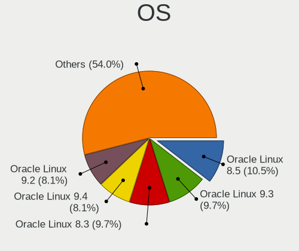

| Name             | Computers | Percent |
|------------------|-----------|---------|
| Oracle Linux 8.5 | 12        | 22.64%  |
| Oracle Linux 8.3 | 12        | 22.64%  |
| Oracle Linux 8.4 | 7         | 13.21%  |
| Oracle Linux 8.6 | 5         | 9.43%   |
| Oracle Linux 8.1 | 3         | 5.66%   |
| Oracle Linux 7.9 | 3         | 5.66%   |
| Oracle Linux 7.7 | 3         | 5.66%   |
| Oracle Linux 8.2 | 2         | 3.77%   |
| Oracle Linux 7.8 | 2         | 3.77%   |
| Oracle Linux 7.6 | 2         | 3.77%   |
| Oracle Linux 9.0 | 1         | 1.89%   |
| Oracle Linux 7.4 | 1         | 1.89%   |

OS Family
---------

OS without a version

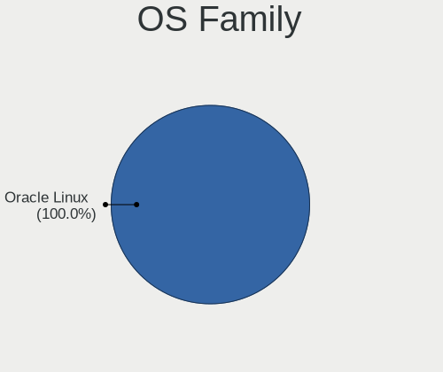

| Name         | Computers | Percent |
|--------------|-----------|---------|
| Oracle Linux | 46        | 100%    |

Kernel
------

Version of the Linux kernel

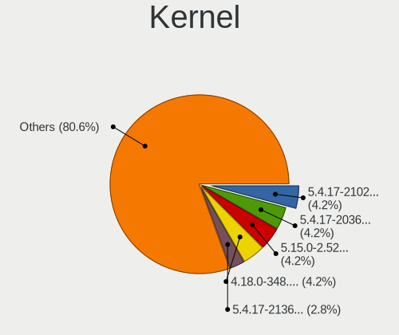

| Version                            | Computers | Percent |
|------------------------------------|-----------|---------|
| 5.4.17-2102.202.5.el8uek.x86_64    | 3         | 5.17%   |
| 5.4.17-2036.103.3.1.el8uek.x86_64  | 3         | 5.17%   |
| 4.18.0-348.12.2.el8_5.x86_64       | 3         | 5.17%   |
| 5.4.17-2136.304.4.3.el8uek.x86_64  | 2         | 3.45%   |
| 5.4.17-2102.205.7.3.el8uek.x86_64  | 2         | 3.45%   |
| 5.4.17-2102.200.13.el8uek.x86_64   | 2         | 3.45%   |
| 5.4.17-2036.102.0.2.el8uek.x86_64  | 2         | 3.45%   |
| 5.4.17-2036.101.2.el8uek.x86_64    | 2         | 3.45%   |
| 4.18.0-240.15.1.el8_3.x86_64       | 2         | 3.45%   |
| 4.18.0-193.1.2.el8_2.x86_64        | 2         | 3.45%   |
| 4.18.0-147.3.1.el8_1.x86_64        | 2         | 3.45%   |
| 5.4.17-2136.310.7.el8uek.x86_64    | 1         | 1.72%   |
| 5.4.17-2136.309.4.el8uek.x86_64    | 1         | 1.72%   |
| 5.4.17-2136.308.9.el8uek.x86_64    | 1         | 1.72%   |
| 5.4.17-2136.308.9.el7uek.x86_64    | 1         | 1.72%   |
| 5.4.17-2136.307.3.1.el8uek.x86_64  | 1         | 1.72%   |
| 5.4.17-2136.306.1.3.el8uek.x86_64  | 1         | 1.72%   |
| 5.4.17-2136.305.5.4.el8uek.x86_64  | 1         | 1.72%   |
| 5.4.17-2136.305.5.3.el8uek.x86_64  | 1         | 1.72%   |
| 5.4.17-2136.305.5.2.el8uek.x86_64  | 1         | 1.72%   |
| 5.4.17-2136.301.1.4.el8uek.x86_64  | 1         | 1.72%   |
| 5.4.17-2136.300.7.el8uek.x86_64    | 1         | 1.72%   |
| 5.4.17-2102.204.4.4.el8uek.x86_64  | 1         | 1.72%   |
| 5.4.17-2102.204.4.2.el8uek.x86_64  | 1         | 1.72%   |
| 5.4.17-2102.201.3.el8uek.x86_64    | 1         | 1.72%   |
| 5.4.17-2036.104.4.el8uek.x86_64    | 1         | 1.72%   |
| 5.4.17-2036.100.6.1.el8uek.x86_64  | 1         | 1.72%   |
| 5.4.17-2011.0.7.el8uek.x86_64      | 1         | 1.72%   |
| 5.4.11-1.el7.elrepo.x86_64         | 1         | 1.72%   |
| 5.15.2-1.el8.elrepo.x86_64         | 1         | 1.72%   |
| 5.15.0-0.30.20.1.el9uek.x86_64     | 1         | 1.72%   |
| 5.14.1-1.el8.elrepo.x86_64         | 1         | 1.72%   |
| 5.11.1-1.el8.elrepo.x86_64         | 1         | 1.72%   |
| 4.18.0-372.16.1.0.2.el8_6.x86_64   | 1         | 1.72%   |
| 4.18.0-348.2.1.el8_5.x86_64        | 1         | 1.72%   |
| 4.18.0-240.10.1.el8_3.x86_64       | 1         | 1.72%   |
| 4.14.35-2047.510.4.1.el7uek.x86_64 | 1         | 1.72%   |
| 4.14.35-1902.4.8.el7uek.x86_64     | 1         | 1.72%   |
| 4.14.35-1902.300.11.el7uek.x86_64  | 1         | 1.72%   |
| 4.14.35-1818.3.3.el7uek.x86_64     | 1         | 1.72%   |
| 4.1.12-124.63.2.1.el7uek.x86_64    | 1         | 1.72%   |
| 3.10.0-957.21.2.el7.x86_64         | 1         | 1.72%   |
| 3.10.0-693.11.6.el7.x86_64         | 1         | 1.72%   |
| 3.10.0-1127.10.1.el7.x86_64        | 1         | 1.72%   |

Kernel Family
-------------

Linux kernel without a distro release

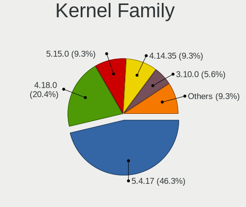

| Version | Computers | Percent |
|---------|-----------|---------|
| 5.4.17  | 24        | 50%     |
| 4.18.0  | 11        | 22.92%  |
| 4.14.35 | 4         | 8.33%   |
| 3.10.0  | 3         | 6.25%   |
| 5.4.11  | 1         | 2.08%   |
| 5.15.2  | 1         | 2.08%   |
| 5.15.0  | 1         | 2.08%   |
| 5.14.1  | 1         | 2.08%   |
| 5.11.1  | 1         | 2.08%   |
| 4.1.12  | 1         | 2.08%   |

Kernel Major Ver.
-----------------

Linux kernel major version

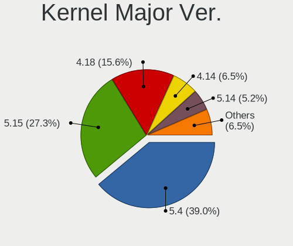

| Version | Computers | Percent |
|---------|-----------|---------|
| 5.4     | 25        | 52.08%  |
| 4.18    | 11        | 22.92%  |
| 4.14    | 4         | 8.33%   |
| 3.10    | 3         | 6.25%   |
| 5.15    | 2         | 4.17%   |
| 5.14    | 1         | 2.08%   |
| 5.11    | 1         | 2.08%   |
| 4.1     | 1         | 2.08%   |

Arch
----

OS architecture (x86_64, i586, etc.)

| Name   | Computers | Percent |
|--------|-----------|---------|
| x86_64 | 46        | 100%    |

DE
--

Desktop Environment

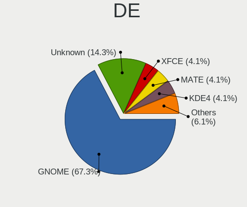

| Name          | Computers | Percent |
|---------------|-----------|---------|
| GNOME         | 33        | 67.35%  |
| Unknown       | 7         | 14.29%  |
| XFCE          | 2         | 4.08%   |
| MATE          | 2         | 4.08%   |
| KDE4          | 2         | 4.08%   |
| GNOME Classic | 2         | 4.08%   |
| KDE5          | 1         | 2.04%   |

Display Server
--------------

X11 or Wayland

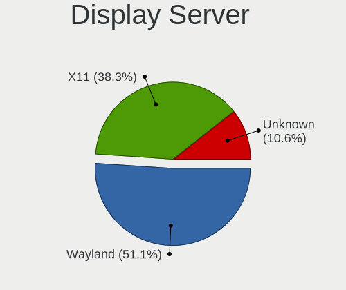

| Name    | Computers | Percent |
|---------|-----------|---------|
| Wayland | 25        | 52.08%  |
| X11     | 18        | 37.5%   |
| Unknown | 5         | 10.42%  |

Display Manager
---------------

SDDM, LightDM, etc.

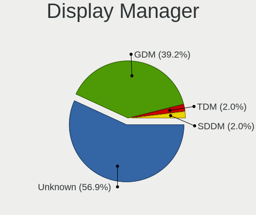

| Name    | Computers | Percent |
|---------|-----------|---------|
| Unknown | 28        | 58.33%  |
| GDM     | 18        | 37.5%   |
| TDM     | 1         | 2.08%   |
| SDDM    | 1         | 2.08%   |

OS Lang
-------

Language

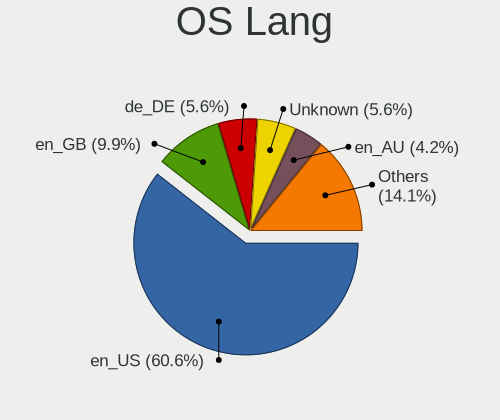

| Lang       | Computers | Percent |
|------------|-----------|---------|
| en_US      | 25        | 53.19%  |
| en_GB      | 5         | 10.64%  |
| de_DE      | 4         | 8.51%   |
| Unknown    | 4         | 8.51%   |
| en_AU      | 2         | 4.26%   |
| zh_HK      | 1         | 2.13%   |
| ru_RU      | 1         | 2.13%   |
| pt_BR      | 1         | 2.13%   |
| pl_PL      | 1         | 2.13%   |
| it_IT      | 1         | 2.13%   |
| en_US.UTF8 | 1         | 2.13%   |
| en_IN      | 1         | 2.13%   |

Boot Mode
---------

EFI or BIOS

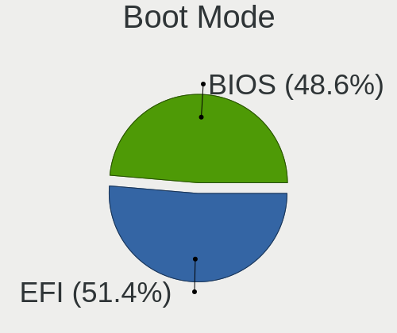

| Mode | Computers | Percent |
|------|-----------|---------|
| BIOS | 24        | 51.06%  |
| EFI  | 23        | 48.94%  |

Filesystem
----------

Type of filesystem

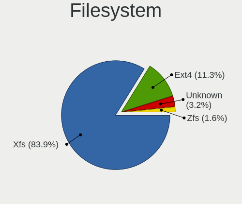

| Type    | Computers | Percent |
|---------|-----------|---------|
| Xfs     | 39        | 81.25%  |
| Ext4    | 7         | 14.58%  |
| Unknown | 2         | 4.17%   |

Part. scheme
------------

Scheme of partitioning

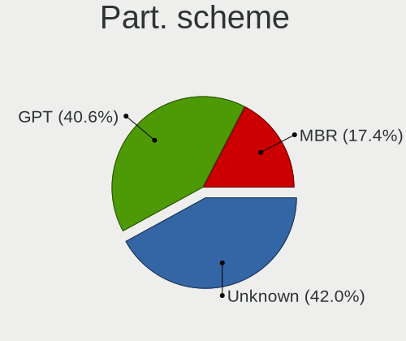

| Type    | Computers | Percent |
|---------|-----------|---------|
| Unknown | 25        | 52.08%  |
| GPT     | 13        | 27.08%  |
| MBR     | 10        | 20.83%  |

Dual Boot with Linux/BSD
------------------------

Hosting more than one Linux/BSD

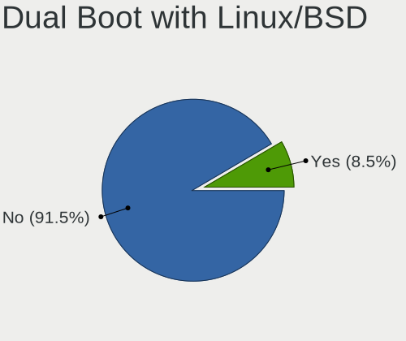

| Dual boot | Computers | Percent |
|-----------|-----------|---------|
| No        | 42        | 89.36%  |
| Yes       | 5         | 10.64%  |

Dual Boot (Win)
---------------

Hosting Linux and Windows

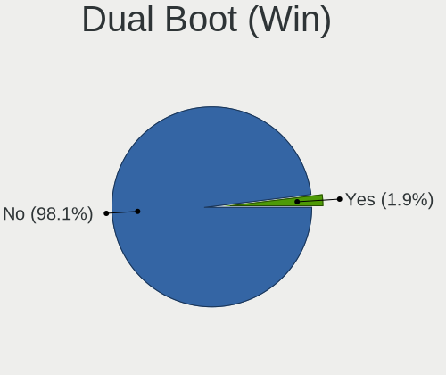

| Dual boot | Computers | Percent |
|-----------|-----------|---------|
| No        | 45        | 97.83%  |
| Yes       | 1         | 2.17%   |

Board
-----

Vendor
------

Motherboard manufacturer

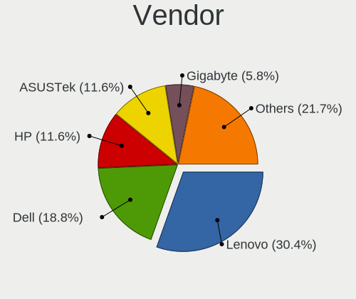

| Name                | Computers | Percent |
|---------------------|-----------|---------|
| Lenovo              | 17        | 36.96%  |
| Dell                | 11        | 23.91%  |
| Hewlett-Packard     | 5         | 10.87%  |
| ASUSTek Computer    | 5         | 10.87%  |
| Gigabyte Technology | 3         | 6.52%   |
| Standard            | 1         | 2.17%   |
| MSI                 | 1         | 2.17%   |
| HPE                 | 1         | 2.17%   |
| Foxconn             | 1         | 2.17%   |
| Apple               | 1         | 2.17%   |

Model
-----

Motherboard model

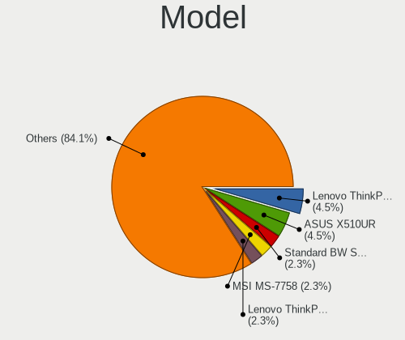

| Name                                      | Computers | Percent |
|-------------------------------------------|-----------|---------|
| Lenovo ThinkPad T450 20BUS14900           | 2         | 4.35%   |
| ASUS X510UR                               | 2         | 4.35%   |
| Standard BW Series                        | 1         | 2.17%   |
| MSI MS-7758                               | 1         | 2.17%   |
| Lenovo ThinkPad X390 Yoga 20NQS2SF00      | 1         | 2.17%   |
| Lenovo ThinkPad X280 20KES4H34G           | 1         | 2.17%   |
| Lenovo ThinkPad X1 Extreme 2nd 20QWS1R800 | 1         | 2.17%   |
| Lenovo ThinkPad T490 20N3S77600           | 1         | 2.17%   |
| Lenovo ThinkPad T480 20L6S56Y2X           | 1         | 2.17%   |
| Lenovo ThinkPad T480 20L5A07TAU           | 1         | 2.17%   |
| Lenovo ThinkPad T430s 2355C33             | 1         | 2.17%   |
| Lenovo ThinkPad P70 20ESS04S00            | 1         | 2.17%   |
| Lenovo ThinkPad P50s 20FL000MUS           | 1         | 2.17%   |
| Lenovo ThinkPad L540 20AVCTO1WW           | 1         | 2.17%   |
| Lenovo ThinkPad L490 20Q5CTO1WW           | 1         | 2.17%   |
| Lenovo Legion 5 15IMH05 82AU              | 1         | 2.17%   |
| Lenovo IdeaPad Slim 1-14AST-05 81VS       | 1         | 2.17%   |
| Lenovo IdeaPad C340-14IWL 81RL            | 1         | 2.17%   |
| Lenovo IdeaPad 300-15ISK 80RS             | 1         | 2.17%   |
| HPE ProLiant BL460c Gen10                 | 1         | 2.17%   |
| HP ZBook 15                               | 1         | 2.17%   |
| HP Z820 Workstation                       | 1         | 2.17%   |
| HP ProBook 445 G6                         | 1         | 2.17%   |
| HP Notebook                               | 1         | 2.17%   |
| HP Compaq 6730b                           | 1         | 2.17%   |
| Gigabyte Z490 AORUS ELITE AC              | 1         | 2.17%   |
| Gigabyte X99-Designare EX-CF              | 1         | 2.17%   |
| Gigabyte X470 AORUS ULTRA GAMING          | 1         | 2.17%   |
| Foxconn p6-2400el                         | 1         | 2.17%   |
| Dell Precision M4800                      | 1         | 2.17%   |
| Dell Precision M4600                      | 1         | 2.17%   |
| Dell PowerEdge FC630                      | 1         | 2.17%   |
| Dell OptiPlex 980                         | 1         | 2.17%   |
| Dell OptiPlex 7090                        | 1         | 2.17%   |
| Dell OptiPlex 7060                        | 1         | 2.17%   |
| Dell Latitude E6420                       | 1         | 2.17%   |
| Dell Latitude 7420                        | 1         | 2.17%   |
| Dell Latitude 7410                        | 1         | 2.17%   |
| Dell Inspiron 5502                        | 1         | 2.17%   |
| Dell Inspiron 3542                        | 1         | 2.17%   |
| ASUS UX305FA                              | 1         | 2.17%   |
| ASUS P8H67                                | 1         | 2.17%   |
| ASUS G11CD                                | 1         | 2.17%   |
| Apple Macmini7,1                          | 1         | 2.17%   |

Model Family
------------

Motherboard model prefix

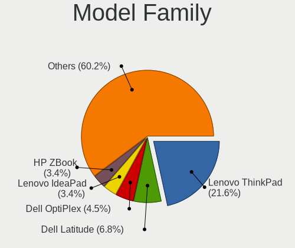

| Name                   | Computers | Percent |
|------------------------|-----------|---------|
| Lenovo ThinkPad        | 13        | 28.26%  |
| Lenovo IdeaPad         | 3         | 6.52%   |
| Dell OptiPlex          | 3         | 6.52%   |
| Dell Latitude          | 3         | 6.52%   |
| Dell Precision         | 2         | 4.35%   |
| Dell Inspiron          | 2         | 4.35%   |
| ASUS X510UR            | 2         | 4.35%   |
| Standard BW            | 1         | 2.17%   |
| MSI MS-7758            | 1         | 2.17%   |
| Lenovo Legion          | 1         | 2.17%   |
| HPE ProLiant           | 1         | 2.17%   |
| HP ZBook               | 1         | 2.17%   |
| HP Z820                | 1         | 2.17%   |
| HP ProBook             | 1         | 2.17%   |
| HP Notebook            | 1         | 2.17%   |
| HP Compaq              | 1         | 2.17%   |
| Gigabyte Z490          | 1         | 2.17%   |
| Gigabyte X99-Designare | 1         | 2.17%   |
| Gigabyte X470          | 1         | 2.17%   |
| Foxconn p6-2400el      | 1         | 2.17%   |
| Dell PowerEdge         | 1         | 2.17%   |
| ASUS UX305FA           | 1         | 2.17%   |
| ASUS P8H67             | 1         | 2.17%   |
| ASUS G11CD             | 1         | 2.17%   |
| Apple Macmini7         | 1         | 2.17%   |

MFG Year
--------

Motherboard manufacture year

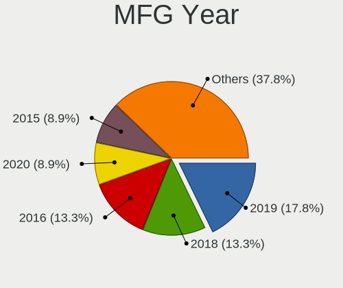

| Year | Computers | Percent |
|------|-----------|---------|
| 2019 | 8         | 17.39%  |
| 2018 | 6         | 13.04%  |
| 2016 | 6         | 13.04%  |
| 2020 | 5         | 10.87%  |
| 2015 | 4         | 8.7%    |
| 2012 | 4         | 8.7%    |
| 2014 | 3         | 6.52%   |
| 2017 | 2         | 4.35%   |
| 2013 | 2         | 4.35%   |
| 2011 | 2         | 4.35%   |
| 2010 | 2         | 4.35%   |
| 2021 | 1         | 2.17%   |
| 2008 | 1         | 2.17%   |

Form Factor
-----------

Physical design of the computer

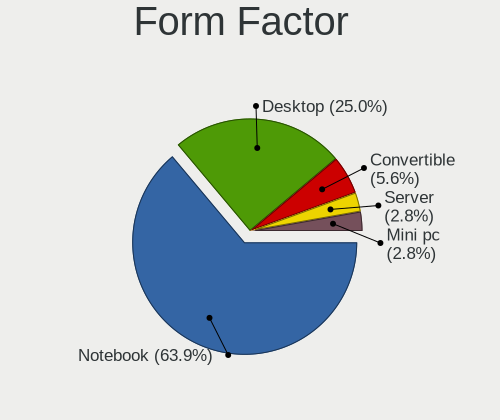

| Name        | Computers | Percent |
|-------------|-----------|---------|
| Notebook    | 30        | 65.22%  |
| Desktop     | 12        | 26.09%  |
| Convertible | 2         | 4.35%   |
| Mini pc     | 1         | 2.17%   |
| Server      | 1         | 2.17%   |

Secure Boot
-----------

Enabled or disabled

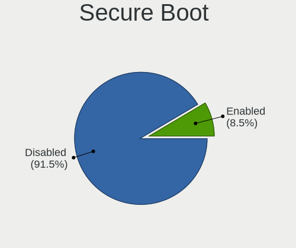

| State    | Computers | Percent |
|----------|-----------|---------|
| Disabled | 43        | 91.49%  |
| Enabled  | 4         | 8.51%   |

Coreboot
--------

Have coreboot on board

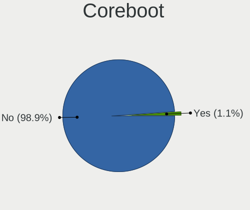

| Used | Computers | Percent |
|------|-----------|---------|
| No   | 46        | 100%    |

RAM Size
--------

Total RAM memory

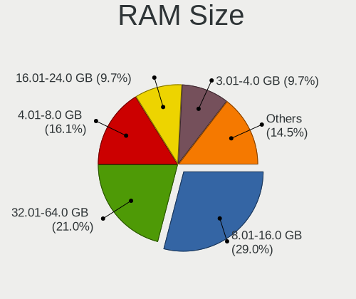

| Size in GB      | Computers | Percent |
|-----------------|-----------|---------|
| 32.01-64.0      | 12        | 25.53%  |
| 8.01-16.0       | 11        | 23.4%   |
| 4.01-8.0        | 9         | 19.15%  |
| 16.01-24.0      | 5         | 10.64%  |
| 3.01-4.0        | 4         | 8.51%   |
| 64.01-256.0     | 3         | 6.38%   |
| More than 256.0 | 1         | 2.13%   |
| 24.01-32.0      | 1         | 2.13%   |
| 1.01-2.0        | 1         | 2.13%   |

RAM Used
--------

Used RAM memory

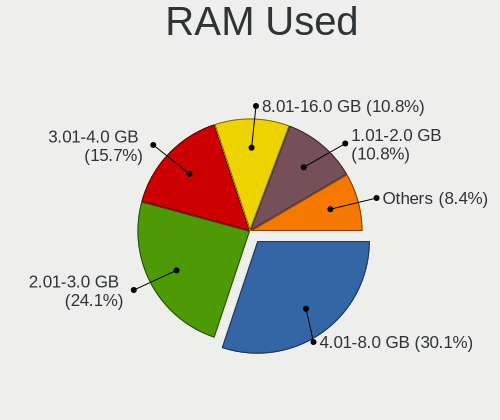

| Used GB    | Computers | Percent |
|------------|-----------|---------|
| 2.01-3.0   | 16        | 30.19%  |
| 4.01-8.0   | 14        | 26.42%  |
| 8.01-16.0  | 8         | 15.09%  |
| 3.01-4.0   | 6         | 11.32%  |
| 1.01-2.0   | 5         | 9.43%   |
| 24.01-32.0 | 1         | 1.89%   |
| 16.01-24.0 | 1         | 1.89%   |
| 0.51-1.0   | 1         | 1.89%   |
| 0.01-0.5   | 1         | 1.89%   |

Total Drives
------------

Number of drives on board

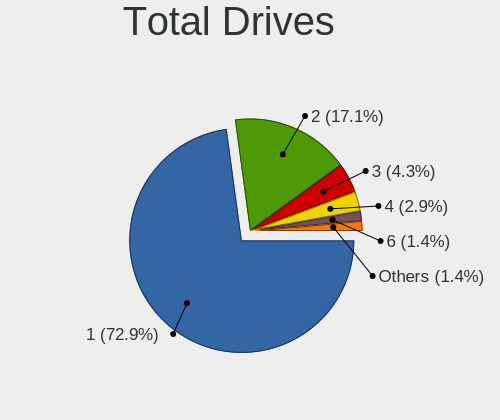

| Drives | Computers | Percent |
|--------|-----------|---------|
| 1      | 36        | 76.6%   |
| 2      | 5         | 10.64%  |
| 3      | 3         | 6.38%   |
| 4      | 2         | 4.26%   |
| 5      | 1         | 2.13%   |

Has CD-ROM
----------

Has CD-ROM on board

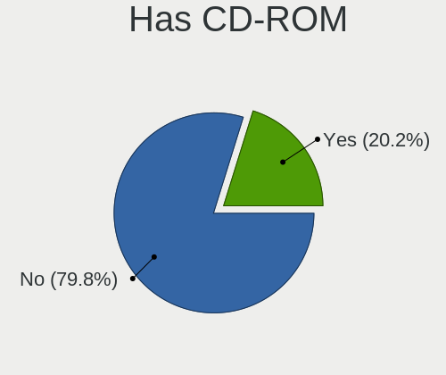

| Presented | Computers | Percent |
|-----------|-----------|---------|
| No        | 32        | 69.57%  |
| Yes       | 14        | 30.43%  |

Has Ethernet
------------

Has Ethernet on board

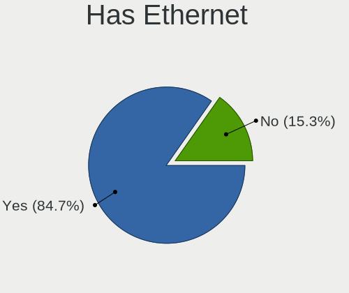

| Presented | Computers | Percent |
|-----------|-----------|---------|
| Yes       | 39        | 84.78%  |
| No        | 7         | 15.22%  |

Has WiFi
--------

Has WiFi module

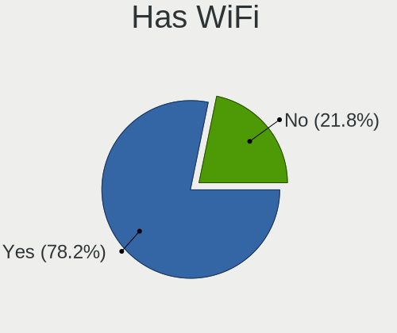

| Presented | Computers | Percent |
|-----------|-----------|---------|
| Yes       | 37        | 80.43%  |
| No        | 9         | 19.57%  |

Has Bluetooth
-------------

Has Bluetooth module

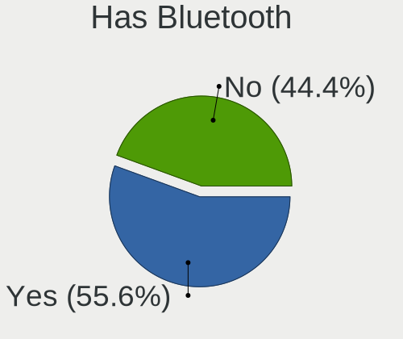

| Presented | Computers | Percent |
|-----------|-----------|---------|
| Yes       | 26        | 55.32%  |
| No        | 21        | 44.68%  |

Location
--------

Country
-------

Geographic location (country)

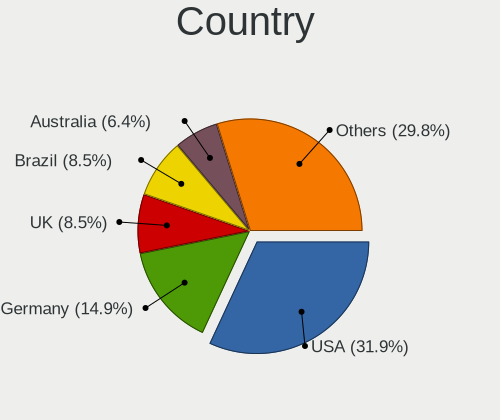

| Country     | Computers | Percent |
|-------------|-----------|---------|
| USA         | 15        | 31.91%  |
| Germany     | 7         | 14.89%  |
| UK          | 4         | 8.51%   |
| Brazil      | 4         | 8.51%   |
| Australia   | 3         | 6.38%   |
| Russia      | 2         | 4.26%   |
| Romania     | 2         | 4.26%   |
| Netherlands | 2         | 4.26%   |
| Poland      | 1         | 2.13%   |
| Pakistan    | 1         | 2.13%   |
| Kazakhstan  | 1         | 2.13%   |
| Italy       | 1         | 2.13%   |
| India       | 1         | 2.13%   |
| Hong Kong   | 1         | 2.13%   |
| Bulgaria    | 1         | 2.13%   |
| Argentina   | 1         | 2.13%   |

City
----

Geographic location (city)

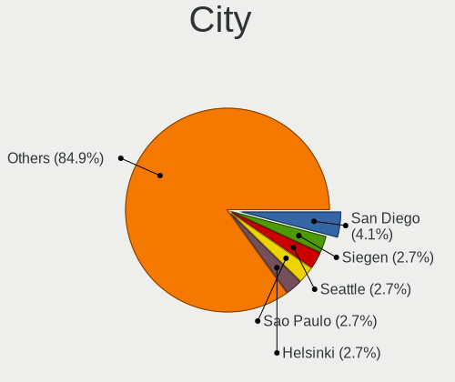

| City               | Computers | Percent |
|--------------------|-----------|---------|
| San Diego          | 3         | 5.88%   |
| Siegen             | 2         | 3.92%   |
| Seattle            | 2         | 3.92%   |
| Sao Paulo          | 2         | 3.92%   |
| Colorado Springs   | 2         | 3.92%   |
| Bucharest          | 2         | 3.92%   |
| Berlin             | 2         | 3.92%   |
| Weaverville        | 1         | 1.96%   |
| Veliky Novgorod    | 1         | 1.96%   |
| Utrecht            | 1         | 1.96%   |
| Sydney             | 1         | 1.96%   |
| Sofia              | 1         | 1.96%   |
| Shrewsbury         | 1         | 1.96%   |
| Sao Caetano do Sul | 1         | 1.96%   |
| San Francisco      | 1         | 1.96%   |
| Rocklin            | 1         | 1.96%   |
| Riverside          | 1         | 1.96%   |
| Reading            | 1         | 1.96%   |
| Port Saint Lucie   | 1         | 1.96%   |
| Pleven             | 1         | 1.96%   |
| Ngau Wu Tok        | 1         | 1.96%   |
| Neunkirchen        | 1         | 1.96%   |
| Moscow             | 1         | 1.96%   |
| Maple Valley       | 1         | 1.96%   |
| Ludwigsburg        | 1         | 1.96%   |
| London             | 1         | 1.96%   |
| Langgons           | 1         | 1.96%   |
| Katowice           | 1         | 1.96%   |
| Karaganda          | 1         | 1.96%   |
| Karachi            | 1         | 1.96%   |
| Greven             | 1         | 1.96%   |
| Drochtersen        | 1         | 1.96%   |
| Dallas             | 1         | 1.96%   |
| Chicago            | 1         | 1.96%   |
| Castelar           | 1         | 1.96%   |
| Canberra           | 1         | 1.96%   |
| Campinas           | 1         | 1.96%   |
| Bracknell          | 1         | 1.96%   |
| Bengaluru          | 1         | 1.96%   |
| Asheville          | 1         | 1.96%   |
| Amsterdam          | 1         | 1.96%   |
| Albairate          | 1         | 1.96%   |
| Adelaide           | 1         | 1.96%   |

Drives
------

Drive Vendor
------------

Hard drive vendors

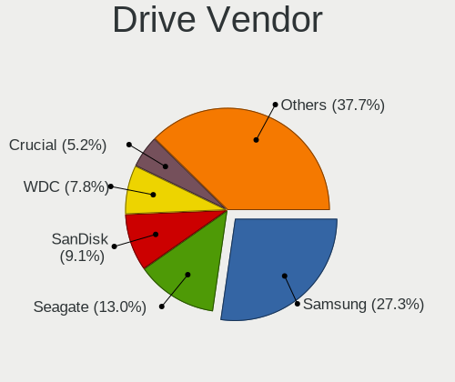

| Vendor                  | Computers | Drives | Percent |
|-------------------------|-----------|--------|---------|
| Samsung Electronics     | 16        | 20     | 28.07%  |
| Seagate                 | 9         | 47     | 15.79%  |
| SanDisk                 | 6         | 7      | 10.53%  |
| WDC                     | 4         | 4      | 7.02%   |
| Unknown                 | 2         | 4      | 3.51%   |
| Toshiba                 | 2         | 2      | 3.51%   |
| Kingston                | 2         | 9      | 3.51%   |
| HGST                    | 2         | 3      | 3.51%   |
| Crucial                 | 2         | 3      | 3.51%   |
| Union Memory (Shenzhen) | 1         | 2      | 1.75%   |
| SK hynix                | 1         | 1      | 1.75%   |
| Phison                  | 1         | 1      | 1.75%   |
| Micron Technology       | 1         | 4      | 1.75%   |
| Lite-On                 | 1         | 1      | 1.75%   |
| Lenovo                  | 1         | 1      | 1.75%   |
| JMicron Technology      | 1         | 1      | 1.75%   |
| Intel                   | 1         | 1      | 1.75%   |
| HPE                     | 1         | 1      | 1.75%   |
| Hewlett-Packard         | 1         | 1      | 1.75%   |
| Fujitsu                 | 1         | 1      | 1.75%   |
| Apple                   | 1         | 1      | 1.75%   |

Drive Model
-----------

Hard drive models

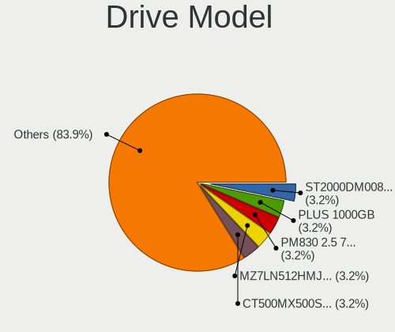

| Model                                        | Computers | Percent |
|----------------------------------------------|-----------|---------|
| Seagate ST2000DM008-2FR102 2TB               | 2         | 3.23%   |
| SanDisk SSD PLUS 1000GB                      | 2         | 3.23%   |
| Samsung SSD PM830 2.5 7mm 256GB              | 2         | 3.23%   |
| Samsung MZ7LN512HMJP-000L7 512GB SSD         | 2         | 3.23%   |
| Crucial CT500MX500SSD1 500GB                 | 2         | 3.23%   |
| WDC WDS500G2B0A-00SM50 500GB SSD             | 1         | 1.61%   |
| WDC WDS250G2B0A-00SM50 250GB SSD             | 1         | 1.61%   |
| WDC WD10JPCX-24UE4T0 1TB                     | 1         | 1.61%   |
| WDC WD10EZEX-60M2NA0 1TB                     | 1         | 1.61%   |
| Unknown SD/MMC/MS PRO 128GB                  | 1         | 1.61%   |
| Unknown MMC Card  256GB                      | 1         | 1.61%   |
| Union Memory (Shenzhen) NVMe SSD Drive 128GB | 1         | 1.61%   |
| Toshiba NVMe SSD Drive 512GB                 | 1         | 1.61%   |
| Toshiba MG04ACA200E 2TB                      | 1         | 1.61%   |
| SK hynix SKHynix_HFS256GD9TNG-L3A0B 256GB    | 1         | 1.61%   |
| Seagate ST9750420AS 752GB                    | 1         | 1.61%   |
| Seagate ST8000VN004-2M2101 8TB               | 1         | 1.61%   |
| Seagate ST3750528AS 752GB                    | 1         | 1.61%   |
| Seagate ST3500414CS 500GB                    | 1         | 1.61%   |
| Seagate ST2000NX0253 2TB                     | 1         | 1.61%   |
| Seagate ST1000NX0423 1TB                     | 1         | 1.61%   |
| Seagate ST1000LM024 HN-M101MBB 1TB           | 1         | 1.61%   |
| Seagate ST1000LM010-9YH146 1TB               | 1         | 1.61%   |
| Seagate BUP Slim BK 1TB                      | 1         | 1.61%   |
| SanDisk SDSSDH3512G 512GB                    | 1         | 1.61%   |
| SanDisk SD7SN3Q256G1002 256GB SSD            | 1         | 1.61%   |
| SanDisk SD6SB1M-256G-1006 256GB SSD          | 1         | 1.61%   |
| SanDisk NVMe SSD Drive 512GB                 | 1         | 1.61%   |
| Samsung SSD SM841N 2.5 7mm 512GB             | 1         | 1.61%   |
| Samsung SSD 960 EVO 250GB                    | 1         | 1.61%   |
| Samsung SSD 860 EVO 250GB                    | 1         | 1.61%   |
| Samsung SSD 850 PRO 256GB                    | 1         | 1.61%   |
| Samsung PM9A1 NVMe 512GB                     | 1         | 1.61%   |
| Samsung NVMe SSD Drive 512GB                 | 1         | 1.61%   |
| Samsung NVMe SSD Drive 1TB                   | 1         | 1.61%   |
| Samsung MZVLW256HEHP-000L7 256GB             | 1         | 1.61%   |
| Samsung MZVLB1T0HBLR-000L7 1TB               | 1         | 1.61%   |
| Samsung MZNLN512HCJH-000L1 512GB SSD         | 1         | 1.61%   |
| Samsung MZ7LN512HCHP-000L1 512GB SSD         | 1         | 1.61%   |
| Samsung MZ7LN256HCHP-000L7 256GB SSD         | 1         | 1.61%   |
| Samsung HD502IJ 500GB                        | 1         | 1.61%   |
| Phison NVMe SSD Drive 1TB                    | 1         | 1.61%   |
| Micron NVMe SSD Drive 256GB                  | 1         | 1.61%   |
| Micron 2200S NVMe 256GB                      | 1         | 1.61%   |
| Lite-On NVMe SSD Drive 512GB                 | 1         | 1.61%   |
| Lenovo LENSE30512GMSP34MEAT3TA 512GB         | 1         | 1.61%   |
| Kingston SUV400S37240G 240GB SSD             | 1         | 1.61%   |
| Kingston SA400S37240G 240GB SSD              | 1         | 1.61%   |
| Kingston NVMe SSD Drive 1TB                  | 1         | 1.61%   |
| JMicron Disk 250GB                           | 1         | 1.61%   |
| Intel SSDPEKKF256G8L 256GB                   | 1         | 1.61%   |
| HPE LOGICAL VOLUME 304GB                     | 1         | 1.61%   |
| HGST HTS545050A7E380 500GB                   | 1         | 1.61%   |
| HGST HTS541010A7E630 1TB                     | 1         | 1.61%   |
| HP SSD S700 120GB                            | 1         | 1.61%   |
| Fujitsu MHZ2160BH G2 160GB                   | 1         | 1.61%   |
| Apple HDD HTS541010A9E662 1TB                | 1         | 1.61%   |

HDD Vendor
----------

Hard disk drive vendors

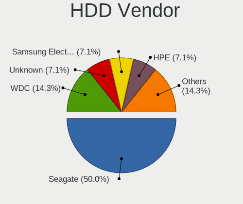

| Vendor              | Computers | Drives | Percent |
|---------------------|-----------|--------|---------|
| Seagate             | 9         | 47     | 45%     |
| WDC                 | 2         | 2      | 10%     |
| HGST                | 2         | 3      | 10%     |
| Unknown             | 1         | 3      | 5%      |
| Toshiba             | 1         | 1      | 5%      |
| Samsung Electronics | 1         | 1      | 5%      |
| JMicron Technology  | 1         | 1      | 5%      |
| HPE                 | 1         | 1      | 5%      |
| Fujitsu             | 1         | 1      | 5%      |
| Apple               | 1         | 1      | 5%      |

SSD Vendor
----------

Solid state drive vendors

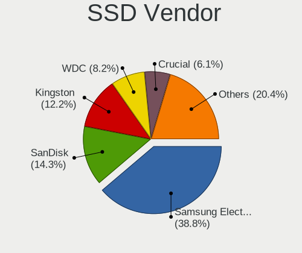

| Vendor              | Computers | Drives | Percent |
|---------------------|-----------|--------|---------|
| Samsung Electronics | 10        | 11     | 47.62%  |
| SanDisk             | 5         | 5      | 23.81%  |
| WDC                 | 2         | 2      | 9.52%   |
| Crucial             | 2         | 3      | 9.52%   |
| Kingston            | 1         | 2      | 4.76%   |
| Hewlett-Packard     | 1         | 1      | 4.76%   |

Drive Kind
----------

HDD or SSD

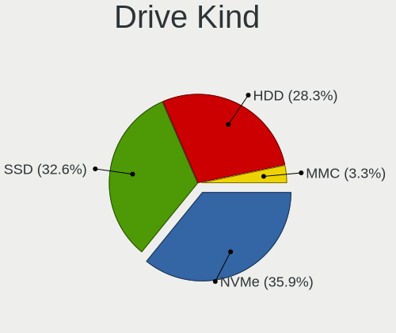

| Kind | Computers | Drives | Percent |
|------|-----------|--------|---------|
| SSD  | 21        | 24     | 37.5%   |
| HDD  | 18        | 61     | 32.14%  |
| NVMe | 16        | 29     | 28.57%  |
| MMC  | 1         | 1      | 1.79%   |

Drive Connector
---------------

SATA, SAS, NVMe, etc.

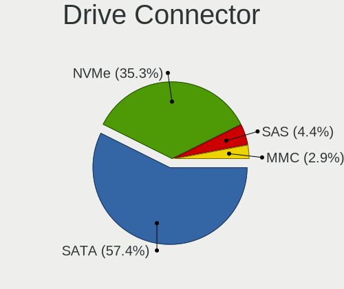

| Type | Computers | Drives | Percent |
|------|-----------|--------|---------|
| SATA | 33        | 79     | 62.26%  |
| NVMe | 16        | 29     | 30.19%  |
| SAS  | 3         | 6      | 5.66%   |
| MMC  | 1         | 1      | 1.89%   |

Drive Size
----------

Size of hard drive

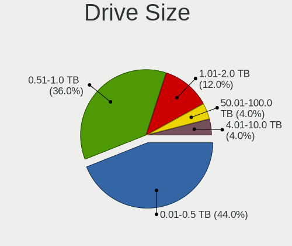

| Size in TB | Computers | Drives | Percent |
|------------|-----------|--------|---------|
| 0.01-0.5   | 19        | 24     | 47.5%   |
| 0.51-1.0   | 16        | 21     | 40%     |
| 1.01-2.0   | 4         | 38     | 10%     |
| 4.01-10.0  | 1         | 2      | 2.5%    |

Space Total
-----------

Amount of disk space available on the file system

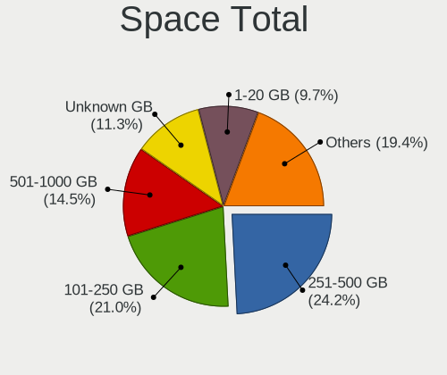

| Size in GB     | Computers | Percent |
|----------------|-----------|---------|
| 251-500        | 11        | 23.4%   |
| 101-250        | 9         | 19.15%  |
| Unknown        | 7         | 14.89%  |
| 501-1000       | 6         | 12.77%  |
| 1-20           | 5         | 10.64%  |
| 2001-3000      | 3         | 6.38%   |
| 1001-2000      | 2         | 4.26%   |
| 51-100         | 2         | 4.26%   |
| More than 3000 | 1         | 2.13%   |
| 21-50          | 1         | 2.13%   |

Space Used
----------

Amount of used disk space

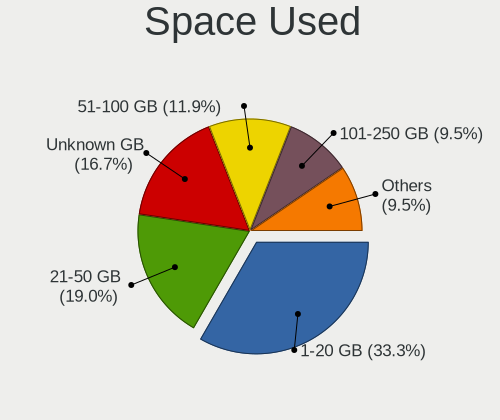

| Used GB        | Computers | Percent |
|----------------|-----------|---------|
| 1-20           | 15        | 30.61%  |
| 21-50          | 10        | 20.41%  |
| Unknown        | 7         | 14.29%  |
| 51-100         | 6         | 12.24%  |
| 101-250        | 5         | 10.2%   |
| 251-500        | 3         | 6.12%   |
| More than 3000 | 1         | 2.04%   |
| 1001-2000      | 1         | 2.04%   |
| 501-1000       | 1         | 2.04%   |

Malfunc. Drives
---------------

Drive models with a malfunction

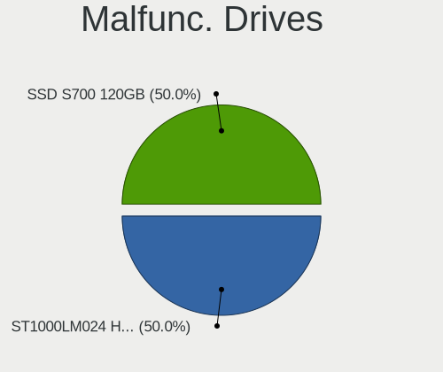

| Model                              | Computers | Drives | Percent |
|------------------------------------|-----------|--------|---------|
| Seagate ST9750420AS 752GB          | 1         | 1      | 33.33%  |
| Seagate ST1000LM024 HN-M101MBB 1TB | 1         | 1      | 33.33%  |
| Hewlett-Packard SSD S700 120GB     | 1         | 1      | 33.33%  |

Malfunc. Drive Vendor
---------------------

Vendors of faulty drives

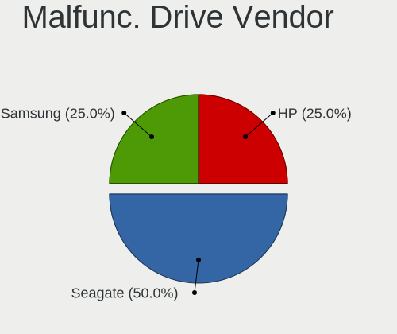

| Vendor          | Computers | Drives | Percent |
|-----------------|-----------|--------|---------|
| Seagate         | 2         | 2      | 66.67%  |
| Hewlett-Packard | 1         | 1      | 33.33%  |

Malfunc. HDD Vendor
-------------------

Vendors of faulty HDD drives

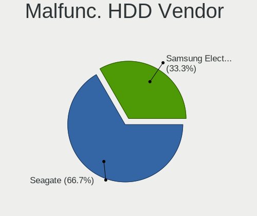

| Vendor  | Computers | Drives | Percent |
|---------|-----------|--------|---------|
| Seagate | 2         | 2      | 100%    |

Malfunc. Drive Kind
-------------------

Kinds of faulty drives

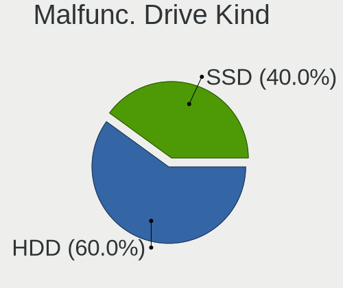

| Kind | Computers | Drives | Percent |
|------|-----------|--------|---------|
| HDD  | 2         | 2      | 66.67%  |
| SSD  | 1         | 1      | 33.33%  |

Failed Drives
-------------

Failed drive models

Zero info for selected period =(

Failed Drive Vendor
-------------------

Failed drive vendors

Zero info for selected period =(

Drive Status
------------

Number of failed and malfunc. drives

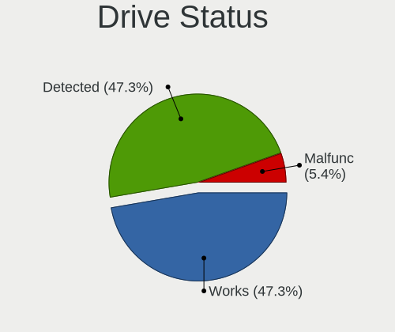

| Status   | Computers | Drives | Percent |
|----------|-----------|--------|---------|
| Detected | 27        | 53     | 55.1%   |
| Works    | 19        | 59     | 38.78%  |
| Malfunc  | 3         | 3      | 6.12%   |

Storage controller
------------------

Storage Vendor
--------------

Storage controller vendors

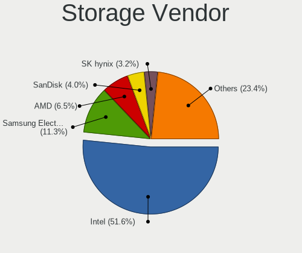

| Vendor                       | Computers | Percent |
|------------------------------|-----------|---------|
| Intel                        | 32        | 58.18%  |
| Samsung Electronics          | 6         | 10.91%  |
| AMD                          | 4         | 7.27%   |
| Broadcom / LSI               | 2         | 3.64%   |
| VIA Technologies             | 1         | 1.82%   |
| Union Memory (Shenzhen)      | 1         | 1.82%   |
| Toshiba America Info Systems | 1         | 1.82%   |
| SK hynix                     | 1         | 1.82%   |
| SanDisk                      | 1         | 1.82%   |
| Phison Electronics           | 1         | 1.82%   |
| Micron Technology            | 1         | 1.82%   |
| Lite-On Technology           | 1         | 1.82%   |
| Lenovo                       | 1         | 1.82%   |
| Kingston Technology Company  | 1         | 1.82%   |
| Adaptec                      | 1         | 1.82%   |

Storage Model
-------------

Storage controller models

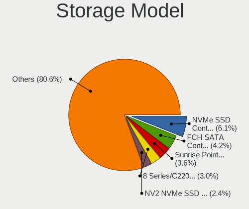

| Model                                                                                   | Computers | Percent |
|-----------------------------------------------------------------------------------------|-----------|---------|
| Intel Sunrise Point-LP SATA Controller [AHCI mode]                                      | 4         | 6.56%   |
| AMD FCH SATA Controller [AHCI mode]                                                     | 4         | 6.56%   |
| Samsung NVMe SSD Controller SM981/PM981/PM983                                           | 3         | 4.92%   |
| Intel Wildcat Point-LP SATA Controller [AHCI Mode]                                      | 3         | 4.92%   |
| Intel 82801 Mobile SATA Controller [RAID mode]                                          | 3         | 4.92%   |
| Samsung NVMe SSD Controller SM961/PM961/SM963                                           | 2         | 3.28%   |
| Intel Q170/Q150/B150/H170/H110/Z170/CM236 Chipset SATA Controller [AHCI Mode]           | 2         | 3.28%   |
| Intel C610/X99 series chipset sSATA Controller [AHCI mode]                              | 2         | 3.28%   |
| Intel C610/X99 series chipset 6-Port SATA Controller [AHCI mode]                        | 2         | 3.28%   |
| Intel 8 Series/C220 Series Chipset Family 6-port SATA Controller 1 [AHCI mode]          | 2         | 3.28%   |
| Intel 8 Series SATA Controller 1 [AHCI mode]                                            | 2         | 3.28%   |
| VIA VT6415 PATA IDE Host Controller                                                     | 1         | 1.64%   |
| Union Memory (Shenzhen) Non-Volatile memory controller                                  | 1         | 1.64%   |
| Toshiba America Info Systems Toshiba America Info Non-Volatile memory controller        | 1         | 1.64%   |
| SK hynix Non-Volatile memory controller                                                 | 1         | 1.64%   |
| SanDisk WD Black 2018/SN750 / PC SN720 NVMe SSD                                         | 1         | 1.64%   |
| Samsung NVMe SSD Controller PM9A1/PM9A3/980PRO                                          | 1         | 1.64%   |
| Phison E12 NVMe Controller                                                              | 1         | 1.64%   |
| Micron Non-Volatile memory controller                                                   | 1         | 1.64%   |
| Lite-On Non-Volatile memory controller                                                  | 1         | 1.64%   |
| Lenovo Non-Volatile memory controller                                                   | 1         | 1.64%   |
| Kingston Company A2000 NVMe SSD                                                         | 1         | 1.64%   |
| Intel SSD Pro 7600p/760p/E 6100p Series                                                 | 1         | 1.64%   |
| Intel SATA Controller [RAID mode]                                                       | 1         | 1.64%   |
| Intel Comet Lake SATA AHCI Controller                                                   | 1         | 1.64%   |
| Intel Cannon Point-LP SATA Controller [AHCI Mode]                                       | 1         | 1.64%   |
| Intel Cannon Lake PCH SATA AHCI Controller                                              | 1         | 1.64%   |
| Intel C602 chipset 4-Port SATA Storage Control Unit                                     | 1         | 1.64%   |
| Intel C600/X79 series chipset SATA RAID Controller                                      | 1         | 1.64%   |
| Intel C600/X79 series chipset IDE-r Controller                                          | 1         | 1.64%   |
| Intel Atom/Celeron/Pentium Processor x5-E8000/J3xxx/N3xxx Series SATA Controller        | 1         | 1.64%   |
| Intel 82801IBM/IEM (ICH9M/ICH9M-E) 4 port SATA Controller [AHCI mode]                   | 1         | 1.64%   |
| Intel 7 Series/C210 Series Chipset Family 6-port SATA Controller [AHCI mode]            | 1         | 1.64%   |
| Intel 7 Series Chipset Family 6-port SATA Controller [AHCI mode]                        | 1         | 1.64%   |
| Intel 6 Series/C200 Series Chipset Family Desktop SATA Controller (IDE mode, ports 4-5) | 1         | 1.64%   |
| Intel 6 Series/C200 Series Chipset Family Desktop SATA Controller (IDE mode, ports 0-3) | 1         | 1.64%   |
| Intel 6 Series/C200 Series Chipset Family 6 port Desktop SATA AHCI Controller           | 1         | 1.64%   |
| Intel 500 Series Chipset Family SATA AHCI Controller                                    | 1         | 1.64%   |
| Intel 400 Series Chipset Family SATA AHCI Controller                                    | 1         | 1.64%   |
| Broadcom / LSI SAS2308 PCI-Express Fusion-MPT SAS-2                                     | 1         | 1.64%   |
| Broadcom / LSI MegaRAID SAS-3 3108 [Invader]                                            | 1         | 1.64%   |
| AMD 400 Series Chipset SATA Controller                                                  | 1         | 1.64%   |
| Adaptec Smart Storage PQI SAS                                                           | 1         | 1.64%   |

Storage Kind
------------

Kind of storage controller (IDE, SATA, NVMe, SAS, ...)

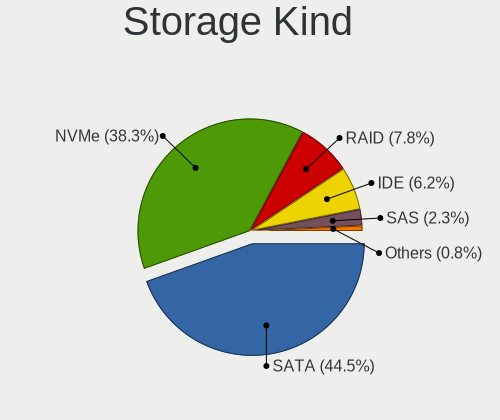

| Kind | Computers | Percent |
|------|-----------|---------|
| SATA | 29        | 52.73%  |
| NVMe | 16        | 29.09%  |
| RAID | 6         | 10.91%  |
| SAS  | 2         | 3.64%   |
| IDE  | 2         | 3.64%   |

Processor
---------

CPU Vendor
----------

Processor vendors

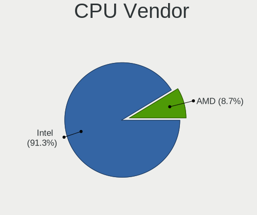

| Vendor | Computers | Percent |
|--------|-----------|---------|
| Intel  | 42        | 91.3%   |
| AMD    | 4         | 8.7%    |

CPU Model
---------

Processor models

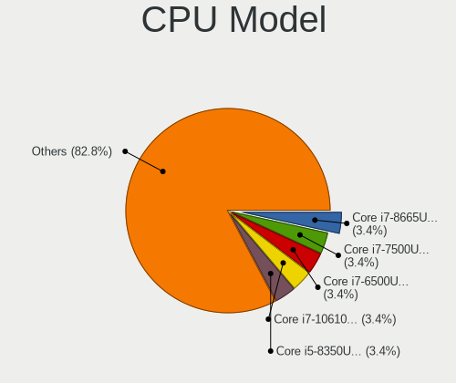

| Model                                           | Computers | Percent |
|-------------------------------------------------|-----------|---------|
| Intel Core i7-8665U CPU @ 1.90GHz               | 2         | 4.35%   |
| Intel Core i7-7500U CPU @ 2.70GHz               | 2         | 4.35%   |
| Intel Core i7-6500U CPU @ 2.50GHz               | 2         | 4.35%   |
| Intel Core i5-8350U CPU @ 1.70GHz               | 2         | 4.35%   |
| Intel Core i5-5300U CPU @ 2.30GHz               | 2         | 4.35%   |
| Intel Xeon Silver 4114 CPU @ 2.20GHz            | 1         | 2.17%   |
| Intel Xeon CPU E5-2650 v2 @ 2.60GHz             | 1         | 2.17%   |
| Intel Xeon CPU E5-2620 v4 @ 2.10GHz             | 1         | 2.17%   |
| Intel Processor 5Y10 CPU @ 0.80GHz              | 1         | 2.17%   |
| Intel Pentium CPU G2020 @ 2.90GHz               | 1         | 2.17%   |
| Intel Core i9-9880H CPU @ 2.30GHz               | 1         | 2.17%   |
| Intel Core i9-10900K CPU @ 3.70GHz              | 1         | 2.17%   |
| Intel Core i7-8700 CPU @ 3.20GHz                | 1         | 2.17%   |
| Intel Core i7-8565U CPU @ 1.80GHz               | 1         | 2.17%   |
| Intel Core i7-8550U CPU @ 1.80GHz               | 1         | 2.17%   |
| Intel Core i7-6820HQ CPU @ 2.70GHz              | 1         | 2.17%   |
| Intel Core i7-6800K CPU @ 3.40GHz               | 1         | 2.17%   |
| Intel Core i7-6700 CPU @ 3.40GHz                | 1         | 2.17%   |
| Intel Core i7-4910MQ CPU @ 2.90GHz              | 1         | 2.17%   |
| Intel Core i7-4800MQ CPU @ 2.70GHz              | 1         | 2.17%   |
| Intel Core i7-3770 CPU @ 3.40GHz                | 1         | 2.17%   |
| Intel Core i7-2860QM CPU @ 2.50GHz              | 1         | 2.17%   |
| Intel Core i7-2760QM CPU @ 2.40GHz              | 1         | 2.17%   |
| Intel Core i7-2600 CPU @ 3.40GHz                | 1         | 2.17%   |
| Intel Core i7-10750H CPU @ 2.60GHz              | 1         | 2.17%   |
| Intel Core i7-10610U CPU @ 1.80GHz              | 1         | 2.17%   |
| Intel Core i5-8365U CPU @ 1.60GHz               | 1         | 2.17%   |
| Intel Core i5-4278U CPU @ 2.60GHz               | 1         | 2.17%   |
| Intel Core i5-4210U CPU @ 1.70GHz               | 1         | 2.17%   |
| Intel Core i5-4210M CPU @ 2.60GHz               | 1         | 2.17%   |
| Intel Core i5-3320M CPU @ 2.60GHz               | 1         | 2.17%   |
| Intel Core i5-10500 CPU @ 3.10GHz               | 1         | 2.17%   |
| Intel Core i3 CPU 550 @ 3.20GHz                 | 1         | 2.17%   |
| Intel Core 2 Duo CPU P8400 @ 2.26GHz            | 1         | 2.17%   |
| Intel Celeron CPU N3010 @ 1.04GHz               | 1         | 2.17%   |
| Intel 11th Gen Core i7-1185G7 @ 3.00GHz         | 1         | 2.17%   |
| Intel 11th Gen Core i7-1165G7 @ 2.80GHz         | 1         | 2.17%   |
| AMD Ryzen 7 PRO 2700U w/ Radeon Vega Mobile Gfx | 1         | 2.17%   |
| AMD Ryzen 7 2700X Eight-Core Processor          | 1         | 2.17%   |
| AMD A9-9420e RADEON R5, 5 COMPUTE CORES 2C+3G   | 1         | 2.17%   |
| AMD A8-7410 APU with AMD Radeon R5 Graphics     | 1         | 2.17%   |

CPU Model Family
----------------

Processor model prefix

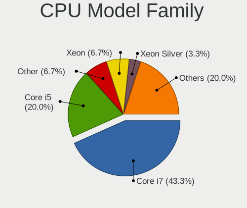

| Model             | Computers | Percent |
|-------------------|-----------|---------|
| Intel Core i7     | 20        | 43.48%  |
| Intel Core i5     | 10        | 21.74%  |
| Other             | 4         | 8.7%    |
| Intel Xeon        | 2         | 4.35%   |
| Intel Core i9     | 2         | 4.35%   |
| Intel Xeon Silver | 1         | 2.17%   |
| Intel Pentium     | 1         | 2.17%   |
| Intel Core i3     | 1         | 2.17%   |
| Intel Core 2 Duo  | 1         | 2.17%   |
| Intel Celeron     | 1         | 2.17%   |
| AMD Ryzen 7 PRO   | 1         | 2.17%   |
| AMD Ryzen 7       | 1         | 2.17%   |
| AMD A8            | 1         | 2.17%   |

CPU Cores
---------

Number of processor cores

| Number | Computers | Percent |
|--------|-----------|---------|
| 4      | 19        | 41.3%   |
| 2      | 16        | 34.78%  |
| 6      | 4         | 8.7%    |
| 16     | 2         | 4.35%   |
| 8      | 2         | 4.35%   |
| 20     | 1         | 2.17%   |
| 10     | 1         | 2.17%   |
| 1      | 1         | 2.17%   |

CPU Sockets
-----------

Number of sockets

| Number | Computers | Percent |
|--------|-----------|---------|
| 1      | 43        | 93.48%  |
| 2      | 3         | 6.52%   |

CPU Threads
-----------

Threads per core (Hyper-Threading)

| Number | Computers | Percent |
|--------|-----------|---------|
| 2      | 40        | 86.96%  |
| 1      | 6         | 13.04%  |

CPU Op-Modes
------------

CPU Operation Modes (32-bit, 64-bit)

| Op mode        | Computers | Percent |
|----------------|-----------|---------|
| 32-bit, 64-bit | 45        | 95.74%  |
| Unknown        | 2         | 4.26%   |

CPU Microcode
-------------

Microcode number

| Number     | Computers | Percent |
|------------|-----------|---------|
| 0x806ec    | 5         | 10.87%  |
| 0x806ea    | 3         | 6.52%   |
| 0x306d4    | 3         | 6.52%   |
| 0x306c3    | 3         | 6.52%   |
| 0x306a9    | 3         | 6.52%   |
| 0x206a7    | 3         | 6.52%   |
| Unknown    | 3         | 6.52%   |
| 0x806c1    | 2         | 4.35%   |
| 0x506e3    | 2         | 4.35%   |
| 0x406e3    | 2         | 4.35%   |
| 0x40651    | 2         | 4.35%   |
| 0xa0655    | 1         | 2.17%   |
| 0xa0653    | 1         | 2.17%   |
| 0xa0652    | 1         | 2.17%   |
| 0x906ed    | 1         | 2.17%   |
| 0x906ea    | 1         | 2.17%   |
| 0x50654    | 1         | 2.17%   |
| 0x406f1    | 1         | 2.17%   |
| 0x406c4    | 1         | 2.17%   |
| 0x306e4    | 1         | 2.17%   |
| 0x20655    | 1         | 2.17%   |
| 0x10676    | 1         | 2.17%   |
| 0x0810100b | 1         | 2.17%   |
| 0x0800820d | 1         | 2.17%   |
| 0x07030105 | 1         | 2.17%   |
| 0x06006705 | 1         | 2.17%   |

CPU Microarch
-------------

Microarchitecture

| Name        | Computers | Percent |
|-------------|-----------|---------|
| KabyLake    | 12        | 26.09%  |
| Skylake     | 5         | 10.87%  |
| Haswell     | 5         | 10.87%  |
| Broadwell   | 5         | 10.87%  |
| IvyBridge   | 4         | 8.7%    |
| SandyBridge | 3         | 6.52%   |
| CometLake   | 3         | 6.52%   |
| TigerLake   | 2         | 4.35%   |
| Zen+        | 1         | 2.17%   |
| Zen         | 1         | 2.17%   |
| Westmere    | 1         | 2.17%   |
| Silvermont  | 1         | 2.17%   |
| Puma        | 1         | 2.17%   |
| Penryn      | 1         | 2.17%   |
| Excavator   | 1         | 2.17%   |

Graphics
--------

GPU Vendor
----------

Vendors of graphics cards

| Vendor                     | Computers | Percent |
|----------------------------|-----------|---------|
| Intel                      | 31        | 54.39%  |
| Nvidia                     | 17        | 29.82%  |
| AMD                        | 7         | 12.28%  |
| Matrox Electronics Systems | 2         | 3.51%   |

GPU Model
---------

Graphics card models

| Model                                                                                    | Computers | Percent |
|------------------------------------------------------------------------------------------|-----------|---------|
| Intel WhiskeyLake-U GT2 [UHD Graphics 620]                                               | 4         | 7.02%   |
| Intel UHD Graphics 620                                                                   | 3         | 5.26%   |
| Intel 4th Gen Core Processor Integrated Graphics Controller                              | 3         | 5.26%   |
| Nvidia GM108M [GeForce 930MX]                                                            | 2         | 3.51%   |
| Nvidia GF117M [GeForce 610M/710M/810M/820M / GT 620M/625M/630M/720M]                     | 2         | 3.51%   |
| Intel TigerLake-LP GT2 [Iris Xe Graphics]                                                | 2         | 3.51%   |
| Intel Skylake GT2 [HD Graphics 520]                                                      | 2         | 3.51%   |
| Intel HD Graphics 620                                                                    | 2         | 3.51%   |
| Intel HD Graphics 5500                                                                   | 2         | 3.51%   |
| Intel Haswell-ULT Integrated Graphics Controller                                         | 2         | 3.51%   |
| Intel CometLake-S GT2 [UHD Graphics 630]                                                 | 2         | 3.51%   |
| Nvidia TU117M [GeForce GTX 1650 Mobile / Max-Q]                                          | 1         | 1.75%   |
| Nvidia TU117M                                                                            | 1         | 1.75%   |
| Nvidia TU116 [GeForce GTX 1650 SUPER]                                                    | 1         | 1.75%   |
| Nvidia GP107M [GeForce MX350]                                                            | 1         | 1.75%   |
| Nvidia GP107 [GeForce GTX 1050]                                                          | 1         | 1.75%   |
| Nvidia GP106 [GeForce GTX 1060 6GB]                                                      | 1         | 1.75%   |
| Nvidia GM204GLM [Quadro M4000M]                                                          | 1         | 1.75%   |
| Nvidia GM204 [GeForce GTX 980]                                                           | 1         | 1.75%   |
| Nvidia GM108GLM [Quadro K620M / Quadro M500M]                                            | 1         | 1.75%   |
| Nvidia GK208GLM [Quadro K610M]                                                           | 1         | 1.75%   |
| Nvidia GK110GL [Quadro K6000]                                                            | 1         | 1.75%   |
| Nvidia GF119M [NVS 4200M]                                                                | 1         | 1.75%   |
| Nvidia G98 [GeForce 8400 GS Rev. 2]                                                      | 1         | 1.75%   |
| Matrox Electronics Systems MGA G200eH3                                                   | 1         | 1.75%   |
| Matrox Electronics Systems G200eR2                                                       | 1         | 1.75%   |
| Intel Xeon E3-1200 v2/3rd Gen Core processor Graphics Controller                         | 1         | 1.75%   |
| Intel Mobile 4 Series Chipset Integrated Graphics Controller                             | 1         | 1.75%   |
| Intel HD Graphics 5300                                                                   | 1         | 1.75%   |
| Intel Core Processor Integrated Graphics Controller                                      | 1         | 1.75%   |
| Intel CometLake-U GT2 [UHD Graphics]                                                     | 1         | 1.75%   |
| Intel CometLake-H GT2 [UHD Graphics]                                                     | 1         | 1.75%   |
| Intel CoffeeLake-S GT2 [UHD Graphics 630]                                                | 1         | 1.75%   |
| Intel Atom/Celeron/Pentium Processor x5-E8000/J3xxx/N3xxx Integrated Graphics Controller | 1         | 1.75%   |
| Intel 3rd Gen Core processor Graphics Controller                                         | 1         | 1.75%   |
| AMD Whistler [Radeon HD 6730M/6770M/7690M XT]                                            | 1         | 1.75%   |
| AMD Venus XT [Radeon HD 8870M / R9 M270X/M370X]                                          | 1         | 1.75%   |
| AMD Turks [Radeon HD 7600 Series]                                                        | 1         | 1.75%   |
| AMD Sun XT [Radeon HD 8670A/8670M/8690M / R5 M330 / M430 / Radeon 520 Mobile]            | 1         | 1.75%   |
| AMD Stoney [Radeon R2/R3/R4/R5 Graphics]                                                 | 1         | 1.75%   |
| AMD Raven Ridge [Radeon Vega Series / Radeon Vega Mobile Series]                         | 1         | 1.75%   |
| AMD Mullins [Radeon R4/R5 Graphics]                                                      | 1         | 1.75%   |

GPU Combo
---------

Combinations of graphics cards

| Name           | Computers | Percent |
|----------------|-----------|---------|
| 1 x Intel      | 20        | 42.55%  |
| 1 x Nvidia     | 10        | 21.28%  |
| Intel + Nvidia | 8         | 17.02%  |
| 1 x AMD        | 5         | 10.64%  |
| 1 x Matrox     | 2         | 4.26%   |
| Intel + AMD    | 2         | 4.26%   |

GPU Driver
----------

Free vs proprietary

| Driver      | Computers | Percent |
|-------------|-----------|---------|
| Free        | 41        | 85.42%  |
| Proprietary | 4         | 8.33%   |
| Unknown     | 3         | 6.25%   |

GPU Memory
----------

Total video memory

| Size in GB | Computers | Percent |
|------------|-----------|---------|
| Unknown    | 23        | 48.94%  |
| 1.01-2.0   | 10        | 21.28%  |
| 3.01-4.0   | 7         | 14.89%  |
| 0.51-1.0   | 3         | 6.38%   |
| 0.01-0.5   | 2         | 4.26%   |
| 5.01-6.0   | 1         | 2.13%   |
| 8.01-16.0  | 1         | 2.13%   |

Monitor
-------

Monitor Vendor
--------------

Monitor vendors

| Vendor               | Computers | Percent |
|----------------------|-----------|---------|
| AU Optronics         | 11        | 18.03%  |
| LG Display           | 8         | 13.11%  |
| Dell                 | 7         | 11.48%  |
| Samsung Electronics  | 6         | 9.84%   |
| Chimei Innolux       | 5         | 8.2%    |
| Lenovo               | 4         | 6.56%   |
| BOE                  | 4         | 6.56%   |
| BenQ                 | 3         | 4.92%   |
| Hewlett-Packard      | 2         | 3.28%   |
| ViewSonic            | 1         | 1.64%   |
| Sony                 | 1         | 1.64%   |
| SAC                  | 1         | 1.64%   |
| InfoVision           | 1         | 1.64%   |
| Goldstar             | 1         | 1.64%   |
| Element              | 1         | 1.64%   |
| Eizo                 | 1         | 1.64%   |
| BOE Technology Group | 1         | 1.64%   |
| ASUSTek Computer     | 1         | 1.64%   |
| Ancor Communications | 1         | 1.64%   |
| Acer                 | 1         | 1.64%   |

Monitor Model
-------------

Monitor models

| Model                                                                 | Computers | Percent |
|-----------------------------------------------------------------------|-----------|---------|
| LG Display LCD Monitor LGD0573 1920x1080 344x194mm 15.5-inch          | 2         | 3.08%   |
| Dell U2718Q DELA0E9 3840x2160 609x349mm 27.6-inch                     | 2         | 3.08%   |
| BenQ GL2760 BNQ78D5 1920x1080 598x336mm 27.0-inch                     | 2         | 3.08%   |
| AU Optronics LCD Monitor AUO303E 1600x900 309x174mm 14.0-inch         | 2         | 3.08%   |
| AU Optronics LCD Monitor AUO243D 1920x1080 309x173mm 13.9-inch        | 2         | 3.08%   |
| ViewSonic VX2433wm VSC3822 1920x1080 520x290mm 23.4-inch              | 1         | 1.54%   |
| Sony TV SNY4502 1920x1080                                             | 1         | 1.54%   |
| Samsung Electronics SyncMaster SAM0564 1360x768 410x230mm 18.5-inch   | 1         | 1.54%   |
| Samsung Electronics S27D391 SAM0B89 1920x1080 600x340mm 27.2-inch     | 1         | 1.54%   |
| Samsung Electronics S27D391 SAM0B88 1920x1080 598x336mm 27.0-inch     | 1         | 1.54%   |
| Samsung Electronics S24E650 SAM0CB8 1920x1080 521x293mm 23.5-inch     | 1         | 1.54%   |
| Samsung Electronics LCD Monitor SDC5344 1920x1080 344x194mm 15.5-inch | 1         | 1.54%   |
| Samsung Electronics LCD Monitor SDC3256 1920x1080 382x215mm 17.3-inch | 1         | 1.54%   |
| Samsung Electronics LCD Monitor S24C650                               | 1         | 1.54%   |
| Samsung Electronics C32HG7x SAM0E14 2560x1440 697x392mm 31.5-inch     | 1         | 1.54%   |
| SAC LED MONITOR SAC952D 1920x1080 480x270mm 21.7-inch                 | 1         | 1.54%   |
| LG Display LCD Monitor LGD0609 1920x1080 309x174mm 14.0-inch          | 1         | 1.54%   |
| LG Display LCD Monitor LGD04BD 1366x768 344x194mm 15.5-inch           | 1         | 1.54%   |
| LG Display LCD Monitor LGD047C 1366x768 310x174mm 14.0-inch           | 1         | 1.54%   |
| LG Display LCD Monitor LGD0456 1366x768 344x194mm 15.5-inch           | 1         | 1.54%   |
| LG Display LCD Monitor LGD02DF 1600x900 310x174mm 14.0-inch           | 1         | 1.54%   |
| LG Display LCD Monitor LGD02D9 1920x1080 344x194mm 15.5-inch          | 1         | 1.54%   |
| Lenovo T24i-10 LEN61A6 1920x1080 527x296mm 23.8-inch                  | 1         | 1.54%   |
| Lenovo LEN T2424pA LEN60C8 1920x1080 527x296mm 23.8-inch              | 1         | 1.54%   |
| Lenovo LEN T2254pC LEN60CC 1680x1050 474x296mm 22.0-inch              | 1         | 1.54%   |
| Lenovo LEN P27u-10 LEN61B0 3840x2160 600x340mm 27.2-inch              | 1         | 1.54%   |
| InfoVision LCD Monitor IVO057D 1920x1080 309x174mm 14.0-inch          | 1         | 1.54%   |
| Hewlett-Packard Z24i HWP309E 1920x1200 520x320mm 24.0-inch            | 1         | 1.54%   |
| Hewlett-Packard E273q HPN3474 2560x1440 600x340mm 27.2-inch           | 1         | 1.54%   |
| Goldstar E2240 GSM57A3 1920x1080 477x268mm 21.5-inch                  | 1         | 1.54%   |
| Element T430QVN02.1 ELE6586 3840x2160 708x398mm 32.0-inch             | 1         | 1.54%   |
| Eizo EV2460 ENC3129 1920x1080 528x297mm 23.9-inch                     | 1         | 1.54%   |
| Dell S3221QS DELD105 3840x2160 697x392mm 31.5-inch                    | 1         | 1.54%   |
| Dell P2719H DEL4184 1920x1080 598x336mm 27.0-inch                     | 1         | 1.54%   |
| Dell P2419H DELD0DA 1920x1080 527x296mm 23.8-inch                     | 1         | 1.54%   |
| Dell P2414H DELA09C 1920x1080 527x297mm 23.8-inch                     | 1         | 1.54%   |
| Dell LCD Monitor U2415 3840x1200                                      | 1         | 1.54%   |
| Dell IDRAC DEL0001 1280x1024                                          | 1         | 1.54%   |
| Dell E2009W DEL4240 1680x1050 433x271mm 20.1-inch                     | 1         | 1.54%   |
| Chimei Innolux LCD Monitor CMN15E8 1920x1080 344x193mm 15.5-inch      | 1         | 1.54%   |
| Chimei Innolux LCD Monitor CMN15C3 1920x1080 344x193mm 15.5-inch      | 1         | 1.54%   |
| Chimei Innolux LCD Monitor CMN14E8 1920x1080 309x173mm 13.9-inch      | 1         | 1.54%   |
| Chimei Innolux LCD Monitor CMN14D4 1920x1080 309x173mm 13.9-inch      | 1         | 1.54%   |
| Chimei Innolux LCD Monitor CMN1387 1920x1080 293x165mm 13.2-inch      | 1         | 1.54%   |
| BOE Technology Group LCD Monitor 1920x1080                            | 1         | 1.54%   |
| BOE LCD Monitor BOE08E8 1920x1080 344x194mm 15.5-inch                 | 1         | 1.54%   |
| BOE LCD Monitor BOE0819 1920x1080 344x194mm 15.5-inch                 | 1         | 1.54%   |
| BOE LCD Monitor BOE074F 1920x1080 309x173mm 13.9-inch                 | 1         | 1.54%   |
| BOE LCD Monitor BOE0630 1920x1080 344x194mm 15.5-inch                 | 1         | 1.54%   |
| BenQ GW2480 BNQ78E7 1920x1080 527x296mm 23.8-inch                     | 1         | 1.54%   |
| AU Optronics LCD Monitor AUO8074 1280x800 331x207mm 15.4-inch         | 1         | 1.54%   |
| AU Optronics LCD Monitor AUO21ED 1920x1080 344x193mm 15.5-inch        | 1         | 1.54%   |
| AU Optronics LCD Monitor AUO213E 1600x900 309x174mm 14.0-inch         | 1         | 1.54%   |
| AU Optronics LCD Monitor AUO212D 1920x1080 293x165mm 13.2-inch        | 1         | 1.54%   |
| AU Optronics LCD Monitor AUO203D 1920x1080 309x174mm 14.0-inch        | 1         | 1.54%   |
| AU Optronics LCD Monitor AUO10EC 1366x768 344x193mm 15.5-inch         | 1         | 1.54%   |
| AU Optronics LCD Monitor AUO106D 1920x1080 276x155mm 12.5-inch        | 1         | 1.54%   |
| ASUSTek Computer VP249 AUS24AF 1920x1080 527x296mm 23.8-inch          | 1         | 1.54%   |
| Ancor Communications VW246 ACI24F2 1920x1080 531x299mm 24.0-inch      | 1         | 1.54%   |
| Acer SA230 ACR057E 1920x1080 509x286mm 23.0-inch                      | 1         | 1.54%   |

Monitor Resolution
------------------

Monitor screen resolution

| Resolution         | Computers | Percent |
|--------------------|-----------|---------|
| 1920x1080 (FHD)    | 30        | 58.82%  |
| 3840x2160 (4K)     | 4         | 7.84%   |
| 1600x900 (HD+)     | 4         | 7.84%   |
| 1366x768 (WXGA)    | 4         | 7.84%   |
| 2560x1440 (QHD)    | 2         | 3.92%   |
| 3840x1200          | 1         | 1.96%   |
| 1920x1200 (WUXGA)  | 1         | 1.96%   |
| 1680x1050 (WSXGA+) | 1         | 1.96%   |
| 1360x768           | 1         | 1.96%   |
| 1280x800 (WXGA)    | 1         | 1.96%   |
| 1280x1024 (SXGA)   | 1         | 1.96%   |
| Unknown            | 1         | 1.96%   |

Monitor Diagonal
----------------

Diagonal size in inches

| Inches  | Computers | Percent |
|---------|-----------|---------|
| 15      | 14        | 22.95%  |
| 14      | 10        | 16.39%  |
| 27      | 9         | 14.75%  |
| 24      | 7         | 11.48%  |
| 13      | 5         | 8.2%    |
| 23      | 3         | 4.92%   |
| Unknown | 3         | 4.92%   |
| 31      | 2         | 3.28%   |
| 21      | 2         | 3.28%   |
| 72      | 1         | 1.64%   |
| 32      | 1         | 1.64%   |
| 22      | 1         | 1.64%   |
| 18      | 1         | 1.64%   |
| 17      | 1         | 1.64%   |
| 12      | 1         | 1.64%   |

Monitor Width
-------------

Physical width

| Width in mm | Computers | Percent |
|-------------|-----------|---------|
| 301-350     | 27        | 45.76%  |
| 501-600     | 16        | 27.12%  |
| 401-500     | 4         | 6.78%   |
| 601-700     | 3         | 5.08%   |
| 201-300     | 3         | 5.08%   |
| Unknown     | 3         | 5.08%   |
| 701-800     | 1         | 1.69%   |
| 351-400     | 1         | 1.69%   |
| 1501-2000   | 1         | 1.69%   |

Aspect Ratio
------------

Proportional relationship between the width and the height

| Ratio   | Computers | Percent |
|---------|-----------|---------|
| 16/9    | 40        | 86.96%  |
| 16/10   | 3         | 6.52%   |
| Unknown | 2         | 4.35%   |
| 5/4     | 1         | 2.17%   |

Monitor Area
------------

Area in inch²

| Area in inch² | Computers | Percent |
|----------------|-----------|---------|
| 101-110        | 14        | 23.33%  |
| 81-90          | 13        | 21.67%  |
| 201-250        | 11        | 18.33%  |
| 301-350        | 9         | 15%     |
| 351-500        | 3         | 5%      |
| Unknown        | 3         | 5%      |
| 71-80          | 2         | 3.33%   |
| More than 1000 | 1         | 1.67%   |
| 61-70          | 1         | 1.67%   |
| 251-300        | 1         | 1.67%   |
| 141-150        | 1         | 1.67%   |
| 121-130        | 1         | 1.67%   |

Pixel Density
-------------

Pixels per inch

| Density | Computers | Percent |
|---------|-----------|---------|
| 121-160 | 24        | 42.86%  |
| 51-100  | 17        | 30.36%  |
| 101-120 | 7         | 12.5%   |
| 161-240 | 4         | 7.14%   |
| Unknown | 3         | 5.36%   |
| 1-50    | 1         | 1.79%   |

Multiple Monitors
-----------------

Total monitors connected

| Total | Computers | Percent |
|-------|-----------|---------|
| 1     | 29        | 61.7%   |
| 2     | 10        | 21.28%  |
| 3     | 4         | 8.51%   |
| 0     | 3         | 6.38%   |
| 4     | 1         | 2.13%   |

Network
-------

Net Controller Vendor
---------------------

Controller vendors

| Vendor                | Computers | Percent |
|-----------------------|-----------|---------|
| Intel                 | 34        | 52.31%  |
| Realtek Semiconductor | 15        | 23.08%  |
| Qualcomm Atheros      | 4         | 6.15%   |
| Broadcom              | 4         | 6.15%   |
| Lenovo                | 2         | 3.08%   |
| Broadcom Limited      | 2         | 3.08%   |
| Ralink Technology     | 1         | 1.54%   |
| QLogic                | 1         | 1.54%   |
| NetGear               | 1         | 1.54%   |
| Fibocom               | 1         | 1.54%   |

Net Controller Model
--------------------

Controller models

| Model                                                             | Computers | Percent |
|-------------------------------------------------------------------|-----------|---------|
| Realtek RTL8111/8168/8411 PCI Express Gigabit Ethernet Controller | 7         | 8.05%   |
| Intel Wireless 8265 / 8275                                        | 5         | 5.75%   |
| Realtek RTL8153 Gigabit Ethernet Adapter                          | 4         | 4.6%    |
| Intel Wireless 8260                                               | 4         | 4.6%    |
| Intel 82579LM Gigabit Network Connection (Lewisville)             | 4         | 4.6%    |
| Intel Wireless 7265                                               | 3         | 3.45%   |
| Intel Ethernet Connection (6) I219-LM                             | 3         | 3.45%   |
| Realtek RTL810xE PCI Express Fast Ethernet controller             | 2         | 2.3%    |
| Qualcomm Atheros QCA9377 802.11ac Wireless Network Adapter        | 2         | 2.3%    |
| Intel Wireless 7260                                               | 2         | 2.3%    |
| Intel I211 Gigabit Network Connection                             | 2         | 2.3%    |
| Intel Ethernet Connection I217-LM                                 | 2         | 2.3%    |
| Intel Ethernet Connection (7) I219-LM                             | 2         | 2.3%    |
| Intel Ethernet Connection (4) I219-LM                             | 2         | 2.3%    |
| Intel Ethernet Connection (3) I218-LM                             | 2         | 2.3%    |
| Intel Comet Lake PCH CNVi WiFi                                    | 2         | 2.3%    |
| Intel Centrino Advanced-N 6205 [Taylor Peak]                      | 2         | 2.3%    |
| Intel Cannon Point-LP CNVi [Wireless-AC]                          | 2         | 2.3%    |
| Realtek RTL8822BE 802.11a/b/g/n/ac WiFi adapter                   | 1         | 1.15%   |
| Realtek RTL8821AE 802.11ac PCIe Wireless Network Adapter          | 1         | 1.15%   |
| Realtek RTL8188EE Wireless Network Adapter                        | 1         | 1.15%   |
| Realtek RTL8125 2.5GbE Controller                                 | 1         | 1.15%   |
| Ralink MT7601U Wireless Adapter                                   | 1         | 1.15%   |
| Qualcomm Atheros QCA9565 / AR9565 Wireless Network Adapter        | 1         | 1.15%   |
| Qualcomm Atheros AR9287 Wireless Network Adapter (PCI-Express)    | 1         | 1.15%   |
| QLogic FastLinQ QL41000 Series 10/25/40/50GbE Controller          | 1         | 1.15%   |
| NetGear WNA1100 Wireless-N 150 [Atheros AR9271]                   | 1         | 1.15%   |
| Lenovo ThinkPad TBT3 LAN                                          | 1         | 1.15%   |
| Lenovo ThinkPad TBT 3 Dock                                        | 1         | 1.15%   |
| Intel Wireless-AC 9260                                            | 1         | 1.15%   |
| Intel Wi-Fi 6 AX210/AX211/AX411 160MHz                            | 1         | 1.15%   |
| Intel Wi-Fi 6 AX201                                               | 1         | 1.15%   |
| Intel Wi-Fi 6 AX200                                               | 1         | 1.15%   |
| Intel PRO/Wireless 5100 AGN [Shiloh] Network Connection           | 1         | 1.15%   |
| Intel Ethernet Connection I219-V                                  | 1         | 1.15%   |
| Intel Ethernet Connection I217-V                                  | 1         | 1.15%   |
| Intel Ethernet Connection (4) I219-V                              | 1         | 1.15%   |
| Intel Ethernet Connection (2) I219-LM                             | 1         | 1.15%   |
| Intel Ethernet Connection (2) I218-V                              | 1         | 1.15%   |
| Intel Ethernet Connection (14) I219-LM                            | 1         | 1.15%   |
| Intel Dual Band Wireless-AC 3165 Plus Bluetooth                   | 1         | 1.15%   |
| Intel Comet Lake PCH-LP CNVi WiFi                                 | 1         | 1.15%   |
| Intel Centrino Ultimate-N 6300                                    | 1         | 1.15%   |
| Intel 82599 10 Gigabit Dual Port Backplane Connection             | 1         | 1.15%   |
| Intel 82578DM Gigabit Network Connection                          | 1         | 1.15%   |
| Intel 82574L Gigabit Network Connection                           | 1         | 1.15%   |
| Fibocom L830-EB-00 LTE WWAN Modem                                 | 1         | 1.15%   |
| Broadcom NetXtreme II BCM57810 10 Gigabit Ethernet                | 1         | 1.15%   |
| Broadcom NetXtreme BCM57766 Gigabit Ethernet PCIe                 | 1         | 1.15%   |
| Broadcom Limited NetLink BCM5787M Gigabit Ethernet PCI Express    | 1         | 1.15%   |
| Broadcom Limited BCM4360 802.11ac Wireless Network Adapter        | 1         | 1.15%   |
| Broadcom BCM57840 NetXtreme II 10/20-Gigabit Ethernet             | 1         | 1.15%   |
| Broadcom BCM43142 802.11b/g/n                                     | 1         | 1.15%   |

Wireless Vendor
---------------

Wireless vendors

| Vendor                | Computers | Percent |
|-----------------------|-----------|---------|
| Intel                 | 28        | 70%     |
| Qualcomm Atheros      | 4         | 10%     |
| Realtek Semiconductor | 3         | 7.5%    |
| Ralink Technology     | 1         | 2.5%    |
| NetGear               | 1         | 2.5%    |
| Fibocom               | 1         | 2.5%    |
| Broadcom Limited      | 1         | 2.5%    |
| Broadcom              | 1         | 2.5%    |

Wireless Model
--------------

Wireless models

| Model                                                          | Computers | Percent |
|----------------------------------------------------------------|-----------|---------|
| Intel Wireless 8265 / 8275                                     | 5         | 12.5%   |
| Intel Wireless 8260                                            | 4         | 10%     |
| Intel Wireless 7265                                            | 3         | 7.5%    |
| Qualcomm Atheros QCA9377 802.11ac Wireless Network Adapter     | 2         | 5%      |
| Intel Wireless 7260                                            | 2         | 5%      |
| Intel Comet Lake PCH CNVi WiFi                                 | 2         | 5%      |
| Intel Centrino Advanced-N 6205 [Taylor Peak]                   | 2         | 5%      |
| Intel Cannon Point-LP CNVi [Wireless-AC]                       | 2         | 5%      |
| Realtek RTL8822BE 802.11a/b/g/n/ac WiFi adapter                | 1         | 2.5%    |
| Realtek RTL8821AE 802.11ac PCIe Wireless Network Adapter       | 1         | 2.5%    |
| Realtek RTL8188EE Wireless Network Adapter                     | 1         | 2.5%    |
| Ralink MT7601U Wireless Adapter                                | 1         | 2.5%    |
| Qualcomm Atheros QCA9565 / AR9565 Wireless Network Adapter     | 1         | 2.5%    |
| Qualcomm Atheros AR9287 Wireless Network Adapter (PCI-Express) | 1         | 2.5%    |
| NetGear WNA1100 Wireless-N 150 [Atheros AR9271]                | 1         | 2.5%    |
| Intel Wireless-AC 9260                                         | 1         | 2.5%    |
| Intel Wi-Fi 6 AX210/AX211/AX411 160MHz                         | 1         | 2.5%    |
| Intel Wi-Fi 6 AX201                                            | 1         | 2.5%    |
| Intel Wi-Fi 6 AX200                                            | 1         | 2.5%    |
| Intel PRO/Wireless 5100 AGN [Shiloh] Network Connection        | 1         | 2.5%    |
| Intel Dual Band Wireless-AC 3165 Plus Bluetooth                | 1         | 2.5%    |
| Intel Comet Lake PCH-LP CNVi WiFi                              | 1         | 2.5%    |
| Intel Centrino Ultimate-N 6300                                 | 1         | 2.5%    |
| Fibocom L830-EB-00 LTE WWAN Modem                              | 1         | 2.5%    |
| Broadcom Limited BCM4360 802.11ac Wireless Network Adapter     | 1         | 2.5%    |
| Broadcom BCM43142 802.11b/g/n                                  | 1         | 2.5%    |

Ethernet Vendor
---------------

Ethernet vendors

| Vendor                | Computers | Percent |
|-----------------------|-----------|---------|
| Intel                 | 24        | 53.33%  |
| Realtek Semiconductor | 14        | 31.11%  |
| Broadcom              | 3         | 6.67%   |
| Lenovo                | 2         | 4.44%   |
| QLogic                | 1         | 2.22%   |
| Broadcom Limited      | 1         | 2.22%   |

Ethernet Model
--------------

Ethernet models

| Model                                                             | Computers | Percent |
|-------------------------------------------------------------------|-----------|---------|
| Realtek RTL8111/8168/8411 PCI Express Gigabit Ethernet Controller | 7         | 14.89%  |
| Realtek RTL8153 Gigabit Ethernet Adapter                          | 4         | 8.51%   |
| Intel 82579LM Gigabit Network Connection (Lewisville)             | 4         | 8.51%   |
| Intel Ethernet Connection (6) I219-LM                             | 3         | 6.38%   |
| Realtek RTL810xE PCI Express Fast Ethernet controller             | 2         | 4.26%   |
| Intel I211 Gigabit Network Connection                             | 2         | 4.26%   |
| Intel Ethernet Connection I217-LM                                 | 2         | 4.26%   |
| Intel Ethernet Connection (7) I219-LM                             | 2         | 4.26%   |
| Intel Ethernet Connection (4) I219-LM                             | 2         | 4.26%   |
| Intel Ethernet Connection (3) I218-LM                             | 2         | 4.26%   |
| Realtek RTL8125 2.5GbE Controller                                 | 1         | 2.13%   |
| QLogic FastLinQ QL41000 Series 10/25/40/50GbE Controller          | 1         | 2.13%   |
| Lenovo ThinkPad TBT3 LAN                                          | 1         | 2.13%   |
| Lenovo ThinkPad TBT 3 Dock                                        | 1         | 2.13%   |
| Intel Ethernet Connection I219-V                                  | 1         | 2.13%   |
| Intel Ethernet Connection I217-V                                  | 1         | 2.13%   |
| Intel Ethernet Connection (4) I219-V                              | 1         | 2.13%   |
| Intel Ethernet Connection (2) I219-LM                             | 1         | 2.13%   |
| Intel Ethernet Connection (2) I218-V                              | 1         | 2.13%   |
| Intel Ethernet Connection (14) I219-LM                            | 1         | 2.13%   |
| Intel 82599 10 Gigabit Dual Port Backplane Connection             | 1         | 2.13%   |
| Intel 82578DM Gigabit Network Connection                          | 1         | 2.13%   |
| Intel 82574L Gigabit Network Connection                           | 1         | 2.13%   |
| Broadcom NetXtreme II BCM57810 10 Gigabit Ethernet                | 1         | 2.13%   |
| Broadcom NetXtreme BCM57766 Gigabit Ethernet PCIe                 | 1         | 2.13%   |
| Broadcom Limited NetLink BCM5787M Gigabit Ethernet PCI Express    | 1         | 2.13%   |
| Broadcom BCM57840 NetXtreme II 10/20-Gigabit Ethernet             | 1         | 2.13%   |

Net Controller Kind
-------------------

Ethernet, WiFi or modem

| Kind     | Computers | Percent |
|----------|-----------|---------|
| Ethernet | 39        | 51.32%  |
| WiFi     | 37        | 48.68%  |

Used Controller
---------------

Currently used network controller

| Kind     | Computers | Percent |
|----------|-----------|---------|
| WiFi     | 24        | 50%     |
| Ethernet | 24        | 50%     |

NICs
----

Total network controllers on board

| Total | Computers | Percent |
|-------|-----------|---------|
| 2     | 28        | 60.87%  |
| 1     | 15        | 32.61%  |
| 4     | 2         | 4.35%   |
| 3     | 1         | 2.17%   |

IPv6
----

IPv6 vs IPv4

| Used | Computers | Percent |
|------|-----------|---------|
| No   | 35        | 71.43%  |
| Yes  | 14        | 28.57%  |

Bluetooth
---------

Bluetooth Vendor
----------------

Controller vendors

| Vendor                          | Computers | Percent |
|---------------------------------|-----------|---------|
| Intel                           | 17        | 62.96%  |
| Qualcomm Atheros Communications | 3         | 11.11%  |
| Broadcom                        | 3         | 11.11%  |
| Realtek Semiconductor           | 1         | 3.7%    |
| IMC Networks                    | 1         | 3.7%    |
| ASUSTek Computer                | 1         | 3.7%    |
| Apple                           | 1         | 3.7%    |

Bluetooth Model
---------------

Controller models

| Model                                          | Computers | Percent |
|------------------------------------------------|-----------|---------|
| Intel Bluetooth wireless interface             | 10        | 37.04%  |
| Intel Bluetooth 9460/9560 Jefferson Peak (JfP) | 3         | 11.11%  |
| Qualcomm Atheros  Bluetooth Device             | 2         | 7.41%   |
| Intel AX201 Bluetooth                          | 2         | 7.41%   |
| Realtek  Bluetooth 4.2 Adapter                 | 1         | 3.7%    |
| Qualcomm Atheros AR9462 Bluetooth              | 1         | 3.7%    |
| Intel Wireless-AC 9260 Bluetooth Adapter       | 1         | 3.7%    |
| Intel AX210 Bluetooth                          | 1         | 3.7%    |
| IMC Networks Bluetooth Radio                   | 1         | 3.7%    |
| Broadcom BCM43142A0 Bluetooth 4.0              | 1         | 3.7%    |
| Broadcom BCM20702A0 Bluetooth 4.0              | 1         | 3.7%    |
| Broadcom BCM20702 Bluetooth 4.0 [ThinkPad]     | 1         | 3.7%    |
| ASUS Broadcom BCM20702A0 Bluetooth             | 1         | 3.7%    |
| Apple Bluetooth Host Controller                | 1         | 3.7%    |

Sound
-----

Sound Vendor
------------

Sound card vendors

| Vendor    | Computers | Percent |
|-----------|-----------|---------|
| Intel     | 39        | 60%     |
| Nvidia    | 10        | 15.38%  |
| AMD       | 7         | 10.77%  |
| Lenovo    | 4         | 6.15%   |
| GN Netcom | 4         | 6.15%   |
| Unknown   | 1         | 1.54%   |

Sound Model
-----------

Sound card models

| Model                                                                                             | Computers | Percent |
|---------------------------------------------------------------------------------------------------|-----------|---------|
| Intel Sunrise Point-LP HD Audio                                                                   | 7         | 9.33%   |
| Intel Cannon Point-LP High Definition Audio Controller                                            | 4         | 5.33%   |
| Intel 6 Series/C200 Series Chipset Family High Definition Audio Controller                        | 4         | 5.33%   |
| Intel Wildcat Point-LP High Definition Audio Controller                                           | 3         | 4%      |
| Intel Broadwell-U Audio Controller                                                                | 3         | 4%      |
| Intel 8 Series/C220 Series Chipset High Definition Audio Controller                               | 3         | 4%      |
| Nvidia TU107 GeForce GTX 1650 High Definition Audio Controller                                    | 2         | 2.67%   |
| Nvidia GM204 High Definition Audio Controller                                                     | 2         | 2.67%   |
| Lenovo ThinkPad Dock USB Audio                                                                    | 2         | 2.67%   |
| Intel Xeon E3-1200 v3/4th Gen Core Processor HD Audio Controller                                  | 2         | 2.67%   |
| Intel Tiger Lake-LP Smart Sound Technology Audio Controller                                       | 2         | 2.67%   |
| Intel Haswell-ULT HD Audio Controller                                                             | 2         | 2.67%   |
| Intel Comet Lake PCH cAVS                                                                         | 2         | 2.67%   |
| Intel Cannon Lake PCH cAVS                                                                        | 2         | 2.67%   |
| Intel 8 Series HD Audio Controller                                                                | 2         | 2.67%   |
| Intel 7 Series/C216 Chipset Family High Definition Audio Controller                               | 2         | 2.67%   |
| Intel 100 Series/C230 Series Chipset Family HD Audio Controller                                   | 2         | 2.67%   |
| AMD Turks HDMI Audio [Radeon HD 6500/6600 / 6700M Series]                                         | 2         | 2.67%   |
| Unknown Definitive Sym1                                                                           | 1         | 1.33%   |
| Nvidia TU116 High Definition Audio Controller                                                     | 1         | 1.33%   |
| Nvidia GP107GL High Definition Audio Controller                                                   | 1         | 1.33%   |
| Nvidia GP106 High Definition Audio Controller                                                     | 1         | 1.33%   |
| Nvidia GK208 HDMI/DP Audio Controller                                                             | 1         | 1.33%   |
| Nvidia GK110 High Definition Audio Controller                                                     | 1         | 1.33%   |
| Nvidia GF119 HDMI Audio Controller                                                                | 1         | 1.33%   |
| Lenovo ThinkPad Thunderbolt 3 Dock USB Audio                                                      | 1         | 1.33%   |
| Lenovo ThinkPad Thunderbolt 3 Dock Audio                                                          | 1         | 1.33%   |
| Intel Comet Lake PCH-LP cAVS                                                                      | 1         | 1.33%   |
| Intel C600/X79 series chipset High Definition Audio Controller                                    | 1         | 1.33%   |
| Intel Audio device                                                                                | 1         | 1.33%   |
| Intel Atom/Celeron/Pentium Processor x5-E8000/J3xxx/N3xxx Series High Definition Audio Controller | 1         | 1.33%   |
| Intel 82801I (ICH9 Family) HD Audio Controller                                                    | 1         | 1.33%   |
| Intel 5 Series/3400 Series Chipset High Definition Audio                                          | 1         | 1.33%   |
| GN Netcom Jabra SPEAK 510                                                                         | 1         | 1.33%   |
| GN Netcom Jabra PRO 9470                                                                          | 1         | 1.33%   |
| GN Netcom Jabra Link 370                                                                          | 1         | 1.33%   |
| GN Netcom Jabra EVOLVE LINK                                                                       | 1         | 1.33%   |
| AMD Raven/Raven2/Fenghuang HDMI/DP Audio Controller                                               | 1         | 1.33%   |
| AMD Oland/Hainan/Cape Verde/Pitcairn HDMI Audio [Radeon HD 7000 Series]                           | 1         | 1.33%   |
| AMD Kabini HDMI/DP Audio                                                                          | 1         | 1.33%   |
| AMD High Definition Audio Controller                                                              | 1         | 1.33%   |
| AMD FCH Azalia Controller                                                                         | 1         | 1.33%   |
| AMD Family 17h/19h HD Audio Controller                                                            | 1         | 1.33%   |
| AMD Family 17h (Models 00h-0fh) HD Audio Controller                                               | 1         | 1.33%   |
| AMD Family 15h (Models 60h-6fh) Audio Controller                                                  | 1         | 1.33%   |

Memory
------

Memory Vendor
-------------

Memory module vendors

| Vendor              | Computers | Percent |
|---------------------|-----------|---------|
| Micron Technology   | 7         | 29.17%  |
| Samsung Electronics | 4         | 16.67%  |
| Kingston            | 4         | 16.67%  |
| SK hynix            | 3         | 12.5%   |
| Unknown             | 1         | 4.17%   |
| Smart               | 1         | 4.17%   |
| HPE                 | 1         | 4.17%   |
| Crucial             | 1         | 4.17%   |
| Corsair             | 1         | 4.17%   |
| Avant               | 1         | 4.17%   |

Memory Model
------------

Memory module models

| Model                                                        | Computers | Percent |
|--------------------------------------------------------------|-----------|---------|
| Samsung RAM M471B1G73DB0-YK0 8GB SODIMM DDR3 1600MT/s        | 2         | 7.41%   |
| Unknown RAM Module 8GB SODIMM DDR4 2400MT/s                  | 1         | 3.7%    |
| Smart RAM SMS4TDC3C0K0446SCG 4GB SODIMM DDR4 2667MT/s        | 1         | 3.7%    |
| SK hynix RAM HMT41GS6BFR8A-PB 8GB SODIMM DDR3 1600MT/s       | 1         | 3.7%    |
| SK hynix RAM HMAA1GS6CMR8N-VK 8GB Row Of Chips DDR4 2667MT/s | 1         | 3.7%    |
| SK hynix RAM HMA851S6CJR6N-VK 4GB Row Of Chips DDR4 1866MT/s | 1         | 3.7%    |
| Samsung RAM M471B5173DB0-YK0 4096MB SODIMM DDR3 1600MT/s     | 1         | 3.7%    |
| Samsung RAM M471A4G43MB1-CTD 32GB SODIMM DDR4 2667MT/s       | 1         | 3.7%    |
| Micron RAM 8ATF1G64AZ-2G3H1 8GB DIMM DDR4 2400MT/s           | 1         | 3.7%    |
| Micron RAM 8ATF1G64AZ-2G3E1 8GB DIMM DDR4 2400MT/s           | 1         | 3.7%    |
| Micron RAM 8ATF1G64AZ-2G3B1 8GB DIMM DDR4 2400MT/s           | 1         | 3.7%    |
| Micron RAM 53E2G32D4NQ-046 4GB Row Of Chips LPDDR4 4267MT/s  | 1         | 3.7%    |
| Micron RAM 4ATS1G64HZ-2G6E1 8GB SODIMM DDR4 2667MT/s         | 1         | 3.7%    |
| Micron RAM 4ATF51264HZ-2G6E1 4GB SODIMM DDR4 2667MT/s        | 1         | 3.7%    |
| Micron RAM 18ASF2G72PDZ-2G3B1 16GB DIMM DDR4 2400MT/s        | 1         | 3.7%    |
| Micron RAM 16JTF1G64HZ-1G4D1 8GB SODIMM DDR3 1333MT/s        | 1         | 3.7%    |
| Micron RAM 16ATF2G64HZ-2G1A1 16384MB SODIMM DDR4 2133MT/s    | 1         | 3.7%    |
| Kingston RAM KX830D-ELC 4GB SODIMM DDR3 1333MT/s             | 1         | 3.7%    |
| Kingston RAM KTW149-ELF 1GB DIMM DDR3 1333MT/s               | 1         | 3.7%    |
| Kingston RAM KN2M64-ETB 8GB SODIMM DDR3 1600MT/s             | 1         | 3.7%    |
| Kingston RAM 9905471-006.A00LF 4GB DIMM DDR3 1333MT/s        | 1         | 3.7%    |
| Kingston RAM 9905403-892.A00LF 8GB DIMM DDR3 1333MT/s        | 1         | 3.7%    |
| HPE RAM 840756-091 16GB DIMM DDR4 2666MT/s                   | 1         | 3.7%    |
| Crucial RAM BLE8G4D34AEEAK.K8FB 8192MB DIMM DDR4 3466MT/s    | 1         | 3.7%    |
| Corsair RAM CMSX32GX4M2A2666C18 16GB SODIMM DDR4 2667MT/s    | 1         | 3.7%    |
| Avant RAM H6451U66G1600G 4096MB SODIMM DDR3 1600MT/s         | 1         | 3.7%    |

Memory Kind
-----------

Memory module kinds

| Kind   | Computers | Percent |
|--------|-----------|---------|
| DDR4   | 12        | 52.17%  |
| DDR3   | 10        | 43.48%  |
| LPDDR4 | 1         | 4.35%   |

Memory Form Factor
------------------

Physical design of the memory module

| Name         | Computers | Percent |
|--------------|-----------|---------|
| SODIMM       | 14        | 60.87%  |
| DIMM         | 6         | 26.09%  |
| Row Of Chips | 3         | 13.04%  |

Memory Size
-----------

Memory module size

| Size  | Computers | Percent |
|-------|-----------|---------|
| 8192  | 11        | 45.83%  |
| 4096  | 7         | 29.17%  |
| 16384 | 4         | 16.67%  |
| 32768 | 1         | 4.17%   |
| 1024  | 1         | 4.17%   |

Memory Speed
------------

Memory module speed

| Speed | Computers | Percent |
|-------|-----------|---------|
| 1600  | 6         | 26.09%  |
| 2667  | 5         | 21.74%  |
| 1333  | 4         | 17.39%  |
| 2400  | 3         | 13.04%  |
| 4267  | 1         | 4.35%   |
| 3466  | 1         | 4.35%   |
| 2666  | 1         | 4.35%   |
| 2133  | 1         | 4.35%   |
| 1866  | 1         | 4.35%   |

Printers & scanners
-------------------

Printer Vendor
--------------

Printer device vendors

| Vendor              | Computers | Percent |
|---------------------|-----------|---------|
| Samsung Electronics | 1         | 100%    |

Printer Model
-------------

Printer device models

| Model                  | Computers | Percent |
|------------------------|-----------|---------|
| Samsung ML-1660 Series | 1         | 100%    |

Scanner Vendor
--------------

Scanner device vendors

| Vendor | Computers | Percent |
|--------|-----------|---------|
| Canon  | 1         | 100%    |

Scanner Model
-------------

Scanner device models

| Model                   | Computers | Percent |
|-------------------------|-----------|---------|
| Canon CanoScan LiDE 120 | 1         | 100%    |

Camera
------

Camera Vendor
-------------

Camera device vendors

| Vendor                | Computers | Percent |
|-----------------------|-----------|---------|
| Chicony Electronics   | 8         | 29.63%  |
| IMC Networks          | 4         | 14.81%  |
| Suyin                 | 3         | 11.11%  |
| Realtek Semiconductor | 3         | 11.11%  |
| Logitech              | 3         | 11.11%  |
| Lite-On Technology    | 3         | 11.11%  |
| Microdia              | 2         | 7.41%   |
| Acer                  | 1         | 3.7%    |

Camera Model
------------

Camera device models

| Model                                   | Computers | Percent |
|-----------------------------------------|-----------|---------|
| Chicony Integrated Camera               | 5         | 17.86%  |
| Realtek Integrated_Webcam_HD            | 2         | 7.14%   |
| Microdia Webcam Vitade AF               | 2         | 7.14%   |
| Lite-On Integrated Camera               | 2         | 7.14%   |
| IMC Networks VGA UVC WebCam             | 2         | 7.14%   |
| IMC Networks Integrated Camera          | 2         | 7.14%   |
| Chicony Integrated Camera (1280x720@30) | 2         | 7.14%   |
| Suyin Integrated_Webcam_HD              | 1         | 3.57%   |
| Suyin HP Truevision HD                  | 1         | 3.57%   |
| Suyin Asus Integrated Webcam            | 1         | 3.57%   |
| Realtek EasyCamera                      | 1         | 3.57%   |
| Logitech Webcam C920-C                  | 1         | 3.57%   |
| Logitech HD Webcam C615                 | 1         | 3.57%   |
| Logitech BRIO Ultra HD Webcam           | 1         | 3.57%   |
| Lite-On HP HD Camera                    | 1         | 3.57%   |
| Chicony ThinkPad T490 Webcam            | 1         | 3.57%   |
| Chicony Integrated IR Camera            | 1         | 3.57%   |
| Acer SunplusIT Integrated Camera        | 1         | 3.57%   |

Security
--------

Fingerprint Vendor
------------------

Fingerprint sensor vendors

| Vendor                     | Computers | Percent |
|----------------------------|-----------|---------|
| Synaptics                  | 6         | 50%     |
| Validity Sensors           | 5         | 41.67%  |
| Shenzhen Goodix Technology | 1         | 8.33%   |

Fingerprint Model
-----------------

Fingerprint sensor models

| Model                                                                      | Computers | Percent |
|----------------------------------------------------------------------------|-----------|---------|
| Validity Sensors VFS 5011 fingerprint sensor                               | 3         | 25%     |
| Synaptics Metallica MIS Touch Fingerprint Reader                           | 3         | 25%     |
| Synaptics Prometheus MIS Touch Fingerprint Reader                          | 2         | 16.67%  |
| Validity Sensors VFS7500 Touch Fingerprint Sensor                          | 1         | 8.33%   |
| Validity Sensors Synaptics VFS7552 Touch Fingerprint Sensor with PurePrint | 1         | 8.33%   |
| Shenzhen Goodix Fingerprint Reader                                         | 1         | 8.33%   |
| Unknown                                                                    | 1         | 8.33%   |

Chipcard Vendor
---------------

Chipcard module vendors

| Vendor      | Computers | Percent |
|-------------|-----------|---------|
| Broadcom    | 5         | 83.33%  |
| Alcor Micro | 1         | 16.67%  |

Chipcard Model
--------------

Chipcard module models

| Model                                          | Computers | Percent |
|------------------------------------------------|-----------|---------|
| Broadcom BCM5880 Secure Applications Processor | 3         | 50%     |
| Broadcom 58200                                 | 2         | 33.33%  |
| Alcor Micro AU9540 Smartcard Reader            | 1         | 16.67%  |

Unsupported
-----------

Unsupported Devices
-------------------

Total unsupported devices on board

| Total | Computers | Percent |
|-------|-----------|---------|
| 1     | 20        | 41.67%  |
| 0     | 20        | 41.67%  |
| 2     | 6         | 12.5%   |
| 3     | 2         | 4.17%   |

Unsupported Device Types
------------------------

Types of unsupported devices

| Type                     | Computers | Percent |
|--------------------------|-----------|---------|
| Fingerprint reader       | 12        | 35.29%  |
| Chipcard                 | 5         | 14.71%  |
| Unassigned class         | 3         | 8.82%   |
| Graphics card            | 3         | 8.82%   |
| Bluetooth                | 3         | 8.82%   |
| Storage                  | 2         | 5.88%   |
| Net/wireless             | 2         | 5.88%   |
| Communication controller | 2         | 5.88%   |
| Card reader              | 2         | 5.88%   |

