Pardus - Tested Hardware & Statistics
-------------------------------------

A project to collect tested hardware configurations for Pardus.

Anyone can contribute to this report by the [hw-probe](https://github.com/linuxhw/hw-probe) tool:

    sudo -E hw-probe -all -upload

Please contribute! Especially if your hardware is rare.

This is a report for all computer types. See also reports for [desktops](/Dist/Pardus/Desktop/README.md) and [notebooks](/Dist/Pardus/Notebook/README.md).

Contents
--------

* [ Test Cases ](#test-cases)

* [ System ](#system)
  - [ OS                       ](#os)
  - [ OS Family                ](#os-family)
  - [ Kernel                   ](#kernel)
  - [ Kernel Family            ](#kernel-family)
  - [ Kernel Major Ver.        ](#kernel-major-ver)
  - [ Arch                     ](#arch)
  - [ DE                       ](#de)
  - [ Display Server           ](#display-server)
  - [ Display Manager          ](#display-manager)
  - [ OS Lang                  ](#os-lang)
  - [ Boot Mode                ](#boot-mode)
  - [ Filesystem               ](#filesystem)
  - [ Part. scheme             ](#part-scheme)
  - [ Dual Boot with Linux/BSD ](#dual-boot-with-linuxbsd)
  - [ Dual Boot (Win)          ](#dual-boot-win)

* [ Board ](#board)
  - [ Vendor                   ](#vendor)
  - [ Model                    ](#model)
  - [ Model Family             ](#model-family)
  - [ MFG Year                 ](#mfg-year)
  - [ Form Factor              ](#form-factor)
  - [ Secure Boot              ](#secure-boot)
  - [ Coreboot                 ](#coreboot)
  - [ RAM Size                 ](#ram-size)
  - [ RAM Used                 ](#ram-used)
  - [ Total Drives             ](#total-drives)
  - [ Has CD-ROM               ](#has-cd-rom)
  - [ Has Ethernet             ](#has-ethernet)
  - [ Has WiFi                 ](#has-wifi)
  - [ Has Bluetooth            ](#has-bluetooth)

* [ Location ](#location)
  - [ Country                  ](#country)
  - [ City                     ](#city)

* [ Drives ](#drives)
  - [ Drive Vendor             ](#drive-vendor)
  - [ Drive Model              ](#drive-model)
  - [ HDD Vendor               ](#hdd-vendor)
  - [ SSD Vendor               ](#ssd-vendor)
  - [ Drive Kind               ](#drive-kind)
  - [ Drive Connector          ](#drive-connector)
  - [ Drive Size               ](#drive-size)
  - [ Space Total              ](#space-total)
  - [ Space Used               ](#space-used)
  - [ Malfunc. Drives          ](#malfunc-drives)
  - [ Malfunc. Drive Vendor    ](#malfunc-drive-vendor)
  - [ Malfunc. HDD Vendor      ](#malfunc-hdd-vendor)
  - [ Malfunc. Drive Kind      ](#malfunc-drive-kind)
  - [ Failed Drives            ](#failed-drives)
  - [ Failed Drive Vendor      ](#failed-drive-vendor)
  - [ Drive Status             ](#drive-status)

* [ Storage controller ](#storage-controller)
  - [ Storage Vendor           ](#storage-vendor)
  - [ Storage Model            ](#storage-model)
  - [ Storage Kind             ](#storage-kind)

* [ Processor ](#processor)
  - [ CPU Vendor               ](#cpu-vendor)
  - [ CPU Model                ](#cpu-model)
  - [ CPU Model Family         ](#cpu-model-family)
  - [ CPU Cores                ](#cpu-cores)
  - [ CPU Sockets              ](#cpu-sockets)
  - [ CPU Threads              ](#cpu-threads)
  - [ CPU Op-Modes             ](#cpu-op-modes)
  - [ CPU Microcode            ](#cpu-microcode)
  - [ CPU Microarch            ](#cpu-microarch)

* [ Graphics ](#graphics)
  - [ GPU Vendor               ](#gpu-vendor)
  - [ GPU Model                ](#gpu-model)
  - [ GPU Combo                ](#gpu-combo)
  - [ GPU Driver               ](#gpu-driver)
  - [ GPU Memory               ](#gpu-memory)

* [ Monitor ](#monitor)
  - [ Monitor Vendor           ](#monitor-vendor)
  - [ Monitor Model            ](#monitor-model)
  - [ Monitor Resolution       ](#monitor-resolution)
  - [ Monitor Diagonal         ](#monitor-diagonal)
  - [ Monitor Width            ](#monitor-width)
  - [ Aspect Ratio             ](#aspect-ratio)
  - [ Monitor Area             ](#monitor-area)
  - [ Pixel Density            ](#pixel-density)
  - [ Multiple Monitors        ](#multiple-monitors)

* [ Network ](#network)
  - [ Net Controller Vendor    ](#net-controller-vendor)
  - [ Net Controller Model     ](#net-controller-model)
  - [ Wireless Vendor          ](#wireless-vendor)
  - [ Wireless Model           ](#wireless-model)
  - [ Ethernet Vendor          ](#ethernet-vendor)
  - [ Ethernet Model           ](#ethernet-model)
  - [ Net Controller Kind      ](#net-controller-kind)
  - [ Used Controller          ](#used-controller)
  - [ NICs                     ](#nics)
  - [ IPv6                     ](#ipv6)

* [ Bluetooth ](#bluetooth)
  - [ Bluetooth Vendor         ](#bluetooth-vendor)
  - [ Bluetooth Model          ](#bluetooth-model)

* [ Sound ](#sound)
  - [ Sound Vendor             ](#sound-vendor)
  - [ Sound Model              ](#sound-model)

* [ Memory ](#memory)
  - [ Memory Vendor            ](#memory-vendor)
  - [ Memory Model             ](#memory-model)
  - [ Memory Kind              ](#memory-kind)
  - [ Memory Form Factor       ](#memory-form-factor)
  - [ Memory Size              ](#memory-size)
  - [ Memory Speed             ](#memory-speed)

* [ Printers & scanners ](#printers--scanners)
  - [ Printer Vendor           ](#printer-vendor)
  - [ Printer Model            ](#printer-model)
  - [ Scanner Vendor           ](#scanner-vendor)
  - [ Scanner Model            ](#scanner-model)

* [ Camera ](#camera)
  - [ Camera Vendor            ](#camera-vendor)
  - [ Camera Model             ](#camera-model)

* [ Security ](#security)
  - [ Fingerprint Vendor       ](#fingerprint-vendor)
  - [ Fingerprint Model        ](#fingerprint-model)
  - [ Chipcard Vendor          ](#chipcard-vendor)
  - [ Chipcard Model           ](#chipcard-model)

* [ Unsupported ](#unsupported)
  - [ Unsupported Devices      ](#unsupported-devices)
  - [ Unsupported Device Types ](#unsupported-device-types)

Test Cases
----------

Total: 149

| Vendor        | Model                       | Form-Factor | Probe                                                      | Date         |
|---------------|-----------------------------|-------------|------------------------------------------------------------|--------------|
| Dell          | Latitude 7440               | Convertible | [ddab5c09eb](https://linux-hardware.org/?probe=ddab5c09eb) | Jan 06, 2025 |
| Dell          | Latitude 7440               | Convertible | [120544533c](https://linux-hardware.org/?probe=120544533c) | Jan 06, 2025 |
| Acer          | Aspire VN7-791G             | Notebook    | [89b69495ff](https://linux-hardware.org/?probe=89b69495ff) | Dec 26, 2024 |
| HP            | EliteBook 850 G8 Noteboo... | Notebook    | [683eb64afb](https://linux-hardware.org/?probe=683eb64afb) | Dec 23, 2024 |
| Lenovo        | ThinkPad P15v Gen 1 20TR... | Notebook    | [d050dbd2b8](https://linux-hardware.org/?probe=d050dbd2b8) | Dec 10, 2024 |
| Lenovo        | IdeaPad 1 15IGL7 82V7       | Notebook    | [d0b421c346](https://linux-hardware.org/?probe=d0b421c346) | Dec 08, 2024 |
| Lenovo        | Unknown                     | Convertible | [098af926f6](https://linux-hardware.org/?probe=098af926f6) | Nov 18, 2024 |
| Timi          | TM1604                      | Notebook    | [d62ad5b401](https://linux-hardware.org/?probe=d62ad5b401) | Nov 12, 2024 |
| Acer          | Aspire E5-573G              | Notebook    | [33184ea465](https://linux-hardware.org/?probe=33184ea465) | Sep 15, 2024 |
| HP            | Victus by Gaming Laptop ... | Notebook    | [4ead1d0723](https://linux-hardware.org/?probe=4ead1d0723) | Sep 14, 2024 |
| HP            | Victus by Gaming Laptop ... | Notebook    | [7ddf239141](https://linux-hardware.org/?probe=7ddf239141) | Sep 14, 2024 |
| Lenovo        | 21DL                        | Notebook    | [379438cc01](https://linux-hardware.org/?probe=379438cc01) | Sep 11, 2024 |
| Intel         | H81                         | Desktop     | [9b68c23190](https://linux-hardware.org/?probe=9b68c23190) | Sep 05, 2024 |
| Lenovo        | IdeaPadFlex 5 14IIL05 81... | Convertible | [b99751f449](https://linux-hardware.org/?probe=b99751f449) | Aug 16, 2024 |
| Acer          | Aspire 6930G                | Notebook    | [5e21634173](https://linux-hardware.org/?probe=5e21634173) | Aug 13, 2024 |
| HUAWEI        | BOM-WXX9                    | Notebook    | [5fe062c7bf](https://linux-hardware.org/?probe=5fe062c7bf) | Aug 10, 2024 |
| HUAWEI        | BOM-WXX9                    | Notebook    | [526fba2875](https://linux-hardware.org/?probe=526fba2875) | Aug 10, 2024 |
| Samsung       | 300E4C/300E5C/300E7C        | Notebook    | [690eababb1](https://linux-hardware.org/?probe=690eababb1) | Aug 08, 2024 |
| Lenovo        | Y50-70 20378                | Notebook    | [d6967574c9](https://linux-hardware.org/?probe=d6967574c9) | Jul 13, 2024 |
| Dell          | 0N867P A02                  | Desktop     | [da2abdec11](https://linux-hardware.org/?probe=da2abdec11) | Jun 17, 2024 |
| Toshiba       | Satellite C660              | Notebook    | [823341d12b](https://linux-hardware.org/?probe=823341d12b) | Jun 01, 2024 |
| Toshiba       | Satellite L755              | Notebook    | [5734dd0c41](https://linux-hardware.org/?probe=5734dd0c41) | May 27, 2024 |
| MSI           | H81M-P33                    | Desktop     | [7847e07836](https://linux-hardware.org/?probe=7847e07836) | May 22, 2024 |
| HP            | Victus by Gaming Laptop ... | Notebook    | [f584b00194](https://linux-hardware.org/?probe=f584b00194) | May 02, 2024 |
| HP            | Victus by Gaming Laptop ... | Notebook    | [6dbbe3a7b2](https://linux-hardware.org/?probe=6dbbe3a7b2) | May 02, 2024 |
| Pegatron      | A15                         | Notebook    | [259d4c4051](https://linux-hardware.org/?probe=259d4c4051) | Apr 30, 2024 |
| Pegatron      | A15                         | Notebook    | [555c8aa911](https://linux-hardware.org/?probe=555c8aa911) | Apr 30, 2024 |
| Gigabyte      | MH310BP-R6                  | Desktop     | [68e0a22e4d](https://linux-hardware.org/?probe=68e0a22e4d) | Apr 22, 2024 |
| Lenovo        | G510 20238                  | Notebook    | [ef88845d13](https://linux-hardware.org/?probe=ef88845d13) | Apr 20, 2024 |
| HP            | ProBook 4540s               | Notebook    | [ace6254b85](https://linux-hardware.org/?probe=ace6254b85) | Apr 14, 2024 |
| HP            | ProBook 4540s               | Notebook    | [1d64c374de](https://linux-hardware.org/?probe=1d64c374de) | Apr 14, 2024 |
| Lenovo        | G510 20238                  | Notebook    | [3c1f7c3f35](https://linux-hardware.org/?probe=3c1f7c3f35) | Apr 04, 2024 |
| Lenovo        | G510 20238                  | Notebook    | [94e26adce2](https://linux-hardware.org/?probe=94e26adce2) | Apr 01, 2024 |
| Lenovo        | G510 20238                  | Notebook    | [c780c8e75c](https://linux-hardware.org/?probe=c780c8e75c) | Mar 30, 2024 |
| Dell          | 0VNM11 A03                  | Desktop     | [178c559906](https://linux-hardware.org/?probe=178c559906) | Mar 14, 2024 |
| Dell          | 0VNM11 A03                  | Desktop     | [c56a91f121](https://linux-hardware.org/?probe=c56a91f121) | Mar 14, 2024 |
| HP            | Pavilion g6                 | Notebook    | [0590dc2c6d](https://linux-hardware.org/?probe=0590dc2c6d) | Mar 02, 2024 |
| Dell          | Inspiron 14 5401            | Notebook    | [58f0a8c87c](https://linux-hardware.org/?probe=58f0a8c87c) | Feb 25, 2024 |
| Lenovo        | G510 20238                  | Notebook    | [586fb5dfba](https://linux-hardware.org/?probe=586fb5dfba) | Feb 18, 2024 |
| Dell          | 05WXFV A02                  | Desktop     | [9c231dbc1a](https://linux-hardware.org/?probe=9c231dbc1a) | Feb 13, 2024 |
| Lenovo        | G510 20238                  | Notebook    | [9098ece7f8](https://linux-hardware.org/?probe=9098ece7f8) | Feb 08, 2024 |
| Acer          | Aspire 5742G                | Notebook    | [1fdb1cdc5f](https://linux-hardware.org/?probe=1fdb1cdc5f) | Feb 06, 2024 |
| HP            | Pavilion Notebook           | Notebook    | [bb16eb2e4a](https://linux-hardware.org/?probe=bb16eb2e4a) | Feb 01, 2024 |
| Lenovo        | G510 20238                  | Notebook    | [d93b9b007a](https://linux-hardware.org/?probe=d93b9b007a) | Feb 01, 2024 |
| HP            | Pavilion Notebook           | Notebook    | [bc55b0bd50](https://linux-hardware.org/?probe=bc55b0bd50) | Feb 01, 2024 |
| Lenovo        | G510 20238                  | Notebook    | [da159bff10](https://linux-hardware.org/?probe=da159bff10) | Jan 31, 2024 |
| Lenovo        | G510 20238                  | Notebook    | [192a3a0ab1](https://linux-hardware.org/?probe=192a3a0ab1) | Jan 30, 2024 |
| Lenovo        | G510 20238                  | Notebook    | [bb879ce9b9](https://linux-hardware.org/?probe=bb879ce9b9) | Jan 27, 2024 |
| Fujitsu Si... | D2581-A5 S26361-D2581-A5    | Desktop     | [986a67391f](https://linux-hardware.org/?probe=986a67391f) | Jan 09, 2024 |
| HP            | EliteBook 830 G5            | Notebook    | [c9ac7b8022](https://linux-hardware.org/?probe=c9ac7b8022) | Dec 28, 2023 |
| HP            | 82DD                        | All in one  | [5d63cf94b5](https://linux-hardware.org/?probe=5d63cf94b5) | Dec 19, 2023 |
| HP            | 82DD                        | All in one  | [04f88f72a8](https://linux-hardware.org/?probe=04f88f72a8) | Dec 18, 2023 |
| HP            | 82DD                        | All in one  | [3ffc09317f](https://linux-hardware.org/?probe=3ffc09317f) | Dec 18, 2023 |
| ASUSTek       | ProArt X570-CREATOR WIFI    | Desktop     | [a9b6f1553d](https://linux-hardware.org/?probe=a9b6f1553d) | Dec 16, 2023 |
| HP            | 82DD                        | All in one  | [0ea0ece8c7](https://linux-hardware.org/?probe=0ea0ece8c7) | Dec 15, 2023 |
| HP            | 82DD                        | All in one  | [a70d193fa2](https://linux-hardware.org/?probe=a70d193fa2) | Dec 06, 2023 |
| HP            | 82DD                        | All in one  | [c45bd18bc5](https://linux-hardware.org/?probe=c45bd18bc5) | Dec 06, 2023 |
| HP            | 82DD                        | All in one  | [b302adc5f9](https://linux-hardware.org/?probe=b302adc5f9) | Dec 05, 2023 |
| Intel         | H55                         | Desktop     | [edff4a2637](https://linux-hardware.org/?probe=edff4a2637) | Oct 25, 2023 |
| HP            | EliteBook 820 G2            | Notebook    | [a32eb9fe02](https://linux-hardware.org/?probe=a32eb9fe02) | Sep 28, 2023 |
| Apple         | Mac-35C5E08120C7EEAF Mac... | Mini pc     | [9bc8520da8](https://linux-hardware.org/?probe=9bc8520da8) | Sep 04, 2023 |
| Casper        | EXCALIBUR G770              | Notebook    | [9224e20101](https://linux-hardware.org/?probe=9224e20101) | Sep 01, 2023 |
| Toshiba       | Satellite L755              | Notebook    | [9e9caad8ea](https://linux-hardware.org/?probe=9e9caad8ea) | Jul 31, 2023 |
| ASUSTek       | X550DP                      | Notebook    | [4cfcff7d7e](https://linux-hardware.org/?probe=4cfcff7d7e) | Jul 10, 2023 |
| Toshiba       | Satellite L755              | Notebook    | [d1a5adf1ef](https://linux-hardware.org/?probe=d1a5adf1ef) | Jul 06, 2023 |
| Toshiba       | Satellite L755              | Notebook    | [cda93de5a6](https://linux-hardware.org/?probe=cda93de5a6) | Jul 05, 2023 |
| Toshiba       | Satellite L755              | Notebook    | [eea8633642](https://linux-hardware.org/?probe=eea8633642) | Jun 21, 2023 |
| Dell          | Vostro 5502                 | Notebook    | [5d42ac567c](https://linux-hardware.org/?probe=5d42ac567c) | Jun 13, 2023 |
| Lenovo        | ThinkPad T480 20L6S2S800    | Notebook    | [7ffc12366e](https://linux-hardware.org/?probe=7ffc12366e) | May 03, 2023 |
| Lenovo        | IdeaPadFlex 5 14ITL05 82... | Convertible | [c68576fce8](https://linux-hardware.org/?probe=c68576fce8) | Apr 30, 2023 |
| Lenovo        | ThinkPad T480 20L6S2S800    | Notebook    | [8ab4a35e8c](https://linux-hardware.org/?probe=8ab4a35e8c) | Apr 26, 2023 |
| HP            | ProBook 4540s               | Notebook    | [854f17fcac](https://linux-hardware.org/?probe=854f17fcac) | Apr 23, 2023 |
| ASUSTek       | P8H61-M LX                  | Desktop     | [10e8cc92f1](https://linux-hardware.org/?probe=10e8cc92f1) | Apr 19, 2023 |
| ASUSTek       | P8H61-M LX                  | Desktop     | [1e59096b86](https://linux-hardware.org/?probe=1e59096b86) | Apr 19, 2023 |
| Clevo         | W251EFQ/W270EFQ             | Notebook    | [8152bff1b3](https://linux-hardware.org/?probe=8152bff1b3) | Apr 13, 2023 |
| HP            | 18E6                        | Desktop     | [d7cf5918eb](https://linux-hardware.org/?probe=d7cf5918eb) | Apr 11, 2023 |
| Dell          | 057FFP A01                  | Desktop     | [023591084f](https://linux-hardware.org/?probe=023591084f) | Apr 07, 2023 |
| Dell          | 057FFP A01                  | Desktop     | [683dea4da0](https://linux-hardware.org/?probe=683dea4da0) | Apr 07, 2023 |
| Gigabyte      | H410M H V3                  | Desktop     | [5349814c06](https://linux-hardware.org/?probe=5349814c06) | Apr 07, 2023 |
| Lenovo        | ThinkPad S1 Yoga 20CD003... | Notebook    | [54cda388d8](https://linux-hardware.org/?probe=54cda388d8) | Mar 22, 2023 |
| Lenovo        | G510 20238                  | Notebook    | [2dd6ac17cf](https://linux-hardware.org/?probe=2dd6ac17cf) | Feb 26, 2023 |
| Lenovo        | G510 20238                  | Notebook    | [2954f1a3c5](https://linux-hardware.org/?probe=2954f1a3c5) | Feb 25, 2023 |
| Lenovo        | 3132 NOK                    | Desktop     | [787c98df69](https://linux-hardware.org/?probe=787c98df69) | Jan 20, 2023 |
| ASUSTek       | P5G41C-M LX                 | Desktop     | [0990a5e3e8](https://linux-hardware.org/?probe=0990a5e3e8) | Jan 05, 2023 |
| ASUSTek       | P5G41C-M LX                 | Desktop     | [78a3773180](https://linux-hardware.org/?probe=78a3773180) | Jan 05, 2023 |
| Lenovo        | G50-45 80E3                 | Notebook    | [05070bdc72](https://linux-hardware.org/?probe=05070bdc72) | Dec 29, 2022 |
| Toshiba       | Satellite C660              | Notebook    | [5d14354a02](https://linux-hardware.org/?probe=5d14354a02) | Dec 16, 2022 |
| Acer          | Aspire A515-41G             | Notebook    | [fb7da9e239](https://linux-hardware.org/?probe=fb7da9e239) | Dec 10, 2022 |
| Toshiba       | Satellite C660              | Notebook    | [27f508f09e](https://linux-hardware.org/?probe=27f508f09e) | Dec 07, 2022 |
| Toshiba       | Satellite C660              | Notebook    | [ca7c59284c](https://linux-hardware.org/?probe=ca7c59284c) | Nov 28, 2022 |
| Toshiba       | Satellite C660              | Notebook    | [9da0a974dd](https://linux-hardware.org/?probe=9da0a974dd) | Nov 27, 2022 |
| Olidata       | T7700                       | Notebook    | [d8220596fc](https://linux-hardware.org/?probe=d8220596fc) | Nov 19, 2022 |
| HP            | 530                         | Notebook    | [337ff0c5ea](https://linux-hardware.org/?probe=337ff0c5ea) | Nov 15, 2022 |
| Olidata       | T7700                       | Notebook    | [488f74cf4b](https://linux-hardware.org/?probe=488f74cf4b) | Nov 14, 2022 |
| ASUSTek       | H81M-PLUS                   | Desktop     | [ffe63e6795](https://linux-hardware.org/?probe=ffe63e6795) | Oct 25, 2022 |
| ASUSTek       | H81M-PLUS                   | Desktop     | [b0700ec521](https://linux-hardware.org/?probe=b0700ec521) | Oct 24, 2022 |
| ASUSTek       | P7H55-M LX                  | Desktop     | [517cb3cb75](https://linux-hardware.org/?probe=517cb3cb75) | Oct 11, 2022 |
| TUXEDO        | Unknown                     | Notebook    | [52ddc219ae](https://linux-hardware.org/?probe=52ddc219ae) | Sep 23, 2022 |
| HUAWEI        | KLVL-WXXW                   | Notebook    | [60ebd510a4](https://linux-hardware.org/?probe=60ebd510a4) | Sep 07, 2022 |
| Acer          | Veriton ES2740G V:1.0       | Desktop     | [e14aeaaca3](https://linux-hardware.org/?probe=e14aeaaca3) | Jul 25, 2022 |
| Lenovo        | IdeaPad 100-15IBD 80QQ      | Notebook    | [bcbbd7f228](https://linux-hardware.org/?probe=bcbbd7f228) | Jul 05, 2022 |
| HP            | 84DE                        | All in one  | [8af29f9d6c](https://linux-hardware.org/?probe=8af29f9d6c) | Jul 04, 2022 |
| HP            | 84DE                        | All in one  | [edb267564a](https://linux-hardware.org/?probe=edb267564a) | Jun 27, 2022 |
| MSI           | B250M GAMING PRO            | Desktop     | [052965926e](https://linux-hardware.org/?probe=052965926e) | Jun 26, 2022 |
| MSI           | MS-7360                     | Desktop     | [1ca1d835ad](https://linux-hardware.org/?probe=1ca1d835ad) | May 22, 2022 |
| Sony          | SVE14A2V2ES                 | Notebook    | [59435d662a](https://linux-hardware.org/?probe=59435d662a) | May 11, 2022 |
| MSI           | H310M PRO-VDH PLUS          | Desktop     | [0d897cd79c](https://linux-hardware.org/?probe=0d897cd79c) | Apr 15, 2022 |
| Acer          | Aspire 5742G                | Notebook    | [b3cef97540](https://linux-hardware.org/?probe=b3cef97540) | Apr 12, 2022 |
| MSI           | MS-7360                     | Desktop     | [34c10f0508](https://linux-hardware.org/?probe=34c10f0508) | Apr 10, 2022 |
| MSI           | H81M-P33                    | Desktop     | [2b0d95df2e](https://linux-hardware.org/?probe=2b0d95df2e) | Apr 02, 2022 |
| MSI           | MS-7360                     | Desktop     | [8efb24e401](https://linux-hardware.org/?probe=8efb24e401) | Mar 21, 2022 |
| MSI           | MS-7360                     | Desktop     | [99ac168204](https://linux-hardware.org/?probe=99ac168204) | Mar 18, 2022 |
| Sony          | SVE14A2V2ES                 | Notebook    | [b2695cc80d](https://linux-hardware.org/?probe=b2695cc80d) | Mar 13, 2022 |
| Sony          | SVE14A2V2ES                 | Notebook    | [4b2203862a](https://linux-hardware.org/?probe=4b2203862a) | Mar 11, 2022 |
| Sony          | SVE14A2V2ES                 | Notebook    | [1575f2f0be](https://linux-hardware.org/?probe=1575f2f0be) | Mar 11, 2022 |
| Sony          | SVE14A2V2ES                 | Notebook    | [ef603529f2](https://linux-hardware.org/?probe=ef603529f2) | Mar 08, 2022 |
| Sony          | SVE14A2V2ES                 | Notebook    | [35fe0c18bc](https://linux-hardware.org/?probe=35fe0c18bc) | Mar 07, 2022 |
| Lenovo        | ThinkPad E15 Gen 2 20TD0... | Notebook    | [e60367127e](https://linux-hardware.org/?probe=e60367127e) | Mar 07, 2022 |
| Sony          | SVF1521QSTB                 | Notebook    | [f74068fef9](https://linux-hardware.org/?probe=f74068fef9) | Feb 14, 2022 |
| HP            | Pavilion 15                 | Notebook    | [fe001e576b](https://linux-hardware.org/?probe=fe001e576b) | Feb 13, 2022 |
| Packard Be... | EasyNote ENTG81BA           | Notebook    | [10f68b4c82](https://linux-hardware.org/?probe=10f68b4c82) | Jan 31, 2022 |
| Gigabyte      | A320M-S2H-CF                | Desktop     | [fcde789242](https://linux-hardware.org/?probe=fcde789242) | Jan 24, 2022 |
| Gigabyte      | A320M-S2H-CF                | Desktop     | [dd92029684](https://linux-hardware.org/?probe=dd92029684) | Jan 21, 2022 |
| Lenovo        | V145-15AST 81MT             | Notebook    | [121a750c5b](https://linux-hardware.org/?probe=121a750c5b) | Jan 03, 2022 |
| Lenovo        | IdeaPad 320-15IKB 81BT      | Notebook    | [16efe9685d](https://linux-hardware.org/?probe=16efe9685d) | Dec 17, 2021 |
| Toshiba       | PORTEGE M780                | Notebook    | [c68379ab38](https://linux-hardware.org/?probe=c68379ab38) | Nov 30, 2021 |
| HP            | Laptop 15-dw3xxx            | Notebook    | [1cf8a783be](https://linux-hardware.org/?probe=1cf8a783be) | Oct 21, 2021 |
| HP            | Laptop 15-dw3xxx            | Notebook    | [20a54c9779](https://linux-hardware.org/?probe=20a54c9779) | Oct 21, 2021 |
| Lenovo        | 3132 NOK                    | Desktop     | [9d1ef122f7](https://linux-hardware.org/?probe=9d1ef122f7) | Oct 11, 2021 |
| Lenovo        | 3132 NOK                    | Desktop     | [5802651f49](https://linux-hardware.org/?probe=5802651f49) | Sep 15, 2021 |
| Lenovo        | IdeaPad-510-15IKB 80SV      | Notebook    | [1a343f3596](https://linux-hardware.org/?probe=1a343f3596) | Sep 02, 2021 |
| Philco        | 14F                         | Notebook    | [343861b100](https://linux-hardware.org/?probe=343861b100) | Jun 20, 2021 |
| ASUSTek       | P5G41C-M LX                 | Desktop     | [9149be671f](https://linux-hardware.org/?probe=9149be671f) | Jan 30, 2021 |
| Toshiba       | Satellite C855-1VM          | Notebook    | [dab32c2669](https://linux-hardware.org/?probe=dab32c2669) | Jan 24, 2021 |
| Lenovo        | ThinkPad T450 20BUS39Y00    | Notebook    | [579099bf91](https://linux-hardware.org/?probe=579099bf91) | Dec 26, 2020 |
| Samsung       | 300E4A/300E5A/300E7A/343... | Notebook    | [39f1d96886](https://linux-hardware.org/?probe=39f1d96886) | Dec 16, 2020 |
| Gigabyte      | A320M-H-CF                  | Desktop     | [33cdf15439](https://linux-hardware.org/?probe=33cdf15439) | Dec 15, 2020 |
| Lenovo        | Yoga 310-11IAP 80U2         | Convertible | [6cd7c2a8a6](https://linux-hardware.org/?probe=6cd7c2a8a6) | Dec 11, 2020 |
| ASUSTek       | X555YI                      | Notebook    | [d210c4b901](https://linux-hardware.org/?probe=d210c4b901) | Sep 26, 2020 |
| Packard Be... | EasyNote_GN45               | Notebook    | [210b740311](https://linux-hardware.org/?probe=210b740311) | Sep 24, 2020 |
| Dell          | Latitude E6540              | Notebook    | [d2337e32c1](https://linux-hardware.org/?probe=d2337e32c1) | Sep 05, 2020 |
| ASUSTek       | V230IC-DDR4                 | All in one  | [c410333e82](https://linux-hardware.org/?probe=c410333e82) | Jun 11, 2020 |
| ASUSTek       | E402BP                      | Notebook    | [d531d0fe45](https://linux-hardware.org/?probe=d531d0fe45) | Jun 01, 2020 |
| HP            | 15                          | Notebook    | [36d90829ee](https://linux-hardware.org/?probe=36d90829ee) | May 02, 2020 |
| HP            | 15                          | Notebook    | [06393a1175](https://linux-hardware.org/?probe=06393a1175) | Apr 27, 2020 |
| HP            | 15                          | Notebook    | [e21973794b](https://linux-hardware.org/?probe=e21973794b) | Feb 02, 2020 |
| Dell          | G5 5587                     | Notebook    | [1742540bc9](https://linux-hardware.org/?probe=1742540bc9) | Nov 27, 2019 |
| Lenovo        | V110-15ISK 80TL             | Notebook    | [dd8de8c9a2](https://linux-hardware.org/?probe=dd8de8c9a2) | Oct 18, 2019 |
| HP            | 250 G3                      | Notebook    | [e82ead9af0](https://linux-hardware.org/?probe=e82ead9af0) | Oct 13, 2019 |

System
------

OS
--

Installed operating systems

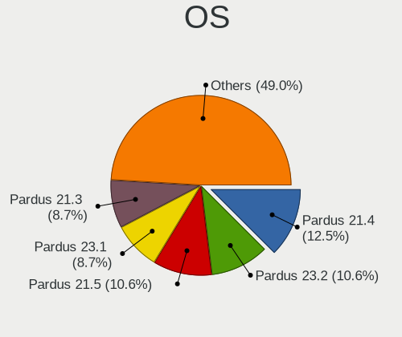

| Name          | Computers | Percent |
|---------------|-----------|---------|
| Pardus 21.4   | 13        | 12.5%   |
| Pardus 23.2   | 11        | 10.58%  |
| Pardus 21.5   | 11        | 10.58%  |
| Pardus 23.1   | 9         | 8.65%   |
| Pardus 21.3   | 9         | 8.65%   |
| Pardus 21.2   | 9         | 8.65%   |
| Pardus 23.0   | 7         | 6.73%   |
| Pardus 21.1   | 6         | 5.77%   |
| Pardus 19.5   | 5         | 4.81%   |
| Pardus 21.0   | 4         | 3.85%   |
| Pardus 23.3   | 3         | 2.88%   |
| Pardus 19.4-1 | 3         | 2.88%   |
| Pardus 19.4   | 3         | 2.88%   |
| Pardus 19.3   | 3         | 2.88%   |
| Pardus 19.2   | 3         | 2.88%   |
| Pardus 19.0   | 3         | 2.88%   |
| Pardus 19.1   | 2         | 1.92%   |

OS Family
---------

OS without a version

| Name   | Computers | Percent |
|--------|-----------|---------|
| Pardus | 95        | 100%    |

Kernel
------

Version of the Linux kernel

| Version                    | Computers | Percent |
|----------------------------|-----------|---------|
| 5.10.0-21-amd64            | 8         | 7.62%   |
| 6.1.0-17-amd64             | 6         | 5.71%   |
| 5.10.0-13-amd64            | 6         | 5.71%   |
| 6.1.0-23-amd64             | 5         | 4.76%   |
| 6.1.0-13-amd64             | 5         | 4.76%   |
| 5.10.0-20-amd64            | 5         | 4.76%   |
| 5.10.0-19-amd64            | 5         | 4.76%   |
| 6.1.0-26-amd64             | 3         | 2.86%   |
| 5.10.0-23-amd64            | 3         | 2.86%   |
| 5.10.0-16-amd64            | 3         | 2.86%   |
| 5.10.0-11-amd64            | 3         | 2.86%   |
| 4.19.0-6-amd64             | 3         | 2.86%   |
| 4.19.0-13-amd64            | 3         | 2.86%   |
| 4.19.0-10-amd64            | 3         | 2.86%   |
| 6.1.0-22-amd64             | 2         | 1.9%    |
| 6.1.0-11-amd64             | 2         | 1.9%    |
| 5.9.0-0.bpo.2-amd64        | 2         | 1.9%    |
| 5.18.0-0.deb11.4-amd64     | 2         | 1.9%    |
| 5.10.0-9-amd64             | 2         | 1.9%    |
| 5.10.0-8-amd64             | 2         | 1.9%    |
| 5.10.0-14-amd64            | 2         | 1.9%    |
| 5.10.0-10-amd64            | 2         | 1.9%    |
| 4.19.0-8-amd64             | 2         | 1.9%    |
| 6.7.12+bpo-amd64           | 1         | 0.95%   |
| 6.6.13+bpo-amd64           | 1         | 0.95%   |
| 6.10.6+bpo-amd64           | 1         | 0.95%   |
| 6.10.11+bpo-amd64          | 1         | 0.95%   |
| 6.1.0-28-amd64             | 1         | 0.95%   |
| 6.1.0-25-amd64             | 1         | 0.95%   |
| 6.1.0-20-amd64             | 1         | 0.95%   |
| 6.1.0-0.deb11.13-amd64     | 1         | 0.95%   |
| 6.0.11-x64v2-rt14-xanmod1  | 1         | 0.95%   |
| 5.4.0-0.bpo.3-amd64        | 1         | 0.95%   |
| 5.19.0-14.1-liquorix-amd64 | 1         | 0.95%   |
| 5.10.0-33-amd64            | 1         | 0.95%   |
| 5.10.0-26-amd64            | 1         | 0.95%   |
| 5.10.0-25-amd64            | 1         | 0.95%   |
| 5.10.0-22-amd64            | 1         | 0.95%   |
| 5.10.0-18-amd64            | 1         | 0.95%   |
| 5.10.0-17-amd64            | 1         | 0.95%   |

Kernel Family
-------------

Linux kernel without a distro release

| Version | Computers | Percent |
|---------|-----------|---------|
| 5.10.0  | 47        | 46.53%  |
| 6.1.0   | 27        | 26.73%  |
| 4.19.0  | 16        | 15.84%  |
| 5.9.0   | 2         | 1.98%   |
| 5.18.0  | 2         | 1.98%   |
| 6.7.12  | 1         | 0.99%   |
| 6.6.13  | 1         | 0.99%   |
| 6.10.6  | 1         | 0.99%   |
| 6.10.11 | 1         | 0.99%   |
| 6.0.11  | 1         | 0.99%   |
| 5.4.0   | 1         | 0.99%   |
| 5.19.0  | 1         | 0.99%   |

Kernel Major Ver.
-----------------

Linux kernel major version

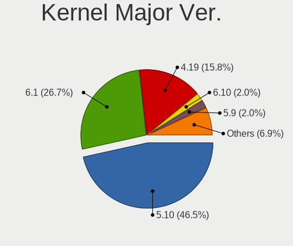

| Version | Computers | Percent |
|---------|-----------|---------|
| 5.10    | 47        | 46.53%  |
| 6.1     | 27        | 26.73%  |
| 4.19    | 16        | 15.84%  |
| 6.10    | 2         | 1.98%   |
| 5.9     | 2         | 1.98%   |
| 5.18    | 2         | 1.98%   |
| 6.7     | 1         | 0.99%   |
| 6.6     | 1         | 0.99%   |
| 6.0     | 1         | 0.99%   |
| 5.4     | 1         | 0.99%   |
| 5.19    | 1         | 0.99%   |

Arch
----

OS architecture (x86_64, i586, etc.)

| Name   | Computers | Percent |
|--------|-----------|---------|
| x86_64 | 95        | 100%    |

DE
--

Desktop Environment

| Name       | Computers | Percent |
|------------|-----------|---------|
| XFCE       | 49        | 50.52%  |
| GNOME      | 41        | 42.27%  |
| KDE5       | 4         | 4.12%   |
| Unknown    | 2         | 2.06%   |
| X-Cinnamon | 1         | 1.03%   |

Display Server
--------------

X11 or Wayland

| Name    | Computers | Percent |
|---------|-----------|---------|
| X11     | 91        | 95.79%  |
| Wayland | 2         | 2.11%   |
| Tty     | 2         | 2.11%   |

Display Manager
---------------

SDDM, LightDM, etc.

| Name    | Computers | Percent |
|---------|-----------|---------|
| Unknown | 55        | 56.12%  |
| LightDM | 15        | 15.31%  |
| GDM3    | 10        | 10.2%   |
| GDM     | 10        | 10.2%   |
| TDM     | 6         | 6.12%   |
| SDDM    | 2         | 2.04%   |

OS Lang
-------

Language

| Lang    | Computers | Percent |
|---------|-----------|---------|
| tr_TR   | 75        | 78.13%  |
| en_US   | 11        | 11.46%  |
| Unknown | 3         | 3.13%   |
| pt_BR   | 1         | 1.04%   |
| it_IT   | 1         | 1.04%   |
| hu_HU   | 1         | 1.04%   |
| fur_IT  | 1         | 1.04%   |
| fr_FR   | 1         | 1.04%   |
| en_GB   | 1         | 1.04%   |
| de_AT   | 1         | 1.04%   |

Boot Mode
---------

EFI or BIOS

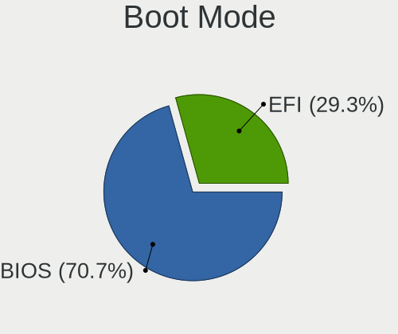

| Mode | Computers | Percent |
|------|-----------|---------|
| BIOS | 70        | 70.71%  |
| EFI  | 29        | 29.29%  |

Filesystem
----------

Type of filesystem

| Type    | Computers | Percent |
|---------|-----------|---------|
| Ext4    | 93        | 97.89%  |
| Overlay | 2         | 2.11%   |

Part. scheme
------------

Scheme of partitioning

| Type    | Computers | Percent |
|---------|-----------|---------|
| Unknown | 58        | 59.18%  |
| GPT     | 32        | 32.65%  |
| MBR     | 8         | 8.16%   |

Dual Boot with Linux/BSD
------------------------

Hosting more than one Linux/BSD

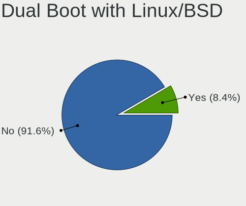

| Dual boot | Computers | Percent |
|-----------|-----------|---------|
| No        | 87        | 91.58%  |
| Yes       | 8         | 8.42%   |

Dual Boot (Win)
---------------

Hosting Linux and Windows

| Dual boot | Computers | Percent |
|-----------|-----------|---------|
| No        | 80        | 84.21%  |
| Yes       | 15        | 15.79%  |

Board
-----

Vendor
------

Motherboard manufacturer

| Name                | Computers | Percent |
|---------------------|-----------|---------|
| Lenovo              | 20        | 21.05%  |
| Hewlett-Packard     | 17        | 17.89%  |
| Dell                | 9         | 9.47%   |
| ASUSTek Computer    | 9         | 9.47%   |
| MSI                 | 7         | 7.37%   |
| Acer                | 6         | 6.32%   |
| Toshiba             | 4         | 4.21%   |
| Gigabyte Technology | 4         | 4.21%   |
| Sony                | 2         | 2.11%   |
| Samsung Electronics | 2         | 2.11%   |
| Packard Bell        | 2         | 2.11%   |
| Intel               | 2         | 2.11%   |
| HUAWEI              | 2         | 2.11%   |
| TUXEDO              | 1         | 1.05%   |
| Timi                | 1         | 1.05%   |
| Philco              | 1         | 1.05%   |
| Pegatron            | 1         | 1.05%   |
| Olidata             | 1         | 1.05%   |
| Fujitsu Siemens     | 1         | 1.05%   |
| Clevo               | 1         | 1.05%   |
| Casper              | 1         | 1.05%   |
| Apple               | 1         | 1.05%   |

Model
-----

Motherboard model

| Name                                       | Computers | Percent |
|--------------------------------------------|-----------|---------|
| MSI MS-7360                                | 3         | 3.16%   |
| MSI MS-7817                                | 2         | 2.11%   |
| HP ProBook 4540s                           | 2         | 2.11%   |
| HP 22-b309nt                               | 2         | 2.11%   |
| Unknown                                    | 2         | 2.11%   |
| Toshiba Satellite L755                     | 1         | 1.05%   |
| Toshiba Satellite C855-1VM                 | 1         | 1.05%   |
| Toshiba Satellite C660                     | 1         | 1.05%   |
| Toshiba PORTEGE M780                       | 1         | 1.05%   |
| Timi TM1604                                | 1         | 1.05%   |
| Sony SVF1521QSTB                           | 1         | 1.05%   |
| Sony SVE14A2V2ES                           | 1         | 1.05%   |
| Samsung 300E4C/300E5C/300E7C               | 1         | 1.05%   |
| Samsung 300E4A/300E5A/300E7A/3430EA/3530EA | 1         | 1.05%   |
| Philco 14F                                 | 1         | 1.05%   |
| Pegatron A15                               | 1         | 1.05%   |
| Packard Bell EasyNote_GN45                 | 1         | 1.05%   |
| Packard Bell EasyNote ENTG81BA             | 1         | 1.05%   |
| Olidata T7700                              | 1         | 1.05%   |
| MSI MS-7C09                                | 1         | 1.05%   |
| MSI MS-7A65                                | 1         | 1.05%   |
| Lenovo Yoga 310-11IAP 80U2                 | 1         | 1.05%   |
| Lenovo Y50-70 20378                        | 1         | 1.05%   |
| Lenovo V145-15AST 81MT                     | 1         | 1.05%   |
| Lenovo V110-15ISK 80TL                     | 1         | 1.05%   |
| Lenovo ThinkPad T480 20L6S2S800            | 1         | 1.05%   |
| Lenovo ThinkPad T450 20BUS39Y00            | 1         | 1.05%   |
| Lenovo ThinkPad S1 Yoga 20CD0034TX         | 1         | 1.05%   |
| Lenovo ThinkPad P15v Gen 1 20TRS1UB00      | 1         | 1.05%   |
| Lenovo ThinkPad E15 Gen 2 20TD0047TX       | 1         | 1.05%   |
| Lenovo ThinkCentre M920t 10SGS62900        | 1         | 1.05%   |
| Lenovo IdeaPadFlex 5 14ITL05 82HS          | 1         | 1.05%   |
| Lenovo IdeaPadFlex 5 14IIL05 81X1          | 1         | 1.05%   |
| Lenovo IdeaPad-510-15IKB 80SV              | 1         | 1.05%   |
| Lenovo IdeaPad 320-15IKB 81BT              | 1         | 1.05%   |
| Lenovo IdeaPad 100-15IBD 80QQ              | 1         | 1.05%   |
| Lenovo IdeaPad 1 15IGL7 82V7               | 1         | 1.05%   |
| Lenovo G510 20238                          | 1         | 1.05%   |
| Lenovo G50-45 80E3                         | 1         | 1.05%   |
| Lenovo 21DL                                | 1         | 1.05%   |

Model Family
------------

Motherboard model prefix

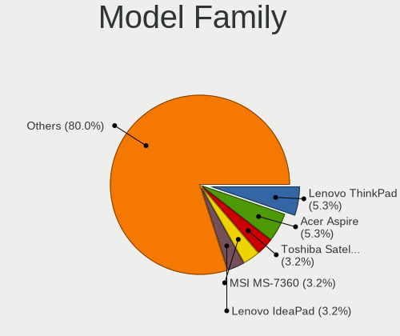

| Name                     | Computers | Percent |
|--------------------------|-----------|---------|
| Lenovo ThinkPad          | 5         | 5.26%   |
| Acer Aspire              | 5         | 5.26%   |
| Toshiba Satellite        | 3         | 3.16%   |
| MSI MS-7360              | 3         | 3.16%   |
| Lenovo IdeaPad           | 3         | 3.16%   |
| HP Pavilion              | 3         | 3.16%   |
| HP EliteBook             | 3         | 3.16%   |
| Dell OptiPlex            | 3         | 3.16%   |
| Packard Bell EasyNote    | 2         | 2.11%   |
| MSI MS-7817              | 2         | 2.11%   |
| Lenovo IdeaPadFlex       | 2         | 2.11%   |
| HP ProBook               | 2         | 2.11%   |
| HP 22-b309nt             | 2         | 2.11%   |
| Dell Vostro              | 2         | 2.11%   |
| Dell Latitude            | 2         | 2.11%   |
| Unknown                  | 2         | 2.11%   |
| Toshiba PORTEGE          | 1         | 1.05%   |
| Timi TM1604              | 1         | 1.05%   |
| Sony SVF1521QSTB         | 1         | 1.05%   |
| Sony SVE14A2V2ES         | 1         | 1.05%   |
| Samsung 300E4C           | 1         | 1.05%   |
| Samsung 300E4A           | 1         | 1.05%   |
| Philco 14F               | 1         | 1.05%   |
| Pegatron A15             | 1         | 1.05%   |
| Olidata T7700            | 1         | 1.05%   |
| MSI MS-7C09              | 1         | 1.05%   |
| MSI MS-7A65              | 1         | 1.05%   |
| Lenovo Yoga              | 1         | 1.05%   |
| Lenovo Y50-70            | 1         | 1.05%   |
| Lenovo V145-15AST        | 1         | 1.05%   |
| Lenovo V110-15ISK        | 1         | 1.05%   |
| Lenovo ThinkCentre       | 1         | 1.05%   |
| Lenovo IdeaPad-510-15IKB | 1         | 1.05%   |
| Lenovo G510              | 1         | 1.05%   |
| Lenovo G50-45            | 1         | 1.05%   |
| Lenovo 21DL              | 1         | 1.05%   |
| Intel H81                | 1         | 1.05%   |
| Intel H55                | 1         | 1.05%   |
| HUAWEI KLVL-WXXW         | 1         | 1.05%   |
| HUAWEI BOM-WXX9          | 1         | 1.05%   |

MFG Year
--------

Motherboard manufacture year

| Year | Computers | Percent |
|------|-----------|---------|
| 2018 | 12        | 12.63%  |
| 2013 | 12        | 12.63%  |
| 2020 | 8         | 8.42%   |
| 2015 | 7         | 7.37%   |
| 2019 | 6         | 6.32%   |
| 2014 | 6         | 6.32%   |
| 2011 | 6         | 6.32%   |
| 2021 | 5         | 5.26%   |
| 2017 | 5         | 5.26%   |
| 2010 | 5         | 5.26%   |
| 2012 | 4         | 4.21%   |
| 2007 | 4         | 4.21%   |
| 2022 | 3         | 3.16%   |
| 2016 | 3         | 3.16%   |
| 2024 | 2         | 2.11%   |
| 2023 | 2         | 2.11%   |
| 2009 | 2         | 2.11%   |
| 2008 | 2         | 2.11%   |
| 2006 | 1         | 1.05%   |

Form Factor
-----------

Physical design of the computer

| Name        | Computers | Percent |
|-------------|-----------|---------|
| Notebook    | 59        | 62.11%  |
| Desktop     | 26        | 27.37%  |
| Convertible | 5         | 5.26%   |
| All in one  | 4         | 4.21%   |
| Mini pc     | 1         | 1.05%   |

Secure Boot
-----------

Enabled or disabled

| State    | Computers | Percent |
|----------|-----------|---------|
| Disabled | 95        | 100%    |

Coreboot
--------

Have coreboot on board

| Used | Computers | Percent |
|------|-----------|---------|
| No   | 95        | 100%    |

RAM Size
--------

Total RAM memory

| Size in GB  | Computers | Percent |
|-------------|-----------|---------|
| 3.01-4.0    | 30        | 30.93%  |
| 4.01-8.0    | 27        | 27.84%  |
| 8.01-16.0   | 17        | 17.53%  |
| 16.01-24.0  | 14        | 14.43%  |
| 32.01-64.0  | 4         | 4.12%   |
| 2.01-3.0    | 2         | 2.06%   |
| 1.01-2.0    | 2         | 2.06%   |
| 64.01-256.0 | 1         | 1.03%   |

RAM Used
--------

Used RAM memory

| Used GB    | Computers | Percent |
|------------|-----------|---------|
| 1.01-2.0   | 36        | 34.62%  |
| 2.01-3.0   | 32        | 30.77%  |
| 3.01-4.0   | 19        | 18.27%  |
| 4.01-8.0   | 10        | 9.62%   |
| 8.01-16.0  | 3         | 2.88%   |
| 0.51-1.0   | 2         | 1.92%   |
| 24.01-32.0 | 1         | 0.96%   |
| 16.01-24.0 | 1         | 0.96%   |

Total Drives
------------

Number of drives on board

| Drives | Computers | Percent |
|--------|-----------|---------|
| 1      | 61        | 64.21%  |
| 2      | 29        | 30.53%  |
| 3      | 4         | 4.21%   |
| 4      | 1         | 1.05%   |

Has CD-ROM
----------

Has CD-ROM on board

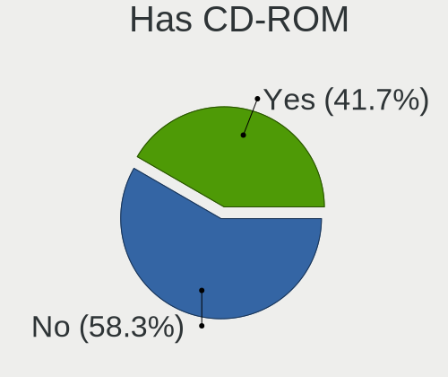

| Presented | Computers | Percent |
|-----------|-----------|---------|
| No        | 56        | 58.33%  |
| Yes       | 40        | 41.67%  |

Has Ethernet
------------

Has Ethernet on board

| Presented | Computers | Percent |
|-----------|-----------|---------|
| Yes       | 85        | 89.47%  |
| No        | 10        | 10.53%  |

Has WiFi
--------

Has WiFi module

| Presented | Computers | Percent |
|-----------|-----------|---------|
| Yes       | 76        | 80%     |
| No        | 19        | 20%     |

Has Bluetooth
-------------

Has Bluetooth module

| Presented | Computers | Percent |
|-----------|-----------|---------|
| Yes       | 63        | 65.63%  |
| No        | 33        | 34.38%  |

Location
--------

Country
-------

Geographic location (country)

| Country    | Computers | Percent |
|------------|-----------|---------|
| Turkey     | 83        | 86.46%  |
| Germany    | 2         | 2.08%   |
| USA        | 1         | 1.04%   |
| UK         | 1         | 1.04%   |
| Sweden     | 1         | 1.04%   |
| Poland     | 1         | 1.04%   |
| Libya      | 1         | 1.04%   |
| Italy      | 1         | 1.04%   |
| France     | 1         | 1.04%   |
| Bulgaria   | 1         | 1.04%   |
| Brazil     | 1         | 1.04%   |
| Azerbaijan | 1         | 1.04%   |
| Austria    | 1         | 1.04%   |

City
----

Geographic location (city)

| City                 | Computers | Percent |
|----------------------|-----------|---------|
| Istanbul             | 27        | 27%     |
| Ankara               | 13        | 13%     |
| Aydin                | 8         | 8%      |
| Bursa                | 7         | 7%      |
| Izmir                | 6         | 6%      |
| Konya                | 3         | 3%      |
| Samsun               | 2         | 2%      |
| Malatya              | 2         | 2%      |
| Çorlu               | 2         | 2%      |
| Çanakkale           | 2         | 2%      |
| Antalya              | 2         | 2%      |
| Yaman                | 1         | 1%      |
| Vienna               | 1         | 1%      |
| Tripoli              | 1         | 1%      |
| Tekirdağ            | 1         | 1%      |
| Soleymieu            | 1         | 1%      |
| Sofia                | 1         | 1%      |
| Serik                | 1         | 1%      |
| Sao Gabriel          | 1         | 1%      |
| Niğde               | 1         | 1%      |
| Mugla                | 1         | 1%      |
| Mason                | 1         | 1%      |
| London               | 1         | 1%      |
| Landskrona           | 1         | 1%      |
| Kołobrzeg           | 1         | 1%      |
| Kirchheim unter Teck | 1         | 1%      |
| Hacilar              | 1         | 1%      |
| Gaziantep            | 1         | 1%      |
| Esenyurt             | 1         | 1%      |
| Erzurum              | 1         | 1%      |
| Castrop-Rauxel       | 1         | 1%      |
| Bolzano              | 1         | 1%      |
| Bigadic              | 1         | 1%      |
| Balıkesir           | 1         | 1%      |
| Baku                 | 1         | 1%      |
| Artvin               | 1         | 1%      |
| Aksaray              | 1         | 1%      |

Drives
------

Drive Vendor
------------

Hard drive vendors

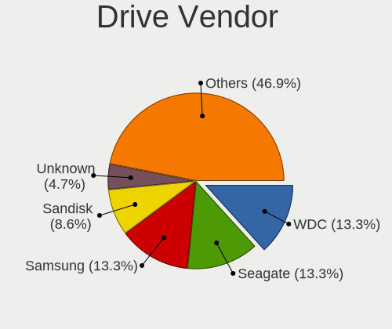

| Vendor                      | Computers | Drives | Percent |
|-----------------------------|-----------|--------|---------|
| WDC                         | 17        | 21     | 13.28%  |
| Seagate                     | 17        | 24     | 13.28%  |
| Samsung Electronics         | 17        | 26     | 13.28%  |
| Sandisk                     | 11        | 11     | 8.59%   |
| Unknown                     | 6         | 7      | 4.69%   |
| China                       | 6         | 6      | 4.69%   |
| Kingston                    | 5         | 6      | 3.91%   |
| Toshiba                     | 4         | 6      | 3.13%   |
| SK hynix                    | 4         | 5      | 3.13%   |
| KIOXIA                      | 4         | 4      | 3.13%   |
| KIOXIA-EXCERIA              | 3         | 3      | 2.34%   |
| Hitachi                     | 3         | 3      | 2.34%   |
| A-DATA Technology           | 3         | 3      | 2.34%   |
| SPCC                        | 2         | 2      | 1.56%   |
| Silicon Motion              | 2         | 2      | 1.56%   |
| Phison                      | 2         | 2      | 1.56%   |
| Lexar                       | 2         | 2      | 1.56%   |
| Kingston Technology Company | 2         | 2      | 1.56%   |
| HGST                        | 2         | 2      | 1.56%   |
| Corsair                     | 2         | 2      | 1.56%   |
| Unknown                     | 2         | 2      | 1.56%   |
| USB3.0                      | 1         | 1      | 0.78%   |
| TwinMOS                     | 1         | 1      | 0.78%   |
| Team                        | 1         | 1      | 0.78%   |
| Micron/Crucial Technology   | 1         | 1      | 0.78%   |
| Micron Technology           | 1         | 2      | 0.78%   |
| MAXIO Technology (Hangzhou) | 1         | 2      | 0.78%   |
| LITEON                      | 1         | 1      | 0.78%   |
| KingSpec                    | 1         | 1      | 0.78%   |
| Intenso                     | 1         | 2      | 0.78%   |
| Initio                      | 1         | 1      | 0.78%   |
| addlink                     | 1         | 1      | 0.78%   |
| 120G                        | 1         | 1      | 0.78%   |

Drive Model
-----------

Hard drive models

| Model                            | Computers | Percent |
|----------------------------------|-----------|---------|
| WDC WD6402AAEX-00Y9A0 640GB      | 3         | 2.26%   |
| Unknown SD/MMC/MS PRO 128GB      | 3         | 2.26%   |
| SanDisk SSD PLUS 240GB           | 3         | 2.26%   |
| KIOXIA KBG50ZNS256G NVMe 256GB   | 3         | 2.26%   |
| China SATA SSD 240GB             | 3         | 2.26%   |
| A-DATA SU650 120GB SSD           | 3         | 2.26%   |
| SPCC Solid State Disk 512GB      | 2         | 1.5%    |
| Seagate ST500DM002-1BD142 500GB  | 2         | 1.5%    |
| Seagate ST1000LM035-1RK172 1TB   | 2         | 1.5%    |
| Seagate ST1000DM003-1SB102 1TB   | 2         | 1.5%    |
| SanDisk SDSSDA240G 240GB         | 2         | 1.5%    |
| KIOXIA-EXCERIA SATA SSD 480GB    | 2         | 1.5%    |
| Kingston SA400S37240G 240GB SSD  | 2         | 1.5%    |
| HGST HTS545050A7E680 500GB       | 2         | 1.5%    |
| China SATA SSD 120GB             | 2         | 1.5%    |
| Unknown                          | 2         | 1.5%    |
| WDC WDS120G2G0B-00EPW0 120GB SSD | 1         | 0.75%   |
| WDC WD5000LPVX-55V0TT0 500GB     | 1         | 0.75%   |
| WDC WD5000LPCX-60VHAT0 500GB     | 1         | 0.75%   |
| WDC WD5000LPCX-21VHAT0 500GB     | 1         | 0.75%   |
| WDC WD5000AAKX-00ERMA0 500GB     | 1         | 0.75%   |
| WDC WD3200BPVT-35JJ5T0 320GB     | 1         | 0.75%   |
| WDC WD3200BEVT-22ZCT0 320GB      | 1         | 0.75%   |
| WDC WD3200AAJB-00WGA0 320GB      | 1         | 0.75%   |
| WDC WD2500BEVS-00UST0 250GB      | 1         | 0.75%   |
| WDC WD10SPCX-24HWST1 1TB         | 1         | 0.75%   |
| WDC WD10JPVX-60JC3T0 1TB         | 1         | 0.75%   |
| WDC WD10JPVX-22JC3T0 1TB         | 1         | 0.75%   |
| WDC WD10JPCX-24UE4T0 1TB         | 1         | 0.75%   |
| WDC WD10EZEX-60WN4A0 1TB         | 1         | 0.75%   |
| USB3.0 Super Speed 500GB SSD     | 1         | 0.75%   |
| Unknown SD32G  32GB              | 1         | 0.75%   |
| Unknown MMC Card  64GB           | 1         | 0.75%   |
| Unknown MMC Card  128GB          | 1         | 0.75%   |
| TwinMOS SSD 256GB                | 1         | 0.75%   |
| Toshiba MQ01ABD075 752GB         | 1         | 0.75%   |
| Toshiba MK6475GSX 640GB          | 1         | 0.75%   |
| Toshiba MK5061GSYN 500GB         | 1         | 0.75%   |
| Toshiba DT01ACA100 1TB           | 1         | 0.75%   |
| Team T253X1240G 240GB SSD        | 1         | 0.75%   |

HDD Vendor
----------

Hard disk drive vendors

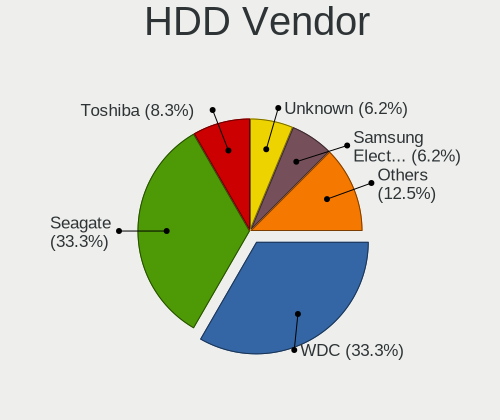

| Vendor              | Computers | Drives | Percent |
|---------------------|-----------|--------|---------|
| WDC                 | 16        | 20     | 33.33%  |
| Seagate             | 16        | 23     | 33.33%  |
| Toshiba             | 4         | 6      | 8.33%   |
| Unknown             | 3         | 4      | 6.25%   |
| Samsung Electronics | 3         | 6      | 6.25%   |
| Hitachi             | 3         | 3      | 6.25%   |
| HGST                | 2         | 2      | 4.17%   |
| Initio              | 1         | 1      | 2.08%   |

SSD Vendor
----------

Solid state drive vendors

| Vendor              | Computers | Drives | Percent |
|---------------------|-----------|--------|---------|
| SanDisk             | 10        | 10     | 20.41%  |
| Samsung Electronics | 6         | 8      | 12.24%  |
| China               | 6         | 6      | 12.24%  |
| Kingston            | 5         | 6      | 10.2%   |
| KIOXIA-EXCERIA      | 3         | 3      | 6.12%   |
| A-DATA Technology   | 3         | 3      | 6.12%   |
| SPCC                | 2         | 2      | 4.08%   |
| Lexar               | 2         | 2      | 4.08%   |
| WDC                 | 1         | 1      | 2.04%   |
| USB3.0              | 1         | 1      | 2.04%   |
| Team                | 1         | 1      | 2.04%   |
| SK hynix            | 1         | 1      | 2.04%   |
| Seagate             | 1         | 1      | 2.04%   |
| Phison              | 1         | 1      | 2.04%   |
| Micron Technology   | 1         | 2      | 2.04%   |
| LITEON              | 1         | 1      | 2.04%   |
| KingSpec            | 1         | 1      | 2.04%   |
| Intenso             | 1         | 2      | 2.04%   |
| Corsair             | 1         | 1      | 2.04%   |
| 120G                | 1         | 1      | 2.04%   |

Drive Kind
----------

HDD or SSD

| Kind    | Computers | Drives | Percent |
|---------|-----------|--------|---------|
| HDD     | 43        | 65     | 37.72%  |
| SSD     | 42        | 54     | 36.84%  |
| NVMe    | 23        | 31     | 20.18%  |
| MMC     | 3         | 3      | 2.63%   |
| Unknown | 3         | 3      | 2.63%   |

Drive Connector
---------------

SATA, SAS, NVMe, etc.

| Type | Computers | Drives | Percent |
|------|-----------|--------|---------|
| SATA | 74        | 115    | 70.48%  |
| NVMe | 23        | 31     | 21.9%   |
| SAS  | 5         | 7      | 4.76%   |
| MMC  | 3         | 3      | 2.86%   |

Drive Size
----------

Size of hard drive

| Size in TB | Computers | Drives | Percent |
|------------|-----------|--------|---------|
| 0.01-0.5   | 60        | 85     | 70.59%  |
| 0.51-1.0   | 23        | 30     | 27.06%  |
| 1.01-2.0   | 2         | 4      | 2.35%   |

Space Total
-----------

Amount of disk space available on the file system

| Size in GB | Computers | Percent |
|------------|-----------|---------|
| 101-250    | 47        | 47.96%  |
| 251-500    | 27        | 27.55%  |
| 501-1000   | 13        | 13.27%  |
| 21-50      | 5         | 5.1%    |
| 51-100     | 5         | 5.1%    |
| 2001-3000  | 1         | 1.02%   |

Space Used
----------

Amount of used disk space

| Used GB  | Computers | Percent |
|----------|-----------|---------|
| 1-20     | 38        | 38%     |
| 51-100   | 23        | 23%     |
| 21-50    | 21        | 21%     |
| 101-250  | 13        | 13%     |
| 251-500  | 4         | 4%      |
| 501-1000 | 1         | 1%      |

Malfunc. Drives
---------------

Drive models with a malfunction

| Model                            | Computers | Drives | Percent |
|----------------------------------|-----------|--------|---------|
| WDC WD5000LPCX-60VHAT0 500GB     | 1         | 1      | 16.67%  |
| WDC WD10JPVX-22JC3T0 1TB         | 1         | 1      | 16.67%  |
| Seagate ST9120822AS 120GB        | 1         | 1      | 16.67%  |
| Seagate ST500DM002-1BD142 500GB  | 1         | 1      | 16.67%  |
| Seagate ST1000LM035-1RK172 1TB   | 1         | 1      | 16.67%  |
| Kingston SV300S37A120G 120GB SSD | 1         | 1      | 16.67%  |

Malfunc. Drive Vendor
---------------------

Vendors of faulty drives

| Vendor   | Computers | Drives | Percent |
|----------|-----------|--------|---------|
| Seagate  | 3         | 3      | 50%     |
| WDC      | 2         | 2      | 33.33%  |
| Kingston | 1         | 1      | 16.67%  |

Malfunc. HDD Vendor
-------------------

Vendors of faulty HDD drives

| Vendor  | Computers | Drives | Percent |
|---------|-----------|--------|---------|
| Seagate | 3         | 3      | 60%     |
| WDC     | 2         | 2      | 40%     |

Malfunc. Drive Kind
-------------------

Kinds of faulty drives

| Kind | Computers | Drives | Percent |
|------|-----------|--------|---------|
| HDD  | 5         | 5      | 83.33%  |
| SSD  | 1         | 1      | 16.67%  |

Failed Drives
-------------

Failed drive models

| Model                               | Computers | Drives | Percent |
|-------------------------------------|-----------|--------|---------|
| Seagate ST750LM022 HN-M750MBB 752GB | 1         | 1      | 100%    |

Failed Drive Vendor
-------------------

Failed drive vendors

| Vendor  | Computers | Drives | Percent |
|---------|-----------|--------|---------|
| Seagate | 1         | 1      | 100%    |

Drive Status
------------

Number of failed and malfunc. drives

| Status   | Computers | Drives | Percent |
|----------|-----------|--------|---------|
| Detected | 63        | 102    | 60%     |
| Works    | 35        | 47     | 33.33%  |
| Malfunc  | 6         | 6      | 5.71%   |
| Failed   | 1         | 1      | 0.95%   |

Storage controller
------------------

Storage Vendor
--------------

Storage controller vendors

| Vendor                      | Computers | Percent |
|-----------------------------|-----------|---------|
| Intel                       | 70        | 64.22%  |
| AMD                         | 11        | 10.09%  |
| Samsung Electronics         | 8         | 7.34%   |
| KIOXIA                      | 4         | 3.67%   |
| SK hynix                    | 3         | 2.75%   |
| Marvell Technology Group    | 3         | 2.75%   |
| Silicon Motion              | 2         | 1.83%   |
| Phison Electronics          | 2         | 1.83%   |
| MAXIO Technology (Hangzhou) | 2         | 1.83%   |
| Kingston Technology Company | 2         | 1.83%   |
| SanDisk                     | 1         | 0.92%   |
| Micron/Crucial Technology   | 1         | 0.92%   |

Storage Model
-------------

Storage controller models

| Model                                                                          | Computers | Percent |
|--------------------------------------------------------------------------------|-----------|---------|
| AMD FCH SATA Controller [AHCI mode]                                            | 10        | 8%      |
| Intel 8 Series/C220 Series Chipset Family 6-port SATA Controller 1 [AHCI mode] | 9         | 7.2%    |
| Intel 7 Series Chipset Family 6-port SATA Controller [AHCI mode]               | 8         | 6.4%    |
| Intel Sunrise Point-LP SATA Controller [AHCI mode]                             | 7         | 5.6%    |
| Samsung NVMe SSD Controller 980 (DRAM-less)                                    | 5         | 4%      |
| Intel Wildcat Point-LP SATA Controller [AHCI Mode]                             | 5         | 4%      |
| Intel 82801IB (ICH9) 2 port SATA Controller [IDE mode]                         | 4         | 3.2%    |
| Intel 82801I (ICH9 Family) 2 port SATA Controller [IDE mode]                   | 4         | 3.2%    |
| Intel 6 Series/C200 Series Chipset Family 6 port Mobile SATA AHCI Controller   | 4         | 3.2%    |
| Marvell Group 88SE6111/6121 SATA II / PATA Controller                          | 3         | 2.4%    |
| KIOXIA NVMe SSD Controller BG5 (DRAM-less)                                     | 3         | 2.4%    |
| Intel Volume Management Device NVMe RAID Controller                            | 3         | 2.4%    |
| Intel Alder Lake-S PCH SATA Controller [AHCI Mode]                             | 3         | 2.4%    |
| Intel 8 Series SATA Controller 1 [AHCI mode]                                   | 3         | 2.4%    |
| SK hynix Gold P31/BC711/PC711 NVMe Solid State Drive                           | 2         | 1.6%    |
| MAXIO (Hangzhou) NVMe SSD Controller MAP1202 (DRAM-less)                       | 2         | 1.6%    |
| Intel NM10/ICH7 Family SATA Controller [IDE mode]                              | 2         | 1.6%    |
| Intel Cannon Lake PCH SATA AHCI Controller                                     | 2         | 1.6%    |
| Intel 82801G (ICH7 Family) IDE Controller                                      | 2         | 1.6%    |
| Intel 5 Series/3400 Series Chipset 4 port SATA IDE Controller                  | 2         | 1.6%    |
| Intel 5 Series/3400 Series Chipset 4 port SATA AHCI Controller                 | 2         | 1.6%    |
| Intel 5 Series/3400 Series Chipset 2 port SATA IDE Controller                  | 2         | 1.6%    |
| Intel 400 Series Chipset Family SATA AHCI Controller                           | 2         | 1.6%    |
| Intel 200 Series PCH SATA controller [AHCI mode]                               | 2         | 1.6%    |
| AMD A320 Chipset SATA Controller [AHCI mode]                                   | 2         | 1.6%    |
| SK hynix BC511 NVMe SSD                                                        | 1         | 0.8%    |
| Silicon Motion SM2263EN/SM2263XT (DRAM-less) NVMe SSD Controllers              | 1         | 0.8%    |
| Silicon Motion Non-Volatile memory controller                                  | 1         | 0.8%    |
| SanDisk PC SN530 NVMe SSD (DRAM-less)                                          | 1         | 0.8%    |
| Samsung NVMe SSD Controller SM981/PM981/PM983                                  | 1         | 0.8%    |
| Samsung NVMe SSD Controller SM961/PM961/SM963                                  | 1         | 0.8%    |
| Samsung NVMe SSD Controller PM9B1 (DRAM-less)                                  | 1         | 0.8%    |
| Samsung NVMe SSD Controller PM9A1/PM9A3/980PRO                                 | 1         | 0.8%    |
| Phison PS5013-E13 PCIe3 NVMe Controller (DRAM-less)                            | 1         | 0.8%    |
| Phison E18 PCIe4 NVMe Controller                                               | 1         | 0.8%    |
| Micron/Crucial P2 [Nick P2] / P3 / P3 Plus NVMe PCIe SSD (DRAM-less)           | 1         | 0.8%    |
| KIOXIA NVMe SSD Controller BG6 (DRAM-less)                                     | 1         | 0.8%    |
| Kingston Company OM3PDP3 NVMe SSD                                              | 1         | 0.8%    |
| Kingston Company NV2 NVMe SSD [SM2267XT] (DRAM-less)                           | 1         | 0.8%    |
| Intel Tiger Lake-LP SATA Controller                                            | 1         | 0.8%    |

Storage Kind
------------

Kind of storage controller (IDE, SATA, NVMe, SAS, ...)

| Kind | Computers | Percent |
|------|-----------|---------|
| SATA | 68        | 63.55%  |
| NVMe | 23        | 21.5%   |
| IDE  | 13        | 12.15%  |
| RAID | 3         | 2.8%    |

Processor
---------

CPU Vendor
----------

Processor vendors

| Vendor | Computers | Percent |
|--------|-----------|---------|
| Intel  | 80        | 84.21%  |
| AMD    | 15        | 15.79%  |

CPU Model
---------

Processor models

| Model                                   | Computers | Percent |
|-----------------------------------------|-----------|---------|
| Intel Core i5-7200U CPU @ 2.50GHz       | 4         | 4.21%   |
| Intel Core i5-8250U CPU @ 1.60GHz       | 3         | 3.16%   |
| Intel Core i5-5200U CPU @ 2.20GHz       | 3         | 3.16%   |
| Intel Core 2 Quad CPU Q6600 @ 2.40GHz   | 3         | 3.16%   |
| Intel Core i7-3630QM CPU @ 2.40GHz      | 2         | 2.11%   |
| Intel Core i5-4440 CPU @ 3.10GHz        | 2         | 2.11%   |
| Intel Core i3 CPU M 370 @ 2.40GHz       | 2         | 2.11%   |
| Intel Core 2 Duo CPU E7500 @ 2.93GHz    | 2         | 2.11%   |
| Intel 12th Gen Core i5-12500T           | 2         | 2.11%   |
| Intel 11th Gen Core i5-1135G7 @ 2.40GHz | 2         | 2.11%   |
| Intel 11th Gen Core i3-1115G4 @ 3.00GHz | 2         | 2.11%   |
| Intel Pentium CPU G2010 @ 2.80GHz       | 1         | 1.05%   |
| Intel Pentium CPU B960 @ 2.20GHz        | 1         | 1.05%   |
| Intel Pentium CPU B950 @ 2.10GHz        | 1         | 1.05%   |
| Intel Core i9-9900 CPU @ 3.10GHz        | 1         | 1.05%   |
| Intel Core i7-8750H CPU @ 2.20GHz       | 1         | 1.05%   |
| Intel Core i7-8565U CPU @ 1.80GHz       | 1         | 1.05%   |
| Intel Core i7-8550U CPU @ 1.80GHz       | 1         | 1.05%   |
| Intel Core i7-5500U CPU @ 2.40GHz       | 1         | 1.05%   |
| Intel Core i7-4800MQ CPU @ 2.70GHz      | 1         | 1.05%   |
| Intel Core i7-4790S CPU @ 3.20GHz       | 1         | 1.05%   |
| Intel Core i7-4720HQ CPU @ 2.60GHz      | 1         | 1.05%   |
| Intel Core i7-4710HQ CPU @ 2.50GHz      | 1         | 1.05%   |
| Intel Core i7-3632QM CPU @ 2.20GHz      | 1         | 1.05%   |
| Intel Core i7-3612QM CPU @ 2.10GHz      | 1         | 1.05%   |
| Intel Core i7-2670QM CPU @ 2.20GHz      | 1         | 1.05%   |
| Intel Core i7-10750H CPU @ 2.60GHz      | 1         | 1.05%   |
| Intel Core i7-1065G7 CPU @ 1.30GHz      | 1         | 1.05%   |
| Intel Core i5-8350U CPU @ 1.70GHz       | 1         | 1.05%   |
| Intel Core i5-7600 CPU @ 3.50GHz        | 1         | 1.05%   |
| Intel Core i5-6400T CPU @ 2.20GHz       | 1         | 1.05%   |
| Intel Core i5-4570 CPU @ 3.20GHz        | 1         | 1.05%   |
| Intel Core i5-4460 CPU @ 3.20GHz        | 1         | 1.05%   |
| Intel Core i5-4260U CPU @ 1.40GHz       | 1         | 1.05%   |
| Intel Core i5-4200M CPU @ 2.50GHz       | 1         | 1.05%   |
| Intel Core i5-3230M CPU @ 2.60GHz       | 1         | 1.05%   |
| Intel Core i5-10400F CPU @ 2.90GHz      | 1         | 1.05%   |
| Intel Core i5-10400 CPU @ 2.90GHz       | 1         | 1.05%   |
| Intel Core i5-10300H CPU @ 2.50GHz      | 1         | 1.05%   |
| Intel Core i5 CPU M 540 @ 2.53GHz       | 1         | 1.05%   |

CPU Model Family
----------------

Processor model prefix

| Model             | Computers | Percent |
|-------------------|-----------|---------|
| Intel Core i5     | 24        | 25.26%  |
| Intel Core i7     | 15        | 15.79%  |
| Intel Core i3     | 14        | 14.74%  |
| Other             | 11        | 11.58%  |
| Intel Core 2 Quad | 4         | 4.21%   |
| Intel Core 2 Duo  | 4         | 4.21%   |
| Intel Celeron     | 4         | 4.21%   |
| AMD Ryzen 7       | 4         | 4.21%   |
| Intel Pentium     | 3         | 3.16%   |
| AMD A8            | 3         | 3.16%   |
| AMD A10           | 3         | 3.16%   |
| Intel Core 2      | 2         | 2.11%   |
| AMD Ryzen 5       | 2         | 2.11%   |
| Intel Core i9     | 1         | 1.05%   |
| AMD C-50          | 1         | 1.05%   |

CPU Cores
---------

Number of processor cores

| Number | Computers | Percent |
|--------|-----------|---------|
| 2      | 45        | 46.88%  |
| 4      | 36        | 37.5%   |
| 6      | 8         | 8.33%   |
| 8      | 5         | 5.21%   |
| 12     | 1         | 1.04%   |
| 10     | 1         | 1.04%   |

CPU Sockets
-----------

Number of sockets

| Number | Computers | Percent |
|--------|-----------|---------|
| 1      | 95        | 100%    |

CPU Threads
-----------

Threads per core (Hyper-Threading)

| Number | Computers | Percent |
|--------|-----------|---------|
| 2      | 63        | 66.32%  |
| 1      | 32        | 33.68%  |

CPU Op-Modes
------------

CPU Operation Modes (32-bit, 64-bit)

| Op mode        | Computers | Percent |
|----------------|-----------|---------|
| 32-bit, 64-bit | 95        | 100%    |

CPU Microcode
-------------

Microcode number

| Number     | Computers | Percent |
|------------|-----------|---------|
| Unknown    | 53        | 52.48%  |
| 0x306a9    | 6         | 5.94%   |
| 0x306c3    | 4         | 3.96%   |
| 0x306d4    | 3         | 2.97%   |
| 0x1067a    | 3         | 2.97%   |
| 0x906eb    | 2         | 1.98%   |
| 0x90675    | 2         | 1.98%   |
| 0x806ea    | 2         | 1.98%   |
| 0x806e9    | 2         | 1.98%   |
| 0x806c1    | 2         | 1.98%   |
| 0x20655    | 2         | 1.98%   |
| 0x07030105 | 2         | 1.98%   |
| 0x0600611a | 2         | 1.98%   |
| 0xb06a3    | 1         | 0.99%   |
| 0x906ed    | 1         | 0.99%   |
| 0x906ea    | 1         | 0.99%   |
| 0x906e9    | 1         | 0.99%   |
| 0x90672    | 1         | 0.99%   |
| 0x6f6      | 1         | 0.99%   |
| 0x506e3    | 1         | 0.99%   |
| 0x406e3    | 1         | 0.99%   |
| 0x206a7    | 1         | 0.99%   |
| 0x10676    | 1         | 0.99%   |
| 0x0a704103 | 1         | 0.99%   |
| 0x0a50000d | 1         | 0.99%   |
| 0x08608103 | 1         | 0.99%   |
| 0x08608102 | 1         | 0.99%   |
| 0x06006705 | 1         | 0.99%   |
| 0x05000029 | 1         | 0.99%   |

CPU Microarch
-------------

Microarchitecture

| Name             | Computers | Percent |
|------------------|-----------|---------|
| KabyLake         | 15        | 15.79%  |
| Haswell          | 12        | 12.63%  |
| IvyBridge        | 8         | 8.42%   |
| SandyBridge      | 6         | 6.32%   |
| Core             | 6         | 6.32%   |
| TigerLake        | 5         | 5.26%   |
| Excavator        | 5         | 5.26%   |
| Broadwell        | 5         | 5.26%   |
| Westmere         | 4         | 4.21%   |
| Penryn           | 4         | 4.21%   |
| CometLake        | 4         | 4.21%   |
| Unknown          | 4         | 4.21%   |
| Alderlake Hybrid | 3         | 3.16%   |
| Zen 3            | 2         | 2.11%   |
| Skylake          | 2         | 2.11%   |
| Puma             | 2         | 2.11%   |
| IceLake          | 2         | 2.11%   |
| Zen 2            | 1         | 1.05%   |
| Silvermont       | 1         | 1.05%   |
| Piledriver       | 1         | 1.05%   |
| Goldmont plus    | 1         | 1.05%   |
| Goldmont         | 1         | 1.05%   |
| Bobcat           | 1         | 1.05%   |

Graphics
--------

GPU Vendor
----------

Vendors of graphics cards

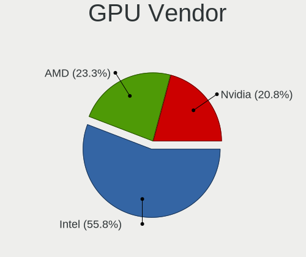

| Vendor | Computers | Percent |
|--------|-----------|---------|
| Intel  | 67        | 55.83%  |
| AMD    | 28        | 23.33%  |
| Nvidia | 25        | 20.83%  |

GPU Model
---------

Graphics card models

| Model                                                                                 | Computers | Percent |
|---------------------------------------------------------------------------------------|-----------|---------|
| Intel 3rd Gen Core processor Graphics Controller                                      | 7         | 5.38%   |
| Intel UHD Graphics 620                                                                | 5         | 3.85%   |
| Intel HD Graphics 5500                                                                | 5         | 3.85%   |
| Intel Xeon E3-1200 v3/4th Gen Core Processor Integrated Graphics Controller           | 4         | 3.08%   |
| Intel HD Graphics 620                                                                 | 4         | 3.08%   |
| Intel 4th Gen Core Processor Integrated Graphics Controller                           | 4         | 3.08%   |
| Intel 2nd Generation Core Processor Family Integrated Graphics Controller             | 4         | 3.08%   |
| Nvidia GT200 [GeForce GTX 260]                                                        | 3         | 2.31%   |
| Intel TigerLake-LP GT2 [Iris Xe Graphics]                                             | 3         | 2.31%   |
| Intel Haswell-ULT Integrated Graphics Controller                                      | 3         | 2.31%   |
| AMD Wani [Radeon R5/R6/R7 Graphics]                                                   | 3         | 2.31%   |
| AMD Topaz XT [Radeon R7 M260/M265 / M340/M360 / M440/M445 / 530/535 / 620/625 Mobile] | 3         | 2.31%   |
| AMD Sun XT [Radeon HD 8670A/8670M/8690M / R5 M330 / M430 / Radeon 520 Mobile]         | 3         | 2.31%   |
| Nvidia GT218 [GeForce 210]                                                            | 2         | 1.54%   |
| Nvidia GF117M [GeForce 610M/710M/810M/820M / GT 620M/625M/630M/720M]                  | 2         | 1.54%   |
| Intel Tiger Lake-LP GT2 [UHD Graphics G4]                                             | 2         | 1.54%   |
| Intel Mobile 945GM/GMS/GME, 943/940GML Express Integrated Graphics Controller         | 2         | 1.54%   |
| Intel Core Processor Integrated Graphics Controller                                   | 2         | 1.54%   |
| Intel CometLake-H GT2 [UHD Graphics]                                                  | 2         | 1.54%   |
| Intel CoffeeLake-S GT2 [UHD Graphics 630]                                             | 2         | 1.54%   |
| Intel Alder Lake-S GT1 [UHD Graphics 770]                                             | 2         | 1.54%   |
| AMD Thames [Radeon HD 7550M/7570M/7650M]                                              | 2         | 1.54%   |
| AMD Stoney [Radeon R2/R3/R4/R5 Graphics]                                              | 2         | 1.54%   |
| AMD RV630 PRO [Radeon HD 2600 PRO]                                                    | 2         | 1.54%   |
| AMD Mullins [Radeon R4/R5 Graphics]                                                   | 2         | 1.54%   |
| AMD Lucienne                                                                          | 2         | 1.54%   |
| Nvidia TU117M [GeForce GTX 1650 Ti Mobile]                                            | 1         | 0.77%   |
| Nvidia TU106 [GeForce RTX 2060 Rev. A]                                                | 1         | 0.77%   |
| Nvidia GT218M [GeForce 315M]                                                          | 1         | 0.77%   |
| Nvidia GP108M [GeForce MX330]                                                         | 1         | 0.77%   |
| Nvidia GP108M [GeForce MX150]                                                         | 1         | 0.77%   |
| Nvidia GP107GLM [Quadro P620]                                                         | 1         | 0.77%   |
| Nvidia GP107 [GeForce GTX 1050 Ti]                                                    | 1         | 0.77%   |
| Nvidia GP106M [GeForce GTX 1060 Mobile]                                               | 1         | 0.77%   |
| Nvidia GM107M [GeForce GTX 960M]                                                      | 1         | 0.77%   |
| Nvidia GM107M [GeForce GTX 860M]                                                      | 1         | 0.77%   |
| Nvidia GK208M [GeForce GT 740M]                                                       | 1         | 0.77%   |
| Nvidia GK208BM [GeForce 920M]                                                         | 1         | 0.77%   |
| Nvidia GF108M [GeForce GT 635M]                                                       | 1         | 0.77%   |
| Nvidia GF108M [GeForce GT 525M]                                                       | 1         | 0.77%   |

GPU Combo
---------

Combinations of graphics cards

| Name           | Computers | Percent |
|----------------|-----------|---------|
| 1 x Intel      | 44        | 46.32%  |
| Intel + Nvidia | 12        | 12.63%  |
| 1 x AMD        | 12        | 12.63%  |
| 1 x Nvidia     | 11        | 11.58%  |
| 2 x AMD        | 7         | 7.37%   |
| Intel + AMD    | 7         | 7.37%   |
| AMD + Nvidia   | 2         | 2.11%   |

GPU Driver
----------

Free vs proprietary

| Driver      | Computers | Percent |
|-------------|-----------|---------|
| Free        | 89        | 92.71%  |
| Proprietary | 7         | 7.29%   |

GPU Memory
----------

Total video memory

| Size in GB | Computers | Percent |
|------------|-----------|---------|
| Unknown    | 74        | 74%     |
| 0.01-0.5   | 12        | 12%     |
| 0.51-1.0   | 6         | 6%      |
| 1.01-2.0   | 5         | 5%      |
| 3.01-4.0   | 2         | 2%      |
| 5.01-6.0   | 1         | 1%      |

Monitor
-------

Monitor Vendor
--------------

Monitor vendors

| Vendor                  | Computers | Percent |
|-------------------------|-----------|---------|
| LG Display              | 16        | 16.67%  |
| Chimei Innolux          | 13        | 13.54%  |
| Samsung Electronics     | 10        | 10.42%  |
| AU Optronics            | 10        | 10.42%  |
| BOE                     | 8         | 8.33%   |
| Goldstar                | 7         | 7.29%   |
| Hewlett-Packard         | 5         | 5.21%   |
| Dell                    | 5         | 5.21%   |
| Philips                 | 3         | 3.13%   |
| LG Philips              | 2         | 2.08%   |
| Chi Mei Optoelectronics | 2         | 2.08%   |
| Beko                    | 2         | 2.08%   |
| Acer                    | 2         | 2.08%   |
| STD                     | 1         | 1.04%   |
| Sharp                   | 1         | 1.04%   |
| SAC                     | 1         | 1.04%   |
| PANDA                   | 1         | 1.04%   |
| Lenovo                  | 1         | 1.04%   |
| Iiyama                  | 1         | 1.04%   |
| HKC                     | 1         | 1.04%   |
| Casper                  | 1         | 1.04%   |
| AOC                     | 1         | 1.04%   |
| Ancor Communications    | 1         | 1.04%   |
| AGO                     | 1         | 1.04%   |

Monitor Model
-------------

Monitor models

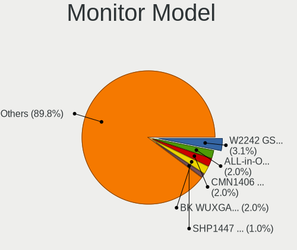

| Model                                                                | Computers | Percent |
|----------------------------------------------------------------------|-----------|---------|
| Goldstar W2242 GSM5678 1680x1050 474x296mm 22.0-inch                 | 3         | 3.06%   |
| Hewlett-Packard ALL-in-One HPN4274 1920x1080 476x268mm 21.5-inch     | 2         | 2.04%   |
| Chimei Innolux LCD Monitor CMN1406 1920x1080 309x173mm 13.9-inch     | 2         | 2.04%   |
| Beko BK WUXGA BEK4448 1920x1080 820x460mm 37.0-inch                  | 2         | 2.04%   |
| STD Monitor STD2023 1920x1080 600x330mm 27.0-inch                    | 1         | 1.02%   |
| Sharp LCD Monitor SHP1447 1920x1080 294x165mm 13.3-inch              | 1         | 1.02%   |
| Samsung Electronics U32J59x SAM0F35 3840x2160 697x392mm 31.5-inch    | 1         | 1.02%   |
| Samsung Electronics U32J59x SAM0F34 3840x2160 697x392mm 31.5-inch    | 1         | 1.02%   |
| Samsung Electronics SyncMaster SAM0599 1600x900 440x250mm 19.9-inch  | 1         | 1.02%   |
| Samsung Electronics SyncMaster SAM01B7 1280x1024 338x270mm 17.0-inch | 1         | 1.02%   |
| Samsung Electronics S27H65x SAM0E1E 1920x1080 598x336mm 27.0-inch    | 1         | 1.02%   |
| Samsung Electronics LCD Monitor SEC5541 1366x768 344x193mm 15.5-inch | 1         | 1.02%   |
| Samsung Electronics LCD Monitor SEC5441 1280x800 286x179mm 13.3-inch | 1         | 1.02%   |
| Samsung Electronics LCD Monitor SEC4251 1366x768 344x194mm 15.5-inch | 1         | 1.02%   |
| Samsung Electronics LCD Monitor SEC324A 1366x768 344x194mm 15.5-inch | 1         | 1.02%   |
| Samsung Electronics LCD Monitor SEC3150 1366x768 344x193mm 15.5-inch | 1         | 1.02%   |
| Samsung Electronics LCD Monitor SEC304C 1366x768 309x174mm 14.0-inch | 1         | 1.02%   |
| Samsung Electronics LCD Monitor SDC4951 1366x768 344x194mm 15.5-inch | 1         | 1.02%   |
| SAC LED MONITOR SAC3219 1360x768 304x228mm 15.0-inch                 | 1         | 1.02%   |
| Philips PHL 288E2 PHLC231 3840x2160 621x341mm 27.9-inch              | 1         | 1.02%   |
| Philips PHL 243B9 PHL0941 1920x1080 527x296mm 23.8-inch              | 1         | 1.02%   |
| Philips PHL 193V5 PHLC0CD 1366x768 410x230mm 18.5-inch               | 1         | 1.02%   |
| PANDA LCD Monitor NCP006E 1920x1080 344x194mm 15.5-inch              | 1         | 1.02%   |
| LG Philips LCD Monitor LPLDB00 1280x800 331x207mm 15.4-inch          | 1         | 1.02%   |
| LG Philips LCD Monitor LPL1146 1280x800 331x207mm 15.4-inch          | 1         | 1.02%   |
| LG Display LCD Monitor LGD0760 1920x1200 302x189mm 14.0-inch         | 1         | 1.02%   |
| LG Display LCD Monitor LGD0587 3840x2160 309x174mm 14.0-inch         | 1         | 1.02%   |
| LG Display LCD Monitor LGD053F 1920x1080 344x194mm 15.5-inch         | 1         | 1.02%   |
| LG Display LCD Monitor LGD0493 1366x768 344x194mm 15.5-inch          | 1         | 1.02%   |
| LG Display LCD Monitor LGD048A 1920x1080 276x156mm 12.5-inch         | 1         | 1.02%   |
| LG Display LCD Monitor LGD0470 1920x1080 345x194mm 15.6-inch         | 1         | 1.02%   |
| LG Display LCD Monitor LGD0469 1920x1080 382x215mm 17.3-inch         | 1         | 1.02%   |
| LG Display LCD Monitor LGD0468 1366x768 344x194mm 15.5-inch          | 1         | 1.02%   |
| LG Display LCD Monitor LGD0456 1366x768 344x194mm 15.5-inch          | 1         | 1.02%   |
| LG Display LCD Monitor LGD0414 1920x1080 276x156mm 12.5-inch         | 1         | 1.02%   |
| LG Display LCD Monitor LGD0395 1366x768 344x194mm 15.5-inch          | 1         | 1.02%   |
| LG Display LCD Monitor LGD0384 1366x768 344x194mm 15.5-inch          | 1         | 1.02%   |
| LG Display LCD Monitor LGD033F 1366x768 310x174mm 14.0-inch          | 1         | 1.02%   |
| LG Display LCD Monitor LGD033A 1366x768 340x190mm 15.3-inch          | 1         | 1.02%   |
| LG Display LCD Monitor LGD02DC 1366x768 344x194mm 15.5-inch          | 1         | 1.02%   |

Monitor Resolution
------------------

Monitor screen resolution

| Resolution         | Computers | Percent |
|--------------------|-----------|---------|
| 1920x1080 (FHD)    | 42        | 45.16%  |
| 1366x768 (WXGA)    | 31        | 33.33%  |
| 3840x2160 (4K)     | 5         | 5.38%   |
| 1680x1050 (WSXGA+) | 3         | 3.23%   |
| 1600x900 (HD+)     | 3         | 3.23%   |
| 1920x1200 (WUXGA)  | 2         | 2.15%   |
| 1440x900 (WXGA+)   | 2         | 2.15%   |
| 1280x800 (WXGA)    | 2         | 2.15%   |
| 1280x1024 (SXGA)   | 2         | 2.15%   |
| 2160x1440          | 1         | 1.08%   |

Monitor Diagonal
----------------

Diagonal size in inches

| Inches | Computers | Percent |
|--------|-----------|---------|
| 15     | 42        | 43.3%   |
| 23     | 9         | 9.28%   |
| 21     | 8         | 8.25%   |
| 13     | 7         | 7.22%   |
| 14     | 6         | 6.19%   |
| 27     | 4         | 4.12%   |
| 24     | 4         | 4.12%   |
| 17     | 4         | 4.12%   |
| 12     | 3         | 3.09%   |
| 72     | 2         | 2.06%   |
| 19     | 2         | 2.06%   |
| 31     | 1         | 1.03%   |
| 22     | 1         | 1.03%   |
| 20     | 1         | 1.03%   |
| 18     | 1         | 1.03%   |
| 16     | 1         | 1.03%   |
| 11     | 1         | 1.03%   |

Monitor Width
-------------

Physical width

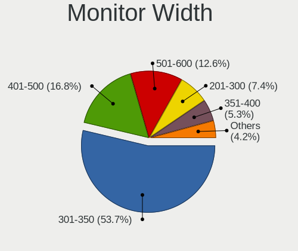

| Width in mm | Computers | Percent |
|-------------|-----------|---------|
| 301-350     | 51        | 53.68%  |
| 401-500     | 16        | 16.84%  |
| 501-600     | 12        | 12.63%  |
| 201-300     | 7         | 7.37%   |
| 351-400     | 5         | 5.26%   |
| 601-700     | 2         | 2.11%   |
| 1501-2000   | 2         | 2.11%   |

Aspect Ratio
------------

Proportional relationship between the width and the height

| Ratio | Computers | Percent |
|-------|-----------|---------|
| 16/9  | 78        | 84.78%  |
| 16/10 | 7         | 7.61%   |
| 3/2   | 4         | 4.35%   |
| 5/4   | 2         | 2.17%   |
| 4/3   | 1         | 1.09%   |

Monitor Area
------------

Area in inch²

| Area in inch² | Computers | Percent |
|----------------|-----------|---------|
| 101-110        | 43        | 44.79%  |
| 201-250        | 17        | 17.71%  |
| 81-90          | 11        | 11.46%  |
| 151-200        | 6         | 6.25%   |
| 301-350        | 4         | 4.17%   |
| 71-80          | 3         | 3.13%   |
| 141-150        | 3         | 3.13%   |
| More than 1000 | 2         | 2.08%   |
| 61-70          | 2         | 2.08%   |
| 51-60          | 1         | 1.04%   |
| 351-500        | 1         | 1.04%   |
| 251-300        | 1         | 1.04%   |
| 131-140        | 1         | 1.04%   |
| 121-130        | 1         | 1.04%   |

Pixel Density
-------------

Pixels per inch

| Density       | Computers | Percent |
|---------------|-----------|---------|
| 101-120       | 31        | 32.63%  |
| 51-100        | 31        | 32.63%  |
| 121-160       | 23        | 24.21%  |
| 161-240       | 7         | 7.37%   |
| 1-50          | 2         | 2.11%   |
| More than 240 | 1         | 1.05%   |

Multiple Monitors
-----------------

Total monitors connected

| Total | Computers | Percent |
|-------|-----------|---------|
| 1     | 85        | 89.47%  |
| 2     | 8         | 8.42%   |
| 0     | 2         | 2.11%   |

Network
-------

Net Controller Vendor
---------------------

Controller vendors

| Vendor                | Computers | Percent |
|-----------------------|-----------|---------|
| Realtek Semiconductor | 65        | 46.43%  |
| Intel                 | 36        | 25.71%  |
| Qualcomm Atheros      | 16        | 11.43%  |
| Broadcom              | 8         | 5.71%   |
| Ralink Technology     | 3         | 2.14%   |
| Ralink                | 3         | 2.14%   |
| MediaTek              | 2         | 1.43%   |
| ASUSTek Computer      | 2         | 1.43%   |
| ZyXEL Communications  | 1         | 0.71%   |
| Xiaomi                | 1         | 0.71%   |
| JMicron Technology    | 1         | 0.71%   |
| Broadcom Limited      | 1         | 0.71%   |
| Aquantia              | 1         | 0.71%   |

Net Controller Model
--------------------

Controller models

| Model                                                                  | Computers | Percent |
|------------------------------------------------------------------------|-----------|---------|
| Realtek RTL8111/8168/8211/8411 PCI Express Gigabit Ethernet Controller | 49        | 28.99%  |
| Realtek RTL810xE PCI Express Fast Ethernet controller                  | 10        | 5.92%   |
| Realtek RTL8821CE 802.11ac PCIe Wireless Network Adapter               | 5         | 2.96%   |
| Qualcomm Atheros QCA9377 802.11ac Wireless Network Adapter             | 5         | 2.96%   |
| Intel Wireless 8265 / 8275                                             | 4         | 2.37%   |
| Realtek RTL8822CE 802.11ac PCIe Wireless Network Adapter               | 3         | 1.78%   |
| Realtek RTL8723BE PCIe Wireless Network Adapter                        | 3         | 1.78%   |
| Qualcomm Atheros QCA6174 802.11ac Wireless Network Adapter             | 3         | 1.78%   |
| Intel Wi-Fi 6 AX201                                                    | 3         | 1.78%   |
| Intel PRO/Wireless 3945ABG [Golan] Network Connection                  | 3         | 1.78%   |
| Realtek RTL8821AE 802.11ac PCIe Wireless Network Adapter               | 2         | 1.18%   |
| Realtek RTL8192CU 802.11n WLAN Adapter                                 | 2         | 1.18%   |
| Realtek RTL8153 Gigabit Ethernet Adapter                               | 2         | 1.18%   |
| Ralink RT2870/RT3070 Wireless Adapter                                  | 2         | 1.18%   |
| Ralink RT3290 Wireless 802.11n 1T/1R PCIe                              | 2         | 1.18%   |
| Qualcomm Atheros AR9485 Wireless Network Adapter                       | 2         | 1.18%   |
| Qualcomm Atheros AR9285 Wireless Network Adapter (PCI-Express)         | 2         | 1.18%   |
| Qualcomm Atheros AR8151 v2.0 Gigabit Ethernet                          | 2         | 1.18%   |
| Intel Wireless 7265                                                    | 2         | 1.18%   |
| Intel Wireless 7260                                                    | 2         | 1.18%   |
| Intel Ice Lake-LP PCH CNVi WiFi                                        | 2         | 1.18%   |
| Intel Ethernet Connection I217-LM                                      | 2         | 1.18%   |
| Intel Ethernet Connection (17) I219-LM                                 | 2         | 1.18%   |
| Intel Comet Lake PCH CNVi WiFi                                         | 2         | 1.18%   |
| Broadcom NetLink BCM57780 Gigabit Ethernet PCIe                        | 2         | 1.18%   |
| Broadcom BCM43142 802.11b/g/n                                          | 2         | 1.18%   |
| Broadcom BCM4313 802.11bgn Wireless Network Adapter                    | 2         | 1.18%   |
| ZyXEL NWD2205 802.11n Wireless N Adapter [Realtek RTL8192CU]           | 1         | 0.59%   |
| Xiaomi Mi/Redmi series (RNDIS)                                         | 1         | 0.59%   |
| Realtek RTL8852BE PCIe 802.11ax Wireless Network Controller            | 1         | 0.59%   |
| Realtek RTL8723AE PCIe Wireless Network Adapter                        | 1         | 0.59%   |
| Realtek RTL8188FTV 802.11b/g/n 1T1R 2.4G WLAN Adapter                  | 1         | 0.59%   |
| Realtek RTL8188EE Wireless Network Adapter                             | 1         | 0.59%   |
| Realtek RTL8188CE 802.11b/g/n WiFi Adapter                             | 1         | 0.59%   |
| Realtek RTL8152 Fast Ethernet Adapter                                  | 1         | 0.59%   |
| Realtek RTL-8100/8101L/8139 PCI Fast Ethernet Adapter                  | 1         | 0.59%   |
| Realtek 802.11n WLAN Adapter                                           | 1         | 0.59%   |
| Ralink MT7601U Wireless Adapter                                        | 1         | 0.59%   |
| Ralink RT3090 Wireless 802.11n 1T/1R PCIe                              | 1         | 0.59%   |
| Qualcomm Atheros QCA9565 / AR9565 Wireless Network Adapter             | 1         | 0.59%   |

Wireless Vendor
---------------

Wireless vendors

| Vendor                | Computers | Percent |
|-----------------------|-----------|---------|
| Intel                 | 30        | 37.04%  |
| Realtek Semiconductor | 21        | 25.93%  |
| Qualcomm Atheros      | 13        | 16.05%  |
| Broadcom              | 5         | 6.17%   |
| Ralink Technology     | 3         | 3.7%    |
| Ralink                | 3         | 3.7%    |
| MediaTek              | 2         | 2.47%   |
| ASUSTek Computer      | 2         | 2.47%   |
| ZyXEL Communications  | 1         | 1.23%   |
| Broadcom Limited      | 1         | 1.23%   |

Wireless Model
--------------

Wireless models

| Model                                                          | Computers | Percent |
|----------------------------------------------------------------|-----------|---------|
| Realtek RTL8821CE 802.11ac PCIe Wireless Network Adapter       | 5         | 6.17%   |
| Qualcomm Atheros QCA9377 802.11ac Wireless Network Adapter     | 5         | 6.17%   |
| Intel Wireless 8265 / 8275                                     | 4         | 4.94%   |
| Realtek RTL8822CE 802.11ac PCIe Wireless Network Adapter       | 3         | 3.7%    |
| Realtek RTL8723BE PCIe Wireless Network Adapter                | 3         | 3.7%    |
| Qualcomm Atheros QCA6174 802.11ac Wireless Network Adapter     | 3         | 3.7%    |
| Intel Wi-Fi 6 AX201                                            | 3         | 3.7%    |
| Intel PRO/Wireless 3945ABG [Golan] Network Connection          | 3         | 3.7%    |
| Realtek RTL8821AE 802.11ac PCIe Wireless Network Adapter       | 2         | 2.47%   |
| Realtek RTL8192CU 802.11n WLAN Adapter                         | 2         | 2.47%   |
| Ralink RT2870/RT3070 Wireless Adapter                          | 2         | 2.47%   |
| Ralink RT3290 Wireless 802.11n 1T/1R PCIe                      | 2         | 2.47%   |
| Qualcomm Atheros AR9485 Wireless Network Adapter               | 2         | 2.47%   |
| Qualcomm Atheros AR9285 Wireless Network Adapter (PCI-Express) | 2         | 2.47%   |
| Intel Wireless 7265                                            | 2         | 2.47%   |
| Intel Wireless 7260                                            | 2         | 2.47%   |
| Intel Ice Lake-LP PCH CNVi WiFi                                | 2         | 2.47%   |
| Intel Comet Lake PCH CNVi WiFi                                 | 2         | 2.47%   |
| Broadcom BCM43142 802.11b/g/n                                  | 2         | 2.47%   |
| Broadcom BCM4313 802.11bgn Wireless Network Adapter            | 2         | 2.47%   |
| ZyXEL NWD2205 802.11n Wireless N Adapter [Realtek RTL8192CU]   | 1         | 1.23%   |
| Realtek RTL8852BE PCIe 802.11ax Wireless Network Controller    | 1         | 1.23%   |
| Realtek RTL8723AE PCIe Wireless Network Adapter                | 1         | 1.23%   |
| Realtek RTL8188FTV 802.11b/g/n 1T1R 2.4G WLAN Adapter          | 1         | 1.23%   |
| Realtek RTL8188EE Wireless Network Adapter                     | 1         | 1.23%   |
| Realtek RTL8188CE 802.11b/g/n WiFi Adapter                     | 1         | 1.23%   |
| Realtek 802.11n WLAN Adapter                                   | 1         | 1.23%   |
| Ralink MT7601U Wireless Adapter                                | 1         | 1.23%   |
| Ralink RT3090 Wireless 802.11n 1T/1R PCIe                      | 1         | 1.23%   |
| Qualcomm Atheros QCA9565 / AR9565 Wireless Network Adapter     | 1         | 1.23%   |
| MediaTek WiFi                                                  | 1         | 1.23%   |
| MediaTek MT7921 802.11ax PCI Express Wireless Network Adapter  | 1         | 1.23%   |
| Intel Wireless 3160                                            | 1         | 1.23%   |
| Intel WiFi Link 5100                                           | 1         | 1.23%   |
| Intel Wi-Fi 6 AX200                                            | 1         | 1.23%   |
| Intel Raptor Lake PCH CNVi WiFi                                | 1         | 1.23%   |
| Intel Dual Band Wireless-AC 3168NGW [Stone Peak]               | 1         | 1.23%   |
| Intel Dual Band Wireless-AC 3165 Plus Bluetooth                | 1         | 1.23%   |
| Intel Centrino Wireless-N 2230                                 | 1         | 1.23%   |
| Intel Centrino Wireless-N 130                                  | 1         | 1.23%   |

Ethernet Vendor
---------------

Ethernet vendors

| Vendor                | Computers | Percent |
|-----------------------|-----------|---------|
| Realtek Semiconductor | 62        | 71.26%  |
| Intel                 | 14        | 16.09%  |
| Qualcomm Atheros      | 4         | 4.6%    |
| Broadcom              | 4         | 4.6%    |
| Xiaomi                | 1         | 1.15%   |
| JMicron Technology    | 1         | 1.15%   |
| Aquantia              | 1         | 1.15%   |

Ethernet Model
--------------

Ethernet models

| Model                                                                           | Computers | Percent |
|---------------------------------------------------------------------------------|-----------|---------|
| Realtek RTL8111/8168/8211/8411 PCI Express Gigabit Ethernet Controller          | 49        | 55.68%  |
| Realtek RTL810xE PCI Express Fast Ethernet controller                           | 10        | 11.36%  |
| Realtek RTL8153 Gigabit Ethernet Adapter                                        | 2         | 2.27%   |
| Qualcomm Atheros AR8151 v2.0 Gigabit Ethernet                                   | 2         | 2.27%   |
| Intel Ethernet Connection I217-LM                                               | 2         | 2.27%   |
| Intel Ethernet Connection (17) I219-LM                                          | 2         | 2.27%   |
| Broadcom NetLink BCM57780 Gigabit Ethernet PCIe                                 | 2         | 2.27%   |
| Xiaomi Mi/Redmi series (RNDIS)                                                  | 1         | 1.14%   |
| Realtek RTL8152 Fast Ethernet Adapter                                           | 1         | 1.14%   |
| Realtek RTL-8100/8101L/8139 PCI Fast Ethernet Adapter                           | 1         | 1.14%   |
| Qualcomm Atheros QCA8172 Fast Ethernet                                          | 1         | 1.14%   |
| Qualcomm Atheros AR8121/AR8113/AR8114 Gigabit or Fast Ethernet                  | 1         | 1.14%   |
| JMicron JMC250 PCI Express Gigabit Ethernet Controller                          | 1         | 1.14%   |
| Intel Ethernet Controller I225-V                                                | 1         | 1.14%   |
| Intel Ethernet Connection (7) I219-LM                                           | 1         | 1.14%   |
| Intel Ethernet Connection (4) I219-V                                            | 1         | 1.14%   |
| Intel Ethernet Connection (4) I219-LM                                           | 1         | 1.14%   |
| Intel Ethernet Connection (3) I218-V                                            | 1         | 1.14%   |
| Intel Ethernet Connection (3) I218-LM                                           | 1         | 1.14%   |
| Intel Ethernet Connection (2) I219-V                                            | 1         | 1.14%   |
| Intel Ethernet Connection (11) I219-V                                           | 1         | 1.14%   |
| Intel 82577LC Gigabit Network Connection                                        | 1         | 1.14%   |
| Intel 82562ET/EZ/GT/GZ - PRO/100 VE (LOM) Ethernet Controller Mobile            | 1         | 1.14%   |
| Broadcom NetXtreme BCM57766 Gigabit Ethernet PCIe                               | 1         | 1.14%   |
| Broadcom NetXtreme BCM5754 Gigabit Ethernet PCI Express                         | 1         | 1.14%   |
| Aquantia AQtion AQC113CS NBase-T/IEEE 802.3an Ethernet Controller [Antigua 10G] | 1         | 1.14%   |

Net Controller Kind
-------------------

Ethernet, WiFi or modem

| Kind     | Computers | Percent |
|----------|-----------|---------|
| Ethernet | 85        | 52.8%   |
| WiFi     | 76        | 47.2%   |

Used Controller
---------------

Currently used network controller

| Kind     | Computers | Percent |
|----------|-----------|---------|
| WiFi     | 64        | 62.75%  |
| Ethernet | 38        | 37.25%  |

NICs
----

Total network controllers on board

| Total | Computers | Percent |
|-------|-----------|---------|
| 2     | 59        | 62.11%  |
| 1     | 36        | 37.89%  |

IPv6
----

IPv6 vs IPv4

| Used | Computers | Percent |
|------|-----------|---------|
| No   | 88        | 92.63%  |
| Yes  | 7         | 7.37%   |

Bluetooth
---------

Bluetooth Vendor
----------------

Controller vendors

| Vendor                          | Computers | Percent |
|---------------------------------|-----------|---------|
| Intel                           | 23        | 36.51%  |
| Realtek Semiconductor           | 11        | 17.46%  |
| Qualcomm Atheros Communications | 7         | 11.11%  |
| Lite-On Technology              | 3         | 4.76%   |
| IMC Networks                    | 3         | 4.76%   |
| Cambridge Silicon Radio         | 3         | 4.76%   |
| Broadcom                        | 3         | 4.76%   |
| Toshiba                         | 2         | 3.17%   |
| Realtek                         | 2         | 3.17%   |
| Ralink                          | 2         | 3.17%   |
| Foxconn / Hon Hai               | 2         | 3.17%   |
| Foxconn International           | 1         | 1.59%   |
| Apple                           | 1         | 1.59%   |

Bluetooth Model
---------------

Controller models

| Model                                               | Computers | Percent |
|-----------------------------------------------------|-----------|---------|
| Intel Bluetooth wireless interface                  | 9         | 14.29%  |
| Realtek Bluetooth Radio                             | 5         | 7.94%   |
| Intel Bluetooth 9460/9560 Jefferson Peak (JfP)      | 4         | 6.35%   |
| Intel AX201 Bluetooth                               | 4         | 6.35%   |
| Realtek  Bluetooth 4.2 Adapter                      | 3         | 4.76%   |
| Qualcomm Atheros  Bluetooth Device                  | 3         | 4.76%   |
| Cambridge Silicon Radio Bluetooth Dongle (HCI mode) | 3         | 4.76%   |
| Realtek Bluetooth Radio                             | 2         | 3.17%   |
| Ralink RT3290 Bluetooth                             | 2         | 3.17%   |
| Qualcomm Atheros AR3011 Bluetooth                   | 2         | 3.17%   |
| Lite-On Qualcomm Atheros QCA9377 Bluetooth          | 2         | 3.17%   |
| Intel Centrino Bluetooth Wireless Transceiver       | 2         | 3.17%   |
| Broadcom HP Portable Valentine                      | 2         | 3.17%   |
| Toshiba RT Bluetooth Radio                          | 1         | 1.59%   |
| Toshiba Integrated Bluetooth HCI                    | 1         | 1.59%   |
| Realtek RTL8821A Bluetooth                          | 1         | 1.59%   |
| Realtek RTL8723B Bluetooth                          | 1         | 1.59%   |
| Realtek 802.11ac WLAN Adapter                       | 1         | 1.59%   |
| Qualcomm Atheros QCA61x4 Bluetooth 4.0              | 1         | 1.59%   |
| Qualcomm Atheros AR3012 Bluetooth 4.0               | 1         | 1.59%   |
| Lite-On Atheros AR3012 Bluetooth                    | 1         | 1.59%   |
| Intel Wireless-AC 3168 Bluetooth                    | 1         | 1.59%   |
| Intel Centrino Advanced-N 6230 Bluetooth adapter    | 1         | 1.59%   |
| Intel AX211 Bluetooth                               | 1         | 1.59%   |
| Intel AX200 Bluetooth                               | 1         | 1.59%   |
| IMC Networks Wireless_Device                        | 1         | 1.59%   |
| IMC Networks Bluetooth Radio                        | 1         | 1.59%   |
| IMC Networks Bluetooth Device                       | 1         | 1.59%   |
| Foxconn International BCM43142A0 Bluetooth module   | 1         | 1.59%   |
| Foxconn / Hon Hai Bluetooth Device                  | 1         | 1.59%   |
| Foxconn / Hon Hai BCM43142A0                        | 1         | 1.59%   |
| Broadcom BCM2045 Bluetooth                          | 1         | 1.59%   |
| Apple Bluetooth Host Controller                     | 1         | 1.59%   |

Sound
-----

Sound Vendor
------------

Sound card vendors

| Vendor                | Computers | Percent |
|-----------------------|-----------|---------|
| Intel                 | 80        | 70.18%  |
| AMD                   | 21        | 18.42%  |
| Nvidia                | 11        | 9.65%   |
| Kingston Technology   | 1         | 0.88%   |
| Barco Display Systems | 1         | 0.88%   |

Sound Model
-----------

Sound card models

| Model                                                                      | Computers | Percent |
|----------------------------------------------------------------------------|-----------|---------|
| Intel Sunrise Point-LP HD Audio                                            | 10        | 7.09%   |
| Intel 8 Series/C220 Series Chipset High Definition Audio Controller        | 9         | 6.38%   |
| Intel 7 Series/C216 Chipset Family High Definition Audio Controller        | 8         | 5.67%   |
| Intel Xeon E3-1200 v3/4th Gen Core Processor HD Audio Controller           | 6         | 4.26%   |
| Intel 6 Series/C200 Series Chipset Family High Definition Audio Controller | 6         | 4.26%   |
| Intel Wildcat Point-LP High Definition Audio Controller                    | 5         | 3.55%   |
| Intel Tiger Lake-LP Smart Sound Technology Audio Controller                | 5         | 3.55%   |
| Intel Broadwell-U Audio Controller                                         | 5         | 3.55%   |
| Intel 82801I (ICH9 Family) HD Audio Controller                             | 5         | 3.55%   |
| AMD Kabini HDMI/DP Audio                                                   | 5         | 3.55%   |
| AMD Family 15h (Models 60h-6fh) Audio Controller                           | 5         | 3.55%   |
| Intel NM10/ICH7 Family High Definition Audio Controller                    | 4         | 2.84%   |
| Intel 5 Series/3400 Series Chipset High Definition Audio                   | 4         | 2.84%   |
| AMD Renoir Radeon High Definition Audio Controller                         | 4         | 2.84%   |
| Nvidia GF108 High Definition Audio Controller                              | 3         | 2.13%   |
| Intel Haswell-ULT HD Audio Controller                                      | 3         | 2.13%   |
| Intel Cannon Lake PCH cAVS                                                 | 3         | 2.13%   |
| Intel Alder Lake-S HD Audio Controller                                     | 3         | 2.13%   |
| Intel 8 Series HD Audio Controller                                         | 3         | 2.13%   |
| AMD FCH Azalia Controller                                                  | 3         | 2.13%   |
| AMD Family 17h/19h/1ah HD Audio Controller                                 | 3         | 2.13%   |
| Nvidia High Definition Audio Controller                                    | 2         | 1.42%   |
| Intel Ice Lake-LP Smart Sound Technology Audio Controller                  | 2         | 1.42%   |
| Intel Comet Lake PCH cAVS                                                  | 2         | 1.42%   |
| Intel 200 Series PCH HD Audio                                              | 2         | 1.42%   |
| AMD RV630 HDMI Audio [Radeon HD 2600 PRO/XT / HD 3610]                     | 2         | 1.42%   |
| AMD High Definition Audio Controller                                       | 2         | 1.42%   |
| AMD Baffin HDMI/DP Audio [Radeon RX 550 640SP / RX 560/560X]               | 2         | 1.42%   |
| Nvidia TU107 GeForce GTX 1650 High Definition Audio Controller             | 1         | 0.71%   |
| Nvidia TU106 High Definition Audio Controller                              | 1         | 0.71%   |
| Nvidia GP107GL High Definition Audio Controller                            | 1         | 0.71%   |
| Nvidia GK208 HDMI/DP Audio Controller                                      | 1         | 0.71%   |
| Nvidia GA102 High Definition Audio Controller                              | 1         | 0.71%   |
| Nvidia AD107 High Definition Audio Controller                              | 1         | 0.71%   |
| Kingston Technology HyperX QuadCast S                                      | 1         | 0.71%   |
| Intel Smart Sound Technology (SST) Audio Controller                        | 1         | 0.71%   |
| Intel Raptor Lake-P/U/H cAVS                                               | 1         | 0.71%   |
| Intel Comet Lake PCH-V cAVS                                                | 1         | 0.71%   |
| Intel Celeron/Pentium Silver Processor High Definition Audio               | 1         | 0.71%   |
| Intel Celeron N3350/Pentium N4200/Atom E3900 Series Audio Cluster          | 1         | 0.71%   |

Memory
------

Memory Vendor
-------------

Memory module vendors

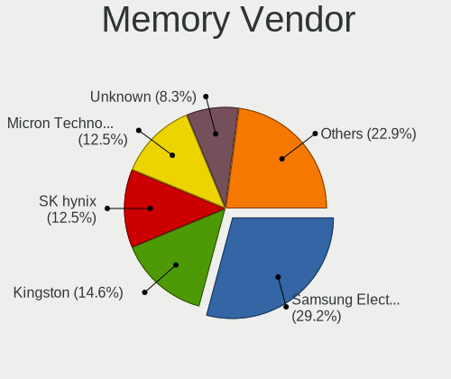

| Vendor              | Computers | Percent |
|---------------------|-----------|---------|
| Samsung Electronics | 14        | 29.17%  |
| Kingston            | 7         | 14.58%  |
| SK hynix            | 6         | 12.5%   |
| Micron Technology   | 6         | 12.5%   |
| Unknown             | 4         | 8.33%   |
| G.Skill             | 2         | 4.17%   |
| A-DATA Technology   | 2         | 4.17%   |
| Unknown             | 2         | 4.17%   |
| Unknown (0x4509)    | 1         | 2.08%   |
| Ramaxel Technology  | 1         | 2.08%   |
| Kingmax             | 1         | 2.08%   |
| Crucial             | 1         | 2.08%   |
| Apacer              | 1         | 2.08%   |

Memory Model
------------

Memory module models

| Model                                                              | Computers | Percent |
|--------------------------------------------------------------------|-----------|---------|
| Samsung RAM M471B1G73DB0-YK0 8GB SODIMM DDR3 1600MT/s              | 2         | 4%      |
| Micron RAM 4ATF51264HZ-2G6E1 4GB SODIMM DDR4 2667MT/s              | 2         | 4%      |
| Micron RAM 4ATF1G64HZ-3G2F1 8GB SODIMM DDR4 3200MT/s               | 2         | 4%      |
| Unknown                                                            | 2         | 4%      |
| Unknown RAM Module 8GB SODIMM DDR3 1600MT/s                        | 1         | 2%      |
| Unknown RAM Module 4GB SODIMM DDR3 1067MT/s                        | 1         | 2%      |
| Unknown RAM Module 2GB SODIMM DDR2 667MT/s                         | 1         | 2%      |
| Unknown RAM Module 2048MB SODIMM DDR2                              | 1         | 2%      |
| Unknown (0x4509) RAM GKE800SO102408-2666A 8GB SODIMM DDR4 2133MT/s | 1         | 2%      |
| SK hynix RAM Module 8GB SODIMM DDR4 2400MT/s                       | 1         | 2%      |
| SK hynix RAM HMT41GS6AFR8A-PB 8GB SODIMM DDR3 2667MT/s             | 1         | 2%      |
| SK hynix RAM HMT351S6EFR8C-PB 4GB SODIMM DDR3 1600MT/s             | 1         | 2%      |
| SK hynix RAM HMT351S6CFR8C-PB 4GB SODIMM DDR3 1600MT/s             | 1         | 2%      |
| SK hynix RAM HMCG78AGBSA095N 16GB SODIMM DDR5 5600MT/s             | 1         | 2%      |
| SK hynix RAM HMAA1GS6CJR6N-XN 8GB Row Of Chips DDR4 3200MT/s       | 1         | 2%      |
| SK hynix RAM HMA81GS6CJR8N-VK 8GB SODIMM DDR4 2667MT/s             | 1         | 2%      |
| Samsung RAM M471B5773DH0-CK0 2GB SODIMM DDR3 1600MT/s              | 1         | 2%      |
| Samsung RAM M471B5773CHS-CH9 2GB DIMM DDR3 1333MT/s                | 1         | 2%      |
| Samsung RAM M471B5173QH0-YK0 4GB SODIMM DDR3 1600MT/s              | 1         | 2%      |
| Samsung RAM M471B1G73QH0-YK0 8GB SODIMM DDR3 1600MT/s              | 1         | 2%      |
| Samsung RAM M471A5244CB0-CWE 4096MB SODIMM DDR4 3200MT/s           | 1         | 2%      |
| Samsung RAM M471A5244CB0-CRC 4GB SODIMM DDR4 2667MT/s              | 1         | 2%      |
| Samsung RAM M471A5143EB0-CPB 4GB SODIMM DDR4 2133MT/s              | 1         | 2%      |
| Samsung RAM M471A1K43DB1-CWE 8GB SODIMM DDR4 3200MT/s              | 1         | 2%      |
| Samsung RAM M471A1K43CB1-CRC 8GB SODIMM DDR4 2667MT/s              | 1         | 2%      |
| Samsung RAM M471A1G44AB0-CWE 8GB Row Of Chips DDR4 3200MT/s        | 1         | 2%      |
| Samsung RAM M378A2K43DB1-CTD 16384MB DIMM DDR4 2667MT/s            | 1         | 2%      |
| Samsung RAM M378A1G44BB0-CWE 8GB DIMM DDR4 3200MT/s                | 1         | 2%      |
| Ramaxel RAM RMSA3330MJ78HBF-3200 16GB SODIMM DDR4 3200MT/s         | 1         | 2%      |
| Micron RAM 8KTF51264HDZ-1G6E1 4GB SODIMM DDR3 1600MT/s             | 1         | 2%      |
| Micron RAM 16HTF25664AY-667E1 2GB DIMM DDR 667MT/s                 | 1         | 2%      |
| Kingston RAM Module 2GB DIMM DDR2 667MT/s                          | 1         | 2%      |
| Kingston RAM Module 16GB SODIMM DDR4 3200MT/s                      | 1         | 2%      |
| Kingston RAM KHX3000C15D4/8GX 8GB DIMM DDR4 3400MT/s               | 1         | 2%      |
| Kingston RAM KHX2133C14/8G 8GB DIMM DDR4 2666MT/s                  | 1         | 2%      |
| Kingston RAM ACR16D3LFS1KBG/2G 2GB SODIMM DDR3 1600MT/s            | 1         | 2%      |
| Kingston RAM 99U5471-057.A00LF 8GB DIMM DDR3 1333MT/s              | 1         | 2%      |
| Kingston RAM 99U5469-041.A00LF 4GB SODIMM DDR3 1600MT/s            | 1         | 2%      |
| Kingston RAM 99U5428-018.A00LF 8GB SODIMM DDR3 1600MT/s            | 1         | 2%      |
| Kingmax RAM FSFE85F-C8KL9 2GB DIMM DDR3 1333MT/s                   | 1         | 2%      |

Memory Kind
-----------

Memory module kinds

| Kind   | Computers | Percent |
|--------|-----------|---------|
| DDR4   | 24        | 55.81%  |
| DDR3   | 13        | 30.23%  |
| DDR2   | 3         | 6.98%   |
| SDRAM  | 1         | 2.33%   |
| LPDDR5 | 1         | 2.33%   |
| DDR5   | 1         | 2.33%   |

Memory Form Factor
------------------

Physical design of the memory module

| Name         | Computers | Percent |
|--------------|-----------|---------|
| SODIMM       | 30        | 71.43%  |
| DIMM         | 9         | 21.43%  |
| Row Of Chips | 3         | 7.14%   |

Memory Size
-----------

Memory module size

| Size  | Computers | Percent |
|-------|-----------|---------|
| 8192  | 20        | 44.44%  |
| 4096  | 12        | 26.67%  |
| 16384 | 6         | 13.33%  |
| 2048  | 6         | 13.33%  |
| 32768 | 1         | 2.22%   |

Memory Speed
------------

Memory module speed

| Speed   | Computers | Percent |
|---------|-----------|---------|
| 3200    | 10        | 22.73%  |
| 2667    | 10        | 22.73%  |
| 1600    | 9         | 20.45%  |
| 2133    | 4         | 9.09%   |
| 1333    | 2         | 4.55%   |
| 667     | 2         | 4.55%   |
| 6400    | 1         | 2.27%   |
| 5600    | 1         | 2.27%   |
| 3400    | 1         | 2.27%   |
| 2666    | 1         | 2.27%   |
| 2400    | 1         | 2.27%   |
| 1067    | 1         | 2.27%   |
| Unknown | 1         | 2.27%   |

Printers & scanners
-------------------

Printer Vendor
--------------

Printer device vendors

| Vendor              | Computers | Percent |
|---------------------|-----------|---------|
| Zebra               | 4         | 40%     |
| Canon               | 3         | 30%     |
| Samsung Electronics | 1         | 10%     |
| Oki Data            | 1         | 10%     |
| Hewlett-Packard     | 1         | 10%     |

Printer Model
-------------

Printer device models

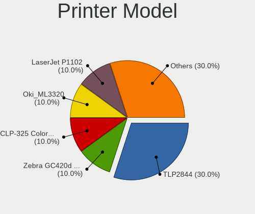

| Model                               | Computers | Percent |
|-------------------------------------|-----------|---------|
| Zebra TLP2844                       | 3         | 30%     |
| Zebra Zebra GC420d Label Printer    | 1         | 10%     |
| Samsung CLP-325 Color Laser Printer | 1         | 10%     |
| Oki Data Oki_ML3320                 | 1         | 10%     |
| HP LaserJet P1102                   | 1         | 10%     |
| Canon PIXMA MX340                   | 1         | 10%     |
| Canon LBP6030/6030B/6018L           | 1         | 10%     |
| Canon LBP6000                       | 1         | 10%     |

Scanner Vendor
--------------

Scanner device vendors

Zero info for selected period =(

Scanner Model
-------------

Scanner device models

Zero info for selected period =(

Camera
------

Camera Vendor
-------------

Camera device vendors

| Vendor                                 | Computers | Percent |
|----------------------------------------|-----------|---------|
| Chicony Electronics                    | 22        | 33.33%  |
| Realtek Semiconductor                  | 7         | 10.61%  |
| Microdia                               | 4         | 6.06%   |
| IMC Networks                           | 4         | 6.06%   |
| Cheng Uei Precision Industry (Foxlink) | 4         | 6.06%   |
| Bison Electronics                      | 4         | 6.06%   |
| Luxvisions Innotech Limited            | 3         | 4.55%   |
| Syntek                                 | 2         | 3.03%   |
| Suyin                                  | 2         | 3.03%   |
| Silicon Motion                         | 2         | 3.03%   |
| Quanta                                 | 2         | 3.03%   |
| Alcor Micro                            | 2         | 3.03%   |
| Acer                                   | 2         | 3.03%   |
| MacroSilicon                           | 1         | 1.52%   |
| Lite-On Technology                     | 1         | 1.52%   |
| Foxconn / Hon Hai                      | 1         | 1.52%   |
| Arkmicro Technologies                  | 1         | 1.52%   |
| Allwinner Technology                   | 1         | 1.52%   |
| ALi                                    | 1         | 1.52%   |

Camera Model
------------

Camera device models

| Model                                                       | Computers | Percent |
|-------------------------------------------------------------|-----------|---------|
| Chicony EasyCamera                                          | 3         | 4.55%   |
| Syntek Integrated Camera                                    | 2         | 3.03%   |
| Realtek Lenovo EasyCamera                                   | 2         | 3.03%   |
| Microdia Integrated_Webcam_HD                               | 2         | 3.03%   |
| Luxvisions Innotech Limited Integrated Camera               | 2         | 3.03%   |
| Chicony Integrated Camera                                   | 2         | 3.03%   |
| Chicony HP HD Camera                                        | 2         | 3.03%   |
| Chicony HD WebCam                                           | 2         | 3.03%   |
| Cheng Uei Precision Industry (Foxlink) HP Integrated Webcam | 2         | 3.03%   |
| Bison Integrated Camera                                     | 2         | 3.03%   |
| Suyin HP Webcam                                             | 1         | 1.52%   |
| Suyin Acer/HP Integrated Webcam [CN0314]                    | 1         | 1.52%   |
| Silicon Motion WebCam SC-03FFL11939N                        | 1         | 1.52%   |
| Silicon Motion WebCam SC-0311139N                           | 1         | 1.52%   |
| Realtek Integrated_Webcam_HD                                | 1         | 1.52%   |
| Realtek HP Truevision HD integrated webcam                  | 1         | 1.52%   |
| Realtek HP Truevision HD                                    | 1         | 1.52%   |
| Realtek HP 2.0MP High Definition Webcam                     | 1         | 1.52%   |
| Realtek Asus laptop camera                                  | 1         | 1.52%   |
| Quanta USB HD Webcam                                        | 1         | 1.52%   |
| Quanta HP True Vision FHD Camera                            | 1         | 1.52%   |
| Microdia Laptop_Integrated_Webcam_HD                        | 1         | 1.52%   |
| Microdia Integrated Camera                                  | 1         | 1.52%   |
| MacroSilicon USB Video                                      | 1         | 1.52%   |
| Luxvisions Innotech Limited HP TrueVision HD Camera         | 1         | 1.52%   |
| Lite-On TOSHIBA Web Camera - HD                             | 1         | 1.52%   |
| IMC Networks USB2.0 VGA UVC WebCam                          | 1         | 1.52%   |
| IMC Networks ov9734_azurewave_camera                        | 1         | 1.52%   |
| IMC Networks Lenovo EasyCamera                              | 1         | 1.52%   |
| IMC Networks EasyCamera                                     | 1         | 1.52%   |
| Foxconn / Hon Hai USB2.0 Camera                             | 1         | 1.52%   |
| Chicony XiaoMi USB 2.0 Webcam                               | 1         | 1.52%   |
| Chicony USB2.0 VGA UVC WebCam                               | 1         | 1.52%   |
| Chicony USB2.0 HD UVC WebCam                                | 1         | 1.52%   |
| Chicony USB2.0 Camera                                       | 1         | 1.52%   |
| Chicony USB 2.0 Camera                                      | 1         | 1.52%   |
| Chicony Integrated_Webcam_1.3M                              | 1         | 1.52%   |
| Chicony HP Truevision HD                                    | 1         | 1.52%   |
| Chicony HP High Definition 1MP Webcam                       | 1         | 1.52%   |
| Chicony HP HD Webcam [Fixed]                                | 1         | 1.52%   |

Security
--------

Fingerprint Vendor
------------------

Fingerprint sensor vendors

| Vendor                     | Computers | Percent |
|----------------------------|-----------|---------|
| Validity Sensors           | 4         | 33.33%  |
| Shenzhen Goodix Technology | 3         | 25%     |
| Synaptics                  | 2         | 16.67%  |
| Upek                       | 1         | 8.33%   |
| Elan Microelectronics      | 1         | 8.33%   |
| AuthenTec                  | 1         | 8.33%   |

Fingerprint Model
-----------------

Fingerprint sensor models

| Model                                                                      | Computers | Percent |
|----------------------------------------------------------------------------|-----------|---------|
| Shenzhen Goodix  Fingerprint Device                                        | 2         | 16.67%  |
| Validity Sensors VFS495 Fingerprint Reader                                 | 1         | 8.33%   |
| Validity Sensors VFS491                                                    | 1         | 8.33%   |
| Validity Sensors VFS 5011 fingerprint sensor                               | 1         | 8.33%   |
| Validity Sensors Synaptics VFS7552 Touch Fingerprint Sensor with PurePrint | 1         | 8.33%   |
| Upek Biometric Touchchip/Touchstrip Fingerprint Sensor                     | 1         | 8.33%   |
| Synaptics  WBDI                                                            | 1         | 8.33%   |
| Synaptics Prometheus MIS Touch Fingerprint Reader                          | 1         | 8.33%   |
| Shenzhen Goodix Fingerprint Reader                                         | 1         | 8.33%   |
| Elan ELAN:Fingerprint                                                      | 1         | 8.33%   |
| AuthenTec AES1600                                                          | 1         | 8.33%   |

Chipcard Vendor
---------------

Chipcard module vendors

| Vendor                | Computers | Percent |
|-----------------------|-----------|---------|
| Broadcom              | 2         | 50%     |
| Advanced Card Systems | 2         | 50%     |

Chipcard Model
--------------

Chipcard module models

| Model                                                                        | Computers | Percent |
|------------------------------------------------------------------------------|-----------|---------|
| Advanced Card Systems ACR38 SmartCard Reader                                 | 2         | 50%     |
| Broadcom BCM5880 Secure Applications Processor with fingerprint swipe sensor | 1         | 25%     |
| Broadcom 58200                                                               | 1         | 25%     |

Unsupported
-----------

Unsupported Devices
-------------------

Total unsupported devices on board

| Total | Computers | Percent |
|-------|-----------|---------|
| 0     | 66        | 66.67%  |
| 1     | 25        | 25.25%  |
| 2     | 8         | 8.08%   |

Unsupported Device Types
------------------------

Types of unsupported devices

| Type                     | Computers | Percent |
|--------------------------|-----------|---------|
| Fingerprint reader       | 12        | 30%     |
| Camera                   | 7         | 17.5%   |
| Graphics card            | 5         | 12.5%   |
| Bluetooth                | 4         | 10%     |
| Net/wireless             | 3         | 7.5%    |
| Communication controller | 3         | 7.5%    |
| Chipcard                 | 3         | 7.5%    |
| Multimedia controller    | 2         | 5%      |
| Storage                  | 1         | 2.5%    |

