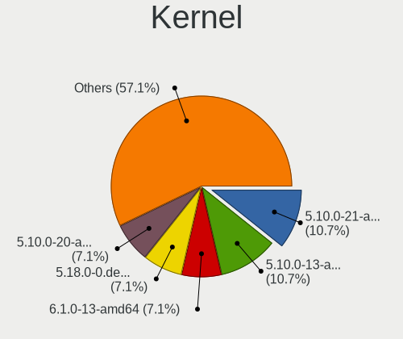
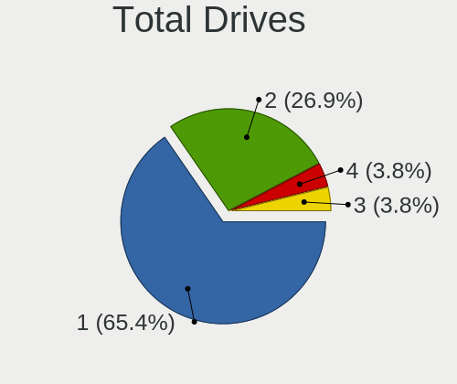
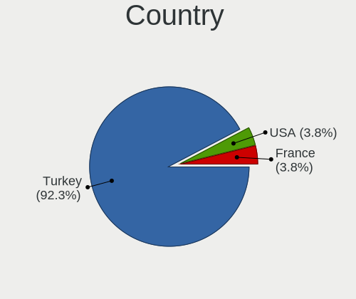
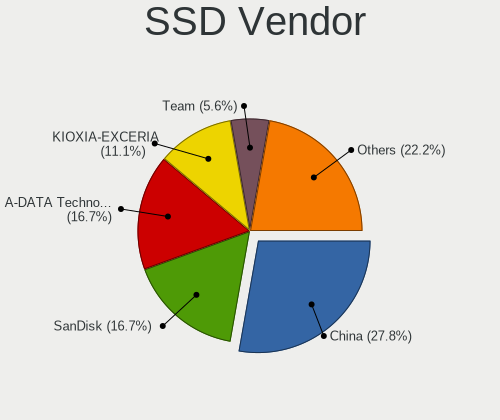
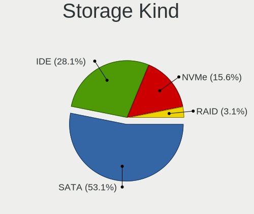
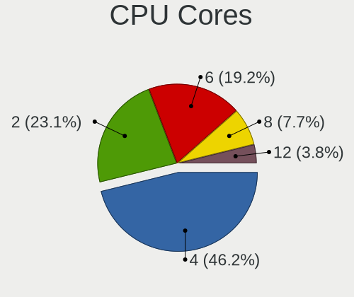
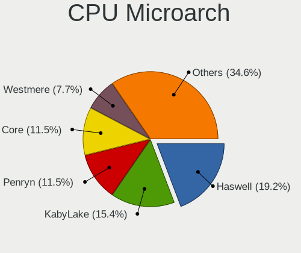
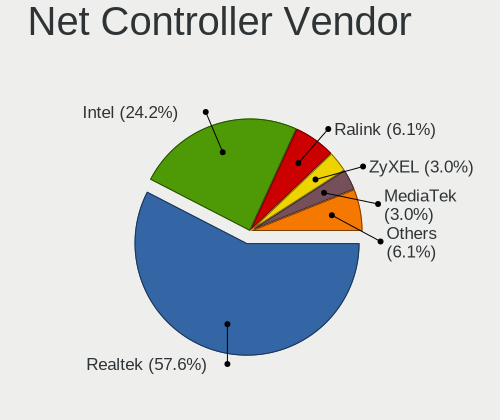
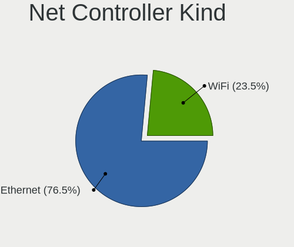
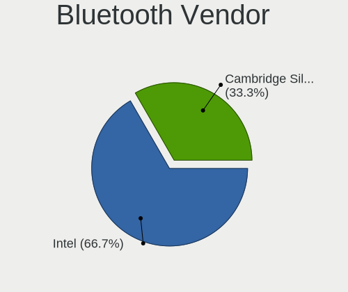

Pardus - Tested Hardware & Statistics (Desktops)
------------------------------------------------

A project to collect tested hardware configurations for Pardus.

Anyone can contribute to this report by the [hw-probe](https://github.com/linuxhw/hw-probe) tool:

    sudo -E hw-probe -all -upload

Please contribute! Especially if your hardware is rare.

Contents
--------

* [ Test Cases ](#test-cases)

* [ System ](#system)
  - [ OS                       ](#os)
  - [ OS Family                ](#os-family)
  - [ Kernel                   ](#kernel)
  - [ Kernel Family            ](#kernel-family)
  - [ Kernel Major Ver.        ](#kernel-major-ver)
  - [ Arch                     ](#arch)
  - [ DE                       ](#de)
  - [ Display Server           ](#display-server)
  - [ Display Manager          ](#display-manager)
  - [ OS Lang                  ](#os-lang)
  - [ Boot Mode                ](#boot-mode)
  - [ Filesystem               ](#filesystem)
  - [ Part. scheme             ](#part-scheme)
  - [ Dual Boot with Linux/BSD ](#dual-boot-with-linuxbsd)
  - [ Dual Boot (Win)          ](#dual-boot-win)

* [ Board ](#board)
  - [ Vendor                   ](#vendor)
  - [ Model                    ](#model)
  - [ Model Family             ](#model-family)
  - [ MFG Year                 ](#mfg-year)
  - [ Form Factor              ](#form-factor)
  - [ Secure Boot              ](#secure-boot)
  - [ Coreboot                 ](#coreboot)
  - [ RAM Size                 ](#ram-size)
  - [ RAM Used                 ](#ram-used)
  - [ Total Drives             ](#total-drives)
  - [ Has CD-ROM               ](#has-cd-rom)
  - [ Has Ethernet             ](#has-ethernet)
  - [ Has WiFi                 ](#has-wifi)
  - [ Has Bluetooth            ](#has-bluetooth)

* [ Location ](#location)
  - [ Country                  ](#country)
  - [ City                     ](#city)

* [ Drives ](#drives)
  - [ Drive Vendor             ](#drive-vendor)
  - [ Drive Model              ](#drive-model)
  - [ HDD Vendor               ](#hdd-vendor)
  - [ SSD Vendor               ](#ssd-vendor)
  - [ Drive Kind               ](#drive-kind)
  - [ Drive Connector          ](#drive-connector)
  - [ Drive Size               ](#drive-size)
  - [ Space Total              ](#space-total)
  - [ Space Used               ](#space-used)
  - [ Malfunc. Drives          ](#malfunc-drives)
  - [ Malfunc. Drive Vendor    ](#malfunc-drive-vendor)
  - [ Malfunc. HDD Vendor      ](#malfunc-hdd-vendor)
  - [ Malfunc. Drive Kind      ](#malfunc-drive-kind)
  - [ Failed Drives            ](#failed-drives)
  - [ Failed Drive Vendor      ](#failed-drive-vendor)
  - [ Drive Status             ](#drive-status)

* [ Storage controller ](#storage-controller)
  - [ Storage Vendor           ](#storage-vendor)
  - [ Storage Model            ](#storage-model)
  - [ Storage Kind             ](#storage-kind)

* [ Processor ](#processor)
  - [ CPU Vendor               ](#cpu-vendor)
  - [ CPU Model                ](#cpu-model)
  - [ CPU Model Family         ](#cpu-model-family)
  - [ CPU Cores                ](#cpu-cores)
  - [ CPU Sockets              ](#cpu-sockets)
  - [ CPU Threads              ](#cpu-threads)
  - [ CPU Op-Modes             ](#cpu-op-modes)
  - [ CPU Microcode            ](#cpu-microcode)
  - [ CPU Microarch            ](#cpu-microarch)

* [ Graphics ](#graphics)
  - [ GPU Vendor               ](#gpu-vendor)
  - [ GPU Model                ](#gpu-model)
  - [ GPU Combo                ](#gpu-combo)
  - [ GPU Driver               ](#gpu-driver)
  - [ GPU Memory               ](#gpu-memory)

* [ Monitor ](#monitor)
  - [ Monitor Vendor           ](#monitor-vendor)
  - [ Monitor Model            ](#monitor-model)
  - [ Monitor Resolution       ](#monitor-resolution)
  - [ Monitor Diagonal         ](#monitor-diagonal)
  - [ Monitor Width            ](#monitor-width)
  - [ Aspect Ratio             ](#aspect-ratio)
  - [ Monitor Area             ](#monitor-area)
  - [ Pixel Density            ](#pixel-density)
  - [ Multiple Monitors        ](#multiple-monitors)

* [ Network ](#network)
  - [ Net Controller Vendor    ](#net-controller-vendor)
  - [ Net Controller Model     ](#net-controller-model)
  - [ Wireless Vendor          ](#wireless-vendor)
  - [ Wireless Model           ](#wireless-model)
  - [ Ethernet Vendor          ](#ethernet-vendor)
  - [ Ethernet Model           ](#ethernet-model)
  - [ Net Controller Kind      ](#net-controller-kind)
  - [ Used Controller          ](#used-controller)
  - [ NICs                     ](#nics)
  - [ IPv6                     ](#ipv6)

* [ Bluetooth ](#bluetooth)
  - [ Bluetooth Vendor         ](#bluetooth-vendor)
  - [ Bluetooth Model          ](#bluetooth-model)

* [ Sound ](#sound)
  - [ Sound Vendor             ](#sound-vendor)
  - [ Sound Model              ](#sound-model)

* [ Memory ](#memory)
  - [ Memory Vendor            ](#memory-vendor)
  - [ Memory Model             ](#memory-model)
  - [ Memory Kind              ](#memory-kind)
  - [ Memory Form Factor       ](#memory-form-factor)
  - [ Memory Size              ](#memory-size)
  - [ Memory Speed             ](#memory-speed)

* [ Printers & scanners ](#printers--scanners)
  - [ Printer Vendor           ](#printer-vendor)
  - [ Printer Model            ](#printer-model)
  - [ Scanner Vendor           ](#scanner-vendor)
  - [ Scanner Model            ](#scanner-model)

* [ Camera ](#camera)
  - [ Camera Vendor            ](#camera-vendor)
  - [ Camera Model             ](#camera-model)

* [ Security ](#security)
  - [ Fingerprint Vendor       ](#fingerprint-vendor)
  - [ Fingerprint Model        ](#fingerprint-model)
  - [ Chipcard Vendor          ](#chipcard-vendor)
  - [ Chipcard Model           ](#chipcard-model)

* [ Unsupported ](#unsupported)
  - [ Unsupported Devices      ](#unsupported-devices)
  - [ Unsupported Device Types ](#unsupported-device-types)

Test Cases
----------

Total: 33

| Vendor        | Model                    | Probe                                                      | Date         |
|---------------|--------------------------|------------------------------------------------------------|--------------|
| Gigabyte      | MH310BP-R6               | [68e0a22e4d](https://linux-hardware.org/?probe=68e0a22e4d) | Apr 22, 2024 |
| Dell          | 0VNM11 A03               | [178c559906](https://linux-hardware.org/?probe=178c559906) | Mar 14, 2024 |
| Dell          | 0VNM11 A03               | [c56a91f121](https://linux-hardware.org/?probe=c56a91f121) | Mar 14, 2024 |
| Dell          | 05WXFV A02               | [9c231dbc1a](https://linux-hardware.org/?probe=9c231dbc1a) | Feb 13, 2024 |
| Fujitsu Si... | D2581-A5 S26361-D2581-A5 | [986a67391f](https://linux-hardware.org/?probe=986a67391f) | Jan 09, 2024 |
| ASUSTek       | ProArt X570-CREATOR WIFI | [a9b6f1553d](https://linux-hardware.org/?probe=a9b6f1553d) | Dec 16, 2023 |
| Intel         | H55                      | [edff4a2637](https://linux-hardware.org/?probe=edff4a2637) | Oct 25, 2023 |
| ASUSTek       | P8H61-M LX               | [10e8cc92f1](https://linux-hardware.org/?probe=10e8cc92f1) | Apr 19, 2023 |
| ASUSTek       | P8H61-M LX               | [1e59096b86](https://linux-hardware.org/?probe=1e59096b86) | Apr 19, 2023 |
| HP            | 18E6                     | [d7cf5918eb](https://linux-hardware.org/?probe=d7cf5918eb) | Apr 11, 2023 |
| Dell          | 057FFP A01               | [023591084f](https://linux-hardware.org/?probe=023591084f) | Apr 07, 2023 |
| Dell          | 057FFP A01               | [683dea4da0](https://linux-hardware.org/?probe=683dea4da0) | Apr 07, 2023 |
| Gigabyte      | H410M H V3               | [5349814c06](https://linux-hardware.org/?probe=5349814c06) | Apr 07, 2023 |
| Lenovo        | 3132 NOK                 | [787c98df69](https://linux-hardware.org/?probe=787c98df69) | Jan 20, 2023 |
| ASUSTek       | P5G41C-M LX              | [0990a5e3e8](https://linux-hardware.org/?probe=0990a5e3e8) | Jan 05, 2023 |
| ASUSTek       | P5G41C-M LX              | [78a3773180](https://linux-hardware.org/?probe=78a3773180) | Jan 05, 2023 |
| ASUSTek       | H81M-PLUS                | [ffe63e6795](https://linux-hardware.org/?probe=ffe63e6795) | Oct 25, 2022 |
| ASUSTek       | H81M-PLUS                | [b0700ec521](https://linux-hardware.org/?probe=b0700ec521) | Oct 24, 2022 |
| ASUSTek       | P7H55-M LX               | [517cb3cb75](https://linux-hardware.org/?probe=517cb3cb75) | Oct 11, 2022 |
| Acer          | Veriton ES2740G V:1.0    | [e14aeaaca3](https://linux-hardware.org/?probe=e14aeaaca3) | Jul 25, 2022 |
| MSI           | B250M GAMING PRO         | [052965926e](https://linux-hardware.org/?probe=052965926e) | Jun 26, 2022 |
| MSI           | MS-7360                  | [1ca1d835ad](https://linux-hardware.org/?probe=1ca1d835ad) | May 22, 2022 |
| MSI           | H310M PRO-VDH PLUS       | [0d897cd79c](https://linux-hardware.org/?probe=0d897cd79c) | Apr 15, 2022 |
| MSI           | MS-7360                  | [34c10f0508](https://linux-hardware.org/?probe=34c10f0508) | Apr 10, 2022 |
| MSI           | H81M-P33                 | [2b0d95df2e](https://linux-hardware.org/?probe=2b0d95df2e) | Apr 02, 2022 |
| MSI           | MS-7360                  | [8efb24e401](https://linux-hardware.org/?probe=8efb24e401) | Mar 21, 2022 |
| MSI           | MS-7360                  | [99ac168204](https://linux-hardware.org/?probe=99ac168204) | Mar 18, 2022 |
| Gigabyte      | A320M-S2H-CF             | [fcde789242](https://linux-hardware.org/?probe=fcde789242) | Jan 24, 2022 |
| Gigabyte      | A320M-S2H-CF             | [dd92029684](https://linux-hardware.org/?probe=dd92029684) | Jan 21, 2022 |
| Lenovo        | 3132 NOK                 | [9d1ef122f7](https://linux-hardware.org/?probe=9d1ef122f7) | Oct 11, 2021 |
| Lenovo        | 3132 NOK                 | [5802651f49](https://linux-hardware.org/?probe=5802651f49) | Sep 15, 2021 |
| ASUSTek       | P5G41C-M LX              | [9149be671f](https://linux-hardware.org/?probe=9149be671f) | Jan 30, 2021 |
| Gigabyte      | A320M-H-CF               | [33cdf15439](https://linux-hardware.org/?probe=33cdf15439) | Dec 15, 2020 |

System
------

OS
--

Installed operating systems

| Name          | Desktops | Percent |
|---------------|----------|---------|
| Pardus 21.4   | 5        | 20%     |
| Pardus 21.2   | 5        | 20%     |
| Pardus 21.3   | 4        | 16%     |
| Pardus 21.5   | 3        | 12%     |
| Pardus 23.0   | 2        | 8%      |
| Pardus 21.1   | 1        | 4%      |
| Pardus 21.0   | 1        | 4%      |
| Pardus 19.5   | 1        | 4%      |
| Pardus 19.4-1 | 1        | 4%      |
| Pardus 19.4   | 1        | 4%      |
| Pardus 19.0   | 1        | 4%      |

OS Family
---------

OS without a version

| Name   | Desktops | Percent |
|--------|----------|---------|
| Pardus | 23       | 100%    |

Kernel
------

Version of the Linux kernel

| Version                    | Desktops | Percent |
|----------------------------|----------|---------|
| 5.10.0-21-amd64            | 3        | 12%     |
| 5.10.0-13-amd64            | 3        | 12%     |
| 6.1.0-13-amd64             | 2        | 8%      |
| 5.18.0-0.deb11.4-amd64     | 2        | 8%      |
| 5.10.0-20-amd64            | 2        | 8%      |
| 5.10.0-16-amd64            | 2        | 8%      |
| 5.9.0-0.bpo.2-amd64        | 1        | 4%      |
| 5.19.0-14.1-liquorix-amd64 | 1        | 4%      |
| 5.10.0-8-amd64             | 1        | 4%      |
| 5.10.0-26-amd64            | 1        | 4%      |
| 5.10.0-19-amd64            | 1        | 4%      |
| 5.10.0-18-amd64            | 1        | 4%      |
| 5.10.0-15-amd64            | 1        | 4%      |
| 5.10.0-14-amd64            | 1        | 4%      |
| 5.10.0-12-amd64            | 1        | 4%      |
| 4.19.0-18-amd64            | 1        | 4%      |
| 4.19.0-13-amd64            | 1        | 4%      |

Kernel Family
-------------

Linux kernel without a distro release

| Version | Desktops | Percent |
|---------|----------|---------|
| 5.10.0  | 16       | 66.67%  |
| 6.1.0   | 2        | 8.33%   |
| 5.18.0  | 2        | 8.33%   |
| 4.19.0  | 2        | 8.33%   |
| 5.9.0   | 1        | 4.17%   |
| 5.19.0  | 1        | 4.17%   |

Kernel Major Ver.
-----------------

Linux kernel major version

| Version | Desktops | Percent |
|---------|----------|---------|
| 5.10    | 16       | 66.67%  |
| 6.1     | 2        | 8.33%   |
| 5.18    | 2        | 8.33%   |
| 4.19    | 2        | 8.33%   |
| 5.9     | 1        | 4.17%   |
| 5.19    | 1        | 4.17%   |

Arch
----

OS architecture (x86_64, i586, etc.)

| Name   | Desktops | Percent |
|--------|----------|---------|
| x86_64 | 23       | 100%    |

DE
--

Desktop Environment

| Name  | Desktops | Percent |
|-------|----------|---------|
| XFCE  | 14       | 58.33%  |
| GNOME | 8        | 33.33%  |
| KDE5  | 2        | 8.33%   |

Display Server
--------------

X11 or Wayland

| Name    | Desktops | Percent |
|---------|----------|---------|
| X11     | 20       | 86.96%  |
| Tty     | 2        | 8.7%    |
| Wayland | 1        | 4.35%   |

Display Manager
---------------

SDDM, LightDM, etc.

| Name    | Desktops | Percent |
|---------|----------|---------|
| Unknown | 13       | 54.17%  |
| GDM     | 5        | 20.83%  |
| LightDM | 3        | 12.5%   |
| SDDM    | 2        | 8.33%   |
| GDM3    | 1        | 4.17%   |

OS Lang
-------

Language

| Lang  | Desktops | Percent |
|-------|----------|---------|
| tr_TR | 18       | 75%     |
| en_US | 5        | 20.83%  |
| fr_FR | 1        | 4.17%   |

Boot Mode
---------

EFI or BIOS

| Mode | Desktops | Percent |
|------|----------|---------|
| BIOS | 19       | 79.17%  |
| EFI  | 5        | 20.83%  |

Filesystem
----------

Type of filesystem

| Type | Desktops | Percent |
|------|----------|---------|
| Ext4 | 23       | 100%    |

Part. scheme
------------

Scheme of partitioning

| Type    | Desktops | Percent |
|---------|----------|---------|
| Unknown | 15       | 62.5%   |
| GPT     | 7        | 29.17%  |
| MBR     | 2        | 8.33%   |

Dual Boot with Linux/BSD
------------------------

Hosting more than one Linux/BSD

| Dual boot | Desktops | Percent |
|-----------|----------|---------|
| No        | 21       | 91.3%   |
| Yes       | 2        | 8.7%    |

Dual Boot (Win)
---------------

Hosting Linux and Windows

| Dual boot | Desktops | Percent |
|-----------|----------|---------|
| No        | 22       | 95.65%  |
| Yes       | 1        | 4.35%   |

Board
-----

Vendor
------

Motherboard manufacturer

| Name                | Desktops | Percent |
|---------------------|----------|---------|
| MSI                 | 6        | 26.09%  |
| ASUSTek Computer    | 5        | 21.74%  |
| Gigabyte Technology | 4        | 17.39%  |
| Dell                | 3        | 13.04%  |
| Lenovo              | 1        | 4.35%   |
| Intel               | 1        | 4.35%   |
| Hewlett-Packard     | 1        | 4.35%   |
| Fujitsu Siemens     | 1        | 4.35%   |
| Acer                | 1        | 4.35%   |

Model
-----

Motherboard model

| Name                                | Desktops | Percent |
|-------------------------------------|----------|---------|
| MSI MS-7360                         | 3        | 13.04%  |
| MSI MS-7C09                         | 1        | 4.35%   |
| MSI MS-7A65                         | 1        | 4.35%   |
| MSI MS-7817                         | 1        | 4.35%   |
| Lenovo ThinkCentre M920t 10SGS62900 | 1        | 4.35%   |
| Intel H55                           | 1        | 4.35%   |
| HP EliteOne 800 G1 AiO              | 1        | 4.35%   |
| Gigabyte MH310BP-R6                 | 1        | 4.35%   |
| Gigabyte H410M H V3                 | 1        | 4.35%   |
| Gigabyte A320M-S2H                  | 1        | 4.35%   |
| Gigabyte A320M-H                    | 1        | 4.35%   |
| Fujitsu Siemens D2581-A5            | 1        | 4.35%   |
| Dell OptiPlex 7000                  | 1        | 4.35%   |
| Dell OptiPlex 5000                  | 1        | 4.35%   |
| Dell OptiPlex 3000                  | 1        | 4.35%   |
| ASUS ProArt X570-CREATOR WIFI       | 1        | 4.35%   |
| ASUS P8H61-M LX                     | 1        | 4.35%   |
| ASUS P7H55-M LX                     | 1        | 4.35%   |
| ASUS P5G41C-M LX                    | 1        | 4.35%   |
| ASUS All Series                     | 1        | 4.35%   |
| Acer Veriton ES2740G                | 1        | 4.35%   |

Model Family
------------

Motherboard model prefix

| Name                     | Desktops | Percent |
|--------------------------|----------|---------|
| MSI MS-7360              | 3        | 13.04%  |
| Dell OptiPlex            | 3        | 13.04%  |
| MSI MS-7C09              | 1        | 4.35%   |
| MSI MS-7A65              | 1        | 4.35%   |
| MSI MS-7817              | 1        | 4.35%   |
| Lenovo ThinkCentre       | 1        | 4.35%   |
| Intel H55                | 1        | 4.35%   |
| HP EliteOne              | 1        | 4.35%   |
| Gigabyte MH310BP-R6      | 1        | 4.35%   |
| Gigabyte H410M           | 1        | 4.35%   |
| Gigabyte A320M-S2H       | 1        | 4.35%   |
| Gigabyte A320M-H         | 1        | 4.35%   |
| Fujitsu Siemens D2581-A5 | 1        | 4.35%   |
| ASUS ProArt              | 1        | 4.35%   |
| ASUS P8H61-M             | 1        | 4.35%   |
| ASUS P7H55-M             | 1        | 4.35%   |
| ASUS P5G41C-M            | 1        | 4.35%   |
| ASUS All                 | 1        | 4.35%   |
| Acer Veriton             | 1        | 4.35%   |

MFG Year
--------

Motherboard manufacture year

| Year | Desktops | Percent |
|------|----------|---------|
| 2018 | 3        | 13.04%  |
| 2013 | 3        | 13.04%  |
| 2007 | 3        | 13.04%  |
| 2022 | 2        | 8.7%    |
| 2021 | 2        | 8.7%    |
| 2017 | 2        | 8.7%    |
| 2010 | 2        | 8.7%    |
| 2023 | 1        | 4.35%   |
| 2020 | 1        | 4.35%   |
| 2019 | 1        | 4.35%   |
| 2014 | 1        | 4.35%   |
| 2011 | 1        | 4.35%   |
| 2009 | 1        | 4.35%   |

Form Factor
-----------

Physical design of the computer

| Name    | Desktops | Percent |
|---------|----------|---------|
| Desktop | 23       | 100%    |

Secure Boot
-----------

Enabled or disabled

| State    | Desktops | Percent |
|----------|----------|---------|
| Disabled | 23       | 100%    |

Coreboot
--------

Have coreboot on board

| Used | Desktops | Percent |
|------|----------|---------|
| No   | 23       | 100%    |

RAM Size
--------

Total RAM memory

| Size in GB  | Desktops | Percent |
|-------------|----------|---------|
| 4.01-8.0    | 6        | 25%     |
| 3.01-4.0    | 6        | 25%     |
| 16.01-24.0  | 5        | 20.83%  |
| 8.01-16.0   | 4        | 16.67%  |
| 32.01-64.0  | 1        | 4.17%   |
| 2.01-3.0    | 1        | 4.17%   |
| 64.01-256.0 | 1        | 4.17%   |

RAM Used
--------

Used RAM memory

| Used GB    | Desktops | Percent |
|------------|----------|---------|
| 1.01-2.0   | 10       | 40%     |
| 3.01-4.0   | 5        | 20%     |
| 2.01-3.0   | 5        | 20%     |
| 4.01-8.0   | 2        | 8%      |
| 24.01-32.0 | 1        | 4%      |
| 16.01-24.0 | 1        | 4%      |
| 8.01-16.0  | 1        | 4%      |

Total Drives
------------

Number of drives on board

| Drives | Desktops | Percent |
|--------|----------|---------|
| 1      | 14       | 60.87%  |
| 2      | 7        | 30.43%  |
| 4      | 1        | 4.35%   |
| 3      | 1        | 4.35%   |

Has CD-ROM
----------

Has CD-ROM on board

| Presented | Desktops | Percent |
|-----------|----------|---------|
| No        | 13       | 56.52%  |
| Yes       | 10       | 43.48%  |

Has Ethernet
------------

Has Ethernet on board

| Presented | Desktops | Percent |
|-----------|----------|---------|
| Yes       | 23       | 100%    |

Has WiFi
--------

Has WiFi module

| Presented | Desktops | Percent |
|-----------|----------|---------|
| No        | 16       | 69.57%  |
| Yes       | 7        | 30.43%  |

Has Bluetooth
-------------

Has Bluetooth module

| Presented | Desktops | Percent |
|-----------|----------|---------|
| No        | 20       | 86.96%  |
| Yes       | 3        | 13.04%  |

Location
--------

Country
-------

Geographic location (country)

| Country | Desktops | Percent |
|---------|----------|---------|
| Turkey  | 22       | 95.65%  |
| France  | 1        | 4.35%   |

City
----

Geographic location (city)

| City      | Desktops | Percent |
|-----------|----------|---------|
| Istanbul  | 5        | 21.74%  |
| Aydin     | 5        | 21.74%  |
| Bursa     | 4        | 17.39%  |
| Ankara    | 4        | 17.39%  |
| Yaman     | 1        | 4.35%   |
| Soleymieu | 1        | 4.35%   |
| Niğde    | 1        | 4.35%   |
| Mugla     | 1        | 4.35%   |
| Konya     | 1        | 4.35%   |

Drives
------

Drive Vendor
------------

Hard drive vendors

| Vendor              | Desktops | Drives | Percent |
|---------------------|----------|--------|---------|
| Seagate             | 6        | 9      | 17.65%  |
| WDC                 | 5        | 6      | 14.71%  |
| SanDisk             | 3        | 3      | 8.82%   |
| Samsung Electronics | 3        | 8      | 8.82%   |
| KIOXIA              | 3        | 3      | 8.82%   |
| China               | 3        | 3      | 8.82%   |
| A-DATA Technology   | 3        | 3      | 8.82%   |
| KIOXIA-EXCERIA      | 2        | 2      | 5.88%   |
| Corsair             | 2        | 2      | 5.88%   |
| Team                | 1        | 1      | 2.94%   |
| Phison              | 1        | 1      | 2.94%   |
| Kingston            | 1        | 1      | 2.94%   |
| 120G                | 1        | 1      | 2.94%   |

Drive Model
-----------

Hard drive models

| Model                              | Desktops | Percent |
|------------------------------------|----------|---------|
| WDC WD6402AAEX-00Y9A0 640GB        | 3        | 8.33%   |
| KIOXIA KBG50ZNS256G NVMe 256GB     | 3        | 8.33%   |
| A-DATA SU650 120GB SSD             | 3        | 8.33%   |
| Seagate ST500DM002-1BD142 500GB    | 2        | 5.56%   |
| China SATA SSD 240GB               | 2        | 5.56%   |
| WDC WD5000AAKX-00ERMA0 500GB       | 1        | 2.78%   |
| WDC WD3200AAJB-00WGA0 320GB        | 1        | 2.78%   |
| Team T253X1240G 240GB SSD          | 1        | 2.78%   |
| Seagate ST3160318AS 160GB          | 1        | 2.78%   |
| Seagate ST2000DM008-2UB102 2TB     | 1        | 2.78%   |
| Seagate ST2000DM008-2FR102 2TB     | 1        | 2.78%   |
| Seagate ST1000DM010-2EP102 1TB     | 1        | 2.78%   |
| SanDisk Ultra II 240GB SSD         | 1        | 2.78%   |
| SanDisk SSD PLUS 240GB             | 1        | 2.78%   |
| SanDisk SDSSDA240G 240GB           | 1        | 2.78%   |
| Samsung NVMe SSD Drive 512GB       | 1        | 2.78%   |
| Samsung MZALQ512HALU-000L1 512GB   | 1        | 2.78%   |
| Samsung HD501LJ 500GB              | 1        | 2.78%   |
| Samsung HD160HJ 160GB              | 1        | 2.78%   |
| Samsung HD103SJ 1TB                | 1        | 2.78%   |
| Phison SSMP256GHV6C2-S11 256GB SSD | 1        | 2.78%   |
| KIOXIA-EXCERIA SATA SSD 480GB      | 1        | 2.78%   |
| KIOXIA-EXCERIA SATA SSD 240GB      | 1        | 2.78%   |
| Kingston SV300S37A120G 120GB SSD   | 1        | 2.78%   |
| Corsair MP600 PRO 1TB              | 1        | 2.78%   |
| Corsair Force LS SSD 64GB          | 1        | 2.78%   |
| China SATA SSD 120GB               | 1        | 2.78%   |
| 120G SSD 120GB                     | 1        | 2.78%   |

HDD Vendor
----------

Hard disk drive vendors

| Vendor              | Desktops | Drives | Percent |
|---------------------|----------|--------|---------|
| Seagate             | 6        | 9      | 46.15%  |
| WDC                 | 5        | 6      | 38.46%  |
| Samsung Electronics | 2        | 5      | 15.38%  |

SSD Vendor
----------

Solid state drive vendors

| Vendor            | Desktops | Drives | Percent |
|-------------------|----------|--------|---------|
| SanDisk           | 3        | 3      | 18.75%  |
| China             | 3        | 3      | 18.75%  |
| A-DATA Technology | 3        | 3      | 18.75%  |
| KIOXIA-EXCERIA    | 2        | 2      | 12.5%   |
| Team              | 1        | 1      | 6.25%   |
| Phison            | 1        | 1      | 6.25%   |
| Kingston          | 1        | 1      | 6.25%   |
| Corsair           | 1        | 1      | 6.25%   |
| 120G              | 1        | 1      | 6.25%   |

Drive Kind
----------

HDD or SSD

| Kind | Desktops | Drives | Percent |
|------|----------|--------|---------|
| SSD  | 14       | 16     | 46.67%  |
| HDD  | 11       | 20     | 36.67%  |
| NVMe | 5        | 7      | 16.67%  |

Drive Connector
---------------

SATA, SAS, NVMe, etc.

| Type | Desktops | Drives | Percent |
|------|----------|--------|---------|
| SATA | 21       | 36     | 80.77%  |
| NVMe | 5        | 7      | 19.23%  |

Drive Size
----------

Size of hard drive

| Size in TB | Desktops | Drives | Percent |
|------------|----------|--------|---------|
| 0.01-0.5   | 18       | 26     | 72%     |
| 0.51-1.0   | 5        | 6      | 20%     |
| 1.01-2.0   | 2        | 4      | 8%      |

Space Total
-----------

Amount of disk space available on the file system

| Size in GB | Desktops | Percent |
|------------|----------|---------|
| 101-250    | 13       | 56.52%  |
| 251-500    | 5        | 21.74%  |
| 501-1000   | 3        | 13.04%  |
| 2001-3000  | 1        | 4.35%   |
| 51-100     | 1        | 4.35%   |

Space Used
----------

Amount of used disk space

| Used GB  | Desktops | Percent |
|----------|----------|---------|
| 1-20     | 6        | 26.09%  |
| 51-100   | 6        | 26.09%  |
| 21-50    | 5        | 21.74%  |
| 101-250  | 3        | 13.04%  |
| 251-500  | 2        | 8.7%    |
| 501-1000 | 1        | 4.35%   |

Malfunc. Drives
---------------

Drive models with a malfunction

| Model                            | Desktops | Drives | Percent |
|----------------------------------|----------|--------|---------|
| Seagate ST500DM002-1BD142 500GB  | 1        | 1      | 50%     |
| Kingston SV300S37A120G 120GB SSD | 1        | 1      | 50%     |

Malfunc. Drive Vendor
---------------------

Vendors of faulty drives

| Vendor   | Desktops | Drives | Percent |
|----------|----------|--------|---------|
| Seagate  | 1        | 1      | 50%     |
| Kingston | 1        | 1      | 50%     |

Malfunc. HDD Vendor
-------------------

Vendors of faulty HDD drives

| Vendor  | Desktops | Drives | Percent |
|---------|----------|--------|---------|
| Seagate | 1        | 1      | 100%    |

Malfunc. Drive Kind
-------------------

Kinds of faulty drives

| Kind | Desktops | Drives | Percent |
|------|----------|--------|---------|
| SSD  | 1        | 1      | 50%     |
| HDD  | 1        | 1      | 50%     |

Failed Drives
-------------

Failed drive models

Zero info for selected period =(

Failed Drive Vendor
-------------------

Failed drive vendors

Zero info for selected period =(

Drive Status
------------

Number of failed and malfunc. drives

| Status   | Desktops | Drives | Percent |
|----------|----------|--------|---------|
| Detected | 15       | 29     | 60%     |
| Works    | 8        | 12     | 32%     |
| Malfunc  | 2        | 2      | 8%      |

Storage controller
------------------

Storage Vendor
--------------

Storage controller vendors

| Vendor                   | Desktops | Percent |
|--------------------------|----------|---------|
| Intel                    | 20       | 64.52%  |
| Marvell Technology Group | 3        | 9.68%   |
| KIOXIA                   | 3        | 9.68%   |
| AMD                      | 3        | 9.68%   |
| Samsung Electronics      | 1        | 3.23%   |
| Phison Electronics       | 1        | 3.23%   |

Storage Model
-------------

Storage controller models

| Model                                                                                   | Desktops | Percent |
|-----------------------------------------------------------------------------------------|----------|---------|
| Intel 82801IB (ICH9) 2 port SATA Controller [IDE mode]                                  | 4        | 9.52%   |
| Intel 82801I (ICH9 Family) 2 port SATA Controller [IDE mode]                            | 4        | 9.52%   |
| Marvell Group 88SE6111/6121 SATA II / PATA Controller                                   | 3        | 7.14%   |
| KIOXIA NVMe SSD Controller BG5 (DRAM-less)                                              | 3        | 7.14%   |
| Intel Alder Lake-S PCH SATA Controller [AHCI Mode]                                      | 3        | 7.14%   |
| Intel 8 Series/C220 Series Chipset Family 6-port SATA Controller 1 [AHCI mode]          | 3        | 7.14%   |
| AMD FCH SATA Controller [AHCI mode]                                                     | 3        | 7.14%   |
| Intel Cannon Lake PCH SATA AHCI Controller                                              | 2        | 4.76%   |
| Intel 5 Series/3400 Series Chipset 4 port SATA IDE Controller                           | 2        | 4.76%   |
| Intel 5 Series/3400 Series Chipset 2 port SATA IDE Controller                           | 2        | 4.76%   |
| Intel 200 Series PCH SATA controller [AHCI mode]                                        | 2        | 4.76%   |
| AMD FCH SATA Controller D                                                               | 2        | 4.76%   |
| Samsung NVMe SSD Controller 980 (DRAM-less)                                             | 1        | 2.38%   |
| Phison E18 PCIe4 NVMe Controller                                                        | 1        | 2.38%   |
| Intel Volume Management Device NVMe RAID Controller                                     | 1        | 2.38%   |
| Intel NM10/ICH7 Family SATA Controller [IDE mode]                                       | 1        | 2.38%   |
| Intel 82801G (ICH7 Family) IDE Controller                                               | 1        | 2.38%   |
| Intel 6 Series/C200 Series Chipset Family Desktop SATA Controller (IDE mode, ports 4-5) | 1        | 2.38%   |
| Intel 6 Series/C200 Series Chipset Family Desktop SATA Controller (IDE mode, ports 0-3) | 1        | 2.38%   |
| Intel 500 Series Chipset Family SATA AHCI Controller                                    | 1        | 2.38%   |
| Intel 400 Series Chipset Family SATA AHCI Controller                                    | 1        | 2.38%   |

Storage Kind
------------

Kind of storage controller (IDE, SATA, NVMe, SAS, ...)

| Kind | Desktops | Percent |
|------|----------|---------|
| SATA | 15       | 51.72%  |
| IDE  | 8        | 27.59%  |
| NVMe | 5        | 17.24%  |
| RAID | 1        | 3.45%   |

Processor
---------

CPU Vendor
----------

Processor vendors

| Vendor | Desktops | Percent |
|--------|----------|---------|
| Intel  | 20       | 86.96%  |
| AMD    | 3        | 13.04%  |

CPU Model
---------

Processor models

| Model                                         | Desktops | Percent |
|-----------------------------------------------|----------|---------|
| Intel Core 2 Quad CPU Q6600 @ 2.40GHz         | 3        | 13.04%  |
| Intel 12th Gen Core i5-12500T                 | 2        | 8.7%    |
| Intel Pentium CPU G2010 @ 2.80GHz             | 1        | 4.35%   |
| Intel Core i9-9900 CPU @ 3.10GHz              | 1        | 4.35%   |
| Intel Core i7-4790S CPU @ 3.20GHz             | 1        | 4.35%   |
| Intel Core i5-7600 CPU @ 3.50GHz              | 1        | 4.35%   |
| Intel Core i5-4460 CPU @ 3.20GHz              | 1        | 4.35%   |
| Intel Core i5-4440 CPU @ 3.10GHz              | 1        | 4.35%   |
| Intel Core i5-10400F CPU @ 2.90GHz            | 1        | 4.35%   |
| Intel Core i5-10400 CPU @ 2.90GHz             | 1        | 4.35%   |
| Intel Core i5 CPU M 540 @ 2.53GHz             | 1        | 4.35%   |
| Intel Core i3-9100F CPU @ 3.60GHz             | 1        | 4.35%   |
| Intel Core i3-8100T CPU @ 3.10GHz             | 1        | 4.35%   |
| Intel Core i3 CPU 540 @ 3.07GHz               | 1        | 4.35%   |
| Intel Core 2 Quad CPU Q8300 @ 2.50GHz         | 1        | 4.35%   |
| Intel Core 2 Duo CPU E7500 @ 2.93GHz          | 1        | 4.35%   |
| Intel 12th Gen Core i7-12700                  | 1        | 4.35%   |
| AMD Ryzen 7 5700G with Radeon Graphics        | 1        | 4.35%   |
| AMD Ryzen 5 3500X 6-Core Processor            | 1        | 4.35%   |
| AMD A8-9600 RADEON R7, 10 COMPUTE CORES 4C+6G | 1        | 4.35%   |

CPU Model Family
----------------

Processor model prefix

| Model             | Desktops | Percent |
|-------------------|----------|---------|
| Intel Core i5     | 6        | 26.09%  |
| Intel Core 2 Quad | 4        | 17.39%  |
| Other             | 3        | 13.04%  |
| Intel Core i3     | 3        | 13.04%  |
| Intel Pentium     | 1        | 4.35%   |
| Intel Core i9     | 1        | 4.35%   |
| Intel Core i7     | 1        | 4.35%   |
| Intel Core 2 Duo  | 1        | 4.35%   |
| AMD Ryzen 7       | 1        | 4.35%   |
| AMD Ryzen 5       | 1        | 4.35%   |
| AMD A8            | 1        | 4.35%   |

CPU Cores
---------

Number of processor cores

| Number | Desktops | Percent |
|--------|----------|---------|
| 4      | 10       | 43.48%  |
| 6      | 5        | 21.74%  |
| 2      | 5        | 21.74%  |
| 8      | 2        | 8.7%    |
| 12     | 1        | 4.35%   |

CPU Sockets
-----------

Number of sockets

| Number | Desktops | Percent |
|--------|----------|---------|
| 1      | 23       | 100%    |

CPU Threads
-----------

Threads per core (Hyper-Threading)

| Number | Desktops | Percent |
|--------|----------|---------|
| 1      | 13       | 56.52%  |
| 2      | 10       | 43.48%  |

CPU Op-Modes
------------

CPU Operation Modes (32-bit, 64-bit)

| Op mode        | Desktops | Percent |
|----------------|----------|---------|
| 32-bit, 64-bit | 23       | 100%    |

CPU Microcode
-------------

Microcode number

| Number     | Desktops | Percent |
|------------|----------|---------|
| Unknown    | 11       | 44%     |
| 0x906eb    | 2        | 8%      |
| 0x90675    | 2        | 8%      |
| 0x306c3    | 2        | 8%      |
| 0x1067a    | 2        | 8%      |
| 0x906ed    | 1        | 4%      |
| 0x906e9    | 1        | 4%      |
| 0x90672    | 1        | 4%      |
| 0x306a9    | 1        | 4%      |
| 0x20655    | 1        | 4%      |
| 0x0a50000d | 1        | 4%      |

CPU Microarch
-------------

Microarchitecture

| Name             | Desktops | Percent |
|------------------|----------|---------|
| KabyLake         | 4        | 17.39%  |
| Haswell          | 3        | 13.04%  |
| Core             | 3        | 13.04%  |
| Westmere         | 2        | 8.7%    |
| Penryn           | 2        | 8.7%    |
| CometLake        | 2        | 8.7%    |
| Alderlake Hybrid | 2        | 8.7%    |
| Zen 3            | 1        | 4.35%   |
| Zen 2            | 1        | 4.35%   |
| IvyBridge        | 1        | 4.35%   |
| Excavator        | 1        | 4.35%   |
| Unknown          | 1        | 4.35%   |

Graphics
--------

GPU Vendor
----------

Vendors of graphics cards

| Vendor | Desktops | Percent |
|--------|----------|---------|
| Intel  | 11       | 39.29%  |
| AMD    | 9        | 32.14%  |
| Nvidia | 8        | 28.57%  |

GPU Model
---------

Graphics card models

| Model                                                                       | Desktops | Percent |
|-----------------------------------------------------------------------------|----------|---------|
| Nvidia GT200 [GeForce GTX 260]                                              | 3        | 10.71%  |
| Nvidia GT218 [GeForce 210]                                                  | 2        | 7.14%   |
| Intel Xeon E3-1200 v3/4th Gen Core Processor Integrated Graphics Controller | 2        | 7.14%   |
| Intel CoffeeLake-S GT2 [UHD Graphics 630]                                   | 2        | 7.14%   |
| Intel Alder Lake-S GT1 [UHD Graphics 770]                                   | 2        | 7.14%   |
| AMD RV630 PRO [Radeon HD 2600 PRO]                                          | 2        | 7.14%   |
| Nvidia TU106 [GeForce RTX 2060 Rev. A]                                      | 1        | 3.57%   |
| Nvidia GP107 [GeForce GTX 1050 Ti]                                          | 1        | 3.57%   |
| Nvidia GA102 [GeForce RTX 3090]                                             | 1        | 3.57%   |
| Intel Xeon E3-1200 v2/3rd Gen Core processor Graphics Controller            | 1        | 3.57%   |
| Intel HD Graphics 630                                                       | 1        | 3.57%   |
| Intel Core Processor Integrated Graphics Controller                         | 1        | 3.57%   |
| Intel CometLake-S GT2 [UHD Graphics 630]                                    | 1        | 3.57%   |
| Intel AlderLake-S GT1                                                       | 1        | 3.57%   |
| AMD Wani [Radeon R5/R6/R7 Graphics]                                         | 1        | 3.57%   |
| AMD Lexa [Radeon 540X/550X/630 / RX 640 / E9171 MCM]                        | 1        | 3.57%   |
| AMD Ellesmere [Radeon RX 470/480/570/570X/580/580X/590]                     | 1        | 3.57%   |
| AMD Cezanne [Radeon Vega Series / Radeon Vega Mobile Series]                | 1        | 3.57%   |
| AMD Cedar [Radeon HD 5000/6000/7350/8350 Series]                            | 1        | 3.57%   |
| AMD Bonaire XT [Radeon HD 7790/8770 / R7 360 / R9 260/360 OEM]              | 1        | 3.57%   |
| AMD Baffin [Radeon RX 460/560D / Pro 450/455/460/555/555X/560/560X]         | 1        | 3.57%   |

GPU Combo
---------

Combinations of graphics cards

| Name         | Desktops | Percent |
|--------------|----------|---------|
| 1 x AMD      | 8        | 34.78%  |
| 1 x Nvidia   | 7        | 30.43%  |
| 1 x Intel    | 7        | 30.43%  |
| AMD + Nvidia | 1        | 4.35%   |

GPU Driver
----------

Free vs proprietary

| Driver      | Desktops | Percent |
|-------------|----------|---------|
| Free        | 21       | 91.3%   |
| Proprietary | 2        | 8.7%    |

GPU Memory
----------

Total video memory

| Size in GB | Desktops | Percent |
|------------|----------|---------|
| Unknown    | 16       | 66.67%  |
| 0.01-0.5   | 3        | 12.5%   |
| 1.01-2.0   | 2        | 8.33%   |
| 0.51-1.0   | 2        | 8.33%   |
| 3.01-4.0   | 1        | 4.17%   |

Monitor
-------

Monitor Vendor
--------------

Monitor vendors

| Vendor               | Desktops | Percent |
|----------------------|----------|---------|
| Goldstar             | 5        | 20.83%  |
| Dell                 | 4        | 16.67%  |
| Samsung Electronics  | 3        | 12.5%   |
| Beko                 | 2        | 8.33%   |
| Acer                 | 2        | 8.33%   |
| SAC                  | 1        | 4.17%   |
| Philips              | 1        | 4.17%   |
| Iiyama               | 1        | 4.17%   |
| HKC                  | 1        | 4.17%   |
| Hewlett-Packard      | 1        | 4.17%   |
| Casper               | 1        | 4.17%   |
| Ancor Communications | 1        | 4.17%   |
| AGO                  | 1        | 4.17%   |

Monitor Model
-------------

Monitor models

| Model                                                                 | Desktops | Percent |
|-----------------------------------------------------------------------|----------|---------|
| Goldstar W2242 GSM5678 1680x1050 474x296mm 22.0-inch                  | 3        | 12%     |
| Beko BK UHD TV BEK4448 3840x2160 1210x680mm 54.6-inch                 | 2        | 8%      |
| Samsung Electronics U32J59x SAM0F35 3840x2160 700x390mm 31.5-inch     | 1        | 4%      |
| Samsung Electronics U32J59x SAM0F34 3840x2160 697x392mm 31.5-inch     | 1        | 4%      |
| Samsung Electronics SyncMaster SAM0599 1600x900 443x249mm 20.0-inch   | 1        | 4%      |
| Samsung Electronics S27H65x SAM0E1E 1920x1080 598x336mm 27.0-inch     | 1        | 4%      |
| SAC Casper SAC3219 1366x768 304x228mm 15.0-inch                       | 1        | 4%      |
| Philips PHL 243B9 PHL0941 1920x1080 527x296mm 23.8-inch               | 1        | 4%      |
| Iiyama PLX2380H IVM5621 1920x1080 509x286mm 23.0-inch                 | 1        | 4%      |
| HKC '' HKC2160 1920x1080 360x270mm 17.7-inch                          | 1        | 4%      |
| Hewlett-Packard HPQ 800 AIO HWP1080 1920x1080 510x287mm 23.0-inch     | 1        | 4%      |
| Goldstar L1753T GSM4476 1280x1024 338x270mm 17.0-inch                 | 1        | 4%      |
| Goldstar E2242 GSM58BE 1920x1080 477x268mm 21.5-inch                  | 1        | 4%      |
| Dell SE2416H DELD082 1920x1080 527x296mm 23.8-inch                    | 1        | 4%      |
| Dell P2717H DEL40F6 1920x1080 598x336mm 27.0-inch                     | 1        | 4%      |
| Dell E2423HN DELF144 1920x1080 527x296mm 23.8-inch                    | 1        | 4%      |
| Dell E2421HN DELF129 1920x1080 527x296mm 23.8-inch                    | 1        | 4%      |
| Casper 19CSPR CSP1900 1440x900 410x256mm 19.0-inch                    | 1        | 4%      |
| Ancor Communications ASUS VP228 ACI22C3 1920x1080 476x268mm 21.5-inch | 1        | 4%      |
| AGO LCD Monitor AGO0001 1920x1080 256x192mm 12.6-inch                 | 1        | 4%      |
| Acer V226HQL ACR032D 1920x1080 480x270mm 21.7-inch                    | 1        | 4%      |
| Acer G206HQL ACR0327 1600x900 432x239mm 19.4-inch                     | 1        | 4%      |

Monitor Resolution
------------------

Monitor screen resolution

| Resolution         | Desktops | Percent |
|--------------------|----------|---------|
| 1920x1080 (FHD)    | 11       | 50%     |
| 3840x2160 (4K)     | 3        | 13.64%  |
| 1680x1050 (WSXGA+) | 3        | 13.64%  |
| 1600x900 (HD+)     | 2        | 9.09%   |
| 1440x900 (WXGA+)   | 1        | 4.55%   |
| 1366x768 (WXGA)    | 1        | 4.55%   |
| 1280x1024 (SXGA)   | 1        | 4.55%   |

Monitor Diagonal
----------------

Diagonal size in inches

| Inches | Desktops | Percent |
|--------|----------|---------|
| 23     | 7        | 29.17%  |
| 21     | 4        | 16.67%  |
| 72     | 2        | 8.33%   |
| 27     | 2        | 8.33%   |
| 24     | 2        | 8.33%   |
| 19     | 2        | 8.33%   |
| 31     | 1        | 4.17%   |
| 20     | 1        | 4.17%   |
| 17     | 1        | 4.17%   |
| 15     | 1        | 4.17%   |
| 12     | 1        | 4.17%   |

Monitor Width
-------------

Physical width

| Width in mm | Desktops | Percent |
|-------------|----------|---------|
| 401-500     | 10       | 43.48%  |
| 501-600     | 7        | 30.43%  |
| 301-350     | 2        | 8.7%    |
| 1501-2000   | 2        | 8.7%    |
| 601-700     | 1        | 4.35%   |
| 201-300     | 1        | 4.35%   |

Aspect Ratio
------------

Proportional relationship between the width and the height

| Ratio | Desktops | Percent |
|-------|----------|---------|
| 16/9  | 14       | 66.67%  |
| 3/2   | 3        | 14.29%  |
| 4/3   | 2        | 9.52%   |
| 5/4   | 1        | 4.76%   |
| 16/10 | 1        | 4.76%   |

Monitor Area
------------

Area in inch²

| Area in inch² | Desktops | Percent |
|----------------|----------|---------|
| 201-250        | 12       | 52.17%  |
| 151-200        | 3        | 13.04%  |
| More than 1000 | 2        | 8.7%    |
| 301-350        | 2        | 8.7%    |
| 71-80          | 1        | 4.35%   |
| 351-500        | 1        | 4.35%   |
| 141-150        | 1        | 4.35%   |
| 101-110        | 1        | 4.35%   |

Pixel Density
-------------

Pixels per inch

| Density | Desktops | Percent |
|---------|----------|---------|
| 51-100  | 14       | 60.87%  |
| 101-120 | 5        | 21.74%  |
| 1-50    | 2        | 8.7%    |
| 161-240 | 1        | 4.35%   |
| 121-160 | 1        | 4.35%   |

Multiple Monitors
-----------------

Total monitors connected

| Total | Desktops | Percent |
|-------|----------|---------|
| 1     | 19       | 82.61%  |
| 2     | 3        | 13.04%  |
| 0     | 1        | 4.35%   |

Network
-------

Net Controller Vendor
---------------------

Controller vendors

| Vendor                | Desktops | Percent |
|-----------------------|----------|---------|
| Realtek Semiconductor | 16       | 55.17%  |
| Intel                 | 8        | 27.59%  |
| Ralink Technology     | 2        | 6.9%    |
| ZyXEL Communications  | 1        | 3.45%   |
| Broadcom              | 1        | 3.45%   |
| Aquantia              | 1        | 3.45%   |

Net Controller Model
--------------------

Controller models

| Model                                                                           | Desktops | Percent |
|---------------------------------------------------------------------------------|----------|---------|
| Realtek RTL8111/8168/8211/8411 PCI Express Gigabit Ethernet Controller          | 15       | 46.88%  |
| Intel Ethernet Connection (17) I219-LM                                          | 2        | 6.25%   |
| ZyXEL NWD2205 802.11n Wireless N Adapter [Realtek RTL8192CU]                    | 1        | 3.13%   |
| Realtek RTL8192CU 802.11n WLAN Adapter                                          | 1        | 3.13%   |
| Realtek RTL8188FTV 802.11b/g/n 1T1R 2.4G WLAN Adapter                           | 1        | 3.13%   |
| Realtek RTL810xE PCI Express Fast Ethernet controller                           | 1        | 3.13%   |
| Realtek 802.11n WLAN Adapter                                                    | 1        | 3.13%   |
| Ralink RT2870/RT3070 Wireless Adapter                                           | 1        | 3.13%   |
| Ralink MT7601U Wireless Adapter                                                 | 1        | 3.13%   |
| Intel Wi-Fi 6 AX200                                                             | 1        | 3.13%   |
| Intel Ethernet Controller I225-V                                                | 1        | 3.13%   |
| Intel Ethernet Connection I217-LM                                               | 1        | 3.13%   |
| Intel Ethernet Connection (7) I219-LM                                           | 1        | 3.13%   |
| Intel Ethernet Connection (2) I219-V                                            | 1        | 3.13%   |
| Intel Dual Band Wireless-AC 3168NGW [Stone Peak]                                | 1        | 3.13%   |
| Broadcom NetXtreme BCM5754 Gigabit Ethernet PCI Express                         | 1        | 3.13%   |
| Aquantia AQtion AQC113CS NBase-T/IEEE 802.3an Ethernet Controller [Antigua 10G] | 1        | 3.13%   |

Wireless Vendor
---------------

Wireless vendors

| Vendor                | Desktops | Percent |
|-----------------------|----------|---------|
| Realtek Semiconductor | 3        | 37.5%   |
| Ralink Technology     | 2        | 25%     |
| Intel                 | 2        | 25%     |
| ZyXEL Communications  | 1        | 12.5%   |

Wireless Model
--------------

Wireless models

| Model                                                        | Desktops | Percent |
|--------------------------------------------------------------|----------|---------|
| ZyXEL NWD2205 802.11n Wireless N Adapter [Realtek RTL8192CU] | 1        | 12.5%   |
| Realtek RTL8192CU 802.11n WLAN Adapter                       | 1        | 12.5%   |
| Realtek RTL8188FTV 802.11b/g/n 1T1R 2.4G WLAN Adapter        | 1        | 12.5%   |
| Realtek 802.11n WLAN Adapter                                 | 1        | 12.5%   |
| Ralink RT2870/RT3070 Wireless Adapter                        | 1        | 12.5%   |
| Ralink MT7601U Wireless Adapter                              | 1        | 12.5%   |
| Intel Wi-Fi 6 AX200                                          | 1        | 12.5%   |
| Intel Dual Band Wireless-AC 3168NGW [Stone Peak]             | 1        | 12.5%   |

Ethernet Vendor
---------------

Ethernet vendors

| Vendor                | Desktops | Percent |
|-----------------------|----------|---------|
| Realtek Semiconductor | 16       | 66.67%  |
| Intel                 | 6        | 25%     |
| Broadcom              | 1        | 4.17%   |
| Aquantia              | 1        | 4.17%   |

Ethernet Model
--------------

Ethernet models

| Model                                                                           | Desktops | Percent |
|---------------------------------------------------------------------------------|----------|---------|
| Realtek RTL8111/8168/8211/8411 PCI Express Gigabit Ethernet Controller          | 15       | 62.5%   |
| Intel Ethernet Connection (17) I219-LM                                          | 2        | 8.33%   |
| Realtek RTL810xE PCI Express Fast Ethernet controller                           | 1        | 4.17%   |
| Intel Ethernet Controller I225-V                                                | 1        | 4.17%   |
| Intel Ethernet Connection I217-LM                                               | 1        | 4.17%   |
| Intel Ethernet Connection (7) I219-LM                                           | 1        | 4.17%   |
| Intel Ethernet Connection (2) I219-V                                            | 1        | 4.17%   |
| Broadcom NetXtreme BCM5754 Gigabit Ethernet PCI Express                         | 1        | 4.17%   |
| Aquantia AQtion AQC113CS NBase-T/IEEE 802.3an Ethernet Controller [Antigua 10G] | 1        | 4.17%   |

Net Controller Kind
-------------------

Ethernet, WiFi or modem

| Kind     | Desktops | Percent |
|----------|----------|---------|
| Ethernet | 23       | 76.67%  |
| WiFi     | 7        | 23.33%  |

Used Controller
---------------

Currently used network controller

| Kind     | Desktops | Percent |
|----------|----------|---------|
| Ethernet | 20       | 80%     |
| WiFi     | 5        | 20%     |

NICs
----

Total network controllers on board

| Total | Desktops | Percent |
|-------|----------|---------|
| 1     | 20       | 86.96%  |
| 2     | 3        | 13.04%  |

IPv6
----

IPv6 vs IPv4

| Used | Desktops | Percent |
|------|----------|---------|
| No   | 22       | 95.65%  |
| Yes  | 1        | 4.35%   |

Bluetooth
---------

Bluetooth Vendor
----------------

Controller vendors

| Vendor                  | Desktops | Percent |
|-------------------------|----------|---------|
| Intel                   | 2        | 66.67%  |
| Cambridge Silicon Radio | 1        | 33.33%  |

Bluetooth Model
---------------

Controller models

| Model                                               | Desktops | Percent |
|-----------------------------------------------------|----------|---------|
| Intel Wireless-AC 3168 Bluetooth                    | 1        | 33.33%  |
| Intel AX200 Bluetooth                               | 1        | 33.33%  |
| Cambridge Silicon Radio Bluetooth Dongle (HCI mode) | 1        | 33.33%  |

Sound
-----

Sound Vendor
------------

Sound card vendors

| Vendor              | Desktops | Percent |
|---------------------|----------|---------|
| Intel               | 20       | 58.82%  |
| AMD                 | 9        | 26.47%  |
| Nvidia              | 4        | 11.76%  |
| Kingston Technology | 1        | 2.94%   |

Sound Model
-----------

Sound card models

| Model                                                                      | Desktops | Percent |
|----------------------------------------------------------------------------|----------|---------|
| Intel 82801I (ICH9 Family) HD Audio Controller                             | 4        | 10.53%  |
| Intel Alder Lake-S HD Audio Controller                                     | 3        | 7.89%   |
| Intel 8 Series/C220 Series Chipset High Definition Audio Controller        | 3        | 7.89%   |
| Intel Cannon Lake PCH cAVS                                                 | 2        | 5.26%   |
| Intel 5 Series/3400 Series Chipset High Definition Audio                   | 2        | 5.26%   |
| Intel 200 Series PCH HD Audio                                              | 2        | 5.26%   |
| AMD RV630 HDMI Audio [Radeon HD 2600 PRO/XT / HD 3610]                     | 2        | 5.26%   |
| AMD Baffin HDMI/DP Audio [Radeon RX 550 640SP / RX 560/560X]               | 2        | 5.26%   |
| Nvidia TU106 High Definition Audio Controller                              | 1        | 2.63%   |
| Nvidia High Definition Audio Controller                                    | 1        | 2.63%   |
| Nvidia GP107GL High Definition Audio Controller                            | 1        | 2.63%   |
| Nvidia GA102 High Definition Audio Controller                              | 1        | 2.63%   |
| Kingston Technology HyperX QuadCast S                                      | 1        | 2.63%   |
| Intel Xeon E3-1200 v3/4th Gen Core Processor HD Audio Controller           | 1        | 2.63%   |
| Intel Smart Sound Technology (SST) Audio Controller                        | 1        | 2.63%   |
| Intel NM10/ICH7 Family High Definition Audio Controller                    | 1        | 2.63%   |
| Intel Comet Lake PCH-V cAVS                                                | 1        | 2.63%   |
| Intel 6 Series/C200 Series Chipset Family High Definition Audio Controller | 1        | 2.63%   |
| AMD Tobago HDMI Audio [Radeon R7 360 / R9 360 OEM]                         | 1        | 2.63%   |
| AMD Starship/Matisse HD Audio Controller                                   | 1        | 2.63%   |
| AMD Renoir Radeon High Definition Audio Controller                         | 1        | 2.63%   |
| AMD Kabini HDMI/DP Audio                                                   | 1        | 2.63%   |
| AMD Family 17h/19h HD Audio Controller                                     | 1        | 2.63%   |
| AMD Family 15h (Models 60h-6fh) Audio Controller                           | 1        | 2.63%   |
| AMD Ellesmere HDMI Audio [Radeon RX 470/480 / 570/580/590]                 | 1        | 2.63%   |
| AMD Cedar HDMI Audio [Radeon HD 5400/6300/7300 Series]                     | 1        | 2.63%   |

Memory
------

Memory Vendor
-------------

Memory module vendors

| Vendor              | Desktops | Percent |
|---------------------|----------|---------|
| Samsung Electronics | 3        | 25%     |
| Micron Technology   | 2        | 16.67%  |
| Kingston            | 2        | 16.67%  |
| G.Skill             | 2        | 16.67%  |
| Crucial             | 1        | 8.33%   |
| A-DATA Technology   | 1        | 8.33%   |
| Unknown             | 1        | 8.33%   |

Memory Model
------------

Memory module models

| Model                                                    | Desktops | Percent |
|----------------------------------------------------------|----------|---------|
| Micron RAM 4ATF1G64HZ-3G2F1 8GB SODIMM DDR4 3200MT/s     | 2        | 15.38%  |
| Samsung RAM M471B1G73DB0-YK0 8GB SODIMM DDR3 1600MT/s    | 1        | 7.69%   |
| Samsung RAM M378A2K43DB1-CTD 16384MB DIMM DDR4 2667MT/s  | 1        | 7.69%   |
| Samsung RAM M378A1G44BB0-CWE 8GB DIMM DDR4 3200MT/s      | 1        | 7.69%   |
| Kingston RAM KHX3000C15D4/8GX 8GB DIMM DDR4 3400MT/s     | 1        | 7.69%   |
| Kingston RAM KHX2133C14/8G 8GB DIMM DDR4 2666MT/s        | 1        | 7.69%   |
| Kingston RAM 99U5471-057.A00LF 8GB DIMM DDR3 1333MT/s    | 1        | 7.69%   |
| G.Skill RAM F4-3200C16-32GTZN 32GB DIMM DDR4 3200MT/s    | 1        | 7.69%   |
| G.Skill RAM F4-2133C15-4GIS 4GB DIMM DDR4 2133MT/s       | 1        | 7.69%   |
| Crucial RAM CT16G4SFS8266.C8FE 16GB SODIMM DDR4 2667MT/s | 1        | 7.69%   |
| A-DATA RAM Module 8GB DIMM DDR4 2667MT/s                 | 1        | 7.69%   |
| Unknown                                                  | 1        | 7.69%   |

Memory Kind
-----------

Memory module kinds

| Kind | Desktops | Percent |
|------|----------|---------|
| DDR4 | 9        | 81.82%  |
| DDR3 | 2        | 18.18%  |

Memory Form Factor
------------------

Physical design of the memory module

| Name   | Desktops | Percent |
|--------|----------|---------|
| DIMM   | 7        | 63.64%  |
| SODIMM | 4        | 36.36%  |

Memory Size
-----------

Memory module size

| Size  | Desktops | Percent |
|-------|----------|---------|
| 8192  | 7        | 63.64%  |
| 16384 | 2        | 18.18%  |
| 32768 | 1        | 9.09%   |
| 4096  | 1        | 9.09%   |

Memory Speed
------------

Memory module speed

| Speed | Desktops | Percent |
|-------|----------|---------|
| 3200  | 4        | 33.33%  |
| 2667  | 3        | 25%     |
| 3400  | 1        | 8.33%   |
| 2666  | 1        | 8.33%   |
| 2133  | 1        | 8.33%   |
| 1600  | 1        | 8.33%   |
| 1333  | 1        | 8.33%   |

Printers & scanners
-------------------

Printer Vendor
--------------

Printer device vendors

| Vendor | Desktops | Percent |
|--------|----------|---------|
| Zebra  | 4        | 80%     |
| Canon  | 1        | 20%     |

Printer Model
-------------

Printer device models

| Model                            | Desktops | Percent |
|----------------------------------|----------|---------|
| Zebra TLP2844                    | 3        | 60%     |
| Zebra Zebra GC420d Label Printer | 1        | 20%     |
| Canon LBP6000                    | 1        | 20%     |

Scanner Vendor
--------------

Scanner device vendors

Zero info for selected period =(

Scanner Model
-------------

Scanner device models

Zero info for selected period =(

Camera
------

Camera Vendor
-------------

Camera device vendors

| Vendor                | Desktops | Percent |
|-----------------------|----------|---------|
| Realtek Semiconductor | 1        | 16.67%  |
| Microdia              | 1        | 16.67%  |
| MacroSilicon          | 1        | 16.67%  |
| Arkmicro Technologies | 1        | 16.67%  |
| Allwinner Technology  | 1        | 16.67%  |
| Alcor Micro           | 1        | 16.67%  |

Camera Model
------------

Camera device models

| Model                                   | Desktops | Percent |
|-----------------------------------------|----------|---------|
| Realtek HP 2.0MP High Definition Webcam | 1        | 16.67%  |
| Microdia Integrated Camera              | 1        | 16.67%  |
| MacroSilicon MiraBox Capture            | 1        | 16.67%  |
| Arkmicro USB2.0 PC CAMERA               | 1        | 16.67%  |
| Allwinner TP1005                        | 1        | 16.67%  |
| Alcor Micro USB 2.0 PC Camera           | 1        | 16.67%  |

Security
--------

Fingerprint Vendor
------------------

Fingerprint sensor vendors

Zero info for selected period =(

Fingerprint Model
-----------------

Fingerprint sensor models

Zero info for selected period =(

Chipcard Vendor
---------------

Chipcard module vendors

| Vendor                | Desktops | Percent |
|-----------------------|----------|---------|
| Advanced Card Systems | 2        | 100%    |

Chipcard Model
--------------

Chipcard module models

| Model                                        | Desktops | Percent |
|----------------------------------------------|----------|---------|
| Advanced Card Systems ACR38 SmartCard Reader | 2        | 100%    |

Unsupported
-----------

Unsupported Devices
-------------------

Total unsupported devices on board

| Total | Desktops | Percent |
|-------|----------|---------|
| 0     | 19       | 79.17%  |
| 1     | 5        | 20.83%  |

Unsupported Device Types
------------------------

Types of unsupported devices

| Type                     | Desktops | Percent |
|--------------------------|----------|---------|
| Net/wireless             | 1        | 20%     |
| Graphics card            | 1        | 20%     |
| Communication controller | 1        | 20%     |
| Chipcard                 | 1        | 20%     |
| Camera                   | 1        | 20%     |

