Pardus - Tested Hardware & Statistics (Notebooks)
-------------------------------------------------

A project to collect tested hardware configurations for Pardus.

Anyone can contribute to this report by the [hw-probe](https://github.com/linuxhw/hw-probe) tool:

    sudo -E hw-probe -all -upload

Please contribute! Especially if your hardware is rare.

Contents
--------

* [ Test Cases ](#test-cases)

* [ System ](#system)
  - [ OS                       ](#os)
  - [ OS Family                ](#os-family)
  - [ Kernel                   ](#kernel)
  - [ Kernel Family            ](#kernel-family)
  - [ Kernel Major Ver.        ](#kernel-major-ver)
  - [ Arch                     ](#arch)
  - [ DE                       ](#de)
  - [ Display Server           ](#display-server)
  - [ Display Manager          ](#display-manager)
  - [ OS Lang                  ](#os-lang)
  - [ Boot Mode                ](#boot-mode)
  - [ Filesystem               ](#filesystem)
  - [ Part. scheme             ](#part-scheme)
  - [ Dual Boot with Linux/BSD ](#dual-boot-with-linuxbsd)
  - [ Dual Boot (Win)          ](#dual-boot-win)

* [ Board ](#board)
  - [ Vendor                   ](#vendor)
  - [ Model                    ](#model)
  - [ Model Family             ](#model-family)
  - [ MFG Year                 ](#mfg-year)
  - [ Form Factor              ](#form-factor)
  - [ Secure Boot              ](#secure-boot)
  - [ Coreboot                 ](#coreboot)
  - [ RAM Size                 ](#ram-size)
  - [ RAM Used                 ](#ram-used)
  - [ Total Drives             ](#total-drives)
  - [ Has CD-ROM               ](#has-cd-rom)
  - [ Has Ethernet             ](#has-ethernet)
  - [ Has WiFi                 ](#has-wifi)
  - [ Has Bluetooth            ](#has-bluetooth)

* [ Location ](#location)
  - [ Country                  ](#country)
  - [ City                     ](#city)

* [ Drives ](#drives)
  - [ Drive Vendor             ](#drive-vendor)
  - [ Drive Model              ](#drive-model)
  - [ HDD Vendor               ](#hdd-vendor)
  - [ SSD Vendor               ](#ssd-vendor)
  - [ Drive Kind               ](#drive-kind)
  - [ Drive Connector          ](#drive-connector)
  - [ Drive Size               ](#drive-size)
  - [ Space Total              ](#space-total)
  - [ Space Used               ](#space-used)
  - [ Malfunc. Drives          ](#malfunc-drives)
  - [ Malfunc. Drive Vendor    ](#malfunc-drive-vendor)
  - [ Malfunc. HDD Vendor      ](#malfunc-hdd-vendor)
  - [ Malfunc. Drive Kind      ](#malfunc-drive-kind)
  - [ Failed Drives            ](#failed-drives)
  - [ Failed Drive Vendor      ](#failed-drive-vendor)
  - [ Drive Status             ](#drive-status)

* [ Storage controller ](#storage-controller)
  - [ Storage Vendor           ](#storage-vendor)
  - [ Storage Model            ](#storage-model)
  - [ Storage Kind             ](#storage-kind)

* [ Processor ](#processor)
  - [ CPU Vendor               ](#cpu-vendor)
  - [ CPU Model                ](#cpu-model)
  - [ CPU Model Family         ](#cpu-model-family)
  - [ CPU Cores                ](#cpu-cores)
  - [ CPU Sockets              ](#cpu-sockets)
  - [ CPU Threads              ](#cpu-threads)
  - [ CPU Op-Modes             ](#cpu-op-modes)
  - [ CPU Microcode            ](#cpu-microcode)
  - [ CPU Microarch            ](#cpu-microarch)

* [ Graphics ](#graphics)
  - [ GPU Vendor               ](#gpu-vendor)
  - [ GPU Model                ](#gpu-model)
  - [ GPU Combo                ](#gpu-combo)
  - [ GPU Driver               ](#gpu-driver)
  - [ GPU Memory               ](#gpu-memory)

* [ Monitor ](#monitor)
  - [ Monitor Vendor           ](#monitor-vendor)
  - [ Monitor Model            ](#monitor-model)
  - [ Monitor Resolution       ](#monitor-resolution)
  - [ Monitor Diagonal         ](#monitor-diagonal)
  - [ Monitor Width            ](#monitor-width)
  - [ Aspect Ratio             ](#aspect-ratio)
  - [ Monitor Area             ](#monitor-area)
  - [ Pixel Density            ](#pixel-density)
  - [ Multiple Monitors        ](#multiple-monitors)

* [ Network ](#network)
  - [ Net Controller Vendor    ](#net-controller-vendor)
  - [ Net Controller Model     ](#net-controller-model)
  - [ Wireless Vendor          ](#wireless-vendor)
  - [ Wireless Model           ](#wireless-model)
  - [ Ethernet Vendor          ](#ethernet-vendor)
  - [ Ethernet Model           ](#ethernet-model)
  - [ Net Controller Kind      ](#net-controller-kind)
  - [ Used Controller          ](#used-controller)
  - [ NICs                     ](#nics)
  - [ IPv6                     ](#ipv6)

* [ Bluetooth ](#bluetooth)
  - [ Bluetooth Vendor         ](#bluetooth-vendor)
  - [ Bluetooth Model          ](#bluetooth-model)

* [ Sound ](#sound)
  - [ Sound Vendor             ](#sound-vendor)
  - [ Sound Model              ](#sound-model)

* [ Memory ](#memory)
  - [ Memory Vendor            ](#memory-vendor)
  - [ Memory Model             ](#memory-model)
  - [ Memory Kind              ](#memory-kind)
  - [ Memory Form Factor       ](#memory-form-factor)
  - [ Memory Size              ](#memory-size)
  - [ Memory Speed             ](#memory-speed)

* [ Printers & scanners ](#printers--scanners)
  - [ Printer Vendor           ](#printer-vendor)
  - [ Printer Model            ](#printer-model)
  - [ Scanner Vendor           ](#scanner-vendor)
  - [ Scanner Model            ](#scanner-model)

* [ Camera ](#camera)
  - [ Camera Vendor            ](#camera-vendor)
  - [ Camera Model             ](#camera-model)

* [ Security ](#security)
  - [ Fingerprint Vendor       ](#fingerprint-vendor)
  - [ Fingerprint Model        ](#fingerprint-model)
  - [ Chipcard Vendor          ](#chipcard-vendor)
  - [ Chipcard Model           ](#chipcard-model)

* [ Unsupported ](#unsupported)
  - [ Unsupported Devices      ](#unsupported-devices)
  - [ Unsupported Device Types ](#unsupported-device-types)

Test Cases
----------

Total: 112

| Vendor        | Model                       | Probe                                                      | Date         |
|---------------|-----------------------------|------------------------------------------------------------|--------------|
| Lenovo        | ThinkPad P15v Gen 1 20TR... | [11ab6815a0](https://linux-hardware.org/?probe=11ab6815a0) | Nov 04, 2025 |
| Sony          | SVE14A2V2ES                 | [f1d3408cfc](https://linux-hardware.org/?probe=f1d3408cfc) | Oct 29, 2025 |
| Acer          | Nitro AN515-46              | [663733afcd](https://linux-hardware.org/?probe=663733afcd) | Oct 10, 2025 |
| Acer          | Nitro AN515-46              | [624b2c6637](https://linux-hardware.org/?probe=624b2c6637) | Oct 10, 2025 |
| ASUSTek       | VivoBook_ASUSLaptop M150... | [cc6c12e680](https://linux-hardware.org/?probe=cc6c12e680) | Sep 27, 2025 |
| Lenovo        | IdeaPad 1 15ALC7 82R4       | [7a2f9368ee](https://linux-hardware.org/?probe=7a2f9368ee) | Aug 03, 2025 |
| HUAWEI        | BOD-WXX9                    | [1238ee7d4f](https://linux-hardware.org/?probe=1238ee7d4f) | May 15, 2025 |
| ASUSTek       | Zenbook 15 UM3504DA_UM35... | [cf4425c7d6](https://linux-hardware.org/?probe=cf4425c7d6) | May 09, 2025 |
| ASUSTek       | VivoBook_ASUSLaptop X415... | [50c3fd7115](https://linux-hardware.org/?probe=50c3fd7115) | May 08, 2025 |
| HP            | Pavilion g6                 | [9f6a375abf](https://linux-hardware.org/?probe=9f6a375abf) | Apr 10, 2025 |
| Lenovo        | ThinkPad P15v Gen 1 20TR... | [6be3f1f990](https://linux-hardware.org/?probe=6be3f1f990) | Mar 24, 2025 |
| Lenovo        | ThinkPad P15v Gen 1 20TR... | [bb83286b03](https://linux-hardware.org/?probe=bb83286b03) | Mar 24, 2025 |
| Acer          | Aspire VN7-791G             | [c0d1a1ba04](https://linux-hardware.org/?probe=c0d1a1ba04) | Jan 31, 2025 |
| Lenovo        | IdeaPad 1 15IGL7 82V7       | [0ef3c28441](https://linux-hardware.org/?probe=0ef3c28441) | Jan 25, 2025 |
| ASUSTek       | X55A                        | [d1d442afc1](https://linux-hardware.org/?probe=d1d442afc1) | Jan 18, 2025 |
| ASUSTek       | ROG Zephyrus G16 GU603ZU... | [bb11d216fc](https://linux-hardware.org/?probe=bb11d216fc) | Jan 12, 2025 |
| Acer          | Aspire VN7-791G             | [89b69495ff](https://linux-hardware.org/?probe=89b69495ff) | Dec 26, 2024 |
| HP            | EliteBook 850 G8 Noteboo... | [683eb64afb](https://linux-hardware.org/?probe=683eb64afb) | Dec 23, 2024 |
| Lenovo        | ThinkPad P15v Gen 1 20TR... | [d050dbd2b8](https://linux-hardware.org/?probe=d050dbd2b8) | Dec 10, 2024 |
| Lenovo        | IdeaPad 1 15IGL7 82V7       | [d0b421c346](https://linux-hardware.org/?probe=d0b421c346) | Dec 08, 2024 |
| Timi          | TM1604                      | [d62ad5b401](https://linux-hardware.org/?probe=d62ad5b401) | Nov 12, 2024 |
| Acer          | Aspire E5-573G              | [33184ea465](https://linux-hardware.org/?probe=33184ea465) | Sep 15, 2024 |
| HP            | Victus by Gaming Laptop ... | [4ead1d0723](https://linux-hardware.org/?probe=4ead1d0723) | Sep 14, 2024 |
| HP            | Victus by Gaming Laptop ... | [7ddf239141](https://linux-hardware.org/?probe=7ddf239141) | Sep 14, 2024 |
| Lenovo        | 21DL                        | [379438cc01](https://linux-hardware.org/?probe=379438cc01) | Sep 11, 2024 |
| Acer          | Aspire 6930G                | [5e21634173](https://linux-hardware.org/?probe=5e21634173) | Aug 13, 2024 |
| HUAWEI        | BOM-WXX9                    | [5fe062c7bf](https://linux-hardware.org/?probe=5fe062c7bf) | Aug 10, 2024 |
| HUAWEI        | BOM-WXX9                    | [526fba2875](https://linux-hardware.org/?probe=526fba2875) | Aug 10, 2024 |
| Samsung       | 300E4C/300E5C/300E7C        | [690eababb1](https://linux-hardware.org/?probe=690eababb1) | Aug 08, 2024 |
| Lenovo        | Y50-70 20378                | [d6967574c9](https://linux-hardware.org/?probe=d6967574c9) | Jul 13, 2024 |
| Toshiba       | Satellite C660              | [823341d12b](https://linux-hardware.org/?probe=823341d12b) | Jun 01, 2024 |
| Toshiba       | Satellite L755              | [5734dd0c41](https://linux-hardware.org/?probe=5734dd0c41) | May 27, 2024 |
| HP            | Victus by Gaming Laptop ... | [f584b00194](https://linux-hardware.org/?probe=f584b00194) | May 02, 2024 |
| HP            | Victus by Gaming Laptop ... | [6dbbe3a7b2](https://linux-hardware.org/?probe=6dbbe3a7b2) | May 02, 2024 |
| Pegatron      | A15                         | [259d4c4051](https://linux-hardware.org/?probe=259d4c4051) | Apr 30, 2024 |
| Pegatron      | A15                         | [555c8aa911](https://linux-hardware.org/?probe=555c8aa911) | Apr 30, 2024 |
| Lenovo        | G510 20238                  | [ef88845d13](https://linux-hardware.org/?probe=ef88845d13) | Apr 20, 2024 |
| HP            | ProBook 4540s               | [ace6254b85](https://linux-hardware.org/?probe=ace6254b85) | Apr 14, 2024 |
| HP            | ProBook 4540s               | [1d64c374de](https://linux-hardware.org/?probe=1d64c374de) | Apr 14, 2024 |
| Lenovo        | G510 20238                  | [3c1f7c3f35](https://linux-hardware.org/?probe=3c1f7c3f35) | Apr 04, 2024 |
| Lenovo        | G510 20238                  | [94e26adce2](https://linux-hardware.org/?probe=94e26adce2) | Apr 01, 2024 |
| Lenovo        | G510 20238                  | [c780c8e75c](https://linux-hardware.org/?probe=c780c8e75c) | Mar 30, 2024 |
| HP            | Pavilion g6                 | [0590dc2c6d](https://linux-hardware.org/?probe=0590dc2c6d) | Mar 02, 2024 |
| Dell          | Inspiron 14 5401            | [58f0a8c87c](https://linux-hardware.org/?probe=58f0a8c87c) | Feb 25, 2024 |
| Lenovo        | G510 20238                  | [586fb5dfba](https://linux-hardware.org/?probe=586fb5dfba) | Feb 18, 2024 |
| Lenovo        | G510 20238                  | [9098ece7f8](https://linux-hardware.org/?probe=9098ece7f8) | Feb 08, 2024 |
| Acer          | Aspire 5742G                | [1fdb1cdc5f](https://linux-hardware.org/?probe=1fdb1cdc5f) | Feb 06, 2024 |
| HP            | Pavilion Notebook           | [bb16eb2e4a](https://linux-hardware.org/?probe=bb16eb2e4a) | Feb 01, 2024 |
| Lenovo        | G510 20238                  | [d93b9b007a](https://linux-hardware.org/?probe=d93b9b007a) | Feb 01, 2024 |
| HP            | Pavilion Notebook           | [bc55b0bd50](https://linux-hardware.org/?probe=bc55b0bd50) | Feb 01, 2024 |
| Lenovo        | G510 20238                  | [da159bff10](https://linux-hardware.org/?probe=da159bff10) | Jan 31, 2024 |
| Lenovo        | G510 20238                  | [192a3a0ab1](https://linux-hardware.org/?probe=192a3a0ab1) | Jan 30, 2024 |
| Lenovo        | G510 20238                  | [bb879ce9b9](https://linux-hardware.org/?probe=bb879ce9b9) | Jan 27, 2024 |
| HP            | EliteBook 830 G5            | [c9ac7b8022](https://linux-hardware.org/?probe=c9ac7b8022) | Dec 28, 2023 |
| HP            | EliteBook 820 G2            | [a32eb9fe02](https://linux-hardware.org/?probe=a32eb9fe02) | Sep 28, 2023 |
| Casper        | EXCALIBUR G770              | [9224e20101](https://linux-hardware.org/?probe=9224e20101) | Sep 01, 2023 |
| Toshiba       | Satellite L755              | [9e9caad8ea](https://linux-hardware.org/?probe=9e9caad8ea) | Jul 31, 2023 |
| ASUSTek       | X550DP                      | [4cfcff7d7e](https://linux-hardware.org/?probe=4cfcff7d7e) | Jul 10, 2023 |
| Toshiba       | Satellite L755              | [d1a5adf1ef](https://linux-hardware.org/?probe=d1a5adf1ef) | Jul 06, 2023 |
| Toshiba       | Satellite L755              | [cda93de5a6](https://linux-hardware.org/?probe=cda93de5a6) | Jul 05, 2023 |
| Toshiba       | Satellite L755              | [eea8633642](https://linux-hardware.org/?probe=eea8633642) | Jun 21, 2023 |
| Dell          | Vostro 5502                 | [5d42ac567c](https://linux-hardware.org/?probe=5d42ac567c) | Jun 13, 2023 |
| Lenovo        | ThinkPad T480 20L6S2S800    | [7ffc12366e](https://linux-hardware.org/?probe=7ffc12366e) | May 03, 2023 |
| Lenovo        | ThinkPad T480 20L6S2S800    | [8ab4a35e8c](https://linux-hardware.org/?probe=8ab4a35e8c) | Apr 26, 2023 |
| HP            | ProBook 4540s               | [854f17fcac](https://linux-hardware.org/?probe=854f17fcac) | Apr 23, 2023 |
| Clevo         | W251EFQ/W270EFQ             | [8152bff1b3](https://linux-hardware.org/?probe=8152bff1b3) | Apr 13, 2023 |
| Lenovo        | ThinkPad S1 Yoga 20CD003... | [54cda388d8](https://linux-hardware.org/?probe=54cda388d8) | Mar 22, 2023 |
| Lenovo        | G510 20238                  | [2dd6ac17cf](https://linux-hardware.org/?probe=2dd6ac17cf) | Feb 26, 2023 |
| Lenovo        | G510 20238                  | [2954f1a3c5](https://linux-hardware.org/?probe=2954f1a3c5) | Feb 25, 2023 |
| Lenovo        | G50-45 80E3                 | [05070bdc72](https://linux-hardware.org/?probe=05070bdc72) | Dec 29, 2022 |
| Toshiba       | Satellite C660              | [5d14354a02](https://linux-hardware.org/?probe=5d14354a02) | Dec 16, 2022 |
| Acer          | Aspire A515-41G             | [fb7da9e239](https://linux-hardware.org/?probe=fb7da9e239) | Dec 10, 2022 |
| Toshiba       | Satellite C660              | [27f508f09e](https://linux-hardware.org/?probe=27f508f09e) | Dec 07, 2022 |
| Toshiba       | Satellite C660              | [ca7c59284c](https://linux-hardware.org/?probe=ca7c59284c) | Nov 28, 2022 |
| Toshiba       | Satellite C660              | [9da0a974dd](https://linux-hardware.org/?probe=9da0a974dd) | Nov 27, 2022 |
| Olidata       | T7700                       | [d8220596fc](https://linux-hardware.org/?probe=d8220596fc) | Nov 19, 2022 |
| HP            | 530                         | [337ff0c5ea](https://linux-hardware.org/?probe=337ff0c5ea) | Nov 15, 2022 |
| Olidata       | T7700                       | [488f74cf4b](https://linux-hardware.org/?probe=488f74cf4b) | Nov 14, 2022 |
| TUXEDO        | Unknown                     | [52ddc219ae](https://linux-hardware.org/?probe=52ddc219ae) | Sep 23, 2022 |
| HUAWEI        | KLVL-WXXW                   | [60ebd510a4](https://linux-hardware.org/?probe=60ebd510a4) | Sep 07, 2022 |
| Lenovo        | IdeaPad 100-15IBD 80QQ      | [bcbbd7f228](https://linux-hardware.org/?probe=bcbbd7f228) | Jul 05, 2022 |
| Sony          | SVE14A2V2ES                 | [59435d662a](https://linux-hardware.org/?probe=59435d662a) | May 11, 2022 |
| Acer          | Aspire 5742G                | [b3cef97540](https://linux-hardware.org/?probe=b3cef97540) | Apr 12, 2022 |
| Sony          | SVE14A2V2ES                 | [b2695cc80d](https://linux-hardware.org/?probe=b2695cc80d) | Mar 13, 2022 |
| Sony          | SVE14A2V2ES                 | [4b2203862a](https://linux-hardware.org/?probe=4b2203862a) | Mar 11, 2022 |
| Sony          | SVE14A2V2ES                 | [1575f2f0be](https://linux-hardware.org/?probe=1575f2f0be) | Mar 11, 2022 |
| Sony          | SVE14A2V2ES                 | [ef603529f2](https://linux-hardware.org/?probe=ef603529f2) | Mar 08, 2022 |
| Sony          | SVE14A2V2ES                 | [35fe0c18bc](https://linux-hardware.org/?probe=35fe0c18bc) | Mar 07, 2022 |
| Lenovo        | ThinkPad E15 Gen 2 20TD0... | [e60367127e](https://linux-hardware.org/?probe=e60367127e) | Mar 07, 2022 |
| Sony          | SVF1521QSTB                 | [f74068fef9](https://linux-hardware.org/?probe=f74068fef9) | Feb 14, 2022 |
| HP            | Pavilion 15                 | [fe001e576b](https://linux-hardware.org/?probe=fe001e576b) | Feb 13, 2022 |
| Packard Be... | EasyNote ENTG81BA           | [10f68b4c82](https://linux-hardware.org/?probe=10f68b4c82) | Jan 31, 2022 |
| Lenovo        | V145-15AST 81MT             | [121a750c5b](https://linux-hardware.org/?probe=121a750c5b) | Jan 03, 2022 |
| Lenovo        | IdeaPad 320-15IKB 81BT      | [16efe9685d](https://linux-hardware.org/?probe=16efe9685d) | Dec 17, 2021 |
| Toshiba       | PORTEGE M780                | [c68379ab38](https://linux-hardware.org/?probe=c68379ab38) | Nov 30, 2021 |
| HP            | Laptop 15-dw3xxx            | [1cf8a783be](https://linux-hardware.org/?probe=1cf8a783be) | Oct 21, 2021 |
| HP            | Laptop 15-dw3xxx            | [20a54c9779](https://linux-hardware.org/?probe=20a54c9779) | Oct 21, 2021 |
| Lenovo        | IdeaPad-510-15IKB 80SV      | [1a343f3596](https://linux-hardware.org/?probe=1a343f3596) | Sep 02, 2021 |
| Philco        | 14F                         | [343861b100](https://linux-hardware.org/?probe=343861b100) | Jun 20, 2021 |
| Toshiba       | Satellite C855-1VM          | [dab32c2669](https://linux-hardware.org/?probe=dab32c2669) | Jan 24, 2021 |
| Lenovo        | ThinkPad T450 20BUS39Y00    | [579099bf91](https://linux-hardware.org/?probe=579099bf91) | Dec 26, 2020 |
| Samsung       | 300E4A/300E5A/300E7A/343... | [39f1d96886](https://linux-hardware.org/?probe=39f1d96886) | Dec 16, 2020 |
| ASUSTek       | X555YI                      | [d210c4b901](https://linux-hardware.org/?probe=d210c4b901) | Sep 26, 2020 |
| Packard Be... | EasyNote_GN45               | [210b740311](https://linux-hardware.org/?probe=210b740311) | Sep 24, 2020 |
| Dell          | Latitude E6540              | [d2337e32c1](https://linux-hardware.org/?probe=d2337e32c1) | Sep 05, 2020 |
| ASUSTek       | E402BP                      | [d531d0fe45](https://linux-hardware.org/?probe=d531d0fe45) | Jun 01, 2020 |
| HP            | 15                          | [36d90829ee](https://linux-hardware.org/?probe=36d90829ee) | May 02, 2020 |
| HP            | 15                          | [06393a1175](https://linux-hardware.org/?probe=06393a1175) | Apr 27, 2020 |
| HP            | 15                          | [e21973794b](https://linux-hardware.org/?probe=e21973794b) | Feb 02, 2020 |
| Dell          | G5 5587                     | [1742540bc9](https://linux-hardware.org/?probe=1742540bc9) | Nov 27, 2019 |
| Lenovo        | V110-15ISK 80TL             | [dd8de8c9a2](https://linux-hardware.org/?probe=dd8de8c9a2) | Oct 18, 2019 |
| HP            | 250 G3                      | [e82ead9af0](https://linux-hardware.org/?probe=e82ead9af0) | Oct 13, 2019 |

System
------

OS
--

Installed operating systems

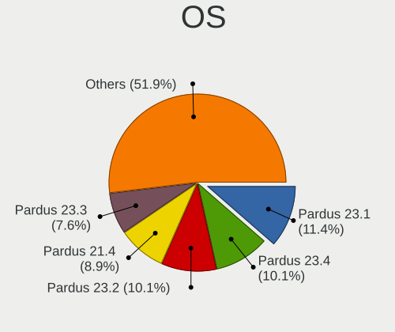

| Name          | Notebooks | Percent |
|---------------|-----------|---------|
| Pardus 23.1   | 9         | 11.39%  |
| Pardus 23.4   | 8         | 10.13%  |
| Pardus 23.2   | 8         | 10.13%  |
| Pardus 21.4   | 7         | 8.86%   |
| Pardus 23.3   | 6         | 7.59%   |
| Pardus 21.5   | 6         | 7.59%   |
| Pardus 21.3   | 5         | 6.33%   |
| Pardus 21.1   | 5         | 6.33%   |
| Pardus 21.2   | 4         | 5.06%   |
| Pardus 21.0   | 3         | 3.8%    |
| Pardus 19.5   | 3         | 3.8%    |
| Pardus 19.3   | 3         | 3.8%    |
| Pardus 23.0   | 2         | 2.53%   |
| Pardus 19.4-1 | 2         | 2.53%   |
| Pardus 19.2   | 2         | 2.53%   |
| Pardus 19.1   | 2         | 2.53%   |
| Pardus 19.0   | 2         | 2.53%   |
| Pardus 25.0   | 1         | 1.27%   |
| Pardus 19.4   | 1         | 1.27%   |

OS Family
---------

OS without a version

| Name   | Notebooks | Percent |
|--------|-----------|---------|
| Pardus | 70        | 100%    |

Kernel
------

Version of the Linux kernel

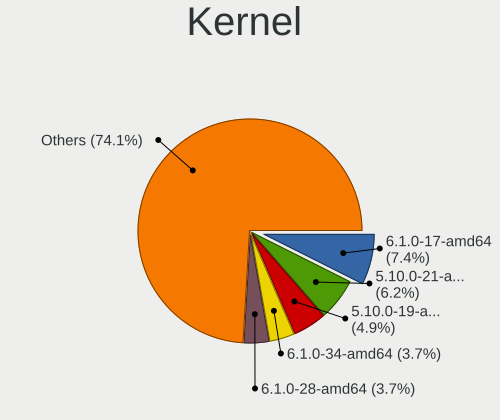

| Version                   | Notebooks | Percent |
|---------------------------|-----------|---------|
| 6.1.0-17-amd64            | 6         | 7.41%   |
| 5.10.0-21-amd64           | 5         | 6.17%   |
| 5.10.0-19-amd64           | 4         | 4.94%   |
| 6.1.0-34-amd64            | 3         | 3.7%    |
| 6.1.0-28-amd64            | 3         | 3.7%    |
| 6.1.0-23-amd64            | 3         | 3.7%    |
| 5.10.0-13-amd64           | 3         | 3.7%    |
| 5.10.0-11-amd64           | 3         | 3.7%    |
| 4.19.0-6-amd64            | 3         | 3.7%    |
| 4.19.0-10-amd64           | 3         | 3.7%    |
| 6.1.0-40-amd64            | 2         | 2.47%   |
| 6.1.0-29-amd64            | 2         | 2.47%   |
| 6.1.0-26-amd64            | 2         | 2.47%   |
| 5.10.0-9-amd64            | 2         | 2.47%   |
| 5.10.0-23-amd64           | 2         | 2.47%   |
| 5.10.0-20-amd64           | 2         | 2.47%   |
| 5.10.0-10-amd64           | 2         | 2.47%   |
| 4.19.0-13-amd64           | 2         | 2.47%   |
| 6.7.12+bpo-amd64          | 1         | 1.23%   |
| 6.6.13+bpo-amd64          | 1         | 1.23%   |
| 6.12.48+deb13-amd64       | 1         | 1.23%   |
| 6.12.12+bpo-amd64         | 1         | 1.23%   |
| 6.10.6+bpo-amd64          | 1         | 1.23%   |
| 6.10.11+bpo-amd64         | 1         | 1.23%   |
| 6.1.0-39-amd64            | 1         | 1.23%   |
| 6.1.0-32-amd64            | 1         | 1.23%   |
| 6.1.0-31-amd64            | 1         | 1.23%   |
| 6.1.0-25-amd64            | 1         | 1.23%   |
| 6.1.0-22-amd64            | 1         | 1.23%   |
| 6.1.0-20-amd64            | 1         | 1.23%   |
| 6.1.0-13-amd64            | 1         | 1.23%   |
| 6.1.0-11-amd64            | 1         | 1.23%   |
| 6.1.0-0.deb11.13-amd64    | 1         | 1.23%   |
| 6.0.11-x64v2-rt14-xanmod1 | 1         | 1.23%   |
| 5.9.0-0.bpo.2-amd64       | 1         | 1.23%   |
| 5.4.0-0.bpo.3-amd64       | 1         | 1.23%   |
| 5.10.0-8-amd64            | 1         | 1.23%   |
| 5.10.0-33-amd64           | 1         | 1.23%   |
| 5.10.0-25-amd64           | 1         | 1.23%   |
| 5.10.0-17-amd64           | 1         | 1.23%   |

Kernel Family
-------------

Linux kernel without a distro release

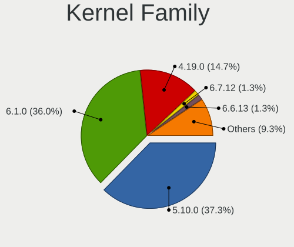

| Version | Notebooks | Percent |
|---------|-----------|---------|
| 5.10.0  | 28        | 37.33%  |
| 6.1.0   | 27        | 36%     |
| 4.19.0  | 11        | 14.67%  |
| 6.7.12  | 1         | 1.33%   |
| 6.6.13  | 1         | 1.33%   |
| 6.12.48 | 1         | 1.33%   |
| 6.12.12 | 1         | 1.33%   |
| 6.10.6  | 1         | 1.33%   |
| 6.10.11 | 1         | 1.33%   |
| 6.0.11  | 1         | 1.33%   |
| 5.9.0   | 1         | 1.33%   |
| 5.4.0   | 1         | 1.33%   |

Kernel Major Ver.
-----------------

Linux kernel major version

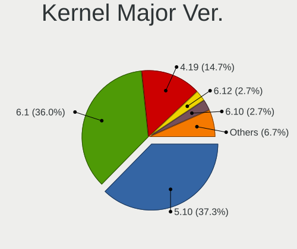

| Version | Notebooks | Percent |
|---------|-----------|---------|
| 5.10    | 28        | 37.33%  |
| 6.1     | 27        | 36%     |
| 4.19    | 11        | 14.67%  |
| 6.12    | 2         | 2.67%   |
| 6.10    | 2         | 2.67%   |
| 6.7     | 1         | 1.33%   |
| 6.6     | 1         | 1.33%   |
| 6.0     | 1         | 1.33%   |
| 5.9     | 1         | 1.33%   |
| 5.4     | 1         | 1.33%   |

Arch
----

OS architecture (x86_64, i586, etc.)

| Name   | Notebooks | Percent |
|--------|-----------|---------|
| x86_64 | 70        | 100%    |

DE
--

Desktop Environment

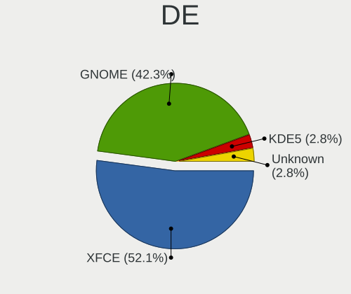

| Name    | Notebooks | Percent |
|---------|-----------|---------|
| XFCE    | 37        | 52.11%  |
| GNOME   | 30        | 42.25%  |
| KDE5    | 2         | 2.82%   |
| Unknown | 2         | 2.82%   |

Display Server
--------------

X11 or Wayland

| Name    | Notebooks | Percent |
|---------|-----------|---------|
| X11     | 68        | 97.14%  |
| Wayland | 2         | 2.86%   |

Display Manager
---------------

SDDM, LightDM, etc.

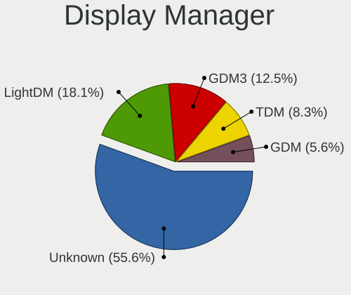

| Name    | Notebooks | Percent |
|---------|-----------|---------|
| Unknown | 40        | 55.56%  |
| LightDM | 13        | 18.06%  |
| GDM3    | 9         | 12.5%   |
| TDM     | 6         | 8.33%   |
| GDM     | 4         | 5.56%   |

OS Lang
-------

Language

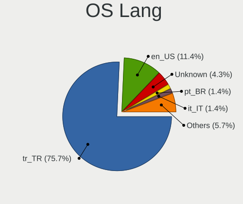

| Lang    | Notebooks | Percent |
|---------|-----------|---------|
| tr_TR   | 53        | 75.71%  |
| en_US   | 8         | 11.43%  |
| Unknown | 3         | 4.29%   |
| pt_BR   | 1         | 1.43%   |
| it_IT   | 1         | 1.43%   |
| hu_HU   | 1         | 1.43%   |
| fur_IT  | 1         | 1.43%   |
| en_GB   | 1         | 1.43%   |
| de_AT   | 1         | 1.43%   |

Boot Mode
---------

EFI or BIOS

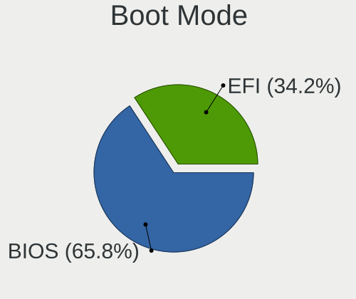

| Mode | Notebooks | Percent |
|------|-----------|---------|
| BIOS | 48        | 65.75%  |
| EFI  | 25        | 34.25%  |

Filesystem
----------

Type of filesystem

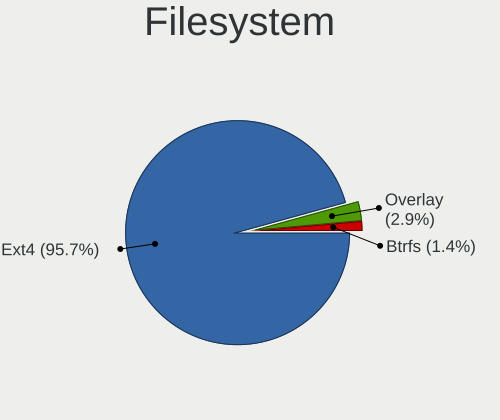

| Type    | Notebooks | Percent |
|---------|-----------|---------|
| Ext4    | 67        | 95.71%  |
| Overlay | 2         | 2.86%   |
| Btrfs   | 1         | 1.43%   |

Part. scheme
------------

Scheme of partitioning

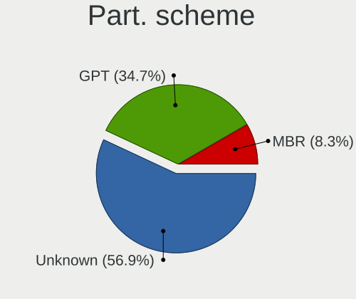

| Type    | Notebooks | Percent |
|---------|-----------|---------|
| Unknown | 41        | 56.94%  |
| GPT     | 25        | 34.72%  |
| MBR     | 6         | 8.33%   |

Dual Boot with Linux/BSD
------------------------

Hosting more than one Linux/BSD

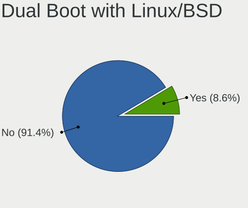

| Dual boot | Notebooks | Percent |
|-----------|-----------|---------|
| No        | 64        | 91.43%  |
| Yes       | 6         | 8.57%   |

Dual Boot (Win)
---------------

Hosting Linux and Windows

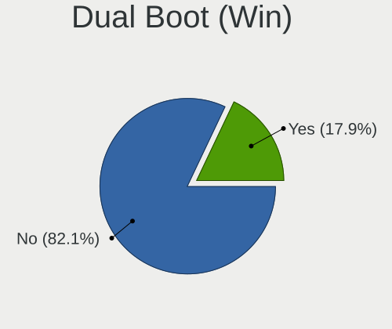

| Dual boot | Notebooks | Percent |
|-----------|-----------|---------|
| No        | 56        | 80%     |
| Yes       | 14        | 20%     |

Board
-----

Vendor
------

Motherboard manufacturer

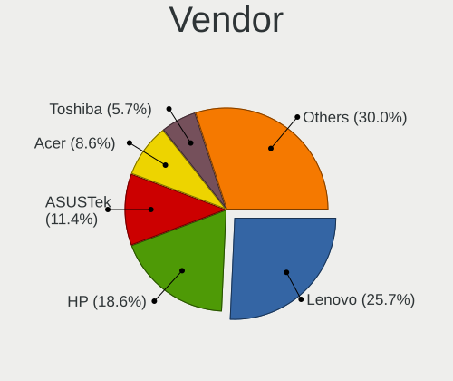

| Name                | Notebooks | Percent |
|---------------------|-----------|---------|
| Lenovo              | 18        | 25.71%  |
| Hewlett-Packard     | 13        | 18.57%  |
| ASUSTek Computer    | 8         | 11.43%  |
| Acer                | 6         | 8.57%   |
| Toshiba             | 4         | 5.71%   |
| Dell                | 4         | 5.71%   |
| Sony                | 3         | 4.29%   |
| HUAWEI              | 3         | 4.29%   |
| Samsung Electronics | 2         | 2.86%   |
| Packard Bell        | 2         | 2.86%   |
| TUXEDO              | 1         | 1.43%   |
| Timi                | 1         | 1.43%   |
| Philco              | 1         | 1.43%   |
| Pegatron            | 1         | 1.43%   |
| Olidata             | 1         | 1.43%   |
| Clevo               | 1         | 1.43%   |
| Casper              | 1         | 1.43%   |

Model
-----

Motherboard model

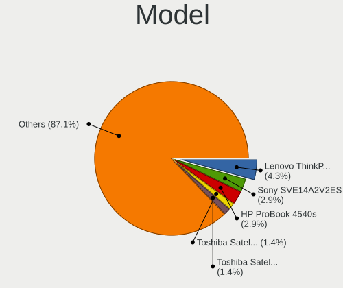

| Name                                       | Notebooks | Percent |
|--------------------------------------------|-----------|---------|
| Lenovo ThinkPad P15v Gen 1 20TRS1UB00      | 3         | 4.29%   |
| Sony SVE14A2V2ES                           | 2         | 2.86%   |
| HP ProBook 4540s                           | 2         | 2.86%   |
| Toshiba Satellite L755                     | 1         | 1.43%   |
| Toshiba Satellite C855-1VM                 | 1         | 1.43%   |
| Toshiba Satellite C660                     | 1         | 1.43%   |
| Toshiba PORTEGE M780                       | 1         | 1.43%   |
| Timi TM1604                                | 1         | 1.43%   |
| Sony SVF1521QSTB                           | 1         | 1.43%   |
| Samsung 300E4C/300E5C/300E7C               | 1         | 1.43%   |
| Samsung 300E4A/300E5A/300E7A/3430EA/3530EA | 1         | 1.43%   |
| Philco 14F                                 | 1         | 1.43%   |
| Pegatron A15                               | 1         | 1.43%   |
| Packard Bell EasyNote_GN45                 | 1         | 1.43%   |
| Packard Bell EasyNote ENTG81BA             | 1         | 1.43%   |
| Olidata T7700                              | 1         | 1.43%   |
| Lenovo Y50-70 20378                        | 1         | 1.43%   |
| Lenovo V145-15AST 81MT                     | 1         | 1.43%   |
| Lenovo V110-15ISK 80TL                     | 1         | 1.43%   |
| Lenovo ThinkPad T480 20L6S2S800            | 1         | 1.43%   |
| Lenovo ThinkPad T450 20BUS39Y00            | 1         | 1.43%   |
| Lenovo ThinkPad S1 Yoga 20CD0034TX         | 1         | 1.43%   |
| Lenovo ThinkPad E15 Gen 2 20TD0047TX       | 1         | 1.43%   |
| Lenovo IdeaPad-510-15IKB 80SV              | 1         | 1.43%   |
| Lenovo IdeaPad 320-15IKB 81BT              | 1         | 1.43%   |
| Lenovo IdeaPad 100-15IBD 80QQ              | 1         | 1.43%   |
| Lenovo IdeaPad 1 15IGL7 82V7               | 1         | 1.43%   |
| Lenovo IdeaPad 1 15ALC7 82R4               | 1         | 1.43%   |
| Lenovo G510 20238                          | 1         | 1.43%   |
| Lenovo G50-45 80E3                         | 1         | 1.43%   |
| Lenovo 21DL                                | 1         | 1.43%   |
| HUAWEI KLVL-WXXW                           | 1         | 1.43%   |
| HUAWEI BOM-WXX9                            | 1         | 1.43%   |
| HUAWEI BOD-WXX9                            | 1         | 1.43%   |
| HP Victus by Gaming Laptop 16-s0xxx        | 1         | 1.43%   |
| HP Pavilion Notebook                       | 1         | 1.43%   |
| HP Pavilion g6                             | 1         | 1.43%   |
| HP Pavilion 15                             | 1         | 1.43%   |
| HP Laptop 15-dw3xxx                        | 1         | 1.43%   |
| HP EliteBook 850 G8 Notebook PC            | 1         | 1.43%   |

Model Family
------------

Motherboard model prefix

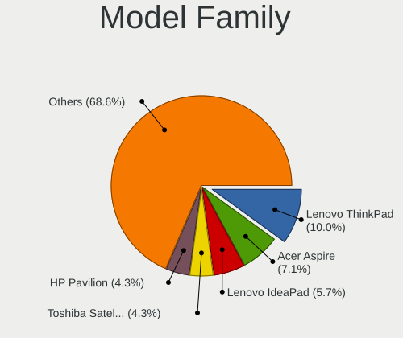

| Name                     | Notebooks | Percent |
|--------------------------|-----------|---------|
| Lenovo ThinkPad          | 7         | 10%     |
| Acer Aspire              | 5         | 7.14%   |
| Lenovo IdeaPad           | 4         | 5.71%   |
| Toshiba Satellite        | 3         | 4.29%   |
| HP Pavilion              | 3         | 4.29%   |
| HP EliteBook             | 3         | 4.29%   |
| Sony SVE14A2V2ES         | 2         | 2.86%   |
| Packard Bell EasyNote    | 2         | 2.86%   |
| HP ProBook               | 2         | 2.86%   |
| ASUS VivoBook            | 2         | 2.86%   |
| Toshiba PORTEGE          | 1         | 1.43%   |
| Timi TM1604              | 1         | 1.43%   |
| Sony SVF1521QSTB         | 1         | 1.43%   |
| Samsung 300E4C           | 1         | 1.43%   |
| Samsung 300E4A           | 1         | 1.43%   |
| Philco 14F               | 1         | 1.43%   |
| Pegatron A15             | 1         | 1.43%   |
| Olidata T7700            | 1         | 1.43%   |
| Lenovo Y50-70            | 1         | 1.43%   |
| Lenovo V145-15AST        | 1         | 1.43%   |
| Lenovo V110-15ISK        | 1         | 1.43%   |
| Lenovo IdeaPad-510-15IKB | 1         | 1.43%   |
| Lenovo G510              | 1         | 1.43%   |
| Lenovo G50-45            | 1         | 1.43%   |
| Lenovo 21DL              | 1         | 1.43%   |
| HUAWEI KLVL-WXXW         | 1         | 1.43%   |
| HUAWEI BOM-WXX9          | 1         | 1.43%   |
| HUAWEI BOD-WXX9          | 1         | 1.43%   |
| HP Victus                | 1         | 1.43%   |
| HP Laptop                | 1         | 1.43%   |
| HP 530                   | 1         | 1.43%   |
| HP 250                   | 1         | 1.43%   |
| HP 15                    | 1         | 1.43%   |
| Dell Vostro              | 1         | 1.43%   |
| Dell Latitude            | 1         | 1.43%   |
| Dell Inspiron            | 1         | 1.43%   |
| Dell G5                  | 1         | 1.43%   |
| Clevo W251EFQ            | 1         | 1.43%   |
| Casper EXCALIBUR         | 1         | 1.43%   |
| ASUS Zenbook             | 1         | 1.43%   |

MFG Year
--------

Motherboard manufacture year

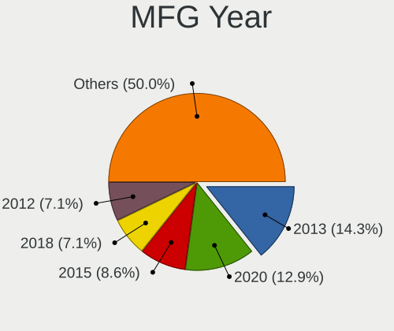

| Year | Notebooks | Percent |
|------|-----------|---------|
| 2013 | 10        | 14.29%  |
| 2020 | 9         | 12.86%  |
| 2015 | 6         | 8.57%   |
| 2018 | 5         | 7.14%   |
| 2012 | 5         | 7.14%   |
| 2011 | 5         | 7.14%   |
| 2023 | 4         | 5.71%   |
| 2019 | 4         | 5.71%   |
| 2014 | 4         | 5.71%   |
| 2022 | 3         | 4.29%   |
| 2021 | 3         | 4.29%   |
| 2017 | 3         | 4.29%   |
| 2010 | 3         | 4.29%   |
| 2008 | 2         | 2.86%   |
| 2024 | 1         | 1.43%   |
| 2016 | 1         | 1.43%   |
| 2007 | 1         | 1.43%   |
| 2006 | 1         | 1.43%   |

Form Factor
-----------

Physical design of the computer

| Name     | Notebooks | Percent |
|----------|-----------|---------|
| Notebook | 70        | 100%    |

Secure Boot
-----------

Enabled or disabled

| State    | Notebooks | Percent |
|----------|-----------|---------|
| Disabled | 70        | 100%    |

Coreboot
--------

Have coreboot on board

| Used | Notebooks | Percent |
|------|-----------|---------|
| No   | 70        | 100%    |

RAM Size
--------

Total RAM memory

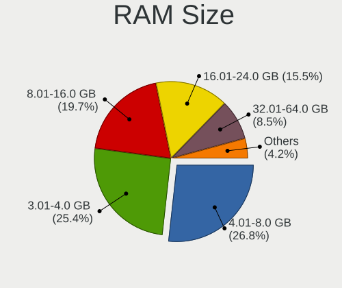

| Size in GB | Notebooks | Percent |
|------------|-----------|---------|
| 4.01-8.0   | 19        | 26.76%  |
| 3.01-4.0   | 18        | 25.35%  |
| 8.01-16.0  | 14        | 19.72%  |
| 16.01-24.0 | 11        | 15.49%  |
| 32.01-64.0 | 6         | 8.45%   |
| 1.01-2.0   | 2         | 2.82%   |
| 2.01-3.0   | 1         | 1.41%   |

RAM Used
--------

Used RAM memory

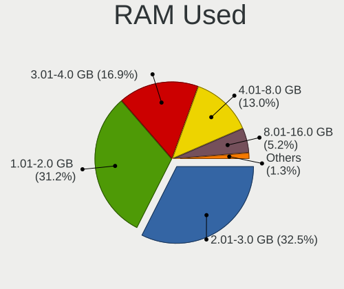

| Used GB   | Notebooks | Percent |
|-----------|-----------|---------|
| 2.01-3.0  | 25        | 32.47%  |
| 1.01-2.0  | 24        | 31.17%  |
| 3.01-4.0  | 13        | 16.88%  |
| 4.01-8.0  | 10        | 12.99%  |
| 8.01-16.0 | 4         | 5.19%   |
| 0.51-1.0  | 1         | 1.3%    |

Total Drives
------------

Number of drives on board

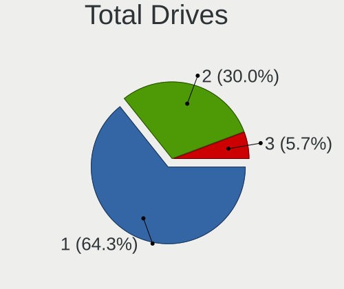

| Drives | Notebooks | Percent |
|--------|-----------|---------|
| 1      | 45        | 64.29%  |
| 2      | 21        | 30%     |
| 3      | 4         | 5.71%   |

Has CD-ROM
----------

Has CD-ROM on board

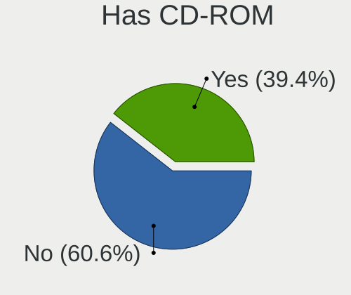

| Presented | Notebooks | Percent |
|-----------|-----------|---------|
| No        | 43        | 60.56%  |
| Yes       | 28        | 39.44%  |

Has Ethernet
------------

Has Ethernet on board

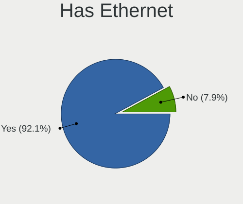

| Presented | Notebooks | Percent |
|-----------|-----------|---------|
| Yes       | 58        | 82.86%  |
| No        | 12        | 17.14%  |

Has WiFi
--------

Has WiFi module

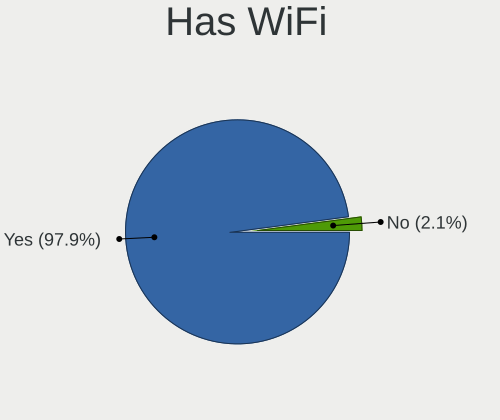

| Presented | Notebooks | Percent |
|-----------|-----------|---------|
| Yes       | 69        | 98.57%  |
| No        | 1         | 1.43%   |

Has Bluetooth
-------------

Has Bluetooth module

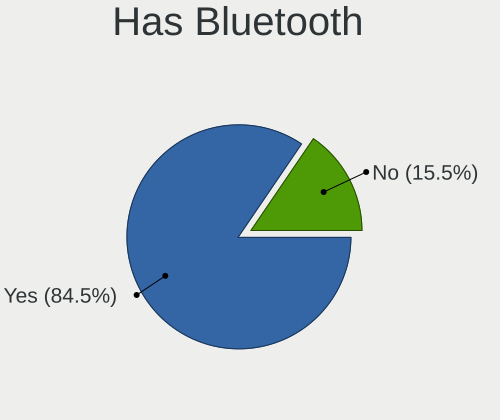

| Presented | Notebooks | Percent |
|-----------|-----------|---------|
| Yes       | 60        | 84.51%  |
| No        | 11        | 15.49%  |

Location
--------

Country
-------

Geographic location (country)

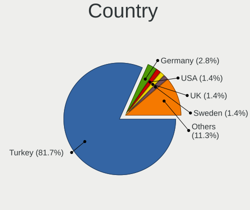

| Country    | Notebooks | Percent |
|------------|-----------|---------|
| Turkey     | 58        | 81.69%  |
| Germany    | 2         | 2.82%   |
| USA        | 1         | 1.41%   |
| UK         | 1         | 1.41%   |
| Sweden     | 1         | 1.41%   |
| Romania    | 1         | 1.41%   |
| Poland     | 1         | 1.41%   |
| Libya      | 1         | 1.41%   |
| Italy      | 1         | 1.41%   |
| Bulgaria   | 1         | 1.41%   |
| Brazil     | 1         | 1.41%   |
| Azerbaijan | 1         | 1.41%   |
| Austria    | 1         | 1.41%   |

City
----

Geographic location (city)

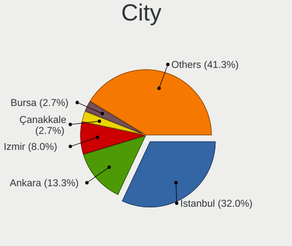

| City                 | Notebooks | Percent |
|----------------------|-----------|---------|
| Istanbul             | 24        | 32%     |
| Ankara               | 10        | 13.33%  |
| Izmir                | 6         | 8%      |
| Çanakkale           | 2         | 2.67%   |
| Bursa                | 2         | 2.67%   |
| Vienna               | 1         | 1.33%   |
| Tripoli              | 1         | 1.33%   |
| Sofia                | 1         | 1.33%   |
| Serik                | 1         | 1.33%   |
| Sao Gabriel          | 1         | 1.33%   |
| Sanliurfa            | 1         | 1.33%   |
| Samsun               | 1         | 1.33%   |
| Ordu                 | 1         | 1.33%   |
| Malatya              | 1         | 1.33%   |
| London               | 1         | 1.33%   |
| Landskrona           | 1         | 1.33%   |
| Kołobrzeg           | 1         | 1.33%   |
| Kosekoy              | 1         | 1.33%   |
| Konya                | 1         | 1.33%   |
| Kirikkale            | 1         | 1.33%   |
| Kirchheim unter Teck | 1         | 1.33%   |
| Kayseri              | 1         | 1.33%   |
| Huntington Beach     | 1         | 1.33%   |
| Hacilar              | 1         | 1.33%   |
| Gaziantep            | 1         | 1.33%   |
| Esenyurt             | 1         | 1.33%   |
| Erzurum              | 1         | 1.33%   |
| Castrop-Rauxel       | 1         | 1.33%   |
| Bucharest            | 1         | 1.33%   |
| Bolzano              | 1         | 1.33%   |
| Balıkesir           | 1         | 1.33%   |
| Baku                 | 1         | 1.33%   |
| Aydin                | 1         | 1.33%   |
| Artvin               | 1         | 1.33%   |
| Antalya              | 1         | 1.33%   |
| Aksaray              | 1         | 1.33%   |

Drives
------

Drive Vendor
------------

Hard drive vendors

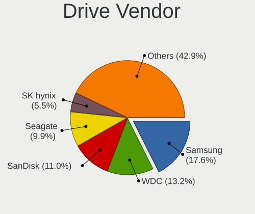

| Vendor                      | Notebooks | Drives | Percent |
|-----------------------------|-----------|--------|---------|
| Samsung Electronics         | 16        | 20     | 17.58%  |
| WDC                         | 12        | 14     | 13.19%  |
| SanDisk                     | 10        | 12     | 10.99%  |
| Seagate                     | 9         | 13     | 9.89%   |
| SK hynix                    | 5         | 7      | 5.49%   |
| Toshiba                     | 4         | 8      | 4.4%    |
| Hitachi                     | 4         | 4      | 4.4%    |
| Kingston                    | 3         | 4      | 3.3%    |
| Unknown                     | 2         | 3      | 2.2%    |
| SPCC                        | 2         | 2      | 2.2%    |
| Silicon Motion              | 2         | 2      | 2.2%    |
| Micron Technology           | 2         | 3      | 2.2%    |
| Lexar                       | 2         | 2      | 2.2%    |
| Kingston Technology Company | 2         | 2      | 2.2%    |
| HGST                        | 2         | 2      | 2.2%    |
| USB3.0                      | 1         | 1      | 1.1%    |
| Phison                      | 1         | 1      | 1.1%    |
| Micron/Crucial Technology   | 1         | 1      | 1.1%    |
| MAXIO Technology (Hangzhou) | 1         | 2      | 1.1%    |
| LITEON                      | 1         | 1      | 1.1%    |
| KIOXIA-EXCERIA              | 1         | 1      | 1.1%    |
| KingSpec                    | 1         | 1      | 1.1%    |
| JMicron Technology          | 1         | 1      | 1.1%    |
| Intenso                     | 1         | 2      | 1.1%    |
| Initio                      | 1         | 1      | 1.1%    |
| Crucial                     | 1         | 1      | 1.1%    |
| China                       | 1         | 1      | 1.1%    |
| addlink                     | 1         | 1      | 1.1%    |
| Unknown                     | 1         | 1      | 1.1%    |

Drive Model
-----------

Hard drive models

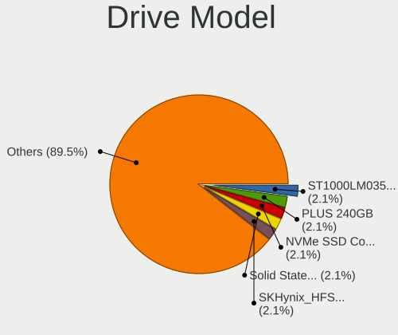

| Model                                              | Notebooks | Percent |
|----------------------------------------------------|-----------|---------|
| SPCC Solid State Disk 512GB                        | 2         | 2.11%   |
| SK hynix SKHynix_HFS512GDE9X081N 512GB             | 2         | 2.11%   |
| Seagate ST1000LM035-1RK172 1TB                     | 2         | 2.11%   |
| SanDisk SSD PLUS 240GB                             | 2         | 2.11%   |
| Samsung NVMe SSD Controller PM9A1/PM9A3/980PRO 1TB | 2         | 2.11%   |
| Kingston SA400S37240G 240GB SSD                    | 2         | 2.11%   |
| HGST HTS545050A7E680 500GB                         | 2         | 2.11%   |
| WDC WDS120G2G0B-00EPW0 120GB SSD                   | 1         | 1.05%   |
| WDC WDS120G2G0A-00JH30 120GB SSD                   | 1         | 1.05%   |
| WDC WD5000LPVX-55V0TT0 500GB                       | 1         | 1.05%   |
| WDC WD5000LPCX-60VHAT0 500GB                       | 1         | 1.05%   |
| WDC WD5000LPCX-21VHAT0 500GB                       | 1         | 1.05%   |
| WDC WD3200BPVT-35JJ5T0 320GB                       | 1         | 1.05%   |
| WDC WD3200BEVT-22ZCT0 320GB                        | 1         | 1.05%   |
| WDC WD2500BEVS-00UST0 250GB                        | 1         | 1.05%   |
| WDC WD10SPCX-24HWST1 1TB                           | 1         | 1.05%   |
| WDC WD10JPVX-60JC3T0 1TB                           | 1         | 1.05%   |
| WDC WD10JPVX-22JC3T0 1TB                           | 1         | 1.05%   |
| WDC WD10JPCX-24UE4T0 1TB                           | 1         | 1.05%   |
| USB3.0 Super Speed 500GB                           | 1         | 1.05%   |
| Unknown SD32G  32GB                                | 1         | 1.05%   |
| Unknown MMC Card  128GB                            | 1         | 1.05%   |
| Toshiba MQ01ABD075 752GB                           | 1         | 1.05%   |
| Toshiba MK6475GSX 640GB                            | 1         | 1.05%   |
| Toshiba MK5061GSYN 500GB                           | 1         | 1.05%   |
| Toshiba KXG6AZNV512G 512GB                         | 1         | 1.05%   |
| SK hynix SC311 SATA 256GB                          | 1         | 1.05%   |
| SK hynix BC711 HFM512GD3JX013N 512GB               | 1         | 1.05%   |
| SK hynix BC511 HFM256GDJTNI-82A0A 256GB            | 1         | 1.05%   |
| Silicon Motion PCIe-8 SSD 512GB                    | 1         | 1.05%   |
| Silicon Motion Longline SSD 512GB                  | 1         | 1.05%   |
| Seagate ST9500325AS 500GB                          | 1         | 1.05%   |
| Seagate ST9120822AS 120GB                          | 1         | 1.05%   |
| Seagate ST750LM022 HN-M750MBB 752GB                | 1         | 1.05%   |
| Seagate ST500LM000-1EJ162 500GB                    | 1         | 1.05%   |
| Seagate ST1000LM024 HN-M101MBB 1TB                 | 1         | 1.05%   |
| Seagate Expansion 2TB                              | 1         | 1.05%   |
| Seagate BarraCuda Q1 SSD ZA480CV10001 480GB        | 1         | 1.05%   |
| Sandisk WD Blue SN550 NVMe SSD 1024GB              | 1         | 1.05%   |
| Sandisk WD Black SN850 1TB                         | 1         | 1.05%   |

HDD Vendor
----------

Hard disk drive vendors

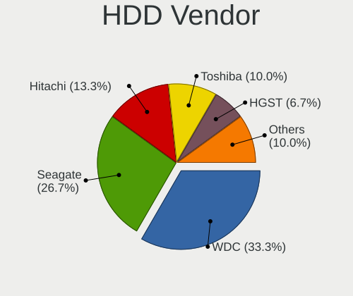

| Vendor              | Notebooks | Drives | Percent |
|---------------------|-----------|--------|---------|
| WDC                 | 10        | 12     | 33.33%  |
| Seagate             | 8         | 12     | 26.67%  |
| Hitachi             | 4         | 4      | 13.33%  |
| Toshiba             | 3         | 6      | 10%     |
| HGST                | 2         | 2      | 6.67%   |
| USB3.0              | 1         | 1      | 3.33%   |
| Samsung Electronics | 1         | 1      | 3.33%   |
| Initio              | 1         | 1      | 3.33%   |

SSD Vendor
----------

Solid state drive vendors

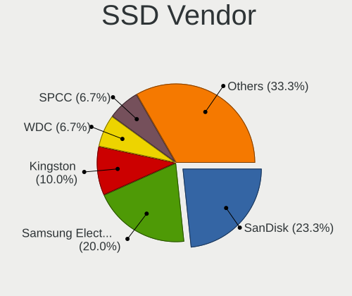

| Vendor              | Notebooks | Drives | Percent |
|---------------------|-----------|--------|---------|
| SanDisk             | 7         | 8      | 23.33%  |
| Samsung Electronics | 6         | 8      | 20%     |
| Kingston            | 3         | 4      | 10%     |
| WDC                 | 2         | 2      | 6.67%   |
| SPCC                | 2         | 2      | 6.67%   |
| Lexar               | 2         | 2      | 6.67%   |
| SK hynix            | 1         | 1      | 3.33%   |
| Seagate             | 1         | 1      | 3.33%   |
| Micron Technology   | 1         | 2      | 3.33%   |
| LITEON              | 1         | 1      | 3.33%   |
| KIOXIA-EXCERIA      | 1         | 1      | 3.33%   |
| KingSpec            | 1         | 1      | 3.33%   |
| Intenso             | 1         | 2      | 3.33%   |
| China               | 1         | 1      | 3.33%   |

Drive Kind
----------

HDD or SSD

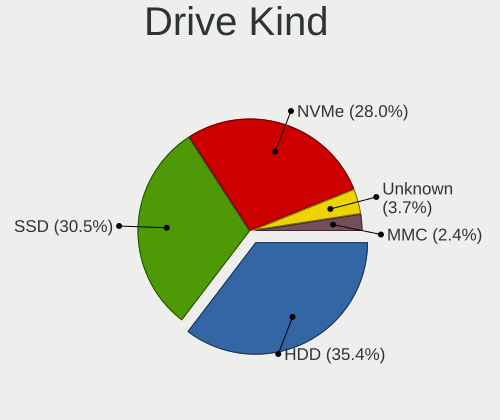

| Kind    | Notebooks | Drives | Percent |
|---------|-----------|--------|---------|
| HDD     | 29        | 39     | 35.37%  |
| SSD     | 25        | 36     | 30.49%  |
| NVMe    | 23        | 33     | 28.05%  |
| Unknown | 3         | 3      | 3.66%   |
| MMC     | 2         | 3      | 2.44%   |

Drive Connector
---------------

SATA, SAS, NVMe, etc.

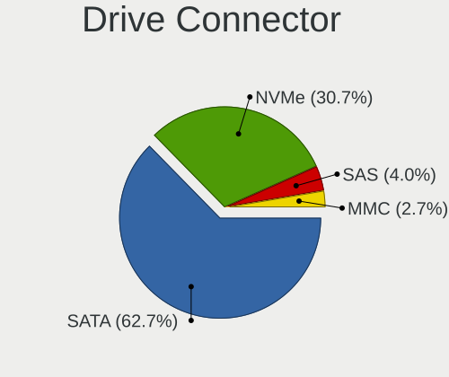

| Type | Notebooks | Drives | Percent |
|------|-----------|--------|---------|
| SATA | 47        | 74     | 62.67%  |
| NVMe | 23        | 33     | 30.67%  |
| SAS  | 3         | 4      | 4%      |
| MMC  | 2         | 3      | 2.67%   |

Drive Size
----------

Size of hard drive

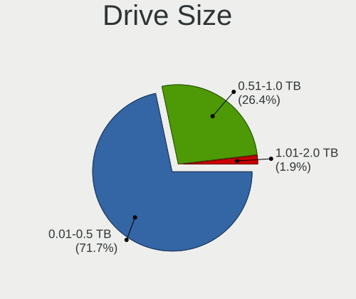

| Size in TB | Notebooks | Drives | Percent |
|------------|-----------|--------|---------|
| 0.01-0.5   | 38        | 55     | 71.7%   |
| 0.51-1.0   | 14        | 19     | 26.42%  |
| 1.01-2.0   | 1         | 1      | 1.89%   |

Space Total
-----------

Amount of disk space available on the file system

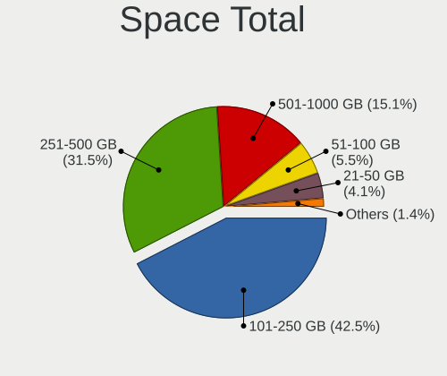

| Size in GB | Notebooks | Percent |
|------------|-----------|---------|
| 101-250    | 31        | 42.47%  |
| 251-500    | 23        | 31.51%  |
| 501-1000   | 11        | 15.07%  |
| 51-100     | 4         | 5.48%   |
| 21-50      | 3         | 4.11%   |
| 1001-2000  | 1         | 1.37%   |

Space Used
----------

Amount of used disk space

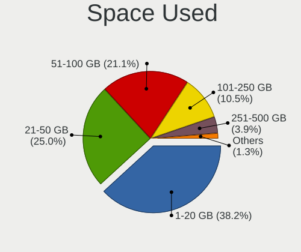

| Used GB  | Notebooks | Percent |
|----------|-----------|---------|
| 1-20     | 29        | 38.16%  |
| 21-50    | 19        | 25%     |
| 51-100   | 16        | 21.05%  |
| 101-250  | 8         | 10.53%  |
| 251-500  | 3         | 3.95%   |
| 501-1000 | 1         | 1.32%   |

Malfunc. Drives
---------------

Drive models with a malfunction

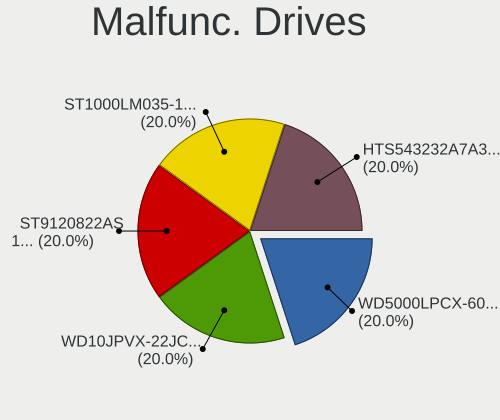

| Model                          | Notebooks | Drives | Percent |
|--------------------------------|-----------|--------|---------|
| WDC WD5000LPCX-60VHAT0 500GB   | 1         | 1      | 20%     |
| WDC WD10JPVX-22JC3T0 1TB       | 1         | 1      | 20%     |
| Seagate ST9120822AS 120GB      | 1         | 1      | 20%     |
| Seagate ST1000LM035-1RK172 1TB | 1         | 1      | 20%     |
| Hitachi HTS543232A7A384 320GB  | 1         | 1      | 20%     |

Malfunc. Drive Vendor
---------------------

Vendors of faulty drives

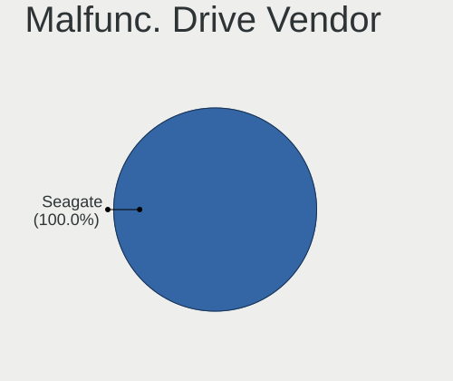

| Vendor  | Notebooks | Drives | Percent |
|---------|-----------|--------|---------|
| WDC     | 2         | 2      | 40%     |
| Seagate | 2         | 2      | 40%     |
| Hitachi | 1         | 1      | 20%     |

Malfunc. HDD Vendor
-------------------

Vendors of faulty HDD drives

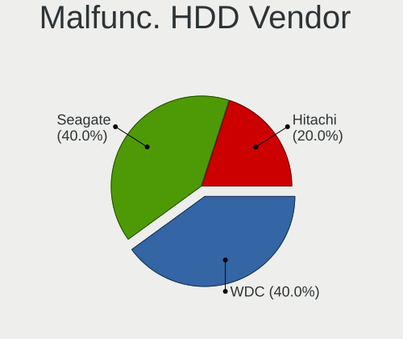

| Vendor  | Notebooks | Drives | Percent |
|---------|-----------|--------|---------|
| WDC     | 2         | 2      | 40%     |
| Seagate | 2         | 2      | 40%     |
| Hitachi | 1         | 1      | 20%     |

Malfunc. Drive Kind
-------------------

Kinds of faulty drives

| Kind | Notebooks | Drives | Percent |
|------|-----------|--------|---------|
| HDD  | 5         | 5      | 100%    |

Failed Drives
-------------

Failed drive models

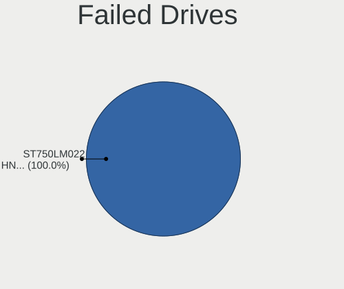

| Model                               | Notebooks | Drives | Percent |
|-------------------------------------|-----------|--------|---------|
| Seagate ST750LM022 HN-M750MBB 752GB | 1         | 1      | 100%    |

Failed Drive Vendor
-------------------

Failed drive vendors

| Vendor  | Notebooks | Drives | Percent |
|---------|-----------|--------|---------|
| Seagate | 1         | 1      | 100%    |

Drive Status
------------

Number of failed and malfunc. drives

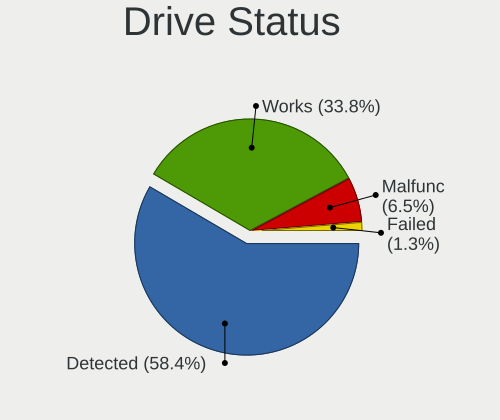

| Status   | Notebooks | Drives | Percent |
|----------|-----------|--------|---------|
| Detected | 45        | 71     | 58.44%  |
| Works    | 26        | 37     | 33.77%  |
| Malfunc  | 5         | 5      | 6.49%   |
| Failed   | 1         | 1      | 1.3%    |

Storage controller
------------------

Storage Vendor
--------------

Storage controller vendors

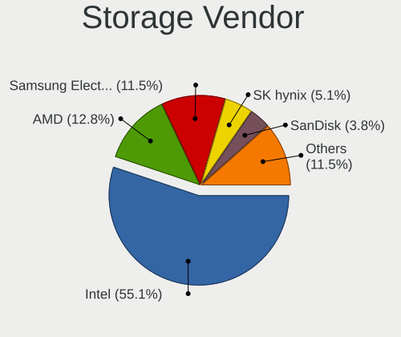

| Vendor                       | Notebooks | Percent |
|------------------------------|-----------|---------|
| Intel                        | 43        | 55.13%  |
| AMD                          | 10        | 12.82%  |
| Samsung Electronics          | 9         | 11.54%  |
| SK hynix                     | 4         | 5.13%   |
| SanDisk                      | 3         | 3.85%   |
| Silicon Motion               | 2         | 2.56%   |
| Kingston Technology Company  | 2         | 2.56%   |
| Toshiba America Info Systems | 1         | 1.28%   |
| Phison Electronics           | 1         | 1.28%   |
| Micron/Crucial Technology    | 1         | 1.28%   |
| Micron Technology            | 1         | 1.28%   |
| MAXIO Technology (Hangzhou)  | 1         | 1.28%   |

Storage Model
-------------

Storage controller models

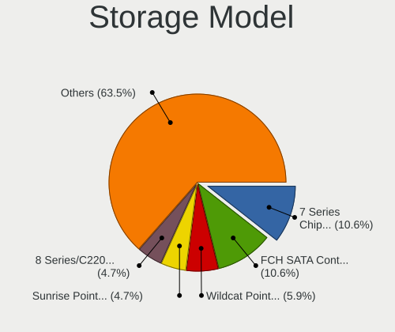

| Model                                                                            | Notebooks | Percent |
|----------------------------------------------------------------------------------|-----------|---------|
| Intel 7 Series Chipset Family 6-port SATA Controller [AHCI mode]                 | 9         | 10.59%  |
| AMD FCH SATA Controller [AHCI mode]                                              | 9         | 10.59%  |
| Intel Wildcat Point-LP SATA Controller [AHCI Mode]                               | 5         | 5.88%   |
| Intel Sunrise Point-LP SATA Controller [AHCI mode]                               | 4         | 4.71%   |
| Intel 8 Series/C220 Series Chipset Family 6-port SATA Controller 1 [AHCI mode]   | 4         | 4.71%   |
| Intel 6 Series/C200 Series Chipset Family 6 port Mobile SATA AHCI Controller     | 4         | 4.71%   |
| SK hynix Gold P31/BC711/PC711 NVMe Solid State Drive                             | 3         | 3.53%   |
| Samsung NVMe SSD Controller 980 (DRAM-less)                                      | 3         | 3.53%   |
| Samsung NVMe SSD Controller PM9B1 (DRAM-less)                                    | 2         | 2.35%   |
| Samsung NVMe SSD Controller PM9A1/PM9A3/980PRO                                   | 2         | 2.35%   |
| Intel Volume Management Device NVMe RAID Controller                              | 2         | 2.35%   |
| Intel 8 Series SATA Controller 1 [AHCI mode]                                     | 2         | 2.35%   |
| Intel 5 Series/3400 Series Chipset 4 port SATA AHCI Controller                   | 2         | 2.35%   |
| Toshiba America Info Systems XG6 NVMe SSD Controller                             | 1         | 1.18%   |
| SK hynix BC511 NVMe SSD                                                          | 1         | 1.18%   |
| Silicon Motion SM2263EN/SM2263XT (DRAM-less) NVMe SSD Controllers                | 1         | 1.18%   |
| Silicon Motion Non-Volatile memory controller                                    | 1         | 1.18%   |
| SanDisk WD SN560/SN740/SN770/SN5000 NVMe SSD                                     | 1         | 1.18%   |
| SanDisk WD PC SN810 / Black SN850 NVMe SSD                                       | 1         | 1.18%   |
| SanDisk Ultra 3D / WD PC SN530, IX SN530, Blue SN550 NVMe SSD (DRAM-less)        | 1         | 1.18%   |
| Samsung NVMe SSD Controller SM981/PM981/PM983                                    | 1         | 1.18%   |
| Samsung NVMe SSD Controller SM961/PM961/SM963                                    | 1         | 1.18%   |
| Samsung NVMe SSD Controller PM9C1a (DRAM-less)                                   | 1         | 1.18%   |
| Phison PS5013-E13 PCIe3 NVMe Controller (DRAM-less)                              | 1         | 1.18%   |
| Micron/Crucial P2 [Nick P2] / P3 / P3 Plus NVMe PCIe SSD (DRAM-less)             | 1         | 1.18%   |
| Micron 2400 NVMe SSD (DRAM-less)                                                 | 1         | 1.18%   |
| Micron 2300 NVMe SSD [Santana]                                                   | 1         | 1.18%   |
| MAXIO (Hangzhou) NVMe SSD Controller MAP1202 (DRAM-less)                         | 1         | 1.18%   |
| Kingston Company OM3PDP3 NVMe SSD                                                | 1         | 1.18%   |
| Kingston Company NV2 NVMe SSD [SM2267XT] (DRAM-less)                             | 1         | 1.18%   |
| Intel Tiger Lake-LP SATA Controller                                              | 1         | 1.18%   |
| Intel Celeron/Pentium Silver Processor SATA Controller                           | 1         | 1.18%   |
| Intel Cannon Point-LP SATA Controller [AHCI Mode]                                | 1         | 1.18%   |
| Intel Cannon Lake Mobile PCH SATA AHCI Controller                                | 1         | 1.18%   |
| Intel Atom/Celeron/Pentium Processor x5-E8000/J3xxx/N3xxx Series SATA Controller | 1         | 1.18%   |
| Intel 82801IBM/IEM (ICH9M/ICH9M-E) 4 port SATA Controller [AHCI mode]            | 1         | 1.18%   |
| Intel 82801HM/HEM (ICH8M/ICH8M-E) SATA Controller [IDE mode]                     | 1         | 1.18%   |
| Intel 82801HM/HEM (ICH8M/ICH8M-E) IDE Controller                                 | 1         | 1.18%   |
| Intel 82801GBM/GHM (ICH7-M Family) SATA Controller [IDE mode]                    | 1         | 1.18%   |
| Intel 82801GBM/GHM (ICH7-M Family) SATA Controller [AHCI mode]                   | 1         | 1.18%   |

Storage Kind
------------

Kind of storage controller (IDE, SATA, NVMe, SAS, ...)

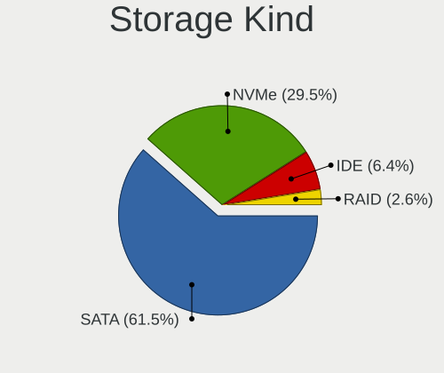

| Kind | Notebooks | Percent |
|------|-----------|---------|
| SATA | 48        | 61.54%  |
| NVMe | 23        | 29.49%  |
| IDE  | 5         | 6.41%   |
| RAID | 2         | 2.56%   |

Processor
---------

CPU Vendor
----------

Processor vendors

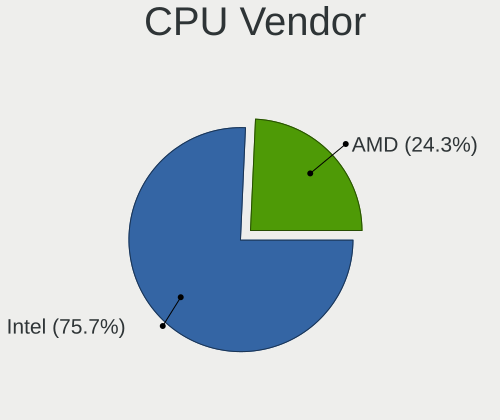

| Vendor | Notebooks | Percent |
|--------|-----------|---------|
| Intel  | 53        | 75.71%  |
| AMD    | 17        | 24.29%  |

CPU Model
---------

Processor models

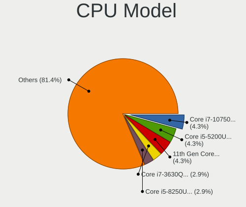

| Model                                   | Notebooks | Percent |
|-----------------------------------------|-----------|---------|
| Intel Core i7-10750H CPU @ 2.60GHz      | 3         | 4.29%   |
| Intel Core i5-5200U CPU @ 2.20GHz       | 3         | 4.29%   |
| Intel 11th Gen Core i5-1135G7 @ 2.40GHz | 3         | 4.29%   |
| Intel Core i7-3630QM CPU @ 2.40GHz      | 2         | 2.86%   |
| Intel Core i5-8250U CPU @ 1.60GHz       | 2         | 2.86%   |
| Intel Core i5-7200U CPU @ 2.50GHz       | 2         | 2.86%   |
| Intel Core i3 CPU M 370 @ 2.40GHz       | 2         | 2.86%   |
| AMD Ryzen 5 5500U with Radeon Graphics  | 2         | 2.86%   |
| Intel Pentium CPU B960 @ 2.20GHz        | 1         | 1.43%   |
| Intel Pentium CPU B950 @ 2.10GHz        | 1         | 1.43%   |
| Intel Core i7-8750H CPU @ 2.20GHz       | 1         | 1.43%   |
| Intel Core i7-8565U CPU @ 1.80GHz       | 1         | 1.43%   |
| Intel Core i7-5500U CPU @ 2.40GHz       | 1         | 1.43%   |
| Intel Core i7-4800MQ CPU @ 2.70GHz      | 1         | 1.43%   |
| Intel Core i7-4720HQ CPU @ 2.60GHz      | 1         | 1.43%   |
| Intel Core i7-4710HQ CPU @ 2.50GHz      | 1         | 1.43%   |
| Intel Core i7-3920XM CPU @ 2.90GHz      | 1         | 1.43%   |
| Intel Core i7-3632QM CPU @ 2.20GHz      | 1         | 1.43%   |
| Intel Core i7-3612QM CPU @ 2.10GHz      | 1         | 1.43%   |
| Intel Core i7-2670QM CPU @ 2.20GHz      | 1         | 1.43%   |
| Intel Core i5-8350U CPU @ 1.70GHz       | 1         | 1.43%   |
| Intel Core i5-4200M CPU @ 2.50GHz       | 1         | 1.43%   |
| Intel Core i5-3230M CPU @ 2.60GHz       | 1         | 1.43%   |
| Intel Core i5-10300H CPU @ 2.50GHz      | 1         | 1.43%   |
| Intel Core i3-6006U CPU @ 2.00GHz       | 1         | 1.43%   |
| Intel Core i3-5005U CPU @ 2.00GHz       | 1         | 1.43%   |
| Intel Core i3-4010U CPU @ 1.70GHz       | 1         | 1.43%   |
| Intel Core i3-4005U CPU @ 1.70GHz       | 1         | 1.43%   |
| Intel Core i3-3227U CPU @ 1.90GHz       | 1         | 1.43%   |
| Intel Core i3-2370M CPU @ 2.40GHz       | 1         | 1.43%   |
| Intel Core i3-2330M CPU @ 2.20GHz       | 1         | 1.43%   |
| Intel Core i3-2310M CPU @ 2.10GHz       | 1         | 1.43%   |
| Intel Core i3-1005G1 CPU @ 1.20GHz      | 1         | 1.43%   |
| Intel Core 2 Duo CPU T5550 @ 1.83GHz    | 1         | 1.43%   |
| Intel Core 2 Duo CPU P8400 @ 2.26GHz    | 1         | 1.43%   |
| Intel Core 2 CPU T5600 @ 1.83GHz        | 1         | 1.43%   |
| Intel Core 2 CPU T5200 @ 1.60GHz        | 1         | 1.43%   |
| Intel Celeron N4120 CPU @ 1.10GHz       | 1         | 1.43%   |
| Intel Celeron CPU N3050 @ 1.60GHz       | 1         | 1.43%   |
| Intel Celeron CPU B830 @ 1.80GHz        | 1         | 1.43%   |

CPU Model Family
----------------

Processor model prefix

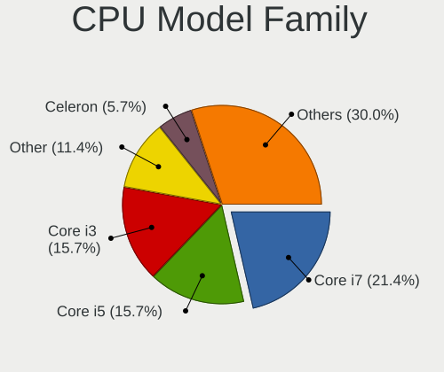

| Model            | Notebooks | Percent |
|------------------|-----------|---------|
| Intel Core i7    | 15        | 21.43%  |
| Intel Core i5    | 11        | 15.71%  |
| Intel Core i3    | 11        | 15.71%  |
| Other            | 8         | 11.43%  |
| Intel Celeron    | 4         | 5.71%   |
| AMD Ryzen 7      | 4         | 5.71%   |
| AMD Ryzen 5      | 4         | 5.71%   |
| AMD A10          | 3         | 4.29%   |
| Intel Pentium    | 2         | 2.86%   |
| Intel Core 2 Duo | 2         | 2.86%   |
| Intel Core 2     | 2         | 2.86%   |
| AMD A8           | 2         | 2.86%   |
| AMD Ryzen 3      | 1         | 1.43%   |
| AMD C-50         | 1         | 1.43%   |

CPU Cores
---------

Number of processor cores

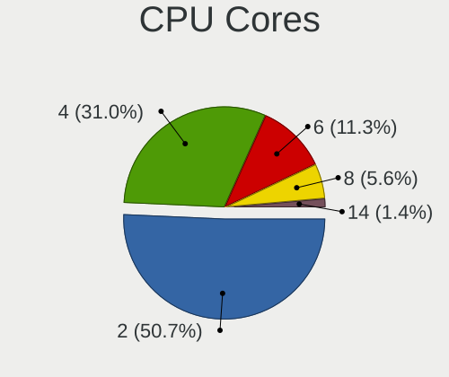

| Number | Notebooks | Percent |
|--------|-----------|---------|
| 2      | 36        | 50.7%   |
| 4      | 22        | 30.99%  |
| 6      | 8         | 11.27%  |
| 8      | 4         | 5.63%   |
| 14     | 1         | 1.41%   |

CPU Sockets
-----------

Number of sockets

| Number | Notebooks | Percent |
|--------|-----------|---------|
| 1      | 70        | 100%    |

CPU Threads
-----------

Threads per core (Hyper-Threading)

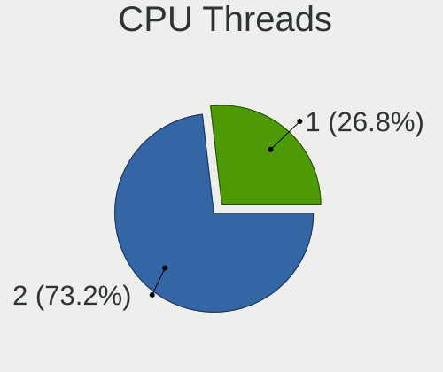

| Number | Notebooks | Percent |
|--------|-----------|---------|
| 2      | 55        | 78.57%  |
| 1      | 15        | 21.43%  |

CPU Op-Modes
------------

CPU Operation Modes (32-bit, 64-bit)

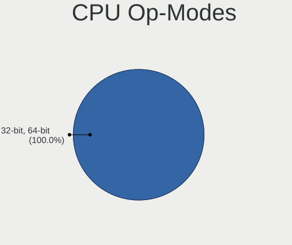

| Op mode        | Notebooks | Percent |
|----------------|-----------|---------|
| 32-bit, 64-bit | 70        | 100%    |

CPU Microcode
-------------

Microcode number

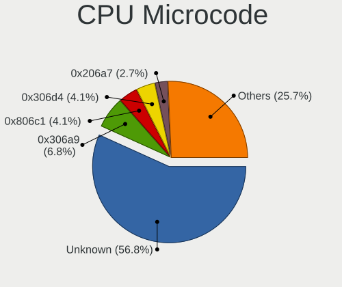

| Number     | Notebooks | Percent |
|------------|-----------|---------|
| Unknown    | 42        | 56.76%  |
| 0x306a9    | 5         | 6.76%   |
| 0x806c1    | 3         | 4.05%   |
| 0x306d4    | 3         | 4.05%   |
| 0x206a7    | 2         | 2.7%    |
| 0x07030105 | 2         | 2.7%    |
| 0x0600611a | 2         | 2.7%    |
| 0x906ea    | 1         | 1.35%   |
| 0x906a3    | 1         | 1.35%   |
| 0x806ea    | 1         | 1.35%   |
| 0x6f6      | 1         | 1.35%   |
| 0x406e3    | 1         | 1.35%   |
| 0x306c3    | 1         | 1.35%   |
| 0x20655    | 1         | 1.35%   |
| 0x10676    | 1         | 1.35%   |
| 0x0a704103 | 1         | 1.35%   |
| 0x0a500011 | 1         | 1.35%   |
| 0x0a404107 | 1         | 1.35%   |
| 0x08608103 | 1         | 1.35%   |
| 0x08608102 | 1         | 1.35%   |
| 0x06006705 | 1         | 1.35%   |
| 0x05000029 | 1         | 1.35%   |

CPU Microarch
-------------

Microarchitecture

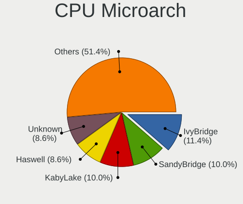

| Name             | Notebooks | Percent |
|------------------|-----------|---------|
| IvyBridge        | 8         | 11.43%  |
| SandyBridge      | 7         | 10%     |
| KabyLake         | 7         | 10%     |
| Haswell          | 6         | 8.57%   |
| Unknown          | 6         | 8.57%   |
| TigerLake        | 5         | 7.14%   |
| Broadwell        | 5         | 7.14%   |
| Excavator        | 4         | 5.71%   |
| CometLake        | 4         | 5.71%   |
| Core             | 3         | 4.29%   |
| Zen 3            | 2         | 2.86%   |
| Westmere         | 2         | 2.86%   |
| Puma             | 2         | 2.86%   |
| Zen+             | 1         | 1.43%   |
| Skylake          | 1         | 1.43%   |
| Silvermont       | 1         | 1.43%   |
| Piledriver       | 1         | 1.43%   |
| Penryn           | 1         | 1.43%   |
| IceLake          | 1         | 1.43%   |
| Goldmont plus    | 1         | 1.43%   |
| Bobcat           | 1         | 1.43%   |
| Alderlake Hybrid | 1         | 1.43%   |

Graphics
--------

GPU Vendor
----------

Vendors of graphics cards

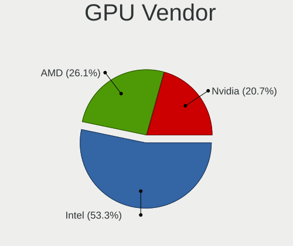

| Vendor | Notebooks | Percent |
|--------|-----------|---------|
| Intel  | 49        | 53.26%  |
| AMD    | 24        | 26.09%  |
| Nvidia | 19        | 20.65%  |

GPU Model
---------

Graphics card models

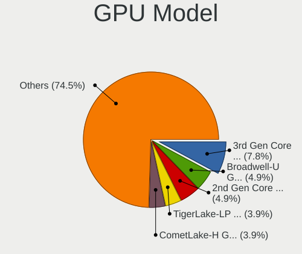

| Model                                                                                 | Notebooks | Percent |
|---------------------------------------------------------------------------------------|-----------|---------|
| Intel 3rd Gen Core processor Graphics Controller                                      | 8         | 7.84%   |
| Intel Broadwell-U GT2 [HD Graphics 5500]                                              | 5         | 4.9%    |
| Intel 2nd Generation Core Processor Family Integrated Graphics Controller             | 5         | 4.9%    |
| Intel TigerLake-LP GT2 [Iris Xe Graphics]                                             | 4         | 3.92%   |
| Intel CometLake-H GT2 [UHD Graphics]                                                  | 4         | 3.92%   |
| Intel 4th Gen Core Processor Integrated Graphics Controller                           | 4         | 3.92%   |
| Nvidia GP107GLM [Quadro P620]                                                         | 3         | 2.94%   |
| Intel Kaby Lake-R GT2 [UHD Graphics 620]                                              | 3         | 2.94%   |
| AMD Topaz XT [Radeon R7 M260/M265 / M340/M360 / M440/M445 / 530/535 / 620/625 Mobile] | 3         | 2.94%   |
| AMD Sun XT [Radeon HD 8670A/8670M/8690M / R5 M330 / M430 / Radeon 520 Mobile]         | 3         | 2.94%   |
| AMD Lucienne                                                                          | 3         | 2.94%   |
| Nvidia GF117M [GeForce 610M/710M/810M/820M / GT 620M/625M/630M/720M]                  | 2         | 1.96%   |
| Intel Mobile 945GM/GMS/GME, 943/940GML Express Integrated Graphics Controller         | 2         | 1.96%   |
| Intel Kaby Lake-U GT2 [HD Graphics 620]                                               | 2         | 1.96%   |
| Intel Haswell-ULT Integrated Graphics Controller                                      | 2         | 1.96%   |
| AMD Wani [Radeon R5/R6/R7 Graphics]                                                   | 2         | 1.96%   |
| AMD Thames [Radeon HD 7550M/7570M/7650M]                                              | 2         | 1.96%   |
| AMD Stoney [Radeon R2/R3/R4/R5 Graphics]                                              | 2         | 1.96%   |
| AMD Rembrandt [Radeon 680M]                                                           | 2         | 1.96%   |
| AMD Mullins [Radeon R4/R5 Graphics]                                                   | 2         | 1.96%   |
| Nvidia TU117M [GeForce GTX 1650 Ti Mobile]                                            | 1         | 0.98%   |
| Nvidia GT218M [GeForce 315M]                                                          | 1         | 0.98%   |
| Nvidia GP108M [GeForce MX150]                                                         | 1         | 0.98%   |
| Nvidia GP106M [GeForce GTX 1060 Mobile]                                               | 1         | 0.98%   |
| Nvidia GM107M [GeForce GTX 960M]                                                      | 1         | 0.98%   |
| Nvidia GM107M [GeForce GTX 860M]                                                      | 1         | 0.98%   |
| Nvidia GK208M [GeForce GT 740M]                                                       | 1         | 0.98%   |
| Nvidia GK208BM [GeForce 920M]                                                         | 1         | 0.98%   |
| Nvidia GF108M [GeForce GT 635M]                                                       | 1         | 0.98%   |
| Nvidia GF108M [GeForce GT 525M]                                                       | 1         | 0.98%   |
| Nvidia GF108M [GeForce GT 420M]                                                       | 1         | 0.98%   |
| Nvidia GA107M [GeForce RTX 3050 Ti Mobile]                                            | 1         | 0.98%   |
| Nvidia G98M [GeForce 9300M GS]                                                        | 1         | 0.98%   |
| Nvidia AD107M [GeForce RTX 4050 Max-Q / Mobile]                                       | 1         | 0.98%   |
| Intel WhiskeyLake-U GT2 [UHD Graphics 620]                                            | 1         | 0.98%   |
| Intel Tiger Lake-LP GT2 [UHD Graphics G4]                                             | 1         | 0.98%   |
| Intel Mobile GM965/GL960 Integrated Graphics Controller (secondary)                   | 1         | 0.98%   |
| Intel Mobile GM965/GL960 Integrated Graphics Controller (primary)                     | 1         | 0.98%   |
| Intel Mobile 945GSE Express Integrated Graphics Controller                            | 1         | 0.98%   |
| Intel Mobile 945GM/GMS, 943/940GML Express Integrated Graphics Controller             | 1         | 0.98%   |

GPU Combo
---------

Combinations of graphics cards

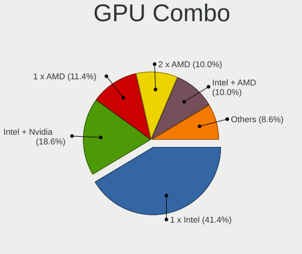

| Name           | Notebooks | Percent |
|----------------|-----------|---------|
| 1 x Intel      | 29        | 41.43%  |
| Intel + Nvidia | 13        | 18.57%  |
| 1 x AMD        | 8         | 11.43%  |
| 2 x AMD        | 7         | 10%     |
| Intel + AMD    | 7         | 10%     |
| 1 x Nvidia     | 4         | 5.71%   |
| AMD + Nvidia   | 2         | 2.86%   |

GPU Driver
----------

Free vs proprietary

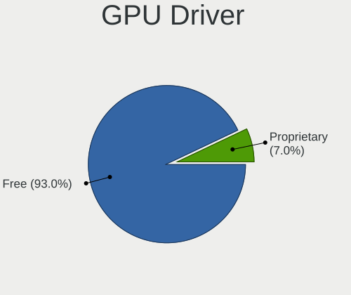

| Driver      | Notebooks | Percent |
|-------------|-----------|---------|
| Free        | 66        | 92.96%  |
| Proprietary | 5         | 7.04%   |

GPU Memory
----------

Total video memory

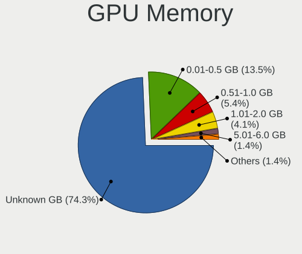

| Size in GB | Notebooks | Percent |
|------------|-----------|---------|
| Unknown    | 55        | 74.32%  |
| 0.01-0.5   | 10        | 13.51%  |
| 0.51-1.0   | 4         | 5.41%   |
| 1.01-2.0   | 3         | 4.05%   |
| 5.01-6.0   | 1         | 1.35%   |
| 3.01-4.0   | 1         | 1.35%   |

Monitor
-------

Monitor Vendor
--------------

Monitor vendors

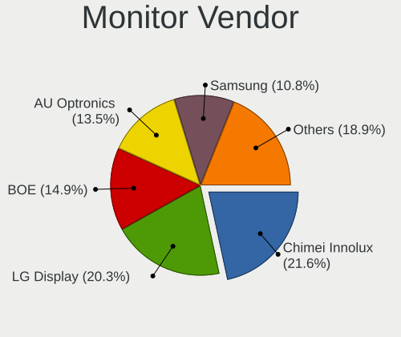

| Vendor                  | Notebooks | Percent |
|-------------------------|-----------|---------|
| Chimei Innolux          | 16        | 21.62%  |
| LG Display              | 15        | 20.27%  |
| BOE                     | 11        | 14.86%  |
| AU Optronics            | 10        | 13.51%  |
| Samsung Electronics     | 8         | 10.81%  |
| Philips                 | 3         | 4.05%   |
| LG Philips              | 2         | 2.7%    |
| Chi Mei Optoelectronics | 2         | 2.7%    |
| Sharp                   | 1         | 1.35%   |
| PANDA                   | 1         | 1.35%   |
| Lenovo                  | 1         | 1.35%   |
| Hewlett-Packard         | 1         | 1.35%   |
| Goldstar                | 1         | 1.35%   |
| Dell                    | 1         | 1.35%   |
| AOC                     | 1         | 1.35%   |

Monitor Model
-------------

Monitor models

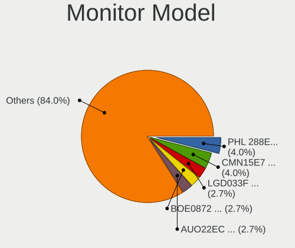

| Model                                                                 | Notebooks | Percent |
|-----------------------------------------------------------------------|-----------|---------|
| Philips PHL 288E2 PHLC231 3840x2160 621x341mm 27.9-inch               | 3         | 4%      |
| Chimei Innolux LCD Monitor CMN15E7 1920x1080 344x193mm 15.5-inch      | 3         | 4%      |
| LG Display LCD Monitor LGD033F 1366x768 310x174mm 14.0-inch           | 2         | 2.67%   |
| BOE LCD Monitor BOE0872 1920x1080 344x194mm 15.5-inch                 | 2         | 2.67%   |
| AU Optronics LCD Monitor AUO22EC 1366x768 344x193mm 15.5-inch         | 2         | 2.67%   |
| Sharp LCD Monitor SHP1447 1920x1080 294x165mm 13.3-inch               | 1         | 1.33%   |
| Samsung Electronics SyncMaster SAM01B7 1280x1024 340x270mm 17.1-inch  | 1         | 1.33%   |
| Samsung Electronics LCD Monitor SEC5541 1366x768 344x193mm 15.5-inch  | 1         | 1.33%   |
| Samsung Electronics LCD Monitor SEC5441 1280x800 331x207mm 15.4-inch  | 1         | 1.33%   |
| Samsung Electronics LCD Monitor SEC4251 1366x768 344x194mm 15.5-inch  | 1         | 1.33%   |
| Samsung Electronics LCD Monitor SEC324A 1366x768 344x194mm 15.5-inch  | 1         | 1.33%   |
| Samsung Electronics LCD Monitor SEC3150 1366x768 344x193mm 15.5-inch  | 1         | 1.33%   |
| Samsung Electronics LCD Monitor SEC304C 1366x768 353x198mm 15.9-inch  | 1         | 1.33%   |
| Samsung Electronics LCD Monitor SDC4951 1366x768 344x194mm 15.5-inch  | 1         | 1.33%   |
| Samsung Electronics LCD Monitor SDC4180 2880x1620 344x194mm 15.5-inch | 1         | 1.33%   |
| PANDA LCD Monitor NCP006E 1920x1080 344x194mm 15.5-inch               | 1         | 1.33%   |
| LG Philips LCD Monitor LPLDB00 1280x800 331x207mm 15.4-inch           | 1         | 1.33%   |
| LG Philips LCD Monitor LPL1146 1280x800 331x207mm 15.4-inch           | 1         | 1.33%   |
| LG Display LCD Monitor LGD053F 1920x1080 344x194mm 15.5-inch          | 1         | 1.33%   |
| LG Display LCD Monitor LGD0493 1366x768 344x194mm 15.5-inch           | 1         | 1.33%   |
| LG Display LCD Monitor LGD048A 1920x1080 276x156mm 12.5-inch          | 1         | 1.33%   |
| LG Display LCD Monitor LGD0470 1920x1080 345x194mm 15.6-inch          | 1         | 1.33%   |
| LG Display LCD Monitor LGD0469 1920x1080 382x215mm 17.3-inch          | 1         | 1.33%   |
| LG Display LCD Monitor LGD0468 1366x768 344x194mm 15.5-inch           | 1         | 1.33%   |
| LG Display LCD Monitor LGD0456 1366x768 344x194mm 15.5-inch           | 1         | 1.33%   |
| LG Display LCD Monitor LGD0414 1920x1080 276x156mm 12.5-inch          | 1         | 1.33%   |
| LG Display LCD Monitor LGD0395 1366x768 344x194mm 15.5-inch           | 1         | 1.33%   |
| LG Display LCD Monitor LGD0384 1366x768 344x194mm 15.5-inch           | 1         | 1.33%   |
| LG Display LCD Monitor LGD033A 1366x768 344x194mm 15.5-inch           | 1         | 1.33%   |
| LG Display LCD Monitor LGD02DC 1366x768 344x194mm 15.5-inch           | 1         | 1.33%   |
| LG Display LCD Monitor LGD0250 1366x768 345x194mm 15.6-inch           | 1         | 1.33%   |
| Lenovo LCD Monitor LEN40BA 1920x1080 344x194mm 15.5-inch              | 1         | 1.33%   |
| Hewlett-Packard E24 G4 HPN3689 1920x1080 527x296mm 23.8-inch          | 1         | 1.33%   |
| Goldstar 2D HD TV GSM59CA 1366x768 509x286mm 23.0-inch                | 1         | 1.33%   |
| Dell U2412M DELA07A 1920x1200 518x324mm 24.1-inch                     | 1         | 1.33%   |
| Chimei Innolux LCD Monitor CMN162D 1920x1080 355x199mm 16.0-inch      | 1         | 1.33%   |
| Chimei Innolux LCD Monitor CMN15F5 1920x1080 344x193mm 15.5-inch      | 1         | 1.33%   |
| Chimei Innolux LCD Monitor CMN15E6 1366x768 344x193mm 15.5-inch       | 1         | 1.33%   |
| Chimei Innolux LCD Monitor CMN15DB 1366x768 344x193mm 15.5-inch       | 1         | 1.33%   |
| Chimei Innolux LCD Monitor CMN15C9 1366x768 344x193mm 15.5-inch       | 1         | 1.33%   |

Monitor Resolution
------------------

Monitor screen resolution

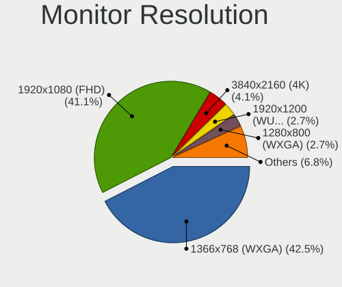

| Resolution        | Notebooks | Percent |
|-------------------|-----------|---------|
| 1366x768 (WXGA)   | 31        | 42.47%  |
| 1920x1080 (FHD)   | 30        | 41.1%   |
| 3840x2160 (4K)    | 3         | 4.11%   |
| 1920x1200 (WUXGA) | 2         | 2.74%   |
| 1280x800 (WXGA)   | 2         | 2.74%   |
| 2880x1620         | 1         | 1.37%   |
| 2160x1440         | 1         | 1.37%   |
| 1600x900 (HD+)    | 1         | 1.37%   |
| 1440x900 (WXGA+)  | 1         | 1.37%   |
| 1280x1024 (SXGA)  | 1         | 1.37%   |

Monitor Diagonal
----------------

Diagonal size in inches

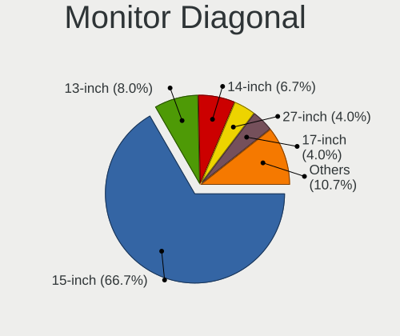

| Inches | Notebooks | Percent |
|--------|-----------|---------|
| 15     | 50        | 66.67%  |
| 13     | 6         | 8%      |
| 14     | 5         | 6.67%   |
| 27     | 3         | 4%      |
| 17     | 3         | 4%      |
| 24     | 2         | 2.67%   |
| 16     | 2         | 2.67%   |
| 12     | 2         | 2.67%   |
| 23     | 1         | 1.33%   |
| 22     | 1         | 1.33%   |

Monitor Width
-------------

Physical width

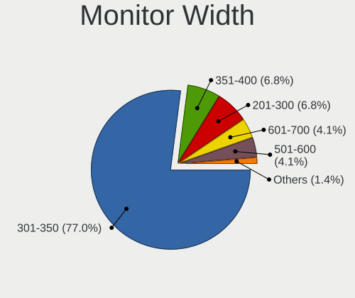

| Width in mm | Notebooks | Percent |
|-------------|-----------|---------|
| 301-350     | 57        | 77.03%  |
| 351-400     | 5         | 6.76%   |
| 201-300     | 5         | 6.76%   |
| 601-700     | 3         | 4.05%   |
| 501-600     | 3         | 4.05%   |
| 401-500     | 1         | 1.35%   |

Aspect Ratio
------------

Proportional relationship between the width and the height

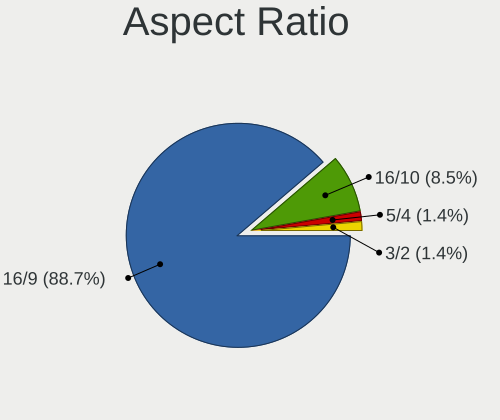

| Ratio | Notebooks | Percent |
|-------|-----------|---------|
| 16/9  | 63        | 88.73%  |
| 16/10 | 6         | 8.45%   |
| 5/4   | 1         | 1.41%   |
| 3/2   | 1         | 1.41%   |

Monitor Area
------------

Area in inch²

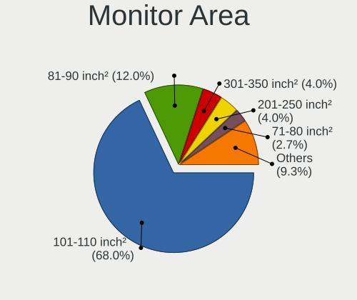

| Area in inch² | Notebooks | Percent |
|----------------|-----------|---------|
| 101-110        | 51        | 68%     |
| 81-90          | 9         | 12%     |
| 301-350        | 3         | 4%      |
| 201-250        | 3         | 4%      |
| 71-80          | 2         | 2.67%   |
| 61-70          | 2         | 2.67%   |
| 251-300        | 1         | 1.33%   |
| 141-150        | 1         | 1.33%   |
| 131-140        | 1         | 1.33%   |
| 121-130        | 1         | 1.33%   |
| 111-120        | 1         | 1.33%   |

Pixel Density
-------------

Pixels per inch

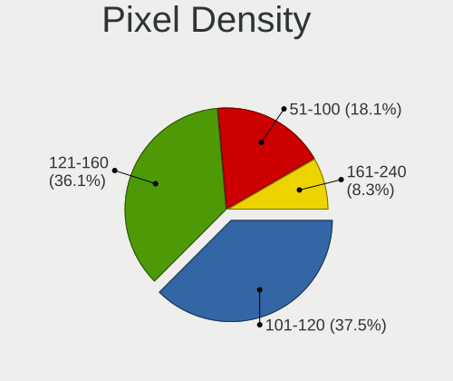

| Density | Notebooks | Percent |
|---------|-----------|---------|
| 101-120 | 27        | 37.5%   |
| 121-160 | 26        | 36.11%  |
| 51-100  | 13        | 18.06%  |
| 161-240 | 6         | 8.33%   |

Multiple Monitors
-----------------

Total monitors connected

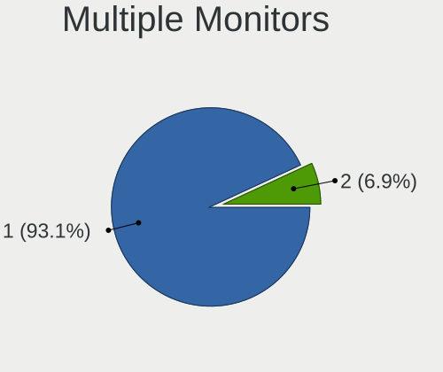

| Total | Notebooks | Percent |
|-------|-----------|---------|
| 1     | 63        | 90%     |
| 2     | 7         | 10%     |

Network
-------

Net Controller Vendor
---------------------

Controller vendors

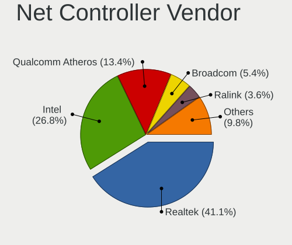

| Vendor                | Notebooks | Percent |
|-----------------------|-----------|---------|
| Realtek Semiconductor | 46        | 41.07%  |
| Intel                 | 30        | 26.79%  |
| Qualcomm Atheros      | 15        | 13.39%  |
| Broadcom              | 6         | 5.36%   |
| Ralink                | 4         | 3.57%   |
| MediaTek              | 4         | 3.57%   |
| ASUSTek Computer      | 3         | 2.68%   |
| Xiaomi                | 1         | 0.89%   |
| Ralink Technology     | 1         | 0.89%   |
| QinHeng Electronics   | 1         | 0.89%   |
| JMicron Technology    | 1         | 0.89%   |

Net Controller Model
--------------------

Controller models

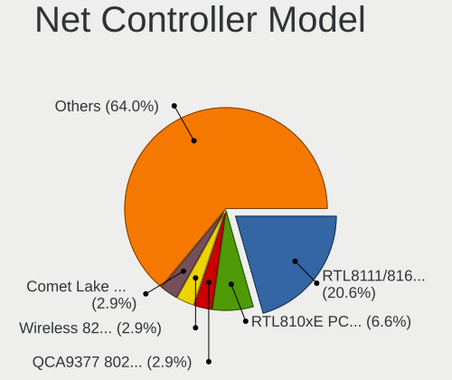

| Model                                                                  | Notebooks | Percent |
|------------------------------------------------------------------------|-----------|---------|
| Realtek RTL8111/8168/8211/8411 PCI Express Gigabit Ethernet Controller | 28        | 20.59%  |
| Realtek RTL810xE PCI Express Fast Ethernet controller                  | 9         | 6.62%   |
| Qualcomm Atheros QCA9377 802.11ac Wireless Network Adapter             | 4         | 2.94%   |
| Intel Wireless 8265 / 8275                                             | 4         | 2.94%   |
| Intel Comet Lake PCH CNVi WiFi                                         | 4         | 2.94%   |
| Realtek RTL8822CE 802.11ac PCIe Wireless Network Adapter               | 3         | 2.21%   |
| Realtek RTL8821CE 802.11ac PCIe Wireless Network Adapter               | 3         | 2.21%   |
| Realtek RTL8723BE PCIe Wireless Network Adapter                        | 3         | 2.21%   |
| Intel Wi-Fi 6 AX201                                                    | 3         | 2.21%   |
| Intel PRO/Wireless 3945ABG [Golan] Network Connection                  | 3         | 2.21%   |
| Intel Ethernet Connection (11) I219-V                                  | 3         | 2.21%   |
| Realtek RTL8852BE PCIe 802.11ax Wireless Network Controller            | 2         | 1.47%   |
| Ralink RT3290 Wireless 802.11n 1T/1R PCIe                              | 2         | 1.47%   |
| Qualcomm Atheros QCA6174 802.11ac Wireless Network Adapter             | 2         | 1.47%   |
| Qualcomm Atheros AR9485 Wireless Network Adapter                       | 2         | 1.47%   |
| Qualcomm Atheros AR9285 Wireless Network Adapter (PCI-Express)         | 2         | 1.47%   |
| Qualcomm Atheros AR8151 v2.0 Gigabit Ethernet                          | 2         | 1.47%   |
| MediaTek MT7922 802.11ax PCI Express Wireless Network Adapter          | 2         | 1.47%   |
| Intel Wireless 7265                                                    | 2         | 1.47%   |
| Intel Wireless 7260                                                    | 2         | 1.47%   |
| Intel Centrino Wireless-N 2230                                         | 2         | 1.47%   |
| Broadcom NetLink BCM57780 Gigabit Ethernet PCIe                        | 2         | 1.47%   |
| Broadcom BCM43142 802.11b/g/n                                          | 2         | 1.47%   |
| Broadcom BCM4313 802.11bgn Wireless Network Adapter                    | 2         | 1.47%   |
| Xiaomi Mi/Redmi series (RNDIS)                                         | 1         | 0.74%   |
| Realtek RTL8821AE 802.11ac PCIe Wireless Network Adapter               | 1         | 0.74%   |
| Realtek RTL8723AE PCIe Wireless Network Adapter                        | 1         | 0.74%   |
| Realtek RTL8192CU 802.11n WLAN Adapter                                 | 1         | 0.74%   |
| Realtek RTL8188EE Wireless Network Adapter                             | 1         | 0.74%   |
| Realtek RTL8188CUS 802.11n WLAN Adapter                                | 1         | 0.74%   |
| Realtek RTL8188CE 802.11b/g/n WiFi Adapter                             | 1         | 0.74%   |
| Realtek RTL8153 Gigabit Ethernet Adapter                               | 1         | 0.74%   |
| Realtek RTL8152 Fast Ethernet Adapter                                  | 1         | 0.74%   |
| Realtek RTL-8100/8101L/8139 PCI Fast Ethernet Adapter                  | 1         | 0.74%   |
| Realtek Killer E2600 GbE Controller                                    | 1         | 0.74%   |
| Ralink RT2870/RT3070 Wireless Adapter                                  | 1         | 0.74%   |
| Ralink RT5390 Wireless 802.11n 1T/1R PCIe                              | 1         | 0.74%   |
| Ralink RT3090 Wireless 802.11n 1T/1R PCIe                              | 1         | 0.74%   |
| Qualcomm Atheros QCA9565 / AR9565 Wireless Network Adapter             | 1         | 0.74%   |
| Qualcomm Atheros QCA8172 Fast Ethernet                                 | 1         | 0.74%   |

Wireless Vendor
---------------

Wireless vendors

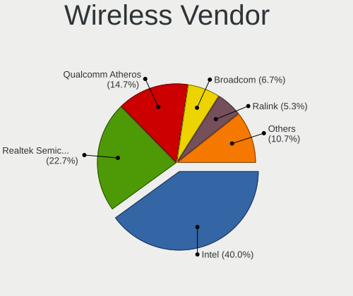

| Vendor                | Notebooks | Percent |
|-----------------------|-----------|---------|
| Intel                 | 30        | 40%     |
| Realtek Semiconductor | 17        | 22.67%  |
| Qualcomm Atheros      | 11        | 14.67%  |
| Broadcom              | 5         | 6.67%   |
| Ralink                | 4         | 5.33%   |
| MediaTek              | 4         | 5.33%   |
| ASUSTek Computer      | 3         | 4%      |
| Ralink Technology     | 1         | 1.33%   |

Wireless Model
--------------

Wireless models

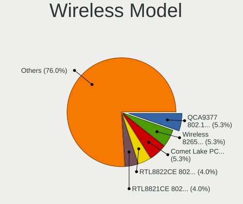

| Model                                                                | Notebooks | Percent |
|----------------------------------------------------------------------|-----------|---------|
| Qualcomm Atheros QCA9377 802.11ac Wireless Network Adapter           | 4         | 5.33%   |
| Intel Wireless 8265 / 8275                                           | 4         | 5.33%   |
| Intel Comet Lake PCH CNVi WiFi                                       | 4         | 5.33%   |
| Realtek RTL8822CE 802.11ac PCIe Wireless Network Adapter             | 3         | 4%      |
| Realtek RTL8821CE 802.11ac PCIe Wireless Network Adapter             | 3         | 4%      |
| Realtek RTL8723BE PCIe Wireless Network Adapter                      | 3         | 4%      |
| Intel Wi-Fi 6 AX201                                                  | 3         | 4%      |
| Intel PRO/Wireless 3945ABG [Golan] Network Connection                | 3         | 4%      |
| Realtek RTL8852BE PCIe 802.11ax Wireless Network Controller          | 2         | 2.67%   |
| Ralink RT3290 Wireless 802.11n 1T/1R PCIe                            | 2         | 2.67%   |
| Qualcomm Atheros QCA6174 802.11ac Wireless Network Adapter           | 2         | 2.67%   |
| Qualcomm Atheros AR9485 Wireless Network Adapter                     | 2         | 2.67%   |
| Qualcomm Atheros AR9285 Wireless Network Adapter (PCI-Express)       | 2         | 2.67%   |
| MediaTek MT7922 802.11ax PCI Express Wireless Network Adapter        | 2         | 2.67%   |
| Intel Wireless 7265                                                  | 2         | 2.67%   |
| Intel Wireless 7260                                                  | 2         | 2.67%   |
| Intel Centrino Wireless-N 2230                                       | 2         | 2.67%   |
| Broadcom BCM43142 802.11b/g/n                                        | 2         | 2.67%   |
| Broadcom BCM4313 802.11bgn Wireless Network Adapter                  | 2         | 2.67%   |
| Realtek RTL8821AE 802.11ac PCIe Wireless Network Adapter             | 1         | 1.33%   |
| Realtek RTL8723AE PCIe Wireless Network Adapter                      | 1         | 1.33%   |
| Realtek RTL8192CU 802.11n WLAN Adapter                               | 1         | 1.33%   |
| Realtek RTL8188EE Wireless Network Adapter                           | 1         | 1.33%   |
| Realtek RTL8188CUS 802.11n WLAN Adapter                              | 1         | 1.33%   |
| Realtek RTL8188CE 802.11b/g/n WiFi Adapter                           | 1         | 1.33%   |
| Ralink RT2870/RT3070 Wireless Adapter                                | 1         | 1.33%   |
| Ralink RT5390 Wireless 802.11n 1T/1R PCIe                            | 1         | 1.33%   |
| Ralink RT3090 Wireless 802.11n 1T/1R PCIe                            | 1         | 1.33%   |
| Qualcomm Atheros QCA9565 / AR9565 Wireless Network Adapter           | 1         | 1.33%   |
| MediaTek MT7921 802.11ax PCIe Wireless Network Adapter [Filogic 330] | 1         | 1.33%   |
| MediaTek MT7902 802.11ax PCIe Wireless Network Adapter [Filogic 310] | 1         | 1.33%   |
| Intel Wireless 3160                                                  | 1         | 1.33%   |
| Intel WiFi Link 5100                                                 | 1         | 1.33%   |
| Intel Ice Lake-LP PCH CNVi WiFi                                      | 1         | 1.33%   |
| Intel Dual Band Wireless-AC 3165 Plus Bluetooth                      | 1         | 1.33%   |
| Intel Centrino Wireless-N 130                                        | 1         | 1.33%   |
| Intel Centrino Ultimate-N 6300                                       | 1         | 1.33%   |
| Intel Centrino Advanced-N 6235                                       | 1         | 1.33%   |
| Intel Centrino Advanced-N 6200                                       | 1         | 1.33%   |
| Intel Cannon Lake PCH CNVi WiFi                                      | 1         | 1.33%   |

Ethernet Vendor
---------------

Ethernet vendors

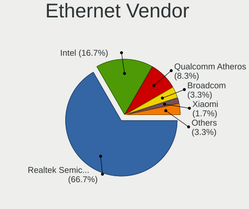

| Vendor                | Notebooks | Percent |
|-----------------------|-----------|---------|
| Realtek Semiconductor | 40        | 66.67%  |
| Intel                 | 10        | 16.67%  |
| Qualcomm Atheros      | 5         | 8.33%   |
| Broadcom              | 2         | 3.33%   |
| Xiaomi                | 1         | 1.67%   |
| QinHeng Electronics   | 1         | 1.67%   |
| JMicron Technology    | 1         | 1.67%   |

Ethernet Model
--------------

Ethernet models

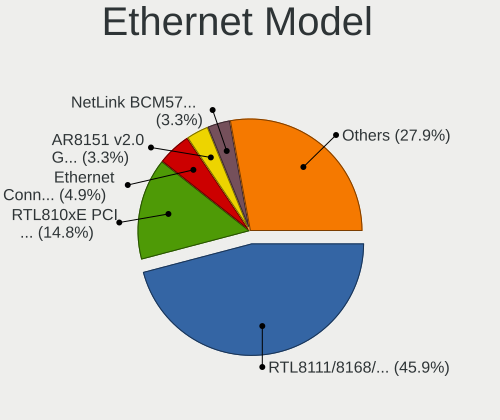

| Model                                                                  | Notebooks | Percent |
|------------------------------------------------------------------------|-----------|---------|
| Realtek RTL8111/8168/8211/8411 PCI Express Gigabit Ethernet Controller | 28        | 45.9%   |
| Realtek RTL810xE PCI Express Fast Ethernet controller                  | 9         | 14.75%  |
| Intel Ethernet Connection (11) I219-V                                  | 3         | 4.92%   |
| Qualcomm Atheros AR8151 v2.0 Gigabit Ethernet                          | 2         | 3.28%   |
| Broadcom NetLink BCM57780 Gigabit Ethernet PCIe                        | 2         | 3.28%   |
| Xiaomi Mi/Redmi series (RNDIS)                                         | 1         | 1.64%   |
| Realtek RTL8153 Gigabit Ethernet Adapter                               | 1         | 1.64%   |
| Realtek RTL8152 Fast Ethernet Adapter                                  | 1         | 1.64%   |
| Realtek RTL-8100/8101L/8139 PCI Fast Ethernet Adapter                  | 1         | 1.64%   |
| Realtek Killer E2600 GbE Controller                                    | 1         | 1.64%   |
| Qualcomm Atheros QCA8172 Fast Ethernet                                 | 1         | 1.64%   |
| Qualcomm Atheros AR8161 Gigabit Ethernet                               | 1         | 1.64%   |
| Qualcomm Atheros AR8121/AR8113/AR8114 Gigabit or Fast Ethernet         | 1         | 1.64%   |
| QinHeng USB 10/100 LAN                                                 | 1         | 1.64%   |
| JMicron JMC250 PCI Express Gigabit Ethernet Controller                 | 1         | 1.64%   |
| Intel Ethernet Connection I217-LM                                      | 1         | 1.64%   |
| Intel Ethernet Connection (4) I219-V                                   | 1         | 1.64%   |
| Intel Ethernet Connection (4) I219-LM                                  | 1         | 1.64%   |
| Intel Ethernet Connection (3) I218-V                                   | 1         | 1.64%   |
| Intel Ethernet Connection (3) I218-LM                                  | 1         | 1.64%   |
| Intel 82577LC Gigabit Network Connection                               | 1         | 1.64%   |
| Intel 82562ET/EZ/GT/GZ - PRO/100 VE (LOM) Ethernet Controller Mobile   | 1         | 1.64%   |

Net Controller Kind
-------------------

Ethernet, WiFi or modem

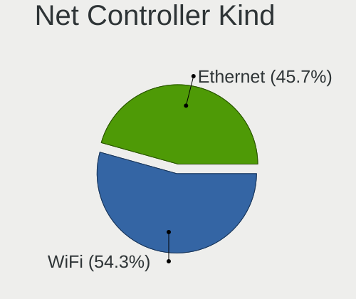

| Kind     | Notebooks | Percent |
|----------|-----------|---------|
| WiFi     | 69        | 54.33%  |
| Ethernet | 58        | 45.67%  |

Used Controller
---------------

Currently used network controller

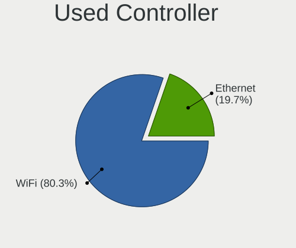

| Kind     | Notebooks | Percent |
|----------|-----------|---------|
| WiFi     | 61        | 80.26%  |
| Ethernet | 15        | 19.74%  |

NICs
----

Total network controllers on board

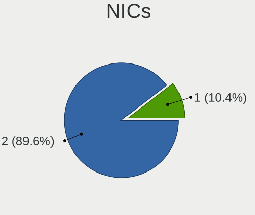

| Total | Notebooks | Percent |
|-------|-----------|---------|
| 2     | 56        | 80%     |
| 1     | 14        | 20%     |

IPv6
----

IPv6 vs IPv4

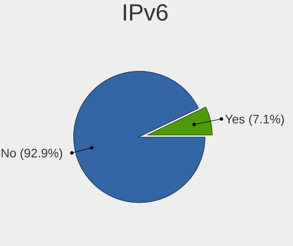

| Used | Notebooks | Percent |
|------|-----------|---------|
| No   | 65        | 92.86%  |
| Yes  | 5         | 7.14%   |

Bluetooth
---------

Bluetooth Vendor
----------------

Controller vendors

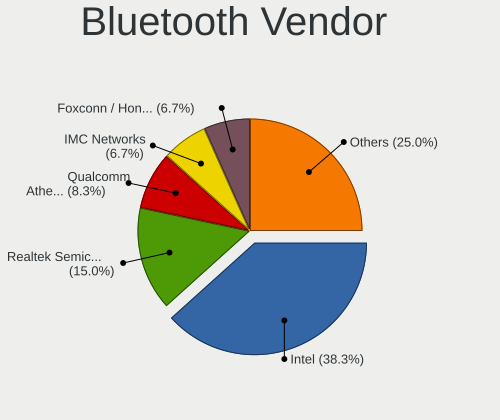

| Vendor                          | Notebooks | Percent |
|---------------------------------|-----------|---------|
| Intel                           | 23        | 38.33%  |
| Realtek Semiconductor           | 9         | 15%     |
| Qualcomm Atheros Communications | 5         | 8.33%   |
| IMC Networks                    | 4         | 6.67%   |
| Foxconn / Hon Hai               | 4         | 6.67%   |
| Lite-On Technology              | 3         | 5%      |
| Broadcom                        | 3         | 5%      |
| Toshiba                         | 2         | 3.33%   |
| Realtek                         | 2         | 3.33%   |
| Ralink                          | 2         | 3.33%   |
| Cambridge Silicon Radio         | 2         | 3.33%   |
| Foxconn International           | 1         | 1.67%   |

Bluetooth Model
---------------

Controller models

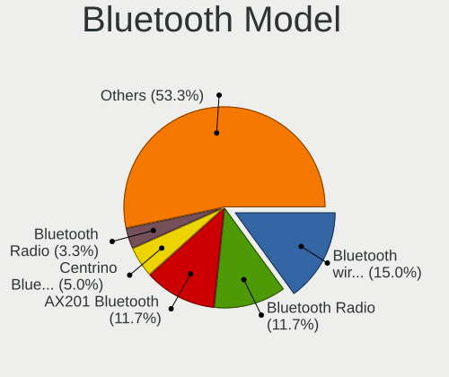

| Model                                               | Notebooks | Percent |
|-----------------------------------------------------|-----------|---------|
| Intel Bluetooth wireless interface                  | 9         | 15%     |
| Realtek Bluetooth Radio                             | 7         | 11.67%  |
| Intel AX201 Bluetooth                               | 7         | 11.67%  |
| Intel Centrino Bluetooth Wireless Transceiver       | 3         | 5%      |
| Realtek Bluetooth Radio                             | 2         | 3.33%   |
| Ralink RT3290 Bluetooth                             | 2         | 3.33%   |
| Qualcomm Atheros  Bluetooth Device                  | 2         | 3.33%   |
| Qualcomm Atheros AR3011 Bluetooth                   | 2         | 3.33%   |
| Lite-On Qualcomm Atheros QCA9377 Bluetooth          | 2         | 3.33%   |
| Intel Bluetooth 9460/9560 Jefferson Peak (JfP)      | 2         | 3.33%   |
| IMC Networks Wireless_Device                        | 2         | 3.33%   |
| Foxconn / Hon Hai Wireless_Device                   | 2         | 3.33%   |
| Cambridge Silicon Radio Bluetooth Dongle (HCI mode) | 2         | 3.33%   |
| Broadcom HP Portable Valentine                      | 2         | 3.33%   |
| Toshiba RT Bluetooth Radio                          | 1         | 1.67%   |
| Toshiba Integrated Bluetooth HCI                    | 1         | 1.67%   |
| Realtek RTL8821A Bluetooth                          | 1         | 1.67%   |
| Realtek RTL8723B Bluetooth                          | 1         | 1.67%   |
| Qualcomm Atheros AR3012 Bluetooth 4.0               | 1         | 1.67%   |
| Lite-On Atheros AR3012 Bluetooth                    | 1         | 1.67%   |
| Intel Centrino Advanced-N 6230 Bluetooth adapter    | 1         | 1.67%   |
| Intel Bluetooth Device                              | 1         | 1.67%   |
| IMC Networks Bluetooth Radio                        | 1         | 1.67%   |
| IMC Networks Bluetooth Device                       | 1         | 1.67%   |
| Foxconn International BCM43142A0 Bluetooth module   | 1         | 1.67%   |
| Foxconn / Hon Hai Bluetooth Device                  | 1         | 1.67%   |
| Foxconn / Hon Hai BCM43142A0                        | 1         | 1.67%   |
| Broadcom BCM2045 Bluetooth                          | 1         | 1.67%   |

Sound
-----

Sound Vendor
------------

Sound card vendors

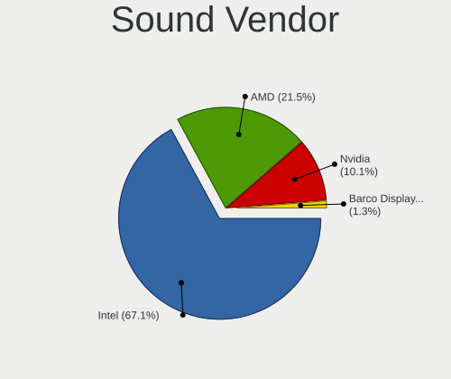

| Vendor                | Notebooks | Percent |
|-----------------------|-----------|---------|
| Intel                 | 53        | 67.09%  |
| AMD                   | 17        | 21.52%  |
| Nvidia                | 8         | 10.13%  |
| Barco Display Systems | 1         | 1.27%   |

Sound Model
-----------

Sound card models

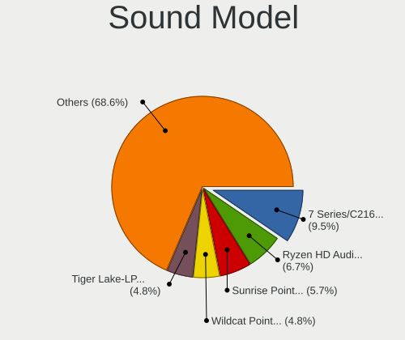

| Model                                                                                             | Notebooks | Percent |
|---------------------------------------------------------------------------------------------------|-----------|---------|
| Intel 7 Series/C216 Chipset Family High Definition Audio Controller                               | 10        | 9.52%   |
| AMD Ryzen HD Audio Controller                                                                     | 7         | 6.67%   |
| Intel Sunrise Point-LP HD Audio                                                                   | 6         | 5.71%   |
| Intel Wildcat Point-LP High Definition Audio Controller                                           | 5         | 4.76%   |
| Intel Tiger Lake-LP Smart Sound Technology Audio Controller                                       | 5         | 4.76%   |
| Intel Broadwell-U Audio Controller                                                                | 5         | 4.76%   |
| Intel 6 Series/C200 Series Chipset Family High Definition Audio Controller                        | 5         | 4.76%   |
| AMD Renoir/Cezanne HDMI/DP Audio Controller                                                       | 5         | 4.76%   |
| Intel Xeon E3-1200 v3/4th Gen Core Processor HD Audio Controller                                  | 4         | 3.81%   |
| Intel Comet Lake PCH cAVS                                                                         | 4         | 3.81%   |
| Intel 8 Series/C220 Series Chipset High Definition Audio Controller                               | 4         | 3.81%   |
| AMD Kabini HDMI/DP Audio                                                                          | 4         | 3.81%   |
| AMD Family 15h (Models 60h-6fh) Audio Controller                                                  | 4         | 3.81%   |
| Nvidia GF108 High Definition Audio Controller                                                     | 3         | 2.86%   |
| AMD Radeon High Definition Audio Controller                                                       | 3         | 2.86%   |
| AMD FCH Azalia Controller                                                                         | 3         | 2.86%   |
| Intel NM10/ICH7 Family High Definition Audio Controller                                           | 2         | 1.9%    |
| Intel Haswell-ULT HD Audio Controller                                                             | 2         | 1.9%    |
| Intel 8 Series HD Audio Controller                                                                | 2         | 1.9%    |
| Intel 5 Series/3400 Series Chipset High Definition Audio                                          | 2         | 1.9%    |
| AMD High Definition Audio Controller                                                              | 2         | 1.9%    |
| Nvidia TU107 GeForce GTX 1650 High Definition Audio Controller                                    | 1         | 0.95%   |
| Nvidia High Definition Audio Controller                                                           | 1         | 0.95%   |
| Nvidia GK208 HDMI/DP Audio Controller                                                             | 1         | 0.95%   |
| Nvidia GA107 High Definition Audio Controller                                                     | 1         | 0.95%   |
| Nvidia AD107 High Definition Audio Controller                                                     | 1         | 0.95%   |
| Intel Ice Lake-LP Smart Sound Technology Audio Controller                                         | 1         | 0.95%   |
| Intel Celeron/Pentium Silver Processor High Definition Audio                                      | 1         | 0.95%   |
| Intel Cannon Point-LP High Definition Audio Controller                                            | 1         | 0.95%   |
| Intel Cannon Lake PCH cAVS                                                                        | 1         | 0.95%   |
| Intel Atom/Celeron/Pentium Processor x5-E8000/J3xxx/N3xxx Series High Definition Audio Controller | 1         | 0.95%   |
| Intel Alder Lake PCH-P High Definition Audio Controller                                           | 1         | 0.95%   |
| Intel 82801I (ICH9 Family) HD Audio Controller                                                    | 1         | 0.95%   |
| Intel 82801H (ICH8 Family) HD Audio Controller                                                    | 1         | 0.95%   |
| Barco Display Systems USBGH520-ENC                                                                | 1         | 0.95%   |
| AMD Wrestler HDMI Audio                                                                           | 1         | 0.95%   |
| AMD Trinity HDMI Audio Controller                                                                 | 1         | 0.95%   |
| AMD SBx00 Azalia (Intel HDA)                                                                      | 1         | 0.95%   |
| AMD Raven/Raven2/Fenghuang HDMI/DP Audio Controller                                               | 1         | 0.95%   |

Memory
------

Memory Vendor
-------------

Memory module vendors

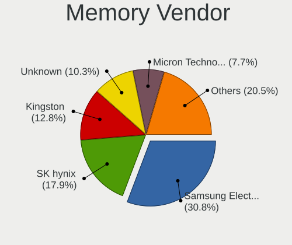

| Vendor              | Notebooks | Percent |
|---------------------|-----------|---------|
| Samsung Electronics | 12        | 30.77%  |
| SK hynix            | 7         | 17.95%  |
| Kingston            | 5         | 12.82%  |
| Unknown             | 4         | 10.26%  |
| Micron Technology   | 3         | 7.69%   |
| Ramaxel Technology  | 2         | 5.13%   |
| Apacer              | 2         | 5.13%   |
| Unknown (0x4509)    | 1         | 2.56%   |
| Kingmax             | 1         | 2.56%   |
| Crucial             | 1         | 2.56%   |
| A-DATA Technology   | 1         | 2.56%   |

Memory Model
------------

Memory module models

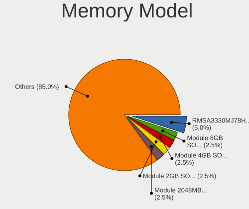

| Model                                                              | Notebooks | Percent |
|--------------------------------------------------------------------|-----------|---------|
| Ramaxel RAM RMSA3330MJ78HBF-3200 16GB SODIMM DDR4 3200MT/s         | 2         | 5%      |
| Unknown RAM Module 8GB SODIMM DDR3 1600MT/s                        | 1         | 2.5%    |
| Unknown RAM Module 4GB SODIMM DDR3 1067MT/s                        | 1         | 2.5%    |
| Unknown RAM Module 2GB SODIMM DDR2 667MT/s                         | 1         | 2.5%    |
| Unknown RAM Module 2048MB SODIMM DDR2                              | 1         | 2.5%    |
| Unknown (0x4509) RAM GKE800SO102408-2666A 8GB SODIMM DDR4 2133MT/s | 1         | 2.5%    |
| SK hynix RAM Module 8GB SODIMM DDR4 2400MT/s                       | 1         | 2.5%    |
| SK hynix RAM HMT41GS6AFR8A-PB 8GiB SODIMM DDR3 2667MT/s            | 1         | 2.5%    |
| SK hynix RAM HMT351S6EFR8C-PB 4GB SODIMM DDR3 1600MT/s             | 1         | 2.5%    |
| SK hynix RAM HMT351S6CFR8C-PB 4GB SODIMM DDR3 1600MT/s             | 1         | 2.5%    |
| SK hynix RAM HMT351S6CFR8C-H9 4GB SODIMM DDR3 1333MT/s             | 1         | 2.5%    |
| SK hynix RAM HMCG78AGBSA095N 16GB SODIMM DDR5 5600MT/s             | 1         | 2.5%    |
| SK hynix RAM HMAA1GS6CJR6N-XN 8GB Row Of Chips DDR4 3200MT/s       | 1         | 2.5%    |
| SK hynix RAM HMA81GS6CJR8N-VK 8GB SODIMM DDR4 2667MT/s             | 1         | 2.5%    |
| Samsung RAM U6E3S4AA-MGCR 1GB Row Of Chips LPDDR4 4267MT/s         | 1         | 2.5%    |
| Samsung RAM M471B5773DH0-CK0 2GB SODIMM DDR3 1600MT/s              | 1         | 2.5%    |
| Samsung RAM M471B5773CHS-CH9 2GB DIMM DDR3 1333MT/s                | 1         | 2.5%    |
| Samsung RAM M471B5173QH0-YK0 4GB SODIMM DDR3 1600MT/s              | 1         | 2.5%    |
| Samsung RAM M471B1G73QH0-YK0 8GB SODIMM DDR3 1600MT/s              | 1         | 2.5%    |
| Samsung RAM M471B1G73DB0-YK0 8GB SODIMM DDR3 1600MT/s              | 1         | 2.5%    |
| Samsung RAM M471A5244CB0-CWE 4GB SODIMM DDR4 3200MT/s              | 1         | 2.5%    |
| Samsung RAM M471A5244CB0-CRC 4GB SODIMM DDR4 2667MT/s              | 1         | 2.5%    |
| Samsung RAM M471A2K43EB1-CWE 16GB SODIMM DDR4 3200MT/s             | 1         | 2.5%    |
| Samsung RAM M471A1K43DB1-CWE 8GB SODIMM DDR4 3200MT/s              | 1         | 2.5%    |
| Samsung RAM M471A1G44AB0-CWE 8GB Row Of Chips DDR4 3200MT/s        | 1         | 2.5%    |
| Samsung RAM M425R1GB4BB0-CQKOL 8GB SODIMM DDR5 4800MT/s            | 1         | 2.5%    |
| Micron RAM ATF2G64AZ-3G2F1 16GB SODIMM DDR4 3200MT/s               | 1         | 2.5%    |
| Micron RAM 8KTF51264HDZ-1G6E1 4GB SODIMM DDR3 1600MT/s             | 1         | 2.5%    |
| Micron RAM 4ATF1G64HZ-3G2F1 8GB SODIMM DDR4 3200MT/s               | 1         | 2.5%    |
| Kingston RAM Module 16GB SODIMM DDR4 3200MT/s                      | 1         | 2.5%    |
| Kingston RAM ACR16D3LFS1KBG/2G 2GB SODIMM DDR3 1600MT/s            | 1         | 2.5%    |
| Kingston RAM 99U5469-041.A00LF 4GB SODIMM DDR3 1600MT/s            | 1         | 2.5%    |
| Kingston RAM 99U5428-018.A00LF 8GB SODIMM DDR3 1600MT/s            | 1         | 2.5%    |
| Kingston RAM 9905744-113.A01G 16GB SODIMM DDR4 3200MT/s            | 1         | 2.5%    |
| Kingmax RAM FSFE85F-C8KL9 2GB DIMM DDR3 1333MT/s                   | 1         | 2.5%    |
| Crucial RAM CT16G48C40S5.C8A1 16GB SODIMM DDR5 4800MT/s            | 1         | 2.5%    |
| Apacer RAM D22.27553S.001 16GB SODIMM DDR4 3200MT/s                | 1         | 2.5%    |
| Apacer RAM 76.B302G.C3Z0B 4GB SODIMM DDR3 1600MT/s                 | 1         | 2.5%    |
| A-DATA RAM AO1P21FC8T1-BSKS 8GB SODIMM DDR4 2133MT/s               | 1         | 2.5%    |

Memory Kind
-----------

Memory module kinds

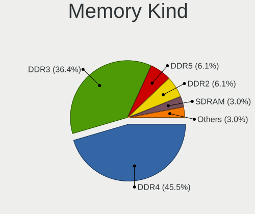

| Kind   | Notebooks | Percent |
|--------|-----------|---------|
| DDR4   | 15        | 45.45%  |
| DDR3   | 12        | 36.36%  |
| DDR5   | 2         | 6.06%   |
| DDR2   | 2         | 6.06%   |
| SDRAM  | 1         | 3.03%   |
| LPDDR4 | 1         | 3.03%   |

Memory Form Factor
------------------

Physical design of the memory module

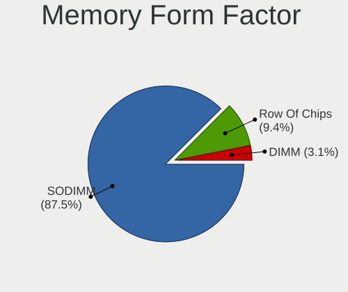

| Name         | Notebooks | Percent |
|--------------|-----------|---------|
| SODIMM       | 28        | 87.5%   |
| Row Of Chips | 3         | 9.38%   |
| DIMM         | 1         | 3.13%   |

Memory Size
-----------

Memory module size

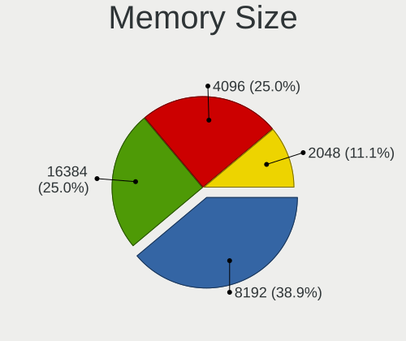

| Size  | Notebooks | Percent |
|-------|-----------|---------|
| 8192  | 14        | 38.89%  |
| 16384 | 9         | 25%     |
| 4096  | 9         | 25%     |
| 2048  | 4         | 11.11%  |

Memory Speed
------------

Memory module speed

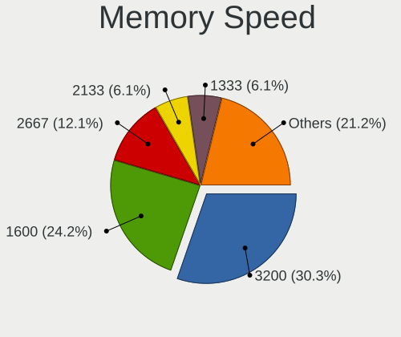

| Speed   | Notebooks | Percent |
|---------|-----------|---------|
| 3200    | 10        | 30.3%   |
| 1600    | 8         | 24.24%  |
| 2667    | 4         | 12.12%  |
| 2133    | 2         | 6.06%   |
| 1333    | 2         | 6.06%   |
| 5600    | 1         | 3.03%   |
| 4800    | 1         | 3.03%   |
| 4267    | 1         | 3.03%   |
| 2400    | 1         | 3.03%   |
| 1067    | 1         | 3.03%   |
| 667     | 1         | 3.03%   |
| Unknown | 1         | 3.03%   |

Printers & scanners
-------------------

Printer Vendor
--------------

Printer device vendors

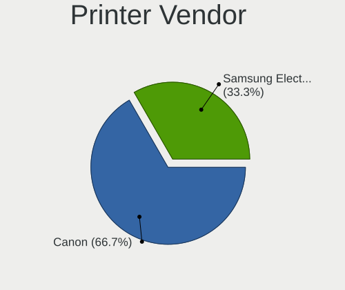

| Vendor              | Notebooks | Percent |
|---------------------|-----------|---------|
| Canon               | 2         | 66.67%  |
| Samsung Electronics | 1         | 33.33%  |

Printer Model
-------------

Printer device models

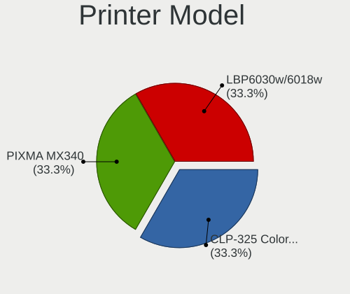

| Model                               | Notebooks | Percent |
|-------------------------------------|-----------|---------|
| Samsung CLP-325 Color Laser Printer | 1         | 33.33%  |
| Canon PIXMA MX340                   | 1         | 33.33%  |
| Canon LBP6030/6030B/6018L           | 1         | 33.33%  |

Scanner Vendor
--------------

Scanner device vendors

Zero info for selected period =(

Scanner Model
-------------

Scanner device models

Zero info for selected period =(

Camera
------

Camera Vendor
-------------

Camera device vendors

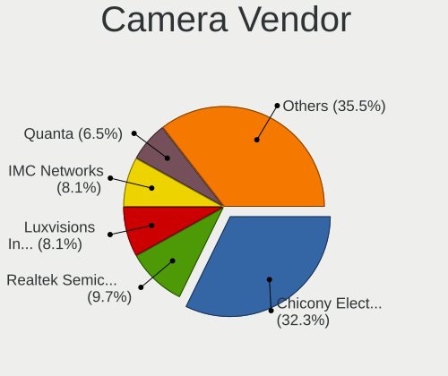

| Vendor                                 | Notebooks | Percent |
|----------------------------------------|-----------|---------|
| Chicony Electronics                    | 20        | 32.26%  |
| Realtek Semiconductor                  | 6         | 9.68%   |
| Luxvisions Innotech Limited            | 5         | 8.06%   |
| IMC Networks                           | 5         | 8.06%   |
| Quanta                                 | 4         | 6.45%   |
| Bison Electronics                      | 4         | 6.45%   |
| Microdia                               | 3         | 4.84%   |
| Cheng Uei Precision Industry (Foxlink) | 3         | 4.84%   |
| Suyin                                  | 2         | 3.23%   |
| Silicon Motion                         | 2         | 3.23%   |
| ShineTech                              | 2         | 3.23%   |
| Syntek                                 | 1         | 1.61%   |
| Sunplus Innovation Technology          | 1         | 1.61%   |
| Lite-On Technology                     | 1         | 1.61%   |
| Foxconn / Hon Hai                      | 1         | 1.61%   |
| ALi                                    | 1         | 1.61%   |
| Alcor Micro                            | 1         | 1.61%   |

Camera Model
------------

Camera device models

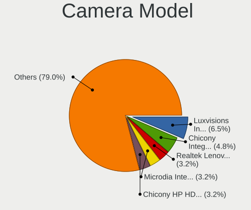

| Model                                               | Notebooks | Percent |
|-----------------------------------------------------|-----------|---------|
| Luxvisions Innotech Limited Integrated Camera       | 4         | 6.45%   |
| Chicony Integrated Camera                           | 3         | 4.84%   |
| Realtek Lenovo EasyCamera                           | 2         | 3.23%   |
| Microdia Integrated_Webcam_HD                       | 2         | 3.23%   |
| Chicony HP HD Camera                                | 2         | 3.23%   |
| Chicony HD WebCam                                   | 2         | 3.23%   |
| Chicony EasyCamera                                  | 2         | 3.23%   |
| Syntek Integrated Camera                            | 1         | 1.61%   |
| Suyin HP Webcam                                     | 1         | 1.61%   |
| Suyin Acer/HP Integrated Webcam [CN0314]            | 1         | 1.61%   |
| Sunplus Asus Webcam                                 | 1         | 1.61%   |
| Silicon Motion WebCam SC-03FFL11939N                | 1         | 1.61%   |
| Silicon Motion WebCam SC-0311139N                   | 1         | 1.61%   |
| ShineTech USB2.0 HD UVC WebCam                      | 1         | 1.61%   |
| Shinetech USB2.0 FHD UVC WebCam                     | 1         | 1.61%   |
| Realtek Integrated_Webcam_HD                        | 1         | 1.61%   |
| Realtek HP Truevision HD integrated webcam          | 1         | 1.61%   |
| Realtek HP Truevision HD                            | 1         | 1.61%   |
| Realtek Asus laptop camera                          | 1         | 1.61%   |
| Quanta USB2.0 VGA UVC WebCam                        | 1         | 1.61%   |
| Quanta USB HD Webcam                                | 1         | 1.61%   |
| Quanta ov9734_techfront_camera                      | 1         | 1.61%   |
| Quanta HP True Vision FHD Camera                    | 1         | 1.61%   |
| Microdia Laptop_Integrated_Webcam_HD                | 1         | 1.61%   |
| Luxvisions Innotech Limited HP TrueVision HD Camera | 1         | 1.61%   |
| Lite-On TOSHIBA Web Camera - HD                     | 1         | 1.61%   |
| IMC Networks USB2.0 VGA UVC WebCam                  | 1         | 1.61%   |
| IMC Networks USB2.0 HD UVC WebCam                   | 1         | 1.61%   |
| IMC Networks ov9734_azurewave_camera                | 1         | 1.61%   |
| IMC Networks Lenovo EasyCamera                      | 1         | 1.61%   |
| IMC Networks EasyCamera                             | 1         | 1.61%   |
| Foxconn / Hon Hai USB2.0 Camera                     | 1         | 1.61%   |
| Chicony XiaoMi USB 2.0 Webcam                       | 1         | 1.61%   |
| Chicony USB2.0 VGA UVC WebCam                       | 1         | 1.61%   |
| Chicony USB2.0 Camera                               | 1         | 1.61%   |
| Chicony HP Truevision HD                            | 1         | 1.61%   |
| Chicony HP HD Webcam [Fixed]                        | 1         | 1.61%   |
| Chicony Gateway USB 2.0 Webcam                      | 1         | 1.61%   |
| Chicony Front Camera                                | 1         | 1.61%   |
| Chicony CNF9055 Toshiba Webcam                      | 1         | 1.61%   |

Security
--------

Fingerprint Vendor
------------------

Fingerprint sensor vendors

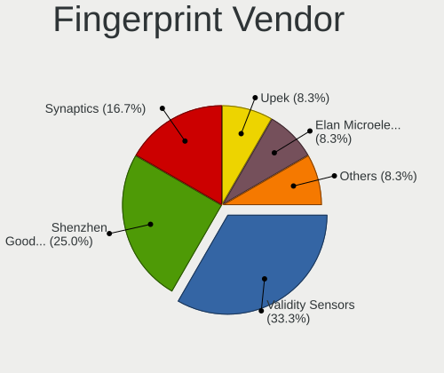

| Vendor                     | Notebooks | Percent |
|----------------------------|-----------|---------|
| Validity Sensors           | 4         | 33.33%  |
| Shenzhen Goodix Technology | 3         | 25%     |
| Synaptics                  | 2         | 16.67%  |
| Upek                       | 1         | 8.33%   |
| Elan Microelectronics      | 1         | 8.33%   |
| AuthenTec                  | 1         | 8.33%   |

Fingerprint Model
-----------------

Fingerprint sensor models

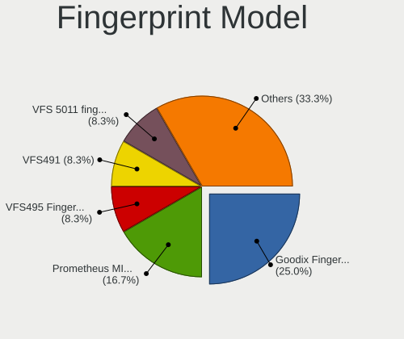

| Model                                                                      | Notebooks | Percent |
|----------------------------------------------------------------------------|-----------|---------|
| Shenzhen Goodix  Fingerprint Device                                        | 3         | 25%     |
| Synaptics Prometheus MIS Touch Fingerprint Reader                          | 2         | 16.67%  |
| Validity Sensors VFS495 Fingerprint Reader                                 | 1         | 8.33%   |
| Validity Sensors VFS491                                                    | 1         | 8.33%   |
| Validity Sensors VFS 5011 fingerprint sensor                               | 1         | 8.33%   |
| Validity Sensors Synaptics VFS7552 Touch Fingerprint Sensor with PurePrint | 1         | 8.33%   |
| Upek Biometric Touchchip/Touchstrip Fingerprint Sensor                     | 1         | 8.33%   |
| Elan ELAN:Fingerprint                                                      | 1         | 8.33%   |
| AuthenTec AES1600                                                          | 1         | 8.33%   |

Chipcard Vendor
---------------

Chipcard module vendors

| Vendor   | Notebooks | Percent |
|----------|-----------|---------|
| Broadcom | 1         | 100%    |

Chipcard Model
--------------

Chipcard module models

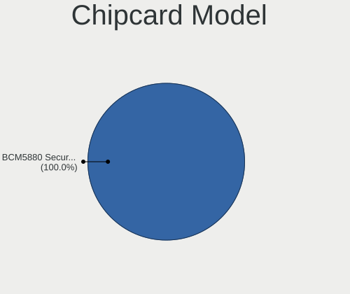

| Model                                                                        | Notebooks | Percent |
|------------------------------------------------------------------------------|-----------|---------|
| Broadcom BCM5880 Secure Applications Processor with fingerprint swipe sensor | 1         | 100%    |

Unsupported
-----------

Unsupported Devices
-------------------

Total unsupported devices on board

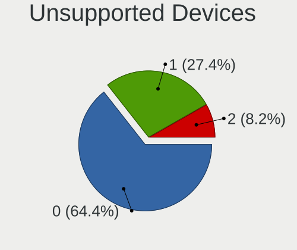

| Total | Notebooks | Percent |
|-------|-----------|---------|
| 0     | 47        | 64.38%  |
| 1     | 20        | 27.4%   |
| 2     | 6         | 8.22%   |

Unsupported Device Types
------------------------

Types of unsupported devices

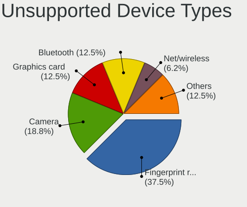

| Type                     | Notebooks | Percent |
|--------------------------|-----------|---------|
| Fingerprint reader       | 12        | 37.5%   |
| Camera                   | 6         | 18.75%  |
| Graphics card            | 4         | 12.5%   |
| Bluetooth                | 4         | 12.5%   |
| Net/wireless             | 2         | 6.25%   |
| Multimedia controller    | 2         | 6.25%   |
| Communication controller | 1         | 3.13%   |
| Chipcard                 | 1         | 3.13%   |

