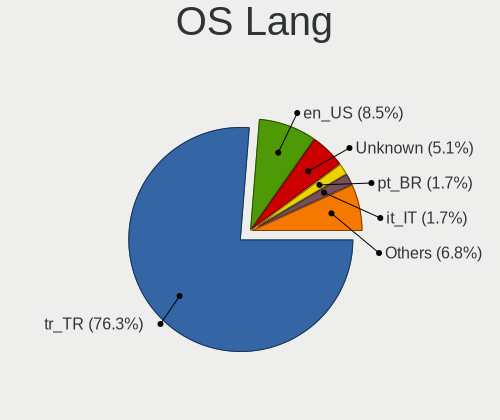
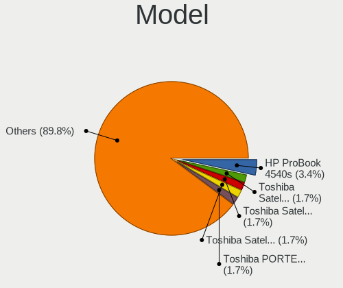
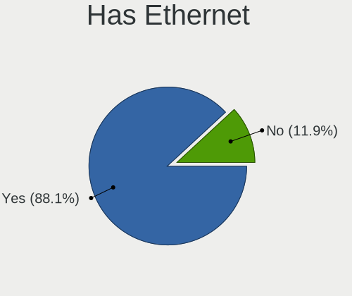
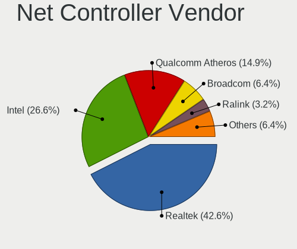
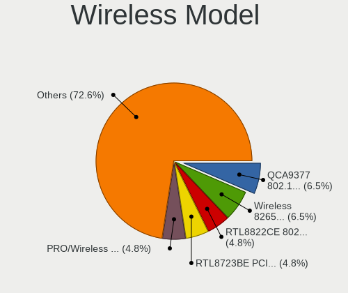
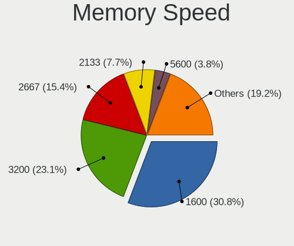

Pardus - Tested Hardware & Statistics (Notebooks)
-------------------------------------------------

A project to collect tested hardware configurations for Pardus.

Anyone can contribute to this report by the [hw-probe](https://github.com/linuxhw/hw-probe) tool:

    sudo -E hw-probe -all -upload

Please contribute! Especially if your hardware is rare.

Contents
--------

* [ Test Cases ](#test-cases)

* [ System ](#system)
  - [ OS                       ](#os)
  - [ OS Family                ](#os-family)
  - [ Kernel                   ](#kernel)
  - [ Kernel Family            ](#kernel-family)
  - [ Kernel Major Ver.        ](#kernel-major-ver)
  - [ Arch                     ](#arch)
  - [ DE                       ](#de)
  - [ Display Server           ](#display-server)
  - [ Display Manager          ](#display-manager)
  - [ OS Lang                  ](#os-lang)
  - [ Boot Mode                ](#boot-mode)
  - [ Filesystem               ](#filesystem)
  - [ Part. scheme             ](#part-scheme)
  - [ Dual Boot with Linux/BSD ](#dual-boot-with-linuxbsd)
  - [ Dual Boot (Win)          ](#dual-boot-win)

* [ Board ](#board)
  - [ Vendor                   ](#vendor)
  - [ Model                    ](#model)
  - [ Model Family             ](#model-family)
  - [ MFG Year                 ](#mfg-year)
  - [ Form Factor              ](#form-factor)
  - [ Secure Boot              ](#secure-boot)
  - [ Coreboot                 ](#coreboot)
  - [ RAM Size                 ](#ram-size)
  - [ RAM Used                 ](#ram-used)
  - [ Total Drives             ](#total-drives)
  - [ Has CD-ROM               ](#has-cd-rom)
  - [ Has Ethernet             ](#has-ethernet)
  - [ Has WiFi                 ](#has-wifi)
  - [ Has Bluetooth            ](#has-bluetooth)

* [ Location ](#location)
  - [ Country                  ](#country)
  - [ City                     ](#city)

* [ Drives ](#drives)
  - [ Drive Vendor             ](#drive-vendor)
  - [ Drive Model              ](#drive-model)
  - [ HDD Vendor               ](#hdd-vendor)
  - [ SSD Vendor               ](#ssd-vendor)
  - [ Drive Kind               ](#drive-kind)
  - [ Drive Connector          ](#drive-connector)
  - [ Drive Size               ](#drive-size)
  - [ Space Total              ](#space-total)
  - [ Space Used               ](#space-used)
  - [ Malfunc. Drives          ](#malfunc-drives)
  - [ Malfunc. Drive Vendor    ](#malfunc-drive-vendor)
  - [ Malfunc. HDD Vendor      ](#malfunc-hdd-vendor)
  - [ Malfunc. Drive Kind      ](#malfunc-drive-kind)
  - [ Failed Drives            ](#failed-drives)
  - [ Failed Drive Vendor      ](#failed-drive-vendor)
  - [ Drive Status             ](#drive-status)

* [ Storage controller ](#storage-controller)
  - [ Storage Vendor           ](#storage-vendor)
  - [ Storage Model            ](#storage-model)
  - [ Storage Kind             ](#storage-kind)

* [ Processor ](#processor)
  - [ CPU Vendor               ](#cpu-vendor)
  - [ CPU Model                ](#cpu-model)
  - [ CPU Model Family         ](#cpu-model-family)
  - [ CPU Cores                ](#cpu-cores)
  - [ CPU Sockets              ](#cpu-sockets)
  - [ CPU Threads              ](#cpu-threads)
  - [ CPU Op-Modes             ](#cpu-op-modes)
  - [ CPU Microcode            ](#cpu-microcode)
  - [ CPU Microarch            ](#cpu-microarch)

* [ Graphics ](#graphics)
  - [ GPU Vendor               ](#gpu-vendor)
  - [ GPU Model                ](#gpu-model)
  - [ GPU Combo                ](#gpu-combo)
  - [ GPU Driver               ](#gpu-driver)
  - [ GPU Memory               ](#gpu-memory)

* [ Monitor ](#monitor)
  - [ Monitor Vendor           ](#monitor-vendor)
  - [ Monitor Model            ](#monitor-model)
  - [ Monitor Resolution       ](#monitor-resolution)
  - [ Monitor Diagonal         ](#monitor-diagonal)
  - [ Monitor Width            ](#monitor-width)
  - [ Aspect Ratio             ](#aspect-ratio)
  - [ Monitor Area             ](#monitor-area)
  - [ Pixel Density            ](#pixel-density)
  - [ Multiple Monitors        ](#multiple-monitors)

* [ Network ](#network)
  - [ Net Controller Vendor    ](#net-controller-vendor)
  - [ Net Controller Model     ](#net-controller-model)
  - [ Wireless Vendor          ](#wireless-vendor)
  - [ Wireless Model           ](#wireless-model)
  - [ Ethernet Vendor          ](#ethernet-vendor)
  - [ Ethernet Model           ](#ethernet-model)
  - [ Net Controller Kind      ](#net-controller-kind)
  - [ Used Controller          ](#used-controller)
  - [ NICs                     ](#nics)
  - [ IPv6                     ](#ipv6)

* [ Bluetooth ](#bluetooth)
  - [ Bluetooth Vendor         ](#bluetooth-vendor)
  - [ Bluetooth Model          ](#bluetooth-model)

* [ Sound ](#sound)
  - [ Sound Vendor             ](#sound-vendor)
  - [ Sound Model              ](#sound-model)

* [ Memory ](#memory)
  - [ Memory Vendor            ](#memory-vendor)
  - [ Memory Model             ](#memory-model)
  - [ Memory Kind              ](#memory-kind)
  - [ Memory Form Factor       ](#memory-form-factor)
  - [ Memory Size              ](#memory-size)
  - [ Memory Speed             ](#memory-speed)

* [ Printers & scanners ](#printers--scanners)
  - [ Printer Vendor           ](#printer-vendor)
  - [ Printer Model            ](#printer-model)
  - [ Scanner Vendor           ](#scanner-vendor)
  - [ Scanner Model            ](#scanner-model)

* [ Camera ](#camera)
  - [ Camera Vendor            ](#camera-vendor)
  - [ Camera Model             ](#camera-model)

* [ Security ](#security)
  - [ Fingerprint Vendor       ](#fingerprint-vendor)
  - [ Fingerprint Model        ](#fingerprint-model)
  - [ Chipcard Vendor          ](#chipcard-vendor)
  - [ Chipcard Model           ](#chipcard-model)

* [ Unsupported ](#unsupported)
  - [ Unsupported Devices      ](#unsupported-devices)
  - [ Unsupported Device Types ](#unsupported-device-types)

Test Cases
----------

Total: 65

| Vendor        | Model                       | Probe                                                      | Date         |
|---------------|-----------------------------|------------------------------------------------------------|--------------|
| HP            | Pavilion Notebook           | [bb16eb2e4a](https://linux-hardware.org/?probe=bb16eb2e4a) | Feb 01, 2024 |
| Lenovo        | G510 20238                  | [d93b9b007a](https://linux-hardware.org/?probe=d93b9b007a) | Feb 01, 2024 |
| HP            | Pavilion Notebook           | [bc55b0bd50](https://linux-hardware.org/?probe=bc55b0bd50) | Feb 01, 2024 |
| Lenovo        | G510 20238                  | [da159bff10](https://linux-hardware.org/?probe=da159bff10) | Jan 31, 2024 |
| Lenovo        | G510 20238                  | [192a3a0ab1](https://linux-hardware.org/?probe=192a3a0ab1) | Jan 30, 2024 |
| Lenovo        | G510 20238                  | [bb879ce9b9](https://linux-hardware.org/?probe=bb879ce9b9) | Jan 27, 2024 |
| HP            | EliteBook 830 G5            | [c9ac7b8022](https://linux-hardware.org/?probe=c9ac7b8022) | Dec 28, 2023 |
| HP            | EliteBook 820 G2            | [a32eb9fe02](https://linux-hardware.org/?probe=a32eb9fe02) | Sep 28, 2023 |
| Casper        | EXCALIBUR G770              | [9224e20101](https://linux-hardware.org/?probe=9224e20101) | Sep 01, 2023 |
| Toshiba       | Satellite L755              | [9e9caad8ea](https://linux-hardware.org/?probe=9e9caad8ea) | Jul 31, 2023 |
| ASUSTek       | X550DP                      | [4cfcff7d7e](https://linux-hardware.org/?probe=4cfcff7d7e) | Jul 10, 2023 |
| Toshiba       | Satellite L755              | [d1a5adf1ef](https://linux-hardware.org/?probe=d1a5adf1ef) | Jul 06, 2023 |
| Toshiba       | Satellite L755              | [cda93de5a6](https://linux-hardware.org/?probe=cda93de5a6) | Jul 05, 2023 |
| Toshiba       | Satellite L755              | [eea8633642](https://linux-hardware.org/?probe=eea8633642) | Jun 21, 2023 |
| Dell          | Vostro 5502                 | [5d42ac567c](https://linux-hardware.org/?probe=5d42ac567c) | Jun 13, 2023 |
| Lenovo        | ThinkPad T480 20L6S2S800    | [7ffc12366e](https://linux-hardware.org/?probe=7ffc12366e) | May 03, 2023 |
| Lenovo        | ThinkPad T480 20L6S2S800    | [8ab4a35e8c](https://linux-hardware.org/?probe=8ab4a35e8c) | Apr 26, 2023 |
| HP            | ProBook 4540s               | [854f17fcac](https://linux-hardware.org/?probe=854f17fcac) | Apr 23, 2023 |
| Clevo         | W251EFQ/W270EFQ             | [8152bff1b3](https://linux-hardware.org/?probe=8152bff1b3) | Apr 13, 2023 |
| Lenovo        | ThinkPad S1 Yoga 20CD003... | [54cda388d8](https://linux-hardware.org/?probe=54cda388d8) | Mar 22, 2023 |
| Lenovo        | G510 20238                  | [2dd6ac17cf](https://linux-hardware.org/?probe=2dd6ac17cf) | Feb 26, 2023 |
| Lenovo        | G510 20238                  | [2954f1a3c5](https://linux-hardware.org/?probe=2954f1a3c5) | Feb 25, 2023 |
| Lenovo        | G50-45 80E3                 | [05070bdc72](https://linux-hardware.org/?probe=05070bdc72) | Dec 29, 2022 |
| Toshiba       | Satellite C660              | [5d14354a02](https://linux-hardware.org/?probe=5d14354a02) | Dec 16, 2022 |
| Acer          | Aspire A515-41G             | [fb7da9e239](https://linux-hardware.org/?probe=fb7da9e239) | Dec 10, 2022 |
| Toshiba       | Satellite C660              | [27f508f09e](https://linux-hardware.org/?probe=27f508f09e) | Dec 07, 2022 |
| Toshiba       | Satellite C660              | [ca7c59284c](https://linux-hardware.org/?probe=ca7c59284c) | Nov 28, 2022 |
| Toshiba       | Satellite C660              | [9da0a974dd](https://linux-hardware.org/?probe=9da0a974dd) | Nov 27, 2022 |
| Olidata       | T7700                       | [d8220596fc](https://linux-hardware.org/?probe=d8220596fc) | Nov 19, 2022 |
| HP            | 530                         | [337ff0c5ea](https://linux-hardware.org/?probe=337ff0c5ea) | Nov 15, 2022 |
| Olidata       | T7700                       | [488f74cf4b](https://linux-hardware.org/?probe=488f74cf4b) | Nov 14, 2022 |
| TUXEDO        | Unknown                     | [52ddc219ae](https://linux-hardware.org/?probe=52ddc219ae) | Sep 23, 2022 |
| HUAWEI        | KLVL-WXXW                   | [60ebd510a4](https://linux-hardware.org/?probe=60ebd510a4) | Sep 07, 2022 |
| Lenovo        | IdeaPad 100-15IBD 80QQ      | [bcbbd7f228](https://linux-hardware.org/?probe=bcbbd7f228) | Jul 05, 2022 |
| Sony          | SVE14A2V2ES                 | [59435d662a](https://linux-hardware.org/?probe=59435d662a) | May 11, 2022 |
| Acer          | Aspire 5742G                | [b3cef97540](https://linux-hardware.org/?probe=b3cef97540) | Apr 12, 2022 |
| Sony          | SVE14A2V2ES                 | [b2695cc80d](https://linux-hardware.org/?probe=b2695cc80d) | Mar 13, 2022 |
| Sony          | SVE14A2V2ES                 | [4b2203862a](https://linux-hardware.org/?probe=4b2203862a) | Mar 11, 2022 |
| Sony          | SVE14A2V2ES                 | [1575f2f0be](https://linux-hardware.org/?probe=1575f2f0be) | Mar 11, 2022 |
| Sony          | SVE14A2V2ES                 | [ef603529f2](https://linux-hardware.org/?probe=ef603529f2) | Mar 08, 2022 |
| Sony          | SVE14A2V2ES                 | [35fe0c18bc](https://linux-hardware.org/?probe=35fe0c18bc) | Mar 07, 2022 |
| Lenovo        | ThinkPad E15 Gen 2 20TD0... | [e60367127e](https://linux-hardware.org/?probe=e60367127e) | Mar 07, 2022 |
| Sony          | SVF1521QSTB                 | [f74068fef9](https://linux-hardware.org/?probe=f74068fef9) | Feb 14, 2022 |
| HP            | Pavilion 15                 | [fe001e576b](https://linux-hardware.org/?probe=fe001e576b) | Feb 13, 2022 |
| Packard Be... | EasyNote ENTG81BA           | [10f68b4c82](https://linux-hardware.org/?probe=10f68b4c82) | Jan 31, 2022 |
| Lenovo        | V145-15AST 81MT             | [121a750c5b](https://linux-hardware.org/?probe=121a750c5b) | Jan 03, 2022 |
| Lenovo        | IdeaPad 320-15IKB 81BT      | [16efe9685d](https://linux-hardware.org/?probe=16efe9685d) | Dec 17, 2021 |
| Toshiba       | PORTEGE M780                | [c68379ab38](https://linux-hardware.org/?probe=c68379ab38) | Nov 30, 2021 |
| HP            | Laptop 15-dw3xxx            | [1cf8a783be](https://linux-hardware.org/?probe=1cf8a783be) | Oct 21, 2021 |
| HP            | Laptop 15-dw3xxx            | [20a54c9779](https://linux-hardware.org/?probe=20a54c9779) | Oct 21, 2021 |
| Lenovo        | IdeaPad-510-15IKB 80SV      | [1a343f3596](https://linux-hardware.org/?probe=1a343f3596) | Sep 02, 2021 |
| Philco        | 14F                         | [343861b100](https://linux-hardware.org/?probe=343861b100) | Jun 20, 2021 |
| Toshiba       | Satellite C855-1VM          | [dab32c2669](https://linux-hardware.org/?probe=dab32c2669) | Jan 24, 2021 |
| Lenovo        | ThinkPad T450 20BUS39Y00    | [579099bf91](https://linux-hardware.org/?probe=579099bf91) | Dec 26, 2020 |
| Samsung       | 300E4A/300E5A/300E7A/343... | [39f1d96886](https://linux-hardware.org/?probe=39f1d96886) | Dec 16, 2020 |
| ASUSTek       | X555YI                      | [d210c4b901](https://linux-hardware.org/?probe=d210c4b901) | Sep 26, 2020 |
| Packard Be... | EasyNote_GN45               | [210b740311](https://linux-hardware.org/?probe=210b740311) | Sep 24, 2020 |
| Dell          | Latitude E6540              | [d2337e32c1](https://linux-hardware.org/?probe=d2337e32c1) | Sep 05, 2020 |
| ASUSTek       | E402BP                      | [d531d0fe45](https://linux-hardware.org/?probe=d531d0fe45) | Jun 01, 2020 |
| HP            | 15                          | [36d90829ee](https://linux-hardware.org/?probe=36d90829ee) | May 02, 2020 |
| HP            | 15                          | [06393a1175](https://linux-hardware.org/?probe=06393a1175) | Apr 27, 2020 |
| HP            | 15                          | [e21973794b](https://linux-hardware.org/?probe=e21973794b) | Feb 02, 2020 |
| Dell          | G5 5587                     | [1742540bc9](https://linux-hardware.org/?probe=1742540bc9) | Nov 27, 2019 |
| Lenovo        | V110-15ISK 80TL             | [dd8de8c9a2](https://linux-hardware.org/?probe=dd8de8c9a2) | Oct 18, 2019 |
| HP            | 250 G3                      | [e82ead9af0](https://linux-hardware.org/?probe=e82ead9af0) | Oct 13, 2019 |

System
------

OS
--

Installed operating systems

| Name          | Notebooks | Percent |
|---------------|-----------|---------|
| Pardus 21.4   | 6         | 13.04%  |
| Pardus 21.3   | 5         | 10.87%  |
| Pardus 21.1   | 5         | 10.87%  |
| Pardus 21.5   | 4         | 8.7%    |
| Pardus 21.2   | 4         | 8.7%    |
| Pardus 21.0   | 3         | 6.52%   |
| Pardus 19.5   | 3         | 6.52%   |
| Pardus 19.3   | 3         | 6.52%   |
| Pardus 23.1   | 2         | 4.35%   |
| Pardus 23.0   | 2         | 4.35%   |
| Pardus 19.4-1 | 2         | 4.35%   |
| Pardus 19.2   | 2         | 4.35%   |
| Pardus 19.1   | 2         | 4.35%   |
| Pardus 19.0   | 2         | 4.35%   |
| Pardus 19.4   | 1         | 2.17%   |

OS Family
---------

OS without a version

| Name   | Notebooks | Percent |
|--------|-----------|---------|
| Pardus | 43        | 100%    |

Kernel
------

Version of the Linux kernel

| Version                   | Notebooks | Percent |
|---------------------------|-----------|---------|
| 5.10.0-21-amd64           | 5         | 10.64%  |
| 5.10.0-19-amd64           | 4         | 8.51%   |
| 5.10.0-13-amd64           | 3         | 6.38%   |
| 5.10.0-11-amd64           | 3         | 6.38%   |
| 4.19.0-6-amd64            | 3         | 6.38%   |
| 4.19.0-10-amd64           | 3         | 6.38%   |
| 6.1.0-17-amd64            | 2         | 4.26%   |
| 5.10.0-9-amd64            | 2         | 4.26%   |
| 5.10.0-23-amd64           | 2         | 4.26%   |
| 5.10.0-10-amd64           | 2         | 4.26%   |
| 4.19.0-13-amd64           | 2         | 4.26%   |
| 6.1.0-13-amd64            | 1         | 2.13%   |
| 6.1.0-11-amd64            | 1         | 2.13%   |
| 6.0.11-x64v2-rt14-xanmod1 | 1         | 2.13%   |
| 5.9.0-0.bpo.2-amd64       | 1         | 2.13%   |
| 5.4.0-0.bpo.3-amd64       | 1         | 2.13%   |
| 5.10.0-8-amd64            | 1         | 2.13%   |
| 5.10.0-25-amd64           | 1         | 2.13%   |
| 5.10.0-20-amd64           | 1         | 2.13%   |
| 5.10.0-17-amd64           | 1         | 2.13%   |
| 5.10.0-16-amd64           | 1         | 2.13%   |
| 5.10.0-14-amd64           | 1         | 2.13%   |
| 5.10.0-0.bpo.8-amd64      | 1         | 2.13%   |
| 4.19.0-8-amd64            | 1         | 2.13%   |
| 4.19.0-5-amd64            | 1         | 2.13%   |
| 4.19.0-19-amd64           | 1         | 2.13%   |
| 4.19.0-16-amd64           | 1         | 2.13%   |

Kernel Family
-------------

Linux kernel without a distro release

| Version | Notebooks | Percent |
|---------|-----------|---------|
| 5.10.0  | 27        | 60%     |
| 4.19.0  | 11        | 24.44%  |
| 6.1.0   | 4         | 8.89%   |
| 6.0.11  | 1         | 2.22%   |
| 5.9.0   | 1         | 2.22%   |
| 5.4.0   | 1         | 2.22%   |

Kernel Major Ver.
-----------------

Linux kernel major version

| Version | Notebooks | Percent |
|---------|-----------|---------|
| 5.10    | 27        | 60%     |
| 4.19    | 11        | 24.44%  |
| 6.1     | 4         | 8.89%   |
| 6.0     | 1         | 2.22%   |
| 5.9     | 1         | 2.22%   |
| 5.4     | 1         | 2.22%   |

Arch
----

OS architecture (x86_64, i586, etc.)

| Name   | Notebooks | Percent |
|--------|-----------|---------|
| x86_64 | 43        | 100%    |

DE
--

Desktop Environment

| Name    | Notebooks | Percent |
|---------|-----------|---------|
| XFCE    | 26        | 60.47%  |
| GNOME   | 14        | 32.56%  |
| Unknown | 2         | 4.65%   |
| KDE5    | 1         | 2.33%   |

Display Server
--------------

X11 or Wayland

| Name | Notebooks | Percent |
|------|-----------|---------|
| X11  | 43        | 100%    |

Display Manager
---------------

SDDM, LightDM, etc.

| Name    | Notebooks | Percent |
|---------|-----------|---------|
| Unknown | 26        | 60.47%  |
| TDM     | 6         | 13.95%  |
| LightDM | 6         | 13.95%  |
| GDM     | 4         | 9.3%    |
| GDM3    | 1         | 2.33%   |

OS Lang
-------

Language

| Lang    | Notebooks | Percent |
|---------|-----------|---------|
| tr_TR   | 33        | 76.74%  |
| en_US   | 3         | 6.98%   |
| Unknown | 3         | 6.98%   |
| pt_BR   | 1         | 2.33%   |
| hu_HU   | 1         | 2.33%   |
| fur_IT  | 1         | 2.33%   |
| en_GB   | 1         | 2.33%   |

Boot Mode
---------

EFI or BIOS

| Mode | Notebooks | Percent |
|------|-----------|---------|
| BIOS | 31        | 70.45%  |
| EFI  | 13        | 29.55%  |

Filesystem
----------

Type of filesystem

| Type    | Notebooks | Percent |
|---------|-----------|---------|
| Ext4    | 41        | 95.35%  |
| Overlay | 2         | 4.65%   |

Part. scheme
------------

Scheme of partitioning

| Type    | Notebooks | Percent |
|---------|-----------|---------|
| Unknown | 27        | 62.79%  |
| GPT     | 12        | 27.91%  |
| MBR     | 4         | 9.3%    |

Dual Boot with Linux/BSD
------------------------

Hosting more than one Linux/BSD

| Dual boot | Notebooks | Percent |
|-----------|-----------|---------|
| No        | 39        | 90.7%   |
| Yes       | 4         | 9.3%    |

Dual Boot (Win)
---------------

Hosting Linux and Windows

| Dual boot | Notebooks | Percent |
|-----------|-----------|---------|
| No        | 34        | 79.07%  |
| Yes       | 9         | 20.93%  |

Board
-----

Vendor
------

Motherboard manufacturer

| Name                | Notebooks | Percent |
|---------------------|-----------|---------|
| Lenovo              | 11        | 25.58%  |
| Hewlett-Packard     | 9         | 20.93%  |
| Toshiba             | 4         | 9.3%    |
| Dell                | 3         | 6.98%   |
| ASUSTek Computer    | 3         | 6.98%   |
| Sony                | 2         | 4.65%   |
| Packard Bell        | 2         | 4.65%   |
| Acer                | 2         | 4.65%   |
| TUXEDO              | 1         | 2.33%   |
| Samsung Electronics | 1         | 2.33%   |
| Philco              | 1         | 2.33%   |
| Olidata             | 1         | 2.33%   |
| HUAWEI              | 1         | 2.33%   |
| Clevo               | 1         | 2.33%   |
| Casper              | 1         | 2.33%   |

Model
-----

Motherboard model

| Name                                       | Notebooks | Percent |
|--------------------------------------------|-----------|---------|
| Toshiba Satellite L755                     | 1         | 2.33%   |
| Toshiba Satellite C855-1VM                 | 1         | 2.33%   |
| Toshiba Satellite C660                     | 1         | 2.33%   |
| Toshiba PORTEGE M780                       | 1         | 2.33%   |
| Sony SVF1521QSTB                           | 1         | 2.33%   |
| Sony SVE14A2V2ES                           | 1         | 2.33%   |
| Samsung 300E4A/300E5A/300E7A/3430EA/3530EA | 1         | 2.33%   |
| Philco 14F                                 | 1         | 2.33%   |
| Packard Bell EasyNote_GN45                 | 1         | 2.33%   |
| Packard Bell EasyNote ENTG81BA             | 1         | 2.33%   |
| Olidata T7700                              | 1         | 2.33%   |
| Lenovo V145-15AST 81MT                     | 1         | 2.33%   |
| Lenovo V110-15ISK 80TL                     | 1         | 2.33%   |
| Lenovo ThinkPad T480 20L6S2S800            | 1         | 2.33%   |
| Lenovo ThinkPad T450 20BUS39Y00            | 1         | 2.33%   |
| Lenovo ThinkPad S1 Yoga 20CD0034TX         | 1         | 2.33%   |
| Lenovo ThinkPad E15 Gen 2 20TD0047TX       | 1         | 2.33%   |
| Lenovo IdeaPad-510-15IKB 80SV              | 1         | 2.33%   |
| Lenovo IdeaPad 320-15IKB 81BT              | 1         | 2.33%   |
| Lenovo IdeaPad 100-15IBD 80QQ              | 1         | 2.33%   |
| Lenovo G510 20238                          | 1         | 2.33%   |
| Lenovo G50-45 80E3                         | 1         | 2.33%   |
| HUAWEI KLVL-WXXW                           | 1         | 2.33%   |
| HP ProBook 4540s                           | 1         | 2.33%   |
| HP Pavilion Notebook                       | 1         | 2.33%   |
| HP Pavilion 15                             | 1         | 2.33%   |
| HP Laptop 15-dw3xxx                        | 1         | 2.33%   |
| HP EliteBook 830 G5                        | 1         | 2.33%   |
| HP EliteBook 820 G2                        | 1         | 2.33%   |
| HP 530                                     | 1         | 2.33%   |
| HP 250 G3                                  | 1         | 2.33%   |
| HP 15                                      | 1         | 2.33%   |
| Dell Vostro 5502                           | 1         | 2.33%   |
| Dell Latitude E6540                        | 1         | 2.33%   |
| Dell G5 5587                               | 1         | 2.33%   |
| Clevo W251EFQ/W270EFQ                      | 1         | 2.33%   |
| Casper EXCALIBUR G770                      | 1         | 2.33%   |
| ASUS X555YI                                | 1         | 2.33%   |
| ASUS X550DP                                | 1         | 2.33%   |
| ASUS E402BP                                | 1         | 2.33%   |

Model Family
------------

Motherboard model prefix

| Name                     | Notebooks | Percent |
|--------------------------|-----------|---------|
| Lenovo ThinkPad          | 4         | 9.3%    |
| Toshiba Satellite        | 3         | 6.98%   |
| Packard Bell EasyNote    | 2         | 4.65%   |
| Lenovo IdeaPad           | 2         | 4.65%   |
| HP Pavilion              | 2         | 4.65%   |
| HP EliteBook             | 2         | 4.65%   |
| Acer Aspire              | 2         | 4.65%   |
| Toshiba PORTEGE          | 1         | 2.33%   |
| Sony SVF1521QSTB         | 1         | 2.33%   |
| Sony SVE14A2V2ES         | 1         | 2.33%   |
| Samsung 300E4A           | 1         | 2.33%   |
| Philco 14F               | 1         | 2.33%   |
| Olidata T7700            | 1         | 2.33%   |
| Lenovo V145-15AST        | 1         | 2.33%   |
| Lenovo V110-15ISK        | 1         | 2.33%   |
| Lenovo IdeaPad-510-15IKB | 1         | 2.33%   |
| Lenovo G510              | 1         | 2.33%   |
| Lenovo G50-45            | 1         | 2.33%   |
| HUAWEI KLVL-WXXW         | 1         | 2.33%   |
| HP ProBook               | 1         | 2.33%   |
| HP Laptop                | 1         | 2.33%   |
| HP 530                   | 1         | 2.33%   |
| HP 250                   | 1         | 2.33%   |
| HP 15                    | 1         | 2.33%   |
| Dell Vostro              | 1         | 2.33%   |
| Dell Latitude            | 1         | 2.33%   |
| Dell G5                  | 1         | 2.33%   |
| Clevo W251EFQ            | 1         | 2.33%   |
| Casper EXCALIBUR         | 1         | 2.33%   |
| ASUS X555YI              | 1         | 2.33%   |
| ASUS X550DP              | 1         | 2.33%   |
| ASUS E402BP              | 1         | 2.33%   |
| Unknown                  | 1         | 2.33%   |

MFG Year
--------

Motherboard manufacture year

| Year | Notebooks | Percent |
|------|-----------|---------|
| 2013 | 8         | 18.6%   |
| 2018 | 5         | 11.63%  |
| 2015 | 4         | 9.3%    |
| 2014 | 4         | 9.3%    |
| 2020 | 3         | 6.98%   |
| 2019 | 3         | 6.98%   |
| 2011 | 3         | 6.98%   |
| 2010 | 3         | 6.98%   |
| 2021 | 2         | 4.65%   |
| 2017 | 2         | 4.65%   |
| 2012 | 2         | 4.65%   |
| 2016 | 1         | 2.33%   |
| 2008 | 1         | 2.33%   |
| 2007 | 1         | 2.33%   |
| 2006 | 1         | 2.33%   |

Form Factor
-----------

Physical design of the computer

| Name     | Notebooks | Percent |
|----------|-----------|---------|
| Notebook | 43        | 100%    |

Secure Boot
-----------

Enabled or disabled

| State    | Notebooks | Percent |
|----------|-----------|---------|
| Disabled | 43        | 100%    |

Coreboot
--------

Have coreboot on board

| Used | Notebooks | Percent |
|------|-----------|---------|
| No   | 43        | 100%    |

RAM Size
--------

Total RAM memory

| Size in GB | Notebooks | Percent |
|------------|-----------|---------|
| 4.01-8.0   | 13        | 30.23%  |
| 3.01-4.0   | 13        | 30.23%  |
| 8.01-16.0  | 9         | 20.93%  |
| 16.01-24.0 | 5         | 11.63%  |
| 1.01-2.0   | 2         | 4.65%   |
| 2.01-3.0   | 1         | 2.33%   |

RAM Used
--------

Used RAM memory

| Used GB  | Notebooks | Percent |
|----------|-----------|---------|
| 1.01-2.0 | 20        | 42.55%  |
| 2.01-3.0 | 14        | 29.79%  |
| 3.01-4.0 | 8         | 17.02%  |
| 4.01-8.0 | 4         | 8.51%   |
| 0.51-1.0 | 1         | 2.13%   |

Total Drives
------------

Number of drives on board

| Drives | Notebooks | Percent |
|--------|-----------|---------|
| 1      | 28        | 65.12%  |
| 2      | 12        | 27.91%  |
| 3      | 3         | 6.98%   |

Has CD-ROM
----------

Has CD-ROM on board

| Presented | Notebooks | Percent |
|-----------|-----------|---------|
| No        | 22        | 51.16%  |
| Yes       | 21        | 48.84%  |

Has Ethernet
------------

Has Ethernet on board

| Presented | Notebooks | Percent |
|-----------|-----------|---------|
| Yes       | 40        | 93.02%  |
| No        | 3         | 6.98%   |

Has WiFi
--------

Has WiFi module

| Presented | Notebooks | Percent |
|-----------|-----------|---------|
| Yes       | 43        | 100%    |

Has Bluetooth
-------------

Has Bluetooth module

| Presented | Notebooks | Percent |
|-----------|-----------|---------|
| Yes       | 36        | 83.72%  |
| No        | 7         | 16.28%  |

Location
--------

Country
-------

Geographic location (country)

| Country    | Notebooks | Percent |
|------------|-----------|---------|
| Turkey     | 34        | 77.27%  |
| Germany    | 2         | 4.55%   |
| UK         | 1         | 2.27%   |
| Sweden     | 1         | 2.27%   |
| Poland     | 1         | 2.27%   |
| Libya      | 1         | 2.27%   |
| Italy      | 1         | 2.27%   |
| Bulgaria   | 1         | 2.27%   |
| Brazil     | 1         | 2.27%   |
| Azerbaijan | 1         | 2.27%   |

City
----

Geographic location (city)

| City                 | Notebooks | Percent |
|----------------------|-----------|---------|
| Istanbul             | 14        | 30.43%  |
| Ankara               | 6         | 13.04%  |
| Izmir                | 5         | 10.87%  |
| Çanakkale           | 2         | 4.35%   |
| Tripoli              | 1         | 2.17%   |
| Sofia                | 1         | 2.17%   |
| Serik                | 1         | 2.17%   |
| Sao Gabriel          | 1         | 2.17%   |
| London               | 1         | 2.17%   |
| Landskrona           | 1         | 2.17%   |
| Kołobrzeg           | 1         | 2.17%   |
| Konya                | 1         | 2.17%   |
| Kirchheim unter Teck | 1         | 2.17%   |
| Gaziantep            | 1         | 2.17%   |
| Esenyurt             | 1         | 2.17%   |
| Castrop-Rauxel       | 1         | 2.17%   |
| Bursa                | 1         | 2.17%   |
| Bolzano              | 1         | 2.17%   |
| Balıkesir           | 1         | 2.17%   |
| Baku                 | 1         | 2.17%   |
| Aydin                | 1         | 2.17%   |
| Artvin               | 1         | 2.17%   |
| Antalya              | 1         | 2.17%   |

Drives
------

Drive Vendor
------------

Hard drive vendors

| Vendor                      | Notebooks | Drives | Percent |
|-----------------------------|-----------|--------|---------|
| WDC                         | 8         | 10     | 14.04%  |
| Seagate                     | 8         | 10     | 14.04%  |
| Samsung Electronics         | 8         | 9      | 14.04%  |
| SanDisk                     | 4         | 4      | 7.02%   |
| Toshiba                     | 2         | 3      | 3.51%   |
| SPCC                        | 2         | 2      | 3.51%   |
| SK hynix                    | 2         | 2      | 3.51%   |
| Lexar                       | 2         | 2      | 3.51%   |
| Kingston                    | 2         | 3      | 3.51%   |
| Hitachi                     | 2         | 2      | 3.51%   |
| HGST                        | 2         | 2      | 3.51%   |
| USB3.0                      | 1         | 1      | 1.75%   |
| Unknown                     | 1         | 1      | 1.75%   |
| Silicon Motion              | 1         | 1      | 1.75%   |
| Phison                      | 1         | 1      | 1.75%   |
| Micron/Crucial Technology   | 1         | 1      | 1.75%   |
| Micron Technology           | 1         | 2      | 1.75%   |
| MAXIO Technology (Hangzhou) | 1         | 2      | 1.75%   |
| LITEON                      | 1         | 1      | 1.75%   |
| KIOXIA-EXCERIA              | 1         | 1      | 1.75%   |
| Kingston Technology Company | 1         | 1      | 1.75%   |
| KingSpec                    | 1         | 1      | 1.75%   |
| Intenso                     | 1         | 2      | 1.75%   |
| Initio                      | 1         | 1      | 1.75%   |
| addlink                     | 1         | 1      | 1.75%   |
| Unknown                     | 1         | 1      | 1.75%   |

Drive Model
-----------

Hard drive models

| Model                                       | Notebooks | Percent |
|---------------------------------------------|-----------|---------|
| SPCC Solid State Disk 512GB                 | 2         | 3.45%   |
| HGST HTS545050A7E680 500GB                  | 2         | 3.45%   |
| WDC WDS120G2G0B-00EPW0 120GB SSD            | 1         | 1.72%   |
| WDC WD5000LPVX-55V0TT0 500GB                | 1         | 1.72%   |
| WDC WD5000LPCX-60VHAT0 500GB                | 1         | 1.72%   |
| WDC WD5000LPCX-21VHAT0 500GB                | 1         | 1.72%   |
| WDC WD3200BPVT-35JJ5T0 320GB                | 1         | 1.72%   |
| WDC WD2500BEVS-00UST0 250GB                 | 1         | 1.72%   |
| WDC WD10JPVX-60JC3T0 1TB                    | 1         | 1.72%   |
| WDC WD10JPCX-24UE4T0 1TB                    | 1         | 1.72%   |
| USB3.0 Super Speed 500GB SSD                | 1         | 1.72%   |
| Unknown SD32G  32GB                         | 1         | 1.72%   |
| Toshiba MQ01ABD075 752GB                    | 1         | 1.72%   |
| Toshiba MK6475GSX 640GB                     | 1         | 1.72%   |
| SK hynix SC311 SATA 256GB SSD               | 1         | 1.72%   |
| SK hynix BC511 HFM256GDJTNI-82A0A 256GB     | 1         | 1.72%   |
| Silicon Motion Longline SSD 512GB           | 1         | 1.72%   |
| Seagate ST9500325AS 500GB                   | 1         | 1.72%   |
| Seagate ST9120822AS 120GB                   | 1         | 1.72%   |
| Seagate ST750LM022 HN-M750MBB 752GB         | 1         | 1.72%   |
| Seagate ST500LM000-1EJ162 500GB             | 1         | 1.72%   |
| Seagate ST1000LM035-1RK172 1TB              | 1         | 1.72%   |
| Seagate ST1000LM024 HN-M101MBB 1TB          | 1         | 1.72%   |
| Seagate Expansion 1TB                       | 1         | 1.72%   |
| Seagate BarraCuda Q1 SSD ZA480CV10001 480GB | 1         | 1.72%   |
| SanDisk SSD U110 16GB                       | 1         | 1.72%   |
| SanDisk SSD PLUS 240GB                      | 1         | 1.72%   |
| SanDisk SSD PLUS 120GB                      | 1         | 1.72%   |
| SanDisk SDSSDA480G 480GB                    | 1         | 1.72%   |
| Samsung SSD 860 EVO 500GB                   | 1         | 1.72%   |
| Samsung SSD 850 PRO 256GB                   | 1         | 1.72%   |
| Samsung MZVLB256HAHQ-000H1 256GB            | 1         | 1.72%   |
| Samsung MZMTD256HAGM-000L1 256GB SSD        | 1         | 1.72%   |
| Samsung MZALQ256HAJD-000L1 256GB            | 1         | 1.72%   |
| Samsung MZ7LN128HAHQ-000L2 128GB SSD        | 1         | 1.72%   |
| Samsung MZ7LF192HCGS-000L1 192GB SSD        | 1         | 1.72%   |
| Samsung HM250HI 250GB                       | 1         | 1.72%   |
| Phison 311CD0512GB                          | 1         | 1.72%   |
| Micron/Crucial P2 NVMe PCIe SSD 1TB         | 1         | 1.72%   |
| Micron 1300_MTFDDAK512TDL 512GB SSD         | 1         | 1.72%   |

HDD Vendor
----------

Hard disk drive vendors

| Vendor              | Notebooks | Drives | Percent |
|---------------------|-----------|--------|---------|
| WDC                 | 7         | 9      | 31.82%  |
| Seagate             | 7         | 9      | 31.82%  |
| Toshiba             | 2         | 3      | 9.09%   |
| Hitachi             | 2         | 2      | 9.09%   |
| HGST                | 2         | 2      | 9.09%   |
| Samsung Electronics | 1         | 1      | 4.55%   |
| Initio              | 1         | 1      | 4.55%   |

SSD Vendor
----------

Solid state drive vendors

| Vendor              | Notebooks | Drives | Percent |
|---------------------|-----------|--------|---------|
| Samsung Electronics | 5         | 6      | 20.83%  |
| SanDisk             | 4         | 4      | 16.67%  |
| SPCC                | 2         | 2      | 8.33%   |
| Lexar               | 2         | 2      | 8.33%   |
| Kingston            | 2         | 3      | 8.33%   |
| WDC                 | 1         | 1      | 4.17%   |
| USB3.0              | 1         | 1      | 4.17%   |
| SK hynix            | 1         | 1      | 4.17%   |
| Seagate             | 1         | 1      | 4.17%   |
| Micron Technology   | 1         | 2      | 4.17%   |
| LITEON              | 1         | 1      | 4.17%   |
| KIOXIA-EXCERIA      | 1         | 1      | 4.17%   |
| KingSpec            | 1         | 1      | 4.17%   |
| Intenso             | 1         | 2      | 4.17%   |

Drive Kind
----------

HDD or SSD

| Kind    | Notebooks | Drives | Percent |
|---------|-----------|--------|---------|
| HDD     | 22        | 27     | 42.31%  |
| SSD     | 20        | 28     | 38.46%  |
| NVMe    | 7         | 9      | 13.46%  |
| Unknown | 2         | 2      | 3.85%   |
| MMC     | 1         | 1      | 1.92%   |

Drive Connector
---------------

SATA, SAS, NVMe, etc.

| Type | Notebooks | Drives | Percent |
|------|-----------|--------|---------|
| SATA | 37        | 54     | 78.72%  |
| NVMe | 7         | 9      | 14.89%  |
| SAS  | 2         | 3      | 4.26%   |
| MMC  | 1         | 1      | 2.13%   |

Drive Size
----------

Size of hard drive

| Size in TB | Notebooks | Drives | Percent |
|------------|-----------|--------|---------|
| 0.01-0.5   | 30        | 40     | 73.17%  |
| 0.51-1.0   | 11        | 15     | 26.83%  |

Space Total
-----------

Amount of disk space available on the file system

| Size in GB | Notebooks | Percent |
|------------|-----------|---------|
| 101-250    | 20        | 45.45%  |
| 251-500    | 14        | 31.82%  |
| 501-1000   | 6         | 13.64%  |
| 21-50      | 2         | 4.55%   |
| 51-100     | 2         | 4.55%   |

Space Used
----------

Amount of used disk space

| Used GB | Notebooks | Percent |
|---------|-----------|---------|
| 1-20    | 19        | 41.3%   |
| 51-100  | 11        | 23.91%  |
| 21-50   | 10        | 21.74%  |
| 101-250 | 5         | 10.87%  |
| 251-500 | 1         | 2.17%   |

Malfunc. Drives
---------------

Drive models with a malfunction

| Model                        | Notebooks | Drives | Percent |
|------------------------------|-----------|--------|---------|
| WDC WD5000LPCX-60VHAT0 500GB | 1         | 1      | 50%     |
| Seagate ST9120822AS 120GB    | 1         | 1      | 50%     |

Malfunc. Drive Vendor
---------------------

Vendors of faulty drives

| Vendor  | Notebooks | Drives | Percent |
|---------|-----------|--------|---------|
| WDC     | 1         | 1      | 50%     |
| Seagate | 1         | 1      | 50%     |

Malfunc. HDD Vendor
-------------------

Vendors of faulty HDD drives

| Vendor  | Notebooks | Drives | Percent |
|---------|-----------|--------|---------|
| WDC     | 1         | 1      | 50%     |
| Seagate | 1         | 1      | 50%     |

Malfunc. Drive Kind
-------------------

Kinds of faulty drives

| Kind | Notebooks | Drives | Percent |
|------|-----------|--------|---------|
| HDD  | 2         | 2      | 100%    |

Failed Drives
-------------

Failed drive models

| Model                               | Notebooks | Drives | Percent |
|-------------------------------------|-----------|--------|---------|
| Seagate ST750LM022 HN-M750MBB 752GB | 1         | 1      | 100%    |

Failed Drive Vendor
-------------------

Failed drive vendors

| Vendor  | Notebooks | Drives | Percent |
|---------|-----------|--------|---------|
| Seagate | 1         | 1      | 100%    |

Drive Status
------------

Number of failed and malfunc. drives

| Status   | Notebooks | Drives | Percent |
|----------|-----------|--------|---------|
| Detected | 29        | 44     | 63.04%  |
| Works    | 14        | 20     | 30.43%  |
| Malfunc  | 2         | 2      | 4.35%   |
| Failed   | 1         | 1      | 2.17%   |

Storage controller
------------------

Storage Vendor
--------------

Storage controller vendors

| Vendor                      | Notebooks | Percent |
|-----------------------------|-----------|---------|
| Intel                       | 30        | 65.22%  |
| AMD                         | 8         | 17.39%  |
| Samsung Electronics         | 2         | 4.35%   |
| SK hynix                    | 1         | 2.17%   |
| Silicon Motion              | 1         | 2.17%   |
| Phison Electronics          | 1         | 2.17%   |
| Micron/Crucial Technology   | 1         | 2.17%   |
| MAXIO Technology (Hangzhou) | 1         | 2.17%   |
| Kingston Technology Company | 1         | 2.17%   |

Storage Model
-------------

Storage controller models

| Model                                                                                  | Notebooks | Percent |
|----------------------------------------------------------------------------------------|-----------|---------|
| AMD FCH SATA Controller [AHCI mode]                                                    | 7         | 14%     |
| Intel 7 Series Chipset Family 6-port SATA Controller [AHCI mode]                       | 6         | 12%     |
| Intel Wildcat Point-LP SATA Controller [AHCI Mode]                                     | 4         | 8%      |
| Intel Sunrise Point-LP SATA Controller [AHCI mode]                                     | 3         | 6%      |
| Intel 8 Series/C220 Series Chipset Family 6-port SATA Controller 1 [AHCI mode]         | 2         | 4%      |
| Intel 8 Series SATA Controller 1 [AHCI mode]                                           | 2         | 4%      |
| Intel 6 Series/C200 Series Chipset Family 6 port Mobile SATA AHCI Controller           | 2         | 4%      |
| Intel 5 Series/3400 Series Chipset 4 port SATA AHCI Controller                         | 2         | 4%      |
| SK hynix BC511 NVMe SSD                                                                | 1         | 2%      |
| Silicon Motion SM2263EN/SM2263XT (DRAM-less) NVMe SSD Controllers                      | 1         | 2%      |
| Samsung NVMe SSD Controller SM981/PM981/PM983                                          | 1         | 2%      |
| Samsung NVMe SSD Controller 980 (DRAM-less)                                            | 1         | 2%      |
| Phison PS5013-E13 PCIe3 NVMe Controller (DRAM-less)                                    | 1         | 2%      |
| Micron/Crucial P2 [Nick P2] / P3 / P3 Plus NVMe PCIe SSD (DRAM-less)                   | 1         | 2%      |
| MAXIO (Hangzhou) NVMe SSD Controller MAP1202 (DRAM-less)                               | 1         | 2%      |
| Kingston Company OM3PDP3 NVMe SSD                                                      | 1         | 2%      |
| Intel Volume Management Device NVMe RAID Controller                                    | 1         | 2%      |
| Intel Tiger Lake-LP SATA Controller                                                    | 1         | 2%      |
| Intel Cannon Point-LP SATA Controller [AHCI Mode]                                      | 1         | 2%      |
| Intel Cannon Lake Mobile PCH SATA AHCI Controller                                      | 1         | 2%      |
| Intel Atom/Celeron/Pentium Processor x5-E8000/J3xxx/N3xxx Series SATA Controller       | 1         | 2%      |
| Intel 82801HM/HEM (ICH8M/ICH8M-E) SATA Controller [IDE mode]                           | 1         | 2%      |
| Intel 82801HM/HEM (ICH8M/ICH8M-E) IDE Controller                                       | 1         | 2%      |
| Intel 82801GBM/GHM (ICH7-M Family) SATA Controller [IDE mode]                          | 1         | 2%      |
| Intel 82801GBM/GHM (ICH7-M Family) SATA Controller [AHCI mode]                         | 1         | 2%      |
| Intel 82801G (ICH7 Family) IDE Controller                                              | 1         | 2%      |
| Intel 6 Series/C200 Series Chipset Family Mobile SATA Controller (IDE mode, ports 4-5) | 1         | 2%      |
| Intel 6 Series/C200 Series Chipset Family Mobile SATA Controller (IDE mode, ports 0-3) | 1         | 2%      |
| Intel 400 Series Chipset Family SATA AHCI Controller                                   | 1         | 2%      |
| AMD SB7x0/SB8x0/SB9x0 SATA Controller [AHCI mode]                                      | 1         | 2%      |

Storage Kind
------------

Kind of storage controller (IDE, SATA, NVMe, SAS, ...)

| Kind | Notebooks | Percent |
|------|-----------|---------|
| SATA | 35        | 74.47%  |
| NVMe | 7         | 14.89%  |
| IDE  | 4         | 8.51%   |
| RAID | 1         | 2.13%   |

Processor
---------

CPU Vendor
----------

Processor vendors

| Vendor | Notebooks | Percent |
|--------|-----------|---------|
| Intel  | 34        | 79.07%  |
| AMD    | 9         | 20.93%  |

CPU Model
---------

Processor models

| Model                                           | Notebooks | Percent |
|-------------------------------------------------|-----------|---------|
| Intel Core i7-3630QM CPU @ 2.40GHz              | 2         | 4.65%   |
| Intel Core i5-8250U CPU @ 1.60GHz               | 2         | 4.65%   |
| Intel Core i5-5200U CPU @ 2.20GHz               | 2         | 4.65%   |
| Intel Core i3 CPU M 370 @ 2.40GHz               | 2         | 4.65%   |
| Intel 11th Gen Core i5-1135G7 @ 2.40GHz         | 2         | 4.65%   |
| Intel Pentium CPU B960 @ 2.20GHz                | 1         | 2.33%   |
| Intel Pentium CPU B950 @ 2.10GHz                | 1         | 2.33%   |
| Intel Core i7-8750H CPU @ 2.20GHz               | 1         | 2.33%   |
| Intel Core i7-8565U CPU @ 1.80GHz               | 1         | 2.33%   |
| Intel Core i7-5500U CPU @ 2.40GHz               | 1         | 2.33%   |
| Intel Core i7-4800MQ CPU @ 2.70GHz              | 1         | 2.33%   |
| Intel Core i7-3632QM CPU @ 2.20GHz              | 1         | 2.33%   |
| Intel Core i7-2670QM CPU @ 2.20GHz              | 1         | 2.33%   |
| Intel Core i5-8350U CPU @ 1.70GHz               | 1         | 2.33%   |
| Intel Core i5-7200U CPU @ 2.50GHz               | 1         | 2.33%   |
| Intel Core i5-4200M CPU @ 2.50GHz               | 1         | 2.33%   |
| Intel Core i5-3230M CPU @ 2.60GHz               | 1         | 2.33%   |
| Intel Core i5-10300H CPU @ 2.50GHz              | 1         | 2.33%   |
| Intel Core i3-6006U CPU @ 2.00GHz               | 1         | 2.33%   |
| Intel Core i3-5005U CPU @ 2.00GHz               | 1         | 2.33%   |
| Intel Core i3-4010U CPU @ 1.70GHz               | 1         | 2.33%   |
| Intel Core i3-4005U CPU @ 1.70GHz               | 1         | 2.33%   |
| Intel Core i3-3227U CPU @ 1.90GHz               | 1         | 2.33%   |
| Intel Core i3-2310M CPU @ 2.10GHz               | 1         | 2.33%   |
| Intel Core 2 Duo CPU T5550 @ 1.83GHz            | 1         | 2.33%   |
| Intel Core 2 CPU T5600 @ 1.83GHz                | 1         | 2.33%   |
| Intel Core 2 CPU T5200 @ 1.60GHz                | 1         | 2.33%   |
| Intel Celeron CPU N3050 @ 1.60GHz               | 1         | 2.33%   |
| Intel 11th Gen Core i3-1115G4 @ 3.00GHz         | 1         | 2.33%   |
| AMD Ryzen 5 5500U with Radeon Graphics          | 1         | 2.33%   |
| AMD C-50 Processor                              | 1         | 2.33%   |
| AMD A9-9425 RADEON R5, 5 COMPUTE CORES 2C+3G    | 1         | 2.33%   |
| AMD A9-9420 RADEON R5, 5 COMPUTE CORES 2C+3G    | 1         | 2.33%   |
| AMD A8-7410 APU with AMD Radeon R5 Graphics     | 1         | 2.33%   |
| AMD A8-6410 APU with AMD Radeon R5 Graphics     | 1         | 2.33%   |
| AMD A10-9620P RADEON R5, 10 COMPUTE CORES 4C+6G | 1         | 2.33%   |
| AMD A10-8700P Radeon R6, 10 Compute Cores 4C+6G | 1         | 2.33%   |
| AMD A10-5750M APU with Radeon HD Graphics       | 1         | 2.33%   |

CPU Model Family
----------------

Processor model prefix

| Model            | Notebooks | Percent |
|------------------|-----------|---------|
| Intel Core i5    | 9         | 20.93%  |
| Intel Core i7    | 8         | 18.6%   |
| Intel Core i3    | 8         | 18.6%   |
| Other            | 5         | 11.63%  |
| AMD A10          | 3         | 6.98%   |
| Intel Pentium    | 2         | 4.65%   |
| Intel Core 2     | 2         | 4.65%   |
| AMD A8           | 2         | 4.65%   |
| Intel Core 2 Duo | 1         | 2.33%   |
| Intel Celeron    | 1         | 2.33%   |
| AMD Ryzen 5      | 1         | 2.33%   |
| AMD C-50         | 1         | 2.33%   |

CPU Cores
---------

Number of processor cores

| Number | Notebooks | Percent |
|--------|-----------|---------|
| 2      | 27        | 62.79%  |
| 4      | 14        | 32.56%  |
| 6      | 2         | 4.65%   |

CPU Sockets
-----------

Number of sockets

| Number | Notebooks | Percent |
|--------|-----------|---------|
| 1      | 43        | 100%    |

CPU Threads
-----------

Threads per core (Hyper-Threading)

| Number | Notebooks | Percent |
|--------|-----------|---------|
| 2      | 32        | 74.42%  |
| 1      | 11        | 25.58%  |

CPU Op-Modes
------------

CPU Operation Modes (32-bit, 64-bit)

| Op mode        | Notebooks | Percent |
|----------------|-----------|---------|
| 32-bit, 64-bit | 43        | 100%    |

CPU Microcode
-------------

Microcode number

| Number     | Notebooks | Percent |
|------------|-----------|---------|
| Unknown    | 25        | 58.14%  |
| 0x306a9    | 3         | 6.98%   |
| 0x306d4    | 2         | 4.65%   |
| 0x07030105 | 2         | 4.65%   |
| 0x0600611a | 2         | 4.65%   |
| 0x906ea    | 1         | 2.33%   |
| 0x806ea    | 1         | 2.33%   |
| 0x806c1    | 1         | 2.33%   |
| 0x6f6      | 1         | 2.33%   |
| 0x406e3    | 1         | 2.33%   |
| 0x206a7    | 1         | 2.33%   |
| 0x08608102 | 1         | 2.33%   |
| 0x06006705 | 1         | 2.33%   |
| 0x05000029 | 1         | 2.33%   |

CPU Microarch
-------------

Microarchitecture

| Name        | Notebooks | Percent |
|-------------|-----------|---------|
| KabyLake    | 6         | 13.95%  |
| IvyBridge   | 5         | 11.63%  |
| SandyBridge | 4         | 9.3%    |
| Haswell     | 4         | 9.3%    |
| Excavator   | 4         | 9.3%    |
| Broadwell   | 4         | 9.3%    |
| TigerLake   | 3         | 6.98%   |
| Core        | 3         | 6.98%   |
| Westmere    | 2         | 4.65%   |
| Puma        | 2         | 4.65%   |
| Skylake     | 1         | 2.33%   |
| Silvermont  | 1         | 2.33%   |
| Piledriver  | 1         | 2.33%   |
| CometLake   | 1         | 2.33%   |
| Bobcat      | 1         | 2.33%   |
| Unknown     | 1         | 2.33%   |

Graphics
--------

GPU Vendor
----------

Vendors of graphics cards

| Vendor | Notebooks | Percent |
|--------|-----------|---------|
| Intel  | 31        | 57.41%  |
| AMD    | 14        | 25.93%  |
| Nvidia | 9         | 16.67%  |

GPU Model
---------

Graphics card models

| Model                                                                                    | Notebooks | Percent |
|------------------------------------------------------------------------------------------|-----------|---------|
| Intel 3rd Gen Core processor Graphics Controller                                         | 5         | 7.81%   |
| Intel HD Graphics 5500                                                                   | 4         | 6.25%   |
| Intel UHD Graphics 620                                                                   | 3         | 4.69%   |
| AMD Topaz XT [Radeon R7 M260/M265 / M340/M360 / M440/M445 / 530/535 / 620/625 Mobile]    | 3         | 4.69%   |
| AMD Sun XT [Radeon HD 8670A/8670M/8690M / R5 M330 / M430 / Radeon 520 Mobile]            | 3         | 4.69%   |
| Nvidia GF117M [GeForce 610M/710M/810M/820M / GT 620M/625M/630M/720M]                     | 2         | 3.13%   |
| Intel TigerLake-LP GT2 [Iris Xe Graphics]                                                | 2         | 3.13%   |
| Intel Mobile 945GM/GMS/GME, 943/940GML Express Integrated Graphics Controller            | 2         | 3.13%   |
| Intel Haswell-ULT Integrated Graphics Controller                                         | 2         | 3.13%   |
| Intel 4th Gen Core Processor Integrated Graphics Controller                              | 2         | 3.13%   |
| Intel 2nd Generation Core Processor Family Integrated Graphics Controller                | 2         | 3.13%   |
| AMD Wani [Radeon R5/R6/R7 Graphics]                                                      | 2         | 3.13%   |
| AMD Stoney [Radeon R2/R3/R4/R5 Graphics]                                                 | 2         | 3.13%   |
| AMD Mullins [Radeon R4/R5 Graphics]                                                      | 2         | 3.13%   |
| Nvidia TU117M [GeForce GTX 1650 Ti Mobile]                                               | 1         | 1.56%   |
| Nvidia GT218M [GeForce 315M]                                                             | 1         | 1.56%   |
| Nvidia GP106M [GeForce GTX 1060 Mobile]                                                  | 1         | 1.56%   |
| Nvidia GK208M [GeForce GT 740M]                                                          | 1         | 1.56%   |
| Nvidia GF108M [GeForce GT 635M]                                                          | 1         | 1.56%   |
| Nvidia GF108M [GeForce GT 525M]                                                          | 1         | 1.56%   |
| Nvidia GF108M [GeForce GT 420M]                                                          | 1         | 1.56%   |
| Intel WhiskeyLake-U GT2 [UHD Graphics 620]                                               | 1         | 1.56%   |
| Intel Tiger Lake-LP GT2 [UHD Graphics G4]                                                | 1         | 1.56%   |
| Intel Mobile GM965/GL960 Integrated Graphics Controller (secondary)                      | 1         | 1.56%   |
| Intel Mobile GM965/GL960 Integrated Graphics Controller (primary)                        | 1         | 1.56%   |
| Intel Mobile 945GSE Express Integrated Graphics Controller                               | 1         | 1.56%   |
| Intel Mobile 945GM/GMS, 943/940GML Express Integrated Graphics Controller                | 1         | 1.56%   |
| Intel HD Graphics 620                                                                    | 1         | 1.56%   |
| Intel HD Graphics 520                                                                    | 1         | 1.56%   |
| Intel Core Processor Integrated Graphics Controller                                      | 1         | 1.56%   |
| Intel CometLake-H GT2 [UHD Graphics]                                                     | 1         | 1.56%   |
| Intel CoffeeLake-H GT2 [UHD Graphics 630]                                                | 1         | 1.56%   |
| Intel Atom/Celeron/Pentium Processor x5-E8000/J3xxx/N3xxx Integrated Graphics Controller | 1         | 1.56%   |
| AMD Wrestler [Radeon HD 6250]                                                            | 1         | 1.56%   |
| AMD Thames [Radeon HD 7550M/7570M/7650M]                                                 | 1         | 1.56%   |
| AMD Sun LE [Radeon HD 8550M / R5 M230]                                                   | 1         | 1.56%   |
| AMD Richland [Radeon HD 8650G]                                                           | 1         | 1.56%   |
| AMD Mars [Radeon HD 8670A/8670M/8750M / R7 M370]                                         | 1         | 1.56%   |
| AMD Mars XTX [Radeon HD 8790M]                                                           | 1         | 1.56%   |
| AMD Lucienne                                                                             | 1         | 1.56%   |

GPU Combo
---------

Combinations of graphics cards

| Name           | Notebooks | Percent |
|----------------|-----------|---------|
| 1 x Intel      | 20        | 46.51%  |
| 2 x AMD        | 7         | 16.28%  |
| Intel + Nvidia | 6         | 13.95%  |
| Intel + AMD    | 5         | 11.63%  |
| 1 x Nvidia     | 3         | 6.98%   |
| 1 x AMD        | 2         | 4.65%   |

GPU Driver
----------

Free vs proprietary

| Driver | Notebooks | Percent |
|--------|-----------|---------|
| Free   | 43        | 100%    |

GPU Memory
----------

Total video memory

| Size in GB | Notebooks | Percent |
|------------|-----------|---------|
| Unknown    | 33        | 75%     |
| 0.01-0.5   | 6         | 13.64%  |
| 0.51-1.0   | 3         | 6.82%   |
| 5.01-6.0   | 1         | 2.27%   |
| 1.01-2.0   | 1         | 2.27%   |

Monitor
-------

Monitor Vendor
--------------

Monitor vendors

| Vendor                  | Notebooks | Percent |
|-------------------------|-----------|---------|
| LG Display              | 12        | 28.57%  |
| Chimei Innolux          | 7         | 16.67%  |
| BOE                     | 6         | 14.29%  |
| AU Optronics            | 5         | 11.9%   |
| Samsung Electronics     | 4         | 9.52%   |
| LG Philips              | 2         | 4.76%   |
| Chi Mei Optoelectronics | 2         | 4.76%   |
| PANDA                   | 1         | 2.38%   |
| Lenovo                  | 1         | 2.38%   |
| Goldstar                | 1         | 2.38%   |
| AOC                     | 1         | 2.38%   |

Monitor Model
-------------

Monitor models

| Model                                                                    | Notebooks | Percent |
|--------------------------------------------------------------------------|-----------|---------|
| Samsung Electronics SyncMaster SAM01B7 1280x1024 338x270mm 17.0-inch     | 1         | 2.33%   |
| Samsung Electronics LCD Monitor SEC5541 1366x768 344x193mm 15.5-inch     | 1         | 2.33%   |
| Samsung Electronics LCD Monitor SEC324A 1366x768 344x194mm 15.5-inch     | 1         | 2.33%   |
| Samsung Electronics LCD Monitor SEC3150 1366x768 344x193mm 15.5-inch     | 1         | 2.33%   |
| Samsung Electronics LCD Monitor SDC4951 1366x768 344x194mm 15.5-inch     | 1         | 2.33%   |
| PANDA LCD Monitor NCP006E 1920x1080 344x194mm 15.5-inch                  | 1         | 2.33%   |
| LG Philips LCD Monitor LPLDB00 1280x800 331x207mm 15.4-inch              | 1         | 2.33%   |
| LG Philips LCD Monitor LPL1146 1280x800 331x207mm 15.4-inch              | 1         | 2.33%   |
| LG Display LCD Monitor LGD053F 1920x1080 344x194mm 15.5-inch             | 1         | 2.33%   |
| LG Display LCD Monitor LGD0493 1366x768 344x194mm 15.5-inch              | 1         | 2.33%   |
| LG Display LCD Monitor LGD048A 1920x1080 276x156mm 12.5-inch             | 1         | 2.33%   |
| LG Display LCD Monitor LGD0470 1920x1080 345x194mm 15.6-inch             | 1         | 2.33%   |
| LG Display LCD Monitor LGD0468 1366x768 344x194mm 15.5-inch              | 1         | 2.33%   |
| LG Display LCD Monitor LGD0414 1920x1080 276x156mm 12.5-inch             | 1         | 2.33%   |
| LG Display LCD Monitor LGD0395 1366x768 344x194mm 15.5-inch              | 1         | 2.33%   |
| LG Display LCD Monitor LGD0384 1366x768 344x194mm 15.5-inch              | 1         | 2.33%   |
| LG Display LCD Monitor LGD033F 1366x768 309x174mm 14.0-inch              | 1         | 2.33%   |
| LG Display LCD Monitor LGD033A 1366x768 344x194mm 15.5-inch              | 1         | 2.33%   |
| LG Display LCD Monitor LGD02DC 1366x768 344x194mm 15.5-inch              | 1         | 2.33%   |
| LG Display LCD Monitor LGD0250 1366x768 345x194mm 15.6-inch              | 1         | 2.33%   |
| Lenovo LCD Monitor LEN40BA 1920x1080 344x194mm 15.5-inch                 | 1         | 2.33%   |
| Goldstar 2D HD TV GSM59CA 1366x768 509x286mm 23.0-inch                   | 1         | 2.33%   |
| Chimei Innolux LCD Monitor CMN15DB 1366x768 344x193mm 15.5-inch          | 1         | 2.33%   |
| Chimei Innolux LCD Monitor CMN15C9 1366x768 344x193mm 15.5-inch          | 1         | 2.33%   |
| Chimei Innolux LCD Monitor CMN15BC 1366x768 344x194mm 15.5-inch          | 1         | 2.33%   |
| Chimei Innolux LCD Monitor CMN15AB 1366x768 344x194mm 15.5-inch          | 1         | 2.33%   |
| Chimei Innolux LCD Monitor CMN14D5 1920x1080 309x173mm 13.9-inch         | 1         | 2.33%   |
| Chimei Innolux LCD Monitor CMN14B1 1920x1080 308x173mm 13.9-inch         | 1         | 2.33%   |
| Chimei Innolux LCD Monitor CMN1482 1600x900 309x174mm 14.0-inch          | 1         | 2.33%   |
| Chi Mei Optoelectronics LCD Monitor CMO1703 1440x900 367x230mm 17.1-inch | 1         | 2.33%   |
| Chi Mei Optoelectronics LCD Monitor CMO15AB 1366x768 340x190mm 15.3-inch | 1         | 2.33%   |
| BOE LCD Monitor BOE0893 2160x1440 296x197mm 14.0-inch                    | 1         | 2.33%   |
| BOE LCD Monitor BOE0700 1920x1080 344x194mm 15.5-inch                    | 1         | 2.33%   |
| BOE LCD Monitor BOE0696 1366x768 309x173mm 13.9-inch                     | 1         | 2.33%   |
| BOE LCD Monitor BOE0675 1366x768 344x194mm 15.5-inch                     | 1         | 2.33%   |
| BOE LCD Monitor BOE0661 1366x768 344x194mm 15.5-inch                     | 1         | 2.33%   |
| BOE LCD Monitor BOE065E 1920x1080 344x194mm 15.5-inch                    | 1         | 2.33%   |
| AU Optronics LCD Monitor AUO71EC 1366x768 344x193mm 15.5-inch            | 1         | 2.33%   |
| AU Optronics LCD Monitor AUO472D 1920x1080 293x165mm 13.2-inch           | 1         | 2.33%   |
| AU Optronics LCD Monitor AUO38ED 1920x1080 344x193mm 15.5-inch           | 1         | 2.33%   |

Monitor Resolution
------------------

Monitor screen resolution

| Resolution       | Notebooks | Percent |
|------------------|-----------|---------|
| 1366x768 (WXGA)  | 22        | 52.38%  |
| 1920x1080 (FHD)  | 14        | 33.33%  |
| 1280x800 (WXGA)  | 2         | 4.76%   |
| 2160x1440        | 1         | 2.38%   |
| 1600x900 (HD+)   | 1         | 2.38%   |
| 1440x900 (WXGA+) | 1         | 2.38%   |
| 1280x1024 (SXGA) | 1         | 2.38%   |

Monitor Diagonal
----------------

Diagonal size in inches

| Inches | Notebooks | Percent |
|--------|-----------|---------|
| 15     | 30        | 69.77%  |
| 13     | 4         | 9.3%    |
| 14     | 3         | 6.98%   |
| 17     | 2         | 4.65%   |
| 12     | 2         | 4.65%   |
| 23     | 1         | 2.33%   |
| 22     | 1         | 2.33%   |

Monitor Width
-------------

Physical width

| Width in mm | Notebooks | Percent |
|-------------|-----------|---------|
| 301-350     | 35        | 83.33%  |
| 201-300     | 4         | 9.52%   |
| 501-600     | 1         | 2.38%   |
| 401-500     | 1         | 2.38%   |
| 351-400     | 1         | 2.38%   |

Aspect Ratio
------------

Proportional relationship between the width and the height

| Ratio | Notebooks | Percent |
|-------|-----------|---------|
| 16/9  | 37        | 86.05%  |
| 16/10 | 4         | 9.3%    |
| 5/4   | 1         | 2.33%   |
| 3/2   | 1         | 2.33%   |

Monitor Area
------------

Area in inch²

| Area in inch² | Notebooks | Percent |
|----------------|-----------|---------|
| 101-110        | 30        | 69.77%  |
| 81-90          | 6         | 13.95%  |
| 61-70          | 2         | 4.65%   |
| 201-250        | 2         | 4.65%   |
| 71-80          | 1         | 2.33%   |
| 141-150        | 1         | 2.33%   |
| 131-140        | 1         | 2.33%   |

Pixel Density
-------------

Pixels per inch

| Density | Notebooks | Percent |
|---------|-----------|---------|
| 101-120 | 19        | 44.19%  |
| 121-160 | 11        | 25.58%  |
| 51-100  | 9         | 20.93%  |
| 161-240 | 4         | 9.3%    |

Multiple Monitors
-----------------

Total monitors connected

| Total | Notebooks | Percent |
|-------|-----------|---------|
| 1     | 41        | 95.35%  |
| 2     | 2         | 4.65%   |

Network
-------

Net Controller Vendor
---------------------

Controller vendors

| Vendor                | Notebooks | Percent |
|-----------------------|-----------|---------|
| Realtek Semiconductor | 30        | 43.48%  |
| Intel                 | 18        | 26.09%  |
| Qualcomm Atheros      | 9         | 13.04%  |
| Broadcom              | 4         | 5.8%    |
| Ralink                | 3         | 4.35%   |
| ASUSTek Computer      | 2         | 2.9%    |
| Xiaomi                | 1         | 1.45%   |
| Ralink Technology     | 1         | 1.45%   |
| JMicron Technology    | 1         | 1.45%   |

Net Controller Model
--------------------

Controller models

| Model                                                                  | Notebooks | Percent |
|------------------------------------------------------------------------|-----------|---------|
| Realtek RTL8111/8168/8211/8411 PCI Express Gigabit Ethernet Controller | 20        | 22.47%  |
| Realtek RTL810xE PCI Express Fast Ethernet controller                  | 8         | 8.99%   |
| Realtek RTL8723BE PCIe Wireless Network Adapter                        | 3         | 3.37%   |
| Qualcomm Atheros QCA9377 802.11ac Wireless Network Adapter             | 3         | 3.37%   |
| Intel Wireless 8265 / 8275                                             | 3         | 3.37%   |
| Intel PRO/Wireless 3945ABG [Golan] Network Connection                  | 3         | 3.37%   |
| Realtek RTL8821CE 802.11ac PCIe Wireless Network Adapter               | 2         | 2.25%   |
| Ralink RT3290 Wireless 802.11n 1T/1R PCIe                              | 2         | 2.25%   |
| Qualcomm Atheros AR9285 Wireless Network Adapter (PCI-Express)         | 2         | 2.25%   |
| Intel Wireless 7265                                                    | 2         | 2.25%   |
| Broadcom BCM43142 802.11b/g/n                                          | 2         | 2.25%   |
| Xiaomi Mi/Redmi series (RNDIS)                                         | 1         | 1.12%   |
| Realtek RTL8822CE 802.11ac PCIe Wireless Network Adapter               | 1         | 1.12%   |
| Realtek RTL8821AE 802.11ac PCIe Wireless Network Adapter               | 1         | 1.12%   |
| Realtek RTL8723AE PCIe Wireless Network Adapter                        | 1         | 1.12%   |
| Realtek RTL8192CU 802.11n WLAN Adapter                                 | 1         | 1.12%   |
| Realtek RTL8188EE Wireless Network Adapter                             | 1         | 1.12%   |
| Realtek RTL8188CE 802.11b/g/n WiFi Adapter                             | 1         | 1.12%   |
| Realtek RTL8152 Fast Ethernet Adapter                                  | 1         | 1.12%   |
| Realtek RTL-8100/8101L/8139 PCI Fast Ethernet Adapter                  | 1         | 1.12%   |
| Ralink RT2870/RT3070 Wireless Adapter                                  | 1         | 1.12%   |
| Ralink RT3090 Wireless 802.11n 1T/1R PCIe                              | 1         | 1.12%   |
| Qualcomm Atheros QCA9565 / AR9565 Wireless Network Adapter             | 1         | 1.12%   |
| Qualcomm Atheros QCA8172 Fast Ethernet                                 | 1         | 1.12%   |
| Qualcomm Atheros QCA6174 802.11ac Wireless Network Adapter             | 1         | 1.12%   |
| Qualcomm Atheros AR9485 Wireless Network Adapter                       | 1         | 1.12%   |
| Qualcomm Atheros AR8151 v2.0 Gigabit Ethernet                          | 1         | 1.12%   |
| JMicron JMC250 PCI Express Gigabit Ethernet Controller                 | 1         | 1.12%   |
| Intel Wireless 7260                                                    | 1         | 1.12%   |
| Intel Wireless 3160                                                    | 1         | 1.12%   |
| Intel Wi-Fi 6 AX201                                                    | 1         | 1.12%   |
| Intel Ethernet Connection I217-LM                                      | 1         | 1.12%   |
| Intel Ethernet Connection (4) I219-V                                   | 1         | 1.12%   |
| Intel Ethernet Connection (4) I219-LM                                  | 1         | 1.12%   |
| Intel Ethernet Connection (3) I218-V                                   | 1         | 1.12%   |
| Intel Ethernet Connection (3) I218-LM                                  | 1         | 1.12%   |
| Intel Dual Band Wireless-AC 3165 Plus Bluetooth                        | 1         | 1.12%   |
| Intel Comet Lake PCH CNVi WiFi                                         | 1         | 1.12%   |
| Intel Centrino Wireless-N 2230                                         | 1         | 1.12%   |
| Intel Centrino Wireless-N 130                                          | 1         | 1.12%   |

Wireless Vendor
---------------

Wireless vendors

| Vendor                | Notebooks | Percent |
|-----------------------|-----------|---------|
| Intel                 | 18        | 38.3%   |
| Realtek Semiconductor | 11        | 23.4%   |
| Qualcomm Atheros      | 8         | 17.02%  |
| Broadcom              | 4         | 8.51%   |
| Ralink                | 3         | 6.38%   |
| ASUSTek Computer      | 2         | 4.26%   |
| Ralink Technology     | 1         | 2.13%   |

Wireless Model
--------------

Wireless models

| Model                                                          | Notebooks | Percent |
|----------------------------------------------------------------|-----------|---------|
| Realtek RTL8723BE PCIe Wireless Network Adapter                | 3         | 6.38%   |
| Qualcomm Atheros QCA9377 802.11ac Wireless Network Adapter     | 3         | 6.38%   |
| Intel Wireless 8265 / 8275                                     | 3         | 6.38%   |
| Intel PRO/Wireless 3945ABG [Golan] Network Connection          | 3         | 6.38%   |
| Realtek RTL8821CE 802.11ac PCIe Wireless Network Adapter       | 2         | 4.26%   |
| Ralink RT3290 Wireless 802.11n 1T/1R PCIe                      | 2         | 4.26%   |
| Qualcomm Atheros AR9285 Wireless Network Adapter (PCI-Express) | 2         | 4.26%   |
| Intel Wireless 7265                                            | 2         | 4.26%   |
| Broadcom BCM43142 802.11b/g/n                                  | 2         | 4.26%   |
| Realtek RTL8822CE 802.11ac PCIe Wireless Network Adapter       | 1         | 2.13%   |
| Realtek RTL8821AE 802.11ac PCIe Wireless Network Adapter       | 1         | 2.13%   |
| Realtek RTL8723AE PCIe Wireless Network Adapter                | 1         | 2.13%   |
| Realtek RTL8192CU 802.11n WLAN Adapter                         | 1         | 2.13%   |
| Realtek RTL8188EE Wireless Network Adapter                     | 1         | 2.13%   |
| Realtek RTL8188CE 802.11b/g/n WiFi Adapter                     | 1         | 2.13%   |
| Ralink RT2870/RT3070 Wireless Adapter                          | 1         | 2.13%   |
| Ralink RT3090 Wireless 802.11n 1T/1R PCIe                      | 1         | 2.13%   |
| Qualcomm Atheros QCA9565 / AR9565 Wireless Network Adapter     | 1         | 2.13%   |
| Qualcomm Atheros QCA6174 802.11ac Wireless Network Adapter     | 1         | 2.13%   |
| Qualcomm Atheros AR9485 Wireless Network Adapter               | 1         | 2.13%   |
| Intel Wireless 7260                                            | 1         | 2.13%   |
| Intel Wireless 3160                                            | 1         | 2.13%   |
| Intel Wi-Fi 6 AX201                                            | 1         | 2.13%   |
| Intel Dual Band Wireless-AC 3165 Plus Bluetooth                | 1         | 2.13%   |
| Intel Comet Lake PCH CNVi WiFi                                 | 1         | 2.13%   |
| Intel Centrino Wireless-N 2230                                 | 1         | 2.13%   |
| Intel Centrino Wireless-N 130                                  | 1         | 2.13%   |
| Intel Centrino Ultimate-N 6300                                 | 1         | 2.13%   |
| Intel Centrino Advanced-N 6200                                 | 1         | 2.13%   |
| Intel Cannon Lake PCH CNVi WiFi                                | 1         | 2.13%   |
| Broadcom BCM43225 802.11b/g/n                                  | 1         | 2.13%   |
| Broadcom BCM4313 802.11bgn Wireless Network Adapter            | 1         | 2.13%   |
| ASUS Realtek 8188EUS [USB-N10 Nano]                            | 1         | 2.13%   |
| ASUS 802.11ac NIC                                              | 1         | 2.13%   |

Ethernet Vendor
---------------

Ethernet vendors

| Vendor                | Notebooks | Percent |
|-----------------------|-----------|---------|
| Realtek Semiconductor | 29        | 70.73%  |
| Intel                 | 7         | 17.07%  |
| Qualcomm Atheros      | 2         | 4.88%   |
| Xiaomi                | 1         | 2.44%   |
| JMicron Technology    | 1         | 2.44%   |
| Broadcom              | 1         | 2.44%   |

Ethernet Model
--------------

Ethernet models

| Model                                                                  | Notebooks | Percent |
|------------------------------------------------------------------------|-----------|---------|
| Realtek RTL8111/8168/8211/8411 PCI Express Gigabit Ethernet Controller | 20        | 47.62%  |
| Realtek RTL810xE PCI Express Fast Ethernet controller                  | 8         | 19.05%  |
| Xiaomi Mi/Redmi series (RNDIS)                                         | 1         | 2.38%   |
| Realtek RTL8152 Fast Ethernet Adapter                                  | 1         | 2.38%   |
| Realtek RTL-8100/8101L/8139 PCI Fast Ethernet Adapter                  | 1         | 2.38%   |
| Qualcomm Atheros QCA8172 Fast Ethernet                                 | 1         | 2.38%   |
| Qualcomm Atheros AR8151 v2.0 Gigabit Ethernet                          | 1         | 2.38%   |
| JMicron JMC250 PCI Express Gigabit Ethernet Controller                 | 1         | 2.38%   |
| Intel Ethernet Connection I217-LM                                      | 1         | 2.38%   |
| Intel Ethernet Connection (4) I219-V                                   | 1         | 2.38%   |
| Intel Ethernet Connection (4) I219-LM                                  | 1         | 2.38%   |
| Intel Ethernet Connection (3) I218-V                                   | 1         | 2.38%   |
| Intel Ethernet Connection (3) I218-LM                                  | 1         | 2.38%   |
| Intel 82577LC Gigabit Network Connection                               | 1         | 2.38%   |
| Intel 82562ET/EZ/GT/GZ - PRO/100 VE (LOM) Ethernet Controller Mobile   | 1         | 2.38%   |
| Broadcom NetLink BCM57780 Gigabit Ethernet PCIe                        | 1         | 2.38%   |

Net Controller Kind
-------------------

Ethernet, WiFi or modem

| Kind     | Notebooks | Percent |
|----------|-----------|---------|
| WiFi     | 43        | 51.81%  |
| Ethernet | 40        | 48.19%  |

Used Controller
---------------

Currently used network controller

| Kind     | Notebooks | Percent |
|----------|-----------|---------|
| WiFi     | 39        | 84.78%  |
| Ethernet | 7         | 15.22%  |

NICs
----

Total network controllers on board

| Total | Notebooks | Percent |
|-------|-----------|---------|
| 2     | 40        | 93.02%  |
| 1     | 3         | 6.98%   |

IPv6
----

IPv6 vs IPv4

| Used | Notebooks | Percent |
|------|-----------|---------|
| No   | 39        | 90.7%   |
| Yes  | 4         | 9.3%    |

Bluetooth
---------

Bluetooth Vendor
----------------

Controller vendors

| Vendor                          | Notebooks | Percent |
|---------------------------------|-----------|---------|
| Intel                           | 13        | 36.11%  |
| Realtek Semiconductor           | 6         | 16.67%  |
| Qualcomm Atheros Communications | 4         | 11.11%  |
| Toshiba                         | 2         | 5.56%   |
| Ralink                          | 2         | 5.56%   |
| Lite-On Technology              | 2         | 5.56%   |
| Cambridge Silicon Radio         | 2         | 5.56%   |
| Realtek                         | 1         | 2.78%   |
| IMC Networks                    | 1         | 2.78%   |
| Foxconn International           | 1         | 2.78%   |
| Foxconn / Hon Hai               | 1         | 2.78%   |
| Broadcom                        | 1         | 2.78%   |

Bluetooth Model
---------------

Controller models

| Model                                               | Notebooks | Percent |
|-----------------------------------------------------|-----------|---------|
| Intel Bluetooth wireless interface                  | 8         | 22.22%  |
| Realtek Bluetooth Radio                             | 5         | 13.89%  |
| Ralink RT3290 Bluetooth                             | 2         | 5.56%   |
| Qualcomm Atheros  Bluetooth Device                  | 2         | 5.56%   |
| Qualcomm Atheros AR3011 Bluetooth                   | 2         | 5.56%   |
| Intel AX201 Bluetooth                               | 2         | 5.56%   |
| Cambridge Silicon Radio Bluetooth Dongle (HCI mode) | 2         | 5.56%   |
| Toshiba RT Bluetooth Radio                          | 1         | 2.78%   |
| Toshiba Integrated Bluetooth HCI                    | 1         | 2.78%   |
| Realtek RTL8723B Bluetooth                          | 1         | 2.78%   |
| Realtek Bluetooth Radio                             | 1         | 2.78%   |
| Lite-On Qualcomm Atheros QCA9377 Bluetooth          | 1         | 2.78%   |
| Lite-On Atheros AR3012 Bluetooth                    | 1         | 2.78%   |
| Intel Centrino Bluetooth Wireless Transceiver       | 1         | 2.78%   |
| Intel Bluetooth Device                              | 1         | 2.78%   |
| Intel Bluetooth 9460/9560 Jefferson Peak (JfP)      | 1         | 2.78%   |
| IMC Networks Bluetooth Device                       | 1         | 2.78%   |
| Foxconn International BCM43142A0 Bluetooth module   | 1         | 2.78%   |
| Foxconn / Hon Hai BCM43142A0                        | 1         | 2.78%   |
| Broadcom HP Portable Valentine                      | 1         | 2.78%   |

Sound
-----

Sound Vendor
------------

Sound card vendors

| Vendor                | Notebooks | Percent |
|-----------------------|-----------|---------|
| Intel                 | 34        | 69.39%  |
| AMD                   | 9         | 18.37%  |
| Nvidia                | 5         | 10.2%   |
| Barco Display Systems | 1         | 2.04%   |

Sound Model
-----------

Sound card models

| Model                                                                                             | Notebooks | Percent |
|---------------------------------------------------------------------------------------------------|-----------|---------|
| Intel 7 Series/C216 Chipset Family High Definition Audio Controller                               | 6         | 9.23%   |
| Intel Sunrise Point-LP HD Audio                                                                   | 5         | 7.69%   |
| Intel Wildcat Point-LP High Definition Audio Controller                                           | 4         | 6.15%   |
| Intel Broadwell-U Audio Controller                                                                | 4         | 6.15%   |
| AMD Kabini HDMI/DP Audio                                                                          | 4         | 6.15%   |
| AMD Family 15h (Models 60h-6fh) Audio Controller                                                  | 4         | 6.15%   |
| Nvidia GF108 High Definition Audio Controller                                                     | 3         | 4.62%   |
| Intel Tiger Lake-LP Smart Sound Technology Audio Controller                                       | 3         | 4.62%   |
| Intel 6 Series/C200 Series Chipset Family High Definition Audio Controller                        | 3         | 4.62%   |
| AMD FCH Azalia Controller                                                                         | 3         | 4.62%   |
| Intel Xeon E3-1200 v3/4th Gen Core Processor HD Audio Controller                                  | 2         | 3.08%   |
| Intel NM10/ICH7 Family High Definition Audio Controller                                           | 2         | 3.08%   |
| Intel Haswell-ULT HD Audio Controller                                                             | 2         | 3.08%   |
| Intel 8 Series/C220 Series Chipset High Definition Audio Controller                               | 2         | 3.08%   |
| Intel 8 Series HD Audio Controller                                                                | 2         | 3.08%   |
| Intel 5 Series/3400 Series Chipset High Definition Audio                                          | 2         | 3.08%   |
| AMD High Definition Audio Controller                                                              | 2         | 3.08%   |
| Nvidia TU107 GeForce GTX 1650 High Definition Audio Controller                                    | 1         | 1.54%   |
| Nvidia High Definition Audio Controller                                                           | 1         | 1.54%   |
| Intel Comet Lake PCH cAVS                                                                         | 1         | 1.54%   |
| Intel Cannon Point-LP High Definition Audio Controller                                            | 1         | 1.54%   |
| Intel Cannon Lake PCH cAVS                                                                        | 1         | 1.54%   |
| Intel Atom/Celeron/Pentium Processor x5-E8000/J3xxx/N3xxx Series High Definition Audio Controller | 1         | 1.54%   |
| Intel 82801H (ICH8 Family) HD Audio Controller                                                    | 1         | 1.54%   |
| Barco Display Systems USBGH520-ENC                                                                | 1         | 1.54%   |
| AMD Wrestler HDMI Audio                                                                           | 1         | 1.54%   |
| AMD Trinity HDMI Audio Controller                                                                 | 1         | 1.54%   |
| AMD SBx00 Azalia (Intel HDA)                                                                      | 1         | 1.54%   |
| AMD Renoir Radeon High Definition Audio Controller                                                | 1         | 1.54%   |

Memory
------

Memory Vendor
-------------

Memory module vendors

| Vendor              | Notebooks | Percent |
|---------------------|-----------|---------|
| Samsung Electronics | 7         | 38.89%  |
| SK hynix            | 4         | 22.22%  |
| Unknown             | 2         | 11.11%  |
| Unknown (0x4509)    | 1         | 5.56%   |
| Micron Technology   | 1         | 5.56%   |
| Kingston            | 1         | 5.56%   |
| Kingmax             | 1         | 5.56%   |
| A-DATA Technology   | 1         | 5.56%   |

Memory Model
------------

Memory module models

| Model                                                              | Notebooks | Percent |
|--------------------------------------------------------------------|-----------|---------|
| Unknown RAM Module 8GB SODIMM DDR3 1600MT/s                        | 1         | 5.56%   |
| Unknown RAM Module 2048MB SODIMM DDR2                              | 1         | 5.56%   |
| Unknown (0x4509) RAM GKE800SO102408-2666A 8GB SODIMM DDR4 2133MT/s | 1         | 5.56%   |
| SK hynix RAM Module 8GB SODIMM DDR4 2400MT/s                       | 1         | 5.56%   |
| SK hynix RAM HMT351S6CFR8C-PB 4GB SODIMM DDR3 1600MT/s             | 1         | 5.56%   |
| SK hynix RAM HMAA1GS6CJR6N-XN 8GB Row Of Chips DDR4 3200MT/s       | 1         | 5.56%   |
| SK hynix RAM HMA81GS6CJR8N-VK 8GB SODIMM DDR4 2667MT/s             | 1         | 5.56%   |
| Samsung RAM M471B5773DH0-CK0 2GB SODIMM DDR3 1600MT/s              | 1         | 5.56%   |
| Samsung RAM M471B5773CHS-CH9 2GB DIMM DDR3 1333MT/s                | 1         | 5.56%   |
| Samsung RAM M471B1G73QH0-YK0 8GB SODIMM DDR3 1600MT/s              | 1         | 5.56%   |
| Samsung RAM M471B1G73DB0-YK0 8GB SODIMM DDR3 1600MT/s              | 1         | 5.56%   |
| Samsung RAM M471A5244CB0-CWE 4GB SODIMM DDR4 3200MT/s              | 1         | 5.56%   |
| Samsung RAM M471A5244CB0-CRC 4GB SODIMM DDR4 2667MT/s              | 1         | 5.56%   |
| Samsung RAM M471A1K43DB1-CWE 8GB SODIMM DDR4 3200MT/s              | 1         | 5.56%   |
| Micron RAM 8KTF51264HDZ-1G6E1 4GB SODIMM DDR3 1600MT/s             | 1         | 5.56%   |
| Kingston RAM 99U5428-018.A00LF 8192MB SODIMM DDR3 1600MT/s         | 1         | 5.56%   |
| Kingmax RAM FSFE85F-C8KL9 2GB DIMM DDR3 1333MT/s                   | 1         | 5.56%   |
| A-DATA RAM AO1P21FC8T1-BSKS 8GB SODIMM DDR4 2133MT/s               | 1         | 5.56%   |

Memory Kind
-----------

Memory module kinds

| Kind  | Notebooks | Percent |
|-------|-----------|---------|
| DDR4  | 8         | 47.06%  |
| DDR3  | 7         | 41.18%  |
| SDRAM | 1         | 5.88%   |
| DDR2  | 1         | 5.88%   |

Memory Form Factor
------------------

Physical design of the memory module

| Name         | Notebooks | Percent |
|--------------|-----------|---------|
| SODIMM       | 14        | 87.5%   |
| Row Of Chips | 1         | 6.25%   |
| DIMM         | 1         | 6.25%   |

Memory Size
-----------

Memory module size

| Size  | Notebooks | Percent |
|-------|-----------|---------|
| 8192  | 10        | 58.82%  |
| 4096  | 3         | 17.65%  |
| 2048  | 3         | 17.65%  |
| 16384 | 1         | 5.88%   |

Memory Speed
------------

Memory module speed

| Speed   | Notebooks | Percent |
|---------|-----------|---------|
| 1600    | 5         | 31.25%  |
| 3200    | 3         | 18.75%  |
| 2667    | 3         | 18.75%  |
| 2133    | 2         | 12.5%   |
| 2400    | 1         | 6.25%   |
| 1333    | 1         | 6.25%   |
| Unknown | 1         | 6.25%   |

Printers & scanners
-------------------

Printer Vendor
--------------

Printer device vendors

| Vendor | Notebooks | Percent |
|--------|-----------|---------|
| Canon  | 2         | 100%    |

Printer Model
-------------

Printer device models

| Model                | Notebooks | Percent |
|----------------------|-----------|---------|
| Canon PIXMA MX340    | 1         | 50%     |
| Canon LBP6030w/6018w | 1         | 50%     |

Scanner Vendor
--------------

Scanner device vendors

Zero info for selected period =(

Scanner Model
-------------

Scanner device models

Zero info for selected period =(

Camera
------

Camera Vendor
-------------

Camera device vendors

| Vendor                                 | Notebooks | Percent |
|----------------------------------------|-----------|---------|
| Chicony Electronics                    | 13        | 35.14%  |
| Realtek Semiconductor                  | 5         | 13.51%  |
| Microdia                               | 3         | 8.11%   |
| IMC Networks                           | 3         | 8.11%   |
| Cheng Uei Precision Industry (Foxlink) | 2         | 5.41%   |
| Acer                                   | 2         | 5.41%   |
| Suyin                                  | 1         | 2.7%    |
| Silicon Motion                         | 1         | 2.7%    |
| Quanta                                 | 1         | 2.7%    |
| Luxvisions Innotech Limited            | 1         | 2.7%    |
| Lite-On Technology                     | 1         | 2.7%    |
| Foxconn / Hon Hai                      | 1         | 2.7%    |
| ALi                                    | 1         | 2.7%    |
| Alcor Micro                            | 1         | 2.7%    |
| 8SSC20F27114V1SR0BK1X4S                | 1         | 2.7%    |

Camera Model
------------

Camera device models

| Model                                                                    | Notebooks | Percent |
|--------------------------------------------------------------------------|-----------|---------|
| Realtek Lenovo EasyCamera                                                | 2         | 5.41%   |
| Microdia Integrated_Webcam_HD                                            | 2         | 5.41%   |
| Chicony Integrated Camera                                                | 2         | 5.41%   |
| Chicony EasyCamera                                                       | 2         | 5.41%   |
| Suyin HP Webcam                                                          | 1         | 2.7%    |
| Silicon Motion WebCam SC-0311139N                                        | 1         | 2.7%    |
| Realtek HP Truevision HD integrated webcam                               | 1         | 2.7%    |
| Realtek HP Truevision HD                                                 | 1         | 2.7%    |
| Realtek Asus laptop camera                                               | 1         | 2.7%    |
| Quanta USB HD Webcam                                                     | 1         | 2.7%    |
| Microdia Laptop_Integrated_Webcam_HD                                     | 1         | 2.7%    |
| Luxvisions Innotech Limited HP TrueVision HD Camera                      | 1         | 2.7%    |
| Lite-On TOSHIBA Web Camera - HD                                          | 1         | 2.7%    |
| IMC Networks USB2.0 VGA UVC WebCam                                       | 1         | 2.7%    |
| IMC Networks Lenovo EasyCamera                                           | 1         | 2.7%    |
| IMC Networks EasyCamera                                                  | 1         | 2.7%    |
| Foxconn / Hon Hai USB2.0 Camera                                          | 1         | 2.7%    |
| Chicony USB2.0 VGA UVC WebCam                                            | 1         | 2.7%    |
| Chicony USB2.0 Camera                                                    | 1         | 2.7%    |
| Chicony USB 2.0 Camera                                                   | 1         | 2.7%    |
| Chicony HP Truevision HD                                                 | 1         | 2.7%    |
| Chicony HP HD Camera                                                     | 1         | 2.7%    |
| Chicony Gateway USB 2.0 Webcam                                           | 1         | 2.7%    |
| Chicony Front Camera                                                     | 1         | 2.7%    |
| Chicony CNF9055 Toshiba Webcam                                           | 1         | 2.7%    |
| Chicony CNA7157                                                          | 1         | 2.7%    |
| Cheng Uei Precision Industry (Foxlink) HP EliteBook integrated HD Webcam | 1         | 2.7%    |
| Cheng Uei Precision Industry (Foxlink) HD Camera                         | 1         | 2.7%    |
| ALi Gateway Webcam                                                       | 1         | 2.7%    |
| Alcor Micro USB 2.0 Camera                                               | 1         | 2.7%    |
| Acer SunplusIT Integrated Camera                                         | 1         | 2.7%    |
| Acer EasyCamera                                                          | 1         | 2.7%    |
| 8SSC20F27114V1SR0BK1X4S Integrated Camera                                | 1         | 2.7%    |

Security
--------

Fingerprint Vendor
------------------

Fingerprint sensor vendors

| Vendor                     | Notebooks | Percent |
|----------------------------|-----------|---------|
| Validity Sensors           | 3         | 60%     |
| Shenzhen Goodix Technology | 1         | 20%     |
| AuthenTec                  | 1         | 20%     |

Fingerprint Model
-----------------

Fingerprint sensor models

| Model                                                                      | Notebooks | Percent |
|----------------------------------------------------------------------------|-----------|---------|
| Validity Sensors VFS495 Fingerprint Reader                                 | 1         | 20%     |
| Validity Sensors VFS 5011 fingerprint sensor                               | 1         | 20%     |
| Validity Sensors Synaptics VFS7552 Touch Fingerprint Sensor with PurePrint | 1         | 20%     |
| Shenzhen Goodix  Fingerprint Device                                        | 1         | 20%     |
| AuthenTec AES1600                                                          | 1         | 20%     |

Chipcard Vendor
---------------

Chipcard module vendors

| Vendor   | Notebooks | Percent |
|----------|-----------|---------|
| Broadcom | 1         | 100%    |

Chipcard Model
--------------

Chipcard module models

| Model                                                                        | Notebooks | Percent |
|------------------------------------------------------------------------------|-----------|---------|
| Broadcom BCM5880 Secure Applications Processor with fingerprint swipe sensor | 1         | 100%    |

Unsupported
-----------

Unsupported Devices
-------------------

Total unsupported devices on board

| Total | Notebooks | Percent |
|-------|-----------|---------|
| 0     | 32        | 71.11%  |
| 1     | 10        | 22.22%  |
| 2     | 3         | 6.67%   |

Unsupported Device Types
------------------------

Types of unsupported devices

| Type                     | Notebooks | Percent |
|--------------------------|-----------|---------|
| Fingerprint reader       | 5         | 31.25%  |
| Graphics card            | 3         | 18.75%  |
| Bluetooth                | 3         | 18.75%  |
| Camera                   | 2         | 12.5%   |
| Net/wireless             | 1         | 6.25%   |
| Communication controller | 1         | 6.25%   |
| Chipcard                 | 1         | 6.25%   |

