Pardus - Tested Hardware & Statistics
-------------------------------------

A project to collect tested hardware configurations for Pardus.

Anyone can contribute to this report by the [hw-probe](https://github.com/linuxhw/hw-probe) tool:

    sudo -E hw-probe -all -upload

Please contribute! Especially if your hardware is rare.

This is a report for all computer types. See also reports for [desktops](/Dist/Pardus/Desktop/README.md) and [notebooks](/Dist/Pardus/Notebook/README.md).

Contents
--------

* [ Test Cases ](#test-cases)

* [ System ](#system)
  - [ OS                       ](#os)
  - [ OS Family                ](#os-family)
  - [ Kernel                   ](#kernel)
  - [ Kernel Family            ](#kernel-family)
  - [ Kernel Major Ver.        ](#kernel-major-ver)
  - [ Arch                     ](#arch)
  - [ DE                       ](#de)
  - [ Display Server           ](#display-server)
  - [ Display Manager          ](#display-manager)
  - [ OS Lang                  ](#os-lang)
  - [ Boot Mode                ](#boot-mode)
  - [ Filesystem               ](#filesystem)
  - [ Part. scheme             ](#part-scheme)
  - [ Dual Boot with Linux/BSD ](#dual-boot-with-linuxbsd)
  - [ Dual Boot (Win)          ](#dual-boot-win)

* [ Board ](#board)
  - [ Vendor                   ](#vendor)
  - [ Model                    ](#model)
  - [ Model Family             ](#model-family)
  - [ MFG Year                 ](#mfg-year)
  - [ Form Factor              ](#form-factor)
  - [ Secure Boot              ](#secure-boot)
  - [ Coreboot                 ](#coreboot)
  - [ RAM Size                 ](#ram-size)
  - [ RAM Used                 ](#ram-used)
  - [ Total Drives             ](#total-drives)
  - [ Has CD-ROM               ](#has-cd-rom)
  - [ Has Ethernet             ](#has-ethernet)
  - [ Has WiFi                 ](#has-wifi)
  - [ Has Bluetooth            ](#has-bluetooth)

* [ Location ](#location)
  - [ Country                  ](#country)
  - [ City                     ](#city)

* [ Drives ](#drives)
  - [ Drive Vendor             ](#drive-vendor)
  - [ Drive Model              ](#drive-model)
  - [ HDD Vendor               ](#hdd-vendor)
  - [ SSD Vendor               ](#ssd-vendor)
  - [ Drive Kind               ](#drive-kind)
  - [ Drive Connector          ](#drive-connector)
  - [ Drive Size               ](#drive-size)
  - [ Space Total              ](#space-total)
  - [ Space Used               ](#space-used)
  - [ Malfunc. Drives          ](#malfunc-drives)
  - [ Malfunc. Drive Vendor    ](#malfunc-drive-vendor)
  - [ Malfunc. HDD Vendor      ](#malfunc-hdd-vendor)
  - [ Malfunc. Drive Kind      ](#malfunc-drive-kind)
  - [ Failed Drives            ](#failed-drives)
  - [ Failed Drive Vendor      ](#failed-drive-vendor)
  - [ Drive Status             ](#drive-status)

* [ Storage controller ](#storage-controller)
  - [ Storage Vendor           ](#storage-vendor)
  - [ Storage Model            ](#storage-model)
  - [ Storage Kind             ](#storage-kind)

* [ Processor ](#processor)
  - [ CPU Vendor               ](#cpu-vendor)
  - [ CPU Model                ](#cpu-model)
  - [ CPU Model Family         ](#cpu-model-family)
  - [ CPU Cores                ](#cpu-cores)
  - [ CPU Sockets              ](#cpu-sockets)
  - [ CPU Threads              ](#cpu-threads)
  - [ CPU Op-Modes             ](#cpu-op-modes)
  - [ CPU Microcode            ](#cpu-microcode)
  - [ CPU Microarch            ](#cpu-microarch)

* [ Graphics ](#graphics)
  - [ GPU Vendor               ](#gpu-vendor)
  - [ GPU Model                ](#gpu-model)
  - [ GPU Combo                ](#gpu-combo)
  - [ GPU Driver               ](#gpu-driver)
  - [ GPU Memory               ](#gpu-memory)

* [ Monitor ](#monitor)
  - [ Monitor Vendor           ](#monitor-vendor)
  - [ Monitor Model            ](#monitor-model)
  - [ Monitor Resolution       ](#monitor-resolution)
  - [ Monitor Diagonal         ](#monitor-diagonal)
  - [ Monitor Width            ](#monitor-width)
  - [ Aspect Ratio             ](#aspect-ratio)
  - [ Monitor Area             ](#monitor-area)
  - [ Pixel Density            ](#pixel-density)
  - [ Multiple Monitors        ](#multiple-monitors)

* [ Network ](#network)
  - [ Net Controller Vendor    ](#net-controller-vendor)
  - [ Net Controller Model     ](#net-controller-model)
  - [ Wireless Vendor          ](#wireless-vendor)
  - [ Wireless Model           ](#wireless-model)
  - [ Ethernet Vendor          ](#ethernet-vendor)
  - [ Ethernet Model           ](#ethernet-model)
  - [ Net Controller Kind      ](#net-controller-kind)
  - [ Used Controller          ](#used-controller)
  - [ NICs                     ](#nics)
  - [ IPv6                     ](#ipv6)

* [ Bluetooth ](#bluetooth)
  - [ Bluetooth Vendor         ](#bluetooth-vendor)
  - [ Bluetooth Model          ](#bluetooth-model)

* [ Sound ](#sound)
  - [ Sound Vendor             ](#sound-vendor)
  - [ Sound Model              ](#sound-model)

* [ Memory ](#memory)
  - [ Memory Vendor            ](#memory-vendor)
  - [ Memory Model             ](#memory-model)
  - [ Memory Kind              ](#memory-kind)
  - [ Memory Form Factor       ](#memory-form-factor)
  - [ Memory Size              ](#memory-size)
  - [ Memory Speed             ](#memory-speed)

* [ Printers & scanners ](#printers--scanners)
  - [ Printer Vendor           ](#printer-vendor)
  - [ Printer Model            ](#printer-model)
  - [ Scanner Vendor           ](#scanner-vendor)
  - [ Scanner Model            ](#scanner-model)

* [ Camera ](#camera)
  - [ Camera Vendor            ](#camera-vendor)
  - [ Camera Model             ](#camera-model)

* [ Security ](#security)
  - [ Fingerprint Vendor       ](#fingerprint-vendor)
  - [ Fingerprint Model        ](#fingerprint-model)
  - [ Chipcard Vendor          ](#chipcard-vendor)
  - [ Chipcard Model           ](#chipcard-model)

* [ Unsupported ](#unsupported)
  - [ Unsupported Devices      ](#unsupported-devices)
  - [ Unsupported Device Types ](#unsupported-device-types)

Test Cases
----------

Total: 50

| Vendor        | Model                       | Form-Factor | Probe                                                      | Date         |
|---------------|-----------------------------|-------------|------------------------------------------------------------|--------------|
| Acer          | Veriton ES2740G V:1.0       | Desktop     | [e14aeaaca3](https://linux-hardware.org/?probe=e14aeaaca3) | Jul 25, 2022 |
| Lenovo        | IdeaPad 100-15IBD 80QQ      | Notebook    | [bcbbd7f228](https://linux-hardware.org/?probe=bcbbd7f228) | Jul 05, 2022 |
| HP            | 84DE                        | All in one  | [8af29f9d6c](https://linux-hardware.org/?probe=8af29f9d6c) | Jul 04, 2022 |
| HP            | 84DE                        | All in one  | [edb267564a](https://linux-hardware.org/?probe=edb267564a) | Jun 27, 2022 |
| MSI           | B250M GAMING PRO            | Desktop     | [052965926e](https://linux-hardware.org/?probe=052965926e) | Jun 26, 2022 |
| MSI           | MS-7360                     | Desktop     | [1ca1d835ad](https://linux-hardware.org/?probe=1ca1d835ad) | May 22, 2022 |
| Sony          | SVE14A2V2ES                 | Notebook    | [59435d662a](https://linux-hardware.org/?probe=59435d662a) | May 11, 2022 |
| MSI           | H310M PRO-VDH PLUS          | Desktop     | [0d897cd79c](https://linux-hardware.org/?probe=0d897cd79c) | Apr 15, 2022 |
| Acer          | Aspire 5742G                | Notebook    | [b3cef97540](https://linux-hardware.org/?probe=b3cef97540) | Apr 12, 2022 |
| MSI           | MS-7360                     | Desktop     | [34c10f0508](https://linux-hardware.org/?probe=34c10f0508) | Apr 10, 2022 |
| MSI           | H81M-P33                    | Desktop     | [2b0d95df2e](https://linux-hardware.org/?probe=2b0d95df2e) | Apr 02, 2022 |
| MSI           | MS-7360                     | Desktop     | [8efb24e401](https://linux-hardware.org/?probe=8efb24e401) | Mar 21, 2022 |
| MSI           | MS-7360                     | Desktop     | [99ac168204](https://linux-hardware.org/?probe=99ac168204) | Mar 18, 2022 |
| Sony          | SVE14A2V2ES                 | Notebook    | [b2695cc80d](https://linux-hardware.org/?probe=b2695cc80d) | Mar 13, 2022 |
| Sony          | SVE14A2V2ES                 | Notebook    | [4b2203862a](https://linux-hardware.org/?probe=4b2203862a) | Mar 11, 2022 |
| Sony          | SVE14A2V2ES                 | Notebook    | [1575f2f0be](https://linux-hardware.org/?probe=1575f2f0be) | Mar 11, 2022 |
| Sony          | SVE14A2V2ES                 | Notebook    | [ef603529f2](https://linux-hardware.org/?probe=ef603529f2) | Mar 08, 2022 |
| Sony          | SVE14A2V2ES                 | Notebook    | [35fe0c18bc](https://linux-hardware.org/?probe=35fe0c18bc) | Mar 07, 2022 |
| Lenovo        | ThinkPad E15 Gen 2 20TD0... | Notebook    | [e60367127e](https://linux-hardware.org/?probe=e60367127e) | Mar 07, 2022 |
| Sony          | SVF1521QSTB                 | Notebook    | [f74068fef9](https://linux-hardware.org/?probe=f74068fef9) | Feb 14, 2022 |
| HP            | Pavilion 15                 | Notebook    | [fe001e576b](https://linux-hardware.org/?probe=fe001e576b) | Feb 13, 2022 |
| Packard Be... | EasyNote ENTG81BA           | Notebook    | [10f68b4c82](https://linux-hardware.org/?probe=10f68b4c82) | Jan 31, 2022 |
| Gigabyte      | A320M-S2H-CF                | Desktop     | [fcde789242](https://linux-hardware.org/?probe=fcde789242) | Jan 24, 2022 |
| Gigabyte      | A320M-S2H-CF                | Desktop     | [dd92029684](https://linux-hardware.org/?probe=dd92029684) | Jan 21, 2022 |
| Lenovo        | V145-15AST 81MT             | Notebook    | [121a750c5b](https://linux-hardware.org/?probe=121a750c5b) | Jan 03, 2022 |
| Lenovo        | IdeaPad 320-15IKB 81BT      | Notebook    | [16efe9685d](https://linux-hardware.org/?probe=16efe9685d) | Dec 17, 2021 |
| Toshiba       | PORTEGE M780                | Notebook    | [c68379ab38](https://linux-hardware.org/?probe=c68379ab38) | Nov 30, 2021 |
| HP            | Laptop 15-dw3xxx            | Notebook    | [1cf8a783be](https://linux-hardware.org/?probe=1cf8a783be) | Oct 21, 2021 |
| HP            | Laptop 15-dw3xxx            | Notebook    | [20a54c9779](https://linux-hardware.org/?probe=20a54c9779) | Oct 21, 2021 |
| Lenovo        | 3132 NOK                    | Desktop     | [9d1ef122f7](https://linux-hardware.org/?probe=9d1ef122f7) | Oct 11, 2021 |
| Lenovo        | 3132 NOK                    | Desktop     | [5802651f49](https://linux-hardware.org/?probe=5802651f49) | Sep 15, 2021 |
| Lenovo        | IdeaPad-510-15IKB 80SV      | Notebook    | [1a343f3596](https://linux-hardware.org/?probe=1a343f3596) | Sep 02, 2021 |
| Philco        | 14F                         | Notebook    | [343861b100](https://linux-hardware.org/?probe=343861b100) | Jun 20, 2021 |
| ASUSTek       | P5G41C-M LX                 | Desktop     | [9149be671f](https://linux-hardware.org/?probe=9149be671f) | Jan 30, 2021 |
| Toshiba       | Satellite C855-1VM          | Notebook    | [dab32c2669](https://linux-hardware.org/?probe=dab32c2669) | Jan 24, 2021 |
| Lenovo        | ThinkPad T450 20BUS39Y00    | Notebook    | [579099bf91](https://linux-hardware.org/?probe=579099bf91) | Dec 26, 2020 |
| Samsung       | 300E4A/300E5A/300E7A/343... | Notebook    | [39f1d96886](https://linux-hardware.org/?probe=39f1d96886) | Dec 16, 2020 |
| Gigabyte      | A320M-H-CF                  | Desktop     | [33cdf15439](https://linux-hardware.org/?probe=33cdf15439) | Dec 15, 2020 |
| Lenovo        | Yoga 310-11IAP 80U2         | Convertible | [6cd7c2a8a6](https://linux-hardware.org/?probe=6cd7c2a8a6) | Dec 11, 2020 |
| ASUSTek       | X555YI                      | Notebook    | [d210c4b901](https://linux-hardware.org/?probe=d210c4b901) | Sep 26, 2020 |
| Packard Be... | EasyNote_GN45               | Notebook    | [210b740311](https://linux-hardware.org/?probe=210b740311) | Sep 24, 2020 |
| Dell          | Latitude E6540              | Notebook    | [d2337e32c1](https://linux-hardware.org/?probe=d2337e32c1) | Sep 05, 2020 |
| ASUSTek       | V230IC-DDR4                 | All in one  | [c410333e82](https://linux-hardware.org/?probe=c410333e82) | Jun 11, 2020 |
| ASUSTek       | E402BP                      | Notebook    | [d531d0fe45](https://linux-hardware.org/?probe=d531d0fe45) | Jun 01, 2020 |
| HP            | 15                          | Notebook    | [36d90829ee](https://linux-hardware.org/?probe=36d90829ee) | May 02, 2020 |
| HP            | 15                          | Notebook    | [06393a1175](https://linux-hardware.org/?probe=06393a1175) | Apr 27, 2020 |
| HP            | 15                          | Notebook    | [e21973794b](https://linux-hardware.org/?probe=e21973794b) | Feb 02, 2020 |
| Dell          | G5 5587                     | Notebook    | [1742540bc9](https://linux-hardware.org/?probe=1742540bc9) | Nov 27, 2019 |
| Lenovo        | V110-15ISK 80TL             | Notebook    | [dd8de8c9a2](https://linux-hardware.org/?probe=dd8de8c9a2) | Oct 18, 2019 |
| HP            | 250 G3                      | Notebook    | [e82ead9af0](https://linux-hardware.org/?probe=e82ead9af0) | Oct 13, 2019 |

System
------

OS
--

Installed operating systems

| Name          | Computers | Percent |
|---------------|-----------|---------|
| Pardus 21.2   | 8         | 20%     |
| Pardus 21.1   | 6         | 15%     |
| Pardus 19.5   | 5         | 12.5%   |
| Pardus 21.0   | 4         | 10%     |
| Pardus 19.4-1 | 3         | 7.5%    |
| Pardus 19.4   | 3         | 7.5%    |
| Pardus 19.3   | 3         | 7.5%    |
| Pardus 19.2   | 3         | 7.5%    |
| Pardus 19.1   | 2         | 5%      |
| Pardus 19.0   | 2         | 5%      |
| Pardus 21.3   | 1         | 2.5%    |

OS Family
---------

OS without a version

| Name   | Computers | Percent |
|--------|-----------|---------|
| Pardus | 38        | 100%    |

Kernel
------

Version of the Linux kernel

| Version              | Computers | Percent |
|----------------------|-----------|---------|
| 5.10.0-13-amd64      | 5         | 12.5%   |
| 5.10.0-11-amd64      | 3         | 7.5%    |
| 4.19.0-6-amd64       | 3         | 7.5%    |
| 4.19.0-13-amd64      | 3         | 7.5%    |
| 4.19.0-10-amd64      | 3         | 7.5%    |
| 5.9.0-0.bpo.2-amd64  | 2         | 5%      |
| 5.10.0-9-amd64       | 2         | 5%      |
| 5.10.0-8-amd64       | 2         | 5%      |
| 5.10.0-14-amd64      | 2         | 5%      |
| 5.10.0-10-amd64      | 2         | 5%      |
| 4.19.0-8-amd64       | 2         | 5%      |
| 5.4.0-0.bpo.3-amd64  | 1         | 2.5%    |
| 5.10.0-16-amd64      | 1         | 2.5%    |
| 5.10.0-15-amd64      | 1         | 2.5%    |
| 5.10.0-12-amd64      | 1         | 2.5%    |
| 5.10.0-0.bpo.8-amd64 | 1         | 2.5%    |
| 4.19.0-5-amd64       | 1         | 2.5%    |
| 4.19.0-19-amd64      | 1         | 2.5%    |
| 4.19.0-18-amd64      | 1         | 2.5%    |
| 4.19.0-17-amd64      | 1         | 2.5%    |
| 4.19.0-16-amd64      | 1         | 2.5%    |
| 4.19.0-12-amd64      | 1         | 2.5%    |

Kernel Family
-------------

Linux kernel without a distro release

| Version | Computers | Percent |
|---------|-----------|---------|
| 5.10.0  | 20        | 51.28%  |
| 4.19.0  | 16        | 41.03%  |
| 5.9.0   | 2         | 5.13%   |
| 5.4.0   | 1         | 2.56%   |

Kernel Major Ver.
-----------------

Linux kernel major version

| Version | Computers | Percent |
|---------|-----------|---------|
| 5.10    | 20        | 51.28%  |
| 4.19    | 16        | 41.03%  |
| 5.9     | 2         | 5.13%   |
| 5.4     | 1         | 2.56%   |

Arch
----

OS architecture (x86_64, i586, etc.)

| Name   | Computers | Percent |
|--------|-----------|---------|
| x86_64 | 38        | 100%    |

DE
--

Desktop Environment

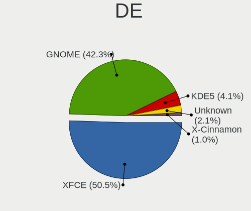

| Name       | Computers | Percent |
|------------|-----------|---------|
| XFCE       | 25        | 65.79%  |
| GNOME      | 8         | 21.05%  |
| KDE5       | 2         | 5.26%   |
| Unknown    | 2         | 5.26%   |
| X-Cinnamon | 1         | 2.63%   |

Display Server
--------------

X11 or Wayland

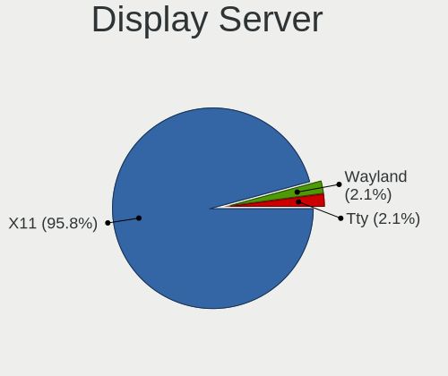

| Name | Computers | Percent |
|------|-----------|---------|
| X11  | 38        | 100%    |

Display Manager
---------------

SDDM, LightDM, etc.

| Name    | Computers | Percent |
|---------|-----------|---------|
| Unknown | 24        | 63.16%  |
| TDM     | 6         | 15.79%  |
| LightDM | 4         | 10.53%  |
| GDM     | 3         | 7.89%   |
| SDDM    | 1         | 2.63%   |

OS Lang
-------

Language

| Lang    | Computers | Percent |
|---------|-----------|---------|
| tr_TR   | 31        | 81.58%  |
| Unknown | 3         | 7.89%   |
| pt_BR   | 1         | 2.63%   |
| fr_FR   | 1         | 2.63%   |
| en_US   | 1         | 2.63%   |
| en_GB   | 1         | 2.63%   |

Boot Mode
---------

EFI or BIOS

| Mode | Computers | Percent |
|------|-----------|---------|
| BIOS | 30        | 76.92%  |
| EFI  | 9         | 23.08%  |

Filesystem
----------

Type of filesystem

| Type    | Computers | Percent |
|---------|-----------|---------|
| Ext4    | 37        | 97.37%  |
| Overlay | 1         | 2.63%   |

Part. scheme
------------

Scheme of partitioning

| Type    | Computers | Percent |
|---------|-----------|---------|
| Unknown | 27        | 71.05%  |
| GPT     | 9         | 23.68%  |
| MBR     | 2         | 5.26%   |

Dual Boot with Linux/BSD
------------------------

Hosting more than one Linux/BSD

| Dual boot | Computers | Percent |
|-----------|-----------|---------|
| No        | 35        | 92.11%  |
| Yes       | 3         | 7.89%   |

Dual Boot (Win)
---------------

Hosting Linux and Windows

| Dual boot | Computers | Percent |
|-----------|-----------|---------|
| No        | 31        | 81.58%  |
| Yes       | 7         | 18.42%  |

Board
-----

Vendor
------

Motherboard manufacturer

| Name                | Computers | Percent |
|---------------------|-----------|---------|
| Lenovo              | 9         | 23.68%  |
| MSI                 | 6         | 15.79%  |
| Hewlett-Packard     | 5         | 13.16%  |
| ASUSTek Computer    | 4         | 10.53%  |
| Toshiba             | 2         | 5.26%   |
| Sony                | 2         | 5.26%   |
| Packard Bell        | 2         | 5.26%   |
| Gigabyte Technology | 2         | 5.26%   |
| Dell                | 2         | 5.26%   |
| Acer                | 2         | 5.26%   |
| Samsung Electronics | 1         | 2.63%   |
| Philco              | 1         | 2.63%   |

Model
-----

Motherboard model

| Name                                       | Computers | Percent |
|--------------------------------------------|-----------|---------|
| MSI MS-7360                                | 3         | 7.89%   |
| Toshiba Satellite C855-1VM                 | 1         | 2.63%   |
| Toshiba PORTEGE M780                       | 1         | 2.63%   |
| Sony SVF1521QSTB                           | 1         | 2.63%   |
| Sony SVE14A2V2ES                           | 1         | 2.63%   |
| Samsung 300E4A/300E5A/300E7A/3430EA/3530EA | 1         | 2.63%   |
| Philco 14F                                 | 1         | 2.63%   |
| Packard Bell EasyNote_GN45                 | 1         | 2.63%   |
| Packard Bell EasyNote ENTG81BA             | 1         | 2.63%   |
| MSI MS-7C09                                | 1         | 2.63%   |
| MSI MS-7A65                                | 1         | 2.63%   |
| MSI MS-7817                                | 1         | 2.63%   |
| Lenovo Yoga 310-11IAP 80U2                 | 1         | 2.63%   |
| Lenovo V145-15AST 81MT                     | 1         | 2.63%   |
| Lenovo V110-15ISK 80TL                     | 1         | 2.63%   |
| Lenovo ThinkPad T450 20BUS39Y00            | 1         | 2.63%   |
| Lenovo ThinkPad E15 Gen 2 20TD0047TX       | 1         | 2.63%   |
| Lenovo ThinkCentre M920t 10SGS62900        | 1         | 2.63%   |
| Lenovo IdeaPad-510-15IKB 80SV              | 1         | 2.63%   |
| Lenovo IdeaPad 320-15IKB 81BT              | 1         | 2.63%   |
| Lenovo IdeaPad 100-15IBD 80QQ              | 1         | 2.63%   |
| HP Pavilion 15                             | 1         | 2.63%   |
| HP Laptop 15-dw3xxx                        | 1         | 2.63%   |
| HP All-in-One 24-f0xx                      | 1         | 2.63%   |
| HP 250 G3                                  | 1         | 2.63%   |
| HP 15                                      | 1         | 2.63%   |
| Gigabyte A320M-S2H                         | 1         | 2.63%   |
| Gigabyte A320M-H                           | 1         | 2.63%   |
| Dell Latitude E6540                        | 1         | 2.63%   |
| Dell G5 5587                               | 1         | 2.63%   |
| ASUS X555YI                                | 1         | 2.63%   |
| ASUS V230IC-DDR4                           | 1         | 2.63%   |
| ASUS P5G41C-M LX                           | 1         | 2.63%   |
| ASUS E402BP                                | 1         | 2.63%   |
| Acer Veriton ES2740G                       | 1         | 2.63%   |
| Acer Aspire 5742G                          | 1         | 2.63%   |

Model Family
------------

Motherboard model prefix

| Name                     | Computers | Percent |
|--------------------------|-----------|---------|
| MSI MS-7360              | 3         | 7.89%   |
| Packard Bell EasyNote    | 2         | 5.26%   |
| Lenovo ThinkPad          | 2         | 5.26%   |
| Lenovo IdeaPad           | 2         | 5.26%   |
| Toshiba Satellite        | 1         | 2.63%   |
| Toshiba PORTEGE          | 1         | 2.63%   |
| Sony SVF1521QSTB         | 1         | 2.63%   |
| Sony SVE14A2V2ES         | 1         | 2.63%   |
| Samsung 300E4A           | 1         | 2.63%   |
| Philco 14F               | 1         | 2.63%   |
| MSI MS-7C09              | 1         | 2.63%   |
| MSI MS-7A65              | 1         | 2.63%   |
| MSI MS-7817              | 1         | 2.63%   |
| Lenovo Yoga              | 1         | 2.63%   |
| Lenovo V145-15AST        | 1         | 2.63%   |
| Lenovo V110-15ISK        | 1         | 2.63%   |
| Lenovo ThinkCentre       | 1         | 2.63%   |
| Lenovo IdeaPad-510-15IKB | 1         | 2.63%   |
| HP Pavilion              | 1         | 2.63%   |
| HP Laptop                | 1         | 2.63%   |
| HP All-in-One            | 1         | 2.63%   |
| HP 250                   | 1         | 2.63%   |
| HP 15                    | 1         | 2.63%   |
| Gigabyte A320M-S2H       | 1         | 2.63%   |
| Gigabyte A320M-H         | 1         | 2.63%   |
| Dell Latitude            | 1         | 2.63%   |
| Dell G5                  | 1         | 2.63%   |
| ASUS X555YI              | 1         | 2.63%   |
| ASUS V230IC-DDR4         | 1         | 2.63%   |
| ASUS P5G41C-M            | 1         | 2.63%   |
| ASUS E402BP              | 1         | 2.63%   |
| Acer Veriton             | 1         | 2.63%   |
| Acer Aspire              | 1         | 2.63%   |

MFG Year
--------

Motherboard manufacture year

| Year | Computers | Percent |
|------|-----------|---------|
| 2018 | 7         | 18.42%  |
| 2013 | 7         | 18.42%  |
| 2015 | 4         | 10.53%  |
| 2020 | 3         | 7.89%   |
| 2017 | 3         | 7.89%   |
| 2010 | 3         | 7.89%   |
| 2007 | 3         | 7.89%   |
| 2016 | 2         | 5.26%   |
| 2011 | 2         | 5.26%   |
| 2021 | 1         | 2.63%   |
| 2019 | 1         | 2.63%   |
| 2014 | 1         | 2.63%   |
| 2006 | 1         | 2.63%   |

Form Factor
-----------

Physical design of the computer

| Name        | Computers | Percent |
|-------------|-----------|---------|
| Notebook    | 24        | 63.16%  |
| Desktop     | 11        | 28.95%  |
| All in one  | 2         | 5.26%   |
| Convertible | 1         | 2.63%   |

Secure Boot
-----------

Enabled or disabled

| State    | Computers | Percent |
|----------|-----------|---------|
| Disabled | 38        | 100%    |

Coreboot
--------

Have coreboot on board

| Used | Computers | Percent |
|------|-----------|---------|
| No   | 38        | 100%    |

RAM Size
--------

Total RAM memory

| Size in GB | Computers | Percent |
|------------|-----------|---------|
| 3.01-4.0   | 15        | 39.47%  |
| 4.01-8.0   | 10        | 26.32%  |
| 16.01-24.0 | 5         | 13.16%  |
| 8.01-16.0  | 4         | 10.53%  |
| 1.01-2.0   | 2         | 5.26%   |
| 32.01-64.0 | 1         | 2.63%   |
| 2.01-3.0   | 1         | 2.63%   |

RAM Used
--------

Used RAM memory

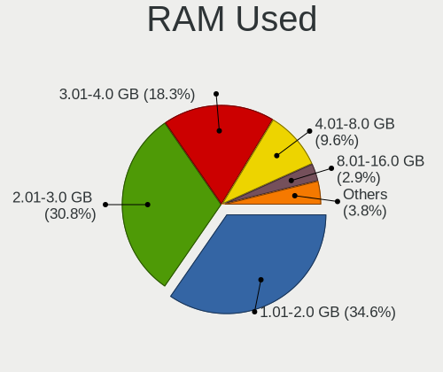

| Used GB    | Computers | Percent |
|------------|-----------|---------|
| 1.01-2.0   | 16        | 39.02%  |
| 2.01-3.0   | 12        | 29.27%  |
| 3.01-4.0   | 7         | 17.07%  |
| 4.01-8.0   | 3         | 7.32%   |
| 24.01-32.0 | 1         | 2.44%   |
| 8.01-16.0  | 1         | 2.44%   |
| 0.51-1.0   | 1         | 2.44%   |

Total Drives
------------

Number of drives on board

| Drives | Computers | Percent |
|--------|-----------|---------|
| 1      | 24        | 63.16%  |
| 2      | 11        | 28.95%  |
| 3      | 2         | 5.26%   |
| 4      | 1         | 2.63%   |

Has CD-ROM
----------

Has CD-ROM on board

| Presented | Computers | Percent |
|-----------|-----------|---------|
| Yes       | 23        | 60.53%  |
| No        | 15        | 39.47%  |

Has Ethernet
------------

Has Ethernet on board

| Presented | Computers | Percent |
|-----------|-----------|---------|
| Yes       | 37        | 97.37%  |
| No        | 1         | 2.63%   |

Has WiFi
--------

Has WiFi module

| Presented | Computers | Percent |
|-----------|-----------|---------|
| Yes       | 30        | 78.95%  |
| No        | 8         | 21.05%  |

Has Bluetooth
-------------

Has Bluetooth module

| Presented | Computers | Percent |
|-----------|-----------|---------|
| Yes       | 24        | 63.16%  |
| No        | 14        | 36.84%  |

Location
--------

Country
-------

Geographic location (country)

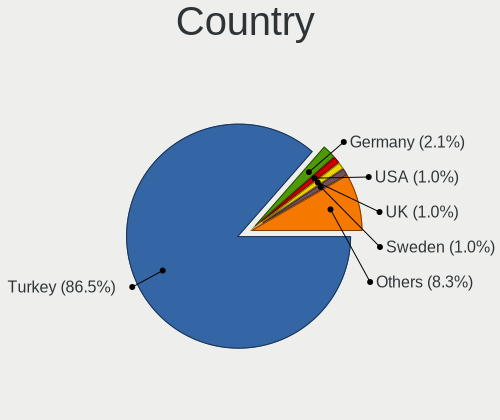

| Country | Computers | Percent |
|---------|-----------|---------|
| Turkey  | 35        | 92.11%  |
| UK      | 1         | 2.63%   |
| France  | 1         | 2.63%   |
| Brazil  | 1         | 2.63%   |

City
----

Geographic location (city)

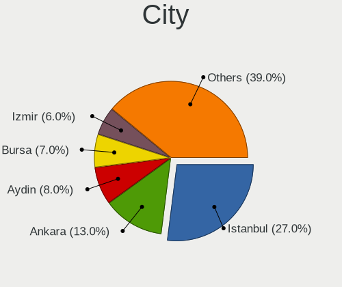

| City        | Computers | Percent |
|-------------|-----------|---------|
| Istanbul    | 10        | 24.39%  |
| Bursa       | 6         | 14.63%  |
| Ankara      | 5         | 12.2%   |
| Izmir       | 3         | 7.32%   |
| Aydin       | 3         | 7.32%   |
| Konya       | 2         | 4.88%   |
| Çanakkale  | 2         | 4.88%   |
| Yaman       | 1         | 2.44%   |
| Soleymieu   | 1         | 2.44%   |
| Sao Gabriel | 1         | 2.44%   |
| Samsun      | 1         | 2.44%   |
| Malatya     | 1         | 2.44%   |
| London      | 1         | 2.44%   |
| Gaziantep   | 1         | 2.44%   |
| Esenyurt    | 1         | 2.44%   |
| Artvin      | 1         | 2.44%   |
| Antalya     | 1         | 2.44%   |

Drives
------

Drive Vendor
------------

Hard drive vendors

| Vendor              | Computers | Drives | Percent |
|---------------------|-----------|--------|---------|
| WDC                 | 12        | 15     | 22.22%  |
| Seagate             | 7         | 8      | 12.96%  |
| Samsung Electronics | 7         | 9      | 12.96%  |
| SanDisk             | 3         | 3      | 5.56%   |
| Kingston            | 3         | 4      | 5.56%   |
| A-DATA Technology   | 3         | 3      | 5.56%   |
| Unknown             | 2         | 3      | 3.7%    |
| SK hynix            | 2         | 2      | 3.7%    |
| KIOXIA-EXCERIA      | 2         | 2      | 3.7%    |
| HGST                | 2         | 2      | 3.7%    |
| Toshiba             | 1         | 1      | 1.85%   |
| Team                | 1         | 1      | 1.85%   |
| SPCC                | 1         | 1      | 1.85%   |
| Silicon Motion      | 1         | 1      | 1.85%   |
| Micron Technology   | 1         | 2      | 1.85%   |
| Lexar               | 1         | 1      | 1.85%   |
| KingSpec            | 1         | 1      | 1.85%   |
| Hitachi             | 1         | 1      | 1.85%   |
| Corsair             | 1         | 1      | 1.85%   |
| China               | 1         | 1      | 1.85%   |
| addlink             | 1         | 1      | 1.85%   |

Drive Model
-----------

Hard drive models

| Model                                       | Computers | Percent |
|---------------------------------------------|-----------|---------|
| WDC WD6402AAEX-00Y9A0 640GB                 | 3         | 5.45%   |
| A-DATA SU650 120GB SSD                      | 3         | 5.45%   |
| HGST HTS545050A7E680 500GB                  | 2         | 3.64%   |
| WDC WD5000LPVX-55V0TT0 500GB                | 1         | 1.82%   |
| WDC WD5000LPCX-60VHAT0 500GB                | 1         | 1.82%   |
| WDC WD5000LPCX-21VHAT0 500GB                | 1         | 1.82%   |
| WDC WD5000AAKX-00ERMA0 500GB                | 1         | 1.82%   |
| WDC WD3200BPVT-35JJ5T0 320GB                | 1         | 1.82%   |
| WDC WD3200AAJB-00WGA0 320GB                 | 1         | 1.82%   |
| WDC WD10JPVX-60JC3T0 1TB                    | 1         | 1.82%   |
| WDC WD10JPCX-24UE4T0 1TB                    | 1         | 1.82%   |
| WDC WD10EZEX-60WN4A0 1TB                    | 1         | 1.82%   |
| Unknown SD/MMC/MS PRO 128GB                 | 1         | 1.82%   |
| Unknown MMC Card  64GB                      | 1         | 1.82%   |
| Toshiba DT01ACA100 1TB                      | 1         | 1.82%   |
| Team T253X1240G 240GB SSD                   | 1         | 1.82%   |
| SPCC Solid State Disk 512GB                 | 1         | 1.82%   |
| SK hynix SC311 SATA 256GB SSD               | 1         | 1.82%   |
| SK hynix BC511 HFM256GDJTNI-82A0A 256GB     | 1         | 1.82%   |
| Silicon Motion Longline SSD 512GB           | 1         | 1.82%   |
| Seagate ST9500325AS 500GB                   | 1         | 1.82%   |
| Seagate ST9120822AS 120GB                   | 1         | 1.82%   |
| Seagate ST3160318AS 160GB                   | 1         | 1.82%   |
| Seagate ST2000DM008-2FR102 2TB              | 1         | 1.82%   |
| Seagate ST1000LM035-1RK172 1TB              | 1         | 1.82%   |
| Seagate Expansion 500GB                     | 1         | 1.82%   |
| Seagate BarraCuda Q1 SSD ZA480CV10001 480GB | 1         | 1.82%   |
| SanDisk Ultra II 240GB SSD                  | 1         | 1.82%   |
| SanDisk SSD PLUS 240GB                      | 1         | 1.82%   |
| SanDisk SDSSDA480G 480GB                    | 1         | 1.82%   |
| Samsung SSD 860 EVO 500GB                   | 1         | 1.82%   |
| Samsung NVMe SSD Drive 512GB                | 1         | 1.82%   |
| Samsung MZALQ256HAJD-000L1 256GB            | 1         | 1.82%   |
| Samsung MZ7LN128HAHQ-000L2 128GB SSD        | 1         | 1.82%   |
| Samsung MZ7LF192HCGS-000L1 192GB SSD        | 1         | 1.82%   |
| Samsung HD501LJ 500GB                       | 1         | 1.82%   |
| Samsung HD160HJ 160GB                       | 1         | 1.82%   |
| Samsung HD103SJ 1TB                         | 1         | 1.82%   |
| Micron 1300_MTFDDAK512TDL 512GB SSD         | 1         | 1.82%   |
| Lexar 120GB SSD                             | 1         | 1.82%   |
| KIOXIA-EXCERIA SATA SSD 480GB               | 1         | 1.82%   |
| KIOXIA-EXCERIA SATA SSD 240GB               | 1         | 1.82%   |
| Kingston SV300S37A120G 120GB SSD            | 1         | 1.82%   |
| Kingston SHFS37A120G 120GB SSD              | 1         | 1.82%   |
| Kingston SA400S37240G 240GB SSD             | 1         | 1.82%   |
| KingSpec P3-128 128GB                       | 1         | 1.82%   |
| Hitachi HTS545025B9A300 250GB               | 1         | 1.82%   |
| Corsair Force LS SSD 64GB                   | 1         | 1.82%   |
| China SATA SSD 120GB                        | 1         | 1.82%   |
| addlink S10 960GB                           | 1         | 1.82%   |

HDD Vendor
----------

Hard disk drive vendors

| Vendor              | Computers | Drives | Percent |
|---------------------|-----------|--------|---------|
| WDC                 | 12        | 15     | 48%     |
| Seagate             | 6         | 7      | 24%     |
| Samsung Electronics | 2         | 3      | 8%      |
| HGST                | 2         | 2      | 8%      |
| Unknown             | 1         | 2      | 4%      |
| Toshiba             | 1         | 1      | 4%      |
| Hitachi             | 1         | 1      | 4%      |

SSD Vendor
----------

Solid state drive vendors

| Vendor              | Computers | Drives | Percent |
|---------------------|-----------|--------|---------|
| SanDisk             | 3         | 3      | 13.04%  |
| Samsung Electronics | 3         | 3      | 13.04%  |
| Kingston            | 3         | 4      | 13.04%  |
| A-DATA Technology   | 3         | 3      | 13.04%  |
| KIOXIA-EXCERIA      | 2         | 2      | 8.7%    |
| Team                | 1         | 1      | 4.35%   |
| SPCC                | 1         | 1      | 4.35%   |
| SK hynix            | 1         | 1      | 4.35%   |
| Seagate             | 1         | 1      | 4.35%   |
| Micron Technology   | 1         | 2      | 4.35%   |
| Lexar               | 1         | 1      | 4.35%   |
| KingSpec            | 1         | 1      | 4.35%   |
| Corsair             | 1         | 1      | 4.35%   |
| China               | 1         | 1      | 4.35%   |

Drive Kind
----------

HDD or SSD

| Kind    | Computers | Drives | Percent |
|---------|-----------|--------|---------|
| HDD     | 22        | 31     | 47.83%  |
| SSD     | 19        | 25     | 41.3%   |
| NVMe    | 3         | 5      | 6.52%   |
| MMC     | 1         | 1      | 2.17%   |
| Unknown | 1         | 1      | 2.17%   |

Drive Connector
---------------

SATA, SAS, NVMe, etc.

| Type | Computers | Drives | Percent |
|------|-----------|--------|---------|
| SATA | 35        | 54     | 85.37%  |
| NVMe | 3         | 5      | 7.32%   |
| SAS  | 2         | 3      | 4.88%   |
| MMC  | 1         | 1      | 2.44%   |

Drive Size
----------

Size of hard drive

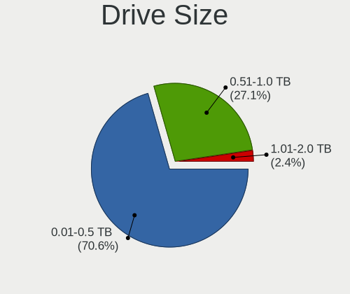

| Size in TB | Computers | Drives | Percent |
|------------|-----------|--------|---------|
| 0.01-0.5   | 29        | 39     | 70.73%  |
| 0.51-1.0   | 11        | 15     | 26.83%  |
| 1.01-2.0   | 1         | 2      | 2.44%   |

Space Total
-----------

Amount of disk space available on the file system

| Size in GB | Computers | Percent |
|------------|-----------|---------|
| 101-250    | 17        | 43.59%  |
| 251-500    | 11        | 28.21%  |
| 501-1000   | 5         | 12.82%  |
| 51-100     | 3         | 7.69%   |
| 21-50      | 2         | 5.13%   |
| 2001-3000  | 1         | 2.56%   |

Space Used
----------

Amount of used disk space

| Used GB  | Computers | Percent |
|----------|-----------|---------|
| 1-20     | 13        | 33.33%  |
| 21-50    | 11        | 28.21%  |
| 51-100   | 8         | 20.51%  |
| 101-250  | 5         | 12.82%  |
| 251-500  | 1         | 2.56%   |
| 501-1000 | 1         | 2.56%   |

Malfunc. Drives
---------------

Drive models with a malfunction

| Model                            | Computers | Drives | Percent |
|----------------------------------|-----------|--------|---------|
| WDC WD5000LPCX-60VHAT0 500GB     | 1         | 1      | 33.33%  |
| Seagate ST9120822AS 120GB        | 1         | 1      | 33.33%  |
| Kingston SV300S37A120G 120GB SSD | 1         | 1      | 33.33%  |

Malfunc. Drive Vendor
---------------------

Vendors of faulty drives

| Vendor   | Computers | Drives | Percent |
|----------|-----------|--------|---------|
| WDC      | 1         | 1      | 33.33%  |
| Seagate  | 1         | 1      | 33.33%  |
| Kingston | 1         | 1      | 33.33%  |

Malfunc. HDD Vendor
-------------------

Vendors of faulty HDD drives

| Vendor  | Computers | Drives | Percent |
|---------|-----------|--------|---------|
| WDC     | 1         | 1      | 50%     |
| Seagate | 1         | 1      | 50%     |

Malfunc. Drive Kind
-------------------

Kinds of faulty drives

| Kind | Computers | Drives | Percent |
|------|-----------|--------|---------|
| HDD  | 2         | 2      | 66.67%  |
| SSD  | 1         | 1      | 33.33%  |

Failed Drives
-------------

Failed drive models

Zero info for selected period =(

Failed Drive Vendor
-------------------

Failed drive vendors

Zero info for selected period =(

Drive Status
------------

Number of failed and malfunc. drives

| Status   | Computers | Drives | Percent |
|----------|-----------|--------|---------|
| Detected | 27        | 47     | 67.5%   |
| Works    | 10        | 13     | 25%     |
| Malfunc  | 3         | 3      | 7.5%    |

Storage controller
------------------

Storage Vendor
--------------

Storage controller vendors

| Vendor                   | Computers | Percent |
|--------------------------|-----------|---------|
| Intel                    | 31        | 70.45%  |
| AMD                      | 6         | 13.64%  |
| Marvell Technology Group | 3         | 6.82%   |
| Samsung Electronics      | 2         | 4.55%   |
| SK hynix                 | 1         | 2.27%   |
| Silicon Motion           | 1         | 2.27%   |

Storage Model
-------------

Storage controller models

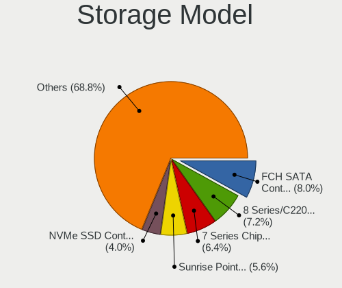

| Model                                                                            | Computers | Percent |
|----------------------------------------------------------------------------------|-----------|---------|
| AMD FCH SATA Controller [AHCI mode]                                              | 5         | 9.8%    |
| Intel Sunrise Point-LP SATA Controller [AHCI mode]                               | 4         | 7.84%   |
| Intel 7 Series Chipset Family 6-port SATA Controller [AHCI mode]                 | 4         | 7.84%   |
| Marvell Group 88SE6111/6121 SATA II / PATA Controller                            | 3         | 5.88%   |
| Intel Wildcat Point-LP SATA Controller [AHCI Mode]                               | 3         | 5.88%   |
| Intel 82801IB (ICH9) 2 port SATA Controller [IDE mode]                           | 3         | 5.88%   |
| Intel 82801I (ICH9 Family) 2 port SATA Controller [IDE mode]                     | 3         | 5.88%   |
| Samsung NVMe SSD Controller 980                                                  | 2         | 3.92%   |
| Intel 8 Series/C220 Series Chipset Family 6-port SATA Controller 1 [AHCI mode]   | 2         | 3.92%   |
| Intel 5 Series/3400 Series Chipset 4 port SATA AHCI Controller                   | 2         | 3.92%   |
| Intel 200 Series PCH SATA controller [AHCI mode]                                 | 2         | 3.92%   |
| AMD FCH SATA Controller D                                                        | 2         | 3.92%   |
| SK hynix BC511                                                                   | 1         | 1.96%   |
| Silicon Motion SM2263EN/SM2263XT SSD Controller                                  | 1         | 1.96%   |
| Intel Volume Management Device NVMe RAID Controller                              | 1         | 1.96%   |
| Intel Tiger Lake-LP SATA Controller                                              | 1         | 1.96%   |
| Intel Q170/Q150/B150/H170/H110/Z170/CM236 Chipset SATA Controller [AHCI Mode]    | 1         | 1.96%   |
| Intel NM10/ICH7 Family SATA Controller [IDE mode]                                | 1         | 1.96%   |
| Intel Celeron N3350/Pentium N4200/Atom E3900 Series SATA AHCI Controller         | 1         | 1.96%   |
| Intel Cannon Lake PCH SATA AHCI Controller                                       | 1         | 1.96%   |
| Intel Cannon Lake Mobile PCH SATA AHCI Controller                                | 1         | 1.96%   |
| Intel Atom/Celeron/Pentium Processor x5-E8000/J3xxx/N3xxx Series SATA Controller | 1         | 1.96%   |
| Intel 82801GBM/GHM (ICH7-M Family) SATA Controller [IDE mode]                    | 1         | 1.96%   |
| Intel 82801G (ICH7 Family) IDE Controller                                        | 1         | 1.96%   |
| Intel 8 Series SATA Controller 1 [AHCI mode]                                     | 1         | 1.96%   |
| Intel 6 Series/C200 Series Chipset Family 6 port Mobile SATA AHCI Controller     | 1         | 1.96%   |
| Intel 400 Series Chipset Family SATA AHCI Controller                             | 1         | 1.96%   |
| AMD SB7x0/SB8x0/SB9x0 SATA Controller [AHCI mode]                                | 1         | 1.96%   |

Storage Kind
------------

Kind of storage controller (IDE, SATA, NVMe, SAS, ...)

| Kind | Computers | Percent |
|------|-----------|---------|
| SATA | 32        | 78.05%  |
| IDE  | 5         | 12.2%   |
| NVMe | 3         | 7.32%   |
| RAID | 1         | 2.44%   |

Processor
---------

CPU Vendor
----------

Processor vendors

| Vendor | Computers | Percent |
|--------|-----------|---------|
| Intel  | 32        | 84.21%  |
| AMD    | 6         | 15.79%  |

CPU Model
---------

Processor models

| Model                                         | Computers | Percent |
|-----------------------------------------------|-----------|---------|
| Intel Core 2 Quad CPU Q6600 @ 2.40GHz         | 3         | 7.89%   |
| Intel Core i5-8250U CPU @ 1.60GHz             | 2         | 5.26%   |
| Intel Core i3 CPU M 370 @ 2.40GHz             | 2         | 5.26%   |
| Intel Pentium CPU B960 @ 2.20GHz              | 1         | 2.63%   |
| Intel Pentium CPU B950 @ 2.10GHz              | 1         | 2.63%   |
| Intel Core i9-9900 CPU @ 3.10GHz              | 1         | 2.63%   |
| Intel Core i7-8750H CPU @ 2.20GHz             | 1         | 2.63%   |
| Intel Core i7-5500U CPU @ 2.40GHz             | 1         | 2.63%   |
| Intel Core i7-4800MQ CPU @ 2.70GHz            | 1         | 2.63%   |
| Intel Core i7-3630QM CPU @ 2.40GHz            | 1         | 2.63%   |
| Intel Core i5-7600 CPU @ 3.50GHz              | 1         | 2.63%   |
| Intel Core i5-7200U CPU @ 2.50GHz             | 1         | 2.63%   |
| Intel Core i5-6400T CPU @ 2.20GHz             | 1         | 2.63%   |
| Intel Core i5-5200U CPU @ 2.20GHz             | 1         | 2.63%   |
| Intel Core i5-4460 CPU @ 3.20GHz              | 1         | 2.63%   |
| Intel Core i5-3230M CPU @ 2.60GHz             | 1         | 2.63%   |
| Intel Core i5-10400 CPU @ 2.90GHz             | 1         | 2.63%   |
| Intel Core i3-9100F CPU @ 3.60GHz             | 1         | 2.63%   |
| Intel Core i3-6006U CPU @ 2.00GHz             | 1         | 2.63%   |
| Intel Core i3-5005U CPU @ 2.00GHz             | 1         | 2.63%   |
| Intel Core i3-4005U CPU @ 1.70GHz             | 1         | 2.63%   |
| Intel Core i3-3227U CPU @ 1.90GHz             | 1         | 2.63%   |
| Intel Core 2 Quad CPU Q8300 @ 2.50GHz         | 1         | 2.63%   |
| Intel Core 2 CPU T5600 @ 1.83GHz              | 1         | 2.63%   |
| Intel Celeron CPU N3350 @ 1.10GHz             | 1         | 2.63%   |
| Intel Celeron CPU N3050 @ 1.60GHz             | 1         | 2.63%   |
| Intel 11th Gen Core i5-1135G7 @ 2.40GHz       | 1         | 2.63%   |
| Intel 11th Gen Core i3-1115G4 @ 3.00GHz       | 1         | 2.63%   |
| AMD Ryzen 5 3500X 6-Core Processor            | 1         | 2.63%   |
| AMD C-50 Processor                            | 1         | 2.63%   |
| AMD A9-9425 RADEON R5, 5 COMPUTE CORES 2C+3G  | 1         | 2.63%   |
| AMD A9-9420 RADEON R5, 5 COMPUTE CORES 2C+3G  | 1         | 2.63%   |
| AMD A8-9600 RADEON R7, 10 COMPUTE CORES 4C+6G | 1         | 2.63%   |
| AMD A8-7410 APU with AMD Radeon R5 Graphics   | 1         | 2.63%   |

CPU Model Family
----------------

Processor model prefix

| Model             | Computers | Percent |
|-------------------|-----------|---------|
| Intel Core i5     | 9         | 23.68%  |
| Intel Core i3     | 7         | 18.42%  |
| Other             | 4         | 10.53%  |
| Intel Core i7     | 4         | 10.53%  |
| Intel Core 2 Quad | 4         | 10.53%  |
| Intel Pentium     | 2         | 5.26%   |
| Intel Celeron     | 2         | 5.26%   |
| AMD A8            | 2         | 5.26%   |
| Intel Core i9     | 1         | 2.63%   |
| Intel Core 2      | 1         | 2.63%   |
| AMD Ryzen 5       | 1         | 2.63%   |
| AMD C-50          | 1         | 2.63%   |

CPU Cores
---------

Number of processor cores

| Number | Computers | Percent |
|--------|-----------|---------|
| 2      | 20        | 52.63%  |
| 4      | 14        | 36.84%  |
| 6      | 3         | 7.89%   |
| 8      | 1         | 2.63%   |

CPU Sockets
-----------

Number of sockets

| Number | Computers | Percent |
|--------|-----------|---------|
| 1      | 38        | 100%    |

CPU Threads
-----------

Threads per core (Hyper-Threading)

| Number | Computers | Percent |
|--------|-----------|---------|
| 2      | 20        | 52.63%  |
| 1      | 18        | 47.37%  |

CPU Op-Modes
------------

CPU Operation Modes (32-bit, 64-bit)

| Op mode        | Computers | Percent |
|----------------|-----------|---------|
| 32-bit, 64-bit | 38        | 100%    |

CPU Microcode
-------------

Microcode number

| Number     | Computers | Percent |
|------------|-----------|---------|
| Unknown    | 24        | 63.16%  |
| 0x906eb    | 1         | 2.63%   |
| 0x906ea    | 1         | 2.63%   |
| 0x906e9    | 1         | 2.63%   |
| 0x806ea    | 1         | 2.63%   |
| 0x806c1    | 1         | 2.63%   |
| 0x6f6      | 1         | 2.63%   |
| 0x506e3    | 1         | 2.63%   |
| 0x406e3    | 1         | 2.63%   |
| 0x306d4    | 1         | 2.63%   |
| 0x306c3    | 1         | 2.63%   |
| 0x306a9    | 1         | 2.63%   |
| 0x07030105 | 1         | 2.63%   |
| 0x06006705 | 1         | 2.63%   |
| 0x05000029 | 1         | 2.63%   |

CPU Microarch
-------------

Microarchitecture

| Name        | Computers | Percent |
|-------------|-----------|---------|
| KabyLake    | 7         | 18.42%  |
| Core        | 4         | 10.53%  |
| IvyBridge   | 3         | 7.89%   |
| Haswell     | 3         | 7.89%   |
| Excavator   | 3         | 7.89%   |
| Broadwell   | 3         | 7.89%   |
| Westmere    | 2         | 5.26%   |
| TigerLake   | 2         | 5.26%   |
| Skylake     | 2         | 5.26%   |
| SandyBridge | 2         | 5.26%   |
| Zen 2       | 1         | 2.63%   |
| Silvermont  | 1         | 2.63%   |
| Puma        | 1         | 2.63%   |
| Penryn      | 1         | 2.63%   |
| Goldmont    | 1         | 2.63%   |
| CometLake   | 1         | 2.63%   |
| Bobcat      | 1         | 2.63%   |

Graphics
--------

GPU Vendor
----------

Vendors of graphics cards

| Vendor | Computers | Percent |
|--------|-----------|---------|
| Intel  | 26        | 54.17%  |
| Nvidia | 11        | 22.92%  |
| AMD    | 11        | 22.92%  |

GPU Model
---------

Graphics card models

| Model                                                                                    | Computers | Percent |
|------------------------------------------------------------------------------------------|-----------|---------|
| Nvidia GT200 [GeForce GTX 260]                                                           | 3         | 5.77%   |
| Intel HD Graphics 5500                                                                   | 3         | 5.77%   |
| Intel 3rd Gen Core processor Graphics Controller                                         | 3         | 5.77%   |
| Nvidia GT218 [GeForce 210]                                                               | 2         | 3.85%   |
| Nvidia GF117M [GeForce 610M/710M/810M/820M / GT 620M/625M/630M/720M]                     | 2         | 3.85%   |
| Intel UHD Graphics 620                                                                   | 2         | 3.85%   |
| Intel 2nd Generation Core Processor Family Integrated Graphics Controller                | 2         | 3.85%   |
| AMD Topaz XT [Radeon R7 M260/M265 / M340/M360 / M440/M445 / 530/535 / 620/625 Mobile]    | 2         | 3.85%   |
| AMD Stoney [Radeon R2/R3/R4/R5 Graphics]                                                 | 2         | 3.85%   |
| Nvidia GP107 [GeForce GTX 1050 Ti]                                                       | 1         | 1.92%   |
| Nvidia GP106M [GeForce GTX 1060 Mobile]                                                  | 1         | 1.92%   |
| Nvidia GK208M [GeForce GT 740M]                                                          | 1         | 1.92%   |
| Nvidia GF108M [GeForce GT 420M]                                                          | 1         | 1.92%   |
| Intel Xeon E3-1200 v3/4th Gen Core Processor Integrated Graphics Controller              | 1         | 1.92%   |
| Intel TigerLake-LP GT2 [Iris Xe Graphics]                                                | 1         | 1.92%   |
| Intel Tiger Lake UHD Graphics                                                            | 1         | 1.92%   |
| Intel Mobile 945GM/GMS/GME, 943/940GML Express Integrated Graphics Controller            | 1         | 1.92%   |
| Intel Mobile 945GM/GMS, 943/940GML Express Integrated Graphics Controller                | 1         | 1.92%   |
| Intel HD Graphics 630                                                                    | 1         | 1.92%   |
| Intel HD Graphics 620                                                                    | 1         | 1.92%   |
| Intel HD Graphics 530                                                                    | 1         | 1.92%   |
| Intel HD Graphics 520                                                                    | 1         | 1.92%   |
| Intel HD Graphics 500                                                                    | 1         | 1.92%   |
| Intel Haswell-ULT Integrated Graphics Controller                                         | 1         | 1.92%   |
| Intel Core Processor Integrated Graphics Controller                                      | 1         | 1.92%   |
| Intel CometLake-S GT2 [UHD Graphics 630]                                                 | 1         | 1.92%   |
| Intel CoffeeLake-S GT2 [UHD Graphics 630]                                                | 1         | 1.92%   |
| Intel CoffeeLake-H GT2 [UHD Graphics 630]                                                | 1         | 1.92%   |
| Intel Atom/Celeron/Pentium Processor x5-E8000/J3xxx/N3xxx Integrated Graphics Controller | 1         | 1.92%   |
| Intel 4th Gen Core Processor Integrated Graphics Controller                              | 1         | 1.92%   |
| AMD Wrestler [Radeon HD 6250]                                                            | 1         | 1.92%   |
| AMD Wani [Radeon R5/R6/R7 Graphics]                                                      | 1         | 1.92%   |
| AMD Sun XT [Radeon HD 8670A/8670M/8690M / R5 M330 / M430 / Radeon 520 Mobile]            | 1         | 1.92%   |
| AMD Sun LE [Radeon HD 8550M / R5 M230]                                                   | 1         | 1.92%   |
| AMD Mullins [Radeon R4/R5 Graphics]                                                      | 1         | 1.92%   |
| AMD Mars XTX [Radeon HD 8790M]                                                           | 1         | 1.92%   |
| AMD Jet PRO [Radeon R5 M230 / R7 M260DX / Radeon 520 Mobile]                             | 1         | 1.92%   |
| AMD Ellesmere [Radeon RX 470/480/570/570X/580/580X/590]                                  | 1         | 1.92%   |
| AMD Bonaire XT [Radeon HD 7790/8770 / R7 360 / R9 260/360 OEM]                           | 1         | 1.92%   |
| AMD Baffin [Radeon RX 460/560D / Pro 450/455/460/555/555X/560/560X]                      | 1         | 1.92%   |

GPU Combo
---------

Combinations of graphics cards

| Name           | Computers | Percent |
|----------------|-----------|---------|
| 1 x Intel      | 16        | 42.11%  |
| 1 x Nvidia     | 7         | 18.42%  |
| 1 x AMD        | 5         | 13.16%  |
| Intel + Nvidia | 4         | 10.53%  |
| 2 x AMD        | 3         | 7.89%   |
| Intel + AMD    | 3         | 7.89%   |

GPU Driver
----------

Free vs proprietary

| Driver      | Computers | Percent |
|-------------|-----------|---------|
| Free        | 37        | 97.37%  |
| Proprietary | 1         | 2.63%   |

GPU Memory
----------

Total video memory

| Size in GB | Computers | Percent |
|------------|-----------|---------|
| Unknown    | 31        | 81.58%  |
| 0.01-0.5   | 3         | 7.89%   |
| 0.51-1.0   | 2         | 5.26%   |
| 5.01-6.0   | 1         | 2.63%   |
| 1.01-2.0   | 1         | 2.63%   |

Monitor
-------

Monitor Vendor
--------------

Monitor vendors

| Vendor                  | Computers | Percent |
|-------------------------|-----------|---------|
| Samsung Electronics     | 5         | 13.51%  |
| AU Optronics            | 5         | 13.51%  |
| LG Display              | 4         | 10.81%  |
| Goldstar                | 4         | 10.81%  |
| Chimei Innolux          | 4         | 10.81%  |
| BOE                     | 3         | 8.11%   |
| Acer                    | 2         | 5.41%   |
| SAC                     | 1         | 2.7%    |
| LG Philips              | 1         | 2.7%    |
| Lenovo                  | 1         | 2.7%    |
| Iiyama                  | 1         | 2.7%    |
| Hewlett-Packard         | 1         | 2.7%    |
| Dell                    | 1         | 2.7%    |
| Chi Mei Optoelectronics | 1         | 2.7%    |
| Beko                    | 1         | 2.7%    |
| AOC                     | 1         | 2.7%    |
| AGO                     | 1         | 2.7%    |

Monitor Model
-------------

Monitor models

| Model                                                                    | Computers | Percent |
|--------------------------------------------------------------------------|-----------|---------|
| Goldstar W2242 GSM5678 1680x1050 474x296mm 22.0-inch                     | 3         | 7.89%   |
| Samsung Electronics U32J59x SAM0F34 3840x2160 697x392mm 31.5-inch        | 1         | 2.63%   |
| Samsung Electronics SyncMaster SAM0599 1600x900 443x249mm 20.0-inch      | 1         | 2.63%   |
| Samsung Electronics SyncMaster SAM01B7 1280x1024 338x270mm 17.0-inch     | 1         | 2.63%   |
| Samsung Electronics LCD Monitor SEC324A 1366x768 344x194mm 15.5-inch     | 1         | 2.63%   |
| Samsung Electronics LCD Monitor SEC3150 1366x768 344x193mm 15.5-inch     | 1         | 2.63%   |
| Samsung Electronics LCD Monitor SDC4951 1366x768 344x194mm 15.5-inch     | 1         | 2.63%   |
| SAC Casper SAC3219 1366x768 304x228mm 15.0-inch                          | 1         | 2.63%   |
| LG Philips LCD Monitor LPL1146 1280x800 331x207mm 15.4-inch              | 1         | 2.63%   |
| LG Display LCD Monitor LGD053F 1920x1080 344x194mm 15.5-inch             | 1         | 2.63%   |
| LG Display LCD Monitor LGD0470 1920x1080 345x194mm 15.6-inch             | 1         | 2.63%   |
| LG Display LCD Monitor LGD0384 1366x768 344x194mm 15.5-inch              | 1         | 2.63%   |
| LG Display LCD Monitor LGD033F 1366x768 310x174mm 14.0-inch              | 1         | 2.63%   |
| Lenovo LCD Monitor LEN40BA 1920x1080 344x194mm 15.5-inch                 | 1         | 2.63%   |
| Iiyama PLX2380H IVM5621 1920x1080 509x286mm 23.0-inch                    | 1         | 2.63%   |
| Hewlett-Packard ALL-in-One HPN4018 1920x1080 527x297mm 23.8-inch         | 1         | 2.63%   |
| Goldstar 2D HD TV GSM59CA 1366x768 509x286mm 23.0-inch                   | 1         | 2.63%   |
| Dell E2421HN DELF129 1920x1080 527x296mm 23.8-inch                       | 1         | 2.63%   |
| Chimei Innolux LCD Monitor CMN15DB 1366x768 344x193mm 15.5-inch          | 1         | 2.63%   |
| Chimei Innolux LCD Monitor CMN15C9 1366x768 344x193mm 15.5-inch          | 1         | 2.63%   |
| Chimei Innolux LCD Monitor CMN15BC 1366x768 344x193mm 15.5-inch          | 1         | 2.63%   |
| Chimei Innolux LCD Monitor CMN1482 1600x900 309x174mm 14.0-inch          | 1         | 2.63%   |
| Chi Mei Optoelectronics LCD Monitor CMO15AB 1366x768 340x190mm 15.3-inch | 1         | 2.63%   |
| BOE LCD Monitor BOE0696 1366x768 309x173mm 13.9-inch                     | 1         | 2.63%   |
| BOE LCD Monitor BOE0675 1366x768 344x194mm 15.5-inch                     | 1         | 2.63%   |
| BOE LCD Monitor BOE065E 1920x1080 344x194mm 15.5-inch                    | 1         | 2.63%   |
| Beko BK WUXGA BEK4448 1920x1080 1600x900mm 72.3-inch                     | 1         | 2.63%   |
| AU Optronics LCD Monitor AUO71EC 1366x768 344x193mm 15.5-inch            | 1         | 2.63%   |
| AU Optronics LCD Monitor AUO38ED 1920x1080 344x193mm 15.5-inch           | 1         | 2.63%   |
| AU Optronics LCD Monitor AUO3791 1920x1080 344x194mm 15.5-inch           | 1         | 2.63%   |
| AU Optronics LCD Monitor AUO235C 1366x768 256x144mm 11.6-inch            | 1         | 2.63%   |
| AU Optronics LCD Monitor AUO22EC 1366x768 344x193mm 15.5-inch            | 1         | 2.63%   |
| AOC 2260W AOC2260 1920x1080 477x268mm 21.5-inch                          | 1         | 2.63%   |
| AGO LCD Monitor AGO0001 1920x1080 256x192mm 12.6-inch                    | 1         | 2.63%   |
| Acer V226HQL ACR032D 1920x1080 477x268mm 21.5-inch                       | 1         | 2.63%   |
| Acer G206HQL ACR0327 1600x900 432x239mm 19.4-inch                        | 1         | 2.63%   |

Monitor Resolution
------------------

Monitor screen resolution

| Resolution         | Computers | Percent |
|--------------------|-----------|---------|
| 1366x768 (WXGA)    | 15        | 40.54%  |
| 1920x1080 (FHD)    | 13        | 35.14%  |
| 1680x1050 (WSXGA+) | 3         | 8.11%   |
| 1600x900 (HD+)     | 3         | 8.11%   |
| 3840x2160 (4K)     | 1         | 2.7%    |
| 1280x800 (WXGA)    | 1         | 2.7%    |
| 1280x1024 (SXGA)   | 1         | 2.7%    |

Monitor Diagonal
----------------

Diagonal size in inches

| Inches | Computers | Percent |
|--------|-----------|---------|
| 15     | 19        | 50%     |
| 23     | 7         | 18.42%  |
| 14     | 2         | 5.26%   |
| 72     | 1         | 2.63%   |
| 31     | 1         | 2.63%   |
| 22     | 1         | 2.63%   |
| 21     | 1         | 2.63%   |
| 20     | 1         | 2.63%   |
| 19     | 1         | 2.63%   |
| 17     | 1         | 2.63%   |
| 13     | 1         | 2.63%   |
| 12     | 1         | 2.63%   |
| 11     | 1         | 2.63%   |

Monitor Width
-------------

Physical width

| Width in mm | Computers | Percent |
|-------------|-----------|---------|
| 301-350     | 22        | 59.46%  |
| 401-500     | 7         | 18.92%  |
| 501-600     | 4         | 10.81%  |
| 201-300     | 2         | 5.41%   |
| 601-700     | 1         | 2.7%    |
| 1501-2000   | 1         | 2.7%    |

Aspect Ratio
------------

Proportional relationship between the width and the height

| Ratio | Computers | Percent |
|-------|-----------|---------|
| 16/9  | 29        | 78.38%  |
| 3/2   | 3         | 8.11%   |
| 4/3   | 2         | 5.41%   |
| 16/10 | 2         | 5.41%   |
| 5/4   | 1         | 2.7%    |

Monitor Area
------------

Area in inch²

| Area in inch² | Computers | Percent |
|----------------|-----------|---------|
| 101-110        | 19        | 50%     |
| 201-250        | 9         | 23.68%  |
| 81-90          | 3         | 7.89%   |
| 151-200        | 2         | 5.26%   |
| More than 1000 | 1         | 2.63%   |
| 71-80          | 1         | 2.63%   |
| 51-60          | 1         | 2.63%   |
| 351-500        | 1         | 2.63%   |
| 141-150        | 1         | 2.63%   |

Pixel Density
-------------

Pixels per inch

| Density | Computers | Percent |
|---------|-----------|---------|
| 101-120 | 14        | 36.84%  |
| 51-100  | 13        | 34.21%  |
| 121-160 | 9         | 23.68%  |
| 1-50    | 1         | 2.63%   |
| 161-240 | 1         | 2.63%   |

Multiple Monitors
-----------------

Total monitors connected

| Total | Computers | Percent |
|-------|-----------|---------|
| 1     | 34        | 89.47%  |
| 2     | 3         | 7.89%   |
| 0     | 1         | 2.63%   |

Network
-------

Net Controller Vendor
---------------------

Controller vendors

| Vendor                | Computers | Percent |
|-----------------------|-----------|---------|
| Realtek Semiconductor | 30        | 52.63%  |
| Intel                 | 12        | 21.05%  |
| Qualcomm Atheros      | 4         | 7.02%   |
| Broadcom              | 3         | 5.26%   |
| Ralink                | 2         | 3.51%   |
| ASUSTek Computer      | 2         | 3.51%   |
| ZyXEL Communications  | 1         | 1.75%   |
| Xiaomi                | 1         | 1.75%   |
| Ralink Technology     | 1         | 1.75%   |
| JMicron Technology    | 1         | 1.75%   |

Net Controller Model
--------------------

Controller models

| Model                                                             | Computers | Percent |
|-------------------------------------------------------------------|-----------|---------|
| Realtek RTL8111/8168/8411 PCI Express Gigabit Ethernet Controller | 24        | 33.8%   |
| Realtek RTL810xE PCI Express Fast Ethernet controller             | 5         | 7.04%   |
| Realtek RTL8821CE 802.11ac PCIe Wireless Network Adapter          | 3         | 4.23%   |
| Qualcomm Atheros QCA9377 802.11ac Wireless Network Adapter        | 3         | 4.23%   |
| Realtek RTL8821AE 802.11ac PCIe Wireless Network Adapter          | 2         | 2.82%   |
| Realtek RTL8723BE PCIe Wireless Network Adapter                   | 2         | 2.82%   |
| ZyXEL NWD2205 802.11n Wireless N Adapter [Realtek RTL8192CU]      | 1         | 1.41%   |
| Xiaomi Mi/Redmi series (RNDIS)                                    | 1         | 1.41%   |
| Realtek RTL8723AE PCIe Wireless Network Adapter                   | 1         | 1.41%   |
| Realtek RTL8188EE Wireless Network Adapter                        | 1         | 1.41%   |
| Realtek RTL8152 Fast Ethernet Adapter                             | 1         | 1.41%   |
| Realtek RTL-8100/8101L/8139 PCI Fast Ethernet Adapter             | 1         | 1.41%   |
| Ralink RT2870/RT3070 Wireless Adapter                             | 1         | 1.41%   |
| Ralink RT3290 Wireless 802.11n 1T/1R PCIe                         | 1         | 1.41%   |
| Ralink RT3090 Wireless 802.11n 1T/1R PCIe                         | 1         | 1.41%   |
| Qualcomm Atheros QCA9565 / AR9565 Wireless Network Adapter        | 1         | 1.41%   |
| JMicron JMC250 PCI Express Gigabit Ethernet Controller            | 1         | 1.41%   |
| Intel Wireless 7265                                               | 1         | 1.41%   |
| Intel Wi-Fi 6 AX201                                               | 1         | 1.41%   |
| Intel Wi-Fi 6 AX200                                               | 1         | 1.41%   |
| Intel PRO/Wireless 3945ABG [Golan] Network Connection             | 1         | 1.41%   |
| Intel Ethernet Connection I217-LM                                 | 1         | 1.41%   |
| Intel Ethernet Connection (7) I219-LM                             | 1         | 1.41%   |
| Intel Ethernet Connection (3) I218-V                              | 1         | 1.41%   |
| Intel Ethernet Connection (2) I219-V                              | 1         | 1.41%   |
| Intel Dual Band Wireless-AC 3165 Plus Bluetooth                   | 1         | 1.41%   |
| Intel Centrino Wireless-N 2230                                    | 1         | 1.41%   |
| Intel Centrino Wireless-N 130                                     | 1         | 1.41%   |
| Intel Centrino Ultimate-N 6300                                    | 1         | 1.41%   |
| Intel Centrino Advanced-N 6200                                    | 1         | 1.41%   |
| Intel Cannon Lake PCH CNVi WiFi                                   | 1         | 1.41%   |
| Intel 82577LC Gigabit Network Connection                          | 1         | 1.41%   |
| Broadcom NetLink BCM57780 Gigabit Ethernet PCIe                   | 1         | 1.41%   |
| Broadcom BCM43225 802.11b/g/n                                     | 1         | 1.41%   |
| Broadcom BCM43142 802.11b/g/n                                     | 1         | 1.41%   |
| Broadcom BCM4313 802.11bgn Wireless Network Adapter               | 1         | 1.41%   |
| ASUS Realtek 8188EUS [USB-N10 Nano]                               | 1         | 1.41%   |
| ASUS 802.11ac NIC                                                 | 1         | 1.41%   |

Wireless Vendor
---------------

Wireless vendors

| Vendor                | Computers | Percent |
|-----------------------|-----------|---------|
| Intel                 | 10        | 31.25%  |
| Realtek Semiconductor | 9         | 28.13%  |
| Qualcomm Atheros      | 4         | 12.5%   |
| Broadcom              | 3         | 9.38%   |
| Ralink                | 2         | 6.25%   |
| ASUSTek Computer      | 2         | 6.25%   |
| ZyXEL Communications  | 1         | 3.13%   |
| Ralink Technology     | 1         | 3.13%   |

Wireless Model
--------------

Wireless models

| Model                                                        | Computers | Percent |
|--------------------------------------------------------------|-----------|---------|
| Realtek RTL8821CE 802.11ac PCIe Wireless Network Adapter     | 3         | 9.38%   |
| Qualcomm Atheros QCA9377 802.11ac Wireless Network Adapter   | 3         | 9.38%   |
| Realtek RTL8821AE 802.11ac PCIe Wireless Network Adapter     | 2         | 6.25%   |
| Realtek RTL8723BE PCIe Wireless Network Adapter              | 2         | 6.25%   |
| ZyXEL NWD2205 802.11n Wireless N Adapter [Realtek RTL8192CU] | 1         | 3.13%   |
| Realtek RTL8723AE PCIe Wireless Network Adapter              | 1         | 3.13%   |
| Realtek RTL8188EE Wireless Network Adapter                   | 1         | 3.13%   |
| Ralink RT2870/RT3070 Wireless Adapter                        | 1         | 3.13%   |
| Ralink RT3290 Wireless 802.11n 1T/1R PCIe                    | 1         | 3.13%   |
| Ralink RT3090 Wireless 802.11n 1T/1R PCIe                    | 1         | 3.13%   |
| Qualcomm Atheros QCA9565 / AR9565 Wireless Network Adapter   | 1         | 3.13%   |
| Intel Wireless 7265                                          | 1         | 3.13%   |
| Intel Wi-Fi 6 AX201                                          | 1         | 3.13%   |
| Intel Wi-Fi 6 AX200                                          | 1         | 3.13%   |
| Intel PRO/Wireless 3945ABG [Golan] Network Connection        | 1         | 3.13%   |
| Intel Dual Band Wireless-AC 3165 Plus Bluetooth              | 1         | 3.13%   |
| Intel Centrino Wireless-N 2230                               | 1         | 3.13%   |
| Intel Centrino Wireless-N 130                                | 1         | 3.13%   |
| Intel Centrino Ultimate-N 6300                               | 1         | 3.13%   |
| Intel Centrino Advanced-N 6200                               | 1         | 3.13%   |
| Intel Cannon Lake PCH CNVi WiFi                              | 1         | 3.13%   |
| Broadcom BCM43225 802.11b/g/n                                | 1         | 3.13%   |
| Broadcom BCM43142 802.11b/g/n                                | 1         | 3.13%   |
| Broadcom BCM4313 802.11bgn Wireless Network Adapter          | 1         | 3.13%   |
| ASUS Realtek 8188EUS [USB-N10 Nano]                          | 1         | 3.13%   |
| ASUS 802.11ac NIC                                            | 1         | 3.13%   |

Ethernet Vendor
---------------

Ethernet vendors

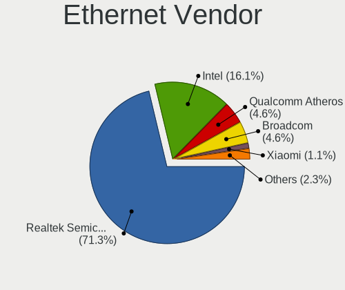

| Vendor                | Computers | Percent |
|-----------------------|-----------|---------|
| Realtek Semiconductor | 30        | 78.95%  |
| Intel                 | 5         | 13.16%  |
| Xiaomi                | 1         | 2.63%   |
| JMicron Technology    | 1         | 2.63%   |
| Broadcom              | 1         | 2.63%   |

Ethernet Model
--------------

Ethernet models

| Model                                                             | Computers | Percent |
|-------------------------------------------------------------------|-----------|---------|
| Realtek RTL8111/8168/8411 PCI Express Gigabit Ethernet Controller | 24        | 61.54%  |
| Realtek RTL810xE PCI Express Fast Ethernet controller             | 5         | 12.82%  |
| Xiaomi Mi/Redmi series (RNDIS)                                    | 1         | 2.56%   |
| Realtek RTL8152 Fast Ethernet Adapter                             | 1         | 2.56%   |
| Realtek RTL-8100/8101L/8139 PCI Fast Ethernet Adapter             | 1         | 2.56%   |
| JMicron JMC250 PCI Express Gigabit Ethernet Controller            | 1         | 2.56%   |
| Intel Ethernet Connection I217-LM                                 | 1         | 2.56%   |
| Intel Ethernet Connection (7) I219-LM                             | 1         | 2.56%   |
| Intel Ethernet Connection (3) I218-V                              | 1         | 2.56%   |
| Intel Ethernet Connection (2) I219-V                              | 1         | 2.56%   |
| Intel 82577LC Gigabit Network Connection                          | 1         | 2.56%   |
| Broadcom NetLink BCM57780 Gigabit Ethernet PCIe                   | 1         | 2.56%   |

Net Controller Kind
-------------------

Ethernet, WiFi or modem

| Kind     | Computers | Percent |
|----------|-----------|---------|
| Ethernet | 37        | 55.22%  |
| WiFi     | 30        | 44.78%  |

Used Controller
---------------

Currently used network controller

| Kind     | Computers | Percent |
|----------|-----------|---------|
| WiFi     | 24        | 58.54%  |
| Ethernet | 17        | 41.46%  |

NICs
----

Total network controllers on board

| Total | Computers | Percent |
|-------|-----------|---------|
| 2     | 27        | 71.05%  |
| 1     | 11        | 28.95%  |

IPv6
----

IPv6 vs IPv4

| Used | Computers | Percent |
|------|-----------|---------|
| No   | 37        | 97.37%  |
| Yes  | 1         | 2.63%   |

Bluetooth
---------

Bluetooth Vendor
----------------

Controller vendors

| Vendor                          | Computers | Percent |
|---------------------------------|-----------|---------|
| Intel                           | 7         | 29.17%  |
| Realtek Semiconductor           | 6         | 25%     |
| Toshiba                         | 2         | 8.33%   |
| Qualcomm Atheros Communications | 2         | 8.33%   |
| IMC Networks                    | 2         | 8.33%   |
| Ralink                          | 1         | 4.17%   |
| Lite-On Technology              | 1         | 4.17%   |
| Foxconn / Hon Hai               | 1         | 4.17%   |
| Cambridge Silicon Radio         | 1         | 4.17%   |
| Broadcom                        | 1         | 4.17%   |

Bluetooth Model
---------------

Controller models

| Model                                               | Computers | Percent |
|-----------------------------------------------------|-----------|---------|
| Realtek Bluetooth Radio                             | 4         | 16.67%  |
| Qualcomm Atheros  Bluetooth Device                  | 2         | 8.33%   |
| Intel Bluetooth wireless interface                  | 2         | 8.33%   |
| Toshiba RT Bluetooth Radio                          | 1         | 4.17%   |
| Toshiba Integrated Bluetooth HCI                    | 1         | 4.17%   |
| Realtek RTL8821A Bluetooth                          | 1         | 4.17%   |
| Realtek  Bluetooth 4.2 Adapter                      | 1         | 4.17%   |
| Ralink RT3290 Bluetooth                             | 1         | 4.17%   |
| Lite-On Atheros AR3012 Bluetooth                    | 1         | 4.17%   |
| Intel Centrino Bluetooth Wireless Transceiver       | 1         | 4.17%   |
| Intel Centrino Advanced-N 6230 Bluetooth adapter    | 1         | 4.17%   |
| Intel Bluetooth 9460/9560 Jefferson Peak (JfP)      | 1         | 4.17%   |
| Intel AX201 Bluetooth                               | 1         | 4.17%   |
| Intel AX200 Bluetooth                               | 1         | 4.17%   |
| IMC Networks Bluetooth Radio                        | 1         | 4.17%   |
| IMC Networks Bluetooth Device                       | 1         | 4.17%   |
| Foxconn / Hon Hai BCM43142A0                        | 1         | 4.17%   |
| Cambridge Silicon Radio Bluetooth Dongle (HCI mode) | 1         | 4.17%   |
| Broadcom HP Portable Valentine                      | 1         | 4.17%   |

Sound
-----

Sound Vendor
------------

Sound card vendors

| Vendor                | Computers | Percent |
|-----------------------|-----------|---------|
| Intel                 | 32        | 72.73%  |
| AMD                   | 8         | 18.18%  |
| Nvidia                | 3         | 6.82%   |
| Barco Display Systems | 1         | 2.27%   |

Sound Model
-----------

Sound card models

| Model                                                                                             | Computers | Percent |
|---------------------------------------------------------------------------------------------------|-----------|---------|
| Intel Sunrise Point-LP HD Audio                                                                   | 4         | 7.27%   |
| Intel 7 Series/C216 Chipset Family High Definition Audio Controller                               | 4         | 7.27%   |
| Intel Wildcat Point-LP High Definition Audio Controller                                           | 3         | 5.45%   |
| Intel Broadwell-U Audio Controller                                                                | 3         | 5.45%   |
| Intel 82801I (ICH9 Family) HD Audio Controller                                                    | 3         | 5.45%   |
| AMD Family 15h (Models 60h-6fh) Audio Controller                                                  | 3         | 5.45%   |
| Intel Tiger Lake-LP Smart Sound Technology Audio Controller                                       | 2         | 3.64%   |
| Intel NM10/ICH7 Family High Definition Audio Controller                                           | 2         | 3.64%   |
| Intel Cannon Lake PCH cAVS                                                                        | 2         | 3.64%   |
| Intel 8 Series/C220 Series Chipset High Definition Audio Controller                               | 2         | 3.64%   |
| Intel 5 Series/3400 Series Chipset High Definition Audio                                          | 2         | 3.64%   |
| Intel 200 Series PCH HD Audio                                                                     | 2         | 3.64%   |
| AMD Kabini HDMI/DP Audio                                                                          | 2         | 3.64%   |
| AMD High Definition Audio Controller                                                              | 2         | 3.64%   |
| Nvidia High Definition Audio Controller                                                           | 1         | 1.82%   |
| Nvidia GP107GL High Definition Audio Controller                                                   | 1         | 1.82%   |
| Nvidia GF108 High Definition Audio Controller                                                     | 1         | 1.82%   |
| Intel Xeon E3-1200 v3/4th Gen Core Processor HD Audio Controller                                  | 1         | 1.82%   |
| Intel Haswell-ULT HD Audio Controller                                                             | 1         | 1.82%   |
| Intel Comet Lake PCH-V cAVS                                                                       | 1         | 1.82%   |
| Intel Celeron N3350/Pentium N4200/Atom E3900 Series Audio Cluster                                 | 1         | 1.82%   |
| Intel Atom/Celeron/Pentium Processor x5-E8000/J3xxx/N3xxx Series High Definition Audio Controller | 1         | 1.82%   |
| Intel 8 Series HD Audio Controller                                                                | 1         | 1.82%   |
| Intel 6 Series/C200 Series Chipset Family High Definition Audio Controller                        | 1         | 1.82%   |
| Intel 100 Series/C230 Series Chipset Family HD Audio Controller                                   | 1         | 1.82%   |
| Barco Display Systems USBGH520-ENC                                                                | 1         | 1.82%   |
| AMD Wrestler HDMI Audio                                                                           | 1         | 1.82%   |
| AMD Tobago HDMI Audio [Radeon R7 360 / R9 360 OEM]                                                | 1         | 1.82%   |
| AMD Starship/Matisse HD Audio Controller                                                          | 1         | 1.82%   |
| AMD SBx00 Azalia (Intel HDA)                                                                      | 1         | 1.82%   |
| AMD FCH Azalia Controller                                                                         | 1         | 1.82%   |
| AMD Ellesmere HDMI Audio [Radeon RX 470/480 / 570/580/590]                                        | 1         | 1.82%   |
| AMD Baffin HDMI/DP Audio [Radeon RX 550 640SP / RX 560/560X]                                      | 1         | 1.82%   |

Memory
------

Memory Vendor
-------------

Memory module vendors

| Vendor              | Computers | Percent |
|---------------------|-----------|---------|
| Samsung Electronics | 5         | 35.71%  |
| Kingston            | 2         | 14.29%  |
| Unknown (0x4509)    | 1         | 7.14%   |
| Unknown             | 1         | 7.14%   |
| SK hynix            | 1         | 7.14%   |
| Micron Technology   | 1         | 7.14%   |
| Kingmax             | 1         | 7.14%   |
| G.Skill             | 1         | 7.14%   |
| A-DATA Technology   | 1         | 7.14%   |

Memory Model
------------

Memory module models

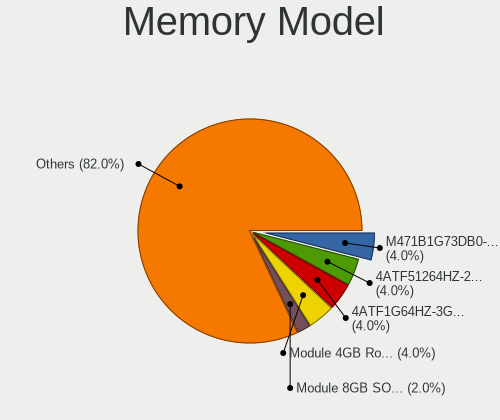

| Model                                                              | Computers | Percent |
|--------------------------------------------------------------------|-----------|---------|
| Unknown RAM Module 2048MB SODIMM DDR2                              | 1         | 6.67%   |
| Unknown (0x4509) RAM GKE800SO102408-2666A 8GB SODIMM DDR4 2133MT/s | 1         | 6.67%   |
| SK hynix RAM HMA81GS6CJR8N-VK 8GB SODIMM DDR4 2667MT/s             | 1         | 6.67%   |
| Samsung RAM M471B5773CHS-CH9 2GB DIMM DDR3 1333MT/s                | 1         | 6.67%   |
| Samsung RAM M471A5244CB0-CWE 4GB SODIMM DDR4 3200MT/s              | 1         | 6.67%   |
| Samsung RAM M471A5244CB0-CRC 4GB SODIMM DDR4 2667MT/s              | 1         | 6.67%   |
| Samsung RAM M471A5143EB0-CPB 4GB SODIMM DDR4 2133MT/s              | 1         | 6.67%   |
| Samsung RAM M471A1K43DB1-CWE 8GB SODIMM DDR4 3200MT/s              | 1         | 6.67%   |
| Micron RAM 8KTF51264HDZ-1G6E1 4GB SODIMM DDR3 1600MT/s             | 1         | 6.67%   |
| Kingston RAM KHX3000C15D4/8GX 8GB DIMM DDR4 3400MT/s               | 1         | 6.67%   |
| Kingston RAM KHX2133C14/8G 8GB DIMM DDR4 2400MT/s                  | 1         | 6.67%   |
| Kingston RAM 99U5428-018.A00LF 8GB SODIMM DDR3 1600MT/s            | 1         | 6.67%   |
| Kingmax RAM FSFE85F-C8KL9 2GB DIMM DDR3 1333MT/s                   | 1         | 6.67%   |
| G.Skill RAM F4-2133C15-4GIS 4GB DIMM DDR4 2133MT/s                 | 1         | 6.67%   |
| A-DATA RAM Module 8GB DIMM DDR4 2667MT/s                           | 1         | 6.67%   |

Memory Kind
-----------

Memory module kinds

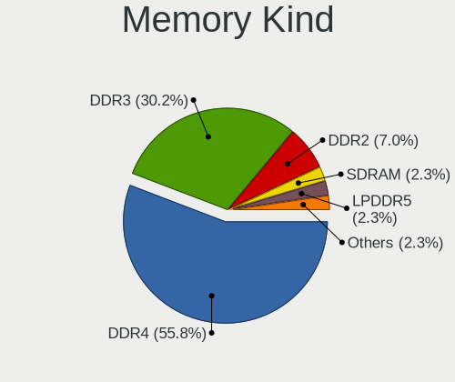

| Kind  | Computers | Percent |
|-------|-----------|---------|
| DDR4  | 9         | 64.29%  |
| DDR3  | 3         | 21.43%  |
| SDRAM | 1         | 7.14%   |
| DDR2  | 1         | 7.14%   |

Memory Form Factor
------------------

Physical design of the memory module

| Name   | Computers | Percent |
|--------|-----------|---------|
| SODIMM | 9         | 69.23%  |
| DIMM   | 4         | 30.77%  |

Memory Size
-----------

Memory module size

| Size | Computers | Percent |
|------|-----------|---------|
| 8192 | 6         | 46.15%  |
| 4096 | 5         | 38.46%  |
| 2048 | 2         | 15.38%  |

Memory Speed
------------

Memory module speed

| Speed   | Computers | Percent |
|---------|-----------|---------|
| 2667    | 3         | 21.43%  |
| 2133    | 3         | 21.43%  |
| 3200    | 2         | 14.29%  |
| 1600    | 2         | 14.29%  |
| 3400    | 1         | 7.14%   |
| 2400    | 1         | 7.14%   |
| 1333    | 1         | 7.14%   |
| Unknown | 1         | 7.14%   |

Printers & scanners
-------------------

Printer Vendor
--------------

Printer device vendors

| Vendor          | Computers | Percent |
|-----------------|-----------|---------|
| Zebra           | 2         | 50%     |
| Hewlett-Packard | 1         | 25%     |
| Canon           | 1         | 25%     |

Printer Model
-------------

Printer device models

| Model                            | Computers | Percent |
|----------------------------------|-----------|---------|
| Zebra Zebra GC420d Label Printer | 1         | 25%     |
| Zebra TLP2844                    | 1         | 25%     |
| HP LaserJet P1102                | 1         | 25%     |
| Canon LBP6030/6030B/6018L        | 1         | 25%     |

Scanner Vendor
--------------

Scanner device vendors

Zero info for selected period =(

Scanner Model
-------------

Scanner device models

Zero info for selected period =(

Camera
------

Camera Vendor
-------------

Camera device vendors

| Vendor                      | Computers | Percent |
|-----------------------------|-----------|---------|
| Chicony Electronics         | 9         | 34.62%  |
| Microdia                    | 3         | 11.54%  |
| IMC Networks                | 3         | 11.54%  |
| Luxvisions Innotech Limited | 2         | 7.69%   |
| Acer                        | 2         | 7.69%   |
| Suyin                       | 1         | 3.85%   |
| Silicon Motion              | 1         | 3.85%   |
| Realtek Semiconductor       | 1         | 3.85%   |
| Lite-On Technology          | 1         | 3.85%   |
| Foxconn / Hon Hai           | 1         | 3.85%   |
| Arkmicro Technologies       | 1         | 3.85%   |
| ALi                         | 1         | 3.85%   |

Camera Model
------------

Camera device models

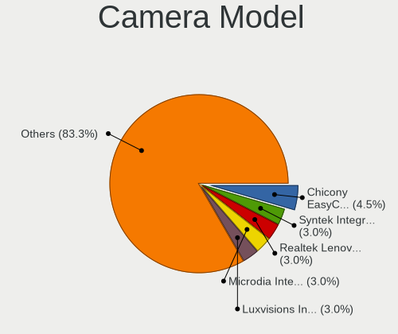

| Model                                               | Computers | Percent |
|-----------------------------------------------------|-----------|---------|
| Chicony EasyCamera                                  | 2         | 7.69%   |
| Acer EasyCamera                                     | 2         | 7.69%   |
| Suyin HP Webcam                                     | 1         | 3.85%   |
| Silicon Motion WebCam SC-0311139N                   | 1         | 3.85%   |
| Realtek HP Truevision HD integrated webcam          | 1         | 3.85%   |
| Microdia Laptop_Integrated_Webcam_HD                | 1         | 3.85%   |
| Microdia Integrated_Webcam_HD                       | 1         | 3.85%   |
| Microdia Integrated Camera                          | 1         | 3.85%   |
| Luxvisions Innotech Limited Integrated Camera       | 1         | 3.85%   |
| Luxvisions Innotech Limited HP TrueVision HD Camera | 1         | 3.85%   |
| Lite-On TOSHIBA Web Camera - HD                     | 1         | 3.85%   |
| IMC Networks USB2.0 VGA UVC WebCam                  | 1         | 3.85%   |
| IMC Networks Lenovo EasyCamera                      | 1         | 3.85%   |
| IMC Networks EasyCamera                             | 1         | 3.85%   |
| Foxconn / Hon Hai USB2.0 Camera                     | 1         | 3.85%   |
| Chicony USB2.0 VGA UVC WebCam                       | 1         | 3.85%   |
| Chicony USB2.0 HD UVC WebCam                        | 1         | 3.85%   |
| Chicony Integrated Camera                           | 1         | 3.85%   |
| Chicony HP Truevision HD                            | 1         | 3.85%   |
| Chicony HP High Definition 1MP Webcam               | 1         | 3.85%   |
| Chicony Front Camera                                | 1         | 3.85%   |
| Chicony CNA7157                                     | 1         | 3.85%   |
| Arkmicro USB2.0 PC CAMERA                           | 1         | 3.85%   |
| ALi Gateway Webcam                                  | 1         | 3.85%   |

Security
--------

Fingerprint Vendor
------------------

Fingerprint sensor vendors

| Vendor           | Computers | Percent |
|------------------|-----------|---------|
| Validity Sensors | 1         | 50%     |
| AuthenTec        | 1         | 50%     |

Fingerprint Model
-----------------

Fingerprint sensor models

| Model                                        | Computers | Percent |
|----------------------------------------------|-----------|---------|
| Validity Sensors VFS 5011 fingerprint sensor | 1         | 50%     |
| AuthenTec AES1600                            | 1         | 50%     |

Chipcard Vendor
---------------

Chipcard module vendors

| Vendor                | Computers | Percent |
|-----------------------|-----------|---------|
| Broadcom              | 1         | 50%     |
| Advanced Card Systems | 1         | 50%     |

Chipcard Model
--------------

Chipcard module models

| Model                                                                        | Computers | Percent |
|------------------------------------------------------------------------------|-----------|---------|
| Broadcom BCM5880 Secure Applications Processor with fingerprint swipe sensor | 1         | 50%     |
| Advanced Card Systems ACR38 SmartCard Reader                                 | 1         | 50%     |

Unsupported
-----------

Unsupported Devices
-------------------

Total unsupported devices on board

| Total | Computers | Percent |
|-------|-----------|---------|
| 0     | 30        | 75%     |
| 1     | 7         | 17.5%   |
| 2     | 3         | 7.5%    |

Unsupported Device Types
------------------------

Types of unsupported devices

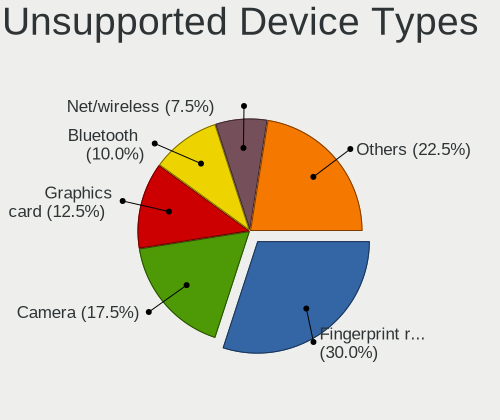

| Type                     | Computers | Percent |
|--------------------------|-----------|---------|
| Graphics card            | 3         | 25%     |
| Fingerprint reader       | 2         | 16.67%  |
| Chipcard                 | 2         | 16.67%  |
| Camera                   | 2         | 16.67%  |
| Net/wireless             | 1         | 8.33%   |
| Communication controller | 1         | 8.33%   |
| Bluetooth                | 1         | 8.33%   |

