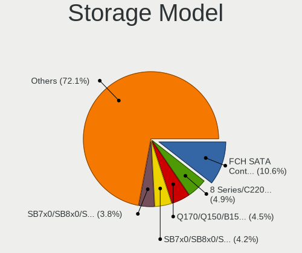
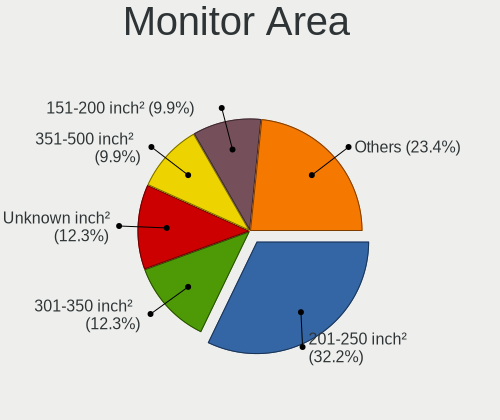
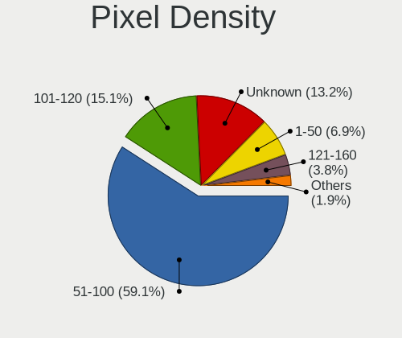
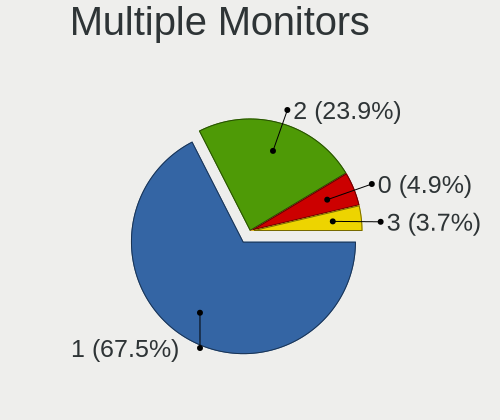
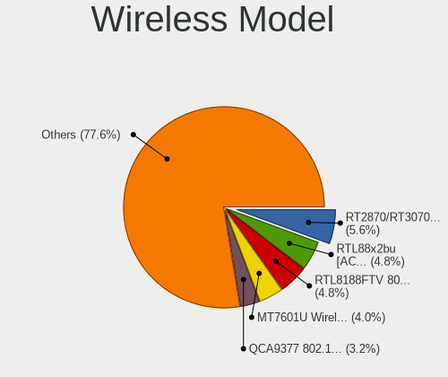
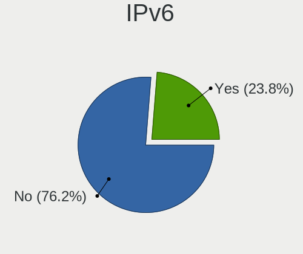
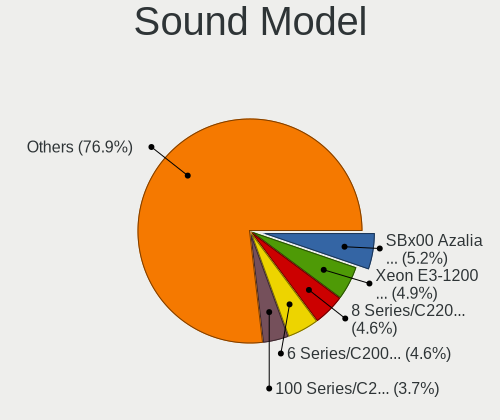
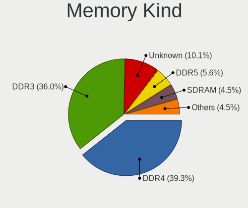
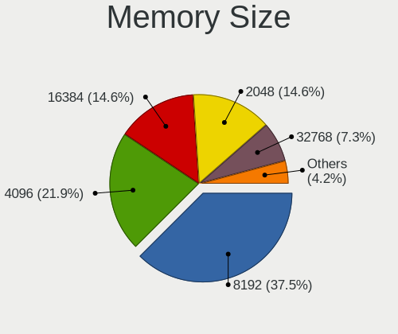
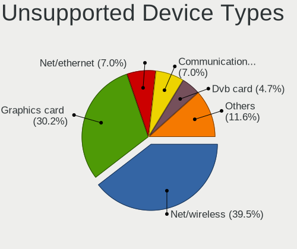

Parrot - Tested Hardware & Statistics (Desktops)
------------------------------------------------

A project to collect tested hardware configurations for Parrot.

Anyone can contribute to this report by the [hw-probe](https://github.com/linuxhw/hw-probe) tool:

    sudo -E hw-probe -all -upload

Please contribute! Especially if your hardware is rare.

Contents
--------

* [ Test Cases ](#test-cases)

* [ System ](#system)
  - [ OS                       ](#os)
  - [ OS Family                ](#os-family)
  - [ Kernel                   ](#kernel)
  - [ Kernel Family            ](#kernel-family)
  - [ Kernel Major Ver.        ](#kernel-major-ver)
  - [ Arch                     ](#arch)
  - [ DE                       ](#de)
  - [ Display Server           ](#display-server)
  - [ Display Manager          ](#display-manager)
  - [ OS Lang                  ](#os-lang)
  - [ Boot Mode                ](#boot-mode)
  - [ Filesystem               ](#filesystem)
  - [ Part. scheme             ](#part-scheme)
  - [ Dual Boot with Linux/BSD ](#dual-boot-with-linuxbsd)
  - [ Dual Boot (Win)          ](#dual-boot-win)

* [ Board ](#board)
  - [ Vendor                   ](#vendor)
  - [ Model                    ](#model)
  - [ Model Family             ](#model-family)
  - [ MFG Year                 ](#mfg-year)
  - [ Form Factor              ](#form-factor)
  - [ Secure Boot              ](#secure-boot)
  - [ Coreboot                 ](#coreboot)
  - [ RAM Size                 ](#ram-size)
  - [ RAM Used                 ](#ram-used)
  - [ Total Drives             ](#total-drives)
  - [ Has CD-ROM               ](#has-cd-rom)
  - [ Has Ethernet             ](#has-ethernet)
  - [ Has WiFi                 ](#has-wifi)
  - [ Has Bluetooth            ](#has-bluetooth)

* [ Location ](#location)
  - [ Country                  ](#country)
  - [ City                     ](#city)

* [ Drives ](#drives)
  - [ Drive Vendor             ](#drive-vendor)
  - [ Drive Model              ](#drive-model)
  - [ HDD Vendor               ](#hdd-vendor)
  - [ SSD Vendor               ](#ssd-vendor)
  - [ Drive Kind               ](#drive-kind)
  - [ Drive Connector          ](#drive-connector)
  - [ Drive Size               ](#drive-size)
  - [ Space Total              ](#space-total)
  - [ Space Used               ](#space-used)
  - [ Malfunc. Drives          ](#malfunc-drives)
  - [ Malfunc. Drive Vendor    ](#malfunc-drive-vendor)
  - [ Malfunc. HDD Vendor      ](#malfunc-hdd-vendor)
  - [ Malfunc. Drive Kind      ](#malfunc-drive-kind)
  - [ Failed Drives            ](#failed-drives)
  - [ Failed Drive Vendor      ](#failed-drive-vendor)
  - [ Drive Status             ](#drive-status)

* [ Storage controller ](#storage-controller)
  - [ Storage Vendor           ](#storage-vendor)
  - [ Storage Model            ](#storage-model)
  - [ Storage Kind             ](#storage-kind)

* [ Processor ](#processor)
  - [ CPU Vendor               ](#cpu-vendor)
  - [ CPU Model                ](#cpu-model)
  - [ CPU Model Family         ](#cpu-model-family)
  - [ CPU Cores                ](#cpu-cores)
  - [ CPU Sockets              ](#cpu-sockets)
  - [ CPU Threads              ](#cpu-threads)
  - [ CPU Op-Modes             ](#cpu-op-modes)
  - [ CPU Microcode            ](#cpu-microcode)
  - [ CPU Microarch            ](#cpu-microarch)

* [ Graphics ](#graphics)
  - [ GPU Vendor               ](#gpu-vendor)
  - [ GPU Model                ](#gpu-model)
  - [ GPU Combo                ](#gpu-combo)
  - [ GPU Driver               ](#gpu-driver)
  - [ GPU Memory               ](#gpu-memory)

* [ Monitor ](#monitor)
  - [ Monitor Vendor           ](#monitor-vendor)
  - [ Monitor Model            ](#monitor-model)
  - [ Monitor Resolution       ](#monitor-resolution)
  - [ Monitor Diagonal         ](#monitor-diagonal)
  - [ Monitor Width            ](#monitor-width)
  - [ Aspect Ratio             ](#aspect-ratio)
  - [ Monitor Area             ](#monitor-area)
  - [ Pixel Density            ](#pixel-density)
  - [ Multiple Monitors        ](#multiple-monitors)

* [ Network ](#network)
  - [ Net Controller Vendor    ](#net-controller-vendor)
  - [ Net Controller Model     ](#net-controller-model)
  - [ Wireless Vendor          ](#wireless-vendor)
  - [ Wireless Model           ](#wireless-model)
  - [ Ethernet Vendor          ](#ethernet-vendor)
  - [ Ethernet Model           ](#ethernet-model)
  - [ Net Controller Kind      ](#net-controller-kind)
  - [ Used Controller          ](#used-controller)
  - [ NICs                     ](#nics)
  - [ IPv6                     ](#ipv6)

* [ Bluetooth ](#bluetooth)
  - [ Bluetooth Vendor         ](#bluetooth-vendor)
  - [ Bluetooth Model          ](#bluetooth-model)

* [ Sound ](#sound)
  - [ Sound Vendor             ](#sound-vendor)
  - [ Sound Model              ](#sound-model)

* [ Memory ](#memory)
  - [ Memory Vendor            ](#memory-vendor)
  - [ Memory Model             ](#memory-model)
  - [ Memory Kind              ](#memory-kind)
  - [ Memory Form Factor       ](#memory-form-factor)
  - [ Memory Size              ](#memory-size)
  - [ Memory Speed             ](#memory-speed)

* [ Printers & scanners ](#printers--scanners)
  - [ Printer Vendor           ](#printer-vendor)
  - [ Printer Model            ](#printer-model)
  - [ Scanner Vendor           ](#scanner-vendor)
  - [ Scanner Model            ](#scanner-model)

* [ Camera ](#camera)
  - [ Camera Vendor            ](#camera-vendor)
  - [ Camera Model             ](#camera-model)

* [ Security ](#security)
  - [ Fingerprint Vendor       ](#fingerprint-vendor)
  - [ Fingerprint Model        ](#fingerprint-model)
  - [ Chipcard Vendor          ](#chipcard-vendor)
  - [ Chipcard Model           ](#chipcard-model)

* [ Unsupported ](#unsupported)
  - [ Unsupported Devices      ](#unsupported-devices)
  - [ Unsupported Device Types ](#unsupported-device-types)

Test Cases
----------

Total: 110

| Vendor        | Model                   | Probe                                                      | Date         |
|---------------|-------------------------|------------------------------------------------------------|--------------|
| Gateway       | SX2855                  | [a896e3b0f7](https://linux-hardware.org/?probe=a896e3b0f7) | Jul 30, 2022 |
| ASUSTek       | H110M-K                 | [9e9ca5b39a](https://linux-hardware.org/?probe=9e9ca5b39a) | Jul 19, 2022 |
| ASUSTek       | CROSSHAIR V FORMULA-Z   | [0539efedb2](https://linux-hardware.org/?probe=0539efedb2) | Jul 18, 2022 |
| ASUSTek       | H110M-K                 | [0e0a7a2fbc](https://linux-hardware.org/?probe=0e0a7a2fbc) | Jul 16, 2022 |
| ASUSTek       | PRIME B550-PLUS         | [3ba50e78b9](https://linux-hardware.org/?probe=3ba50e78b9) | Jun 29, 2022 |
| ASUSTek       | PRIME B550-PLUS         | [f33854651b](https://linux-hardware.org/?probe=f33854651b) | Jun 29, 2022 |
| ASUSTek       | H110M-K                 | [d1b8d3ff84](https://linux-hardware.org/?probe=d1b8d3ff84) | Jun 27, 2022 |
| ASUSTek       | H110M-K                 | [656a452bc6](https://linux-hardware.org/?probe=656a452bc6) | Jun 21, 2022 |
| Gigabyte      | H61M-USB3H              | [6b9dcbd952](https://linux-hardware.org/?probe=6b9dcbd952) | Jun 20, 2022 |
| SLIMBOOK      | ONE-AMD-M4              | [c268e7111b](https://linux-hardware.org/?probe=c268e7111b) | Jun 07, 2022 |
| Lenovo        | 31900058 STD            | [cb4959b996](https://linux-hardware.org/?probe=cb4959b996) | May 21, 2022 |
| Gigabyte      | B450M DS3H-CF           | [fb7cb376e9](https://linux-hardware.org/?probe=fb7cb376e9) | May 21, 2022 |
| MSI           | G31M3-L V2              | [29d45c64bb](https://linux-hardware.org/?probe=29d45c64bb) | May 11, 2022 |
| HP            | 1495                    | [c845f7b657](https://linux-hardware.org/?probe=c845f7b657) | May 05, 2022 |
| SLIMBOOK      | ONE-AMD-M4              | [99911022e9](https://linux-hardware.org/?probe=99911022e9) | Apr 26, 2022 |
| ASUSTek       | PRIME H310M-D R2.0      | [9c06485301](https://linux-hardware.org/?probe=9c06485301) | Apr 21, 2022 |
| HP            | 18E7                    | [1b6db66cc1](https://linux-hardware.org/?probe=1b6db66cc1) | Apr 19, 2022 |
| ASUSTek       | B85M-E                  | [b68f986aaf](https://linux-hardware.org/?probe=b68f986aaf) | Apr 17, 2022 |
| ASUSTek       | B85M-E                  | [93306ff9ee](https://linux-hardware.org/?probe=93306ff9ee) | Apr 17, 2022 |
| MSI           | B350 TOMAHAWK           | [b1a322fa38](https://linux-hardware.org/?probe=b1a322fa38) | Apr 11, 2022 |
| ECS           | Nettle2                 | [4939d60e6d](https://linux-hardware.org/?probe=4939d60e6d) | Mar 27, 2022 |
| HP            | 18E7                    | [d8d1c3d468](https://linux-hardware.org/?probe=d8d1c3d468) | Mar 26, 2022 |
| Lenovo        | SHARKBAY 31900058 STD   | [85260f6ed1](https://linux-hardware.org/?probe=85260f6ed1) | Mar 20, 2022 |
| Lenovo        | SHARKBAY 31900058 STD   | [e849ec3916](https://linux-hardware.org/?probe=e849ec3916) | Mar 20, 2022 |
| ASUSTek       | B85M-E                  | [b0769dffdd](https://linux-hardware.org/?probe=b0769dffdd) | Mar 19, 2022 |
| ASUSTek       | ROG CROSSHAIR VIII HERO | [2c1ca9145b](https://linux-hardware.org/?probe=2c1ca9145b) | Mar 18, 2022 |
| ASUSTek       | H170M-E D3              | [167928d6e9](https://linux-hardware.org/?probe=167928d6e9) | Mar 17, 2022 |
| Wistron       | JIG31B3                 | [a360eaf501](https://linux-hardware.org/?probe=a360eaf501) | Mar 15, 2022 |
| ASUSTek       | H170M-E D3              | [937c0097ca](https://linux-hardware.org/?probe=937c0097ca) | Mar 14, 2022 |
| ASUSTek       | F2A85-M                 | [36d17e4fdb](https://linux-hardware.org/?probe=36d17e4fdb) | Mar 13, 2022 |
| ASUSTek       | F2A85-M                 | [453d0816b3](https://linux-hardware.org/?probe=453d0816b3) | Mar 13, 2022 |
| ASRock        | Z87M Extreme4           | [dba57ee1b3](https://linux-hardware.org/?probe=dba57ee1b3) | Mar 12, 2022 |
| MSI           | G31M3-L V2              | [4c15ba6fb9](https://linux-hardware.org/?probe=4c15ba6fb9) | Mar 10, 2022 |
| ASUSTek       | B85M-E                  | [161eda858b](https://linux-hardware.org/?probe=161eda858b) | Mar 10, 2022 |
| ASUSTek       | B85M-E                  | [36bada67c8](https://linux-hardware.org/?probe=36bada67c8) | Mar 08, 2022 |
| SLIMBOOK      | ONE-AMD-M4              | [d92c05a18a](https://linux-hardware.org/?probe=d92c05a18a) | Mar 03, 2022 |
| Daewoo Luc... | Solo Top                | [7f7b20688f](https://linux-hardware.org/?probe=7f7b20688f) | Mar 03, 2022 |
| SLIMBOOK      | ONE-AMD-M4              | [dc43686a5a](https://linux-hardware.org/?probe=dc43686a5a) | Feb 27, 2022 |
| Dell          | 0GXM1W A02              | [044a00e086](https://linux-hardware.org/?probe=044a00e086) | Feb 25, 2022 |
| ASUSTek       | Benicia                 | [aceee2d932](https://linux-hardware.org/?probe=aceee2d932) | Feb 12, 2022 |
| SLIMBOOK      | ONE-AMD-M4              | [225e399fc1](https://linux-hardware.org/?probe=225e399fc1) | Feb 03, 2022 |
| Unknown       | Unknown                 | [bccc675fea](https://linux-hardware.org/?probe=bccc675fea) | Jan 08, 2022 |
| ASUSTek       | ROG STRIX B450-F GAMING | [f75ebfbbc8](https://linux-hardware.org/?probe=f75ebfbbc8) | Jan 01, 2022 |
| Dell          | 04YP6J A01              | [680408ec06](https://linux-hardware.org/?probe=680408ec06) | Jan 01, 2022 |
| Dell          | 04YP6J A01              | [623d384766](https://linux-hardware.org/?probe=623d384766) | Jan 01, 2022 |
| Gigabyte      | A320M-S2H-CF            | [4ec2105ead](https://linux-hardware.org/?probe=4ec2105ead) | Jan 01, 2022 |
| ASUSTek       | M5A99X EVO              | [5c55046f50](https://linux-hardware.org/?probe=5c55046f50) | Dec 13, 2021 |
| Alienware     | 0PGRP5 A02              | [aeacaefd26](https://linux-hardware.org/?probe=aeacaefd26) | Nov 14, 2021 |
| ASRock        | Z87 Killer              | [0aafc0d981](https://linux-hardware.org/?probe=0aafc0d981) | Nov 13, 2021 |
| Acer          | Aspire TC-780           | [f6de1ed637](https://linux-hardware.org/?probe=f6de1ed637) | Nov 04, 2021 |
| Dell          | 0T2HR0 A00              | [dc55f173fe](https://linux-hardware.org/?probe=dc55f173fe) | Oct 05, 2021 |
| ASUSTek       | P8H67-M PRO             | [7dcd6067ac](https://linux-hardware.org/?probe=7dcd6067ac) | Oct 04, 2021 |
| Gigabyte      | A320M-S2H-CF            | [d0cd1577c7](https://linux-hardware.org/?probe=d0cd1577c7) | Oct 04, 2021 |
| Gigabyte      | A320M-S2H-CF            | [b733e7fac1](https://linux-hardware.org/?probe=b733e7fac1) | Sep 23, 2021 |
| MSI           | B450 TOMAHAWK MAX       | [b741d2ab2b](https://linux-hardware.org/?probe=b741d2ab2b) | Aug 12, 2021 |
| Gigabyte      | A320M-S2H-CF            | [3ba02ffef3](https://linux-hardware.org/?probe=3ba02ffef3) | Aug 10, 2021 |
| ZOTAC         | Unknown                 | [0324aff0a3](https://linux-hardware.org/?probe=0324aff0a3) | Aug 03, 2021 |
| ZOTAC         | Unknown                 | [c1a9e01bd7](https://linux-hardware.org/?probe=c1a9e01bd7) | Aug 03, 2021 |
| HP            | 1850                    | [687c780f5c](https://linux-hardware.org/?probe=687c780f5c) | Jul 19, 2021 |
| Dell          | 0T10XW A02              | [57a4116288](https://linux-hardware.org/?probe=57a4116288) | Jul 17, 2021 |
| HP            | 1850                    | [3bde7e8e11](https://linux-hardware.org/?probe=3bde7e8e11) | May 27, 2021 |
| Dell          | 0C1R19 A02              | [ff5bb2ee2a](https://linux-hardware.org/?probe=ff5bb2ee2a) | May 03, 2021 |
| ASUSTek       | PRIME X399-A            | [4dd4f28ca7](https://linux-hardware.org/?probe=4dd4f28ca7) | Apr 11, 2021 |
| Acer          | Predator PO3-600 V:1.1  | [6ea75bdbb5](https://linux-hardware.org/?probe=6ea75bdbb5) | Mar 26, 2021 |
| ASUSTek       | M5A78L-M/USB3           | [6b26a69326](https://linux-hardware.org/?probe=6b26a69326) | Mar 21, 2021 |
| HP            | 339A                    | [b105e94284](https://linux-hardware.org/?probe=b105e94284) | Feb 20, 2021 |
| HP            | 339A                    | [3dfdd6aa5e](https://linux-hardware.org/?probe=3dfdd6aa5e) | Feb 20, 2021 |
| MSI           | B250M MORTAR            | [be8a65f362](https://linux-hardware.org/?probe=be8a65f362) | Feb 02, 2021 |
| Dell          | 0CU409                  | [64c8a84081](https://linux-hardware.org/?probe=64c8a84081) | Jan 29, 2021 |
| Acer          | Aspire X3990            | [a3e9301c7f](https://linux-hardware.org/?probe=a3e9301c7f) | Jan 16, 2021 |
| Acer          | Aspire X3990            | [1660d13b44](https://linux-hardware.org/?probe=1660d13b44) | Jan 12, 2021 |
| HP            | 3047h                   | [8b50e12296](https://linux-hardware.org/?probe=8b50e12296) | Jan 07, 2021 |
| Medion        | MS-7621                 | [74c49730d1](https://linux-hardware.org/?probe=74c49730d1) | Dec 27, 2020 |
| Positivo      | POS-PIG43BC             | [146c7d86bb](https://linux-hardware.org/?probe=146c7d86bb) | Dec 27, 2020 |
| HP            | 3047h                   | [b65caab721](https://linux-hardware.org/?probe=b65caab721) | Nov 24, 2020 |
| Foxconn       | 45CMX/45GMX/45CMX-K     | [7918687a8b](https://linux-hardware.org/?probe=7918687a8b) | Nov 07, 2020 |
| ASUSTek       | Maximus VIII HERO       | [f95c24897c](https://linux-hardware.org/?probe=f95c24897c) | Oct 30, 2020 |
| ASUSTek       | M5A99X EVO              | [f7a2b660d8](https://linux-hardware.org/?probe=f7a2b660d8) | Oct 29, 2020 |
| ASUSTek       | M5A99X EVO              | [c687805b04](https://linux-hardware.org/?probe=c687805b04) | Oct 29, 2020 |
| ECS           | A740GM-M                | [423f49affd](https://linux-hardware.org/?probe=423f49affd) | Oct 25, 2020 |
| ASUSTek       | Z170 PRO GAMING         | [2bc8fbe372](https://linux-hardware.org/?probe=2bc8fbe372) | Sep 27, 2020 |
| Gigabyte      | H370M DS3H-CF           | [affb4f7587](https://linux-hardware.org/?probe=affb4f7587) | Aug 29, 2020 |
| Apple         | Mac-F221BEC8            | [1d8d1db67e](https://linux-hardware.org/?probe=1d8d1db67e) | Jul 04, 2020 |
| Dell          | 0D6H9T A00              | [06e9599063](https://linux-hardware.org/?probe=06e9599063) | Jul 04, 2020 |
| Gigabyte      | 970A-DS3P               | [dda8536e62](https://linux-hardware.org/?probe=dda8536e62) | Jun 11, 2020 |
| Biostar       | H77MU3                  | [048ffba01b](https://linux-hardware.org/?probe=048ffba01b) | May 24, 2020 |
| ASUSTek       | A68HM-PLUS              | [7c05b67968](https://linux-hardware.org/?probe=7c05b67968) | May 22, 2020 |
| ASUSTek       | A68HM-PLUS              | [fc8bf8a5a6](https://linux-hardware.org/?probe=fc8bf8a5a6) | May 22, 2020 |
| ASUSTek       | H110I-PLUS              | [8e55010bac](https://linux-hardware.org/?probe=8e55010bac) | May 22, 2020 |
| ASUSTek       | H110I-PLUS              | [26293feb91](https://linux-hardware.org/?probe=26293feb91) | May 21, 2020 |
| Dell          | 0VYXHD A00              | [5e5d0a24f3](https://linux-hardware.org/?probe=5e5d0a24f3) | May 15, 2020 |
| Dell          | 0VYXHD A00              | [5a56c30293](https://linux-hardware.org/?probe=5a56c30293) | May 06, 2020 |
| Dell          | 05DN3X A00              | [7424c0caba](https://linux-hardware.org/?probe=7424c0caba) | May 02, 2020 |
| ASUSTek       | A68HM-PLUS              | [3dc6534b5f](https://linux-hardware.org/?probe=3dc6534b5f) | May 01, 2020 |
| ASUSTek       | A68HM-PLUS              | [6835f4fe95](https://linux-hardware.org/?probe=6835f4fe95) | Apr 28, 2020 |
| Foxconn       | 2A8C                    | [6e636c5fd2](https://linux-hardware.org/?probe=6e636c5fd2) | Apr 27, 2020 |
| Foxconn       | 2A8C                    | [d19700bc2d](https://linux-hardware.org/?probe=d19700bc2d) | Apr 27, 2020 |
| ASUSTek       | M2N68-AM Plus           | [72dcfa02ca](https://linux-hardware.org/?probe=72dcfa02ca) | Apr 26, 2020 |
| Foxconn       | 2A8C                    | [37c314650f](https://linux-hardware.org/?probe=37c314650f) | Apr 26, 2020 |
| Foxconn       | 2A8C                    | [9a9b368a7c](https://linux-hardware.org/?probe=9a9b368a7c) | Apr 26, 2020 |
| ASUSTek       | K31CD-K                 | [b4ad316fa2](https://linux-hardware.org/?probe=b4ad316fa2) | Apr 14, 2020 |
| Dell          | 0CU409                  | [661761d2ca](https://linux-hardware.org/?probe=661761d2ca) | Apr 14, 2020 |
| Dell          | 0CU409                  | [5512733c4a](https://linux-hardware.org/?probe=5512733c4a) | Apr 14, 2020 |
| Gigabyte      | GA-880GM-D2H            | [93da68c7fb](https://linux-hardware.org/?probe=93da68c7fb) | Apr 12, 2020 |
| ASRock        | FM2A68M-DG3+            | [05f8c8eef4](https://linux-hardware.org/?probe=05f8c8eef4) | Feb 29, 2020 |
| Gigabyte      | AX370-Gaming-CF se1     | [2bfc7eae61](https://linux-hardware.org/?probe=2bfc7eae61) | Feb 06, 2020 |
| Gigabyte      | AX370-Gaming-CF se1     | [1e8ccbe5b9](https://linux-hardware.org/?probe=1e8ccbe5b9) | Feb 04, 2020 |
| Foxconn       | 2A8C                    | [38658290e2](https://linux-hardware.org/?probe=38658290e2) | Jan 19, 2020 |
| Foxconn       | 2A8C                    | [05e5552eea](https://linux-hardware.org/?probe=05e5552eea) | Jan 19, 2020 |
| ASUSTek       | M5A78L-M/USB3           | [51389e5c4a](https://linux-hardware.org/?probe=51389e5c4a) | Dec 07, 2019 |

System
------

OS
--

Installed operating systems

| Name        | Desktops | Percent |
|-------------|----------|---------|
| Parrot 5.0  | 25       | 32.47%  |
| Parrot 4.11 | 20       | 25.97%  |
| Parrot 4.10 | 14       | 18.18%  |
| Parrot 4.9  | 9        | 11.69%  |
| Parrot 4.8  | 6        | 7.79%   |
| Parrot 4.7  | 3        | 3.9%    |

OS Family
---------

OS without a version

| Name   | Desktops | Percent |
|--------|----------|---------|
| Parrot | 74       | 100%    |

Kernel
------

Version of the Linux kernel

| Version                  | Desktops | Percent |
|--------------------------|----------|---------|
| 5.14.0-9parrot1-amd64    | 13       | 16.25%  |
| 5.5.0-1parrot1-amd64     | 12       | 15%     |
| 5.16.0-12parrot1-amd64   | 12       | 15%     |
| 5.7.0-2parrot2-amd64     | 6        | 7.5%    |
| 5.15.0-15parrot1-amd64   | 6        | 7.5%    |
| 5.10.0-6parrot1-amd64    | 5        | 6.25%   |
| 5.8.0-2parrot1-amd64     | 3        | 3.75%   |
| 5.4.0-4parrot1-amd64     | 3        | 3.75%   |
| 5.10.0-8parrot1-amd64    | 3        | 3.75%   |
| 5.9.0-2parrot1-amd64     | 2        | 2.5%    |
| 5.4.0-2parrot1-amd64     | 2        | 2.5%    |
| 5.3.0-3parrot3-amd64     | 2        | 2.5%    |
| 5.18.0-1parrot1-amd64    | 2        | 2.5%    |
| 5.14.0-2parrot1-amd64    | 2        | 2.5%    |
| 5.10.0-3parrot1-amd64    | 2        | 2.5%    |
| 5.8.0-1parrot1-amd64     | 1        | 1.25%   |
| 5.6.0-2parrot1-amd64     | 1        | 1.25%   |
| 5.4.0-3parrot1-amd64     | 1        | 1.25%   |
| 5.16.0-12parrot1-686-pae | 1        | 1.25%   |
| 5.10.0-5parrot1-amd64    | 1        | 1.25%   |

Kernel Family
-------------

Linux kernel without a distro release

| Version | Desktops | Percent |
|---------|----------|---------|
| 5.14.0  | 14       | 17.72%  |
| 5.16.0  | 13       | 16.46%  |
| 5.5.0   | 12       | 15.19%  |
| 5.10.0  | 11       | 13.92%  |
| 5.7.0   | 6        | 7.59%   |
| 5.4.0   | 6        | 7.59%   |
| 5.15.0  | 6        | 7.59%   |
| 5.8.0   | 4        | 5.06%   |
| 5.9.0   | 2        | 2.53%   |
| 5.3.0   | 2        | 2.53%   |
| 5.18.0  | 2        | 2.53%   |
| 5.6.0   | 1        | 1.27%   |

Kernel Major Ver.
-----------------

Linux kernel major version

| Version | Desktops | Percent |
|---------|----------|---------|
| 5.14    | 14       | 17.72%  |
| 5.16    | 13       | 16.46%  |
| 5.5     | 12       | 15.19%  |
| 5.10    | 11       | 13.92%  |
| 5.7     | 6        | 7.59%   |
| 5.4     | 6        | 7.59%   |
| 5.15    | 6        | 7.59%   |
| 5.8     | 4        | 5.06%   |
| 5.9     | 2        | 2.53%   |
| 5.3     | 2        | 2.53%   |
| 5.18    | 2        | 2.53%   |
| 5.6     | 1        | 1.27%   |

Arch
----

OS architecture (x86_64, i586, etc.)

| Name   | Desktops | Percent |
|--------|----------|---------|
| x86_64 | 73       | 98.65%  |
| i686   | 1        | 1.35%   |

DE
--

Desktop Environment

| Name    | Desktops | Percent |
|---------|----------|---------|
| MATE    | 51       | 66.23%  |
| KDE5    | 10       | 12.99%  |
| KDE     | 7        | 9.09%   |
| XFCE    | 4        | 5.19%   |
| Unknown | 3        | 3.9%    |
| GNOME   | 2        | 2.6%    |

Display Server
--------------

X11 or Wayland

| Name    | Desktops | Percent |
|---------|----------|---------|
| X11     | 72       | 97.3%   |
| Wayland | 2        | 2.7%    |

Display Manager
---------------

SDDM, LightDM, etc.

| Name    | Desktops | Percent |
|---------|----------|---------|
| LightDM | 27       | 35.53%  |
| Unknown | 26       | 34.21%  |
| TDM     | 18       | 23.68%  |
| SDDM    | 3        | 3.95%   |
| GDM     | 2        | 2.63%   |

OS Lang
-------

Language

| Lang  | Desktops | Percent |
|-------|----------|---------|
| en_US | 39       | 52.7%   |
| ru_RU | 4        | 5.41%   |
| pt_BR | 3        | 4.05%   |
| fr_FR | 3        | 4.05%   |
| es_ES | 3        | 4.05%   |
| en_IN | 3        | 4.05%   |
| de_DE | 3        | 4.05%   |
| pl_PL | 2        | 2.7%    |
| en_HK | 2        | 2.7%    |
| cs_CZ | 2        | 2.7%    |
| ru_UA | 1        | 1.35%   |
| mk_MK | 1        | 1.35%   |
| it_IT | 1        | 1.35%   |
| es_MX | 1        | 1.35%   |
| en_GB | 1        | 1.35%   |
| en_DK | 1        | 1.35%   |
| en_CA | 1        | 1.35%   |
| en_AU | 1        | 1.35%   |
| de_AT | 1        | 1.35%   |
| an_ES | 1        | 1.35%   |

Boot Mode
---------

EFI or BIOS

| Mode | Desktops | Percent |
|------|----------|---------|
| BIOS | 61       | 80.26%  |
| EFI  | 15       | 19.74%  |

Filesystem
----------

Type of filesystem

| Type    | Desktops | Percent |
|---------|----------|---------|
| Btrfs   | 61       | 81.33%  |
| Ext4    | 10       | 13.33%  |
| Xfs     | 2        | 2.67%   |
| Overlay | 2        | 2.67%   |

Part. scheme
------------

Scheme of partitioning

| Type    | Desktops | Percent |
|---------|----------|---------|
| Unknown | 43       | 55.84%  |
| GPT     | 22       | 28.57%  |
| MBR     | 12       | 15.58%  |

Dual Boot with Linux/BSD
------------------------

Hosting more than one Linux/BSD

| Dual boot | Desktops | Percent |
|-----------|----------|---------|
| No        | 62       | 80.52%  |
| Yes       | 15       | 19.48%  |

Dual Boot (Win)
---------------

Hosting Linux and Windows

| Dual boot | Desktops | Percent |
|-----------|----------|---------|
| No        | 43       | 58.11%  |
| Yes       | 31       | 41.89%  |

Board
-----

Vendor
------

Motherboard manufacturer

| Name                | Desktops | Percent |
|---------------------|----------|---------|
| ASUSTek Computer    | 23       | 31.08%  |
| Dell                | 10       | 13.51%  |
| Gigabyte Technology | 8        | 10.81%  |
| Hewlett-Packard     | 6        | 8.11%   |
| MSI                 | 4        | 5.41%   |
| Foxconn             | 3        | 4.05%   |
| ASRock              | 3        | 4.05%   |
| Acer                | 3        | 4.05%   |
| Lenovo              | 2        | 2.7%    |
| ECS                 | 2        | 2.7%    |
| ZOTAC               | 1        | 1.35%   |
| Wistron             | 1        | 1.35%   |
| SLIMBOOK            | 1        | 1.35%   |
| Positivo            | 1        | 1.35%   |
| Gateway             | 1        | 1.35%   |
| Daewoo Lucoms       | 1        | 1.35%   |
| Biostar             | 1        | 1.35%   |
| Apple               | 1        | 1.35%   |
| Alienware           | 1        | 1.35%   |
| Unknown             | 1        | 1.35%   |

Model
-----

Motherboard model

| Name                         | Desktops | Percent |
|------------------------------|----------|---------|
| HP ProDesk 600 G1 SFF        | 2        | 2.7%    |
| Gigabyte AX370-Gaming        | 2        | 2.7%    |
| Foxconn s5710t               | 2        | 2.7%    |
| Dell Inspiron 5676           | 2        | 2.7%    |
| ASUS M5A78L-M/USB3           | 2        | 2.7%    |
| ASUS H110I-PLUS              | 2        | 2.7%    |
| ASUS Basic 3221BM            | 2        | 2.7%    |
| Unknown                      | 2        | 2.7%    |
| Wistron FMVDD2A0H0           | 1        | 1.35%   |
| SLIMBOOK ONE-AMD-M4          | 1        | 1.35%   |
| Positivo POS-PIG43BC         | 1        | 1.35%   |
| MSI MS-7C02                  | 1        | 1.35%   |
| MSI MS-7A69                  | 1        | 1.35%   |
| MSI MS-7A34                  | 1        | 1.35%   |
| MSI MS-7529                  | 1        | 1.35%   |
| Lenovo H535 10117            | 1        | 1.35%   |
| Lenovo H530 10130            | 1        | 1.35%   |
| HP Compaq Pro 6305 MT        | 1        | 1.35%   |
| HP Compaq Pro 6300 MT        | 1        | 1.35%   |
| HP Compaq 8200 Elite SFF PC  | 1        | 1.35%   |
| HP Compaq 6005 Pro MT PC     | 1        | 1.35%   |
| Gigabyte H61M-USB3H          | 1        | 1.35%   |
| Gigabyte H370M-DS3H          | 1        | 1.35%   |
| Gigabyte GA-880GM-D2H        | 1        | 1.35%   |
| Gigabyte B450M DS3H          | 1        | 1.35%   |
| Gigabyte A320M-S2H           | 1        | 1.35%   |
| Gigabyte 970A-DS3P           | 1        | 1.35%   |
| Gateway SX2855               | 1        | 1.35%   |
| Foxconn 45CMX/45GMX/45CMX-K  | 1        | 1.35%   |
| ECS GV460AA-ABA a6217c       | 1        | 1.35%   |
| ECS A740GM-M                 | 1        | 1.35%   |
| Dell XPS 8930                | 1        | 1.35%   |
| Dell Vostro 200              | 1        | 1.35%   |
| Dell Studio XPS 9100         | 1        | 1.35%   |
| Dell OptiPlex 990            | 1        | 1.35%   |
| Dell OptiPlex 7070           | 1        | 1.35%   |
| Dell OptiPlex 7010           | 1        | 1.35%   |
| Dell OptiPlex 3020           | 1        | 1.35%   |
| Dell OptiPlex 3010           | 1        | 1.35%   |
| Daewoo Lucoms OEM            | 1        | 1.35%   |
| Biostar H77MU3               | 1        | 1.35%   |
| ASUS Z170 PRO GAMING         | 1        | 1.35%   |
| ASUS ROG STRIX B450-F GAMING | 1        | 1.35%   |
| ASUS ROG CROSSHAIR VIII HERO | 1        | 1.35%   |
| ASUS PRIME X399-A            | 1        | 1.35%   |
| ASUS PRIME H310M-D R2.0      | 1        | 1.35%   |
| ASUS PRIME B550-PLUS         | 1        | 1.35%   |
| ASUS P8H67-M PRO             | 1        | 1.35%   |
| ASUS Maximus VIII HERO       | 1        | 1.35%   |
| ASUS M5A99X EVO              | 1        | 1.35%   |
| ASUS M2N68-AM Plus           | 1        | 1.35%   |
| ASUS KJ250AA-ABE a6336.es    | 1        | 1.35%   |
| ASUS K31CD-K                 | 1        | 1.35%   |
| ASUS H170M-E D3              | 1        | 1.35%   |
| ASUS H110M-K                 | 1        | 1.35%   |
| ASUS F2A85-M                 | 1        | 1.35%   |
| ASUS CROSSHAIR V FORMULA-Z   | 1        | 1.35%   |
| ASUS A68HM-PLUS              | 1        | 1.35%   |
| ASRock Z87M Extreme4         | 1        | 1.35%   |
| ASRock Z87 Killer            | 1        | 1.35%   |

Model Family
------------

Motherboard model prefix

| Name                  | Desktops | Percent |
|-----------------------|----------|---------|
| Dell OptiPlex         | 5        | 6.76%   |
| HP Compaq             | 4        | 5.41%   |
| ASUS PRIME            | 3        | 4.05%   |
| HP ProDesk            | 2        | 2.7%    |
| Gigabyte AX370-Gaming | 2        | 2.7%    |
| Foxconn s5710t        | 2        | 2.7%    |
| Dell Inspiron         | 2        | 2.7%    |
| ASUS ROG              | 2        | 2.7%    |
| ASUS M5A78L-M         | 2        | 2.7%    |
| ASUS H110I-PLUS       | 2        | 2.7%    |
| ASUS Basic            | 2        | 2.7%    |
| Acer Aspire           | 2        | 2.7%    |
| Unknown               | 2        | 2.7%    |
| Wistron FMVDD2A0H0    | 1        | 1.35%   |
| SLIMBOOK ONE-AMD-M4   | 1        | 1.35%   |
| Positivo POS-PIG43BC  | 1        | 1.35%   |
| MSI MS-7C02           | 1        | 1.35%   |
| MSI MS-7A69           | 1        | 1.35%   |
| MSI MS-7A34           | 1        | 1.35%   |
| MSI MS-7529           | 1        | 1.35%   |
| Lenovo H535           | 1        | 1.35%   |
| Lenovo H530           | 1        | 1.35%   |
| Gigabyte H61M-USB3H   | 1        | 1.35%   |
| Gigabyte H370M-DS3H   | 1        | 1.35%   |
| Gigabyte GA-880GM-D2H | 1        | 1.35%   |
| Gigabyte B450M        | 1        | 1.35%   |
| Gigabyte A320M-S2H    | 1        | 1.35%   |
| Gigabyte 970A-DS3P    | 1        | 1.35%   |
| Gateway SX2855        | 1        | 1.35%   |
| Foxconn 45CMX         | 1        | 1.35%   |
| ECS GV460AA-ABA       | 1        | 1.35%   |
| ECS A740GM-M          | 1        | 1.35%   |
| Dell XPS              | 1        | 1.35%   |
| Dell Vostro           | 1        | 1.35%   |
| Dell Studio           | 1        | 1.35%   |
| Daewoo Lucoms OEM     | 1        | 1.35%   |
| Biostar H77MU3        | 1        | 1.35%   |
| ASUS Z170             | 1        | 1.35%   |
| ASUS P8H67-M          | 1        | 1.35%   |
| ASUS Maximus          | 1        | 1.35%   |
| ASUS M5A99X           | 1        | 1.35%   |
| ASUS M2N68-AM         | 1        | 1.35%   |
| ASUS KJ250AA-ABE      | 1        | 1.35%   |
| ASUS K31CD-K          | 1        | 1.35%   |
| ASUS H170M-E          | 1        | 1.35%   |
| ASUS H110M-K          | 1        | 1.35%   |
| ASUS F2A85-M          | 1        | 1.35%   |
| ASUS CROSSHAIR        | 1        | 1.35%   |
| ASUS A68HM-PLUS       | 1        | 1.35%   |
| ASRock Z87M           | 1        | 1.35%   |
| ASRock Z87            | 1        | 1.35%   |
| ASRock FM2A68M-DG3+   | 1        | 1.35%   |
| Apple MacPro5         | 1        | 1.35%   |
| Alienware X51         | 1        | 1.35%   |
| Acer Predator         | 1        | 1.35%   |

MFG Year
--------

Motherboard manufacture year

| Year | Desktops | Percent |
|------|----------|---------|
| 2013 | 10       | 13.51%  |
| 2011 | 10       | 13.51%  |
| 2018 | 7        | 9.46%   |
| 2017 | 6        | 8.11%   |
| 2016 | 6        | 8.11%   |
| 2012 | 6        | 8.11%   |
| 2010 | 6        | 8.11%   |
| 2015 | 5        | 6.76%   |
| 2019 | 4        | 5.41%   |
| 2007 | 4        | 5.41%   |
| 2009 | 3        | 4.05%   |
| 2021 | 2        | 2.7%    |
| 2020 | 2        | 2.7%    |
| 2014 | 2        | 2.7%    |
| 2008 | 1        | 1.35%   |

Form Factor
-----------

Physical design of the computer

| Name    | Desktops | Percent |
|---------|----------|---------|
| Desktop | 74       | 100%    |

Secure Boot
-----------

Enabled or disabled

| State    | Desktops | Percent |
|----------|----------|---------|
| Disabled | 74       | 100%    |

Coreboot
--------

Have coreboot on board

| Used | Desktops | Percent |
|------|----------|---------|
| No   | 74       | 100%    |

RAM Size
--------

Total RAM memory

| Size in GB  | Desktops | Percent |
|-------------|----------|---------|
| 16.01-24.0  | 19       | 25%     |
| 8.01-16.0   | 16       | 21.05%  |
| 4.01-8.0    | 15       | 19.74%  |
| 3.01-4.0    | 12       | 15.79%  |
| 32.01-64.0  | 9        | 11.84%  |
| 1.01-2.0    | 3        | 3.95%   |
| 24.01-32.0  | 1        | 1.32%   |
| 64.01-256.0 | 1        | 1.32%   |

RAM Used
--------

Used RAM memory

| Used GB    | Desktops | Percent |
|------------|----------|---------|
| 1.01-2.0   | 27       | 35.06%  |
| 2.01-3.0   | 20       | 25.97%  |
| 4.01-8.0   | 14       | 18.18%  |
| 3.01-4.0   | 8        | 10.39%  |
| 0.51-1.0   | 5        | 6.49%   |
| 8.01-16.0  | 2        | 2.6%    |
| 16.01-24.0 | 1        | 1.3%    |

Total Drives
------------

Number of drives on board

| Drives | Desktops | Percent |
|--------|----------|---------|
| 2      | 29       | 37.66%  |
| 1      | 26       | 33.77%  |
| 3      | 13       | 16.88%  |
| 4      | 5        | 6.49%   |
| 5      | 3        | 3.9%    |
| 6      | 1        | 1.3%    |

Has CD-ROM
----------

Has CD-ROM on board

| Presented | Desktops | Percent |
|-----------|----------|---------|
| No        | 54       | 70.13%  |
| Yes       | 23       | 29.87%  |

Has Ethernet
------------

Has Ethernet on board

| Presented | Desktops | Percent |
|-----------|----------|---------|
| Yes       | 72       | 97.3%   |
| No        | 2        | 2.7%    |

Has WiFi
--------

Has WiFi module

| Presented | Desktops | Percent |
|-----------|----------|---------|
| Yes       | 54       | 71.05%  |
| No        | 22       | 28.95%  |

Has Bluetooth
-------------

Has Bluetooth module

| Presented | Desktops | Percent |
|-----------|----------|---------|
| No        | 54       | 72.97%  |
| Yes       | 20       | 27.03%  |

Location
--------

Country
-------

Geographic location (country)

| Country         | Desktops | Percent |
|-----------------|----------|---------|
| USA             | 24       | 32%     |
| Germany         | 7        | 9.33%   |
| Brazil          | 5        | 6.67%   |
| Spain           | 4        | 5.33%   |
| Russia          | 3        | 4%      |
| Netherlands     | 3        | 4%      |
| India           | 3        | 4%      |
| Italy           | 2        | 2.67%   |
| Hong Kong       | 2        | 2.67%   |
| France          | 2        | 2.67%   |
| Czechia         | 2        | 2.67%   |
| Canada          | 2        | 2.67%   |
| Austria         | 2        | 2.67%   |
| Vietnam         | 1        | 1.33%   |
| Ukraine         | 1        | 1.33%   |
| UK              | 1        | 1.33%   |
| Romania         | 1        | 1.33%   |
| Poland          | 1        | 1.33%   |
| Pakistan        | 1        | 1.33%   |
| North Macedonia | 1        | 1.33%   |
| Morocco         | 1        | 1.33%   |
| Mongolia        | 1        | 1.33%   |
| Mexico          | 1        | 1.33%   |
| Egypt           | 1        | 1.33%   |
| Denmark         | 1        | 1.33%   |
| Belgium         | 1        | 1.33%   |
| Australia       | 1        | 1.33%   |

City
----

Geographic location (city)

| City                 | Desktops | Percent |
|----------------------|----------|---------|
| Indianapolis         | 3        | 3.9%    |
| Vienna               | 2        | 2.6%    |
| Uherské Hradiště  | 2        | 2.6%    |
| Ngau Wu Tok          | 2        | 2.6%    |
| Newburgh             | 2        | 2.6%    |
| Madrid               | 2        | 2.6%    |
| Eugene               | 2        | 2.6%    |
| Warsaw               | 1        | 1.3%    |
| Viby J               | 1        | 1.3%    |
| Vapi                 | 1        | 1.3%    |
| Ulan Bator           | 1        | 1.3%    |
| Terrace              | 1        | 1.3%    |
| Tangier              | 1        | 1.3%    |
| Sydney               | 1        | 1.3%    |
| Springfield          | 1        | 1.3%    |
| Sorocaba             | 1        | 1.3%    |
| Skopje               | 1        | 1.3%    |
| Sao Paulo            | 1        | 1.3%    |
| Sao Joao de Meriti   | 1        | 1.3%    |
| Santa Maria          | 1        | 1.3%    |
| Saint Paul           | 1        | 1.3%    |
| Rawalpindi           | 1        | 1.3%    |
| Portsmouth           | 1        | 1.3%    |
| Portland             | 1        | 1.3%    |
| Point Pleasant Beach | 1        | 1.3%    |
| Orange Park          | 1        | 1.3%    |
| Nuremberg            | 1        | 1.3%    |
| Nizhniy Novgorod     | 1        | 1.3%    |
| New Delhi            | 1        | 1.3%    |
| Nam Định          | 1        | 1.3%    |
| Naaldwijk            | 1        | 1.3%    |
| Morelia              | 1        | 1.3%    |
| Montreal             | 1        | 1.3%    |
| Monserrato           | 1        | 1.3%    |
| Milton               | 1        | 1.3%    |
| Milan                | 1        | 1.3%    |
| Melbourne            | 1        | 1.3%    |
| Mardan               | 1        | 1.3%    |
| Lyon                 | 1        | 1.3%    |
| Los Angeles          | 1        | 1.3%    |
| Long Eaton           | 1        | 1.3%    |
| Lille                | 1        | 1.3%    |
| Lafayette            | 1        | 1.3%    |
| Kyiv                 | 1        | 1.3%    |
| Krefeld              | 1        | 1.3%    |
| Krasnogorsk          | 1        | 1.3%    |
| Khabarovsk           | 1        | 1.3%    |
| Iasi                 | 1        | 1.3%    |
| Hassloch             | 1        | 1.3%    |
| Hanau                | 1        | 1.3%    |
| Guadalajara          | 1        | 1.3%    |
| Göppingen           | 1        | 1.3%    |
| Darien               | 1        | 1.3%    |
| D'Iberville          | 1        | 1.3%    |
| Cologne              | 1        | 1.3%    |
| Cleveland            | 1        | 1.3%    |
| Chicago              | 1        | 1.3%    |
| Campinas             | 1        | 1.3%    |
| Bussum               | 1        | 1.3%    |
| Brussels             | 1        | 1.3%    |

Drives
------

Drive Vendor
------------

Hard drive vendors

| Vendor              | Desktops | Drives | Percent |
|---------------------|----------|--------|---------|
| Seagate             | 32       | 46     | 23.19%  |
| WDC                 | 30       | 42     | 21.74%  |
| Samsung Electronics | 14       | 23     | 10.14%  |
| Toshiba             | 11       | 11     | 7.97%   |
| Kingston            | 8        | 10     | 5.8%    |
| SanDisk             | 7        | 10     | 5.07%   |
| Hitachi             | 5        | 6      | 3.62%   |
| Crucial             | 4        | 4      | 2.9%    |
| Unknown             | 3        | 3      | 2.17%   |
| JMicron Technology  | 3        | 3      | 2.17%   |
| SPCC                | 2        | 2      | 1.45%   |
| SK hynix            | 2        | 2      | 1.45%   |
| LITEONIT            | 2        | 2      | 1.45%   |
| Fujitsu             | 2        | 2      | 1.45%   |
| China               | 2        | 5      | 1.45%   |
| Team                | 1        | 2      | 0.72%   |
| Silicon Motion      | 1        | 1      | 0.72%   |
| PNY                 | 1        | 1      | 0.72%   |
| Plextor             | 1        | 1      | 0.72%   |
| Phison              | 1        | 1      | 0.72%   |
| OCZ                 | 1        | 1      | 0.72%   |
| Intenso             | 1        | 1      | 0.72%   |
| HGST                | 1        | 1      | 0.72%   |
| FORESEE             | 1        | 1      | 0.72%   |
| Apacer              | 1        | 1      | 0.72%   |
| A-DATA Technology   | 1        | 1      | 0.72%   |

Drive Model
-----------

Hard drive models

| Model                              | Desktops | Percent |
|------------------------------------|----------|---------|
| Toshiba DT01ACA200 2TB             | 5        | 3.11%   |
| Seagate ST31000528AS 1TB           | 3        | 1.86%   |
| Seagate ST250DM000-1BD141 250GB    | 3        | 1.86%   |
| Seagate Expansion 1TB              | 3        | 1.86%   |
| Samsung SSD 860 EVO 500GB          | 3        | 1.86%   |
| Samsung SSD 860 EVO 250GB          | 3        | 1.86%   |
| Kingston SA400S37480G 480GB SSD    | 3        | 1.86%   |
| JMicron Generic 2TB                | 3        | 1.86%   |
| WDC WD5000AADS-00S9B0 500GB        | 2        | 1.24%   |
| WDC WD2500JS-75MHB0 250GB          | 2        | 1.24%   |
| WDC WD2500AAKX-753CA1 250GB        | 2        | 1.24%   |
| WDC WD10EZRX-00L4HB0 1TB           | 2        | 1.24%   |
| WDC WD10EARS-00Y5B1 1TB            | 2        | 1.24%   |
| Unknown SD/MMC/MS PRO 64GB         | 2        | 1.24%   |
| Toshiba DT01ACA050 500GB           | 2        | 1.24%   |
| Seagate ST500VT000-1DK142 500GB    | 2        | 1.24%   |
| Seagate ST500LM000-SSHD-8GB        | 2        | 1.24%   |
| Seagate ST2000LM003 HN-M201RAD 2TB | 2        | 1.24%   |
| Seagate ST1000LM024 HN-M101MBB 1TB | 2        | 1.24%   |
| SanDisk SD6SF1M128G1022I 128GB SSD | 2        | 1.24%   |
| Samsung SSD 840 Series 250GB       | 2        | 1.24%   |
| Kingston SA400S37240G 240GB SSD    | 2        | 1.24%   |
| Fujitsu F300 480GB                 | 2        | 1.24%   |
| WDC WDS500G2B0C-00PXH0 500GB       | 1        | 0.62%   |
| WDC WDS500G2B0A-00SM50 500GB SSD   | 1        | 0.62%   |
| WDC WDS240G2G0A-00JH30 240GB SSD   | 1        | 0.62%   |
| WDC WDS120G2G0A-00JH30 120GB SSD   | 1        | 0.62%   |
| WDC WDS120G1G0B-00RC30 120GB SSD   | 1        | 0.62%   |
| WDC WDBRPG5000ANC-WRSN 500GB       | 1        | 0.62%   |
| WDC WDBNCE0010PNC 1TB SSD          | 1        | 0.62%   |
| WDC WD800JD-75MSA3 80GB            | 1        | 0.62%   |
| WDC WD800AAJS-75M0A0 80GB          | 1        | 0.62%   |
| WDC WD60EFAX-68SHWN0 6TB           | 1        | 0.62%   |
| WDC WD5000AAKS-75V0A0 500GB        | 1        | 0.62%   |
| WDC WD5000AACS-00ZUB0 500GB        | 1        | 0.62%   |
| WDC WD40EZRZ-75GXCB0 4TB           | 1        | 0.62%   |
| WDC WD3200LPVX-60V0TT0 320GB       | 1        | 0.62%   |
| WDC WD3200AAKS-00L9A0 320GB        | 1        | 0.62%   |
| WDC WD20EZAZ-00GGJB0 2TB           | 1        | 0.62%   |
| WDC WD2003FZEX-00Z4SA0 2TB         | 1        | 0.62%   |
| WDC WD2000JD-22HBC0 200GB          | 1        | 0.62%   |
| WDC WD10SPCX-24HWST0 1TB           | 1        | 0.62%   |
| WDC WD10PURX-64E5EY0 1TB           | 1        | 0.62%   |
| WDC WD10JUCX-63WPNY0 1TB           | 1        | 0.62%   |
| WDC WD10EZEX-08M2NA0 1TB           | 1        | 0.62%   |
| WDC WD10EZEX-00WN4A0 1TB           | 1        | 0.62%   |
| WDC WD10EZEX-00KUWA0 1TB           | 1        | 0.62%   |
| WDC WD10EZEX-00BN5A0 1TB           | 1        | 0.62%   |
| WDC WD10EADX-22TDHB0 1TB           | 1        | 0.62%   |
| WDC WD1003FZEX-00MK2A0 1TB         | 1        | 0.62%   |
| WDC WD1001FALS-41Y6A1 1TB          | 1        | 0.62%   |
| Unknown 256GB PCS 2.5" S           | 1        | 0.62%   |
| Toshiba MK2552GSX 250GB            | 1        | 0.62%   |
| Toshiba HDWD105 500GB              | 1        | 0.62%   |
| Toshiba DT01ACA300 3TB             | 1        | 0.62%   |
| Toshiba DT01ACA100 1TB             | 1        | 0.62%   |
| Team L5 LITE SSD 120GB             | 1        | 0.62%   |
| SPCC Solid State Disk 240GB        | 1        | 0.62%   |
| SPCC Solid State Disk 120GB        | 1        | 0.62%   |
| SK hynix PC601 NVMe 256GB          | 1        | 0.62%   |

HDD Vendor
----------

Hard disk drive vendors

| Vendor              | Desktops | Drives | Percent |
|---------------------|----------|--------|---------|
| Seagate             | 32       | 46     | 41.03%  |
| WDC                 | 24       | 35     | 30.77%  |
| Toshiba             | 11       | 11     | 14.1%   |
| Hitachi             | 5        | 6      | 6.41%   |
| Samsung Electronics | 3        | 5      | 3.85%   |
| Unknown             | 2        | 2      | 2.56%   |
| HGST                | 1        | 1      | 1.28%   |

SSD Vendor
----------

Solid state drive vendors

| Vendor              | Desktops | Drives | Percent |
|---------------------|----------|--------|---------|
| Samsung Electronics | 9        | 14     | 18.75%  |
| Kingston            | 8        | 10     | 16.67%  |
| SanDisk             | 6        | 6      | 12.5%   |
| WDC                 | 5        | 5      | 10.42%  |
| Crucial             | 4        | 4      | 8.33%   |
| SPCC                | 2        | 2      | 4.17%   |
| LITEONIT            | 2        | 2      | 4.17%   |
| Fujitsu             | 2        | 2      | 4.17%   |
| China               | 2        | 5      | 4.17%   |
| Unknown             | 1        | 1      | 2.08%   |
| Team                | 1        | 2      | 2.08%   |
| PNY                 | 1        | 1      | 2.08%   |
| Plextor             | 1        | 1      | 2.08%   |
| OCZ                 | 1        | 1      | 2.08%   |
| Intenso             | 1        | 1      | 2.08%   |
| FORESEE             | 1        | 1      | 2.08%   |
| Apacer              | 1        | 1      | 2.08%   |

Drive Kind
----------

HDD or SSD

| Kind | Desktops | Drives | Percent |
|------|----------|--------|---------|
| HDD  | 58       | 106    | 51.79%  |
| SSD  | 41       | 59     | 36.61%  |
| NVMe | 13       | 18     | 11.61%  |

Drive Connector
---------------

SATA, SAS, NVMe, etc.

| Type | Desktops | Drives | Percent |
|------|----------|--------|---------|
| SATA | 68       | 159    | 79.07%  |
| NVMe | 10       | 15     | 11.63%  |
| SAS  | 8        | 9      | 9.3%    |

Drive Size
----------

Size of hard drive

| Size in TB | Desktops | Drives | Percent |
|------------|----------|--------|---------|
| 0.01-0.5   | 58       | 108    | 55.24%  |
| 0.51-1.0   | 32       | 39     | 30.48%  |
| 1.01-2.0   | 10       | 13     | 9.52%   |
| 3.01-4.0   | 3        | 3      | 2.86%   |
| 2.01-3.0   | 1        | 1      | 0.95%   |
| 4.01-10.0  | 1        | 1      | 0.95%   |

Space Total
-----------

Amount of disk space available on the file system

| Size in GB     | Desktops | Percent |
|----------------|----------|---------|
| 251-500        | 23       | 29.11%  |
| 101-250        | 15       | 18.99%  |
| 501-1000       | 15       | 18.99%  |
| 1001-2000      | 11       | 13.92%  |
| 2001-3000      | 4        | 5.06%   |
| Unknown        | 4        | 5.06%   |
| 51-100         | 3        | 3.8%    |
| 21-50          | 2        | 2.53%   |
| More than 3000 | 1        | 1.27%   |
| 1-20           | 1        | 1.27%   |

Space Used
----------

Amount of used disk space

| Used GB        | Desktops | Percent |
|----------------|----------|---------|
| 21-50          | 20       | 24.69%  |
| 101-250        | 18       | 22.22%  |
| 1-20           | 13       | 16.05%  |
| 51-100         | 10       | 12.35%  |
| 251-500        | 8        | 9.88%   |
| 501-1000       | 5        | 6.17%   |
| Unknown        | 4        | 4.94%   |
| 1001-2000      | 2        | 2.47%   |
| More than 3000 | 1        | 1.23%   |

Malfunc. Drives
---------------

Drive models with a malfunction

| Model                              | Desktops | Drives | Percent |
|------------------------------------|----------|--------|---------|
| SanDisk SD6SF1M128G1022I 128GB SSD | 2        | 2      | 9.09%   |
| WDC WD5000AAKS-75V0A0 500GB        | 1        | 1      | 4.55%   |
| WDC WD2003FZEX-00Z4SA0 2TB         | 1        | 1      | 4.55%   |
| WDC WD10JUCX-63WPNY0 1TB           | 1        | 1      | 4.55%   |
| WDC WD10EZRX-00L4HB0 1TB           | 1        | 1      | 4.55%   |
| Seagate ST9500325AS 500GB          | 1        | 1      | 4.55%   |
| Seagate ST9250410AS 250GB          | 1        | 1      | 4.55%   |
| Seagate ST500NM0011 500GB          | 1        | 1      | 4.55%   |
| Seagate ST3500413AS 500GB          | 1        | 1      | 4.55%   |
| Seagate ST3320418AS 320GB          | 1        | 1      | 4.55%   |
| Seagate ST320LT007-9ZV142 320GB    | 1        | 1      | 4.55%   |
| Seagate ST31000528AS 1TB           | 1        | 1      | 4.55%   |
| Seagate ST250DM000-1BD141 250GB    | 1        | 1      | 4.55%   |
| Seagate ST2000LM003 HN-M201RAD 2TB | 1        | 1      | 4.55%   |
| Seagate ST1000DM010-2EP102 1TB     | 1        | 1      | 4.55%   |
| SanDisk SSD PLUS 480GB             | 1        | 1      | 4.55%   |
| SanDisk SSD PLUS 1000GB            | 1        | 1      | 4.55%   |
| Samsung Electronics HM500JI 500GB  | 1        | 1      | 4.55%   |
| Plextor PX-512M6Pro 512GB SSD      | 1        | 1      | 4.55%   |
| Hitachi HUA722020ALA331 2TB        | 1        | 1      | 4.55%   |
| A-DATA Technology SX7000NP 128GB   | 1        | 1      | 4.55%   |

Malfunc. Drive Vendor
---------------------

Vendors of faulty drives

| Vendor              | Desktops | Drives | Percent |
|---------------------|----------|--------|---------|
| Seagate             | 8        | 10     | 40%     |
| WDC                 | 4        | 4      | 20%     |
| SanDisk             | 4        | 4      | 20%     |
| Samsung Electronics | 1        | 1      | 5%      |
| Plextor             | 1        | 1      | 5%      |
| Hitachi             | 1        | 1      | 5%      |
| A-DATA Technology   | 1        | 1      | 5%      |

Malfunc. HDD Vendor
-------------------

Vendors of faulty HDD drives

| Vendor              | Desktops | Drives | Percent |
|---------------------|----------|--------|---------|
| Seagate             | 8        | 10     | 57.14%  |
| WDC                 | 4        | 4      | 28.57%  |
| Samsung Electronics | 1        | 1      | 7.14%   |
| Hitachi             | 1        | 1      | 7.14%   |

Malfunc. Drive Kind
-------------------

Kinds of faulty drives

| Kind | Desktops | Drives | Percent |
|------|----------|--------|---------|
| HDD  | 12       | 16     | 66.67%  |
| SSD  | 5        | 5      | 27.78%  |
| NVMe | 1        | 1      | 5.56%   |

Failed Drives
-------------

Failed drive models

| Model                       | Desktops | Drives | Percent |
|-----------------------------|----------|--------|---------|
| WDC WD5000AADS-00S9B0 500GB | 1        | 1      | 50%     |
| Intenso SSD SATAIII 512GB   | 1        | 1      | 50%     |

Failed Drive Vendor
-------------------

Failed drive vendors

| Vendor  | Desktops | Drives | Percent |
|---------|----------|--------|---------|
| WDC     | 1        | 1      | 50%     |
| Intenso | 1        | 1      | 50%     |

Drive Status
------------

Number of failed and malfunc. drives

| Status   | Desktops | Drives | Percent |
|----------|----------|--------|---------|
| Detected | 47       | 108    | 48.45%  |
| Works    | 33       | 51     | 34.02%  |
| Malfunc  | 15       | 22     | 15.46%  |
| Failed   | 2        | 2      | 2.06%   |

Storage controller
------------------

Storage Vendor
--------------

Storage controller vendors

| Vendor              | Desktops | Percent |
|---------------------|----------|---------|
| Intel               | 45       | 51.72%  |
| AMD                 | 26       | 29.89%  |
| SanDisk             | 3        | 3.45%   |
| Samsung Electronics | 3        | 3.45%   |
| SK hynix            | 2        | 2.3%    |
| Nvidia              | 2        | 2.3%    |
| ASMedia Technology  | 2        | 2.3%    |
| VIA Technologies    | 1        | 1.15%   |
| Silicon Motion      | 1        | 1.15%   |
| Phison Electronics  | 1        | 1.15%   |
| JMicron Technology  | 1        | 1.15%   |

Storage Model
-------------

Storage controller models

| Model                                                                                   | Desktops | Percent |
|-----------------------------------------------------------------------------------------|----------|---------|
| AMD FCH SATA Controller [AHCI mode]                                                     | 16       | 14.04%  |
| Intel Q170/Q150/B150/H170/H110/Z170/CM236 Chipset SATA Controller [AHCI Mode]           | 8        | 7.02%   |
| Intel 8 Series/C220 Series Chipset Family 6-port SATA Controller 1 [AHCI mode]          | 7        | 6.14%   |
| Intel NM10/ICH7 Family SATA Controller [IDE mode]                                       | 6        | 5.26%   |
| AMD SB7x0/SB8x0/SB9x0 SATA Controller [AHCI mode]                                       | 6        | 5.26%   |
| Intel 82801G (ICH7 Family) IDE Controller                                               | 5        | 4.39%   |
| AMD SB7x0/SB8x0/SB9x0 IDE Controller                                                    | 5        | 4.39%   |
| AMD X370 Series Chipset SATA Controller                                                 | 4        | 3.51%   |
| Samsung NVMe SSD Controller SM981/PM981/PM983                                           | 3        | 2.63%   |
| Intel Cannon Lake PCH SATA AHCI Controller                                              | 3        | 2.63%   |
| Intel 7 Series/C210 Series Chipset Family 6-port SATA Controller [AHCI mode]            | 3        | 2.63%   |
| Intel 6 Series/C200 Series Chipset Family Desktop SATA Controller (IDE mode, ports 4-5) | 3        | 2.63%   |
| Intel 6 Series/C200 Series Chipset Family Desktop SATA Controller (IDE mode, ports 0-3) | 3        | 2.63%   |
| Intel 6 Series/C200 Series Chipset Family 6 port Desktop SATA AHCI Controller           | 3        | 2.63%   |
| SanDisk WD Blue SN550 NVMe SSD                                                          | 2        | 1.75%   |
| Nvidia MCP61 SATA Controller                                                            | 2        | 1.75%   |
| Nvidia MCP61 IDE                                                                        | 2        | 1.75%   |
| Intel SATA Controller [RAID mode]                                                       | 2        | 1.75%   |
| Intel 82801JI (ICH10 Family) SATA AHCI Controller                                       | 2        | 1.75%   |
| Intel 200 Series PCH SATA controller [AHCI mode]                                        | 2        | 1.75%   |
| ASMedia ASM1062 Serial ATA Controller                                                   | 2        | 1.75%   |
| AMD SB7x0/SB8x0/SB9x0 SATA Controller [IDE mode]                                        | 2        | 1.75%   |
| AMD 400 Series Chipset SATA Controller                                                  | 2        | 1.75%   |
| VIA VT6415 PATA IDE Host Controller                                                     | 1        | 0.88%   |
| SK hynix Non-Volatile memory controller                                                 | 1        | 0.88%   |
| SK hynix BC511                                                                          | 1        | 0.88%   |
| Silicon Motion Non-Volatile memory controller                                           | 1        | 0.88%   |
| SanDisk WD Black 2018/SN750 / PC SN720 NVMe SSD                                         | 1        | 0.88%   |
| Phison E16 PCIe4 NVMe Controller                                                        | 1        | 0.88%   |
| JMicron JMB362 SATA Controller                                                          | 1        | 0.88%   |
| Intel Wildcat Point-LP SATA Controller [AHCI Mode]                                      | 1        | 0.88%   |
| Intel Cannon Point-LP SATA Controller [AHCI Mode]                                       | 1        | 0.88%   |
| Intel 82801JI (ICH10 Family) 4 port SATA IDE Controller #1                              | 1        | 0.88%   |
| Intel 82801JI (ICH10 Family) 2 port SATA IDE Controller #2                              | 1        | 0.88%   |
| Intel 82801IR/IO/IH (ICH9R/DO/DH) 6 port SATA Controller [AHCI mode]                    | 1        | 0.88%   |
| Intel 82801IR/IO/IH (ICH9R/DO/DH) 4 port SATA Controller [IDE mode]                     | 1        | 0.88%   |
| Intel 82801I (ICH9 Family) 2 port SATA Controller [IDE mode]                            | 1        | 0.88%   |
| Intel 8 Series/C220 Series Chipset Family 4-port SATA Controller 1 [IDE mode]           | 1        | 0.88%   |
| AMD X399 Series Chipset SATA Controller                                                 | 1        | 0.88%   |
| AMD FCH SATA Controller [RAID mode]                                                     | 1        | 0.88%   |
| AMD FCH SATA Controller D                                                               | 1        | 0.88%   |
| AMD FCH RAID Controller                                                                 | 1        | 0.88%   |
| AMD 500 Series Chipset SATA Controller                                                  | 1        | 0.88%   |
| AMD 300 Series Chipset SATA Controller                                                  | 1        | 0.88%   |

Storage Kind
------------

Kind of storage controller (IDE, SATA, NVMe, SAS, ...)

| Kind | Desktops | Percent |
|------|----------|---------|
| SATA | 56       | 62.92%  |
| IDE  | 19       | 21.35%  |
| NVMe | 10       | 11.24%  |
| RAID | 4        | 4.49%   |

Processor
---------

CPU Vendor
----------

Processor vendors

| Vendor | Desktops | Percent |
|--------|----------|---------|
| Intel  | 46       | 62.16%  |
| AMD    | 28       | 37.84%  |

CPU Model
---------

Processor models

| Model                                           | Desktops | Percent |
|-------------------------------------------------|----------|---------|
| Intel Core i5-7400 CPU @ 3.00GHz                | 3        | 4.05%   |
| Intel Xeon CPU E3-1246 v3 @ 3.50GHz             | 2        | 2.7%    |
| Intel Pentium Dual-Core CPU E5800 @ 3.20GHz     | 2        | 2.7%    |
| Intel Pentium CPU G3260 @ 3.30GHz               | 2        | 2.7%    |
| Intel Core i7-2600 CPU @ 3.40GHz                | 2        | 2.7%    |
| Intel Core i5-6400 CPU @ 2.70GHz                | 2        | 2.7%    |
| Intel Core i5-3470 CPU @ 3.20GHz                | 2        | 2.7%    |
| Intel Core i3-4130 CPU @ 3.40GHz                | 2        | 2.7%    |
| Intel Core i3-2100 CPU @ 3.10GHz                | 2        | 2.7%    |
| Intel Core 2 Duo CPU E8400 @ 3.00GHz            | 2        | 2.7%    |
| AMD Ryzen 7 2700 Eight-Core Processor           | 2        | 2.7%    |
| AMD Ryzen 7 1700X Eight-Core Processor          | 2        | 2.7%    |
| AMD FX-8350 Eight-Core Processor                | 2        | 2.7%    |
| Intel Xeon CPU X5460 @ 3.16GHz                  | 1        | 1.35%   |
| Intel Xeon CPU E5620 @ 2.40GHz                  | 1        | 1.35%   |
| Intel Pentium Dual-Core CPU E5500 @ 2.80GHz     | 1        | 1.35%   |
| Intel Pentium Dual CPU E2200 @ 2.20GHz          | 1        | 1.35%   |
| Intel Pentium CPU G630 @ 2.70GHz                | 1        | 1.35%   |
| Intel Core M-5Y10c CPU @ 0.80GHz                | 1        | 1.35%   |
| Intel Core i7-9700 CPU @ 3.00GHz                | 1        | 1.35%   |
| Intel Core i7-8700 CPU @ 3.20GHz                | 1        | 1.35%   |
| Intel Core i7-8565U CPU @ 1.80GHz               | 1        | 1.35%   |
| Intel Core i7-7700 CPU @ 3.60GHz                | 1        | 1.35%   |
| Intel Core i7-6700K CPU @ 4.00GHz               | 1        | 1.35%   |
| Intel Core i7-4790 CPU @ 3.60GHz                | 1        | 1.35%   |
| Intel Core i7-3770 CPU @ 3.40GHz                | 1        | 1.35%   |
| Intel Core i7 CPU 920 @ 2.67GHz                 | 1        | 1.35%   |
| Intel Core i5-9500T CPU @ 2.20GHz               | 1        | 1.35%   |
| Intel Core i5-9400 CPU @ 2.90GHz                | 1        | 1.35%   |
| Intel Core i5-6600K CPU @ 3.50GHz               | 1        | 1.35%   |
| Intel Core i5-4670S CPU @ 3.10GHz               | 1        | 1.35%   |
| Intel Core i5-4590 CPU @ 3.30GHz                | 1        | 1.35%   |
| Intel Core i5-2400 CPU @ 3.10GHz                | 1        | 1.35%   |
| Intel Core i3-9100F CPU @ 3.60GHz               | 1        | 1.35%   |
| Intel Core i3-7100 CPU @ 3.90GHz                | 1        | 1.35%   |
| Intel Core i3-2120 CPU @ 3.30GHz                | 1        | 1.35%   |
| Intel Core 2 Quad CPU Q6600 @ 2.40GHz           | 1        | 1.35%   |
| Intel Core 2 Duo CPU E6550 @ 2.33GHz            | 1        | 1.35%   |
| AMD Ryzen Threadripper 1920X 12-Core Processor  | 1        | 1.35%   |
| AMD Ryzen 9 3900X 12-Core Processor             | 1        | 1.35%   |
| AMD Ryzen 7 4800H with Radeon Graphics          | 1        | 1.35%   |
| AMD Ryzen 5 5600X 6-Core Processor              | 1        | 1.35%   |
| AMD Ryzen 5 3600XT 6-Core Processor             | 1        | 1.35%   |
| AMD Ryzen 5 3500X 6-Core Processor              | 1        | 1.35%   |
| AMD Ryzen 5 1600X Six-Core Processor            | 1        | 1.35%   |
| AMD Ryzen 5 1500X Quad-Core Processor           | 1        | 1.35%   |
| AMD Ryzen 3 2200G with Radeon Vega Graphics     | 1        | 1.35%   |
| AMD Phenom II X4 965 Processor                  | 1        | 1.35%   |
| AMD Phenom 8400 Triple-Core Processor           | 1        | 1.35%   |
| AMD FX-8320 Eight-Core Processor                | 1        | 1.35%   |
| AMD FX-6300 Six-Core Processor                  | 1        | 1.35%   |
| AMD Athlon II X2 B26 Processor                  | 1        | 1.35%   |
| AMD Athlon II X2 270 Processor                  | 1        | 1.35%   |
| AMD Athlon 64 X2 Dual Core Processor 4600+      | 1        | 1.35%   |
| AMD Athlon 64 Processor 3800+                   | 1        | 1.35%   |
| AMD A8-5600K APU with Radeon HD Graphics        | 1        | 1.35%   |
| AMD A8-5500 APU with Radeon HD Graphics         | 1        | 1.35%   |
| AMD A4-5300B APU with Radeon HD Graphics        | 1        | 1.35%   |
| AMD A10-7850K Radeon R7, 12 Compute Cores 4C+8G | 1        | 1.35%   |
| AMD A10-5700 APU with Radeon HD Graphics        | 1        | 1.35%   |

CPU Model Family
----------------

Processor model prefix

| Model                   | Desktops | Percent |
|-------------------------|----------|---------|
| Intel Core i5           | 13       | 17.57%  |
| Intel Core i7           | 10       | 13.51%  |
| Intel Core i3           | 7        | 9.46%   |
| AMD Ryzen 7             | 5        | 6.76%   |
| AMD Ryzen 5             | 5        | 6.76%   |
| Intel Xeon              | 4        | 5.41%   |
| AMD FX                  | 4        | 5.41%   |
| Intel Pentium Dual-Core | 3        | 4.05%   |
| Intel Pentium           | 3        | 4.05%   |
| Intel Core 2 Duo        | 3        | 4.05%   |
| AMD Athlon II X2        | 2        | 2.7%    |
| AMD A8                  | 2        | 2.7%    |
| AMD A10                 | 2        | 2.7%    |
| Intel Pentium Dual      | 1        | 1.35%   |
| Intel Core M            | 1        | 1.35%   |
| Intel Core 2 Quad       | 1        | 1.35%   |
| AMD Ryzen Threadripper  | 1        | 1.35%   |
| AMD Ryzen 9             | 1        | 1.35%   |
| AMD Ryzen 3             | 1        | 1.35%   |
| AMD Phenom II X4        | 1        | 1.35%   |
| AMD Phenom              | 1        | 1.35%   |
| AMD Athlon 64 X2        | 1        | 1.35%   |
| AMD Athlon 64           | 1        | 1.35%   |
| AMD A4                  | 1        | 1.35%   |

CPU Cores
---------

Number of processor cores

| Number | Desktops | Percent |
|--------|----------|---------|
| 4      | 30       | 40.54%  |
| 2      | 24       | 32.43%  |
| 8      | 7        | 9.46%   |
| 6      | 7        | 9.46%   |
| 12     | 2        | 2.7%    |
| 3      | 2        | 2.7%    |
| 1      | 2        | 2.7%    |

CPU Sockets
-----------

Number of sockets

| Number | Desktops | Percent |
|--------|----------|---------|
| 1      | 73       | 98.65%  |
| 2      | 1        | 1.35%   |

CPU Threads
-----------

Threads per core (Hyper-Threading)

| Number | Desktops | Percent |
|--------|----------|---------|
| 2      | 38       | 51.35%  |
| 1      | 36       | 48.65%  |

CPU Op-Modes
------------

CPU Operation Modes (32-bit, 64-bit)

| Op mode        | Desktops | Percent |
|----------------|----------|---------|
| 32-bit, 64-bit | 74       | 100%    |

CPU Microcode
-------------

Microcode number

| Number     | Desktops | Percent |
|------------|----------|---------|
| Unknown    | 48       | 63.16%  |
| 0x206a7    | 5        | 6.58%   |
| 0x906e9    | 3        | 3.95%   |
| 0x306c3    | 3        | 3.95%   |
| 0x306a9    | 2        | 2.63%   |
| 0x1067a    | 2        | 2.63%   |
| 0x08701021 | 2        | 2.63%   |
| 0x08001138 | 2        | 2.63%   |
| 0x06000852 | 2        | 2.63%   |
| 0x906ed    | 1        | 1.32%   |
| 0x106a5    | 1        | 1.32%   |
| 0x0a201016 | 1        | 1.32%   |
| 0x0800820d | 1        | 1.32%   |
| 0x0600111f | 1        | 1.32%   |
| 0x06001119 | 1        | 1.32%   |
| 0x01000095 | 1        | 1.32%   |

CPU Microarch
-------------

Microarchitecture

| Name        | Desktops | Percent |
|-------------|----------|---------|
| KabyLake    | 11       | 14.86%  |
| Haswell     | 9        | 12.16%  |
| Piledriver  | 8        | 10.81%  |
| SandyBridge | 7        | 9.46%   |
| Zen         | 6        | 8.11%   |
| Penryn      | 6        | 8.11%   |
| Zen 2       | 4        | 5.41%   |
| Skylake     | 4        | 5.41%   |
| K10         | 4        | 5.41%   |
| IvyBridge   | 3        | 4.05%   |
| Core        | 3        | 4.05%   |
| Zen+        | 2        | 2.7%    |
| K8 Hammer   | 2        | 2.7%    |
| Zen 3       | 1        | 1.35%   |
| Westmere    | 1        | 1.35%   |
| Steamroller | 1        | 1.35%   |
| Nehalem     | 1        | 1.35%   |
| Broadwell   | 1        | 1.35%   |

Graphics
--------

GPU Vendor
----------

Vendors of graphics cards

| Vendor | Desktops | Percent |
|--------|----------|---------|
| Nvidia | 31       | 36.9%   |
| AMD    | 27       | 32.14%  |
| Intel  | 26       | 30.95%  |

GPU Model
---------

Graphics card models

| Model                                                                       | Desktops | Percent |
|-----------------------------------------------------------------------------|----------|---------|
| AMD Ellesmere [Radeon RX 470/480/570/570X/580/580X/590]                     | 6        | 7.14%   |
| Nvidia GP107 [GeForce GTX 1050 Ti]                                          | 4        | 4.76%   |
| Intel Xeon E3-1200 v3/4th Gen Core Processor Integrated Graphics Controller | 4        | 4.76%   |
| Intel 2nd Generation Core Processor Family Integrated Graphics Controller   | 4        | 4.76%   |
| Nvidia GM107 [GeForce GTX 750]                                              | 3        | 3.57%   |
| Intel HD Graphics 630                                                       | 3        | 3.57%   |
| Intel CoffeeLake-S GT2 [UHD Graphics 630]                                   | 3        | 3.57%   |
| AMD Cedar [Radeon HD 5000/6000/7350/8350 Series]                            | 3        | 3.57%   |
| AMD Caicos XT [Radeon HD 7470/8470 / R5 235/310 OEM]                        | 3        | 3.57%   |
| Nvidia GF106 [GeForce GTS 450]                                              | 2        | 2.38%   |
| Intel Xeon E3-1200 v2/3rd Gen Core processor Graphics Controller            | 2        | 2.38%   |
| Intel 82G33/G31 Express Integrated Graphics Controller                      | 2        | 2.38%   |
| Intel 4th Generation Core Processor Family Integrated Graphics Controller   | 2        | 2.38%   |
| AMD RS780L [Radeon 3000]                                                    | 2        | 2.38%   |
| AMD Curacao PRO [Radeon R7 370 / R9 270/370 OEM]                            | 2        | 2.38%   |
| Nvidia TU117 [GeForce GTX 1650]                                             | 1        | 1.19%   |
| Nvidia TU116 [GeForce GTX 1660 SUPER]                                       | 1        | 1.19%   |
| Nvidia TU106 [GeForce RTX 2060 SUPER]                                       | 1        | 1.19%   |
| Nvidia GT218 [GeForce 210]                                                  | 1        | 1.19%   |
| Nvidia GT215 [GeForce GT 240]                                               | 1        | 1.19%   |
| Nvidia GP104 [GeForce GTX 1080]                                             | 1        | 1.19%   |
| Nvidia GP104 [GeForce GTX 1070]                                             | 1        | 1.19%   |
| Nvidia GM206 [GeForce GTX 950]                                              | 1        | 1.19%   |
| Nvidia GM107 [GeForce GTX 750 Ti]                                           | 1        | 1.19%   |
| Nvidia GK208B [GeForce GT 730]                                              | 1        | 1.19%   |
| Nvidia GK208B [GeForce GT 710]                                              | 1        | 1.19%   |
| Nvidia GK107 [GeForce GTX 650]                                              | 1        | 1.19%   |
| Nvidia GK104 [GeForce GTX 770]                                              | 1        | 1.19%   |
| Nvidia GK104 [GeForce GTX 760]                                              | 1        | 1.19%   |
| Nvidia GF119 [GeForce GT 610]                                               | 1        | 1.19%   |
| Nvidia GF119 [GeForce 510]                                                  | 1        | 1.19%   |
| Nvidia GF110 [GeForce GTX 580]                                              | 1        | 1.19%   |
| Nvidia GA104 [GeForce RTX 3070]                                             | 1        | 1.19%   |
| Nvidia G96C [GeForce 9500 GT]                                               | 1        | 1.19%   |
| Nvidia G92 [GeForce 9800 GT]                                                | 1        | 1.19%   |
| Nvidia G86 [GeForce 8300 GS]                                                | 1        | 1.19%   |
| Nvidia C61 [GeForce 6150SE nForce 430]                                      | 1        | 1.19%   |
| Intel Xeon E3-1200 v3 Processor Integrated Graphics Controller              | 1        | 1.19%   |
| Intel WhiskeyLake-U GT2 [UHD Graphics 620]                                  | 1        | 1.19%   |
| Intel HD Graphics 5300                                                      | 1        | 1.19%   |
| Intel HD Graphics 530                                                       | 1        | 1.19%   |
| Intel 82945G/GZ Integrated Graphics Controller                              | 1        | 1.19%   |
| Intel 4 Series Chipset Integrated Graphics Controller                       | 1        | 1.19%   |
| AMD Trinity [Radeon HD 7660D]                                               | 1        | 1.19%   |
| AMD Trinity [Radeon HD 7560D]                                               | 1        | 1.19%   |
| AMD Trinity 2 [Radeon HD 7480D]                                             | 1        | 1.19%   |
| AMD RS880 [Radeon HD 4250]                                                  | 1        | 1.19%   |
| AMD Renoir                                                                  | 1        | 1.19%   |
| AMD Oland PRO [Radeon R7 240/340 / Radeon 520]                              | 1        | 1.19%   |
| AMD Juniper XT [Radeon HD 6770]                                             | 1        | 1.19%   |
| AMD Juniper XT [Radeon HD 5770]                                             | 1        | 1.19%   |
| AMD Curacao XT / Trinidad XT [Radeon R7 370 / R9 270X/370X]                 | 1        | 1.19%   |
| AMD Cape Verde XT [Radeon HD 7770/8760 / R7 250X]                           | 1        | 1.19%   |
| AMD Baffin [Radeon RX 550 640SP / RX 560/560X]                              | 1        | 1.19%   |

GPU Combo
---------

Combinations of graphics cards

| Name         | Desktops | Percent |
|--------------|----------|---------|
| 1 x Nvidia   | 29       | 39.19%  |
| 1 x AMD      | 23       | 31.08%  |
| 1 x Intel    | 18       | 24.32%  |
| Intel + AMD  | 2        | 2.7%    |
| AMD + Nvidia | 2        | 2.7%    |

GPU Driver
----------

Free vs proprietary

| Driver      | Desktops | Percent |
|-------------|----------|---------|
| Free        | 57       | 76%     |
| Proprietary | 16       | 21.33%  |
| Unknown     | 2        | 2.67%   |

GPU Memory
----------

Total video memory

| Size in GB | Desktops | Percent |
|------------|----------|---------|
| Unknown    | 45       | 58.44%  |
| 0.51-1.0   | 9        | 11.69%  |
| 3.01-4.0   | 8        | 10.39%  |
| 1.01-2.0   | 8        | 10.39%  |
| 7.01-8.0   | 4        | 5.19%   |
| 0.01-0.5   | 2        | 2.6%    |
| 5.01-6.0   | 1        | 1.3%    |

Monitor
-------

Monitor Vendor
--------------

Monitor vendors

| Vendor               | Desktops | Percent |
|----------------------|----------|---------|
| Samsung Electronics  | 12       | 14.12%  |
| Dell                 | 9        | 10.59%  |
| Goldstar             | 6        | 7.06%   |
| Acer                 | 6        | 7.06%   |
| Unknown              | 5        | 5.88%   |
| Philips              | 5        | 5.88%   |
| BenQ                 | 5        | 5.88%   |
| AOC                  | 5        | 5.88%   |
| Hewlett-Packard      | 4        | 4.71%   |
| Toshiba              | 3        | 3.53%   |
| AUS                  | 3        | 3.53%   |
| Ancor Communications | 3        | 3.53%   |
| Vizio                | 2        | 2.35%   |
| Panasonic            | 2        | 2.35%   |
| NEC Computers        | 2        | 2.35%   |
| ___                  | 1        | 1.18%   |
| ViewSonic            | 1        | 1.18%   |
| STD                  | 1        | 1.18%   |
| Sony                 | 1        | 1.18%   |
| Sceptre              | 1        | 1.18%   |
| RIS                  | 1        | 1.18%   |
| Plain Tree Systems   | 1        | 1.18%   |
| Lenovo               | 1        | 1.18%   |
| Insignia             | 1        | 1.18%   |
| Iiyama               | 1        | 1.18%   |
| Eizo                 | 1        | 1.18%   |
| Ativa                | 1        | 1.18%   |
| AGO                  | 1        | 1.18%   |

Monitor Model
-------------

Monitor models

| Model                                                                 | Desktops | Percent |
|-----------------------------------------------------------------------|----------|---------|
| Unknown LCD Monitor XMD Mi TV 1360x768                                | 2        | 2.25%   |
| Toshiba TV TSB0105 1920x1080 708x398mm 32.0-inch                      | 2        | 2.25%   |
| Samsung Electronics C27F390 SAM0D32 1920x1080 598x336mm 27.0-inch     | 2        | 2.25%   |
| Panasonic TV MEIA08F 1920x540                                         | 2        | 2.25%   |
| NEC Computers EA243WM NEC6864 1920x1200 519x324mm 24.1-inch           | 2        | 2.25%   |
| Hewlett-Packard LE1901w HWP2842 1440x900 410x256mm 19.0-inch          | 2        | 2.25%   |
| BenQ GW2760 BNQ78C6 1920x1080 598x336mm 27.0-inch                     | 2        | 2.25%   |
| AUS LCD Monitor VG245 1920x1080                                       | 2        | 2.25%   |
| Acer X223W ACR0011 1680x1050 473x296mm 22.0-inch                      | 2        | 2.25%   |
| ___ LCD TV ___9000 1360x768                                           | 1        | 1.12%   |
| Vizio VO42LFHDTV10A VIZ0043 1920x1080 930x520mm 41.9-inch             | 1        | 1.12%   |
| Vizio E220VA VIZ0070 1920x1080 476x268mm 21.5-inch                    | 1        | 1.12%   |
| ViewSonic VX2703 SERIES VSCF62B 1920x1080 597x336mm 27.0-inch         | 1        | 1.12%   |
| Unknown PHILCO 9000 1360x768 1600x900mm 72.3-inch                     | 1        | 1.12%   |
| Unknown LCD Monitor SAMSUNG 3840x1080                                 | 1        | 1.12%   |
| Unknown LCD Monitor HRX 32H4030 1920x1080                             | 1        | 1.12%   |
| Toshiba TSB-TV TSB0205 1920x1080 708x398mm 32.0-inch                  | 1        | 1.12%   |
| STD LED STD0001 2560x1440 330x220mm 15.6-inch                         | 1        | 1.12%   |
| Sony SDM-HX73 SNY2870 1280x1024 338x270mm 17.0-inch                   | 1        | 1.12%   |
| Sceptre LCD Monitor P30 2560x1080                                     | 1        | 1.12%   |
| Samsung Electronics U28E590 SAM0C4E 3840x2160 610x350mm 27.7-inch     | 1        | 1.12%   |
| Samsung Electronics SyncMaster SAM064F 1920x1080 510x290mm 23.1-inch  | 1        | 1.12%   |
| Samsung Electronics SyncMaster SAM0304 1680x1050 494x320mm 23.2-inch  | 1        | 1.12%   |
| Samsung Electronics SyncMaster SAM027E 1680x1050 470x300mm 22.0-inch  | 1        | 1.12%   |
| Samsung Electronics S24F350 SAM0D20 1920x1080 521x293mm 23.5-inch     | 1        | 1.12%   |
| Samsung Electronics LCD Monitor SyncMaster                            | 1        | 1.12%   |
| Samsung Electronics LCD Monitor SAM07BC 1360x768 700x390mm 31.5-inch  | 1        | 1.12%   |
| Samsung Electronics LCD Monitor SAM06AC 1920x1080 890x500mm 40.2-inch | 1        | 1.12%   |
| Samsung Electronics LCD Monitor SAM03FE 1280x720                      | 1        | 1.12%   |
| Samsung Electronics LC24RG50 SAM0F90 1920x1080 530x300mm 24.0-inch    | 1        | 1.12%   |
| Samsung Electronics C32F391 SAM0D34 1920x1080 698x393mm 31.5-inch     | 1        | 1.12%   |
| RIS photo24 RIS0902 1920x1080 521x293mm 23.5-inch                     | 1        | 1.12%   |
| Plain Tree Systems LCD Monitor PTS0899 1680x1050 474x296mm 22.0-inch  | 1        | 1.12%   |
| Philips PHL 276E9Q PHLC17B 1920x1080 598x336mm 27.0-inch              | 1        | 1.12%   |
| Philips PHL 272E1 PHLC210 1920x1080 598x336mm 27.0-inch               | 1        | 1.12%   |
| Philips LCD Monitor PHL 234E5 1920x1080                               | 1        | 1.12%   |
| Philips LCD Monitor PHI32PFL3404 3200x1080                            | 1        | 1.12%   |
| Philips 190C PHL0849 1280x1024 380x300mm 19.1-inch                    | 1        | 1.12%   |
| Lenovo LCD Monitor LEN1144 1920x1200 518x324mm 24.1-inch              | 1        | 1.12%   |
| Lenovo L200pwD LEN1156 1680x1050 430x270mm 20.0-inch                  | 1        | 1.12%   |
| Insignia NS-L32Q09-10A BBY3210 1360x768 697x392mm 31.5-inch           | 1        | 1.12%   |
| Iiyama PL2790 IVM6616 1920x1080 598x336mm 27.0-inch                   | 1        | 1.12%   |
| Hewlett-Packard w2207 HWP26A9 1680x1050 473x296mm 22.0-inch           | 1        | 1.12%   |
| Hewlett-Packard P224 HPN361C 1920x1080 480x270mm 21.7-inch            | 1        | 1.12%   |
| Goldstar LG Ultra HD GSM5B08 3840x2160 600x340mm 27.2-inch            | 1        | 1.12%   |
| Goldstar L1742 GSM449B 1280x1024 338x270mm 17.0-inch                  | 1        | 1.12%   |
| Goldstar L1730S GSM438D 1280x1024 338x270mm 17.0-inch                 | 1        | 1.12%   |
| Goldstar HDR WFHD GSM7749 2560x1080 798x334mm 34.1-inch               | 1        | 1.12%   |
| Goldstar FULL HD GSM5ABB 1920x1080 480x270mm 21.7-inch                | 1        | 1.12%   |
| Goldstar 24GM79G GSM5B39 1920x1080 531x298mm 24.0-inch                | 1        | 1.12%   |
| Eizo S1701 ENC1835 1280x1024 338x270mm 17.0-inch                      | 1        | 1.12%   |
| Dell SE2417HGX DELD0F7 1920x1080 521x293mm 23.5-inch                  | 1        | 1.12%   |
| Dell S2419H DELD0D2 1920x1080 527x296mm 23.8-inch                     | 1        | 1.12%   |
| Dell S2409W DELA039 1920x1080 531x298mm 24.0-inch                     | 1        | 1.12%   |
| Dell P2419H DELD0D9 1920x1080 530x300mm 24.0-inch                     | 1        | 1.12%   |
| Dell P2412H DELA07D 1920x1080 530x300mm 24.0-inch                     | 1        | 1.12%   |
| Dell LCD Monitor P2417H                                               | 1        | 1.12%   |
| Dell E2318H DELF092 1920x1080 509x286mm 23.0-inch                     | 1        | 1.12%   |
| Dell E172FP DELA00A 1280x1024 338x270mm 17.0-inch                     | 1        | 1.12%   |
| Dell 1907FP DEL4015 1280x1024 376x301mm 19.0-inch                     | 1        | 1.12%   |

Monitor Resolution
------------------

Monitor screen resolution

| Resolution         | Desktops | Percent |
|--------------------|----------|---------|
| 1920x1080 (FHD)    | 42       | 51.22%  |
| 1680x1050 (WSXGA+) | 8        | 9.76%   |
| 1280x1024 (SXGA)   | 7        | 8.54%   |
| 1360x768           | 5        | 6.1%    |
| 1440x900 (WXGA+)   | 4        | 4.88%   |
| 1920x1200 (WUXGA)  | 3        | 3.66%   |
| 3840x2160 (4K)     | 2        | 2.44%   |
| 2560x1440 (QHD)    | 2        | 2.44%   |
| 2560x1080          | 2        | 2.44%   |
| 1920x540           | 2        | 2.44%   |
| Unknown            | 2        | 2.44%   |
| 3840x1080          | 1        | 1.22%   |
| 3200x1080          | 1        | 1.22%   |
| 1280x720 (HD)      | 1        | 1.22%   |

Monitor Diagonal
----------------

Diagonal size in inches

| Inches  | Desktops | Percent |
|---------|----------|---------|
| Unknown | 16       | 18.6%   |
| 24      | 13       | 15.12%  |
| 27      | 11       | 12.79%  |
| 23      | 10       | 11.63%  |
| 22      | 6        | 6.98%   |
| 21      | 6        | 6.98%   |
| 19      | 5        | 5.81%   |
| 17      | 5        | 5.81%   |
| 31      | 3        | 3.49%   |
| 72      | 2        | 2.33%   |
| 32      | 2        | 2.33%   |
| 42      | 1        | 1.16%   |
| 41      | 1        | 1.16%   |
| 40      | 1        | 1.16%   |
| 34      | 1        | 1.16%   |
| 25      | 1        | 1.16%   |
| 20      | 1        | 1.16%   |
| 12      | 1        | 1.16%   |

Monitor Width
-------------

Physical width

| Width in mm | Desktops | Percent |
|-------------|----------|---------|
| 501-600     | 29       | 35.37%  |
| 401-500     | 17       | 20.73%  |
| Unknown     | 16       | 19.51%  |
| 301-350     | 5        | 6.1%    |
| 601-700     | 4        | 4.88%   |
| 701-800     | 3        | 3.66%   |
| 351-400     | 2        | 2.44%   |
| 1501-2000   | 2        | 2.44%   |
| 901-1000    | 2        | 2.44%   |
| 801-900     | 1        | 1.22%   |
| 201-300     | 1        | 1.22%   |

Aspect Ratio
------------

Proportional relationship between the width and the height

| Ratio   | Desktops | Percent |
|---------|----------|---------|
| 16/9    | 42       | 53.85%  |
| 16/10   | 12       | 15.38%  |
| Unknown | 12       | 15.38%  |
| 5/4     | 7        | 8.97%   |
| 32/9    | 2        | 2.56%   |
| 4/3     | 1        | 1.28%   |
| 3/2     | 1        | 1.28%   |
| 21/9    | 1        | 1.28%   |

Monitor Area
------------

Area in inch²

| Area in inch² | Desktops | Percent |
|----------------|----------|---------|
| 201-250        | 27       | 31.4%   |
| Unknown        | 16       | 18.6%   |
| 301-350        | 11       | 12.79%  |
| 151-200        | 9        | 10.47%  |
| 351-500        | 6        | 6.98%   |
| 251-300        | 6        | 6.98%   |
| 141-150        | 5        | 5.81%   |
| 501-1000       | 3        | 3.49%   |
| More than 1000 | 2        | 2.33%   |
| 71-80          | 1        | 1.16%   |

Pixel Density
-------------

Pixels per inch

| Density | Desktops | Percent |
|---------|----------|---------|
| 51-100  | 47       | 61.04%  |
| Unknown | 16       | 20.78%  |
| 101-120 | 7        | 9.09%   |
| 1-50    | 4        | 5.19%   |
| 161-240 | 2        | 2.6%    |
| 121-160 | 1        | 1.3%    |

Multiple Monitors
-----------------

Total monitors connected

| Total | Desktops | Percent |
|-------|----------|---------|
| 1     | 54       | 70.13%  |
| 2     | 18       | 23.38%  |
| 0     | 3        | 3.9%    |
| 3     | 2        | 2.6%    |

Network
-------

Net Controller Vendor
---------------------

Controller vendors

| Vendor                          | Desktops | Percent |
|---------------------------------|----------|---------|
| Realtek Semiconductor           | 53       | 38.97%  |
| Intel                           | 22       | 16.18%  |
| Ralink Technology               | 10       | 7.35%   |
| Qualcomm Atheros                | 8        | 5.88%   |
| Broadcom                        | 7        | 5.15%   |
| Microsoft                       | 4        | 2.94%   |
| TP-Link                         | 3        | 2.21%   |
| Samsung Electronics             | 3        | 2.21%   |
| Qualcomm Atheros Communications | 3        | 2.21%   |
| D-Link System                   | 3        | 2.21%   |
| Ralink                          | 2        | 1.47%   |
| OnePlus Technology (Shenzhen)   | 2        | 1.47%   |
| Nvidia                          | 2        | 1.47%   |
| NetGear                         | 2        | 1.47%   |
| Broadcom Limited                | 2        | 1.47%   |
| ASUSTek Computer                | 2        | 1.47%   |
| vivo                            | 1        | 0.74%   |
| Mercucys                        | 1        | 0.74%   |
| MediaTek                        | 1        | 0.74%   |
| Linksys                         | 1        | 0.74%   |
| ICS Advent                      | 1        | 0.74%   |
| Huawei Technologies             | 1        | 0.74%   |
| Gemtek                          | 1        | 0.74%   |
| D-Link                          | 1        | 0.74%   |

Net Controller Model
--------------------

Controller models

| Model                                                                   | Desktops | Percent |
|-------------------------------------------------------------------------|----------|---------|
| Realtek RTL8111/8168/8411 PCI Express Gigabit Ethernet Controller       | 41       | 27.33%  |
| Realtek RTL8188FTV 802.11b/g/n 1T1R 2.4G WLAN Adapter                   | 5        | 3.33%   |
| Realtek RTL88x2bu [AC1200 Techkey]                                      | 4        | 2.67%   |
| Realtek RTL810xE PCI Express Fast Ethernet controller                   | 4        | 2.67%   |
| Ralink RT2870/RT3070 Wireless Adapter                                   | 4        | 2.67%   |
| Ralink MT7601U Wireless Adapter                                         | 4        | 2.67%   |
| Qualcomm Atheros QCA9377 802.11ac Wireless Network Adapter              | 4        | 2.67%   |
| Intel 82579LM Gigabit Network Connection (Lewisville)                   | 4        | 2.67%   |
| Samsung GT-I9070 (network tethering, USB debugging enabled)             | 3        | 2%      |
| Qualcomm Atheros AR9271 802.11n                                         | 3        | 2%      |
| Intel I211 Gigabit Network Connection                                   | 3        | 2%      |
| Intel Ethernet Connection (2) I219-V                                    | 3        | 2%      |
| TP-Link TL-WN722N v2/v3 [Realtek RTL8188EUS]                            | 2        | 1.33%   |
| Qualcomm Atheros AR9462 Wireless Network Adapter                        | 2        | 1.33%   |
| OnePlus (Shenzhen) OnePlus                                              | 2        | 1.33%   |
| Nvidia MCP61 Ethernet                                                   | 2        | 1.33%   |
| Microsoft Xbox 360 Wireless Adapter                                     | 2        | 1.33%   |
| Intel Ethernet Connection I217-LM                                       | 2        | 1.33%   |
| Intel 82579V Gigabit Network Connection                                 | 2        | 1.33%   |
| D-Link System DGE-528T Gigabit Ethernet Adapter                         | 2        | 1.33%   |
| Broadcom BCM4360 802.11ac Wireless Network Adapter                      | 2        | 1.33%   |
| ASUS USB-N13 802.11n Network Adapter (rev. B1) [Realtek RTL8192CU]      | 2        | 1.33%   |
| vivo 1806                                                               | 1        | 0.67%   |
| TP-Link 802.11ac NIC                                                    | 1        | 0.67%   |
| Realtek RTL8814AU 802.11a/b/g/n/ac Wireless Adapter                     | 1        | 0.67%   |
| Realtek RTL8812AU 802.11a/b/g/n/ac 2T2R DB WLAN Adapter                 | 1        | 0.67%   |
| Realtek RTL8812AE 802.11ac PCIe Wireless Network Adapter                | 1        | 0.67%   |
| Realtek RTL8811AU 802.11a/b/g/n/ac WLAN Adapter                         | 1        | 0.67%   |
| Realtek RTL8192CE PCIe Wireless Network Adapter                         | 1        | 0.67%   |
| Realtek RTL8188GU 802.11n WLAN Adapter (After Modeswitch)               | 1        | 0.67%   |
| Realtek RTL8188EUS 802.11n Wireless Network Adapter                     | 1        | 0.67%   |
| Realtek RTL8188EE Wireless Network Adapter                              | 1        | 0.67%   |
| Realtek RTL8125 2.5GbE Controller                                       | 1        | 0.67%   |
| Realtek RTL-8100/8101L/8139 PCI Fast Ethernet Adapter                   | 1        | 0.67%   |
| Ralink RT5572 Wireless Adapter                                          | 1        | 0.67%   |
| Ralink RT5372 Wireless Adapter                                          | 1        | 0.67%   |
| Ralink RT3060 Wireless 802.11n 1T/1R                                    | 1        | 0.67%   |
| Ralink RT2500 Wireless 802.11bg                                         | 1        | 0.67%   |
| Qualcomm Atheros Killer E2400 Gigabit Ethernet Controller               | 1        | 0.67%   |
| Qualcomm Atheros Killer E220x Gigabit Ethernet Controller               | 1        | 0.67%   |
| Qualcomm Atheros AR9485 Wireless Network Adapter                        | 1        | 0.67%   |
| NetGear WPN111 RangeMax Wireless USB 2.0 Adapter                        | 1        | 0.67%   |
| NetGear WG111T                                                          | 1        | 0.67%   |
| Microsoft Xbox360 Wireless Networking Adapter                           | 1        | 0.67%   |
| Microsoft Xbox360 Wireless N Networking Adapter [Atheros AR7010+AR9280] | 1        | 0.67%   |
| Mercucys 802.11n NIC                                                    | 1        | 0.67%   |
| MediaTek RMX3085                                                        | 1        | 0.67%   |
| Linksys WUSB6300 802.11a/b/g/n/ac Wireless Adapter [Realtek RTL8812AU]  | 1        | 0.67%   |
| Linksys AE6000 802.11a/b/g/n/ac Wireless Adapter [MediaTek MT7610U]     | 1        | 0.67%   |
| Intel Wireless 7265                                                     | 1        | 0.67%   |
| Intel Wireless 3160                                                     | 1        | 0.67%   |
| Intel Wi-Fi 6 AX200                                                     | 1        | 0.67%   |
| Intel Ethernet Connection I217-V                                        | 1        | 0.67%   |
| Intel Ethernet Connection (7) I219-V                                    | 1        | 0.67%   |
| Intel Ethernet Connection (7) I219-LM                                   | 1        | 0.67%   |
| Intel Dual Band Wireless-AC 3168NGW [Stone Peak]                        | 1        | 0.67%   |
| Intel 82583V Gigabit Network Connection                                 | 1        | 0.67%   |
| Intel 82574L Gigabit Network Connection                                 | 1        | 0.67%   |
| ICS Advent 10/100M LAN                                                  | 1        | 0.67%   |
| Huawei LTE Handset                                                      | 1        | 0.67%   |

Wireless Vendor
---------------

Wireless vendors

| Vendor                          | Desktops | Percent |
|---------------------------------|----------|---------|
| Realtek Semiconductor           | 17       | 26.15%  |
| Ralink Technology               | 10       | 15.38%  |
| Qualcomm Atheros                | 7        | 10.77%  |
| Broadcom                        | 5        | 7.69%   |
| Microsoft                       | 4        | 6.15%   |
| Intel                           | 4        | 6.15%   |
| TP-Link                         | 3        | 4.62%   |
| Qualcomm Atheros Communications | 3        | 4.62%   |
| Ralink                          | 2        | 3.08%   |
| NetGear                         | 2        | 3.08%   |
| ASUSTek Computer                | 2        | 3.08%   |
| Mercucys                        | 1        | 1.54%   |
| Linksys                         | 1        | 1.54%   |
| Gemtek                          | 1        | 1.54%   |
| D-Link System                   | 1        | 1.54%   |
| D-Link                          | 1        | 1.54%   |
| Broadcom Limited                | 1        | 1.54%   |

Wireless Model
--------------

Wireless models

| Model                                                                   | Desktops | Percent |
|-------------------------------------------------------------------------|----------|---------|
| Realtek RTL8188FTV 802.11b/g/n 1T1R 2.4G WLAN Adapter                   | 5        | 7.58%   |
| Realtek RTL88x2bu [AC1200 Techkey]                                      | 4        | 6.06%   |
| Ralink RT2870/RT3070 Wireless Adapter                                   | 4        | 6.06%   |
| Ralink MT7601U Wireless Adapter                                         | 4        | 6.06%   |
| Qualcomm Atheros QCA9377 802.11ac Wireless Network Adapter              | 4        | 6.06%   |
| Qualcomm Atheros AR9271 802.11n                                         | 3        | 4.55%   |
| TP-Link TL-WN722N v2/v3 [Realtek RTL8188EUS]                            | 2        | 3.03%   |
| Qualcomm Atheros AR9462 Wireless Network Adapter                        | 2        | 3.03%   |
| Microsoft Xbox 360 Wireless Adapter                                     | 2        | 3.03%   |
| Broadcom BCM4360 802.11ac Wireless Network Adapter                      | 2        | 3.03%   |
| ASUS USB-N13 802.11n Network Adapter (rev. B1) [Realtek RTL8192CU]      | 2        | 3.03%   |
| TP-Link 802.11ac NIC                                                    | 1        | 1.52%   |
| Realtek RTL8814AU 802.11a/b/g/n/ac Wireless Adapter                     | 1        | 1.52%   |
| Realtek RTL8812AU 802.11a/b/g/n/ac 2T2R DB WLAN Adapter                 | 1        | 1.52%   |
| Realtek RTL8812AE 802.11ac PCIe Wireless Network Adapter                | 1        | 1.52%   |
| Realtek RTL8811AU 802.11a/b/g/n/ac WLAN Adapter                         | 1        | 1.52%   |
| Realtek RTL8192CE PCIe Wireless Network Adapter                         | 1        | 1.52%   |
| Realtek RTL8188GU 802.11n WLAN Adapter (After Modeswitch)               | 1        | 1.52%   |
| Realtek RTL8188EUS 802.11n Wireless Network Adapter                     | 1        | 1.52%   |
| Realtek RTL8188EE Wireless Network Adapter                              | 1        | 1.52%   |
| Ralink RT5572 Wireless Adapter                                          | 1        | 1.52%   |
| Ralink RT5372 Wireless Adapter                                          | 1        | 1.52%   |
| Ralink RT3060 Wireless 802.11n 1T/1R                                    | 1        | 1.52%   |
| Ralink RT2500 Wireless 802.11bg                                         | 1        | 1.52%   |
| Qualcomm Atheros AR9485 Wireless Network Adapter                        | 1        | 1.52%   |
| NetGear WPN111 RangeMax Wireless USB 2.0 Adapter                        | 1        | 1.52%   |
| NetGear WG111T                                                          | 1        | 1.52%   |
| Microsoft Xbox360 Wireless Networking Adapter                           | 1        | 1.52%   |
| Microsoft Xbox360 Wireless N Networking Adapter [Atheros AR7010+AR9280] | 1        | 1.52%   |
| Mercucys 802.11n NIC                                                    | 1        | 1.52%   |
| Linksys WUSB6300 802.11a/b/g/n/ac Wireless Adapter [Realtek RTL8812AU]  | 1        | 1.52%   |
| Linksys AE6000 802.11a/b/g/n/ac Wireless Adapter [MediaTek MT7610U]     | 1        | 1.52%   |
| Intel Wireless 7265                                                     | 1        | 1.52%   |
| Intel Wireless 3160                                                     | 1        | 1.52%   |
| Intel Wi-Fi 6 AX200                                                     | 1        | 1.52%   |
| Intel Dual Band Wireless-AC 3168NGW [Stone Peak]                        | 1        | 1.52%   |
| Gemtek WUBR-177G [Ralink RT2571W]                                       | 1        | 1.52%   |
| D-Link System DWA-125 Wireless N 150 Adapter(rev.A2) [Ralink RT3070]    | 1        | 1.52%   |
| D-Link DWA-123 Wireless N 150 Adapter (rev.D1)                          | 1        | 1.52%   |
| Broadcom Network controller                                             | 1        | 1.52%   |
| Broadcom Limited BCM4352 802.11ac Wireless Network Adapter              | 1        | 1.52%   |
| Broadcom BCM4352 802.11ac Wireless Network Adapter                      | 1        | 1.52%   |
| Broadcom BCM4322 802.11a/b/g/n Wireless LAN Controller                  | 1        | 1.52%   |

Ethernet Vendor
---------------

Ethernet vendors

| Vendor                | Desktops | Percent |
|-----------------------|----------|---------|
| Realtek Semiconductor | 47       | 58.02%  |
| Intel                 | 19       | 23.46%  |
| Samsung Electronics   | 3        | 3.7%    |
| Qualcomm Atheros      | 2        | 2.47%   |
| Nvidia                | 2        | 2.47%   |
| D-Link System         | 2        | 2.47%   |
| Broadcom              | 2        | 2.47%   |
| vivo                  | 1        | 1.23%   |
| MediaTek              | 1        | 1.23%   |
| ICS Advent            | 1        | 1.23%   |
| Broadcom Limited      | 1        | 1.23%   |

Ethernet Model
--------------

Ethernet models

| Model                                                             | Desktops | Percent |
|-------------------------------------------------------------------|----------|---------|
| Realtek RTL8111/8168/8411 PCI Express Gigabit Ethernet Controller | 41       | 50.62%  |
| Realtek RTL810xE PCI Express Fast Ethernet controller             | 4        | 4.94%   |
| Intel 82579LM Gigabit Network Connection (Lewisville)             | 4        | 4.94%   |
| Samsung GT-I9070 (network tethering, USB debugging enabled)       | 3        | 3.7%    |
| Intel I211 Gigabit Network Connection                             | 3        | 3.7%    |
| Intel Ethernet Connection (2) I219-V                              | 3        | 3.7%    |
| Nvidia MCP61 Ethernet                                             | 2        | 2.47%   |
| Intel Ethernet Connection I217-LM                                 | 2        | 2.47%   |
| Intel 82579V Gigabit Network Connection                           | 2        | 2.47%   |
| D-Link System DGE-528T Gigabit Ethernet Adapter                   | 2        | 2.47%   |
| vivo 1806                                                         | 1        | 1.23%   |
| Realtek RTL8125 2.5GbE Controller                                 | 1        | 1.23%   |
| Realtek RTL-8100/8101L/8139 PCI Fast Ethernet Adapter             | 1        | 1.23%   |
| Qualcomm Atheros Killer E2400 Gigabit Ethernet Controller         | 1        | 1.23%   |
| Qualcomm Atheros Killer E220x Gigabit Ethernet Controller         | 1        | 1.23%   |
| MediaTek RMX3085                                                  | 1        | 1.23%   |
| Intel Ethernet Connection I217-V                                  | 1        | 1.23%   |
| Intel Ethernet Connection (7) I219-V                              | 1        | 1.23%   |
| Intel Ethernet Connection (7) I219-LM                             | 1        | 1.23%   |
| Intel 82583V Gigabit Network Connection                           | 1        | 1.23%   |
| Intel 82574L Gigabit Network Connection                           | 1        | 1.23%   |
| ICS Advent 10/100M LAN                                            | 1        | 1.23%   |
| Broadcom NetXtreme BCM5761 Gigabit Ethernet PCIe                  | 1        | 1.23%   |
| Broadcom NetLink BCM5786 Gigabit Ethernet PCI Express             | 1        | 1.23%   |
| Broadcom Limited NetXtreme BCM5761 Gigabit Ethernet PCIe          | 1        | 1.23%   |

Net Controller Kind
-------------------

Ethernet, WiFi or modem

| Kind     | Desktops | Percent |
|----------|----------|---------|
| Ethernet | 72       | 55.81%  |
| WiFi     | 54       | 41.86%  |
| Unknown  | 3        | 2.33%   |

Used Controller
---------------

Currently used network controller

| Kind     | Desktops | Percent |
|----------|----------|---------|
| Ethernet | 45       | 56.96%  |
| WiFi     | 33       | 41.77%  |
| Unknown  | 1        | 1.27%   |

NICs
----

Total network controllers on board

| Total | Desktops | Percent |
|-------|----------|---------|
| 1     | 48       | 64%     |
| 2     | 23       | 30.67%  |
| 3     | 2        | 2.67%   |
| 0     | 2        | 2.67%   |

IPv6
----

IPv6 vs IPv4

| Used | Desktops | Percent |
|------|----------|---------|
| No   | 65       | 86.67%  |
| Yes  | 10       | 13.33%  |

Bluetooth
---------

Bluetooth Vendor
----------------

Controller vendors

| Vendor                          | Desktops | Percent |
|---------------------------------|----------|---------|
| Cambridge Silicon Radio         | 7        | 35%     |
| Qualcomm Atheros Communications | 4        | 20%     |
| Intel                           | 4        | 20%     |
| Toshiba                         | 1        | 5%      |
| Realtek Semiconductor           | 1        | 5%      |
| IMC Networks                    | 1        | 5%      |
| Dell                            | 1        | 5%      |
| Apple                           | 1        | 5%      |

Bluetooth Model
---------------

Controller models

| Model                                               | Desktops | Percent |
|-----------------------------------------------------|----------|---------|
| Cambridge Silicon Radio Bluetooth Dongle (HCI mode) | 7        | 35%     |
| Qualcomm Atheros  Bluetooth Device                  | 4        | 20%     |
| Intel Bluetooth wireless interface                  | 2        | 10%     |
| Toshiba Atheros AR3012 Bluetooth                    | 1        | 5%      |
| Realtek Bluetooth Radio                             | 1        | 5%      |
| Intel Wireless-AC 3168 Bluetooth                    | 1        | 5%      |
| Intel AX200 Bluetooth                               | 1        | 5%      |
| IMC Networks Bluetooth Device                       | 1        | 5%      |
| Dell Broadcom BCM20702A0 Bluetooth                  | 1        | 5%      |
| Apple Built-in Bluetooth 2.0+EDR HCI                | 1        | 5%      |

Sound
-----

Sound Vendor
------------

Sound card vendors

| Vendor                 | Desktops | Percent |
|------------------------|----------|---------|
| Intel                  | 45       | 37.82%  |
| AMD                    | 37       | 31.09%  |
| Nvidia                 | 28       | 23.53%  |
| C-Media Electronics    | 4        | 3.36%   |
| Yamaha                 | 1        | 0.84%   |
| SteelSeries ApS        | 1        | 0.84%   |
| Logitech               | 1        | 0.84%   |
| GYROCOM C&C            | 1        | 0.84%   |
| Generalplus Technology | 1        | 0.84%   |

Sound Model
-----------

Sound card models

| Model                                                                             | Desktops | Percent |
|-----------------------------------------------------------------------------------|----------|---------|
| Intel 8 Series/C220 Series Chipset High Definition Audio Controller               | 9        | 6.21%   |
| Intel 100 Series/C230 Series Chipset Family HD Audio Controller                   | 8        | 5.52%   |
| AMD SBx00 Azalia (Intel HDA)                                                      | 8        | 5.52%   |
| Intel Xeon E3-1200 v3/4th Gen Core Processor HD Audio Controller                  | 7        | 4.83%   |
| Intel 6 Series/C200 Series Chipset Family High Definition Audio Controller        | 7        | 4.83%   |
| AMD Family 17h (Models 00h-0fh) HD Audio Controller                               | 7        | 4.83%   |
| AMD Ellesmere HDMI Audio [Radeon RX 470/480 / 570/580/590]                        | 6        | 4.14%   |
| Intel NM10/ICH7 Family High Definition Audio Controller                           | 5        | 3.45%   |
| AMD Oland/Hainan/Cape Verde/Pitcairn HDMI Audio [Radeon HD 7000 Series]           | 5        | 3.45%   |
| AMD FCH Azalia Controller                                                         | 5        | 3.45%   |
| Nvidia GP107GL High Definition Audio Controller                                   | 4        | 2.76%   |
| Nvidia GM107 High Definition Audio Controller [GeForce 940MX]                     | 4        | 2.76%   |
| AMD Starship/Matisse HD Audio Controller                                          | 4        | 2.76%   |
| Intel Cannon Lake PCH cAVS                                                        | 3        | 2.07%   |
| Intel 82801JI (ICH10 Family) HD Audio Controller                                  | 3        | 2.07%   |
| Intel 7 Series/C216 Chipset Family High Definition Audio Controller               | 3        | 2.07%   |
| Intel 200 Series PCH HD Audio                                                     | 3        | 2.07%   |
| AMD Cedar HDMI Audio [Radeon HD 5400/6300/7300 Series]                            | 3        | 2.07%   |
| AMD Caicos HDMI Audio [Radeon HD 6450 / 7450/8450/8490 OEM / R5 230/235/235X OEM] | 3        | 2.07%   |
| Nvidia MCP61 High Definition Audio                                                | 2        | 1.38%   |
| Nvidia GP104 High Definition Audio Controller                                     | 2        | 1.38%   |
| Nvidia GK208 HDMI/DP Audio Controller                                             | 2        | 1.38%   |
| Nvidia GK104 HDMI Audio Controller                                                | 2        | 1.38%   |
| Nvidia GF119 HDMI Audio Controller                                                | 2        | 1.38%   |
| Nvidia GF106 High Definition Audio Controller                                     | 2        | 1.38%   |
| Intel 82801I (ICH9 Family) HD Audio Controller                                    | 2        | 1.38%   |
| C-Media Electronics CMI8738/CMI8768 PCI Audio                                     | 2        | 1.38%   |
| C-Media Electronics CM108 Audio Controller                                        | 2        | 1.38%   |
| AMD Trinity HDMI Audio Controller                                                 | 2        | 1.38%   |
| AMD RS780 HDMI Audio [Radeon 3000/3100 / HD 3200/3300]                            | 2        | 1.38%   |
| AMD Juniper HDMI Audio [Radeon HD 5700 Series]                                    | 2        | 1.38%   |
| AMD Family 17h/19h HD Audio Controller                                            | 2        | 1.38%   |
| Yamaha Steinberg UR22mkII                                                         | 1        | 0.69%   |
| SteelSeries ApS SteelSeries GameDAC                                               | 1        | 0.69%   |
| Nvidia TU116 High Definition Audio Controller                                     | 1        | 0.69%   |
| Nvidia TU107 GeForce GTX 1650 High Definition Audio Controller                    | 1        | 0.69%   |
| Nvidia TU106 High Definition Audio Controller                                     | 1        | 0.69%   |
| Nvidia High Definition Audio Controller                                           | 1        | 0.69%   |
| Nvidia GM206 High Definition Audio Controller                                     | 1        | 0.69%   |
| Nvidia GK107 HDMI Audio Controller                                                | 1        | 0.69%   |
| Nvidia GF110 High Definition Audio Controller                                     | 1        | 0.69%   |
| Nvidia GA104 High Definition Audio Controller                                     | 1        | 0.69%   |
| Logitech G432 Gaming Headset                                                      | 1        | 0.69%   |
| Intel Wildcat Point-LP High Definition Audio Controller                           | 1        | 0.69%   |
| Intel USB PnP Sound Device                                                        | 1        | 0.69%   |
| Intel Cannon Point-LP High Definition Audio Controller                            | 1        | 0.69%   |
| Intel Broadwell-U Audio Controller                                                | 1        | 0.69%   |
| GYROCOM C&C NuForce µDAC 2 HP                                                  | 1        | 0.69%   |
| Generalplus Technology USB Audio Device                                           | 1        | 0.69%   |
| C-Media Electronics CM102-A+/102S+ Audio Controller                               | 1        | 0.69%   |
| C-Media Electronics Audio Adapter                                                 | 1        | 0.69%   |
| AMD RS880 HDMI Audio [Radeon HD 4200 Series]                                      | 1        | 0.69%   |
| AMD Renoir Radeon High Definition Audio Controller                                | 1        | 0.69%   |
| AMD Baffin HDMI/DP Audio [Radeon RX 550 640SP / RX 560/560X]                      | 1        | 0.69%   |

Memory
------

Memory Vendor
-------------

Memory module vendors

| Vendor              | Desktops | Percent |
|---------------------|----------|---------|
| Unknown             | 11       | 28.21%  |
| Crucial             | 5        | 12.82%  |
| Corsair             | 5        | 12.82%  |
| Kingston            | 4        | 10.26%  |
| SK hynix            | 3        | 7.69%   |
| Samsung Electronics | 3        | 7.69%   |
| G.Skill             | 2        | 5.13%   |
| Unifosa             | 1        | 2.56%   |
| Silicon Power       | 1        | 2.56%   |
| S                   | 1        | 2.56%   |
| Nanya Technology    | 1        | 2.56%   |
| Micron Technology   | 1        | 2.56%   |
| A-DATA Technology   | 1        | 2.56%   |

Memory Model
------------

Memory module models

| Model                                                        | Desktops | Percent |
|--------------------------------------------------------------|----------|---------|
| Unknown RAM Module 4GB DIMM DDR3 1600MT/s                    | 2        | 4.88%   |
| Unknown RAM Module 4GB DIMM DDR3 1333MT/s                    | 2        | 4.88%   |
| Crucial RAM BLS8G3D1609DS1S00. 8GB DIMM DDR3 1600MT/s        | 2        | 4.88%   |
| Unknown RAM Module 8GB DIMM DDR3 1600MT/s                    | 1        | 2.44%   |
| Unknown RAM Module 8192MB DIMM DDR3 1600MT/s                 | 1        | 2.44%   |
| Unknown RAM Module 4GB DIMM DDR3 1067MT/s                    | 1        | 2.44%   |
| Unknown RAM Module 4GB DIMM 1600MT/s                         | 1        | 2.44%   |
| Unknown RAM Module 2GB DIMM SDRAM                            | 1        | 2.44%   |
| Unknown RAM Module 2GB DIMM                                  | 1        | 2.44%   |
| Unknown RAM Module 2048MB DIMM DDR2 400MT/s                  | 1        | 2.44%   |
| Unknown RAM Module 2048MB DIMM DDR2                          | 1        | 2.44%   |
| Unifosa RAM Module 2GB DIMM DDR3 1333MT/s                    | 1        | 2.44%   |
| SK hynix RAM HYMP512U64CP8-Y5 1GB DIMM                       | 1        | 2.44%   |
| SK hynix RAM HYMP112U64CP8-S6 1GB DIMM DDR2 800MT/s          | 1        | 2.44%   |
| SK hynix RAM HMA81GU6AFR8N-UH 8192MB DIMM DDR4 2400MT/s      | 1        | 2.44%   |
| Silicon Power RAM SP016GBLFU266B02 16GB DIMM DDR4 2667MT/s   | 1        | 2.44%   |
| Samsung RAM M378B5773DH0-CK0 2GB DIMM DDR3 1600MT/s          | 1        | 2.44%   |
| Samsung RAM M378B5273DH0-CK0 4GB DIMM DDR3 2200MT/s          | 1        | 2.44%   |
| Samsung RAM M378B5173QH0-CK0 4GB DIMM DDR3 1866MT/s          | 1        | 2.44%   |
| Samsung RAM M378B5173DB0-CK0 4GB DIMM DDR3 1600MT/s          | 1        | 2.44%   |
| S RAM Module 2GB DIMM DDR3 1600MT/s                          | 1        | 2.44%   |
| Nanya RAM NT4GC64B88B1NF-DI 4GB DIMM DDR3 1600MT/s           | 1        | 2.44%   |
| Micron RAM 16JTF51264AZ-1G6K1 4GB DIMM DDR3 1600MT/s         | 1        | 2.44%   |
| Kingston RAM KHX1866C10D3/8G 8GB DIMM DDR3 1867MT/s          | 1        | 2.44%   |
| Kingston RAM ACR24D4U7S8MB-8 8GB DIMM DDR4 2400MT/s          | 1        | 2.44%   |
| Kingston RAM 99U5471-020.A00LF 4096MB DIMM DDR3 1600MT/s     | 1        | 2.44%   |
| Kingston RAM 9905678-005.A00G 8GB DIMM DDR4 2400MT/s         | 1        | 2.44%   |
| G.Skill RAM F4-3600C16-16GTZNC 16384MB DIMM DDR4 3600MT/s    | 1        | 2.44%   |
| G.Skill RAM F4-2400C15-8GIS 8192MB DIMM DDR4 2400MT/s        | 1        | 2.44%   |
| Crucial RAM CT8G4DFS824A.C8FDD1 8GB DIMM DDR4 3200MT/s       | 1        | 2.44%   |
| Crucial RAM CT16G4SFD8266.M16FJ 16384MB SODIMM DDR4 2667MT/s | 1        | 2.44%   |
| Crucial RAM CT102464BA1339.C16 8GB DIMM DDR3 1333MT/s        | 1        | 2.44%   |
| Corsair RAM HMA81GU6JJR8N-VK 8GB DIMM DDR4 2666MT/s          | 1        | 2.44%   |
| Corsair RAM CMK8GX4M1E3200C16 8GB DIMM DDR4 3200MT/s         | 1        | 2.44%   |
| Corsair RAM CMK16GX4M2B3200C16 8GB DIMM DDR4 3600MT/s        | 1        | 2.44%   |
| Corsair RAM CMK16GX4M2B3000C15 8GB DIMM DDR4 3000MT/s        | 1        | 2.44%   |
| Corsair RAM CM4X8GF2400Z16K4 8GB DIMM DDR4 2400MT/s          | 1        | 2.44%   |
| A-DATA RAM DDR4 3000 8GB DIMM DDR4 3600MT/s                  | 1        | 2.44%   |

Memory Kind
-----------

Memory module kinds

| Kind    | Desktops | Percent |
|---------|----------|---------|
| DDR3    | 17       | 47.22%  |
| DDR4    | 12       | 33.33%  |
| DDR2    | 3        | 8.33%   |
| SDRAM   | 2        | 5.56%   |
| Unknown | 2        | 5.56%   |

Memory Form Factor
------------------

Physical design of the memory module

| Name   | Desktops | Percent |
|--------|----------|---------|
| DIMM   | 34       | 97.14%  |
| SODIMM | 1        | 2.86%   |

Memory Size
-----------

Memory module size

| Size  | Desktops | Percent |
|-------|----------|---------|
| 8192  | 14       | 36.84%  |
| 4096  | 11       | 28.95%  |
| 2048  | 7        | 18.42%  |
| 16384 | 4        | 10.53%  |
| 1024  | 2        | 5.26%   |

Memory Speed
------------

Memory module speed

| Speed   | Desktops | Percent |
|---------|----------|---------|
| 1600    | 11       | 28.95%  |
| 2400    | 5        | 13.16%  |
| 1333    | 4        | 10.53%  |
| 3600    | 3        | 7.89%   |
| Unknown | 3        | 7.89%   |
| 3200    | 2        | 5.26%   |
| 2667    | 2        | 5.26%   |
| 3466    | 1        | 2.63%   |
| 2666    | 1        | 2.63%   |
| 2200    | 1        | 2.63%   |
| 2133    | 1        | 2.63%   |
| 1866    | 1        | 2.63%   |
| 1067    | 1        | 2.63%   |
| 800     | 1        | 2.63%   |
| 400     | 1        | 2.63%   |

Printers & scanners
-------------------

Printer Vendor
--------------

Printer device vendors

| Vendor          | Desktops | Percent |
|-----------------|----------|---------|
| Hewlett-Packard | 1        | 100%    |

Printer Model
-------------

Printer device models

| Model                        | Desktops | Percent |
|------------------------------|----------|---------|
| HP OfficeJet Pro 7720 series | 1        | 100%    |

Scanner Vendor
--------------

Scanner device vendors

Zero info for selected period =(

Scanner Model
-------------

Scanner device models

Zero info for selected period =(

Camera
------

Camera Vendor
-------------

Camera device vendors

| Vendor              | Desktops | Percent |
|---------------------|----------|---------|
| Logitech            | 4        | 28.57%  |
| Microdia            | 2        | 14.29%  |
| Creative Technology | 2        | 14.29%  |
| Teslong Camera      | 1        | 7.14%   |
| Razer USA           | 1        | 7.14%   |
| LG Electronics      | 1        | 7.14%   |
| Jieli Technology    | 1        | 7.14%   |
| IMC Networks        | 1        | 7.14%   |
| Apple               | 1        | 7.14%   |

Camera Model
------------

Camera device models

| Model                                                 | Desktops | Percent |
|-------------------------------------------------------|----------|---------|
| Logitech HD Webcam C615                               | 2        | 14.29%  |
| Creative Live! Cam Sync HD [VF0770]                   | 2        | 14.29%  |
| Teslong Camera                                        | 1        | 7.14%   |
| Razer USA Gaming Webcam [Kiyo]                        | 1        | 7.14%   |
| Microdia PC Microscope camera                         | 1        | 7.14%   |
| Microdia Amcrest AWC2198 USB Webcam                   | 1        | 7.14%   |
| Logitech Webcam C270                                  | 1        | 7.14%   |
| Logitech C922 Pro Stream Webcam                       | 1        | 7.14%   |
| LG LM-X420xxx/G2/G3 Android Phone (MTP/download mode) | 1        | 7.14%   |
| Jieli USB PHY 2.0                                     | 1        | 7.14%   |
| IMC Networks Integrated Camera                        | 1        | 7.14%   |
| Apple iPhone 5/5C/5S/6/SE                             | 1        | 7.14%   |

Security
--------

Fingerprint Vendor
------------------

Fingerprint sensor vendors

Zero info for selected period =(

Fingerprint Model
-----------------

Fingerprint sensor models

Zero info for selected period =(

Chipcard Vendor
---------------

Chipcard module vendors

| Vendor           | Desktops | Percent |
|------------------|----------|---------|
| SCM Microsystems | 1        | 100%    |

Chipcard Model
--------------

Chipcard module models

| Model                                                  | Desktops | Percent |
|--------------------------------------------------------|----------|---------|
| SCM Microsystems SCR331-LC1 / SCR3310 SmartCard Reader | 1        | 100%    |

Unsupported
-----------

Unsupported Devices
-------------------

Total unsupported devices on board

| Total | Desktops | Percent |
|-------|----------|---------|
| 0     | 56       | 73.68%  |
| 1     | 17       | 22.37%  |
| 2     | 3        | 3.95%   |

Unsupported Device Types
------------------------

Types of unsupported devices

| Type                     | Desktops | Percent |
|--------------------------|----------|---------|
| Net/wireless             | 12       | 57.14%  |
| Graphics card            | 4        | 19.05%  |
| Storage/raid             | 1        | 4.76%   |
| Net/ethernet             | 1        | 4.76%   |
| Multimedia controller    | 1        | 4.76%   |
| Communication controller | 1        | 4.76%   |
| Camera                   | 1        | 4.76%   |

