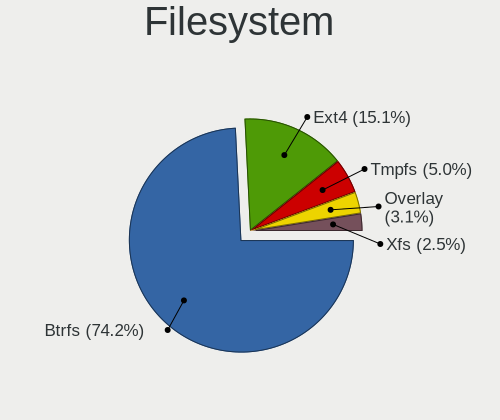
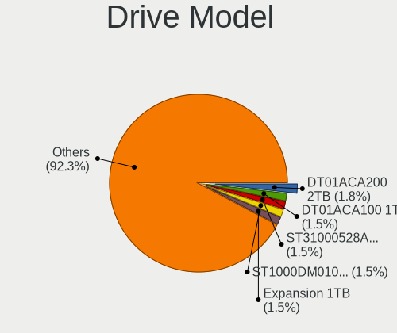
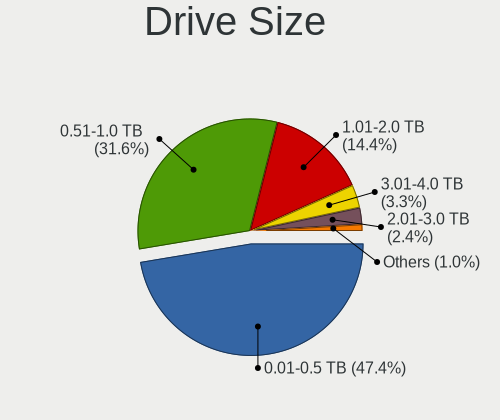
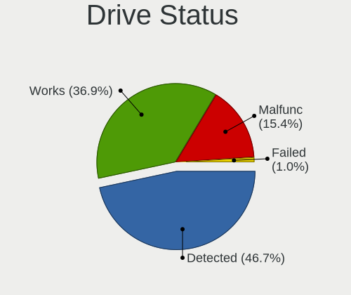
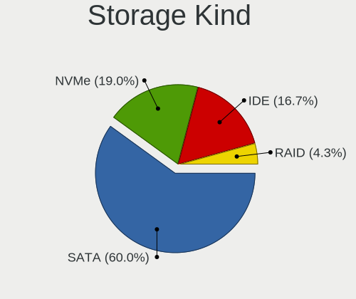
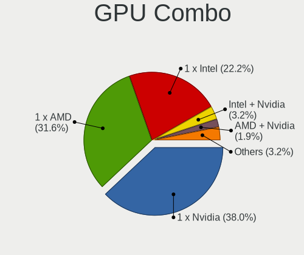
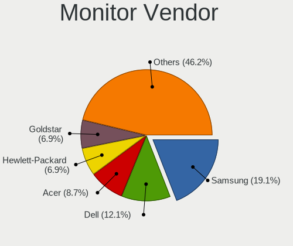

Parrot - Tested Hardware & Statistics (Desktops)
------------------------------------------------

A project to collect tested hardware configurations for Parrot.

Anyone can contribute to this report by the [hw-probe](https://github.com/linuxhw/hw-probe) tool:

    sudo -E hw-probe -all -upload

Please contribute! Especially if your hardware is rare.

Contents
--------

* [ Test Cases ](#test-cases)

* [ System ](#system)
  - [ OS                       ](#os)
  - [ OS Family                ](#os-family)
  - [ Kernel                   ](#kernel)
  - [ Kernel Family            ](#kernel-family)
  - [ Kernel Major Ver.        ](#kernel-major-ver)
  - [ Arch                     ](#arch)
  - [ DE                       ](#de)
  - [ Display Server           ](#display-server)
  - [ Display Manager          ](#display-manager)
  - [ OS Lang                  ](#os-lang)
  - [ Boot Mode                ](#boot-mode)
  - [ Filesystem               ](#filesystem)
  - [ Part. scheme             ](#part-scheme)
  - [ Dual Boot with Linux/BSD ](#dual-boot-with-linuxbsd)
  - [ Dual Boot (Win)          ](#dual-boot-win)

* [ Board ](#board)
  - [ Vendor                   ](#vendor)
  - [ Model                    ](#model)
  - [ Model Family             ](#model-family)
  - [ MFG Year                 ](#mfg-year)
  - [ Form Factor              ](#form-factor)
  - [ Secure Boot              ](#secure-boot)
  - [ Coreboot                 ](#coreboot)
  - [ RAM Size                 ](#ram-size)
  - [ RAM Used                 ](#ram-used)
  - [ Total Drives             ](#total-drives)
  - [ Has CD-ROM               ](#has-cd-rom)
  - [ Has Ethernet             ](#has-ethernet)
  - [ Has WiFi                 ](#has-wifi)
  - [ Has Bluetooth            ](#has-bluetooth)

* [ Location ](#location)
  - [ Country                  ](#country)
  - [ City                     ](#city)

* [ Drives ](#drives)
  - [ Drive Vendor             ](#drive-vendor)
  - [ Drive Model              ](#drive-model)
  - [ HDD Vendor               ](#hdd-vendor)
  - [ SSD Vendor               ](#ssd-vendor)
  - [ Drive Kind               ](#drive-kind)
  - [ Drive Connector          ](#drive-connector)
  - [ Drive Size               ](#drive-size)
  - [ Space Total              ](#space-total)
  - [ Space Used               ](#space-used)
  - [ Malfunc. Drives          ](#malfunc-drives)
  - [ Malfunc. Drive Vendor    ](#malfunc-drive-vendor)
  - [ Malfunc. HDD Vendor      ](#malfunc-hdd-vendor)
  - [ Malfunc. Drive Kind      ](#malfunc-drive-kind)
  - [ Failed Drives            ](#failed-drives)
  - [ Failed Drive Vendor      ](#failed-drive-vendor)
  - [ Drive Status             ](#drive-status)

* [ Storage controller ](#storage-controller)
  - [ Storage Vendor           ](#storage-vendor)
  - [ Storage Model            ](#storage-model)
  - [ Storage Kind             ](#storage-kind)

* [ Processor ](#processor)
  - [ CPU Vendor               ](#cpu-vendor)
  - [ CPU Model                ](#cpu-model)
  - [ CPU Model Family         ](#cpu-model-family)
  - [ CPU Cores                ](#cpu-cores)
  - [ CPU Sockets              ](#cpu-sockets)
  - [ CPU Threads              ](#cpu-threads)
  - [ CPU Op-Modes             ](#cpu-op-modes)
  - [ CPU Microcode            ](#cpu-microcode)
  - [ CPU Microarch            ](#cpu-microarch)

* [ Graphics ](#graphics)
  - [ GPU Vendor               ](#gpu-vendor)
  - [ GPU Model                ](#gpu-model)
  - [ GPU Combo                ](#gpu-combo)
  - [ GPU Driver               ](#gpu-driver)
  - [ GPU Memory               ](#gpu-memory)

* [ Monitor ](#monitor)
  - [ Monitor Vendor           ](#monitor-vendor)
  - [ Monitor Model            ](#monitor-model)
  - [ Monitor Resolution       ](#monitor-resolution)
  - [ Monitor Diagonal         ](#monitor-diagonal)
  - [ Monitor Width            ](#monitor-width)
  - [ Aspect Ratio             ](#aspect-ratio)
  - [ Monitor Area             ](#monitor-area)
  - [ Pixel Density            ](#pixel-density)
  - [ Multiple Monitors        ](#multiple-monitors)

* [ Network ](#network)
  - [ Net Controller Vendor    ](#net-controller-vendor)
  - [ Net Controller Model     ](#net-controller-model)
  - [ Wireless Vendor          ](#wireless-vendor)
  - [ Wireless Model           ](#wireless-model)
  - [ Ethernet Vendor          ](#ethernet-vendor)
  - [ Ethernet Model           ](#ethernet-model)
  - [ Net Controller Kind      ](#net-controller-kind)
  - [ Used Controller          ](#used-controller)
  - [ NICs                     ](#nics)
  - [ IPv6                     ](#ipv6)

* [ Bluetooth ](#bluetooth)
  - [ Bluetooth Vendor         ](#bluetooth-vendor)
  - [ Bluetooth Model          ](#bluetooth-model)

* [ Sound ](#sound)
  - [ Sound Vendor             ](#sound-vendor)
  - [ Sound Model              ](#sound-model)

* [ Memory ](#memory)
  - [ Memory Vendor            ](#memory-vendor)
  - [ Memory Model             ](#memory-model)
  - [ Memory Kind              ](#memory-kind)
  - [ Memory Form Factor       ](#memory-form-factor)
  - [ Memory Size              ](#memory-size)
  - [ Memory Speed             ](#memory-speed)

* [ Printers & scanners ](#printers--scanners)
  - [ Printer Vendor           ](#printer-vendor)
  - [ Printer Model            ](#printer-model)
  - [ Scanner Vendor           ](#scanner-vendor)
  - [ Scanner Model            ](#scanner-model)

* [ Camera ](#camera)
  - [ Camera Vendor            ](#camera-vendor)
  - [ Camera Model             ](#camera-model)

* [ Security ](#security)
  - [ Fingerprint Vendor       ](#fingerprint-vendor)
  - [ Fingerprint Model        ](#fingerprint-model)
  - [ Chipcard Vendor          ](#chipcard-vendor)
  - [ Chipcard Model           ](#chipcard-model)

* [ Unsupported ](#unsupported)
  - [ Unsupported Devices      ](#unsupported-devices)
  - [ Unsupported Device Types ](#unsupported-device-types)

Test Cases
----------

Total: 171

| Vendor        | Model                       | Probe                                                      | Date         |
|---------------|-----------------------------|------------------------------------------------------------|--------------|
| ASUSTek       | Maximus V FORMULA           | [694ffed41f](https://linux-hardware.org/?probe=694ffed41f) | Sep 06, 2023 |
| ASUSTek       | Maximus V FORMULA           | [039aa353eb](https://linux-hardware.org/?probe=039aa353eb) | Sep 06, 2023 |
| Pegatron      | 2A94h                       | [e9816ab65b](https://linux-hardware.org/?probe=e9816ab65b) | Aug 19, 2023 |
| MSI           | 3666h                       | [d3f51a2bf0](https://linux-hardware.org/?probe=d3f51a2bf0) | Aug 15, 2023 |
| Dell          | 0100P6 A01                  | [2cf993001c](https://linux-hardware.org/?probe=2cf993001c) | Aug 13, 2023 |
| MSI           | MAG B550 TOMAHAWK           | [b76b1bf00a](https://linux-hardware.org/?probe=b76b1bf00a) | Aug 08, 2023 |
| MSI           | MAG B550 TOMAHAWK           | [63665fca24](https://linux-hardware.org/?probe=63665fca24) | Aug 08, 2023 |
| MSI           | PRO H610M-B DDR4            | [1b3c788790](https://linux-hardware.org/?probe=1b3c788790) | Aug 06, 2023 |
| ASUSTek       | PRIME X570-P                | [48ec623298](https://linux-hardware.org/?probe=48ec623298) | Aug 06, 2023 |
| ASUSTek       | TUF Gaming B660-PLUS WIF... | [7979e7ce95](https://linux-hardware.org/?probe=7979e7ce95) | Aug 05, 2023 |
| Dell          | 0RY007                      | [8317045335](https://linux-hardware.org/?probe=8317045335) | Aug 01, 2023 |
| MSI           | PRO Z790-P WIFI             | [b4d959d91f](https://linux-hardware.org/?probe=b4d959d91f) | Jul 02, 2023 |
| ASUSTek       | Maximus V FORMULA           | [190d408bc2](https://linux-hardware.org/?probe=190d408bc2) | Jun 23, 2023 |
| ASUSTek       | Maximus V FORMULA           | [fa49028492](https://linux-hardware.org/?probe=fa49028492) | Jun 23, 2023 |
| MSI           | B450 GAMING PRO CARBON A... | [11161fa30c](https://linux-hardware.org/?probe=11161fa30c) | Jun 18, 2023 |
| HP            | 339A                        | [d1fa07d03f](https://linux-hardware.org/?probe=d1fa07d03f) | Jun 10, 2023 |
| HP            | 339A                        | [f2147ed11b](https://linux-hardware.org/?probe=f2147ed11b) | Jun 05, 2023 |
| HP            | 1495                        | [32cfd162b8](https://linux-hardware.org/?probe=32cfd162b8) | Jun 05, 2023 |
| HP            | 1495                        | [f6c9f689ec](https://linux-hardware.org/?probe=f6c9f689ec) | Jun 05, 2023 |
| ASUSTek       | P8Z68-V                     | [59e64db8de](https://linux-hardware.org/?probe=59e64db8de) | Jun 02, 2023 |
| ASUSTek       | ROG STRIX X570-E GAMING ... | [15b23b6779](https://linux-hardware.org/?probe=15b23b6779) | May 30, 2023 |
| Gigabyte      | H61M-HD2                    | [7c57f43d4a](https://linux-hardware.org/?probe=7c57f43d4a) | May 29, 2023 |
| ASUSTek       | PRIME Z690-P WIFI D4        | [922428b203](https://linux-hardware.org/?probe=922428b203) | May 25, 2023 |
| Gigabyte      | B85M-DS3H-A                 | [d2ddb8221f](https://linux-hardware.org/?probe=d2ddb8221f) | May 23, 2023 |
| Gigabyte      | Z97X-UD3H-CF                | [719fbbd5a5](https://linux-hardware.org/?probe=719fbbd5a5) | May 23, 2023 |
| MSI           | MAG Z690 TOMAHAWK WIFI D... | [64b9ba417c](https://linux-hardware.org/?probe=64b9ba417c) | May 19, 2023 |
| MSI           | MAG Z690 TOMAHAWK WIFI D... | [5c07806ab1](https://linux-hardware.org/?probe=5c07806ab1) | May 19, 2023 |
| ASUSTek       | PRIME X399-A                | [b4861cf35c](https://linux-hardware.org/?probe=b4861cf35c) | Apr 23, 2023 |
| MSI           | Z97 GAMING 5                | [2f61bfa5a5](https://linux-hardware.org/?probe=2f61bfa5a5) | Apr 04, 2023 |
| MSI           | Z97 GAMING 5                | [1e81e330e1](https://linux-hardware.org/?probe=1e81e330e1) | Apr 04, 2023 |
| MSI           | 760GM-P33                   | [4145a32920](https://linux-hardware.org/?probe=4145a32920) | Apr 03, 2023 |
| Gigabyte      | B450 AORUS ELITE            | [9edda5f374](https://linux-hardware.org/?probe=9edda5f374) | Mar 28, 2023 |
| Gigabyte      | B450 AORUS ELITE            | [c25f99afed](https://linux-hardware.org/?probe=c25f99afed) | Mar 28, 2023 |
| Gigabyte      | H61M-S2PV                   | [6752797fe9](https://linux-hardware.org/?probe=6752797fe9) | Mar 14, 2023 |
| Gigabyte      | H61M-S2PV                   | [2e0019e450](https://linux-hardware.org/?probe=2e0019e450) | Mar 14, 2023 |
| ASRock        | B560M-C                     | [a93d64aa2c](https://linux-hardware.org/?probe=a93d64aa2c) | Feb 28, 2023 |
| ASRock        | B560M-C                     | [cbbd0a63d4](https://linux-hardware.org/?probe=cbbd0a63d4) | Feb 28, 2023 |
| Pegatron      | 2ACB                        | [13355a7d07](https://linux-hardware.org/?probe=13355a7d07) | Feb 26, 2023 |
| Dell          | 0C1R19 A02                  | [42ff2c0844](https://linux-hardware.org/?probe=42ff2c0844) | Feb 22, 2023 |
| ASRock        | B560M-C                     | [0641c704e9](https://linux-hardware.org/?probe=0641c704e9) | Feb 20, 2023 |
| Biostar       | B450MH                      | [963e90387d](https://linux-hardware.org/?probe=963e90387d) | Feb 17, 2023 |
| Dell          | 0WMJ54 A01                  | [bfb29a2d13](https://linux-hardware.org/?probe=bfb29a2d13) | Feb 04, 2023 |
| ASRock        | Z87M Extreme4               | [8821f128c8](https://linux-hardware.org/?probe=8821f128c8) | Feb 03, 2023 |
| ASUSTek       | PRIME Z270-P                | [15644c39de](https://linux-hardware.org/?probe=15644c39de) | Jan 25, 2023 |
| Gigabyte      | GA-880GMA-USB3              | [eb10e25652](https://linux-hardware.org/?probe=eb10e25652) | Jan 23, 2023 |
| Gigabyte      | GA-880GMA-USB3              | [6552c7b8b3](https://linux-hardware.org/?probe=6552c7b8b3) | Jan 22, 2023 |
| Gigabyte      | GA-880GMA-USB3              | [64164ef7df](https://linux-hardware.org/?probe=64164ef7df) | Jan 20, 2023 |
| Gigabyte      | GA-880GMA-USB3              | [46befb7112](https://linux-hardware.org/?probe=46befb7112) | Jan 20, 2023 |
| HP            | 3397                        | [33ba62be32](https://linux-hardware.org/?probe=33ba62be32) | Dec 10, 2022 |
| ASUSTek       | PRIME B450M-K               | [0e7586e771](https://linux-hardware.org/?probe=0e7586e771) | Dec 06, 2022 |
| ASUSTek       | Z170-DELUXE                 | [7928d11567](https://linux-hardware.org/?probe=7928d11567) | Nov 19, 2022 |
| Dell          | 0C1R19 A02                  | [514ae17aa9](https://linux-hardware.org/?probe=514ae17aa9) | Nov 06, 2022 |
| HP            | 89B5 A                      | [1b04604c98](https://linux-hardware.org/?probe=1b04604c98) | Nov 03, 2022 |
| Gigabyte      | Z97N-WIFI                   | [dd5c78f136](https://linux-hardware.org/?probe=dd5c78f136) | Oct 24, 2022 |
| Gigabyte      | Z97N-WIFI                   | [10d8d16b6c](https://linux-hardware.org/?probe=10d8d16b6c) | Oct 24, 2022 |
| ASUSTek       | P5G41T-M LX                 | [7c046d1ba8](https://linux-hardware.org/?probe=7c046d1ba8) | Oct 23, 2022 |
| Gigabyte      | M61SME-S2                   | [6595a0b531](https://linux-hardware.org/?probe=6595a0b531) | Oct 19, 2022 |
| ASUSTek       | P6X58D-E                    | [d84fc5ce81](https://linux-hardware.org/?probe=d84fc5ce81) | Oct 13, 2022 |
| ASUSTek       | P6X58D-E                    | [2a896ec4f6](https://linux-hardware.org/?probe=2a896ec4f6) | Oct 13, 2022 |
| Gigabyte      | H110M-H DDR3-CF             | [8169fe8dbd](https://linux-hardware.org/?probe=8169fe8dbd) | Oct 01, 2022 |
| Gigabyte      | H61M-S2PT                   | [b7e6228017](https://linux-hardware.org/?probe=b7e6228017) | Aug 22, 2022 |
| Gateway       | SX2855                      | [a896e3b0f7](https://linux-hardware.org/?probe=a896e3b0f7) | Jul 30, 2022 |
| ASUSTek       | H110M-K                     | [9e9ca5b39a](https://linux-hardware.org/?probe=9e9ca5b39a) | Jul 19, 2022 |
| ASUSTek       | CROSSHAIR V FORMULA-Z       | [0539efedb2](https://linux-hardware.org/?probe=0539efedb2) | Jul 18, 2022 |
| ASUSTek       | H110M-K                     | [0e0a7a2fbc](https://linux-hardware.org/?probe=0e0a7a2fbc) | Jul 16, 2022 |
| ASUSTek       | PRIME B550-PLUS             | [3ba50e78b9](https://linux-hardware.org/?probe=3ba50e78b9) | Jun 29, 2022 |
| ASUSTek       | PRIME B550-PLUS             | [f33854651b](https://linux-hardware.org/?probe=f33854651b) | Jun 29, 2022 |
| ASUSTek       | H110M-K                     | [d1b8d3ff84](https://linux-hardware.org/?probe=d1b8d3ff84) | Jun 27, 2022 |
| ASUSTek       | H110M-K                     | [656a452bc6](https://linux-hardware.org/?probe=656a452bc6) | Jun 21, 2022 |
| Gigabyte      | H61M-USB3H                  | [6b9dcbd952](https://linux-hardware.org/?probe=6b9dcbd952) | Jun 20, 2022 |
| Unknown       | TB-4000                     | [c268e7111b](https://linux-hardware.org/?probe=c268e7111b) | Jun 07, 2022 |
| Lenovo        | 31900058 STD                | [cb4959b996](https://linux-hardware.org/?probe=cb4959b996) | May 21, 2022 |
| Gigabyte      | B450M DS3H-CF               | [fb7cb376e9](https://linux-hardware.org/?probe=fb7cb376e9) | May 21, 2022 |
| MSI           | G31M3-L V2                  | [29d45c64bb](https://linux-hardware.org/?probe=29d45c64bb) | May 11, 2022 |
| HP            | 1495                        | [c845f7b657](https://linux-hardware.org/?probe=c845f7b657) | May 05, 2022 |
| Unknown       | TB-4000                     | [99911022e9](https://linux-hardware.org/?probe=99911022e9) | Apr 26, 2022 |
| ASUSTek       | PRIME H310M-D R2.0          | [9c06485301](https://linux-hardware.org/?probe=9c06485301) | Apr 21, 2022 |
| HP            | 18E7                        | [1b6db66cc1](https://linux-hardware.org/?probe=1b6db66cc1) | Apr 19, 2022 |
| ASUSTek       | B85M-E                      | [b68f986aaf](https://linux-hardware.org/?probe=b68f986aaf) | Apr 17, 2022 |
| ASUSTek       | B85M-E                      | [93306ff9ee](https://linux-hardware.org/?probe=93306ff9ee) | Apr 17, 2022 |
| MSI           | B350 TOMAHAWK               | [b1a322fa38](https://linux-hardware.org/?probe=b1a322fa38) | Apr 11, 2022 |
| ECS           | Nettle2                     | [4939d60e6d](https://linux-hardware.org/?probe=4939d60e6d) | Mar 27, 2022 |
| HP            | 18E7                        | [d8d1c3d468](https://linux-hardware.org/?probe=d8d1c3d468) | Mar 26, 2022 |
| Lenovo        | SHARKBAY 31900058 STD       | [85260f6ed1](https://linux-hardware.org/?probe=85260f6ed1) | Mar 20, 2022 |
| Lenovo        | SHARKBAY 31900058 STD       | [e849ec3916](https://linux-hardware.org/?probe=e849ec3916) | Mar 20, 2022 |
| ASUSTek       | B85M-E                      | [b0769dffdd](https://linux-hardware.org/?probe=b0769dffdd) | Mar 19, 2022 |
| ASUSTek       | ROG CROSSHAIR VIII HERO     | [2c1ca9145b](https://linux-hardware.org/?probe=2c1ca9145b) | Mar 18, 2022 |
| ASUSTek       | H170M-E D3                  | [167928d6e9](https://linux-hardware.org/?probe=167928d6e9) | Mar 17, 2022 |
| Wistron       | JIG31B3                     | [a360eaf501](https://linux-hardware.org/?probe=a360eaf501) | Mar 15, 2022 |
| ASUSTek       | H170M-E D3                  | [937c0097ca](https://linux-hardware.org/?probe=937c0097ca) | Mar 14, 2022 |
| ASUSTek       | F2A85-M                     | [36d17e4fdb](https://linux-hardware.org/?probe=36d17e4fdb) | Mar 13, 2022 |
| ASUSTek       | F2A85-M                     | [453d0816b3](https://linux-hardware.org/?probe=453d0816b3) | Mar 13, 2022 |
| ASRock        | Z87M Extreme4               | [dba57ee1b3](https://linux-hardware.org/?probe=dba57ee1b3) | Mar 12, 2022 |
| MSI           | G31M3-L V2                  | [4c15ba6fb9](https://linux-hardware.org/?probe=4c15ba6fb9) | Mar 10, 2022 |
| ASUSTek       | B85M-E                      | [161eda858b](https://linux-hardware.org/?probe=161eda858b) | Mar 10, 2022 |
| ASUSTek       | B85M-E                      | [36bada67c8](https://linux-hardware.org/?probe=36bada67c8) | Mar 08, 2022 |
| Unknown       | TB-4000                     | [d92c05a18a](https://linux-hardware.org/?probe=d92c05a18a) | Mar 03, 2022 |
| Daewoo Luc... | Solo Top                    | [7f7b20688f](https://linux-hardware.org/?probe=7f7b20688f) | Mar 03, 2022 |
| Unknown       | TB-4000                     | [dc43686a5a](https://linux-hardware.org/?probe=dc43686a5a) | Feb 27, 2022 |
| Dell          | 0GXM1W A02                  | [044a00e086](https://linux-hardware.org/?probe=044a00e086) | Feb 25, 2022 |
| ASUSTek       | Benicia                     | [aceee2d932](https://linux-hardware.org/?probe=aceee2d932) | Feb 12, 2022 |
| Unknown       | TB-4000                     | [225e399fc1](https://linux-hardware.org/?probe=225e399fc1) | Feb 03, 2022 |
| Unknown       | Unknown                     | [bccc675fea](https://linux-hardware.org/?probe=bccc675fea) | Jan 08, 2022 |
| ASUSTek       | ROG STRIX B450-F GAMING     | [f75ebfbbc8](https://linux-hardware.org/?probe=f75ebfbbc8) | Jan 01, 2022 |
| Dell          | 04YP6J A01                  | [680408ec06](https://linux-hardware.org/?probe=680408ec06) | Jan 01, 2022 |
| Dell          | 04YP6J A01                  | [623d384766](https://linux-hardware.org/?probe=623d384766) | Jan 01, 2022 |
| Gigabyte      | A320M-S2H-CF                | [4ec2105ead](https://linux-hardware.org/?probe=4ec2105ead) | Jan 01, 2022 |
| ASUSTek       | M5A99X EVO                  | [5c55046f50](https://linux-hardware.org/?probe=5c55046f50) | Dec 13, 2021 |
| Alienware     | 0PGRP5 A02                  | [aeacaefd26](https://linux-hardware.org/?probe=aeacaefd26) | Nov 14, 2021 |
| ASRock        | Z87 Killer                  | [0aafc0d981](https://linux-hardware.org/?probe=0aafc0d981) | Nov 13, 2021 |
| Acer          | Aspire TC-780               | [f6de1ed637](https://linux-hardware.org/?probe=f6de1ed637) | Nov 04, 2021 |
| Dell          | 0T2HR0 A00                  | [dc55f173fe](https://linux-hardware.org/?probe=dc55f173fe) | Oct 05, 2021 |
| ASUSTek       | P8H67-M PRO                 | [7dcd6067ac](https://linux-hardware.org/?probe=7dcd6067ac) | Oct 04, 2021 |
| Gigabyte      | A320M-S2H-CF                | [d0cd1577c7](https://linux-hardware.org/?probe=d0cd1577c7) | Oct 04, 2021 |
| Gigabyte      | A320M-S2H-CF                | [b733e7fac1](https://linux-hardware.org/?probe=b733e7fac1) | Sep 23, 2021 |
| MSI           | B450 TOMAHAWK MAX           | [b741d2ab2b](https://linux-hardware.org/?probe=b741d2ab2b) | Aug 12, 2021 |
| Gigabyte      | A320M-S2H-CF                | [3ba02ffef3](https://linux-hardware.org/?probe=3ba02ffef3) | Aug 10, 2021 |
| ZOTAC         | Unknown                     | [0324aff0a3](https://linux-hardware.org/?probe=0324aff0a3) | Aug 03, 2021 |
| ZOTAC         | Unknown                     | [c1a9e01bd7](https://linux-hardware.org/?probe=c1a9e01bd7) | Aug 03, 2021 |
| HP            | 1850                        | [687c780f5c](https://linux-hardware.org/?probe=687c780f5c) | Jul 19, 2021 |
| Dell          | 0T10XW A02                  | [57a4116288](https://linux-hardware.org/?probe=57a4116288) | Jul 17, 2021 |
| HP            | 1850                        | [3bde7e8e11](https://linux-hardware.org/?probe=3bde7e8e11) | May 27, 2021 |
| Dell          | 0C1R19 A02                  | [ff5bb2ee2a](https://linux-hardware.org/?probe=ff5bb2ee2a) | May 03, 2021 |
| ASUSTek       | PRIME X399-A                | [4dd4f28ca7](https://linux-hardware.org/?probe=4dd4f28ca7) | Apr 11, 2021 |
| Acer          | Predator PO3-600 V:1.1      | [6ea75bdbb5](https://linux-hardware.org/?probe=6ea75bdbb5) | Mar 26, 2021 |
| ASUSTek       | M5A78L-M/USB3               | [6b26a69326](https://linux-hardware.org/?probe=6b26a69326) | Mar 21, 2021 |
| HP            | 339A                        | [b105e94284](https://linux-hardware.org/?probe=b105e94284) | Feb 20, 2021 |
| HP            | 339A                        | [3dfdd6aa5e](https://linux-hardware.org/?probe=3dfdd6aa5e) | Feb 20, 2021 |
| MSI           | B250M MORTAR                | [be8a65f362](https://linux-hardware.org/?probe=be8a65f362) | Feb 02, 2021 |
| Dell          | 0CU409                      | [64c8a84081](https://linux-hardware.org/?probe=64c8a84081) | Jan 29, 2021 |
| Acer          | Aspire X3990                | [a3e9301c7f](https://linux-hardware.org/?probe=a3e9301c7f) | Jan 16, 2021 |
| Acer          | Aspire X3990                | [1660d13b44](https://linux-hardware.org/?probe=1660d13b44) | Jan 12, 2021 |
| HP            | 3047h                       | [8b50e12296](https://linux-hardware.org/?probe=8b50e12296) | Jan 07, 2021 |
| Medion        | MS-7621                     | [74c49730d1](https://linux-hardware.org/?probe=74c49730d1) | Dec 27, 2020 |
| Positivo      | POS-PIG43BC                 | [146c7d86bb](https://linux-hardware.org/?probe=146c7d86bb) | Dec 27, 2020 |
| HP            | 3047h                       | [b65caab721](https://linux-hardware.org/?probe=b65caab721) | Nov 24, 2020 |
| Foxconn       | 45CMX/45GMX/45CMX-K         | [7918687a8b](https://linux-hardware.org/?probe=7918687a8b) | Nov 07, 2020 |
| ASUSTek       | Maximus VIII HERO           | [f95c24897c](https://linux-hardware.org/?probe=f95c24897c) | Oct 30, 2020 |
| ASUSTek       | M5A99X EVO                  | [f7a2b660d8](https://linux-hardware.org/?probe=f7a2b660d8) | Oct 29, 2020 |
| ASUSTek       | M5A99X EVO                  | [c687805b04](https://linux-hardware.org/?probe=c687805b04) | Oct 29, 2020 |
| ECS           | A740GM-M                    | [423f49affd](https://linux-hardware.org/?probe=423f49affd) | Oct 25, 2020 |
| ASUSTek       | Z170 PRO GAMING             | [2bc8fbe372](https://linux-hardware.org/?probe=2bc8fbe372) | Sep 27, 2020 |
| Gigabyte      | H370M DS3H-CF               | [affb4f7587](https://linux-hardware.org/?probe=affb4f7587) | Aug 29, 2020 |
| Apple         | Mac-F221BEC8                | [1d8d1db67e](https://linux-hardware.org/?probe=1d8d1db67e) | Jul 04, 2020 |
| Dell          | 0D6H9T A00                  | [06e9599063](https://linux-hardware.org/?probe=06e9599063) | Jul 04, 2020 |
| Gigabyte      | 970A-DS3P                   | [dda8536e62](https://linux-hardware.org/?probe=dda8536e62) | Jun 11, 2020 |
| Biostar       | H77MU3                      | [048ffba01b](https://linux-hardware.org/?probe=048ffba01b) | May 24, 2020 |
| ASUSTek       | A68HM-PLUS                  | [7c05b67968](https://linux-hardware.org/?probe=7c05b67968) | May 22, 2020 |
| ASUSTek       | A68HM-PLUS                  | [fc8bf8a5a6](https://linux-hardware.org/?probe=fc8bf8a5a6) | May 22, 2020 |
| ASUSTek       | H110I-PLUS                  | [8e55010bac](https://linux-hardware.org/?probe=8e55010bac) | May 22, 2020 |
| ASUSTek       | H110I-PLUS                  | [26293feb91](https://linux-hardware.org/?probe=26293feb91) | May 21, 2020 |
| Dell          | 0VYXHD A00                  | [5e5d0a24f3](https://linux-hardware.org/?probe=5e5d0a24f3) | May 15, 2020 |
| Dell          | 0VYXHD A00                  | [5a56c30293](https://linux-hardware.org/?probe=5a56c30293) | May 06, 2020 |
| Dell          | 05DN3X A00                  | [7424c0caba](https://linux-hardware.org/?probe=7424c0caba) | May 02, 2020 |
| ASUSTek       | A68HM-PLUS                  | [3dc6534b5f](https://linux-hardware.org/?probe=3dc6534b5f) | May 01, 2020 |
| ASUSTek       | A68HM-PLUS                  | [6835f4fe95](https://linux-hardware.org/?probe=6835f4fe95) | Apr 28, 2020 |
| Foxconn       | 2A8C                        | [6e636c5fd2](https://linux-hardware.org/?probe=6e636c5fd2) | Apr 27, 2020 |
| Foxconn       | 2A8C                        | [d19700bc2d](https://linux-hardware.org/?probe=d19700bc2d) | Apr 27, 2020 |
| ASUSTek       | M2N68-AM Plus               | [72dcfa02ca](https://linux-hardware.org/?probe=72dcfa02ca) | Apr 26, 2020 |
| Foxconn       | 2A8C                        | [37c314650f](https://linux-hardware.org/?probe=37c314650f) | Apr 26, 2020 |
| Foxconn       | 2A8C                        | [9a9b368a7c](https://linux-hardware.org/?probe=9a9b368a7c) | Apr 26, 2020 |
| ASUSTek       | K31CD-K                     | [b4ad316fa2](https://linux-hardware.org/?probe=b4ad316fa2) | Apr 14, 2020 |
| Dell          | 0CU409                      | [661761d2ca](https://linux-hardware.org/?probe=661761d2ca) | Apr 14, 2020 |
| Dell          | 0CU409                      | [5512733c4a](https://linux-hardware.org/?probe=5512733c4a) | Apr 14, 2020 |
| Gigabyte      | GA-880GM-D2H                | [93da68c7fb](https://linux-hardware.org/?probe=93da68c7fb) | Apr 12, 2020 |
| ASRock        | FM2A68M-DG3+                | [05f8c8eef4](https://linux-hardware.org/?probe=05f8c8eef4) | Feb 29, 2020 |
| Gigabyte      | AX370-Gaming-CF se1         | [2bfc7eae61](https://linux-hardware.org/?probe=2bfc7eae61) | Feb 06, 2020 |
| Gigabyte      | AX370-Gaming-CF se1         | [1e8ccbe5b9](https://linux-hardware.org/?probe=1e8ccbe5b9) | Feb 04, 2020 |
| Foxconn       | 2A8C                        | [38658290e2](https://linux-hardware.org/?probe=38658290e2) | Jan 19, 2020 |
| Foxconn       | 2A8C                        | [05e5552eea](https://linux-hardware.org/?probe=05e5552eea) | Jan 19, 2020 |
| ASUSTek       | M5A78L-M/USB3               | [51389e5c4a](https://linux-hardware.org/?probe=51389e5c4a) | Dec 07, 2019 |

System
------

OS
--

Installed operating systems

| Name        | Desktops | Percent |
|-------------|----------|---------|
| Parrot 5.0  | 26       | 21.49%  |
| Parrot 4.11 | 23       | 19.01%  |
| Parrot 5.3  | 19       | 15.7%   |
| Parrot 4.10 | 14       | 11.57%  |
| Parrot 5.1  | 13       | 10.74%  |
| Parrot 4.9  | 9        | 7.44%   |
| Parrot 5.2  | 8        | 6.61%   |
| Parrot 4.8  | 6        | 4.96%   |
| Parrot 4.7  | 3        | 2.48%   |

OS Family
---------

OS without a version

| Name   | Desktops | Percent |
|--------|----------|---------|
| Parrot | 115      | 100%    |

Kernel
------

Version of the Linux kernel

| Version                  | Desktops | Percent |
|--------------------------|----------|---------|
| 6.1.0-1parrot1-amd64     | 18       | 14.52%  |
| 5.16.0-12parrot1-amd64   | 14       | 11.29%  |
| 6.0.0-12parrot1-amd64    | 13       | 10.48%  |
| 5.14.0-9parrot1-amd64    | 13       | 10.48%  |
| 5.5.0-1parrot1-amd64     | 12       | 9.68%   |
| 6.0.0-2parrot1-amd64     | 8        | 6.45%   |
| 5.7.0-2parrot2-amd64     | 6        | 4.84%   |
| 5.15.0-15parrot1-amd64   | 6        | 4.84%   |
| 5.10.0-6parrot1-amd64    | 6        | 4.84%   |
| 5.8.0-2parrot1-amd64     | 3        | 2.42%   |
| 5.4.0-4parrot1-amd64     | 3        | 2.42%   |
| 5.10.0-8parrot1-amd64    | 3        | 2.42%   |
| 5.9.0-2parrot1-amd64     | 2        | 1.61%   |
| 5.4.0-2parrot1-amd64     | 2        | 1.61%   |
| 5.3.0-3parrot3-amd64     | 2        | 1.61%   |
| 5.18.0-1parrot1-amd64    | 2        | 1.61%   |
| 5.18.0-14parrot1-amd64   | 2        | 1.61%   |
| 5.14.0-2parrot1-amd64    | 2        | 1.61%   |
| 5.10.0-3parrot1-amd64    | 2        | 1.61%   |
| 5.8.0-1parrot1-amd64     | 1        | 0.81%   |
| 5.6.0-2parrot1-amd64     | 1        | 0.81%   |
| 5.4.0-3parrot1-amd64     | 1        | 0.81%   |
| 5.16.0-12parrot1-686-pae | 1        | 0.81%   |
| 5.10.0-5parrot1-amd64    | 1        | 0.81%   |

Kernel Family
-------------

Linux kernel without a distro release

| Version | Desktops | Percent |
|---------|----------|---------|
| 6.0.0   | 20       | 16.39%  |
| 6.1.0   | 18       | 14.75%  |
| 5.16.0  | 15       | 12.3%   |
| 5.14.0  | 14       | 11.48%  |
| 5.5.0   | 12       | 9.84%   |
| 5.10.0  | 12       | 9.84%   |
| 5.7.0   | 6        | 4.92%   |
| 5.4.0   | 6        | 4.92%   |
| 5.15.0  | 6        | 4.92%   |
| 5.8.0   | 4        | 3.28%   |
| 5.18.0  | 4        | 3.28%   |
| 5.9.0   | 2        | 1.64%   |
| 5.3.0   | 2        | 1.64%   |
| 5.6.0   | 1        | 0.82%   |

Kernel Major Ver.
-----------------

Linux kernel major version

| Version | Desktops | Percent |
|---------|----------|---------|
| 6.0     | 20       | 16.39%  |
| 6.1     | 18       | 14.75%  |
| 5.16    | 15       | 12.3%   |
| 5.14    | 14       | 11.48%  |
| 5.5     | 12       | 9.84%   |
| 5.10    | 12       | 9.84%   |
| 5.7     | 6        | 4.92%   |
| 5.4     | 6        | 4.92%   |
| 5.15    | 6        | 4.92%   |
| 5.8     | 4        | 3.28%   |
| 5.18    | 4        | 3.28%   |
| 5.9     | 2        | 1.64%   |
| 5.3     | 2        | 1.64%   |
| 5.6     | 1        | 0.82%   |

Arch
----

OS architecture (x86_64, i586, etc.)

| Name   | Desktops | Percent |
|--------|----------|---------|
| x86_64 | 114      | 99.13%  |
| i686   | 1        | 0.87%   |

DE
--

Desktop Environment

| Name            | Desktops | Percent |
|-----------------|----------|---------|
| MATE            | 86       | 71.67%  |
| KDE5            | 12       | 10%     |
| KDE             | 7        | 5.83%   |
| XFCE            | 6        | 5%      |
| GNOME           | 4        | 3.33%   |
| Unknown         | 3        | 2.5%    |
| GNOME Flashback | 1        | 0.83%   |
| bspwm           | 1        | 0.83%   |

Display Server
--------------

X11 or Wayland

| Name    | Desktops | Percent |
|---------|----------|---------|
| X11     | 111      | 96.52%  |
| Wayland | 3        | 2.61%   |
| Tty     | 1        | 0.87%   |

Display Manager
---------------

SDDM, LightDM, etc.

| Name    | Desktops | Percent |
|---------|----------|---------|
| LightDM | 55       | 45.83%  |
| Unknown | 39       | 32.5%   |
| TDM     | 18       | 15%     |
| SDDM    | 5        | 4.17%   |
| GDM     | 3        | 2.5%    |

OS Lang
-------

Language

| Lang  | Desktops | Percent |
|-------|----------|---------|
| en_US | 65       | 56.03%  |
| ru_RU | 5        | 4.31%   |
| en_IN | 5        | 4.31%   |
| es_ES | 4        | 3.45%   |
| en_AU | 4        | 3.45%   |
| de_DE | 4        | 3.45%   |
| pt_BR | 3        | 2.59%   |
| pl_PL | 3        | 2.59%   |
| fr_FR | 3        | 2.59%   |
| en_GB | 3        | 2.59%   |
| it_IT | 2        | 1.72%   |
| es_MX | 2        | 1.72%   |
| en_HK | 2        | 1.72%   |
| cs_CZ | 2        | 1.72%   |
| ru_UA | 1        | 0.86%   |
| mk_MK | 1        | 0.86%   |
| id_ID | 1        | 0.86%   |
| es_CO | 1        | 0.86%   |
| en_ZA | 1        | 0.86%   |
| en_DK | 1        | 0.86%   |
| en_CA | 1        | 0.86%   |
| de_AT | 1        | 0.86%   |
| an_ES | 1        | 0.86%   |

Boot Mode
---------

EFI or BIOS

| Mode | Desktops | Percent |
|------|----------|---------|
| BIOS | 89       | 75.42%  |
| EFI  | 29       | 24.58%  |

Filesystem
----------

Type of filesystem

| Type    | Desktops | Percent |
|---------|----------|---------|
| Btrfs   | 91       | 77.78%  |
| Ext4    | 16       | 13.68%  |
| Overlay | 4        | 3.42%   |
| Xfs     | 3        | 2.56%   |
| Tmpfs   | 3        | 2.56%   |

Part. scheme
------------

Scheme of partitioning

| Type    | Desktops | Percent |
|---------|----------|---------|
| Unknown | 56       | 46.67%  |
| GPT     | 40       | 33.33%  |
| MBR     | 24       | 20%     |

Dual Boot with Linux/BSD
------------------------

Hosting more than one Linux/BSD

| Dual boot | Desktops | Percent |
|-----------|----------|---------|
| No        | 97       | 82.2%   |
| Yes       | 21       | 17.8%   |

Dual Boot (Win)
---------------

Hosting Linux and Windows

| Dual boot | Desktops | Percent |
|-----------|----------|---------|
| No        | 68       | 58.62%  |
| Yes       | 48       | 41.38%  |

Board
-----

Vendor
------

Motherboard manufacturer

| Name                | Desktops | Percent |
|---------------------|----------|---------|
| ASUSTek Computer    | 35       | 30.43%  |
| Gigabyte Technology | 18       | 15.65%  |
| Dell                | 13       | 11.3%   |
| MSI                 | 12       | 10.43%  |
| Hewlett-Packard     | 10       | 8.7%    |
| ASRock              | 4        | 3.48%   |
| Foxconn             | 3        | 2.61%   |
| Acer                | 3        | 2.61%   |
| Pegatron            | 2        | 1.74%   |
| Lenovo              | 2        | 1.74%   |
| ECS                 | 2        | 1.74%   |
| Biostar             | 2        | 1.74%   |
| Unknown             | 2        | 1.74%   |
| ZOTAC               | 1        | 0.87%   |
| Wistron             | 1        | 0.87%   |
| Positivo            | 1        | 0.87%   |
| Gateway             | 1        | 0.87%   |
| Daewoo Lucoms       | 1        | 0.87%   |
| Apple               | 1        | 0.87%   |
| Alienware           | 1        | 0.87%   |

Model
-----

Motherboard model

| Name                                      | Desktops | Percent |
|-------------------------------------------|----------|---------|
| Unknown                                   | 3        | 2.61%   |
| HP ProDesk 600 G1 SFF                     | 2        | 1.74%   |
| HP Compaq 8200 Elite SFF PC               | 2        | 1.74%   |
| Gigabyte AX370-Gaming                     | 2        | 1.74%   |
| Foxconn s5710t                            | 2        | 1.74%   |
| Dell OptiPlex 3020                        | 2        | 1.74%   |
| Dell Inspiron 5676                        | 2        | 1.74%   |
| ASUS PRIME X399-A                         | 2        | 1.74%   |
| ASUS M5A78L-M/USB3                        | 2        | 1.74%   |
| ASUS H110I-PLUS                           | 2        | 1.74%   |
| ASUS Basic 3221BM                         | 2        | 1.74%   |
| Wistron FMVDD2A0H0                        | 1        | 0.87%   |
| Positivo POS-PIG43BC                      | 1        | 0.87%   |
| Pegatron Pro 3010 Microtower PC           | 1        | 0.87%   |
| Pegatron 520-1030a                        | 1        | 0.87%   |
| MSI Pro 2000/2080                         | 1        | 0.87%   |
| MSI MS-7E06                               | 1        | 0.87%   |
| MSI MS-7D46                               | 1        | 0.87%   |
| MSI MS-7D32                               | 1        | 0.87%   |
| MSI MS-7C91                               | 1        | 0.87%   |
| MSI MS-7C02                               | 1        | 0.87%   |
| MSI MS-7B85                               | 1        | 0.87%   |
| MSI MS-7A69                               | 1        | 0.87%   |
| MSI MS-7A34                               | 1        | 0.87%   |
| MSI MS-7917                               | 1        | 0.87%   |
| MSI MS-7623                               | 1        | 0.87%   |
| MSI MS-7529                               | 1        | 0.87%   |
| Lenovo H535 10117                         | 1        | 0.87%   |
| Lenovo H530 10130                         | 1        | 0.87%   |
| HP Victus by 15L Gaming Desktop TG02-0xxx | 1        | 0.87%   |
| HP Compaq Pro 6305 MT                     | 1        | 0.87%   |
| HP Compaq Pro 6300 SFF                    | 1        | 0.87%   |
| HP Compaq Pro 6300 MT                     | 1        | 0.87%   |
| HP Compaq Elite 8300 SFF                  | 1        | 0.87%   |
| HP Compaq 6005 Pro MT PC                  | 1        | 0.87%   |
| Gigabyte Z97X-UD3H                        | 1        | 0.87%   |
| Gigabyte Z97N-WIFI                        | 1        | 0.87%   |
| Gigabyte M61SME-S2                        | 1        | 0.87%   |
| Gigabyte H61M-USB3H                       | 1        | 0.87%   |
| Gigabyte H61M-S2PV                        | 1        | 0.87%   |

Model Family
------------

Motherboard model prefix

| Name                  | Desktops | Percent |
|-----------------------|----------|---------|
| ASUS PRIME            | 8        | 6.96%   |
| HP Compaq             | 7        | 6.09%   |
| Dell OptiPlex         | 7        | 6.09%   |
| Dell Inspiron         | 3        | 2.61%   |
| ASUS ROG              | 3        | 2.61%   |
| Unknown               | 3        | 2.61%   |
| HP ProDesk            | 2        | 1.74%   |
| Gigabyte AX370-Gaming | 2        | 1.74%   |
| Foxconn s5710t        | 2        | 1.74%   |
| ASUS Maximus          | 2        | 1.74%   |
| ASUS M5A78L-M         | 2        | 1.74%   |
| ASUS H110I-PLUS       | 2        | 1.74%   |
| ASUS Basic            | 2        | 1.74%   |
| Acer Aspire           | 2        | 1.74%   |
| Wistron FMVDD2A0H0    | 1        | 0.87%   |
| Positivo POS-PIG43BC  | 1        | 0.87%   |
| Pegatron Pro          | 1        | 0.87%   |
| Pegatron 520-1030a    | 1        | 0.87%   |
| MSI Pro               | 1        | 0.87%   |
| MSI MS-7E06           | 1        | 0.87%   |
| MSI MS-7D46           | 1        | 0.87%   |
| MSI MS-7D32           | 1        | 0.87%   |
| MSI MS-7C91           | 1        | 0.87%   |
| MSI MS-7C02           | 1        | 0.87%   |
| MSI MS-7B85           | 1        | 0.87%   |
| MSI MS-7A69           | 1        | 0.87%   |
| MSI MS-7A34           | 1        | 0.87%   |
| MSI MS-7917           | 1        | 0.87%   |
| MSI MS-7623           | 1        | 0.87%   |
| MSI MS-7529           | 1        | 0.87%   |
| Lenovo H535           | 1        | 0.87%   |
| Lenovo H530           | 1        | 0.87%   |
| HP Victus             | 1        | 0.87%   |
| Gigabyte Z97X-UD3H    | 1        | 0.87%   |
| Gigabyte Z97N-WIFI    | 1        | 0.87%   |
| Gigabyte M61SME-S2    | 1        | 0.87%   |
| Gigabyte H61M-USB3H   | 1        | 0.87%   |
| Gigabyte H61M-S2PV    | 1        | 0.87%   |
| Gigabyte H61M-S2PT    | 1        | 0.87%   |
| Gigabyte H61M-HD2     | 1        | 0.87%   |

MFG Year
--------

Motherboard manufacture year

| Year | Desktops | Percent |
|------|----------|---------|
| 2011 | 13       | 11.3%   |
| 2013 | 12       | 10.43%  |
| 2012 | 12       | 10.43%  |
| 2018 | 10       | 8.7%    |
| 2010 | 9        | 7.83%   |
| 2016 | 8        | 6.96%   |
| 2021 | 7        | 6.09%   |
| 2017 | 7        | 6.09%   |
| 2015 | 7        | 6.09%   |
| 2014 | 6        | 5.22%   |
| 2007 | 6        | 5.22%   |
| 2019 | 5        | 4.35%   |
| 2009 | 5        | 4.35%   |
| 2022 | 3        | 2.61%   |
| 2020 | 3        | 2.61%   |
| 2023 | 1        | 0.87%   |
| 2008 | 1        | 0.87%   |

Form Factor
-----------

Physical design of the computer

| Name    | Desktops | Percent |
|---------|----------|---------|
| Desktop | 115      | 100%    |

Secure Boot
-----------

Enabled or disabled

| State    | Desktops | Percent |
|----------|----------|---------|
| Disabled | 115      | 100%    |

Coreboot
--------

Have coreboot on board

| Used | Desktops | Percent |
|------|----------|---------|
| No   | 115      | 100%    |

RAM Size
--------

Total RAM memory

| Size in GB  | Desktops | Percent |
|-------------|----------|---------|
| 16.01-24.0  | 33       | 27.73%  |
| 8.01-16.0   | 24       | 20.17%  |
| 4.01-8.0    | 21       | 17.65%  |
| 32.01-64.0  | 18       | 15.13%  |
| 3.01-4.0    | 16       | 13.45%  |
| 1.01-2.0    | 3        | 2.52%   |
| 24.01-32.0  | 2        | 1.68%   |
| 64.01-256.0 | 2        | 1.68%   |

RAM Used
--------

Used RAM memory

| Used GB    | Desktops | Percent |
|------------|----------|---------|
| 2.01-3.0   | 39       | 31.97%  |
| 1.01-2.0   | 34       | 27.87%  |
| 4.01-8.0   | 20       | 16.39%  |
| 3.01-4.0   | 17       | 13.93%  |
| 0.51-1.0   | 7        | 5.74%   |
| 8.01-16.0  | 4        | 3.28%   |
| 16.01-24.0 | 1        | 0.82%   |

Total Drives
------------

Number of drives on board

| Drives | Desktops | Percent |
|--------|----------|---------|
| 2      | 45       | 37.19%  |
| 1      | 42       | 34.71%  |
| 3      | 17       | 14.05%  |
| 4      | 10       | 8.26%   |
| 5      | 5        | 4.13%   |
| 6      | 1        | 0.83%   |
| 0      | 1        | 0.83%   |

Has CD-ROM
----------

Has CD-ROM on board

| Presented | Desktops | Percent |
|-----------|----------|---------|
| No        | 80       | 66.67%  |
| Yes       | 40       | 33.33%  |

Has Ethernet
------------

Has Ethernet on board

| Presented | Desktops | Percent |
|-----------|----------|---------|
| Yes       | 113      | 98.26%  |
| No        | 2        | 1.74%   |

Has WiFi
--------

Has WiFi module

| Presented | Desktops | Percent |
|-----------|----------|---------|
| Yes       | 80       | 67.8%   |
| No        | 38       | 32.2%   |

Has Bluetooth
-------------

Has Bluetooth module

| Presented | Desktops | Percent |
|-----------|----------|---------|
| No        | 80       | 68.97%  |
| Yes       | 36       | 31.03%  |

Location
--------

Country
-------

Geographic location (country)

| Country         | Desktops | Percent |
|-----------------|----------|---------|
| USA             | 39       | 33.33%  |
| Germany         | 9        | 7.69%   |
| India           | 6        | 5.13%   |
| Brazil          | 6        | 5.13%   |
| Spain           | 5        | 4.27%   |
| Russia          | 4        | 3.42%   |
| Netherlands     | 4        | 3.42%   |
| Mexico          | 3        | 2.56%   |
| Italy           | 3        | 2.56%   |
| Canada          | 3        | 2.56%   |
| Australia       | 3        | 2.56%   |
| UK              | 2        | 1.71%   |
| Poland          | 2        | 1.71%   |
| Japan           | 2        | 1.71%   |
| Hong Kong       | 2        | 1.71%   |
| France          | 2        | 1.71%   |
| Czechia         | 2        | 1.71%   |
| Austria         | 2        | 1.71%   |
| Algeria         | 2        | 1.71%   |
| Vietnam         | 1        | 0.85%   |
| Ukraine         | 1        | 0.85%   |
| Turkey          | 1        | 0.85%   |
| South Africa    | 1        | 0.85%   |
| Romania         | 1        | 0.85%   |
| Philippines     | 1        | 0.85%   |
| Pakistan        | 1        | 0.85%   |
| North Macedonia | 1        | 0.85%   |
| Morocco         | 1        | 0.85%   |
| Mongolia        | 1        | 0.85%   |
| Indonesia       | 1        | 0.85%   |
| Egypt           | 1        | 0.85%   |
| Denmark         | 1        | 0.85%   |
| Colombia        | 1        | 0.85%   |
| Bulgaria        | 1        | 0.85%   |
| Belgium         | 1        | 0.85%   |

City
----

Geographic location (city)

| City                 | Desktops | Percent |
|----------------------|----------|---------|
| Indianapolis         | 3        | 2.52%   |
| Vienna               | 2        | 1.68%   |
| Uherské Hradiště  | 2        | 1.68%   |
| Tokyo                | 2        | 1.68%   |
| Ngau Wu Tok          | 2        | 1.68%   |
| Newburgh             | 2        | 1.68%   |
| Morelia              | 2        | 1.68%   |
| Madrid               | 2        | 1.68%   |
| Eugene               | 2        | 1.68%   |
| Atlanta              | 2        | 1.68%   |
| Wichita              | 1        | 0.84%   |
| Warsaw               | 1        | 0.84%   |
| Viby J               | 1        | 0.84%   |
| Velbert              | 1        | 0.84%   |
| Vapi                 | 1        | 0.84%   |
| Vancouver            | 1        | 0.84%   |
| Valencia             | 1        | 0.84%   |
| Ulan Bator           | 1        | 0.84%   |
| Terrace              | 1        | 0.84%   |
| Tangier              | 1        | 0.84%   |
| Sydney               | 1        | 0.84%   |
| Stockton             | 1        | 0.84%   |
| Springfield          | 1        | 0.84%   |
| Spring               | 1        | 0.84%   |
| Sorocaba             | 1        | 0.84%   |
| Sofia                | 1        | 0.84%   |
| Skopje               | 1        | 0.84%   |
| Skikda               | 1        | 0.84%   |
| Sao Paulo            | 1        | 0.84%   |
| Sao Joao de Meriti   | 1        | 0.84%   |
| Santa Maria          | 1        | 0.84%   |
| Saint Paul           | 1        | 0.84%   |
| Rubí                | 1        | 0.84%   |
| Rawalpindi           | 1        | 0.84%   |
| Portsmouth           | 1        | 0.84%   |
| Portland             | 1        | 0.84%   |
| Point Pleasant Beach | 1        | 0.84%   |
| Perth                | 1        | 0.84%   |
| Pensacola            | 1        | 0.84%   |
| Ordu                 | 1        | 0.84%   |

Drives
------

Drive Vendor
------------

Hard drive vendors

| Vendor                    | Desktops | Drives | Percent |
|---------------------------|----------|--------|---------|
| Seagate                   | 46       | 66     | 21.9%   |
| WDC                       | 42       | 58     | 20%     |
| Samsung Electronics       | 23       | 36     | 10.95%  |
| Toshiba                   | 19       | 20     | 9.05%   |
| SanDisk                   | 11       | 16     | 5.24%   |
| Kingston                  | 10       | 12     | 4.76%   |
| Hitachi                   | 10       | 11     | 4.76%   |
| Crucial                   | 6        | 6      | 2.86%   |
| Unknown                   | 3        | 3      | 1.43%   |
| SPCC                      | 3        | 3      | 1.43%   |
| SK hynix                  | 3        | 5      | 1.43%   |
| JMicron Technology        | 3        | 3      | 1.43%   |
| A-DATA Technology         | 3        | 3      | 1.43%   |
| Team                      | 2        | 3      | 0.95%   |
| Phison                    | 2        | 2      | 0.95%   |
| Micron Technology         | 2        | 2      | 0.95%   |
| LITEONIT                  | 2        | 2      | 0.95%   |
| Intenso                   | 2        | 2      | 0.95%   |
| HGST                      | 2        | 2      | 0.95%   |
| Fujitsu                   | 2        | 2      | 0.95%   |
| China                     | 2        | 5      | 0.95%   |
| Silicon Motion            | 1        | 1      | 0.48%   |
| PNY                       | 1        | 1      | 0.48%   |
| Plextor                   | 1        | 1      | 0.48%   |
| OCZ                       | 1        | 1      | 0.48%   |
| Micron/Crucial Technology | 1        | 2      | 0.48%   |
| GOODRAM                   | 1        | 1      | 0.48%   |
| FORESEE                   | 1        | 1      | 0.48%   |
| Corsair                   | 1        | 1      | 0.48%   |
| CLOVER                    | 1        | 1      | 0.48%   |
| Apple                     | 1        | 1      | 0.48%   |
| Apacer                    | 1        | 1      | 0.48%   |
| AMD                       | 1        | 1      | 0.48%   |

Drive Model
-----------

Hard drive models

| Model                              | Desktops | Percent |
|------------------------------------|----------|---------|
| Toshiba DT01ACA200 2TB             | 6        | 2.46%   |
| Seagate ST31000528AS 1TB           | 4        | 1.64%   |
| Samsung SSD 860 EVO 500GB          | 4        | 1.64%   |
| WDC WD5000AADS-00S9B0 500GB        | 3        | 1.23%   |
| Toshiba DT01ACA050 500GB           | 3        | 1.23%   |
| Seagate ST250DM000-1BD141 250GB    | 3        | 1.23%   |
| Seagate ST1000LM024 HN-M101MBB 1TB | 3        | 1.23%   |
| Seagate Expansion 2TB              | 3        | 1.23%   |
| Samsung SSD 860 EVO 250GB          | 3        | 1.23%   |
| Kingston SA400S37480G 480GB SSD    | 3        | 1.23%   |
| Kingston SA400S37240G 240GB SSD    | 3        | 1.23%   |
| JMicron Generic 1TB                | 3        | 1.23%   |
| WDC WDS500G2B0B-00YS70 500GB SSD   | 2        | 0.82%   |
| WDC WD2500JS-75MHB0 250GB          | 2        | 0.82%   |
| WDC WD2500AAKX-753CA1 250GB        | 2        | 0.82%   |
| WDC WD10EZRX-00L4HB0 1TB           | 2        | 0.82%   |
| WDC WD10EZEX-00BN5A0 1TB           | 2        | 0.82%   |
| WDC WD10EARS-00Y5B1 1TB            | 2        | 0.82%   |
| Unknown SD/MMC/MS PRO 1GB          | 2        | 0.82%   |
| Toshiba DT01ACA100 1TB             | 2        | 0.82%   |
| Seagate ST500VT000-1DK142 500GB    | 2        | 0.82%   |
| Seagate ST500LM000-SSHD-8GB        | 2        | 0.82%   |
| Seagate ST2000LM003 HN-M201RAD 2TB | 2        | 0.82%   |
| Seagate ST1000DM010-2EP102 1TB     | 2        | 0.82%   |
| Seagate ST1000DM003-1CH162 1TB     | 2        | 0.82%   |
| Seagate BUP Slim SL 2TB            | 2        | 0.82%   |
| SanDisk SD6SF1M128G1022I 128GB SSD | 2        | 0.82%   |
| SanDisk NVMe SSD Drive 2TB         | 2        | 0.82%   |
| Samsung SSD 980 1TB                | 2        | 0.82%   |
| Samsung SSD 840 Series 250GB       | 2        | 0.82%   |
| Samsung HD161HJ 160GB              | 2        | 0.82%   |
| Hitachi HUA722020ALA331 2TB        | 2        | 0.82%   |
| Fujitsu F300 480GB                 | 2        | 0.82%   |
| WDC WDS500G2B0C-00PXH0 500GB       | 1        | 0.41%   |
| WDC WDS500G2B0A-00SM50 500GB SSD   | 1        | 0.41%   |
| WDC WDS240G2G0A-00JH30 240GB SSD   | 1        | 0.41%   |
| WDC WDS120G2G0A-00JH30 120GB SSD   | 1        | 0.41%   |
| WDC WDS120G1G0B-00RC30 120GB SSD   | 1        | 0.41%   |
| WDC WDBRPG5000ANC-WRSN 500GB       | 1        | 0.41%   |
| WDC WDBNCE0010PNC 1TB SSD          | 1        | 0.41%   |

HDD Vendor
----------

Hard disk drive vendors

| Vendor              | Desktops | Drives | Percent |
|---------------------|----------|--------|---------|
| Seagate             | 46       | 66     | 38.02%  |
| WDC                 | 34       | 49     | 28.1%   |
| Toshiba             | 19       | 20     | 15.7%   |
| Hitachi             | 10       | 11     | 8.26%   |
| Samsung Electronics | 6        | 8      | 4.96%   |
| Unknown             | 2        | 2      | 1.65%   |
| HGST                | 2        | 2      | 1.65%   |
| CLOVER              | 1        | 1      | 0.83%   |
| Apple               | 1        | 1      | 0.83%   |

SSD Vendor
----------

Solid state drive vendors

| Vendor              | Desktops | Drives | Percent |
|---------------------|----------|--------|---------|
| Samsung Electronics | 12       | 21     | 18.18%  |
| Kingston            | 9        | 11     | 13.64%  |
| WDC                 | 7        | 7      | 10.61%  |
| SanDisk             | 6        | 7      | 9.09%   |
| Crucial             | 5        | 5      | 7.58%   |
| JMicron Technology  | 3        | 3      | 4.55%   |
| Team                | 2        | 3      | 3.03%   |
| SPCC                | 2        | 2      | 3.03%   |
| LITEONIT            | 2        | 2      | 3.03%   |
| Intenso             | 2        | 2      | 3.03%   |
| Fujitsu             | 2        | 2      | 3.03%   |
| China               | 2        | 5      | 3.03%   |
| A-DATA Technology   | 2        | 2      | 3.03%   |
| Unknown             | 1        | 1      | 1.52%   |
| PNY                 | 1        | 1      | 1.52%   |
| Plextor             | 1        | 1      | 1.52%   |
| OCZ                 | 1        | 1      | 1.52%   |
| Micron Technology   | 1        | 1      | 1.52%   |
| GOODRAM             | 1        | 1      | 1.52%   |
| FORESEE             | 1        | 1      | 1.52%   |
| Corsair             | 1        | 1      | 1.52%   |
| Apacer              | 1        | 1      | 1.52%   |
| AMD                 | 1        | 1      | 1.52%   |

Drive Kind
----------

HDD or SSD

| Kind | Desktops | Drives | Percent |
|------|----------|--------|---------|
| HDD  | 87       | 160    | 52.73%  |
| SSD  | 55       | 82     | 33.33%  |
| NVMe | 23       | 33     | 13.94%  |

Drive Connector
---------------

SATA, SAS, NVMe, etc.

| Type | Desktops | Drives | Percent |
|------|----------|--------|---------|
| SATA | 102      | 231    | 75.56%  |
| NVMe | 23       | 33     | 17.04%  |
| SAS  | 10       | 11     | 7.41%   |

Drive Size
----------

Size of hard drive

| Size in TB | Desktops | Drives | Percent |
|------------|----------|--------|---------|
| 0.01-0.5   | 81       | 150    | 50.94%  |
| 0.51-1.0   | 48       | 57     | 30.19%  |
| 1.01-2.0   | 21       | 26     | 13.21%  |
| 3.01-4.0   | 4        | 4      | 2.52%   |
| 2.01-3.0   | 3        | 3      | 1.89%   |
| 4.01-10.0  | 2        | 2      | 1.26%   |

Space Total
-----------

Amount of disk space available on the file system

| Size in GB     | Desktops | Percent |
|----------------|----------|---------|
| 251-500        | 27       | 21.77%  |
| 501-1000       | 23       | 18.55%  |
| 101-250        | 22       | 17.74%  |
| 1001-2000      | 19       | 15.32%  |
| More than 3000 | 8        | 6.45%   |
| Unknown        | 8        | 6.45%   |
| 51-100         | 6        | 4.84%   |
| 2001-3000      | 5        | 4.03%   |
| 21-50          | 3        | 2.42%   |
| 1-20           | 3        | 2.42%   |

Space Used
----------

Amount of used disk space

| Used GB        | Desktops | Percent |
|----------------|----------|---------|
| 21-50          | 32       | 25.6%   |
| 101-250        | 26       | 20.8%   |
| 1-20           | 20       | 16%     |
| 51-100         | 16       | 12.8%   |
| 251-500        | 9        | 7.2%    |
| 501-1000       | 8        | 6.4%    |
| Unknown        | 8        | 6.4%    |
| 1001-2000      | 4        | 3.2%    |
| More than 3000 | 2        | 1.6%    |

Malfunc. Drives
---------------

Drive models with a malfunction

| Model                                        | Desktops | Drives | Percent |
|----------------------------------------------|----------|--------|---------|
| SanDisk SD6SF1M128G1022I 128GB SSD           | 2        | 3      | 5.56%   |
| WDC WD5000AAKS-75V0A0 500GB                  | 1        | 1      | 2.78%   |
| WDC WD5000AADS-00S9B0 500GB                  | 1        | 1      | 2.78%   |
| WDC WD2003FZEX-00Z4SA0 2TB                   | 1        | 1      | 2.78%   |
| WDC WD10JUCX-63WPNY0 1TB                     | 1        | 1      | 2.78%   |
| WDC WD10EZRX-00L4HB0 1TB                     | 1        | 1      | 2.78%   |
| WDC WD10EADS-22M2B0 1TB                      | 1        | 1      | 2.78%   |
| Toshiba DT01ACA050 500GB                     | 1        | 1      | 2.78%   |
| SPCC M.2 PCIe SSD 256GB                      | 1        | 1      | 2.78%   |
| Seagate ST9500325AS 500GB                    | 1        | 1      | 2.78%   |
| Seagate ST9250410AS 250GB                    | 1        | 1      | 2.78%   |
| Seagate ST500NM0011 500GB                    | 1        | 1      | 2.78%   |
| Seagate ST380215AS 80GB                      | 1        | 1      | 2.78%   |
| Seagate ST3802110A 80GB                      | 1        | 1      | 2.78%   |
| Seagate ST3500413AS 500GB                    | 1        | 1      | 2.78%   |
| Seagate ST3320418AS 320GB                    | 1        | 1      | 2.78%   |
| Seagate ST3250824AS 250GB                    | 1        | 1      | 2.78%   |
| Seagate ST320LT007-9ZV142 320GB              | 1        | 1      | 2.78%   |
| Seagate ST3160215AS 160GB                    | 1        | 1      | 2.78%   |
| Seagate ST31000528AS 1TB                     | 1        | 1      | 2.78%   |
| Seagate ST250DM000-1BD141 250GB              | 1        | 1      | 2.78%   |
| Seagate ST2000LM003 HN-M201RAD 2TB           | 1        | 2      | 2.78%   |
| Seagate ST1000DM010-2EP102 1TB               | 1        | 1      | 2.78%   |
| SanDisk SSD PLUS 480GB                       | 1        | 1      | 2.78%   |
| SanDisk SSD PLUS 1000GB                      | 1        | 1      | 2.78%   |
| Samsung Electronics SSD 840 PRO Series 128GB | 1        | 2      | 2.78%   |
| Samsung Electronics HM500JI 500GB            | 1        | 1      | 2.78%   |
| Samsung Electronics HD161HJ 160GB            | 1        | 1      | 2.78%   |
| Samsung Electronics HD154UI 1TB              | 1        | 1      | 2.78%   |
| Plextor PX-512M6Pro 512GB SSD                | 1        | 1      | 2.78%   |
| Intenso SSD Sata III 256GB                   | 1        | 1      | 2.78%   |
| Hitachi HUA722020ALA331 2TB                  | 1        | 1      | 2.78%   |
| Hitachi HDT722525DLA380 41N3150LEN 250GB     | 1        | 1      | 2.78%   |
| CLOVER CM161GI 160GB                         | 1        | 1      | 2.78%   |
| A-DATA Technology SX7000NP 128GB             | 1        | 1      | 2.78%   |

Malfunc. Drive Vendor
---------------------

Vendors of faulty drives

| Vendor              | Desktops | Drives | Percent |
|---------------------|----------|--------|---------|
| Seagate             | 11       | 15     | 33.33%  |
| WDC                 | 6        | 6      | 18.18%  |
| SanDisk             | 4        | 5      | 12.12%  |
| Samsung Electronics | 4        | 5      | 12.12%  |
| Hitachi             | 2        | 2      | 6.06%   |
| Toshiba             | 1        | 1      | 3.03%   |
| SPCC                | 1        | 1      | 3.03%   |
| Plextor             | 1        | 1      | 3.03%   |
| Intenso             | 1        | 1      | 3.03%   |
| CLOVER              | 1        | 1      | 3.03%   |
| A-DATA Technology   | 1        | 1      | 3.03%   |

Malfunc. HDD Vendor
-------------------

Vendors of faulty HDD drives

| Vendor              | Desktops | Drives | Percent |
|---------------------|----------|--------|---------|
| Seagate             | 11       | 15     | 45.83%  |
| WDC                 | 6        | 6      | 25%     |
| Samsung Electronics | 3        | 3      | 12.5%   |
| Hitachi             | 2        | 2      | 8.33%   |
| Toshiba             | 1        | 1      | 4.17%   |
| CLOVER              | 1        | 1      | 4.17%   |

Malfunc. Drive Kind
-------------------

Kinds of faulty drives

| Kind | Desktops | Drives | Percent |
|------|----------|--------|---------|
| HDD  | 18       | 28     | 66.67%  |
| SSD  | 7        | 9      | 25.93%  |
| NVMe | 2        | 2      | 7.41%   |

Failed Drives
-------------

Failed drive models

| Model                       | Desktops | Drives | Percent |
|-----------------------------|----------|--------|---------|
| WDC WD5000AADS-00S9B0 500GB | 1        | 1      | 50%     |
| Intenso SSD SATAIII 240GB   | 1        | 1      | 50%     |

Failed Drive Vendor
-------------------

Failed drive vendors

| Vendor  | Desktops | Drives | Percent |
|---------|----------|--------|---------|
| WDC     | 1        | 1      | 50%     |
| Intenso | 1        | 1      | 50%     |

Drive Status
------------

Number of failed and malfunc. drives

| Status   | Desktops | Drives | Percent |
|----------|----------|--------|---------|
| Detected | 67       | 147    | 46.21%  |
| Works    | 53       | 87     | 36.55%  |
| Malfunc  | 23       | 39     | 15.86%  |
| Failed   | 2        | 2      | 1.38%   |

Storage controller
------------------

Storage Vendor
--------------

Storage controller vendors

| Vendor                      | Desktops | Percent |
|-----------------------------|----------|---------|
| Intel                       | 74       | 50.34%  |
| AMD                         | 37       | 25.17%  |
| SanDisk                     | 7        | 4.76%   |
| Samsung Electronics         | 6        | 4.08%   |
| ASMedia Technology          | 5        | 3.4%    |
| SK hynix                    | 3        | 2.04%   |
| Nvidia                      | 3        | 2.04%   |
| Phison Electronics          | 2        | 1.36%   |
| Micron/Crucial Technology   | 2        | 1.36%   |
| JMicron Technology          | 2        | 1.36%   |
| VIA Technologies            | 1        | 0.68%   |
| Silicon Motion              | 1        | 0.68%   |
| Realtek Semiconductor       | 1        | 0.68%   |
| Micron Technology           | 1        | 0.68%   |
| Marvell Technology Group    | 1        | 0.68%   |
| Kingston Technology Company | 1        | 0.68%   |

Storage Model
-------------

Storage controller models

| Model                                                                                   | Desktops | Percent |
|-----------------------------------------------------------------------------------------|----------|---------|
| AMD FCH SATA Controller [AHCI mode]                                                     | 23       | 12.23%  |
| Intel Q170/Q150/B150/H170/H110/Z170/CM236 Chipset SATA Controller [AHCI Mode]           | 10       | 5.32%   |
| Intel 8 Series/C220 Series Chipset Family 6-port SATA Controller 1 [AHCI mode]          | 9        | 4.79%   |
| Intel NM10/ICH7 Family SATA Controller [IDE mode]                                       | 8        | 4.26%   |
| AMD SB7x0/SB8x0/SB9x0 IDE Controller                                                    | 7        | 3.72%   |
| Intel Alder Lake-S PCH SATA Controller [AHCI Mode]                                      | 6        | 3.19%   |
| Intel 7 Series/C210 Series Chipset Family 6-port SATA Controller [AHCI mode]            | 6        | 3.19%   |
| Intel 6 Series/C200 Series Chipset Family Desktop SATA Controller (IDE mode, ports 4-5) | 6        | 3.19%   |
| Intel 6 Series/C200 Series Chipset Family Desktop SATA Controller (IDE mode, ports 0-3) | 6        | 3.19%   |
| AMD SB7x0/SB8x0/SB9x0 SATA Controller [AHCI mode]                                       | 6        | 3.19%   |
| AMD 400 Series Chipset SATA Controller                                                  | 6        | 3.19%   |
| Intel 82801G (ICH7 Family) IDE Controller                                               | 5        | 2.66%   |
| Intel 6 Series/C200 Series Chipset Family 6 port Desktop SATA AHCI Controller           | 5        | 2.66%   |
| ASMedia ASM1062 Serial ATA Controller                                                   | 5        | 2.66%   |
| AMD X370 Series Chipset SATA Controller                                                 | 4        | 2.13%   |
| AMD SB7x0/SB8x0/SB9x0 SATA Controller [IDE mode]                                        | 4        | 2.13%   |
| Samsung NVMe SSD Controller SM981/PM981/PM983                                           | 3        | 1.6%    |
| Nvidia MCP61 SATA Controller                                                            | 3        | 1.6%    |
| Nvidia MCP61 IDE                                                                        | 3        | 1.6%    |
| Intel Volume Management Device NVMe RAID Controller                                     | 3        | 1.6%    |
| Intel SATA Controller [RAID mode]                                                       | 3        | 1.6%    |
| Intel Cannon Lake PCH SATA AHCI Controller                                              | 3        | 1.6%    |
| Intel 9 Series Chipset Family SATA Controller [AHCI Mode]                               | 3        | 1.6%    |
| Intel 82801JI (ICH10 Family) SATA AHCI Controller                                       | 3        | 1.6%    |
| Intel 200 Series PCH SATA controller [AHCI mode]                                        | 3        | 1.6%    |
| SanDisk WD Blue SN550 NVMe SSD                                                          | 2        | 1.06%   |
| SanDisk WD Black SN770 / PC SN740 256GB / PC SN560 (DRAM-less) NVMe SSD                 | 2        | 1.06%   |
| Samsung NVMe SSD Controller 980                                                         | 2        | 1.06%   |
| JMicron JMB362 SATA Controller                                                          | 2        | 1.06%   |
| Intel 82801JI (ICH10 Family) 4 port SATA IDE Controller #1                              | 2        | 1.06%   |
| Intel 82801JI (ICH10 Family) 2 port SATA IDE Controller #2                              | 2        | 1.06%   |
| AMD X399 Series Chipset SATA Controller                                                 | 2        | 1.06%   |
| AMD 500 Series Chipset SATA Controller                                                  | 2        | 1.06%   |
| VIA VT6415 PATA IDE Host Controller                                                     | 1        | 0.53%   |
| SK hynix PC601 NVMe Solid State Drive                                                   | 1        | 0.53%   |
| SK hynix BC901 NVMe Solid State Drive (DRAM-less)                                       | 1        | 0.53%   |
| SK hynix BC511 NVMe SSD                                                                 | 1        | 0.53%   |
| Silicon Motion SM2260 NVMe SSD Controller                                               | 1        | 0.53%   |
| Sandisk Western Digital WD Black SN850X NVMe SSD                                        | 1        | 0.53%   |
| SanDisk WD Blue SN570 NVMe SSD 1TB                                                      | 1        | 0.53%   |

Storage Kind
------------

Kind of storage controller (IDE, SATA, NVMe, SAS, ...)

| Kind | Desktops | Percent |
|------|----------|---------|
| SATA | 89       | 60.14%  |
| IDE  | 28       | 18.92%  |
| NVMe | 23       | 15.54%  |
| RAID | 8        | 5.41%   |

Processor
---------

CPU Vendor
----------

Processor vendors

| Vendor | Desktops | Percent |
|--------|----------|---------|
| Intel  | 75       | 65.22%  |
| AMD    | 40       | 34.78%  |

CPU Model
---------

Processor models

| Model                                       | Desktops | Percent |
|---------------------------------------------|----------|---------|
| Intel Core i7-4790 CPU @ 3.60GHz            | 3        | 2.61%   |
| Intel Core i7-2600 CPU @ 3.40GHz            | 3        | 2.61%   |
| Intel Core i5-7400 CPU @ 3.00GHz            | 3        | 2.61%   |
| Intel Core i5-3470 CPU @ 3.20GHz            | 3        | 2.61%   |
| Intel Core i3-2120 CPU @ 3.30GHz            | 3        | 2.61%   |
| Intel Xeon CPU E3-1246 v3 @ 3.50GHz         | 2        | 1.74%   |
| Intel Pentium Dual-Core CPU E5800 @ 3.20GHz | 2        | 1.74%   |
| Intel Pentium CPU G3260 @ 3.30GHz           | 2        | 1.74%   |
| Intel Core i5-6400 CPU @ 2.70GHz            | 2        | 1.74%   |
| Intel Core i5-4690K CPU @ 3.50GHz           | 2        | 1.74%   |
| Intel Core i3-7100 CPU @ 3.90GHz            | 2        | 1.74%   |
| Intel Core i3-4130 CPU @ 3.40GHz            | 2        | 1.74%   |
| Intel Core i3-2100 CPU @ 3.10GHz            | 2        | 1.74%   |
| Intel Core 2 Duo CPU E8400 @ 3.00GHz        | 2        | 1.74%   |
| Intel Core 2 Duo CPU E6550 @ 2.33GHz        | 2        | 1.74%   |
| Intel 12th Gen Core i7-12700F               | 2        | 1.74%   |
| AMD Ryzen 7 2700 Eight-Core Processor       | 2        | 1.74%   |
| AMD Ryzen 7 1700X Eight-Core Processor      | 2        | 1.74%   |
| AMD Ryzen 5 5600X 6-Core Processor          | 2        | 1.74%   |
| AMD FX-8350 Eight-Core Processor            | 2        | 1.74%   |
| Intel Xeon CPU X5460 @ 3.16GHz              | 1        | 0.87%   |
| Intel Xeon CPU E5620 @ 2.40GHz              | 1        | 0.87%   |
| Intel Xeon CPU E5450 @ 3.00GHz              | 1        | 0.87%   |
| Intel Pentium Dual-Core CPU E5700 @ 3.00GHz | 1        | 0.87%   |
| Intel Pentium Dual-Core CPU E5500 @ 2.80GHz | 1        | 0.87%   |
| Intel Pentium Dual-Core CPU E5300 @ 2.60GHz | 1        | 0.87%   |
| Intel Pentium Dual CPU E2200 @ 2.20GHz      | 1        | 0.87%   |
| Intel Pentium CPU G630 @ 2.70GHz            | 1        | 0.87%   |
| Intel Pentium CPU G620 @ 2.60GHz            | 1        | 0.87%   |
| Intel Core M-5Y10c CPU @ 0.80GHz            | 1        | 0.87%   |
| Intel Core i9-10900F CPU @ 2.80GHz          | 1        | 0.87%   |
| Intel Core i7-9700 CPU @ 3.00GHz            | 1        | 0.87%   |
| Intel Core i7-8700 CPU @ 3.20GHz            | 1        | 0.87%   |
| Intel Core i7-8565U CPU @ 1.80GHz           | 1        | 0.87%   |
| Intel Core i7-7700K CPU @ 4.20GHz           | 1        | 0.87%   |
| Intel Core i7-7700 CPU @ 3.60GHz            | 1        | 0.87%   |
| Intel Core i7-6700K CPU @ 4.00GHz           | 1        | 0.87%   |
| Intel Core i7-4790K CPU @ 4.00GHz           | 1        | 0.87%   |
| Intel Core i7-3770K CPU @ 3.50GHz           | 1        | 0.87%   |
| Intel Core i7-3770 CPU @ 3.40GHz            | 1        | 0.87%   |

CPU Model Family
----------------

Processor model prefix

| Model                   | Desktops | Percent |
|-------------------------|----------|---------|
| Intel Core i7           | 18       | 15.65%  |
| Intel Core i5           | 17       | 14.78%  |
| Intel Core i3           | 11       | 9.57%   |
| AMD Ryzen 5             | 9        | 7.83%   |
| Other                   | 8        | 6.96%   |
| AMD Ryzen 7             | 6        | 5.22%   |
| Intel Xeon              | 5        | 4.35%   |
| Intel Pentium Dual-Core | 5        | 4.35%   |
| Intel Pentium           | 4        | 3.48%   |
| Intel Core 2 Duo        | 4        | 3.48%   |
| AMD FX                  | 4        | 3.48%   |
| AMD Ryzen Threadripper  | 2        | 1.74%   |
| AMD Ryzen 9             | 2        | 1.74%   |
| AMD Ryzen 3             | 2        | 1.74%   |
| AMD Phenom II X4        | 2        | 1.74%   |
| AMD Athlon II X2        | 2        | 1.74%   |
| AMD A8                  | 2        | 1.74%   |
| AMD A10                 | 2        | 1.74%   |
| Intel Pentium Dual      | 1        | 0.87%   |
| Intel Core M            | 1        | 0.87%   |
| Intel Core i9           | 1        | 0.87%   |
| Intel Core 2 Quad       | 1        | 0.87%   |
| AMD Sempron             | 1        | 0.87%   |
| AMD Phenom              | 1        | 0.87%   |
| AMD Athlon 64 X2        | 1        | 0.87%   |
| AMD Athlon 64           | 1        | 0.87%   |
| AMD A6                  | 1        | 0.87%   |
| AMD A4                  | 1        | 0.87%   |

CPU Cores
---------

Number of processor cores

| Number | Desktops | Percent |
|--------|----------|---------|
| 4      | 47       | 40.87%  |
| 2      | 33       | 28.7%   |
| 6      | 11       | 9.57%   |
| 8      | 8        | 6.96%   |
| 12     | 6        | 5.22%   |
| 1      | 3        | 2.61%   |
| 16     | 2        | 1.74%   |
| 10     | 2        | 1.74%   |
| 3      | 2        | 1.74%   |
| 24     | 1        | 0.87%   |

CPU Sockets
-----------

Number of sockets

| Number | Desktops | Percent |
|--------|----------|---------|
| 1      | 114      | 99.13%  |
| 2      | 1        | 0.87%   |

CPU Threads
-----------

Threads per core (Hyper-Threading)

| Number | Desktops | Percent |
|--------|----------|---------|
| 2      | 59       | 51.3%   |
| 1      | 56       | 48.7%   |

CPU Op-Modes
------------

CPU Operation Modes (32-bit, 64-bit)

| Op mode        | Desktops | Percent |
|----------------|----------|---------|
| 32-bit, 64-bit | 115      | 100%    |

CPU Microcode
-------------

Microcode number

| Number     | Desktops | Percent |
|------------|----------|---------|
| Unknown    | 66       | 55.46%  |
| 0x206a7    | 6        | 5.04%   |
| 0x906e9    | 5        | 4.2%    |
| 0x306c3    | 5        | 4.2%    |
| 0x306a9    | 4        | 3.36%   |
| 0x90672    | 3        | 2.52%   |
| 0x1067a    | 3        | 2.52%   |
| 0x010000c8 | 3        | 2.52%   |
| 0xb0671    | 2        | 1.68%   |
| 0x0a50000c | 2        | 1.68%   |
| 0x08701021 | 2        | 1.68%   |
| 0x08108109 | 2        | 1.68%   |
| 0x08001138 | 2        | 1.68%   |
| 0x06000852 | 2        | 1.68%   |
| 0xa0655    | 1        | 0.84%   |
| 0x906ed    | 1        | 0.84%   |
| 0x906ea    | 1        | 0.84%   |
| 0x90675    | 1        | 0.84%   |
| 0x106a5    | 1        | 0.84%   |
| 0x0a20120a | 1        | 0.84%   |
| 0x0a201204 | 1        | 0.84%   |
| 0x0a201016 | 1        | 0.84%   |
| 0x0800820d | 1        | 0.84%   |
| 0x0600111f | 1        | 0.84%   |
| 0x06001119 | 1        | 0.84%   |
| 0x01000095 | 1        | 0.84%   |

CPU Microarch
-------------

Microarchitecture

| Name             | Desktops | Percent |
|------------------|----------|---------|
| KabyLake         | 14       | 12.17%  |
| Haswell          | 14       | 12.17%  |
| SandyBridge      | 12       | 10.43%  |
| Penryn           | 9        | 7.83%   |
| Piledriver       | 8        | 6.96%   |
| K10              | 7        | 6.09%   |
| Zen+             | 6        | 5.22%   |
| Zen              | 6        | 5.22%   |
| IvyBridge        | 6        | 5.22%   |
| Alderlake Hybrid | 6        | 5.22%   |
| Zen 3            | 5        | 4.35%   |
| Zen 2            | 4        | 3.48%   |
| Skylake          | 4        | 3.48%   |
| Core             | 4        | 3.48%   |
| Nehalem          | 2        | 1.74%   |
| K8 Hammer        | 2        | 1.74%   |
| Westmere         | 1        | 0.87%   |
| Steamroller      | 1        | 0.87%   |
| K10 Llano        | 1        | 0.87%   |
| CometLake        | 1        | 0.87%   |
| Broadwell        | 1        | 0.87%   |
| Unknown          | 1        | 0.87%   |

Graphics
--------

GPU Vendor
----------

Vendors of graphics cards

| Vendor | Desktops | Percent |
|--------|----------|---------|
| Nvidia | 52       | 39.39%  |
| Intel  | 41       | 31.06%  |
| AMD    | 39       | 29.55%  |

GPU Model
---------

Graphics card models

| Model                                                                       | Desktops | Percent |
|-----------------------------------------------------------------------------|----------|---------|
| Intel Xeon E3-1200 v3/4th Gen Core Processor Integrated Graphics Controller | 8        | 6.06%   |
| Intel 2nd Generation Core Processor Family Integrated Graphics Controller   | 8        | 6.06%   |
| AMD Ellesmere [Radeon RX 470/480/570/570X/580/580X/590]                     | 6        | 4.55%   |
| Nvidia GP107 [GeForce GTX 1050 Ti]                                          | 4        | 3.03%   |
| Nvidia GM107 [GeForce GTX 750]                                              | 3        | 2.27%   |
| Nvidia GA104 [GeForce RTX 3070]                                             | 3        | 2.27%   |
| Intel Xeon E3-1200 v2/3rd Gen Core processor Graphics Controller            | 3        | 2.27%   |
| Intel HD Graphics 630                                                       | 3        | 2.27%   |
| Intel CoffeeLake-S GT2 [UHD Graphics 630]                                   | 3        | 2.27%   |
| Intel 82G33/G31 Express Integrated Graphics Controller                      | 3        | 2.27%   |
| AMD RS780L [Radeon 3000]                                                    | 3        | 2.27%   |
| AMD Cedar [Radeon HD 5000/6000/7350/8350 Series]                            | 3        | 2.27%   |
| AMD Caicos XT [Radeon HD 7470/8470 / R5 235/310 OEM]                        | 3        | 2.27%   |
| Nvidia TU116 [GeForce GTX 1660]                                             | 2        | 1.52%   |
| Nvidia GP104 [GeForce GTX 1080]                                             | 2        | 1.52%   |
| Nvidia GK208B [GeForce GT 730]                                              | 2        | 1.52%   |
| Nvidia GF106 [GeForce GTS 450]                                              | 2        | 1.52%   |
| Nvidia GA106 [GeForce RTX 3060 Lite Hash Rate]                              | 2        | 1.52%   |
| Nvidia GA104 [GeForce RTX 3060 Ti Lite Hash Rate]                           | 2        | 1.52%   |
| Intel Raptor Lake-S GT1 [UHD Graphics 770]                                  | 2        | 1.52%   |
| Intel 4th Generation Core Processor Family Integrated Graphics Controller   | 2        | 1.52%   |
| AMD RS880 [Radeon HD 4250]                                                  | 2        | 1.52%   |
| AMD Picasso/Raven 2 [Radeon Vega Series / Radeon Vega Mobile Series]        | 2        | 1.52%   |
| AMD Curacao PRO [Radeon R7 370 / R9 270/370 OEM]                            | 2        | 1.52%   |
| AMD Caicos [Radeon HD 6450/7450/8450 / R5 230 OEM]                          | 2        | 1.52%   |
| Nvidia TU117 [GeForce GTX 1650]                                             | 1        | 0.76%   |
| Nvidia TU116 [GeForce GTX 1660 SUPER]                                       | 1        | 0.76%   |
| Nvidia TU106 [GeForce RTX 2060 SUPER]                                       | 1        | 0.76%   |
| Nvidia TU104 [GeForce RTX 2060]                                             | 1        | 0.76%   |
| Nvidia NV43 [GeForce 6600 GT]                                               | 1        | 0.76%   |
| Nvidia GT218 [GeForce 210]                                                  | 1        | 0.76%   |
| Nvidia GT215 [GeForce GT 240]                                               | 1        | 0.76%   |
| Nvidia GP106 [GeForce GTX 1060 6GB]                                         | 1        | 0.76%   |
| Nvidia GP104 [GeForce GTX 1070]                                             | 1        | 0.76%   |
| Nvidia GM206 [GeForce GTX 950]                                              | 1        | 0.76%   |
| Nvidia GM107 [GeForce GTX 750 Ti]                                           | 1        | 0.76%   |
| Nvidia GK208B [GeForce GT 710]                                              | 1        | 0.76%   |
| Nvidia GK110 [GeForce GTX 780]                                              | 1        | 0.76%   |
| Nvidia GK107 [GeForce GTX 650]                                              | 1        | 0.76%   |
| Nvidia GK104 [GeForce GTX 770]                                              | 1        | 0.76%   |

GPU Combo
---------

Combinations of graphics cards

| Name           | Desktops | Percent |
|----------------|----------|---------|
| 1 x Nvidia     | 48       | 41.38%  |
| 1 x AMD        | 35       | 30.17%  |
| 1 x Intel      | 27       | 23.28%  |
| Intel + Nvidia | 2        | 1.72%   |
| Intel + AMD    | 2        | 1.72%   |
| AMD + Nvidia   | 2        | 1.72%   |

GPU Driver
----------

Free vs proprietary

| Driver      | Desktops | Percent |
|-------------|----------|---------|
| Free        | 88       | 75.86%  |
| Proprietary | 22       | 18.97%  |
| Unknown     | 6        | 5.17%   |

GPU Memory
----------

Total video memory

| Size in GB | Desktops | Percent |
|------------|----------|---------|
| Unknown    | 69       | 57.98%  |
| 1.01-2.0   | 11       | 9.24%   |
| 7.01-8.0   | 9        | 7.56%   |
| 3.01-4.0   | 9        | 7.56%   |
| 0.51-1.0   | 9        | 7.56%   |
| 0.01-0.5   | 6        | 5.04%   |
| 5.01-6.0   | 4        | 3.36%   |
| 8.01-16.0  | 2        | 1.68%   |

Monitor
-------

Monitor Vendor
--------------

Monitor vendors

| Vendor               | Desktops | Percent |
|----------------------|----------|---------|
| Samsung Electronics  | 21       | 16.54%  |
| Dell                 | 15       | 11.81%  |
| Acer                 | 11       | 8.66%   |
| Hewlett-Packard      | 8        | 6.3%    |
| BenQ                 | 8        | 6.3%    |
| Goldstar             | 7        | 5.51%   |
| Ancor Communications | 7        | 5.51%   |
| Unknown              | 6        | 4.72%   |
| Philips              | 6        | 4.72%   |
| AOC                  | 6        | 4.72%   |
| Toshiba              | 3        | 2.36%   |
| AUS                  | 3        | 2.36%   |
| Vizio                | 2        | 1.57%   |
| Panasonic            | 2        | 1.57%   |
| NEC Computers        | 2        | 1.57%   |
| Insignia             | 2        | 1.57%   |
| Iiyama               | 2        | 1.57%   |
| ___                  | 1        | 0.79%   |
| VOR                  | 1        | 0.79%   |
| ViewSonic            | 1        | 0.79%   |
| STD                  | 1        | 0.79%   |
| Sony                 | 1        | 0.79%   |
| Sceptre              | 1        | 0.79%   |
| RIS                  | 1        | 0.79%   |
| Plain Tree Systems   | 1        | 0.79%   |
| MStar                | 1        | 0.79%   |
| LG Electronics       | 1        | 0.79%   |
| Lenovo               | 1        | 0.79%   |
| GDH                  | 1        | 0.79%   |
| Eizo                 | 1        | 0.79%   |
| Ativa                | 1        | 0.79%   |
| ASUSTek Computer     | 1        | 0.79%   |
| AGO                  | 1        | 0.79%   |

Monitor Model
-------------

Monitor models

| Model                                                                   | Desktops | Percent |
|-------------------------------------------------------------------------|----------|---------|
| Unknown LCD Monitor XMD Mi TV 1360x768                                  | 2        | 1.48%   |
| Toshiba TV TSB0105 1920x1080 708x398mm 32.0-inch                        | 2        | 1.48%   |
| Samsung Electronics C27F390 SAM0D32 1920x1080 598x336mm 27.0-inch       | 2        | 1.48%   |
| Panasonic TV MEIA08F 1920x540                                           | 2        | 1.48%   |
| NEC Computers EA243WM NEC6864 1920x1200 519x324mm 24.1-inch             | 2        | 1.48%   |
| Hewlett-Packard LE1901w HWP2842 1440x900 410x256mm 19.0-inch            | 2        | 1.48%   |
| BenQ GW2760 BNQ78C6 1920x1080 598x336mm 27.0-inch                       | 2        | 1.48%   |
| AUS LCD Monitor VG245 1920x1080                                         | 2        | 1.48%   |
| Acer X223W ACR0011 1680x1050 470x300mm 22.0-inch                        | 2        | 1.48%   |
| ___ LCDTV16 ___9000 1360x768                                            | 1        | 0.74%   |
| VOR LED21300 VOR2150 1920x1080 597x336mm 27.0-inch                      | 1        | 0.74%   |
| Vizio VO42LFHDTV10A VIZ0043 1920x1080 930x520mm 41.9-inch               | 1        | 0.74%   |
| Vizio E420VO VIZ0070 1920x1080 930x523mm 42.0-inch                      | 1        | 0.74%   |
| ViewSonic VX2703 SERIES VSCF62B 1920x1080 597x336mm 27.0-inch           | 1        | 0.74%   |
| Unknown PHILCO 9000 1360x768 1600x900mm 72.3-inch                       | 1        | 0.74%   |
| Unknown LCD Monitor SAMSUNG 3840x1080                                   | 1        | 0.74%   |
| Unknown LCD Monitor SAMSUNG 1600x900                                    | 1        | 0.74%   |
| Unknown LCD Monitor HRX 32H4030 1920x1080                               | 1        | 0.74%   |
| Toshiba TV TSB0205 1360x768 886x498mm 40.0-inch                         | 1        | 0.74%   |
| STD LCD Monitor STD0001 1920x1080                                       | 1        | 0.74%   |
| Sony SDM-HX73 SNY2870 1280x1024 338x270mm 17.0-inch                     | 1        | 0.74%   |
| Sceptre LCD Monitor P30 2560x1080                                       | 1        | 0.74%   |
| Samsung Electronics U28E590 SAM0C4E 3840x2160 608x345mm 27.5-inch       | 1        | 0.74%   |
| Samsung Electronics SyncMaster SAM064F 1920x1080 510x290mm 23.1-inch    | 1        | 0.74%   |
| Samsung Electronics SyncMaster SAM043F 1920x1200 518x324mm 24.1-inch    | 1        | 0.74%   |
| Samsung Electronics SyncMaster SAM0304 1680x1050 494x320mm 23.2-inch    | 1        | 0.74%   |
| Samsung Electronics SyncMaster SAM027E 1680x1050 474x296mm 22.0-inch    | 1        | 0.74%   |
| Samsung Electronics SyncMaster SAM0117 1280x1024 312x234mm 15.4-inch    | 1        | 0.74%   |
| Samsung Electronics SMS19A100 SAM0867 1366x768 410x230mm 18.5-inch      | 1        | 0.74%   |
| Samsung Electronics S24F350 SAM0D20 1920x1080 521x293mm 23.5-inch       | 1        | 0.74%   |
| Samsung Electronics LF27T35 SAM707F 1920x1080 598x337mm 27.0-inch       | 1        | 0.74%   |
| Samsung Electronics LF24T35 SAM707D 1920x1080 528x297mm 23.9-inch       | 1        | 0.74%   |
| Samsung Electronics LCD Monitor SyncMaster                              | 1        | 0.74%   |
| Samsung Electronics LCD Monitor SAM723F 3840x2160 700x390mm 31.5-inch   | 1        | 0.74%   |
| Samsung Electronics LCD Monitor SAM0D3B 3840x2160 1872x1053mm 84.6-inch | 1        | 0.74%   |
| Samsung Electronics LCD Monitor SAM094D 1920x1080 1210x680mm 54.6-inch  | 1        | 0.74%   |
| Samsung Electronics LCD Monitor SAM07BC 1360x768 700x390mm 31.5-inch    | 1        | 0.74%   |
| Samsung Electronics LCD Monitor SAM06AC 1920x1080 890x500mm 40.2-inch   | 1        | 0.74%   |
| Samsung Electronics LCD Monitor SAM03FE 1280x720                        | 1        | 0.74%   |
| Samsung Electronics LCD Monitor SAM02B7 1280x720                        | 1        | 0.74%   |

Monitor Resolution
------------------

Monitor screen resolution

| Resolution         | Desktops | Percent |
|--------------------|----------|---------|
| 1920x1080 (FHD)    | 59       | 49.58%  |
| 1680x1050 (WSXGA+) | 10       | 8.4%    |
| 1280x1024 (SXGA)   | 9        | 7.56%   |
| 3840x2160 (4K)     | 7        | 5.88%   |
| 1920x1200 (WUXGA)  | 6        | 5.04%   |
| 1360x768           | 5        | 4.2%    |
| 1440x900 (WXGA+)   | 4        | 3.36%   |
| 2560x1080          | 3        | 2.52%   |
| 3440x1440          | 2        | 1.68%   |
| 2560x1440 (QHD)    | 2        | 1.68%   |
| 1920x540           | 2        | 1.68%   |
| 1366x768 (WXGA)    | 2        | 1.68%   |
| 1280x720 (HD)      | 2        | 1.68%   |
| Unknown            | 2        | 1.68%   |
| 3840x1080          | 1        | 0.84%   |
| 3200x1080          | 1        | 0.84%   |
| 1600x900 (HD+)     | 1        | 0.84%   |
| 1600x1200          | 1        | 0.84%   |

Monitor Diagonal
----------------

Diagonal size in inches

| Inches  | Desktops | Percent |
|---------|----------|---------|
| 24      | 23       | 18.25%  |
| Unknown | 19       | 15.08%  |
| 27      | 14       | 11.11%  |
| 23      | 12       | 9.52%   |
| 21      | 9        | 7.14%   |
| 22      | 8        | 6.35%   |
| 19      | 6        | 4.76%   |
| 17      | 5        | 3.97%   |
| 31      | 4        | 3.17%   |
| 40      | 3        | 2.38%   |
| 34      | 3        | 2.38%   |
| 72      | 2        | 1.59%   |
| 47      | 2        | 1.59%   |
| 32      | 2        | 1.59%   |
| 20      | 2        | 1.59%   |
| 18      | 2        | 1.59%   |
| 84      | 1        | 0.79%   |
| 54      | 1        | 0.79%   |
| 52      | 1        | 0.79%   |
| 43      | 1        | 0.79%   |
| 42      | 1        | 0.79%   |
| 41      | 1        | 0.79%   |
| 36      | 1        | 0.79%   |
| 25      | 1        | 0.79%   |
| 15      | 1        | 0.79%   |
| 12      | 1        | 0.79%   |

Monitor Width
-------------

Physical width

| Width in mm | Desktops | Percent |
|-------------|----------|---------|
| 501-600     | 43       | 35.83%  |
| 401-500     | 24       | 20%     |
| Unknown     | 19       | 15.83%  |
| 701-800     | 6        | 5%      |
| 301-350     | 6        | 5%      |
| 601-700     | 5        | 4.17%   |
| 1001-1500   | 4        | 3.33%   |
| 801-900     | 3        | 2.5%    |
| 351-400     | 3        | 2.5%    |
| 1501-2000   | 3        | 2.5%    |
| 901-1000    | 3        | 2.5%    |
| 201-300     | 1        | 0.83%   |

Aspect Ratio
------------

Proportional relationship between the width and the height

| Ratio   | Desktops | Percent |
|---------|----------|---------|
| 16/9    | 66       | 57.89%  |
| 16/10   | 17       | 14.91%  |
| Unknown | 14       | 12.28%  |
| 5/4     | 8        | 7.02%   |
| 4/3     | 3        | 2.63%   |
| 21/9    | 3        | 2.63%   |
| 32/9    | 2        | 1.75%   |
| 3/2     | 1        | 0.88%   |

Monitor Area
------------

Area in inch²

| Area in inch² | Desktops | Percent |
|----------------|----------|---------|
| 201-250        | 42       | 33.33%  |
| Unknown        | 19       | 15.08%  |
| 301-350        | 14       | 11.11%  |
| 151-200        | 11       | 8.73%   |
| 351-500        | 9        | 7.14%   |
| 251-300        | 9        | 7.14%   |
| 501-1000       | 8        | 6.35%   |
| 141-150        | 7        | 5.56%   |
| More than 1000 | 5        | 3.97%   |
| 71-80          | 1        | 0.79%   |
| 111-120        | 1        | 0.79%   |

Pixel Density
-------------

Pixels per inch

| Density | Desktops | Percent |
|---------|----------|---------|
| 51-100  | 68       | 59.65%  |
| Unknown | 19       | 16.67%  |
| 101-120 | 14       | 12.28%  |
| 1-50    | 8        | 7.02%   |
| 121-160 | 3        | 2.63%   |
| 161-240 | 2        | 1.75%   |

Multiple Monitors
-----------------

Total monitors connected

| Total | Desktops | Percent |
|-------|----------|---------|
| 1     | 82       | 67.77%  |
| 2     | 28       | 23.14%  |
| 0     | 7        | 5.79%   |
| 3     | 4        | 3.31%   |

Network
-------

Net Controller Vendor
---------------------

Controller vendors

| Vendor                          | Desktops | Percent |
|---------------------------------|----------|---------|
| Realtek Semiconductor           | 76       | 37.25%  |
| Intel                           | 42       | 20.59%  |
| Qualcomm Atheros                | 14       | 6.86%   |
| Ralink Technology               | 13       | 6.37%   |
| Broadcom                        | 9        | 4.41%   |
| TP-Link                         | 5        | 2.45%   |
| Samsung Electronics             | 4        | 1.96%   |
| Ralink                          | 4        | 1.96%   |
| Microsoft                       | 4        | 1.96%   |
| Qualcomm Atheros Communications | 3        | 1.47%   |
| Nvidia                          | 3        | 1.47%   |
| NetGear                         | 3        | 1.47%   |
| D-Link System                   | 3        | 1.47%   |
| vivo                            | 2        | 0.98%   |
| OnePlus Technology (Shenzhen)   | 2        | 0.98%   |
| Mercucys                        | 2        | 0.98%   |
| MediaTek                        | 2        | 0.98%   |
| Broadcom Limited                | 2        | 0.98%   |
| ASUSTek Computer                | 2        | 0.98%   |
| Microchip Technology            | 1        | 0.49%   |
| Marvell Technology Group        | 1        | 0.49%   |
| Linksys                         | 1        | 0.49%   |
| Lenovo                          | 1        | 0.49%   |
| ICS Advent                      | 1        | 0.49%   |
| Huawei Technologies             | 1        | 0.49%   |
| Gemtek                          | 1        | 0.49%   |
| D-Link                          | 1        | 0.49%   |
| ASIX Electronics                | 1        | 0.49%   |

Net Controller Model
--------------------

Controller models

| Model                                                              | Desktops | Percent |
|--------------------------------------------------------------------|----------|---------|
| Realtek RTL8111/8168/8411 PCI Express Gigabit Ethernet Controller  | 58       | 25%     |
| Intel I211 Gigabit Network Connection                              | 7        | 3.02%   |
| Intel 82579LM Gigabit Network Connection (Lewisville)              | 7        | 3.02%   |
| Realtek RTL8188FTV 802.11b/g/n 1T1R 2.4G WLAN Adapter              | 6        | 2.59%   |
| Ralink MT7601U Wireless Adapter                                    | 5        | 2.16%   |
| Samsung GT-I9070 (network tethering, USB debugging enabled)        | 4        | 1.72%   |
| Realtek RTL88x2bu [AC1200 Techkey]                                 | 4        | 1.72%   |
| Realtek RTL8125 2.5GbE Controller                                  | 4        | 1.72%   |
| Realtek RTL810xE PCI Express Fast Ethernet controller              | 4        | 1.72%   |
| Ralink RT2870/RT3070 Wireless Adapter                              | 4        | 1.72%   |
| Qualcomm Atheros QCA9377 802.11ac Wireless Network Adapter         | 4        | 1.72%   |
| Intel Ethernet Connection (2) I219-V                               | 4        | 1.72%   |
| Intel Alder Lake-S PCH CNVi WiFi                                   | 4        | 1.72%   |
| Intel 82579V Gigabit Network Connection                            | 4        | 1.72%   |
| Realtek RTL8814AU 802.11a/b/g/n/ac Wireless Adapter                | 3        | 1.29%   |
| Qualcomm Atheros AR9271 802.11n                                    | 3        | 1.29%   |
| Nvidia MCP61 Ethernet                                              | 3        | 1.29%   |
| Intel Ethernet Controller I225-V                                   | 3        | 1.29%   |
| Intel Ethernet Connection I217-V                                   | 3        | 1.29%   |
| Broadcom BCM4360 802.11ac Wireless Network Adapter                 | 3        | 1.29%   |
| TP-Link TL-WN722N v2/v3 [Realtek RTL8188EUS]                       | 2        | 0.86%   |
| TP-Link Archer T4U ver.3                                           | 2        | 0.86%   |
| Realtek RTL8812AE 802.11ac PCIe Wireless Network Adapter           | 2        | 0.86%   |
| Realtek RTL8811AU 802.11a/b/g/n/ac WLAN Adapter                    | 2        | 0.86%   |
| Qualcomm Atheros Killer E220x Gigabit Ethernet Controller          | 2        | 0.86%   |
| Qualcomm Atheros AR9462 Wireless Network Adapter                   | 2        | 0.86%   |
| Qualcomm Atheros AR8131 Gigabit Ethernet                           | 2        | 0.86%   |
| OnePlus (Shenzhen) SM8150-MTP _SN:5A38C392                         | 2        | 0.86%   |
| Microsoft Xbox 360 Wireless Adapter                                | 2        | 0.86%   |
| Mercucys 802.11n NIC                                               | 2        | 0.86%   |
| Intel Ethernet Connection I217-LM                                  | 2        | 0.86%   |
| D-Link System DGE-528T Gigabit Ethernet Adapter                    | 2        | 0.86%   |
| ASUS USB-N13 802.11n Network Adapter (rev. B1) [Realtek RTL8192CU] | 2        | 0.86%   |
| vivo V2027                                                         | 1        | 0.43%   |
| vivo 1820                                                          | 1        | 0.43%   |
| TP-Link AC600 wireless Realtek RTL8811AU [Archer T2U Nano]         | 1        | 0.43%   |
| Realtek RTL8852AE 802.11ax PCIe Wireless Network Adapter           | 1        | 0.43%   |
| Realtek RTL8812AU-VS 802.11a/b/g/n/ac 2T2R DB WLAN Adapter         | 1        | 0.43%   |
| Realtek RTL8812AU 802.11a/b/g/n/ac 2T2R DB WLAN Adapter            | 1        | 0.43%   |
| Realtek RTL8723BE PCIe Wireless Network Adapter                    | 1        | 0.43%   |

Wireless Vendor
---------------

Wireless vendors

| Vendor                          | Desktops | Percent |
|---------------------------------|----------|---------|
| Realtek Semiconductor           | 26       | 27.08%  |
| Ralink Technology               | 13       | 13.54%  |
| Intel                           | 12       | 12.5%   |
| Qualcomm Atheros                | 9        | 9.38%   |
| Broadcom                        | 7        | 7.29%   |
| TP-Link                         | 5        | 5.21%   |
| Ralink                          | 4        | 4.17%   |
| Microsoft                       | 4        | 4.17%   |
| Qualcomm Atheros Communications | 3        | 3.13%   |
| NetGear                         | 3        | 3.13%   |
| Mercucys                        | 2        | 2.08%   |
| ASUSTek Computer                | 2        | 2.08%   |
| MediaTek                        | 1        | 1.04%   |
| Linksys                         | 1        | 1.04%   |
| Gemtek                          | 1        | 1.04%   |
| D-Link System                   | 1        | 1.04%   |
| D-Link                          | 1        | 1.04%   |
| Broadcom Limited                | 1        | 1.04%   |

Wireless Model
--------------

Wireless models

| Model                                                              | Desktops | Percent |
|--------------------------------------------------------------------|----------|---------|
| Realtek RTL8188FTV 802.11b/g/n 1T1R 2.4G WLAN Adapter              | 6        | 6.19%   |
| Ralink MT7601U Wireless Adapter                                    | 5        | 5.15%   |
| Realtek RTL88x2bu [AC1200 Techkey]                                 | 4        | 4.12%   |
| Ralink RT2870/RT3070 Wireless Adapter                              | 4        | 4.12%   |
| Qualcomm Atheros QCA9377 802.11ac Wireless Network Adapter         | 4        | 4.12%   |
| Intel Alder Lake-S PCH CNVi WiFi                                   | 4        | 4.12%   |
| Realtek RTL8814AU 802.11a/b/g/n/ac Wireless Adapter                | 3        | 3.09%   |
| Qualcomm Atheros AR9271 802.11n                                    | 3        | 3.09%   |
| Broadcom BCM4360 802.11ac Wireless Network Adapter                 | 3        | 3.09%   |
| TP-Link TL-WN722N v2/v3 [Realtek RTL8188EUS]                       | 2        | 2.06%   |
| TP-Link Archer T4U ver.3                                           | 2        | 2.06%   |
| Realtek RTL8812AE 802.11ac PCIe Wireless Network Adapter           | 2        | 2.06%   |
| Realtek RTL8811AU 802.11a/b/g/n/ac WLAN Adapter                    | 2        | 2.06%   |
| Qualcomm Atheros AR9462 Wireless Network Adapter                   | 2        | 2.06%   |
| Microsoft Xbox 360 Wireless Adapter                                | 2        | 2.06%   |
| Mercucys 802.11n NIC                                               | 2        | 2.06%   |
| ASUS USB-N13 802.11n Network Adapter (rev. B1) [Realtek RTL8192CU] | 2        | 2.06%   |
| TP-Link AC600 wireless Realtek RTL8811AU [Archer T2U Nano]         | 1        | 1.03%   |
| Realtek RTL8852AE 802.11ax PCIe Wireless Network Adapter           | 1        | 1.03%   |
| Realtek RTL8812AU-VS 802.11a/b/g/n/ac 2T2R DB WLAN Adapter         | 1        | 1.03%   |
| Realtek RTL8812AU 802.11a/b/g/n/ac 2T2R DB WLAN Adapter            | 1        | 1.03%   |
| Realtek RTL8723BE PCIe Wireless Network Adapter                    | 1        | 1.03%   |
| Realtek RTL8192CE PCIe Wireless Network Adapter                    | 1        | 1.03%   |
| Realtek RTL8188GU 802.11n WLAN Adapter (After Modeswitch)          | 1        | 1.03%   |
| Realtek RTL8188EUS 802.11n Wireless Network Adapter                | 1        | 1.03%   |
| Realtek RTL8188ETV Wireless LAN 802.11n Network Adapter            | 1        | 1.03%   |
| Realtek RTL8188EE Wireless Network Adapter                         | 1        | 1.03%   |
| Ralink RT5572 Wireless Adapter                                     | 1        | 1.03%   |
| Ralink RT5372 Wireless Adapter                                     | 1        | 1.03%   |
| Ralink RT5370 Wireless Adapter                                     | 1        | 1.03%   |
| Ralink RT2070 Wireless Adapter                                     | 1        | 1.03%   |
| Ralink RT5390 Wireless 802.11n 1T/1R PCIe                          | 1        | 1.03%   |
| Ralink RT3060 Wireless 802.11n 1T/1R                               | 1        | 1.03%   |
| Ralink RT2561/RT61 802.11g PCI                                     | 1        | 1.03%   |
| Ralink RT2500 Wireless 802.11bg                                    | 1        | 1.03%   |
| Qualcomm Atheros AR9485 Wireless Network Adapter                   | 1        | 1.03%   |
| Qualcomm Atheros AR93xx Wireless Network Adapter                   | 1        | 1.03%   |
| Qualcomm Atheros AR9285 Wireless Network Adapter (PCI-Express)     | 1        | 1.03%   |
| NetGear WPN111 RangeMax Wireless USB 2.0 Adapter                   | 1        | 1.03%   |
| NetGear WG111T                                                     | 1        | 1.03%   |

Ethernet Vendor
---------------

Ethernet vendors

| Vendor                   | Desktops | Percent |
|--------------------------|----------|---------|
| Realtek Semiconductor    | 67       | 52.34%  |
| Intel                    | 37       | 28.91%  |
| Qualcomm Atheros         | 6        | 4.69%   |
| Samsung Electronics      | 4        | 3.13%   |
| Nvidia                   | 3        | 2.34%   |
| D-Link System            | 2        | 1.56%   |
| Broadcom                 | 2        | 1.56%   |
| vivo                     | 1        | 0.78%   |
| MediaTek                 | 1        | 0.78%   |
| Marvell Technology Group | 1        | 0.78%   |
| Lenovo                   | 1        | 0.78%   |
| ICS Advent               | 1        | 0.78%   |
| Broadcom Limited         | 1        | 0.78%   |
| ASIX Electronics         | 1        | 0.78%   |

Ethernet Model
--------------

Ethernet models

| Model                                                             | Desktops | Percent |
|-------------------------------------------------------------------|----------|---------|
| Realtek RTL8111/8168/8411 PCI Express Gigabit Ethernet Controller | 58       | 44.62%  |
| Intel I211 Gigabit Network Connection                             | 7        | 5.38%   |
| Intel 82579LM Gigabit Network Connection (Lewisville)             | 7        | 5.38%   |
| Samsung GT-I9070 (network tethering, USB debugging enabled)       | 4        | 3.08%   |
| Realtek RTL8125 2.5GbE Controller                                 | 4        | 3.08%   |
| Realtek RTL810xE PCI Express Fast Ethernet controller             | 4        | 3.08%   |
| Intel Ethernet Connection (2) I219-V                              | 4        | 3.08%   |
| Intel 82579V Gigabit Network Connection                           | 4        | 3.08%   |
| Nvidia MCP61 Ethernet                                             | 3        | 2.31%   |
| Intel Ethernet Controller I225-V                                  | 3        | 2.31%   |
| Intel Ethernet Connection I217-V                                  | 3        | 2.31%   |
| Qualcomm Atheros Killer E220x Gigabit Ethernet Controller         | 2        | 1.54%   |
| Qualcomm Atheros AR8131 Gigabit Ethernet                          | 2        | 1.54%   |
| Intel Ethernet Connection I217-LM                                 | 2        | 1.54%   |
| D-Link System DGE-528T Gigabit Ethernet Adapter                   | 2        | 1.54%   |
| vivo 1820                                                         | 1        | 0.77%   |
| Realtek RTL8153 Gigabit Ethernet Adapter                          | 1        | 0.77%   |
| Realtek RTL-8100/8101L/8139 PCI Fast Ethernet Adapter             | 1        | 0.77%   |
| Qualcomm Atheros Killer E2400 Gigabit Ethernet Controller         | 1        | 0.77%   |
| Qualcomm Atheros AR8161 Gigabit Ethernet                          | 1        | 0.77%   |
| MediaTek Infinix HOT 11S NFC                                      | 1        | 0.77%   |
| Marvell Group 88E8056 PCI-E Gigabit Ethernet Controller           | 1        | 0.77%   |
| Lenovo TB-X606F                                                   | 1        | 0.77%   |
| Intel Ethernet Connection (7) I219-V                              | 1        | 0.77%   |
| Intel Ethernet Connection (7) I219-LM                             | 1        | 0.77%   |
| Intel Ethernet Connection (17) I219-V                             | 1        | 0.77%   |
| Intel Ethernet Connection (17) I219-LM                            | 1        | 0.77%   |
| Intel Ethernet Connection (11) I219-V                             | 1        | 0.77%   |
| Intel 82583V Gigabit Network Connection                           | 1        | 0.77%   |
| Intel 82574L Gigabit Network Connection                           | 1        | 0.77%   |
| Intel 82562V-2 10/100 Network Connection                          | 1        | 0.77%   |
| ICS Advent USB 10/100 LAN                                         | 1        | 0.77%   |
| Broadcom NetXtreme BCM5761 Gigabit Ethernet PCIe                  | 1        | 0.77%   |
| Broadcom NetLink BCM5786 Gigabit Ethernet PCI Express             | 1        | 0.77%   |
| Broadcom Limited NetXtreme BCM5761 Gigabit Ethernet PCIe          | 1        | 0.77%   |
| ASIX AX88772                                                      | 1        | 0.77%   |

Net Controller Kind
-------------------

Ethernet, WiFi or modem

| Kind     | Desktops | Percent |
|----------|----------|---------|
| Ethernet | 113      | 57.07%  |
| WiFi     | 80       | 40.4%   |
| Unknown  | 4        | 2.02%   |
| Modem    | 1        | 0.51%   |

Used Controller
---------------

Currently used network controller

| Kind     | Desktops | Percent |
|----------|----------|---------|
| Ethernet | 76       | 61.79%  |
| WiFi     | 46       | 37.4%   |
| Unknown  | 1        | 0.81%   |

NICs
----

Total network controllers on board

| Total | Desktops | Percent |
|-------|----------|---------|
| 1     | 73       | 62.39%  |
| 2     | 36       | 30.77%  |
| 3     | 5        | 4.27%   |
| 0     | 2        | 1.71%   |
| 4     | 1        | 0.85%   |

IPv6
----

IPv6 vs IPv4

| Used | Desktops | Percent |
|------|----------|---------|
| No   | 93       | 79.49%  |
| Yes  | 24       | 20.51%  |

Bluetooth
---------

Bluetooth Vendor
----------------

Controller vendors

| Vendor                          | Desktops | Percent |
|---------------------------------|----------|---------|
| Intel                           | 11       | 29.73%  |
| Cambridge Silicon Radio         | 8        | 21.62%  |
| Qualcomm Atheros Communications | 4        | 10.81%  |
| ASUSTek Computer                | 4        | 10.81%  |
| Realtek Semiconductor           | 2        | 5.41%   |
| TP-Link                         | 1        | 2.7%    |
| Toshiba                         | 1        | 2.7%    |
| MediaTek                        | 1        | 2.7%    |
| Logitech                        | 1        | 2.7%    |
| IMC Networks                    | 1        | 2.7%    |
| Dynex                           | 1        | 2.7%    |
| Dell                            | 1        | 2.7%    |
| Apple                           | 1        | 2.7%    |

Bluetooth Model
---------------

Controller models

| Model                                                    | Desktops | Percent |
|----------------------------------------------------------|----------|---------|
| Cambridge Silicon Radio Bluetooth Dongle (HCI mode)      | 8        | 21.62%  |
| Qualcomm Atheros  Bluetooth Device                       | 4        | 10.81%  |
| Intel Bluetooth Device                                   | 4        | 10.81%  |
| Intel Bluetooth wireless interface                       | 3        | 8.11%   |
| Realtek Bluetooth Radio                                  | 2        | 5.41%   |
| Intel AX201 Bluetooth                                    | 2        | 5.41%   |
| TP-Link UB5A Adapter                                     | 1        | 2.7%    |
| Toshiba Atheros AR3012 Bluetooth                         | 1        | 2.7%    |
| MediaTek Wireless_Device                                 | 1        | 2.7%    |
| Logitech BT Mini-Receiver (HCI mode)                     | 1        | 2.7%    |
| Intel Wireless-AC 9260 Bluetooth Adapter                 | 1        | 2.7%    |
| Intel AX200 Bluetooth                                    | 1        | 2.7%    |
| IMC Networks Bluetooth Device                            | 1        | 2.7%    |
| Dynex Bluetooth 4.0 Adapter [Broadcom, 1.12, BCM20702A0] | 1        | 2.7%    |
| Dell Broadcom BCM20702A0 Bluetooth                       | 1        | 2.7%    |
| ASUS Broadcom BCM20702 Single-Chip Bluetooth 4.0 + LE    | 1        | 2.7%    |
| ASUS Bluetooth Adapter                                   | 1        | 2.7%    |
| ASUS BCM20702A0                                          | 1        | 2.7%    |
| ASUS ASUS USB-BT500                                      | 1        | 2.7%    |
| Apple Built-in Bluetooth 2.0+EDR HCI                     | 1        | 2.7%    |

Sound
-----

Sound Vendor
------------

Sound card vendors

| Vendor                   | Desktops | Percent |
|--------------------------|----------|---------|
| Intel                    | 74       | 38.14%  |
| AMD                      | 53       | 27.32%  |
| Nvidia                   | 47       | 24.23%  |
| C-Media Electronics      | 6        | 3.09%   |
| Logitech                 | 2        | 1.03%   |
| Corsair                  | 2        | 1.03%   |
| Yamaha                   | 1        | 0.52%   |
| Tenx Technology          | 1        | 0.52%   |
| SteelSeries ApS          | 1        | 0.52%   |
| Samson Technologies      | 1        | 0.52%   |
| Razer USA                | 1        | 0.52%   |
| Micro Star International | 1        | 0.52%   |
| Kingston Technology      | 1        | 0.52%   |
| JMTek                    | 1        | 0.52%   |
| GYROCOM C&C              | 1        | 0.52%   |
| Generalplus Technology   | 1        | 0.52%   |

Sound Model
-----------

Sound card models

| Model                                                                             | Desktops | Percent |
|-----------------------------------------------------------------------------------|----------|---------|
| Intel 6 Series/C200 Series Chipset Family High Definition Audio Controller        | 12       | 5.22%   |
| Intel Xeon E3-1200 v3/4th Gen Core Processor HD Audio Controller                  | 11       | 4.78%   |
| Intel 8 Series/C220 Series Chipset High Definition Audio Controller               | 11       | 4.78%   |
| Intel 100 Series/C230 Series Chipset Family HD Audio Controller                   | 10       | 4.35%   |
| AMD SBx00 Azalia (Intel HDA)                                                      | 10       | 4.35%   |
| AMD Family 17h (Models 00h-0fh) HD Audio Controller                               | 9        | 3.91%   |
| Intel NM10/ICH7 Family High Definition Audio Controller                           | 7        | 3.04%   |
| Nvidia GA104 High Definition Audio Controller                                     | 6        | 2.61%   |
| Intel Alder Lake-S HD Audio Controller                                            | 6        | 2.61%   |
| Intel 7 Series/C216 Chipset Family High Definition Audio Controller               | 6        | 2.61%   |
| AMD Starship/Matisse HD Audio Controller                                          | 6        | 2.61%   |
| AMD FCH Azalia Controller                                                         | 6        | 2.61%   |
| AMD Family 17h/19h HD Audio Controller                                            | 6        | 2.61%   |
| AMD Ellesmere HDMI Audio [Radeon RX 470/480 / 570/580/590]                        | 6        | 2.61%   |
| AMD Caicos HDMI Audio [Radeon HD 6450 / 7450/8450/8490 OEM / R5 230/235/235X OEM] | 6        | 2.61%   |
| Intel 82801JI (ICH10 Family) HD Audio Controller                                  | 5        | 2.17%   |
| AMD Oland/Hainan/Cape Verde/Pitcairn HDMI Audio [Radeon HD 7000 Series]           | 5        | 2.17%   |
| Nvidia GP107GL High Definition Audio Controller                                   | 4        | 1.74%   |
| Nvidia GM107 High Definition Audio Controller [GeForce 940MX]                     | 4        | 1.74%   |
| Intel 200 Series PCH HD Audio                                                     | 4        | 1.74%   |
| Nvidia TU116 High Definition Audio Controller                                     | 3        | 1.3%    |
| Nvidia MCP61 High Definition Audio                                                | 3        | 1.3%    |
| Nvidia GP104 High Definition Audio Controller                                     | 3        | 1.3%    |
| Nvidia GK208 HDMI/DP Audio Controller                                             | 3        | 1.3%    |
| Nvidia GK104 HDMI Audio Controller                                                | 3        | 1.3%    |
| Nvidia GA106 High Definition Audio Controller                                     | 3        | 1.3%    |
| Intel Cannon Lake PCH cAVS                                                        | 3        | 1.3%    |
| Intel 9 Series Chipset Family HD Audio Controller                                 | 3        | 1.3%    |
| Intel 82801I (ICH9 Family) HD Audio Controller                                    | 3        | 1.3%    |
| AMD Renoir Radeon High Definition Audio Controller                                | 3        | 1.3%    |
| AMD Cedar HDMI Audio [Radeon HD 5400/6300/7300 Series]                            | 3        | 1.3%    |
| Nvidia GF119 HDMI Audio Controller                                                | 2        | 0.87%   |
| Nvidia GF106 High Definition Audio Controller                                     | 2        | 0.87%   |
| C-Media Electronics CMI8738/CMI8768 PCI Audio                                     | 2        | 0.87%   |
| C-Media Electronics CM108 Audio Controller                                        | 2        | 0.87%   |
| AMD Trinity HDMI Audio Controller                                                 | 2        | 0.87%   |
| AMD RS880 HDMI Audio [Radeon HD 4200 Series]                                      | 2        | 0.87%   |
| AMD RS780 HDMI Audio [Radeon 3000/3100 / HD 3200/3300]                            | 2        | 0.87%   |
| AMD Juniper HDMI Audio [Radeon HD 5700 Series]                                    | 2        | 0.87%   |
| Yamaha Steinberg UR22mkII                                                         | 1        | 0.43%   |

Memory
------

Memory Vendor
-------------

Memory module vendors

| Vendor              | Desktops | Percent |
|---------------------|----------|---------|
| Unknown             | 14       | 19.18%  |
| Corsair             | 12       | 16.44%  |
| Kingston            | 10       | 13.7%   |
| Crucial             | 8        | 10.96%  |
| SK hynix            | 6        | 8.22%   |
| G.Skill             | 5        | 6.85%   |
| Samsung Electronics | 4        | 5.48%   |
| Micron Technology   | 2        | 2.74%   |
| A-DATA Technology   | 2        | 2.74%   |
| Unifosa             | 1        | 1.37%   |
| Team                | 1        | 1.37%   |
| Silicon Power       | 1        | 1.37%   |
| S                   | 1        | 1.37%   |
| Ramos Technology    | 1        | 1.37%   |
| PNY                 | 1        | 1.37%   |
| Patriot             | 1        | 1.37%   |
| Nanya Technology    | 1        | 1.37%   |
| AMD                 | 1        | 1.37%   |
| Unknown             | 1        | 1.37%   |

Memory Model
------------

Memory module models

| Model                                                      | Desktops | Percent |
|------------------------------------------------------------|----------|---------|
| Corsair RAM CMK16GX4M2B3200C16 8GB DIMM DDR4 3600MT/s      | 3        | 3.8%    |
| Unknown RAM Module 4GB DIMM DDR3 1600MT/s                  | 2        | 2.53%   |
| Unknown RAM Module 4GB DIMM DDR3 1333MT/s                  | 2        | 2.53%   |
| Kingston RAM KF3200C16D4/8GX 8192MB DIMM DDR4 3600MT/s     | 2        | 2.53%   |
| Crucial RAM BLS8G3D1609DS1S00. 8GB DIMM DDR3 1800MT/s      | 2        | 2.53%   |
| Unknown RAM Module 8GB DIMM DDR3 1600MT/s                  | 1        | 1.27%   |
| Unknown RAM Module 8192MB DIMM DDR3 1600MT/s               | 1        | 1.27%   |
| Unknown RAM Module 4GB DIMM DDR3 1067MT/s                  | 1        | 1.27%   |
| Unknown RAM Module 4GB DIMM 800MT/s                        | 1        | 1.27%   |
| Unknown RAM Module 4GB DIMM 1600MT/s                       | 1        | 1.27%   |
| Unknown RAM Module 4GB DIMM 1066MT/s                       | 1        | 1.27%   |
| Unknown RAM Module 2GB DIMM SDRAM                          | 1        | 1.27%   |
| Unknown RAM Module 2GB DIMM 800MT/s                        | 1        | 1.27%   |
| Unknown RAM Module 2GB DIMM 1333MT/s                       | 1        | 1.27%   |
| Unknown RAM Module 2GB DIMM                                | 1        | 1.27%   |
| Unknown RAM Module 2048MB DIMM DDR2 400MT/s                | 1        | 1.27%   |
| Unknown RAM Module 2048MB DIMM DDR2                        | 1        | 1.27%   |
| Unifosa RAM Module 2GB DIMM DDR3 1333MT/s                  | 1        | 1.27%   |
| Team RAM TEAMGROUP-UD4-3000 8GB DIMM DDR4 3200MT/s         | 1        | 1.27%   |
| SK hynix RAM Module 8GB DIMM DDR4 3200MT/s                 | 1        | 1.27%   |
| SK hynix RAM HYMP512U64CP8-Y5 1GB DIMM                     | 1        | 1.27%   |
| SK hynix RAM HYMP112U64CP8-S6 1GB DIMM DDR2 800MT/s        | 1        | 1.27%   |
| SK hynix RAM HMT451U6BFR8C-PB 4GB DIMM DDR3 1600MT/s       | 1        | 1.27%   |
| SK hynix RAM HMT351U6EFR8C-PB 4GB DIMM DDR3 1800MT/s       | 1        | 1.27%   |
| SK hynix RAM HMCG88MEBSA092N 32GB SODIMM DDR5 4800MT/s     | 1        | 1.27%   |
| SK hynix RAM HMA81GU6AFR8N-UH 8GB DIMM DDR4 2400MT/s       | 1        | 1.27%   |
| Silicon Power RAM SP016GBLFU266B02 16GB DIMM DDR4 2667MT/s | 1        | 1.27%   |
| Samsung RAM M378B5773DH0-CK0 2048MB DIMM DDR3 1600MT/s     | 1        | 1.27%   |
| Samsung RAM M378B5773DH0-CH9 2GB DIMM DDR3 1333MT/s        | 1        | 1.27%   |
| Samsung RAM M378B5773CH0-CH9 2GB DIMM DDR3 1867MT/s        | 1        | 1.27%   |
| Samsung RAM M378B5273DH0-CK0 4GB DIMM DDR3 2200MT/s        | 1        | 1.27%   |
| Samsung RAM M378B5173QH0-CK0 4GB DIMM DDR3 1600MT/s        | 1        | 1.27%   |
| Samsung RAM M378B5173DB0-CK0 4GB DIMM DDR3 1600MT/s        | 1        | 1.27%   |
| S RAM Module 2GB DIMM DDR3 1600MT/s                        | 1        | 1.27%   |
| Ramos RAM EMB2GB481CL4-13HA 2GB DIMM 1227MT/s              | 1        | 1.27%   |
| PNY RAM 8GBF1X08QFHH38-135-K 8GB DIMM DDR4 3600MT/s        | 1        | 1.27%   |
| Patriot RAM 3200 C16 Series 16GB DIMM DDR4 3266MT/s        | 1        | 1.27%   |
| Nanya RAM NT4GC64B88B1NF-DI 4GB DIMM DDR3 1600MT/s         | 1        | 1.27%   |
| Micron RAM 8ATF1G64HZ-3G2J1 8GB SODIMM DDR4 3200MT/s       | 1        | 1.27%   |
| Micron RAM 16JTF51264AZ-1G6K1 4GB DIMM DDR3 1600MT/s       | 1        | 1.27%   |

Memory Kind
-----------

Memory module kinds

| Kind    | Desktops | Percent |
|---------|----------|---------|
| DDR4    | 26       | 39.39%  |
| DDR3    | 26       | 39.39%  |
| Unknown | 6        | 9.09%   |
| SDRAM   | 3        | 4.55%   |
| DDR2    | 3        | 4.55%   |
| DDR5    | 2        | 3.03%   |

Memory Form Factor
------------------

Physical design of the memory module

| Name   | Desktops | Percent |
|--------|----------|---------|
| DIMM   | 61       | 95.31%  |
| SODIMM | 3        | 4.69%   |

Memory Size
-----------

Memory module size

| Size  | Desktops | Percent |
|-------|----------|---------|
| 8192  | 28       | 40%     |
| 4096  | 17       | 24.29%  |
| 2048  | 12       | 17.14%  |
| 16384 | 9        | 12.86%  |
| 32768 | 2        | 2.86%   |
| 1024  | 2        | 2.86%   |

Memory Speed
------------

Memory module speed

| Speed   | Desktops | Percent |
|---------|----------|---------|
| 1600    | 12       | 16.22%  |
| 3600    | 8        | 10.81%  |
| 1333    | 8        | 10.81%  |
| 3200    | 6        | 8.11%   |
| 2400    | 6        | 8.11%   |
| 1867    | 4        | 5.41%   |
| 1800    | 4        | 5.41%   |
| 2667    | 3        | 4.05%   |
| Unknown | 3        | 4.05%   |
| 800     | 2        | 2.7%    |
| 6800    | 1        | 1.35%   |
| 4800    | 1        | 1.35%   |
| 3866    | 1        | 1.35%   |
| 3733    | 1        | 1.35%   |
| 3534    | 1        | 1.35%   |
| 3533    | 1        | 1.35%   |
| 3266    | 1        | 1.35%   |
| 3100    | 1        | 1.35%   |
| 3000    | 1        | 1.35%   |
| 2666    | 1        | 1.35%   |
| 2200    | 1        | 1.35%   |
| 2133    | 1        | 1.35%   |
| 2132    | 1        | 1.35%   |
| 1866    | 1        | 1.35%   |
| 1227    | 1        | 1.35%   |
| 1067    | 1        | 1.35%   |
| 1066    | 1        | 1.35%   |
| 400     | 1        | 1.35%   |

Printers & scanners
-------------------

Printer Vendor
--------------

Printer device vendors

| Vendor              | Desktops | Percent |
|---------------------|----------|---------|
| Seiko Epson         | 1        | 25%     |
| Samsung Electronics | 1        | 25%     |
| Hewlett-Packard     | 1        | 25%     |
| Dymo-CoStar         | 1        | 25%     |

Printer Model
-------------

Printer device models

| Model                        | Desktops | Percent |
|------------------------------|----------|---------|
| Seiko Epson L120 Series      | 1        | 25%     |
| Samsung ML-2850 Series       | 1        | 25%     |
| HP OfficeJet Pro 7720 series | 1        | 25%     |
| Dymo-CoStar LabelWriter 450  | 1        | 25%     |

Scanner Vendor
--------------

Scanner device vendors

Zero info for selected period =(

Scanner Model
-------------

Scanner device models

Zero info for selected period =(

Camera
------

Camera Vendor
-------------

Camera device vendors

| Vendor                 | Desktops | Percent |
|------------------------|----------|---------|
| Logitech               | 5        | 27.78%  |
| Microdia               | 2        | 11.11%  |
| Creative Technology    | 2        | 11.11%  |
| Teslong Camera         | 1        | 5.56%   |
| Razer USA              | 1        | 5.56%   |
| LG Electronics         | 1        | 5.56%   |
| Jieli Technology       | 1        | 5.56%   |
| IMC Networks           | 1        | 5.56%   |
| Generalplus Technology | 1        | 5.56%   |
| Chicony Electronics    | 1        | 5.56%   |
| ARC International      | 1        | 5.56%   |
| Apple                  | 1        | 5.56%   |

Camera Model
------------

Camera device models

| Model                                                 | Desktops | Percent |
|-------------------------------------------------------|----------|---------|
| Logitech HD Webcam C615                               | 2        | 11.11%  |
| Creative Live! Cam Sync HD [VF0770]                   | 2        | 11.11%  |
| Teslong Camera                                        | 1        | 5.56%   |
| Razer USA Gaming Webcam [Kiyo]                        | 1        | 5.56%   |
| Microdia Webcam Vitade AF                             | 1        | 5.56%   |
| Microdia PC Microscope camera                         | 1        | 5.56%   |
| Logitech Webcam C270                                  | 1        | 5.56%   |
| Logitech HD Pro Webcam C920                           | 1        | 5.56%   |
| Logitech C922 Pro Stream Webcam                       | 1        | 5.56%   |
| LG LM-X420xxx/G2/G3 Android Phone (MTP/download mode) | 1        | 5.56%   |
| Jieli USB PHY 2.0                                     | 1        | 5.56%   |
| IMC Networks XHC Camera                               | 1        | 5.56%   |
| Generalplus GENERAL WEBCAM                            | 1        | 5.56%   |
| Chicony HP High Definition 1MP Webcam                 | 1        | 5.56%   |
| ARC International Camera                              | 1        | 5.56%   |
| Apple iPhone 5/5C/5S/6/SE/7/8/X                       | 1        | 5.56%   |

Security
--------

Fingerprint Vendor
------------------

Fingerprint sensor vendors

Zero info for selected period =(

Fingerprint Model
-----------------

Fingerprint sensor models

Zero info for selected period =(

Chipcard Vendor
---------------

Chipcard module vendors

| Vendor           | Desktops | Percent |
|------------------|----------|---------|
| SCM Microsystems | 1        | 100%    |

Chipcard Model
--------------

Chipcard module models

| Model                                                  | Desktops | Percent |
|--------------------------------------------------------|----------|---------|
| SCM Microsystems SCR331-LC1 / SCR3310 SmartCard Reader | 1        | 100%    |

Unsupported
-----------

Unsupported Devices
-------------------

Total unsupported devices on board

| Total | Desktops | Percent |
|-------|----------|---------|
| 0     | 88       | 75.21%  |
| 1     | 24       | 20.51%  |
| 2     | 5        | 4.27%   |

Unsupported Device Types
------------------------

Types of unsupported devices

| Type                     | Desktops | Percent |
|--------------------------|----------|---------|
| Net/wireless             | 15       | 45.45%  |
| Graphics card            | 10       | 30.3%   |
| Dvb card                 | 2        | 6.06%   |
| Communication controller | 2        | 6.06%   |
| Storage/raid             | 1        | 3.03%   |
| Net/ethernet             | 1        | 3.03%   |
| Multimedia controller    | 1        | 3.03%   |
| Camera                   | 1        | 3.03%   |

